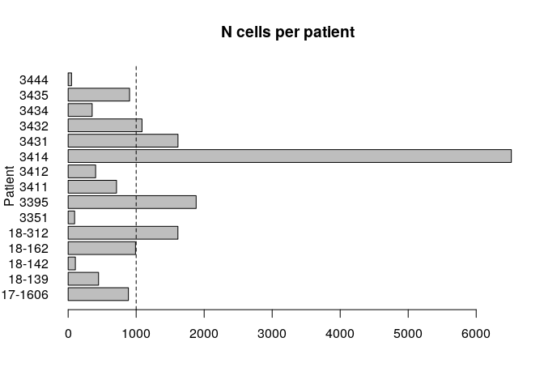
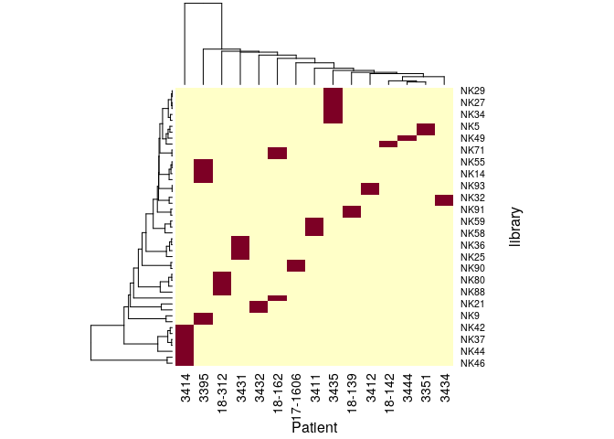
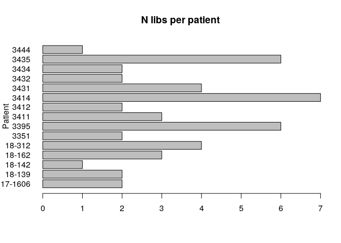
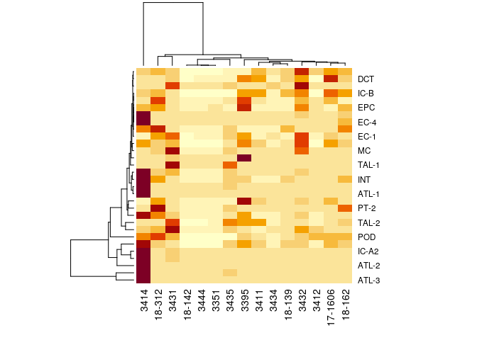

Create Seurat Object for Lake et al 2019 dataset
================
Javier Perales-Patón - <javier.perales@bioquant.uni-heidelberg.de> -
ORCID:0000-0003-0780-6683

Herein we will just create a Seurat Object with the cell metadata from
the original publication Lake et al 2019.

## Setting-up environment

The environment will be set with a random seed number for
reproducibility and an output folder for processed data and figures.

### set env

``` r
options(stringsAsFactors = FALSE)
# Seed number
set.seed(1234)
# Output directory
OUTDIR <- "./01_Seurat/"
if(!dir.exists(OUTDIR)) dir.create(OUTDIR);

# Figures
FIGDIR <- paste0(OUTDIR, "/figures/")
knitr::opts_chunk$set(fig.path=FIGDIR)
knitr::opts_chunk$set(dev=c('png','tiff'))
# Data
DATADIR <- paste0(OUTDIR, "/data/")
if(!dir.exists(DATADIR)) dir.create(DATADIR);
```

### Load libraries

Essential libraries for R analysis.

``` r
library("dplyr")
library("Seurat")
# library("ComplexHeatmap")
```

## Load data

Load the UMI count matrix

``` r
Lake.S <- CreateSeuratObject(counts = read.table("./data/GSE121862_UCSD-WU_Single_Nuclei_Cluster_Annotated_Raw_UMI_Matrix.tsv",
                                                 sep="\t", header=TRUE),
                             project = "Lake", min.cells = 5)
```

    ## Warning: Feature names cannot have underscores ('_'), replacing with dashes
    ## ('-')

``` r
snames_meta <- sapply(colnames(Lake.S), function(z) {
            strsplit(z, split="_")[[1]]
                 }, simplify=TRUE)
# This chunk is not needed since suppl. table below provides plenty of metadata for cells
# snames_meta <- t(snames_meta)
# colnames(snames_meta) <- c("batch","ID","barcode")

# Just to match with suppl.tab from metadata
snames <- sapply(colnames(Lake.S),function(z) {
             paste(strsplit(z,split="_")[[1]][-1],collapse="_")
                 })

barcode2cellID <- setNames(names(snames),snames)
```

Add metadata

``` r
# This is one suppl. table from Lake et al 2019
Lake.m <- read.table("./data/41467_2019_10861_MOESM6_ESM.tsv", 
             sep="\t", header=TRUE, stringsAsFactors=FALSE)
stopifnot(all(Lake.m$Single.Nucleus.Barcode %in% snames))
Lake.clid <- setNames(as.character(Lake.m$cluster_ID),Lake.m$Single.Nucleus.Barcode)[snames]

# Another suppl. table from GEO, we will append it
Lake.m2 <- read.table("./data/GSE121862_UCSD-WU_Single_Nuclei_Cluster_Annotations.csv",
             sep=",", header=TRUE, colClasses="character", 
             stringsAsFactors=FALSE)
colnames(Lake.m2)[1] <- "cluster_ID"
colnames(Lake.m2)[-1] <- paste0("cluster_", tolower(colnames(Lake.m2)[-1]))

# Merge both metadata
Lake.meta <- merge(x=Lake.m, y=Lake.m2, 
           by.x="cluster_ID", by.y="cluster_ID", 
           all.x=TRUE, all.y=FALSE)

# Sanity check
stopifnot(all(snames %in% Lake.meta$Single.Nucleus.Barcode))
rownames(Lake.meta) <- barcode2cellID[Lake.meta$Single.Nucleus.Barcode]
#Lake.meta <- Lake.meta[,which(colnames(Lake.meta)!="Single.Nucleus.Barcode")]

# Finally, we add the metadata
Lake.S <- Seurat::AddMetaData(object=Lake.S, 
                  metadata=Lake.meta[colnames(Lake.S),])
```

## Some statistics for the records

Dimension of Seurat Object (genes x cells). So, genes=26498 and
cells=17659.

``` r
dim(Lake.S)
```

    ## [1] 26498 17659

How many cells per cell type annotated:

``` r
sort(table(Lake.S$cluster_abbn),decreasing=TRUE)
```

    ## 
    ##   PT-1   PC-3  ATL-2  TAL-2   PT-2    POD     DL  IC-A1   PC-1  ATL-3    DCT 
    ##   3238   1970   1325   1217    920    859    844    772    663    623    568 
    ##  IC-A2  TAL-1  ATL-1    INT    CNT   EC-2   EC-1   EC-3   PT-5     MC   PC-2 
    ##    540    536    431    410    395    366    344    281    219    215    208 
    ## vSMC/P   PT-3    IMM   PT-4   IC-B    Unk    EPC   EC-4 
    ##    168    124     88     86     84     68     55     42

How many cells per patient? It looks really unbalanced

``` r
barplot(table(Lake.S$patient), horiz=TRUE,las=1, ylab="Patient",main="N cells per patient")
abline(v=1000, lty=2)
```

<!-- -->

Is this unbalance due to library preparation? It seems that one patient
sample has been sequenced several times, probably to increase cell deep.
In addition, these are totally independent : N:1 library \<–\> patient

``` r
libvpat_cnt <- table(Lake.S$library, Lake.S$patient)

# Landscape of lib preparation per patient
heatmap(libvpat_cnt, xlab = "Patient", ylab="library")
```

<!-- -->

``` r
# Check if libs are patient-independent
all(rowSums(libvpat_cnt!=0)==1)
```

    ## [1] TRUE

``` r
# How many libs per patient
barplot(colSums(libvpat_cnt!=0), horiz=TRUE, main="N libs per patient",las=1, ylab="Patient")
```

<!-- -->

How well represented is every cell type among the cohort? There are some
patients with no representation of certain cell types

``` r
patient_ctype <- table(Lake.S$cluster_abbn, Lake.S$patient)
heatmap(patient_ctype/colSums(patient_ctype)*100)
```

<!-- -->

``` r
# attributes(patient_ctype)$class <- "matrix"
# Heatmap(patient_ctype, col=c("grey","red"))
```

## Save data

``` r
saveRDS(Lake.S, paste0(DATADIR,"/S.rds"))
```
