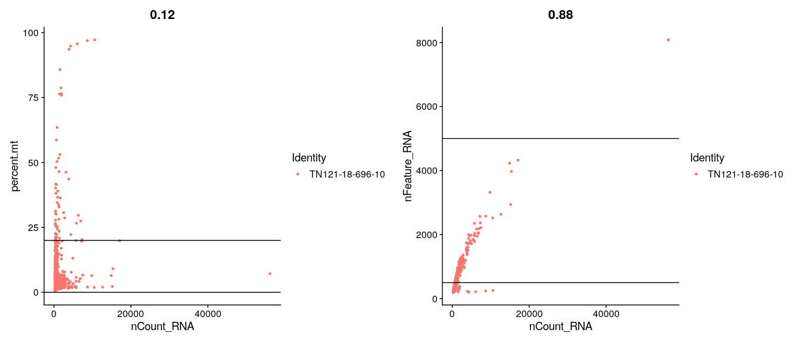

Create Seurat Object for Menon et al 2020 dataset
================
Javier Perales-Patón - <javier.perales@bioquant.uni-heidelberg.de> -
ORCID:0000-0003-0780-6683

## Setting-up environment

The environment will be set with a random seed number for
reproducibility and an output folder for processed data and figures.

### set env

``` r
options(stringsAsFactors = FALSE)
# Seed number
set.seed(1234)
# Output directory
OUTDIR <- "./01_Seurat/"
if(!dir.exists(OUTDIR)) dir.create(OUTDIR);

# Figures
FIGDIR <- paste0(OUTDIR, "/figures/")
knitr::opts_chunk$set(fig.path=FIGDIR)
knitr::opts_chunk$set(dev=c('png','tiff'))
# Data
DATADIR <- paste0(OUTDIR, "/data/")
if(!dir.exists(DATADIR)) dir.create(DATADIR);
```

### Load libraries

Essential libraries for R analysis.

``` r
library("dplyr")
```

    ## 
    ## Attaching package: 'dplyr'

    ## The following objects are masked from 'package:stats':
    ## 
    ##     filter, lag

    ## The following objects are masked from 'package:base':
    ## 
    ##     intersect, setdiff, setequal, union

``` r
library("Seurat")
library("ggplot2")
```

## Load data

Individual samples are stored in individual folders in the
`./raw/scRNAseq`.

We first load the metadata of all samples.

``` r
meta <- read.table("./data/scRNAseq_metadata.tsv", sep="\t", header=TRUE, stringsAsFactors=FALSE, quote = "")

# We create a dictionary of sampleID from raw to supplementary files
sID_dict <- setNames(meta$sampleID, meta$sampleID_suppl)
print(sID_dict)
```

    ##           17-1606-2-0           17-1606-2-1                18-139 
    ##         "17-1606-2-0"         "17-1606-2-1"              "18-139" 
    ##                18-162             18142-5-1             18142-5-2 
    ##              "18-162"           "18142-5-1"           "18142-5-2" 
    ##       2017-06-28-TN-1       2017-06-28-TN-2    Hkid-PH-2017-08-25 
    ##     "2017-06-28-TN-1"     "2017-06-28-TN-2"  "Hkid-PH-2017-08-25" 
    ##    Hkid-YY-2017-08-25                18-342        SamplePRE027.1 
    ##  "Hkid-YY-2017-08-25"    "KPMP_Pilot_18342"      "SamplePRE027-1" 
    ##        SamplePRE038.1   SampleTransPRE19025      TN109-18-242-Lib 
    ##      "SamplePRE038-1" "SampleTransPRE19025"    "TN109-18-242-Lib" 
    ##   TN116-17-116-Lib-4a   TN117-17-116-Lib-4b        TN120-18-696-4 
    ## "TN116-17-116-Lib-4a" "TN117-17-116-Lib-4b"      "TN120-18-696-4" 
    ##       TN121-18-696-10            Trans004-1            Trans005-1 
    ##     "TN121-18-696-10"        "Trans-SV-004"        "Trans-SV-005" 
    ##            Trans006-1            Trans007-2            Trans008-2 
    ##        "Trans-SV-006"        "Trans-SV-007"        "Trans-SV-008"

And the metadata for individual cells

``` r
meta2 <- read.table("data/PREMIERE_TIS_JUNE2019_CELLBARCODES_CLUSTER.txt", sep="\t", header=TRUE,
            stringsAsFactors = FALSE)
# We recover the original SampleID
for(sID_suppl in names(sID_dict)) {
    sID_actual <- sID_dict[sID_suppl]
    meta2$cell <- gsub(paste0("^",sID_suppl,"_"),
                paste0(sID_actual,"_"),
                meta2$cell)
}
cellOrigin <- sapply(meta2$cell, function(x) strsplit(x, split="_")[[1]][1])

# Fix one problematic sample ID
cellOrigin <- gsub("^KPMP", "KPMP_Pilot_18342", cellOrigin)

cellcluster_bySample <- split(setNames(meta2$cluster.name.abbreviation, meta2$cell),
                       cellOrigin)
```

``` r
dirs <- list.dirs("./raw/scRNAseq/")
# We remove the first element that is the folder itself
dirs <- dirs[-1]
# Each folder is an individual sample
names(dirs) <- basename(dirs)

SS <- setNames(vector("list", length=length(dirs)), names(dirs))
for(GSM in names(SS)) {
    cat(paste0("Processing ",GSM, "\n"), file=stdout())
    idx <- which(meta$geo_accession==GSM)
    sname <- meta[idx, "sampleID"]
    sname2 <- meta[idx, "sampleID_suppl"]
    biopsy <- meta[idx, "biopsy"]
    mtcutoff <- meta[idx, "processing.mtcutoff"]
    nFeature.min <- meta[idx, "processing.nFeature.min"]
    nFeature.max <- meta[idx, "processing.nFeature.max"]
    chemistry10X <- meta[idx, "chemistry10X"]

#   tag <- meta[idx, "tag"]


    fl <- dirs[GSM] 
    names(fl) <- sname

    dat <- Read10X(data.dir=fl)
    S <- CreateSeuratObject(counts = dat, project = sname, 
                min.cells=3, min.features=200)
    S[["percent.mt"]] <- PercentageFeatureSet(S, pattern = "^MT-")

    ## QC metrics
    # Visualize QC metrics as a violin plot
    VlnPlot(S, features = c("nFeature_RNA", "nCount_RNA", "percent.mt"), ncol = 3)

    # Feature scatter
    plot1 <- FeatureScatter(S, feature1 = "nCount_RNA", feature2 = "percent.mt") + 
        geom_hline(yintercept=c(0, mtcutoff))
    plot2 <- FeatureScatter(S, feature1 = "nCount_RNA", feature2 = "nFeature_RNA") +
        geom_hline(yintercept=c(nFeature.min, nFeature.max))
    print(plot1 + plot2)

    # Filter
    S <- subset(S, subset= nFeature_RNA > nFeature.min & nFeature_RNA < nFeature.max &
            percent.mt < mtcutoff)

    # run sctransform
#   Note that this single command replaces NormalizeData, ScaleData, and FindVariableFeatures.
#   Transformed data will be available in the SCT assay, which is set as the default after running sctransform
#   During normalization, we can also remove confounding sources of variation, for example, mitochondrial mapping percentage
    S <- SCTransform(S, vars.to.regress = "percent.mt", verbose = FALSE)

    # Add some metadata
    S$chemistry10X <- chemistry10X
    S$biopsy <- biopsy

    # Add cluster from original publication
    cidx <- gsub("-1$","",colnames(S))
    cl <- setNames(cellcluster_bySample[[sname]][cidx], 
               colnames(S))
    S$Abb <- cl
    # GEOACC
    S$GSMACC <- GSM

    # Save the data
    saveRDS(S, file=paste0(DATADIR,"/",GSM,".rds"))

}
```

    ## Processing GSM4191941

    ## Warning: Feature names cannot have underscores ('_'), replacing with dashes
    ## ('-')

    ## Warning in theta.ml(y = y, mu = fit$fitted): iteration limit reached
    
    ## Warning in theta.ml(y = y, mu = fit$fitted): iteration limit reached
    
    ## Warning in theta.ml(y = y, mu = fit$fitted): iteration limit reached
    
    ## Warning in theta.ml(y = y, mu = fit$fitted): iteration limit reached
    
    ## Warning in theta.ml(y = y, mu = fit$fitted): iteration limit reached
    
    ## Warning in theta.ml(y = y, mu = fit$fitted): iteration limit reached
    
    ## Warning in theta.ml(y = y, mu = fit$fitted): iteration limit reached
    
    ## Warning in theta.ml(y = y, mu = fit$fitted): iteration limit reached
    
    ## Warning in theta.ml(y = y, mu = fit$fitted): iteration limit reached
    
    ## Warning in theta.ml(y = y, mu = fit$fitted): iteration limit reached
    
    ## Warning in theta.ml(y = y, mu = fit$fitted): iteration limit reached

    ## Warning in sqrt(1/i): NaNs produced

    ## Warning in theta.ml(y = y, mu = fit$fitted): iteration limit reached
    
    ## Warning in theta.ml(y = y, mu = fit$fitted): iteration limit reached
    
    ## Warning in theta.ml(y = y, mu = fit$fitted): iteration limit reached
    
    ## Warning in theta.ml(y = y, mu = fit$fitted): iteration limit reached
    
    ## Warning in theta.ml(y = y, mu = fit$fitted): iteration limit reached
    
    ## Warning in theta.ml(y = y, mu = fit$fitted): iteration limit reached
    
    ## Warning in theta.ml(y = y, mu = fit$fitted): iteration limit reached
    
    ## Warning in theta.ml(y = y, mu = fit$fitted): iteration limit reached
    
    ## Warning in theta.ml(y = y, mu = fit$fitted): iteration limit reached
    
    ## Warning in theta.ml(y = y, mu = fit$fitted): iteration limit reached
    
    ## Warning in theta.ml(y = y, mu = fit$fitted): iteration limit reached
    
    ## Warning in theta.ml(y = y, mu = fit$fitted): iteration limit reached
    
    ## Warning in theta.ml(y = y, mu = fit$fitted): iteration limit reached
    
    ## Warning in theta.ml(y = y, mu = fit$fitted): iteration limit reached
    
    ## Warning in theta.ml(y = y, mu = fit$fitted): iteration limit reached
    
    ## Warning in theta.ml(y = y, mu = fit$fitted): iteration limit reached
    
    ## Warning in theta.ml(y = y, mu = fit$fitted): iteration limit reached
    
    ## Warning in theta.ml(y = y, mu = fit$fitted): iteration limit reached
    
    ## Warning in theta.ml(y = y, mu = fit$fitted): iteration limit reached
    
    ## Warning in theta.ml(y = y, mu = fit$fitted): iteration limit reached
    
    ## Warning in theta.ml(y = y, mu = fit$fitted): iteration limit reached
    
    ## Warning in theta.ml(y = y, mu = fit$fitted): iteration limit reached
    
    ## Warning in theta.ml(y = y, mu = fit$fitted): iteration limit reached
    
    ## Warning in theta.ml(y = y, mu = fit$fitted): iteration limit reached
    
    ## Warning in theta.ml(y = y, mu = fit$fitted): iteration limit reached
    
    ## Warning in theta.ml(y = y, mu = fit$fitted): iteration limit reached
    
    ## Warning in theta.ml(y = y, mu = fit$fitted): iteration limit reached
    
    ## Warning in theta.ml(y = y, mu = fit$fitted): iteration limit reached
    
    ## Warning in theta.ml(y = y, mu = fit$fitted): iteration limit reached
    
    ## Warning in theta.ml(y = y, mu = fit$fitted): iteration limit reached
    
    ## Warning in theta.ml(y = y, mu = fit$fitted): iteration limit reached
    
    ## Warning in theta.ml(y = y, mu = fit$fitted): iteration limit reached
    
    ## Warning in theta.ml(y = y, mu = fit$fitted): iteration limit reached
    
    ## Warning in theta.ml(y = y, mu = fit$fitted): iteration limit reached
    
    ## Warning in theta.ml(y = y, mu = fit$fitted): iteration limit reached
    
    ## Warning in theta.ml(y = y, mu = fit$fitted): iteration limit reached
    
    ## Warning in theta.ml(y = y, mu = fit$fitted): iteration limit reached
    
    ## Warning in theta.ml(y = y, mu = fit$fitted): iteration limit reached
    
    ## Warning in theta.ml(y = y, mu = fit$fitted): iteration limit reached
    
    ## Warning in theta.ml(y = y, mu = fit$fitted): iteration limit reached
    
    ## Warning in theta.ml(y = y, mu = fit$fitted): iteration limit reached
    
    ## Warning in theta.ml(y = y, mu = fit$fitted): iteration limit reached
    
    ## Warning in theta.ml(y = y, mu = fit$fitted): iteration limit reached
    
    ## Warning in theta.ml(y = y, mu = fit$fitted): iteration limit reached
    
    ## Warning in theta.ml(y = y, mu = fit$fitted): iteration limit reached
    
    ## Warning in theta.ml(y = y, mu = fit$fitted): iteration limit reached
    
    ## Warning in theta.ml(y = y, mu = fit$fitted): iteration limit reached
    
    ## Warning in theta.ml(y = y, mu = fit$fitted): iteration limit reached
    
    ## Warning in theta.ml(y = y, mu = fit$fitted): iteration limit reached
    
    ## Warning in theta.ml(y = y, mu = fit$fitted): iteration limit reached
    
    ## Warning in theta.ml(y = y, mu = fit$fitted): iteration limit reached
    
    ## Warning in theta.ml(y = y, mu = fit$fitted): iteration limit reached
    
    ## Warning in theta.ml(y = y, mu = fit$fitted): iteration limit reached
    
    ## Warning in theta.ml(y = y, mu = fit$fitted): iteration limit reached
    
    ## Warning in theta.ml(y = y, mu = fit$fitted): iteration limit reached
    
    ## Warning in theta.ml(y = y, mu = fit$fitted): iteration limit reached
    
    ## Warning in theta.ml(y = y, mu = fit$fitted): iteration limit reached
    
    ## Warning in theta.ml(y = y, mu = fit$fitted): iteration limit reached
    
    ## Warning in theta.ml(y = y, mu = fit$fitted): iteration limit reached
    
    ## Warning in theta.ml(y = y, mu = fit$fitted): iteration limit reached
    
    ## Warning in theta.ml(y = y, mu = fit$fitted): iteration limit reached
    
    ## Warning in theta.ml(y = y, mu = fit$fitted): iteration limit reached
    
    ## Warning in theta.ml(y = y, mu = fit$fitted): iteration limit reached
    
    ## Warning in theta.ml(y = y, mu = fit$fitted): iteration limit reached
    
    ## Warning in theta.ml(y = y, mu = fit$fitted): iteration limit reached
    
    ## Warning in theta.ml(y = y, mu = fit$fitted): iteration limit reached
    
    ## Warning in theta.ml(y = y, mu = fit$fitted): iteration limit reached
    
    ## Warning in theta.ml(y = y, mu = fit$fitted): iteration limit reached
    
    ## Warning in theta.ml(y = y, mu = fit$fitted): iteration limit reached
    
    ## Warning in theta.ml(y = y, mu = fit$fitted): iteration limit reached
    
    ## Warning in theta.ml(y = y, mu = fit$fitted): iteration limit reached
    
    ## Warning in theta.ml(y = y, mu = fit$fitted): iteration limit reached
    
    ## Warning in theta.ml(y = y, mu = fit$fitted): iteration limit reached
    
    ## Warning in theta.ml(y = y, mu = fit$fitted): iteration limit reached
    
    ## Warning in theta.ml(y = y, mu = fit$fitted): iteration limit reached
    
    ## Warning in theta.ml(y = y, mu = fit$fitted): iteration limit reached
    
    ## Warning in theta.ml(y = y, mu = fit$fitted): iteration limit reached
    
    ## Warning in theta.ml(y = y, mu = fit$fitted): iteration limit reached
    
    ## Warning in theta.ml(y = y, mu = fit$fitted): iteration limit reached
    
    ## Warning in theta.ml(y = y, mu = fit$fitted): iteration limit reached
    
    ## Warning in theta.ml(y = y, mu = fit$fitted): iteration limit reached
    
    ## Warning in theta.ml(y = y, mu = fit$fitted): iteration limit reached
    
    ## Warning in theta.ml(y = y, mu = fit$fitted): iteration limit reached
    
    ## Warning in theta.ml(y = y, mu = fit$fitted): iteration limit reached
    
    ## Warning in theta.ml(y = y, mu = fit$fitted): iteration limit reached
    
    ## Warning in theta.ml(y = y, mu = fit$fitted): iteration limit reached
    
    ## Warning in theta.ml(y = y, mu = fit$fitted): iteration limit reached
    
    ## Warning in theta.ml(y = y, mu = fit$fitted): iteration limit reached
    
    ## Warning in theta.ml(y = y, mu = fit$fitted): iteration limit reached
    
    ## Warning in theta.ml(y = y, mu = fit$fitted): iteration limit reached
    
    ## Warning in theta.ml(y = y, mu = fit$fitted): iteration limit reached
    
    ## Warning in theta.ml(y = y, mu = fit$fitted): iteration limit reached
    
    ## Warning in theta.ml(y = y, mu = fit$fitted): iteration limit reached
    
    ## Warning in theta.ml(y = y, mu = fit$fitted): iteration limit reached
    
    ## Warning in theta.ml(y = y, mu = fit$fitted): iteration limit reached
    
    ## Warning in theta.ml(y = y, mu = fit$fitted): iteration limit reached
    
    ## Warning in theta.ml(y = y, mu = fit$fitted): iteration limit reached
    
    ## Warning in theta.ml(y = y, mu = fit$fitted): iteration limit reached
    
    ## Warning in theta.ml(y = y, mu = fit$fitted): iteration limit reached
    
    ## Warning in theta.ml(y = y, mu = fit$fitted): iteration limit reached
    
    ## Warning in theta.ml(y = y, mu = fit$fitted): iteration limit reached
    
    ## Warning in theta.ml(y = y, mu = fit$fitted): iteration limit reached
    
    ## Warning in theta.ml(y = y, mu = fit$fitted): iteration limit reached
    
    ## Warning in theta.ml(y = y, mu = fit$fitted): iteration limit reached
    
    ## Warning in theta.ml(y = y, mu = fit$fitted): iteration limit reached
    
    ## Warning in theta.ml(y = y, mu = fit$fitted): iteration limit reached
    
    ## Warning in theta.ml(y = y, mu = fit$fitted): iteration limit reached
    
    ## Warning in theta.ml(y = y, mu = fit$fitted): iteration limit reached
    
    ## Warning in theta.ml(y = y, mu = fit$fitted): iteration limit reached
    
    ## Warning in theta.ml(y = y, mu = fit$fitted): iteration limit reached
    
    ## Warning in theta.ml(y = y, mu = fit$fitted): iteration limit reached
    
    ## Warning in theta.ml(y = y, mu = fit$fitted): iteration limit reached
    
    ## Warning in theta.ml(y = y, mu = fit$fitted): iteration limit reached
    
    ## Warning in theta.ml(y = y, mu = fit$fitted): iteration limit reached
    
    ## Warning in theta.ml(y = y, mu = fit$fitted): iteration limit reached
    
    ## Warning in theta.ml(y = y, mu = fit$fitted): iteration limit reached
    
    ## Warning in theta.ml(y = y, mu = fit$fitted): iteration limit reached
    
    ## Warning in theta.ml(y = y, mu = fit$fitted): iteration limit reached
    
    ## Warning in theta.ml(y = y, mu = fit$fitted): iteration limit reached
    
    ## Warning in theta.ml(y = y, mu = fit$fitted): iteration limit reached
    
    ## Warning in theta.ml(y = y, mu = fit$fitted): iteration limit reached
    
    ## Warning in theta.ml(y = y, mu = fit$fitted): iteration limit reached
    
    ## Warning in theta.ml(y = y, mu = fit$fitted): iteration limit reached
    
    ## Warning in theta.ml(y = y, mu = fit$fitted): iteration limit reached
    
    ## Warning in theta.ml(y = y, mu = fit$fitted): iteration limit reached
    
    ## Warning in theta.ml(y = y, mu = fit$fitted): iteration limit reached
    
    ## Warning in theta.ml(y = y, mu = fit$fitted): iteration limit reached
    
    ## Warning in theta.ml(y = y, mu = fit$fitted): iteration limit reached
    
    ## Warning in theta.ml(y = y, mu = fit$fitted): iteration limit reached
    
    ## Warning in theta.ml(y = y, mu = fit$fitted): iteration limit reached
    
    ## Warning in theta.ml(y = y, mu = fit$fitted): iteration limit reached
    
    ## Warning in theta.ml(y = y, mu = fit$fitted): iteration limit reached
    
    ## Warning in theta.ml(y = y, mu = fit$fitted): iteration limit reached
    
    ## Warning in theta.ml(y = y, mu = fit$fitted): iteration limit reached
    
    ## Warning in theta.ml(y = y, mu = fit$fitted): iteration limit reached
    
    ## Warning in theta.ml(y = y, mu = fit$fitted): iteration limit reached
    
    ## Warning in theta.ml(y = y, mu = fit$fitted): iteration limit reached
    
    ## Warning in theta.ml(y = y, mu = fit$fitted): iteration limit reached
    
    ## Warning in theta.ml(y = y, mu = fit$fitted): iteration limit reached
    
    ## Warning in theta.ml(y = y, mu = fit$fitted): iteration limit reached
    
    ## Warning in theta.ml(y = y, mu = fit$fitted): iteration limit reached
    
    ## Warning in theta.ml(y = y, mu = fit$fitted): iteration limit reached
    
    ## Warning in theta.ml(y = y, mu = fit$fitted): iteration limit reached
    
    ## Warning in theta.ml(y = y, mu = fit$fitted): iteration limit reached
    
    ## Warning in theta.ml(y = y, mu = fit$fitted): iteration limit reached
    
    ## Warning in theta.ml(y = y, mu = fit$fitted): iteration limit reached
    
    ## Warning in theta.ml(y = y, mu = fit$fitted): iteration limit reached
    
    ## Warning in theta.ml(y = y, mu = fit$fitted): iteration limit reached
    
    ## Warning in theta.ml(y = y, mu = fit$fitted): iteration limit reached
    
    ## Warning in theta.ml(y = y, mu = fit$fitted): iteration limit reached
    
    ## Warning in theta.ml(y = y, mu = fit$fitted): iteration limit reached
    
    ## Warning in theta.ml(y = y, mu = fit$fitted): iteration limit reached
    
    ## Warning in theta.ml(y = y, mu = fit$fitted): iteration limit reached
    
    ## Warning in theta.ml(y = y, mu = fit$fitted): iteration limit reached
    
    ## Warning in theta.ml(y = y, mu = fit$fitted): iteration limit reached
    
    ## Warning in theta.ml(y = y, mu = fit$fitted): iteration limit reached
    
    ## Warning in theta.ml(y = y, mu = fit$fitted): iteration limit reached
    
    ## Warning in theta.ml(y = y, mu = fit$fitted): iteration limit reached
    
    ## Warning in theta.ml(y = y, mu = fit$fitted): iteration limit reached
    
    ## Warning in theta.ml(y = y, mu = fit$fitted): iteration limit reached
    
    ## Warning in theta.ml(y = y, mu = fit$fitted): iteration limit reached
    
    ## Warning in theta.ml(y = y, mu = fit$fitted): iteration limit reached
    
    ## Warning in theta.ml(y = y, mu = fit$fitted): iteration limit reached
    
    ## Warning in theta.ml(y = y, mu = fit$fitted): iteration limit reached
    
    ## Warning in theta.ml(y = y, mu = fit$fitted): iteration limit reached
    
    ## Warning in theta.ml(y = y, mu = fit$fitted): iteration limit reached
    
    ## Warning in theta.ml(y = y, mu = fit$fitted): iteration limit reached
    
    ## Warning in theta.ml(y = y, mu = fit$fitted): iteration limit reached
    
    ## Warning in theta.ml(y = y, mu = fit$fitted): iteration limit reached
    
    ## Warning in theta.ml(y = y, mu = fit$fitted): iteration limit reached
    
    ## Warning in theta.ml(y = y, mu = fit$fitted): iteration limit reached
    
    ## Warning in theta.ml(y = y, mu = fit$fitted): iteration limit reached
    
    ## Warning in theta.ml(y = y, mu = fit$fitted): iteration limit reached
    
    ## Warning in theta.ml(y = y, mu = fit$fitted): iteration limit reached
    
    ## Warning in theta.ml(y = y, mu = fit$fitted): iteration limit reached
    
    ## Warning in theta.ml(y = y, mu = fit$fitted): iteration limit reached
    
    ## Warning in theta.ml(y = y, mu = fit$fitted): iteration limit reached
    
    ## Warning in theta.ml(y = y, mu = fit$fitted): iteration limit reached
    
    ## Warning in theta.ml(y = y, mu = fit$fitted): iteration limit reached
    
    ## Warning in theta.ml(y = y, mu = fit$fitted): iteration limit reached
    
    ## Warning in theta.ml(y = y, mu = fit$fitted): iteration limit reached
    
    ## Warning in theta.ml(y = y, mu = fit$fitted): iteration limit reached
    
    ## Warning in theta.ml(y = y, mu = fit$fitted): iteration limit reached
    
    ## Warning in theta.ml(y = y, mu = fit$fitted): iteration limit reached
    
    ## Warning in theta.ml(y = y, mu = fit$fitted): iteration limit reached
    
    ## Warning in theta.ml(y = y, mu = fit$fitted): iteration limit reached
    
    ## Warning in theta.ml(y = y, mu = fit$fitted): iteration limit reached
    
    ## Warning in theta.ml(y = y, mu = fit$fitted): iteration limit reached
    
    ## Warning in theta.ml(y = y, mu = fit$fitted): iteration limit reached
    
    ## Warning in theta.ml(y = y, mu = fit$fitted): iteration limit reached
    
    ## Warning in theta.ml(y = y, mu = fit$fitted): iteration limit reached
    
    ## Warning in theta.ml(y = y, mu = fit$fitted): iteration limit reached
    
    ## Warning in theta.ml(y = y, mu = fit$fitted): iteration limit reached
    
    ## Warning in theta.ml(y = y, mu = fit$fitted): iteration limit reached
    
    ## Warning in theta.ml(y = y, mu = fit$fitted): iteration limit reached
    
    ## Warning in theta.ml(y = y, mu = fit$fitted): iteration limit reached
    
    ## Warning in theta.ml(y = y, mu = fit$fitted): iteration limit reached
    
    ## Warning in theta.ml(y = y, mu = fit$fitted): iteration limit reached
    
    ## Warning in theta.ml(y = y, mu = fit$fitted): iteration limit reached
    
    ## Warning in theta.ml(y = y, mu = fit$fitted): iteration limit reached
    
    ## Warning in theta.ml(y = y, mu = fit$fitted): iteration limit reached
    
    ## Warning in theta.ml(y = y, mu = fit$fitted): iteration limit reached
    
    ## Warning in theta.ml(y = y, mu = fit$fitted): iteration limit reached
    
    ## Warning in theta.ml(y = y, mu = fit$fitted): iteration limit reached
    
    ## Warning in theta.ml(y = y, mu = fit$fitted): iteration limit reached
    
    ## Warning in theta.ml(y = y, mu = fit$fitted): iteration limit reached
    
    ## Warning in theta.ml(y = y, mu = fit$fitted): iteration limit reached
    
    ## Warning in theta.ml(y = y, mu = fit$fitted): iteration limit reached
    
    ## Warning in theta.ml(y = y, mu = fit$fitted): iteration limit reached
    
    ## Warning in theta.ml(y = y, mu = fit$fitted): iteration limit reached
    
    ## Warning in theta.ml(y = y, mu = fit$fitted): iteration limit reached
    
    ## Warning in theta.ml(y = y, mu = fit$fitted): iteration limit reached
    
    ## Warning in theta.ml(y = y, mu = fit$fitted): iteration limit reached
    
    ## Warning in theta.ml(y = y, mu = fit$fitted): iteration limit reached
    
    ## Warning in theta.ml(y = y, mu = fit$fitted): iteration limit reached
    
    ## Warning in theta.ml(y = y, mu = fit$fitted): iteration limit reached
    
    ## Warning in theta.ml(y = y, mu = fit$fitted): iteration limit reached
    
    ## Warning in theta.ml(y = y, mu = fit$fitted): iteration limit reached
    
    ## Warning in theta.ml(y = y, mu = fit$fitted): iteration limit reached
    
    ## Warning in theta.ml(y = y, mu = fit$fitted): iteration limit reached
    
    ## Warning in theta.ml(y = y, mu = fit$fitted): iteration limit reached
    
    ## Warning in theta.ml(y = y, mu = fit$fitted): iteration limit reached
    
    ## Warning in theta.ml(y = y, mu = fit$fitted): iteration limit reached
    
    ## Warning in theta.ml(y = y, mu = fit$fitted): iteration limit reached
    
    ## Warning in theta.ml(y = y, mu = fit$fitted): iteration limit reached
    
    ## Warning in theta.ml(y = y, mu = fit$fitted): iteration limit reached
    
    ## Warning in theta.ml(y = y, mu = fit$fitted): iteration limit reached
    
    ## Warning in theta.ml(y = y, mu = fit$fitted): iteration limit reached
    
    ## Warning in theta.ml(y = y, mu = fit$fitted): iteration limit reached
    
    ## Warning in theta.ml(y = y, mu = fit$fitted): iteration limit reached
    
    ## Warning in theta.ml(y = y, mu = fit$fitted): iteration limit reached
    
    ## Warning in theta.ml(y = y, mu = fit$fitted): iteration limit reached
    
    ## Warning in theta.ml(y = y, mu = fit$fitted): iteration limit reached
    
    ## Warning in theta.ml(y = y, mu = fit$fitted): iteration limit reached
    
    ## Warning in theta.ml(y = y, mu = fit$fitted): iteration limit reached
    
    ## Warning in theta.ml(y = y, mu = fit$fitted): iteration limit reached
    
    ## Warning in theta.ml(y = y, mu = fit$fitted): iteration limit reached
    
    ## Warning in theta.ml(y = y, mu = fit$fitted): iteration limit reached
    
    ## Warning in theta.ml(y = y, mu = fit$fitted): iteration limit reached

    ## Warning in sqrt(1/i): NaNs produced

    ## Warning in theta.ml(y = y, mu = fit$fitted): iteration limit reached
    
    ## Warning in theta.ml(y = y, mu = fit$fitted): iteration limit reached
    
    ## Warning in theta.ml(y = y, mu = fit$fitted): iteration limit reached
    
    ## Warning in theta.ml(y = y, mu = fit$fitted): iteration limit reached
    
    ## Warning in theta.ml(y = y, mu = fit$fitted): iteration limit reached
    
    ## Warning in theta.ml(y = y, mu = fit$fitted): iteration limit reached
    
    ## Warning in theta.ml(y = y, mu = fit$fitted): iteration limit reached
    
    ## Warning in theta.ml(y = y, mu = fit$fitted): iteration limit reached
    
    ## Warning in theta.ml(y = y, mu = fit$fitted): iteration limit reached
    
    ## Warning in theta.ml(y = y, mu = fit$fitted): iteration limit reached
    
    ## Warning in theta.ml(y = y, mu = fit$fitted): iteration limit reached
    
    ## Warning in theta.ml(y = y, mu = fit$fitted): iteration limit reached
    
    ## Warning in theta.ml(y = y, mu = fit$fitted): iteration limit reached
    
    ## Warning in theta.ml(y = y, mu = fit$fitted): iteration limit reached
    
    ## Warning in theta.ml(y = y, mu = fit$fitted): iteration limit reached
    
    ## Warning in theta.ml(y = y, mu = fit$fitted): iteration limit reached
    
    ## Warning in theta.ml(y = y, mu = fit$fitted): iteration limit reached
    
    ## Warning in theta.ml(y = y, mu = fit$fitted): iteration limit reached
    
    ## Warning in theta.ml(y = y, mu = fit$fitted): iteration limit reached
    
    ## Warning in theta.ml(y = y, mu = fit$fitted): iteration limit reached
    
    ## Warning in theta.ml(y = y, mu = fit$fitted): iteration limit reached
    
    ## Warning in theta.ml(y = y, mu = fit$fitted): iteration limit reached
    
    ## Warning in theta.ml(y = y, mu = fit$fitted): iteration limit reached
    
    ## Warning in theta.ml(y = y, mu = fit$fitted): iteration limit reached
    
    ## Warning in theta.ml(y = y, mu = fit$fitted): iteration limit reached
    
    ## Warning in theta.ml(y = y, mu = fit$fitted): iteration limit reached
    
    ## Warning in theta.ml(y = y, mu = fit$fitted): iteration limit reached
    
    ## Warning in theta.ml(y = y, mu = fit$fitted): iteration limit reached
    
    ## Warning in theta.ml(y = y, mu = fit$fitted): iteration limit reached
    
    ## Warning in theta.ml(y = y, mu = fit$fitted): iteration limit reached
    
    ## Warning in theta.ml(y = y, mu = fit$fitted): iteration limit reached
    
    ## Warning in theta.ml(y = y, mu = fit$fitted): iteration limit reached
    
    ## Warning in theta.ml(y = y, mu = fit$fitted): iteration limit reached
    
    ## Warning in theta.ml(y = y, mu = fit$fitted): iteration limit reached
    
    ## Warning in theta.ml(y = y, mu = fit$fitted): iteration limit reached
    
    ## Warning in theta.ml(y = y, mu = fit$fitted): iteration limit reached
    
    ## Warning in theta.ml(y = y, mu = fit$fitted): iteration limit reached
    
    ## Warning in theta.ml(y = y, mu = fit$fitted): iteration limit reached
    
    ## Warning in theta.ml(y = y, mu = fit$fitted): iteration limit reached
    
    ## Warning in theta.ml(y = y, mu = fit$fitted): iteration limit reached
    
    ## Warning in theta.ml(y = y, mu = fit$fitted): iteration limit reached
    
    ## Warning in theta.ml(y = y, mu = fit$fitted): iteration limit reached
    
    ## Warning in theta.ml(y = y, mu = fit$fitted): iteration limit reached
    
    ## Warning in theta.ml(y = y, mu = fit$fitted): iteration limit reached
    
    ## Warning in theta.ml(y = y, mu = fit$fitted): iteration limit reached
    
    ## Warning in theta.ml(y = y, mu = fit$fitted): iteration limit reached
    
    ## Warning in theta.ml(y = y, mu = fit$fitted): iteration limit reached
    
    ## Warning in theta.ml(y = y, mu = fit$fitted): iteration limit reached
    
    ## Warning in theta.ml(y = y, mu = fit$fitted): iteration limit reached
    
    ## Warning in theta.ml(y = y, mu = fit$fitted): iteration limit reached
    
    ## Warning in theta.ml(y = y, mu = fit$fitted): iteration limit reached
    
    ## Warning in theta.ml(y = y, mu = fit$fitted): iteration limit reached
    
    ## Warning in theta.ml(y = y, mu = fit$fitted): iteration limit reached
    
    ## Warning in theta.ml(y = y, mu = fit$fitted): iteration limit reached
    
    ## Warning in theta.ml(y = y, mu = fit$fitted): iteration limit reached
    
    ## Warning in theta.ml(y = y, mu = fit$fitted): iteration limit reached
    
    ## Warning in theta.ml(y = y, mu = fit$fitted): iteration limit reached
    
    ## Warning in theta.ml(y = y, mu = fit$fitted): iteration limit reached
    
    ## Warning in theta.ml(y = y, mu = fit$fitted): iteration limit reached
    
    ## Warning in theta.ml(y = y, mu = fit$fitted): iteration limit reached
    
    ## Warning in theta.ml(y = y, mu = fit$fitted): iteration limit reached
    
    ## Warning in theta.ml(y = y, mu = fit$fitted): iteration limit reached
    
    ## Warning in theta.ml(y = y, mu = fit$fitted): iteration limit reached
    
    ## Warning in theta.ml(y = y, mu = fit$fitted): iteration limit reached
    
    ## Warning in theta.ml(y = y, mu = fit$fitted): iteration limit reached
    
    ## Warning in theta.ml(y = y, mu = fit$fitted): iteration limit reached
    
    ## Warning in theta.ml(y = y, mu = fit$fitted): iteration limit reached
    
    ## Warning in theta.ml(y = y, mu = fit$fitted): iteration limit reached
    
    ## Warning in theta.ml(y = y, mu = fit$fitted): iteration limit reached
    
    ## Warning in theta.ml(y = y, mu = fit$fitted): iteration limit reached
    
    ## Warning in theta.ml(y = y, mu = fit$fitted): iteration limit reached
    
    ## Warning in theta.ml(y = y, mu = fit$fitted): iteration limit reached
    
    ## Warning in theta.ml(y = y, mu = fit$fitted): iteration limit reached
    
    ## Warning in theta.ml(y = y, mu = fit$fitted): iteration limit reached
    
    ## Warning in theta.ml(y = y, mu = fit$fitted): iteration limit reached
    
    ## Warning in theta.ml(y = y, mu = fit$fitted): iteration limit reached
    
    ## Warning in theta.ml(y = y, mu = fit$fitted): iteration limit reached
    
    ## Warning in theta.ml(y = y, mu = fit$fitted): iteration limit reached
    
    ## Warning in theta.ml(y = y, mu = fit$fitted): iteration limit reached
    
    ## Warning in theta.ml(y = y, mu = fit$fitted): iteration limit reached
    
    ## Warning in theta.ml(y = y, mu = fit$fitted): iteration limit reached
    
    ## Warning in theta.ml(y = y, mu = fit$fitted): iteration limit reached
    
    ## Warning in theta.ml(y = y, mu = fit$fitted): iteration limit reached
    
    ## Warning in theta.ml(y = y, mu = fit$fitted): iteration limit reached
    
    ## Warning in theta.ml(y = y, mu = fit$fitted): iteration limit reached
    
    ## Warning in theta.ml(y = y, mu = fit$fitted): iteration limit reached
    
    ## Warning in theta.ml(y = y, mu = fit$fitted): iteration limit reached
    
    ## Warning in theta.ml(y = y, mu = fit$fitted): iteration limit reached
    
    ## Warning in theta.ml(y = y, mu = fit$fitted): iteration limit reached
    
    ## Warning in theta.ml(y = y, mu = fit$fitted): iteration limit reached
    
    ## Warning in theta.ml(y = y, mu = fit$fitted): iteration limit reached
    
    ## Warning in theta.ml(y = y, mu = fit$fitted): iteration limit reached
    
    ## Warning in theta.ml(y = y, mu = fit$fitted): iteration limit reached
    
    ## Warning in theta.ml(y = y, mu = fit$fitted): iteration limit reached
    
    ## Warning in theta.ml(y = y, mu = fit$fitted): iteration limit reached
    
    ## Warning in theta.ml(y = y, mu = fit$fitted): iteration limit reached
    
    ## Warning in theta.ml(y = y, mu = fit$fitted): iteration limit reached
    
    ## Warning in theta.ml(y = y, mu = fit$fitted): iteration limit reached
    
    ## Warning in theta.ml(y = y, mu = fit$fitted): iteration limit reached
    
    ## Warning in theta.ml(y = y, mu = fit$fitted): iteration limit reached
    
    ## Warning in theta.ml(y = y, mu = fit$fitted): iteration limit reached
    
    ## Warning in theta.ml(y = y, mu = fit$fitted): iteration limit reached
    
    ## Warning in theta.ml(y = y, mu = fit$fitted): iteration limit reached
    
    ## Warning in theta.ml(y = y, mu = fit$fitted): iteration limit reached
    
    ## Warning in theta.ml(y = y, mu = fit$fitted): iteration limit reached
    
    ## Warning in theta.ml(y = y, mu = fit$fitted): iteration limit reached
    
    ## Warning in theta.ml(y = y, mu = fit$fitted): iteration limit reached
    
    ## Warning in theta.ml(y = y, mu = fit$fitted): iteration limit reached
    
    ## Warning in theta.ml(y = y, mu = fit$fitted): iteration limit reached
    
    ## Warning in theta.ml(y = y, mu = fit$fitted): iteration limit reached
    
    ## Warning in theta.ml(y = y, mu = fit$fitted): iteration limit reached
    
    ## Warning in theta.ml(y = y, mu = fit$fitted): iteration limit reached
    
    ## Warning in theta.ml(y = y, mu = fit$fitted): iteration limit reached
    
    ## Warning in theta.ml(y = y, mu = fit$fitted): iteration limit reached
    
    ## Warning in theta.ml(y = y, mu = fit$fitted): iteration limit reached
    
    ## Warning in theta.ml(y = y, mu = fit$fitted): iteration limit reached
    
    ## Warning in theta.ml(y = y, mu = fit$fitted): iteration limit reached
    
    ## Warning in theta.ml(y = y, mu = fit$fitted): iteration limit reached
    
    ## Warning in theta.ml(y = y, mu = fit$fitted): iteration limit reached
    
    ## Warning in theta.ml(y = y, mu = fit$fitted): iteration limit reached
    
    ## Warning in theta.ml(y = y, mu = fit$fitted): iteration limit reached
    
    ## Warning in theta.ml(y = y, mu = fit$fitted): iteration limit reached
    
    ## Warning in theta.ml(y = y, mu = fit$fitted): iteration limit reached
    
    ## Warning in theta.ml(y = y, mu = fit$fitted): iteration limit reached
    
    ## Warning in theta.ml(y = y, mu = fit$fitted): iteration limit reached
    
    ## Warning in theta.ml(y = y, mu = fit$fitted): iteration limit reached
    
    ## Warning in theta.ml(y = y, mu = fit$fitted): iteration limit reached
    
    ## Warning in theta.ml(y = y, mu = fit$fitted): iteration limit reached
    
    ## Warning in theta.ml(y = y, mu = fit$fitted): iteration limit reached
    
    ## Warning in theta.ml(y = y, mu = fit$fitted): iteration limit reached
    
    ## Warning in theta.ml(y = y, mu = fit$fitted): iteration limit reached
    
    ## Warning in theta.ml(y = y, mu = fit$fitted): iteration limit reached
    
    ## Warning in theta.ml(y = y, mu = fit$fitted): iteration limit reached
    
    ## Warning in theta.ml(y = y, mu = fit$fitted): iteration limit reached
    
    ## Warning in theta.ml(y = y, mu = fit$fitted): iteration limit reached
    
    ## Warning in theta.ml(y = y, mu = fit$fitted): iteration limit reached
    
    ## Warning in theta.ml(y = y, mu = fit$fitted): iteration limit reached
    
    ## Warning in theta.ml(y = y, mu = fit$fitted): iteration limit reached
    
    ## Warning in theta.ml(y = y, mu = fit$fitted): iteration limit reached
    
    ## Warning in theta.ml(y = y, mu = fit$fitted): iteration limit reached
    
    ## Warning in theta.ml(y = y, mu = fit$fitted): iteration limit reached
    
    ## Warning in theta.ml(y = y, mu = fit$fitted): iteration limit reached
    
    ## Warning in theta.ml(y = y, mu = fit$fitted): iteration limit reached
    
    ## Warning in theta.ml(y = y, mu = fit$fitted): iteration limit reached
    
    ## Warning in theta.ml(y = y, mu = fit$fitted): iteration limit reached
    
    ## Warning in theta.ml(y = y, mu = fit$fitted): iteration limit reached
    
    ## Warning in theta.ml(y = y, mu = fit$fitted): iteration limit reached
    
    ## Warning in theta.ml(y = y, mu = fit$fitted): iteration limit reached
    
    ## Warning in theta.ml(y = y, mu = fit$fitted): iteration limit reached
    
    ## Warning in theta.ml(y = y, mu = fit$fitted): iteration limit reached
    
    ## Warning in theta.ml(y = y, mu = fit$fitted): iteration limit reached
    
    ## Warning in theta.ml(y = y, mu = fit$fitted): iteration limit reached
    
    ## Warning in theta.ml(y = y, mu = fit$fitted): iteration limit reached
    
    ## Warning in theta.ml(y = y, mu = fit$fitted): iteration limit reached
    
    ## Warning in theta.ml(y = y, mu = fit$fitted): iteration limit reached
    
    ## Warning in theta.ml(y = y, mu = fit$fitted): iteration limit reached
    
    ## Warning in theta.ml(y = y, mu = fit$fitted): iteration limit reached
    
    ## Warning in theta.ml(y = y, mu = fit$fitted): iteration limit reached
    
    ## Warning in theta.ml(y = y, mu = fit$fitted): iteration limit reached
    
    ## Warning in theta.ml(y = y, mu = fit$fitted): iteration limit reached
    
    ## Warning in theta.ml(y = y, mu = fit$fitted): iteration limit reached
    
    ## Warning in theta.ml(y = y, mu = fit$fitted): iteration limit reached
    
    ## Warning in theta.ml(y = y, mu = fit$fitted): iteration limit reached
    
    ## Warning in theta.ml(y = y, mu = fit$fitted): iteration limit reached
    
    ## Warning in theta.ml(y = y, mu = fit$fitted): iteration limit reached
    
    ## Warning in theta.ml(y = y, mu = fit$fitted): iteration limit reached
    
    ## Warning in theta.ml(y = y, mu = fit$fitted): iteration limit reached
    
    ## Warning in theta.ml(y = y, mu = fit$fitted): iteration limit reached
    
    ## Warning in theta.ml(y = y, mu = fit$fitted): iteration limit reached
    
    ## Warning in theta.ml(y = y, mu = fit$fitted): iteration limit reached
    
    ## Warning in theta.ml(y = y, mu = fit$fitted): iteration limit reached
    
    ## Warning in theta.ml(y = y, mu = fit$fitted): iteration limit reached
    
    ## Warning in theta.ml(y = y, mu = fit$fitted): iteration limit reached
    
    ## Warning in theta.ml(y = y, mu = fit$fitted): iteration limit reached
    
    ## Warning in theta.ml(y = y, mu = fit$fitted): iteration limit reached
    
    ## Warning in theta.ml(y = y, mu = fit$fitted): iteration limit reached
    
    ## Warning in theta.ml(y = y, mu = fit$fitted): iteration limit reached
    
    ## Warning in theta.ml(y = y, mu = fit$fitted): iteration limit reached
    
    ## Warning in theta.ml(y = y, mu = fit$fitted): iteration limit reached
    
    ## Warning in theta.ml(y = y, mu = fit$fitted): iteration limit reached
    
    ## Warning in theta.ml(y = y, mu = fit$fitted): iteration limit reached
    
    ## Warning in theta.ml(y = y, mu = fit$fitted): iteration limit reached
    
    ## Warning in theta.ml(y = y, mu = fit$fitted): iteration limit reached
    
    ## Warning in theta.ml(y = y, mu = fit$fitted): iteration limit reached
    
    ## Warning in theta.ml(y = y, mu = fit$fitted): iteration limit reached
    
    ## Warning in theta.ml(y = y, mu = fit$fitted): iteration limit reached
    
    ## Warning in theta.ml(y = y, mu = fit$fitted): iteration limit reached
    
    ## Warning in theta.ml(y = y, mu = fit$fitted): iteration limit reached
    
    ## Warning in theta.ml(y = y, mu = fit$fitted): iteration limit reached
    
    ## Warning in theta.ml(y = y, mu = fit$fitted): iteration limit reached
    
    ## Warning in theta.ml(y = y, mu = fit$fitted): iteration limit reached
    
    ## Warning in theta.ml(y = y, mu = fit$fitted): iteration limit reached
    
    ## Warning in theta.ml(y = y, mu = fit$fitted): iteration limit reached
    
    ## Warning in theta.ml(y = y, mu = fit$fitted): iteration limit reached
    
    ## Warning in theta.ml(y = y, mu = fit$fitted): iteration limit reached
    
    ## Warning in theta.ml(y = y, mu = fit$fitted): iteration limit reached
    
    ## Warning in theta.ml(y = y, mu = fit$fitted): iteration limit reached
    
    ## Warning in theta.ml(y = y, mu = fit$fitted): iteration limit reached
    
    ## Warning in theta.ml(y = y, mu = fit$fitted): iteration limit reached
    
    ## Warning in theta.ml(y = y, mu = fit$fitted): iteration limit reached
    
    ## Warning in theta.ml(y = y, mu = fit$fitted): iteration limit reached
    
    ## Warning in theta.ml(y = y, mu = fit$fitted): iteration limit reached
    
    ## Warning in theta.ml(y = y, mu = fit$fitted): iteration limit reached
    
    ## Warning in theta.ml(y = y, mu = fit$fitted): iteration limit reached
    
    ## Warning in theta.ml(y = y, mu = fit$fitted): iteration limit reached
    
    ## Warning in theta.ml(y = y, mu = fit$fitted): iteration limit reached
    
    ## Warning in theta.ml(y = y, mu = fit$fitted): iteration limit reached
    
    ## Warning in theta.ml(y = y, mu = fit$fitted): iteration limit reached
    
    ## Warning in theta.ml(y = y, mu = fit$fitted): iteration limit reached

    ## Warning in sqrt(1/i): NaNs produced

    ## Warning in theta.ml(y = y, mu = fit$fitted): iteration limit reached
    
    ## Warning in theta.ml(y = y, mu = fit$fitted): iteration limit reached
    
    ## Warning in theta.ml(y = y, mu = fit$fitted): iteration limit reached
    
    ## Warning in theta.ml(y = y, mu = fit$fitted): iteration limit reached
    
    ## Warning in theta.ml(y = y, mu = fit$fitted): iteration limit reached
    
    ## Warning in theta.ml(y = y, mu = fit$fitted): iteration limit reached
    
    ## Warning in theta.ml(y = y, mu = fit$fitted): iteration limit reached
    
    ## Warning in theta.ml(y = y, mu = fit$fitted): iteration limit reached
    
    ## Warning in theta.ml(y = y, mu = fit$fitted): iteration limit reached
    
    ## Warning in theta.ml(y = y, mu = fit$fitted): iteration limit reached
    
    ## Warning in theta.ml(y = y, mu = fit$fitted): iteration limit reached
    
    ## Warning in theta.ml(y = y, mu = fit$fitted): iteration limit reached
    
    ## Warning in theta.ml(y = y, mu = fit$fitted): iteration limit reached
    
    ## Warning in theta.ml(y = y, mu = fit$fitted): iteration limit reached
    
    ## Warning in theta.ml(y = y, mu = fit$fitted): iteration limit reached
    
    ## Warning in theta.ml(y = y, mu = fit$fitted): iteration limit reached
    
    ## Warning in theta.ml(y = y, mu = fit$fitted): iteration limit reached
    
    ## Warning in theta.ml(y = y, mu = fit$fitted): iteration limit reached
    
    ## Warning in theta.ml(y = y, mu = fit$fitted): iteration limit reached
    
    ## Warning in theta.ml(y = y, mu = fit$fitted): iteration limit reached
    
    ## Warning in theta.ml(y = y, mu = fit$fitted): iteration limit reached
    
    ## Warning in theta.ml(y = y, mu = fit$fitted): iteration limit reached
    
    ## Warning in theta.ml(y = y, mu = fit$fitted): iteration limit reached
    
    ## Warning in theta.ml(y = y, mu = fit$fitted): iteration limit reached
    
    ## Warning in theta.ml(y = y, mu = fit$fitted): iteration limit reached
    
    ## Warning in theta.ml(y = y, mu = fit$fitted): iteration limit reached
    
    ## Warning in theta.ml(y = y, mu = fit$fitted): iteration limit reached
    
    ## Warning in theta.ml(y = y, mu = fit$fitted): iteration limit reached
    
    ## Warning in theta.ml(y = y, mu = fit$fitted): iteration limit reached
    
    ## Warning in theta.ml(y = y, mu = fit$fitted): iteration limit reached
    
    ## Warning in theta.ml(y = y, mu = fit$fitted): iteration limit reached
    
    ## Warning in theta.ml(y = y, mu = fit$fitted): iteration limit reached
    
    ## Warning in theta.ml(y = y, mu = fit$fitted): iteration limit reached
    
    ## Warning in theta.ml(y = y, mu = fit$fitted): iteration limit reached
    
    ## Warning in theta.ml(y = y, mu = fit$fitted): iteration limit reached
    
    ## Warning in theta.ml(y = y, mu = fit$fitted): iteration limit reached
    
    ## Warning in theta.ml(y = y, mu = fit$fitted): iteration limit reached
    
    ## Warning in theta.ml(y = y, mu = fit$fitted): iteration limit reached
    
    ## Warning in theta.ml(y = y, mu = fit$fitted): iteration limit reached
    
    ## Warning in theta.ml(y = y, mu = fit$fitted): iteration limit reached
    
    ## Warning in theta.ml(y = y, mu = fit$fitted): iteration limit reached
    
    ## Warning in theta.ml(y = y, mu = fit$fitted): iteration limit reached
    
    ## Warning in theta.ml(y = y, mu = fit$fitted): iteration limit reached
    
    ## Warning in theta.ml(y = y, mu = fit$fitted): iteration limit reached
    
    ## Warning in theta.ml(y = y, mu = fit$fitted): iteration limit reached
    
    ## Warning in theta.ml(y = y, mu = fit$fitted): iteration limit reached
    
    ## Warning in theta.ml(y = y, mu = fit$fitted): iteration limit reached
    
    ## Warning in theta.ml(y = y, mu = fit$fitted): iteration limit reached
    
    ## Warning in theta.ml(y = y, mu = fit$fitted): iteration limit reached
    
    ## Warning in theta.ml(y = y, mu = fit$fitted): iteration limit reached
    
    ## Warning in theta.ml(y = y, mu = fit$fitted): iteration limit reached
    
    ## Warning in theta.ml(y = y, mu = fit$fitted): iteration limit reached
    
    ## Warning in theta.ml(y = y, mu = fit$fitted): iteration limit reached
    
    ## Warning in theta.ml(y = y, mu = fit$fitted): iteration limit reached
    
    ## Warning in theta.ml(y = y, mu = fit$fitted): iteration limit reached
    
    ## Warning in theta.ml(y = y, mu = fit$fitted): iteration limit reached
    
    ## Warning in theta.ml(y = y, mu = fit$fitted): iteration limit reached
    
    ## Warning in theta.ml(y = y, mu = fit$fitted): iteration limit reached
    
    ## Warning in theta.ml(y = y, mu = fit$fitted): iteration limit reached
    
    ## Warning in theta.ml(y = y, mu = fit$fitted): iteration limit reached
    
    ## Warning in theta.ml(y = y, mu = fit$fitted): iteration limit reached
    
    ## Warning in theta.ml(y = y, mu = fit$fitted): iteration limit reached
    
    ## Warning in theta.ml(y = y, mu = fit$fitted): iteration limit reached
    
    ## Warning in theta.ml(y = y, mu = fit$fitted): iteration limit reached
    
    ## Warning in theta.ml(y = y, mu = fit$fitted): iteration limit reached
    
    ## Warning in theta.ml(y = y, mu = fit$fitted): iteration limit reached
    
    ## Warning in theta.ml(y = y, mu = fit$fitted): iteration limit reached
    
    ## Warning in theta.ml(y = y, mu = fit$fitted): iteration limit reached
    
    ## Warning in theta.ml(y = y, mu = fit$fitted): iteration limit reached
    
    ## Warning in theta.ml(y = y, mu = fit$fitted): iteration limit reached
    
    ## Warning in theta.ml(y = y, mu = fit$fitted): iteration limit reached
    
    ## Warning in theta.ml(y = y, mu = fit$fitted): iteration limit reached
    
    ## Warning in theta.ml(y = y, mu = fit$fitted): iteration limit reached
    
    ## Warning in theta.ml(y = y, mu = fit$fitted): iteration limit reached
    
    ## Warning in theta.ml(y = y, mu = fit$fitted): iteration limit reached
    
    ## Warning in theta.ml(y = y, mu = fit$fitted): iteration limit reached
    
    ## Warning in theta.ml(y = y, mu = fit$fitted): iteration limit reached
    
    ## Warning in theta.ml(y = y, mu = fit$fitted): iteration limit reached
    
    ## Warning in theta.ml(y = y, mu = fit$fitted): iteration limit reached
    
    ## Warning in theta.ml(y = y, mu = fit$fitted): iteration limit reached
    
    ## Warning in theta.ml(y = y, mu = fit$fitted): iteration limit reached
    
    ## Warning in theta.ml(y = y, mu = fit$fitted): iteration limit reached
    
    ## Warning in theta.ml(y = y, mu = fit$fitted): iteration limit reached
    
    ## Warning in theta.ml(y = y, mu = fit$fitted): iteration limit reached
    
    ## Warning in theta.ml(y = y, mu = fit$fitted): iteration limit reached
    
    ## Warning in theta.ml(y = y, mu = fit$fitted): iteration limit reached
    
    ## Warning in theta.ml(y = y, mu = fit$fitted): iteration limit reached
    
    ## Warning in theta.ml(y = y, mu = fit$fitted): iteration limit reached
    
    ## Warning in theta.ml(y = y, mu = fit$fitted): iteration limit reached
    
    ## Warning in theta.ml(y = y, mu = fit$fitted): iteration limit reached
    
    ## Warning in theta.ml(y = y, mu = fit$fitted): iteration limit reached
    
    ## Warning in theta.ml(y = y, mu = fit$fitted): iteration limit reached
    
    ## Warning in theta.ml(y = y, mu = fit$fitted): iteration limit reached
    
    ## Warning in theta.ml(y = y, mu = fit$fitted): iteration limit reached
    
    ## Warning in theta.ml(y = y, mu = fit$fitted): iteration limit reached
    
    ## Warning in theta.ml(y = y, mu = fit$fitted): iteration limit reached
    
    ## Warning in theta.ml(y = y, mu = fit$fitted): iteration limit reached
    
    ## Warning in theta.ml(y = y, mu = fit$fitted): iteration limit reached
    
    ## Warning in theta.ml(y = y, mu = fit$fitted): iteration limit reached
    
    ## Warning in theta.ml(y = y, mu = fit$fitted): iteration limit reached
    
    ## Warning in theta.ml(y = y, mu = fit$fitted): iteration limit reached
    
    ## Warning in theta.ml(y = y, mu = fit$fitted): iteration limit reached
    
    ## Warning in theta.ml(y = y, mu = fit$fitted): iteration limit reached
    
    ## Warning in theta.ml(y = y, mu = fit$fitted): iteration limit reached
    
    ## Warning in theta.ml(y = y, mu = fit$fitted): iteration limit reached
    
    ## Warning in theta.ml(y = y, mu = fit$fitted): iteration limit reached
    
    ## Warning in theta.ml(y = y, mu = fit$fitted): iteration limit reached
    
    ## Warning in theta.ml(y = y, mu = fit$fitted): iteration limit reached
    
    ## Warning in theta.ml(y = y, mu = fit$fitted): iteration limit reached
    
    ## Warning in theta.ml(y = y, mu = fit$fitted): iteration limit reached
    
    ## Warning in theta.ml(y = y, mu = fit$fitted): iteration limit reached
    
    ## Warning in theta.ml(y = y, mu = fit$fitted): iteration limit reached
    
    ## Warning in theta.ml(y = y, mu = fit$fitted): iteration limit reached
    
    ## Warning in theta.ml(y = y, mu = fit$fitted): iteration limit reached
    
    ## Warning in theta.ml(y = y, mu = fit$fitted): iteration limit reached
    
    ## Warning in theta.ml(y = y, mu = fit$fitted): iteration limit reached
    
    ## Warning in theta.ml(y = y, mu = fit$fitted): iteration limit reached
    
    ## Warning in theta.ml(y = y, mu = fit$fitted): iteration limit reached
    
    ## Warning in theta.ml(y = y, mu = fit$fitted): iteration limit reached
    
    ## Warning in theta.ml(y = y, mu = fit$fitted): iteration limit reached
    
    ## Warning in theta.ml(y = y, mu = fit$fitted): iteration limit reached
    
    ## Warning in theta.ml(y = y, mu = fit$fitted): iteration limit reached
    
    ## Warning in theta.ml(y = y, mu = fit$fitted): iteration limit reached
    
    ## Warning in theta.ml(y = y, mu = fit$fitted): iteration limit reached
    
    ## Warning in theta.ml(y = y, mu = fit$fitted): iteration limit reached
    
    ## Warning in theta.ml(y = y, mu = fit$fitted): iteration limit reached
    
    ## Warning in theta.ml(y = y, mu = fit$fitted): iteration limit reached
    
    ## Warning in theta.ml(y = y, mu = fit$fitted): iteration limit reached
    
    ## Warning in theta.ml(y = y, mu = fit$fitted): iteration limit reached
    
    ## Warning in theta.ml(y = y, mu = fit$fitted): iteration limit reached
    
    ## Warning in theta.ml(y = y, mu = fit$fitted): iteration limit reached
    
    ## Warning in theta.ml(y = y, mu = fit$fitted): iteration limit reached
    
    ## Warning in theta.ml(y = y, mu = fit$fitted): iteration limit reached
    
    ## Warning in theta.ml(y = y, mu = fit$fitted): iteration limit reached
    
    ## Warning in theta.ml(y = y, mu = fit$fitted): iteration limit reached
    
    ## Warning in theta.ml(y = y, mu = fit$fitted): iteration limit reached
    
    ## Warning in theta.ml(y = y, mu = fit$fitted): iteration limit reached
    
    ## Warning in theta.ml(y = y, mu = fit$fitted): iteration limit reached
    
    ## Warning in theta.ml(y = y, mu = fit$fitted): iteration limit reached
    
    ## Warning in theta.ml(y = y, mu = fit$fitted): iteration limit reached
    
    ## Warning in theta.ml(y = y, mu = fit$fitted): iteration limit reached
    
    ## Warning in theta.ml(y = y, mu = fit$fitted): iteration limit reached
    
    ## Warning in theta.ml(y = y, mu = fit$fitted): iteration limit reached
    
    ## Warning in theta.ml(y = y, mu = fit$fitted): iteration limit reached
    
    ## Warning in theta.ml(y = y, mu = fit$fitted): iteration limit reached
    
    ## Warning in theta.ml(y = y, mu = fit$fitted): iteration limit reached
    
    ## Warning in theta.ml(y = y, mu = fit$fitted): iteration limit reached
    
    ## Warning in theta.ml(y = y, mu = fit$fitted): iteration limit reached
    
    ## Warning in theta.ml(y = y, mu = fit$fitted): iteration limit reached
    
    ## Warning in theta.ml(y = y, mu = fit$fitted): iteration limit reached
    
    ## Warning in theta.ml(y = y, mu = fit$fitted): iteration limit reached
    
    ## Warning in theta.ml(y = y, mu = fit$fitted): iteration limit reached
    
    ## Warning in theta.ml(y = y, mu = fit$fitted): iteration limit reached
    
    ## Warning in theta.ml(y = y, mu = fit$fitted): iteration limit reached
    
    ## Warning in theta.ml(y = y, mu = fit$fitted): iteration limit reached
    
    ## Warning in theta.ml(y = y, mu = fit$fitted): iteration limit reached
    
    ## Warning in theta.ml(y = y, mu = fit$fitted): iteration limit reached
    
    ## Warning in theta.ml(y = y, mu = fit$fitted): iteration limit reached
    
    ## Warning in theta.ml(y = y, mu = fit$fitted): iteration limit reached
    
    ## Warning in theta.ml(y = y, mu = fit$fitted): iteration limit reached
    
    ## Warning in theta.ml(y = y, mu = fit$fitted): iteration limit reached
    
    ## Warning in theta.ml(y = y, mu = fit$fitted): iteration limit reached
    
    ## Warning in theta.ml(y = y, mu = fit$fitted): iteration limit reached
    
    ## Warning in theta.ml(y = y, mu = fit$fitted): iteration limit reached
    
    ## Warning in theta.ml(y = y, mu = fit$fitted): iteration limit reached
    
    ## Warning in theta.ml(y = y, mu = fit$fitted): iteration limit reached
    
    ## Warning in theta.ml(y = y, mu = fit$fitted): iteration limit reached
    
    ## Warning in theta.ml(y = y, mu = fit$fitted): iteration limit reached
    
    ## Warning in theta.ml(y = y, mu = fit$fitted): iteration limit reached
    
    ## Warning in theta.ml(y = y, mu = fit$fitted): iteration limit reached
    
    ## Warning in theta.ml(y = y, mu = fit$fitted): iteration limit reached
    
    ## Warning in theta.ml(y = y, mu = fit$fitted): iteration limit reached
    
    ## Warning in theta.ml(y = y, mu = fit$fitted): iteration limit reached
    
    ## Warning in theta.ml(y = y, mu = fit$fitted): iteration limit reached
    
    ## Warning in theta.ml(y = y, mu = fit$fitted): iteration limit reached
    
    ## Warning in theta.ml(y = y, mu = fit$fitted): iteration limit reached
    
    ## Warning in theta.ml(y = y, mu = fit$fitted): iteration limit reached
    
    ## Warning in theta.ml(y = y, mu = fit$fitted): iteration limit reached
    
    ## Warning in theta.ml(y = y, mu = fit$fitted): iteration limit reached
    
    ## Warning in theta.ml(y = y, mu = fit$fitted): iteration limit reached
    
    ## Warning in theta.ml(y = y, mu = fit$fitted): iteration limit reached
    
    ## Warning in theta.ml(y = y, mu = fit$fitted): iteration limit reached
    
    ## Warning in theta.ml(y = y, mu = fit$fitted): iteration limit reached
    
    ## Warning in theta.ml(y = y, mu = fit$fitted): iteration limit reached
    
    ## Warning in theta.ml(y = y, mu = fit$fitted): iteration limit reached
    
    ## Warning in theta.ml(y = y, mu = fit$fitted): iteration limit reached
    
    ## Warning in theta.ml(y = y, mu = fit$fitted): iteration limit reached
    
    ## Warning in theta.ml(y = y, mu = fit$fitted): iteration limit reached
    
    ## Warning in theta.ml(y = y, mu = fit$fitted): iteration limit reached
    
    ## Warning in theta.ml(y = y, mu = fit$fitted): iteration limit reached
    
    ## Warning in theta.ml(y = y, mu = fit$fitted): iteration limit reached
    
    ## Warning in theta.ml(y = y, mu = fit$fitted): iteration limit reached
    
    ## Warning in theta.ml(y = y, mu = fit$fitted): iteration limit reached
    
    ## Warning in theta.ml(y = y, mu = fit$fitted): iteration limit reached
    
    ## Warning in theta.ml(y = y, mu = fit$fitted): iteration limit reached
    
    ## Warning in theta.ml(y = y, mu = fit$fitted): iteration limit reached
    
    ## Warning in theta.ml(y = y, mu = fit$fitted): iteration limit reached
    
    ## Warning in theta.ml(y = y, mu = fit$fitted): iteration limit reached
    
    ## Warning in theta.ml(y = y, mu = fit$fitted): iteration limit reached
    
    ## Warning in theta.ml(y = y, mu = fit$fitted): iteration limit reached
    
    ## Warning in theta.ml(y = y, mu = fit$fitted): iteration limit reached
    
    ## Warning in theta.ml(y = y, mu = fit$fitted): iteration limit reached
    
    ## Warning in theta.ml(y = y, mu = fit$fitted): iteration limit reached
    
    ## Warning in theta.ml(y = y, mu = fit$fitted): iteration limit reached
    
    ## Warning in theta.ml(y = y, mu = fit$fitted): iteration limit reached
    
    ## Warning in theta.ml(y = y, mu = fit$fitted): iteration limit reached
    
    ## Warning in theta.ml(y = y, mu = fit$fitted): iteration limit reached
    
    ## Warning in theta.ml(y = y, mu = fit$fitted): iteration limit reached
    
    ## Warning in theta.ml(y = y, mu = fit$fitted): iteration limit reached
    
    ## Warning in theta.ml(y = y, mu = fit$fitted): iteration limit reached
    
    ## Warning in theta.ml(y = y, mu = fit$fitted): iteration limit reached
    
    ## Warning in theta.ml(y = y, mu = fit$fitted): iteration limit reached
    
    ## Warning in theta.ml(y = y, mu = fit$fitted): iteration limit reached
    
    ## Warning in theta.ml(y = y, mu = fit$fitted): iteration limit reached
    
    ## Warning in theta.ml(y = y, mu = fit$fitted): iteration limit reached
    
    ## Warning in theta.ml(y = y, mu = fit$fitted): iteration limit reached
    
    ## Warning in theta.ml(y = y, mu = fit$fitted): iteration limit reached
    
    ## Warning in theta.ml(y = y, mu = fit$fitted): iteration limit reached
    
    ## Warning in theta.ml(y = y, mu = fit$fitted): iteration limit reached
    
    ## Warning in theta.ml(y = y, mu = fit$fitted): iteration limit reached
    
    ## Warning in theta.ml(y = y, mu = fit$fitted): iteration limit reached
    
    ## Warning in theta.ml(y = y, mu = fit$fitted): iteration limit reached
    
    ## Warning in theta.ml(y = y, mu = fit$fitted): iteration limit reached
    
    ## Warning in theta.ml(y = y, mu = fit$fitted): iteration limit reached
    
    ## Warning in theta.ml(y = y, mu = fit$fitted): iteration limit reached
    
    ## Warning in theta.ml(y = y, mu = fit$fitted): iteration limit reached
    
    ## Warning in theta.ml(y = y, mu = fit$fitted): iteration limit reached
    
    ## Warning in theta.ml(y = y, mu = fit$fitted): iteration limit reached
    
    ## Warning in theta.ml(y = y, mu = fit$fitted): iteration limit reached
    
    ## Warning in theta.ml(y = y, mu = fit$fitted): iteration limit reached
    
    ## Warning in theta.ml(y = y, mu = fit$fitted): iteration limit reached
    
    ## Warning in theta.ml(y = y, mu = fit$fitted): iteration limit reached
    
    ## Warning in theta.ml(y = y, mu = fit$fitted): iteration limit reached
    
    ## Warning in theta.ml(y = y, mu = fit$fitted): iteration limit reached
    
    ## Warning in theta.ml(y = y, mu = fit$fitted): iteration limit reached
    
    ## Warning in theta.ml(y = y, mu = fit$fitted): iteration limit reached
    
    ## Warning in theta.ml(y = y, mu = fit$fitted): iteration limit reached
    
    ## Warning in theta.ml(y = y, mu = fit$fitted): iteration limit reached
    
    ## Warning in theta.ml(y = y, mu = fit$fitted): iteration limit reached
    
    ## Warning in theta.ml(y = y, mu = fit$fitted): iteration limit reached
    
    ## Warning in theta.ml(y = y, mu = fit$fitted): iteration limit reached
    
    ## Warning in theta.ml(y = y, mu = fit$fitted): iteration limit reached
    
    ## Warning in theta.ml(y = y, mu = fit$fitted): iteration limit reached
    
    ## Warning in theta.ml(y = y, mu = fit$fitted): iteration limit reached
    
    ## Warning in theta.ml(y = y, mu = fit$fitted): iteration limit reached
    
    ## Warning in theta.ml(y = y, mu = fit$fitted): iteration limit reached
    
    ## Warning in theta.ml(y = y, mu = fit$fitted): iteration limit reached
    
    ## Warning in theta.ml(y = y, mu = fit$fitted): iteration limit reached
    
    ## Warning in theta.ml(y = y, mu = fit$fitted): iteration limit reached
    
    ## Warning in theta.ml(y = y, mu = fit$fitted): iteration limit reached
    
    ## Warning in theta.ml(y = y, mu = fit$fitted): iteration limit reached
    
    ## Warning in theta.ml(y = y, mu = fit$fitted): iteration limit reached
    
    ## Warning in theta.ml(y = y, mu = fit$fitted): iteration limit reached
    
    ## Warning in theta.ml(y = y, mu = fit$fitted): iteration limit reached
    
    ## Warning in theta.ml(y = y, mu = fit$fitted): iteration limit reached
    
    ## Warning in theta.ml(y = y, mu = fit$fitted): iteration limit reached
    
    ## Warning in theta.ml(y = y, mu = fit$fitted): iteration limit reached
    
    ## Warning in theta.ml(y = y, mu = fit$fitted): iteration limit reached
    
    ## Warning in theta.ml(y = y, mu = fit$fitted): iteration limit reached
    
    ## Warning in theta.ml(y = y, mu = fit$fitted): iteration limit reached
    
    ## Warning in theta.ml(y = y, mu = fit$fitted): iteration limit reached
    
    ## Warning in theta.ml(y = y, mu = fit$fitted): iteration limit reached
    
    ## Warning in theta.ml(y = y, mu = fit$fitted): iteration limit reached
    
    ## Warning in theta.ml(y = y, mu = fit$fitted): iteration limit reached
    
    ## Warning in theta.ml(y = y, mu = fit$fitted): iteration limit reached
    
    ## Warning in theta.ml(y = y, mu = fit$fitted): iteration limit reached
    
    ## Warning in theta.ml(y = y, mu = fit$fitted): iteration limit reached
    
    ## Warning in theta.ml(y = y, mu = fit$fitted): iteration limit reached
    
    ## Warning in theta.ml(y = y, mu = fit$fitted): iteration limit reached
    
    ## Warning in theta.ml(y = y, mu = fit$fitted): iteration limit reached
    
    ## Warning in theta.ml(y = y, mu = fit$fitted): iteration limit reached
    
    ## Warning in theta.ml(y = y, mu = fit$fitted): iteration limit reached
    
    ## Warning in theta.ml(y = y, mu = fit$fitted): iteration limit reached
    
    ## Warning in theta.ml(y = y, mu = fit$fitted): iteration limit reached
    
    ## Warning in theta.ml(y = y, mu = fit$fitted): iteration limit reached
    
    ## Warning in theta.ml(y = y, mu = fit$fitted): iteration limit reached
    
    ## Warning in theta.ml(y = y, mu = fit$fitted): iteration limit reached
    
    ## Warning in theta.ml(y = y, mu = fit$fitted): iteration limit reached
    
    ## Warning in theta.ml(y = y, mu = fit$fitted): iteration limit reached
    
    ## Warning in theta.ml(y = y, mu = fit$fitted): iteration limit reached
    
    ## Warning in theta.ml(y = y, mu = fit$fitted): iteration limit reached
    
    ## Warning in theta.ml(y = y, mu = fit$fitted): iteration limit reached
    
    ## Warning in theta.ml(y = y, mu = fit$fitted): iteration limit reached
    
    ## Warning in theta.ml(y = y, mu = fit$fitted): iteration limit reached
    
    ## Warning in theta.ml(y = y, mu = fit$fitted): iteration limit reached
    
    ## Warning in theta.ml(y = y, mu = fit$fitted): iteration limit reached
    
    ## Warning in theta.ml(y = y, mu = fit$fitted): iteration limit reached
    
    ## Warning in theta.ml(y = y, mu = fit$fitted): iteration limit reached
    
    ## Warning in theta.ml(y = y, mu = fit$fitted): iteration limit reached
    
    ## Warning in theta.ml(y = y, mu = fit$fitted): iteration limit reached
    
    ## Warning in theta.ml(y = y, mu = fit$fitted): iteration limit reached
    
    ## Warning in theta.ml(y = y, mu = fit$fitted): iteration limit reached
    
    ## Warning in theta.ml(y = y, mu = fit$fitted): iteration limit reached
    
    ## Warning in theta.ml(y = y, mu = fit$fitted): iteration limit reached
    
    ## Warning in theta.ml(y = y, mu = fit$fitted): iteration limit reached
    
    ## Warning in theta.ml(y = y, mu = fit$fitted): iteration limit reached
    
    ## Warning in theta.ml(y = y, mu = fit$fitted): iteration limit reached
    
    ## Warning in theta.ml(y = y, mu = fit$fitted): iteration limit reached
    
    ## Warning in theta.ml(y = y, mu = fit$fitted): iteration limit reached
    
    ## Warning in theta.ml(y = y, mu = fit$fitted): iteration limit reached
    
    ## Warning in theta.ml(y = y, mu = fit$fitted): iteration limit reached
    
    ## Warning in theta.ml(y = y, mu = fit$fitted): iteration limit reached
    
    ## Warning in theta.ml(y = y, mu = fit$fitted): iteration limit reached
    
    ## Warning in theta.ml(y = y, mu = fit$fitted): iteration limit reached
    
    ## Warning in theta.ml(y = y, mu = fit$fitted): iteration limit reached
    
    ## Warning in theta.ml(y = y, mu = fit$fitted): iteration limit reached
    
    ## Warning in theta.ml(y = y, mu = fit$fitted): iteration limit reached
    
    ## Warning in theta.ml(y = y, mu = fit$fitted): iteration limit reached
    
    ## Warning in theta.ml(y = y, mu = fit$fitted): iteration limit reached
    
    ## Warning in theta.ml(y = y, mu = fit$fitted): iteration limit reached
    
    ## Warning in theta.ml(y = y, mu = fit$fitted): iteration limit reached
    
    ## Warning in theta.ml(y = y, mu = fit$fitted): iteration limit reached
    
    ## Warning in theta.ml(y = y, mu = fit$fitted): iteration limit reached
    
    ## Warning in theta.ml(y = y, mu = fit$fitted): iteration limit reached
    
    ## Warning in theta.ml(y = y, mu = fit$fitted): iteration limit reached
    
    ## Warning in theta.ml(y = y, mu = fit$fitted): iteration limit reached
    
    ## Warning in theta.ml(y = y, mu = fit$fitted): iteration limit reached
    
    ## Warning in theta.ml(y = y, mu = fit$fitted): iteration limit reached
    
    ## Warning in theta.ml(y = y, mu = fit$fitted): iteration limit reached
    
    ## Warning in theta.ml(y = y, mu = fit$fitted): iteration limit reached
    
    ## Warning in theta.ml(y = y, mu = fit$fitted): iteration limit reached
    
    ## Warning in theta.ml(y = y, mu = fit$fitted): iteration limit reached
    
    ## Warning in theta.ml(y = y, mu = fit$fitted): iteration limit reached
    
    ## Warning in theta.ml(y = y, mu = fit$fitted): iteration limit reached
    
    ## Warning in theta.ml(y = y, mu = fit$fitted): iteration limit reached
    
    ## Warning in theta.ml(y = y, mu = fit$fitted): iteration limit reached
    
    ## Warning in theta.ml(y = y, mu = fit$fitted): iteration limit reached
    
    ## Warning in theta.ml(y = y, mu = fit$fitted): iteration limit reached
    
    ## Warning in theta.ml(y = y, mu = fit$fitted): iteration limit reached
    
    ## Warning in theta.ml(y = y, mu = fit$fitted): iteration limit reached
    
    ## Warning in theta.ml(y = y, mu = fit$fitted): iteration limit reached
    
    ## Warning in theta.ml(y = y, mu = fit$fitted): iteration limit reached
    
    ## Warning in theta.ml(y = y, mu = fit$fitted): iteration limit reached
    
    ## Warning in theta.ml(y = y, mu = fit$fitted): iteration limit reached
    
    ## Warning in theta.ml(y = y, mu = fit$fitted): iteration limit reached
    
    ## Warning in theta.ml(y = y, mu = fit$fitted): iteration limit reached
    
    ## Warning in theta.ml(y = y, mu = fit$fitted): iteration limit reached
    
    ## Warning in theta.ml(y = y, mu = fit$fitted): iteration limit reached
    
    ## Warning in theta.ml(y = y, mu = fit$fitted): iteration limit reached
    
    ## Warning in theta.ml(y = y, mu = fit$fitted): iteration limit reached
    
    ## Warning in theta.ml(y = y, mu = fit$fitted): iteration limit reached
    
    ## Warning in theta.ml(y = y, mu = fit$fitted): iteration limit reached
    
    ## Warning in theta.ml(y = y, mu = fit$fitted): iteration limit reached
    
    ## Warning in theta.ml(y = y, mu = fit$fitted): iteration limit reached
    
    ## Warning in theta.ml(y = y, mu = fit$fitted): iteration limit reached
    
    ## Warning in theta.ml(y = y, mu = fit$fitted): iteration limit reached
    
    ## Warning in theta.ml(y = y, mu = fit$fitted): iteration limit reached
    
    ## Warning in theta.ml(y = y, mu = fit$fitted): iteration limit reached
    
    ## Warning in theta.ml(y = y, mu = fit$fitted): iteration limit reached
    
    ## Warning in theta.ml(y = y, mu = fit$fitted): iteration limit reached
    
    ## Warning in theta.ml(y = y, mu = fit$fitted): iteration limit reached
    
    ## Warning in theta.ml(y = y, mu = fit$fitted): iteration limit reached
    
    ## Warning in theta.ml(y = y, mu = fit$fitted): iteration limit reached
    
    ## Warning in theta.ml(y = y, mu = fit$fitted): iteration limit reached
    
    ## Warning in theta.ml(y = y, mu = fit$fitted): iteration limit reached
    
    ## Warning in theta.ml(y = y, mu = fit$fitted): iteration limit reached
    
    ## Warning in theta.ml(y = y, mu = fit$fitted): iteration limit reached
    
    ## Warning in theta.ml(y = y, mu = fit$fitted): iteration limit reached
    
    ## Warning in theta.ml(y = y, mu = fit$fitted): iteration limit reached
    
    ## Warning in theta.ml(y = y, mu = fit$fitted): iteration limit reached
    
    ## Warning in theta.ml(y = y, mu = fit$fitted): iteration limit reached
    
    ## Warning in theta.ml(y = y, mu = fit$fitted): iteration limit reached
    
    ## Warning in theta.ml(y = y, mu = fit$fitted): iteration limit reached
    
    ## Warning in theta.ml(y = y, mu = fit$fitted): iteration limit reached
    
    ## Warning in theta.ml(y = y, mu = fit$fitted): iteration limit reached
    
    ## Warning in theta.ml(y = y, mu = fit$fitted): iteration limit reached
    
    ## Warning in theta.ml(y = y, mu = fit$fitted): iteration limit reached
    
    ## Warning in theta.ml(y = y, mu = fit$fitted): iteration limit reached
    
    ## Warning in theta.ml(y = y, mu = fit$fitted): iteration limit reached
    
    ## Warning in theta.ml(y = y, mu = fit$fitted): iteration limit reached
    
    ## Warning in theta.ml(y = y, mu = fit$fitted): iteration limit reached
    
    ## Warning in theta.ml(y = y, mu = fit$fitted): iteration limit reached
    
    ## Warning in theta.ml(y = y, mu = fit$fitted): iteration limit reached
    
    ## Warning in theta.ml(y = y, mu = fit$fitted): iteration limit reached
    
    ## Warning in theta.ml(y = y, mu = fit$fitted): iteration limit reached
    
    ## Warning in theta.ml(y = y, mu = fit$fitted): iteration limit reached
    
    ## Warning in theta.ml(y = y, mu = fit$fitted): iteration limit reached
    
    ## Warning in theta.ml(y = y, mu = fit$fitted): iteration limit reached
    
    ## Warning in theta.ml(y = y, mu = fit$fitted): iteration limit reached
    
    ## Warning in theta.ml(y = y, mu = fit$fitted): iteration limit reached
    
    ## Warning in theta.ml(y = y, mu = fit$fitted): iteration limit reached
    
    ## Warning in theta.ml(y = y, mu = fit$fitted): iteration limit reached
    
    ## Warning in theta.ml(y = y, mu = fit$fitted): iteration limit reached
    
    ## Warning in theta.ml(y = y, mu = fit$fitted): iteration limit reached
    
    ## Warning in theta.ml(y = y, mu = fit$fitted): iteration limit reached
    
    ## Warning in theta.ml(y = y, mu = fit$fitted): iteration limit reached
    
    ## Warning in theta.ml(y = y, mu = fit$fitted): iteration limit reached
    
    ## Warning in theta.ml(y = y, mu = fit$fitted): iteration limit reached
    
    ## Warning in theta.ml(y = y, mu = fit$fitted): iteration limit reached
    
    ## Warning in theta.ml(y = y, mu = fit$fitted): iteration limit reached
    
    ## Warning in theta.ml(y = y, mu = fit$fitted): iteration limit reached
    
    ## Warning in theta.ml(y = y, mu = fit$fitted): iteration limit reached
    
    ## Warning in theta.ml(y = y, mu = fit$fitted): iteration limit reached
    
    ## Warning in theta.ml(y = y, mu = fit$fitted): iteration limit reached
    
    ## Warning in theta.ml(y = y, mu = fit$fitted): iteration limit reached
    
    ## Warning in theta.ml(y = y, mu = fit$fitted): iteration limit reached
    
    ## Warning in theta.ml(y = y, mu = fit$fitted): iteration limit reached
    
    ## Warning in theta.ml(y = y, mu = fit$fitted): iteration limit reached
    
    ## Warning in theta.ml(y = y, mu = fit$fitted): iteration limit reached
    
    ## Warning in theta.ml(y = y, mu = fit$fitted): iteration limit reached
    
    ## Warning in theta.ml(y = y, mu = fit$fitted): iteration limit reached
    
    ## Warning in theta.ml(y = y, mu = fit$fitted): iteration limit reached
    
    ## Warning in theta.ml(y = y, mu = fit$fitted): iteration limit reached
    
    ## Warning in theta.ml(y = y, mu = fit$fitted): iteration limit reached
    
    ## Warning in theta.ml(y = y, mu = fit$fitted): iteration limit reached
    
    ## Warning in theta.ml(y = y, mu = fit$fitted): iteration limit reached
    
    ## Warning in theta.ml(y = y, mu = fit$fitted): iteration limit reached
    
    ## Warning in theta.ml(y = y, mu = fit$fitted): iteration limit reached
    
    ## Warning in theta.ml(y = y, mu = fit$fitted): iteration limit reached
    
    ## Warning in theta.ml(y = y, mu = fit$fitted): iteration limit reached
    
    ## Warning in theta.ml(y = y, mu = fit$fitted): iteration limit reached
    
    ## Warning in theta.ml(y = y, mu = fit$fitted): iteration limit reached
    
    ## Warning in theta.ml(y = y, mu = fit$fitted): iteration limit reached
    
    ## Warning in theta.ml(y = y, mu = fit$fitted): iteration limit reached
    
    ## Warning in theta.ml(y = y, mu = fit$fitted): iteration limit reached
    
    ## Warning in theta.ml(y = y, mu = fit$fitted): iteration limit reached
    
    ## Warning in theta.ml(y = y, mu = fit$fitted): iteration limit reached
    
    ## Warning in theta.ml(y = y, mu = fit$fitted): iteration limit reached
    
    ## Warning in theta.ml(y = y, mu = fit$fitted): iteration limit reached
    
    ## Warning in theta.ml(y = y, mu = fit$fitted): iteration limit reached
    
    ## Warning in theta.ml(y = y, mu = fit$fitted): iteration limit reached
    
    ## Warning in theta.ml(y = y, mu = fit$fitted): iteration limit reached
    
    ## Warning in theta.ml(y = y, mu = fit$fitted): iteration limit reached
    
    ## Warning in theta.ml(y = y, mu = fit$fitted): iteration limit reached
    
    ## Warning in theta.ml(y = y, mu = fit$fitted): iteration limit reached
    
    ## Warning in theta.ml(y = y, mu = fit$fitted): iteration limit reached
    
    ## Warning in theta.ml(y = y, mu = fit$fitted): iteration limit reached
    
    ## Warning in theta.ml(y = y, mu = fit$fitted): iteration limit reached
    
    ## Warning in theta.ml(y = y, mu = fit$fitted): iteration limit reached
    
    ## Warning in theta.ml(y = y, mu = fit$fitted): iteration limit reached
    
    ## Warning in theta.ml(y = y, mu = fit$fitted): iteration limit reached
    
    ## Warning in theta.ml(y = y, mu = fit$fitted): iteration limit reached
    
    ## Warning in theta.ml(y = y, mu = fit$fitted): iteration limit reached
    
    ## Warning in theta.ml(y = y, mu = fit$fitted): iteration limit reached
    
    ## Warning in theta.ml(y = y, mu = fit$fitted): iteration limit reached
    
    ## Warning in theta.ml(y = y, mu = fit$fitted): iteration limit reached
    
    ## Warning in theta.ml(y = y, mu = fit$fitted): iteration limit reached
    
    ## Warning in theta.ml(y = y, mu = fit$fitted): iteration limit reached
    
    ## Warning in theta.ml(y = y, mu = fit$fitted): iteration limit reached
    
    ## Warning in theta.ml(y = y, mu = fit$fitted): iteration limit reached
    
    ## Warning in theta.ml(y = y, mu = fit$fitted): iteration limit reached
    
    ## Warning in theta.ml(y = y, mu = fit$fitted): iteration limit reached
    
    ## Warning in theta.ml(y = y, mu = fit$fitted): iteration limit reached
    
    ## Warning in theta.ml(y = y, mu = fit$fitted): iteration limit reached
    
    ## Warning in theta.ml(y = y, mu = fit$fitted): iteration limit reached
    
    ## Warning in theta.ml(y = y, mu = fit$fitted): iteration limit reached
    
    ## Warning in theta.ml(y = y, mu = fit$fitted): iteration limit reached
    
    ## Warning in theta.ml(y = y, mu = fit$fitted): iteration limit reached
    
    ## Warning in theta.ml(y = y, mu = fit$fitted): iteration limit reached
    
    ## Warning in theta.ml(y = y, mu = fit$fitted): iteration limit reached
    
    ## Warning in theta.ml(y = y, mu = fit$fitted): iteration limit reached
    
    ## Warning in theta.ml(y = y, mu = fit$fitted): iteration limit reached
    
    ## Warning in theta.ml(y = y, mu = fit$fitted): iteration limit reached
    
    ## Warning in theta.ml(y = y, mu = fit$fitted): iteration limit reached
    
    ## Warning in theta.ml(y = y, mu = fit$fitted): iteration limit reached
    
    ## Warning in theta.ml(y = y, mu = fit$fitted): iteration limit reached
    
    ## Warning in theta.ml(y = y, mu = fit$fitted): iteration limit reached
    
    ## Warning in theta.ml(y = y, mu = fit$fitted): iteration limit reached
    
    ## Warning in theta.ml(y = y, mu = fit$fitted): iteration limit reached
    
    ## Warning in theta.ml(y = y, mu = fit$fitted): iteration limit reached
    
    ## Warning in theta.ml(y = y, mu = fit$fitted): iteration limit reached
    
    ## Warning in theta.ml(y = y, mu = fit$fitted): iteration limit reached
    
    ## Warning in theta.ml(y = y, mu = fit$fitted): iteration limit reached
    
    ## Warning in theta.ml(y = y, mu = fit$fitted): iteration limit reached
    
    ## Warning in theta.ml(y = y, mu = fit$fitted): iteration limit reached
    
    ## Warning in theta.ml(y = y, mu = fit$fitted): iteration limit reached
    
    ## Warning in theta.ml(y = y, mu = fit$fitted): iteration limit reached
    
    ## Warning in theta.ml(y = y, mu = fit$fitted): iteration limit reached
    
    ## Warning in theta.ml(y = y, mu = fit$fitted): iteration limit reached
    
    ## Warning in theta.ml(y = y, mu = fit$fitted): iteration limit reached
    
    ## Warning in theta.ml(y = y, mu = fit$fitted): iteration limit reached
    
    ## Warning in theta.ml(y = y, mu = fit$fitted): iteration limit reached
    
    ## Warning in theta.ml(y = y, mu = fit$fitted): iteration limit reached
    
    ## Warning in theta.ml(y = y, mu = fit$fitted): iteration limit reached
    
    ## Warning in theta.ml(y = y, mu = fit$fitted): iteration limit reached
    
    ## Warning in theta.ml(y = y, mu = fit$fitted): iteration limit reached
    
    ## Warning in theta.ml(y = y, mu = fit$fitted): iteration limit reached
    
    ## Warning in theta.ml(y = y, mu = fit$fitted): iteration limit reached
    
    ## Warning in theta.ml(y = y, mu = fit$fitted): iteration limit reached
    
    ## Warning in theta.ml(y = y, mu = fit$fitted): iteration limit reached
    
    ## Warning in theta.ml(y = y, mu = fit$fitted): iteration limit reached
    
    ## Warning in theta.ml(y = y, mu = fit$fitted): iteration limit reached
    
    ## Warning in theta.ml(y = y, mu = fit$fitted): iteration limit reached
    
    ## Warning in theta.ml(y = y, mu = fit$fitted): iteration limit reached
    
    ## Warning in theta.ml(y = y, mu = fit$fitted): iteration limit reached
    
    ## Warning in theta.ml(y = y, mu = fit$fitted): iteration limit reached
    
    ## Warning in theta.ml(y = y, mu = fit$fitted): iteration limit reached
    
    ## Warning in theta.ml(y = y, mu = fit$fitted): iteration limit reached
    
    ## Warning in theta.ml(y = y, mu = fit$fitted): iteration limit reached
    
    ## Warning in theta.ml(y = y, mu = fit$fitted): iteration limit reached
    
    ## Warning in theta.ml(y = y, mu = fit$fitted): iteration limit reached
    
    ## Warning in theta.ml(y = y, mu = fit$fitted): iteration limit reached
    
    ## Warning in theta.ml(y = y, mu = fit$fitted): iteration limit reached
    
    ## Warning in theta.ml(y = y, mu = fit$fitted): iteration limit reached
    
    ## Warning in theta.ml(y = y, mu = fit$fitted): iteration limit reached
    
    ## Warning in theta.ml(y = y, mu = fit$fitted): iteration limit reached
    
    ## Warning in theta.ml(y = y, mu = fit$fitted): iteration limit reached
    
    ## Warning in theta.ml(y = y, mu = fit$fitted): iteration limit reached
    
    ## Warning in theta.ml(y = y, mu = fit$fitted): iteration limit reached
    
    ## Warning in theta.ml(y = y, mu = fit$fitted): iteration limit reached
    
    ## Warning in theta.ml(y = y, mu = fit$fitted): iteration limit reached
    
    ## Warning in theta.ml(y = y, mu = fit$fitted): iteration limit reached
    
    ## Warning in theta.ml(y = y, mu = fit$fitted): iteration limit reached
    
    ## Warning in theta.ml(y = y, mu = fit$fitted): iteration limit reached
    
    ## Warning in theta.ml(y = y, mu = fit$fitted): iteration limit reached
    
    ## Warning in theta.ml(y = y, mu = fit$fitted): iteration limit reached
    
    ## Warning in theta.ml(y = y, mu = fit$fitted): iteration limit reached
    
    ## Warning in theta.ml(y = y, mu = fit$fitted): iteration limit reached
    
    ## Warning in theta.ml(y = y, mu = fit$fitted): iteration limit reached
    
    ## Warning in theta.ml(y = y, mu = fit$fitted): iteration limit reached
    
    ## Warning in theta.ml(y = y, mu = fit$fitted): iteration limit reached
    
    ## Warning in theta.ml(y = y, mu = fit$fitted): iteration limit reached
    
    ## Warning in theta.ml(y = y, mu = fit$fitted): iteration limit reached
    
    ## Warning in theta.ml(y = y, mu = fit$fitted): iteration limit reached
    
    ## Warning in theta.ml(y = y, mu = fit$fitted): iteration limit reached
    
    ## Warning in theta.ml(y = y, mu = fit$fitted): iteration limit reached
    
    ## Warning in theta.ml(y = y, mu = fit$fitted): iteration limit reached
    
    ## Warning in theta.ml(y = y, mu = fit$fitted): iteration limit reached
    
    ## Warning in theta.ml(y = y, mu = fit$fitted): iteration limit reached
    
    ## Warning in theta.ml(y = y, mu = fit$fitted): iteration limit reached
    
    ## Warning in theta.ml(y = y, mu = fit$fitted): iteration limit reached
    
    ## Warning in theta.ml(y = y, mu = fit$fitted): iteration limit reached
    
    ## Warning in theta.ml(y = y, mu = fit$fitted): iteration limit reached
    
    ## Warning in theta.ml(y = y, mu = fit$fitted): iteration limit reached
    
    ## Warning in theta.ml(y = y, mu = fit$fitted): iteration limit reached
    
    ## Warning in theta.ml(y = y, mu = fit$fitted): iteration limit reached
    
    ## Warning in theta.ml(y = y, mu = fit$fitted): iteration limit reached
    
    ## Warning in theta.ml(y = y, mu = fit$fitted): iteration limit reached
    
    ## Warning in theta.ml(y = y, mu = fit$fitted): iteration limit reached
    
    ## Warning in theta.ml(y = y, mu = fit$fitted): iteration limit reached
    
    ## Warning in theta.ml(y = y, mu = fit$fitted): iteration limit reached
    
    ## Warning in theta.ml(y = y, mu = fit$fitted): iteration limit reached
    
    ## Warning in theta.ml(y = y, mu = fit$fitted): iteration limit reached
    
    ## Warning in theta.ml(y = y, mu = fit$fitted): iteration limit reached
    
    ## Warning in theta.ml(y = y, mu = fit$fitted): iteration limit reached
    
    ## Warning in theta.ml(y = y, mu = fit$fitted): iteration limit reached
    
    ## Warning in theta.ml(y = y, mu = fit$fitted): iteration limit reached
    
    ## Warning in theta.ml(y = y, mu = fit$fitted): iteration limit reached
    
    ## Warning in theta.ml(y = y, mu = fit$fitted): iteration limit reached
    
    ## Warning in theta.ml(y = y, mu = fit$fitted): iteration limit reached
    
    ## Warning in theta.ml(y = y, mu = fit$fitted): iteration limit reached
    
    ## Warning in theta.ml(y = y, mu = fit$fitted): iteration limit reached
    
    ## Warning in theta.ml(y = y, mu = fit$fitted): iteration limit reached
    
    ## Warning in theta.ml(y = y, mu = fit$fitted): iteration limit reached
    
    ## Warning in theta.ml(y = y, mu = fit$fitted): iteration limit reached
    
    ## Warning in theta.ml(y = y, mu = fit$fitted): iteration limit reached
    
    ## Warning in theta.ml(y = y, mu = fit$fitted): iteration limit reached
    
    ## Warning in theta.ml(y = y, mu = fit$fitted): iteration limit reached
    
    ## Warning in theta.ml(y = y, mu = fit$fitted): iteration limit reached
    
    ## Warning in theta.ml(y = y, mu = fit$fitted): iteration limit reached
    
    ## Warning in theta.ml(y = y, mu = fit$fitted): iteration limit reached
    
    ## Warning in theta.ml(y = y, mu = fit$fitted): iteration limit reached
    
    ## Warning in theta.ml(y = y, mu = fit$fitted): iteration limit reached
    
    ## Warning in theta.ml(y = y, mu = fit$fitted): iteration limit reached
    
    ## Warning in theta.ml(y = y, mu = fit$fitted): iteration limit reached
    
    ## Warning in theta.ml(y = y, mu = fit$fitted): iteration limit reached
    
    ## Warning in theta.ml(y = y, mu = fit$fitted): iteration limit reached
    
    ## Warning in theta.ml(y = y, mu = fit$fitted): iteration limit reached
    
    ## Warning in theta.ml(y = y, mu = fit$fitted): iteration limit reached
    
    ## Warning in theta.ml(y = y, mu = fit$fitted): iteration limit reached
    
    ## Warning in theta.ml(y = y, mu = fit$fitted): iteration limit reached
    
    ## Warning in theta.ml(y = y, mu = fit$fitted): iteration limit reached
    
    ## Warning in theta.ml(y = y, mu = fit$fitted): iteration limit reached
    
    ## Warning in theta.ml(y = y, mu = fit$fitted): iteration limit reached
    
    ## Warning in theta.ml(y = y, mu = fit$fitted): iteration limit reached
    
    ## Warning in theta.ml(y = y, mu = fit$fitted): iteration limit reached
    
    ## Warning in theta.ml(y = y, mu = fit$fitted): iteration limit reached
    
    ## Warning in theta.ml(y = y, mu = fit$fitted): iteration limit reached
    
    ## Warning in theta.ml(y = y, mu = fit$fitted): iteration limit reached
    
    ## Warning in theta.ml(y = y, mu = fit$fitted): iteration limit reached
    
    ## Warning in theta.ml(y = y, mu = fit$fitted): iteration limit reached
    
    ## Warning in theta.ml(y = y, mu = fit$fitted): iteration limit reached
    
    ## Warning in theta.ml(y = y, mu = fit$fitted): iteration limit reached
    
    ## Warning in theta.ml(y = y, mu = fit$fitted): iteration limit reached
    
    ## Warning in theta.ml(y = y, mu = fit$fitted): iteration limit reached
    
    ## Warning in theta.ml(y = y, mu = fit$fitted): iteration limit reached
    
    ## Warning in theta.ml(y = y, mu = fit$fitted): iteration limit reached
    
    ## Warning in theta.ml(y = y, mu = fit$fitted): iteration limit reached
    
    ## Warning in theta.ml(y = y, mu = fit$fitted): iteration limit reached
    
    ## Warning in theta.ml(y = y, mu = fit$fitted): iteration limit reached
    
    ## Warning in theta.ml(y = y, mu = fit$fitted): iteration limit reached
    
    ## Warning in theta.ml(y = y, mu = fit$fitted): iteration limit reached
    
    ## Warning in theta.ml(y = y, mu = fit$fitted): iteration limit reached
    
    ## Warning in theta.ml(y = y, mu = fit$fitted): iteration limit reached
    
    ## Warning in theta.ml(y = y, mu = fit$fitted): iteration limit reached
    
    ## Warning in theta.ml(y = y, mu = fit$fitted): iteration limit reached
    
    ## Warning in theta.ml(y = y, mu = fit$fitted): iteration limit reached
    
    ## Warning in theta.ml(y = y, mu = fit$fitted): iteration limit reached
    
    ## Warning in theta.ml(y = y, mu = fit$fitted): iteration limit reached
    
    ## Warning in theta.ml(y = y, mu = fit$fitted): iteration limit reached
    
    ## Warning in theta.ml(y = y, mu = fit$fitted): iteration limit reached
    
    ## Warning in theta.ml(y = y, mu = fit$fitted): iteration limit reached
    
    ## Warning in theta.ml(y = y, mu = fit$fitted): iteration limit reached
    
    ## Warning in theta.ml(y = y, mu = fit$fitted): iteration limit reached
    
    ## Warning in theta.ml(y = y, mu = fit$fitted): iteration limit reached
    
    ## Warning in theta.ml(y = y, mu = fit$fitted): iteration limit reached
    
    ## Warning in theta.ml(y = y, mu = fit$fitted): iteration limit reached
    
    ## Warning in theta.ml(y = y, mu = fit$fitted): iteration limit reached
    
    ## Warning in theta.ml(y = y, mu = fit$fitted): iteration limit reached
    
    ## Warning in theta.ml(y = y, mu = fit$fitted): iteration limit reached
    
    ## Warning in theta.ml(y = y, mu = fit$fitted): iteration limit reached
    
    ## Warning in theta.ml(y = y, mu = fit$fitted): iteration limit reached
    
    ## Warning in theta.ml(y = y, mu = fit$fitted): iteration limit reached
    
    ## Warning in theta.ml(y = y, mu = fit$fitted): iteration limit reached
    
    ## Warning in theta.ml(y = y, mu = fit$fitted): iteration limit reached
    
    ## Warning in theta.ml(y = y, mu = fit$fitted): iteration limit reached
    
    ## Warning in theta.ml(y = y, mu = fit$fitted): iteration limit reached
    
    ## Warning in theta.ml(y = y, mu = fit$fitted): iteration limit reached
    
    ## Warning in theta.ml(y = y, mu = fit$fitted): iteration limit reached
    
    ## Warning in theta.ml(y = y, mu = fit$fitted): iteration limit reached
    
    ## Warning in theta.ml(y = y, mu = fit$fitted): iteration limit reached
    
    ## Warning in theta.ml(y = y, mu = fit$fitted): iteration limit reached
    
    ## Warning in theta.ml(y = y, mu = fit$fitted): iteration limit reached
    
    ## Warning in theta.ml(y = y, mu = fit$fitted): iteration limit reached
    
    ## Warning in theta.ml(y = y, mu = fit$fitted): iteration limit reached
    
    ## Warning in theta.ml(y = y, mu = fit$fitted): iteration limit reached
    
    ## Warning in theta.ml(y = y, mu = fit$fitted): iteration limit reached
    
    ## Warning in theta.ml(y = y, mu = fit$fitted): iteration limit reached
    
    ## Warning in theta.ml(y = y, mu = fit$fitted): iteration limit reached
    
    ## Warning in theta.ml(y = y, mu = fit$fitted): iteration limit reached
    
    ## Warning in theta.ml(y = y, mu = fit$fitted): iteration limit reached
    
    ## Warning in theta.ml(y = y, mu = fit$fitted): iteration limit reached
    
    ## Warning in theta.ml(y = y, mu = fit$fitted): iteration limit reached
    
    ## Warning in theta.ml(y = y, mu = fit$fitted): iteration limit reached
    
    ## Warning in theta.ml(y = y, mu = fit$fitted): iteration limit reached
    
    ## Warning in theta.ml(y = y, mu = fit$fitted): iteration limit reached
    
    ## Warning in theta.ml(y = y, mu = fit$fitted): iteration limit reached
    
    ## Warning in theta.ml(y = y, mu = fit$fitted): iteration limit reached
    
    ## Warning in theta.ml(y = y, mu = fit$fitted): iteration limit reached
    
    ## Warning in theta.ml(y = y, mu = fit$fitted): iteration limit reached
    
    ## Warning in theta.ml(y = y, mu = fit$fitted): iteration limit reached
    
    ## Warning in theta.ml(y = y, mu = fit$fitted): iteration limit reached
    
    ## Warning in theta.ml(y = y, mu = fit$fitted): iteration limit reached
    
    ## Warning in theta.ml(y = y, mu = fit$fitted): iteration limit reached
    
    ## Warning in theta.ml(y = y, mu = fit$fitted): iteration limit reached
    
    ## Warning in theta.ml(y = y, mu = fit$fitted): iteration limit reached
    
    ## Warning in theta.ml(y = y, mu = fit$fitted): iteration limit reached
    
    ## Warning in theta.ml(y = y, mu = fit$fitted): iteration limit reached
    
    ## Warning in theta.ml(y = y, mu = fit$fitted): iteration limit reached
    
    ## Warning in theta.ml(y = y, mu = fit$fitted): iteration limit reached
    
    ## Warning in theta.ml(y = y, mu = fit$fitted): iteration limit reached
    
    ## Warning in theta.ml(y = y, mu = fit$fitted): iteration limit reached
    
    ## Warning in theta.ml(y = y, mu = fit$fitted): iteration limit reached
    
    ## Warning in theta.ml(y = y, mu = fit$fitted): iteration limit reached
    
    ## Warning in theta.ml(y = y, mu = fit$fitted): iteration limit reached
    
    ## Warning in theta.ml(y = y, mu = fit$fitted): iteration limit reached
    
    ## Warning in theta.ml(y = y, mu = fit$fitted): iteration limit reached
    
    ## Warning in theta.ml(y = y, mu = fit$fitted): iteration limit reached
    
    ## Warning in theta.ml(y = y, mu = fit$fitted): iteration limit reached
    
    ## Warning in theta.ml(y = y, mu = fit$fitted): iteration limit reached
    
    ## Warning in theta.ml(y = y, mu = fit$fitted): iteration limit reached
    
    ## Warning in theta.ml(y = y, mu = fit$fitted): iteration limit reached
    
    ## Warning in theta.ml(y = y, mu = fit$fitted): iteration limit reached
    
    ## Warning in theta.ml(y = y, mu = fit$fitted): iteration limit reached
    
    ## Warning in theta.ml(y = y, mu = fit$fitted): iteration limit reached
    
    ## Warning in theta.ml(y = y, mu = fit$fitted): iteration limit reached
    
    ## Warning in theta.ml(y = y, mu = fit$fitted): iteration limit reached
    
    ## Warning in theta.ml(y = y, mu = fit$fitted): iteration limit reached
    
    ## Warning in theta.ml(y = y, mu = fit$fitted): iteration limit reached
    
    ## Warning in theta.ml(y = y, mu = fit$fitted): iteration limit reached
    
    ## Warning in theta.ml(y = y, mu = fit$fitted): iteration limit reached
    
    ## Warning in theta.ml(y = y, mu = fit$fitted): iteration limit reached
    
    ## Warning in theta.ml(y = y, mu = fit$fitted): iteration limit reached
    
    ## Warning in theta.ml(y = y, mu = fit$fitted): iteration limit reached
    
    ## Warning in theta.ml(y = y, mu = fit$fitted): iteration limit reached
    
    ## Warning in theta.ml(y = y, mu = fit$fitted): iteration limit reached
    
    ## Warning in theta.ml(y = y, mu = fit$fitted): iteration limit reached
    
    ## Warning in theta.ml(y = y, mu = fit$fitted): iteration limit reached
    
    ## Warning in theta.ml(y = y, mu = fit$fitted): iteration limit reached
    
    ## Warning in theta.ml(y = y, mu = fit$fitted): iteration limit reached
    
    ## Warning in theta.ml(y = y, mu = fit$fitted): iteration limit reached
    
    ## Warning in theta.ml(y = y, mu = fit$fitted): iteration limit reached
    
    ## Warning in theta.ml(y = y, mu = fit$fitted): iteration limit reached
    
    ## Warning in theta.ml(y = y, mu = fit$fitted): iteration limit reached
    
    ## Warning in theta.ml(y = y, mu = fit$fitted): iteration limit reached
    
    ## Warning in theta.ml(y = y, mu = fit$fitted): iteration limit reached
    
    ## Warning in theta.ml(y = y, mu = fit$fitted): iteration limit reached
    
    ## Warning in theta.ml(y = y, mu = fit$fitted): iteration limit reached
    
    ## Warning in theta.ml(y = y, mu = fit$fitted): iteration limit reached
    
    ## Warning in theta.ml(y = y, mu = fit$fitted): iteration limit reached
    
    ## Warning in theta.ml(y = y, mu = fit$fitted): iteration limit reached
    
    ## Warning in theta.ml(y = y, mu = fit$fitted): iteration limit reached
    
    ## Warning in theta.ml(y = y, mu = fit$fitted): iteration limit reached
    
    ## Warning in theta.ml(y = y, mu = fit$fitted): iteration limit reached
    
    ## Warning in theta.ml(y = y, mu = fit$fitted): iteration limit reached
    
    ## Warning in theta.ml(y = y, mu = fit$fitted): iteration limit reached
    
    ## Warning in theta.ml(y = y, mu = fit$fitted): iteration limit reached
    
    ## Warning in theta.ml(y = y, mu = fit$fitted): iteration limit reached
    
    ## Warning in theta.ml(y = y, mu = fit$fitted): iteration limit reached
    
    ## Warning in theta.ml(y = y, mu = fit$fitted): iteration limit reached
    
    ## Warning in theta.ml(y = y, mu = fit$fitted): iteration limit reached
    
    ## Warning in theta.ml(y = y, mu = fit$fitted): iteration limit reached
    
    ## Warning in theta.ml(y = y, mu = fit$fitted): iteration limit reached
    
    ## Warning in theta.ml(y = y, mu = fit$fitted): iteration limit reached
    
    ## Warning in theta.ml(y = y, mu = fit$fitted): iteration limit reached
    
    ## Warning in theta.ml(y = y, mu = fit$fitted): iteration limit reached
    
    ## Warning in theta.ml(y = y, mu = fit$fitted): iteration limit reached
    
    ## Warning in theta.ml(y = y, mu = fit$fitted): iteration limit reached
    
    ## Warning in theta.ml(y = y, mu = fit$fitted): iteration limit reached
    
    ## Warning in theta.ml(y = y, mu = fit$fitted): iteration limit reached
    
    ## Warning in theta.ml(y = y, mu = fit$fitted): iteration limit reached
    
    ## Warning in theta.ml(y = y, mu = fit$fitted): iteration limit reached
    
    ## Warning in theta.ml(y = y, mu = fit$fitted): iteration limit reached
    
    ## Warning in theta.ml(y = y, mu = fit$fitted): iteration limit reached
    
    ## Warning in theta.ml(y = y, mu = fit$fitted): iteration limit reached
    
    ## Warning in theta.ml(y = y, mu = fit$fitted): iteration limit reached
    
    ## Warning in theta.ml(y = y, mu = fit$fitted): iteration limit reached
    
    ## Warning in theta.ml(y = y, mu = fit$fitted): iteration limit reached
    
    ## Warning in theta.ml(y = y, mu = fit$fitted): iteration limit reached
    
    ## Warning in theta.ml(y = y, mu = fit$fitted): iteration limit reached
    
    ## Warning in theta.ml(y = y, mu = fit$fitted): iteration limit reached
    
    ## Warning in theta.ml(y = y, mu = fit$fitted): iteration limit reached
    
    ## Warning in theta.ml(y = y, mu = fit$fitted): iteration limit reached
    
    ## Warning in theta.ml(y = y, mu = fit$fitted): iteration limit reached
    
    ## Warning in theta.ml(y = y, mu = fit$fitted): iteration limit reached
    
    ## Warning in theta.ml(y = y, mu = fit$fitted): iteration limit reached
    
    ## Warning in theta.ml(y = y, mu = fit$fitted): iteration limit reached
    
    ## Warning in theta.ml(y = y, mu = fit$fitted): iteration limit reached
    
    ## Warning in theta.ml(y = y, mu = fit$fitted): iteration limit reached
    
    ## Warning in theta.ml(y = y, mu = fit$fitted): iteration limit reached
    
    ## Warning in theta.ml(y = y, mu = fit$fitted): iteration limit reached
    
    ## Warning in theta.ml(y = y, mu = fit$fitted): iteration limit reached
    
    ## Warning in theta.ml(y = y, mu = fit$fitted): iteration limit reached
    
    ## Warning in theta.ml(y = y, mu = fit$fitted): iteration limit reached
    
    ## Warning in theta.ml(y = y, mu = fit$fitted): iteration limit reached
    
    ## Warning in theta.ml(y = y, mu = fit$fitted): iteration limit reached
    
    ## Warning in theta.ml(y = y, mu = fit$fitted): iteration limit reached
    
    ## Warning in theta.ml(y = y, mu = fit$fitted): iteration limit reached
    
    ## Warning in theta.ml(y = y, mu = fit$fitted): iteration limit reached
    
    ## Warning in theta.ml(y = y, mu = fit$fitted): iteration limit reached
    
    ## Warning in theta.ml(y = y, mu = fit$fitted): iteration limit reached
    
    ## Warning in theta.ml(y = y, mu = fit$fitted): iteration limit reached
    
    ## Warning in theta.ml(y = y, mu = fit$fitted): iteration limit reached
    
    ## Warning in theta.ml(y = y, mu = fit$fitted): iteration limit reached
    
    ## Warning in theta.ml(y = y, mu = fit$fitted): iteration limit reached
    
    ## Warning in theta.ml(y = y, mu = fit$fitted): iteration limit reached
    
    ## Warning in theta.ml(y = y, mu = fit$fitted): iteration limit reached
    
    ## Warning in theta.ml(y = y, mu = fit$fitted): iteration limit reached
    
    ## Warning in theta.ml(y = y, mu = fit$fitted): iteration limit reached
    
    ## Warning in theta.ml(y = y, mu = fit$fitted): iteration limit reached
    
    ## Warning in theta.ml(y = y, mu = fit$fitted): iteration limit reached
    
    ## Warning in theta.ml(y = y, mu = fit$fitted): iteration limit reached
    
    ## Warning in theta.ml(y = y, mu = fit$fitted): iteration limit reached
    
    ## Warning in theta.ml(y = y, mu = fit$fitted): iteration limit reached
    
    ## Warning in theta.ml(y = y, mu = fit$fitted): iteration limit reached
    
    ## Warning in theta.ml(y = y, mu = fit$fitted): iteration limit reached
    
    ## Warning in theta.ml(y = y, mu = fit$fitted): iteration limit reached
    
    ## Warning in theta.ml(y = y, mu = fit$fitted): iteration limit reached
    
    ## Warning in theta.ml(y = y, mu = fit$fitted): iteration limit reached
    
    ## Warning in theta.ml(y = y, mu = fit$fitted): iteration limit reached
    
    ## Warning in theta.ml(y = y, mu = fit$fitted): iteration limit reached
    
    ## Warning in theta.ml(y = y, mu = fit$fitted): iteration limit reached
    
    ## Warning in theta.ml(y = y, mu = fit$fitted): iteration limit reached
    
    ## Warning in theta.ml(y = y, mu = fit$fitted): iteration limit reached
    
    ## Warning in theta.ml(y = y, mu = fit$fitted): iteration limit reached
    
    ## Warning in theta.ml(y = y, mu = fit$fitted): iteration limit reached
    
    ## Warning in theta.ml(y = y, mu = fit$fitted): iteration limit reached
    
    ## Warning in theta.ml(y = y, mu = fit$fitted): iteration limit reached
    
    ## Warning in theta.ml(y = y, mu = fit$fitted): iteration limit reached
    
    ## Warning in theta.ml(y = y, mu = fit$fitted): iteration limit reached
    
    ## Warning in theta.ml(y = y, mu = fit$fitted): iteration limit reached
    
    ## Warning in theta.ml(y = y, mu = fit$fitted): iteration limit reached
    
    ## Warning in theta.ml(y = y, mu = fit$fitted): iteration limit reached
    
    ## Warning in theta.ml(y = y, mu = fit$fitted): iteration limit reached
    
    ## Warning in theta.ml(y = y, mu = fit$fitted): iteration limit reached
    
    ## Warning in theta.ml(y = y, mu = fit$fitted): iteration limit reached
    
    ## Warning in theta.ml(y = y, mu = fit$fitted): iteration limit reached
    
    ## Warning in theta.ml(y = y, mu = fit$fitted): iteration limit reached
    
    ## Warning in theta.ml(y = y, mu = fit$fitted): iteration limit reached
    
    ## Warning in theta.ml(y = y, mu = fit$fitted): iteration limit reached
    
    ## Warning in theta.ml(y = y, mu = fit$fitted): iteration limit reached
    
    ## Warning in theta.ml(y = y, mu = fit$fitted): iteration limit reached
    
    ## Warning in theta.ml(y = y, mu = fit$fitted): iteration limit reached
    
    ## Warning in theta.ml(y = y, mu = fit$fitted): iteration limit reached
    
    ## Warning in theta.ml(y = y, mu = fit$fitted): iteration limit reached
    
    ## Warning in theta.ml(y = y, mu = fit$fitted): iteration limit reached
    
    ## Warning in theta.ml(y = y, mu = fit$fitted): iteration limit reached
    
    ## Warning in theta.ml(y = y, mu = fit$fitted): iteration limit reached
    
    ## Warning in theta.ml(y = y, mu = fit$fitted): iteration limit reached
    
    ## Warning in theta.ml(y = y, mu = fit$fitted): iteration limit reached
    
    ## Warning in theta.ml(y = y, mu = fit$fitted): iteration limit reached
    
    ## Warning in theta.ml(y = y, mu = fit$fitted): iteration limit reached
    
    ## Warning in theta.ml(y = y, mu = fit$fitted): iteration limit reached
    
    ## Warning in theta.ml(y = y, mu = fit$fitted): iteration limit reached
    
    ## Warning in theta.ml(y = y, mu = fit$fitted): iteration limit reached
    
    ## Warning in theta.ml(y = y, mu = fit$fitted): iteration limit reached
    
    ## Warning in theta.ml(y = y, mu = fit$fitted): iteration limit reached
    
    ## Warning in theta.ml(y = y, mu = fit$fitted): iteration limit reached
    
    ## Warning in theta.ml(y = y, mu = fit$fitted): iteration limit reached
    
    ## Warning in theta.ml(y = y, mu = fit$fitted): iteration limit reached
    
    ## Warning in theta.ml(y = y, mu = fit$fitted): iteration limit reached
    
    ## Warning in theta.ml(y = y, mu = fit$fitted): iteration limit reached
    
    ## Warning in theta.ml(y = y, mu = fit$fitted): iteration limit reached
    
    ## Warning in theta.ml(y = y, mu = fit$fitted): iteration limit reached
    
    ## Warning in theta.ml(y = y, mu = fit$fitted): iteration limit reached
    
    ## Warning in theta.ml(y = y, mu = fit$fitted): iteration limit reached
    
    ## Warning in theta.ml(y = y, mu = fit$fitted): iteration limit reached
    
    ## Warning in theta.ml(y = y, mu = fit$fitted): iteration limit reached
    
    ## Warning in theta.ml(y = y, mu = fit$fitted): iteration limit reached
    
    ## Warning in theta.ml(y = y, mu = fit$fitted): iteration limit reached
    
    ## Warning in theta.ml(y = y, mu = fit$fitted): iteration limit reached
    
    ## Warning in theta.ml(y = y, mu = fit$fitted): iteration limit reached
    
    ## Warning in theta.ml(y = y, mu = fit$fitted): iteration limit reached
    
    ## Warning in theta.ml(y = y, mu = fit$fitted): iteration limit reached
    
    ## Warning in theta.ml(y = y, mu = fit$fitted): iteration limit reached
    
    ## Warning in theta.ml(y = y, mu = fit$fitted): iteration limit reached
    
    ## Warning in theta.ml(y = y, mu = fit$fitted): iteration limit reached
    
    ## Warning in theta.ml(y = y, mu = fit$fitted): iteration limit reached
    
    ## Warning in theta.ml(y = y, mu = fit$fitted): iteration limit reached
    
    ## Warning in theta.ml(y = y, mu = fit$fitted): iteration limit reached
    
    ## Warning in theta.ml(y = y, mu = fit$fitted): iteration limit reached
    
    ## Warning in theta.ml(y = y, mu = fit$fitted): iteration limit reached
    
    ## Warning in theta.ml(y = y, mu = fit$fitted): iteration limit reached
    
    ## Warning in theta.ml(y = y, mu = fit$fitted): iteration limit reached
    
    ## Warning in theta.ml(y = y, mu = fit$fitted): iteration limit reached
    
    ## Warning in theta.ml(y = y, mu = fit$fitted): iteration limit reached
    
    ## Warning in theta.ml(y = y, mu = fit$fitted): iteration limit reached
    
    ## Warning in theta.ml(y = y, mu = fit$fitted): iteration limit reached
    
    ## Warning in theta.ml(y = y, mu = fit$fitted): iteration limit reached
    
    ## Warning in theta.ml(y = y, mu = fit$fitted): iteration limit reached
    
    ## Warning in theta.ml(y = y, mu = fit$fitted): iteration limit reached
    
    ## Warning in theta.ml(y = y, mu = fit$fitted): iteration limit reached
    
    ## Warning in theta.ml(y = y, mu = fit$fitted): iteration limit reached
    
    ## Warning in theta.ml(y = y, mu = fit$fitted): iteration limit reached
    
    ## Warning in theta.ml(y = y, mu = fit$fitted): iteration limit reached
    
    ## Warning in theta.ml(y = y, mu = fit$fitted): iteration limit reached
    
    ## Warning in theta.ml(y = y, mu = fit$fitted): iteration limit reached
    
    ## Warning in theta.ml(y = y, mu = fit$fitted): iteration limit reached
    
    ## Warning in theta.ml(y = y, mu = fit$fitted): iteration limit reached
    
    ## Warning in theta.ml(y = y, mu = fit$fitted): iteration limit reached
    
    ## Warning in theta.ml(y = y, mu = fit$fitted): iteration limit reached
    
    ## Warning in theta.ml(y = y, mu = fit$fitted): iteration limit reached
    
    ## Warning in theta.ml(y = y, mu = fit$fitted): iteration limit reached
    
    ## Warning in theta.ml(y = y, mu = fit$fitted): iteration limit reached
    
    ## Warning in theta.ml(y = y, mu = fit$fitted): iteration limit reached
    
    ## Warning in theta.ml(y = y, mu = fit$fitted): iteration limit reached
    
    ## Warning in theta.ml(y = y, mu = fit$fitted): iteration limit reached
    
    ## Warning in theta.ml(y = y, mu = fit$fitted): iteration limit reached
    
    ## Warning in theta.ml(y = y, mu = fit$fitted): iteration limit reached
    
    ## Warning in theta.ml(y = y, mu = fit$fitted): iteration limit reached
    
    ## Warning in theta.ml(y = y, mu = fit$fitted): iteration limit reached
    
    ## Warning in theta.ml(y = y, mu = fit$fitted): iteration limit reached
    
    ## Warning in theta.ml(y = y, mu = fit$fitted): iteration limit reached
    
    ## Warning in theta.ml(y = y, mu = fit$fitted): iteration limit reached
    
    ## Warning in theta.ml(y = y, mu = fit$fitted): iteration limit reached
    
    ## Warning in theta.ml(y = y, mu = fit$fitted): iteration limit reached
    
    ## Warning in theta.ml(y = y, mu = fit$fitted): iteration limit reached
    
    ## Warning in theta.ml(y = y, mu = fit$fitted): iteration limit reached
    
    ## Warning in theta.ml(y = y, mu = fit$fitted): iteration limit reached
    
    ## Warning in theta.ml(y = y, mu = fit$fitted): iteration limit reached
    
    ## Warning in theta.ml(y = y, mu = fit$fitted): iteration limit reached
    
    ## Warning in theta.ml(y = y, mu = fit$fitted): iteration limit reached
    
    ## Warning in theta.ml(y = y, mu = fit$fitted): iteration limit reached
    
    ## Warning in theta.ml(y = y, mu = fit$fitted): iteration limit reached
    
    ## Warning in theta.ml(y = y, mu = fit$fitted): iteration limit reached
    
    ## Warning in theta.ml(y = y, mu = fit$fitted): iteration limit reached
    
    ## Warning in theta.ml(y = y, mu = fit$fitted): iteration limit reached
    
    ## Warning in theta.ml(y = y, mu = fit$fitted): iteration limit reached
    
    ## Warning in theta.ml(y = y, mu = fit$fitted): iteration limit reached
    
    ## Warning in theta.ml(y = y, mu = fit$fitted): iteration limit reached
    
    ## Warning in theta.ml(y = y, mu = fit$fitted): iteration limit reached
    
    ## Warning in theta.ml(y = y, mu = fit$fitted): iteration limit reached
    
    ## Warning in theta.ml(y = y, mu = fit$fitted): iteration limit reached
    
    ## Warning in theta.ml(y = y, mu = fit$fitted): iteration limit reached
    
    ## Warning in theta.ml(y = y, mu = fit$fitted): iteration limit reached
    
    ## Warning in theta.ml(y = y, mu = fit$fitted): iteration limit reached
    
    ## Warning in theta.ml(y = y, mu = fit$fitted): iteration limit reached
    
    ## Warning in theta.ml(y = y, mu = fit$fitted): iteration limit reached
    
    ## Warning in theta.ml(y = y, mu = fit$fitted): iteration limit reached
    
    ## Warning in theta.ml(y = y, mu = fit$fitted): iteration limit reached
    
    ## Warning in theta.ml(y = y, mu = fit$fitted): iteration limit reached
    
    ## Warning in theta.ml(y = y, mu = fit$fitted): iteration limit reached
    
    ## Warning in theta.ml(y = y, mu = fit$fitted): iteration limit reached
    
    ## Warning in theta.ml(y = y, mu = fit$fitted): iteration limit reached
    
    ## Warning in theta.ml(y = y, mu = fit$fitted): iteration limit reached
    
    ## Warning in theta.ml(y = y, mu = fit$fitted): iteration limit reached
    
    ## Warning in theta.ml(y = y, mu = fit$fitted): iteration limit reached
    
    ## Warning in theta.ml(y = y, mu = fit$fitted): iteration limit reached
    
    ## Warning in theta.ml(y = y, mu = fit$fitted): iteration limit reached
    
    ## Warning in theta.ml(y = y, mu = fit$fitted): iteration limit reached
    
    ## Warning in theta.ml(y = y, mu = fit$fitted): iteration limit reached
    
    ## Warning in theta.ml(y = y, mu = fit$fitted): iteration limit reached
    
    ## Warning in theta.ml(y = y, mu = fit$fitted): iteration limit reached
    
    ## Warning in theta.ml(y = y, mu = fit$fitted): iteration limit reached
    
    ## Warning in theta.ml(y = y, mu = fit$fitted): iteration limit reached
    
    ## Warning in theta.ml(y = y, mu = fit$fitted): iteration limit reached
    
    ## Warning in theta.ml(y = y, mu = fit$fitted): iteration limit reached
    
    ## Warning in theta.ml(y = y, mu = fit$fitted): iteration limit reached
    
    ## Warning in theta.ml(y = y, mu = fit$fitted): iteration limit reached
    
    ## Warning in theta.ml(y = y, mu = fit$fitted): iteration limit reached
    
    ## Warning in theta.ml(y = y, mu = fit$fitted): iteration limit reached
    
    ## Warning in theta.ml(y = y, mu = fit$fitted): iteration limit reached
    
    ## Warning in theta.ml(y = y, mu = fit$fitted): iteration limit reached
    
    ## Warning in theta.ml(y = y, mu = fit$fitted): iteration limit reached
    
    ## Warning in theta.ml(y = y, mu = fit$fitted): iteration limit reached
    
    ## Warning in theta.ml(y = y, mu = fit$fitted): iteration limit reached
    
    ## Warning in theta.ml(y = y, mu = fit$fitted): iteration limit reached
    
    ## Warning in theta.ml(y = y, mu = fit$fitted): iteration limit reached
    
    ## Warning in theta.ml(y = y, mu = fit$fitted): iteration limit reached
    
    ## Warning in theta.ml(y = y, mu = fit$fitted): iteration limit reached
    
    ## Warning in theta.ml(y = y, mu = fit$fitted): iteration limit reached
    
    ## Warning in theta.ml(y = y, mu = fit$fitted): iteration limit reached
    
    ## Warning in theta.ml(y = y, mu = fit$fitted): iteration limit reached
    
    ## Warning in theta.ml(y = y, mu = fit$fitted): iteration limit reached
    
    ## Warning in theta.ml(y = y, mu = fit$fitted): iteration limit reached
    
    ## Warning in theta.ml(y = y, mu = fit$fitted): iteration limit reached
    
    ## Warning in theta.ml(y = y, mu = fit$fitted): iteration limit reached
    
    ## Warning in theta.ml(y = y, mu = fit$fitted): iteration limit reached
    
    ## Warning in theta.ml(y = y, mu = fit$fitted): iteration limit reached
    
    ## Warning in theta.ml(y = y, mu = fit$fitted): iteration limit reached
    
    ## Warning in theta.ml(y = y, mu = fit$fitted): iteration limit reached
    
    ## Warning in theta.ml(y = y, mu = fit$fitted): iteration limit reached
    
    ## Warning in theta.ml(y = y, mu = fit$fitted): iteration limit reached
    
    ## Warning in theta.ml(y = y, mu = fit$fitted): iteration limit reached
    
    ## Warning in theta.ml(y = y, mu = fit$fitted): iteration limit reached
    
    ## Warning in theta.ml(y = y, mu = fit$fitted): iteration limit reached
    
    ## Warning in theta.ml(y = y, mu = fit$fitted): iteration limit reached
    
    ## Warning in theta.ml(y = y, mu = fit$fitted): iteration limit reached
    
    ## Warning in theta.ml(y = y, mu = fit$fitted): iteration limit reached
    
    ## Warning in theta.ml(y = y, mu = fit$fitted): iteration limit reached
    
    ## Warning in theta.ml(y = y, mu = fit$fitted): iteration limit reached
    
    ## Warning in theta.ml(y = y, mu = fit$fitted): iteration limit reached
    
    ## Warning in theta.ml(y = y, mu = fit$fitted): iteration limit reached
    
    ## Warning in theta.ml(y = y, mu = fit$fitted): iteration limit reached
    
    ## Warning in theta.ml(y = y, mu = fit$fitted): iteration limit reached
    
    ## Warning in theta.ml(y = y, mu = fit$fitted): iteration limit reached
    
    ## Warning in theta.ml(y = y, mu = fit$fitted): iteration limit reached
    
    ## Warning in theta.ml(y = y, mu = fit$fitted): iteration limit reached
    
    ## Warning in theta.ml(y = y, mu = fit$fitted): iteration limit reached
    
    ## Warning in theta.ml(y = y, mu = fit$fitted): iteration limit reached
    
    ## Warning in theta.ml(y = y, mu = fit$fitted): iteration limit reached
    
    ## Warning in theta.ml(y = y, mu = fit$fitted): iteration limit reached
    
    ## Warning in theta.ml(y = y, mu = fit$fitted): iteration limit reached
    
    ## Warning in theta.ml(y = y, mu = fit$fitted): iteration limit reached
    
    ## Warning in theta.ml(y = y, mu = fit$fitted): iteration limit reached
    
    ## Warning in theta.ml(y = y, mu = fit$fitted): iteration limit reached
    
    ## Warning in theta.ml(y = y, mu = fit$fitted): iteration limit reached
    
    ## Warning in theta.ml(y = y, mu = fit$fitted): iteration limit reached
    
    ## Warning in theta.ml(y = y, mu = fit$fitted): iteration limit reached
    
    ## Warning in theta.ml(y = y, mu = fit$fitted): iteration limit reached
    
    ## Warning in theta.ml(y = y, mu = fit$fitted): iteration limit reached
    
    ## Warning in theta.ml(y = y, mu = fit$fitted): iteration limit reached
    
    ## Warning in theta.ml(y = y, mu = fit$fitted): iteration limit reached
    
    ## Warning in theta.ml(y = y, mu = fit$fitted): iteration limit reached
    
    ## Warning in theta.ml(y = y, mu = fit$fitted): iteration limit reached
    
    ## Warning in theta.ml(y = y, mu = fit$fitted): iteration limit reached
    
    ## Warning in theta.ml(y = y, mu = fit$fitted): iteration limit reached
    
    ## Warning in theta.ml(y = y, mu = fit$fitted): iteration limit reached
    
    ## Warning in theta.ml(y = y, mu = fit$fitted): iteration limit reached
    
    ## Warning in theta.ml(y = y, mu = fit$fitted): iteration limit reached
    
    ## Warning in theta.ml(y = y, mu = fit$fitted): iteration limit reached
    
    ## Warning in theta.ml(y = y, mu = fit$fitted): iteration limit reached
    
    ## Warning in theta.ml(y = y, mu = fit$fitted): iteration limit reached
    
    ## Warning in theta.ml(y = y, mu = fit$fitted): iteration limit reached
    
    ## Warning in theta.ml(y = y, mu = fit$fitted): iteration limit reached
    
    ## Warning in theta.ml(y = y, mu = fit$fitted): iteration limit reached
    
    ## Warning in theta.ml(y = y, mu = fit$fitted): iteration limit reached
    
    ## Warning in theta.ml(y = y, mu = fit$fitted): iteration limit reached
    
    ## Warning in theta.ml(y = y, mu = fit$fitted): iteration limit reached
    
    ## Warning in theta.ml(y = y, mu = fit$fitted): iteration limit reached
    
    ## Warning in theta.ml(y = y, mu = fit$fitted): iteration limit reached
    
    ## Warning in theta.ml(y = y, mu = fit$fitted): iteration limit reached
    
    ## Warning in theta.ml(y = y, mu = fit$fitted): iteration limit reached
    
    ## Warning in theta.ml(y = y, mu = fit$fitted): iteration limit reached
    
    ## Warning in theta.ml(y = y, mu = fit$fitted): iteration limit reached
    
    ## Warning in theta.ml(y = y, mu = fit$fitted): iteration limit reached
    
    ## Warning in theta.ml(y = y, mu = fit$fitted): iteration limit reached
    
    ## Warning in theta.ml(y = y, mu = fit$fitted): iteration limit reached
    
    ## Warning in theta.ml(y = y, mu = fit$fitted): iteration limit reached
    
    ## Warning in theta.ml(y = y, mu = fit$fitted): iteration limit reached
    
    ## Warning in theta.ml(y = y, mu = fit$fitted): iteration limit reached
    
    ## Warning in theta.ml(y = y, mu = fit$fitted): iteration limit reached
    
    ## Warning in theta.ml(y = y, mu = fit$fitted): iteration limit reached
    
    ## Warning in theta.ml(y = y, mu = fit$fitted): iteration limit reached
    
    ## Warning in theta.ml(y = y, mu = fit$fitted): iteration limit reached
    
    ## Warning in theta.ml(y = y, mu = fit$fitted): iteration limit reached
    
    ## Warning in theta.ml(y = y, mu = fit$fitted): iteration limit reached
    
    ## Warning in theta.ml(y = y, mu = fit$fitted): iteration limit reached
    
    ## Warning in theta.ml(y = y, mu = fit$fitted): iteration limit reached
    
    ## Warning in theta.ml(y = y, mu = fit$fitted): iteration limit reached
    
    ## Warning in theta.ml(y = y, mu = fit$fitted): iteration limit reached
    
    ## Warning in theta.ml(y = y, mu = fit$fitted): iteration limit reached
    
    ## Warning in theta.ml(y = y, mu = fit$fitted): iteration limit reached
    
    ## Warning in theta.ml(y = y, mu = fit$fitted): iteration limit reached
    
    ## Warning in theta.ml(y = y, mu = fit$fitted): iteration limit reached
    
    ## Warning in theta.ml(y = y, mu = fit$fitted): iteration limit reached
    
    ## Warning in theta.ml(y = y, mu = fit$fitted): iteration limit reached
    
    ## Warning in theta.ml(y = y, mu = fit$fitted): iteration limit reached
    
    ## Warning in theta.ml(y = y, mu = fit$fitted): iteration limit reached
    
    ## Warning in theta.ml(y = y, mu = fit$fitted): iteration limit reached
    
    ## Warning in theta.ml(y = y, mu = fit$fitted): iteration limit reached
    
    ## Warning in theta.ml(y = y, mu = fit$fitted): iteration limit reached
    
    ## Warning in theta.ml(y = y, mu = fit$fitted): iteration limit reached
    
    ## Warning in theta.ml(y = y, mu = fit$fitted): iteration limit reached
    
    ## Warning in theta.ml(y = y, mu = fit$fitted): iteration limit reached
    
    ## Warning in theta.ml(y = y, mu = fit$fitted): iteration limit reached
    
    ## Warning in theta.ml(y = y, mu = fit$fitted): iteration limit reached
    
    ## Warning in theta.ml(y = y, mu = fit$fitted): iteration limit reached
    
    ## Warning in theta.ml(y = y, mu = fit$fitted): iteration limit reached
    
    ## Warning in theta.ml(y = y, mu = fit$fitted): iteration limit reached
    
    ## Warning in theta.ml(y = y, mu = fit$fitted): iteration limit reached
    
    ## Warning in theta.ml(y = y, mu = fit$fitted): iteration limit reached
    
    ## Warning in theta.ml(y = y, mu = fit$fitted): iteration limit reached
    
    ## Warning in theta.ml(y = y, mu = fit$fitted): iteration limit reached
    
    ## Warning in theta.ml(y = y, mu = fit$fitted): iteration limit reached
    
    ## Warning in theta.ml(y = y, mu = fit$fitted): iteration limit reached
    
    ## Warning in theta.ml(y = y, mu = fit$fitted): iteration limit reached
    
    ## Warning in theta.ml(y = y, mu = fit$fitted): iteration limit reached
    
    ## Warning in theta.ml(y = y, mu = fit$fitted): iteration limit reached
    
    ## Warning in theta.ml(y = y, mu = fit$fitted): iteration limit reached
    
    ## Warning in theta.ml(y = y, mu = fit$fitted): iteration limit reached
    
    ## Warning in theta.ml(y = y, mu = fit$fitted): iteration limit reached
    
    ## Warning in theta.ml(y = y, mu = fit$fitted): iteration limit reached
    
    ## Warning in theta.ml(y = y, mu = fit$fitted): iteration limit reached
    
    ## Warning in theta.ml(y = y, mu = fit$fitted): iteration limit reached
    
    ## Warning in theta.ml(y = y, mu = fit$fitted): iteration limit reached
    
    ## Warning in theta.ml(y = y, mu = fit$fitted): iteration limit reached
    
    ## Warning in theta.ml(y = y, mu = fit$fitted): iteration limit reached
    
    ## Warning in theta.ml(y = y, mu = fit$fitted): iteration limit reached
    
    ## Warning in theta.ml(y = y, mu = fit$fitted): iteration limit reached
    
    ## Warning in theta.ml(y = y, mu = fit$fitted): iteration limit reached
    
    ## Warning in theta.ml(y = y, mu = fit$fitted): iteration limit reached
    
    ## Warning in theta.ml(y = y, mu = fit$fitted): iteration limit reached
    
    ## Warning in theta.ml(y = y, mu = fit$fitted): iteration limit reached
    
    ## Warning in theta.ml(y = y, mu = fit$fitted): iteration limit reached
    
    ## Warning in theta.ml(y = y, mu = fit$fitted): iteration limit reached
    
    ## Warning in theta.ml(y = y, mu = fit$fitted): iteration limit reached
    
    ## Warning in theta.ml(y = y, mu = fit$fitted): iteration limit reached
    
    ## Warning in theta.ml(y = y, mu = fit$fitted): iteration limit reached
    
    ## Warning in theta.ml(y = y, mu = fit$fitted): iteration limit reached
    
    ## Warning in theta.ml(y = y, mu = fit$fitted): iteration limit reached
    
    ## Warning in theta.ml(y = y, mu = fit$fitted): iteration limit reached
    
    ## Warning in theta.ml(y = y, mu = fit$fitted): iteration limit reached
    
    ## Warning in theta.ml(y = y, mu = fit$fitted): iteration limit reached
    
    ## Warning in theta.ml(y = y, mu = fit$fitted): iteration limit reached
    
    ## Warning in theta.ml(y = y, mu = fit$fitted): iteration limit reached
    
    ## Warning in theta.ml(y = y, mu = fit$fitted): iteration limit reached
    
    ## Warning in theta.ml(y = y, mu = fit$fitted): iteration limit reached
    
    ## Warning in theta.ml(y = y, mu = fit$fitted): iteration limit reached
    
    ## Warning in theta.ml(y = y, mu = fit$fitted): iteration limit reached
    
    ## Warning in theta.ml(y = y, mu = fit$fitted): iteration limit reached
    
    ## Warning in theta.ml(y = y, mu = fit$fitted): iteration limit reached
    
    ## Warning in theta.ml(y = y, mu = fit$fitted): iteration limit reached
    
    ## Warning in theta.ml(y = y, mu = fit$fitted): iteration limit reached
    
    ## Warning in theta.ml(y = y, mu = fit$fitted): iteration limit reached
    
    ## Warning in theta.ml(y = y, mu = fit$fitted): iteration limit reached
    
    ## Warning in theta.ml(y = y, mu = fit$fitted): iteration limit reached
    
    ## Warning in theta.ml(y = y, mu = fit$fitted): iteration limit reached
    
    ## Warning in theta.ml(y = y, mu = fit$fitted): iteration limit reached
    
    ## Warning in theta.ml(y = y, mu = fit$fitted): iteration limit reached
    
    ## Warning in theta.ml(y = y, mu = fit$fitted): iteration limit reached
    
    ## Warning in theta.ml(y = y, mu = fit$fitted): iteration limit reached
    
    ## Warning in theta.ml(y = y, mu = fit$fitted): iteration limit reached
    
    ## Warning in theta.ml(y = y, mu = fit$fitted): iteration limit reached
    
    ## Warning in theta.ml(y = y, mu = fit$fitted): iteration limit reached
    
    ## Warning in theta.ml(y = y, mu = fit$fitted): iteration limit reached
    
    ## Warning in theta.ml(y = y, mu = fit$fitted): iteration limit reached
    
    ## Warning in theta.ml(y = y, mu = fit$fitted): iteration limit reached
    
    ## Warning in theta.ml(y = y, mu = fit$fitted): iteration limit reached
    
    ## Warning in theta.ml(y = y, mu = fit$fitted): iteration limit reached
    
    ## Warning in theta.ml(y = y, mu = fit$fitted): iteration limit reached
    
    ## Warning in theta.ml(y = y, mu = fit$fitted): iteration limit reached
    
    ## Warning in theta.ml(y = y, mu = fit$fitted): iteration limit reached
    
    ## Warning in theta.ml(y = y, mu = fit$fitted): iteration limit reached
    
    ## Warning in theta.ml(y = y, mu = fit$fitted): iteration limit reached
    
    ## Warning in theta.ml(y = y, mu = fit$fitted): iteration limit reached
    
    ## Warning in theta.ml(y = y, mu = fit$fitted): iteration limit reached
    
    ## Warning in theta.ml(y = y, mu = fit$fitted): iteration limit reached
    
    ## Warning in theta.ml(y = y, mu = fit$fitted): iteration limit reached
    
    ## Warning in theta.ml(y = y, mu = fit$fitted): iteration limit reached
    
    ## Warning in theta.ml(y = y, mu = fit$fitted): iteration limit reached
    
    ## Warning in theta.ml(y = y, mu = fit$fitted): iteration limit reached
    
    ## Warning in theta.ml(y = y, mu = fit$fitted): iteration limit reached
    
    ## Warning in theta.ml(y = y, mu = fit$fitted): iteration limit reached
    
    ## Warning in theta.ml(y = y, mu = fit$fitted): iteration limit reached
    
    ## Warning in theta.ml(y = y, mu = fit$fitted): iteration limit reached
    
    ## Warning in theta.ml(y = y, mu = fit$fitted): iteration limit reached
    
    ## Warning in theta.ml(y = y, mu = fit$fitted): iteration limit reached
    
    ## Warning in theta.ml(y = y, mu = fit$fitted): iteration limit reached
    
    ## Warning in theta.ml(y = y, mu = fit$fitted): iteration limit reached
    
    ## Warning in theta.ml(y = y, mu = fit$fitted): iteration limit reached
    
    ## Warning in theta.ml(y = y, mu = fit$fitted): iteration limit reached
    
    ## Warning in theta.ml(y = y, mu = fit$fitted): iteration limit reached
    
    ## Warning in theta.ml(y = y, mu = fit$fitted): iteration limit reached
    
    ## Warning in theta.ml(y = y, mu = fit$fitted): iteration limit reached
    
    ## Warning in theta.ml(y = y, mu = fit$fitted): iteration limit reached
    
    ## Warning in theta.ml(y = y, mu = fit$fitted): iteration limit reached
    
    ## Warning in theta.ml(y = y, mu = fit$fitted): iteration limit reached
    
    ## Warning in theta.ml(y = y, mu = fit$fitted): iteration limit reached
    
    ## Warning in theta.ml(y = y, mu = fit$fitted): iteration limit reached
    
    ## Warning in theta.ml(y = y, mu = fit$fitted): iteration limit reached
    
    ## Warning in theta.ml(y = y, mu = fit$fitted): iteration limit reached
    
    ## Warning in theta.ml(y = y, mu = fit$fitted): iteration limit reached
    
    ## Warning in theta.ml(y = y, mu = fit$fitted): iteration limit reached
    
    ## Warning in theta.ml(y = y, mu = fit$fitted): iteration limit reached
    
    ## Warning in theta.ml(y = y, mu = fit$fitted): iteration limit reached
    
    ## Warning in theta.ml(y = y, mu = fit$fitted): iteration limit reached
    
    ## Warning in theta.ml(y = y, mu = fit$fitted): iteration limit reached
    
    ## Warning in theta.ml(y = y, mu = fit$fitted): iteration limit reached
    
    ## Warning in theta.ml(y = y, mu = fit$fitted): iteration limit reached
    
    ## Warning in theta.ml(y = y, mu = fit$fitted): iteration limit reached
    
    ## Warning in theta.ml(y = y, mu = fit$fitted): iteration limit reached
    
    ## Warning in theta.ml(y = y, mu = fit$fitted): iteration limit reached
    
    ## Warning in theta.ml(y = y, mu = fit$fitted): iteration limit reached
    
    ## Warning in theta.ml(y = y, mu = fit$fitted): iteration limit reached
    
    ## Warning in theta.ml(y = y, mu = fit$fitted): iteration limit reached
    
    ## Warning in theta.ml(y = y, mu = fit$fitted): iteration limit reached
    
    ## Warning in theta.ml(y = y, mu = fit$fitted): iteration limit reached
    
    ## Warning in theta.ml(y = y, mu = fit$fitted): iteration limit reached
    
    ## Warning in theta.ml(y = y, mu = fit$fitted): iteration limit reached
    
    ## Warning in theta.ml(y = y, mu = fit$fitted): iteration limit reached
    
    ## Warning in theta.ml(y = y, mu = fit$fitted): iteration limit reached
    
    ## Warning in theta.ml(y = y, mu = fit$fitted): iteration limit reached
    
    ## Warning in theta.ml(y = y, mu = fit$fitted): iteration limit reached
    
    ## Warning in theta.ml(y = y, mu = fit$fitted): iteration limit reached
    
    ## Warning in theta.ml(y = y, mu = fit$fitted): iteration limit reached
    
    ## Warning in theta.ml(y = y, mu = fit$fitted): iteration limit reached
    
    ## Warning in theta.ml(y = y, mu = fit$fitted): iteration limit reached
    
    ## Warning in theta.ml(y = y, mu = fit$fitted): iteration limit reached
    
    ## Warning in theta.ml(y = y, mu = fit$fitted): iteration limit reached
    
    ## Warning in theta.ml(y = y, mu = fit$fitted): iteration limit reached

    ## Processing GSM4191942

    ## Warning: Feature names cannot have underscores ('_'), replacing with dashes
    ## ('-')

<!-- -->

    ## Warning in theta.ml(y = y, mu = fit$fitted): iteration limit reached
    
    ## Warning in theta.ml(y = y, mu = fit$fitted): iteration limit reached
    
    ## Warning in theta.ml(y = y, mu = fit$fitted): iteration limit reached
    
    ## Warning in theta.ml(y = y, mu = fit$fitted): iteration limit reached
    
    ## Warning in theta.ml(y = y, mu = fit$fitted): iteration limit reached
    
    ## Warning in theta.ml(y = y, mu = fit$fitted): iteration limit reached
    
    ## Warning in theta.ml(y = y, mu = fit$fitted): iteration limit reached
    
    ## Warning in theta.ml(y = y, mu = fit$fitted): iteration limit reached
    
    ## Warning in theta.ml(y = y, mu = fit$fitted): iteration limit reached
    
    ## Warning in theta.ml(y = y, mu = fit$fitted): iteration limit reached
    
    ## Warning in theta.ml(y = y, mu = fit$fitted): iteration limit reached
    
    ## Warning in theta.ml(y = y, mu = fit$fitted): iteration limit reached
    
    ## Warning in theta.ml(y = y, mu = fit$fitted): iteration limit reached
    
    ## Warning in theta.ml(y = y, mu = fit$fitted): iteration limit reached
    
    ## Warning in theta.ml(y = y, mu = fit$fitted): iteration limit reached
    
    ## Warning in theta.ml(y = y, mu = fit$fitted): iteration limit reached
    
    ## Warning in theta.ml(y = y, mu = fit$fitted): iteration limit reached
    
    ## Warning in theta.ml(y = y, mu = fit$fitted): iteration limit reached
    
    ## Warning in theta.ml(y = y, mu = fit$fitted): iteration limit reached
    
    ## Warning in theta.ml(y = y, mu = fit$fitted): iteration limit reached
    
    ## Warning in theta.ml(y = y, mu = fit$fitted): iteration limit reached
    
    ## Warning in theta.ml(y = y, mu = fit$fitted): iteration limit reached
    
    ## Warning in theta.ml(y = y, mu = fit$fitted): iteration limit reached
    
    ## Warning in theta.ml(y = y, mu = fit$fitted): iteration limit reached
    
    ## Warning in theta.ml(y = y, mu = fit$fitted): iteration limit reached
    
    ## Warning in theta.ml(y = y, mu = fit$fitted): iteration limit reached
    
    ## Warning in theta.ml(y = y, mu = fit$fitted): iteration limit reached
    
    ## Warning in theta.ml(y = y, mu = fit$fitted): iteration limit reached
    
    ## Warning in theta.ml(y = y, mu = fit$fitted): iteration limit reached
    
    ## Warning in theta.ml(y = y, mu = fit$fitted): iteration limit reached
    
    ## Warning in theta.ml(y = y, mu = fit$fitted): iteration limit reached
    
    ## Warning in theta.ml(y = y, mu = fit$fitted): iteration limit reached
    
    ## Warning in theta.ml(y = y, mu = fit$fitted): iteration limit reached
    
    ## Warning in theta.ml(y = y, mu = fit$fitted): iteration limit reached
    
    ## Warning in theta.ml(y = y, mu = fit$fitted): iteration limit reached
    
    ## Warning in theta.ml(y = y, mu = fit$fitted): iteration limit reached
    
    ## Warning in theta.ml(y = y, mu = fit$fitted): iteration limit reached
    
    ## Warning in theta.ml(y = y, mu = fit$fitted): iteration limit reached
    
    ## Warning in theta.ml(y = y, mu = fit$fitted): iteration limit reached
    
    ## Warning in theta.ml(y = y, mu = fit$fitted): iteration limit reached
    
    ## Warning in theta.ml(y = y, mu = fit$fitted): iteration limit reached
    
    ## Warning in theta.ml(y = y, mu = fit$fitted): iteration limit reached
    
    ## Warning in theta.ml(y = y, mu = fit$fitted): iteration limit reached
    
    ## Warning in theta.ml(y = y, mu = fit$fitted): iteration limit reached
    
    ## Warning in theta.ml(y = y, mu = fit$fitted): iteration limit reached
    
    ## Warning in theta.ml(y = y, mu = fit$fitted): iteration limit reached
    
    ## Warning in theta.ml(y = y, mu = fit$fitted): iteration limit reached
    
    ## Warning in theta.ml(y = y, mu = fit$fitted): iteration limit reached
    
    ## Warning in theta.ml(y = y, mu = fit$fitted): iteration limit reached
    
    ## Warning in theta.ml(y = y, mu = fit$fitted): iteration limit reached
    
    ## Warning in theta.ml(y = y, mu = fit$fitted): iteration limit reached
    
    ## Warning in theta.ml(y = y, mu = fit$fitted): iteration limit reached
    
    ## Warning in theta.ml(y = y, mu = fit$fitted): iteration limit reached
    
    ## Warning in theta.ml(y = y, mu = fit$fitted): iteration limit reached
    
    ## Warning in theta.ml(y = y, mu = fit$fitted): iteration limit reached
    
    ## Warning in theta.ml(y = y, mu = fit$fitted): iteration limit reached
    
    ## Warning in theta.ml(y = y, mu = fit$fitted): iteration limit reached
    
    ## Warning in theta.ml(y = y, mu = fit$fitted): iteration limit reached
    
    ## Warning in theta.ml(y = y, mu = fit$fitted): iteration limit reached
    
    ## Warning in theta.ml(y = y, mu = fit$fitted): iteration limit reached
    
    ## Warning in theta.ml(y = y, mu = fit$fitted): iteration limit reached
    
    ## Warning in theta.ml(y = y, mu = fit$fitted): iteration limit reached
    
    ## Warning in theta.ml(y = y, mu = fit$fitted): iteration limit reached
    
    ## Warning in theta.ml(y = y, mu = fit$fitted): iteration limit reached
    
    ## Warning in theta.ml(y = y, mu = fit$fitted): iteration limit reached
    
    ## Warning in theta.ml(y = y, mu = fit$fitted): iteration limit reached
    
    ## Warning in theta.ml(y = y, mu = fit$fitted): iteration limit reached
    
    ## Warning in theta.ml(y = y, mu = fit$fitted): iteration limit reached
    
    ## Warning in theta.ml(y = y, mu = fit$fitted): iteration limit reached
    
    ## Warning in theta.ml(y = y, mu = fit$fitted): iteration limit reached
    
    ## Warning in theta.ml(y = y, mu = fit$fitted): iteration limit reached
    
    ## Warning in theta.ml(y = y, mu = fit$fitted): iteration limit reached
    
    ## Warning in theta.ml(y = y, mu = fit$fitted): iteration limit reached
    
    ## Warning in theta.ml(y = y, mu = fit$fitted): iteration limit reached
    
    ## Warning in theta.ml(y = y, mu = fit$fitted): iteration limit reached
    
    ## Warning in theta.ml(y = y, mu = fit$fitted): iteration limit reached
    
    ## Warning in theta.ml(y = y, mu = fit$fitted): iteration limit reached
    
    ## Warning in theta.ml(y = y, mu = fit$fitted): iteration limit reached
    
    ## Warning in theta.ml(y = y, mu = fit$fitted): iteration limit reached
    
    ## Warning in theta.ml(y = y, mu = fit$fitted): iteration limit reached
    
    ## Warning in theta.ml(y = y, mu = fit$fitted): iteration limit reached
    
    ## Warning in theta.ml(y = y, mu = fit$fitted): iteration limit reached
    
    ## Warning in theta.ml(y = y, mu = fit$fitted): iteration limit reached
    
    ## Warning in theta.ml(y = y, mu = fit$fitted): iteration limit reached
    
    ## Warning in theta.ml(y = y, mu = fit$fitted): iteration limit reached
    
    ## Warning in theta.ml(y = y, mu = fit$fitted): iteration limit reached
    
    ## Warning in theta.ml(y = y, mu = fit$fitted): iteration limit reached
    
    ## Warning in theta.ml(y = y, mu = fit$fitted): iteration limit reached
    
    ## Warning in theta.ml(y = y, mu = fit$fitted): iteration limit reached
    
    ## Warning in theta.ml(y = y, mu = fit$fitted): iteration limit reached
    
    ## Warning in theta.ml(y = y, mu = fit$fitted): iteration limit reached
    
    ## Warning in theta.ml(y = y, mu = fit$fitted): iteration limit reached
    
    ## Warning in theta.ml(y = y, mu = fit$fitted): iteration limit reached
    
    ## Warning in theta.ml(y = y, mu = fit$fitted): iteration limit reached
    
    ## Warning in theta.ml(y = y, mu = fit$fitted): iteration limit reached
    
    ## Warning in theta.ml(y = y, mu = fit$fitted): iteration limit reached
    
    ## Warning in theta.ml(y = y, mu = fit$fitted): iteration limit reached
    
    ## Warning in theta.ml(y = y, mu = fit$fitted): iteration limit reached
    
    ## Warning in theta.ml(y = y, mu = fit$fitted): iteration limit reached
    
    ## Warning in theta.ml(y = y, mu = fit$fitted): iteration limit reached
    
    ## Warning in theta.ml(y = y, mu = fit$fitted): iteration limit reached
    
    ## Warning in theta.ml(y = y, mu = fit$fitted): iteration limit reached
    
    ## Warning in theta.ml(y = y, mu = fit$fitted): iteration limit reached
    
    ## Warning in theta.ml(y = y, mu = fit$fitted): iteration limit reached

    ## Warning in sqrt(1/i): NaNs produced

    ## Warning in theta.ml(y = y, mu = fit$fitted): iteration limit reached
    
    ## Warning in theta.ml(y = y, mu = fit$fitted): iteration limit reached
    
    ## Warning in theta.ml(y = y, mu = fit$fitted): iteration limit reached
    
    ## Warning in theta.ml(y = y, mu = fit$fitted): iteration limit reached
    
    ## Warning in theta.ml(y = y, mu = fit$fitted): iteration limit reached
    
    ## Warning in theta.ml(y = y, mu = fit$fitted): iteration limit reached
    
    ## Warning in theta.ml(y = y, mu = fit$fitted): iteration limit reached
    
    ## Warning in theta.ml(y = y, mu = fit$fitted): iteration limit reached
    
    ## Warning in theta.ml(y = y, mu = fit$fitted): iteration limit reached
    
    ## Warning in theta.ml(y = y, mu = fit$fitted): iteration limit reached
    
    ## Warning in theta.ml(y = y, mu = fit$fitted): iteration limit reached
    
    ## Warning in theta.ml(y = y, mu = fit$fitted): iteration limit reached
    
    ## Warning in theta.ml(y = y, mu = fit$fitted): iteration limit reached
    
    ## Warning in theta.ml(y = y, mu = fit$fitted): iteration limit reached
    
    ## Warning in theta.ml(y = y, mu = fit$fitted): iteration limit reached
    
    ## Warning in theta.ml(y = y, mu = fit$fitted): iteration limit reached
    
    ## Warning in theta.ml(y = y, mu = fit$fitted): iteration limit reached
    
    ## Warning in theta.ml(y = y, mu = fit$fitted): iteration limit reached
    
    ## Warning in theta.ml(y = y, mu = fit$fitted): iteration limit reached
    
    ## Warning in theta.ml(y = y, mu = fit$fitted): iteration limit reached
    
    ## Warning in theta.ml(y = y, mu = fit$fitted): iteration limit reached
    
    ## Warning in theta.ml(y = y, mu = fit$fitted): iteration limit reached
    
    ## Warning in theta.ml(y = y, mu = fit$fitted): iteration limit reached
    
    ## Warning in theta.ml(y = y, mu = fit$fitted): iteration limit reached
    
    ## Warning in theta.ml(y = y, mu = fit$fitted): iteration limit reached
    
    ## Warning in theta.ml(y = y, mu = fit$fitted): iteration limit reached
    
    ## Warning in theta.ml(y = y, mu = fit$fitted): iteration limit reached
    
    ## Warning in theta.ml(y = y, mu = fit$fitted): iteration limit reached
    
    ## Warning in theta.ml(y = y, mu = fit$fitted): iteration limit reached
    
    ## Warning in theta.ml(y = y, mu = fit$fitted): iteration limit reached
    
    ## Warning in theta.ml(y = y, mu = fit$fitted): iteration limit reached
    
    ## Warning in theta.ml(y = y, mu = fit$fitted): iteration limit reached
    
    ## Warning in theta.ml(y = y, mu = fit$fitted): iteration limit reached
    
    ## Warning in theta.ml(y = y, mu = fit$fitted): iteration limit reached
    
    ## Warning in theta.ml(y = y, mu = fit$fitted): iteration limit reached
    
    ## Warning in theta.ml(y = y, mu = fit$fitted): iteration limit reached
    
    ## Warning in theta.ml(y = y, mu = fit$fitted): iteration limit reached
    
    ## Warning in theta.ml(y = y, mu = fit$fitted): iteration limit reached
    
    ## Warning in theta.ml(y = y, mu = fit$fitted): iteration limit reached
    
    ## Warning in theta.ml(y = y, mu = fit$fitted): iteration limit reached
    
    ## Warning in theta.ml(y = y, mu = fit$fitted): iteration limit reached
    
    ## Warning in theta.ml(y = y, mu = fit$fitted): iteration limit reached
    
    ## Warning in theta.ml(y = y, mu = fit$fitted): iteration limit reached
    
    ## Warning in theta.ml(y = y, mu = fit$fitted): iteration limit reached
    
    ## Warning in theta.ml(y = y, mu = fit$fitted): iteration limit reached
    
    ## Warning in theta.ml(y = y, mu = fit$fitted): iteration limit reached
    
    ## Warning in theta.ml(y = y, mu = fit$fitted): iteration limit reached
    
    ## Warning in theta.ml(y = y, mu = fit$fitted): iteration limit reached
    
    ## Warning in theta.ml(y = y, mu = fit$fitted): iteration limit reached
    
    ## Warning in theta.ml(y = y, mu = fit$fitted): iteration limit reached
    
    ## Warning in theta.ml(y = y, mu = fit$fitted): iteration limit reached
    
    ## Warning in theta.ml(y = y, mu = fit$fitted): iteration limit reached
    
    ## Warning in theta.ml(y = y, mu = fit$fitted): iteration limit reached
    
    ## Warning in theta.ml(y = y, mu = fit$fitted): iteration limit reached
    
    ## Warning in theta.ml(y = y, mu = fit$fitted): iteration limit reached
    
    ## Warning in theta.ml(y = y, mu = fit$fitted): iteration limit reached
    
    ## Warning in theta.ml(y = y, mu = fit$fitted): iteration limit reached
    
    ## Warning in theta.ml(y = y, mu = fit$fitted): iteration limit reached
    
    ## Warning in theta.ml(y = y, mu = fit$fitted): iteration limit reached
    
    ## Warning in theta.ml(y = y, mu = fit$fitted): iteration limit reached
    
    ## Warning in theta.ml(y = y, mu = fit$fitted): iteration limit reached
    
    ## Warning in theta.ml(y = y, mu = fit$fitted): iteration limit reached
    
    ## Warning in theta.ml(y = y, mu = fit$fitted): iteration limit reached
    
    ## Warning in theta.ml(y = y, mu = fit$fitted): iteration limit reached
    
    ## Warning in theta.ml(y = y, mu = fit$fitted): iteration limit reached
    
    ## Warning in theta.ml(y = y, mu = fit$fitted): iteration limit reached
    
    ## Warning in theta.ml(y = y, mu = fit$fitted): iteration limit reached
    
    ## Warning in theta.ml(y = y, mu = fit$fitted): iteration limit reached
    
    ## Warning in theta.ml(y = y, mu = fit$fitted): iteration limit reached
    
    ## Warning in theta.ml(y = y, mu = fit$fitted): iteration limit reached
    
    ## Warning in theta.ml(y = y, mu = fit$fitted): iteration limit reached
    
    ## Warning in theta.ml(y = y, mu = fit$fitted): iteration limit reached
    
    ## Warning in theta.ml(y = y, mu = fit$fitted): iteration limit reached
    
    ## Warning in theta.ml(y = y, mu = fit$fitted): iteration limit reached
    
    ## Warning in theta.ml(y = y, mu = fit$fitted): iteration limit reached
    
    ## Warning in theta.ml(y = y, mu = fit$fitted): iteration limit reached
    
    ## Warning in theta.ml(y = y, mu = fit$fitted): iteration limit reached
    
    ## Warning in theta.ml(y = y, mu = fit$fitted): iteration limit reached
    
    ## Warning in theta.ml(y = y, mu = fit$fitted): iteration limit reached
    
    ## Warning in theta.ml(y = y, mu = fit$fitted): iteration limit reached
    
    ## Warning in theta.ml(y = y, mu = fit$fitted): iteration limit reached
    
    ## Warning in theta.ml(y = y, mu = fit$fitted): iteration limit reached
    
    ## Warning in theta.ml(y = y, mu = fit$fitted): iteration limit reached
    
    ## Warning in theta.ml(y = y, mu = fit$fitted): iteration limit reached
    
    ## Warning in theta.ml(y = y, mu = fit$fitted): iteration limit reached
    
    ## Warning in theta.ml(y = y, mu = fit$fitted): iteration limit reached
    
    ## Warning in theta.ml(y = y, mu = fit$fitted): iteration limit reached
    
    ## Warning in theta.ml(y = y, mu = fit$fitted): iteration limit reached
    
    ## Warning in theta.ml(y = y, mu = fit$fitted): iteration limit reached
    
    ## Warning in theta.ml(y = y, mu = fit$fitted): iteration limit reached
    
    ## Warning in theta.ml(y = y, mu = fit$fitted): iteration limit reached
    
    ## Warning in theta.ml(y = y, mu = fit$fitted): iteration limit reached
    
    ## Warning in theta.ml(y = y, mu = fit$fitted): iteration limit reached
    
    ## Warning in theta.ml(y = y, mu = fit$fitted): iteration limit reached
    
    ## Warning in theta.ml(y = y, mu = fit$fitted): iteration limit reached
    
    ## Warning in theta.ml(y = y, mu = fit$fitted): iteration limit reached
    
    ## Warning in theta.ml(y = y, mu = fit$fitted): iteration limit reached
    
    ## Warning in theta.ml(y = y, mu = fit$fitted): iteration limit reached
    
    ## Warning in theta.ml(y = y, mu = fit$fitted): iteration limit reached
    
    ## Warning in theta.ml(y = y, mu = fit$fitted): iteration limit reached
    
    ## Warning in theta.ml(y = y, mu = fit$fitted): iteration limit reached
    
    ## Warning in theta.ml(y = y, mu = fit$fitted): iteration limit reached
    
    ## Warning in theta.ml(y = y, mu = fit$fitted): iteration limit reached
    
    ## Warning in theta.ml(y = y, mu = fit$fitted): iteration limit reached
    
    ## Warning in theta.ml(y = y, mu = fit$fitted): iteration limit reached
    
    ## Warning in theta.ml(y = y, mu = fit$fitted): iteration limit reached
    
    ## Warning in theta.ml(y = y, mu = fit$fitted): iteration limit reached
    
    ## Warning in theta.ml(y = y, mu = fit$fitted): iteration limit reached
    
    ## Warning in theta.ml(y = y, mu = fit$fitted): iteration limit reached
    
    ## Warning in theta.ml(y = y, mu = fit$fitted): iteration limit reached
    
    ## Warning in theta.ml(y = y, mu = fit$fitted): iteration limit reached
    
    ## Warning in theta.ml(y = y, mu = fit$fitted): iteration limit reached
    
    ## Warning in theta.ml(y = y, mu = fit$fitted): iteration limit reached
    
    ## Warning in theta.ml(y = y, mu = fit$fitted): iteration limit reached
    
    ## Warning in theta.ml(y = y, mu = fit$fitted): iteration limit reached
    
    ## Warning in theta.ml(y = y, mu = fit$fitted): iteration limit reached
    
    ## Warning in theta.ml(y = y, mu = fit$fitted): iteration limit reached
    
    ## Warning in theta.ml(y = y, mu = fit$fitted): iteration limit reached
    
    ## Warning in theta.ml(y = y, mu = fit$fitted): iteration limit reached
    
    ## Warning in theta.ml(y = y, mu = fit$fitted): iteration limit reached
    
    ## Warning in theta.ml(y = y, mu = fit$fitted): iteration limit reached
    
    ## Warning in theta.ml(y = y, mu = fit$fitted): iteration limit reached
    
    ## Warning in theta.ml(y = y, mu = fit$fitted): iteration limit reached
    
    ## Warning in theta.ml(y = y, mu = fit$fitted): iteration limit reached
    
    ## Warning in theta.ml(y = y, mu = fit$fitted): iteration limit reached
    
    ## Warning in theta.ml(y = y, mu = fit$fitted): iteration limit reached
    
    ## Warning in theta.ml(y = y, mu = fit$fitted): iteration limit reached
    
    ## Warning in theta.ml(y = y, mu = fit$fitted): iteration limit reached
    
    ## Warning in theta.ml(y = y, mu = fit$fitted): iteration limit reached
    
    ## Warning in theta.ml(y = y, mu = fit$fitted): iteration limit reached
    
    ## Warning in theta.ml(y = y, mu = fit$fitted): iteration limit reached
    
    ## Warning in theta.ml(y = y, mu = fit$fitted): iteration limit reached
    
    ## Warning in theta.ml(y = y, mu = fit$fitted): iteration limit reached
    
    ## Warning in theta.ml(y = y, mu = fit$fitted): iteration limit reached
    
    ## Warning in theta.ml(y = y, mu = fit$fitted): iteration limit reached
    
    ## Warning in theta.ml(y = y, mu = fit$fitted): iteration limit reached
    
    ## Warning in theta.ml(y = y, mu = fit$fitted): iteration limit reached
    
    ## Warning in theta.ml(y = y, mu = fit$fitted): iteration limit reached
    
    ## Warning in theta.ml(y = y, mu = fit$fitted): iteration limit reached
    
    ## Warning in theta.ml(y = y, mu = fit$fitted): iteration limit reached
    
    ## Warning in theta.ml(y = y, mu = fit$fitted): iteration limit reached
    
    ## Warning in theta.ml(y = y, mu = fit$fitted): iteration limit reached
    
    ## Warning in theta.ml(y = y, mu = fit$fitted): iteration limit reached
    
    ## Warning in theta.ml(y = y, mu = fit$fitted): iteration limit reached
    
    ## Warning in theta.ml(y = y, mu = fit$fitted): iteration limit reached
    
    ## Warning in theta.ml(y = y, mu = fit$fitted): iteration limit reached
    
    ## Warning in theta.ml(y = y, mu = fit$fitted): iteration limit reached
    
    ## Warning in theta.ml(y = y, mu = fit$fitted): iteration limit reached
    
    ## Warning in theta.ml(y = y, mu = fit$fitted): iteration limit reached
    
    ## Warning in theta.ml(y = y, mu = fit$fitted): iteration limit reached
    
    ## Warning in theta.ml(y = y, mu = fit$fitted): iteration limit reached
    
    ## Warning in theta.ml(y = y, mu = fit$fitted): iteration limit reached
    
    ## Warning in theta.ml(y = y, mu = fit$fitted): iteration limit reached
    
    ## Warning in theta.ml(y = y, mu = fit$fitted): iteration limit reached
    
    ## Warning in theta.ml(y = y, mu = fit$fitted): iteration limit reached
    
    ## Warning in theta.ml(y = y, mu = fit$fitted): iteration limit reached
    
    ## Warning in theta.ml(y = y, mu = fit$fitted): iteration limit reached
    
    ## Warning in theta.ml(y = y, mu = fit$fitted): iteration limit reached
    
    ## Warning in theta.ml(y = y, mu = fit$fitted): iteration limit reached
    
    ## Warning in theta.ml(y = y, mu = fit$fitted): iteration limit reached
    
    ## Warning in theta.ml(y = y, mu = fit$fitted): iteration limit reached
    
    ## Warning in theta.ml(y = y, mu = fit$fitted): iteration limit reached
    
    ## Warning in theta.ml(y = y, mu = fit$fitted): iteration limit reached
    
    ## Warning in theta.ml(y = y, mu = fit$fitted): iteration limit reached
    
    ## Warning in theta.ml(y = y, mu = fit$fitted): iteration limit reached
    
    ## Warning in theta.ml(y = y, mu = fit$fitted): iteration limit reached
    
    ## Warning in theta.ml(y = y, mu = fit$fitted): iteration limit reached
    
    ## Warning in theta.ml(y = y, mu = fit$fitted): iteration limit reached
    
    ## Warning in theta.ml(y = y, mu = fit$fitted): iteration limit reached
    
    ## Warning in theta.ml(y = y, mu = fit$fitted): iteration limit reached
    
    ## Warning in theta.ml(y = y, mu = fit$fitted): iteration limit reached
    
    ## Warning in theta.ml(y = y, mu = fit$fitted): iteration limit reached
    
    ## Warning in theta.ml(y = y, mu = fit$fitted): iteration limit reached
    
    ## Warning in theta.ml(y = y, mu = fit$fitted): iteration limit reached
    
    ## Warning in theta.ml(y = y, mu = fit$fitted): iteration limit reached
    
    ## Warning in theta.ml(y = y, mu = fit$fitted): iteration limit reached
    
    ## Warning in theta.ml(y = y, mu = fit$fitted): iteration limit reached
    
    ## Warning in theta.ml(y = y, mu = fit$fitted): iteration limit reached
    
    ## Warning in theta.ml(y = y, mu = fit$fitted): iteration limit reached
    
    ## Warning in theta.ml(y = y, mu = fit$fitted): iteration limit reached
    
    ## Warning in theta.ml(y = y, mu = fit$fitted): iteration limit reached
    
    ## Warning in theta.ml(y = y, mu = fit$fitted): iteration limit reached
    
    ## Warning in theta.ml(y = y, mu = fit$fitted): iteration limit reached
    
    ## Warning in theta.ml(y = y, mu = fit$fitted): iteration limit reached
    
    ## Warning in theta.ml(y = y, mu = fit$fitted): iteration limit reached
    
    ## Warning in theta.ml(y = y, mu = fit$fitted): iteration limit reached
    
    ## Warning in theta.ml(y = y, mu = fit$fitted): iteration limit reached
    
    ## Warning in theta.ml(y = y, mu = fit$fitted): iteration limit reached
    
    ## Warning in theta.ml(y = y, mu = fit$fitted): iteration limit reached
    
    ## Warning in theta.ml(y = y, mu = fit$fitted): iteration limit reached
    
    ## Warning in theta.ml(y = y, mu = fit$fitted): iteration limit reached
    
    ## Warning in theta.ml(y = y, mu = fit$fitted): iteration limit reached
    
    ## Warning in theta.ml(y = y, mu = fit$fitted): iteration limit reached
    
    ## Warning in theta.ml(y = y, mu = fit$fitted): iteration limit reached
    
    ## Warning in theta.ml(y = y, mu = fit$fitted): iteration limit reached
    
    ## Warning in theta.ml(y = y, mu = fit$fitted): iteration limit reached
    
    ## Warning in theta.ml(y = y, mu = fit$fitted): iteration limit reached
    
    ## Warning in theta.ml(y = y, mu = fit$fitted): iteration limit reached
    
    ## Warning in theta.ml(y = y, mu = fit$fitted): iteration limit reached
    
    ## Warning in theta.ml(y = y, mu = fit$fitted): iteration limit reached
    
    ## Warning in theta.ml(y = y, mu = fit$fitted): iteration limit reached
    
    ## Warning in theta.ml(y = y, mu = fit$fitted): iteration limit reached
    
    ## Warning in theta.ml(y = y, mu = fit$fitted): iteration limit reached
    
    ## Warning in theta.ml(y = y, mu = fit$fitted): iteration limit reached
    
    ## Warning in theta.ml(y = y, mu = fit$fitted): iteration limit reached
    
    ## Warning in theta.ml(y = y, mu = fit$fitted): iteration limit reached
    
    ## Warning in theta.ml(y = y, mu = fit$fitted): iteration limit reached
    
    ## Warning in theta.ml(y = y, mu = fit$fitted): iteration limit reached
    
    ## Warning in theta.ml(y = y, mu = fit$fitted): iteration limit reached
    
    ## Warning in theta.ml(y = y, mu = fit$fitted): iteration limit reached
    
    ## Warning in theta.ml(y = y, mu = fit$fitted): iteration limit reached
    
    ## Warning in theta.ml(y = y, mu = fit$fitted): iteration limit reached
    
    ## Warning in theta.ml(y = y, mu = fit$fitted): iteration limit reached
    
    ## Warning in theta.ml(y = y, mu = fit$fitted): iteration limit reached
    
    ## Warning in theta.ml(y = y, mu = fit$fitted): iteration limit reached
    
    ## Warning in theta.ml(y = y, mu = fit$fitted): iteration limit reached
    
    ## Warning in theta.ml(y = y, mu = fit$fitted): iteration limit reached
    
    ## Warning in theta.ml(y = y, mu = fit$fitted): iteration limit reached
    
    ## Warning in theta.ml(y = y, mu = fit$fitted): iteration limit reached
    
    ## Warning in theta.ml(y = y, mu = fit$fitted): iteration limit reached
    
    ## Warning in theta.ml(y = y, mu = fit$fitted): iteration limit reached
    
    ## Warning in theta.ml(y = y, mu = fit$fitted): iteration limit reached
    
    ## Warning in theta.ml(y = y, mu = fit$fitted): iteration limit reached
    
    ## Warning in theta.ml(y = y, mu = fit$fitted): iteration limit reached
    
    ## Warning in theta.ml(y = y, mu = fit$fitted): iteration limit reached
    
    ## Warning in theta.ml(y = y, mu = fit$fitted): iteration limit reached
    
    ## Warning in theta.ml(y = y, mu = fit$fitted): iteration limit reached
    
    ## Warning in theta.ml(y = y, mu = fit$fitted): iteration limit reached
    
    ## Warning in theta.ml(y = y, mu = fit$fitted): iteration limit reached
    
    ## Warning in theta.ml(y = y, mu = fit$fitted): iteration limit reached
    
    ## Warning in theta.ml(y = y, mu = fit$fitted): iteration limit reached
    
    ## Warning in theta.ml(y = y, mu = fit$fitted): iteration limit reached
    
    ## Warning in theta.ml(y = y, mu = fit$fitted): iteration limit reached
    
    ## Warning in theta.ml(y = y, mu = fit$fitted): iteration limit reached
    
    ## Warning in theta.ml(y = y, mu = fit$fitted): iteration limit reached
    
    ## Warning in theta.ml(y = y, mu = fit$fitted): iteration limit reached
    
    ## Warning in theta.ml(y = y, mu = fit$fitted): iteration limit reached
    
    ## Warning in theta.ml(y = y, mu = fit$fitted): iteration limit reached
    
    ## Warning in theta.ml(y = y, mu = fit$fitted): iteration limit reached
    
    ## Warning in theta.ml(y = y, mu = fit$fitted): iteration limit reached
    
    ## Warning in theta.ml(y = y, mu = fit$fitted): iteration limit reached
    
    ## Warning in theta.ml(y = y, mu = fit$fitted): iteration limit reached
    
    ## Warning in theta.ml(y = y, mu = fit$fitted): iteration limit reached
    
    ## Warning in theta.ml(y = y, mu = fit$fitted): iteration limit reached
    
    ## Warning in theta.ml(y = y, mu = fit$fitted): iteration limit reached
    
    ## Warning in theta.ml(y = y, mu = fit$fitted): iteration limit reached
    
    ## Warning in theta.ml(y = y, mu = fit$fitted): iteration limit reached
    
    ## Warning in theta.ml(y = y, mu = fit$fitted): iteration limit reached
    
    ## Warning in theta.ml(y = y, mu = fit$fitted): iteration limit reached
    
    ## Warning in theta.ml(y = y, mu = fit$fitted): iteration limit reached
    
    ## Warning in theta.ml(y = y, mu = fit$fitted): iteration limit reached
    
    ## Warning in theta.ml(y = y, mu = fit$fitted): iteration limit reached
    
    ## Warning in theta.ml(y = y, mu = fit$fitted): iteration limit reached
    
    ## Warning in theta.ml(y = y, mu = fit$fitted): iteration limit reached
    
    ## Warning in theta.ml(y = y, mu = fit$fitted): iteration limit reached
    
    ## Warning in theta.ml(y = y, mu = fit$fitted): iteration limit reached
    
    ## Warning in theta.ml(y = y, mu = fit$fitted): iteration limit reached
    
    ## Warning in theta.ml(y = y, mu = fit$fitted): iteration limit reached
    
    ## Warning in theta.ml(y = y, mu = fit$fitted): iteration limit reached
    
    ## Warning in theta.ml(y = y, mu = fit$fitted): iteration limit reached
    
    ## Warning in theta.ml(y = y, mu = fit$fitted): iteration limit reached
    
    ## Warning in theta.ml(y = y, mu = fit$fitted): iteration limit reached
    
    ## Warning in theta.ml(y = y, mu = fit$fitted): iteration limit reached
    
    ## Warning in theta.ml(y = y, mu = fit$fitted): iteration limit reached
    
    ## Warning in theta.ml(y = y, mu = fit$fitted): iteration limit reached
    
    ## Warning in theta.ml(y = y, mu = fit$fitted): iteration limit reached
    
    ## Warning in theta.ml(y = y, mu = fit$fitted): iteration limit reached
    
    ## Warning in theta.ml(y = y, mu = fit$fitted): iteration limit reached
    
    ## Warning in theta.ml(y = y, mu = fit$fitted): iteration limit reached
    
    ## Warning in theta.ml(y = y, mu = fit$fitted): iteration limit reached
    
    ## Warning in theta.ml(y = y, mu = fit$fitted): iteration limit reached
    
    ## Warning in theta.ml(y = y, mu = fit$fitted): iteration limit reached
    
    ## Warning in theta.ml(y = y, mu = fit$fitted): iteration limit reached
    
    ## Warning in theta.ml(y = y, mu = fit$fitted): iteration limit reached
    
    ## Warning in theta.ml(y = y, mu = fit$fitted): iteration limit reached
    
    ## Warning in theta.ml(y = y, mu = fit$fitted): iteration limit reached
    
    ## Warning in theta.ml(y = y, mu = fit$fitted): iteration limit reached
    
    ## Warning in theta.ml(y = y, mu = fit$fitted): iteration limit reached
    
    ## Warning in theta.ml(y = y, mu = fit$fitted): iteration limit reached
    
    ## Warning in theta.ml(y = y, mu = fit$fitted): iteration limit reached
    
    ## Warning in theta.ml(y = y, mu = fit$fitted): iteration limit reached
    
    ## Warning in theta.ml(y = y, mu = fit$fitted): iteration limit reached
    
    ## Warning in theta.ml(y = y, mu = fit$fitted): iteration limit reached
    
    ## Warning in theta.ml(y = y, mu = fit$fitted): iteration limit reached
    
    ## Warning in theta.ml(y = y, mu = fit$fitted): iteration limit reached
    
    ## Warning in theta.ml(y = y, mu = fit$fitted): iteration limit reached
    
    ## Warning in theta.ml(y = y, mu = fit$fitted): iteration limit reached
    
    ## Warning in theta.ml(y = y, mu = fit$fitted): iteration limit reached
    
    ## Warning in theta.ml(y = y, mu = fit$fitted): iteration limit reached
    
    ## Warning in theta.ml(y = y, mu = fit$fitted): iteration limit reached
    
    ## Warning in theta.ml(y = y, mu = fit$fitted): iteration limit reached
    
    ## Warning in theta.ml(y = y, mu = fit$fitted): iteration limit reached
    
    ## Warning in theta.ml(y = y, mu = fit$fitted): iteration limit reached
    
    ## Warning in theta.ml(y = y, mu = fit$fitted): iteration limit reached
    
    ## Warning in theta.ml(y = y, mu = fit$fitted): iteration limit reached
    
    ## Warning in theta.ml(y = y, mu = fit$fitted): iteration limit reached
    
    ## Warning in theta.ml(y = y, mu = fit$fitted): iteration limit reached
    
    ## Warning in theta.ml(y = y, mu = fit$fitted): iteration limit reached
    
    ## Warning in theta.ml(y = y, mu = fit$fitted): iteration limit reached
    
    ## Warning in theta.ml(y = y, mu = fit$fitted): iteration limit reached
    
    ## Warning in theta.ml(y = y, mu = fit$fitted): iteration limit reached
    
    ## Warning in theta.ml(y = y, mu = fit$fitted): iteration limit reached
    
    ## Warning in theta.ml(y = y, mu = fit$fitted): iteration limit reached
    
    ## Warning in theta.ml(y = y, mu = fit$fitted): iteration limit reached
    
    ## Warning in theta.ml(y = y, mu = fit$fitted): iteration limit reached
    
    ## Warning in theta.ml(y = y, mu = fit$fitted): iteration limit reached
    
    ## Warning in theta.ml(y = y, mu = fit$fitted): iteration limit reached
    
    ## Warning in theta.ml(y = y, mu = fit$fitted): iteration limit reached
    
    ## Warning in theta.ml(y = y, mu = fit$fitted): iteration limit reached
    
    ## Warning in theta.ml(y = y, mu = fit$fitted): iteration limit reached
    
    ## Warning in theta.ml(y = y, mu = fit$fitted): iteration limit reached
    
    ## Warning in theta.ml(y = y, mu = fit$fitted): iteration limit reached
    
    ## Warning in theta.ml(y = y, mu = fit$fitted): iteration limit reached
    
    ## Warning in theta.ml(y = y, mu = fit$fitted): iteration limit reached
    
    ## Warning in theta.ml(y = y, mu = fit$fitted): iteration limit reached
    
    ## Warning in theta.ml(y = y, mu = fit$fitted): iteration limit reached
    
    ## Warning in theta.ml(y = y, mu = fit$fitted): iteration limit reached
    
    ## Warning in theta.ml(y = y, mu = fit$fitted): iteration limit reached
    
    ## Warning in theta.ml(y = y, mu = fit$fitted): iteration limit reached
    
    ## Warning in theta.ml(y = y, mu = fit$fitted): iteration limit reached
    
    ## Warning in theta.ml(y = y, mu = fit$fitted): iteration limit reached
    
    ## Warning in theta.ml(y = y, mu = fit$fitted): iteration limit reached
    
    ## Warning in theta.ml(y = y, mu = fit$fitted): iteration limit reached
    
    ## Warning in theta.ml(y = y, mu = fit$fitted): iteration limit reached
    
    ## Warning in theta.ml(y = y, mu = fit$fitted): iteration limit reached
    
    ## Warning in theta.ml(y = y, mu = fit$fitted): iteration limit reached
    
    ## Warning in theta.ml(y = y, mu = fit$fitted): iteration limit reached
    
    ## Warning in theta.ml(y = y, mu = fit$fitted): iteration limit reached
    
    ## Warning in theta.ml(y = y, mu = fit$fitted): iteration limit reached
    
    ## Warning in theta.ml(y = y, mu = fit$fitted): iteration limit reached
    
    ## Warning in theta.ml(y = y, mu = fit$fitted): iteration limit reached
    
    ## Warning in theta.ml(y = y, mu = fit$fitted): iteration limit reached
    
    ## Warning in theta.ml(y = y, mu = fit$fitted): iteration limit reached
    
    ## Warning in theta.ml(y = y, mu = fit$fitted): iteration limit reached
    
    ## Warning in theta.ml(y = y, mu = fit$fitted): iteration limit reached
    
    ## Warning in theta.ml(y = y, mu = fit$fitted): iteration limit reached
    
    ## Warning in theta.ml(y = y, mu = fit$fitted): iteration limit reached
    
    ## Warning in theta.ml(y = y, mu = fit$fitted): iteration limit reached
    
    ## Warning in theta.ml(y = y, mu = fit$fitted): iteration limit reached
    
    ## Warning in theta.ml(y = y, mu = fit$fitted): iteration limit reached
    
    ## Warning in theta.ml(y = y, mu = fit$fitted): iteration limit reached
    
    ## Warning in theta.ml(y = y, mu = fit$fitted): iteration limit reached
    
    ## Warning in theta.ml(y = y, mu = fit$fitted): iteration limit reached
    
    ## Warning in theta.ml(y = y, mu = fit$fitted): iteration limit reached
    
    ## Warning in theta.ml(y = y, mu = fit$fitted): iteration limit reached
    
    ## Warning in theta.ml(y = y, mu = fit$fitted): iteration limit reached
    
    ## Warning in theta.ml(y = y, mu = fit$fitted): iteration limit reached
    
    ## Warning in theta.ml(y = y, mu = fit$fitted): iteration limit reached
    
    ## Warning in theta.ml(y = y, mu = fit$fitted): iteration limit reached
    
    ## Warning in theta.ml(y = y, mu = fit$fitted): iteration limit reached
    
    ## Warning in theta.ml(y = y, mu = fit$fitted): iteration limit reached
    
    ## Warning in theta.ml(y = y, mu = fit$fitted): iteration limit reached
    
    ## Warning in theta.ml(y = y, mu = fit$fitted): iteration limit reached
    
    ## Warning in theta.ml(y = y, mu = fit$fitted): iteration limit reached
    
    ## Warning in theta.ml(y = y, mu = fit$fitted): iteration limit reached
    
    ## Warning in theta.ml(y = y, mu = fit$fitted): iteration limit reached
    
    ## Warning in theta.ml(y = y, mu = fit$fitted): iteration limit reached
    
    ## Warning in theta.ml(y = y, mu = fit$fitted): iteration limit reached
    
    ## Warning in theta.ml(y = y, mu = fit$fitted): iteration limit reached
    
    ## Warning in theta.ml(y = y, mu = fit$fitted): iteration limit reached
    
    ## Warning in theta.ml(y = y, mu = fit$fitted): iteration limit reached
    
    ## Warning in theta.ml(y = y, mu = fit$fitted): iteration limit reached
    
    ## Warning in theta.ml(y = y, mu = fit$fitted): iteration limit reached
    
    ## Warning in theta.ml(y = y, mu = fit$fitted): iteration limit reached
    
    ## Warning in theta.ml(y = y, mu = fit$fitted): iteration limit reached
    
    ## Warning in theta.ml(y = y, mu = fit$fitted): iteration limit reached
    
    ## Warning in theta.ml(y = y, mu = fit$fitted): iteration limit reached
    
    ## Warning in theta.ml(y = y, mu = fit$fitted): iteration limit reached
    
    ## Warning in theta.ml(y = y, mu = fit$fitted): iteration limit reached
    
    ## Warning in theta.ml(y = y, mu = fit$fitted): iteration limit reached
    
    ## Warning in theta.ml(y = y, mu = fit$fitted): iteration limit reached
    
    ## Warning in theta.ml(y = y, mu = fit$fitted): iteration limit reached
    
    ## Warning in theta.ml(y = y, mu = fit$fitted): iteration limit reached
    
    ## Warning in theta.ml(y = y, mu = fit$fitted): iteration limit reached
    
    ## Warning in theta.ml(y = y, mu = fit$fitted): iteration limit reached
    
    ## Warning in theta.ml(y = y, mu = fit$fitted): iteration limit reached
    
    ## Warning in theta.ml(y = y, mu = fit$fitted): iteration limit reached
    
    ## Warning in theta.ml(y = y, mu = fit$fitted): iteration limit reached
    
    ## Warning in theta.ml(y = y, mu = fit$fitted): iteration limit reached
    
    ## Warning in theta.ml(y = y, mu = fit$fitted): iteration limit reached
    
    ## Warning in theta.ml(y = y, mu = fit$fitted): iteration limit reached
    
    ## Warning in theta.ml(y = y, mu = fit$fitted): iteration limit reached
    
    ## Warning in theta.ml(y = y, mu = fit$fitted): iteration limit reached
    
    ## Warning in theta.ml(y = y, mu = fit$fitted): iteration limit reached
    
    ## Warning in theta.ml(y = y, mu = fit$fitted): iteration limit reached
    
    ## Warning in theta.ml(y = y, mu = fit$fitted): iteration limit reached
    
    ## Warning in theta.ml(y = y, mu = fit$fitted): iteration limit reached
    
    ## Warning in theta.ml(y = y, mu = fit$fitted): iteration limit reached
    
    ## Warning in theta.ml(y = y, mu = fit$fitted): iteration limit reached
    
    ## Warning in theta.ml(y = y, mu = fit$fitted): iteration limit reached
    
    ## Warning in theta.ml(y = y, mu = fit$fitted): iteration limit reached
    
    ## Warning in theta.ml(y = y, mu = fit$fitted): iteration limit reached
    
    ## Warning in theta.ml(y = y, mu = fit$fitted): iteration limit reached
    
    ## Warning in theta.ml(y = y, mu = fit$fitted): iteration limit reached
    
    ## Warning in theta.ml(y = y, mu = fit$fitted): iteration limit reached
    
    ## Warning in theta.ml(y = y, mu = fit$fitted): iteration limit reached
    
    ## Warning in theta.ml(y = y, mu = fit$fitted): iteration limit reached
    
    ## Warning in theta.ml(y = y, mu = fit$fitted): iteration limit reached
    
    ## Warning in theta.ml(y = y, mu = fit$fitted): iteration limit reached
    
    ## Warning in theta.ml(y = y, mu = fit$fitted): iteration limit reached
    
    ## Warning in theta.ml(y = y, mu = fit$fitted): iteration limit reached
    
    ## Warning in theta.ml(y = y, mu = fit$fitted): iteration limit reached
    
    ## Warning in theta.ml(y = y, mu = fit$fitted): iteration limit reached
    
    ## Warning in theta.ml(y = y, mu = fit$fitted): iteration limit reached
    
    ## Warning in theta.ml(y = y, mu = fit$fitted): iteration limit reached
    
    ## Warning in theta.ml(y = y, mu = fit$fitted): iteration limit reached
    
    ## Warning in theta.ml(y = y, mu = fit$fitted): iteration limit reached
    
    ## Warning in theta.ml(y = y, mu = fit$fitted): iteration limit reached
    
    ## Warning in theta.ml(y = y, mu = fit$fitted): iteration limit reached
    
    ## Warning in theta.ml(y = y, mu = fit$fitted): iteration limit reached
    
    ## Warning in theta.ml(y = y, mu = fit$fitted): iteration limit reached
    
    ## Warning in theta.ml(y = y, mu = fit$fitted): iteration limit reached
    
    ## Warning in theta.ml(y = y, mu = fit$fitted): iteration limit reached
    
    ## Warning in theta.ml(y = y, mu = fit$fitted): iteration limit reached
    
    ## Warning in theta.ml(y = y, mu = fit$fitted): iteration limit reached
    
    ## Warning in theta.ml(y = y, mu = fit$fitted): iteration limit reached
    
    ## Warning in theta.ml(y = y, mu = fit$fitted): iteration limit reached
    
    ## Warning in theta.ml(y = y, mu = fit$fitted): iteration limit reached
    
    ## Warning in theta.ml(y = y, mu = fit$fitted): iteration limit reached
    
    ## Warning in theta.ml(y = y, mu = fit$fitted): iteration limit reached
    
    ## Warning in theta.ml(y = y, mu = fit$fitted): iteration limit reached
    
    ## Warning in theta.ml(y = y, mu = fit$fitted): iteration limit reached
    
    ## Warning in theta.ml(y = y, mu = fit$fitted): iteration limit reached
    
    ## Warning in theta.ml(y = y, mu = fit$fitted): iteration limit reached
    
    ## Warning in theta.ml(y = y, mu = fit$fitted): iteration limit reached
    
    ## Warning in theta.ml(y = y, mu = fit$fitted): iteration limit reached
    
    ## Warning in theta.ml(y = y, mu = fit$fitted): iteration limit reached
    
    ## Warning in theta.ml(y = y, mu = fit$fitted): iteration limit reached
    
    ## Warning in theta.ml(y = y, mu = fit$fitted): iteration limit reached
    
    ## Warning in theta.ml(y = y, mu = fit$fitted): iteration limit reached
    
    ## Warning in theta.ml(y = y, mu = fit$fitted): iteration limit reached
    
    ## Warning in theta.ml(y = y, mu = fit$fitted): iteration limit reached
    
    ## Warning in theta.ml(y = y, mu = fit$fitted): iteration limit reached
    
    ## Warning in theta.ml(y = y, mu = fit$fitted): iteration limit reached
    
    ## Warning in theta.ml(y = y, mu = fit$fitted): iteration limit reached
    
    ## Warning in theta.ml(y = y, mu = fit$fitted): iteration limit reached
    
    ## Warning in theta.ml(y = y, mu = fit$fitted): iteration limit reached
    
    ## Warning in theta.ml(y = y, mu = fit$fitted): iteration limit reached
    
    ## Warning in theta.ml(y = y, mu = fit$fitted): iteration limit reached
    
    ## Warning in theta.ml(y = y, mu = fit$fitted): iteration limit reached
    
    ## Warning in theta.ml(y = y, mu = fit$fitted): iteration limit reached
    
    ## Warning in theta.ml(y = y, mu = fit$fitted): iteration limit reached
    
    ## Warning in theta.ml(y = y, mu = fit$fitted): iteration limit reached
    
    ## Warning in theta.ml(y = y, mu = fit$fitted): iteration limit reached
    
    ## Warning in theta.ml(y = y, mu = fit$fitted): iteration limit reached
    
    ## Warning in theta.ml(y = y, mu = fit$fitted): iteration limit reached
    
    ## Warning in theta.ml(y = y, mu = fit$fitted): iteration limit reached
    
    ## Warning in theta.ml(y = y, mu = fit$fitted): iteration limit reached
    
    ## Warning in theta.ml(y = y, mu = fit$fitted): iteration limit reached
    
    ## Warning in theta.ml(y = y, mu = fit$fitted): iteration limit reached
    
    ## Warning in theta.ml(y = y, mu = fit$fitted): iteration limit reached
    
    ## Warning in theta.ml(y = y, mu = fit$fitted): iteration limit reached
    
    ## Warning in theta.ml(y = y, mu = fit$fitted): iteration limit reached
    
    ## Warning in theta.ml(y = y, mu = fit$fitted): iteration limit reached
    
    ## Warning in theta.ml(y = y, mu = fit$fitted): iteration limit reached
    
    ## Warning in theta.ml(y = y, mu = fit$fitted): iteration limit reached
    
    ## Warning in theta.ml(y = y, mu = fit$fitted): iteration limit reached
    
    ## Warning in theta.ml(y = y, mu = fit$fitted): iteration limit reached
    
    ## Warning in theta.ml(y = y, mu = fit$fitted): iteration limit reached
    
    ## Warning in theta.ml(y = y, mu = fit$fitted): iteration limit reached
    
    ## Warning in theta.ml(y = y, mu = fit$fitted): iteration limit reached
    
    ## Warning in theta.ml(y = y, mu = fit$fitted): iteration limit reached
    
    ## Warning in theta.ml(y = y, mu = fit$fitted): iteration limit reached
    
    ## Warning in theta.ml(y = y, mu = fit$fitted): iteration limit reached
    
    ## Warning in theta.ml(y = y, mu = fit$fitted): iteration limit reached
    
    ## Warning in theta.ml(y = y, mu = fit$fitted): iteration limit reached
    
    ## Warning in theta.ml(y = y, mu = fit$fitted): iteration limit reached
    
    ## Warning in theta.ml(y = y, mu = fit$fitted): iteration limit reached
    
    ## Warning in theta.ml(y = y, mu = fit$fitted): iteration limit reached
    
    ## Warning in theta.ml(y = y, mu = fit$fitted): iteration limit reached
    
    ## Warning in theta.ml(y = y, mu = fit$fitted): iteration limit reached
    
    ## Warning in theta.ml(y = y, mu = fit$fitted): iteration limit reached
    
    ## Warning in theta.ml(y = y, mu = fit$fitted): iteration limit reached
    
    ## Warning in theta.ml(y = y, mu = fit$fitted): iteration limit reached
    
    ## Warning in theta.ml(y = y, mu = fit$fitted): iteration limit reached
    
    ## Warning in theta.ml(y = y, mu = fit$fitted): iteration limit reached
    
    ## Warning in theta.ml(y = y, mu = fit$fitted): iteration limit reached
    
    ## Warning in theta.ml(y = y, mu = fit$fitted): iteration limit reached
    
    ## Warning in theta.ml(y = y, mu = fit$fitted): iteration limit reached
    
    ## Warning in theta.ml(y = y, mu = fit$fitted): iteration limit reached
    
    ## Warning in theta.ml(y = y, mu = fit$fitted): iteration limit reached
    
    ## Warning in theta.ml(y = y, mu = fit$fitted): iteration limit reached
    
    ## Warning in theta.ml(y = y, mu = fit$fitted): iteration limit reached
    
    ## Warning in theta.ml(y = y, mu = fit$fitted): iteration limit reached
    
    ## Warning in theta.ml(y = y, mu = fit$fitted): iteration limit reached
    
    ## Warning in theta.ml(y = y, mu = fit$fitted): iteration limit reached
    
    ## Warning in theta.ml(y = y, mu = fit$fitted): iteration limit reached
    
    ## Warning in theta.ml(y = y, mu = fit$fitted): iteration limit reached
    
    ## Warning in theta.ml(y = y, mu = fit$fitted): iteration limit reached
    
    ## Warning in theta.ml(y = y, mu = fit$fitted): iteration limit reached
    
    ## Warning in theta.ml(y = y, mu = fit$fitted): iteration limit reached
    
    ## Warning in theta.ml(y = y, mu = fit$fitted): iteration limit reached
    
    ## Warning in theta.ml(y = y, mu = fit$fitted): iteration limit reached
    
    ## Warning in theta.ml(y = y, mu = fit$fitted): iteration limit reached
    
    ## Warning in theta.ml(y = y, mu = fit$fitted): iteration limit reached
    
    ## Warning in theta.ml(y = y, mu = fit$fitted): iteration limit reached
    
    ## Warning in theta.ml(y = y, mu = fit$fitted): iteration limit reached
    
    ## Warning in theta.ml(y = y, mu = fit$fitted): iteration limit reached
    
    ## Warning in theta.ml(y = y, mu = fit$fitted): iteration limit reached
    
    ## Warning in theta.ml(y = y, mu = fit$fitted): iteration limit reached
    
    ## Warning in theta.ml(y = y, mu = fit$fitted): iteration limit reached
    
    ## Warning in theta.ml(y = y, mu = fit$fitted): iteration limit reached
    
    ## Warning in theta.ml(y = y, mu = fit$fitted): iteration limit reached
    
    ## Warning in theta.ml(y = y, mu = fit$fitted): iteration limit reached
    
    ## Warning in theta.ml(y = y, mu = fit$fitted): iteration limit reached
    
    ## Warning in theta.ml(y = y, mu = fit$fitted): iteration limit reached
    
    ## Warning in theta.ml(y = y, mu = fit$fitted): iteration limit reached
    
    ## Warning in theta.ml(y = y, mu = fit$fitted): iteration limit reached
    
    ## Warning in theta.ml(y = y, mu = fit$fitted): iteration limit reached
    
    ## Warning in theta.ml(y = y, mu = fit$fitted): iteration limit reached
    
    ## Warning in theta.ml(y = y, mu = fit$fitted): iteration limit reached
    
    ## Warning in theta.ml(y = y, mu = fit$fitted): iteration limit reached
    
    ## Warning in theta.ml(y = y, mu = fit$fitted): iteration limit reached
    
    ## Warning in theta.ml(y = y, mu = fit$fitted): iteration limit reached
    
    ## Warning in theta.ml(y = y, mu = fit$fitted): iteration limit reached
    
    ## Warning in theta.ml(y = y, mu = fit$fitted): iteration limit reached
    
    ## Warning in theta.ml(y = y, mu = fit$fitted): iteration limit reached
    
    ## Warning in theta.ml(y = y, mu = fit$fitted): iteration limit reached
    
    ## Warning in theta.ml(y = y, mu = fit$fitted): iteration limit reached
    
    ## Warning in theta.ml(y = y, mu = fit$fitted): iteration limit reached
    
    ## Warning in theta.ml(y = y, mu = fit$fitted): iteration limit reached
    
    ## Warning in theta.ml(y = y, mu = fit$fitted): iteration limit reached
    
    ## Warning in theta.ml(y = y, mu = fit$fitted): iteration limit reached
    
    ## Warning in theta.ml(y = y, mu = fit$fitted): iteration limit reached
    
    ## Warning in theta.ml(y = y, mu = fit$fitted): iteration limit reached
    
    ## Warning in theta.ml(y = y, mu = fit$fitted): iteration limit reached
    
    ## Warning in theta.ml(y = y, mu = fit$fitted): iteration limit reached
    
    ## Warning in theta.ml(y = y, mu = fit$fitted): iteration limit reached
    
    ## Warning in theta.ml(y = y, mu = fit$fitted): iteration limit reached
    
    ## Warning in theta.ml(y = y, mu = fit$fitted): iteration limit reached
    
    ## Warning in theta.ml(y = y, mu = fit$fitted): iteration limit reached
    
    ## Warning in theta.ml(y = y, mu = fit$fitted): iteration limit reached
    
    ## Warning in theta.ml(y = y, mu = fit$fitted): iteration limit reached
    
    ## Warning in theta.ml(y = y, mu = fit$fitted): iteration limit reached
    
    ## Warning in theta.ml(y = y, mu = fit$fitted): iteration limit reached
    
    ## Warning in theta.ml(y = y, mu = fit$fitted): iteration limit reached
    
    ## Warning in theta.ml(y = y, mu = fit$fitted): iteration limit reached
    
    ## Warning in theta.ml(y = y, mu = fit$fitted): iteration limit reached
    
    ## Warning in theta.ml(y = y, mu = fit$fitted): iteration limit reached
    
    ## Warning in theta.ml(y = y, mu = fit$fitted): iteration limit reached
    
    ## Warning in theta.ml(y = y, mu = fit$fitted): iteration limit reached
    
    ## Warning in theta.ml(y = y, mu = fit$fitted): iteration limit reached
    
    ## Warning in theta.ml(y = y, mu = fit$fitted): iteration limit reached
    
    ## Warning in theta.ml(y = y, mu = fit$fitted): iteration limit reached
    
    ## Warning in theta.ml(y = y, mu = fit$fitted): iteration limit reached
    
    ## Warning in theta.ml(y = y, mu = fit$fitted): iteration limit reached
    
    ## Warning in theta.ml(y = y, mu = fit$fitted): iteration limit reached
    
    ## Warning in theta.ml(y = y, mu = fit$fitted): iteration limit reached
    
    ## Warning in theta.ml(y = y, mu = fit$fitted): iteration limit reached
    
    ## Warning in theta.ml(y = y, mu = fit$fitted): iteration limit reached
    
    ## Warning in theta.ml(y = y, mu = fit$fitted): iteration limit reached
    
    ## Warning in theta.ml(y = y, mu = fit$fitted): iteration limit reached
    
    ## Warning in theta.ml(y = y, mu = fit$fitted): iteration limit reached
    
    ## Warning in theta.ml(y = y, mu = fit$fitted): iteration limit reached
    
    ## Warning in theta.ml(y = y, mu = fit$fitted): iteration limit reached
    
    ## Warning in theta.ml(y = y, mu = fit$fitted): iteration limit reached
    
    ## Warning in theta.ml(y = y, mu = fit$fitted): iteration limit reached
    
    ## Warning in theta.ml(y = y, mu = fit$fitted): iteration limit reached
    
    ## Warning in theta.ml(y = y, mu = fit$fitted): iteration limit reached
    
    ## Warning in theta.ml(y = y, mu = fit$fitted): iteration limit reached
    
    ## Warning in theta.ml(y = y, mu = fit$fitted): iteration limit reached
    
    ## Warning in theta.ml(y = y, mu = fit$fitted): iteration limit reached
    
    ## Warning in theta.ml(y = y, mu = fit$fitted): iteration limit reached
    
    ## Warning in theta.ml(y = y, mu = fit$fitted): iteration limit reached
    
    ## Warning in theta.ml(y = y, mu = fit$fitted): iteration limit reached
    
    ## Warning in theta.ml(y = y, mu = fit$fitted): iteration limit reached
    
    ## Warning in theta.ml(y = y, mu = fit$fitted): iteration limit reached
    
    ## Warning in theta.ml(y = y, mu = fit$fitted): iteration limit reached
    
    ## Warning in theta.ml(y = y, mu = fit$fitted): iteration limit reached
    
    ## Warning in theta.ml(y = y, mu = fit$fitted): iteration limit reached
    
    ## Warning in theta.ml(y = y, mu = fit$fitted): iteration limit reached
    
    ## Warning in theta.ml(y = y, mu = fit$fitted): iteration limit reached
    
    ## Warning in theta.ml(y = y, mu = fit$fitted): iteration limit reached
    
    ## Warning in theta.ml(y = y, mu = fit$fitted): iteration limit reached
    
    ## Warning in theta.ml(y = y, mu = fit$fitted): iteration limit reached
    
    ## Warning in theta.ml(y = y, mu = fit$fitted): iteration limit reached
    
    ## Warning in theta.ml(y = y, mu = fit$fitted): iteration limit reached
    
    ## Warning in theta.ml(y = y, mu = fit$fitted): iteration limit reached
    
    ## Warning in theta.ml(y = y, mu = fit$fitted): iteration limit reached
    
    ## Warning in theta.ml(y = y, mu = fit$fitted): iteration limit reached
    
    ## Warning in theta.ml(y = y, mu = fit$fitted): iteration limit reached
    
    ## Warning in theta.ml(y = y, mu = fit$fitted): iteration limit reached

    ## Warning in sqrt(1/i): NaNs produced

    ## Warning in theta.ml(y = y, mu = fit$fitted): iteration limit reached
    
    ## Warning in theta.ml(y = y, mu = fit$fitted): iteration limit reached
    
    ## Warning in theta.ml(y = y, mu = fit$fitted): iteration limit reached
    
    ## Warning in theta.ml(y = y, mu = fit$fitted): iteration limit reached
    
    ## Warning in theta.ml(y = y, mu = fit$fitted): iteration limit reached
    
    ## Warning in theta.ml(y = y, mu = fit$fitted): iteration limit reached
    
    ## Warning in theta.ml(y = y, mu = fit$fitted): iteration limit reached
    
    ## Warning in theta.ml(y = y, mu = fit$fitted): iteration limit reached
    
    ## Warning in theta.ml(y = y, mu = fit$fitted): iteration limit reached
    
    ## Warning in theta.ml(y = y, mu = fit$fitted): iteration limit reached
    
    ## Warning in theta.ml(y = y, mu = fit$fitted): iteration limit reached
    
    ## Warning in theta.ml(y = y, mu = fit$fitted): iteration limit reached
    
    ## Warning in theta.ml(y = y, mu = fit$fitted): iteration limit reached
    
    ## Warning in theta.ml(y = y, mu = fit$fitted): iteration limit reached
    
    ## Warning in theta.ml(y = y, mu = fit$fitted): iteration limit reached
    
    ## Warning in theta.ml(y = y, mu = fit$fitted): iteration limit reached
    
    ## Warning in theta.ml(y = y, mu = fit$fitted): iteration limit reached
    
    ## Warning in theta.ml(y = y, mu = fit$fitted): iteration limit reached
    
    ## Warning in theta.ml(y = y, mu = fit$fitted): iteration limit reached
    
    ## Warning in theta.ml(y = y, mu = fit$fitted): iteration limit reached
    
    ## Warning in theta.ml(y = y, mu = fit$fitted): iteration limit reached
    
    ## Warning in theta.ml(y = y, mu = fit$fitted): iteration limit reached
    
    ## Warning in theta.ml(y = y, mu = fit$fitted): iteration limit reached
    
    ## Warning in theta.ml(y = y, mu = fit$fitted): iteration limit reached
    
    ## Warning in theta.ml(y = y, mu = fit$fitted): iteration limit reached
    
    ## Warning in theta.ml(y = y, mu = fit$fitted): iteration limit reached
    
    ## Warning in theta.ml(y = y, mu = fit$fitted): iteration limit reached
    
    ## Warning in theta.ml(y = y, mu = fit$fitted): iteration limit reached
    
    ## Warning in theta.ml(y = y, mu = fit$fitted): iteration limit reached
    
    ## Warning in theta.ml(y = y, mu = fit$fitted): iteration limit reached
    
    ## Warning in theta.ml(y = y, mu = fit$fitted): iteration limit reached
    
    ## Warning in theta.ml(y = y, mu = fit$fitted): iteration limit reached
    
    ## Warning in theta.ml(y = y, mu = fit$fitted): iteration limit reached
    
    ## Warning in theta.ml(y = y, mu = fit$fitted): iteration limit reached
    
    ## Warning in theta.ml(y = y, mu = fit$fitted): iteration limit reached
    
    ## Warning in theta.ml(y = y, mu = fit$fitted): iteration limit reached
    
    ## Warning in theta.ml(y = y, mu = fit$fitted): iteration limit reached
    
    ## Warning in theta.ml(y = y, mu = fit$fitted): iteration limit reached
    
    ## Warning in theta.ml(y = y, mu = fit$fitted): iteration limit reached
    
    ## Warning in theta.ml(y = y, mu = fit$fitted): iteration limit reached
    
    ## Warning in theta.ml(y = y, mu = fit$fitted): iteration limit reached
    
    ## Warning in theta.ml(y = y, mu = fit$fitted): iteration limit reached
    
    ## Warning in theta.ml(y = y, mu = fit$fitted): iteration limit reached
    
    ## Warning in theta.ml(y = y, mu = fit$fitted): iteration limit reached
    
    ## Warning in theta.ml(y = y, mu = fit$fitted): iteration limit reached
    
    ## Warning in theta.ml(y = y, mu = fit$fitted): iteration limit reached
    
    ## Warning in theta.ml(y = y, mu = fit$fitted): iteration limit reached
    
    ## Warning in theta.ml(y = y, mu = fit$fitted): iteration limit reached
    
    ## Warning in theta.ml(y = y, mu = fit$fitted): iteration limit reached
    
    ## Warning in theta.ml(y = y, mu = fit$fitted): iteration limit reached
    
    ## Warning in theta.ml(y = y, mu = fit$fitted): iteration limit reached
    
    ## Warning in theta.ml(y = y, mu = fit$fitted): iteration limit reached
    
    ## Warning in theta.ml(y = y, mu = fit$fitted): iteration limit reached
    
    ## Warning in theta.ml(y = y, mu = fit$fitted): iteration limit reached
    
    ## Warning in theta.ml(y = y, mu = fit$fitted): iteration limit reached
    
    ## Warning in theta.ml(y = y, mu = fit$fitted): iteration limit reached
    
    ## Warning in theta.ml(y = y, mu = fit$fitted): iteration limit reached
    
    ## Warning in theta.ml(y = y, mu = fit$fitted): iteration limit reached
    
    ## Warning in theta.ml(y = y, mu = fit$fitted): iteration limit reached
    
    ## Warning in theta.ml(y = y, mu = fit$fitted): iteration limit reached
    
    ## Warning in theta.ml(y = y, mu = fit$fitted): iteration limit reached
    
    ## Warning in theta.ml(y = y, mu = fit$fitted): iteration limit reached
    
    ## Warning in theta.ml(y = y, mu = fit$fitted): iteration limit reached
    
    ## Warning in theta.ml(y = y, mu = fit$fitted): iteration limit reached
    
    ## Warning in theta.ml(y = y, mu = fit$fitted): iteration limit reached
    
    ## Warning in theta.ml(y = y, mu = fit$fitted): iteration limit reached
    
    ## Warning in theta.ml(y = y, mu = fit$fitted): iteration limit reached
    
    ## Warning in theta.ml(y = y, mu = fit$fitted): iteration limit reached
    
    ## Warning in theta.ml(y = y, mu = fit$fitted): iteration limit reached
    
    ## Warning in theta.ml(y = y, mu = fit$fitted): iteration limit reached
    
    ## Warning in theta.ml(y = y, mu = fit$fitted): iteration limit reached
    
    ## Warning in theta.ml(y = y, mu = fit$fitted): iteration limit reached
    
    ## Warning in theta.ml(y = y, mu = fit$fitted): iteration limit reached
    
    ## Warning in theta.ml(y = y, mu = fit$fitted): iteration limit reached
    
    ## Warning in theta.ml(y = y, mu = fit$fitted): iteration limit reached
    
    ## Warning in theta.ml(y = y, mu = fit$fitted): iteration limit reached
    
    ## Warning in theta.ml(y = y, mu = fit$fitted): iteration limit reached
    
    ## Warning in theta.ml(y = y, mu = fit$fitted): iteration limit reached
    
    ## Warning in theta.ml(y = y, mu = fit$fitted): iteration limit reached
    
    ## Warning in theta.ml(y = y, mu = fit$fitted): iteration limit reached
    
    ## Warning in theta.ml(y = y, mu = fit$fitted): iteration limit reached
    
    ## Warning in theta.ml(y = y, mu = fit$fitted): iteration limit reached
    
    ## Warning in theta.ml(y = y, mu = fit$fitted): iteration limit reached
    
    ## Warning in theta.ml(y = y, mu = fit$fitted): iteration limit reached
    
    ## Warning in theta.ml(y = y, mu = fit$fitted): iteration limit reached
    
    ## Warning in theta.ml(y = y, mu = fit$fitted): iteration limit reached
    
    ## Warning in theta.ml(y = y, mu = fit$fitted): iteration limit reached
    
    ## Warning in theta.ml(y = y, mu = fit$fitted): iteration limit reached
    
    ## Warning in theta.ml(y = y, mu = fit$fitted): iteration limit reached
    
    ## Warning in theta.ml(y = y, mu = fit$fitted): iteration limit reached
    
    ## Warning in theta.ml(y = y, mu = fit$fitted): iteration limit reached
    
    ## Warning in theta.ml(y = y, mu = fit$fitted): iteration limit reached
    
    ## Warning in theta.ml(y = y, mu = fit$fitted): iteration limit reached
    
    ## Warning in theta.ml(y = y, mu = fit$fitted): iteration limit reached
    
    ## Warning in theta.ml(y = y, mu = fit$fitted): iteration limit reached
    
    ## Warning in theta.ml(y = y, mu = fit$fitted): iteration limit reached
    
    ## Warning in theta.ml(y = y, mu = fit$fitted): iteration limit reached
    
    ## Warning in theta.ml(y = y, mu = fit$fitted): iteration limit reached
    
    ## Warning in theta.ml(y = y, mu = fit$fitted): iteration limit reached
    
    ## Warning in theta.ml(y = y, mu = fit$fitted): iteration limit reached
    
    ## Warning in theta.ml(y = y, mu = fit$fitted): iteration limit reached
    
    ## Warning in theta.ml(y = y, mu = fit$fitted): iteration limit reached
    
    ## Warning in theta.ml(y = y, mu = fit$fitted): iteration limit reached
    
    ## Warning in theta.ml(y = y, mu = fit$fitted): iteration limit reached
    
    ## Warning in theta.ml(y = y, mu = fit$fitted): iteration limit reached
    
    ## Warning in theta.ml(y = y, mu = fit$fitted): iteration limit reached
    
    ## Warning in theta.ml(y = y, mu = fit$fitted): iteration limit reached
    
    ## Warning in theta.ml(y = y, mu = fit$fitted): iteration limit reached
    
    ## Warning in theta.ml(y = y, mu = fit$fitted): iteration limit reached
    
    ## Warning in theta.ml(y = y, mu = fit$fitted): iteration limit reached
    
    ## Warning in theta.ml(y = y, mu = fit$fitted): iteration limit reached
    
    ## Warning in theta.ml(y = y, mu = fit$fitted): iteration limit reached
    
    ## Warning in theta.ml(y = y, mu = fit$fitted): iteration limit reached
    
    ## Warning in theta.ml(y = y, mu = fit$fitted): iteration limit reached
    
    ## Warning in theta.ml(y = y, mu = fit$fitted): iteration limit reached
    
    ## Warning in theta.ml(y = y, mu = fit$fitted): iteration limit reached
    
    ## Warning in theta.ml(y = y, mu = fit$fitted): iteration limit reached
    
    ## Warning in theta.ml(y = y, mu = fit$fitted): iteration limit reached
    
    ## Warning in theta.ml(y = y, mu = fit$fitted): iteration limit reached
    
    ## Warning in theta.ml(y = y, mu = fit$fitted): iteration limit reached
    
    ## Warning in theta.ml(y = y, mu = fit$fitted): iteration limit reached
    
    ## Warning in theta.ml(y = y, mu = fit$fitted): iteration limit reached
    
    ## Warning in theta.ml(y = y, mu = fit$fitted): iteration limit reached
    
    ## Warning in theta.ml(y = y, mu = fit$fitted): iteration limit reached
    
    ## Warning in theta.ml(y = y, mu = fit$fitted): iteration limit reached
    
    ## Warning in theta.ml(y = y, mu = fit$fitted): iteration limit reached
    
    ## Warning in theta.ml(y = y, mu = fit$fitted): iteration limit reached
    
    ## Warning in theta.ml(y = y, mu = fit$fitted): iteration limit reached
    
    ## Warning in theta.ml(y = y, mu = fit$fitted): iteration limit reached
    
    ## Warning in theta.ml(y = y, mu = fit$fitted): iteration limit reached
    
    ## Warning in theta.ml(y = y, mu = fit$fitted): iteration limit reached
    
    ## Warning in theta.ml(y = y, mu = fit$fitted): iteration limit reached
    
    ## Warning in theta.ml(y = y, mu = fit$fitted): iteration limit reached
    
    ## Warning in theta.ml(y = y, mu = fit$fitted): iteration limit reached
    
    ## Warning in theta.ml(y = y, mu = fit$fitted): iteration limit reached
    
    ## Warning in theta.ml(y = y, mu = fit$fitted): iteration limit reached
    
    ## Warning in theta.ml(y = y, mu = fit$fitted): iteration limit reached
    
    ## Warning in theta.ml(y = y, mu = fit$fitted): iteration limit reached
    
    ## Warning in theta.ml(y = y, mu = fit$fitted): iteration limit reached
    
    ## Warning in theta.ml(y = y, mu = fit$fitted): iteration limit reached
    
    ## Warning in theta.ml(y = y, mu = fit$fitted): iteration limit reached
    
    ## Warning in theta.ml(y = y, mu = fit$fitted): iteration limit reached
    
    ## Warning in theta.ml(y = y, mu = fit$fitted): iteration limit reached
    
    ## Warning in theta.ml(y = y, mu = fit$fitted): iteration limit reached
    
    ## Warning in theta.ml(y = y, mu = fit$fitted): iteration limit reached
    
    ## Warning in theta.ml(y = y, mu = fit$fitted): iteration limit reached
    
    ## Warning in theta.ml(y = y, mu = fit$fitted): iteration limit reached
    
    ## Warning in theta.ml(y = y, mu = fit$fitted): iteration limit reached
    
    ## Warning in theta.ml(y = y, mu = fit$fitted): iteration limit reached
    
    ## Warning in theta.ml(y = y, mu = fit$fitted): iteration limit reached
    
    ## Warning in theta.ml(y = y, mu = fit$fitted): iteration limit reached
    
    ## Warning in theta.ml(y = y, mu = fit$fitted): iteration limit reached
    
    ## Warning in theta.ml(y = y, mu = fit$fitted): iteration limit reached
    
    ## Warning in theta.ml(y = y, mu = fit$fitted): iteration limit reached
    
    ## Warning in theta.ml(y = y, mu = fit$fitted): iteration limit reached
    
    ## Warning in theta.ml(y = y, mu = fit$fitted): iteration limit reached
    
    ## Warning in theta.ml(y = y, mu = fit$fitted): iteration limit reached
    
    ## Warning in theta.ml(y = y, mu = fit$fitted): iteration limit reached
    
    ## Warning in theta.ml(y = y, mu = fit$fitted): iteration limit reached
    
    ## Warning in theta.ml(y = y, mu = fit$fitted): iteration limit reached
    
    ## Warning in theta.ml(y = y, mu = fit$fitted): iteration limit reached
    
    ## Warning in theta.ml(y = y, mu = fit$fitted): iteration limit reached
    
    ## Warning in theta.ml(y = y, mu = fit$fitted): iteration limit reached
    
    ## Warning in theta.ml(y = y, mu = fit$fitted): iteration limit reached
    
    ## Warning in theta.ml(y = y, mu = fit$fitted): iteration limit reached
    
    ## Warning in theta.ml(y = y, mu = fit$fitted): iteration limit reached
    
    ## Warning in theta.ml(y = y, mu = fit$fitted): iteration limit reached
    
    ## Warning in theta.ml(y = y, mu = fit$fitted): iteration limit reached
    
    ## Warning in theta.ml(y = y, mu = fit$fitted): iteration limit reached
    
    ## Warning in theta.ml(y = y, mu = fit$fitted): iteration limit reached
    
    ## Warning in theta.ml(y = y, mu = fit$fitted): iteration limit reached
    
    ## Warning in theta.ml(y = y, mu = fit$fitted): iteration limit reached
    
    ## Warning in theta.ml(y = y, mu = fit$fitted): iteration limit reached
    
    ## Warning in theta.ml(y = y, mu = fit$fitted): iteration limit reached
    
    ## Warning in theta.ml(y = y, mu = fit$fitted): iteration limit reached
    
    ## Warning in theta.ml(y = y, mu = fit$fitted): iteration limit reached
    
    ## Warning in theta.ml(y = y, mu = fit$fitted): iteration limit reached
    
    ## Warning in theta.ml(y = y, mu = fit$fitted): iteration limit reached
    
    ## Warning in theta.ml(y = y, mu = fit$fitted): iteration limit reached
    
    ## Warning in theta.ml(y = y, mu = fit$fitted): iteration limit reached
    
    ## Warning in theta.ml(y = y, mu = fit$fitted): iteration limit reached
    
    ## Warning in theta.ml(y = y, mu = fit$fitted): iteration limit reached
    
    ## Warning in theta.ml(y = y, mu = fit$fitted): iteration limit reached
    
    ## Warning in theta.ml(y = y, mu = fit$fitted): iteration limit reached
    
    ## Warning in theta.ml(y = y, mu = fit$fitted): iteration limit reached
    
    ## Warning in theta.ml(y = y, mu = fit$fitted): iteration limit reached
    
    ## Warning in theta.ml(y = y, mu = fit$fitted): iteration limit reached
    
    ## Warning in theta.ml(y = y, mu = fit$fitted): iteration limit reached
    
    ## Warning in theta.ml(y = y, mu = fit$fitted): iteration limit reached
    
    ## Warning in theta.ml(y = y, mu = fit$fitted): iteration limit reached
    
    ## Warning in theta.ml(y = y, mu = fit$fitted): iteration limit reached
    
    ## Warning in theta.ml(y = y, mu = fit$fitted): iteration limit reached
    
    ## Warning in theta.ml(y = y, mu = fit$fitted): iteration limit reached
    
    ## Warning in theta.ml(y = y, mu = fit$fitted): iteration limit reached
    
    ## Warning in theta.ml(y = y, mu = fit$fitted): iteration limit reached
    
    ## Warning in theta.ml(y = y, mu = fit$fitted): iteration limit reached
    
    ## Warning in theta.ml(y = y, mu = fit$fitted): iteration limit reached
    
    ## Warning in theta.ml(y = y, mu = fit$fitted): iteration limit reached
    
    ## Warning in theta.ml(y = y, mu = fit$fitted): iteration limit reached
    
    ## Warning in theta.ml(y = y, mu = fit$fitted): iteration limit reached
    
    ## Warning in theta.ml(y = y, mu = fit$fitted): iteration limit reached
    
    ## Warning in theta.ml(y = y, mu = fit$fitted): iteration limit reached
    
    ## Warning in theta.ml(y = y, mu = fit$fitted): iteration limit reached
    
    ## Warning in theta.ml(y = y, mu = fit$fitted): iteration limit reached
    
    ## Warning in theta.ml(y = y, mu = fit$fitted): iteration limit reached
    
    ## Warning in theta.ml(y = y, mu = fit$fitted): iteration limit reached
    
    ## Warning in theta.ml(y = y, mu = fit$fitted): iteration limit reached
    
    ## Warning in theta.ml(y = y, mu = fit$fitted): iteration limit reached
    
    ## Warning in theta.ml(y = y, mu = fit$fitted): iteration limit reached
    
    ## Warning in theta.ml(y = y, mu = fit$fitted): iteration limit reached
    
    ## Warning in theta.ml(y = y, mu = fit$fitted): iteration limit reached
    
    ## Warning in theta.ml(y = y, mu = fit$fitted): iteration limit reached
    
    ## Warning in theta.ml(y = y, mu = fit$fitted): iteration limit reached
    
    ## Warning in theta.ml(y = y, mu = fit$fitted): iteration limit reached
    
    ## Warning in theta.ml(y = y, mu = fit$fitted): iteration limit reached
    
    ## Warning in theta.ml(y = y, mu = fit$fitted): iteration limit reached
    
    ## Warning in theta.ml(y = y, mu = fit$fitted): iteration limit reached
    
    ## Warning in theta.ml(y = y, mu = fit$fitted): iteration limit reached
    
    ## Warning in theta.ml(y = y, mu = fit$fitted): iteration limit reached
    
    ## Warning in theta.ml(y = y, mu = fit$fitted): iteration limit reached
    
    ## Warning in theta.ml(y = y, mu = fit$fitted): iteration limit reached
    
    ## Warning in theta.ml(y = y, mu = fit$fitted): iteration limit reached
    
    ## Warning in theta.ml(y = y, mu = fit$fitted): iteration limit reached
    
    ## Warning in theta.ml(y = y, mu = fit$fitted): iteration limit reached
    
    ## Warning in theta.ml(y = y, mu = fit$fitted): iteration limit reached
    
    ## Warning in theta.ml(y = y, mu = fit$fitted): iteration limit reached
    
    ## Warning in theta.ml(y = y, mu = fit$fitted): iteration limit reached
    
    ## Warning in theta.ml(y = y, mu = fit$fitted): iteration limit reached
    
    ## Warning in theta.ml(y = y, mu = fit$fitted): iteration limit reached
    
    ## Warning in theta.ml(y = y, mu = fit$fitted): iteration limit reached
    
    ## Warning in theta.ml(y = y, mu = fit$fitted): iteration limit reached
    
    ## Warning in theta.ml(y = y, mu = fit$fitted): iteration limit reached
    
    ## Warning in theta.ml(y = y, mu = fit$fitted): iteration limit reached
    
    ## Warning in theta.ml(y = y, mu = fit$fitted): iteration limit reached
    
    ## Warning in theta.ml(y = y, mu = fit$fitted): iteration limit reached
    
    ## Warning in theta.ml(y = y, mu = fit$fitted): iteration limit reached
    
    ## Warning in theta.ml(y = y, mu = fit$fitted): iteration limit reached
    
    ## Warning in theta.ml(y = y, mu = fit$fitted): iteration limit reached
    
    ## Warning in theta.ml(y = y, mu = fit$fitted): iteration limit reached
    
    ## Warning in theta.ml(y = y, mu = fit$fitted): iteration limit reached
    
    ## Warning in theta.ml(y = y, mu = fit$fitted): iteration limit reached
    
    ## Warning in theta.ml(y = y, mu = fit$fitted): iteration limit reached
    
    ## Warning in theta.ml(y = y, mu = fit$fitted): iteration limit reached
    
    ## Warning in theta.ml(y = y, mu = fit$fitted): iteration limit reached
    
    ## Warning in theta.ml(y = y, mu = fit$fitted): iteration limit reached
    
    ## Warning in theta.ml(y = y, mu = fit$fitted): iteration limit reached
    
    ## Warning in theta.ml(y = y, mu = fit$fitted): iteration limit reached
    
    ## Warning in theta.ml(y = y, mu = fit$fitted): iteration limit reached
    
    ## Warning in theta.ml(y = y, mu = fit$fitted): iteration limit reached
    
    ## Warning in theta.ml(y = y, mu = fit$fitted): iteration limit reached
    
    ## Warning in theta.ml(y = y, mu = fit$fitted): iteration limit reached
    
    ## Warning in theta.ml(y = y, mu = fit$fitted): iteration limit reached
    
    ## Warning in theta.ml(y = y, mu = fit$fitted): iteration limit reached
    
    ## Warning in theta.ml(y = y, mu = fit$fitted): iteration limit reached
    
    ## Warning in theta.ml(y = y, mu = fit$fitted): iteration limit reached
    
    ## Warning in theta.ml(y = y, mu = fit$fitted): iteration limit reached
    
    ## Warning in theta.ml(y = y, mu = fit$fitted): iteration limit reached
    
    ## Warning in theta.ml(y = y, mu = fit$fitted): iteration limit reached
    
    ## Warning in theta.ml(y = y, mu = fit$fitted): iteration limit reached
    
    ## Warning in theta.ml(y = y, mu = fit$fitted): iteration limit reached
    
    ## Warning in theta.ml(y = y, mu = fit$fitted): iteration limit reached
    
    ## Warning in theta.ml(y = y, mu = fit$fitted): iteration limit reached
    
    ## Warning in theta.ml(y = y, mu = fit$fitted): iteration limit reached
    
    ## Warning in theta.ml(y = y, mu = fit$fitted): iteration limit reached
    
    ## Warning in theta.ml(y = y, mu = fit$fitted): iteration limit reached
    
    ## Warning in theta.ml(y = y, mu = fit$fitted): iteration limit reached
    
    ## Warning in theta.ml(y = y, mu = fit$fitted): iteration limit reached
    
    ## Warning in theta.ml(y = y, mu = fit$fitted): iteration limit reached
    
    ## Warning in theta.ml(y = y, mu = fit$fitted): iteration limit reached
    
    ## Warning in theta.ml(y = y, mu = fit$fitted): iteration limit reached
    
    ## Warning in theta.ml(y = y, mu = fit$fitted): iteration limit reached
    
    ## Warning in theta.ml(y = y, mu = fit$fitted): iteration limit reached
    
    ## Warning in theta.ml(y = y, mu = fit$fitted): iteration limit reached
    
    ## Warning in theta.ml(y = y, mu = fit$fitted): iteration limit reached
    
    ## Warning in theta.ml(y = y, mu = fit$fitted): iteration limit reached
    
    ## Warning in theta.ml(y = y, mu = fit$fitted): iteration limit reached
    
    ## Warning in theta.ml(y = y, mu = fit$fitted): iteration limit reached
    
    ## Warning in theta.ml(y = y, mu = fit$fitted): iteration limit reached
    
    ## Warning in theta.ml(y = y, mu = fit$fitted): iteration limit reached
    
    ## Warning in theta.ml(y = y, mu = fit$fitted): iteration limit reached
    
    ## Warning in theta.ml(y = y, mu = fit$fitted): iteration limit reached
    
    ## Warning in theta.ml(y = y, mu = fit$fitted): iteration limit reached
    
    ## Warning in theta.ml(y = y, mu = fit$fitted): iteration limit reached
    
    ## Warning in theta.ml(y = y, mu = fit$fitted): iteration limit reached
    
    ## Warning in theta.ml(y = y, mu = fit$fitted): iteration limit reached
    
    ## Warning in theta.ml(y = y, mu = fit$fitted): iteration limit reached
    
    ## Warning in theta.ml(y = y, mu = fit$fitted): iteration limit reached
    
    ## Warning in theta.ml(y = y, mu = fit$fitted): iteration limit reached
    
    ## Warning in theta.ml(y = y, mu = fit$fitted): iteration limit reached
    
    ## Warning in theta.ml(y = y, mu = fit$fitted): iteration limit reached
    
    ## Warning in theta.ml(y = y, mu = fit$fitted): iteration limit reached
    
    ## Warning in theta.ml(y = y, mu = fit$fitted): iteration limit reached
    
    ## Warning in theta.ml(y = y, mu = fit$fitted): iteration limit reached
    
    ## Warning in theta.ml(y = y, mu = fit$fitted): iteration limit reached
    
    ## Warning in theta.ml(y = y, mu = fit$fitted): iteration limit reached
    
    ## Warning in theta.ml(y = y, mu = fit$fitted): iteration limit reached
    
    ## Warning in theta.ml(y = y, mu = fit$fitted): iteration limit reached
    
    ## Warning in theta.ml(y = y, mu = fit$fitted): iteration limit reached
    
    ## Warning in theta.ml(y = y, mu = fit$fitted): iteration limit reached
    
    ## Warning in theta.ml(y = y, mu = fit$fitted): iteration limit reached
    
    ## Warning in theta.ml(y = y, mu = fit$fitted): iteration limit reached
    
    ## Warning in theta.ml(y = y, mu = fit$fitted): iteration limit reached
    
    ## Warning in theta.ml(y = y, mu = fit$fitted): iteration limit reached
    
    ## Warning in theta.ml(y = y, mu = fit$fitted): iteration limit reached
    
    ## Warning in theta.ml(y = y, mu = fit$fitted): iteration limit reached
    
    ## Warning in theta.ml(y = y, mu = fit$fitted): iteration limit reached
    
    ## Warning in theta.ml(y = y, mu = fit$fitted): iteration limit reached
    
    ## Warning in theta.ml(y = y, mu = fit$fitted): iteration limit reached
    
    ## Warning in theta.ml(y = y, mu = fit$fitted): iteration limit reached
    
    ## Warning in theta.ml(y = y, mu = fit$fitted): iteration limit reached
    
    ## Warning in theta.ml(y = y, mu = fit$fitted): iteration limit reached
    
    ## Warning in theta.ml(y = y, mu = fit$fitted): iteration limit reached
    
    ## Warning in theta.ml(y = y, mu = fit$fitted): iteration limit reached
    
    ## Warning in theta.ml(y = y, mu = fit$fitted): iteration limit reached
    
    ## Warning in theta.ml(y = y, mu = fit$fitted): iteration limit reached
    
    ## Warning in theta.ml(y = y, mu = fit$fitted): iteration limit reached
    
    ## Warning in theta.ml(y = y, mu = fit$fitted): iteration limit reached
    
    ## Warning in theta.ml(y = y, mu = fit$fitted): iteration limit reached
    
    ## Warning in theta.ml(y = y, mu = fit$fitted): iteration limit reached
    
    ## Warning in theta.ml(y = y, mu = fit$fitted): iteration limit reached
    
    ## Warning in theta.ml(y = y, mu = fit$fitted): iteration limit reached
    
    ## Warning in theta.ml(y = y, mu = fit$fitted): iteration limit reached
    
    ## Warning in theta.ml(y = y, mu = fit$fitted): iteration limit reached
    
    ## Warning in theta.ml(y = y, mu = fit$fitted): iteration limit reached
    
    ## Warning in theta.ml(y = y, mu = fit$fitted): iteration limit reached
    
    ## Warning in theta.ml(y = y, mu = fit$fitted): iteration limit reached
    
    ## Warning in theta.ml(y = y, mu = fit$fitted): iteration limit reached
    
    ## Warning in theta.ml(y = y, mu = fit$fitted): iteration limit reached
    
    ## Warning in theta.ml(y = y, mu = fit$fitted): iteration limit reached
    
    ## Warning in theta.ml(y = y, mu = fit$fitted): iteration limit reached
    
    ## Warning in theta.ml(y = y, mu = fit$fitted): iteration limit reached
    
    ## Warning in theta.ml(y = y, mu = fit$fitted): iteration limit reached
    
    ## Warning in theta.ml(y = y, mu = fit$fitted): iteration limit reached
    
    ## Warning in theta.ml(y = y, mu = fit$fitted): iteration limit reached
    
    ## Warning in theta.ml(y = y, mu = fit$fitted): iteration limit reached
    
    ## Warning in theta.ml(y = y, mu = fit$fitted): iteration limit reached
    
    ## Warning in theta.ml(y = y, mu = fit$fitted): iteration limit reached
    
    ## Warning in theta.ml(y = y, mu = fit$fitted): iteration limit reached
    
    ## Warning in theta.ml(y = y, mu = fit$fitted): iteration limit reached
    
    ## Warning in theta.ml(y = y, mu = fit$fitted): iteration limit reached
    
    ## Warning in theta.ml(y = y, mu = fit$fitted): iteration limit reached
    
    ## Warning in theta.ml(y = y, mu = fit$fitted): iteration limit reached
    
    ## Warning in theta.ml(y = y, mu = fit$fitted): iteration limit reached
    
    ## Warning in theta.ml(y = y, mu = fit$fitted): iteration limit reached
    
    ## Warning in theta.ml(y = y, mu = fit$fitted): iteration limit reached
    
    ## Warning in theta.ml(y = y, mu = fit$fitted): iteration limit reached
    
    ## Warning in theta.ml(y = y, mu = fit$fitted): iteration limit reached
    
    ## Warning in theta.ml(y = y, mu = fit$fitted): iteration limit reached
    
    ## Warning in theta.ml(y = y, mu = fit$fitted): iteration limit reached
    
    ## Warning in theta.ml(y = y, mu = fit$fitted): iteration limit reached
    
    ## Warning in theta.ml(y = y, mu = fit$fitted): iteration limit reached
    
    ## Warning in theta.ml(y = y, mu = fit$fitted): iteration limit reached
    
    ## Warning in theta.ml(y = y, mu = fit$fitted): iteration limit reached
    
    ## Warning in theta.ml(y = y, mu = fit$fitted): iteration limit reached
    
    ## Warning in theta.ml(y = y, mu = fit$fitted): iteration limit reached
    
    ## Warning in theta.ml(y = y, mu = fit$fitted): iteration limit reached
    
    ## Warning in theta.ml(y = y, mu = fit$fitted): iteration limit reached
    
    ## Warning in theta.ml(y = y, mu = fit$fitted): iteration limit reached
    
    ## Warning in theta.ml(y = y, mu = fit$fitted): iteration limit reached
    
    ## Warning in theta.ml(y = y, mu = fit$fitted): iteration limit reached
    
    ## Warning in theta.ml(y = y, mu = fit$fitted): iteration limit reached
    
    ## Warning in theta.ml(y = y, mu = fit$fitted): iteration limit reached
    
    ## Warning in theta.ml(y = y, mu = fit$fitted): iteration limit reached
    
    ## Warning in theta.ml(y = y, mu = fit$fitted): iteration limit reached
    
    ## Warning in theta.ml(y = y, mu = fit$fitted): iteration limit reached
    
    ## Warning in theta.ml(y = y, mu = fit$fitted): iteration limit reached
    
    ## Warning in theta.ml(y = y, mu = fit$fitted): iteration limit reached
    
    ## Warning in theta.ml(y = y, mu = fit$fitted): iteration limit reached
    
    ## Warning in theta.ml(y = y, mu = fit$fitted): iteration limit reached
    
    ## Warning in theta.ml(y = y, mu = fit$fitted): iteration limit reached
    
    ## Warning in theta.ml(y = y, mu = fit$fitted): iteration limit reached
    
    ## Warning in theta.ml(y = y, mu = fit$fitted): iteration limit reached
    
    ## Warning in theta.ml(y = y, mu = fit$fitted): iteration limit reached
    
    ## Warning in theta.ml(y = y, mu = fit$fitted): iteration limit reached
    
    ## Warning in theta.ml(y = y, mu = fit$fitted): iteration limit reached
    
    ## Warning in theta.ml(y = y, mu = fit$fitted): iteration limit reached
    
    ## Warning in theta.ml(y = y, mu = fit$fitted): iteration limit reached
    
    ## Warning in theta.ml(y = y, mu = fit$fitted): iteration limit reached
    
    ## Warning in theta.ml(y = y, mu = fit$fitted): iteration limit reached
    
    ## Warning in theta.ml(y = y, mu = fit$fitted): iteration limit reached
    
    ## Warning in theta.ml(y = y, mu = fit$fitted): iteration limit reached
    
    ## Warning in theta.ml(y = y, mu = fit$fitted): iteration limit reached
    
    ## Warning in theta.ml(y = y, mu = fit$fitted): iteration limit reached
    
    ## Warning in theta.ml(y = y, mu = fit$fitted): iteration limit reached
    
    ## Warning in theta.ml(y = y, mu = fit$fitted): iteration limit reached
    
    ## Warning in theta.ml(y = y, mu = fit$fitted): iteration limit reached
    
    ## Warning in theta.ml(y = y, mu = fit$fitted): iteration limit reached
    
    ## Warning in theta.ml(y = y, mu = fit$fitted): iteration limit reached
    
    ## Warning in theta.ml(y = y, mu = fit$fitted): iteration limit reached
    
    ## Warning in theta.ml(y = y, mu = fit$fitted): iteration limit reached
    
    ## Warning in theta.ml(y = y, mu = fit$fitted): iteration limit reached
    
    ## Warning in theta.ml(y = y, mu = fit$fitted): iteration limit reached
    
    ## Warning in theta.ml(y = y, mu = fit$fitted): iteration limit reached
    
    ## Warning in theta.ml(y = y, mu = fit$fitted): iteration limit reached
    
    ## Warning in theta.ml(y = y, mu = fit$fitted): iteration limit reached
    
    ## Warning in theta.ml(y = y, mu = fit$fitted): iteration limit reached
    
    ## Warning in theta.ml(y = y, mu = fit$fitted): iteration limit reached
    
    ## Warning in theta.ml(y = y, mu = fit$fitted): iteration limit reached
    
    ## Warning in theta.ml(y = y, mu = fit$fitted): iteration limit reached
    
    ## Warning in theta.ml(y = y, mu = fit$fitted): iteration limit reached
    
    ## Warning in theta.ml(y = y, mu = fit$fitted): iteration limit reached
    
    ## Warning in theta.ml(y = y, mu = fit$fitted): iteration limit reached
    
    ## Warning in theta.ml(y = y, mu = fit$fitted): iteration limit reached
    
    ## Warning in theta.ml(y = y, mu = fit$fitted): iteration limit reached
    
    ## Warning in theta.ml(y = y, mu = fit$fitted): iteration limit reached
    
    ## Warning in theta.ml(y = y, mu = fit$fitted): iteration limit reached
    
    ## Warning in theta.ml(y = y, mu = fit$fitted): iteration limit reached
    
    ## Warning in theta.ml(y = y, mu = fit$fitted): iteration limit reached
    
    ## Warning in theta.ml(y = y, mu = fit$fitted): iteration limit reached
    
    ## Warning in theta.ml(y = y, mu = fit$fitted): iteration limit reached
    
    ## Warning in theta.ml(y = y, mu = fit$fitted): iteration limit reached
    
    ## Warning in theta.ml(y = y, mu = fit$fitted): iteration limit reached
    
    ## Warning in theta.ml(y = y, mu = fit$fitted): iteration limit reached
    
    ## Warning in theta.ml(y = y, mu = fit$fitted): iteration limit reached
    
    ## Warning in theta.ml(y = y, mu = fit$fitted): iteration limit reached
    
    ## Warning in theta.ml(y = y, mu = fit$fitted): iteration limit reached
    
    ## Warning in theta.ml(y = y, mu = fit$fitted): iteration limit reached
    
    ## Warning in theta.ml(y = y, mu = fit$fitted): iteration limit reached
    
    ## Warning in theta.ml(y = y, mu = fit$fitted): iteration limit reached
    
    ## Warning in theta.ml(y = y, mu = fit$fitted): iteration limit reached
    
    ## Warning in theta.ml(y = y, mu = fit$fitted): iteration limit reached
    
    ## Warning in theta.ml(y = y, mu = fit$fitted): iteration limit reached
    
    ## Warning in theta.ml(y = y, mu = fit$fitted): iteration limit reached
    
    ## Warning in theta.ml(y = y, mu = fit$fitted): iteration limit reached
    
    ## Warning in theta.ml(y = y, mu = fit$fitted): iteration limit reached
    
    ## Warning in theta.ml(y = y, mu = fit$fitted): iteration limit reached
    
    ## Warning in theta.ml(y = y, mu = fit$fitted): iteration limit reached
    
    ## Warning in theta.ml(y = y, mu = fit$fitted): iteration limit reached
    
    ## Warning in theta.ml(y = y, mu = fit$fitted): iteration limit reached
    
    ## Warning in theta.ml(y = y, mu = fit$fitted): iteration limit reached
    
    ## Warning in theta.ml(y = y, mu = fit$fitted): iteration limit reached
    
    ## Warning in theta.ml(y = y, mu = fit$fitted): iteration limit reached
    
    ## Warning in theta.ml(y = y, mu = fit$fitted): iteration limit reached
    
    ## Warning in theta.ml(y = y, mu = fit$fitted): iteration limit reached
    
    ## Warning in theta.ml(y = y, mu = fit$fitted): iteration limit reached
    
    ## Warning in theta.ml(y = y, mu = fit$fitted): iteration limit reached
    
    ## Warning in theta.ml(y = y, mu = fit$fitted): iteration limit reached
    
    ## Warning in theta.ml(y = y, mu = fit$fitted): iteration limit reached
    
    ## Warning in theta.ml(y = y, mu = fit$fitted): iteration limit reached
    
    ## Warning in theta.ml(y = y, mu = fit$fitted): iteration limit reached
    
    ## Warning in theta.ml(y = y, mu = fit$fitted): iteration limit reached
    
    ## Warning in theta.ml(y = y, mu = fit$fitted): iteration limit reached
    
    ## Warning in theta.ml(y = y, mu = fit$fitted): iteration limit reached
    
    ## Warning in theta.ml(y = y, mu = fit$fitted): iteration limit reached
    
    ## Warning in theta.ml(y = y, mu = fit$fitted): iteration limit reached
    
    ## Warning in theta.ml(y = y, mu = fit$fitted): iteration limit reached
    
    ## Warning in theta.ml(y = y, mu = fit$fitted): iteration limit reached
    
    ## Warning in theta.ml(y = y, mu = fit$fitted): iteration limit reached
    
    ## Warning in theta.ml(y = y, mu = fit$fitted): iteration limit reached
    
    ## Warning in theta.ml(y = y, mu = fit$fitted): iteration limit reached
    
    ## Warning in theta.ml(y = y, mu = fit$fitted): iteration limit reached
    
    ## Warning in theta.ml(y = y, mu = fit$fitted): iteration limit reached
    
    ## Warning in theta.ml(y = y, mu = fit$fitted): iteration limit reached
    
    ## Warning in theta.ml(y = y, mu = fit$fitted): iteration limit reached
    
    ## Warning in theta.ml(y = y, mu = fit$fitted): iteration limit reached
    
    ## Warning in theta.ml(y = y, mu = fit$fitted): iteration limit reached
    
    ## Warning in theta.ml(y = y, mu = fit$fitted): iteration limit reached
    
    ## Warning in theta.ml(y = y, mu = fit$fitted): iteration limit reached
    
    ## Warning in theta.ml(y = y, mu = fit$fitted): iteration limit reached
    
    ## Warning in theta.ml(y = y, mu = fit$fitted): iteration limit reached
    
    ## Warning in theta.ml(y = y, mu = fit$fitted): iteration limit reached
    
    ## Warning in theta.ml(y = y, mu = fit$fitted): iteration limit reached
    
    ## Warning in theta.ml(y = y, mu = fit$fitted): iteration limit reached
    
    ## Warning in theta.ml(y = y, mu = fit$fitted): iteration limit reached
    
    ## Warning in theta.ml(y = y, mu = fit$fitted): iteration limit reached
    
    ## Warning in theta.ml(y = y, mu = fit$fitted): iteration limit reached
    
    ## Warning in theta.ml(y = y, mu = fit$fitted): iteration limit reached
    
    ## Warning in theta.ml(y = y, mu = fit$fitted): iteration limit reached
    
    ## Warning in theta.ml(y = y, mu = fit$fitted): iteration limit reached
    
    ## Warning in theta.ml(y = y, mu = fit$fitted): iteration limit reached
    
    ## Warning in theta.ml(y = y, mu = fit$fitted): iteration limit reached
    
    ## Warning in theta.ml(y = y, mu = fit$fitted): iteration limit reached
    
    ## Warning in theta.ml(y = y, mu = fit$fitted): iteration limit reached
    
    ## Warning in theta.ml(y = y, mu = fit$fitted): iteration limit reached
    
    ## Warning in theta.ml(y = y, mu = fit$fitted): iteration limit reached
    
    ## Warning in theta.ml(y = y, mu = fit$fitted): iteration limit reached
    
    ## Warning in theta.ml(y = y, mu = fit$fitted): iteration limit reached
    
    ## Warning in theta.ml(y = y, mu = fit$fitted): iteration limit reached
    
    ## Warning in theta.ml(y = y, mu = fit$fitted): iteration limit reached
    
    ## Warning in theta.ml(y = y, mu = fit$fitted): iteration limit reached
    
    ## Warning in theta.ml(y = y, mu = fit$fitted): iteration limit reached
    
    ## Warning in theta.ml(y = y, mu = fit$fitted): iteration limit reached
    
    ## Warning in theta.ml(y = y, mu = fit$fitted): iteration limit reached
    
    ## Warning in theta.ml(y = y, mu = fit$fitted): iteration limit reached
    
    ## Warning in theta.ml(y = y, mu = fit$fitted): iteration limit reached
    
    ## Warning in theta.ml(y = y, mu = fit$fitted): iteration limit reached
    
    ## Warning in theta.ml(y = y, mu = fit$fitted): iteration limit reached
    
    ## Warning in theta.ml(y = y, mu = fit$fitted): iteration limit reached
    
    ## Warning in theta.ml(y = y, mu = fit$fitted): iteration limit reached
    
    ## Warning in theta.ml(y = y, mu = fit$fitted): iteration limit reached
    
    ## Warning in theta.ml(y = y, mu = fit$fitted): iteration limit reached
    
    ## Warning in theta.ml(y = y, mu = fit$fitted): iteration limit reached
    
    ## Warning in theta.ml(y = y, mu = fit$fitted): iteration limit reached
    
    ## Warning in theta.ml(y = y, mu = fit$fitted): iteration limit reached
    
    ## Warning in theta.ml(y = y, mu = fit$fitted): iteration limit reached
    
    ## Warning in theta.ml(y = y, mu = fit$fitted): iteration limit reached
    
    ## Warning in theta.ml(y = y, mu = fit$fitted): iteration limit reached
    
    ## Warning in theta.ml(y = y, mu = fit$fitted): iteration limit reached
    
    ## Warning in theta.ml(y = y, mu = fit$fitted): iteration limit reached
    
    ## Warning in theta.ml(y = y, mu = fit$fitted): iteration limit reached
    
    ## Warning in theta.ml(y = y, mu = fit$fitted): iteration limit reached
    
    ## Warning in theta.ml(y = y, mu = fit$fitted): iteration limit reached
    
    ## Warning in theta.ml(y = y, mu = fit$fitted): iteration limit reached
    
    ## Warning in theta.ml(y = y, mu = fit$fitted): iteration limit reached
    
    ## Warning in theta.ml(y = y, mu = fit$fitted): iteration limit reached
    
    ## Warning in theta.ml(y = y, mu = fit$fitted): iteration limit reached
    
    ## Warning in theta.ml(y = y, mu = fit$fitted): iteration limit reached
    
    ## Warning in theta.ml(y = y, mu = fit$fitted): iteration limit reached
    
    ## Warning in theta.ml(y = y, mu = fit$fitted): iteration limit reached
    
    ## Warning in theta.ml(y = y, mu = fit$fitted): iteration limit reached
    
    ## Warning in theta.ml(y = y, mu = fit$fitted): iteration limit reached
    
    ## Warning in theta.ml(y = y, mu = fit$fitted): iteration limit reached
    
    ## Warning in theta.ml(y = y, mu = fit$fitted): iteration limit reached
    
    ## Warning in theta.ml(y = y, mu = fit$fitted): iteration limit reached
    
    ## Warning in theta.ml(y = y, mu = fit$fitted): iteration limit reached
    
    ## Warning in theta.ml(y = y, mu = fit$fitted): iteration limit reached
    
    ## Warning in theta.ml(y = y, mu = fit$fitted): iteration limit reached
    
    ## Warning in theta.ml(y = y, mu = fit$fitted): iteration limit reached
    
    ## Warning in theta.ml(y = y, mu = fit$fitted): iteration limit reached
    
    ## Warning in theta.ml(y = y, mu = fit$fitted): iteration limit reached
    
    ## Warning in theta.ml(y = y, mu = fit$fitted): iteration limit reached
    
    ## Warning in theta.ml(y = y, mu = fit$fitted): iteration limit reached
    
    ## Warning in theta.ml(y = y, mu = fit$fitted): iteration limit reached
    
    ## Warning in theta.ml(y = y, mu = fit$fitted): iteration limit reached
    
    ## Warning in theta.ml(y = y, mu = fit$fitted): iteration limit reached
    
    ## Warning in theta.ml(y = y, mu = fit$fitted): iteration limit reached
    
    ## Warning in theta.ml(y = y, mu = fit$fitted): iteration limit reached
    
    ## Warning in theta.ml(y = y, mu = fit$fitted): iteration limit reached
    
    ## Warning in theta.ml(y = y, mu = fit$fitted): iteration limit reached
    
    ## Warning in theta.ml(y = y, mu = fit$fitted): iteration limit reached
    
    ## Warning in theta.ml(y = y, mu = fit$fitted): iteration limit reached
    
    ## Warning in theta.ml(y = y, mu = fit$fitted): iteration limit reached
    
    ## Warning in theta.ml(y = y, mu = fit$fitted): iteration limit reached
    
    ## Warning in theta.ml(y = y, mu = fit$fitted): iteration limit reached
    
    ## Warning in theta.ml(y = y, mu = fit$fitted): iteration limit reached
    
    ## Warning in theta.ml(y = y, mu = fit$fitted): iteration limit reached
    
    ## Warning in theta.ml(y = y, mu = fit$fitted): iteration limit reached
    
    ## Warning in theta.ml(y = y, mu = fit$fitted): iteration limit reached
    
    ## Warning in theta.ml(y = y, mu = fit$fitted): iteration limit reached
    
    ## Warning in theta.ml(y = y, mu = fit$fitted): iteration limit reached
    
    ## Warning in theta.ml(y = y, mu = fit$fitted): iteration limit reached
    
    ## Warning in theta.ml(y = y, mu = fit$fitted): iteration limit reached
    
    ## Warning in theta.ml(y = y, mu = fit$fitted): iteration limit reached
    
    ## Warning in theta.ml(y = y, mu = fit$fitted): iteration limit reached
    
    ## Warning in theta.ml(y = y, mu = fit$fitted): iteration limit reached
    
    ## Warning in theta.ml(y = y, mu = fit$fitted): iteration limit reached
    
    ## Warning in theta.ml(y = y, mu = fit$fitted): iteration limit reached
    
    ## Warning in theta.ml(y = y, mu = fit$fitted): iteration limit reached
    
    ## Warning in theta.ml(y = y, mu = fit$fitted): iteration limit reached
    
    ## Warning in theta.ml(y = y, mu = fit$fitted): iteration limit reached
    
    ## Warning in theta.ml(y = y, mu = fit$fitted): iteration limit reached
    
    ## Warning in theta.ml(y = y, mu = fit$fitted): iteration limit reached
    
    ## Warning in theta.ml(y = y, mu = fit$fitted): iteration limit reached
    
    ## Warning in theta.ml(y = y, mu = fit$fitted): iteration limit reached
    
    ## Warning in theta.ml(y = y, mu = fit$fitted): iteration limit reached
    
    ## Warning in theta.ml(y = y, mu = fit$fitted): iteration limit reached
    
    ## Warning in theta.ml(y = y, mu = fit$fitted): iteration limit reached
    
    ## Warning in theta.ml(y = y, mu = fit$fitted): iteration limit reached
    
    ## Warning in theta.ml(y = y, mu = fit$fitted): iteration limit reached
    
    ## Warning in theta.ml(y = y, mu = fit$fitted): iteration limit reached
    
    ## Warning in theta.ml(y = y, mu = fit$fitted): iteration limit reached
    
    ## Warning in theta.ml(y = y, mu = fit$fitted): iteration limit reached
    
    ## Warning in theta.ml(y = y, mu = fit$fitted): iteration limit reached
    
    ## Warning in theta.ml(y = y, mu = fit$fitted): iteration limit reached
    
    ## Warning in theta.ml(y = y, mu = fit$fitted): iteration limit reached
    
    ## Warning in theta.ml(y = y, mu = fit$fitted): iteration limit reached
    
    ## Warning in theta.ml(y = y, mu = fit$fitted): iteration limit reached
    
    ## Warning in theta.ml(y = y, mu = fit$fitted): iteration limit reached
    
    ## Warning in theta.ml(y = y, mu = fit$fitted): iteration limit reached
    
    ## Warning in theta.ml(y = y, mu = fit$fitted): iteration limit reached
    
    ## Warning in theta.ml(y = y, mu = fit$fitted): iteration limit reached
    
    ## Warning in theta.ml(y = y, mu = fit$fitted): iteration limit reached
    
    ## Warning in theta.ml(y = y, mu = fit$fitted): iteration limit reached
    
    ## Warning in theta.ml(y = y, mu = fit$fitted): iteration limit reached
    
    ## Warning in theta.ml(y = y, mu = fit$fitted): iteration limit reached
    
    ## Warning in theta.ml(y = y, mu = fit$fitted): iteration limit reached
    
    ## Warning in theta.ml(y = y, mu = fit$fitted): iteration limit reached
    
    ## Warning in theta.ml(y = y, mu = fit$fitted): iteration limit reached
    
    ## Warning in theta.ml(y = y, mu = fit$fitted): iteration limit reached
    
    ## Warning in theta.ml(y = y, mu = fit$fitted): iteration limit reached
    
    ## Warning in theta.ml(y = y, mu = fit$fitted): iteration limit reached
    
    ## Warning in theta.ml(y = y, mu = fit$fitted): iteration limit reached
    
    ## Warning in theta.ml(y = y, mu = fit$fitted): iteration limit reached
    
    ## Warning in theta.ml(y = y, mu = fit$fitted): iteration limit reached
    
    ## Warning in theta.ml(y = y, mu = fit$fitted): iteration limit reached
    
    ## Warning in theta.ml(y = y, mu = fit$fitted): iteration limit reached
    
    ## Warning in theta.ml(y = y, mu = fit$fitted): iteration limit reached
    
    ## Warning in theta.ml(y = y, mu = fit$fitted): iteration limit reached
    
    ## Warning in theta.ml(y = y, mu = fit$fitted): iteration limit reached
    
    ## Warning in theta.ml(y = y, mu = fit$fitted): iteration limit reached
    
    ## Warning in theta.ml(y = y, mu = fit$fitted): iteration limit reached
    
    ## Warning in theta.ml(y = y, mu = fit$fitted): iteration limit reached
    
    ## Warning in theta.ml(y = y, mu = fit$fitted): iteration limit reached
    
    ## Warning in theta.ml(y = y, mu = fit$fitted): iteration limit reached
    
    ## Warning in theta.ml(y = y, mu = fit$fitted): iteration limit reached
    
    ## Warning in theta.ml(y = y, mu = fit$fitted): iteration limit reached
    
    ## Warning in theta.ml(y = y, mu = fit$fitted): iteration limit reached
    
    ## Warning in theta.ml(y = y, mu = fit$fitted): iteration limit reached
    
    ## Warning in theta.ml(y = y, mu = fit$fitted): iteration limit reached
    
    ## Warning in theta.ml(y = y, mu = fit$fitted): iteration limit reached
    
    ## Warning in theta.ml(y = y, mu = fit$fitted): iteration limit reached
    
    ## Warning in theta.ml(y = y, mu = fit$fitted): iteration limit reached
    
    ## Warning in theta.ml(y = y, mu = fit$fitted): iteration limit reached
    
    ## Warning in theta.ml(y = y, mu = fit$fitted): iteration limit reached
    
    ## Warning in theta.ml(y = y, mu = fit$fitted): iteration limit reached
    
    ## Warning in theta.ml(y = y, mu = fit$fitted): iteration limit reached
    
    ## Warning in theta.ml(y = y, mu = fit$fitted): iteration limit reached
    
    ## Warning in theta.ml(y = y, mu = fit$fitted): iteration limit reached
    
    ## Warning in theta.ml(y = y, mu = fit$fitted): iteration limit reached
    
    ## Warning in theta.ml(y = y, mu = fit$fitted): iteration limit reached
    
    ## Warning in theta.ml(y = y, mu = fit$fitted): iteration limit reached
    
    ## Warning in theta.ml(y = y, mu = fit$fitted): iteration limit reached
    
    ## Warning in theta.ml(y = y, mu = fit$fitted): iteration limit reached
    
    ## Warning in theta.ml(y = y, mu = fit$fitted): iteration limit reached
    
    ## Warning in theta.ml(y = y, mu = fit$fitted): iteration limit reached
    
    ## Warning in theta.ml(y = y, mu = fit$fitted): iteration limit reached
    
    ## Warning in theta.ml(y = y, mu = fit$fitted): iteration limit reached
    
    ## Warning in theta.ml(y = y, mu = fit$fitted): iteration limit reached
    
    ## Warning in theta.ml(y = y, mu = fit$fitted): iteration limit reached
    
    ## Warning in theta.ml(y = y, mu = fit$fitted): iteration limit reached
    
    ## Warning in theta.ml(y = y, mu = fit$fitted): iteration limit reached
    
    ## Warning in theta.ml(y = y, mu = fit$fitted): iteration limit reached
    
    ## Warning in theta.ml(y = y, mu = fit$fitted): iteration limit reached
    
    ## Warning in theta.ml(y = y, mu = fit$fitted): iteration limit reached
    
    ## Warning in theta.ml(y = y, mu = fit$fitted): iteration limit reached
    
    ## Warning in theta.ml(y = y, mu = fit$fitted): iteration limit reached
    
    ## Warning in theta.ml(y = y, mu = fit$fitted): iteration limit reached
    
    ## Warning in theta.ml(y = y, mu = fit$fitted): iteration limit reached
    
    ## Warning in theta.ml(y = y, mu = fit$fitted): iteration limit reached
    
    ## Warning in theta.ml(y = y, mu = fit$fitted): iteration limit reached
    
    ## Warning in theta.ml(y = y, mu = fit$fitted): iteration limit reached
    
    ## Warning in theta.ml(y = y, mu = fit$fitted): iteration limit reached
    
    ## Warning in theta.ml(y = y, mu = fit$fitted): iteration limit reached
    
    ## Warning in theta.ml(y = y, mu = fit$fitted): iteration limit reached
    
    ## Warning in theta.ml(y = y, mu = fit$fitted): iteration limit reached
    
    ## Warning in theta.ml(y = y, mu = fit$fitted): iteration limit reached
    
    ## Warning in theta.ml(y = y, mu = fit$fitted): iteration limit reached
    
    ## Warning in theta.ml(y = y, mu = fit$fitted): iteration limit reached
    
    ## Warning in theta.ml(y = y, mu = fit$fitted): iteration limit reached
    
    ## Warning in theta.ml(y = y, mu = fit$fitted): iteration limit reached
    
    ## Warning in theta.ml(y = y, mu = fit$fitted): iteration limit reached
    
    ## Warning in theta.ml(y = y, mu = fit$fitted): iteration limit reached
    
    ## Warning in theta.ml(y = y, mu = fit$fitted): iteration limit reached
    
    ## Warning in theta.ml(y = y, mu = fit$fitted): iteration limit reached
    
    ## Warning in theta.ml(y = y, mu = fit$fitted): iteration limit reached
    
    ## Warning in theta.ml(y = y, mu = fit$fitted): iteration limit reached
    
    ## Warning in theta.ml(y = y, mu = fit$fitted): iteration limit reached
    
    ## Warning in theta.ml(y = y, mu = fit$fitted): iteration limit reached
    
    ## Warning in theta.ml(y = y, mu = fit$fitted): iteration limit reached
    
    ## Warning in theta.ml(y = y, mu = fit$fitted): iteration limit reached
    
    ## Warning in theta.ml(y = y, mu = fit$fitted): iteration limit reached
    
    ## Warning in theta.ml(y = y, mu = fit$fitted): iteration limit reached
    
    ## Warning in theta.ml(y = y, mu = fit$fitted): iteration limit reached
    
    ## Warning in theta.ml(y = y, mu = fit$fitted): iteration limit reached
    
    ## Warning in theta.ml(y = y, mu = fit$fitted): iteration limit reached
    
    ## Warning in theta.ml(y = y, mu = fit$fitted): iteration limit reached
    
    ## Warning in theta.ml(y = y, mu = fit$fitted): iteration limit reached
    
    ## Warning in theta.ml(y = y, mu = fit$fitted): iteration limit reached
    
    ## Warning in theta.ml(y = y, mu = fit$fitted): iteration limit reached
    
    ## Warning in theta.ml(y = y, mu = fit$fitted): iteration limit reached
    
    ## Warning in theta.ml(y = y, mu = fit$fitted): iteration limit reached
    
    ## Warning in theta.ml(y = y, mu = fit$fitted): iteration limit reached
    
    ## Warning in theta.ml(y = y, mu = fit$fitted): iteration limit reached
    
    ## Warning in theta.ml(y = y, mu = fit$fitted): iteration limit reached
    
    ## Warning in theta.ml(y = y, mu = fit$fitted): iteration limit reached
    
    ## Warning in theta.ml(y = y, mu = fit$fitted): iteration limit reached
    
    ## Warning in theta.ml(y = y, mu = fit$fitted): iteration limit reached
    
    ## Warning in theta.ml(y = y, mu = fit$fitted): iteration limit reached
    
    ## Warning in theta.ml(y = y, mu = fit$fitted): iteration limit reached
    
    ## Warning in theta.ml(y = y, mu = fit$fitted): iteration limit reached
    
    ## Warning in theta.ml(y = y, mu = fit$fitted): iteration limit reached
    
    ## Warning in theta.ml(y = y, mu = fit$fitted): iteration limit reached
    
    ## Warning in theta.ml(y = y, mu = fit$fitted): iteration limit reached
    
    ## Warning in theta.ml(y = y, mu = fit$fitted): iteration limit reached
    
    ## Warning in theta.ml(y = y, mu = fit$fitted): iteration limit reached
    
    ## Warning in theta.ml(y = y, mu = fit$fitted): iteration limit reached
    
    ## Warning in theta.ml(y = y, mu = fit$fitted): iteration limit reached
    
    ## Warning in theta.ml(y = y, mu = fit$fitted): iteration limit reached
    
    ## Warning in theta.ml(y = y, mu = fit$fitted): iteration limit reached
    
    ## Warning in theta.ml(y = y, mu = fit$fitted): iteration limit reached
    
    ## Warning in theta.ml(y = y, mu = fit$fitted): iteration limit reached
    
    ## Warning in theta.ml(y = y, mu = fit$fitted): iteration limit reached
    
    ## Warning in theta.ml(y = y, mu = fit$fitted): iteration limit reached
    
    ## Warning in theta.ml(y = y, mu = fit$fitted): iteration limit reached
    
    ## Warning in theta.ml(y = y, mu = fit$fitted): iteration limit reached
    
    ## Warning in theta.ml(y = y, mu = fit$fitted): iteration limit reached
    
    ## Warning in theta.ml(y = y, mu = fit$fitted): iteration limit reached
    
    ## Warning in theta.ml(y = y, mu = fit$fitted): iteration limit reached
    
    ## Warning in theta.ml(y = y, mu = fit$fitted): iteration limit reached
    
    ## Warning in theta.ml(y = y, mu = fit$fitted): iteration limit reached
    
    ## Warning in theta.ml(y = y, mu = fit$fitted): iteration limit reached
    
    ## Warning in theta.ml(y = y, mu = fit$fitted): iteration limit reached
    
    ## Warning in theta.ml(y = y, mu = fit$fitted): iteration limit reached
    
    ## Warning in theta.ml(y = y, mu = fit$fitted): iteration limit reached
    
    ## Warning in theta.ml(y = y, mu = fit$fitted): iteration limit reached
    
    ## Warning in theta.ml(y = y, mu = fit$fitted): iteration limit reached
    
    ## Warning in theta.ml(y = y, mu = fit$fitted): iteration limit reached
    
    ## Warning in theta.ml(y = y, mu = fit$fitted): iteration limit reached
    
    ## Warning in theta.ml(y = y, mu = fit$fitted): iteration limit reached
    
    ## Warning in theta.ml(y = y, mu = fit$fitted): iteration limit reached
    
    ## Warning in theta.ml(y = y, mu = fit$fitted): iteration limit reached
    
    ## Warning in theta.ml(y = y, mu = fit$fitted): iteration limit reached
    
    ## Warning in theta.ml(y = y, mu = fit$fitted): iteration limit reached
    
    ## Warning in theta.ml(y = y, mu = fit$fitted): iteration limit reached
    
    ## Warning in theta.ml(y = y, mu = fit$fitted): iteration limit reached
    
    ## Warning in theta.ml(y = y, mu = fit$fitted): iteration limit reached
    
    ## Warning in theta.ml(y = y, mu = fit$fitted): iteration limit reached
    
    ## Warning in theta.ml(y = y, mu = fit$fitted): iteration limit reached
    
    ## Warning in theta.ml(y = y, mu = fit$fitted): iteration limit reached
    
    ## Warning in theta.ml(y = y, mu = fit$fitted): iteration limit reached
    
    ## Warning in theta.ml(y = y, mu = fit$fitted): iteration limit reached
    
    ## Warning in theta.ml(y = y, mu = fit$fitted): iteration limit reached
    
    ## Warning in theta.ml(y = y, mu = fit$fitted): iteration limit reached
    
    ## Warning in theta.ml(y = y, mu = fit$fitted): iteration limit reached
    
    ## Warning in theta.ml(y = y, mu = fit$fitted): iteration limit reached
    
    ## Warning in theta.ml(y = y, mu = fit$fitted): iteration limit reached
    
    ## Warning in theta.ml(y = y, mu = fit$fitted): iteration limit reached
    
    ## Warning in theta.ml(y = y, mu = fit$fitted): iteration limit reached
    
    ## Warning in theta.ml(y = y, mu = fit$fitted): iteration limit reached
    
    ## Warning in theta.ml(y = y, mu = fit$fitted): iteration limit reached
    
    ## Warning in theta.ml(y = y, mu = fit$fitted): iteration limit reached
    
    ## Warning in theta.ml(y = y, mu = fit$fitted): iteration limit reached
    
    ## Warning in theta.ml(y = y, mu = fit$fitted): iteration limit reached
    
    ## Warning in theta.ml(y = y, mu = fit$fitted): iteration limit reached
    
    ## Warning in theta.ml(y = y, mu = fit$fitted): iteration limit reached
    
    ## Warning in theta.ml(y = y, mu = fit$fitted): iteration limit reached
    
    ## Warning in theta.ml(y = y, mu = fit$fitted): iteration limit reached
    
    ## Warning in theta.ml(y = y, mu = fit$fitted): iteration limit reached
    
    ## Warning in theta.ml(y = y, mu = fit$fitted): iteration limit reached
    
    ## Warning in theta.ml(y = y, mu = fit$fitted): iteration limit reached
    
    ## Warning in theta.ml(y = y, mu = fit$fitted): iteration limit reached
    
    ## Warning in theta.ml(y = y, mu = fit$fitted): iteration limit reached
    
    ## Warning in theta.ml(y = y, mu = fit$fitted): iteration limit reached
    
    ## Warning in theta.ml(y = y, mu = fit$fitted): iteration limit reached
    
    ## Warning in theta.ml(y = y, mu = fit$fitted): iteration limit reached
    
    ## Warning in theta.ml(y = y, mu = fit$fitted): iteration limit reached
    
    ## Warning in theta.ml(y = y, mu = fit$fitted): iteration limit reached
    
    ## Warning in theta.ml(y = y, mu = fit$fitted): iteration limit reached
    
    ## Warning in theta.ml(y = y, mu = fit$fitted): iteration limit reached
    
    ## Warning in theta.ml(y = y, mu = fit$fitted): iteration limit reached
    
    ## Warning in theta.ml(y = y, mu = fit$fitted): iteration limit reached
    
    ## Warning in theta.ml(y = y, mu = fit$fitted): iteration limit reached
    
    ## Warning in theta.ml(y = y, mu = fit$fitted): iteration limit reached
    
    ## Warning in theta.ml(y = y, mu = fit$fitted): iteration limit reached
    
    ## Warning in theta.ml(y = y, mu = fit$fitted): iteration limit reached
    
    ## Warning in theta.ml(y = y, mu = fit$fitted): iteration limit reached
    
    ## Warning in theta.ml(y = y, mu = fit$fitted): iteration limit reached
    
    ## Warning in theta.ml(y = y, mu = fit$fitted): iteration limit reached
    
    ## Warning in theta.ml(y = y, mu = fit$fitted): iteration limit reached
    
    ## Warning in theta.ml(y = y, mu = fit$fitted): iteration limit reached
    
    ## Warning in theta.ml(y = y, mu = fit$fitted): iteration limit reached
    
    ## Warning in theta.ml(y = y, mu = fit$fitted): iteration limit reached
    
    ## Warning in theta.ml(y = y, mu = fit$fitted): iteration limit reached
    
    ## Warning in theta.ml(y = y, mu = fit$fitted): iteration limit reached
    
    ## Warning in theta.ml(y = y, mu = fit$fitted): iteration limit reached
    
    ## Warning in theta.ml(y = y, mu = fit$fitted): iteration limit reached
    
    ## Warning in theta.ml(y = y, mu = fit$fitted): iteration limit reached
    
    ## Warning in theta.ml(y = y, mu = fit$fitted): iteration limit reached
    
    ## Warning in theta.ml(y = y, mu = fit$fitted): iteration limit reached
    
    ## Warning in theta.ml(y = y, mu = fit$fitted): iteration limit reached
    
    ## Warning in theta.ml(y = y, mu = fit$fitted): iteration limit reached
    
    ## Warning in theta.ml(y = y, mu = fit$fitted): iteration limit reached
    
    ## Warning in theta.ml(y = y, mu = fit$fitted): iteration limit reached
    
    ## Warning in theta.ml(y = y, mu = fit$fitted): iteration limit reached
    
    ## Warning in theta.ml(y = y, mu = fit$fitted): iteration limit reached
    
    ## Warning in theta.ml(y = y, mu = fit$fitted): iteration limit reached
    
    ## Warning in theta.ml(y = y, mu = fit$fitted): iteration limit reached
    
    ## Warning in theta.ml(y = y, mu = fit$fitted): iteration limit reached
    
    ## Warning in theta.ml(y = y, mu = fit$fitted): iteration limit reached
    
    ## Warning in theta.ml(y = y, mu = fit$fitted): iteration limit reached
    
    ## Warning in theta.ml(y = y, mu = fit$fitted): iteration limit reached
    
    ## Warning in theta.ml(y = y, mu = fit$fitted): iteration limit reached
    
    ## Warning in theta.ml(y = y, mu = fit$fitted): iteration limit reached
    
    ## Warning in theta.ml(y = y, mu = fit$fitted): iteration limit reached
    
    ## Warning in theta.ml(y = y, mu = fit$fitted): iteration limit reached
    
    ## Warning in theta.ml(y = y, mu = fit$fitted): iteration limit reached
    
    ## Warning in theta.ml(y = y, mu = fit$fitted): iteration limit reached
    
    ## Warning in theta.ml(y = y, mu = fit$fitted): iteration limit reached
    
    ## Warning in theta.ml(y = y, mu = fit$fitted): iteration limit reached
    
    ## Warning in theta.ml(y = y, mu = fit$fitted): iteration limit reached
    
    ## Warning in theta.ml(y = y, mu = fit$fitted): iteration limit reached
    
    ## Warning in theta.ml(y = y, mu = fit$fitted): iteration limit reached
    
    ## Warning in theta.ml(y = y, mu = fit$fitted): iteration limit reached
    
    ## Warning in theta.ml(y = y, mu = fit$fitted): iteration limit reached
    
    ## Warning in theta.ml(y = y, mu = fit$fitted): iteration limit reached
    
    ## Warning in theta.ml(y = y, mu = fit$fitted): iteration limit reached
    
    ## Warning in theta.ml(y = y, mu = fit$fitted): iteration limit reached
    
    ## Warning in theta.ml(y = y, mu = fit$fitted): iteration limit reached
    
    ## Warning in theta.ml(y = y, mu = fit$fitted): iteration limit reached
    
    ## Warning in theta.ml(y = y, mu = fit$fitted): iteration limit reached
    
    ## Warning in theta.ml(y = y, mu = fit$fitted): iteration limit reached
    
    ## Warning in theta.ml(y = y, mu = fit$fitted): iteration limit reached
    
    ## Warning in theta.ml(y = y, mu = fit$fitted): iteration limit reached
    
    ## Warning in theta.ml(y = y, mu = fit$fitted): iteration limit reached
    
    ## Warning in theta.ml(y = y, mu = fit$fitted): iteration limit reached
    
    ## Warning in theta.ml(y = y, mu = fit$fitted): iteration limit reached
    
    ## Warning in theta.ml(y = y, mu = fit$fitted): iteration limit reached
    
    ## Warning in theta.ml(y = y, mu = fit$fitted): iteration limit reached
    
    ## Warning in theta.ml(y = y, mu = fit$fitted): iteration limit reached
    
    ## Warning in theta.ml(y = y, mu = fit$fitted): iteration limit reached
    
    ## Warning in theta.ml(y = y, mu = fit$fitted): iteration limit reached
    
    ## Warning in theta.ml(y = y, mu = fit$fitted): iteration limit reached
    
    ## Warning in theta.ml(y = y, mu = fit$fitted): iteration limit reached
    
    ## Warning in theta.ml(y = y, mu = fit$fitted): iteration limit reached
    
    ## Warning in theta.ml(y = y, mu = fit$fitted): iteration limit reached
    
    ## Warning in theta.ml(y = y, mu = fit$fitted): iteration limit reached
    
    ## Warning in theta.ml(y = y, mu = fit$fitted): iteration limit reached
    
    ## Warning in theta.ml(y = y, mu = fit$fitted): iteration limit reached
    
    ## Warning in theta.ml(y = y, mu = fit$fitted): iteration limit reached
    
    ## Warning in theta.ml(y = y, mu = fit$fitted): iteration limit reached
    
    ## Warning in theta.ml(y = y, mu = fit$fitted): iteration limit reached
    
    ## Warning in theta.ml(y = y, mu = fit$fitted): iteration limit reached
    
    ## Warning in theta.ml(y = y, mu = fit$fitted): iteration limit reached
    
    ## Warning in theta.ml(y = y, mu = fit$fitted): iteration limit reached
    
    ## Warning in theta.ml(y = y, mu = fit$fitted): iteration limit reached
    
    ## Warning in theta.ml(y = y, mu = fit$fitted): iteration limit reached
    
    ## Warning in theta.ml(y = y, mu = fit$fitted): iteration limit reached
    
    ## Warning in theta.ml(y = y, mu = fit$fitted): iteration limit reached
    
    ## Warning in theta.ml(y = y, mu = fit$fitted): iteration limit reached
    
    ## Warning in theta.ml(y = y, mu = fit$fitted): iteration limit reached
    
    ## Warning in theta.ml(y = y, mu = fit$fitted): iteration limit reached
    
    ## Warning in theta.ml(y = y, mu = fit$fitted): iteration limit reached
    
    ## Warning in theta.ml(y = y, mu = fit$fitted): iteration limit reached
    
    ## Warning in theta.ml(y = y, mu = fit$fitted): iteration limit reached
    
    ## Warning in theta.ml(y = y, mu = fit$fitted): iteration limit reached
    
    ## Warning in theta.ml(y = y, mu = fit$fitted): iteration limit reached
    
    ## Warning in theta.ml(y = y, mu = fit$fitted): iteration limit reached
    
    ## Warning in theta.ml(y = y, mu = fit$fitted): iteration limit reached
    
    ## Warning in theta.ml(y = y, mu = fit$fitted): iteration limit reached
    
    ## Warning in theta.ml(y = y, mu = fit$fitted): iteration limit reached
    
    ## Warning in theta.ml(y = y, mu = fit$fitted): iteration limit reached
    
    ## Warning in theta.ml(y = y, mu = fit$fitted): iteration limit reached
    
    ## Warning in theta.ml(y = y, mu = fit$fitted): iteration limit reached
    
    ## Warning in theta.ml(y = y, mu = fit$fitted): iteration limit reached
    
    ## Warning in theta.ml(y = y, mu = fit$fitted): iteration limit reached
    
    ## Warning in theta.ml(y = y, mu = fit$fitted): iteration limit reached
    
    ## Warning in theta.ml(y = y, mu = fit$fitted): iteration limit reached
    
    ## Warning in theta.ml(y = y, mu = fit$fitted): iteration limit reached
    
    ## Warning in theta.ml(y = y, mu = fit$fitted): iteration limit reached
    
    ## Warning in theta.ml(y = y, mu = fit$fitted): iteration limit reached
    
    ## Warning in theta.ml(y = y, mu = fit$fitted): iteration limit reached
    
    ## Warning in theta.ml(y = y, mu = fit$fitted): iteration limit reached
    
    ## Warning in theta.ml(y = y, mu = fit$fitted): iteration limit reached
    
    ## Warning in theta.ml(y = y, mu = fit$fitted): iteration limit reached
    
    ## Warning in theta.ml(y = y, mu = fit$fitted): iteration limit reached
    
    ## Warning in theta.ml(y = y, mu = fit$fitted): iteration limit reached
    
    ## Warning in theta.ml(y = y, mu = fit$fitted): iteration limit reached
    
    ## Warning in theta.ml(y = y, mu = fit$fitted): iteration limit reached
    
    ## Warning in theta.ml(y = y, mu = fit$fitted): iteration limit reached
    
    ## Warning in theta.ml(y = y, mu = fit$fitted): iteration limit reached
    
    ## Warning in theta.ml(y = y, mu = fit$fitted): iteration limit reached
    
    ## Warning in theta.ml(y = y, mu = fit$fitted): iteration limit reached
    
    ## Warning in theta.ml(y = y, mu = fit$fitted): iteration limit reached
    
    ## Warning in theta.ml(y = y, mu = fit$fitted): iteration limit reached
    
    ## Warning in theta.ml(y = y, mu = fit$fitted): iteration limit reached
    
    ## Warning in theta.ml(y = y, mu = fit$fitted): iteration limit reached
    
    ## Warning in theta.ml(y = y, mu = fit$fitted): iteration limit reached
    
    ## Warning in theta.ml(y = y, mu = fit$fitted): iteration limit reached
    
    ## Warning in theta.ml(y = y, mu = fit$fitted): iteration limit reached
    
    ## Warning in theta.ml(y = y, mu = fit$fitted): iteration limit reached
    
    ## Warning in theta.ml(y = y, mu = fit$fitted): iteration limit reached
    
    ## Warning in theta.ml(y = y, mu = fit$fitted): iteration limit reached
    
    ## Warning in theta.ml(y = y, mu = fit$fitted): iteration limit reached
    
    ## Warning in theta.ml(y = y, mu = fit$fitted): iteration limit reached
    
    ## Warning in theta.ml(y = y, mu = fit$fitted): iteration limit reached
    
    ## Warning in theta.ml(y = y, mu = fit$fitted): iteration limit reached
    
    ## Warning in theta.ml(y = y, mu = fit$fitted): iteration limit reached
    
    ## Warning in theta.ml(y = y, mu = fit$fitted): iteration limit reached
    
    ## Warning in theta.ml(y = y, mu = fit$fitted): iteration limit reached
    
    ## Warning in theta.ml(y = y, mu = fit$fitted): iteration limit reached
    
    ## Warning in theta.ml(y = y, mu = fit$fitted): iteration limit reached
    
    ## Warning in theta.ml(y = y, mu = fit$fitted): iteration limit reached
    
    ## Warning in theta.ml(y = y, mu = fit$fitted): iteration limit reached
    
    ## Warning in theta.ml(y = y, mu = fit$fitted): iteration limit reached
    
    ## Warning in theta.ml(y = y, mu = fit$fitted): iteration limit reached
    
    ## Warning in theta.ml(y = y, mu = fit$fitted): iteration limit reached
    
    ## Warning in theta.ml(y = y, mu = fit$fitted): iteration limit reached
    
    ## Warning in theta.ml(y = y, mu = fit$fitted): iteration limit reached
    
    ## Warning in theta.ml(y = y, mu = fit$fitted): iteration limit reached
    
    ## Warning in theta.ml(y = y, mu = fit$fitted): iteration limit reached
    
    ## Warning in theta.ml(y = y, mu = fit$fitted): iteration limit reached
    
    ## Warning in theta.ml(y = y, mu = fit$fitted): iteration limit reached
    
    ## Warning in theta.ml(y = y, mu = fit$fitted): iteration limit reached
    
    ## Warning in theta.ml(y = y, mu = fit$fitted): iteration limit reached
    
    ## Warning in theta.ml(y = y, mu = fit$fitted): iteration limit reached
    
    ## Warning in theta.ml(y = y, mu = fit$fitted): iteration limit reached
    
    ## Warning in theta.ml(y = y, mu = fit$fitted): iteration limit reached
    
    ## Warning in theta.ml(y = y, mu = fit$fitted): iteration limit reached
    
    ## Warning in theta.ml(y = y, mu = fit$fitted): iteration limit reached
    
    ## Warning in theta.ml(y = y, mu = fit$fitted): iteration limit reached
    
    ## Warning in theta.ml(y = y, mu = fit$fitted): iteration limit reached
    
    ## Warning in theta.ml(y = y, mu = fit$fitted): iteration limit reached
    
    ## Warning in theta.ml(y = y, mu = fit$fitted): iteration limit reached
    
    ## Warning in theta.ml(y = y, mu = fit$fitted): iteration limit reached
    
    ## Warning in theta.ml(y = y, mu = fit$fitted): iteration limit reached
    
    ## Warning in theta.ml(y = y, mu = fit$fitted): iteration limit reached
    
    ## Warning in theta.ml(y = y, mu = fit$fitted): iteration limit reached
    
    ## Warning in theta.ml(y = y, mu = fit$fitted): iteration limit reached
    
    ## Warning in theta.ml(y = y, mu = fit$fitted): iteration limit reached
    
    ## Warning in theta.ml(y = y, mu = fit$fitted): iteration limit reached
    
    ## Warning in theta.ml(y = y, mu = fit$fitted): iteration limit reached
    
    ## Warning in theta.ml(y = y, mu = fit$fitted): iteration limit reached
    
    ## Warning in theta.ml(y = y, mu = fit$fitted): iteration limit reached
    
    ## Warning in theta.ml(y = y, mu = fit$fitted): iteration limit reached
    
    ## Warning in theta.ml(y = y, mu = fit$fitted): iteration limit reached
    
    ## Warning in theta.ml(y = y, mu = fit$fitted): iteration limit reached
    
    ## Warning in theta.ml(y = y, mu = fit$fitted): iteration limit reached
    
    ## Warning in theta.ml(y = y, mu = fit$fitted): iteration limit reached
    
    ## Warning in theta.ml(y = y, mu = fit$fitted): iteration limit reached
    
    ## Warning in theta.ml(y = y, mu = fit$fitted): iteration limit reached
    
    ## Warning in theta.ml(y = y, mu = fit$fitted): iteration limit reached
    
    ## Warning in theta.ml(y = y, mu = fit$fitted): iteration limit reached
    
    ## Warning in theta.ml(y = y, mu = fit$fitted): iteration limit reached
    
    ## Warning in theta.ml(y = y, mu = fit$fitted): iteration limit reached
    
    ## Warning in theta.ml(y = y, mu = fit$fitted): iteration limit reached
    
    ## Warning in theta.ml(y = y, mu = fit$fitted): iteration limit reached
    
    ## Warning in theta.ml(y = y, mu = fit$fitted): iteration limit reached
    
    ## Warning in theta.ml(y = y, mu = fit$fitted): iteration limit reached
    
    ## Warning in theta.ml(y = y, mu = fit$fitted): iteration limit reached
    
    ## Warning in theta.ml(y = y, mu = fit$fitted): iteration limit reached
    
    ## Warning in theta.ml(y = y, mu = fit$fitted): iteration limit reached
    
    ## Warning in theta.ml(y = y, mu = fit$fitted): iteration limit reached
    
    ## Warning in theta.ml(y = y, mu = fit$fitted): iteration limit reached
    
    ## Warning in theta.ml(y = y, mu = fit$fitted): iteration limit reached
    
    ## Warning in theta.ml(y = y, mu = fit$fitted): iteration limit reached
    
    ## Warning in theta.ml(y = y, mu = fit$fitted): iteration limit reached
    
    ## Warning in theta.ml(y = y, mu = fit$fitted): iteration limit reached
    
    ## Warning in theta.ml(y = y, mu = fit$fitted): iteration limit reached
    
    ## Warning in theta.ml(y = y, mu = fit$fitted): iteration limit reached
    
    ## Warning in theta.ml(y = y, mu = fit$fitted): iteration limit reached
    
    ## Warning in theta.ml(y = y, mu = fit$fitted): iteration limit reached
    
    ## Warning in theta.ml(y = y, mu = fit$fitted): iteration limit reached
    
    ## Warning in theta.ml(y = y, mu = fit$fitted): iteration limit reached
    
    ## Warning in theta.ml(y = y, mu = fit$fitted): iteration limit reached
    
    ## Warning in theta.ml(y = y, mu = fit$fitted): iteration limit reached
    
    ## Warning in theta.ml(y = y, mu = fit$fitted): iteration limit reached
    
    ## Warning in theta.ml(y = y, mu = fit$fitted): iteration limit reached
    
    ## Warning in theta.ml(y = y, mu = fit$fitted): iteration limit reached
    
    ## Warning in theta.ml(y = y, mu = fit$fitted): iteration limit reached
    
    ## Warning in theta.ml(y = y, mu = fit$fitted): iteration limit reached
    
    ## Warning in theta.ml(y = y, mu = fit$fitted): iteration limit reached
    
    ## Warning in theta.ml(y = y, mu = fit$fitted): iteration limit reached
    
    ## Warning in theta.ml(y = y, mu = fit$fitted): iteration limit reached
    
    ## Warning in theta.ml(y = y, mu = fit$fitted): iteration limit reached
    
    ## Warning in theta.ml(y = y, mu = fit$fitted): iteration limit reached
    
    ## Warning in theta.ml(y = y, mu = fit$fitted): iteration limit reached
    
    ## Warning in theta.ml(y = y, mu = fit$fitted): iteration limit reached
    
    ## Warning in theta.ml(y = y, mu = fit$fitted): iteration limit reached
    
    ## Warning in theta.ml(y = y, mu = fit$fitted): iteration limit reached
    
    ## Warning in theta.ml(y = y, mu = fit$fitted): iteration limit reached
    
    ## Warning in theta.ml(y = y, mu = fit$fitted): iteration limit reached
    
    ## Warning in theta.ml(y = y, mu = fit$fitted): iteration limit reached
    
    ## Warning in theta.ml(y = y, mu = fit$fitted): iteration limit reached
    
    ## Warning in theta.ml(y = y, mu = fit$fitted): iteration limit reached
    
    ## Warning in theta.ml(y = y, mu = fit$fitted): iteration limit reached
    
    ## Warning in theta.ml(y = y, mu = fit$fitted): iteration limit reached
    
    ## Warning in theta.ml(y = y, mu = fit$fitted): iteration limit reached
    
    ## Warning in theta.ml(y = y, mu = fit$fitted): iteration limit reached
    
    ## Warning in theta.ml(y = y, mu = fit$fitted): iteration limit reached
    
    ## Warning in theta.ml(y = y, mu = fit$fitted): iteration limit reached
    
    ## Warning in theta.ml(y = y, mu = fit$fitted): iteration limit reached
    
    ## Warning in theta.ml(y = y, mu = fit$fitted): iteration limit reached
    
    ## Warning in theta.ml(y = y, mu = fit$fitted): iteration limit reached
    
    ## Warning in theta.ml(y = y, mu = fit$fitted): iteration limit reached
    
    ## Warning in theta.ml(y = y, mu = fit$fitted): iteration limit reached
    
    ## Warning in theta.ml(y = y, mu = fit$fitted): iteration limit reached
    
    ## Warning in theta.ml(y = y, mu = fit$fitted): iteration limit reached
    
    ## Warning in theta.ml(y = y, mu = fit$fitted): iteration limit reached
    
    ## Warning in theta.ml(y = y, mu = fit$fitted): iteration limit reached
    
    ## Warning in theta.ml(y = y, mu = fit$fitted): iteration limit reached
    
    ## Warning in theta.ml(y = y, mu = fit$fitted): iteration limit reached
    
    ## Warning in theta.ml(y = y, mu = fit$fitted): iteration limit reached
    
    ## Warning in theta.ml(y = y, mu = fit$fitted): iteration limit reached
    
    ## Warning in theta.ml(y = y, mu = fit$fitted): iteration limit reached
    
    ## Warning in theta.ml(y = y, mu = fit$fitted): iteration limit reached
    
    ## Warning in theta.ml(y = y, mu = fit$fitted): iteration limit reached
    
    ## Warning in theta.ml(y = y, mu = fit$fitted): iteration limit reached
    
    ## Warning in theta.ml(y = y, mu = fit$fitted): iteration limit reached
    
    ## Warning in theta.ml(y = y, mu = fit$fitted): iteration limit reached
    
    ## Warning in theta.ml(y = y, mu = fit$fitted): iteration limit reached
    
    ## Warning in theta.ml(y = y, mu = fit$fitted): iteration limit reached
    
    ## Warning in theta.ml(y = y, mu = fit$fitted): iteration limit reached
    
    ## Warning in theta.ml(y = y, mu = fit$fitted): iteration limit reached
    
    ## Warning in theta.ml(y = y, mu = fit$fitted): iteration limit reached
    
    ## Warning in theta.ml(y = y, mu = fit$fitted): iteration limit reached
    
    ## Warning in theta.ml(y = y, mu = fit$fitted): iteration limit reached
    
    ## Warning in theta.ml(y = y, mu = fit$fitted): iteration limit reached
    
    ## Warning in theta.ml(y = y, mu = fit$fitted): iteration limit reached
    
    ## Warning in theta.ml(y = y, mu = fit$fitted): iteration limit reached
    
    ## Warning in theta.ml(y = y, mu = fit$fitted): iteration limit reached
    
    ## Warning in theta.ml(y = y, mu = fit$fitted): iteration limit reached
    
    ## Warning in theta.ml(y = y, mu = fit$fitted): iteration limit reached
    
    ## Warning in theta.ml(y = y, mu = fit$fitted): iteration limit reached
    
    ## Warning in theta.ml(y = y, mu = fit$fitted): iteration limit reached
    
    ## Warning in theta.ml(y = y, mu = fit$fitted): iteration limit reached
    
    ## Warning in theta.ml(y = y, mu = fit$fitted): iteration limit reached
    
    ## Warning in theta.ml(y = y, mu = fit$fitted): iteration limit reached
    
    ## Warning in theta.ml(y = y, mu = fit$fitted): iteration limit reached
    
    ## Warning in theta.ml(y = y, mu = fit$fitted): iteration limit reached
    
    ## Warning in theta.ml(y = y, mu = fit$fitted): iteration limit reached
    
    ## Warning in theta.ml(y = y, mu = fit$fitted): iteration limit reached
    
    ## Warning in theta.ml(y = y, mu = fit$fitted): iteration limit reached
    
    ## Warning in theta.ml(y = y, mu = fit$fitted): iteration limit reached
    
    ## Warning in theta.ml(y = y, mu = fit$fitted): iteration limit reached
    
    ## Warning in theta.ml(y = y, mu = fit$fitted): iteration limit reached
    
    ## Warning in theta.ml(y = y, mu = fit$fitted): iteration limit reached

    ## Processing GSM4191943

    ## Warning: Feature names cannot have underscores ('_'), replacing with dashes
    ## ('-')

<!-- -->

    ## Warning in theta.ml(y = y, mu = fit$fitted): iteration limit reached
    
    ## Warning in theta.ml(y = y, mu = fit$fitted): iteration limit reached
    
    ## Warning in theta.ml(y = y, mu = fit$fitted): iteration limit reached
    
    ## Warning in theta.ml(y = y, mu = fit$fitted): iteration limit reached
    
    ## Warning in theta.ml(y = y, mu = fit$fitted): iteration limit reached
    
    ## Warning in theta.ml(y = y, mu = fit$fitted): iteration limit reached
    
    ## Warning in theta.ml(y = y, mu = fit$fitted): iteration limit reached
    
    ## Warning in theta.ml(y = y, mu = fit$fitted): iteration limit reached
    
    ## Warning in theta.ml(y = y, mu = fit$fitted): iteration limit reached
    
    ## Warning in theta.ml(y = y, mu = fit$fitted): iteration limit reached
    
    ## Warning in theta.ml(y = y, mu = fit$fitted): iteration limit reached
    
    ## Warning in theta.ml(y = y, mu = fit$fitted): iteration limit reached
    
    ## Warning in theta.ml(y = y, mu = fit$fitted): iteration limit reached
    
    ## Warning in theta.ml(y = y, mu = fit$fitted): iteration limit reached
    
    ## Warning in theta.ml(y = y, mu = fit$fitted): iteration limit reached
    
    ## Warning in theta.ml(y = y, mu = fit$fitted): iteration limit reached
    
    ## Warning in theta.ml(y = y, mu = fit$fitted): iteration limit reached
    
    ## Warning in theta.ml(y = y, mu = fit$fitted): iteration limit reached
    
    ## Warning in theta.ml(y = y, mu = fit$fitted): iteration limit reached
    
    ## Warning in theta.ml(y = y, mu = fit$fitted): iteration limit reached
    
    ## Warning in theta.ml(y = y, mu = fit$fitted): iteration limit reached
    
    ## Warning in theta.ml(y = y, mu = fit$fitted): iteration limit reached
    
    ## Warning in theta.ml(y = y, mu = fit$fitted): iteration limit reached
    
    ## Warning in theta.ml(y = y, mu = fit$fitted): iteration limit reached
    
    ## Warning in theta.ml(y = y, mu = fit$fitted): iteration limit reached
    
    ## Warning in theta.ml(y = y, mu = fit$fitted): iteration limit reached
    
    ## Warning in theta.ml(y = y, mu = fit$fitted): iteration limit reached
    
    ## Warning in theta.ml(y = y, mu = fit$fitted): iteration limit reached
    
    ## Warning in theta.ml(y = y, mu = fit$fitted): iteration limit reached
    
    ## Warning in theta.ml(y = y, mu = fit$fitted): iteration limit reached
    
    ## Warning in theta.ml(y = y, mu = fit$fitted): iteration limit reached
    
    ## Warning in theta.ml(y = y, mu = fit$fitted): iteration limit reached
    
    ## Warning in theta.ml(y = y, mu = fit$fitted): iteration limit reached
    
    ## Warning in theta.ml(y = y, mu = fit$fitted): iteration limit reached
    
    ## Warning in theta.ml(y = y, mu = fit$fitted): iteration limit reached
    
    ## Warning in theta.ml(y = y, mu = fit$fitted): iteration limit reached
    
    ## Warning in theta.ml(y = y, mu = fit$fitted): iteration limit reached
    
    ## Warning in theta.ml(y = y, mu = fit$fitted): iteration limit reached
    
    ## Warning in theta.ml(y = y, mu = fit$fitted): iteration limit reached
    
    ## Warning in theta.ml(y = y, mu = fit$fitted): iteration limit reached
    
    ## Warning in theta.ml(y = y, mu = fit$fitted): iteration limit reached
    
    ## Warning in theta.ml(y = y, mu = fit$fitted): iteration limit reached
    
    ## Warning in theta.ml(y = y, mu = fit$fitted): iteration limit reached
    
    ## Warning in theta.ml(y = y, mu = fit$fitted): iteration limit reached
    
    ## Warning in theta.ml(y = y, mu = fit$fitted): iteration limit reached
    
    ## Warning in theta.ml(y = y, mu = fit$fitted): iteration limit reached
    
    ## Warning in theta.ml(y = y, mu = fit$fitted): iteration limit reached
    
    ## Warning in theta.ml(y = y, mu = fit$fitted): iteration limit reached
    
    ## Warning in theta.ml(y = y, mu = fit$fitted): iteration limit reached
    
    ## Warning in theta.ml(y = y, mu = fit$fitted): iteration limit reached
    
    ## Warning in theta.ml(y = y, mu = fit$fitted): iteration limit reached
    
    ## Warning in theta.ml(y = y, mu = fit$fitted): iteration limit reached
    
    ## Warning in theta.ml(y = y, mu = fit$fitted): iteration limit reached
    
    ## Warning in theta.ml(y = y, mu = fit$fitted): iteration limit reached
    
    ## Warning in theta.ml(y = y, mu = fit$fitted): iteration limit reached
    
    ## Warning in theta.ml(y = y, mu = fit$fitted): iteration limit reached
    
    ## Warning in theta.ml(y = y, mu = fit$fitted): iteration limit reached
    
    ## Warning in theta.ml(y = y, mu = fit$fitted): iteration limit reached
    
    ## Warning in theta.ml(y = y, mu = fit$fitted): iteration limit reached
    
    ## Warning in theta.ml(y = y, mu = fit$fitted): iteration limit reached
    
    ## Warning in theta.ml(y = y, mu = fit$fitted): iteration limit reached
    
    ## Warning in theta.ml(y = y, mu = fit$fitted): iteration limit reached
    
    ## Warning in theta.ml(y = y, mu = fit$fitted): iteration limit reached
    
    ## Warning in theta.ml(y = y, mu = fit$fitted): iteration limit reached
    
    ## Warning in theta.ml(y = y, mu = fit$fitted): iteration limit reached
    
    ## Warning in theta.ml(y = y, mu = fit$fitted): iteration limit reached
    
    ## Warning in theta.ml(y = y, mu = fit$fitted): iteration limit reached
    
    ## Warning in theta.ml(y = y, mu = fit$fitted): iteration limit reached
    
    ## Warning in theta.ml(y = y, mu = fit$fitted): iteration limit reached
    
    ## Warning in theta.ml(y = y, mu = fit$fitted): iteration limit reached
    
    ## Warning in theta.ml(y = y, mu = fit$fitted): iteration limit reached
    
    ## Warning in theta.ml(y = y, mu = fit$fitted): iteration limit reached
    
    ## Warning in theta.ml(y = y, mu = fit$fitted): iteration limit reached
    
    ## Warning in theta.ml(y = y, mu = fit$fitted): iteration limit reached
    
    ## Warning in theta.ml(y = y, mu = fit$fitted): iteration limit reached
    
    ## Warning in theta.ml(y = y, mu = fit$fitted): iteration limit reached
    
    ## Warning in theta.ml(y = y, mu = fit$fitted): iteration limit reached
    
    ## Warning in theta.ml(y = y, mu = fit$fitted): iteration limit reached
    
    ## Warning in theta.ml(y = y, mu = fit$fitted): iteration limit reached
    
    ## Warning in theta.ml(y = y, mu = fit$fitted): iteration limit reached
    
    ## Warning in theta.ml(y = y, mu = fit$fitted): iteration limit reached
    
    ## Warning in theta.ml(y = y, mu = fit$fitted): iteration limit reached
    
    ## Warning in theta.ml(y = y, mu = fit$fitted): iteration limit reached
    
    ## Warning in theta.ml(y = y, mu = fit$fitted): iteration limit reached
    
    ## Warning in theta.ml(y = y, mu = fit$fitted): iteration limit reached
    
    ## Warning in theta.ml(y = y, mu = fit$fitted): iteration limit reached
    
    ## Warning in theta.ml(y = y, mu = fit$fitted): iteration limit reached
    
    ## Warning in theta.ml(y = y, mu = fit$fitted): iteration limit reached
    
    ## Warning in theta.ml(y = y, mu = fit$fitted): iteration limit reached
    
    ## Warning in theta.ml(y = y, mu = fit$fitted): iteration limit reached
    
    ## Warning in theta.ml(y = y, mu = fit$fitted): iteration limit reached
    
    ## Warning in theta.ml(y = y, mu = fit$fitted): iteration limit reached
    
    ## Warning in theta.ml(y = y, mu = fit$fitted): iteration limit reached
    
    ## Warning in theta.ml(y = y, mu = fit$fitted): iteration limit reached
    
    ## Warning in theta.ml(y = y, mu = fit$fitted): iteration limit reached
    
    ## Warning in theta.ml(y = y, mu = fit$fitted): iteration limit reached
    
    ## Warning in theta.ml(y = y, mu = fit$fitted): iteration limit reached
    
    ## Warning in theta.ml(y = y, mu = fit$fitted): iteration limit reached
    
    ## Warning in theta.ml(y = y, mu = fit$fitted): iteration limit reached
    
    ## Warning in theta.ml(y = y, mu = fit$fitted): iteration limit reached
    
    ## Warning in theta.ml(y = y, mu = fit$fitted): iteration limit reached
    
    ## Warning in theta.ml(y = y, mu = fit$fitted): iteration limit reached
    
    ## Warning in theta.ml(y = y, mu = fit$fitted): iteration limit reached
    
    ## Warning in theta.ml(y = y, mu = fit$fitted): iteration limit reached
    
    ## Warning in theta.ml(y = y, mu = fit$fitted): iteration limit reached
    
    ## Warning in theta.ml(y = y, mu = fit$fitted): iteration limit reached
    
    ## Warning in theta.ml(y = y, mu = fit$fitted): iteration limit reached
    
    ## Warning in theta.ml(y = y, mu = fit$fitted): iteration limit reached
    
    ## Warning in theta.ml(y = y, mu = fit$fitted): iteration limit reached
    
    ## Warning in theta.ml(y = y, mu = fit$fitted): iteration limit reached
    
    ## Warning in theta.ml(y = y, mu = fit$fitted): iteration limit reached
    
    ## Warning in theta.ml(y = y, mu = fit$fitted): iteration limit reached
    
    ## Warning in theta.ml(y = y, mu = fit$fitted): iteration limit reached
    
    ## Warning in theta.ml(y = y, mu = fit$fitted): iteration limit reached
    
    ## Warning in theta.ml(y = y, mu = fit$fitted): iteration limit reached
    
    ## Warning in theta.ml(y = y, mu = fit$fitted): iteration limit reached
    
    ## Warning in theta.ml(y = y, mu = fit$fitted): iteration limit reached
    
    ## Warning in theta.ml(y = y, mu = fit$fitted): iteration limit reached
    
    ## Warning in theta.ml(y = y, mu = fit$fitted): iteration limit reached
    
    ## Warning in theta.ml(y = y, mu = fit$fitted): iteration limit reached
    
    ## Warning in theta.ml(y = y, mu = fit$fitted): iteration limit reached
    
    ## Warning in theta.ml(y = y, mu = fit$fitted): iteration limit reached
    
    ## Warning in theta.ml(y = y, mu = fit$fitted): iteration limit reached
    
    ## Warning in theta.ml(y = y, mu = fit$fitted): iteration limit reached
    
    ## Warning in theta.ml(y = y, mu = fit$fitted): iteration limit reached
    
    ## Warning in theta.ml(y = y, mu = fit$fitted): iteration limit reached
    
    ## Warning in theta.ml(y = y, mu = fit$fitted): iteration limit reached
    
    ## Warning in theta.ml(y = y, mu = fit$fitted): iteration limit reached
    
    ## Warning in theta.ml(y = y, mu = fit$fitted): iteration limit reached
    
    ## Warning in theta.ml(y = y, mu = fit$fitted): iteration limit reached
    
    ## Warning in theta.ml(y = y, mu = fit$fitted): iteration limit reached
    
    ## Warning in theta.ml(y = y, mu = fit$fitted): iteration limit reached
    
    ## Warning in theta.ml(y = y, mu = fit$fitted): iteration limit reached
    
    ## Warning in theta.ml(y = y, mu = fit$fitted): iteration limit reached
    
    ## Warning in theta.ml(y = y, mu = fit$fitted): iteration limit reached
    
    ## Warning in theta.ml(y = y, mu = fit$fitted): iteration limit reached
    
    ## Warning in theta.ml(y = y, mu = fit$fitted): iteration limit reached
    
    ## Warning in theta.ml(y = y, mu = fit$fitted): iteration limit reached
    
    ## Warning in theta.ml(y = y, mu = fit$fitted): iteration limit reached
    
    ## Warning in theta.ml(y = y, mu = fit$fitted): iteration limit reached
    
    ## Warning in theta.ml(y = y, mu = fit$fitted): iteration limit reached
    
    ## Warning in theta.ml(y = y, mu = fit$fitted): iteration limit reached
    
    ## Warning in theta.ml(y = y, mu = fit$fitted): iteration limit reached
    
    ## Warning in theta.ml(y = y, mu = fit$fitted): iteration limit reached
    
    ## Warning in theta.ml(y = y, mu = fit$fitted): iteration limit reached
    
    ## Warning in theta.ml(y = y, mu = fit$fitted): iteration limit reached
    
    ## Warning in theta.ml(y = y, mu = fit$fitted): iteration limit reached
    
    ## Warning in theta.ml(y = y, mu = fit$fitted): iteration limit reached
    
    ## Warning in theta.ml(y = y, mu = fit$fitted): iteration limit reached
    
    ## Warning in theta.ml(y = y, mu = fit$fitted): iteration limit reached
    
    ## Warning in theta.ml(y = y, mu = fit$fitted): iteration limit reached
    
    ## Warning in theta.ml(y = y, mu = fit$fitted): iteration limit reached
    
    ## Warning in theta.ml(y = y, mu = fit$fitted): iteration limit reached
    
    ## Warning in theta.ml(y = y, mu = fit$fitted): iteration limit reached
    
    ## Warning in theta.ml(y = y, mu = fit$fitted): iteration limit reached
    
    ## Warning in theta.ml(y = y, mu = fit$fitted): iteration limit reached
    
    ## Warning in theta.ml(y = y, mu = fit$fitted): iteration limit reached
    
    ## Warning in theta.ml(y = y, mu = fit$fitted): iteration limit reached
    
    ## Warning in theta.ml(y = y, mu = fit$fitted): iteration limit reached
    
    ## Warning in theta.ml(y = y, mu = fit$fitted): iteration limit reached
    
    ## Warning in theta.ml(y = y, mu = fit$fitted): iteration limit reached
    
    ## Warning in theta.ml(y = y, mu = fit$fitted): iteration limit reached
    
    ## Warning in theta.ml(y = y, mu = fit$fitted): iteration limit reached
    
    ## Warning in theta.ml(y = y, mu = fit$fitted): iteration limit reached
    
    ## Warning in theta.ml(y = y, mu = fit$fitted): iteration limit reached
    
    ## Warning in theta.ml(y = y, mu = fit$fitted): iteration limit reached
    
    ## Warning in theta.ml(y = y, mu = fit$fitted): iteration limit reached
    
    ## Warning in theta.ml(y = y, mu = fit$fitted): iteration limit reached
    
    ## Warning in theta.ml(y = y, mu = fit$fitted): iteration limit reached
    
    ## Warning in theta.ml(y = y, mu = fit$fitted): iteration limit reached
    
    ## Warning in theta.ml(y = y, mu = fit$fitted): iteration limit reached
    
    ## Warning in theta.ml(y = y, mu = fit$fitted): iteration limit reached
    
    ## Warning in theta.ml(y = y, mu = fit$fitted): iteration limit reached
    
    ## Warning in theta.ml(y = y, mu = fit$fitted): iteration limit reached
    
    ## Warning in theta.ml(y = y, mu = fit$fitted): iteration limit reached
    
    ## Warning in theta.ml(y = y, mu = fit$fitted): iteration limit reached
    
    ## Warning in theta.ml(y = y, mu = fit$fitted): iteration limit reached
    
    ## Warning in theta.ml(y = y, mu = fit$fitted): iteration limit reached
    
    ## Warning in theta.ml(y = y, mu = fit$fitted): iteration limit reached
    
    ## Warning in theta.ml(y = y, mu = fit$fitted): iteration limit reached
    
    ## Warning in theta.ml(y = y, mu = fit$fitted): iteration limit reached
    
    ## Warning in theta.ml(y = y, mu = fit$fitted): iteration limit reached
    
    ## Warning in theta.ml(y = y, mu = fit$fitted): iteration limit reached
    
    ## Warning in theta.ml(y = y, mu = fit$fitted): iteration limit reached
    
    ## Warning in theta.ml(y = y, mu = fit$fitted): iteration limit reached
    
    ## Warning in theta.ml(y = y, mu = fit$fitted): iteration limit reached
    
    ## Warning in theta.ml(y = y, mu = fit$fitted): iteration limit reached
    
    ## Warning in theta.ml(y = y, mu = fit$fitted): iteration limit reached
    
    ## Warning in theta.ml(y = y, mu = fit$fitted): iteration limit reached
    
    ## Warning in theta.ml(y = y, mu = fit$fitted): iteration limit reached
    
    ## Warning in theta.ml(y = y, mu = fit$fitted): iteration limit reached
    
    ## Warning in theta.ml(y = y, mu = fit$fitted): iteration limit reached
    
    ## Warning in theta.ml(y = y, mu = fit$fitted): iteration limit reached
    
    ## Warning in theta.ml(y = y, mu = fit$fitted): iteration limit reached
    
    ## Warning in theta.ml(y = y, mu = fit$fitted): iteration limit reached
    
    ## Warning in theta.ml(y = y, mu = fit$fitted): iteration limit reached
    
    ## Warning in theta.ml(y = y, mu = fit$fitted): iteration limit reached
    
    ## Warning in theta.ml(y = y, mu = fit$fitted): iteration limit reached
    
    ## Warning in theta.ml(y = y, mu = fit$fitted): iteration limit reached
    
    ## Warning in theta.ml(y = y, mu = fit$fitted): iteration limit reached
    
    ## Warning in theta.ml(y = y, mu = fit$fitted): iteration limit reached
    
    ## Warning in theta.ml(y = y, mu = fit$fitted): iteration limit reached
    
    ## Warning in theta.ml(y = y, mu = fit$fitted): iteration limit reached
    
    ## Warning in theta.ml(y = y, mu = fit$fitted): iteration limit reached
    
    ## Warning in theta.ml(y = y, mu = fit$fitted): iteration limit reached
    
    ## Warning in theta.ml(y = y, mu = fit$fitted): iteration limit reached
    
    ## Warning in theta.ml(y = y, mu = fit$fitted): iteration limit reached
    
    ## Warning in theta.ml(y = y, mu = fit$fitted): iteration limit reached
    
    ## Warning in theta.ml(y = y, mu = fit$fitted): iteration limit reached
    
    ## Warning in theta.ml(y = y, mu = fit$fitted): iteration limit reached
    
    ## Warning in theta.ml(y = y, mu = fit$fitted): iteration limit reached
    
    ## Warning in theta.ml(y = y, mu = fit$fitted): iteration limit reached
    
    ## Warning in theta.ml(y = y, mu = fit$fitted): iteration limit reached
    
    ## Warning in theta.ml(y = y, mu = fit$fitted): iteration limit reached
    
    ## Warning in theta.ml(y = y, mu = fit$fitted): iteration limit reached
    
    ## Warning in theta.ml(y = y, mu = fit$fitted): iteration limit reached
    
    ## Warning in theta.ml(y = y, mu = fit$fitted): iteration limit reached
    
    ## Warning in theta.ml(y = y, mu = fit$fitted): iteration limit reached
    
    ## Warning in theta.ml(y = y, mu = fit$fitted): iteration limit reached
    
    ## Warning in theta.ml(y = y, mu = fit$fitted): iteration limit reached
    
    ## Warning in theta.ml(y = y, mu = fit$fitted): iteration limit reached
    
    ## Warning in theta.ml(y = y, mu = fit$fitted): iteration limit reached
    
    ## Warning in theta.ml(y = y, mu = fit$fitted): iteration limit reached
    
    ## Warning in theta.ml(y = y, mu = fit$fitted): iteration limit reached
    
    ## Warning in theta.ml(y = y, mu = fit$fitted): iteration limit reached
    
    ## Warning in theta.ml(y = y, mu = fit$fitted): iteration limit reached
    
    ## Warning in theta.ml(y = y, mu = fit$fitted): iteration limit reached
    
    ## Warning in theta.ml(y = y, mu = fit$fitted): iteration limit reached
    
    ## Warning in theta.ml(y = y, mu = fit$fitted): iteration limit reached
    
    ## Warning in theta.ml(y = y, mu = fit$fitted): iteration limit reached
    
    ## Warning in theta.ml(y = y, mu = fit$fitted): iteration limit reached
    
    ## Warning in theta.ml(y = y, mu = fit$fitted): iteration limit reached
    
    ## Warning in theta.ml(y = y, mu = fit$fitted): iteration limit reached
    
    ## Warning in theta.ml(y = y, mu = fit$fitted): iteration limit reached
    
    ## Warning in theta.ml(y = y, mu = fit$fitted): iteration limit reached
    
    ## Warning in theta.ml(y = y, mu = fit$fitted): iteration limit reached
    
    ## Warning in theta.ml(y = y, mu = fit$fitted): iteration limit reached
    
    ## Warning in theta.ml(y = y, mu = fit$fitted): iteration limit reached
    
    ## Warning in theta.ml(y = y, mu = fit$fitted): iteration limit reached
    
    ## Warning in theta.ml(y = y, mu = fit$fitted): iteration limit reached
    
    ## Warning in theta.ml(y = y, mu = fit$fitted): iteration limit reached
    
    ## Warning in theta.ml(y = y, mu = fit$fitted): iteration limit reached
    
    ## Warning in theta.ml(y = y, mu = fit$fitted): iteration limit reached
    
    ## Warning in theta.ml(y = y, mu = fit$fitted): iteration limit reached
    
    ## Warning in theta.ml(y = y, mu = fit$fitted): iteration limit reached
    
    ## Warning in theta.ml(y = y, mu = fit$fitted): iteration limit reached
    
    ## Warning in theta.ml(y = y, mu = fit$fitted): iteration limit reached
    
    ## Warning in theta.ml(y = y, mu = fit$fitted): iteration limit reached
    
    ## Warning in theta.ml(y = y, mu = fit$fitted): iteration limit reached
    
    ## Warning in theta.ml(y = y, mu = fit$fitted): iteration limit reached
    
    ## Warning in theta.ml(y = y, mu = fit$fitted): iteration limit reached
    
    ## Warning in theta.ml(y = y, mu = fit$fitted): iteration limit reached
    
    ## Warning in theta.ml(y = y, mu = fit$fitted): iteration limit reached
    
    ## Warning in theta.ml(y = y, mu = fit$fitted): iteration limit reached
    
    ## Warning in theta.ml(y = y, mu = fit$fitted): iteration limit reached
    
    ## Warning in theta.ml(y = y, mu = fit$fitted): iteration limit reached
    
    ## Warning in theta.ml(y = y, mu = fit$fitted): iteration limit reached
    
    ## Warning in theta.ml(y = y, mu = fit$fitted): iteration limit reached
    
    ## Warning in theta.ml(y = y, mu = fit$fitted): iteration limit reached
    
    ## Warning in theta.ml(y = y, mu = fit$fitted): iteration limit reached
    
    ## Warning in theta.ml(y = y, mu = fit$fitted): iteration limit reached
    
    ## Warning in theta.ml(y = y, mu = fit$fitted): iteration limit reached
    
    ## Warning in theta.ml(y = y, mu = fit$fitted): iteration limit reached
    
    ## Warning in theta.ml(y = y, mu = fit$fitted): iteration limit reached
    
    ## Warning in theta.ml(y = y, mu = fit$fitted): iteration limit reached
    
    ## Warning in theta.ml(y = y, mu = fit$fitted): iteration limit reached
    
    ## Warning in theta.ml(y = y, mu = fit$fitted): iteration limit reached
    
    ## Warning in theta.ml(y = y, mu = fit$fitted): iteration limit reached
    
    ## Warning in theta.ml(y = y, mu = fit$fitted): iteration limit reached
    
    ## Warning in theta.ml(y = y, mu = fit$fitted): iteration limit reached
    
    ## Warning in theta.ml(y = y, mu = fit$fitted): iteration limit reached
    
    ## Warning in theta.ml(y = y, mu = fit$fitted): iteration limit reached
    
    ## Warning in theta.ml(y = y, mu = fit$fitted): iteration limit reached
    
    ## Warning in theta.ml(y = y, mu = fit$fitted): iteration limit reached
    
    ## Warning in theta.ml(y = y, mu = fit$fitted): iteration limit reached
    
    ## Warning in theta.ml(y = y, mu = fit$fitted): iteration limit reached
    
    ## Warning in theta.ml(y = y, mu = fit$fitted): iteration limit reached
    
    ## Warning in theta.ml(y = y, mu = fit$fitted): iteration limit reached
    
    ## Warning in theta.ml(y = y, mu = fit$fitted): iteration limit reached
    
    ## Warning in theta.ml(y = y, mu = fit$fitted): iteration limit reached
    
    ## Warning in theta.ml(y = y, mu = fit$fitted): iteration limit reached
    
    ## Warning in theta.ml(y = y, mu = fit$fitted): iteration limit reached
    
    ## Warning in theta.ml(y = y, mu = fit$fitted): iteration limit reached
    
    ## Warning in theta.ml(y = y, mu = fit$fitted): iteration limit reached
    
    ## Warning in theta.ml(y = y, mu = fit$fitted): iteration limit reached
    
    ## Warning in theta.ml(y = y, mu = fit$fitted): iteration limit reached
    
    ## Warning in theta.ml(y = y, mu = fit$fitted): iteration limit reached
    
    ## Warning in theta.ml(y = y, mu = fit$fitted): iteration limit reached
    
    ## Warning in theta.ml(y = y, mu = fit$fitted): iteration limit reached
    
    ## Warning in theta.ml(y = y, mu = fit$fitted): iteration limit reached
    
    ## Warning in theta.ml(y = y, mu = fit$fitted): iteration limit reached
    
    ## Warning in theta.ml(y = y, mu = fit$fitted): iteration limit reached
    
    ## Warning in theta.ml(y = y, mu = fit$fitted): iteration limit reached
    
    ## Warning in theta.ml(y = y, mu = fit$fitted): iteration limit reached
    
    ## Warning in theta.ml(y = y, mu = fit$fitted): iteration limit reached
    
    ## Warning in theta.ml(y = y, mu = fit$fitted): iteration limit reached
    
    ## Warning in theta.ml(y = y, mu = fit$fitted): iteration limit reached
    
    ## Warning in theta.ml(y = y, mu = fit$fitted): iteration limit reached
    
    ## Warning in theta.ml(y = y, mu = fit$fitted): iteration limit reached
    
    ## Warning in theta.ml(y = y, mu = fit$fitted): iteration limit reached
    
    ## Warning in theta.ml(y = y, mu = fit$fitted): iteration limit reached
    
    ## Warning in theta.ml(y = y, mu = fit$fitted): iteration limit reached
    
    ## Warning in theta.ml(y = y, mu = fit$fitted): iteration limit reached
    
    ## Warning in theta.ml(y = y, mu = fit$fitted): iteration limit reached
    
    ## Warning in theta.ml(y = y, mu = fit$fitted): iteration limit reached
    
    ## Warning in theta.ml(y = y, mu = fit$fitted): iteration limit reached
    
    ## Warning in theta.ml(y = y, mu = fit$fitted): iteration limit reached
    
    ## Warning in theta.ml(y = y, mu = fit$fitted): iteration limit reached
    
    ## Warning in theta.ml(y = y, mu = fit$fitted): iteration limit reached
    
    ## Warning in theta.ml(y = y, mu = fit$fitted): iteration limit reached
    
    ## Warning in theta.ml(y = y, mu = fit$fitted): iteration limit reached
    
    ## Warning in theta.ml(y = y, mu = fit$fitted): iteration limit reached
    
    ## Warning in theta.ml(y = y, mu = fit$fitted): iteration limit reached
    
    ## Warning in theta.ml(y = y, mu = fit$fitted): iteration limit reached
    
    ## Warning in theta.ml(y = y, mu = fit$fitted): iteration limit reached
    
    ## Warning in theta.ml(y = y, mu = fit$fitted): iteration limit reached
    
    ## Warning in theta.ml(y = y, mu = fit$fitted): iteration limit reached
    
    ## Warning in theta.ml(y = y, mu = fit$fitted): iteration limit reached
    
    ## Warning in theta.ml(y = y, mu = fit$fitted): iteration limit reached
    
    ## Warning in theta.ml(y = y, mu = fit$fitted): iteration limit reached
    
    ## Warning in theta.ml(y = y, mu = fit$fitted): iteration limit reached
    
    ## Warning in theta.ml(y = y, mu = fit$fitted): iteration limit reached
    
    ## Warning in theta.ml(y = y, mu = fit$fitted): iteration limit reached
    
    ## Warning in theta.ml(y = y, mu = fit$fitted): iteration limit reached
    
    ## Warning in theta.ml(y = y, mu = fit$fitted): iteration limit reached
    
    ## Warning in theta.ml(y = y, mu = fit$fitted): iteration limit reached
    
    ## Warning in theta.ml(y = y, mu = fit$fitted): iteration limit reached
    
    ## Warning in theta.ml(y = y, mu = fit$fitted): iteration limit reached
    
    ## Warning in theta.ml(y = y, mu = fit$fitted): iteration limit reached
    
    ## Warning in theta.ml(y = y, mu = fit$fitted): iteration limit reached
    
    ## Warning in theta.ml(y = y, mu = fit$fitted): iteration limit reached
    
    ## Warning in theta.ml(y = y, mu = fit$fitted): iteration limit reached
    
    ## Warning in theta.ml(y = y, mu = fit$fitted): iteration limit reached
    
    ## Warning in theta.ml(y = y, mu = fit$fitted): iteration limit reached
    
    ## Warning in theta.ml(y = y, mu = fit$fitted): iteration limit reached
    
    ## Warning in theta.ml(y = y, mu = fit$fitted): iteration limit reached
    
    ## Warning in theta.ml(y = y, mu = fit$fitted): iteration limit reached
    
    ## Warning in theta.ml(y = y, mu = fit$fitted): iteration limit reached
    
    ## Warning in theta.ml(y = y, mu = fit$fitted): iteration limit reached
    
    ## Warning in theta.ml(y = y, mu = fit$fitted): iteration limit reached
    
    ## Warning in theta.ml(y = y, mu = fit$fitted): iteration limit reached
    
    ## Warning in theta.ml(y = y, mu = fit$fitted): iteration limit reached
    
    ## Warning in theta.ml(y = y, mu = fit$fitted): iteration limit reached
    
    ## Warning in theta.ml(y = y, mu = fit$fitted): iteration limit reached
    
    ## Warning in theta.ml(y = y, mu = fit$fitted): iteration limit reached
    
    ## Warning in theta.ml(y = y, mu = fit$fitted): iteration limit reached
    
    ## Warning in theta.ml(y = y, mu = fit$fitted): iteration limit reached
    
    ## Warning in theta.ml(y = y, mu = fit$fitted): iteration limit reached
    
    ## Warning in theta.ml(y = y, mu = fit$fitted): iteration limit reached
    
    ## Warning in theta.ml(y = y, mu = fit$fitted): iteration limit reached
    
    ## Warning in theta.ml(y = y, mu = fit$fitted): iteration limit reached
    
    ## Warning in theta.ml(y = y, mu = fit$fitted): iteration limit reached
    
    ## Warning in theta.ml(y = y, mu = fit$fitted): iteration limit reached
    
    ## Warning in theta.ml(y = y, mu = fit$fitted): iteration limit reached
    
    ## Warning in theta.ml(y = y, mu = fit$fitted): iteration limit reached
    
    ## Warning in theta.ml(y = y, mu = fit$fitted): iteration limit reached
    
    ## Warning in theta.ml(y = y, mu = fit$fitted): iteration limit reached
    
    ## Warning in theta.ml(y = y, mu = fit$fitted): iteration limit reached
    
    ## Warning in theta.ml(y = y, mu = fit$fitted): iteration limit reached
    
    ## Warning in theta.ml(y = y, mu = fit$fitted): iteration limit reached
    
    ## Warning in theta.ml(y = y, mu = fit$fitted): iteration limit reached
    
    ## Warning in theta.ml(y = y, mu = fit$fitted): iteration limit reached
    
    ## Warning in theta.ml(y = y, mu = fit$fitted): iteration limit reached
    
    ## Warning in theta.ml(y = y, mu = fit$fitted): iteration limit reached
    
    ## Warning in theta.ml(y = y, mu = fit$fitted): iteration limit reached
    
    ## Warning in theta.ml(y = y, mu = fit$fitted): iteration limit reached
    
    ## Warning in theta.ml(y = y, mu = fit$fitted): iteration limit reached
    
    ## Warning in theta.ml(y = y, mu = fit$fitted): iteration limit reached
    
    ## Warning in theta.ml(y = y, mu = fit$fitted): iteration limit reached
    
    ## Warning in theta.ml(y = y, mu = fit$fitted): iteration limit reached
    
    ## Warning in theta.ml(y = y, mu = fit$fitted): iteration limit reached
    
    ## Warning in theta.ml(y = y, mu = fit$fitted): iteration limit reached
    
    ## Warning in theta.ml(y = y, mu = fit$fitted): iteration limit reached
    
    ## Warning in theta.ml(y = y, mu = fit$fitted): iteration limit reached
    
    ## Warning in theta.ml(y = y, mu = fit$fitted): iteration limit reached
    
    ## Warning in theta.ml(y = y, mu = fit$fitted): iteration limit reached
    
    ## Warning in theta.ml(y = y, mu = fit$fitted): iteration limit reached
    
    ## Warning in theta.ml(y = y, mu = fit$fitted): iteration limit reached
    
    ## Warning in theta.ml(y = y, mu = fit$fitted): iteration limit reached
    
    ## Warning in theta.ml(y = y, mu = fit$fitted): iteration limit reached
    
    ## Warning in theta.ml(y = y, mu = fit$fitted): iteration limit reached
    
    ## Warning in theta.ml(y = y, mu = fit$fitted): iteration limit reached
    
    ## Warning in theta.ml(y = y, mu = fit$fitted): iteration limit reached
    
    ## Warning in theta.ml(y = y, mu = fit$fitted): iteration limit reached
    
    ## Warning in theta.ml(y = y, mu = fit$fitted): iteration limit reached
    
    ## Warning in theta.ml(y = y, mu = fit$fitted): iteration limit reached
    
    ## Warning in theta.ml(y = y, mu = fit$fitted): iteration limit reached
    
    ## Warning in theta.ml(y = y, mu = fit$fitted): iteration limit reached
    
    ## Warning in theta.ml(y = y, mu = fit$fitted): iteration limit reached
    
    ## Warning in theta.ml(y = y, mu = fit$fitted): iteration limit reached
    
    ## Warning in theta.ml(y = y, mu = fit$fitted): iteration limit reached
    
    ## Warning in theta.ml(y = y, mu = fit$fitted): iteration limit reached
    
    ## Warning in theta.ml(y = y, mu = fit$fitted): iteration limit reached
    
    ## Warning in theta.ml(y = y, mu = fit$fitted): iteration limit reached
    
    ## Warning in theta.ml(y = y, mu = fit$fitted): iteration limit reached
    
    ## Warning in theta.ml(y = y, mu = fit$fitted): iteration limit reached
    
    ## Warning in theta.ml(y = y, mu = fit$fitted): iteration limit reached
    
    ## Warning in theta.ml(y = y, mu = fit$fitted): iteration limit reached
    
    ## Warning in theta.ml(y = y, mu = fit$fitted): iteration limit reached
    
    ## Warning in theta.ml(y = y, mu = fit$fitted): iteration limit reached
    
    ## Warning in theta.ml(y = y, mu = fit$fitted): iteration limit reached
    
    ## Warning in theta.ml(y = y, mu = fit$fitted): iteration limit reached
    
    ## Warning in theta.ml(y = y, mu = fit$fitted): iteration limit reached
    
    ## Warning in theta.ml(y = y, mu = fit$fitted): iteration limit reached
    
    ## Warning in theta.ml(y = y, mu = fit$fitted): iteration limit reached
    
    ## Warning in theta.ml(y = y, mu = fit$fitted): iteration limit reached
    
    ## Warning in theta.ml(y = y, mu = fit$fitted): iteration limit reached
    
    ## Warning in theta.ml(y = y, mu = fit$fitted): iteration limit reached
    
    ## Warning in theta.ml(y = y, mu = fit$fitted): iteration limit reached
    
    ## Warning in theta.ml(y = y, mu = fit$fitted): iteration limit reached
    
    ## Warning in theta.ml(y = y, mu = fit$fitted): iteration limit reached
    
    ## Warning in theta.ml(y = y, mu = fit$fitted): iteration limit reached
    
    ## Warning in theta.ml(y = y, mu = fit$fitted): iteration limit reached
    
    ## Warning in theta.ml(y = y, mu = fit$fitted): iteration limit reached
    
    ## Warning in theta.ml(y = y, mu = fit$fitted): iteration limit reached
    
    ## Warning in theta.ml(y = y, mu = fit$fitted): iteration limit reached
    
    ## Warning in theta.ml(y = y, mu = fit$fitted): iteration limit reached
    
    ## Warning in theta.ml(y = y, mu = fit$fitted): iteration limit reached
    
    ## Warning in theta.ml(y = y, mu = fit$fitted): iteration limit reached
    
    ## Warning in theta.ml(y = y, mu = fit$fitted): iteration limit reached
    
    ## Warning in theta.ml(y = y, mu = fit$fitted): iteration limit reached
    
    ## Warning in theta.ml(y = y, mu = fit$fitted): iteration limit reached
    
    ## Warning in theta.ml(y = y, mu = fit$fitted): iteration limit reached
    
    ## Warning in theta.ml(y = y, mu = fit$fitted): iteration limit reached
    
    ## Warning in theta.ml(y = y, mu = fit$fitted): iteration limit reached
    
    ## Warning in theta.ml(y = y, mu = fit$fitted): iteration limit reached
    
    ## Warning in theta.ml(y = y, mu = fit$fitted): iteration limit reached
    
    ## Warning in theta.ml(y = y, mu = fit$fitted): iteration limit reached
    
    ## Warning in theta.ml(y = y, mu = fit$fitted): iteration limit reached
    
    ## Warning in theta.ml(y = y, mu = fit$fitted): iteration limit reached
    
    ## Warning in theta.ml(y = y, mu = fit$fitted): iteration limit reached
    
    ## Warning in theta.ml(y = y, mu = fit$fitted): iteration limit reached
    
    ## Warning in theta.ml(y = y, mu = fit$fitted): iteration limit reached
    
    ## Warning in theta.ml(y = y, mu = fit$fitted): iteration limit reached
    
    ## Warning in theta.ml(y = y, mu = fit$fitted): iteration limit reached
    
    ## Warning in theta.ml(y = y, mu = fit$fitted): iteration limit reached
    
    ## Warning in theta.ml(y = y, mu = fit$fitted): iteration limit reached
    
    ## Warning in theta.ml(y = y, mu = fit$fitted): iteration limit reached
    
    ## Warning in theta.ml(y = y, mu = fit$fitted): iteration limit reached
    
    ## Warning in theta.ml(y = y, mu = fit$fitted): iteration limit reached
    
    ## Warning in theta.ml(y = y, mu = fit$fitted): iteration limit reached
    
    ## Warning in theta.ml(y = y, mu = fit$fitted): iteration limit reached
    
    ## Warning in theta.ml(y = y, mu = fit$fitted): iteration limit reached
    
    ## Warning in theta.ml(y = y, mu = fit$fitted): iteration limit reached
    
    ## Warning in theta.ml(y = y, mu = fit$fitted): iteration limit reached
    
    ## Warning in theta.ml(y = y, mu = fit$fitted): iteration limit reached
    
    ## Warning in theta.ml(y = y, mu = fit$fitted): iteration limit reached
    
    ## Warning in theta.ml(y = y, mu = fit$fitted): iteration limit reached
    
    ## Warning in theta.ml(y = y, mu = fit$fitted): iteration limit reached
    
    ## Warning in theta.ml(y = y, mu = fit$fitted): iteration limit reached
    
    ## Warning in theta.ml(y = y, mu = fit$fitted): iteration limit reached
    
    ## Warning in theta.ml(y = y, mu = fit$fitted): iteration limit reached
    
    ## Warning in theta.ml(y = y, mu = fit$fitted): iteration limit reached
    
    ## Warning in theta.ml(y = y, mu = fit$fitted): iteration limit reached
    
    ## Warning in theta.ml(y = y, mu = fit$fitted): iteration limit reached
    
    ## Warning in theta.ml(y = y, mu = fit$fitted): iteration limit reached
    
    ## Warning in theta.ml(y = y, mu = fit$fitted): iteration limit reached
    
    ## Warning in theta.ml(y = y, mu = fit$fitted): iteration limit reached
    
    ## Warning in theta.ml(y = y, mu = fit$fitted): iteration limit reached
    
    ## Warning in theta.ml(y = y, mu = fit$fitted): iteration limit reached
    
    ## Warning in theta.ml(y = y, mu = fit$fitted): iteration limit reached
    
    ## Warning in theta.ml(y = y, mu = fit$fitted): iteration limit reached
    
    ## Warning in theta.ml(y = y, mu = fit$fitted): iteration limit reached
    
    ## Warning in theta.ml(y = y, mu = fit$fitted): iteration limit reached
    
    ## Warning in theta.ml(y = y, mu = fit$fitted): iteration limit reached
    
    ## Warning in theta.ml(y = y, mu = fit$fitted): iteration limit reached
    
    ## Warning in theta.ml(y = y, mu = fit$fitted): iteration limit reached
    
    ## Warning in theta.ml(y = y, mu = fit$fitted): iteration limit reached
    
    ## Warning in theta.ml(y = y, mu = fit$fitted): iteration limit reached
    
    ## Warning in theta.ml(y = y, mu = fit$fitted): iteration limit reached
    
    ## Warning in theta.ml(y = y, mu = fit$fitted): iteration limit reached
    
    ## Warning in theta.ml(y = y, mu = fit$fitted): iteration limit reached
    
    ## Warning in theta.ml(y = y, mu = fit$fitted): iteration limit reached
    
    ## Warning in theta.ml(y = y, mu = fit$fitted): iteration limit reached
    
    ## Warning in theta.ml(y = y, mu = fit$fitted): iteration limit reached
    
    ## Warning in theta.ml(y = y, mu = fit$fitted): iteration limit reached
    
    ## Warning in theta.ml(y = y, mu = fit$fitted): iteration limit reached
    
    ## Warning in theta.ml(y = y, mu = fit$fitted): iteration limit reached
    
    ## Warning in theta.ml(y = y, mu = fit$fitted): iteration limit reached
    
    ## Warning in theta.ml(y = y, mu = fit$fitted): iteration limit reached
    
    ## Warning in theta.ml(y = y, mu = fit$fitted): iteration limit reached
    
    ## Warning in theta.ml(y = y, mu = fit$fitted): iteration limit reached
    
    ## Warning in theta.ml(y = y, mu = fit$fitted): iteration limit reached
    
    ## Warning in theta.ml(y = y, mu = fit$fitted): iteration limit reached
    
    ## Warning in theta.ml(y = y, mu = fit$fitted): iteration limit reached
    
    ## Warning in theta.ml(y = y, mu = fit$fitted): iteration limit reached
    
    ## Warning in theta.ml(y = y, mu = fit$fitted): iteration limit reached
    
    ## Warning in theta.ml(y = y, mu = fit$fitted): iteration limit reached
    
    ## Warning in theta.ml(y = y, mu = fit$fitted): iteration limit reached
    
    ## Warning in theta.ml(y = y, mu = fit$fitted): iteration limit reached
    
    ## Warning in theta.ml(y = y, mu = fit$fitted): iteration limit reached
    
    ## Warning in theta.ml(y = y, mu = fit$fitted): iteration limit reached
    
    ## Warning in theta.ml(y = y, mu = fit$fitted): iteration limit reached
    
    ## Warning in theta.ml(y = y, mu = fit$fitted): iteration limit reached
    
    ## Warning in theta.ml(y = y, mu = fit$fitted): iteration limit reached
    
    ## Warning in theta.ml(y = y, mu = fit$fitted): iteration limit reached
    
    ## Warning in theta.ml(y = y, mu = fit$fitted): iteration limit reached
    
    ## Warning in theta.ml(y = y, mu = fit$fitted): iteration limit reached
    
    ## Warning in theta.ml(y = y, mu = fit$fitted): iteration limit reached
    
    ## Warning in theta.ml(y = y, mu = fit$fitted): iteration limit reached
    
    ## Warning in theta.ml(y = y, mu = fit$fitted): iteration limit reached
    
    ## Warning in theta.ml(y = y, mu = fit$fitted): iteration limit reached
    
    ## Warning in theta.ml(y = y, mu = fit$fitted): iteration limit reached
    
    ## Warning in theta.ml(y = y, mu = fit$fitted): iteration limit reached
    
    ## Warning in theta.ml(y = y, mu = fit$fitted): iteration limit reached
    
    ## Warning in theta.ml(y = y, mu = fit$fitted): iteration limit reached
    
    ## Warning in theta.ml(y = y, mu = fit$fitted): iteration limit reached
    
    ## Warning in theta.ml(y = y, mu = fit$fitted): iteration limit reached
    
    ## Warning in theta.ml(y = y, mu = fit$fitted): iteration limit reached
    
    ## Warning in theta.ml(y = y, mu = fit$fitted): iteration limit reached
    
    ## Warning in theta.ml(y = y, mu = fit$fitted): iteration limit reached
    
    ## Warning in theta.ml(y = y, mu = fit$fitted): iteration limit reached
    
    ## Warning in theta.ml(y = y, mu = fit$fitted): iteration limit reached
    
    ## Warning in theta.ml(y = y, mu = fit$fitted): iteration limit reached
    
    ## Warning in theta.ml(y = y, mu = fit$fitted): iteration limit reached
    
    ## Warning in theta.ml(y = y, mu = fit$fitted): iteration limit reached
    
    ## Warning in theta.ml(y = y, mu = fit$fitted): iteration limit reached
    
    ## Warning in theta.ml(y = y, mu = fit$fitted): iteration limit reached
    
    ## Warning in theta.ml(y = y, mu = fit$fitted): iteration limit reached
    
    ## Warning in theta.ml(y = y, mu = fit$fitted): iteration limit reached
    
    ## Warning in theta.ml(y = y, mu = fit$fitted): iteration limit reached
    
    ## Warning in theta.ml(y = y, mu = fit$fitted): iteration limit reached
    
    ## Warning in theta.ml(y = y, mu = fit$fitted): iteration limit reached
    
    ## Warning in theta.ml(y = y, mu = fit$fitted): iteration limit reached
    
    ## Warning in theta.ml(y = y, mu = fit$fitted): iteration limit reached
    
    ## Warning in theta.ml(y = y, mu = fit$fitted): iteration limit reached
    
    ## Warning in theta.ml(y = y, mu = fit$fitted): iteration limit reached
    
    ## Warning in theta.ml(y = y, mu = fit$fitted): iteration limit reached
    
    ## Warning in theta.ml(y = y, mu = fit$fitted): iteration limit reached
    
    ## Warning in theta.ml(y = y, mu = fit$fitted): iteration limit reached
    
    ## Warning in theta.ml(y = y, mu = fit$fitted): iteration limit reached
    
    ## Warning in theta.ml(y = y, mu = fit$fitted): iteration limit reached
    
    ## Warning in theta.ml(y = y, mu = fit$fitted): iteration limit reached
    
    ## Warning in theta.ml(y = y, mu = fit$fitted): iteration limit reached
    
    ## Warning in theta.ml(y = y, mu = fit$fitted): iteration limit reached
    
    ## Warning in theta.ml(y = y, mu = fit$fitted): iteration limit reached
    
    ## Warning in theta.ml(y = y, mu = fit$fitted): iteration limit reached
    
    ## Warning in theta.ml(y = y, mu = fit$fitted): iteration limit reached
    
    ## Warning in theta.ml(y = y, mu = fit$fitted): iteration limit reached
    
    ## Warning in theta.ml(y = y, mu = fit$fitted): iteration limit reached
    
    ## Warning in theta.ml(y = y, mu = fit$fitted): iteration limit reached
    
    ## Warning in theta.ml(y = y, mu = fit$fitted): iteration limit reached
    
    ## Warning in theta.ml(y = y, mu = fit$fitted): iteration limit reached
    
    ## Warning in theta.ml(y = y, mu = fit$fitted): iteration limit reached
    
    ## Warning in theta.ml(y = y, mu = fit$fitted): iteration limit reached
    
    ## Warning in theta.ml(y = y, mu = fit$fitted): iteration limit reached
    
    ## Warning in theta.ml(y = y, mu = fit$fitted): iteration limit reached
    
    ## Warning in theta.ml(y = y, mu = fit$fitted): iteration limit reached
    
    ## Warning in theta.ml(y = y, mu = fit$fitted): iteration limit reached
    
    ## Warning in theta.ml(y = y, mu = fit$fitted): iteration limit reached
    
    ## Warning in theta.ml(y = y, mu = fit$fitted): iteration limit reached
    
    ## Warning in theta.ml(y = y, mu = fit$fitted): iteration limit reached
    
    ## Warning in theta.ml(y = y, mu = fit$fitted): iteration limit reached
    
    ## Warning in theta.ml(y = y, mu = fit$fitted): iteration limit reached
    
    ## Warning in theta.ml(y = y, mu = fit$fitted): iteration limit reached
    
    ## Warning in theta.ml(y = y, mu = fit$fitted): iteration limit reached
    
    ## Warning in theta.ml(y = y, mu = fit$fitted): iteration limit reached
    
    ## Warning in theta.ml(y = y, mu = fit$fitted): iteration limit reached
    
    ## Warning in theta.ml(y = y, mu = fit$fitted): iteration limit reached
    
    ## Warning in theta.ml(y = y, mu = fit$fitted): iteration limit reached
    
    ## Warning in theta.ml(y = y, mu = fit$fitted): iteration limit reached
    
    ## Warning in theta.ml(y = y, mu = fit$fitted): iteration limit reached
    
    ## Warning in theta.ml(y = y, mu = fit$fitted): iteration limit reached
    
    ## Warning in theta.ml(y = y, mu = fit$fitted): iteration limit reached
    
    ## Warning in theta.ml(y = y, mu = fit$fitted): iteration limit reached
    
    ## Warning in theta.ml(y = y, mu = fit$fitted): iteration limit reached
    
    ## Warning in theta.ml(y = y, mu = fit$fitted): iteration limit reached
    
    ## Warning in theta.ml(y = y, mu = fit$fitted): iteration limit reached
    
    ## Warning in theta.ml(y = y, mu = fit$fitted): iteration limit reached
    
    ## Warning in theta.ml(y = y, mu = fit$fitted): iteration limit reached
    
    ## Warning in theta.ml(y = y, mu = fit$fitted): iteration limit reached
    
    ## Warning in theta.ml(y = y, mu = fit$fitted): iteration limit reached
    
    ## Warning in theta.ml(y = y, mu = fit$fitted): iteration limit reached
    
    ## Warning in theta.ml(y = y, mu = fit$fitted): iteration limit reached
    
    ## Warning in theta.ml(y = y, mu = fit$fitted): iteration limit reached
    
    ## Warning in theta.ml(y = y, mu = fit$fitted): iteration limit reached
    
    ## Warning in theta.ml(y = y, mu = fit$fitted): iteration limit reached
    
    ## Warning in theta.ml(y = y, mu = fit$fitted): iteration limit reached
    
    ## Warning in theta.ml(y = y, mu = fit$fitted): iteration limit reached
    
    ## Warning in theta.ml(y = y, mu = fit$fitted): iteration limit reached
    
    ## Warning in theta.ml(y = y, mu = fit$fitted): iteration limit reached
    
    ## Warning in theta.ml(y = y, mu = fit$fitted): iteration limit reached
    
    ## Warning in theta.ml(y = y, mu = fit$fitted): iteration limit reached
    
    ## Warning in theta.ml(y = y, mu = fit$fitted): iteration limit reached
    
    ## Warning in theta.ml(y = y, mu = fit$fitted): iteration limit reached
    
    ## Warning in theta.ml(y = y, mu = fit$fitted): iteration limit reached
    
    ## Warning in theta.ml(y = y, mu = fit$fitted): iteration limit reached
    
    ## Warning in theta.ml(y = y, mu = fit$fitted): iteration limit reached
    
    ## Warning in theta.ml(y = y, mu = fit$fitted): iteration limit reached
    
    ## Warning in theta.ml(y = y, mu = fit$fitted): iteration limit reached
    
    ## Warning in theta.ml(y = y, mu = fit$fitted): iteration limit reached
    
    ## Warning in theta.ml(y = y, mu = fit$fitted): iteration limit reached
    
    ## Warning in theta.ml(y = y, mu = fit$fitted): iteration limit reached
    
    ## Warning in theta.ml(y = y, mu = fit$fitted): iteration limit reached
    
    ## Warning in theta.ml(y = y, mu = fit$fitted): iteration limit reached
    
    ## Warning in theta.ml(y = y, mu = fit$fitted): iteration limit reached
    
    ## Warning in theta.ml(y = y, mu = fit$fitted): iteration limit reached
    
    ## Warning in theta.ml(y = y, mu = fit$fitted): iteration limit reached
    
    ## Warning in theta.ml(y = y, mu = fit$fitted): iteration limit reached
    
    ## Warning in theta.ml(y = y, mu = fit$fitted): iteration limit reached
    
    ## Warning in theta.ml(y = y, mu = fit$fitted): iteration limit reached
    
    ## Warning in theta.ml(y = y, mu = fit$fitted): iteration limit reached
    
    ## Warning in theta.ml(y = y, mu = fit$fitted): iteration limit reached
    
    ## Warning in theta.ml(y = y, mu = fit$fitted): iteration limit reached
    
    ## Warning in theta.ml(y = y, mu = fit$fitted): iteration limit reached
    
    ## Warning in theta.ml(y = y, mu = fit$fitted): iteration limit reached
    
    ## Warning in theta.ml(y = y, mu = fit$fitted): iteration limit reached
    
    ## Warning in theta.ml(y = y, mu = fit$fitted): iteration limit reached
    
    ## Warning in theta.ml(y = y, mu = fit$fitted): iteration limit reached
    
    ## Warning in theta.ml(y = y, mu = fit$fitted): iteration limit reached
    
    ## Warning in theta.ml(y = y, mu = fit$fitted): iteration limit reached
    
    ## Warning in theta.ml(y = y, mu = fit$fitted): iteration limit reached
    
    ## Warning in theta.ml(y = y, mu = fit$fitted): iteration limit reached
    
    ## Warning in theta.ml(y = y, mu = fit$fitted): iteration limit reached
    
    ## Warning in theta.ml(y = y, mu = fit$fitted): iteration limit reached
    
    ## Warning in theta.ml(y = y, mu = fit$fitted): iteration limit reached
    
    ## Warning in theta.ml(y = y, mu = fit$fitted): iteration limit reached
    
    ## Warning in theta.ml(y = y, mu = fit$fitted): iteration limit reached
    
    ## Warning in theta.ml(y = y, mu = fit$fitted): iteration limit reached
    
    ## Warning in theta.ml(y = y, mu = fit$fitted): iteration limit reached
    
    ## Warning in theta.ml(y = y, mu = fit$fitted): iteration limit reached
    
    ## Warning in theta.ml(y = y, mu = fit$fitted): iteration limit reached
    
    ## Warning in theta.ml(y = y, mu = fit$fitted): iteration limit reached
    
    ## Warning in theta.ml(y = y, mu = fit$fitted): iteration limit reached
    
    ## Warning in theta.ml(y = y, mu = fit$fitted): iteration limit reached
    
    ## Warning in theta.ml(y = y, mu = fit$fitted): iteration limit reached
    
    ## Warning in theta.ml(y = y, mu = fit$fitted): iteration limit reached
    
    ## Warning in theta.ml(y = y, mu = fit$fitted): iteration limit reached
    
    ## Warning in theta.ml(y = y, mu = fit$fitted): iteration limit reached
    
    ## Warning in theta.ml(y = y, mu = fit$fitted): iteration limit reached
    
    ## Warning in theta.ml(y = y, mu = fit$fitted): iteration limit reached
    
    ## Warning in theta.ml(y = y, mu = fit$fitted): iteration limit reached
    
    ## Warning in theta.ml(y = y, mu = fit$fitted): iteration limit reached
    
    ## Warning in theta.ml(y = y, mu = fit$fitted): iteration limit reached
    
    ## Warning in theta.ml(y = y, mu = fit$fitted): iteration limit reached
    
    ## Warning in theta.ml(y = y, mu = fit$fitted): iteration limit reached
    
    ## Warning in theta.ml(y = y, mu = fit$fitted): iteration limit reached
    
    ## Warning in theta.ml(y = y, mu = fit$fitted): iteration limit reached
    
    ## Warning in theta.ml(y = y, mu = fit$fitted): iteration limit reached
    
    ## Warning in theta.ml(y = y, mu = fit$fitted): iteration limit reached
    
    ## Warning in theta.ml(y = y, mu = fit$fitted): iteration limit reached
    
    ## Warning in theta.ml(y = y, mu = fit$fitted): iteration limit reached
    
    ## Warning in theta.ml(y = y, mu = fit$fitted): iteration limit reached
    
    ## Warning in theta.ml(y = y, mu = fit$fitted): iteration limit reached
    
    ## Warning in theta.ml(y = y, mu = fit$fitted): iteration limit reached
    
    ## Warning in theta.ml(y = y, mu = fit$fitted): iteration limit reached
    
    ## Warning in theta.ml(y = y, mu = fit$fitted): iteration limit reached
    
    ## Warning in theta.ml(y = y, mu = fit$fitted): iteration limit reached
    
    ## Warning in theta.ml(y = y, mu = fit$fitted): iteration limit reached
    
    ## Warning in theta.ml(y = y, mu = fit$fitted): iteration limit reached
    
    ## Warning in theta.ml(y = y, mu = fit$fitted): iteration limit reached
    
    ## Warning in theta.ml(y = y, mu = fit$fitted): iteration limit reached
    
    ## Warning in theta.ml(y = y, mu = fit$fitted): iteration limit reached
    
    ## Warning in theta.ml(y = y, mu = fit$fitted): iteration limit reached
    
    ## Warning in theta.ml(y = y, mu = fit$fitted): iteration limit reached
    
    ## Warning in theta.ml(y = y, mu = fit$fitted): iteration limit reached
    
    ## Warning in theta.ml(y = y, mu = fit$fitted): iteration limit reached
    
    ## Warning in theta.ml(y = y, mu = fit$fitted): iteration limit reached
    
    ## Warning in theta.ml(y = y, mu = fit$fitted): iteration limit reached
    
    ## Warning in theta.ml(y = y, mu = fit$fitted): iteration limit reached
    
    ## Warning in theta.ml(y = y, mu = fit$fitted): iteration limit reached
    
    ## Warning in theta.ml(y = y, mu = fit$fitted): iteration limit reached
    
    ## Warning in theta.ml(y = y, mu = fit$fitted): iteration limit reached
    
    ## Warning in theta.ml(y = y, mu = fit$fitted): iteration limit reached
    
    ## Warning in theta.ml(y = y, mu = fit$fitted): iteration limit reached
    
    ## Warning in theta.ml(y = y, mu = fit$fitted): iteration limit reached
    
    ## Warning in theta.ml(y = y, mu = fit$fitted): iteration limit reached
    
    ## Warning in theta.ml(y = y, mu = fit$fitted): iteration limit reached
    
    ## Warning in theta.ml(y = y, mu = fit$fitted): iteration limit reached
    
    ## Warning in theta.ml(y = y, mu = fit$fitted): iteration limit reached
    
    ## Warning in theta.ml(y = y, mu = fit$fitted): iteration limit reached
    
    ## Warning in theta.ml(y = y, mu = fit$fitted): iteration limit reached
    
    ## Warning in theta.ml(y = y, mu = fit$fitted): iteration limit reached
    
    ## Warning in theta.ml(y = y, mu = fit$fitted): iteration limit reached
    
    ## Warning in theta.ml(y = y, mu = fit$fitted): iteration limit reached
    
    ## Warning in theta.ml(y = y, mu = fit$fitted): iteration limit reached
    
    ## Warning in theta.ml(y = y, mu = fit$fitted): iteration limit reached
    
    ## Warning in theta.ml(y = y, mu = fit$fitted): iteration limit reached
    
    ## Warning in theta.ml(y = y, mu = fit$fitted): iteration limit reached
    
    ## Warning in theta.ml(y = y, mu = fit$fitted): iteration limit reached
    
    ## Warning in theta.ml(y = y, mu = fit$fitted): iteration limit reached
    
    ## Warning in theta.ml(y = y, mu = fit$fitted): iteration limit reached
    
    ## Warning in theta.ml(y = y, mu = fit$fitted): iteration limit reached
    
    ## Warning in theta.ml(y = y, mu = fit$fitted): iteration limit reached
    
    ## Warning in theta.ml(y = y, mu = fit$fitted): iteration limit reached
    
    ## Warning in theta.ml(y = y, mu = fit$fitted): iteration limit reached
    
    ## Warning in theta.ml(y = y, mu = fit$fitted): iteration limit reached
    
    ## Warning in theta.ml(y = y, mu = fit$fitted): iteration limit reached
    
    ## Warning in theta.ml(y = y, mu = fit$fitted): iteration limit reached
    
    ## Warning in theta.ml(y = y, mu = fit$fitted): iteration limit reached
    
    ## Warning in theta.ml(y = y, mu = fit$fitted): iteration limit reached
    
    ## Warning in theta.ml(y = y, mu = fit$fitted): iteration limit reached
    
    ## Warning in theta.ml(y = y, mu = fit$fitted): iteration limit reached
    
    ## Warning in theta.ml(y = y, mu = fit$fitted): iteration limit reached
    
    ## Warning in theta.ml(y = y, mu = fit$fitted): iteration limit reached
    
    ## Warning in theta.ml(y = y, mu = fit$fitted): iteration limit reached
    
    ## Warning in theta.ml(y = y, mu = fit$fitted): iteration limit reached
    
    ## Warning in theta.ml(y = y, mu = fit$fitted): iteration limit reached
    
    ## Warning in theta.ml(y = y, mu = fit$fitted): iteration limit reached
    
    ## Warning in theta.ml(y = y, mu = fit$fitted): iteration limit reached
    
    ## Warning in theta.ml(y = y, mu = fit$fitted): iteration limit reached
    
    ## Warning in theta.ml(y = y, mu = fit$fitted): iteration limit reached
    
    ## Warning in theta.ml(y = y, mu = fit$fitted): iteration limit reached
    
    ## Warning in theta.ml(y = y, mu = fit$fitted): iteration limit reached
    
    ## Warning in theta.ml(y = y, mu = fit$fitted): iteration limit reached
    
    ## Warning in theta.ml(y = y, mu = fit$fitted): iteration limit reached
    
    ## Warning in theta.ml(y = y, mu = fit$fitted): iteration limit reached
    
    ## Warning in theta.ml(y = y, mu = fit$fitted): iteration limit reached
    
    ## Warning in theta.ml(y = y, mu = fit$fitted): iteration limit reached
    
    ## Warning in theta.ml(y = y, mu = fit$fitted): iteration limit reached
    
    ## Warning in theta.ml(y = y, mu = fit$fitted): iteration limit reached
    
    ## Warning in theta.ml(y = y, mu = fit$fitted): iteration limit reached
    
    ## Warning in theta.ml(y = y, mu = fit$fitted): iteration limit reached
    
    ## Warning in theta.ml(y = y, mu = fit$fitted): iteration limit reached
    
    ## Warning in theta.ml(y = y, mu = fit$fitted): iteration limit reached
    
    ## Warning in theta.ml(y = y, mu = fit$fitted): iteration limit reached
    
    ## Warning in theta.ml(y = y, mu = fit$fitted): iteration limit reached
    
    ## Warning in theta.ml(y = y, mu = fit$fitted): iteration limit reached
    
    ## Warning in theta.ml(y = y, mu = fit$fitted): iteration limit reached
    
    ## Warning in theta.ml(y = y, mu = fit$fitted): iteration limit reached
    
    ## Warning in theta.ml(y = y, mu = fit$fitted): iteration limit reached
    
    ## Warning in theta.ml(y = y, mu = fit$fitted): iteration limit reached
    
    ## Warning in theta.ml(y = y, mu = fit$fitted): iteration limit reached
    
    ## Warning in theta.ml(y = y, mu = fit$fitted): iteration limit reached
    
    ## Warning in theta.ml(y = y, mu = fit$fitted): iteration limit reached
    
    ## Warning in theta.ml(y = y, mu = fit$fitted): iteration limit reached
    
    ## Warning in theta.ml(y = y, mu = fit$fitted): iteration limit reached
    
    ## Warning in theta.ml(y = y, mu = fit$fitted): iteration limit reached
    
    ## Warning in theta.ml(y = y, mu = fit$fitted): iteration limit reached
    
    ## Warning in theta.ml(y = y, mu = fit$fitted): iteration limit reached
    
    ## Warning in theta.ml(y = y, mu = fit$fitted): iteration limit reached
    
    ## Warning in theta.ml(y = y, mu = fit$fitted): iteration limit reached
    
    ## Warning in theta.ml(y = y, mu = fit$fitted): iteration limit reached
    
    ## Warning in theta.ml(y = y, mu = fit$fitted): iteration limit reached
    
    ## Warning in theta.ml(y = y, mu = fit$fitted): iteration limit reached
    
    ## Warning in theta.ml(y = y, mu = fit$fitted): iteration limit reached
    
    ## Warning in theta.ml(y = y, mu = fit$fitted): iteration limit reached
    
    ## Warning in theta.ml(y = y, mu = fit$fitted): iteration limit reached
    
    ## Warning in theta.ml(y = y, mu = fit$fitted): iteration limit reached
    
    ## Warning in theta.ml(y = y, mu = fit$fitted): iteration limit reached
    
    ## Warning in theta.ml(y = y, mu = fit$fitted): iteration limit reached
    
    ## Warning in theta.ml(y = y, mu = fit$fitted): iteration limit reached
    
    ## Warning in theta.ml(y = y, mu = fit$fitted): iteration limit reached
    
    ## Warning in theta.ml(y = y, mu = fit$fitted): iteration limit reached
    
    ## Warning in theta.ml(y = y, mu = fit$fitted): iteration limit reached
    
    ## Warning in theta.ml(y = y, mu = fit$fitted): iteration limit reached
    
    ## Warning in theta.ml(y = y, mu = fit$fitted): iteration limit reached
    
    ## Warning in theta.ml(y = y, mu = fit$fitted): iteration limit reached
    
    ## Warning in theta.ml(y = y, mu = fit$fitted): iteration limit reached
    
    ## Warning in theta.ml(y = y, mu = fit$fitted): iteration limit reached
    
    ## Warning in theta.ml(y = y, mu = fit$fitted): iteration limit reached
    
    ## Warning in theta.ml(y = y, mu = fit$fitted): iteration limit reached
    
    ## Warning in theta.ml(y = y, mu = fit$fitted): iteration limit reached
    
    ## Warning in theta.ml(y = y, mu = fit$fitted): iteration limit reached
    
    ## Warning in theta.ml(y = y, mu = fit$fitted): iteration limit reached
    
    ## Warning in theta.ml(y = y, mu = fit$fitted): iteration limit reached
    
    ## Warning in theta.ml(y = y, mu = fit$fitted): iteration limit reached
    
    ## Warning in theta.ml(y = y, mu = fit$fitted): iteration limit reached
    
    ## Warning in theta.ml(y = y, mu = fit$fitted): iteration limit reached
    
    ## Warning in theta.ml(y = y, mu = fit$fitted): iteration limit reached
    
    ## Warning in theta.ml(y = y, mu = fit$fitted): iteration limit reached
    
    ## Warning in theta.ml(y = y, mu = fit$fitted): iteration limit reached
    
    ## Warning in theta.ml(y = y, mu = fit$fitted): iteration limit reached
    
    ## Warning in theta.ml(y = y, mu = fit$fitted): iteration limit reached
    
    ## Warning in theta.ml(y = y, mu = fit$fitted): iteration limit reached
    
    ## Warning in theta.ml(y = y, mu = fit$fitted): iteration limit reached
    
    ## Warning in theta.ml(y = y, mu = fit$fitted): iteration limit reached
    
    ## Warning in theta.ml(y = y, mu = fit$fitted): iteration limit reached
    
    ## Warning in theta.ml(y = y, mu = fit$fitted): iteration limit reached
    
    ## Warning in theta.ml(y = y, mu = fit$fitted): iteration limit reached
    
    ## Warning in theta.ml(y = y, mu = fit$fitted): iteration limit reached
    
    ## Warning in theta.ml(y = y, mu = fit$fitted): iteration limit reached
    
    ## Warning in theta.ml(y = y, mu = fit$fitted): iteration limit reached
    
    ## Warning in theta.ml(y = y, mu = fit$fitted): iteration limit reached
    
    ## Warning in theta.ml(y = y, mu = fit$fitted): iteration limit reached
    
    ## Warning in theta.ml(y = y, mu = fit$fitted): iteration limit reached
    
    ## Warning in theta.ml(y = y, mu = fit$fitted): iteration limit reached
    
    ## Warning in theta.ml(y = y, mu = fit$fitted): iteration limit reached
    
    ## Warning in theta.ml(y = y, mu = fit$fitted): iteration limit reached
    
    ## Warning in theta.ml(y = y, mu = fit$fitted): iteration limit reached
    
    ## Warning in theta.ml(y = y, mu = fit$fitted): iteration limit reached
    
    ## Warning in theta.ml(y = y, mu = fit$fitted): iteration limit reached
    
    ## Warning in theta.ml(y = y, mu = fit$fitted): iteration limit reached
    
    ## Warning in theta.ml(y = y, mu = fit$fitted): iteration limit reached
    
    ## Warning in theta.ml(y = y, mu = fit$fitted): iteration limit reached
    
    ## Warning in theta.ml(y = y, mu = fit$fitted): iteration limit reached
    
    ## Warning in theta.ml(y = y, mu = fit$fitted): iteration limit reached
    
    ## Warning in theta.ml(y = y, mu = fit$fitted): iteration limit reached
    
    ## Warning in theta.ml(y = y, mu = fit$fitted): iteration limit reached
    
    ## Warning in theta.ml(y = y, mu = fit$fitted): iteration limit reached
    
    ## Warning in theta.ml(y = y, mu = fit$fitted): iteration limit reached
    
    ## Warning in theta.ml(y = y, mu = fit$fitted): iteration limit reached
    
    ## Warning in theta.ml(y = y, mu = fit$fitted): iteration limit reached
    
    ## Warning in theta.ml(y = y, mu = fit$fitted): iteration limit reached
    
    ## Warning in theta.ml(y = y, mu = fit$fitted): iteration limit reached
    
    ## Warning in theta.ml(y = y, mu = fit$fitted): iteration limit reached
    
    ## Warning in theta.ml(y = y, mu = fit$fitted): iteration limit reached
    
    ## Warning in theta.ml(y = y, mu = fit$fitted): iteration limit reached
    
    ## Warning in theta.ml(y = y, mu = fit$fitted): iteration limit reached
    
    ## Warning in theta.ml(y = y, mu = fit$fitted): iteration limit reached
    
    ## Warning in theta.ml(y = y, mu = fit$fitted): iteration limit reached
    
    ## Warning in theta.ml(y = y, mu = fit$fitted): iteration limit reached
    
    ## Warning in theta.ml(y = y, mu = fit$fitted): iteration limit reached
    
    ## Warning in theta.ml(y = y, mu = fit$fitted): iteration limit reached
    
    ## Warning in theta.ml(y = y, mu = fit$fitted): iteration limit reached
    
    ## Warning in theta.ml(y = y, mu = fit$fitted): iteration limit reached
    
    ## Warning in theta.ml(y = y, mu = fit$fitted): iteration limit reached
    
    ## Warning in theta.ml(y = y, mu = fit$fitted): iteration limit reached
    
    ## Warning in theta.ml(y = y, mu = fit$fitted): iteration limit reached
    
    ## Warning in theta.ml(y = y, mu = fit$fitted): iteration limit reached
    
    ## Warning in theta.ml(y = y, mu = fit$fitted): iteration limit reached
    
    ## Warning in theta.ml(y = y, mu = fit$fitted): iteration limit reached
    
    ## Warning in theta.ml(y = y, mu = fit$fitted): iteration limit reached
    
    ## Warning in theta.ml(y = y, mu = fit$fitted): iteration limit reached
    
    ## Warning in theta.ml(y = y, mu = fit$fitted): iteration limit reached
    
    ## Warning in theta.ml(y = y, mu = fit$fitted): iteration limit reached
    
    ## Warning in theta.ml(y = y, mu = fit$fitted): iteration limit reached
    
    ## Warning in theta.ml(y = y, mu = fit$fitted): iteration limit reached
    
    ## Warning in theta.ml(y = y, mu = fit$fitted): iteration limit reached
    
    ## Warning in theta.ml(y = y, mu = fit$fitted): iteration limit reached
    
    ## Warning in theta.ml(y = y, mu = fit$fitted): iteration limit reached
    
    ## Warning in theta.ml(y = y, mu = fit$fitted): iteration limit reached
    
    ## Warning in theta.ml(y = y, mu = fit$fitted): iteration limit reached
    
    ## Warning in theta.ml(y = y, mu = fit$fitted): iteration limit reached
    
    ## Warning in theta.ml(y = y, mu = fit$fitted): iteration limit reached
    
    ## Warning in theta.ml(y = y, mu = fit$fitted): iteration limit reached
    
    ## Warning in theta.ml(y = y, mu = fit$fitted): iteration limit reached
    
    ## Warning in theta.ml(y = y, mu = fit$fitted): iteration limit reached
    
    ## Warning in theta.ml(y = y, mu = fit$fitted): iteration limit reached
    
    ## Warning in theta.ml(y = y, mu = fit$fitted): iteration limit reached
    
    ## Warning in theta.ml(y = y, mu = fit$fitted): iteration limit reached
    
    ## Warning in theta.ml(y = y, mu = fit$fitted): iteration limit reached
    
    ## Warning in theta.ml(y = y, mu = fit$fitted): iteration limit reached
    
    ## Warning in theta.ml(y = y, mu = fit$fitted): iteration limit reached
    
    ## Warning in theta.ml(y = y, mu = fit$fitted): iteration limit reached
    
    ## Warning in theta.ml(y = y, mu = fit$fitted): iteration limit reached
    
    ## Warning in theta.ml(y = y, mu = fit$fitted): iteration limit reached
    
    ## Warning in theta.ml(y = y, mu = fit$fitted): iteration limit reached
    
    ## Warning in theta.ml(y = y, mu = fit$fitted): iteration limit reached
    
    ## Warning in theta.ml(y = y, mu = fit$fitted): iteration limit reached
    
    ## Warning in theta.ml(y = y, mu = fit$fitted): iteration limit reached
    
    ## Warning in theta.ml(y = y, mu = fit$fitted): iteration limit reached
    
    ## Warning in theta.ml(y = y, mu = fit$fitted): iteration limit reached
    
    ## Warning in theta.ml(y = y, mu = fit$fitted): iteration limit reached
    
    ## Warning in theta.ml(y = y, mu = fit$fitted): iteration limit reached
    
    ## Warning in theta.ml(y = y, mu = fit$fitted): iteration limit reached
    
    ## Warning in theta.ml(y = y, mu = fit$fitted): iteration limit reached
    
    ## Warning in theta.ml(y = y, mu = fit$fitted): iteration limit reached
    
    ## Warning in theta.ml(y = y, mu = fit$fitted): iteration limit reached
    
    ## Warning in theta.ml(y = y, mu = fit$fitted): iteration limit reached
    
    ## Warning in theta.ml(y = y, mu = fit$fitted): iteration limit reached
    
    ## Warning in theta.ml(y = y, mu = fit$fitted): iteration limit reached
    
    ## Warning in theta.ml(y = y, mu = fit$fitted): iteration limit reached
    
    ## Warning in theta.ml(y = y, mu = fit$fitted): iteration limit reached
    
    ## Warning in theta.ml(y = y, mu = fit$fitted): iteration limit reached
    
    ## Warning in theta.ml(y = y, mu = fit$fitted): iteration limit reached
    
    ## Warning in theta.ml(y = y, mu = fit$fitted): iteration limit reached
    
    ## Warning in theta.ml(y = y, mu = fit$fitted): iteration limit reached
    
    ## Warning in theta.ml(y = y, mu = fit$fitted): iteration limit reached
    
    ## Warning in theta.ml(y = y, mu = fit$fitted): iteration limit reached
    
    ## Warning in theta.ml(y = y, mu = fit$fitted): iteration limit reached
    
    ## Warning in theta.ml(y = y, mu = fit$fitted): iteration limit reached
    
    ## Warning in theta.ml(y = y, mu = fit$fitted): iteration limit reached
    
    ## Warning in theta.ml(y = y, mu = fit$fitted): iteration limit reached
    
    ## Warning in theta.ml(y = y, mu = fit$fitted): iteration limit reached
    
    ## Warning in theta.ml(y = y, mu = fit$fitted): iteration limit reached
    
    ## Warning in theta.ml(y = y, mu = fit$fitted): iteration limit reached
    
    ## Warning in theta.ml(y = y, mu = fit$fitted): iteration limit reached
    
    ## Warning in theta.ml(y = y, mu = fit$fitted): iteration limit reached
    
    ## Warning in theta.ml(y = y, mu = fit$fitted): iteration limit reached
    
    ## Warning in theta.ml(y = y, mu = fit$fitted): iteration limit reached
    
    ## Warning in theta.ml(y = y, mu = fit$fitted): iteration limit reached
    
    ## Warning in theta.ml(y = y, mu = fit$fitted): iteration limit reached
    
    ## Warning in theta.ml(y = y, mu = fit$fitted): iteration limit reached
    
    ## Warning in theta.ml(y = y, mu = fit$fitted): iteration limit reached
    
    ## Warning in theta.ml(y = y, mu = fit$fitted): iteration limit reached
    
    ## Warning in theta.ml(y = y, mu = fit$fitted): iteration limit reached
    
    ## Warning in theta.ml(y = y, mu = fit$fitted): iteration limit reached
    
    ## Warning in theta.ml(y = y, mu = fit$fitted): iteration limit reached
    
    ## Warning in theta.ml(y = y, mu = fit$fitted): iteration limit reached
    
    ## Warning in theta.ml(y = y, mu = fit$fitted): iteration limit reached
    
    ## Warning in theta.ml(y = y, mu = fit$fitted): iteration limit reached
    
    ## Warning in theta.ml(y = y, mu = fit$fitted): iteration limit reached
    
    ## Warning in theta.ml(y = y, mu = fit$fitted): iteration limit reached
    
    ## Warning in theta.ml(y = y, mu = fit$fitted): iteration limit reached
    
    ## Warning in theta.ml(y = y, mu = fit$fitted): iteration limit reached
    
    ## Warning in theta.ml(y = y, mu = fit$fitted): iteration limit reached
    
    ## Warning in theta.ml(y = y, mu = fit$fitted): iteration limit reached
    
    ## Warning in theta.ml(y = y, mu = fit$fitted): iteration limit reached
    
    ## Warning in theta.ml(y = y, mu = fit$fitted): iteration limit reached
    
    ## Warning in theta.ml(y = y, mu = fit$fitted): iteration limit reached
    
    ## Warning in theta.ml(y = y, mu = fit$fitted): iteration limit reached
    
    ## Warning in theta.ml(y = y, mu = fit$fitted): iteration limit reached
    
    ## Warning in theta.ml(y = y, mu = fit$fitted): iteration limit reached
    
    ## Warning in theta.ml(y = y, mu = fit$fitted): iteration limit reached
    
    ## Warning in theta.ml(y = y, mu = fit$fitted): iteration limit reached
    
    ## Warning in theta.ml(y = y, mu = fit$fitted): iteration limit reached
    
    ## Warning in theta.ml(y = y, mu = fit$fitted): iteration limit reached
    
    ## Warning in theta.ml(y = y, mu = fit$fitted): iteration limit reached
    
    ## Warning in theta.ml(y = y, mu = fit$fitted): iteration limit reached
    
    ## Warning in theta.ml(y = y, mu = fit$fitted): iteration limit reached
    
    ## Warning in theta.ml(y = y, mu = fit$fitted): iteration limit reached
    
    ## Warning in theta.ml(y = y, mu = fit$fitted): iteration limit reached
    
    ## Warning in theta.ml(y = y, mu = fit$fitted): iteration limit reached
    
    ## Warning in theta.ml(y = y, mu = fit$fitted): iteration limit reached
    
    ## Warning in theta.ml(y = y, mu = fit$fitted): iteration limit reached
    
    ## Warning in theta.ml(y = y, mu = fit$fitted): iteration limit reached
    
    ## Warning in theta.ml(y = y, mu = fit$fitted): iteration limit reached
    
    ## Warning in theta.ml(y = y, mu = fit$fitted): iteration limit reached
    
    ## Warning in theta.ml(y = y, mu = fit$fitted): iteration limit reached
    
    ## Warning in theta.ml(y = y, mu = fit$fitted): iteration limit reached
    
    ## Warning in theta.ml(y = y, mu = fit$fitted): iteration limit reached
    
    ## Warning in theta.ml(y = y, mu = fit$fitted): iteration limit reached
    
    ## Warning in theta.ml(y = y, mu = fit$fitted): iteration limit reached
    
    ## Warning in theta.ml(y = y, mu = fit$fitted): iteration limit reached
    
    ## Warning in theta.ml(y = y, mu = fit$fitted): iteration limit reached
    
    ## Warning in theta.ml(y = y, mu = fit$fitted): iteration limit reached
    
    ## Warning in theta.ml(y = y, mu = fit$fitted): iteration limit reached
    
    ## Warning in theta.ml(y = y, mu = fit$fitted): iteration limit reached
    
    ## Warning in theta.ml(y = y, mu = fit$fitted): iteration limit reached
    
    ## Warning in theta.ml(y = y, mu = fit$fitted): iteration limit reached
    
    ## Warning in theta.ml(y = y, mu = fit$fitted): iteration limit reached
    
    ## Warning in theta.ml(y = y, mu = fit$fitted): iteration limit reached
    
    ## Warning in theta.ml(y = y, mu = fit$fitted): iteration limit reached
    
    ## Warning in theta.ml(y = y, mu = fit$fitted): iteration limit reached
    
    ## Warning in theta.ml(y = y, mu = fit$fitted): iteration limit reached
    
    ## Warning in theta.ml(y = y, mu = fit$fitted): iteration limit reached
    
    ## Warning in theta.ml(y = y, mu = fit$fitted): iteration limit reached
    
    ## Warning in theta.ml(y = y, mu = fit$fitted): iteration limit reached
    
    ## Warning in theta.ml(y = y, mu = fit$fitted): iteration limit reached
    
    ## Warning in theta.ml(y = y, mu = fit$fitted): iteration limit reached
    
    ## Warning in theta.ml(y = y, mu = fit$fitted): iteration limit reached
    
    ## Warning in theta.ml(y = y, mu = fit$fitted): iteration limit reached
    
    ## Warning in theta.ml(y = y, mu = fit$fitted): iteration limit reached
    
    ## Warning in theta.ml(y = y, mu = fit$fitted): iteration limit reached
    
    ## Warning in theta.ml(y = y, mu = fit$fitted): iteration limit reached
    
    ## Warning in theta.ml(y = y, mu = fit$fitted): iteration limit reached
    
    ## Warning in theta.ml(y = y, mu = fit$fitted): iteration limit reached
    
    ## Warning in theta.ml(y = y, mu = fit$fitted): iteration limit reached
    
    ## Warning in theta.ml(y = y, mu = fit$fitted): iteration limit reached
    
    ## Warning in theta.ml(y = y, mu = fit$fitted): iteration limit reached
    
    ## Warning in theta.ml(y = y, mu = fit$fitted): iteration limit reached
    
    ## Warning in theta.ml(y = y, mu = fit$fitted): iteration limit reached
    
    ## Warning in theta.ml(y = y, mu = fit$fitted): iteration limit reached
    
    ## Warning in theta.ml(y = y, mu = fit$fitted): iteration limit reached
    
    ## Warning in theta.ml(y = y, mu = fit$fitted): iteration limit reached
    
    ## Warning in theta.ml(y = y, mu = fit$fitted): iteration limit reached
    
    ## Warning in theta.ml(y = y, mu = fit$fitted): iteration limit reached
    
    ## Warning in theta.ml(y = y, mu = fit$fitted): iteration limit reached
    
    ## Warning in theta.ml(y = y, mu = fit$fitted): iteration limit reached
    
    ## Warning in theta.ml(y = y, mu = fit$fitted): iteration limit reached
    
    ## Warning in theta.ml(y = y, mu = fit$fitted): iteration limit reached
    
    ## Warning in theta.ml(y = y, mu = fit$fitted): iteration limit reached
    
    ## Warning in theta.ml(y = y, mu = fit$fitted): iteration limit reached
    
    ## Warning in theta.ml(y = y, mu = fit$fitted): iteration limit reached
    
    ## Warning in theta.ml(y = y, mu = fit$fitted): iteration limit reached
    
    ## Warning in theta.ml(y = y, mu = fit$fitted): iteration limit reached
    
    ## Warning in theta.ml(y = y, mu = fit$fitted): iteration limit reached
    
    ## Warning in theta.ml(y = y, mu = fit$fitted): iteration limit reached
    
    ## Warning in theta.ml(y = y, mu = fit$fitted): iteration limit reached
    
    ## Warning in theta.ml(y = y, mu = fit$fitted): iteration limit reached
    
    ## Warning in theta.ml(y = y, mu = fit$fitted): iteration limit reached
    
    ## Warning in theta.ml(y = y, mu = fit$fitted): iteration limit reached
    
    ## Warning in theta.ml(y = y, mu = fit$fitted): iteration limit reached
    
    ## Warning in theta.ml(y = y, mu = fit$fitted): iteration limit reached
    
    ## Warning in theta.ml(y = y, mu = fit$fitted): iteration limit reached
    
    ## Warning in theta.ml(y = y, mu = fit$fitted): iteration limit reached
    
    ## Warning in theta.ml(y = y, mu = fit$fitted): iteration limit reached
    
    ## Warning in theta.ml(y = y, mu = fit$fitted): iteration limit reached
    
    ## Warning in theta.ml(y = y, mu = fit$fitted): iteration limit reached
    
    ## Warning in theta.ml(y = y, mu = fit$fitted): iteration limit reached
    
    ## Warning in theta.ml(y = y, mu = fit$fitted): iteration limit reached
    
    ## Warning in theta.ml(y = y, mu = fit$fitted): iteration limit reached
    
    ## Warning in theta.ml(y = y, mu = fit$fitted): iteration limit reached
    
    ## Warning in theta.ml(y = y, mu = fit$fitted): iteration limit reached
    
    ## Warning in theta.ml(y = y, mu = fit$fitted): iteration limit reached
    
    ## Warning in theta.ml(y = y, mu = fit$fitted): iteration limit reached
    
    ## Warning in theta.ml(y = y, mu = fit$fitted): iteration limit reached
    
    ## Warning in theta.ml(y = y, mu = fit$fitted): iteration limit reached
    
    ## Warning in theta.ml(y = y, mu = fit$fitted): iteration limit reached
    
    ## Warning in theta.ml(y = y, mu = fit$fitted): iteration limit reached
    
    ## Warning in theta.ml(y = y, mu = fit$fitted): iteration limit reached
    
    ## Warning in theta.ml(y = y, mu = fit$fitted): iteration limit reached
    
    ## Warning in theta.ml(y = y, mu = fit$fitted): iteration limit reached
    
    ## Warning in theta.ml(y = y, mu = fit$fitted): iteration limit reached
    
    ## Warning in theta.ml(y = y, mu = fit$fitted): iteration limit reached
    
    ## Warning in theta.ml(y = y, mu = fit$fitted): iteration limit reached
    
    ## Warning in theta.ml(y = y, mu = fit$fitted): iteration limit reached
    
    ## Warning in theta.ml(y = y, mu = fit$fitted): iteration limit reached
    
    ## Warning in theta.ml(y = y, mu = fit$fitted): iteration limit reached
    
    ## Warning in theta.ml(y = y, mu = fit$fitted): iteration limit reached
    
    ## Warning in theta.ml(y = y, mu = fit$fitted): iteration limit reached
    
    ## Warning in theta.ml(y = y, mu = fit$fitted): iteration limit reached
    
    ## Warning in theta.ml(y = y, mu = fit$fitted): iteration limit reached
    
    ## Warning in theta.ml(y = y, mu = fit$fitted): iteration limit reached
    
    ## Warning in theta.ml(y = y, mu = fit$fitted): iteration limit reached
    
    ## Warning in theta.ml(y = y, mu = fit$fitted): iteration limit reached
    
    ## Warning in theta.ml(y = y, mu = fit$fitted): iteration limit reached
    
    ## Warning in theta.ml(y = y, mu = fit$fitted): iteration limit reached
    
    ## Warning in theta.ml(y = y, mu = fit$fitted): iteration limit reached
    
    ## Warning in theta.ml(y = y, mu = fit$fitted): iteration limit reached
    
    ## Warning in theta.ml(y = y, mu = fit$fitted): iteration limit reached
    
    ## Warning in theta.ml(y = y, mu = fit$fitted): iteration limit reached
    
    ## Warning in theta.ml(y = y, mu = fit$fitted): iteration limit reached
    
    ## Warning in theta.ml(y = y, mu = fit$fitted): iteration limit reached
    
    ## Warning in theta.ml(y = y, mu = fit$fitted): iteration limit reached
    
    ## Warning in theta.ml(y = y, mu = fit$fitted): iteration limit reached
    
    ## Warning in theta.ml(y = y, mu = fit$fitted): iteration limit reached
    
    ## Warning in theta.ml(y = y, mu = fit$fitted): iteration limit reached
    
    ## Warning in theta.ml(y = y, mu = fit$fitted): iteration limit reached
    
    ## Warning in theta.ml(y = y, mu = fit$fitted): iteration limit reached
    
    ## Warning in theta.ml(y = y, mu = fit$fitted): iteration limit reached
    
    ## Warning in theta.ml(y = y, mu = fit$fitted): iteration limit reached
    
    ## Warning in theta.ml(y = y, mu = fit$fitted): iteration limit reached
    
    ## Warning in theta.ml(y = y, mu = fit$fitted): iteration limit reached
    
    ## Warning in theta.ml(y = y, mu = fit$fitted): iteration limit reached
    
    ## Warning in theta.ml(y = y, mu = fit$fitted): iteration limit reached
    
    ## Warning in theta.ml(y = y, mu = fit$fitted): iteration limit reached
    
    ## Warning in theta.ml(y = y, mu = fit$fitted): iteration limit reached
    
    ## Warning in theta.ml(y = y, mu = fit$fitted): iteration limit reached
    
    ## Warning in theta.ml(y = y, mu = fit$fitted): iteration limit reached
    
    ## Warning in theta.ml(y = y, mu = fit$fitted): iteration limit reached
    
    ## Warning in theta.ml(y = y, mu = fit$fitted): iteration limit reached
    
    ## Warning in theta.ml(y = y, mu = fit$fitted): iteration limit reached
    
    ## Warning in theta.ml(y = y, mu = fit$fitted): iteration limit reached
    
    ## Warning in theta.ml(y = y, mu = fit$fitted): iteration limit reached
    
    ## Warning in theta.ml(y = y, mu = fit$fitted): iteration limit reached
    
    ## Warning in theta.ml(y = y, mu = fit$fitted): iteration limit reached
    
    ## Warning in theta.ml(y = y, mu = fit$fitted): iteration limit reached
    
    ## Warning in theta.ml(y = y, mu = fit$fitted): iteration limit reached
    
    ## Warning in theta.ml(y = y, mu = fit$fitted): iteration limit reached
    
    ## Warning in theta.ml(y = y, mu = fit$fitted): iteration limit reached
    
    ## Warning in theta.ml(y = y, mu = fit$fitted): iteration limit reached
    
    ## Warning in theta.ml(y = y, mu = fit$fitted): iteration limit reached
    
    ## Warning in theta.ml(y = y, mu = fit$fitted): iteration limit reached
    
    ## Warning in theta.ml(y = y, mu = fit$fitted): iteration limit reached
    
    ## Warning in theta.ml(y = y, mu = fit$fitted): iteration limit reached
    
    ## Warning in theta.ml(y = y, mu = fit$fitted): iteration limit reached
    
    ## Warning in theta.ml(y = y, mu = fit$fitted): iteration limit reached
    
    ## Warning in theta.ml(y = y, mu = fit$fitted): iteration limit reached
    
    ## Warning in theta.ml(y = y, mu = fit$fitted): iteration limit reached
    
    ## Warning in theta.ml(y = y, mu = fit$fitted): iteration limit reached
    
    ## Warning in theta.ml(y = y, mu = fit$fitted): iteration limit reached
    
    ## Warning in theta.ml(y = y, mu = fit$fitted): iteration limit reached
    
    ## Warning in theta.ml(y = y, mu = fit$fitted): iteration limit reached
    
    ## Warning in theta.ml(y = y, mu = fit$fitted): iteration limit reached
    
    ## Warning in theta.ml(y = y, mu = fit$fitted): iteration limit reached
    
    ## Warning in theta.ml(y = y, mu = fit$fitted): iteration limit reached
    
    ## Warning in theta.ml(y = y, mu = fit$fitted): iteration limit reached
    
    ## Warning in theta.ml(y = y, mu = fit$fitted): iteration limit reached
    
    ## Warning in theta.ml(y = y, mu = fit$fitted): iteration limit reached
    
    ## Warning in theta.ml(y = y, mu = fit$fitted): iteration limit reached
    
    ## Warning in theta.ml(y = y, mu = fit$fitted): iteration limit reached
    
    ## Warning in theta.ml(y = y, mu = fit$fitted): iteration limit reached
    
    ## Warning in theta.ml(y = y, mu = fit$fitted): iteration limit reached
    
    ## Warning in theta.ml(y = y, mu = fit$fitted): iteration limit reached
    
    ## Warning in theta.ml(y = y, mu = fit$fitted): iteration limit reached
    
    ## Warning in theta.ml(y = y, mu = fit$fitted): iteration limit reached
    
    ## Warning in theta.ml(y = y, mu = fit$fitted): iteration limit reached
    
    ## Warning in theta.ml(y = y, mu = fit$fitted): iteration limit reached
    
    ## Warning in theta.ml(y = y, mu = fit$fitted): iteration limit reached
    
    ## Warning in theta.ml(y = y, mu = fit$fitted): iteration limit reached
    
    ## Warning in theta.ml(y = y, mu = fit$fitted): iteration limit reached
    
    ## Warning in theta.ml(y = y, mu = fit$fitted): iteration limit reached
    
    ## Warning in theta.ml(y = y, mu = fit$fitted): iteration limit reached
    
    ## Warning in theta.ml(y = y, mu = fit$fitted): iteration limit reached
    
    ## Warning in theta.ml(y = y, mu = fit$fitted): iteration limit reached
    
    ## Warning in theta.ml(y = y, mu = fit$fitted): iteration limit reached
    
    ## Warning in theta.ml(y = y, mu = fit$fitted): iteration limit reached
    
    ## Warning in theta.ml(y = y, mu = fit$fitted): iteration limit reached
    
    ## Warning in theta.ml(y = y, mu = fit$fitted): iteration limit reached
    
    ## Warning in theta.ml(y = y, mu = fit$fitted): iteration limit reached
    
    ## Warning in theta.ml(y = y, mu = fit$fitted): iteration limit reached
    
    ## Warning in theta.ml(y = y, mu = fit$fitted): iteration limit reached
    
    ## Warning in theta.ml(y = y, mu = fit$fitted): iteration limit reached
    
    ## Warning in theta.ml(y = y, mu = fit$fitted): iteration limit reached
    
    ## Warning in theta.ml(y = y, mu = fit$fitted): iteration limit reached
    
    ## Warning in theta.ml(y = y, mu = fit$fitted): iteration limit reached
    
    ## Warning in theta.ml(y = y, mu = fit$fitted): iteration limit reached
    
    ## Warning in theta.ml(y = y, mu = fit$fitted): iteration limit reached
    
    ## Warning in theta.ml(y = y, mu = fit$fitted): iteration limit reached
    
    ## Warning in theta.ml(y = y, mu = fit$fitted): iteration limit reached
    
    ## Warning in theta.ml(y = y, mu = fit$fitted): iteration limit reached
    
    ## Warning in theta.ml(y = y, mu = fit$fitted): iteration limit reached
    
    ## Warning in theta.ml(y = y, mu = fit$fitted): iteration limit reached
    
    ## Warning in theta.ml(y = y, mu = fit$fitted): iteration limit reached
    
    ## Warning in theta.ml(y = y, mu = fit$fitted): iteration limit reached
    
    ## Warning in theta.ml(y = y, mu = fit$fitted): iteration limit reached
    
    ## Warning in theta.ml(y = y, mu = fit$fitted): iteration limit reached
    
    ## Warning in theta.ml(y = y, mu = fit$fitted): iteration limit reached
    
    ## Warning in theta.ml(y = y, mu = fit$fitted): iteration limit reached
    
    ## Warning in theta.ml(y = y, mu = fit$fitted): iteration limit reached
    
    ## Warning in theta.ml(y = y, mu = fit$fitted): iteration limit reached
    
    ## Warning in theta.ml(y = y, mu = fit$fitted): iteration limit reached
    
    ## Warning in theta.ml(y = y, mu = fit$fitted): iteration limit reached
    
    ## Warning in theta.ml(y = y, mu = fit$fitted): iteration limit reached
    
    ## Warning in theta.ml(y = y, mu = fit$fitted): iteration limit reached
    
    ## Warning in theta.ml(y = y, mu = fit$fitted): iteration limit reached
    
    ## Warning in theta.ml(y = y, mu = fit$fitted): iteration limit reached
    
    ## Warning in theta.ml(y = y, mu = fit$fitted): iteration limit reached
    
    ## Warning in theta.ml(y = y, mu = fit$fitted): iteration limit reached
    
    ## Warning in theta.ml(y = y, mu = fit$fitted): iteration limit reached
    
    ## Warning in theta.ml(y = y, mu = fit$fitted): iteration limit reached
    
    ## Warning in theta.ml(y = y, mu = fit$fitted): iteration limit reached
    
    ## Warning in theta.ml(y = y, mu = fit$fitted): iteration limit reached
    
    ## Warning in theta.ml(y = y, mu = fit$fitted): iteration limit reached
    
    ## Warning in theta.ml(y = y, mu = fit$fitted): iteration limit reached
    
    ## Warning in theta.ml(y = y, mu = fit$fitted): iteration limit reached
    
    ## Warning in theta.ml(y = y, mu = fit$fitted): iteration limit reached
    
    ## Warning in theta.ml(y = y, mu = fit$fitted): iteration limit reached
    
    ## Warning in theta.ml(y = y, mu = fit$fitted): iteration limit reached
    
    ## Warning in theta.ml(y = y, mu = fit$fitted): iteration limit reached
    
    ## Warning in theta.ml(y = y, mu = fit$fitted): iteration limit reached
    
    ## Warning in theta.ml(y = y, mu = fit$fitted): iteration limit reached
    
    ## Warning in theta.ml(y = y, mu = fit$fitted): iteration limit reached
    
    ## Warning in theta.ml(y = y, mu = fit$fitted): iteration limit reached
    
    ## Warning in theta.ml(y = y, mu = fit$fitted): iteration limit reached
    
    ## Warning in theta.ml(y = y, mu = fit$fitted): iteration limit reached
    
    ## Warning in theta.ml(y = y, mu = fit$fitted): iteration limit reached
    
    ## Warning in theta.ml(y = y, mu = fit$fitted): iteration limit reached
    
    ## Warning in theta.ml(y = y, mu = fit$fitted): iteration limit reached
    
    ## Warning in theta.ml(y = y, mu = fit$fitted): iteration limit reached
    
    ## Warning in theta.ml(y = y, mu = fit$fitted): iteration limit reached
    
    ## Warning in theta.ml(y = y, mu = fit$fitted): iteration limit reached
    
    ## Warning in theta.ml(y = y, mu = fit$fitted): iteration limit reached
    
    ## Warning in theta.ml(y = y, mu = fit$fitted): iteration limit reached
    
    ## Warning in theta.ml(y = y, mu = fit$fitted): iteration limit reached
    
    ## Warning in theta.ml(y = y, mu = fit$fitted): iteration limit reached
    
    ## Warning in theta.ml(y = y, mu = fit$fitted): iteration limit reached
    
    ## Warning in theta.ml(y = y, mu = fit$fitted): iteration limit reached
    
    ## Warning in theta.ml(y = y, mu = fit$fitted): iteration limit reached
    
    ## Warning in theta.ml(y = y, mu = fit$fitted): iteration limit reached
    
    ## Warning in theta.ml(y = y, mu = fit$fitted): iteration limit reached
    
    ## Warning in theta.ml(y = y, mu = fit$fitted): iteration limit reached
    
    ## Warning in theta.ml(y = y, mu = fit$fitted): iteration limit reached
    
    ## Warning in theta.ml(y = y, mu = fit$fitted): iteration limit reached
    
    ## Warning in theta.ml(y = y, mu = fit$fitted): iteration limit reached
    
    ## Warning in theta.ml(y = y, mu = fit$fitted): iteration limit reached
    
    ## Warning in theta.ml(y = y, mu = fit$fitted): iteration limit reached
    
    ## Warning in theta.ml(y = y, mu = fit$fitted): iteration limit reached
    
    ## Warning in theta.ml(y = y, mu = fit$fitted): iteration limit reached
    
    ## Warning in theta.ml(y = y, mu = fit$fitted): iteration limit reached
    
    ## Warning in theta.ml(y = y, mu = fit$fitted): iteration limit reached
    
    ## Warning in theta.ml(y = y, mu = fit$fitted): iteration limit reached
    
    ## Warning in theta.ml(y = y, mu = fit$fitted): iteration limit reached
    
    ## Warning in theta.ml(y = y, mu = fit$fitted): iteration limit reached
    
    ## Warning in theta.ml(y = y, mu = fit$fitted): iteration limit reached
    
    ## Warning in theta.ml(y = y, mu = fit$fitted): iteration limit reached
    
    ## Warning in theta.ml(y = y, mu = fit$fitted): iteration limit reached
    
    ## Warning in theta.ml(y = y, mu = fit$fitted): iteration limit reached
    
    ## Warning in theta.ml(y = y, mu = fit$fitted): iteration limit reached
    
    ## Warning in theta.ml(y = y, mu = fit$fitted): iteration limit reached
    
    ## Warning in theta.ml(y = y, mu = fit$fitted): iteration limit reached
    
    ## Warning in theta.ml(y = y, mu = fit$fitted): iteration limit reached
    
    ## Warning in theta.ml(y = y, mu = fit$fitted): iteration limit reached
    
    ## Warning in theta.ml(y = y, mu = fit$fitted): iteration limit reached
    
    ## Warning in theta.ml(y = y, mu = fit$fitted): iteration limit reached
    
    ## Warning in theta.ml(y = y, mu = fit$fitted): iteration limit reached
    
    ## Warning in theta.ml(y = y, mu = fit$fitted): iteration limit reached
    
    ## Warning in theta.ml(y = y, mu = fit$fitted): iteration limit reached
    
    ## Warning in theta.ml(y = y, mu = fit$fitted): iteration limit reached
    
    ## Warning in theta.ml(y = y, mu = fit$fitted): iteration limit reached
    
    ## Warning in theta.ml(y = y, mu = fit$fitted): iteration limit reached
    
    ## Warning in theta.ml(y = y, mu = fit$fitted): iteration limit reached
    
    ## Warning in theta.ml(y = y, mu = fit$fitted): iteration limit reached
    
    ## Warning in theta.ml(y = y, mu = fit$fitted): iteration limit reached
    
    ## Warning in theta.ml(y = y, mu = fit$fitted): iteration limit reached
    
    ## Warning in theta.ml(y = y, mu = fit$fitted): iteration limit reached
    
    ## Warning in theta.ml(y = y, mu = fit$fitted): iteration limit reached
    
    ## Warning in theta.ml(y = y, mu = fit$fitted): iteration limit reached
    
    ## Warning in theta.ml(y = y, mu = fit$fitted): iteration limit reached
    
    ## Warning in theta.ml(y = y, mu = fit$fitted): iteration limit reached
    
    ## Warning in theta.ml(y = y, mu = fit$fitted): iteration limit reached
    
    ## Warning in theta.ml(y = y, mu = fit$fitted): iteration limit reached
    
    ## Warning in theta.ml(y = y, mu = fit$fitted): iteration limit reached
    
    ## Warning in theta.ml(y = y, mu = fit$fitted): iteration limit reached
    
    ## Warning in theta.ml(y = y, mu = fit$fitted): iteration limit reached
    
    ## Warning in theta.ml(y = y, mu = fit$fitted): iteration limit reached
    
    ## Warning in theta.ml(y = y, mu = fit$fitted): iteration limit reached
    
    ## Warning in theta.ml(y = y, mu = fit$fitted): iteration limit reached
    
    ## Warning in theta.ml(y = y, mu = fit$fitted): iteration limit reached
    
    ## Warning in theta.ml(y = y, mu = fit$fitted): iteration limit reached
    
    ## Warning in theta.ml(y = y, mu = fit$fitted): iteration limit reached
    
    ## Warning in theta.ml(y = y, mu = fit$fitted): iteration limit reached
    
    ## Warning in theta.ml(y = y, mu = fit$fitted): iteration limit reached
    
    ## Warning in theta.ml(y = y, mu = fit$fitted): iteration limit reached
    
    ## Warning in theta.ml(y = y, mu = fit$fitted): iteration limit reached
    
    ## Warning in theta.ml(y = y, mu = fit$fitted): iteration limit reached
    
    ## Warning in theta.ml(y = y, mu = fit$fitted): iteration limit reached
    
    ## Warning in theta.ml(y = y, mu = fit$fitted): iteration limit reached
    
    ## Warning in theta.ml(y = y, mu = fit$fitted): iteration limit reached
    
    ## Warning in theta.ml(y = y, mu = fit$fitted): iteration limit reached
    
    ## Warning in theta.ml(y = y, mu = fit$fitted): iteration limit reached
    
    ## Warning in theta.ml(y = y, mu = fit$fitted): iteration limit reached
    
    ## Warning in theta.ml(y = y, mu = fit$fitted): iteration limit reached
    
    ## Warning in theta.ml(y = y, mu = fit$fitted): iteration limit reached
    
    ## Warning in theta.ml(y = y, mu = fit$fitted): iteration limit reached
    
    ## Warning in theta.ml(y = y, mu = fit$fitted): iteration limit reached
    
    ## Warning in theta.ml(y = y, mu = fit$fitted): iteration limit reached
    
    ## Warning in theta.ml(y = y, mu = fit$fitted): iteration limit reached
    
    ## Warning in theta.ml(y = y, mu = fit$fitted): iteration limit reached
    
    ## Warning in theta.ml(y = y, mu = fit$fitted): iteration limit reached
    
    ## Warning in theta.ml(y = y, mu = fit$fitted): iteration limit reached
    
    ## Warning in theta.ml(y = y, mu = fit$fitted): iteration limit reached
    
    ## Warning in theta.ml(y = y, mu = fit$fitted): iteration limit reached
    
    ## Warning in theta.ml(y = y, mu = fit$fitted): iteration limit reached
    
    ## Warning in theta.ml(y = y, mu = fit$fitted): iteration limit reached
    
    ## Warning in theta.ml(y = y, mu = fit$fitted): iteration limit reached
    
    ## Warning in theta.ml(y = y, mu = fit$fitted): iteration limit reached
    
    ## Warning in theta.ml(y = y, mu = fit$fitted): iteration limit reached
    
    ## Warning in theta.ml(y = y, mu = fit$fitted): iteration limit reached
    
    ## Warning in theta.ml(y = y, mu = fit$fitted): iteration limit reached
    
    ## Warning in theta.ml(y = y, mu = fit$fitted): iteration limit reached
    
    ## Warning in theta.ml(y = y, mu = fit$fitted): iteration limit reached
    
    ## Warning in theta.ml(y = y, mu = fit$fitted): iteration limit reached
    
    ## Warning in theta.ml(y = y, mu = fit$fitted): iteration limit reached
    
    ## Warning in theta.ml(y = y, mu = fit$fitted): iteration limit reached
    
    ## Warning in theta.ml(y = y, mu = fit$fitted): iteration limit reached
    
    ## Warning in theta.ml(y = y, mu = fit$fitted): iteration limit reached
    
    ## Warning in theta.ml(y = y, mu = fit$fitted): iteration limit reached
    
    ## Warning in theta.ml(y = y, mu = fit$fitted): iteration limit reached
    
    ## Warning in theta.ml(y = y, mu = fit$fitted): iteration limit reached
    
    ## Warning in theta.ml(y = y, mu = fit$fitted): iteration limit reached
    
    ## Warning in theta.ml(y = y, mu = fit$fitted): iteration limit reached
    
    ## Warning in theta.ml(y = y, mu = fit$fitted): iteration limit reached
    
    ## Warning in theta.ml(y = y, mu = fit$fitted): iteration limit reached
    
    ## Warning in theta.ml(y = y, mu = fit$fitted): iteration limit reached
    
    ## Warning in theta.ml(y = y, mu = fit$fitted): iteration limit reached
    
    ## Warning in theta.ml(y = y, mu = fit$fitted): iteration limit reached
    
    ## Warning in theta.ml(y = y, mu = fit$fitted): iteration limit reached
    
    ## Warning in theta.ml(y = y, mu = fit$fitted): iteration limit reached
    
    ## Warning in theta.ml(y = y, mu = fit$fitted): iteration limit reached
    
    ## Warning in theta.ml(y = y, mu = fit$fitted): iteration limit reached
    
    ## Warning in theta.ml(y = y, mu = fit$fitted): iteration limit reached
    
    ## Warning in theta.ml(y = y, mu = fit$fitted): iteration limit reached
    
    ## Warning in theta.ml(y = y, mu = fit$fitted): iteration limit reached
    
    ## Warning in theta.ml(y = y, mu = fit$fitted): iteration limit reached
    
    ## Warning in theta.ml(y = y, mu = fit$fitted): iteration limit reached
    
    ## Warning in theta.ml(y = y, mu = fit$fitted): iteration limit reached
    
    ## Warning in theta.ml(y = y, mu = fit$fitted): iteration limit reached
    
    ## Warning in theta.ml(y = y, mu = fit$fitted): iteration limit reached
    
    ## Warning in theta.ml(y = y, mu = fit$fitted): iteration limit reached
    
    ## Warning in theta.ml(y = y, mu = fit$fitted): iteration limit reached
    
    ## Warning in theta.ml(y = y, mu = fit$fitted): iteration limit reached
    
    ## Warning in theta.ml(y = y, mu = fit$fitted): iteration limit reached
    
    ## Warning in theta.ml(y = y, mu = fit$fitted): iteration limit reached
    
    ## Warning in theta.ml(y = y, mu = fit$fitted): iteration limit reached
    
    ## Warning in theta.ml(y = y, mu = fit$fitted): iteration limit reached
    
    ## Warning in theta.ml(y = y, mu = fit$fitted): iteration limit reached
    
    ## Warning in theta.ml(y = y, mu = fit$fitted): iteration limit reached
    
    ## Warning in theta.ml(y = y, mu = fit$fitted): iteration limit reached
    
    ## Warning in theta.ml(y = y, mu = fit$fitted): iteration limit reached
    
    ## Warning in theta.ml(y = y, mu = fit$fitted): iteration limit reached
    
    ## Warning in theta.ml(y = y, mu = fit$fitted): iteration limit reached
    
    ## Warning in theta.ml(y = y, mu = fit$fitted): iteration limit reached
    
    ## Warning in theta.ml(y = y, mu = fit$fitted): iteration limit reached
    
    ## Warning in theta.ml(y = y, mu = fit$fitted): iteration limit reached
    
    ## Warning in theta.ml(y = y, mu = fit$fitted): iteration limit reached
    
    ## Warning in theta.ml(y = y, mu = fit$fitted): iteration limit reached
    
    ## Warning in theta.ml(y = y, mu = fit$fitted): iteration limit reached
    
    ## Warning in theta.ml(y = y, mu = fit$fitted): iteration limit reached
    
    ## Warning in theta.ml(y = y, mu = fit$fitted): iteration limit reached
    
    ## Warning in theta.ml(y = y, mu = fit$fitted): iteration limit reached
    
    ## Warning in theta.ml(y = y, mu = fit$fitted): iteration limit reached
    
    ## Warning in theta.ml(y = y, mu = fit$fitted): iteration limit reached
    
    ## Warning in theta.ml(y = y, mu = fit$fitted): iteration limit reached
    
    ## Warning in theta.ml(y = y, mu = fit$fitted): iteration limit reached
    
    ## Warning in theta.ml(y = y, mu = fit$fitted): iteration limit reached
    
    ## Warning in theta.ml(y = y, mu = fit$fitted): iteration limit reached
    
    ## Warning in theta.ml(y = y, mu = fit$fitted): iteration limit reached
    
    ## Warning in theta.ml(y = y, mu = fit$fitted): iteration limit reached
    
    ## Warning in theta.ml(y = y, mu = fit$fitted): iteration limit reached
    
    ## Warning in theta.ml(y = y, mu = fit$fitted): iteration limit reached
    
    ## Warning in theta.ml(y = y, mu = fit$fitted): iteration limit reached
    
    ## Warning in theta.ml(y = y, mu = fit$fitted): iteration limit reached
    
    ## Warning in theta.ml(y = y, mu = fit$fitted): iteration limit reached
    
    ## Warning in theta.ml(y = y, mu = fit$fitted): iteration limit reached
    
    ## Warning in theta.ml(y = y, mu = fit$fitted): iteration limit reached
    
    ## Warning in theta.ml(y = y, mu = fit$fitted): iteration limit reached
    
    ## Warning in theta.ml(y = y, mu = fit$fitted): iteration limit reached
    
    ## Warning in theta.ml(y = y, mu = fit$fitted): iteration limit reached
    
    ## Warning in theta.ml(y = y, mu = fit$fitted): iteration limit reached
    
    ## Warning in theta.ml(y = y, mu = fit$fitted): iteration limit reached
    
    ## Warning in theta.ml(y = y, mu = fit$fitted): iteration limit reached
    
    ## Warning in theta.ml(y = y, mu = fit$fitted): iteration limit reached
    
    ## Warning in theta.ml(y = y, mu = fit$fitted): iteration limit reached
    
    ## Warning in theta.ml(y = y, mu = fit$fitted): iteration limit reached
    
    ## Warning in theta.ml(y = y, mu = fit$fitted): iteration limit reached
    
    ## Warning in theta.ml(y = y, mu = fit$fitted): iteration limit reached
    
    ## Warning in theta.ml(y = y, mu = fit$fitted): iteration limit reached
    
    ## Warning in theta.ml(y = y, mu = fit$fitted): iteration limit reached
    
    ## Warning in theta.ml(y = y, mu = fit$fitted): iteration limit reached
    
    ## Warning in theta.ml(y = y, mu = fit$fitted): iteration limit reached
    
    ## Warning in theta.ml(y = y, mu = fit$fitted): iteration limit reached
    
    ## Warning in theta.ml(y = y, mu = fit$fitted): iteration limit reached
    
    ## Warning in theta.ml(y = y, mu = fit$fitted): iteration limit reached
    
    ## Warning in theta.ml(y = y, mu = fit$fitted): iteration limit reached
    
    ## Warning in theta.ml(y = y, mu = fit$fitted): iteration limit reached
    
    ## Warning in theta.ml(y = y, mu = fit$fitted): iteration limit reached
    
    ## Warning in theta.ml(y = y, mu = fit$fitted): iteration limit reached
    
    ## Warning in theta.ml(y = y, mu = fit$fitted): iteration limit reached
    
    ## Warning in theta.ml(y = y, mu = fit$fitted): iteration limit reached
    
    ## Warning in theta.ml(y = y, mu = fit$fitted): iteration limit reached
    
    ## Warning in theta.ml(y = y, mu = fit$fitted): iteration limit reached
    
    ## Warning in theta.ml(y = y, mu = fit$fitted): iteration limit reached
    
    ## Warning in theta.ml(y = y, mu = fit$fitted): iteration limit reached
    
    ## Warning in theta.ml(y = y, mu = fit$fitted): iteration limit reached
    
    ## Warning in theta.ml(y = y, mu = fit$fitted): iteration limit reached
    
    ## Warning in theta.ml(y = y, mu = fit$fitted): iteration limit reached
    
    ## Warning in theta.ml(y = y, mu = fit$fitted): iteration limit reached
    
    ## Warning in theta.ml(y = y, mu = fit$fitted): iteration limit reached
    
    ## Warning in theta.ml(y = y, mu = fit$fitted): iteration limit reached
    
    ## Warning in theta.ml(y = y, mu = fit$fitted): iteration limit reached
    
    ## Warning in theta.ml(y = y, mu = fit$fitted): iteration limit reached
    
    ## Warning in theta.ml(y = y, mu = fit$fitted): iteration limit reached
    
    ## Warning in theta.ml(y = y, mu = fit$fitted): iteration limit reached
    
    ## Warning in theta.ml(y = y, mu = fit$fitted): iteration limit reached
    
    ## Warning in theta.ml(y = y, mu = fit$fitted): iteration limit reached
    
    ## Warning in theta.ml(y = y, mu = fit$fitted): iteration limit reached
    
    ## Warning in theta.ml(y = y, mu = fit$fitted): iteration limit reached
    
    ## Warning in theta.ml(y = y, mu = fit$fitted): iteration limit reached
    
    ## Warning in theta.ml(y = y, mu = fit$fitted): iteration limit reached
    
    ## Warning in theta.ml(y = y, mu = fit$fitted): iteration limit reached
    
    ## Warning in theta.ml(y = y, mu = fit$fitted): iteration limit reached
    
    ## Warning in theta.ml(y = y, mu = fit$fitted): iteration limit reached
    
    ## Warning in theta.ml(y = y, mu = fit$fitted): iteration limit reached
    
    ## Warning in theta.ml(y = y, mu = fit$fitted): iteration limit reached
    
    ## Warning in theta.ml(y = y, mu = fit$fitted): iteration limit reached
    
    ## Warning in theta.ml(y = y, mu = fit$fitted): iteration limit reached
    
    ## Warning in theta.ml(y = y, mu = fit$fitted): iteration limit reached
    
    ## Warning in theta.ml(y = y, mu = fit$fitted): iteration limit reached
    
    ## Warning in theta.ml(y = y, mu = fit$fitted): iteration limit reached
    
    ## Warning in theta.ml(y = y, mu = fit$fitted): iteration limit reached
    
    ## Warning in theta.ml(y = y, mu = fit$fitted): iteration limit reached
    
    ## Warning in theta.ml(y = y, mu = fit$fitted): iteration limit reached
    
    ## Warning in theta.ml(y = y, mu = fit$fitted): iteration limit reached
    
    ## Warning in theta.ml(y = y, mu = fit$fitted): iteration limit reached
    
    ## Warning in theta.ml(y = y, mu = fit$fitted): iteration limit reached
    
    ## Warning in theta.ml(y = y, mu = fit$fitted): iteration limit reached
    
    ## Warning in theta.ml(y = y, mu = fit$fitted): iteration limit reached
    
    ## Warning in theta.ml(y = y, mu = fit$fitted): iteration limit reached
    
    ## Warning in theta.ml(y = y, mu = fit$fitted): iteration limit reached
    
    ## Warning in theta.ml(y = y, mu = fit$fitted): iteration limit reached
    
    ## Warning in theta.ml(y = y, mu = fit$fitted): iteration limit reached
    
    ## Warning in theta.ml(y = y, mu = fit$fitted): iteration limit reached
    
    ## Warning in theta.ml(y = y, mu = fit$fitted): iteration limit reached
    
    ## Warning in theta.ml(y = y, mu = fit$fitted): iteration limit reached
    
    ## Warning in theta.ml(y = y, mu = fit$fitted): iteration limit reached
    
    ## Warning in theta.ml(y = y, mu = fit$fitted): iteration limit reached
    
    ## Warning in theta.ml(y = y, mu = fit$fitted): iteration limit reached
    
    ## Warning in theta.ml(y = y, mu = fit$fitted): iteration limit reached
    
    ## Warning in theta.ml(y = y, mu = fit$fitted): iteration limit reached
    
    ## Warning in theta.ml(y = y, mu = fit$fitted): iteration limit reached
    
    ## Warning in theta.ml(y = y, mu = fit$fitted): iteration limit reached
    
    ## Warning in theta.ml(y = y, mu = fit$fitted): iteration limit reached
    
    ## Warning in theta.ml(y = y, mu = fit$fitted): iteration limit reached
    
    ## Warning in theta.ml(y = y, mu = fit$fitted): iteration limit reached
    
    ## Warning in theta.ml(y = y, mu = fit$fitted): iteration limit reached
    
    ## Warning in theta.ml(y = y, mu = fit$fitted): iteration limit reached
    
    ## Warning in theta.ml(y = y, mu = fit$fitted): iteration limit reached
    
    ## Warning in theta.ml(y = y, mu = fit$fitted): iteration limit reached
    
    ## Warning in theta.ml(y = y, mu = fit$fitted): iteration limit reached
    
    ## Warning in theta.ml(y = y, mu = fit$fitted): iteration limit reached
    
    ## Warning in theta.ml(y = y, mu = fit$fitted): iteration limit reached
    
    ## Warning in theta.ml(y = y, mu = fit$fitted): iteration limit reached
    
    ## Warning in theta.ml(y = y, mu = fit$fitted): iteration limit reached
    
    ## Warning in theta.ml(y = y, mu = fit$fitted): iteration limit reached
    
    ## Warning in theta.ml(y = y, mu = fit$fitted): iteration limit reached
    
    ## Warning in theta.ml(y = y, mu = fit$fitted): iteration limit reached
    
    ## Warning in theta.ml(y = y, mu = fit$fitted): iteration limit reached
    
    ## Warning in theta.ml(y = y, mu = fit$fitted): iteration limit reached
    
    ## Warning in theta.ml(y = y, mu = fit$fitted): iteration limit reached
    
    ## Warning in theta.ml(y = y, mu = fit$fitted): iteration limit reached
    
    ## Warning in theta.ml(y = y, mu = fit$fitted): iteration limit reached
    
    ## Warning in theta.ml(y = y, mu = fit$fitted): iteration limit reached
    
    ## Warning in theta.ml(y = y, mu = fit$fitted): iteration limit reached
    
    ## Warning in theta.ml(y = y, mu = fit$fitted): iteration limit reached
    
    ## Warning in theta.ml(y = y, mu = fit$fitted): iteration limit reached
    
    ## Warning in theta.ml(y = y, mu = fit$fitted): iteration limit reached
    
    ## Warning in theta.ml(y = y, mu = fit$fitted): iteration limit reached
    
    ## Warning in theta.ml(y = y, mu = fit$fitted): iteration limit reached
    
    ## Warning in theta.ml(y = y, mu = fit$fitted): iteration limit reached
    
    ## Warning in theta.ml(y = y, mu = fit$fitted): iteration limit reached
    
    ## Warning in theta.ml(y = y, mu = fit$fitted): iteration limit reached
    
    ## Warning in theta.ml(y = y, mu = fit$fitted): iteration limit reached
    
    ## Warning in theta.ml(y = y, mu = fit$fitted): iteration limit reached
    
    ## Warning in theta.ml(y = y, mu = fit$fitted): iteration limit reached
    
    ## Warning in theta.ml(y = y, mu = fit$fitted): iteration limit reached
    
    ## Warning in theta.ml(y = y, mu = fit$fitted): iteration limit reached
    
    ## Warning in theta.ml(y = y, mu = fit$fitted): iteration limit reached
    
    ## Warning in theta.ml(y = y, mu = fit$fitted): iteration limit reached
    
    ## Warning in theta.ml(y = y, mu = fit$fitted): iteration limit reached
    
    ## Warning in theta.ml(y = y, mu = fit$fitted): iteration limit reached
    
    ## Warning in theta.ml(y = y, mu = fit$fitted): iteration limit reached
    
    ## Warning in theta.ml(y = y, mu = fit$fitted): iteration limit reached
    
    ## Warning in theta.ml(y = y, mu = fit$fitted): iteration limit reached
    
    ## Warning in theta.ml(y = y, mu = fit$fitted): iteration limit reached
    
    ## Warning in theta.ml(y = y, mu = fit$fitted): iteration limit reached
    
    ## Warning in theta.ml(y = y, mu = fit$fitted): iteration limit reached
    
    ## Warning in theta.ml(y = y, mu = fit$fitted): iteration limit reached
    
    ## Warning in theta.ml(y = y, mu = fit$fitted): iteration limit reached
    
    ## Warning in theta.ml(y = y, mu = fit$fitted): iteration limit reached
    
    ## Warning in theta.ml(y = y, mu = fit$fitted): iteration limit reached
    
    ## Warning in theta.ml(y = y, mu = fit$fitted): iteration limit reached
    
    ## Warning in theta.ml(y = y, mu = fit$fitted): iteration limit reached
    
    ## Warning in theta.ml(y = y, mu = fit$fitted): iteration limit reached
    
    ## Warning in theta.ml(y = y, mu = fit$fitted): iteration limit reached
    
    ## Warning in theta.ml(y = y, mu = fit$fitted): iteration limit reached
    
    ## Warning in theta.ml(y = y, mu = fit$fitted): iteration limit reached
    
    ## Warning in theta.ml(y = y, mu = fit$fitted): iteration limit reached
    
    ## Warning in theta.ml(y = y, mu = fit$fitted): iteration limit reached
    
    ## Warning in theta.ml(y = y, mu = fit$fitted): iteration limit reached
    
    ## Warning in theta.ml(y = y, mu = fit$fitted): iteration limit reached
    
    ## Warning in theta.ml(y = y, mu = fit$fitted): iteration limit reached
    
    ## Warning in theta.ml(y = y, mu = fit$fitted): iteration limit reached
    
    ## Warning in theta.ml(y = y, mu = fit$fitted): iteration limit reached
    
    ## Warning in theta.ml(y = y, mu = fit$fitted): iteration limit reached
    
    ## Warning in theta.ml(y = y, mu = fit$fitted): iteration limit reached
    
    ## Warning in theta.ml(y = y, mu = fit$fitted): iteration limit reached
    
    ## Warning in theta.ml(y = y, mu = fit$fitted): iteration limit reached
    
    ## Warning in theta.ml(y = y, mu = fit$fitted): iteration limit reached
    
    ## Warning in theta.ml(y = y, mu = fit$fitted): iteration limit reached
    
    ## Warning in theta.ml(y = y, mu = fit$fitted): iteration limit reached
    
    ## Warning in theta.ml(y = y, mu = fit$fitted): iteration limit reached
    
    ## Warning in theta.ml(y = y, mu = fit$fitted): iteration limit reached
    
    ## Warning in theta.ml(y = y, mu = fit$fitted): iteration limit reached
    
    ## Warning in theta.ml(y = y, mu = fit$fitted): iteration limit reached
    
    ## Warning in theta.ml(y = y, mu = fit$fitted): iteration limit reached
    
    ## Warning in theta.ml(y = y, mu = fit$fitted): iteration limit reached
    
    ## Warning in theta.ml(y = y, mu = fit$fitted): iteration limit reached
    
    ## Warning in theta.ml(y = y, mu = fit$fitted): iteration limit reached
    
    ## Warning in theta.ml(y = y, mu = fit$fitted): iteration limit reached
    
    ## Warning in theta.ml(y = y, mu = fit$fitted): iteration limit reached
    
    ## Warning in theta.ml(y = y, mu = fit$fitted): iteration limit reached
    
    ## Warning in theta.ml(y = y, mu = fit$fitted): iteration limit reached
    
    ## Warning in theta.ml(y = y, mu = fit$fitted): iteration limit reached
    
    ## Warning in theta.ml(y = y, mu = fit$fitted): iteration limit reached
    
    ## Warning in theta.ml(y = y, mu = fit$fitted): iteration limit reached
    
    ## Warning in theta.ml(y = y, mu = fit$fitted): iteration limit reached
    
    ## Warning in theta.ml(y = y, mu = fit$fitted): iteration limit reached
    
    ## Warning in theta.ml(y = y, mu = fit$fitted): iteration limit reached
    
    ## Warning in theta.ml(y = y, mu = fit$fitted): iteration limit reached
    
    ## Warning in theta.ml(y = y, mu = fit$fitted): iteration limit reached
    
    ## Warning in theta.ml(y = y, mu = fit$fitted): iteration limit reached
    
    ## Warning in theta.ml(y = y, mu = fit$fitted): iteration limit reached
    
    ## Warning in theta.ml(y = y, mu = fit$fitted): iteration limit reached
    
    ## Warning in theta.ml(y = y, mu = fit$fitted): iteration limit reached
    
    ## Warning in theta.ml(y = y, mu = fit$fitted): iteration limit reached
    
    ## Warning in theta.ml(y = y, mu = fit$fitted): iteration limit reached
    
    ## Warning in theta.ml(y = y, mu = fit$fitted): iteration limit reached
    
    ## Warning in theta.ml(y = y, mu = fit$fitted): iteration limit reached
    
    ## Warning in theta.ml(y = y, mu = fit$fitted): iteration limit reached
    
    ## Warning in theta.ml(y = y, mu = fit$fitted): iteration limit reached
    
    ## Warning in theta.ml(y = y, mu = fit$fitted): iteration limit reached
    
    ## Warning in theta.ml(y = y, mu = fit$fitted): iteration limit reached
    
    ## Warning in theta.ml(y = y, mu = fit$fitted): iteration limit reached
    
    ## Warning in theta.ml(y = y, mu = fit$fitted): iteration limit reached
    
    ## Warning in theta.ml(y = y, mu = fit$fitted): iteration limit reached
    
    ## Warning in theta.ml(y = y, mu = fit$fitted): iteration limit reached
    
    ## Warning in theta.ml(y = y, mu = fit$fitted): iteration limit reached
    
    ## Warning in theta.ml(y = y, mu = fit$fitted): iteration limit reached
    
    ## Warning in theta.ml(y = y, mu = fit$fitted): iteration limit reached
    
    ## Warning in theta.ml(y = y, mu = fit$fitted): iteration limit reached
    
    ## Warning in theta.ml(y = y, mu = fit$fitted): iteration limit reached
    
    ## Warning in theta.ml(y = y, mu = fit$fitted): iteration limit reached
    
    ## Warning in theta.ml(y = y, mu = fit$fitted): iteration limit reached
    
    ## Warning in theta.ml(y = y, mu = fit$fitted): iteration limit reached
    
    ## Warning in theta.ml(y = y, mu = fit$fitted): iteration limit reached
    
    ## Warning in theta.ml(y = y, mu = fit$fitted): iteration limit reached
    
    ## Warning in theta.ml(y = y, mu = fit$fitted): iteration limit reached
    
    ## Warning in theta.ml(y = y, mu = fit$fitted): iteration limit reached
    
    ## Warning in theta.ml(y = y, mu = fit$fitted): iteration limit reached
    
    ## Warning in theta.ml(y = y, mu = fit$fitted): iteration limit reached
    
    ## Warning in theta.ml(y = y, mu = fit$fitted): iteration limit reached
    
    ## Warning in theta.ml(y = y, mu = fit$fitted): iteration limit reached
    
    ## Warning in theta.ml(y = y, mu = fit$fitted): iteration limit reached
    
    ## Warning in theta.ml(y = y, mu = fit$fitted): iteration limit reached
    
    ## Warning in theta.ml(y = y, mu = fit$fitted): iteration limit reached
    
    ## Warning in theta.ml(y = y, mu = fit$fitted): iteration limit reached
    
    ## Warning in theta.ml(y = y, mu = fit$fitted): iteration limit reached
    
    ## Warning in theta.ml(y = y, mu = fit$fitted): iteration limit reached
    
    ## Warning in theta.ml(y = y, mu = fit$fitted): iteration limit reached
    
    ## Warning in theta.ml(y = y, mu = fit$fitted): iteration limit reached
    
    ## Warning in theta.ml(y = y, mu = fit$fitted): iteration limit reached
    
    ## Warning in theta.ml(y = y, mu = fit$fitted): iteration limit reached
    
    ## Warning in theta.ml(y = y, mu = fit$fitted): iteration limit reached
    
    ## Warning in theta.ml(y = y, mu = fit$fitted): iteration limit reached
    
    ## Warning in theta.ml(y = y, mu = fit$fitted): iteration limit reached
    
    ## Warning in theta.ml(y = y, mu = fit$fitted): iteration limit reached
    
    ## Warning in theta.ml(y = y, mu = fit$fitted): iteration limit reached
    
    ## Warning in theta.ml(y = y, mu = fit$fitted): iteration limit reached
    
    ## Warning in theta.ml(y = y, mu = fit$fitted): iteration limit reached
    
    ## Warning in theta.ml(y = y, mu = fit$fitted): iteration limit reached
    
    ## Warning in theta.ml(y = y, mu = fit$fitted): iteration limit reached
    
    ## Warning in theta.ml(y = y, mu = fit$fitted): iteration limit reached
    
    ## Warning in theta.ml(y = y, mu = fit$fitted): iteration limit reached
    
    ## Warning in theta.ml(y = y, mu = fit$fitted): iteration limit reached
    
    ## Warning in theta.ml(y = y, mu = fit$fitted): iteration limit reached
    
    ## Warning in theta.ml(y = y, mu = fit$fitted): iteration limit reached
    
    ## Warning in theta.ml(y = y, mu = fit$fitted): iteration limit reached
    
    ## Warning in theta.ml(y = y, mu = fit$fitted): iteration limit reached
    
    ## Warning in theta.ml(y = y, mu = fit$fitted): iteration limit reached
    
    ## Warning in theta.ml(y = y, mu = fit$fitted): iteration limit reached
    
    ## Warning in theta.ml(y = y, mu = fit$fitted): iteration limit reached
    
    ## Warning in theta.ml(y = y, mu = fit$fitted): iteration limit reached
    
    ## Warning in theta.ml(y = y, mu = fit$fitted): iteration limit reached
    
    ## Warning in theta.ml(y = y, mu = fit$fitted): iteration limit reached
    
    ## Warning in theta.ml(y = y, mu = fit$fitted): iteration limit reached
    
    ## Warning in theta.ml(y = y, mu = fit$fitted): iteration limit reached
    
    ## Warning in theta.ml(y = y, mu = fit$fitted): iteration limit reached
    
    ## Warning in theta.ml(y = y, mu = fit$fitted): iteration limit reached
    
    ## Warning in theta.ml(y = y, mu = fit$fitted): iteration limit reached
    
    ## Warning in theta.ml(y = y, mu = fit$fitted): iteration limit reached
    
    ## Warning in theta.ml(y = y, mu = fit$fitted): iteration limit reached
    
    ## Warning in theta.ml(y = y, mu = fit$fitted): iteration limit reached
    
    ## Warning in theta.ml(y = y, mu = fit$fitted): iteration limit reached
    
    ## Warning in theta.ml(y = y, mu = fit$fitted): iteration limit reached
    
    ## Warning in theta.ml(y = y, mu = fit$fitted): iteration limit reached
    
    ## Warning in theta.ml(y = y, mu = fit$fitted): iteration limit reached
    
    ## Warning in theta.ml(y = y, mu = fit$fitted): iteration limit reached
    
    ## Warning in theta.ml(y = y, mu = fit$fitted): iteration limit reached
    
    ## Warning in theta.ml(y = y, mu = fit$fitted): iteration limit reached
    
    ## Warning in theta.ml(y = y, mu = fit$fitted): iteration limit reached
    
    ## Warning in theta.ml(y = y, mu = fit$fitted): iteration limit reached
    
    ## Warning in theta.ml(y = y, mu = fit$fitted): iteration limit reached
    
    ## Warning in theta.ml(y = y, mu = fit$fitted): iteration limit reached
    
    ## Warning in theta.ml(y = y, mu = fit$fitted): iteration limit reached
    
    ## Warning in theta.ml(y = y, mu = fit$fitted): iteration limit reached
    
    ## Warning in theta.ml(y = y, mu = fit$fitted): iteration limit reached
    
    ## Warning in theta.ml(y = y, mu = fit$fitted): iteration limit reached
    
    ## Warning in theta.ml(y = y, mu = fit$fitted): iteration limit reached
    
    ## Warning in theta.ml(y = y, mu = fit$fitted): iteration limit reached
    
    ## Warning in theta.ml(y = y, mu = fit$fitted): iteration limit reached
    
    ## Warning in theta.ml(y = y, mu = fit$fitted): iteration limit reached
    
    ## Warning in theta.ml(y = y, mu = fit$fitted): iteration limit reached
    
    ## Warning in theta.ml(y = y, mu = fit$fitted): iteration limit reached
    
    ## Warning in theta.ml(y = y, mu = fit$fitted): iteration limit reached
    
    ## Warning in theta.ml(y = y, mu = fit$fitted): iteration limit reached
    
    ## Warning in theta.ml(y = y, mu = fit$fitted): iteration limit reached
    
    ## Warning in theta.ml(y = y, mu = fit$fitted): iteration limit reached
    
    ## Warning in theta.ml(y = y, mu = fit$fitted): iteration limit reached
    
    ## Warning in theta.ml(y = y, mu = fit$fitted): iteration limit reached
    
    ## Warning in theta.ml(y = y, mu = fit$fitted): iteration limit reached
    
    ## Warning in theta.ml(y = y, mu = fit$fitted): iteration limit reached
    
    ## Warning in theta.ml(y = y, mu = fit$fitted): iteration limit reached
    
    ## Warning in theta.ml(y = y, mu = fit$fitted): iteration limit reached
    
    ## Warning in theta.ml(y = y, mu = fit$fitted): iteration limit reached
    
    ## Warning in theta.ml(y = y, mu = fit$fitted): iteration limit reached
    
    ## Warning in theta.ml(y = y, mu = fit$fitted): iteration limit reached
    
    ## Warning in theta.ml(y = y, mu = fit$fitted): iteration limit reached
    
    ## Warning in theta.ml(y = y, mu = fit$fitted): iteration limit reached
    
    ## Warning in theta.ml(y = y, mu = fit$fitted): iteration limit reached
    
    ## Warning in theta.ml(y = y, mu = fit$fitted): iteration limit reached
    
    ## Warning in theta.ml(y = y, mu = fit$fitted): iteration limit reached
    
    ## Warning in theta.ml(y = y, mu = fit$fitted): iteration limit reached
    
    ## Warning in theta.ml(y = y, mu = fit$fitted): iteration limit reached
    
    ## Warning in theta.ml(y = y, mu = fit$fitted): iteration limit reached
    
    ## Warning in theta.ml(y = y, mu = fit$fitted): iteration limit reached
    
    ## Warning in theta.ml(y = y, mu = fit$fitted): iteration limit reached
    
    ## Warning in theta.ml(y = y, mu = fit$fitted): iteration limit reached
    
    ## Warning in theta.ml(y = y, mu = fit$fitted): iteration limit reached
    
    ## Warning in theta.ml(y = y, mu = fit$fitted): iteration limit reached
    
    ## Warning in theta.ml(y = y, mu = fit$fitted): iteration limit reached
    
    ## Warning in theta.ml(y = y, mu = fit$fitted): iteration limit reached
    
    ## Warning in theta.ml(y = y, mu = fit$fitted): iteration limit reached
    
    ## Warning in theta.ml(y = y, mu = fit$fitted): iteration limit reached
    
    ## Warning in theta.ml(y = y, mu = fit$fitted): iteration limit reached
    
    ## Warning in theta.ml(y = y, mu = fit$fitted): iteration limit reached
    
    ## Warning in theta.ml(y = y, mu = fit$fitted): iteration limit reached
    
    ## Warning in theta.ml(y = y, mu = fit$fitted): iteration limit reached
    
    ## Warning in theta.ml(y = y, mu = fit$fitted): iteration limit reached
    
    ## Warning in theta.ml(y = y, mu = fit$fitted): iteration limit reached
    
    ## Warning in theta.ml(y = y, mu = fit$fitted): iteration limit reached
    
    ## Warning in theta.ml(y = y, mu = fit$fitted): iteration limit reached
    
    ## Warning in theta.ml(y = y, mu = fit$fitted): iteration limit reached
    
    ## Warning in theta.ml(y = y, mu = fit$fitted): iteration limit reached
    
    ## Warning in theta.ml(y = y, mu = fit$fitted): iteration limit reached
    
    ## Warning in theta.ml(y = y, mu = fit$fitted): iteration limit reached
    
    ## Warning in theta.ml(y = y, mu = fit$fitted): iteration limit reached
    
    ## Warning in theta.ml(y = y, mu = fit$fitted): iteration limit reached
    
    ## Warning in theta.ml(y = y, mu = fit$fitted): iteration limit reached
    
    ## Warning in theta.ml(y = y, mu = fit$fitted): iteration limit reached
    
    ## Warning in theta.ml(y = y, mu = fit$fitted): iteration limit reached
    
    ## Warning in theta.ml(y = y, mu = fit$fitted): iteration limit reached
    
    ## Warning in theta.ml(y = y, mu = fit$fitted): iteration limit reached
    
    ## Warning in theta.ml(y = y, mu = fit$fitted): iteration limit reached
    
    ## Warning in theta.ml(y = y, mu = fit$fitted): iteration limit reached
    
    ## Warning in theta.ml(y = y, mu = fit$fitted): iteration limit reached
    
    ## Warning in theta.ml(y = y, mu = fit$fitted): iteration limit reached
    
    ## Warning in theta.ml(y = y, mu = fit$fitted): iteration limit reached
    
    ## Warning in theta.ml(y = y, mu = fit$fitted): iteration limit reached
    
    ## Warning in theta.ml(y = y, mu = fit$fitted): iteration limit reached
    
    ## Warning in theta.ml(y = y, mu = fit$fitted): iteration limit reached
    
    ## Warning in theta.ml(y = y, mu = fit$fitted): iteration limit reached
    
    ## Warning in theta.ml(y = y, mu = fit$fitted): iteration limit reached
    
    ## Warning in theta.ml(y = y, mu = fit$fitted): iteration limit reached
    
    ## Warning in theta.ml(y = y, mu = fit$fitted): iteration limit reached
    
    ## Warning in theta.ml(y = y, mu = fit$fitted): iteration limit reached
    
    ## Warning in theta.ml(y = y, mu = fit$fitted): iteration limit reached
    
    ## Warning in theta.ml(y = y, mu = fit$fitted): iteration limit reached
    
    ## Warning in theta.ml(y = y, mu = fit$fitted): iteration limit reached
    
    ## Warning in theta.ml(y = y, mu = fit$fitted): iteration limit reached
    
    ## Warning in theta.ml(y = y, mu = fit$fitted): iteration limit reached
    
    ## Warning in theta.ml(y = y, mu = fit$fitted): iteration limit reached
    
    ## Warning in theta.ml(y = y, mu = fit$fitted): iteration limit reached
    
    ## Warning in theta.ml(y = y, mu = fit$fitted): iteration limit reached
    
    ## Warning in theta.ml(y = y, mu = fit$fitted): iteration limit reached
    
    ## Warning in theta.ml(y = y, mu = fit$fitted): iteration limit reached
    
    ## Warning in theta.ml(y = y, mu = fit$fitted): iteration limit reached
    
    ## Warning in theta.ml(y = y, mu = fit$fitted): iteration limit reached
    
    ## Warning in theta.ml(y = y, mu = fit$fitted): iteration limit reached
    
    ## Warning in theta.ml(y = y, mu = fit$fitted): iteration limit reached
    
    ## Warning in theta.ml(y = y, mu = fit$fitted): iteration limit reached
    
    ## Warning in theta.ml(y = y, mu = fit$fitted): iteration limit reached
    
    ## Warning in theta.ml(y = y, mu = fit$fitted): iteration limit reached
    
    ## Warning in theta.ml(y = y, mu = fit$fitted): iteration limit reached
    
    ## Warning in theta.ml(y = y, mu = fit$fitted): iteration limit reached
    
    ## Warning in theta.ml(y = y, mu = fit$fitted): iteration limit reached
    
    ## Warning in theta.ml(y = y, mu = fit$fitted): iteration limit reached
    
    ## Warning in theta.ml(y = y, mu = fit$fitted): iteration limit reached
    
    ## Warning in theta.ml(y = y, mu = fit$fitted): iteration limit reached
    
    ## Warning in theta.ml(y = y, mu = fit$fitted): iteration limit reached
    
    ## Warning in theta.ml(y = y, mu = fit$fitted): iteration limit reached
    
    ## Warning in theta.ml(y = y, mu = fit$fitted): iteration limit reached
    
    ## Warning in theta.ml(y = y, mu = fit$fitted): iteration limit reached
    
    ## Warning in theta.ml(y = y, mu = fit$fitted): iteration limit reached
    
    ## Warning in theta.ml(y = y, mu = fit$fitted): iteration limit reached
    
    ## Warning in theta.ml(y = y, mu = fit$fitted): iteration limit reached
    
    ## Warning in theta.ml(y = y, mu = fit$fitted): iteration limit reached
    
    ## Warning in theta.ml(y = y, mu = fit$fitted): iteration limit reached
    
    ## Warning in theta.ml(y = y, mu = fit$fitted): iteration limit reached
    
    ## Warning in theta.ml(y = y, mu = fit$fitted): iteration limit reached
    
    ## Warning in theta.ml(y = y, mu = fit$fitted): iteration limit reached
    
    ## Warning in theta.ml(y = y, mu = fit$fitted): iteration limit reached
    
    ## Warning in theta.ml(y = y, mu = fit$fitted): iteration limit reached
    
    ## Warning in theta.ml(y = y, mu = fit$fitted): iteration limit reached
    
    ## Warning in theta.ml(y = y, mu = fit$fitted): iteration limit reached
    
    ## Warning in theta.ml(y = y, mu = fit$fitted): iteration limit reached
    
    ## Warning in theta.ml(y = y, mu = fit$fitted): iteration limit reached
    
    ## Warning in theta.ml(y = y, mu = fit$fitted): iteration limit reached
    
    ## Warning in theta.ml(y = y, mu = fit$fitted): iteration limit reached
    
    ## Warning in theta.ml(y = y, mu = fit$fitted): iteration limit reached
    
    ## Warning in theta.ml(y = y, mu = fit$fitted): iteration limit reached
    
    ## Warning in theta.ml(y = y, mu = fit$fitted): iteration limit reached
    
    ## Warning in theta.ml(y = y, mu = fit$fitted): iteration limit reached
    
    ## Warning in theta.ml(y = y, mu = fit$fitted): iteration limit reached
    
    ## Warning in theta.ml(y = y, mu = fit$fitted): iteration limit reached
    
    ## Warning in theta.ml(y = y, mu = fit$fitted): iteration limit reached
    
    ## Warning in theta.ml(y = y, mu = fit$fitted): iteration limit reached
    
    ## Warning in theta.ml(y = y, mu = fit$fitted): iteration limit reached
    
    ## Warning in theta.ml(y = y, mu = fit$fitted): iteration limit reached
    
    ## Warning in theta.ml(y = y, mu = fit$fitted): iteration limit reached
    
    ## Warning in theta.ml(y = y, mu = fit$fitted): iteration limit reached
    
    ## Warning in theta.ml(y = y, mu = fit$fitted): iteration limit reached
    
    ## Warning in theta.ml(y = y, mu = fit$fitted): iteration limit reached
    
    ## Warning in theta.ml(y = y, mu = fit$fitted): iteration limit reached
    
    ## Warning in theta.ml(y = y, mu = fit$fitted): iteration limit reached
    
    ## Warning in theta.ml(y = y, mu = fit$fitted): iteration limit reached
    
    ## Warning in theta.ml(y = y, mu = fit$fitted): iteration limit reached
    
    ## Warning in theta.ml(y = y, mu = fit$fitted): iteration limit reached
    
    ## Warning in theta.ml(y = y, mu = fit$fitted): iteration limit reached
    
    ## Warning in theta.ml(y = y, mu = fit$fitted): iteration limit reached
    
    ## Warning in theta.ml(y = y, mu = fit$fitted): iteration limit reached
    
    ## Warning in theta.ml(y = y, mu = fit$fitted): iteration limit reached
    
    ## Warning in theta.ml(y = y, mu = fit$fitted): iteration limit reached
    
    ## Warning in theta.ml(y = y, mu = fit$fitted): iteration limit reached
    
    ## Warning in theta.ml(y = y, mu = fit$fitted): iteration limit reached
    
    ## Warning in theta.ml(y = y, mu = fit$fitted): iteration limit reached
    
    ## Warning in theta.ml(y = y, mu = fit$fitted): iteration limit reached
    
    ## Warning in theta.ml(y = y, mu = fit$fitted): iteration limit reached
    
    ## Warning in theta.ml(y = y, mu = fit$fitted): iteration limit reached
    
    ## Warning in theta.ml(y = y, mu = fit$fitted): iteration limit reached
    
    ## Warning in theta.ml(y = y, mu = fit$fitted): iteration limit reached
    
    ## Warning in theta.ml(y = y, mu = fit$fitted): iteration limit reached
    
    ## Warning in theta.ml(y = y, mu = fit$fitted): iteration limit reached
    
    ## Warning in theta.ml(y = y, mu = fit$fitted): iteration limit reached
    
    ## Warning in theta.ml(y = y, mu = fit$fitted): iteration limit reached
    
    ## Warning in theta.ml(y = y, mu = fit$fitted): iteration limit reached
    
    ## Warning in theta.ml(y = y, mu = fit$fitted): iteration limit reached
    
    ## Warning in theta.ml(y = y, mu = fit$fitted): iteration limit reached
    
    ## Warning in theta.ml(y = y, mu = fit$fitted): iteration limit reached
    
    ## Warning in theta.ml(y = y, mu = fit$fitted): iteration limit reached
    
    ## Warning in theta.ml(y = y, mu = fit$fitted): iteration limit reached
    
    ## Warning in theta.ml(y = y, mu = fit$fitted): iteration limit reached
    
    ## Warning in theta.ml(y = y, mu = fit$fitted): iteration limit reached
    
    ## Warning in theta.ml(y = y, mu = fit$fitted): iteration limit reached
    
    ## Warning in theta.ml(y = y, mu = fit$fitted): iteration limit reached
    
    ## Warning in theta.ml(y = y, mu = fit$fitted): iteration limit reached
    
    ## Warning in theta.ml(y = y, mu = fit$fitted): iteration limit reached
    
    ## Warning in theta.ml(y = y, mu = fit$fitted): iteration limit reached
    
    ## Warning in theta.ml(y = y, mu = fit$fitted): iteration limit reached
    
    ## Warning in theta.ml(y = y, mu = fit$fitted): iteration limit reached
    
    ## Warning in theta.ml(y = y, mu = fit$fitted): iteration limit reached
    
    ## Warning in theta.ml(y = y, mu = fit$fitted): iteration limit reached
    
    ## Warning in theta.ml(y = y, mu = fit$fitted): iteration limit reached
    
    ## Warning in theta.ml(y = y, mu = fit$fitted): iteration limit reached
    
    ## Warning in theta.ml(y = y, mu = fit$fitted): iteration limit reached
    
    ## Warning in theta.ml(y = y, mu = fit$fitted): iteration limit reached
    
    ## Warning in theta.ml(y = y, mu = fit$fitted): iteration limit reached
    
    ## Warning in theta.ml(y = y, mu = fit$fitted): iteration limit reached
    
    ## Warning in theta.ml(y = y, mu = fit$fitted): iteration limit reached
    
    ## Warning in theta.ml(y = y, mu = fit$fitted): iteration limit reached
    
    ## Warning in theta.ml(y = y, mu = fit$fitted): iteration limit reached

    ## Processing GSM4191944

    ## Warning: Feature names cannot have underscores ('_'), replacing with dashes
    ## ('-')

<!-- -->

    ## Warning in theta.ml(y = y, mu = fit$fitted): iteration limit reached
    
    ## Warning in theta.ml(y = y, mu = fit$fitted): iteration limit reached
    
    ## Warning in theta.ml(y = y, mu = fit$fitted): iteration limit reached
    
    ## Warning in theta.ml(y = y, mu = fit$fitted): iteration limit reached
    
    ## Warning in theta.ml(y = y, mu = fit$fitted): iteration limit reached
    
    ## Warning in theta.ml(y = y, mu = fit$fitted): iteration limit reached
    
    ## Warning in theta.ml(y = y, mu = fit$fitted): iteration limit reached
    
    ## Warning in theta.ml(y = y, mu = fit$fitted): iteration limit reached
    
    ## Warning in theta.ml(y = y, mu = fit$fitted): iteration limit reached
    
    ## Warning in theta.ml(y = y, mu = fit$fitted): iteration limit reached
    
    ## Warning in theta.ml(y = y, mu = fit$fitted): iteration limit reached
    
    ## Warning in theta.ml(y = y, mu = fit$fitted): iteration limit reached
    
    ## Warning in theta.ml(y = y, mu = fit$fitted): iteration limit reached
    
    ## Warning in theta.ml(y = y, mu = fit$fitted): iteration limit reached
    
    ## Warning in theta.ml(y = y, mu = fit$fitted): iteration limit reached
    
    ## Warning in theta.ml(y = y, mu = fit$fitted): iteration limit reached
    
    ## Warning in theta.ml(y = y, mu = fit$fitted): iteration limit reached
    
    ## Warning in theta.ml(y = y, mu = fit$fitted): iteration limit reached
    
    ## Warning in theta.ml(y = y, mu = fit$fitted): iteration limit reached
    
    ## Warning in theta.ml(y = y, mu = fit$fitted): iteration limit reached
    
    ## Warning in theta.ml(y = y, mu = fit$fitted): iteration limit reached
    
    ## Warning in theta.ml(y = y, mu = fit$fitted): iteration limit reached
    
    ## Warning in theta.ml(y = y, mu = fit$fitted): iteration limit reached
    
    ## Warning in theta.ml(y = y, mu = fit$fitted): iteration limit reached
    
    ## Warning in theta.ml(y = y, mu = fit$fitted): iteration limit reached
    
    ## Warning in theta.ml(y = y, mu = fit$fitted): iteration limit reached
    
    ## Warning in theta.ml(y = y, mu = fit$fitted): iteration limit reached
    
    ## Warning in theta.ml(y = y, mu = fit$fitted): iteration limit reached
    
    ## Warning in theta.ml(y = y, mu = fit$fitted): iteration limit reached
    
    ## Warning in theta.ml(y = y, mu = fit$fitted): iteration limit reached
    
    ## Warning in theta.ml(y = y, mu = fit$fitted): iteration limit reached
    
    ## Warning in theta.ml(y = y, mu = fit$fitted): iteration limit reached
    
    ## Warning in theta.ml(y = y, mu = fit$fitted): iteration limit reached
    
    ## Warning in theta.ml(y = y, mu = fit$fitted): iteration limit reached
    
    ## Warning in theta.ml(y = y, mu = fit$fitted): iteration limit reached
    
    ## Warning in theta.ml(y = y, mu = fit$fitted): iteration limit reached
    
    ## Warning in theta.ml(y = y, mu = fit$fitted): iteration limit reached
    
    ## Warning in theta.ml(y = y, mu = fit$fitted): iteration limit reached
    
    ## Warning in theta.ml(y = y, mu = fit$fitted): iteration limit reached
    
    ## Warning in theta.ml(y = y, mu = fit$fitted): iteration limit reached
    
    ## Warning in theta.ml(y = y, mu = fit$fitted): iteration limit reached
    
    ## Warning in theta.ml(y = y, mu = fit$fitted): iteration limit reached
    
    ## Warning in theta.ml(y = y, mu = fit$fitted): iteration limit reached
    
    ## Warning in theta.ml(y = y, mu = fit$fitted): iteration limit reached
    
    ## Warning in theta.ml(y = y, mu = fit$fitted): iteration limit reached
    
    ## Warning in theta.ml(y = y, mu = fit$fitted): iteration limit reached
    
    ## Warning in theta.ml(y = y, mu = fit$fitted): iteration limit reached
    
    ## Warning in theta.ml(y = y, mu = fit$fitted): iteration limit reached
    
    ## Warning in theta.ml(y = y, mu = fit$fitted): iteration limit reached
    
    ## Warning in theta.ml(y = y, mu = fit$fitted): iteration limit reached
    
    ## Warning in theta.ml(y = y, mu = fit$fitted): iteration limit reached
    
    ## Warning in theta.ml(y = y, mu = fit$fitted): iteration limit reached
    
    ## Warning in theta.ml(y = y, mu = fit$fitted): iteration limit reached
    
    ## Warning in theta.ml(y = y, mu = fit$fitted): iteration limit reached
    
    ## Warning in theta.ml(y = y, mu = fit$fitted): iteration limit reached
    
    ## Warning in theta.ml(y = y, mu = fit$fitted): iteration limit reached
    
    ## Warning in theta.ml(y = y, mu = fit$fitted): iteration limit reached
    
    ## Warning in theta.ml(y = y, mu = fit$fitted): iteration limit reached
    
    ## Warning in theta.ml(y = y, mu = fit$fitted): iteration limit reached
    
    ## Warning in theta.ml(y = y, mu = fit$fitted): iteration limit reached
    
    ## Warning in theta.ml(y = y, mu = fit$fitted): iteration limit reached
    
    ## Warning in theta.ml(y = y, mu = fit$fitted): iteration limit reached
    
    ## Warning in theta.ml(y = y, mu = fit$fitted): iteration limit reached
    
    ## Warning in theta.ml(y = y, mu = fit$fitted): iteration limit reached
    
    ## Warning in theta.ml(y = y, mu = fit$fitted): iteration limit reached
    
    ## Warning in theta.ml(y = y, mu = fit$fitted): iteration limit reached
    
    ## Warning in theta.ml(y = y, mu = fit$fitted): iteration limit reached
    
    ## Warning in theta.ml(y = y, mu = fit$fitted): iteration limit reached
    
    ## Warning in theta.ml(y = y, mu = fit$fitted): iteration limit reached
    
    ## Warning in theta.ml(y = y, mu = fit$fitted): iteration limit reached
    
    ## Warning in theta.ml(y = y, mu = fit$fitted): iteration limit reached
    
    ## Warning in theta.ml(y = y, mu = fit$fitted): iteration limit reached
    
    ## Warning in theta.ml(y = y, mu = fit$fitted): iteration limit reached
    
    ## Warning in theta.ml(y = y, mu = fit$fitted): iteration limit reached
    
    ## Warning in theta.ml(y = y, mu = fit$fitted): iteration limit reached
    
    ## Warning in theta.ml(y = y, mu = fit$fitted): iteration limit reached
    
    ## Warning in theta.ml(y = y, mu = fit$fitted): iteration limit reached
    
    ## Warning in theta.ml(y = y, mu = fit$fitted): iteration limit reached
    
    ## Warning in theta.ml(y = y, mu = fit$fitted): iteration limit reached
    
    ## Warning in theta.ml(y = y, mu = fit$fitted): iteration limit reached
    
    ## Warning in theta.ml(y = y, mu = fit$fitted): iteration limit reached
    
    ## Warning in theta.ml(y = y, mu = fit$fitted): iteration limit reached
    
    ## Warning in theta.ml(y = y, mu = fit$fitted): iteration limit reached
    
    ## Warning in theta.ml(y = y, mu = fit$fitted): iteration limit reached
    
    ## Warning in theta.ml(y = y, mu = fit$fitted): iteration limit reached
    
    ## Warning in theta.ml(y = y, mu = fit$fitted): iteration limit reached
    
    ## Warning in theta.ml(y = y, mu = fit$fitted): iteration limit reached
    
    ## Warning in theta.ml(y = y, mu = fit$fitted): iteration limit reached
    
    ## Warning in theta.ml(y = y, mu = fit$fitted): iteration limit reached
    
    ## Warning in theta.ml(y = y, mu = fit$fitted): iteration limit reached
    
    ## Warning in theta.ml(y = y, mu = fit$fitted): iteration limit reached
    
    ## Warning in theta.ml(y = y, mu = fit$fitted): iteration limit reached
    
    ## Warning in theta.ml(y = y, mu = fit$fitted): iteration limit reached
    
    ## Warning in theta.ml(y = y, mu = fit$fitted): iteration limit reached
    
    ## Warning in theta.ml(y = y, mu = fit$fitted): iteration limit reached
    
    ## Warning in theta.ml(y = y, mu = fit$fitted): iteration limit reached
    
    ## Warning in theta.ml(y = y, mu = fit$fitted): iteration limit reached
    
    ## Warning in theta.ml(y = y, mu = fit$fitted): iteration limit reached
    
    ## Warning in theta.ml(y = y, mu = fit$fitted): iteration limit reached
    
    ## Warning in theta.ml(y = y, mu = fit$fitted): iteration limit reached
    
    ## Warning in theta.ml(y = y, mu = fit$fitted): iteration limit reached
    
    ## Warning in theta.ml(y = y, mu = fit$fitted): iteration limit reached
    
    ## Warning in theta.ml(y = y, mu = fit$fitted): iteration limit reached
    
    ## Warning in theta.ml(y = y, mu = fit$fitted): iteration limit reached
    
    ## Warning in theta.ml(y = y, mu = fit$fitted): iteration limit reached
    
    ## Warning in theta.ml(y = y, mu = fit$fitted): iteration limit reached
    
    ## Warning in theta.ml(y = y, mu = fit$fitted): iteration limit reached
    
    ## Warning in theta.ml(y = y, mu = fit$fitted): iteration limit reached
    
    ## Warning in theta.ml(y = y, mu = fit$fitted): iteration limit reached
    
    ## Warning in theta.ml(y = y, mu = fit$fitted): iteration limit reached
    
    ## Warning in theta.ml(y = y, mu = fit$fitted): iteration limit reached
    
    ## Warning in theta.ml(y = y, mu = fit$fitted): iteration limit reached
    
    ## Warning in theta.ml(y = y, mu = fit$fitted): iteration limit reached
    
    ## Warning in theta.ml(y = y, mu = fit$fitted): iteration limit reached
    
    ## Warning in theta.ml(y = y, mu = fit$fitted): iteration limit reached
    
    ## Warning in theta.ml(y = y, mu = fit$fitted): iteration limit reached
    
    ## Warning in theta.ml(y = y, mu = fit$fitted): iteration limit reached
    
    ## Warning in theta.ml(y = y, mu = fit$fitted): iteration limit reached
    
    ## Warning in theta.ml(y = y, mu = fit$fitted): iteration limit reached
    
    ## Warning in theta.ml(y = y, mu = fit$fitted): iteration limit reached
    
    ## Warning in theta.ml(y = y, mu = fit$fitted): iteration limit reached
    
    ## Warning in theta.ml(y = y, mu = fit$fitted): iteration limit reached
    
    ## Warning in theta.ml(y = y, mu = fit$fitted): iteration limit reached
    
    ## Warning in theta.ml(y = y, mu = fit$fitted): iteration limit reached
    
    ## Warning in theta.ml(y = y, mu = fit$fitted): iteration limit reached
    
    ## Warning in theta.ml(y = y, mu = fit$fitted): iteration limit reached
    
    ## Warning in theta.ml(y = y, mu = fit$fitted): iteration limit reached
    
    ## Warning in theta.ml(y = y, mu = fit$fitted): iteration limit reached
    
    ## Warning in theta.ml(y = y, mu = fit$fitted): iteration limit reached
    
    ## Warning in theta.ml(y = y, mu = fit$fitted): iteration limit reached
    
    ## Warning in theta.ml(y = y, mu = fit$fitted): iteration limit reached
    
    ## Warning in theta.ml(y = y, mu = fit$fitted): iteration limit reached
    
    ## Warning in theta.ml(y = y, mu = fit$fitted): iteration limit reached
    
    ## Warning in theta.ml(y = y, mu = fit$fitted): iteration limit reached
    
    ## Warning in theta.ml(y = y, mu = fit$fitted): iteration limit reached
    
    ## Warning in theta.ml(y = y, mu = fit$fitted): iteration limit reached
    
    ## Warning in theta.ml(y = y, mu = fit$fitted): iteration limit reached
    
    ## Warning in theta.ml(y = y, mu = fit$fitted): iteration limit reached
    
    ## Warning in theta.ml(y = y, mu = fit$fitted): iteration limit reached
    
    ## Warning in theta.ml(y = y, mu = fit$fitted): iteration limit reached
    
    ## Warning in theta.ml(y = y, mu = fit$fitted): iteration limit reached
    
    ## Warning in theta.ml(y = y, mu = fit$fitted): iteration limit reached
    
    ## Warning in theta.ml(y = y, mu = fit$fitted): iteration limit reached
    
    ## Warning in theta.ml(y = y, mu = fit$fitted): iteration limit reached
    
    ## Warning in theta.ml(y = y, mu = fit$fitted): iteration limit reached
    
    ## Warning in theta.ml(y = y, mu = fit$fitted): iteration limit reached
    
    ## Warning in theta.ml(y = y, mu = fit$fitted): iteration limit reached
    
    ## Warning in theta.ml(y = y, mu = fit$fitted): iteration limit reached
    
    ## Warning in theta.ml(y = y, mu = fit$fitted): iteration limit reached
    
    ## Warning in theta.ml(y = y, mu = fit$fitted): iteration limit reached
    
    ## Warning in theta.ml(y = y, mu = fit$fitted): iteration limit reached
    
    ## Warning in theta.ml(y = y, mu = fit$fitted): iteration limit reached
    
    ## Warning in theta.ml(y = y, mu = fit$fitted): iteration limit reached
    
    ## Warning in theta.ml(y = y, mu = fit$fitted): iteration limit reached
    
    ## Warning in theta.ml(y = y, mu = fit$fitted): iteration limit reached
    
    ## Warning in theta.ml(y = y, mu = fit$fitted): iteration limit reached
    
    ## Warning in theta.ml(y = y, mu = fit$fitted): iteration limit reached
    
    ## Warning in theta.ml(y = y, mu = fit$fitted): iteration limit reached
    
    ## Warning in theta.ml(y = y, mu = fit$fitted): iteration limit reached
    
    ## Warning in theta.ml(y = y, mu = fit$fitted): iteration limit reached
    
    ## Warning in theta.ml(y = y, mu = fit$fitted): iteration limit reached
    
    ## Warning in theta.ml(y = y, mu = fit$fitted): iteration limit reached
    
    ## Warning in theta.ml(y = y, mu = fit$fitted): iteration limit reached
    
    ## Warning in theta.ml(y = y, mu = fit$fitted): iteration limit reached
    
    ## Warning in theta.ml(y = y, mu = fit$fitted): iteration limit reached
    
    ## Warning in theta.ml(y = y, mu = fit$fitted): iteration limit reached
    
    ## Warning in theta.ml(y = y, mu = fit$fitted): iteration limit reached
    
    ## Warning in theta.ml(y = y, mu = fit$fitted): iteration limit reached
    
    ## Warning in theta.ml(y = y, mu = fit$fitted): iteration limit reached
    
    ## Warning in theta.ml(y = y, mu = fit$fitted): iteration limit reached
    
    ## Warning in theta.ml(y = y, mu = fit$fitted): iteration limit reached
    
    ## Warning in theta.ml(y = y, mu = fit$fitted): iteration limit reached
    
    ## Warning in theta.ml(y = y, mu = fit$fitted): iteration limit reached
    
    ## Warning in theta.ml(y = y, mu = fit$fitted): iteration limit reached
    
    ## Warning in theta.ml(y = y, mu = fit$fitted): iteration limit reached
    
    ## Warning in theta.ml(y = y, mu = fit$fitted): iteration limit reached
    
    ## Warning in theta.ml(y = y, mu = fit$fitted): iteration limit reached
    
    ## Warning in theta.ml(y = y, mu = fit$fitted): iteration limit reached
    
    ## Warning in theta.ml(y = y, mu = fit$fitted): iteration limit reached
    
    ## Warning in theta.ml(y = y, mu = fit$fitted): iteration limit reached
    
    ## Warning in theta.ml(y = y, mu = fit$fitted): iteration limit reached
    
    ## Warning in theta.ml(y = y, mu = fit$fitted): iteration limit reached
    
    ## Warning in theta.ml(y = y, mu = fit$fitted): iteration limit reached
    
    ## Warning in theta.ml(y = y, mu = fit$fitted): iteration limit reached
    
    ## Warning in theta.ml(y = y, mu = fit$fitted): iteration limit reached
    
    ## Warning in theta.ml(y = y, mu = fit$fitted): iteration limit reached
    
    ## Warning in theta.ml(y = y, mu = fit$fitted): iteration limit reached
    
    ## Warning in theta.ml(y = y, mu = fit$fitted): iteration limit reached
    
    ## Warning in theta.ml(y = y, mu = fit$fitted): iteration limit reached
    
    ## Warning in theta.ml(y = y, mu = fit$fitted): iteration limit reached
    
    ## Warning in theta.ml(y = y, mu = fit$fitted): iteration limit reached
    
    ## Warning in theta.ml(y = y, mu = fit$fitted): iteration limit reached
    
    ## Warning in theta.ml(y = y, mu = fit$fitted): iteration limit reached
    
    ## Warning in theta.ml(y = y, mu = fit$fitted): iteration limit reached
    
    ## Warning in theta.ml(y = y, mu = fit$fitted): iteration limit reached
    
    ## Warning in theta.ml(y = y, mu = fit$fitted): iteration limit reached
    
    ## Warning in theta.ml(y = y, mu = fit$fitted): iteration limit reached
    
    ## Warning in theta.ml(y = y, mu = fit$fitted): iteration limit reached
    
    ## Warning in theta.ml(y = y, mu = fit$fitted): iteration limit reached
    
    ## Warning in theta.ml(y = y, mu = fit$fitted): iteration limit reached
    
    ## Warning in theta.ml(y = y, mu = fit$fitted): iteration limit reached
    
    ## Warning in theta.ml(y = y, mu = fit$fitted): iteration limit reached
    
    ## Warning in theta.ml(y = y, mu = fit$fitted): iteration limit reached
    
    ## Warning in theta.ml(y = y, mu = fit$fitted): iteration limit reached
    
    ## Warning in theta.ml(y = y, mu = fit$fitted): iteration limit reached
    
    ## Warning in theta.ml(y = y, mu = fit$fitted): iteration limit reached
    
    ## Warning in theta.ml(y = y, mu = fit$fitted): iteration limit reached
    
    ## Warning in theta.ml(y = y, mu = fit$fitted): iteration limit reached
    
    ## Warning in theta.ml(y = y, mu = fit$fitted): iteration limit reached
    
    ## Warning in theta.ml(y = y, mu = fit$fitted): iteration limit reached
    
    ## Warning in theta.ml(y = y, mu = fit$fitted): iteration limit reached
    
    ## Warning in theta.ml(y = y, mu = fit$fitted): iteration limit reached
    
    ## Warning in theta.ml(y = y, mu = fit$fitted): iteration limit reached
    
    ## Warning in theta.ml(y = y, mu = fit$fitted): iteration limit reached
    
    ## Warning in theta.ml(y = y, mu = fit$fitted): iteration limit reached
    
    ## Warning in theta.ml(y = y, mu = fit$fitted): iteration limit reached
    
    ## Warning in theta.ml(y = y, mu = fit$fitted): iteration limit reached
    
    ## Warning in theta.ml(y = y, mu = fit$fitted): iteration limit reached
    
    ## Warning in theta.ml(y = y, mu = fit$fitted): iteration limit reached
    
    ## Warning in theta.ml(y = y, mu = fit$fitted): iteration limit reached
    
    ## Warning in theta.ml(y = y, mu = fit$fitted): iteration limit reached
    
    ## Warning in theta.ml(y = y, mu = fit$fitted): iteration limit reached
    
    ## Warning in theta.ml(y = y, mu = fit$fitted): iteration limit reached
    
    ## Warning in theta.ml(y = y, mu = fit$fitted): iteration limit reached
    
    ## Warning in theta.ml(y = y, mu = fit$fitted): iteration limit reached
    
    ## Warning in theta.ml(y = y, mu = fit$fitted): iteration limit reached
    
    ## Warning in theta.ml(y = y, mu = fit$fitted): iteration limit reached
    
    ## Warning in theta.ml(y = y, mu = fit$fitted): iteration limit reached
    
    ## Warning in theta.ml(y = y, mu = fit$fitted): iteration limit reached
    
    ## Warning in theta.ml(y = y, mu = fit$fitted): iteration limit reached
    
    ## Warning in theta.ml(y = y, mu = fit$fitted): iteration limit reached
    
    ## Warning in theta.ml(y = y, mu = fit$fitted): iteration limit reached
    
    ## Warning in theta.ml(y = y, mu = fit$fitted): iteration limit reached
    
    ## Warning in theta.ml(y = y, mu = fit$fitted): iteration limit reached
    
    ## Warning in theta.ml(y = y, mu = fit$fitted): iteration limit reached
    
    ## Warning in theta.ml(y = y, mu = fit$fitted): iteration limit reached
    
    ## Warning in theta.ml(y = y, mu = fit$fitted): iteration limit reached
    
    ## Warning in theta.ml(y = y, mu = fit$fitted): iteration limit reached
    
    ## Warning in theta.ml(y = y, mu = fit$fitted): iteration limit reached
    
    ## Warning in theta.ml(y = y, mu = fit$fitted): iteration limit reached
    
    ## Warning in theta.ml(y = y, mu = fit$fitted): iteration limit reached
    
    ## Warning in theta.ml(y = y, mu = fit$fitted): iteration limit reached
    
    ## Warning in theta.ml(y = y, mu = fit$fitted): iteration limit reached
    
    ## Warning in theta.ml(y = y, mu = fit$fitted): iteration limit reached
    
    ## Warning in theta.ml(y = y, mu = fit$fitted): iteration limit reached
    
    ## Warning in theta.ml(y = y, mu = fit$fitted): iteration limit reached
    
    ## Warning in theta.ml(y = y, mu = fit$fitted): iteration limit reached
    
    ## Warning in theta.ml(y = y, mu = fit$fitted): iteration limit reached
    
    ## Warning in theta.ml(y = y, mu = fit$fitted): iteration limit reached
    
    ## Warning in theta.ml(y = y, mu = fit$fitted): iteration limit reached
    
    ## Warning in theta.ml(y = y, mu = fit$fitted): iteration limit reached
    
    ## Warning in theta.ml(y = y, mu = fit$fitted): iteration limit reached
    
    ## Warning in theta.ml(y = y, mu = fit$fitted): iteration limit reached
    
    ## Warning in theta.ml(y = y, mu = fit$fitted): iteration limit reached
    
    ## Warning in theta.ml(y = y, mu = fit$fitted): iteration limit reached
    
    ## Warning in theta.ml(y = y, mu = fit$fitted): iteration limit reached
    
    ## Warning in theta.ml(y = y, mu = fit$fitted): iteration limit reached
    
    ## Warning in theta.ml(y = y, mu = fit$fitted): iteration limit reached
    
    ## Warning in theta.ml(y = y, mu = fit$fitted): iteration limit reached
    
    ## Warning in theta.ml(y = y, mu = fit$fitted): iteration limit reached
    
    ## Warning in theta.ml(y = y, mu = fit$fitted): iteration limit reached
    
    ## Warning in theta.ml(y = y, mu = fit$fitted): iteration limit reached
    
    ## Warning in theta.ml(y = y, mu = fit$fitted): iteration limit reached
    
    ## Warning in theta.ml(y = y, mu = fit$fitted): iteration limit reached
    
    ## Warning in theta.ml(y = y, mu = fit$fitted): iteration limit reached
    
    ## Warning in theta.ml(y = y, mu = fit$fitted): iteration limit reached
    
    ## Warning in theta.ml(y = y, mu = fit$fitted): iteration limit reached
    
    ## Warning in theta.ml(y = y, mu = fit$fitted): iteration limit reached
    
    ## Warning in theta.ml(y = y, mu = fit$fitted): iteration limit reached
    
    ## Warning in theta.ml(y = y, mu = fit$fitted): iteration limit reached
    
    ## Warning in theta.ml(y = y, mu = fit$fitted): iteration limit reached
    
    ## Warning in theta.ml(y = y, mu = fit$fitted): iteration limit reached
    
    ## Warning in theta.ml(y = y, mu = fit$fitted): iteration limit reached
    
    ## Warning in theta.ml(y = y, mu = fit$fitted): iteration limit reached
    
    ## Warning in theta.ml(y = y, mu = fit$fitted): iteration limit reached
    
    ## Warning in theta.ml(y = y, mu = fit$fitted): iteration limit reached
    
    ## Warning in theta.ml(y = y, mu = fit$fitted): iteration limit reached
    
    ## Warning in theta.ml(y = y, mu = fit$fitted): iteration limit reached
    
    ## Warning in theta.ml(y = y, mu = fit$fitted): iteration limit reached
    
    ## Warning in theta.ml(y = y, mu = fit$fitted): iteration limit reached
    
    ## Warning in theta.ml(y = y, mu = fit$fitted): iteration limit reached
    
    ## Warning in theta.ml(y = y, mu = fit$fitted): iteration limit reached
    
    ## Warning in theta.ml(y = y, mu = fit$fitted): iteration limit reached
    
    ## Warning in theta.ml(y = y, mu = fit$fitted): iteration limit reached
    
    ## Warning in theta.ml(y = y, mu = fit$fitted): iteration limit reached
    
    ## Warning in theta.ml(y = y, mu = fit$fitted): iteration limit reached
    
    ## Warning in theta.ml(y = y, mu = fit$fitted): iteration limit reached
    
    ## Warning in theta.ml(y = y, mu = fit$fitted): iteration limit reached
    
    ## Warning in theta.ml(y = y, mu = fit$fitted): iteration limit reached
    
    ## Warning in theta.ml(y = y, mu = fit$fitted): iteration limit reached
    
    ## Warning in theta.ml(y = y, mu = fit$fitted): iteration limit reached
    
    ## Warning in theta.ml(y = y, mu = fit$fitted): iteration limit reached
    
    ## Warning in theta.ml(y = y, mu = fit$fitted): iteration limit reached
    
    ## Warning in theta.ml(y = y, mu = fit$fitted): iteration limit reached
    
    ## Warning in theta.ml(y = y, mu = fit$fitted): iteration limit reached
    
    ## Warning in theta.ml(y = y, mu = fit$fitted): iteration limit reached
    
    ## Warning in theta.ml(y = y, mu = fit$fitted): iteration limit reached
    
    ## Warning in theta.ml(y = y, mu = fit$fitted): iteration limit reached
    
    ## Warning in theta.ml(y = y, mu = fit$fitted): iteration limit reached
    
    ## Warning in theta.ml(y = y, mu = fit$fitted): iteration limit reached
    
    ## Warning in theta.ml(y = y, mu = fit$fitted): iteration limit reached
    
    ## Warning in theta.ml(y = y, mu = fit$fitted): iteration limit reached
    
    ## Warning in theta.ml(y = y, mu = fit$fitted): iteration limit reached
    
    ## Warning in theta.ml(y = y, mu = fit$fitted): iteration limit reached
    
    ## Warning in theta.ml(y = y, mu = fit$fitted): iteration limit reached
    
    ## Warning in theta.ml(y = y, mu = fit$fitted): iteration limit reached
    
    ## Warning in theta.ml(y = y, mu = fit$fitted): iteration limit reached
    
    ## Warning in theta.ml(y = y, mu = fit$fitted): iteration limit reached
    
    ## Warning in theta.ml(y = y, mu = fit$fitted): iteration limit reached
    
    ## Warning in theta.ml(y = y, mu = fit$fitted): iteration limit reached
    
    ## Warning in theta.ml(y = y, mu = fit$fitted): iteration limit reached
    
    ## Warning in theta.ml(y = y, mu = fit$fitted): iteration limit reached
    
    ## Warning in theta.ml(y = y, mu = fit$fitted): iteration limit reached
    
    ## Warning in theta.ml(y = y, mu = fit$fitted): iteration limit reached
    
    ## Warning in theta.ml(y = y, mu = fit$fitted): iteration limit reached

    ## Warning in sqrt(1/i): NaNs produced

    ## Warning in theta.ml(y = y, mu = fit$fitted): iteration limit reached
    
    ## Warning in theta.ml(y = y, mu = fit$fitted): iteration limit reached
    
    ## Warning in theta.ml(y = y, mu = fit$fitted): iteration limit reached
    
    ## Warning in theta.ml(y = y, mu = fit$fitted): iteration limit reached
    
    ## Warning in theta.ml(y = y, mu = fit$fitted): iteration limit reached
    
    ## Warning in theta.ml(y = y, mu = fit$fitted): iteration limit reached
    
    ## Warning in theta.ml(y = y, mu = fit$fitted): iteration limit reached
    
    ## Warning in theta.ml(y = y, mu = fit$fitted): iteration limit reached
    
    ## Warning in theta.ml(y = y, mu = fit$fitted): iteration limit reached
    
    ## Warning in theta.ml(y = y, mu = fit$fitted): iteration limit reached
    
    ## Warning in theta.ml(y = y, mu = fit$fitted): iteration limit reached
    
    ## Warning in theta.ml(y = y, mu = fit$fitted): iteration limit reached
    
    ## Warning in theta.ml(y = y, mu = fit$fitted): iteration limit reached
    
    ## Warning in theta.ml(y = y, mu = fit$fitted): iteration limit reached
    
    ## Warning in theta.ml(y = y, mu = fit$fitted): iteration limit reached
    
    ## Warning in theta.ml(y = y, mu = fit$fitted): iteration limit reached
    
    ## Warning in theta.ml(y = y, mu = fit$fitted): iteration limit reached
    
    ## Warning in theta.ml(y = y, mu = fit$fitted): iteration limit reached
    
    ## Warning in theta.ml(y = y, mu = fit$fitted): iteration limit reached
    
    ## Warning in theta.ml(y = y, mu = fit$fitted): iteration limit reached
    
    ## Warning in theta.ml(y = y, mu = fit$fitted): iteration limit reached
    
    ## Warning in theta.ml(y = y, mu = fit$fitted): iteration limit reached
    
    ## Warning in theta.ml(y = y, mu = fit$fitted): iteration limit reached
    
    ## Warning in theta.ml(y = y, mu = fit$fitted): iteration limit reached
    
    ## Warning in theta.ml(y = y, mu = fit$fitted): iteration limit reached
    
    ## Warning in theta.ml(y = y, mu = fit$fitted): iteration limit reached
    
    ## Warning in theta.ml(y = y, mu = fit$fitted): iteration limit reached
    
    ## Warning in theta.ml(y = y, mu = fit$fitted): iteration limit reached
    
    ## Warning in theta.ml(y = y, mu = fit$fitted): iteration limit reached
    
    ## Warning in theta.ml(y = y, mu = fit$fitted): iteration limit reached
    
    ## Warning in theta.ml(y = y, mu = fit$fitted): iteration limit reached
    
    ## Warning in theta.ml(y = y, mu = fit$fitted): iteration limit reached
    
    ## Warning in theta.ml(y = y, mu = fit$fitted): iteration limit reached
    
    ## Warning in theta.ml(y = y, mu = fit$fitted): iteration limit reached
    
    ## Warning in theta.ml(y = y, mu = fit$fitted): iteration limit reached
    
    ## Warning in theta.ml(y = y, mu = fit$fitted): iteration limit reached
    
    ## Warning in theta.ml(y = y, mu = fit$fitted): iteration limit reached
    
    ## Warning in theta.ml(y = y, mu = fit$fitted): iteration limit reached
    
    ## Warning in theta.ml(y = y, mu = fit$fitted): iteration limit reached
    
    ## Warning in theta.ml(y = y, mu = fit$fitted): iteration limit reached
    
    ## Warning in theta.ml(y = y, mu = fit$fitted): iteration limit reached
    
    ## Warning in theta.ml(y = y, mu = fit$fitted): iteration limit reached
    
    ## Warning in theta.ml(y = y, mu = fit$fitted): iteration limit reached
    
    ## Warning in theta.ml(y = y, mu = fit$fitted): iteration limit reached
    
    ## Warning in theta.ml(y = y, mu = fit$fitted): iteration limit reached
    
    ## Warning in theta.ml(y = y, mu = fit$fitted): iteration limit reached
    
    ## Warning in theta.ml(y = y, mu = fit$fitted): iteration limit reached
    
    ## Warning in theta.ml(y = y, mu = fit$fitted): iteration limit reached
    
    ## Warning in theta.ml(y = y, mu = fit$fitted): iteration limit reached
    
    ## Warning in theta.ml(y = y, mu = fit$fitted): iteration limit reached
    
    ## Warning in theta.ml(y = y, mu = fit$fitted): iteration limit reached
    
    ## Warning in theta.ml(y = y, mu = fit$fitted): iteration limit reached
    
    ## Warning in theta.ml(y = y, mu = fit$fitted): iteration limit reached
    
    ## Warning in theta.ml(y = y, mu = fit$fitted): iteration limit reached
    
    ## Warning in theta.ml(y = y, mu = fit$fitted): iteration limit reached
    
    ## Warning in theta.ml(y = y, mu = fit$fitted): iteration limit reached
    
    ## Warning in theta.ml(y = y, mu = fit$fitted): iteration limit reached
    
    ## Warning in theta.ml(y = y, mu = fit$fitted): iteration limit reached
    
    ## Warning in theta.ml(y = y, mu = fit$fitted): iteration limit reached
    
    ## Warning in theta.ml(y = y, mu = fit$fitted): iteration limit reached
    
    ## Warning in theta.ml(y = y, mu = fit$fitted): iteration limit reached
    
    ## Warning in theta.ml(y = y, mu = fit$fitted): iteration limit reached
    
    ## Warning in theta.ml(y = y, mu = fit$fitted): iteration limit reached
    
    ## Warning in theta.ml(y = y, mu = fit$fitted): iteration limit reached
    
    ## Warning in theta.ml(y = y, mu = fit$fitted): iteration limit reached
    
    ## Warning in theta.ml(y = y, mu = fit$fitted): iteration limit reached
    
    ## Warning in theta.ml(y = y, mu = fit$fitted): iteration limit reached
    
    ## Warning in theta.ml(y = y, mu = fit$fitted): iteration limit reached
    
    ## Warning in theta.ml(y = y, mu = fit$fitted): iteration limit reached
    
    ## Warning in theta.ml(y = y, mu = fit$fitted): iteration limit reached
    
    ## Warning in theta.ml(y = y, mu = fit$fitted): iteration limit reached
    
    ## Warning in theta.ml(y = y, mu = fit$fitted): iteration limit reached
    
    ## Warning in theta.ml(y = y, mu = fit$fitted): iteration limit reached
    
    ## Warning in theta.ml(y = y, mu = fit$fitted): iteration limit reached
    
    ## Warning in theta.ml(y = y, mu = fit$fitted): iteration limit reached
    
    ## Warning in theta.ml(y = y, mu = fit$fitted): iteration limit reached
    
    ## Warning in theta.ml(y = y, mu = fit$fitted): iteration limit reached
    
    ## Warning in theta.ml(y = y, mu = fit$fitted): iteration limit reached
    
    ## Warning in theta.ml(y = y, mu = fit$fitted): iteration limit reached
    
    ## Warning in theta.ml(y = y, mu = fit$fitted): iteration limit reached
    
    ## Warning in theta.ml(y = y, mu = fit$fitted): iteration limit reached
    
    ## Warning in theta.ml(y = y, mu = fit$fitted): iteration limit reached
    
    ## Warning in theta.ml(y = y, mu = fit$fitted): iteration limit reached
    
    ## Warning in theta.ml(y = y, mu = fit$fitted): iteration limit reached
    
    ## Warning in theta.ml(y = y, mu = fit$fitted): iteration limit reached
    
    ## Warning in theta.ml(y = y, mu = fit$fitted): iteration limit reached
    
    ## Warning in theta.ml(y = y, mu = fit$fitted): iteration limit reached
    
    ## Warning in theta.ml(y = y, mu = fit$fitted): iteration limit reached
    
    ## Warning in theta.ml(y = y, mu = fit$fitted): iteration limit reached
    
    ## Warning in theta.ml(y = y, mu = fit$fitted): iteration limit reached
    
    ## Warning in theta.ml(y = y, mu = fit$fitted): iteration limit reached
    
    ## Warning in theta.ml(y = y, mu = fit$fitted): iteration limit reached
    
    ## Warning in theta.ml(y = y, mu = fit$fitted): iteration limit reached
    
    ## Warning in theta.ml(y = y, mu = fit$fitted): iteration limit reached
    
    ## Warning in theta.ml(y = y, mu = fit$fitted): iteration limit reached
    
    ## Warning in theta.ml(y = y, mu = fit$fitted): iteration limit reached
    
    ## Warning in theta.ml(y = y, mu = fit$fitted): iteration limit reached
    
    ## Warning in theta.ml(y = y, mu = fit$fitted): iteration limit reached
    
    ## Warning in theta.ml(y = y, mu = fit$fitted): iteration limit reached
    
    ## Warning in theta.ml(y = y, mu = fit$fitted): iteration limit reached
    
    ## Warning in theta.ml(y = y, mu = fit$fitted): iteration limit reached
    
    ## Warning in theta.ml(y = y, mu = fit$fitted): iteration limit reached
    
    ## Warning in theta.ml(y = y, mu = fit$fitted): iteration limit reached
    
    ## Warning in theta.ml(y = y, mu = fit$fitted): iteration limit reached
    
    ## Warning in theta.ml(y = y, mu = fit$fitted): iteration limit reached
    
    ## Warning in theta.ml(y = y, mu = fit$fitted): iteration limit reached
    
    ## Warning in theta.ml(y = y, mu = fit$fitted): iteration limit reached
    
    ## Warning in theta.ml(y = y, mu = fit$fitted): iteration limit reached
    
    ## Warning in theta.ml(y = y, mu = fit$fitted): iteration limit reached
    
    ## Warning in theta.ml(y = y, mu = fit$fitted): iteration limit reached
    
    ## Warning in theta.ml(y = y, mu = fit$fitted): iteration limit reached
    
    ## Warning in theta.ml(y = y, mu = fit$fitted): iteration limit reached
    
    ## Warning in theta.ml(y = y, mu = fit$fitted): iteration limit reached
    
    ## Warning in theta.ml(y = y, mu = fit$fitted): iteration limit reached
    
    ## Warning in theta.ml(y = y, mu = fit$fitted): iteration limit reached
    
    ## Warning in theta.ml(y = y, mu = fit$fitted): iteration limit reached
    
    ## Warning in theta.ml(y = y, mu = fit$fitted): iteration limit reached
    
    ## Warning in theta.ml(y = y, mu = fit$fitted): iteration limit reached
    
    ## Warning in theta.ml(y = y, mu = fit$fitted): iteration limit reached
    
    ## Warning in theta.ml(y = y, mu = fit$fitted): iteration limit reached
    
    ## Warning in theta.ml(y = y, mu = fit$fitted): iteration limit reached
    
    ## Warning in theta.ml(y = y, mu = fit$fitted): iteration limit reached
    
    ## Warning in theta.ml(y = y, mu = fit$fitted): iteration limit reached
    
    ## Warning in theta.ml(y = y, mu = fit$fitted): iteration limit reached
    
    ## Warning in theta.ml(y = y, mu = fit$fitted): iteration limit reached
    
    ## Warning in theta.ml(y = y, mu = fit$fitted): iteration limit reached
    
    ## Warning in theta.ml(y = y, mu = fit$fitted): iteration limit reached
    
    ## Warning in theta.ml(y = y, mu = fit$fitted): iteration limit reached
    
    ## Warning in theta.ml(y = y, mu = fit$fitted): iteration limit reached
    
    ## Warning in theta.ml(y = y, mu = fit$fitted): iteration limit reached
    
    ## Warning in theta.ml(y = y, mu = fit$fitted): iteration limit reached
    
    ## Warning in theta.ml(y = y, mu = fit$fitted): iteration limit reached
    
    ## Warning in theta.ml(y = y, mu = fit$fitted): iteration limit reached
    
    ## Warning in theta.ml(y = y, mu = fit$fitted): iteration limit reached
    
    ## Warning in theta.ml(y = y, mu = fit$fitted): iteration limit reached
    
    ## Warning in theta.ml(y = y, mu = fit$fitted): iteration limit reached
    
    ## Warning in theta.ml(y = y, mu = fit$fitted): iteration limit reached
    
    ## Warning in theta.ml(y = y, mu = fit$fitted): iteration limit reached
    
    ## Warning in theta.ml(y = y, mu = fit$fitted): iteration limit reached
    
    ## Warning in theta.ml(y = y, mu = fit$fitted): iteration limit reached
    
    ## Warning in theta.ml(y = y, mu = fit$fitted): iteration limit reached
    
    ## Warning in theta.ml(y = y, mu = fit$fitted): iteration limit reached
    
    ## Warning in theta.ml(y = y, mu = fit$fitted): iteration limit reached
    
    ## Warning in theta.ml(y = y, mu = fit$fitted): iteration limit reached
    
    ## Warning in theta.ml(y = y, mu = fit$fitted): iteration limit reached
    
    ## Warning in theta.ml(y = y, mu = fit$fitted): iteration limit reached
    
    ## Warning in theta.ml(y = y, mu = fit$fitted): iteration limit reached
    
    ## Warning in theta.ml(y = y, mu = fit$fitted): iteration limit reached
    
    ## Warning in theta.ml(y = y, mu = fit$fitted): iteration limit reached
    
    ## Warning in theta.ml(y = y, mu = fit$fitted): iteration limit reached
    
    ## Warning in theta.ml(y = y, mu = fit$fitted): iteration limit reached
    
    ## Warning in theta.ml(y = y, mu = fit$fitted): iteration limit reached
    
    ## Warning in theta.ml(y = y, mu = fit$fitted): iteration limit reached
    
    ## Warning in theta.ml(y = y, mu = fit$fitted): iteration limit reached
    
    ## Warning in theta.ml(y = y, mu = fit$fitted): iteration limit reached
    
    ## Warning in theta.ml(y = y, mu = fit$fitted): iteration limit reached
    
    ## Warning in theta.ml(y = y, mu = fit$fitted): iteration limit reached
    
    ## Warning in theta.ml(y = y, mu = fit$fitted): iteration limit reached
    
    ## Warning in theta.ml(y = y, mu = fit$fitted): iteration limit reached
    
    ## Warning in theta.ml(y = y, mu = fit$fitted): iteration limit reached
    
    ## Warning in theta.ml(y = y, mu = fit$fitted): iteration limit reached
    
    ## Warning in theta.ml(y = y, mu = fit$fitted): iteration limit reached
    
    ## Warning in theta.ml(y = y, mu = fit$fitted): iteration limit reached
    
    ## Warning in theta.ml(y = y, mu = fit$fitted): iteration limit reached
    
    ## Warning in theta.ml(y = y, mu = fit$fitted): iteration limit reached
    
    ## Warning in theta.ml(y = y, mu = fit$fitted): iteration limit reached
    
    ## Warning in theta.ml(y = y, mu = fit$fitted): iteration limit reached
    
    ## Warning in theta.ml(y = y, mu = fit$fitted): iteration limit reached
    
    ## Warning in theta.ml(y = y, mu = fit$fitted): iteration limit reached
    
    ## Warning in theta.ml(y = y, mu = fit$fitted): iteration limit reached
    
    ## Warning in theta.ml(y = y, mu = fit$fitted): iteration limit reached
    
    ## Warning in theta.ml(y = y, mu = fit$fitted): iteration limit reached
    
    ## Warning in theta.ml(y = y, mu = fit$fitted): iteration limit reached
    
    ## Warning in theta.ml(y = y, mu = fit$fitted): iteration limit reached
    
    ## Warning in theta.ml(y = y, mu = fit$fitted): iteration limit reached
    
    ## Warning in theta.ml(y = y, mu = fit$fitted): iteration limit reached
    
    ## Warning in theta.ml(y = y, mu = fit$fitted): iteration limit reached
    
    ## Warning in theta.ml(y = y, mu = fit$fitted): iteration limit reached
    
    ## Warning in theta.ml(y = y, mu = fit$fitted): iteration limit reached
    
    ## Warning in theta.ml(y = y, mu = fit$fitted): iteration limit reached
    
    ## Warning in theta.ml(y = y, mu = fit$fitted): iteration limit reached
    
    ## Warning in theta.ml(y = y, mu = fit$fitted): iteration limit reached
    
    ## Warning in theta.ml(y = y, mu = fit$fitted): iteration limit reached
    
    ## Warning in theta.ml(y = y, mu = fit$fitted): iteration limit reached
    
    ## Warning in theta.ml(y = y, mu = fit$fitted): iteration limit reached
    
    ## Warning in theta.ml(y = y, mu = fit$fitted): iteration limit reached
    
    ## Warning in theta.ml(y = y, mu = fit$fitted): iteration limit reached
    
    ## Warning in theta.ml(y = y, mu = fit$fitted): iteration limit reached
    
    ## Warning in theta.ml(y = y, mu = fit$fitted): iteration limit reached
    
    ## Warning in theta.ml(y = y, mu = fit$fitted): iteration limit reached
    
    ## Warning in theta.ml(y = y, mu = fit$fitted): iteration limit reached
    
    ## Warning in theta.ml(y = y, mu = fit$fitted): iteration limit reached
    
    ## Warning in theta.ml(y = y, mu = fit$fitted): iteration limit reached
    
    ## Warning in theta.ml(y = y, mu = fit$fitted): iteration limit reached
    
    ## Warning in theta.ml(y = y, mu = fit$fitted): iteration limit reached
    
    ## Warning in theta.ml(y = y, mu = fit$fitted): iteration limit reached
    
    ## Warning in theta.ml(y = y, mu = fit$fitted): iteration limit reached
    
    ## Warning in theta.ml(y = y, mu = fit$fitted): iteration limit reached
    
    ## Warning in theta.ml(y = y, mu = fit$fitted): iteration limit reached
    
    ## Warning in theta.ml(y = y, mu = fit$fitted): iteration limit reached
    
    ## Warning in theta.ml(y = y, mu = fit$fitted): iteration limit reached
    
    ## Warning in theta.ml(y = y, mu = fit$fitted): iteration limit reached
    
    ## Warning in theta.ml(y = y, mu = fit$fitted): iteration limit reached
    
    ## Warning in theta.ml(y = y, mu = fit$fitted): iteration limit reached
    
    ## Warning in theta.ml(y = y, mu = fit$fitted): iteration limit reached
    
    ## Warning in theta.ml(y = y, mu = fit$fitted): iteration limit reached
    
    ## Warning in theta.ml(y = y, mu = fit$fitted): iteration limit reached
    
    ## Warning in theta.ml(y = y, mu = fit$fitted): iteration limit reached
    
    ## Warning in theta.ml(y = y, mu = fit$fitted): iteration limit reached
    
    ## Warning in theta.ml(y = y, mu = fit$fitted): iteration limit reached
    
    ## Warning in theta.ml(y = y, mu = fit$fitted): iteration limit reached
    
    ## Warning in theta.ml(y = y, mu = fit$fitted): iteration limit reached
    
    ## Warning in theta.ml(y = y, mu = fit$fitted): iteration limit reached

    ## Warning in sqrt(1/i): NaNs produced

    ## Warning in theta.ml(y = y, mu = fit$fitted): iteration limit reached
    
    ## Warning in theta.ml(y = y, mu = fit$fitted): iteration limit reached
    
    ## Warning in theta.ml(y = y, mu = fit$fitted): iteration limit reached
    
    ## Warning in theta.ml(y = y, mu = fit$fitted): iteration limit reached
    
    ## Warning in theta.ml(y = y, mu = fit$fitted): iteration limit reached
    
    ## Warning in theta.ml(y = y, mu = fit$fitted): iteration limit reached
    
    ## Warning in theta.ml(y = y, mu = fit$fitted): iteration limit reached
    
    ## Warning in theta.ml(y = y, mu = fit$fitted): iteration limit reached
    
    ## Warning in theta.ml(y = y, mu = fit$fitted): iteration limit reached
    
    ## Warning in theta.ml(y = y, mu = fit$fitted): iteration limit reached
    
    ## Warning in theta.ml(y = y, mu = fit$fitted): iteration limit reached
    
    ## Warning in theta.ml(y = y, mu = fit$fitted): iteration limit reached
    
    ## Warning in theta.ml(y = y, mu = fit$fitted): iteration limit reached
    
    ## Warning in theta.ml(y = y, mu = fit$fitted): iteration limit reached
    
    ## Warning in theta.ml(y = y, mu = fit$fitted): iteration limit reached

    ## Warning in sqrt(1/i): NaNs produced

    ## Warning in theta.ml(y = y, mu = fit$fitted): iteration limit reached
    
    ## Warning in theta.ml(y = y, mu = fit$fitted): iteration limit reached
    
    ## Warning in theta.ml(y = y, mu = fit$fitted): iteration limit reached
    
    ## Warning in theta.ml(y = y, mu = fit$fitted): iteration limit reached
    
    ## Warning in theta.ml(y = y, mu = fit$fitted): iteration limit reached
    
    ## Warning in theta.ml(y = y, mu = fit$fitted): iteration limit reached
    
    ## Warning in theta.ml(y = y, mu = fit$fitted): iteration limit reached
    
    ## Warning in theta.ml(y = y, mu = fit$fitted): iteration limit reached
    
    ## Warning in theta.ml(y = y, mu = fit$fitted): iteration limit reached
    
    ## Warning in theta.ml(y = y, mu = fit$fitted): iteration limit reached
    
    ## Warning in theta.ml(y = y, mu = fit$fitted): iteration limit reached
    
    ## Warning in theta.ml(y = y, mu = fit$fitted): iteration limit reached
    
    ## Warning in theta.ml(y = y, mu = fit$fitted): iteration limit reached
    
    ## Warning in theta.ml(y = y, mu = fit$fitted): iteration limit reached
    
    ## Warning in theta.ml(y = y, mu = fit$fitted): iteration limit reached
    
    ## Warning in theta.ml(y = y, mu = fit$fitted): iteration limit reached
    
    ## Warning in theta.ml(y = y, mu = fit$fitted): iteration limit reached
    
    ## Warning in theta.ml(y = y, mu = fit$fitted): iteration limit reached
    
    ## Warning in theta.ml(y = y, mu = fit$fitted): iteration limit reached
    
    ## Warning in theta.ml(y = y, mu = fit$fitted): iteration limit reached
    
    ## Warning in theta.ml(y = y, mu = fit$fitted): iteration limit reached
    
    ## Warning in theta.ml(y = y, mu = fit$fitted): iteration limit reached
    
    ## Warning in theta.ml(y = y, mu = fit$fitted): iteration limit reached
    
    ## Warning in theta.ml(y = y, mu = fit$fitted): iteration limit reached
    
    ## Warning in theta.ml(y = y, mu = fit$fitted): iteration limit reached
    
    ## Warning in theta.ml(y = y, mu = fit$fitted): iteration limit reached
    
    ## Warning in theta.ml(y = y, mu = fit$fitted): iteration limit reached
    
    ## Warning in theta.ml(y = y, mu = fit$fitted): iteration limit reached
    
    ## Warning in theta.ml(y = y, mu = fit$fitted): iteration limit reached
    
    ## Warning in theta.ml(y = y, mu = fit$fitted): iteration limit reached
    
    ## Warning in theta.ml(y = y, mu = fit$fitted): iteration limit reached
    
    ## Warning in theta.ml(y = y, mu = fit$fitted): iteration limit reached
    
    ## Warning in theta.ml(y = y, mu = fit$fitted): iteration limit reached
    
    ## Warning in theta.ml(y = y, mu = fit$fitted): iteration limit reached
    
    ## Warning in theta.ml(y = y, mu = fit$fitted): iteration limit reached
    
    ## Warning in theta.ml(y = y, mu = fit$fitted): iteration limit reached
    
    ## Warning in theta.ml(y = y, mu = fit$fitted): iteration limit reached
    
    ## Warning in theta.ml(y = y, mu = fit$fitted): iteration limit reached
    
    ## Warning in theta.ml(y = y, mu = fit$fitted): iteration limit reached
    
    ## Warning in theta.ml(y = y, mu = fit$fitted): iteration limit reached
    
    ## Warning in theta.ml(y = y, mu = fit$fitted): iteration limit reached

    ## Warning in sqrt(1/i): NaNs produced

    ## Warning in theta.ml(y = y, mu = fit$fitted): iteration limit reached
    
    ## Warning in theta.ml(y = y, mu = fit$fitted): iteration limit reached
    
    ## Warning in theta.ml(y = y, mu = fit$fitted): iteration limit reached
    
    ## Warning in theta.ml(y = y, mu = fit$fitted): iteration limit reached
    
    ## Warning in theta.ml(y = y, mu = fit$fitted): iteration limit reached
    
    ## Warning in theta.ml(y = y, mu = fit$fitted): iteration limit reached
    
    ## Warning in theta.ml(y = y, mu = fit$fitted): iteration limit reached
    
    ## Warning in theta.ml(y = y, mu = fit$fitted): iteration limit reached
    
    ## Warning in theta.ml(y = y, mu = fit$fitted): iteration limit reached
    
    ## Warning in theta.ml(y = y, mu = fit$fitted): iteration limit reached
    
    ## Warning in theta.ml(y = y, mu = fit$fitted): iteration limit reached
    
    ## Warning in theta.ml(y = y, mu = fit$fitted): iteration limit reached
    
    ## Warning in theta.ml(y = y, mu = fit$fitted): iteration limit reached
    
    ## Warning in theta.ml(y = y, mu = fit$fitted): iteration limit reached
    
    ## Warning in theta.ml(y = y, mu = fit$fitted): iteration limit reached
    
    ## Warning in theta.ml(y = y, mu = fit$fitted): iteration limit reached
    
    ## Warning in theta.ml(y = y, mu = fit$fitted): iteration limit reached
    
    ## Warning in theta.ml(y = y, mu = fit$fitted): iteration limit reached
    
    ## Warning in theta.ml(y = y, mu = fit$fitted): iteration limit reached

    ## Warning in sqrt(1/i): NaNs produced

    ## Warning in theta.ml(y = y, mu = fit$fitted): iteration limit reached
    
    ## Warning in theta.ml(y = y, mu = fit$fitted): iteration limit reached
    
    ## Warning in theta.ml(y = y, mu = fit$fitted): iteration limit reached
    
    ## Warning in theta.ml(y = y, mu = fit$fitted): iteration limit reached
    
    ## Warning in theta.ml(y = y, mu = fit$fitted): iteration limit reached
    
    ## Warning in theta.ml(y = y, mu = fit$fitted): iteration limit reached
    
    ## Warning in theta.ml(y = y, mu = fit$fitted): iteration limit reached
    
    ## Warning in theta.ml(y = y, mu = fit$fitted): iteration limit reached
    
    ## Warning in theta.ml(y = y, mu = fit$fitted): iteration limit reached
    
    ## Warning in theta.ml(y = y, mu = fit$fitted): iteration limit reached
    
    ## Warning in theta.ml(y = y, mu = fit$fitted): iteration limit reached
    
    ## Warning in theta.ml(y = y, mu = fit$fitted): iteration limit reached
    
    ## Warning in theta.ml(y = y, mu = fit$fitted): iteration limit reached
    
    ## Warning in theta.ml(y = y, mu = fit$fitted): iteration limit reached
    
    ## Warning in theta.ml(y = y, mu = fit$fitted): iteration limit reached
    
    ## Warning in theta.ml(y = y, mu = fit$fitted): iteration limit reached
    
    ## Warning in theta.ml(y = y, mu = fit$fitted): iteration limit reached
    
    ## Warning in theta.ml(y = y, mu = fit$fitted): iteration limit reached
    
    ## Warning in theta.ml(y = y, mu = fit$fitted): iteration limit reached
    
    ## Warning in theta.ml(y = y, mu = fit$fitted): iteration limit reached
    
    ## Warning in theta.ml(y = y, mu = fit$fitted): iteration limit reached
    
    ## Warning in theta.ml(y = y, mu = fit$fitted): iteration limit reached
    
    ## Warning in theta.ml(y = y, mu = fit$fitted): iteration limit reached
    
    ## Warning in theta.ml(y = y, mu = fit$fitted): iteration limit reached
    
    ## Warning in theta.ml(y = y, mu = fit$fitted): iteration limit reached
    
    ## Warning in theta.ml(y = y, mu = fit$fitted): iteration limit reached
    
    ## Warning in theta.ml(y = y, mu = fit$fitted): iteration limit reached
    
    ## Warning in theta.ml(y = y, mu = fit$fitted): iteration limit reached
    
    ## Warning in theta.ml(y = y, mu = fit$fitted): iteration limit reached
    
    ## Warning in theta.ml(y = y, mu = fit$fitted): iteration limit reached
    
    ## Warning in theta.ml(y = y, mu = fit$fitted): iteration limit reached
    
    ## Warning in theta.ml(y = y, mu = fit$fitted): iteration limit reached
    
    ## Warning in theta.ml(y = y, mu = fit$fitted): iteration limit reached
    
    ## Warning in theta.ml(y = y, mu = fit$fitted): iteration limit reached
    
    ## Warning in theta.ml(y = y, mu = fit$fitted): iteration limit reached
    
    ## Warning in theta.ml(y = y, mu = fit$fitted): iteration limit reached
    
    ## Warning in theta.ml(y = y, mu = fit$fitted): iteration limit reached
    
    ## Warning in theta.ml(y = y, mu = fit$fitted): iteration limit reached
    
    ## Warning in theta.ml(y = y, mu = fit$fitted): iteration limit reached
    
    ## Warning in theta.ml(y = y, mu = fit$fitted): iteration limit reached
    
    ## Warning in theta.ml(y = y, mu = fit$fitted): iteration limit reached
    
    ## Warning in theta.ml(y = y, mu = fit$fitted): iteration limit reached
    
    ## Warning in theta.ml(y = y, mu = fit$fitted): iteration limit reached
    
    ## Warning in theta.ml(y = y, mu = fit$fitted): iteration limit reached
    
    ## Warning in theta.ml(y = y, mu = fit$fitted): iteration limit reached
    
    ## Warning in theta.ml(y = y, mu = fit$fitted): iteration limit reached
    
    ## Warning in theta.ml(y = y, mu = fit$fitted): iteration limit reached
    
    ## Warning in theta.ml(y = y, mu = fit$fitted): iteration limit reached
    
    ## Warning in theta.ml(y = y, mu = fit$fitted): iteration limit reached
    
    ## Warning in theta.ml(y = y, mu = fit$fitted): iteration limit reached
    
    ## Warning in theta.ml(y = y, mu = fit$fitted): iteration limit reached
    
    ## Warning in theta.ml(y = y, mu = fit$fitted): iteration limit reached
    
    ## Warning in theta.ml(y = y, mu = fit$fitted): iteration limit reached
    
    ## Warning in theta.ml(y = y, mu = fit$fitted): iteration limit reached
    
    ## Warning in theta.ml(y = y, mu = fit$fitted): iteration limit reached
    
    ## Warning in theta.ml(y = y, mu = fit$fitted): iteration limit reached
    
    ## Warning in theta.ml(y = y, mu = fit$fitted): iteration limit reached
    
    ## Warning in theta.ml(y = y, mu = fit$fitted): iteration limit reached
    
    ## Warning in theta.ml(y = y, mu = fit$fitted): iteration limit reached
    
    ## Warning in theta.ml(y = y, mu = fit$fitted): iteration limit reached
    
    ## Warning in theta.ml(y = y, mu = fit$fitted): iteration limit reached
    
    ## Warning in theta.ml(y = y, mu = fit$fitted): iteration limit reached
    
    ## Warning in theta.ml(y = y, mu = fit$fitted): iteration limit reached
    
    ## Warning in theta.ml(y = y, mu = fit$fitted): iteration limit reached
    
    ## Warning in theta.ml(y = y, mu = fit$fitted): iteration limit reached
    
    ## Warning in theta.ml(y = y, mu = fit$fitted): iteration limit reached
    
    ## Warning in theta.ml(y = y, mu = fit$fitted): iteration limit reached
    
    ## Warning in theta.ml(y = y, mu = fit$fitted): iteration limit reached
    
    ## Warning in theta.ml(y = y, mu = fit$fitted): iteration limit reached
    
    ## Warning in theta.ml(y = y, mu = fit$fitted): iteration limit reached
    
    ## Warning in theta.ml(y = y, mu = fit$fitted): iteration limit reached
    
    ## Warning in theta.ml(y = y, mu = fit$fitted): iteration limit reached
    
    ## Warning in theta.ml(y = y, mu = fit$fitted): iteration limit reached
    
    ## Warning in theta.ml(y = y, mu = fit$fitted): iteration limit reached
    
    ## Warning in theta.ml(y = y, mu = fit$fitted): iteration limit reached
    
    ## Warning in theta.ml(y = y, mu = fit$fitted): iteration limit reached
    
    ## Warning in theta.ml(y = y, mu = fit$fitted): iteration limit reached
    
    ## Warning in theta.ml(y = y, mu = fit$fitted): iteration limit reached
    
    ## Warning in theta.ml(y = y, mu = fit$fitted): iteration limit reached
    
    ## Warning in theta.ml(y = y, mu = fit$fitted): iteration limit reached
    
    ## Warning in theta.ml(y = y, mu = fit$fitted): iteration limit reached
    
    ## Warning in theta.ml(y = y, mu = fit$fitted): iteration limit reached
    
    ## Warning in theta.ml(y = y, mu = fit$fitted): iteration limit reached
    
    ## Warning in theta.ml(y = y, mu = fit$fitted): iteration limit reached
    
    ## Warning in theta.ml(y = y, mu = fit$fitted): iteration limit reached
    
    ## Warning in theta.ml(y = y, mu = fit$fitted): iteration limit reached
    
    ## Warning in theta.ml(y = y, mu = fit$fitted): iteration limit reached
    
    ## Warning in theta.ml(y = y, mu = fit$fitted): iteration limit reached
    
    ## Warning in theta.ml(y = y, mu = fit$fitted): iteration limit reached
    
    ## Warning in theta.ml(y = y, mu = fit$fitted): iteration limit reached
    
    ## Warning in theta.ml(y = y, mu = fit$fitted): iteration limit reached
    
    ## Warning in theta.ml(y = y, mu = fit$fitted): iteration limit reached
    
    ## Warning in theta.ml(y = y, mu = fit$fitted): iteration limit reached
    
    ## Warning in theta.ml(y = y, mu = fit$fitted): iteration limit reached
    
    ## Warning in theta.ml(y = y, mu = fit$fitted): iteration limit reached
    
    ## Warning in theta.ml(y = y, mu = fit$fitted): iteration limit reached
    
    ## Warning in theta.ml(y = y, mu = fit$fitted): iteration limit reached
    
    ## Warning in theta.ml(y = y, mu = fit$fitted): iteration limit reached
    
    ## Warning in theta.ml(y = y, mu = fit$fitted): iteration limit reached
    
    ## Warning in theta.ml(y = y, mu = fit$fitted): iteration limit reached
    
    ## Warning in theta.ml(y = y, mu = fit$fitted): iteration limit reached
    
    ## Warning in theta.ml(y = y, mu = fit$fitted): iteration limit reached
    
    ## Warning in theta.ml(y = y, mu = fit$fitted): iteration limit reached
    
    ## Warning in theta.ml(y = y, mu = fit$fitted): iteration limit reached
    
    ## Warning in theta.ml(y = y, mu = fit$fitted): iteration limit reached
    
    ## Warning in theta.ml(y = y, mu = fit$fitted): iteration limit reached
    
    ## Warning in theta.ml(y = y, mu = fit$fitted): iteration limit reached
    
    ## Warning in theta.ml(y = y, mu = fit$fitted): iteration limit reached
    
    ## Warning in theta.ml(y = y, mu = fit$fitted): iteration limit reached
    
    ## Warning in theta.ml(y = y, mu = fit$fitted): iteration limit reached

    ## Warning in sqrt(1/i): NaNs produced

    ## Warning in theta.ml(y = y, mu = fit$fitted): iteration limit reached
    
    ## Warning in theta.ml(y = y, mu = fit$fitted): iteration limit reached
    
    ## Warning in theta.ml(y = y, mu = fit$fitted): iteration limit reached
    
    ## Warning in theta.ml(y = y, mu = fit$fitted): iteration limit reached
    
    ## Warning in theta.ml(y = y, mu = fit$fitted): iteration limit reached
    
    ## Warning in theta.ml(y = y, mu = fit$fitted): iteration limit reached
    
    ## Warning in theta.ml(y = y, mu = fit$fitted): iteration limit reached
    
    ## Warning in theta.ml(y = y, mu = fit$fitted): iteration limit reached
    
    ## Warning in theta.ml(y = y, mu = fit$fitted): iteration limit reached
    
    ## Warning in theta.ml(y = y, mu = fit$fitted): iteration limit reached
    
    ## Warning in theta.ml(y = y, mu = fit$fitted): iteration limit reached
    
    ## Warning in theta.ml(y = y, mu = fit$fitted): iteration limit reached
    
    ## Warning in theta.ml(y = y, mu = fit$fitted): iteration limit reached
    
    ## Warning in theta.ml(y = y, mu = fit$fitted): iteration limit reached
    
    ## Warning in theta.ml(y = y, mu = fit$fitted): iteration limit reached
    
    ## Warning in theta.ml(y = y, mu = fit$fitted): iteration limit reached
    
    ## Warning in theta.ml(y = y, mu = fit$fitted): iteration limit reached
    
    ## Warning in theta.ml(y = y, mu = fit$fitted): iteration limit reached
    
    ## Warning in theta.ml(y = y, mu = fit$fitted): iteration limit reached
    
    ## Warning in theta.ml(y = y, mu = fit$fitted): iteration limit reached
    
    ## Warning in theta.ml(y = y, mu = fit$fitted): iteration limit reached
    
    ## Warning in theta.ml(y = y, mu = fit$fitted): iteration limit reached
    
    ## Warning in theta.ml(y = y, mu = fit$fitted): iteration limit reached
    
    ## Warning in theta.ml(y = y, mu = fit$fitted): iteration limit reached
    
    ## Warning in theta.ml(y = y, mu = fit$fitted): iteration limit reached
    
    ## Warning in theta.ml(y = y, mu = fit$fitted): iteration limit reached
    
    ## Warning in theta.ml(y = y, mu = fit$fitted): iteration limit reached
    
    ## Warning in theta.ml(y = y, mu = fit$fitted): iteration limit reached
    
    ## Warning in theta.ml(y = y, mu = fit$fitted): iteration limit reached
    
    ## Warning in theta.ml(y = y, mu = fit$fitted): iteration limit reached
    
    ## Warning in theta.ml(y = y, mu = fit$fitted): iteration limit reached
    
    ## Warning in theta.ml(y = y, mu = fit$fitted): iteration limit reached
    
    ## Warning in theta.ml(y = y, mu = fit$fitted): iteration limit reached
    
    ## Warning in theta.ml(y = y, mu = fit$fitted): iteration limit reached
    
    ## Warning in theta.ml(y = y, mu = fit$fitted): iteration limit reached
    
    ## Warning in theta.ml(y = y, mu = fit$fitted): iteration limit reached
    
    ## Warning in theta.ml(y = y, mu = fit$fitted): iteration limit reached
    
    ## Warning in theta.ml(y = y, mu = fit$fitted): iteration limit reached
    
    ## Warning in theta.ml(y = y, mu = fit$fitted): iteration limit reached
    
    ## Warning in theta.ml(y = y, mu = fit$fitted): iteration limit reached
    
    ## Warning in theta.ml(y = y, mu = fit$fitted): iteration limit reached
    
    ## Warning in theta.ml(y = y, mu = fit$fitted): iteration limit reached
    
    ## Warning in theta.ml(y = y, mu = fit$fitted): iteration limit reached
    
    ## Warning in theta.ml(y = y, mu = fit$fitted): iteration limit reached
    
    ## Warning in theta.ml(y = y, mu = fit$fitted): iteration limit reached
    
    ## Warning in theta.ml(y = y, mu = fit$fitted): iteration limit reached
    
    ## Warning in theta.ml(y = y, mu = fit$fitted): iteration limit reached
    
    ## Warning in theta.ml(y = y, mu = fit$fitted): iteration limit reached
    
    ## Warning in theta.ml(y = y, mu = fit$fitted): iteration limit reached
    
    ## Warning in theta.ml(y = y, mu = fit$fitted): iteration limit reached
    
    ## Warning in theta.ml(y = y, mu = fit$fitted): iteration limit reached
    
    ## Warning in theta.ml(y = y, mu = fit$fitted): iteration limit reached
    
    ## Warning in theta.ml(y = y, mu = fit$fitted): iteration limit reached
    
    ## Warning in theta.ml(y = y, mu = fit$fitted): iteration limit reached
    
    ## Warning in theta.ml(y = y, mu = fit$fitted): iteration limit reached
    
    ## Warning in theta.ml(y = y, mu = fit$fitted): iteration limit reached
    
    ## Warning in theta.ml(y = y, mu = fit$fitted): iteration limit reached
    
    ## Warning in theta.ml(y = y, mu = fit$fitted): iteration limit reached
    
    ## Warning in theta.ml(y = y, mu = fit$fitted): iteration limit reached
    
    ## Warning in theta.ml(y = y, mu = fit$fitted): iteration limit reached
    
    ## Warning in theta.ml(y = y, mu = fit$fitted): iteration limit reached
    
    ## Warning in theta.ml(y = y, mu = fit$fitted): iteration limit reached
    
    ## Warning in theta.ml(y = y, mu = fit$fitted): iteration limit reached
    
    ## Warning in theta.ml(y = y, mu = fit$fitted): iteration limit reached
    
    ## Warning in theta.ml(y = y, mu = fit$fitted): iteration limit reached
    
    ## Warning in theta.ml(y = y, mu = fit$fitted): iteration limit reached
    
    ## Warning in theta.ml(y = y, mu = fit$fitted): iteration limit reached
    
    ## Warning in theta.ml(y = y, mu = fit$fitted): iteration limit reached
    
    ## Warning in theta.ml(y = y, mu = fit$fitted): iteration limit reached
    
    ## Warning in theta.ml(y = y, mu = fit$fitted): iteration limit reached
    
    ## Warning in theta.ml(y = y, mu = fit$fitted): iteration limit reached
    
    ## Warning in theta.ml(y = y, mu = fit$fitted): iteration limit reached
    
    ## Warning in theta.ml(y = y, mu = fit$fitted): iteration limit reached
    
    ## Warning in theta.ml(y = y, mu = fit$fitted): iteration limit reached
    
    ## Warning in theta.ml(y = y, mu = fit$fitted): iteration limit reached
    
    ## Warning in theta.ml(y = y, mu = fit$fitted): iteration limit reached
    
    ## Warning in theta.ml(y = y, mu = fit$fitted): iteration limit reached
    
    ## Warning in theta.ml(y = y, mu = fit$fitted): iteration limit reached
    
    ## Warning in theta.ml(y = y, mu = fit$fitted): iteration limit reached
    
    ## Warning in theta.ml(y = y, mu = fit$fitted): iteration limit reached
    
    ## Warning in theta.ml(y = y, mu = fit$fitted): iteration limit reached
    
    ## Warning in theta.ml(y = y, mu = fit$fitted): iteration limit reached
    
    ## Warning in theta.ml(y = y, mu = fit$fitted): iteration limit reached
    
    ## Warning in theta.ml(y = y, mu = fit$fitted): iteration limit reached
    
    ## Warning in theta.ml(y = y, mu = fit$fitted): iteration limit reached
    
    ## Warning in theta.ml(y = y, mu = fit$fitted): iteration limit reached
    
    ## Warning in theta.ml(y = y, mu = fit$fitted): iteration limit reached
    
    ## Warning in theta.ml(y = y, mu = fit$fitted): iteration limit reached
    
    ## Warning in theta.ml(y = y, mu = fit$fitted): iteration limit reached

    ## Warning in sqrt(1/i): NaNs produced

    ## Warning in theta.ml(y = y, mu = fit$fitted): iteration limit reached
    
    ## Warning in theta.ml(y = y, mu = fit$fitted): iteration limit reached
    
    ## Warning in theta.ml(y = y, mu = fit$fitted): iteration limit reached
    
    ## Warning in theta.ml(y = y, mu = fit$fitted): iteration limit reached
    
    ## Warning in theta.ml(y = y, mu = fit$fitted): iteration limit reached
    
    ## Warning in theta.ml(y = y, mu = fit$fitted): iteration limit reached
    
    ## Warning in theta.ml(y = y, mu = fit$fitted): iteration limit reached
    
    ## Warning in theta.ml(y = y, mu = fit$fitted): iteration limit reached
    
    ## Warning in theta.ml(y = y, mu = fit$fitted): iteration limit reached
    
    ## Warning in theta.ml(y = y, mu = fit$fitted): iteration limit reached
    
    ## Warning in theta.ml(y = y, mu = fit$fitted): iteration limit reached
    
    ## Warning in theta.ml(y = y, mu = fit$fitted): iteration limit reached
    
    ## Warning in theta.ml(y = y, mu = fit$fitted): iteration limit reached
    
    ## Warning in theta.ml(y = y, mu = fit$fitted): iteration limit reached
    
    ## Warning in theta.ml(y = y, mu = fit$fitted): iteration limit reached
    
    ## Warning in theta.ml(y = y, mu = fit$fitted): iteration limit reached
    
    ## Warning in theta.ml(y = y, mu = fit$fitted): iteration limit reached
    
    ## Warning in theta.ml(y = y, mu = fit$fitted): iteration limit reached
    
    ## Warning in theta.ml(y = y, mu = fit$fitted): iteration limit reached
    
    ## Warning in theta.ml(y = y, mu = fit$fitted): iteration limit reached
    
    ## Warning in theta.ml(y = y, mu = fit$fitted): iteration limit reached
    
    ## Warning in theta.ml(y = y, mu = fit$fitted): iteration limit reached
    
    ## Warning in theta.ml(y = y, mu = fit$fitted): iteration limit reached
    
    ## Warning in theta.ml(y = y, mu = fit$fitted): iteration limit reached
    
    ## Warning in theta.ml(y = y, mu = fit$fitted): iteration limit reached
    
    ## Warning in theta.ml(y = y, mu = fit$fitted): iteration limit reached
    
    ## Warning in theta.ml(y = y, mu = fit$fitted): iteration limit reached
    
    ## Warning in theta.ml(y = y, mu = fit$fitted): iteration limit reached
    
    ## Warning in theta.ml(y = y, mu = fit$fitted): iteration limit reached
    
    ## Warning in theta.ml(y = y, mu = fit$fitted): iteration limit reached
    
    ## Warning in theta.ml(y = y, mu = fit$fitted): iteration limit reached
    
    ## Warning in theta.ml(y = y, mu = fit$fitted): iteration limit reached
    
    ## Warning in theta.ml(y = y, mu = fit$fitted): iteration limit reached
    
    ## Warning in theta.ml(y = y, mu = fit$fitted): iteration limit reached
    
    ## Warning in theta.ml(y = y, mu = fit$fitted): iteration limit reached
    
    ## Warning in theta.ml(y = y, mu = fit$fitted): iteration limit reached
    
    ## Warning in theta.ml(y = y, mu = fit$fitted): iteration limit reached
    
    ## Warning in theta.ml(y = y, mu = fit$fitted): iteration limit reached
    
    ## Warning in theta.ml(y = y, mu = fit$fitted): iteration limit reached
    
    ## Warning in theta.ml(y = y, mu = fit$fitted): iteration limit reached
    
    ## Warning in theta.ml(y = y, mu = fit$fitted): iteration limit reached
    
    ## Warning in theta.ml(y = y, mu = fit$fitted): iteration limit reached
    
    ## Warning in theta.ml(y = y, mu = fit$fitted): iteration limit reached
    
    ## Warning in theta.ml(y = y, mu = fit$fitted): iteration limit reached
    
    ## Warning in theta.ml(y = y, mu = fit$fitted): iteration limit reached
    
    ## Warning in theta.ml(y = y, mu = fit$fitted): iteration limit reached
    
    ## Warning in theta.ml(y = y, mu = fit$fitted): iteration limit reached
    
    ## Warning in theta.ml(y = y, mu = fit$fitted): iteration limit reached
    
    ## Warning in theta.ml(y = y, mu = fit$fitted): iteration limit reached
    
    ## Warning in theta.ml(y = y, mu = fit$fitted): iteration limit reached
    
    ## Warning in theta.ml(y = y, mu = fit$fitted): iteration limit reached
    
    ## Warning in theta.ml(y = y, mu = fit$fitted): iteration limit reached
    
    ## Warning in theta.ml(y = y, mu = fit$fitted): iteration limit reached
    
    ## Warning in theta.ml(y = y, mu = fit$fitted): iteration limit reached
    
    ## Warning in theta.ml(y = y, mu = fit$fitted): iteration limit reached
    
    ## Warning in theta.ml(y = y, mu = fit$fitted): iteration limit reached
    
    ## Warning in theta.ml(y = y, mu = fit$fitted): iteration limit reached
    
    ## Warning in theta.ml(y = y, mu = fit$fitted): iteration limit reached
    
    ## Warning in theta.ml(y = y, mu = fit$fitted): iteration limit reached
    
    ## Warning in theta.ml(y = y, mu = fit$fitted): iteration limit reached
    
    ## Warning in theta.ml(y = y, mu = fit$fitted): iteration limit reached
    
    ## Warning in theta.ml(y = y, mu = fit$fitted): iteration limit reached
    
    ## Warning in theta.ml(y = y, mu = fit$fitted): iteration limit reached
    
    ## Warning in theta.ml(y = y, mu = fit$fitted): iteration limit reached
    
    ## Warning in theta.ml(y = y, mu = fit$fitted): iteration limit reached
    
    ## Warning in theta.ml(y = y, mu = fit$fitted): iteration limit reached
    
    ## Warning in theta.ml(y = y, mu = fit$fitted): iteration limit reached
    
    ## Warning in theta.ml(y = y, mu = fit$fitted): iteration limit reached
    
    ## Warning in theta.ml(y = y, mu = fit$fitted): iteration limit reached
    
    ## Warning in theta.ml(y = y, mu = fit$fitted): iteration limit reached
    
    ## Warning in theta.ml(y = y, mu = fit$fitted): iteration limit reached
    
    ## Warning in theta.ml(y = y, mu = fit$fitted): iteration limit reached
    
    ## Warning in theta.ml(y = y, mu = fit$fitted): iteration limit reached
    
    ## Warning in theta.ml(y = y, mu = fit$fitted): iteration limit reached
    
    ## Warning in theta.ml(y = y, mu = fit$fitted): iteration limit reached
    
    ## Warning in theta.ml(y = y, mu = fit$fitted): iteration limit reached
    
    ## Warning in theta.ml(y = y, mu = fit$fitted): iteration limit reached
    
    ## Warning in theta.ml(y = y, mu = fit$fitted): iteration limit reached
    
    ## Warning in theta.ml(y = y, mu = fit$fitted): iteration limit reached
    
    ## Warning in theta.ml(y = y, mu = fit$fitted): iteration limit reached
    
    ## Warning in theta.ml(y = y, mu = fit$fitted): iteration limit reached
    
    ## Warning in theta.ml(y = y, mu = fit$fitted): iteration limit reached
    
    ## Warning in theta.ml(y = y, mu = fit$fitted): iteration limit reached
    
    ## Warning in theta.ml(y = y, mu = fit$fitted): iteration limit reached
    
    ## Warning in theta.ml(y = y, mu = fit$fitted): iteration limit reached
    
    ## Warning in theta.ml(y = y, mu = fit$fitted): iteration limit reached
    
    ## Warning in theta.ml(y = y, mu = fit$fitted): iteration limit reached
    
    ## Warning in theta.ml(y = y, mu = fit$fitted): iteration limit reached
    
    ## Warning in theta.ml(y = y, mu = fit$fitted): iteration limit reached
    
    ## Warning in theta.ml(y = y, mu = fit$fitted): iteration limit reached
    
    ## Warning in theta.ml(y = y, mu = fit$fitted): iteration limit reached
    
    ## Warning in theta.ml(y = y, mu = fit$fitted): iteration limit reached
    
    ## Warning in theta.ml(y = y, mu = fit$fitted): iteration limit reached
    
    ## Warning in theta.ml(y = y, mu = fit$fitted): iteration limit reached
    
    ## Warning in theta.ml(y = y, mu = fit$fitted): iteration limit reached
    
    ## Warning in theta.ml(y = y, mu = fit$fitted): iteration limit reached
    
    ## Warning in theta.ml(y = y, mu = fit$fitted): iteration limit reached
    
    ## Warning in theta.ml(y = y, mu = fit$fitted): iteration limit reached
    
    ## Warning in theta.ml(y = y, mu = fit$fitted): iteration limit reached
    
    ## Warning in theta.ml(y = y, mu = fit$fitted): iteration limit reached
    
    ## Warning in theta.ml(y = y, mu = fit$fitted): iteration limit reached
    
    ## Warning in theta.ml(y = y, mu = fit$fitted): iteration limit reached
    
    ## Warning in theta.ml(y = y, mu = fit$fitted): iteration limit reached
    
    ## Warning in theta.ml(y = y, mu = fit$fitted): iteration limit reached
    
    ## Warning in theta.ml(y = y, mu = fit$fitted): iteration limit reached
    
    ## Warning in theta.ml(y = y, mu = fit$fitted): iteration limit reached
    
    ## Warning in theta.ml(y = y, mu = fit$fitted): iteration limit reached
    
    ## Warning in theta.ml(y = y, mu = fit$fitted): iteration limit reached
    
    ## Warning in theta.ml(y = y, mu = fit$fitted): iteration limit reached
    
    ## Warning in theta.ml(y = y, mu = fit$fitted): iteration limit reached
    
    ## Warning in theta.ml(y = y, mu = fit$fitted): iteration limit reached
    
    ## Warning in theta.ml(y = y, mu = fit$fitted): iteration limit reached
    
    ## Warning in theta.ml(y = y, mu = fit$fitted): iteration limit reached
    
    ## Warning in theta.ml(y = y, mu = fit$fitted): iteration limit reached
    
    ## Warning in theta.ml(y = y, mu = fit$fitted): iteration limit reached
    
    ## Warning in theta.ml(y = y, mu = fit$fitted): iteration limit reached
    
    ## Warning in theta.ml(y = y, mu = fit$fitted): iteration limit reached
    
    ## Warning in theta.ml(y = y, mu = fit$fitted): iteration limit reached
    
    ## Warning in theta.ml(y = y, mu = fit$fitted): iteration limit reached
    
    ## Warning in theta.ml(y = y, mu = fit$fitted): iteration limit reached
    
    ## Warning in theta.ml(y = y, mu = fit$fitted): iteration limit reached
    
    ## Warning in theta.ml(y = y, mu = fit$fitted): iteration limit reached
    
    ## Warning in theta.ml(y = y, mu = fit$fitted): iteration limit reached
    
    ## Warning in theta.ml(y = y, mu = fit$fitted): iteration limit reached
    
    ## Warning in theta.ml(y = y, mu = fit$fitted): iteration limit reached
    
    ## Warning in theta.ml(y = y, mu = fit$fitted): iteration limit reached
    
    ## Warning in theta.ml(y = y, mu = fit$fitted): iteration limit reached
    
    ## Warning in theta.ml(y = y, mu = fit$fitted): iteration limit reached
    
    ## Warning in theta.ml(y = y, mu = fit$fitted): iteration limit reached
    
    ## Warning in theta.ml(y = y, mu = fit$fitted): iteration limit reached
    
    ## Warning in theta.ml(y = y, mu = fit$fitted): iteration limit reached
    
    ## Warning in theta.ml(y = y, mu = fit$fitted): iteration limit reached
    
    ## Warning in theta.ml(y = y, mu = fit$fitted): iteration limit reached
    
    ## Warning in theta.ml(y = y, mu = fit$fitted): iteration limit reached
    
    ## Warning in theta.ml(y = y, mu = fit$fitted): iteration limit reached
    
    ## Warning in theta.ml(y = y, mu = fit$fitted): iteration limit reached
    
    ## Warning in theta.ml(y = y, mu = fit$fitted): iteration limit reached
    
    ## Warning in theta.ml(y = y, mu = fit$fitted): iteration limit reached
    
    ## Warning in theta.ml(y = y, mu = fit$fitted): iteration limit reached
    
    ## Warning in theta.ml(y = y, mu = fit$fitted): iteration limit reached
    
    ## Warning in theta.ml(y = y, mu = fit$fitted): iteration limit reached
    
    ## Warning in theta.ml(y = y, mu = fit$fitted): iteration limit reached
    
    ## Warning in theta.ml(y = y, mu = fit$fitted): iteration limit reached
    
    ## Warning in theta.ml(y = y, mu = fit$fitted): iteration limit reached
    
    ## Warning in theta.ml(y = y, mu = fit$fitted): iteration limit reached
    
    ## Warning in theta.ml(y = y, mu = fit$fitted): iteration limit reached
    
    ## Warning in theta.ml(y = y, mu = fit$fitted): iteration limit reached
    
    ## Warning in theta.ml(y = y, mu = fit$fitted): iteration limit reached
    
    ## Warning in theta.ml(y = y, mu = fit$fitted): iteration limit reached
    
    ## Warning in theta.ml(y = y, mu = fit$fitted): iteration limit reached
    
    ## Warning in theta.ml(y = y, mu = fit$fitted): iteration limit reached
    
    ## Warning in theta.ml(y = y, mu = fit$fitted): iteration limit reached
    
    ## Warning in theta.ml(y = y, mu = fit$fitted): iteration limit reached
    
    ## Warning in theta.ml(y = y, mu = fit$fitted): iteration limit reached
    
    ## Warning in theta.ml(y = y, mu = fit$fitted): iteration limit reached
    
    ## Warning in theta.ml(y = y, mu = fit$fitted): iteration limit reached
    
    ## Warning in theta.ml(y = y, mu = fit$fitted): iteration limit reached
    
    ## Warning in theta.ml(y = y, mu = fit$fitted): iteration limit reached
    
    ## Warning in theta.ml(y = y, mu = fit$fitted): iteration limit reached
    
    ## Warning in theta.ml(y = y, mu = fit$fitted): iteration limit reached
    
    ## Warning in theta.ml(y = y, mu = fit$fitted): iteration limit reached
    
    ## Warning in theta.ml(y = y, mu = fit$fitted): iteration limit reached
    
    ## Warning in theta.ml(y = y, mu = fit$fitted): iteration limit reached
    
    ## Warning in theta.ml(y = y, mu = fit$fitted): iteration limit reached
    
    ## Warning in theta.ml(y = y, mu = fit$fitted): iteration limit reached
    
    ## Warning in theta.ml(y = y, mu = fit$fitted): iteration limit reached
    
    ## Warning in theta.ml(y = y, mu = fit$fitted): iteration limit reached
    
    ## Warning in theta.ml(y = y, mu = fit$fitted): iteration limit reached
    
    ## Warning in theta.ml(y = y, mu = fit$fitted): iteration limit reached
    
    ## Warning in theta.ml(y = y, mu = fit$fitted): iteration limit reached
    
    ## Warning in theta.ml(y = y, mu = fit$fitted): iteration limit reached
    
    ## Warning in theta.ml(y = y, mu = fit$fitted): iteration limit reached
    
    ## Warning in theta.ml(y = y, mu = fit$fitted): iteration limit reached
    
    ## Warning in theta.ml(y = y, mu = fit$fitted): iteration limit reached
    
    ## Warning in theta.ml(y = y, mu = fit$fitted): iteration limit reached
    
    ## Warning in theta.ml(y = y, mu = fit$fitted): iteration limit reached
    
    ## Warning in theta.ml(y = y, mu = fit$fitted): iteration limit reached
    
    ## Warning in theta.ml(y = y, mu = fit$fitted): iteration limit reached
    
    ## Warning in theta.ml(y = y, mu = fit$fitted): iteration limit reached
    
    ## Warning in theta.ml(y = y, mu = fit$fitted): iteration limit reached
    
    ## Warning in theta.ml(y = y, mu = fit$fitted): iteration limit reached
    
    ## Warning in theta.ml(y = y, mu = fit$fitted): iteration limit reached
    
    ## Warning in theta.ml(y = y, mu = fit$fitted): iteration limit reached
    
    ## Warning in theta.ml(y = y, mu = fit$fitted): iteration limit reached
    
    ## Warning in theta.ml(y = y, mu = fit$fitted): iteration limit reached
    
    ## Warning in theta.ml(y = y, mu = fit$fitted): iteration limit reached
    
    ## Warning in theta.ml(y = y, mu = fit$fitted): iteration limit reached
    
    ## Warning in theta.ml(y = y, mu = fit$fitted): iteration limit reached
    
    ## Warning in theta.ml(y = y, mu = fit$fitted): iteration limit reached
    
    ## Warning in theta.ml(y = y, mu = fit$fitted): iteration limit reached
    
    ## Warning in theta.ml(y = y, mu = fit$fitted): iteration limit reached
    
    ## Warning in theta.ml(y = y, mu = fit$fitted): iteration limit reached
    
    ## Warning in theta.ml(y = y, mu = fit$fitted): iteration limit reached
    
    ## Warning in theta.ml(y = y, mu = fit$fitted): iteration limit reached
    
    ## Warning in theta.ml(y = y, mu = fit$fitted): iteration limit reached
    
    ## Warning in theta.ml(y = y, mu = fit$fitted): iteration limit reached
    
    ## Warning in theta.ml(y = y, mu = fit$fitted): iteration limit reached
    
    ## Warning in theta.ml(y = y, mu = fit$fitted): iteration limit reached
    
    ## Warning in theta.ml(y = y, mu = fit$fitted): iteration limit reached
    
    ## Warning in theta.ml(y = y, mu = fit$fitted): iteration limit reached
    
    ## Warning in theta.ml(y = y, mu = fit$fitted): iteration limit reached
    
    ## Warning in theta.ml(y = y, mu = fit$fitted): iteration limit reached
    
    ## Warning in theta.ml(y = y, mu = fit$fitted): iteration limit reached
    
    ## Warning in theta.ml(y = y, mu = fit$fitted): iteration limit reached
    
    ## Warning in theta.ml(y = y, mu = fit$fitted): iteration limit reached
    
    ## Warning in theta.ml(y = y, mu = fit$fitted): iteration limit reached
    
    ## Warning in theta.ml(y = y, mu = fit$fitted): iteration limit reached
    
    ## Warning in theta.ml(y = y, mu = fit$fitted): iteration limit reached
    
    ## Warning in theta.ml(y = y, mu = fit$fitted): iteration limit reached
    
    ## Warning in theta.ml(y = y, mu = fit$fitted): iteration limit reached
    
    ## Warning in theta.ml(y = y, mu = fit$fitted): iteration limit reached
    
    ## Warning in theta.ml(y = y, mu = fit$fitted): iteration limit reached
    
    ## Warning in theta.ml(y = y, mu = fit$fitted): iteration limit reached
    
    ## Warning in theta.ml(y = y, mu = fit$fitted): iteration limit reached
    
    ## Warning in theta.ml(y = y, mu = fit$fitted): iteration limit reached
    
    ## Warning in theta.ml(y = y, mu = fit$fitted): iteration limit reached
    
    ## Warning in theta.ml(y = y, mu = fit$fitted): iteration limit reached
    
    ## Warning in theta.ml(y = y, mu = fit$fitted): iteration limit reached
    
    ## Warning in theta.ml(y = y, mu = fit$fitted): iteration limit reached
    
    ## Warning in theta.ml(y = y, mu = fit$fitted): iteration limit reached
    
    ## Warning in theta.ml(y = y, mu = fit$fitted): iteration limit reached
    
    ## Warning in theta.ml(y = y, mu = fit$fitted): iteration limit reached
    
    ## Warning in theta.ml(y = y, mu = fit$fitted): iteration limit reached
    
    ## Warning in theta.ml(y = y, mu = fit$fitted): iteration limit reached
    
    ## Warning in theta.ml(y = y, mu = fit$fitted): iteration limit reached
    
    ## Warning in theta.ml(y = y, mu = fit$fitted): iteration limit reached
    
    ## Warning in theta.ml(y = y, mu = fit$fitted): iteration limit reached
    
    ## Warning in theta.ml(y = y, mu = fit$fitted): iteration limit reached
    
    ## Warning in theta.ml(y = y, mu = fit$fitted): iteration limit reached
    
    ## Warning in theta.ml(y = y, mu = fit$fitted): iteration limit reached
    
    ## Warning in theta.ml(y = y, mu = fit$fitted): iteration limit reached
    
    ## Warning in theta.ml(y = y, mu = fit$fitted): iteration limit reached
    
    ## Warning in theta.ml(y = y, mu = fit$fitted): iteration limit reached
    
    ## Warning in theta.ml(y = y, mu = fit$fitted): iteration limit reached
    
    ## Warning in theta.ml(y = y, mu = fit$fitted): iteration limit reached
    
    ## Warning in theta.ml(y = y, mu = fit$fitted): iteration limit reached
    
    ## Warning in theta.ml(y = y, mu = fit$fitted): iteration limit reached
    
    ## Warning in theta.ml(y = y, mu = fit$fitted): iteration limit reached
    
    ## Warning in theta.ml(y = y, mu = fit$fitted): iteration limit reached
    
    ## Warning in theta.ml(y = y, mu = fit$fitted): iteration limit reached
    
    ## Warning in theta.ml(y = y, mu = fit$fitted): iteration limit reached
    
    ## Warning in theta.ml(y = y, mu = fit$fitted): iteration limit reached
    
    ## Warning in theta.ml(y = y, mu = fit$fitted): iteration limit reached
    
    ## Warning in theta.ml(y = y, mu = fit$fitted): iteration limit reached
    
    ## Warning in theta.ml(y = y, mu = fit$fitted): iteration limit reached
    
    ## Warning in theta.ml(y = y, mu = fit$fitted): iteration limit reached
    
    ## Warning in theta.ml(y = y, mu = fit$fitted): iteration limit reached
    
    ## Warning in theta.ml(y = y, mu = fit$fitted): iteration limit reached
    
    ## Warning in theta.ml(y = y, mu = fit$fitted): iteration limit reached
    
    ## Warning in theta.ml(y = y, mu = fit$fitted): iteration limit reached
    
    ## Warning in theta.ml(y = y, mu = fit$fitted): iteration limit reached
    
    ## Warning in theta.ml(y = y, mu = fit$fitted): iteration limit reached
    
    ## Warning in theta.ml(y = y, mu = fit$fitted): iteration limit reached
    
    ## Warning in theta.ml(y = y, mu = fit$fitted): iteration limit reached
    
    ## Warning in theta.ml(y = y, mu = fit$fitted): iteration limit reached
    
    ## Warning in theta.ml(y = y, mu = fit$fitted): iteration limit reached
    
    ## Warning in theta.ml(y = y, mu = fit$fitted): iteration limit reached
    
    ## Warning in theta.ml(y = y, mu = fit$fitted): iteration limit reached
    
    ## Warning in theta.ml(y = y, mu = fit$fitted): iteration limit reached
    
    ## Warning in theta.ml(y = y, mu = fit$fitted): iteration limit reached
    
    ## Warning in theta.ml(y = y, mu = fit$fitted): iteration limit reached
    
    ## Warning in theta.ml(y = y, mu = fit$fitted): iteration limit reached
    
    ## Warning in theta.ml(y = y, mu = fit$fitted): iteration limit reached
    
    ## Warning in theta.ml(y = y, mu = fit$fitted): iteration limit reached
    
    ## Warning in theta.ml(y = y, mu = fit$fitted): iteration limit reached
    
    ## Warning in theta.ml(y = y, mu = fit$fitted): iteration limit reached
    
    ## Warning in theta.ml(y = y, mu = fit$fitted): iteration limit reached
    
    ## Warning in theta.ml(y = y, mu = fit$fitted): iteration limit reached
    
    ## Warning in theta.ml(y = y, mu = fit$fitted): iteration limit reached
    
    ## Warning in theta.ml(y = y, mu = fit$fitted): iteration limit reached
    
    ## Warning in theta.ml(y = y, mu = fit$fitted): iteration limit reached
    
    ## Warning in theta.ml(y = y, mu = fit$fitted): iteration limit reached
    
    ## Warning in theta.ml(y = y, mu = fit$fitted): iteration limit reached
    
    ## Warning in theta.ml(y = y, mu = fit$fitted): iteration limit reached
    
    ## Warning in theta.ml(y = y, mu = fit$fitted): iteration limit reached
    
    ## Warning in theta.ml(y = y, mu = fit$fitted): iteration limit reached
    
    ## Warning in theta.ml(y = y, mu = fit$fitted): iteration limit reached
    
    ## Warning in theta.ml(y = y, mu = fit$fitted): iteration limit reached
    
    ## Warning in theta.ml(y = y, mu = fit$fitted): iteration limit reached
    
    ## Warning in theta.ml(y = y, mu = fit$fitted): iteration limit reached
    
    ## Warning in theta.ml(y = y, mu = fit$fitted): iteration limit reached
    
    ## Warning in theta.ml(y = y, mu = fit$fitted): iteration limit reached
    
    ## Warning in theta.ml(y = y, mu = fit$fitted): iteration limit reached
    
    ## Warning in theta.ml(y = y, mu = fit$fitted): iteration limit reached
    
    ## Warning in theta.ml(y = y, mu = fit$fitted): iteration limit reached
    
    ## Warning in theta.ml(y = y, mu = fit$fitted): iteration limit reached
    
    ## Warning in theta.ml(y = y, mu = fit$fitted): iteration limit reached
    
    ## Warning in theta.ml(y = y, mu = fit$fitted): iteration limit reached
    
    ## Warning in theta.ml(y = y, mu = fit$fitted): iteration limit reached
    
    ## Warning in theta.ml(y = y, mu = fit$fitted): iteration limit reached
    
    ## Warning in theta.ml(y = y, mu = fit$fitted): iteration limit reached
    
    ## Warning in theta.ml(y = y, mu = fit$fitted): iteration limit reached
    
    ## Warning in theta.ml(y = y, mu = fit$fitted): iteration limit reached
    
    ## Warning in theta.ml(y = y, mu = fit$fitted): iteration limit reached
    
    ## Warning in theta.ml(y = y, mu = fit$fitted): iteration limit reached
    
    ## Warning in theta.ml(y = y, mu = fit$fitted): iteration limit reached
    
    ## Warning in theta.ml(y = y, mu = fit$fitted): iteration limit reached
    
    ## Warning in theta.ml(y = y, mu = fit$fitted): iteration limit reached
    
    ## Warning in theta.ml(y = y, mu = fit$fitted): iteration limit reached
    
    ## Warning in theta.ml(y = y, mu = fit$fitted): iteration limit reached
    
    ## Warning in theta.ml(y = y, mu = fit$fitted): iteration limit reached
    
    ## Warning in theta.ml(y = y, mu = fit$fitted): iteration limit reached
    
    ## Warning in theta.ml(y = y, mu = fit$fitted): iteration limit reached
    
    ## Warning in theta.ml(y = y, mu = fit$fitted): iteration limit reached
    
    ## Warning in theta.ml(y = y, mu = fit$fitted): iteration limit reached
    
    ## Warning in theta.ml(y = y, mu = fit$fitted): iteration limit reached
    
    ## Warning in theta.ml(y = y, mu = fit$fitted): iteration limit reached
    
    ## Warning in theta.ml(y = y, mu = fit$fitted): iteration limit reached
    
    ## Warning in theta.ml(y = y, mu = fit$fitted): iteration limit reached
    
    ## Warning in theta.ml(y = y, mu = fit$fitted): iteration limit reached
    
    ## Warning in theta.ml(y = y, mu = fit$fitted): iteration limit reached
    
    ## Warning in theta.ml(y = y, mu = fit$fitted): iteration limit reached
    
    ## Warning in theta.ml(y = y, mu = fit$fitted): iteration limit reached
    
    ## Warning in theta.ml(y = y, mu = fit$fitted): iteration limit reached
    
    ## Warning in theta.ml(y = y, mu = fit$fitted): iteration limit reached
    
    ## Warning in theta.ml(y = y, mu = fit$fitted): iteration limit reached
    
    ## Warning in theta.ml(y = y, mu = fit$fitted): iteration limit reached
    
    ## Warning in theta.ml(y = y, mu = fit$fitted): iteration limit reached
    
    ## Warning in theta.ml(y = y, mu = fit$fitted): iteration limit reached
    
    ## Warning in theta.ml(y = y, mu = fit$fitted): iteration limit reached
    
    ## Warning in theta.ml(y = y, mu = fit$fitted): iteration limit reached
    
    ## Warning in theta.ml(y = y, mu = fit$fitted): iteration limit reached
    
    ## Warning in theta.ml(y = y, mu = fit$fitted): iteration limit reached
    
    ## Warning in theta.ml(y = y, mu = fit$fitted): iteration limit reached
    
    ## Warning in theta.ml(y = y, mu = fit$fitted): iteration limit reached
    
    ## Warning in theta.ml(y = y, mu = fit$fitted): iteration limit reached
    
    ## Warning in theta.ml(y = y, mu = fit$fitted): iteration limit reached
    
    ## Warning in theta.ml(y = y, mu = fit$fitted): iteration limit reached
    
    ## Warning in theta.ml(y = y, mu = fit$fitted): iteration limit reached
    
    ## Warning in theta.ml(y = y, mu = fit$fitted): iteration limit reached
    
    ## Warning in theta.ml(y = y, mu = fit$fitted): iteration limit reached
    
    ## Warning in theta.ml(y = y, mu = fit$fitted): iteration limit reached
    
    ## Warning in theta.ml(y = y, mu = fit$fitted): iteration limit reached
    
    ## Warning in theta.ml(y = y, mu = fit$fitted): iteration limit reached
    
    ## Warning in theta.ml(y = y, mu = fit$fitted): iteration limit reached
    
    ## Warning in theta.ml(y = y, mu = fit$fitted): iteration limit reached
    
    ## Warning in theta.ml(y = y, mu = fit$fitted): iteration limit reached
    
    ## Warning in theta.ml(y = y, mu = fit$fitted): iteration limit reached
    
    ## Warning in theta.ml(y = y, mu = fit$fitted): iteration limit reached
    
    ## Warning in theta.ml(y = y, mu = fit$fitted): iteration limit reached
    
    ## Warning in theta.ml(y = y, mu = fit$fitted): iteration limit reached
    
    ## Warning in theta.ml(y = y, mu = fit$fitted): iteration limit reached
    
    ## Warning in theta.ml(y = y, mu = fit$fitted): iteration limit reached
    
    ## Warning in theta.ml(y = y, mu = fit$fitted): iteration limit reached
    
    ## Warning in theta.ml(y = y, mu = fit$fitted): iteration limit reached
    
    ## Warning in theta.ml(y = y, mu = fit$fitted): iteration limit reached
    
    ## Warning in theta.ml(y = y, mu = fit$fitted): iteration limit reached
    
    ## Warning in theta.ml(y = y, mu = fit$fitted): iteration limit reached
    
    ## Warning in theta.ml(y = y, mu = fit$fitted): iteration limit reached
    
    ## Warning in theta.ml(y = y, mu = fit$fitted): iteration limit reached
    
    ## Warning in theta.ml(y = y, mu = fit$fitted): iteration limit reached
    
    ## Warning in theta.ml(y = y, mu = fit$fitted): iteration limit reached
    
    ## Warning in theta.ml(y = y, mu = fit$fitted): iteration limit reached
    
    ## Warning in theta.ml(y = y, mu = fit$fitted): iteration limit reached
    
    ## Warning in theta.ml(y = y, mu = fit$fitted): iteration limit reached
    
    ## Warning in theta.ml(y = y, mu = fit$fitted): iteration limit reached
    
    ## Warning in theta.ml(y = y, mu = fit$fitted): iteration limit reached
    
    ## Warning in theta.ml(y = y, mu = fit$fitted): iteration limit reached
    
    ## Warning in theta.ml(y = y, mu = fit$fitted): iteration limit reached
    
    ## Warning in theta.ml(y = y, mu = fit$fitted): iteration limit reached
    
    ## Warning in theta.ml(y = y, mu = fit$fitted): iteration limit reached
    
    ## Warning in theta.ml(y = y, mu = fit$fitted): iteration limit reached
    
    ## Warning in theta.ml(y = y, mu = fit$fitted): iteration limit reached
    
    ## Warning in theta.ml(y = y, mu = fit$fitted): iteration limit reached
    
    ## Warning in theta.ml(y = y, mu = fit$fitted): iteration limit reached
    
    ## Warning in theta.ml(y = y, mu = fit$fitted): iteration limit reached
    
    ## Warning in theta.ml(y = y, mu = fit$fitted): iteration limit reached
    
    ## Warning in theta.ml(y = y, mu = fit$fitted): iteration limit reached
    
    ## Warning in theta.ml(y = y, mu = fit$fitted): iteration limit reached
    
    ## Warning in theta.ml(y = y, mu = fit$fitted): iteration limit reached
    
    ## Warning in theta.ml(y = y, mu = fit$fitted): iteration limit reached
    
    ## Warning in theta.ml(y = y, mu = fit$fitted): iteration limit reached
    
    ## Warning in theta.ml(y = y, mu = fit$fitted): iteration limit reached
    
    ## Warning in theta.ml(y = y, mu = fit$fitted): iteration limit reached
    
    ## Warning in theta.ml(y = y, mu = fit$fitted): iteration limit reached
    
    ## Warning in theta.ml(y = y, mu = fit$fitted): iteration limit reached
    
    ## Warning in theta.ml(y = y, mu = fit$fitted): iteration limit reached
    
    ## Warning in theta.ml(y = y, mu = fit$fitted): iteration limit reached
    
    ## Warning in theta.ml(y = y, mu = fit$fitted): iteration limit reached
    
    ## Warning in theta.ml(y = y, mu = fit$fitted): iteration limit reached
    
    ## Warning in theta.ml(y = y, mu = fit$fitted): iteration limit reached
    
    ## Warning in theta.ml(y = y, mu = fit$fitted): iteration limit reached
    
    ## Warning in theta.ml(y = y, mu = fit$fitted): iteration limit reached
    
    ## Warning in theta.ml(y = y, mu = fit$fitted): iteration limit reached
    
    ## Warning in theta.ml(y = y, mu = fit$fitted): iteration limit reached
    
    ## Warning in theta.ml(y = y, mu = fit$fitted): iteration limit reached
    
    ## Warning in theta.ml(y = y, mu = fit$fitted): iteration limit reached
    
    ## Warning in theta.ml(y = y, mu = fit$fitted): iteration limit reached
    
    ## Warning in theta.ml(y = y, mu = fit$fitted): iteration limit reached
    
    ## Warning in theta.ml(y = y, mu = fit$fitted): iteration limit reached
    
    ## Warning in theta.ml(y = y, mu = fit$fitted): iteration limit reached
    
    ## Warning in theta.ml(y = y, mu = fit$fitted): iteration limit reached
    
    ## Warning in theta.ml(y = y, mu = fit$fitted): iteration limit reached
    
    ## Warning in theta.ml(y = y, mu = fit$fitted): iteration limit reached
    
    ## Warning in theta.ml(y = y, mu = fit$fitted): iteration limit reached
    
    ## Warning in theta.ml(y = y, mu = fit$fitted): iteration limit reached
    
    ## Warning in theta.ml(y = y, mu = fit$fitted): iteration limit reached
    
    ## Warning in theta.ml(y = y, mu = fit$fitted): iteration limit reached
    
    ## Warning in theta.ml(y = y, mu = fit$fitted): iteration limit reached
    
    ## Warning in theta.ml(y = y, mu = fit$fitted): iteration limit reached
    
    ## Warning in theta.ml(y = y, mu = fit$fitted): iteration limit reached
    
    ## Warning in theta.ml(y = y, mu = fit$fitted): iteration limit reached
    
    ## Warning in theta.ml(y = y, mu = fit$fitted): iteration limit reached
    
    ## Warning in theta.ml(y = y, mu = fit$fitted): iteration limit reached
    
    ## Warning in theta.ml(y = y, mu = fit$fitted): iteration limit reached
    
    ## Warning in theta.ml(y = y, mu = fit$fitted): iteration limit reached
    
    ## Warning in theta.ml(y = y, mu = fit$fitted): iteration limit reached
    
    ## Warning in theta.ml(y = y, mu = fit$fitted): iteration limit reached
    
    ## Warning in theta.ml(y = y, mu = fit$fitted): iteration limit reached
    
    ## Warning in theta.ml(y = y, mu = fit$fitted): iteration limit reached
    
    ## Warning in theta.ml(y = y, mu = fit$fitted): iteration limit reached
    
    ## Warning in theta.ml(y = y, mu = fit$fitted): iteration limit reached
    
    ## Warning in theta.ml(y = y, mu = fit$fitted): iteration limit reached
    
    ## Warning in theta.ml(y = y, mu = fit$fitted): iteration limit reached
    
    ## Warning in theta.ml(y = y, mu = fit$fitted): iteration limit reached
    
    ## Warning in theta.ml(y = y, mu = fit$fitted): iteration limit reached
    
    ## Warning in theta.ml(y = y, mu = fit$fitted): iteration limit reached
    
    ## Warning in theta.ml(y = y, mu = fit$fitted): iteration limit reached
    
    ## Warning in theta.ml(y = y, mu = fit$fitted): iteration limit reached
    
    ## Warning in theta.ml(y = y, mu = fit$fitted): iteration limit reached
    
    ## Warning in theta.ml(y = y, mu = fit$fitted): iteration limit reached
    
    ## Warning in theta.ml(y = y, mu = fit$fitted): iteration limit reached
    
    ## Warning in theta.ml(y = y, mu = fit$fitted): iteration limit reached
    
    ## Warning in theta.ml(y = y, mu = fit$fitted): iteration limit reached
    
    ## Warning in theta.ml(y = y, mu = fit$fitted): iteration limit reached
    
    ## Warning in theta.ml(y = y, mu = fit$fitted): iteration limit reached
    
    ## Warning in theta.ml(y = y, mu = fit$fitted): iteration limit reached
    
    ## Warning in theta.ml(y = y, mu = fit$fitted): iteration limit reached
    
    ## Warning in theta.ml(y = y, mu = fit$fitted): iteration limit reached
    
    ## Warning in theta.ml(y = y, mu = fit$fitted): iteration limit reached
    
    ## Warning in theta.ml(y = y, mu = fit$fitted): iteration limit reached
    
    ## Warning in theta.ml(y = y, mu = fit$fitted): iteration limit reached
    
    ## Warning in theta.ml(y = y, mu = fit$fitted): iteration limit reached
    
    ## Warning in theta.ml(y = y, mu = fit$fitted): iteration limit reached
    
    ## Warning in theta.ml(y = y, mu = fit$fitted): iteration limit reached
    
    ## Warning in theta.ml(y = y, mu = fit$fitted): iteration limit reached
    
    ## Warning in theta.ml(y = y, mu = fit$fitted): iteration limit reached
    
    ## Warning in theta.ml(y = y, mu = fit$fitted): iteration limit reached
    
    ## Warning in theta.ml(y = y, mu = fit$fitted): iteration limit reached
    
    ## Warning in theta.ml(y = y, mu = fit$fitted): iteration limit reached
    
    ## Warning in theta.ml(y = y, mu = fit$fitted): iteration limit reached
    
    ## Warning in theta.ml(y = y, mu = fit$fitted): iteration limit reached
    
    ## Warning in theta.ml(y = y, mu = fit$fitted): iteration limit reached
    
    ## Warning in theta.ml(y = y, mu = fit$fitted): iteration limit reached
    
    ## Warning in theta.ml(y = y, mu = fit$fitted): iteration limit reached
    
    ## Warning in theta.ml(y = y, mu = fit$fitted): iteration limit reached
    
    ## Warning in theta.ml(y = y, mu = fit$fitted): iteration limit reached
    
    ## Warning in theta.ml(y = y, mu = fit$fitted): iteration limit reached
    
    ## Warning in theta.ml(y = y, mu = fit$fitted): iteration limit reached
    
    ## Warning in theta.ml(y = y, mu = fit$fitted): iteration limit reached
    
    ## Warning in theta.ml(y = y, mu = fit$fitted): iteration limit reached
    
    ## Warning in theta.ml(y = y, mu = fit$fitted): iteration limit reached
    
    ## Warning in theta.ml(y = y, mu = fit$fitted): iteration limit reached
    
    ## Warning in theta.ml(y = y, mu = fit$fitted): iteration limit reached
    
    ## Warning in theta.ml(y = y, mu = fit$fitted): iteration limit reached
    
    ## Warning in theta.ml(y = y, mu = fit$fitted): iteration limit reached
    
    ## Warning in theta.ml(y = y, mu = fit$fitted): iteration limit reached
    
    ## Warning in theta.ml(y = y, mu = fit$fitted): iteration limit reached
    
    ## Warning in theta.ml(y = y, mu = fit$fitted): iteration limit reached
    
    ## Warning in theta.ml(y = y, mu = fit$fitted): iteration limit reached
    
    ## Warning in theta.ml(y = y, mu = fit$fitted): iteration limit reached
    
    ## Warning in theta.ml(y = y, mu = fit$fitted): iteration limit reached
    
    ## Warning in theta.ml(y = y, mu = fit$fitted): iteration limit reached
    
    ## Warning in theta.ml(y = y, mu = fit$fitted): iteration limit reached
    
    ## Warning in theta.ml(y = y, mu = fit$fitted): iteration limit reached
    
    ## Warning in theta.ml(y = y, mu = fit$fitted): iteration limit reached
    
    ## Warning in theta.ml(y = y, mu = fit$fitted): iteration limit reached
    
    ## Warning in theta.ml(y = y, mu = fit$fitted): iteration limit reached
    
    ## Warning in theta.ml(y = y, mu = fit$fitted): iteration limit reached
    
    ## Warning in theta.ml(y = y, mu = fit$fitted): iteration limit reached
    
    ## Warning in theta.ml(y = y, mu = fit$fitted): iteration limit reached
    
    ## Warning in theta.ml(y = y, mu = fit$fitted): iteration limit reached
    
    ## Warning in theta.ml(y = y, mu = fit$fitted): iteration limit reached
    
    ## Warning in theta.ml(y = y, mu = fit$fitted): iteration limit reached
    
    ## Warning in theta.ml(y = y, mu = fit$fitted): iteration limit reached
    
    ## Warning in theta.ml(y = y, mu = fit$fitted): iteration limit reached
    
    ## Warning in theta.ml(y = y, mu = fit$fitted): iteration limit reached
    
    ## Warning in theta.ml(y = y, mu = fit$fitted): iteration limit reached
    
    ## Warning in theta.ml(y = y, mu = fit$fitted): iteration limit reached
    
    ## Warning in theta.ml(y = y, mu = fit$fitted): iteration limit reached
    
    ## Warning in theta.ml(y = y, mu = fit$fitted): iteration limit reached
    
    ## Warning in theta.ml(y = y, mu = fit$fitted): iteration limit reached
    
    ## Warning in theta.ml(y = y, mu = fit$fitted): iteration limit reached
    
    ## Warning in theta.ml(y = y, mu = fit$fitted): iteration limit reached
    
    ## Warning in theta.ml(y = y, mu = fit$fitted): iteration limit reached
    
    ## Warning in theta.ml(y = y, mu = fit$fitted): iteration limit reached
    
    ## Warning in theta.ml(y = y, mu = fit$fitted): iteration limit reached
    
    ## Warning in theta.ml(y = y, mu = fit$fitted): iteration limit reached
    
    ## Warning in theta.ml(y = y, mu = fit$fitted): iteration limit reached
    
    ## Warning in theta.ml(y = y, mu = fit$fitted): iteration limit reached
    
    ## Warning in theta.ml(y = y, mu = fit$fitted): iteration limit reached
    
    ## Warning in theta.ml(y = y, mu = fit$fitted): iteration limit reached
    
    ## Warning in theta.ml(y = y, mu = fit$fitted): iteration limit reached
    
    ## Warning in theta.ml(y = y, mu = fit$fitted): iteration limit reached
    
    ## Warning in theta.ml(y = y, mu = fit$fitted): iteration limit reached
    
    ## Warning in theta.ml(y = y, mu = fit$fitted): iteration limit reached
    
    ## Warning in theta.ml(y = y, mu = fit$fitted): iteration limit reached
    
    ## Warning in theta.ml(y = y, mu = fit$fitted): iteration limit reached
    
    ## Warning in theta.ml(y = y, mu = fit$fitted): iteration limit reached
    
    ## Warning in theta.ml(y = y, mu = fit$fitted): iteration limit reached
    
    ## Warning in theta.ml(y = y, mu = fit$fitted): iteration limit reached
    
    ## Warning in theta.ml(y = y, mu = fit$fitted): iteration limit reached
    
    ## Warning in theta.ml(y = y, mu = fit$fitted): iteration limit reached
    
    ## Warning in theta.ml(y = y, mu = fit$fitted): iteration limit reached
    
    ## Warning in theta.ml(y = y, mu = fit$fitted): iteration limit reached
    
    ## Warning in theta.ml(y = y, mu = fit$fitted): iteration limit reached
    
    ## Warning in theta.ml(y = y, mu = fit$fitted): iteration limit reached
    
    ## Warning in theta.ml(y = y, mu = fit$fitted): iteration limit reached
    
    ## Warning in theta.ml(y = y, mu = fit$fitted): iteration limit reached
    
    ## Warning in theta.ml(y = y, mu = fit$fitted): iteration limit reached
    
    ## Warning in theta.ml(y = y, mu = fit$fitted): iteration limit reached
    
    ## Warning in theta.ml(y = y, mu = fit$fitted): iteration limit reached
    
    ## Warning in theta.ml(y = y, mu = fit$fitted): iteration limit reached
    
    ## Warning in theta.ml(y = y, mu = fit$fitted): iteration limit reached
    
    ## Warning in theta.ml(y = y, mu = fit$fitted): iteration limit reached
    
    ## Warning in theta.ml(y = y, mu = fit$fitted): iteration limit reached
    
    ## Warning in theta.ml(y = y, mu = fit$fitted): iteration limit reached
    
    ## Warning in theta.ml(y = y, mu = fit$fitted): iteration limit reached
    
    ## Warning in theta.ml(y = y, mu = fit$fitted): iteration limit reached
    
    ## Warning in theta.ml(y = y, mu = fit$fitted): iteration limit reached
    
    ## Warning in theta.ml(y = y, mu = fit$fitted): iteration limit reached
    
    ## Warning in theta.ml(y = y, mu = fit$fitted): iteration limit reached
    
    ## Warning in theta.ml(y = y, mu = fit$fitted): iteration limit reached
    
    ## Warning in theta.ml(y = y, mu = fit$fitted): iteration limit reached
    
    ## Warning in theta.ml(y = y, mu = fit$fitted): iteration limit reached
    
    ## Warning in theta.ml(y = y, mu = fit$fitted): iteration limit reached
    
    ## Warning in theta.ml(y = y, mu = fit$fitted): iteration limit reached
    
    ## Warning in theta.ml(y = y, mu = fit$fitted): iteration limit reached
    
    ## Warning in theta.ml(y = y, mu = fit$fitted): iteration limit reached
    
    ## Warning in theta.ml(y = y, mu = fit$fitted): iteration limit reached
    
    ## Warning in theta.ml(y = y, mu = fit$fitted): iteration limit reached
    
    ## Warning in theta.ml(y = y, mu = fit$fitted): iteration limit reached
    
    ## Warning in theta.ml(y = y, mu = fit$fitted): iteration limit reached
    
    ## Warning in theta.ml(y = y, mu = fit$fitted): iteration limit reached
    
    ## Warning in theta.ml(y = y, mu = fit$fitted): iteration limit reached
    
    ## Warning in theta.ml(y = y, mu = fit$fitted): iteration limit reached
    
    ## Warning in theta.ml(y = y, mu = fit$fitted): iteration limit reached
    
    ## Warning in theta.ml(y = y, mu = fit$fitted): iteration limit reached
    
    ## Warning in theta.ml(y = y, mu = fit$fitted): iteration limit reached
    
    ## Warning in theta.ml(y = y, mu = fit$fitted): iteration limit reached
    
    ## Warning in theta.ml(y = y, mu = fit$fitted): iteration limit reached
    
    ## Warning in theta.ml(y = y, mu = fit$fitted): iteration limit reached
    
    ## Warning in theta.ml(y = y, mu = fit$fitted): iteration limit reached
    
    ## Warning in theta.ml(y = y, mu = fit$fitted): iteration limit reached
    
    ## Warning in theta.ml(y = y, mu = fit$fitted): iteration limit reached
    
    ## Warning in theta.ml(y = y, mu = fit$fitted): iteration limit reached
    
    ## Warning in theta.ml(y = y, mu = fit$fitted): iteration limit reached
    
    ## Warning in theta.ml(y = y, mu = fit$fitted): iteration limit reached
    
    ## Warning in theta.ml(y = y, mu = fit$fitted): iteration limit reached
    
    ## Warning in theta.ml(y = y, mu = fit$fitted): iteration limit reached
    
    ## Warning in theta.ml(y = y, mu = fit$fitted): iteration limit reached
    
    ## Warning in theta.ml(y = y, mu = fit$fitted): iteration limit reached
    
    ## Warning in theta.ml(y = y, mu = fit$fitted): iteration limit reached
    
    ## Warning in theta.ml(y = y, mu = fit$fitted): iteration limit reached
    
    ## Warning in theta.ml(y = y, mu = fit$fitted): iteration limit reached
    
    ## Warning in theta.ml(y = y, mu = fit$fitted): iteration limit reached
    
    ## Warning in theta.ml(y = y, mu = fit$fitted): iteration limit reached
    
    ## Warning in theta.ml(y = y, mu = fit$fitted): iteration limit reached
    
    ## Warning in theta.ml(y = y, mu = fit$fitted): iteration limit reached
    
    ## Warning in theta.ml(y = y, mu = fit$fitted): iteration limit reached
    
    ## Warning in theta.ml(y = y, mu = fit$fitted): iteration limit reached
    
    ## Warning in theta.ml(y = y, mu = fit$fitted): iteration limit reached
    
    ## Warning in theta.ml(y = y, mu = fit$fitted): iteration limit reached
    
    ## Warning in theta.ml(y = y, mu = fit$fitted): iteration limit reached
    
    ## Warning in theta.ml(y = y, mu = fit$fitted): iteration limit reached
    
    ## Warning in theta.ml(y = y, mu = fit$fitted): iteration limit reached
    
    ## Warning in theta.ml(y = y, mu = fit$fitted): iteration limit reached
    
    ## Warning in theta.ml(y = y, mu = fit$fitted): iteration limit reached
    
    ## Warning in theta.ml(y = y, mu = fit$fitted): iteration limit reached
    
    ## Warning in theta.ml(y = y, mu = fit$fitted): iteration limit reached
    
    ## Warning in theta.ml(y = y, mu = fit$fitted): iteration limit reached
    
    ## Warning in theta.ml(y = y, mu = fit$fitted): iteration limit reached
    
    ## Warning in theta.ml(y = y, mu = fit$fitted): iteration limit reached
    
    ## Warning in theta.ml(y = y, mu = fit$fitted): iteration limit reached
    
    ## Warning in theta.ml(y = y, mu = fit$fitted): iteration limit reached
    
    ## Warning in theta.ml(y = y, mu = fit$fitted): iteration limit reached
    
    ## Warning in theta.ml(y = y, mu = fit$fitted): iteration limit reached
    
    ## Warning in theta.ml(y = y, mu = fit$fitted): iteration limit reached
    
    ## Warning in theta.ml(y = y, mu = fit$fitted): iteration limit reached
    
    ## Warning in theta.ml(y = y, mu = fit$fitted): iteration limit reached
    
    ## Warning in theta.ml(y = y, mu = fit$fitted): iteration limit reached
    
    ## Warning in theta.ml(y = y, mu = fit$fitted): iteration limit reached
    
    ## Warning in theta.ml(y = y, mu = fit$fitted): iteration limit reached
    
    ## Warning in theta.ml(y = y, mu = fit$fitted): iteration limit reached
    
    ## Warning in theta.ml(y = y, mu = fit$fitted): iteration limit reached
    
    ## Warning in theta.ml(y = y, mu = fit$fitted): iteration limit reached
    
    ## Warning in theta.ml(y = y, mu = fit$fitted): iteration limit reached
    
    ## Warning in theta.ml(y = y, mu = fit$fitted): iteration limit reached
    
    ## Warning in theta.ml(y = y, mu = fit$fitted): iteration limit reached
    
    ## Warning in theta.ml(y = y, mu = fit$fitted): iteration limit reached
    
    ## Warning in theta.ml(y = y, mu = fit$fitted): iteration limit reached
    
    ## Warning in theta.ml(y = y, mu = fit$fitted): iteration limit reached
    
    ## Warning in theta.ml(y = y, mu = fit$fitted): iteration limit reached
    
    ## Warning in theta.ml(y = y, mu = fit$fitted): iteration limit reached
    
    ## Warning in theta.ml(y = y, mu = fit$fitted): iteration limit reached
    
    ## Warning in theta.ml(y = y, mu = fit$fitted): iteration limit reached
    
    ## Warning in theta.ml(y = y, mu = fit$fitted): iteration limit reached
    
    ## Warning in theta.ml(y = y, mu = fit$fitted): iteration limit reached
    
    ## Warning in theta.ml(y = y, mu = fit$fitted): iteration limit reached
    
    ## Warning in theta.ml(y = y, mu = fit$fitted): iteration limit reached
    
    ## Warning in theta.ml(y = y, mu = fit$fitted): iteration limit reached
    
    ## Warning in theta.ml(y = y, mu = fit$fitted): iteration limit reached
    
    ## Warning in theta.ml(y = y, mu = fit$fitted): iteration limit reached
    
    ## Warning in theta.ml(y = y, mu = fit$fitted): iteration limit reached
    
    ## Warning in theta.ml(y = y, mu = fit$fitted): iteration limit reached
    
    ## Warning in theta.ml(y = y, mu = fit$fitted): iteration limit reached
    
    ## Warning in theta.ml(y = y, mu = fit$fitted): iteration limit reached
    
    ## Warning in theta.ml(y = y, mu = fit$fitted): iteration limit reached
    
    ## Warning in theta.ml(y = y, mu = fit$fitted): iteration limit reached
    
    ## Warning in theta.ml(y = y, mu = fit$fitted): iteration limit reached
    
    ## Warning in theta.ml(y = y, mu = fit$fitted): iteration limit reached
    
    ## Warning in theta.ml(y = y, mu = fit$fitted): iteration limit reached
    
    ## Warning in theta.ml(y = y, mu = fit$fitted): iteration limit reached
    
    ## Warning in theta.ml(y = y, mu = fit$fitted): iteration limit reached
    
    ## Warning in theta.ml(y = y, mu = fit$fitted): iteration limit reached
    
    ## Warning in theta.ml(y = y, mu = fit$fitted): iteration limit reached
    
    ## Warning in theta.ml(y = y, mu = fit$fitted): iteration limit reached
    
    ## Warning in theta.ml(y = y, mu = fit$fitted): iteration limit reached
    
    ## Warning in theta.ml(y = y, mu = fit$fitted): iteration limit reached
    
    ## Warning in theta.ml(y = y, mu = fit$fitted): iteration limit reached
    
    ## Warning in theta.ml(y = y, mu = fit$fitted): iteration limit reached
    
    ## Warning in theta.ml(y = y, mu = fit$fitted): iteration limit reached
    
    ## Warning in theta.ml(y = y, mu = fit$fitted): iteration limit reached
    
    ## Warning in theta.ml(y = y, mu = fit$fitted): iteration limit reached
    
    ## Warning in theta.ml(y = y, mu = fit$fitted): iteration limit reached
    
    ## Warning in theta.ml(y = y, mu = fit$fitted): iteration limit reached
    
    ## Warning in theta.ml(y = y, mu = fit$fitted): iteration limit reached
    
    ## Warning in theta.ml(y = y, mu = fit$fitted): iteration limit reached
    
    ## Warning in theta.ml(y = y, mu = fit$fitted): iteration limit reached
    
    ## Warning in theta.ml(y = y, mu = fit$fitted): iteration limit reached
    
    ## Warning in theta.ml(y = y, mu = fit$fitted): iteration limit reached
    
    ## Warning in theta.ml(y = y, mu = fit$fitted): iteration limit reached
    
    ## Warning in theta.ml(y = y, mu = fit$fitted): iteration limit reached
    
    ## Warning in theta.ml(y = y, mu = fit$fitted): iteration limit reached
    
    ## Warning in theta.ml(y = y, mu = fit$fitted): iteration limit reached
    
    ## Warning in theta.ml(y = y, mu = fit$fitted): iteration limit reached
    
    ## Warning in theta.ml(y = y, mu = fit$fitted): iteration limit reached
    
    ## Warning in theta.ml(y = y, mu = fit$fitted): iteration limit reached
    
    ## Warning in theta.ml(y = y, mu = fit$fitted): iteration limit reached
    
    ## Warning in theta.ml(y = y, mu = fit$fitted): iteration limit reached
    
    ## Warning in theta.ml(y = y, mu = fit$fitted): iteration limit reached
    
    ## Warning in theta.ml(y = y, mu = fit$fitted): iteration limit reached
    
    ## Warning in theta.ml(y = y, mu = fit$fitted): iteration limit reached
    
    ## Warning in theta.ml(y = y, mu = fit$fitted): iteration limit reached
    
    ## Warning in theta.ml(y = y, mu = fit$fitted): iteration limit reached
    
    ## Warning in theta.ml(y = y, mu = fit$fitted): iteration limit reached
    
    ## Warning in theta.ml(y = y, mu = fit$fitted): iteration limit reached
    
    ## Warning in theta.ml(y = y, mu = fit$fitted): iteration limit reached
    
    ## Warning in theta.ml(y = y, mu = fit$fitted): iteration limit reached
    
    ## Warning in theta.ml(y = y, mu = fit$fitted): iteration limit reached
    
    ## Warning in theta.ml(y = y, mu = fit$fitted): iteration limit reached
    
    ## Warning in theta.ml(y = y, mu = fit$fitted): iteration limit reached
    
    ## Warning in theta.ml(y = y, mu = fit$fitted): iteration limit reached
    
    ## Warning in theta.ml(y = y, mu = fit$fitted): iteration limit reached
    
    ## Warning in theta.ml(y = y, mu = fit$fitted): iteration limit reached
    
    ## Warning in theta.ml(y = y, mu = fit$fitted): iteration limit reached
    
    ## Warning in theta.ml(y = y, mu = fit$fitted): iteration limit reached
    
    ## Warning in theta.ml(y = y, mu = fit$fitted): iteration limit reached
    
    ## Warning in theta.ml(y = y, mu = fit$fitted): iteration limit reached
    
    ## Warning in theta.ml(y = y, mu = fit$fitted): iteration limit reached
    
    ## Warning in theta.ml(y = y, mu = fit$fitted): iteration limit reached
    
    ## Warning in theta.ml(y = y, mu = fit$fitted): iteration limit reached
    
    ## Warning in theta.ml(y = y, mu = fit$fitted): iteration limit reached
    
    ## Warning in theta.ml(y = y, mu = fit$fitted): iteration limit reached
    
    ## Warning in theta.ml(y = y, mu = fit$fitted): iteration limit reached
    
    ## Warning in theta.ml(y = y, mu = fit$fitted): iteration limit reached
    
    ## Warning in theta.ml(y = y, mu = fit$fitted): iteration limit reached
    
    ## Warning in theta.ml(y = y, mu = fit$fitted): iteration limit reached
    
    ## Warning in theta.ml(y = y, mu = fit$fitted): iteration limit reached
    
    ## Warning in theta.ml(y = y, mu = fit$fitted): iteration limit reached
    
    ## Warning in theta.ml(y = y, mu = fit$fitted): iteration limit reached
    
    ## Warning in theta.ml(y = y, mu = fit$fitted): iteration limit reached
    
    ## Warning in theta.ml(y = y, mu = fit$fitted): iteration limit reached
    
    ## Warning in theta.ml(y = y, mu = fit$fitted): iteration limit reached
    
    ## Warning in theta.ml(y = y, mu = fit$fitted): iteration limit reached
    
    ## Warning in theta.ml(y = y, mu = fit$fitted): iteration limit reached
    
    ## Warning in theta.ml(y = y, mu = fit$fitted): iteration limit reached
    
    ## Warning in theta.ml(y = y, mu = fit$fitted): iteration limit reached
    
    ## Warning in theta.ml(y = y, mu = fit$fitted): iteration limit reached
    
    ## Warning in theta.ml(y = y, mu = fit$fitted): iteration limit reached
    
    ## Warning in theta.ml(y = y, mu = fit$fitted): iteration limit reached
    
    ## Warning in theta.ml(y = y, mu = fit$fitted): iteration limit reached
    
    ## Warning in theta.ml(y = y, mu = fit$fitted): iteration limit reached
    
    ## Warning in theta.ml(y = y, mu = fit$fitted): iteration limit reached
    
    ## Warning in theta.ml(y = y, mu = fit$fitted): iteration limit reached
    
    ## Warning in theta.ml(y = y, mu = fit$fitted): iteration limit reached
    
    ## Warning in theta.ml(y = y, mu = fit$fitted): iteration limit reached
    
    ## Warning in theta.ml(y = y, mu = fit$fitted): iteration limit reached

    ## Processing GSM4191945

    ## Warning: Feature names cannot have underscores ('_'), replacing with dashes
    ## ('-')

<!-- -->

    ## Warning in theta.ml(y = y, mu = fit$fitted): iteration limit reached
    
    ## Warning in theta.ml(y = y, mu = fit$fitted): iteration limit reached
    
    ## Warning in theta.ml(y = y, mu = fit$fitted): iteration limit reached
    
    ## Warning in theta.ml(y = y, mu = fit$fitted): iteration limit reached
    
    ## Warning in theta.ml(y = y, mu = fit$fitted): iteration limit reached
    
    ## Warning in theta.ml(y = y, mu = fit$fitted): iteration limit reached
    
    ## Warning in theta.ml(y = y, mu = fit$fitted): iteration limit reached
    
    ## Warning in theta.ml(y = y, mu = fit$fitted): iteration limit reached
    
    ## Warning in theta.ml(y = y, mu = fit$fitted): iteration limit reached
    
    ## Warning in theta.ml(y = y, mu = fit$fitted): iteration limit reached
    
    ## Warning in theta.ml(y = y, mu = fit$fitted): iteration limit reached
    
    ## Warning in theta.ml(y = y, mu = fit$fitted): iteration limit reached
    
    ## Warning in theta.ml(y = y, mu = fit$fitted): iteration limit reached
    
    ## Warning in theta.ml(y = y, mu = fit$fitted): iteration limit reached
    
    ## Warning in theta.ml(y = y, mu = fit$fitted): iteration limit reached
    
    ## Warning in theta.ml(y = y, mu = fit$fitted): iteration limit reached
    
    ## Warning in theta.ml(y = y, mu = fit$fitted): iteration limit reached
    
    ## Warning in theta.ml(y = y, mu = fit$fitted): iteration limit reached
    
    ## Warning in theta.ml(y = y, mu = fit$fitted): iteration limit reached
    
    ## Warning in theta.ml(y = y, mu = fit$fitted): iteration limit reached
    
    ## Warning in theta.ml(y = y, mu = fit$fitted): iteration limit reached
    
    ## Warning in theta.ml(y = y, mu = fit$fitted): iteration limit reached
    
    ## Warning in theta.ml(y = y, mu = fit$fitted): iteration limit reached
    
    ## Warning in theta.ml(y = y, mu = fit$fitted): iteration limit reached
    
    ## Warning in theta.ml(y = y, mu = fit$fitted): iteration limit reached
    
    ## Warning in theta.ml(y = y, mu = fit$fitted): iteration limit reached
    
    ## Warning in theta.ml(y = y, mu = fit$fitted): iteration limit reached
    
    ## Warning in theta.ml(y = y, mu = fit$fitted): iteration limit reached
    
    ## Warning in theta.ml(y = y, mu = fit$fitted): iteration limit reached
    
    ## Warning in theta.ml(y = y, mu = fit$fitted): iteration limit reached
    
    ## Warning in theta.ml(y = y, mu = fit$fitted): iteration limit reached
    
    ## Warning in theta.ml(y = y, mu = fit$fitted): iteration limit reached
    
    ## Warning in theta.ml(y = y, mu = fit$fitted): iteration limit reached
    
    ## Warning in theta.ml(y = y, mu = fit$fitted): iteration limit reached
    
    ## Warning in theta.ml(y = y, mu = fit$fitted): iteration limit reached
    
    ## Warning in theta.ml(y = y, mu = fit$fitted): iteration limit reached
    
    ## Warning in theta.ml(y = y, mu = fit$fitted): iteration limit reached
    
    ## Warning in theta.ml(y = y, mu = fit$fitted): iteration limit reached
    
    ## Warning in theta.ml(y = y, mu = fit$fitted): iteration limit reached
    
    ## Warning in theta.ml(y = y, mu = fit$fitted): iteration limit reached
    
    ## Warning in theta.ml(y = y, mu = fit$fitted): iteration limit reached
    
    ## Warning in theta.ml(y = y, mu = fit$fitted): iteration limit reached
    
    ## Warning in theta.ml(y = y, mu = fit$fitted): iteration limit reached
    
    ## Warning in theta.ml(y = y, mu = fit$fitted): iteration limit reached
    
    ## Warning in theta.ml(y = y, mu = fit$fitted): iteration limit reached
    
    ## Warning in theta.ml(y = y, mu = fit$fitted): iteration limit reached
    
    ## Warning in theta.ml(y = y, mu = fit$fitted): iteration limit reached
    
    ## Warning in theta.ml(y = y, mu = fit$fitted): iteration limit reached
    
    ## Warning in theta.ml(y = y, mu = fit$fitted): iteration limit reached
    
    ## Warning in theta.ml(y = y, mu = fit$fitted): iteration limit reached
    
    ## Warning in theta.ml(y = y, mu = fit$fitted): iteration limit reached
    
    ## Warning in theta.ml(y = y, mu = fit$fitted): iteration limit reached
    
    ## Warning in theta.ml(y = y, mu = fit$fitted): iteration limit reached
    
    ## Warning in theta.ml(y = y, mu = fit$fitted): iteration limit reached
    
    ## Warning in theta.ml(y = y, mu = fit$fitted): iteration limit reached
    
    ## Warning in theta.ml(y = y, mu = fit$fitted): iteration limit reached
    
    ## Warning in theta.ml(y = y, mu = fit$fitted): iteration limit reached
    
    ## Warning in theta.ml(y = y, mu = fit$fitted): iteration limit reached
    
    ## Warning in theta.ml(y = y, mu = fit$fitted): iteration limit reached
    
    ## Warning in theta.ml(y = y, mu = fit$fitted): iteration limit reached
    
    ## Warning in theta.ml(y = y, mu = fit$fitted): iteration limit reached
    
    ## Warning in theta.ml(y = y, mu = fit$fitted): iteration limit reached
    
    ## Warning in theta.ml(y = y, mu = fit$fitted): iteration limit reached
    
    ## Warning in theta.ml(y = y, mu = fit$fitted): iteration limit reached
    
    ## Warning in theta.ml(y = y, mu = fit$fitted): iteration limit reached
    
    ## Warning in theta.ml(y = y, mu = fit$fitted): iteration limit reached
    
    ## Warning in theta.ml(y = y, mu = fit$fitted): iteration limit reached
    
    ## Warning in theta.ml(y = y, mu = fit$fitted): iteration limit reached
    
    ## Warning in theta.ml(y = y, mu = fit$fitted): iteration limit reached
    
    ## Warning in theta.ml(y = y, mu = fit$fitted): iteration limit reached
    
    ## Warning in theta.ml(y = y, mu = fit$fitted): iteration limit reached
    
    ## Warning in theta.ml(y = y, mu = fit$fitted): iteration limit reached
    
    ## Warning in theta.ml(y = y, mu = fit$fitted): iteration limit reached
    
    ## Warning in theta.ml(y = y, mu = fit$fitted): iteration limit reached
    
    ## Warning in theta.ml(y = y, mu = fit$fitted): iteration limit reached
    
    ## Warning in theta.ml(y = y, mu = fit$fitted): iteration limit reached
    
    ## Warning in theta.ml(y = y, mu = fit$fitted): iteration limit reached
    
    ## Warning in theta.ml(y = y, mu = fit$fitted): iteration limit reached
    
    ## Warning in theta.ml(y = y, mu = fit$fitted): iteration limit reached
    
    ## Warning in theta.ml(y = y, mu = fit$fitted): iteration limit reached
    
    ## Warning in theta.ml(y = y, mu = fit$fitted): iteration limit reached
    
    ## Warning in theta.ml(y = y, mu = fit$fitted): iteration limit reached
    
    ## Warning in theta.ml(y = y, mu = fit$fitted): iteration limit reached
    
    ## Warning in theta.ml(y = y, mu = fit$fitted): iteration limit reached
    
    ## Warning in theta.ml(y = y, mu = fit$fitted): iteration limit reached
    
    ## Warning in theta.ml(y = y, mu = fit$fitted): iteration limit reached
    
    ## Warning in theta.ml(y = y, mu = fit$fitted): iteration limit reached
    
    ## Warning in theta.ml(y = y, mu = fit$fitted): iteration limit reached
    
    ## Warning in theta.ml(y = y, mu = fit$fitted): iteration limit reached
    
    ## Warning in theta.ml(y = y, mu = fit$fitted): iteration limit reached
    
    ## Warning in theta.ml(y = y, mu = fit$fitted): iteration limit reached
    
    ## Warning in theta.ml(y = y, mu = fit$fitted): iteration limit reached
    
    ## Warning in theta.ml(y = y, mu = fit$fitted): iteration limit reached
    
    ## Warning in theta.ml(y = y, mu = fit$fitted): iteration limit reached
    
    ## Warning in theta.ml(y = y, mu = fit$fitted): iteration limit reached
    
    ## Warning in theta.ml(y = y, mu = fit$fitted): iteration limit reached
    
    ## Warning in theta.ml(y = y, mu = fit$fitted): iteration limit reached
    
    ## Warning in theta.ml(y = y, mu = fit$fitted): iteration limit reached
    
    ## Warning in theta.ml(y = y, mu = fit$fitted): iteration limit reached
    
    ## Warning in theta.ml(y = y, mu = fit$fitted): iteration limit reached
    
    ## Warning in theta.ml(y = y, mu = fit$fitted): iteration limit reached
    
    ## Warning in theta.ml(y = y, mu = fit$fitted): iteration limit reached
    
    ## Warning in theta.ml(y = y, mu = fit$fitted): iteration limit reached
    
    ## Warning in theta.ml(y = y, mu = fit$fitted): iteration limit reached
    
    ## Warning in theta.ml(y = y, mu = fit$fitted): iteration limit reached
    
    ## Warning in theta.ml(y = y, mu = fit$fitted): iteration limit reached
    
    ## Warning in theta.ml(y = y, mu = fit$fitted): iteration limit reached
    
    ## Warning in theta.ml(y = y, mu = fit$fitted): iteration limit reached
    
    ## Warning in theta.ml(y = y, mu = fit$fitted): iteration limit reached
    
    ## Warning in theta.ml(y = y, mu = fit$fitted): iteration limit reached
    
    ## Warning in theta.ml(y = y, mu = fit$fitted): iteration limit reached
    
    ## Warning in theta.ml(y = y, mu = fit$fitted): iteration limit reached
    
    ## Warning in theta.ml(y = y, mu = fit$fitted): iteration limit reached
    
    ## Warning in theta.ml(y = y, mu = fit$fitted): iteration limit reached
    
    ## Warning in theta.ml(y = y, mu = fit$fitted): iteration limit reached
    
    ## Warning in theta.ml(y = y, mu = fit$fitted): iteration limit reached
    
    ## Warning in theta.ml(y = y, mu = fit$fitted): iteration limit reached
    
    ## Warning in theta.ml(y = y, mu = fit$fitted): iteration limit reached
    
    ## Warning in theta.ml(y = y, mu = fit$fitted): iteration limit reached
    
    ## Warning in theta.ml(y = y, mu = fit$fitted): iteration limit reached
    
    ## Warning in theta.ml(y = y, mu = fit$fitted): iteration limit reached
    
    ## Warning in theta.ml(y = y, mu = fit$fitted): iteration limit reached
    
    ## Warning in theta.ml(y = y, mu = fit$fitted): iteration limit reached
    
    ## Warning in theta.ml(y = y, mu = fit$fitted): iteration limit reached
    
    ## Warning in theta.ml(y = y, mu = fit$fitted): iteration limit reached
    
    ## Warning in theta.ml(y = y, mu = fit$fitted): iteration limit reached
    
    ## Warning in theta.ml(y = y, mu = fit$fitted): iteration limit reached
    
    ## Warning in theta.ml(y = y, mu = fit$fitted): iteration limit reached
    
    ## Warning in theta.ml(y = y, mu = fit$fitted): iteration limit reached
    
    ## Warning in theta.ml(y = y, mu = fit$fitted): iteration limit reached
    
    ## Warning in theta.ml(y = y, mu = fit$fitted): iteration limit reached
    
    ## Warning in theta.ml(y = y, mu = fit$fitted): iteration limit reached
    
    ## Warning in theta.ml(y = y, mu = fit$fitted): iteration limit reached
    
    ## Warning in theta.ml(y = y, mu = fit$fitted): iteration limit reached
    
    ## Warning in theta.ml(y = y, mu = fit$fitted): iteration limit reached
    
    ## Warning in theta.ml(y = y, mu = fit$fitted): iteration limit reached
    
    ## Warning in theta.ml(y = y, mu = fit$fitted): iteration limit reached
    
    ## Warning in theta.ml(y = y, mu = fit$fitted): iteration limit reached
    
    ## Warning in theta.ml(y = y, mu = fit$fitted): iteration limit reached
    
    ## Warning in theta.ml(y = y, mu = fit$fitted): iteration limit reached
    
    ## Warning in theta.ml(y = y, mu = fit$fitted): iteration limit reached
    
    ## Warning in theta.ml(y = y, mu = fit$fitted): iteration limit reached
    
    ## Warning in theta.ml(y = y, mu = fit$fitted): iteration limit reached
    
    ## Warning in theta.ml(y = y, mu = fit$fitted): iteration limit reached
    
    ## Warning in theta.ml(y = y, mu = fit$fitted): iteration limit reached
    
    ## Warning in theta.ml(y = y, mu = fit$fitted): iteration limit reached
    
    ## Warning in theta.ml(y = y, mu = fit$fitted): iteration limit reached
    
    ## Warning in theta.ml(y = y, mu = fit$fitted): iteration limit reached
    
    ## Warning in theta.ml(y = y, mu = fit$fitted): iteration limit reached
    
    ## Warning in theta.ml(y = y, mu = fit$fitted): iteration limit reached
    
    ## Warning in theta.ml(y = y, mu = fit$fitted): iteration limit reached
    
    ## Warning in theta.ml(y = y, mu = fit$fitted): iteration limit reached
    
    ## Warning in theta.ml(y = y, mu = fit$fitted): iteration limit reached
    
    ## Warning in theta.ml(y = y, mu = fit$fitted): iteration limit reached
    
    ## Warning in theta.ml(y = y, mu = fit$fitted): iteration limit reached
    
    ## Warning in theta.ml(y = y, mu = fit$fitted): iteration limit reached
    
    ## Warning in theta.ml(y = y, mu = fit$fitted): iteration limit reached
    
    ## Warning in theta.ml(y = y, mu = fit$fitted): iteration limit reached
    
    ## Warning in theta.ml(y = y, mu = fit$fitted): iteration limit reached
    
    ## Warning in theta.ml(y = y, mu = fit$fitted): iteration limit reached
    
    ## Warning in theta.ml(y = y, mu = fit$fitted): iteration limit reached
    
    ## Warning in theta.ml(y = y, mu = fit$fitted): iteration limit reached
    
    ## Warning in theta.ml(y = y, mu = fit$fitted): iteration limit reached
    
    ## Warning in theta.ml(y = y, mu = fit$fitted): iteration limit reached
    
    ## Warning in theta.ml(y = y, mu = fit$fitted): iteration limit reached
    
    ## Warning in theta.ml(y = y, mu = fit$fitted): iteration limit reached
    
    ## Warning in theta.ml(y = y, mu = fit$fitted): iteration limit reached
    
    ## Warning in theta.ml(y = y, mu = fit$fitted): iteration limit reached
    
    ## Warning in theta.ml(y = y, mu = fit$fitted): iteration limit reached
    
    ## Warning in theta.ml(y = y, mu = fit$fitted): iteration limit reached
    
    ## Warning in theta.ml(y = y, mu = fit$fitted): iteration limit reached
    
    ## Warning in theta.ml(y = y, mu = fit$fitted): iteration limit reached
    
    ## Warning in theta.ml(y = y, mu = fit$fitted): iteration limit reached
    
    ## Warning in theta.ml(y = y, mu = fit$fitted): iteration limit reached
    
    ## Warning in theta.ml(y = y, mu = fit$fitted): iteration limit reached
    
    ## Warning in theta.ml(y = y, mu = fit$fitted): iteration limit reached
    
    ## Warning in theta.ml(y = y, mu = fit$fitted): iteration limit reached
    
    ## Warning in theta.ml(y = y, mu = fit$fitted): iteration limit reached
    
    ## Warning in theta.ml(y = y, mu = fit$fitted): iteration limit reached
    
    ## Warning in theta.ml(y = y, mu = fit$fitted): iteration limit reached
    
    ## Warning in theta.ml(y = y, mu = fit$fitted): iteration limit reached
    
    ## Warning in theta.ml(y = y, mu = fit$fitted): iteration limit reached
    
    ## Warning in theta.ml(y = y, mu = fit$fitted): iteration limit reached
    
    ## Warning in theta.ml(y = y, mu = fit$fitted): iteration limit reached
    
    ## Warning in theta.ml(y = y, mu = fit$fitted): iteration limit reached
    
    ## Warning in theta.ml(y = y, mu = fit$fitted): iteration limit reached
    
    ## Warning in theta.ml(y = y, mu = fit$fitted): iteration limit reached
    
    ## Warning in theta.ml(y = y, mu = fit$fitted): iteration limit reached
    
    ## Warning in theta.ml(y = y, mu = fit$fitted): iteration limit reached
    
    ## Warning in theta.ml(y = y, mu = fit$fitted): iteration limit reached
    
    ## Warning in theta.ml(y = y, mu = fit$fitted): iteration limit reached
    
    ## Warning in theta.ml(y = y, mu = fit$fitted): iteration limit reached
    
    ## Warning in theta.ml(y = y, mu = fit$fitted): iteration limit reached
    
    ## Warning in theta.ml(y = y, mu = fit$fitted): iteration limit reached
    
    ## Warning in theta.ml(y = y, mu = fit$fitted): iteration limit reached
    
    ## Warning in theta.ml(y = y, mu = fit$fitted): iteration limit reached
    
    ## Warning in theta.ml(y = y, mu = fit$fitted): iteration limit reached
    
    ## Warning in theta.ml(y = y, mu = fit$fitted): iteration limit reached
    
    ## Warning in theta.ml(y = y, mu = fit$fitted): iteration limit reached
    
    ## Warning in theta.ml(y = y, mu = fit$fitted): iteration limit reached
    
    ## Warning in theta.ml(y = y, mu = fit$fitted): iteration limit reached
    
    ## Warning in theta.ml(y = y, mu = fit$fitted): iteration limit reached
    
    ## Warning in theta.ml(y = y, mu = fit$fitted): iteration limit reached
    
    ## Warning in theta.ml(y = y, mu = fit$fitted): iteration limit reached
    
    ## Warning in theta.ml(y = y, mu = fit$fitted): iteration limit reached
    
    ## Warning in theta.ml(y = y, mu = fit$fitted): iteration limit reached
    
    ## Warning in theta.ml(y = y, mu = fit$fitted): iteration limit reached
    
    ## Warning in theta.ml(y = y, mu = fit$fitted): iteration limit reached
    
    ## Warning in theta.ml(y = y, mu = fit$fitted): iteration limit reached
    
    ## Warning in theta.ml(y = y, mu = fit$fitted): iteration limit reached
    
    ## Warning in theta.ml(y = y, mu = fit$fitted): iteration limit reached
    
    ## Warning in theta.ml(y = y, mu = fit$fitted): iteration limit reached
    
    ## Warning in theta.ml(y = y, mu = fit$fitted): iteration limit reached
    
    ## Warning in theta.ml(y = y, mu = fit$fitted): iteration limit reached
    
    ## Warning in theta.ml(y = y, mu = fit$fitted): iteration limit reached
    
    ## Warning in theta.ml(y = y, mu = fit$fitted): iteration limit reached
    
    ## Warning in theta.ml(y = y, mu = fit$fitted): iteration limit reached
    
    ## Warning in theta.ml(y = y, mu = fit$fitted): iteration limit reached
    
    ## Warning in theta.ml(y = y, mu = fit$fitted): iteration limit reached
    
    ## Warning in theta.ml(y = y, mu = fit$fitted): iteration limit reached
    
    ## Warning in theta.ml(y = y, mu = fit$fitted): iteration limit reached
    
    ## Warning in theta.ml(y = y, mu = fit$fitted): iteration limit reached
    
    ## Warning in theta.ml(y = y, mu = fit$fitted): iteration limit reached
    
    ## Warning in theta.ml(y = y, mu = fit$fitted): iteration limit reached
    
    ## Warning in theta.ml(y = y, mu = fit$fitted): iteration limit reached
    
    ## Warning in theta.ml(y = y, mu = fit$fitted): iteration limit reached
    
    ## Warning in theta.ml(y = y, mu = fit$fitted): iteration limit reached
    
    ## Warning in theta.ml(y = y, mu = fit$fitted): iteration limit reached
    
    ## Warning in theta.ml(y = y, mu = fit$fitted): iteration limit reached
    
    ## Warning in theta.ml(y = y, mu = fit$fitted): iteration limit reached
    
    ## Warning in theta.ml(y = y, mu = fit$fitted): iteration limit reached
    
    ## Warning in theta.ml(y = y, mu = fit$fitted): iteration limit reached
    
    ## Warning in theta.ml(y = y, mu = fit$fitted): iteration limit reached
    
    ## Warning in theta.ml(y = y, mu = fit$fitted): iteration limit reached
    
    ## Warning in theta.ml(y = y, mu = fit$fitted): iteration limit reached
    
    ## Warning in theta.ml(y = y, mu = fit$fitted): iteration limit reached
    
    ## Warning in theta.ml(y = y, mu = fit$fitted): iteration limit reached
    
    ## Warning in theta.ml(y = y, mu = fit$fitted): iteration limit reached
    
    ## Warning in theta.ml(y = y, mu = fit$fitted): iteration limit reached
    
    ## Warning in theta.ml(y = y, mu = fit$fitted): iteration limit reached
    
    ## Warning in theta.ml(y = y, mu = fit$fitted): iteration limit reached
    
    ## Warning in theta.ml(y = y, mu = fit$fitted): iteration limit reached
    
    ## Warning in theta.ml(y = y, mu = fit$fitted): iteration limit reached
    
    ## Warning in theta.ml(y = y, mu = fit$fitted): iteration limit reached
    
    ## Warning in theta.ml(y = y, mu = fit$fitted): iteration limit reached
    
    ## Warning in theta.ml(y = y, mu = fit$fitted): iteration limit reached
    
    ## Warning in theta.ml(y = y, mu = fit$fitted): iteration limit reached
    
    ## Warning in theta.ml(y = y, mu = fit$fitted): iteration limit reached
    
    ## Warning in theta.ml(y = y, mu = fit$fitted): iteration limit reached
    
    ## Warning in theta.ml(y = y, mu = fit$fitted): iteration limit reached
    
    ## Warning in theta.ml(y = y, mu = fit$fitted): iteration limit reached
    
    ## Warning in theta.ml(y = y, mu = fit$fitted): iteration limit reached
    
    ## Warning in theta.ml(y = y, mu = fit$fitted): iteration limit reached
    
    ## Warning in theta.ml(y = y, mu = fit$fitted): iteration limit reached
    
    ## Warning in theta.ml(y = y, mu = fit$fitted): iteration limit reached
    
    ## Warning in theta.ml(y = y, mu = fit$fitted): iteration limit reached
    
    ## Warning in theta.ml(y = y, mu = fit$fitted): iteration limit reached
    
    ## Warning in theta.ml(y = y, mu = fit$fitted): iteration limit reached
    
    ## Warning in theta.ml(y = y, mu = fit$fitted): iteration limit reached
    
    ## Warning in theta.ml(y = y, mu = fit$fitted): iteration limit reached
    
    ## Warning in theta.ml(y = y, mu = fit$fitted): iteration limit reached
    
    ## Warning in theta.ml(y = y, mu = fit$fitted): iteration limit reached
    
    ## Warning in theta.ml(y = y, mu = fit$fitted): iteration limit reached
    
    ## Warning in theta.ml(y = y, mu = fit$fitted): iteration limit reached
    
    ## Warning in theta.ml(y = y, mu = fit$fitted): iteration limit reached
    
    ## Warning in theta.ml(y = y, mu = fit$fitted): iteration limit reached
    
    ## Warning in theta.ml(y = y, mu = fit$fitted): iteration limit reached
    
    ## Warning in theta.ml(y = y, mu = fit$fitted): iteration limit reached
    
    ## Warning in theta.ml(y = y, mu = fit$fitted): iteration limit reached
    
    ## Warning in theta.ml(y = y, mu = fit$fitted): iteration limit reached
    
    ## Warning in theta.ml(y = y, mu = fit$fitted): iteration limit reached
    
    ## Warning in theta.ml(y = y, mu = fit$fitted): iteration limit reached
    
    ## Warning in theta.ml(y = y, mu = fit$fitted): iteration limit reached
    
    ## Warning in theta.ml(y = y, mu = fit$fitted): iteration limit reached
    
    ## Warning in theta.ml(y = y, mu = fit$fitted): iteration limit reached
    
    ## Warning in theta.ml(y = y, mu = fit$fitted): iteration limit reached
    
    ## Warning in theta.ml(y = y, mu = fit$fitted): iteration limit reached
    
    ## Warning in theta.ml(y = y, mu = fit$fitted): iteration limit reached
    
    ## Warning in theta.ml(y = y, mu = fit$fitted): iteration limit reached
    
    ## Warning in theta.ml(y = y, mu = fit$fitted): iteration limit reached
    
    ## Warning in theta.ml(y = y, mu = fit$fitted): iteration limit reached
    
    ## Warning in theta.ml(y = y, mu = fit$fitted): iteration limit reached
    
    ## Warning in theta.ml(y = y, mu = fit$fitted): iteration limit reached
    
    ## Warning in theta.ml(y = y, mu = fit$fitted): iteration limit reached
    
    ## Warning in theta.ml(y = y, mu = fit$fitted): iteration limit reached
    
    ## Warning in theta.ml(y = y, mu = fit$fitted): iteration limit reached
    
    ## Warning in theta.ml(y = y, mu = fit$fitted): iteration limit reached
    
    ## Warning in theta.ml(y = y, mu = fit$fitted): iteration limit reached
    
    ## Warning in theta.ml(y = y, mu = fit$fitted): iteration limit reached
    
    ## Warning in theta.ml(y = y, mu = fit$fitted): iteration limit reached
    
    ## Warning in theta.ml(y = y, mu = fit$fitted): iteration limit reached
    
    ## Warning in theta.ml(y = y, mu = fit$fitted): iteration limit reached
    
    ## Warning in theta.ml(y = y, mu = fit$fitted): iteration limit reached
    
    ## Warning in theta.ml(y = y, mu = fit$fitted): iteration limit reached
    
    ## Warning in theta.ml(y = y, mu = fit$fitted): iteration limit reached
    
    ## Warning in theta.ml(y = y, mu = fit$fitted): iteration limit reached
    
    ## Warning in theta.ml(y = y, mu = fit$fitted): iteration limit reached
    
    ## Warning in theta.ml(y = y, mu = fit$fitted): iteration limit reached
    
    ## Warning in theta.ml(y = y, mu = fit$fitted): iteration limit reached
    
    ## Warning in theta.ml(y = y, mu = fit$fitted): iteration limit reached
    
    ## Warning in theta.ml(y = y, mu = fit$fitted): iteration limit reached
    
    ## Warning in theta.ml(y = y, mu = fit$fitted): iteration limit reached
    
    ## Warning in theta.ml(y = y, mu = fit$fitted): iteration limit reached
    
    ## Warning in theta.ml(y = y, mu = fit$fitted): iteration limit reached
    
    ## Warning in theta.ml(y = y, mu = fit$fitted): iteration limit reached
    
    ## Warning in theta.ml(y = y, mu = fit$fitted): iteration limit reached
    
    ## Warning in theta.ml(y = y, mu = fit$fitted): iteration limit reached
    
    ## Warning in theta.ml(y = y, mu = fit$fitted): iteration limit reached
    
    ## Warning in theta.ml(y = y, mu = fit$fitted): iteration limit reached
    
    ## Warning in theta.ml(y = y, mu = fit$fitted): iteration limit reached
    
    ## Warning in theta.ml(y = y, mu = fit$fitted): iteration limit reached
    
    ## Warning in theta.ml(y = y, mu = fit$fitted): iteration limit reached
    
    ## Warning in theta.ml(y = y, mu = fit$fitted): iteration limit reached
    
    ## Warning in theta.ml(y = y, mu = fit$fitted): iteration limit reached
    
    ## Warning in theta.ml(y = y, mu = fit$fitted): iteration limit reached
    
    ## Warning in theta.ml(y = y, mu = fit$fitted): iteration limit reached
    
    ## Warning in theta.ml(y = y, mu = fit$fitted): iteration limit reached
    
    ## Warning in theta.ml(y = y, mu = fit$fitted): iteration limit reached
    
    ## Warning in theta.ml(y = y, mu = fit$fitted): iteration limit reached
    
    ## Warning in theta.ml(y = y, mu = fit$fitted): iteration limit reached
    
    ## Warning in theta.ml(y = y, mu = fit$fitted): iteration limit reached
    
    ## Warning in theta.ml(y = y, mu = fit$fitted): iteration limit reached
    
    ## Warning in theta.ml(y = y, mu = fit$fitted): iteration limit reached
    
    ## Warning in theta.ml(y = y, mu = fit$fitted): iteration limit reached
    
    ## Warning in theta.ml(y = y, mu = fit$fitted): iteration limit reached
    
    ## Warning in theta.ml(y = y, mu = fit$fitted): iteration limit reached
    
    ## Warning in theta.ml(y = y, mu = fit$fitted): iteration limit reached
    
    ## Warning in theta.ml(y = y, mu = fit$fitted): iteration limit reached
    
    ## Warning in theta.ml(y = y, mu = fit$fitted): iteration limit reached
    
    ## Warning in theta.ml(y = y, mu = fit$fitted): iteration limit reached
    
    ## Warning in theta.ml(y = y, mu = fit$fitted): iteration limit reached
    
    ## Warning in theta.ml(y = y, mu = fit$fitted): iteration limit reached
    
    ## Warning in theta.ml(y = y, mu = fit$fitted): iteration limit reached
    
    ## Warning in theta.ml(y = y, mu = fit$fitted): iteration limit reached
    
    ## Warning in theta.ml(y = y, mu = fit$fitted): iteration limit reached
    
    ## Warning in theta.ml(y = y, mu = fit$fitted): iteration limit reached
    
    ## Warning in theta.ml(y = y, mu = fit$fitted): iteration limit reached
    
    ## Warning in theta.ml(y = y, mu = fit$fitted): iteration limit reached
    
    ## Warning in theta.ml(y = y, mu = fit$fitted): iteration limit reached
    
    ## Warning in theta.ml(y = y, mu = fit$fitted): iteration limit reached
    
    ## Warning in theta.ml(y = y, mu = fit$fitted): iteration limit reached
    
    ## Warning in theta.ml(y = y, mu = fit$fitted): iteration limit reached
    
    ## Warning in theta.ml(y = y, mu = fit$fitted): iteration limit reached
    
    ## Warning in theta.ml(y = y, mu = fit$fitted): iteration limit reached
    
    ## Warning in theta.ml(y = y, mu = fit$fitted): iteration limit reached
    
    ## Warning in theta.ml(y = y, mu = fit$fitted): iteration limit reached
    
    ## Warning in theta.ml(y = y, mu = fit$fitted): iteration limit reached
    
    ## Warning in theta.ml(y = y, mu = fit$fitted): iteration limit reached
    
    ## Warning in theta.ml(y = y, mu = fit$fitted): iteration limit reached
    
    ## Warning in theta.ml(y = y, mu = fit$fitted): iteration limit reached
    
    ## Warning in theta.ml(y = y, mu = fit$fitted): iteration limit reached
    
    ## Warning in theta.ml(y = y, mu = fit$fitted): iteration limit reached
    
    ## Warning in theta.ml(y = y, mu = fit$fitted): iteration limit reached
    
    ## Warning in theta.ml(y = y, mu = fit$fitted): iteration limit reached
    
    ## Warning in theta.ml(y = y, mu = fit$fitted): iteration limit reached
    
    ## Warning in theta.ml(y = y, mu = fit$fitted): iteration limit reached
    
    ## Warning in theta.ml(y = y, mu = fit$fitted): iteration limit reached
    
    ## Warning in theta.ml(y = y, mu = fit$fitted): iteration limit reached
    
    ## Warning in theta.ml(y = y, mu = fit$fitted): iteration limit reached
    
    ## Warning in theta.ml(y = y, mu = fit$fitted): iteration limit reached
    
    ## Warning in theta.ml(y = y, mu = fit$fitted): iteration limit reached
    
    ## Warning in theta.ml(y = y, mu = fit$fitted): iteration limit reached
    
    ## Warning in theta.ml(y = y, mu = fit$fitted): iteration limit reached
    
    ## Warning in theta.ml(y = y, mu = fit$fitted): iteration limit reached
    
    ## Warning in theta.ml(y = y, mu = fit$fitted): iteration limit reached
    
    ## Warning in theta.ml(y = y, mu = fit$fitted): iteration limit reached
    
    ## Warning in theta.ml(y = y, mu = fit$fitted): iteration limit reached
    
    ## Warning in theta.ml(y = y, mu = fit$fitted): iteration limit reached
    
    ## Warning in theta.ml(y = y, mu = fit$fitted): iteration limit reached
    
    ## Warning in theta.ml(y = y, mu = fit$fitted): iteration limit reached
    
    ## Warning in theta.ml(y = y, mu = fit$fitted): iteration limit reached
    
    ## Warning in theta.ml(y = y, mu = fit$fitted): iteration limit reached
    
    ## Warning in theta.ml(y = y, mu = fit$fitted): iteration limit reached
    
    ## Warning in theta.ml(y = y, mu = fit$fitted): iteration limit reached
    
    ## Warning in theta.ml(y = y, mu = fit$fitted): iteration limit reached
    
    ## Warning in theta.ml(y = y, mu = fit$fitted): iteration limit reached
    
    ## Warning in theta.ml(y = y, mu = fit$fitted): iteration limit reached
    
    ## Warning in theta.ml(y = y, mu = fit$fitted): iteration limit reached
    
    ## Warning in theta.ml(y = y, mu = fit$fitted): iteration limit reached
    
    ## Warning in theta.ml(y = y, mu = fit$fitted): iteration limit reached
    
    ## Warning in theta.ml(y = y, mu = fit$fitted): iteration limit reached
    
    ## Warning in theta.ml(y = y, mu = fit$fitted): iteration limit reached
    
    ## Warning in theta.ml(y = y, mu = fit$fitted): iteration limit reached
    
    ## Warning in theta.ml(y = y, mu = fit$fitted): iteration limit reached
    
    ## Warning in theta.ml(y = y, mu = fit$fitted): iteration limit reached
    
    ## Warning in theta.ml(y = y, mu = fit$fitted): iteration limit reached
    
    ## Warning in theta.ml(y = y, mu = fit$fitted): iteration limit reached
    
    ## Warning in theta.ml(y = y, mu = fit$fitted): iteration limit reached
    
    ## Warning in theta.ml(y = y, mu = fit$fitted): iteration limit reached
    
    ## Warning in theta.ml(y = y, mu = fit$fitted): iteration limit reached
    
    ## Warning in theta.ml(y = y, mu = fit$fitted): iteration limit reached
    
    ## Warning in theta.ml(y = y, mu = fit$fitted): iteration limit reached
    
    ## Warning in theta.ml(y = y, mu = fit$fitted): iteration limit reached
    
    ## Warning in theta.ml(y = y, mu = fit$fitted): iteration limit reached
    
    ## Warning in theta.ml(y = y, mu = fit$fitted): iteration limit reached
    
    ## Warning in theta.ml(y = y, mu = fit$fitted): iteration limit reached
    
    ## Warning in theta.ml(y = y, mu = fit$fitted): iteration limit reached
    
    ## Warning in theta.ml(y = y, mu = fit$fitted): iteration limit reached
    
    ## Warning in theta.ml(y = y, mu = fit$fitted): iteration limit reached
    
    ## Warning in theta.ml(y = y, mu = fit$fitted): iteration limit reached
    
    ## Warning in theta.ml(y = y, mu = fit$fitted): iteration limit reached
    
    ## Warning in theta.ml(y = y, mu = fit$fitted): iteration limit reached
    
    ## Warning in theta.ml(y = y, mu = fit$fitted): iteration limit reached
    
    ## Warning in theta.ml(y = y, mu = fit$fitted): iteration limit reached
    
    ## Warning in theta.ml(y = y, mu = fit$fitted): iteration limit reached
    
    ## Warning in theta.ml(y = y, mu = fit$fitted): iteration limit reached
    
    ## Warning in theta.ml(y = y, mu = fit$fitted): iteration limit reached
    
    ## Warning in theta.ml(y = y, mu = fit$fitted): iteration limit reached
    
    ## Warning in theta.ml(y = y, mu = fit$fitted): iteration limit reached
    
    ## Warning in theta.ml(y = y, mu = fit$fitted): iteration limit reached
    
    ## Warning in theta.ml(y = y, mu = fit$fitted): iteration limit reached
    
    ## Warning in theta.ml(y = y, mu = fit$fitted): iteration limit reached
    
    ## Warning in theta.ml(y = y, mu = fit$fitted): iteration limit reached
    
    ## Warning in theta.ml(y = y, mu = fit$fitted): iteration limit reached
    
    ## Warning in theta.ml(y = y, mu = fit$fitted): iteration limit reached
    
    ## Warning in theta.ml(y = y, mu = fit$fitted): iteration limit reached
    
    ## Warning in theta.ml(y = y, mu = fit$fitted): iteration limit reached
    
    ## Warning in theta.ml(y = y, mu = fit$fitted): iteration limit reached
    
    ## Warning in theta.ml(y = y, mu = fit$fitted): iteration limit reached
    
    ## Warning in theta.ml(y = y, mu = fit$fitted): iteration limit reached
    
    ## Warning in theta.ml(y = y, mu = fit$fitted): iteration limit reached
    
    ## Warning in theta.ml(y = y, mu = fit$fitted): iteration limit reached
    
    ## Warning in theta.ml(y = y, mu = fit$fitted): iteration limit reached
    
    ## Warning in theta.ml(y = y, mu = fit$fitted): iteration limit reached
    
    ## Warning in theta.ml(y = y, mu = fit$fitted): iteration limit reached
    
    ## Warning in theta.ml(y = y, mu = fit$fitted): iteration limit reached
    
    ## Warning in theta.ml(y = y, mu = fit$fitted): iteration limit reached
    
    ## Warning in theta.ml(y = y, mu = fit$fitted): iteration limit reached
    
    ## Warning in theta.ml(y = y, mu = fit$fitted): iteration limit reached
    
    ## Warning in theta.ml(y = y, mu = fit$fitted): iteration limit reached
    
    ## Warning in theta.ml(y = y, mu = fit$fitted): iteration limit reached
    
    ## Warning in theta.ml(y = y, mu = fit$fitted): iteration limit reached
    
    ## Warning in theta.ml(y = y, mu = fit$fitted): iteration limit reached
    
    ## Warning in theta.ml(y = y, mu = fit$fitted): iteration limit reached
    
    ## Warning in theta.ml(y = y, mu = fit$fitted): iteration limit reached
    
    ## Warning in theta.ml(y = y, mu = fit$fitted): iteration limit reached
    
    ## Warning in theta.ml(y = y, mu = fit$fitted): iteration limit reached
    
    ## Warning in theta.ml(y = y, mu = fit$fitted): iteration limit reached
    
    ## Warning in theta.ml(y = y, mu = fit$fitted): iteration limit reached
    
    ## Warning in theta.ml(y = y, mu = fit$fitted): iteration limit reached
    
    ## Warning in theta.ml(y = y, mu = fit$fitted): iteration limit reached
    
    ## Warning in theta.ml(y = y, mu = fit$fitted): iteration limit reached
    
    ## Warning in theta.ml(y = y, mu = fit$fitted): iteration limit reached
    
    ## Warning in theta.ml(y = y, mu = fit$fitted): iteration limit reached
    
    ## Warning in theta.ml(y = y, mu = fit$fitted): iteration limit reached
    
    ## Warning in theta.ml(y = y, mu = fit$fitted): iteration limit reached
    
    ## Warning in theta.ml(y = y, mu = fit$fitted): iteration limit reached
    
    ## Warning in theta.ml(y = y, mu = fit$fitted): iteration limit reached
    
    ## Warning in theta.ml(y = y, mu = fit$fitted): iteration limit reached
    
    ## Warning in theta.ml(y = y, mu = fit$fitted): iteration limit reached
    
    ## Warning in theta.ml(y = y, mu = fit$fitted): iteration limit reached
    
    ## Warning in theta.ml(y = y, mu = fit$fitted): iteration limit reached
    
    ## Warning in theta.ml(y = y, mu = fit$fitted): iteration limit reached
    
    ## Warning in theta.ml(y = y, mu = fit$fitted): iteration limit reached
    
    ## Warning in theta.ml(y = y, mu = fit$fitted): iteration limit reached
    
    ## Warning in theta.ml(y = y, mu = fit$fitted): iteration limit reached
    
    ## Warning in theta.ml(y = y, mu = fit$fitted): iteration limit reached
    
    ## Warning in theta.ml(y = y, mu = fit$fitted): iteration limit reached
    
    ## Warning in theta.ml(y = y, mu = fit$fitted): iteration limit reached
    
    ## Warning in theta.ml(y = y, mu = fit$fitted): iteration limit reached
    
    ## Warning in theta.ml(y = y, mu = fit$fitted): iteration limit reached
    
    ## Warning in theta.ml(y = y, mu = fit$fitted): iteration limit reached
    
    ## Warning in theta.ml(y = y, mu = fit$fitted): iteration limit reached
    
    ## Warning in theta.ml(y = y, mu = fit$fitted): iteration limit reached
    
    ## Warning in theta.ml(y = y, mu = fit$fitted): iteration limit reached
    
    ## Warning in theta.ml(y = y, mu = fit$fitted): iteration limit reached
    
    ## Warning in theta.ml(y = y, mu = fit$fitted): iteration limit reached
    
    ## Warning in theta.ml(y = y, mu = fit$fitted): iteration limit reached
    
    ## Warning in theta.ml(y = y, mu = fit$fitted): iteration limit reached
    
    ## Warning in theta.ml(y = y, mu = fit$fitted): iteration limit reached
    
    ## Warning in theta.ml(y = y, mu = fit$fitted): iteration limit reached
    
    ## Warning in theta.ml(y = y, mu = fit$fitted): iteration limit reached
    
    ## Warning in theta.ml(y = y, mu = fit$fitted): iteration limit reached
    
    ## Warning in theta.ml(y = y, mu = fit$fitted): iteration limit reached
    
    ## Warning in theta.ml(y = y, mu = fit$fitted): iteration limit reached
    
    ## Warning in theta.ml(y = y, mu = fit$fitted): iteration limit reached
    
    ## Warning in theta.ml(y = y, mu = fit$fitted): iteration limit reached
    
    ## Warning in theta.ml(y = y, mu = fit$fitted): iteration limit reached
    
    ## Warning in theta.ml(y = y, mu = fit$fitted): iteration limit reached
    
    ## Warning in theta.ml(y = y, mu = fit$fitted): iteration limit reached
    
    ## Warning in theta.ml(y = y, mu = fit$fitted): iteration limit reached
    
    ## Warning in theta.ml(y = y, mu = fit$fitted): iteration limit reached
    
    ## Warning in theta.ml(y = y, mu = fit$fitted): iteration limit reached
    
    ## Warning in theta.ml(y = y, mu = fit$fitted): iteration limit reached
    
    ## Warning in theta.ml(y = y, mu = fit$fitted): iteration limit reached
    
    ## Warning in theta.ml(y = y, mu = fit$fitted): iteration limit reached
    
    ## Warning in theta.ml(y = y, mu = fit$fitted): iteration limit reached
    
    ## Warning in theta.ml(y = y, mu = fit$fitted): iteration limit reached
    
    ## Warning in theta.ml(y = y, mu = fit$fitted): iteration limit reached
    
    ## Warning in theta.ml(y = y, mu = fit$fitted): iteration limit reached
    
    ## Warning in theta.ml(y = y, mu = fit$fitted): iteration limit reached
    
    ## Warning in theta.ml(y = y, mu = fit$fitted): iteration limit reached
    
    ## Warning in theta.ml(y = y, mu = fit$fitted): iteration limit reached
    
    ## Warning in theta.ml(y = y, mu = fit$fitted): iteration limit reached
    
    ## Warning in theta.ml(y = y, mu = fit$fitted): iteration limit reached
    
    ## Warning in theta.ml(y = y, mu = fit$fitted): iteration limit reached
    
    ## Warning in theta.ml(y = y, mu = fit$fitted): iteration limit reached
    
    ## Warning in theta.ml(y = y, mu = fit$fitted): iteration limit reached
    
    ## Warning in theta.ml(y = y, mu = fit$fitted): iteration limit reached
    
    ## Warning in theta.ml(y = y, mu = fit$fitted): iteration limit reached
    
    ## Warning in theta.ml(y = y, mu = fit$fitted): iteration limit reached
    
    ## Warning in theta.ml(y = y, mu = fit$fitted): iteration limit reached
    
    ## Warning in theta.ml(y = y, mu = fit$fitted): iteration limit reached
    
    ## Warning in theta.ml(y = y, mu = fit$fitted): iteration limit reached
    
    ## Warning in theta.ml(y = y, mu = fit$fitted): iteration limit reached
    
    ## Warning in theta.ml(y = y, mu = fit$fitted): iteration limit reached
    
    ## Warning in theta.ml(y = y, mu = fit$fitted): iteration limit reached
    
    ## Warning in theta.ml(y = y, mu = fit$fitted): iteration limit reached

    ## Warning in sqrt(1/i): NaNs produced

    ## Warning in theta.ml(y = y, mu = fit$fitted): iteration limit reached
    
    ## Warning in theta.ml(y = y, mu = fit$fitted): iteration limit reached
    
    ## Warning in theta.ml(y = y, mu = fit$fitted): iteration limit reached
    
    ## Warning in theta.ml(y = y, mu = fit$fitted): iteration limit reached
    
    ## Warning in theta.ml(y = y, mu = fit$fitted): iteration limit reached
    
    ## Warning in theta.ml(y = y, mu = fit$fitted): iteration limit reached
    
    ## Warning in theta.ml(y = y, mu = fit$fitted): iteration limit reached
    
    ## Warning in theta.ml(y = y, mu = fit$fitted): iteration limit reached
    
    ## Warning in theta.ml(y = y, mu = fit$fitted): iteration limit reached
    
    ## Warning in theta.ml(y = y, mu = fit$fitted): iteration limit reached
    
    ## Warning in theta.ml(y = y, mu = fit$fitted): iteration limit reached
    
    ## Warning in theta.ml(y = y, mu = fit$fitted): iteration limit reached
    
    ## Warning in theta.ml(y = y, mu = fit$fitted): iteration limit reached
    
    ## Warning in theta.ml(y = y, mu = fit$fitted): iteration limit reached
    
    ## Warning in theta.ml(y = y, mu = fit$fitted): iteration limit reached
    
    ## Warning in theta.ml(y = y, mu = fit$fitted): iteration limit reached
    
    ## Warning in theta.ml(y = y, mu = fit$fitted): iteration limit reached
    
    ## Warning in theta.ml(y = y, mu = fit$fitted): iteration limit reached
    
    ## Warning in theta.ml(y = y, mu = fit$fitted): iteration limit reached
    
    ## Warning in theta.ml(y = y, mu = fit$fitted): iteration limit reached
    
    ## Warning in theta.ml(y = y, mu = fit$fitted): iteration limit reached
    
    ## Warning in theta.ml(y = y, mu = fit$fitted): iteration limit reached
    
    ## Warning in theta.ml(y = y, mu = fit$fitted): iteration limit reached
    
    ## Warning in theta.ml(y = y, mu = fit$fitted): iteration limit reached
    
    ## Warning in theta.ml(y = y, mu = fit$fitted): iteration limit reached
    
    ## Warning in theta.ml(y = y, mu = fit$fitted): iteration limit reached
    
    ## Warning in theta.ml(y = y, mu = fit$fitted): iteration limit reached
    
    ## Warning in theta.ml(y = y, mu = fit$fitted): iteration limit reached
    
    ## Warning in theta.ml(y = y, mu = fit$fitted): iteration limit reached
    
    ## Warning in theta.ml(y = y, mu = fit$fitted): iteration limit reached
    
    ## Warning in theta.ml(y = y, mu = fit$fitted): iteration limit reached
    
    ## Warning in theta.ml(y = y, mu = fit$fitted): iteration limit reached
    
    ## Warning in theta.ml(y = y, mu = fit$fitted): iteration limit reached
    
    ## Warning in theta.ml(y = y, mu = fit$fitted): iteration limit reached
    
    ## Warning in theta.ml(y = y, mu = fit$fitted): iteration limit reached
    
    ## Warning in theta.ml(y = y, mu = fit$fitted): iteration limit reached
    
    ## Warning in theta.ml(y = y, mu = fit$fitted): iteration limit reached
    
    ## Warning in theta.ml(y = y, mu = fit$fitted): iteration limit reached
    
    ## Warning in theta.ml(y = y, mu = fit$fitted): iteration limit reached
    
    ## Warning in theta.ml(y = y, mu = fit$fitted): iteration limit reached
    
    ## Warning in theta.ml(y = y, mu = fit$fitted): iteration limit reached
    
    ## Warning in theta.ml(y = y, mu = fit$fitted): iteration limit reached
    
    ## Warning in theta.ml(y = y, mu = fit$fitted): iteration limit reached
    
    ## Warning in theta.ml(y = y, mu = fit$fitted): iteration limit reached
    
    ## Warning in theta.ml(y = y, mu = fit$fitted): iteration limit reached
    
    ## Warning in theta.ml(y = y, mu = fit$fitted): iteration limit reached
    
    ## Warning in theta.ml(y = y, mu = fit$fitted): iteration limit reached
    
    ## Warning in theta.ml(y = y, mu = fit$fitted): iteration limit reached
    
    ## Warning in theta.ml(y = y, mu = fit$fitted): iteration limit reached
    
    ## Warning in theta.ml(y = y, mu = fit$fitted): iteration limit reached
    
    ## Warning in theta.ml(y = y, mu = fit$fitted): iteration limit reached
    
    ## Warning in theta.ml(y = y, mu = fit$fitted): iteration limit reached
    
    ## Warning in theta.ml(y = y, mu = fit$fitted): iteration limit reached
    
    ## Warning in theta.ml(y = y, mu = fit$fitted): iteration limit reached
    
    ## Warning in theta.ml(y = y, mu = fit$fitted): iteration limit reached
    
    ## Warning in theta.ml(y = y, mu = fit$fitted): iteration limit reached
    
    ## Warning in theta.ml(y = y, mu = fit$fitted): iteration limit reached
    
    ## Warning in theta.ml(y = y, mu = fit$fitted): iteration limit reached
    
    ## Warning in theta.ml(y = y, mu = fit$fitted): iteration limit reached
    
    ## Warning in theta.ml(y = y, mu = fit$fitted): iteration limit reached
    
    ## Warning in theta.ml(y = y, mu = fit$fitted): iteration limit reached
    
    ## Warning in theta.ml(y = y, mu = fit$fitted): iteration limit reached
    
    ## Warning in theta.ml(y = y, mu = fit$fitted): iteration limit reached
    
    ## Warning in theta.ml(y = y, mu = fit$fitted): iteration limit reached
    
    ## Warning in theta.ml(y = y, mu = fit$fitted): iteration limit reached
    
    ## Warning in theta.ml(y = y, mu = fit$fitted): iteration limit reached
    
    ## Warning in theta.ml(y = y, mu = fit$fitted): iteration limit reached
    
    ## Warning in theta.ml(y = y, mu = fit$fitted): iteration limit reached
    
    ## Warning in theta.ml(y = y, mu = fit$fitted): iteration limit reached
    
    ## Warning in theta.ml(y = y, mu = fit$fitted): iteration limit reached
    
    ## Warning in theta.ml(y = y, mu = fit$fitted): iteration limit reached
    
    ## Warning in theta.ml(y = y, mu = fit$fitted): iteration limit reached
    
    ## Warning in theta.ml(y = y, mu = fit$fitted): iteration limit reached
    
    ## Warning in theta.ml(y = y, mu = fit$fitted): iteration limit reached
    
    ## Warning in theta.ml(y = y, mu = fit$fitted): iteration limit reached
    
    ## Warning in theta.ml(y = y, mu = fit$fitted): iteration limit reached
    
    ## Warning in theta.ml(y = y, mu = fit$fitted): iteration limit reached
    
    ## Warning in theta.ml(y = y, mu = fit$fitted): iteration limit reached
    
    ## Warning in theta.ml(y = y, mu = fit$fitted): iteration limit reached
    
    ## Warning in theta.ml(y = y, mu = fit$fitted): iteration limit reached
    
    ## Warning in theta.ml(y = y, mu = fit$fitted): iteration limit reached
    
    ## Warning in theta.ml(y = y, mu = fit$fitted): iteration limit reached
    
    ## Warning in theta.ml(y = y, mu = fit$fitted): iteration limit reached
    
    ## Warning in theta.ml(y = y, mu = fit$fitted): iteration limit reached
    
    ## Warning in theta.ml(y = y, mu = fit$fitted): iteration limit reached
    
    ## Warning in theta.ml(y = y, mu = fit$fitted): iteration limit reached
    
    ## Warning in theta.ml(y = y, mu = fit$fitted): iteration limit reached
    
    ## Warning in theta.ml(y = y, mu = fit$fitted): iteration limit reached
    
    ## Warning in theta.ml(y = y, mu = fit$fitted): iteration limit reached
    
    ## Warning in theta.ml(y = y, mu = fit$fitted): iteration limit reached
    
    ## Warning in theta.ml(y = y, mu = fit$fitted): iteration limit reached
    
    ## Warning in theta.ml(y = y, mu = fit$fitted): iteration limit reached
    
    ## Warning in theta.ml(y = y, mu = fit$fitted): iteration limit reached
    
    ## Warning in theta.ml(y = y, mu = fit$fitted): iteration limit reached
    
    ## Warning in theta.ml(y = y, mu = fit$fitted): iteration limit reached
    
    ## Warning in theta.ml(y = y, mu = fit$fitted): iteration limit reached
    
    ## Warning in theta.ml(y = y, mu = fit$fitted): iteration limit reached
    
    ## Warning in theta.ml(y = y, mu = fit$fitted): iteration limit reached
    
    ## Warning in theta.ml(y = y, mu = fit$fitted): iteration limit reached
    
    ## Warning in theta.ml(y = y, mu = fit$fitted): iteration limit reached
    
    ## Warning in theta.ml(y = y, mu = fit$fitted): iteration limit reached
    
    ## Warning in theta.ml(y = y, mu = fit$fitted): iteration limit reached
    
    ## Warning in theta.ml(y = y, mu = fit$fitted): iteration limit reached
    
    ## Warning in theta.ml(y = y, mu = fit$fitted): iteration limit reached
    
    ## Warning in theta.ml(y = y, mu = fit$fitted): iteration limit reached
    
    ## Warning in theta.ml(y = y, mu = fit$fitted): iteration limit reached
    
    ## Warning in theta.ml(y = y, mu = fit$fitted): iteration limit reached
    
    ## Warning in theta.ml(y = y, mu = fit$fitted): iteration limit reached
    
    ## Warning in theta.ml(y = y, mu = fit$fitted): iteration limit reached
    
    ## Warning in theta.ml(y = y, mu = fit$fitted): iteration limit reached
    
    ## Warning in theta.ml(y = y, mu = fit$fitted): iteration limit reached
    
    ## Warning in theta.ml(y = y, mu = fit$fitted): iteration limit reached
    
    ## Warning in theta.ml(y = y, mu = fit$fitted): iteration limit reached
    
    ## Warning in theta.ml(y = y, mu = fit$fitted): iteration limit reached
    
    ## Warning in theta.ml(y = y, mu = fit$fitted): iteration limit reached
    
    ## Warning in theta.ml(y = y, mu = fit$fitted): iteration limit reached
    
    ## Warning in theta.ml(y = y, mu = fit$fitted): iteration limit reached
    
    ## Warning in theta.ml(y = y, mu = fit$fitted): iteration limit reached
    
    ## Warning in theta.ml(y = y, mu = fit$fitted): iteration limit reached
    
    ## Warning in theta.ml(y = y, mu = fit$fitted): iteration limit reached
    
    ## Warning in theta.ml(y = y, mu = fit$fitted): iteration limit reached
    
    ## Warning in theta.ml(y = y, mu = fit$fitted): iteration limit reached
    
    ## Warning in theta.ml(y = y, mu = fit$fitted): iteration limit reached
    
    ## Warning in theta.ml(y = y, mu = fit$fitted): iteration limit reached
    
    ## Warning in theta.ml(y = y, mu = fit$fitted): iteration limit reached
    
    ## Warning in theta.ml(y = y, mu = fit$fitted): iteration limit reached
    
    ## Warning in theta.ml(y = y, mu = fit$fitted): iteration limit reached
    
    ## Warning in theta.ml(y = y, mu = fit$fitted): iteration limit reached
    
    ## Warning in theta.ml(y = y, mu = fit$fitted): iteration limit reached
    
    ## Warning in theta.ml(y = y, mu = fit$fitted): iteration limit reached
    
    ## Warning in theta.ml(y = y, mu = fit$fitted): iteration limit reached
    
    ## Warning in theta.ml(y = y, mu = fit$fitted): iteration limit reached
    
    ## Warning in theta.ml(y = y, mu = fit$fitted): iteration limit reached
    
    ## Warning in theta.ml(y = y, mu = fit$fitted): iteration limit reached
    
    ## Warning in theta.ml(y = y, mu = fit$fitted): iteration limit reached
    
    ## Warning in theta.ml(y = y, mu = fit$fitted): iteration limit reached
    
    ## Warning in theta.ml(y = y, mu = fit$fitted): iteration limit reached
    
    ## Warning in theta.ml(y = y, mu = fit$fitted): iteration limit reached
    
    ## Warning in theta.ml(y = y, mu = fit$fitted): iteration limit reached
    
    ## Warning in theta.ml(y = y, mu = fit$fitted): iteration limit reached
    
    ## Warning in theta.ml(y = y, mu = fit$fitted): iteration limit reached
    
    ## Warning in theta.ml(y = y, mu = fit$fitted): iteration limit reached
    
    ## Warning in theta.ml(y = y, mu = fit$fitted): iteration limit reached
    
    ## Warning in theta.ml(y = y, mu = fit$fitted): iteration limit reached
    
    ## Warning in theta.ml(y = y, mu = fit$fitted): iteration limit reached
    
    ## Warning in theta.ml(y = y, mu = fit$fitted): iteration limit reached
    
    ## Warning in theta.ml(y = y, mu = fit$fitted): iteration limit reached
    
    ## Warning in theta.ml(y = y, mu = fit$fitted): iteration limit reached
    
    ## Warning in theta.ml(y = y, mu = fit$fitted): iteration limit reached
    
    ## Warning in theta.ml(y = y, mu = fit$fitted): iteration limit reached
    
    ## Warning in theta.ml(y = y, mu = fit$fitted): iteration limit reached
    
    ## Warning in theta.ml(y = y, mu = fit$fitted): iteration limit reached
    
    ## Warning in theta.ml(y = y, mu = fit$fitted): iteration limit reached
    
    ## Warning in theta.ml(y = y, mu = fit$fitted): iteration limit reached
    
    ## Warning in theta.ml(y = y, mu = fit$fitted): iteration limit reached
    
    ## Warning in theta.ml(y = y, mu = fit$fitted): iteration limit reached
    
    ## Warning in theta.ml(y = y, mu = fit$fitted): iteration limit reached
    
    ## Warning in theta.ml(y = y, mu = fit$fitted): iteration limit reached
    
    ## Warning in theta.ml(y = y, mu = fit$fitted): iteration limit reached
    
    ## Warning in theta.ml(y = y, mu = fit$fitted): iteration limit reached
    
    ## Warning in theta.ml(y = y, mu = fit$fitted): iteration limit reached
    
    ## Warning in theta.ml(y = y, mu = fit$fitted): iteration limit reached
    
    ## Warning in theta.ml(y = y, mu = fit$fitted): iteration limit reached
    
    ## Warning in theta.ml(y = y, mu = fit$fitted): iteration limit reached
    
    ## Warning in theta.ml(y = y, mu = fit$fitted): iteration limit reached
    
    ## Warning in theta.ml(y = y, mu = fit$fitted): iteration limit reached
    
    ## Warning in theta.ml(y = y, mu = fit$fitted): iteration limit reached
    
    ## Warning in theta.ml(y = y, mu = fit$fitted): iteration limit reached
    
    ## Warning in theta.ml(y = y, mu = fit$fitted): iteration limit reached
    
    ## Warning in theta.ml(y = y, mu = fit$fitted): iteration limit reached
    
    ## Warning in theta.ml(y = y, mu = fit$fitted): iteration limit reached
    
    ## Warning in theta.ml(y = y, mu = fit$fitted): iteration limit reached
    
    ## Warning in theta.ml(y = y, mu = fit$fitted): iteration limit reached
    
    ## Warning in theta.ml(y = y, mu = fit$fitted): iteration limit reached
    
    ## Warning in theta.ml(y = y, mu = fit$fitted): iteration limit reached
    
    ## Warning in theta.ml(y = y, mu = fit$fitted): iteration limit reached
    
    ## Warning in theta.ml(y = y, mu = fit$fitted): iteration limit reached
    
    ## Warning in theta.ml(y = y, mu = fit$fitted): iteration limit reached
    
    ## Warning in theta.ml(y = y, mu = fit$fitted): iteration limit reached
    
    ## Warning in theta.ml(y = y, mu = fit$fitted): iteration limit reached
    
    ## Warning in theta.ml(y = y, mu = fit$fitted): iteration limit reached
    
    ## Warning in theta.ml(y = y, mu = fit$fitted): iteration limit reached
    
    ## Warning in theta.ml(y = y, mu = fit$fitted): iteration limit reached
    
    ## Warning in theta.ml(y = y, mu = fit$fitted): iteration limit reached
    
    ## Warning in theta.ml(y = y, mu = fit$fitted): iteration limit reached
    
    ## Warning in theta.ml(y = y, mu = fit$fitted): iteration limit reached
    
    ## Warning in theta.ml(y = y, mu = fit$fitted): iteration limit reached
    
    ## Warning in theta.ml(y = y, mu = fit$fitted): iteration limit reached
    
    ## Warning in theta.ml(y = y, mu = fit$fitted): iteration limit reached
    
    ## Warning in theta.ml(y = y, mu = fit$fitted): iteration limit reached
    
    ## Warning in theta.ml(y = y, mu = fit$fitted): iteration limit reached
    
    ## Warning in theta.ml(y = y, mu = fit$fitted): iteration limit reached
    
    ## Warning in theta.ml(y = y, mu = fit$fitted): iteration limit reached
    
    ## Warning in theta.ml(y = y, mu = fit$fitted): iteration limit reached
    
    ## Warning in theta.ml(y = y, mu = fit$fitted): iteration limit reached
    
    ## Warning in theta.ml(y = y, mu = fit$fitted): iteration limit reached
    
    ## Warning in theta.ml(y = y, mu = fit$fitted): iteration limit reached
    
    ## Warning in theta.ml(y = y, mu = fit$fitted): iteration limit reached
    
    ## Warning in theta.ml(y = y, mu = fit$fitted): iteration limit reached
    
    ## Warning in theta.ml(y = y, mu = fit$fitted): iteration limit reached
    
    ## Warning in theta.ml(y = y, mu = fit$fitted): iteration limit reached
    
    ## Warning in theta.ml(y = y, mu = fit$fitted): iteration limit reached
    
    ## Warning in theta.ml(y = y, mu = fit$fitted): iteration limit reached
    
    ## Warning in theta.ml(y = y, mu = fit$fitted): iteration limit reached
    
    ## Warning in theta.ml(y = y, mu = fit$fitted): iteration limit reached
    
    ## Warning in theta.ml(y = y, mu = fit$fitted): iteration limit reached
    
    ## Warning in theta.ml(y = y, mu = fit$fitted): iteration limit reached
    
    ## Warning in theta.ml(y = y, mu = fit$fitted): iteration limit reached
    
    ## Warning in theta.ml(y = y, mu = fit$fitted): iteration limit reached
    
    ## Warning in theta.ml(y = y, mu = fit$fitted): iteration limit reached
    
    ## Warning in theta.ml(y = y, mu = fit$fitted): iteration limit reached
    
    ## Warning in theta.ml(y = y, mu = fit$fitted): iteration limit reached
    
    ## Warning in theta.ml(y = y, mu = fit$fitted): iteration limit reached
    
    ## Warning in theta.ml(y = y, mu = fit$fitted): iteration limit reached
    
    ## Warning in theta.ml(y = y, mu = fit$fitted): iteration limit reached
    
    ## Warning in theta.ml(y = y, mu = fit$fitted): iteration limit reached
    
    ## Warning in theta.ml(y = y, mu = fit$fitted): iteration limit reached
    
    ## Warning in theta.ml(y = y, mu = fit$fitted): iteration limit reached
    
    ## Warning in theta.ml(y = y, mu = fit$fitted): iteration limit reached
    
    ## Warning in theta.ml(y = y, mu = fit$fitted): iteration limit reached
    
    ## Warning in theta.ml(y = y, mu = fit$fitted): iteration limit reached
    
    ## Warning in theta.ml(y = y, mu = fit$fitted): iteration limit reached
    
    ## Warning in theta.ml(y = y, mu = fit$fitted): iteration limit reached
    
    ## Warning in theta.ml(y = y, mu = fit$fitted): iteration limit reached
    
    ## Warning in theta.ml(y = y, mu = fit$fitted): iteration limit reached
    
    ## Warning in theta.ml(y = y, mu = fit$fitted): iteration limit reached
    
    ## Warning in theta.ml(y = y, mu = fit$fitted): iteration limit reached
    
    ## Warning in theta.ml(y = y, mu = fit$fitted): iteration limit reached
    
    ## Warning in theta.ml(y = y, mu = fit$fitted): iteration limit reached
    
    ## Warning in theta.ml(y = y, mu = fit$fitted): iteration limit reached
    
    ## Warning in theta.ml(y = y, mu = fit$fitted): iteration limit reached
    
    ## Warning in theta.ml(y = y, mu = fit$fitted): iteration limit reached
    
    ## Warning in theta.ml(y = y, mu = fit$fitted): iteration limit reached
    
    ## Warning in theta.ml(y = y, mu = fit$fitted): iteration limit reached
    
    ## Warning in theta.ml(y = y, mu = fit$fitted): iteration limit reached
    
    ## Warning in theta.ml(y = y, mu = fit$fitted): iteration limit reached
    
    ## Warning in theta.ml(y = y, mu = fit$fitted): iteration limit reached
    
    ## Warning in theta.ml(y = y, mu = fit$fitted): iteration limit reached
    
    ## Warning in theta.ml(y = y, mu = fit$fitted): iteration limit reached
    
    ## Warning in theta.ml(y = y, mu = fit$fitted): iteration limit reached
    
    ## Warning in theta.ml(y = y, mu = fit$fitted): iteration limit reached
    
    ## Warning in theta.ml(y = y, mu = fit$fitted): iteration limit reached
    
    ## Warning in theta.ml(y = y, mu = fit$fitted): iteration limit reached
    
    ## Warning in theta.ml(y = y, mu = fit$fitted): iteration limit reached
    
    ## Warning in theta.ml(y = y, mu = fit$fitted): iteration limit reached
    
    ## Warning in theta.ml(y = y, mu = fit$fitted): iteration limit reached
    
    ## Warning in theta.ml(y = y, mu = fit$fitted): iteration limit reached
    
    ## Warning in theta.ml(y = y, mu = fit$fitted): iteration limit reached
    
    ## Warning in theta.ml(y = y, mu = fit$fitted): iteration limit reached
    
    ## Warning in theta.ml(y = y, mu = fit$fitted): iteration limit reached
    
    ## Warning in theta.ml(y = y, mu = fit$fitted): iteration limit reached
    
    ## Warning in theta.ml(y = y, mu = fit$fitted): iteration limit reached
    
    ## Warning in theta.ml(y = y, mu = fit$fitted): iteration limit reached
    
    ## Warning in theta.ml(y = y, mu = fit$fitted): iteration limit reached
    
    ## Warning in theta.ml(y = y, mu = fit$fitted): iteration limit reached
    
    ## Warning in theta.ml(y = y, mu = fit$fitted): iteration limit reached
    
    ## Warning in theta.ml(y = y, mu = fit$fitted): iteration limit reached
    
    ## Warning in theta.ml(y = y, mu = fit$fitted): iteration limit reached
    
    ## Warning in theta.ml(y = y, mu = fit$fitted): iteration limit reached
    
    ## Warning in theta.ml(y = y, mu = fit$fitted): iteration limit reached
    
    ## Warning in theta.ml(y = y, mu = fit$fitted): iteration limit reached
    
    ## Warning in theta.ml(y = y, mu = fit$fitted): iteration limit reached
    
    ## Warning in theta.ml(y = y, mu = fit$fitted): iteration limit reached
    
    ## Warning in theta.ml(y = y, mu = fit$fitted): iteration limit reached
    
    ## Warning in theta.ml(y = y, mu = fit$fitted): iteration limit reached
    
    ## Warning in theta.ml(y = y, mu = fit$fitted): iteration limit reached
    
    ## Warning in theta.ml(y = y, mu = fit$fitted): iteration limit reached
    
    ## Warning in theta.ml(y = y, mu = fit$fitted): iteration limit reached
    
    ## Warning in theta.ml(y = y, mu = fit$fitted): iteration limit reached
    
    ## Warning in theta.ml(y = y, mu = fit$fitted): iteration limit reached
    
    ## Warning in theta.ml(y = y, mu = fit$fitted): iteration limit reached
    
    ## Warning in theta.ml(y = y, mu = fit$fitted): iteration limit reached
    
    ## Warning in theta.ml(y = y, mu = fit$fitted): iteration limit reached
    
    ## Warning in theta.ml(y = y, mu = fit$fitted): iteration limit reached
    
    ## Warning in theta.ml(y = y, mu = fit$fitted): iteration limit reached
    
    ## Warning in theta.ml(y = y, mu = fit$fitted): iteration limit reached
    
    ## Warning in theta.ml(y = y, mu = fit$fitted): iteration limit reached
    
    ## Warning in theta.ml(y = y, mu = fit$fitted): iteration limit reached
    
    ## Warning in theta.ml(y = y, mu = fit$fitted): iteration limit reached
    
    ## Warning in theta.ml(y = y, mu = fit$fitted): iteration limit reached
    
    ## Warning in theta.ml(y = y, mu = fit$fitted): iteration limit reached
    
    ## Warning in theta.ml(y = y, mu = fit$fitted): iteration limit reached
    
    ## Warning in theta.ml(y = y, mu = fit$fitted): iteration limit reached
    
    ## Warning in theta.ml(y = y, mu = fit$fitted): iteration limit reached
    
    ## Warning in theta.ml(y = y, mu = fit$fitted): iteration limit reached
    
    ## Warning in theta.ml(y = y, mu = fit$fitted): iteration limit reached
    
    ## Warning in theta.ml(y = y, mu = fit$fitted): iteration limit reached
    
    ## Warning in theta.ml(y = y, mu = fit$fitted): iteration limit reached
    
    ## Warning in theta.ml(y = y, mu = fit$fitted): iteration limit reached
    
    ## Warning in theta.ml(y = y, mu = fit$fitted): iteration limit reached
    
    ## Warning in theta.ml(y = y, mu = fit$fitted): iteration limit reached
    
    ## Warning in theta.ml(y = y, mu = fit$fitted): iteration limit reached
    
    ## Warning in theta.ml(y = y, mu = fit$fitted): iteration limit reached
    
    ## Warning in theta.ml(y = y, mu = fit$fitted): iteration limit reached
    
    ## Warning in theta.ml(y = y, mu = fit$fitted): iteration limit reached
    
    ## Warning in theta.ml(y = y, mu = fit$fitted): iteration limit reached
    
    ## Warning in theta.ml(y = y, mu = fit$fitted): iteration limit reached
    
    ## Warning in theta.ml(y = y, mu = fit$fitted): iteration limit reached
    
    ## Warning in theta.ml(y = y, mu = fit$fitted): iteration limit reached
    
    ## Warning in theta.ml(y = y, mu = fit$fitted): iteration limit reached
    
    ## Warning in theta.ml(y = y, mu = fit$fitted): iteration limit reached
    
    ## Warning in theta.ml(y = y, mu = fit$fitted): iteration limit reached
    
    ## Warning in theta.ml(y = y, mu = fit$fitted): iteration limit reached
    
    ## Warning in theta.ml(y = y, mu = fit$fitted): iteration limit reached
    
    ## Warning in theta.ml(y = y, mu = fit$fitted): iteration limit reached
    
    ## Warning in theta.ml(y = y, mu = fit$fitted): iteration limit reached
    
    ## Warning in theta.ml(y = y, mu = fit$fitted): iteration limit reached
    
    ## Warning in theta.ml(y = y, mu = fit$fitted): iteration limit reached
    
    ## Warning in theta.ml(y = y, mu = fit$fitted): iteration limit reached
    
    ## Warning in theta.ml(y = y, mu = fit$fitted): iteration limit reached
    
    ## Warning in theta.ml(y = y, mu = fit$fitted): iteration limit reached
    
    ## Warning in theta.ml(y = y, mu = fit$fitted): iteration limit reached
    
    ## Warning in theta.ml(y = y, mu = fit$fitted): iteration limit reached
    
    ## Warning in theta.ml(y = y, mu = fit$fitted): iteration limit reached
    
    ## Warning in theta.ml(y = y, mu = fit$fitted): iteration limit reached
    
    ## Warning in theta.ml(y = y, mu = fit$fitted): iteration limit reached
    
    ## Warning in theta.ml(y = y, mu = fit$fitted): iteration limit reached
    
    ## Warning in theta.ml(y = y, mu = fit$fitted): iteration limit reached
    
    ## Warning in theta.ml(y = y, mu = fit$fitted): iteration limit reached
    
    ## Warning in theta.ml(y = y, mu = fit$fitted): iteration limit reached
    
    ## Warning in theta.ml(y = y, mu = fit$fitted): iteration limit reached
    
    ## Warning in theta.ml(y = y, mu = fit$fitted): iteration limit reached
    
    ## Warning in theta.ml(y = y, mu = fit$fitted): iteration limit reached
    
    ## Warning in theta.ml(y = y, mu = fit$fitted): iteration limit reached
    
    ## Warning in theta.ml(y = y, mu = fit$fitted): iteration limit reached
    
    ## Warning in theta.ml(y = y, mu = fit$fitted): iteration limit reached
    
    ## Warning in theta.ml(y = y, mu = fit$fitted): iteration limit reached
    
    ## Warning in theta.ml(y = y, mu = fit$fitted): iteration limit reached
    
    ## Warning in theta.ml(y = y, mu = fit$fitted): iteration limit reached
    
    ## Warning in theta.ml(y = y, mu = fit$fitted): iteration limit reached
    
    ## Warning in theta.ml(y = y, mu = fit$fitted): iteration limit reached
    
    ## Warning in theta.ml(y = y, mu = fit$fitted): iteration limit reached
    
    ## Warning in theta.ml(y = y, mu = fit$fitted): iteration limit reached
    
    ## Warning in theta.ml(y = y, mu = fit$fitted): iteration limit reached
    
    ## Warning in theta.ml(y = y, mu = fit$fitted): iteration limit reached
    
    ## Warning in theta.ml(y = y, mu = fit$fitted): iteration limit reached
    
    ## Warning in theta.ml(y = y, mu = fit$fitted): iteration limit reached
    
    ## Warning in theta.ml(y = y, mu = fit$fitted): iteration limit reached
    
    ## Warning in theta.ml(y = y, mu = fit$fitted): iteration limit reached
    
    ## Warning in theta.ml(y = y, mu = fit$fitted): iteration limit reached
    
    ## Warning in theta.ml(y = y, mu = fit$fitted): iteration limit reached
    
    ## Warning in theta.ml(y = y, mu = fit$fitted): iteration limit reached
    
    ## Warning in theta.ml(y = y, mu = fit$fitted): iteration limit reached
    
    ## Warning in theta.ml(y = y, mu = fit$fitted): iteration limit reached
    
    ## Warning in theta.ml(y = y, mu = fit$fitted): iteration limit reached
    
    ## Warning in theta.ml(y = y, mu = fit$fitted): iteration limit reached
    
    ## Warning in theta.ml(y = y, mu = fit$fitted): iteration limit reached
    
    ## Warning in theta.ml(y = y, mu = fit$fitted): iteration limit reached
    
    ## Warning in theta.ml(y = y, mu = fit$fitted): iteration limit reached
    
    ## Warning in theta.ml(y = y, mu = fit$fitted): iteration limit reached
    
    ## Warning in theta.ml(y = y, mu = fit$fitted): iteration limit reached
    
    ## Warning in theta.ml(y = y, mu = fit$fitted): iteration limit reached
    
    ## Warning in theta.ml(y = y, mu = fit$fitted): iteration limit reached
    
    ## Warning in theta.ml(y = y, mu = fit$fitted): iteration limit reached
    
    ## Warning in theta.ml(y = y, mu = fit$fitted): iteration limit reached
    
    ## Warning in theta.ml(y = y, mu = fit$fitted): iteration limit reached
    
    ## Warning in theta.ml(y = y, mu = fit$fitted): iteration limit reached
    
    ## Warning in theta.ml(y = y, mu = fit$fitted): iteration limit reached
    
    ## Warning in theta.ml(y = y, mu = fit$fitted): iteration limit reached
    
    ## Warning in theta.ml(y = y, mu = fit$fitted): iteration limit reached
    
    ## Warning in theta.ml(y = y, mu = fit$fitted): iteration limit reached
    
    ## Warning in theta.ml(y = y, mu = fit$fitted): iteration limit reached
    
    ## Warning in theta.ml(y = y, mu = fit$fitted): iteration limit reached
    
    ## Warning in theta.ml(y = y, mu = fit$fitted): iteration limit reached
    
    ## Warning in theta.ml(y = y, mu = fit$fitted): iteration limit reached
    
    ## Warning in theta.ml(y = y, mu = fit$fitted): iteration limit reached
    
    ## Warning in theta.ml(y = y, mu = fit$fitted): iteration limit reached
    
    ## Warning in theta.ml(y = y, mu = fit$fitted): iteration limit reached
    
    ## Warning in theta.ml(y = y, mu = fit$fitted): iteration limit reached
    
    ## Warning in theta.ml(y = y, mu = fit$fitted): iteration limit reached
    
    ## Warning in theta.ml(y = y, mu = fit$fitted): iteration limit reached
    
    ## Warning in theta.ml(y = y, mu = fit$fitted): iteration limit reached
    
    ## Warning in theta.ml(y = y, mu = fit$fitted): iteration limit reached
    
    ## Warning in theta.ml(y = y, mu = fit$fitted): iteration limit reached
    
    ## Warning in theta.ml(y = y, mu = fit$fitted): iteration limit reached
    
    ## Warning in theta.ml(y = y, mu = fit$fitted): iteration limit reached
    
    ## Warning in theta.ml(y = y, mu = fit$fitted): iteration limit reached
    
    ## Warning in theta.ml(y = y, mu = fit$fitted): iteration limit reached
    
    ## Warning in theta.ml(y = y, mu = fit$fitted): iteration limit reached
    
    ## Warning in theta.ml(y = y, mu = fit$fitted): iteration limit reached
    
    ## Warning in theta.ml(y = y, mu = fit$fitted): iteration limit reached
    
    ## Warning in theta.ml(y = y, mu = fit$fitted): iteration limit reached
    
    ## Warning in theta.ml(y = y, mu = fit$fitted): iteration limit reached
    
    ## Warning in theta.ml(y = y, mu = fit$fitted): iteration limit reached
    
    ## Warning in theta.ml(y = y, mu = fit$fitted): iteration limit reached
    
    ## Warning in theta.ml(y = y, mu = fit$fitted): iteration limit reached
    
    ## Warning in theta.ml(y = y, mu = fit$fitted): iteration limit reached
    
    ## Warning in theta.ml(y = y, mu = fit$fitted): iteration limit reached
    
    ## Warning in theta.ml(y = y, mu = fit$fitted): iteration limit reached
    
    ## Warning in theta.ml(y = y, mu = fit$fitted): iteration limit reached
    
    ## Warning in theta.ml(y = y, mu = fit$fitted): iteration limit reached
    
    ## Warning in theta.ml(y = y, mu = fit$fitted): iteration limit reached
    
    ## Warning in theta.ml(y = y, mu = fit$fitted): iteration limit reached
    
    ## Warning in theta.ml(y = y, mu = fit$fitted): iteration limit reached
    
    ## Warning in theta.ml(y = y, mu = fit$fitted): iteration limit reached
    
    ## Warning in theta.ml(y = y, mu = fit$fitted): iteration limit reached
    
    ## Warning in theta.ml(y = y, mu = fit$fitted): iteration limit reached
    
    ## Warning in theta.ml(y = y, mu = fit$fitted): iteration limit reached
    
    ## Warning in theta.ml(y = y, mu = fit$fitted): iteration limit reached
    
    ## Warning in theta.ml(y = y, mu = fit$fitted): iteration limit reached
    
    ## Warning in theta.ml(y = y, mu = fit$fitted): iteration limit reached
    
    ## Warning in theta.ml(y = y, mu = fit$fitted): iteration limit reached
    
    ## Warning in theta.ml(y = y, mu = fit$fitted): iteration limit reached
    
    ## Warning in theta.ml(y = y, mu = fit$fitted): iteration limit reached
    
    ## Warning in theta.ml(y = y, mu = fit$fitted): iteration limit reached
    
    ## Warning in theta.ml(y = y, mu = fit$fitted): iteration limit reached
    
    ## Warning in theta.ml(y = y, mu = fit$fitted): iteration limit reached
    
    ## Warning in theta.ml(y = y, mu = fit$fitted): iteration limit reached
    
    ## Warning in theta.ml(y = y, mu = fit$fitted): iteration limit reached
    
    ## Warning in theta.ml(y = y, mu = fit$fitted): iteration limit reached
    
    ## Warning in theta.ml(y = y, mu = fit$fitted): iteration limit reached
    
    ## Warning in theta.ml(y = y, mu = fit$fitted): iteration limit reached
    
    ## Warning in theta.ml(y = y, mu = fit$fitted): iteration limit reached
    
    ## Warning in theta.ml(y = y, mu = fit$fitted): iteration limit reached
    
    ## Warning in theta.ml(y = y, mu = fit$fitted): iteration limit reached
    
    ## Warning in theta.ml(y = y, mu = fit$fitted): iteration limit reached
    
    ## Warning in theta.ml(y = y, mu = fit$fitted): iteration limit reached
    
    ## Warning in theta.ml(y = y, mu = fit$fitted): iteration limit reached
    
    ## Warning in theta.ml(y = y, mu = fit$fitted): iteration limit reached
    
    ## Warning in theta.ml(y = y, mu = fit$fitted): iteration limit reached
    
    ## Warning in theta.ml(y = y, mu = fit$fitted): iteration limit reached
    
    ## Warning in theta.ml(y = y, mu = fit$fitted): iteration limit reached
    
    ## Warning in theta.ml(y = y, mu = fit$fitted): iteration limit reached
    
    ## Warning in theta.ml(y = y, mu = fit$fitted): iteration limit reached
    
    ## Warning in theta.ml(y = y, mu = fit$fitted): iteration limit reached
    
    ## Warning in theta.ml(y = y, mu = fit$fitted): iteration limit reached
    
    ## Warning in theta.ml(y = y, mu = fit$fitted): iteration limit reached
    
    ## Warning in theta.ml(y = y, mu = fit$fitted): iteration limit reached
    
    ## Warning in theta.ml(y = y, mu = fit$fitted): iteration limit reached
    
    ## Warning in theta.ml(y = y, mu = fit$fitted): iteration limit reached
    
    ## Warning in theta.ml(y = y, mu = fit$fitted): iteration limit reached
    
    ## Warning in theta.ml(y = y, mu = fit$fitted): iteration limit reached
    
    ## Warning in theta.ml(y = y, mu = fit$fitted): iteration limit reached
    
    ## Warning in theta.ml(y = y, mu = fit$fitted): iteration limit reached
    
    ## Warning in theta.ml(y = y, mu = fit$fitted): iteration limit reached
    
    ## Warning in theta.ml(y = y, mu = fit$fitted): iteration limit reached
    
    ## Warning in theta.ml(y = y, mu = fit$fitted): iteration limit reached
    
    ## Warning in theta.ml(y = y, mu = fit$fitted): iteration limit reached
    
    ## Warning in theta.ml(y = y, mu = fit$fitted): iteration limit reached
    
    ## Warning in theta.ml(y = y, mu = fit$fitted): iteration limit reached
    
    ## Warning in theta.ml(y = y, mu = fit$fitted): iteration limit reached
    
    ## Warning in theta.ml(y = y, mu = fit$fitted): iteration limit reached
    
    ## Warning in theta.ml(y = y, mu = fit$fitted): iteration limit reached
    
    ## Warning in theta.ml(y = y, mu = fit$fitted): iteration limit reached
    
    ## Warning in theta.ml(y = y, mu = fit$fitted): iteration limit reached
    
    ## Warning in theta.ml(y = y, mu = fit$fitted): iteration limit reached
    
    ## Warning in theta.ml(y = y, mu = fit$fitted): iteration limit reached
    
    ## Warning in theta.ml(y = y, mu = fit$fitted): iteration limit reached
    
    ## Warning in theta.ml(y = y, mu = fit$fitted): iteration limit reached
    
    ## Warning in theta.ml(y = y, mu = fit$fitted): iteration limit reached
    
    ## Warning in theta.ml(y = y, mu = fit$fitted): iteration limit reached
    
    ## Warning in theta.ml(y = y, mu = fit$fitted): iteration limit reached
    
    ## Warning in theta.ml(y = y, mu = fit$fitted): iteration limit reached
    
    ## Warning in theta.ml(y = y, mu = fit$fitted): iteration limit reached
    
    ## Warning in theta.ml(y = y, mu = fit$fitted): iteration limit reached
    
    ## Warning in theta.ml(y = y, mu = fit$fitted): iteration limit reached
    
    ## Warning in theta.ml(y = y, mu = fit$fitted): iteration limit reached
    
    ## Warning in theta.ml(y = y, mu = fit$fitted): iteration limit reached
    
    ## Warning in theta.ml(y = y, mu = fit$fitted): iteration limit reached
    
    ## Warning in theta.ml(y = y, mu = fit$fitted): iteration limit reached
    
    ## Warning in theta.ml(y = y, mu = fit$fitted): iteration limit reached
    
    ## Warning in theta.ml(y = y, mu = fit$fitted): iteration limit reached
    
    ## Warning in theta.ml(y = y, mu = fit$fitted): iteration limit reached
    
    ## Warning in theta.ml(y = y, mu = fit$fitted): iteration limit reached
    
    ## Warning in theta.ml(y = y, mu = fit$fitted): iteration limit reached
    
    ## Warning in theta.ml(y = y, mu = fit$fitted): iteration limit reached
    
    ## Warning in theta.ml(y = y, mu = fit$fitted): iteration limit reached
    
    ## Warning in theta.ml(y = y, mu = fit$fitted): iteration limit reached
    
    ## Warning in theta.ml(y = y, mu = fit$fitted): iteration limit reached
    
    ## Warning in theta.ml(y = y, mu = fit$fitted): iteration limit reached
    
    ## Warning in theta.ml(y = y, mu = fit$fitted): iteration limit reached
    
    ## Warning in theta.ml(y = y, mu = fit$fitted): iteration limit reached
    
    ## Warning in theta.ml(y = y, mu = fit$fitted): iteration limit reached
    
    ## Warning in theta.ml(y = y, mu = fit$fitted): iteration limit reached
    
    ## Warning in theta.ml(y = y, mu = fit$fitted): iteration limit reached
    
    ## Warning in theta.ml(y = y, mu = fit$fitted): iteration limit reached
    
    ## Warning in theta.ml(y = y, mu = fit$fitted): iteration limit reached
    
    ## Warning in theta.ml(y = y, mu = fit$fitted): iteration limit reached
    
    ## Warning in theta.ml(y = y, mu = fit$fitted): iteration limit reached
    
    ## Warning in theta.ml(y = y, mu = fit$fitted): iteration limit reached
    
    ## Warning in theta.ml(y = y, mu = fit$fitted): iteration limit reached
    
    ## Warning in theta.ml(y = y, mu = fit$fitted): iteration limit reached
    
    ## Warning in theta.ml(y = y, mu = fit$fitted): iteration limit reached
    
    ## Warning in theta.ml(y = y, mu = fit$fitted): iteration limit reached
    
    ## Warning in theta.ml(y = y, mu = fit$fitted): iteration limit reached
    
    ## Warning in theta.ml(y = y, mu = fit$fitted): iteration limit reached
    
    ## Warning in theta.ml(y = y, mu = fit$fitted): iteration limit reached
    
    ## Warning in theta.ml(y = y, mu = fit$fitted): iteration limit reached
    
    ## Warning in theta.ml(y = y, mu = fit$fitted): iteration limit reached
    
    ## Warning in theta.ml(y = y, mu = fit$fitted): iteration limit reached
    
    ## Warning in theta.ml(y = y, mu = fit$fitted): iteration limit reached
    
    ## Warning in theta.ml(y = y, mu = fit$fitted): iteration limit reached
    
    ## Warning in theta.ml(y = y, mu = fit$fitted): iteration limit reached
    
    ## Warning in theta.ml(y = y, mu = fit$fitted): iteration limit reached
    
    ## Warning in theta.ml(y = y, mu = fit$fitted): iteration limit reached
    
    ## Warning in theta.ml(y = y, mu = fit$fitted): iteration limit reached
    
    ## Warning in theta.ml(y = y, mu = fit$fitted): iteration limit reached
    
    ## Warning in theta.ml(y = y, mu = fit$fitted): iteration limit reached
    
    ## Warning in theta.ml(y = y, mu = fit$fitted): iteration limit reached
    
    ## Warning in theta.ml(y = y, mu = fit$fitted): iteration limit reached
    
    ## Warning in theta.ml(y = y, mu = fit$fitted): iteration limit reached
    
    ## Warning in theta.ml(y = y, mu = fit$fitted): iteration limit reached
    
    ## Warning in theta.ml(y = y, mu = fit$fitted): iteration limit reached
    
    ## Warning in theta.ml(y = y, mu = fit$fitted): iteration limit reached
    
    ## Warning in theta.ml(y = y, mu = fit$fitted): iteration limit reached
    
    ## Warning in theta.ml(y = y, mu = fit$fitted): iteration limit reached
    
    ## Warning in theta.ml(y = y, mu = fit$fitted): iteration limit reached
    
    ## Warning in theta.ml(y = y, mu = fit$fitted): iteration limit reached
    
    ## Warning in theta.ml(y = y, mu = fit$fitted): iteration limit reached
    
    ## Warning in theta.ml(y = y, mu = fit$fitted): iteration limit reached
    
    ## Warning in theta.ml(y = y, mu = fit$fitted): iteration limit reached
    
    ## Warning in theta.ml(y = y, mu = fit$fitted): iteration limit reached
    
    ## Warning in theta.ml(y = y, mu = fit$fitted): iteration limit reached
    
    ## Warning in theta.ml(y = y, mu = fit$fitted): iteration limit reached
    
    ## Warning in theta.ml(y = y, mu = fit$fitted): iteration limit reached
    
    ## Warning in theta.ml(y = y, mu = fit$fitted): iteration limit reached
    
    ## Warning in theta.ml(y = y, mu = fit$fitted): iteration limit reached
    
    ## Warning in theta.ml(y = y, mu = fit$fitted): iteration limit reached
    
    ## Warning in theta.ml(y = y, mu = fit$fitted): iteration limit reached
    
    ## Warning in theta.ml(y = y, mu = fit$fitted): iteration limit reached
    
    ## Warning in theta.ml(y = y, mu = fit$fitted): iteration limit reached
    
    ## Warning in theta.ml(y = y, mu = fit$fitted): iteration limit reached
    
    ## Warning in theta.ml(y = y, mu = fit$fitted): iteration limit reached
    
    ## Warning in theta.ml(y = y, mu = fit$fitted): iteration limit reached
    
    ## Warning in theta.ml(y = y, mu = fit$fitted): iteration limit reached
    
    ## Warning in theta.ml(y = y, mu = fit$fitted): iteration limit reached
    
    ## Warning in theta.ml(y = y, mu = fit$fitted): iteration limit reached
    
    ## Warning in theta.ml(y = y, mu = fit$fitted): iteration limit reached
    
    ## Warning in theta.ml(y = y, mu = fit$fitted): iteration limit reached
    
    ## Warning in theta.ml(y = y, mu = fit$fitted): iteration limit reached
    
    ## Warning in theta.ml(y = y, mu = fit$fitted): iteration limit reached
    
    ## Warning in theta.ml(y = y, mu = fit$fitted): iteration limit reached
    
    ## Warning in theta.ml(y = y, mu = fit$fitted): iteration limit reached
    
    ## Warning in theta.ml(y = y, mu = fit$fitted): iteration limit reached
    
    ## Warning in theta.ml(y = y, mu = fit$fitted): iteration limit reached
    
    ## Warning in theta.ml(y = y, mu = fit$fitted): iteration limit reached
    
    ## Warning in theta.ml(y = y, mu = fit$fitted): iteration limit reached
    
    ## Warning in theta.ml(y = y, mu = fit$fitted): iteration limit reached
    
    ## Warning in theta.ml(y = y, mu = fit$fitted): iteration limit reached
    
    ## Warning in theta.ml(y = y, mu = fit$fitted): iteration limit reached
    
    ## Warning in theta.ml(y = y, mu = fit$fitted): iteration limit reached
    
    ## Warning in theta.ml(y = y, mu = fit$fitted): iteration limit reached
    
    ## Warning in theta.ml(y = y, mu = fit$fitted): iteration limit reached
    
    ## Warning in theta.ml(y = y, mu = fit$fitted): iteration limit reached
    
    ## Warning in theta.ml(y = y, mu = fit$fitted): iteration limit reached
    
    ## Warning in theta.ml(y = y, mu = fit$fitted): iteration limit reached
    
    ## Warning in theta.ml(y = y, mu = fit$fitted): iteration limit reached
    
    ## Warning in theta.ml(y = y, mu = fit$fitted): iteration limit reached
    
    ## Warning in theta.ml(y = y, mu = fit$fitted): iteration limit reached
    
    ## Warning in theta.ml(y = y, mu = fit$fitted): iteration limit reached
    
    ## Warning in theta.ml(y = y, mu = fit$fitted): iteration limit reached
    
    ## Warning in theta.ml(y = y, mu = fit$fitted): iteration limit reached
    
    ## Warning in theta.ml(y = y, mu = fit$fitted): iteration limit reached
    
    ## Warning in theta.ml(y = y, mu = fit$fitted): iteration limit reached
    
    ## Warning in theta.ml(y = y, mu = fit$fitted): iteration limit reached
    
    ## Warning in theta.ml(y = y, mu = fit$fitted): iteration limit reached
    
    ## Warning in theta.ml(y = y, mu = fit$fitted): iteration limit reached
    
    ## Warning in theta.ml(y = y, mu = fit$fitted): iteration limit reached
    
    ## Warning in theta.ml(y = y, mu = fit$fitted): iteration limit reached
    
    ## Warning in theta.ml(y = y, mu = fit$fitted): iteration limit reached
    
    ## Warning in theta.ml(y = y, mu = fit$fitted): iteration limit reached
    
    ## Warning in theta.ml(y = y, mu = fit$fitted): iteration limit reached
    
    ## Warning in theta.ml(y = y, mu = fit$fitted): iteration limit reached
    
    ## Warning in theta.ml(y = y, mu = fit$fitted): iteration limit reached
    
    ## Warning in theta.ml(y = y, mu = fit$fitted): iteration limit reached
    
    ## Warning in theta.ml(y = y, mu = fit$fitted): iteration limit reached
    
    ## Warning in theta.ml(y = y, mu = fit$fitted): iteration limit reached
    
    ## Warning in theta.ml(y = y, mu = fit$fitted): iteration limit reached
    
    ## Warning in theta.ml(y = y, mu = fit$fitted): iteration limit reached
    
    ## Warning in theta.ml(y = y, mu = fit$fitted): iteration limit reached
    
    ## Warning in theta.ml(y = y, mu = fit$fitted): iteration limit reached
    
    ## Warning in theta.ml(y = y, mu = fit$fitted): iteration limit reached
    
    ## Warning in theta.ml(y = y, mu = fit$fitted): iteration limit reached
    
    ## Warning in theta.ml(y = y, mu = fit$fitted): iteration limit reached
    
    ## Warning in theta.ml(y = y, mu = fit$fitted): iteration limit reached
    
    ## Warning in theta.ml(y = y, mu = fit$fitted): iteration limit reached
    
    ## Warning in theta.ml(y = y, mu = fit$fitted): iteration limit reached
    
    ## Warning in theta.ml(y = y, mu = fit$fitted): iteration limit reached
    
    ## Warning in theta.ml(y = y, mu = fit$fitted): iteration limit reached
    
    ## Warning in theta.ml(y = y, mu = fit$fitted): iteration limit reached
    
    ## Warning in theta.ml(y = y, mu = fit$fitted): iteration limit reached
    
    ## Warning in theta.ml(y = y, mu = fit$fitted): iteration limit reached
    
    ## Warning in theta.ml(y = y, mu = fit$fitted): iteration limit reached
    
    ## Warning in theta.ml(y = y, mu = fit$fitted): iteration limit reached
    
    ## Warning in theta.ml(y = y, mu = fit$fitted): iteration limit reached
    
    ## Warning in theta.ml(y = y, mu = fit$fitted): iteration limit reached
    
    ## Warning in theta.ml(y = y, mu = fit$fitted): iteration limit reached
    
    ## Warning in theta.ml(y = y, mu = fit$fitted): iteration limit reached
    
    ## Warning in theta.ml(y = y, mu = fit$fitted): iteration limit reached
    
    ## Warning in theta.ml(y = y, mu = fit$fitted): iteration limit reached
    
    ## Warning in theta.ml(y = y, mu = fit$fitted): iteration limit reached
    
    ## Warning in theta.ml(y = y, mu = fit$fitted): iteration limit reached
    
    ## Warning in theta.ml(y = y, mu = fit$fitted): iteration limit reached
    
    ## Warning in theta.ml(y = y, mu = fit$fitted): iteration limit reached
    
    ## Warning in theta.ml(y = y, mu = fit$fitted): iteration limit reached
    
    ## Warning in theta.ml(y = y, mu = fit$fitted): iteration limit reached
    
    ## Warning in theta.ml(y = y, mu = fit$fitted): iteration limit reached
    
    ## Warning in theta.ml(y = y, mu = fit$fitted): iteration limit reached
    
    ## Warning in theta.ml(y = y, mu = fit$fitted): iteration limit reached
    
    ## Warning in theta.ml(y = y, mu = fit$fitted): iteration limit reached
    
    ## Warning in theta.ml(y = y, mu = fit$fitted): iteration limit reached
    
    ## Warning in theta.ml(y = y, mu = fit$fitted): iteration limit reached
    
    ## Warning in theta.ml(y = y, mu = fit$fitted): iteration limit reached
    
    ## Warning in theta.ml(y = y, mu = fit$fitted): iteration limit reached
    
    ## Warning in theta.ml(y = y, mu = fit$fitted): iteration limit reached
    
    ## Warning in theta.ml(y = y, mu = fit$fitted): iteration limit reached
    
    ## Warning in theta.ml(y = y, mu = fit$fitted): iteration limit reached
    
    ## Warning in theta.ml(y = y, mu = fit$fitted): iteration limit reached
    
    ## Warning in theta.ml(y = y, mu = fit$fitted): iteration limit reached
    
    ## Warning in theta.ml(y = y, mu = fit$fitted): iteration limit reached
    
    ## Warning in theta.ml(y = y, mu = fit$fitted): iteration limit reached
    
    ## Warning in theta.ml(y = y, mu = fit$fitted): iteration limit reached
    
    ## Warning in theta.ml(y = y, mu = fit$fitted): iteration limit reached
    
    ## Warning in theta.ml(y = y, mu = fit$fitted): iteration limit reached
    
    ## Warning in theta.ml(y = y, mu = fit$fitted): iteration limit reached
    
    ## Warning in theta.ml(y = y, mu = fit$fitted): iteration limit reached
    
    ## Warning in theta.ml(y = y, mu = fit$fitted): iteration limit reached
    
    ## Warning in theta.ml(y = y, mu = fit$fitted): iteration limit reached
    
    ## Warning in theta.ml(y = y, mu = fit$fitted): iteration limit reached
    
    ## Warning in theta.ml(y = y, mu = fit$fitted): iteration limit reached
    
    ## Warning in theta.ml(y = y, mu = fit$fitted): iteration limit reached
    
    ## Warning in theta.ml(y = y, mu = fit$fitted): iteration limit reached
    
    ## Warning in theta.ml(y = y, mu = fit$fitted): iteration limit reached
    
    ## Warning in theta.ml(y = y, mu = fit$fitted): iteration limit reached
    
    ## Warning in theta.ml(y = y, mu = fit$fitted): iteration limit reached
    
    ## Warning in theta.ml(y = y, mu = fit$fitted): iteration limit reached
    
    ## Warning in theta.ml(y = y, mu = fit$fitted): iteration limit reached
    
    ## Warning in theta.ml(y = y, mu = fit$fitted): iteration limit reached
    
    ## Warning in theta.ml(y = y, mu = fit$fitted): iteration limit reached
    
    ## Warning in theta.ml(y = y, mu = fit$fitted): iteration limit reached
    
    ## Warning in theta.ml(y = y, mu = fit$fitted): iteration limit reached
    
    ## Warning in theta.ml(y = y, mu = fit$fitted): iteration limit reached
    
    ## Warning in theta.ml(y = y, mu = fit$fitted): iteration limit reached
    
    ## Warning in theta.ml(y = y, mu = fit$fitted): iteration limit reached
    
    ## Warning in theta.ml(y = y, mu = fit$fitted): iteration limit reached
    
    ## Warning in theta.ml(y = y, mu = fit$fitted): iteration limit reached
    
    ## Warning in theta.ml(y = y, mu = fit$fitted): iteration limit reached
    
    ## Warning in theta.ml(y = y, mu = fit$fitted): iteration limit reached
    
    ## Warning in theta.ml(y = y, mu = fit$fitted): iteration limit reached
    
    ## Warning in theta.ml(y = y, mu = fit$fitted): iteration limit reached
    
    ## Warning in theta.ml(y = y, mu = fit$fitted): iteration limit reached
    
    ## Warning in theta.ml(y = y, mu = fit$fitted): iteration limit reached
    
    ## Warning in theta.ml(y = y, mu = fit$fitted): iteration limit reached
    
    ## Warning in theta.ml(y = y, mu = fit$fitted): iteration limit reached
    
    ## Warning in theta.ml(y = y, mu = fit$fitted): iteration limit reached
    
    ## Warning in theta.ml(y = y, mu = fit$fitted): iteration limit reached
    
    ## Warning in theta.ml(y = y, mu = fit$fitted): iteration limit reached
    
    ## Warning in theta.ml(y = y, mu = fit$fitted): iteration limit reached
    
    ## Warning in theta.ml(y = y, mu = fit$fitted): iteration limit reached
    
    ## Warning in theta.ml(y = y, mu = fit$fitted): iteration limit reached
    
    ## Warning in theta.ml(y = y, mu = fit$fitted): iteration limit reached
    
    ## Warning in theta.ml(y = y, mu = fit$fitted): iteration limit reached
    
    ## Warning in theta.ml(y = y, mu = fit$fitted): iteration limit reached
    
    ## Warning in theta.ml(y = y, mu = fit$fitted): iteration limit reached
    
    ## Warning in theta.ml(y = y, mu = fit$fitted): iteration limit reached
    
    ## Warning in theta.ml(y = y, mu = fit$fitted): iteration limit reached
    
    ## Warning in theta.ml(y = y, mu = fit$fitted): iteration limit reached
    
    ## Warning in theta.ml(y = y, mu = fit$fitted): iteration limit reached
    
    ## Warning in theta.ml(y = y, mu = fit$fitted): iteration limit reached
    
    ## Warning in theta.ml(y = y, mu = fit$fitted): iteration limit reached
    
    ## Warning in theta.ml(y = y, mu = fit$fitted): iteration limit reached
    
    ## Warning in theta.ml(y = y, mu = fit$fitted): iteration limit reached
    
    ## Warning in theta.ml(y = y, mu = fit$fitted): iteration limit reached
    
    ## Warning in theta.ml(y = y, mu = fit$fitted): iteration limit reached
    
    ## Warning in theta.ml(y = y, mu = fit$fitted): iteration limit reached
    
    ## Warning in theta.ml(y = y, mu = fit$fitted): iteration limit reached
    
    ## Warning in theta.ml(y = y, mu = fit$fitted): iteration limit reached
    
    ## Warning in theta.ml(y = y, mu = fit$fitted): iteration limit reached
    
    ## Warning in theta.ml(y = y, mu = fit$fitted): iteration limit reached
    
    ## Warning in theta.ml(y = y, mu = fit$fitted): iteration limit reached
    
    ## Warning in theta.ml(y = y, mu = fit$fitted): iteration limit reached
    
    ## Warning in theta.ml(y = y, mu = fit$fitted): iteration limit reached
    
    ## Warning in theta.ml(y = y, mu = fit$fitted): iteration limit reached
    
    ## Warning in theta.ml(y = y, mu = fit$fitted): iteration limit reached
    
    ## Warning in theta.ml(y = y, mu = fit$fitted): iteration limit reached
    
    ## Warning in theta.ml(y = y, mu = fit$fitted): iteration limit reached
    
    ## Warning in theta.ml(y = y, mu = fit$fitted): iteration limit reached
    
    ## Warning in theta.ml(y = y, mu = fit$fitted): iteration limit reached
    
    ## Warning in theta.ml(y = y, mu = fit$fitted): iteration limit reached
    
    ## Warning in theta.ml(y = y, mu = fit$fitted): iteration limit reached
    
    ## Warning in theta.ml(y = y, mu = fit$fitted): iteration limit reached
    
    ## Warning in theta.ml(y = y, mu = fit$fitted): iteration limit reached
    
    ## Warning in theta.ml(y = y, mu = fit$fitted): iteration limit reached
    
    ## Warning in theta.ml(y = y, mu = fit$fitted): iteration limit reached
    
    ## Warning in theta.ml(y = y, mu = fit$fitted): iteration limit reached
    
    ## Warning in theta.ml(y = y, mu = fit$fitted): iteration limit reached
    
    ## Warning in theta.ml(y = y, mu = fit$fitted): iteration limit reached
    
    ## Warning in theta.ml(y = y, mu = fit$fitted): iteration limit reached
    
    ## Warning in theta.ml(y = y, mu = fit$fitted): iteration limit reached
    
    ## Warning in theta.ml(y = y, mu = fit$fitted): iteration limit reached
    
    ## Warning in theta.ml(y = y, mu = fit$fitted): iteration limit reached
    
    ## Warning in theta.ml(y = y, mu = fit$fitted): iteration limit reached
    
    ## Warning in theta.ml(y = y, mu = fit$fitted): iteration limit reached
    
    ## Warning in theta.ml(y = y, mu = fit$fitted): iteration limit reached
    
    ## Warning in theta.ml(y = y, mu = fit$fitted): iteration limit reached
    
    ## Warning in theta.ml(y = y, mu = fit$fitted): iteration limit reached
    
    ## Warning in theta.ml(y = y, mu = fit$fitted): iteration limit reached
    
    ## Warning in theta.ml(y = y, mu = fit$fitted): iteration limit reached
    
    ## Warning in theta.ml(y = y, mu = fit$fitted): iteration limit reached
    
    ## Warning in theta.ml(y = y, mu = fit$fitted): iteration limit reached
    
    ## Warning in theta.ml(y = y, mu = fit$fitted): iteration limit reached
    
    ## Warning in theta.ml(y = y, mu = fit$fitted): iteration limit reached
    
    ## Warning in theta.ml(y = y, mu = fit$fitted): iteration limit reached
    
    ## Warning in theta.ml(y = y, mu = fit$fitted): iteration limit reached
    
    ## Warning in theta.ml(y = y, mu = fit$fitted): iteration limit reached
    
    ## Warning in theta.ml(y = y, mu = fit$fitted): iteration limit reached
    
    ## Warning in theta.ml(y = y, mu = fit$fitted): iteration limit reached
    
    ## Warning in theta.ml(y = y, mu = fit$fitted): iteration limit reached
    
    ## Warning in theta.ml(y = y, mu = fit$fitted): iteration limit reached
    
    ## Warning in theta.ml(y = y, mu = fit$fitted): iteration limit reached
    
    ## Warning in theta.ml(y = y, mu = fit$fitted): iteration limit reached
    
    ## Warning in theta.ml(y = y, mu = fit$fitted): iteration limit reached
    
    ## Warning in theta.ml(y = y, mu = fit$fitted): iteration limit reached
    
    ## Warning in theta.ml(y = y, mu = fit$fitted): iteration limit reached
    
    ## Warning in theta.ml(y = y, mu = fit$fitted): iteration limit reached
    
    ## Warning in theta.ml(y = y, mu = fit$fitted): iteration limit reached
    
    ## Warning in theta.ml(y = y, mu = fit$fitted): iteration limit reached
    
    ## Warning in theta.ml(y = y, mu = fit$fitted): iteration limit reached
    
    ## Warning in theta.ml(y = y, mu = fit$fitted): iteration limit reached
    
    ## Warning in theta.ml(y = y, mu = fit$fitted): iteration limit reached
    
    ## Warning in theta.ml(y = y, mu = fit$fitted): iteration limit reached
    
    ## Warning in theta.ml(y = y, mu = fit$fitted): iteration limit reached
    
    ## Warning in theta.ml(y = y, mu = fit$fitted): iteration limit reached
    
    ## Warning in theta.ml(y = y, mu = fit$fitted): iteration limit reached
    
    ## Warning in theta.ml(y = y, mu = fit$fitted): iteration limit reached
    
    ## Warning in theta.ml(y = y, mu = fit$fitted): iteration limit reached
    
    ## Warning in theta.ml(y = y, mu = fit$fitted): iteration limit reached
    
    ## Warning in theta.ml(y = y, mu = fit$fitted): iteration limit reached
    
    ## Warning in theta.ml(y = y, mu = fit$fitted): iteration limit reached
    
    ## Warning in theta.ml(y = y, mu = fit$fitted): iteration limit reached
    
    ## Warning in theta.ml(y = y, mu = fit$fitted): iteration limit reached
    
    ## Warning in theta.ml(y = y, mu = fit$fitted): iteration limit reached
    
    ## Warning in theta.ml(y = y, mu = fit$fitted): iteration limit reached
    
    ## Warning in theta.ml(y = y, mu = fit$fitted): iteration limit reached
    
    ## Warning in theta.ml(y = y, mu = fit$fitted): iteration limit reached
    
    ## Warning in theta.ml(y = y, mu = fit$fitted): iteration limit reached
    
    ## Warning in theta.ml(y = y, mu = fit$fitted): iteration limit reached
    
    ## Warning in theta.ml(y = y, mu = fit$fitted): iteration limit reached
    
    ## Warning in theta.ml(y = y, mu = fit$fitted): iteration limit reached
    
    ## Warning in theta.ml(y = y, mu = fit$fitted): iteration limit reached
    
    ## Warning in theta.ml(y = y, mu = fit$fitted): iteration limit reached
    
    ## Warning in theta.ml(y = y, mu = fit$fitted): iteration limit reached
    
    ## Warning in theta.ml(y = y, mu = fit$fitted): iteration limit reached
    
    ## Warning in theta.ml(y = y, mu = fit$fitted): iteration limit reached
    
    ## Warning in theta.ml(y = y, mu = fit$fitted): iteration limit reached
    
    ## Warning in theta.ml(y = y, mu = fit$fitted): iteration limit reached
    
    ## Warning in theta.ml(y = y, mu = fit$fitted): iteration limit reached
    
    ## Warning in theta.ml(y = y, mu = fit$fitted): iteration limit reached
    
    ## Warning in theta.ml(y = y, mu = fit$fitted): iteration limit reached
    
    ## Warning in theta.ml(y = y, mu = fit$fitted): iteration limit reached
    
    ## Warning in theta.ml(y = y, mu = fit$fitted): iteration limit reached
    
    ## Warning in theta.ml(y = y, mu = fit$fitted): iteration limit reached
    
    ## Warning in theta.ml(y = y, mu = fit$fitted): iteration limit reached
    
    ## Warning in theta.ml(y = y, mu = fit$fitted): iteration limit reached
    
    ## Warning in theta.ml(y = y, mu = fit$fitted): iteration limit reached
    
    ## Warning in theta.ml(y = y, mu = fit$fitted): iteration limit reached
    
    ## Warning in theta.ml(y = y, mu = fit$fitted): iteration limit reached
    
    ## Warning in theta.ml(y = y, mu = fit$fitted): iteration limit reached
    
    ## Warning in theta.ml(y = y, mu = fit$fitted): iteration limit reached
    
    ## Warning in theta.ml(y = y, mu = fit$fitted): iteration limit reached
    
    ## Warning in theta.ml(y = y, mu = fit$fitted): iteration limit reached
    
    ## Warning in theta.ml(y = y, mu = fit$fitted): iteration limit reached
    
    ## Warning in theta.ml(y = y, mu = fit$fitted): iteration limit reached
    
    ## Warning in theta.ml(y = y, mu = fit$fitted): iteration limit reached
    
    ## Warning in theta.ml(y = y, mu = fit$fitted): iteration limit reached
    
    ## Warning in theta.ml(y = y, mu = fit$fitted): iteration limit reached
    
    ## Warning in theta.ml(y = y, mu = fit$fitted): iteration limit reached
    
    ## Warning in theta.ml(y = y, mu = fit$fitted): iteration limit reached
    
    ## Warning in theta.ml(y = y, mu = fit$fitted): iteration limit reached
    
    ## Warning in theta.ml(y = y, mu = fit$fitted): iteration limit reached
    
    ## Warning in theta.ml(y = y, mu = fit$fitted): iteration limit reached
    
    ## Warning in theta.ml(y = y, mu = fit$fitted): iteration limit reached
    
    ## Warning in theta.ml(y = y, mu = fit$fitted): iteration limit reached
    
    ## Warning in theta.ml(y = y, mu = fit$fitted): iteration limit reached
    
    ## Warning in theta.ml(y = y, mu = fit$fitted): iteration limit reached
    
    ## Warning in theta.ml(y = y, mu = fit$fitted): iteration limit reached
    
    ## Warning in theta.ml(y = y, mu = fit$fitted): iteration limit reached
    
    ## Warning in theta.ml(y = y, mu = fit$fitted): iteration limit reached
    
    ## Warning in theta.ml(y = y, mu = fit$fitted): iteration limit reached
    
    ## Warning in theta.ml(y = y, mu = fit$fitted): iteration limit reached
    
    ## Warning in theta.ml(y = y, mu = fit$fitted): iteration limit reached
    
    ## Warning in theta.ml(y = y, mu = fit$fitted): iteration limit reached
    
    ## Warning in theta.ml(y = y, mu = fit$fitted): iteration limit reached
    
    ## Warning in theta.ml(y = y, mu = fit$fitted): iteration limit reached
    
    ## Warning in theta.ml(y = y, mu = fit$fitted): iteration limit reached
    
    ## Warning in theta.ml(y = y, mu = fit$fitted): iteration limit reached
    
    ## Warning in theta.ml(y = y, mu = fit$fitted): iteration limit reached
    
    ## Warning in theta.ml(y = y, mu = fit$fitted): iteration limit reached
    
    ## Warning in theta.ml(y = y, mu = fit$fitted): iteration limit reached
    
    ## Warning in theta.ml(y = y, mu = fit$fitted): iteration limit reached
    
    ## Warning in theta.ml(y = y, mu = fit$fitted): iteration limit reached
    
    ## Warning in theta.ml(y = y, mu = fit$fitted): iteration limit reached
    
    ## Warning in theta.ml(y = y, mu = fit$fitted): iteration limit reached
    
    ## Warning in theta.ml(y = y, mu = fit$fitted): iteration limit reached
    
    ## Warning in theta.ml(y = y, mu = fit$fitted): iteration limit reached
    
    ## Warning in theta.ml(y = y, mu = fit$fitted): iteration limit reached
    
    ## Warning in theta.ml(y = y, mu = fit$fitted): iteration limit reached
    
    ## Warning in theta.ml(y = y, mu = fit$fitted): iteration limit reached
    
    ## Warning in theta.ml(y = y, mu = fit$fitted): iteration limit reached
    
    ## Warning in theta.ml(y = y, mu = fit$fitted): iteration limit reached
    
    ## Warning in theta.ml(y = y, mu = fit$fitted): iteration limit reached
    
    ## Warning in theta.ml(y = y, mu = fit$fitted): iteration limit reached
    
    ## Warning in theta.ml(y = y, mu = fit$fitted): iteration limit reached
    
    ## Warning in theta.ml(y = y, mu = fit$fitted): iteration limit reached
    
    ## Warning in theta.ml(y = y, mu = fit$fitted): iteration limit reached
    
    ## Warning in theta.ml(y = y, mu = fit$fitted): iteration limit reached
    
    ## Warning in theta.ml(y = y, mu = fit$fitted): iteration limit reached
    
    ## Warning in theta.ml(y = y, mu = fit$fitted): iteration limit reached
    
    ## Warning in theta.ml(y = y, mu = fit$fitted): iteration limit reached
    
    ## Warning in theta.ml(y = y, mu = fit$fitted): iteration limit reached
    
    ## Warning in theta.ml(y = y, mu = fit$fitted): iteration limit reached
    
    ## Warning in theta.ml(y = y, mu = fit$fitted): iteration limit reached
    
    ## Warning in theta.ml(y = y, mu = fit$fitted): iteration limit reached
    
    ## Warning in theta.ml(y = y, mu = fit$fitted): iteration limit reached
    
    ## Warning in theta.ml(y = y, mu = fit$fitted): iteration limit reached
    
    ## Warning in theta.ml(y = y, mu = fit$fitted): iteration limit reached
    
    ## Warning in theta.ml(y = y, mu = fit$fitted): iteration limit reached
    
    ## Warning in theta.ml(y = y, mu = fit$fitted): iteration limit reached
    
    ## Warning in theta.ml(y = y, mu = fit$fitted): iteration limit reached
    
    ## Warning in theta.ml(y = y, mu = fit$fitted): iteration limit reached
    
    ## Warning in theta.ml(y = y, mu = fit$fitted): iteration limit reached
    
    ## Warning in theta.ml(y = y, mu = fit$fitted): iteration limit reached
    
    ## Warning in theta.ml(y = y, mu = fit$fitted): iteration limit reached
    
    ## Warning in theta.ml(y = y, mu = fit$fitted): iteration limit reached
    
    ## Warning in theta.ml(y = y, mu = fit$fitted): iteration limit reached
    
    ## Warning in theta.ml(y = y, mu = fit$fitted): iteration limit reached
    
    ## Warning in theta.ml(y = y, mu = fit$fitted): iteration limit reached
    
    ## Warning in theta.ml(y = y, mu = fit$fitted): iteration limit reached
    
    ## Warning in theta.ml(y = y, mu = fit$fitted): iteration limit reached
    
    ## Warning in theta.ml(y = y, mu = fit$fitted): iteration limit reached
    
    ## Warning in theta.ml(y = y, mu = fit$fitted): iteration limit reached
    
    ## Warning in theta.ml(y = y, mu = fit$fitted): iteration limit reached
    
    ## Warning in theta.ml(y = y, mu = fit$fitted): iteration limit reached
    
    ## Warning in theta.ml(y = y, mu = fit$fitted): iteration limit reached
    
    ## Warning in theta.ml(y = y, mu = fit$fitted): iteration limit reached
    
    ## Warning in theta.ml(y = y, mu = fit$fitted): iteration limit reached
    
    ## Warning in theta.ml(y = y, mu = fit$fitted): iteration limit reached
    
    ## Warning in theta.ml(y = y, mu = fit$fitted): iteration limit reached
    
    ## Warning in theta.ml(y = y, mu = fit$fitted): iteration limit reached
    
    ## Warning in theta.ml(y = y, mu = fit$fitted): iteration limit reached
    
    ## Warning in theta.ml(y = y, mu = fit$fitted): iteration limit reached
    
    ## Warning in theta.ml(y = y, mu = fit$fitted): iteration limit reached
    
    ## Warning in theta.ml(y = y, mu = fit$fitted): iteration limit reached
    
    ## Warning in theta.ml(y = y, mu = fit$fitted): iteration limit reached
    
    ## Warning in theta.ml(y = y, mu = fit$fitted): iteration limit reached
    
    ## Warning in theta.ml(y = y, mu = fit$fitted): iteration limit reached
    
    ## Warning in theta.ml(y = y, mu = fit$fitted): iteration limit reached
    
    ## Warning in theta.ml(y = y, mu = fit$fitted): iteration limit reached
    
    ## Warning in theta.ml(y = y, mu = fit$fitted): iteration limit reached
    
    ## Warning in theta.ml(y = y, mu = fit$fitted): iteration limit reached
    
    ## Warning in theta.ml(y = y, mu = fit$fitted): iteration limit reached
    
    ## Warning in theta.ml(y = y, mu = fit$fitted): iteration limit reached
    
    ## Warning in theta.ml(y = y, mu = fit$fitted): iteration limit reached
    
    ## Warning in theta.ml(y = y, mu = fit$fitted): iteration limit reached
    
    ## Warning in theta.ml(y = y, mu = fit$fitted): iteration limit reached
    
    ## Warning in theta.ml(y = y, mu = fit$fitted): iteration limit reached
    
    ## Warning in theta.ml(y = y, mu = fit$fitted): iteration limit reached
    
    ## Warning in theta.ml(y = y, mu = fit$fitted): iteration limit reached
    
    ## Warning in theta.ml(y = y, mu = fit$fitted): iteration limit reached
    
    ## Warning in theta.ml(y = y, mu = fit$fitted): iteration limit reached
    
    ## Warning in theta.ml(y = y, mu = fit$fitted): iteration limit reached
    
    ## Warning in theta.ml(y = y, mu = fit$fitted): iteration limit reached
    
    ## Warning in theta.ml(y = y, mu = fit$fitted): iteration limit reached
    
    ## Warning in theta.ml(y = y, mu = fit$fitted): iteration limit reached
    
    ## Warning in theta.ml(y = y, mu = fit$fitted): iteration limit reached
    
    ## Warning in theta.ml(y = y, mu = fit$fitted): iteration limit reached
    
    ## Warning in theta.ml(y = y, mu = fit$fitted): iteration limit reached
    
    ## Warning in theta.ml(y = y, mu = fit$fitted): iteration limit reached
    
    ## Warning in theta.ml(y = y, mu = fit$fitted): iteration limit reached
    
    ## Warning in theta.ml(y = y, mu = fit$fitted): iteration limit reached
    
    ## Warning in theta.ml(y = y, mu = fit$fitted): iteration limit reached
    
    ## Warning in theta.ml(y = y, mu = fit$fitted): iteration limit reached
    
    ## Warning in theta.ml(y = y, mu = fit$fitted): iteration limit reached
    
    ## Warning in theta.ml(y = y, mu = fit$fitted): iteration limit reached
    
    ## Warning in theta.ml(y = y, mu = fit$fitted): iteration limit reached
    
    ## Warning in theta.ml(y = y, mu = fit$fitted): iteration limit reached
    
    ## Warning in theta.ml(y = y, mu = fit$fitted): iteration limit reached
    
    ## Warning in theta.ml(y = y, mu = fit$fitted): iteration limit reached
    
    ## Warning in theta.ml(y = y, mu = fit$fitted): iteration limit reached
    
    ## Warning in theta.ml(y = y, mu = fit$fitted): iteration limit reached
    
    ## Warning in theta.ml(y = y, mu = fit$fitted): iteration limit reached
    
    ## Warning in theta.ml(y = y, mu = fit$fitted): iteration limit reached
    
    ## Warning in theta.ml(y = y, mu = fit$fitted): iteration limit reached
    
    ## Warning in theta.ml(y = y, mu = fit$fitted): iteration limit reached
    
    ## Warning in theta.ml(y = y, mu = fit$fitted): iteration limit reached
    
    ## Warning in theta.ml(y = y, mu = fit$fitted): iteration limit reached
    
    ## Warning in theta.ml(y = y, mu = fit$fitted): iteration limit reached
    
    ## Warning in theta.ml(y = y, mu = fit$fitted): iteration limit reached
    
    ## Warning in theta.ml(y = y, mu = fit$fitted): iteration limit reached
    
    ## Warning in theta.ml(y = y, mu = fit$fitted): iteration limit reached
    
    ## Warning in theta.ml(y = y, mu = fit$fitted): iteration limit reached
    
    ## Warning in theta.ml(y = y, mu = fit$fitted): iteration limit reached
    
    ## Warning in theta.ml(y = y, mu = fit$fitted): iteration limit reached
    
    ## Warning in theta.ml(y = y, mu = fit$fitted): iteration limit reached
    
    ## Warning in theta.ml(y = y, mu = fit$fitted): iteration limit reached
    
    ## Warning in theta.ml(y = y, mu = fit$fitted): iteration limit reached
    
    ## Warning in theta.ml(y = y, mu = fit$fitted): iteration limit reached
    
    ## Warning in theta.ml(y = y, mu = fit$fitted): iteration limit reached
    
    ## Warning in theta.ml(y = y, mu = fit$fitted): iteration limit reached
    
    ## Warning in theta.ml(y = y, mu = fit$fitted): iteration limit reached
    
    ## Warning in theta.ml(y = y, mu = fit$fitted): iteration limit reached
    
    ## Warning in theta.ml(y = y, mu = fit$fitted): iteration limit reached
    
    ## Warning in theta.ml(y = y, mu = fit$fitted): iteration limit reached
    
    ## Warning in theta.ml(y = y, mu = fit$fitted): iteration limit reached
    
    ## Warning in theta.ml(y = y, mu = fit$fitted): iteration limit reached
    
    ## Warning in theta.ml(y = y, mu = fit$fitted): iteration limit reached
    
    ## Warning in theta.ml(y = y, mu = fit$fitted): iteration limit reached
    
    ## Warning in theta.ml(y = y, mu = fit$fitted): iteration limit reached
    
    ## Warning in theta.ml(y = y, mu = fit$fitted): iteration limit reached
    
    ## Warning in theta.ml(y = y, mu = fit$fitted): iteration limit reached
    
    ## Warning in theta.ml(y = y, mu = fit$fitted): iteration limit reached
    
    ## Warning in theta.ml(y = y, mu = fit$fitted): iteration limit reached
    
    ## Warning in theta.ml(y = y, mu = fit$fitted): iteration limit reached
    
    ## Warning in theta.ml(y = y, mu = fit$fitted): iteration limit reached
    
    ## Warning in theta.ml(y = y, mu = fit$fitted): iteration limit reached
    
    ## Warning in theta.ml(y = y, mu = fit$fitted): iteration limit reached
    
    ## Warning in theta.ml(y = y, mu = fit$fitted): iteration limit reached
    
    ## Warning in theta.ml(y = y, mu = fit$fitted): iteration limit reached
    
    ## Warning in theta.ml(y = y, mu = fit$fitted): iteration limit reached
    
    ## Warning in theta.ml(y = y, mu = fit$fitted): iteration limit reached
    
    ## Warning in theta.ml(y = y, mu = fit$fitted): iteration limit reached
    
    ## Warning in theta.ml(y = y, mu = fit$fitted): iteration limit reached
    
    ## Warning in theta.ml(y = y, mu = fit$fitted): iteration limit reached
    
    ## Warning in theta.ml(y = y, mu = fit$fitted): iteration limit reached
    
    ## Warning in theta.ml(y = y, mu = fit$fitted): iteration limit reached
    
    ## Warning in theta.ml(y = y, mu = fit$fitted): iteration limit reached
    
    ## Warning in theta.ml(y = y, mu = fit$fitted): iteration limit reached
    
    ## Warning in theta.ml(y = y, mu = fit$fitted): iteration limit reached
    
    ## Warning in theta.ml(y = y, mu = fit$fitted): iteration limit reached
    
    ## Warning in theta.ml(y = y, mu = fit$fitted): iteration limit reached
    
    ## Warning in theta.ml(y = y, mu = fit$fitted): iteration limit reached
    
    ## Warning in theta.ml(y = y, mu = fit$fitted): iteration limit reached
    
    ## Warning in theta.ml(y = y, mu = fit$fitted): iteration limit reached
    
    ## Warning in theta.ml(y = y, mu = fit$fitted): iteration limit reached
    
    ## Warning in theta.ml(y = y, mu = fit$fitted): iteration limit reached
    
    ## Warning in theta.ml(y = y, mu = fit$fitted): iteration limit reached
    
    ## Warning in theta.ml(y = y, mu = fit$fitted): iteration limit reached
    
    ## Warning in theta.ml(y = y, mu = fit$fitted): iteration limit reached
    
    ## Warning in theta.ml(y = y, mu = fit$fitted): iteration limit reached
    
    ## Warning in theta.ml(y = y, mu = fit$fitted): iteration limit reached
    
    ## Warning in theta.ml(y = y, mu = fit$fitted): iteration limit reached
    
    ## Warning in theta.ml(y = y, mu = fit$fitted): iteration limit reached
    
    ## Warning in theta.ml(y = y, mu = fit$fitted): iteration limit reached
    
    ## Warning in theta.ml(y = y, mu = fit$fitted): iteration limit reached
    
    ## Warning in theta.ml(y = y, mu = fit$fitted): iteration limit reached
    
    ## Warning in theta.ml(y = y, mu = fit$fitted): iteration limit reached
    
    ## Warning in theta.ml(y = y, mu = fit$fitted): iteration limit reached
    
    ## Warning in theta.ml(y = y, mu = fit$fitted): iteration limit reached
    
    ## Warning in theta.ml(y = y, mu = fit$fitted): iteration limit reached
    
    ## Warning in theta.ml(y = y, mu = fit$fitted): iteration limit reached
    
    ## Warning in theta.ml(y = y, mu = fit$fitted): iteration limit reached
    
    ## Warning in theta.ml(y = y, mu = fit$fitted): iteration limit reached
    
    ## Warning in theta.ml(y = y, mu = fit$fitted): iteration limit reached
    
    ## Warning in theta.ml(y = y, mu = fit$fitted): iteration limit reached
    
    ## Warning in theta.ml(y = y, mu = fit$fitted): iteration limit reached
    
    ## Warning in theta.ml(y = y, mu = fit$fitted): iteration limit reached
    
    ## Warning in theta.ml(y = y, mu = fit$fitted): iteration limit reached
    
    ## Warning in theta.ml(y = y, mu = fit$fitted): iteration limit reached
    
    ## Warning in theta.ml(y = y, mu = fit$fitted): iteration limit reached
    
    ## Warning in theta.ml(y = y, mu = fit$fitted): iteration limit reached
    
    ## Warning in theta.ml(y = y, mu = fit$fitted): iteration limit reached
    
    ## Warning in theta.ml(y = y, mu = fit$fitted): iteration limit reached
    
    ## Warning in theta.ml(y = y, mu = fit$fitted): iteration limit reached
    
    ## Warning in theta.ml(y = y, mu = fit$fitted): iteration limit reached
    
    ## Warning in theta.ml(y = y, mu = fit$fitted): iteration limit reached
    
    ## Warning in theta.ml(y = y, mu = fit$fitted): iteration limit reached
    
    ## Warning in theta.ml(y = y, mu = fit$fitted): iteration limit reached
    
    ## Warning in theta.ml(y = y, mu = fit$fitted): iteration limit reached
    
    ## Warning in theta.ml(y = y, mu = fit$fitted): iteration limit reached
    
    ## Warning in theta.ml(y = y, mu = fit$fitted): iteration limit reached
    
    ## Warning in theta.ml(y = y, mu = fit$fitted): iteration limit reached
    
    ## Warning in theta.ml(y = y, mu = fit$fitted): iteration limit reached
    
    ## Warning in theta.ml(y = y, mu = fit$fitted): iteration limit reached
    
    ## Warning in theta.ml(y = y, mu = fit$fitted): iteration limit reached
    
    ## Warning in theta.ml(y = y, mu = fit$fitted): iteration limit reached
    
    ## Warning in theta.ml(y = y, mu = fit$fitted): iteration limit reached
    
    ## Warning in theta.ml(y = y, mu = fit$fitted): iteration limit reached
    
    ## Warning in theta.ml(y = y, mu = fit$fitted): iteration limit reached
    
    ## Warning in theta.ml(y = y, mu = fit$fitted): iteration limit reached
    
    ## Warning in theta.ml(y = y, mu = fit$fitted): iteration limit reached
    
    ## Warning in theta.ml(y = y, mu = fit$fitted): iteration limit reached
    
    ## Warning in theta.ml(y = y, mu = fit$fitted): iteration limit reached
    
    ## Warning in theta.ml(y = y, mu = fit$fitted): iteration limit reached
    
    ## Warning in theta.ml(y = y, mu = fit$fitted): iteration limit reached
    
    ## Warning in theta.ml(y = y, mu = fit$fitted): iteration limit reached
    
    ## Warning in theta.ml(y = y, mu = fit$fitted): iteration limit reached
    
    ## Warning in theta.ml(y = y, mu = fit$fitted): iteration limit reached
    
    ## Warning in theta.ml(y = y, mu = fit$fitted): iteration limit reached

    ## Processing GSM4191946

    ## Warning: Feature names cannot have underscores ('_'), replacing with dashes
    ## ('-')

<!-- -->

    ## Warning in theta.ml(y = y, mu = fit$fitted): iteration limit reached
    
    ## Warning in theta.ml(y = y, mu = fit$fitted): iteration limit reached
    
    ## Warning in theta.ml(y = y, mu = fit$fitted): iteration limit reached
    
    ## Warning in theta.ml(y = y, mu = fit$fitted): iteration limit reached
    
    ## Warning in theta.ml(y = y, mu = fit$fitted): iteration limit reached
    
    ## Warning in theta.ml(y = y, mu = fit$fitted): iteration limit reached
    
    ## Warning in theta.ml(y = y, mu = fit$fitted): iteration limit reached
    
    ## Warning in theta.ml(y = y, mu = fit$fitted): iteration limit reached
    
    ## Warning in theta.ml(y = y, mu = fit$fitted): iteration limit reached
    
    ## Warning in theta.ml(y = y, mu = fit$fitted): iteration limit reached
    
    ## Warning in theta.ml(y = y, mu = fit$fitted): iteration limit reached
    
    ## Warning in theta.ml(y = y, mu = fit$fitted): iteration limit reached
    
    ## Warning in theta.ml(y = y, mu = fit$fitted): iteration limit reached
    
    ## Warning in theta.ml(y = y, mu = fit$fitted): iteration limit reached
    
    ## Warning in theta.ml(y = y, mu = fit$fitted): iteration limit reached
    
    ## Warning in theta.ml(y = y, mu = fit$fitted): iteration limit reached
    
    ## Warning in theta.ml(y = y, mu = fit$fitted): iteration limit reached
    
    ## Warning in theta.ml(y = y, mu = fit$fitted): iteration limit reached
    
    ## Warning in theta.ml(y = y, mu = fit$fitted): iteration limit reached
    
    ## Warning in theta.ml(y = y, mu = fit$fitted): iteration limit reached
    
    ## Warning in theta.ml(y = y, mu = fit$fitted): iteration limit reached
    
    ## Warning in theta.ml(y = y, mu = fit$fitted): iteration limit reached
    
    ## Warning in theta.ml(y = y, mu = fit$fitted): iteration limit reached
    
    ## Warning in theta.ml(y = y, mu = fit$fitted): iteration limit reached
    
    ## Warning in theta.ml(y = y, mu = fit$fitted): iteration limit reached
    
    ## Warning in theta.ml(y = y, mu = fit$fitted): iteration limit reached
    
    ## Warning in theta.ml(y = y, mu = fit$fitted): iteration limit reached
    
    ## Warning in theta.ml(y = y, mu = fit$fitted): iteration limit reached
    
    ## Warning in theta.ml(y = y, mu = fit$fitted): iteration limit reached
    
    ## Warning in theta.ml(y = y, mu = fit$fitted): iteration limit reached
    
    ## Warning in theta.ml(y = y, mu = fit$fitted): iteration limit reached
    
    ## Warning in theta.ml(y = y, mu = fit$fitted): iteration limit reached
    
    ## Warning in theta.ml(y = y, mu = fit$fitted): iteration limit reached
    
    ## Warning in theta.ml(y = y, mu = fit$fitted): iteration limit reached
    
    ## Warning in theta.ml(y = y, mu = fit$fitted): iteration limit reached
    
    ## Warning in theta.ml(y = y, mu = fit$fitted): iteration limit reached
    
    ## Warning in theta.ml(y = y, mu = fit$fitted): iteration limit reached
    
    ## Warning in theta.ml(y = y, mu = fit$fitted): iteration limit reached
    
    ## Warning in theta.ml(y = y, mu = fit$fitted): iteration limit reached
    
    ## Warning in theta.ml(y = y, mu = fit$fitted): iteration limit reached
    
    ## Warning in theta.ml(y = y, mu = fit$fitted): iteration limit reached
    
    ## Warning in theta.ml(y = y, mu = fit$fitted): iteration limit reached
    
    ## Warning in theta.ml(y = y, mu = fit$fitted): iteration limit reached
    
    ## Warning in theta.ml(y = y, mu = fit$fitted): iteration limit reached
    
    ## Warning in theta.ml(y = y, mu = fit$fitted): iteration limit reached
    
    ## Warning in theta.ml(y = y, mu = fit$fitted): iteration limit reached
    
    ## Warning in theta.ml(y = y, mu = fit$fitted): iteration limit reached
    
    ## Warning in theta.ml(y = y, mu = fit$fitted): iteration limit reached
    
    ## Warning in theta.ml(y = y, mu = fit$fitted): iteration limit reached
    
    ## Warning in theta.ml(y = y, mu = fit$fitted): iteration limit reached
    
    ## Warning in theta.ml(y = y, mu = fit$fitted): iteration limit reached
    
    ## Warning in theta.ml(y = y, mu = fit$fitted): iteration limit reached
    
    ## Warning in theta.ml(y = y, mu = fit$fitted): iteration limit reached
    
    ## Warning in theta.ml(y = y, mu = fit$fitted): iteration limit reached
    
    ## Warning in theta.ml(y = y, mu = fit$fitted): iteration limit reached
    
    ## Warning in theta.ml(y = y, mu = fit$fitted): iteration limit reached
    
    ## Warning in theta.ml(y = y, mu = fit$fitted): iteration limit reached
    
    ## Warning in theta.ml(y = y, mu = fit$fitted): iteration limit reached
    
    ## Warning in theta.ml(y = y, mu = fit$fitted): iteration limit reached
    
    ## Warning in theta.ml(y = y, mu = fit$fitted): iteration limit reached
    
    ## Warning in theta.ml(y = y, mu = fit$fitted): iteration limit reached
    
    ## Warning in theta.ml(y = y, mu = fit$fitted): iteration limit reached
    
    ## Warning in theta.ml(y = y, mu = fit$fitted): iteration limit reached
    
    ## Warning in theta.ml(y = y, mu = fit$fitted): iteration limit reached
    
    ## Warning in theta.ml(y = y, mu = fit$fitted): iteration limit reached
    
    ## Warning in theta.ml(y = y, mu = fit$fitted): iteration limit reached
    
    ## Warning in theta.ml(y = y, mu = fit$fitted): iteration limit reached
    
    ## Warning in theta.ml(y = y, mu = fit$fitted): iteration limit reached
    
    ## Warning in theta.ml(y = y, mu = fit$fitted): iteration limit reached
    
    ## Warning in theta.ml(y = y, mu = fit$fitted): iteration limit reached
    
    ## Warning in theta.ml(y = y, mu = fit$fitted): iteration limit reached
    
    ## Warning in theta.ml(y = y, mu = fit$fitted): iteration limit reached
    
    ## Warning in theta.ml(y = y, mu = fit$fitted): iteration limit reached
    
    ## Warning in theta.ml(y = y, mu = fit$fitted): iteration limit reached
    
    ## Warning in theta.ml(y = y, mu = fit$fitted): iteration limit reached
    
    ## Warning in theta.ml(y = y, mu = fit$fitted): iteration limit reached
    
    ## Warning in theta.ml(y = y, mu = fit$fitted): iteration limit reached
    
    ## Warning in theta.ml(y = y, mu = fit$fitted): iteration limit reached
    
    ## Warning in theta.ml(y = y, mu = fit$fitted): iteration limit reached
    
    ## Warning in theta.ml(y = y, mu = fit$fitted): iteration limit reached
    
    ## Warning in theta.ml(y = y, mu = fit$fitted): iteration limit reached
    
    ## Warning in theta.ml(y = y, mu = fit$fitted): iteration limit reached
    
    ## Warning in theta.ml(y = y, mu = fit$fitted): iteration limit reached
    
    ## Warning in theta.ml(y = y, mu = fit$fitted): iteration limit reached
    
    ## Warning in theta.ml(y = y, mu = fit$fitted): iteration limit reached
    
    ## Warning in theta.ml(y = y, mu = fit$fitted): iteration limit reached
    
    ## Warning in theta.ml(y = y, mu = fit$fitted): iteration limit reached
    
    ## Warning in theta.ml(y = y, mu = fit$fitted): iteration limit reached
    
    ## Warning in theta.ml(y = y, mu = fit$fitted): iteration limit reached
    
    ## Warning in theta.ml(y = y, mu = fit$fitted): iteration limit reached
    
    ## Warning in theta.ml(y = y, mu = fit$fitted): iteration limit reached
    
    ## Warning in theta.ml(y = y, mu = fit$fitted): iteration limit reached
    
    ## Warning in theta.ml(y = y, mu = fit$fitted): iteration limit reached
    
    ## Warning in theta.ml(y = y, mu = fit$fitted): iteration limit reached
    
    ## Warning in theta.ml(y = y, mu = fit$fitted): iteration limit reached
    
    ## Warning in theta.ml(y = y, mu = fit$fitted): iteration limit reached
    
    ## Warning in theta.ml(y = y, mu = fit$fitted): iteration limit reached
    
    ## Warning in theta.ml(y = y, mu = fit$fitted): iteration limit reached
    
    ## Warning in theta.ml(y = y, mu = fit$fitted): iteration limit reached
    
    ## Warning in theta.ml(y = y, mu = fit$fitted): iteration limit reached
    
    ## Warning in theta.ml(y = y, mu = fit$fitted): iteration limit reached
    
    ## Warning in theta.ml(y = y, mu = fit$fitted): iteration limit reached
    
    ## Warning in theta.ml(y = y, mu = fit$fitted): iteration limit reached
    
    ## Warning in theta.ml(y = y, mu = fit$fitted): iteration limit reached
    
    ## Warning in theta.ml(y = y, mu = fit$fitted): iteration limit reached
    
    ## Warning in theta.ml(y = y, mu = fit$fitted): iteration limit reached
    
    ## Warning in theta.ml(y = y, mu = fit$fitted): iteration limit reached
    
    ## Warning in theta.ml(y = y, mu = fit$fitted): iteration limit reached
    
    ## Warning in theta.ml(y = y, mu = fit$fitted): iteration limit reached
    
    ## Warning in theta.ml(y = y, mu = fit$fitted): iteration limit reached
    
    ## Warning in theta.ml(y = y, mu = fit$fitted): iteration limit reached
    
    ## Warning in theta.ml(y = y, mu = fit$fitted): iteration limit reached
    
    ## Warning in theta.ml(y = y, mu = fit$fitted): iteration limit reached
    
    ## Warning in theta.ml(y = y, mu = fit$fitted): iteration limit reached
    
    ## Warning in theta.ml(y = y, mu = fit$fitted): iteration limit reached
    
    ## Warning in theta.ml(y = y, mu = fit$fitted): iteration limit reached
    
    ## Warning in theta.ml(y = y, mu = fit$fitted): iteration limit reached
    
    ## Warning in theta.ml(y = y, mu = fit$fitted): iteration limit reached
    
    ## Warning in theta.ml(y = y, mu = fit$fitted): iteration limit reached
    
    ## Warning in theta.ml(y = y, mu = fit$fitted): iteration limit reached
    
    ## Warning in theta.ml(y = y, mu = fit$fitted): iteration limit reached
    
    ## Warning in theta.ml(y = y, mu = fit$fitted): iteration limit reached
    
    ## Warning in theta.ml(y = y, mu = fit$fitted): iteration limit reached
    
    ## Warning in theta.ml(y = y, mu = fit$fitted): iteration limit reached
    
    ## Warning in theta.ml(y = y, mu = fit$fitted): iteration limit reached
    
    ## Warning in theta.ml(y = y, mu = fit$fitted): iteration limit reached
    
    ## Warning in theta.ml(y = y, mu = fit$fitted): iteration limit reached
    
    ## Warning in theta.ml(y = y, mu = fit$fitted): iteration limit reached
    
    ## Warning in theta.ml(y = y, mu = fit$fitted): iteration limit reached
    
    ## Warning in theta.ml(y = y, mu = fit$fitted): iteration limit reached
    
    ## Warning in theta.ml(y = y, mu = fit$fitted): iteration limit reached
    
    ## Warning in theta.ml(y = y, mu = fit$fitted): iteration limit reached
    
    ## Warning in theta.ml(y = y, mu = fit$fitted): iteration limit reached
    
    ## Warning in theta.ml(y = y, mu = fit$fitted): iteration limit reached
    
    ## Warning in theta.ml(y = y, mu = fit$fitted): iteration limit reached
    
    ## Warning in theta.ml(y = y, mu = fit$fitted): iteration limit reached
    
    ## Warning in theta.ml(y = y, mu = fit$fitted): iteration limit reached
    
    ## Warning in theta.ml(y = y, mu = fit$fitted): iteration limit reached
    
    ## Warning in theta.ml(y = y, mu = fit$fitted): iteration limit reached
    
    ## Warning in theta.ml(y = y, mu = fit$fitted): iteration limit reached
    
    ## Warning in theta.ml(y = y, mu = fit$fitted): iteration limit reached
    
    ## Warning in theta.ml(y = y, mu = fit$fitted): iteration limit reached
    
    ## Warning in theta.ml(y = y, mu = fit$fitted): iteration limit reached
    
    ## Warning in theta.ml(y = y, mu = fit$fitted): iteration limit reached
    
    ## Warning in theta.ml(y = y, mu = fit$fitted): iteration limit reached
    
    ## Warning in theta.ml(y = y, mu = fit$fitted): iteration limit reached
    
    ## Warning in theta.ml(y = y, mu = fit$fitted): iteration limit reached
    
    ## Warning in theta.ml(y = y, mu = fit$fitted): iteration limit reached
    
    ## Warning in theta.ml(y = y, mu = fit$fitted): iteration limit reached
    
    ## Warning in theta.ml(y = y, mu = fit$fitted): iteration limit reached
    
    ## Warning in theta.ml(y = y, mu = fit$fitted): iteration limit reached
    
    ## Warning in theta.ml(y = y, mu = fit$fitted): iteration limit reached
    
    ## Warning in theta.ml(y = y, mu = fit$fitted): iteration limit reached
    
    ## Warning in theta.ml(y = y, mu = fit$fitted): iteration limit reached
    
    ## Warning in theta.ml(y = y, mu = fit$fitted): iteration limit reached
    
    ## Warning in theta.ml(y = y, mu = fit$fitted): iteration limit reached
    
    ## Warning in theta.ml(y = y, mu = fit$fitted): iteration limit reached
    
    ## Warning in theta.ml(y = y, mu = fit$fitted): iteration limit reached
    
    ## Warning in theta.ml(y = y, mu = fit$fitted): iteration limit reached
    
    ## Warning in theta.ml(y = y, mu = fit$fitted): iteration limit reached
    
    ## Warning in theta.ml(y = y, mu = fit$fitted): iteration limit reached
    
    ## Warning in theta.ml(y = y, mu = fit$fitted): iteration limit reached
    
    ## Warning in theta.ml(y = y, mu = fit$fitted): iteration limit reached
    
    ## Warning in theta.ml(y = y, mu = fit$fitted): iteration limit reached
    
    ## Warning in theta.ml(y = y, mu = fit$fitted): iteration limit reached
    
    ## Warning in theta.ml(y = y, mu = fit$fitted): iteration limit reached
    
    ## Warning in theta.ml(y = y, mu = fit$fitted): iteration limit reached
    
    ## Warning in theta.ml(y = y, mu = fit$fitted): iteration limit reached
    
    ## Warning in theta.ml(y = y, mu = fit$fitted): iteration limit reached
    
    ## Warning in theta.ml(y = y, mu = fit$fitted): iteration limit reached
    
    ## Warning in theta.ml(y = y, mu = fit$fitted): iteration limit reached
    
    ## Warning in theta.ml(y = y, mu = fit$fitted): iteration limit reached
    
    ## Warning in theta.ml(y = y, mu = fit$fitted): iteration limit reached
    
    ## Warning in theta.ml(y = y, mu = fit$fitted): iteration limit reached
    
    ## Warning in theta.ml(y = y, mu = fit$fitted): iteration limit reached
    
    ## Warning in theta.ml(y = y, mu = fit$fitted): iteration limit reached
    
    ## Warning in theta.ml(y = y, mu = fit$fitted): iteration limit reached
    
    ## Warning in theta.ml(y = y, mu = fit$fitted): iteration limit reached
    
    ## Warning in theta.ml(y = y, mu = fit$fitted): iteration limit reached
    
    ## Warning in theta.ml(y = y, mu = fit$fitted): iteration limit reached
    
    ## Warning in theta.ml(y = y, mu = fit$fitted): iteration limit reached
    
    ## Warning in theta.ml(y = y, mu = fit$fitted): iteration limit reached
    
    ## Warning in theta.ml(y = y, mu = fit$fitted): iteration limit reached
    
    ## Warning in theta.ml(y = y, mu = fit$fitted): iteration limit reached
    
    ## Warning in theta.ml(y = y, mu = fit$fitted): iteration limit reached
    
    ## Warning in theta.ml(y = y, mu = fit$fitted): iteration limit reached
    
    ## Warning in theta.ml(y = y, mu = fit$fitted): iteration limit reached
    
    ## Warning in theta.ml(y = y, mu = fit$fitted): iteration limit reached
    
    ## Warning in theta.ml(y = y, mu = fit$fitted): iteration limit reached
    
    ## Warning in theta.ml(y = y, mu = fit$fitted): iteration limit reached
    
    ## Warning in theta.ml(y = y, mu = fit$fitted): iteration limit reached
    
    ## Warning in theta.ml(y = y, mu = fit$fitted): iteration limit reached
    
    ## Warning in theta.ml(y = y, mu = fit$fitted): iteration limit reached
    
    ## Warning in theta.ml(y = y, mu = fit$fitted): iteration limit reached
    
    ## Warning in theta.ml(y = y, mu = fit$fitted): iteration limit reached
    
    ## Warning in theta.ml(y = y, mu = fit$fitted): iteration limit reached
    
    ## Warning in theta.ml(y = y, mu = fit$fitted): iteration limit reached
    
    ## Warning in theta.ml(y = y, mu = fit$fitted): iteration limit reached
    
    ## Warning in theta.ml(y = y, mu = fit$fitted): iteration limit reached
    
    ## Warning in theta.ml(y = y, mu = fit$fitted): iteration limit reached
    
    ## Warning in theta.ml(y = y, mu = fit$fitted): iteration limit reached
    
    ## Warning in theta.ml(y = y, mu = fit$fitted): iteration limit reached
    
    ## Warning in theta.ml(y = y, mu = fit$fitted): iteration limit reached
    
    ## Warning in theta.ml(y = y, mu = fit$fitted): iteration limit reached
    
    ## Warning in theta.ml(y = y, mu = fit$fitted): iteration limit reached
    
    ## Warning in theta.ml(y = y, mu = fit$fitted): iteration limit reached
    
    ## Warning in theta.ml(y = y, mu = fit$fitted): iteration limit reached
    
    ## Warning in theta.ml(y = y, mu = fit$fitted): iteration limit reached
    
    ## Warning in theta.ml(y = y, mu = fit$fitted): iteration limit reached
    
    ## Warning in theta.ml(y = y, mu = fit$fitted): iteration limit reached
    
    ## Warning in theta.ml(y = y, mu = fit$fitted): iteration limit reached
    
    ## Warning in theta.ml(y = y, mu = fit$fitted): iteration limit reached
    
    ## Warning in theta.ml(y = y, mu = fit$fitted): iteration limit reached
    
    ## Warning in theta.ml(y = y, mu = fit$fitted): iteration limit reached
    
    ## Warning in theta.ml(y = y, mu = fit$fitted): iteration limit reached
    
    ## Warning in theta.ml(y = y, mu = fit$fitted): iteration limit reached
    
    ## Warning in theta.ml(y = y, mu = fit$fitted): iteration limit reached
    
    ## Warning in theta.ml(y = y, mu = fit$fitted): iteration limit reached
    
    ## Warning in theta.ml(y = y, mu = fit$fitted): iteration limit reached
    
    ## Warning in theta.ml(y = y, mu = fit$fitted): iteration limit reached
    
    ## Warning in theta.ml(y = y, mu = fit$fitted): iteration limit reached
    
    ## Warning in theta.ml(y = y, mu = fit$fitted): iteration limit reached
    
    ## Warning in theta.ml(y = y, mu = fit$fitted): iteration limit reached
    
    ## Warning in theta.ml(y = y, mu = fit$fitted): iteration limit reached
    
    ## Warning in theta.ml(y = y, mu = fit$fitted): iteration limit reached
    
    ## Warning in theta.ml(y = y, mu = fit$fitted): iteration limit reached
    
    ## Warning in theta.ml(y = y, mu = fit$fitted): iteration limit reached
    
    ## Warning in theta.ml(y = y, mu = fit$fitted): iteration limit reached
    
    ## Warning in theta.ml(y = y, mu = fit$fitted): iteration limit reached
    
    ## Warning in theta.ml(y = y, mu = fit$fitted): iteration limit reached
    
    ## Warning in theta.ml(y = y, mu = fit$fitted): iteration limit reached
    
    ## Warning in theta.ml(y = y, mu = fit$fitted): iteration limit reached
    
    ## Warning in theta.ml(y = y, mu = fit$fitted): iteration limit reached
    
    ## Warning in theta.ml(y = y, mu = fit$fitted): iteration limit reached
    
    ## Warning in theta.ml(y = y, mu = fit$fitted): iteration limit reached
    
    ## Warning in theta.ml(y = y, mu = fit$fitted): iteration limit reached
    
    ## Warning in theta.ml(y = y, mu = fit$fitted): iteration limit reached
    
    ## Warning in theta.ml(y = y, mu = fit$fitted): iteration limit reached
    
    ## Warning in theta.ml(y = y, mu = fit$fitted): iteration limit reached
    
    ## Warning in theta.ml(y = y, mu = fit$fitted): iteration limit reached
    
    ## Warning in theta.ml(y = y, mu = fit$fitted): iteration limit reached
    
    ## Warning in theta.ml(y = y, mu = fit$fitted): iteration limit reached
    
    ## Warning in theta.ml(y = y, mu = fit$fitted): iteration limit reached
    
    ## Warning in theta.ml(y = y, mu = fit$fitted): iteration limit reached
    
    ## Warning in theta.ml(y = y, mu = fit$fitted): iteration limit reached
    
    ## Warning in theta.ml(y = y, mu = fit$fitted): iteration limit reached
    
    ## Warning in theta.ml(y = y, mu = fit$fitted): iteration limit reached
    
    ## Warning in theta.ml(y = y, mu = fit$fitted): iteration limit reached
    
    ## Warning in theta.ml(y = y, mu = fit$fitted): iteration limit reached
    
    ## Warning in theta.ml(y = y, mu = fit$fitted): iteration limit reached
    
    ## Warning in theta.ml(y = y, mu = fit$fitted): iteration limit reached
    
    ## Warning in theta.ml(y = y, mu = fit$fitted): iteration limit reached
    
    ## Warning in theta.ml(y = y, mu = fit$fitted): iteration limit reached
    
    ## Warning in theta.ml(y = y, mu = fit$fitted): iteration limit reached
    
    ## Warning in theta.ml(y = y, mu = fit$fitted): iteration limit reached
    
    ## Warning in theta.ml(y = y, mu = fit$fitted): iteration limit reached
    
    ## Warning in theta.ml(y = y, mu = fit$fitted): iteration limit reached
    
    ## Warning in theta.ml(y = y, mu = fit$fitted): iteration limit reached
    
    ## Warning in theta.ml(y = y, mu = fit$fitted): iteration limit reached
    
    ## Warning in theta.ml(y = y, mu = fit$fitted): iteration limit reached
    
    ## Warning in theta.ml(y = y, mu = fit$fitted): iteration limit reached
    
    ## Warning in theta.ml(y = y, mu = fit$fitted): iteration limit reached
    
    ## Warning in theta.ml(y = y, mu = fit$fitted): iteration limit reached
    
    ## Warning in theta.ml(y = y, mu = fit$fitted): iteration limit reached
    
    ## Warning in theta.ml(y = y, mu = fit$fitted): iteration limit reached
    
    ## Warning in theta.ml(y = y, mu = fit$fitted): iteration limit reached
    
    ## Warning in theta.ml(y = y, mu = fit$fitted): iteration limit reached
    
    ## Warning in theta.ml(y = y, mu = fit$fitted): iteration limit reached
    
    ## Warning in theta.ml(y = y, mu = fit$fitted): iteration limit reached
    
    ## Warning in theta.ml(y = y, mu = fit$fitted): iteration limit reached
    
    ## Warning in theta.ml(y = y, mu = fit$fitted): iteration limit reached
    
    ## Warning in theta.ml(y = y, mu = fit$fitted): iteration limit reached
    
    ## Warning in theta.ml(y = y, mu = fit$fitted): iteration limit reached
    
    ## Warning in theta.ml(y = y, mu = fit$fitted): iteration limit reached
    
    ## Warning in theta.ml(y = y, mu = fit$fitted): iteration limit reached
    
    ## Warning in theta.ml(y = y, mu = fit$fitted): iteration limit reached
    
    ## Warning in theta.ml(y = y, mu = fit$fitted): iteration limit reached
    
    ## Warning in theta.ml(y = y, mu = fit$fitted): iteration limit reached
    
    ## Warning in theta.ml(y = y, mu = fit$fitted): iteration limit reached
    
    ## Warning in theta.ml(y = y, mu = fit$fitted): iteration limit reached
    
    ## Warning in theta.ml(y = y, mu = fit$fitted): iteration limit reached
    
    ## Warning in theta.ml(y = y, mu = fit$fitted): iteration limit reached
    
    ## Warning in theta.ml(y = y, mu = fit$fitted): iteration limit reached
    
    ## Warning in theta.ml(y = y, mu = fit$fitted): iteration limit reached
    
    ## Warning in theta.ml(y = y, mu = fit$fitted): iteration limit reached
    
    ## Warning in theta.ml(y = y, mu = fit$fitted): iteration limit reached
    
    ## Warning in theta.ml(y = y, mu = fit$fitted): iteration limit reached
    
    ## Warning in theta.ml(y = y, mu = fit$fitted): iteration limit reached
    
    ## Warning in theta.ml(y = y, mu = fit$fitted): iteration limit reached
    
    ## Warning in theta.ml(y = y, mu = fit$fitted): iteration limit reached
    
    ## Warning in theta.ml(y = y, mu = fit$fitted): iteration limit reached
    
    ## Warning in theta.ml(y = y, mu = fit$fitted): iteration limit reached
    
    ## Warning in theta.ml(y = y, mu = fit$fitted): iteration limit reached
    
    ## Warning in theta.ml(y = y, mu = fit$fitted): iteration limit reached
    
    ## Warning in theta.ml(y = y, mu = fit$fitted): iteration limit reached
    
    ## Warning in theta.ml(y = y, mu = fit$fitted): iteration limit reached
    
    ## Warning in theta.ml(y = y, mu = fit$fitted): iteration limit reached
    
    ## Warning in theta.ml(y = y, mu = fit$fitted): iteration limit reached
    
    ## Warning in theta.ml(y = y, mu = fit$fitted): iteration limit reached
    
    ## Warning in theta.ml(y = y, mu = fit$fitted): iteration limit reached
    
    ## Warning in theta.ml(y = y, mu = fit$fitted): iteration limit reached
    
    ## Warning in theta.ml(y = y, mu = fit$fitted): iteration limit reached
    
    ## Warning in theta.ml(y = y, mu = fit$fitted): iteration limit reached
    
    ## Warning in theta.ml(y = y, mu = fit$fitted): iteration limit reached
    
    ## Warning in theta.ml(y = y, mu = fit$fitted): iteration limit reached
    
    ## Warning in theta.ml(y = y, mu = fit$fitted): iteration limit reached
    
    ## Warning in theta.ml(y = y, mu = fit$fitted): iteration limit reached
    
    ## Warning in theta.ml(y = y, mu = fit$fitted): iteration limit reached
    
    ## Warning in theta.ml(y = y, mu = fit$fitted): iteration limit reached
    
    ## Warning in theta.ml(y = y, mu = fit$fitted): iteration limit reached
    
    ## Warning in theta.ml(y = y, mu = fit$fitted): iteration limit reached
    
    ## Warning in theta.ml(y = y, mu = fit$fitted): iteration limit reached
    
    ## Warning in theta.ml(y = y, mu = fit$fitted): iteration limit reached
    
    ## Warning in theta.ml(y = y, mu = fit$fitted): iteration limit reached
    
    ## Warning in theta.ml(y = y, mu = fit$fitted): iteration limit reached
    
    ## Warning in theta.ml(y = y, mu = fit$fitted): iteration limit reached
    
    ## Warning in theta.ml(y = y, mu = fit$fitted): iteration limit reached
    
    ## Warning in theta.ml(y = y, mu = fit$fitted): iteration limit reached
    
    ## Warning in theta.ml(y = y, mu = fit$fitted): iteration limit reached
    
    ## Warning in theta.ml(y = y, mu = fit$fitted): iteration limit reached
    
    ## Warning in theta.ml(y = y, mu = fit$fitted): iteration limit reached
    
    ## Warning in theta.ml(y = y, mu = fit$fitted): iteration limit reached
    
    ## Warning in theta.ml(y = y, mu = fit$fitted): iteration limit reached
    
    ## Warning in theta.ml(y = y, mu = fit$fitted): iteration limit reached
    
    ## Warning in theta.ml(y = y, mu = fit$fitted): iteration limit reached
    
    ## Warning in theta.ml(y = y, mu = fit$fitted): iteration limit reached
    
    ## Warning in theta.ml(y = y, mu = fit$fitted): iteration limit reached
    
    ## Warning in theta.ml(y = y, mu = fit$fitted): iteration limit reached
    
    ## Warning in theta.ml(y = y, mu = fit$fitted): iteration limit reached
    
    ## Warning in theta.ml(y = y, mu = fit$fitted): iteration limit reached
    
    ## Warning in theta.ml(y = y, mu = fit$fitted): iteration limit reached
    
    ## Warning in theta.ml(y = y, mu = fit$fitted): iteration limit reached
    
    ## Warning in theta.ml(y = y, mu = fit$fitted): iteration limit reached
    
    ## Warning in theta.ml(y = y, mu = fit$fitted): iteration limit reached
    
    ## Warning in theta.ml(y = y, mu = fit$fitted): iteration limit reached
    
    ## Warning in theta.ml(y = y, mu = fit$fitted): iteration limit reached
    
    ## Warning in theta.ml(y = y, mu = fit$fitted): iteration limit reached
    
    ## Warning in theta.ml(y = y, mu = fit$fitted): iteration limit reached
    
    ## Warning in theta.ml(y = y, mu = fit$fitted): iteration limit reached
    
    ## Warning in theta.ml(y = y, mu = fit$fitted): iteration limit reached
    
    ## Warning in theta.ml(y = y, mu = fit$fitted): iteration limit reached
    
    ## Warning in theta.ml(y = y, mu = fit$fitted): iteration limit reached
    
    ## Warning in theta.ml(y = y, mu = fit$fitted): iteration limit reached
    
    ## Warning in theta.ml(y = y, mu = fit$fitted): iteration limit reached
    
    ## Warning in theta.ml(y = y, mu = fit$fitted): iteration limit reached
    
    ## Warning in theta.ml(y = y, mu = fit$fitted): iteration limit reached
    
    ## Warning in theta.ml(y = y, mu = fit$fitted): iteration limit reached
    
    ## Warning in theta.ml(y = y, mu = fit$fitted): iteration limit reached
    
    ## Warning in theta.ml(y = y, mu = fit$fitted): iteration limit reached
    
    ## Warning in theta.ml(y = y, mu = fit$fitted): iteration limit reached
    
    ## Warning in theta.ml(y = y, mu = fit$fitted): iteration limit reached
    
    ## Warning in theta.ml(y = y, mu = fit$fitted): iteration limit reached
    
    ## Warning in theta.ml(y = y, mu = fit$fitted): iteration limit reached
    
    ## Warning in theta.ml(y = y, mu = fit$fitted): iteration limit reached
    
    ## Warning in theta.ml(y = y, mu = fit$fitted): iteration limit reached
    
    ## Warning in theta.ml(y = y, mu = fit$fitted): iteration limit reached
    
    ## Warning in theta.ml(y = y, mu = fit$fitted): iteration limit reached
    
    ## Warning in theta.ml(y = y, mu = fit$fitted): iteration limit reached
    
    ## Warning in theta.ml(y = y, mu = fit$fitted): iteration limit reached
    
    ## Warning in theta.ml(y = y, mu = fit$fitted): iteration limit reached
    
    ## Warning in theta.ml(y = y, mu = fit$fitted): iteration limit reached
    
    ## Warning in theta.ml(y = y, mu = fit$fitted): iteration limit reached
    
    ## Warning in theta.ml(y = y, mu = fit$fitted): iteration limit reached
    
    ## Warning in theta.ml(y = y, mu = fit$fitted): iteration limit reached

    ## Warning in sqrt(1/i): NaNs produced

    ## Warning in theta.ml(y = y, mu = fit$fitted): iteration limit reached
    
    ## Warning in theta.ml(y = y, mu = fit$fitted): iteration limit reached
    
    ## Warning in theta.ml(y = y, mu = fit$fitted): iteration limit reached
    
    ## Warning in theta.ml(y = y, mu = fit$fitted): iteration limit reached
    
    ## Warning in theta.ml(y = y, mu = fit$fitted): iteration limit reached
    
    ## Warning in theta.ml(y = y, mu = fit$fitted): iteration limit reached
    
    ## Warning in theta.ml(y = y, mu = fit$fitted): iteration limit reached
    
    ## Warning in theta.ml(y = y, mu = fit$fitted): iteration limit reached
    
    ## Warning in theta.ml(y = y, mu = fit$fitted): iteration limit reached
    
    ## Warning in theta.ml(y = y, mu = fit$fitted): iteration limit reached
    
    ## Warning in theta.ml(y = y, mu = fit$fitted): iteration limit reached
    
    ## Warning in theta.ml(y = y, mu = fit$fitted): iteration limit reached
    
    ## Warning in theta.ml(y = y, mu = fit$fitted): iteration limit reached
    
    ## Warning in theta.ml(y = y, mu = fit$fitted): iteration limit reached
    
    ## Warning in theta.ml(y = y, mu = fit$fitted): iteration limit reached
    
    ## Warning in theta.ml(y = y, mu = fit$fitted): iteration limit reached
    
    ## Warning in theta.ml(y = y, mu = fit$fitted): iteration limit reached
    
    ## Warning in theta.ml(y = y, mu = fit$fitted): iteration limit reached
    
    ## Warning in theta.ml(y = y, mu = fit$fitted): iteration limit reached
    
    ## Warning in theta.ml(y = y, mu = fit$fitted): iteration limit reached
    
    ## Warning in theta.ml(y = y, mu = fit$fitted): iteration limit reached
    
    ## Warning in theta.ml(y = y, mu = fit$fitted): iteration limit reached
    
    ## Warning in theta.ml(y = y, mu = fit$fitted): iteration limit reached
    
    ## Warning in theta.ml(y = y, mu = fit$fitted): iteration limit reached
    
    ## Warning in theta.ml(y = y, mu = fit$fitted): iteration limit reached
    
    ## Warning in theta.ml(y = y, mu = fit$fitted): iteration limit reached
    
    ## Warning in theta.ml(y = y, mu = fit$fitted): iteration limit reached
    
    ## Warning in theta.ml(y = y, mu = fit$fitted): iteration limit reached
    
    ## Warning in theta.ml(y = y, mu = fit$fitted): iteration limit reached
    
    ## Warning in theta.ml(y = y, mu = fit$fitted): iteration limit reached
    
    ## Warning in theta.ml(y = y, mu = fit$fitted): iteration limit reached
    
    ## Warning in theta.ml(y = y, mu = fit$fitted): iteration limit reached
    
    ## Warning in theta.ml(y = y, mu = fit$fitted): iteration limit reached
    
    ## Warning in theta.ml(y = y, mu = fit$fitted): iteration limit reached
    
    ## Warning in theta.ml(y = y, mu = fit$fitted): iteration limit reached
    
    ## Warning in theta.ml(y = y, mu = fit$fitted): iteration limit reached
    
    ## Warning in theta.ml(y = y, mu = fit$fitted): iteration limit reached
    
    ## Warning in theta.ml(y = y, mu = fit$fitted): iteration limit reached
    
    ## Warning in theta.ml(y = y, mu = fit$fitted): iteration limit reached
    
    ## Warning in theta.ml(y = y, mu = fit$fitted): iteration limit reached
    
    ## Warning in theta.ml(y = y, mu = fit$fitted): iteration limit reached
    
    ## Warning in theta.ml(y = y, mu = fit$fitted): iteration limit reached
    
    ## Warning in theta.ml(y = y, mu = fit$fitted): iteration limit reached
    
    ## Warning in theta.ml(y = y, mu = fit$fitted): iteration limit reached
    
    ## Warning in theta.ml(y = y, mu = fit$fitted): iteration limit reached
    
    ## Warning in theta.ml(y = y, mu = fit$fitted): iteration limit reached
    
    ## Warning in theta.ml(y = y, mu = fit$fitted): iteration limit reached
    
    ## Warning in theta.ml(y = y, mu = fit$fitted): iteration limit reached
    
    ## Warning in theta.ml(y = y, mu = fit$fitted): iteration limit reached
    
    ## Warning in theta.ml(y = y, mu = fit$fitted): iteration limit reached
    
    ## Warning in theta.ml(y = y, mu = fit$fitted): iteration limit reached
    
    ## Warning in theta.ml(y = y, mu = fit$fitted): iteration limit reached
    
    ## Warning in theta.ml(y = y, mu = fit$fitted): iteration limit reached
    
    ## Warning in theta.ml(y = y, mu = fit$fitted): iteration limit reached
    
    ## Warning in theta.ml(y = y, mu = fit$fitted): iteration limit reached
    
    ## Warning in theta.ml(y = y, mu = fit$fitted): iteration limit reached
    
    ## Warning in theta.ml(y = y, mu = fit$fitted): iteration limit reached
    
    ## Warning in theta.ml(y = y, mu = fit$fitted): iteration limit reached
    
    ## Warning in theta.ml(y = y, mu = fit$fitted): iteration limit reached
    
    ## Warning in theta.ml(y = y, mu = fit$fitted): iteration limit reached
    
    ## Warning in theta.ml(y = y, mu = fit$fitted): iteration limit reached
    
    ## Warning in theta.ml(y = y, mu = fit$fitted): iteration limit reached
    
    ## Warning in theta.ml(y = y, mu = fit$fitted): iteration limit reached
    
    ## Warning in theta.ml(y = y, mu = fit$fitted): iteration limit reached
    
    ## Warning in theta.ml(y = y, mu = fit$fitted): iteration limit reached
    
    ## Warning in theta.ml(y = y, mu = fit$fitted): iteration limit reached
    
    ## Warning in theta.ml(y = y, mu = fit$fitted): iteration limit reached
    
    ## Warning in theta.ml(y = y, mu = fit$fitted): iteration limit reached
    
    ## Warning in theta.ml(y = y, mu = fit$fitted): iteration limit reached
    
    ## Warning in theta.ml(y = y, mu = fit$fitted): iteration limit reached
    
    ## Warning in theta.ml(y = y, mu = fit$fitted): iteration limit reached
    
    ## Warning in theta.ml(y = y, mu = fit$fitted): iteration limit reached
    
    ## Warning in theta.ml(y = y, mu = fit$fitted): iteration limit reached
    
    ## Warning in theta.ml(y = y, mu = fit$fitted): iteration limit reached
    
    ## Warning in theta.ml(y = y, mu = fit$fitted): iteration limit reached
    
    ## Warning in theta.ml(y = y, mu = fit$fitted): iteration limit reached
    
    ## Warning in theta.ml(y = y, mu = fit$fitted): iteration limit reached
    
    ## Warning in theta.ml(y = y, mu = fit$fitted): iteration limit reached
    
    ## Warning in theta.ml(y = y, mu = fit$fitted): iteration limit reached
    
    ## Warning in theta.ml(y = y, mu = fit$fitted): iteration limit reached
    
    ## Warning in theta.ml(y = y, mu = fit$fitted): iteration limit reached
    
    ## Warning in theta.ml(y = y, mu = fit$fitted): iteration limit reached
    
    ## Warning in theta.ml(y = y, mu = fit$fitted): iteration limit reached
    
    ## Warning in theta.ml(y = y, mu = fit$fitted): iteration limit reached
    
    ## Warning in theta.ml(y = y, mu = fit$fitted): iteration limit reached
    
    ## Warning in theta.ml(y = y, mu = fit$fitted): iteration limit reached
    
    ## Warning in theta.ml(y = y, mu = fit$fitted): iteration limit reached
    
    ## Warning in theta.ml(y = y, mu = fit$fitted): iteration limit reached
    
    ## Warning in theta.ml(y = y, mu = fit$fitted): iteration limit reached
    
    ## Warning in theta.ml(y = y, mu = fit$fitted): iteration limit reached
    
    ## Warning in theta.ml(y = y, mu = fit$fitted): iteration limit reached
    
    ## Warning in theta.ml(y = y, mu = fit$fitted): iteration limit reached
    
    ## Warning in theta.ml(y = y, mu = fit$fitted): iteration limit reached
    
    ## Warning in theta.ml(y = y, mu = fit$fitted): iteration limit reached
    
    ## Warning in theta.ml(y = y, mu = fit$fitted): iteration limit reached
    
    ## Warning in theta.ml(y = y, mu = fit$fitted): iteration limit reached
    
    ## Warning in theta.ml(y = y, mu = fit$fitted): iteration limit reached
    
    ## Warning in theta.ml(y = y, mu = fit$fitted): iteration limit reached
    
    ## Warning in theta.ml(y = y, mu = fit$fitted): iteration limit reached
    
    ## Warning in theta.ml(y = y, mu = fit$fitted): iteration limit reached
    
    ## Warning in theta.ml(y = y, mu = fit$fitted): iteration limit reached
    
    ## Warning in theta.ml(y = y, mu = fit$fitted): iteration limit reached
    
    ## Warning in theta.ml(y = y, mu = fit$fitted): iteration limit reached
    
    ## Warning in theta.ml(y = y, mu = fit$fitted): iteration limit reached
    
    ## Warning in theta.ml(y = y, mu = fit$fitted): iteration limit reached
    
    ## Warning in theta.ml(y = y, mu = fit$fitted): iteration limit reached
    
    ## Warning in theta.ml(y = y, mu = fit$fitted): iteration limit reached
    
    ## Warning in theta.ml(y = y, mu = fit$fitted): iteration limit reached
    
    ## Warning in theta.ml(y = y, mu = fit$fitted): iteration limit reached
    
    ## Warning in theta.ml(y = y, mu = fit$fitted): iteration limit reached
    
    ## Warning in theta.ml(y = y, mu = fit$fitted): iteration limit reached
    
    ## Warning in theta.ml(y = y, mu = fit$fitted): iteration limit reached
    
    ## Warning in theta.ml(y = y, mu = fit$fitted): iteration limit reached
    
    ## Warning in theta.ml(y = y, mu = fit$fitted): iteration limit reached
    
    ## Warning in theta.ml(y = y, mu = fit$fitted): iteration limit reached
    
    ## Warning in theta.ml(y = y, mu = fit$fitted): iteration limit reached
    
    ## Warning in theta.ml(y = y, mu = fit$fitted): iteration limit reached
    
    ## Warning in theta.ml(y = y, mu = fit$fitted): iteration limit reached
    
    ## Warning in theta.ml(y = y, mu = fit$fitted): iteration limit reached
    
    ## Warning in theta.ml(y = y, mu = fit$fitted): iteration limit reached
    
    ## Warning in theta.ml(y = y, mu = fit$fitted): iteration limit reached
    
    ## Warning in theta.ml(y = y, mu = fit$fitted): iteration limit reached
    
    ## Warning in theta.ml(y = y, mu = fit$fitted): iteration limit reached
    
    ## Warning in theta.ml(y = y, mu = fit$fitted): iteration limit reached
    
    ## Warning in theta.ml(y = y, mu = fit$fitted): iteration limit reached
    
    ## Warning in theta.ml(y = y, mu = fit$fitted): iteration limit reached
    
    ## Warning in theta.ml(y = y, mu = fit$fitted): iteration limit reached
    
    ## Warning in theta.ml(y = y, mu = fit$fitted): iteration limit reached
    
    ## Warning in theta.ml(y = y, mu = fit$fitted): iteration limit reached
    
    ## Warning in theta.ml(y = y, mu = fit$fitted): iteration limit reached
    
    ## Warning in theta.ml(y = y, mu = fit$fitted): iteration limit reached
    
    ## Warning in theta.ml(y = y, mu = fit$fitted): iteration limit reached
    
    ## Warning in theta.ml(y = y, mu = fit$fitted): iteration limit reached
    
    ## Warning in theta.ml(y = y, mu = fit$fitted): iteration limit reached
    
    ## Warning in theta.ml(y = y, mu = fit$fitted): iteration limit reached
    
    ## Warning in theta.ml(y = y, mu = fit$fitted): iteration limit reached
    
    ## Warning in theta.ml(y = y, mu = fit$fitted): iteration limit reached
    
    ## Warning in theta.ml(y = y, mu = fit$fitted): iteration limit reached
    
    ## Warning in theta.ml(y = y, mu = fit$fitted): iteration limit reached
    
    ## Warning in theta.ml(y = y, mu = fit$fitted): iteration limit reached
    
    ## Warning in theta.ml(y = y, mu = fit$fitted): iteration limit reached
    
    ## Warning in theta.ml(y = y, mu = fit$fitted): iteration limit reached
    
    ## Warning in theta.ml(y = y, mu = fit$fitted): iteration limit reached
    
    ## Warning in theta.ml(y = y, mu = fit$fitted): iteration limit reached
    
    ## Warning in theta.ml(y = y, mu = fit$fitted): iteration limit reached
    
    ## Warning in theta.ml(y = y, mu = fit$fitted): iteration limit reached
    
    ## Warning in theta.ml(y = y, mu = fit$fitted): iteration limit reached
    
    ## Warning in theta.ml(y = y, mu = fit$fitted): iteration limit reached
    
    ## Warning in theta.ml(y = y, mu = fit$fitted): iteration limit reached
    
    ## Warning in theta.ml(y = y, mu = fit$fitted): iteration limit reached
    
    ## Warning in theta.ml(y = y, mu = fit$fitted): iteration limit reached
    
    ## Warning in theta.ml(y = y, mu = fit$fitted): iteration limit reached
    
    ## Warning in theta.ml(y = y, mu = fit$fitted): iteration limit reached
    
    ## Warning in theta.ml(y = y, mu = fit$fitted): iteration limit reached
    
    ## Warning in theta.ml(y = y, mu = fit$fitted): iteration limit reached
    
    ## Warning in theta.ml(y = y, mu = fit$fitted): iteration limit reached
    
    ## Warning in theta.ml(y = y, mu = fit$fitted): iteration limit reached
    
    ## Warning in theta.ml(y = y, mu = fit$fitted): iteration limit reached
    
    ## Warning in theta.ml(y = y, mu = fit$fitted): iteration limit reached
    
    ## Warning in theta.ml(y = y, mu = fit$fitted): iteration limit reached
    
    ## Warning in theta.ml(y = y, mu = fit$fitted): iteration limit reached
    
    ## Warning in theta.ml(y = y, mu = fit$fitted): iteration limit reached
    
    ## Warning in theta.ml(y = y, mu = fit$fitted): iteration limit reached
    
    ## Warning in theta.ml(y = y, mu = fit$fitted): iteration limit reached
    
    ## Warning in theta.ml(y = y, mu = fit$fitted): iteration limit reached
    
    ## Warning in theta.ml(y = y, mu = fit$fitted): iteration limit reached
    
    ## Warning in theta.ml(y = y, mu = fit$fitted): iteration limit reached
    
    ## Warning in theta.ml(y = y, mu = fit$fitted): iteration limit reached
    
    ## Warning in theta.ml(y = y, mu = fit$fitted): iteration limit reached
    
    ## Warning in theta.ml(y = y, mu = fit$fitted): iteration limit reached
    
    ## Warning in theta.ml(y = y, mu = fit$fitted): iteration limit reached
    
    ## Warning in theta.ml(y = y, mu = fit$fitted): iteration limit reached
    
    ## Warning in theta.ml(y = y, mu = fit$fitted): iteration limit reached
    
    ## Warning in theta.ml(y = y, mu = fit$fitted): iteration limit reached
    
    ## Warning in theta.ml(y = y, mu = fit$fitted): iteration limit reached
    
    ## Warning in theta.ml(y = y, mu = fit$fitted): iteration limit reached
    
    ## Warning in theta.ml(y = y, mu = fit$fitted): iteration limit reached
    
    ## Warning in theta.ml(y = y, mu = fit$fitted): iteration limit reached
    
    ## Warning in theta.ml(y = y, mu = fit$fitted): iteration limit reached
    
    ## Warning in theta.ml(y = y, mu = fit$fitted): iteration limit reached
    
    ## Warning in theta.ml(y = y, mu = fit$fitted): iteration limit reached
    
    ## Warning in theta.ml(y = y, mu = fit$fitted): iteration limit reached
    
    ## Warning in theta.ml(y = y, mu = fit$fitted): iteration limit reached
    
    ## Warning in theta.ml(y = y, mu = fit$fitted): iteration limit reached
    
    ## Warning in theta.ml(y = y, mu = fit$fitted): iteration limit reached
    
    ## Warning in theta.ml(y = y, mu = fit$fitted): iteration limit reached
    
    ## Warning in theta.ml(y = y, mu = fit$fitted): iteration limit reached
    
    ## Warning in theta.ml(y = y, mu = fit$fitted): iteration limit reached
    
    ## Warning in theta.ml(y = y, mu = fit$fitted): iteration limit reached
    
    ## Warning in theta.ml(y = y, mu = fit$fitted): iteration limit reached
    
    ## Warning in theta.ml(y = y, mu = fit$fitted): iteration limit reached
    
    ## Warning in theta.ml(y = y, mu = fit$fitted): iteration limit reached
    
    ## Warning in theta.ml(y = y, mu = fit$fitted): iteration limit reached
    
    ## Warning in theta.ml(y = y, mu = fit$fitted): iteration limit reached
    
    ## Warning in theta.ml(y = y, mu = fit$fitted): iteration limit reached
    
    ## Warning in theta.ml(y = y, mu = fit$fitted): iteration limit reached
    
    ## Warning in theta.ml(y = y, mu = fit$fitted): iteration limit reached
    
    ## Warning in theta.ml(y = y, mu = fit$fitted): iteration limit reached

    ## Warning in sqrt(1/i): NaNs produced

    ## Warning in theta.ml(y = y, mu = fit$fitted): iteration limit reached
    
    ## Warning in theta.ml(y = y, mu = fit$fitted): iteration limit reached
    
    ## Warning in theta.ml(y = y, mu = fit$fitted): iteration limit reached
    
    ## Warning in theta.ml(y = y, mu = fit$fitted): iteration limit reached
    
    ## Warning in theta.ml(y = y, mu = fit$fitted): iteration limit reached
    
    ## Warning in theta.ml(y = y, mu = fit$fitted): iteration limit reached
    
    ## Warning in theta.ml(y = y, mu = fit$fitted): iteration limit reached
    
    ## Warning in theta.ml(y = y, mu = fit$fitted): iteration limit reached
    
    ## Warning in theta.ml(y = y, mu = fit$fitted): iteration limit reached
    
    ## Warning in theta.ml(y = y, mu = fit$fitted): iteration limit reached
    
    ## Warning in theta.ml(y = y, mu = fit$fitted): iteration limit reached
    
    ## Warning in theta.ml(y = y, mu = fit$fitted): iteration limit reached
    
    ## Warning in theta.ml(y = y, mu = fit$fitted): iteration limit reached
    
    ## Warning in theta.ml(y = y, mu = fit$fitted): iteration limit reached
    
    ## Warning in theta.ml(y = y, mu = fit$fitted): iteration limit reached
    
    ## Warning in theta.ml(y = y, mu = fit$fitted): iteration limit reached
    
    ## Warning in theta.ml(y = y, mu = fit$fitted): iteration limit reached
    
    ## Warning in theta.ml(y = y, mu = fit$fitted): iteration limit reached
    
    ## Warning in theta.ml(y = y, mu = fit$fitted): iteration limit reached
    
    ## Warning in theta.ml(y = y, mu = fit$fitted): iteration limit reached
    
    ## Warning in theta.ml(y = y, mu = fit$fitted): iteration limit reached
    
    ## Warning in theta.ml(y = y, mu = fit$fitted): iteration limit reached
    
    ## Warning in theta.ml(y = y, mu = fit$fitted): iteration limit reached
    
    ## Warning in theta.ml(y = y, mu = fit$fitted): iteration limit reached
    
    ## Warning in theta.ml(y = y, mu = fit$fitted): iteration limit reached
    
    ## Warning in theta.ml(y = y, mu = fit$fitted): iteration limit reached
    
    ## Warning in theta.ml(y = y, mu = fit$fitted): iteration limit reached
    
    ## Warning in theta.ml(y = y, mu = fit$fitted): iteration limit reached
    
    ## Warning in theta.ml(y = y, mu = fit$fitted): iteration limit reached
    
    ## Warning in theta.ml(y = y, mu = fit$fitted): iteration limit reached
    
    ## Warning in theta.ml(y = y, mu = fit$fitted): iteration limit reached
    
    ## Warning in theta.ml(y = y, mu = fit$fitted): iteration limit reached
    
    ## Warning in theta.ml(y = y, mu = fit$fitted): iteration limit reached
    
    ## Warning in theta.ml(y = y, mu = fit$fitted): iteration limit reached
    
    ## Warning in theta.ml(y = y, mu = fit$fitted): iteration limit reached
    
    ## Warning in theta.ml(y = y, mu = fit$fitted): iteration limit reached
    
    ## Warning in theta.ml(y = y, mu = fit$fitted): iteration limit reached
    
    ## Warning in theta.ml(y = y, mu = fit$fitted): iteration limit reached
    
    ## Warning in theta.ml(y = y, mu = fit$fitted): iteration limit reached
    
    ## Warning in theta.ml(y = y, mu = fit$fitted): iteration limit reached
    
    ## Warning in theta.ml(y = y, mu = fit$fitted): iteration limit reached
    
    ## Warning in theta.ml(y = y, mu = fit$fitted): iteration limit reached
    
    ## Warning in theta.ml(y = y, mu = fit$fitted): iteration limit reached
    
    ## Warning in theta.ml(y = y, mu = fit$fitted): iteration limit reached
    
    ## Warning in theta.ml(y = y, mu = fit$fitted): iteration limit reached
    
    ## Warning in theta.ml(y = y, mu = fit$fitted): iteration limit reached
    
    ## Warning in theta.ml(y = y, mu = fit$fitted): iteration limit reached
    
    ## Warning in theta.ml(y = y, mu = fit$fitted): iteration limit reached
    
    ## Warning in theta.ml(y = y, mu = fit$fitted): iteration limit reached
    
    ## Warning in theta.ml(y = y, mu = fit$fitted): iteration limit reached
    
    ## Warning in theta.ml(y = y, mu = fit$fitted): iteration limit reached
    
    ## Warning in theta.ml(y = y, mu = fit$fitted): iteration limit reached
    
    ## Warning in theta.ml(y = y, mu = fit$fitted): iteration limit reached
    
    ## Warning in theta.ml(y = y, mu = fit$fitted): iteration limit reached
    
    ## Warning in theta.ml(y = y, mu = fit$fitted): iteration limit reached
    
    ## Warning in theta.ml(y = y, mu = fit$fitted): iteration limit reached
    
    ## Warning in theta.ml(y = y, mu = fit$fitted): iteration limit reached
    
    ## Warning in theta.ml(y = y, mu = fit$fitted): iteration limit reached
    
    ## Warning in theta.ml(y = y, mu = fit$fitted): iteration limit reached
    
    ## Warning in theta.ml(y = y, mu = fit$fitted): iteration limit reached
    
    ## Warning in theta.ml(y = y, mu = fit$fitted): iteration limit reached
    
    ## Warning in theta.ml(y = y, mu = fit$fitted): iteration limit reached
    
    ## Warning in theta.ml(y = y, mu = fit$fitted): iteration limit reached
    
    ## Warning in theta.ml(y = y, mu = fit$fitted): iteration limit reached
    
    ## Warning in theta.ml(y = y, mu = fit$fitted): iteration limit reached
    
    ## Warning in theta.ml(y = y, mu = fit$fitted): iteration limit reached
    
    ## Warning in theta.ml(y = y, mu = fit$fitted): iteration limit reached
    
    ## Warning in theta.ml(y = y, mu = fit$fitted): iteration limit reached
    
    ## Warning in theta.ml(y = y, mu = fit$fitted): iteration limit reached
    
    ## Warning in theta.ml(y = y, mu = fit$fitted): iteration limit reached
    
    ## Warning in theta.ml(y = y, mu = fit$fitted): iteration limit reached
    
    ## Warning in theta.ml(y = y, mu = fit$fitted): iteration limit reached
    
    ## Warning in theta.ml(y = y, mu = fit$fitted): iteration limit reached
    
    ## Warning in theta.ml(y = y, mu = fit$fitted): iteration limit reached
    
    ## Warning in theta.ml(y = y, mu = fit$fitted): iteration limit reached
    
    ## Warning in theta.ml(y = y, mu = fit$fitted): iteration limit reached
    
    ## Warning in theta.ml(y = y, mu = fit$fitted): iteration limit reached
    
    ## Warning in theta.ml(y = y, mu = fit$fitted): iteration limit reached
    
    ## Warning in theta.ml(y = y, mu = fit$fitted): iteration limit reached
    
    ## Warning in theta.ml(y = y, mu = fit$fitted): iteration limit reached
    
    ## Warning in theta.ml(y = y, mu = fit$fitted): iteration limit reached
    
    ## Warning in theta.ml(y = y, mu = fit$fitted): iteration limit reached
    
    ## Warning in theta.ml(y = y, mu = fit$fitted): iteration limit reached
    
    ## Warning in theta.ml(y = y, mu = fit$fitted): iteration limit reached
    
    ## Warning in theta.ml(y = y, mu = fit$fitted): iteration limit reached
    
    ## Warning in theta.ml(y = y, mu = fit$fitted): iteration limit reached
    
    ## Warning in theta.ml(y = y, mu = fit$fitted): iteration limit reached
    
    ## Warning in theta.ml(y = y, mu = fit$fitted): iteration limit reached
    
    ## Warning in theta.ml(y = y, mu = fit$fitted): iteration limit reached
    
    ## Warning in theta.ml(y = y, mu = fit$fitted): iteration limit reached
    
    ## Warning in theta.ml(y = y, mu = fit$fitted): iteration limit reached
    
    ## Warning in theta.ml(y = y, mu = fit$fitted): iteration limit reached
    
    ## Warning in theta.ml(y = y, mu = fit$fitted): iteration limit reached
    
    ## Warning in theta.ml(y = y, mu = fit$fitted): iteration limit reached
    
    ## Warning in theta.ml(y = y, mu = fit$fitted): iteration limit reached
    
    ## Warning in theta.ml(y = y, mu = fit$fitted): iteration limit reached
    
    ## Warning in theta.ml(y = y, mu = fit$fitted): iteration limit reached
    
    ## Warning in theta.ml(y = y, mu = fit$fitted): iteration limit reached
    
    ## Warning in theta.ml(y = y, mu = fit$fitted): iteration limit reached
    
    ## Warning in theta.ml(y = y, mu = fit$fitted): iteration limit reached
    
    ## Warning in theta.ml(y = y, mu = fit$fitted): iteration limit reached
    
    ## Warning in theta.ml(y = y, mu = fit$fitted): iteration limit reached
    
    ## Warning in theta.ml(y = y, mu = fit$fitted): iteration limit reached
    
    ## Warning in theta.ml(y = y, mu = fit$fitted): iteration limit reached
    
    ## Warning in theta.ml(y = y, mu = fit$fitted): iteration limit reached
    
    ## Warning in theta.ml(y = y, mu = fit$fitted): iteration limit reached
    
    ## Warning in theta.ml(y = y, mu = fit$fitted): iteration limit reached
    
    ## Warning in theta.ml(y = y, mu = fit$fitted): iteration limit reached
    
    ## Warning in theta.ml(y = y, mu = fit$fitted): iteration limit reached
    
    ## Warning in theta.ml(y = y, mu = fit$fitted): iteration limit reached
    
    ## Warning in theta.ml(y = y, mu = fit$fitted): iteration limit reached
    
    ## Warning in theta.ml(y = y, mu = fit$fitted): iteration limit reached
    
    ## Warning in theta.ml(y = y, mu = fit$fitted): iteration limit reached
    
    ## Warning in theta.ml(y = y, mu = fit$fitted): iteration limit reached
    
    ## Warning in theta.ml(y = y, mu = fit$fitted): iteration limit reached
    
    ## Warning in theta.ml(y = y, mu = fit$fitted): iteration limit reached
    
    ## Warning in theta.ml(y = y, mu = fit$fitted): iteration limit reached
    
    ## Warning in theta.ml(y = y, mu = fit$fitted): iteration limit reached
    
    ## Warning in theta.ml(y = y, mu = fit$fitted): iteration limit reached
    
    ## Warning in theta.ml(y = y, mu = fit$fitted): iteration limit reached
    
    ## Warning in theta.ml(y = y, mu = fit$fitted): iteration limit reached
    
    ## Warning in theta.ml(y = y, mu = fit$fitted): iteration limit reached
    
    ## Warning in theta.ml(y = y, mu = fit$fitted): iteration limit reached
    
    ## Warning in theta.ml(y = y, mu = fit$fitted): iteration limit reached
    
    ## Warning in theta.ml(y = y, mu = fit$fitted): iteration limit reached
    
    ## Warning in theta.ml(y = y, mu = fit$fitted): iteration limit reached
    
    ## Warning in theta.ml(y = y, mu = fit$fitted): iteration limit reached
    
    ## Warning in theta.ml(y = y, mu = fit$fitted): iteration limit reached
    
    ## Warning in theta.ml(y = y, mu = fit$fitted): iteration limit reached
    
    ## Warning in theta.ml(y = y, mu = fit$fitted): iteration limit reached
    
    ## Warning in theta.ml(y = y, mu = fit$fitted): iteration limit reached
    
    ## Warning in theta.ml(y = y, mu = fit$fitted): iteration limit reached
    
    ## Warning in theta.ml(y = y, mu = fit$fitted): iteration limit reached
    
    ## Warning in theta.ml(y = y, mu = fit$fitted): iteration limit reached
    
    ## Warning in theta.ml(y = y, mu = fit$fitted): iteration limit reached
    
    ## Warning in theta.ml(y = y, mu = fit$fitted): iteration limit reached
    
    ## Warning in theta.ml(y = y, mu = fit$fitted): iteration limit reached
    
    ## Warning in theta.ml(y = y, mu = fit$fitted): iteration limit reached
    
    ## Warning in theta.ml(y = y, mu = fit$fitted): iteration limit reached
    
    ## Warning in theta.ml(y = y, mu = fit$fitted): iteration limit reached
    
    ## Warning in theta.ml(y = y, mu = fit$fitted): iteration limit reached
    
    ## Warning in theta.ml(y = y, mu = fit$fitted): iteration limit reached
    
    ## Warning in theta.ml(y = y, mu = fit$fitted): iteration limit reached
    
    ## Warning in theta.ml(y = y, mu = fit$fitted): iteration limit reached
    
    ## Warning in theta.ml(y = y, mu = fit$fitted): iteration limit reached
    
    ## Warning in theta.ml(y = y, mu = fit$fitted): iteration limit reached
    
    ## Warning in theta.ml(y = y, mu = fit$fitted): iteration limit reached
    
    ## Warning in theta.ml(y = y, mu = fit$fitted): iteration limit reached
    
    ## Warning in theta.ml(y = y, mu = fit$fitted): iteration limit reached
    
    ## Warning in theta.ml(y = y, mu = fit$fitted): iteration limit reached
    
    ## Warning in theta.ml(y = y, mu = fit$fitted): iteration limit reached
    
    ## Warning in theta.ml(y = y, mu = fit$fitted): iteration limit reached
    
    ## Warning in theta.ml(y = y, mu = fit$fitted): iteration limit reached
    
    ## Warning in theta.ml(y = y, mu = fit$fitted): iteration limit reached
    
    ## Warning in theta.ml(y = y, mu = fit$fitted): iteration limit reached
    
    ## Warning in theta.ml(y = y, mu = fit$fitted): iteration limit reached
    
    ## Warning in theta.ml(y = y, mu = fit$fitted): iteration limit reached
    
    ## Warning in theta.ml(y = y, mu = fit$fitted): iteration limit reached
    
    ## Warning in theta.ml(y = y, mu = fit$fitted): iteration limit reached
    
    ## Warning in theta.ml(y = y, mu = fit$fitted): iteration limit reached
    
    ## Warning in theta.ml(y = y, mu = fit$fitted): iteration limit reached
    
    ## Warning in theta.ml(y = y, mu = fit$fitted): iteration limit reached
    
    ## Warning in theta.ml(y = y, mu = fit$fitted): iteration limit reached
    
    ## Warning in theta.ml(y = y, mu = fit$fitted): iteration limit reached
    
    ## Warning in theta.ml(y = y, mu = fit$fitted): iteration limit reached
    
    ## Warning in theta.ml(y = y, mu = fit$fitted): iteration limit reached
    
    ## Warning in theta.ml(y = y, mu = fit$fitted): iteration limit reached
    
    ## Warning in theta.ml(y = y, mu = fit$fitted): iteration limit reached
    
    ## Warning in theta.ml(y = y, mu = fit$fitted): iteration limit reached
    
    ## Warning in theta.ml(y = y, mu = fit$fitted): iteration limit reached
    
    ## Warning in theta.ml(y = y, mu = fit$fitted): iteration limit reached
    
    ## Warning in theta.ml(y = y, mu = fit$fitted): iteration limit reached
    
    ## Warning in theta.ml(y = y, mu = fit$fitted): iteration limit reached
    
    ## Warning in theta.ml(y = y, mu = fit$fitted): iteration limit reached
    
    ## Warning in theta.ml(y = y, mu = fit$fitted): iteration limit reached
    
    ## Warning in theta.ml(y = y, mu = fit$fitted): iteration limit reached
    
    ## Warning in theta.ml(y = y, mu = fit$fitted): iteration limit reached
    
    ## Warning in theta.ml(y = y, mu = fit$fitted): iteration limit reached
    
    ## Warning in theta.ml(y = y, mu = fit$fitted): iteration limit reached
    
    ## Warning in theta.ml(y = y, mu = fit$fitted): iteration limit reached
    
    ## Warning in theta.ml(y = y, mu = fit$fitted): iteration limit reached
    
    ## Warning in theta.ml(y = y, mu = fit$fitted): iteration limit reached
    
    ## Warning in theta.ml(y = y, mu = fit$fitted): iteration limit reached
    
    ## Warning in theta.ml(y = y, mu = fit$fitted): iteration limit reached
    
    ## Warning in theta.ml(y = y, mu = fit$fitted): iteration limit reached
    
    ## Warning in theta.ml(y = y, mu = fit$fitted): iteration limit reached
    
    ## Warning in theta.ml(y = y, mu = fit$fitted): iteration limit reached
    
    ## Warning in theta.ml(y = y, mu = fit$fitted): iteration limit reached
    
    ## Warning in theta.ml(y = y, mu = fit$fitted): iteration limit reached
    
    ## Warning in theta.ml(y = y, mu = fit$fitted): iteration limit reached
    
    ## Warning in theta.ml(y = y, mu = fit$fitted): iteration limit reached
    
    ## Warning in theta.ml(y = y, mu = fit$fitted): iteration limit reached
    
    ## Warning in theta.ml(y = y, mu = fit$fitted): iteration limit reached
    
    ## Warning in theta.ml(y = y, mu = fit$fitted): iteration limit reached
    
    ## Warning in theta.ml(y = y, mu = fit$fitted): iteration limit reached
    
    ## Warning in theta.ml(y = y, mu = fit$fitted): iteration limit reached
    
    ## Warning in theta.ml(y = y, mu = fit$fitted): iteration limit reached
    
    ## Warning in theta.ml(y = y, mu = fit$fitted): iteration limit reached
    
    ## Warning in theta.ml(y = y, mu = fit$fitted): iteration limit reached
    
    ## Warning in theta.ml(y = y, mu = fit$fitted): iteration limit reached
    
    ## Warning in theta.ml(y = y, mu = fit$fitted): iteration limit reached
    
    ## Warning in theta.ml(y = y, mu = fit$fitted): iteration limit reached
    
    ## Warning in theta.ml(y = y, mu = fit$fitted): iteration limit reached
    
    ## Warning in theta.ml(y = y, mu = fit$fitted): iteration limit reached
    
    ## Warning in theta.ml(y = y, mu = fit$fitted): iteration limit reached
    
    ## Warning in theta.ml(y = y, mu = fit$fitted): iteration limit reached
    
    ## Warning in theta.ml(y = y, mu = fit$fitted): iteration limit reached
    
    ## Warning in theta.ml(y = y, mu = fit$fitted): iteration limit reached
    
    ## Warning in theta.ml(y = y, mu = fit$fitted): iteration limit reached
    
    ## Warning in theta.ml(y = y, mu = fit$fitted): iteration limit reached
    
    ## Warning in theta.ml(y = y, mu = fit$fitted): iteration limit reached
    
    ## Warning in theta.ml(y = y, mu = fit$fitted): iteration limit reached
    
    ## Warning in theta.ml(y = y, mu = fit$fitted): iteration limit reached
    
    ## Warning in theta.ml(y = y, mu = fit$fitted): iteration limit reached
    
    ## Warning in theta.ml(y = y, mu = fit$fitted): iteration limit reached
    
    ## Warning in theta.ml(y = y, mu = fit$fitted): iteration limit reached
    
    ## Warning in theta.ml(y = y, mu = fit$fitted): iteration limit reached
    
    ## Warning in theta.ml(y = y, mu = fit$fitted): iteration limit reached
    
    ## Warning in theta.ml(y = y, mu = fit$fitted): iteration limit reached
    
    ## Warning in theta.ml(y = y, mu = fit$fitted): iteration limit reached
    
    ## Warning in theta.ml(y = y, mu = fit$fitted): iteration limit reached
    
    ## Warning in theta.ml(y = y, mu = fit$fitted): iteration limit reached
    
    ## Warning in theta.ml(y = y, mu = fit$fitted): iteration limit reached
    
    ## Warning in theta.ml(y = y, mu = fit$fitted): iteration limit reached
    
    ## Warning in theta.ml(y = y, mu = fit$fitted): iteration limit reached
    
    ## Warning in theta.ml(y = y, mu = fit$fitted): iteration limit reached
    
    ## Warning in theta.ml(y = y, mu = fit$fitted): iteration limit reached
    
    ## Warning in theta.ml(y = y, mu = fit$fitted): iteration limit reached
    
    ## Warning in theta.ml(y = y, mu = fit$fitted): iteration limit reached
    
    ## Warning in theta.ml(y = y, mu = fit$fitted): iteration limit reached
    
    ## Warning in theta.ml(y = y, mu = fit$fitted): iteration limit reached
    
    ## Warning in theta.ml(y = y, mu = fit$fitted): iteration limit reached
    
    ## Warning in theta.ml(y = y, mu = fit$fitted): iteration limit reached
    
    ## Warning in theta.ml(y = y, mu = fit$fitted): iteration limit reached
    
    ## Warning in theta.ml(y = y, mu = fit$fitted): iteration limit reached
    
    ## Warning in theta.ml(y = y, mu = fit$fitted): iteration limit reached
    
    ## Warning in theta.ml(y = y, mu = fit$fitted): iteration limit reached
    
    ## Warning in theta.ml(y = y, mu = fit$fitted): iteration limit reached
    
    ## Warning in theta.ml(y = y, mu = fit$fitted): iteration limit reached
    
    ## Warning in theta.ml(y = y, mu = fit$fitted): iteration limit reached
    
    ## Warning in theta.ml(y = y, mu = fit$fitted): iteration limit reached
    
    ## Warning in theta.ml(y = y, mu = fit$fitted): iteration limit reached
    
    ## Warning in theta.ml(y = y, mu = fit$fitted): iteration limit reached
    
    ## Warning in theta.ml(y = y, mu = fit$fitted): iteration limit reached
    
    ## Warning in theta.ml(y = y, mu = fit$fitted): iteration limit reached
    
    ## Warning in theta.ml(y = y, mu = fit$fitted): iteration limit reached
    
    ## Warning in theta.ml(y = y, mu = fit$fitted): iteration limit reached
    
    ## Warning in theta.ml(y = y, mu = fit$fitted): iteration limit reached
    
    ## Warning in theta.ml(y = y, mu = fit$fitted): iteration limit reached
    
    ## Warning in theta.ml(y = y, mu = fit$fitted): iteration limit reached
    
    ## Warning in theta.ml(y = y, mu = fit$fitted): iteration limit reached
    
    ## Warning in theta.ml(y = y, mu = fit$fitted): iteration limit reached
    
    ## Warning in theta.ml(y = y, mu = fit$fitted): iteration limit reached
    
    ## Warning in theta.ml(y = y, mu = fit$fitted): iteration limit reached
    
    ## Warning in theta.ml(y = y, mu = fit$fitted): iteration limit reached
    
    ## Warning in theta.ml(y = y, mu = fit$fitted): iteration limit reached
    
    ## Warning in theta.ml(y = y, mu = fit$fitted): iteration limit reached
    
    ## Warning in theta.ml(y = y, mu = fit$fitted): iteration limit reached
    
    ## Warning in theta.ml(y = y, mu = fit$fitted): iteration limit reached
    
    ## Warning in theta.ml(y = y, mu = fit$fitted): iteration limit reached
    
    ## Warning in theta.ml(y = y, mu = fit$fitted): iteration limit reached
    
    ## Warning in theta.ml(y = y, mu = fit$fitted): iteration limit reached
    
    ## Warning in theta.ml(y = y, mu = fit$fitted): iteration limit reached
    
    ## Warning in theta.ml(y = y, mu = fit$fitted): iteration limit reached
    
    ## Warning in theta.ml(y = y, mu = fit$fitted): iteration limit reached
    
    ## Warning in theta.ml(y = y, mu = fit$fitted): iteration limit reached
    
    ## Warning in theta.ml(y = y, mu = fit$fitted): iteration limit reached
    
    ## Warning in theta.ml(y = y, mu = fit$fitted): iteration limit reached
    
    ## Warning in theta.ml(y = y, mu = fit$fitted): iteration limit reached
    
    ## Warning in theta.ml(y = y, mu = fit$fitted): iteration limit reached
    
    ## Warning in theta.ml(y = y, mu = fit$fitted): iteration limit reached
    
    ## Warning in theta.ml(y = y, mu = fit$fitted): iteration limit reached
    
    ## Warning in theta.ml(y = y, mu = fit$fitted): iteration limit reached
    
    ## Warning in theta.ml(y = y, mu = fit$fitted): iteration limit reached
    
    ## Warning in theta.ml(y = y, mu = fit$fitted): iteration limit reached
    
    ## Warning in theta.ml(y = y, mu = fit$fitted): iteration limit reached
    
    ## Warning in theta.ml(y = y, mu = fit$fitted): iteration limit reached
    
    ## Warning in theta.ml(y = y, mu = fit$fitted): iteration limit reached
    
    ## Warning in theta.ml(y = y, mu = fit$fitted): iteration limit reached
    
    ## Warning in theta.ml(y = y, mu = fit$fitted): iteration limit reached
    
    ## Warning in theta.ml(y = y, mu = fit$fitted): iteration limit reached
    
    ## Warning in theta.ml(y = y, mu = fit$fitted): iteration limit reached
    
    ## Warning in theta.ml(y = y, mu = fit$fitted): iteration limit reached
    
    ## Warning in theta.ml(y = y, mu = fit$fitted): iteration limit reached
    
    ## Warning in theta.ml(y = y, mu = fit$fitted): iteration limit reached
    
    ## Warning in theta.ml(y = y, mu = fit$fitted): iteration limit reached
    
    ## Warning in theta.ml(y = y, mu = fit$fitted): iteration limit reached
    
    ## Warning in theta.ml(y = y, mu = fit$fitted): iteration limit reached
    
    ## Warning in theta.ml(y = y, mu = fit$fitted): iteration limit reached
    
    ## Warning in theta.ml(y = y, mu = fit$fitted): iteration limit reached
    
    ## Warning in theta.ml(y = y, mu = fit$fitted): iteration limit reached
    
    ## Warning in theta.ml(y = y, mu = fit$fitted): iteration limit reached
    
    ## Warning in theta.ml(y = y, mu = fit$fitted): iteration limit reached
    
    ## Warning in theta.ml(y = y, mu = fit$fitted): iteration limit reached
    
    ## Warning in theta.ml(y = y, mu = fit$fitted): iteration limit reached
    
    ## Warning in theta.ml(y = y, mu = fit$fitted): iteration limit reached
    
    ## Warning in theta.ml(y = y, mu = fit$fitted): iteration limit reached
    
    ## Warning in theta.ml(y = y, mu = fit$fitted): iteration limit reached
    
    ## Warning in theta.ml(y = y, mu = fit$fitted): iteration limit reached
    
    ## Warning in theta.ml(y = y, mu = fit$fitted): iteration limit reached
    
    ## Warning in theta.ml(y = y, mu = fit$fitted): iteration limit reached
    
    ## Warning in theta.ml(y = y, mu = fit$fitted): iteration limit reached
    
    ## Warning in theta.ml(y = y, mu = fit$fitted): iteration limit reached
    
    ## Warning in theta.ml(y = y, mu = fit$fitted): iteration limit reached
    
    ## Warning in theta.ml(y = y, mu = fit$fitted): iteration limit reached
    
    ## Warning in theta.ml(y = y, mu = fit$fitted): iteration limit reached
    
    ## Warning in theta.ml(y = y, mu = fit$fitted): iteration limit reached
    
    ## Warning in theta.ml(y = y, mu = fit$fitted): iteration limit reached
    
    ## Warning in theta.ml(y = y, mu = fit$fitted): iteration limit reached
    
    ## Warning in theta.ml(y = y, mu = fit$fitted): iteration limit reached
    
    ## Warning in theta.ml(y = y, mu = fit$fitted): iteration limit reached
    
    ## Warning in theta.ml(y = y, mu = fit$fitted): iteration limit reached
    
    ## Warning in theta.ml(y = y, mu = fit$fitted): iteration limit reached
    
    ## Warning in theta.ml(y = y, mu = fit$fitted): iteration limit reached
    
    ## Warning in theta.ml(y = y, mu = fit$fitted): iteration limit reached
    
    ## Warning in theta.ml(y = y, mu = fit$fitted): iteration limit reached
    
    ## Warning in theta.ml(y = y, mu = fit$fitted): iteration limit reached
    
    ## Warning in theta.ml(y = y, mu = fit$fitted): iteration limit reached
    
    ## Warning in theta.ml(y = y, mu = fit$fitted): iteration limit reached
    
    ## Warning in theta.ml(y = y, mu = fit$fitted): iteration limit reached
    
    ## Warning in theta.ml(y = y, mu = fit$fitted): iteration limit reached
    
    ## Warning in theta.ml(y = y, mu = fit$fitted): iteration limit reached
    
    ## Warning in theta.ml(y = y, mu = fit$fitted): iteration limit reached
    
    ## Warning in theta.ml(y = y, mu = fit$fitted): iteration limit reached
    
    ## Warning in theta.ml(y = y, mu = fit$fitted): iteration limit reached
    
    ## Warning in theta.ml(y = y, mu = fit$fitted): iteration limit reached
    
    ## Warning in theta.ml(y = y, mu = fit$fitted): iteration limit reached
    
    ## Warning in theta.ml(y = y, mu = fit$fitted): iteration limit reached
    
    ## Warning in theta.ml(y = y, mu = fit$fitted): iteration limit reached
    
    ## Warning in theta.ml(y = y, mu = fit$fitted): iteration limit reached
    
    ## Warning in theta.ml(y = y, mu = fit$fitted): iteration limit reached
    
    ## Warning in theta.ml(y = y, mu = fit$fitted): iteration limit reached
    
    ## Warning in theta.ml(y = y, mu = fit$fitted): iteration limit reached
    
    ## Warning in theta.ml(y = y, mu = fit$fitted): iteration limit reached
    
    ## Warning in theta.ml(y = y, mu = fit$fitted): iteration limit reached
    
    ## Warning in theta.ml(y = y, mu = fit$fitted): iteration limit reached
    
    ## Warning in theta.ml(y = y, mu = fit$fitted): iteration limit reached
    
    ## Warning in theta.ml(y = y, mu = fit$fitted): iteration limit reached
    
    ## Warning in theta.ml(y = y, mu = fit$fitted): iteration limit reached
    
    ## Warning in theta.ml(y = y, mu = fit$fitted): iteration limit reached
    
    ## Warning in theta.ml(y = y, mu = fit$fitted): iteration limit reached
    
    ## Warning in theta.ml(y = y, mu = fit$fitted): iteration limit reached
    
    ## Warning in theta.ml(y = y, mu = fit$fitted): iteration limit reached
    
    ## Warning in theta.ml(y = y, mu = fit$fitted): iteration limit reached
    
    ## Warning in theta.ml(y = y, mu = fit$fitted): iteration limit reached
    
    ## Warning in theta.ml(y = y, mu = fit$fitted): iteration limit reached
    
    ## Warning in theta.ml(y = y, mu = fit$fitted): iteration limit reached
    
    ## Warning in theta.ml(y = y, mu = fit$fitted): iteration limit reached
    
    ## Warning in theta.ml(y = y, mu = fit$fitted): iteration limit reached
    
    ## Warning in theta.ml(y = y, mu = fit$fitted): iteration limit reached
    
    ## Warning in theta.ml(y = y, mu = fit$fitted): iteration limit reached
    
    ## Warning in theta.ml(y = y, mu = fit$fitted): iteration limit reached
    
    ## Warning in theta.ml(y = y, mu = fit$fitted): iteration limit reached
    
    ## Warning in theta.ml(y = y, mu = fit$fitted): iteration limit reached
    
    ## Warning in theta.ml(y = y, mu = fit$fitted): iteration limit reached
    
    ## Warning in theta.ml(y = y, mu = fit$fitted): iteration limit reached
    
    ## Warning in theta.ml(y = y, mu = fit$fitted): iteration limit reached
    
    ## Warning in theta.ml(y = y, mu = fit$fitted): iteration limit reached
    
    ## Warning in theta.ml(y = y, mu = fit$fitted): iteration limit reached
    
    ## Warning in theta.ml(y = y, mu = fit$fitted): iteration limit reached
    
    ## Warning in theta.ml(y = y, mu = fit$fitted): iteration limit reached
    
    ## Warning in theta.ml(y = y, mu = fit$fitted): iteration limit reached
    
    ## Warning in theta.ml(y = y, mu = fit$fitted): iteration limit reached
    
    ## Warning in theta.ml(y = y, mu = fit$fitted): iteration limit reached
    
    ## Warning in theta.ml(y = y, mu = fit$fitted): iteration limit reached
    
    ## Warning in theta.ml(y = y, mu = fit$fitted): iteration limit reached
    
    ## Warning in theta.ml(y = y, mu = fit$fitted): iteration limit reached
    
    ## Warning in theta.ml(y = y, mu = fit$fitted): iteration limit reached
    
    ## Warning in theta.ml(y = y, mu = fit$fitted): iteration limit reached
    
    ## Warning in theta.ml(y = y, mu = fit$fitted): iteration limit reached
    
    ## Warning in theta.ml(y = y, mu = fit$fitted): iteration limit reached
    
    ## Warning in theta.ml(y = y, mu = fit$fitted): iteration limit reached
    
    ## Warning in theta.ml(y = y, mu = fit$fitted): iteration limit reached
    
    ## Warning in theta.ml(y = y, mu = fit$fitted): iteration limit reached
    
    ## Warning in theta.ml(y = y, mu = fit$fitted): iteration limit reached
    
    ## Warning in theta.ml(y = y, mu = fit$fitted): iteration limit reached
    
    ## Warning in theta.ml(y = y, mu = fit$fitted): iteration limit reached
    
    ## Warning in theta.ml(y = y, mu = fit$fitted): iteration limit reached
    
    ## Warning in theta.ml(y = y, mu = fit$fitted): iteration limit reached
    
    ## Warning in theta.ml(y = y, mu = fit$fitted): iteration limit reached
    
    ## Warning in theta.ml(y = y, mu = fit$fitted): iteration limit reached
    
    ## Warning in theta.ml(y = y, mu = fit$fitted): iteration limit reached
    
    ## Warning in theta.ml(y = y, mu = fit$fitted): iteration limit reached
    
    ## Warning in theta.ml(y = y, mu = fit$fitted): iteration limit reached
    
    ## Warning in theta.ml(y = y, mu = fit$fitted): iteration limit reached
    
    ## Warning in theta.ml(y = y, mu = fit$fitted): iteration limit reached
    
    ## Warning in theta.ml(y = y, mu = fit$fitted): iteration limit reached
    
    ## Warning in theta.ml(y = y, mu = fit$fitted): iteration limit reached
    
    ## Warning in theta.ml(y = y, mu = fit$fitted): iteration limit reached
    
    ## Warning in theta.ml(y = y, mu = fit$fitted): iteration limit reached
    
    ## Warning in theta.ml(y = y, mu = fit$fitted): iteration limit reached
    
    ## Warning in theta.ml(y = y, mu = fit$fitted): iteration limit reached
    
    ## Warning in theta.ml(y = y, mu = fit$fitted): iteration limit reached
    
    ## Warning in theta.ml(y = y, mu = fit$fitted): iteration limit reached
    
    ## Warning in theta.ml(y = y, mu = fit$fitted): iteration limit reached
    
    ## Warning in theta.ml(y = y, mu = fit$fitted): iteration limit reached
    
    ## Warning in theta.ml(y = y, mu = fit$fitted): iteration limit reached
    
    ## Warning in theta.ml(y = y, mu = fit$fitted): iteration limit reached
    
    ## Warning in theta.ml(y = y, mu = fit$fitted): iteration limit reached
    
    ## Warning in theta.ml(y = y, mu = fit$fitted): iteration limit reached
    
    ## Warning in theta.ml(y = y, mu = fit$fitted): iteration limit reached
    
    ## Warning in theta.ml(y = y, mu = fit$fitted): iteration limit reached
    
    ## Warning in theta.ml(y = y, mu = fit$fitted): iteration limit reached
    
    ## Warning in theta.ml(y = y, mu = fit$fitted): iteration limit reached
    
    ## Warning in theta.ml(y = y, mu = fit$fitted): iteration limit reached
    
    ## Warning in theta.ml(y = y, mu = fit$fitted): iteration limit reached
    
    ## Warning in theta.ml(y = y, mu = fit$fitted): iteration limit reached
    
    ## Warning in theta.ml(y = y, mu = fit$fitted): iteration limit reached
    
    ## Warning in theta.ml(y = y, mu = fit$fitted): iteration limit reached
    
    ## Warning in theta.ml(y = y, mu = fit$fitted): iteration limit reached
    
    ## Warning in theta.ml(y = y, mu = fit$fitted): iteration limit reached
    
    ## Warning in theta.ml(y = y, mu = fit$fitted): iteration limit reached
    
    ## Warning in theta.ml(y = y, mu = fit$fitted): iteration limit reached
    
    ## Warning in theta.ml(y = y, mu = fit$fitted): iteration limit reached
    
    ## Warning in theta.ml(y = y, mu = fit$fitted): iteration limit reached
    
    ## Warning in theta.ml(y = y, mu = fit$fitted): iteration limit reached
    
    ## Warning in theta.ml(y = y, mu = fit$fitted): iteration limit reached
    
    ## Warning in theta.ml(y = y, mu = fit$fitted): iteration limit reached
    
    ## Warning in theta.ml(y = y, mu = fit$fitted): iteration limit reached
    
    ## Warning in theta.ml(y = y, mu = fit$fitted): iteration limit reached
    
    ## Warning in theta.ml(y = y, mu = fit$fitted): iteration limit reached
    
    ## Warning in theta.ml(y = y, mu = fit$fitted): iteration limit reached
    
    ## Warning in theta.ml(y = y, mu = fit$fitted): iteration limit reached
    
    ## Warning in theta.ml(y = y, mu = fit$fitted): iteration limit reached
    
    ## Warning in theta.ml(y = y, mu = fit$fitted): iteration limit reached
    
    ## Warning in theta.ml(y = y, mu = fit$fitted): iteration limit reached
    
    ## Warning in theta.ml(y = y, mu = fit$fitted): iteration limit reached
    
    ## Warning in theta.ml(y = y, mu = fit$fitted): iteration limit reached
    
    ## Warning in theta.ml(y = y, mu = fit$fitted): iteration limit reached
    
    ## Warning in theta.ml(y = y, mu = fit$fitted): iteration limit reached
    
    ## Warning in theta.ml(y = y, mu = fit$fitted): iteration limit reached
    
    ## Warning in theta.ml(y = y, mu = fit$fitted): iteration limit reached
    
    ## Warning in theta.ml(y = y, mu = fit$fitted): iteration limit reached
    
    ## Warning in theta.ml(y = y, mu = fit$fitted): iteration limit reached
    
    ## Warning in theta.ml(y = y, mu = fit$fitted): iteration limit reached
    
    ## Warning in theta.ml(y = y, mu = fit$fitted): iteration limit reached
    
    ## Warning in theta.ml(y = y, mu = fit$fitted): iteration limit reached
    
    ## Warning in theta.ml(y = y, mu = fit$fitted): iteration limit reached
    
    ## Warning in theta.ml(y = y, mu = fit$fitted): iteration limit reached
    
    ## Warning in theta.ml(y = y, mu = fit$fitted): iteration limit reached
    
    ## Warning in theta.ml(y = y, mu = fit$fitted): iteration limit reached
    
    ## Warning in theta.ml(y = y, mu = fit$fitted): iteration limit reached
    
    ## Warning in theta.ml(y = y, mu = fit$fitted): iteration limit reached
    
    ## Warning in theta.ml(y = y, mu = fit$fitted): iteration limit reached
    
    ## Warning in theta.ml(y = y, mu = fit$fitted): iteration limit reached
    
    ## Warning in theta.ml(y = y, mu = fit$fitted): iteration limit reached
    
    ## Warning in theta.ml(y = y, mu = fit$fitted): iteration limit reached
    
    ## Warning in theta.ml(y = y, mu = fit$fitted): iteration limit reached
    
    ## Warning in theta.ml(y = y, mu = fit$fitted): iteration limit reached
    
    ## Warning in theta.ml(y = y, mu = fit$fitted): iteration limit reached
    
    ## Warning in theta.ml(y = y, mu = fit$fitted): iteration limit reached
    
    ## Warning in theta.ml(y = y, mu = fit$fitted): iteration limit reached
    
    ## Warning in theta.ml(y = y, mu = fit$fitted): iteration limit reached
    
    ## Warning in theta.ml(y = y, mu = fit$fitted): iteration limit reached
    
    ## Warning in theta.ml(y = y, mu = fit$fitted): iteration limit reached
    
    ## Warning in theta.ml(y = y, mu = fit$fitted): iteration limit reached
    
    ## Warning in theta.ml(y = y, mu = fit$fitted): iteration limit reached
    
    ## Warning in theta.ml(y = y, mu = fit$fitted): iteration limit reached
    
    ## Warning in theta.ml(y = y, mu = fit$fitted): iteration limit reached
    
    ## Warning in theta.ml(y = y, mu = fit$fitted): iteration limit reached
    
    ## Warning in theta.ml(y = y, mu = fit$fitted): iteration limit reached
    
    ## Warning in theta.ml(y = y, mu = fit$fitted): iteration limit reached
    
    ## Warning in theta.ml(y = y, mu = fit$fitted): iteration limit reached
    
    ## Warning in theta.ml(y = y, mu = fit$fitted): iteration limit reached
    
    ## Warning in theta.ml(y = y, mu = fit$fitted): iteration limit reached
    
    ## Warning in theta.ml(y = y, mu = fit$fitted): iteration limit reached
    
    ## Warning in theta.ml(y = y, mu = fit$fitted): iteration limit reached
    
    ## Warning in theta.ml(y = y, mu = fit$fitted): iteration limit reached
    
    ## Warning in theta.ml(y = y, mu = fit$fitted): iteration limit reached
    
    ## Warning in theta.ml(y = y, mu = fit$fitted): iteration limit reached
    
    ## Warning in theta.ml(y = y, mu = fit$fitted): iteration limit reached
    
    ## Warning in theta.ml(y = y, mu = fit$fitted): iteration limit reached
    
    ## Warning in theta.ml(y = y, mu = fit$fitted): iteration limit reached
    
    ## Warning in theta.ml(y = y, mu = fit$fitted): iteration limit reached
    
    ## Warning in theta.ml(y = y, mu = fit$fitted): iteration limit reached
    
    ## Warning in theta.ml(y = y, mu = fit$fitted): iteration limit reached
    
    ## Warning in theta.ml(y = y, mu = fit$fitted): iteration limit reached
    
    ## Warning in theta.ml(y = y, mu = fit$fitted): iteration limit reached
    
    ## Warning in theta.ml(y = y, mu = fit$fitted): iteration limit reached
    
    ## Warning in theta.ml(y = y, mu = fit$fitted): iteration limit reached
    
    ## Warning in theta.ml(y = y, mu = fit$fitted): iteration limit reached
    
    ## Warning in theta.ml(y = y, mu = fit$fitted): iteration limit reached
    
    ## Warning in theta.ml(y = y, mu = fit$fitted): iteration limit reached
    
    ## Warning in theta.ml(y = y, mu = fit$fitted): iteration limit reached
    
    ## Warning in theta.ml(y = y, mu = fit$fitted): iteration limit reached
    
    ## Warning in theta.ml(y = y, mu = fit$fitted): iteration limit reached
    
    ## Warning in theta.ml(y = y, mu = fit$fitted): iteration limit reached
    
    ## Warning in theta.ml(y = y, mu = fit$fitted): iteration limit reached
    
    ## Warning in theta.ml(y = y, mu = fit$fitted): iteration limit reached
    
    ## Warning in theta.ml(y = y, mu = fit$fitted): iteration limit reached
    
    ## Warning in theta.ml(y = y, mu = fit$fitted): iteration limit reached
    
    ## Warning in theta.ml(y = y, mu = fit$fitted): iteration limit reached
    
    ## Warning in theta.ml(y = y, mu = fit$fitted): iteration limit reached
    
    ## Warning in theta.ml(y = y, mu = fit$fitted): iteration limit reached
    
    ## Warning in theta.ml(y = y, mu = fit$fitted): iteration limit reached
    
    ## Warning in theta.ml(y = y, mu = fit$fitted): iteration limit reached
    
    ## Warning in theta.ml(y = y, mu = fit$fitted): iteration limit reached
    
    ## Warning in theta.ml(y = y, mu = fit$fitted): iteration limit reached
    
    ## Warning in theta.ml(y = y, mu = fit$fitted): iteration limit reached
    
    ## Warning in theta.ml(y = y, mu = fit$fitted): iteration limit reached
    
    ## Warning in theta.ml(y = y, mu = fit$fitted): iteration limit reached
    
    ## Warning in theta.ml(y = y, mu = fit$fitted): iteration limit reached
    
    ## Warning in theta.ml(y = y, mu = fit$fitted): iteration limit reached
    
    ## Warning in theta.ml(y = y, mu = fit$fitted): iteration limit reached
    
    ## Warning in theta.ml(y = y, mu = fit$fitted): iteration limit reached
    
    ## Warning in theta.ml(y = y, mu = fit$fitted): iteration limit reached
    
    ## Warning in theta.ml(y = y, mu = fit$fitted): iteration limit reached
    
    ## Warning in theta.ml(y = y, mu = fit$fitted): iteration limit reached
    
    ## Warning in theta.ml(y = y, mu = fit$fitted): iteration limit reached
    
    ## Warning in theta.ml(y = y, mu = fit$fitted): iteration limit reached
    
    ## Warning in theta.ml(y = y, mu = fit$fitted): iteration limit reached
    
    ## Warning in theta.ml(y = y, mu = fit$fitted): iteration limit reached
    
    ## Warning in theta.ml(y = y, mu = fit$fitted): iteration limit reached
    
    ## Warning in theta.ml(y = y, mu = fit$fitted): iteration limit reached
    
    ## Warning in theta.ml(y = y, mu = fit$fitted): iteration limit reached
    
    ## Warning in theta.ml(y = y, mu = fit$fitted): iteration limit reached
    
    ## Warning in theta.ml(y = y, mu = fit$fitted): iteration limit reached
    
    ## Warning in theta.ml(y = y, mu = fit$fitted): iteration limit reached
    
    ## Warning in theta.ml(y = y, mu = fit$fitted): iteration limit reached
    
    ## Warning in theta.ml(y = y, mu = fit$fitted): iteration limit reached
    
    ## Warning in theta.ml(y = y, mu = fit$fitted): iteration limit reached
    
    ## Warning in theta.ml(y = y, mu = fit$fitted): iteration limit reached
    
    ## Warning in theta.ml(y = y, mu = fit$fitted): iteration limit reached
    
    ## Warning in theta.ml(y = y, mu = fit$fitted): iteration limit reached
    
    ## Warning in theta.ml(y = y, mu = fit$fitted): iteration limit reached
    
    ## Warning in theta.ml(y = y, mu = fit$fitted): iteration limit reached
    
    ## Warning in theta.ml(y = y, mu = fit$fitted): iteration limit reached
    
    ## Warning in theta.ml(y = y, mu = fit$fitted): iteration limit reached
    
    ## Warning in theta.ml(y = y, mu = fit$fitted): iteration limit reached
    
    ## Warning in theta.ml(y = y, mu = fit$fitted): iteration limit reached
    
    ## Warning in theta.ml(y = y, mu = fit$fitted): iteration limit reached
    
    ## Warning in theta.ml(y = y, mu = fit$fitted): iteration limit reached
    
    ## Warning in theta.ml(y = y, mu = fit$fitted): iteration limit reached
    
    ## Warning in theta.ml(y = y, mu = fit$fitted): iteration limit reached
    
    ## Warning in theta.ml(y = y, mu = fit$fitted): iteration limit reached
    
    ## Warning in theta.ml(y = y, mu = fit$fitted): iteration limit reached
    
    ## Warning in theta.ml(y = y, mu = fit$fitted): iteration limit reached
    
    ## Warning in theta.ml(y = y, mu = fit$fitted): iteration limit reached
    
    ## Warning in theta.ml(y = y, mu = fit$fitted): iteration limit reached
    
    ## Warning in theta.ml(y = y, mu = fit$fitted): iteration limit reached
    
    ## Warning in theta.ml(y = y, mu = fit$fitted): iteration limit reached
    
    ## Warning in theta.ml(y = y, mu = fit$fitted): iteration limit reached
    
    ## Warning in theta.ml(y = y, mu = fit$fitted): iteration limit reached
    
    ## Warning in theta.ml(y = y, mu = fit$fitted): iteration limit reached
    
    ## Warning in theta.ml(y = y, mu = fit$fitted): iteration limit reached
    
    ## Warning in theta.ml(y = y, mu = fit$fitted): iteration limit reached
    
    ## Warning in theta.ml(y = y, mu = fit$fitted): iteration limit reached
    
    ## Warning in theta.ml(y = y, mu = fit$fitted): iteration limit reached
    
    ## Warning in theta.ml(y = y, mu = fit$fitted): iteration limit reached
    
    ## Warning in theta.ml(y = y, mu = fit$fitted): iteration limit reached
    
    ## Warning in theta.ml(y = y, mu = fit$fitted): iteration limit reached
    
    ## Warning in theta.ml(y = y, mu = fit$fitted): iteration limit reached
    
    ## Warning in theta.ml(y = y, mu = fit$fitted): iteration limit reached
    
    ## Warning in theta.ml(y = y, mu = fit$fitted): iteration limit reached
    
    ## Warning in theta.ml(y = y, mu = fit$fitted): iteration limit reached
    
    ## Warning in theta.ml(y = y, mu = fit$fitted): iteration limit reached
    
    ## Warning in theta.ml(y = y, mu = fit$fitted): iteration limit reached
    
    ## Warning in theta.ml(y = y, mu = fit$fitted): iteration limit reached
    
    ## Warning in theta.ml(y = y, mu = fit$fitted): iteration limit reached
    
    ## Warning in theta.ml(y = y, mu = fit$fitted): iteration limit reached
    
    ## Warning in theta.ml(y = y, mu = fit$fitted): iteration limit reached
    
    ## Warning in theta.ml(y = y, mu = fit$fitted): iteration limit reached
    
    ## Warning in theta.ml(y = y, mu = fit$fitted): iteration limit reached
    
    ## Warning in theta.ml(y = y, mu = fit$fitted): iteration limit reached
    
    ## Warning in theta.ml(y = y, mu = fit$fitted): iteration limit reached
    
    ## Warning in theta.ml(y = y, mu = fit$fitted): iteration limit reached
    
    ## Warning in theta.ml(y = y, mu = fit$fitted): iteration limit reached
    
    ## Warning in theta.ml(y = y, mu = fit$fitted): iteration limit reached
    
    ## Warning in theta.ml(y = y, mu = fit$fitted): iteration limit reached
    
    ## Warning in theta.ml(y = y, mu = fit$fitted): iteration limit reached
    
    ## Warning in theta.ml(y = y, mu = fit$fitted): iteration limit reached
    
    ## Warning in theta.ml(y = y, mu = fit$fitted): iteration limit reached
    
    ## Warning in theta.ml(y = y, mu = fit$fitted): iteration limit reached
    
    ## Warning in theta.ml(y = y, mu = fit$fitted): iteration limit reached
    
    ## Warning in theta.ml(y = y, mu = fit$fitted): iteration limit reached
    
    ## Warning in theta.ml(y = y, mu = fit$fitted): iteration limit reached
    
    ## Warning in theta.ml(y = y, mu = fit$fitted): iteration limit reached
    
    ## Warning in theta.ml(y = y, mu = fit$fitted): iteration limit reached
    
    ## Warning in theta.ml(y = y, mu = fit$fitted): iteration limit reached
    
    ## Warning in theta.ml(y = y, mu = fit$fitted): iteration limit reached
    
    ## Warning in theta.ml(y = y, mu = fit$fitted): iteration limit reached
    
    ## Warning in theta.ml(y = y, mu = fit$fitted): iteration limit reached
    
    ## Warning in theta.ml(y = y, mu = fit$fitted): iteration limit reached
    
    ## Warning in theta.ml(y = y, mu = fit$fitted): iteration limit reached
    
    ## Warning in theta.ml(y = y, mu = fit$fitted): iteration limit reached
    
    ## Warning in theta.ml(y = y, mu = fit$fitted): iteration limit reached
    
    ## Warning in theta.ml(y = y, mu = fit$fitted): iteration limit reached
    
    ## Warning in theta.ml(y = y, mu = fit$fitted): iteration limit reached
    
    ## Warning in theta.ml(y = y, mu = fit$fitted): iteration limit reached
    
    ## Warning in theta.ml(y = y, mu = fit$fitted): iteration limit reached
    
    ## Warning in theta.ml(y = y, mu = fit$fitted): iteration limit reached
    
    ## Warning in theta.ml(y = y, mu = fit$fitted): iteration limit reached
    
    ## Warning in theta.ml(y = y, mu = fit$fitted): iteration limit reached
    
    ## Warning in theta.ml(y = y, mu = fit$fitted): iteration limit reached
    
    ## Warning in theta.ml(y = y, mu = fit$fitted): iteration limit reached
    
    ## Warning in theta.ml(y = y, mu = fit$fitted): iteration limit reached
    
    ## Warning in theta.ml(y = y, mu = fit$fitted): iteration limit reached
    
    ## Warning in theta.ml(y = y, mu = fit$fitted): iteration limit reached
    
    ## Warning in theta.ml(y = y, mu = fit$fitted): iteration limit reached
    
    ## Warning in theta.ml(y = y, mu = fit$fitted): iteration limit reached
    
    ## Warning in theta.ml(y = y, mu = fit$fitted): iteration limit reached
    
    ## Warning in theta.ml(y = y, mu = fit$fitted): iteration limit reached
    
    ## Warning in theta.ml(y = y, mu = fit$fitted): iteration limit reached
    
    ## Warning in theta.ml(y = y, mu = fit$fitted): iteration limit reached
    
    ## Warning in theta.ml(y = y, mu = fit$fitted): iteration limit reached
    
    ## Warning in theta.ml(y = y, mu = fit$fitted): iteration limit reached
    
    ## Warning in theta.ml(y = y, mu = fit$fitted): iteration limit reached
    
    ## Warning in theta.ml(y = y, mu = fit$fitted): iteration limit reached
    
    ## Warning in theta.ml(y = y, mu = fit$fitted): iteration limit reached
    
    ## Warning in theta.ml(y = y, mu = fit$fitted): iteration limit reached
    
    ## Warning in theta.ml(y = y, mu = fit$fitted): iteration limit reached
    
    ## Warning in theta.ml(y = y, mu = fit$fitted): iteration limit reached
    
    ## Warning in theta.ml(y = y, mu = fit$fitted): iteration limit reached
    
    ## Warning in theta.ml(y = y, mu = fit$fitted): iteration limit reached
    
    ## Warning in theta.ml(y = y, mu = fit$fitted): iteration limit reached
    
    ## Warning in theta.ml(y = y, mu = fit$fitted): iteration limit reached
    
    ## Warning in theta.ml(y = y, mu = fit$fitted): iteration limit reached
    
    ## Warning in theta.ml(y = y, mu = fit$fitted): iteration limit reached
    
    ## Warning in theta.ml(y = y, mu = fit$fitted): iteration limit reached
    
    ## Warning in theta.ml(y = y, mu = fit$fitted): iteration limit reached
    
    ## Warning in theta.ml(y = y, mu = fit$fitted): iteration limit reached
    
    ## Warning in theta.ml(y = y, mu = fit$fitted): iteration limit reached
    
    ## Warning in theta.ml(y = y, mu = fit$fitted): iteration limit reached
    
    ## Warning in theta.ml(y = y, mu = fit$fitted): iteration limit reached
    
    ## Warning in theta.ml(y = y, mu = fit$fitted): iteration limit reached
    
    ## Warning in theta.ml(y = y, mu = fit$fitted): iteration limit reached
    
    ## Warning in theta.ml(y = y, mu = fit$fitted): iteration limit reached
    
    ## Warning in theta.ml(y = y, mu = fit$fitted): iteration limit reached
    
    ## Warning in theta.ml(y = y, mu = fit$fitted): iteration limit reached
    
    ## Warning in theta.ml(y = y, mu = fit$fitted): iteration limit reached
    
    ## Warning in theta.ml(y = y, mu = fit$fitted): iteration limit reached
    
    ## Warning in theta.ml(y = y, mu = fit$fitted): iteration limit reached
    
    ## Warning in theta.ml(y = y, mu = fit$fitted): iteration limit reached
    
    ## Warning in theta.ml(y = y, mu = fit$fitted): iteration limit reached
    
    ## Warning in theta.ml(y = y, mu = fit$fitted): iteration limit reached
    
    ## Warning in theta.ml(y = y, mu = fit$fitted): iteration limit reached
    
    ## Warning in theta.ml(y = y, mu = fit$fitted): iteration limit reached
    
    ## Warning in theta.ml(y = y, mu = fit$fitted): iteration limit reached
    
    ## Warning in theta.ml(y = y, mu = fit$fitted): iteration limit reached
    
    ## Warning in theta.ml(y = y, mu = fit$fitted): iteration limit reached
    
    ## Warning in theta.ml(y = y, mu = fit$fitted): iteration limit reached
    
    ## Warning in theta.ml(y = y, mu = fit$fitted): iteration limit reached
    
    ## Warning in theta.ml(y = y, mu = fit$fitted): iteration limit reached
    
    ## Warning in theta.ml(y = y, mu = fit$fitted): iteration limit reached
    
    ## Warning in theta.ml(y = y, mu = fit$fitted): iteration limit reached
    
    ## Warning in theta.ml(y = y, mu = fit$fitted): iteration limit reached
    
    ## Warning in theta.ml(y = y, mu = fit$fitted): iteration limit reached
    
    ## Warning in theta.ml(y = y, mu = fit$fitted): iteration limit reached
    
    ## Warning in theta.ml(y = y, mu = fit$fitted): iteration limit reached
    
    ## Warning in theta.ml(y = y, mu = fit$fitted): iteration limit reached
    
    ## Warning in theta.ml(y = y, mu = fit$fitted): iteration limit reached
    
    ## Warning in theta.ml(y = y, mu = fit$fitted): iteration limit reached
    
    ## Warning in theta.ml(y = y, mu = fit$fitted): iteration limit reached
    
    ## Warning in theta.ml(y = y, mu = fit$fitted): iteration limit reached
    
    ## Warning in theta.ml(y = y, mu = fit$fitted): iteration limit reached
    
    ## Warning in theta.ml(y = y, mu = fit$fitted): iteration limit reached
    
    ## Warning in theta.ml(y = y, mu = fit$fitted): iteration limit reached
    
    ## Warning in theta.ml(y = y, mu = fit$fitted): iteration limit reached
    
    ## Warning in theta.ml(y = y, mu = fit$fitted): iteration limit reached
    
    ## Warning in theta.ml(y = y, mu = fit$fitted): iteration limit reached
    
    ## Warning in theta.ml(y = y, mu = fit$fitted): iteration limit reached
    
    ## Warning in theta.ml(y = y, mu = fit$fitted): iteration limit reached
    
    ## Warning in theta.ml(y = y, mu = fit$fitted): iteration limit reached
    
    ## Warning in theta.ml(y = y, mu = fit$fitted): iteration limit reached
    
    ## Warning in theta.ml(y = y, mu = fit$fitted): iteration limit reached
    
    ## Warning in theta.ml(y = y, mu = fit$fitted): iteration limit reached
    
    ## Warning in theta.ml(y = y, mu = fit$fitted): iteration limit reached
    
    ## Warning in theta.ml(y = y, mu = fit$fitted): iteration limit reached
    
    ## Warning in theta.ml(y = y, mu = fit$fitted): iteration limit reached
    
    ## Warning in theta.ml(y = y, mu = fit$fitted): iteration limit reached
    
    ## Warning in theta.ml(y = y, mu = fit$fitted): iteration limit reached
    
    ## Warning in theta.ml(y = y, mu = fit$fitted): iteration limit reached
    
    ## Warning in theta.ml(y = y, mu = fit$fitted): iteration limit reached
    
    ## Warning in theta.ml(y = y, mu = fit$fitted): iteration limit reached
    
    ## Warning in theta.ml(y = y, mu = fit$fitted): iteration limit reached
    
    ## Warning in theta.ml(y = y, mu = fit$fitted): iteration limit reached
    
    ## Warning in theta.ml(y = y, mu = fit$fitted): iteration limit reached
    
    ## Warning in theta.ml(y = y, mu = fit$fitted): iteration limit reached
    
    ## Warning in theta.ml(y = y, mu = fit$fitted): iteration limit reached
    
    ## Warning in theta.ml(y = y, mu = fit$fitted): iteration limit reached
    
    ## Warning in theta.ml(y = y, mu = fit$fitted): iteration limit reached
    
    ## Warning in theta.ml(y = y, mu = fit$fitted): iteration limit reached
    
    ## Warning in theta.ml(y = y, mu = fit$fitted): iteration limit reached
    
    ## Warning in theta.ml(y = y, mu = fit$fitted): iteration limit reached
    
    ## Warning in theta.ml(y = y, mu = fit$fitted): iteration limit reached
    
    ## Warning in theta.ml(y = y, mu = fit$fitted): iteration limit reached
    
    ## Warning in theta.ml(y = y, mu = fit$fitted): iteration limit reached
    
    ## Warning in theta.ml(y = y, mu = fit$fitted): iteration limit reached
    
    ## Warning in theta.ml(y = y, mu = fit$fitted): iteration limit reached
    
    ## Warning in theta.ml(y = y, mu = fit$fitted): iteration limit reached
    
    ## Warning in theta.ml(y = y, mu = fit$fitted): iteration limit reached
    
    ## Warning in theta.ml(y = y, mu = fit$fitted): iteration limit reached
    
    ## Warning in theta.ml(y = y, mu = fit$fitted): iteration limit reached
    
    ## Warning in theta.ml(y = y, mu = fit$fitted): iteration limit reached
    
    ## Warning in theta.ml(y = y, mu = fit$fitted): iteration limit reached
    
    ## Warning in theta.ml(y = y, mu = fit$fitted): iteration limit reached
    
    ## Warning in theta.ml(y = y, mu = fit$fitted): iteration limit reached
    
    ## Warning in theta.ml(y = y, mu = fit$fitted): iteration limit reached
    
    ## Warning in theta.ml(y = y, mu = fit$fitted): iteration limit reached
    
    ## Warning in theta.ml(y = y, mu = fit$fitted): iteration limit reached
    
    ## Warning in theta.ml(y = y, mu = fit$fitted): iteration limit reached
    
    ## Warning in theta.ml(y = y, mu = fit$fitted): iteration limit reached
    
    ## Warning in theta.ml(y = y, mu = fit$fitted): iteration limit reached
    
    ## Warning in theta.ml(y = y, mu = fit$fitted): iteration limit reached
    
    ## Warning in theta.ml(y = y, mu = fit$fitted): iteration limit reached
    
    ## Warning in theta.ml(y = y, mu = fit$fitted): iteration limit reached
    
    ## Warning in theta.ml(y = y, mu = fit$fitted): iteration limit reached
    
    ## Warning in theta.ml(y = y, mu = fit$fitted): iteration limit reached
    
    ## Warning in theta.ml(y = y, mu = fit$fitted): iteration limit reached
    
    ## Warning in theta.ml(y = y, mu = fit$fitted): iteration limit reached
    
    ## Warning in theta.ml(y = y, mu = fit$fitted): iteration limit reached
    
    ## Warning in theta.ml(y = y, mu = fit$fitted): iteration limit reached
    
    ## Warning in theta.ml(y = y, mu = fit$fitted): iteration limit reached
    
    ## Warning in theta.ml(y = y, mu = fit$fitted): iteration limit reached
    
    ## Warning in theta.ml(y = y, mu = fit$fitted): iteration limit reached
    
    ## Warning in theta.ml(y = y, mu = fit$fitted): iteration limit reached
    
    ## Warning in theta.ml(y = y, mu = fit$fitted): iteration limit reached
    
    ## Warning in theta.ml(y = y, mu = fit$fitted): iteration limit reached
    
    ## Warning in theta.ml(y = y, mu = fit$fitted): iteration limit reached
    
    ## Warning in theta.ml(y = y, mu = fit$fitted): iteration limit reached
    
    ## Warning in theta.ml(y = y, mu = fit$fitted): iteration limit reached
    
    ## Warning in theta.ml(y = y, mu = fit$fitted): iteration limit reached
    
    ## Warning in theta.ml(y = y, mu = fit$fitted): iteration limit reached
    
    ## Warning in theta.ml(y = y, mu = fit$fitted): iteration limit reached
    
    ## Warning in theta.ml(y = y, mu = fit$fitted): iteration limit reached
    
    ## Warning in theta.ml(y = y, mu = fit$fitted): iteration limit reached
    
    ## Warning in theta.ml(y = y, mu = fit$fitted): iteration limit reached
    
    ## Warning in theta.ml(y = y, mu = fit$fitted): iteration limit reached
    
    ## Warning in theta.ml(y = y, mu = fit$fitted): iteration limit reached
    
    ## Warning in theta.ml(y = y, mu = fit$fitted): iteration limit reached
    
    ## Warning in theta.ml(y = y, mu = fit$fitted): iteration limit reached
    
    ## Warning in theta.ml(y = y, mu = fit$fitted): iteration limit reached
    
    ## Warning in theta.ml(y = y, mu = fit$fitted): iteration limit reached
    
    ## Warning in theta.ml(y = y, mu = fit$fitted): iteration limit reached
    
    ## Warning in theta.ml(y = y, mu = fit$fitted): iteration limit reached
    
    ## Warning in theta.ml(y = y, mu = fit$fitted): iteration limit reached
    
    ## Warning in theta.ml(y = y, mu = fit$fitted): iteration limit reached
    
    ## Warning in theta.ml(y = y, mu = fit$fitted): iteration limit reached
    
    ## Warning in theta.ml(y = y, mu = fit$fitted): iteration limit reached
    
    ## Warning in theta.ml(y = y, mu = fit$fitted): iteration limit reached
    
    ## Warning in theta.ml(y = y, mu = fit$fitted): iteration limit reached
    
    ## Warning in theta.ml(y = y, mu = fit$fitted): iteration limit reached
    
    ## Warning in theta.ml(y = y, mu = fit$fitted): iteration limit reached
    
    ## Warning in theta.ml(y = y, mu = fit$fitted): iteration limit reached
    
    ## Warning in theta.ml(y = y, mu = fit$fitted): iteration limit reached
    
    ## Warning in theta.ml(y = y, mu = fit$fitted): iteration limit reached
    
    ## Warning in theta.ml(y = y, mu = fit$fitted): iteration limit reached
    
    ## Warning in theta.ml(y = y, mu = fit$fitted): iteration limit reached
    
    ## Warning in theta.ml(y = y, mu = fit$fitted): iteration limit reached
    
    ## Warning in theta.ml(y = y, mu = fit$fitted): iteration limit reached
    
    ## Warning in theta.ml(y = y, mu = fit$fitted): iteration limit reached
    
    ## Warning in theta.ml(y = y, mu = fit$fitted): iteration limit reached
    
    ## Warning in theta.ml(y = y, mu = fit$fitted): iteration limit reached
    
    ## Warning in theta.ml(y = y, mu = fit$fitted): iteration limit reached
    
    ## Warning in theta.ml(y = y, mu = fit$fitted): iteration limit reached
    
    ## Warning in theta.ml(y = y, mu = fit$fitted): iteration limit reached
    
    ## Warning in theta.ml(y = y, mu = fit$fitted): iteration limit reached
    
    ## Warning in theta.ml(y = y, mu = fit$fitted): iteration limit reached
    
    ## Warning in theta.ml(y = y, mu = fit$fitted): iteration limit reached
    
    ## Warning in theta.ml(y = y, mu = fit$fitted): iteration limit reached
    
    ## Warning in theta.ml(y = y, mu = fit$fitted): iteration limit reached
    
    ## Warning in theta.ml(y = y, mu = fit$fitted): iteration limit reached
    
    ## Warning in theta.ml(y = y, mu = fit$fitted): iteration limit reached
    
    ## Warning in theta.ml(y = y, mu = fit$fitted): iteration limit reached
    
    ## Warning in theta.ml(y = y, mu = fit$fitted): iteration limit reached
    
    ## Warning in theta.ml(y = y, mu = fit$fitted): iteration limit reached
    
    ## Warning in theta.ml(y = y, mu = fit$fitted): iteration limit reached
    
    ## Warning in theta.ml(y = y, mu = fit$fitted): iteration limit reached
    
    ## Warning in theta.ml(y = y, mu = fit$fitted): iteration limit reached
    
    ## Warning in theta.ml(y = y, mu = fit$fitted): iteration limit reached
    
    ## Warning in theta.ml(y = y, mu = fit$fitted): iteration limit reached
    
    ## Warning in theta.ml(y = y, mu = fit$fitted): iteration limit reached
    
    ## Warning in theta.ml(y = y, mu = fit$fitted): iteration limit reached
    
    ## Warning in theta.ml(y = y, mu = fit$fitted): iteration limit reached
    
    ## Warning in theta.ml(y = y, mu = fit$fitted): iteration limit reached
    
    ## Warning in theta.ml(y = y, mu = fit$fitted): iteration limit reached
    
    ## Warning in theta.ml(y = y, mu = fit$fitted): iteration limit reached
    
    ## Warning in theta.ml(y = y, mu = fit$fitted): iteration limit reached
    
    ## Warning in theta.ml(y = y, mu = fit$fitted): iteration limit reached
    
    ## Warning in theta.ml(y = y, mu = fit$fitted): iteration limit reached
    
    ## Warning in theta.ml(y = y, mu = fit$fitted): iteration limit reached
    
    ## Warning in theta.ml(y = y, mu = fit$fitted): iteration limit reached
    
    ## Warning in theta.ml(y = y, mu = fit$fitted): iteration limit reached
    
    ## Warning in theta.ml(y = y, mu = fit$fitted): iteration limit reached
    
    ## Warning in theta.ml(y = y, mu = fit$fitted): iteration limit reached
    
    ## Warning in theta.ml(y = y, mu = fit$fitted): iteration limit reached
    
    ## Warning in theta.ml(y = y, mu = fit$fitted): iteration limit reached
    
    ## Warning in theta.ml(y = y, mu = fit$fitted): iteration limit reached
    
    ## Warning in theta.ml(y = y, mu = fit$fitted): iteration limit reached
    
    ## Warning in theta.ml(y = y, mu = fit$fitted): iteration limit reached
    
    ## Warning in theta.ml(y = y, mu = fit$fitted): iteration limit reached
    
    ## Warning in theta.ml(y = y, mu = fit$fitted): iteration limit reached
    
    ## Warning in theta.ml(y = y, mu = fit$fitted): iteration limit reached
    
    ## Warning in theta.ml(y = y, mu = fit$fitted): iteration limit reached
    
    ## Warning in theta.ml(y = y, mu = fit$fitted): iteration limit reached
    
    ## Warning in theta.ml(y = y, mu = fit$fitted): iteration limit reached
    
    ## Warning in theta.ml(y = y, mu = fit$fitted): iteration limit reached
    
    ## Warning in theta.ml(y = y, mu = fit$fitted): iteration limit reached
    
    ## Warning in theta.ml(y = y, mu = fit$fitted): iteration limit reached
    
    ## Warning in theta.ml(y = y, mu = fit$fitted): iteration limit reached
    
    ## Warning in theta.ml(y = y, mu = fit$fitted): iteration limit reached
    
    ## Warning in theta.ml(y = y, mu = fit$fitted): iteration limit reached
    
    ## Warning in theta.ml(y = y, mu = fit$fitted): iteration limit reached
    
    ## Warning in theta.ml(y = y, mu = fit$fitted): iteration limit reached
    
    ## Warning in theta.ml(y = y, mu = fit$fitted): iteration limit reached
    
    ## Warning in theta.ml(y = y, mu = fit$fitted): iteration limit reached
    
    ## Warning in theta.ml(y = y, mu = fit$fitted): iteration limit reached
    
    ## Warning in theta.ml(y = y, mu = fit$fitted): iteration limit reached
    
    ## Warning in theta.ml(y = y, mu = fit$fitted): iteration limit reached
    
    ## Warning in theta.ml(y = y, mu = fit$fitted): iteration limit reached
    
    ## Warning in theta.ml(y = y, mu = fit$fitted): iteration limit reached
    
    ## Warning in theta.ml(y = y, mu = fit$fitted): iteration limit reached
    
    ## Warning in theta.ml(y = y, mu = fit$fitted): iteration limit reached
    
    ## Warning in theta.ml(y = y, mu = fit$fitted): iteration limit reached
    
    ## Warning in theta.ml(y = y, mu = fit$fitted): iteration limit reached
    
    ## Warning in theta.ml(y = y, mu = fit$fitted): iteration limit reached
    
    ## Warning in theta.ml(y = y, mu = fit$fitted): iteration limit reached
    
    ## Warning in theta.ml(y = y, mu = fit$fitted): iteration limit reached
    
    ## Warning in theta.ml(y = y, mu = fit$fitted): iteration limit reached
    
    ## Warning in theta.ml(y = y, mu = fit$fitted): iteration limit reached
    
    ## Warning in theta.ml(y = y, mu = fit$fitted): iteration limit reached
    
    ## Warning in theta.ml(y = y, mu = fit$fitted): iteration limit reached
    
    ## Warning in theta.ml(y = y, mu = fit$fitted): iteration limit reached
    
    ## Warning in theta.ml(y = y, mu = fit$fitted): iteration limit reached
    
    ## Warning in theta.ml(y = y, mu = fit$fitted): iteration limit reached
    
    ## Warning in theta.ml(y = y, mu = fit$fitted): iteration limit reached
    
    ## Warning in theta.ml(y = y, mu = fit$fitted): iteration limit reached
    
    ## Warning in theta.ml(y = y, mu = fit$fitted): iteration limit reached
    
    ## Warning in theta.ml(y = y, mu = fit$fitted): iteration limit reached
    
    ## Warning in theta.ml(y = y, mu = fit$fitted): iteration limit reached
    
    ## Warning in theta.ml(y = y, mu = fit$fitted): iteration limit reached
    
    ## Warning in theta.ml(y = y, mu = fit$fitted): iteration limit reached
    
    ## Warning in theta.ml(y = y, mu = fit$fitted): iteration limit reached
    
    ## Warning in theta.ml(y = y, mu = fit$fitted): iteration limit reached
    
    ## Warning in theta.ml(y = y, mu = fit$fitted): iteration limit reached
    
    ## Warning in theta.ml(y = y, mu = fit$fitted): iteration limit reached
    
    ## Warning in theta.ml(y = y, mu = fit$fitted): iteration limit reached
    
    ## Warning in theta.ml(y = y, mu = fit$fitted): iteration limit reached
    
    ## Warning in theta.ml(y = y, mu = fit$fitted): iteration limit reached
    
    ## Warning in theta.ml(y = y, mu = fit$fitted): iteration limit reached
    
    ## Warning in theta.ml(y = y, mu = fit$fitted): iteration limit reached
    
    ## Warning in theta.ml(y = y, mu = fit$fitted): iteration limit reached
    
    ## Warning in theta.ml(y = y, mu = fit$fitted): iteration limit reached
    
    ## Warning in theta.ml(y = y, mu = fit$fitted): iteration limit reached
    
    ## Warning in theta.ml(y = y, mu = fit$fitted): iteration limit reached
    
    ## Warning in theta.ml(y = y, mu = fit$fitted): iteration limit reached
    
    ## Warning in theta.ml(y = y, mu = fit$fitted): iteration limit reached
    
    ## Warning in theta.ml(y = y, mu = fit$fitted): iteration limit reached
    
    ## Warning in theta.ml(y = y, mu = fit$fitted): iteration limit reached
    
    ## Warning in theta.ml(y = y, mu = fit$fitted): iteration limit reached
    
    ## Warning in theta.ml(y = y, mu = fit$fitted): iteration limit reached
    
    ## Warning in theta.ml(y = y, mu = fit$fitted): iteration limit reached
    
    ## Warning in theta.ml(y = y, mu = fit$fitted): iteration limit reached
    
    ## Warning in theta.ml(y = y, mu = fit$fitted): iteration limit reached
    
    ## Warning in theta.ml(y = y, mu = fit$fitted): iteration limit reached
    
    ## Warning in theta.ml(y = y, mu = fit$fitted): iteration limit reached
    
    ## Warning in theta.ml(y = y, mu = fit$fitted): iteration limit reached
    
    ## Warning in theta.ml(y = y, mu = fit$fitted): iteration limit reached
    
    ## Warning in theta.ml(y = y, mu = fit$fitted): iteration limit reached
    
    ## Warning in theta.ml(y = y, mu = fit$fitted): iteration limit reached
    
    ## Warning in theta.ml(y = y, mu = fit$fitted): iteration limit reached
    
    ## Warning in theta.ml(y = y, mu = fit$fitted): iteration limit reached
    
    ## Warning in theta.ml(y = y, mu = fit$fitted): iteration limit reached
    
    ## Warning in theta.ml(y = y, mu = fit$fitted): iteration limit reached
    
    ## Warning in theta.ml(y = y, mu = fit$fitted): iteration limit reached
    
    ## Warning in theta.ml(y = y, mu = fit$fitted): iteration limit reached
    
    ## Warning in theta.ml(y = y, mu = fit$fitted): iteration limit reached
    
    ## Warning in theta.ml(y = y, mu = fit$fitted): iteration limit reached
    
    ## Warning in theta.ml(y = y, mu = fit$fitted): iteration limit reached
    
    ## Warning in theta.ml(y = y, mu = fit$fitted): iteration limit reached
    
    ## Warning in theta.ml(y = y, mu = fit$fitted): iteration limit reached
    
    ## Warning in theta.ml(y = y, mu = fit$fitted): iteration limit reached
    
    ## Warning in theta.ml(y = y, mu = fit$fitted): iteration limit reached
    
    ## Warning in theta.ml(y = y, mu = fit$fitted): iteration limit reached
    
    ## Warning in theta.ml(y = y, mu = fit$fitted): iteration limit reached
    
    ## Warning in theta.ml(y = y, mu = fit$fitted): iteration limit reached
    
    ## Warning in theta.ml(y = y, mu = fit$fitted): iteration limit reached
    
    ## Warning in theta.ml(y = y, mu = fit$fitted): iteration limit reached
    
    ## Warning in theta.ml(y = y, mu = fit$fitted): iteration limit reached
    
    ## Warning in theta.ml(y = y, mu = fit$fitted): iteration limit reached
    
    ## Warning in theta.ml(y = y, mu = fit$fitted): iteration limit reached
    
    ## Warning in theta.ml(y = y, mu = fit$fitted): iteration limit reached
    
    ## Warning in theta.ml(y = y, mu = fit$fitted): iteration limit reached
    
    ## Warning in theta.ml(y = y, mu = fit$fitted): iteration limit reached
    
    ## Warning in theta.ml(y = y, mu = fit$fitted): iteration limit reached
    
    ## Warning in theta.ml(y = y, mu = fit$fitted): iteration limit reached
    
    ## Warning in theta.ml(y = y, mu = fit$fitted): iteration limit reached
    
    ## Warning in theta.ml(y = y, mu = fit$fitted): iteration limit reached
    
    ## Warning in theta.ml(y = y, mu = fit$fitted): iteration limit reached
    
    ## Warning in theta.ml(y = y, mu = fit$fitted): iteration limit reached
    
    ## Warning in theta.ml(y = y, mu = fit$fitted): iteration limit reached
    
    ## Warning in theta.ml(y = y, mu = fit$fitted): iteration limit reached
    
    ## Warning in theta.ml(y = y, mu = fit$fitted): iteration limit reached
    
    ## Warning in theta.ml(y = y, mu = fit$fitted): iteration limit reached
    
    ## Warning in theta.ml(y = y, mu = fit$fitted): iteration limit reached
    
    ## Warning in theta.ml(y = y, mu = fit$fitted): iteration limit reached
    
    ## Warning in theta.ml(y = y, mu = fit$fitted): iteration limit reached
    
    ## Warning in theta.ml(y = y, mu = fit$fitted): iteration limit reached
    
    ## Warning in theta.ml(y = y, mu = fit$fitted): iteration limit reached
    
    ## Warning in theta.ml(y = y, mu = fit$fitted): iteration limit reached
    
    ## Warning in theta.ml(y = y, mu = fit$fitted): iteration limit reached
    
    ## Warning in theta.ml(y = y, mu = fit$fitted): iteration limit reached
    
    ## Warning in theta.ml(y = y, mu = fit$fitted): iteration limit reached
    
    ## Warning in theta.ml(y = y, mu = fit$fitted): iteration limit reached
    
    ## Warning in theta.ml(y = y, mu = fit$fitted): iteration limit reached
    
    ## Warning in theta.ml(y = y, mu = fit$fitted): iteration limit reached
    
    ## Warning in theta.ml(y = y, mu = fit$fitted): iteration limit reached
    
    ## Warning in theta.ml(y = y, mu = fit$fitted): iteration limit reached
    
    ## Warning in theta.ml(y = y, mu = fit$fitted): iteration limit reached
    
    ## Warning in theta.ml(y = y, mu = fit$fitted): iteration limit reached
    
    ## Warning in theta.ml(y = y, mu = fit$fitted): iteration limit reached
    
    ## Warning in theta.ml(y = y, mu = fit$fitted): iteration limit reached
    
    ## Warning in theta.ml(y = y, mu = fit$fitted): iteration limit reached
    
    ## Warning in theta.ml(y = y, mu = fit$fitted): iteration limit reached
    
    ## Warning in theta.ml(y = y, mu = fit$fitted): iteration limit reached
    
    ## Warning in theta.ml(y = y, mu = fit$fitted): iteration limit reached
    
    ## Warning in theta.ml(y = y, mu = fit$fitted): iteration limit reached
    
    ## Warning in theta.ml(y = y, mu = fit$fitted): iteration limit reached
    
    ## Warning in theta.ml(y = y, mu = fit$fitted): iteration limit reached
    
    ## Warning in theta.ml(y = y, mu = fit$fitted): iteration limit reached
    
    ## Warning in theta.ml(y = y, mu = fit$fitted): iteration limit reached
    
    ## Warning in theta.ml(y = y, mu = fit$fitted): iteration limit reached
    
    ## Warning in theta.ml(y = y, mu = fit$fitted): iteration limit reached
    
    ## Warning in theta.ml(y = y, mu = fit$fitted): iteration limit reached

    ## Warning in sqrt(1/i): NaNs produced

    ## Warning in theta.ml(y = y, mu = fit$fitted): iteration limit reached
    
    ## Warning in theta.ml(y = y, mu = fit$fitted): iteration limit reached
    
    ## Warning in theta.ml(y = y, mu = fit$fitted): iteration limit reached
    
    ## Warning in theta.ml(y = y, mu = fit$fitted): iteration limit reached
    
    ## Warning in theta.ml(y = y, mu = fit$fitted): iteration limit reached
    
    ## Warning in theta.ml(y = y, mu = fit$fitted): iteration limit reached
    
    ## Warning in theta.ml(y = y, mu = fit$fitted): iteration limit reached
    
    ## Warning in theta.ml(y = y, mu = fit$fitted): iteration limit reached
    
    ## Warning in theta.ml(y = y, mu = fit$fitted): iteration limit reached
    
    ## Warning in theta.ml(y = y, mu = fit$fitted): iteration limit reached
    
    ## Warning in theta.ml(y = y, mu = fit$fitted): iteration limit reached
    
    ## Warning in theta.ml(y = y, mu = fit$fitted): iteration limit reached
    
    ## Warning in theta.ml(y = y, mu = fit$fitted): iteration limit reached
    
    ## Warning in theta.ml(y = y, mu = fit$fitted): iteration limit reached
    
    ## Warning in theta.ml(y = y, mu = fit$fitted): iteration limit reached
    
    ## Warning in theta.ml(y = y, mu = fit$fitted): iteration limit reached
    
    ## Warning in theta.ml(y = y, mu = fit$fitted): iteration limit reached
    
    ## Warning in theta.ml(y = y, mu = fit$fitted): iteration limit reached
    
    ## Warning in theta.ml(y = y, mu = fit$fitted): iteration limit reached
    
    ## Warning in theta.ml(y = y, mu = fit$fitted): iteration limit reached
    
    ## Warning in theta.ml(y = y, mu = fit$fitted): iteration limit reached
    
    ## Warning in theta.ml(y = y, mu = fit$fitted): iteration limit reached
    
    ## Warning in theta.ml(y = y, mu = fit$fitted): iteration limit reached
    
    ## Warning in theta.ml(y = y, mu = fit$fitted): iteration limit reached
    
    ## Warning in theta.ml(y = y, mu = fit$fitted): iteration limit reached
    
    ## Warning in theta.ml(y = y, mu = fit$fitted): iteration limit reached
    
    ## Warning in theta.ml(y = y, mu = fit$fitted): iteration limit reached
    
    ## Warning in theta.ml(y = y, mu = fit$fitted): iteration limit reached
    
    ## Warning in theta.ml(y = y, mu = fit$fitted): iteration limit reached
    
    ## Warning in theta.ml(y = y, mu = fit$fitted): iteration limit reached
    
    ## Warning in theta.ml(y = y, mu = fit$fitted): iteration limit reached
    
    ## Warning in theta.ml(y = y, mu = fit$fitted): iteration limit reached
    
    ## Warning in theta.ml(y = y, mu = fit$fitted): iteration limit reached
    
    ## Warning in theta.ml(y = y, mu = fit$fitted): iteration limit reached
    
    ## Warning in theta.ml(y = y, mu = fit$fitted): iteration limit reached
    
    ## Warning in theta.ml(y = y, mu = fit$fitted): iteration limit reached
    
    ## Warning in theta.ml(y = y, mu = fit$fitted): iteration limit reached
    
    ## Warning in theta.ml(y = y, mu = fit$fitted): iteration limit reached
    
    ## Warning in theta.ml(y = y, mu = fit$fitted): iteration limit reached
    
    ## Warning in theta.ml(y = y, mu = fit$fitted): iteration limit reached
    
    ## Warning in theta.ml(y = y, mu = fit$fitted): iteration limit reached
    
    ## Warning in theta.ml(y = y, mu = fit$fitted): iteration limit reached
    
    ## Warning in theta.ml(y = y, mu = fit$fitted): iteration limit reached
    
    ## Warning in theta.ml(y = y, mu = fit$fitted): iteration limit reached
    
    ## Warning in theta.ml(y = y, mu = fit$fitted): iteration limit reached
    
    ## Warning in theta.ml(y = y, mu = fit$fitted): iteration limit reached
    
    ## Warning in theta.ml(y = y, mu = fit$fitted): iteration limit reached
    
    ## Warning in theta.ml(y = y, mu = fit$fitted): iteration limit reached
    
    ## Warning in theta.ml(y = y, mu = fit$fitted): iteration limit reached
    
    ## Warning in theta.ml(y = y, mu = fit$fitted): iteration limit reached
    
    ## Warning in theta.ml(y = y, mu = fit$fitted): iteration limit reached
    
    ## Warning in theta.ml(y = y, mu = fit$fitted): iteration limit reached
    
    ## Warning in theta.ml(y = y, mu = fit$fitted): iteration limit reached
    
    ## Warning in theta.ml(y = y, mu = fit$fitted): iteration limit reached
    
    ## Warning in theta.ml(y = y, mu = fit$fitted): iteration limit reached
    
    ## Warning in theta.ml(y = y, mu = fit$fitted): iteration limit reached
    
    ## Warning in theta.ml(y = y, mu = fit$fitted): iteration limit reached
    
    ## Warning in theta.ml(y = y, mu = fit$fitted): iteration limit reached
    
    ## Warning in theta.ml(y = y, mu = fit$fitted): iteration limit reached
    
    ## Warning in theta.ml(y = y, mu = fit$fitted): iteration limit reached
    
    ## Warning in theta.ml(y = y, mu = fit$fitted): iteration limit reached
    
    ## Warning in theta.ml(y = y, mu = fit$fitted): iteration limit reached
    
    ## Warning in theta.ml(y = y, mu = fit$fitted): iteration limit reached
    
    ## Warning in theta.ml(y = y, mu = fit$fitted): iteration limit reached
    
    ## Warning in theta.ml(y = y, mu = fit$fitted): iteration limit reached
    
    ## Warning in theta.ml(y = y, mu = fit$fitted): iteration limit reached
    
    ## Warning in theta.ml(y = y, mu = fit$fitted): iteration limit reached
    
    ## Warning in theta.ml(y = y, mu = fit$fitted): iteration limit reached
    
    ## Warning in theta.ml(y = y, mu = fit$fitted): iteration limit reached
    
    ## Warning in theta.ml(y = y, mu = fit$fitted): iteration limit reached
    
    ## Warning in theta.ml(y = y, mu = fit$fitted): iteration limit reached
    
    ## Warning in theta.ml(y = y, mu = fit$fitted): iteration limit reached
    
    ## Warning in theta.ml(y = y, mu = fit$fitted): iteration limit reached
    
    ## Warning in theta.ml(y = y, mu = fit$fitted): iteration limit reached
    
    ## Warning in theta.ml(y = y, mu = fit$fitted): iteration limit reached
    
    ## Warning in theta.ml(y = y, mu = fit$fitted): iteration limit reached
    
    ## Warning in theta.ml(y = y, mu = fit$fitted): iteration limit reached
    
    ## Warning in theta.ml(y = y, mu = fit$fitted): iteration limit reached
    
    ## Warning in theta.ml(y = y, mu = fit$fitted): iteration limit reached
    
    ## Warning in theta.ml(y = y, mu = fit$fitted): iteration limit reached
    
    ## Warning in theta.ml(y = y, mu = fit$fitted): iteration limit reached
    
    ## Warning in theta.ml(y = y, mu = fit$fitted): iteration limit reached
    
    ## Warning in theta.ml(y = y, mu = fit$fitted): iteration limit reached
    
    ## Warning in theta.ml(y = y, mu = fit$fitted): iteration limit reached
    
    ## Warning in theta.ml(y = y, mu = fit$fitted): iteration limit reached
    
    ## Warning in theta.ml(y = y, mu = fit$fitted): iteration limit reached
    
    ## Warning in theta.ml(y = y, mu = fit$fitted): iteration limit reached
    
    ## Warning in theta.ml(y = y, mu = fit$fitted): iteration limit reached
    
    ## Warning in theta.ml(y = y, mu = fit$fitted): iteration limit reached
    
    ## Warning in theta.ml(y = y, mu = fit$fitted): iteration limit reached
    
    ## Warning in theta.ml(y = y, mu = fit$fitted): iteration limit reached
    
    ## Warning in theta.ml(y = y, mu = fit$fitted): iteration limit reached
    
    ## Warning in theta.ml(y = y, mu = fit$fitted): iteration limit reached
    
    ## Warning in theta.ml(y = y, mu = fit$fitted): iteration limit reached
    
    ## Warning in theta.ml(y = y, mu = fit$fitted): iteration limit reached
    
    ## Warning in theta.ml(y = y, mu = fit$fitted): iteration limit reached
    
    ## Warning in theta.ml(y = y, mu = fit$fitted): iteration limit reached
    
    ## Warning in theta.ml(y = y, mu = fit$fitted): iteration limit reached
    
    ## Warning in theta.ml(y = y, mu = fit$fitted): iteration limit reached
    
    ## Warning in theta.ml(y = y, mu = fit$fitted): iteration limit reached
    
    ## Warning in theta.ml(y = y, mu = fit$fitted): iteration limit reached
    
    ## Warning in theta.ml(y = y, mu = fit$fitted): iteration limit reached
    
    ## Warning in theta.ml(y = y, mu = fit$fitted): iteration limit reached
    
    ## Warning in theta.ml(y = y, mu = fit$fitted): iteration limit reached
    
    ## Warning in theta.ml(y = y, mu = fit$fitted): iteration limit reached

    ## Processing GSM4191947

    ## Warning: Feature names cannot have underscores ('_'), replacing with dashes
    ## ('-')

<!-- -->

    ## Warning in theta.ml(y = y, mu = fit$fitted): iteration limit reached
    
    ## Warning in theta.ml(y = y, mu = fit$fitted): iteration limit reached
    
    ## Warning in theta.ml(y = y, mu = fit$fitted): iteration limit reached
    
    ## Warning in theta.ml(y = y, mu = fit$fitted): iteration limit reached
    
    ## Warning in theta.ml(y = y, mu = fit$fitted): iteration limit reached
    
    ## Warning in theta.ml(y = y, mu = fit$fitted): iteration limit reached
    
    ## Warning in theta.ml(y = y, mu = fit$fitted): iteration limit reached
    
    ## Warning in theta.ml(y = y, mu = fit$fitted): iteration limit reached
    
    ## Warning in theta.ml(y = y, mu = fit$fitted): iteration limit reached
    
    ## Warning in theta.ml(y = y, mu = fit$fitted): iteration limit reached
    
    ## Warning in theta.ml(y = y, mu = fit$fitted): iteration limit reached
    
    ## Warning in theta.ml(y = y, mu = fit$fitted): iteration limit reached
    
    ## Warning in theta.ml(y = y, mu = fit$fitted): iteration limit reached

    ## Warning in sqrt(1/i): NaNs produced

    ## Warning in theta.ml(y = y, mu = fit$fitted): iteration limit reached
    
    ## Warning in theta.ml(y = y, mu = fit$fitted): iteration limit reached
    
    ## Warning in theta.ml(y = y, mu = fit$fitted): iteration limit reached
    
    ## Warning in theta.ml(y = y, mu = fit$fitted): iteration limit reached
    
    ## Warning in theta.ml(y = y, mu = fit$fitted): iteration limit reached
    
    ## Warning in theta.ml(y = y, mu = fit$fitted): iteration limit reached
    
    ## Warning in theta.ml(y = y, mu = fit$fitted): iteration limit reached
    
    ## Warning in theta.ml(y = y, mu = fit$fitted): iteration limit reached
    
    ## Warning in theta.ml(y = y, mu = fit$fitted): iteration limit reached
    
    ## Warning in theta.ml(y = y, mu = fit$fitted): iteration limit reached
    
    ## Warning in theta.ml(y = y, mu = fit$fitted): iteration limit reached
    
    ## Warning in theta.ml(y = y, mu = fit$fitted): iteration limit reached
    
    ## Warning in theta.ml(y = y, mu = fit$fitted): iteration limit reached
    
    ## Warning in theta.ml(y = y, mu = fit$fitted): iteration limit reached
    
    ## Warning in theta.ml(y = y, mu = fit$fitted): iteration limit reached
    
    ## Warning in theta.ml(y = y, mu = fit$fitted): iteration limit reached
    
    ## Warning in theta.ml(y = y, mu = fit$fitted): iteration limit reached
    
    ## Warning in theta.ml(y = y, mu = fit$fitted): iteration limit reached
    
    ## Warning in theta.ml(y = y, mu = fit$fitted): iteration limit reached
    
    ## Warning in theta.ml(y = y, mu = fit$fitted): iteration limit reached
    
    ## Warning in theta.ml(y = y, mu = fit$fitted): iteration limit reached
    
    ## Warning in theta.ml(y = y, mu = fit$fitted): iteration limit reached
    
    ## Warning in theta.ml(y = y, mu = fit$fitted): iteration limit reached
    
    ## Warning in theta.ml(y = y, mu = fit$fitted): iteration limit reached
    
    ## Warning in theta.ml(y = y, mu = fit$fitted): iteration limit reached
    
    ## Warning in theta.ml(y = y, mu = fit$fitted): iteration limit reached
    
    ## Warning in theta.ml(y = y, mu = fit$fitted): iteration limit reached
    
    ## Warning in theta.ml(y = y, mu = fit$fitted): iteration limit reached
    
    ## Warning in theta.ml(y = y, mu = fit$fitted): iteration limit reached
    
    ## Warning in theta.ml(y = y, mu = fit$fitted): iteration limit reached
    
    ## Warning in theta.ml(y = y, mu = fit$fitted): iteration limit reached
    
    ## Warning in theta.ml(y = y, mu = fit$fitted): iteration limit reached
    
    ## Warning in theta.ml(y = y, mu = fit$fitted): iteration limit reached
    
    ## Warning in theta.ml(y = y, mu = fit$fitted): iteration limit reached
    
    ## Warning in theta.ml(y = y, mu = fit$fitted): iteration limit reached
    
    ## Warning in theta.ml(y = y, mu = fit$fitted): iteration limit reached
    
    ## Warning in theta.ml(y = y, mu = fit$fitted): iteration limit reached
    
    ## Warning in theta.ml(y = y, mu = fit$fitted): iteration limit reached
    
    ## Warning in theta.ml(y = y, mu = fit$fitted): iteration limit reached
    
    ## Warning in theta.ml(y = y, mu = fit$fitted): iteration limit reached
    
    ## Warning in theta.ml(y = y, mu = fit$fitted): iteration limit reached
    
    ## Warning in theta.ml(y = y, mu = fit$fitted): iteration limit reached
    
    ## Warning in theta.ml(y = y, mu = fit$fitted): iteration limit reached
    
    ## Warning in theta.ml(y = y, mu = fit$fitted): iteration limit reached
    
    ## Warning in theta.ml(y = y, mu = fit$fitted): iteration limit reached
    
    ## Warning in theta.ml(y = y, mu = fit$fitted): iteration limit reached
    
    ## Warning in theta.ml(y = y, mu = fit$fitted): iteration limit reached
    
    ## Warning in theta.ml(y = y, mu = fit$fitted): iteration limit reached
    
    ## Warning in theta.ml(y = y, mu = fit$fitted): iteration limit reached
    
    ## Warning in theta.ml(y = y, mu = fit$fitted): iteration limit reached
    
    ## Warning in theta.ml(y = y, mu = fit$fitted): iteration limit reached
    
    ## Warning in theta.ml(y = y, mu = fit$fitted): iteration limit reached
    
    ## Warning in theta.ml(y = y, mu = fit$fitted): iteration limit reached
    
    ## Warning in theta.ml(y = y, mu = fit$fitted): iteration limit reached
    
    ## Warning in theta.ml(y = y, mu = fit$fitted): iteration limit reached
    
    ## Warning in theta.ml(y = y, mu = fit$fitted): iteration limit reached
    
    ## Warning in theta.ml(y = y, mu = fit$fitted): iteration limit reached
    
    ## Warning in theta.ml(y = y, mu = fit$fitted): iteration limit reached
    
    ## Warning in theta.ml(y = y, mu = fit$fitted): iteration limit reached
    
    ## Warning in theta.ml(y = y, mu = fit$fitted): iteration limit reached
    
    ## Warning in theta.ml(y = y, mu = fit$fitted): iteration limit reached
    
    ## Warning in theta.ml(y = y, mu = fit$fitted): iteration limit reached
    
    ## Warning in theta.ml(y = y, mu = fit$fitted): iteration limit reached
    
    ## Warning in theta.ml(y = y, mu = fit$fitted): iteration limit reached
    
    ## Warning in theta.ml(y = y, mu = fit$fitted): iteration limit reached
    
    ## Warning in theta.ml(y = y, mu = fit$fitted): iteration limit reached
    
    ## Warning in theta.ml(y = y, mu = fit$fitted): iteration limit reached
    
    ## Warning in theta.ml(y = y, mu = fit$fitted): iteration limit reached
    
    ## Warning in theta.ml(y = y, mu = fit$fitted): iteration limit reached
    
    ## Warning in theta.ml(y = y, mu = fit$fitted): iteration limit reached
    
    ## Warning in theta.ml(y = y, mu = fit$fitted): iteration limit reached
    
    ## Warning in theta.ml(y = y, mu = fit$fitted): iteration limit reached
    
    ## Warning in theta.ml(y = y, mu = fit$fitted): iteration limit reached
    
    ## Warning in theta.ml(y = y, mu = fit$fitted): iteration limit reached
    
    ## Warning in theta.ml(y = y, mu = fit$fitted): iteration limit reached
    
    ## Warning in theta.ml(y = y, mu = fit$fitted): iteration limit reached
    
    ## Warning in theta.ml(y = y, mu = fit$fitted): iteration limit reached
    
    ## Warning in theta.ml(y = y, mu = fit$fitted): iteration limit reached
    
    ## Warning in theta.ml(y = y, mu = fit$fitted): iteration limit reached
    
    ## Warning in theta.ml(y = y, mu = fit$fitted): iteration limit reached
    
    ## Warning in theta.ml(y = y, mu = fit$fitted): iteration limit reached
    
    ## Warning in theta.ml(y = y, mu = fit$fitted): iteration limit reached
    
    ## Warning in theta.ml(y = y, mu = fit$fitted): iteration limit reached
    
    ## Warning in theta.ml(y = y, mu = fit$fitted): iteration limit reached
    
    ## Warning in theta.ml(y = y, mu = fit$fitted): iteration limit reached
    
    ## Warning in theta.ml(y = y, mu = fit$fitted): iteration limit reached
    
    ## Warning in theta.ml(y = y, mu = fit$fitted): iteration limit reached
    
    ## Warning in theta.ml(y = y, mu = fit$fitted): iteration limit reached
    
    ## Warning in theta.ml(y = y, mu = fit$fitted): iteration limit reached
    
    ## Warning in theta.ml(y = y, mu = fit$fitted): iteration limit reached
    
    ## Warning in theta.ml(y = y, mu = fit$fitted): iteration limit reached
    
    ## Warning in theta.ml(y = y, mu = fit$fitted): iteration limit reached
    
    ## Warning in theta.ml(y = y, mu = fit$fitted): iteration limit reached
    
    ## Warning in theta.ml(y = y, mu = fit$fitted): iteration limit reached
    
    ## Warning in theta.ml(y = y, mu = fit$fitted): iteration limit reached
    
    ## Warning in theta.ml(y = y, mu = fit$fitted): iteration limit reached
    
    ## Warning in theta.ml(y = y, mu = fit$fitted): iteration limit reached
    
    ## Warning in theta.ml(y = y, mu = fit$fitted): iteration limit reached
    
    ## Warning in theta.ml(y = y, mu = fit$fitted): iteration limit reached
    
    ## Warning in theta.ml(y = y, mu = fit$fitted): iteration limit reached
    
    ## Warning in theta.ml(y = y, mu = fit$fitted): iteration limit reached
    
    ## Warning in theta.ml(y = y, mu = fit$fitted): iteration limit reached
    
    ## Warning in theta.ml(y = y, mu = fit$fitted): iteration limit reached
    
    ## Warning in theta.ml(y = y, mu = fit$fitted): iteration limit reached
    
    ## Warning in theta.ml(y = y, mu = fit$fitted): iteration limit reached
    
    ## Warning in theta.ml(y = y, mu = fit$fitted): iteration limit reached
    
    ## Warning in theta.ml(y = y, mu = fit$fitted): iteration limit reached
    
    ## Warning in theta.ml(y = y, mu = fit$fitted): iteration limit reached
    
    ## Warning in theta.ml(y = y, mu = fit$fitted): iteration limit reached
    
    ## Warning in theta.ml(y = y, mu = fit$fitted): iteration limit reached
    
    ## Warning in theta.ml(y = y, mu = fit$fitted): iteration limit reached
    
    ## Warning in theta.ml(y = y, mu = fit$fitted): iteration limit reached
    
    ## Warning in theta.ml(y = y, mu = fit$fitted): iteration limit reached
    
    ## Warning in theta.ml(y = y, mu = fit$fitted): iteration limit reached
    
    ## Warning in theta.ml(y = y, mu = fit$fitted): iteration limit reached
    
    ## Warning in theta.ml(y = y, mu = fit$fitted): iteration limit reached
    
    ## Warning in theta.ml(y = y, mu = fit$fitted): iteration limit reached
    
    ## Warning in theta.ml(y = y, mu = fit$fitted): iteration limit reached
    
    ## Warning in theta.ml(y = y, mu = fit$fitted): iteration limit reached
    
    ## Warning in theta.ml(y = y, mu = fit$fitted): iteration limit reached
    
    ## Warning in theta.ml(y = y, mu = fit$fitted): iteration limit reached
    
    ## Warning in theta.ml(y = y, mu = fit$fitted): iteration limit reached
    
    ## Warning in theta.ml(y = y, mu = fit$fitted): iteration limit reached
    
    ## Warning in theta.ml(y = y, mu = fit$fitted): iteration limit reached
    
    ## Warning in theta.ml(y = y, mu = fit$fitted): iteration limit reached
    
    ## Warning in theta.ml(y = y, mu = fit$fitted): iteration limit reached
    
    ## Warning in theta.ml(y = y, mu = fit$fitted): iteration limit reached
    
    ## Warning in theta.ml(y = y, mu = fit$fitted): iteration limit reached
    
    ## Warning in theta.ml(y = y, mu = fit$fitted): iteration limit reached
    
    ## Warning in theta.ml(y = y, mu = fit$fitted): iteration limit reached
    
    ## Warning in theta.ml(y = y, mu = fit$fitted): iteration limit reached
    
    ## Warning in theta.ml(y = y, mu = fit$fitted): iteration limit reached
    
    ## Warning in theta.ml(y = y, mu = fit$fitted): iteration limit reached
    
    ## Warning in theta.ml(y = y, mu = fit$fitted): iteration limit reached
    
    ## Warning in theta.ml(y = y, mu = fit$fitted): iteration limit reached
    
    ## Warning in theta.ml(y = y, mu = fit$fitted): iteration limit reached
    
    ## Warning in theta.ml(y = y, mu = fit$fitted): iteration limit reached
    
    ## Warning in theta.ml(y = y, mu = fit$fitted): iteration limit reached
    
    ## Warning in theta.ml(y = y, mu = fit$fitted): iteration limit reached
    
    ## Warning in theta.ml(y = y, mu = fit$fitted): iteration limit reached
    
    ## Warning in theta.ml(y = y, mu = fit$fitted): iteration limit reached
    
    ## Warning in theta.ml(y = y, mu = fit$fitted): iteration limit reached
    
    ## Warning in theta.ml(y = y, mu = fit$fitted): iteration limit reached
    
    ## Warning in theta.ml(y = y, mu = fit$fitted): iteration limit reached
    
    ## Warning in theta.ml(y = y, mu = fit$fitted): iteration limit reached
    
    ## Warning in theta.ml(y = y, mu = fit$fitted): iteration limit reached
    
    ## Warning in theta.ml(y = y, mu = fit$fitted): iteration limit reached
    
    ## Warning in theta.ml(y = y, mu = fit$fitted): iteration limit reached
    
    ## Warning in theta.ml(y = y, mu = fit$fitted): iteration limit reached
    
    ## Warning in theta.ml(y = y, mu = fit$fitted): iteration limit reached
    
    ## Warning in theta.ml(y = y, mu = fit$fitted): iteration limit reached
    
    ## Warning in theta.ml(y = y, mu = fit$fitted): iteration limit reached
    
    ## Warning in theta.ml(y = y, mu = fit$fitted): iteration limit reached
    
    ## Warning in theta.ml(y = y, mu = fit$fitted): iteration limit reached
    
    ## Warning in theta.ml(y = y, mu = fit$fitted): iteration limit reached
    
    ## Warning in theta.ml(y = y, mu = fit$fitted): iteration limit reached
    
    ## Warning in theta.ml(y = y, mu = fit$fitted): iteration limit reached
    
    ## Warning in theta.ml(y = y, mu = fit$fitted): iteration limit reached
    
    ## Warning in theta.ml(y = y, mu = fit$fitted): iteration limit reached
    
    ## Warning in theta.ml(y = y, mu = fit$fitted): iteration limit reached
    
    ## Warning in theta.ml(y = y, mu = fit$fitted): iteration limit reached
    
    ## Warning in theta.ml(y = y, mu = fit$fitted): iteration limit reached
    
    ## Warning in theta.ml(y = y, mu = fit$fitted): iteration limit reached
    
    ## Warning in theta.ml(y = y, mu = fit$fitted): iteration limit reached
    
    ## Warning in theta.ml(y = y, mu = fit$fitted): iteration limit reached
    
    ## Warning in theta.ml(y = y, mu = fit$fitted): iteration limit reached
    
    ## Warning in theta.ml(y = y, mu = fit$fitted): iteration limit reached
    
    ## Warning in theta.ml(y = y, mu = fit$fitted): iteration limit reached
    
    ## Warning in theta.ml(y = y, mu = fit$fitted): iteration limit reached
    
    ## Warning in theta.ml(y = y, mu = fit$fitted): iteration limit reached
    
    ## Warning in theta.ml(y = y, mu = fit$fitted): iteration limit reached
    
    ## Warning in theta.ml(y = y, mu = fit$fitted): iteration limit reached
    
    ## Warning in theta.ml(y = y, mu = fit$fitted): iteration limit reached
    
    ## Warning in theta.ml(y = y, mu = fit$fitted): iteration limit reached
    
    ## Warning in theta.ml(y = y, mu = fit$fitted): iteration limit reached
    
    ## Warning in theta.ml(y = y, mu = fit$fitted): iteration limit reached
    
    ## Warning in theta.ml(y = y, mu = fit$fitted): iteration limit reached
    
    ## Warning in theta.ml(y = y, mu = fit$fitted): iteration limit reached
    
    ## Warning in theta.ml(y = y, mu = fit$fitted): iteration limit reached
    
    ## Warning in theta.ml(y = y, mu = fit$fitted): iteration limit reached
    
    ## Warning in theta.ml(y = y, mu = fit$fitted): iteration limit reached
    
    ## Warning in theta.ml(y = y, mu = fit$fitted): iteration limit reached
    
    ## Warning in theta.ml(y = y, mu = fit$fitted): iteration limit reached
    
    ## Warning in theta.ml(y = y, mu = fit$fitted): iteration limit reached
    
    ## Warning in theta.ml(y = y, mu = fit$fitted): iteration limit reached

    ## Warning in sqrt(1/i): NaNs produced

    ## Warning in theta.ml(y = y, mu = fit$fitted): iteration limit reached
    
    ## Warning in theta.ml(y = y, mu = fit$fitted): iteration limit reached
    
    ## Warning in theta.ml(y = y, mu = fit$fitted): iteration limit reached
    
    ## Warning in theta.ml(y = y, mu = fit$fitted): iteration limit reached
    
    ## Warning in theta.ml(y = y, mu = fit$fitted): iteration limit reached
    
    ## Warning in theta.ml(y = y, mu = fit$fitted): iteration limit reached
    
    ## Warning in theta.ml(y = y, mu = fit$fitted): iteration limit reached
    
    ## Warning in theta.ml(y = y, mu = fit$fitted): iteration limit reached
    
    ## Warning in theta.ml(y = y, mu = fit$fitted): iteration limit reached
    
    ## Warning in theta.ml(y = y, mu = fit$fitted): iteration limit reached
    
    ## Warning in theta.ml(y = y, mu = fit$fitted): iteration limit reached
    
    ## Warning in theta.ml(y = y, mu = fit$fitted): iteration limit reached
    
    ## Warning in theta.ml(y = y, mu = fit$fitted): iteration limit reached
    
    ## Warning in theta.ml(y = y, mu = fit$fitted): iteration limit reached
    
    ## Warning in theta.ml(y = y, mu = fit$fitted): iteration limit reached
    
    ## Warning in theta.ml(y = y, mu = fit$fitted): iteration limit reached
    
    ## Warning in theta.ml(y = y, mu = fit$fitted): iteration limit reached
    
    ## Warning in theta.ml(y = y, mu = fit$fitted): iteration limit reached
    
    ## Warning in theta.ml(y = y, mu = fit$fitted): iteration limit reached
    
    ## Warning in theta.ml(y = y, mu = fit$fitted): iteration limit reached
    
    ## Warning in theta.ml(y = y, mu = fit$fitted): iteration limit reached
    
    ## Warning in theta.ml(y = y, mu = fit$fitted): iteration limit reached
    
    ## Warning in theta.ml(y = y, mu = fit$fitted): iteration limit reached
    
    ## Warning in theta.ml(y = y, mu = fit$fitted): iteration limit reached
    
    ## Warning in theta.ml(y = y, mu = fit$fitted): iteration limit reached
    
    ## Warning in theta.ml(y = y, mu = fit$fitted): iteration limit reached

    ## Warning in sqrt(1/i): NaNs produced

    ## Warning in theta.ml(y = y, mu = fit$fitted): iteration limit reached
    
    ## Warning in theta.ml(y = y, mu = fit$fitted): iteration limit reached
    
    ## Warning in theta.ml(y = y, mu = fit$fitted): iteration limit reached
    
    ## Warning in theta.ml(y = y, mu = fit$fitted): iteration limit reached
    
    ## Warning in theta.ml(y = y, mu = fit$fitted): iteration limit reached
    
    ## Warning in theta.ml(y = y, mu = fit$fitted): iteration limit reached
    
    ## Warning in theta.ml(y = y, mu = fit$fitted): iteration limit reached
    
    ## Warning in theta.ml(y = y, mu = fit$fitted): iteration limit reached
    
    ## Warning in theta.ml(y = y, mu = fit$fitted): iteration limit reached
    
    ## Warning in theta.ml(y = y, mu = fit$fitted): iteration limit reached
    
    ## Warning in theta.ml(y = y, mu = fit$fitted): iteration limit reached
    
    ## Warning in theta.ml(y = y, mu = fit$fitted): iteration limit reached
    
    ## Warning in theta.ml(y = y, mu = fit$fitted): iteration limit reached
    
    ## Warning in theta.ml(y = y, mu = fit$fitted): iteration limit reached
    
    ## Warning in theta.ml(y = y, mu = fit$fitted): iteration limit reached
    
    ## Warning in theta.ml(y = y, mu = fit$fitted): iteration limit reached
    
    ## Warning in theta.ml(y = y, mu = fit$fitted): iteration limit reached
    
    ## Warning in theta.ml(y = y, mu = fit$fitted): iteration limit reached
    
    ## Warning in theta.ml(y = y, mu = fit$fitted): iteration limit reached
    
    ## Warning in theta.ml(y = y, mu = fit$fitted): iteration limit reached
    
    ## Warning in theta.ml(y = y, mu = fit$fitted): iteration limit reached
    
    ## Warning in theta.ml(y = y, mu = fit$fitted): iteration limit reached
    
    ## Warning in theta.ml(y = y, mu = fit$fitted): iteration limit reached
    
    ## Warning in theta.ml(y = y, mu = fit$fitted): iteration limit reached
    
    ## Warning in theta.ml(y = y, mu = fit$fitted): iteration limit reached
    
    ## Warning in theta.ml(y = y, mu = fit$fitted): iteration limit reached
    
    ## Warning in theta.ml(y = y, mu = fit$fitted): iteration limit reached
    
    ## Warning in theta.ml(y = y, mu = fit$fitted): iteration limit reached
    
    ## Warning in theta.ml(y = y, mu = fit$fitted): iteration limit reached
    
    ## Warning in theta.ml(y = y, mu = fit$fitted): iteration limit reached
    
    ## Warning in theta.ml(y = y, mu = fit$fitted): iteration limit reached
    
    ## Warning in theta.ml(y = y, mu = fit$fitted): iteration limit reached
    
    ## Warning in theta.ml(y = y, mu = fit$fitted): iteration limit reached
    
    ## Warning in theta.ml(y = y, mu = fit$fitted): iteration limit reached
    
    ## Warning in theta.ml(y = y, mu = fit$fitted): iteration limit reached
    
    ## Warning in theta.ml(y = y, mu = fit$fitted): iteration limit reached
    
    ## Warning in theta.ml(y = y, mu = fit$fitted): iteration limit reached
    
    ## Warning in theta.ml(y = y, mu = fit$fitted): iteration limit reached
    
    ## Warning in theta.ml(y = y, mu = fit$fitted): iteration limit reached
    
    ## Warning in theta.ml(y = y, mu = fit$fitted): iteration limit reached
    
    ## Warning in theta.ml(y = y, mu = fit$fitted): iteration limit reached
    
    ## Warning in theta.ml(y = y, mu = fit$fitted): iteration limit reached
    
    ## Warning in theta.ml(y = y, mu = fit$fitted): iteration limit reached
    
    ## Warning in theta.ml(y = y, mu = fit$fitted): iteration limit reached
    
    ## Warning in theta.ml(y = y, mu = fit$fitted): iteration limit reached
    
    ## Warning in theta.ml(y = y, mu = fit$fitted): iteration limit reached
    
    ## Warning in theta.ml(y = y, mu = fit$fitted): iteration limit reached
    
    ## Warning in theta.ml(y = y, mu = fit$fitted): iteration limit reached
    
    ## Warning in theta.ml(y = y, mu = fit$fitted): iteration limit reached
    
    ## Warning in theta.ml(y = y, mu = fit$fitted): iteration limit reached
    
    ## Warning in theta.ml(y = y, mu = fit$fitted): iteration limit reached
    
    ## Warning in theta.ml(y = y, mu = fit$fitted): iteration limit reached
    
    ## Warning in theta.ml(y = y, mu = fit$fitted): iteration limit reached
    
    ## Warning in theta.ml(y = y, mu = fit$fitted): iteration limit reached
    
    ## Warning in theta.ml(y = y, mu = fit$fitted): iteration limit reached
    
    ## Warning in theta.ml(y = y, mu = fit$fitted): iteration limit reached
    
    ## Warning in theta.ml(y = y, mu = fit$fitted): iteration limit reached
    
    ## Warning in theta.ml(y = y, mu = fit$fitted): iteration limit reached
    
    ## Warning in theta.ml(y = y, mu = fit$fitted): iteration limit reached
    
    ## Warning in theta.ml(y = y, mu = fit$fitted): iteration limit reached
    
    ## Warning in theta.ml(y = y, mu = fit$fitted): iteration limit reached
    
    ## Warning in theta.ml(y = y, mu = fit$fitted): iteration limit reached
    
    ## Warning in theta.ml(y = y, mu = fit$fitted): iteration limit reached
    
    ## Warning in theta.ml(y = y, mu = fit$fitted): iteration limit reached
    
    ## Warning in theta.ml(y = y, mu = fit$fitted): iteration limit reached
    
    ## Warning in theta.ml(y = y, mu = fit$fitted): iteration limit reached

    ## Warning in sqrt(1/i): NaNs produced

    ## Warning in theta.ml(y = y, mu = fit$fitted): iteration limit reached
    
    ## Warning in theta.ml(y = y, mu = fit$fitted): iteration limit reached
    
    ## Warning in theta.ml(y = y, mu = fit$fitted): iteration limit reached
    
    ## Warning in theta.ml(y = y, mu = fit$fitted): iteration limit reached
    
    ## Warning in theta.ml(y = y, mu = fit$fitted): iteration limit reached
    
    ## Warning in theta.ml(y = y, mu = fit$fitted): iteration limit reached
    
    ## Warning in theta.ml(y = y, mu = fit$fitted): iteration limit reached
    
    ## Warning in theta.ml(y = y, mu = fit$fitted): iteration limit reached
    
    ## Warning in theta.ml(y = y, mu = fit$fitted): iteration limit reached
    
    ## Warning in theta.ml(y = y, mu = fit$fitted): iteration limit reached
    
    ## Warning in theta.ml(y = y, mu = fit$fitted): iteration limit reached
    
    ## Warning in theta.ml(y = y, mu = fit$fitted): iteration limit reached
    
    ## Warning in theta.ml(y = y, mu = fit$fitted): iteration limit reached
    
    ## Warning in theta.ml(y = y, mu = fit$fitted): iteration limit reached
    
    ## Warning in theta.ml(y = y, mu = fit$fitted): iteration limit reached
    
    ## Warning in theta.ml(y = y, mu = fit$fitted): iteration limit reached
    
    ## Warning in theta.ml(y = y, mu = fit$fitted): iteration limit reached
    
    ## Warning in theta.ml(y = y, mu = fit$fitted): iteration limit reached
    
    ## Warning in theta.ml(y = y, mu = fit$fitted): iteration limit reached
    
    ## Warning in theta.ml(y = y, mu = fit$fitted): iteration limit reached
    
    ## Warning in theta.ml(y = y, mu = fit$fitted): iteration limit reached
    
    ## Warning in theta.ml(y = y, mu = fit$fitted): iteration limit reached
    
    ## Warning in theta.ml(y = y, mu = fit$fitted): iteration limit reached
    
    ## Warning in theta.ml(y = y, mu = fit$fitted): iteration limit reached
    
    ## Warning in theta.ml(y = y, mu = fit$fitted): iteration limit reached
    
    ## Warning in theta.ml(y = y, mu = fit$fitted): iteration limit reached
    
    ## Warning in theta.ml(y = y, mu = fit$fitted): iteration limit reached
    
    ## Warning in theta.ml(y = y, mu = fit$fitted): iteration limit reached
    
    ## Warning in theta.ml(y = y, mu = fit$fitted): iteration limit reached
    
    ## Warning in theta.ml(y = y, mu = fit$fitted): iteration limit reached
    
    ## Warning in theta.ml(y = y, mu = fit$fitted): iteration limit reached
    
    ## Warning in theta.ml(y = y, mu = fit$fitted): iteration limit reached
    
    ## Warning in theta.ml(y = y, mu = fit$fitted): iteration limit reached
    
    ## Warning in theta.ml(y = y, mu = fit$fitted): iteration limit reached
    
    ## Warning in theta.ml(y = y, mu = fit$fitted): iteration limit reached
    
    ## Warning in theta.ml(y = y, mu = fit$fitted): iteration limit reached
    
    ## Warning in theta.ml(y = y, mu = fit$fitted): iteration limit reached
    
    ## Warning in theta.ml(y = y, mu = fit$fitted): iteration limit reached
    
    ## Warning in theta.ml(y = y, mu = fit$fitted): iteration limit reached
    
    ## Warning in theta.ml(y = y, mu = fit$fitted): iteration limit reached
    
    ## Warning in theta.ml(y = y, mu = fit$fitted): iteration limit reached
    
    ## Warning in theta.ml(y = y, mu = fit$fitted): iteration limit reached
    
    ## Warning in theta.ml(y = y, mu = fit$fitted): iteration limit reached
    
    ## Warning in theta.ml(y = y, mu = fit$fitted): iteration limit reached
    
    ## Warning in theta.ml(y = y, mu = fit$fitted): iteration limit reached
    
    ## Warning in theta.ml(y = y, mu = fit$fitted): iteration limit reached
    
    ## Warning in theta.ml(y = y, mu = fit$fitted): iteration limit reached
    
    ## Warning in theta.ml(y = y, mu = fit$fitted): iteration limit reached
    
    ## Warning in theta.ml(y = y, mu = fit$fitted): iteration limit reached
    
    ## Warning in theta.ml(y = y, mu = fit$fitted): iteration limit reached
    
    ## Warning in theta.ml(y = y, mu = fit$fitted): iteration limit reached
    
    ## Warning in theta.ml(y = y, mu = fit$fitted): iteration limit reached
    
    ## Warning in theta.ml(y = y, mu = fit$fitted): iteration limit reached
    
    ## Warning in theta.ml(y = y, mu = fit$fitted): iteration limit reached
    
    ## Warning in theta.ml(y = y, mu = fit$fitted): iteration limit reached
    
    ## Warning in theta.ml(y = y, mu = fit$fitted): iteration limit reached
    
    ## Warning in theta.ml(y = y, mu = fit$fitted): iteration limit reached
    
    ## Warning in theta.ml(y = y, mu = fit$fitted): iteration limit reached
    
    ## Warning in theta.ml(y = y, mu = fit$fitted): iteration limit reached
    
    ## Warning in theta.ml(y = y, mu = fit$fitted): iteration limit reached
    
    ## Warning in theta.ml(y = y, mu = fit$fitted): iteration limit reached
    
    ## Warning in theta.ml(y = y, mu = fit$fitted): iteration limit reached
    
    ## Warning in theta.ml(y = y, mu = fit$fitted): iteration limit reached
    
    ## Warning in theta.ml(y = y, mu = fit$fitted): iteration limit reached
    
    ## Warning in theta.ml(y = y, mu = fit$fitted): iteration limit reached
    
    ## Warning in theta.ml(y = y, mu = fit$fitted): iteration limit reached
    
    ## Warning in theta.ml(y = y, mu = fit$fitted): iteration limit reached
    
    ## Warning in theta.ml(y = y, mu = fit$fitted): iteration limit reached
    
    ## Warning in theta.ml(y = y, mu = fit$fitted): iteration limit reached
    
    ## Warning in theta.ml(y = y, mu = fit$fitted): iteration limit reached
    
    ## Warning in theta.ml(y = y, mu = fit$fitted): iteration limit reached
    
    ## Warning in theta.ml(y = y, mu = fit$fitted): iteration limit reached
    
    ## Warning in theta.ml(y = y, mu = fit$fitted): iteration limit reached
    
    ## Warning in theta.ml(y = y, mu = fit$fitted): iteration limit reached
    
    ## Warning in theta.ml(y = y, mu = fit$fitted): iteration limit reached
    
    ## Warning in theta.ml(y = y, mu = fit$fitted): iteration limit reached
    
    ## Warning in theta.ml(y = y, mu = fit$fitted): iteration limit reached
    
    ## Warning in theta.ml(y = y, mu = fit$fitted): iteration limit reached
    
    ## Warning in theta.ml(y = y, mu = fit$fitted): iteration limit reached
    
    ## Warning in theta.ml(y = y, mu = fit$fitted): iteration limit reached
    
    ## Warning in theta.ml(y = y, mu = fit$fitted): iteration limit reached
    
    ## Warning in theta.ml(y = y, mu = fit$fitted): iteration limit reached
    
    ## Warning in theta.ml(y = y, mu = fit$fitted): iteration limit reached
    
    ## Warning in theta.ml(y = y, mu = fit$fitted): iteration limit reached
    
    ## Warning in theta.ml(y = y, mu = fit$fitted): iteration limit reached
    
    ## Warning in theta.ml(y = y, mu = fit$fitted): iteration limit reached
    
    ## Warning in theta.ml(y = y, mu = fit$fitted): iteration limit reached
    
    ## Warning in theta.ml(y = y, mu = fit$fitted): iteration limit reached
    
    ## Warning in theta.ml(y = y, mu = fit$fitted): iteration limit reached
    
    ## Warning in theta.ml(y = y, mu = fit$fitted): iteration limit reached
    
    ## Warning in theta.ml(y = y, mu = fit$fitted): iteration limit reached
    
    ## Warning in theta.ml(y = y, mu = fit$fitted): iteration limit reached
    
    ## Warning in theta.ml(y = y, mu = fit$fitted): iteration limit reached
    
    ## Warning in theta.ml(y = y, mu = fit$fitted): iteration limit reached
    
    ## Warning in theta.ml(y = y, mu = fit$fitted): iteration limit reached
    
    ## Warning in theta.ml(y = y, mu = fit$fitted): iteration limit reached
    
    ## Warning in theta.ml(y = y, mu = fit$fitted): iteration limit reached
    
    ## Warning in theta.ml(y = y, mu = fit$fitted): iteration limit reached
    
    ## Warning in theta.ml(y = y, mu = fit$fitted): iteration limit reached
    
    ## Warning in theta.ml(y = y, mu = fit$fitted): iteration limit reached
    
    ## Warning in theta.ml(y = y, mu = fit$fitted): iteration limit reached
    
    ## Warning in theta.ml(y = y, mu = fit$fitted): iteration limit reached
    
    ## Warning in theta.ml(y = y, mu = fit$fitted): iteration limit reached
    
    ## Warning in theta.ml(y = y, mu = fit$fitted): iteration limit reached
    
    ## Warning in theta.ml(y = y, mu = fit$fitted): iteration limit reached
    
    ## Warning in theta.ml(y = y, mu = fit$fitted): iteration limit reached
    
    ## Warning in theta.ml(y = y, mu = fit$fitted): iteration limit reached
    
    ## Warning in theta.ml(y = y, mu = fit$fitted): iteration limit reached
    
    ## Warning in theta.ml(y = y, mu = fit$fitted): iteration limit reached
    
    ## Warning in theta.ml(y = y, mu = fit$fitted): iteration limit reached
    
    ## Warning in theta.ml(y = y, mu = fit$fitted): iteration limit reached
    
    ## Warning in theta.ml(y = y, mu = fit$fitted): iteration limit reached
    
    ## Warning in theta.ml(y = y, mu = fit$fitted): iteration limit reached
    
    ## Warning in theta.ml(y = y, mu = fit$fitted): iteration limit reached
    
    ## Warning in theta.ml(y = y, mu = fit$fitted): iteration limit reached
    
    ## Warning in theta.ml(y = y, mu = fit$fitted): iteration limit reached
    
    ## Warning in theta.ml(y = y, mu = fit$fitted): iteration limit reached
    
    ## Warning in theta.ml(y = y, mu = fit$fitted): iteration limit reached
    
    ## Warning in theta.ml(y = y, mu = fit$fitted): iteration limit reached
    
    ## Warning in theta.ml(y = y, mu = fit$fitted): iteration limit reached
    
    ## Warning in theta.ml(y = y, mu = fit$fitted): iteration limit reached
    
    ## Warning in theta.ml(y = y, mu = fit$fitted): iteration limit reached
    
    ## Warning in theta.ml(y = y, mu = fit$fitted): iteration limit reached
    
    ## Warning in theta.ml(y = y, mu = fit$fitted): iteration limit reached
    
    ## Warning in theta.ml(y = y, mu = fit$fitted): iteration limit reached
    
    ## Warning in theta.ml(y = y, mu = fit$fitted): iteration limit reached
    
    ## Warning in theta.ml(y = y, mu = fit$fitted): iteration limit reached
    
    ## Warning in theta.ml(y = y, mu = fit$fitted): iteration limit reached
    
    ## Warning in theta.ml(y = y, mu = fit$fitted): iteration limit reached
    
    ## Warning in theta.ml(y = y, mu = fit$fitted): iteration limit reached
    
    ## Warning in theta.ml(y = y, mu = fit$fitted): iteration limit reached
    
    ## Warning in theta.ml(y = y, mu = fit$fitted): iteration limit reached
    
    ## Warning in theta.ml(y = y, mu = fit$fitted): iteration limit reached
    
    ## Warning in theta.ml(y = y, mu = fit$fitted): iteration limit reached
    
    ## Warning in theta.ml(y = y, mu = fit$fitted): iteration limit reached
    
    ## Warning in theta.ml(y = y, mu = fit$fitted): iteration limit reached
    
    ## Warning in theta.ml(y = y, mu = fit$fitted): iteration limit reached
    
    ## Warning in theta.ml(y = y, mu = fit$fitted): iteration limit reached
    
    ## Warning in theta.ml(y = y, mu = fit$fitted): iteration limit reached
    
    ## Warning in theta.ml(y = y, mu = fit$fitted): iteration limit reached
    
    ## Warning in theta.ml(y = y, mu = fit$fitted): iteration limit reached
    
    ## Warning in theta.ml(y = y, mu = fit$fitted): iteration limit reached
    
    ## Warning in theta.ml(y = y, mu = fit$fitted): iteration limit reached
    
    ## Warning in theta.ml(y = y, mu = fit$fitted): iteration limit reached
    
    ## Warning in theta.ml(y = y, mu = fit$fitted): iteration limit reached
    
    ## Warning in theta.ml(y = y, mu = fit$fitted): iteration limit reached
    
    ## Warning in theta.ml(y = y, mu = fit$fitted): iteration limit reached
    
    ## Warning in theta.ml(y = y, mu = fit$fitted): iteration limit reached
    
    ## Warning in theta.ml(y = y, mu = fit$fitted): iteration limit reached
    
    ## Warning in theta.ml(y = y, mu = fit$fitted): iteration limit reached
    
    ## Warning in theta.ml(y = y, mu = fit$fitted): iteration limit reached
    
    ## Warning in theta.ml(y = y, mu = fit$fitted): iteration limit reached
    
    ## Warning in theta.ml(y = y, mu = fit$fitted): iteration limit reached
    
    ## Warning in theta.ml(y = y, mu = fit$fitted): iteration limit reached
    
    ## Warning in theta.ml(y = y, mu = fit$fitted): iteration limit reached
    
    ## Warning in theta.ml(y = y, mu = fit$fitted): iteration limit reached
    
    ## Warning in theta.ml(y = y, mu = fit$fitted): iteration limit reached
    
    ## Warning in theta.ml(y = y, mu = fit$fitted): iteration limit reached
    
    ## Warning in theta.ml(y = y, mu = fit$fitted): iteration limit reached
    
    ## Warning in theta.ml(y = y, mu = fit$fitted): iteration limit reached
    
    ## Warning in theta.ml(y = y, mu = fit$fitted): iteration limit reached
    
    ## Warning in theta.ml(y = y, mu = fit$fitted): iteration limit reached
    
    ## Warning in theta.ml(y = y, mu = fit$fitted): iteration limit reached
    
    ## Warning in theta.ml(y = y, mu = fit$fitted): iteration limit reached
    
    ## Warning in theta.ml(y = y, mu = fit$fitted): iteration limit reached
    
    ## Warning in theta.ml(y = y, mu = fit$fitted): iteration limit reached
    
    ## Warning in theta.ml(y = y, mu = fit$fitted): iteration limit reached
    
    ## Warning in theta.ml(y = y, mu = fit$fitted): iteration limit reached
    
    ## Warning in theta.ml(y = y, mu = fit$fitted): iteration limit reached
    
    ## Warning in theta.ml(y = y, mu = fit$fitted): iteration limit reached
    
    ## Warning in theta.ml(y = y, mu = fit$fitted): iteration limit reached
    
    ## Warning in theta.ml(y = y, mu = fit$fitted): iteration limit reached
    
    ## Warning in theta.ml(y = y, mu = fit$fitted): iteration limit reached
    
    ## Warning in theta.ml(y = y, mu = fit$fitted): iteration limit reached
    
    ## Warning in theta.ml(y = y, mu = fit$fitted): iteration limit reached
    
    ## Warning in theta.ml(y = y, mu = fit$fitted): iteration limit reached
    
    ## Warning in theta.ml(y = y, mu = fit$fitted): iteration limit reached
    
    ## Warning in theta.ml(y = y, mu = fit$fitted): iteration limit reached
    
    ## Warning in theta.ml(y = y, mu = fit$fitted): iteration limit reached
    
    ## Warning in theta.ml(y = y, mu = fit$fitted): iteration limit reached
    
    ## Warning in theta.ml(y = y, mu = fit$fitted): iteration limit reached
    
    ## Warning in theta.ml(y = y, mu = fit$fitted): iteration limit reached
    
    ## Warning in theta.ml(y = y, mu = fit$fitted): iteration limit reached
    
    ## Warning in theta.ml(y = y, mu = fit$fitted): iteration limit reached
    
    ## Warning in theta.ml(y = y, mu = fit$fitted): iteration limit reached
    
    ## Warning in theta.ml(y = y, mu = fit$fitted): iteration limit reached
    
    ## Warning in theta.ml(y = y, mu = fit$fitted): iteration limit reached
    
    ## Warning in theta.ml(y = y, mu = fit$fitted): iteration limit reached
    
    ## Warning in theta.ml(y = y, mu = fit$fitted): iteration limit reached
    
    ## Warning in theta.ml(y = y, mu = fit$fitted): iteration limit reached
    
    ## Warning in theta.ml(y = y, mu = fit$fitted): iteration limit reached
    
    ## Warning in theta.ml(y = y, mu = fit$fitted): iteration limit reached
    
    ## Warning in theta.ml(y = y, mu = fit$fitted): iteration limit reached
    
    ## Warning in theta.ml(y = y, mu = fit$fitted): iteration limit reached
    
    ## Warning in theta.ml(y = y, mu = fit$fitted): iteration limit reached
    
    ## Warning in theta.ml(y = y, mu = fit$fitted): iteration limit reached
    
    ## Warning in theta.ml(y = y, mu = fit$fitted): iteration limit reached
    
    ## Warning in theta.ml(y = y, mu = fit$fitted): iteration limit reached
    
    ## Warning in theta.ml(y = y, mu = fit$fitted): iteration limit reached
    
    ## Warning in theta.ml(y = y, mu = fit$fitted): iteration limit reached
    
    ## Warning in theta.ml(y = y, mu = fit$fitted): iteration limit reached
    
    ## Warning in theta.ml(y = y, mu = fit$fitted): iteration limit reached
    
    ## Warning in theta.ml(y = y, mu = fit$fitted): iteration limit reached
    
    ## Warning in theta.ml(y = y, mu = fit$fitted): iteration limit reached
    
    ## Warning in theta.ml(y = y, mu = fit$fitted): iteration limit reached
    
    ## Warning in theta.ml(y = y, mu = fit$fitted): iteration limit reached
    
    ## Warning in theta.ml(y = y, mu = fit$fitted): iteration limit reached
    
    ## Warning in theta.ml(y = y, mu = fit$fitted): iteration limit reached
    
    ## Warning in theta.ml(y = y, mu = fit$fitted): iteration limit reached
    
    ## Warning in theta.ml(y = y, mu = fit$fitted): iteration limit reached
    
    ## Warning in theta.ml(y = y, mu = fit$fitted): iteration limit reached
    
    ## Warning in theta.ml(y = y, mu = fit$fitted): iteration limit reached
    
    ## Warning in theta.ml(y = y, mu = fit$fitted): iteration limit reached
    
    ## Warning in theta.ml(y = y, mu = fit$fitted): iteration limit reached
    
    ## Warning in theta.ml(y = y, mu = fit$fitted): iteration limit reached
    
    ## Warning in theta.ml(y = y, mu = fit$fitted): iteration limit reached
    
    ## Warning in theta.ml(y = y, mu = fit$fitted): iteration limit reached
    
    ## Warning in theta.ml(y = y, mu = fit$fitted): iteration limit reached
    
    ## Warning in theta.ml(y = y, mu = fit$fitted): iteration limit reached
    
    ## Warning in theta.ml(y = y, mu = fit$fitted): iteration limit reached
    
    ## Warning in theta.ml(y = y, mu = fit$fitted): iteration limit reached
    
    ## Warning in theta.ml(y = y, mu = fit$fitted): iteration limit reached
    
    ## Warning in theta.ml(y = y, mu = fit$fitted): iteration limit reached
    
    ## Warning in theta.ml(y = y, mu = fit$fitted): iteration limit reached
    
    ## Warning in theta.ml(y = y, mu = fit$fitted): iteration limit reached
    
    ## Warning in theta.ml(y = y, mu = fit$fitted): iteration limit reached
    
    ## Warning in theta.ml(y = y, mu = fit$fitted): iteration limit reached
    
    ## Warning in theta.ml(y = y, mu = fit$fitted): iteration limit reached
    
    ## Warning in theta.ml(y = y, mu = fit$fitted): iteration limit reached
    
    ## Warning in theta.ml(y = y, mu = fit$fitted): iteration limit reached
    
    ## Warning in theta.ml(y = y, mu = fit$fitted): iteration limit reached
    
    ## Warning in theta.ml(y = y, mu = fit$fitted): iteration limit reached
    
    ## Warning in theta.ml(y = y, mu = fit$fitted): iteration limit reached
    
    ## Warning in theta.ml(y = y, mu = fit$fitted): iteration limit reached
    
    ## Warning in theta.ml(y = y, mu = fit$fitted): iteration limit reached
    
    ## Warning in theta.ml(y = y, mu = fit$fitted): iteration limit reached
    
    ## Warning in theta.ml(y = y, mu = fit$fitted): iteration limit reached
    
    ## Warning in theta.ml(y = y, mu = fit$fitted): iteration limit reached
    
    ## Warning in theta.ml(y = y, mu = fit$fitted): iteration limit reached

    ## Warning in sqrt(1/i): NaNs produced

    ## Warning in theta.ml(y = y, mu = fit$fitted): iteration limit reached
    
    ## Warning in theta.ml(y = y, mu = fit$fitted): iteration limit reached
    
    ## Warning in theta.ml(y = y, mu = fit$fitted): iteration limit reached
    
    ## Warning in theta.ml(y = y, mu = fit$fitted): iteration limit reached
    
    ## Warning in theta.ml(y = y, mu = fit$fitted): iteration limit reached
    
    ## Warning in theta.ml(y = y, mu = fit$fitted): iteration limit reached
    
    ## Warning in theta.ml(y = y, mu = fit$fitted): iteration limit reached
    
    ## Warning in theta.ml(y = y, mu = fit$fitted): iteration limit reached
    
    ## Warning in theta.ml(y = y, mu = fit$fitted): iteration limit reached
    
    ## Warning in theta.ml(y = y, mu = fit$fitted): iteration limit reached
    
    ## Warning in theta.ml(y = y, mu = fit$fitted): iteration limit reached
    
    ## Warning in theta.ml(y = y, mu = fit$fitted): iteration limit reached
    
    ## Warning in theta.ml(y = y, mu = fit$fitted): iteration limit reached
    
    ## Warning in theta.ml(y = y, mu = fit$fitted): iteration limit reached
    
    ## Warning in theta.ml(y = y, mu = fit$fitted): iteration limit reached
    
    ## Warning in theta.ml(y = y, mu = fit$fitted): iteration limit reached
    
    ## Warning in theta.ml(y = y, mu = fit$fitted): iteration limit reached
    
    ## Warning in theta.ml(y = y, mu = fit$fitted): iteration limit reached
    
    ## Warning in theta.ml(y = y, mu = fit$fitted): iteration limit reached
    
    ## Warning in theta.ml(y = y, mu = fit$fitted): iteration limit reached
    
    ## Warning in theta.ml(y = y, mu = fit$fitted): iteration limit reached
    
    ## Warning in theta.ml(y = y, mu = fit$fitted): iteration limit reached
    
    ## Warning in theta.ml(y = y, mu = fit$fitted): iteration limit reached
    
    ## Warning in theta.ml(y = y, mu = fit$fitted): iteration limit reached
    
    ## Warning in theta.ml(y = y, mu = fit$fitted): iteration limit reached
    
    ## Warning in theta.ml(y = y, mu = fit$fitted): iteration limit reached
    
    ## Warning in theta.ml(y = y, mu = fit$fitted): iteration limit reached
    
    ## Warning in theta.ml(y = y, mu = fit$fitted): iteration limit reached
    
    ## Warning in theta.ml(y = y, mu = fit$fitted): iteration limit reached
    
    ## Warning in theta.ml(y = y, mu = fit$fitted): iteration limit reached
    
    ## Warning in theta.ml(y = y, mu = fit$fitted): iteration limit reached
    
    ## Warning in theta.ml(y = y, mu = fit$fitted): iteration limit reached
    
    ## Warning in theta.ml(y = y, mu = fit$fitted): iteration limit reached
    
    ## Warning in theta.ml(y = y, mu = fit$fitted): iteration limit reached
    
    ## Warning in theta.ml(y = y, mu = fit$fitted): iteration limit reached
    
    ## Warning in theta.ml(y = y, mu = fit$fitted): iteration limit reached
    
    ## Warning in theta.ml(y = y, mu = fit$fitted): iteration limit reached
    
    ## Warning in theta.ml(y = y, mu = fit$fitted): iteration limit reached
    
    ## Warning in theta.ml(y = y, mu = fit$fitted): iteration limit reached
    
    ## Warning in theta.ml(y = y, mu = fit$fitted): iteration limit reached
    
    ## Warning in theta.ml(y = y, mu = fit$fitted): iteration limit reached
    
    ## Warning in theta.ml(y = y, mu = fit$fitted): iteration limit reached
    
    ## Warning in theta.ml(y = y, mu = fit$fitted): iteration limit reached
    
    ## Warning in theta.ml(y = y, mu = fit$fitted): iteration limit reached
    
    ## Warning in theta.ml(y = y, mu = fit$fitted): iteration limit reached
    
    ## Warning in theta.ml(y = y, mu = fit$fitted): iteration limit reached
    
    ## Warning in theta.ml(y = y, mu = fit$fitted): iteration limit reached
    
    ## Warning in theta.ml(y = y, mu = fit$fitted): iteration limit reached
    
    ## Warning in theta.ml(y = y, mu = fit$fitted): iteration limit reached
    
    ## Warning in theta.ml(y = y, mu = fit$fitted): iteration limit reached
    
    ## Warning in theta.ml(y = y, mu = fit$fitted): iteration limit reached
    
    ## Warning in theta.ml(y = y, mu = fit$fitted): iteration limit reached
    
    ## Warning in theta.ml(y = y, mu = fit$fitted): iteration limit reached
    
    ## Warning in theta.ml(y = y, mu = fit$fitted): iteration limit reached
    
    ## Warning in theta.ml(y = y, mu = fit$fitted): iteration limit reached
    
    ## Warning in theta.ml(y = y, mu = fit$fitted): iteration limit reached
    
    ## Warning in theta.ml(y = y, mu = fit$fitted): iteration limit reached
    
    ## Warning in theta.ml(y = y, mu = fit$fitted): iteration limit reached
    
    ## Warning in theta.ml(y = y, mu = fit$fitted): iteration limit reached
    
    ## Warning in theta.ml(y = y, mu = fit$fitted): iteration limit reached
    
    ## Warning in theta.ml(y = y, mu = fit$fitted): iteration limit reached
    
    ## Warning in theta.ml(y = y, mu = fit$fitted): iteration limit reached
    
    ## Warning in theta.ml(y = y, mu = fit$fitted): iteration limit reached
    
    ## Warning in theta.ml(y = y, mu = fit$fitted): iteration limit reached
    
    ## Warning in theta.ml(y = y, mu = fit$fitted): iteration limit reached
    
    ## Warning in theta.ml(y = y, mu = fit$fitted): iteration limit reached
    
    ## Warning in theta.ml(y = y, mu = fit$fitted): iteration limit reached

    ## Warning in sqrt(1/i): NaNs produced

    ## Warning in theta.ml(y = y, mu = fit$fitted): iteration limit reached
    
    ## Warning in theta.ml(y = y, mu = fit$fitted): iteration limit reached
    
    ## Warning in theta.ml(y = y, mu = fit$fitted): iteration limit reached
    
    ## Warning in theta.ml(y = y, mu = fit$fitted): iteration limit reached
    
    ## Warning in theta.ml(y = y, mu = fit$fitted): iteration limit reached
    
    ## Warning in theta.ml(y = y, mu = fit$fitted): iteration limit reached
    
    ## Warning in theta.ml(y = y, mu = fit$fitted): iteration limit reached
    
    ## Warning in theta.ml(y = y, mu = fit$fitted): iteration limit reached
    
    ## Warning in theta.ml(y = y, mu = fit$fitted): iteration limit reached
    
    ## Warning in theta.ml(y = y, mu = fit$fitted): iteration limit reached
    
    ## Warning in theta.ml(y = y, mu = fit$fitted): iteration limit reached
    
    ## Warning in theta.ml(y = y, mu = fit$fitted): iteration limit reached
    
    ## Warning in theta.ml(y = y, mu = fit$fitted): iteration limit reached
    
    ## Warning in theta.ml(y = y, mu = fit$fitted): iteration limit reached
    
    ## Warning in theta.ml(y = y, mu = fit$fitted): iteration limit reached
    
    ## Warning in theta.ml(y = y, mu = fit$fitted): iteration limit reached
    
    ## Warning in theta.ml(y = y, mu = fit$fitted): iteration limit reached
    
    ## Warning in theta.ml(y = y, mu = fit$fitted): iteration limit reached
    
    ## Warning in theta.ml(y = y, mu = fit$fitted): iteration limit reached
    
    ## Warning in theta.ml(y = y, mu = fit$fitted): iteration limit reached
    
    ## Warning in theta.ml(y = y, mu = fit$fitted): iteration limit reached
    
    ## Warning in theta.ml(y = y, mu = fit$fitted): iteration limit reached
    
    ## Warning in theta.ml(y = y, mu = fit$fitted): iteration limit reached
    
    ## Warning in theta.ml(y = y, mu = fit$fitted): iteration limit reached
    
    ## Warning in theta.ml(y = y, mu = fit$fitted): iteration limit reached
    
    ## Warning in theta.ml(y = y, mu = fit$fitted): iteration limit reached
    
    ## Warning in theta.ml(y = y, mu = fit$fitted): iteration limit reached
    
    ## Warning in theta.ml(y = y, mu = fit$fitted): iteration limit reached
    
    ## Warning in theta.ml(y = y, mu = fit$fitted): iteration limit reached
    
    ## Warning in theta.ml(y = y, mu = fit$fitted): iteration limit reached
    
    ## Warning in theta.ml(y = y, mu = fit$fitted): iteration limit reached
    
    ## Warning in theta.ml(y = y, mu = fit$fitted): iteration limit reached
    
    ## Warning in theta.ml(y = y, mu = fit$fitted): iteration limit reached
    
    ## Warning in theta.ml(y = y, mu = fit$fitted): iteration limit reached
    
    ## Warning in theta.ml(y = y, mu = fit$fitted): iteration limit reached
    
    ## Warning in theta.ml(y = y, mu = fit$fitted): iteration limit reached
    
    ## Warning in theta.ml(y = y, mu = fit$fitted): iteration limit reached
    
    ## Warning in theta.ml(y = y, mu = fit$fitted): iteration limit reached
    
    ## Warning in theta.ml(y = y, mu = fit$fitted): iteration limit reached
    
    ## Warning in theta.ml(y = y, mu = fit$fitted): iteration limit reached
    
    ## Warning in theta.ml(y = y, mu = fit$fitted): iteration limit reached
    
    ## Warning in theta.ml(y = y, mu = fit$fitted): iteration limit reached
    
    ## Warning in theta.ml(y = y, mu = fit$fitted): iteration limit reached
    
    ## Warning in theta.ml(y = y, mu = fit$fitted): iteration limit reached
    
    ## Warning in theta.ml(y = y, mu = fit$fitted): iteration limit reached
    
    ## Warning in theta.ml(y = y, mu = fit$fitted): iteration limit reached
    
    ## Warning in theta.ml(y = y, mu = fit$fitted): iteration limit reached
    
    ## Warning in theta.ml(y = y, mu = fit$fitted): iteration limit reached
    
    ## Warning in theta.ml(y = y, mu = fit$fitted): iteration limit reached
    
    ## Warning in theta.ml(y = y, mu = fit$fitted): iteration limit reached
    
    ## Warning in theta.ml(y = y, mu = fit$fitted): iteration limit reached
    
    ## Warning in theta.ml(y = y, mu = fit$fitted): iteration limit reached
    
    ## Warning in theta.ml(y = y, mu = fit$fitted): iteration limit reached
    
    ## Warning in theta.ml(y = y, mu = fit$fitted): iteration limit reached
    
    ## Warning in theta.ml(y = y, mu = fit$fitted): iteration limit reached
    
    ## Warning in theta.ml(y = y, mu = fit$fitted): iteration limit reached
    
    ## Warning in theta.ml(y = y, mu = fit$fitted): iteration limit reached
    
    ## Warning in theta.ml(y = y, mu = fit$fitted): iteration limit reached
    
    ## Warning in theta.ml(y = y, mu = fit$fitted): iteration limit reached
    
    ## Warning in theta.ml(y = y, mu = fit$fitted): iteration limit reached
    
    ## Warning in theta.ml(y = y, mu = fit$fitted): iteration limit reached
    
    ## Warning in theta.ml(y = y, mu = fit$fitted): iteration limit reached
    
    ## Warning in theta.ml(y = y, mu = fit$fitted): iteration limit reached
    
    ## Warning in theta.ml(y = y, mu = fit$fitted): iteration limit reached
    
    ## Warning in theta.ml(y = y, mu = fit$fitted): iteration limit reached
    
    ## Warning in theta.ml(y = y, mu = fit$fitted): iteration limit reached
    
    ## Warning in theta.ml(y = y, mu = fit$fitted): iteration limit reached
    
    ## Warning in theta.ml(y = y, mu = fit$fitted): iteration limit reached
    
    ## Warning in theta.ml(y = y, mu = fit$fitted): iteration limit reached
    
    ## Warning in theta.ml(y = y, mu = fit$fitted): iteration limit reached
    
    ## Warning in theta.ml(y = y, mu = fit$fitted): iteration limit reached
    
    ## Warning in theta.ml(y = y, mu = fit$fitted): iteration limit reached
    
    ## Warning in theta.ml(y = y, mu = fit$fitted): iteration limit reached
    
    ## Warning in theta.ml(y = y, mu = fit$fitted): iteration limit reached
    
    ## Warning in theta.ml(y = y, mu = fit$fitted): iteration limit reached
    
    ## Warning in theta.ml(y = y, mu = fit$fitted): iteration limit reached
    
    ## Warning in theta.ml(y = y, mu = fit$fitted): iteration limit reached
    
    ## Warning in theta.ml(y = y, mu = fit$fitted): iteration limit reached
    
    ## Warning in theta.ml(y = y, mu = fit$fitted): iteration limit reached
    
    ## Warning in theta.ml(y = y, mu = fit$fitted): iteration limit reached
    
    ## Warning in theta.ml(y = y, mu = fit$fitted): iteration limit reached
    
    ## Warning in theta.ml(y = y, mu = fit$fitted): iteration limit reached
    
    ## Warning in theta.ml(y = y, mu = fit$fitted): iteration limit reached
    
    ## Warning in theta.ml(y = y, mu = fit$fitted): iteration limit reached
    
    ## Warning in theta.ml(y = y, mu = fit$fitted): iteration limit reached
    
    ## Warning in theta.ml(y = y, mu = fit$fitted): iteration limit reached
    
    ## Warning in theta.ml(y = y, mu = fit$fitted): iteration limit reached
    
    ## Warning in theta.ml(y = y, mu = fit$fitted): iteration limit reached
    
    ## Warning in theta.ml(y = y, mu = fit$fitted): iteration limit reached
    
    ## Warning in theta.ml(y = y, mu = fit$fitted): iteration limit reached
    
    ## Warning in theta.ml(y = y, mu = fit$fitted): iteration limit reached
    
    ## Warning in theta.ml(y = y, mu = fit$fitted): iteration limit reached
    
    ## Warning in theta.ml(y = y, mu = fit$fitted): iteration limit reached
    
    ## Warning in theta.ml(y = y, mu = fit$fitted): iteration limit reached
    
    ## Warning in theta.ml(y = y, mu = fit$fitted): iteration limit reached
    
    ## Warning in theta.ml(y = y, mu = fit$fitted): iteration limit reached
    
    ## Warning in theta.ml(y = y, mu = fit$fitted): iteration limit reached
    
    ## Warning in theta.ml(y = y, mu = fit$fitted): iteration limit reached
    
    ## Warning in theta.ml(y = y, mu = fit$fitted): iteration limit reached
    
    ## Warning in theta.ml(y = y, mu = fit$fitted): iteration limit reached
    
    ## Warning in theta.ml(y = y, mu = fit$fitted): iteration limit reached
    
    ## Warning in theta.ml(y = y, mu = fit$fitted): iteration limit reached
    
    ## Warning in theta.ml(y = y, mu = fit$fitted): iteration limit reached
    
    ## Warning in theta.ml(y = y, mu = fit$fitted): iteration limit reached
    
    ## Warning in theta.ml(y = y, mu = fit$fitted): iteration limit reached
    
    ## Warning in theta.ml(y = y, mu = fit$fitted): iteration limit reached
    
    ## Warning in theta.ml(y = y, mu = fit$fitted): iteration limit reached
    
    ## Warning in theta.ml(y = y, mu = fit$fitted): iteration limit reached
    
    ## Warning in theta.ml(y = y, mu = fit$fitted): iteration limit reached
    
    ## Warning in theta.ml(y = y, mu = fit$fitted): iteration limit reached
    
    ## Warning in theta.ml(y = y, mu = fit$fitted): iteration limit reached
    
    ## Warning in theta.ml(y = y, mu = fit$fitted): iteration limit reached
    
    ## Warning in theta.ml(y = y, mu = fit$fitted): iteration limit reached
    
    ## Warning in theta.ml(y = y, mu = fit$fitted): iteration limit reached
    
    ## Warning in theta.ml(y = y, mu = fit$fitted): iteration limit reached
    
    ## Warning in theta.ml(y = y, mu = fit$fitted): iteration limit reached
    
    ## Warning in theta.ml(y = y, mu = fit$fitted): iteration limit reached
    
    ## Warning in theta.ml(y = y, mu = fit$fitted): iteration limit reached
    
    ## Warning in theta.ml(y = y, mu = fit$fitted): iteration limit reached
    
    ## Warning in theta.ml(y = y, mu = fit$fitted): iteration limit reached
    
    ## Warning in theta.ml(y = y, mu = fit$fitted): iteration limit reached
    
    ## Warning in theta.ml(y = y, mu = fit$fitted): iteration limit reached
    
    ## Warning in theta.ml(y = y, mu = fit$fitted): iteration limit reached
    
    ## Warning in theta.ml(y = y, mu = fit$fitted): iteration limit reached
    
    ## Warning in theta.ml(y = y, mu = fit$fitted): iteration limit reached
    
    ## Warning in theta.ml(y = y, mu = fit$fitted): iteration limit reached
    
    ## Warning in theta.ml(y = y, mu = fit$fitted): iteration limit reached
    
    ## Warning in theta.ml(y = y, mu = fit$fitted): iteration limit reached
    
    ## Warning in theta.ml(y = y, mu = fit$fitted): iteration limit reached
    
    ## Warning in theta.ml(y = y, mu = fit$fitted): iteration limit reached
    
    ## Warning in theta.ml(y = y, mu = fit$fitted): iteration limit reached
    
    ## Warning in theta.ml(y = y, mu = fit$fitted): iteration limit reached
    
    ## Warning in theta.ml(y = y, mu = fit$fitted): iteration limit reached
    
    ## Warning in theta.ml(y = y, mu = fit$fitted): iteration limit reached
    
    ## Warning in theta.ml(y = y, mu = fit$fitted): iteration limit reached
    
    ## Warning in theta.ml(y = y, mu = fit$fitted): iteration limit reached
    
    ## Warning in theta.ml(y = y, mu = fit$fitted): iteration limit reached
    
    ## Warning in theta.ml(y = y, mu = fit$fitted): iteration limit reached
    
    ## Warning in theta.ml(y = y, mu = fit$fitted): iteration limit reached
    
    ## Warning in theta.ml(y = y, mu = fit$fitted): iteration limit reached
    
    ## Warning in theta.ml(y = y, mu = fit$fitted): iteration limit reached
    
    ## Warning in theta.ml(y = y, mu = fit$fitted): iteration limit reached
    
    ## Warning in theta.ml(y = y, mu = fit$fitted): iteration limit reached
    
    ## Warning in theta.ml(y = y, mu = fit$fitted): iteration limit reached
    
    ## Warning in theta.ml(y = y, mu = fit$fitted): iteration limit reached
    
    ## Warning in theta.ml(y = y, mu = fit$fitted): iteration limit reached
    
    ## Warning in theta.ml(y = y, mu = fit$fitted): iteration limit reached
    
    ## Warning in theta.ml(y = y, mu = fit$fitted): iteration limit reached
    
    ## Warning in theta.ml(y = y, mu = fit$fitted): iteration limit reached
    
    ## Warning in theta.ml(y = y, mu = fit$fitted): iteration limit reached
    
    ## Warning in theta.ml(y = y, mu = fit$fitted): iteration limit reached
    
    ## Warning in theta.ml(y = y, mu = fit$fitted): iteration limit reached
    
    ## Warning in theta.ml(y = y, mu = fit$fitted): iteration limit reached
    
    ## Warning in theta.ml(y = y, mu = fit$fitted): iteration limit reached
    
    ## Warning in theta.ml(y = y, mu = fit$fitted): iteration limit reached
    
    ## Warning in theta.ml(y = y, mu = fit$fitted): iteration limit reached
    
    ## Warning in theta.ml(y = y, mu = fit$fitted): iteration limit reached
    
    ## Warning in theta.ml(y = y, mu = fit$fitted): iteration limit reached
    
    ## Warning in theta.ml(y = y, mu = fit$fitted): iteration limit reached
    
    ## Warning in theta.ml(y = y, mu = fit$fitted): iteration limit reached
    
    ## Warning in theta.ml(y = y, mu = fit$fitted): iteration limit reached
    
    ## Warning in theta.ml(y = y, mu = fit$fitted): iteration limit reached
    
    ## Warning in theta.ml(y = y, mu = fit$fitted): iteration limit reached
    
    ## Warning in theta.ml(y = y, mu = fit$fitted): iteration limit reached
    
    ## Warning in theta.ml(y = y, mu = fit$fitted): iteration limit reached
    
    ## Warning in theta.ml(y = y, mu = fit$fitted): iteration limit reached
    
    ## Warning in theta.ml(y = y, mu = fit$fitted): iteration limit reached
    
    ## Warning in theta.ml(y = y, mu = fit$fitted): iteration limit reached
    
    ## Warning in theta.ml(y = y, mu = fit$fitted): iteration limit reached
    
    ## Warning in theta.ml(y = y, mu = fit$fitted): iteration limit reached
    
    ## Warning in theta.ml(y = y, mu = fit$fitted): iteration limit reached
    
    ## Warning in theta.ml(y = y, mu = fit$fitted): iteration limit reached
    
    ## Warning in theta.ml(y = y, mu = fit$fitted): iteration limit reached
    
    ## Warning in theta.ml(y = y, mu = fit$fitted): iteration limit reached
    
    ## Warning in theta.ml(y = y, mu = fit$fitted): iteration limit reached
    
    ## Warning in theta.ml(y = y, mu = fit$fitted): iteration limit reached
    
    ## Warning in theta.ml(y = y, mu = fit$fitted): iteration limit reached
    
    ## Warning in theta.ml(y = y, mu = fit$fitted): iteration limit reached
    
    ## Warning in theta.ml(y = y, mu = fit$fitted): iteration limit reached
    
    ## Warning in theta.ml(y = y, mu = fit$fitted): iteration limit reached
    
    ## Warning in theta.ml(y = y, mu = fit$fitted): iteration limit reached
    
    ## Warning in theta.ml(y = y, mu = fit$fitted): iteration limit reached
    
    ## Warning in theta.ml(y = y, mu = fit$fitted): iteration limit reached
    
    ## Warning in theta.ml(y = y, mu = fit$fitted): iteration limit reached
    
    ## Warning in theta.ml(y = y, mu = fit$fitted): iteration limit reached
    
    ## Warning in theta.ml(y = y, mu = fit$fitted): iteration limit reached
    
    ## Warning in theta.ml(y = y, mu = fit$fitted): iteration limit reached
    
    ## Warning in theta.ml(y = y, mu = fit$fitted): iteration limit reached
    
    ## Warning in theta.ml(y = y, mu = fit$fitted): iteration limit reached
    
    ## Warning in theta.ml(y = y, mu = fit$fitted): iteration limit reached
    
    ## Warning in theta.ml(y = y, mu = fit$fitted): iteration limit reached
    
    ## Warning in theta.ml(y = y, mu = fit$fitted): iteration limit reached
    
    ## Warning in theta.ml(y = y, mu = fit$fitted): iteration limit reached
    
    ## Warning in theta.ml(y = y, mu = fit$fitted): iteration limit reached
    
    ## Warning in theta.ml(y = y, mu = fit$fitted): iteration limit reached
    
    ## Warning in theta.ml(y = y, mu = fit$fitted): iteration limit reached
    
    ## Warning in theta.ml(y = y, mu = fit$fitted): iteration limit reached
    
    ## Warning in theta.ml(y = y, mu = fit$fitted): iteration limit reached
    
    ## Warning in theta.ml(y = y, mu = fit$fitted): iteration limit reached
    
    ## Warning in theta.ml(y = y, mu = fit$fitted): iteration limit reached
    
    ## Warning in theta.ml(y = y, mu = fit$fitted): iteration limit reached
    
    ## Warning in theta.ml(y = y, mu = fit$fitted): iteration limit reached
    
    ## Warning in theta.ml(y = y, mu = fit$fitted): iteration limit reached
    
    ## Warning in theta.ml(y = y, mu = fit$fitted): iteration limit reached
    
    ## Warning in theta.ml(y = y, mu = fit$fitted): iteration limit reached
    
    ## Warning in theta.ml(y = y, mu = fit$fitted): iteration limit reached
    
    ## Warning in theta.ml(y = y, mu = fit$fitted): iteration limit reached
    
    ## Warning in theta.ml(y = y, mu = fit$fitted): iteration limit reached
    
    ## Warning in theta.ml(y = y, mu = fit$fitted): iteration limit reached
    
    ## Warning in theta.ml(y = y, mu = fit$fitted): iteration limit reached
    
    ## Warning in theta.ml(y = y, mu = fit$fitted): iteration limit reached
    
    ## Warning in theta.ml(y = y, mu = fit$fitted): iteration limit reached
    
    ## Warning in theta.ml(y = y, mu = fit$fitted): iteration limit reached
    
    ## Warning in theta.ml(y = y, mu = fit$fitted): iteration limit reached
    
    ## Warning in theta.ml(y = y, mu = fit$fitted): iteration limit reached
    
    ## Warning in theta.ml(y = y, mu = fit$fitted): iteration limit reached
    
    ## Warning in theta.ml(y = y, mu = fit$fitted): iteration limit reached
    
    ## Warning in theta.ml(y = y, mu = fit$fitted): iteration limit reached
    
    ## Warning in theta.ml(y = y, mu = fit$fitted): iteration limit reached
    
    ## Warning in theta.ml(y = y, mu = fit$fitted): iteration limit reached
    
    ## Warning in theta.ml(y = y, mu = fit$fitted): iteration limit reached
    
    ## Warning in theta.ml(y = y, mu = fit$fitted): iteration limit reached
    
    ## Warning in theta.ml(y = y, mu = fit$fitted): iteration limit reached
    
    ## Warning in theta.ml(y = y, mu = fit$fitted): iteration limit reached
    
    ## Warning in theta.ml(y = y, mu = fit$fitted): iteration limit reached
    
    ## Warning in theta.ml(y = y, mu = fit$fitted): iteration limit reached
    
    ## Warning in theta.ml(y = y, mu = fit$fitted): iteration limit reached
    
    ## Warning in theta.ml(y = y, mu = fit$fitted): iteration limit reached
    
    ## Warning in theta.ml(y = y, mu = fit$fitted): iteration limit reached
    
    ## Warning in theta.ml(y = y, mu = fit$fitted): iteration limit reached
    
    ## Warning in theta.ml(y = y, mu = fit$fitted): iteration limit reached
    
    ## Warning in theta.ml(y = y, mu = fit$fitted): iteration limit reached
    
    ## Warning in theta.ml(y = y, mu = fit$fitted): iteration limit reached
    
    ## Warning in theta.ml(y = y, mu = fit$fitted): iteration limit reached
    
    ## Warning in theta.ml(y = y, mu = fit$fitted): iteration limit reached
    
    ## Warning in theta.ml(y = y, mu = fit$fitted): iteration limit reached
    
    ## Warning in theta.ml(y = y, mu = fit$fitted): iteration limit reached
    
    ## Warning in theta.ml(y = y, mu = fit$fitted): iteration limit reached
    
    ## Warning in theta.ml(y = y, mu = fit$fitted): iteration limit reached
    
    ## Warning in theta.ml(y = y, mu = fit$fitted): iteration limit reached
    
    ## Warning in theta.ml(y = y, mu = fit$fitted): iteration limit reached
    
    ## Warning in theta.ml(y = y, mu = fit$fitted): iteration limit reached
    
    ## Warning in theta.ml(y = y, mu = fit$fitted): iteration limit reached
    
    ## Warning in theta.ml(y = y, mu = fit$fitted): iteration limit reached
    
    ## Warning in theta.ml(y = y, mu = fit$fitted): iteration limit reached
    
    ## Warning in theta.ml(y = y, mu = fit$fitted): iteration limit reached
    
    ## Warning in theta.ml(y = y, mu = fit$fitted): iteration limit reached
    
    ## Warning in theta.ml(y = y, mu = fit$fitted): iteration limit reached
    
    ## Warning in theta.ml(y = y, mu = fit$fitted): iteration limit reached
    
    ## Warning in theta.ml(y = y, mu = fit$fitted): iteration limit reached
    
    ## Warning in theta.ml(y = y, mu = fit$fitted): iteration limit reached
    
    ## Warning in theta.ml(y = y, mu = fit$fitted): iteration limit reached
    
    ## Warning in theta.ml(y = y, mu = fit$fitted): iteration limit reached
    
    ## Warning in theta.ml(y = y, mu = fit$fitted): iteration limit reached
    
    ## Warning in theta.ml(y = y, mu = fit$fitted): iteration limit reached
    
    ## Warning in theta.ml(y = y, mu = fit$fitted): iteration limit reached
    
    ## Warning in theta.ml(y = y, mu = fit$fitted): iteration limit reached
    
    ## Warning in theta.ml(y = y, mu = fit$fitted): iteration limit reached
    
    ## Warning in theta.ml(y = y, mu = fit$fitted): iteration limit reached
    
    ## Warning in theta.ml(y = y, mu = fit$fitted): iteration limit reached
    
    ## Warning in theta.ml(y = y, mu = fit$fitted): iteration limit reached
    
    ## Warning in theta.ml(y = y, mu = fit$fitted): iteration limit reached
    
    ## Warning in theta.ml(y = y, mu = fit$fitted): iteration limit reached
    
    ## Warning in theta.ml(y = y, mu = fit$fitted): iteration limit reached
    
    ## Warning in theta.ml(y = y, mu = fit$fitted): iteration limit reached
    
    ## Warning in theta.ml(y = y, mu = fit$fitted): iteration limit reached
    
    ## Warning in theta.ml(y = y, mu = fit$fitted): iteration limit reached
    
    ## Warning in theta.ml(y = y, mu = fit$fitted): iteration limit reached
    
    ## Warning in theta.ml(y = y, mu = fit$fitted): iteration limit reached
    
    ## Warning in theta.ml(y = y, mu = fit$fitted): iteration limit reached
    
    ## Warning in theta.ml(y = y, mu = fit$fitted): iteration limit reached
    
    ## Warning in theta.ml(y = y, mu = fit$fitted): iteration limit reached
    
    ## Warning in theta.ml(y = y, mu = fit$fitted): iteration limit reached
    
    ## Warning in theta.ml(y = y, mu = fit$fitted): iteration limit reached
    
    ## Warning in theta.ml(y = y, mu = fit$fitted): iteration limit reached
    
    ## Warning in theta.ml(y = y, mu = fit$fitted): iteration limit reached
    
    ## Warning in theta.ml(y = y, mu = fit$fitted): iteration limit reached
    
    ## Warning in theta.ml(y = y, mu = fit$fitted): iteration limit reached
    
    ## Warning in theta.ml(y = y, mu = fit$fitted): iteration limit reached
    
    ## Warning in theta.ml(y = y, mu = fit$fitted): iteration limit reached
    
    ## Warning in theta.ml(y = y, mu = fit$fitted): iteration limit reached
    
    ## Warning in theta.ml(y = y, mu = fit$fitted): iteration limit reached
    
    ## Warning in theta.ml(y = y, mu = fit$fitted): iteration limit reached
    
    ## Warning in theta.ml(y = y, mu = fit$fitted): iteration limit reached
    
    ## Warning in theta.ml(y = y, mu = fit$fitted): iteration limit reached
    
    ## Warning in theta.ml(y = y, mu = fit$fitted): iteration limit reached
    
    ## Warning in theta.ml(y = y, mu = fit$fitted): iteration limit reached
    
    ## Warning in theta.ml(y = y, mu = fit$fitted): iteration limit reached
    
    ## Warning in theta.ml(y = y, mu = fit$fitted): iteration limit reached
    
    ## Warning in theta.ml(y = y, mu = fit$fitted): iteration limit reached
    
    ## Warning in theta.ml(y = y, mu = fit$fitted): iteration limit reached
    
    ## Warning in theta.ml(y = y, mu = fit$fitted): iteration limit reached
    
    ## Warning in theta.ml(y = y, mu = fit$fitted): iteration limit reached
    
    ## Warning in theta.ml(y = y, mu = fit$fitted): iteration limit reached
    
    ## Warning in theta.ml(y = y, mu = fit$fitted): iteration limit reached
    
    ## Warning in theta.ml(y = y, mu = fit$fitted): iteration limit reached
    
    ## Warning in theta.ml(y = y, mu = fit$fitted): iteration limit reached
    
    ## Warning in theta.ml(y = y, mu = fit$fitted): iteration limit reached
    
    ## Warning in theta.ml(y = y, mu = fit$fitted): iteration limit reached
    
    ## Warning in theta.ml(y = y, mu = fit$fitted): iteration limit reached
    
    ## Warning in theta.ml(y = y, mu = fit$fitted): iteration limit reached
    
    ## Warning in theta.ml(y = y, mu = fit$fitted): iteration limit reached
    
    ## Warning in theta.ml(y = y, mu = fit$fitted): iteration limit reached
    
    ## Warning in theta.ml(y = y, mu = fit$fitted): iteration limit reached
    
    ## Warning in theta.ml(y = y, mu = fit$fitted): iteration limit reached
    
    ## Warning in theta.ml(y = y, mu = fit$fitted): iteration limit reached
    
    ## Warning in theta.ml(y = y, mu = fit$fitted): iteration limit reached
    
    ## Warning in theta.ml(y = y, mu = fit$fitted): iteration limit reached
    
    ## Warning in theta.ml(y = y, mu = fit$fitted): iteration limit reached

    ## Warning in sqrt(1/i): NaNs produced

    ## Warning in theta.ml(y = y, mu = fit$fitted): iteration limit reached
    
    ## Warning in theta.ml(y = y, mu = fit$fitted): iteration limit reached
    
    ## Warning in theta.ml(y = y, mu = fit$fitted): iteration limit reached
    
    ## Warning in theta.ml(y = y, mu = fit$fitted): iteration limit reached
    
    ## Warning in theta.ml(y = y, mu = fit$fitted): iteration limit reached
    
    ## Warning in theta.ml(y = y, mu = fit$fitted): iteration limit reached
    
    ## Warning in theta.ml(y = y, mu = fit$fitted): iteration limit reached
    
    ## Warning in theta.ml(y = y, mu = fit$fitted): iteration limit reached
    
    ## Warning in theta.ml(y = y, mu = fit$fitted): iteration limit reached
    
    ## Warning in theta.ml(y = y, mu = fit$fitted): iteration limit reached
    
    ## Warning in theta.ml(y = y, mu = fit$fitted): iteration limit reached
    
    ## Warning in theta.ml(y = y, mu = fit$fitted): iteration limit reached
    
    ## Warning in theta.ml(y = y, mu = fit$fitted): iteration limit reached
    
    ## Warning in theta.ml(y = y, mu = fit$fitted): iteration limit reached
    
    ## Warning in theta.ml(y = y, mu = fit$fitted): iteration limit reached
    
    ## Warning in theta.ml(y = y, mu = fit$fitted): iteration limit reached
    
    ## Warning in theta.ml(y = y, mu = fit$fitted): iteration limit reached
    
    ## Warning in theta.ml(y = y, mu = fit$fitted): iteration limit reached
    
    ## Warning in theta.ml(y = y, mu = fit$fitted): iteration limit reached
    
    ## Warning in theta.ml(y = y, mu = fit$fitted): iteration limit reached
    
    ## Warning in theta.ml(y = y, mu = fit$fitted): iteration limit reached
    
    ## Warning in theta.ml(y = y, mu = fit$fitted): iteration limit reached
    
    ## Warning in theta.ml(y = y, mu = fit$fitted): iteration limit reached
    
    ## Warning in theta.ml(y = y, mu = fit$fitted): iteration limit reached
    
    ## Warning in theta.ml(y = y, mu = fit$fitted): iteration limit reached
    
    ## Warning in theta.ml(y = y, mu = fit$fitted): iteration limit reached
    
    ## Warning in theta.ml(y = y, mu = fit$fitted): iteration limit reached
    
    ## Warning in theta.ml(y = y, mu = fit$fitted): iteration limit reached
    
    ## Warning in theta.ml(y = y, mu = fit$fitted): iteration limit reached
    
    ## Warning in theta.ml(y = y, mu = fit$fitted): iteration limit reached
    
    ## Warning in theta.ml(y = y, mu = fit$fitted): iteration limit reached
    
    ## Warning in theta.ml(y = y, mu = fit$fitted): iteration limit reached
    
    ## Warning in theta.ml(y = y, mu = fit$fitted): iteration limit reached
    
    ## Warning in theta.ml(y = y, mu = fit$fitted): iteration limit reached
    
    ## Warning in theta.ml(y = y, mu = fit$fitted): iteration limit reached
    
    ## Warning in theta.ml(y = y, mu = fit$fitted): iteration limit reached
    
    ## Warning in theta.ml(y = y, mu = fit$fitted): iteration limit reached
    
    ## Warning in theta.ml(y = y, mu = fit$fitted): iteration limit reached
    
    ## Warning in theta.ml(y = y, mu = fit$fitted): iteration limit reached
    
    ## Warning in theta.ml(y = y, mu = fit$fitted): iteration limit reached
    
    ## Warning in theta.ml(y = y, mu = fit$fitted): iteration limit reached
    
    ## Warning in theta.ml(y = y, mu = fit$fitted): iteration limit reached
    
    ## Warning in theta.ml(y = y, mu = fit$fitted): iteration limit reached
    
    ## Warning in theta.ml(y = y, mu = fit$fitted): iteration limit reached
    
    ## Warning in theta.ml(y = y, mu = fit$fitted): iteration limit reached
    
    ## Warning in theta.ml(y = y, mu = fit$fitted): iteration limit reached
    
    ## Warning in theta.ml(y = y, mu = fit$fitted): iteration limit reached
    
    ## Warning in theta.ml(y = y, mu = fit$fitted): iteration limit reached
    
    ## Warning in theta.ml(y = y, mu = fit$fitted): iteration limit reached
    
    ## Warning in theta.ml(y = y, mu = fit$fitted): iteration limit reached
    
    ## Warning in theta.ml(y = y, mu = fit$fitted): iteration limit reached
    
    ## Warning in theta.ml(y = y, mu = fit$fitted): iteration limit reached
    
    ## Warning in theta.ml(y = y, mu = fit$fitted): iteration limit reached
    
    ## Warning in theta.ml(y = y, mu = fit$fitted): iteration limit reached
    
    ## Warning in theta.ml(y = y, mu = fit$fitted): iteration limit reached
    
    ## Warning in theta.ml(y = y, mu = fit$fitted): iteration limit reached
    
    ## Warning in theta.ml(y = y, mu = fit$fitted): iteration limit reached
    
    ## Warning in theta.ml(y = y, mu = fit$fitted): iteration limit reached
    
    ## Warning in theta.ml(y = y, mu = fit$fitted): iteration limit reached
    
    ## Warning in theta.ml(y = y, mu = fit$fitted): iteration limit reached
    
    ## Warning in theta.ml(y = y, mu = fit$fitted): iteration limit reached
    
    ## Warning in theta.ml(y = y, mu = fit$fitted): iteration limit reached
    
    ## Warning in theta.ml(y = y, mu = fit$fitted): iteration limit reached
    
    ## Warning in theta.ml(y = y, mu = fit$fitted): iteration limit reached
    
    ## Warning in theta.ml(y = y, mu = fit$fitted): iteration limit reached
    
    ## Warning in theta.ml(y = y, mu = fit$fitted): iteration limit reached
    
    ## Warning in theta.ml(y = y, mu = fit$fitted): iteration limit reached
    
    ## Warning in theta.ml(y = y, mu = fit$fitted): iteration limit reached
    
    ## Warning in theta.ml(y = y, mu = fit$fitted): iteration limit reached
    
    ## Warning in theta.ml(y = y, mu = fit$fitted): iteration limit reached
    
    ## Warning in theta.ml(y = y, mu = fit$fitted): iteration limit reached
    
    ## Warning in theta.ml(y = y, mu = fit$fitted): iteration limit reached
    
    ## Warning in theta.ml(y = y, mu = fit$fitted): iteration limit reached
    
    ## Warning in theta.ml(y = y, mu = fit$fitted): iteration limit reached
    
    ## Warning in theta.ml(y = y, mu = fit$fitted): iteration limit reached
    
    ## Warning in theta.ml(y = y, mu = fit$fitted): iteration limit reached
    
    ## Warning in theta.ml(y = y, mu = fit$fitted): iteration limit reached
    
    ## Warning in theta.ml(y = y, mu = fit$fitted): iteration limit reached
    
    ## Warning in theta.ml(y = y, mu = fit$fitted): iteration limit reached
    
    ## Warning in theta.ml(y = y, mu = fit$fitted): iteration limit reached
    
    ## Warning in theta.ml(y = y, mu = fit$fitted): iteration limit reached
    
    ## Warning in theta.ml(y = y, mu = fit$fitted): iteration limit reached
    
    ## Warning in theta.ml(y = y, mu = fit$fitted): iteration limit reached
    
    ## Warning in theta.ml(y = y, mu = fit$fitted): iteration limit reached
    
    ## Warning in theta.ml(y = y, mu = fit$fitted): iteration limit reached
    
    ## Warning in theta.ml(y = y, mu = fit$fitted): iteration limit reached
    
    ## Warning in theta.ml(y = y, mu = fit$fitted): iteration limit reached
    
    ## Warning in theta.ml(y = y, mu = fit$fitted): iteration limit reached
    
    ## Warning in theta.ml(y = y, mu = fit$fitted): iteration limit reached
    
    ## Warning in theta.ml(y = y, mu = fit$fitted): iteration limit reached
    
    ## Warning in theta.ml(y = y, mu = fit$fitted): iteration limit reached
    
    ## Warning in theta.ml(y = y, mu = fit$fitted): iteration limit reached
    
    ## Warning in theta.ml(y = y, mu = fit$fitted): iteration limit reached
    
    ## Warning in theta.ml(y = y, mu = fit$fitted): iteration limit reached
    
    ## Warning in theta.ml(y = y, mu = fit$fitted): iteration limit reached
    
    ## Warning in theta.ml(y = y, mu = fit$fitted): iteration limit reached
    
    ## Warning in theta.ml(y = y, mu = fit$fitted): iteration limit reached
    
    ## Warning in theta.ml(y = y, mu = fit$fitted): iteration limit reached
    
    ## Warning in theta.ml(y = y, mu = fit$fitted): iteration limit reached
    
    ## Warning in theta.ml(y = y, mu = fit$fitted): iteration limit reached
    
    ## Warning in theta.ml(y = y, mu = fit$fitted): iteration limit reached
    
    ## Warning in theta.ml(y = y, mu = fit$fitted): iteration limit reached
    
    ## Warning in theta.ml(y = y, mu = fit$fitted): iteration limit reached
    
    ## Warning in theta.ml(y = y, mu = fit$fitted): iteration limit reached
    
    ## Warning in theta.ml(y = y, mu = fit$fitted): iteration limit reached
    
    ## Warning in theta.ml(y = y, mu = fit$fitted): iteration limit reached
    
    ## Warning in theta.ml(y = y, mu = fit$fitted): iteration limit reached
    
    ## Warning in theta.ml(y = y, mu = fit$fitted): iteration limit reached
    
    ## Warning in theta.ml(y = y, mu = fit$fitted): iteration limit reached
    
    ## Warning in theta.ml(y = y, mu = fit$fitted): iteration limit reached
    
    ## Warning in theta.ml(y = y, mu = fit$fitted): iteration limit reached
    
    ## Warning in theta.ml(y = y, mu = fit$fitted): iteration limit reached
    
    ## Warning in theta.ml(y = y, mu = fit$fitted): iteration limit reached
    
    ## Warning in theta.ml(y = y, mu = fit$fitted): iteration limit reached
    
    ## Warning in theta.ml(y = y, mu = fit$fitted): iteration limit reached
    
    ## Warning in theta.ml(y = y, mu = fit$fitted): iteration limit reached
    
    ## Warning in theta.ml(y = y, mu = fit$fitted): iteration limit reached
    
    ## Warning in theta.ml(y = y, mu = fit$fitted): iteration limit reached
    
    ## Warning in theta.ml(y = y, mu = fit$fitted): iteration limit reached
    
    ## Warning in theta.ml(y = y, mu = fit$fitted): iteration limit reached
    
    ## Warning in theta.ml(y = y, mu = fit$fitted): iteration limit reached
    
    ## Warning in theta.ml(y = y, mu = fit$fitted): iteration limit reached
    
    ## Warning in theta.ml(y = y, mu = fit$fitted): iteration limit reached
    
    ## Warning in theta.ml(y = y, mu = fit$fitted): iteration limit reached
    
    ## Warning in theta.ml(y = y, mu = fit$fitted): iteration limit reached
    
    ## Warning in theta.ml(y = y, mu = fit$fitted): iteration limit reached
    
    ## Warning in theta.ml(y = y, mu = fit$fitted): iteration limit reached
    
    ## Warning in theta.ml(y = y, mu = fit$fitted): iteration limit reached
    
    ## Warning in theta.ml(y = y, mu = fit$fitted): iteration limit reached
    
    ## Warning in theta.ml(y = y, mu = fit$fitted): iteration limit reached
    
    ## Warning in theta.ml(y = y, mu = fit$fitted): iteration limit reached
    
    ## Warning in theta.ml(y = y, mu = fit$fitted): iteration limit reached
    
    ## Warning in theta.ml(y = y, mu = fit$fitted): iteration limit reached
    
    ## Warning in theta.ml(y = y, mu = fit$fitted): iteration limit reached
    
    ## Warning in theta.ml(y = y, mu = fit$fitted): iteration limit reached
    
    ## Warning in theta.ml(y = y, mu = fit$fitted): iteration limit reached
    
    ## Warning in theta.ml(y = y, mu = fit$fitted): iteration limit reached
    
    ## Warning in theta.ml(y = y, mu = fit$fitted): iteration limit reached
    
    ## Warning in theta.ml(y = y, mu = fit$fitted): iteration limit reached
    
    ## Warning in theta.ml(y = y, mu = fit$fitted): iteration limit reached
    
    ## Warning in theta.ml(y = y, mu = fit$fitted): iteration limit reached
    
    ## Warning in theta.ml(y = y, mu = fit$fitted): iteration limit reached
    
    ## Warning in theta.ml(y = y, mu = fit$fitted): iteration limit reached
    
    ## Warning in theta.ml(y = y, mu = fit$fitted): iteration limit reached
    
    ## Warning in theta.ml(y = y, mu = fit$fitted): iteration limit reached
    
    ## Warning in theta.ml(y = y, mu = fit$fitted): iteration limit reached
    
    ## Warning in theta.ml(y = y, mu = fit$fitted): iteration limit reached
    
    ## Warning in theta.ml(y = y, mu = fit$fitted): iteration limit reached
    
    ## Warning in theta.ml(y = y, mu = fit$fitted): iteration limit reached
    
    ## Warning in theta.ml(y = y, mu = fit$fitted): iteration limit reached
    
    ## Warning in theta.ml(y = y, mu = fit$fitted): iteration limit reached
    
    ## Warning in theta.ml(y = y, mu = fit$fitted): iteration limit reached
    
    ## Warning in theta.ml(y = y, mu = fit$fitted): iteration limit reached
    
    ## Warning in theta.ml(y = y, mu = fit$fitted): iteration limit reached
    
    ## Warning in theta.ml(y = y, mu = fit$fitted): iteration limit reached
    
    ## Warning in theta.ml(y = y, mu = fit$fitted): iteration limit reached
    
    ## Warning in theta.ml(y = y, mu = fit$fitted): iteration limit reached
    
    ## Warning in theta.ml(y = y, mu = fit$fitted): iteration limit reached
    
    ## Warning in theta.ml(y = y, mu = fit$fitted): iteration limit reached
    
    ## Warning in theta.ml(y = y, mu = fit$fitted): iteration limit reached
    
    ## Warning in theta.ml(y = y, mu = fit$fitted): iteration limit reached
    
    ## Warning in theta.ml(y = y, mu = fit$fitted): iteration limit reached
    
    ## Warning in theta.ml(y = y, mu = fit$fitted): iteration limit reached
    
    ## Warning in theta.ml(y = y, mu = fit$fitted): iteration limit reached
    
    ## Warning in theta.ml(y = y, mu = fit$fitted): iteration limit reached
    
    ## Warning in theta.ml(y = y, mu = fit$fitted): iteration limit reached
    
    ## Warning in theta.ml(y = y, mu = fit$fitted): iteration limit reached
    
    ## Warning in theta.ml(y = y, mu = fit$fitted): iteration limit reached
    
    ## Warning in theta.ml(y = y, mu = fit$fitted): iteration limit reached
    
    ## Warning in theta.ml(y = y, mu = fit$fitted): iteration limit reached
    
    ## Warning in theta.ml(y = y, mu = fit$fitted): iteration limit reached
    
    ## Warning in theta.ml(y = y, mu = fit$fitted): iteration limit reached
    
    ## Warning in theta.ml(y = y, mu = fit$fitted): iteration limit reached
    
    ## Warning in theta.ml(y = y, mu = fit$fitted): iteration limit reached
    
    ## Warning in theta.ml(y = y, mu = fit$fitted): iteration limit reached
    
    ## Warning in theta.ml(y = y, mu = fit$fitted): iteration limit reached
    
    ## Warning in theta.ml(y = y, mu = fit$fitted): iteration limit reached
    
    ## Warning in theta.ml(y = y, mu = fit$fitted): iteration limit reached
    
    ## Warning in theta.ml(y = y, mu = fit$fitted): iteration limit reached
    
    ## Warning in theta.ml(y = y, mu = fit$fitted): iteration limit reached
    
    ## Warning in theta.ml(y = y, mu = fit$fitted): iteration limit reached
    
    ## Warning in theta.ml(y = y, mu = fit$fitted): iteration limit reached
    
    ## Warning in theta.ml(y = y, mu = fit$fitted): iteration limit reached
    
    ## Warning in theta.ml(y = y, mu = fit$fitted): iteration limit reached
    
    ## Warning in theta.ml(y = y, mu = fit$fitted): iteration limit reached
    
    ## Warning in theta.ml(y = y, mu = fit$fitted): iteration limit reached
    
    ## Warning in theta.ml(y = y, mu = fit$fitted): iteration limit reached
    
    ## Warning in theta.ml(y = y, mu = fit$fitted): iteration limit reached
    
    ## Warning in theta.ml(y = y, mu = fit$fitted): iteration limit reached
    
    ## Warning in theta.ml(y = y, mu = fit$fitted): iteration limit reached
    
    ## Warning in theta.ml(y = y, mu = fit$fitted): iteration limit reached
    
    ## Warning in theta.ml(y = y, mu = fit$fitted): iteration limit reached

    ## Warning in sqrt(1/i): NaNs produced

    ## Warning in theta.ml(y = y, mu = fit$fitted): iteration limit reached
    
    ## Warning in theta.ml(y = y, mu = fit$fitted): iteration limit reached
    
    ## Warning in theta.ml(y = y, mu = fit$fitted): iteration limit reached
    
    ## Warning in theta.ml(y = y, mu = fit$fitted): iteration limit reached
    
    ## Warning in theta.ml(y = y, mu = fit$fitted): iteration limit reached
    
    ## Warning in theta.ml(y = y, mu = fit$fitted): iteration limit reached
    
    ## Warning in theta.ml(y = y, mu = fit$fitted): iteration limit reached
    
    ## Warning in theta.ml(y = y, mu = fit$fitted): iteration limit reached
    
    ## Warning in theta.ml(y = y, mu = fit$fitted): iteration limit reached
    
    ## Warning in theta.ml(y = y, mu = fit$fitted): iteration limit reached
    
    ## Warning in theta.ml(y = y, mu = fit$fitted): iteration limit reached
    
    ## Warning in theta.ml(y = y, mu = fit$fitted): iteration limit reached
    
    ## Warning in theta.ml(y = y, mu = fit$fitted): iteration limit reached
    
    ## Warning in theta.ml(y = y, mu = fit$fitted): iteration limit reached
    
    ## Warning in theta.ml(y = y, mu = fit$fitted): iteration limit reached
    
    ## Warning in theta.ml(y = y, mu = fit$fitted): iteration limit reached
    
    ## Warning in theta.ml(y = y, mu = fit$fitted): iteration limit reached
    
    ## Warning in theta.ml(y = y, mu = fit$fitted): iteration limit reached
    
    ## Warning in theta.ml(y = y, mu = fit$fitted): iteration limit reached
    
    ## Warning in theta.ml(y = y, mu = fit$fitted): iteration limit reached
    
    ## Warning in theta.ml(y = y, mu = fit$fitted): iteration limit reached
    
    ## Warning in theta.ml(y = y, mu = fit$fitted): iteration limit reached
    
    ## Warning in theta.ml(y = y, mu = fit$fitted): iteration limit reached
    
    ## Warning in theta.ml(y = y, mu = fit$fitted): iteration limit reached
    
    ## Warning in theta.ml(y = y, mu = fit$fitted): iteration limit reached
    
    ## Warning in theta.ml(y = y, mu = fit$fitted): iteration limit reached
    
    ## Warning in theta.ml(y = y, mu = fit$fitted): iteration limit reached
    
    ## Warning in theta.ml(y = y, mu = fit$fitted): iteration limit reached
    
    ## Warning in theta.ml(y = y, mu = fit$fitted): iteration limit reached
    
    ## Warning in theta.ml(y = y, mu = fit$fitted): iteration limit reached
    
    ## Warning in theta.ml(y = y, mu = fit$fitted): iteration limit reached
    
    ## Warning in theta.ml(y = y, mu = fit$fitted): iteration limit reached
    
    ## Warning in theta.ml(y = y, mu = fit$fitted): iteration limit reached
    
    ## Warning in theta.ml(y = y, mu = fit$fitted): iteration limit reached
    
    ## Warning in theta.ml(y = y, mu = fit$fitted): iteration limit reached
    
    ## Warning in theta.ml(y = y, mu = fit$fitted): iteration limit reached
    
    ## Warning in theta.ml(y = y, mu = fit$fitted): iteration limit reached
    
    ## Warning in theta.ml(y = y, mu = fit$fitted): iteration limit reached
    
    ## Warning in theta.ml(y = y, mu = fit$fitted): iteration limit reached
    
    ## Warning in theta.ml(y = y, mu = fit$fitted): iteration limit reached
    
    ## Warning in theta.ml(y = y, mu = fit$fitted): iteration limit reached
    
    ## Warning in theta.ml(y = y, mu = fit$fitted): iteration limit reached
    
    ## Warning in theta.ml(y = y, mu = fit$fitted): iteration limit reached
    
    ## Warning in theta.ml(y = y, mu = fit$fitted): iteration limit reached
    
    ## Warning in theta.ml(y = y, mu = fit$fitted): iteration limit reached
    
    ## Warning in theta.ml(y = y, mu = fit$fitted): iteration limit reached
    
    ## Warning in theta.ml(y = y, mu = fit$fitted): iteration limit reached
    
    ## Warning in theta.ml(y = y, mu = fit$fitted): iteration limit reached
    
    ## Warning in theta.ml(y = y, mu = fit$fitted): iteration limit reached
    
    ## Warning in theta.ml(y = y, mu = fit$fitted): iteration limit reached
    
    ## Warning in theta.ml(y = y, mu = fit$fitted): iteration limit reached
    
    ## Warning in theta.ml(y = y, mu = fit$fitted): iteration limit reached
    
    ## Warning in theta.ml(y = y, mu = fit$fitted): iteration limit reached
    
    ## Warning in theta.ml(y = y, mu = fit$fitted): iteration limit reached
    
    ## Warning in theta.ml(y = y, mu = fit$fitted): iteration limit reached
    
    ## Warning in theta.ml(y = y, mu = fit$fitted): iteration limit reached
    
    ## Warning in theta.ml(y = y, mu = fit$fitted): iteration limit reached
    
    ## Warning in theta.ml(y = y, mu = fit$fitted): iteration limit reached
    
    ## Warning in theta.ml(y = y, mu = fit$fitted): iteration limit reached
    
    ## Warning in theta.ml(y = y, mu = fit$fitted): iteration limit reached
    
    ## Warning in theta.ml(y = y, mu = fit$fitted): iteration limit reached
    
    ## Warning in theta.ml(y = y, mu = fit$fitted): iteration limit reached
    
    ## Warning in theta.ml(y = y, mu = fit$fitted): iteration limit reached
    
    ## Warning in theta.ml(y = y, mu = fit$fitted): iteration limit reached
    
    ## Warning in theta.ml(y = y, mu = fit$fitted): iteration limit reached
    
    ## Warning in theta.ml(y = y, mu = fit$fitted): iteration limit reached
    
    ## Warning in theta.ml(y = y, mu = fit$fitted): iteration limit reached
    
    ## Warning in theta.ml(y = y, mu = fit$fitted): iteration limit reached
    
    ## Warning in theta.ml(y = y, mu = fit$fitted): iteration limit reached
    
    ## Warning in theta.ml(y = y, mu = fit$fitted): iteration limit reached
    
    ## Warning in theta.ml(y = y, mu = fit$fitted): iteration limit reached
    
    ## Warning in theta.ml(y = y, mu = fit$fitted): iteration limit reached
    
    ## Warning in theta.ml(y = y, mu = fit$fitted): iteration limit reached
    
    ## Warning in theta.ml(y = y, mu = fit$fitted): iteration limit reached
    
    ## Warning in theta.ml(y = y, mu = fit$fitted): iteration limit reached
    
    ## Warning in theta.ml(y = y, mu = fit$fitted): iteration limit reached
    
    ## Warning in theta.ml(y = y, mu = fit$fitted): iteration limit reached
    
    ## Warning in theta.ml(y = y, mu = fit$fitted): iteration limit reached
    
    ## Warning in theta.ml(y = y, mu = fit$fitted): iteration limit reached
    
    ## Warning in theta.ml(y = y, mu = fit$fitted): iteration limit reached
    
    ## Warning in theta.ml(y = y, mu = fit$fitted): iteration limit reached
    
    ## Warning in theta.ml(y = y, mu = fit$fitted): iteration limit reached
    
    ## Warning in theta.ml(y = y, mu = fit$fitted): iteration limit reached
    
    ## Warning in theta.ml(y = y, mu = fit$fitted): iteration limit reached
    
    ## Warning in theta.ml(y = y, mu = fit$fitted): iteration limit reached
    
    ## Warning in theta.ml(y = y, mu = fit$fitted): iteration limit reached
    
    ## Warning in theta.ml(y = y, mu = fit$fitted): iteration limit reached
    
    ## Warning in theta.ml(y = y, mu = fit$fitted): iteration limit reached
    
    ## Warning in theta.ml(y = y, mu = fit$fitted): iteration limit reached
    
    ## Warning in theta.ml(y = y, mu = fit$fitted): iteration limit reached
    
    ## Warning in theta.ml(y = y, mu = fit$fitted): iteration limit reached
    
    ## Warning in theta.ml(y = y, mu = fit$fitted): iteration limit reached
    
    ## Warning in theta.ml(y = y, mu = fit$fitted): iteration limit reached
    
    ## Warning in theta.ml(y = y, mu = fit$fitted): iteration limit reached
    
    ## Warning in theta.ml(y = y, mu = fit$fitted): iteration limit reached
    
    ## Warning in theta.ml(y = y, mu = fit$fitted): iteration limit reached
    
    ## Warning in theta.ml(y = y, mu = fit$fitted): iteration limit reached
    
    ## Warning in theta.ml(y = y, mu = fit$fitted): iteration limit reached
    
    ## Warning in theta.ml(y = y, mu = fit$fitted): iteration limit reached
    
    ## Warning in theta.ml(y = y, mu = fit$fitted): iteration limit reached
    
    ## Warning in theta.ml(y = y, mu = fit$fitted): iteration limit reached
    
    ## Warning in theta.ml(y = y, mu = fit$fitted): iteration limit reached
    
    ## Warning in theta.ml(y = y, mu = fit$fitted): iteration limit reached
    
    ## Warning in theta.ml(y = y, mu = fit$fitted): iteration limit reached
    
    ## Warning in theta.ml(y = y, mu = fit$fitted): iteration limit reached
    
    ## Warning in theta.ml(y = y, mu = fit$fitted): iteration limit reached
    
    ## Warning in theta.ml(y = y, mu = fit$fitted): iteration limit reached
    
    ## Warning in theta.ml(y = y, mu = fit$fitted): iteration limit reached
    
    ## Warning in theta.ml(y = y, mu = fit$fitted): iteration limit reached
    
    ## Warning in theta.ml(y = y, mu = fit$fitted): iteration limit reached
    
    ## Warning in theta.ml(y = y, mu = fit$fitted): iteration limit reached
    
    ## Warning in theta.ml(y = y, mu = fit$fitted): iteration limit reached
    
    ## Warning in theta.ml(y = y, mu = fit$fitted): iteration limit reached
    
    ## Warning in theta.ml(y = y, mu = fit$fitted): iteration limit reached
    
    ## Warning in theta.ml(y = y, mu = fit$fitted): iteration limit reached
    
    ## Warning in theta.ml(y = y, mu = fit$fitted): iteration limit reached
    
    ## Warning in theta.ml(y = y, mu = fit$fitted): iteration limit reached
    
    ## Warning in theta.ml(y = y, mu = fit$fitted): iteration limit reached
    
    ## Warning in theta.ml(y = y, mu = fit$fitted): iteration limit reached
    
    ## Warning in theta.ml(y = y, mu = fit$fitted): iteration limit reached
    
    ## Warning in theta.ml(y = y, mu = fit$fitted): iteration limit reached
    
    ## Warning in theta.ml(y = y, mu = fit$fitted): iteration limit reached
    
    ## Warning in theta.ml(y = y, mu = fit$fitted): iteration limit reached
    
    ## Warning in theta.ml(y = y, mu = fit$fitted): iteration limit reached
    
    ## Warning in theta.ml(y = y, mu = fit$fitted): iteration limit reached
    
    ## Warning in theta.ml(y = y, mu = fit$fitted): iteration limit reached
    
    ## Warning in theta.ml(y = y, mu = fit$fitted): iteration limit reached
    
    ## Warning in theta.ml(y = y, mu = fit$fitted): iteration limit reached
    
    ## Warning in theta.ml(y = y, mu = fit$fitted): iteration limit reached
    
    ## Warning in theta.ml(y = y, mu = fit$fitted): iteration limit reached
    
    ## Warning in theta.ml(y = y, mu = fit$fitted): iteration limit reached
    
    ## Warning in theta.ml(y = y, mu = fit$fitted): iteration limit reached
    
    ## Warning in theta.ml(y = y, mu = fit$fitted): iteration limit reached
    
    ## Warning in theta.ml(y = y, mu = fit$fitted): iteration limit reached
    
    ## Warning in theta.ml(y = y, mu = fit$fitted): iteration limit reached
    
    ## Warning in theta.ml(y = y, mu = fit$fitted): iteration limit reached
    
    ## Warning in theta.ml(y = y, mu = fit$fitted): iteration limit reached
    
    ## Warning in theta.ml(y = y, mu = fit$fitted): iteration limit reached
    
    ## Warning in theta.ml(y = y, mu = fit$fitted): iteration limit reached
    
    ## Warning in theta.ml(y = y, mu = fit$fitted): iteration limit reached
    
    ## Warning in theta.ml(y = y, mu = fit$fitted): iteration limit reached
    
    ## Warning in theta.ml(y = y, mu = fit$fitted): iteration limit reached
    
    ## Warning in theta.ml(y = y, mu = fit$fitted): iteration limit reached
    
    ## Warning in theta.ml(y = y, mu = fit$fitted): iteration limit reached
    
    ## Warning in theta.ml(y = y, mu = fit$fitted): iteration limit reached
    
    ## Warning in theta.ml(y = y, mu = fit$fitted): iteration limit reached
    
    ## Warning in theta.ml(y = y, mu = fit$fitted): iteration limit reached
    
    ## Warning in theta.ml(y = y, mu = fit$fitted): iteration limit reached
    
    ## Warning in theta.ml(y = y, mu = fit$fitted): iteration limit reached
    
    ## Warning in theta.ml(y = y, mu = fit$fitted): iteration limit reached
    
    ## Warning in theta.ml(y = y, mu = fit$fitted): iteration limit reached
    
    ## Warning in theta.ml(y = y, mu = fit$fitted): iteration limit reached
    
    ## Warning in theta.ml(y = y, mu = fit$fitted): iteration limit reached
    
    ## Warning in theta.ml(y = y, mu = fit$fitted): iteration limit reached
    
    ## Warning in theta.ml(y = y, mu = fit$fitted): iteration limit reached
    
    ## Warning in theta.ml(y = y, mu = fit$fitted): iteration limit reached
    
    ## Warning in theta.ml(y = y, mu = fit$fitted): iteration limit reached
    
    ## Warning in theta.ml(y = y, mu = fit$fitted): iteration limit reached
    
    ## Warning in theta.ml(y = y, mu = fit$fitted): iteration limit reached
    
    ## Warning in theta.ml(y = y, mu = fit$fitted): iteration limit reached
    
    ## Warning in theta.ml(y = y, mu = fit$fitted): iteration limit reached
    
    ## Warning in theta.ml(y = y, mu = fit$fitted): iteration limit reached
    
    ## Warning in theta.ml(y = y, mu = fit$fitted): iteration limit reached
    
    ## Warning in theta.ml(y = y, mu = fit$fitted): iteration limit reached
    
    ## Warning in theta.ml(y = y, mu = fit$fitted): iteration limit reached
    
    ## Warning in theta.ml(y = y, mu = fit$fitted): iteration limit reached
    
    ## Warning in theta.ml(y = y, mu = fit$fitted): iteration limit reached
    
    ## Warning in theta.ml(y = y, mu = fit$fitted): iteration limit reached
    
    ## Warning in theta.ml(y = y, mu = fit$fitted): iteration limit reached
    
    ## Warning in theta.ml(y = y, mu = fit$fitted): iteration limit reached
    
    ## Warning in theta.ml(y = y, mu = fit$fitted): iteration limit reached
    
    ## Warning in theta.ml(y = y, mu = fit$fitted): iteration limit reached
    
    ## Warning in theta.ml(y = y, mu = fit$fitted): iteration limit reached
    
    ## Warning in theta.ml(y = y, mu = fit$fitted): iteration limit reached
    
    ## Warning in theta.ml(y = y, mu = fit$fitted): iteration limit reached
    
    ## Warning in theta.ml(y = y, mu = fit$fitted): iteration limit reached
    
    ## Warning in theta.ml(y = y, mu = fit$fitted): iteration limit reached
    
    ## Warning in theta.ml(y = y, mu = fit$fitted): iteration limit reached
    
    ## Warning in theta.ml(y = y, mu = fit$fitted): iteration limit reached
    
    ## Warning in theta.ml(y = y, mu = fit$fitted): iteration limit reached
    
    ## Warning in theta.ml(y = y, mu = fit$fitted): iteration limit reached
    
    ## Warning in theta.ml(y = y, mu = fit$fitted): iteration limit reached
    
    ## Warning in theta.ml(y = y, mu = fit$fitted): iteration limit reached
    
    ## Warning in theta.ml(y = y, mu = fit$fitted): iteration limit reached
    
    ## Warning in theta.ml(y = y, mu = fit$fitted): iteration limit reached
    
    ## Warning in theta.ml(y = y, mu = fit$fitted): iteration limit reached
    
    ## Warning in theta.ml(y = y, mu = fit$fitted): iteration limit reached
    
    ## Warning in theta.ml(y = y, mu = fit$fitted): iteration limit reached
    
    ## Warning in theta.ml(y = y, mu = fit$fitted): iteration limit reached
    
    ## Warning in theta.ml(y = y, mu = fit$fitted): iteration limit reached
    
    ## Warning in theta.ml(y = y, mu = fit$fitted): iteration limit reached
    
    ## Warning in theta.ml(y = y, mu = fit$fitted): iteration limit reached
    
    ## Warning in theta.ml(y = y, mu = fit$fitted): iteration limit reached
    
    ## Warning in theta.ml(y = y, mu = fit$fitted): iteration limit reached
    
    ## Warning in theta.ml(y = y, mu = fit$fitted): iteration limit reached
    
    ## Warning in theta.ml(y = y, mu = fit$fitted): iteration limit reached
    
    ## Warning in theta.ml(y = y, mu = fit$fitted): iteration limit reached
    
    ## Warning in theta.ml(y = y, mu = fit$fitted): iteration limit reached
    
    ## Warning in theta.ml(y = y, mu = fit$fitted): iteration limit reached
    
    ## Warning in theta.ml(y = y, mu = fit$fitted): iteration limit reached
    
    ## Warning in theta.ml(y = y, mu = fit$fitted): iteration limit reached
    
    ## Warning in theta.ml(y = y, mu = fit$fitted): iteration limit reached
    
    ## Warning in theta.ml(y = y, mu = fit$fitted): iteration limit reached
    
    ## Warning in theta.ml(y = y, mu = fit$fitted): iteration limit reached
    
    ## Warning in theta.ml(y = y, mu = fit$fitted): iteration limit reached
    
    ## Warning in theta.ml(y = y, mu = fit$fitted): iteration limit reached
    
    ## Warning in theta.ml(y = y, mu = fit$fitted): iteration limit reached
    
    ## Warning in theta.ml(y = y, mu = fit$fitted): iteration limit reached
    
    ## Warning in theta.ml(y = y, mu = fit$fitted): iteration limit reached
    
    ## Warning in theta.ml(y = y, mu = fit$fitted): iteration limit reached
    
    ## Warning in theta.ml(y = y, mu = fit$fitted): iteration limit reached
    
    ## Warning in theta.ml(y = y, mu = fit$fitted): iteration limit reached
    
    ## Warning in theta.ml(y = y, mu = fit$fitted): iteration limit reached
    
    ## Warning in theta.ml(y = y, mu = fit$fitted): iteration limit reached
    
    ## Warning in theta.ml(y = y, mu = fit$fitted): iteration limit reached
    
    ## Warning in theta.ml(y = y, mu = fit$fitted): iteration limit reached
    
    ## Warning in theta.ml(y = y, mu = fit$fitted): iteration limit reached
    
    ## Warning in theta.ml(y = y, mu = fit$fitted): iteration limit reached
    
    ## Warning in theta.ml(y = y, mu = fit$fitted): iteration limit reached
    
    ## Warning in theta.ml(y = y, mu = fit$fitted): iteration limit reached
    
    ## Warning in theta.ml(y = y, mu = fit$fitted): iteration limit reached
    
    ## Warning in theta.ml(y = y, mu = fit$fitted): iteration limit reached
    
    ## Warning in theta.ml(y = y, mu = fit$fitted): iteration limit reached
    
    ## Warning in theta.ml(y = y, mu = fit$fitted): iteration limit reached
    
    ## Warning in theta.ml(y = y, mu = fit$fitted): iteration limit reached
    
    ## Warning in theta.ml(y = y, mu = fit$fitted): iteration limit reached
    
    ## Warning in theta.ml(y = y, mu = fit$fitted): iteration limit reached
    
    ## Warning in theta.ml(y = y, mu = fit$fitted): iteration limit reached
    
    ## Warning in theta.ml(y = y, mu = fit$fitted): iteration limit reached
    
    ## Warning in theta.ml(y = y, mu = fit$fitted): iteration limit reached
    
    ## Warning in theta.ml(y = y, mu = fit$fitted): iteration limit reached
    
    ## Warning in theta.ml(y = y, mu = fit$fitted): iteration limit reached
    
    ## Warning in theta.ml(y = y, mu = fit$fitted): iteration limit reached
    
    ## Warning in theta.ml(y = y, mu = fit$fitted): iteration limit reached
    
    ## Warning in theta.ml(y = y, mu = fit$fitted): iteration limit reached
    
    ## Warning in theta.ml(y = y, mu = fit$fitted): iteration limit reached
    
    ## Warning in theta.ml(y = y, mu = fit$fitted): iteration limit reached
    
    ## Warning in theta.ml(y = y, mu = fit$fitted): iteration limit reached
    
    ## Warning in theta.ml(y = y, mu = fit$fitted): iteration limit reached
    
    ## Warning in theta.ml(y = y, mu = fit$fitted): iteration limit reached
    
    ## Warning in theta.ml(y = y, mu = fit$fitted): iteration limit reached
    
    ## Warning in theta.ml(y = y, mu = fit$fitted): iteration limit reached
    
    ## Warning in theta.ml(y = y, mu = fit$fitted): iteration limit reached
    
    ## Warning in theta.ml(y = y, mu = fit$fitted): iteration limit reached
    
    ## Warning in theta.ml(y = y, mu = fit$fitted): iteration limit reached
    
    ## Warning in theta.ml(y = y, mu = fit$fitted): iteration limit reached
    
    ## Warning in theta.ml(y = y, mu = fit$fitted): iteration limit reached
    
    ## Warning in theta.ml(y = y, mu = fit$fitted): iteration limit reached
    
    ## Warning in theta.ml(y = y, mu = fit$fitted): iteration limit reached
    
    ## Warning in theta.ml(y = y, mu = fit$fitted): iteration limit reached
    
    ## Warning in theta.ml(y = y, mu = fit$fitted): iteration limit reached
    
    ## Warning in theta.ml(y = y, mu = fit$fitted): iteration limit reached
    
    ## Warning in theta.ml(y = y, mu = fit$fitted): iteration limit reached
    
    ## Warning in theta.ml(y = y, mu = fit$fitted): iteration limit reached
    
    ## Warning in theta.ml(y = y, mu = fit$fitted): iteration limit reached
    
    ## Warning in theta.ml(y = y, mu = fit$fitted): iteration limit reached
    
    ## Warning in theta.ml(y = y, mu = fit$fitted): iteration limit reached
    
    ## Warning in theta.ml(y = y, mu = fit$fitted): iteration limit reached
    
    ## Warning in theta.ml(y = y, mu = fit$fitted): iteration limit reached
    
    ## Warning in theta.ml(y = y, mu = fit$fitted): iteration limit reached
    
    ## Warning in theta.ml(y = y, mu = fit$fitted): iteration limit reached
    
    ## Warning in theta.ml(y = y, mu = fit$fitted): iteration limit reached
    
    ## Warning in theta.ml(y = y, mu = fit$fitted): iteration limit reached
    
    ## Warning in theta.ml(y = y, mu = fit$fitted): iteration limit reached
    
    ## Warning in theta.ml(y = y, mu = fit$fitted): iteration limit reached
    
    ## Warning in theta.ml(y = y, mu = fit$fitted): iteration limit reached
    
    ## Warning in theta.ml(y = y, mu = fit$fitted): iteration limit reached
    
    ## Warning in theta.ml(y = y, mu = fit$fitted): iteration limit reached
    
    ## Warning in theta.ml(y = y, mu = fit$fitted): iteration limit reached
    
    ## Warning in theta.ml(y = y, mu = fit$fitted): iteration limit reached
    
    ## Warning in theta.ml(y = y, mu = fit$fitted): iteration limit reached
    
    ## Warning in theta.ml(y = y, mu = fit$fitted): iteration limit reached
    
    ## Warning in theta.ml(y = y, mu = fit$fitted): iteration limit reached
    
    ## Warning in theta.ml(y = y, mu = fit$fitted): iteration limit reached

    ## Warning in sqrt(1/i): NaNs produced

    ## Warning in theta.ml(y = y, mu = fit$fitted): iteration limit reached
    
    ## Warning in theta.ml(y = y, mu = fit$fitted): iteration limit reached
    
    ## Warning in theta.ml(y = y, mu = fit$fitted): iteration limit reached
    
    ## Warning in theta.ml(y = y, mu = fit$fitted): iteration limit reached
    
    ## Warning in theta.ml(y = y, mu = fit$fitted): iteration limit reached
    
    ## Warning in theta.ml(y = y, mu = fit$fitted): iteration limit reached
    
    ## Warning in theta.ml(y = y, mu = fit$fitted): iteration limit reached
    
    ## Warning in theta.ml(y = y, mu = fit$fitted): iteration limit reached
    
    ## Warning in theta.ml(y = y, mu = fit$fitted): iteration limit reached
    
    ## Warning in theta.ml(y = y, mu = fit$fitted): iteration limit reached

    ## Warning in sqrt(1/i): NaNs produced

    ## Warning in theta.ml(y = y, mu = fit$fitted): iteration limit reached
    
    ## Warning in theta.ml(y = y, mu = fit$fitted): iteration limit reached
    
    ## Warning in theta.ml(y = y, mu = fit$fitted): iteration limit reached
    
    ## Warning in theta.ml(y = y, mu = fit$fitted): iteration limit reached
    
    ## Warning in theta.ml(y = y, mu = fit$fitted): iteration limit reached
    
    ## Warning in theta.ml(y = y, mu = fit$fitted): iteration limit reached
    
    ## Warning in theta.ml(y = y, mu = fit$fitted): iteration limit reached
    
    ## Warning in theta.ml(y = y, mu = fit$fitted): iteration limit reached
    
    ## Warning in theta.ml(y = y, mu = fit$fitted): iteration limit reached
    
    ## Warning in theta.ml(y = y, mu = fit$fitted): iteration limit reached
    
    ## Warning in theta.ml(y = y, mu = fit$fitted): iteration limit reached
    
    ## Warning in theta.ml(y = y, mu = fit$fitted): iteration limit reached
    
    ## Warning in theta.ml(y = y, mu = fit$fitted): iteration limit reached
    
    ## Warning in theta.ml(y = y, mu = fit$fitted): iteration limit reached
    
    ## Warning in theta.ml(y = y, mu = fit$fitted): iteration limit reached
    
    ## Warning in theta.ml(y = y, mu = fit$fitted): iteration limit reached
    
    ## Warning in theta.ml(y = y, mu = fit$fitted): iteration limit reached
    
    ## Warning in theta.ml(y = y, mu = fit$fitted): iteration limit reached
    
    ## Warning in theta.ml(y = y, mu = fit$fitted): iteration limit reached
    
    ## Warning in theta.ml(y = y, mu = fit$fitted): iteration limit reached
    
    ## Warning in theta.ml(y = y, mu = fit$fitted): iteration limit reached
    
    ## Warning in theta.ml(y = y, mu = fit$fitted): iteration limit reached
    
    ## Warning in theta.ml(y = y, mu = fit$fitted): iteration limit reached
    
    ## Warning in theta.ml(y = y, mu = fit$fitted): iteration limit reached
    
    ## Warning in theta.ml(y = y, mu = fit$fitted): iteration limit reached
    
    ## Warning in theta.ml(y = y, mu = fit$fitted): iteration limit reached
    
    ## Warning in theta.ml(y = y, mu = fit$fitted): iteration limit reached
    
    ## Warning in theta.ml(y = y, mu = fit$fitted): iteration limit reached
    
    ## Warning in theta.ml(y = y, mu = fit$fitted): iteration limit reached
    
    ## Warning in theta.ml(y = y, mu = fit$fitted): iteration limit reached
    
    ## Warning in theta.ml(y = y, mu = fit$fitted): iteration limit reached
    
    ## Warning in theta.ml(y = y, mu = fit$fitted): iteration limit reached
    
    ## Warning in theta.ml(y = y, mu = fit$fitted): iteration limit reached
    
    ## Warning in theta.ml(y = y, mu = fit$fitted): iteration limit reached
    
    ## Warning in theta.ml(y = y, mu = fit$fitted): iteration limit reached
    
    ## Warning in theta.ml(y = y, mu = fit$fitted): iteration limit reached
    
    ## Warning in theta.ml(y = y, mu = fit$fitted): iteration limit reached
    
    ## Warning in theta.ml(y = y, mu = fit$fitted): iteration limit reached
    
    ## Warning in theta.ml(y = y, mu = fit$fitted): iteration limit reached
    
    ## Warning in theta.ml(y = y, mu = fit$fitted): iteration limit reached
    
    ## Warning in theta.ml(y = y, mu = fit$fitted): iteration limit reached
    
    ## Warning in theta.ml(y = y, mu = fit$fitted): iteration limit reached
    
    ## Warning in theta.ml(y = y, mu = fit$fitted): iteration limit reached
    
    ## Warning in theta.ml(y = y, mu = fit$fitted): iteration limit reached
    
    ## Warning in theta.ml(y = y, mu = fit$fitted): iteration limit reached
    
    ## Warning in theta.ml(y = y, mu = fit$fitted): iteration limit reached
    
    ## Warning in theta.ml(y = y, mu = fit$fitted): iteration limit reached
    
    ## Warning in theta.ml(y = y, mu = fit$fitted): iteration limit reached
    
    ## Warning in theta.ml(y = y, mu = fit$fitted): iteration limit reached
    
    ## Warning in theta.ml(y = y, mu = fit$fitted): iteration limit reached
    
    ## Warning in theta.ml(y = y, mu = fit$fitted): iteration limit reached
    
    ## Warning in theta.ml(y = y, mu = fit$fitted): iteration limit reached
    
    ## Warning in theta.ml(y = y, mu = fit$fitted): iteration limit reached
    
    ## Warning in theta.ml(y = y, mu = fit$fitted): iteration limit reached

    ## Warning in sqrt(1/i): NaNs produced

    ## Warning in theta.ml(y = y, mu = fit$fitted): iteration limit reached
    
    ## Warning in theta.ml(y = y, mu = fit$fitted): iteration limit reached
    
    ## Warning in theta.ml(y = y, mu = fit$fitted): iteration limit reached
    
    ## Warning in theta.ml(y = y, mu = fit$fitted): iteration limit reached
    
    ## Warning in theta.ml(y = y, mu = fit$fitted): iteration limit reached
    
    ## Warning in theta.ml(y = y, mu = fit$fitted): iteration limit reached
    
    ## Warning in theta.ml(y = y, mu = fit$fitted): iteration limit reached
    
    ## Warning in theta.ml(y = y, mu = fit$fitted): iteration limit reached
    
    ## Warning in theta.ml(y = y, mu = fit$fitted): iteration limit reached
    
    ## Warning in theta.ml(y = y, mu = fit$fitted): iteration limit reached
    
    ## Warning in theta.ml(y = y, mu = fit$fitted): iteration limit reached
    
    ## Warning in theta.ml(y = y, mu = fit$fitted): iteration limit reached
    
    ## Warning in theta.ml(y = y, mu = fit$fitted): iteration limit reached
    
    ## Warning in theta.ml(y = y, mu = fit$fitted): iteration limit reached
    
    ## Warning in theta.ml(y = y, mu = fit$fitted): iteration limit reached
    
    ## Warning in theta.ml(y = y, mu = fit$fitted): iteration limit reached
    
    ## Warning in theta.ml(y = y, mu = fit$fitted): iteration limit reached
    
    ## Warning in theta.ml(y = y, mu = fit$fitted): iteration limit reached
    
    ## Warning in theta.ml(y = y, mu = fit$fitted): iteration limit reached
    
    ## Warning in theta.ml(y = y, mu = fit$fitted): iteration limit reached
    
    ## Warning in theta.ml(y = y, mu = fit$fitted): iteration limit reached
    
    ## Warning in theta.ml(y = y, mu = fit$fitted): iteration limit reached
    
    ## Warning in theta.ml(y = y, mu = fit$fitted): iteration limit reached
    
    ## Warning in theta.ml(y = y, mu = fit$fitted): iteration limit reached
    
    ## Warning in theta.ml(y = y, mu = fit$fitted): iteration limit reached
    
    ## Warning in theta.ml(y = y, mu = fit$fitted): iteration limit reached
    
    ## Warning in theta.ml(y = y, mu = fit$fitted): iteration limit reached
    
    ## Warning in theta.ml(y = y, mu = fit$fitted): iteration limit reached
    
    ## Warning in theta.ml(y = y, mu = fit$fitted): iteration limit reached
    
    ## Warning in theta.ml(y = y, mu = fit$fitted): iteration limit reached
    
    ## Warning in theta.ml(y = y, mu = fit$fitted): iteration limit reached
    
    ## Warning in theta.ml(y = y, mu = fit$fitted): iteration limit reached
    
    ## Warning in theta.ml(y = y, mu = fit$fitted): iteration limit reached
    
    ## Warning in theta.ml(y = y, mu = fit$fitted): iteration limit reached
    
    ## Warning in theta.ml(y = y, mu = fit$fitted): iteration limit reached
    
    ## Warning in theta.ml(y = y, mu = fit$fitted): iteration limit reached
    
    ## Warning in theta.ml(y = y, mu = fit$fitted): iteration limit reached
    
    ## Warning in theta.ml(y = y, mu = fit$fitted): iteration limit reached
    
    ## Warning in theta.ml(y = y, mu = fit$fitted): iteration limit reached
    
    ## Warning in theta.ml(y = y, mu = fit$fitted): iteration limit reached
    
    ## Warning in theta.ml(y = y, mu = fit$fitted): iteration limit reached
    
    ## Warning in theta.ml(y = y, mu = fit$fitted): iteration limit reached
    
    ## Warning in theta.ml(y = y, mu = fit$fitted): iteration limit reached
    
    ## Warning in theta.ml(y = y, mu = fit$fitted): iteration limit reached
    
    ## Warning in theta.ml(y = y, mu = fit$fitted): iteration limit reached
    
    ## Warning in theta.ml(y = y, mu = fit$fitted): iteration limit reached
    
    ## Warning in theta.ml(y = y, mu = fit$fitted): iteration limit reached
    
    ## Warning in theta.ml(y = y, mu = fit$fitted): iteration limit reached
    
    ## Warning in theta.ml(y = y, mu = fit$fitted): iteration limit reached
    
    ## Warning in theta.ml(y = y, mu = fit$fitted): iteration limit reached
    
    ## Warning in theta.ml(y = y, mu = fit$fitted): iteration limit reached
    
    ## Warning in theta.ml(y = y, mu = fit$fitted): iteration limit reached
    
    ## Warning in theta.ml(y = y, mu = fit$fitted): iteration limit reached
    
    ## Warning in theta.ml(y = y, mu = fit$fitted): iteration limit reached
    
    ## Warning in theta.ml(y = y, mu = fit$fitted): iteration limit reached
    
    ## Warning in theta.ml(y = y, mu = fit$fitted): iteration limit reached
    
    ## Warning in theta.ml(y = y, mu = fit$fitted): iteration limit reached
    
    ## Warning in theta.ml(y = y, mu = fit$fitted): iteration limit reached
    
    ## Warning in theta.ml(y = y, mu = fit$fitted): iteration limit reached
    
    ## Warning in theta.ml(y = y, mu = fit$fitted): iteration limit reached
    
    ## Warning in theta.ml(y = y, mu = fit$fitted): iteration limit reached
    
    ## Warning in theta.ml(y = y, mu = fit$fitted): iteration limit reached
    
    ## Warning in theta.ml(y = y, mu = fit$fitted): iteration limit reached
    
    ## Warning in theta.ml(y = y, mu = fit$fitted): iteration limit reached
    
    ## Warning in theta.ml(y = y, mu = fit$fitted): iteration limit reached
    
    ## Warning in theta.ml(y = y, mu = fit$fitted): iteration limit reached
    
    ## Warning in theta.ml(y = y, mu = fit$fitted): iteration limit reached
    
    ## Warning in theta.ml(y = y, mu = fit$fitted): iteration limit reached
    
    ## Warning in theta.ml(y = y, mu = fit$fitted): iteration limit reached
    
    ## Warning in theta.ml(y = y, mu = fit$fitted): iteration limit reached
    
    ## Warning in theta.ml(y = y, mu = fit$fitted): iteration limit reached
    
    ## Warning in theta.ml(y = y, mu = fit$fitted): iteration limit reached
    
    ## Warning in theta.ml(y = y, mu = fit$fitted): iteration limit reached
    
    ## Warning in theta.ml(y = y, mu = fit$fitted): iteration limit reached

    ## Processing GSM4191948

    ## Warning: Feature names cannot have underscores ('_'), replacing with dashes
    ## ('-')

<!-- -->

    ## Warning in theta.ml(y = y, mu = fit$fitted): iteration limit reached
    
    ## Warning in theta.ml(y = y, mu = fit$fitted): iteration limit reached
    
    ## Warning in theta.ml(y = y, mu = fit$fitted): iteration limit reached
    
    ## Warning in theta.ml(y = y, mu = fit$fitted): iteration limit reached
    
    ## Warning in theta.ml(y = y, mu = fit$fitted): iteration limit reached
    
    ## Warning in theta.ml(y = y, mu = fit$fitted): iteration limit reached
    
    ## Warning in theta.ml(y = y, mu = fit$fitted): iteration limit reached
    
    ## Warning in theta.ml(y = y, mu = fit$fitted): iteration limit reached
    
    ## Warning in theta.ml(y = y, mu = fit$fitted): iteration limit reached
    
    ## Warning in theta.ml(y = y, mu = fit$fitted): iteration limit reached
    
    ## Warning in theta.ml(y = y, mu = fit$fitted): iteration limit reached
    
    ## Warning in theta.ml(y = y, mu = fit$fitted): iteration limit reached
    
    ## Warning in theta.ml(y = y, mu = fit$fitted): iteration limit reached
    
    ## Warning in theta.ml(y = y, mu = fit$fitted): iteration limit reached
    
    ## Warning in theta.ml(y = y, mu = fit$fitted): iteration limit reached
    
    ## Warning in theta.ml(y = y, mu = fit$fitted): iteration limit reached
    
    ## Warning in theta.ml(y = y, mu = fit$fitted): iteration limit reached
    
    ## Warning in theta.ml(y = y, mu = fit$fitted): iteration limit reached
    
    ## Warning in theta.ml(y = y, mu = fit$fitted): iteration limit reached
    
    ## Warning in theta.ml(y = y, mu = fit$fitted): iteration limit reached
    
    ## Warning in theta.ml(y = y, mu = fit$fitted): iteration limit reached
    
    ## Warning in theta.ml(y = y, mu = fit$fitted): iteration limit reached
    
    ## Warning in theta.ml(y = y, mu = fit$fitted): iteration limit reached
    
    ## Warning in theta.ml(y = y, mu = fit$fitted): iteration limit reached
    
    ## Warning in theta.ml(y = y, mu = fit$fitted): iteration limit reached
    
    ## Warning in theta.ml(y = y, mu = fit$fitted): iteration limit reached
    
    ## Warning in theta.ml(y = y, mu = fit$fitted): iteration limit reached
    
    ## Warning in theta.ml(y = y, mu = fit$fitted): iteration limit reached
    
    ## Warning in theta.ml(y = y, mu = fit$fitted): iteration limit reached
    
    ## Warning in theta.ml(y = y, mu = fit$fitted): iteration limit reached
    
    ## Warning in theta.ml(y = y, mu = fit$fitted): iteration limit reached
    
    ## Warning in theta.ml(y = y, mu = fit$fitted): iteration limit reached
    
    ## Warning in theta.ml(y = y, mu = fit$fitted): iteration limit reached
    
    ## Warning in theta.ml(y = y, mu = fit$fitted): iteration limit reached
    
    ## Warning in theta.ml(y = y, mu = fit$fitted): iteration limit reached
    
    ## Warning in theta.ml(y = y, mu = fit$fitted): iteration limit reached
    
    ## Warning in theta.ml(y = y, mu = fit$fitted): iteration limit reached
    
    ## Warning in theta.ml(y = y, mu = fit$fitted): iteration limit reached
    
    ## Warning in theta.ml(y = y, mu = fit$fitted): iteration limit reached
    
    ## Warning in theta.ml(y = y, mu = fit$fitted): iteration limit reached
    
    ## Warning in theta.ml(y = y, mu = fit$fitted): iteration limit reached
    
    ## Warning in theta.ml(y = y, mu = fit$fitted): iteration limit reached
    
    ## Warning in theta.ml(y = y, mu = fit$fitted): iteration limit reached
    
    ## Warning in theta.ml(y = y, mu = fit$fitted): iteration limit reached
    
    ## Warning in theta.ml(y = y, mu = fit$fitted): iteration limit reached
    
    ## Warning in theta.ml(y = y, mu = fit$fitted): iteration limit reached
    
    ## Warning in theta.ml(y = y, mu = fit$fitted): iteration limit reached
    
    ## Warning in theta.ml(y = y, mu = fit$fitted): iteration limit reached
    
    ## Warning in theta.ml(y = y, mu = fit$fitted): iteration limit reached
    
    ## Warning in theta.ml(y = y, mu = fit$fitted): iteration limit reached
    
    ## Warning in theta.ml(y = y, mu = fit$fitted): iteration limit reached
    
    ## Warning in theta.ml(y = y, mu = fit$fitted): iteration limit reached
    
    ## Warning in theta.ml(y = y, mu = fit$fitted): iteration limit reached
    
    ## Warning in theta.ml(y = y, mu = fit$fitted): iteration limit reached
    
    ## Warning in theta.ml(y = y, mu = fit$fitted): iteration limit reached
    
    ## Warning in theta.ml(y = y, mu = fit$fitted): iteration limit reached
    
    ## Warning in theta.ml(y = y, mu = fit$fitted): iteration limit reached
    
    ## Warning in theta.ml(y = y, mu = fit$fitted): iteration limit reached
    
    ## Warning in theta.ml(y = y, mu = fit$fitted): iteration limit reached
    
    ## Warning in theta.ml(y = y, mu = fit$fitted): iteration limit reached
    
    ## Warning in theta.ml(y = y, mu = fit$fitted): iteration limit reached
    
    ## Warning in theta.ml(y = y, mu = fit$fitted): iteration limit reached
    
    ## Warning in theta.ml(y = y, mu = fit$fitted): iteration limit reached
    
    ## Warning in theta.ml(y = y, mu = fit$fitted): iteration limit reached
    
    ## Warning in theta.ml(y = y, mu = fit$fitted): iteration limit reached
    
    ## Warning in theta.ml(y = y, mu = fit$fitted): iteration limit reached
    
    ## Warning in theta.ml(y = y, mu = fit$fitted): iteration limit reached
    
    ## Warning in theta.ml(y = y, mu = fit$fitted): iteration limit reached
    
    ## Warning in theta.ml(y = y, mu = fit$fitted): iteration limit reached
    
    ## Warning in theta.ml(y = y, mu = fit$fitted): iteration limit reached
    
    ## Warning in theta.ml(y = y, mu = fit$fitted): iteration limit reached
    
    ## Warning in theta.ml(y = y, mu = fit$fitted): iteration limit reached
    
    ## Warning in theta.ml(y = y, mu = fit$fitted): iteration limit reached
    
    ## Warning in theta.ml(y = y, mu = fit$fitted): iteration limit reached
    
    ## Warning in theta.ml(y = y, mu = fit$fitted): iteration limit reached
    
    ## Warning in theta.ml(y = y, mu = fit$fitted): iteration limit reached
    
    ## Warning in theta.ml(y = y, mu = fit$fitted): iteration limit reached
    
    ## Warning in theta.ml(y = y, mu = fit$fitted): iteration limit reached
    
    ## Warning in theta.ml(y = y, mu = fit$fitted): iteration limit reached
    
    ## Warning in theta.ml(y = y, mu = fit$fitted): iteration limit reached
    
    ## Warning in theta.ml(y = y, mu = fit$fitted): iteration limit reached
    
    ## Warning in theta.ml(y = y, mu = fit$fitted): iteration limit reached
    
    ## Warning in theta.ml(y = y, mu = fit$fitted): iteration limit reached
    
    ## Warning in theta.ml(y = y, mu = fit$fitted): iteration limit reached
    
    ## Warning in theta.ml(y = y, mu = fit$fitted): iteration limit reached
    
    ## Warning in theta.ml(y = y, mu = fit$fitted): iteration limit reached
    
    ## Warning in theta.ml(y = y, mu = fit$fitted): iteration limit reached
    
    ## Warning in theta.ml(y = y, mu = fit$fitted): iteration limit reached
    
    ## Warning in theta.ml(y = y, mu = fit$fitted): iteration limit reached
    
    ## Warning in theta.ml(y = y, mu = fit$fitted): iteration limit reached
    
    ## Warning in theta.ml(y = y, mu = fit$fitted): iteration limit reached
    
    ## Warning in theta.ml(y = y, mu = fit$fitted): iteration limit reached
    
    ## Warning in theta.ml(y = y, mu = fit$fitted): iteration limit reached
    
    ## Warning in theta.ml(y = y, mu = fit$fitted): iteration limit reached
    
    ## Warning in theta.ml(y = y, mu = fit$fitted): iteration limit reached
    
    ## Warning in theta.ml(y = y, mu = fit$fitted): iteration limit reached
    
    ## Warning in theta.ml(y = y, mu = fit$fitted): iteration limit reached
    
    ## Warning in theta.ml(y = y, mu = fit$fitted): iteration limit reached
    
    ## Warning in theta.ml(y = y, mu = fit$fitted): iteration limit reached
    
    ## Warning in theta.ml(y = y, mu = fit$fitted): iteration limit reached
    
    ## Warning in theta.ml(y = y, mu = fit$fitted): iteration limit reached
    
    ## Warning in theta.ml(y = y, mu = fit$fitted): iteration limit reached
    
    ## Warning in theta.ml(y = y, mu = fit$fitted): iteration limit reached
    
    ## Warning in theta.ml(y = y, mu = fit$fitted): iteration limit reached
    
    ## Warning in theta.ml(y = y, mu = fit$fitted): iteration limit reached
    
    ## Warning in theta.ml(y = y, mu = fit$fitted): iteration limit reached
    
    ## Warning in theta.ml(y = y, mu = fit$fitted): iteration limit reached
    
    ## Warning in theta.ml(y = y, mu = fit$fitted): iteration limit reached
    
    ## Warning in theta.ml(y = y, mu = fit$fitted): iteration limit reached
    
    ## Warning in theta.ml(y = y, mu = fit$fitted): iteration limit reached
    
    ## Warning in theta.ml(y = y, mu = fit$fitted): iteration limit reached
    
    ## Warning in theta.ml(y = y, mu = fit$fitted): iteration limit reached
    
    ## Warning in theta.ml(y = y, mu = fit$fitted): iteration limit reached
    
    ## Warning in theta.ml(y = y, mu = fit$fitted): iteration limit reached
    
    ## Warning in theta.ml(y = y, mu = fit$fitted): iteration limit reached
    
    ## Warning in theta.ml(y = y, mu = fit$fitted): iteration limit reached
    
    ## Warning in theta.ml(y = y, mu = fit$fitted): iteration limit reached
    
    ## Warning in theta.ml(y = y, mu = fit$fitted): iteration limit reached
    
    ## Warning in theta.ml(y = y, mu = fit$fitted): iteration limit reached
    
    ## Warning in theta.ml(y = y, mu = fit$fitted): iteration limit reached
    
    ## Warning in theta.ml(y = y, mu = fit$fitted): iteration limit reached
    
    ## Warning in theta.ml(y = y, mu = fit$fitted): iteration limit reached
    
    ## Warning in theta.ml(y = y, mu = fit$fitted): iteration limit reached
    
    ## Warning in theta.ml(y = y, mu = fit$fitted): iteration limit reached
    
    ## Warning in theta.ml(y = y, mu = fit$fitted): iteration limit reached
    
    ## Warning in theta.ml(y = y, mu = fit$fitted): iteration limit reached
    
    ## Warning in theta.ml(y = y, mu = fit$fitted): iteration limit reached
    
    ## Warning in theta.ml(y = y, mu = fit$fitted): iteration limit reached
    
    ## Warning in theta.ml(y = y, mu = fit$fitted): iteration limit reached
    
    ## Warning in theta.ml(y = y, mu = fit$fitted): iteration limit reached
    
    ## Warning in theta.ml(y = y, mu = fit$fitted): iteration limit reached
    
    ## Warning in theta.ml(y = y, mu = fit$fitted): iteration limit reached
    
    ## Warning in theta.ml(y = y, mu = fit$fitted): iteration limit reached
    
    ## Warning in theta.ml(y = y, mu = fit$fitted): iteration limit reached
    
    ## Warning in theta.ml(y = y, mu = fit$fitted): iteration limit reached
    
    ## Warning in theta.ml(y = y, mu = fit$fitted): iteration limit reached
    
    ## Warning in theta.ml(y = y, mu = fit$fitted): iteration limit reached
    
    ## Warning in theta.ml(y = y, mu = fit$fitted): iteration limit reached
    
    ## Warning in theta.ml(y = y, mu = fit$fitted): iteration limit reached
    
    ## Warning in theta.ml(y = y, mu = fit$fitted): iteration limit reached
    
    ## Warning in theta.ml(y = y, mu = fit$fitted): iteration limit reached
    
    ## Warning in theta.ml(y = y, mu = fit$fitted): iteration limit reached
    
    ## Warning in theta.ml(y = y, mu = fit$fitted): iteration limit reached
    
    ## Warning in theta.ml(y = y, mu = fit$fitted): iteration limit reached
    
    ## Warning in theta.ml(y = y, mu = fit$fitted): iteration limit reached
    
    ## Warning in theta.ml(y = y, mu = fit$fitted): iteration limit reached
    
    ## Warning in theta.ml(y = y, mu = fit$fitted): iteration limit reached
    
    ## Warning in theta.ml(y = y, mu = fit$fitted): iteration limit reached
    
    ## Warning in theta.ml(y = y, mu = fit$fitted): iteration limit reached
    
    ## Warning in theta.ml(y = y, mu = fit$fitted): iteration limit reached
    
    ## Warning in theta.ml(y = y, mu = fit$fitted): iteration limit reached
    
    ## Warning in theta.ml(y = y, mu = fit$fitted): iteration limit reached
    
    ## Warning in theta.ml(y = y, mu = fit$fitted): iteration limit reached
    
    ## Warning in theta.ml(y = y, mu = fit$fitted): iteration limit reached
    
    ## Warning in theta.ml(y = y, mu = fit$fitted): iteration limit reached
    
    ## Warning in theta.ml(y = y, mu = fit$fitted): iteration limit reached
    
    ## Warning in theta.ml(y = y, mu = fit$fitted): iteration limit reached
    
    ## Warning in theta.ml(y = y, mu = fit$fitted): iteration limit reached
    
    ## Warning in theta.ml(y = y, mu = fit$fitted): iteration limit reached
    
    ## Warning in theta.ml(y = y, mu = fit$fitted): iteration limit reached
    
    ## Warning in theta.ml(y = y, mu = fit$fitted): iteration limit reached
    
    ## Warning in theta.ml(y = y, mu = fit$fitted): iteration limit reached
    
    ## Warning in theta.ml(y = y, mu = fit$fitted): iteration limit reached
    
    ## Warning in theta.ml(y = y, mu = fit$fitted): iteration limit reached
    
    ## Warning in theta.ml(y = y, mu = fit$fitted): iteration limit reached
    
    ## Warning in theta.ml(y = y, mu = fit$fitted): iteration limit reached
    
    ## Warning in theta.ml(y = y, mu = fit$fitted): iteration limit reached
    
    ## Warning in theta.ml(y = y, mu = fit$fitted): iteration limit reached
    
    ## Warning in theta.ml(y = y, mu = fit$fitted): iteration limit reached
    
    ## Warning in theta.ml(y = y, mu = fit$fitted): iteration limit reached
    
    ## Warning in theta.ml(y = y, mu = fit$fitted): iteration limit reached
    
    ## Warning in theta.ml(y = y, mu = fit$fitted): iteration limit reached
    
    ## Warning in theta.ml(y = y, mu = fit$fitted): iteration limit reached
    
    ## Warning in theta.ml(y = y, mu = fit$fitted): iteration limit reached
    
    ## Warning in theta.ml(y = y, mu = fit$fitted): iteration limit reached
    
    ## Warning in theta.ml(y = y, mu = fit$fitted): iteration limit reached
    
    ## Warning in theta.ml(y = y, mu = fit$fitted): iteration limit reached
    
    ## Warning in theta.ml(y = y, mu = fit$fitted): iteration limit reached
    
    ## Warning in theta.ml(y = y, mu = fit$fitted): iteration limit reached
    
    ## Warning in theta.ml(y = y, mu = fit$fitted): iteration limit reached
    
    ## Warning in theta.ml(y = y, mu = fit$fitted): iteration limit reached
    
    ## Warning in theta.ml(y = y, mu = fit$fitted): iteration limit reached
    
    ## Warning in theta.ml(y = y, mu = fit$fitted): iteration limit reached
    
    ## Warning in theta.ml(y = y, mu = fit$fitted): iteration limit reached
    
    ## Warning in theta.ml(y = y, mu = fit$fitted): iteration limit reached
    
    ## Warning in theta.ml(y = y, mu = fit$fitted): iteration limit reached
    
    ## Warning in theta.ml(y = y, mu = fit$fitted): iteration limit reached
    
    ## Warning in theta.ml(y = y, mu = fit$fitted): iteration limit reached
    
    ## Warning in theta.ml(y = y, mu = fit$fitted): iteration limit reached
    
    ## Warning in theta.ml(y = y, mu = fit$fitted): iteration limit reached
    
    ## Warning in theta.ml(y = y, mu = fit$fitted): iteration limit reached
    
    ## Warning in theta.ml(y = y, mu = fit$fitted): iteration limit reached
    
    ## Warning in theta.ml(y = y, mu = fit$fitted): iteration limit reached
    
    ## Warning in theta.ml(y = y, mu = fit$fitted): iteration limit reached
    
    ## Warning in theta.ml(y = y, mu = fit$fitted): iteration limit reached
    
    ## Warning in theta.ml(y = y, mu = fit$fitted): iteration limit reached
    
    ## Warning in theta.ml(y = y, mu = fit$fitted): iteration limit reached
    
    ## Warning in theta.ml(y = y, mu = fit$fitted): iteration limit reached
    
    ## Warning in theta.ml(y = y, mu = fit$fitted): iteration limit reached
    
    ## Warning in theta.ml(y = y, mu = fit$fitted): iteration limit reached
    
    ## Warning in theta.ml(y = y, mu = fit$fitted): iteration limit reached
    
    ## Warning in theta.ml(y = y, mu = fit$fitted): iteration limit reached
    
    ## Warning in theta.ml(y = y, mu = fit$fitted): iteration limit reached
    
    ## Warning in theta.ml(y = y, mu = fit$fitted): iteration limit reached
    
    ## Warning in theta.ml(y = y, mu = fit$fitted): iteration limit reached
    
    ## Warning in theta.ml(y = y, mu = fit$fitted): iteration limit reached
    
    ## Warning in theta.ml(y = y, mu = fit$fitted): iteration limit reached
    
    ## Warning in theta.ml(y = y, mu = fit$fitted): iteration limit reached
    
    ## Warning in theta.ml(y = y, mu = fit$fitted): iteration limit reached
    
    ## Warning in theta.ml(y = y, mu = fit$fitted): iteration limit reached
    
    ## Warning in theta.ml(y = y, mu = fit$fitted): iteration limit reached
    
    ## Warning in theta.ml(y = y, mu = fit$fitted): iteration limit reached
    
    ## Warning in theta.ml(y = y, mu = fit$fitted): iteration limit reached
    
    ## Warning in theta.ml(y = y, mu = fit$fitted): iteration limit reached
    
    ## Warning in theta.ml(y = y, mu = fit$fitted): iteration limit reached
    
    ## Warning in theta.ml(y = y, mu = fit$fitted): iteration limit reached
    
    ## Warning in theta.ml(y = y, mu = fit$fitted): iteration limit reached
    
    ## Warning in theta.ml(y = y, mu = fit$fitted): iteration limit reached
    
    ## Warning in theta.ml(y = y, mu = fit$fitted): iteration limit reached
    
    ## Warning in theta.ml(y = y, mu = fit$fitted): iteration limit reached
    
    ## Warning in theta.ml(y = y, mu = fit$fitted): iteration limit reached
    
    ## Warning in theta.ml(y = y, mu = fit$fitted): iteration limit reached
    
    ## Warning in theta.ml(y = y, mu = fit$fitted): iteration limit reached
    
    ## Warning in theta.ml(y = y, mu = fit$fitted): iteration limit reached
    
    ## Warning in theta.ml(y = y, mu = fit$fitted): iteration limit reached
    
    ## Warning in theta.ml(y = y, mu = fit$fitted): iteration limit reached
    
    ## Warning in theta.ml(y = y, mu = fit$fitted): iteration limit reached
    
    ## Warning in theta.ml(y = y, mu = fit$fitted): iteration limit reached
    
    ## Warning in theta.ml(y = y, mu = fit$fitted): iteration limit reached
    
    ## Warning in theta.ml(y = y, mu = fit$fitted): iteration limit reached
    
    ## Warning in theta.ml(y = y, mu = fit$fitted): iteration limit reached
    
    ## Warning in theta.ml(y = y, mu = fit$fitted): iteration limit reached
    
    ## Warning in theta.ml(y = y, mu = fit$fitted): iteration limit reached
    
    ## Warning in theta.ml(y = y, mu = fit$fitted): iteration limit reached
    
    ## Warning in theta.ml(y = y, mu = fit$fitted): iteration limit reached
    
    ## Warning in theta.ml(y = y, mu = fit$fitted): iteration limit reached
    
    ## Warning in theta.ml(y = y, mu = fit$fitted): iteration limit reached
    
    ## Warning in theta.ml(y = y, mu = fit$fitted): iteration limit reached
    
    ## Warning in theta.ml(y = y, mu = fit$fitted): iteration limit reached
    
    ## Warning in theta.ml(y = y, mu = fit$fitted): iteration limit reached
    
    ## Warning in theta.ml(y = y, mu = fit$fitted): iteration limit reached
    
    ## Warning in theta.ml(y = y, mu = fit$fitted): iteration limit reached
    
    ## Warning in theta.ml(y = y, mu = fit$fitted): iteration limit reached
    
    ## Warning in theta.ml(y = y, mu = fit$fitted): iteration limit reached
    
    ## Warning in theta.ml(y = y, mu = fit$fitted): iteration limit reached
    
    ## Warning in theta.ml(y = y, mu = fit$fitted): iteration limit reached
    
    ## Warning in theta.ml(y = y, mu = fit$fitted): iteration limit reached
    
    ## Warning in theta.ml(y = y, mu = fit$fitted): iteration limit reached
    
    ## Warning in theta.ml(y = y, mu = fit$fitted): iteration limit reached
    
    ## Warning in theta.ml(y = y, mu = fit$fitted): iteration limit reached
    
    ## Warning in theta.ml(y = y, mu = fit$fitted): iteration limit reached
    
    ## Warning in theta.ml(y = y, mu = fit$fitted): iteration limit reached
    
    ## Warning in theta.ml(y = y, mu = fit$fitted): iteration limit reached
    
    ## Warning in theta.ml(y = y, mu = fit$fitted): iteration limit reached
    
    ## Warning in theta.ml(y = y, mu = fit$fitted): iteration limit reached
    
    ## Warning in theta.ml(y = y, mu = fit$fitted): iteration limit reached
    
    ## Warning in theta.ml(y = y, mu = fit$fitted): iteration limit reached
    
    ## Warning in theta.ml(y = y, mu = fit$fitted): iteration limit reached
    
    ## Warning in theta.ml(y = y, mu = fit$fitted): iteration limit reached
    
    ## Warning in theta.ml(y = y, mu = fit$fitted): iteration limit reached
    
    ## Warning in theta.ml(y = y, mu = fit$fitted): iteration limit reached
    
    ## Warning in theta.ml(y = y, mu = fit$fitted): iteration limit reached
    
    ## Warning in theta.ml(y = y, mu = fit$fitted): iteration limit reached
    
    ## Warning in theta.ml(y = y, mu = fit$fitted): iteration limit reached
    
    ## Warning in theta.ml(y = y, mu = fit$fitted): iteration limit reached
    
    ## Warning in theta.ml(y = y, mu = fit$fitted): iteration limit reached
    
    ## Warning in theta.ml(y = y, mu = fit$fitted): iteration limit reached
    
    ## Warning in theta.ml(y = y, mu = fit$fitted): iteration limit reached
    
    ## Warning in theta.ml(y = y, mu = fit$fitted): iteration limit reached
    
    ## Warning in theta.ml(y = y, mu = fit$fitted): iteration limit reached
    
    ## Warning in theta.ml(y = y, mu = fit$fitted): iteration limit reached
    
    ## Warning in theta.ml(y = y, mu = fit$fitted): iteration limit reached
    
    ## Warning in theta.ml(y = y, mu = fit$fitted): iteration limit reached
    
    ## Warning in theta.ml(y = y, mu = fit$fitted): iteration limit reached
    
    ## Warning in theta.ml(y = y, mu = fit$fitted): iteration limit reached
    
    ## Warning in theta.ml(y = y, mu = fit$fitted): iteration limit reached
    
    ## Warning in theta.ml(y = y, mu = fit$fitted): iteration limit reached
    
    ## Warning in theta.ml(y = y, mu = fit$fitted): iteration limit reached
    
    ## Warning in theta.ml(y = y, mu = fit$fitted): iteration limit reached
    
    ## Warning in theta.ml(y = y, mu = fit$fitted): iteration limit reached
    
    ## Warning in theta.ml(y = y, mu = fit$fitted): iteration limit reached
    
    ## Warning in theta.ml(y = y, mu = fit$fitted): iteration limit reached
    
    ## Warning in theta.ml(y = y, mu = fit$fitted): iteration limit reached
    
    ## Warning in theta.ml(y = y, mu = fit$fitted): iteration limit reached
    
    ## Warning in theta.ml(y = y, mu = fit$fitted): iteration limit reached
    
    ## Warning in theta.ml(y = y, mu = fit$fitted): iteration limit reached
    
    ## Warning in theta.ml(y = y, mu = fit$fitted): iteration limit reached
    
    ## Warning in theta.ml(y = y, mu = fit$fitted): iteration limit reached
    
    ## Warning in theta.ml(y = y, mu = fit$fitted): iteration limit reached
    
    ## Warning in theta.ml(y = y, mu = fit$fitted): iteration limit reached
    
    ## Warning in theta.ml(y = y, mu = fit$fitted): iteration limit reached
    
    ## Warning in theta.ml(y = y, mu = fit$fitted): iteration limit reached
    
    ## Warning in theta.ml(y = y, mu = fit$fitted): iteration limit reached
    
    ## Warning in theta.ml(y = y, mu = fit$fitted): iteration limit reached
    
    ## Warning in theta.ml(y = y, mu = fit$fitted): iteration limit reached
    
    ## Warning in theta.ml(y = y, mu = fit$fitted): iteration limit reached
    
    ## Warning in theta.ml(y = y, mu = fit$fitted): iteration limit reached
    
    ## Warning in theta.ml(y = y, mu = fit$fitted): iteration limit reached
    
    ## Warning in theta.ml(y = y, mu = fit$fitted): iteration limit reached
    
    ## Warning in theta.ml(y = y, mu = fit$fitted): iteration limit reached
    
    ## Warning in theta.ml(y = y, mu = fit$fitted): iteration limit reached
    
    ## Warning in theta.ml(y = y, mu = fit$fitted): iteration limit reached
    
    ## Warning in theta.ml(y = y, mu = fit$fitted): iteration limit reached
    
    ## Warning in theta.ml(y = y, mu = fit$fitted): iteration limit reached
    
    ## Warning in theta.ml(y = y, mu = fit$fitted): iteration limit reached
    
    ## Warning in theta.ml(y = y, mu = fit$fitted): iteration limit reached
    
    ## Warning in theta.ml(y = y, mu = fit$fitted): iteration limit reached
    
    ## Warning in theta.ml(y = y, mu = fit$fitted): iteration limit reached
    
    ## Warning in theta.ml(y = y, mu = fit$fitted): iteration limit reached
    
    ## Warning in theta.ml(y = y, mu = fit$fitted): iteration limit reached
    
    ## Warning in theta.ml(y = y, mu = fit$fitted): iteration limit reached
    
    ## Warning in theta.ml(y = y, mu = fit$fitted): iteration limit reached
    
    ## Warning in theta.ml(y = y, mu = fit$fitted): iteration limit reached
    
    ## Warning in theta.ml(y = y, mu = fit$fitted): iteration limit reached
    
    ## Warning in theta.ml(y = y, mu = fit$fitted): iteration limit reached
    
    ## Warning in theta.ml(y = y, mu = fit$fitted): iteration limit reached
    
    ## Warning in theta.ml(y = y, mu = fit$fitted): iteration limit reached
    
    ## Warning in theta.ml(y = y, mu = fit$fitted): iteration limit reached
    
    ## Warning in theta.ml(y = y, mu = fit$fitted): iteration limit reached
    
    ## Warning in theta.ml(y = y, mu = fit$fitted): iteration limit reached
    
    ## Warning in theta.ml(y = y, mu = fit$fitted): iteration limit reached
    
    ## Warning in theta.ml(y = y, mu = fit$fitted): iteration limit reached
    
    ## Warning in theta.ml(y = y, mu = fit$fitted): iteration limit reached
    
    ## Warning in theta.ml(y = y, mu = fit$fitted): iteration limit reached
    
    ## Warning in theta.ml(y = y, mu = fit$fitted): iteration limit reached
    
    ## Warning in theta.ml(y = y, mu = fit$fitted): iteration limit reached
    
    ## Warning in theta.ml(y = y, mu = fit$fitted): iteration limit reached
    
    ## Warning in theta.ml(y = y, mu = fit$fitted): iteration limit reached
    
    ## Warning in theta.ml(y = y, mu = fit$fitted): iteration limit reached
    
    ## Warning in theta.ml(y = y, mu = fit$fitted): iteration limit reached
    
    ## Warning in theta.ml(y = y, mu = fit$fitted): iteration limit reached
    
    ## Warning in theta.ml(y = y, mu = fit$fitted): iteration limit reached
    
    ## Warning in theta.ml(y = y, mu = fit$fitted): iteration limit reached
    
    ## Warning in theta.ml(y = y, mu = fit$fitted): iteration limit reached
    
    ## Warning in theta.ml(y = y, mu = fit$fitted): iteration limit reached
    
    ## Warning in theta.ml(y = y, mu = fit$fitted): iteration limit reached
    
    ## Warning in theta.ml(y = y, mu = fit$fitted): iteration limit reached
    
    ## Warning in theta.ml(y = y, mu = fit$fitted): iteration limit reached
    
    ## Warning in theta.ml(y = y, mu = fit$fitted): iteration limit reached
    
    ## Warning in theta.ml(y = y, mu = fit$fitted): iteration limit reached
    
    ## Warning in theta.ml(y = y, mu = fit$fitted): iteration limit reached
    
    ## Warning in theta.ml(y = y, mu = fit$fitted): iteration limit reached
    
    ## Warning in theta.ml(y = y, mu = fit$fitted): iteration limit reached
    
    ## Warning in theta.ml(y = y, mu = fit$fitted): iteration limit reached
    
    ## Warning in theta.ml(y = y, mu = fit$fitted): iteration limit reached
    
    ## Warning in theta.ml(y = y, mu = fit$fitted): iteration limit reached
    
    ## Warning in theta.ml(y = y, mu = fit$fitted): iteration limit reached
    
    ## Warning in theta.ml(y = y, mu = fit$fitted): iteration limit reached
    
    ## Warning in theta.ml(y = y, mu = fit$fitted): iteration limit reached
    
    ## Warning in theta.ml(y = y, mu = fit$fitted): iteration limit reached
    
    ## Warning in theta.ml(y = y, mu = fit$fitted): iteration limit reached
    
    ## Warning in theta.ml(y = y, mu = fit$fitted): iteration limit reached
    
    ## Warning in theta.ml(y = y, mu = fit$fitted): iteration limit reached
    
    ## Warning in theta.ml(y = y, mu = fit$fitted): iteration limit reached
    
    ## Warning in theta.ml(y = y, mu = fit$fitted): iteration limit reached
    
    ## Warning in theta.ml(y = y, mu = fit$fitted): iteration limit reached
    
    ## Warning in theta.ml(y = y, mu = fit$fitted): iteration limit reached
    
    ## Warning in theta.ml(y = y, mu = fit$fitted): iteration limit reached
    
    ## Warning in theta.ml(y = y, mu = fit$fitted): iteration limit reached
    
    ## Warning in theta.ml(y = y, mu = fit$fitted): iteration limit reached
    
    ## Warning in theta.ml(y = y, mu = fit$fitted): iteration limit reached
    
    ## Warning in theta.ml(y = y, mu = fit$fitted): iteration limit reached
    
    ## Warning in theta.ml(y = y, mu = fit$fitted): iteration limit reached
    
    ## Warning in theta.ml(y = y, mu = fit$fitted): iteration limit reached
    
    ## Warning in theta.ml(y = y, mu = fit$fitted): iteration limit reached
    
    ## Warning in theta.ml(y = y, mu = fit$fitted): iteration limit reached
    
    ## Warning in theta.ml(y = y, mu = fit$fitted): iteration limit reached
    
    ## Warning in theta.ml(y = y, mu = fit$fitted): iteration limit reached
    
    ## Warning in theta.ml(y = y, mu = fit$fitted): iteration limit reached
    
    ## Warning in theta.ml(y = y, mu = fit$fitted): iteration limit reached
    
    ## Warning in theta.ml(y = y, mu = fit$fitted): iteration limit reached
    
    ## Warning in theta.ml(y = y, mu = fit$fitted): iteration limit reached
    
    ## Warning in theta.ml(y = y, mu = fit$fitted): iteration limit reached
    
    ## Warning in theta.ml(y = y, mu = fit$fitted): iteration limit reached
    
    ## Warning in theta.ml(y = y, mu = fit$fitted): iteration limit reached
    
    ## Warning in theta.ml(y = y, mu = fit$fitted): iteration limit reached
    
    ## Warning in theta.ml(y = y, mu = fit$fitted): iteration limit reached
    
    ## Warning in theta.ml(y = y, mu = fit$fitted): iteration limit reached
    
    ## Warning in theta.ml(y = y, mu = fit$fitted): iteration limit reached
    
    ## Warning in theta.ml(y = y, mu = fit$fitted): iteration limit reached
    
    ## Warning in theta.ml(y = y, mu = fit$fitted): iteration limit reached
    
    ## Warning in theta.ml(y = y, mu = fit$fitted): iteration limit reached
    
    ## Warning in theta.ml(y = y, mu = fit$fitted): iteration limit reached
    
    ## Warning in theta.ml(y = y, mu = fit$fitted): iteration limit reached
    
    ## Warning in theta.ml(y = y, mu = fit$fitted): iteration limit reached
    
    ## Warning in theta.ml(y = y, mu = fit$fitted): iteration limit reached
    
    ## Warning in theta.ml(y = y, mu = fit$fitted): iteration limit reached
    
    ## Warning in theta.ml(y = y, mu = fit$fitted): iteration limit reached
    
    ## Warning in theta.ml(y = y, mu = fit$fitted): iteration limit reached
    
    ## Warning in theta.ml(y = y, mu = fit$fitted): iteration limit reached
    
    ## Warning in theta.ml(y = y, mu = fit$fitted): iteration limit reached
    
    ## Warning in theta.ml(y = y, mu = fit$fitted): iteration limit reached
    
    ## Warning in theta.ml(y = y, mu = fit$fitted): iteration limit reached
    
    ## Warning in theta.ml(y = y, mu = fit$fitted): iteration limit reached
    
    ## Warning in theta.ml(y = y, mu = fit$fitted): iteration limit reached
    
    ## Warning in theta.ml(y = y, mu = fit$fitted): iteration limit reached
    
    ## Warning in theta.ml(y = y, mu = fit$fitted): iteration limit reached
    
    ## Warning in theta.ml(y = y, mu = fit$fitted): iteration limit reached
    
    ## Warning in theta.ml(y = y, mu = fit$fitted): iteration limit reached
    
    ## Warning in theta.ml(y = y, mu = fit$fitted): iteration limit reached
    
    ## Warning in theta.ml(y = y, mu = fit$fitted): iteration limit reached
    
    ## Warning in theta.ml(y = y, mu = fit$fitted): iteration limit reached
    
    ## Warning in theta.ml(y = y, mu = fit$fitted): iteration limit reached
    
    ## Warning in theta.ml(y = y, mu = fit$fitted): iteration limit reached
    
    ## Warning in theta.ml(y = y, mu = fit$fitted): iteration limit reached
    
    ## Warning in theta.ml(y = y, mu = fit$fitted): iteration limit reached
    
    ## Warning in theta.ml(y = y, mu = fit$fitted): iteration limit reached
    
    ## Warning in theta.ml(y = y, mu = fit$fitted): iteration limit reached
    
    ## Warning in theta.ml(y = y, mu = fit$fitted): iteration limit reached
    
    ## Warning in theta.ml(y = y, mu = fit$fitted): iteration limit reached
    
    ## Warning in theta.ml(y = y, mu = fit$fitted): iteration limit reached
    
    ## Warning in theta.ml(y = y, mu = fit$fitted): iteration limit reached
    
    ## Warning in theta.ml(y = y, mu = fit$fitted): iteration limit reached
    
    ## Warning in theta.ml(y = y, mu = fit$fitted): iteration limit reached
    
    ## Warning in theta.ml(y = y, mu = fit$fitted): iteration limit reached
    
    ## Warning in theta.ml(y = y, mu = fit$fitted): iteration limit reached
    
    ## Warning in theta.ml(y = y, mu = fit$fitted): iteration limit reached
    
    ## Warning in theta.ml(y = y, mu = fit$fitted): iteration limit reached
    
    ## Warning in theta.ml(y = y, mu = fit$fitted): iteration limit reached
    
    ## Warning in theta.ml(y = y, mu = fit$fitted): iteration limit reached
    
    ## Warning in theta.ml(y = y, mu = fit$fitted): iteration limit reached
    
    ## Warning in theta.ml(y = y, mu = fit$fitted): iteration limit reached
    
    ## Warning in theta.ml(y = y, mu = fit$fitted): iteration limit reached
    
    ## Warning in theta.ml(y = y, mu = fit$fitted): iteration limit reached
    
    ## Warning in theta.ml(y = y, mu = fit$fitted): iteration limit reached
    
    ## Warning in theta.ml(y = y, mu = fit$fitted): iteration limit reached
    
    ## Warning in theta.ml(y = y, mu = fit$fitted): iteration limit reached
    
    ## Warning in theta.ml(y = y, mu = fit$fitted): iteration limit reached
    
    ## Warning in theta.ml(y = y, mu = fit$fitted): iteration limit reached
    
    ## Warning in theta.ml(y = y, mu = fit$fitted): iteration limit reached
    
    ## Warning in theta.ml(y = y, mu = fit$fitted): iteration limit reached
    
    ## Warning in theta.ml(y = y, mu = fit$fitted): iteration limit reached
    
    ## Warning in theta.ml(y = y, mu = fit$fitted): iteration limit reached
    
    ## Warning in theta.ml(y = y, mu = fit$fitted): iteration limit reached
    
    ## Warning in theta.ml(y = y, mu = fit$fitted): iteration limit reached
    
    ## Warning in theta.ml(y = y, mu = fit$fitted): iteration limit reached
    
    ## Warning in theta.ml(y = y, mu = fit$fitted): iteration limit reached
    
    ## Warning in theta.ml(y = y, mu = fit$fitted): iteration limit reached
    
    ## Warning in theta.ml(y = y, mu = fit$fitted): iteration limit reached
    
    ## Warning in theta.ml(y = y, mu = fit$fitted): iteration limit reached
    
    ## Warning in theta.ml(y = y, mu = fit$fitted): iteration limit reached
    
    ## Warning in theta.ml(y = y, mu = fit$fitted): iteration limit reached
    
    ## Warning in theta.ml(y = y, mu = fit$fitted): iteration limit reached
    
    ## Warning in theta.ml(y = y, mu = fit$fitted): iteration limit reached
    
    ## Warning in theta.ml(y = y, mu = fit$fitted): iteration limit reached
    
    ## Warning in theta.ml(y = y, mu = fit$fitted): iteration limit reached
    
    ## Warning in theta.ml(y = y, mu = fit$fitted): iteration limit reached
    
    ## Warning in theta.ml(y = y, mu = fit$fitted): iteration limit reached
    
    ## Warning in theta.ml(y = y, mu = fit$fitted): iteration limit reached
    
    ## Warning in theta.ml(y = y, mu = fit$fitted): iteration limit reached
    
    ## Warning in theta.ml(y = y, mu = fit$fitted): iteration limit reached
    
    ## Warning in theta.ml(y = y, mu = fit$fitted): iteration limit reached
    
    ## Warning in theta.ml(y = y, mu = fit$fitted): iteration limit reached
    
    ## Warning in theta.ml(y = y, mu = fit$fitted): iteration limit reached
    
    ## Warning in theta.ml(y = y, mu = fit$fitted): iteration limit reached
    
    ## Warning in theta.ml(y = y, mu = fit$fitted): iteration limit reached
    
    ## Warning in theta.ml(y = y, mu = fit$fitted): iteration limit reached
    
    ## Warning in theta.ml(y = y, mu = fit$fitted): iteration limit reached
    
    ## Warning in theta.ml(y = y, mu = fit$fitted): iteration limit reached
    
    ## Warning in theta.ml(y = y, mu = fit$fitted): iteration limit reached
    
    ## Warning in theta.ml(y = y, mu = fit$fitted): iteration limit reached
    
    ## Warning in theta.ml(y = y, mu = fit$fitted): iteration limit reached
    
    ## Warning in theta.ml(y = y, mu = fit$fitted): iteration limit reached
    
    ## Warning in theta.ml(y = y, mu = fit$fitted): iteration limit reached
    
    ## Warning in theta.ml(y = y, mu = fit$fitted): iteration limit reached
    
    ## Warning in theta.ml(y = y, mu = fit$fitted): iteration limit reached
    
    ## Warning in theta.ml(y = y, mu = fit$fitted): iteration limit reached
    
    ## Warning in theta.ml(y = y, mu = fit$fitted): iteration limit reached
    
    ## Warning in theta.ml(y = y, mu = fit$fitted): iteration limit reached
    
    ## Warning in theta.ml(y = y, mu = fit$fitted): iteration limit reached
    
    ## Warning in theta.ml(y = y, mu = fit$fitted): iteration limit reached
    
    ## Warning in theta.ml(y = y, mu = fit$fitted): iteration limit reached
    
    ## Warning in theta.ml(y = y, mu = fit$fitted): iteration limit reached
    
    ## Warning in theta.ml(y = y, mu = fit$fitted): iteration limit reached
    
    ## Warning in theta.ml(y = y, mu = fit$fitted): iteration limit reached
    
    ## Warning in theta.ml(y = y, mu = fit$fitted): iteration limit reached
    
    ## Warning in theta.ml(y = y, mu = fit$fitted): iteration limit reached
    
    ## Warning in theta.ml(y = y, mu = fit$fitted): iteration limit reached
    
    ## Warning in theta.ml(y = y, mu = fit$fitted): iteration limit reached
    
    ## Warning in theta.ml(y = y, mu = fit$fitted): iteration limit reached
    
    ## Warning in theta.ml(y = y, mu = fit$fitted): iteration limit reached
    
    ## Warning in theta.ml(y = y, mu = fit$fitted): iteration limit reached
    
    ## Warning in theta.ml(y = y, mu = fit$fitted): iteration limit reached
    
    ## Warning in theta.ml(y = y, mu = fit$fitted): iteration limit reached
    
    ## Warning in theta.ml(y = y, mu = fit$fitted): iteration limit reached
    
    ## Warning in theta.ml(y = y, mu = fit$fitted): iteration limit reached
    
    ## Warning in theta.ml(y = y, mu = fit$fitted): iteration limit reached
    
    ## Warning in theta.ml(y = y, mu = fit$fitted): iteration limit reached
    
    ## Warning in theta.ml(y = y, mu = fit$fitted): iteration limit reached
    
    ## Warning in theta.ml(y = y, mu = fit$fitted): iteration limit reached
    
    ## Warning in theta.ml(y = y, mu = fit$fitted): iteration limit reached
    
    ## Warning in theta.ml(y = y, mu = fit$fitted): iteration limit reached
    
    ## Warning in theta.ml(y = y, mu = fit$fitted): iteration limit reached
    
    ## Warning in theta.ml(y = y, mu = fit$fitted): iteration limit reached
    
    ## Warning in theta.ml(y = y, mu = fit$fitted): iteration limit reached
    
    ## Warning in theta.ml(y = y, mu = fit$fitted): iteration limit reached
    
    ## Warning in theta.ml(y = y, mu = fit$fitted): iteration limit reached
    
    ## Warning in theta.ml(y = y, mu = fit$fitted): iteration limit reached
    
    ## Warning in theta.ml(y = y, mu = fit$fitted): iteration limit reached
    
    ## Warning in theta.ml(y = y, mu = fit$fitted): iteration limit reached
    
    ## Warning in theta.ml(y = y, mu = fit$fitted): iteration limit reached
    
    ## Warning in theta.ml(y = y, mu = fit$fitted): iteration limit reached
    
    ## Warning in theta.ml(y = y, mu = fit$fitted): iteration limit reached
    
    ## Warning in theta.ml(y = y, mu = fit$fitted): iteration limit reached
    
    ## Warning in theta.ml(y = y, mu = fit$fitted): iteration limit reached
    
    ## Warning in theta.ml(y = y, mu = fit$fitted): iteration limit reached
    
    ## Warning in theta.ml(y = y, mu = fit$fitted): iteration limit reached
    
    ## Warning in theta.ml(y = y, mu = fit$fitted): iteration limit reached
    
    ## Warning in theta.ml(y = y, mu = fit$fitted): iteration limit reached
    
    ## Warning in theta.ml(y = y, mu = fit$fitted): iteration limit reached
    
    ## Warning in theta.ml(y = y, mu = fit$fitted): iteration limit reached
    
    ## Warning in theta.ml(y = y, mu = fit$fitted): iteration limit reached
    
    ## Warning in theta.ml(y = y, mu = fit$fitted): iteration limit reached
    
    ## Warning in theta.ml(y = y, mu = fit$fitted): iteration limit reached
    
    ## Warning in theta.ml(y = y, mu = fit$fitted): iteration limit reached
    
    ## Warning in theta.ml(y = y, mu = fit$fitted): iteration limit reached
    
    ## Warning in theta.ml(y = y, mu = fit$fitted): iteration limit reached
    
    ## Warning in theta.ml(y = y, mu = fit$fitted): iteration limit reached
    
    ## Warning in theta.ml(y = y, mu = fit$fitted): iteration limit reached
    
    ## Warning in theta.ml(y = y, mu = fit$fitted): iteration limit reached
    
    ## Warning in theta.ml(y = y, mu = fit$fitted): iteration limit reached
    
    ## Warning in theta.ml(y = y, mu = fit$fitted): iteration limit reached
    
    ## Warning in theta.ml(y = y, mu = fit$fitted): iteration limit reached
    
    ## Warning in theta.ml(y = y, mu = fit$fitted): iteration limit reached
    
    ## Warning in theta.ml(y = y, mu = fit$fitted): iteration limit reached
    
    ## Warning in theta.ml(y = y, mu = fit$fitted): iteration limit reached
    
    ## Warning in theta.ml(y = y, mu = fit$fitted): iteration limit reached
    
    ## Warning in theta.ml(y = y, mu = fit$fitted): iteration limit reached
    
    ## Warning in theta.ml(y = y, mu = fit$fitted): iteration limit reached
    
    ## Warning in theta.ml(y = y, mu = fit$fitted): iteration limit reached
    
    ## Warning in theta.ml(y = y, mu = fit$fitted): iteration limit reached
    
    ## Warning in theta.ml(y = y, mu = fit$fitted): iteration limit reached
    
    ## Warning in theta.ml(y = y, mu = fit$fitted): iteration limit reached
    
    ## Warning in theta.ml(y = y, mu = fit$fitted): iteration limit reached
    
    ## Warning in theta.ml(y = y, mu = fit$fitted): iteration limit reached
    
    ## Warning in theta.ml(y = y, mu = fit$fitted): iteration limit reached
    
    ## Warning in theta.ml(y = y, mu = fit$fitted): iteration limit reached
    
    ## Warning in theta.ml(y = y, mu = fit$fitted): iteration limit reached
    
    ## Warning in theta.ml(y = y, mu = fit$fitted): iteration limit reached
    
    ## Warning in theta.ml(y = y, mu = fit$fitted): iteration limit reached
    
    ## Warning in theta.ml(y = y, mu = fit$fitted): iteration limit reached
    
    ## Warning in theta.ml(y = y, mu = fit$fitted): iteration limit reached
    
    ## Warning in theta.ml(y = y, mu = fit$fitted): iteration limit reached
    
    ## Warning in theta.ml(y = y, mu = fit$fitted): iteration limit reached
    
    ## Warning in theta.ml(y = y, mu = fit$fitted): iteration limit reached
    
    ## Warning in theta.ml(y = y, mu = fit$fitted): iteration limit reached
    
    ## Warning in theta.ml(y = y, mu = fit$fitted): iteration limit reached
    
    ## Warning in theta.ml(y = y, mu = fit$fitted): iteration limit reached
    
    ## Warning in theta.ml(y = y, mu = fit$fitted): iteration limit reached
    
    ## Warning in theta.ml(y = y, mu = fit$fitted): iteration limit reached
    
    ## Warning in theta.ml(y = y, mu = fit$fitted): iteration limit reached
    
    ## Warning in theta.ml(y = y, mu = fit$fitted): iteration limit reached
    
    ## Warning in theta.ml(y = y, mu = fit$fitted): iteration limit reached
    
    ## Warning in theta.ml(y = y, mu = fit$fitted): iteration limit reached
    
    ## Warning in theta.ml(y = y, mu = fit$fitted): iteration limit reached
    
    ## Warning in theta.ml(y = y, mu = fit$fitted): iteration limit reached
    
    ## Warning in theta.ml(y = y, mu = fit$fitted): iteration limit reached
    
    ## Warning in theta.ml(y = y, mu = fit$fitted): iteration limit reached
    
    ## Warning in theta.ml(y = y, mu = fit$fitted): iteration limit reached
    
    ## Warning in theta.ml(y = y, mu = fit$fitted): iteration limit reached
    
    ## Warning in theta.ml(y = y, mu = fit$fitted): iteration limit reached
    
    ## Warning in theta.ml(y = y, mu = fit$fitted): iteration limit reached
    
    ## Warning in theta.ml(y = y, mu = fit$fitted): iteration limit reached
    
    ## Warning in theta.ml(y = y, mu = fit$fitted): iteration limit reached
    
    ## Warning in theta.ml(y = y, mu = fit$fitted): iteration limit reached
    
    ## Warning in theta.ml(y = y, mu = fit$fitted): iteration limit reached
    
    ## Warning in theta.ml(y = y, mu = fit$fitted): iteration limit reached
    
    ## Warning in theta.ml(y = y, mu = fit$fitted): iteration limit reached
    
    ## Warning in theta.ml(y = y, mu = fit$fitted): iteration limit reached
    
    ## Warning in theta.ml(y = y, mu = fit$fitted): iteration limit reached
    
    ## Warning in theta.ml(y = y, mu = fit$fitted): iteration limit reached
    
    ## Warning in theta.ml(y = y, mu = fit$fitted): iteration limit reached
    
    ## Warning in theta.ml(y = y, mu = fit$fitted): iteration limit reached
    
    ## Warning in theta.ml(y = y, mu = fit$fitted): iteration limit reached
    
    ## Warning in theta.ml(y = y, mu = fit$fitted): iteration limit reached
    
    ## Warning in theta.ml(y = y, mu = fit$fitted): iteration limit reached
    
    ## Warning in theta.ml(y = y, mu = fit$fitted): iteration limit reached
    
    ## Warning in theta.ml(y = y, mu = fit$fitted): iteration limit reached
    
    ## Warning in theta.ml(y = y, mu = fit$fitted): iteration limit reached
    
    ## Warning in theta.ml(y = y, mu = fit$fitted): iteration limit reached
    
    ## Warning in theta.ml(y = y, mu = fit$fitted): iteration limit reached
    
    ## Warning in theta.ml(y = y, mu = fit$fitted): iteration limit reached
    
    ## Warning in theta.ml(y = y, mu = fit$fitted): iteration limit reached
    
    ## Warning in theta.ml(y = y, mu = fit$fitted): iteration limit reached
    
    ## Warning in theta.ml(y = y, mu = fit$fitted): iteration limit reached
    
    ## Warning in theta.ml(y = y, mu = fit$fitted): iteration limit reached
    
    ## Warning in theta.ml(y = y, mu = fit$fitted): iteration limit reached
    
    ## Warning in theta.ml(y = y, mu = fit$fitted): iteration limit reached
    
    ## Warning in theta.ml(y = y, mu = fit$fitted): iteration limit reached
    
    ## Warning in theta.ml(y = y, mu = fit$fitted): iteration limit reached
    
    ## Warning in theta.ml(y = y, mu = fit$fitted): iteration limit reached
    
    ## Warning in theta.ml(y = y, mu = fit$fitted): iteration limit reached
    
    ## Warning in theta.ml(y = y, mu = fit$fitted): iteration limit reached
    
    ## Warning in theta.ml(y = y, mu = fit$fitted): iteration limit reached
    
    ## Warning in theta.ml(y = y, mu = fit$fitted): iteration limit reached
    
    ## Warning in theta.ml(y = y, mu = fit$fitted): iteration limit reached
    
    ## Warning in theta.ml(y = y, mu = fit$fitted): iteration limit reached
    
    ## Warning in theta.ml(y = y, mu = fit$fitted): iteration limit reached
    
    ## Warning in theta.ml(y = y, mu = fit$fitted): iteration limit reached
    
    ## Warning in theta.ml(y = y, mu = fit$fitted): iteration limit reached
    
    ## Warning in theta.ml(y = y, mu = fit$fitted): iteration limit reached
    
    ## Warning in theta.ml(y = y, mu = fit$fitted): iteration limit reached
    
    ## Warning in theta.ml(y = y, mu = fit$fitted): iteration limit reached
    
    ## Warning in theta.ml(y = y, mu = fit$fitted): iteration limit reached
    
    ## Warning in theta.ml(y = y, mu = fit$fitted): iteration limit reached
    
    ## Warning in theta.ml(y = y, mu = fit$fitted): iteration limit reached
    
    ## Warning in theta.ml(y = y, mu = fit$fitted): iteration limit reached
    
    ## Warning in theta.ml(y = y, mu = fit$fitted): iteration limit reached
    
    ## Warning in theta.ml(y = y, mu = fit$fitted): iteration limit reached
    
    ## Warning in theta.ml(y = y, mu = fit$fitted): iteration limit reached
    
    ## Warning in theta.ml(y = y, mu = fit$fitted): iteration limit reached
    
    ## Warning in theta.ml(y = y, mu = fit$fitted): iteration limit reached
    
    ## Warning in theta.ml(y = y, mu = fit$fitted): iteration limit reached
    
    ## Warning in theta.ml(y = y, mu = fit$fitted): iteration limit reached
    
    ## Warning in theta.ml(y = y, mu = fit$fitted): iteration limit reached
    
    ## Warning in theta.ml(y = y, mu = fit$fitted): iteration limit reached
    
    ## Warning in theta.ml(y = y, mu = fit$fitted): iteration limit reached
    
    ## Warning in theta.ml(y = y, mu = fit$fitted): iteration limit reached
    
    ## Warning in theta.ml(y = y, mu = fit$fitted): iteration limit reached
    
    ## Warning in theta.ml(y = y, mu = fit$fitted): iteration limit reached
    
    ## Warning in theta.ml(y = y, mu = fit$fitted): iteration limit reached
    
    ## Warning in theta.ml(y = y, mu = fit$fitted): iteration limit reached
    
    ## Warning in theta.ml(y = y, mu = fit$fitted): iteration limit reached
    
    ## Warning in theta.ml(y = y, mu = fit$fitted): iteration limit reached
    
    ## Warning in theta.ml(y = y, mu = fit$fitted): iteration limit reached
    
    ## Warning in theta.ml(y = y, mu = fit$fitted): iteration limit reached
    
    ## Warning in theta.ml(y = y, mu = fit$fitted): iteration limit reached
    
    ## Warning in theta.ml(y = y, mu = fit$fitted): iteration limit reached
    
    ## Warning in theta.ml(y = y, mu = fit$fitted): iteration limit reached
    
    ## Warning in theta.ml(y = y, mu = fit$fitted): iteration limit reached
    
    ## Warning in theta.ml(y = y, mu = fit$fitted): iteration limit reached
    
    ## Warning in theta.ml(y = y, mu = fit$fitted): iteration limit reached
    
    ## Warning in theta.ml(y = y, mu = fit$fitted): iteration limit reached
    
    ## Warning in theta.ml(y = y, mu = fit$fitted): iteration limit reached
    
    ## Warning in theta.ml(y = y, mu = fit$fitted): iteration limit reached
    
    ## Warning in theta.ml(y = y, mu = fit$fitted): iteration limit reached
    
    ## Warning in theta.ml(y = y, mu = fit$fitted): iteration limit reached
    
    ## Warning in theta.ml(y = y, mu = fit$fitted): iteration limit reached
    
    ## Warning in theta.ml(y = y, mu = fit$fitted): iteration limit reached
    
    ## Warning in theta.ml(y = y, mu = fit$fitted): iteration limit reached
    
    ## Warning in theta.ml(y = y, mu = fit$fitted): iteration limit reached
    
    ## Warning in theta.ml(y = y, mu = fit$fitted): iteration limit reached
    
    ## Warning in theta.ml(y = y, mu = fit$fitted): iteration limit reached
    
    ## Warning in theta.ml(y = y, mu = fit$fitted): iteration limit reached
    
    ## Warning in theta.ml(y = y, mu = fit$fitted): iteration limit reached
    
    ## Warning in theta.ml(y = y, mu = fit$fitted): iteration limit reached
    
    ## Warning in theta.ml(y = y, mu = fit$fitted): iteration limit reached
    
    ## Warning in theta.ml(y = y, mu = fit$fitted): iteration limit reached
    
    ## Warning in theta.ml(y = y, mu = fit$fitted): iteration limit reached
    
    ## Warning in theta.ml(y = y, mu = fit$fitted): iteration limit reached
    
    ## Warning in theta.ml(y = y, mu = fit$fitted): iteration limit reached
    
    ## Warning in theta.ml(y = y, mu = fit$fitted): iteration limit reached
    
    ## Warning in theta.ml(y = y, mu = fit$fitted): iteration limit reached
    
    ## Warning in theta.ml(y = y, mu = fit$fitted): iteration limit reached
    
    ## Warning in theta.ml(y = y, mu = fit$fitted): iteration limit reached
    
    ## Warning in theta.ml(y = y, mu = fit$fitted): iteration limit reached
    
    ## Warning in theta.ml(y = y, mu = fit$fitted): iteration limit reached
    
    ## Warning in theta.ml(y = y, mu = fit$fitted): iteration limit reached
    
    ## Warning in theta.ml(y = y, mu = fit$fitted): iteration limit reached
    
    ## Warning in theta.ml(y = y, mu = fit$fitted): iteration limit reached
    
    ## Warning in theta.ml(y = y, mu = fit$fitted): iteration limit reached
    
    ## Warning in theta.ml(y = y, mu = fit$fitted): iteration limit reached
    
    ## Warning in theta.ml(y = y, mu = fit$fitted): iteration limit reached
    
    ## Warning in theta.ml(y = y, mu = fit$fitted): iteration limit reached
    
    ## Warning in theta.ml(y = y, mu = fit$fitted): iteration limit reached
    
    ## Warning in theta.ml(y = y, mu = fit$fitted): iteration limit reached
    
    ## Warning in theta.ml(y = y, mu = fit$fitted): iteration limit reached
    
    ## Warning in theta.ml(y = y, mu = fit$fitted): iteration limit reached
    
    ## Warning in theta.ml(y = y, mu = fit$fitted): iteration limit reached
    
    ## Warning in theta.ml(y = y, mu = fit$fitted): iteration limit reached
    
    ## Warning in theta.ml(y = y, mu = fit$fitted): iteration limit reached
    
    ## Warning in theta.ml(y = y, mu = fit$fitted): iteration limit reached
    
    ## Warning in theta.ml(y = y, mu = fit$fitted): iteration limit reached
    
    ## Warning in theta.ml(y = y, mu = fit$fitted): iteration limit reached
    
    ## Warning in theta.ml(y = y, mu = fit$fitted): iteration limit reached
    
    ## Warning in theta.ml(y = y, mu = fit$fitted): iteration limit reached
    
    ## Warning in theta.ml(y = y, mu = fit$fitted): iteration limit reached
    
    ## Warning in theta.ml(y = y, mu = fit$fitted): iteration limit reached
    
    ## Warning in theta.ml(y = y, mu = fit$fitted): iteration limit reached
    
    ## Warning in theta.ml(y = y, mu = fit$fitted): iteration limit reached
    
    ## Warning in theta.ml(y = y, mu = fit$fitted): iteration limit reached
    
    ## Warning in theta.ml(y = y, mu = fit$fitted): iteration limit reached
    
    ## Warning in theta.ml(y = y, mu = fit$fitted): iteration limit reached
    
    ## Warning in theta.ml(y = y, mu = fit$fitted): iteration limit reached
    
    ## Warning in theta.ml(y = y, mu = fit$fitted): iteration limit reached
    
    ## Warning in theta.ml(y = y, mu = fit$fitted): iteration limit reached
    
    ## Warning in theta.ml(y = y, mu = fit$fitted): iteration limit reached
    
    ## Warning in theta.ml(y = y, mu = fit$fitted): iteration limit reached
    
    ## Warning in theta.ml(y = y, mu = fit$fitted): iteration limit reached
    
    ## Warning in theta.ml(y = y, mu = fit$fitted): iteration limit reached
    
    ## Warning in theta.ml(y = y, mu = fit$fitted): iteration limit reached
    
    ## Warning in theta.ml(y = y, mu = fit$fitted): iteration limit reached
    
    ## Warning in theta.ml(y = y, mu = fit$fitted): iteration limit reached
    
    ## Warning in theta.ml(y = y, mu = fit$fitted): iteration limit reached
    
    ## Warning in theta.ml(y = y, mu = fit$fitted): iteration limit reached
    
    ## Warning in theta.ml(y = y, mu = fit$fitted): iteration limit reached
    
    ## Warning in theta.ml(y = y, mu = fit$fitted): iteration limit reached
    
    ## Warning in theta.ml(y = y, mu = fit$fitted): iteration limit reached
    
    ## Warning in theta.ml(y = y, mu = fit$fitted): iteration limit reached
    
    ## Warning in theta.ml(y = y, mu = fit$fitted): iteration limit reached
    
    ## Warning in theta.ml(y = y, mu = fit$fitted): iteration limit reached
    
    ## Warning in theta.ml(y = y, mu = fit$fitted): iteration limit reached
    
    ## Warning in theta.ml(y = y, mu = fit$fitted): iteration limit reached
    
    ## Warning in theta.ml(y = y, mu = fit$fitted): iteration limit reached
    
    ## Warning in theta.ml(y = y, mu = fit$fitted): iteration limit reached
    
    ## Warning in theta.ml(y = y, mu = fit$fitted): iteration limit reached
    
    ## Warning in theta.ml(y = y, mu = fit$fitted): iteration limit reached
    
    ## Warning in theta.ml(y = y, mu = fit$fitted): iteration limit reached
    
    ## Warning in theta.ml(y = y, mu = fit$fitted): iteration limit reached
    
    ## Warning in theta.ml(y = y, mu = fit$fitted): iteration limit reached
    
    ## Warning in theta.ml(y = y, mu = fit$fitted): iteration limit reached
    
    ## Warning in theta.ml(y = y, mu = fit$fitted): iteration limit reached
    
    ## Warning in theta.ml(y = y, mu = fit$fitted): iteration limit reached
    
    ## Warning in theta.ml(y = y, mu = fit$fitted): iteration limit reached
    
    ## Warning in theta.ml(y = y, mu = fit$fitted): iteration limit reached
    
    ## Warning in theta.ml(y = y, mu = fit$fitted): iteration limit reached
    
    ## Warning in theta.ml(y = y, mu = fit$fitted): iteration limit reached
    
    ## Warning in theta.ml(y = y, mu = fit$fitted): iteration limit reached
    
    ## Warning in theta.ml(y = y, mu = fit$fitted): iteration limit reached
    
    ## Warning in theta.ml(y = y, mu = fit$fitted): iteration limit reached
    
    ## Warning in theta.ml(y = y, mu = fit$fitted): iteration limit reached
    
    ## Warning in theta.ml(y = y, mu = fit$fitted): iteration limit reached
    
    ## Warning in theta.ml(y = y, mu = fit$fitted): iteration limit reached
    
    ## Warning in theta.ml(y = y, mu = fit$fitted): iteration limit reached
    
    ## Warning in theta.ml(y = y, mu = fit$fitted): iteration limit reached
    
    ## Warning in theta.ml(y = y, mu = fit$fitted): iteration limit reached
    
    ## Warning in theta.ml(y = y, mu = fit$fitted): iteration limit reached
    
    ## Warning in theta.ml(y = y, mu = fit$fitted): iteration limit reached
    
    ## Warning in theta.ml(y = y, mu = fit$fitted): iteration limit reached
    
    ## Warning in theta.ml(y = y, mu = fit$fitted): iteration limit reached
    
    ## Warning in theta.ml(y = y, mu = fit$fitted): iteration limit reached
    
    ## Warning in theta.ml(y = y, mu = fit$fitted): iteration limit reached
    
    ## Warning in theta.ml(y = y, mu = fit$fitted): iteration limit reached
    
    ## Warning in theta.ml(y = y, mu = fit$fitted): iteration limit reached
    
    ## Warning in theta.ml(y = y, mu = fit$fitted): iteration limit reached
    
    ## Warning in theta.ml(y = y, mu = fit$fitted): iteration limit reached
    
    ## Warning in theta.ml(y = y, mu = fit$fitted): iteration limit reached
    
    ## Warning in theta.ml(y = y, mu = fit$fitted): iteration limit reached
    
    ## Warning in theta.ml(y = y, mu = fit$fitted): iteration limit reached
    
    ## Warning in theta.ml(y = y, mu = fit$fitted): iteration limit reached
    
    ## Warning in theta.ml(y = y, mu = fit$fitted): iteration limit reached
    
    ## Warning in theta.ml(y = y, mu = fit$fitted): iteration limit reached
    
    ## Warning in theta.ml(y = y, mu = fit$fitted): iteration limit reached
    
    ## Warning in theta.ml(y = y, mu = fit$fitted): iteration limit reached
    
    ## Warning in theta.ml(y = y, mu = fit$fitted): iteration limit reached
    
    ## Warning in theta.ml(y = y, mu = fit$fitted): iteration limit reached
    
    ## Warning in theta.ml(y = y, mu = fit$fitted): iteration limit reached
    
    ## Warning in theta.ml(y = y, mu = fit$fitted): iteration limit reached
    
    ## Warning in theta.ml(y = y, mu = fit$fitted): iteration limit reached
    
    ## Warning in theta.ml(y = y, mu = fit$fitted): iteration limit reached
    
    ## Warning in theta.ml(y = y, mu = fit$fitted): iteration limit reached
    
    ## Warning in theta.ml(y = y, mu = fit$fitted): iteration limit reached
    
    ## Warning in theta.ml(y = y, mu = fit$fitted): iteration limit reached
    
    ## Warning in theta.ml(y = y, mu = fit$fitted): iteration limit reached
    
    ## Warning in theta.ml(y = y, mu = fit$fitted): iteration limit reached
    
    ## Warning in theta.ml(y = y, mu = fit$fitted): iteration limit reached
    
    ## Warning in theta.ml(y = y, mu = fit$fitted): iteration limit reached
    
    ## Warning in theta.ml(y = y, mu = fit$fitted): iteration limit reached
    
    ## Warning in theta.ml(y = y, mu = fit$fitted): iteration limit reached
    
    ## Warning in theta.ml(y = y, mu = fit$fitted): iteration limit reached
    
    ## Warning in theta.ml(y = y, mu = fit$fitted): iteration limit reached
    
    ## Warning in theta.ml(y = y, mu = fit$fitted): iteration limit reached
    
    ## Warning in theta.ml(y = y, mu = fit$fitted): iteration limit reached
    
    ## Warning in theta.ml(y = y, mu = fit$fitted): iteration limit reached
    
    ## Warning in theta.ml(y = y, mu = fit$fitted): iteration limit reached
    
    ## Warning in theta.ml(y = y, mu = fit$fitted): iteration limit reached
    
    ## Warning in theta.ml(y = y, mu = fit$fitted): iteration limit reached
    
    ## Warning in theta.ml(y = y, mu = fit$fitted): iteration limit reached
    
    ## Warning in theta.ml(y = y, mu = fit$fitted): iteration limit reached
    
    ## Warning in theta.ml(y = y, mu = fit$fitted): iteration limit reached
    
    ## Warning in theta.ml(y = y, mu = fit$fitted): iteration limit reached
    
    ## Warning in theta.ml(y = y, mu = fit$fitted): iteration limit reached
    
    ## Warning in theta.ml(y = y, mu = fit$fitted): iteration limit reached
    
    ## Warning in theta.ml(y = y, mu = fit$fitted): iteration limit reached
    
    ## Warning in theta.ml(y = y, mu = fit$fitted): iteration limit reached
    
    ## Warning in theta.ml(y = y, mu = fit$fitted): iteration limit reached
    
    ## Warning in theta.ml(y = y, mu = fit$fitted): iteration limit reached
    
    ## Warning in theta.ml(y = y, mu = fit$fitted): iteration limit reached
    
    ## Warning in theta.ml(y = y, mu = fit$fitted): iteration limit reached
    
    ## Warning in theta.ml(y = y, mu = fit$fitted): iteration limit reached
    
    ## Warning in theta.ml(y = y, mu = fit$fitted): iteration limit reached
    
    ## Warning in theta.ml(y = y, mu = fit$fitted): iteration limit reached
    
    ## Warning in theta.ml(y = y, mu = fit$fitted): iteration limit reached
    
    ## Warning in theta.ml(y = y, mu = fit$fitted): iteration limit reached
    
    ## Warning in theta.ml(y = y, mu = fit$fitted): iteration limit reached
    
    ## Warning in theta.ml(y = y, mu = fit$fitted): iteration limit reached
    
    ## Warning in theta.ml(y = y, mu = fit$fitted): iteration limit reached
    
    ## Warning in theta.ml(y = y, mu = fit$fitted): iteration limit reached
    
    ## Warning in theta.ml(y = y, mu = fit$fitted): iteration limit reached
    
    ## Warning in theta.ml(y = y, mu = fit$fitted): iteration limit reached
    
    ## Warning in theta.ml(y = y, mu = fit$fitted): iteration limit reached
    
    ## Warning in theta.ml(y = y, mu = fit$fitted): iteration limit reached
    
    ## Warning in theta.ml(y = y, mu = fit$fitted): iteration limit reached
    
    ## Warning in theta.ml(y = y, mu = fit$fitted): iteration limit reached
    
    ## Warning in theta.ml(y = y, mu = fit$fitted): iteration limit reached
    
    ## Warning in theta.ml(y = y, mu = fit$fitted): iteration limit reached
    
    ## Warning in theta.ml(y = y, mu = fit$fitted): iteration limit reached
    
    ## Warning in theta.ml(y = y, mu = fit$fitted): iteration limit reached
    
    ## Warning in theta.ml(y = y, mu = fit$fitted): iteration limit reached
    
    ## Warning in theta.ml(y = y, mu = fit$fitted): iteration limit reached
    
    ## Warning in theta.ml(y = y, mu = fit$fitted): iteration limit reached
    
    ## Warning in theta.ml(y = y, mu = fit$fitted): iteration limit reached
    
    ## Warning in theta.ml(y = y, mu = fit$fitted): iteration limit reached
    
    ## Warning in theta.ml(y = y, mu = fit$fitted): iteration limit reached
    
    ## Warning in theta.ml(y = y, mu = fit$fitted): iteration limit reached
    
    ## Warning in theta.ml(y = y, mu = fit$fitted): iteration limit reached
    
    ## Warning in theta.ml(y = y, mu = fit$fitted): iteration limit reached
    
    ## Warning in theta.ml(y = y, mu = fit$fitted): iteration limit reached
    
    ## Warning in theta.ml(y = y, mu = fit$fitted): iteration limit reached
    
    ## Warning in theta.ml(y = y, mu = fit$fitted): iteration limit reached
    
    ## Warning in theta.ml(y = y, mu = fit$fitted): iteration limit reached
    
    ## Warning in theta.ml(y = y, mu = fit$fitted): iteration limit reached
    
    ## Warning in theta.ml(y = y, mu = fit$fitted): iteration limit reached
    
    ## Warning in theta.ml(y = y, mu = fit$fitted): iteration limit reached
    
    ## Warning in theta.ml(y = y, mu = fit$fitted): iteration limit reached
    
    ## Warning in theta.ml(y = y, mu = fit$fitted): iteration limit reached
    
    ## Warning in theta.ml(y = y, mu = fit$fitted): iteration limit reached
    
    ## Warning in theta.ml(y = y, mu = fit$fitted): iteration limit reached
    
    ## Warning in theta.ml(y = y, mu = fit$fitted): iteration limit reached
    
    ## Warning in theta.ml(y = y, mu = fit$fitted): iteration limit reached
    
    ## Warning in theta.ml(y = y, mu = fit$fitted): iteration limit reached
    
    ## Warning in theta.ml(y = y, mu = fit$fitted): iteration limit reached
    
    ## Warning in theta.ml(y = y, mu = fit$fitted): iteration limit reached
    
    ## Warning in theta.ml(y = y, mu = fit$fitted): iteration limit reached
    
    ## Warning in theta.ml(y = y, mu = fit$fitted): iteration limit reached
    
    ## Warning in theta.ml(y = y, mu = fit$fitted): iteration limit reached
    
    ## Warning in theta.ml(y = y, mu = fit$fitted): iteration limit reached
    
    ## Warning in theta.ml(y = y, mu = fit$fitted): iteration limit reached
    
    ## Warning in theta.ml(y = y, mu = fit$fitted): iteration limit reached
    
    ## Warning in theta.ml(y = y, mu = fit$fitted): iteration limit reached
    
    ## Warning in theta.ml(y = y, mu = fit$fitted): iteration limit reached
    
    ## Warning in theta.ml(y = y, mu = fit$fitted): iteration limit reached
    
    ## Warning in theta.ml(y = y, mu = fit$fitted): iteration limit reached
    
    ## Warning in theta.ml(y = y, mu = fit$fitted): iteration limit reached
    
    ## Warning in theta.ml(y = y, mu = fit$fitted): iteration limit reached
    
    ## Warning in theta.ml(y = y, mu = fit$fitted): iteration limit reached
    
    ## Warning in theta.ml(y = y, mu = fit$fitted): iteration limit reached
    
    ## Warning in theta.ml(y = y, mu = fit$fitted): iteration limit reached
    
    ## Warning in theta.ml(y = y, mu = fit$fitted): iteration limit reached
    
    ## Warning in theta.ml(y = y, mu = fit$fitted): iteration limit reached
    
    ## Warning in theta.ml(y = y, mu = fit$fitted): iteration limit reached
    
    ## Warning in theta.ml(y = y, mu = fit$fitted): iteration limit reached
    
    ## Warning in theta.ml(y = y, mu = fit$fitted): iteration limit reached
    
    ## Warning in theta.ml(y = y, mu = fit$fitted): iteration limit reached
    
    ## Warning in theta.ml(y = y, mu = fit$fitted): iteration limit reached
    
    ## Warning in theta.ml(y = y, mu = fit$fitted): iteration limit reached
    
    ## Warning in theta.ml(y = y, mu = fit$fitted): iteration limit reached
    
    ## Warning in theta.ml(y = y, mu = fit$fitted): iteration limit reached
    
    ## Warning in theta.ml(y = y, mu = fit$fitted): iteration limit reached
    
    ## Warning in theta.ml(y = y, mu = fit$fitted): iteration limit reached
    
    ## Warning in theta.ml(y = y, mu = fit$fitted): iteration limit reached
    
    ## Warning in theta.ml(y = y, mu = fit$fitted): iteration limit reached
    
    ## Warning in theta.ml(y = y, mu = fit$fitted): iteration limit reached
    
    ## Warning in theta.ml(y = y, mu = fit$fitted): iteration limit reached
    
    ## Warning in theta.ml(y = y, mu = fit$fitted): iteration limit reached
    
    ## Warning in theta.ml(y = y, mu = fit$fitted): iteration limit reached
    
    ## Warning in theta.ml(y = y, mu = fit$fitted): iteration limit reached
    
    ## Warning in theta.ml(y = y, mu = fit$fitted): iteration limit reached
    
    ## Warning in theta.ml(y = y, mu = fit$fitted): iteration limit reached
    
    ## Warning in theta.ml(y = y, mu = fit$fitted): iteration limit reached
    
    ## Warning in theta.ml(y = y, mu = fit$fitted): iteration limit reached
    
    ## Warning in theta.ml(y = y, mu = fit$fitted): iteration limit reached
    
    ## Warning in theta.ml(y = y, mu = fit$fitted): iteration limit reached
    
    ## Warning in theta.ml(y = y, mu = fit$fitted): iteration limit reached
    
    ## Warning in theta.ml(y = y, mu = fit$fitted): iteration limit reached
    
    ## Warning in theta.ml(y = y, mu = fit$fitted): iteration limit reached
    
    ## Warning in theta.ml(y = y, mu = fit$fitted): iteration limit reached
    
    ## Warning in theta.ml(y = y, mu = fit$fitted): iteration limit reached
    
    ## Warning in theta.ml(y = y, mu = fit$fitted): iteration limit reached
    
    ## Warning in theta.ml(y = y, mu = fit$fitted): iteration limit reached
    
    ## Warning in theta.ml(y = y, mu = fit$fitted): iteration limit reached
    
    ## Warning in theta.ml(y = y, mu = fit$fitted): iteration limit reached
    
    ## Warning in theta.ml(y = y, mu = fit$fitted): iteration limit reached
    
    ## Warning in theta.ml(y = y, mu = fit$fitted): iteration limit reached
    
    ## Warning in theta.ml(y = y, mu = fit$fitted): iteration limit reached
    
    ## Warning in theta.ml(y = y, mu = fit$fitted): iteration limit reached
    
    ## Warning in theta.ml(y = y, mu = fit$fitted): iteration limit reached
    
    ## Warning in theta.ml(y = y, mu = fit$fitted): iteration limit reached
    
    ## Warning in theta.ml(y = y, mu = fit$fitted): iteration limit reached
    
    ## Warning in theta.ml(y = y, mu = fit$fitted): iteration limit reached
    
    ## Warning in theta.ml(y = y, mu = fit$fitted): iteration limit reached
    
    ## Warning in theta.ml(y = y, mu = fit$fitted): iteration limit reached
    
    ## Warning in theta.ml(y = y, mu = fit$fitted): iteration limit reached
    
    ## Warning in theta.ml(y = y, mu = fit$fitted): iteration limit reached
    
    ## Warning in theta.ml(y = y, mu = fit$fitted): iteration limit reached
    
    ## Warning in theta.ml(y = y, mu = fit$fitted): iteration limit reached
    
    ## Warning in theta.ml(y = y, mu = fit$fitted): iteration limit reached
    
    ## Warning in theta.ml(y = y, mu = fit$fitted): iteration limit reached
    
    ## Warning in theta.ml(y = y, mu = fit$fitted): iteration limit reached
    
    ## Warning in theta.ml(y = y, mu = fit$fitted): iteration limit reached
    
    ## Warning in theta.ml(y = y, mu = fit$fitted): iteration limit reached
    
    ## Warning in theta.ml(y = y, mu = fit$fitted): iteration limit reached
    
    ## Warning in theta.ml(y = y, mu = fit$fitted): iteration limit reached
    
    ## Warning in theta.ml(y = y, mu = fit$fitted): iteration limit reached
    
    ## Warning in theta.ml(y = y, mu = fit$fitted): iteration limit reached
    
    ## Warning in theta.ml(y = y, mu = fit$fitted): iteration limit reached
    
    ## Warning in theta.ml(y = y, mu = fit$fitted): iteration limit reached
    
    ## Warning in theta.ml(y = y, mu = fit$fitted): iteration limit reached
    
    ## Warning in theta.ml(y = y, mu = fit$fitted): iteration limit reached
    
    ## Warning in theta.ml(y = y, mu = fit$fitted): iteration limit reached
    
    ## Warning in theta.ml(y = y, mu = fit$fitted): iteration limit reached
    
    ## Warning in theta.ml(y = y, mu = fit$fitted): iteration limit reached
    
    ## Warning in theta.ml(y = y, mu = fit$fitted): iteration limit reached
    
    ## Warning in theta.ml(y = y, mu = fit$fitted): iteration limit reached
    
    ## Warning in theta.ml(y = y, mu = fit$fitted): iteration limit reached
    
    ## Warning in theta.ml(y = y, mu = fit$fitted): iteration limit reached
    
    ## Warning in theta.ml(y = y, mu = fit$fitted): iteration limit reached
    
    ## Warning in theta.ml(y = y, mu = fit$fitted): iteration limit reached
    
    ## Warning in theta.ml(y = y, mu = fit$fitted): iteration limit reached
    
    ## Warning in theta.ml(y = y, mu = fit$fitted): iteration limit reached
    
    ## Warning in theta.ml(y = y, mu = fit$fitted): iteration limit reached
    
    ## Warning in theta.ml(y = y, mu = fit$fitted): iteration limit reached
    
    ## Warning in theta.ml(y = y, mu = fit$fitted): iteration limit reached
    
    ## Warning in theta.ml(y = y, mu = fit$fitted): iteration limit reached
    
    ## Warning in theta.ml(y = y, mu = fit$fitted): iteration limit reached
    
    ## Warning in theta.ml(y = y, mu = fit$fitted): iteration limit reached
    
    ## Warning in theta.ml(y = y, mu = fit$fitted): iteration limit reached
    
    ## Warning in theta.ml(y = y, mu = fit$fitted): iteration limit reached
    
    ## Warning in theta.ml(y = y, mu = fit$fitted): iteration limit reached
    
    ## Warning in theta.ml(y = y, mu = fit$fitted): iteration limit reached
    
    ## Warning in theta.ml(y = y, mu = fit$fitted): iteration limit reached
    
    ## Warning in theta.ml(y = y, mu = fit$fitted): iteration limit reached
    
    ## Warning in theta.ml(y = y, mu = fit$fitted): iteration limit reached
    
    ## Warning in theta.ml(y = y, mu = fit$fitted): iteration limit reached
    
    ## Warning in theta.ml(y = y, mu = fit$fitted): iteration limit reached
    
    ## Warning in theta.ml(y = y, mu = fit$fitted): iteration limit reached
    
    ## Warning in theta.ml(y = y, mu = fit$fitted): iteration limit reached
    
    ## Warning in theta.ml(y = y, mu = fit$fitted): iteration limit reached
    
    ## Warning in theta.ml(y = y, mu = fit$fitted): iteration limit reached
    
    ## Warning in theta.ml(y = y, mu = fit$fitted): iteration limit reached
    
    ## Warning in theta.ml(y = y, mu = fit$fitted): iteration limit reached
    
    ## Warning in theta.ml(y = y, mu = fit$fitted): iteration limit reached
    
    ## Warning in theta.ml(y = y, mu = fit$fitted): iteration limit reached
    
    ## Warning in theta.ml(y = y, mu = fit$fitted): iteration limit reached
    
    ## Warning in theta.ml(y = y, mu = fit$fitted): iteration limit reached
    
    ## Warning in theta.ml(y = y, mu = fit$fitted): iteration limit reached
    
    ## Warning in theta.ml(y = y, mu = fit$fitted): iteration limit reached
    
    ## Warning in theta.ml(y = y, mu = fit$fitted): iteration limit reached
    
    ## Warning in theta.ml(y = y, mu = fit$fitted): iteration limit reached
    
    ## Warning in theta.ml(y = y, mu = fit$fitted): iteration limit reached
    
    ## Warning in theta.ml(y = y, mu = fit$fitted): iteration limit reached
    
    ## Warning in theta.ml(y = y, mu = fit$fitted): iteration limit reached
    
    ## Warning in theta.ml(y = y, mu = fit$fitted): iteration limit reached
    
    ## Warning in theta.ml(y = y, mu = fit$fitted): iteration limit reached
    
    ## Warning in theta.ml(y = y, mu = fit$fitted): iteration limit reached
    
    ## Warning in theta.ml(y = y, mu = fit$fitted): iteration limit reached
    
    ## Warning in theta.ml(y = y, mu = fit$fitted): iteration limit reached
    
    ## Warning in theta.ml(y = y, mu = fit$fitted): iteration limit reached
    
    ## Warning in theta.ml(y = y, mu = fit$fitted): iteration limit reached
    
    ## Warning in theta.ml(y = y, mu = fit$fitted): iteration limit reached
    
    ## Warning in theta.ml(y = y, mu = fit$fitted): iteration limit reached
    
    ## Warning in theta.ml(y = y, mu = fit$fitted): iteration limit reached
    
    ## Warning in theta.ml(y = y, mu = fit$fitted): iteration limit reached
    
    ## Warning in theta.ml(y = y, mu = fit$fitted): iteration limit reached
    
    ## Warning in theta.ml(y = y, mu = fit$fitted): iteration limit reached
    
    ## Warning in theta.ml(y = y, mu = fit$fitted): iteration limit reached
    
    ## Warning in theta.ml(y = y, mu = fit$fitted): iteration limit reached
    
    ## Warning in theta.ml(y = y, mu = fit$fitted): iteration limit reached
    
    ## Warning in theta.ml(y = y, mu = fit$fitted): iteration limit reached
    
    ## Warning in theta.ml(y = y, mu = fit$fitted): iteration limit reached
    
    ## Warning in theta.ml(y = y, mu = fit$fitted): iteration limit reached
    
    ## Warning in theta.ml(y = y, mu = fit$fitted): iteration limit reached
    
    ## Warning in theta.ml(y = y, mu = fit$fitted): iteration limit reached
    
    ## Warning in theta.ml(y = y, mu = fit$fitted): iteration limit reached
    
    ## Warning in theta.ml(y = y, mu = fit$fitted): iteration limit reached
    
    ## Warning in theta.ml(y = y, mu = fit$fitted): iteration limit reached
    
    ## Warning in theta.ml(y = y, mu = fit$fitted): iteration limit reached
    
    ## Warning in theta.ml(y = y, mu = fit$fitted): iteration limit reached
    
    ## Warning in theta.ml(y = y, mu = fit$fitted): iteration limit reached
    
    ## Warning in theta.ml(y = y, mu = fit$fitted): iteration limit reached
    
    ## Warning in theta.ml(y = y, mu = fit$fitted): iteration limit reached
    
    ## Warning in theta.ml(y = y, mu = fit$fitted): iteration limit reached
    
    ## Warning in theta.ml(y = y, mu = fit$fitted): iteration limit reached
    
    ## Warning in theta.ml(y = y, mu = fit$fitted): iteration limit reached
    
    ## Warning in theta.ml(y = y, mu = fit$fitted): iteration limit reached
    
    ## Warning in theta.ml(y = y, mu = fit$fitted): iteration limit reached
    
    ## Warning in theta.ml(y = y, mu = fit$fitted): iteration limit reached
    
    ## Warning in theta.ml(y = y, mu = fit$fitted): iteration limit reached
    
    ## Warning in theta.ml(y = y, mu = fit$fitted): iteration limit reached
    
    ## Warning in theta.ml(y = y, mu = fit$fitted): iteration limit reached
    
    ## Warning in theta.ml(y = y, mu = fit$fitted): iteration limit reached
    
    ## Warning in theta.ml(y = y, mu = fit$fitted): iteration limit reached
    
    ## Warning in theta.ml(y = y, mu = fit$fitted): iteration limit reached
    
    ## Warning in theta.ml(y = y, mu = fit$fitted): iteration limit reached
    
    ## Warning in theta.ml(y = y, mu = fit$fitted): iteration limit reached
    
    ## Warning in theta.ml(y = y, mu = fit$fitted): iteration limit reached
    
    ## Warning in theta.ml(y = y, mu = fit$fitted): iteration limit reached
    
    ## Warning in theta.ml(y = y, mu = fit$fitted): iteration limit reached
    
    ## Warning in theta.ml(y = y, mu = fit$fitted): iteration limit reached
    
    ## Warning in theta.ml(y = y, mu = fit$fitted): iteration limit reached
    
    ## Warning in theta.ml(y = y, mu = fit$fitted): iteration limit reached
    
    ## Warning in theta.ml(y = y, mu = fit$fitted): iteration limit reached
    
    ## Warning in theta.ml(y = y, mu = fit$fitted): iteration limit reached
    
    ## Warning in theta.ml(y = y, mu = fit$fitted): iteration limit reached
    
    ## Warning in theta.ml(y = y, mu = fit$fitted): iteration limit reached
    
    ## Warning in theta.ml(y = y, mu = fit$fitted): iteration limit reached
    
    ## Warning in theta.ml(y = y, mu = fit$fitted): iteration limit reached
    
    ## Warning in theta.ml(y = y, mu = fit$fitted): iteration limit reached
    
    ## Warning in theta.ml(y = y, mu = fit$fitted): iteration limit reached
    
    ## Warning in theta.ml(y = y, mu = fit$fitted): iteration limit reached
    
    ## Warning in theta.ml(y = y, mu = fit$fitted): iteration limit reached
    
    ## Warning in theta.ml(y = y, mu = fit$fitted): iteration limit reached
    
    ## Warning in theta.ml(y = y, mu = fit$fitted): iteration limit reached
    
    ## Warning in theta.ml(y = y, mu = fit$fitted): iteration limit reached
    
    ## Warning in theta.ml(y = y, mu = fit$fitted): iteration limit reached
    
    ## Warning in theta.ml(y = y, mu = fit$fitted): iteration limit reached
    
    ## Warning in theta.ml(y = y, mu = fit$fitted): iteration limit reached
    
    ## Warning in theta.ml(y = y, mu = fit$fitted): iteration limit reached
    
    ## Warning in theta.ml(y = y, mu = fit$fitted): iteration limit reached
    
    ## Warning in theta.ml(y = y, mu = fit$fitted): iteration limit reached
    
    ## Warning in theta.ml(y = y, mu = fit$fitted): iteration limit reached
    
    ## Warning in theta.ml(y = y, mu = fit$fitted): iteration limit reached
    
    ## Warning in theta.ml(y = y, mu = fit$fitted): iteration limit reached
    
    ## Warning in theta.ml(y = y, mu = fit$fitted): iteration limit reached
    
    ## Warning in theta.ml(y = y, mu = fit$fitted): iteration limit reached
    
    ## Warning in theta.ml(y = y, mu = fit$fitted): iteration limit reached
    
    ## Warning in theta.ml(y = y, mu = fit$fitted): iteration limit reached
    
    ## Warning in theta.ml(y = y, mu = fit$fitted): iteration limit reached
    
    ## Warning in theta.ml(y = y, mu = fit$fitted): iteration limit reached
    
    ## Warning in theta.ml(y = y, mu = fit$fitted): iteration limit reached
    
    ## Warning in theta.ml(y = y, mu = fit$fitted): iteration limit reached
    
    ## Warning in theta.ml(y = y, mu = fit$fitted): iteration limit reached
    
    ## Warning in theta.ml(y = y, mu = fit$fitted): iteration limit reached
    
    ## Warning in theta.ml(y = y, mu = fit$fitted): iteration limit reached
    
    ## Warning in theta.ml(y = y, mu = fit$fitted): iteration limit reached
    
    ## Warning in theta.ml(y = y, mu = fit$fitted): iteration limit reached
    
    ## Warning in theta.ml(y = y, mu = fit$fitted): iteration limit reached
    
    ## Warning in theta.ml(y = y, mu = fit$fitted): iteration limit reached
    
    ## Warning in theta.ml(y = y, mu = fit$fitted): iteration limit reached
    
    ## Warning in theta.ml(y = y, mu = fit$fitted): iteration limit reached
    
    ## Warning in theta.ml(y = y, mu = fit$fitted): iteration limit reached
    
    ## Warning in theta.ml(y = y, mu = fit$fitted): iteration limit reached
    
    ## Warning in theta.ml(y = y, mu = fit$fitted): iteration limit reached
    
    ## Warning in theta.ml(y = y, mu = fit$fitted): iteration limit reached
    
    ## Warning in theta.ml(y = y, mu = fit$fitted): iteration limit reached
    
    ## Warning in theta.ml(y = y, mu = fit$fitted): iteration limit reached
    
    ## Warning in theta.ml(y = y, mu = fit$fitted): iteration limit reached
    
    ## Warning in theta.ml(y = y, mu = fit$fitted): iteration limit reached
    
    ## Warning in theta.ml(y = y, mu = fit$fitted): iteration limit reached
    
    ## Warning in theta.ml(y = y, mu = fit$fitted): iteration limit reached
    
    ## Warning in theta.ml(y = y, mu = fit$fitted): iteration limit reached
    
    ## Warning in theta.ml(y = y, mu = fit$fitted): iteration limit reached
    
    ## Warning in theta.ml(y = y, mu = fit$fitted): iteration limit reached
    
    ## Warning in theta.ml(y = y, mu = fit$fitted): iteration limit reached
    
    ## Warning in theta.ml(y = y, mu = fit$fitted): iteration limit reached
    
    ## Warning in theta.ml(y = y, mu = fit$fitted): iteration limit reached
    
    ## Warning in theta.ml(y = y, mu = fit$fitted): iteration limit reached
    
    ## Warning in theta.ml(y = y, mu = fit$fitted): iteration limit reached
    
    ## Warning in theta.ml(y = y, mu = fit$fitted): iteration limit reached
    
    ## Warning in theta.ml(y = y, mu = fit$fitted): iteration limit reached
    
    ## Warning in theta.ml(y = y, mu = fit$fitted): iteration limit reached
    
    ## Warning in theta.ml(y = y, mu = fit$fitted): iteration limit reached
    
    ## Warning in theta.ml(y = y, mu = fit$fitted): iteration limit reached
    
    ## Warning in theta.ml(y = y, mu = fit$fitted): iteration limit reached
    
    ## Warning in theta.ml(y = y, mu = fit$fitted): iteration limit reached
    
    ## Warning in theta.ml(y = y, mu = fit$fitted): iteration limit reached
    
    ## Warning in theta.ml(y = y, mu = fit$fitted): iteration limit reached
    
    ## Warning in theta.ml(y = y, mu = fit$fitted): iteration limit reached
    
    ## Warning in theta.ml(y = y, mu = fit$fitted): iteration limit reached
    
    ## Warning in theta.ml(y = y, mu = fit$fitted): iteration limit reached
    
    ## Warning in theta.ml(y = y, mu = fit$fitted): iteration limit reached
    
    ## Warning in theta.ml(y = y, mu = fit$fitted): iteration limit reached
    
    ## Warning in theta.ml(y = y, mu = fit$fitted): iteration limit reached
    
    ## Warning in theta.ml(y = y, mu = fit$fitted): iteration limit reached
    
    ## Warning in theta.ml(y = y, mu = fit$fitted): iteration limit reached
    
    ## Warning in theta.ml(y = y, mu = fit$fitted): iteration limit reached
    
    ## Warning in theta.ml(y = y, mu = fit$fitted): iteration limit reached
    
    ## Warning in theta.ml(y = y, mu = fit$fitted): iteration limit reached
    
    ## Warning in theta.ml(y = y, mu = fit$fitted): iteration limit reached
    
    ## Warning in theta.ml(y = y, mu = fit$fitted): iteration limit reached
    
    ## Warning in theta.ml(y = y, mu = fit$fitted): iteration limit reached
    
    ## Warning in theta.ml(y = y, mu = fit$fitted): iteration limit reached
    
    ## Warning in theta.ml(y = y, mu = fit$fitted): iteration limit reached
    
    ## Warning in theta.ml(y = y, mu = fit$fitted): iteration limit reached
    
    ## Warning in theta.ml(y = y, mu = fit$fitted): iteration limit reached
    
    ## Warning in theta.ml(y = y, mu = fit$fitted): iteration limit reached
    
    ## Warning in theta.ml(y = y, mu = fit$fitted): iteration limit reached
    
    ## Warning in theta.ml(y = y, mu = fit$fitted): iteration limit reached
    
    ## Warning in theta.ml(y = y, mu = fit$fitted): iteration limit reached
    
    ## Warning in theta.ml(y = y, mu = fit$fitted): iteration limit reached
    
    ## Warning in theta.ml(y = y, mu = fit$fitted): iteration limit reached
    
    ## Warning in theta.ml(y = y, mu = fit$fitted): iteration limit reached
    
    ## Warning in theta.ml(y = y, mu = fit$fitted): iteration limit reached
    
    ## Warning in theta.ml(y = y, mu = fit$fitted): iteration limit reached
    
    ## Warning in theta.ml(y = y, mu = fit$fitted): iteration limit reached
    
    ## Warning in theta.ml(y = y, mu = fit$fitted): iteration limit reached
    
    ## Warning in theta.ml(y = y, mu = fit$fitted): iteration limit reached
    
    ## Warning in theta.ml(y = y, mu = fit$fitted): iteration limit reached
    
    ## Warning in theta.ml(y = y, mu = fit$fitted): iteration limit reached
    
    ## Warning in theta.ml(y = y, mu = fit$fitted): iteration limit reached
    
    ## Warning in theta.ml(y = y, mu = fit$fitted): iteration limit reached
    
    ## Warning in theta.ml(y = y, mu = fit$fitted): iteration limit reached
    
    ## Warning in theta.ml(y = y, mu = fit$fitted): iteration limit reached
    
    ## Warning in theta.ml(y = y, mu = fit$fitted): iteration limit reached
    
    ## Warning in theta.ml(y = y, mu = fit$fitted): iteration limit reached
    
    ## Warning in theta.ml(y = y, mu = fit$fitted): iteration limit reached
    
    ## Warning in theta.ml(y = y, mu = fit$fitted): iteration limit reached
    
    ## Warning in theta.ml(y = y, mu = fit$fitted): iteration limit reached
    
    ## Warning in theta.ml(y = y, mu = fit$fitted): iteration limit reached
    
    ## Warning in theta.ml(y = y, mu = fit$fitted): iteration limit reached
    
    ## Warning in theta.ml(y = y, mu = fit$fitted): iteration limit reached
    
    ## Warning in theta.ml(y = y, mu = fit$fitted): iteration limit reached
    
    ## Warning in theta.ml(y = y, mu = fit$fitted): iteration limit reached
    
    ## Warning in theta.ml(y = y, mu = fit$fitted): iteration limit reached
    
    ## Warning in theta.ml(y = y, mu = fit$fitted): iteration limit reached
    
    ## Warning in theta.ml(y = y, mu = fit$fitted): iteration limit reached
    
    ## Warning in theta.ml(y = y, mu = fit$fitted): iteration limit reached
    
    ## Warning in theta.ml(y = y, mu = fit$fitted): iteration limit reached
    
    ## Warning in theta.ml(y = y, mu = fit$fitted): iteration limit reached
    
    ## Warning in theta.ml(y = y, mu = fit$fitted): iteration limit reached
    
    ## Warning in theta.ml(y = y, mu = fit$fitted): iteration limit reached
    
    ## Warning in theta.ml(y = y, mu = fit$fitted): iteration limit reached
    
    ## Warning in theta.ml(y = y, mu = fit$fitted): iteration limit reached
    
    ## Warning in theta.ml(y = y, mu = fit$fitted): iteration limit reached
    
    ## Warning in theta.ml(y = y, mu = fit$fitted): iteration limit reached
    
    ## Warning in theta.ml(y = y, mu = fit$fitted): iteration limit reached
    
    ## Warning in theta.ml(y = y, mu = fit$fitted): iteration limit reached
    
    ## Warning in theta.ml(y = y, mu = fit$fitted): iteration limit reached
    
    ## Warning in theta.ml(y = y, mu = fit$fitted): iteration limit reached
    
    ## Warning in theta.ml(y = y, mu = fit$fitted): iteration limit reached
    
    ## Warning in theta.ml(y = y, mu = fit$fitted): iteration limit reached
    
    ## Warning in theta.ml(y = y, mu = fit$fitted): iteration limit reached
    
    ## Warning in theta.ml(y = y, mu = fit$fitted): iteration limit reached
    
    ## Warning in theta.ml(y = y, mu = fit$fitted): iteration limit reached
    
    ## Warning in theta.ml(y = y, mu = fit$fitted): iteration limit reached
    
    ## Warning in theta.ml(y = y, mu = fit$fitted): iteration limit reached
    
    ## Warning in theta.ml(y = y, mu = fit$fitted): iteration limit reached
    
    ## Warning in theta.ml(y = y, mu = fit$fitted): iteration limit reached
    
    ## Warning in theta.ml(y = y, mu = fit$fitted): iteration limit reached
    
    ## Warning in theta.ml(y = y, mu = fit$fitted): iteration limit reached
    
    ## Warning in theta.ml(y = y, mu = fit$fitted): iteration limit reached
    
    ## Warning in theta.ml(y = y, mu = fit$fitted): iteration limit reached
    
    ## Warning in theta.ml(y = y, mu = fit$fitted): iteration limit reached
    
    ## Warning in theta.ml(y = y, mu = fit$fitted): iteration limit reached
    
    ## Warning in theta.ml(y = y, mu = fit$fitted): iteration limit reached
    
    ## Warning in theta.ml(y = y, mu = fit$fitted): iteration limit reached
    
    ## Warning in theta.ml(y = y, mu = fit$fitted): iteration limit reached
    
    ## Warning in theta.ml(y = y, mu = fit$fitted): iteration limit reached
    
    ## Warning in theta.ml(y = y, mu = fit$fitted): iteration limit reached
    
    ## Warning in theta.ml(y = y, mu = fit$fitted): iteration limit reached
    
    ## Warning in theta.ml(y = y, mu = fit$fitted): iteration limit reached
    
    ## Warning in theta.ml(y = y, mu = fit$fitted): iteration limit reached
    
    ## Warning in theta.ml(y = y, mu = fit$fitted): iteration limit reached
    
    ## Warning in theta.ml(y = y, mu = fit$fitted): iteration limit reached
    
    ## Warning in theta.ml(y = y, mu = fit$fitted): iteration limit reached
    
    ## Warning in theta.ml(y = y, mu = fit$fitted): iteration limit reached
    
    ## Warning in theta.ml(y = y, mu = fit$fitted): iteration limit reached
    
    ## Warning in theta.ml(y = y, mu = fit$fitted): iteration limit reached
    
    ## Warning in theta.ml(y = y, mu = fit$fitted): iteration limit reached
    
    ## Warning in theta.ml(y = y, mu = fit$fitted): iteration limit reached
    
    ## Warning in theta.ml(y = y, mu = fit$fitted): iteration limit reached
    
    ## Warning in theta.ml(y = y, mu = fit$fitted): iteration limit reached
    
    ## Warning in theta.ml(y = y, mu = fit$fitted): iteration limit reached
    
    ## Warning in theta.ml(y = y, mu = fit$fitted): iteration limit reached
    
    ## Warning in theta.ml(y = y, mu = fit$fitted): iteration limit reached
    
    ## Warning in theta.ml(y = y, mu = fit$fitted): iteration limit reached
    
    ## Warning in theta.ml(y = y, mu = fit$fitted): iteration limit reached
    
    ## Warning in theta.ml(y = y, mu = fit$fitted): iteration limit reached
    
    ## Warning in theta.ml(y = y, mu = fit$fitted): iteration limit reached
    
    ## Warning in theta.ml(y = y, mu = fit$fitted): iteration limit reached
    
    ## Warning in theta.ml(y = y, mu = fit$fitted): iteration limit reached
    
    ## Warning in theta.ml(y = y, mu = fit$fitted): iteration limit reached
    
    ## Warning in theta.ml(y = y, mu = fit$fitted): iteration limit reached
    
    ## Warning in theta.ml(y = y, mu = fit$fitted): iteration limit reached
    
    ## Warning in theta.ml(y = y, mu = fit$fitted): iteration limit reached
    
    ## Warning in theta.ml(y = y, mu = fit$fitted): iteration limit reached
    
    ## Warning in theta.ml(y = y, mu = fit$fitted): iteration limit reached
    
    ## Warning in theta.ml(y = y, mu = fit$fitted): iteration limit reached
    
    ## Warning in theta.ml(y = y, mu = fit$fitted): iteration limit reached
    
    ## Warning in theta.ml(y = y, mu = fit$fitted): iteration limit reached
    
    ## Warning in theta.ml(y = y, mu = fit$fitted): iteration limit reached
    
    ## Warning in theta.ml(y = y, mu = fit$fitted): iteration limit reached
    
    ## Warning in theta.ml(y = y, mu = fit$fitted): iteration limit reached
    
    ## Warning in theta.ml(y = y, mu = fit$fitted): iteration limit reached
    
    ## Warning in theta.ml(y = y, mu = fit$fitted): iteration limit reached
    
    ## Warning in theta.ml(y = y, mu = fit$fitted): iteration limit reached
    
    ## Warning in theta.ml(y = y, mu = fit$fitted): iteration limit reached
    
    ## Warning in theta.ml(y = y, mu = fit$fitted): iteration limit reached
    
    ## Warning in theta.ml(y = y, mu = fit$fitted): iteration limit reached
    
    ## Warning in theta.ml(y = y, mu = fit$fitted): iteration limit reached
    
    ## Warning in theta.ml(y = y, mu = fit$fitted): iteration limit reached
    
    ## Warning in theta.ml(y = y, mu = fit$fitted): iteration limit reached
    
    ## Warning in theta.ml(y = y, mu = fit$fitted): iteration limit reached
    
    ## Warning in theta.ml(y = y, mu = fit$fitted): iteration limit reached
    
    ## Warning in theta.ml(y = y, mu = fit$fitted): iteration limit reached
    
    ## Warning in theta.ml(y = y, mu = fit$fitted): iteration limit reached
    
    ## Warning in theta.ml(y = y, mu = fit$fitted): iteration limit reached
    
    ## Warning in theta.ml(y = y, mu = fit$fitted): iteration limit reached
    
    ## Warning in theta.ml(y = y, mu = fit$fitted): iteration limit reached
    
    ## Warning in theta.ml(y = y, mu = fit$fitted): iteration limit reached
    
    ## Warning in theta.ml(y = y, mu = fit$fitted): iteration limit reached
    
    ## Warning in theta.ml(y = y, mu = fit$fitted): iteration limit reached
    
    ## Warning in theta.ml(y = y, mu = fit$fitted): iteration limit reached
    
    ## Warning in theta.ml(y = y, mu = fit$fitted): iteration limit reached
    
    ## Warning in theta.ml(y = y, mu = fit$fitted): iteration limit reached
    
    ## Warning in theta.ml(y = y, mu = fit$fitted): iteration limit reached
    
    ## Warning in theta.ml(y = y, mu = fit$fitted): iteration limit reached
    
    ## Warning in theta.ml(y = y, mu = fit$fitted): iteration limit reached
    
    ## Warning in theta.ml(y = y, mu = fit$fitted): iteration limit reached
    
    ## Warning in theta.ml(y = y, mu = fit$fitted): iteration limit reached
    
    ## Warning in theta.ml(y = y, mu = fit$fitted): iteration limit reached
    
    ## Warning in theta.ml(y = y, mu = fit$fitted): iteration limit reached
    
    ## Warning in theta.ml(y = y, mu = fit$fitted): iteration limit reached
    
    ## Warning in theta.ml(y = y, mu = fit$fitted): iteration limit reached
    
    ## Warning in theta.ml(y = y, mu = fit$fitted): iteration limit reached
    
    ## Warning in theta.ml(y = y, mu = fit$fitted): iteration limit reached
    
    ## Warning in theta.ml(y = y, mu = fit$fitted): iteration limit reached
    
    ## Warning in theta.ml(y = y, mu = fit$fitted): iteration limit reached
    
    ## Warning in theta.ml(y = y, mu = fit$fitted): iteration limit reached
    
    ## Warning in theta.ml(y = y, mu = fit$fitted): iteration limit reached
    
    ## Warning in theta.ml(y = y, mu = fit$fitted): iteration limit reached
    
    ## Warning in theta.ml(y = y, mu = fit$fitted): iteration limit reached
    
    ## Warning in theta.ml(y = y, mu = fit$fitted): iteration limit reached
    
    ## Warning in theta.ml(y = y, mu = fit$fitted): iteration limit reached
    
    ## Warning in theta.ml(y = y, mu = fit$fitted): iteration limit reached
    
    ## Warning in theta.ml(y = y, mu = fit$fitted): iteration limit reached
    
    ## Warning in theta.ml(y = y, mu = fit$fitted): iteration limit reached
    
    ## Warning in theta.ml(y = y, mu = fit$fitted): iteration limit reached
    
    ## Warning in theta.ml(y = y, mu = fit$fitted): iteration limit reached
    
    ## Warning in theta.ml(y = y, mu = fit$fitted): iteration limit reached
    
    ## Warning in theta.ml(y = y, mu = fit$fitted): iteration limit reached
    
    ## Warning in theta.ml(y = y, mu = fit$fitted): iteration limit reached
    
    ## Warning in theta.ml(y = y, mu = fit$fitted): iteration limit reached
    
    ## Warning in theta.ml(y = y, mu = fit$fitted): iteration limit reached
    
    ## Warning in theta.ml(y = y, mu = fit$fitted): iteration limit reached
    
    ## Warning in theta.ml(y = y, mu = fit$fitted): iteration limit reached
    
    ## Warning in theta.ml(y = y, mu = fit$fitted): iteration limit reached
    
    ## Warning in theta.ml(y = y, mu = fit$fitted): iteration limit reached
    
    ## Warning in theta.ml(y = y, mu = fit$fitted): iteration limit reached
    
    ## Warning in theta.ml(y = y, mu = fit$fitted): iteration limit reached
    
    ## Warning in theta.ml(y = y, mu = fit$fitted): iteration limit reached
    
    ## Warning in theta.ml(y = y, mu = fit$fitted): iteration limit reached
    
    ## Warning in theta.ml(y = y, mu = fit$fitted): iteration limit reached
    
    ## Warning in theta.ml(y = y, mu = fit$fitted): iteration limit reached
    
    ## Warning in theta.ml(y = y, mu = fit$fitted): iteration limit reached
    
    ## Warning in theta.ml(y = y, mu = fit$fitted): iteration limit reached
    
    ## Warning in theta.ml(y = y, mu = fit$fitted): iteration limit reached
    
    ## Warning in theta.ml(y = y, mu = fit$fitted): iteration limit reached
    
    ## Warning in theta.ml(y = y, mu = fit$fitted): iteration limit reached
    
    ## Warning in theta.ml(y = y, mu = fit$fitted): iteration limit reached
    
    ## Warning in theta.ml(y = y, mu = fit$fitted): iteration limit reached
    
    ## Warning in theta.ml(y = y, mu = fit$fitted): iteration limit reached
    
    ## Warning in theta.ml(y = y, mu = fit$fitted): iteration limit reached
    
    ## Warning in theta.ml(y = y, mu = fit$fitted): iteration limit reached
    
    ## Warning in theta.ml(y = y, mu = fit$fitted): iteration limit reached
    
    ## Warning in theta.ml(y = y, mu = fit$fitted): iteration limit reached
    
    ## Warning in theta.ml(y = y, mu = fit$fitted): iteration limit reached
    
    ## Warning in theta.ml(y = y, mu = fit$fitted): iteration limit reached
    
    ## Warning in theta.ml(y = y, mu = fit$fitted): iteration limit reached
    
    ## Warning in theta.ml(y = y, mu = fit$fitted): iteration limit reached
    
    ## Warning in theta.ml(y = y, mu = fit$fitted): iteration limit reached
    
    ## Warning in theta.ml(y = y, mu = fit$fitted): iteration limit reached
    
    ## Warning in theta.ml(y = y, mu = fit$fitted): iteration limit reached
    
    ## Warning in theta.ml(y = y, mu = fit$fitted): iteration limit reached
    
    ## Warning in theta.ml(y = y, mu = fit$fitted): iteration limit reached
    
    ## Warning in theta.ml(y = y, mu = fit$fitted): iteration limit reached
    
    ## Warning in theta.ml(y = y, mu = fit$fitted): iteration limit reached
    
    ## Warning in theta.ml(y = y, mu = fit$fitted): iteration limit reached
    
    ## Warning in theta.ml(y = y, mu = fit$fitted): iteration limit reached
    
    ## Warning in theta.ml(y = y, mu = fit$fitted): iteration limit reached
    
    ## Warning in theta.ml(y = y, mu = fit$fitted): iteration limit reached
    
    ## Warning in theta.ml(y = y, mu = fit$fitted): iteration limit reached
    
    ## Warning in theta.ml(y = y, mu = fit$fitted): iteration limit reached
    
    ## Warning in theta.ml(y = y, mu = fit$fitted): iteration limit reached
    
    ## Warning in theta.ml(y = y, mu = fit$fitted): iteration limit reached
    
    ## Warning in theta.ml(y = y, mu = fit$fitted): iteration limit reached
    
    ## Warning in theta.ml(y = y, mu = fit$fitted): iteration limit reached
    
    ## Warning in theta.ml(y = y, mu = fit$fitted): iteration limit reached
    
    ## Warning in theta.ml(y = y, mu = fit$fitted): iteration limit reached
    
    ## Warning in theta.ml(y = y, mu = fit$fitted): iteration limit reached
    
    ## Warning in theta.ml(y = y, mu = fit$fitted): iteration limit reached
    
    ## Warning in theta.ml(y = y, mu = fit$fitted): iteration limit reached
    
    ## Warning in theta.ml(y = y, mu = fit$fitted): iteration limit reached
    
    ## Warning in theta.ml(y = y, mu = fit$fitted): iteration limit reached
    
    ## Warning in theta.ml(y = y, mu = fit$fitted): iteration limit reached
    
    ## Warning in theta.ml(y = y, mu = fit$fitted): iteration limit reached
    
    ## Warning in theta.ml(y = y, mu = fit$fitted): iteration limit reached
    
    ## Warning in theta.ml(y = y, mu = fit$fitted): iteration limit reached
    
    ## Warning in theta.ml(y = y, mu = fit$fitted): iteration limit reached
    
    ## Warning in theta.ml(y = y, mu = fit$fitted): iteration limit reached
    
    ## Warning in theta.ml(y = y, mu = fit$fitted): iteration limit reached
    
    ## Warning in theta.ml(y = y, mu = fit$fitted): iteration limit reached
    
    ## Warning in theta.ml(y = y, mu = fit$fitted): iteration limit reached
    
    ## Warning in theta.ml(y = y, mu = fit$fitted): iteration limit reached
    
    ## Warning in theta.ml(y = y, mu = fit$fitted): iteration limit reached
    
    ## Warning in theta.ml(y = y, mu = fit$fitted): iteration limit reached
    
    ## Warning in theta.ml(y = y, mu = fit$fitted): iteration limit reached
    
    ## Warning in theta.ml(y = y, mu = fit$fitted): iteration limit reached
    
    ## Warning in theta.ml(y = y, mu = fit$fitted): iteration limit reached
    
    ## Warning in theta.ml(y = y, mu = fit$fitted): iteration limit reached
    
    ## Warning in theta.ml(y = y, mu = fit$fitted): iteration limit reached
    
    ## Warning in theta.ml(y = y, mu = fit$fitted): iteration limit reached
    
    ## Warning in theta.ml(y = y, mu = fit$fitted): iteration limit reached
    
    ## Warning in theta.ml(y = y, mu = fit$fitted): iteration limit reached
    
    ## Warning in theta.ml(y = y, mu = fit$fitted): iteration limit reached
    
    ## Warning in theta.ml(y = y, mu = fit$fitted): iteration limit reached
    
    ## Warning in theta.ml(y = y, mu = fit$fitted): iteration limit reached
    
    ## Warning in theta.ml(y = y, mu = fit$fitted): iteration limit reached
    
    ## Warning in theta.ml(y = y, mu = fit$fitted): iteration limit reached
    
    ## Warning in theta.ml(y = y, mu = fit$fitted): iteration limit reached
    
    ## Warning in theta.ml(y = y, mu = fit$fitted): iteration limit reached
    
    ## Warning in theta.ml(y = y, mu = fit$fitted): iteration limit reached
    
    ## Warning in theta.ml(y = y, mu = fit$fitted): iteration limit reached
    
    ## Warning in theta.ml(y = y, mu = fit$fitted): iteration limit reached
    
    ## Warning in theta.ml(y = y, mu = fit$fitted): iteration limit reached
    
    ## Warning in theta.ml(y = y, mu = fit$fitted): iteration limit reached
    
    ## Warning in theta.ml(y = y, mu = fit$fitted): iteration limit reached
    
    ## Warning in theta.ml(y = y, mu = fit$fitted): iteration limit reached
    
    ## Warning in theta.ml(y = y, mu = fit$fitted): iteration limit reached
    
    ## Warning in theta.ml(y = y, mu = fit$fitted): iteration limit reached
    
    ## Warning in theta.ml(y = y, mu = fit$fitted): iteration limit reached
    
    ## Warning in theta.ml(y = y, mu = fit$fitted): iteration limit reached
    
    ## Warning in theta.ml(y = y, mu = fit$fitted): iteration limit reached
    
    ## Warning in theta.ml(y = y, mu = fit$fitted): iteration limit reached
    
    ## Warning in theta.ml(y = y, mu = fit$fitted): iteration limit reached
    
    ## Warning in theta.ml(y = y, mu = fit$fitted): iteration limit reached
    
    ## Warning in theta.ml(y = y, mu = fit$fitted): iteration limit reached
    
    ## Warning in theta.ml(y = y, mu = fit$fitted): iteration limit reached
    
    ## Warning in theta.ml(y = y, mu = fit$fitted): iteration limit reached
    
    ## Warning in theta.ml(y = y, mu = fit$fitted): iteration limit reached
    
    ## Warning in theta.ml(y = y, mu = fit$fitted): iteration limit reached
    
    ## Warning in theta.ml(y = y, mu = fit$fitted): iteration limit reached
    
    ## Warning in theta.ml(y = y, mu = fit$fitted): iteration limit reached
    
    ## Warning in theta.ml(y = y, mu = fit$fitted): iteration limit reached
    
    ## Warning in theta.ml(y = y, mu = fit$fitted): iteration limit reached
    
    ## Warning in theta.ml(y = y, mu = fit$fitted): iteration limit reached
    
    ## Warning in theta.ml(y = y, mu = fit$fitted): iteration limit reached
    
    ## Warning in theta.ml(y = y, mu = fit$fitted): iteration limit reached
    
    ## Warning in theta.ml(y = y, mu = fit$fitted): iteration limit reached
    
    ## Warning in theta.ml(y = y, mu = fit$fitted): iteration limit reached
    
    ## Warning in theta.ml(y = y, mu = fit$fitted): iteration limit reached
    
    ## Warning in theta.ml(y = y, mu = fit$fitted): iteration limit reached
    
    ## Warning in theta.ml(y = y, mu = fit$fitted): iteration limit reached
    
    ## Warning in theta.ml(y = y, mu = fit$fitted): iteration limit reached
    
    ## Warning in theta.ml(y = y, mu = fit$fitted): iteration limit reached
    
    ## Warning in theta.ml(y = y, mu = fit$fitted): iteration limit reached
    
    ## Warning in theta.ml(y = y, mu = fit$fitted): iteration limit reached
    
    ## Warning in theta.ml(y = y, mu = fit$fitted): iteration limit reached
    
    ## Warning in theta.ml(y = y, mu = fit$fitted): iteration limit reached
    
    ## Warning in theta.ml(y = y, mu = fit$fitted): iteration limit reached
    
    ## Warning in theta.ml(y = y, mu = fit$fitted): iteration limit reached
    
    ## Warning in theta.ml(y = y, mu = fit$fitted): iteration limit reached
    
    ## Warning in theta.ml(y = y, mu = fit$fitted): iteration limit reached
    
    ## Warning in theta.ml(y = y, mu = fit$fitted): iteration limit reached
    
    ## Warning in theta.ml(y = y, mu = fit$fitted): iteration limit reached
    
    ## Warning in theta.ml(y = y, mu = fit$fitted): iteration limit reached
    
    ## Warning in theta.ml(y = y, mu = fit$fitted): iteration limit reached
    
    ## Warning in theta.ml(y = y, mu = fit$fitted): iteration limit reached
    
    ## Warning in theta.ml(y = y, mu = fit$fitted): iteration limit reached
    
    ## Warning in theta.ml(y = y, mu = fit$fitted): iteration limit reached
    
    ## Warning in theta.ml(y = y, mu = fit$fitted): iteration limit reached
    
    ## Warning in theta.ml(y = y, mu = fit$fitted): iteration limit reached
    
    ## Warning in theta.ml(y = y, mu = fit$fitted): iteration limit reached
    
    ## Warning in theta.ml(y = y, mu = fit$fitted): iteration limit reached
    
    ## Warning in theta.ml(y = y, mu = fit$fitted): iteration limit reached
    
    ## Warning in theta.ml(y = y, mu = fit$fitted): iteration limit reached
    
    ## Warning in theta.ml(y = y, mu = fit$fitted): iteration limit reached
    
    ## Warning in theta.ml(y = y, mu = fit$fitted): iteration limit reached
    
    ## Warning in theta.ml(y = y, mu = fit$fitted): iteration limit reached
    
    ## Warning in theta.ml(y = y, mu = fit$fitted): iteration limit reached
    
    ## Warning in theta.ml(y = y, mu = fit$fitted): iteration limit reached
    
    ## Warning in theta.ml(y = y, mu = fit$fitted): iteration limit reached
    
    ## Warning in theta.ml(y = y, mu = fit$fitted): iteration limit reached
    
    ## Warning in theta.ml(y = y, mu = fit$fitted): iteration limit reached
    
    ## Warning in theta.ml(y = y, mu = fit$fitted): iteration limit reached
    
    ## Warning in theta.ml(y = y, mu = fit$fitted): iteration limit reached
    
    ## Warning in theta.ml(y = y, mu = fit$fitted): iteration limit reached
    
    ## Warning in theta.ml(y = y, mu = fit$fitted): iteration limit reached
    
    ## Warning in theta.ml(y = y, mu = fit$fitted): iteration limit reached
    
    ## Warning in theta.ml(y = y, mu = fit$fitted): iteration limit reached
    
    ## Warning in theta.ml(y = y, mu = fit$fitted): iteration limit reached
    
    ## Warning in theta.ml(y = y, mu = fit$fitted): iteration limit reached
    
    ## Warning in theta.ml(y = y, mu = fit$fitted): iteration limit reached
    
    ## Warning in theta.ml(y = y, mu = fit$fitted): iteration limit reached
    
    ## Warning in theta.ml(y = y, mu = fit$fitted): iteration limit reached
    
    ## Warning in theta.ml(y = y, mu = fit$fitted): iteration limit reached
    
    ## Warning in theta.ml(y = y, mu = fit$fitted): iteration limit reached
    
    ## Warning in theta.ml(y = y, mu = fit$fitted): iteration limit reached
    
    ## Warning in theta.ml(y = y, mu = fit$fitted): iteration limit reached
    
    ## Warning in theta.ml(y = y, mu = fit$fitted): iteration limit reached
    
    ## Warning in theta.ml(y = y, mu = fit$fitted): iteration limit reached
    
    ## Warning in theta.ml(y = y, mu = fit$fitted): iteration limit reached
    
    ## Warning in theta.ml(y = y, mu = fit$fitted): iteration limit reached
    
    ## Warning in theta.ml(y = y, mu = fit$fitted): iteration limit reached
    
    ## Warning in theta.ml(y = y, mu = fit$fitted): iteration limit reached
    
    ## Warning in theta.ml(y = y, mu = fit$fitted): iteration limit reached
    
    ## Warning in theta.ml(y = y, mu = fit$fitted): iteration limit reached
    
    ## Warning in theta.ml(y = y, mu = fit$fitted): iteration limit reached
    
    ## Warning in theta.ml(y = y, mu = fit$fitted): iteration limit reached
    
    ## Warning in theta.ml(y = y, mu = fit$fitted): iteration limit reached
    
    ## Warning in theta.ml(y = y, mu = fit$fitted): iteration limit reached
    
    ## Warning in theta.ml(y = y, mu = fit$fitted): iteration limit reached
    
    ## Warning in theta.ml(y = y, mu = fit$fitted): iteration limit reached
    
    ## Warning in theta.ml(y = y, mu = fit$fitted): iteration limit reached
    
    ## Warning in theta.ml(y = y, mu = fit$fitted): iteration limit reached
    
    ## Warning in theta.ml(y = y, mu = fit$fitted): iteration limit reached
    
    ## Warning in theta.ml(y = y, mu = fit$fitted): iteration limit reached
    
    ## Warning in theta.ml(y = y, mu = fit$fitted): iteration limit reached
    
    ## Warning in theta.ml(y = y, mu = fit$fitted): iteration limit reached
    
    ## Warning in theta.ml(y = y, mu = fit$fitted): iteration limit reached
    
    ## Warning in theta.ml(y = y, mu = fit$fitted): iteration limit reached
    
    ## Warning in theta.ml(y = y, mu = fit$fitted): iteration limit reached
    
    ## Warning in theta.ml(y = y, mu = fit$fitted): iteration limit reached
    
    ## Warning in theta.ml(y = y, mu = fit$fitted): iteration limit reached
    
    ## Warning in theta.ml(y = y, mu = fit$fitted): iteration limit reached
    
    ## Warning in theta.ml(y = y, mu = fit$fitted): iteration limit reached
    
    ## Warning in theta.ml(y = y, mu = fit$fitted): iteration limit reached
    
    ## Warning in theta.ml(y = y, mu = fit$fitted): iteration limit reached
    
    ## Warning in theta.ml(y = y, mu = fit$fitted): iteration limit reached
    
    ## Warning in theta.ml(y = y, mu = fit$fitted): iteration limit reached
    
    ## Warning in theta.ml(y = y, mu = fit$fitted): iteration limit reached
    
    ## Warning in theta.ml(y = y, mu = fit$fitted): iteration limit reached
    
    ## Warning in theta.ml(y = y, mu = fit$fitted): iteration limit reached
    
    ## Warning in theta.ml(y = y, mu = fit$fitted): iteration limit reached
    
    ## Warning in theta.ml(y = y, mu = fit$fitted): iteration limit reached
    
    ## Warning in theta.ml(y = y, mu = fit$fitted): iteration limit reached
    
    ## Warning in theta.ml(y = y, mu = fit$fitted): iteration limit reached
    
    ## Warning in theta.ml(y = y, mu = fit$fitted): iteration limit reached
    
    ## Warning in theta.ml(y = y, mu = fit$fitted): iteration limit reached
    
    ## Warning in theta.ml(y = y, mu = fit$fitted): iteration limit reached
    
    ## Warning in theta.ml(y = y, mu = fit$fitted): iteration limit reached
    
    ## Warning in theta.ml(y = y, mu = fit$fitted): iteration limit reached
    
    ## Warning in theta.ml(y = y, mu = fit$fitted): iteration limit reached
    
    ## Warning in theta.ml(y = y, mu = fit$fitted): iteration limit reached
    
    ## Warning in theta.ml(y = y, mu = fit$fitted): iteration limit reached
    
    ## Warning in theta.ml(y = y, mu = fit$fitted): iteration limit reached
    
    ## Warning in theta.ml(y = y, mu = fit$fitted): iteration limit reached
    
    ## Warning in theta.ml(y = y, mu = fit$fitted): iteration limit reached
    
    ## Warning in theta.ml(y = y, mu = fit$fitted): iteration limit reached
    
    ## Warning in theta.ml(y = y, mu = fit$fitted): iteration limit reached
    
    ## Warning in theta.ml(y = y, mu = fit$fitted): iteration limit reached
    
    ## Warning in theta.ml(y = y, mu = fit$fitted): iteration limit reached
    
    ## Warning in theta.ml(y = y, mu = fit$fitted): iteration limit reached
    
    ## Warning in theta.ml(y = y, mu = fit$fitted): iteration limit reached
    
    ## Warning in theta.ml(y = y, mu = fit$fitted): iteration limit reached
    
    ## Warning in theta.ml(y = y, mu = fit$fitted): iteration limit reached
    
    ## Warning in theta.ml(y = y, mu = fit$fitted): iteration limit reached
    
    ## Warning in theta.ml(y = y, mu = fit$fitted): iteration limit reached
    
    ## Warning in theta.ml(y = y, mu = fit$fitted): iteration limit reached
    
    ## Warning in theta.ml(y = y, mu = fit$fitted): iteration limit reached
    
    ## Warning in theta.ml(y = y, mu = fit$fitted): iteration limit reached
    
    ## Warning in theta.ml(y = y, mu = fit$fitted): iteration limit reached
    
    ## Warning in theta.ml(y = y, mu = fit$fitted): iteration limit reached
    
    ## Warning in theta.ml(y = y, mu = fit$fitted): iteration limit reached
    
    ## Warning in theta.ml(y = y, mu = fit$fitted): iteration limit reached
    
    ## Warning in theta.ml(y = y, mu = fit$fitted): iteration limit reached
    
    ## Warning in theta.ml(y = y, mu = fit$fitted): iteration limit reached
    
    ## Warning in theta.ml(y = y, mu = fit$fitted): iteration limit reached
    
    ## Warning in theta.ml(y = y, mu = fit$fitted): iteration limit reached
    
    ## Warning in theta.ml(y = y, mu = fit$fitted): iteration limit reached
    
    ## Warning in theta.ml(y = y, mu = fit$fitted): iteration limit reached
    
    ## Warning in theta.ml(y = y, mu = fit$fitted): iteration limit reached
    
    ## Warning in theta.ml(y = y, mu = fit$fitted): iteration limit reached
    
    ## Warning in theta.ml(y = y, mu = fit$fitted): iteration limit reached
    
    ## Warning in theta.ml(y = y, mu = fit$fitted): iteration limit reached
    
    ## Warning in theta.ml(y = y, mu = fit$fitted): iteration limit reached
    
    ## Warning in theta.ml(y = y, mu = fit$fitted): iteration limit reached
    
    ## Warning in theta.ml(y = y, mu = fit$fitted): iteration limit reached
    
    ## Warning in theta.ml(y = y, mu = fit$fitted): iteration limit reached
    
    ## Warning in theta.ml(y = y, mu = fit$fitted): iteration limit reached
    
    ## Warning in theta.ml(y = y, mu = fit$fitted): iteration limit reached
    
    ## Warning in theta.ml(y = y, mu = fit$fitted): iteration limit reached
    
    ## Warning in theta.ml(y = y, mu = fit$fitted): iteration limit reached
    
    ## Warning in theta.ml(y = y, mu = fit$fitted): iteration limit reached
    
    ## Warning in theta.ml(y = y, mu = fit$fitted): iteration limit reached
    
    ## Warning in theta.ml(y = y, mu = fit$fitted): iteration limit reached
    
    ## Warning in theta.ml(y = y, mu = fit$fitted): iteration limit reached
    
    ## Warning in theta.ml(y = y, mu = fit$fitted): iteration limit reached
    
    ## Warning in theta.ml(y = y, mu = fit$fitted): iteration limit reached
    
    ## Warning in theta.ml(y = y, mu = fit$fitted): iteration limit reached
    
    ## Warning in theta.ml(y = y, mu = fit$fitted): iteration limit reached
    
    ## Warning in theta.ml(y = y, mu = fit$fitted): iteration limit reached
    
    ## Warning in theta.ml(y = y, mu = fit$fitted): iteration limit reached
    
    ## Warning in theta.ml(y = y, mu = fit$fitted): iteration limit reached
    
    ## Warning in theta.ml(y = y, mu = fit$fitted): iteration limit reached
    
    ## Warning in theta.ml(y = y, mu = fit$fitted): iteration limit reached
    
    ## Warning in theta.ml(y = y, mu = fit$fitted): iteration limit reached
    
    ## Warning in theta.ml(y = y, mu = fit$fitted): iteration limit reached
    
    ## Warning in theta.ml(y = y, mu = fit$fitted): iteration limit reached
    
    ## Warning in theta.ml(y = y, mu = fit$fitted): iteration limit reached
    
    ## Warning in theta.ml(y = y, mu = fit$fitted): iteration limit reached
    
    ## Warning in theta.ml(y = y, mu = fit$fitted): iteration limit reached
    
    ## Warning in theta.ml(y = y, mu = fit$fitted): iteration limit reached
    
    ## Warning in theta.ml(y = y, mu = fit$fitted): iteration limit reached
    
    ## Warning in theta.ml(y = y, mu = fit$fitted): iteration limit reached
    
    ## Warning in theta.ml(y = y, mu = fit$fitted): iteration limit reached
    
    ## Warning in theta.ml(y = y, mu = fit$fitted): iteration limit reached
    
    ## Warning in theta.ml(y = y, mu = fit$fitted): iteration limit reached
    
    ## Warning in theta.ml(y = y, mu = fit$fitted): iteration limit reached
    
    ## Warning in theta.ml(y = y, mu = fit$fitted): iteration limit reached
    
    ## Warning in theta.ml(y = y, mu = fit$fitted): iteration limit reached
    
    ## Warning in theta.ml(y = y, mu = fit$fitted): iteration limit reached
    
    ## Warning in theta.ml(y = y, mu = fit$fitted): iteration limit reached
    
    ## Warning in theta.ml(y = y, mu = fit$fitted): iteration limit reached
    
    ## Warning in theta.ml(y = y, mu = fit$fitted): iteration limit reached
    
    ## Warning in theta.ml(y = y, mu = fit$fitted): iteration limit reached
    
    ## Warning in theta.ml(y = y, mu = fit$fitted): iteration limit reached
    
    ## Warning in theta.ml(y = y, mu = fit$fitted): iteration limit reached
    
    ## Warning in theta.ml(y = y, mu = fit$fitted): iteration limit reached
    
    ## Warning in theta.ml(y = y, mu = fit$fitted): iteration limit reached
    
    ## Warning in theta.ml(y = y, mu = fit$fitted): iteration limit reached
    
    ## Warning in theta.ml(y = y, mu = fit$fitted): iteration limit reached
    
    ## Warning in theta.ml(y = y, mu = fit$fitted): iteration limit reached
    
    ## Warning in theta.ml(y = y, mu = fit$fitted): iteration limit reached
    
    ## Warning in theta.ml(y = y, mu = fit$fitted): iteration limit reached
    
    ## Warning in theta.ml(y = y, mu = fit$fitted): iteration limit reached
    
    ## Warning in theta.ml(y = y, mu = fit$fitted): iteration limit reached
    
    ## Warning in theta.ml(y = y, mu = fit$fitted): iteration limit reached
    
    ## Warning in theta.ml(y = y, mu = fit$fitted): iteration limit reached
    
    ## Warning in theta.ml(y = y, mu = fit$fitted): iteration limit reached
    
    ## Warning in theta.ml(y = y, mu = fit$fitted): iteration limit reached
    
    ## Warning in theta.ml(y = y, mu = fit$fitted): iteration limit reached
    
    ## Warning in theta.ml(y = y, mu = fit$fitted): iteration limit reached
    
    ## Warning in theta.ml(y = y, mu = fit$fitted): iteration limit reached
    
    ## Warning in theta.ml(y = y, mu = fit$fitted): iteration limit reached
    
    ## Warning in theta.ml(y = y, mu = fit$fitted): iteration limit reached
    
    ## Warning in theta.ml(y = y, mu = fit$fitted): iteration limit reached
    
    ## Warning in theta.ml(y = y, mu = fit$fitted): iteration limit reached
    
    ## Warning in theta.ml(y = y, mu = fit$fitted): iteration limit reached
    
    ## Warning in theta.ml(y = y, mu = fit$fitted): iteration limit reached
    
    ## Warning in theta.ml(y = y, mu = fit$fitted): iteration limit reached
    
    ## Warning in theta.ml(y = y, mu = fit$fitted): iteration limit reached
    
    ## Warning in theta.ml(y = y, mu = fit$fitted): iteration limit reached
    
    ## Warning in theta.ml(y = y, mu = fit$fitted): iteration limit reached
    
    ## Warning in theta.ml(y = y, mu = fit$fitted): iteration limit reached
    
    ## Warning in theta.ml(y = y, mu = fit$fitted): iteration limit reached
    
    ## Warning in theta.ml(y = y, mu = fit$fitted): iteration limit reached
    
    ## Warning in theta.ml(y = y, mu = fit$fitted): iteration limit reached
    
    ## Warning in theta.ml(y = y, mu = fit$fitted): iteration limit reached
    
    ## Warning in theta.ml(y = y, mu = fit$fitted): iteration limit reached
    
    ## Warning in theta.ml(y = y, mu = fit$fitted): iteration limit reached
    
    ## Warning in theta.ml(y = y, mu = fit$fitted): iteration limit reached
    
    ## Warning in theta.ml(y = y, mu = fit$fitted): iteration limit reached
    
    ## Warning in theta.ml(y = y, mu = fit$fitted): iteration limit reached
    
    ## Warning in theta.ml(y = y, mu = fit$fitted): iteration limit reached
    
    ## Warning in theta.ml(y = y, mu = fit$fitted): iteration limit reached
    
    ## Warning in theta.ml(y = y, mu = fit$fitted): iteration limit reached
    
    ## Warning in theta.ml(y = y, mu = fit$fitted): iteration limit reached
    
    ## Warning in theta.ml(y = y, mu = fit$fitted): iteration limit reached
    
    ## Warning in theta.ml(y = y, mu = fit$fitted): iteration limit reached
    
    ## Warning in theta.ml(y = y, mu = fit$fitted): iteration limit reached
    
    ## Warning in theta.ml(y = y, mu = fit$fitted): iteration limit reached
    
    ## Warning in theta.ml(y = y, mu = fit$fitted): iteration limit reached
    
    ## Warning in theta.ml(y = y, mu = fit$fitted): iteration limit reached
    
    ## Warning in theta.ml(y = y, mu = fit$fitted): iteration limit reached
    
    ## Warning in theta.ml(y = y, mu = fit$fitted): iteration limit reached
    
    ## Warning in theta.ml(y = y, mu = fit$fitted): iteration limit reached
    
    ## Warning in theta.ml(y = y, mu = fit$fitted): iteration limit reached
    
    ## Warning in theta.ml(y = y, mu = fit$fitted): iteration limit reached
    
    ## Warning in theta.ml(y = y, mu = fit$fitted): iteration limit reached
    
    ## Warning in theta.ml(y = y, mu = fit$fitted): iteration limit reached
    
    ## Warning in theta.ml(y = y, mu = fit$fitted): iteration limit reached
    
    ## Warning in theta.ml(y = y, mu = fit$fitted): iteration limit reached
    
    ## Warning in theta.ml(y = y, mu = fit$fitted): iteration limit reached
    
    ## Warning in theta.ml(y = y, mu = fit$fitted): iteration limit reached
    
    ## Warning in theta.ml(y = y, mu = fit$fitted): iteration limit reached
    
    ## Warning in theta.ml(y = y, mu = fit$fitted): iteration limit reached
    
    ## Warning in theta.ml(y = y, mu = fit$fitted): iteration limit reached
    
    ## Warning in theta.ml(y = y, mu = fit$fitted): iteration limit reached
    
    ## Warning in theta.ml(y = y, mu = fit$fitted): iteration limit reached
    
    ## Warning in theta.ml(y = y, mu = fit$fitted): iteration limit reached
    
    ## Warning in theta.ml(y = y, mu = fit$fitted): iteration limit reached
    
    ## Warning in theta.ml(y = y, mu = fit$fitted): iteration limit reached
    
    ## Warning in theta.ml(y = y, mu = fit$fitted): iteration limit reached
    
    ## Warning in theta.ml(y = y, mu = fit$fitted): iteration limit reached
    
    ## Warning in theta.ml(y = y, mu = fit$fitted): iteration limit reached
    
    ## Warning in theta.ml(y = y, mu = fit$fitted): iteration limit reached
    
    ## Warning in theta.ml(y = y, mu = fit$fitted): iteration limit reached
    
    ## Warning in theta.ml(y = y, mu = fit$fitted): iteration limit reached
    
    ## Warning in theta.ml(y = y, mu = fit$fitted): iteration limit reached
    
    ## Warning in theta.ml(y = y, mu = fit$fitted): iteration limit reached
    
    ## Warning in theta.ml(y = y, mu = fit$fitted): iteration limit reached
    
    ## Warning in theta.ml(y = y, mu = fit$fitted): iteration limit reached
    
    ## Warning in theta.ml(y = y, mu = fit$fitted): iteration limit reached
    
    ## Warning in theta.ml(y = y, mu = fit$fitted): iteration limit reached
    
    ## Warning in theta.ml(y = y, mu = fit$fitted): iteration limit reached
    
    ## Warning in theta.ml(y = y, mu = fit$fitted): iteration limit reached
    
    ## Warning in theta.ml(y = y, mu = fit$fitted): iteration limit reached
    
    ## Warning in theta.ml(y = y, mu = fit$fitted): iteration limit reached
    
    ## Warning in theta.ml(y = y, mu = fit$fitted): iteration limit reached
    
    ## Warning in theta.ml(y = y, mu = fit$fitted): iteration limit reached
    
    ## Warning in theta.ml(y = y, mu = fit$fitted): iteration limit reached
    
    ## Warning in theta.ml(y = y, mu = fit$fitted): iteration limit reached
    
    ## Warning in theta.ml(y = y, mu = fit$fitted): iteration limit reached
    
    ## Warning in theta.ml(y = y, mu = fit$fitted): iteration limit reached
    
    ## Warning in theta.ml(y = y, mu = fit$fitted): iteration limit reached
    
    ## Warning in theta.ml(y = y, mu = fit$fitted): iteration limit reached
    
    ## Warning in theta.ml(y = y, mu = fit$fitted): iteration limit reached
    
    ## Warning in theta.ml(y = y, mu = fit$fitted): iteration limit reached
    
    ## Warning in theta.ml(y = y, mu = fit$fitted): iteration limit reached
    
    ## Warning in theta.ml(y = y, mu = fit$fitted): iteration limit reached
    
    ## Warning in theta.ml(y = y, mu = fit$fitted): iteration limit reached
    
    ## Warning in theta.ml(y = y, mu = fit$fitted): iteration limit reached
    
    ## Warning in theta.ml(y = y, mu = fit$fitted): iteration limit reached
    
    ## Warning in theta.ml(y = y, mu = fit$fitted): iteration limit reached
    
    ## Warning in theta.ml(y = y, mu = fit$fitted): iteration limit reached
    
    ## Warning in theta.ml(y = y, mu = fit$fitted): iteration limit reached
    
    ## Warning in theta.ml(y = y, mu = fit$fitted): iteration limit reached
    
    ## Warning in theta.ml(y = y, mu = fit$fitted): iteration limit reached
    
    ## Warning in theta.ml(y = y, mu = fit$fitted): iteration limit reached
    
    ## Warning in theta.ml(y = y, mu = fit$fitted): iteration limit reached

    ## Processing GSM4191949

    ## Warning: Feature names cannot have underscores ('_'), replacing with dashes
    ## ('-')

<!-- -->

    ## Warning in theta.ml(y = y, mu = fit$fitted): iteration limit reached
    
    ## Warning in theta.ml(y = y, mu = fit$fitted): iteration limit reached
    
    ## Warning in theta.ml(y = y, mu = fit$fitted): iteration limit reached
    
    ## Warning in theta.ml(y = y, mu = fit$fitted): iteration limit reached
    
    ## Warning in theta.ml(y = y, mu = fit$fitted): iteration limit reached
    
    ## Warning in theta.ml(y = y, mu = fit$fitted): iteration limit reached
    
    ## Warning in theta.ml(y = y, mu = fit$fitted): iteration limit reached
    
    ## Warning in theta.ml(y = y, mu = fit$fitted): iteration limit reached
    
    ## Warning in theta.ml(y = y, mu = fit$fitted): iteration limit reached
    
    ## Warning in theta.ml(y = y, mu = fit$fitted): iteration limit reached
    
    ## Warning in theta.ml(y = y, mu = fit$fitted): iteration limit reached
    
    ## Warning in theta.ml(y = y, mu = fit$fitted): iteration limit reached
    
    ## Warning in theta.ml(y = y, mu = fit$fitted): iteration limit reached
    
    ## Warning in theta.ml(y = y, mu = fit$fitted): iteration limit reached
    
    ## Warning in theta.ml(y = y, mu = fit$fitted): iteration limit reached
    
    ## Warning in theta.ml(y = y, mu = fit$fitted): iteration limit reached
    
    ## Warning in theta.ml(y = y, mu = fit$fitted): iteration limit reached
    
    ## Warning in theta.ml(y = y, mu = fit$fitted): iteration limit reached
    
    ## Warning in theta.ml(y = y, mu = fit$fitted): iteration limit reached
    
    ## Warning in theta.ml(y = y, mu = fit$fitted): iteration limit reached
    
    ## Warning in theta.ml(y = y, mu = fit$fitted): iteration limit reached
    
    ## Warning in theta.ml(y = y, mu = fit$fitted): iteration limit reached
    
    ## Warning in theta.ml(y = y, mu = fit$fitted): iteration limit reached
    
    ## Warning in theta.ml(y = y, mu = fit$fitted): iteration limit reached
    
    ## Warning in theta.ml(y = y, mu = fit$fitted): iteration limit reached
    
    ## Warning in theta.ml(y = y, mu = fit$fitted): iteration limit reached
    
    ## Warning in theta.ml(y = y, mu = fit$fitted): iteration limit reached
    
    ## Warning in theta.ml(y = y, mu = fit$fitted): iteration limit reached
    
    ## Warning in theta.ml(y = y, mu = fit$fitted): iteration limit reached
    
    ## Warning in theta.ml(y = y, mu = fit$fitted): iteration limit reached
    
    ## Warning in theta.ml(y = y, mu = fit$fitted): iteration limit reached
    
    ## Warning in theta.ml(y = y, mu = fit$fitted): iteration limit reached
    
    ## Warning in theta.ml(y = y, mu = fit$fitted): iteration limit reached
    
    ## Warning in theta.ml(y = y, mu = fit$fitted): iteration limit reached
    
    ## Warning in theta.ml(y = y, mu = fit$fitted): iteration limit reached
    
    ## Warning in theta.ml(y = y, mu = fit$fitted): iteration limit reached
    
    ## Warning in theta.ml(y = y, mu = fit$fitted): iteration limit reached
    
    ## Warning in theta.ml(y = y, mu = fit$fitted): iteration limit reached
    
    ## Warning in theta.ml(y = y, mu = fit$fitted): iteration limit reached
    
    ## Warning in theta.ml(y = y, mu = fit$fitted): iteration limit reached
    
    ## Warning in theta.ml(y = y, mu = fit$fitted): iteration limit reached
    
    ## Warning in theta.ml(y = y, mu = fit$fitted): iteration limit reached
    
    ## Warning in theta.ml(y = y, mu = fit$fitted): iteration limit reached
    
    ## Warning in theta.ml(y = y, mu = fit$fitted): iteration limit reached
    
    ## Warning in theta.ml(y = y, mu = fit$fitted): iteration limit reached
    
    ## Warning in theta.ml(y = y, mu = fit$fitted): iteration limit reached
    
    ## Warning in theta.ml(y = y, mu = fit$fitted): iteration limit reached
    
    ## Warning in theta.ml(y = y, mu = fit$fitted): iteration limit reached
    
    ## Warning in theta.ml(y = y, mu = fit$fitted): iteration limit reached
    
    ## Warning in theta.ml(y = y, mu = fit$fitted): iteration limit reached
    
    ## Warning in theta.ml(y = y, mu = fit$fitted): iteration limit reached
    
    ## Warning in theta.ml(y = y, mu = fit$fitted): iteration limit reached
    
    ## Warning in theta.ml(y = y, mu = fit$fitted): iteration limit reached
    
    ## Warning in theta.ml(y = y, mu = fit$fitted): iteration limit reached
    
    ## Warning in theta.ml(y = y, mu = fit$fitted): iteration limit reached
    
    ## Warning in theta.ml(y = y, mu = fit$fitted): iteration limit reached
    
    ## Warning in theta.ml(y = y, mu = fit$fitted): iteration limit reached
    
    ## Warning in theta.ml(y = y, mu = fit$fitted): iteration limit reached

    ## Warning in sqrt(1/i): NaNs produced

    ## Warning in theta.ml(y = y, mu = fit$fitted): iteration limit reached
    
    ## Warning in theta.ml(y = y, mu = fit$fitted): iteration limit reached
    
    ## Warning in theta.ml(y = y, mu = fit$fitted): iteration limit reached
    
    ## Warning in theta.ml(y = y, mu = fit$fitted): iteration limit reached
    
    ## Warning in theta.ml(y = y, mu = fit$fitted): iteration limit reached
    
    ## Warning in theta.ml(y = y, mu = fit$fitted): iteration limit reached
    
    ## Warning in theta.ml(y = y, mu = fit$fitted): iteration limit reached
    
    ## Warning in theta.ml(y = y, mu = fit$fitted): iteration limit reached
    
    ## Warning in theta.ml(y = y, mu = fit$fitted): iteration limit reached
    
    ## Warning in theta.ml(y = y, mu = fit$fitted): iteration limit reached
    
    ## Warning in theta.ml(y = y, mu = fit$fitted): iteration limit reached
    
    ## Warning in theta.ml(y = y, mu = fit$fitted): iteration limit reached
    
    ## Warning in theta.ml(y = y, mu = fit$fitted): iteration limit reached
    
    ## Warning in theta.ml(y = y, mu = fit$fitted): iteration limit reached
    
    ## Warning in theta.ml(y = y, mu = fit$fitted): iteration limit reached
    
    ## Warning in theta.ml(y = y, mu = fit$fitted): iteration limit reached
    
    ## Warning in theta.ml(y = y, mu = fit$fitted): iteration limit reached
    
    ## Warning in theta.ml(y = y, mu = fit$fitted): iteration limit reached
    
    ## Warning in theta.ml(y = y, mu = fit$fitted): iteration limit reached
    
    ## Warning in theta.ml(y = y, mu = fit$fitted): iteration limit reached
    
    ## Warning in theta.ml(y = y, mu = fit$fitted): iteration limit reached
    
    ## Warning in theta.ml(y = y, mu = fit$fitted): iteration limit reached
    
    ## Warning in theta.ml(y = y, mu = fit$fitted): iteration limit reached
    
    ## Warning in theta.ml(y = y, mu = fit$fitted): iteration limit reached
    
    ## Warning in theta.ml(y = y, mu = fit$fitted): iteration limit reached
    
    ## Warning in theta.ml(y = y, mu = fit$fitted): iteration limit reached
    
    ## Warning in theta.ml(y = y, mu = fit$fitted): iteration limit reached
    
    ## Warning in theta.ml(y = y, mu = fit$fitted): iteration limit reached
    
    ## Warning in theta.ml(y = y, mu = fit$fitted): iteration limit reached
    
    ## Warning in theta.ml(y = y, mu = fit$fitted): iteration limit reached
    
    ## Warning in theta.ml(y = y, mu = fit$fitted): iteration limit reached
    
    ## Warning in theta.ml(y = y, mu = fit$fitted): iteration limit reached
    
    ## Warning in theta.ml(y = y, mu = fit$fitted): iteration limit reached
    
    ## Warning in theta.ml(y = y, mu = fit$fitted): iteration limit reached
    
    ## Warning in theta.ml(y = y, mu = fit$fitted): iteration limit reached
    
    ## Warning in theta.ml(y = y, mu = fit$fitted): iteration limit reached
    
    ## Warning in theta.ml(y = y, mu = fit$fitted): iteration limit reached
    
    ## Warning in theta.ml(y = y, mu = fit$fitted): iteration limit reached
    
    ## Warning in theta.ml(y = y, mu = fit$fitted): iteration limit reached
    
    ## Warning in theta.ml(y = y, mu = fit$fitted): iteration limit reached
    
    ## Warning in theta.ml(y = y, mu = fit$fitted): iteration limit reached
    
    ## Warning in theta.ml(y = y, mu = fit$fitted): iteration limit reached
    
    ## Warning in theta.ml(y = y, mu = fit$fitted): iteration limit reached
    
    ## Warning in theta.ml(y = y, mu = fit$fitted): iteration limit reached
    
    ## Warning in theta.ml(y = y, mu = fit$fitted): iteration limit reached
    
    ## Warning in theta.ml(y = y, mu = fit$fitted): iteration limit reached
    
    ## Warning in theta.ml(y = y, mu = fit$fitted): iteration limit reached
    
    ## Warning in theta.ml(y = y, mu = fit$fitted): iteration limit reached
    
    ## Warning in theta.ml(y = y, mu = fit$fitted): iteration limit reached
    
    ## Warning in theta.ml(y = y, mu = fit$fitted): iteration limit reached
    
    ## Warning in theta.ml(y = y, mu = fit$fitted): iteration limit reached
    
    ## Warning in theta.ml(y = y, mu = fit$fitted): iteration limit reached
    
    ## Warning in theta.ml(y = y, mu = fit$fitted): iteration limit reached
    
    ## Warning in theta.ml(y = y, mu = fit$fitted): iteration limit reached
    
    ## Warning in theta.ml(y = y, mu = fit$fitted): iteration limit reached
    
    ## Warning in theta.ml(y = y, mu = fit$fitted): iteration limit reached
    
    ## Warning in theta.ml(y = y, mu = fit$fitted): iteration limit reached
    
    ## Warning in theta.ml(y = y, mu = fit$fitted): iteration limit reached
    
    ## Warning in theta.ml(y = y, mu = fit$fitted): iteration limit reached
    
    ## Warning in theta.ml(y = y, mu = fit$fitted): iteration limit reached
    
    ## Warning in theta.ml(y = y, mu = fit$fitted): iteration limit reached
    
    ## Warning in theta.ml(y = y, mu = fit$fitted): iteration limit reached
    
    ## Warning in theta.ml(y = y, mu = fit$fitted): iteration limit reached
    
    ## Warning in theta.ml(y = y, mu = fit$fitted): iteration limit reached
    
    ## Warning in theta.ml(y = y, mu = fit$fitted): iteration limit reached
    
    ## Warning in theta.ml(y = y, mu = fit$fitted): iteration limit reached
    
    ## Warning in theta.ml(y = y, mu = fit$fitted): iteration limit reached
    
    ## Warning in theta.ml(y = y, mu = fit$fitted): iteration limit reached
    
    ## Warning in theta.ml(y = y, mu = fit$fitted): iteration limit reached
    
    ## Warning in theta.ml(y = y, mu = fit$fitted): iteration limit reached
    
    ## Warning in theta.ml(y = y, mu = fit$fitted): iteration limit reached
    
    ## Warning in theta.ml(y = y, mu = fit$fitted): iteration limit reached
    
    ## Warning in theta.ml(y = y, mu = fit$fitted): iteration limit reached
    
    ## Warning in theta.ml(y = y, mu = fit$fitted): iteration limit reached
    
    ## Warning in theta.ml(y = y, mu = fit$fitted): iteration limit reached
    
    ## Warning in theta.ml(y = y, mu = fit$fitted): iteration limit reached
    
    ## Warning in theta.ml(y = y, mu = fit$fitted): iteration limit reached
    
    ## Warning in theta.ml(y = y, mu = fit$fitted): iteration limit reached
    
    ## Warning in theta.ml(y = y, mu = fit$fitted): iteration limit reached
    
    ## Warning in theta.ml(y = y, mu = fit$fitted): iteration limit reached
    
    ## Warning in theta.ml(y = y, mu = fit$fitted): iteration limit reached
    
    ## Warning in theta.ml(y = y, mu = fit$fitted): iteration limit reached
    
    ## Warning in theta.ml(y = y, mu = fit$fitted): iteration limit reached
    
    ## Warning in theta.ml(y = y, mu = fit$fitted): iteration limit reached
    
    ## Warning in theta.ml(y = y, mu = fit$fitted): iteration limit reached
    
    ## Warning in theta.ml(y = y, mu = fit$fitted): iteration limit reached
    
    ## Warning in theta.ml(y = y, mu = fit$fitted): iteration limit reached
    
    ## Warning in theta.ml(y = y, mu = fit$fitted): iteration limit reached
    
    ## Warning in theta.ml(y = y, mu = fit$fitted): iteration limit reached
    
    ## Warning in theta.ml(y = y, mu = fit$fitted): iteration limit reached
    
    ## Warning in theta.ml(y = y, mu = fit$fitted): iteration limit reached
    
    ## Warning in theta.ml(y = y, mu = fit$fitted): iteration limit reached
    
    ## Warning in theta.ml(y = y, mu = fit$fitted): iteration limit reached
    
    ## Warning in theta.ml(y = y, mu = fit$fitted): iteration limit reached
    
    ## Warning in theta.ml(y = y, mu = fit$fitted): iteration limit reached
    
    ## Warning in theta.ml(y = y, mu = fit$fitted): iteration limit reached
    
    ## Warning in theta.ml(y = y, mu = fit$fitted): iteration limit reached
    
    ## Warning in theta.ml(y = y, mu = fit$fitted): iteration limit reached
    
    ## Warning in theta.ml(y = y, mu = fit$fitted): iteration limit reached
    
    ## Warning in theta.ml(y = y, mu = fit$fitted): iteration limit reached
    
    ## Warning in theta.ml(y = y, mu = fit$fitted): iteration limit reached
    
    ## Warning in theta.ml(y = y, mu = fit$fitted): iteration limit reached
    
    ## Warning in theta.ml(y = y, mu = fit$fitted): iteration limit reached
    
    ## Warning in theta.ml(y = y, mu = fit$fitted): iteration limit reached
    
    ## Warning in theta.ml(y = y, mu = fit$fitted): iteration limit reached
    
    ## Warning in theta.ml(y = y, mu = fit$fitted): iteration limit reached
    
    ## Warning in theta.ml(y = y, mu = fit$fitted): iteration limit reached
    
    ## Warning in theta.ml(y = y, mu = fit$fitted): iteration limit reached
    
    ## Warning in theta.ml(y = y, mu = fit$fitted): iteration limit reached
    
    ## Warning in theta.ml(y = y, mu = fit$fitted): iteration limit reached
    
    ## Warning in theta.ml(y = y, mu = fit$fitted): iteration limit reached
    
    ## Warning in theta.ml(y = y, mu = fit$fitted): iteration limit reached
    
    ## Warning in theta.ml(y = y, mu = fit$fitted): iteration limit reached
    
    ## Warning in theta.ml(y = y, mu = fit$fitted): iteration limit reached
    
    ## Warning in theta.ml(y = y, mu = fit$fitted): iteration limit reached
    
    ## Warning in theta.ml(y = y, mu = fit$fitted): iteration limit reached
    
    ## Warning in theta.ml(y = y, mu = fit$fitted): iteration limit reached
    
    ## Warning in theta.ml(y = y, mu = fit$fitted): iteration limit reached
    
    ## Warning in theta.ml(y = y, mu = fit$fitted): iteration limit reached
    
    ## Warning in theta.ml(y = y, mu = fit$fitted): iteration limit reached
    
    ## Warning in theta.ml(y = y, mu = fit$fitted): iteration limit reached
    
    ## Warning in theta.ml(y = y, mu = fit$fitted): iteration limit reached
    
    ## Warning in theta.ml(y = y, mu = fit$fitted): iteration limit reached
    
    ## Warning in theta.ml(y = y, mu = fit$fitted): iteration limit reached
    
    ## Warning in theta.ml(y = y, mu = fit$fitted): iteration limit reached
    
    ## Warning in theta.ml(y = y, mu = fit$fitted): iteration limit reached
    
    ## Warning in theta.ml(y = y, mu = fit$fitted): iteration limit reached
    
    ## Warning in theta.ml(y = y, mu = fit$fitted): iteration limit reached
    
    ## Warning in theta.ml(y = y, mu = fit$fitted): iteration limit reached
    
    ## Warning in theta.ml(y = y, mu = fit$fitted): iteration limit reached
    
    ## Warning in theta.ml(y = y, mu = fit$fitted): iteration limit reached
    
    ## Warning in theta.ml(y = y, mu = fit$fitted): iteration limit reached
    
    ## Warning in theta.ml(y = y, mu = fit$fitted): iteration limit reached
    
    ## Warning in theta.ml(y = y, mu = fit$fitted): iteration limit reached
    
    ## Warning in theta.ml(y = y, mu = fit$fitted): iteration limit reached
    
    ## Warning in theta.ml(y = y, mu = fit$fitted): iteration limit reached
    
    ## Warning in theta.ml(y = y, mu = fit$fitted): iteration limit reached
    
    ## Warning in theta.ml(y = y, mu = fit$fitted): iteration limit reached
    
    ## Warning in theta.ml(y = y, mu = fit$fitted): iteration limit reached
    
    ## Warning in theta.ml(y = y, mu = fit$fitted): iteration limit reached
    
    ## Warning in theta.ml(y = y, mu = fit$fitted): iteration limit reached
    
    ## Warning in theta.ml(y = y, mu = fit$fitted): iteration limit reached
    
    ## Warning in theta.ml(y = y, mu = fit$fitted): iteration limit reached
    
    ## Warning in theta.ml(y = y, mu = fit$fitted): iteration limit reached
    
    ## Warning in theta.ml(y = y, mu = fit$fitted): iteration limit reached
    
    ## Warning in theta.ml(y = y, mu = fit$fitted): iteration limit reached
    
    ## Warning in theta.ml(y = y, mu = fit$fitted): iteration limit reached
    
    ## Warning in theta.ml(y = y, mu = fit$fitted): iteration limit reached
    
    ## Warning in theta.ml(y = y, mu = fit$fitted): iteration limit reached
    
    ## Warning in theta.ml(y = y, mu = fit$fitted): iteration limit reached
    
    ## Warning in theta.ml(y = y, mu = fit$fitted): iteration limit reached
    
    ## Warning in theta.ml(y = y, mu = fit$fitted): iteration limit reached
    
    ## Warning in theta.ml(y = y, mu = fit$fitted): iteration limit reached
    
    ## Warning in theta.ml(y = y, mu = fit$fitted): iteration limit reached
    
    ## Warning in theta.ml(y = y, mu = fit$fitted): iteration limit reached
    
    ## Warning in theta.ml(y = y, mu = fit$fitted): iteration limit reached
    
    ## Warning in theta.ml(y = y, mu = fit$fitted): iteration limit reached
    
    ## Warning in theta.ml(y = y, mu = fit$fitted): iteration limit reached
    
    ## Warning in theta.ml(y = y, mu = fit$fitted): iteration limit reached
    
    ## Warning in theta.ml(y = y, mu = fit$fitted): iteration limit reached
    
    ## Warning in theta.ml(y = y, mu = fit$fitted): iteration limit reached
    
    ## Warning in theta.ml(y = y, mu = fit$fitted): iteration limit reached
    
    ## Warning in theta.ml(y = y, mu = fit$fitted): iteration limit reached
    
    ## Warning in theta.ml(y = y, mu = fit$fitted): iteration limit reached
    
    ## Warning in theta.ml(y = y, mu = fit$fitted): iteration limit reached
    
    ## Warning in theta.ml(y = y, mu = fit$fitted): iteration limit reached
    
    ## Warning in theta.ml(y = y, mu = fit$fitted): iteration limit reached
    
    ## Warning in theta.ml(y = y, mu = fit$fitted): iteration limit reached
    
    ## Warning in theta.ml(y = y, mu = fit$fitted): iteration limit reached
    
    ## Warning in theta.ml(y = y, mu = fit$fitted): iteration limit reached
    
    ## Warning in theta.ml(y = y, mu = fit$fitted): iteration limit reached
    
    ## Warning in theta.ml(y = y, mu = fit$fitted): iteration limit reached
    
    ## Warning in theta.ml(y = y, mu = fit$fitted): iteration limit reached
    
    ## Warning in theta.ml(y = y, mu = fit$fitted): iteration limit reached
    
    ## Warning in theta.ml(y = y, mu = fit$fitted): iteration limit reached
    
    ## Warning in theta.ml(y = y, mu = fit$fitted): iteration limit reached
    
    ## Warning in theta.ml(y = y, mu = fit$fitted): iteration limit reached
    
    ## Warning in theta.ml(y = y, mu = fit$fitted): iteration limit reached
    
    ## Warning in theta.ml(y = y, mu = fit$fitted): iteration limit reached
    
    ## Warning in theta.ml(y = y, mu = fit$fitted): iteration limit reached
    
    ## Warning in theta.ml(y = y, mu = fit$fitted): iteration limit reached
    
    ## Warning in theta.ml(y = y, mu = fit$fitted): iteration limit reached
    
    ## Warning in theta.ml(y = y, mu = fit$fitted): iteration limit reached
    
    ## Warning in theta.ml(y = y, mu = fit$fitted): iteration limit reached
    
    ## Warning in theta.ml(y = y, mu = fit$fitted): iteration limit reached
    
    ## Warning in theta.ml(y = y, mu = fit$fitted): iteration limit reached
    
    ## Warning in theta.ml(y = y, mu = fit$fitted): iteration limit reached
    
    ## Warning in theta.ml(y = y, mu = fit$fitted): iteration limit reached
    
    ## Warning in theta.ml(y = y, mu = fit$fitted): iteration limit reached
    
    ## Warning in theta.ml(y = y, mu = fit$fitted): iteration limit reached
    
    ## Warning in theta.ml(y = y, mu = fit$fitted): iteration limit reached
    
    ## Warning in theta.ml(y = y, mu = fit$fitted): iteration limit reached
    
    ## Warning in theta.ml(y = y, mu = fit$fitted): iteration limit reached
    
    ## Warning in theta.ml(y = y, mu = fit$fitted): iteration limit reached
    
    ## Warning in theta.ml(y = y, mu = fit$fitted): iteration limit reached
    
    ## Warning in theta.ml(y = y, mu = fit$fitted): iteration limit reached
    
    ## Warning in theta.ml(y = y, mu = fit$fitted): iteration limit reached
    
    ## Warning in theta.ml(y = y, mu = fit$fitted): iteration limit reached
    
    ## Warning in theta.ml(y = y, mu = fit$fitted): iteration limit reached
    
    ## Warning in theta.ml(y = y, mu = fit$fitted): iteration limit reached
    
    ## Warning in theta.ml(y = y, mu = fit$fitted): iteration limit reached
    
    ## Warning in theta.ml(y = y, mu = fit$fitted): iteration limit reached
    
    ## Warning in theta.ml(y = y, mu = fit$fitted): iteration limit reached
    
    ## Warning in theta.ml(y = y, mu = fit$fitted): iteration limit reached
    
    ## Warning in theta.ml(y = y, mu = fit$fitted): iteration limit reached
    
    ## Warning in theta.ml(y = y, mu = fit$fitted): iteration limit reached
    
    ## Warning in theta.ml(y = y, mu = fit$fitted): iteration limit reached
    
    ## Warning in theta.ml(y = y, mu = fit$fitted): iteration limit reached
    
    ## Warning in theta.ml(y = y, mu = fit$fitted): iteration limit reached
    
    ## Warning in theta.ml(y = y, mu = fit$fitted): iteration limit reached
    
    ## Warning in theta.ml(y = y, mu = fit$fitted): iteration limit reached
    
    ## Warning in theta.ml(y = y, mu = fit$fitted): iteration limit reached
    
    ## Warning in theta.ml(y = y, mu = fit$fitted): iteration limit reached
    
    ## Warning in theta.ml(y = y, mu = fit$fitted): iteration limit reached
    
    ## Warning in theta.ml(y = y, mu = fit$fitted): iteration limit reached
    
    ## Warning in theta.ml(y = y, mu = fit$fitted): iteration limit reached
    
    ## Warning in theta.ml(y = y, mu = fit$fitted): iteration limit reached
    
    ## Warning in theta.ml(y = y, mu = fit$fitted): iteration limit reached
    
    ## Warning in theta.ml(y = y, mu = fit$fitted): iteration limit reached
    
    ## Warning in theta.ml(y = y, mu = fit$fitted): iteration limit reached
    
    ## Warning in theta.ml(y = y, mu = fit$fitted): iteration limit reached
    
    ## Warning in theta.ml(y = y, mu = fit$fitted): iteration limit reached
    
    ## Warning in theta.ml(y = y, mu = fit$fitted): iteration limit reached
    
    ## Warning in theta.ml(y = y, mu = fit$fitted): iteration limit reached
    
    ## Warning in theta.ml(y = y, mu = fit$fitted): iteration limit reached
    
    ## Warning in theta.ml(y = y, mu = fit$fitted): iteration limit reached
    
    ## Warning in theta.ml(y = y, mu = fit$fitted): iteration limit reached
    
    ## Warning in theta.ml(y = y, mu = fit$fitted): iteration limit reached
    
    ## Warning in theta.ml(y = y, mu = fit$fitted): iteration limit reached
    
    ## Warning in theta.ml(y = y, mu = fit$fitted): iteration limit reached
    
    ## Warning in theta.ml(y = y, mu = fit$fitted): iteration limit reached
    
    ## Warning in theta.ml(y = y, mu = fit$fitted): iteration limit reached
    
    ## Warning in theta.ml(y = y, mu = fit$fitted): iteration limit reached
    
    ## Warning in theta.ml(y = y, mu = fit$fitted): iteration limit reached
    
    ## Warning in theta.ml(y = y, mu = fit$fitted): iteration limit reached
    
    ## Warning in theta.ml(y = y, mu = fit$fitted): iteration limit reached
    
    ## Warning in theta.ml(y = y, mu = fit$fitted): iteration limit reached
    
    ## Warning in theta.ml(y = y, mu = fit$fitted): iteration limit reached
    
    ## Warning in theta.ml(y = y, mu = fit$fitted): iteration limit reached
    
    ## Warning in theta.ml(y = y, mu = fit$fitted): iteration limit reached
    
    ## Warning in theta.ml(y = y, mu = fit$fitted): iteration limit reached
    
    ## Warning in theta.ml(y = y, mu = fit$fitted): iteration limit reached
    
    ## Warning in theta.ml(y = y, mu = fit$fitted): iteration limit reached
    
    ## Warning in theta.ml(y = y, mu = fit$fitted): iteration limit reached
    
    ## Warning in theta.ml(y = y, mu = fit$fitted): iteration limit reached
    
    ## Warning in theta.ml(y = y, mu = fit$fitted): iteration limit reached
    
    ## Warning in theta.ml(y = y, mu = fit$fitted): iteration limit reached
    
    ## Warning in theta.ml(y = y, mu = fit$fitted): iteration limit reached
    
    ## Warning in theta.ml(y = y, mu = fit$fitted): iteration limit reached
    
    ## Warning in theta.ml(y = y, mu = fit$fitted): iteration limit reached
    
    ## Warning in theta.ml(y = y, mu = fit$fitted): iteration limit reached
    
    ## Warning in theta.ml(y = y, mu = fit$fitted): iteration limit reached
    
    ## Warning in theta.ml(y = y, mu = fit$fitted): iteration limit reached
    
    ## Warning in theta.ml(y = y, mu = fit$fitted): iteration limit reached
    
    ## Warning in theta.ml(y = y, mu = fit$fitted): iteration limit reached
    
    ## Warning in theta.ml(y = y, mu = fit$fitted): iteration limit reached
    
    ## Warning in theta.ml(y = y, mu = fit$fitted): iteration limit reached
    
    ## Warning in theta.ml(y = y, mu = fit$fitted): iteration limit reached
    
    ## Warning in theta.ml(y = y, mu = fit$fitted): iteration limit reached
    
    ## Warning in theta.ml(y = y, mu = fit$fitted): iteration limit reached
    
    ## Warning in theta.ml(y = y, mu = fit$fitted): iteration limit reached
    
    ## Warning in theta.ml(y = y, mu = fit$fitted): iteration limit reached
    
    ## Warning in theta.ml(y = y, mu = fit$fitted): iteration limit reached
    
    ## Warning in theta.ml(y = y, mu = fit$fitted): iteration limit reached
    
    ## Warning in theta.ml(y = y, mu = fit$fitted): iteration limit reached
    
    ## Warning in theta.ml(y = y, mu = fit$fitted): iteration limit reached
    
    ## Warning in theta.ml(y = y, mu = fit$fitted): iteration limit reached
    
    ## Warning in theta.ml(y = y, mu = fit$fitted): iteration limit reached
    
    ## Warning in theta.ml(y = y, mu = fit$fitted): iteration limit reached
    
    ## Warning in theta.ml(y = y, mu = fit$fitted): iteration limit reached
    
    ## Warning in theta.ml(y = y, mu = fit$fitted): iteration limit reached
    
    ## Warning in theta.ml(y = y, mu = fit$fitted): iteration limit reached
    
    ## Warning in theta.ml(y = y, mu = fit$fitted): iteration limit reached
    
    ## Warning in theta.ml(y = y, mu = fit$fitted): iteration limit reached
    
    ## Warning in theta.ml(y = y, mu = fit$fitted): iteration limit reached
    
    ## Warning in theta.ml(y = y, mu = fit$fitted): iteration limit reached
    
    ## Warning in theta.ml(y = y, mu = fit$fitted): iteration limit reached
    
    ## Warning in theta.ml(y = y, mu = fit$fitted): iteration limit reached
    
    ## Warning in theta.ml(y = y, mu = fit$fitted): iteration limit reached
    
    ## Warning in theta.ml(y = y, mu = fit$fitted): iteration limit reached
    
    ## Warning in theta.ml(y = y, mu = fit$fitted): iteration limit reached
    
    ## Warning in theta.ml(y = y, mu = fit$fitted): iteration limit reached
    
    ## Warning in theta.ml(y = y, mu = fit$fitted): iteration limit reached
    
    ## Warning in theta.ml(y = y, mu = fit$fitted): iteration limit reached
    
    ## Warning in theta.ml(y = y, mu = fit$fitted): iteration limit reached
    
    ## Warning in theta.ml(y = y, mu = fit$fitted): iteration limit reached
    
    ## Warning in theta.ml(y = y, mu = fit$fitted): iteration limit reached
    
    ## Warning in theta.ml(y = y, mu = fit$fitted): iteration limit reached
    
    ## Warning in theta.ml(y = y, mu = fit$fitted): iteration limit reached
    
    ## Warning in theta.ml(y = y, mu = fit$fitted): iteration limit reached
    
    ## Warning in theta.ml(y = y, mu = fit$fitted): iteration limit reached
    
    ## Warning in theta.ml(y = y, mu = fit$fitted): iteration limit reached
    
    ## Warning in theta.ml(y = y, mu = fit$fitted): iteration limit reached
    
    ## Warning in theta.ml(y = y, mu = fit$fitted): iteration limit reached
    
    ## Warning in theta.ml(y = y, mu = fit$fitted): iteration limit reached
    
    ## Warning in theta.ml(y = y, mu = fit$fitted): iteration limit reached
    
    ## Warning in theta.ml(y = y, mu = fit$fitted): iteration limit reached
    
    ## Warning in theta.ml(y = y, mu = fit$fitted): iteration limit reached
    
    ## Warning in theta.ml(y = y, mu = fit$fitted): iteration limit reached
    
    ## Warning in theta.ml(y = y, mu = fit$fitted): iteration limit reached
    
    ## Warning in theta.ml(y = y, mu = fit$fitted): iteration limit reached
    
    ## Warning in theta.ml(y = y, mu = fit$fitted): iteration limit reached
    
    ## Warning in theta.ml(y = y, mu = fit$fitted): iteration limit reached
    
    ## Warning in theta.ml(y = y, mu = fit$fitted): iteration limit reached
    
    ## Warning in theta.ml(y = y, mu = fit$fitted): iteration limit reached
    
    ## Warning in theta.ml(y = y, mu = fit$fitted): iteration limit reached
    
    ## Warning in theta.ml(y = y, mu = fit$fitted): iteration limit reached
    
    ## Warning in theta.ml(y = y, mu = fit$fitted): iteration limit reached
    
    ## Warning in theta.ml(y = y, mu = fit$fitted): iteration limit reached
    
    ## Warning in theta.ml(y = y, mu = fit$fitted): iteration limit reached
    
    ## Warning in theta.ml(y = y, mu = fit$fitted): iteration limit reached
    
    ## Warning in theta.ml(y = y, mu = fit$fitted): iteration limit reached
    
    ## Warning in theta.ml(y = y, mu = fit$fitted): iteration limit reached
    
    ## Warning in theta.ml(y = y, mu = fit$fitted): iteration limit reached
    
    ## Warning in theta.ml(y = y, mu = fit$fitted): iteration limit reached
    
    ## Warning in theta.ml(y = y, mu = fit$fitted): iteration limit reached
    
    ## Warning in theta.ml(y = y, mu = fit$fitted): iteration limit reached
    
    ## Warning in theta.ml(y = y, mu = fit$fitted): iteration limit reached
    
    ## Warning in theta.ml(y = y, mu = fit$fitted): iteration limit reached
    
    ## Warning in theta.ml(y = y, mu = fit$fitted): iteration limit reached
    
    ## Warning in theta.ml(y = y, mu = fit$fitted): iteration limit reached
    
    ## Warning in theta.ml(y = y, mu = fit$fitted): iteration limit reached
    
    ## Warning in theta.ml(y = y, mu = fit$fitted): iteration limit reached
    
    ## Warning in theta.ml(y = y, mu = fit$fitted): iteration limit reached
    
    ## Warning in theta.ml(y = y, mu = fit$fitted): iteration limit reached
    
    ## Warning in theta.ml(y = y, mu = fit$fitted): iteration limit reached
    
    ## Warning in theta.ml(y = y, mu = fit$fitted): iteration limit reached
    
    ## Warning in theta.ml(y = y, mu = fit$fitted): iteration limit reached
    
    ## Warning in theta.ml(y = y, mu = fit$fitted): iteration limit reached
    
    ## Warning in theta.ml(y = y, mu = fit$fitted): iteration limit reached
    
    ## Warning in theta.ml(y = y, mu = fit$fitted): iteration limit reached
    
    ## Warning in theta.ml(y = y, mu = fit$fitted): iteration limit reached
    
    ## Warning in theta.ml(y = y, mu = fit$fitted): iteration limit reached
    
    ## Warning in theta.ml(y = y, mu = fit$fitted): iteration limit reached
    
    ## Warning in theta.ml(y = y, mu = fit$fitted): iteration limit reached
    
    ## Warning in theta.ml(y = y, mu = fit$fitted): iteration limit reached
    
    ## Warning in theta.ml(y = y, mu = fit$fitted): iteration limit reached
    
    ## Warning in theta.ml(y = y, mu = fit$fitted): iteration limit reached
    
    ## Warning in theta.ml(y = y, mu = fit$fitted): iteration limit reached
    
    ## Warning in theta.ml(y = y, mu = fit$fitted): iteration limit reached
    
    ## Warning in theta.ml(y = y, mu = fit$fitted): iteration limit reached
    
    ## Warning in theta.ml(y = y, mu = fit$fitted): iteration limit reached
    
    ## Warning in theta.ml(y = y, mu = fit$fitted): iteration limit reached
    
    ## Warning in theta.ml(y = y, mu = fit$fitted): iteration limit reached
    
    ## Warning in theta.ml(y = y, mu = fit$fitted): iteration limit reached
    
    ## Warning in theta.ml(y = y, mu = fit$fitted): iteration limit reached
    
    ## Warning in theta.ml(y = y, mu = fit$fitted): iteration limit reached
    
    ## Warning in theta.ml(y = y, mu = fit$fitted): iteration limit reached
    
    ## Warning in theta.ml(y = y, mu = fit$fitted): iteration limit reached
    
    ## Warning in theta.ml(y = y, mu = fit$fitted): iteration limit reached
    
    ## Warning in theta.ml(y = y, mu = fit$fitted): iteration limit reached
    
    ## Warning in theta.ml(y = y, mu = fit$fitted): iteration limit reached
    
    ## Warning in theta.ml(y = y, mu = fit$fitted): iteration limit reached
    
    ## Warning in theta.ml(y = y, mu = fit$fitted): iteration limit reached
    
    ## Warning in theta.ml(y = y, mu = fit$fitted): iteration limit reached
    
    ## Warning in theta.ml(y = y, mu = fit$fitted): iteration limit reached
    
    ## Warning in theta.ml(y = y, mu = fit$fitted): iteration limit reached
    
    ## Warning in theta.ml(y = y, mu = fit$fitted): iteration limit reached
    
    ## Warning in theta.ml(y = y, mu = fit$fitted): iteration limit reached
    
    ## Warning in theta.ml(y = y, mu = fit$fitted): iteration limit reached
    
    ## Warning in theta.ml(y = y, mu = fit$fitted): iteration limit reached
    
    ## Warning in theta.ml(y = y, mu = fit$fitted): iteration limit reached
    
    ## Warning in theta.ml(y = y, mu = fit$fitted): iteration limit reached
    
    ## Warning in theta.ml(y = y, mu = fit$fitted): iteration limit reached
    
    ## Warning in theta.ml(y = y, mu = fit$fitted): iteration limit reached
    
    ## Warning in theta.ml(y = y, mu = fit$fitted): iteration limit reached
    
    ## Warning in theta.ml(y = y, mu = fit$fitted): iteration limit reached
    
    ## Warning in theta.ml(y = y, mu = fit$fitted): iteration limit reached
    
    ## Warning in theta.ml(y = y, mu = fit$fitted): iteration limit reached
    
    ## Warning in theta.ml(y = y, mu = fit$fitted): iteration limit reached
    
    ## Warning in theta.ml(y = y, mu = fit$fitted): iteration limit reached
    
    ## Warning in theta.ml(y = y, mu = fit$fitted): iteration limit reached
    
    ## Warning in theta.ml(y = y, mu = fit$fitted): iteration limit reached
    
    ## Warning in theta.ml(y = y, mu = fit$fitted): iteration limit reached
    
    ## Warning in theta.ml(y = y, mu = fit$fitted): iteration limit reached
    
    ## Warning in theta.ml(y = y, mu = fit$fitted): iteration limit reached
    
    ## Warning in theta.ml(y = y, mu = fit$fitted): iteration limit reached
    
    ## Warning in theta.ml(y = y, mu = fit$fitted): iteration limit reached
    
    ## Warning in theta.ml(y = y, mu = fit$fitted): iteration limit reached
    
    ## Warning in theta.ml(y = y, mu = fit$fitted): iteration limit reached
    
    ## Warning in theta.ml(y = y, mu = fit$fitted): iteration limit reached
    
    ## Warning in theta.ml(y = y, mu = fit$fitted): iteration limit reached
    
    ## Warning in theta.ml(y = y, mu = fit$fitted): iteration limit reached
    
    ## Warning in theta.ml(y = y, mu = fit$fitted): iteration limit reached
    
    ## Warning in theta.ml(y = y, mu = fit$fitted): iteration limit reached
    
    ## Warning in theta.ml(y = y, mu = fit$fitted): iteration limit reached
    
    ## Warning in theta.ml(y = y, mu = fit$fitted): iteration limit reached
    
    ## Warning in theta.ml(y = y, mu = fit$fitted): iteration limit reached
    
    ## Warning in theta.ml(y = y, mu = fit$fitted): iteration limit reached
    
    ## Warning in theta.ml(y = y, mu = fit$fitted): iteration limit reached
    
    ## Warning in theta.ml(y = y, mu = fit$fitted): iteration limit reached
    
    ## Warning in theta.ml(y = y, mu = fit$fitted): iteration limit reached
    
    ## Warning in theta.ml(y = y, mu = fit$fitted): iteration limit reached
    
    ## Warning in theta.ml(y = y, mu = fit$fitted): iteration limit reached
    
    ## Warning in theta.ml(y = y, mu = fit$fitted): iteration limit reached
    
    ## Warning in theta.ml(y = y, mu = fit$fitted): iteration limit reached
    
    ## Warning in theta.ml(y = y, mu = fit$fitted): iteration limit reached
    
    ## Warning in theta.ml(y = y, mu = fit$fitted): iteration limit reached
    
    ## Warning in theta.ml(y = y, mu = fit$fitted): iteration limit reached
    
    ## Warning in theta.ml(y = y, mu = fit$fitted): iteration limit reached
    
    ## Warning in theta.ml(y = y, mu = fit$fitted): iteration limit reached
    
    ## Warning in theta.ml(y = y, mu = fit$fitted): iteration limit reached
    
    ## Warning in theta.ml(y = y, mu = fit$fitted): iteration limit reached
    
    ## Warning in theta.ml(y = y, mu = fit$fitted): iteration limit reached
    
    ## Warning in theta.ml(y = y, mu = fit$fitted): iteration limit reached
    
    ## Warning in theta.ml(y = y, mu = fit$fitted): iteration limit reached
    
    ## Warning in theta.ml(y = y, mu = fit$fitted): iteration limit reached
    
    ## Warning in theta.ml(y = y, mu = fit$fitted): iteration limit reached
    
    ## Warning in theta.ml(y = y, mu = fit$fitted): iteration limit reached
    
    ## Warning in theta.ml(y = y, mu = fit$fitted): iteration limit reached
    
    ## Warning in theta.ml(y = y, mu = fit$fitted): iteration limit reached
    
    ## Warning in theta.ml(y = y, mu = fit$fitted): iteration limit reached
    
    ## Warning in theta.ml(y = y, mu = fit$fitted): iteration limit reached
    
    ## Warning in theta.ml(y = y, mu = fit$fitted): iteration limit reached
    
    ## Warning in theta.ml(y = y, mu = fit$fitted): iteration limit reached
    
    ## Warning in theta.ml(y = y, mu = fit$fitted): iteration limit reached
    
    ## Warning in theta.ml(y = y, mu = fit$fitted): iteration limit reached
    
    ## Warning in theta.ml(y = y, mu = fit$fitted): iteration limit reached
    
    ## Warning in theta.ml(y = y, mu = fit$fitted): iteration limit reached
    
    ## Warning in theta.ml(y = y, mu = fit$fitted): iteration limit reached
    
    ## Warning in theta.ml(y = y, mu = fit$fitted): iteration limit reached
    
    ## Warning in theta.ml(y = y, mu = fit$fitted): iteration limit reached
    
    ## Warning in theta.ml(y = y, mu = fit$fitted): iteration limit reached
    
    ## Warning in theta.ml(y = y, mu = fit$fitted): iteration limit reached
    
    ## Warning in theta.ml(y = y, mu = fit$fitted): iteration limit reached
    
    ## Warning in theta.ml(y = y, mu = fit$fitted): iteration limit reached
    
    ## Warning in theta.ml(y = y, mu = fit$fitted): iteration limit reached
    
    ## Warning in theta.ml(y = y, mu = fit$fitted): iteration limit reached
    
    ## Warning in theta.ml(y = y, mu = fit$fitted): iteration limit reached
    
    ## Warning in theta.ml(y = y, mu = fit$fitted): iteration limit reached
    
    ## Warning in theta.ml(y = y, mu = fit$fitted): iteration limit reached
    
    ## Warning in theta.ml(y = y, mu = fit$fitted): iteration limit reached
    
    ## Warning in theta.ml(y = y, mu = fit$fitted): iteration limit reached
    
    ## Warning in theta.ml(y = y, mu = fit$fitted): iteration limit reached
    
    ## Warning in theta.ml(y = y, mu = fit$fitted): iteration limit reached
    
    ## Warning in theta.ml(y = y, mu = fit$fitted): iteration limit reached
    
    ## Warning in theta.ml(y = y, mu = fit$fitted): iteration limit reached
    
    ## Warning in theta.ml(y = y, mu = fit$fitted): iteration limit reached
    
    ## Warning in theta.ml(y = y, mu = fit$fitted): iteration limit reached
    
    ## Warning in theta.ml(y = y, mu = fit$fitted): iteration limit reached
    
    ## Warning in theta.ml(y = y, mu = fit$fitted): iteration limit reached
    
    ## Warning in theta.ml(y = y, mu = fit$fitted): iteration limit reached
    
    ## Warning in theta.ml(y = y, mu = fit$fitted): iteration limit reached
    
    ## Warning in theta.ml(y = y, mu = fit$fitted): iteration limit reached
    
    ## Warning in theta.ml(y = y, mu = fit$fitted): iteration limit reached
    
    ## Warning in theta.ml(y = y, mu = fit$fitted): iteration limit reached
    
    ## Warning in theta.ml(y = y, mu = fit$fitted): iteration limit reached
    
    ## Warning in theta.ml(y = y, mu = fit$fitted): iteration limit reached
    
    ## Warning in theta.ml(y = y, mu = fit$fitted): iteration limit reached
    
    ## Warning in theta.ml(y = y, mu = fit$fitted): iteration limit reached
    
    ## Warning in theta.ml(y = y, mu = fit$fitted): iteration limit reached
    
    ## Warning in theta.ml(y = y, mu = fit$fitted): iteration limit reached
    
    ## Warning in theta.ml(y = y, mu = fit$fitted): iteration limit reached
    
    ## Warning in theta.ml(y = y, mu = fit$fitted): iteration limit reached
    
    ## Warning in theta.ml(y = y, mu = fit$fitted): iteration limit reached
    
    ## Warning in theta.ml(y = y, mu = fit$fitted): iteration limit reached
    
    ## Warning in theta.ml(y = y, mu = fit$fitted): iteration limit reached
    
    ## Warning in theta.ml(y = y, mu = fit$fitted): iteration limit reached
    
    ## Warning in theta.ml(y = y, mu = fit$fitted): iteration limit reached
    
    ## Warning in theta.ml(y = y, mu = fit$fitted): iteration limit reached
    
    ## Warning in theta.ml(y = y, mu = fit$fitted): iteration limit reached
    
    ## Warning in theta.ml(y = y, mu = fit$fitted): iteration limit reached
    
    ## Warning in theta.ml(y = y, mu = fit$fitted): iteration limit reached
    
    ## Warning in theta.ml(y = y, mu = fit$fitted): iteration limit reached
    
    ## Warning in theta.ml(y = y, mu = fit$fitted): iteration limit reached
    
    ## Warning in theta.ml(y = y, mu = fit$fitted): iteration limit reached
    
    ## Warning in theta.ml(y = y, mu = fit$fitted): iteration limit reached
    
    ## Warning in theta.ml(y = y, mu = fit$fitted): iteration limit reached
    
    ## Warning in theta.ml(y = y, mu = fit$fitted): iteration limit reached
    
    ## Warning in theta.ml(y = y, mu = fit$fitted): iteration limit reached
    
    ## Warning in theta.ml(y = y, mu = fit$fitted): iteration limit reached
    
    ## Warning in theta.ml(y = y, mu = fit$fitted): iteration limit reached
    
    ## Warning in theta.ml(y = y, mu = fit$fitted): iteration limit reached
    
    ## Warning in theta.ml(y = y, mu = fit$fitted): iteration limit reached
    
    ## Warning in theta.ml(y = y, mu = fit$fitted): iteration limit reached
    
    ## Warning in theta.ml(y = y, mu = fit$fitted): iteration limit reached
    
    ## Warning in theta.ml(y = y, mu = fit$fitted): iteration limit reached
    
    ## Warning in theta.ml(y = y, mu = fit$fitted): iteration limit reached
    
    ## Warning in theta.ml(y = y, mu = fit$fitted): iteration limit reached
    
    ## Warning in theta.ml(y = y, mu = fit$fitted): iteration limit reached
    
    ## Warning in theta.ml(y = y, mu = fit$fitted): iteration limit reached
    
    ## Warning in theta.ml(y = y, mu = fit$fitted): iteration limit reached
    
    ## Warning in theta.ml(y = y, mu = fit$fitted): iteration limit reached
    
    ## Warning in theta.ml(y = y, mu = fit$fitted): iteration limit reached
    
    ## Warning in theta.ml(y = y, mu = fit$fitted): iteration limit reached
    
    ## Warning in theta.ml(y = y, mu = fit$fitted): iteration limit reached
    
    ## Warning in theta.ml(y = y, mu = fit$fitted): iteration limit reached
    
    ## Warning in theta.ml(y = y, mu = fit$fitted): iteration limit reached
    
    ## Warning in theta.ml(y = y, mu = fit$fitted): iteration limit reached
    
    ## Warning in theta.ml(y = y, mu = fit$fitted): iteration limit reached
    
    ## Warning in theta.ml(y = y, mu = fit$fitted): iteration limit reached
    
    ## Warning in theta.ml(y = y, mu = fit$fitted): iteration limit reached
    
    ## Warning in theta.ml(y = y, mu = fit$fitted): iteration limit reached
    
    ## Warning in theta.ml(y = y, mu = fit$fitted): iteration limit reached
    
    ## Warning in theta.ml(y = y, mu = fit$fitted): iteration limit reached
    
    ## Warning in theta.ml(y = y, mu = fit$fitted): iteration limit reached
    
    ## Warning in theta.ml(y = y, mu = fit$fitted): iteration limit reached
    
    ## Warning in theta.ml(y = y, mu = fit$fitted): iteration limit reached
    
    ## Warning in theta.ml(y = y, mu = fit$fitted): iteration limit reached
    
    ## Warning in theta.ml(y = y, mu = fit$fitted): iteration limit reached
    
    ## Warning in theta.ml(y = y, mu = fit$fitted): iteration limit reached
    
    ## Warning in theta.ml(y = y, mu = fit$fitted): iteration limit reached
    
    ## Warning in theta.ml(y = y, mu = fit$fitted): iteration limit reached
    
    ## Warning in theta.ml(y = y, mu = fit$fitted): iteration limit reached
    
    ## Warning in theta.ml(y = y, mu = fit$fitted): iteration limit reached
    
    ## Warning in theta.ml(y = y, mu = fit$fitted): iteration limit reached
    
    ## Warning in theta.ml(y = y, mu = fit$fitted): iteration limit reached
    
    ## Warning in theta.ml(y = y, mu = fit$fitted): iteration limit reached
    
    ## Warning in theta.ml(y = y, mu = fit$fitted): iteration limit reached
    
    ## Warning in theta.ml(y = y, mu = fit$fitted): iteration limit reached
    
    ## Warning in theta.ml(y = y, mu = fit$fitted): iteration limit reached
    
    ## Warning in theta.ml(y = y, mu = fit$fitted): iteration limit reached
    
    ## Warning in theta.ml(y = y, mu = fit$fitted): iteration limit reached
    
    ## Warning in theta.ml(y = y, mu = fit$fitted): iteration limit reached
    
    ## Warning in theta.ml(y = y, mu = fit$fitted): iteration limit reached
    
    ## Warning in theta.ml(y = y, mu = fit$fitted): iteration limit reached
    
    ## Warning in theta.ml(y = y, mu = fit$fitted): iteration limit reached
    
    ## Warning in theta.ml(y = y, mu = fit$fitted): iteration limit reached
    
    ## Warning in theta.ml(y = y, mu = fit$fitted): iteration limit reached
    
    ## Warning in theta.ml(y = y, mu = fit$fitted): iteration limit reached
    
    ## Warning in theta.ml(y = y, mu = fit$fitted): iteration limit reached
    
    ## Warning in theta.ml(y = y, mu = fit$fitted): iteration limit reached
    
    ## Warning in theta.ml(y = y, mu = fit$fitted): iteration limit reached
    
    ## Warning in theta.ml(y = y, mu = fit$fitted): iteration limit reached
    
    ## Warning in theta.ml(y = y, mu = fit$fitted): iteration limit reached
    
    ## Warning in theta.ml(y = y, mu = fit$fitted): iteration limit reached
    
    ## Warning in theta.ml(y = y, mu = fit$fitted): iteration limit reached
    
    ## Warning in theta.ml(y = y, mu = fit$fitted): iteration limit reached
    
    ## Warning in theta.ml(y = y, mu = fit$fitted): iteration limit reached
    
    ## Warning in theta.ml(y = y, mu = fit$fitted): iteration limit reached
    
    ## Warning in theta.ml(y = y, mu = fit$fitted): iteration limit reached
    
    ## Warning in theta.ml(y = y, mu = fit$fitted): iteration limit reached
    
    ## Warning in theta.ml(y = y, mu = fit$fitted): iteration limit reached
    
    ## Warning in theta.ml(y = y, mu = fit$fitted): iteration limit reached
    
    ## Warning in theta.ml(y = y, mu = fit$fitted): iteration limit reached
    
    ## Warning in theta.ml(y = y, mu = fit$fitted): iteration limit reached
    
    ## Warning in theta.ml(y = y, mu = fit$fitted): iteration limit reached
    
    ## Warning in theta.ml(y = y, mu = fit$fitted): iteration limit reached
    
    ## Warning in theta.ml(y = y, mu = fit$fitted): iteration limit reached
    
    ## Warning in theta.ml(y = y, mu = fit$fitted): iteration limit reached
    
    ## Warning in theta.ml(y = y, mu = fit$fitted): iteration limit reached
    
    ## Warning in theta.ml(y = y, mu = fit$fitted): iteration limit reached
    
    ## Warning in theta.ml(y = y, mu = fit$fitted): iteration limit reached
    
    ## Warning in theta.ml(y = y, mu = fit$fitted): iteration limit reached
    
    ## Warning in theta.ml(y = y, mu = fit$fitted): iteration limit reached
    
    ## Warning in theta.ml(y = y, mu = fit$fitted): iteration limit reached
    
    ## Warning in theta.ml(y = y, mu = fit$fitted): iteration limit reached
    
    ## Warning in theta.ml(y = y, mu = fit$fitted): iteration limit reached
    
    ## Warning in theta.ml(y = y, mu = fit$fitted): iteration limit reached
    
    ## Warning in theta.ml(y = y, mu = fit$fitted): iteration limit reached
    
    ## Warning in theta.ml(y = y, mu = fit$fitted): iteration limit reached
    
    ## Warning in theta.ml(y = y, mu = fit$fitted): iteration limit reached
    
    ## Warning in theta.ml(y = y, mu = fit$fitted): iteration limit reached
    
    ## Warning in theta.ml(y = y, mu = fit$fitted): iteration limit reached
    
    ## Warning in theta.ml(y = y, mu = fit$fitted): iteration limit reached
    
    ## Warning in theta.ml(y = y, mu = fit$fitted): iteration limit reached
    
    ## Warning in theta.ml(y = y, mu = fit$fitted): iteration limit reached
    
    ## Warning in theta.ml(y = y, mu = fit$fitted): iteration limit reached
    
    ## Warning in theta.ml(y = y, mu = fit$fitted): iteration limit reached
    
    ## Warning in theta.ml(y = y, mu = fit$fitted): iteration limit reached
    
    ## Warning in theta.ml(y = y, mu = fit$fitted): iteration limit reached
    
    ## Warning in theta.ml(y = y, mu = fit$fitted): iteration limit reached
    
    ## Warning in theta.ml(y = y, mu = fit$fitted): iteration limit reached
    
    ## Warning in theta.ml(y = y, mu = fit$fitted): iteration limit reached
    
    ## Warning in theta.ml(y = y, mu = fit$fitted): iteration limit reached
    
    ## Warning in theta.ml(y = y, mu = fit$fitted): iteration limit reached
    
    ## Warning in theta.ml(y = y, mu = fit$fitted): iteration limit reached
    
    ## Warning in theta.ml(y = y, mu = fit$fitted): iteration limit reached
    
    ## Warning in theta.ml(y = y, mu = fit$fitted): iteration limit reached
    
    ## Warning in theta.ml(y = y, mu = fit$fitted): iteration limit reached
    
    ## Warning in theta.ml(y = y, mu = fit$fitted): iteration limit reached
    
    ## Warning in theta.ml(y = y, mu = fit$fitted): iteration limit reached
    
    ## Warning in theta.ml(y = y, mu = fit$fitted): iteration limit reached
    
    ## Warning in theta.ml(y = y, mu = fit$fitted): iteration limit reached
    
    ## Warning in theta.ml(y = y, mu = fit$fitted): iteration limit reached
    
    ## Warning in theta.ml(y = y, mu = fit$fitted): iteration limit reached
    
    ## Warning in theta.ml(y = y, mu = fit$fitted): iteration limit reached
    
    ## Warning in theta.ml(y = y, mu = fit$fitted): iteration limit reached
    
    ## Warning in theta.ml(y = y, mu = fit$fitted): iteration limit reached
    
    ## Warning in theta.ml(y = y, mu = fit$fitted): iteration limit reached
    
    ## Warning in theta.ml(y = y, mu = fit$fitted): iteration limit reached
    
    ## Warning in theta.ml(y = y, mu = fit$fitted): iteration limit reached
    
    ## Warning in theta.ml(y = y, mu = fit$fitted): iteration limit reached
    
    ## Warning in theta.ml(y = y, mu = fit$fitted): iteration limit reached
    
    ## Warning in theta.ml(y = y, mu = fit$fitted): iteration limit reached
    
    ## Warning in theta.ml(y = y, mu = fit$fitted): iteration limit reached
    
    ## Warning in theta.ml(y = y, mu = fit$fitted): iteration limit reached
    
    ## Warning in theta.ml(y = y, mu = fit$fitted): iteration limit reached
    
    ## Warning in theta.ml(y = y, mu = fit$fitted): iteration limit reached
    
    ## Warning in theta.ml(y = y, mu = fit$fitted): iteration limit reached
    
    ## Warning in theta.ml(y = y, mu = fit$fitted): iteration limit reached
    
    ## Warning in theta.ml(y = y, mu = fit$fitted): iteration limit reached
    
    ## Warning in theta.ml(y = y, mu = fit$fitted): iteration limit reached
    
    ## Warning in theta.ml(y = y, mu = fit$fitted): iteration limit reached
    
    ## Warning in theta.ml(y = y, mu = fit$fitted): iteration limit reached
    
    ## Warning in theta.ml(y = y, mu = fit$fitted): iteration limit reached
    
    ## Warning in theta.ml(y = y, mu = fit$fitted): iteration limit reached
    
    ## Warning in theta.ml(y = y, mu = fit$fitted): iteration limit reached
    
    ## Warning in theta.ml(y = y, mu = fit$fitted): iteration limit reached
    
    ## Warning in theta.ml(y = y, mu = fit$fitted): iteration limit reached
    
    ## Warning in theta.ml(y = y, mu = fit$fitted): iteration limit reached
    
    ## Warning in theta.ml(y = y, mu = fit$fitted): iteration limit reached
    
    ## Warning in theta.ml(y = y, mu = fit$fitted): iteration limit reached
    
    ## Warning in theta.ml(y = y, mu = fit$fitted): iteration limit reached
    
    ## Warning in theta.ml(y = y, mu = fit$fitted): iteration limit reached
    
    ## Warning in theta.ml(y = y, mu = fit$fitted): iteration limit reached
    
    ## Warning in theta.ml(y = y, mu = fit$fitted): iteration limit reached
    
    ## Warning in theta.ml(y = y, mu = fit$fitted): iteration limit reached
    
    ## Warning in theta.ml(y = y, mu = fit$fitted): iteration limit reached
    
    ## Warning in theta.ml(y = y, mu = fit$fitted): iteration limit reached
    
    ## Warning in theta.ml(y = y, mu = fit$fitted): iteration limit reached
    
    ## Warning in theta.ml(y = y, mu = fit$fitted): iteration limit reached
    
    ## Warning in theta.ml(y = y, mu = fit$fitted): iteration limit reached
    
    ## Warning in theta.ml(y = y, mu = fit$fitted): iteration limit reached
    
    ## Warning in theta.ml(y = y, mu = fit$fitted): iteration limit reached
    
    ## Warning in theta.ml(y = y, mu = fit$fitted): iteration limit reached
    
    ## Warning in theta.ml(y = y, mu = fit$fitted): iteration limit reached
    
    ## Warning in theta.ml(y = y, mu = fit$fitted): iteration limit reached
    
    ## Warning in theta.ml(y = y, mu = fit$fitted): iteration limit reached
    
    ## Warning in theta.ml(y = y, mu = fit$fitted): iteration limit reached
    
    ## Warning in theta.ml(y = y, mu = fit$fitted): iteration limit reached
    
    ## Warning in theta.ml(y = y, mu = fit$fitted): iteration limit reached
    
    ## Warning in theta.ml(y = y, mu = fit$fitted): iteration limit reached
    
    ## Warning in theta.ml(y = y, mu = fit$fitted): iteration limit reached
    
    ## Warning in theta.ml(y = y, mu = fit$fitted): iteration limit reached
    
    ## Warning in theta.ml(y = y, mu = fit$fitted): iteration limit reached
    
    ## Warning in theta.ml(y = y, mu = fit$fitted): iteration limit reached
    
    ## Warning in theta.ml(y = y, mu = fit$fitted): iteration limit reached
    
    ## Warning in theta.ml(y = y, mu = fit$fitted): iteration limit reached
    
    ## Warning in theta.ml(y = y, mu = fit$fitted): iteration limit reached
    
    ## Warning in theta.ml(y = y, mu = fit$fitted): iteration limit reached
    
    ## Warning in theta.ml(y = y, mu = fit$fitted): iteration limit reached
    
    ## Warning in theta.ml(y = y, mu = fit$fitted): iteration limit reached
    
    ## Warning in theta.ml(y = y, mu = fit$fitted): iteration limit reached
    
    ## Warning in theta.ml(y = y, mu = fit$fitted): iteration limit reached
    
    ## Warning in theta.ml(y = y, mu = fit$fitted): iteration limit reached
    
    ## Warning in theta.ml(y = y, mu = fit$fitted): iteration limit reached
    
    ## Warning in theta.ml(y = y, mu = fit$fitted): iteration limit reached
    
    ## Warning in theta.ml(y = y, mu = fit$fitted): iteration limit reached
    
    ## Warning in theta.ml(y = y, mu = fit$fitted): iteration limit reached
    
    ## Warning in theta.ml(y = y, mu = fit$fitted): iteration limit reached
    
    ## Warning in theta.ml(y = y, mu = fit$fitted): iteration limit reached
    
    ## Warning in theta.ml(y = y, mu = fit$fitted): iteration limit reached
    
    ## Warning in theta.ml(y = y, mu = fit$fitted): iteration limit reached
    
    ## Warning in theta.ml(y = y, mu = fit$fitted): iteration limit reached
    
    ## Warning in theta.ml(y = y, mu = fit$fitted): iteration limit reached
    
    ## Warning in theta.ml(y = y, mu = fit$fitted): iteration limit reached
    
    ## Warning in theta.ml(y = y, mu = fit$fitted): iteration limit reached
    
    ## Warning in theta.ml(y = y, mu = fit$fitted): iteration limit reached
    
    ## Warning in theta.ml(y = y, mu = fit$fitted): iteration limit reached
    
    ## Warning in theta.ml(y = y, mu = fit$fitted): iteration limit reached
    
    ## Warning in theta.ml(y = y, mu = fit$fitted): iteration limit reached
    
    ## Warning in theta.ml(y = y, mu = fit$fitted): iteration limit reached
    
    ## Warning in theta.ml(y = y, mu = fit$fitted): iteration limit reached
    
    ## Warning in theta.ml(y = y, mu = fit$fitted): iteration limit reached
    
    ## Warning in theta.ml(y = y, mu = fit$fitted): iteration limit reached
    
    ## Warning in theta.ml(y = y, mu = fit$fitted): iteration limit reached
    
    ## Warning in theta.ml(y = y, mu = fit$fitted): iteration limit reached
    
    ## Warning in theta.ml(y = y, mu = fit$fitted): iteration limit reached
    
    ## Warning in theta.ml(y = y, mu = fit$fitted): iteration limit reached
    
    ## Warning in theta.ml(y = y, mu = fit$fitted): iteration limit reached
    
    ## Warning in theta.ml(y = y, mu = fit$fitted): iteration limit reached
    
    ## Warning in theta.ml(y = y, mu = fit$fitted): iteration limit reached
    
    ## Warning in theta.ml(y = y, mu = fit$fitted): iteration limit reached
    
    ## Warning in theta.ml(y = y, mu = fit$fitted): iteration limit reached
    
    ## Warning in theta.ml(y = y, mu = fit$fitted): iteration limit reached
    
    ## Warning in theta.ml(y = y, mu = fit$fitted): iteration limit reached
    
    ## Warning in theta.ml(y = y, mu = fit$fitted): iteration limit reached
    
    ## Warning in theta.ml(y = y, mu = fit$fitted): iteration limit reached
    
    ## Warning in theta.ml(y = y, mu = fit$fitted): iteration limit reached
    
    ## Warning in theta.ml(y = y, mu = fit$fitted): iteration limit reached
    
    ## Warning in theta.ml(y = y, mu = fit$fitted): iteration limit reached
    
    ## Warning in theta.ml(y = y, mu = fit$fitted): iteration limit reached
    
    ## Warning in theta.ml(y = y, mu = fit$fitted): iteration limit reached
    
    ## Warning in theta.ml(y = y, mu = fit$fitted): iteration limit reached
    
    ## Warning in theta.ml(y = y, mu = fit$fitted): iteration limit reached
    
    ## Warning in theta.ml(y = y, mu = fit$fitted): iteration limit reached
    
    ## Warning in theta.ml(y = y, mu = fit$fitted): iteration limit reached
    
    ## Warning in theta.ml(y = y, mu = fit$fitted): iteration limit reached
    
    ## Warning in theta.ml(y = y, mu = fit$fitted): iteration limit reached
    
    ## Warning in theta.ml(y = y, mu = fit$fitted): iteration limit reached
    
    ## Warning in theta.ml(y = y, mu = fit$fitted): iteration limit reached
    
    ## Warning in theta.ml(y = y, mu = fit$fitted): iteration limit reached
    
    ## Warning in theta.ml(y = y, mu = fit$fitted): iteration limit reached
    
    ## Warning in theta.ml(y = y, mu = fit$fitted): iteration limit reached
    
    ## Warning in theta.ml(y = y, mu = fit$fitted): iteration limit reached
    
    ## Warning in theta.ml(y = y, mu = fit$fitted): iteration limit reached
    
    ## Warning in theta.ml(y = y, mu = fit$fitted): iteration limit reached
    
    ## Warning in theta.ml(y = y, mu = fit$fitted): iteration limit reached
    
    ## Warning in theta.ml(y = y, mu = fit$fitted): iteration limit reached
    
    ## Warning in theta.ml(y = y, mu = fit$fitted): iteration limit reached
    
    ## Warning in theta.ml(y = y, mu = fit$fitted): iteration limit reached
    
    ## Warning in theta.ml(y = y, mu = fit$fitted): iteration limit reached
    
    ## Warning in theta.ml(y = y, mu = fit$fitted): iteration limit reached
    
    ## Warning in theta.ml(y = y, mu = fit$fitted): iteration limit reached
    
    ## Warning in theta.ml(y = y, mu = fit$fitted): iteration limit reached
    
    ## Warning in theta.ml(y = y, mu = fit$fitted): iteration limit reached
    
    ## Warning in theta.ml(y = y, mu = fit$fitted): iteration limit reached
    
    ## Warning in theta.ml(y = y, mu = fit$fitted): iteration limit reached
    
    ## Warning in theta.ml(y = y, mu = fit$fitted): iteration limit reached
    
    ## Warning in theta.ml(y = y, mu = fit$fitted): iteration limit reached
    
    ## Warning in theta.ml(y = y, mu = fit$fitted): iteration limit reached
    
    ## Warning in theta.ml(y = y, mu = fit$fitted): iteration limit reached
    
    ## Warning in theta.ml(y = y, mu = fit$fitted): iteration limit reached
    
    ## Warning in theta.ml(y = y, mu = fit$fitted): iteration limit reached
    
    ## Warning in theta.ml(y = y, mu = fit$fitted): iteration limit reached
    
    ## Warning in theta.ml(y = y, mu = fit$fitted): iteration limit reached
    
    ## Warning in theta.ml(y = y, mu = fit$fitted): iteration limit reached
    
    ## Warning in theta.ml(y = y, mu = fit$fitted): iteration limit reached
    
    ## Warning in theta.ml(y = y, mu = fit$fitted): iteration limit reached
    
    ## Warning in theta.ml(y = y, mu = fit$fitted): iteration limit reached
    
    ## Warning in theta.ml(y = y, mu = fit$fitted): iteration limit reached
    
    ## Warning in theta.ml(y = y, mu = fit$fitted): iteration limit reached
    
    ## Warning in theta.ml(y = y, mu = fit$fitted): iteration limit reached
    
    ## Warning in theta.ml(y = y, mu = fit$fitted): iteration limit reached
    
    ## Warning in theta.ml(y = y, mu = fit$fitted): iteration limit reached
    
    ## Warning in theta.ml(y = y, mu = fit$fitted): iteration limit reached
    
    ## Warning in theta.ml(y = y, mu = fit$fitted): iteration limit reached
    
    ## Warning in theta.ml(y = y, mu = fit$fitted): iteration limit reached
    
    ## Warning in theta.ml(y = y, mu = fit$fitted): iteration limit reached
    
    ## Warning in theta.ml(y = y, mu = fit$fitted): iteration limit reached
    
    ## Warning in theta.ml(y = y, mu = fit$fitted): iteration limit reached
    
    ## Warning in theta.ml(y = y, mu = fit$fitted): iteration limit reached
    
    ## Warning in theta.ml(y = y, mu = fit$fitted): iteration limit reached
    
    ## Warning in theta.ml(y = y, mu = fit$fitted): iteration limit reached
    
    ## Warning in theta.ml(y = y, mu = fit$fitted): iteration limit reached
    
    ## Warning in theta.ml(y = y, mu = fit$fitted): iteration limit reached
    
    ## Warning in theta.ml(y = y, mu = fit$fitted): iteration limit reached
    
    ## Warning in theta.ml(y = y, mu = fit$fitted): iteration limit reached
    
    ## Warning in theta.ml(y = y, mu = fit$fitted): iteration limit reached
    
    ## Warning in theta.ml(y = y, mu = fit$fitted): iteration limit reached
    
    ## Warning in theta.ml(y = y, mu = fit$fitted): iteration limit reached
    
    ## Warning in theta.ml(y = y, mu = fit$fitted): iteration limit reached
    
    ## Warning in theta.ml(y = y, mu = fit$fitted): iteration limit reached
    
    ## Warning in theta.ml(y = y, mu = fit$fitted): iteration limit reached
    
    ## Warning in theta.ml(y = y, mu = fit$fitted): iteration limit reached
    
    ## Warning in theta.ml(y = y, mu = fit$fitted): iteration limit reached
    
    ## Warning in theta.ml(y = y, mu = fit$fitted): iteration limit reached
    
    ## Warning in theta.ml(y = y, mu = fit$fitted): iteration limit reached
    
    ## Warning in theta.ml(y = y, mu = fit$fitted): iteration limit reached
    
    ## Warning in theta.ml(y = y, mu = fit$fitted): iteration limit reached
    
    ## Warning in theta.ml(y = y, mu = fit$fitted): iteration limit reached
    
    ## Warning in theta.ml(y = y, mu = fit$fitted): iteration limit reached
    
    ## Warning in theta.ml(y = y, mu = fit$fitted): iteration limit reached
    
    ## Warning in theta.ml(y = y, mu = fit$fitted): iteration limit reached
    
    ## Warning in theta.ml(y = y, mu = fit$fitted): iteration limit reached
    
    ## Warning in theta.ml(y = y, mu = fit$fitted): iteration limit reached
    
    ## Warning in theta.ml(y = y, mu = fit$fitted): iteration limit reached
    
    ## Warning in theta.ml(y = y, mu = fit$fitted): iteration limit reached
    
    ## Warning in theta.ml(y = y, mu = fit$fitted): iteration limit reached
    
    ## Warning in theta.ml(y = y, mu = fit$fitted): iteration limit reached
    
    ## Warning in theta.ml(y = y, mu = fit$fitted): iteration limit reached
    
    ## Warning in theta.ml(y = y, mu = fit$fitted): iteration limit reached
    
    ## Warning in theta.ml(y = y, mu = fit$fitted): iteration limit reached
    
    ## Warning in theta.ml(y = y, mu = fit$fitted): iteration limit reached
    
    ## Warning in theta.ml(y = y, mu = fit$fitted): iteration limit reached
    
    ## Warning in theta.ml(y = y, mu = fit$fitted): iteration limit reached
    
    ## Warning in theta.ml(y = y, mu = fit$fitted): iteration limit reached
    
    ## Warning in theta.ml(y = y, mu = fit$fitted): iteration limit reached
    
    ## Warning in theta.ml(y = y, mu = fit$fitted): iteration limit reached
    
    ## Warning in theta.ml(y = y, mu = fit$fitted): iteration limit reached
    
    ## Warning in theta.ml(y = y, mu = fit$fitted): iteration limit reached
    
    ## Warning in theta.ml(y = y, mu = fit$fitted): iteration limit reached
    
    ## Warning in theta.ml(y = y, mu = fit$fitted): iteration limit reached
    
    ## Warning in theta.ml(y = y, mu = fit$fitted): iteration limit reached
    
    ## Warning in theta.ml(y = y, mu = fit$fitted): iteration limit reached
    
    ## Warning in theta.ml(y = y, mu = fit$fitted): iteration limit reached
    
    ## Warning in theta.ml(y = y, mu = fit$fitted): iteration limit reached
    
    ## Warning in theta.ml(y = y, mu = fit$fitted): iteration limit reached
    
    ## Warning in theta.ml(y = y, mu = fit$fitted): iteration limit reached
    
    ## Warning in theta.ml(y = y, mu = fit$fitted): iteration limit reached
    
    ## Warning in theta.ml(y = y, mu = fit$fitted): iteration limit reached
    
    ## Warning in theta.ml(y = y, mu = fit$fitted): iteration limit reached
    
    ## Warning in theta.ml(y = y, mu = fit$fitted): iteration limit reached
    
    ## Warning in theta.ml(y = y, mu = fit$fitted): iteration limit reached
    
    ## Warning in theta.ml(y = y, mu = fit$fitted): iteration limit reached
    
    ## Warning in theta.ml(y = y, mu = fit$fitted): iteration limit reached
    
    ## Warning in theta.ml(y = y, mu = fit$fitted): iteration limit reached
    
    ## Warning in theta.ml(y = y, mu = fit$fitted): iteration limit reached
    
    ## Warning in theta.ml(y = y, mu = fit$fitted): iteration limit reached
    
    ## Warning in theta.ml(y = y, mu = fit$fitted): iteration limit reached
    
    ## Warning in theta.ml(y = y, mu = fit$fitted): iteration limit reached
    
    ## Warning in theta.ml(y = y, mu = fit$fitted): iteration limit reached
    
    ## Warning in theta.ml(y = y, mu = fit$fitted): iteration limit reached
    
    ## Warning in theta.ml(y = y, mu = fit$fitted): iteration limit reached
    
    ## Warning in theta.ml(y = y, mu = fit$fitted): iteration limit reached
    
    ## Warning in theta.ml(y = y, mu = fit$fitted): iteration limit reached
    
    ## Warning in theta.ml(y = y, mu = fit$fitted): iteration limit reached
    
    ## Warning in theta.ml(y = y, mu = fit$fitted): iteration limit reached
    
    ## Warning in theta.ml(y = y, mu = fit$fitted): iteration limit reached
    
    ## Warning in theta.ml(y = y, mu = fit$fitted): iteration limit reached
    
    ## Warning in theta.ml(y = y, mu = fit$fitted): iteration limit reached
    
    ## Warning in theta.ml(y = y, mu = fit$fitted): iteration limit reached
    
    ## Warning in theta.ml(y = y, mu = fit$fitted): iteration limit reached
    
    ## Warning in theta.ml(y = y, mu = fit$fitted): iteration limit reached
    
    ## Warning in theta.ml(y = y, mu = fit$fitted): iteration limit reached
    
    ## Warning in theta.ml(y = y, mu = fit$fitted): iteration limit reached
    
    ## Warning in theta.ml(y = y, mu = fit$fitted): iteration limit reached
    
    ## Warning in theta.ml(y = y, mu = fit$fitted): iteration limit reached
    
    ## Warning in theta.ml(y = y, mu = fit$fitted): iteration limit reached
    
    ## Warning in theta.ml(y = y, mu = fit$fitted): iteration limit reached
    
    ## Warning in theta.ml(y = y, mu = fit$fitted): iteration limit reached
    
    ## Warning in theta.ml(y = y, mu = fit$fitted): iteration limit reached
    
    ## Warning in theta.ml(y = y, mu = fit$fitted): iteration limit reached
    
    ## Warning in theta.ml(y = y, mu = fit$fitted): iteration limit reached
    
    ## Warning in theta.ml(y = y, mu = fit$fitted): iteration limit reached
    
    ## Warning in theta.ml(y = y, mu = fit$fitted): iteration limit reached
    
    ## Warning in theta.ml(y = y, mu = fit$fitted): iteration limit reached
    
    ## Warning in theta.ml(y = y, mu = fit$fitted): iteration limit reached
    
    ## Warning in theta.ml(y = y, mu = fit$fitted): iteration limit reached
    
    ## Warning in theta.ml(y = y, mu = fit$fitted): iteration limit reached
    
    ## Warning in theta.ml(y = y, mu = fit$fitted): iteration limit reached
    
    ## Warning in theta.ml(y = y, mu = fit$fitted): iteration limit reached
    
    ## Warning in theta.ml(y = y, mu = fit$fitted): iteration limit reached
    
    ## Warning in theta.ml(y = y, mu = fit$fitted): iteration limit reached
    
    ## Warning in theta.ml(y = y, mu = fit$fitted): iteration limit reached
    
    ## Warning in theta.ml(y = y, mu = fit$fitted): iteration limit reached
    
    ## Warning in theta.ml(y = y, mu = fit$fitted): iteration limit reached
    
    ## Warning in theta.ml(y = y, mu = fit$fitted): iteration limit reached
    
    ## Warning in theta.ml(y = y, mu = fit$fitted): iteration limit reached
    
    ## Warning in theta.ml(y = y, mu = fit$fitted): iteration limit reached
    
    ## Warning in theta.ml(y = y, mu = fit$fitted): iteration limit reached
    
    ## Warning in theta.ml(y = y, mu = fit$fitted): iteration limit reached
    
    ## Warning in theta.ml(y = y, mu = fit$fitted): iteration limit reached
    
    ## Warning in theta.ml(y = y, mu = fit$fitted): iteration limit reached
    
    ## Warning in theta.ml(y = y, mu = fit$fitted): iteration limit reached
    
    ## Warning in theta.ml(y = y, mu = fit$fitted): iteration limit reached
    
    ## Warning in theta.ml(y = y, mu = fit$fitted): iteration limit reached
    
    ## Warning in theta.ml(y = y, mu = fit$fitted): iteration limit reached
    
    ## Warning in theta.ml(y = y, mu = fit$fitted): iteration limit reached
    
    ## Warning in theta.ml(y = y, mu = fit$fitted): iteration limit reached
    
    ## Warning in theta.ml(y = y, mu = fit$fitted): iteration limit reached
    
    ## Warning in theta.ml(y = y, mu = fit$fitted): iteration limit reached
    
    ## Warning in theta.ml(y = y, mu = fit$fitted): iteration limit reached
    
    ## Warning in theta.ml(y = y, mu = fit$fitted): iteration limit reached
    
    ## Warning in theta.ml(y = y, mu = fit$fitted): iteration limit reached
    
    ## Warning in theta.ml(y = y, mu = fit$fitted): iteration limit reached
    
    ## Warning in theta.ml(y = y, mu = fit$fitted): iteration limit reached
    
    ## Warning in theta.ml(y = y, mu = fit$fitted): iteration limit reached
    
    ## Warning in theta.ml(y = y, mu = fit$fitted): iteration limit reached
    
    ## Warning in theta.ml(y = y, mu = fit$fitted): iteration limit reached
    
    ## Warning in theta.ml(y = y, mu = fit$fitted): iteration limit reached
    
    ## Warning in theta.ml(y = y, mu = fit$fitted): iteration limit reached
    
    ## Warning in theta.ml(y = y, mu = fit$fitted): iteration limit reached
    
    ## Warning in theta.ml(y = y, mu = fit$fitted): iteration limit reached
    
    ## Warning in theta.ml(y = y, mu = fit$fitted): iteration limit reached
    
    ## Warning in theta.ml(y = y, mu = fit$fitted): iteration limit reached
    
    ## Warning in theta.ml(y = y, mu = fit$fitted): iteration limit reached
    
    ## Warning in theta.ml(y = y, mu = fit$fitted): iteration limit reached
    
    ## Warning in theta.ml(y = y, mu = fit$fitted): iteration limit reached
    
    ## Warning in theta.ml(y = y, mu = fit$fitted): iteration limit reached
    
    ## Warning in theta.ml(y = y, mu = fit$fitted): iteration limit reached
    
    ## Warning in theta.ml(y = y, mu = fit$fitted): iteration limit reached
    
    ## Warning in theta.ml(y = y, mu = fit$fitted): iteration limit reached
    
    ## Warning in theta.ml(y = y, mu = fit$fitted): iteration limit reached
    
    ## Warning in theta.ml(y = y, mu = fit$fitted): iteration limit reached
    
    ## Warning in theta.ml(y = y, mu = fit$fitted): iteration limit reached
    
    ## Warning in theta.ml(y = y, mu = fit$fitted): iteration limit reached
    
    ## Warning in theta.ml(y = y, mu = fit$fitted): iteration limit reached
    
    ## Warning in theta.ml(y = y, mu = fit$fitted): iteration limit reached
    
    ## Warning in theta.ml(y = y, mu = fit$fitted): iteration limit reached
    
    ## Warning in theta.ml(y = y, mu = fit$fitted): iteration limit reached
    
    ## Warning in theta.ml(y = y, mu = fit$fitted): iteration limit reached
    
    ## Warning in theta.ml(y = y, mu = fit$fitted): iteration limit reached
    
    ## Warning in theta.ml(y = y, mu = fit$fitted): iteration limit reached
    
    ## Warning in theta.ml(y = y, mu = fit$fitted): iteration limit reached
    
    ## Warning in theta.ml(y = y, mu = fit$fitted): iteration limit reached
    
    ## Warning in theta.ml(y = y, mu = fit$fitted): iteration limit reached
    
    ## Warning in theta.ml(y = y, mu = fit$fitted): iteration limit reached
    
    ## Warning in theta.ml(y = y, mu = fit$fitted): iteration limit reached
    
    ## Warning in theta.ml(y = y, mu = fit$fitted): iteration limit reached
    
    ## Warning in theta.ml(y = y, mu = fit$fitted): iteration limit reached
    
    ## Warning in theta.ml(y = y, mu = fit$fitted): iteration limit reached
    
    ## Warning in theta.ml(y = y, mu = fit$fitted): iteration limit reached
    
    ## Warning in theta.ml(y = y, mu = fit$fitted): iteration limit reached
    
    ## Warning in theta.ml(y = y, mu = fit$fitted): iteration limit reached
    
    ## Warning in theta.ml(y = y, mu = fit$fitted): iteration limit reached
    
    ## Warning in theta.ml(y = y, mu = fit$fitted): iteration limit reached
    
    ## Warning in theta.ml(y = y, mu = fit$fitted): iteration limit reached
    
    ## Warning in theta.ml(y = y, mu = fit$fitted): iteration limit reached
    
    ## Warning in theta.ml(y = y, mu = fit$fitted): iteration limit reached
    
    ## Warning in theta.ml(y = y, mu = fit$fitted): iteration limit reached
    
    ## Warning in theta.ml(y = y, mu = fit$fitted): iteration limit reached
    
    ## Warning in theta.ml(y = y, mu = fit$fitted): iteration limit reached
    
    ## Warning in theta.ml(y = y, mu = fit$fitted): iteration limit reached
    
    ## Warning in theta.ml(y = y, mu = fit$fitted): iteration limit reached
    
    ## Warning in theta.ml(y = y, mu = fit$fitted): iteration limit reached
    
    ## Warning in theta.ml(y = y, mu = fit$fitted): iteration limit reached
    
    ## Warning in theta.ml(y = y, mu = fit$fitted): iteration limit reached
    
    ## Warning in theta.ml(y = y, mu = fit$fitted): iteration limit reached
    
    ## Warning in theta.ml(y = y, mu = fit$fitted): iteration limit reached
    
    ## Warning in theta.ml(y = y, mu = fit$fitted): iteration limit reached
    
    ## Warning in theta.ml(y = y, mu = fit$fitted): iteration limit reached
    
    ## Warning in theta.ml(y = y, mu = fit$fitted): iteration limit reached
    
    ## Warning in theta.ml(y = y, mu = fit$fitted): iteration limit reached
    
    ## Warning in theta.ml(y = y, mu = fit$fitted): iteration limit reached
    
    ## Warning in theta.ml(y = y, mu = fit$fitted): iteration limit reached
    
    ## Warning in theta.ml(y = y, mu = fit$fitted): iteration limit reached
    
    ## Warning in theta.ml(y = y, mu = fit$fitted): iteration limit reached
    
    ## Warning in theta.ml(y = y, mu = fit$fitted): iteration limit reached
    
    ## Warning in theta.ml(y = y, mu = fit$fitted): iteration limit reached
    
    ## Warning in theta.ml(y = y, mu = fit$fitted): iteration limit reached
    
    ## Warning in theta.ml(y = y, mu = fit$fitted): iteration limit reached
    
    ## Warning in theta.ml(y = y, mu = fit$fitted): iteration limit reached
    
    ## Warning in theta.ml(y = y, mu = fit$fitted): iteration limit reached
    
    ## Warning in theta.ml(y = y, mu = fit$fitted): iteration limit reached
    
    ## Warning in theta.ml(y = y, mu = fit$fitted): iteration limit reached
    
    ## Warning in theta.ml(y = y, mu = fit$fitted): iteration limit reached
    
    ## Warning in theta.ml(y = y, mu = fit$fitted): iteration limit reached
    
    ## Warning in theta.ml(y = y, mu = fit$fitted): iteration limit reached
    
    ## Warning in theta.ml(y = y, mu = fit$fitted): iteration limit reached
    
    ## Warning in theta.ml(y = y, mu = fit$fitted): iteration limit reached
    
    ## Warning in theta.ml(y = y, mu = fit$fitted): iteration limit reached
    
    ## Warning in theta.ml(y = y, mu = fit$fitted): iteration limit reached
    
    ## Warning in theta.ml(y = y, mu = fit$fitted): iteration limit reached
    
    ## Warning in theta.ml(y = y, mu = fit$fitted): iteration limit reached
    
    ## Warning in theta.ml(y = y, mu = fit$fitted): iteration limit reached
    
    ## Warning in theta.ml(y = y, mu = fit$fitted): iteration limit reached
    
    ## Warning in theta.ml(y = y, mu = fit$fitted): iteration limit reached
    
    ## Warning in theta.ml(y = y, mu = fit$fitted): iteration limit reached
    
    ## Warning in theta.ml(y = y, mu = fit$fitted): iteration limit reached
    
    ## Warning in theta.ml(y = y, mu = fit$fitted): iteration limit reached
    
    ## Warning in theta.ml(y = y, mu = fit$fitted): iteration limit reached
    
    ## Warning in theta.ml(y = y, mu = fit$fitted): iteration limit reached
    
    ## Warning in theta.ml(y = y, mu = fit$fitted): iteration limit reached
    
    ## Warning in theta.ml(y = y, mu = fit$fitted): iteration limit reached
    
    ## Warning in theta.ml(y = y, mu = fit$fitted): iteration limit reached
    
    ## Warning in theta.ml(y = y, mu = fit$fitted): iteration limit reached
    
    ## Warning in theta.ml(y = y, mu = fit$fitted): iteration limit reached
    
    ## Warning in theta.ml(y = y, mu = fit$fitted): iteration limit reached
    
    ## Warning in theta.ml(y = y, mu = fit$fitted): iteration limit reached
    
    ## Warning in theta.ml(y = y, mu = fit$fitted): iteration limit reached
    
    ## Warning in theta.ml(y = y, mu = fit$fitted): iteration limit reached
    
    ## Warning in theta.ml(y = y, mu = fit$fitted): iteration limit reached
    
    ## Warning in theta.ml(y = y, mu = fit$fitted): iteration limit reached
    
    ## Warning in theta.ml(y = y, mu = fit$fitted): iteration limit reached
    
    ## Warning in theta.ml(y = y, mu = fit$fitted): iteration limit reached
    
    ## Warning in theta.ml(y = y, mu = fit$fitted): iteration limit reached
    
    ## Warning in theta.ml(y = y, mu = fit$fitted): iteration limit reached
    
    ## Warning in theta.ml(y = y, mu = fit$fitted): iteration limit reached
    
    ## Warning in theta.ml(y = y, mu = fit$fitted): iteration limit reached
    
    ## Warning in theta.ml(y = y, mu = fit$fitted): iteration limit reached
    
    ## Warning in theta.ml(y = y, mu = fit$fitted): iteration limit reached
    
    ## Warning in theta.ml(y = y, mu = fit$fitted): iteration limit reached
    
    ## Warning in theta.ml(y = y, mu = fit$fitted): iteration limit reached
    
    ## Warning in theta.ml(y = y, mu = fit$fitted): iteration limit reached
    
    ## Warning in theta.ml(y = y, mu = fit$fitted): iteration limit reached
    
    ## Warning in theta.ml(y = y, mu = fit$fitted): iteration limit reached
    
    ## Warning in theta.ml(y = y, mu = fit$fitted): iteration limit reached
    
    ## Warning in theta.ml(y = y, mu = fit$fitted): iteration limit reached
    
    ## Warning in theta.ml(y = y, mu = fit$fitted): iteration limit reached
    
    ## Warning in theta.ml(y = y, mu = fit$fitted): iteration limit reached
    
    ## Warning in theta.ml(y = y, mu = fit$fitted): iteration limit reached
    
    ## Warning in theta.ml(y = y, mu = fit$fitted): iteration limit reached
    
    ## Warning in theta.ml(y = y, mu = fit$fitted): iteration limit reached
    
    ## Warning in theta.ml(y = y, mu = fit$fitted): iteration limit reached
    
    ## Warning in theta.ml(y = y, mu = fit$fitted): iteration limit reached
    
    ## Warning in theta.ml(y = y, mu = fit$fitted): iteration limit reached
    
    ## Warning in theta.ml(y = y, mu = fit$fitted): iteration limit reached
    
    ## Warning in theta.ml(y = y, mu = fit$fitted): iteration limit reached
    
    ## Warning in theta.ml(y = y, mu = fit$fitted): iteration limit reached
    
    ## Warning in theta.ml(y = y, mu = fit$fitted): iteration limit reached
    
    ## Warning in theta.ml(y = y, mu = fit$fitted): iteration limit reached
    
    ## Warning in theta.ml(y = y, mu = fit$fitted): iteration limit reached
    
    ## Warning in theta.ml(y = y, mu = fit$fitted): iteration limit reached
    
    ## Warning in theta.ml(y = y, mu = fit$fitted): iteration limit reached
    
    ## Warning in theta.ml(y = y, mu = fit$fitted): iteration limit reached
    
    ## Warning in theta.ml(y = y, mu = fit$fitted): iteration limit reached
    
    ## Warning in theta.ml(y = y, mu = fit$fitted): iteration limit reached
    
    ## Warning in theta.ml(y = y, mu = fit$fitted): iteration limit reached
    
    ## Warning in theta.ml(y = y, mu = fit$fitted): iteration limit reached
    
    ## Warning in theta.ml(y = y, mu = fit$fitted): iteration limit reached
    
    ## Warning in theta.ml(y = y, mu = fit$fitted): iteration limit reached
    
    ## Warning in theta.ml(y = y, mu = fit$fitted): iteration limit reached
    
    ## Warning in theta.ml(y = y, mu = fit$fitted): iteration limit reached
    
    ## Warning in theta.ml(y = y, mu = fit$fitted): iteration limit reached
    
    ## Warning in theta.ml(y = y, mu = fit$fitted): iteration limit reached
    
    ## Warning in theta.ml(y = y, mu = fit$fitted): iteration limit reached
    
    ## Warning in theta.ml(y = y, mu = fit$fitted): iteration limit reached
    
    ## Warning in theta.ml(y = y, mu = fit$fitted): iteration limit reached
    
    ## Warning in theta.ml(y = y, mu = fit$fitted): iteration limit reached
    
    ## Warning in theta.ml(y = y, mu = fit$fitted): iteration limit reached
    
    ## Warning in theta.ml(y = y, mu = fit$fitted): iteration limit reached
    
    ## Warning in theta.ml(y = y, mu = fit$fitted): iteration limit reached
    
    ## Warning in theta.ml(y = y, mu = fit$fitted): iteration limit reached
    
    ## Warning in theta.ml(y = y, mu = fit$fitted): iteration limit reached
    
    ## Warning in theta.ml(y = y, mu = fit$fitted): iteration limit reached
    
    ## Warning in theta.ml(y = y, mu = fit$fitted): iteration limit reached
    
    ## Warning in theta.ml(y = y, mu = fit$fitted): iteration limit reached
    
    ## Warning in theta.ml(y = y, mu = fit$fitted): iteration limit reached
    
    ## Warning in theta.ml(y = y, mu = fit$fitted): iteration limit reached
    
    ## Warning in theta.ml(y = y, mu = fit$fitted): iteration limit reached
    
    ## Warning in theta.ml(y = y, mu = fit$fitted): iteration limit reached
    
    ## Warning in theta.ml(y = y, mu = fit$fitted): iteration limit reached
    
    ## Warning in theta.ml(y = y, mu = fit$fitted): iteration limit reached
    
    ## Warning in theta.ml(y = y, mu = fit$fitted): iteration limit reached
    
    ## Warning in theta.ml(y = y, mu = fit$fitted): iteration limit reached
    
    ## Warning in theta.ml(y = y, mu = fit$fitted): iteration limit reached
    
    ## Warning in theta.ml(y = y, mu = fit$fitted): iteration limit reached
    
    ## Warning in theta.ml(y = y, mu = fit$fitted): iteration limit reached
    
    ## Warning in theta.ml(y = y, mu = fit$fitted): iteration limit reached
    
    ## Warning in theta.ml(y = y, mu = fit$fitted): iteration limit reached
    
    ## Warning in theta.ml(y = y, mu = fit$fitted): iteration limit reached
    
    ## Warning in theta.ml(y = y, mu = fit$fitted): iteration limit reached
    
    ## Warning in theta.ml(y = y, mu = fit$fitted): iteration limit reached
    
    ## Warning in theta.ml(y = y, mu = fit$fitted): iteration limit reached
    
    ## Warning in theta.ml(y = y, mu = fit$fitted): iteration limit reached
    
    ## Warning in theta.ml(y = y, mu = fit$fitted): iteration limit reached
    
    ## Warning in theta.ml(y = y, mu = fit$fitted): iteration limit reached
    
    ## Warning in theta.ml(y = y, mu = fit$fitted): iteration limit reached
    
    ## Warning in theta.ml(y = y, mu = fit$fitted): iteration limit reached
    
    ## Warning in theta.ml(y = y, mu = fit$fitted): iteration limit reached
    
    ## Warning in theta.ml(y = y, mu = fit$fitted): iteration limit reached
    
    ## Warning in theta.ml(y = y, mu = fit$fitted): iteration limit reached
    
    ## Warning in theta.ml(y = y, mu = fit$fitted): iteration limit reached
    
    ## Warning in theta.ml(y = y, mu = fit$fitted): iteration limit reached
    
    ## Warning in theta.ml(y = y, mu = fit$fitted): iteration limit reached
    
    ## Warning in theta.ml(y = y, mu = fit$fitted): iteration limit reached
    
    ## Warning in theta.ml(y = y, mu = fit$fitted): iteration limit reached
    
    ## Warning in theta.ml(y = y, mu = fit$fitted): iteration limit reached
    
    ## Warning in theta.ml(y = y, mu = fit$fitted): iteration limit reached
    
    ## Warning in theta.ml(y = y, mu = fit$fitted): iteration limit reached
    
    ## Warning in theta.ml(y = y, mu = fit$fitted): iteration limit reached
    
    ## Warning in theta.ml(y = y, mu = fit$fitted): iteration limit reached
    
    ## Warning in theta.ml(y = y, mu = fit$fitted): iteration limit reached
    
    ## Warning in theta.ml(y = y, mu = fit$fitted): iteration limit reached
    
    ## Warning in theta.ml(y = y, mu = fit$fitted): iteration limit reached
    
    ## Warning in theta.ml(y = y, mu = fit$fitted): iteration limit reached
    
    ## Warning in theta.ml(y = y, mu = fit$fitted): iteration limit reached
    
    ## Warning in theta.ml(y = y, mu = fit$fitted): iteration limit reached
    
    ## Warning in theta.ml(y = y, mu = fit$fitted): iteration limit reached
    
    ## Warning in theta.ml(y = y, mu = fit$fitted): iteration limit reached
    
    ## Warning in theta.ml(y = y, mu = fit$fitted): iteration limit reached
    
    ## Warning in theta.ml(y = y, mu = fit$fitted): iteration limit reached
    
    ## Warning in theta.ml(y = y, mu = fit$fitted): iteration limit reached
    
    ## Warning in theta.ml(y = y, mu = fit$fitted): iteration limit reached
    
    ## Warning in theta.ml(y = y, mu = fit$fitted): iteration limit reached
    
    ## Warning in theta.ml(y = y, mu = fit$fitted): iteration limit reached
    
    ## Warning in theta.ml(y = y, mu = fit$fitted): iteration limit reached
    
    ## Warning in theta.ml(y = y, mu = fit$fitted): iteration limit reached
    
    ## Warning in theta.ml(y = y, mu = fit$fitted): iteration limit reached
    
    ## Warning in theta.ml(y = y, mu = fit$fitted): iteration limit reached
    
    ## Warning in theta.ml(y = y, mu = fit$fitted): iteration limit reached
    
    ## Warning in theta.ml(y = y, mu = fit$fitted): iteration limit reached
    
    ## Warning in theta.ml(y = y, mu = fit$fitted): iteration limit reached
    
    ## Warning in theta.ml(y = y, mu = fit$fitted): iteration limit reached
    
    ## Warning in theta.ml(y = y, mu = fit$fitted): iteration limit reached
    
    ## Warning in theta.ml(y = y, mu = fit$fitted): iteration limit reached
    
    ## Warning in theta.ml(y = y, mu = fit$fitted): iteration limit reached
    
    ## Warning in theta.ml(y = y, mu = fit$fitted): iteration limit reached
    
    ## Warning in theta.ml(y = y, mu = fit$fitted): iteration limit reached
    
    ## Warning in theta.ml(y = y, mu = fit$fitted): iteration limit reached
    
    ## Warning in theta.ml(y = y, mu = fit$fitted): iteration limit reached
    
    ## Warning in theta.ml(y = y, mu = fit$fitted): iteration limit reached
    
    ## Warning in theta.ml(y = y, mu = fit$fitted): iteration limit reached
    
    ## Warning in theta.ml(y = y, mu = fit$fitted): iteration limit reached
    
    ## Warning in theta.ml(y = y, mu = fit$fitted): iteration limit reached
    
    ## Warning in theta.ml(y = y, mu = fit$fitted): iteration limit reached
    
    ## Warning in theta.ml(y = y, mu = fit$fitted): iteration limit reached
    
    ## Warning in theta.ml(y = y, mu = fit$fitted): iteration limit reached
    
    ## Warning in theta.ml(y = y, mu = fit$fitted): iteration limit reached
    
    ## Warning in theta.ml(y = y, mu = fit$fitted): iteration limit reached
    
    ## Warning in theta.ml(y = y, mu = fit$fitted): iteration limit reached
    
    ## Warning in theta.ml(y = y, mu = fit$fitted): iteration limit reached
    
    ## Warning in theta.ml(y = y, mu = fit$fitted): iteration limit reached
    
    ## Warning in theta.ml(y = y, mu = fit$fitted): iteration limit reached
    
    ## Warning in theta.ml(y = y, mu = fit$fitted): iteration limit reached
    
    ## Warning in theta.ml(y = y, mu = fit$fitted): iteration limit reached
    
    ## Warning in theta.ml(y = y, mu = fit$fitted): iteration limit reached
    
    ## Warning in theta.ml(y = y, mu = fit$fitted): iteration limit reached
    
    ## Warning in theta.ml(y = y, mu = fit$fitted): iteration limit reached
    
    ## Warning in theta.ml(y = y, mu = fit$fitted): iteration limit reached
    
    ## Warning in theta.ml(y = y, mu = fit$fitted): iteration limit reached
    
    ## Warning in theta.ml(y = y, mu = fit$fitted): iteration limit reached
    
    ## Warning in theta.ml(y = y, mu = fit$fitted): iteration limit reached
    
    ## Warning in theta.ml(y = y, mu = fit$fitted): iteration limit reached
    
    ## Warning in theta.ml(y = y, mu = fit$fitted): iteration limit reached
    
    ## Warning in theta.ml(y = y, mu = fit$fitted): iteration limit reached
    
    ## Warning in theta.ml(y = y, mu = fit$fitted): iteration limit reached
    
    ## Warning in theta.ml(y = y, mu = fit$fitted): iteration limit reached
    
    ## Warning in theta.ml(y = y, mu = fit$fitted): iteration limit reached
    
    ## Warning in theta.ml(y = y, mu = fit$fitted): iteration limit reached
    
    ## Warning in theta.ml(y = y, mu = fit$fitted): iteration limit reached
    
    ## Warning in theta.ml(y = y, mu = fit$fitted): iteration limit reached
    
    ## Warning in theta.ml(y = y, mu = fit$fitted): iteration limit reached
    
    ## Warning in theta.ml(y = y, mu = fit$fitted): iteration limit reached
    
    ## Warning in theta.ml(y = y, mu = fit$fitted): iteration limit reached
    
    ## Warning in theta.ml(y = y, mu = fit$fitted): iteration limit reached
    
    ## Warning in theta.ml(y = y, mu = fit$fitted): iteration limit reached
    
    ## Warning in theta.ml(y = y, mu = fit$fitted): iteration limit reached
    
    ## Warning in theta.ml(y = y, mu = fit$fitted): iteration limit reached
    
    ## Warning in theta.ml(y = y, mu = fit$fitted): iteration limit reached
    
    ## Warning in theta.ml(y = y, mu = fit$fitted): iteration limit reached
    
    ## Warning in theta.ml(y = y, mu = fit$fitted): iteration limit reached
    
    ## Warning in theta.ml(y = y, mu = fit$fitted): iteration limit reached
    
    ## Warning in theta.ml(y = y, mu = fit$fitted): iteration limit reached
    
    ## Warning in theta.ml(y = y, mu = fit$fitted): iteration limit reached
    
    ## Warning in theta.ml(y = y, mu = fit$fitted): iteration limit reached
    
    ## Warning in theta.ml(y = y, mu = fit$fitted): iteration limit reached
    
    ## Warning in theta.ml(y = y, mu = fit$fitted): iteration limit reached
    
    ## Warning in theta.ml(y = y, mu = fit$fitted): iteration limit reached
    
    ## Warning in theta.ml(y = y, mu = fit$fitted): iteration limit reached
    
    ## Warning in theta.ml(y = y, mu = fit$fitted): iteration limit reached
    
    ## Warning in theta.ml(y = y, mu = fit$fitted): iteration limit reached
    
    ## Warning in theta.ml(y = y, mu = fit$fitted): iteration limit reached
    
    ## Warning in theta.ml(y = y, mu = fit$fitted): iteration limit reached
    
    ## Warning in theta.ml(y = y, mu = fit$fitted): iteration limit reached
    
    ## Warning in theta.ml(y = y, mu = fit$fitted): iteration limit reached
    
    ## Warning in theta.ml(y = y, mu = fit$fitted): iteration limit reached
    
    ## Warning in theta.ml(y = y, mu = fit$fitted): iteration limit reached
    
    ## Warning in theta.ml(y = y, mu = fit$fitted): iteration limit reached
    
    ## Warning in theta.ml(y = y, mu = fit$fitted): iteration limit reached
    
    ## Warning in theta.ml(y = y, mu = fit$fitted): iteration limit reached
    
    ## Warning in theta.ml(y = y, mu = fit$fitted): iteration limit reached
    
    ## Warning in theta.ml(y = y, mu = fit$fitted): iteration limit reached
    
    ## Warning in theta.ml(y = y, mu = fit$fitted): iteration limit reached
    
    ## Warning in theta.ml(y = y, mu = fit$fitted): iteration limit reached
    
    ## Warning in theta.ml(y = y, mu = fit$fitted): iteration limit reached
    
    ## Warning in theta.ml(y = y, mu = fit$fitted): iteration limit reached
    
    ## Warning in theta.ml(y = y, mu = fit$fitted): iteration limit reached
    
    ## Warning in theta.ml(y = y, mu = fit$fitted): iteration limit reached
    
    ## Warning in theta.ml(y = y, mu = fit$fitted): iteration limit reached
    
    ## Warning in theta.ml(y = y, mu = fit$fitted): iteration limit reached
    
    ## Warning in theta.ml(y = y, mu = fit$fitted): iteration limit reached
    
    ## Warning in theta.ml(y = y, mu = fit$fitted): iteration limit reached
    
    ## Warning in theta.ml(y = y, mu = fit$fitted): iteration limit reached
    
    ## Warning in theta.ml(y = y, mu = fit$fitted): iteration limit reached
    
    ## Warning in theta.ml(y = y, mu = fit$fitted): iteration limit reached
    
    ## Warning in theta.ml(y = y, mu = fit$fitted): iteration limit reached
    
    ## Warning in theta.ml(y = y, mu = fit$fitted): iteration limit reached
    
    ## Warning in theta.ml(y = y, mu = fit$fitted): iteration limit reached
    
    ## Warning in theta.ml(y = y, mu = fit$fitted): iteration limit reached
    
    ## Warning in theta.ml(y = y, mu = fit$fitted): iteration limit reached
    
    ## Warning in theta.ml(y = y, mu = fit$fitted): iteration limit reached
    
    ## Warning in theta.ml(y = y, mu = fit$fitted): iteration limit reached
    
    ## Warning in theta.ml(y = y, mu = fit$fitted): iteration limit reached
    
    ## Warning in theta.ml(y = y, mu = fit$fitted): iteration limit reached
    
    ## Warning in theta.ml(y = y, mu = fit$fitted): iteration limit reached
    
    ## Warning in theta.ml(y = y, mu = fit$fitted): iteration limit reached
    
    ## Warning in theta.ml(y = y, mu = fit$fitted): iteration limit reached
    
    ## Warning in theta.ml(y = y, mu = fit$fitted): iteration limit reached
    
    ## Warning in theta.ml(y = y, mu = fit$fitted): iteration limit reached
    
    ## Warning in theta.ml(y = y, mu = fit$fitted): iteration limit reached
    
    ## Warning in theta.ml(y = y, mu = fit$fitted): iteration limit reached
    
    ## Warning in theta.ml(y = y, mu = fit$fitted): iteration limit reached
    
    ## Warning in theta.ml(y = y, mu = fit$fitted): iteration limit reached
    
    ## Warning in theta.ml(y = y, mu = fit$fitted): iteration limit reached
    
    ## Warning in theta.ml(y = y, mu = fit$fitted): iteration limit reached
    
    ## Warning in theta.ml(y = y, mu = fit$fitted): iteration limit reached
    
    ## Warning in theta.ml(y = y, mu = fit$fitted): iteration limit reached
    
    ## Warning in theta.ml(y = y, mu = fit$fitted): iteration limit reached
    
    ## Warning in theta.ml(y = y, mu = fit$fitted): iteration limit reached
    
    ## Warning in theta.ml(y = y, mu = fit$fitted): iteration limit reached
    
    ## Warning in theta.ml(y = y, mu = fit$fitted): iteration limit reached
    
    ## Warning in theta.ml(y = y, mu = fit$fitted): iteration limit reached
    
    ## Warning in theta.ml(y = y, mu = fit$fitted): iteration limit reached
    
    ## Warning in theta.ml(y = y, mu = fit$fitted): iteration limit reached
    
    ## Warning in theta.ml(y = y, mu = fit$fitted): iteration limit reached
    
    ## Warning in theta.ml(y = y, mu = fit$fitted): iteration limit reached
    
    ## Warning in theta.ml(y = y, mu = fit$fitted): iteration limit reached
    
    ## Warning in theta.ml(y = y, mu = fit$fitted): iteration limit reached
    
    ## Warning in theta.ml(y = y, mu = fit$fitted): iteration limit reached
    
    ## Warning in theta.ml(y = y, mu = fit$fitted): iteration limit reached
    
    ## Warning in theta.ml(y = y, mu = fit$fitted): iteration limit reached
    
    ## Warning in theta.ml(y = y, mu = fit$fitted): iteration limit reached
    
    ## Warning in theta.ml(y = y, mu = fit$fitted): iteration limit reached
    
    ## Warning in theta.ml(y = y, mu = fit$fitted): iteration limit reached
    
    ## Warning in theta.ml(y = y, mu = fit$fitted): iteration limit reached
    
    ## Warning in theta.ml(y = y, mu = fit$fitted): iteration limit reached
    
    ## Warning in theta.ml(y = y, mu = fit$fitted): iteration limit reached
    
    ## Warning in theta.ml(y = y, mu = fit$fitted): iteration limit reached
    
    ## Warning in theta.ml(y = y, mu = fit$fitted): iteration limit reached
    
    ## Warning in theta.ml(y = y, mu = fit$fitted): iteration limit reached
    
    ## Warning in theta.ml(y = y, mu = fit$fitted): iteration limit reached
    
    ## Warning in theta.ml(y = y, mu = fit$fitted): iteration limit reached
    
    ## Warning in theta.ml(y = y, mu = fit$fitted): iteration limit reached
    
    ## Warning in theta.ml(y = y, mu = fit$fitted): iteration limit reached
    
    ## Warning in theta.ml(y = y, mu = fit$fitted): iteration limit reached
    
    ## Warning in theta.ml(y = y, mu = fit$fitted): iteration limit reached
    
    ## Warning in theta.ml(y = y, mu = fit$fitted): iteration limit reached
    
    ## Warning in theta.ml(y = y, mu = fit$fitted): iteration limit reached
    
    ## Warning in theta.ml(y = y, mu = fit$fitted): iteration limit reached
    
    ## Warning in theta.ml(y = y, mu = fit$fitted): iteration limit reached
    
    ## Warning in theta.ml(y = y, mu = fit$fitted): iteration limit reached
    
    ## Warning in theta.ml(y = y, mu = fit$fitted): iteration limit reached
    
    ## Warning in theta.ml(y = y, mu = fit$fitted): iteration limit reached
    
    ## Warning in theta.ml(y = y, mu = fit$fitted): iteration limit reached
    
    ## Warning in theta.ml(y = y, mu = fit$fitted): iteration limit reached
    
    ## Warning in theta.ml(y = y, mu = fit$fitted): iteration limit reached
    
    ## Warning in theta.ml(y = y, mu = fit$fitted): iteration limit reached
    
    ## Warning in theta.ml(y = y, mu = fit$fitted): iteration limit reached
    
    ## Warning in theta.ml(y = y, mu = fit$fitted): iteration limit reached
    
    ## Warning in theta.ml(y = y, mu = fit$fitted): iteration limit reached
    
    ## Warning in theta.ml(y = y, mu = fit$fitted): iteration limit reached
    
    ## Warning in theta.ml(y = y, mu = fit$fitted): iteration limit reached
    
    ## Warning in theta.ml(y = y, mu = fit$fitted): iteration limit reached
    
    ## Warning in theta.ml(y = y, mu = fit$fitted): iteration limit reached
    
    ## Warning in theta.ml(y = y, mu = fit$fitted): iteration limit reached
    
    ## Warning in theta.ml(y = y, mu = fit$fitted): iteration limit reached
    
    ## Warning in theta.ml(y = y, mu = fit$fitted): iteration limit reached
    
    ## Warning in theta.ml(y = y, mu = fit$fitted): iteration limit reached
    
    ## Warning in theta.ml(y = y, mu = fit$fitted): iteration limit reached
    
    ## Warning in theta.ml(y = y, mu = fit$fitted): iteration limit reached
    
    ## Warning in theta.ml(y = y, mu = fit$fitted): iteration limit reached
    
    ## Warning in theta.ml(y = y, mu = fit$fitted): iteration limit reached
    
    ## Warning in theta.ml(y = y, mu = fit$fitted): iteration limit reached
    
    ## Warning in theta.ml(y = y, mu = fit$fitted): iteration limit reached
    
    ## Warning in theta.ml(y = y, mu = fit$fitted): iteration limit reached
    
    ## Warning in theta.ml(y = y, mu = fit$fitted): iteration limit reached
    
    ## Warning in theta.ml(y = y, mu = fit$fitted): iteration limit reached
    
    ## Warning in theta.ml(y = y, mu = fit$fitted): iteration limit reached
    
    ## Warning in theta.ml(y = y, mu = fit$fitted): iteration limit reached
    
    ## Warning in theta.ml(y = y, mu = fit$fitted): iteration limit reached
    
    ## Warning in theta.ml(y = y, mu = fit$fitted): iteration limit reached
    
    ## Warning in theta.ml(y = y, mu = fit$fitted): iteration limit reached
    
    ## Warning in theta.ml(y = y, mu = fit$fitted): iteration limit reached
    
    ## Warning in theta.ml(y = y, mu = fit$fitted): iteration limit reached
    
    ## Warning in theta.ml(y = y, mu = fit$fitted): iteration limit reached
    
    ## Warning in theta.ml(y = y, mu = fit$fitted): iteration limit reached
    
    ## Warning in theta.ml(y = y, mu = fit$fitted): iteration limit reached
    
    ## Warning in theta.ml(y = y, mu = fit$fitted): iteration limit reached
    
    ## Warning in theta.ml(y = y, mu = fit$fitted): iteration limit reached
    
    ## Warning in theta.ml(y = y, mu = fit$fitted): iteration limit reached
    
    ## Warning in theta.ml(y = y, mu = fit$fitted): iteration limit reached
    
    ## Warning in theta.ml(y = y, mu = fit$fitted): iteration limit reached
    
    ## Warning in theta.ml(y = y, mu = fit$fitted): iteration limit reached
    
    ## Warning in theta.ml(y = y, mu = fit$fitted): iteration limit reached
    
    ## Warning in theta.ml(y = y, mu = fit$fitted): iteration limit reached
    
    ## Warning in theta.ml(y = y, mu = fit$fitted): iteration limit reached
    
    ## Warning in theta.ml(y = y, mu = fit$fitted): iteration limit reached
    
    ## Warning in theta.ml(y = y, mu = fit$fitted): iteration limit reached
    
    ## Warning in theta.ml(y = y, mu = fit$fitted): iteration limit reached
    
    ## Warning in theta.ml(y = y, mu = fit$fitted): iteration limit reached
    
    ## Warning in theta.ml(y = y, mu = fit$fitted): iteration limit reached
    
    ## Warning in theta.ml(y = y, mu = fit$fitted): iteration limit reached
    
    ## Warning in theta.ml(y = y, mu = fit$fitted): iteration limit reached
    
    ## Warning in theta.ml(y = y, mu = fit$fitted): iteration limit reached
    
    ## Warning in theta.ml(y = y, mu = fit$fitted): iteration limit reached
    
    ## Warning in theta.ml(y = y, mu = fit$fitted): iteration limit reached
    
    ## Warning in theta.ml(y = y, mu = fit$fitted): iteration limit reached
    
    ## Warning in theta.ml(y = y, mu = fit$fitted): iteration limit reached
    
    ## Warning in theta.ml(y = y, mu = fit$fitted): iteration limit reached
    
    ## Warning in theta.ml(y = y, mu = fit$fitted): iteration limit reached
    
    ## Warning in theta.ml(y = y, mu = fit$fitted): iteration limit reached
    
    ## Warning in theta.ml(y = y, mu = fit$fitted): iteration limit reached
    
    ## Warning in theta.ml(y = y, mu = fit$fitted): iteration limit reached
    
    ## Warning in theta.ml(y = y, mu = fit$fitted): iteration limit reached
    
    ## Warning in theta.ml(y = y, mu = fit$fitted): iteration limit reached
    
    ## Warning in theta.ml(y = y, mu = fit$fitted): iteration limit reached
    
    ## Warning in theta.ml(y = y, mu = fit$fitted): iteration limit reached
    
    ## Warning in theta.ml(y = y, mu = fit$fitted): iteration limit reached
    
    ## Warning in theta.ml(y = y, mu = fit$fitted): iteration limit reached
    
    ## Warning in theta.ml(y = y, mu = fit$fitted): iteration limit reached
    
    ## Warning in theta.ml(y = y, mu = fit$fitted): iteration limit reached
    
    ## Warning in theta.ml(y = y, mu = fit$fitted): iteration limit reached
    
    ## Warning in theta.ml(y = y, mu = fit$fitted): iteration limit reached
    
    ## Warning in theta.ml(y = y, mu = fit$fitted): iteration limit reached
    
    ## Warning in theta.ml(y = y, mu = fit$fitted): iteration limit reached
    
    ## Warning in theta.ml(y = y, mu = fit$fitted): iteration limit reached
    
    ## Warning in theta.ml(y = y, mu = fit$fitted): iteration limit reached
    
    ## Warning in theta.ml(y = y, mu = fit$fitted): iteration limit reached
    
    ## Warning in theta.ml(y = y, mu = fit$fitted): iteration limit reached
    
    ## Warning in theta.ml(y = y, mu = fit$fitted): iteration limit reached
    
    ## Warning in theta.ml(y = y, mu = fit$fitted): iteration limit reached
    
    ## Warning in theta.ml(y = y, mu = fit$fitted): iteration limit reached
    
    ## Warning in theta.ml(y = y, mu = fit$fitted): iteration limit reached
    
    ## Warning in theta.ml(y = y, mu = fit$fitted): iteration limit reached
    
    ## Warning in theta.ml(y = y, mu = fit$fitted): iteration limit reached
    
    ## Warning in theta.ml(y = y, mu = fit$fitted): iteration limit reached
    
    ## Warning in theta.ml(y = y, mu = fit$fitted): iteration limit reached
    
    ## Warning in theta.ml(y = y, mu = fit$fitted): iteration limit reached
    
    ## Warning in theta.ml(y = y, mu = fit$fitted): iteration limit reached
    
    ## Warning in theta.ml(y = y, mu = fit$fitted): iteration limit reached
    
    ## Warning in theta.ml(y = y, mu = fit$fitted): iteration limit reached
    
    ## Warning in theta.ml(y = y, mu = fit$fitted): iteration limit reached
    
    ## Warning in theta.ml(y = y, mu = fit$fitted): iteration limit reached
    
    ## Warning in theta.ml(y = y, mu = fit$fitted): iteration limit reached
    
    ## Warning in theta.ml(y = y, mu = fit$fitted): iteration limit reached
    
    ## Warning in theta.ml(y = y, mu = fit$fitted): iteration limit reached
    
    ## Warning in theta.ml(y = y, mu = fit$fitted): iteration limit reached
    
    ## Warning in theta.ml(y = y, mu = fit$fitted): iteration limit reached
    
    ## Warning in theta.ml(y = y, mu = fit$fitted): iteration limit reached
    
    ## Warning in theta.ml(y = y, mu = fit$fitted): iteration limit reached
    
    ## Warning in theta.ml(y = y, mu = fit$fitted): iteration limit reached
    
    ## Warning in theta.ml(y = y, mu = fit$fitted): iteration limit reached
    
    ## Warning in theta.ml(y = y, mu = fit$fitted): iteration limit reached
    
    ## Warning in theta.ml(y = y, mu = fit$fitted): iteration limit reached
    
    ## Warning in theta.ml(y = y, mu = fit$fitted): iteration limit reached
    
    ## Warning in theta.ml(y = y, mu = fit$fitted): iteration limit reached
    
    ## Warning in theta.ml(y = y, mu = fit$fitted): iteration limit reached
    
    ## Warning in theta.ml(y = y, mu = fit$fitted): iteration limit reached
    
    ## Warning in theta.ml(y = y, mu = fit$fitted): iteration limit reached
    
    ## Warning in theta.ml(y = y, mu = fit$fitted): iteration limit reached
    
    ## Warning in theta.ml(y = y, mu = fit$fitted): iteration limit reached
    
    ## Warning in theta.ml(y = y, mu = fit$fitted): iteration limit reached
    
    ## Warning in theta.ml(y = y, mu = fit$fitted): iteration limit reached
    
    ## Warning in theta.ml(y = y, mu = fit$fitted): iteration limit reached
    
    ## Warning in theta.ml(y = y, mu = fit$fitted): iteration limit reached
    
    ## Warning in theta.ml(y = y, mu = fit$fitted): iteration limit reached
    
    ## Warning in theta.ml(y = y, mu = fit$fitted): iteration limit reached
    
    ## Warning in theta.ml(y = y, mu = fit$fitted): iteration limit reached
    
    ## Warning in theta.ml(y = y, mu = fit$fitted): iteration limit reached
    
    ## Warning in theta.ml(y = y, mu = fit$fitted): iteration limit reached
    
    ## Warning in theta.ml(y = y, mu = fit$fitted): iteration limit reached
    
    ## Warning in theta.ml(y = y, mu = fit$fitted): iteration limit reached
    
    ## Warning in theta.ml(y = y, mu = fit$fitted): iteration limit reached
    
    ## Warning in theta.ml(y = y, mu = fit$fitted): iteration limit reached
    
    ## Warning in theta.ml(y = y, mu = fit$fitted): iteration limit reached
    
    ## Warning in theta.ml(y = y, mu = fit$fitted): iteration limit reached
    
    ## Warning in theta.ml(y = y, mu = fit$fitted): iteration limit reached
    
    ## Warning in theta.ml(y = y, mu = fit$fitted): iteration limit reached
    
    ## Warning in theta.ml(y = y, mu = fit$fitted): iteration limit reached
    
    ## Warning in theta.ml(y = y, mu = fit$fitted): iteration limit reached
    
    ## Warning in theta.ml(y = y, mu = fit$fitted): iteration limit reached
    
    ## Warning in theta.ml(y = y, mu = fit$fitted): iteration limit reached
    
    ## Warning in theta.ml(y = y, mu = fit$fitted): iteration limit reached
    
    ## Warning in theta.ml(y = y, mu = fit$fitted): iteration limit reached
    
    ## Warning in theta.ml(y = y, mu = fit$fitted): iteration limit reached
    
    ## Warning in theta.ml(y = y, mu = fit$fitted): iteration limit reached
    
    ## Warning in theta.ml(y = y, mu = fit$fitted): iteration limit reached
    
    ## Warning in theta.ml(y = y, mu = fit$fitted): iteration limit reached
    
    ## Warning in theta.ml(y = y, mu = fit$fitted): iteration limit reached
    
    ## Warning in theta.ml(y = y, mu = fit$fitted): iteration limit reached
    
    ## Warning in theta.ml(y = y, mu = fit$fitted): iteration limit reached
    
    ## Warning in theta.ml(y = y, mu = fit$fitted): iteration limit reached
    
    ## Warning in theta.ml(y = y, mu = fit$fitted): iteration limit reached
    
    ## Warning in theta.ml(y = y, mu = fit$fitted): iteration limit reached
    
    ## Warning in theta.ml(y = y, mu = fit$fitted): iteration limit reached
    
    ## Warning in theta.ml(y = y, mu = fit$fitted): iteration limit reached
    
    ## Warning in theta.ml(y = y, mu = fit$fitted): iteration limit reached
    
    ## Warning in theta.ml(y = y, mu = fit$fitted): iteration limit reached
    
    ## Warning in theta.ml(y = y, mu = fit$fitted): iteration limit reached
    
    ## Warning in theta.ml(y = y, mu = fit$fitted): iteration limit reached
    
    ## Warning in theta.ml(y = y, mu = fit$fitted): iteration limit reached
    
    ## Warning in theta.ml(y = y, mu = fit$fitted): iteration limit reached
    
    ## Warning in theta.ml(y = y, mu = fit$fitted): iteration limit reached
    
    ## Warning in theta.ml(y = y, mu = fit$fitted): iteration limit reached
    
    ## Warning in theta.ml(y = y, mu = fit$fitted): iteration limit reached
    
    ## Warning in theta.ml(y = y, mu = fit$fitted): iteration limit reached
    
    ## Warning in theta.ml(y = y, mu = fit$fitted): iteration limit reached
    
    ## Warning in theta.ml(y = y, mu = fit$fitted): iteration limit reached
    
    ## Warning in theta.ml(y = y, mu = fit$fitted): iteration limit reached
    
    ## Warning in theta.ml(y = y, mu = fit$fitted): iteration limit reached
    
    ## Warning in theta.ml(y = y, mu = fit$fitted): iteration limit reached
    
    ## Warning in theta.ml(y = y, mu = fit$fitted): iteration limit reached
    
    ## Warning in theta.ml(y = y, mu = fit$fitted): iteration limit reached
    
    ## Warning in theta.ml(y = y, mu = fit$fitted): iteration limit reached
    
    ## Warning in theta.ml(y = y, mu = fit$fitted): iteration limit reached
    
    ## Warning in theta.ml(y = y, mu = fit$fitted): iteration limit reached
    
    ## Warning in theta.ml(y = y, mu = fit$fitted): iteration limit reached
    
    ## Warning in theta.ml(y = y, mu = fit$fitted): iteration limit reached
    
    ## Warning in theta.ml(y = y, mu = fit$fitted): iteration limit reached
    
    ## Warning in theta.ml(y = y, mu = fit$fitted): iteration limit reached
    
    ## Warning in theta.ml(y = y, mu = fit$fitted): iteration limit reached
    
    ## Warning in theta.ml(y = y, mu = fit$fitted): iteration limit reached
    
    ## Warning in theta.ml(y = y, mu = fit$fitted): iteration limit reached
    
    ## Warning in theta.ml(y = y, mu = fit$fitted): iteration limit reached
    
    ## Warning in theta.ml(y = y, mu = fit$fitted): iteration limit reached
    
    ## Warning in theta.ml(y = y, mu = fit$fitted): iteration limit reached
    
    ## Warning in theta.ml(y = y, mu = fit$fitted): iteration limit reached
    
    ## Warning in theta.ml(y = y, mu = fit$fitted): iteration limit reached
    
    ## Warning in theta.ml(y = y, mu = fit$fitted): iteration limit reached
    
    ## Warning in theta.ml(y = y, mu = fit$fitted): iteration limit reached
    
    ## Warning in theta.ml(y = y, mu = fit$fitted): iteration limit reached
    
    ## Warning in theta.ml(y = y, mu = fit$fitted): iteration limit reached
    
    ## Warning in theta.ml(y = y, mu = fit$fitted): iteration limit reached
    
    ## Warning in theta.ml(y = y, mu = fit$fitted): iteration limit reached
    
    ## Warning in theta.ml(y = y, mu = fit$fitted): iteration limit reached
    
    ## Warning in theta.ml(y = y, mu = fit$fitted): iteration limit reached
    
    ## Warning in theta.ml(y = y, mu = fit$fitted): iteration limit reached
    
    ## Warning in theta.ml(y = y, mu = fit$fitted): iteration limit reached
    
    ## Warning in theta.ml(y = y, mu = fit$fitted): iteration limit reached
    
    ## Warning in theta.ml(y = y, mu = fit$fitted): iteration limit reached
    
    ## Warning in theta.ml(y = y, mu = fit$fitted): iteration limit reached
    
    ## Warning in theta.ml(y = y, mu = fit$fitted): iteration limit reached
    
    ## Warning in theta.ml(y = y, mu = fit$fitted): iteration limit reached
    
    ## Warning in theta.ml(y = y, mu = fit$fitted): iteration limit reached
    
    ## Warning in theta.ml(y = y, mu = fit$fitted): iteration limit reached
    
    ## Warning in theta.ml(y = y, mu = fit$fitted): iteration limit reached
    
    ## Warning in theta.ml(y = y, mu = fit$fitted): iteration limit reached
    
    ## Warning in theta.ml(y = y, mu = fit$fitted): iteration limit reached
    
    ## Warning in theta.ml(y = y, mu = fit$fitted): iteration limit reached
    
    ## Warning in theta.ml(y = y, mu = fit$fitted): iteration limit reached
    
    ## Warning in theta.ml(y = y, mu = fit$fitted): iteration limit reached
    
    ## Warning in theta.ml(y = y, mu = fit$fitted): iteration limit reached
    
    ## Warning in theta.ml(y = y, mu = fit$fitted): iteration limit reached
    
    ## Warning in theta.ml(y = y, mu = fit$fitted): iteration limit reached
    
    ## Warning in theta.ml(y = y, mu = fit$fitted): iteration limit reached
    
    ## Warning in theta.ml(y = y, mu = fit$fitted): iteration limit reached
    
    ## Warning in theta.ml(y = y, mu = fit$fitted): iteration limit reached
    
    ## Warning in theta.ml(y = y, mu = fit$fitted): iteration limit reached
    
    ## Warning in theta.ml(y = y, mu = fit$fitted): iteration limit reached
    
    ## Warning in theta.ml(y = y, mu = fit$fitted): iteration limit reached
    
    ## Warning in theta.ml(y = y, mu = fit$fitted): iteration limit reached
    
    ## Warning in theta.ml(y = y, mu = fit$fitted): iteration limit reached
    
    ## Warning in theta.ml(y = y, mu = fit$fitted): iteration limit reached
    
    ## Warning in theta.ml(y = y, mu = fit$fitted): iteration limit reached
    
    ## Warning in theta.ml(y = y, mu = fit$fitted): iteration limit reached
    
    ## Warning in theta.ml(y = y, mu = fit$fitted): iteration limit reached
    
    ## Warning in theta.ml(y = y, mu = fit$fitted): iteration limit reached
    
    ## Warning in theta.ml(y = y, mu = fit$fitted): iteration limit reached
    
    ## Warning in theta.ml(y = y, mu = fit$fitted): iteration limit reached

    ## Warning in sqrt(1/i): NaNs produced

    ## Warning in theta.ml(y = y, mu = fit$fitted): iteration limit reached
    
    ## Warning in theta.ml(y = y, mu = fit$fitted): iteration limit reached
    
    ## Warning in theta.ml(y = y, mu = fit$fitted): iteration limit reached
    
    ## Warning in theta.ml(y = y, mu = fit$fitted): iteration limit reached
    
    ## Warning in theta.ml(y = y, mu = fit$fitted): iteration limit reached
    
    ## Warning in theta.ml(y = y, mu = fit$fitted): iteration limit reached
    
    ## Warning in theta.ml(y = y, mu = fit$fitted): iteration limit reached
    
    ## Warning in theta.ml(y = y, mu = fit$fitted): iteration limit reached
    
    ## Warning in theta.ml(y = y, mu = fit$fitted): iteration limit reached
    
    ## Warning in theta.ml(y = y, mu = fit$fitted): iteration limit reached
    
    ## Warning in theta.ml(y = y, mu = fit$fitted): iteration limit reached
    
    ## Warning in theta.ml(y = y, mu = fit$fitted): iteration limit reached
    
    ## Warning in theta.ml(y = y, mu = fit$fitted): iteration limit reached
    
    ## Warning in theta.ml(y = y, mu = fit$fitted): iteration limit reached
    
    ## Warning in theta.ml(y = y, mu = fit$fitted): iteration limit reached
    
    ## Warning in theta.ml(y = y, mu = fit$fitted): iteration limit reached
    
    ## Warning in theta.ml(y = y, mu = fit$fitted): iteration limit reached
    
    ## Warning in theta.ml(y = y, mu = fit$fitted): iteration limit reached
    
    ## Warning in theta.ml(y = y, mu = fit$fitted): iteration limit reached
    
    ## Warning in theta.ml(y = y, mu = fit$fitted): iteration limit reached
    
    ## Warning in theta.ml(y = y, mu = fit$fitted): iteration limit reached
    
    ## Warning in theta.ml(y = y, mu = fit$fitted): iteration limit reached
    
    ## Warning in theta.ml(y = y, mu = fit$fitted): iteration limit reached
    
    ## Warning in theta.ml(y = y, mu = fit$fitted): iteration limit reached
    
    ## Warning in theta.ml(y = y, mu = fit$fitted): iteration limit reached
    
    ## Warning in theta.ml(y = y, mu = fit$fitted): iteration limit reached
    
    ## Warning in theta.ml(y = y, mu = fit$fitted): iteration limit reached
    
    ## Warning in theta.ml(y = y, mu = fit$fitted): iteration limit reached
    
    ## Warning in theta.ml(y = y, mu = fit$fitted): iteration limit reached
    
    ## Warning in theta.ml(y = y, mu = fit$fitted): iteration limit reached
    
    ## Warning in theta.ml(y = y, mu = fit$fitted): iteration limit reached
    
    ## Warning in theta.ml(y = y, mu = fit$fitted): iteration limit reached
    
    ## Warning in theta.ml(y = y, mu = fit$fitted): iteration limit reached
    
    ## Warning in theta.ml(y = y, mu = fit$fitted): iteration limit reached
    
    ## Warning in theta.ml(y = y, mu = fit$fitted): iteration limit reached
    
    ## Warning in theta.ml(y = y, mu = fit$fitted): iteration limit reached
    
    ## Warning in theta.ml(y = y, mu = fit$fitted): iteration limit reached
    
    ## Warning in theta.ml(y = y, mu = fit$fitted): iteration limit reached
    
    ## Warning in theta.ml(y = y, mu = fit$fitted): iteration limit reached
    
    ## Warning in theta.ml(y = y, mu = fit$fitted): iteration limit reached
    
    ## Warning in theta.ml(y = y, mu = fit$fitted): iteration limit reached
    
    ## Warning in theta.ml(y = y, mu = fit$fitted): iteration limit reached
    
    ## Warning in theta.ml(y = y, mu = fit$fitted): iteration limit reached
    
    ## Warning in theta.ml(y = y, mu = fit$fitted): iteration limit reached
    
    ## Warning in theta.ml(y = y, mu = fit$fitted): iteration limit reached
    
    ## Warning in theta.ml(y = y, mu = fit$fitted): iteration limit reached
    
    ## Warning in theta.ml(y = y, mu = fit$fitted): iteration limit reached
    
    ## Warning in theta.ml(y = y, mu = fit$fitted): iteration limit reached
    
    ## Warning in theta.ml(y = y, mu = fit$fitted): iteration limit reached
    
    ## Warning in theta.ml(y = y, mu = fit$fitted): iteration limit reached
    
    ## Warning in theta.ml(y = y, mu = fit$fitted): iteration limit reached
    
    ## Warning in theta.ml(y = y, mu = fit$fitted): iteration limit reached
    
    ## Warning in theta.ml(y = y, mu = fit$fitted): iteration limit reached
    
    ## Warning in theta.ml(y = y, mu = fit$fitted): iteration limit reached
    
    ## Warning in theta.ml(y = y, mu = fit$fitted): iteration limit reached
    
    ## Warning in theta.ml(y = y, mu = fit$fitted): iteration limit reached
    
    ## Warning in theta.ml(y = y, mu = fit$fitted): iteration limit reached
    
    ## Warning in theta.ml(y = y, mu = fit$fitted): iteration limit reached
    
    ## Warning in theta.ml(y = y, mu = fit$fitted): iteration limit reached
    
    ## Warning in theta.ml(y = y, mu = fit$fitted): iteration limit reached
    
    ## Warning in theta.ml(y = y, mu = fit$fitted): iteration limit reached
    
    ## Warning in theta.ml(y = y, mu = fit$fitted): iteration limit reached
    
    ## Warning in theta.ml(y = y, mu = fit$fitted): iteration limit reached
    
    ## Warning in theta.ml(y = y, mu = fit$fitted): iteration limit reached
    
    ## Warning in theta.ml(y = y, mu = fit$fitted): iteration limit reached
    
    ## Warning in theta.ml(y = y, mu = fit$fitted): iteration limit reached
    
    ## Warning in theta.ml(y = y, mu = fit$fitted): iteration limit reached
    
    ## Warning in theta.ml(y = y, mu = fit$fitted): iteration limit reached
    
    ## Warning in theta.ml(y = y, mu = fit$fitted): iteration limit reached
    
    ## Warning in theta.ml(y = y, mu = fit$fitted): iteration limit reached
    
    ## Warning in theta.ml(y = y, mu = fit$fitted): iteration limit reached
    
    ## Warning in theta.ml(y = y, mu = fit$fitted): iteration limit reached
    
    ## Warning in theta.ml(y = y, mu = fit$fitted): iteration limit reached
    
    ## Warning in theta.ml(y = y, mu = fit$fitted): iteration limit reached
    
    ## Warning in theta.ml(y = y, mu = fit$fitted): iteration limit reached
    
    ## Warning in theta.ml(y = y, mu = fit$fitted): iteration limit reached
    
    ## Warning in theta.ml(y = y, mu = fit$fitted): iteration limit reached
    
    ## Warning in theta.ml(y = y, mu = fit$fitted): iteration limit reached
    
    ## Warning in theta.ml(y = y, mu = fit$fitted): iteration limit reached
    
    ## Warning in theta.ml(y = y, mu = fit$fitted): iteration limit reached
    
    ## Warning in theta.ml(y = y, mu = fit$fitted): iteration limit reached
    
    ## Warning in theta.ml(y = y, mu = fit$fitted): iteration limit reached
    
    ## Warning in theta.ml(y = y, mu = fit$fitted): iteration limit reached
    
    ## Warning in theta.ml(y = y, mu = fit$fitted): iteration limit reached
    
    ## Warning in theta.ml(y = y, mu = fit$fitted): iteration limit reached
    
    ## Warning in theta.ml(y = y, mu = fit$fitted): iteration limit reached
    
    ## Warning in theta.ml(y = y, mu = fit$fitted): iteration limit reached
    
    ## Warning in theta.ml(y = y, mu = fit$fitted): iteration limit reached
    
    ## Warning in theta.ml(y = y, mu = fit$fitted): iteration limit reached
    
    ## Warning in theta.ml(y = y, mu = fit$fitted): iteration limit reached
    
    ## Warning in theta.ml(y = y, mu = fit$fitted): iteration limit reached
    
    ## Warning in theta.ml(y = y, mu = fit$fitted): iteration limit reached
    
    ## Warning in theta.ml(y = y, mu = fit$fitted): iteration limit reached
    
    ## Warning in theta.ml(y = y, mu = fit$fitted): iteration limit reached
    
    ## Warning in theta.ml(y = y, mu = fit$fitted): iteration limit reached

    ## Processing GSM4191950

    ## Warning: Feature names cannot have underscores ('_'), replacing with dashes
    ## ('-')

<!-- -->

    ## Warning in theta.ml(y = y, mu = fit$fitted): iteration limit reached
    
    ## Warning in theta.ml(y = y, mu = fit$fitted): iteration limit reached
    
    ## Warning in theta.ml(y = y, mu = fit$fitted): iteration limit reached
    
    ## Warning in theta.ml(y = y, mu = fit$fitted): iteration limit reached
    
    ## Warning in theta.ml(y = y, mu = fit$fitted): iteration limit reached
    
    ## Warning in theta.ml(y = y, mu = fit$fitted): iteration limit reached
    
    ## Warning in theta.ml(y = y, mu = fit$fitted): iteration limit reached
    
    ## Warning in theta.ml(y = y, mu = fit$fitted): iteration limit reached
    
    ## Warning in theta.ml(y = y, mu = fit$fitted): iteration limit reached
    
    ## Warning in theta.ml(y = y, mu = fit$fitted): iteration limit reached
    
    ## Warning in theta.ml(y = y, mu = fit$fitted): iteration limit reached
    
    ## Warning in theta.ml(y = y, mu = fit$fitted): iteration limit reached
    
    ## Warning in theta.ml(y = y, mu = fit$fitted): iteration limit reached
    
    ## Warning in theta.ml(y = y, mu = fit$fitted): iteration limit reached
    
    ## Warning in theta.ml(y = y, mu = fit$fitted): iteration limit reached

    ## Warning in sqrt(1/i): NaNs produced

    ## Warning in theta.ml(y = y, mu = fit$fitted): iteration limit reached
    
    ## Warning in theta.ml(y = y, mu = fit$fitted): iteration limit reached
    
    ## Warning in theta.ml(y = y, mu = fit$fitted): iteration limit reached
    
    ## Warning in theta.ml(y = y, mu = fit$fitted): iteration limit reached
    
    ## Warning in theta.ml(y = y, mu = fit$fitted): iteration limit reached
    
    ## Warning in theta.ml(y = y, mu = fit$fitted): iteration limit reached
    
    ## Warning in theta.ml(y = y, mu = fit$fitted): iteration limit reached
    
    ## Warning in theta.ml(y = y, mu = fit$fitted): iteration limit reached
    
    ## Warning in theta.ml(y = y, mu = fit$fitted): iteration limit reached
    
    ## Warning in theta.ml(y = y, mu = fit$fitted): iteration limit reached
    
    ## Warning in theta.ml(y = y, mu = fit$fitted): iteration limit reached
    
    ## Warning in theta.ml(y = y, mu = fit$fitted): iteration limit reached
    
    ## Warning in theta.ml(y = y, mu = fit$fitted): iteration limit reached
    
    ## Warning in theta.ml(y = y, mu = fit$fitted): iteration limit reached
    
    ## Warning in theta.ml(y = y, mu = fit$fitted): iteration limit reached
    
    ## Warning in theta.ml(y = y, mu = fit$fitted): iteration limit reached
    
    ## Warning in theta.ml(y = y, mu = fit$fitted): iteration limit reached
    
    ## Warning in theta.ml(y = y, mu = fit$fitted): iteration limit reached
    
    ## Warning in theta.ml(y = y, mu = fit$fitted): iteration limit reached
    
    ## Warning in theta.ml(y = y, mu = fit$fitted): iteration limit reached
    
    ## Warning in theta.ml(y = y, mu = fit$fitted): iteration limit reached
    
    ## Warning in theta.ml(y = y, mu = fit$fitted): iteration limit reached
    
    ## Warning in theta.ml(y = y, mu = fit$fitted): iteration limit reached
    
    ## Warning in theta.ml(y = y, mu = fit$fitted): iteration limit reached
    
    ## Warning in theta.ml(y = y, mu = fit$fitted): iteration limit reached
    
    ## Warning in theta.ml(y = y, mu = fit$fitted): iteration limit reached
    
    ## Warning in theta.ml(y = y, mu = fit$fitted): iteration limit reached
    
    ## Warning in theta.ml(y = y, mu = fit$fitted): iteration limit reached
    
    ## Warning in theta.ml(y = y, mu = fit$fitted): iteration limit reached
    
    ## Warning in theta.ml(y = y, mu = fit$fitted): iteration limit reached
    
    ## Warning in theta.ml(y = y, mu = fit$fitted): iteration limit reached
    
    ## Warning in theta.ml(y = y, mu = fit$fitted): iteration limit reached
    
    ## Warning in theta.ml(y = y, mu = fit$fitted): iteration limit reached
    
    ## Warning in theta.ml(y = y, mu = fit$fitted): iteration limit reached
    
    ## Warning in theta.ml(y = y, mu = fit$fitted): iteration limit reached
    
    ## Warning in theta.ml(y = y, mu = fit$fitted): iteration limit reached
    
    ## Warning in theta.ml(y = y, mu = fit$fitted): iteration limit reached
    
    ## Warning in theta.ml(y = y, mu = fit$fitted): iteration limit reached
    
    ## Warning in theta.ml(y = y, mu = fit$fitted): iteration limit reached
    
    ## Warning in theta.ml(y = y, mu = fit$fitted): iteration limit reached
    
    ## Warning in theta.ml(y = y, mu = fit$fitted): iteration limit reached
    
    ## Warning in theta.ml(y = y, mu = fit$fitted): iteration limit reached
    
    ## Warning in theta.ml(y = y, mu = fit$fitted): iteration limit reached
    
    ## Warning in theta.ml(y = y, mu = fit$fitted): iteration limit reached
    
    ## Warning in theta.ml(y = y, mu = fit$fitted): iteration limit reached
    
    ## Warning in theta.ml(y = y, mu = fit$fitted): iteration limit reached
    
    ## Warning in theta.ml(y = y, mu = fit$fitted): iteration limit reached
    
    ## Warning in theta.ml(y = y, mu = fit$fitted): iteration limit reached
    
    ## Warning in theta.ml(y = y, mu = fit$fitted): iteration limit reached
    
    ## Warning in theta.ml(y = y, mu = fit$fitted): iteration limit reached
    
    ## Warning in theta.ml(y = y, mu = fit$fitted): iteration limit reached
    
    ## Warning in theta.ml(y = y, mu = fit$fitted): iteration limit reached
    
    ## Warning in theta.ml(y = y, mu = fit$fitted): iteration limit reached
    
    ## Warning in theta.ml(y = y, mu = fit$fitted): iteration limit reached
    
    ## Warning in theta.ml(y = y, mu = fit$fitted): iteration limit reached
    
    ## Warning in theta.ml(y = y, mu = fit$fitted): iteration limit reached
    
    ## Warning in theta.ml(y = y, mu = fit$fitted): iteration limit reached
    
    ## Warning in theta.ml(y = y, mu = fit$fitted): iteration limit reached
    
    ## Warning in theta.ml(y = y, mu = fit$fitted): iteration limit reached
    
    ## Warning in theta.ml(y = y, mu = fit$fitted): iteration limit reached
    
    ## Warning in theta.ml(y = y, mu = fit$fitted): iteration limit reached
    
    ## Warning in theta.ml(y = y, mu = fit$fitted): iteration limit reached
    
    ## Warning in theta.ml(y = y, mu = fit$fitted): iteration limit reached
    
    ## Warning in theta.ml(y = y, mu = fit$fitted): iteration limit reached
    
    ## Warning in theta.ml(y = y, mu = fit$fitted): iteration limit reached
    
    ## Warning in theta.ml(y = y, mu = fit$fitted): iteration limit reached
    
    ## Warning in theta.ml(y = y, mu = fit$fitted): iteration limit reached
    
    ## Warning in theta.ml(y = y, mu = fit$fitted): iteration limit reached
    
    ## Warning in theta.ml(y = y, mu = fit$fitted): iteration limit reached
    
    ## Warning in theta.ml(y = y, mu = fit$fitted): iteration limit reached
    
    ## Warning in theta.ml(y = y, mu = fit$fitted): iteration limit reached
    
    ## Warning in theta.ml(y = y, mu = fit$fitted): iteration limit reached
    
    ## Warning in theta.ml(y = y, mu = fit$fitted): iteration limit reached
    
    ## Warning in theta.ml(y = y, mu = fit$fitted): iteration limit reached
    
    ## Warning in theta.ml(y = y, mu = fit$fitted): iteration limit reached
    
    ## Warning in theta.ml(y = y, mu = fit$fitted): iteration limit reached
    
    ## Warning in theta.ml(y = y, mu = fit$fitted): iteration limit reached
    
    ## Warning in theta.ml(y = y, mu = fit$fitted): iteration limit reached
    
    ## Warning in theta.ml(y = y, mu = fit$fitted): iteration limit reached
    
    ## Warning in theta.ml(y = y, mu = fit$fitted): iteration limit reached
    
    ## Warning in theta.ml(y = y, mu = fit$fitted): iteration limit reached
    
    ## Warning in theta.ml(y = y, mu = fit$fitted): iteration limit reached
    
    ## Warning in theta.ml(y = y, mu = fit$fitted): iteration limit reached
    
    ## Warning in theta.ml(y = y, mu = fit$fitted): iteration limit reached
    
    ## Warning in theta.ml(y = y, mu = fit$fitted): iteration limit reached
    
    ## Warning in theta.ml(y = y, mu = fit$fitted): iteration limit reached
    
    ## Warning in theta.ml(y = y, mu = fit$fitted): iteration limit reached
    
    ## Warning in theta.ml(y = y, mu = fit$fitted): iteration limit reached
    
    ## Warning in theta.ml(y = y, mu = fit$fitted): iteration limit reached
    
    ## Warning in theta.ml(y = y, mu = fit$fitted): iteration limit reached
    
    ## Warning in theta.ml(y = y, mu = fit$fitted): iteration limit reached
    
    ## Warning in theta.ml(y = y, mu = fit$fitted): iteration limit reached
    
    ## Warning in theta.ml(y = y, mu = fit$fitted): iteration limit reached
    
    ## Warning in theta.ml(y = y, mu = fit$fitted): iteration limit reached
    
    ## Warning in theta.ml(y = y, mu = fit$fitted): iteration limit reached
    
    ## Warning in theta.ml(y = y, mu = fit$fitted): iteration limit reached
    
    ## Warning in theta.ml(y = y, mu = fit$fitted): iteration limit reached
    
    ## Warning in theta.ml(y = y, mu = fit$fitted): iteration limit reached
    
    ## Warning in theta.ml(y = y, mu = fit$fitted): iteration limit reached
    
    ## Warning in theta.ml(y = y, mu = fit$fitted): iteration limit reached
    
    ## Warning in theta.ml(y = y, mu = fit$fitted): iteration limit reached
    
    ## Warning in theta.ml(y = y, mu = fit$fitted): iteration limit reached
    
    ## Warning in theta.ml(y = y, mu = fit$fitted): iteration limit reached
    
    ## Warning in theta.ml(y = y, mu = fit$fitted): iteration limit reached
    
    ## Warning in theta.ml(y = y, mu = fit$fitted): iteration limit reached
    
    ## Warning in theta.ml(y = y, mu = fit$fitted): iteration limit reached
    
    ## Warning in theta.ml(y = y, mu = fit$fitted): iteration limit reached
    
    ## Warning in theta.ml(y = y, mu = fit$fitted): iteration limit reached
    
    ## Warning in theta.ml(y = y, mu = fit$fitted): iteration limit reached
    
    ## Warning in theta.ml(y = y, mu = fit$fitted): iteration limit reached
    
    ## Warning in theta.ml(y = y, mu = fit$fitted): iteration limit reached
    
    ## Warning in theta.ml(y = y, mu = fit$fitted): iteration limit reached
    
    ## Warning in theta.ml(y = y, mu = fit$fitted): iteration limit reached
    
    ## Warning in theta.ml(y = y, mu = fit$fitted): iteration limit reached
    
    ## Warning in theta.ml(y = y, mu = fit$fitted): iteration limit reached
    
    ## Warning in theta.ml(y = y, mu = fit$fitted): iteration limit reached
    
    ## Warning in theta.ml(y = y, mu = fit$fitted): iteration limit reached
    
    ## Warning in theta.ml(y = y, mu = fit$fitted): iteration limit reached
    
    ## Warning in theta.ml(y = y, mu = fit$fitted): iteration limit reached
    
    ## Warning in theta.ml(y = y, mu = fit$fitted): iteration limit reached
    
    ## Warning in theta.ml(y = y, mu = fit$fitted): iteration limit reached
    
    ## Warning in theta.ml(y = y, mu = fit$fitted): iteration limit reached
    
    ## Warning in theta.ml(y = y, mu = fit$fitted): iteration limit reached
    
    ## Warning in theta.ml(y = y, mu = fit$fitted): iteration limit reached
    
    ## Warning in theta.ml(y = y, mu = fit$fitted): iteration limit reached
    
    ## Warning in theta.ml(y = y, mu = fit$fitted): iteration limit reached
    
    ## Warning in theta.ml(y = y, mu = fit$fitted): iteration limit reached
    
    ## Warning in theta.ml(y = y, mu = fit$fitted): iteration limit reached
    
    ## Warning in theta.ml(y = y, mu = fit$fitted): iteration limit reached
    
    ## Warning in theta.ml(y = y, mu = fit$fitted): iteration limit reached
    
    ## Warning in theta.ml(y = y, mu = fit$fitted): iteration limit reached
    
    ## Warning in theta.ml(y = y, mu = fit$fitted): iteration limit reached
    
    ## Warning in theta.ml(y = y, mu = fit$fitted): iteration limit reached
    
    ## Warning in theta.ml(y = y, mu = fit$fitted): iteration limit reached
    
    ## Warning in theta.ml(y = y, mu = fit$fitted): iteration limit reached
    
    ## Warning in theta.ml(y = y, mu = fit$fitted): iteration limit reached
    
    ## Warning in theta.ml(y = y, mu = fit$fitted): iteration limit reached
    
    ## Warning in theta.ml(y = y, mu = fit$fitted): iteration limit reached
    
    ## Warning in theta.ml(y = y, mu = fit$fitted): iteration limit reached
    
    ## Warning in theta.ml(y = y, mu = fit$fitted): iteration limit reached
    
    ## Warning in theta.ml(y = y, mu = fit$fitted): iteration limit reached
    
    ## Warning in theta.ml(y = y, mu = fit$fitted): iteration limit reached
    
    ## Warning in theta.ml(y = y, mu = fit$fitted): iteration limit reached
    
    ## Warning in theta.ml(y = y, mu = fit$fitted): iteration limit reached
    
    ## Warning in theta.ml(y = y, mu = fit$fitted): iteration limit reached
    
    ## Warning in theta.ml(y = y, mu = fit$fitted): iteration limit reached
    
    ## Warning in theta.ml(y = y, mu = fit$fitted): iteration limit reached
    
    ## Warning in theta.ml(y = y, mu = fit$fitted): iteration limit reached
    
    ## Warning in theta.ml(y = y, mu = fit$fitted): iteration limit reached
    
    ## Warning in theta.ml(y = y, mu = fit$fitted): iteration limit reached
    
    ## Warning in theta.ml(y = y, mu = fit$fitted): iteration limit reached
    
    ## Warning in theta.ml(y = y, mu = fit$fitted): iteration limit reached
    
    ## Warning in theta.ml(y = y, mu = fit$fitted): iteration limit reached
    
    ## Warning in theta.ml(y = y, mu = fit$fitted): iteration limit reached
    
    ## Warning in theta.ml(y = y, mu = fit$fitted): iteration limit reached
    
    ## Warning in theta.ml(y = y, mu = fit$fitted): iteration limit reached
    
    ## Warning in theta.ml(y = y, mu = fit$fitted): iteration limit reached
    
    ## Warning in theta.ml(y = y, mu = fit$fitted): iteration limit reached
    
    ## Warning in theta.ml(y = y, mu = fit$fitted): iteration limit reached
    
    ## Warning in theta.ml(y = y, mu = fit$fitted): iteration limit reached
    
    ## Warning in theta.ml(y = y, mu = fit$fitted): iteration limit reached
    
    ## Warning in theta.ml(y = y, mu = fit$fitted): iteration limit reached
    
    ## Warning in theta.ml(y = y, mu = fit$fitted): iteration limit reached
    
    ## Warning in theta.ml(y = y, mu = fit$fitted): iteration limit reached
    
    ## Warning in theta.ml(y = y, mu = fit$fitted): iteration limit reached
    
    ## Warning in theta.ml(y = y, mu = fit$fitted): iteration limit reached
    
    ## Warning in theta.ml(y = y, mu = fit$fitted): iteration limit reached
    
    ## Warning in theta.ml(y = y, mu = fit$fitted): iteration limit reached
    
    ## Warning in theta.ml(y = y, mu = fit$fitted): iteration limit reached
    
    ## Warning in theta.ml(y = y, mu = fit$fitted): iteration limit reached
    
    ## Warning in theta.ml(y = y, mu = fit$fitted): iteration limit reached
    
    ## Warning in theta.ml(y = y, mu = fit$fitted): iteration limit reached
    
    ## Warning in theta.ml(y = y, mu = fit$fitted): iteration limit reached
    
    ## Warning in theta.ml(y = y, mu = fit$fitted): iteration limit reached
    
    ## Warning in theta.ml(y = y, mu = fit$fitted): iteration limit reached
    
    ## Warning in theta.ml(y = y, mu = fit$fitted): iteration limit reached
    
    ## Warning in theta.ml(y = y, mu = fit$fitted): iteration limit reached
    
    ## Warning in theta.ml(y = y, mu = fit$fitted): iteration limit reached
    
    ## Warning in theta.ml(y = y, mu = fit$fitted): iteration limit reached
    
    ## Warning in theta.ml(y = y, mu = fit$fitted): iteration limit reached
    
    ## Warning in theta.ml(y = y, mu = fit$fitted): iteration limit reached
    
    ## Warning in theta.ml(y = y, mu = fit$fitted): iteration limit reached
    
    ## Warning in theta.ml(y = y, mu = fit$fitted): iteration limit reached
    
    ## Warning in theta.ml(y = y, mu = fit$fitted): iteration limit reached
    
    ## Warning in theta.ml(y = y, mu = fit$fitted): iteration limit reached
    
    ## Warning in theta.ml(y = y, mu = fit$fitted): iteration limit reached
    
    ## Warning in theta.ml(y = y, mu = fit$fitted): iteration limit reached
    
    ## Warning in theta.ml(y = y, mu = fit$fitted): iteration limit reached
    
    ## Warning in theta.ml(y = y, mu = fit$fitted): iteration limit reached
    
    ## Warning in theta.ml(y = y, mu = fit$fitted): iteration limit reached
    
    ## Warning in theta.ml(y = y, mu = fit$fitted): iteration limit reached
    
    ## Warning in theta.ml(y = y, mu = fit$fitted): iteration limit reached
    
    ## Warning in theta.ml(y = y, mu = fit$fitted): iteration limit reached
    
    ## Warning in theta.ml(y = y, mu = fit$fitted): iteration limit reached
    
    ## Warning in theta.ml(y = y, mu = fit$fitted): iteration limit reached
    
    ## Warning in theta.ml(y = y, mu = fit$fitted): iteration limit reached
    
    ## Warning in theta.ml(y = y, mu = fit$fitted): iteration limit reached
    
    ## Warning in theta.ml(y = y, mu = fit$fitted): iteration limit reached
    
    ## Warning in theta.ml(y = y, mu = fit$fitted): iteration limit reached
    
    ## Warning in theta.ml(y = y, mu = fit$fitted): iteration limit reached
    
    ## Warning in theta.ml(y = y, mu = fit$fitted): iteration limit reached
    
    ## Warning in theta.ml(y = y, mu = fit$fitted): iteration limit reached
    
    ## Warning in theta.ml(y = y, mu = fit$fitted): iteration limit reached
    
    ## Warning in theta.ml(y = y, mu = fit$fitted): iteration limit reached
    
    ## Warning in theta.ml(y = y, mu = fit$fitted): iteration limit reached
    
    ## Warning in theta.ml(y = y, mu = fit$fitted): iteration limit reached
    
    ## Warning in theta.ml(y = y, mu = fit$fitted): iteration limit reached
    
    ## Warning in theta.ml(y = y, mu = fit$fitted): iteration limit reached
    
    ## Warning in theta.ml(y = y, mu = fit$fitted): iteration limit reached
    
    ## Warning in theta.ml(y = y, mu = fit$fitted): iteration limit reached
    
    ## Warning in theta.ml(y = y, mu = fit$fitted): iteration limit reached
    
    ## Warning in theta.ml(y = y, mu = fit$fitted): iteration limit reached
    
    ## Warning in theta.ml(y = y, mu = fit$fitted): iteration limit reached
    
    ## Warning in theta.ml(y = y, mu = fit$fitted): iteration limit reached
    
    ## Warning in theta.ml(y = y, mu = fit$fitted): iteration limit reached
    
    ## Warning in theta.ml(y = y, mu = fit$fitted): iteration limit reached
    
    ## Warning in theta.ml(y = y, mu = fit$fitted): iteration limit reached
    
    ## Warning in theta.ml(y = y, mu = fit$fitted): iteration limit reached
    
    ## Warning in theta.ml(y = y, mu = fit$fitted): iteration limit reached
    
    ## Warning in theta.ml(y = y, mu = fit$fitted): iteration limit reached
    
    ## Warning in theta.ml(y = y, mu = fit$fitted): iteration limit reached
    
    ## Warning in theta.ml(y = y, mu = fit$fitted): iteration limit reached
    
    ## Warning in theta.ml(y = y, mu = fit$fitted): iteration limit reached
    
    ## Warning in theta.ml(y = y, mu = fit$fitted): iteration limit reached
    
    ## Warning in theta.ml(y = y, mu = fit$fitted): iteration limit reached
    
    ## Warning in theta.ml(y = y, mu = fit$fitted): iteration limit reached
    
    ## Warning in theta.ml(y = y, mu = fit$fitted): iteration limit reached
    
    ## Warning in theta.ml(y = y, mu = fit$fitted): iteration limit reached
    
    ## Warning in theta.ml(y = y, mu = fit$fitted): iteration limit reached
    
    ## Warning in theta.ml(y = y, mu = fit$fitted): iteration limit reached
    
    ## Warning in theta.ml(y = y, mu = fit$fitted): iteration limit reached
    
    ## Warning in theta.ml(y = y, mu = fit$fitted): iteration limit reached
    
    ## Warning in theta.ml(y = y, mu = fit$fitted): iteration limit reached
    
    ## Warning in theta.ml(y = y, mu = fit$fitted): iteration limit reached
    
    ## Warning in theta.ml(y = y, mu = fit$fitted): iteration limit reached
    
    ## Warning in theta.ml(y = y, mu = fit$fitted): iteration limit reached
    
    ## Warning in theta.ml(y = y, mu = fit$fitted): iteration limit reached
    
    ## Warning in theta.ml(y = y, mu = fit$fitted): iteration limit reached
    
    ## Warning in theta.ml(y = y, mu = fit$fitted): iteration limit reached
    
    ## Warning in theta.ml(y = y, mu = fit$fitted): iteration limit reached
    
    ## Warning in theta.ml(y = y, mu = fit$fitted): iteration limit reached
    
    ## Warning in theta.ml(y = y, mu = fit$fitted): iteration limit reached
    
    ## Warning in theta.ml(y = y, mu = fit$fitted): iteration limit reached
    
    ## Warning in theta.ml(y = y, mu = fit$fitted): iteration limit reached
    
    ## Warning in theta.ml(y = y, mu = fit$fitted): iteration limit reached
    
    ## Warning in theta.ml(y = y, mu = fit$fitted): iteration limit reached
    
    ## Warning in theta.ml(y = y, mu = fit$fitted): iteration limit reached
    
    ## Warning in theta.ml(y = y, mu = fit$fitted): iteration limit reached
    
    ## Warning in theta.ml(y = y, mu = fit$fitted): iteration limit reached
    
    ## Warning in theta.ml(y = y, mu = fit$fitted): iteration limit reached
    
    ## Warning in theta.ml(y = y, mu = fit$fitted): iteration limit reached
    
    ## Warning in theta.ml(y = y, mu = fit$fitted): iteration limit reached

    ## Warning in sqrt(1/i): NaNs produced

    ## Warning in theta.ml(y = y, mu = fit$fitted): iteration limit reached
    
    ## Warning in theta.ml(y = y, mu = fit$fitted): iteration limit reached
    
    ## Warning in theta.ml(y = y, mu = fit$fitted): iteration limit reached
    
    ## Warning in theta.ml(y = y, mu = fit$fitted): iteration limit reached
    
    ## Warning in theta.ml(y = y, mu = fit$fitted): iteration limit reached
    
    ## Warning in theta.ml(y = y, mu = fit$fitted): iteration limit reached
    
    ## Warning in theta.ml(y = y, mu = fit$fitted): iteration limit reached
    
    ## Warning in theta.ml(y = y, mu = fit$fitted): iteration limit reached
    
    ## Warning in theta.ml(y = y, mu = fit$fitted): iteration limit reached
    
    ## Warning in theta.ml(y = y, mu = fit$fitted): iteration limit reached
    
    ## Warning in theta.ml(y = y, mu = fit$fitted): iteration limit reached
    
    ## Warning in theta.ml(y = y, mu = fit$fitted): iteration limit reached
    
    ## Warning in theta.ml(y = y, mu = fit$fitted): iteration limit reached
    
    ## Warning in theta.ml(y = y, mu = fit$fitted): iteration limit reached
    
    ## Warning in theta.ml(y = y, mu = fit$fitted): iteration limit reached
    
    ## Warning in theta.ml(y = y, mu = fit$fitted): iteration limit reached
    
    ## Warning in theta.ml(y = y, mu = fit$fitted): iteration limit reached
    
    ## Warning in theta.ml(y = y, mu = fit$fitted): iteration limit reached
    
    ## Warning in theta.ml(y = y, mu = fit$fitted): iteration limit reached
    
    ## Warning in theta.ml(y = y, mu = fit$fitted): iteration limit reached
    
    ## Warning in theta.ml(y = y, mu = fit$fitted): iteration limit reached
    
    ## Warning in theta.ml(y = y, mu = fit$fitted): iteration limit reached
    
    ## Warning in theta.ml(y = y, mu = fit$fitted): iteration limit reached
    
    ## Warning in theta.ml(y = y, mu = fit$fitted): iteration limit reached
    
    ## Warning in theta.ml(y = y, mu = fit$fitted): iteration limit reached
    
    ## Warning in theta.ml(y = y, mu = fit$fitted): iteration limit reached
    
    ## Warning in theta.ml(y = y, mu = fit$fitted): iteration limit reached
    
    ## Warning in theta.ml(y = y, mu = fit$fitted): iteration limit reached
    
    ## Warning in theta.ml(y = y, mu = fit$fitted): iteration limit reached
    
    ## Warning in theta.ml(y = y, mu = fit$fitted): iteration limit reached
    
    ## Warning in theta.ml(y = y, mu = fit$fitted): iteration limit reached
    
    ## Warning in theta.ml(y = y, mu = fit$fitted): iteration limit reached
    
    ## Warning in theta.ml(y = y, mu = fit$fitted): iteration limit reached
    
    ## Warning in theta.ml(y = y, mu = fit$fitted): iteration limit reached
    
    ## Warning in theta.ml(y = y, mu = fit$fitted): iteration limit reached
    
    ## Warning in theta.ml(y = y, mu = fit$fitted): iteration limit reached
    
    ## Warning in theta.ml(y = y, mu = fit$fitted): iteration limit reached
    
    ## Warning in theta.ml(y = y, mu = fit$fitted): iteration limit reached
    
    ## Warning in theta.ml(y = y, mu = fit$fitted): iteration limit reached
    
    ## Warning in theta.ml(y = y, mu = fit$fitted): iteration limit reached
    
    ## Warning in theta.ml(y = y, mu = fit$fitted): iteration limit reached
    
    ## Warning in theta.ml(y = y, mu = fit$fitted): iteration limit reached
    
    ## Warning in theta.ml(y = y, mu = fit$fitted): iteration limit reached
    
    ## Warning in theta.ml(y = y, mu = fit$fitted): iteration limit reached
    
    ## Warning in theta.ml(y = y, mu = fit$fitted): iteration limit reached
    
    ## Warning in theta.ml(y = y, mu = fit$fitted): iteration limit reached
    
    ## Warning in theta.ml(y = y, mu = fit$fitted): iteration limit reached
    
    ## Warning in theta.ml(y = y, mu = fit$fitted): iteration limit reached
    
    ## Warning in theta.ml(y = y, mu = fit$fitted): iteration limit reached
    
    ## Warning in theta.ml(y = y, mu = fit$fitted): iteration limit reached
    
    ## Warning in theta.ml(y = y, mu = fit$fitted): iteration limit reached
    
    ## Warning in theta.ml(y = y, mu = fit$fitted): iteration limit reached
    
    ## Warning in theta.ml(y = y, mu = fit$fitted): iteration limit reached
    
    ## Warning in theta.ml(y = y, mu = fit$fitted): iteration limit reached
    
    ## Warning in theta.ml(y = y, mu = fit$fitted): iteration limit reached
    
    ## Warning in theta.ml(y = y, mu = fit$fitted): iteration limit reached
    
    ## Warning in theta.ml(y = y, mu = fit$fitted): iteration limit reached
    
    ## Warning in theta.ml(y = y, mu = fit$fitted): iteration limit reached
    
    ## Warning in theta.ml(y = y, mu = fit$fitted): iteration limit reached
    
    ## Warning in theta.ml(y = y, mu = fit$fitted): iteration limit reached
    
    ## Warning in theta.ml(y = y, mu = fit$fitted): iteration limit reached
    
    ## Warning in theta.ml(y = y, mu = fit$fitted): iteration limit reached
    
    ## Warning in theta.ml(y = y, mu = fit$fitted): iteration limit reached
    
    ## Warning in theta.ml(y = y, mu = fit$fitted): iteration limit reached
    
    ## Warning in theta.ml(y = y, mu = fit$fitted): iteration limit reached
    
    ## Warning in theta.ml(y = y, mu = fit$fitted): iteration limit reached
    
    ## Warning in theta.ml(y = y, mu = fit$fitted): iteration limit reached
    
    ## Warning in theta.ml(y = y, mu = fit$fitted): iteration limit reached
    
    ## Warning in theta.ml(y = y, mu = fit$fitted): iteration limit reached
    
    ## Warning in theta.ml(y = y, mu = fit$fitted): iteration limit reached
    
    ## Warning in theta.ml(y = y, mu = fit$fitted): iteration limit reached
    
    ## Warning in theta.ml(y = y, mu = fit$fitted): iteration limit reached
    
    ## Warning in theta.ml(y = y, mu = fit$fitted): iteration limit reached
    
    ## Warning in theta.ml(y = y, mu = fit$fitted): iteration limit reached
    
    ## Warning in theta.ml(y = y, mu = fit$fitted): iteration limit reached
    
    ## Warning in theta.ml(y = y, mu = fit$fitted): iteration limit reached
    
    ## Warning in theta.ml(y = y, mu = fit$fitted): iteration limit reached
    
    ## Warning in theta.ml(y = y, mu = fit$fitted): iteration limit reached
    
    ## Warning in theta.ml(y = y, mu = fit$fitted): iteration limit reached
    
    ## Warning in theta.ml(y = y, mu = fit$fitted): iteration limit reached
    
    ## Warning in theta.ml(y = y, mu = fit$fitted): iteration limit reached
    
    ## Warning in theta.ml(y = y, mu = fit$fitted): iteration limit reached
    
    ## Warning in theta.ml(y = y, mu = fit$fitted): iteration limit reached
    
    ## Warning in theta.ml(y = y, mu = fit$fitted): iteration limit reached
    
    ## Warning in theta.ml(y = y, mu = fit$fitted): iteration limit reached
    
    ## Warning in theta.ml(y = y, mu = fit$fitted): iteration limit reached
    
    ## Warning in theta.ml(y = y, mu = fit$fitted): iteration limit reached
    
    ## Warning in theta.ml(y = y, mu = fit$fitted): iteration limit reached
    
    ## Warning in theta.ml(y = y, mu = fit$fitted): iteration limit reached
    
    ## Warning in theta.ml(y = y, mu = fit$fitted): iteration limit reached
    
    ## Warning in theta.ml(y = y, mu = fit$fitted): iteration limit reached
    
    ## Warning in theta.ml(y = y, mu = fit$fitted): iteration limit reached
    
    ## Warning in theta.ml(y = y, mu = fit$fitted): iteration limit reached
    
    ## Warning in theta.ml(y = y, mu = fit$fitted): iteration limit reached
    
    ## Warning in theta.ml(y = y, mu = fit$fitted): iteration limit reached
    
    ## Warning in theta.ml(y = y, mu = fit$fitted): iteration limit reached
    
    ## Warning in theta.ml(y = y, mu = fit$fitted): iteration limit reached
    
    ## Warning in theta.ml(y = y, mu = fit$fitted): iteration limit reached
    
    ## Warning in theta.ml(y = y, mu = fit$fitted): iteration limit reached
    
    ## Warning in theta.ml(y = y, mu = fit$fitted): iteration limit reached
    
    ## Warning in theta.ml(y = y, mu = fit$fitted): iteration limit reached
    
    ## Warning in theta.ml(y = y, mu = fit$fitted): iteration limit reached
    
    ## Warning in theta.ml(y = y, mu = fit$fitted): iteration limit reached
    
    ## Warning in theta.ml(y = y, mu = fit$fitted): iteration limit reached
    
    ## Warning in theta.ml(y = y, mu = fit$fitted): iteration limit reached
    
    ## Warning in theta.ml(y = y, mu = fit$fitted): iteration limit reached
    
    ## Warning in theta.ml(y = y, mu = fit$fitted): iteration limit reached
    
    ## Warning in theta.ml(y = y, mu = fit$fitted): iteration limit reached
    
    ## Warning in theta.ml(y = y, mu = fit$fitted): iteration limit reached
    
    ## Warning in theta.ml(y = y, mu = fit$fitted): iteration limit reached
    
    ## Warning in theta.ml(y = y, mu = fit$fitted): iteration limit reached
    
    ## Warning in theta.ml(y = y, mu = fit$fitted): iteration limit reached
    
    ## Warning in theta.ml(y = y, mu = fit$fitted): iteration limit reached
    
    ## Warning in theta.ml(y = y, mu = fit$fitted): iteration limit reached
    
    ## Warning in theta.ml(y = y, mu = fit$fitted): iteration limit reached
    
    ## Warning in theta.ml(y = y, mu = fit$fitted): iteration limit reached
    
    ## Warning in theta.ml(y = y, mu = fit$fitted): iteration limit reached
    
    ## Warning in theta.ml(y = y, mu = fit$fitted): iteration limit reached
    
    ## Warning in theta.ml(y = y, mu = fit$fitted): iteration limit reached
    
    ## Warning in theta.ml(y = y, mu = fit$fitted): iteration limit reached
    
    ## Warning in theta.ml(y = y, mu = fit$fitted): iteration limit reached
    
    ## Warning in theta.ml(y = y, mu = fit$fitted): iteration limit reached
    
    ## Warning in theta.ml(y = y, mu = fit$fitted): iteration limit reached
    
    ## Warning in theta.ml(y = y, mu = fit$fitted): iteration limit reached
    
    ## Warning in theta.ml(y = y, mu = fit$fitted): iteration limit reached
    
    ## Warning in theta.ml(y = y, mu = fit$fitted): iteration limit reached
    
    ## Warning in theta.ml(y = y, mu = fit$fitted): iteration limit reached
    
    ## Warning in theta.ml(y = y, mu = fit$fitted): iteration limit reached
    
    ## Warning in theta.ml(y = y, mu = fit$fitted): iteration limit reached
    
    ## Warning in theta.ml(y = y, mu = fit$fitted): iteration limit reached
    
    ## Warning in theta.ml(y = y, mu = fit$fitted): iteration limit reached
    
    ## Warning in theta.ml(y = y, mu = fit$fitted): iteration limit reached
    
    ## Warning in theta.ml(y = y, mu = fit$fitted): iteration limit reached
    
    ## Warning in theta.ml(y = y, mu = fit$fitted): iteration limit reached
    
    ## Warning in theta.ml(y = y, mu = fit$fitted): iteration limit reached
    
    ## Warning in theta.ml(y = y, mu = fit$fitted): iteration limit reached
    
    ## Warning in theta.ml(y = y, mu = fit$fitted): iteration limit reached
    
    ## Warning in theta.ml(y = y, mu = fit$fitted): iteration limit reached
    
    ## Warning in theta.ml(y = y, mu = fit$fitted): iteration limit reached
    
    ## Warning in theta.ml(y = y, mu = fit$fitted): iteration limit reached
    
    ## Warning in theta.ml(y = y, mu = fit$fitted): iteration limit reached
    
    ## Warning in theta.ml(y = y, mu = fit$fitted): iteration limit reached
    
    ## Warning in theta.ml(y = y, mu = fit$fitted): iteration limit reached
    
    ## Warning in theta.ml(y = y, mu = fit$fitted): iteration limit reached
    
    ## Warning in theta.ml(y = y, mu = fit$fitted): iteration limit reached
    
    ## Warning in theta.ml(y = y, mu = fit$fitted): iteration limit reached
    
    ## Warning in theta.ml(y = y, mu = fit$fitted): iteration limit reached
    
    ## Warning in theta.ml(y = y, mu = fit$fitted): iteration limit reached
    
    ## Warning in theta.ml(y = y, mu = fit$fitted): iteration limit reached
    
    ## Warning in theta.ml(y = y, mu = fit$fitted): iteration limit reached
    
    ## Warning in theta.ml(y = y, mu = fit$fitted): iteration limit reached
    
    ## Warning in theta.ml(y = y, mu = fit$fitted): iteration limit reached
    
    ## Warning in theta.ml(y = y, mu = fit$fitted): iteration limit reached
    
    ## Warning in theta.ml(y = y, mu = fit$fitted): iteration limit reached
    
    ## Warning in theta.ml(y = y, mu = fit$fitted): iteration limit reached
    
    ## Warning in theta.ml(y = y, mu = fit$fitted): iteration limit reached
    
    ## Warning in theta.ml(y = y, mu = fit$fitted): iteration limit reached
    
    ## Warning in theta.ml(y = y, mu = fit$fitted): iteration limit reached
    
    ## Warning in theta.ml(y = y, mu = fit$fitted): iteration limit reached
    
    ## Warning in theta.ml(y = y, mu = fit$fitted): iteration limit reached
    
    ## Warning in theta.ml(y = y, mu = fit$fitted): iteration limit reached
    
    ## Warning in theta.ml(y = y, mu = fit$fitted): iteration limit reached
    
    ## Warning in theta.ml(y = y, mu = fit$fitted): iteration limit reached
    
    ## Warning in theta.ml(y = y, mu = fit$fitted): iteration limit reached
    
    ## Warning in theta.ml(y = y, mu = fit$fitted): iteration limit reached
    
    ## Warning in theta.ml(y = y, mu = fit$fitted): iteration limit reached
    
    ## Warning in theta.ml(y = y, mu = fit$fitted): iteration limit reached
    
    ## Warning in theta.ml(y = y, mu = fit$fitted): iteration limit reached
    
    ## Warning in theta.ml(y = y, mu = fit$fitted): iteration limit reached
    
    ## Warning in theta.ml(y = y, mu = fit$fitted): iteration limit reached
    
    ## Warning in theta.ml(y = y, mu = fit$fitted): iteration limit reached
    
    ## Warning in theta.ml(y = y, mu = fit$fitted): iteration limit reached
    
    ## Warning in theta.ml(y = y, mu = fit$fitted): iteration limit reached
    
    ## Warning in theta.ml(y = y, mu = fit$fitted): iteration limit reached
    
    ## Warning in theta.ml(y = y, mu = fit$fitted): iteration limit reached
    
    ## Warning in theta.ml(y = y, mu = fit$fitted): iteration limit reached
    
    ## Warning in theta.ml(y = y, mu = fit$fitted): iteration limit reached
    
    ## Warning in theta.ml(y = y, mu = fit$fitted): iteration limit reached
    
    ## Warning in theta.ml(y = y, mu = fit$fitted): iteration limit reached
    
    ## Warning in theta.ml(y = y, mu = fit$fitted): iteration limit reached
    
    ## Warning in theta.ml(y = y, mu = fit$fitted): iteration limit reached
    
    ## Warning in theta.ml(y = y, mu = fit$fitted): iteration limit reached
    
    ## Warning in theta.ml(y = y, mu = fit$fitted): iteration limit reached
    
    ## Warning in theta.ml(y = y, mu = fit$fitted): iteration limit reached
    
    ## Warning in theta.ml(y = y, mu = fit$fitted): iteration limit reached
    
    ## Warning in theta.ml(y = y, mu = fit$fitted): iteration limit reached
    
    ## Warning in theta.ml(y = y, mu = fit$fitted): iteration limit reached
    
    ## Warning in theta.ml(y = y, mu = fit$fitted): iteration limit reached
    
    ## Warning in theta.ml(y = y, mu = fit$fitted): iteration limit reached
    
    ## Warning in theta.ml(y = y, mu = fit$fitted): iteration limit reached
    
    ## Warning in theta.ml(y = y, mu = fit$fitted): iteration limit reached
    
    ## Warning in theta.ml(y = y, mu = fit$fitted): iteration limit reached
    
    ## Warning in theta.ml(y = y, mu = fit$fitted): iteration limit reached
    
    ## Warning in theta.ml(y = y, mu = fit$fitted): iteration limit reached
    
    ## Warning in theta.ml(y = y, mu = fit$fitted): iteration limit reached
    
    ## Warning in theta.ml(y = y, mu = fit$fitted): iteration limit reached
    
    ## Warning in theta.ml(y = y, mu = fit$fitted): iteration limit reached
    
    ## Warning in theta.ml(y = y, mu = fit$fitted): iteration limit reached
    
    ## Warning in theta.ml(y = y, mu = fit$fitted): iteration limit reached
    
    ## Warning in theta.ml(y = y, mu = fit$fitted): iteration limit reached
    
    ## Warning in theta.ml(y = y, mu = fit$fitted): iteration limit reached
    
    ## Warning in theta.ml(y = y, mu = fit$fitted): iteration limit reached
    
    ## Warning in theta.ml(y = y, mu = fit$fitted): iteration limit reached
    
    ## Warning in theta.ml(y = y, mu = fit$fitted): iteration limit reached
    
    ## Warning in theta.ml(y = y, mu = fit$fitted): iteration limit reached
    
    ## Warning in theta.ml(y = y, mu = fit$fitted): iteration limit reached
    
    ## Warning in theta.ml(y = y, mu = fit$fitted): iteration limit reached
    
    ## Warning in theta.ml(y = y, mu = fit$fitted): iteration limit reached
    
    ## Warning in theta.ml(y = y, mu = fit$fitted): iteration limit reached
    
    ## Warning in theta.ml(y = y, mu = fit$fitted): iteration limit reached
    
    ## Warning in theta.ml(y = y, mu = fit$fitted): iteration limit reached
    
    ## Warning in theta.ml(y = y, mu = fit$fitted): iteration limit reached
    
    ## Warning in theta.ml(y = y, mu = fit$fitted): iteration limit reached
    
    ## Warning in theta.ml(y = y, mu = fit$fitted): iteration limit reached
    
    ## Warning in theta.ml(y = y, mu = fit$fitted): iteration limit reached
    
    ## Warning in theta.ml(y = y, mu = fit$fitted): iteration limit reached
    
    ## Warning in theta.ml(y = y, mu = fit$fitted): iteration limit reached
    
    ## Warning in theta.ml(y = y, mu = fit$fitted): iteration limit reached
    
    ## Warning in theta.ml(y = y, mu = fit$fitted): iteration limit reached
    
    ## Warning in theta.ml(y = y, mu = fit$fitted): iteration limit reached
    
    ## Warning in theta.ml(y = y, mu = fit$fitted): iteration limit reached
    
    ## Warning in theta.ml(y = y, mu = fit$fitted): iteration limit reached
    
    ## Warning in theta.ml(y = y, mu = fit$fitted): iteration limit reached
    
    ## Warning in theta.ml(y = y, mu = fit$fitted): iteration limit reached
    
    ## Warning in theta.ml(y = y, mu = fit$fitted): iteration limit reached
    
    ## Warning in theta.ml(y = y, mu = fit$fitted): iteration limit reached
    
    ## Warning in theta.ml(y = y, mu = fit$fitted): iteration limit reached
    
    ## Warning in theta.ml(y = y, mu = fit$fitted): iteration limit reached
    
    ## Warning in theta.ml(y = y, mu = fit$fitted): iteration limit reached
    
    ## Warning in theta.ml(y = y, mu = fit$fitted): iteration limit reached
    
    ## Warning in theta.ml(y = y, mu = fit$fitted): iteration limit reached
    
    ## Warning in theta.ml(y = y, mu = fit$fitted): iteration limit reached
    
    ## Warning in theta.ml(y = y, mu = fit$fitted): iteration limit reached
    
    ## Warning in theta.ml(y = y, mu = fit$fitted): iteration limit reached
    
    ## Warning in theta.ml(y = y, mu = fit$fitted): iteration limit reached
    
    ## Warning in theta.ml(y = y, mu = fit$fitted): iteration limit reached
    
    ## Warning in theta.ml(y = y, mu = fit$fitted): iteration limit reached
    
    ## Warning in theta.ml(y = y, mu = fit$fitted): iteration limit reached
    
    ## Warning in theta.ml(y = y, mu = fit$fitted): iteration limit reached
    
    ## Warning in theta.ml(y = y, mu = fit$fitted): iteration limit reached
    
    ## Warning in theta.ml(y = y, mu = fit$fitted): iteration limit reached
    
    ## Warning in theta.ml(y = y, mu = fit$fitted): iteration limit reached
    
    ## Warning in theta.ml(y = y, mu = fit$fitted): iteration limit reached
    
    ## Warning in theta.ml(y = y, mu = fit$fitted): iteration limit reached
    
    ## Warning in theta.ml(y = y, mu = fit$fitted): iteration limit reached
    
    ## Warning in theta.ml(y = y, mu = fit$fitted): iteration limit reached
    
    ## Warning in theta.ml(y = y, mu = fit$fitted): iteration limit reached
    
    ## Warning in theta.ml(y = y, mu = fit$fitted): iteration limit reached
    
    ## Warning in theta.ml(y = y, mu = fit$fitted): iteration limit reached
    
    ## Warning in theta.ml(y = y, mu = fit$fitted): iteration limit reached
    
    ## Warning in theta.ml(y = y, mu = fit$fitted): iteration limit reached
    
    ## Warning in theta.ml(y = y, mu = fit$fitted): iteration limit reached
    
    ## Warning in theta.ml(y = y, mu = fit$fitted): iteration limit reached
    
    ## Warning in theta.ml(y = y, mu = fit$fitted): iteration limit reached
    
    ## Warning in theta.ml(y = y, mu = fit$fitted): iteration limit reached
    
    ## Warning in theta.ml(y = y, mu = fit$fitted): iteration limit reached
    
    ## Warning in theta.ml(y = y, mu = fit$fitted): iteration limit reached
    
    ## Warning in theta.ml(y = y, mu = fit$fitted): iteration limit reached
    
    ## Warning in theta.ml(y = y, mu = fit$fitted): iteration limit reached
    
    ## Warning in theta.ml(y = y, mu = fit$fitted): iteration limit reached
    
    ## Warning in theta.ml(y = y, mu = fit$fitted): iteration limit reached
    
    ## Warning in theta.ml(y = y, mu = fit$fitted): iteration limit reached
    
    ## Warning in theta.ml(y = y, mu = fit$fitted): iteration limit reached
    
    ## Warning in theta.ml(y = y, mu = fit$fitted): iteration limit reached
    
    ## Warning in theta.ml(y = y, mu = fit$fitted): iteration limit reached
    
    ## Warning in theta.ml(y = y, mu = fit$fitted): iteration limit reached
    
    ## Warning in theta.ml(y = y, mu = fit$fitted): iteration limit reached
    
    ## Warning in theta.ml(y = y, mu = fit$fitted): iteration limit reached
    
    ## Warning in theta.ml(y = y, mu = fit$fitted): iteration limit reached
    
    ## Warning in theta.ml(y = y, mu = fit$fitted): iteration limit reached
    
    ## Warning in theta.ml(y = y, mu = fit$fitted): iteration limit reached
    
    ## Warning in theta.ml(y = y, mu = fit$fitted): iteration limit reached
    
    ## Warning in theta.ml(y = y, mu = fit$fitted): iteration limit reached
    
    ## Warning in theta.ml(y = y, mu = fit$fitted): iteration limit reached
    
    ## Warning in theta.ml(y = y, mu = fit$fitted): iteration limit reached
    
    ## Warning in theta.ml(y = y, mu = fit$fitted): iteration limit reached
    
    ## Warning in theta.ml(y = y, mu = fit$fitted): iteration limit reached
    
    ## Warning in theta.ml(y = y, mu = fit$fitted): iteration limit reached
    
    ## Warning in theta.ml(y = y, mu = fit$fitted): iteration limit reached
    
    ## Warning in theta.ml(y = y, mu = fit$fitted): iteration limit reached
    
    ## Warning in theta.ml(y = y, mu = fit$fitted): iteration limit reached
    
    ## Warning in theta.ml(y = y, mu = fit$fitted): iteration limit reached
    
    ## Warning in theta.ml(y = y, mu = fit$fitted): iteration limit reached
    
    ## Warning in theta.ml(y = y, mu = fit$fitted): iteration limit reached
    
    ## Warning in theta.ml(y = y, mu = fit$fitted): iteration limit reached
    
    ## Warning in theta.ml(y = y, mu = fit$fitted): iteration limit reached
    
    ## Warning in theta.ml(y = y, mu = fit$fitted): iteration limit reached
    
    ## Warning in theta.ml(y = y, mu = fit$fitted): iteration limit reached
    
    ## Warning in theta.ml(y = y, mu = fit$fitted): iteration limit reached
    
    ## Warning in theta.ml(y = y, mu = fit$fitted): iteration limit reached
    
    ## Warning in theta.ml(y = y, mu = fit$fitted): iteration limit reached
    
    ## Warning in theta.ml(y = y, mu = fit$fitted): iteration limit reached
    
    ## Warning in theta.ml(y = y, mu = fit$fitted): iteration limit reached
    
    ## Warning in theta.ml(y = y, mu = fit$fitted): iteration limit reached
    
    ## Warning in theta.ml(y = y, mu = fit$fitted): iteration limit reached
    
    ## Warning in theta.ml(y = y, mu = fit$fitted): iteration limit reached
    
    ## Warning in theta.ml(y = y, mu = fit$fitted): iteration limit reached
    
    ## Warning in theta.ml(y = y, mu = fit$fitted): iteration limit reached
    
    ## Warning in theta.ml(y = y, mu = fit$fitted): iteration limit reached
    
    ## Warning in theta.ml(y = y, mu = fit$fitted): iteration limit reached
    
    ## Warning in theta.ml(y = y, mu = fit$fitted): iteration limit reached
    
    ## Warning in theta.ml(y = y, mu = fit$fitted): iteration limit reached
    
    ## Warning in theta.ml(y = y, mu = fit$fitted): iteration limit reached
    
    ## Warning in theta.ml(y = y, mu = fit$fitted): iteration limit reached
    
    ## Warning in theta.ml(y = y, mu = fit$fitted): iteration limit reached
    
    ## Warning in theta.ml(y = y, mu = fit$fitted): iteration limit reached
    
    ## Warning in theta.ml(y = y, mu = fit$fitted): iteration limit reached
    
    ## Warning in theta.ml(y = y, mu = fit$fitted): iteration limit reached
    
    ## Warning in theta.ml(y = y, mu = fit$fitted): iteration limit reached
    
    ## Warning in theta.ml(y = y, mu = fit$fitted): iteration limit reached
    
    ## Warning in theta.ml(y = y, mu = fit$fitted): iteration limit reached
    
    ## Warning in theta.ml(y = y, mu = fit$fitted): iteration limit reached
    
    ## Warning in theta.ml(y = y, mu = fit$fitted): iteration limit reached
    
    ## Warning in theta.ml(y = y, mu = fit$fitted): iteration limit reached
    
    ## Warning in theta.ml(y = y, mu = fit$fitted): iteration limit reached
    
    ## Warning in theta.ml(y = y, mu = fit$fitted): iteration limit reached
    
    ## Warning in theta.ml(y = y, mu = fit$fitted): iteration limit reached
    
    ## Warning in theta.ml(y = y, mu = fit$fitted): iteration limit reached
    
    ## Warning in theta.ml(y = y, mu = fit$fitted): iteration limit reached
    
    ## Warning in theta.ml(y = y, mu = fit$fitted): iteration limit reached
    
    ## Warning in theta.ml(y = y, mu = fit$fitted): iteration limit reached
    
    ## Warning in theta.ml(y = y, mu = fit$fitted): iteration limit reached
    
    ## Warning in theta.ml(y = y, mu = fit$fitted): iteration limit reached
    
    ## Warning in theta.ml(y = y, mu = fit$fitted): iteration limit reached
    
    ## Warning in theta.ml(y = y, mu = fit$fitted): iteration limit reached
    
    ## Warning in theta.ml(y = y, mu = fit$fitted): iteration limit reached
    
    ## Warning in theta.ml(y = y, mu = fit$fitted): iteration limit reached
    
    ## Warning in theta.ml(y = y, mu = fit$fitted): iteration limit reached
    
    ## Warning in theta.ml(y = y, mu = fit$fitted): iteration limit reached
    
    ## Warning in theta.ml(y = y, mu = fit$fitted): iteration limit reached
    
    ## Warning in theta.ml(y = y, mu = fit$fitted): iteration limit reached
    
    ## Warning in theta.ml(y = y, mu = fit$fitted): iteration limit reached
    
    ## Warning in theta.ml(y = y, mu = fit$fitted): iteration limit reached
    
    ## Warning in theta.ml(y = y, mu = fit$fitted): iteration limit reached
    
    ## Warning in theta.ml(y = y, mu = fit$fitted): iteration limit reached
    
    ## Warning in theta.ml(y = y, mu = fit$fitted): iteration limit reached
    
    ## Warning in theta.ml(y = y, mu = fit$fitted): iteration limit reached
    
    ## Warning in theta.ml(y = y, mu = fit$fitted): iteration limit reached
    
    ## Warning in theta.ml(y = y, mu = fit$fitted): iteration limit reached
    
    ## Warning in theta.ml(y = y, mu = fit$fitted): iteration limit reached
    
    ## Warning in theta.ml(y = y, mu = fit$fitted): iteration limit reached
    
    ## Warning in theta.ml(y = y, mu = fit$fitted): iteration limit reached
    
    ## Warning in theta.ml(y = y, mu = fit$fitted): iteration limit reached
    
    ## Warning in theta.ml(y = y, mu = fit$fitted): iteration limit reached
    
    ## Warning in theta.ml(y = y, mu = fit$fitted): iteration limit reached
    
    ## Warning in theta.ml(y = y, mu = fit$fitted): iteration limit reached
    
    ## Warning in theta.ml(y = y, mu = fit$fitted): iteration limit reached
    
    ## Warning in theta.ml(y = y, mu = fit$fitted): iteration limit reached
    
    ## Warning in theta.ml(y = y, mu = fit$fitted): iteration limit reached
    
    ## Warning in theta.ml(y = y, mu = fit$fitted): iteration limit reached
    
    ## Warning in theta.ml(y = y, mu = fit$fitted): iteration limit reached
    
    ## Warning in theta.ml(y = y, mu = fit$fitted): iteration limit reached
    
    ## Warning in theta.ml(y = y, mu = fit$fitted): iteration limit reached
    
    ## Warning in theta.ml(y = y, mu = fit$fitted): iteration limit reached
    
    ## Warning in theta.ml(y = y, mu = fit$fitted): iteration limit reached
    
    ## Warning in theta.ml(y = y, mu = fit$fitted): iteration limit reached
    
    ## Warning in theta.ml(y = y, mu = fit$fitted): iteration limit reached
    
    ## Warning in theta.ml(y = y, mu = fit$fitted): iteration limit reached
    
    ## Warning in theta.ml(y = y, mu = fit$fitted): iteration limit reached
    
    ## Warning in theta.ml(y = y, mu = fit$fitted): iteration limit reached
    
    ## Warning in theta.ml(y = y, mu = fit$fitted): iteration limit reached
    
    ## Warning in theta.ml(y = y, mu = fit$fitted): iteration limit reached
    
    ## Warning in theta.ml(y = y, mu = fit$fitted): iteration limit reached
    
    ## Warning in theta.ml(y = y, mu = fit$fitted): iteration limit reached
    
    ## Warning in theta.ml(y = y, mu = fit$fitted): iteration limit reached
    
    ## Warning in theta.ml(y = y, mu = fit$fitted): iteration limit reached
    
    ## Warning in theta.ml(y = y, mu = fit$fitted): iteration limit reached
    
    ## Warning in theta.ml(y = y, mu = fit$fitted): iteration limit reached
    
    ## Warning in theta.ml(y = y, mu = fit$fitted): iteration limit reached
    
    ## Warning in theta.ml(y = y, mu = fit$fitted): iteration limit reached
    
    ## Warning in theta.ml(y = y, mu = fit$fitted): iteration limit reached
    
    ## Warning in theta.ml(y = y, mu = fit$fitted): iteration limit reached
    
    ## Warning in theta.ml(y = y, mu = fit$fitted): iteration limit reached
    
    ## Warning in theta.ml(y = y, mu = fit$fitted): iteration limit reached
    
    ## Warning in theta.ml(y = y, mu = fit$fitted): iteration limit reached
    
    ## Warning in theta.ml(y = y, mu = fit$fitted): iteration limit reached
    
    ## Warning in theta.ml(y = y, mu = fit$fitted): iteration limit reached
    
    ## Warning in theta.ml(y = y, mu = fit$fitted): iteration limit reached
    
    ## Warning in theta.ml(y = y, mu = fit$fitted): iteration limit reached
    
    ## Warning in theta.ml(y = y, mu = fit$fitted): iteration limit reached
    
    ## Warning in theta.ml(y = y, mu = fit$fitted): iteration limit reached
    
    ## Warning in theta.ml(y = y, mu = fit$fitted): iteration limit reached
    
    ## Warning in theta.ml(y = y, mu = fit$fitted): iteration limit reached
    
    ## Warning in theta.ml(y = y, mu = fit$fitted): iteration limit reached
    
    ## Warning in theta.ml(y = y, mu = fit$fitted): iteration limit reached
    
    ## Warning in theta.ml(y = y, mu = fit$fitted): iteration limit reached
    
    ## Warning in theta.ml(y = y, mu = fit$fitted): iteration limit reached
    
    ## Warning in theta.ml(y = y, mu = fit$fitted): iteration limit reached
    
    ## Warning in theta.ml(y = y, mu = fit$fitted): iteration limit reached
    
    ## Warning in theta.ml(y = y, mu = fit$fitted): iteration limit reached
    
    ## Warning in theta.ml(y = y, mu = fit$fitted): iteration limit reached
    
    ## Warning in theta.ml(y = y, mu = fit$fitted): iteration limit reached
    
    ## Warning in theta.ml(y = y, mu = fit$fitted): iteration limit reached
    
    ## Warning in theta.ml(y = y, mu = fit$fitted): iteration limit reached
    
    ## Warning in theta.ml(y = y, mu = fit$fitted): iteration limit reached
    
    ## Warning in theta.ml(y = y, mu = fit$fitted): iteration limit reached
    
    ## Warning in theta.ml(y = y, mu = fit$fitted): iteration limit reached
    
    ## Warning in theta.ml(y = y, mu = fit$fitted): iteration limit reached
    
    ## Warning in theta.ml(y = y, mu = fit$fitted): iteration limit reached
    
    ## Warning in theta.ml(y = y, mu = fit$fitted): iteration limit reached
    
    ## Warning in theta.ml(y = y, mu = fit$fitted): iteration limit reached
    
    ## Warning in theta.ml(y = y, mu = fit$fitted): iteration limit reached
    
    ## Warning in theta.ml(y = y, mu = fit$fitted): iteration limit reached
    
    ## Warning in theta.ml(y = y, mu = fit$fitted): iteration limit reached
    
    ## Warning in theta.ml(y = y, mu = fit$fitted): iteration limit reached
    
    ## Warning in theta.ml(y = y, mu = fit$fitted): iteration limit reached
    
    ## Warning in theta.ml(y = y, mu = fit$fitted): iteration limit reached
    
    ## Warning in theta.ml(y = y, mu = fit$fitted): iteration limit reached
    
    ## Warning in theta.ml(y = y, mu = fit$fitted): iteration limit reached
    
    ## Warning in theta.ml(y = y, mu = fit$fitted): iteration limit reached
    
    ## Warning in theta.ml(y = y, mu = fit$fitted): iteration limit reached
    
    ## Warning in theta.ml(y = y, mu = fit$fitted): iteration limit reached
    
    ## Warning in theta.ml(y = y, mu = fit$fitted): iteration limit reached
    
    ## Warning in theta.ml(y = y, mu = fit$fitted): iteration limit reached
    
    ## Warning in theta.ml(y = y, mu = fit$fitted): iteration limit reached
    
    ## Warning in theta.ml(y = y, mu = fit$fitted): iteration limit reached
    
    ## Warning in theta.ml(y = y, mu = fit$fitted): iteration limit reached
    
    ## Warning in theta.ml(y = y, mu = fit$fitted): iteration limit reached
    
    ## Warning in theta.ml(y = y, mu = fit$fitted): iteration limit reached
    
    ## Warning in theta.ml(y = y, mu = fit$fitted): iteration limit reached
    
    ## Warning in theta.ml(y = y, mu = fit$fitted): iteration limit reached
    
    ## Warning in theta.ml(y = y, mu = fit$fitted): iteration limit reached
    
    ## Warning in theta.ml(y = y, mu = fit$fitted): iteration limit reached
    
    ## Warning in theta.ml(y = y, mu = fit$fitted): iteration limit reached
    
    ## Warning in theta.ml(y = y, mu = fit$fitted): iteration limit reached
    
    ## Warning in theta.ml(y = y, mu = fit$fitted): iteration limit reached
    
    ## Warning in theta.ml(y = y, mu = fit$fitted): iteration limit reached
    
    ## Warning in theta.ml(y = y, mu = fit$fitted): iteration limit reached
    
    ## Warning in theta.ml(y = y, mu = fit$fitted): iteration limit reached
    
    ## Warning in theta.ml(y = y, mu = fit$fitted): iteration limit reached
    
    ## Warning in theta.ml(y = y, mu = fit$fitted): iteration limit reached
    
    ## Warning in theta.ml(y = y, mu = fit$fitted): iteration limit reached
    
    ## Warning in theta.ml(y = y, mu = fit$fitted): iteration limit reached
    
    ## Warning in theta.ml(y = y, mu = fit$fitted): iteration limit reached
    
    ## Warning in theta.ml(y = y, mu = fit$fitted): iteration limit reached
    
    ## Warning in theta.ml(y = y, mu = fit$fitted): iteration limit reached
    
    ## Warning in theta.ml(y = y, mu = fit$fitted): iteration limit reached
    
    ## Warning in theta.ml(y = y, mu = fit$fitted): iteration limit reached
    
    ## Warning in theta.ml(y = y, mu = fit$fitted): iteration limit reached
    
    ## Warning in theta.ml(y = y, mu = fit$fitted): iteration limit reached
    
    ## Warning in theta.ml(y = y, mu = fit$fitted): iteration limit reached
    
    ## Warning in theta.ml(y = y, mu = fit$fitted): iteration limit reached
    
    ## Warning in theta.ml(y = y, mu = fit$fitted): iteration limit reached
    
    ## Warning in theta.ml(y = y, mu = fit$fitted): iteration limit reached
    
    ## Warning in theta.ml(y = y, mu = fit$fitted): iteration limit reached
    
    ## Warning in theta.ml(y = y, mu = fit$fitted): iteration limit reached
    
    ## Warning in theta.ml(y = y, mu = fit$fitted): iteration limit reached
    
    ## Warning in theta.ml(y = y, mu = fit$fitted): iteration limit reached
    
    ## Warning in theta.ml(y = y, mu = fit$fitted): iteration limit reached
    
    ## Warning in theta.ml(y = y, mu = fit$fitted): iteration limit reached
    
    ## Warning in theta.ml(y = y, mu = fit$fitted): iteration limit reached
    
    ## Warning in theta.ml(y = y, mu = fit$fitted): iteration limit reached
    
    ## Warning in theta.ml(y = y, mu = fit$fitted): iteration limit reached
    
    ## Warning in theta.ml(y = y, mu = fit$fitted): iteration limit reached
    
    ## Warning in theta.ml(y = y, mu = fit$fitted): iteration limit reached
    
    ## Warning in theta.ml(y = y, mu = fit$fitted): iteration limit reached
    
    ## Warning in theta.ml(y = y, mu = fit$fitted): iteration limit reached
    
    ## Warning in theta.ml(y = y, mu = fit$fitted): iteration limit reached
    
    ## Warning in theta.ml(y = y, mu = fit$fitted): iteration limit reached
    
    ## Warning in theta.ml(y = y, mu = fit$fitted): iteration limit reached
    
    ## Warning in theta.ml(y = y, mu = fit$fitted): iteration limit reached
    
    ## Warning in theta.ml(y = y, mu = fit$fitted): iteration limit reached
    
    ## Warning in theta.ml(y = y, mu = fit$fitted): iteration limit reached
    
    ## Warning in theta.ml(y = y, mu = fit$fitted): iteration limit reached
    
    ## Warning in theta.ml(y = y, mu = fit$fitted): iteration limit reached
    
    ## Warning in theta.ml(y = y, mu = fit$fitted): iteration limit reached
    
    ## Warning in theta.ml(y = y, mu = fit$fitted): iteration limit reached
    
    ## Warning in theta.ml(y = y, mu = fit$fitted): iteration limit reached
    
    ## Warning in theta.ml(y = y, mu = fit$fitted): iteration limit reached
    
    ## Warning in theta.ml(y = y, mu = fit$fitted): iteration limit reached
    
    ## Warning in theta.ml(y = y, mu = fit$fitted): iteration limit reached
    
    ## Warning in theta.ml(y = y, mu = fit$fitted): iteration limit reached
    
    ## Warning in theta.ml(y = y, mu = fit$fitted): iteration limit reached
    
    ## Warning in theta.ml(y = y, mu = fit$fitted): iteration limit reached
    
    ## Warning in theta.ml(y = y, mu = fit$fitted): iteration limit reached
    
    ## Warning in theta.ml(y = y, mu = fit$fitted): iteration limit reached
    
    ## Warning in theta.ml(y = y, mu = fit$fitted): iteration limit reached
    
    ## Warning in theta.ml(y = y, mu = fit$fitted): iteration limit reached
    
    ## Warning in theta.ml(y = y, mu = fit$fitted): iteration limit reached
    
    ## Warning in theta.ml(y = y, mu = fit$fitted): iteration limit reached
    
    ## Warning in theta.ml(y = y, mu = fit$fitted): iteration limit reached
    
    ## Warning in theta.ml(y = y, mu = fit$fitted): iteration limit reached
    
    ## Warning in theta.ml(y = y, mu = fit$fitted): iteration limit reached
    
    ## Warning in theta.ml(y = y, mu = fit$fitted): iteration limit reached
    
    ## Warning in theta.ml(y = y, mu = fit$fitted): iteration limit reached
    
    ## Warning in theta.ml(y = y, mu = fit$fitted): iteration limit reached
    
    ## Warning in theta.ml(y = y, mu = fit$fitted): iteration limit reached
    
    ## Warning in theta.ml(y = y, mu = fit$fitted): iteration limit reached
    
    ## Warning in theta.ml(y = y, mu = fit$fitted): iteration limit reached
    
    ## Warning in theta.ml(y = y, mu = fit$fitted): iteration limit reached
    
    ## Warning in theta.ml(y = y, mu = fit$fitted): iteration limit reached
    
    ## Warning in theta.ml(y = y, mu = fit$fitted): iteration limit reached
    
    ## Warning in theta.ml(y = y, mu = fit$fitted): iteration limit reached
    
    ## Warning in theta.ml(y = y, mu = fit$fitted): iteration limit reached
    
    ## Warning in theta.ml(y = y, mu = fit$fitted): iteration limit reached
    
    ## Warning in theta.ml(y = y, mu = fit$fitted): iteration limit reached
    
    ## Warning in theta.ml(y = y, mu = fit$fitted): iteration limit reached
    
    ## Warning in theta.ml(y = y, mu = fit$fitted): iteration limit reached
    
    ## Warning in theta.ml(y = y, mu = fit$fitted): iteration limit reached
    
    ## Warning in theta.ml(y = y, mu = fit$fitted): iteration limit reached
    
    ## Warning in theta.ml(y = y, mu = fit$fitted): iteration limit reached
    
    ## Warning in theta.ml(y = y, mu = fit$fitted): iteration limit reached
    
    ## Warning in theta.ml(y = y, mu = fit$fitted): iteration limit reached
    
    ## Warning in theta.ml(y = y, mu = fit$fitted): iteration limit reached
    
    ## Warning in theta.ml(y = y, mu = fit$fitted): iteration limit reached
    
    ## Warning in theta.ml(y = y, mu = fit$fitted): iteration limit reached
    
    ## Warning in theta.ml(y = y, mu = fit$fitted): iteration limit reached
    
    ## Warning in theta.ml(y = y, mu = fit$fitted): iteration limit reached
    
    ## Warning in theta.ml(y = y, mu = fit$fitted): iteration limit reached
    
    ## Warning in theta.ml(y = y, mu = fit$fitted): iteration limit reached
    
    ## Warning in theta.ml(y = y, mu = fit$fitted): iteration limit reached
    
    ## Warning in theta.ml(y = y, mu = fit$fitted): iteration limit reached
    
    ## Warning in theta.ml(y = y, mu = fit$fitted): iteration limit reached
    
    ## Warning in theta.ml(y = y, mu = fit$fitted): iteration limit reached
    
    ## Warning in theta.ml(y = y, mu = fit$fitted): iteration limit reached
    
    ## Warning in theta.ml(y = y, mu = fit$fitted): iteration limit reached
    
    ## Warning in theta.ml(y = y, mu = fit$fitted): iteration limit reached
    
    ## Warning in theta.ml(y = y, mu = fit$fitted): iteration limit reached
    
    ## Warning in theta.ml(y = y, mu = fit$fitted): iteration limit reached
    
    ## Warning in theta.ml(y = y, mu = fit$fitted): iteration limit reached
    
    ## Warning in theta.ml(y = y, mu = fit$fitted): iteration limit reached
    
    ## Warning in theta.ml(y = y, mu = fit$fitted): iteration limit reached
    
    ## Warning in theta.ml(y = y, mu = fit$fitted): iteration limit reached
    
    ## Warning in theta.ml(y = y, mu = fit$fitted): iteration limit reached
    
    ## Warning in theta.ml(y = y, mu = fit$fitted): iteration limit reached
    
    ## Warning in theta.ml(y = y, mu = fit$fitted): iteration limit reached
    
    ## Warning in theta.ml(y = y, mu = fit$fitted): iteration limit reached
    
    ## Warning in theta.ml(y = y, mu = fit$fitted): iteration limit reached
    
    ## Warning in theta.ml(y = y, mu = fit$fitted): iteration limit reached
    
    ## Warning in theta.ml(y = y, mu = fit$fitted): iteration limit reached
    
    ## Warning in theta.ml(y = y, mu = fit$fitted): iteration limit reached
    
    ## Warning in theta.ml(y = y, mu = fit$fitted): iteration limit reached
    
    ## Warning in theta.ml(y = y, mu = fit$fitted): iteration limit reached
    
    ## Warning in theta.ml(y = y, mu = fit$fitted): iteration limit reached
    
    ## Warning in theta.ml(y = y, mu = fit$fitted): iteration limit reached
    
    ## Warning in theta.ml(y = y, mu = fit$fitted): iteration limit reached
    
    ## Warning in theta.ml(y = y, mu = fit$fitted): iteration limit reached
    
    ## Warning in theta.ml(y = y, mu = fit$fitted): iteration limit reached
    
    ## Warning in theta.ml(y = y, mu = fit$fitted): iteration limit reached
    
    ## Warning in theta.ml(y = y, mu = fit$fitted): iteration limit reached
    
    ## Warning in theta.ml(y = y, mu = fit$fitted): iteration limit reached
    
    ## Warning in theta.ml(y = y, mu = fit$fitted): iteration limit reached
    
    ## Warning in theta.ml(y = y, mu = fit$fitted): iteration limit reached
    
    ## Warning in theta.ml(y = y, mu = fit$fitted): iteration limit reached
    
    ## Warning in theta.ml(y = y, mu = fit$fitted): iteration limit reached
    
    ## Warning in theta.ml(y = y, mu = fit$fitted): iteration limit reached
    
    ## Warning in theta.ml(y = y, mu = fit$fitted): iteration limit reached
    
    ## Warning in theta.ml(y = y, mu = fit$fitted): iteration limit reached
    
    ## Warning in theta.ml(y = y, mu = fit$fitted): iteration limit reached
    
    ## Warning in theta.ml(y = y, mu = fit$fitted): iteration limit reached
    
    ## Warning in theta.ml(y = y, mu = fit$fitted): iteration limit reached
    
    ## Warning in theta.ml(y = y, mu = fit$fitted): iteration limit reached
    
    ## Warning in theta.ml(y = y, mu = fit$fitted): iteration limit reached
    
    ## Warning in theta.ml(y = y, mu = fit$fitted): iteration limit reached
    
    ## Warning in theta.ml(y = y, mu = fit$fitted): iteration limit reached
    
    ## Warning in theta.ml(y = y, mu = fit$fitted): iteration limit reached
    
    ## Warning in theta.ml(y = y, mu = fit$fitted): iteration limit reached
    
    ## Warning in theta.ml(y = y, mu = fit$fitted): iteration limit reached
    
    ## Warning in theta.ml(y = y, mu = fit$fitted): iteration limit reached
    
    ## Warning in theta.ml(y = y, mu = fit$fitted): iteration limit reached
    
    ## Warning in theta.ml(y = y, mu = fit$fitted): iteration limit reached
    
    ## Warning in theta.ml(y = y, mu = fit$fitted): iteration limit reached
    
    ## Warning in theta.ml(y = y, mu = fit$fitted): iteration limit reached
    
    ## Warning in theta.ml(y = y, mu = fit$fitted): iteration limit reached
    
    ## Warning in theta.ml(y = y, mu = fit$fitted): iteration limit reached
    
    ## Warning in theta.ml(y = y, mu = fit$fitted): iteration limit reached
    
    ## Warning in theta.ml(y = y, mu = fit$fitted): iteration limit reached
    
    ## Warning in theta.ml(y = y, mu = fit$fitted): iteration limit reached
    
    ## Warning in theta.ml(y = y, mu = fit$fitted): iteration limit reached
    
    ## Warning in theta.ml(y = y, mu = fit$fitted): iteration limit reached
    
    ## Warning in theta.ml(y = y, mu = fit$fitted): iteration limit reached
    
    ## Warning in theta.ml(y = y, mu = fit$fitted): iteration limit reached
    
    ## Warning in theta.ml(y = y, mu = fit$fitted): iteration limit reached
    
    ## Warning in theta.ml(y = y, mu = fit$fitted): iteration limit reached
    
    ## Warning in theta.ml(y = y, mu = fit$fitted): iteration limit reached
    
    ## Warning in theta.ml(y = y, mu = fit$fitted): iteration limit reached
    
    ## Warning in theta.ml(y = y, mu = fit$fitted): iteration limit reached
    
    ## Warning in theta.ml(y = y, mu = fit$fitted): iteration limit reached
    
    ## Warning in theta.ml(y = y, mu = fit$fitted): iteration limit reached
    
    ## Warning in theta.ml(y = y, mu = fit$fitted): iteration limit reached
    
    ## Warning in theta.ml(y = y, mu = fit$fitted): iteration limit reached
    
    ## Warning in theta.ml(y = y, mu = fit$fitted): iteration limit reached
    
    ## Warning in theta.ml(y = y, mu = fit$fitted): iteration limit reached
    
    ## Warning in theta.ml(y = y, mu = fit$fitted): iteration limit reached
    
    ## Warning in theta.ml(y = y, mu = fit$fitted): iteration limit reached
    
    ## Warning in theta.ml(y = y, mu = fit$fitted): iteration limit reached
    
    ## Warning in theta.ml(y = y, mu = fit$fitted): iteration limit reached
    
    ## Warning in theta.ml(y = y, mu = fit$fitted): iteration limit reached
    
    ## Warning in theta.ml(y = y, mu = fit$fitted): iteration limit reached
    
    ## Warning in theta.ml(y = y, mu = fit$fitted): iteration limit reached
    
    ## Warning in theta.ml(y = y, mu = fit$fitted): iteration limit reached
    
    ## Warning in theta.ml(y = y, mu = fit$fitted): iteration limit reached
    
    ## Warning in theta.ml(y = y, mu = fit$fitted): iteration limit reached
    
    ## Warning in theta.ml(y = y, mu = fit$fitted): iteration limit reached
    
    ## Warning in theta.ml(y = y, mu = fit$fitted): iteration limit reached
    
    ## Warning in theta.ml(y = y, mu = fit$fitted): iteration limit reached
    
    ## Warning in theta.ml(y = y, mu = fit$fitted): iteration limit reached
    
    ## Warning in theta.ml(y = y, mu = fit$fitted): iteration limit reached
    
    ## Warning in theta.ml(y = y, mu = fit$fitted): iteration limit reached
    
    ## Warning in theta.ml(y = y, mu = fit$fitted): iteration limit reached
    
    ## Warning in theta.ml(y = y, mu = fit$fitted): iteration limit reached
    
    ## Warning in theta.ml(y = y, mu = fit$fitted): iteration limit reached
    
    ## Warning in theta.ml(y = y, mu = fit$fitted): iteration limit reached
    
    ## Warning in theta.ml(y = y, mu = fit$fitted): iteration limit reached
    
    ## Warning in theta.ml(y = y, mu = fit$fitted): iteration limit reached
    
    ## Warning in theta.ml(y = y, mu = fit$fitted): iteration limit reached
    
    ## Warning in theta.ml(y = y, mu = fit$fitted): iteration limit reached
    
    ## Warning in theta.ml(y = y, mu = fit$fitted): iteration limit reached
    
    ## Warning in theta.ml(y = y, mu = fit$fitted): iteration limit reached
    
    ## Warning in theta.ml(y = y, mu = fit$fitted): iteration limit reached
    
    ## Warning in theta.ml(y = y, mu = fit$fitted): iteration limit reached
    
    ## Warning in theta.ml(y = y, mu = fit$fitted): iteration limit reached
    
    ## Warning in theta.ml(y = y, mu = fit$fitted): iteration limit reached
    
    ## Warning in theta.ml(y = y, mu = fit$fitted): iteration limit reached
    
    ## Warning in theta.ml(y = y, mu = fit$fitted): iteration limit reached
    
    ## Warning in theta.ml(y = y, mu = fit$fitted): iteration limit reached
    
    ## Warning in theta.ml(y = y, mu = fit$fitted): iteration limit reached
    
    ## Warning in theta.ml(y = y, mu = fit$fitted): iteration limit reached
    
    ## Warning in theta.ml(y = y, mu = fit$fitted): iteration limit reached
    
    ## Warning in theta.ml(y = y, mu = fit$fitted): iteration limit reached
    
    ## Warning in theta.ml(y = y, mu = fit$fitted): iteration limit reached
    
    ## Warning in theta.ml(y = y, mu = fit$fitted): iteration limit reached
    
    ## Warning in theta.ml(y = y, mu = fit$fitted): iteration limit reached
    
    ## Warning in theta.ml(y = y, mu = fit$fitted): iteration limit reached
    
    ## Warning in theta.ml(y = y, mu = fit$fitted): iteration limit reached
    
    ## Warning in theta.ml(y = y, mu = fit$fitted): iteration limit reached
    
    ## Warning in theta.ml(y = y, mu = fit$fitted): iteration limit reached
    
    ## Warning in theta.ml(y = y, mu = fit$fitted): iteration limit reached
    
    ## Warning in theta.ml(y = y, mu = fit$fitted): iteration limit reached
    
    ## Warning in theta.ml(y = y, mu = fit$fitted): iteration limit reached
    
    ## Warning in theta.ml(y = y, mu = fit$fitted): iteration limit reached
    
    ## Warning in theta.ml(y = y, mu = fit$fitted): iteration limit reached
    
    ## Warning in theta.ml(y = y, mu = fit$fitted): iteration limit reached
    
    ## Warning in theta.ml(y = y, mu = fit$fitted): iteration limit reached
    
    ## Warning in theta.ml(y = y, mu = fit$fitted): iteration limit reached
    
    ## Warning in theta.ml(y = y, mu = fit$fitted): iteration limit reached
    
    ## Warning in theta.ml(y = y, mu = fit$fitted): iteration limit reached
    
    ## Warning in theta.ml(y = y, mu = fit$fitted): iteration limit reached
    
    ## Warning in theta.ml(y = y, mu = fit$fitted): iteration limit reached
    
    ## Warning in theta.ml(y = y, mu = fit$fitted): iteration limit reached
    
    ## Warning in theta.ml(y = y, mu = fit$fitted): iteration limit reached
    
    ## Warning in theta.ml(y = y, mu = fit$fitted): iteration limit reached
    
    ## Warning in theta.ml(y = y, mu = fit$fitted): iteration limit reached
    
    ## Warning in theta.ml(y = y, mu = fit$fitted): iteration limit reached
    
    ## Warning in theta.ml(y = y, mu = fit$fitted): iteration limit reached
    
    ## Warning in theta.ml(y = y, mu = fit$fitted): iteration limit reached
    
    ## Warning in theta.ml(y = y, mu = fit$fitted): iteration limit reached
    
    ## Warning in theta.ml(y = y, mu = fit$fitted): iteration limit reached
    
    ## Warning in theta.ml(y = y, mu = fit$fitted): iteration limit reached
    
    ## Warning in theta.ml(y = y, mu = fit$fitted): iteration limit reached
    
    ## Warning in theta.ml(y = y, mu = fit$fitted): iteration limit reached
    
    ## Warning in theta.ml(y = y, mu = fit$fitted): iteration limit reached
    
    ## Warning in theta.ml(y = y, mu = fit$fitted): iteration limit reached
    
    ## Warning in theta.ml(y = y, mu = fit$fitted): iteration limit reached
    
    ## Warning in theta.ml(y = y, mu = fit$fitted): iteration limit reached
    
    ## Warning in theta.ml(y = y, mu = fit$fitted): iteration limit reached
    
    ## Warning in theta.ml(y = y, mu = fit$fitted): iteration limit reached
    
    ## Warning in theta.ml(y = y, mu = fit$fitted): iteration limit reached
    
    ## Warning in theta.ml(y = y, mu = fit$fitted): iteration limit reached
    
    ## Warning in theta.ml(y = y, mu = fit$fitted): iteration limit reached
    
    ## Warning in theta.ml(y = y, mu = fit$fitted): iteration limit reached
    
    ## Warning in theta.ml(y = y, mu = fit$fitted): iteration limit reached
    
    ## Warning in theta.ml(y = y, mu = fit$fitted): iteration limit reached
    
    ## Warning in theta.ml(y = y, mu = fit$fitted): iteration limit reached
    
    ## Warning in theta.ml(y = y, mu = fit$fitted): iteration limit reached
    
    ## Warning in theta.ml(y = y, mu = fit$fitted): iteration limit reached
    
    ## Warning in theta.ml(y = y, mu = fit$fitted): iteration limit reached
    
    ## Warning in theta.ml(y = y, mu = fit$fitted): iteration limit reached
    
    ## Warning in theta.ml(y = y, mu = fit$fitted): iteration limit reached
    
    ## Warning in theta.ml(y = y, mu = fit$fitted): iteration limit reached
    
    ## Warning in theta.ml(y = y, mu = fit$fitted): iteration limit reached
    
    ## Warning in theta.ml(y = y, mu = fit$fitted): iteration limit reached
    
    ## Warning in theta.ml(y = y, mu = fit$fitted): iteration limit reached
    
    ## Warning in theta.ml(y = y, mu = fit$fitted): iteration limit reached
    
    ## Warning in theta.ml(y = y, mu = fit$fitted): iteration limit reached
    
    ## Warning in theta.ml(y = y, mu = fit$fitted): iteration limit reached
    
    ## Warning in theta.ml(y = y, mu = fit$fitted): iteration limit reached
    
    ## Warning in theta.ml(y = y, mu = fit$fitted): iteration limit reached
    
    ## Warning in theta.ml(y = y, mu = fit$fitted): iteration limit reached
    
    ## Warning in theta.ml(y = y, mu = fit$fitted): iteration limit reached
    
    ## Warning in theta.ml(y = y, mu = fit$fitted): iteration limit reached
    
    ## Warning in theta.ml(y = y, mu = fit$fitted): iteration limit reached
    
    ## Warning in theta.ml(y = y, mu = fit$fitted): iteration limit reached
    
    ## Warning in theta.ml(y = y, mu = fit$fitted): iteration limit reached
    
    ## Warning in theta.ml(y = y, mu = fit$fitted): iteration limit reached
    
    ## Warning in theta.ml(y = y, mu = fit$fitted): iteration limit reached
    
    ## Warning in theta.ml(y = y, mu = fit$fitted): iteration limit reached
    
    ## Warning in theta.ml(y = y, mu = fit$fitted): iteration limit reached
    
    ## Warning in theta.ml(y = y, mu = fit$fitted): iteration limit reached
    
    ## Warning in theta.ml(y = y, mu = fit$fitted): iteration limit reached
    
    ## Warning in theta.ml(y = y, mu = fit$fitted): iteration limit reached
    
    ## Warning in theta.ml(y = y, mu = fit$fitted): iteration limit reached
    
    ## Warning in theta.ml(y = y, mu = fit$fitted): iteration limit reached
    
    ## Warning in theta.ml(y = y, mu = fit$fitted): iteration limit reached
    
    ## Warning in theta.ml(y = y, mu = fit$fitted): iteration limit reached
    
    ## Warning in theta.ml(y = y, mu = fit$fitted): iteration limit reached
    
    ## Warning in theta.ml(y = y, mu = fit$fitted): iteration limit reached
    
    ## Warning in theta.ml(y = y, mu = fit$fitted): iteration limit reached
    
    ## Warning in theta.ml(y = y, mu = fit$fitted): iteration limit reached
    
    ## Warning in theta.ml(y = y, mu = fit$fitted): iteration limit reached
    
    ## Warning in theta.ml(y = y, mu = fit$fitted): iteration limit reached
    
    ## Warning in theta.ml(y = y, mu = fit$fitted): iteration limit reached
    
    ## Warning in theta.ml(y = y, mu = fit$fitted): iteration limit reached
    
    ## Warning in theta.ml(y = y, mu = fit$fitted): iteration limit reached
    
    ## Warning in theta.ml(y = y, mu = fit$fitted): iteration limit reached
    
    ## Warning in theta.ml(y = y, mu = fit$fitted): iteration limit reached
    
    ## Warning in theta.ml(y = y, mu = fit$fitted): iteration limit reached
    
    ## Warning in theta.ml(y = y, mu = fit$fitted): iteration limit reached
    
    ## Warning in theta.ml(y = y, mu = fit$fitted): iteration limit reached
    
    ## Warning in theta.ml(y = y, mu = fit$fitted): iteration limit reached
    
    ## Warning in theta.ml(y = y, mu = fit$fitted): iteration limit reached
    
    ## Warning in theta.ml(y = y, mu = fit$fitted): iteration limit reached
    
    ## Warning in theta.ml(y = y, mu = fit$fitted): iteration limit reached
    
    ## Warning in theta.ml(y = y, mu = fit$fitted): iteration limit reached
    
    ## Warning in theta.ml(y = y, mu = fit$fitted): iteration limit reached
    
    ## Warning in theta.ml(y = y, mu = fit$fitted): iteration limit reached
    
    ## Warning in theta.ml(y = y, mu = fit$fitted): iteration limit reached
    
    ## Warning in theta.ml(y = y, mu = fit$fitted): iteration limit reached
    
    ## Warning in theta.ml(y = y, mu = fit$fitted): iteration limit reached
    
    ## Warning in theta.ml(y = y, mu = fit$fitted): iteration limit reached
    
    ## Warning in theta.ml(y = y, mu = fit$fitted): iteration limit reached
    
    ## Warning in theta.ml(y = y, mu = fit$fitted): iteration limit reached
    
    ## Warning in theta.ml(y = y, mu = fit$fitted): iteration limit reached
    
    ## Warning in theta.ml(y = y, mu = fit$fitted): iteration limit reached
    
    ## Warning in theta.ml(y = y, mu = fit$fitted): iteration limit reached
    
    ## Warning in theta.ml(y = y, mu = fit$fitted): iteration limit reached
    
    ## Warning in theta.ml(y = y, mu = fit$fitted): iteration limit reached
    
    ## Warning in theta.ml(y = y, mu = fit$fitted): iteration limit reached
    
    ## Warning in theta.ml(y = y, mu = fit$fitted): iteration limit reached
    
    ## Warning in theta.ml(y = y, mu = fit$fitted): iteration limit reached
    
    ## Warning in theta.ml(y = y, mu = fit$fitted): iteration limit reached
    
    ## Warning in theta.ml(y = y, mu = fit$fitted): iteration limit reached
    
    ## Warning in theta.ml(y = y, mu = fit$fitted): iteration limit reached
    
    ## Warning in theta.ml(y = y, mu = fit$fitted): iteration limit reached
    
    ## Warning in theta.ml(y = y, mu = fit$fitted): iteration limit reached
    
    ## Warning in theta.ml(y = y, mu = fit$fitted): iteration limit reached
    
    ## Warning in theta.ml(y = y, mu = fit$fitted): iteration limit reached
    
    ## Warning in theta.ml(y = y, mu = fit$fitted): iteration limit reached
    
    ## Warning in theta.ml(y = y, mu = fit$fitted): iteration limit reached
    
    ## Warning in theta.ml(y = y, mu = fit$fitted): iteration limit reached
    
    ## Warning in theta.ml(y = y, mu = fit$fitted): iteration limit reached
    
    ## Warning in theta.ml(y = y, mu = fit$fitted): iteration limit reached
    
    ## Warning in theta.ml(y = y, mu = fit$fitted): iteration limit reached
    
    ## Warning in theta.ml(y = y, mu = fit$fitted): iteration limit reached
    
    ## Warning in theta.ml(y = y, mu = fit$fitted): iteration limit reached
    
    ## Warning in theta.ml(y = y, mu = fit$fitted): iteration limit reached
    
    ## Warning in theta.ml(y = y, mu = fit$fitted): iteration limit reached
    
    ## Warning in theta.ml(y = y, mu = fit$fitted): iteration limit reached
    
    ## Warning in theta.ml(y = y, mu = fit$fitted): iteration limit reached
    
    ## Warning in theta.ml(y = y, mu = fit$fitted): iteration limit reached
    
    ## Warning in theta.ml(y = y, mu = fit$fitted): iteration limit reached
    
    ## Warning in theta.ml(y = y, mu = fit$fitted): iteration limit reached
    
    ## Warning in theta.ml(y = y, mu = fit$fitted): iteration limit reached
    
    ## Warning in theta.ml(y = y, mu = fit$fitted): iteration limit reached
    
    ## Warning in theta.ml(y = y, mu = fit$fitted): iteration limit reached
    
    ## Warning in theta.ml(y = y, mu = fit$fitted): iteration limit reached
    
    ## Warning in theta.ml(y = y, mu = fit$fitted): iteration limit reached
    
    ## Warning in theta.ml(y = y, mu = fit$fitted): iteration limit reached
    
    ## Warning in theta.ml(y = y, mu = fit$fitted): iteration limit reached
    
    ## Warning in theta.ml(y = y, mu = fit$fitted): iteration limit reached
    
    ## Warning in theta.ml(y = y, mu = fit$fitted): iteration limit reached
    
    ## Warning in theta.ml(y = y, mu = fit$fitted): iteration limit reached
    
    ## Warning in theta.ml(y = y, mu = fit$fitted): iteration limit reached
    
    ## Warning in theta.ml(y = y, mu = fit$fitted): iteration limit reached
    
    ## Warning in theta.ml(y = y, mu = fit$fitted): iteration limit reached
    
    ## Warning in theta.ml(y = y, mu = fit$fitted): iteration limit reached
    
    ## Warning in theta.ml(y = y, mu = fit$fitted): iteration limit reached
    
    ## Warning in theta.ml(y = y, mu = fit$fitted): iteration limit reached
    
    ## Warning in theta.ml(y = y, mu = fit$fitted): iteration limit reached
    
    ## Warning in theta.ml(y = y, mu = fit$fitted): iteration limit reached
    
    ## Warning in theta.ml(y = y, mu = fit$fitted): iteration limit reached
    
    ## Warning in theta.ml(y = y, mu = fit$fitted): iteration limit reached
    
    ## Warning in theta.ml(y = y, mu = fit$fitted): iteration limit reached
    
    ## Warning in theta.ml(y = y, mu = fit$fitted): iteration limit reached
    
    ## Warning in theta.ml(y = y, mu = fit$fitted): iteration limit reached
    
    ## Warning in theta.ml(y = y, mu = fit$fitted): iteration limit reached
    
    ## Warning in theta.ml(y = y, mu = fit$fitted): iteration limit reached
    
    ## Warning in theta.ml(y = y, mu = fit$fitted): iteration limit reached
    
    ## Warning in theta.ml(y = y, mu = fit$fitted): iteration limit reached
    
    ## Warning in theta.ml(y = y, mu = fit$fitted): iteration limit reached
    
    ## Warning in theta.ml(y = y, mu = fit$fitted): iteration limit reached
    
    ## Warning in theta.ml(y = y, mu = fit$fitted): iteration limit reached
    
    ## Warning in theta.ml(y = y, mu = fit$fitted): iteration limit reached
    
    ## Warning in theta.ml(y = y, mu = fit$fitted): iteration limit reached
    
    ## Warning in theta.ml(y = y, mu = fit$fitted): iteration limit reached
    
    ## Warning in theta.ml(y = y, mu = fit$fitted): iteration limit reached
    
    ## Warning in theta.ml(y = y, mu = fit$fitted): iteration limit reached
    
    ## Warning in theta.ml(y = y, mu = fit$fitted): iteration limit reached
    
    ## Warning in theta.ml(y = y, mu = fit$fitted): iteration limit reached
    
    ## Warning in theta.ml(y = y, mu = fit$fitted): iteration limit reached
    
    ## Warning in theta.ml(y = y, mu = fit$fitted): iteration limit reached
    
    ## Warning in theta.ml(y = y, mu = fit$fitted): iteration limit reached
    
    ## Warning in theta.ml(y = y, mu = fit$fitted): iteration limit reached
    
    ## Warning in theta.ml(y = y, mu = fit$fitted): iteration limit reached
    
    ## Warning in theta.ml(y = y, mu = fit$fitted): iteration limit reached
    
    ## Warning in theta.ml(y = y, mu = fit$fitted): iteration limit reached
    
    ## Warning in theta.ml(y = y, mu = fit$fitted): iteration limit reached
    
    ## Warning in theta.ml(y = y, mu = fit$fitted): iteration limit reached
    
    ## Warning in theta.ml(y = y, mu = fit$fitted): iteration limit reached
    
    ## Warning in theta.ml(y = y, mu = fit$fitted): iteration limit reached
    
    ## Warning in theta.ml(y = y, mu = fit$fitted): iteration limit reached
    
    ## Warning in theta.ml(y = y, mu = fit$fitted): iteration limit reached
    
    ## Warning in theta.ml(y = y, mu = fit$fitted): iteration limit reached
    
    ## Warning in theta.ml(y = y, mu = fit$fitted): iteration limit reached
    
    ## Warning in theta.ml(y = y, mu = fit$fitted): iteration limit reached
    
    ## Warning in theta.ml(y = y, mu = fit$fitted): iteration limit reached
    
    ## Warning in theta.ml(y = y, mu = fit$fitted): iteration limit reached
    
    ## Warning in theta.ml(y = y, mu = fit$fitted): iteration limit reached
    
    ## Warning in theta.ml(y = y, mu = fit$fitted): iteration limit reached
    
    ## Warning in theta.ml(y = y, mu = fit$fitted): iteration limit reached
    
    ## Warning in theta.ml(y = y, mu = fit$fitted): iteration limit reached
    
    ## Warning in theta.ml(y = y, mu = fit$fitted): iteration limit reached
    
    ## Warning in theta.ml(y = y, mu = fit$fitted): iteration limit reached
    
    ## Warning in theta.ml(y = y, mu = fit$fitted): iteration limit reached
    
    ## Warning in theta.ml(y = y, mu = fit$fitted): iteration limit reached
    
    ## Warning in theta.ml(y = y, mu = fit$fitted): iteration limit reached
    
    ## Warning in theta.ml(y = y, mu = fit$fitted): iteration limit reached
    
    ## Warning in theta.ml(y = y, mu = fit$fitted): iteration limit reached
    
    ## Warning in theta.ml(y = y, mu = fit$fitted): iteration limit reached
    
    ## Warning in theta.ml(y = y, mu = fit$fitted): iteration limit reached
    
    ## Warning in theta.ml(y = y, mu = fit$fitted): iteration limit reached
    
    ## Warning in theta.ml(y = y, mu = fit$fitted): iteration limit reached
    
    ## Warning in theta.ml(y = y, mu = fit$fitted): iteration limit reached
    
    ## Warning in theta.ml(y = y, mu = fit$fitted): iteration limit reached
    
    ## Warning in theta.ml(y = y, mu = fit$fitted): iteration limit reached
    
    ## Warning in theta.ml(y = y, mu = fit$fitted): iteration limit reached
    
    ## Warning in theta.ml(y = y, mu = fit$fitted): iteration limit reached
    
    ## Warning in theta.ml(y = y, mu = fit$fitted): iteration limit reached
    
    ## Warning in theta.ml(y = y, mu = fit$fitted): iteration limit reached
    
    ## Warning in theta.ml(y = y, mu = fit$fitted): iteration limit reached
    
    ## Warning in theta.ml(y = y, mu = fit$fitted): iteration limit reached
    
    ## Warning in theta.ml(y = y, mu = fit$fitted): iteration limit reached
    
    ## Warning in theta.ml(y = y, mu = fit$fitted): iteration limit reached
    
    ## Warning in theta.ml(y = y, mu = fit$fitted): iteration limit reached
    
    ## Warning in theta.ml(y = y, mu = fit$fitted): iteration limit reached
    
    ## Warning in theta.ml(y = y, mu = fit$fitted): iteration limit reached
    
    ## Warning in theta.ml(y = y, mu = fit$fitted): iteration limit reached
    
    ## Warning in theta.ml(y = y, mu = fit$fitted): iteration limit reached
    
    ## Warning in theta.ml(y = y, mu = fit$fitted): iteration limit reached
    
    ## Warning in theta.ml(y = y, mu = fit$fitted): iteration limit reached
    
    ## Warning in theta.ml(y = y, mu = fit$fitted): iteration limit reached
    
    ## Warning in theta.ml(y = y, mu = fit$fitted): iteration limit reached
    
    ## Warning in theta.ml(y = y, mu = fit$fitted): iteration limit reached
    
    ## Warning in theta.ml(y = y, mu = fit$fitted): iteration limit reached
    
    ## Warning in theta.ml(y = y, mu = fit$fitted): iteration limit reached
    
    ## Warning in theta.ml(y = y, mu = fit$fitted): iteration limit reached
    
    ## Warning in theta.ml(y = y, mu = fit$fitted): iteration limit reached
    
    ## Warning in theta.ml(y = y, mu = fit$fitted): iteration limit reached
    
    ## Warning in theta.ml(y = y, mu = fit$fitted): iteration limit reached
    
    ## Warning in theta.ml(y = y, mu = fit$fitted): iteration limit reached
    
    ## Warning in theta.ml(y = y, mu = fit$fitted): iteration limit reached
    
    ## Warning in theta.ml(y = y, mu = fit$fitted): iteration limit reached
    
    ## Warning in theta.ml(y = y, mu = fit$fitted): iteration limit reached
    
    ## Warning in theta.ml(y = y, mu = fit$fitted): iteration limit reached
    
    ## Warning in theta.ml(y = y, mu = fit$fitted): iteration limit reached
    
    ## Warning in theta.ml(y = y, mu = fit$fitted): iteration limit reached
    
    ## Warning in theta.ml(y = y, mu = fit$fitted): iteration limit reached
    
    ## Warning in theta.ml(y = y, mu = fit$fitted): iteration limit reached
    
    ## Warning in theta.ml(y = y, mu = fit$fitted): iteration limit reached
    
    ## Warning in theta.ml(y = y, mu = fit$fitted): iteration limit reached
    
    ## Warning in theta.ml(y = y, mu = fit$fitted): iteration limit reached
    
    ## Warning in theta.ml(y = y, mu = fit$fitted): iteration limit reached
    
    ## Warning in theta.ml(y = y, mu = fit$fitted): iteration limit reached
    
    ## Warning in theta.ml(y = y, mu = fit$fitted): iteration limit reached
    
    ## Warning in theta.ml(y = y, mu = fit$fitted): iteration limit reached
    
    ## Warning in theta.ml(y = y, mu = fit$fitted): iteration limit reached
    
    ## Warning in theta.ml(y = y, mu = fit$fitted): iteration limit reached
    
    ## Warning in theta.ml(y = y, mu = fit$fitted): iteration limit reached
    
    ## Warning in theta.ml(y = y, mu = fit$fitted): iteration limit reached
    
    ## Warning in theta.ml(y = y, mu = fit$fitted): iteration limit reached
    
    ## Warning in theta.ml(y = y, mu = fit$fitted): iteration limit reached
    
    ## Warning in theta.ml(y = y, mu = fit$fitted): iteration limit reached
    
    ## Warning in theta.ml(y = y, mu = fit$fitted): iteration limit reached
    
    ## Warning in theta.ml(y = y, mu = fit$fitted): iteration limit reached
    
    ## Warning in theta.ml(y = y, mu = fit$fitted): iteration limit reached
    
    ## Warning in theta.ml(y = y, mu = fit$fitted): iteration limit reached
    
    ## Warning in theta.ml(y = y, mu = fit$fitted): iteration limit reached
    
    ## Warning in theta.ml(y = y, mu = fit$fitted): iteration limit reached
    
    ## Warning in theta.ml(y = y, mu = fit$fitted): iteration limit reached
    
    ## Warning in theta.ml(y = y, mu = fit$fitted): iteration limit reached
    
    ## Warning in theta.ml(y = y, mu = fit$fitted): iteration limit reached
    
    ## Warning in theta.ml(y = y, mu = fit$fitted): iteration limit reached
    
    ## Warning in theta.ml(y = y, mu = fit$fitted): iteration limit reached
    
    ## Warning in theta.ml(y = y, mu = fit$fitted): iteration limit reached
    
    ## Warning in theta.ml(y = y, mu = fit$fitted): iteration limit reached
    
    ## Warning in theta.ml(y = y, mu = fit$fitted): iteration limit reached
    
    ## Warning in theta.ml(y = y, mu = fit$fitted): iteration limit reached
    
    ## Warning in theta.ml(y = y, mu = fit$fitted): iteration limit reached
    
    ## Warning in theta.ml(y = y, mu = fit$fitted): iteration limit reached
    
    ## Warning in theta.ml(y = y, mu = fit$fitted): iteration limit reached
    
    ## Warning in theta.ml(y = y, mu = fit$fitted): iteration limit reached
    
    ## Warning in theta.ml(y = y, mu = fit$fitted): iteration limit reached
    
    ## Warning in theta.ml(y = y, mu = fit$fitted): iteration limit reached
    
    ## Warning in theta.ml(y = y, mu = fit$fitted): iteration limit reached
    
    ## Warning in theta.ml(y = y, mu = fit$fitted): iteration limit reached
    
    ## Warning in theta.ml(y = y, mu = fit$fitted): iteration limit reached
    
    ## Warning in theta.ml(y = y, mu = fit$fitted): iteration limit reached
    
    ## Warning in theta.ml(y = y, mu = fit$fitted): iteration limit reached
    
    ## Warning in theta.ml(y = y, mu = fit$fitted): iteration limit reached
    
    ## Warning in theta.ml(y = y, mu = fit$fitted): iteration limit reached
    
    ## Warning in theta.ml(y = y, mu = fit$fitted): iteration limit reached
    
    ## Warning in theta.ml(y = y, mu = fit$fitted): iteration limit reached
    
    ## Warning in theta.ml(y = y, mu = fit$fitted): iteration limit reached
    
    ## Warning in theta.ml(y = y, mu = fit$fitted): iteration limit reached
    
    ## Warning in theta.ml(y = y, mu = fit$fitted): iteration limit reached
    
    ## Warning in theta.ml(y = y, mu = fit$fitted): iteration limit reached
    
    ## Warning in theta.ml(y = y, mu = fit$fitted): iteration limit reached
    
    ## Warning in theta.ml(y = y, mu = fit$fitted): iteration limit reached
    
    ## Warning in theta.ml(y = y, mu = fit$fitted): iteration limit reached
    
    ## Warning in theta.ml(y = y, mu = fit$fitted): iteration limit reached
    
    ## Warning in theta.ml(y = y, mu = fit$fitted): iteration limit reached
    
    ## Warning in theta.ml(y = y, mu = fit$fitted): iteration limit reached
    
    ## Warning in theta.ml(y = y, mu = fit$fitted): iteration limit reached
    
    ## Warning in theta.ml(y = y, mu = fit$fitted): iteration limit reached
    
    ## Warning in theta.ml(y = y, mu = fit$fitted): iteration limit reached
    
    ## Warning in theta.ml(y = y, mu = fit$fitted): iteration limit reached
    
    ## Warning in theta.ml(y = y, mu = fit$fitted): iteration limit reached
    
    ## Warning in theta.ml(y = y, mu = fit$fitted): iteration limit reached
    
    ## Warning in theta.ml(y = y, mu = fit$fitted): iteration limit reached
    
    ## Warning in theta.ml(y = y, mu = fit$fitted): iteration limit reached
    
    ## Warning in theta.ml(y = y, mu = fit$fitted): iteration limit reached
    
    ## Warning in theta.ml(y = y, mu = fit$fitted): iteration limit reached
    
    ## Warning in theta.ml(y = y, mu = fit$fitted): iteration limit reached
    
    ## Warning in theta.ml(y = y, mu = fit$fitted): iteration limit reached
    
    ## Warning in theta.ml(y = y, mu = fit$fitted): iteration limit reached
    
    ## Warning in theta.ml(y = y, mu = fit$fitted): iteration limit reached
    
    ## Warning in theta.ml(y = y, mu = fit$fitted): iteration limit reached
    
    ## Warning in theta.ml(y = y, mu = fit$fitted): iteration limit reached
    
    ## Warning in theta.ml(y = y, mu = fit$fitted): iteration limit reached
    
    ## Warning in theta.ml(y = y, mu = fit$fitted): iteration limit reached
    
    ## Warning in theta.ml(y = y, mu = fit$fitted): iteration limit reached
    
    ## Warning in theta.ml(y = y, mu = fit$fitted): iteration limit reached
    
    ## Warning in theta.ml(y = y, mu = fit$fitted): iteration limit reached
    
    ## Warning in theta.ml(y = y, mu = fit$fitted): iteration limit reached
    
    ## Warning in theta.ml(y = y, mu = fit$fitted): iteration limit reached
    
    ## Warning in theta.ml(y = y, mu = fit$fitted): iteration limit reached
    
    ## Warning in theta.ml(y = y, mu = fit$fitted): iteration limit reached
    
    ## Warning in theta.ml(y = y, mu = fit$fitted): iteration limit reached
    
    ## Warning in theta.ml(y = y, mu = fit$fitted): iteration limit reached
    
    ## Warning in theta.ml(y = y, mu = fit$fitted): iteration limit reached
    
    ## Warning in theta.ml(y = y, mu = fit$fitted): iteration limit reached
    
    ## Warning in theta.ml(y = y, mu = fit$fitted): iteration limit reached
    
    ## Warning in theta.ml(y = y, mu = fit$fitted): iteration limit reached
    
    ## Warning in theta.ml(y = y, mu = fit$fitted): iteration limit reached
    
    ## Warning in theta.ml(y = y, mu = fit$fitted): iteration limit reached
    
    ## Warning in theta.ml(y = y, mu = fit$fitted): iteration limit reached
    
    ## Warning in theta.ml(y = y, mu = fit$fitted): iteration limit reached
    
    ## Warning in theta.ml(y = y, mu = fit$fitted): iteration limit reached
    
    ## Warning in theta.ml(y = y, mu = fit$fitted): iteration limit reached
    
    ## Warning in theta.ml(y = y, mu = fit$fitted): iteration limit reached
    
    ## Warning in theta.ml(y = y, mu = fit$fitted): iteration limit reached
    
    ## Warning in theta.ml(y = y, mu = fit$fitted): iteration limit reached
    
    ## Warning in theta.ml(y = y, mu = fit$fitted): iteration limit reached
    
    ## Warning in theta.ml(y = y, mu = fit$fitted): iteration limit reached
    
    ## Warning in theta.ml(y = y, mu = fit$fitted): iteration limit reached
    
    ## Warning in theta.ml(y = y, mu = fit$fitted): iteration limit reached
    
    ## Warning in theta.ml(y = y, mu = fit$fitted): iteration limit reached
    
    ## Warning in theta.ml(y = y, mu = fit$fitted): iteration limit reached
    
    ## Warning in theta.ml(y = y, mu = fit$fitted): iteration limit reached
    
    ## Warning in theta.ml(y = y, mu = fit$fitted): iteration limit reached
    
    ## Warning in theta.ml(y = y, mu = fit$fitted): iteration limit reached
    
    ## Warning in theta.ml(y = y, mu = fit$fitted): iteration limit reached
    
    ## Warning in theta.ml(y = y, mu = fit$fitted): iteration limit reached
    
    ## Warning in theta.ml(y = y, mu = fit$fitted): iteration limit reached
    
    ## Warning in theta.ml(y = y, mu = fit$fitted): iteration limit reached
    
    ## Warning in theta.ml(y = y, mu = fit$fitted): iteration limit reached
    
    ## Warning in theta.ml(y = y, mu = fit$fitted): iteration limit reached
    
    ## Warning in theta.ml(y = y, mu = fit$fitted): iteration limit reached
    
    ## Warning in theta.ml(y = y, mu = fit$fitted): iteration limit reached
    
    ## Warning in theta.ml(y = y, mu = fit$fitted): iteration limit reached
    
    ## Warning in theta.ml(y = y, mu = fit$fitted): iteration limit reached
    
    ## Warning in theta.ml(y = y, mu = fit$fitted): iteration limit reached
    
    ## Warning in theta.ml(y = y, mu = fit$fitted): iteration limit reached
    
    ## Warning in theta.ml(y = y, mu = fit$fitted): iteration limit reached
    
    ## Warning in theta.ml(y = y, mu = fit$fitted): iteration limit reached
    
    ## Warning in theta.ml(y = y, mu = fit$fitted): iteration limit reached
    
    ## Warning in theta.ml(y = y, mu = fit$fitted): iteration limit reached
    
    ## Warning in theta.ml(y = y, mu = fit$fitted): iteration limit reached
    
    ## Warning in theta.ml(y = y, mu = fit$fitted): iteration limit reached
    
    ## Warning in theta.ml(y = y, mu = fit$fitted): iteration limit reached
    
    ## Warning in theta.ml(y = y, mu = fit$fitted): iteration limit reached
    
    ## Warning in theta.ml(y = y, mu = fit$fitted): iteration limit reached
    
    ## Warning in theta.ml(y = y, mu = fit$fitted): iteration limit reached
    
    ## Warning in theta.ml(y = y, mu = fit$fitted): iteration limit reached
    
    ## Warning in theta.ml(y = y, mu = fit$fitted): iteration limit reached
    
    ## Warning in theta.ml(y = y, mu = fit$fitted): iteration limit reached
    
    ## Warning in theta.ml(y = y, mu = fit$fitted): iteration limit reached
    
    ## Warning in theta.ml(y = y, mu = fit$fitted): iteration limit reached
    
    ## Warning in theta.ml(y = y, mu = fit$fitted): iteration limit reached
    
    ## Warning in theta.ml(y = y, mu = fit$fitted): iteration limit reached
    
    ## Warning in theta.ml(y = y, mu = fit$fitted): iteration limit reached
    
    ## Warning in theta.ml(y = y, mu = fit$fitted): iteration limit reached
    
    ## Warning in theta.ml(y = y, mu = fit$fitted): iteration limit reached
    
    ## Warning in theta.ml(y = y, mu = fit$fitted): iteration limit reached
    
    ## Warning in theta.ml(y = y, mu = fit$fitted): iteration limit reached
    
    ## Warning in theta.ml(y = y, mu = fit$fitted): iteration limit reached
    
    ## Warning in theta.ml(y = y, mu = fit$fitted): iteration limit reached
    
    ## Warning in theta.ml(y = y, mu = fit$fitted): iteration limit reached
    
    ## Warning in theta.ml(y = y, mu = fit$fitted): iteration limit reached
    
    ## Warning in theta.ml(y = y, mu = fit$fitted): iteration limit reached
    
    ## Warning in theta.ml(y = y, mu = fit$fitted): iteration limit reached
    
    ## Warning in theta.ml(y = y, mu = fit$fitted): iteration limit reached
    
    ## Warning in theta.ml(y = y, mu = fit$fitted): iteration limit reached
    
    ## Warning in theta.ml(y = y, mu = fit$fitted): iteration limit reached
    
    ## Warning in theta.ml(y = y, mu = fit$fitted): iteration limit reached
    
    ## Warning in theta.ml(y = y, mu = fit$fitted): iteration limit reached
    
    ## Warning in theta.ml(y = y, mu = fit$fitted): iteration limit reached
    
    ## Warning in theta.ml(y = y, mu = fit$fitted): iteration limit reached
    
    ## Warning in theta.ml(y = y, mu = fit$fitted): iteration limit reached
    
    ## Warning in theta.ml(y = y, mu = fit$fitted): iteration limit reached
    
    ## Warning in theta.ml(y = y, mu = fit$fitted): iteration limit reached
    
    ## Warning in theta.ml(y = y, mu = fit$fitted): iteration limit reached
    
    ## Warning in theta.ml(y = y, mu = fit$fitted): iteration limit reached
    
    ## Warning in theta.ml(y = y, mu = fit$fitted): iteration limit reached
    
    ## Warning in theta.ml(y = y, mu = fit$fitted): iteration limit reached
    
    ## Warning in theta.ml(y = y, mu = fit$fitted): iteration limit reached
    
    ## Warning in theta.ml(y = y, mu = fit$fitted): iteration limit reached
    
    ## Warning in theta.ml(y = y, mu = fit$fitted): iteration limit reached
    
    ## Warning in theta.ml(y = y, mu = fit$fitted): iteration limit reached
    
    ## Warning in theta.ml(y = y, mu = fit$fitted): iteration limit reached
    
    ## Warning in theta.ml(y = y, mu = fit$fitted): iteration limit reached
    
    ## Warning in theta.ml(y = y, mu = fit$fitted): iteration limit reached
    
    ## Warning in theta.ml(y = y, mu = fit$fitted): iteration limit reached
    
    ## Warning in theta.ml(y = y, mu = fit$fitted): iteration limit reached
    
    ## Warning in theta.ml(y = y, mu = fit$fitted): iteration limit reached
    
    ## Warning in theta.ml(y = y, mu = fit$fitted): iteration limit reached
    
    ## Warning in theta.ml(y = y, mu = fit$fitted): iteration limit reached
    
    ## Warning in theta.ml(y = y, mu = fit$fitted): iteration limit reached
    
    ## Warning in theta.ml(y = y, mu = fit$fitted): iteration limit reached
    
    ## Warning in theta.ml(y = y, mu = fit$fitted): iteration limit reached
    
    ## Warning in theta.ml(y = y, mu = fit$fitted): iteration limit reached
    
    ## Warning in theta.ml(y = y, mu = fit$fitted): iteration limit reached
    
    ## Warning in theta.ml(y = y, mu = fit$fitted): iteration limit reached
    
    ## Warning in theta.ml(y = y, mu = fit$fitted): iteration limit reached
    
    ## Warning in theta.ml(y = y, mu = fit$fitted): iteration limit reached
    
    ## Warning in theta.ml(y = y, mu = fit$fitted): iteration limit reached
    
    ## Warning in theta.ml(y = y, mu = fit$fitted): iteration limit reached
    
    ## Warning in theta.ml(y = y, mu = fit$fitted): iteration limit reached
    
    ## Warning in theta.ml(y = y, mu = fit$fitted): iteration limit reached
    
    ## Warning in theta.ml(y = y, mu = fit$fitted): iteration limit reached
    
    ## Warning in theta.ml(y = y, mu = fit$fitted): iteration limit reached
    
    ## Warning in theta.ml(y = y, mu = fit$fitted): iteration limit reached

    ## Warning in sqrt(1/i): NaNs produced

    ## Warning in theta.ml(y = y, mu = fit$fitted): iteration limit reached
    
    ## Warning in theta.ml(y = y, mu = fit$fitted): iteration limit reached
    
    ## Warning in theta.ml(y = y, mu = fit$fitted): iteration limit reached
    
    ## Warning in theta.ml(y = y, mu = fit$fitted): iteration limit reached
    
    ## Warning in theta.ml(y = y, mu = fit$fitted): iteration limit reached
    
    ## Warning in theta.ml(y = y, mu = fit$fitted): iteration limit reached
    
    ## Warning in theta.ml(y = y, mu = fit$fitted): iteration limit reached
    
    ## Warning in theta.ml(y = y, mu = fit$fitted): iteration limit reached
    
    ## Warning in theta.ml(y = y, mu = fit$fitted): iteration limit reached
    
    ## Warning in theta.ml(y = y, mu = fit$fitted): iteration limit reached
    
    ## Warning in theta.ml(y = y, mu = fit$fitted): iteration limit reached
    
    ## Warning in theta.ml(y = y, mu = fit$fitted): iteration limit reached
    
    ## Warning in theta.ml(y = y, mu = fit$fitted): iteration limit reached
    
    ## Warning in theta.ml(y = y, mu = fit$fitted): iteration limit reached
    
    ## Warning in theta.ml(y = y, mu = fit$fitted): iteration limit reached
    
    ## Warning in theta.ml(y = y, mu = fit$fitted): iteration limit reached
    
    ## Warning in theta.ml(y = y, mu = fit$fitted): iteration limit reached
    
    ## Warning in theta.ml(y = y, mu = fit$fitted): iteration limit reached
    
    ## Warning in theta.ml(y = y, mu = fit$fitted): iteration limit reached
    
    ## Warning in theta.ml(y = y, mu = fit$fitted): iteration limit reached
    
    ## Warning in theta.ml(y = y, mu = fit$fitted): iteration limit reached
    
    ## Warning in theta.ml(y = y, mu = fit$fitted): iteration limit reached
    
    ## Warning in theta.ml(y = y, mu = fit$fitted): iteration limit reached
    
    ## Warning in theta.ml(y = y, mu = fit$fitted): iteration limit reached
    
    ## Warning in theta.ml(y = y, mu = fit$fitted): iteration limit reached
    
    ## Warning in theta.ml(y = y, mu = fit$fitted): iteration limit reached
    
    ## Warning in theta.ml(y = y, mu = fit$fitted): iteration limit reached
    
    ## Warning in theta.ml(y = y, mu = fit$fitted): iteration limit reached
    
    ## Warning in theta.ml(y = y, mu = fit$fitted): iteration limit reached
    
    ## Warning in theta.ml(y = y, mu = fit$fitted): iteration limit reached
    
    ## Warning in theta.ml(y = y, mu = fit$fitted): iteration limit reached
    
    ## Warning in theta.ml(y = y, mu = fit$fitted): iteration limit reached
    
    ## Warning in theta.ml(y = y, mu = fit$fitted): iteration limit reached
    
    ## Warning in theta.ml(y = y, mu = fit$fitted): iteration limit reached
    
    ## Warning in theta.ml(y = y, mu = fit$fitted): iteration limit reached
    
    ## Warning in theta.ml(y = y, mu = fit$fitted): iteration limit reached
    
    ## Warning in theta.ml(y = y, mu = fit$fitted): iteration limit reached
    
    ## Warning in theta.ml(y = y, mu = fit$fitted): iteration limit reached
    
    ## Warning in theta.ml(y = y, mu = fit$fitted): iteration limit reached
    
    ## Warning in theta.ml(y = y, mu = fit$fitted): iteration limit reached
    
    ## Warning in theta.ml(y = y, mu = fit$fitted): iteration limit reached
    
    ## Warning in theta.ml(y = y, mu = fit$fitted): iteration limit reached
    
    ## Warning in theta.ml(y = y, mu = fit$fitted): iteration limit reached
    
    ## Warning in theta.ml(y = y, mu = fit$fitted): iteration limit reached
    
    ## Warning in theta.ml(y = y, mu = fit$fitted): iteration limit reached
    
    ## Warning in theta.ml(y = y, mu = fit$fitted): iteration limit reached
    
    ## Warning in theta.ml(y = y, mu = fit$fitted): iteration limit reached
    
    ## Warning in theta.ml(y = y, mu = fit$fitted): iteration limit reached
    
    ## Warning in theta.ml(y = y, mu = fit$fitted): iteration limit reached
    
    ## Warning in theta.ml(y = y, mu = fit$fitted): iteration limit reached
    
    ## Warning in theta.ml(y = y, mu = fit$fitted): iteration limit reached
    
    ## Warning in theta.ml(y = y, mu = fit$fitted): iteration limit reached
    
    ## Warning in theta.ml(y = y, mu = fit$fitted): iteration limit reached
    
    ## Warning in theta.ml(y = y, mu = fit$fitted): iteration limit reached
    
    ## Warning in theta.ml(y = y, mu = fit$fitted): iteration limit reached
    
    ## Warning in theta.ml(y = y, mu = fit$fitted): iteration limit reached
    
    ## Warning in theta.ml(y = y, mu = fit$fitted): iteration limit reached
    
    ## Warning in theta.ml(y = y, mu = fit$fitted): iteration limit reached
    
    ## Warning in theta.ml(y = y, mu = fit$fitted): iteration limit reached
    
    ## Warning in theta.ml(y = y, mu = fit$fitted): iteration limit reached
    
    ## Warning in theta.ml(y = y, mu = fit$fitted): iteration limit reached
    
    ## Warning in theta.ml(y = y, mu = fit$fitted): iteration limit reached
    
    ## Warning in theta.ml(y = y, mu = fit$fitted): iteration limit reached
    
    ## Warning in theta.ml(y = y, mu = fit$fitted): iteration limit reached
    
    ## Warning in theta.ml(y = y, mu = fit$fitted): iteration limit reached
    
    ## Warning in theta.ml(y = y, mu = fit$fitted): iteration limit reached
    
    ## Warning in theta.ml(y = y, mu = fit$fitted): iteration limit reached
    
    ## Warning in theta.ml(y = y, mu = fit$fitted): iteration limit reached
    
    ## Warning in theta.ml(y = y, mu = fit$fitted): iteration limit reached
    
    ## Warning in theta.ml(y = y, mu = fit$fitted): iteration limit reached
    
    ## Warning in theta.ml(y = y, mu = fit$fitted): iteration limit reached
    
    ## Warning in theta.ml(y = y, mu = fit$fitted): iteration limit reached
    
    ## Warning in theta.ml(y = y, mu = fit$fitted): iteration limit reached
    
    ## Warning in theta.ml(y = y, mu = fit$fitted): iteration limit reached
    
    ## Warning in theta.ml(y = y, mu = fit$fitted): iteration limit reached
    
    ## Warning in theta.ml(y = y, mu = fit$fitted): iteration limit reached
    
    ## Warning in theta.ml(y = y, mu = fit$fitted): iteration limit reached
    
    ## Warning in theta.ml(y = y, mu = fit$fitted): iteration limit reached
    
    ## Warning in theta.ml(y = y, mu = fit$fitted): iteration limit reached
    
    ## Warning in theta.ml(y = y, mu = fit$fitted): iteration limit reached
    
    ## Warning in theta.ml(y = y, mu = fit$fitted): iteration limit reached
    
    ## Warning in theta.ml(y = y, mu = fit$fitted): iteration limit reached
    
    ## Warning in theta.ml(y = y, mu = fit$fitted): iteration limit reached
    
    ## Warning in theta.ml(y = y, mu = fit$fitted): iteration limit reached
    
    ## Warning in theta.ml(y = y, mu = fit$fitted): iteration limit reached
    
    ## Warning in theta.ml(y = y, mu = fit$fitted): iteration limit reached
    
    ## Warning in theta.ml(y = y, mu = fit$fitted): iteration limit reached
    
    ## Warning in theta.ml(y = y, mu = fit$fitted): iteration limit reached
    
    ## Warning in theta.ml(y = y, mu = fit$fitted): iteration limit reached
    
    ## Warning in theta.ml(y = y, mu = fit$fitted): iteration limit reached
    
    ## Warning in theta.ml(y = y, mu = fit$fitted): iteration limit reached
    
    ## Warning in theta.ml(y = y, mu = fit$fitted): iteration limit reached
    
    ## Warning in theta.ml(y = y, mu = fit$fitted): iteration limit reached
    
    ## Warning in theta.ml(y = y, mu = fit$fitted): iteration limit reached
    
    ## Warning in theta.ml(y = y, mu = fit$fitted): iteration limit reached
    
    ## Warning in theta.ml(y = y, mu = fit$fitted): iteration limit reached
    
    ## Warning in theta.ml(y = y, mu = fit$fitted): iteration limit reached
    
    ## Warning in theta.ml(y = y, mu = fit$fitted): iteration limit reached
    
    ## Warning in theta.ml(y = y, mu = fit$fitted): iteration limit reached
    
    ## Warning in theta.ml(y = y, mu = fit$fitted): iteration limit reached
    
    ## Warning in theta.ml(y = y, mu = fit$fitted): iteration limit reached
    
    ## Warning in theta.ml(y = y, mu = fit$fitted): iteration limit reached
    
    ## Warning in theta.ml(y = y, mu = fit$fitted): iteration limit reached
    
    ## Warning in theta.ml(y = y, mu = fit$fitted): iteration limit reached
    
    ## Warning in theta.ml(y = y, mu = fit$fitted): iteration limit reached
    
    ## Warning in theta.ml(y = y, mu = fit$fitted): iteration limit reached
    
    ## Warning in theta.ml(y = y, mu = fit$fitted): iteration limit reached
    
    ## Warning in theta.ml(y = y, mu = fit$fitted): iteration limit reached
    
    ## Warning in theta.ml(y = y, mu = fit$fitted): iteration limit reached
    
    ## Warning in theta.ml(y = y, mu = fit$fitted): iteration limit reached
    
    ## Warning in theta.ml(y = y, mu = fit$fitted): iteration limit reached
    
    ## Warning in theta.ml(y = y, mu = fit$fitted): iteration limit reached
    
    ## Warning in theta.ml(y = y, mu = fit$fitted): iteration limit reached
    
    ## Warning in theta.ml(y = y, mu = fit$fitted): iteration limit reached
    
    ## Warning in theta.ml(y = y, mu = fit$fitted): iteration limit reached
    
    ## Warning in theta.ml(y = y, mu = fit$fitted): iteration limit reached
    
    ## Warning in theta.ml(y = y, mu = fit$fitted): iteration limit reached
    
    ## Warning in theta.ml(y = y, mu = fit$fitted): iteration limit reached
    
    ## Warning in theta.ml(y = y, mu = fit$fitted): iteration limit reached
    
    ## Warning in theta.ml(y = y, mu = fit$fitted): iteration limit reached

    ## Warning in sqrt(1/i): NaNs produced

    ## Warning in theta.ml(y = y, mu = fit$fitted): iteration limit reached
    
    ## Warning in theta.ml(y = y, mu = fit$fitted): iteration limit reached
    
    ## Warning in theta.ml(y = y, mu = fit$fitted): iteration limit reached
    
    ## Warning in theta.ml(y = y, mu = fit$fitted): iteration limit reached
    
    ## Warning in theta.ml(y = y, mu = fit$fitted): iteration limit reached
    
    ## Warning in theta.ml(y = y, mu = fit$fitted): iteration limit reached
    
    ## Warning in theta.ml(y = y, mu = fit$fitted): iteration limit reached
    
    ## Warning in theta.ml(y = y, mu = fit$fitted): iteration limit reached
    
    ## Warning in theta.ml(y = y, mu = fit$fitted): iteration limit reached
    
    ## Warning in theta.ml(y = y, mu = fit$fitted): iteration limit reached
    
    ## Warning in theta.ml(y = y, mu = fit$fitted): iteration limit reached
    
    ## Warning in theta.ml(y = y, mu = fit$fitted): iteration limit reached
    
    ## Warning in theta.ml(y = y, mu = fit$fitted): iteration limit reached
    
    ## Warning in theta.ml(y = y, mu = fit$fitted): iteration limit reached
    
    ## Warning in theta.ml(y = y, mu = fit$fitted): iteration limit reached
    
    ## Warning in theta.ml(y = y, mu = fit$fitted): iteration limit reached
    
    ## Warning in theta.ml(y = y, mu = fit$fitted): iteration limit reached
    
    ## Warning in theta.ml(y = y, mu = fit$fitted): iteration limit reached
    
    ## Warning in theta.ml(y = y, mu = fit$fitted): iteration limit reached
    
    ## Warning in theta.ml(y = y, mu = fit$fitted): iteration limit reached
    
    ## Warning in theta.ml(y = y, mu = fit$fitted): iteration limit reached
    
    ## Warning in theta.ml(y = y, mu = fit$fitted): iteration limit reached
    
    ## Warning in theta.ml(y = y, mu = fit$fitted): iteration limit reached
    
    ## Warning in theta.ml(y = y, mu = fit$fitted): iteration limit reached
    
    ## Warning in theta.ml(y = y, mu = fit$fitted): iteration limit reached
    
    ## Warning in theta.ml(y = y, mu = fit$fitted): iteration limit reached
    
    ## Warning in theta.ml(y = y, mu = fit$fitted): iteration limit reached
    
    ## Warning in theta.ml(y = y, mu = fit$fitted): iteration limit reached
    
    ## Warning in theta.ml(y = y, mu = fit$fitted): iteration limit reached
    
    ## Warning in theta.ml(y = y, mu = fit$fitted): iteration limit reached
    
    ## Warning in theta.ml(y = y, mu = fit$fitted): iteration limit reached
    
    ## Warning in theta.ml(y = y, mu = fit$fitted): iteration limit reached
    
    ## Warning in theta.ml(y = y, mu = fit$fitted): iteration limit reached
    
    ## Warning in theta.ml(y = y, mu = fit$fitted): iteration limit reached
    
    ## Warning in theta.ml(y = y, mu = fit$fitted): iteration limit reached
    
    ## Warning in theta.ml(y = y, mu = fit$fitted): iteration limit reached
    
    ## Warning in theta.ml(y = y, mu = fit$fitted): iteration limit reached
    
    ## Warning in theta.ml(y = y, mu = fit$fitted): iteration limit reached
    
    ## Warning in theta.ml(y = y, mu = fit$fitted): iteration limit reached
    
    ## Warning in theta.ml(y = y, mu = fit$fitted): iteration limit reached
    
    ## Warning in theta.ml(y = y, mu = fit$fitted): iteration limit reached
    
    ## Warning in theta.ml(y = y, mu = fit$fitted): iteration limit reached
    
    ## Warning in theta.ml(y = y, mu = fit$fitted): iteration limit reached
    
    ## Warning in theta.ml(y = y, mu = fit$fitted): iteration limit reached
    
    ## Warning in theta.ml(y = y, mu = fit$fitted): iteration limit reached
    
    ## Warning in theta.ml(y = y, mu = fit$fitted): iteration limit reached
    
    ## Warning in theta.ml(y = y, mu = fit$fitted): iteration limit reached
    
    ## Warning in theta.ml(y = y, mu = fit$fitted): iteration limit reached
    
    ## Warning in theta.ml(y = y, mu = fit$fitted): iteration limit reached
    
    ## Warning in theta.ml(y = y, mu = fit$fitted): iteration limit reached
    
    ## Warning in theta.ml(y = y, mu = fit$fitted): iteration limit reached
    
    ## Warning in theta.ml(y = y, mu = fit$fitted): iteration limit reached
    
    ## Warning in theta.ml(y = y, mu = fit$fitted): iteration limit reached
    
    ## Warning in theta.ml(y = y, mu = fit$fitted): iteration limit reached
    
    ## Warning in theta.ml(y = y, mu = fit$fitted): iteration limit reached
    
    ## Warning in theta.ml(y = y, mu = fit$fitted): iteration limit reached
    
    ## Warning in theta.ml(y = y, mu = fit$fitted): iteration limit reached
    
    ## Warning in theta.ml(y = y, mu = fit$fitted): iteration limit reached
    
    ## Warning in theta.ml(y = y, mu = fit$fitted): iteration limit reached
    
    ## Warning in theta.ml(y = y, mu = fit$fitted): iteration limit reached
    
    ## Warning in theta.ml(y = y, mu = fit$fitted): iteration limit reached
    
    ## Warning in theta.ml(y = y, mu = fit$fitted): iteration limit reached
    
    ## Warning in theta.ml(y = y, mu = fit$fitted): iteration limit reached
    
    ## Warning in theta.ml(y = y, mu = fit$fitted): iteration limit reached
    
    ## Warning in theta.ml(y = y, mu = fit$fitted): iteration limit reached
    
    ## Warning in theta.ml(y = y, mu = fit$fitted): iteration limit reached
    
    ## Warning in theta.ml(y = y, mu = fit$fitted): iteration limit reached

    ## Processing GSM4191951

    ## Warning: Feature names cannot have underscores ('_'), replacing with dashes
    ## ('-')

<!-- -->

    ## Warning in theta.ml(y = y, mu = fit$fitted): iteration limit reached
    
    ## Warning in theta.ml(y = y, mu = fit$fitted): iteration limit reached
    
    ## Warning in theta.ml(y = y, mu = fit$fitted): iteration limit reached
    
    ## Warning in theta.ml(y = y, mu = fit$fitted): iteration limit reached
    
    ## Warning in theta.ml(y = y, mu = fit$fitted): iteration limit reached
    
    ## Warning in theta.ml(y = y, mu = fit$fitted): iteration limit reached
    
    ## Warning in theta.ml(y = y, mu = fit$fitted): iteration limit reached
    
    ## Warning in theta.ml(y = y, mu = fit$fitted): iteration limit reached
    
    ## Warning in theta.ml(y = y, mu = fit$fitted): iteration limit reached
    
    ## Warning in theta.ml(y = y, mu = fit$fitted): iteration limit reached
    
    ## Warning in theta.ml(y = y, mu = fit$fitted): iteration limit reached
    
    ## Warning in theta.ml(y = y, mu = fit$fitted): iteration limit reached
    
    ## Warning in theta.ml(y = y, mu = fit$fitted): iteration limit reached
    
    ## Warning in theta.ml(y = y, mu = fit$fitted): iteration limit reached
    
    ## Warning in theta.ml(y = y, mu = fit$fitted): iteration limit reached
    
    ## Warning in theta.ml(y = y, mu = fit$fitted): iteration limit reached
    
    ## Warning in theta.ml(y = y, mu = fit$fitted): iteration limit reached
    
    ## Warning in theta.ml(y = y, mu = fit$fitted): iteration limit reached
    
    ## Warning in theta.ml(y = y, mu = fit$fitted): iteration limit reached
    
    ## Warning in theta.ml(y = y, mu = fit$fitted): iteration limit reached
    
    ## Warning in theta.ml(y = y, mu = fit$fitted): iteration limit reached
    
    ## Warning in theta.ml(y = y, mu = fit$fitted): iteration limit reached
    
    ## Warning in theta.ml(y = y, mu = fit$fitted): iteration limit reached
    
    ## Warning in theta.ml(y = y, mu = fit$fitted): iteration limit reached
    
    ## Warning in theta.ml(y = y, mu = fit$fitted): iteration limit reached
    
    ## Warning in theta.ml(y = y, mu = fit$fitted): iteration limit reached
    
    ## Warning in theta.ml(y = y, mu = fit$fitted): iteration limit reached
    
    ## Warning in theta.ml(y = y, mu = fit$fitted): iteration limit reached
    
    ## Warning in theta.ml(y = y, mu = fit$fitted): iteration limit reached
    
    ## Warning in theta.ml(y = y, mu = fit$fitted): iteration limit reached
    
    ## Warning in theta.ml(y = y, mu = fit$fitted): iteration limit reached
    
    ## Warning in theta.ml(y = y, mu = fit$fitted): iteration limit reached
    
    ## Warning in theta.ml(y = y, mu = fit$fitted): iteration limit reached
    
    ## Warning in theta.ml(y = y, mu = fit$fitted): iteration limit reached
    
    ## Warning in theta.ml(y = y, mu = fit$fitted): iteration limit reached
    
    ## Warning in theta.ml(y = y, mu = fit$fitted): iteration limit reached
    
    ## Warning in theta.ml(y = y, mu = fit$fitted): iteration limit reached
    
    ## Warning in theta.ml(y = y, mu = fit$fitted): iteration limit reached
    
    ## Warning in theta.ml(y = y, mu = fit$fitted): iteration limit reached
    
    ## Warning in theta.ml(y = y, mu = fit$fitted): iteration limit reached
    
    ## Warning in theta.ml(y = y, mu = fit$fitted): iteration limit reached
    
    ## Warning in theta.ml(y = y, mu = fit$fitted): iteration limit reached
    
    ## Warning in theta.ml(y = y, mu = fit$fitted): iteration limit reached
    
    ## Warning in theta.ml(y = y, mu = fit$fitted): iteration limit reached
    
    ## Warning in theta.ml(y = y, mu = fit$fitted): iteration limit reached
    
    ## Warning in theta.ml(y = y, mu = fit$fitted): iteration limit reached
    
    ## Warning in theta.ml(y = y, mu = fit$fitted): iteration limit reached
    
    ## Warning in theta.ml(y = y, mu = fit$fitted): iteration limit reached
    
    ## Warning in theta.ml(y = y, mu = fit$fitted): iteration limit reached
    
    ## Warning in theta.ml(y = y, mu = fit$fitted): iteration limit reached
    
    ## Warning in theta.ml(y = y, mu = fit$fitted): iteration limit reached
    
    ## Warning in theta.ml(y = y, mu = fit$fitted): iteration limit reached
    
    ## Warning in theta.ml(y = y, mu = fit$fitted): iteration limit reached
    
    ## Warning in theta.ml(y = y, mu = fit$fitted): iteration limit reached
    
    ## Warning in theta.ml(y = y, mu = fit$fitted): iteration limit reached
    
    ## Warning in theta.ml(y = y, mu = fit$fitted): iteration limit reached
    
    ## Warning in theta.ml(y = y, mu = fit$fitted): iteration limit reached
    
    ## Warning in theta.ml(y = y, mu = fit$fitted): iteration limit reached
    
    ## Warning in theta.ml(y = y, mu = fit$fitted): iteration limit reached
    
    ## Warning in theta.ml(y = y, mu = fit$fitted): iteration limit reached
    
    ## Warning in theta.ml(y = y, mu = fit$fitted): iteration limit reached
    
    ## Warning in theta.ml(y = y, mu = fit$fitted): iteration limit reached
    
    ## Warning in theta.ml(y = y, mu = fit$fitted): iteration limit reached
    
    ## Warning in theta.ml(y = y, mu = fit$fitted): iteration limit reached
    
    ## Warning in theta.ml(y = y, mu = fit$fitted): iteration limit reached
    
    ## Warning in theta.ml(y = y, mu = fit$fitted): iteration limit reached
    
    ## Warning in theta.ml(y = y, mu = fit$fitted): iteration limit reached
    
    ## Warning in theta.ml(y = y, mu = fit$fitted): iteration limit reached
    
    ## Warning in theta.ml(y = y, mu = fit$fitted): iteration limit reached
    
    ## Warning in theta.ml(y = y, mu = fit$fitted): iteration limit reached
    
    ## Warning in theta.ml(y = y, mu = fit$fitted): iteration limit reached
    
    ## Warning in theta.ml(y = y, mu = fit$fitted): iteration limit reached
    
    ## Warning in theta.ml(y = y, mu = fit$fitted): iteration limit reached
    
    ## Warning in theta.ml(y = y, mu = fit$fitted): iteration limit reached
    
    ## Warning in theta.ml(y = y, mu = fit$fitted): iteration limit reached
    
    ## Warning in theta.ml(y = y, mu = fit$fitted): iteration limit reached
    
    ## Warning in theta.ml(y = y, mu = fit$fitted): iteration limit reached
    
    ## Warning in theta.ml(y = y, mu = fit$fitted): iteration limit reached
    
    ## Warning in theta.ml(y = y, mu = fit$fitted): iteration limit reached
    
    ## Warning in theta.ml(y = y, mu = fit$fitted): iteration limit reached
    
    ## Warning in theta.ml(y = y, mu = fit$fitted): iteration limit reached
    
    ## Warning in theta.ml(y = y, mu = fit$fitted): iteration limit reached
    
    ## Warning in theta.ml(y = y, mu = fit$fitted): iteration limit reached
    
    ## Warning in theta.ml(y = y, mu = fit$fitted): iteration limit reached
    
    ## Warning in theta.ml(y = y, mu = fit$fitted): iteration limit reached
    
    ## Warning in theta.ml(y = y, mu = fit$fitted): iteration limit reached
    
    ## Warning in theta.ml(y = y, mu = fit$fitted): iteration limit reached
    
    ## Warning in theta.ml(y = y, mu = fit$fitted): iteration limit reached
    
    ## Warning in theta.ml(y = y, mu = fit$fitted): iteration limit reached
    
    ## Warning in theta.ml(y = y, mu = fit$fitted): iteration limit reached
    
    ## Warning in theta.ml(y = y, mu = fit$fitted): iteration limit reached
    
    ## Warning in theta.ml(y = y, mu = fit$fitted): iteration limit reached
    
    ## Warning in theta.ml(y = y, mu = fit$fitted): iteration limit reached
    
    ## Warning in theta.ml(y = y, mu = fit$fitted): iteration limit reached
    
    ## Warning in theta.ml(y = y, mu = fit$fitted): iteration limit reached
    
    ## Warning in theta.ml(y = y, mu = fit$fitted): iteration limit reached
    
    ## Warning in theta.ml(y = y, mu = fit$fitted): iteration limit reached
    
    ## Warning in theta.ml(y = y, mu = fit$fitted): iteration limit reached
    
    ## Warning in theta.ml(y = y, mu = fit$fitted): iteration limit reached
    
    ## Warning in theta.ml(y = y, mu = fit$fitted): iteration limit reached
    
    ## Warning in theta.ml(y = y, mu = fit$fitted): iteration limit reached
    
    ## Warning in theta.ml(y = y, mu = fit$fitted): iteration limit reached
    
    ## Warning in theta.ml(y = y, mu = fit$fitted): iteration limit reached
    
    ## Warning in theta.ml(y = y, mu = fit$fitted): iteration limit reached
    
    ## Warning in theta.ml(y = y, mu = fit$fitted): iteration limit reached
    
    ## Warning in theta.ml(y = y, mu = fit$fitted): iteration limit reached
    
    ## Warning in theta.ml(y = y, mu = fit$fitted): iteration limit reached
    
    ## Warning in theta.ml(y = y, mu = fit$fitted): iteration limit reached
    
    ## Warning in theta.ml(y = y, mu = fit$fitted): iteration limit reached
    
    ## Warning in theta.ml(y = y, mu = fit$fitted): iteration limit reached
    
    ## Warning in theta.ml(y = y, mu = fit$fitted): iteration limit reached
    
    ## Warning in theta.ml(y = y, mu = fit$fitted): iteration limit reached
    
    ## Warning in theta.ml(y = y, mu = fit$fitted): iteration limit reached
    
    ## Warning in theta.ml(y = y, mu = fit$fitted): iteration limit reached
    
    ## Warning in theta.ml(y = y, mu = fit$fitted): iteration limit reached
    
    ## Warning in theta.ml(y = y, mu = fit$fitted): iteration limit reached
    
    ## Warning in theta.ml(y = y, mu = fit$fitted): iteration limit reached
    
    ## Warning in theta.ml(y = y, mu = fit$fitted): iteration limit reached
    
    ## Warning in theta.ml(y = y, mu = fit$fitted): iteration limit reached
    
    ## Warning in theta.ml(y = y, mu = fit$fitted): iteration limit reached
    
    ## Warning in theta.ml(y = y, mu = fit$fitted): iteration limit reached
    
    ## Warning in theta.ml(y = y, mu = fit$fitted): iteration limit reached
    
    ## Warning in theta.ml(y = y, mu = fit$fitted): iteration limit reached
    
    ## Warning in theta.ml(y = y, mu = fit$fitted): iteration limit reached
    
    ## Warning in theta.ml(y = y, mu = fit$fitted): iteration limit reached
    
    ## Warning in theta.ml(y = y, mu = fit$fitted): iteration limit reached
    
    ## Warning in theta.ml(y = y, mu = fit$fitted): iteration limit reached
    
    ## Warning in theta.ml(y = y, mu = fit$fitted): iteration limit reached
    
    ## Warning in theta.ml(y = y, mu = fit$fitted): iteration limit reached
    
    ## Warning in theta.ml(y = y, mu = fit$fitted): iteration limit reached
    
    ## Warning in theta.ml(y = y, mu = fit$fitted): iteration limit reached
    
    ## Warning in theta.ml(y = y, mu = fit$fitted): iteration limit reached
    
    ## Warning in theta.ml(y = y, mu = fit$fitted): iteration limit reached
    
    ## Warning in theta.ml(y = y, mu = fit$fitted): iteration limit reached
    
    ## Warning in theta.ml(y = y, mu = fit$fitted): iteration limit reached
    
    ## Warning in theta.ml(y = y, mu = fit$fitted): iteration limit reached
    
    ## Warning in theta.ml(y = y, mu = fit$fitted): iteration limit reached
    
    ## Warning in theta.ml(y = y, mu = fit$fitted): iteration limit reached
    
    ## Warning in theta.ml(y = y, mu = fit$fitted): iteration limit reached
    
    ## Warning in theta.ml(y = y, mu = fit$fitted): iteration limit reached
    
    ## Warning in theta.ml(y = y, mu = fit$fitted): iteration limit reached
    
    ## Warning in theta.ml(y = y, mu = fit$fitted): iteration limit reached
    
    ## Warning in theta.ml(y = y, mu = fit$fitted): iteration limit reached
    
    ## Warning in theta.ml(y = y, mu = fit$fitted): iteration limit reached
    
    ## Warning in theta.ml(y = y, mu = fit$fitted): iteration limit reached
    
    ## Warning in theta.ml(y = y, mu = fit$fitted): iteration limit reached
    
    ## Warning in theta.ml(y = y, mu = fit$fitted): iteration limit reached
    
    ## Warning in theta.ml(y = y, mu = fit$fitted): iteration limit reached
    
    ## Warning in theta.ml(y = y, mu = fit$fitted): iteration limit reached
    
    ## Warning in theta.ml(y = y, mu = fit$fitted): iteration limit reached
    
    ## Warning in theta.ml(y = y, mu = fit$fitted): iteration limit reached
    
    ## Warning in theta.ml(y = y, mu = fit$fitted): iteration limit reached
    
    ## Warning in theta.ml(y = y, mu = fit$fitted): iteration limit reached
    
    ## Warning in theta.ml(y = y, mu = fit$fitted): iteration limit reached
    
    ## Warning in theta.ml(y = y, mu = fit$fitted): iteration limit reached
    
    ## Warning in theta.ml(y = y, mu = fit$fitted): iteration limit reached
    
    ## Warning in theta.ml(y = y, mu = fit$fitted): iteration limit reached
    
    ## Warning in theta.ml(y = y, mu = fit$fitted): iteration limit reached
    
    ## Warning in theta.ml(y = y, mu = fit$fitted): iteration limit reached
    
    ## Warning in theta.ml(y = y, mu = fit$fitted): iteration limit reached
    
    ## Warning in theta.ml(y = y, mu = fit$fitted): iteration limit reached
    
    ## Warning in theta.ml(y = y, mu = fit$fitted): iteration limit reached
    
    ## Warning in theta.ml(y = y, mu = fit$fitted): iteration limit reached
    
    ## Warning in theta.ml(y = y, mu = fit$fitted): iteration limit reached
    
    ## Warning in theta.ml(y = y, mu = fit$fitted): iteration limit reached
    
    ## Warning in theta.ml(y = y, mu = fit$fitted): iteration limit reached
    
    ## Warning in theta.ml(y = y, mu = fit$fitted): iteration limit reached
    
    ## Warning in theta.ml(y = y, mu = fit$fitted): iteration limit reached
    
    ## Warning in theta.ml(y = y, mu = fit$fitted): iteration limit reached
    
    ## Warning in theta.ml(y = y, mu = fit$fitted): iteration limit reached
    
    ## Warning in theta.ml(y = y, mu = fit$fitted): iteration limit reached
    
    ## Warning in theta.ml(y = y, mu = fit$fitted): iteration limit reached
    
    ## Warning in theta.ml(y = y, mu = fit$fitted): iteration limit reached
    
    ## Warning in theta.ml(y = y, mu = fit$fitted): iteration limit reached
    
    ## Warning in theta.ml(y = y, mu = fit$fitted): iteration limit reached
    
    ## Warning in theta.ml(y = y, mu = fit$fitted): iteration limit reached
    
    ## Warning in theta.ml(y = y, mu = fit$fitted): iteration limit reached
    
    ## Warning in theta.ml(y = y, mu = fit$fitted): iteration limit reached
    
    ## Warning in theta.ml(y = y, mu = fit$fitted): iteration limit reached
    
    ## Warning in theta.ml(y = y, mu = fit$fitted): iteration limit reached
    
    ## Warning in theta.ml(y = y, mu = fit$fitted): iteration limit reached
    
    ## Warning in theta.ml(y = y, mu = fit$fitted): iteration limit reached
    
    ## Warning in theta.ml(y = y, mu = fit$fitted): iteration limit reached
    
    ## Warning in theta.ml(y = y, mu = fit$fitted): iteration limit reached
    
    ## Warning in theta.ml(y = y, mu = fit$fitted): iteration limit reached
    
    ## Warning in theta.ml(y = y, mu = fit$fitted): iteration limit reached
    
    ## Warning in theta.ml(y = y, mu = fit$fitted): iteration limit reached
    
    ## Warning in theta.ml(y = y, mu = fit$fitted): iteration limit reached
    
    ## Warning in theta.ml(y = y, mu = fit$fitted): iteration limit reached
    
    ## Warning in theta.ml(y = y, mu = fit$fitted): iteration limit reached
    
    ## Warning in theta.ml(y = y, mu = fit$fitted): iteration limit reached
    
    ## Warning in theta.ml(y = y, mu = fit$fitted): iteration limit reached
    
    ## Warning in theta.ml(y = y, mu = fit$fitted): iteration limit reached
    
    ## Warning in theta.ml(y = y, mu = fit$fitted): iteration limit reached
    
    ## Warning in theta.ml(y = y, mu = fit$fitted): iteration limit reached
    
    ## Warning in theta.ml(y = y, mu = fit$fitted): iteration limit reached
    
    ## Warning in theta.ml(y = y, mu = fit$fitted): iteration limit reached
    
    ## Warning in theta.ml(y = y, mu = fit$fitted): iteration limit reached
    
    ## Warning in theta.ml(y = y, mu = fit$fitted): iteration limit reached
    
    ## Warning in theta.ml(y = y, mu = fit$fitted): iteration limit reached
    
    ## Warning in theta.ml(y = y, mu = fit$fitted): iteration limit reached
    
    ## Warning in theta.ml(y = y, mu = fit$fitted): iteration limit reached
    
    ## Warning in theta.ml(y = y, mu = fit$fitted): iteration limit reached
    
    ## Warning in theta.ml(y = y, mu = fit$fitted): iteration limit reached
    
    ## Warning in theta.ml(y = y, mu = fit$fitted): iteration limit reached
    
    ## Warning in theta.ml(y = y, mu = fit$fitted): iteration limit reached
    
    ## Warning in theta.ml(y = y, mu = fit$fitted): iteration limit reached
    
    ## Warning in theta.ml(y = y, mu = fit$fitted): iteration limit reached
    
    ## Warning in theta.ml(y = y, mu = fit$fitted): iteration limit reached
    
    ## Warning in theta.ml(y = y, mu = fit$fitted): iteration limit reached
    
    ## Warning in theta.ml(y = y, mu = fit$fitted): iteration limit reached
    
    ## Warning in theta.ml(y = y, mu = fit$fitted): iteration limit reached
    
    ## Warning in theta.ml(y = y, mu = fit$fitted): iteration limit reached
    
    ## Warning in theta.ml(y = y, mu = fit$fitted): iteration limit reached
    
    ## Warning in theta.ml(y = y, mu = fit$fitted): iteration limit reached
    
    ## Warning in theta.ml(y = y, mu = fit$fitted): iteration limit reached
    
    ## Warning in theta.ml(y = y, mu = fit$fitted): iteration limit reached
    
    ## Warning in theta.ml(y = y, mu = fit$fitted): iteration limit reached
    
    ## Warning in theta.ml(y = y, mu = fit$fitted): iteration limit reached
    
    ## Warning in theta.ml(y = y, mu = fit$fitted): iteration limit reached
    
    ## Warning in theta.ml(y = y, mu = fit$fitted): iteration limit reached
    
    ## Warning in theta.ml(y = y, mu = fit$fitted): iteration limit reached
    
    ## Warning in theta.ml(y = y, mu = fit$fitted): iteration limit reached
    
    ## Warning in theta.ml(y = y, mu = fit$fitted): iteration limit reached
    
    ## Warning in theta.ml(y = y, mu = fit$fitted): iteration limit reached
    
    ## Warning in theta.ml(y = y, mu = fit$fitted): iteration limit reached
    
    ## Warning in theta.ml(y = y, mu = fit$fitted): iteration limit reached
    
    ## Warning in theta.ml(y = y, mu = fit$fitted): iteration limit reached
    
    ## Warning in theta.ml(y = y, mu = fit$fitted): iteration limit reached
    
    ## Warning in theta.ml(y = y, mu = fit$fitted): iteration limit reached
    
    ## Warning in theta.ml(y = y, mu = fit$fitted): iteration limit reached
    
    ## Warning in theta.ml(y = y, mu = fit$fitted): iteration limit reached
    
    ## Warning in theta.ml(y = y, mu = fit$fitted): iteration limit reached
    
    ## Warning in theta.ml(y = y, mu = fit$fitted): iteration limit reached
    
    ## Warning in theta.ml(y = y, mu = fit$fitted): iteration limit reached
    
    ## Warning in theta.ml(y = y, mu = fit$fitted): iteration limit reached
    
    ## Warning in theta.ml(y = y, mu = fit$fitted): iteration limit reached
    
    ## Warning in theta.ml(y = y, mu = fit$fitted): iteration limit reached
    
    ## Warning in theta.ml(y = y, mu = fit$fitted): iteration limit reached
    
    ## Warning in theta.ml(y = y, mu = fit$fitted): iteration limit reached
    
    ## Warning in theta.ml(y = y, mu = fit$fitted): iteration limit reached
    
    ## Warning in theta.ml(y = y, mu = fit$fitted): iteration limit reached
    
    ## Warning in theta.ml(y = y, mu = fit$fitted): iteration limit reached
    
    ## Warning in theta.ml(y = y, mu = fit$fitted): iteration limit reached
    
    ## Warning in theta.ml(y = y, mu = fit$fitted): iteration limit reached
    
    ## Warning in theta.ml(y = y, mu = fit$fitted): iteration limit reached
    
    ## Warning in theta.ml(y = y, mu = fit$fitted): iteration limit reached
    
    ## Warning in theta.ml(y = y, mu = fit$fitted): iteration limit reached
    
    ## Warning in theta.ml(y = y, mu = fit$fitted): iteration limit reached
    
    ## Warning in theta.ml(y = y, mu = fit$fitted): iteration limit reached
    
    ## Warning in theta.ml(y = y, mu = fit$fitted): iteration limit reached
    
    ## Warning in theta.ml(y = y, mu = fit$fitted): iteration limit reached
    
    ## Warning in theta.ml(y = y, mu = fit$fitted): iteration limit reached
    
    ## Warning in theta.ml(y = y, mu = fit$fitted): iteration limit reached
    
    ## Warning in theta.ml(y = y, mu = fit$fitted): iteration limit reached
    
    ## Warning in theta.ml(y = y, mu = fit$fitted): iteration limit reached
    
    ## Warning in theta.ml(y = y, mu = fit$fitted): iteration limit reached
    
    ## Warning in theta.ml(y = y, mu = fit$fitted): iteration limit reached
    
    ## Warning in theta.ml(y = y, mu = fit$fitted): iteration limit reached
    
    ## Warning in theta.ml(y = y, mu = fit$fitted): iteration limit reached
    
    ## Warning in theta.ml(y = y, mu = fit$fitted): iteration limit reached
    
    ## Warning in theta.ml(y = y, mu = fit$fitted): iteration limit reached
    
    ## Warning in theta.ml(y = y, mu = fit$fitted): iteration limit reached
    
    ## Warning in theta.ml(y = y, mu = fit$fitted): iteration limit reached
    
    ## Warning in theta.ml(y = y, mu = fit$fitted): iteration limit reached
    
    ## Warning in theta.ml(y = y, mu = fit$fitted): iteration limit reached
    
    ## Warning in theta.ml(y = y, mu = fit$fitted): iteration limit reached
    
    ## Warning in theta.ml(y = y, mu = fit$fitted): iteration limit reached
    
    ## Warning in theta.ml(y = y, mu = fit$fitted): iteration limit reached
    
    ## Warning in theta.ml(y = y, mu = fit$fitted): iteration limit reached
    
    ## Warning in theta.ml(y = y, mu = fit$fitted): iteration limit reached
    
    ## Warning in theta.ml(y = y, mu = fit$fitted): iteration limit reached
    
    ## Warning in theta.ml(y = y, mu = fit$fitted): iteration limit reached
    
    ## Warning in theta.ml(y = y, mu = fit$fitted): iteration limit reached
    
    ## Warning in theta.ml(y = y, mu = fit$fitted): iteration limit reached
    
    ## Warning in theta.ml(y = y, mu = fit$fitted): iteration limit reached
    
    ## Warning in theta.ml(y = y, mu = fit$fitted): iteration limit reached
    
    ## Warning in theta.ml(y = y, mu = fit$fitted): iteration limit reached
    
    ## Warning in theta.ml(y = y, mu = fit$fitted): iteration limit reached
    
    ## Warning in theta.ml(y = y, mu = fit$fitted): iteration limit reached
    
    ## Warning in theta.ml(y = y, mu = fit$fitted): iteration limit reached
    
    ## Warning in theta.ml(y = y, mu = fit$fitted): iteration limit reached
    
    ## Warning in theta.ml(y = y, mu = fit$fitted): iteration limit reached
    
    ## Warning in theta.ml(y = y, mu = fit$fitted): iteration limit reached
    
    ## Warning in theta.ml(y = y, mu = fit$fitted): iteration limit reached
    
    ## Warning in theta.ml(y = y, mu = fit$fitted): iteration limit reached
    
    ## Warning in theta.ml(y = y, mu = fit$fitted): iteration limit reached
    
    ## Warning in theta.ml(y = y, mu = fit$fitted): iteration limit reached
    
    ## Warning in theta.ml(y = y, mu = fit$fitted): iteration limit reached
    
    ## Warning in theta.ml(y = y, mu = fit$fitted): iteration limit reached
    
    ## Warning in theta.ml(y = y, mu = fit$fitted): iteration limit reached
    
    ## Warning in theta.ml(y = y, mu = fit$fitted): iteration limit reached
    
    ## Warning in theta.ml(y = y, mu = fit$fitted): iteration limit reached
    
    ## Warning in theta.ml(y = y, mu = fit$fitted): iteration limit reached
    
    ## Warning in theta.ml(y = y, mu = fit$fitted): iteration limit reached
    
    ## Warning in theta.ml(y = y, mu = fit$fitted): iteration limit reached
    
    ## Warning in theta.ml(y = y, mu = fit$fitted): iteration limit reached
    
    ## Warning in theta.ml(y = y, mu = fit$fitted): iteration limit reached
    
    ## Warning in theta.ml(y = y, mu = fit$fitted): iteration limit reached
    
    ## Warning in theta.ml(y = y, mu = fit$fitted): iteration limit reached
    
    ## Warning in theta.ml(y = y, mu = fit$fitted): iteration limit reached
    
    ## Warning in theta.ml(y = y, mu = fit$fitted): iteration limit reached
    
    ## Warning in theta.ml(y = y, mu = fit$fitted): iteration limit reached
    
    ## Warning in theta.ml(y = y, mu = fit$fitted): iteration limit reached
    
    ## Warning in theta.ml(y = y, mu = fit$fitted): iteration limit reached
    
    ## Warning in theta.ml(y = y, mu = fit$fitted): iteration limit reached
    
    ## Warning in theta.ml(y = y, mu = fit$fitted): iteration limit reached
    
    ## Warning in theta.ml(y = y, mu = fit$fitted): iteration limit reached
    
    ## Warning in theta.ml(y = y, mu = fit$fitted): iteration limit reached
    
    ## Warning in theta.ml(y = y, mu = fit$fitted): iteration limit reached
    
    ## Warning in theta.ml(y = y, mu = fit$fitted): iteration limit reached
    
    ## Warning in theta.ml(y = y, mu = fit$fitted): iteration limit reached
    
    ## Warning in theta.ml(y = y, mu = fit$fitted): iteration limit reached
    
    ## Warning in theta.ml(y = y, mu = fit$fitted): iteration limit reached
    
    ## Warning in theta.ml(y = y, mu = fit$fitted): iteration limit reached
    
    ## Warning in theta.ml(y = y, mu = fit$fitted): iteration limit reached
    
    ## Warning in theta.ml(y = y, mu = fit$fitted): iteration limit reached
    
    ## Warning in theta.ml(y = y, mu = fit$fitted): iteration limit reached
    
    ## Warning in theta.ml(y = y, mu = fit$fitted): iteration limit reached
    
    ## Warning in theta.ml(y = y, mu = fit$fitted): iteration limit reached
    
    ## Warning in theta.ml(y = y, mu = fit$fitted): iteration limit reached
    
    ## Warning in theta.ml(y = y, mu = fit$fitted): iteration limit reached
    
    ## Warning in theta.ml(y = y, mu = fit$fitted): iteration limit reached
    
    ## Warning in theta.ml(y = y, mu = fit$fitted): iteration limit reached
    
    ## Warning in theta.ml(y = y, mu = fit$fitted): iteration limit reached
    
    ## Warning in theta.ml(y = y, mu = fit$fitted): iteration limit reached
    
    ## Warning in theta.ml(y = y, mu = fit$fitted): iteration limit reached
    
    ## Warning in theta.ml(y = y, mu = fit$fitted): iteration limit reached
    
    ## Warning in theta.ml(y = y, mu = fit$fitted): iteration limit reached
    
    ## Warning in theta.ml(y = y, mu = fit$fitted): iteration limit reached
    
    ## Warning in theta.ml(y = y, mu = fit$fitted): iteration limit reached
    
    ## Warning in theta.ml(y = y, mu = fit$fitted): iteration limit reached
    
    ## Warning in theta.ml(y = y, mu = fit$fitted): iteration limit reached
    
    ## Warning in theta.ml(y = y, mu = fit$fitted): iteration limit reached
    
    ## Warning in theta.ml(y = y, mu = fit$fitted): iteration limit reached
    
    ## Warning in theta.ml(y = y, mu = fit$fitted): iteration limit reached
    
    ## Warning in theta.ml(y = y, mu = fit$fitted): iteration limit reached
    
    ## Warning in theta.ml(y = y, mu = fit$fitted): iteration limit reached
    
    ## Warning in theta.ml(y = y, mu = fit$fitted): iteration limit reached
    
    ## Warning in theta.ml(y = y, mu = fit$fitted): iteration limit reached
    
    ## Warning in theta.ml(y = y, mu = fit$fitted): iteration limit reached
    
    ## Warning in theta.ml(y = y, mu = fit$fitted): iteration limit reached
    
    ## Warning in theta.ml(y = y, mu = fit$fitted): iteration limit reached
    
    ## Warning in theta.ml(y = y, mu = fit$fitted): iteration limit reached
    
    ## Warning in theta.ml(y = y, mu = fit$fitted): iteration limit reached
    
    ## Warning in theta.ml(y = y, mu = fit$fitted): iteration limit reached
    
    ## Warning in theta.ml(y = y, mu = fit$fitted): iteration limit reached
    
    ## Warning in theta.ml(y = y, mu = fit$fitted): iteration limit reached
    
    ## Warning in theta.ml(y = y, mu = fit$fitted): iteration limit reached
    
    ## Warning in theta.ml(y = y, mu = fit$fitted): iteration limit reached
    
    ## Warning in theta.ml(y = y, mu = fit$fitted): iteration limit reached
    
    ## Warning in theta.ml(y = y, mu = fit$fitted): iteration limit reached
    
    ## Warning in theta.ml(y = y, mu = fit$fitted): iteration limit reached
    
    ## Warning in theta.ml(y = y, mu = fit$fitted): iteration limit reached
    
    ## Warning in theta.ml(y = y, mu = fit$fitted): iteration limit reached
    
    ## Warning in theta.ml(y = y, mu = fit$fitted): iteration limit reached
    
    ## Warning in theta.ml(y = y, mu = fit$fitted): iteration limit reached
    
    ## Warning in theta.ml(y = y, mu = fit$fitted): iteration limit reached
    
    ## Warning in theta.ml(y = y, mu = fit$fitted): iteration limit reached
    
    ## Warning in theta.ml(y = y, mu = fit$fitted): iteration limit reached
    
    ## Warning in theta.ml(y = y, mu = fit$fitted): iteration limit reached
    
    ## Warning in theta.ml(y = y, mu = fit$fitted): iteration limit reached
    
    ## Warning in theta.ml(y = y, mu = fit$fitted): iteration limit reached
    
    ## Warning in theta.ml(y = y, mu = fit$fitted): iteration limit reached
    
    ## Warning in theta.ml(y = y, mu = fit$fitted): iteration limit reached
    
    ## Warning in theta.ml(y = y, mu = fit$fitted): iteration limit reached
    
    ## Warning in theta.ml(y = y, mu = fit$fitted): iteration limit reached
    
    ## Warning in theta.ml(y = y, mu = fit$fitted): iteration limit reached
    
    ## Warning in theta.ml(y = y, mu = fit$fitted): iteration limit reached
    
    ## Warning in theta.ml(y = y, mu = fit$fitted): iteration limit reached
    
    ## Warning in theta.ml(y = y, mu = fit$fitted): iteration limit reached
    
    ## Warning in theta.ml(y = y, mu = fit$fitted): iteration limit reached
    
    ## Warning in theta.ml(y = y, mu = fit$fitted): iteration limit reached
    
    ## Warning in theta.ml(y = y, mu = fit$fitted): iteration limit reached
    
    ## Warning in theta.ml(y = y, mu = fit$fitted): iteration limit reached
    
    ## Warning in theta.ml(y = y, mu = fit$fitted): iteration limit reached
    
    ## Warning in theta.ml(y = y, mu = fit$fitted): iteration limit reached
    
    ## Warning in theta.ml(y = y, mu = fit$fitted): iteration limit reached
    
    ## Warning in theta.ml(y = y, mu = fit$fitted): iteration limit reached
    
    ## Warning in theta.ml(y = y, mu = fit$fitted): iteration limit reached
    
    ## Warning in theta.ml(y = y, mu = fit$fitted): iteration limit reached
    
    ## Warning in theta.ml(y = y, mu = fit$fitted): iteration limit reached
    
    ## Warning in theta.ml(y = y, mu = fit$fitted): iteration limit reached
    
    ## Warning in theta.ml(y = y, mu = fit$fitted): iteration limit reached
    
    ## Warning in theta.ml(y = y, mu = fit$fitted): iteration limit reached
    
    ## Warning in theta.ml(y = y, mu = fit$fitted): iteration limit reached
    
    ## Warning in theta.ml(y = y, mu = fit$fitted): iteration limit reached
    
    ## Warning in theta.ml(y = y, mu = fit$fitted): iteration limit reached
    
    ## Warning in theta.ml(y = y, mu = fit$fitted): iteration limit reached
    
    ## Warning in theta.ml(y = y, mu = fit$fitted): iteration limit reached
    
    ## Warning in theta.ml(y = y, mu = fit$fitted): iteration limit reached
    
    ## Warning in theta.ml(y = y, mu = fit$fitted): iteration limit reached
    
    ## Warning in theta.ml(y = y, mu = fit$fitted): iteration limit reached
    
    ## Warning in theta.ml(y = y, mu = fit$fitted): iteration limit reached
    
    ## Warning in theta.ml(y = y, mu = fit$fitted): iteration limit reached
    
    ## Warning in theta.ml(y = y, mu = fit$fitted): iteration limit reached
    
    ## Warning in theta.ml(y = y, mu = fit$fitted): iteration limit reached
    
    ## Warning in theta.ml(y = y, mu = fit$fitted): iteration limit reached
    
    ## Warning in theta.ml(y = y, mu = fit$fitted): iteration limit reached
    
    ## Warning in theta.ml(y = y, mu = fit$fitted): iteration limit reached
    
    ## Warning in theta.ml(y = y, mu = fit$fitted): iteration limit reached
    
    ## Warning in theta.ml(y = y, mu = fit$fitted): iteration limit reached
    
    ## Warning in theta.ml(y = y, mu = fit$fitted): iteration limit reached
    
    ## Warning in theta.ml(y = y, mu = fit$fitted): iteration limit reached
    
    ## Warning in theta.ml(y = y, mu = fit$fitted): iteration limit reached
    
    ## Warning in theta.ml(y = y, mu = fit$fitted): iteration limit reached
    
    ## Warning in theta.ml(y = y, mu = fit$fitted): iteration limit reached
    
    ## Warning in theta.ml(y = y, mu = fit$fitted): iteration limit reached
    
    ## Warning in theta.ml(y = y, mu = fit$fitted): iteration limit reached
    
    ## Warning in theta.ml(y = y, mu = fit$fitted): iteration limit reached
    
    ## Warning in theta.ml(y = y, mu = fit$fitted): iteration limit reached
    
    ## Warning in theta.ml(y = y, mu = fit$fitted): iteration limit reached
    
    ## Warning in theta.ml(y = y, mu = fit$fitted): iteration limit reached
    
    ## Warning in theta.ml(y = y, mu = fit$fitted): iteration limit reached
    
    ## Warning in theta.ml(y = y, mu = fit$fitted): iteration limit reached
    
    ## Warning in theta.ml(y = y, mu = fit$fitted): iteration limit reached
    
    ## Warning in theta.ml(y = y, mu = fit$fitted): iteration limit reached
    
    ## Warning in theta.ml(y = y, mu = fit$fitted): iteration limit reached
    
    ## Warning in theta.ml(y = y, mu = fit$fitted): iteration limit reached
    
    ## Warning in theta.ml(y = y, mu = fit$fitted): iteration limit reached
    
    ## Warning in theta.ml(y = y, mu = fit$fitted): iteration limit reached
    
    ## Warning in theta.ml(y = y, mu = fit$fitted): iteration limit reached
    
    ## Warning in theta.ml(y = y, mu = fit$fitted): iteration limit reached
    
    ## Warning in theta.ml(y = y, mu = fit$fitted): iteration limit reached
    
    ## Warning in theta.ml(y = y, mu = fit$fitted): iteration limit reached
    
    ## Warning in theta.ml(y = y, mu = fit$fitted): iteration limit reached
    
    ## Warning in theta.ml(y = y, mu = fit$fitted): iteration limit reached
    
    ## Warning in theta.ml(y = y, mu = fit$fitted): iteration limit reached
    
    ## Warning in theta.ml(y = y, mu = fit$fitted): iteration limit reached
    
    ## Warning in theta.ml(y = y, mu = fit$fitted): iteration limit reached
    
    ## Warning in theta.ml(y = y, mu = fit$fitted): iteration limit reached
    
    ## Warning in theta.ml(y = y, mu = fit$fitted): iteration limit reached
    
    ## Warning in theta.ml(y = y, mu = fit$fitted): iteration limit reached
    
    ## Warning in theta.ml(y = y, mu = fit$fitted): iteration limit reached
    
    ## Warning in theta.ml(y = y, mu = fit$fitted): iteration limit reached
    
    ## Warning in theta.ml(y = y, mu = fit$fitted): iteration limit reached
    
    ## Warning in theta.ml(y = y, mu = fit$fitted): iteration limit reached
    
    ## Warning in theta.ml(y = y, mu = fit$fitted): iteration limit reached
    
    ## Warning in theta.ml(y = y, mu = fit$fitted): iteration limit reached
    
    ## Warning in theta.ml(y = y, mu = fit$fitted): iteration limit reached
    
    ## Warning in theta.ml(y = y, mu = fit$fitted): iteration limit reached
    
    ## Warning in theta.ml(y = y, mu = fit$fitted): iteration limit reached
    
    ## Warning in theta.ml(y = y, mu = fit$fitted): iteration limit reached
    
    ## Warning in theta.ml(y = y, mu = fit$fitted): iteration limit reached
    
    ## Warning in theta.ml(y = y, mu = fit$fitted): iteration limit reached
    
    ## Warning in theta.ml(y = y, mu = fit$fitted): iteration limit reached
    
    ## Warning in theta.ml(y = y, mu = fit$fitted): iteration limit reached
    
    ## Warning in theta.ml(y = y, mu = fit$fitted): iteration limit reached
    
    ## Warning in theta.ml(y = y, mu = fit$fitted): iteration limit reached
    
    ## Warning in theta.ml(y = y, mu = fit$fitted): iteration limit reached
    
    ## Warning in theta.ml(y = y, mu = fit$fitted): iteration limit reached
    
    ## Warning in theta.ml(y = y, mu = fit$fitted): iteration limit reached
    
    ## Warning in theta.ml(y = y, mu = fit$fitted): iteration limit reached
    
    ## Warning in theta.ml(y = y, mu = fit$fitted): iteration limit reached
    
    ## Warning in theta.ml(y = y, mu = fit$fitted): iteration limit reached
    
    ## Warning in theta.ml(y = y, mu = fit$fitted): iteration limit reached
    
    ## Warning in theta.ml(y = y, mu = fit$fitted): iteration limit reached
    
    ## Warning in theta.ml(y = y, mu = fit$fitted): iteration limit reached
    
    ## Warning in theta.ml(y = y, mu = fit$fitted): iteration limit reached
    
    ## Warning in theta.ml(y = y, mu = fit$fitted): iteration limit reached
    
    ## Warning in theta.ml(y = y, mu = fit$fitted): iteration limit reached
    
    ## Warning in theta.ml(y = y, mu = fit$fitted): iteration limit reached
    
    ## Warning in theta.ml(y = y, mu = fit$fitted): iteration limit reached
    
    ## Warning in theta.ml(y = y, mu = fit$fitted): iteration limit reached
    
    ## Warning in theta.ml(y = y, mu = fit$fitted): iteration limit reached
    
    ## Warning in theta.ml(y = y, mu = fit$fitted): iteration limit reached
    
    ## Warning in theta.ml(y = y, mu = fit$fitted): iteration limit reached
    
    ## Warning in theta.ml(y = y, mu = fit$fitted): iteration limit reached
    
    ## Warning in theta.ml(y = y, mu = fit$fitted): iteration limit reached
    
    ## Warning in theta.ml(y = y, mu = fit$fitted): iteration limit reached
    
    ## Warning in theta.ml(y = y, mu = fit$fitted): iteration limit reached
    
    ## Warning in theta.ml(y = y, mu = fit$fitted): iteration limit reached
    
    ## Warning in theta.ml(y = y, mu = fit$fitted): iteration limit reached
    
    ## Warning in theta.ml(y = y, mu = fit$fitted): iteration limit reached
    
    ## Warning in theta.ml(y = y, mu = fit$fitted): iteration limit reached
    
    ## Warning in theta.ml(y = y, mu = fit$fitted): iteration limit reached
    
    ## Warning in theta.ml(y = y, mu = fit$fitted): iteration limit reached
    
    ## Warning in theta.ml(y = y, mu = fit$fitted): iteration limit reached
    
    ## Warning in theta.ml(y = y, mu = fit$fitted): iteration limit reached
    
    ## Warning in theta.ml(y = y, mu = fit$fitted): iteration limit reached
    
    ## Warning in theta.ml(y = y, mu = fit$fitted): iteration limit reached
    
    ## Warning in theta.ml(y = y, mu = fit$fitted): iteration limit reached
    
    ## Warning in theta.ml(y = y, mu = fit$fitted): iteration limit reached
    
    ## Warning in theta.ml(y = y, mu = fit$fitted): iteration limit reached
    
    ## Warning in theta.ml(y = y, mu = fit$fitted): iteration limit reached
    
    ## Warning in theta.ml(y = y, mu = fit$fitted): iteration limit reached
    
    ## Warning in theta.ml(y = y, mu = fit$fitted): iteration limit reached
    
    ## Warning in theta.ml(y = y, mu = fit$fitted): iteration limit reached
    
    ## Warning in theta.ml(y = y, mu = fit$fitted): iteration limit reached
    
    ## Warning in theta.ml(y = y, mu = fit$fitted): iteration limit reached
    
    ## Warning in theta.ml(y = y, mu = fit$fitted): iteration limit reached
    
    ## Warning in theta.ml(y = y, mu = fit$fitted): iteration limit reached
    
    ## Warning in theta.ml(y = y, mu = fit$fitted): iteration limit reached
    
    ## Warning in theta.ml(y = y, mu = fit$fitted): iteration limit reached
    
    ## Warning in theta.ml(y = y, mu = fit$fitted): iteration limit reached
    
    ## Warning in theta.ml(y = y, mu = fit$fitted): iteration limit reached
    
    ## Warning in theta.ml(y = y, mu = fit$fitted): iteration limit reached
    
    ## Warning in theta.ml(y = y, mu = fit$fitted): iteration limit reached
    
    ## Warning in theta.ml(y = y, mu = fit$fitted): iteration limit reached
    
    ## Warning in theta.ml(y = y, mu = fit$fitted): iteration limit reached
    
    ## Warning in theta.ml(y = y, mu = fit$fitted): iteration limit reached
    
    ## Warning in theta.ml(y = y, mu = fit$fitted): iteration limit reached
    
    ## Warning in theta.ml(y = y, mu = fit$fitted): iteration limit reached
    
    ## Warning in theta.ml(y = y, mu = fit$fitted): iteration limit reached
    
    ## Warning in theta.ml(y = y, mu = fit$fitted): iteration limit reached
    
    ## Warning in theta.ml(y = y, mu = fit$fitted): iteration limit reached
    
    ## Warning in theta.ml(y = y, mu = fit$fitted): iteration limit reached
    
    ## Warning in theta.ml(y = y, mu = fit$fitted): iteration limit reached
    
    ## Warning in theta.ml(y = y, mu = fit$fitted): iteration limit reached
    
    ## Warning in theta.ml(y = y, mu = fit$fitted): iteration limit reached
    
    ## Warning in theta.ml(y = y, mu = fit$fitted): iteration limit reached
    
    ## Warning in theta.ml(y = y, mu = fit$fitted): iteration limit reached
    
    ## Warning in theta.ml(y = y, mu = fit$fitted): iteration limit reached
    
    ## Warning in theta.ml(y = y, mu = fit$fitted): iteration limit reached
    
    ## Warning in theta.ml(y = y, mu = fit$fitted): iteration limit reached
    
    ## Warning in theta.ml(y = y, mu = fit$fitted): iteration limit reached
    
    ## Warning in theta.ml(y = y, mu = fit$fitted): iteration limit reached
    
    ## Warning in theta.ml(y = y, mu = fit$fitted): iteration limit reached
    
    ## Warning in theta.ml(y = y, mu = fit$fitted): iteration limit reached
    
    ## Warning in theta.ml(y = y, mu = fit$fitted): iteration limit reached
    
    ## Warning in theta.ml(y = y, mu = fit$fitted): iteration limit reached
    
    ## Warning in theta.ml(y = y, mu = fit$fitted): iteration limit reached
    
    ## Warning in theta.ml(y = y, mu = fit$fitted): iteration limit reached
    
    ## Warning in theta.ml(y = y, mu = fit$fitted): iteration limit reached
    
    ## Warning in theta.ml(y = y, mu = fit$fitted): iteration limit reached
    
    ## Warning in theta.ml(y = y, mu = fit$fitted): iteration limit reached
    
    ## Warning in theta.ml(y = y, mu = fit$fitted): iteration limit reached
    
    ## Warning in theta.ml(y = y, mu = fit$fitted): iteration limit reached
    
    ## Warning in theta.ml(y = y, mu = fit$fitted): iteration limit reached
    
    ## Warning in theta.ml(y = y, mu = fit$fitted): iteration limit reached
    
    ## Warning in theta.ml(y = y, mu = fit$fitted): iteration limit reached
    
    ## Warning in theta.ml(y = y, mu = fit$fitted): iteration limit reached
    
    ## Warning in theta.ml(y = y, mu = fit$fitted): iteration limit reached
    
    ## Warning in theta.ml(y = y, mu = fit$fitted): iteration limit reached
    
    ## Warning in theta.ml(y = y, mu = fit$fitted): iteration limit reached
    
    ## Warning in theta.ml(y = y, mu = fit$fitted): iteration limit reached
    
    ## Warning in theta.ml(y = y, mu = fit$fitted): iteration limit reached
    
    ## Warning in theta.ml(y = y, mu = fit$fitted): iteration limit reached
    
    ## Warning in theta.ml(y = y, mu = fit$fitted): iteration limit reached
    
    ## Warning in theta.ml(y = y, mu = fit$fitted): iteration limit reached
    
    ## Warning in theta.ml(y = y, mu = fit$fitted): iteration limit reached
    
    ## Warning in theta.ml(y = y, mu = fit$fitted): iteration limit reached
    
    ## Warning in theta.ml(y = y, mu = fit$fitted): iteration limit reached
    
    ## Warning in theta.ml(y = y, mu = fit$fitted): iteration limit reached
    
    ## Warning in theta.ml(y = y, mu = fit$fitted): iteration limit reached
    
    ## Warning in theta.ml(y = y, mu = fit$fitted): iteration limit reached
    
    ## Warning in theta.ml(y = y, mu = fit$fitted): iteration limit reached
    
    ## Warning in theta.ml(y = y, mu = fit$fitted): iteration limit reached
    
    ## Warning in theta.ml(y = y, mu = fit$fitted): iteration limit reached
    
    ## Warning in theta.ml(y = y, mu = fit$fitted): iteration limit reached
    
    ## Warning in theta.ml(y = y, mu = fit$fitted): iteration limit reached
    
    ## Warning in theta.ml(y = y, mu = fit$fitted): iteration limit reached
    
    ## Warning in theta.ml(y = y, mu = fit$fitted): iteration limit reached
    
    ## Warning in theta.ml(y = y, mu = fit$fitted): iteration limit reached
    
    ## Warning in theta.ml(y = y, mu = fit$fitted): iteration limit reached
    
    ## Warning in theta.ml(y = y, mu = fit$fitted): iteration limit reached
    
    ## Warning in theta.ml(y = y, mu = fit$fitted): iteration limit reached
    
    ## Warning in theta.ml(y = y, mu = fit$fitted): iteration limit reached
    
    ## Warning in theta.ml(y = y, mu = fit$fitted): iteration limit reached
    
    ## Warning in theta.ml(y = y, mu = fit$fitted): iteration limit reached
    
    ## Warning in theta.ml(y = y, mu = fit$fitted): iteration limit reached
    
    ## Warning in theta.ml(y = y, mu = fit$fitted): iteration limit reached
    
    ## Warning in theta.ml(y = y, mu = fit$fitted): iteration limit reached
    
    ## Warning in theta.ml(y = y, mu = fit$fitted): iteration limit reached
    
    ## Warning in theta.ml(y = y, mu = fit$fitted): iteration limit reached
    
    ## Warning in theta.ml(y = y, mu = fit$fitted): iteration limit reached
    
    ## Warning in theta.ml(y = y, mu = fit$fitted): iteration limit reached
    
    ## Warning in theta.ml(y = y, mu = fit$fitted): iteration limit reached
    
    ## Warning in theta.ml(y = y, mu = fit$fitted): iteration limit reached
    
    ## Warning in theta.ml(y = y, mu = fit$fitted): iteration limit reached
    
    ## Warning in theta.ml(y = y, mu = fit$fitted): iteration limit reached
    
    ## Warning in theta.ml(y = y, mu = fit$fitted): iteration limit reached
    
    ## Warning in theta.ml(y = y, mu = fit$fitted): iteration limit reached
    
    ## Warning in theta.ml(y = y, mu = fit$fitted): iteration limit reached
    
    ## Warning in theta.ml(y = y, mu = fit$fitted): iteration limit reached
    
    ## Warning in theta.ml(y = y, mu = fit$fitted): iteration limit reached
    
    ## Warning in theta.ml(y = y, mu = fit$fitted): iteration limit reached
    
    ## Warning in theta.ml(y = y, mu = fit$fitted): iteration limit reached
    
    ## Warning in theta.ml(y = y, mu = fit$fitted): iteration limit reached
    
    ## Warning in theta.ml(y = y, mu = fit$fitted): iteration limit reached
    
    ## Warning in theta.ml(y = y, mu = fit$fitted): iteration limit reached
    
    ## Warning in theta.ml(y = y, mu = fit$fitted): iteration limit reached
    
    ## Warning in theta.ml(y = y, mu = fit$fitted): iteration limit reached
    
    ## Warning in theta.ml(y = y, mu = fit$fitted): iteration limit reached
    
    ## Warning in theta.ml(y = y, mu = fit$fitted): iteration limit reached
    
    ## Warning in theta.ml(y = y, mu = fit$fitted): iteration limit reached
    
    ## Warning in theta.ml(y = y, mu = fit$fitted): iteration limit reached
    
    ## Warning in theta.ml(y = y, mu = fit$fitted): iteration limit reached
    
    ## Warning in theta.ml(y = y, mu = fit$fitted): iteration limit reached
    
    ## Warning in theta.ml(y = y, mu = fit$fitted): iteration limit reached
    
    ## Warning in theta.ml(y = y, mu = fit$fitted): iteration limit reached
    
    ## Warning in theta.ml(y = y, mu = fit$fitted): iteration limit reached
    
    ## Warning in theta.ml(y = y, mu = fit$fitted): iteration limit reached
    
    ## Warning in theta.ml(y = y, mu = fit$fitted): iteration limit reached
    
    ## Warning in theta.ml(y = y, mu = fit$fitted): iteration limit reached
    
    ## Warning in theta.ml(y = y, mu = fit$fitted): iteration limit reached
    
    ## Warning in theta.ml(y = y, mu = fit$fitted): iteration limit reached

    ## Warning in sqrt(1/i): NaNs produced

    ## Warning in theta.ml(y = y, mu = fit$fitted): iteration limit reached
    
    ## Warning in theta.ml(y = y, mu = fit$fitted): iteration limit reached
    
    ## Warning in theta.ml(y = y, mu = fit$fitted): iteration limit reached
    
    ## Warning in theta.ml(y = y, mu = fit$fitted): iteration limit reached
    
    ## Warning in theta.ml(y = y, mu = fit$fitted): iteration limit reached
    
    ## Warning in theta.ml(y = y, mu = fit$fitted): iteration limit reached
    
    ## Warning in theta.ml(y = y, mu = fit$fitted): iteration limit reached
    
    ## Warning in theta.ml(y = y, mu = fit$fitted): iteration limit reached
    
    ## Warning in theta.ml(y = y, mu = fit$fitted): iteration limit reached
    
    ## Warning in theta.ml(y = y, mu = fit$fitted): iteration limit reached
    
    ## Warning in theta.ml(y = y, mu = fit$fitted): iteration limit reached
    
    ## Warning in theta.ml(y = y, mu = fit$fitted): iteration limit reached
    
    ## Warning in theta.ml(y = y, mu = fit$fitted): iteration limit reached
    
    ## Warning in theta.ml(y = y, mu = fit$fitted): iteration limit reached
    
    ## Warning in theta.ml(y = y, mu = fit$fitted): iteration limit reached
    
    ## Warning in theta.ml(y = y, mu = fit$fitted): iteration limit reached
    
    ## Warning in theta.ml(y = y, mu = fit$fitted): iteration limit reached
    
    ## Warning in theta.ml(y = y, mu = fit$fitted): iteration limit reached
    
    ## Warning in theta.ml(y = y, mu = fit$fitted): iteration limit reached
    
    ## Warning in theta.ml(y = y, mu = fit$fitted): iteration limit reached
    
    ## Warning in theta.ml(y = y, mu = fit$fitted): iteration limit reached
    
    ## Warning in theta.ml(y = y, mu = fit$fitted): iteration limit reached
    
    ## Warning in theta.ml(y = y, mu = fit$fitted): iteration limit reached
    
    ## Warning in theta.ml(y = y, mu = fit$fitted): iteration limit reached
    
    ## Warning in theta.ml(y = y, mu = fit$fitted): iteration limit reached
    
    ## Warning in theta.ml(y = y, mu = fit$fitted): iteration limit reached
    
    ## Warning in theta.ml(y = y, mu = fit$fitted): iteration limit reached
    
    ## Warning in theta.ml(y = y, mu = fit$fitted): iteration limit reached
    
    ## Warning in theta.ml(y = y, mu = fit$fitted): iteration limit reached
    
    ## Warning in theta.ml(y = y, mu = fit$fitted): iteration limit reached
    
    ## Warning in theta.ml(y = y, mu = fit$fitted): iteration limit reached
    
    ## Warning in theta.ml(y = y, mu = fit$fitted): iteration limit reached
    
    ## Warning in theta.ml(y = y, mu = fit$fitted): iteration limit reached
    
    ## Warning in theta.ml(y = y, mu = fit$fitted): iteration limit reached
    
    ## Warning in theta.ml(y = y, mu = fit$fitted): iteration limit reached
    
    ## Warning in theta.ml(y = y, mu = fit$fitted): iteration limit reached
    
    ## Warning in theta.ml(y = y, mu = fit$fitted): iteration limit reached
    
    ## Warning in theta.ml(y = y, mu = fit$fitted): iteration limit reached
    
    ## Warning in theta.ml(y = y, mu = fit$fitted): iteration limit reached
    
    ## Warning in theta.ml(y = y, mu = fit$fitted): iteration limit reached
    
    ## Warning in theta.ml(y = y, mu = fit$fitted): iteration limit reached
    
    ## Warning in theta.ml(y = y, mu = fit$fitted): iteration limit reached
    
    ## Warning in theta.ml(y = y, mu = fit$fitted): iteration limit reached
    
    ## Warning in theta.ml(y = y, mu = fit$fitted): iteration limit reached
    
    ## Warning in theta.ml(y = y, mu = fit$fitted): iteration limit reached
    
    ## Warning in theta.ml(y = y, mu = fit$fitted): iteration limit reached
    
    ## Warning in theta.ml(y = y, mu = fit$fitted): iteration limit reached
    
    ## Warning in theta.ml(y = y, mu = fit$fitted): iteration limit reached
    
    ## Warning in theta.ml(y = y, mu = fit$fitted): iteration limit reached
    
    ## Warning in theta.ml(y = y, mu = fit$fitted): iteration limit reached
    
    ## Warning in theta.ml(y = y, mu = fit$fitted): iteration limit reached
    
    ## Warning in theta.ml(y = y, mu = fit$fitted): iteration limit reached
    
    ## Warning in theta.ml(y = y, mu = fit$fitted): iteration limit reached
    
    ## Warning in theta.ml(y = y, mu = fit$fitted): iteration limit reached
    
    ## Warning in theta.ml(y = y, mu = fit$fitted): iteration limit reached
    
    ## Warning in theta.ml(y = y, mu = fit$fitted): iteration limit reached
    
    ## Warning in theta.ml(y = y, mu = fit$fitted): iteration limit reached
    
    ## Warning in theta.ml(y = y, mu = fit$fitted): iteration limit reached
    
    ## Warning in theta.ml(y = y, mu = fit$fitted): iteration limit reached
    
    ## Warning in theta.ml(y = y, mu = fit$fitted): iteration limit reached
    
    ## Warning in theta.ml(y = y, mu = fit$fitted): iteration limit reached
    
    ## Warning in theta.ml(y = y, mu = fit$fitted): iteration limit reached
    
    ## Warning in theta.ml(y = y, mu = fit$fitted): iteration limit reached
    
    ## Warning in theta.ml(y = y, mu = fit$fitted): iteration limit reached
    
    ## Warning in theta.ml(y = y, mu = fit$fitted): iteration limit reached
    
    ## Warning in theta.ml(y = y, mu = fit$fitted): iteration limit reached
    
    ## Warning in theta.ml(y = y, mu = fit$fitted): iteration limit reached
    
    ## Warning in theta.ml(y = y, mu = fit$fitted): iteration limit reached
    
    ## Warning in theta.ml(y = y, mu = fit$fitted): iteration limit reached
    
    ## Warning in theta.ml(y = y, mu = fit$fitted): iteration limit reached
    
    ## Warning in theta.ml(y = y, mu = fit$fitted): iteration limit reached
    
    ## Warning in theta.ml(y = y, mu = fit$fitted): iteration limit reached
    
    ## Warning in theta.ml(y = y, mu = fit$fitted): iteration limit reached
    
    ## Warning in theta.ml(y = y, mu = fit$fitted): iteration limit reached
    
    ## Warning in theta.ml(y = y, mu = fit$fitted): iteration limit reached
    
    ## Warning in theta.ml(y = y, mu = fit$fitted): iteration limit reached
    
    ## Warning in theta.ml(y = y, mu = fit$fitted): iteration limit reached
    
    ## Warning in theta.ml(y = y, mu = fit$fitted): iteration limit reached
    
    ## Warning in theta.ml(y = y, mu = fit$fitted): iteration limit reached
    
    ## Warning in theta.ml(y = y, mu = fit$fitted): iteration limit reached
    
    ## Warning in theta.ml(y = y, mu = fit$fitted): iteration limit reached
    
    ## Warning in theta.ml(y = y, mu = fit$fitted): iteration limit reached
    
    ## Warning in theta.ml(y = y, mu = fit$fitted): iteration limit reached
    
    ## Warning in theta.ml(y = y, mu = fit$fitted): iteration limit reached
    
    ## Warning in theta.ml(y = y, mu = fit$fitted): iteration limit reached
    
    ## Warning in theta.ml(y = y, mu = fit$fitted): iteration limit reached
    
    ## Warning in theta.ml(y = y, mu = fit$fitted): iteration limit reached
    
    ## Warning in theta.ml(y = y, mu = fit$fitted): iteration limit reached
    
    ## Warning in theta.ml(y = y, mu = fit$fitted): iteration limit reached
    
    ## Warning in theta.ml(y = y, mu = fit$fitted): iteration limit reached
    
    ## Warning in theta.ml(y = y, mu = fit$fitted): iteration limit reached
    
    ## Warning in theta.ml(y = y, mu = fit$fitted): iteration limit reached
    
    ## Warning in theta.ml(y = y, mu = fit$fitted): iteration limit reached
    
    ## Warning in theta.ml(y = y, mu = fit$fitted): iteration limit reached
    
    ## Warning in theta.ml(y = y, mu = fit$fitted): iteration limit reached
    
    ## Warning in theta.ml(y = y, mu = fit$fitted): iteration limit reached
    
    ## Warning in theta.ml(y = y, mu = fit$fitted): iteration limit reached
    
    ## Warning in theta.ml(y = y, mu = fit$fitted): iteration limit reached
    
    ## Warning in theta.ml(y = y, mu = fit$fitted): iteration limit reached
    
    ## Warning in theta.ml(y = y, mu = fit$fitted): iteration limit reached
    
    ## Warning in theta.ml(y = y, mu = fit$fitted): iteration limit reached
    
    ## Warning in theta.ml(y = y, mu = fit$fitted): iteration limit reached
    
    ## Warning in theta.ml(y = y, mu = fit$fitted): iteration limit reached
    
    ## Warning in theta.ml(y = y, mu = fit$fitted): iteration limit reached
    
    ## Warning in theta.ml(y = y, mu = fit$fitted): iteration limit reached
    
    ## Warning in theta.ml(y = y, mu = fit$fitted): iteration limit reached
    
    ## Warning in theta.ml(y = y, mu = fit$fitted): iteration limit reached
    
    ## Warning in theta.ml(y = y, mu = fit$fitted): iteration limit reached
    
    ## Warning in theta.ml(y = y, mu = fit$fitted): iteration limit reached
    
    ## Warning in theta.ml(y = y, mu = fit$fitted): iteration limit reached
    
    ## Warning in theta.ml(y = y, mu = fit$fitted): iteration limit reached
    
    ## Warning in theta.ml(y = y, mu = fit$fitted): iteration limit reached
    
    ## Warning in theta.ml(y = y, mu = fit$fitted): iteration limit reached
    
    ## Warning in theta.ml(y = y, mu = fit$fitted): iteration limit reached
    
    ## Warning in theta.ml(y = y, mu = fit$fitted): iteration limit reached
    
    ## Warning in theta.ml(y = y, mu = fit$fitted): iteration limit reached
    
    ## Warning in theta.ml(y = y, mu = fit$fitted): iteration limit reached
    
    ## Warning in theta.ml(y = y, mu = fit$fitted): iteration limit reached
    
    ## Warning in theta.ml(y = y, mu = fit$fitted): iteration limit reached
    
    ## Warning in theta.ml(y = y, mu = fit$fitted): iteration limit reached
    
    ## Warning in theta.ml(y = y, mu = fit$fitted): iteration limit reached
    
    ## Warning in theta.ml(y = y, mu = fit$fitted): iteration limit reached
    
    ## Warning in theta.ml(y = y, mu = fit$fitted): iteration limit reached
    
    ## Warning in theta.ml(y = y, mu = fit$fitted): iteration limit reached
    
    ## Warning in theta.ml(y = y, mu = fit$fitted): iteration limit reached
    
    ## Warning in theta.ml(y = y, mu = fit$fitted): iteration limit reached
    
    ## Warning in theta.ml(y = y, mu = fit$fitted): iteration limit reached
    
    ## Warning in theta.ml(y = y, mu = fit$fitted): iteration limit reached
    
    ## Warning in theta.ml(y = y, mu = fit$fitted): iteration limit reached
    
    ## Warning in theta.ml(y = y, mu = fit$fitted): iteration limit reached
    
    ## Warning in theta.ml(y = y, mu = fit$fitted): iteration limit reached
    
    ## Warning in theta.ml(y = y, mu = fit$fitted): iteration limit reached
    
    ## Warning in theta.ml(y = y, mu = fit$fitted): iteration limit reached
    
    ## Warning in theta.ml(y = y, mu = fit$fitted): iteration limit reached
    
    ## Warning in theta.ml(y = y, mu = fit$fitted): iteration limit reached
    
    ## Warning in theta.ml(y = y, mu = fit$fitted): iteration limit reached
    
    ## Warning in theta.ml(y = y, mu = fit$fitted): iteration limit reached
    
    ## Warning in theta.ml(y = y, mu = fit$fitted): iteration limit reached
    
    ## Warning in theta.ml(y = y, mu = fit$fitted): iteration limit reached
    
    ## Warning in theta.ml(y = y, mu = fit$fitted): iteration limit reached
    
    ## Warning in theta.ml(y = y, mu = fit$fitted): iteration limit reached
    
    ## Warning in theta.ml(y = y, mu = fit$fitted): iteration limit reached
    
    ## Warning in theta.ml(y = y, mu = fit$fitted): iteration limit reached
    
    ## Warning in theta.ml(y = y, mu = fit$fitted): iteration limit reached
    
    ## Warning in theta.ml(y = y, mu = fit$fitted): iteration limit reached
    
    ## Warning in theta.ml(y = y, mu = fit$fitted): iteration limit reached
    
    ## Warning in theta.ml(y = y, mu = fit$fitted): iteration limit reached
    
    ## Warning in theta.ml(y = y, mu = fit$fitted): iteration limit reached
    
    ## Warning in theta.ml(y = y, mu = fit$fitted): iteration limit reached
    
    ## Warning in theta.ml(y = y, mu = fit$fitted): iteration limit reached
    
    ## Warning in theta.ml(y = y, mu = fit$fitted): iteration limit reached
    
    ## Warning in theta.ml(y = y, mu = fit$fitted): iteration limit reached
    
    ## Warning in theta.ml(y = y, mu = fit$fitted): iteration limit reached
    
    ## Warning in theta.ml(y = y, mu = fit$fitted): iteration limit reached
    
    ## Warning in theta.ml(y = y, mu = fit$fitted): iteration limit reached
    
    ## Warning in theta.ml(y = y, mu = fit$fitted): iteration limit reached
    
    ## Warning in theta.ml(y = y, mu = fit$fitted): iteration limit reached
    
    ## Warning in theta.ml(y = y, mu = fit$fitted): iteration limit reached
    
    ## Warning in theta.ml(y = y, mu = fit$fitted): iteration limit reached
    
    ## Warning in theta.ml(y = y, mu = fit$fitted): iteration limit reached
    
    ## Warning in theta.ml(y = y, mu = fit$fitted): iteration limit reached
    
    ## Warning in theta.ml(y = y, mu = fit$fitted): iteration limit reached
    
    ## Warning in theta.ml(y = y, mu = fit$fitted): iteration limit reached
    
    ## Warning in theta.ml(y = y, mu = fit$fitted): iteration limit reached
    
    ## Warning in theta.ml(y = y, mu = fit$fitted): iteration limit reached
    
    ## Warning in theta.ml(y = y, mu = fit$fitted): iteration limit reached
    
    ## Warning in theta.ml(y = y, mu = fit$fitted): iteration limit reached
    
    ## Warning in theta.ml(y = y, mu = fit$fitted): iteration limit reached
    
    ## Warning in theta.ml(y = y, mu = fit$fitted): iteration limit reached
    
    ## Warning in theta.ml(y = y, mu = fit$fitted): iteration limit reached
    
    ## Warning in theta.ml(y = y, mu = fit$fitted): iteration limit reached
    
    ## Warning in theta.ml(y = y, mu = fit$fitted): iteration limit reached
    
    ## Warning in theta.ml(y = y, mu = fit$fitted): iteration limit reached
    
    ## Warning in theta.ml(y = y, mu = fit$fitted): iteration limit reached
    
    ## Warning in theta.ml(y = y, mu = fit$fitted): iteration limit reached
    
    ## Warning in theta.ml(y = y, mu = fit$fitted): iteration limit reached
    
    ## Warning in theta.ml(y = y, mu = fit$fitted): iteration limit reached
    
    ## Warning in theta.ml(y = y, mu = fit$fitted): iteration limit reached
    
    ## Warning in theta.ml(y = y, mu = fit$fitted): iteration limit reached
    
    ## Warning in theta.ml(y = y, mu = fit$fitted): iteration limit reached
    
    ## Warning in theta.ml(y = y, mu = fit$fitted): iteration limit reached
    
    ## Warning in theta.ml(y = y, mu = fit$fitted): iteration limit reached
    
    ## Warning in theta.ml(y = y, mu = fit$fitted): iteration limit reached
    
    ## Warning in theta.ml(y = y, mu = fit$fitted): iteration limit reached
    
    ## Warning in theta.ml(y = y, mu = fit$fitted): iteration limit reached
    
    ## Warning in theta.ml(y = y, mu = fit$fitted): iteration limit reached
    
    ## Warning in theta.ml(y = y, mu = fit$fitted): iteration limit reached
    
    ## Warning in theta.ml(y = y, mu = fit$fitted): iteration limit reached
    
    ## Warning in theta.ml(y = y, mu = fit$fitted): iteration limit reached
    
    ## Warning in theta.ml(y = y, mu = fit$fitted): iteration limit reached
    
    ## Warning in theta.ml(y = y, mu = fit$fitted): iteration limit reached
    
    ## Warning in theta.ml(y = y, mu = fit$fitted): iteration limit reached
    
    ## Warning in theta.ml(y = y, mu = fit$fitted): iteration limit reached
    
    ## Warning in theta.ml(y = y, mu = fit$fitted): iteration limit reached
    
    ## Warning in theta.ml(y = y, mu = fit$fitted): iteration limit reached
    
    ## Warning in theta.ml(y = y, mu = fit$fitted): iteration limit reached
    
    ## Warning in theta.ml(y = y, mu = fit$fitted): iteration limit reached
    
    ## Warning in theta.ml(y = y, mu = fit$fitted): iteration limit reached
    
    ## Warning in theta.ml(y = y, mu = fit$fitted): iteration limit reached
    
    ## Warning in theta.ml(y = y, mu = fit$fitted): iteration limit reached
    
    ## Warning in theta.ml(y = y, mu = fit$fitted): iteration limit reached
    
    ## Warning in theta.ml(y = y, mu = fit$fitted): iteration limit reached
    
    ## Warning in theta.ml(y = y, mu = fit$fitted): iteration limit reached
    
    ## Warning in theta.ml(y = y, mu = fit$fitted): iteration limit reached
    
    ## Warning in theta.ml(y = y, mu = fit$fitted): iteration limit reached
    
    ## Warning in theta.ml(y = y, mu = fit$fitted): iteration limit reached
    
    ## Warning in theta.ml(y = y, mu = fit$fitted): iteration limit reached
    
    ## Warning in theta.ml(y = y, mu = fit$fitted): iteration limit reached
    
    ## Warning in theta.ml(y = y, mu = fit$fitted): iteration limit reached
    
    ## Warning in theta.ml(y = y, mu = fit$fitted): iteration limit reached
    
    ## Warning in theta.ml(y = y, mu = fit$fitted): iteration limit reached
    
    ## Warning in theta.ml(y = y, mu = fit$fitted): iteration limit reached
    
    ## Warning in theta.ml(y = y, mu = fit$fitted): iteration limit reached
    
    ## Warning in theta.ml(y = y, mu = fit$fitted): iteration limit reached
    
    ## Warning in theta.ml(y = y, mu = fit$fitted): iteration limit reached
    
    ## Warning in theta.ml(y = y, mu = fit$fitted): iteration limit reached
    
    ## Warning in theta.ml(y = y, mu = fit$fitted): iteration limit reached
    
    ## Warning in theta.ml(y = y, mu = fit$fitted): iteration limit reached
    
    ## Warning in theta.ml(y = y, mu = fit$fitted): iteration limit reached
    
    ## Warning in theta.ml(y = y, mu = fit$fitted): iteration limit reached
    
    ## Warning in theta.ml(y = y, mu = fit$fitted): iteration limit reached
    
    ## Warning in theta.ml(y = y, mu = fit$fitted): iteration limit reached
    
    ## Warning in theta.ml(y = y, mu = fit$fitted): iteration limit reached
    
    ## Warning in theta.ml(y = y, mu = fit$fitted): iteration limit reached
    
    ## Warning in theta.ml(y = y, mu = fit$fitted): iteration limit reached
    
    ## Warning in theta.ml(y = y, mu = fit$fitted): iteration limit reached
    
    ## Warning in theta.ml(y = y, mu = fit$fitted): iteration limit reached
    
    ## Warning in theta.ml(y = y, mu = fit$fitted): iteration limit reached
    
    ## Warning in theta.ml(y = y, mu = fit$fitted): iteration limit reached
    
    ## Warning in theta.ml(y = y, mu = fit$fitted): iteration limit reached
    
    ## Warning in theta.ml(y = y, mu = fit$fitted): iteration limit reached
    
    ## Warning in theta.ml(y = y, mu = fit$fitted): iteration limit reached
    
    ## Warning in theta.ml(y = y, mu = fit$fitted): iteration limit reached
    
    ## Warning in theta.ml(y = y, mu = fit$fitted): iteration limit reached
    
    ## Warning in theta.ml(y = y, mu = fit$fitted): iteration limit reached
    
    ## Warning in theta.ml(y = y, mu = fit$fitted): iteration limit reached
    
    ## Warning in theta.ml(y = y, mu = fit$fitted): iteration limit reached
    
    ## Warning in theta.ml(y = y, mu = fit$fitted): iteration limit reached
    
    ## Warning in theta.ml(y = y, mu = fit$fitted): iteration limit reached
    
    ## Warning in theta.ml(y = y, mu = fit$fitted): iteration limit reached
    
    ## Warning in theta.ml(y = y, mu = fit$fitted): iteration limit reached
    
    ## Warning in theta.ml(y = y, mu = fit$fitted): iteration limit reached
    
    ## Warning in theta.ml(y = y, mu = fit$fitted): iteration limit reached
    
    ## Warning in theta.ml(y = y, mu = fit$fitted): iteration limit reached
    
    ## Warning in theta.ml(y = y, mu = fit$fitted): iteration limit reached
    
    ## Warning in theta.ml(y = y, mu = fit$fitted): iteration limit reached
    
    ## Warning in theta.ml(y = y, mu = fit$fitted): iteration limit reached
    
    ## Warning in theta.ml(y = y, mu = fit$fitted): iteration limit reached
    
    ## Warning in theta.ml(y = y, mu = fit$fitted): iteration limit reached
    
    ## Warning in theta.ml(y = y, mu = fit$fitted): iteration limit reached
    
    ## Warning in theta.ml(y = y, mu = fit$fitted): iteration limit reached
    
    ## Warning in theta.ml(y = y, mu = fit$fitted): iteration limit reached
    
    ## Warning in theta.ml(y = y, mu = fit$fitted): iteration limit reached
    
    ## Warning in theta.ml(y = y, mu = fit$fitted): iteration limit reached
    
    ## Warning in theta.ml(y = y, mu = fit$fitted): iteration limit reached
    
    ## Warning in theta.ml(y = y, mu = fit$fitted): iteration limit reached
    
    ## Warning in theta.ml(y = y, mu = fit$fitted): iteration limit reached
    
    ## Warning in theta.ml(y = y, mu = fit$fitted): iteration limit reached
    
    ## Warning in theta.ml(y = y, mu = fit$fitted): iteration limit reached
    
    ## Warning in theta.ml(y = y, mu = fit$fitted): iteration limit reached
    
    ## Warning in theta.ml(y = y, mu = fit$fitted): iteration limit reached
    
    ## Warning in theta.ml(y = y, mu = fit$fitted): iteration limit reached
    
    ## Warning in theta.ml(y = y, mu = fit$fitted): iteration limit reached
    
    ## Warning in theta.ml(y = y, mu = fit$fitted): iteration limit reached
    
    ## Warning in theta.ml(y = y, mu = fit$fitted): iteration limit reached
    
    ## Warning in theta.ml(y = y, mu = fit$fitted): iteration limit reached
    
    ## Warning in theta.ml(y = y, mu = fit$fitted): iteration limit reached
    
    ## Warning in theta.ml(y = y, mu = fit$fitted): iteration limit reached
    
    ## Warning in theta.ml(y = y, mu = fit$fitted): iteration limit reached
    
    ## Warning in theta.ml(y = y, mu = fit$fitted): iteration limit reached
    
    ## Warning in theta.ml(y = y, mu = fit$fitted): iteration limit reached
    
    ## Warning in theta.ml(y = y, mu = fit$fitted): iteration limit reached
    
    ## Warning in theta.ml(y = y, mu = fit$fitted): iteration limit reached
    
    ## Warning in theta.ml(y = y, mu = fit$fitted): iteration limit reached
    
    ## Warning in theta.ml(y = y, mu = fit$fitted): iteration limit reached
    
    ## Warning in theta.ml(y = y, mu = fit$fitted): iteration limit reached
    
    ## Warning in theta.ml(y = y, mu = fit$fitted): iteration limit reached
    
    ## Warning in theta.ml(y = y, mu = fit$fitted): iteration limit reached
    
    ## Warning in theta.ml(y = y, mu = fit$fitted): iteration limit reached
    
    ## Warning in theta.ml(y = y, mu = fit$fitted): iteration limit reached
    
    ## Warning in theta.ml(y = y, mu = fit$fitted): iteration limit reached
    
    ## Warning in theta.ml(y = y, mu = fit$fitted): iteration limit reached
    
    ## Warning in theta.ml(y = y, mu = fit$fitted): iteration limit reached
    
    ## Warning in theta.ml(y = y, mu = fit$fitted): iteration limit reached
    
    ## Warning in theta.ml(y = y, mu = fit$fitted): iteration limit reached
    
    ## Warning in theta.ml(y = y, mu = fit$fitted): iteration limit reached
    
    ## Warning in theta.ml(y = y, mu = fit$fitted): iteration limit reached
    
    ## Warning in theta.ml(y = y, mu = fit$fitted): iteration limit reached
    
    ## Warning in theta.ml(y = y, mu = fit$fitted): iteration limit reached
    
    ## Warning in theta.ml(y = y, mu = fit$fitted): iteration limit reached
    
    ## Warning in theta.ml(y = y, mu = fit$fitted): iteration limit reached
    
    ## Warning in theta.ml(y = y, mu = fit$fitted): iteration limit reached
    
    ## Warning in theta.ml(y = y, mu = fit$fitted): iteration limit reached
    
    ## Warning in theta.ml(y = y, mu = fit$fitted): iteration limit reached
    
    ## Warning in theta.ml(y = y, mu = fit$fitted): iteration limit reached
    
    ## Warning in theta.ml(y = y, mu = fit$fitted): iteration limit reached
    
    ## Warning in theta.ml(y = y, mu = fit$fitted): iteration limit reached
    
    ## Warning in theta.ml(y = y, mu = fit$fitted): iteration limit reached
    
    ## Warning in theta.ml(y = y, mu = fit$fitted): iteration limit reached
    
    ## Warning in theta.ml(y = y, mu = fit$fitted): iteration limit reached
    
    ## Warning in theta.ml(y = y, mu = fit$fitted): iteration limit reached
    
    ## Warning in theta.ml(y = y, mu = fit$fitted): iteration limit reached
    
    ## Warning in theta.ml(y = y, mu = fit$fitted): iteration limit reached
    
    ## Warning in theta.ml(y = y, mu = fit$fitted): iteration limit reached
    
    ## Warning in theta.ml(y = y, mu = fit$fitted): iteration limit reached
    
    ## Warning in theta.ml(y = y, mu = fit$fitted): iteration limit reached
    
    ## Warning in theta.ml(y = y, mu = fit$fitted): iteration limit reached
    
    ## Warning in theta.ml(y = y, mu = fit$fitted): iteration limit reached
    
    ## Warning in theta.ml(y = y, mu = fit$fitted): iteration limit reached
    
    ## Warning in theta.ml(y = y, mu = fit$fitted): iteration limit reached
    
    ## Warning in theta.ml(y = y, mu = fit$fitted): iteration limit reached
    
    ## Warning in theta.ml(y = y, mu = fit$fitted): iteration limit reached
    
    ## Warning in theta.ml(y = y, mu = fit$fitted): iteration limit reached
    
    ## Warning in theta.ml(y = y, mu = fit$fitted): iteration limit reached
    
    ## Warning in theta.ml(y = y, mu = fit$fitted): iteration limit reached
    
    ## Warning in theta.ml(y = y, mu = fit$fitted): iteration limit reached
    
    ## Warning in theta.ml(y = y, mu = fit$fitted): iteration limit reached
    
    ## Warning in theta.ml(y = y, mu = fit$fitted): iteration limit reached
    
    ## Warning in theta.ml(y = y, mu = fit$fitted): iteration limit reached
    
    ## Warning in theta.ml(y = y, mu = fit$fitted): iteration limit reached
    
    ## Warning in theta.ml(y = y, mu = fit$fitted): iteration limit reached
    
    ## Warning in theta.ml(y = y, mu = fit$fitted): iteration limit reached
    
    ## Warning in theta.ml(y = y, mu = fit$fitted): iteration limit reached
    
    ## Warning in theta.ml(y = y, mu = fit$fitted): iteration limit reached
    
    ## Warning in theta.ml(y = y, mu = fit$fitted): iteration limit reached
    
    ## Warning in theta.ml(y = y, mu = fit$fitted): iteration limit reached
    
    ## Warning in theta.ml(y = y, mu = fit$fitted): iteration limit reached
    
    ## Warning in theta.ml(y = y, mu = fit$fitted): iteration limit reached
    
    ## Warning in theta.ml(y = y, mu = fit$fitted): iteration limit reached
    
    ## Warning in theta.ml(y = y, mu = fit$fitted): iteration limit reached
    
    ## Warning in theta.ml(y = y, mu = fit$fitted): iteration limit reached
    
    ## Warning in theta.ml(y = y, mu = fit$fitted): iteration limit reached
    
    ## Warning in theta.ml(y = y, mu = fit$fitted): iteration limit reached
    
    ## Warning in theta.ml(y = y, mu = fit$fitted): iteration limit reached
    
    ## Warning in theta.ml(y = y, mu = fit$fitted): iteration limit reached
    
    ## Warning in theta.ml(y = y, mu = fit$fitted): iteration limit reached
    
    ## Warning in theta.ml(y = y, mu = fit$fitted): iteration limit reached
    
    ## Warning in theta.ml(y = y, mu = fit$fitted): iteration limit reached
    
    ## Warning in theta.ml(y = y, mu = fit$fitted): iteration limit reached
    
    ## Warning in theta.ml(y = y, mu = fit$fitted): iteration limit reached
    
    ## Warning in theta.ml(y = y, mu = fit$fitted): iteration limit reached
    
    ## Warning in theta.ml(y = y, mu = fit$fitted): iteration limit reached
    
    ## Warning in theta.ml(y = y, mu = fit$fitted): iteration limit reached
    
    ## Warning in theta.ml(y = y, mu = fit$fitted): iteration limit reached
    
    ## Warning in theta.ml(y = y, mu = fit$fitted): iteration limit reached
    
    ## Warning in theta.ml(y = y, mu = fit$fitted): iteration limit reached
    
    ## Warning in theta.ml(y = y, mu = fit$fitted): iteration limit reached
    
    ## Warning in theta.ml(y = y, mu = fit$fitted): iteration limit reached
    
    ## Warning in theta.ml(y = y, mu = fit$fitted): iteration limit reached
    
    ## Warning in theta.ml(y = y, mu = fit$fitted): iteration limit reached
    
    ## Warning in theta.ml(y = y, mu = fit$fitted): iteration limit reached
    
    ## Warning in theta.ml(y = y, mu = fit$fitted): iteration limit reached
    
    ## Warning in theta.ml(y = y, mu = fit$fitted): iteration limit reached
    
    ## Warning in theta.ml(y = y, mu = fit$fitted): iteration limit reached
    
    ## Warning in theta.ml(y = y, mu = fit$fitted): iteration limit reached
    
    ## Warning in theta.ml(y = y, mu = fit$fitted): iteration limit reached
    
    ## Warning in theta.ml(y = y, mu = fit$fitted): iteration limit reached
    
    ## Warning in theta.ml(y = y, mu = fit$fitted): iteration limit reached
    
    ## Warning in theta.ml(y = y, mu = fit$fitted): iteration limit reached
    
    ## Warning in theta.ml(y = y, mu = fit$fitted): iteration limit reached
    
    ## Warning in theta.ml(y = y, mu = fit$fitted): iteration limit reached
    
    ## Warning in theta.ml(y = y, mu = fit$fitted): iteration limit reached
    
    ## Warning in theta.ml(y = y, mu = fit$fitted): iteration limit reached
    
    ## Warning in theta.ml(y = y, mu = fit$fitted): iteration limit reached
    
    ## Warning in theta.ml(y = y, mu = fit$fitted): iteration limit reached
    
    ## Warning in theta.ml(y = y, mu = fit$fitted): iteration limit reached
    
    ## Warning in theta.ml(y = y, mu = fit$fitted): iteration limit reached
    
    ## Warning in theta.ml(y = y, mu = fit$fitted): iteration limit reached
    
    ## Warning in theta.ml(y = y, mu = fit$fitted): iteration limit reached
    
    ## Warning in theta.ml(y = y, mu = fit$fitted): iteration limit reached
    
    ## Warning in theta.ml(y = y, mu = fit$fitted): iteration limit reached
    
    ## Warning in theta.ml(y = y, mu = fit$fitted): iteration limit reached
    
    ## Warning in theta.ml(y = y, mu = fit$fitted): iteration limit reached
    
    ## Warning in theta.ml(y = y, mu = fit$fitted): iteration limit reached
    
    ## Warning in theta.ml(y = y, mu = fit$fitted): iteration limit reached
    
    ## Warning in theta.ml(y = y, mu = fit$fitted): iteration limit reached
    
    ## Warning in theta.ml(y = y, mu = fit$fitted): iteration limit reached
    
    ## Warning in theta.ml(y = y, mu = fit$fitted): iteration limit reached
    
    ## Warning in theta.ml(y = y, mu = fit$fitted): iteration limit reached
    
    ## Warning in theta.ml(y = y, mu = fit$fitted): iteration limit reached
    
    ## Warning in theta.ml(y = y, mu = fit$fitted): iteration limit reached
    
    ## Warning in theta.ml(y = y, mu = fit$fitted): iteration limit reached
    
    ## Warning in theta.ml(y = y, mu = fit$fitted): iteration limit reached
    
    ## Warning in theta.ml(y = y, mu = fit$fitted): iteration limit reached
    
    ## Warning in theta.ml(y = y, mu = fit$fitted): iteration limit reached
    
    ## Warning in theta.ml(y = y, mu = fit$fitted): iteration limit reached
    
    ## Warning in theta.ml(y = y, mu = fit$fitted): iteration limit reached
    
    ## Warning in theta.ml(y = y, mu = fit$fitted): iteration limit reached
    
    ## Warning in theta.ml(y = y, mu = fit$fitted): iteration limit reached
    
    ## Warning in theta.ml(y = y, mu = fit$fitted): iteration limit reached
    
    ## Warning in theta.ml(y = y, mu = fit$fitted): iteration limit reached
    
    ## Warning in theta.ml(y = y, mu = fit$fitted): iteration limit reached
    
    ## Warning in theta.ml(y = y, mu = fit$fitted): iteration limit reached
    
    ## Warning in theta.ml(y = y, mu = fit$fitted): iteration limit reached
    
    ## Warning in theta.ml(y = y, mu = fit$fitted): iteration limit reached
    
    ## Warning in theta.ml(y = y, mu = fit$fitted): iteration limit reached
    
    ## Warning in theta.ml(y = y, mu = fit$fitted): iteration limit reached
    
    ## Warning in theta.ml(y = y, mu = fit$fitted): iteration limit reached
    
    ## Warning in theta.ml(y = y, mu = fit$fitted): iteration limit reached
    
    ## Warning in theta.ml(y = y, mu = fit$fitted): iteration limit reached
    
    ## Warning in theta.ml(y = y, mu = fit$fitted): iteration limit reached
    
    ## Warning in theta.ml(y = y, mu = fit$fitted): iteration limit reached
    
    ## Warning in theta.ml(y = y, mu = fit$fitted): iteration limit reached
    
    ## Warning in theta.ml(y = y, mu = fit$fitted): iteration limit reached
    
    ## Warning in theta.ml(y = y, mu = fit$fitted): iteration limit reached
    
    ## Warning in theta.ml(y = y, mu = fit$fitted): iteration limit reached
    
    ## Warning in theta.ml(y = y, mu = fit$fitted): iteration limit reached
    
    ## Warning in theta.ml(y = y, mu = fit$fitted): iteration limit reached
    
    ## Warning in theta.ml(y = y, mu = fit$fitted): iteration limit reached
    
    ## Warning in theta.ml(y = y, mu = fit$fitted): iteration limit reached
    
    ## Warning in theta.ml(y = y, mu = fit$fitted): iteration limit reached
    
    ## Warning in theta.ml(y = y, mu = fit$fitted): iteration limit reached
    
    ## Warning in theta.ml(y = y, mu = fit$fitted): iteration limit reached
    
    ## Warning in theta.ml(y = y, mu = fit$fitted): iteration limit reached
    
    ## Warning in theta.ml(y = y, mu = fit$fitted): iteration limit reached
    
    ## Warning in theta.ml(y = y, mu = fit$fitted): iteration limit reached
    
    ## Warning in theta.ml(y = y, mu = fit$fitted): iteration limit reached
    
    ## Warning in theta.ml(y = y, mu = fit$fitted): iteration limit reached
    
    ## Warning in theta.ml(y = y, mu = fit$fitted): iteration limit reached
    
    ## Warning in theta.ml(y = y, mu = fit$fitted): iteration limit reached
    
    ## Warning in theta.ml(y = y, mu = fit$fitted): iteration limit reached
    
    ## Warning in theta.ml(y = y, mu = fit$fitted): iteration limit reached
    
    ## Warning in theta.ml(y = y, mu = fit$fitted): iteration limit reached
    
    ## Warning in theta.ml(y = y, mu = fit$fitted): iteration limit reached
    
    ## Warning in theta.ml(y = y, mu = fit$fitted): iteration limit reached
    
    ## Warning in theta.ml(y = y, mu = fit$fitted): iteration limit reached
    
    ## Warning in theta.ml(y = y, mu = fit$fitted): iteration limit reached
    
    ## Warning in theta.ml(y = y, mu = fit$fitted): iteration limit reached
    
    ## Warning in theta.ml(y = y, mu = fit$fitted): iteration limit reached
    
    ## Warning in theta.ml(y = y, mu = fit$fitted): iteration limit reached
    
    ## Warning in theta.ml(y = y, mu = fit$fitted): iteration limit reached
    
    ## Warning in theta.ml(y = y, mu = fit$fitted): iteration limit reached
    
    ## Warning in theta.ml(y = y, mu = fit$fitted): iteration limit reached
    
    ## Warning in theta.ml(y = y, mu = fit$fitted): iteration limit reached
    
    ## Warning in theta.ml(y = y, mu = fit$fitted): iteration limit reached
    
    ## Warning in theta.ml(y = y, mu = fit$fitted): iteration limit reached
    
    ## Warning in theta.ml(y = y, mu = fit$fitted): iteration limit reached
    
    ## Warning in theta.ml(y = y, mu = fit$fitted): iteration limit reached
    
    ## Warning in theta.ml(y = y, mu = fit$fitted): iteration limit reached
    
    ## Warning in theta.ml(y = y, mu = fit$fitted): iteration limit reached
    
    ## Warning in theta.ml(y = y, mu = fit$fitted): iteration limit reached
    
    ## Warning in theta.ml(y = y, mu = fit$fitted): iteration limit reached
    
    ## Warning in theta.ml(y = y, mu = fit$fitted): iteration limit reached
    
    ## Warning in theta.ml(y = y, mu = fit$fitted): iteration limit reached
    
    ## Warning in theta.ml(y = y, mu = fit$fitted): iteration limit reached
    
    ## Warning in theta.ml(y = y, mu = fit$fitted): iteration limit reached
    
    ## Warning in theta.ml(y = y, mu = fit$fitted): iteration limit reached
    
    ## Warning in theta.ml(y = y, mu = fit$fitted): iteration limit reached
    
    ## Warning in theta.ml(y = y, mu = fit$fitted): iteration limit reached
    
    ## Warning in theta.ml(y = y, mu = fit$fitted): iteration limit reached
    
    ## Warning in theta.ml(y = y, mu = fit$fitted): iteration limit reached
    
    ## Warning in theta.ml(y = y, mu = fit$fitted): iteration limit reached
    
    ## Warning in theta.ml(y = y, mu = fit$fitted): iteration limit reached
    
    ## Warning in theta.ml(y = y, mu = fit$fitted): iteration limit reached
    
    ## Warning in theta.ml(y = y, mu = fit$fitted): iteration limit reached
    
    ## Warning in theta.ml(y = y, mu = fit$fitted): iteration limit reached
    
    ## Warning in theta.ml(y = y, mu = fit$fitted): iteration limit reached
    
    ## Warning in theta.ml(y = y, mu = fit$fitted): iteration limit reached
    
    ## Warning in theta.ml(y = y, mu = fit$fitted): iteration limit reached
    
    ## Warning in theta.ml(y = y, mu = fit$fitted): iteration limit reached
    
    ## Warning in theta.ml(y = y, mu = fit$fitted): iteration limit reached
    
    ## Warning in theta.ml(y = y, mu = fit$fitted): iteration limit reached
    
    ## Warning in theta.ml(y = y, mu = fit$fitted): iteration limit reached
    
    ## Warning in theta.ml(y = y, mu = fit$fitted): iteration limit reached
    
    ## Warning in theta.ml(y = y, mu = fit$fitted): iteration limit reached
    
    ## Warning in theta.ml(y = y, mu = fit$fitted): iteration limit reached
    
    ## Warning in theta.ml(y = y, mu = fit$fitted): iteration limit reached
    
    ## Warning in theta.ml(y = y, mu = fit$fitted): iteration limit reached
    
    ## Warning in theta.ml(y = y, mu = fit$fitted): iteration limit reached
    
    ## Warning in theta.ml(y = y, mu = fit$fitted): iteration limit reached
    
    ## Warning in theta.ml(y = y, mu = fit$fitted): iteration limit reached
    
    ## Warning in theta.ml(y = y, mu = fit$fitted): iteration limit reached
    
    ## Warning in theta.ml(y = y, mu = fit$fitted): iteration limit reached
    
    ## Warning in theta.ml(y = y, mu = fit$fitted): iteration limit reached
    
    ## Warning in theta.ml(y = y, mu = fit$fitted): iteration limit reached
    
    ## Warning in theta.ml(y = y, mu = fit$fitted): iteration limit reached
    
    ## Warning in theta.ml(y = y, mu = fit$fitted): iteration limit reached
    
    ## Warning in theta.ml(y = y, mu = fit$fitted): iteration limit reached
    
    ## Warning in theta.ml(y = y, mu = fit$fitted): iteration limit reached
    
    ## Warning in theta.ml(y = y, mu = fit$fitted): iteration limit reached
    
    ## Warning in theta.ml(y = y, mu = fit$fitted): iteration limit reached
    
    ## Warning in theta.ml(y = y, mu = fit$fitted): iteration limit reached
    
    ## Warning in theta.ml(y = y, mu = fit$fitted): iteration limit reached
    
    ## Warning in theta.ml(y = y, mu = fit$fitted): iteration limit reached
    
    ## Warning in theta.ml(y = y, mu = fit$fitted): iteration limit reached
    
    ## Warning in theta.ml(y = y, mu = fit$fitted): iteration limit reached
    
    ## Warning in theta.ml(y = y, mu = fit$fitted): iteration limit reached
    
    ## Warning in theta.ml(y = y, mu = fit$fitted): iteration limit reached
    
    ## Warning in theta.ml(y = y, mu = fit$fitted): iteration limit reached
    
    ## Warning in theta.ml(y = y, mu = fit$fitted): iteration limit reached
    
    ## Warning in theta.ml(y = y, mu = fit$fitted): iteration limit reached
    
    ## Warning in theta.ml(y = y, mu = fit$fitted): iteration limit reached
    
    ## Warning in theta.ml(y = y, mu = fit$fitted): iteration limit reached
    
    ## Warning in theta.ml(y = y, mu = fit$fitted): iteration limit reached
    
    ## Warning in theta.ml(y = y, mu = fit$fitted): iteration limit reached
    
    ## Warning in theta.ml(y = y, mu = fit$fitted): iteration limit reached
    
    ## Warning in theta.ml(y = y, mu = fit$fitted): iteration limit reached
    
    ## Warning in theta.ml(y = y, mu = fit$fitted): iteration limit reached
    
    ## Warning in theta.ml(y = y, mu = fit$fitted): iteration limit reached
    
    ## Warning in theta.ml(y = y, mu = fit$fitted): iteration limit reached
    
    ## Warning in theta.ml(y = y, mu = fit$fitted): iteration limit reached
    
    ## Warning in theta.ml(y = y, mu = fit$fitted): iteration limit reached
    
    ## Warning in theta.ml(y = y, mu = fit$fitted): iteration limit reached
    
    ## Warning in theta.ml(y = y, mu = fit$fitted): iteration limit reached
    
    ## Warning in theta.ml(y = y, mu = fit$fitted): iteration limit reached
    
    ## Warning in theta.ml(y = y, mu = fit$fitted): iteration limit reached
    
    ## Warning in theta.ml(y = y, mu = fit$fitted): iteration limit reached
    
    ## Warning in theta.ml(y = y, mu = fit$fitted): iteration limit reached
    
    ## Warning in theta.ml(y = y, mu = fit$fitted): iteration limit reached
    
    ## Warning in theta.ml(y = y, mu = fit$fitted): iteration limit reached
    
    ## Warning in theta.ml(y = y, mu = fit$fitted): iteration limit reached
    
    ## Warning in theta.ml(y = y, mu = fit$fitted): iteration limit reached
    
    ## Warning in theta.ml(y = y, mu = fit$fitted): iteration limit reached
    
    ## Warning in theta.ml(y = y, mu = fit$fitted): iteration limit reached
    
    ## Warning in theta.ml(y = y, mu = fit$fitted): iteration limit reached
    
    ## Warning in theta.ml(y = y, mu = fit$fitted): iteration limit reached
    
    ## Warning in theta.ml(y = y, mu = fit$fitted): iteration limit reached
    
    ## Warning in theta.ml(y = y, mu = fit$fitted): iteration limit reached
    
    ## Warning in theta.ml(y = y, mu = fit$fitted): iteration limit reached
    
    ## Warning in theta.ml(y = y, mu = fit$fitted): iteration limit reached
    
    ## Warning in theta.ml(y = y, mu = fit$fitted): iteration limit reached
    
    ## Warning in theta.ml(y = y, mu = fit$fitted): iteration limit reached
    
    ## Warning in theta.ml(y = y, mu = fit$fitted): iteration limit reached
    
    ## Warning in theta.ml(y = y, mu = fit$fitted): iteration limit reached
    
    ## Warning in theta.ml(y = y, mu = fit$fitted): iteration limit reached
    
    ## Warning in theta.ml(y = y, mu = fit$fitted): iteration limit reached
    
    ## Warning in theta.ml(y = y, mu = fit$fitted): iteration limit reached
    
    ## Warning in theta.ml(y = y, mu = fit$fitted): iteration limit reached
    
    ## Warning in theta.ml(y = y, mu = fit$fitted): iteration limit reached
    
    ## Warning in theta.ml(y = y, mu = fit$fitted): iteration limit reached
    
    ## Warning in theta.ml(y = y, mu = fit$fitted): iteration limit reached
    
    ## Warning in theta.ml(y = y, mu = fit$fitted): iteration limit reached
    
    ## Warning in theta.ml(y = y, mu = fit$fitted): iteration limit reached
    
    ## Warning in theta.ml(y = y, mu = fit$fitted): iteration limit reached
    
    ## Warning in theta.ml(y = y, mu = fit$fitted): iteration limit reached
    
    ## Warning in theta.ml(y = y, mu = fit$fitted): iteration limit reached
    
    ## Warning in theta.ml(y = y, mu = fit$fitted): iteration limit reached
    
    ## Warning in theta.ml(y = y, mu = fit$fitted): iteration limit reached
    
    ## Warning in theta.ml(y = y, mu = fit$fitted): iteration limit reached
    
    ## Warning in theta.ml(y = y, mu = fit$fitted): iteration limit reached
    
    ## Warning in theta.ml(y = y, mu = fit$fitted): iteration limit reached
    
    ## Warning in theta.ml(y = y, mu = fit$fitted): iteration limit reached
    
    ## Warning in theta.ml(y = y, mu = fit$fitted): iteration limit reached
    
    ## Warning in theta.ml(y = y, mu = fit$fitted): iteration limit reached
    
    ## Warning in theta.ml(y = y, mu = fit$fitted): iteration limit reached
    
    ## Warning in theta.ml(y = y, mu = fit$fitted): iteration limit reached
    
    ## Warning in theta.ml(y = y, mu = fit$fitted): iteration limit reached
    
    ## Warning in theta.ml(y = y, mu = fit$fitted): iteration limit reached
    
    ## Warning in theta.ml(y = y, mu = fit$fitted): iteration limit reached
    
    ## Warning in theta.ml(y = y, mu = fit$fitted): iteration limit reached
    
    ## Warning in theta.ml(y = y, mu = fit$fitted): iteration limit reached
    
    ## Warning in theta.ml(y = y, mu = fit$fitted): iteration limit reached
    
    ## Warning in theta.ml(y = y, mu = fit$fitted): iteration limit reached
    
    ## Warning in theta.ml(y = y, mu = fit$fitted): iteration limit reached
    
    ## Warning in theta.ml(y = y, mu = fit$fitted): iteration limit reached
    
    ## Warning in theta.ml(y = y, mu = fit$fitted): iteration limit reached
    
    ## Warning in theta.ml(y = y, mu = fit$fitted): iteration limit reached
    
    ## Warning in theta.ml(y = y, mu = fit$fitted): iteration limit reached
    
    ## Warning in theta.ml(y = y, mu = fit$fitted): iteration limit reached
    
    ## Warning in theta.ml(y = y, mu = fit$fitted): iteration limit reached
    
    ## Warning in theta.ml(y = y, mu = fit$fitted): iteration limit reached
    
    ## Warning in theta.ml(y = y, mu = fit$fitted): iteration limit reached
    
    ## Warning in theta.ml(y = y, mu = fit$fitted): iteration limit reached
    
    ## Warning in theta.ml(y = y, mu = fit$fitted): iteration limit reached
    
    ## Warning in theta.ml(y = y, mu = fit$fitted): iteration limit reached
    
    ## Warning in theta.ml(y = y, mu = fit$fitted): iteration limit reached
    
    ## Warning in theta.ml(y = y, mu = fit$fitted): iteration limit reached
    
    ## Warning in theta.ml(y = y, mu = fit$fitted): iteration limit reached
    
    ## Warning in theta.ml(y = y, mu = fit$fitted): iteration limit reached
    
    ## Warning in theta.ml(y = y, mu = fit$fitted): iteration limit reached
    
    ## Warning in theta.ml(y = y, mu = fit$fitted): iteration limit reached
    
    ## Warning in theta.ml(y = y, mu = fit$fitted): iteration limit reached
    
    ## Warning in theta.ml(y = y, mu = fit$fitted): iteration limit reached
    
    ## Warning in theta.ml(y = y, mu = fit$fitted): iteration limit reached
    
    ## Warning in theta.ml(y = y, mu = fit$fitted): iteration limit reached
    
    ## Warning in theta.ml(y = y, mu = fit$fitted): iteration limit reached
    
    ## Warning in theta.ml(y = y, mu = fit$fitted): iteration limit reached
    
    ## Warning in theta.ml(y = y, mu = fit$fitted): iteration limit reached
    
    ## Warning in theta.ml(y = y, mu = fit$fitted): iteration limit reached
    
    ## Warning in theta.ml(y = y, mu = fit$fitted): iteration limit reached
    
    ## Warning in theta.ml(y = y, mu = fit$fitted): iteration limit reached
    
    ## Warning in theta.ml(y = y, mu = fit$fitted): iteration limit reached
    
    ## Warning in theta.ml(y = y, mu = fit$fitted): iteration limit reached
    
    ## Warning in theta.ml(y = y, mu = fit$fitted): iteration limit reached
    
    ## Warning in theta.ml(y = y, mu = fit$fitted): iteration limit reached
    
    ## Warning in theta.ml(y = y, mu = fit$fitted): iteration limit reached
    
    ## Warning in theta.ml(y = y, mu = fit$fitted): iteration limit reached
    
    ## Warning in theta.ml(y = y, mu = fit$fitted): iteration limit reached
    
    ## Warning in theta.ml(y = y, mu = fit$fitted): iteration limit reached
    
    ## Warning in theta.ml(y = y, mu = fit$fitted): iteration limit reached
    
    ## Warning in theta.ml(y = y, mu = fit$fitted): iteration limit reached
    
    ## Warning in theta.ml(y = y, mu = fit$fitted): iteration limit reached
    
    ## Warning in theta.ml(y = y, mu = fit$fitted): iteration limit reached
    
    ## Warning in theta.ml(y = y, mu = fit$fitted): iteration limit reached
    
    ## Warning in theta.ml(y = y, mu = fit$fitted): iteration limit reached
    
    ## Warning in theta.ml(y = y, mu = fit$fitted): iteration limit reached
    
    ## Warning in theta.ml(y = y, mu = fit$fitted): iteration limit reached
    
    ## Warning in theta.ml(y = y, mu = fit$fitted): iteration limit reached
    
    ## Warning in theta.ml(y = y, mu = fit$fitted): iteration limit reached
    
    ## Warning in theta.ml(y = y, mu = fit$fitted): iteration limit reached
    
    ## Warning in theta.ml(y = y, mu = fit$fitted): iteration limit reached
    
    ## Warning in theta.ml(y = y, mu = fit$fitted): iteration limit reached
    
    ## Warning in theta.ml(y = y, mu = fit$fitted): iteration limit reached
    
    ## Warning in theta.ml(y = y, mu = fit$fitted): iteration limit reached
    
    ## Warning in theta.ml(y = y, mu = fit$fitted): iteration limit reached
    
    ## Warning in theta.ml(y = y, mu = fit$fitted): iteration limit reached
    
    ## Warning in theta.ml(y = y, mu = fit$fitted): iteration limit reached
    
    ## Warning in theta.ml(y = y, mu = fit$fitted): iteration limit reached
    
    ## Warning in theta.ml(y = y, mu = fit$fitted): iteration limit reached
    
    ## Warning in theta.ml(y = y, mu = fit$fitted): iteration limit reached
    
    ## Warning in theta.ml(y = y, mu = fit$fitted): iteration limit reached
    
    ## Warning in theta.ml(y = y, mu = fit$fitted): iteration limit reached
    
    ## Warning in theta.ml(y = y, mu = fit$fitted): iteration limit reached
    
    ## Warning in theta.ml(y = y, mu = fit$fitted): iteration limit reached
    
    ## Warning in theta.ml(y = y, mu = fit$fitted): iteration limit reached
    
    ## Warning in theta.ml(y = y, mu = fit$fitted): iteration limit reached
    
    ## Warning in theta.ml(y = y, mu = fit$fitted): iteration limit reached
    
    ## Warning in theta.ml(y = y, mu = fit$fitted): iteration limit reached
    
    ## Warning in theta.ml(y = y, mu = fit$fitted): iteration limit reached
    
    ## Warning in theta.ml(y = y, mu = fit$fitted): iteration limit reached
    
    ## Warning in theta.ml(y = y, mu = fit$fitted): iteration limit reached
    
    ## Warning in theta.ml(y = y, mu = fit$fitted): iteration limit reached
    
    ## Warning in theta.ml(y = y, mu = fit$fitted): iteration limit reached
    
    ## Warning in theta.ml(y = y, mu = fit$fitted): iteration limit reached
    
    ## Warning in theta.ml(y = y, mu = fit$fitted): iteration limit reached
    
    ## Warning in theta.ml(y = y, mu = fit$fitted): iteration limit reached
    
    ## Warning in theta.ml(y = y, mu = fit$fitted): iteration limit reached
    
    ## Warning in theta.ml(y = y, mu = fit$fitted): iteration limit reached
    
    ## Warning in theta.ml(y = y, mu = fit$fitted): iteration limit reached
    
    ## Warning in theta.ml(y = y, mu = fit$fitted): iteration limit reached
    
    ## Warning in theta.ml(y = y, mu = fit$fitted): iteration limit reached
    
    ## Warning in theta.ml(y = y, mu = fit$fitted): iteration limit reached
    
    ## Warning in theta.ml(y = y, mu = fit$fitted): iteration limit reached
    
    ## Warning in theta.ml(y = y, mu = fit$fitted): iteration limit reached
    
    ## Warning in theta.ml(y = y, mu = fit$fitted): iteration limit reached
    
    ## Warning in theta.ml(y = y, mu = fit$fitted): iteration limit reached
    
    ## Warning in theta.ml(y = y, mu = fit$fitted): iteration limit reached
    
    ## Warning in theta.ml(y = y, mu = fit$fitted): iteration limit reached
    
    ## Warning in theta.ml(y = y, mu = fit$fitted): iteration limit reached
    
    ## Warning in theta.ml(y = y, mu = fit$fitted): iteration limit reached
    
    ## Warning in theta.ml(y = y, mu = fit$fitted): iteration limit reached
    
    ## Warning in theta.ml(y = y, mu = fit$fitted): iteration limit reached
    
    ## Warning in theta.ml(y = y, mu = fit$fitted): iteration limit reached
    
    ## Warning in theta.ml(y = y, mu = fit$fitted): iteration limit reached
    
    ## Warning in theta.ml(y = y, mu = fit$fitted): iteration limit reached
    
    ## Warning in theta.ml(y = y, mu = fit$fitted): iteration limit reached
    
    ## Warning in theta.ml(y = y, mu = fit$fitted): iteration limit reached
    
    ## Warning in theta.ml(y = y, mu = fit$fitted): iteration limit reached
    
    ## Warning in theta.ml(y = y, mu = fit$fitted): iteration limit reached
    
    ## Warning in theta.ml(y = y, mu = fit$fitted): iteration limit reached
    
    ## Warning in theta.ml(y = y, mu = fit$fitted): iteration limit reached
    
    ## Warning in theta.ml(y = y, mu = fit$fitted): iteration limit reached
    
    ## Warning in theta.ml(y = y, mu = fit$fitted): iteration limit reached
    
    ## Warning in theta.ml(y = y, mu = fit$fitted): iteration limit reached
    
    ## Warning in theta.ml(y = y, mu = fit$fitted): iteration limit reached
    
    ## Warning in theta.ml(y = y, mu = fit$fitted): iteration limit reached
    
    ## Warning in theta.ml(y = y, mu = fit$fitted): iteration limit reached
    
    ## Warning in theta.ml(y = y, mu = fit$fitted): iteration limit reached
    
    ## Warning in theta.ml(y = y, mu = fit$fitted): iteration limit reached
    
    ## Warning in theta.ml(y = y, mu = fit$fitted): iteration limit reached
    
    ## Warning in theta.ml(y = y, mu = fit$fitted): iteration limit reached
    
    ## Warning in theta.ml(y = y, mu = fit$fitted): iteration limit reached
    
    ## Warning in theta.ml(y = y, mu = fit$fitted): iteration limit reached
    
    ## Warning in theta.ml(y = y, mu = fit$fitted): iteration limit reached
    
    ## Warning in theta.ml(y = y, mu = fit$fitted): iteration limit reached
    
    ## Warning in theta.ml(y = y, mu = fit$fitted): iteration limit reached
    
    ## Warning in theta.ml(y = y, mu = fit$fitted): iteration limit reached
    
    ## Warning in theta.ml(y = y, mu = fit$fitted): iteration limit reached
    
    ## Warning in theta.ml(y = y, mu = fit$fitted): iteration limit reached
    
    ## Warning in theta.ml(y = y, mu = fit$fitted): iteration limit reached
    
    ## Warning in theta.ml(y = y, mu = fit$fitted): iteration limit reached
    
    ## Warning in theta.ml(y = y, mu = fit$fitted): iteration limit reached
    
    ## Warning in theta.ml(y = y, mu = fit$fitted): iteration limit reached
    
    ## Warning in theta.ml(y = y, mu = fit$fitted): iteration limit reached
    
    ## Warning in theta.ml(y = y, mu = fit$fitted): iteration limit reached
    
    ## Warning in theta.ml(y = y, mu = fit$fitted): iteration limit reached
    
    ## Warning in theta.ml(y = y, mu = fit$fitted): iteration limit reached
    
    ## Warning in theta.ml(y = y, mu = fit$fitted): iteration limit reached
    
    ## Warning in theta.ml(y = y, mu = fit$fitted): iteration limit reached
    
    ## Warning in theta.ml(y = y, mu = fit$fitted): iteration limit reached
    
    ## Warning in theta.ml(y = y, mu = fit$fitted): iteration limit reached
    
    ## Warning in theta.ml(y = y, mu = fit$fitted): iteration limit reached
    
    ## Warning in theta.ml(y = y, mu = fit$fitted): iteration limit reached
    
    ## Warning in theta.ml(y = y, mu = fit$fitted): iteration limit reached
    
    ## Warning in theta.ml(y = y, mu = fit$fitted): iteration limit reached
    
    ## Warning in theta.ml(y = y, mu = fit$fitted): iteration limit reached
    
    ## Warning in theta.ml(y = y, mu = fit$fitted): iteration limit reached
    
    ## Warning in theta.ml(y = y, mu = fit$fitted): iteration limit reached
    
    ## Warning in theta.ml(y = y, mu = fit$fitted): iteration limit reached
    
    ## Warning in theta.ml(y = y, mu = fit$fitted): iteration limit reached
    
    ## Warning in theta.ml(y = y, mu = fit$fitted): iteration limit reached
    
    ## Warning in theta.ml(y = y, mu = fit$fitted): iteration limit reached
    
    ## Warning in theta.ml(y = y, mu = fit$fitted): iteration limit reached
    
    ## Warning in theta.ml(y = y, mu = fit$fitted): iteration limit reached
    
    ## Warning in theta.ml(y = y, mu = fit$fitted): iteration limit reached
    
    ## Warning in theta.ml(y = y, mu = fit$fitted): iteration limit reached
    
    ## Warning in theta.ml(y = y, mu = fit$fitted): iteration limit reached
    
    ## Warning in theta.ml(y = y, mu = fit$fitted): iteration limit reached
    
    ## Warning in theta.ml(y = y, mu = fit$fitted): iteration limit reached
    
    ## Warning in theta.ml(y = y, mu = fit$fitted): iteration limit reached
    
    ## Warning in theta.ml(y = y, mu = fit$fitted): iteration limit reached
    
    ## Warning in theta.ml(y = y, mu = fit$fitted): iteration limit reached
    
    ## Warning in theta.ml(y = y, mu = fit$fitted): iteration limit reached
    
    ## Warning in theta.ml(y = y, mu = fit$fitted): iteration limit reached
    
    ## Warning in theta.ml(y = y, mu = fit$fitted): iteration limit reached
    
    ## Warning in theta.ml(y = y, mu = fit$fitted): iteration limit reached
    
    ## Warning in theta.ml(y = y, mu = fit$fitted): iteration limit reached
    
    ## Warning in theta.ml(y = y, mu = fit$fitted): iteration limit reached
    
    ## Warning in theta.ml(y = y, mu = fit$fitted): iteration limit reached
    
    ## Warning in theta.ml(y = y, mu = fit$fitted): iteration limit reached
    
    ## Warning in theta.ml(y = y, mu = fit$fitted): iteration limit reached
    
    ## Warning in theta.ml(y = y, mu = fit$fitted): iteration limit reached
    
    ## Warning in theta.ml(y = y, mu = fit$fitted): iteration limit reached
    
    ## Warning in theta.ml(y = y, mu = fit$fitted): iteration limit reached
    
    ## Warning in theta.ml(y = y, mu = fit$fitted): iteration limit reached
    
    ## Warning in theta.ml(y = y, mu = fit$fitted): iteration limit reached
    
    ## Warning in theta.ml(y = y, mu = fit$fitted): iteration limit reached
    
    ## Warning in theta.ml(y = y, mu = fit$fitted): iteration limit reached
    
    ## Warning in theta.ml(y = y, mu = fit$fitted): iteration limit reached
    
    ## Warning in theta.ml(y = y, mu = fit$fitted): iteration limit reached
    
    ## Warning in theta.ml(y = y, mu = fit$fitted): iteration limit reached
    
    ## Warning in theta.ml(y = y, mu = fit$fitted): iteration limit reached
    
    ## Warning in theta.ml(y = y, mu = fit$fitted): iteration limit reached
    
    ## Warning in theta.ml(y = y, mu = fit$fitted): iteration limit reached
    
    ## Warning in theta.ml(y = y, mu = fit$fitted): iteration limit reached
    
    ## Warning in theta.ml(y = y, mu = fit$fitted): iteration limit reached
    
    ## Warning in theta.ml(y = y, mu = fit$fitted): iteration limit reached
    
    ## Warning in theta.ml(y = y, mu = fit$fitted): iteration limit reached
    
    ## Warning in theta.ml(y = y, mu = fit$fitted): iteration limit reached
    
    ## Warning in theta.ml(y = y, mu = fit$fitted): iteration limit reached
    
    ## Warning in theta.ml(y = y, mu = fit$fitted): iteration limit reached
    
    ## Warning in theta.ml(y = y, mu = fit$fitted): iteration limit reached
    
    ## Warning in theta.ml(y = y, mu = fit$fitted): iteration limit reached
    
    ## Warning in theta.ml(y = y, mu = fit$fitted): iteration limit reached
    
    ## Warning in theta.ml(y = y, mu = fit$fitted): iteration limit reached
    
    ## Warning in theta.ml(y = y, mu = fit$fitted): iteration limit reached
    
    ## Warning in theta.ml(y = y, mu = fit$fitted): iteration limit reached
    
    ## Warning in theta.ml(y = y, mu = fit$fitted): iteration limit reached
    
    ## Warning in theta.ml(y = y, mu = fit$fitted): iteration limit reached
    
    ## Warning in theta.ml(y = y, mu = fit$fitted): iteration limit reached
    
    ## Warning in theta.ml(y = y, mu = fit$fitted): iteration limit reached
    
    ## Warning in theta.ml(y = y, mu = fit$fitted): iteration limit reached
    
    ## Warning in theta.ml(y = y, mu = fit$fitted): iteration limit reached
    
    ## Warning in theta.ml(y = y, mu = fit$fitted): iteration limit reached
    
    ## Warning in theta.ml(y = y, mu = fit$fitted): iteration limit reached
    
    ## Warning in theta.ml(y = y, mu = fit$fitted): iteration limit reached
    
    ## Warning in theta.ml(y = y, mu = fit$fitted): iteration limit reached
    
    ## Warning in theta.ml(y = y, mu = fit$fitted): iteration limit reached
    
    ## Warning in theta.ml(y = y, mu = fit$fitted): iteration limit reached
    
    ## Warning in theta.ml(y = y, mu = fit$fitted): iteration limit reached
    
    ## Warning in theta.ml(y = y, mu = fit$fitted): iteration limit reached
    
    ## Warning in theta.ml(y = y, mu = fit$fitted): iteration limit reached
    
    ## Warning in theta.ml(y = y, mu = fit$fitted): iteration limit reached
    
    ## Warning in theta.ml(y = y, mu = fit$fitted): iteration limit reached
    
    ## Warning in theta.ml(y = y, mu = fit$fitted): iteration limit reached
    
    ## Warning in theta.ml(y = y, mu = fit$fitted): iteration limit reached
    
    ## Warning in theta.ml(y = y, mu = fit$fitted): iteration limit reached
    
    ## Warning in theta.ml(y = y, mu = fit$fitted): iteration limit reached
    
    ## Warning in theta.ml(y = y, mu = fit$fitted): iteration limit reached
    
    ## Warning in theta.ml(y = y, mu = fit$fitted): iteration limit reached
    
    ## Warning in theta.ml(y = y, mu = fit$fitted): iteration limit reached
    
    ## Warning in theta.ml(y = y, mu = fit$fitted): iteration limit reached
    
    ## Warning in theta.ml(y = y, mu = fit$fitted): iteration limit reached
    
    ## Warning in theta.ml(y = y, mu = fit$fitted): iteration limit reached
    
    ## Warning in theta.ml(y = y, mu = fit$fitted): iteration limit reached
    
    ## Warning in theta.ml(y = y, mu = fit$fitted): iteration limit reached
    
    ## Warning in theta.ml(y = y, mu = fit$fitted): iteration limit reached
    
    ## Warning in theta.ml(y = y, mu = fit$fitted): iteration limit reached
    
    ## Warning in theta.ml(y = y, mu = fit$fitted): iteration limit reached
    
    ## Warning in theta.ml(y = y, mu = fit$fitted): iteration limit reached
    
    ## Warning in theta.ml(y = y, mu = fit$fitted): iteration limit reached
    
    ## Warning in theta.ml(y = y, mu = fit$fitted): iteration limit reached
    
    ## Warning in theta.ml(y = y, mu = fit$fitted): iteration limit reached
    
    ## Warning in theta.ml(y = y, mu = fit$fitted): iteration limit reached
    
    ## Warning in theta.ml(y = y, mu = fit$fitted): iteration limit reached
    
    ## Warning in theta.ml(y = y, mu = fit$fitted): iteration limit reached
    
    ## Warning in theta.ml(y = y, mu = fit$fitted): iteration limit reached
    
    ## Warning in theta.ml(y = y, mu = fit$fitted): iteration limit reached
    
    ## Warning in theta.ml(y = y, mu = fit$fitted): iteration limit reached
    
    ## Warning in theta.ml(y = y, mu = fit$fitted): iteration limit reached
    
    ## Warning in theta.ml(y = y, mu = fit$fitted): iteration limit reached
    
    ## Warning in theta.ml(y = y, mu = fit$fitted): iteration limit reached
    
    ## Warning in theta.ml(y = y, mu = fit$fitted): iteration limit reached
    
    ## Warning in theta.ml(y = y, mu = fit$fitted): iteration limit reached
    
    ## Warning in theta.ml(y = y, mu = fit$fitted): iteration limit reached
    
    ## Warning in theta.ml(y = y, mu = fit$fitted): iteration limit reached
    
    ## Warning in theta.ml(y = y, mu = fit$fitted): iteration limit reached
    
    ## Warning in theta.ml(y = y, mu = fit$fitted): iteration limit reached
    
    ## Warning in theta.ml(y = y, mu = fit$fitted): iteration limit reached
    
    ## Warning in theta.ml(y = y, mu = fit$fitted): iteration limit reached
    
    ## Warning in theta.ml(y = y, mu = fit$fitted): iteration limit reached
    
    ## Warning in theta.ml(y = y, mu = fit$fitted): iteration limit reached
    
    ## Warning in theta.ml(y = y, mu = fit$fitted): iteration limit reached
    
    ## Warning in theta.ml(y = y, mu = fit$fitted): iteration limit reached
    
    ## Warning in theta.ml(y = y, mu = fit$fitted): iteration limit reached
    
    ## Warning in theta.ml(y = y, mu = fit$fitted): iteration limit reached
    
    ## Warning in theta.ml(y = y, mu = fit$fitted): iteration limit reached
    
    ## Warning in theta.ml(y = y, mu = fit$fitted): iteration limit reached
    
    ## Warning in theta.ml(y = y, mu = fit$fitted): iteration limit reached
    
    ## Warning in theta.ml(y = y, mu = fit$fitted): iteration limit reached
    
    ## Warning in theta.ml(y = y, mu = fit$fitted): iteration limit reached
    
    ## Warning in theta.ml(y = y, mu = fit$fitted): iteration limit reached
    
    ## Warning in theta.ml(y = y, mu = fit$fitted): iteration limit reached
    
    ## Warning in theta.ml(y = y, mu = fit$fitted): iteration limit reached
    
    ## Warning in theta.ml(y = y, mu = fit$fitted): iteration limit reached
    
    ## Warning in theta.ml(y = y, mu = fit$fitted): iteration limit reached
    
    ## Warning in theta.ml(y = y, mu = fit$fitted): iteration limit reached
    
    ## Warning in theta.ml(y = y, mu = fit$fitted): iteration limit reached

    ## Warning in sqrt(1/i): NaNs produced

    ## Warning in theta.ml(y = y, mu = fit$fitted): iteration limit reached
    
    ## Warning in theta.ml(y = y, mu = fit$fitted): iteration limit reached
    
    ## Warning in theta.ml(y = y, mu = fit$fitted): iteration limit reached
    
    ## Warning in theta.ml(y = y, mu = fit$fitted): iteration limit reached
    
    ## Warning in theta.ml(y = y, mu = fit$fitted): iteration limit reached
    
    ## Warning in theta.ml(y = y, mu = fit$fitted): iteration limit reached
    
    ## Warning in theta.ml(y = y, mu = fit$fitted): iteration limit reached
    
    ## Warning in theta.ml(y = y, mu = fit$fitted): iteration limit reached
    
    ## Warning in theta.ml(y = y, mu = fit$fitted): iteration limit reached
    
    ## Warning in theta.ml(y = y, mu = fit$fitted): iteration limit reached
    
    ## Warning in theta.ml(y = y, mu = fit$fitted): iteration limit reached
    
    ## Warning in theta.ml(y = y, mu = fit$fitted): iteration limit reached
    
    ## Warning in theta.ml(y = y, mu = fit$fitted): iteration limit reached
    
    ## Warning in theta.ml(y = y, mu = fit$fitted): iteration limit reached
    
    ## Warning in theta.ml(y = y, mu = fit$fitted): iteration limit reached
    
    ## Warning in theta.ml(y = y, mu = fit$fitted): iteration limit reached
    
    ## Warning in theta.ml(y = y, mu = fit$fitted): iteration limit reached
    
    ## Warning in theta.ml(y = y, mu = fit$fitted): iteration limit reached
    
    ## Warning in theta.ml(y = y, mu = fit$fitted): iteration limit reached
    
    ## Warning in theta.ml(y = y, mu = fit$fitted): iteration limit reached
    
    ## Warning in theta.ml(y = y, mu = fit$fitted): iteration limit reached
    
    ## Warning in theta.ml(y = y, mu = fit$fitted): iteration limit reached
    
    ## Warning in theta.ml(y = y, mu = fit$fitted): iteration limit reached
    
    ## Warning in theta.ml(y = y, mu = fit$fitted): iteration limit reached
    
    ## Warning in theta.ml(y = y, mu = fit$fitted): iteration limit reached
    
    ## Warning in theta.ml(y = y, mu = fit$fitted): iteration limit reached
    
    ## Warning in theta.ml(y = y, mu = fit$fitted): iteration limit reached
    
    ## Warning in theta.ml(y = y, mu = fit$fitted): iteration limit reached
    
    ## Warning in theta.ml(y = y, mu = fit$fitted): iteration limit reached
    
    ## Warning in theta.ml(y = y, mu = fit$fitted): iteration limit reached
    
    ## Warning in theta.ml(y = y, mu = fit$fitted): iteration limit reached
    
    ## Warning in theta.ml(y = y, mu = fit$fitted): iteration limit reached
    
    ## Warning in theta.ml(y = y, mu = fit$fitted): iteration limit reached
    
    ## Warning in theta.ml(y = y, mu = fit$fitted): iteration limit reached
    
    ## Warning in theta.ml(y = y, mu = fit$fitted): iteration limit reached
    
    ## Warning in theta.ml(y = y, mu = fit$fitted): iteration limit reached
    
    ## Warning in theta.ml(y = y, mu = fit$fitted): iteration limit reached
    
    ## Warning in theta.ml(y = y, mu = fit$fitted): iteration limit reached
    
    ## Warning in theta.ml(y = y, mu = fit$fitted): iteration limit reached
    
    ## Warning in theta.ml(y = y, mu = fit$fitted): iteration limit reached
    
    ## Warning in theta.ml(y = y, mu = fit$fitted): iteration limit reached
    
    ## Warning in theta.ml(y = y, mu = fit$fitted): iteration limit reached
    
    ## Warning in theta.ml(y = y, mu = fit$fitted): iteration limit reached
    
    ## Warning in theta.ml(y = y, mu = fit$fitted): iteration limit reached
    
    ## Warning in theta.ml(y = y, mu = fit$fitted): iteration limit reached
    
    ## Warning in theta.ml(y = y, mu = fit$fitted): iteration limit reached
    
    ## Warning in theta.ml(y = y, mu = fit$fitted): iteration limit reached
    
    ## Warning in theta.ml(y = y, mu = fit$fitted): iteration limit reached
    
    ## Warning in theta.ml(y = y, mu = fit$fitted): iteration limit reached
    
    ## Warning in theta.ml(y = y, mu = fit$fitted): iteration limit reached
    
    ## Warning in theta.ml(y = y, mu = fit$fitted): iteration limit reached
    
    ## Warning in theta.ml(y = y, mu = fit$fitted): iteration limit reached
    
    ## Warning in theta.ml(y = y, mu = fit$fitted): iteration limit reached
    
    ## Warning in theta.ml(y = y, mu = fit$fitted): iteration limit reached
    
    ## Warning in theta.ml(y = y, mu = fit$fitted): iteration limit reached
    
    ## Warning in theta.ml(y = y, mu = fit$fitted): iteration limit reached
    
    ## Warning in theta.ml(y = y, mu = fit$fitted): iteration limit reached
    
    ## Warning in theta.ml(y = y, mu = fit$fitted): iteration limit reached
    
    ## Warning in theta.ml(y = y, mu = fit$fitted): iteration limit reached
    
    ## Warning in theta.ml(y = y, mu = fit$fitted): iteration limit reached
    
    ## Warning in theta.ml(y = y, mu = fit$fitted): iteration limit reached
    
    ## Warning in theta.ml(y = y, mu = fit$fitted): iteration limit reached
    
    ## Warning in theta.ml(y = y, mu = fit$fitted): iteration limit reached
    
    ## Warning in theta.ml(y = y, mu = fit$fitted): iteration limit reached
    
    ## Warning in theta.ml(y = y, mu = fit$fitted): iteration limit reached
    
    ## Warning in theta.ml(y = y, mu = fit$fitted): iteration limit reached
    
    ## Warning in theta.ml(y = y, mu = fit$fitted): iteration limit reached
    
    ## Warning in theta.ml(y = y, mu = fit$fitted): iteration limit reached
    
    ## Warning in theta.ml(y = y, mu = fit$fitted): iteration limit reached
    
    ## Warning in theta.ml(y = y, mu = fit$fitted): iteration limit reached
    
    ## Warning in theta.ml(y = y, mu = fit$fitted): iteration limit reached
    
    ## Warning in theta.ml(y = y, mu = fit$fitted): iteration limit reached
    
    ## Warning in theta.ml(y = y, mu = fit$fitted): iteration limit reached
    
    ## Warning in theta.ml(y = y, mu = fit$fitted): iteration limit reached
    
    ## Warning in theta.ml(y = y, mu = fit$fitted): iteration limit reached
    
    ## Warning in theta.ml(y = y, mu = fit$fitted): iteration limit reached
    
    ## Warning in theta.ml(y = y, mu = fit$fitted): iteration limit reached
    
    ## Warning in theta.ml(y = y, mu = fit$fitted): iteration limit reached
    
    ## Warning in theta.ml(y = y, mu = fit$fitted): iteration limit reached
    
    ## Warning in theta.ml(y = y, mu = fit$fitted): iteration limit reached
    
    ## Warning in theta.ml(y = y, mu = fit$fitted): iteration limit reached
    
    ## Warning in theta.ml(y = y, mu = fit$fitted): iteration limit reached
    
    ## Warning in theta.ml(y = y, mu = fit$fitted): iteration limit reached
    
    ## Warning in theta.ml(y = y, mu = fit$fitted): iteration limit reached
    
    ## Warning in theta.ml(y = y, mu = fit$fitted): iteration limit reached
    
    ## Warning in theta.ml(y = y, mu = fit$fitted): iteration limit reached
    
    ## Warning in theta.ml(y = y, mu = fit$fitted): iteration limit reached
    
    ## Warning in theta.ml(y = y, mu = fit$fitted): iteration limit reached
    
    ## Warning in theta.ml(y = y, mu = fit$fitted): iteration limit reached
    
    ## Warning in theta.ml(y = y, mu = fit$fitted): iteration limit reached
    
    ## Warning in theta.ml(y = y, mu = fit$fitted): iteration limit reached
    
    ## Warning in theta.ml(y = y, mu = fit$fitted): iteration limit reached
    
    ## Warning in theta.ml(y = y, mu = fit$fitted): iteration limit reached
    
    ## Warning in theta.ml(y = y, mu = fit$fitted): iteration limit reached
    
    ## Warning in theta.ml(y = y, mu = fit$fitted): iteration limit reached
    
    ## Warning in theta.ml(y = y, mu = fit$fitted): iteration limit reached
    
    ## Warning in theta.ml(y = y, mu = fit$fitted): iteration limit reached
    
    ## Warning in theta.ml(y = y, mu = fit$fitted): iteration limit reached
    
    ## Warning in theta.ml(y = y, mu = fit$fitted): iteration limit reached
    
    ## Warning in theta.ml(y = y, mu = fit$fitted): iteration limit reached
    
    ## Warning in theta.ml(y = y, mu = fit$fitted): iteration limit reached
    
    ## Warning in theta.ml(y = y, mu = fit$fitted): iteration limit reached
    
    ## Warning in theta.ml(y = y, mu = fit$fitted): iteration limit reached
    
    ## Warning in theta.ml(y = y, mu = fit$fitted): iteration limit reached
    
    ## Warning in theta.ml(y = y, mu = fit$fitted): iteration limit reached
    
    ## Warning in theta.ml(y = y, mu = fit$fitted): iteration limit reached
    
    ## Warning in theta.ml(y = y, mu = fit$fitted): iteration limit reached
    
    ## Warning in theta.ml(y = y, mu = fit$fitted): iteration limit reached
    
    ## Warning in theta.ml(y = y, mu = fit$fitted): iteration limit reached
    
    ## Warning in theta.ml(y = y, mu = fit$fitted): iteration limit reached
    
    ## Warning in theta.ml(y = y, mu = fit$fitted): iteration limit reached
    
    ## Warning in theta.ml(y = y, mu = fit$fitted): iteration limit reached
    
    ## Warning in theta.ml(y = y, mu = fit$fitted): iteration limit reached
    
    ## Warning in theta.ml(y = y, mu = fit$fitted): iteration limit reached
    
    ## Warning in theta.ml(y = y, mu = fit$fitted): iteration limit reached
    
    ## Warning in theta.ml(y = y, mu = fit$fitted): iteration limit reached
    
    ## Warning in theta.ml(y = y, mu = fit$fitted): iteration limit reached
    
    ## Warning in theta.ml(y = y, mu = fit$fitted): iteration limit reached
    
    ## Warning in theta.ml(y = y, mu = fit$fitted): iteration limit reached
    
    ## Warning in theta.ml(y = y, mu = fit$fitted): iteration limit reached
    
    ## Warning in theta.ml(y = y, mu = fit$fitted): iteration limit reached
    
    ## Warning in theta.ml(y = y, mu = fit$fitted): iteration limit reached
    
    ## Warning in theta.ml(y = y, mu = fit$fitted): iteration limit reached
    
    ## Warning in theta.ml(y = y, mu = fit$fitted): iteration limit reached
    
    ## Warning in theta.ml(y = y, mu = fit$fitted): iteration limit reached
    
    ## Warning in theta.ml(y = y, mu = fit$fitted): iteration limit reached
    
    ## Warning in theta.ml(y = y, mu = fit$fitted): iteration limit reached
    
    ## Warning in theta.ml(y = y, mu = fit$fitted): iteration limit reached
    
    ## Warning in theta.ml(y = y, mu = fit$fitted): iteration limit reached
    
    ## Warning in theta.ml(y = y, mu = fit$fitted): iteration limit reached
    
    ## Warning in theta.ml(y = y, mu = fit$fitted): iteration limit reached
    
    ## Warning in theta.ml(y = y, mu = fit$fitted): iteration limit reached
    
    ## Warning in theta.ml(y = y, mu = fit$fitted): iteration limit reached
    
    ## Warning in theta.ml(y = y, mu = fit$fitted): iteration limit reached
    
    ## Warning in theta.ml(y = y, mu = fit$fitted): iteration limit reached
    
    ## Warning in theta.ml(y = y, mu = fit$fitted): iteration limit reached
    
    ## Warning in theta.ml(y = y, mu = fit$fitted): iteration limit reached
    
    ## Warning in theta.ml(y = y, mu = fit$fitted): iteration limit reached
    
    ## Warning in theta.ml(y = y, mu = fit$fitted): iteration limit reached
    
    ## Warning in theta.ml(y = y, mu = fit$fitted): iteration limit reached
    
    ## Warning in theta.ml(y = y, mu = fit$fitted): iteration limit reached
    
    ## Warning in theta.ml(y = y, mu = fit$fitted): iteration limit reached
    
    ## Warning in theta.ml(y = y, mu = fit$fitted): iteration limit reached
    
    ## Warning in theta.ml(y = y, mu = fit$fitted): iteration limit reached
    
    ## Warning in theta.ml(y = y, mu = fit$fitted): iteration limit reached
    
    ## Warning in theta.ml(y = y, mu = fit$fitted): iteration limit reached
    
    ## Warning in theta.ml(y = y, mu = fit$fitted): iteration limit reached
    
    ## Warning in theta.ml(y = y, mu = fit$fitted): iteration limit reached

    ## Processing GSM4191952

    ## Warning: Feature names cannot have underscores ('_'), replacing with dashes
    ## ('-')

<!-- -->

    ## Warning in theta.ml(y = y, mu = fit$fitted): iteration limit reached
    
    ## Warning in theta.ml(y = y, mu = fit$fitted): iteration limit reached
    
    ## Warning in theta.ml(y = y, mu = fit$fitted): iteration limit reached

    ## Warning in sqrt(1/i): NaNs produced

    ## Warning in theta.ml(y = y, mu = fit$fitted): iteration limit reached
    
    ## Warning in theta.ml(y = y, mu = fit$fitted): iteration limit reached
    
    ## Warning in theta.ml(y = y, mu = fit$fitted): iteration limit reached
    
    ## Warning in theta.ml(y = y, mu = fit$fitted): iteration limit reached
    
    ## Warning in theta.ml(y = y, mu = fit$fitted): iteration limit reached
    
    ## Warning in theta.ml(y = y, mu = fit$fitted): iteration limit reached
    
    ## Warning in theta.ml(y = y, mu = fit$fitted): iteration limit reached
    
    ## Warning in theta.ml(y = y, mu = fit$fitted): iteration limit reached
    
    ## Warning in theta.ml(y = y, mu = fit$fitted): iteration limit reached
    
    ## Warning in theta.ml(y = y, mu = fit$fitted): iteration limit reached
    
    ## Warning in theta.ml(y = y, mu = fit$fitted): iteration limit reached
    
    ## Warning in theta.ml(y = y, mu = fit$fitted): iteration limit reached
    
    ## Warning in theta.ml(y = y, mu = fit$fitted): iteration limit reached
    
    ## Warning in theta.ml(y = y, mu = fit$fitted): iteration limit reached
    
    ## Warning in theta.ml(y = y, mu = fit$fitted): iteration limit reached
    
    ## Warning in theta.ml(y = y, mu = fit$fitted): iteration limit reached
    
    ## Warning in theta.ml(y = y, mu = fit$fitted): iteration limit reached
    
    ## Warning in theta.ml(y = y, mu = fit$fitted): iteration limit reached
    
    ## Warning in theta.ml(y = y, mu = fit$fitted): iteration limit reached
    
    ## Warning in theta.ml(y = y, mu = fit$fitted): iteration limit reached
    
    ## Warning in theta.ml(y = y, mu = fit$fitted): iteration limit reached
    
    ## Warning in theta.ml(y = y, mu = fit$fitted): iteration limit reached
    
    ## Warning in theta.ml(y = y, mu = fit$fitted): iteration limit reached
    
    ## Warning in theta.ml(y = y, mu = fit$fitted): iteration limit reached
    
    ## Warning in theta.ml(y = y, mu = fit$fitted): iteration limit reached
    
    ## Warning in theta.ml(y = y, mu = fit$fitted): iteration limit reached
    
    ## Warning in theta.ml(y = y, mu = fit$fitted): iteration limit reached
    
    ## Warning in theta.ml(y = y, mu = fit$fitted): iteration limit reached
    
    ## Warning in theta.ml(y = y, mu = fit$fitted): iteration limit reached
    
    ## Warning in theta.ml(y = y, mu = fit$fitted): iteration limit reached
    
    ## Warning in theta.ml(y = y, mu = fit$fitted): iteration limit reached
    
    ## Warning in theta.ml(y = y, mu = fit$fitted): iteration limit reached
    
    ## Warning in theta.ml(y = y, mu = fit$fitted): iteration limit reached
    
    ## Warning in theta.ml(y = y, mu = fit$fitted): iteration limit reached
    
    ## Warning in theta.ml(y = y, mu = fit$fitted): iteration limit reached
    
    ## Warning in theta.ml(y = y, mu = fit$fitted): iteration limit reached
    
    ## Warning in theta.ml(y = y, mu = fit$fitted): iteration limit reached
    
    ## Warning in theta.ml(y = y, mu = fit$fitted): iteration limit reached
    
    ## Warning in theta.ml(y = y, mu = fit$fitted): iteration limit reached
    
    ## Warning in theta.ml(y = y, mu = fit$fitted): iteration limit reached
    
    ## Warning in theta.ml(y = y, mu = fit$fitted): iteration limit reached
    
    ## Warning in theta.ml(y = y, mu = fit$fitted): iteration limit reached
    
    ## Warning in theta.ml(y = y, mu = fit$fitted): iteration limit reached
    
    ## Warning in theta.ml(y = y, mu = fit$fitted): iteration limit reached
    
    ## Warning in theta.ml(y = y, mu = fit$fitted): iteration limit reached
    
    ## Warning in theta.ml(y = y, mu = fit$fitted): iteration limit reached
    
    ## Warning in theta.ml(y = y, mu = fit$fitted): iteration limit reached
    
    ## Warning in theta.ml(y = y, mu = fit$fitted): iteration limit reached
    
    ## Warning in theta.ml(y = y, mu = fit$fitted): iteration limit reached
    
    ## Warning in theta.ml(y = y, mu = fit$fitted): iteration limit reached
    
    ## Warning in theta.ml(y = y, mu = fit$fitted): iteration limit reached
    
    ## Warning in theta.ml(y = y, mu = fit$fitted): iteration limit reached
    
    ## Warning in theta.ml(y = y, mu = fit$fitted): iteration limit reached
    
    ## Warning in theta.ml(y = y, mu = fit$fitted): iteration limit reached
    
    ## Warning in theta.ml(y = y, mu = fit$fitted): iteration limit reached
    
    ## Warning in theta.ml(y = y, mu = fit$fitted): iteration limit reached
    
    ## Warning in theta.ml(y = y, mu = fit$fitted): iteration limit reached
    
    ## Warning in theta.ml(y = y, mu = fit$fitted): iteration limit reached
    
    ## Warning in theta.ml(y = y, mu = fit$fitted): iteration limit reached
    
    ## Warning in theta.ml(y = y, mu = fit$fitted): iteration limit reached
    
    ## Warning in theta.ml(y = y, mu = fit$fitted): iteration limit reached
    
    ## Warning in theta.ml(y = y, mu = fit$fitted): iteration limit reached
    
    ## Warning in theta.ml(y = y, mu = fit$fitted): iteration limit reached
    
    ## Warning in theta.ml(y = y, mu = fit$fitted): iteration limit reached
    
    ## Warning in theta.ml(y = y, mu = fit$fitted): iteration limit reached
    
    ## Warning in theta.ml(y = y, mu = fit$fitted): iteration limit reached
    
    ## Warning in theta.ml(y = y, mu = fit$fitted): iteration limit reached
    
    ## Warning in theta.ml(y = y, mu = fit$fitted): iteration limit reached
    
    ## Warning in theta.ml(y = y, mu = fit$fitted): iteration limit reached
    
    ## Warning in theta.ml(y = y, mu = fit$fitted): iteration limit reached
    
    ## Warning in theta.ml(y = y, mu = fit$fitted): iteration limit reached
    
    ## Warning in theta.ml(y = y, mu = fit$fitted): iteration limit reached
    
    ## Warning in theta.ml(y = y, mu = fit$fitted): iteration limit reached
    
    ## Warning in theta.ml(y = y, mu = fit$fitted): iteration limit reached
    
    ## Warning in theta.ml(y = y, mu = fit$fitted): iteration limit reached
    
    ## Warning in theta.ml(y = y, mu = fit$fitted): iteration limit reached
    
    ## Warning in theta.ml(y = y, mu = fit$fitted): iteration limit reached
    
    ## Warning in theta.ml(y = y, mu = fit$fitted): iteration limit reached
    
    ## Warning in theta.ml(y = y, mu = fit$fitted): iteration limit reached
    
    ## Warning in theta.ml(y = y, mu = fit$fitted): iteration limit reached
    
    ## Warning in theta.ml(y = y, mu = fit$fitted): iteration limit reached
    
    ## Warning in theta.ml(y = y, mu = fit$fitted): iteration limit reached
    
    ## Warning in theta.ml(y = y, mu = fit$fitted): iteration limit reached
    
    ## Warning in theta.ml(y = y, mu = fit$fitted): iteration limit reached
    
    ## Warning in theta.ml(y = y, mu = fit$fitted): iteration limit reached
    
    ## Warning in theta.ml(y = y, mu = fit$fitted): iteration limit reached
    
    ## Warning in theta.ml(y = y, mu = fit$fitted): iteration limit reached
    
    ## Warning in theta.ml(y = y, mu = fit$fitted): iteration limit reached
    
    ## Warning in theta.ml(y = y, mu = fit$fitted): iteration limit reached
    
    ## Warning in theta.ml(y = y, mu = fit$fitted): iteration limit reached
    
    ## Warning in theta.ml(y = y, mu = fit$fitted): iteration limit reached
    
    ## Warning in theta.ml(y = y, mu = fit$fitted): iteration limit reached
    
    ## Warning in theta.ml(y = y, mu = fit$fitted): iteration limit reached
    
    ## Warning in theta.ml(y = y, mu = fit$fitted): iteration limit reached
    
    ## Warning in theta.ml(y = y, mu = fit$fitted): iteration limit reached
    
    ## Warning in theta.ml(y = y, mu = fit$fitted): iteration limit reached
    
    ## Warning in theta.ml(y = y, mu = fit$fitted): iteration limit reached
    
    ## Warning in theta.ml(y = y, mu = fit$fitted): iteration limit reached
    
    ## Warning in theta.ml(y = y, mu = fit$fitted): iteration limit reached
    
    ## Warning in theta.ml(y = y, mu = fit$fitted): iteration limit reached
    
    ## Warning in theta.ml(y = y, mu = fit$fitted): iteration limit reached
    
    ## Warning in theta.ml(y = y, mu = fit$fitted): iteration limit reached
    
    ## Warning in theta.ml(y = y, mu = fit$fitted): iteration limit reached
    
    ## Warning in theta.ml(y = y, mu = fit$fitted): iteration limit reached
    
    ## Warning in theta.ml(y = y, mu = fit$fitted): iteration limit reached
    
    ## Warning in theta.ml(y = y, mu = fit$fitted): iteration limit reached
    
    ## Warning in theta.ml(y = y, mu = fit$fitted): iteration limit reached
    
    ## Warning in theta.ml(y = y, mu = fit$fitted): iteration limit reached
    
    ## Warning in theta.ml(y = y, mu = fit$fitted): iteration limit reached
    
    ## Warning in theta.ml(y = y, mu = fit$fitted): iteration limit reached
    
    ## Warning in theta.ml(y = y, mu = fit$fitted): iteration limit reached
    
    ## Warning in theta.ml(y = y, mu = fit$fitted): iteration limit reached
    
    ## Warning in theta.ml(y = y, mu = fit$fitted): iteration limit reached
    
    ## Warning in theta.ml(y = y, mu = fit$fitted): iteration limit reached
    
    ## Warning in theta.ml(y = y, mu = fit$fitted): iteration limit reached
    
    ## Warning in theta.ml(y = y, mu = fit$fitted): iteration limit reached
    
    ## Warning in theta.ml(y = y, mu = fit$fitted): iteration limit reached
    
    ## Warning in theta.ml(y = y, mu = fit$fitted): iteration limit reached
    
    ## Warning in theta.ml(y = y, mu = fit$fitted): iteration limit reached
    
    ## Warning in theta.ml(y = y, mu = fit$fitted): iteration limit reached
    
    ## Warning in theta.ml(y = y, mu = fit$fitted): iteration limit reached
    
    ## Warning in theta.ml(y = y, mu = fit$fitted): iteration limit reached
    
    ## Warning in theta.ml(y = y, mu = fit$fitted): iteration limit reached
    
    ## Warning in theta.ml(y = y, mu = fit$fitted): iteration limit reached
    
    ## Warning in theta.ml(y = y, mu = fit$fitted): iteration limit reached
    
    ## Warning in theta.ml(y = y, mu = fit$fitted): iteration limit reached
    
    ## Warning in theta.ml(y = y, mu = fit$fitted): iteration limit reached
    
    ## Warning in theta.ml(y = y, mu = fit$fitted): iteration limit reached
    
    ## Warning in theta.ml(y = y, mu = fit$fitted): iteration limit reached
    
    ## Warning in theta.ml(y = y, mu = fit$fitted): iteration limit reached
    
    ## Warning in theta.ml(y = y, mu = fit$fitted): iteration limit reached
    
    ## Warning in theta.ml(y = y, mu = fit$fitted): iteration limit reached
    
    ## Warning in theta.ml(y = y, mu = fit$fitted): iteration limit reached
    
    ## Warning in theta.ml(y = y, mu = fit$fitted): iteration limit reached
    
    ## Warning in theta.ml(y = y, mu = fit$fitted): iteration limit reached
    
    ## Warning in theta.ml(y = y, mu = fit$fitted): iteration limit reached
    
    ## Warning in theta.ml(y = y, mu = fit$fitted): iteration limit reached
    
    ## Warning in theta.ml(y = y, mu = fit$fitted): iteration limit reached
    
    ## Warning in theta.ml(y = y, mu = fit$fitted): iteration limit reached
    
    ## Warning in theta.ml(y = y, mu = fit$fitted): iteration limit reached
    
    ## Warning in theta.ml(y = y, mu = fit$fitted): iteration limit reached
    
    ## Warning in theta.ml(y = y, mu = fit$fitted): iteration limit reached
    
    ## Warning in theta.ml(y = y, mu = fit$fitted): iteration limit reached
    
    ## Warning in theta.ml(y = y, mu = fit$fitted): iteration limit reached
    
    ## Warning in theta.ml(y = y, mu = fit$fitted): iteration limit reached
    
    ## Warning in theta.ml(y = y, mu = fit$fitted): iteration limit reached
    
    ## Warning in theta.ml(y = y, mu = fit$fitted): iteration limit reached
    
    ## Warning in theta.ml(y = y, mu = fit$fitted): iteration limit reached
    
    ## Warning in theta.ml(y = y, mu = fit$fitted): iteration limit reached
    
    ## Warning in theta.ml(y = y, mu = fit$fitted): iteration limit reached
    
    ## Warning in theta.ml(y = y, mu = fit$fitted): iteration limit reached
    
    ## Warning in theta.ml(y = y, mu = fit$fitted): iteration limit reached
    
    ## Warning in theta.ml(y = y, mu = fit$fitted): iteration limit reached
    
    ## Warning in theta.ml(y = y, mu = fit$fitted): iteration limit reached
    
    ## Warning in theta.ml(y = y, mu = fit$fitted): iteration limit reached
    
    ## Warning in theta.ml(y = y, mu = fit$fitted): iteration limit reached
    
    ## Warning in theta.ml(y = y, mu = fit$fitted): iteration limit reached
    
    ## Warning in theta.ml(y = y, mu = fit$fitted): iteration limit reached
    
    ## Warning in theta.ml(y = y, mu = fit$fitted): iteration limit reached
    
    ## Warning in theta.ml(y = y, mu = fit$fitted): iteration limit reached
    
    ## Warning in theta.ml(y = y, mu = fit$fitted): iteration limit reached
    
    ## Warning in theta.ml(y = y, mu = fit$fitted): iteration limit reached
    
    ## Warning in theta.ml(y = y, mu = fit$fitted): iteration limit reached
    
    ## Warning in theta.ml(y = y, mu = fit$fitted): iteration limit reached
    
    ## Warning in theta.ml(y = y, mu = fit$fitted): iteration limit reached
    
    ## Warning in theta.ml(y = y, mu = fit$fitted): iteration limit reached
    
    ## Warning in theta.ml(y = y, mu = fit$fitted): iteration limit reached
    
    ## Warning in theta.ml(y = y, mu = fit$fitted): iteration limit reached
    
    ## Warning in theta.ml(y = y, mu = fit$fitted): iteration limit reached
    
    ## Warning in theta.ml(y = y, mu = fit$fitted): iteration limit reached
    
    ## Warning in theta.ml(y = y, mu = fit$fitted): iteration limit reached
    
    ## Warning in theta.ml(y = y, mu = fit$fitted): iteration limit reached
    
    ## Warning in theta.ml(y = y, mu = fit$fitted): iteration limit reached
    
    ## Warning in theta.ml(y = y, mu = fit$fitted): iteration limit reached
    
    ## Warning in theta.ml(y = y, mu = fit$fitted): iteration limit reached
    
    ## Warning in theta.ml(y = y, mu = fit$fitted): iteration limit reached
    
    ## Warning in theta.ml(y = y, mu = fit$fitted): iteration limit reached
    
    ## Warning in theta.ml(y = y, mu = fit$fitted): iteration limit reached
    
    ## Warning in theta.ml(y = y, mu = fit$fitted): iteration limit reached
    
    ## Warning in theta.ml(y = y, mu = fit$fitted): iteration limit reached
    
    ## Warning in theta.ml(y = y, mu = fit$fitted): iteration limit reached
    
    ## Warning in theta.ml(y = y, mu = fit$fitted): iteration limit reached
    
    ## Warning in theta.ml(y = y, mu = fit$fitted): iteration limit reached
    
    ## Warning in theta.ml(y = y, mu = fit$fitted): iteration limit reached
    
    ## Warning in theta.ml(y = y, mu = fit$fitted): iteration limit reached
    
    ## Warning in theta.ml(y = y, mu = fit$fitted): iteration limit reached
    
    ## Warning in theta.ml(y = y, mu = fit$fitted): iteration limit reached
    
    ## Warning in theta.ml(y = y, mu = fit$fitted): iteration limit reached
    
    ## Warning in theta.ml(y = y, mu = fit$fitted): iteration limit reached
    
    ## Warning in theta.ml(y = y, mu = fit$fitted): iteration limit reached
    
    ## Warning in theta.ml(y = y, mu = fit$fitted): iteration limit reached
    
    ## Warning in theta.ml(y = y, mu = fit$fitted): iteration limit reached
    
    ## Warning in theta.ml(y = y, mu = fit$fitted): iteration limit reached
    
    ## Warning in theta.ml(y = y, mu = fit$fitted): iteration limit reached
    
    ## Warning in theta.ml(y = y, mu = fit$fitted): iteration limit reached
    
    ## Warning in theta.ml(y = y, mu = fit$fitted): iteration limit reached
    
    ## Warning in theta.ml(y = y, mu = fit$fitted): iteration limit reached
    
    ## Warning in theta.ml(y = y, mu = fit$fitted): iteration limit reached
    
    ## Warning in theta.ml(y = y, mu = fit$fitted): iteration limit reached
    
    ## Warning in theta.ml(y = y, mu = fit$fitted): iteration limit reached
    
    ## Warning in theta.ml(y = y, mu = fit$fitted): iteration limit reached
    
    ## Warning in theta.ml(y = y, mu = fit$fitted): iteration limit reached
    
    ## Warning in theta.ml(y = y, mu = fit$fitted): iteration limit reached
    
    ## Warning in theta.ml(y = y, mu = fit$fitted): iteration limit reached
    
    ## Warning in theta.ml(y = y, mu = fit$fitted): iteration limit reached
    
    ## Warning in theta.ml(y = y, mu = fit$fitted): iteration limit reached
    
    ## Warning in theta.ml(y = y, mu = fit$fitted): iteration limit reached
    
    ## Warning in theta.ml(y = y, mu = fit$fitted): iteration limit reached
    
    ## Warning in theta.ml(y = y, mu = fit$fitted): iteration limit reached
    
    ## Warning in theta.ml(y = y, mu = fit$fitted): iteration limit reached
    
    ## Warning in theta.ml(y = y, mu = fit$fitted): iteration limit reached
    
    ## Warning in theta.ml(y = y, mu = fit$fitted): iteration limit reached
    
    ## Warning in theta.ml(y = y, mu = fit$fitted): iteration limit reached
    
    ## Warning in theta.ml(y = y, mu = fit$fitted): iteration limit reached
    
    ## Warning in theta.ml(y = y, mu = fit$fitted): iteration limit reached
    
    ## Warning in theta.ml(y = y, mu = fit$fitted): iteration limit reached
    
    ## Warning in theta.ml(y = y, mu = fit$fitted): iteration limit reached
    
    ## Warning in theta.ml(y = y, mu = fit$fitted): iteration limit reached
    
    ## Warning in theta.ml(y = y, mu = fit$fitted): iteration limit reached
    
    ## Warning in theta.ml(y = y, mu = fit$fitted): iteration limit reached
    
    ## Warning in theta.ml(y = y, mu = fit$fitted): iteration limit reached
    
    ## Warning in theta.ml(y = y, mu = fit$fitted): iteration limit reached
    
    ## Warning in theta.ml(y = y, mu = fit$fitted): iteration limit reached
    
    ## Warning in theta.ml(y = y, mu = fit$fitted): iteration limit reached
    
    ## Warning in theta.ml(y = y, mu = fit$fitted): iteration limit reached
    
    ## Warning in theta.ml(y = y, mu = fit$fitted): iteration limit reached
    
    ## Warning in theta.ml(y = y, mu = fit$fitted): iteration limit reached
    
    ## Warning in theta.ml(y = y, mu = fit$fitted): iteration limit reached
    
    ## Warning in theta.ml(y = y, mu = fit$fitted): iteration limit reached
    
    ## Warning in theta.ml(y = y, mu = fit$fitted): iteration limit reached
    
    ## Warning in theta.ml(y = y, mu = fit$fitted): iteration limit reached
    
    ## Warning in theta.ml(y = y, mu = fit$fitted): iteration limit reached
    
    ## Warning in theta.ml(y = y, mu = fit$fitted): iteration limit reached
    
    ## Warning in theta.ml(y = y, mu = fit$fitted): iteration limit reached
    
    ## Warning in theta.ml(y = y, mu = fit$fitted): iteration limit reached
    
    ## Warning in theta.ml(y = y, mu = fit$fitted): iteration limit reached
    
    ## Warning in theta.ml(y = y, mu = fit$fitted): iteration limit reached
    
    ## Warning in theta.ml(y = y, mu = fit$fitted): iteration limit reached
    
    ## Warning in theta.ml(y = y, mu = fit$fitted): iteration limit reached
    
    ## Warning in theta.ml(y = y, mu = fit$fitted): iteration limit reached
    
    ## Warning in theta.ml(y = y, mu = fit$fitted): iteration limit reached
    
    ## Warning in theta.ml(y = y, mu = fit$fitted): iteration limit reached
    
    ## Warning in theta.ml(y = y, mu = fit$fitted): iteration limit reached
    
    ## Warning in theta.ml(y = y, mu = fit$fitted): iteration limit reached
    
    ## Warning in theta.ml(y = y, mu = fit$fitted): iteration limit reached
    
    ## Warning in theta.ml(y = y, mu = fit$fitted): iteration limit reached
    
    ## Warning in theta.ml(y = y, mu = fit$fitted): iteration limit reached
    
    ## Warning in theta.ml(y = y, mu = fit$fitted): iteration limit reached
    
    ## Warning in theta.ml(y = y, mu = fit$fitted): iteration limit reached
    
    ## Warning in theta.ml(y = y, mu = fit$fitted): iteration limit reached
    
    ## Warning in theta.ml(y = y, mu = fit$fitted): iteration limit reached
    
    ## Warning in theta.ml(y = y, mu = fit$fitted): iteration limit reached
    
    ## Warning in theta.ml(y = y, mu = fit$fitted): iteration limit reached
    
    ## Warning in theta.ml(y = y, mu = fit$fitted): iteration limit reached
    
    ## Warning in theta.ml(y = y, mu = fit$fitted): iteration limit reached
    
    ## Warning in theta.ml(y = y, mu = fit$fitted): iteration limit reached
    
    ## Warning in theta.ml(y = y, mu = fit$fitted): iteration limit reached
    
    ## Warning in theta.ml(y = y, mu = fit$fitted): iteration limit reached
    
    ## Warning in theta.ml(y = y, mu = fit$fitted): iteration limit reached
    
    ## Warning in theta.ml(y = y, mu = fit$fitted): iteration limit reached
    
    ## Warning in theta.ml(y = y, mu = fit$fitted): iteration limit reached
    
    ## Warning in theta.ml(y = y, mu = fit$fitted): iteration limit reached
    
    ## Warning in theta.ml(y = y, mu = fit$fitted): iteration limit reached
    
    ## Warning in theta.ml(y = y, mu = fit$fitted): iteration limit reached
    
    ## Warning in theta.ml(y = y, mu = fit$fitted): iteration limit reached
    
    ## Warning in theta.ml(y = y, mu = fit$fitted): iteration limit reached
    
    ## Warning in theta.ml(y = y, mu = fit$fitted): iteration limit reached
    
    ## Warning in theta.ml(y = y, mu = fit$fitted): iteration limit reached
    
    ## Warning in theta.ml(y = y, mu = fit$fitted): iteration limit reached
    
    ## Warning in theta.ml(y = y, mu = fit$fitted): iteration limit reached
    
    ## Warning in theta.ml(y = y, mu = fit$fitted): iteration limit reached
    
    ## Warning in theta.ml(y = y, mu = fit$fitted): iteration limit reached
    
    ## Warning in theta.ml(y = y, mu = fit$fitted): iteration limit reached
    
    ## Warning in theta.ml(y = y, mu = fit$fitted): iteration limit reached
    
    ## Warning in theta.ml(y = y, mu = fit$fitted): iteration limit reached
    
    ## Warning in theta.ml(y = y, mu = fit$fitted): iteration limit reached
    
    ## Warning in theta.ml(y = y, mu = fit$fitted): iteration limit reached
    
    ## Warning in theta.ml(y = y, mu = fit$fitted): iteration limit reached
    
    ## Warning in theta.ml(y = y, mu = fit$fitted): iteration limit reached
    
    ## Warning in theta.ml(y = y, mu = fit$fitted): iteration limit reached
    
    ## Warning in theta.ml(y = y, mu = fit$fitted): iteration limit reached
    
    ## Warning in theta.ml(y = y, mu = fit$fitted): iteration limit reached
    
    ## Warning in theta.ml(y = y, mu = fit$fitted): iteration limit reached
    
    ## Warning in theta.ml(y = y, mu = fit$fitted): iteration limit reached
    
    ## Warning in theta.ml(y = y, mu = fit$fitted): iteration limit reached
    
    ## Warning in theta.ml(y = y, mu = fit$fitted): iteration limit reached
    
    ## Warning in theta.ml(y = y, mu = fit$fitted): iteration limit reached
    
    ## Warning in theta.ml(y = y, mu = fit$fitted): iteration limit reached
    
    ## Warning in theta.ml(y = y, mu = fit$fitted): iteration limit reached
    
    ## Warning in theta.ml(y = y, mu = fit$fitted): iteration limit reached
    
    ## Warning in theta.ml(y = y, mu = fit$fitted): iteration limit reached
    
    ## Warning in theta.ml(y = y, mu = fit$fitted): iteration limit reached
    
    ## Warning in theta.ml(y = y, mu = fit$fitted): iteration limit reached
    
    ## Warning in theta.ml(y = y, mu = fit$fitted): iteration limit reached
    
    ## Warning in theta.ml(y = y, mu = fit$fitted): iteration limit reached
    
    ## Warning in theta.ml(y = y, mu = fit$fitted): iteration limit reached
    
    ## Warning in theta.ml(y = y, mu = fit$fitted): iteration limit reached
    
    ## Warning in theta.ml(y = y, mu = fit$fitted): iteration limit reached
    
    ## Warning in theta.ml(y = y, mu = fit$fitted): iteration limit reached
    
    ## Warning in theta.ml(y = y, mu = fit$fitted): iteration limit reached
    
    ## Warning in theta.ml(y = y, mu = fit$fitted): iteration limit reached
    
    ## Warning in theta.ml(y = y, mu = fit$fitted): iteration limit reached
    
    ## Warning in theta.ml(y = y, mu = fit$fitted): iteration limit reached
    
    ## Warning in theta.ml(y = y, mu = fit$fitted): iteration limit reached
    
    ## Warning in theta.ml(y = y, mu = fit$fitted): iteration limit reached
    
    ## Warning in theta.ml(y = y, mu = fit$fitted): iteration limit reached
    
    ## Warning in theta.ml(y = y, mu = fit$fitted): iteration limit reached
    
    ## Warning in theta.ml(y = y, mu = fit$fitted): iteration limit reached
    
    ## Warning in theta.ml(y = y, mu = fit$fitted): iteration limit reached
    
    ## Warning in theta.ml(y = y, mu = fit$fitted): iteration limit reached
    
    ## Warning in theta.ml(y = y, mu = fit$fitted): iteration limit reached
    
    ## Warning in theta.ml(y = y, mu = fit$fitted): iteration limit reached
    
    ## Warning in theta.ml(y = y, mu = fit$fitted): iteration limit reached
    
    ## Warning in theta.ml(y = y, mu = fit$fitted): iteration limit reached
    
    ## Warning in theta.ml(y = y, mu = fit$fitted): iteration limit reached
    
    ## Warning in theta.ml(y = y, mu = fit$fitted): iteration limit reached
    
    ## Warning in theta.ml(y = y, mu = fit$fitted): iteration limit reached
    
    ## Warning in theta.ml(y = y, mu = fit$fitted): iteration limit reached
    
    ## Warning in theta.ml(y = y, mu = fit$fitted): iteration limit reached
    
    ## Warning in theta.ml(y = y, mu = fit$fitted): iteration limit reached
    
    ## Warning in theta.ml(y = y, mu = fit$fitted): iteration limit reached
    
    ## Warning in theta.ml(y = y, mu = fit$fitted): iteration limit reached
    
    ## Warning in theta.ml(y = y, mu = fit$fitted): iteration limit reached
    
    ## Warning in theta.ml(y = y, mu = fit$fitted): iteration limit reached
    
    ## Warning in theta.ml(y = y, mu = fit$fitted): iteration limit reached
    
    ## Warning in theta.ml(y = y, mu = fit$fitted): iteration limit reached
    
    ## Warning in theta.ml(y = y, mu = fit$fitted): iteration limit reached
    
    ## Warning in theta.ml(y = y, mu = fit$fitted): iteration limit reached
    
    ## Warning in theta.ml(y = y, mu = fit$fitted): iteration limit reached
    
    ## Warning in theta.ml(y = y, mu = fit$fitted): iteration limit reached
    
    ## Warning in theta.ml(y = y, mu = fit$fitted): iteration limit reached
    
    ## Warning in theta.ml(y = y, mu = fit$fitted): iteration limit reached
    
    ## Warning in theta.ml(y = y, mu = fit$fitted): iteration limit reached
    
    ## Warning in theta.ml(y = y, mu = fit$fitted): iteration limit reached
    
    ## Warning in theta.ml(y = y, mu = fit$fitted): iteration limit reached

    ## Warning in sqrt(1/i): NaNs produced

    ## Warning in theta.ml(y = y, mu = fit$fitted): iteration limit reached
    
    ## Warning in theta.ml(y = y, mu = fit$fitted): iteration limit reached
    
    ## Warning in theta.ml(y = y, mu = fit$fitted): iteration limit reached
    
    ## Warning in theta.ml(y = y, mu = fit$fitted): iteration limit reached
    
    ## Warning in theta.ml(y = y, mu = fit$fitted): iteration limit reached
    
    ## Warning in theta.ml(y = y, mu = fit$fitted): iteration limit reached
    
    ## Warning in theta.ml(y = y, mu = fit$fitted): iteration limit reached
    
    ## Warning in theta.ml(y = y, mu = fit$fitted): iteration limit reached
    
    ## Warning in theta.ml(y = y, mu = fit$fitted): iteration limit reached
    
    ## Warning in theta.ml(y = y, mu = fit$fitted): iteration limit reached
    
    ## Warning in theta.ml(y = y, mu = fit$fitted): iteration limit reached
    
    ## Warning in theta.ml(y = y, mu = fit$fitted): iteration limit reached
    
    ## Warning in theta.ml(y = y, mu = fit$fitted): iteration limit reached
    
    ## Warning in theta.ml(y = y, mu = fit$fitted): iteration limit reached
    
    ## Warning in theta.ml(y = y, mu = fit$fitted): iteration limit reached
    
    ## Warning in theta.ml(y = y, mu = fit$fitted): iteration limit reached
    
    ## Warning in theta.ml(y = y, mu = fit$fitted): iteration limit reached
    
    ## Warning in theta.ml(y = y, mu = fit$fitted): iteration limit reached
    
    ## Warning in theta.ml(y = y, mu = fit$fitted): iteration limit reached
    
    ## Warning in theta.ml(y = y, mu = fit$fitted): iteration limit reached
    
    ## Warning in theta.ml(y = y, mu = fit$fitted): iteration limit reached
    
    ## Warning in theta.ml(y = y, mu = fit$fitted): iteration limit reached
    
    ## Warning in theta.ml(y = y, mu = fit$fitted): iteration limit reached
    
    ## Warning in theta.ml(y = y, mu = fit$fitted): iteration limit reached
    
    ## Warning in theta.ml(y = y, mu = fit$fitted): iteration limit reached
    
    ## Warning in theta.ml(y = y, mu = fit$fitted): iteration limit reached
    
    ## Warning in theta.ml(y = y, mu = fit$fitted): iteration limit reached
    
    ## Warning in theta.ml(y = y, mu = fit$fitted): iteration limit reached
    
    ## Warning in theta.ml(y = y, mu = fit$fitted): iteration limit reached
    
    ## Warning in theta.ml(y = y, mu = fit$fitted): iteration limit reached
    
    ## Warning in theta.ml(y = y, mu = fit$fitted): iteration limit reached
    
    ## Warning in theta.ml(y = y, mu = fit$fitted): iteration limit reached
    
    ## Warning in theta.ml(y = y, mu = fit$fitted): iteration limit reached
    
    ## Warning in theta.ml(y = y, mu = fit$fitted): iteration limit reached
    
    ## Warning in theta.ml(y = y, mu = fit$fitted): iteration limit reached
    
    ## Warning in theta.ml(y = y, mu = fit$fitted): iteration limit reached
    
    ## Warning in theta.ml(y = y, mu = fit$fitted): iteration limit reached
    
    ## Warning in theta.ml(y = y, mu = fit$fitted): iteration limit reached
    
    ## Warning in theta.ml(y = y, mu = fit$fitted): iteration limit reached
    
    ## Warning in theta.ml(y = y, mu = fit$fitted): iteration limit reached
    
    ## Warning in theta.ml(y = y, mu = fit$fitted): iteration limit reached
    
    ## Warning in theta.ml(y = y, mu = fit$fitted): iteration limit reached
    
    ## Warning in theta.ml(y = y, mu = fit$fitted): iteration limit reached
    
    ## Warning in theta.ml(y = y, mu = fit$fitted): iteration limit reached
    
    ## Warning in theta.ml(y = y, mu = fit$fitted): iteration limit reached
    
    ## Warning in theta.ml(y = y, mu = fit$fitted): iteration limit reached
    
    ## Warning in theta.ml(y = y, mu = fit$fitted): iteration limit reached
    
    ## Warning in theta.ml(y = y, mu = fit$fitted): iteration limit reached
    
    ## Warning in theta.ml(y = y, mu = fit$fitted): iteration limit reached
    
    ## Warning in theta.ml(y = y, mu = fit$fitted): iteration limit reached
    
    ## Warning in theta.ml(y = y, mu = fit$fitted): iteration limit reached
    
    ## Warning in theta.ml(y = y, mu = fit$fitted): iteration limit reached
    
    ## Warning in theta.ml(y = y, mu = fit$fitted): iteration limit reached
    
    ## Warning in theta.ml(y = y, mu = fit$fitted): iteration limit reached
    
    ## Warning in theta.ml(y = y, mu = fit$fitted): iteration limit reached
    
    ## Warning in theta.ml(y = y, mu = fit$fitted): iteration limit reached
    
    ## Warning in theta.ml(y = y, mu = fit$fitted): iteration limit reached
    
    ## Warning in theta.ml(y = y, mu = fit$fitted): iteration limit reached
    
    ## Warning in theta.ml(y = y, mu = fit$fitted): iteration limit reached
    
    ## Warning in theta.ml(y = y, mu = fit$fitted): iteration limit reached
    
    ## Warning in theta.ml(y = y, mu = fit$fitted): iteration limit reached
    
    ## Warning in theta.ml(y = y, mu = fit$fitted): iteration limit reached
    
    ## Warning in theta.ml(y = y, mu = fit$fitted): iteration limit reached
    
    ## Warning in theta.ml(y = y, mu = fit$fitted): iteration limit reached
    
    ## Warning in theta.ml(y = y, mu = fit$fitted): iteration limit reached
    
    ## Warning in theta.ml(y = y, mu = fit$fitted): iteration limit reached
    
    ## Warning in theta.ml(y = y, mu = fit$fitted): iteration limit reached
    
    ## Warning in theta.ml(y = y, mu = fit$fitted): iteration limit reached
    
    ## Warning in theta.ml(y = y, mu = fit$fitted): iteration limit reached
    
    ## Warning in theta.ml(y = y, mu = fit$fitted): iteration limit reached
    
    ## Warning in theta.ml(y = y, mu = fit$fitted): iteration limit reached
    
    ## Warning in theta.ml(y = y, mu = fit$fitted): iteration limit reached
    
    ## Warning in theta.ml(y = y, mu = fit$fitted): iteration limit reached
    
    ## Warning in theta.ml(y = y, mu = fit$fitted): iteration limit reached
    
    ## Warning in theta.ml(y = y, mu = fit$fitted): iteration limit reached
    
    ## Warning in theta.ml(y = y, mu = fit$fitted): iteration limit reached
    
    ## Warning in theta.ml(y = y, mu = fit$fitted): iteration limit reached
    
    ## Warning in theta.ml(y = y, mu = fit$fitted): iteration limit reached
    
    ## Warning in theta.ml(y = y, mu = fit$fitted): iteration limit reached
    
    ## Warning in theta.ml(y = y, mu = fit$fitted): iteration limit reached
    
    ## Warning in theta.ml(y = y, mu = fit$fitted): iteration limit reached
    
    ## Warning in theta.ml(y = y, mu = fit$fitted): iteration limit reached
    
    ## Warning in theta.ml(y = y, mu = fit$fitted): iteration limit reached
    
    ## Warning in theta.ml(y = y, mu = fit$fitted): iteration limit reached
    
    ## Warning in theta.ml(y = y, mu = fit$fitted): iteration limit reached
    
    ## Warning in theta.ml(y = y, mu = fit$fitted): iteration limit reached
    
    ## Warning in theta.ml(y = y, mu = fit$fitted): iteration limit reached
    
    ## Warning in theta.ml(y = y, mu = fit$fitted): iteration limit reached
    
    ## Warning in theta.ml(y = y, mu = fit$fitted): iteration limit reached
    
    ## Warning in theta.ml(y = y, mu = fit$fitted): iteration limit reached
    
    ## Warning in theta.ml(y = y, mu = fit$fitted): iteration limit reached
    
    ## Warning in theta.ml(y = y, mu = fit$fitted): iteration limit reached
    
    ## Warning in theta.ml(y = y, mu = fit$fitted): iteration limit reached
    
    ## Warning in theta.ml(y = y, mu = fit$fitted): iteration limit reached
    
    ## Warning in theta.ml(y = y, mu = fit$fitted): iteration limit reached
    
    ## Warning in theta.ml(y = y, mu = fit$fitted): iteration limit reached
    
    ## Warning in theta.ml(y = y, mu = fit$fitted): iteration limit reached
    
    ## Warning in theta.ml(y = y, mu = fit$fitted): iteration limit reached
    
    ## Warning in theta.ml(y = y, mu = fit$fitted): iteration limit reached
    
    ## Warning in theta.ml(y = y, mu = fit$fitted): iteration limit reached
    
    ## Warning in theta.ml(y = y, mu = fit$fitted): iteration limit reached
    
    ## Warning in theta.ml(y = y, mu = fit$fitted): iteration limit reached
    
    ## Warning in theta.ml(y = y, mu = fit$fitted): iteration limit reached
    
    ## Warning in theta.ml(y = y, mu = fit$fitted): iteration limit reached
    
    ## Warning in theta.ml(y = y, mu = fit$fitted): iteration limit reached
    
    ## Warning in theta.ml(y = y, mu = fit$fitted): iteration limit reached
    
    ## Warning in theta.ml(y = y, mu = fit$fitted): iteration limit reached
    
    ## Warning in theta.ml(y = y, mu = fit$fitted): iteration limit reached
    
    ## Warning in theta.ml(y = y, mu = fit$fitted): iteration limit reached
    
    ## Warning in theta.ml(y = y, mu = fit$fitted): iteration limit reached
    
    ## Warning in theta.ml(y = y, mu = fit$fitted): iteration limit reached
    
    ## Warning in theta.ml(y = y, mu = fit$fitted): iteration limit reached
    
    ## Warning in theta.ml(y = y, mu = fit$fitted): iteration limit reached
    
    ## Warning in theta.ml(y = y, mu = fit$fitted): iteration limit reached
    
    ## Warning in theta.ml(y = y, mu = fit$fitted): iteration limit reached
    
    ## Warning in theta.ml(y = y, mu = fit$fitted): iteration limit reached
    
    ## Warning in theta.ml(y = y, mu = fit$fitted): iteration limit reached
    
    ## Warning in theta.ml(y = y, mu = fit$fitted): iteration limit reached
    
    ## Warning in theta.ml(y = y, mu = fit$fitted): iteration limit reached
    
    ## Warning in theta.ml(y = y, mu = fit$fitted): iteration limit reached
    
    ## Warning in theta.ml(y = y, mu = fit$fitted): iteration limit reached
    
    ## Warning in theta.ml(y = y, mu = fit$fitted): iteration limit reached
    
    ## Warning in theta.ml(y = y, mu = fit$fitted): iteration limit reached
    
    ## Warning in theta.ml(y = y, mu = fit$fitted): iteration limit reached
    
    ## Warning in theta.ml(y = y, mu = fit$fitted): iteration limit reached
    
    ## Warning in theta.ml(y = y, mu = fit$fitted): iteration limit reached
    
    ## Warning in theta.ml(y = y, mu = fit$fitted): iteration limit reached
    
    ## Warning in theta.ml(y = y, mu = fit$fitted): iteration limit reached
    
    ## Warning in theta.ml(y = y, mu = fit$fitted): iteration limit reached
    
    ## Warning in theta.ml(y = y, mu = fit$fitted): iteration limit reached
    
    ## Warning in theta.ml(y = y, mu = fit$fitted): iteration limit reached
    
    ## Warning in theta.ml(y = y, mu = fit$fitted): iteration limit reached
    
    ## Warning in theta.ml(y = y, mu = fit$fitted): iteration limit reached
    
    ## Warning in theta.ml(y = y, mu = fit$fitted): iteration limit reached
    
    ## Warning in theta.ml(y = y, mu = fit$fitted): iteration limit reached
    
    ## Warning in theta.ml(y = y, mu = fit$fitted): iteration limit reached
    
    ## Warning in theta.ml(y = y, mu = fit$fitted): iteration limit reached
    
    ## Warning in theta.ml(y = y, mu = fit$fitted): iteration limit reached
    
    ## Warning in theta.ml(y = y, mu = fit$fitted): iteration limit reached
    
    ## Warning in theta.ml(y = y, mu = fit$fitted): iteration limit reached
    
    ## Warning in theta.ml(y = y, mu = fit$fitted): iteration limit reached
    
    ## Warning in theta.ml(y = y, mu = fit$fitted): iteration limit reached
    
    ## Warning in theta.ml(y = y, mu = fit$fitted): iteration limit reached
    
    ## Warning in theta.ml(y = y, mu = fit$fitted): iteration limit reached
    
    ## Warning in theta.ml(y = y, mu = fit$fitted): iteration limit reached
    
    ## Warning in theta.ml(y = y, mu = fit$fitted): iteration limit reached
    
    ## Warning in theta.ml(y = y, mu = fit$fitted): iteration limit reached
    
    ## Warning in theta.ml(y = y, mu = fit$fitted): iteration limit reached
    
    ## Warning in theta.ml(y = y, mu = fit$fitted): iteration limit reached
    
    ## Warning in theta.ml(y = y, mu = fit$fitted): iteration limit reached
    
    ## Warning in theta.ml(y = y, mu = fit$fitted): iteration limit reached
    
    ## Warning in theta.ml(y = y, mu = fit$fitted): iteration limit reached
    
    ## Warning in theta.ml(y = y, mu = fit$fitted): iteration limit reached
    
    ## Warning in theta.ml(y = y, mu = fit$fitted): iteration limit reached
    
    ## Warning in theta.ml(y = y, mu = fit$fitted): iteration limit reached
    
    ## Warning in theta.ml(y = y, mu = fit$fitted): iteration limit reached
    
    ## Warning in theta.ml(y = y, mu = fit$fitted): iteration limit reached
    
    ## Warning in theta.ml(y = y, mu = fit$fitted): iteration limit reached
    
    ## Warning in theta.ml(y = y, mu = fit$fitted): iteration limit reached
    
    ## Warning in theta.ml(y = y, mu = fit$fitted): iteration limit reached
    
    ## Warning in theta.ml(y = y, mu = fit$fitted): iteration limit reached
    
    ## Warning in theta.ml(y = y, mu = fit$fitted): iteration limit reached
    
    ## Warning in theta.ml(y = y, mu = fit$fitted): iteration limit reached
    
    ## Warning in theta.ml(y = y, mu = fit$fitted): iteration limit reached
    
    ## Warning in theta.ml(y = y, mu = fit$fitted): iteration limit reached
    
    ## Warning in theta.ml(y = y, mu = fit$fitted): iteration limit reached
    
    ## Warning in theta.ml(y = y, mu = fit$fitted): iteration limit reached
    
    ## Warning in theta.ml(y = y, mu = fit$fitted): iteration limit reached
    
    ## Warning in theta.ml(y = y, mu = fit$fitted): iteration limit reached
    
    ## Warning in theta.ml(y = y, mu = fit$fitted): iteration limit reached
    
    ## Warning in theta.ml(y = y, mu = fit$fitted): iteration limit reached
    
    ## Warning in theta.ml(y = y, mu = fit$fitted): iteration limit reached
    
    ## Warning in theta.ml(y = y, mu = fit$fitted): iteration limit reached
    
    ## Warning in theta.ml(y = y, mu = fit$fitted): iteration limit reached
    
    ## Warning in theta.ml(y = y, mu = fit$fitted): iteration limit reached
    
    ## Warning in theta.ml(y = y, mu = fit$fitted): iteration limit reached
    
    ## Warning in theta.ml(y = y, mu = fit$fitted): iteration limit reached
    
    ## Warning in theta.ml(y = y, mu = fit$fitted): iteration limit reached
    
    ## Warning in theta.ml(y = y, mu = fit$fitted): iteration limit reached
    
    ## Warning in theta.ml(y = y, mu = fit$fitted): iteration limit reached
    
    ## Warning in theta.ml(y = y, mu = fit$fitted): iteration limit reached
    
    ## Warning in theta.ml(y = y, mu = fit$fitted): iteration limit reached
    
    ## Warning in theta.ml(y = y, mu = fit$fitted): iteration limit reached
    
    ## Warning in theta.ml(y = y, mu = fit$fitted): iteration limit reached
    
    ## Warning in theta.ml(y = y, mu = fit$fitted): iteration limit reached
    
    ## Warning in theta.ml(y = y, mu = fit$fitted): iteration limit reached
    
    ## Warning in theta.ml(y = y, mu = fit$fitted): iteration limit reached
    
    ## Warning in theta.ml(y = y, mu = fit$fitted): iteration limit reached
    
    ## Warning in theta.ml(y = y, mu = fit$fitted): iteration limit reached
    
    ## Warning in theta.ml(y = y, mu = fit$fitted): iteration limit reached
    
    ## Warning in theta.ml(y = y, mu = fit$fitted): iteration limit reached
    
    ## Warning in theta.ml(y = y, mu = fit$fitted): iteration limit reached
    
    ## Warning in theta.ml(y = y, mu = fit$fitted): iteration limit reached
    
    ## Warning in theta.ml(y = y, mu = fit$fitted): iteration limit reached
    
    ## Warning in theta.ml(y = y, mu = fit$fitted): iteration limit reached
    
    ## Warning in theta.ml(y = y, mu = fit$fitted): iteration limit reached
    
    ## Warning in theta.ml(y = y, mu = fit$fitted): iteration limit reached
    
    ## Warning in theta.ml(y = y, mu = fit$fitted): iteration limit reached
    
    ## Warning in theta.ml(y = y, mu = fit$fitted): iteration limit reached
    
    ## Warning in theta.ml(y = y, mu = fit$fitted): iteration limit reached
    
    ## Warning in theta.ml(y = y, mu = fit$fitted): iteration limit reached
    
    ## Warning in theta.ml(y = y, mu = fit$fitted): iteration limit reached
    
    ## Warning in theta.ml(y = y, mu = fit$fitted): iteration limit reached
    
    ## Warning in theta.ml(y = y, mu = fit$fitted): iteration limit reached
    
    ## Warning in theta.ml(y = y, mu = fit$fitted): iteration limit reached
    
    ## Warning in theta.ml(y = y, mu = fit$fitted): iteration limit reached
    
    ## Warning in theta.ml(y = y, mu = fit$fitted): iteration limit reached
    
    ## Warning in theta.ml(y = y, mu = fit$fitted): iteration limit reached
    
    ## Warning in theta.ml(y = y, mu = fit$fitted): iteration limit reached
    
    ## Warning in theta.ml(y = y, mu = fit$fitted): iteration limit reached
    
    ## Warning in theta.ml(y = y, mu = fit$fitted): iteration limit reached
    
    ## Warning in theta.ml(y = y, mu = fit$fitted): iteration limit reached
    
    ## Warning in theta.ml(y = y, mu = fit$fitted): iteration limit reached
    
    ## Warning in theta.ml(y = y, mu = fit$fitted): iteration limit reached
    
    ## Warning in theta.ml(y = y, mu = fit$fitted): iteration limit reached
    
    ## Warning in theta.ml(y = y, mu = fit$fitted): iteration limit reached
    
    ## Warning in theta.ml(y = y, mu = fit$fitted): iteration limit reached
    
    ## Warning in theta.ml(y = y, mu = fit$fitted): iteration limit reached
    
    ## Warning in theta.ml(y = y, mu = fit$fitted): iteration limit reached
    
    ## Warning in theta.ml(y = y, mu = fit$fitted): iteration limit reached
    
    ## Warning in theta.ml(y = y, mu = fit$fitted): iteration limit reached
    
    ## Warning in theta.ml(y = y, mu = fit$fitted): iteration limit reached
    
    ## Warning in theta.ml(y = y, mu = fit$fitted): iteration limit reached
    
    ## Warning in theta.ml(y = y, mu = fit$fitted): iteration limit reached
    
    ## Warning in theta.ml(y = y, mu = fit$fitted): iteration limit reached
    
    ## Warning in theta.ml(y = y, mu = fit$fitted): iteration limit reached
    
    ## Warning in theta.ml(y = y, mu = fit$fitted): iteration limit reached
    
    ## Warning in theta.ml(y = y, mu = fit$fitted): iteration limit reached
    
    ## Warning in theta.ml(y = y, mu = fit$fitted): iteration limit reached
    
    ## Warning in theta.ml(y = y, mu = fit$fitted): iteration limit reached
    
    ## Warning in theta.ml(y = y, mu = fit$fitted): iteration limit reached
    
    ## Warning in theta.ml(y = y, mu = fit$fitted): iteration limit reached
    
    ## Warning in theta.ml(y = y, mu = fit$fitted): iteration limit reached
    
    ## Warning in theta.ml(y = y, mu = fit$fitted): iteration limit reached
    
    ## Warning in theta.ml(y = y, mu = fit$fitted): iteration limit reached
    
    ## Warning in theta.ml(y = y, mu = fit$fitted): iteration limit reached
    
    ## Warning in theta.ml(y = y, mu = fit$fitted): iteration limit reached
    
    ## Warning in theta.ml(y = y, mu = fit$fitted): iteration limit reached
    
    ## Warning in theta.ml(y = y, mu = fit$fitted): iteration limit reached
    
    ## Warning in theta.ml(y = y, mu = fit$fitted): iteration limit reached
    
    ## Warning in theta.ml(y = y, mu = fit$fitted): iteration limit reached
    
    ## Warning in theta.ml(y = y, mu = fit$fitted): iteration limit reached
    
    ## Warning in theta.ml(y = y, mu = fit$fitted): iteration limit reached
    
    ## Warning in theta.ml(y = y, mu = fit$fitted): iteration limit reached
    
    ## Warning in theta.ml(y = y, mu = fit$fitted): iteration limit reached
    
    ## Warning in theta.ml(y = y, mu = fit$fitted): iteration limit reached
    
    ## Warning in theta.ml(y = y, mu = fit$fitted): iteration limit reached
    
    ## Warning in theta.ml(y = y, mu = fit$fitted): iteration limit reached
    
    ## Warning in theta.ml(y = y, mu = fit$fitted): iteration limit reached
    
    ## Warning in theta.ml(y = y, mu = fit$fitted): iteration limit reached
    
    ## Warning in theta.ml(y = y, mu = fit$fitted): iteration limit reached
    
    ## Warning in theta.ml(y = y, mu = fit$fitted): iteration limit reached
    
    ## Warning in theta.ml(y = y, mu = fit$fitted): iteration limit reached
    
    ## Warning in theta.ml(y = y, mu = fit$fitted): iteration limit reached
    
    ## Warning in theta.ml(y = y, mu = fit$fitted): iteration limit reached
    
    ## Warning in theta.ml(y = y, mu = fit$fitted): iteration limit reached
    
    ## Warning in theta.ml(y = y, mu = fit$fitted): iteration limit reached
    
    ## Warning in theta.ml(y = y, mu = fit$fitted): iteration limit reached
    
    ## Warning in theta.ml(y = y, mu = fit$fitted): iteration limit reached
    
    ## Warning in theta.ml(y = y, mu = fit$fitted): iteration limit reached
    
    ## Warning in theta.ml(y = y, mu = fit$fitted): iteration limit reached
    
    ## Warning in theta.ml(y = y, mu = fit$fitted): iteration limit reached
    
    ## Warning in theta.ml(y = y, mu = fit$fitted): iteration limit reached
    
    ## Warning in theta.ml(y = y, mu = fit$fitted): iteration limit reached
    
    ## Warning in theta.ml(y = y, mu = fit$fitted): iteration limit reached
    
    ## Warning in theta.ml(y = y, mu = fit$fitted): iteration limit reached
    
    ## Warning in theta.ml(y = y, mu = fit$fitted): iteration limit reached
    
    ## Warning in theta.ml(y = y, mu = fit$fitted): iteration limit reached
    
    ## Warning in theta.ml(y = y, mu = fit$fitted): iteration limit reached
    
    ## Warning in theta.ml(y = y, mu = fit$fitted): iteration limit reached
    
    ## Warning in theta.ml(y = y, mu = fit$fitted): iteration limit reached
    
    ## Warning in theta.ml(y = y, mu = fit$fitted): iteration limit reached
    
    ## Warning in theta.ml(y = y, mu = fit$fitted): iteration limit reached
    
    ## Warning in theta.ml(y = y, mu = fit$fitted): iteration limit reached
    
    ## Warning in theta.ml(y = y, mu = fit$fitted): iteration limit reached
    
    ## Warning in theta.ml(y = y, mu = fit$fitted): iteration limit reached
    
    ## Warning in theta.ml(y = y, mu = fit$fitted): iteration limit reached
    
    ## Warning in theta.ml(y = y, mu = fit$fitted): iteration limit reached
    
    ## Warning in theta.ml(y = y, mu = fit$fitted): iteration limit reached
    
    ## Warning in theta.ml(y = y, mu = fit$fitted): iteration limit reached
    
    ## Warning in theta.ml(y = y, mu = fit$fitted): iteration limit reached
    
    ## Warning in theta.ml(y = y, mu = fit$fitted): iteration limit reached
    
    ## Warning in theta.ml(y = y, mu = fit$fitted): iteration limit reached
    
    ## Warning in theta.ml(y = y, mu = fit$fitted): iteration limit reached
    
    ## Warning in theta.ml(y = y, mu = fit$fitted): iteration limit reached
    
    ## Warning in theta.ml(y = y, mu = fit$fitted): iteration limit reached
    
    ## Warning in theta.ml(y = y, mu = fit$fitted): iteration limit reached
    
    ## Warning in theta.ml(y = y, mu = fit$fitted): iteration limit reached
    
    ## Warning in theta.ml(y = y, mu = fit$fitted): iteration limit reached
    
    ## Warning in theta.ml(y = y, mu = fit$fitted): iteration limit reached
    
    ## Warning in theta.ml(y = y, mu = fit$fitted): iteration limit reached
    
    ## Warning in theta.ml(y = y, mu = fit$fitted): iteration limit reached
    
    ## Warning in theta.ml(y = y, mu = fit$fitted): iteration limit reached
    
    ## Warning in theta.ml(y = y, mu = fit$fitted): iteration limit reached
    
    ## Warning in theta.ml(y = y, mu = fit$fitted): iteration limit reached
    
    ## Warning in theta.ml(y = y, mu = fit$fitted): iteration limit reached
    
    ## Warning in theta.ml(y = y, mu = fit$fitted): iteration limit reached
    
    ## Warning in theta.ml(y = y, mu = fit$fitted): iteration limit reached
    
    ## Warning in theta.ml(y = y, mu = fit$fitted): iteration limit reached
    
    ## Warning in theta.ml(y = y, mu = fit$fitted): iteration limit reached
    
    ## Warning in theta.ml(y = y, mu = fit$fitted): iteration limit reached
    
    ## Warning in theta.ml(y = y, mu = fit$fitted): iteration limit reached
    
    ## Warning in theta.ml(y = y, mu = fit$fitted): iteration limit reached
    
    ## Warning in theta.ml(y = y, mu = fit$fitted): iteration limit reached
    
    ## Warning in theta.ml(y = y, mu = fit$fitted): iteration limit reached
    
    ## Warning in theta.ml(y = y, mu = fit$fitted): iteration limit reached
    
    ## Warning in theta.ml(y = y, mu = fit$fitted): iteration limit reached
    
    ## Warning in theta.ml(y = y, mu = fit$fitted): iteration limit reached
    
    ## Warning in theta.ml(y = y, mu = fit$fitted): iteration limit reached
    
    ## Warning in theta.ml(y = y, mu = fit$fitted): iteration limit reached
    
    ## Warning in theta.ml(y = y, mu = fit$fitted): iteration limit reached
    
    ## Warning in theta.ml(y = y, mu = fit$fitted): iteration limit reached
    
    ## Warning in theta.ml(y = y, mu = fit$fitted): iteration limit reached
    
    ## Warning in theta.ml(y = y, mu = fit$fitted): iteration limit reached
    
    ## Warning in theta.ml(y = y, mu = fit$fitted): iteration limit reached
    
    ## Warning in theta.ml(y = y, mu = fit$fitted): iteration limit reached
    
    ## Warning in theta.ml(y = y, mu = fit$fitted): iteration limit reached
    
    ## Warning in theta.ml(y = y, mu = fit$fitted): iteration limit reached
    
    ## Warning in theta.ml(y = y, mu = fit$fitted): iteration limit reached
    
    ## Warning in theta.ml(y = y, mu = fit$fitted): iteration limit reached
    
    ## Warning in theta.ml(y = y, mu = fit$fitted): iteration limit reached
    
    ## Warning in theta.ml(y = y, mu = fit$fitted): iteration limit reached
    
    ## Warning in theta.ml(y = y, mu = fit$fitted): iteration limit reached
    
    ## Warning in theta.ml(y = y, mu = fit$fitted): iteration limit reached
    
    ## Warning in theta.ml(y = y, mu = fit$fitted): iteration limit reached
    
    ## Warning in theta.ml(y = y, mu = fit$fitted): iteration limit reached
    
    ## Warning in theta.ml(y = y, mu = fit$fitted): iteration limit reached
    
    ## Warning in theta.ml(y = y, mu = fit$fitted): iteration limit reached
    
    ## Warning in theta.ml(y = y, mu = fit$fitted): iteration limit reached
    
    ## Warning in theta.ml(y = y, mu = fit$fitted): iteration limit reached
    
    ## Warning in theta.ml(y = y, mu = fit$fitted): iteration limit reached
    
    ## Warning in theta.ml(y = y, mu = fit$fitted): iteration limit reached
    
    ## Warning in theta.ml(y = y, mu = fit$fitted): iteration limit reached
    
    ## Warning in theta.ml(y = y, mu = fit$fitted): iteration limit reached

    ## Warning in sqrt(1/i): NaNs produced

    ## Warning in theta.ml(y = y, mu = fit$fitted): iteration limit reached
    
    ## Warning in theta.ml(y = y, mu = fit$fitted): iteration limit reached
    
    ## Warning in theta.ml(y = y, mu = fit$fitted): iteration limit reached
    
    ## Warning in theta.ml(y = y, mu = fit$fitted): iteration limit reached
    
    ## Warning in theta.ml(y = y, mu = fit$fitted): iteration limit reached
    
    ## Warning in theta.ml(y = y, mu = fit$fitted): iteration limit reached
    
    ## Warning in theta.ml(y = y, mu = fit$fitted): iteration limit reached
    
    ## Warning in theta.ml(y = y, mu = fit$fitted): iteration limit reached
    
    ## Warning in theta.ml(y = y, mu = fit$fitted): iteration limit reached
    
    ## Warning in theta.ml(y = y, mu = fit$fitted): iteration limit reached
    
    ## Warning in theta.ml(y = y, mu = fit$fitted): iteration limit reached
    
    ## Warning in theta.ml(y = y, mu = fit$fitted): iteration limit reached
    
    ## Warning in theta.ml(y = y, mu = fit$fitted): iteration limit reached
    
    ## Warning in theta.ml(y = y, mu = fit$fitted): iteration limit reached
    
    ## Warning in theta.ml(y = y, mu = fit$fitted): iteration limit reached
    
    ## Warning in theta.ml(y = y, mu = fit$fitted): iteration limit reached
    
    ## Warning in theta.ml(y = y, mu = fit$fitted): iteration limit reached
    
    ## Warning in theta.ml(y = y, mu = fit$fitted): iteration limit reached
    
    ## Warning in theta.ml(y = y, mu = fit$fitted): iteration limit reached
    
    ## Warning in theta.ml(y = y, mu = fit$fitted): iteration limit reached
    
    ## Warning in theta.ml(y = y, mu = fit$fitted): iteration limit reached
    
    ## Warning in theta.ml(y = y, mu = fit$fitted): iteration limit reached
    
    ## Warning in theta.ml(y = y, mu = fit$fitted): iteration limit reached
    
    ## Warning in theta.ml(y = y, mu = fit$fitted): iteration limit reached
    
    ## Warning in theta.ml(y = y, mu = fit$fitted): iteration limit reached
    
    ## Warning in theta.ml(y = y, mu = fit$fitted): iteration limit reached
    
    ## Warning in theta.ml(y = y, mu = fit$fitted): iteration limit reached
    
    ## Warning in theta.ml(y = y, mu = fit$fitted): iteration limit reached
    
    ## Warning in theta.ml(y = y, mu = fit$fitted): iteration limit reached
    
    ## Warning in theta.ml(y = y, mu = fit$fitted): iteration limit reached
    
    ## Warning in theta.ml(y = y, mu = fit$fitted): iteration limit reached
    
    ## Warning in theta.ml(y = y, mu = fit$fitted): iteration limit reached
    
    ## Warning in theta.ml(y = y, mu = fit$fitted): iteration limit reached
    
    ## Warning in theta.ml(y = y, mu = fit$fitted): iteration limit reached
    
    ## Warning in theta.ml(y = y, mu = fit$fitted): iteration limit reached
    
    ## Warning in theta.ml(y = y, mu = fit$fitted): iteration limit reached
    
    ## Warning in theta.ml(y = y, mu = fit$fitted): iteration limit reached
    
    ## Warning in theta.ml(y = y, mu = fit$fitted): iteration limit reached
    
    ## Warning in theta.ml(y = y, mu = fit$fitted): iteration limit reached
    
    ## Warning in theta.ml(y = y, mu = fit$fitted): iteration limit reached
    
    ## Warning in theta.ml(y = y, mu = fit$fitted): iteration limit reached
    
    ## Warning in theta.ml(y = y, mu = fit$fitted): iteration limit reached
    
    ## Warning in theta.ml(y = y, mu = fit$fitted): iteration limit reached
    
    ## Warning in theta.ml(y = y, mu = fit$fitted): iteration limit reached
    
    ## Warning in theta.ml(y = y, mu = fit$fitted): iteration limit reached
    
    ## Warning in theta.ml(y = y, mu = fit$fitted): iteration limit reached
    
    ## Warning in theta.ml(y = y, mu = fit$fitted): iteration limit reached
    
    ## Warning in theta.ml(y = y, mu = fit$fitted): iteration limit reached
    
    ## Warning in theta.ml(y = y, mu = fit$fitted): iteration limit reached
    
    ## Warning in theta.ml(y = y, mu = fit$fitted): iteration limit reached
    
    ## Warning in theta.ml(y = y, mu = fit$fitted): iteration limit reached
    
    ## Warning in theta.ml(y = y, mu = fit$fitted): iteration limit reached
    
    ## Warning in theta.ml(y = y, mu = fit$fitted): iteration limit reached
    
    ## Warning in theta.ml(y = y, mu = fit$fitted): iteration limit reached
    
    ## Warning in theta.ml(y = y, mu = fit$fitted): iteration limit reached
    
    ## Warning in theta.ml(y = y, mu = fit$fitted): iteration limit reached
    
    ## Warning in theta.ml(y = y, mu = fit$fitted): iteration limit reached
    
    ## Warning in theta.ml(y = y, mu = fit$fitted): iteration limit reached
    
    ## Warning in theta.ml(y = y, mu = fit$fitted): iteration limit reached
    
    ## Warning in theta.ml(y = y, mu = fit$fitted): iteration limit reached
    
    ## Warning in theta.ml(y = y, mu = fit$fitted): iteration limit reached
    
    ## Warning in theta.ml(y = y, mu = fit$fitted): iteration limit reached
    
    ## Warning in theta.ml(y = y, mu = fit$fitted): iteration limit reached
    
    ## Warning in theta.ml(y = y, mu = fit$fitted): iteration limit reached
    
    ## Warning in theta.ml(y = y, mu = fit$fitted): iteration limit reached
    
    ## Warning in theta.ml(y = y, mu = fit$fitted): iteration limit reached
    
    ## Warning in theta.ml(y = y, mu = fit$fitted): iteration limit reached
    
    ## Warning in theta.ml(y = y, mu = fit$fitted): iteration limit reached
    
    ## Warning in theta.ml(y = y, mu = fit$fitted): iteration limit reached
    
    ## Warning in theta.ml(y = y, mu = fit$fitted): iteration limit reached
    
    ## Warning in theta.ml(y = y, mu = fit$fitted): iteration limit reached
    
    ## Warning in theta.ml(y = y, mu = fit$fitted): iteration limit reached
    
    ## Warning in theta.ml(y = y, mu = fit$fitted): iteration limit reached
    
    ## Warning in theta.ml(y = y, mu = fit$fitted): iteration limit reached
    
    ## Warning in theta.ml(y = y, mu = fit$fitted): iteration limit reached
    
    ## Warning in theta.ml(y = y, mu = fit$fitted): iteration limit reached
    
    ## Warning in theta.ml(y = y, mu = fit$fitted): iteration limit reached
    
    ## Warning in theta.ml(y = y, mu = fit$fitted): iteration limit reached
    
    ## Warning in theta.ml(y = y, mu = fit$fitted): iteration limit reached
    
    ## Warning in theta.ml(y = y, mu = fit$fitted): iteration limit reached
    
    ## Warning in theta.ml(y = y, mu = fit$fitted): iteration limit reached
    
    ## Warning in theta.ml(y = y, mu = fit$fitted): iteration limit reached
    
    ## Warning in theta.ml(y = y, mu = fit$fitted): iteration limit reached
    
    ## Warning in theta.ml(y = y, mu = fit$fitted): iteration limit reached
    
    ## Warning in theta.ml(y = y, mu = fit$fitted): iteration limit reached
    
    ## Warning in theta.ml(y = y, mu = fit$fitted): iteration limit reached
    
    ## Warning in theta.ml(y = y, mu = fit$fitted): iteration limit reached
    
    ## Warning in theta.ml(y = y, mu = fit$fitted): iteration limit reached
    
    ## Warning in theta.ml(y = y, mu = fit$fitted): iteration limit reached
    
    ## Warning in theta.ml(y = y, mu = fit$fitted): iteration limit reached
    
    ## Warning in theta.ml(y = y, mu = fit$fitted): iteration limit reached
    
    ## Warning in theta.ml(y = y, mu = fit$fitted): iteration limit reached
    
    ## Warning in theta.ml(y = y, mu = fit$fitted): iteration limit reached
    
    ## Warning in theta.ml(y = y, mu = fit$fitted): iteration limit reached
    
    ## Warning in theta.ml(y = y, mu = fit$fitted): iteration limit reached
    
    ## Warning in theta.ml(y = y, mu = fit$fitted): iteration limit reached
    
    ## Warning in theta.ml(y = y, mu = fit$fitted): iteration limit reached
    
    ## Warning in theta.ml(y = y, mu = fit$fitted): iteration limit reached
    
    ## Warning in theta.ml(y = y, mu = fit$fitted): iteration limit reached
    
    ## Warning in theta.ml(y = y, mu = fit$fitted): iteration limit reached
    
    ## Warning in theta.ml(y = y, mu = fit$fitted): iteration limit reached
    
    ## Warning in theta.ml(y = y, mu = fit$fitted): iteration limit reached
    
    ## Warning in theta.ml(y = y, mu = fit$fitted): iteration limit reached
    
    ## Warning in theta.ml(y = y, mu = fit$fitted): iteration limit reached
    
    ## Warning in theta.ml(y = y, mu = fit$fitted): iteration limit reached
    
    ## Warning in theta.ml(y = y, mu = fit$fitted): iteration limit reached
    
    ## Warning in theta.ml(y = y, mu = fit$fitted): iteration limit reached
    
    ## Warning in theta.ml(y = y, mu = fit$fitted): iteration limit reached
    
    ## Warning in theta.ml(y = y, mu = fit$fitted): iteration limit reached
    
    ## Warning in theta.ml(y = y, mu = fit$fitted): iteration limit reached
    
    ## Warning in theta.ml(y = y, mu = fit$fitted): iteration limit reached
    
    ## Warning in theta.ml(y = y, mu = fit$fitted): iteration limit reached
    
    ## Warning in theta.ml(y = y, mu = fit$fitted): iteration limit reached
    
    ## Warning in theta.ml(y = y, mu = fit$fitted): iteration limit reached
    
    ## Warning in theta.ml(y = y, mu = fit$fitted): iteration limit reached
    
    ## Warning in theta.ml(y = y, mu = fit$fitted): iteration limit reached
    
    ## Warning in theta.ml(y = y, mu = fit$fitted): iteration limit reached
    
    ## Warning in theta.ml(y = y, mu = fit$fitted): iteration limit reached
    
    ## Warning in theta.ml(y = y, mu = fit$fitted): iteration limit reached
    
    ## Warning in theta.ml(y = y, mu = fit$fitted): iteration limit reached
    
    ## Warning in theta.ml(y = y, mu = fit$fitted): iteration limit reached
    
    ## Warning in theta.ml(y = y, mu = fit$fitted): iteration limit reached
    
    ## Warning in theta.ml(y = y, mu = fit$fitted): iteration limit reached
    
    ## Warning in theta.ml(y = y, mu = fit$fitted): iteration limit reached
    
    ## Warning in theta.ml(y = y, mu = fit$fitted): iteration limit reached
    
    ## Warning in theta.ml(y = y, mu = fit$fitted): iteration limit reached
    
    ## Warning in theta.ml(y = y, mu = fit$fitted): iteration limit reached
    
    ## Warning in theta.ml(y = y, mu = fit$fitted): iteration limit reached
    
    ## Warning in theta.ml(y = y, mu = fit$fitted): iteration limit reached
    
    ## Warning in theta.ml(y = y, mu = fit$fitted): iteration limit reached
    
    ## Warning in theta.ml(y = y, mu = fit$fitted): iteration limit reached
    
    ## Warning in theta.ml(y = y, mu = fit$fitted): iteration limit reached
    
    ## Warning in theta.ml(y = y, mu = fit$fitted): iteration limit reached
    
    ## Warning in theta.ml(y = y, mu = fit$fitted): iteration limit reached
    
    ## Warning in theta.ml(y = y, mu = fit$fitted): iteration limit reached
    
    ## Warning in theta.ml(y = y, mu = fit$fitted): iteration limit reached
    
    ## Warning in theta.ml(y = y, mu = fit$fitted): iteration limit reached
    
    ## Warning in theta.ml(y = y, mu = fit$fitted): iteration limit reached
    
    ## Warning in theta.ml(y = y, mu = fit$fitted): iteration limit reached
    
    ## Warning in theta.ml(y = y, mu = fit$fitted): iteration limit reached
    
    ## Warning in theta.ml(y = y, mu = fit$fitted): iteration limit reached
    
    ## Warning in theta.ml(y = y, mu = fit$fitted): iteration limit reached
    
    ## Warning in theta.ml(y = y, mu = fit$fitted): iteration limit reached
    
    ## Warning in theta.ml(y = y, mu = fit$fitted): iteration limit reached
    
    ## Warning in theta.ml(y = y, mu = fit$fitted): iteration limit reached
    
    ## Warning in theta.ml(y = y, mu = fit$fitted): iteration limit reached
    
    ## Warning in theta.ml(y = y, mu = fit$fitted): iteration limit reached
    
    ## Warning in theta.ml(y = y, mu = fit$fitted): iteration limit reached
    
    ## Warning in theta.ml(y = y, mu = fit$fitted): iteration limit reached
    
    ## Warning in theta.ml(y = y, mu = fit$fitted): iteration limit reached
    
    ## Warning in theta.ml(y = y, mu = fit$fitted): iteration limit reached
    
    ## Warning in theta.ml(y = y, mu = fit$fitted): iteration limit reached
    
    ## Warning in theta.ml(y = y, mu = fit$fitted): iteration limit reached
    
    ## Warning in theta.ml(y = y, mu = fit$fitted): iteration limit reached
    
    ## Warning in theta.ml(y = y, mu = fit$fitted): iteration limit reached
    
    ## Warning in theta.ml(y = y, mu = fit$fitted): iteration limit reached
    
    ## Warning in theta.ml(y = y, mu = fit$fitted): iteration limit reached
    
    ## Warning in theta.ml(y = y, mu = fit$fitted): iteration limit reached
    
    ## Warning in theta.ml(y = y, mu = fit$fitted): iteration limit reached
    
    ## Warning in theta.ml(y = y, mu = fit$fitted): iteration limit reached
    
    ## Warning in theta.ml(y = y, mu = fit$fitted): iteration limit reached
    
    ## Warning in theta.ml(y = y, mu = fit$fitted): iteration limit reached
    
    ## Warning in theta.ml(y = y, mu = fit$fitted): iteration limit reached
    
    ## Warning in theta.ml(y = y, mu = fit$fitted): iteration limit reached
    
    ## Warning in theta.ml(y = y, mu = fit$fitted): iteration limit reached
    
    ## Warning in theta.ml(y = y, mu = fit$fitted): iteration limit reached
    
    ## Warning in theta.ml(y = y, mu = fit$fitted): iteration limit reached
    
    ## Warning in theta.ml(y = y, mu = fit$fitted): iteration limit reached
    
    ## Warning in theta.ml(y = y, mu = fit$fitted): iteration limit reached
    
    ## Warning in theta.ml(y = y, mu = fit$fitted): iteration limit reached
    
    ## Warning in theta.ml(y = y, mu = fit$fitted): iteration limit reached
    
    ## Warning in theta.ml(y = y, mu = fit$fitted): iteration limit reached
    
    ## Warning in theta.ml(y = y, mu = fit$fitted): iteration limit reached
    
    ## Warning in theta.ml(y = y, mu = fit$fitted): iteration limit reached
    
    ## Warning in theta.ml(y = y, mu = fit$fitted): iteration limit reached
    
    ## Warning in theta.ml(y = y, mu = fit$fitted): iteration limit reached
    
    ## Warning in theta.ml(y = y, mu = fit$fitted): iteration limit reached
    
    ## Warning in theta.ml(y = y, mu = fit$fitted): iteration limit reached
    
    ## Warning in theta.ml(y = y, mu = fit$fitted): iteration limit reached
    
    ## Warning in theta.ml(y = y, mu = fit$fitted): iteration limit reached
    
    ## Warning in theta.ml(y = y, mu = fit$fitted): iteration limit reached
    
    ## Warning in theta.ml(y = y, mu = fit$fitted): iteration limit reached
    
    ## Warning in theta.ml(y = y, mu = fit$fitted): iteration limit reached
    
    ## Warning in theta.ml(y = y, mu = fit$fitted): iteration limit reached
    
    ## Warning in theta.ml(y = y, mu = fit$fitted): iteration limit reached
    
    ## Warning in theta.ml(y = y, mu = fit$fitted): iteration limit reached
    
    ## Warning in theta.ml(y = y, mu = fit$fitted): iteration limit reached
    
    ## Warning in theta.ml(y = y, mu = fit$fitted): iteration limit reached
    
    ## Warning in theta.ml(y = y, mu = fit$fitted): iteration limit reached
    
    ## Warning in theta.ml(y = y, mu = fit$fitted): iteration limit reached
    
    ## Warning in theta.ml(y = y, mu = fit$fitted): iteration limit reached
    
    ## Warning in theta.ml(y = y, mu = fit$fitted): iteration limit reached
    
    ## Warning in theta.ml(y = y, mu = fit$fitted): iteration limit reached
    
    ## Warning in theta.ml(y = y, mu = fit$fitted): iteration limit reached
    
    ## Warning in theta.ml(y = y, mu = fit$fitted): iteration limit reached
    
    ## Warning in theta.ml(y = y, mu = fit$fitted): iteration limit reached
    
    ## Warning in theta.ml(y = y, mu = fit$fitted): iteration limit reached
    
    ## Warning in theta.ml(y = y, mu = fit$fitted): iteration limit reached
    
    ## Warning in theta.ml(y = y, mu = fit$fitted): iteration limit reached
    
    ## Warning in theta.ml(y = y, mu = fit$fitted): iteration limit reached
    
    ## Warning in theta.ml(y = y, mu = fit$fitted): iteration limit reached
    
    ## Warning in theta.ml(y = y, mu = fit$fitted): iteration limit reached
    
    ## Warning in theta.ml(y = y, mu = fit$fitted): iteration limit reached
    
    ## Warning in theta.ml(y = y, mu = fit$fitted): iteration limit reached
    
    ## Warning in theta.ml(y = y, mu = fit$fitted): iteration limit reached
    
    ## Warning in theta.ml(y = y, mu = fit$fitted): iteration limit reached
    
    ## Warning in theta.ml(y = y, mu = fit$fitted): iteration limit reached
    
    ## Warning in theta.ml(y = y, mu = fit$fitted): iteration limit reached
    
    ## Warning in theta.ml(y = y, mu = fit$fitted): iteration limit reached
    
    ## Warning in theta.ml(y = y, mu = fit$fitted): iteration limit reached
    
    ## Warning in theta.ml(y = y, mu = fit$fitted): iteration limit reached
    
    ## Warning in theta.ml(y = y, mu = fit$fitted): iteration limit reached
    
    ## Warning in theta.ml(y = y, mu = fit$fitted): iteration limit reached
    
    ## Warning in theta.ml(y = y, mu = fit$fitted): iteration limit reached
    
    ## Warning in theta.ml(y = y, mu = fit$fitted): iteration limit reached
    
    ## Warning in theta.ml(y = y, mu = fit$fitted): iteration limit reached
    
    ## Warning in theta.ml(y = y, mu = fit$fitted): iteration limit reached
    
    ## Warning in theta.ml(y = y, mu = fit$fitted): iteration limit reached
    
    ## Warning in theta.ml(y = y, mu = fit$fitted): iteration limit reached
    
    ## Warning in theta.ml(y = y, mu = fit$fitted): iteration limit reached
    
    ## Warning in theta.ml(y = y, mu = fit$fitted): iteration limit reached
    
    ## Warning in theta.ml(y = y, mu = fit$fitted): iteration limit reached
    
    ## Warning in theta.ml(y = y, mu = fit$fitted): iteration limit reached
    
    ## Warning in theta.ml(y = y, mu = fit$fitted): iteration limit reached
    
    ## Warning in theta.ml(y = y, mu = fit$fitted): iteration limit reached
    
    ## Warning in theta.ml(y = y, mu = fit$fitted): iteration limit reached
    
    ## Warning in theta.ml(y = y, mu = fit$fitted): iteration limit reached
    
    ## Warning in theta.ml(y = y, mu = fit$fitted): iteration limit reached
    
    ## Warning in theta.ml(y = y, mu = fit$fitted): iteration limit reached
    
    ## Warning in theta.ml(y = y, mu = fit$fitted): iteration limit reached
    
    ## Warning in theta.ml(y = y, mu = fit$fitted): iteration limit reached
    
    ## Warning in theta.ml(y = y, mu = fit$fitted): iteration limit reached
    
    ## Warning in theta.ml(y = y, mu = fit$fitted): iteration limit reached
    
    ## Warning in theta.ml(y = y, mu = fit$fitted): iteration limit reached
    
    ## Warning in theta.ml(y = y, mu = fit$fitted): iteration limit reached
    
    ## Warning in theta.ml(y = y, mu = fit$fitted): iteration limit reached
    
    ## Warning in theta.ml(y = y, mu = fit$fitted): iteration limit reached
    
    ## Warning in theta.ml(y = y, mu = fit$fitted): iteration limit reached
    
    ## Warning in theta.ml(y = y, mu = fit$fitted): iteration limit reached
    
    ## Warning in theta.ml(y = y, mu = fit$fitted): iteration limit reached
    
    ## Warning in theta.ml(y = y, mu = fit$fitted): iteration limit reached
    
    ## Warning in theta.ml(y = y, mu = fit$fitted): iteration limit reached
    
    ## Warning in theta.ml(y = y, mu = fit$fitted): iteration limit reached
    
    ## Warning in theta.ml(y = y, mu = fit$fitted): iteration limit reached
    
    ## Warning in theta.ml(y = y, mu = fit$fitted): iteration limit reached
    
    ## Warning in theta.ml(y = y, mu = fit$fitted): iteration limit reached
    
    ## Warning in theta.ml(y = y, mu = fit$fitted): iteration limit reached
    
    ## Warning in theta.ml(y = y, mu = fit$fitted): iteration limit reached
    
    ## Warning in theta.ml(y = y, mu = fit$fitted): iteration limit reached
    
    ## Warning in theta.ml(y = y, mu = fit$fitted): iteration limit reached
    
    ## Warning in theta.ml(y = y, mu = fit$fitted): iteration limit reached
    
    ## Warning in theta.ml(y = y, mu = fit$fitted): iteration limit reached
    
    ## Warning in theta.ml(y = y, mu = fit$fitted): iteration limit reached
    
    ## Warning in theta.ml(y = y, mu = fit$fitted): iteration limit reached
    
    ## Warning in theta.ml(y = y, mu = fit$fitted): iteration limit reached
    
    ## Warning in theta.ml(y = y, mu = fit$fitted): iteration limit reached
    
    ## Warning in theta.ml(y = y, mu = fit$fitted): iteration limit reached
    
    ## Warning in theta.ml(y = y, mu = fit$fitted): iteration limit reached
    
    ## Warning in theta.ml(y = y, mu = fit$fitted): iteration limit reached
    
    ## Warning in theta.ml(y = y, mu = fit$fitted): iteration limit reached
    
    ## Warning in theta.ml(y = y, mu = fit$fitted): iteration limit reached
    
    ## Warning in theta.ml(y = y, mu = fit$fitted): iteration limit reached
    
    ## Warning in theta.ml(y = y, mu = fit$fitted): iteration limit reached
    
    ## Warning in theta.ml(y = y, mu = fit$fitted): iteration limit reached
    
    ## Warning in theta.ml(y = y, mu = fit$fitted): iteration limit reached
    
    ## Warning in theta.ml(y = y, mu = fit$fitted): iteration limit reached
    
    ## Warning in theta.ml(y = y, mu = fit$fitted): iteration limit reached
    
    ## Warning in theta.ml(y = y, mu = fit$fitted): iteration limit reached
    
    ## Warning in theta.ml(y = y, mu = fit$fitted): iteration limit reached
    
    ## Warning in theta.ml(y = y, mu = fit$fitted): iteration limit reached
    
    ## Warning in theta.ml(y = y, mu = fit$fitted): iteration limit reached
    
    ## Warning in theta.ml(y = y, mu = fit$fitted): iteration limit reached
    
    ## Warning in theta.ml(y = y, mu = fit$fitted): iteration limit reached
    
    ## Warning in theta.ml(y = y, mu = fit$fitted): iteration limit reached
    
    ## Warning in theta.ml(y = y, mu = fit$fitted): iteration limit reached
    
    ## Warning in theta.ml(y = y, mu = fit$fitted): iteration limit reached
    
    ## Warning in theta.ml(y = y, mu = fit$fitted): iteration limit reached
    
    ## Warning in theta.ml(y = y, mu = fit$fitted): iteration limit reached
    
    ## Warning in theta.ml(y = y, mu = fit$fitted): iteration limit reached
    
    ## Warning in theta.ml(y = y, mu = fit$fitted): iteration limit reached
    
    ## Warning in theta.ml(y = y, mu = fit$fitted): iteration limit reached
    
    ## Warning in theta.ml(y = y, mu = fit$fitted): iteration limit reached
    
    ## Warning in theta.ml(y = y, mu = fit$fitted): iteration limit reached
    
    ## Warning in theta.ml(y = y, mu = fit$fitted): iteration limit reached
    
    ## Warning in theta.ml(y = y, mu = fit$fitted): iteration limit reached
    
    ## Warning in theta.ml(y = y, mu = fit$fitted): iteration limit reached
    
    ## Warning in theta.ml(y = y, mu = fit$fitted): iteration limit reached
    
    ## Warning in theta.ml(y = y, mu = fit$fitted): iteration limit reached
    
    ## Warning in theta.ml(y = y, mu = fit$fitted): iteration limit reached
    
    ## Warning in theta.ml(y = y, mu = fit$fitted): iteration limit reached
    
    ## Warning in theta.ml(y = y, mu = fit$fitted): iteration limit reached
    
    ## Warning in theta.ml(y = y, mu = fit$fitted): iteration limit reached
    
    ## Warning in theta.ml(y = y, mu = fit$fitted): iteration limit reached
    
    ## Warning in theta.ml(y = y, mu = fit$fitted): iteration limit reached
    
    ## Warning in theta.ml(y = y, mu = fit$fitted): iteration limit reached
    
    ## Warning in theta.ml(y = y, mu = fit$fitted): iteration limit reached
    
    ## Warning in theta.ml(y = y, mu = fit$fitted): iteration limit reached
    
    ## Warning in theta.ml(y = y, mu = fit$fitted): iteration limit reached
    
    ## Warning in theta.ml(y = y, mu = fit$fitted): iteration limit reached
    
    ## Warning in theta.ml(y = y, mu = fit$fitted): iteration limit reached
    
    ## Warning in theta.ml(y = y, mu = fit$fitted): iteration limit reached
    
    ## Warning in theta.ml(y = y, mu = fit$fitted): iteration limit reached
    
    ## Warning in theta.ml(y = y, mu = fit$fitted): iteration limit reached
    
    ## Warning in theta.ml(y = y, mu = fit$fitted): iteration limit reached
    
    ## Warning in theta.ml(y = y, mu = fit$fitted): iteration limit reached
    
    ## Warning in theta.ml(y = y, mu = fit$fitted): iteration limit reached
    
    ## Warning in theta.ml(y = y, mu = fit$fitted): iteration limit reached
    
    ## Warning in theta.ml(y = y, mu = fit$fitted): iteration limit reached
    
    ## Warning in theta.ml(y = y, mu = fit$fitted): iteration limit reached
    
    ## Warning in theta.ml(y = y, mu = fit$fitted): iteration limit reached
    
    ## Warning in theta.ml(y = y, mu = fit$fitted): iteration limit reached
    
    ## Warning in theta.ml(y = y, mu = fit$fitted): iteration limit reached
    
    ## Warning in theta.ml(y = y, mu = fit$fitted): iteration limit reached
    
    ## Warning in theta.ml(y = y, mu = fit$fitted): iteration limit reached
    
    ## Warning in theta.ml(y = y, mu = fit$fitted): iteration limit reached
    
    ## Warning in theta.ml(y = y, mu = fit$fitted): iteration limit reached
    
    ## Warning in theta.ml(y = y, mu = fit$fitted): iteration limit reached
    
    ## Warning in theta.ml(y = y, mu = fit$fitted): iteration limit reached
    
    ## Warning in theta.ml(y = y, mu = fit$fitted): iteration limit reached
    
    ## Warning in theta.ml(y = y, mu = fit$fitted): iteration limit reached
    
    ## Warning in theta.ml(y = y, mu = fit$fitted): iteration limit reached
    
    ## Warning in theta.ml(y = y, mu = fit$fitted): iteration limit reached
    
    ## Warning in theta.ml(y = y, mu = fit$fitted): iteration limit reached
    
    ## Warning in theta.ml(y = y, mu = fit$fitted): iteration limit reached
    
    ## Warning in theta.ml(y = y, mu = fit$fitted): iteration limit reached
    
    ## Warning in theta.ml(y = y, mu = fit$fitted): iteration limit reached
    
    ## Warning in theta.ml(y = y, mu = fit$fitted): iteration limit reached
    
    ## Warning in theta.ml(y = y, mu = fit$fitted): iteration limit reached
    
    ## Warning in theta.ml(y = y, mu = fit$fitted): iteration limit reached
    
    ## Warning in theta.ml(y = y, mu = fit$fitted): iteration limit reached
    
    ## Warning in theta.ml(y = y, mu = fit$fitted): iteration limit reached
    
    ## Warning in theta.ml(y = y, mu = fit$fitted): iteration limit reached
    
    ## Warning in theta.ml(y = y, mu = fit$fitted): iteration limit reached
    
    ## Warning in theta.ml(y = y, mu = fit$fitted): iteration limit reached
    
    ## Warning in theta.ml(y = y, mu = fit$fitted): iteration limit reached
    
    ## Warning in theta.ml(y = y, mu = fit$fitted): iteration limit reached

    ## Warning in sqrt(1/i): NaNs produced

    ## Warning in theta.ml(y = y, mu = fit$fitted): iteration limit reached
    
    ## Warning in theta.ml(y = y, mu = fit$fitted): iteration limit reached
    
    ## Warning in theta.ml(y = y, mu = fit$fitted): iteration limit reached
    
    ## Warning in theta.ml(y = y, mu = fit$fitted): iteration limit reached
    
    ## Warning in theta.ml(y = y, mu = fit$fitted): iteration limit reached
    
    ## Warning in theta.ml(y = y, mu = fit$fitted): iteration limit reached
    
    ## Warning in theta.ml(y = y, mu = fit$fitted): iteration limit reached
    
    ## Warning in theta.ml(y = y, mu = fit$fitted): iteration limit reached
    
    ## Warning in theta.ml(y = y, mu = fit$fitted): iteration limit reached
    
    ## Warning in theta.ml(y = y, mu = fit$fitted): iteration limit reached
    
    ## Warning in theta.ml(y = y, mu = fit$fitted): iteration limit reached
    
    ## Warning in theta.ml(y = y, mu = fit$fitted): iteration limit reached
    
    ## Warning in theta.ml(y = y, mu = fit$fitted): iteration limit reached
    
    ## Warning in theta.ml(y = y, mu = fit$fitted): iteration limit reached
    
    ## Warning in theta.ml(y = y, mu = fit$fitted): iteration limit reached
    
    ## Warning in theta.ml(y = y, mu = fit$fitted): iteration limit reached
    
    ## Warning in theta.ml(y = y, mu = fit$fitted): iteration limit reached
    
    ## Warning in theta.ml(y = y, mu = fit$fitted): iteration limit reached
    
    ## Warning in theta.ml(y = y, mu = fit$fitted): iteration limit reached
    
    ## Warning in theta.ml(y = y, mu = fit$fitted): iteration limit reached
    
    ## Warning in theta.ml(y = y, mu = fit$fitted): iteration limit reached
    
    ## Warning in theta.ml(y = y, mu = fit$fitted): iteration limit reached
    
    ## Warning in theta.ml(y = y, mu = fit$fitted): iteration limit reached
    
    ## Warning in theta.ml(y = y, mu = fit$fitted): iteration limit reached
    
    ## Warning in theta.ml(y = y, mu = fit$fitted): iteration limit reached
    
    ## Warning in theta.ml(y = y, mu = fit$fitted): iteration limit reached
    
    ## Warning in theta.ml(y = y, mu = fit$fitted): iteration limit reached
    
    ## Warning in theta.ml(y = y, mu = fit$fitted): iteration limit reached
    
    ## Warning in theta.ml(y = y, mu = fit$fitted): iteration limit reached
    
    ## Warning in theta.ml(y = y, mu = fit$fitted): iteration limit reached
    
    ## Warning in theta.ml(y = y, mu = fit$fitted): iteration limit reached
    
    ## Warning in theta.ml(y = y, mu = fit$fitted): iteration limit reached
    
    ## Warning in theta.ml(y = y, mu = fit$fitted): iteration limit reached
    
    ## Warning in theta.ml(y = y, mu = fit$fitted): iteration limit reached
    
    ## Warning in theta.ml(y = y, mu = fit$fitted): iteration limit reached
    
    ## Warning in theta.ml(y = y, mu = fit$fitted): iteration limit reached
    
    ## Warning in theta.ml(y = y, mu = fit$fitted): iteration limit reached
    
    ## Warning in theta.ml(y = y, mu = fit$fitted): iteration limit reached
    
    ## Warning in theta.ml(y = y, mu = fit$fitted): iteration limit reached
    
    ## Warning in theta.ml(y = y, mu = fit$fitted): iteration limit reached
    
    ## Warning in theta.ml(y = y, mu = fit$fitted): iteration limit reached
    
    ## Warning in theta.ml(y = y, mu = fit$fitted): iteration limit reached
    
    ## Warning in theta.ml(y = y, mu = fit$fitted): iteration limit reached
    
    ## Warning in theta.ml(y = y, mu = fit$fitted): iteration limit reached
    
    ## Warning in theta.ml(y = y, mu = fit$fitted): iteration limit reached
    
    ## Warning in theta.ml(y = y, mu = fit$fitted): iteration limit reached
    
    ## Warning in theta.ml(y = y, mu = fit$fitted): iteration limit reached
    
    ## Warning in theta.ml(y = y, mu = fit$fitted): iteration limit reached
    
    ## Warning in theta.ml(y = y, mu = fit$fitted): iteration limit reached
    
    ## Warning in theta.ml(y = y, mu = fit$fitted): iteration limit reached
    
    ## Warning in theta.ml(y = y, mu = fit$fitted): iteration limit reached
    
    ## Warning in theta.ml(y = y, mu = fit$fitted): iteration limit reached
    
    ## Warning in theta.ml(y = y, mu = fit$fitted): iteration limit reached
    
    ## Warning in theta.ml(y = y, mu = fit$fitted): iteration limit reached
    
    ## Warning in theta.ml(y = y, mu = fit$fitted): iteration limit reached
    
    ## Warning in theta.ml(y = y, mu = fit$fitted): iteration limit reached
    
    ## Warning in theta.ml(y = y, mu = fit$fitted): iteration limit reached
    
    ## Warning in theta.ml(y = y, mu = fit$fitted): iteration limit reached
    
    ## Warning in theta.ml(y = y, mu = fit$fitted): iteration limit reached
    
    ## Warning in theta.ml(y = y, mu = fit$fitted): iteration limit reached
    
    ## Warning in theta.ml(y = y, mu = fit$fitted): iteration limit reached
    
    ## Warning in theta.ml(y = y, mu = fit$fitted): iteration limit reached
    
    ## Warning in theta.ml(y = y, mu = fit$fitted): iteration limit reached
    
    ## Warning in theta.ml(y = y, mu = fit$fitted): iteration limit reached
    
    ## Warning in theta.ml(y = y, mu = fit$fitted): iteration limit reached
    
    ## Warning in theta.ml(y = y, mu = fit$fitted): iteration limit reached
    
    ## Warning in theta.ml(y = y, mu = fit$fitted): iteration limit reached
    
    ## Warning in theta.ml(y = y, mu = fit$fitted): iteration limit reached
    
    ## Warning in theta.ml(y = y, mu = fit$fitted): iteration limit reached
    
    ## Warning in theta.ml(y = y, mu = fit$fitted): iteration limit reached
    
    ## Warning in theta.ml(y = y, mu = fit$fitted): iteration limit reached
    
    ## Warning in theta.ml(y = y, mu = fit$fitted): iteration limit reached
    
    ## Warning in theta.ml(y = y, mu = fit$fitted): iteration limit reached
    
    ## Warning in theta.ml(y = y, mu = fit$fitted): iteration limit reached
    
    ## Warning in theta.ml(y = y, mu = fit$fitted): iteration limit reached
    
    ## Warning in theta.ml(y = y, mu = fit$fitted): iteration limit reached
    
    ## Warning in theta.ml(y = y, mu = fit$fitted): iteration limit reached
    
    ## Warning in theta.ml(y = y, mu = fit$fitted): iteration limit reached
    
    ## Warning in theta.ml(y = y, mu = fit$fitted): iteration limit reached
    
    ## Warning in theta.ml(y = y, mu = fit$fitted): iteration limit reached
    
    ## Warning in theta.ml(y = y, mu = fit$fitted): iteration limit reached
    
    ## Warning in theta.ml(y = y, mu = fit$fitted): iteration limit reached
    
    ## Warning in theta.ml(y = y, mu = fit$fitted): iteration limit reached
    
    ## Warning in theta.ml(y = y, mu = fit$fitted): iteration limit reached
    
    ## Warning in theta.ml(y = y, mu = fit$fitted): iteration limit reached
    
    ## Warning in theta.ml(y = y, mu = fit$fitted): iteration limit reached
    
    ## Warning in theta.ml(y = y, mu = fit$fitted): iteration limit reached
    
    ## Warning in theta.ml(y = y, mu = fit$fitted): iteration limit reached
    
    ## Warning in theta.ml(y = y, mu = fit$fitted): iteration limit reached
    
    ## Warning in theta.ml(y = y, mu = fit$fitted): iteration limit reached
    
    ## Warning in theta.ml(y = y, mu = fit$fitted): iteration limit reached
    
    ## Warning in theta.ml(y = y, mu = fit$fitted): iteration limit reached
    
    ## Warning in theta.ml(y = y, mu = fit$fitted): iteration limit reached
    
    ## Warning in theta.ml(y = y, mu = fit$fitted): iteration limit reached
    
    ## Warning in theta.ml(y = y, mu = fit$fitted): iteration limit reached
    
    ## Warning in theta.ml(y = y, mu = fit$fitted): iteration limit reached
    
    ## Warning in theta.ml(y = y, mu = fit$fitted): iteration limit reached
    
    ## Warning in theta.ml(y = y, mu = fit$fitted): iteration limit reached
    
    ## Warning in theta.ml(y = y, mu = fit$fitted): iteration limit reached
    
    ## Warning in theta.ml(y = y, mu = fit$fitted): iteration limit reached
    
    ## Warning in theta.ml(y = y, mu = fit$fitted): iteration limit reached
    
    ## Warning in theta.ml(y = y, mu = fit$fitted): iteration limit reached
    
    ## Warning in theta.ml(y = y, mu = fit$fitted): iteration limit reached
    
    ## Warning in theta.ml(y = y, mu = fit$fitted): iteration limit reached
    
    ## Warning in theta.ml(y = y, mu = fit$fitted): iteration limit reached
    
    ## Warning in theta.ml(y = y, mu = fit$fitted): iteration limit reached
    
    ## Warning in theta.ml(y = y, mu = fit$fitted): iteration limit reached
    
    ## Warning in theta.ml(y = y, mu = fit$fitted): iteration limit reached
    
    ## Warning in theta.ml(y = y, mu = fit$fitted): iteration limit reached
    
    ## Warning in theta.ml(y = y, mu = fit$fitted): iteration limit reached
    
    ## Warning in theta.ml(y = y, mu = fit$fitted): iteration limit reached
    
    ## Warning in theta.ml(y = y, mu = fit$fitted): iteration limit reached
    
    ## Warning in theta.ml(y = y, mu = fit$fitted): iteration limit reached
    
    ## Warning in theta.ml(y = y, mu = fit$fitted): iteration limit reached
    
    ## Warning in theta.ml(y = y, mu = fit$fitted): iteration limit reached
    
    ## Warning in theta.ml(y = y, mu = fit$fitted): iteration limit reached
    
    ## Warning in theta.ml(y = y, mu = fit$fitted): iteration limit reached
    
    ## Warning in theta.ml(y = y, mu = fit$fitted): iteration limit reached
    
    ## Warning in theta.ml(y = y, mu = fit$fitted): iteration limit reached
    
    ## Warning in theta.ml(y = y, mu = fit$fitted): iteration limit reached
    
    ## Warning in theta.ml(y = y, mu = fit$fitted): iteration limit reached
    
    ## Warning in theta.ml(y = y, mu = fit$fitted): iteration limit reached
    
    ## Warning in theta.ml(y = y, mu = fit$fitted): iteration limit reached
    
    ## Warning in theta.ml(y = y, mu = fit$fitted): iteration limit reached
    
    ## Warning in theta.ml(y = y, mu = fit$fitted): iteration limit reached
    
    ## Warning in theta.ml(y = y, mu = fit$fitted): iteration limit reached
    
    ## Warning in theta.ml(y = y, mu = fit$fitted): iteration limit reached
    
    ## Warning in theta.ml(y = y, mu = fit$fitted): iteration limit reached
    
    ## Warning in theta.ml(y = y, mu = fit$fitted): iteration limit reached
    
    ## Warning in theta.ml(y = y, mu = fit$fitted): iteration limit reached
    
    ## Warning in theta.ml(y = y, mu = fit$fitted): iteration limit reached
    
    ## Warning in theta.ml(y = y, mu = fit$fitted): iteration limit reached
    
    ## Warning in theta.ml(y = y, mu = fit$fitted): iteration limit reached
    
    ## Warning in theta.ml(y = y, mu = fit$fitted): iteration limit reached
    
    ## Warning in theta.ml(y = y, mu = fit$fitted): iteration limit reached
    
    ## Warning in theta.ml(y = y, mu = fit$fitted): iteration limit reached
    
    ## Warning in theta.ml(y = y, mu = fit$fitted): iteration limit reached
    
    ## Warning in theta.ml(y = y, mu = fit$fitted): iteration limit reached
    
    ## Warning in theta.ml(y = y, mu = fit$fitted): iteration limit reached
    
    ## Warning in theta.ml(y = y, mu = fit$fitted): iteration limit reached
    
    ## Warning in theta.ml(y = y, mu = fit$fitted): iteration limit reached
    
    ## Warning in theta.ml(y = y, mu = fit$fitted): iteration limit reached
    
    ## Warning in theta.ml(y = y, mu = fit$fitted): iteration limit reached
    
    ## Warning in theta.ml(y = y, mu = fit$fitted): iteration limit reached
    
    ## Warning in theta.ml(y = y, mu = fit$fitted): iteration limit reached
    
    ## Warning in theta.ml(y = y, mu = fit$fitted): iteration limit reached
    
    ## Warning in theta.ml(y = y, mu = fit$fitted): iteration limit reached
    
    ## Warning in theta.ml(y = y, mu = fit$fitted): iteration limit reached
    
    ## Warning in theta.ml(y = y, mu = fit$fitted): iteration limit reached
    
    ## Warning in theta.ml(y = y, mu = fit$fitted): iteration limit reached
    
    ## Warning in theta.ml(y = y, mu = fit$fitted): iteration limit reached
    
    ## Warning in theta.ml(y = y, mu = fit$fitted): iteration limit reached
    
    ## Warning in theta.ml(y = y, mu = fit$fitted): iteration limit reached
    
    ## Warning in theta.ml(y = y, mu = fit$fitted): iteration limit reached
    
    ## Warning in theta.ml(y = y, mu = fit$fitted): iteration limit reached
    
    ## Warning in theta.ml(y = y, mu = fit$fitted): iteration limit reached
    
    ## Warning in theta.ml(y = y, mu = fit$fitted): iteration limit reached
    
    ## Warning in theta.ml(y = y, mu = fit$fitted): iteration limit reached
    
    ## Warning in theta.ml(y = y, mu = fit$fitted): iteration limit reached
    
    ## Warning in theta.ml(y = y, mu = fit$fitted): iteration limit reached
    
    ## Warning in theta.ml(y = y, mu = fit$fitted): iteration limit reached
    
    ## Warning in theta.ml(y = y, mu = fit$fitted): iteration limit reached
    
    ## Warning in theta.ml(y = y, mu = fit$fitted): iteration limit reached
    
    ## Warning in theta.ml(y = y, mu = fit$fitted): iteration limit reached
    
    ## Warning in theta.ml(y = y, mu = fit$fitted): iteration limit reached
    
    ## Warning in theta.ml(y = y, mu = fit$fitted): iteration limit reached
    
    ## Warning in theta.ml(y = y, mu = fit$fitted): iteration limit reached
    
    ## Warning in theta.ml(y = y, mu = fit$fitted): iteration limit reached
    
    ## Warning in theta.ml(y = y, mu = fit$fitted): iteration limit reached
    
    ## Warning in theta.ml(y = y, mu = fit$fitted): iteration limit reached
    
    ## Warning in theta.ml(y = y, mu = fit$fitted): iteration limit reached
    
    ## Warning in theta.ml(y = y, mu = fit$fitted): iteration limit reached
    
    ## Warning in theta.ml(y = y, mu = fit$fitted): iteration limit reached
    
    ## Warning in theta.ml(y = y, mu = fit$fitted): iteration limit reached
    
    ## Warning in theta.ml(y = y, mu = fit$fitted): iteration limit reached
    
    ## Warning in theta.ml(y = y, mu = fit$fitted): iteration limit reached
    
    ## Warning in theta.ml(y = y, mu = fit$fitted): iteration limit reached
    
    ## Warning in theta.ml(y = y, mu = fit$fitted): iteration limit reached
    
    ## Warning in theta.ml(y = y, mu = fit$fitted): iteration limit reached
    
    ## Warning in theta.ml(y = y, mu = fit$fitted): iteration limit reached
    
    ## Warning in theta.ml(y = y, mu = fit$fitted): iteration limit reached
    
    ## Warning in theta.ml(y = y, mu = fit$fitted): iteration limit reached
    
    ## Warning in theta.ml(y = y, mu = fit$fitted): iteration limit reached
    
    ## Warning in theta.ml(y = y, mu = fit$fitted): iteration limit reached
    
    ## Warning in theta.ml(y = y, mu = fit$fitted): iteration limit reached
    
    ## Warning in theta.ml(y = y, mu = fit$fitted): iteration limit reached
    
    ## Warning in theta.ml(y = y, mu = fit$fitted): iteration limit reached
    
    ## Warning in theta.ml(y = y, mu = fit$fitted): iteration limit reached
    
    ## Warning in theta.ml(y = y, mu = fit$fitted): iteration limit reached
    
    ## Warning in theta.ml(y = y, mu = fit$fitted): iteration limit reached
    
    ## Warning in theta.ml(y = y, mu = fit$fitted): iteration limit reached
    
    ## Warning in theta.ml(y = y, mu = fit$fitted): iteration limit reached
    
    ## Warning in theta.ml(y = y, mu = fit$fitted): iteration limit reached
    
    ## Warning in theta.ml(y = y, mu = fit$fitted): iteration limit reached
    
    ## Warning in theta.ml(y = y, mu = fit$fitted): iteration limit reached
    
    ## Warning in theta.ml(y = y, mu = fit$fitted): iteration limit reached
    
    ## Warning in theta.ml(y = y, mu = fit$fitted): iteration limit reached
    
    ## Warning in theta.ml(y = y, mu = fit$fitted): iteration limit reached
    
    ## Warning in theta.ml(y = y, mu = fit$fitted): iteration limit reached
    
    ## Warning in theta.ml(y = y, mu = fit$fitted): iteration limit reached
    
    ## Warning in theta.ml(y = y, mu = fit$fitted): iteration limit reached
    
    ## Warning in theta.ml(y = y, mu = fit$fitted): iteration limit reached
    
    ## Warning in theta.ml(y = y, mu = fit$fitted): iteration limit reached
    
    ## Warning in theta.ml(y = y, mu = fit$fitted): iteration limit reached
    
    ## Warning in theta.ml(y = y, mu = fit$fitted): iteration limit reached
    
    ## Warning in theta.ml(y = y, mu = fit$fitted): iteration limit reached
    
    ## Warning in theta.ml(y = y, mu = fit$fitted): iteration limit reached
    
    ## Warning in theta.ml(y = y, mu = fit$fitted): iteration limit reached
    
    ## Warning in theta.ml(y = y, mu = fit$fitted): iteration limit reached
    
    ## Warning in theta.ml(y = y, mu = fit$fitted): iteration limit reached
    
    ## Warning in theta.ml(y = y, mu = fit$fitted): iteration limit reached
    
    ## Warning in theta.ml(y = y, mu = fit$fitted): iteration limit reached
    
    ## Warning in theta.ml(y = y, mu = fit$fitted): iteration limit reached
    
    ## Warning in theta.ml(y = y, mu = fit$fitted): iteration limit reached
    
    ## Warning in theta.ml(y = y, mu = fit$fitted): iteration limit reached
    
    ## Warning in theta.ml(y = y, mu = fit$fitted): iteration limit reached
    
    ## Warning in theta.ml(y = y, mu = fit$fitted): iteration limit reached
    
    ## Warning in theta.ml(y = y, mu = fit$fitted): iteration limit reached
    
    ## Warning in theta.ml(y = y, mu = fit$fitted): iteration limit reached
    
    ## Warning in theta.ml(y = y, mu = fit$fitted): iteration limit reached
    
    ## Warning in theta.ml(y = y, mu = fit$fitted): iteration limit reached
    
    ## Warning in theta.ml(y = y, mu = fit$fitted): iteration limit reached
    
    ## Warning in theta.ml(y = y, mu = fit$fitted): iteration limit reached
    
    ## Warning in theta.ml(y = y, mu = fit$fitted): iteration limit reached
    
    ## Warning in theta.ml(y = y, mu = fit$fitted): iteration limit reached
    
    ## Warning in theta.ml(y = y, mu = fit$fitted): iteration limit reached
    
    ## Warning in theta.ml(y = y, mu = fit$fitted): iteration limit reached
    
    ## Warning in theta.ml(y = y, mu = fit$fitted): iteration limit reached
    
    ## Warning in theta.ml(y = y, mu = fit$fitted): iteration limit reached
    
    ## Warning in theta.ml(y = y, mu = fit$fitted): iteration limit reached
    
    ## Warning in theta.ml(y = y, mu = fit$fitted): iteration limit reached
    
    ## Warning in theta.ml(y = y, mu = fit$fitted): iteration limit reached
    
    ## Warning in theta.ml(y = y, mu = fit$fitted): iteration limit reached
    
    ## Warning in theta.ml(y = y, mu = fit$fitted): iteration limit reached
    
    ## Warning in theta.ml(y = y, mu = fit$fitted): iteration limit reached
    
    ## Warning in theta.ml(y = y, mu = fit$fitted): iteration limit reached
    
    ## Warning in theta.ml(y = y, mu = fit$fitted): iteration limit reached
    
    ## Warning in theta.ml(y = y, mu = fit$fitted): iteration limit reached
    
    ## Warning in theta.ml(y = y, mu = fit$fitted): iteration limit reached
    
    ## Warning in theta.ml(y = y, mu = fit$fitted): iteration limit reached
    
    ## Warning in theta.ml(y = y, mu = fit$fitted): iteration limit reached
    
    ## Warning in theta.ml(y = y, mu = fit$fitted): iteration limit reached
    
    ## Warning in theta.ml(y = y, mu = fit$fitted): iteration limit reached
    
    ## Warning in theta.ml(y = y, mu = fit$fitted): iteration limit reached
    
    ## Warning in theta.ml(y = y, mu = fit$fitted): iteration limit reached
    
    ## Warning in theta.ml(y = y, mu = fit$fitted): iteration limit reached
    
    ## Warning in theta.ml(y = y, mu = fit$fitted): iteration limit reached
    
    ## Warning in theta.ml(y = y, mu = fit$fitted): iteration limit reached
    
    ## Warning in theta.ml(y = y, mu = fit$fitted): iteration limit reached
    
    ## Warning in theta.ml(y = y, mu = fit$fitted): iteration limit reached
    
    ## Warning in theta.ml(y = y, mu = fit$fitted): iteration limit reached
    
    ## Warning in theta.ml(y = y, mu = fit$fitted): iteration limit reached
    
    ## Warning in theta.ml(y = y, mu = fit$fitted): iteration limit reached
    
    ## Warning in theta.ml(y = y, mu = fit$fitted): iteration limit reached
    
    ## Warning in theta.ml(y = y, mu = fit$fitted): iteration limit reached
    
    ## Warning in theta.ml(y = y, mu = fit$fitted): iteration limit reached
    
    ## Warning in theta.ml(y = y, mu = fit$fitted): iteration limit reached
    
    ## Warning in theta.ml(y = y, mu = fit$fitted): iteration limit reached
    
    ## Warning in theta.ml(y = y, mu = fit$fitted): iteration limit reached
    
    ## Warning in theta.ml(y = y, mu = fit$fitted): iteration limit reached
    
    ## Warning in theta.ml(y = y, mu = fit$fitted): iteration limit reached
    
    ## Warning in theta.ml(y = y, mu = fit$fitted): iteration limit reached
    
    ## Warning in theta.ml(y = y, mu = fit$fitted): iteration limit reached
    
    ## Warning in theta.ml(y = y, mu = fit$fitted): iteration limit reached
    
    ## Warning in theta.ml(y = y, mu = fit$fitted): iteration limit reached
    
    ## Warning in theta.ml(y = y, mu = fit$fitted): iteration limit reached
    
    ## Warning in theta.ml(y = y, mu = fit$fitted): iteration limit reached
    
    ## Warning in theta.ml(y = y, mu = fit$fitted): iteration limit reached
    
    ## Warning in theta.ml(y = y, mu = fit$fitted): iteration limit reached
    
    ## Warning in theta.ml(y = y, mu = fit$fitted): iteration limit reached
    
    ## Warning in theta.ml(y = y, mu = fit$fitted): iteration limit reached
    
    ## Warning in theta.ml(y = y, mu = fit$fitted): iteration limit reached
    
    ## Warning in theta.ml(y = y, mu = fit$fitted): iteration limit reached
    
    ## Warning in theta.ml(y = y, mu = fit$fitted): iteration limit reached
    
    ## Warning in theta.ml(y = y, mu = fit$fitted): iteration limit reached
    
    ## Warning in theta.ml(y = y, mu = fit$fitted): iteration limit reached
    
    ## Warning in theta.ml(y = y, mu = fit$fitted): iteration limit reached
    
    ## Warning in theta.ml(y = y, mu = fit$fitted): iteration limit reached
    
    ## Warning in theta.ml(y = y, mu = fit$fitted): iteration limit reached
    
    ## Warning in theta.ml(y = y, mu = fit$fitted): iteration limit reached
    
    ## Warning in theta.ml(y = y, mu = fit$fitted): iteration limit reached
    
    ## Warning in theta.ml(y = y, mu = fit$fitted): iteration limit reached
    
    ## Warning in theta.ml(y = y, mu = fit$fitted): iteration limit reached
    
    ## Warning in theta.ml(y = y, mu = fit$fitted): iteration limit reached
    
    ## Warning in theta.ml(y = y, mu = fit$fitted): iteration limit reached
    
    ## Warning in theta.ml(y = y, mu = fit$fitted): iteration limit reached
    
    ## Warning in theta.ml(y = y, mu = fit$fitted): iteration limit reached
    
    ## Warning in theta.ml(y = y, mu = fit$fitted): iteration limit reached
    
    ## Warning in theta.ml(y = y, mu = fit$fitted): iteration limit reached
    
    ## Warning in theta.ml(y = y, mu = fit$fitted): iteration limit reached
    
    ## Warning in theta.ml(y = y, mu = fit$fitted): iteration limit reached
    
    ## Warning in theta.ml(y = y, mu = fit$fitted): iteration limit reached
    
    ## Warning in theta.ml(y = y, mu = fit$fitted): iteration limit reached
    
    ## Warning in theta.ml(y = y, mu = fit$fitted): iteration limit reached
    
    ## Warning in theta.ml(y = y, mu = fit$fitted): iteration limit reached
    
    ## Warning in theta.ml(y = y, mu = fit$fitted): iteration limit reached
    
    ## Warning in theta.ml(y = y, mu = fit$fitted): iteration limit reached
    
    ## Warning in theta.ml(y = y, mu = fit$fitted): iteration limit reached
    
    ## Warning in theta.ml(y = y, mu = fit$fitted): iteration limit reached
    
    ## Warning in theta.ml(y = y, mu = fit$fitted): iteration limit reached
    
    ## Warning in theta.ml(y = y, mu = fit$fitted): iteration limit reached
    
    ## Warning in theta.ml(y = y, mu = fit$fitted): iteration limit reached
    
    ## Warning in theta.ml(y = y, mu = fit$fitted): iteration limit reached
    
    ## Warning in theta.ml(y = y, mu = fit$fitted): iteration limit reached
    
    ## Warning in theta.ml(y = y, mu = fit$fitted): iteration limit reached
    
    ## Warning in theta.ml(y = y, mu = fit$fitted): iteration limit reached
    
    ## Warning in theta.ml(y = y, mu = fit$fitted): iteration limit reached
    
    ## Warning in theta.ml(y = y, mu = fit$fitted): iteration limit reached
    
    ## Warning in theta.ml(y = y, mu = fit$fitted): iteration limit reached
    
    ## Warning in theta.ml(y = y, mu = fit$fitted): iteration limit reached
    
    ## Warning in theta.ml(y = y, mu = fit$fitted): iteration limit reached
    
    ## Warning in theta.ml(y = y, mu = fit$fitted): iteration limit reached
    
    ## Warning in theta.ml(y = y, mu = fit$fitted): iteration limit reached
    
    ## Warning in theta.ml(y = y, mu = fit$fitted): iteration limit reached
    
    ## Warning in theta.ml(y = y, mu = fit$fitted): iteration limit reached
    
    ## Warning in theta.ml(y = y, mu = fit$fitted): iteration limit reached
    
    ## Warning in theta.ml(y = y, mu = fit$fitted): iteration limit reached
    
    ## Warning in theta.ml(y = y, mu = fit$fitted): iteration limit reached
    
    ## Warning in theta.ml(y = y, mu = fit$fitted): iteration limit reached
    
    ## Warning in theta.ml(y = y, mu = fit$fitted): iteration limit reached
    
    ## Warning in theta.ml(y = y, mu = fit$fitted): iteration limit reached
    
    ## Warning in theta.ml(y = y, mu = fit$fitted): iteration limit reached
    
    ## Warning in theta.ml(y = y, mu = fit$fitted): iteration limit reached
    
    ## Warning in theta.ml(y = y, mu = fit$fitted): iteration limit reached
    
    ## Warning in theta.ml(y = y, mu = fit$fitted): iteration limit reached
    
    ## Warning in theta.ml(y = y, mu = fit$fitted): iteration limit reached
    
    ## Warning in theta.ml(y = y, mu = fit$fitted): iteration limit reached
    
    ## Warning in theta.ml(y = y, mu = fit$fitted): iteration limit reached
    
    ## Warning in theta.ml(y = y, mu = fit$fitted): iteration limit reached
    
    ## Warning in theta.ml(y = y, mu = fit$fitted): iteration limit reached
    
    ## Warning in theta.ml(y = y, mu = fit$fitted): iteration limit reached
    
    ## Warning in theta.ml(y = y, mu = fit$fitted): iteration limit reached
    
    ## Warning in theta.ml(y = y, mu = fit$fitted): iteration limit reached
    
    ## Warning in theta.ml(y = y, mu = fit$fitted): iteration limit reached
    
    ## Warning in theta.ml(y = y, mu = fit$fitted): iteration limit reached
    
    ## Warning in theta.ml(y = y, mu = fit$fitted): iteration limit reached
    
    ## Warning in theta.ml(y = y, mu = fit$fitted): iteration limit reached
    
    ## Warning in theta.ml(y = y, mu = fit$fitted): iteration limit reached
    
    ## Warning in theta.ml(y = y, mu = fit$fitted): iteration limit reached
    
    ## Warning in theta.ml(y = y, mu = fit$fitted): iteration limit reached
    
    ## Warning in theta.ml(y = y, mu = fit$fitted): iteration limit reached
    
    ## Warning in theta.ml(y = y, mu = fit$fitted): iteration limit reached
    
    ## Warning in theta.ml(y = y, mu = fit$fitted): iteration limit reached
    
    ## Warning in theta.ml(y = y, mu = fit$fitted): iteration limit reached
    
    ## Warning in theta.ml(y = y, mu = fit$fitted): iteration limit reached
    
    ## Warning in theta.ml(y = y, mu = fit$fitted): iteration limit reached
    
    ## Warning in theta.ml(y = y, mu = fit$fitted): iteration limit reached
    
    ## Warning in theta.ml(y = y, mu = fit$fitted): iteration limit reached
    
    ## Warning in theta.ml(y = y, mu = fit$fitted): iteration limit reached
    
    ## Warning in theta.ml(y = y, mu = fit$fitted): iteration limit reached
    
    ## Warning in theta.ml(y = y, mu = fit$fitted): iteration limit reached
    
    ## Warning in theta.ml(y = y, mu = fit$fitted): iteration limit reached
    
    ## Warning in theta.ml(y = y, mu = fit$fitted): iteration limit reached
    
    ## Warning in theta.ml(y = y, mu = fit$fitted): iteration limit reached
    
    ## Warning in theta.ml(y = y, mu = fit$fitted): iteration limit reached
    
    ## Warning in theta.ml(y = y, mu = fit$fitted): iteration limit reached
    
    ## Warning in theta.ml(y = y, mu = fit$fitted): iteration limit reached
    
    ## Warning in theta.ml(y = y, mu = fit$fitted): iteration limit reached
    
    ## Warning in theta.ml(y = y, mu = fit$fitted): iteration limit reached
    
    ## Warning in theta.ml(y = y, mu = fit$fitted): iteration limit reached
    
    ## Warning in theta.ml(y = y, mu = fit$fitted): iteration limit reached
    
    ## Warning in theta.ml(y = y, mu = fit$fitted): iteration limit reached
    
    ## Warning in theta.ml(y = y, mu = fit$fitted): iteration limit reached
    
    ## Warning in theta.ml(y = y, mu = fit$fitted): iteration limit reached
    
    ## Warning in theta.ml(y = y, mu = fit$fitted): iteration limit reached
    
    ## Warning in theta.ml(y = y, mu = fit$fitted): iteration limit reached
    
    ## Warning in theta.ml(y = y, mu = fit$fitted): iteration limit reached
    
    ## Warning in theta.ml(y = y, mu = fit$fitted): iteration limit reached
    
    ## Warning in theta.ml(y = y, mu = fit$fitted): iteration limit reached
    
    ## Warning in theta.ml(y = y, mu = fit$fitted): iteration limit reached
    
    ## Warning in theta.ml(y = y, mu = fit$fitted): iteration limit reached
    
    ## Warning in theta.ml(y = y, mu = fit$fitted): iteration limit reached
    
    ## Warning in theta.ml(y = y, mu = fit$fitted): iteration limit reached
    
    ## Warning in theta.ml(y = y, mu = fit$fitted): iteration limit reached
    
    ## Warning in theta.ml(y = y, mu = fit$fitted): iteration limit reached
    
    ## Warning in theta.ml(y = y, mu = fit$fitted): iteration limit reached
    
    ## Warning in theta.ml(y = y, mu = fit$fitted): iteration limit reached
    
    ## Warning in theta.ml(y = y, mu = fit$fitted): iteration limit reached
    
    ## Warning in theta.ml(y = y, mu = fit$fitted): iteration limit reached
    
    ## Warning in theta.ml(y = y, mu = fit$fitted): iteration limit reached
    
    ## Warning in theta.ml(y = y, mu = fit$fitted): iteration limit reached
    
    ## Warning in theta.ml(y = y, mu = fit$fitted): iteration limit reached
    
    ## Warning in theta.ml(y = y, mu = fit$fitted): iteration limit reached
    
    ## Warning in theta.ml(y = y, mu = fit$fitted): iteration limit reached
    
    ## Warning in theta.ml(y = y, mu = fit$fitted): iteration limit reached
    
    ## Warning in theta.ml(y = y, mu = fit$fitted): iteration limit reached
    
    ## Warning in theta.ml(y = y, mu = fit$fitted): iteration limit reached
    
    ## Warning in theta.ml(y = y, mu = fit$fitted): iteration limit reached
    
    ## Warning in theta.ml(y = y, mu = fit$fitted): iteration limit reached
    
    ## Warning in theta.ml(y = y, mu = fit$fitted): iteration limit reached
    
    ## Warning in theta.ml(y = y, mu = fit$fitted): iteration limit reached
    
    ## Warning in theta.ml(y = y, mu = fit$fitted): iteration limit reached
    
    ## Warning in theta.ml(y = y, mu = fit$fitted): iteration limit reached
    
    ## Warning in theta.ml(y = y, mu = fit$fitted): iteration limit reached
    
    ## Warning in theta.ml(y = y, mu = fit$fitted): iteration limit reached
    
    ## Warning in theta.ml(y = y, mu = fit$fitted): iteration limit reached
    
    ## Warning in theta.ml(y = y, mu = fit$fitted): iteration limit reached
    
    ## Warning in theta.ml(y = y, mu = fit$fitted): iteration limit reached
    
    ## Warning in theta.ml(y = y, mu = fit$fitted): iteration limit reached
    
    ## Warning in theta.ml(y = y, mu = fit$fitted): iteration limit reached
    
    ## Warning in theta.ml(y = y, mu = fit$fitted): iteration limit reached
    
    ## Warning in theta.ml(y = y, mu = fit$fitted): iteration limit reached
    
    ## Warning in theta.ml(y = y, mu = fit$fitted): iteration limit reached
    
    ## Warning in theta.ml(y = y, mu = fit$fitted): iteration limit reached
    
    ## Warning in theta.ml(y = y, mu = fit$fitted): iteration limit reached
    
    ## Warning in theta.ml(y = y, mu = fit$fitted): iteration limit reached
    
    ## Warning in theta.ml(y = y, mu = fit$fitted): iteration limit reached
    
    ## Warning in theta.ml(y = y, mu = fit$fitted): iteration limit reached
    
    ## Warning in theta.ml(y = y, mu = fit$fitted): iteration limit reached
    
    ## Warning in theta.ml(y = y, mu = fit$fitted): iteration limit reached
    
    ## Warning in theta.ml(y = y, mu = fit$fitted): iteration limit reached
    
    ## Warning in theta.ml(y = y, mu = fit$fitted): iteration limit reached
    
    ## Warning in theta.ml(y = y, mu = fit$fitted): iteration limit reached
    
    ## Warning in theta.ml(y = y, mu = fit$fitted): iteration limit reached
    
    ## Warning in theta.ml(y = y, mu = fit$fitted): iteration limit reached
    
    ## Warning in theta.ml(y = y, mu = fit$fitted): iteration limit reached
    
    ## Warning in theta.ml(y = y, mu = fit$fitted): iteration limit reached
    
    ## Warning in theta.ml(y = y, mu = fit$fitted): iteration limit reached
    
    ## Warning in theta.ml(y = y, mu = fit$fitted): iteration limit reached
    
    ## Warning in theta.ml(y = y, mu = fit$fitted): iteration limit reached
    
    ## Warning in theta.ml(y = y, mu = fit$fitted): iteration limit reached
    
    ## Warning in theta.ml(y = y, mu = fit$fitted): iteration limit reached
    
    ## Warning in theta.ml(y = y, mu = fit$fitted): iteration limit reached
    
    ## Warning in theta.ml(y = y, mu = fit$fitted): iteration limit reached
    
    ## Warning in theta.ml(y = y, mu = fit$fitted): iteration limit reached
    
    ## Warning in theta.ml(y = y, mu = fit$fitted): iteration limit reached
    
    ## Warning in theta.ml(y = y, mu = fit$fitted): iteration limit reached
    
    ## Warning in theta.ml(y = y, mu = fit$fitted): iteration limit reached
    
    ## Warning in theta.ml(y = y, mu = fit$fitted): iteration limit reached
    
    ## Warning in theta.ml(y = y, mu = fit$fitted): iteration limit reached
    
    ## Warning in theta.ml(y = y, mu = fit$fitted): iteration limit reached
    
    ## Warning in theta.ml(y = y, mu = fit$fitted): iteration limit reached
    
    ## Warning in theta.ml(y = y, mu = fit$fitted): iteration limit reached
    
    ## Warning in theta.ml(y = y, mu = fit$fitted): iteration limit reached
    
    ## Warning in theta.ml(y = y, mu = fit$fitted): iteration limit reached
    
    ## Warning in theta.ml(y = y, mu = fit$fitted): iteration limit reached
    
    ## Warning in theta.ml(y = y, mu = fit$fitted): iteration limit reached
    
    ## Warning in theta.ml(y = y, mu = fit$fitted): iteration limit reached
    
    ## Warning in theta.ml(y = y, mu = fit$fitted): iteration limit reached
    
    ## Warning in theta.ml(y = y, mu = fit$fitted): iteration limit reached
    
    ## Warning in theta.ml(y = y, mu = fit$fitted): iteration limit reached
    
    ## Warning in theta.ml(y = y, mu = fit$fitted): iteration limit reached
    
    ## Warning in theta.ml(y = y, mu = fit$fitted): iteration limit reached
    
    ## Warning in theta.ml(y = y, mu = fit$fitted): iteration limit reached
    
    ## Warning in theta.ml(y = y, mu = fit$fitted): iteration limit reached
    
    ## Warning in theta.ml(y = y, mu = fit$fitted): iteration limit reached
    
    ## Warning in theta.ml(y = y, mu = fit$fitted): iteration limit reached
    
    ## Warning in theta.ml(y = y, mu = fit$fitted): iteration limit reached
    
    ## Warning in theta.ml(y = y, mu = fit$fitted): iteration limit reached
    
    ## Warning in theta.ml(y = y, mu = fit$fitted): iteration limit reached
    
    ## Warning in theta.ml(y = y, mu = fit$fitted): iteration limit reached
    
    ## Warning in theta.ml(y = y, mu = fit$fitted): iteration limit reached
    
    ## Warning in theta.ml(y = y, mu = fit$fitted): iteration limit reached
    
    ## Warning in theta.ml(y = y, mu = fit$fitted): iteration limit reached
    
    ## Warning in theta.ml(y = y, mu = fit$fitted): iteration limit reached
    
    ## Warning in theta.ml(y = y, mu = fit$fitted): iteration limit reached
    
    ## Warning in theta.ml(y = y, mu = fit$fitted): iteration limit reached
    
    ## Warning in theta.ml(y = y, mu = fit$fitted): iteration limit reached
    
    ## Warning in theta.ml(y = y, mu = fit$fitted): iteration limit reached
    
    ## Warning in theta.ml(y = y, mu = fit$fitted): iteration limit reached
    
    ## Warning in theta.ml(y = y, mu = fit$fitted): iteration limit reached
    
    ## Warning in theta.ml(y = y, mu = fit$fitted): iteration limit reached
    
    ## Warning in theta.ml(y = y, mu = fit$fitted): iteration limit reached
    
    ## Warning in theta.ml(y = y, mu = fit$fitted): iteration limit reached
    
    ## Warning in theta.ml(y = y, mu = fit$fitted): iteration limit reached
    
    ## Warning in theta.ml(y = y, mu = fit$fitted): iteration limit reached
    
    ## Warning in theta.ml(y = y, mu = fit$fitted): iteration limit reached
    
    ## Warning in theta.ml(y = y, mu = fit$fitted): iteration limit reached
    
    ## Warning in theta.ml(y = y, mu = fit$fitted): iteration limit reached
    
    ## Warning in theta.ml(y = y, mu = fit$fitted): iteration limit reached
    
    ## Warning in theta.ml(y = y, mu = fit$fitted): iteration limit reached
    
    ## Warning in theta.ml(y = y, mu = fit$fitted): iteration limit reached
    
    ## Warning in theta.ml(y = y, mu = fit$fitted): iteration limit reached
    
    ## Warning in theta.ml(y = y, mu = fit$fitted): iteration limit reached
    
    ## Warning in theta.ml(y = y, mu = fit$fitted): iteration limit reached
    
    ## Warning in theta.ml(y = y, mu = fit$fitted): iteration limit reached
    
    ## Warning in theta.ml(y = y, mu = fit$fitted): iteration limit reached
    
    ## Warning in theta.ml(y = y, mu = fit$fitted): iteration limit reached
    
    ## Warning in theta.ml(y = y, mu = fit$fitted): iteration limit reached
    
    ## Warning in theta.ml(y = y, mu = fit$fitted): iteration limit reached
    
    ## Warning in theta.ml(y = y, mu = fit$fitted): iteration limit reached
    
    ## Warning in theta.ml(y = y, mu = fit$fitted): iteration limit reached
    
    ## Warning in theta.ml(y = y, mu = fit$fitted): iteration limit reached
    
    ## Warning in theta.ml(y = y, mu = fit$fitted): iteration limit reached
    
    ## Warning in theta.ml(y = y, mu = fit$fitted): iteration limit reached
    
    ## Warning in theta.ml(y = y, mu = fit$fitted): iteration limit reached
    
    ## Warning in theta.ml(y = y, mu = fit$fitted): iteration limit reached
    
    ## Warning in theta.ml(y = y, mu = fit$fitted): iteration limit reached
    
    ## Warning in theta.ml(y = y, mu = fit$fitted): iteration limit reached
    
    ## Warning in theta.ml(y = y, mu = fit$fitted): iteration limit reached
    
    ## Warning in theta.ml(y = y, mu = fit$fitted): iteration limit reached
    
    ## Warning in theta.ml(y = y, mu = fit$fitted): iteration limit reached
    
    ## Warning in theta.ml(y = y, mu = fit$fitted): iteration limit reached
    
    ## Warning in theta.ml(y = y, mu = fit$fitted): iteration limit reached
    
    ## Warning in theta.ml(y = y, mu = fit$fitted): iteration limit reached
    
    ## Warning in theta.ml(y = y, mu = fit$fitted): iteration limit reached
    
    ## Warning in theta.ml(y = y, mu = fit$fitted): iteration limit reached
    
    ## Warning in theta.ml(y = y, mu = fit$fitted): iteration limit reached
    
    ## Warning in theta.ml(y = y, mu = fit$fitted): iteration limit reached
    
    ## Warning in theta.ml(y = y, mu = fit$fitted): iteration limit reached
    
    ## Warning in theta.ml(y = y, mu = fit$fitted): iteration limit reached
    
    ## Warning in theta.ml(y = y, mu = fit$fitted): iteration limit reached
    
    ## Warning in theta.ml(y = y, mu = fit$fitted): iteration limit reached
    
    ## Warning in theta.ml(y = y, mu = fit$fitted): iteration limit reached
    
    ## Warning in theta.ml(y = y, mu = fit$fitted): iteration limit reached
    
    ## Warning in theta.ml(y = y, mu = fit$fitted): iteration limit reached
    
    ## Warning in theta.ml(y = y, mu = fit$fitted): iteration limit reached
    
    ## Warning in theta.ml(y = y, mu = fit$fitted): iteration limit reached
    
    ## Warning in theta.ml(y = y, mu = fit$fitted): iteration limit reached
    
    ## Warning in theta.ml(y = y, mu = fit$fitted): iteration limit reached
    
    ## Warning in theta.ml(y = y, mu = fit$fitted): iteration limit reached
    
    ## Warning in theta.ml(y = y, mu = fit$fitted): iteration limit reached
    
    ## Warning in theta.ml(y = y, mu = fit$fitted): iteration limit reached
    
    ## Warning in theta.ml(y = y, mu = fit$fitted): iteration limit reached
    
    ## Warning in theta.ml(y = y, mu = fit$fitted): iteration limit reached
    
    ## Warning in theta.ml(y = y, mu = fit$fitted): iteration limit reached
    
    ## Warning in theta.ml(y = y, mu = fit$fitted): iteration limit reached
    
    ## Warning in theta.ml(y = y, mu = fit$fitted): iteration limit reached
    
    ## Warning in theta.ml(y = y, mu = fit$fitted): iteration limit reached
    
    ## Warning in theta.ml(y = y, mu = fit$fitted): iteration limit reached
    
    ## Warning in theta.ml(y = y, mu = fit$fitted): iteration limit reached
    
    ## Warning in theta.ml(y = y, mu = fit$fitted): iteration limit reached
    
    ## Warning in theta.ml(y = y, mu = fit$fitted): iteration limit reached
    
    ## Warning in theta.ml(y = y, mu = fit$fitted): iteration limit reached
    
    ## Warning in theta.ml(y = y, mu = fit$fitted): iteration limit reached
    
    ## Warning in theta.ml(y = y, mu = fit$fitted): iteration limit reached
    
    ## Warning in theta.ml(y = y, mu = fit$fitted): iteration limit reached
    
    ## Warning in theta.ml(y = y, mu = fit$fitted): iteration limit reached
    
    ## Warning in theta.ml(y = y, mu = fit$fitted): iteration limit reached
    
    ## Warning in theta.ml(y = y, mu = fit$fitted): iteration limit reached
    
    ## Warning in theta.ml(y = y, mu = fit$fitted): iteration limit reached
    
    ## Warning in theta.ml(y = y, mu = fit$fitted): iteration limit reached
    
    ## Warning in theta.ml(y = y, mu = fit$fitted): iteration limit reached
    
    ## Warning in theta.ml(y = y, mu = fit$fitted): iteration limit reached
    
    ## Warning in theta.ml(y = y, mu = fit$fitted): iteration limit reached
    
    ## Warning in theta.ml(y = y, mu = fit$fitted): iteration limit reached
    
    ## Warning in theta.ml(y = y, mu = fit$fitted): iteration limit reached
    
    ## Warning in theta.ml(y = y, mu = fit$fitted): iteration limit reached
    
    ## Warning in theta.ml(y = y, mu = fit$fitted): iteration limit reached
    
    ## Warning in theta.ml(y = y, mu = fit$fitted): iteration limit reached
    
    ## Warning in theta.ml(y = y, mu = fit$fitted): iteration limit reached
    
    ## Warning in theta.ml(y = y, mu = fit$fitted): iteration limit reached
    
    ## Warning in theta.ml(y = y, mu = fit$fitted): iteration limit reached
    
    ## Warning in theta.ml(y = y, mu = fit$fitted): iteration limit reached
    
    ## Warning in theta.ml(y = y, mu = fit$fitted): iteration limit reached
    
    ## Warning in theta.ml(y = y, mu = fit$fitted): iteration limit reached
    
    ## Warning in theta.ml(y = y, mu = fit$fitted): iteration limit reached
    
    ## Warning in theta.ml(y = y, mu = fit$fitted): iteration limit reached
    
    ## Warning in theta.ml(y = y, mu = fit$fitted): iteration limit reached
    
    ## Warning in theta.ml(y = y, mu = fit$fitted): iteration limit reached
    
    ## Warning in theta.ml(y = y, mu = fit$fitted): iteration limit reached
    
    ## Warning in theta.ml(y = y, mu = fit$fitted): iteration limit reached
    
    ## Warning in theta.ml(y = y, mu = fit$fitted): iteration limit reached
    
    ## Warning in theta.ml(y = y, mu = fit$fitted): iteration limit reached
    
    ## Warning in theta.ml(y = y, mu = fit$fitted): iteration limit reached
    
    ## Warning in theta.ml(y = y, mu = fit$fitted): iteration limit reached
    
    ## Warning in theta.ml(y = y, mu = fit$fitted): iteration limit reached
    
    ## Warning in theta.ml(y = y, mu = fit$fitted): iteration limit reached
    
    ## Warning in theta.ml(y = y, mu = fit$fitted): iteration limit reached
    
    ## Warning in theta.ml(y = y, mu = fit$fitted): iteration limit reached
    
    ## Warning in theta.ml(y = y, mu = fit$fitted): iteration limit reached
    
    ## Warning in theta.ml(y = y, mu = fit$fitted): iteration limit reached
    
    ## Warning in theta.ml(y = y, mu = fit$fitted): iteration limit reached
    
    ## Warning in theta.ml(y = y, mu = fit$fitted): iteration limit reached
    
    ## Warning in theta.ml(y = y, mu = fit$fitted): iteration limit reached
    
    ## Warning in theta.ml(y = y, mu = fit$fitted): iteration limit reached
    
    ## Warning in theta.ml(y = y, mu = fit$fitted): iteration limit reached
    
    ## Warning in theta.ml(y = y, mu = fit$fitted): iteration limit reached
    
    ## Warning in theta.ml(y = y, mu = fit$fitted): iteration limit reached
    
    ## Warning in theta.ml(y = y, mu = fit$fitted): iteration limit reached
    
    ## Warning in theta.ml(y = y, mu = fit$fitted): iteration limit reached
    
    ## Warning in theta.ml(y = y, mu = fit$fitted): iteration limit reached
    
    ## Warning in theta.ml(y = y, mu = fit$fitted): iteration limit reached
    
    ## Warning in theta.ml(y = y, mu = fit$fitted): iteration limit reached
    
    ## Warning in theta.ml(y = y, mu = fit$fitted): iteration limit reached
    
    ## Warning in theta.ml(y = y, mu = fit$fitted): iteration limit reached
    
    ## Warning in theta.ml(y = y, mu = fit$fitted): iteration limit reached
    
    ## Warning in theta.ml(y = y, mu = fit$fitted): iteration limit reached
    
    ## Warning in theta.ml(y = y, mu = fit$fitted): iteration limit reached
    
    ## Warning in theta.ml(y = y, mu = fit$fitted): iteration limit reached
    
    ## Warning in theta.ml(y = y, mu = fit$fitted): iteration limit reached
    
    ## Warning in theta.ml(y = y, mu = fit$fitted): iteration limit reached
    
    ## Warning in theta.ml(y = y, mu = fit$fitted): iteration limit reached
    
    ## Warning in theta.ml(y = y, mu = fit$fitted): iteration limit reached
    
    ## Warning in theta.ml(y = y, mu = fit$fitted): iteration limit reached
    
    ## Warning in theta.ml(y = y, mu = fit$fitted): iteration limit reached
    
    ## Warning in theta.ml(y = y, mu = fit$fitted): iteration limit reached
    
    ## Warning in theta.ml(y = y, mu = fit$fitted): iteration limit reached
    
    ## Warning in theta.ml(y = y, mu = fit$fitted): iteration limit reached
    
    ## Warning in theta.ml(y = y, mu = fit$fitted): iteration limit reached
    
    ## Warning in theta.ml(y = y, mu = fit$fitted): iteration limit reached
    
    ## Warning in theta.ml(y = y, mu = fit$fitted): iteration limit reached

    ## Processing GSM4191953

    ## Warning: Feature names cannot have underscores ('_'), replacing with dashes
    ## ('-')

<!-- -->

    ## Warning in theta.ml(y = y, mu = fit$fitted): iteration limit reached
    
    ## Warning in theta.ml(y = y, mu = fit$fitted): iteration limit reached
    
    ## Warning in theta.ml(y = y, mu = fit$fitted): iteration limit reached
    
    ## Warning in theta.ml(y = y, mu = fit$fitted): iteration limit reached
    
    ## Warning in theta.ml(y = y, mu = fit$fitted): iteration limit reached
    
    ## Warning in theta.ml(y = y, mu = fit$fitted): iteration limit reached
    
    ## Warning in theta.ml(y = y, mu = fit$fitted): iteration limit reached
    
    ## Warning in theta.ml(y = y, mu = fit$fitted): iteration limit reached
    
    ## Warning in theta.ml(y = y, mu = fit$fitted): iteration limit reached
    
    ## Warning in theta.ml(y = y, mu = fit$fitted): iteration limit reached
    
    ## Warning in theta.ml(y = y, mu = fit$fitted): iteration limit reached
    
    ## Warning in theta.ml(y = y, mu = fit$fitted): iteration limit reached
    
    ## Warning in theta.ml(y = y, mu = fit$fitted): iteration limit reached
    
    ## Warning in theta.ml(y = y, mu = fit$fitted): iteration limit reached
    
    ## Warning in theta.ml(y = y, mu = fit$fitted): iteration limit reached
    
    ## Warning in theta.ml(y = y, mu = fit$fitted): iteration limit reached
    
    ## Warning in theta.ml(y = y, mu = fit$fitted): iteration limit reached
    
    ## Warning in theta.ml(y = y, mu = fit$fitted): iteration limit reached
    
    ## Warning in theta.ml(y = y, mu = fit$fitted): iteration limit reached
    
    ## Warning in theta.ml(y = y, mu = fit$fitted): iteration limit reached
    
    ## Warning in theta.ml(y = y, mu = fit$fitted): iteration limit reached
    
    ## Warning in theta.ml(y = y, mu = fit$fitted): iteration limit reached
    
    ## Warning in theta.ml(y = y, mu = fit$fitted): iteration limit reached
    
    ## Warning in theta.ml(y = y, mu = fit$fitted): iteration limit reached
    
    ## Warning in theta.ml(y = y, mu = fit$fitted): iteration limit reached
    
    ## Warning in theta.ml(y = y, mu = fit$fitted): iteration limit reached
    
    ## Warning in theta.ml(y = y, mu = fit$fitted): iteration limit reached
    
    ## Warning in theta.ml(y = y, mu = fit$fitted): iteration limit reached
    
    ## Warning in theta.ml(y = y, mu = fit$fitted): iteration limit reached
    
    ## Warning in theta.ml(y = y, mu = fit$fitted): iteration limit reached
    
    ## Warning in theta.ml(y = y, mu = fit$fitted): iteration limit reached
    
    ## Warning in theta.ml(y = y, mu = fit$fitted): iteration limit reached
    
    ## Warning in theta.ml(y = y, mu = fit$fitted): iteration limit reached
    
    ## Warning in theta.ml(y = y, mu = fit$fitted): iteration limit reached
    
    ## Warning in theta.ml(y = y, mu = fit$fitted): iteration limit reached
    
    ## Warning in theta.ml(y = y, mu = fit$fitted): iteration limit reached
    
    ## Warning in theta.ml(y = y, mu = fit$fitted): iteration limit reached
    
    ## Warning in theta.ml(y = y, mu = fit$fitted): iteration limit reached
    
    ## Warning in theta.ml(y = y, mu = fit$fitted): iteration limit reached
    
    ## Warning in theta.ml(y = y, mu = fit$fitted): iteration limit reached
    
    ## Warning in theta.ml(y = y, mu = fit$fitted): iteration limit reached
    
    ## Warning in theta.ml(y = y, mu = fit$fitted): iteration limit reached
    
    ## Warning in theta.ml(y = y, mu = fit$fitted): iteration limit reached
    
    ## Warning in theta.ml(y = y, mu = fit$fitted): iteration limit reached
    
    ## Warning in theta.ml(y = y, mu = fit$fitted): iteration limit reached
    
    ## Warning in theta.ml(y = y, mu = fit$fitted): iteration limit reached
    
    ## Warning in theta.ml(y = y, mu = fit$fitted): iteration limit reached
    
    ## Warning in theta.ml(y = y, mu = fit$fitted): iteration limit reached
    
    ## Warning in theta.ml(y = y, mu = fit$fitted): iteration limit reached
    
    ## Warning in theta.ml(y = y, mu = fit$fitted): iteration limit reached
    
    ## Warning in theta.ml(y = y, mu = fit$fitted): iteration limit reached
    
    ## Warning in theta.ml(y = y, mu = fit$fitted): iteration limit reached
    
    ## Warning in theta.ml(y = y, mu = fit$fitted): iteration limit reached
    
    ## Warning in theta.ml(y = y, mu = fit$fitted): iteration limit reached
    
    ## Warning in theta.ml(y = y, mu = fit$fitted): iteration limit reached
    
    ## Warning in theta.ml(y = y, mu = fit$fitted): iteration limit reached
    
    ## Warning in theta.ml(y = y, mu = fit$fitted): iteration limit reached
    
    ## Warning in theta.ml(y = y, mu = fit$fitted): iteration limit reached
    
    ## Warning in theta.ml(y = y, mu = fit$fitted): iteration limit reached
    
    ## Warning in theta.ml(y = y, mu = fit$fitted): iteration limit reached
    
    ## Warning in theta.ml(y = y, mu = fit$fitted): iteration limit reached
    
    ## Warning in theta.ml(y = y, mu = fit$fitted): iteration limit reached
    
    ## Warning in theta.ml(y = y, mu = fit$fitted): iteration limit reached
    
    ## Warning in theta.ml(y = y, mu = fit$fitted): iteration limit reached
    
    ## Warning in theta.ml(y = y, mu = fit$fitted): iteration limit reached
    
    ## Warning in theta.ml(y = y, mu = fit$fitted): iteration limit reached
    
    ## Warning in theta.ml(y = y, mu = fit$fitted): iteration limit reached
    
    ## Warning in theta.ml(y = y, mu = fit$fitted): iteration limit reached
    
    ## Warning in theta.ml(y = y, mu = fit$fitted): iteration limit reached
    
    ## Warning in theta.ml(y = y, mu = fit$fitted): iteration limit reached
    
    ## Warning in theta.ml(y = y, mu = fit$fitted): iteration limit reached
    
    ## Warning in theta.ml(y = y, mu = fit$fitted): iteration limit reached
    
    ## Warning in theta.ml(y = y, mu = fit$fitted): iteration limit reached
    
    ## Warning in theta.ml(y = y, mu = fit$fitted): iteration limit reached
    
    ## Warning in theta.ml(y = y, mu = fit$fitted): iteration limit reached
    
    ## Warning in theta.ml(y = y, mu = fit$fitted): iteration limit reached
    
    ## Warning in theta.ml(y = y, mu = fit$fitted): iteration limit reached
    
    ## Warning in theta.ml(y = y, mu = fit$fitted): iteration limit reached
    
    ## Warning in theta.ml(y = y, mu = fit$fitted): iteration limit reached
    
    ## Warning in theta.ml(y = y, mu = fit$fitted): iteration limit reached
    
    ## Warning in theta.ml(y = y, mu = fit$fitted): iteration limit reached
    
    ## Warning in theta.ml(y = y, mu = fit$fitted): iteration limit reached
    
    ## Warning in theta.ml(y = y, mu = fit$fitted): iteration limit reached
    
    ## Warning in theta.ml(y = y, mu = fit$fitted): iteration limit reached
    
    ## Warning in theta.ml(y = y, mu = fit$fitted): iteration limit reached
    
    ## Warning in theta.ml(y = y, mu = fit$fitted): iteration limit reached
    
    ## Warning in theta.ml(y = y, mu = fit$fitted): iteration limit reached
    
    ## Warning in theta.ml(y = y, mu = fit$fitted): iteration limit reached
    
    ## Warning in theta.ml(y = y, mu = fit$fitted): iteration limit reached
    
    ## Warning in theta.ml(y = y, mu = fit$fitted): iteration limit reached
    
    ## Warning in theta.ml(y = y, mu = fit$fitted): iteration limit reached
    
    ## Warning in theta.ml(y = y, mu = fit$fitted): iteration limit reached
    
    ## Warning in theta.ml(y = y, mu = fit$fitted): iteration limit reached
    
    ## Warning in theta.ml(y = y, mu = fit$fitted): iteration limit reached
    
    ## Warning in theta.ml(y = y, mu = fit$fitted): iteration limit reached
    
    ## Warning in theta.ml(y = y, mu = fit$fitted): iteration limit reached
    
    ## Warning in theta.ml(y = y, mu = fit$fitted): iteration limit reached
    
    ## Warning in theta.ml(y = y, mu = fit$fitted): iteration limit reached
    
    ## Warning in theta.ml(y = y, mu = fit$fitted): iteration limit reached
    
    ## Warning in theta.ml(y = y, mu = fit$fitted): iteration limit reached
    
    ## Warning in theta.ml(y = y, mu = fit$fitted): iteration limit reached
    
    ## Warning in theta.ml(y = y, mu = fit$fitted): iteration limit reached
    
    ## Warning in theta.ml(y = y, mu = fit$fitted): iteration limit reached
    
    ## Warning in theta.ml(y = y, mu = fit$fitted): iteration limit reached
    
    ## Warning in theta.ml(y = y, mu = fit$fitted): iteration limit reached
    
    ## Warning in theta.ml(y = y, mu = fit$fitted): iteration limit reached
    
    ## Warning in theta.ml(y = y, mu = fit$fitted): iteration limit reached
    
    ## Warning in theta.ml(y = y, mu = fit$fitted): iteration limit reached
    
    ## Warning in theta.ml(y = y, mu = fit$fitted): iteration limit reached
    
    ## Warning in theta.ml(y = y, mu = fit$fitted): iteration limit reached
    
    ## Warning in theta.ml(y = y, mu = fit$fitted): iteration limit reached
    
    ## Warning in theta.ml(y = y, mu = fit$fitted): iteration limit reached
    
    ## Warning in theta.ml(y = y, mu = fit$fitted): iteration limit reached
    
    ## Warning in theta.ml(y = y, mu = fit$fitted): iteration limit reached
    
    ## Warning in theta.ml(y = y, mu = fit$fitted): iteration limit reached
    
    ## Warning in theta.ml(y = y, mu = fit$fitted): iteration limit reached
    
    ## Warning in theta.ml(y = y, mu = fit$fitted): iteration limit reached
    
    ## Warning in theta.ml(y = y, mu = fit$fitted): iteration limit reached
    
    ## Warning in theta.ml(y = y, mu = fit$fitted): iteration limit reached
    
    ## Warning in theta.ml(y = y, mu = fit$fitted): iteration limit reached
    
    ## Warning in theta.ml(y = y, mu = fit$fitted): iteration limit reached
    
    ## Warning in theta.ml(y = y, mu = fit$fitted): iteration limit reached
    
    ## Warning in theta.ml(y = y, mu = fit$fitted): iteration limit reached
    
    ## Warning in theta.ml(y = y, mu = fit$fitted): iteration limit reached
    
    ## Warning in theta.ml(y = y, mu = fit$fitted): iteration limit reached
    
    ## Warning in theta.ml(y = y, mu = fit$fitted): iteration limit reached
    
    ## Warning in theta.ml(y = y, mu = fit$fitted): iteration limit reached
    
    ## Warning in theta.ml(y = y, mu = fit$fitted): iteration limit reached
    
    ## Warning in theta.ml(y = y, mu = fit$fitted): iteration limit reached
    
    ## Warning in theta.ml(y = y, mu = fit$fitted): iteration limit reached
    
    ## Warning in theta.ml(y = y, mu = fit$fitted): iteration limit reached
    
    ## Warning in theta.ml(y = y, mu = fit$fitted): iteration limit reached
    
    ## Warning in theta.ml(y = y, mu = fit$fitted): iteration limit reached
    
    ## Warning in theta.ml(y = y, mu = fit$fitted): iteration limit reached
    
    ## Warning in theta.ml(y = y, mu = fit$fitted): iteration limit reached
    
    ## Warning in theta.ml(y = y, mu = fit$fitted): iteration limit reached
    
    ## Warning in theta.ml(y = y, mu = fit$fitted): iteration limit reached
    
    ## Warning in theta.ml(y = y, mu = fit$fitted): iteration limit reached
    
    ## Warning in theta.ml(y = y, mu = fit$fitted): iteration limit reached
    
    ## Warning in theta.ml(y = y, mu = fit$fitted): iteration limit reached
    
    ## Warning in theta.ml(y = y, mu = fit$fitted): iteration limit reached
    
    ## Warning in theta.ml(y = y, mu = fit$fitted): iteration limit reached
    
    ## Warning in theta.ml(y = y, mu = fit$fitted): iteration limit reached
    
    ## Warning in theta.ml(y = y, mu = fit$fitted): iteration limit reached
    
    ## Warning in theta.ml(y = y, mu = fit$fitted): iteration limit reached
    
    ## Warning in theta.ml(y = y, mu = fit$fitted): iteration limit reached
    
    ## Warning in theta.ml(y = y, mu = fit$fitted): iteration limit reached
    
    ## Warning in theta.ml(y = y, mu = fit$fitted): iteration limit reached
    
    ## Warning in theta.ml(y = y, mu = fit$fitted): iteration limit reached
    
    ## Warning in theta.ml(y = y, mu = fit$fitted): iteration limit reached
    
    ## Warning in theta.ml(y = y, mu = fit$fitted): iteration limit reached
    
    ## Warning in theta.ml(y = y, mu = fit$fitted): iteration limit reached
    
    ## Warning in theta.ml(y = y, mu = fit$fitted): iteration limit reached
    
    ## Warning in theta.ml(y = y, mu = fit$fitted): iteration limit reached
    
    ## Warning in theta.ml(y = y, mu = fit$fitted): iteration limit reached
    
    ## Warning in theta.ml(y = y, mu = fit$fitted): iteration limit reached
    
    ## Warning in theta.ml(y = y, mu = fit$fitted): iteration limit reached
    
    ## Warning in theta.ml(y = y, mu = fit$fitted): iteration limit reached
    
    ## Warning in theta.ml(y = y, mu = fit$fitted): iteration limit reached
    
    ## Warning in theta.ml(y = y, mu = fit$fitted): iteration limit reached
    
    ## Warning in theta.ml(y = y, mu = fit$fitted): iteration limit reached
    
    ## Warning in theta.ml(y = y, mu = fit$fitted): iteration limit reached
    
    ## Warning in theta.ml(y = y, mu = fit$fitted): iteration limit reached
    
    ## Warning in theta.ml(y = y, mu = fit$fitted): iteration limit reached
    
    ## Warning in theta.ml(y = y, mu = fit$fitted): iteration limit reached
    
    ## Warning in theta.ml(y = y, mu = fit$fitted): iteration limit reached
    
    ## Warning in theta.ml(y = y, mu = fit$fitted): iteration limit reached
    
    ## Warning in theta.ml(y = y, mu = fit$fitted): iteration limit reached
    
    ## Warning in theta.ml(y = y, mu = fit$fitted): iteration limit reached
    
    ## Warning in theta.ml(y = y, mu = fit$fitted): iteration limit reached
    
    ## Warning in theta.ml(y = y, mu = fit$fitted): iteration limit reached
    
    ## Warning in theta.ml(y = y, mu = fit$fitted): iteration limit reached
    
    ## Warning in theta.ml(y = y, mu = fit$fitted): iteration limit reached
    
    ## Warning in theta.ml(y = y, mu = fit$fitted): iteration limit reached
    
    ## Warning in theta.ml(y = y, mu = fit$fitted): iteration limit reached
    
    ## Warning in theta.ml(y = y, mu = fit$fitted): iteration limit reached
    
    ## Warning in theta.ml(y = y, mu = fit$fitted): iteration limit reached
    
    ## Warning in theta.ml(y = y, mu = fit$fitted): iteration limit reached
    
    ## Warning in theta.ml(y = y, mu = fit$fitted): iteration limit reached
    
    ## Warning in theta.ml(y = y, mu = fit$fitted): iteration limit reached
    
    ## Warning in theta.ml(y = y, mu = fit$fitted): iteration limit reached
    
    ## Warning in theta.ml(y = y, mu = fit$fitted): iteration limit reached
    
    ## Warning in theta.ml(y = y, mu = fit$fitted): iteration limit reached
    
    ## Warning in theta.ml(y = y, mu = fit$fitted): iteration limit reached
    
    ## Warning in theta.ml(y = y, mu = fit$fitted): iteration limit reached
    
    ## Warning in theta.ml(y = y, mu = fit$fitted): iteration limit reached
    
    ## Warning in theta.ml(y = y, mu = fit$fitted): iteration limit reached
    
    ## Warning in theta.ml(y = y, mu = fit$fitted): iteration limit reached
    
    ## Warning in theta.ml(y = y, mu = fit$fitted): iteration limit reached
    
    ## Warning in theta.ml(y = y, mu = fit$fitted): iteration limit reached
    
    ## Warning in theta.ml(y = y, mu = fit$fitted): iteration limit reached
    
    ## Warning in theta.ml(y = y, mu = fit$fitted): iteration limit reached
    
    ## Warning in theta.ml(y = y, mu = fit$fitted): iteration limit reached
    
    ## Warning in theta.ml(y = y, mu = fit$fitted): iteration limit reached
    
    ## Warning in theta.ml(y = y, mu = fit$fitted): iteration limit reached
    
    ## Warning in theta.ml(y = y, mu = fit$fitted): iteration limit reached
    
    ## Warning in theta.ml(y = y, mu = fit$fitted): iteration limit reached
    
    ## Warning in theta.ml(y = y, mu = fit$fitted): iteration limit reached
    
    ## Warning in theta.ml(y = y, mu = fit$fitted): iteration limit reached
    
    ## Warning in theta.ml(y = y, mu = fit$fitted): iteration limit reached
    
    ## Warning in theta.ml(y = y, mu = fit$fitted): iteration limit reached
    
    ## Warning in theta.ml(y = y, mu = fit$fitted): iteration limit reached
    
    ## Warning in theta.ml(y = y, mu = fit$fitted): iteration limit reached
    
    ## Warning in theta.ml(y = y, mu = fit$fitted): iteration limit reached
    
    ## Warning in theta.ml(y = y, mu = fit$fitted): iteration limit reached
    
    ## Warning in theta.ml(y = y, mu = fit$fitted): iteration limit reached
    
    ## Warning in theta.ml(y = y, mu = fit$fitted): iteration limit reached
    
    ## Warning in theta.ml(y = y, mu = fit$fitted): iteration limit reached
    
    ## Warning in theta.ml(y = y, mu = fit$fitted): iteration limit reached
    
    ## Warning in theta.ml(y = y, mu = fit$fitted): iteration limit reached
    
    ## Warning in theta.ml(y = y, mu = fit$fitted): iteration limit reached
    
    ## Warning in theta.ml(y = y, mu = fit$fitted): iteration limit reached
    
    ## Warning in theta.ml(y = y, mu = fit$fitted): iteration limit reached
    
    ## Warning in theta.ml(y = y, mu = fit$fitted): iteration limit reached
    
    ## Warning in theta.ml(y = y, mu = fit$fitted): iteration limit reached
    
    ## Warning in theta.ml(y = y, mu = fit$fitted): iteration limit reached
    
    ## Warning in theta.ml(y = y, mu = fit$fitted): iteration limit reached
    
    ## Warning in theta.ml(y = y, mu = fit$fitted): iteration limit reached
    
    ## Warning in theta.ml(y = y, mu = fit$fitted): iteration limit reached
    
    ## Warning in theta.ml(y = y, mu = fit$fitted): iteration limit reached
    
    ## Warning in theta.ml(y = y, mu = fit$fitted): iteration limit reached
    
    ## Warning in theta.ml(y = y, mu = fit$fitted): iteration limit reached
    
    ## Warning in theta.ml(y = y, mu = fit$fitted): iteration limit reached
    
    ## Warning in theta.ml(y = y, mu = fit$fitted): iteration limit reached
    
    ## Warning in theta.ml(y = y, mu = fit$fitted): iteration limit reached
    
    ## Warning in theta.ml(y = y, mu = fit$fitted): iteration limit reached
    
    ## Warning in theta.ml(y = y, mu = fit$fitted): iteration limit reached
    
    ## Warning in theta.ml(y = y, mu = fit$fitted): iteration limit reached
    
    ## Warning in theta.ml(y = y, mu = fit$fitted): iteration limit reached
    
    ## Warning in theta.ml(y = y, mu = fit$fitted): iteration limit reached
    
    ## Warning in theta.ml(y = y, mu = fit$fitted): iteration limit reached
    
    ## Warning in theta.ml(y = y, mu = fit$fitted): iteration limit reached
    
    ## Warning in theta.ml(y = y, mu = fit$fitted): iteration limit reached
    
    ## Warning in theta.ml(y = y, mu = fit$fitted): iteration limit reached
    
    ## Warning in theta.ml(y = y, mu = fit$fitted): iteration limit reached
    
    ## Warning in theta.ml(y = y, mu = fit$fitted): iteration limit reached
    
    ## Warning in theta.ml(y = y, mu = fit$fitted): iteration limit reached
    
    ## Warning in theta.ml(y = y, mu = fit$fitted): iteration limit reached
    
    ## Warning in theta.ml(y = y, mu = fit$fitted): iteration limit reached
    
    ## Warning in theta.ml(y = y, mu = fit$fitted): iteration limit reached
    
    ## Warning in theta.ml(y = y, mu = fit$fitted): iteration limit reached
    
    ## Warning in theta.ml(y = y, mu = fit$fitted): iteration limit reached
    
    ## Warning in theta.ml(y = y, mu = fit$fitted): iteration limit reached
    
    ## Warning in theta.ml(y = y, mu = fit$fitted): iteration limit reached
    
    ## Warning in theta.ml(y = y, mu = fit$fitted): iteration limit reached
    
    ## Warning in theta.ml(y = y, mu = fit$fitted): iteration limit reached
    
    ## Warning in theta.ml(y = y, mu = fit$fitted): iteration limit reached
    
    ## Warning in theta.ml(y = y, mu = fit$fitted): iteration limit reached
    
    ## Warning in theta.ml(y = y, mu = fit$fitted): iteration limit reached
    
    ## Warning in theta.ml(y = y, mu = fit$fitted): iteration limit reached
    
    ## Warning in theta.ml(y = y, mu = fit$fitted): iteration limit reached
    
    ## Warning in theta.ml(y = y, mu = fit$fitted): iteration limit reached
    
    ## Warning in theta.ml(y = y, mu = fit$fitted): iteration limit reached
    
    ## Warning in theta.ml(y = y, mu = fit$fitted): iteration limit reached
    
    ## Warning in theta.ml(y = y, mu = fit$fitted): iteration limit reached
    
    ## Warning in theta.ml(y = y, mu = fit$fitted): iteration limit reached
    
    ## Warning in theta.ml(y = y, mu = fit$fitted): iteration limit reached
    
    ## Warning in theta.ml(y = y, mu = fit$fitted): iteration limit reached
    
    ## Warning in theta.ml(y = y, mu = fit$fitted): iteration limit reached
    
    ## Warning in theta.ml(y = y, mu = fit$fitted): iteration limit reached
    
    ## Warning in theta.ml(y = y, mu = fit$fitted): iteration limit reached
    
    ## Warning in theta.ml(y = y, mu = fit$fitted): iteration limit reached
    
    ## Warning in theta.ml(y = y, mu = fit$fitted): iteration limit reached
    
    ## Warning in theta.ml(y = y, mu = fit$fitted): iteration limit reached
    
    ## Warning in theta.ml(y = y, mu = fit$fitted): iteration limit reached
    
    ## Warning in theta.ml(y = y, mu = fit$fitted): iteration limit reached
    
    ## Warning in theta.ml(y = y, mu = fit$fitted): iteration limit reached
    
    ## Warning in theta.ml(y = y, mu = fit$fitted): iteration limit reached
    
    ## Warning in theta.ml(y = y, mu = fit$fitted): iteration limit reached
    
    ## Warning in theta.ml(y = y, mu = fit$fitted): iteration limit reached
    
    ## Warning in theta.ml(y = y, mu = fit$fitted): iteration limit reached
    
    ## Warning in theta.ml(y = y, mu = fit$fitted): iteration limit reached
    
    ## Warning in theta.ml(y = y, mu = fit$fitted): iteration limit reached
    
    ## Warning in theta.ml(y = y, mu = fit$fitted): iteration limit reached
    
    ## Warning in theta.ml(y = y, mu = fit$fitted): iteration limit reached
    
    ## Warning in theta.ml(y = y, mu = fit$fitted): iteration limit reached
    
    ## Warning in theta.ml(y = y, mu = fit$fitted): iteration limit reached
    
    ## Warning in theta.ml(y = y, mu = fit$fitted): iteration limit reached
    
    ## Warning in theta.ml(y = y, mu = fit$fitted): iteration limit reached
    
    ## Warning in theta.ml(y = y, mu = fit$fitted): iteration limit reached
    
    ## Warning in theta.ml(y = y, mu = fit$fitted): iteration limit reached
    
    ## Warning in theta.ml(y = y, mu = fit$fitted): iteration limit reached
    
    ## Warning in theta.ml(y = y, mu = fit$fitted): iteration limit reached
    
    ## Warning in theta.ml(y = y, mu = fit$fitted): iteration limit reached
    
    ## Warning in theta.ml(y = y, mu = fit$fitted): iteration limit reached
    
    ## Warning in theta.ml(y = y, mu = fit$fitted): iteration limit reached
    
    ## Warning in theta.ml(y = y, mu = fit$fitted): iteration limit reached
    
    ## Warning in theta.ml(y = y, mu = fit$fitted): iteration limit reached
    
    ## Warning in theta.ml(y = y, mu = fit$fitted): iteration limit reached
    
    ## Warning in theta.ml(y = y, mu = fit$fitted): iteration limit reached
    
    ## Warning in theta.ml(y = y, mu = fit$fitted): iteration limit reached
    
    ## Warning in theta.ml(y = y, mu = fit$fitted): iteration limit reached
    
    ## Warning in theta.ml(y = y, mu = fit$fitted): iteration limit reached
    
    ## Warning in theta.ml(y = y, mu = fit$fitted): iteration limit reached
    
    ## Warning in theta.ml(y = y, mu = fit$fitted): iteration limit reached
    
    ## Warning in theta.ml(y = y, mu = fit$fitted): iteration limit reached
    
    ## Warning in theta.ml(y = y, mu = fit$fitted): iteration limit reached
    
    ## Warning in theta.ml(y = y, mu = fit$fitted): iteration limit reached
    
    ## Warning in theta.ml(y = y, mu = fit$fitted): iteration limit reached
    
    ## Warning in theta.ml(y = y, mu = fit$fitted): iteration limit reached
    
    ## Warning in theta.ml(y = y, mu = fit$fitted): iteration limit reached
    
    ## Warning in theta.ml(y = y, mu = fit$fitted): iteration limit reached
    
    ## Warning in theta.ml(y = y, mu = fit$fitted): iteration limit reached
    
    ## Warning in theta.ml(y = y, mu = fit$fitted): iteration limit reached
    
    ## Warning in theta.ml(y = y, mu = fit$fitted): iteration limit reached
    
    ## Warning in theta.ml(y = y, mu = fit$fitted): iteration limit reached
    
    ## Warning in theta.ml(y = y, mu = fit$fitted): iteration limit reached
    
    ## Warning in theta.ml(y = y, mu = fit$fitted): iteration limit reached
    
    ## Warning in theta.ml(y = y, mu = fit$fitted): iteration limit reached
    
    ## Warning in theta.ml(y = y, mu = fit$fitted): iteration limit reached
    
    ## Warning in theta.ml(y = y, mu = fit$fitted): iteration limit reached
    
    ## Warning in theta.ml(y = y, mu = fit$fitted): iteration limit reached
    
    ## Warning in theta.ml(y = y, mu = fit$fitted): iteration limit reached
    
    ## Warning in theta.ml(y = y, mu = fit$fitted): iteration limit reached
    
    ## Warning in theta.ml(y = y, mu = fit$fitted): iteration limit reached
    
    ## Warning in theta.ml(y = y, mu = fit$fitted): iteration limit reached
    
    ## Warning in theta.ml(y = y, mu = fit$fitted): iteration limit reached
    
    ## Warning in theta.ml(y = y, mu = fit$fitted): iteration limit reached
    
    ## Warning in theta.ml(y = y, mu = fit$fitted): iteration limit reached
    
    ## Warning in theta.ml(y = y, mu = fit$fitted): iteration limit reached
    
    ## Warning in theta.ml(y = y, mu = fit$fitted): iteration limit reached
    
    ## Warning in theta.ml(y = y, mu = fit$fitted): iteration limit reached
    
    ## Warning in theta.ml(y = y, mu = fit$fitted): iteration limit reached
    
    ## Warning in theta.ml(y = y, mu = fit$fitted): iteration limit reached
    
    ## Warning in theta.ml(y = y, mu = fit$fitted): iteration limit reached
    
    ## Warning in theta.ml(y = y, mu = fit$fitted): iteration limit reached
    
    ## Warning in theta.ml(y = y, mu = fit$fitted): iteration limit reached
    
    ## Warning in theta.ml(y = y, mu = fit$fitted): iteration limit reached
    
    ## Warning in theta.ml(y = y, mu = fit$fitted): iteration limit reached
    
    ## Warning in theta.ml(y = y, mu = fit$fitted): iteration limit reached
    
    ## Warning in theta.ml(y = y, mu = fit$fitted): iteration limit reached
    
    ## Warning in theta.ml(y = y, mu = fit$fitted): iteration limit reached
    
    ## Warning in theta.ml(y = y, mu = fit$fitted): iteration limit reached
    
    ## Warning in theta.ml(y = y, mu = fit$fitted): iteration limit reached
    
    ## Warning in theta.ml(y = y, mu = fit$fitted): iteration limit reached
    
    ## Warning in theta.ml(y = y, mu = fit$fitted): iteration limit reached
    
    ## Warning in theta.ml(y = y, mu = fit$fitted): iteration limit reached
    
    ## Warning in theta.ml(y = y, mu = fit$fitted): iteration limit reached
    
    ## Warning in theta.ml(y = y, mu = fit$fitted): iteration limit reached
    
    ## Warning in theta.ml(y = y, mu = fit$fitted): iteration limit reached
    
    ## Warning in theta.ml(y = y, mu = fit$fitted): iteration limit reached
    
    ## Warning in theta.ml(y = y, mu = fit$fitted): iteration limit reached
    
    ## Warning in theta.ml(y = y, mu = fit$fitted): iteration limit reached
    
    ## Warning in theta.ml(y = y, mu = fit$fitted): iteration limit reached
    
    ## Warning in theta.ml(y = y, mu = fit$fitted): iteration limit reached
    
    ## Warning in theta.ml(y = y, mu = fit$fitted): iteration limit reached
    
    ## Warning in theta.ml(y = y, mu = fit$fitted): iteration limit reached
    
    ## Warning in theta.ml(y = y, mu = fit$fitted): iteration limit reached
    
    ## Warning in theta.ml(y = y, mu = fit$fitted): iteration limit reached
    
    ## Warning in theta.ml(y = y, mu = fit$fitted): iteration limit reached
    
    ## Warning in theta.ml(y = y, mu = fit$fitted): iteration limit reached
    
    ## Warning in theta.ml(y = y, mu = fit$fitted): iteration limit reached
    
    ## Warning in theta.ml(y = y, mu = fit$fitted): iteration limit reached
    
    ## Warning in theta.ml(y = y, mu = fit$fitted): iteration limit reached
    
    ## Warning in theta.ml(y = y, mu = fit$fitted): iteration limit reached
    
    ## Warning in theta.ml(y = y, mu = fit$fitted): iteration limit reached
    
    ## Warning in theta.ml(y = y, mu = fit$fitted): iteration limit reached
    
    ## Warning in theta.ml(y = y, mu = fit$fitted): iteration limit reached
    
    ## Warning in theta.ml(y = y, mu = fit$fitted): iteration limit reached
    
    ## Warning in theta.ml(y = y, mu = fit$fitted): iteration limit reached
    
    ## Warning in theta.ml(y = y, mu = fit$fitted): iteration limit reached
    
    ## Warning in theta.ml(y = y, mu = fit$fitted): iteration limit reached
    
    ## Warning in theta.ml(y = y, mu = fit$fitted): iteration limit reached
    
    ## Warning in theta.ml(y = y, mu = fit$fitted): iteration limit reached
    
    ## Warning in theta.ml(y = y, mu = fit$fitted): iteration limit reached
    
    ## Warning in theta.ml(y = y, mu = fit$fitted): iteration limit reached
    
    ## Warning in theta.ml(y = y, mu = fit$fitted): iteration limit reached
    
    ## Warning in theta.ml(y = y, mu = fit$fitted): iteration limit reached
    
    ## Warning in theta.ml(y = y, mu = fit$fitted): iteration limit reached
    
    ## Warning in theta.ml(y = y, mu = fit$fitted): iteration limit reached
    
    ## Warning in theta.ml(y = y, mu = fit$fitted): iteration limit reached
    
    ## Warning in theta.ml(y = y, mu = fit$fitted): iteration limit reached
    
    ## Warning in theta.ml(y = y, mu = fit$fitted): iteration limit reached
    
    ## Warning in theta.ml(y = y, mu = fit$fitted): iteration limit reached
    
    ## Warning in theta.ml(y = y, mu = fit$fitted): iteration limit reached
    
    ## Warning in theta.ml(y = y, mu = fit$fitted): iteration limit reached
    
    ## Warning in theta.ml(y = y, mu = fit$fitted): iteration limit reached
    
    ## Warning in theta.ml(y = y, mu = fit$fitted): iteration limit reached
    
    ## Warning in theta.ml(y = y, mu = fit$fitted): iteration limit reached
    
    ## Warning in theta.ml(y = y, mu = fit$fitted): iteration limit reached
    
    ## Warning in theta.ml(y = y, mu = fit$fitted): iteration limit reached
    
    ## Warning in theta.ml(y = y, mu = fit$fitted): iteration limit reached
    
    ## Warning in theta.ml(y = y, mu = fit$fitted): iteration limit reached
    
    ## Warning in theta.ml(y = y, mu = fit$fitted): iteration limit reached
    
    ## Warning in theta.ml(y = y, mu = fit$fitted): iteration limit reached
    
    ## Warning in theta.ml(y = y, mu = fit$fitted): iteration limit reached
    
    ## Warning in theta.ml(y = y, mu = fit$fitted): iteration limit reached
    
    ## Warning in theta.ml(y = y, mu = fit$fitted): iteration limit reached
    
    ## Warning in theta.ml(y = y, mu = fit$fitted): iteration limit reached
    
    ## Warning in theta.ml(y = y, mu = fit$fitted): iteration limit reached
    
    ## Warning in theta.ml(y = y, mu = fit$fitted): iteration limit reached
    
    ## Warning in theta.ml(y = y, mu = fit$fitted): iteration limit reached
    
    ## Warning in theta.ml(y = y, mu = fit$fitted): iteration limit reached
    
    ## Warning in theta.ml(y = y, mu = fit$fitted): iteration limit reached
    
    ## Warning in theta.ml(y = y, mu = fit$fitted): iteration limit reached
    
    ## Warning in theta.ml(y = y, mu = fit$fitted): iteration limit reached
    
    ## Warning in theta.ml(y = y, mu = fit$fitted): iteration limit reached
    
    ## Warning in theta.ml(y = y, mu = fit$fitted): iteration limit reached
    
    ## Warning in theta.ml(y = y, mu = fit$fitted): iteration limit reached
    
    ## Warning in theta.ml(y = y, mu = fit$fitted): iteration limit reached
    
    ## Warning in theta.ml(y = y, mu = fit$fitted): iteration limit reached
    
    ## Warning in theta.ml(y = y, mu = fit$fitted): iteration limit reached
    
    ## Warning in theta.ml(y = y, mu = fit$fitted): iteration limit reached
    
    ## Warning in theta.ml(y = y, mu = fit$fitted): iteration limit reached
    
    ## Warning in theta.ml(y = y, mu = fit$fitted): iteration limit reached
    
    ## Warning in theta.ml(y = y, mu = fit$fitted): iteration limit reached
    
    ## Warning in theta.ml(y = y, mu = fit$fitted): iteration limit reached
    
    ## Warning in theta.ml(y = y, mu = fit$fitted): iteration limit reached
    
    ## Warning in theta.ml(y = y, mu = fit$fitted): iteration limit reached
    
    ## Warning in theta.ml(y = y, mu = fit$fitted): iteration limit reached
    
    ## Warning in theta.ml(y = y, mu = fit$fitted): iteration limit reached
    
    ## Warning in theta.ml(y = y, mu = fit$fitted): iteration limit reached
    
    ## Warning in theta.ml(y = y, mu = fit$fitted): iteration limit reached
    
    ## Warning in theta.ml(y = y, mu = fit$fitted): iteration limit reached
    
    ## Warning in theta.ml(y = y, mu = fit$fitted): iteration limit reached
    
    ## Warning in theta.ml(y = y, mu = fit$fitted): iteration limit reached
    
    ## Warning in theta.ml(y = y, mu = fit$fitted): iteration limit reached
    
    ## Warning in theta.ml(y = y, mu = fit$fitted): iteration limit reached
    
    ## Warning in theta.ml(y = y, mu = fit$fitted): iteration limit reached
    
    ## Warning in theta.ml(y = y, mu = fit$fitted): iteration limit reached
    
    ## Warning in theta.ml(y = y, mu = fit$fitted): iteration limit reached
    
    ## Warning in theta.ml(y = y, mu = fit$fitted): iteration limit reached
    
    ## Warning in theta.ml(y = y, mu = fit$fitted): iteration limit reached
    
    ## Warning in theta.ml(y = y, mu = fit$fitted): iteration limit reached
    
    ## Warning in theta.ml(y = y, mu = fit$fitted): iteration limit reached
    
    ## Warning in theta.ml(y = y, mu = fit$fitted): iteration limit reached
    
    ## Warning in theta.ml(y = y, mu = fit$fitted): iteration limit reached
    
    ## Warning in theta.ml(y = y, mu = fit$fitted): iteration limit reached
    
    ## Warning in theta.ml(y = y, mu = fit$fitted): iteration limit reached
    
    ## Warning in theta.ml(y = y, mu = fit$fitted): iteration limit reached
    
    ## Warning in theta.ml(y = y, mu = fit$fitted): iteration limit reached
    
    ## Warning in theta.ml(y = y, mu = fit$fitted): iteration limit reached
    
    ## Warning in theta.ml(y = y, mu = fit$fitted): iteration limit reached
    
    ## Warning in theta.ml(y = y, mu = fit$fitted): iteration limit reached
    
    ## Warning in theta.ml(y = y, mu = fit$fitted): iteration limit reached
    
    ## Warning in theta.ml(y = y, mu = fit$fitted): iteration limit reached
    
    ## Warning in theta.ml(y = y, mu = fit$fitted): iteration limit reached
    
    ## Warning in theta.ml(y = y, mu = fit$fitted): iteration limit reached
    
    ## Warning in theta.ml(y = y, mu = fit$fitted): iteration limit reached
    
    ## Warning in theta.ml(y = y, mu = fit$fitted): iteration limit reached
    
    ## Warning in theta.ml(y = y, mu = fit$fitted): iteration limit reached
    
    ## Warning in theta.ml(y = y, mu = fit$fitted): iteration limit reached
    
    ## Warning in theta.ml(y = y, mu = fit$fitted): iteration limit reached
    
    ## Warning in theta.ml(y = y, mu = fit$fitted): iteration limit reached
    
    ## Warning in theta.ml(y = y, mu = fit$fitted): iteration limit reached
    
    ## Warning in theta.ml(y = y, mu = fit$fitted): iteration limit reached
    
    ## Warning in theta.ml(y = y, mu = fit$fitted): iteration limit reached
    
    ## Warning in theta.ml(y = y, mu = fit$fitted): iteration limit reached
    
    ## Warning in theta.ml(y = y, mu = fit$fitted): iteration limit reached
    
    ## Warning in theta.ml(y = y, mu = fit$fitted): iteration limit reached
    
    ## Warning in theta.ml(y = y, mu = fit$fitted): iteration limit reached
    
    ## Warning in theta.ml(y = y, mu = fit$fitted): iteration limit reached
    
    ## Warning in theta.ml(y = y, mu = fit$fitted): iteration limit reached
    
    ## Warning in theta.ml(y = y, mu = fit$fitted): iteration limit reached
    
    ## Warning in theta.ml(y = y, mu = fit$fitted): iteration limit reached
    
    ## Warning in theta.ml(y = y, mu = fit$fitted): iteration limit reached
    
    ## Warning in theta.ml(y = y, mu = fit$fitted): iteration limit reached
    
    ## Warning in theta.ml(y = y, mu = fit$fitted): iteration limit reached
    
    ## Warning in theta.ml(y = y, mu = fit$fitted): iteration limit reached
    
    ## Warning in theta.ml(y = y, mu = fit$fitted): iteration limit reached
    
    ## Warning in theta.ml(y = y, mu = fit$fitted): iteration limit reached
    
    ## Warning in theta.ml(y = y, mu = fit$fitted): iteration limit reached
    
    ## Warning in theta.ml(y = y, mu = fit$fitted): iteration limit reached
    
    ## Warning in theta.ml(y = y, mu = fit$fitted): iteration limit reached
    
    ## Warning in theta.ml(y = y, mu = fit$fitted): iteration limit reached
    
    ## Warning in theta.ml(y = y, mu = fit$fitted): iteration limit reached
    
    ## Warning in theta.ml(y = y, mu = fit$fitted): iteration limit reached
    
    ## Warning in theta.ml(y = y, mu = fit$fitted): iteration limit reached
    
    ## Warning in theta.ml(y = y, mu = fit$fitted): iteration limit reached
    
    ## Warning in theta.ml(y = y, mu = fit$fitted): iteration limit reached
    
    ## Warning in theta.ml(y = y, mu = fit$fitted): iteration limit reached
    
    ## Warning in theta.ml(y = y, mu = fit$fitted): iteration limit reached
    
    ## Warning in theta.ml(y = y, mu = fit$fitted): iteration limit reached
    
    ## Warning in theta.ml(y = y, mu = fit$fitted): iteration limit reached
    
    ## Warning in theta.ml(y = y, mu = fit$fitted): iteration limit reached
    
    ## Warning in theta.ml(y = y, mu = fit$fitted): iteration limit reached
    
    ## Warning in theta.ml(y = y, mu = fit$fitted): iteration limit reached
    
    ## Warning in theta.ml(y = y, mu = fit$fitted): iteration limit reached
    
    ## Warning in theta.ml(y = y, mu = fit$fitted): iteration limit reached
    
    ## Warning in theta.ml(y = y, mu = fit$fitted): iteration limit reached
    
    ## Warning in theta.ml(y = y, mu = fit$fitted): iteration limit reached
    
    ## Warning in theta.ml(y = y, mu = fit$fitted): iteration limit reached
    
    ## Warning in theta.ml(y = y, mu = fit$fitted): iteration limit reached
    
    ## Warning in theta.ml(y = y, mu = fit$fitted): iteration limit reached
    
    ## Warning in theta.ml(y = y, mu = fit$fitted): iteration limit reached
    
    ## Warning in theta.ml(y = y, mu = fit$fitted): iteration limit reached
    
    ## Warning in theta.ml(y = y, mu = fit$fitted): iteration limit reached
    
    ## Warning in theta.ml(y = y, mu = fit$fitted): iteration limit reached
    
    ## Warning in theta.ml(y = y, mu = fit$fitted): iteration limit reached
    
    ## Warning in theta.ml(y = y, mu = fit$fitted): iteration limit reached
    
    ## Warning in theta.ml(y = y, mu = fit$fitted): iteration limit reached
    
    ## Warning in theta.ml(y = y, mu = fit$fitted): iteration limit reached
    
    ## Warning in theta.ml(y = y, mu = fit$fitted): iteration limit reached
    
    ## Warning in theta.ml(y = y, mu = fit$fitted): iteration limit reached
    
    ## Warning in theta.ml(y = y, mu = fit$fitted): iteration limit reached
    
    ## Warning in theta.ml(y = y, mu = fit$fitted): iteration limit reached
    
    ## Warning in theta.ml(y = y, mu = fit$fitted): iteration limit reached
    
    ## Warning in theta.ml(y = y, mu = fit$fitted): iteration limit reached
    
    ## Warning in theta.ml(y = y, mu = fit$fitted): iteration limit reached
    
    ## Warning in theta.ml(y = y, mu = fit$fitted): iteration limit reached
    
    ## Warning in theta.ml(y = y, mu = fit$fitted): iteration limit reached
    
    ## Warning in theta.ml(y = y, mu = fit$fitted): iteration limit reached
    
    ## Warning in theta.ml(y = y, mu = fit$fitted): iteration limit reached
    
    ## Warning in theta.ml(y = y, mu = fit$fitted): iteration limit reached
    
    ## Warning in theta.ml(y = y, mu = fit$fitted): iteration limit reached
    
    ## Warning in theta.ml(y = y, mu = fit$fitted): iteration limit reached
    
    ## Warning in theta.ml(y = y, mu = fit$fitted): iteration limit reached
    
    ## Warning in theta.ml(y = y, mu = fit$fitted): iteration limit reached
    
    ## Warning in theta.ml(y = y, mu = fit$fitted): iteration limit reached
    
    ## Warning in theta.ml(y = y, mu = fit$fitted): iteration limit reached
    
    ## Warning in theta.ml(y = y, mu = fit$fitted): iteration limit reached
    
    ## Warning in theta.ml(y = y, mu = fit$fitted): iteration limit reached
    
    ## Warning in theta.ml(y = y, mu = fit$fitted): iteration limit reached
    
    ## Warning in theta.ml(y = y, mu = fit$fitted): iteration limit reached
    
    ## Warning in theta.ml(y = y, mu = fit$fitted): iteration limit reached
    
    ## Warning in theta.ml(y = y, mu = fit$fitted): iteration limit reached
    
    ## Warning in theta.ml(y = y, mu = fit$fitted): iteration limit reached
    
    ## Warning in theta.ml(y = y, mu = fit$fitted): iteration limit reached
    
    ## Warning in theta.ml(y = y, mu = fit$fitted): iteration limit reached
    
    ## Warning in theta.ml(y = y, mu = fit$fitted): iteration limit reached
    
    ## Warning in theta.ml(y = y, mu = fit$fitted): iteration limit reached
    
    ## Warning in theta.ml(y = y, mu = fit$fitted): iteration limit reached
    
    ## Warning in theta.ml(y = y, mu = fit$fitted): iteration limit reached
    
    ## Warning in theta.ml(y = y, mu = fit$fitted): iteration limit reached
    
    ## Warning in theta.ml(y = y, mu = fit$fitted): iteration limit reached
    
    ## Warning in theta.ml(y = y, mu = fit$fitted): iteration limit reached
    
    ## Warning in theta.ml(y = y, mu = fit$fitted): iteration limit reached
    
    ## Warning in theta.ml(y = y, mu = fit$fitted): iteration limit reached
    
    ## Warning in theta.ml(y = y, mu = fit$fitted): iteration limit reached
    
    ## Warning in theta.ml(y = y, mu = fit$fitted): iteration limit reached
    
    ## Warning in theta.ml(y = y, mu = fit$fitted): iteration limit reached
    
    ## Warning in theta.ml(y = y, mu = fit$fitted): iteration limit reached
    
    ## Warning in theta.ml(y = y, mu = fit$fitted): iteration limit reached
    
    ## Warning in theta.ml(y = y, mu = fit$fitted): iteration limit reached
    
    ## Warning in theta.ml(y = y, mu = fit$fitted): iteration limit reached
    
    ## Warning in theta.ml(y = y, mu = fit$fitted): iteration limit reached
    
    ## Warning in theta.ml(y = y, mu = fit$fitted): iteration limit reached
    
    ## Warning in theta.ml(y = y, mu = fit$fitted): iteration limit reached
    
    ## Warning in theta.ml(y = y, mu = fit$fitted): iteration limit reached
    
    ## Warning in theta.ml(y = y, mu = fit$fitted): iteration limit reached
    
    ## Warning in theta.ml(y = y, mu = fit$fitted): iteration limit reached
    
    ## Warning in theta.ml(y = y, mu = fit$fitted): iteration limit reached
    
    ## Warning in theta.ml(y = y, mu = fit$fitted): iteration limit reached
    
    ## Warning in theta.ml(y = y, mu = fit$fitted): iteration limit reached
    
    ## Warning in theta.ml(y = y, mu = fit$fitted): iteration limit reached
    
    ## Warning in theta.ml(y = y, mu = fit$fitted): iteration limit reached
    
    ## Warning in theta.ml(y = y, mu = fit$fitted): iteration limit reached
    
    ## Warning in theta.ml(y = y, mu = fit$fitted): iteration limit reached
    
    ## Warning in theta.ml(y = y, mu = fit$fitted): iteration limit reached
    
    ## Warning in theta.ml(y = y, mu = fit$fitted): iteration limit reached
    
    ## Warning in theta.ml(y = y, mu = fit$fitted): iteration limit reached
    
    ## Warning in theta.ml(y = y, mu = fit$fitted): iteration limit reached
    
    ## Warning in theta.ml(y = y, mu = fit$fitted): iteration limit reached
    
    ## Warning in theta.ml(y = y, mu = fit$fitted): iteration limit reached
    
    ## Warning in theta.ml(y = y, mu = fit$fitted): iteration limit reached
    
    ## Warning in theta.ml(y = y, mu = fit$fitted): iteration limit reached
    
    ## Warning in theta.ml(y = y, mu = fit$fitted): iteration limit reached
    
    ## Warning in theta.ml(y = y, mu = fit$fitted): iteration limit reached
    
    ## Warning in theta.ml(y = y, mu = fit$fitted): iteration limit reached
    
    ## Warning in theta.ml(y = y, mu = fit$fitted): iteration limit reached
    
    ## Warning in theta.ml(y = y, mu = fit$fitted): iteration limit reached
    
    ## Warning in theta.ml(y = y, mu = fit$fitted): iteration limit reached
    
    ## Warning in theta.ml(y = y, mu = fit$fitted): iteration limit reached
    
    ## Warning in theta.ml(y = y, mu = fit$fitted): iteration limit reached
    
    ## Warning in theta.ml(y = y, mu = fit$fitted): iteration limit reached
    
    ## Warning in theta.ml(y = y, mu = fit$fitted): iteration limit reached
    
    ## Warning in theta.ml(y = y, mu = fit$fitted): iteration limit reached
    
    ## Warning in theta.ml(y = y, mu = fit$fitted): iteration limit reached
    
    ## Warning in theta.ml(y = y, mu = fit$fitted): iteration limit reached
    
    ## Warning in theta.ml(y = y, mu = fit$fitted): iteration limit reached
    
    ## Warning in theta.ml(y = y, mu = fit$fitted): iteration limit reached
    
    ## Warning in theta.ml(y = y, mu = fit$fitted): iteration limit reached
    
    ## Warning in theta.ml(y = y, mu = fit$fitted): iteration limit reached
    
    ## Warning in theta.ml(y = y, mu = fit$fitted): iteration limit reached
    
    ## Warning in theta.ml(y = y, mu = fit$fitted): iteration limit reached
    
    ## Warning in theta.ml(y = y, mu = fit$fitted): iteration limit reached
    
    ## Warning in theta.ml(y = y, mu = fit$fitted): iteration limit reached
    
    ## Warning in theta.ml(y = y, mu = fit$fitted): iteration limit reached
    
    ## Warning in theta.ml(y = y, mu = fit$fitted): iteration limit reached
    
    ## Warning in theta.ml(y = y, mu = fit$fitted): iteration limit reached
    
    ## Warning in theta.ml(y = y, mu = fit$fitted): iteration limit reached
    
    ## Warning in theta.ml(y = y, mu = fit$fitted): iteration limit reached
    
    ## Warning in theta.ml(y = y, mu = fit$fitted): iteration limit reached
    
    ## Warning in theta.ml(y = y, mu = fit$fitted): iteration limit reached
    
    ## Warning in theta.ml(y = y, mu = fit$fitted): iteration limit reached
    
    ## Warning in theta.ml(y = y, mu = fit$fitted): iteration limit reached
    
    ## Warning in theta.ml(y = y, mu = fit$fitted): iteration limit reached
    
    ## Warning in theta.ml(y = y, mu = fit$fitted): iteration limit reached
    
    ## Warning in theta.ml(y = y, mu = fit$fitted): iteration limit reached
    
    ## Warning in theta.ml(y = y, mu = fit$fitted): iteration limit reached
    
    ## Warning in theta.ml(y = y, mu = fit$fitted): iteration limit reached
    
    ## Warning in theta.ml(y = y, mu = fit$fitted): iteration limit reached
    
    ## Warning in theta.ml(y = y, mu = fit$fitted): iteration limit reached
    
    ## Warning in theta.ml(y = y, mu = fit$fitted): iteration limit reached
    
    ## Warning in theta.ml(y = y, mu = fit$fitted): iteration limit reached
    
    ## Warning in theta.ml(y = y, mu = fit$fitted): iteration limit reached
    
    ## Warning in theta.ml(y = y, mu = fit$fitted): iteration limit reached
    
    ## Warning in theta.ml(y = y, mu = fit$fitted): iteration limit reached
    
    ## Warning in theta.ml(y = y, mu = fit$fitted): iteration limit reached
    
    ## Warning in theta.ml(y = y, mu = fit$fitted): iteration limit reached
    
    ## Warning in theta.ml(y = y, mu = fit$fitted): iteration limit reached
    
    ## Warning in theta.ml(y = y, mu = fit$fitted): iteration limit reached
    
    ## Warning in theta.ml(y = y, mu = fit$fitted): iteration limit reached
    
    ## Warning in theta.ml(y = y, mu = fit$fitted): iteration limit reached
    
    ## Warning in theta.ml(y = y, mu = fit$fitted): iteration limit reached
    
    ## Warning in theta.ml(y = y, mu = fit$fitted): iteration limit reached
    
    ## Warning in theta.ml(y = y, mu = fit$fitted): iteration limit reached
    
    ## Warning in theta.ml(y = y, mu = fit$fitted): iteration limit reached
    
    ## Warning in theta.ml(y = y, mu = fit$fitted): iteration limit reached
    
    ## Warning in theta.ml(y = y, mu = fit$fitted): iteration limit reached
    
    ## Warning in theta.ml(y = y, mu = fit$fitted): iteration limit reached
    
    ## Warning in theta.ml(y = y, mu = fit$fitted): iteration limit reached
    
    ## Warning in theta.ml(y = y, mu = fit$fitted): iteration limit reached
    
    ## Warning in theta.ml(y = y, mu = fit$fitted): iteration limit reached
    
    ## Warning in theta.ml(y = y, mu = fit$fitted): iteration limit reached
    
    ## Warning in theta.ml(y = y, mu = fit$fitted): iteration limit reached
    
    ## Warning in theta.ml(y = y, mu = fit$fitted): iteration limit reached
    
    ## Warning in theta.ml(y = y, mu = fit$fitted): iteration limit reached
    
    ## Warning in theta.ml(y = y, mu = fit$fitted): iteration limit reached
    
    ## Warning in theta.ml(y = y, mu = fit$fitted): iteration limit reached
    
    ## Warning in theta.ml(y = y, mu = fit$fitted): iteration limit reached
    
    ## Warning in theta.ml(y = y, mu = fit$fitted): iteration limit reached
    
    ## Warning in theta.ml(y = y, mu = fit$fitted): iteration limit reached
    
    ## Warning in theta.ml(y = y, mu = fit$fitted): iteration limit reached
    
    ## Warning in theta.ml(y = y, mu = fit$fitted): iteration limit reached
    
    ## Warning in theta.ml(y = y, mu = fit$fitted): iteration limit reached
    
    ## Warning in theta.ml(y = y, mu = fit$fitted): iteration limit reached
    
    ## Warning in theta.ml(y = y, mu = fit$fitted): iteration limit reached
    
    ## Warning in theta.ml(y = y, mu = fit$fitted): iteration limit reached
    
    ## Warning in theta.ml(y = y, mu = fit$fitted): iteration limit reached
    
    ## Warning in theta.ml(y = y, mu = fit$fitted): iteration limit reached
    
    ## Warning in theta.ml(y = y, mu = fit$fitted): iteration limit reached
    
    ## Warning in theta.ml(y = y, mu = fit$fitted): iteration limit reached
    
    ## Warning in theta.ml(y = y, mu = fit$fitted): iteration limit reached
    
    ## Warning in theta.ml(y = y, mu = fit$fitted): iteration limit reached
    
    ## Warning in theta.ml(y = y, mu = fit$fitted): iteration limit reached
    
    ## Warning in theta.ml(y = y, mu = fit$fitted): iteration limit reached
    
    ## Warning in theta.ml(y = y, mu = fit$fitted): iteration limit reached
    
    ## Warning in theta.ml(y = y, mu = fit$fitted): iteration limit reached
    
    ## Warning in theta.ml(y = y, mu = fit$fitted): iteration limit reached
    
    ## Warning in theta.ml(y = y, mu = fit$fitted): iteration limit reached
    
    ## Warning in theta.ml(y = y, mu = fit$fitted): iteration limit reached
    
    ## Warning in theta.ml(y = y, mu = fit$fitted): iteration limit reached
    
    ## Warning in theta.ml(y = y, mu = fit$fitted): iteration limit reached
    
    ## Warning in theta.ml(y = y, mu = fit$fitted): iteration limit reached
    
    ## Warning in theta.ml(y = y, mu = fit$fitted): iteration limit reached
    
    ## Warning in theta.ml(y = y, mu = fit$fitted): iteration limit reached
    
    ## Warning in theta.ml(y = y, mu = fit$fitted): iteration limit reached
    
    ## Warning in theta.ml(y = y, mu = fit$fitted): iteration limit reached
    
    ## Warning in theta.ml(y = y, mu = fit$fitted): iteration limit reached
    
    ## Warning in theta.ml(y = y, mu = fit$fitted): iteration limit reached
    
    ## Warning in theta.ml(y = y, mu = fit$fitted): iteration limit reached
    
    ## Warning in theta.ml(y = y, mu = fit$fitted): iteration limit reached
    
    ## Warning in theta.ml(y = y, mu = fit$fitted): iteration limit reached
    
    ## Warning in theta.ml(y = y, mu = fit$fitted): iteration limit reached
    
    ## Warning in theta.ml(y = y, mu = fit$fitted): iteration limit reached
    
    ## Warning in theta.ml(y = y, mu = fit$fitted): iteration limit reached
    
    ## Warning in theta.ml(y = y, mu = fit$fitted): iteration limit reached
    
    ## Warning in theta.ml(y = y, mu = fit$fitted): iteration limit reached
    
    ## Warning in theta.ml(y = y, mu = fit$fitted): iteration limit reached
    
    ## Warning in theta.ml(y = y, mu = fit$fitted): iteration limit reached
    
    ## Warning in theta.ml(y = y, mu = fit$fitted): iteration limit reached
    
    ## Warning in theta.ml(y = y, mu = fit$fitted): iteration limit reached
    
    ## Warning in theta.ml(y = y, mu = fit$fitted): iteration limit reached
    
    ## Warning in theta.ml(y = y, mu = fit$fitted): iteration limit reached
    
    ## Warning in theta.ml(y = y, mu = fit$fitted): iteration limit reached
    
    ## Warning in theta.ml(y = y, mu = fit$fitted): iteration limit reached
    
    ## Warning in theta.ml(y = y, mu = fit$fitted): iteration limit reached
    
    ## Warning in theta.ml(y = y, mu = fit$fitted): iteration limit reached
    
    ## Warning in theta.ml(y = y, mu = fit$fitted): iteration limit reached
    
    ## Warning in theta.ml(y = y, mu = fit$fitted): iteration limit reached
    
    ## Warning in theta.ml(y = y, mu = fit$fitted): iteration limit reached
    
    ## Warning in theta.ml(y = y, mu = fit$fitted): iteration limit reached
    
    ## Warning in theta.ml(y = y, mu = fit$fitted): iteration limit reached
    
    ## Warning in theta.ml(y = y, mu = fit$fitted): iteration limit reached
    
    ## Warning in theta.ml(y = y, mu = fit$fitted): iteration limit reached
    
    ## Warning in theta.ml(y = y, mu = fit$fitted): iteration limit reached
    
    ## Warning in theta.ml(y = y, mu = fit$fitted): iteration limit reached
    
    ## Warning in theta.ml(y = y, mu = fit$fitted): iteration limit reached
    
    ## Warning in theta.ml(y = y, mu = fit$fitted): iteration limit reached
    
    ## Warning in theta.ml(y = y, mu = fit$fitted): iteration limit reached
    
    ## Warning in theta.ml(y = y, mu = fit$fitted): iteration limit reached
    
    ## Warning in theta.ml(y = y, mu = fit$fitted): iteration limit reached
    
    ## Warning in theta.ml(y = y, mu = fit$fitted): iteration limit reached
    
    ## Warning in theta.ml(y = y, mu = fit$fitted): iteration limit reached
    
    ## Warning in theta.ml(y = y, mu = fit$fitted): iteration limit reached
    
    ## Warning in theta.ml(y = y, mu = fit$fitted): iteration limit reached
    
    ## Warning in theta.ml(y = y, mu = fit$fitted): iteration limit reached
    
    ## Warning in theta.ml(y = y, mu = fit$fitted): iteration limit reached
    
    ## Warning in theta.ml(y = y, mu = fit$fitted): iteration limit reached
    
    ## Warning in theta.ml(y = y, mu = fit$fitted): iteration limit reached
    
    ## Warning in theta.ml(y = y, mu = fit$fitted): iteration limit reached
    
    ## Warning in theta.ml(y = y, mu = fit$fitted): iteration limit reached
    
    ## Warning in theta.ml(y = y, mu = fit$fitted): iteration limit reached
    
    ## Warning in theta.ml(y = y, mu = fit$fitted): iteration limit reached
    
    ## Warning in theta.ml(y = y, mu = fit$fitted): iteration limit reached
    
    ## Warning in theta.ml(y = y, mu = fit$fitted): iteration limit reached
    
    ## Warning in theta.ml(y = y, mu = fit$fitted): iteration limit reached
    
    ## Warning in theta.ml(y = y, mu = fit$fitted): iteration limit reached
    
    ## Warning in theta.ml(y = y, mu = fit$fitted): iteration limit reached
    
    ## Warning in theta.ml(y = y, mu = fit$fitted): iteration limit reached
    
    ## Warning in theta.ml(y = y, mu = fit$fitted): iteration limit reached
    
    ## Warning in theta.ml(y = y, mu = fit$fitted): iteration limit reached
    
    ## Warning in theta.ml(y = y, mu = fit$fitted): iteration limit reached
    
    ## Warning in theta.ml(y = y, mu = fit$fitted): iteration limit reached
    
    ## Warning in theta.ml(y = y, mu = fit$fitted): iteration limit reached
    
    ## Warning in theta.ml(y = y, mu = fit$fitted): iteration limit reached
    
    ## Warning in theta.ml(y = y, mu = fit$fitted): iteration limit reached
    
    ## Warning in theta.ml(y = y, mu = fit$fitted): iteration limit reached
    
    ## Warning in theta.ml(y = y, mu = fit$fitted): iteration limit reached
    
    ## Warning in theta.ml(y = y, mu = fit$fitted): iteration limit reached
    
    ## Warning in theta.ml(y = y, mu = fit$fitted): iteration limit reached
    
    ## Warning in theta.ml(y = y, mu = fit$fitted): iteration limit reached
    
    ## Warning in theta.ml(y = y, mu = fit$fitted): iteration limit reached
    
    ## Warning in theta.ml(y = y, mu = fit$fitted): iteration limit reached
    
    ## Warning in theta.ml(y = y, mu = fit$fitted): iteration limit reached
    
    ## Warning in theta.ml(y = y, mu = fit$fitted): iteration limit reached
    
    ## Warning in theta.ml(y = y, mu = fit$fitted): iteration limit reached
    
    ## Warning in theta.ml(y = y, mu = fit$fitted): iteration limit reached
    
    ## Warning in theta.ml(y = y, mu = fit$fitted): iteration limit reached
    
    ## Warning in theta.ml(y = y, mu = fit$fitted): iteration limit reached
    
    ## Warning in theta.ml(y = y, mu = fit$fitted): iteration limit reached
    
    ## Warning in theta.ml(y = y, mu = fit$fitted): iteration limit reached
    
    ## Warning in theta.ml(y = y, mu = fit$fitted): iteration limit reached
    
    ## Warning in theta.ml(y = y, mu = fit$fitted): iteration limit reached
    
    ## Warning in theta.ml(y = y, mu = fit$fitted): iteration limit reached
    
    ## Warning in theta.ml(y = y, mu = fit$fitted): iteration limit reached
    
    ## Warning in theta.ml(y = y, mu = fit$fitted): iteration limit reached
    
    ## Warning in theta.ml(y = y, mu = fit$fitted): iteration limit reached
    
    ## Warning in theta.ml(y = y, mu = fit$fitted): iteration limit reached
    
    ## Warning in theta.ml(y = y, mu = fit$fitted): iteration limit reached
    
    ## Warning in theta.ml(y = y, mu = fit$fitted): iteration limit reached
    
    ## Warning in theta.ml(y = y, mu = fit$fitted): iteration limit reached
    
    ## Warning in theta.ml(y = y, mu = fit$fitted): iteration limit reached
    
    ## Warning in theta.ml(y = y, mu = fit$fitted): iteration limit reached
    
    ## Warning in theta.ml(y = y, mu = fit$fitted): iteration limit reached
    
    ## Warning in theta.ml(y = y, mu = fit$fitted): iteration limit reached
    
    ## Warning in theta.ml(y = y, mu = fit$fitted): iteration limit reached
    
    ## Warning in theta.ml(y = y, mu = fit$fitted): iteration limit reached
    
    ## Warning in theta.ml(y = y, mu = fit$fitted): iteration limit reached
    
    ## Warning in theta.ml(y = y, mu = fit$fitted): iteration limit reached
    
    ## Warning in theta.ml(y = y, mu = fit$fitted): iteration limit reached
    
    ## Warning in theta.ml(y = y, mu = fit$fitted): iteration limit reached
    
    ## Warning in theta.ml(y = y, mu = fit$fitted): iteration limit reached
    
    ## Warning in theta.ml(y = y, mu = fit$fitted): iteration limit reached
    
    ## Warning in theta.ml(y = y, mu = fit$fitted): iteration limit reached
    
    ## Warning in theta.ml(y = y, mu = fit$fitted): iteration limit reached
    
    ## Warning in theta.ml(y = y, mu = fit$fitted): iteration limit reached
    
    ## Warning in theta.ml(y = y, mu = fit$fitted): iteration limit reached
    
    ## Warning in theta.ml(y = y, mu = fit$fitted): iteration limit reached
    
    ## Warning in theta.ml(y = y, mu = fit$fitted): iteration limit reached
    
    ## Warning in theta.ml(y = y, mu = fit$fitted): iteration limit reached
    
    ## Warning in theta.ml(y = y, mu = fit$fitted): iteration limit reached
    
    ## Warning in theta.ml(y = y, mu = fit$fitted): iteration limit reached
    
    ## Warning in theta.ml(y = y, mu = fit$fitted): iteration limit reached
    
    ## Warning in theta.ml(y = y, mu = fit$fitted): iteration limit reached
    
    ## Warning in theta.ml(y = y, mu = fit$fitted): iteration limit reached
    
    ## Warning in theta.ml(y = y, mu = fit$fitted): iteration limit reached
    
    ## Warning in theta.ml(y = y, mu = fit$fitted): iteration limit reached
    
    ## Warning in theta.ml(y = y, mu = fit$fitted): iteration limit reached
    
    ## Warning in theta.ml(y = y, mu = fit$fitted): iteration limit reached
    
    ## Warning in theta.ml(y = y, mu = fit$fitted): iteration limit reached
    
    ## Warning in theta.ml(y = y, mu = fit$fitted): iteration limit reached
    
    ## Warning in theta.ml(y = y, mu = fit$fitted): iteration limit reached
    
    ## Warning in theta.ml(y = y, mu = fit$fitted): iteration limit reached
    
    ## Warning in theta.ml(y = y, mu = fit$fitted): iteration limit reached
    
    ## Warning in theta.ml(y = y, mu = fit$fitted): iteration limit reached
    
    ## Warning in theta.ml(y = y, mu = fit$fitted): iteration limit reached
    
    ## Warning in theta.ml(y = y, mu = fit$fitted): iteration limit reached
    
    ## Warning in theta.ml(y = y, mu = fit$fitted): iteration limit reached
    
    ## Warning in theta.ml(y = y, mu = fit$fitted): iteration limit reached
    
    ## Warning in theta.ml(y = y, mu = fit$fitted): iteration limit reached
    
    ## Warning in theta.ml(y = y, mu = fit$fitted): iteration limit reached
    
    ## Warning in theta.ml(y = y, mu = fit$fitted): iteration limit reached
    
    ## Warning in theta.ml(y = y, mu = fit$fitted): iteration limit reached
    
    ## Warning in theta.ml(y = y, mu = fit$fitted): iteration limit reached
    
    ## Warning in theta.ml(y = y, mu = fit$fitted): iteration limit reached
    
    ## Warning in theta.ml(y = y, mu = fit$fitted): iteration limit reached
    
    ## Warning in theta.ml(y = y, mu = fit$fitted): iteration limit reached
    
    ## Warning in theta.ml(y = y, mu = fit$fitted): iteration limit reached
    
    ## Warning in theta.ml(y = y, mu = fit$fitted): iteration limit reached
    
    ## Warning in theta.ml(y = y, mu = fit$fitted): iteration limit reached
    
    ## Warning in theta.ml(y = y, mu = fit$fitted): iteration limit reached
    
    ## Warning in theta.ml(y = y, mu = fit$fitted): iteration limit reached
    
    ## Warning in theta.ml(y = y, mu = fit$fitted): iteration limit reached
    
    ## Warning in theta.ml(y = y, mu = fit$fitted): iteration limit reached
    
    ## Warning in theta.ml(y = y, mu = fit$fitted): iteration limit reached
    
    ## Warning in theta.ml(y = y, mu = fit$fitted): iteration limit reached
    
    ## Warning in theta.ml(y = y, mu = fit$fitted): iteration limit reached
    
    ## Warning in theta.ml(y = y, mu = fit$fitted): iteration limit reached
    
    ## Warning in theta.ml(y = y, mu = fit$fitted): iteration limit reached
    
    ## Warning in theta.ml(y = y, mu = fit$fitted): iteration limit reached
    
    ## Warning in theta.ml(y = y, mu = fit$fitted): iteration limit reached
    
    ## Warning in theta.ml(y = y, mu = fit$fitted): iteration limit reached
    
    ## Warning in theta.ml(y = y, mu = fit$fitted): iteration limit reached
    
    ## Warning in theta.ml(y = y, mu = fit$fitted): iteration limit reached
    
    ## Warning in theta.ml(y = y, mu = fit$fitted): iteration limit reached
    
    ## Warning in theta.ml(y = y, mu = fit$fitted): iteration limit reached
    
    ## Warning in theta.ml(y = y, mu = fit$fitted): iteration limit reached
    
    ## Warning in theta.ml(y = y, mu = fit$fitted): iteration limit reached
    
    ## Warning in theta.ml(y = y, mu = fit$fitted): iteration limit reached
    
    ## Warning in theta.ml(y = y, mu = fit$fitted): iteration limit reached
    
    ## Warning in theta.ml(y = y, mu = fit$fitted): iteration limit reached
    
    ## Warning in theta.ml(y = y, mu = fit$fitted): iteration limit reached
    
    ## Warning in theta.ml(y = y, mu = fit$fitted): iteration limit reached
    
    ## Warning in theta.ml(y = y, mu = fit$fitted): iteration limit reached
    
    ## Warning in theta.ml(y = y, mu = fit$fitted): iteration limit reached
    
    ## Warning in theta.ml(y = y, mu = fit$fitted): iteration limit reached
    
    ## Warning in theta.ml(y = y, mu = fit$fitted): iteration limit reached
    
    ## Warning in theta.ml(y = y, mu = fit$fitted): iteration limit reached
    
    ## Warning in theta.ml(y = y, mu = fit$fitted): iteration limit reached
    
    ## Warning in theta.ml(y = y, mu = fit$fitted): iteration limit reached
    
    ## Warning in theta.ml(y = y, mu = fit$fitted): iteration limit reached
    
    ## Warning in theta.ml(y = y, mu = fit$fitted): iteration limit reached
    
    ## Warning in theta.ml(y = y, mu = fit$fitted): iteration limit reached
    
    ## Warning in theta.ml(y = y, mu = fit$fitted): iteration limit reached
    
    ## Warning in theta.ml(y = y, mu = fit$fitted): iteration limit reached
    
    ## Warning in theta.ml(y = y, mu = fit$fitted): iteration limit reached
    
    ## Warning in theta.ml(y = y, mu = fit$fitted): iteration limit reached
    
    ## Warning in theta.ml(y = y, mu = fit$fitted): iteration limit reached
    
    ## Warning in theta.ml(y = y, mu = fit$fitted): iteration limit reached
    
    ## Warning in theta.ml(y = y, mu = fit$fitted): iteration limit reached
    
    ## Warning in theta.ml(y = y, mu = fit$fitted): iteration limit reached
    
    ## Warning in theta.ml(y = y, mu = fit$fitted): iteration limit reached
    
    ## Warning in theta.ml(y = y, mu = fit$fitted): iteration limit reached
    
    ## Warning in theta.ml(y = y, mu = fit$fitted): iteration limit reached
    
    ## Warning in theta.ml(y = y, mu = fit$fitted): iteration limit reached
    
    ## Warning in theta.ml(y = y, mu = fit$fitted): iteration limit reached
    
    ## Warning in theta.ml(y = y, mu = fit$fitted): iteration limit reached
    
    ## Warning in theta.ml(y = y, mu = fit$fitted): iteration limit reached
    
    ## Warning in theta.ml(y = y, mu = fit$fitted): iteration limit reached
    
    ## Warning in theta.ml(y = y, mu = fit$fitted): iteration limit reached
    
    ## Warning in theta.ml(y = y, mu = fit$fitted): iteration limit reached
    
    ## Warning in theta.ml(y = y, mu = fit$fitted): iteration limit reached
    
    ## Warning in theta.ml(y = y, mu = fit$fitted): iteration limit reached
    
    ## Warning in theta.ml(y = y, mu = fit$fitted): iteration limit reached
    
    ## Warning in theta.ml(y = y, mu = fit$fitted): iteration limit reached
    
    ## Warning in theta.ml(y = y, mu = fit$fitted): iteration limit reached
    
    ## Warning in theta.ml(y = y, mu = fit$fitted): iteration limit reached
    
    ## Warning in theta.ml(y = y, mu = fit$fitted): iteration limit reached
    
    ## Warning in theta.ml(y = y, mu = fit$fitted): iteration limit reached
    
    ## Warning in theta.ml(y = y, mu = fit$fitted): iteration limit reached
    
    ## Warning in theta.ml(y = y, mu = fit$fitted): iteration limit reached
    
    ## Warning in theta.ml(y = y, mu = fit$fitted): iteration limit reached
    
    ## Warning in theta.ml(y = y, mu = fit$fitted): iteration limit reached
    
    ## Warning in theta.ml(y = y, mu = fit$fitted): iteration limit reached
    
    ## Warning in theta.ml(y = y, mu = fit$fitted): iteration limit reached
    
    ## Warning in theta.ml(y = y, mu = fit$fitted): iteration limit reached
    
    ## Warning in theta.ml(y = y, mu = fit$fitted): iteration limit reached
    
    ## Warning in theta.ml(y = y, mu = fit$fitted): iteration limit reached
    
    ## Warning in theta.ml(y = y, mu = fit$fitted): iteration limit reached
    
    ## Warning in theta.ml(y = y, mu = fit$fitted): iteration limit reached
    
    ## Warning in theta.ml(y = y, mu = fit$fitted): iteration limit reached
    
    ## Warning in theta.ml(y = y, mu = fit$fitted): iteration limit reached
    
    ## Warning in theta.ml(y = y, mu = fit$fitted): iteration limit reached
    
    ## Warning in theta.ml(y = y, mu = fit$fitted): iteration limit reached
    
    ## Warning in theta.ml(y = y, mu = fit$fitted): iteration limit reached
    
    ## Warning in theta.ml(y = y, mu = fit$fitted): iteration limit reached
    
    ## Warning in theta.ml(y = y, mu = fit$fitted): iteration limit reached
    
    ## Warning in theta.ml(y = y, mu = fit$fitted): iteration limit reached
    
    ## Warning in theta.ml(y = y, mu = fit$fitted): iteration limit reached
    
    ## Warning in theta.ml(y = y, mu = fit$fitted): iteration limit reached
    
    ## Warning in theta.ml(y = y, mu = fit$fitted): iteration limit reached
    
    ## Warning in theta.ml(y = y, mu = fit$fitted): iteration limit reached
    
    ## Warning in theta.ml(y = y, mu = fit$fitted): iteration limit reached
    
    ## Warning in theta.ml(y = y, mu = fit$fitted): iteration limit reached
    
    ## Warning in theta.ml(y = y, mu = fit$fitted): iteration limit reached
    
    ## Warning in theta.ml(y = y, mu = fit$fitted): iteration limit reached
    
    ## Warning in theta.ml(y = y, mu = fit$fitted): iteration limit reached
    
    ## Warning in theta.ml(y = y, mu = fit$fitted): iteration limit reached
    
    ## Warning in theta.ml(y = y, mu = fit$fitted): iteration limit reached
    
    ## Warning in theta.ml(y = y, mu = fit$fitted): iteration limit reached
    
    ## Warning in theta.ml(y = y, mu = fit$fitted): iteration limit reached
    
    ## Warning in theta.ml(y = y, mu = fit$fitted): iteration limit reached
    
    ## Warning in theta.ml(y = y, mu = fit$fitted): iteration limit reached
    
    ## Warning in theta.ml(y = y, mu = fit$fitted): iteration limit reached
    
    ## Warning in theta.ml(y = y, mu = fit$fitted): iteration limit reached
    
    ## Warning in theta.ml(y = y, mu = fit$fitted): iteration limit reached
    
    ## Warning in theta.ml(y = y, mu = fit$fitted): iteration limit reached
    
    ## Warning in theta.ml(y = y, mu = fit$fitted): iteration limit reached
    
    ## Warning in theta.ml(y = y, mu = fit$fitted): iteration limit reached
    
    ## Warning in theta.ml(y = y, mu = fit$fitted): iteration limit reached
    
    ## Warning in theta.ml(y = y, mu = fit$fitted): iteration limit reached
    
    ## Warning in theta.ml(y = y, mu = fit$fitted): iteration limit reached
    
    ## Warning in theta.ml(y = y, mu = fit$fitted): iteration limit reached
    
    ## Warning in theta.ml(y = y, mu = fit$fitted): iteration limit reached
    
    ## Warning in theta.ml(y = y, mu = fit$fitted): iteration limit reached
    
    ## Warning in theta.ml(y = y, mu = fit$fitted): iteration limit reached
    
    ## Warning in theta.ml(y = y, mu = fit$fitted): iteration limit reached
    
    ## Warning in theta.ml(y = y, mu = fit$fitted): iteration limit reached
    
    ## Warning in theta.ml(y = y, mu = fit$fitted): iteration limit reached
    
    ## Warning in theta.ml(y = y, mu = fit$fitted): iteration limit reached
    
    ## Warning in theta.ml(y = y, mu = fit$fitted): iteration limit reached
    
    ## Warning in theta.ml(y = y, mu = fit$fitted): iteration limit reached
    
    ## Warning in theta.ml(y = y, mu = fit$fitted): iteration limit reached
    
    ## Warning in theta.ml(y = y, mu = fit$fitted): iteration limit reached
    
    ## Warning in theta.ml(y = y, mu = fit$fitted): iteration limit reached
    
    ## Warning in theta.ml(y = y, mu = fit$fitted): iteration limit reached
    
    ## Warning in theta.ml(y = y, mu = fit$fitted): iteration limit reached
    
    ## Warning in theta.ml(y = y, mu = fit$fitted): iteration limit reached
    
    ## Warning in theta.ml(y = y, mu = fit$fitted): iteration limit reached
    
    ## Warning in theta.ml(y = y, mu = fit$fitted): iteration limit reached
    
    ## Warning in theta.ml(y = y, mu = fit$fitted): iteration limit reached
    
    ## Warning in theta.ml(y = y, mu = fit$fitted): iteration limit reached
    
    ## Warning in theta.ml(y = y, mu = fit$fitted): iteration limit reached
    
    ## Warning in theta.ml(y = y, mu = fit$fitted): iteration limit reached
    
    ## Warning in theta.ml(y = y, mu = fit$fitted): iteration limit reached
    
    ## Warning in theta.ml(y = y, mu = fit$fitted): iteration limit reached
    
    ## Warning in theta.ml(y = y, mu = fit$fitted): iteration limit reached
    
    ## Warning in theta.ml(y = y, mu = fit$fitted): iteration limit reached
    
    ## Warning in theta.ml(y = y, mu = fit$fitted): iteration limit reached
    
    ## Warning in theta.ml(y = y, mu = fit$fitted): iteration limit reached
    
    ## Warning in theta.ml(y = y, mu = fit$fitted): iteration limit reached
    
    ## Warning in theta.ml(y = y, mu = fit$fitted): iteration limit reached
    
    ## Warning in theta.ml(y = y, mu = fit$fitted): iteration limit reached
    
    ## Warning in theta.ml(y = y, mu = fit$fitted): iteration limit reached
    
    ## Warning in theta.ml(y = y, mu = fit$fitted): iteration limit reached
    
    ## Warning in theta.ml(y = y, mu = fit$fitted): iteration limit reached
    
    ## Warning in theta.ml(y = y, mu = fit$fitted): iteration limit reached
    
    ## Warning in theta.ml(y = y, mu = fit$fitted): iteration limit reached
    
    ## Warning in theta.ml(y = y, mu = fit$fitted): iteration limit reached
    
    ## Warning in theta.ml(y = y, mu = fit$fitted): iteration limit reached
    
    ## Warning in theta.ml(y = y, mu = fit$fitted): iteration limit reached
    
    ## Warning in theta.ml(y = y, mu = fit$fitted): iteration limit reached
    
    ## Warning in theta.ml(y = y, mu = fit$fitted): iteration limit reached
    
    ## Warning in theta.ml(y = y, mu = fit$fitted): iteration limit reached
    
    ## Warning in theta.ml(y = y, mu = fit$fitted): iteration limit reached
    
    ## Warning in theta.ml(y = y, mu = fit$fitted): iteration limit reached
    
    ## Warning in theta.ml(y = y, mu = fit$fitted): iteration limit reached
    
    ## Warning in theta.ml(y = y, mu = fit$fitted): iteration limit reached
    
    ## Warning in theta.ml(y = y, mu = fit$fitted): iteration limit reached
    
    ## Warning in theta.ml(y = y, mu = fit$fitted): iteration limit reached
    
    ## Warning in theta.ml(y = y, mu = fit$fitted): iteration limit reached
    
    ## Warning in theta.ml(y = y, mu = fit$fitted): iteration limit reached
    
    ## Warning in theta.ml(y = y, mu = fit$fitted): iteration limit reached
    
    ## Warning in theta.ml(y = y, mu = fit$fitted): iteration limit reached
    
    ## Warning in theta.ml(y = y, mu = fit$fitted): iteration limit reached
    
    ## Warning in theta.ml(y = y, mu = fit$fitted): iteration limit reached
    
    ## Warning in theta.ml(y = y, mu = fit$fitted): iteration limit reached
    
    ## Warning in theta.ml(y = y, mu = fit$fitted): iteration limit reached
    
    ## Warning in theta.ml(y = y, mu = fit$fitted): iteration limit reached
    
    ## Warning in theta.ml(y = y, mu = fit$fitted): iteration limit reached
    
    ## Warning in theta.ml(y = y, mu = fit$fitted): iteration limit reached
    
    ## Warning in theta.ml(y = y, mu = fit$fitted): iteration limit reached
    
    ## Warning in theta.ml(y = y, mu = fit$fitted): iteration limit reached
    
    ## Warning in theta.ml(y = y, mu = fit$fitted): iteration limit reached
    
    ## Warning in theta.ml(y = y, mu = fit$fitted): iteration limit reached
    
    ## Warning in theta.ml(y = y, mu = fit$fitted): iteration limit reached
    
    ## Warning in theta.ml(y = y, mu = fit$fitted): iteration limit reached
    
    ## Warning in theta.ml(y = y, mu = fit$fitted): iteration limit reached
    
    ## Warning in theta.ml(y = y, mu = fit$fitted): iteration limit reached
    
    ## Warning in theta.ml(y = y, mu = fit$fitted): iteration limit reached
    
    ## Warning in theta.ml(y = y, mu = fit$fitted): iteration limit reached
    
    ## Warning in theta.ml(y = y, mu = fit$fitted): iteration limit reached
    
    ## Warning in theta.ml(y = y, mu = fit$fitted): iteration limit reached
    
    ## Warning in theta.ml(y = y, mu = fit$fitted): iteration limit reached
    
    ## Warning in theta.ml(y = y, mu = fit$fitted): iteration limit reached
    
    ## Warning in theta.ml(y = y, mu = fit$fitted): iteration limit reached
    
    ## Warning in theta.ml(y = y, mu = fit$fitted): iteration limit reached
    
    ## Warning in theta.ml(y = y, mu = fit$fitted): iteration limit reached
    
    ## Warning in theta.ml(y = y, mu = fit$fitted): iteration limit reached
    
    ## Warning in theta.ml(y = y, mu = fit$fitted): iteration limit reached
    
    ## Warning in theta.ml(y = y, mu = fit$fitted): iteration limit reached
    
    ## Warning in theta.ml(y = y, mu = fit$fitted): iteration limit reached
    
    ## Warning in theta.ml(y = y, mu = fit$fitted): iteration limit reached
    
    ## Warning in theta.ml(y = y, mu = fit$fitted): iteration limit reached
    
    ## Warning in theta.ml(y = y, mu = fit$fitted): iteration limit reached
    
    ## Warning in theta.ml(y = y, mu = fit$fitted): iteration limit reached
    
    ## Warning in theta.ml(y = y, mu = fit$fitted): iteration limit reached
    
    ## Warning in theta.ml(y = y, mu = fit$fitted): iteration limit reached
    
    ## Warning in theta.ml(y = y, mu = fit$fitted): iteration limit reached
    
    ## Warning in theta.ml(y = y, mu = fit$fitted): iteration limit reached
    
    ## Warning in theta.ml(y = y, mu = fit$fitted): iteration limit reached
    
    ## Warning in theta.ml(y = y, mu = fit$fitted): iteration limit reached
    
    ## Warning in theta.ml(y = y, mu = fit$fitted): iteration limit reached
    
    ## Warning in theta.ml(y = y, mu = fit$fitted): iteration limit reached
    
    ## Warning in theta.ml(y = y, mu = fit$fitted): iteration limit reached
    
    ## Warning in theta.ml(y = y, mu = fit$fitted): iteration limit reached
    
    ## Warning in theta.ml(y = y, mu = fit$fitted): iteration limit reached
    
    ## Warning in theta.ml(y = y, mu = fit$fitted): iteration limit reached
    
    ## Warning in theta.ml(y = y, mu = fit$fitted): iteration limit reached
    
    ## Warning in theta.ml(y = y, mu = fit$fitted): iteration limit reached
    
    ## Warning in theta.ml(y = y, mu = fit$fitted): iteration limit reached
    
    ## Warning in theta.ml(y = y, mu = fit$fitted): iteration limit reached
    
    ## Warning in theta.ml(y = y, mu = fit$fitted): iteration limit reached
    
    ## Warning in theta.ml(y = y, mu = fit$fitted): iteration limit reached
    
    ## Warning in theta.ml(y = y, mu = fit$fitted): iteration limit reached
    
    ## Warning in theta.ml(y = y, mu = fit$fitted): iteration limit reached
    
    ## Warning in theta.ml(y = y, mu = fit$fitted): iteration limit reached
    
    ## Warning in theta.ml(y = y, mu = fit$fitted): iteration limit reached
    
    ## Warning in theta.ml(y = y, mu = fit$fitted): iteration limit reached
    
    ## Warning in theta.ml(y = y, mu = fit$fitted): iteration limit reached
    
    ## Warning in theta.ml(y = y, mu = fit$fitted): iteration limit reached
    
    ## Warning in theta.ml(y = y, mu = fit$fitted): iteration limit reached
    
    ## Warning in theta.ml(y = y, mu = fit$fitted): iteration limit reached
    
    ## Warning in theta.ml(y = y, mu = fit$fitted): iteration limit reached
    
    ## Warning in theta.ml(y = y, mu = fit$fitted): iteration limit reached
    
    ## Warning in theta.ml(y = y, mu = fit$fitted): iteration limit reached
    
    ## Warning in theta.ml(y = y, mu = fit$fitted): iteration limit reached
    
    ## Warning in theta.ml(y = y, mu = fit$fitted): iteration limit reached
    
    ## Warning in theta.ml(y = y, mu = fit$fitted): iteration limit reached
    
    ## Warning in theta.ml(y = y, mu = fit$fitted): iteration limit reached
    
    ## Warning in theta.ml(y = y, mu = fit$fitted): iteration limit reached
    
    ## Warning in theta.ml(y = y, mu = fit$fitted): iteration limit reached
    
    ## Warning in theta.ml(y = y, mu = fit$fitted): iteration limit reached
    
    ## Warning in theta.ml(y = y, mu = fit$fitted): iteration limit reached
    
    ## Warning in theta.ml(y = y, mu = fit$fitted): iteration limit reached
    
    ## Warning in theta.ml(y = y, mu = fit$fitted): iteration limit reached
    
    ## Warning in theta.ml(y = y, mu = fit$fitted): iteration limit reached
    
    ## Warning in theta.ml(y = y, mu = fit$fitted): iteration limit reached
    
    ## Warning in theta.ml(y = y, mu = fit$fitted): iteration limit reached
    
    ## Warning in theta.ml(y = y, mu = fit$fitted): iteration limit reached
    
    ## Warning in theta.ml(y = y, mu = fit$fitted): iteration limit reached
    
    ## Warning in theta.ml(y = y, mu = fit$fitted): iteration limit reached
    
    ## Warning in theta.ml(y = y, mu = fit$fitted): iteration limit reached
    
    ## Warning in theta.ml(y = y, mu = fit$fitted): iteration limit reached
    
    ## Warning in theta.ml(y = y, mu = fit$fitted): iteration limit reached
    
    ## Warning in theta.ml(y = y, mu = fit$fitted): iteration limit reached
    
    ## Warning in theta.ml(y = y, mu = fit$fitted): iteration limit reached
    
    ## Warning in theta.ml(y = y, mu = fit$fitted): iteration limit reached
    
    ## Warning in theta.ml(y = y, mu = fit$fitted): iteration limit reached
    
    ## Warning in theta.ml(y = y, mu = fit$fitted): iteration limit reached
    
    ## Warning in theta.ml(y = y, mu = fit$fitted): iteration limit reached
    
    ## Warning in theta.ml(y = y, mu = fit$fitted): iteration limit reached
    
    ## Warning in theta.ml(y = y, mu = fit$fitted): iteration limit reached
    
    ## Warning in theta.ml(y = y, mu = fit$fitted): iteration limit reached
    
    ## Warning in theta.ml(y = y, mu = fit$fitted): iteration limit reached
    
    ## Warning in theta.ml(y = y, mu = fit$fitted): iteration limit reached
    
    ## Warning in theta.ml(y = y, mu = fit$fitted): iteration limit reached
    
    ## Warning in theta.ml(y = y, mu = fit$fitted): iteration limit reached
    
    ## Warning in theta.ml(y = y, mu = fit$fitted): iteration limit reached
    
    ## Warning in theta.ml(y = y, mu = fit$fitted): iteration limit reached
    
    ## Warning in theta.ml(y = y, mu = fit$fitted): iteration limit reached
    
    ## Warning in theta.ml(y = y, mu = fit$fitted): iteration limit reached
    
    ## Warning in theta.ml(y = y, mu = fit$fitted): iteration limit reached
    
    ## Warning in theta.ml(y = y, mu = fit$fitted): iteration limit reached
    
    ## Warning in theta.ml(y = y, mu = fit$fitted): iteration limit reached
    
    ## Warning in theta.ml(y = y, mu = fit$fitted): iteration limit reached
    
    ## Warning in theta.ml(y = y, mu = fit$fitted): iteration limit reached
    
    ## Warning in theta.ml(y = y, mu = fit$fitted): iteration limit reached
    
    ## Warning in theta.ml(y = y, mu = fit$fitted): iteration limit reached
    
    ## Warning in theta.ml(y = y, mu = fit$fitted): iteration limit reached
    
    ## Warning in theta.ml(y = y, mu = fit$fitted): iteration limit reached
    
    ## Warning in theta.ml(y = y, mu = fit$fitted): iteration limit reached
    
    ## Warning in theta.ml(y = y, mu = fit$fitted): iteration limit reached
    
    ## Warning in theta.ml(y = y, mu = fit$fitted): iteration limit reached
    
    ## Warning in theta.ml(y = y, mu = fit$fitted): iteration limit reached
    
    ## Warning in theta.ml(y = y, mu = fit$fitted): iteration limit reached
    
    ## Warning in theta.ml(y = y, mu = fit$fitted): iteration limit reached
    
    ## Warning in theta.ml(y = y, mu = fit$fitted): iteration limit reached
    
    ## Warning in theta.ml(y = y, mu = fit$fitted): iteration limit reached
    
    ## Warning in theta.ml(y = y, mu = fit$fitted): iteration limit reached
    
    ## Warning in theta.ml(y = y, mu = fit$fitted): iteration limit reached
    
    ## Warning in theta.ml(y = y, mu = fit$fitted): iteration limit reached
    
    ## Warning in theta.ml(y = y, mu = fit$fitted): iteration limit reached
    
    ## Warning in theta.ml(y = y, mu = fit$fitted): iteration limit reached
    
    ## Warning in theta.ml(y = y, mu = fit$fitted): iteration limit reached
    
    ## Warning in theta.ml(y = y, mu = fit$fitted): iteration limit reached
    
    ## Warning in theta.ml(y = y, mu = fit$fitted): iteration limit reached
    
    ## Warning in theta.ml(y = y, mu = fit$fitted): iteration limit reached
    
    ## Warning in theta.ml(y = y, mu = fit$fitted): iteration limit reached
    
    ## Warning in theta.ml(y = y, mu = fit$fitted): iteration limit reached
    
    ## Warning in theta.ml(y = y, mu = fit$fitted): iteration limit reached
    
    ## Warning in theta.ml(y = y, mu = fit$fitted): iteration limit reached
    
    ## Warning in theta.ml(y = y, mu = fit$fitted): iteration limit reached
    
    ## Warning in theta.ml(y = y, mu = fit$fitted): iteration limit reached
    
    ## Warning in theta.ml(y = y, mu = fit$fitted): iteration limit reached
    
    ## Warning in theta.ml(y = y, mu = fit$fitted): iteration limit reached
    
    ## Warning in theta.ml(y = y, mu = fit$fitted): iteration limit reached
    
    ## Warning in theta.ml(y = y, mu = fit$fitted): iteration limit reached
    
    ## Warning in theta.ml(y = y, mu = fit$fitted): iteration limit reached
    
    ## Warning in theta.ml(y = y, mu = fit$fitted): iteration limit reached
    
    ## Warning in theta.ml(y = y, mu = fit$fitted): iteration limit reached
    
    ## Warning in theta.ml(y = y, mu = fit$fitted): iteration limit reached
    
    ## Warning in theta.ml(y = y, mu = fit$fitted): iteration limit reached
    
    ## Warning in theta.ml(y = y, mu = fit$fitted): iteration limit reached
    
    ## Warning in theta.ml(y = y, mu = fit$fitted): iteration limit reached
    
    ## Warning in theta.ml(y = y, mu = fit$fitted): iteration limit reached
    
    ## Warning in theta.ml(y = y, mu = fit$fitted): iteration limit reached
    
    ## Warning in theta.ml(y = y, mu = fit$fitted): iteration limit reached
    
    ## Warning in theta.ml(y = y, mu = fit$fitted): iteration limit reached
    
    ## Warning in theta.ml(y = y, mu = fit$fitted): iteration limit reached
    
    ## Warning in theta.ml(y = y, mu = fit$fitted): iteration limit reached
    
    ## Warning in theta.ml(y = y, mu = fit$fitted): iteration limit reached
    
    ## Warning in theta.ml(y = y, mu = fit$fitted): iteration limit reached
    
    ## Warning in theta.ml(y = y, mu = fit$fitted): iteration limit reached
    
    ## Warning in theta.ml(y = y, mu = fit$fitted): iteration limit reached
    
    ## Warning in theta.ml(y = y, mu = fit$fitted): iteration limit reached
    
    ## Warning in theta.ml(y = y, mu = fit$fitted): iteration limit reached
    
    ## Warning in theta.ml(y = y, mu = fit$fitted): iteration limit reached
    
    ## Warning in theta.ml(y = y, mu = fit$fitted): iteration limit reached
    
    ## Warning in theta.ml(y = y, mu = fit$fitted): iteration limit reached
    
    ## Warning in theta.ml(y = y, mu = fit$fitted): iteration limit reached
    
    ## Warning in theta.ml(y = y, mu = fit$fitted): iteration limit reached
    
    ## Warning in theta.ml(y = y, mu = fit$fitted): iteration limit reached
    
    ## Warning in theta.ml(y = y, mu = fit$fitted): iteration limit reached
    
    ## Warning in theta.ml(y = y, mu = fit$fitted): iteration limit reached
    
    ## Warning in theta.ml(y = y, mu = fit$fitted): iteration limit reached
    
    ## Warning in theta.ml(y = y, mu = fit$fitted): iteration limit reached
    
    ## Warning in theta.ml(y = y, mu = fit$fitted): iteration limit reached
    
    ## Warning in theta.ml(y = y, mu = fit$fitted): iteration limit reached
    
    ## Warning in theta.ml(y = y, mu = fit$fitted): iteration limit reached
    
    ## Warning in theta.ml(y = y, mu = fit$fitted): iteration limit reached
    
    ## Warning in theta.ml(y = y, mu = fit$fitted): iteration limit reached
    
    ## Warning in theta.ml(y = y, mu = fit$fitted): iteration limit reached
    
    ## Warning in theta.ml(y = y, mu = fit$fitted): iteration limit reached
    
    ## Warning in theta.ml(y = y, mu = fit$fitted): iteration limit reached
    
    ## Warning in theta.ml(y = y, mu = fit$fitted): iteration limit reached
    
    ## Warning in theta.ml(y = y, mu = fit$fitted): iteration limit reached
    
    ## Warning in theta.ml(y = y, mu = fit$fitted): iteration limit reached
    
    ## Warning in theta.ml(y = y, mu = fit$fitted): iteration limit reached
    
    ## Warning in theta.ml(y = y, mu = fit$fitted): iteration limit reached
    
    ## Warning in theta.ml(y = y, mu = fit$fitted): iteration limit reached
    
    ## Warning in theta.ml(y = y, mu = fit$fitted): iteration limit reached
    
    ## Warning in theta.ml(y = y, mu = fit$fitted): iteration limit reached
    
    ## Warning in theta.ml(y = y, mu = fit$fitted): iteration limit reached
    
    ## Warning in theta.ml(y = y, mu = fit$fitted): iteration limit reached
    
    ## Warning in theta.ml(y = y, mu = fit$fitted): iteration limit reached
    
    ## Warning in theta.ml(y = y, mu = fit$fitted): iteration limit reached
    
    ## Warning in theta.ml(y = y, mu = fit$fitted): iteration limit reached
    
    ## Warning in theta.ml(y = y, mu = fit$fitted): iteration limit reached
    
    ## Warning in theta.ml(y = y, mu = fit$fitted): iteration limit reached
    
    ## Warning in theta.ml(y = y, mu = fit$fitted): iteration limit reached
    
    ## Warning in theta.ml(y = y, mu = fit$fitted): iteration limit reached
    
    ## Warning in theta.ml(y = y, mu = fit$fitted): iteration limit reached
    
    ## Warning in theta.ml(y = y, mu = fit$fitted): iteration limit reached
    
    ## Warning in theta.ml(y = y, mu = fit$fitted): iteration limit reached
    
    ## Warning in theta.ml(y = y, mu = fit$fitted): iteration limit reached
    
    ## Warning in theta.ml(y = y, mu = fit$fitted): iteration limit reached
    
    ## Warning in theta.ml(y = y, mu = fit$fitted): iteration limit reached
    
    ## Warning in theta.ml(y = y, mu = fit$fitted): iteration limit reached
    
    ## Warning in theta.ml(y = y, mu = fit$fitted): iteration limit reached
    
    ## Warning in theta.ml(y = y, mu = fit$fitted): iteration limit reached
    
    ## Warning in theta.ml(y = y, mu = fit$fitted): iteration limit reached
    
    ## Warning in theta.ml(y = y, mu = fit$fitted): iteration limit reached
    
    ## Warning in theta.ml(y = y, mu = fit$fitted): iteration limit reached
    
    ## Warning in theta.ml(y = y, mu = fit$fitted): iteration limit reached
    
    ## Warning in theta.ml(y = y, mu = fit$fitted): iteration limit reached
    
    ## Warning in theta.ml(y = y, mu = fit$fitted): iteration limit reached
    
    ## Warning in theta.ml(y = y, mu = fit$fitted): iteration limit reached
    
    ## Warning in theta.ml(y = y, mu = fit$fitted): iteration limit reached
    
    ## Warning in theta.ml(y = y, mu = fit$fitted): iteration limit reached
    
    ## Warning in theta.ml(y = y, mu = fit$fitted): iteration limit reached
    
    ## Warning in theta.ml(y = y, mu = fit$fitted): iteration limit reached
    
    ## Warning in theta.ml(y = y, mu = fit$fitted): iteration limit reached
    
    ## Warning in theta.ml(y = y, mu = fit$fitted): iteration limit reached
    
    ## Warning in theta.ml(y = y, mu = fit$fitted): iteration limit reached
    
    ## Warning in theta.ml(y = y, mu = fit$fitted): iteration limit reached
    
    ## Warning in theta.ml(y = y, mu = fit$fitted): iteration limit reached
    
    ## Warning in theta.ml(y = y, mu = fit$fitted): iteration limit reached
    
    ## Warning in theta.ml(y = y, mu = fit$fitted): iteration limit reached
    
    ## Warning in theta.ml(y = y, mu = fit$fitted): iteration limit reached
    
    ## Warning in theta.ml(y = y, mu = fit$fitted): iteration limit reached
    
    ## Warning in theta.ml(y = y, mu = fit$fitted): iteration limit reached
    
    ## Warning in theta.ml(y = y, mu = fit$fitted): iteration limit reached
    
    ## Warning in theta.ml(y = y, mu = fit$fitted): iteration limit reached
    
    ## Warning in theta.ml(y = y, mu = fit$fitted): iteration limit reached
    
    ## Warning in theta.ml(y = y, mu = fit$fitted): iteration limit reached
    
    ## Warning in theta.ml(y = y, mu = fit$fitted): iteration limit reached
    
    ## Warning in theta.ml(y = y, mu = fit$fitted): iteration limit reached
    
    ## Warning in theta.ml(y = y, mu = fit$fitted): iteration limit reached
    
    ## Warning in theta.ml(y = y, mu = fit$fitted): iteration limit reached
    
    ## Warning in theta.ml(y = y, mu = fit$fitted): iteration limit reached
    
    ## Warning in theta.ml(y = y, mu = fit$fitted): iteration limit reached
    
    ## Warning in theta.ml(y = y, mu = fit$fitted): iteration limit reached
    
    ## Warning in theta.ml(y = y, mu = fit$fitted): iteration limit reached
    
    ## Warning in theta.ml(y = y, mu = fit$fitted): iteration limit reached
    
    ## Warning in theta.ml(y = y, mu = fit$fitted): iteration limit reached
    
    ## Warning in theta.ml(y = y, mu = fit$fitted): iteration limit reached
    
    ## Warning in theta.ml(y = y, mu = fit$fitted): iteration limit reached
    
    ## Warning in theta.ml(y = y, mu = fit$fitted): iteration limit reached
    
    ## Warning in theta.ml(y = y, mu = fit$fitted): iteration limit reached
    
    ## Warning in theta.ml(y = y, mu = fit$fitted): iteration limit reached
    
    ## Warning in theta.ml(y = y, mu = fit$fitted): iteration limit reached
    
    ## Warning in theta.ml(y = y, mu = fit$fitted): iteration limit reached
    
    ## Warning in theta.ml(y = y, mu = fit$fitted): iteration limit reached
    
    ## Warning in theta.ml(y = y, mu = fit$fitted): iteration limit reached
    
    ## Warning in theta.ml(y = y, mu = fit$fitted): iteration limit reached
    
    ## Warning in theta.ml(y = y, mu = fit$fitted): iteration limit reached
    
    ## Warning in theta.ml(y = y, mu = fit$fitted): iteration limit reached
    
    ## Warning in theta.ml(y = y, mu = fit$fitted): iteration limit reached
    
    ## Warning in theta.ml(y = y, mu = fit$fitted): iteration limit reached
    
    ## Warning in theta.ml(y = y, mu = fit$fitted): iteration limit reached
    
    ## Warning in theta.ml(y = y, mu = fit$fitted): iteration limit reached
    
    ## Warning in theta.ml(y = y, mu = fit$fitted): iteration limit reached
    
    ## Warning in theta.ml(y = y, mu = fit$fitted): iteration limit reached
    
    ## Warning in theta.ml(y = y, mu = fit$fitted): iteration limit reached
    
    ## Warning in theta.ml(y = y, mu = fit$fitted): iteration limit reached
    
    ## Warning in theta.ml(y = y, mu = fit$fitted): iteration limit reached
    
    ## Warning in theta.ml(y = y, mu = fit$fitted): iteration limit reached
    
    ## Warning in theta.ml(y = y, mu = fit$fitted): iteration limit reached
    
    ## Warning in theta.ml(y = y, mu = fit$fitted): iteration limit reached
    
    ## Warning in theta.ml(y = y, mu = fit$fitted): iteration limit reached
    
    ## Warning in theta.ml(y = y, mu = fit$fitted): iteration limit reached
    
    ## Warning in theta.ml(y = y, mu = fit$fitted): iteration limit reached
    
    ## Warning in theta.ml(y = y, mu = fit$fitted): iteration limit reached
    
    ## Warning in theta.ml(y = y, mu = fit$fitted): iteration limit reached
    
    ## Warning in theta.ml(y = y, mu = fit$fitted): iteration limit reached
    
    ## Warning in theta.ml(y = y, mu = fit$fitted): iteration limit reached
    
    ## Warning in theta.ml(y = y, mu = fit$fitted): iteration limit reached
    
    ## Warning in theta.ml(y = y, mu = fit$fitted): iteration limit reached
    
    ## Warning in theta.ml(y = y, mu = fit$fitted): iteration limit reached
    
    ## Warning in theta.ml(y = y, mu = fit$fitted): iteration limit reached
    
    ## Warning in theta.ml(y = y, mu = fit$fitted): iteration limit reached
    
    ## Warning in theta.ml(y = y, mu = fit$fitted): iteration limit reached
    
    ## Warning in theta.ml(y = y, mu = fit$fitted): iteration limit reached
    
    ## Warning in theta.ml(y = y, mu = fit$fitted): iteration limit reached
    
    ## Warning in theta.ml(y = y, mu = fit$fitted): iteration limit reached
    
    ## Warning in theta.ml(y = y, mu = fit$fitted): iteration limit reached
    
    ## Warning in theta.ml(y = y, mu = fit$fitted): iteration limit reached
    
    ## Warning in theta.ml(y = y, mu = fit$fitted): iteration limit reached
    
    ## Warning in theta.ml(y = y, mu = fit$fitted): iteration limit reached
    
    ## Warning in theta.ml(y = y, mu = fit$fitted): iteration limit reached
    
    ## Warning in theta.ml(y = y, mu = fit$fitted): iteration limit reached
    
    ## Warning in theta.ml(y = y, mu = fit$fitted): iteration limit reached
    
    ## Warning in theta.ml(y = y, mu = fit$fitted): iteration limit reached
    
    ## Warning in theta.ml(y = y, mu = fit$fitted): iteration limit reached
    
    ## Warning in theta.ml(y = y, mu = fit$fitted): iteration limit reached
    
    ## Warning in theta.ml(y = y, mu = fit$fitted): iteration limit reached
    
    ## Warning in theta.ml(y = y, mu = fit$fitted): iteration limit reached
    
    ## Warning in theta.ml(y = y, mu = fit$fitted): iteration limit reached
    
    ## Warning in theta.ml(y = y, mu = fit$fitted): iteration limit reached
    
    ## Warning in theta.ml(y = y, mu = fit$fitted): iteration limit reached
    
    ## Warning in theta.ml(y = y, mu = fit$fitted): iteration limit reached
    
    ## Warning in theta.ml(y = y, mu = fit$fitted): iteration limit reached
    
    ## Warning in theta.ml(y = y, mu = fit$fitted): iteration limit reached
    
    ## Warning in theta.ml(y = y, mu = fit$fitted): iteration limit reached
    
    ## Warning in theta.ml(y = y, mu = fit$fitted): iteration limit reached
    
    ## Warning in theta.ml(y = y, mu = fit$fitted): iteration limit reached
    
    ## Warning in theta.ml(y = y, mu = fit$fitted): iteration limit reached
    
    ## Warning in theta.ml(y = y, mu = fit$fitted): iteration limit reached
    
    ## Warning in theta.ml(y = y, mu = fit$fitted): iteration limit reached
    
    ## Warning in theta.ml(y = y, mu = fit$fitted): iteration limit reached
    
    ## Warning in theta.ml(y = y, mu = fit$fitted): iteration limit reached
    
    ## Warning in theta.ml(y = y, mu = fit$fitted): iteration limit reached
    
    ## Warning in theta.ml(y = y, mu = fit$fitted): iteration limit reached
    
    ## Warning in theta.ml(y = y, mu = fit$fitted): iteration limit reached
    
    ## Warning in theta.ml(y = y, mu = fit$fitted): iteration limit reached
    
    ## Warning in theta.ml(y = y, mu = fit$fitted): iteration limit reached
    
    ## Warning in theta.ml(y = y, mu = fit$fitted): iteration limit reached
    
    ## Warning in theta.ml(y = y, mu = fit$fitted): iteration limit reached
    
    ## Warning in theta.ml(y = y, mu = fit$fitted): iteration limit reached
    
    ## Warning in theta.ml(y = y, mu = fit$fitted): iteration limit reached
    
    ## Warning in theta.ml(y = y, mu = fit$fitted): iteration limit reached
    
    ## Warning in theta.ml(y = y, mu = fit$fitted): iteration limit reached
    
    ## Warning in theta.ml(y = y, mu = fit$fitted): iteration limit reached
    
    ## Warning in theta.ml(y = y, mu = fit$fitted): iteration limit reached
    
    ## Warning in theta.ml(y = y, mu = fit$fitted): iteration limit reached
    
    ## Warning in theta.ml(y = y, mu = fit$fitted): iteration limit reached
    
    ## Warning in theta.ml(y = y, mu = fit$fitted): iteration limit reached
    
    ## Warning in theta.ml(y = y, mu = fit$fitted): iteration limit reached
    
    ## Warning in theta.ml(y = y, mu = fit$fitted): iteration limit reached
    
    ## Warning in theta.ml(y = y, mu = fit$fitted): iteration limit reached
    
    ## Warning in theta.ml(y = y, mu = fit$fitted): iteration limit reached
    
    ## Warning in theta.ml(y = y, mu = fit$fitted): iteration limit reached
    
    ## Warning in theta.ml(y = y, mu = fit$fitted): iteration limit reached
    
    ## Warning in theta.ml(y = y, mu = fit$fitted): iteration limit reached
    
    ## Warning in theta.ml(y = y, mu = fit$fitted): iteration limit reached
    
    ## Warning in theta.ml(y = y, mu = fit$fitted): iteration limit reached
    
    ## Warning in theta.ml(y = y, mu = fit$fitted): iteration limit reached
    
    ## Warning in theta.ml(y = y, mu = fit$fitted): iteration limit reached
    
    ## Warning in theta.ml(y = y, mu = fit$fitted): iteration limit reached
    
    ## Warning in theta.ml(y = y, mu = fit$fitted): iteration limit reached
    
    ## Warning in theta.ml(y = y, mu = fit$fitted): iteration limit reached
    
    ## Warning in theta.ml(y = y, mu = fit$fitted): iteration limit reached
    
    ## Warning in theta.ml(y = y, mu = fit$fitted): iteration limit reached
    
    ## Warning in theta.ml(y = y, mu = fit$fitted): iteration limit reached
    
    ## Warning in theta.ml(y = y, mu = fit$fitted): iteration limit reached
    
    ## Warning in theta.ml(y = y, mu = fit$fitted): iteration limit reached
    
    ## Warning in theta.ml(y = y, mu = fit$fitted): iteration limit reached
    
    ## Warning in theta.ml(y = y, mu = fit$fitted): iteration limit reached
    
    ## Warning in theta.ml(y = y, mu = fit$fitted): iteration limit reached
    
    ## Warning in theta.ml(y = y, mu = fit$fitted): iteration limit reached
    
    ## Warning in theta.ml(y = y, mu = fit$fitted): iteration limit reached
    
    ## Warning in theta.ml(y = y, mu = fit$fitted): iteration limit reached
    
    ## Warning in theta.ml(y = y, mu = fit$fitted): iteration limit reached
    
    ## Warning in theta.ml(y = y, mu = fit$fitted): iteration limit reached
    
    ## Warning in theta.ml(y = y, mu = fit$fitted): iteration limit reached
    
    ## Warning in theta.ml(y = y, mu = fit$fitted): iteration limit reached
    
    ## Warning in theta.ml(y = y, mu = fit$fitted): iteration limit reached
    
    ## Warning in theta.ml(y = y, mu = fit$fitted): iteration limit reached
    
    ## Warning in theta.ml(y = y, mu = fit$fitted): iteration limit reached
    
    ## Warning in theta.ml(y = y, mu = fit$fitted): iteration limit reached
    
    ## Warning in theta.ml(y = y, mu = fit$fitted): iteration limit reached
    
    ## Warning in theta.ml(y = y, mu = fit$fitted): iteration limit reached
    
    ## Warning in theta.ml(y = y, mu = fit$fitted): iteration limit reached
    
    ## Warning in theta.ml(y = y, mu = fit$fitted): iteration limit reached
    
    ## Warning in theta.ml(y = y, mu = fit$fitted): iteration limit reached
    
    ## Warning in theta.ml(y = y, mu = fit$fitted): iteration limit reached
    
    ## Warning in theta.ml(y = y, mu = fit$fitted): iteration limit reached
    
    ## Warning in theta.ml(y = y, mu = fit$fitted): iteration limit reached
    
    ## Warning in theta.ml(y = y, mu = fit$fitted): iteration limit reached
    
    ## Warning in theta.ml(y = y, mu = fit$fitted): iteration limit reached
    
    ## Warning in theta.ml(y = y, mu = fit$fitted): iteration limit reached
    
    ## Warning in theta.ml(y = y, mu = fit$fitted): iteration limit reached
    
    ## Warning in theta.ml(y = y, mu = fit$fitted): iteration limit reached
    
    ## Warning in theta.ml(y = y, mu = fit$fitted): iteration limit reached
    
    ## Warning in theta.ml(y = y, mu = fit$fitted): iteration limit reached
    
    ## Warning in theta.ml(y = y, mu = fit$fitted): iteration limit reached
    
    ## Warning in theta.ml(y = y, mu = fit$fitted): iteration limit reached

    ## Warning in sqrt(1/i): NaNs produced

    ## Warning in theta.ml(y = y, mu = fit$fitted): iteration limit reached
    
    ## Warning in theta.ml(y = y, mu = fit$fitted): iteration limit reached
    
    ## Warning in theta.ml(y = y, mu = fit$fitted): iteration limit reached
    
    ## Warning in theta.ml(y = y, mu = fit$fitted): iteration limit reached
    
    ## Warning in theta.ml(y = y, mu = fit$fitted): iteration limit reached
    
    ## Warning in theta.ml(y = y, mu = fit$fitted): iteration limit reached
    
    ## Warning in theta.ml(y = y, mu = fit$fitted): iteration limit reached
    
    ## Warning in theta.ml(y = y, mu = fit$fitted): iteration limit reached
    
    ## Warning in theta.ml(y = y, mu = fit$fitted): iteration limit reached
    
    ## Warning in theta.ml(y = y, mu = fit$fitted): iteration limit reached
    
    ## Warning in theta.ml(y = y, mu = fit$fitted): iteration limit reached
    
    ## Warning in theta.ml(y = y, mu = fit$fitted): iteration limit reached
    
    ## Warning in theta.ml(y = y, mu = fit$fitted): iteration limit reached
    
    ## Warning in theta.ml(y = y, mu = fit$fitted): iteration limit reached
    
    ## Warning in theta.ml(y = y, mu = fit$fitted): iteration limit reached
    
    ## Warning in theta.ml(y = y, mu = fit$fitted): iteration limit reached
    
    ## Warning in theta.ml(y = y, mu = fit$fitted): iteration limit reached
    
    ## Warning in theta.ml(y = y, mu = fit$fitted): iteration limit reached
    
    ## Warning in theta.ml(y = y, mu = fit$fitted): iteration limit reached
    
    ## Warning in theta.ml(y = y, mu = fit$fitted): iteration limit reached
    
    ## Warning in theta.ml(y = y, mu = fit$fitted): iteration limit reached
    
    ## Warning in theta.ml(y = y, mu = fit$fitted): iteration limit reached
    
    ## Warning in theta.ml(y = y, mu = fit$fitted): iteration limit reached
    
    ## Warning in theta.ml(y = y, mu = fit$fitted): iteration limit reached
    
    ## Warning in theta.ml(y = y, mu = fit$fitted): iteration limit reached
    
    ## Warning in theta.ml(y = y, mu = fit$fitted): iteration limit reached
    
    ## Warning in theta.ml(y = y, mu = fit$fitted): iteration limit reached
    
    ## Warning in theta.ml(y = y, mu = fit$fitted): iteration limit reached
    
    ## Warning in theta.ml(y = y, mu = fit$fitted): iteration limit reached
    
    ## Warning in theta.ml(y = y, mu = fit$fitted): iteration limit reached
    
    ## Warning in theta.ml(y = y, mu = fit$fitted): iteration limit reached
    
    ## Warning in theta.ml(y = y, mu = fit$fitted): iteration limit reached
    
    ## Warning in theta.ml(y = y, mu = fit$fitted): iteration limit reached
    
    ## Warning in theta.ml(y = y, mu = fit$fitted): iteration limit reached
    
    ## Warning in theta.ml(y = y, mu = fit$fitted): iteration limit reached
    
    ## Warning in theta.ml(y = y, mu = fit$fitted): iteration limit reached
    
    ## Warning in theta.ml(y = y, mu = fit$fitted): iteration limit reached
    
    ## Warning in theta.ml(y = y, mu = fit$fitted): iteration limit reached
    
    ## Warning in theta.ml(y = y, mu = fit$fitted): iteration limit reached
    
    ## Warning in theta.ml(y = y, mu = fit$fitted): iteration limit reached
    
    ## Warning in theta.ml(y = y, mu = fit$fitted): iteration limit reached
    
    ## Warning in theta.ml(y = y, mu = fit$fitted): iteration limit reached
    
    ## Warning in theta.ml(y = y, mu = fit$fitted): iteration limit reached
    
    ## Warning in theta.ml(y = y, mu = fit$fitted): iteration limit reached
    
    ## Warning in theta.ml(y = y, mu = fit$fitted): iteration limit reached
    
    ## Warning in theta.ml(y = y, mu = fit$fitted): iteration limit reached
    
    ## Warning in theta.ml(y = y, mu = fit$fitted): iteration limit reached
    
    ## Warning in theta.ml(y = y, mu = fit$fitted): iteration limit reached
    
    ## Warning in theta.ml(y = y, mu = fit$fitted): iteration limit reached
    
    ## Warning in theta.ml(y = y, mu = fit$fitted): iteration limit reached
    
    ## Warning in theta.ml(y = y, mu = fit$fitted): iteration limit reached
    
    ## Warning in theta.ml(y = y, mu = fit$fitted): iteration limit reached
    
    ## Warning in theta.ml(y = y, mu = fit$fitted): iteration limit reached
    
    ## Warning in theta.ml(y = y, mu = fit$fitted): iteration limit reached
    
    ## Warning in theta.ml(y = y, mu = fit$fitted): iteration limit reached
    
    ## Warning in theta.ml(y = y, mu = fit$fitted): iteration limit reached
    
    ## Warning in theta.ml(y = y, mu = fit$fitted): iteration limit reached
    
    ## Warning in theta.ml(y = y, mu = fit$fitted): iteration limit reached
    
    ## Warning in theta.ml(y = y, mu = fit$fitted): iteration limit reached
    
    ## Warning in theta.ml(y = y, mu = fit$fitted): iteration limit reached
    
    ## Warning in theta.ml(y = y, mu = fit$fitted): iteration limit reached
    
    ## Warning in theta.ml(y = y, mu = fit$fitted): iteration limit reached
    
    ## Warning in theta.ml(y = y, mu = fit$fitted): iteration limit reached
    
    ## Warning in theta.ml(y = y, mu = fit$fitted): iteration limit reached
    
    ## Warning in theta.ml(y = y, mu = fit$fitted): iteration limit reached
    
    ## Warning in theta.ml(y = y, mu = fit$fitted): iteration limit reached
    
    ## Warning in theta.ml(y = y, mu = fit$fitted): iteration limit reached
    
    ## Warning in theta.ml(y = y, mu = fit$fitted): iteration limit reached
    
    ## Warning in theta.ml(y = y, mu = fit$fitted): iteration limit reached
    
    ## Warning in theta.ml(y = y, mu = fit$fitted): iteration limit reached
    
    ## Warning in theta.ml(y = y, mu = fit$fitted): iteration limit reached
    
    ## Warning in theta.ml(y = y, mu = fit$fitted): iteration limit reached
    
    ## Warning in theta.ml(y = y, mu = fit$fitted): iteration limit reached
    
    ## Warning in theta.ml(y = y, mu = fit$fitted): iteration limit reached
    
    ## Warning in theta.ml(y = y, mu = fit$fitted): iteration limit reached
    
    ## Warning in theta.ml(y = y, mu = fit$fitted): iteration limit reached
    
    ## Warning in theta.ml(y = y, mu = fit$fitted): iteration limit reached
    
    ## Warning in theta.ml(y = y, mu = fit$fitted): iteration limit reached
    
    ## Warning in theta.ml(y = y, mu = fit$fitted): iteration limit reached
    
    ## Warning in theta.ml(y = y, mu = fit$fitted): iteration limit reached
    
    ## Warning in theta.ml(y = y, mu = fit$fitted): iteration limit reached
    
    ## Warning in theta.ml(y = y, mu = fit$fitted): iteration limit reached
    
    ## Warning in theta.ml(y = y, mu = fit$fitted): iteration limit reached
    
    ## Warning in theta.ml(y = y, mu = fit$fitted): iteration limit reached
    
    ## Warning in theta.ml(y = y, mu = fit$fitted): iteration limit reached
    
    ## Warning in theta.ml(y = y, mu = fit$fitted): iteration limit reached
    
    ## Warning in theta.ml(y = y, mu = fit$fitted): iteration limit reached
    
    ## Warning in theta.ml(y = y, mu = fit$fitted): iteration limit reached
    
    ## Warning in theta.ml(y = y, mu = fit$fitted): iteration limit reached
    
    ## Warning in theta.ml(y = y, mu = fit$fitted): iteration limit reached
    
    ## Warning in theta.ml(y = y, mu = fit$fitted): iteration limit reached
    
    ## Warning in theta.ml(y = y, mu = fit$fitted): iteration limit reached
    
    ## Warning in theta.ml(y = y, mu = fit$fitted): iteration limit reached
    
    ## Warning in theta.ml(y = y, mu = fit$fitted): iteration limit reached
    
    ## Warning in theta.ml(y = y, mu = fit$fitted): iteration limit reached
    
    ## Warning in theta.ml(y = y, mu = fit$fitted): iteration limit reached
    
    ## Warning in theta.ml(y = y, mu = fit$fitted): iteration limit reached
    
    ## Warning in theta.ml(y = y, mu = fit$fitted): iteration limit reached
    
    ## Warning in theta.ml(y = y, mu = fit$fitted): iteration limit reached
    
    ## Warning in theta.ml(y = y, mu = fit$fitted): iteration limit reached
    
    ## Warning in theta.ml(y = y, mu = fit$fitted): iteration limit reached
    
    ## Warning in theta.ml(y = y, mu = fit$fitted): iteration limit reached
    
    ## Warning in theta.ml(y = y, mu = fit$fitted): iteration limit reached
    
    ## Warning in theta.ml(y = y, mu = fit$fitted): iteration limit reached
    
    ## Warning in theta.ml(y = y, mu = fit$fitted): iteration limit reached
    
    ## Warning in theta.ml(y = y, mu = fit$fitted): iteration limit reached
    
    ## Warning in theta.ml(y = y, mu = fit$fitted): iteration limit reached
    
    ## Warning in theta.ml(y = y, mu = fit$fitted): iteration limit reached
    
    ## Warning in theta.ml(y = y, mu = fit$fitted): iteration limit reached
    
    ## Warning in theta.ml(y = y, mu = fit$fitted): iteration limit reached
    
    ## Warning in theta.ml(y = y, mu = fit$fitted): iteration limit reached
    
    ## Warning in theta.ml(y = y, mu = fit$fitted): iteration limit reached
    
    ## Warning in theta.ml(y = y, mu = fit$fitted): iteration limit reached
    
    ## Warning in theta.ml(y = y, mu = fit$fitted): iteration limit reached
    
    ## Warning in theta.ml(y = y, mu = fit$fitted): iteration limit reached
    
    ## Warning in theta.ml(y = y, mu = fit$fitted): iteration limit reached
    
    ## Warning in theta.ml(y = y, mu = fit$fitted): iteration limit reached
    
    ## Warning in theta.ml(y = y, mu = fit$fitted): iteration limit reached
    
    ## Warning in theta.ml(y = y, mu = fit$fitted): iteration limit reached
    
    ## Warning in theta.ml(y = y, mu = fit$fitted): iteration limit reached
    
    ## Warning in theta.ml(y = y, mu = fit$fitted): iteration limit reached
    
    ## Warning in theta.ml(y = y, mu = fit$fitted): iteration limit reached
    
    ## Warning in theta.ml(y = y, mu = fit$fitted): iteration limit reached
    
    ## Warning in theta.ml(y = y, mu = fit$fitted): iteration limit reached
    
    ## Warning in theta.ml(y = y, mu = fit$fitted): iteration limit reached
    
    ## Warning in theta.ml(y = y, mu = fit$fitted): iteration limit reached
    
    ## Warning in theta.ml(y = y, mu = fit$fitted): iteration limit reached
    
    ## Warning in theta.ml(y = y, mu = fit$fitted): iteration limit reached
    
    ## Warning in theta.ml(y = y, mu = fit$fitted): iteration limit reached
    
    ## Warning in theta.ml(y = y, mu = fit$fitted): iteration limit reached
    
    ## Warning in theta.ml(y = y, mu = fit$fitted): iteration limit reached
    
    ## Warning in theta.ml(y = y, mu = fit$fitted): iteration limit reached
    
    ## Warning in theta.ml(y = y, mu = fit$fitted): iteration limit reached
    
    ## Warning in theta.ml(y = y, mu = fit$fitted): iteration limit reached
    
    ## Warning in theta.ml(y = y, mu = fit$fitted): iteration limit reached
    
    ## Warning in theta.ml(y = y, mu = fit$fitted): iteration limit reached
    
    ## Warning in theta.ml(y = y, mu = fit$fitted): iteration limit reached
    
    ## Warning in theta.ml(y = y, mu = fit$fitted): iteration limit reached
    
    ## Warning in theta.ml(y = y, mu = fit$fitted): iteration limit reached
    
    ## Warning in theta.ml(y = y, mu = fit$fitted): iteration limit reached
    
    ## Warning in theta.ml(y = y, mu = fit$fitted): iteration limit reached
    
    ## Warning in theta.ml(y = y, mu = fit$fitted): iteration limit reached
    
    ## Warning in theta.ml(y = y, mu = fit$fitted): iteration limit reached
    
    ## Warning in theta.ml(y = y, mu = fit$fitted): iteration limit reached
    
    ## Warning in theta.ml(y = y, mu = fit$fitted): iteration limit reached
    
    ## Warning in theta.ml(y = y, mu = fit$fitted): iteration limit reached
    
    ## Warning in theta.ml(y = y, mu = fit$fitted): iteration limit reached
    
    ## Warning in theta.ml(y = y, mu = fit$fitted): iteration limit reached
    
    ## Warning in theta.ml(y = y, mu = fit$fitted): iteration limit reached
    
    ## Warning in theta.ml(y = y, mu = fit$fitted): iteration limit reached
    
    ## Warning in theta.ml(y = y, mu = fit$fitted): iteration limit reached
    
    ## Warning in theta.ml(y = y, mu = fit$fitted): iteration limit reached
    
    ## Warning in theta.ml(y = y, mu = fit$fitted): iteration limit reached
    
    ## Warning in theta.ml(y = y, mu = fit$fitted): iteration limit reached
    
    ## Warning in theta.ml(y = y, mu = fit$fitted): iteration limit reached
    
    ## Warning in theta.ml(y = y, mu = fit$fitted): iteration limit reached
    
    ## Warning in theta.ml(y = y, mu = fit$fitted): iteration limit reached
    
    ## Warning in theta.ml(y = y, mu = fit$fitted): iteration limit reached
    
    ## Warning in theta.ml(y = y, mu = fit$fitted): iteration limit reached
    
    ## Warning in theta.ml(y = y, mu = fit$fitted): iteration limit reached
    
    ## Warning in theta.ml(y = y, mu = fit$fitted): iteration limit reached
    
    ## Warning in theta.ml(y = y, mu = fit$fitted): iteration limit reached
    
    ## Warning in theta.ml(y = y, mu = fit$fitted): iteration limit reached
    
    ## Warning in theta.ml(y = y, mu = fit$fitted): iteration limit reached
    
    ## Warning in theta.ml(y = y, mu = fit$fitted): iteration limit reached
    
    ## Warning in theta.ml(y = y, mu = fit$fitted): iteration limit reached
    
    ## Warning in theta.ml(y = y, mu = fit$fitted): iteration limit reached
    
    ## Warning in theta.ml(y = y, mu = fit$fitted): iteration limit reached
    
    ## Warning in theta.ml(y = y, mu = fit$fitted): iteration limit reached
    
    ## Warning in theta.ml(y = y, mu = fit$fitted): iteration limit reached
    
    ## Warning in theta.ml(y = y, mu = fit$fitted): iteration limit reached
    
    ## Warning in theta.ml(y = y, mu = fit$fitted): iteration limit reached
    
    ## Warning in theta.ml(y = y, mu = fit$fitted): iteration limit reached
    
    ## Warning in theta.ml(y = y, mu = fit$fitted): iteration limit reached
    
    ## Warning in theta.ml(y = y, mu = fit$fitted): iteration limit reached
    
    ## Warning in theta.ml(y = y, mu = fit$fitted): iteration limit reached
    
    ## Warning in theta.ml(y = y, mu = fit$fitted): iteration limit reached
    
    ## Warning in theta.ml(y = y, mu = fit$fitted): iteration limit reached
    
    ## Warning in theta.ml(y = y, mu = fit$fitted): iteration limit reached
    
    ## Warning in theta.ml(y = y, mu = fit$fitted): iteration limit reached
    
    ## Warning in theta.ml(y = y, mu = fit$fitted): iteration limit reached
    
    ## Warning in theta.ml(y = y, mu = fit$fitted): iteration limit reached
    
    ## Warning in theta.ml(y = y, mu = fit$fitted): iteration limit reached
    
    ## Warning in theta.ml(y = y, mu = fit$fitted): iteration limit reached
    
    ## Warning in theta.ml(y = y, mu = fit$fitted): iteration limit reached
    
    ## Warning in theta.ml(y = y, mu = fit$fitted): iteration limit reached
    
    ## Warning in theta.ml(y = y, mu = fit$fitted): iteration limit reached
    
    ## Warning in theta.ml(y = y, mu = fit$fitted): iteration limit reached
    
    ## Warning in theta.ml(y = y, mu = fit$fitted): iteration limit reached
    
    ## Warning in theta.ml(y = y, mu = fit$fitted): iteration limit reached
    
    ## Warning in theta.ml(y = y, mu = fit$fitted): iteration limit reached
    
    ## Warning in theta.ml(y = y, mu = fit$fitted): iteration limit reached
    
    ## Warning in theta.ml(y = y, mu = fit$fitted): iteration limit reached
    
    ## Warning in theta.ml(y = y, mu = fit$fitted): iteration limit reached
    
    ## Warning in theta.ml(y = y, mu = fit$fitted): iteration limit reached
    
    ## Warning in theta.ml(y = y, mu = fit$fitted): iteration limit reached
    
    ## Warning in theta.ml(y = y, mu = fit$fitted): iteration limit reached
    
    ## Warning in theta.ml(y = y, mu = fit$fitted): iteration limit reached
    
    ## Warning in theta.ml(y = y, mu = fit$fitted): iteration limit reached
    
    ## Warning in theta.ml(y = y, mu = fit$fitted): iteration limit reached
    
    ## Warning in theta.ml(y = y, mu = fit$fitted): iteration limit reached
    
    ## Warning in theta.ml(y = y, mu = fit$fitted): iteration limit reached
    
    ## Warning in theta.ml(y = y, mu = fit$fitted): iteration limit reached
    
    ## Warning in theta.ml(y = y, mu = fit$fitted): iteration limit reached
    
    ## Warning in theta.ml(y = y, mu = fit$fitted): iteration limit reached
    
    ## Warning in theta.ml(y = y, mu = fit$fitted): iteration limit reached
    
    ## Warning in theta.ml(y = y, mu = fit$fitted): iteration limit reached
    
    ## Warning in theta.ml(y = y, mu = fit$fitted): iteration limit reached
    
    ## Warning in theta.ml(y = y, mu = fit$fitted): iteration limit reached
    
    ## Warning in theta.ml(y = y, mu = fit$fitted): iteration limit reached
    
    ## Warning in theta.ml(y = y, mu = fit$fitted): iteration limit reached
    
    ## Warning in theta.ml(y = y, mu = fit$fitted): iteration limit reached
    
    ## Warning in theta.ml(y = y, mu = fit$fitted): iteration limit reached
    
    ## Warning in theta.ml(y = y, mu = fit$fitted): iteration limit reached
    
    ## Warning in theta.ml(y = y, mu = fit$fitted): iteration limit reached
    
    ## Warning in theta.ml(y = y, mu = fit$fitted): iteration limit reached
    
    ## Warning in theta.ml(y = y, mu = fit$fitted): iteration limit reached
    
    ## Warning in theta.ml(y = y, mu = fit$fitted): iteration limit reached
    
    ## Warning in theta.ml(y = y, mu = fit$fitted): iteration limit reached
    
    ## Warning in theta.ml(y = y, mu = fit$fitted): iteration limit reached
    
    ## Warning in theta.ml(y = y, mu = fit$fitted): iteration limit reached
    
    ## Warning in theta.ml(y = y, mu = fit$fitted): iteration limit reached
    
    ## Warning in theta.ml(y = y, mu = fit$fitted): iteration limit reached
    
    ## Warning in theta.ml(y = y, mu = fit$fitted): iteration limit reached
    
    ## Warning in theta.ml(y = y, mu = fit$fitted): iteration limit reached
    
    ## Warning in theta.ml(y = y, mu = fit$fitted): iteration limit reached
    
    ## Warning in theta.ml(y = y, mu = fit$fitted): iteration limit reached
    
    ## Warning in theta.ml(y = y, mu = fit$fitted): iteration limit reached
    
    ## Warning in theta.ml(y = y, mu = fit$fitted): iteration limit reached
    
    ## Warning in theta.ml(y = y, mu = fit$fitted): iteration limit reached
    
    ## Warning in theta.ml(y = y, mu = fit$fitted): iteration limit reached
    
    ## Warning in theta.ml(y = y, mu = fit$fitted): iteration limit reached
    
    ## Warning in theta.ml(y = y, mu = fit$fitted): iteration limit reached
    
    ## Warning in theta.ml(y = y, mu = fit$fitted): iteration limit reached
    
    ## Warning in theta.ml(y = y, mu = fit$fitted): iteration limit reached
    
    ## Warning in theta.ml(y = y, mu = fit$fitted): iteration limit reached
    
    ## Warning in theta.ml(y = y, mu = fit$fitted): iteration limit reached
    
    ## Warning in theta.ml(y = y, mu = fit$fitted): iteration limit reached
    
    ## Warning in theta.ml(y = y, mu = fit$fitted): iteration limit reached
    
    ## Warning in theta.ml(y = y, mu = fit$fitted): iteration limit reached
    
    ## Warning in theta.ml(y = y, mu = fit$fitted): iteration limit reached
    
    ## Warning in theta.ml(y = y, mu = fit$fitted): iteration limit reached
    
    ## Warning in theta.ml(y = y, mu = fit$fitted): iteration limit reached
    
    ## Warning in theta.ml(y = y, mu = fit$fitted): iteration limit reached
    
    ## Warning in theta.ml(y = y, mu = fit$fitted): iteration limit reached
    
    ## Warning in theta.ml(y = y, mu = fit$fitted): iteration limit reached
    
    ## Warning in theta.ml(y = y, mu = fit$fitted): iteration limit reached
    
    ## Warning in theta.ml(y = y, mu = fit$fitted): iteration limit reached
    
    ## Warning in theta.ml(y = y, mu = fit$fitted): iteration limit reached
    
    ## Warning in theta.ml(y = y, mu = fit$fitted): iteration limit reached
    
    ## Warning in theta.ml(y = y, mu = fit$fitted): iteration limit reached
    
    ## Warning in theta.ml(y = y, mu = fit$fitted): iteration limit reached
    
    ## Warning in theta.ml(y = y, mu = fit$fitted): iteration limit reached
    
    ## Warning in theta.ml(y = y, mu = fit$fitted): iteration limit reached
    
    ## Warning in theta.ml(y = y, mu = fit$fitted): iteration limit reached
    
    ## Warning in theta.ml(y = y, mu = fit$fitted): iteration limit reached
    
    ## Warning in theta.ml(y = y, mu = fit$fitted): iteration limit reached
    
    ## Warning in theta.ml(y = y, mu = fit$fitted): iteration limit reached
    
    ## Warning in theta.ml(y = y, mu = fit$fitted): iteration limit reached
    
    ## Warning in theta.ml(y = y, mu = fit$fitted): iteration limit reached
    
    ## Warning in theta.ml(y = y, mu = fit$fitted): iteration limit reached
    
    ## Warning in theta.ml(y = y, mu = fit$fitted): iteration limit reached
    
    ## Warning in theta.ml(y = y, mu = fit$fitted): iteration limit reached
    
    ## Warning in theta.ml(y = y, mu = fit$fitted): iteration limit reached
    
    ## Warning in theta.ml(y = y, mu = fit$fitted): iteration limit reached
    
    ## Warning in theta.ml(y = y, mu = fit$fitted): iteration limit reached
    
    ## Warning in theta.ml(y = y, mu = fit$fitted): iteration limit reached
    
    ## Warning in theta.ml(y = y, mu = fit$fitted): iteration limit reached
    
    ## Warning in theta.ml(y = y, mu = fit$fitted): iteration limit reached
    
    ## Warning in theta.ml(y = y, mu = fit$fitted): iteration limit reached
    
    ## Warning in theta.ml(y = y, mu = fit$fitted): iteration limit reached
    
    ## Warning in theta.ml(y = y, mu = fit$fitted): iteration limit reached
    
    ## Warning in theta.ml(y = y, mu = fit$fitted): iteration limit reached
    
    ## Warning in theta.ml(y = y, mu = fit$fitted): iteration limit reached
    
    ## Warning in theta.ml(y = y, mu = fit$fitted): iteration limit reached
    
    ## Warning in theta.ml(y = y, mu = fit$fitted): iteration limit reached
    
    ## Warning in theta.ml(y = y, mu = fit$fitted): iteration limit reached
    
    ## Warning in theta.ml(y = y, mu = fit$fitted): iteration limit reached
    
    ## Warning in theta.ml(y = y, mu = fit$fitted): iteration limit reached
    
    ## Warning in theta.ml(y = y, mu = fit$fitted): iteration limit reached
    
    ## Warning in theta.ml(y = y, mu = fit$fitted): iteration limit reached
    
    ## Warning in theta.ml(y = y, mu = fit$fitted): iteration limit reached
    
    ## Warning in theta.ml(y = y, mu = fit$fitted): iteration limit reached
    
    ## Warning in theta.ml(y = y, mu = fit$fitted): iteration limit reached
    
    ## Warning in theta.ml(y = y, mu = fit$fitted): iteration limit reached
    
    ## Warning in theta.ml(y = y, mu = fit$fitted): iteration limit reached
    
    ## Warning in theta.ml(y = y, mu = fit$fitted): iteration limit reached
    
    ## Warning in theta.ml(y = y, mu = fit$fitted): iteration limit reached
    
    ## Warning in theta.ml(y = y, mu = fit$fitted): iteration limit reached
    
    ## Warning in theta.ml(y = y, mu = fit$fitted): iteration limit reached
    
    ## Warning in theta.ml(y = y, mu = fit$fitted): iteration limit reached
    
    ## Warning in theta.ml(y = y, mu = fit$fitted): iteration limit reached
    
    ## Warning in theta.ml(y = y, mu = fit$fitted): iteration limit reached
    
    ## Warning in theta.ml(y = y, mu = fit$fitted): iteration limit reached
    
    ## Warning in theta.ml(y = y, mu = fit$fitted): iteration limit reached
    
    ## Warning in theta.ml(y = y, mu = fit$fitted): iteration limit reached
    
    ## Warning in theta.ml(y = y, mu = fit$fitted): iteration limit reached
    
    ## Warning in theta.ml(y = y, mu = fit$fitted): iteration limit reached
    
    ## Warning in theta.ml(y = y, mu = fit$fitted): iteration limit reached
    
    ## Warning in theta.ml(y = y, mu = fit$fitted): iteration limit reached
    
    ## Warning in theta.ml(y = y, mu = fit$fitted): iteration limit reached
    
    ## Warning in theta.ml(y = y, mu = fit$fitted): iteration limit reached
    
    ## Warning in theta.ml(y = y, mu = fit$fitted): iteration limit reached
    
    ## Warning in theta.ml(y = y, mu = fit$fitted): iteration limit reached
    
    ## Warning in theta.ml(y = y, mu = fit$fitted): iteration limit reached
    
    ## Warning in theta.ml(y = y, mu = fit$fitted): iteration limit reached
    
    ## Warning in theta.ml(y = y, mu = fit$fitted): iteration limit reached
    
    ## Warning in theta.ml(y = y, mu = fit$fitted): iteration limit reached
    
    ## Warning in theta.ml(y = y, mu = fit$fitted): iteration limit reached
    
    ## Warning in theta.ml(y = y, mu = fit$fitted): iteration limit reached
    
    ## Warning in theta.ml(y = y, mu = fit$fitted): iteration limit reached
    
    ## Warning in theta.ml(y = y, mu = fit$fitted): iteration limit reached
    
    ## Warning in theta.ml(y = y, mu = fit$fitted): iteration limit reached
    
    ## Warning in theta.ml(y = y, mu = fit$fitted): iteration limit reached
    
    ## Warning in theta.ml(y = y, mu = fit$fitted): iteration limit reached

    ## Processing GSM4191954

    ## Warning: Feature names cannot have underscores ('_'), replacing with dashes
    ## ('-')

<!-- -->

    ## Warning in theta.ml(y = y, mu = fit$fitted): iteration limit reached
    
    ## Warning in theta.ml(y = y, mu = fit$fitted): iteration limit reached
    
    ## Warning in theta.ml(y = y, mu = fit$fitted): iteration limit reached

    ## Warning in sqrt(1/i): NaNs produced

    ## Warning in theta.ml(y = y, mu = fit$fitted): iteration limit reached
    
    ## Warning in theta.ml(y = y, mu = fit$fitted): iteration limit reached
    
    ## Warning in theta.ml(y = y, mu = fit$fitted): iteration limit reached
    
    ## Warning in theta.ml(y = y, mu = fit$fitted): iteration limit reached
    
    ## Warning in theta.ml(y = y, mu = fit$fitted): iteration limit reached
    
    ## Warning in theta.ml(y = y, mu = fit$fitted): iteration limit reached
    
    ## Warning in theta.ml(y = y, mu = fit$fitted): iteration limit reached
    
    ## Warning in theta.ml(y = y, mu = fit$fitted): iteration limit reached
    
    ## Warning in theta.ml(y = y, mu = fit$fitted): iteration limit reached
    
    ## Warning in theta.ml(y = y, mu = fit$fitted): iteration limit reached
    
    ## Warning in theta.ml(y = y, mu = fit$fitted): iteration limit reached
    
    ## Warning in theta.ml(y = y, mu = fit$fitted): iteration limit reached
    
    ## Warning in theta.ml(y = y, mu = fit$fitted): iteration limit reached
    
    ## Warning in theta.ml(y = y, mu = fit$fitted): iteration limit reached
    
    ## Warning in theta.ml(y = y, mu = fit$fitted): iteration limit reached
    
    ## Warning in theta.ml(y = y, mu = fit$fitted): iteration limit reached
    
    ## Warning in theta.ml(y = y, mu = fit$fitted): iteration limit reached
    
    ## Warning in theta.ml(y = y, mu = fit$fitted): iteration limit reached
    
    ## Warning in theta.ml(y = y, mu = fit$fitted): iteration limit reached
    
    ## Warning in theta.ml(y = y, mu = fit$fitted): iteration limit reached
    
    ## Warning in theta.ml(y = y, mu = fit$fitted): iteration limit reached
    
    ## Warning in theta.ml(y = y, mu = fit$fitted): iteration limit reached
    
    ## Warning in theta.ml(y = y, mu = fit$fitted): iteration limit reached
    
    ## Warning in theta.ml(y = y, mu = fit$fitted): iteration limit reached
    
    ## Warning in theta.ml(y = y, mu = fit$fitted): iteration limit reached
    
    ## Warning in theta.ml(y = y, mu = fit$fitted): iteration limit reached
    
    ## Warning in theta.ml(y = y, mu = fit$fitted): iteration limit reached
    
    ## Warning in theta.ml(y = y, mu = fit$fitted): iteration limit reached
    
    ## Warning in theta.ml(y = y, mu = fit$fitted): iteration limit reached
    
    ## Warning in theta.ml(y = y, mu = fit$fitted): iteration limit reached
    
    ## Warning in theta.ml(y = y, mu = fit$fitted): iteration limit reached
    
    ## Warning in theta.ml(y = y, mu = fit$fitted): iteration limit reached
    
    ## Warning in theta.ml(y = y, mu = fit$fitted): iteration limit reached
    
    ## Warning in theta.ml(y = y, mu = fit$fitted): iteration limit reached
    
    ## Warning in theta.ml(y = y, mu = fit$fitted): iteration limit reached
    
    ## Warning in theta.ml(y = y, mu = fit$fitted): iteration limit reached
    
    ## Warning in theta.ml(y = y, mu = fit$fitted): iteration limit reached
    
    ## Warning in theta.ml(y = y, mu = fit$fitted): iteration limit reached
    
    ## Warning in theta.ml(y = y, mu = fit$fitted): iteration limit reached
    
    ## Warning in theta.ml(y = y, mu = fit$fitted): iteration limit reached
    
    ## Warning in theta.ml(y = y, mu = fit$fitted): iteration limit reached
    
    ## Warning in theta.ml(y = y, mu = fit$fitted): iteration limit reached
    
    ## Warning in theta.ml(y = y, mu = fit$fitted): iteration limit reached
    
    ## Warning in theta.ml(y = y, mu = fit$fitted): iteration limit reached
    
    ## Warning in theta.ml(y = y, mu = fit$fitted): iteration limit reached
    
    ## Warning in theta.ml(y = y, mu = fit$fitted): iteration limit reached
    
    ## Warning in theta.ml(y = y, mu = fit$fitted): iteration limit reached
    
    ## Warning in theta.ml(y = y, mu = fit$fitted): iteration limit reached
    
    ## Warning in theta.ml(y = y, mu = fit$fitted): iteration limit reached
    
    ## Warning in theta.ml(y = y, mu = fit$fitted): iteration limit reached
    
    ## Warning in theta.ml(y = y, mu = fit$fitted): iteration limit reached
    
    ## Warning in theta.ml(y = y, mu = fit$fitted): iteration limit reached
    
    ## Warning in theta.ml(y = y, mu = fit$fitted): iteration limit reached
    
    ## Warning in theta.ml(y = y, mu = fit$fitted): iteration limit reached
    
    ## Warning in theta.ml(y = y, mu = fit$fitted): iteration limit reached
    
    ## Warning in theta.ml(y = y, mu = fit$fitted): iteration limit reached
    
    ## Warning in theta.ml(y = y, mu = fit$fitted): iteration limit reached
    
    ## Warning in theta.ml(y = y, mu = fit$fitted): iteration limit reached
    
    ## Warning in theta.ml(y = y, mu = fit$fitted): iteration limit reached
    
    ## Warning in theta.ml(y = y, mu = fit$fitted): iteration limit reached
    
    ## Warning in theta.ml(y = y, mu = fit$fitted): iteration limit reached
    
    ## Warning in theta.ml(y = y, mu = fit$fitted): iteration limit reached
    
    ## Warning in theta.ml(y = y, mu = fit$fitted): iteration limit reached
    
    ## Warning in theta.ml(y = y, mu = fit$fitted): iteration limit reached
    
    ## Warning in theta.ml(y = y, mu = fit$fitted): iteration limit reached
    
    ## Warning in theta.ml(y = y, mu = fit$fitted): iteration limit reached
    
    ## Warning in theta.ml(y = y, mu = fit$fitted): iteration limit reached
    
    ## Warning in theta.ml(y = y, mu = fit$fitted): iteration limit reached
    
    ## Warning in theta.ml(y = y, mu = fit$fitted): iteration limit reached
    
    ## Warning in theta.ml(y = y, mu = fit$fitted): iteration limit reached
    
    ## Warning in theta.ml(y = y, mu = fit$fitted): iteration limit reached
    
    ## Warning in theta.ml(y = y, mu = fit$fitted): iteration limit reached
    
    ## Warning in theta.ml(y = y, mu = fit$fitted): iteration limit reached
    
    ## Warning in theta.ml(y = y, mu = fit$fitted): iteration limit reached
    
    ## Warning in theta.ml(y = y, mu = fit$fitted): iteration limit reached
    
    ## Warning in theta.ml(y = y, mu = fit$fitted): iteration limit reached
    
    ## Warning in theta.ml(y = y, mu = fit$fitted): iteration limit reached
    
    ## Warning in theta.ml(y = y, mu = fit$fitted): iteration limit reached
    
    ## Warning in theta.ml(y = y, mu = fit$fitted): iteration limit reached
    
    ## Warning in theta.ml(y = y, mu = fit$fitted): iteration limit reached
    
    ## Warning in theta.ml(y = y, mu = fit$fitted): iteration limit reached
    
    ## Warning in theta.ml(y = y, mu = fit$fitted): iteration limit reached
    
    ## Warning in theta.ml(y = y, mu = fit$fitted): iteration limit reached
    
    ## Warning in theta.ml(y = y, mu = fit$fitted): iteration limit reached
    
    ## Warning in theta.ml(y = y, mu = fit$fitted): iteration limit reached
    
    ## Warning in theta.ml(y = y, mu = fit$fitted): iteration limit reached
    
    ## Warning in theta.ml(y = y, mu = fit$fitted): iteration limit reached
    
    ## Warning in theta.ml(y = y, mu = fit$fitted): iteration limit reached
    
    ## Warning in theta.ml(y = y, mu = fit$fitted): iteration limit reached
    
    ## Warning in theta.ml(y = y, mu = fit$fitted): iteration limit reached
    
    ## Warning in theta.ml(y = y, mu = fit$fitted): iteration limit reached
    
    ## Warning in theta.ml(y = y, mu = fit$fitted): iteration limit reached
    
    ## Warning in theta.ml(y = y, mu = fit$fitted): iteration limit reached
    
    ## Warning in theta.ml(y = y, mu = fit$fitted): iteration limit reached
    
    ## Warning in theta.ml(y = y, mu = fit$fitted): iteration limit reached
    
    ## Warning in theta.ml(y = y, mu = fit$fitted): iteration limit reached
    
    ## Warning in theta.ml(y = y, mu = fit$fitted): iteration limit reached
    
    ## Warning in theta.ml(y = y, mu = fit$fitted): iteration limit reached
    
    ## Warning in theta.ml(y = y, mu = fit$fitted): iteration limit reached
    
    ## Warning in theta.ml(y = y, mu = fit$fitted): iteration limit reached
    
    ## Warning in theta.ml(y = y, mu = fit$fitted): iteration limit reached
    
    ## Warning in theta.ml(y = y, mu = fit$fitted): iteration limit reached
    
    ## Warning in theta.ml(y = y, mu = fit$fitted): iteration limit reached
    
    ## Warning in theta.ml(y = y, mu = fit$fitted): iteration limit reached
    
    ## Warning in theta.ml(y = y, mu = fit$fitted): iteration limit reached
    
    ## Warning in theta.ml(y = y, mu = fit$fitted): iteration limit reached
    
    ## Warning in theta.ml(y = y, mu = fit$fitted): iteration limit reached
    
    ## Warning in theta.ml(y = y, mu = fit$fitted): iteration limit reached
    
    ## Warning in theta.ml(y = y, mu = fit$fitted): iteration limit reached
    
    ## Warning in theta.ml(y = y, mu = fit$fitted): iteration limit reached
    
    ## Warning in theta.ml(y = y, mu = fit$fitted): iteration limit reached
    
    ## Warning in theta.ml(y = y, mu = fit$fitted): iteration limit reached
    
    ## Warning in theta.ml(y = y, mu = fit$fitted): iteration limit reached
    
    ## Warning in theta.ml(y = y, mu = fit$fitted): iteration limit reached
    
    ## Warning in theta.ml(y = y, mu = fit$fitted): iteration limit reached
    
    ## Warning in theta.ml(y = y, mu = fit$fitted): iteration limit reached
    
    ## Warning in theta.ml(y = y, mu = fit$fitted): iteration limit reached
    
    ## Warning in theta.ml(y = y, mu = fit$fitted): iteration limit reached
    
    ## Warning in theta.ml(y = y, mu = fit$fitted): iteration limit reached
    
    ## Warning in theta.ml(y = y, mu = fit$fitted): iteration limit reached
    
    ## Warning in theta.ml(y = y, mu = fit$fitted): iteration limit reached
    
    ## Warning in theta.ml(y = y, mu = fit$fitted): iteration limit reached
    
    ## Warning in theta.ml(y = y, mu = fit$fitted): iteration limit reached
    
    ## Warning in theta.ml(y = y, mu = fit$fitted): iteration limit reached
    
    ## Warning in theta.ml(y = y, mu = fit$fitted): iteration limit reached
    
    ## Warning in theta.ml(y = y, mu = fit$fitted): iteration limit reached
    
    ## Warning in theta.ml(y = y, mu = fit$fitted): iteration limit reached
    
    ## Warning in theta.ml(y = y, mu = fit$fitted): iteration limit reached
    
    ## Warning in theta.ml(y = y, mu = fit$fitted): iteration limit reached
    
    ## Warning in theta.ml(y = y, mu = fit$fitted): iteration limit reached
    
    ## Warning in theta.ml(y = y, mu = fit$fitted): iteration limit reached
    
    ## Warning in theta.ml(y = y, mu = fit$fitted): iteration limit reached
    
    ## Warning in theta.ml(y = y, mu = fit$fitted): iteration limit reached
    
    ## Warning in theta.ml(y = y, mu = fit$fitted): iteration limit reached
    
    ## Warning in theta.ml(y = y, mu = fit$fitted): iteration limit reached
    
    ## Warning in theta.ml(y = y, mu = fit$fitted): iteration limit reached
    
    ## Warning in theta.ml(y = y, mu = fit$fitted): iteration limit reached
    
    ## Warning in theta.ml(y = y, mu = fit$fitted): iteration limit reached
    
    ## Warning in theta.ml(y = y, mu = fit$fitted): iteration limit reached
    
    ## Warning in theta.ml(y = y, mu = fit$fitted): iteration limit reached
    
    ## Warning in theta.ml(y = y, mu = fit$fitted): iteration limit reached
    
    ## Warning in theta.ml(y = y, mu = fit$fitted): iteration limit reached
    
    ## Warning in theta.ml(y = y, mu = fit$fitted): iteration limit reached
    
    ## Warning in theta.ml(y = y, mu = fit$fitted): iteration limit reached
    
    ## Warning in theta.ml(y = y, mu = fit$fitted): iteration limit reached
    
    ## Warning in theta.ml(y = y, mu = fit$fitted): iteration limit reached
    
    ## Warning in theta.ml(y = y, mu = fit$fitted): iteration limit reached
    
    ## Warning in theta.ml(y = y, mu = fit$fitted): iteration limit reached
    
    ## Warning in theta.ml(y = y, mu = fit$fitted): iteration limit reached
    
    ## Warning in theta.ml(y = y, mu = fit$fitted): iteration limit reached
    
    ## Warning in theta.ml(y = y, mu = fit$fitted): iteration limit reached
    
    ## Warning in theta.ml(y = y, mu = fit$fitted): iteration limit reached
    
    ## Warning in theta.ml(y = y, mu = fit$fitted): iteration limit reached
    
    ## Warning in theta.ml(y = y, mu = fit$fitted): iteration limit reached
    
    ## Warning in theta.ml(y = y, mu = fit$fitted): iteration limit reached
    
    ## Warning in theta.ml(y = y, mu = fit$fitted): iteration limit reached
    
    ## Warning in theta.ml(y = y, mu = fit$fitted): iteration limit reached
    
    ## Warning in theta.ml(y = y, mu = fit$fitted): iteration limit reached
    
    ## Warning in theta.ml(y = y, mu = fit$fitted): iteration limit reached
    
    ## Warning in theta.ml(y = y, mu = fit$fitted): iteration limit reached
    
    ## Warning in theta.ml(y = y, mu = fit$fitted): iteration limit reached
    
    ## Warning in theta.ml(y = y, mu = fit$fitted): iteration limit reached
    
    ## Warning in theta.ml(y = y, mu = fit$fitted): iteration limit reached
    
    ## Warning in theta.ml(y = y, mu = fit$fitted): iteration limit reached
    
    ## Warning in theta.ml(y = y, mu = fit$fitted): iteration limit reached
    
    ## Warning in theta.ml(y = y, mu = fit$fitted): iteration limit reached
    
    ## Warning in theta.ml(y = y, mu = fit$fitted): iteration limit reached
    
    ## Warning in theta.ml(y = y, mu = fit$fitted): iteration limit reached
    
    ## Warning in theta.ml(y = y, mu = fit$fitted): iteration limit reached
    
    ## Warning in theta.ml(y = y, mu = fit$fitted): iteration limit reached
    
    ## Warning in theta.ml(y = y, mu = fit$fitted): iteration limit reached
    
    ## Warning in theta.ml(y = y, mu = fit$fitted): iteration limit reached
    
    ## Warning in theta.ml(y = y, mu = fit$fitted): iteration limit reached
    
    ## Warning in theta.ml(y = y, mu = fit$fitted): iteration limit reached
    
    ## Warning in theta.ml(y = y, mu = fit$fitted): iteration limit reached
    
    ## Warning in theta.ml(y = y, mu = fit$fitted): iteration limit reached
    
    ## Warning in theta.ml(y = y, mu = fit$fitted): iteration limit reached
    
    ## Warning in theta.ml(y = y, mu = fit$fitted): iteration limit reached
    
    ## Warning in theta.ml(y = y, mu = fit$fitted): iteration limit reached
    
    ## Warning in theta.ml(y = y, mu = fit$fitted): iteration limit reached
    
    ## Warning in theta.ml(y = y, mu = fit$fitted): iteration limit reached
    
    ## Warning in theta.ml(y = y, mu = fit$fitted): iteration limit reached
    
    ## Warning in theta.ml(y = y, mu = fit$fitted): iteration limit reached
    
    ## Warning in theta.ml(y = y, mu = fit$fitted): iteration limit reached
    
    ## Warning in theta.ml(y = y, mu = fit$fitted): iteration limit reached
    
    ## Warning in theta.ml(y = y, mu = fit$fitted): iteration limit reached
    
    ## Warning in theta.ml(y = y, mu = fit$fitted): iteration limit reached
    
    ## Warning in theta.ml(y = y, mu = fit$fitted): iteration limit reached
    
    ## Warning in theta.ml(y = y, mu = fit$fitted): iteration limit reached
    
    ## Warning in theta.ml(y = y, mu = fit$fitted): iteration limit reached
    
    ## Warning in theta.ml(y = y, mu = fit$fitted): iteration limit reached
    
    ## Warning in theta.ml(y = y, mu = fit$fitted): iteration limit reached
    
    ## Warning in theta.ml(y = y, mu = fit$fitted): iteration limit reached
    
    ## Warning in theta.ml(y = y, mu = fit$fitted): iteration limit reached
    
    ## Warning in theta.ml(y = y, mu = fit$fitted): iteration limit reached
    
    ## Warning in theta.ml(y = y, mu = fit$fitted): iteration limit reached
    
    ## Warning in theta.ml(y = y, mu = fit$fitted): iteration limit reached
    
    ## Warning in theta.ml(y = y, mu = fit$fitted): iteration limit reached
    
    ## Warning in theta.ml(y = y, mu = fit$fitted): iteration limit reached
    
    ## Warning in theta.ml(y = y, mu = fit$fitted): iteration limit reached
    
    ## Warning in theta.ml(y = y, mu = fit$fitted): iteration limit reached
    
    ## Warning in theta.ml(y = y, mu = fit$fitted): iteration limit reached
    
    ## Warning in theta.ml(y = y, mu = fit$fitted): iteration limit reached
    
    ## Warning in theta.ml(y = y, mu = fit$fitted): iteration limit reached
    
    ## Warning in theta.ml(y = y, mu = fit$fitted): iteration limit reached
    
    ## Warning in theta.ml(y = y, mu = fit$fitted): iteration limit reached
    
    ## Warning in theta.ml(y = y, mu = fit$fitted): iteration limit reached
    
    ## Warning in theta.ml(y = y, mu = fit$fitted): iteration limit reached
    
    ## Warning in theta.ml(y = y, mu = fit$fitted): iteration limit reached
    
    ## Warning in theta.ml(y = y, mu = fit$fitted): iteration limit reached
    
    ## Warning in theta.ml(y = y, mu = fit$fitted): iteration limit reached
    
    ## Warning in theta.ml(y = y, mu = fit$fitted): iteration limit reached
    
    ## Warning in theta.ml(y = y, mu = fit$fitted): iteration limit reached
    
    ## Warning in theta.ml(y = y, mu = fit$fitted): iteration limit reached
    
    ## Warning in theta.ml(y = y, mu = fit$fitted): iteration limit reached
    
    ## Warning in theta.ml(y = y, mu = fit$fitted): iteration limit reached
    
    ## Warning in theta.ml(y = y, mu = fit$fitted): iteration limit reached
    
    ## Warning in theta.ml(y = y, mu = fit$fitted): iteration limit reached
    
    ## Warning in theta.ml(y = y, mu = fit$fitted): iteration limit reached
    
    ## Warning in theta.ml(y = y, mu = fit$fitted): iteration limit reached
    
    ## Warning in theta.ml(y = y, mu = fit$fitted): iteration limit reached
    
    ## Warning in theta.ml(y = y, mu = fit$fitted): iteration limit reached
    
    ## Warning in theta.ml(y = y, mu = fit$fitted): iteration limit reached
    
    ## Warning in theta.ml(y = y, mu = fit$fitted): iteration limit reached
    
    ## Warning in theta.ml(y = y, mu = fit$fitted): iteration limit reached
    
    ## Warning in theta.ml(y = y, mu = fit$fitted): iteration limit reached
    
    ## Warning in theta.ml(y = y, mu = fit$fitted): iteration limit reached
    
    ## Warning in theta.ml(y = y, mu = fit$fitted): iteration limit reached
    
    ## Warning in theta.ml(y = y, mu = fit$fitted): iteration limit reached
    
    ## Warning in theta.ml(y = y, mu = fit$fitted): iteration limit reached
    
    ## Warning in theta.ml(y = y, mu = fit$fitted): iteration limit reached
    
    ## Warning in theta.ml(y = y, mu = fit$fitted): iteration limit reached
    
    ## Warning in theta.ml(y = y, mu = fit$fitted): iteration limit reached
    
    ## Warning in theta.ml(y = y, mu = fit$fitted): iteration limit reached
    
    ## Warning in theta.ml(y = y, mu = fit$fitted): iteration limit reached
    
    ## Warning in theta.ml(y = y, mu = fit$fitted): iteration limit reached
    
    ## Warning in theta.ml(y = y, mu = fit$fitted): iteration limit reached
    
    ## Warning in theta.ml(y = y, mu = fit$fitted): iteration limit reached
    
    ## Warning in theta.ml(y = y, mu = fit$fitted): iteration limit reached
    
    ## Warning in theta.ml(y = y, mu = fit$fitted): iteration limit reached
    
    ## Warning in theta.ml(y = y, mu = fit$fitted): iteration limit reached
    
    ## Warning in theta.ml(y = y, mu = fit$fitted): iteration limit reached
    
    ## Warning in theta.ml(y = y, mu = fit$fitted): iteration limit reached
    
    ## Warning in theta.ml(y = y, mu = fit$fitted): iteration limit reached
    
    ## Warning in theta.ml(y = y, mu = fit$fitted): iteration limit reached
    
    ## Warning in theta.ml(y = y, mu = fit$fitted): iteration limit reached
    
    ## Warning in theta.ml(y = y, mu = fit$fitted): iteration limit reached
    
    ## Warning in theta.ml(y = y, mu = fit$fitted): iteration limit reached
    
    ## Warning in theta.ml(y = y, mu = fit$fitted): iteration limit reached
    
    ## Warning in theta.ml(y = y, mu = fit$fitted): iteration limit reached
    
    ## Warning in theta.ml(y = y, mu = fit$fitted): iteration limit reached
    
    ## Warning in theta.ml(y = y, mu = fit$fitted): iteration limit reached
    
    ## Warning in theta.ml(y = y, mu = fit$fitted): iteration limit reached
    
    ## Warning in theta.ml(y = y, mu = fit$fitted): iteration limit reached
    
    ## Warning in theta.ml(y = y, mu = fit$fitted): iteration limit reached
    
    ## Warning in theta.ml(y = y, mu = fit$fitted): iteration limit reached
    
    ## Warning in theta.ml(y = y, mu = fit$fitted): iteration limit reached
    
    ## Warning in theta.ml(y = y, mu = fit$fitted): iteration limit reached
    
    ## Warning in theta.ml(y = y, mu = fit$fitted): iteration limit reached
    
    ## Warning in theta.ml(y = y, mu = fit$fitted): iteration limit reached
    
    ## Warning in theta.ml(y = y, mu = fit$fitted): iteration limit reached
    
    ## Warning in theta.ml(y = y, mu = fit$fitted): iteration limit reached
    
    ## Warning in theta.ml(y = y, mu = fit$fitted): iteration limit reached
    
    ## Warning in theta.ml(y = y, mu = fit$fitted): iteration limit reached
    
    ## Warning in theta.ml(y = y, mu = fit$fitted): iteration limit reached
    
    ## Warning in theta.ml(y = y, mu = fit$fitted): iteration limit reached
    
    ## Warning in theta.ml(y = y, mu = fit$fitted): iteration limit reached
    
    ## Warning in theta.ml(y = y, mu = fit$fitted): iteration limit reached
    
    ## Warning in theta.ml(y = y, mu = fit$fitted): iteration limit reached
    
    ## Warning in theta.ml(y = y, mu = fit$fitted): iteration limit reached
    
    ## Warning in theta.ml(y = y, mu = fit$fitted): iteration limit reached
    
    ## Warning in theta.ml(y = y, mu = fit$fitted): iteration limit reached
    
    ## Warning in theta.ml(y = y, mu = fit$fitted): iteration limit reached
    
    ## Warning in theta.ml(y = y, mu = fit$fitted): iteration limit reached
    
    ## Warning in theta.ml(y = y, mu = fit$fitted): iteration limit reached
    
    ## Warning in theta.ml(y = y, mu = fit$fitted): iteration limit reached
    
    ## Warning in theta.ml(y = y, mu = fit$fitted): iteration limit reached
    
    ## Warning in theta.ml(y = y, mu = fit$fitted): iteration limit reached
    
    ## Warning in theta.ml(y = y, mu = fit$fitted): iteration limit reached
    
    ## Warning in theta.ml(y = y, mu = fit$fitted): iteration limit reached
    
    ## Warning in theta.ml(y = y, mu = fit$fitted): iteration limit reached
    
    ## Warning in theta.ml(y = y, mu = fit$fitted): iteration limit reached
    
    ## Warning in theta.ml(y = y, mu = fit$fitted): iteration limit reached
    
    ## Warning in theta.ml(y = y, mu = fit$fitted): iteration limit reached
    
    ## Warning in theta.ml(y = y, mu = fit$fitted): iteration limit reached
    
    ## Warning in theta.ml(y = y, mu = fit$fitted): iteration limit reached
    
    ## Warning in theta.ml(y = y, mu = fit$fitted): iteration limit reached
    
    ## Warning in theta.ml(y = y, mu = fit$fitted): iteration limit reached
    
    ## Warning in theta.ml(y = y, mu = fit$fitted): iteration limit reached
    
    ## Warning in theta.ml(y = y, mu = fit$fitted): iteration limit reached
    
    ## Warning in theta.ml(y = y, mu = fit$fitted): iteration limit reached
    
    ## Warning in theta.ml(y = y, mu = fit$fitted): iteration limit reached
    
    ## Warning in theta.ml(y = y, mu = fit$fitted): iteration limit reached
    
    ## Warning in theta.ml(y = y, mu = fit$fitted): iteration limit reached
    
    ## Warning in theta.ml(y = y, mu = fit$fitted): iteration limit reached
    
    ## Warning in theta.ml(y = y, mu = fit$fitted): iteration limit reached
    
    ## Warning in theta.ml(y = y, mu = fit$fitted): iteration limit reached
    
    ## Warning in theta.ml(y = y, mu = fit$fitted): iteration limit reached
    
    ## Warning in theta.ml(y = y, mu = fit$fitted): iteration limit reached
    
    ## Warning in theta.ml(y = y, mu = fit$fitted): iteration limit reached
    
    ## Warning in theta.ml(y = y, mu = fit$fitted): iteration limit reached
    
    ## Warning in theta.ml(y = y, mu = fit$fitted): iteration limit reached
    
    ## Warning in theta.ml(y = y, mu = fit$fitted): iteration limit reached
    
    ## Warning in theta.ml(y = y, mu = fit$fitted): iteration limit reached
    
    ## Warning in theta.ml(y = y, mu = fit$fitted): iteration limit reached
    
    ## Warning in theta.ml(y = y, mu = fit$fitted): iteration limit reached
    
    ## Warning in theta.ml(y = y, mu = fit$fitted): iteration limit reached
    
    ## Warning in theta.ml(y = y, mu = fit$fitted): iteration limit reached
    
    ## Warning in theta.ml(y = y, mu = fit$fitted): iteration limit reached
    
    ## Warning in theta.ml(y = y, mu = fit$fitted): iteration limit reached
    
    ## Warning in theta.ml(y = y, mu = fit$fitted): iteration limit reached
    
    ## Warning in theta.ml(y = y, mu = fit$fitted): iteration limit reached
    
    ## Warning in theta.ml(y = y, mu = fit$fitted): iteration limit reached
    
    ## Warning in theta.ml(y = y, mu = fit$fitted): iteration limit reached
    
    ## Warning in theta.ml(y = y, mu = fit$fitted): iteration limit reached
    
    ## Warning in theta.ml(y = y, mu = fit$fitted): iteration limit reached
    
    ## Warning in theta.ml(y = y, mu = fit$fitted): iteration limit reached
    
    ## Warning in theta.ml(y = y, mu = fit$fitted): iteration limit reached
    
    ## Warning in theta.ml(y = y, mu = fit$fitted): iteration limit reached
    
    ## Warning in theta.ml(y = y, mu = fit$fitted): iteration limit reached
    
    ## Warning in theta.ml(y = y, mu = fit$fitted): iteration limit reached
    
    ## Warning in theta.ml(y = y, mu = fit$fitted): iteration limit reached
    
    ## Warning in theta.ml(y = y, mu = fit$fitted): iteration limit reached
    
    ## Warning in theta.ml(y = y, mu = fit$fitted): iteration limit reached
    
    ## Warning in theta.ml(y = y, mu = fit$fitted): iteration limit reached
    
    ## Warning in theta.ml(y = y, mu = fit$fitted): iteration limit reached
    
    ## Warning in theta.ml(y = y, mu = fit$fitted): iteration limit reached
    
    ## Warning in theta.ml(y = y, mu = fit$fitted): iteration limit reached
    
    ## Warning in theta.ml(y = y, mu = fit$fitted): iteration limit reached
    
    ## Warning in theta.ml(y = y, mu = fit$fitted): iteration limit reached
    
    ## Warning in theta.ml(y = y, mu = fit$fitted): iteration limit reached
    
    ## Warning in theta.ml(y = y, mu = fit$fitted): iteration limit reached
    
    ## Warning in theta.ml(y = y, mu = fit$fitted): iteration limit reached
    
    ## Warning in theta.ml(y = y, mu = fit$fitted): iteration limit reached
    
    ## Warning in theta.ml(y = y, mu = fit$fitted): iteration limit reached
    
    ## Warning in theta.ml(y = y, mu = fit$fitted): iteration limit reached
    
    ## Warning in theta.ml(y = y, mu = fit$fitted): iteration limit reached
    
    ## Warning in theta.ml(y = y, mu = fit$fitted): iteration limit reached
    
    ## Warning in theta.ml(y = y, mu = fit$fitted): iteration limit reached
    
    ## Warning in theta.ml(y = y, mu = fit$fitted): iteration limit reached
    
    ## Warning in theta.ml(y = y, mu = fit$fitted): iteration limit reached
    
    ## Warning in theta.ml(y = y, mu = fit$fitted): iteration limit reached
    
    ## Warning in theta.ml(y = y, mu = fit$fitted): iteration limit reached
    
    ## Warning in theta.ml(y = y, mu = fit$fitted): iteration limit reached
    
    ## Warning in theta.ml(y = y, mu = fit$fitted): iteration limit reached
    
    ## Warning in theta.ml(y = y, mu = fit$fitted): iteration limit reached
    
    ## Warning in theta.ml(y = y, mu = fit$fitted): iteration limit reached
    
    ## Warning in theta.ml(y = y, mu = fit$fitted): iteration limit reached
    
    ## Warning in theta.ml(y = y, mu = fit$fitted): iteration limit reached
    
    ## Warning in theta.ml(y = y, mu = fit$fitted): iteration limit reached
    
    ## Warning in theta.ml(y = y, mu = fit$fitted): iteration limit reached
    
    ## Warning in theta.ml(y = y, mu = fit$fitted): iteration limit reached
    
    ## Warning in theta.ml(y = y, mu = fit$fitted): iteration limit reached
    
    ## Warning in theta.ml(y = y, mu = fit$fitted): iteration limit reached
    
    ## Warning in theta.ml(y = y, mu = fit$fitted): iteration limit reached
    
    ## Warning in theta.ml(y = y, mu = fit$fitted): iteration limit reached
    
    ## Warning in theta.ml(y = y, mu = fit$fitted): iteration limit reached
    
    ## Warning in theta.ml(y = y, mu = fit$fitted): iteration limit reached
    
    ## Warning in theta.ml(y = y, mu = fit$fitted): iteration limit reached
    
    ## Warning in theta.ml(y = y, mu = fit$fitted): iteration limit reached
    
    ## Warning in theta.ml(y = y, mu = fit$fitted): iteration limit reached
    
    ## Warning in theta.ml(y = y, mu = fit$fitted): iteration limit reached
    
    ## Warning in theta.ml(y = y, mu = fit$fitted): iteration limit reached
    
    ## Warning in theta.ml(y = y, mu = fit$fitted): iteration limit reached
    
    ## Warning in theta.ml(y = y, mu = fit$fitted): iteration limit reached
    
    ## Warning in theta.ml(y = y, mu = fit$fitted): iteration limit reached
    
    ## Warning in theta.ml(y = y, mu = fit$fitted): iteration limit reached
    
    ## Warning in theta.ml(y = y, mu = fit$fitted): iteration limit reached
    
    ## Warning in theta.ml(y = y, mu = fit$fitted): iteration limit reached
    
    ## Warning in theta.ml(y = y, mu = fit$fitted): iteration limit reached
    
    ## Warning in theta.ml(y = y, mu = fit$fitted): iteration limit reached
    
    ## Warning in theta.ml(y = y, mu = fit$fitted): iteration limit reached
    
    ## Warning in theta.ml(y = y, mu = fit$fitted): iteration limit reached
    
    ## Warning in theta.ml(y = y, mu = fit$fitted): iteration limit reached
    
    ## Warning in theta.ml(y = y, mu = fit$fitted): iteration limit reached
    
    ## Warning in theta.ml(y = y, mu = fit$fitted): iteration limit reached
    
    ## Warning in theta.ml(y = y, mu = fit$fitted): iteration limit reached
    
    ## Warning in theta.ml(y = y, mu = fit$fitted): iteration limit reached
    
    ## Warning in theta.ml(y = y, mu = fit$fitted): iteration limit reached
    
    ## Warning in theta.ml(y = y, mu = fit$fitted): iteration limit reached
    
    ## Warning in theta.ml(y = y, mu = fit$fitted): iteration limit reached
    
    ## Warning in theta.ml(y = y, mu = fit$fitted): iteration limit reached
    
    ## Warning in theta.ml(y = y, mu = fit$fitted): iteration limit reached
    
    ## Warning in theta.ml(y = y, mu = fit$fitted): iteration limit reached
    
    ## Warning in theta.ml(y = y, mu = fit$fitted): iteration limit reached
    
    ## Warning in theta.ml(y = y, mu = fit$fitted): iteration limit reached
    
    ## Warning in theta.ml(y = y, mu = fit$fitted): iteration limit reached
    
    ## Warning in theta.ml(y = y, mu = fit$fitted): iteration limit reached
    
    ## Warning in theta.ml(y = y, mu = fit$fitted): iteration limit reached
    
    ## Warning in theta.ml(y = y, mu = fit$fitted): iteration limit reached
    
    ## Warning in theta.ml(y = y, mu = fit$fitted): iteration limit reached
    
    ## Warning in theta.ml(y = y, mu = fit$fitted): iteration limit reached
    
    ## Warning in theta.ml(y = y, mu = fit$fitted): iteration limit reached
    
    ## Warning in theta.ml(y = y, mu = fit$fitted): iteration limit reached
    
    ## Warning in theta.ml(y = y, mu = fit$fitted): iteration limit reached
    
    ## Warning in theta.ml(y = y, mu = fit$fitted): iteration limit reached
    
    ## Warning in theta.ml(y = y, mu = fit$fitted): iteration limit reached
    
    ## Warning in theta.ml(y = y, mu = fit$fitted): iteration limit reached
    
    ## Warning in theta.ml(y = y, mu = fit$fitted): iteration limit reached
    
    ## Warning in theta.ml(y = y, mu = fit$fitted): iteration limit reached
    
    ## Warning in theta.ml(y = y, mu = fit$fitted): iteration limit reached
    
    ## Warning in theta.ml(y = y, mu = fit$fitted): iteration limit reached
    
    ## Warning in theta.ml(y = y, mu = fit$fitted): iteration limit reached
    
    ## Warning in theta.ml(y = y, mu = fit$fitted): iteration limit reached
    
    ## Warning in theta.ml(y = y, mu = fit$fitted): iteration limit reached
    
    ## Warning in theta.ml(y = y, mu = fit$fitted): iteration limit reached
    
    ## Warning in theta.ml(y = y, mu = fit$fitted): iteration limit reached
    
    ## Warning in theta.ml(y = y, mu = fit$fitted): iteration limit reached
    
    ## Warning in theta.ml(y = y, mu = fit$fitted): iteration limit reached
    
    ## Warning in theta.ml(y = y, mu = fit$fitted): iteration limit reached
    
    ## Warning in theta.ml(y = y, mu = fit$fitted): iteration limit reached
    
    ## Warning in theta.ml(y = y, mu = fit$fitted): iteration limit reached
    
    ## Warning in theta.ml(y = y, mu = fit$fitted): iteration limit reached
    
    ## Warning in theta.ml(y = y, mu = fit$fitted): iteration limit reached
    
    ## Warning in theta.ml(y = y, mu = fit$fitted): iteration limit reached
    
    ## Warning in theta.ml(y = y, mu = fit$fitted): iteration limit reached
    
    ## Warning in theta.ml(y = y, mu = fit$fitted): iteration limit reached
    
    ## Warning in theta.ml(y = y, mu = fit$fitted): iteration limit reached
    
    ## Warning in theta.ml(y = y, mu = fit$fitted): iteration limit reached
    
    ## Warning in theta.ml(y = y, mu = fit$fitted): iteration limit reached
    
    ## Warning in theta.ml(y = y, mu = fit$fitted): iteration limit reached
    
    ## Warning in theta.ml(y = y, mu = fit$fitted): iteration limit reached
    
    ## Warning in theta.ml(y = y, mu = fit$fitted): iteration limit reached
    
    ## Warning in theta.ml(y = y, mu = fit$fitted): iteration limit reached
    
    ## Warning in theta.ml(y = y, mu = fit$fitted): iteration limit reached
    
    ## Warning in theta.ml(y = y, mu = fit$fitted): iteration limit reached
    
    ## Warning in theta.ml(y = y, mu = fit$fitted): iteration limit reached
    
    ## Warning in theta.ml(y = y, mu = fit$fitted): iteration limit reached
    
    ## Warning in theta.ml(y = y, mu = fit$fitted): iteration limit reached
    
    ## Warning in theta.ml(y = y, mu = fit$fitted): iteration limit reached
    
    ## Warning in theta.ml(y = y, mu = fit$fitted): iteration limit reached
    
    ## Warning in theta.ml(y = y, mu = fit$fitted): iteration limit reached
    
    ## Warning in theta.ml(y = y, mu = fit$fitted): iteration limit reached
    
    ## Warning in theta.ml(y = y, mu = fit$fitted): iteration limit reached
    
    ## Warning in theta.ml(y = y, mu = fit$fitted): iteration limit reached
    
    ## Warning in theta.ml(y = y, mu = fit$fitted): iteration limit reached
    
    ## Warning in theta.ml(y = y, mu = fit$fitted): iteration limit reached
    
    ## Warning in theta.ml(y = y, mu = fit$fitted): iteration limit reached
    
    ## Warning in theta.ml(y = y, mu = fit$fitted): iteration limit reached
    
    ## Warning in theta.ml(y = y, mu = fit$fitted): iteration limit reached
    
    ## Warning in theta.ml(y = y, mu = fit$fitted): iteration limit reached
    
    ## Warning in theta.ml(y = y, mu = fit$fitted): iteration limit reached
    
    ## Warning in theta.ml(y = y, mu = fit$fitted): iteration limit reached
    
    ## Warning in theta.ml(y = y, mu = fit$fitted): iteration limit reached
    
    ## Warning in theta.ml(y = y, mu = fit$fitted): iteration limit reached
    
    ## Warning in theta.ml(y = y, mu = fit$fitted): iteration limit reached
    
    ## Warning in theta.ml(y = y, mu = fit$fitted): iteration limit reached
    
    ## Warning in theta.ml(y = y, mu = fit$fitted): iteration limit reached
    
    ## Warning in theta.ml(y = y, mu = fit$fitted): iteration limit reached
    
    ## Warning in theta.ml(y = y, mu = fit$fitted): iteration limit reached
    
    ## Warning in theta.ml(y = y, mu = fit$fitted): iteration limit reached
    
    ## Warning in theta.ml(y = y, mu = fit$fitted): iteration limit reached
    
    ## Warning in theta.ml(y = y, mu = fit$fitted): iteration limit reached
    
    ## Warning in theta.ml(y = y, mu = fit$fitted): iteration limit reached
    
    ## Warning in theta.ml(y = y, mu = fit$fitted): iteration limit reached
    
    ## Warning in theta.ml(y = y, mu = fit$fitted): iteration limit reached
    
    ## Warning in theta.ml(y = y, mu = fit$fitted): iteration limit reached
    
    ## Warning in theta.ml(y = y, mu = fit$fitted): iteration limit reached
    
    ## Warning in theta.ml(y = y, mu = fit$fitted): iteration limit reached
    
    ## Warning in theta.ml(y = y, mu = fit$fitted): iteration limit reached
    
    ## Warning in theta.ml(y = y, mu = fit$fitted): iteration limit reached
    
    ## Warning in theta.ml(y = y, mu = fit$fitted): iteration limit reached
    
    ## Warning in theta.ml(y = y, mu = fit$fitted): iteration limit reached
    
    ## Warning in theta.ml(y = y, mu = fit$fitted): iteration limit reached
    
    ## Warning in theta.ml(y = y, mu = fit$fitted): iteration limit reached
    
    ## Warning in theta.ml(y = y, mu = fit$fitted): iteration limit reached
    
    ## Warning in theta.ml(y = y, mu = fit$fitted): iteration limit reached
    
    ## Warning in theta.ml(y = y, mu = fit$fitted): iteration limit reached
    
    ## Warning in theta.ml(y = y, mu = fit$fitted): iteration limit reached
    
    ## Warning in theta.ml(y = y, mu = fit$fitted): iteration limit reached
    
    ## Warning in theta.ml(y = y, mu = fit$fitted): iteration limit reached
    
    ## Warning in theta.ml(y = y, mu = fit$fitted): iteration limit reached
    
    ## Warning in theta.ml(y = y, mu = fit$fitted): iteration limit reached
    
    ## Warning in theta.ml(y = y, mu = fit$fitted): iteration limit reached
    
    ## Warning in theta.ml(y = y, mu = fit$fitted): iteration limit reached
    
    ## Warning in theta.ml(y = y, mu = fit$fitted): iteration limit reached
    
    ## Warning in theta.ml(y = y, mu = fit$fitted): iteration limit reached
    
    ## Warning in theta.ml(y = y, mu = fit$fitted): iteration limit reached
    
    ## Warning in theta.ml(y = y, mu = fit$fitted): iteration limit reached
    
    ## Warning in theta.ml(y = y, mu = fit$fitted): iteration limit reached
    
    ## Warning in theta.ml(y = y, mu = fit$fitted): iteration limit reached
    
    ## Warning in theta.ml(y = y, mu = fit$fitted): iteration limit reached
    
    ## Warning in theta.ml(y = y, mu = fit$fitted): iteration limit reached
    
    ## Warning in theta.ml(y = y, mu = fit$fitted): iteration limit reached
    
    ## Warning in theta.ml(y = y, mu = fit$fitted): iteration limit reached
    
    ## Warning in theta.ml(y = y, mu = fit$fitted): iteration limit reached
    
    ## Warning in theta.ml(y = y, mu = fit$fitted): iteration limit reached
    
    ## Warning in theta.ml(y = y, mu = fit$fitted): iteration limit reached
    
    ## Warning in theta.ml(y = y, mu = fit$fitted): iteration limit reached
    
    ## Warning in theta.ml(y = y, mu = fit$fitted): iteration limit reached
    
    ## Warning in theta.ml(y = y, mu = fit$fitted): iteration limit reached
    
    ## Warning in theta.ml(y = y, mu = fit$fitted): iteration limit reached
    
    ## Warning in theta.ml(y = y, mu = fit$fitted): iteration limit reached
    
    ## Warning in theta.ml(y = y, mu = fit$fitted): iteration limit reached
    
    ## Warning in theta.ml(y = y, mu = fit$fitted): iteration limit reached
    
    ## Warning in theta.ml(y = y, mu = fit$fitted): iteration limit reached
    
    ## Warning in theta.ml(y = y, mu = fit$fitted): iteration limit reached
    
    ## Warning in theta.ml(y = y, mu = fit$fitted): iteration limit reached
    
    ## Warning in theta.ml(y = y, mu = fit$fitted): iteration limit reached
    
    ## Warning in theta.ml(y = y, mu = fit$fitted): iteration limit reached
    
    ## Warning in theta.ml(y = y, mu = fit$fitted): iteration limit reached
    
    ## Warning in theta.ml(y = y, mu = fit$fitted): iteration limit reached
    
    ## Warning in theta.ml(y = y, mu = fit$fitted): iteration limit reached
    
    ## Warning in theta.ml(y = y, mu = fit$fitted): iteration limit reached
    
    ## Warning in theta.ml(y = y, mu = fit$fitted): iteration limit reached
    
    ## Warning in theta.ml(y = y, mu = fit$fitted): iteration limit reached
    
    ## Warning in theta.ml(y = y, mu = fit$fitted): iteration limit reached
    
    ## Warning in theta.ml(y = y, mu = fit$fitted): iteration limit reached
    
    ## Warning in theta.ml(y = y, mu = fit$fitted): iteration limit reached
    
    ## Warning in theta.ml(y = y, mu = fit$fitted): iteration limit reached
    
    ## Warning in theta.ml(y = y, mu = fit$fitted): iteration limit reached
    
    ## Warning in theta.ml(y = y, mu = fit$fitted): iteration limit reached
    
    ## Warning in theta.ml(y = y, mu = fit$fitted): iteration limit reached
    
    ## Warning in theta.ml(y = y, mu = fit$fitted): iteration limit reached
    
    ## Warning in theta.ml(y = y, mu = fit$fitted): iteration limit reached
    
    ## Warning in theta.ml(y = y, mu = fit$fitted): iteration limit reached

    ## Warning in sqrt(1/i): NaNs produced

    ## Warning in theta.ml(y = y, mu = fit$fitted): iteration limit reached
    
    ## Warning in theta.ml(y = y, mu = fit$fitted): iteration limit reached
    
    ## Warning in theta.ml(y = y, mu = fit$fitted): iteration limit reached
    
    ## Warning in theta.ml(y = y, mu = fit$fitted): iteration limit reached
    
    ## Warning in theta.ml(y = y, mu = fit$fitted): iteration limit reached
    
    ## Warning in theta.ml(y = y, mu = fit$fitted): iteration limit reached
    
    ## Warning in theta.ml(y = y, mu = fit$fitted): iteration limit reached
    
    ## Warning in theta.ml(y = y, mu = fit$fitted): iteration limit reached
    
    ## Warning in theta.ml(y = y, mu = fit$fitted): iteration limit reached
    
    ## Warning in theta.ml(y = y, mu = fit$fitted): iteration limit reached
    
    ## Warning in theta.ml(y = y, mu = fit$fitted): iteration limit reached
    
    ## Warning in theta.ml(y = y, mu = fit$fitted): iteration limit reached
    
    ## Warning in theta.ml(y = y, mu = fit$fitted): iteration limit reached
    
    ## Warning in theta.ml(y = y, mu = fit$fitted): iteration limit reached
    
    ## Warning in theta.ml(y = y, mu = fit$fitted): iteration limit reached
    
    ## Warning in theta.ml(y = y, mu = fit$fitted): iteration limit reached
    
    ## Warning in theta.ml(y = y, mu = fit$fitted): iteration limit reached
    
    ## Warning in theta.ml(y = y, mu = fit$fitted): iteration limit reached
    
    ## Warning in theta.ml(y = y, mu = fit$fitted): iteration limit reached
    
    ## Warning in theta.ml(y = y, mu = fit$fitted): iteration limit reached
    
    ## Warning in theta.ml(y = y, mu = fit$fitted): iteration limit reached
    
    ## Warning in theta.ml(y = y, mu = fit$fitted): iteration limit reached
    
    ## Warning in theta.ml(y = y, mu = fit$fitted): iteration limit reached
    
    ## Warning in theta.ml(y = y, mu = fit$fitted): iteration limit reached
    
    ## Warning in theta.ml(y = y, mu = fit$fitted): iteration limit reached
    
    ## Warning in theta.ml(y = y, mu = fit$fitted): iteration limit reached
    
    ## Warning in theta.ml(y = y, mu = fit$fitted): iteration limit reached
    
    ## Warning in theta.ml(y = y, mu = fit$fitted): iteration limit reached
    
    ## Warning in theta.ml(y = y, mu = fit$fitted): iteration limit reached
    
    ## Warning in theta.ml(y = y, mu = fit$fitted): iteration limit reached
    
    ## Warning in theta.ml(y = y, mu = fit$fitted): iteration limit reached
    
    ## Warning in theta.ml(y = y, mu = fit$fitted): iteration limit reached
    
    ## Warning in theta.ml(y = y, mu = fit$fitted): iteration limit reached
    
    ## Warning in theta.ml(y = y, mu = fit$fitted): iteration limit reached
    
    ## Warning in theta.ml(y = y, mu = fit$fitted): iteration limit reached
    
    ## Warning in theta.ml(y = y, mu = fit$fitted): iteration limit reached
    
    ## Warning in theta.ml(y = y, mu = fit$fitted): iteration limit reached
    
    ## Warning in theta.ml(y = y, mu = fit$fitted): iteration limit reached
    
    ## Warning in theta.ml(y = y, mu = fit$fitted): iteration limit reached
    
    ## Warning in theta.ml(y = y, mu = fit$fitted): iteration limit reached
    
    ## Warning in theta.ml(y = y, mu = fit$fitted): iteration limit reached
    
    ## Warning in theta.ml(y = y, mu = fit$fitted): iteration limit reached
    
    ## Warning in theta.ml(y = y, mu = fit$fitted): iteration limit reached
    
    ## Warning in theta.ml(y = y, mu = fit$fitted): iteration limit reached
    
    ## Warning in theta.ml(y = y, mu = fit$fitted): iteration limit reached
    
    ## Warning in theta.ml(y = y, mu = fit$fitted): iteration limit reached
    
    ## Warning in theta.ml(y = y, mu = fit$fitted): iteration limit reached
    
    ## Warning in theta.ml(y = y, mu = fit$fitted): iteration limit reached
    
    ## Warning in theta.ml(y = y, mu = fit$fitted): iteration limit reached
    
    ## Warning in theta.ml(y = y, mu = fit$fitted): iteration limit reached
    
    ## Warning in theta.ml(y = y, mu = fit$fitted): iteration limit reached
    
    ## Warning in theta.ml(y = y, mu = fit$fitted): iteration limit reached
    
    ## Warning in theta.ml(y = y, mu = fit$fitted): iteration limit reached
    
    ## Warning in theta.ml(y = y, mu = fit$fitted): iteration limit reached
    
    ## Warning in theta.ml(y = y, mu = fit$fitted): iteration limit reached
    
    ## Warning in theta.ml(y = y, mu = fit$fitted): iteration limit reached
    
    ## Warning in theta.ml(y = y, mu = fit$fitted): iteration limit reached
    
    ## Warning in theta.ml(y = y, mu = fit$fitted): iteration limit reached
    
    ## Warning in theta.ml(y = y, mu = fit$fitted): iteration limit reached
    
    ## Warning in theta.ml(y = y, mu = fit$fitted): iteration limit reached
    
    ## Warning in theta.ml(y = y, mu = fit$fitted): iteration limit reached
    
    ## Warning in theta.ml(y = y, mu = fit$fitted): iteration limit reached
    
    ## Warning in theta.ml(y = y, mu = fit$fitted): iteration limit reached
    
    ## Warning in theta.ml(y = y, mu = fit$fitted): iteration limit reached
    
    ## Warning in theta.ml(y = y, mu = fit$fitted): iteration limit reached
    
    ## Warning in theta.ml(y = y, mu = fit$fitted): iteration limit reached
    
    ## Warning in theta.ml(y = y, mu = fit$fitted): iteration limit reached
    
    ## Warning in theta.ml(y = y, mu = fit$fitted): iteration limit reached
    
    ## Warning in theta.ml(y = y, mu = fit$fitted): iteration limit reached
    
    ## Warning in theta.ml(y = y, mu = fit$fitted): iteration limit reached
    
    ## Warning in theta.ml(y = y, mu = fit$fitted): iteration limit reached
    
    ## Warning in theta.ml(y = y, mu = fit$fitted): iteration limit reached
    
    ## Warning in theta.ml(y = y, mu = fit$fitted): iteration limit reached
    
    ## Warning in theta.ml(y = y, mu = fit$fitted): iteration limit reached
    
    ## Warning in theta.ml(y = y, mu = fit$fitted): iteration limit reached
    
    ## Warning in theta.ml(y = y, mu = fit$fitted): iteration limit reached
    
    ## Warning in theta.ml(y = y, mu = fit$fitted): iteration limit reached
    
    ## Warning in theta.ml(y = y, mu = fit$fitted): iteration limit reached
    
    ## Warning in theta.ml(y = y, mu = fit$fitted): iteration limit reached
    
    ## Warning in theta.ml(y = y, mu = fit$fitted): iteration limit reached
    
    ## Warning in theta.ml(y = y, mu = fit$fitted): iteration limit reached
    
    ## Warning in theta.ml(y = y, mu = fit$fitted): iteration limit reached
    
    ## Warning in theta.ml(y = y, mu = fit$fitted): iteration limit reached
    
    ## Warning in theta.ml(y = y, mu = fit$fitted): iteration limit reached
    
    ## Warning in theta.ml(y = y, mu = fit$fitted): iteration limit reached
    
    ## Warning in theta.ml(y = y, mu = fit$fitted): iteration limit reached
    
    ## Warning in theta.ml(y = y, mu = fit$fitted): iteration limit reached
    
    ## Warning in theta.ml(y = y, mu = fit$fitted): iteration limit reached
    
    ## Warning in theta.ml(y = y, mu = fit$fitted): iteration limit reached
    
    ## Warning in theta.ml(y = y, mu = fit$fitted): iteration limit reached
    
    ## Warning in theta.ml(y = y, mu = fit$fitted): iteration limit reached
    
    ## Warning in theta.ml(y = y, mu = fit$fitted): iteration limit reached
    
    ## Warning in theta.ml(y = y, mu = fit$fitted): iteration limit reached
    
    ## Warning in theta.ml(y = y, mu = fit$fitted): iteration limit reached
    
    ## Warning in theta.ml(y = y, mu = fit$fitted): iteration limit reached
    
    ## Warning in theta.ml(y = y, mu = fit$fitted): iteration limit reached
    
    ## Warning in theta.ml(y = y, mu = fit$fitted): iteration limit reached
    
    ## Warning in theta.ml(y = y, mu = fit$fitted): iteration limit reached
    
    ## Warning in theta.ml(y = y, mu = fit$fitted): iteration limit reached
    
    ## Warning in theta.ml(y = y, mu = fit$fitted): iteration limit reached
    
    ## Warning in theta.ml(y = y, mu = fit$fitted): iteration limit reached
    
    ## Warning in theta.ml(y = y, mu = fit$fitted): iteration limit reached
    
    ## Warning in theta.ml(y = y, mu = fit$fitted): iteration limit reached
    
    ## Warning in theta.ml(y = y, mu = fit$fitted): iteration limit reached
    
    ## Warning in theta.ml(y = y, mu = fit$fitted): iteration limit reached
    
    ## Warning in theta.ml(y = y, mu = fit$fitted): iteration limit reached
    
    ## Warning in theta.ml(y = y, mu = fit$fitted): iteration limit reached
    
    ## Warning in theta.ml(y = y, mu = fit$fitted): iteration limit reached
    
    ## Warning in theta.ml(y = y, mu = fit$fitted): iteration limit reached
    
    ## Warning in theta.ml(y = y, mu = fit$fitted): iteration limit reached
    
    ## Warning in theta.ml(y = y, mu = fit$fitted): iteration limit reached
    
    ## Warning in theta.ml(y = y, mu = fit$fitted): iteration limit reached
    
    ## Warning in theta.ml(y = y, mu = fit$fitted): iteration limit reached
    
    ## Warning in theta.ml(y = y, mu = fit$fitted): iteration limit reached
    
    ## Warning in theta.ml(y = y, mu = fit$fitted): iteration limit reached
    
    ## Warning in theta.ml(y = y, mu = fit$fitted): iteration limit reached
    
    ## Warning in theta.ml(y = y, mu = fit$fitted): iteration limit reached
    
    ## Warning in theta.ml(y = y, mu = fit$fitted): iteration limit reached
    
    ## Warning in theta.ml(y = y, mu = fit$fitted): iteration limit reached
    
    ## Warning in theta.ml(y = y, mu = fit$fitted): iteration limit reached
    
    ## Warning in theta.ml(y = y, mu = fit$fitted): iteration limit reached
    
    ## Warning in theta.ml(y = y, mu = fit$fitted): iteration limit reached
    
    ## Warning in theta.ml(y = y, mu = fit$fitted): iteration limit reached
    
    ## Warning in theta.ml(y = y, mu = fit$fitted): iteration limit reached
    
    ## Warning in theta.ml(y = y, mu = fit$fitted): iteration limit reached
    
    ## Warning in theta.ml(y = y, mu = fit$fitted): iteration limit reached
    
    ## Warning in theta.ml(y = y, mu = fit$fitted): iteration limit reached
    
    ## Warning in theta.ml(y = y, mu = fit$fitted): iteration limit reached
    
    ## Warning in theta.ml(y = y, mu = fit$fitted): iteration limit reached
    
    ## Warning in theta.ml(y = y, mu = fit$fitted): iteration limit reached
    
    ## Warning in theta.ml(y = y, mu = fit$fitted): iteration limit reached
    
    ## Warning in theta.ml(y = y, mu = fit$fitted): iteration limit reached
    
    ## Warning in theta.ml(y = y, mu = fit$fitted): iteration limit reached
    
    ## Warning in theta.ml(y = y, mu = fit$fitted): iteration limit reached
    
    ## Warning in theta.ml(y = y, mu = fit$fitted): iteration limit reached
    
    ## Warning in theta.ml(y = y, mu = fit$fitted): iteration limit reached
    
    ## Warning in theta.ml(y = y, mu = fit$fitted): iteration limit reached
    
    ## Warning in theta.ml(y = y, mu = fit$fitted): iteration limit reached
    
    ## Warning in theta.ml(y = y, mu = fit$fitted): iteration limit reached
    
    ## Warning in theta.ml(y = y, mu = fit$fitted): iteration limit reached
    
    ## Warning in theta.ml(y = y, mu = fit$fitted): iteration limit reached
    
    ## Warning in theta.ml(y = y, mu = fit$fitted): iteration limit reached
    
    ## Warning in theta.ml(y = y, mu = fit$fitted): iteration limit reached
    
    ## Warning in theta.ml(y = y, mu = fit$fitted): iteration limit reached
    
    ## Warning in theta.ml(y = y, mu = fit$fitted): iteration limit reached
    
    ## Warning in theta.ml(y = y, mu = fit$fitted): iteration limit reached
    
    ## Warning in theta.ml(y = y, mu = fit$fitted): iteration limit reached
    
    ## Warning in theta.ml(y = y, mu = fit$fitted): iteration limit reached
    
    ## Warning in theta.ml(y = y, mu = fit$fitted): iteration limit reached
    
    ## Warning in theta.ml(y = y, mu = fit$fitted): iteration limit reached
    
    ## Warning in theta.ml(y = y, mu = fit$fitted): iteration limit reached
    
    ## Warning in theta.ml(y = y, mu = fit$fitted): iteration limit reached
    
    ## Warning in theta.ml(y = y, mu = fit$fitted): iteration limit reached
    
    ## Warning in theta.ml(y = y, mu = fit$fitted): iteration limit reached
    
    ## Warning in theta.ml(y = y, mu = fit$fitted): iteration limit reached
    
    ## Warning in theta.ml(y = y, mu = fit$fitted): iteration limit reached
    
    ## Warning in theta.ml(y = y, mu = fit$fitted): iteration limit reached
    
    ## Warning in theta.ml(y = y, mu = fit$fitted): iteration limit reached
    
    ## Warning in theta.ml(y = y, mu = fit$fitted): iteration limit reached
    
    ## Warning in theta.ml(y = y, mu = fit$fitted): iteration limit reached
    
    ## Warning in theta.ml(y = y, mu = fit$fitted): iteration limit reached
    
    ## Warning in theta.ml(y = y, mu = fit$fitted): iteration limit reached
    
    ## Warning in theta.ml(y = y, mu = fit$fitted): iteration limit reached
    
    ## Warning in theta.ml(y = y, mu = fit$fitted): iteration limit reached
    
    ## Warning in theta.ml(y = y, mu = fit$fitted): iteration limit reached
    
    ## Warning in theta.ml(y = y, mu = fit$fitted): iteration limit reached
    
    ## Warning in theta.ml(y = y, mu = fit$fitted): iteration limit reached
    
    ## Warning in theta.ml(y = y, mu = fit$fitted): iteration limit reached
    
    ## Warning in theta.ml(y = y, mu = fit$fitted): iteration limit reached
    
    ## Warning in theta.ml(y = y, mu = fit$fitted): iteration limit reached
    
    ## Warning in theta.ml(y = y, mu = fit$fitted): iteration limit reached
    
    ## Warning in theta.ml(y = y, mu = fit$fitted): iteration limit reached
    
    ## Warning in theta.ml(y = y, mu = fit$fitted): iteration limit reached
    
    ## Warning in theta.ml(y = y, mu = fit$fitted): iteration limit reached
    
    ## Warning in theta.ml(y = y, mu = fit$fitted): iteration limit reached
    
    ## Warning in theta.ml(y = y, mu = fit$fitted): iteration limit reached
    
    ## Warning in theta.ml(y = y, mu = fit$fitted): iteration limit reached
    
    ## Warning in theta.ml(y = y, mu = fit$fitted): iteration limit reached
    
    ## Warning in theta.ml(y = y, mu = fit$fitted): iteration limit reached
    
    ## Warning in theta.ml(y = y, mu = fit$fitted): iteration limit reached
    
    ## Warning in theta.ml(y = y, mu = fit$fitted): iteration limit reached
    
    ## Warning in theta.ml(y = y, mu = fit$fitted): iteration limit reached
    
    ## Warning in theta.ml(y = y, mu = fit$fitted): iteration limit reached
    
    ## Warning in theta.ml(y = y, mu = fit$fitted): iteration limit reached
    
    ## Warning in theta.ml(y = y, mu = fit$fitted): iteration limit reached
    
    ## Warning in theta.ml(y = y, mu = fit$fitted): iteration limit reached
    
    ## Warning in theta.ml(y = y, mu = fit$fitted): iteration limit reached
    
    ## Warning in theta.ml(y = y, mu = fit$fitted): iteration limit reached
    
    ## Warning in theta.ml(y = y, mu = fit$fitted): iteration limit reached
    
    ## Warning in theta.ml(y = y, mu = fit$fitted): iteration limit reached
    
    ## Warning in theta.ml(y = y, mu = fit$fitted): iteration limit reached
    
    ## Warning in theta.ml(y = y, mu = fit$fitted): iteration limit reached
    
    ## Warning in theta.ml(y = y, mu = fit$fitted): iteration limit reached
    
    ## Warning in theta.ml(y = y, mu = fit$fitted): iteration limit reached
    
    ## Warning in theta.ml(y = y, mu = fit$fitted): iteration limit reached
    
    ## Warning in theta.ml(y = y, mu = fit$fitted): iteration limit reached
    
    ## Warning in theta.ml(y = y, mu = fit$fitted): iteration limit reached
    
    ## Warning in theta.ml(y = y, mu = fit$fitted): iteration limit reached
    
    ## Warning in theta.ml(y = y, mu = fit$fitted): iteration limit reached
    
    ## Warning in theta.ml(y = y, mu = fit$fitted): iteration limit reached
    
    ## Warning in theta.ml(y = y, mu = fit$fitted): iteration limit reached
    
    ## Warning in theta.ml(y = y, mu = fit$fitted): iteration limit reached
    
    ## Warning in theta.ml(y = y, mu = fit$fitted): iteration limit reached
    
    ## Warning in theta.ml(y = y, mu = fit$fitted): iteration limit reached
    
    ## Warning in theta.ml(y = y, mu = fit$fitted): iteration limit reached
    
    ## Warning in theta.ml(y = y, mu = fit$fitted): iteration limit reached
    
    ## Warning in theta.ml(y = y, mu = fit$fitted): iteration limit reached
    
    ## Warning in theta.ml(y = y, mu = fit$fitted): iteration limit reached
    
    ## Warning in theta.ml(y = y, mu = fit$fitted): iteration limit reached
    
    ## Warning in theta.ml(y = y, mu = fit$fitted): iteration limit reached
    
    ## Warning in theta.ml(y = y, mu = fit$fitted): iteration limit reached
    
    ## Warning in theta.ml(y = y, mu = fit$fitted): iteration limit reached
    
    ## Warning in theta.ml(y = y, mu = fit$fitted): iteration limit reached
    
    ## Warning in theta.ml(y = y, mu = fit$fitted): iteration limit reached
    
    ## Warning in theta.ml(y = y, mu = fit$fitted): iteration limit reached
    
    ## Warning in theta.ml(y = y, mu = fit$fitted): iteration limit reached
    
    ## Warning in theta.ml(y = y, mu = fit$fitted): iteration limit reached
    
    ## Warning in theta.ml(y = y, mu = fit$fitted): iteration limit reached
    
    ## Warning in theta.ml(y = y, mu = fit$fitted): iteration limit reached
    
    ## Warning in theta.ml(y = y, mu = fit$fitted): iteration limit reached
    
    ## Warning in theta.ml(y = y, mu = fit$fitted): iteration limit reached
    
    ## Warning in theta.ml(y = y, mu = fit$fitted): iteration limit reached
    
    ## Warning in theta.ml(y = y, mu = fit$fitted): iteration limit reached
    
    ## Warning in theta.ml(y = y, mu = fit$fitted): iteration limit reached
    
    ## Warning in theta.ml(y = y, mu = fit$fitted): iteration limit reached
    
    ## Warning in theta.ml(y = y, mu = fit$fitted): iteration limit reached
    
    ## Warning in theta.ml(y = y, mu = fit$fitted): iteration limit reached
    
    ## Warning in theta.ml(y = y, mu = fit$fitted): iteration limit reached
    
    ## Warning in theta.ml(y = y, mu = fit$fitted): iteration limit reached
    
    ## Warning in theta.ml(y = y, mu = fit$fitted): iteration limit reached
    
    ## Warning in theta.ml(y = y, mu = fit$fitted): iteration limit reached
    
    ## Warning in theta.ml(y = y, mu = fit$fitted): iteration limit reached
    
    ## Warning in theta.ml(y = y, mu = fit$fitted): iteration limit reached
    
    ## Warning in theta.ml(y = y, mu = fit$fitted): iteration limit reached
    
    ## Warning in theta.ml(y = y, mu = fit$fitted): iteration limit reached
    
    ## Warning in theta.ml(y = y, mu = fit$fitted): iteration limit reached
    
    ## Warning in theta.ml(y = y, mu = fit$fitted): iteration limit reached
    
    ## Warning in theta.ml(y = y, mu = fit$fitted): iteration limit reached
    
    ## Warning in theta.ml(y = y, mu = fit$fitted): iteration limit reached
    
    ## Warning in theta.ml(y = y, mu = fit$fitted): iteration limit reached
    
    ## Warning in theta.ml(y = y, mu = fit$fitted): iteration limit reached
    
    ## Warning in theta.ml(y = y, mu = fit$fitted): iteration limit reached
    
    ## Warning in theta.ml(y = y, mu = fit$fitted): iteration limit reached
    
    ## Warning in theta.ml(y = y, mu = fit$fitted): iteration limit reached
    
    ## Warning in theta.ml(y = y, mu = fit$fitted): iteration limit reached
    
    ## Warning in theta.ml(y = y, mu = fit$fitted): iteration limit reached
    
    ## Warning in theta.ml(y = y, mu = fit$fitted): iteration limit reached
    
    ## Warning in theta.ml(y = y, mu = fit$fitted): iteration limit reached
    
    ## Warning in theta.ml(y = y, mu = fit$fitted): iteration limit reached
    
    ## Warning in theta.ml(y = y, mu = fit$fitted): iteration limit reached
    
    ## Warning in theta.ml(y = y, mu = fit$fitted): iteration limit reached
    
    ## Warning in theta.ml(y = y, mu = fit$fitted): iteration limit reached
    
    ## Warning in theta.ml(y = y, mu = fit$fitted): iteration limit reached
    
    ## Warning in theta.ml(y = y, mu = fit$fitted): iteration limit reached
    
    ## Warning in theta.ml(y = y, mu = fit$fitted): iteration limit reached
    
    ## Warning in theta.ml(y = y, mu = fit$fitted): iteration limit reached
    
    ## Warning in theta.ml(y = y, mu = fit$fitted): iteration limit reached
    
    ## Warning in theta.ml(y = y, mu = fit$fitted): iteration limit reached
    
    ## Warning in theta.ml(y = y, mu = fit$fitted): iteration limit reached
    
    ## Warning in theta.ml(y = y, mu = fit$fitted): iteration limit reached
    
    ## Warning in theta.ml(y = y, mu = fit$fitted): iteration limit reached
    
    ## Warning in theta.ml(y = y, mu = fit$fitted): iteration limit reached
    
    ## Warning in theta.ml(y = y, mu = fit$fitted): iteration limit reached
    
    ## Warning in theta.ml(y = y, mu = fit$fitted): iteration limit reached
    
    ## Warning in theta.ml(y = y, mu = fit$fitted): iteration limit reached
    
    ## Warning in theta.ml(y = y, mu = fit$fitted): iteration limit reached
    
    ## Warning in theta.ml(y = y, mu = fit$fitted): iteration limit reached
    
    ## Warning in theta.ml(y = y, mu = fit$fitted): iteration limit reached
    
    ## Warning in theta.ml(y = y, mu = fit$fitted): iteration limit reached
    
    ## Warning in theta.ml(y = y, mu = fit$fitted): iteration limit reached
    
    ## Warning in theta.ml(y = y, mu = fit$fitted): iteration limit reached
    
    ## Warning in theta.ml(y = y, mu = fit$fitted): iteration limit reached
    
    ## Warning in theta.ml(y = y, mu = fit$fitted): iteration limit reached
    
    ## Warning in theta.ml(y = y, mu = fit$fitted): iteration limit reached
    
    ## Warning in theta.ml(y = y, mu = fit$fitted): iteration limit reached
    
    ## Warning in theta.ml(y = y, mu = fit$fitted): iteration limit reached
    
    ## Warning in theta.ml(y = y, mu = fit$fitted): iteration limit reached
    
    ## Warning in theta.ml(y = y, mu = fit$fitted): iteration limit reached
    
    ## Warning in theta.ml(y = y, mu = fit$fitted): iteration limit reached
    
    ## Warning in theta.ml(y = y, mu = fit$fitted): iteration limit reached
    
    ## Warning in theta.ml(y = y, mu = fit$fitted): iteration limit reached
    
    ## Warning in theta.ml(y = y, mu = fit$fitted): iteration limit reached
    
    ## Warning in theta.ml(y = y, mu = fit$fitted): iteration limit reached
    
    ## Warning in theta.ml(y = y, mu = fit$fitted): iteration limit reached
    
    ## Warning in theta.ml(y = y, mu = fit$fitted): iteration limit reached
    
    ## Warning in theta.ml(y = y, mu = fit$fitted): iteration limit reached
    
    ## Warning in theta.ml(y = y, mu = fit$fitted): iteration limit reached
    
    ## Warning in theta.ml(y = y, mu = fit$fitted): iteration limit reached
    
    ## Warning in theta.ml(y = y, mu = fit$fitted): iteration limit reached
    
    ## Warning in theta.ml(y = y, mu = fit$fitted): iteration limit reached
    
    ## Warning in theta.ml(y = y, mu = fit$fitted): iteration limit reached
    
    ## Warning in theta.ml(y = y, mu = fit$fitted): iteration limit reached
    
    ## Warning in theta.ml(y = y, mu = fit$fitted): iteration limit reached
    
    ## Warning in theta.ml(y = y, mu = fit$fitted): iteration limit reached
    
    ## Warning in theta.ml(y = y, mu = fit$fitted): iteration limit reached
    
    ## Warning in theta.ml(y = y, mu = fit$fitted): iteration limit reached
    
    ## Warning in theta.ml(y = y, mu = fit$fitted): iteration limit reached
    
    ## Warning in theta.ml(y = y, mu = fit$fitted): iteration limit reached
    
    ## Warning in theta.ml(y = y, mu = fit$fitted): iteration limit reached
    
    ## Warning in theta.ml(y = y, mu = fit$fitted): iteration limit reached
    
    ## Warning in theta.ml(y = y, mu = fit$fitted): iteration limit reached
    
    ## Warning in theta.ml(y = y, mu = fit$fitted): iteration limit reached
    
    ## Warning in theta.ml(y = y, mu = fit$fitted): iteration limit reached
    
    ## Warning in theta.ml(y = y, mu = fit$fitted): iteration limit reached
    
    ## Warning in theta.ml(y = y, mu = fit$fitted): iteration limit reached
    
    ## Warning in theta.ml(y = y, mu = fit$fitted): iteration limit reached
    
    ## Warning in theta.ml(y = y, mu = fit$fitted): iteration limit reached
    
    ## Warning in theta.ml(y = y, mu = fit$fitted): iteration limit reached
    
    ## Warning in theta.ml(y = y, mu = fit$fitted): iteration limit reached
    
    ## Warning in theta.ml(y = y, mu = fit$fitted): iteration limit reached
    
    ## Warning in theta.ml(y = y, mu = fit$fitted): iteration limit reached
    
    ## Warning in theta.ml(y = y, mu = fit$fitted): iteration limit reached
    
    ## Warning in theta.ml(y = y, mu = fit$fitted): iteration limit reached
    
    ## Warning in theta.ml(y = y, mu = fit$fitted): iteration limit reached
    
    ## Warning in theta.ml(y = y, mu = fit$fitted): iteration limit reached
    
    ## Warning in theta.ml(y = y, mu = fit$fitted): iteration limit reached
    
    ## Warning in theta.ml(y = y, mu = fit$fitted): iteration limit reached
    
    ## Warning in theta.ml(y = y, mu = fit$fitted): iteration limit reached
    
    ## Warning in theta.ml(y = y, mu = fit$fitted): iteration limit reached
    
    ## Warning in theta.ml(y = y, mu = fit$fitted): iteration limit reached
    
    ## Warning in theta.ml(y = y, mu = fit$fitted): iteration limit reached
    
    ## Warning in theta.ml(y = y, mu = fit$fitted): iteration limit reached
    
    ## Warning in theta.ml(y = y, mu = fit$fitted): iteration limit reached
    
    ## Warning in theta.ml(y = y, mu = fit$fitted): iteration limit reached
    
    ## Warning in theta.ml(y = y, mu = fit$fitted): iteration limit reached
    
    ## Warning in theta.ml(y = y, mu = fit$fitted): iteration limit reached
    
    ## Warning in theta.ml(y = y, mu = fit$fitted): iteration limit reached
    
    ## Warning in theta.ml(y = y, mu = fit$fitted): iteration limit reached
    
    ## Warning in theta.ml(y = y, mu = fit$fitted): iteration limit reached
    
    ## Warning in theta.ml(y = y, mu = fit$fitted): iteration limit reached
    
    ## Warning in theta.ml(y = y, mu = fit$fitted): iteration limit reached
    
    ## Warning in theta.ml(y = y, mu = fit$fitted): iteration limit reached
    
    ## Warning in theta.ml(y = y, mu = fit$fitted): iteration limit reached
    
    ## Warning in theta.ml(y = y, mu = fit$fitted): iteration limit reached
    
    ## Warning in theta.ml(y = y, mu = fit$fitted): iteration limit reached
    
    ## Warning in theta.ml(y = y, mu = fit$fitted): iteration limit reached
    
    ## Warning in theta.ml(y = y, mu = fit$fitted): iteration limit reached
    
    ## Warning in theta.ml(y = y, mu = fit$fitted): iteration limit reached
    
    ## Warning in theta.ml(y = y, mu = fit$fitted): iteration limit reached
    
    ## Warning in theta.ml(y = y, mu = fit$fitted): iteration limit reached
    
    ## Warning in theta.ml(y = y, mu = fit$fitted): iteration limit reached
    
    ## Warning in theta.ml(y = y, mu = fit$fitted): iteration limit reached
    
    ## Warning in theta.ml(y = y, mu = fit$fitted): iteration limit reached
    
    ## Warning in theta.ml(y = y, mu = fit$fitted): iteration limit reached
    
    ## Warning in theta.ml(y = y, mu = fit$fitted): iteration limit reached
    
    ## Warning in theta.ml(y = y, mu = fit$fitted): iteration limit reached
    
    ## Warning in theta.ml(y = y, mu = fit$fitted): iteration limit reached
    
    ## Warning in theta.ml(y = y, mu = fit$fitted): iteration limit reached
    
    ## Warning in theta.ml(y = y, mu = fit$fitted): iteration limit reached
    
    ## Warning in theta.ml(y = y, mu = fit$fitted): iteration limit reached
    
    ## Warning in theta.ml(y = y, mu = fit$fitted): iteration limit reached
    
    ## Warning in theta.ml(y = y, mu = fit$fitted): iteration limit reached
    
    ## Warning in theta.ml(y = y, mu = fit$fitted): iteration limit reached
    
    ## Warning in theta.ml(y = y, mu = fit$fitted): iteration limit reached
    
    ## Warning in theta.ml(y = y, mu = fit$fitted): iteration limit reached
    
    ## Warning in theta.ml(y = y, mu = fit$fitted): iteration limit reached
    
    ## Warning in theta.ml(y = y, mu = fit$fitted): iteration limit reached
    
    ## Warning in theta.ml(y = y, mu = fit$fitted): iteration limit reached
    
    ## Warning in theta.ml(y = y, mu = fit$fitted): iteration limit reached
    
    ## Warning in theta.ml(y = y, mu = fit$fitted): iteration limit reached
    
    ## Warning in theta.ml(y = y, mu = fit$fitted): iteration limit reached
    
    ## Warning in theta.ml(y = y, mu = fit$fitted): iteration limit reached
    
    ## Warning in theta.ml(y = y, mu = fit$fitted): iteration limit reached
    
    ## Warning in theta.ml(y = y, mu = fit$fitted): iteration limit reached
    
    ## Warning in theta.ml(y = y, mu = fit$fitted): iteration limit reached
    
    ## Warning in theta.ml(y = y, mu = fit$fitted): iteration limit reached
    
    ## Warning in theta.ml(y = y, mu = fit$fitted): iteration limit reached
    
    ## Warning in theta.ml(y = y, mu = fit$fitted): iteration limit reached
    
    ## Warning in theta.ml(y = y, mu = fit$fitted): iteration limit reached
    
    ## Warning in theta.ml(y = y, mu = fit$fitted): iteration limit reached
    
    ## Warning in theta.ml(y = y, mu = fit$fitted): iteration limit reached
    
    ## Warning in theta.ml(y = y, mu = fit$fitted): iteration limit reached
    
    ## Warning in theta.ml(y = y, mu = fit$fitted): iteration limit reached
    
    ## Warning in theta.ml(y = y, mu = fit$fitted): iteration limit reached
    
    ## Warning in theta.ml(y = y, mu = fit$fitted): iteration limit reached
    
    ## Warning in theta.ml(y = y, mu = fit$fitted): iteration limit reached
    
    ## Warning in theta.ml(y = y, mu = fit$fitted): iteration limit reached
    
    ## Warning in theta.ml(y = y, mu = fit$fitted): iteration limit reached
    
    ## Warning in theta.ml(y = y, mu = fit$fitted): iteration limit reached
    
    ## Warning in theta.ml(y = y, mu = fit$fitted): iteration limit reached
    
    ## Warning in theta.ml(y = y, mu = fit$fitted): iteration limit reached
    
    ## Warning in theta.ml(y = y, mu = fit$fitted): iteration limit reached
    
    ## Warning in theta.ml(y = y, mu = fit$fitted): iteration limit reached
    
    ## Warning in theta.ml(y = y, mu = fit$fitted): iteration limit reached
    
    ## Warning in theta.ml(y = y, mu = fit$fitted): iteration limit reached
    
    ## Warning in theta.ml(y = y, mu = fit$fitted): iteration limit reached
    
    ## Warning in theta.ml(y = y, mu = fit$fitted): iteration limit reached
    
    ## Warning in theta.ml(y = y, mu = fit$fitted): iteration limit reached
    
    ## Warning in theta.ml(y = y, mu = fit$fitted): iteration limit reached
    
    ## Warning in theta.ml(y = y, mu = fit$fitted): iteration limit reached
    
    ## Warning in theta.ml(y = y, mu = fit$fitted): iteration limit reached
    
    ## Warning in theta.ml(y = y, mu = fit$fitted): iteration limit reached
    
    ## Warning in theta.ml(y = y, mu = fit$fitted): iteration limit reached
    
    ## Warning in theta.ml(y = y, mu = fit$fitted): iteration limit reached
    
    ## Warning in theta.ml(y = y, mu = fit$fitted): iteration limit reached
    
    ## Warning in theta.ml(y = y, mu = fit$fitted): iteration limit reached
    
    ## Warning in theta.ml(y = y, mu = fit$fitted): iteration limit reached
    
    ## Warning in theta.ml(y = y, mu = fit$fitted): iteration limit reached
    
    ## Warning in theta.ml(y = y, mu = fit$fitted): iteration limit reached
    
    ## Warning in theta.ml(y = y, mu = fit$fitted): iteration limit reached
    
    ## Warning in theta.ml(y = y, mu = fit$fitted): iteration limit reached
    
    ## Warning in theta.ml(y = y, mu = fit$fitted): iteration limit reached
    
    ## Warning in theta.ml(y = y, mu = fit$fitted): iteration limit reached
    
    ## Warning in theta.ml(y = y, mu = fit$fitted): iteration limit reached
    
    ## Warning in theta.ml(y = y, mu = fit$fitted): iteration limit reached
    
    ## Warning in theta.ml(y = y, mu = fit$fitted): iteration limit reached
    
    ## Warning in theta.ml(y = y, mu = fit$fitted): iteration limit reached
    
    ## Warning in theta.ml(y = y, mu = fit$fitted): iteration limit reached
    
    ## Warning in theta.ml(y = y, mu = fit$fitted): iteration limit reached
    
    ## Warning in theta.ml(y = y, mu = fit$fitted): iteration limit reached
    
    ## Warning in theta.ml(y = y, mu = fit$fitted): iteration limit reached
    
    ## Warning in theta.ml(y = y, mu = fit$fitted): iteration limit reached
    
    ## Warning in theta.ml(y = y, mu = fit$fitted): iteration limit reached
    
    ## Warning in theta.ml(y = y, mu = fit$fitted): iteration limit reached
    
    ## Warning in theta.ml(y = y, mu = fit$fitted): iteration limit reached
    
    ## Warning in theta.ml(y = y, mu = fit$fitted): iteration limit reached
    
    ## Warning in theta.ml(y = y, mu = fit$fitted): iteration limit reached
    
    ## Warning in theta.ml(y = y, mu = fit$fitted): iteration limit reached
    
    ## Warning in theta.ml(y = y, mu = fit$fitted): iteration limit reached
    
    ## Warning in theta.ml(y = y, mu = fit$fitted): iteration limit reached
    
    ## Warning in theta.ml(y = y, mu = fit$fitted): iteration limit reached
    
    ## Warning in theta.ml(y = y, mu = fit$fitted): iteration limit reached
    
    ## Warning in theta.ml(y = y, mu = fit$fitted): iteration limit reached
    
    ## Warning in theta.ml(y = y, mu = fit$fitted): iteration limit reached
    
    ## Warning in theta.ml(y = y, mu = fit$fitted): iteration limit reached
    
    ## Warning in theta.ml(y = y, mu = fit$fitted): iteration limit reached
    
    ## Warning in theta.ml(y = y, mu = fit$fitted): iteration limit reached
    
    ## Warning in theta.ml(y = y, mu = fit$fitted): iteration limit reached
    
    ## Warning in theta.ml(y = y, mu = fit$fitted): iteration limit reached
    
    ## Warning in theta.ml(y = y, mu = fit$fitted): iteration limit reached
    
    ## Warning in theta.ml(y = y, mu = fit$fitted): iteration limit reached
    
    ## Warning in theta.ml(y = y, mu = fit$fitted): iteration limit reached
    
    ## Warning in theta.ml(y = y, mu = fit$fitted): iteration limit reached
    
    ## Warning in theta.ml(y = y, mu = fit$fitted): iteration limit reached
    
    ## Warning in theta.ml(y = y, mu = fit$fitted): iteration limit reached
    
    ## Warning in theta.ml(y = y, mu = fit$fitted): iteration limit reached
    
    ## Warning in theta.ml(y = y, mu = fit$fitted): iteration limit reached
    
    ## Warning in theta.ml(y = y, mu = fit$fitted): iteration limit reached
    
    ## Warning in theta.ml(y = y, mu = fit$fitted): iteration limit reached
    
    ## Warning in theta.ml(y = y, mu = fit$fitted): iteration limit reached
    
    ## Warning in theta.ml(y = y, mu = fit$fitted): iteration limit reached
    
    ## Warning in theta.ml(y = y, mu = fit$fitted): iteration limit reached
    
    ## Warning in theta.ml(y = y, mu = fit$fitted): iteration limit reached
    
    ## Warning in theta.ml(y = y, mu = fit$fitted): iteration limit reached
    
    ## Warning in theta.ml(y = y, mu = fit$fitted): iteration limit reached
    
    ## Warning in theta.ml(y = y, mu = fit$fitted): iteration limit reached
    
    ## Warning in theta.ml(y = y, mu = fit$fitted): iteration limit reached
    
    ## Warning in theta.ml(y = y, mu = fit$fitted): iteration limit reached
    
    ## Warning in theta.ml(y = y, mu = fit$fitted): iteration limit reached
    
    ## Warning in theta.ml(y = y, mu = fit$fitted): iteration limit reached
    
    ## Warning in theta.ml(y = y, mu = fit$fitted): iteration limit reached
    
    ## Warning in theta.ml(y = y, mu = fit$fitted): iteration limit reached
    
    ## Warning in theta.ml(y = y, mu = fit$fitted): iteration limit reached
    
    ## Warning in theta.ml(y = y, mu = fit$fitted): iteration limit reached
    
    ## Warning in theta.ml(y = y, mu = fit$fitted): iteration limit reached
    
    ## Warning in theta.ml(y = y, mu = fit$fitted): iteration limit reached
    
    ## Warning in theta.ml(y = y, mu = fit$fitted): iteration limit reached
    
    ## Warning in theta.ml(y = y, mu = fit$fitted): iteration limit reached
    
    ## Warning in theta.ml(y = y, mu = fit$fitted): iteration limit reached
    
    ## Warning in theta.ml(y = y, mu = fit$fitted): iteration limit reached
    
    ## Warning in theta.ml(y = y, mu = fit$fitted): iteration limit reached
    
    ## Warning in theta.ml(y = y, mu = fit$fitted): iteration limit reached
    
    ## Warning in theta.ml(y = y, mu = fit$fitted): iteration limit reached
    
    ## Warning in theta.ml(y = y, mu = fit$fitted): iteration limit reached
    
    ## Warning in theta.ml(y = y, mu = fit$fitted): iteration limit reached
    
    ## Warning in theta.ml(y = y, mu = fit$fitted): iteration limit reached
    
    ## Warning in theta.ml(y = y, mu = fit$fitted): iteration limit reached
    
    ## Warning in theta.ml(y = y, mu = fit$fitted): iteration limit reached
    
    ## Warning in theta.ml(y = y, mu = fit$fitted): iteration limit reached
    
    ## Warning in theta.ml(y = y, mu = fit$fitted): iteration limit reached
    
    ## Warning in theta.ml(y = y, mu = fit$fitted): iteration limit reached
    
    ## Warning in theta.ml(y = y, mu = fit$fitted): iteration limit reached
    
    ## Warning in theta.ml(y = y, mu = fit$fitted): iteration limit reached
    
    ## Warning in theta.ml(y = y, mu = fit$fitted): iteration limit reached
    
    ## Warning in theta.ml(y = y, mu = fit$fitted): iteration limit reached
    
    ## Warning in theta.ml(y = y, mu = fit$fitted): iteration limit reached
    
    ## Warning in theta.ml(y = y, mu = fit$fitted): iteration limit reached
    
    ## Warning in theta.ml(y = y, mu = fit$fitted): iteration limit reached
    
    ## Warning in theta.ml(y = y, mu = fit$fitted): iteration limit reached
    
    ## Warning in theta.ml(y = y, mu = fit$fitted): iteration limit reached
    
    ## Warning in theta.ml(y = y, mu = fit$fitted): iteration limit reached
    
    ## Warning in theta.ml(y = y, mu = fit$fitted): iteration limit reached
    
    ## Warning in theta.ml(y = y, mu = fit$fitted): iteration limit reached
    
    ## Warning in theta.ml(y = y, mu = fit$fitted): iteration limit reached
    
    ## Warning in theta.ml(y = y, mu = fit$fitted): iteration limit reached
    
    ## Warning in theta.ml(y = y, mu = fit$fitted): iteration limit reached
    
    ## Warning in theta.ml(y = y, mu = fit$fitted): iteration limit reached
    
    ## Warning in theta.ml(y = y, mu = fit$fitted): iteration limit reached
    
    ## Warning in theta.ml(y = y, mu = fit$fitted): iteration limit reached
    
    ## Warning in theta.ml(y = y, mu = fit$fitted): iteration limit reached
    
    ## Warning in theta.ml(y = y, mu = fit$fitted): iteration limit reached
    
    ## Warning in theta.ml(y = y, mu = fit$fitted): iteration limit reached
    
    ## Warning in theta.ml(y = y, mu = fit$fitted): iteration limit reached
    
    ## Warning in theta.ml(y = y, mu = fit$fitted): iteration limit reached
    
    ## Warning in theta.ml(y = y, mu = fit$fitted): iteration limit reached
    
    ## Warning in theta.ml(y = y, mu = fit$fitted): iteration limit reached
    
    ## Warning in theta.ml(y = y, mu = fit$fitted): iteration limit reached
    
    ## Warning in theta.ml(y = y, mu = fit$fitted): iteration limit reached
    
    ## Warning in theta.ml(y = y, mu = fit$fitted): iteration limit reached
    
    ## Warning in theta.ml(y = y, mu = fit$fitted): iteration limit reached
    
    ## Warning in theta.ml(y = y, mu = fit$fitted): iteration limit reached
    
    ## Warning in theta.ml(y = y, mu = fit$fitted): iteration limit reached
    
    ## Warning in theta.ml(y = y, mu = fit$fitted): iteration limit reached
    
    ## Warning in theta.ml(y = y, mu = fit$fitted): iteration limit reached
    
    ## Warning in theta.ml(y = y, mu = fit$fitted): iteration limit reached
    
    ## Warning in theta.ml(y = y, mu = fit$fitted): iteration limit reached
    
    ## Warning in theta.ml(y = y, mu = fit$fitted): iteration limit reached
    
    ## Warning in theta.ml(y = y, mu = fit$fitted): iteration limit reached
    
    ## Warning in theta.ml(y = y, mu = fit$fitted): iteration limit reached
    
    ## Warning in theta.ml(y = y, mu = fit$fitted): iteration limit reached
    
    ## Warning in theta.ml(y = y, mu = fit$fitted): iteration limit reached
    
    ## Warning in theta.ml(y = y, mu = fit$fitted): iteration limit reached
    
    ## Warning in theta.ml(y = y, mu = fit$fitted): iteration limit reached
    
    ## Warning in theta.ml(y = y, mu = fit$fitted): iteration limit reached
    
    ## Warning in theta.ml(y = y, mu = fit$fitted): iteration limit reached
    
    ## Warning in theta.ml(y = y, mu = fit$fitted): iteration limit reached
    
    ## Warning in theta.ml(y = y, mu = fit$fitted): iteration limit reached
    
    ## Warning in theta.ml(y = y, mu = fit$fitted): iteration limit reached
    
    ## Warning in theta.ml(y = y, mu = fit$fitted): iteration limit reached
    
    ## Warning in theta.ml(y = y, mu = fit$fitted): iteration limit reached
    
    ## Warning in theta.ml(y = y, mu = fit$fitted): iteration limit reached
    
    ## Warning in theta.ml(y = y, mu = fit$fitted): iteration limit reached
    
    ## Warning in theta.ml(y = y, mu = fit$fitted): iteration limit reached
    
    ## Warning in theta.ml(y = y, mu = fit$fitted): iteration limit reached
    
    ## Warning in theta.ml(y = y, mu = fit$fitted): iteration limit reached
    
    ## Warning in theta.ml(y = y, mu = fit$fitted): iteration limit reached
    
    ## Warning in theta.ml(y = y, mu = fit$fitted): iteration limit reached
    
    ## Warning in theta.ml(y = y, mu = fit$fitted): iteration limit reached
    
    ## Warning in theta.ml(y = y, mu = fit$fitted): iteration limit reached
    
    ## Warning in theta.ml(y = y, mu = fit$fitted): iteration limit reached
    
    ## Warning in theta.ml(y = y, mu = fit$fitted): iteration limit reached
    
    ## Warning in theta.ml(y = y, mu = fit$fitted): iteration limit reached
    
    ## Warning in theta.ml(y = y, mu = fit$fitted): iteration limit reached
    
    ## Warning in theta.ml(y = y, mu = fit$fitted): iteration limit reached
    
    ## Warning in theta.ml(y = y, mu = fit$fitted): iteration limit reached
    
    ## Warning in theta.ml(y = y, mu = fit$fitted): iteration limit reached
    
    ## Warning in theta.ml(y = y, mu = fit$fitted): iteration limit reached
    
    ## Warning in theta.ml(y = y, mu = fit$fitted): iteration limit reached
    
    ## Warning in theta.ml(y = y, mu = fit$fitted): iteration limit reached
    
    ## Warning in theta.ml(y = y, mu = fit$fitted): iteration limit reached
    
    ## Warning in theta.ml(y = y, mu = fit$fitted): iteration limit reached
    
    ## Warning in theta.ml(y = y, mu = fit$fitted): iteration limit reached
    
    ## Warning in theta.ml(y = y, mu = fit$fitted): iteration limit reached
    
    ## Warning in theta.ml(y = y, mu = fit$fitted): iteration limit reached
    
    ## Warning in theta.ml(y = y, mu = fit$fitted): iteration limit reached
    
    ## Warning in theta.ml(y = y, mu = fit$fitted): iteration limit reached
    
    ## Warning in theta.ml(y = y, mu = fit$fitted): iteration limit reached
    
    ## Warning in theta.ml(y = y, mu = fit$fitted): iteration limit reached
    
    ## Warning in theta.ml(y = y, mu = fit$fitted): iteration limit reached
    
    ## Warning in theta.ml(y = y, mu = fit$fitted): iteration limit reached
    
    ## Warning in theta.ml(y = y, mu = fit$fitted): iteration limit reached
    
    ## Warning in theta.ml(y = y, mu = fit$fitted): iteration limit reached
    
    ## Warning in theta.ml(y = y, mu = fit$fitted): iteration limit reached
    
    ## Warning in theta.ml(y = y, mu = fit$fitted): iteration limit reached
    
    ## Warning in theta.ml(y = y, mu = fit$fitted): iteration limit reached
    
    ## Warning in theta.ml(y = y, mu = fit$fitted): iteration limit reached
    
    ## Warning in theta.ml(y = y, mu = fit$fitted): iteration limit reached
    
    ## Warning in theta.ml(y = y, mu = fit$fitted): iteration limit reached
    
    ## Warning in theta.ml(y = y, mu = fit$fitted): iteration limit reached
    
    ## Warning in theta.ml(y = y, mu = fit$fitted): iteration limit reached
    
    ## Warning in theta.ml(y = y, mu = fit$fitted): iteration limit reached
    
    ## Warning in theta.ml(y = y, mu = fit$fitted): iteration limit reached
    
    ## Warning in theta.ml(y = y, mu = fit$fitted): iteration limit reached
    
    ## Warning in theta.ml(y = y, mu = fit$fitted): iteration limit reached
    
    ## Warning in theta.ml(y = y, mu = fit$fitted): iteration limit reached
    
    ## Warning in theta.ml(y = y, mu = fit$fitted): iteration limit reached
    
    ## Warning in theta.ml(y = y, mu = fit$fitted): iteration limit reached
    
    ## Warning in theta.ml(y = y, mu = fit$fitted): iteration limit reached
    
    ## Warning in theta.ml(y = y, mu = fit$fitted): iteration limit reached
    
    ## Warning in theta.ml(y = y, mu = fit$fitted): iteration limit reached
    
    ## Warning in theta.ml(y = y, mu = fit$fitted): iteration limit reached
    
    ## Warning in theta.ml(y = y, mu = fit$fitted): iteration limit reached
    
    ## Warning in theta.ml(y = y, mu = fit$fitted): iteration limit reached
    
    ## Warning in theta.ml(y = y, mu = fit$fitted): iteration limit reached
    
    ## Warning in theta.ml(y = y, mu = fit$fitted): iteration limit reached
    
    ## Warning in theta.ml(y = y, mu = fit$fitted): iteration limit reached
    
    ## Warning in theta.ml(y = y, mu = fit$fitted): iteration limit reached
    
    ## Warning in theta.ml(y = y, mu = fit$fitted): iteration limit reached
    
    ## Warning in theta.ml(y = y, mu = fit$fitted): iteration limit reached
    
    ## Warning in theta.ml(y = y, mu = fit$fitted): iteration limit reached
    
    ## Warning in theta.ml(y = y, mu = fit$fitted): iteration limit reached
    
    ## Warning in theta.ml(y = y, mu = fit$fitted): iteration limit reached
    
    ## Warning in theta.ml(y = y, mu = fit$fitted): iteration limit reached
    
    ## Warning in theta.ml(y = y, mu = fit$fitted): iteration limit reached
    
    ## Warning in theta.ml(y = y, mu = fit$fitted): iteration limit reached
    
    ## Warning in theta.ml(y = y, mu = fit$fitted): iteration limit reached
    
    ## Warning in theta.ml(y = y, mu = fit$fitted): iteration limit reached
    
    ## Warning in theta.ml(y = y, mu = fit$fitted): iteration limit reached
    
    ## Warning in theta.ml(y = y, mu = fit$fitted): iteration limit reached
    
    ## Warning in theta.ml(y = y, mu = fit$fitted): iteration limit reached
    
    ## Warning in theta.ml(y = y, mu = fit$fitted): iteration limit reached
    
    ## Warning in theta.ml(y = y, mu = fit$fitted): iteration limit reached
    
    ## Warning in theta.ml(y = y, mu = fit$fitted): iteration limit reached
    
    ## Warning in theta.ml(y = y, mu = fit$fitted): iteration limit reached
    
    ## Warning in theta.ml(y = y, mu = fit$fitted): iteration limit reached
    
    ## Warning in theta.ml(y = y, mu = fit$fitted): iteration limit reached
    
    ## Warning in theta.ml(y = y, mu = fit$fitted): iteration limit reached
    
    ## Warning in theta.ml(y = y, mu = fit$fitted): iteration limit reached
    
    ## Warning in theta.ml(y = y, mu = fit$fitted): iteration limit reached
    
    ## Warning in theta.ml(y = y, mu = fit$fitted): iteration limit reached
    
    ## Warning in theta.ml(y = y, mu = fit$fitted): iteration limit reached
    
    ## Warning in theta.ml(y = y, mu = fit$fitted): iteration limit reached
    
    ## Warning in theta.ml(y = y, mu = fit$fitted): iteration limit reached
    
    ## Warning in theta.ml(y = y, mu = fit$fitted): iteration limit reached
    
    ## Warning in theta.ml(y = y, mu = fit$fitted): iteration limit reached
    
    ## Warning in theta.ml(y = y, mu = fit$fitted): iteration limit reached
    
    ## Warning in theta.ml(y = y, mu = fit$fitted): iteration limit reached
    
    ## Warning in theta.ml(y = y, mu = fit$fitted): iteration limit reached
    
    ## Warning in theta.ml(y = y, mu = fit$fitted): iteration limit reached
    
    ## Warning in theta.ml(y = y, mu = fit$fitted): iteration limit reached
    
    ## Warning in theta.ml(y = y, mu = fit$fitted): iteration limit reached
    
    ## Warning in theta.ml(y = y, mu = fit$fitted): iteration limit reached
    
    ## Warning in theta.ml(y = y, mu = fit$fitted): iteration limit reached
    
    ## Warning in theta.ml(y = y, mu = fit$fitted): iteration limit reached
    
    ## Warning in theta.ml(y = y, mu = fit$fitted): iteration limit reached
    
    ## Warning in theta.ml(y = y, mu = fit$fitted): iteration limit reached
    
    ## Warning in theta.ml(y = y, mu = fit$fitted): iteration limit reached
    
    ## Warning in theta.ml(y = y, mu = fit$fitted): iteration limit reached
    
    ## Warning in theta.ml(y = y, mu = fit$fitted): iteration limit reached
    
    ## Warning in theta.ml(y = y, mu = fit$fitted): iteration limit reached
    
    ## Warning in theta.ml(y = y, mu = fit$fitted): iteration limit reached
    
    ## Warning in theta.ml(y = y, mu = fit$fitted): iteration limit reached
    
    ## Warning in theta.ml(y = y, mu = fit$fitted): iteration limit reached
    
    ## Warning in theta.ml(y = y, mu = fit$fitted): iteration limit reached
    
    ## Warning in theta.ml(y = y, mu = fit$fitted): iteration limit reached
    
    ## Warning in theta.ml(y = y, mu = fit$fitted): iteration limit reached
    
    ## Warning in theta.ml(y = y, mu = fit$fitted): iteration limit reached
    
    ## Warning in theta.ml(y = y, mu = fit$fitted): iteration limit reached
    
    ## Warning in theta.ml(y = y, mu = fit$fitted): iteration limit reached
    
    ## Warning in theta.ml(y = y, mu = fit$fitted): iteration limit reached
    
    ## Warning in theta.ml(y = y, mu = fit$fitted): iteration limit reached
    
    ## Warning in theta.ml(y = y, mu = fit$fitted): iteration limit reached
    
    ## Warning in theta.ml(y = y, mu = fit$fitted): iteration limit reached
    
    ## Warning in theta.ml(y = y, mu = fit$fitted): iteration limit reached
    
    ## Warning in theta.ml(y = y, mu = fit$fitted): iteration limit reached
    
    ## Warning in theta.ml(y = y, mu = fit$fitted): iteration limit reached
    
    ## Warning in theta.ml(y = y, mu = fit$fitted): iteration limit reached
    
    ## Warning in theta.ml(y = y, mu = fit$fitted): iteration limit reached
    
    ## Warning in theta.ml(y = y, mu = fit$fitted): iteration limit reached
    
    ## Warning in theta.ml(y = y, mu = fit$fitted): iteration limit reached
    
    ## Warning in theta.ml(y = y, mu = fit$fitted): iteration limit reached
    
    ## Warning in theta.ml(y = y, mu = fit$fitted): iteration limit reached
    
    ## Warning in theta.ml(y = y, mu = fit$fitted): iteration limit reached
    
    ## Warning in theta.ml(y = y, mu = fit$fitted): iteration limit reached
    
    ## Warning in theta.ml(y = y, mu = fit$fitted): iteration limit reached
    
    ## Warning in theta.ml(y = y, mu = fit$fitted): iteration limit reached
    
    ## Warning in theta.ml(y = y, mu = fit$fitted): iteration limit reached
    
    ## Warning in theta.ml(y = y, mu = fit$fitted): iteration limit reached
    
    ## Warning in theta.ml(y = y, mu = fit$fitted): iteration limit reached
    
    ## Warning in theta.ml(y = y, mu = fit$fitted): iteration limit reached
    
    ## Warning in theta.ml(y = y, mu = fit$fitted): iteration limit reached
    
    ## Warning in theta.ml(y = y, mu = fit$fitted): iteration limit reached
    
    ## Warning in theta.ml(y = y, mu = fit$fitted): iteration limit reached
    
    ## Warning in theta.ml(y = y, mu = fit$fitted): iteration limit reached
    
    ## Warning in theta.ml(y = y, mu = fit$fitted): iteration limit reached
    
    ## Warning in theta.ml(y = y, mu = fit$fitted): iteration limit reached
    
    ## Warning in theta.ml(y = y, mu = fit$fitted): iteration limit reached
    
    ## Warning in theta.ml(y = y, mu = fit$fitted): iteration limit reached
    
    ## Warning in theta.ml(y = y, mu = fit$fitted): iteration limit reached
    
    ## Warning in theta.ml(y = y, mu = fit$fitted): iteration limit reached
    
    ## Warning in theta.ml(y = y, mu = fit$fitted): iteration limit reached
    
    ## Warning in theta.ml(y = y, mu = fit$fitted): iteration limit reached
    
    ## Warning in theta.ml(y = y, mu = fit$fitted): iteration limit reached
    
    ## Warning in theta.ml(y = y, mu = fit$fitted): iteration limit reached
    
    ## Warning in theta.ml(y = y, mu = fit$fitted): iteration limit reached
    
    ## Warning in theta.ml(y = y, mu = fit$fitted): iteration limit reached
    
    ## Warning in theta.ml(y = y, mu = fit$fitted): iteration limit reached
    
    ## Warning in theta.ml(y = y, mu = fit$fitted): iteration limit reached
    
    ## Warning in theta.ml(y = y, mu = fit$fitted): iteration limit reached
    
    ## Warning in theta.ml(y = y, mu = fit$fitted): iteration limit reached
    
    ## Warning in theta.ml(y = y, mu = fit$fitted): iteration limit reached
    
    ## Warning in theta.ml(y = y, mu = fit$fitted): iteration limit reached
    
    ## Warning in theta.ml(y = y, mu = fit$fitted): iteration limit reached
    
    ## Warning in theta.ml(y = y, mu = fit$fitted): iteration limit reached
    
    ## Warning in theta.ml(y = y, mu = fit$fitted): iteration limit reached
    
    ## Warning in theta.ml(y = y, mu = fit$fitted): iteration limit reached
    
    ## Warning in theta.ml(y = y, mu = fit$fitted): iteration limit reached
    
    ## Warning in theta.ml(y = y, mu = fit$fitted): iteration limit reached
    
    ## Warning in theta.ml(y = y, mu = fit$fitted): iteration limit reached
    
    ## Warning in theta.ml(y = y, mu = fit$fitted): iteration limit reached
    
    ## Warning in theta.ml(y = y, mu = fit$fitted): iteration limit reached
    
    ## Warning in theta.ml(y = y, mu = fit$fitted): iteration limit reached
    
    ## Warning in theta.ml(y = y, mu = fit$fitted): iteration limit reached
    
    ## Warning in theta.ml(y = y, mu = fit$fitted): iteration limit reached
    
    ## Warning in theta.ml(y = y, mu = fit$fitted): iteration limit reached
    
    ## Warning in theta.ml(y = y, mu = fit$fitted): iteration limit reached
    
    ## Warning in theta.ml(y = y, mu = fit$fitted): iteration limit reached
    
    ## Warning in theta.ml(y = y, mu = fit$fitted): iteration limit reached
    
    ## Warning in theta.ml(y = y, mu = fit$fitted): iteration limit reached
    
    ## Warning in theta.ml(y = y, mu = fit$fitted): iteration limit reached
    
    ## Warning in theta.ml(y = y, mu = fit$fitted): iteration limit reached
    
    ## Warning in theta.ml(y = y, mu = fit$fitted): iteration limit reached
    
    ## Warning in theta.ml(y = y, mu = fit$fitted): iteration limit reached
    
    ## Warning in theta.ml(y = y, mu = fit$fitted): iteration limit reached
    
    ## Warning in theta.ml(y = y, mu = fit$fitted): iteration limit reached
    
    ## Warning in theta.ml(y = y, mu = fit$fitted): iteration limit reached
    
    ## Warning in theta.ml(y = y, mu = fit$fitted): iteration limit reached
    
    ## Warning in theta.ml(y = y, mu = fit$fitted): iteration limit reached
    
    ## Warning in theta.ml(y = y, mu = fit$fitted): iteration limit reached
    
    ## Warning in theta.ml(y = y, mu = fit$fitted): iteration limit reached
    
    ## Warning in theta.ml(y = y, mu = fit$fitted): iteration limit reached
    
    ## Warning in theta.ml(y = y, mu = fit$fitted): iteration limit reached
    
    ## Warning in theta.ml(y = y, mu = fit$fitted): iteration limit reached
    
    ## Warning in theta.ml(y = y, mu = fit$fitted): iteration limit reached
    
    ## Warning in theta.ml(y = y, mu = fit$fitted): iteration limit reached
    
    ## Warning in theta.ml(y = y, mu = fit$fitted): iteration limit reached
    
    ## Warning in theta.ml(y = y, mu = fit$fitted): iteration limit reached
    
    ## Warning in theta.ml(y = y, mu = fit$fitted): iteration limit reached
    
    ## Warning in theta.ml(y = y, mu = fit$fitted): iteration limit reached
    
    ## Warning in theta.ml(y = y, mu = fit$fitted): iteration limit reached
    
    ## Warning in theta.ml(y = y, mu = fit$fitted): iteration limit reached
    
    ## Warning in theta.ml(y = y, mu = fit$fitted): iteration limit reached
    
    ## Warning in theta.ml(y = y, mu = fit$fitted): iteration limit reached
    
    ## Warning in theta.ml(y = y, mu = fit$fitted): iteration limit reached
    
    ## Warning in theta.ml(y = y, mu = fit$fitted): iteration limit reached
    
    ## Warning in theta.ml(y = y, mu = fit$fitted): iteration limit reached
    
    ## Warning in theta.ml(y = y, mu = fit$fitted): iteration limit reached
    
    ## Warning in theta.ml(y = y, mu = fit$fitted): iteration limit reached
    
    ## Warning in theta.ml(y = y, mu = fit$fitted): iteration limit reached
    
    ## Warning in theta.ml(y = y, mu = fit$fitted): iteration limit reached
    
    ## Warning in theta.ml(y = y, mu = fit$fitted): iteration limit reached
    
    ## Warning in theta.ml(y = y, mu = fit$fitted): iteration limit reached
    
    ## Warning in theta.ml(y = y, mu = fit$fitted): iteration limit reached
    
    ## Warning in theta.ml(y = y, mu = fit$fitted): iteration limit reached
    
    ## Warning in theta.ml(y = y, mu = fit$fitted): iteration limit reached
    
    ## Warning in theta.ml(y = y, mu = fit$fitted): iteration limit reached
    
    ## Warning in theta.ml(y = y, mu = fit$fitted): iteration limit reached
    
    ## Warning in theta.ml(y = y, mu = fit$fitted): iteration limit reached
    
    ## Warning in theta.ml(y = y, mu = fit$fitted): iteration limit reached
    
    ## Warning in theta.ml(y = y, mu = fit$fitted): iteration limit reached
    
    ## Warning in theta.ml(y = y, mu = fit$fitted): iteration limit reached
    
    ## Warning in theta.ml(y = y, mu = fit$fitted): iteration limit reached
    
    ## Warning in theta.ml(y = y, mu = fit$fitted): iteration limit reached
    
    ## Warning in theta.ml(y = y, mu = fit$fitted): iteration limit reached
    
    ## Warning in theta.ml(y = y, mu = fit$fitted): iteration limit reached
    
    ## Warning in theta.ml(y = y, mu = fit$fitted): iteration limit reached
    
    ## Warning in theta.ml(y = y, mu = fit$fitted): iteration limit reached
    
    ## Warning in theta.ml(y = y, mu = fit$fitted): iteration limit reached
    
    ## Warning in theta.ml(y = y, mu = fit$fitted): iteration limit reached
    
    ## Warning in theta.ml(y = y, mu = fit$fitted): iteration limit reached
    
    ## Warning in theta.ml(y = y, mu = fit$fitted): iteration limit reached
    
    ## Warning in theta.ml(y = y, mu = fit$fitted): iteration limit reached
    
    ## Warning in theta.ml(y = y, mu = fit$fitted): iteration limit reached
    
    ## Warning in theta.ml(y = y, mu = fit$fitted): iteration limit reached
    
    ## Warning in theta.ml(y = y, mu = fit$fitted): iteration limit reached
    
    ## Warning in theta.ml(y = y, mu = fit$fitted): iteration limit reached
    
    ## Warning in theta.ml(y = y, mu = fit$fitted): iteration limit reached
    
    ## Warning in theta.ml(y = y, mu = fit$fitted): iteration limit reached
    
    ## Warning in theta.ml(y = y, mu = fit$fitted): iteration limit reached
    
    ## Warning in theta.ml(y = y, mu = fit$fitted): iteration limit reached
    
    ## Warning in theta.ml(y = y, mu = fit$fitted): iteration limit reached
    
    ## Warning in theta.ml(y = y, mu = fit$fitted): iteration limit reached
    
    ## Warning in theta.ml(y = y, mu = fit$fitted): iteration limit reached
    
    ## Warning in theta.ml(y = y, mu = fit$fitted): iteration limit reached
    
    ## Warning in theta.ml(y = y, mu = fit$fitted): iteration limit reached
    
    ## Warning in theta.ml(y = y, mu = fit$fitted): iteration limit reached
    
    ## Warning in theta.ml(y = y, mu = fit$fitted): iteration limit reached
    
    ## Warning in theta.ml(y = y, mu = fit$fitted): iteration limit reached
    
    ## Warning in theta.ml(y = y, mu = fit$fitted): iteration limit reached
    
    ## Warning in theta.ml(y = y, mu = fit$fitted): iteration limit reached
    
    ## Warning in theta.ml(y = y, mu = fit$fitted): iteration limit reached
    
    ## Warning in theta.ml(y = y, mu = fit$fitted): iteration limit reached
    
    ## Warning in theta.ml(y = y, mu = fit$fitted): iteration limit reached
    
    ## Warning in theta.ml(y = y, mu = fit$fitted): iteration limit reached
    
    ## Warning in theta.ml(y = y, mu = fit$fitted): iteration limit reached
    
    ## Warning in theta.ml(y = y, mu = fit$fitted): iteration limit reached
    
    ## Warning in theta.ml(y = y, mu = fit$fitted): iteration limit reached
    
    ## Warning in theta.ml(y = y, mu = fit$fitted): iteration limit reached
    
    ## Warning in theta.ml(y = y, mu = fit$fitted): iteration limit reached
    
    ## Warning in theta.ml(y = y, mu = fit$fitted): iteration limit reached
    
    ## Warning in theta.ml(y = y, mu = fit$fitted): iteration limit reached
    
    ## Warning in theta.ml(y = y, mu = fit$fitted): iteration limit reached
    
    ## Warning in theta.ml(y = y, mu = fit$fitted): iteration limit reached
    
    ## Warning in theta.ml(y = y, mu = fit$fitted): iteration limit reached
    
    ## Warning in theta.ml(y = y, mu = fit$fitted): iteration limit reached
    
    ## Warning in theta.ml(y = y, mu = fit$fitted): iteration limit reached
    
    ## Warning in theta.ml(y = y, mu = fit$fitted): iteration limit reached
    
    ## Warning in theta.ml(y = y, mu = fit$fitted): iteration limit reached
    
    ## Warning in theta.ml(y = y, mu = fit$fitted): iteration limit reached
    
    ## Warning in theta.ml(y = y, mu = fit$fitted): iteration limit reached
    
    ## Warning in theta.ml(y = y, mu = fit$fitted): iteration limit reached
    
    ## Warning in theta.ml(y = y, mu = fit$fitted): iteration limit reached
    
    ## Warning in theta.ml(y = y, mu = fit$fitted): iteration limit reached
    
    ## Warning in theta.ml(y = y, mu = fit$fitted): iteration limit reached
    
    ## Warning in theta.ml(y = y, mu = fit$fitted): iteration limit reached
    
    ## Warning in theta.ml(y = y, mu = fit$fitted): iteration limit reached
    
    ## Warning in theta.ml(y = y, mu = fit$fitted): iteration limit reached
    
    ## Warning in theta.ml(y = y, mu = fit$fitted): iteration limit reached
    
    ## Warning in theta.ml(y = y, mu = fit$fitted): iteration limit reached
    
    ## Warning in theta.ml(y = y, mu = fit$fitted): iteration limit reached
    
    ## Warning in theta.ml(y = y, mu = fit$fitted): iteration limit reached
    
    ## Warning in theta.ml(y = y, mu = fit$fitted): iteration limit reached
    
    ## Warning in theta.ml(y = y, mu = fit$fitted): iteration limit reached
    
    ## Warning in theta.ml(y = y, mu = fit$fitted): iteration limit reached
    
    ## Warning in theta.ml(y = y, mu = fit$fitted): iteration limit reached
    
    ## Warning in theta.ml(y = y, mu = fit$fitted): iteration limit reached
    
    ## Warning in theta.ml(y = y, mu = fit$fitted): iteration limit reached
    
    ## Warning in theta.ml(y = y, mu = fit$fitted): iteration limit reached
    
    ## Warning in theta.ml(y = y, mu = fit$fitted): iteration limit reached
    
    ## Warning in theta.ml(y = y, mu = fit$fitted): iteration limit reached
    
    ## Warning in theta.ml(y = y, mu = fit$fitted): iteration limit reached
    
    ## Warning in theta.ml(y = y, mu = fit$fitted): iteration limit reached
    
    ## Warning in theta.ml(y = y, mu = fit$fitted): iteration limit reached
    
    ## Warning in theta.ml(y = y, mu = fit$fitted): iteration limit reached
    
    ## Warning in theta.ml(y = y, mu = fit$fitted): iteration limit reached
    
    ## Warning in theta.ml(y = y, mu = fit$fitted): iteration limit reached
    
    ## Warning in theta.ml(y = y, mu = fit$fitted): iteration limit reached
    
    ## Warning in theta.ml(y = y, mu = fit$fitted): iteration limit reached
    
    ## Warning in theta.ml(y = y, mu = fit$fitted): iteration limit reached
    
    ## Warning in theta.ml(y = y, mu = fit$fitted): iteration limit reached
    
    ## Warning in theta.ml(y = y, mu = fit$fitted): iteration limit reached
    
    ## Warning in theta.ml(y = y, mu = fit$fitted): iteration limit reached
    
    ## Warning in theta.ml(y = y, mu = fit$fitted): iteration limit reached
    
    ## Warning in theta.ml(y = y, mu = fit$fitted): iteration limit reached
    
    ## Warning in theta.ml(y = y, mu = fit$fitted): iteration limit reached
    
    ## Warning in theta.ml(y = y, mu = fit$fitted): iteration limit reached
    
    ## Warning in theta.ml(y = y, mu = fit$fitted): iteration limit reached
    
    ## Warning in theta.ml(y = y, mu = fit$fitted): iteration limit reached
    
    ## Warning in theta.ml(y = y, mu = fit$fitted): iteration limit reached
    
    ## Warning in theta.ml(y = y, mu = fit$fitted): iteration limit reached
    
    ## Warning in theta.ml(y = y, mu = fit$fitted): iteration limit reached
    
    ## Warning in theta.ml(y = y, mu = fit$fitted): iteration limit reached
    
    ## Warning in theta.ml(y = y, mu = fit$fitted): iteration limit reached
    
    ## Warning in theta.ml(y = y, mu = fit$fitted): iteration limit reached
    
    ## Warning in theta.ml(y = y, mu = fit$fitted): iteration limit reached
    
    ## Warning in theta.ml(y = y, mu = fit$fitted): iteration limit reached
    
    ## Warning in theta.ml(y = y, mu = fit$fitted): iteration limit reached
    
    ## Warning in theta.ml(y = y, mu = fit$fitted): iteration limit reached
    
    ## Warning in theta.ml(y = y, mu = fit$fitted): iteration limit reached
    
    ## Warning in theta.ml(y = y, mu = fit$fitted): iteration limit reached
    
    ## Warning in theta.ml(y = y, mu = fit$fitted): iteration limit reached
    
    ## Warning in theta.ml(y = y, mu = fit$fitted): iteration limit reached
    
    ## Warning in theta.ml(y = y, mu = fit$fitted): iteration limit reached
    
    ## Warning in theta.ml(y = y, mu = fit$fitted): iteration limit reached
    
    ## Warning in theta.ml(y = y, mu = fit$fitted): iteration limit reached
    
    ## Warning in theta.ml(y = y, mu = fit$fitted): iteration limit reached
    
    ## Warning in theta.ml(y = y, mu = fit$fitted): iteration limit reached
    
    ## Warning in theta.ml(y = y, mu = fit$fitted): iteration limit reached
    
    ## Warning in theta.ml(y = y, mu = fit$fitted): iteration limit reached
    
    ## Warning in theta.ml(y = y, mu = fit$fitted): iteration limit reached
    
    ## Warning in theta.ml(y = y, mu = fit$fitted): iteration limit reached
    
    ## Warning in theta.ml(y = y, mu = fit$fitted): iteration limit reached
    
    ## Warning in theta.ml(y = y, mu = fit$fitted): iteration limit reached
    
    ## Warning in theta.ml(y = y, mu = fit$fitted): iteration limit reached
    
    ## Warning in theta.ml(y = y, mu = fit$fitted): iteration limit reached
    
    ## Warning in theta.ml(y = y, mu = fit$fitted): iteration limit reached
    
    ## Warning in theta.ml(y = y, mu = fit$fitted): iteration limit reached
    
    ## Warning in theta.ml(y = y, mu = fit$fitted): iteration limit reached
    
    ## Warning in theta.ml(y = y, mu = fit$fitted): iteration limit reached
    
    ## Warning in theta.ml(y = y, mu = fit$fitted): iteration limit reached
    
    ## Warning in theta.ml(y = y, mu = fit$fitted): iteration limit reached
    
    ## Warning in theta.ml(y = y, mu = fit$fitted): iteration limit reached
    
    ## Warning in theta.ml(y = y, mu = fit$fitted): iteration limit reached
    
    ## Warning in theta.ml(y = y, mu = fit$fitted): iteration limit reached
    
    ## Warning in theta.ml(y = y, mu = fit$fitted): iteration limit reached
    
    ## Warning in theta.ml(y = y, mu = fit$fitted): iteration limit reached
    
    ## Warning in theta.ml(y = y, mu = fit$fitted): iteration limit reached
    
    ## Warning in theta.ml(y = y, mu = fit$fitted): iteration limit reached
    
    ## Warning in theta.ml(y = y, mu = fit$fitted): iteration limit reached
    
    ## Warning in theta.ml(y = y, mu = fit$fitted): iteration limit reached
    
    ## Warning in theta.ml(y = y, mu = fit$fitted): iteration limit reached
    
    ## Warning in theta.ml(y = y, mu = fit$fitted): iteration limit reached
    
    ## Warning in theta.ml(y = y, mu = fit$fitted): iteration limit reached
    
    ## Warning in theta.ml(y = y, mu = fit$fitted): iteration limit reached
    
    ## Warning in theta.ml(y = y, mu = fit$fitted): iteration limit reached
    
    ## Warning in theta.ml(y = y, mu = fit$fitted): iteration limit reached
    
    ## Warning in theta.ml(y = y, mu = fit$fitted): iteration limit reached
    
    ## Warning in theta.ml(y = y, mu = fit$fitted): iteration limit reached
    
    ## Warning in theta.ml(y = y, mu = fit$fitted): iteration limit reached
    
    ## Warning in theta.ml(y = y, mu = fit$fitted): iteration limit reached
    
    ## Warning in theta.ml(y = y, mu = fit$fitted): iteration limit reached
    
    ## Warning in theta.ml(y = y, mu = fit$fitted): iteration limit reached
    
    ## Warning in theta.ml(y = y, mu = fit$fitted): iteration limit reached
    
    ## Warning in theta.ml(y = y, mu = fit$fitted): iteration limit reached
    
    ## Warning in theta.ml(y = y, mu = fit$fitted): iteration limit reached
    
    ## Warning in theta.ml(y = y, mu = fit$fitted): iteration limit reached
    
    ## Warning in theta.ml(y = y, mu = fit$fitted): iteration limit reached
    
    ## Warning in theta.ml(y = y, mu = fit$fitted): iteration limit reached
    
    ## Warning in theta.ml(y = y, mu = fit$fitted): iteration limit reached
    
    ## Warning in theta.ml(y = y, mu = fit$fitted): iteration limit reached
    
    ## Warning in theta.ml(y = y, mu = fit$fitted): iteration limit reached
    
    ## Warning in theta.ml(y = y, mu = fit$fitted): iteration limit reached
    
    ## Warning in theta.ml(y = y, mu = fit$fitted): iteration limit reached
    
    ## Warning in theta.ml(y = y, mu = fit$fitted): iteration limit reached
    
    ## Warning in theta.ml(y = y, mu = fit$fitted): iteration limit reached
    
    ## Warning in theta.ml(y = y, mu = fit$fitted): iteration limit reached
    
    ## Warning in theta.ml(y = y, mu = fit$fitted): iteration limit reached
    
    ## Warning in theta.ml(y = y, mu = fit$fitted): iteration limit reached
    
    ## Warning in theta.ml(y = y, mu = fit$fitted): iteration limit reached
    
    ## Warning in theta.ml(y = y, mu = fit$fitted): iteration limit reached
    
    ## Warning in theta.ml(y = y, mu = fit$fitted): iteration limit reached
    
    ## Warning in theta.ml(y = y, mu = fit$fitted): iteration limit reached
    
    ## Warning in theta.ml(y = y, mu = fit$fitted): iteration limit reached
    
    ## Warning in theta.ml(y = y, mu = fit$fitted): iteration limit reached
    
    ## Warning in theta.ml(y = y, mu = fit$fitted): iteration limit reached
    
    ## Warning in theta.ml(y = y, mu = fit$fitted): iteration limit reached
    
    ## Warning in theta.ml(y = y, mu = fit$fitted): iteration limit reached
    
    ## Warning in theta.ml(y = y, mu = fit$fitted): iteration limit reached
    
    ## Warning in theta.ml(y = y, mu = fit$fitted): iteration limit reached
    
    ## Warning in theta.ml(y = y, mu = fit$fitted): iteration limit reached
    
    ## Warning in theta.ml(y = y, mu = fit$fitted): iteration limit reached
    
    ## Warning in theta.ml(y = y, mu = fit$fitted): iteration limit reached
    
    ## Warning in theta.ml(y = y, mu = fit$fitted): iteration limit reached
    
    ## Warning in theta.ml(y = y, mu = fit$fitted): iteration limit reached
    
    ## Warning in theta.ml(y = y, mu = fit$fitted): iteration limit reached
    
    ## Warning in theta.ml(y = y, mu = fit$fitted): iteration limit reached
    
    ## Warning in theta.ml(y = y, mu = fit$fitted): iteration limit reached
    
    ## Warning in theta.ml(y = y, mu = fit$fitted): iteration limit reached
    
    ## Warning in theta.ml(y = y, mu = fit$fitted): iteration limit reached
    
    ## Warning in theta.ml(y = y, mu = fit$fitted): iteration limit reached
    
    ## Warning in theta.ml(y = y, mu = fit$fitted): iteration limit reached
    
    ## Warning in theta.ml(y = y, mu = fit$fitted): iteration limit reached
    
    ## Warning in theta.ml(y = y, mu = fit$fitted): iteration limit reached
    
    ## Warning in theta.ml(y = y, mu = fit$fitted): iteration limit reached
    
    ## Warning in theta.ml(y = y, mu = fit$fitted): iteration limit reached
    
    ## Warning in theta.ml(y = y, mu = fit$fitted): iteration limit reached
    
    ## Warning in theta.ml(y = y, mu = fit$fitted): iteration limit reached
    
    ## Warning in theta.ml(y = y, mu = fit$fitted): iteration limit reached
    
    ## Warning in theta.ml(y = y, mu = fit$fitted): iteration limit reached
    
    ## Warning in theta.ml(y = y, mu = fit$fitted): iteration limit reached
    
    ## Warning in theta.ml(y = y, mu = fit$fitted): iteration limit reached
    
    ## Warning in theta.ml(y = y, mu = fit$fitted): iteration limit reached
    
    ## Warning in theta.ml(y = y, mu = fit$fitted): iteration limit reached
    
    ## Warning in theta.ml(y = y, mu = fit$fitted): iteration limit reached
    
    ## Warning in theta.ml(y = y, mu = fit$fitted): iteration limit reached
    
    ## Warning in theta.ml(y = y, mu = fit$fitted): iteration limit reached
    
    ## Warning in theta.ml(y = y, mu = fit$fitted): iteration limit reached
    
    ## Warning in theta.ml(y = y, mu = fit$fitted): iteration limit reached
    
    ## Warning in theta.ml(y = y, mu = fit$fitted): iteration limit reached
    
    ## Warning in theta.ml(y = y, mu = fit$fitted): iteration limit reached
    
    ## Warning in theta.ml(y = y, mu = fit$fitted): iteration limit reached
    
    ## Warning in theta.ml(y = y, mu = fit$fitted): iteration limit reached
    
    ## Warning in theta.ml(y = y, mu = fit$fitted): iteration limit reached
    
    ## Warning in theta.ml(y = y, mu = fit$fitted): iteration limit reached
    
    ## Warning in theta.ml(y = y, mu = fit$fitted): iteration limit reached
    
    ## Warning in theta.ml(y = y, mu = fit$fitted): iteration limit reached
    
    ## Warning in theta.ml(y = y, mu = fit$fitted): iteration limit reached
    
    ## Warning in theta.ml(y = y, mu = fit$fitted): iteration limit reached
    
    ## Warning in theta.ml(y = y, mu = fit$fitted): iteration limit reached
    
    ## Warning in theta.ml(y = y, mu = fit$fitted): iteration limit reached
    
    ## Warning in theta.ml(y = y, mu = fit$fitted): iteration limit reached
    
    ## Warning in theta.ml(y = y, mu = fit$fitted): iteration limit reached
    
    ## Warning in theta.ml(y = y, mu = fit$fitted): iteration limit reached
    
    ## Warning in theta.ml(y = y, mu = fit$fitted): iteration limit reached
    
    ## Warning in theta.ml(y = y, mu = fit$fitted): iteration limit reached
    
    ## Warning in theta.ml(y = y, mu = fit$fitted): iteration limit reached
    
    ## Warning in theta.ml(y = y, mu = fit$fitted): iteration limit reached
    
    ## Warning in theta.ml(y = y, mu = fit$fitted): iteration limit reached
    
    ## Warning in theta.ml(y = y, mu = fit$fitted): iteration limit reached
    
    ## Warning in theta.ml(y = y, mu = fit$fitted): iteration limit reached
    
    ## Warning in theta.ml(y = y, mu = fit$fitted): iteration limit reached
    
    ## Warning in theta.ml(y = y, mu = fit$fitted): iteration limit reached
    
    ## Warning in theta.ml(y = y, mu = fit$fitted): iteration limit reached
    
    ## Warning in theta.ml(y = y, mu = fit$fitted): iteration limit reached
    
    ## Warning in theta.ml(y = y, mu = fit$fitted): iteration limit reached
    
    ## Warning in theta.ml(y = y, mu = fit$fitted): iteration limit reached
    
    ## Warning in theta.ml(y = y, mu = fit$fitted): iteration limit reached
    
    ## Warning in theta.ml(y = y, mu = fit$fitted): iteration limit reached
    
    ## Warning in theta.ml(y = y, mu = fit$fitted): iteration limit reached
    
    ## Warning in theta.ml(y = y, mu = fit$fitted): iteration limit reached
    
    ## Warning in theta.ml(y = y, mu = fit$fitted): iteration limit reached
    
    ## Warning in theta.ml(y = y, mu = fit$fitted): iteration limit reached
    
    ## Warning in theta.ml(y = y, mu = fit$fitted): iteration limit reached
    
    ## Warning in theta.ml(y = y, mu = fit$fitted): iteration limit reached
    
    ## Warning in theta.ml(y = y, mu = fit$fitted): iteration limit reached
    
    ## Warning in theta.ml(y = y, mu = fit$fitted): iteration limit reached
    
    ## Warning in theta.ml(y = y, mu = fit$fitted): iteration limit reached
    
    ## Warning in theta.ml(y = y, mu = fit$fitted): iteration limit reached
    
    ## Warning in theta.ml(y = y, mu = fit$fitted): iteration limit reached
    
    ## Warning in theta.ml(y = y, mu = fit$fitted): iteration limit reached
    
    ## Warning in theta.ml(y = y, mu = fit$fitted): iteration limit reached
    
    ## Warning in theta.ml(y = y, mu = fit$fitted): iteration limit reached
    
    ## Warning in theta.ml(y = y, mu = fit$fitted): iteration limit reached
    
    ## Warning in theta.ml(y = y, mu = fit$fitted): iteration limit reached
    
    ## Warning in theta.ml(y = y, mu = fit$fitted): iteration limit reached
    
    ## Warning in theta.ml(y = y, mu = fit$fitted): iteration limit reached
    
    ## Warning in theta.ml(y = y, mu = fit$fitted): iteration limit reached
    
    ## Warning in theta.ml(y = y, mu = fit$fitted): iteration limit reached
    
    ## Warning in theta.ml(y = y, mu = fit$fitted): iteration limit reached
    
    ## Warning in theta.ml(y = y, mu = fit$fitted): iteration limit reached
    
    ## Warning in theta.ml(y = y, mu = fit$fitted): iteration limit reached
    
    ## Warning in theta.ml(y = y, mu = fit$fitted): iteration limit reached
    
    ## Warning in theta.ml(y = y, mu = fit$fitted): iteration limit reached
    
    ## Warning in theta.ml(y = y, mu = fit$fitted): iteration limit reached
    
    ## Warning in theta.ml(y = y, mu = fit$fitted): iteration limit reached
    
    ## Warning in theta.ml(y = y, mu = fit$fitted): iteration limit reached
    
    ## Warning in theta.ml(y = y, mu = fit$fitted): iteration limit reached
    
    ## Warning in theta.ml(y = y, mu = fit$fitted): iteration limit reached
    
    ## Warning in theta.ml(y = y, mu = fit$fitted): iteration limit reached
    
    ## Warning in theta.ml(y = y, mu = fit$fitted): iteration limit reached
    
    ## Warning in theta.ml(y = y, mu = fit$fitted): iteration limit reached
    
    ## Warning in theta.ml(y = y, mu = fit$fitted): iteration limit reached
    
    ## Warning in theta.ml(y = y, mu = fit$fitted): iteration limit reached
    
    ## Warning in theta.ml(y = y, mu = fit$fitted): iteration limit reached
    
    ## Warning in theta.ml(y = y, mu = fit$fitted): iteration limit reached
    
    ## Warning in theta.ml(y = y, mu = fit$fitted): iteration limit reached
    
    ## Warning in theta.ml(y = y, mu = fit$fitted): iteration limit reached
    
    ## Warning in theta.ml(y = y, mu = fit$fitted): iteration limit reached
    
    ## Warning in theta.ml(y = y, mu = fit$fitted): iteration limit reached
    
    ## Warning in theta.ml(y = y, mu = fit$fitted): iteration limit reached
    
    ## Warning in theta.ml(y = y, mu = fit$fitted): iteration limit reached
    
    ## Warning in theta.ml(y = y, mu = fit$fitted): iteration limit reached
    
    ## Warning in theta.ml(y = y, mu = fit$fitted): iteration limit reached
    
    ## Warning in theta.ml(y = y, mu = fit$fitted): iteration limit reached
    
    ## Warning in theta.ml(y = y, mu = fit$fitted): iteration limit reached
    
    ## Warning in theta.ml(y = y, mu = fit$fitted): iteration limit reached
    
    ## Warning in theta.ml(y = y, mu = fit$fitted): iteration limit reached
    
    ## Warning in theta.ml(y = y, mu = fit$fitted): iteration limit reached
    
    ## Warning in theta.ml(y = y, mu = fit$fitted): iteration limit reached
    
    ## Warning in theta.ml(y = y, mu = fit$fitted): iteration limit reached
    
    ## Warning in theta.ml(y = y, mu = fit$fitted): iteration limit reached
    
    ## Warning in theta.ml(y = y, mu = fit$fitted): iteration limit reached
    
    ## Warning in theta.ml(y = y, mu = fit$fitted): iteration limit reached
    
    ## Warning in theta.ml(y = y, mu = fit$fitted): iteration limit reached
    
    ## Warning in theta.ml(y = y, mu = fit$fitted): iteration limit reached
    
    ## Warning in theta.ml(y = y, mu = fit$fitted): iteration limit reached
    
    ## Warning in theta.ml(y = y, mu = fit$fitted): iteration limit reached
    
    ## Warning in theta.ml(y = y, mu = fit$fitted): iteration limit reached
    
    ## Warning in theta.ml(y = y, mu = fit$fitted): iteration limit reached
    
    ## Warning in theta.ml(y = y, mu = fit$fitted): iteration limit reached
    
    ## Warning in theta.ml(y = y, mu = fit$fitted): iteration limit reached
    
    ## Warning in theta.ml(y = y, mu = fit$fitted): iteration limit reached
    
    ## Warning in theta.ml(y = y, mu = fit$fitted): iteration limit reached
    
    ## Warning in theta.ml(y = y, mu = fit$fitted): iteration limit reached
    
    ## Warning in theta.ml(y = y, mu = fit$fitted): iteration limit reached
    
    ## Warning in theta.ml(y = y, mu = fit$fitted): iteration limit reached
    
    ## Warning in theta.ml(y = y, mu = fit$fitted): iteration limit reached
    
    ## Warning in theta.ml(y = y, mu = fit$fitted): iteration limit reached
    
    ## Warning in theta.ml(y = y, mu = fit$fitted): iteration limit reached
    
    ## Warning in theta.ml(y = y, mu = fit$fitted): iteration limit reached
    
    ## Warning in theta.ml(y = y, mu = fit$fitted): iteration limit reached
    
    ## Warning in theta.ml(y = y, mu = fit$fitted): iteration limit reached
    
    ## Warning in theta.ml(y = y, mu = fit$fitted): iteration limit reached
    
    ## Warning in theta.ml(y = y, mu = fit$fitted): iteration limit reached
    
    ## Warning in theta.ml(y = y, mu = fit$fitted): iteration limit reached
    
    ## Warning in theta.ml(y = y, mu = fit$fitted): iteration limit reached
    
    ## Warning in theta.ml(y = y, mu = fit$fitted): iteration limit reached
    
    ## Warning in theta.ml(y = y, mu = fit$fitted): iteration limit reached
    
    ## Warning in theta.ml(y = y, mu = fit$fitted): iteration limit reached
    
    ## Warning in theta.ml(y = y, mu = fit$fitted): iteration limit reached
    
    ## Warning in theta.ml(y = y, mu = fit$fitted): iteration limit reached
    
    ## Warning in theta.ml(y = y, mu = fit$fitted): iteration limit reached
    
    ## Warning in theta.ml(y = y, mu = fit$fitted): iteration limit reached
    
    ## Warning in theta.ml(y = y, mu = fit$fitted): iteration limit reached
    
    ## Warning in theta.ml(y = y, mu = fit$fitted): iteration limit reached
    
    ## Warning in theta.ml(y = y, mu = fit$fitted): iteration limit reached
    
    ## Warning in theta.ml(y = y, mu = fit$fitted): iteration limit reached
    
    ## Warning in theta.ml(y = y, mu = fit$fitted): iteration limit reached
    
    ## Warning in theta.ml(y = y, mu = fit$fitted): iteration limit reached
    
    ## Warning in theta.ml(y = y, mu = fit$fitted): iteration limit reached
    
    ## Warning in theta.ml(y = y, mu = fit$fitted): iteration limit reached
    
    ## Warning in theta.ml(y = y, mu = fit$fitted): iteration limit reached
    
    ## Warning in theta.ml(y = y, mu = fit$fitted): iteration limit reached
    
    ## Warning in theta.ml(y = y, mu = fit$fitted): iteration limit reached
    
    ## Warning in theta.ml(y = y, mu = fit$fitted): iteration limit reached
    
    ## Warning in theta.ml(y = y, mu = fit$fitted): iteration limit reached
    
    ## Warning in theta.ml(y = y, mu = fit$fitted): iteration limit reached
    
    ## Warning in theta.ml(y = y, mu = fit$fitted): iteration limit reached
    
    ## Warning in theta.ml(y = y, mu = fit$fitted): iteration limit reached
    
    ## Warning in theta.ml(y = y, mu = fit$fitted): iteration limit reached
    
    ## Warning in theta.ml(y = y, mu = fit$fitted): iteration limit reached
    
    ## Warning in theta.ml(y = y, mu = fit$fitted): iteration limit reached
    
    ## Warning in theta.ml(y = y, mu = fit$fitted): iteration limit reached
    
    ## Warning in theta.ml(y = y, mu = fit$fitted): iteration limit reached
    
    ## Warning in theta.ml(y = y, mu = fit$fitted): iteration limit reached
    
    ## Warning in theta.ml(y = y, mu = fit$fitted): iteration limit reached
    
    ## Warning in theta.ml(y = y, mu = fit$fitted): iteration limit reached
    
    ## Warning in theta.ml(y = y, mu = fit$fitted): iteration limit reached
    
    ## Warning in theta.ml(y = y, mu = fit$fitted): iteration limit reached
    
    ## Warning in theta.ml(y = y, mu = fit$fitted): iteration limit reached
    
    ## Warning in theta.ml(y = y, mu = fit$fitted): iteration limit reached
    
    ## Warning in theta.ml(y = y, mu = fit$fitted): iteration limit reached
    
    ## Warning in theta.ml(y = y, mu = fit$fitted): iteration limit reached
    
    ## Warning in theta.ml(y = y, mu = fit$fitted): iteration limit reached
    
    ## Warning in theta.ml(y = y, mu = fit$fitted): iteration limit reached
    
    ## Warning in theta.ml(y = y, mu = fit$fitted): iteration limit reached
    
    ## Warning in theta.ml(y = y, mu = fit$fitted): iteration limit reached
    
    ## Warning in theta.ml(y = y, mu = fit$fitted): iteration limit reached
    
    ## Warning in theta.ml(y = y, mu = fit$fitted): iteration limit reached
    
    ## Warning in theta.ml(y = y, mu = fit$fitted): iteration limit reached
    
    ## Warning in theta.ml(y = y, mu = fit$fitted): iteration limit reached
    
    ## Warning in theta.ml(y = y, mu = fit$fitted): iteration limit reached
    
    ## Warning in theta.ml(y = y, mu = fit$fitted): iteration limit reached
    
    ## Warning in theta.ml(y = y, mu = fit$fitted): iteration limit reached
    
    ## Warning in theta.ml(y = y, mu = fit$fitted): iteration limit reached
    
    ## Warning in theta.ml(y = y, mu = fit$fitted): iteration limit reached
    
    ## Warning in theta.ml(y = y, mu = fit$fitted): iteration limit reached
    
    ## Warning in theta.ml(y = y, mu = fit$fitted): iteration limit reached
    
    ## Warning in theta.ml(y = y, mu = fit$fitted): iteration limit reached
    
    ## Warning in theta.ml(y = y, mu = fit$fitted): iteration limit reached
    
    ## Warning in theta.ml(y = y, mu = fit$fitted): iteration limit reached
    
    ## Warning in theta.ml(y = y, mu = fit$fitted): iteration limit reached
    
    ## Warning in theta.ml(y = y, mu = fit$fitted): iteration limit reached
    
    ## Warning in theta.ml(y = y, mu = fit$fitted): iteration limit reached
    
    ## Warning in theta.ml(y = y, mu = fit$fitted): iteration limit reached

    ## Processing GSM4191955

    ## Warning: Feature names cannot have underscores ('_'), replacing with dashes
    ## ('-')

<!-- -->

    ## Warning in theta.ml(y = y, mu = fit$fitted): iteration limit reached
    
    ## Warning in theta.ml(y = y, mu = fit$fitted): iteration limit reached
    
    ## Warning in theta.ml(y = y, mu = fit$fitted): iteration limit reached
    
    ## Warning in theta.ml(y = y, mu = fit$fitted): iteration limit reached
    
    ## Warning in theta.ml(y = y, mu = fit$fitted): iteration limit reached
    
    ## Warning in theta.ml(y = y, mu = fit$fitted): iteration limit reached
    
    ## Warning in theta.ml(y = y, mu = fit$fitted): iteration limit reached
    
    ## Warning in theta.ml(y = y, mu = fit$fitted): iteration limit reached
    
    ## Warning in theta.ml(y = y, mu = fit$fitted): iteration limit reached
    
    ## Warning in theta.ml(y = y, mu = fit$fitted): iteration limit reached
    
    ## Warning in theta.ml(y = y, mu = fit$fitted): iteration limit reached
    
    ## Warning in theta.ml(y = y, mu = fit$fitted): iteration limit reached
    
    ## Warning in theta.ml(y = y, mu = fit$fitted): iteration limit reached
    
    ## Warning in theta.ml(y = y, mu = fit$fitted): iteration limit reached
    
    ## Warning in theta.ml(y = y, mu = fit$fitted): iteration limit reached
    
    ## Warning in theta.ml(y = y, mu = fit$fitted): iteration limit reached
    
    ## Warning in theta.ml(y = y, mu = fit$fitted): iteration limit reached
    
    ## Warning in theta.ml(y = y, mu = fit$fitted): iteration limit reached
    
    ## Warning in theta.ml(y = y, mu = fit$fitted): iteration limit reached
    
    ## Warning in theta.ml(y = y, mu = fit$fitted): iteration limit reached
    
    ## Warning in theta.ml(y = y, mu = fit$fitted): iteration limit reached
    
    ## Warning in theta.ml(y = y, mu = fit$fitted): iteration limit reached
    
    ## Warning in theta.ml(y = y, mu = fit$fitted): iteration limit reached
    
    ## Warning in theta.ml(y = y, mu = fit$fitted): iteration limit reached
    
    ## Warning in theta.ml(y = y, mu = fit$fitted): iteration limit reached
    
    ## Warning in theta.ml(y = y, mu = fit$fitted): iteration limit reached
    
    ## Warning in theta.ml(y = y, mu = fit$fitted): iteration limit reached
    
    ## Warning in theta.ml(y = y, mu = fit$fitted): iteration limit reached
    
    ## Warning in theta.ml(y = y, mu = fit$fitted): iteration limit reached
    
    ## Warning in theta.ml(y = y, mu = fit$fitted): iteration limit reached
    
    ## Warning in theta.ml(y = y, mu = fit$fitted): iteration limit reached
    
    ## Warning in theta.ml(y = y, mu = fit$fitted): iteration limit reached
    
    ## Warning in theta.ml(y = y, mu = fit$fitted): iteration limit reached
    
    ## Warning in theta.ml(y = y, mu = fit$fitted): iteration limit reached
    
    ## Warning in theta.ml(y = y, mu = fit$fitted): iteration limit reached
    
    ## Warning in theta.ml(y = y, mu = fit$fitted): iteration limit reached
    
    ## Warning in theta.ml(y = y, mu = fit$fitted): iteration limit reached
    
    ## Warning in theta.ml(y = y, mu = fit$fitted): iteration limit reached
    
    ## Warning in theta.ml(y = y, mu = fit$fitted): iteration limit reached
    
    ## Warning in theta.ml(y = y, mu = fit$fitted): iteration limit reached
    
    ## Warning in theta.ml(y = y, mu = fit$fitted): iteration limit reached
    
    ## Warning in theta.ml(y = y, mu = fit$fitted): iteration limit reached
    
    ## Warning in theta.ml(y = y, mu = fit$fitted): iteration limit reached
    
    ## Warning in theta.ml(y = y, mu = fit$fitted): iteration limit reached
    
    ## Warning in theta.ml(y = y, mu = fit$fitted): iteration limit reached
    
    ## Warning in theta.ml(y = y, mu = fit$fitted): iteration limit reached
    
    ## Warning in theta.ml(y = y, mu = fit$fitted): iteration limit reached
    
    ## Warning in theta.ml(y = y, mu = fit$fitted): iteration limit reached
    
    ## Warning in theta.ml(y = y, mu = fit$fitted): iteration limit reached
    
    ## Warning in theta.ml(y = y, mu = fit$fitted): iteration limit reached
    
    ## Warning in theta.ml(y = y, mu = fit$fitted): iteration limit reached
    
    ## Warning in theta.ml(y = y, mu = fit$fitted): iteration limit reached
    
    ## Warning in theta.ml(y = y, mu = fit$fitted): iteration limit reached
    
    ## Warning in theta.ml(y = y, mu = fit$fitted): iteration limit reached
    
    ## Warning in theta.ml(y = y, mu = fit$fitted): iteration limit reached
    
    ## Warning in theta.ml(y = y, mu = fit$fitted): iteration limit reached
    
    ## Warning in theta.ml(y = y, mu = fit$fitted): iteration limit reached
    
    ## Warning in theta.ml(y = y, mu = fit$fitted): iteration limit reached
    
    ## Warning in theta.ml(y = y, mu = fit$fitted): iteration limit reached
    
    ## Warning in theta.ml(y = y, mu = fit$fitted): iteration limit reached
    
    ## Warning in theta.ml(y = y, mu = fit$fitted): iteration limit reached
    
    ## Warning in theta.ml(y = y, mu = fit$fitted): iteration limit reached
    
    ## Warning in theta.ml(y = y, mu = fit$fitted): iteration limit reached
    
    ## Warning in theta.ml(y = y, mu = fit$fitted): iteration limit reached
    
    ## Warning in theta.ml(y = y, mu = fit$fitted): iteration limit reached
    
    ## Warning in theta.ml(y = y, mu = fit$fitted): iteration limit reached
    
    ## Warning in theta.ml(y = y, mu = fit$fitted): iteration limit reached
    
    ## Warning in theta.ml(y = y, mu = fit$fitted): iteration limit reached
    
    ## Warning in theta.ml(y = y, mu = fit$fitted): iteration limit reached
    
    ## Warning in theta.ml(y = y, mu = fit$fitted): iteration limit reached
    
    ## Warning in theta.ml(y = y, mu = fit$fitted): iteration limit reached
    
    ## Warning in theta.ml(y = y, mu = fit$fitted): iteration limit reached
    
    ## Warning in theta.ml(y = y, mu = fit$fitted): iteration limit reached
    
    ## Warning in theta.ml(y = y, mu = fit$fitted): iteration limit reached
    
    ## Warning in theta.ml(y = y, mu = fit$fitted): iteration limit reached
    
    ## Warning in theta.ml(y = y, mu = fit$fitted): iteration limit reached
    
    ## Warning in theta.ml(y = y, mu = fit$fitted): iteration limit reached
    
    ## Warning in theta.ml(y = y, mu = fit$fitted): iteration limit reached
    
    ## Warning in theta.ml(y = y, mu = fit$fitted): iteration limit reached
    
    ## Warning in theta.ml(y = y, mu = fit$fitted): iteration limit reached
    
    ## Warning in theta.ml(y = y, mu = fit$fitted): iteration limit reached
    
    ## Warning in theta.ml(y = y, mu = fit$fitted): iteration limit reached
    
    ## Warning in theta.ml(y = y, mu = fit$fitted): iteration limit reached
    
    ## Warning in theta.ml(y = y, mu = fit$fitted): iteration limit reached
    
    ## Warning in theta.ml(y = y, mu = fit$fitted): iteration limit reached
    
    ## Warning in theta.ml(y = y, mu = fit$fitted): iteration limit reached
    
    ## Warning in theta.ml(y = y, mu = fit$fitted): iteration limit reached
    
    ## Warning in theta.ml(y = y, mu = fit$fitted): iteration limit reached
    
    ## Warning in theta.ml(y = y, mu = fit$fitted): iteration limit reached
    
    ## Warning in theta.ml(y = y, mu = fit$fitted): iteration limit reached
    
    ## Warning in theta.ml(y = y, mu = fit$fitted): iteration limit reached
    
    ## Warning in theta.ml(y = y, mu = fit$fitted): iteration limit reached
    
    ## Warning in theta.ml(y = y, mu = fit$fitted): iteration limit reached
    
    ## Warning in theta.ml(y = y, mu = fit$fitted): iteration limit reached
    
    ## Warning in theta.ml(y = y, mu = fit$fitted): iteration limit reached
    
    ## Warning in theta.ml(y = y, mu = fit$fitted): iteration limit reached
    
    ## Warning in theta.ml(y = y, mu = fit$fitted): iteration limit reached
    
    ## Warning in theta.ml(y = y, mu = fit$fitted): iteration limit reached
    
    ## Warning in theta.ml(y = y, mu = fit$fitted): iteration limit reached
    
    ## Warning in theta.ml(y = y, mu = fit$fitted): iteration limit reached
    
    ## Warning in theta.ml(y = y, mu = fit$fitted): iteration limit reached
    
    ## Warning in theta.ml(y = y, mu = fit$fitted): iteration limit reached
    
    ## Warning in theta.ml(y = y, mu = fit$fitted): iteration limit reached
    
    ## Warning in theta.ml(y = y, mu = fit$fitted): iteration limit reached
    
    ## Warning in theta.ml(y = y, mu = fit$fitted): iteration limit reached
    
    ## Warning in theta.ml(y = y, mu = fit$fitted): iteration limit reached
    
    ## Warning in theta.ml(y = y, mu = fit$fitted): iteration limit reached
    
    ## Warning in theta.ml(y = y, mu = fit$fitted): iteration limit reached
    
    ## Warning in theta.ml(y = y, mu = fit$fitted): iteration limit reached
    
    ## Warning in theta.ml(y = y, mu = fit$fitted): iteration limit reached
    
    ## Warning in theta.ml(y = y, mu = fit$fitted): iteration limit reached
    
    ## Warning in theta.ml(y = y, mu = fit$fitted): iteration limit reached
    
    ## Warning in theta.ml(y = y, mu = fit$fitted): iteration limit reached
    
    ## Warning in theta.ml(y = y, mu = fit$fitted): iteration limit reached
    
    ## Warning in theta.ml(y = y, mu = fit$fitted): iteration limit reached
    
    ## Warning in theta.ml(y = y, mu = fit$fitted): iteration limit reached
    
    ## Warning in theta.ml(y = y, mu = fit$fitted): iteration limit reached
    
    ## Warning in theta.ml(y = y, mu = fit$fitted): iteration limit reached
    
    ## Warning in theta.ml(y = y, mu = fit$fitted): iteration limit reached
    
    ## Warning in theta.ml(y = y, mu = fit$fitted): iteration limit reached
    
    ## Warning in theta.ml(y = y, mu = fit$fitted): iteration limit reached
    
    ## Warning in theta.ml(y = y, mu = fit$fitted): iteration limit reached
    
    ## Warning in theta.ml(y = y, mu = fit$fitted): iteration limit reached
    
    ## Warning in theta.ml(y = y, mu = fit$fitted): iteration limit reached
    
    ## Warning in theta.ml(y = y, mu = fit$fitted): iteration limit reached
    
    ## Warning in theta.ml(y = y, mu = fit$fitted): iteration limit reached
    
    ## Warning in theta.ml(y = y, mu = fit$fitted): iteration limit reached
    
    ## Warning in theta.ml(y = y, mu = fit$fitted): iteration limit reached
    
    ## Warning in theta.ml(y = y, mu = fit$fitted): iteration limit reached
    
    ## Warning in theta.ml(y = y, mu = fit$fitted): iteration limit reached
    
    ## Warning in theta.ml(y = y, mu = fit$fitted): iteration limit reached
    
    ## Warning in theta.ml(y = y, mu = fit$fitted): iteration limit reached
    
    ## Warning in theta.ml(y = y, mu = fit$fitted): iteration limit reached
    
    ## Warning in theta.ml(y = y, mu = fit$fitted): iteration limit reached
    
    ## Warning in theta.ml(y = y, mu = fit$fitted): iteration limit reached
    
    ## Warning in theta.ml(y = y, mu = fit$fitted): iteration limit reached
    
    ## Warning in theta.ml(y = y, mu = fit$fitted): iteration limit reached
    
    ## Warning in theta.ml(y = y, mu = fit$fitted): iteration limit reached
    
    ## Warning in theta.ml(y = y, mu = fit$fitted): iteration limit reached
    
    ## Warning in theta.ml(y = y, mu = fit$fitted): iteration limit reached
    
    ## Warning in theta.ml(y = y, mu = fit$fitted): iteration limit reached
    
    ## Warning in theta.ml(y = y, mu = fit$fitted): iteration limit reached
    
    ## Warning in theta.ml(y = y, mu = fit$fitted): iteration limit reached
    
    ## Warning in theta.ml(y = y, mu = fit$fitted): iteration limit reached
    
    ## Warning in theta.ml(y = y, mu = fit$fitted): iteration limit reached
    
    ## Warning in theta.ml(y = y, mu = fit$fitted): iteration limit reached
    
    ## Warning in theta.ml(y = y, mu = fit$fitted): iteration limit reached
    
    ## Warning in theta.ml(y = y, mu = fit$fitted): iteration limit reached
    
    ## Warning in theta.ml(y = y, mu = fit$fitted): iteration limit reached
    
    ## Warning in theta.ml(y = y, mu = fit$fitted): iteration limit reached
    
    ## Warning in theta.ml(y = y, mu = fit$fitted): iteration limit reached
    
    ## Warning in theta.ml(y = y, mu = fit$fitted): iteration limit reached
    
    ## Warning in theta.ml(y = y, mu = fit$fitted): iteration limit reached
    
    ## Warning in theta.ml(y = y, mu = fit$fitted): iteration limit reached
    
    ## Warning in theta.ml(y = y, mu = fit$fitted): iteration limit reached
    
    ## Warning in theta.ml(y = y, mu = fit$fitted): iteration limit reached
    
    ## Warning in theta.ml(y = y, mu = fit$fitted): iteration limit reached
    
    ## Warning in theta.ml(y = y, mu = fit$fitted): iteration limit reached
    
    ## Warning in theta.ml(y = y, mu = fit$fitted): iteration limit reached
    
    ## Warning in theta.ml(y = y, mu = fit$fitted): iteration limit reached
    
    ## Warning in theta.ml(y = y, mu = fit$fitted): iteration limit reached
    
    ## Warning in theta.ml(y = y, mu = fit$fitted): iteration limit reached
    
    ## Warning in theta.ml(y = y, mu = fit$fitted): iteration limit reached
    
    ## Warning in theta.ml(y = y, mu = fit$fitted): iteration limit reached
    
    ## Warning in theta.ml(y = y, mu = fit$fitted): iteration limit reached
    
    ## Warning in theta.ml(y = y, mu = fit$fitted): iteration limit reached
    
    ## Warning in theta.ml(y = y, mu = fit$fitted): iteration limit reached
    
    ## Warning in theta.ml(y = y, mu = fit$fitted): iteration limit reached
    
    ## Warning in theta.ml(y = y, mu = fit$fitted): iteration limit reached
    
    ## Warning in theta.ml(y = y, mu = fit$fitted): iteration limit reached
    
    ## Warning in theta.ml(y = y, mu = fit$fitted): iteration limit reached
    
    ## Warning in theta.ml(y = y, mu = fit$fitted): iteration limit reached
    
    ## Warning in theta.ml(y = y, mu = fit$fitted): iteration limit reached
    
    ## Warning in theta.ml(y = y, mu = fit$fitted): iteration limit reached
    
    ## Warning in theta.ml(y = y, mu = fit$fitted): iteration limit reached
    
    ## Warning in theta.ml(y = y, mu = fit$fitted): iteration limit reached
    
    ## Warning in theta.ml(y = y, mu = fit$fitted): iteration limit reached
    
    ## Warning in theta.ml(y = y, mu = fit$fitted): iteration limit reached
    
    ## Warning in theta.ml(y = y, mu = fit$fitted): iteration limit reached
    
    ## Warning in theta.ml(y = y, mu = fit$fitted): iteration limit reached
    
    ## Warning in theta.ml(y = y, mu = fit$fitted): iteration limit reached
    
    ## Warning in theta.ml(y = y, mu = fit$fitted): iteration limit reached
    
    ## Warning in theta.ml(y = y, mu = fit$fitted): iteration limit reached

    ## Warning in sqrt(1/i): NaNs produced

    ## Warning in theta.ml(y = y, mu = fit$fitted): iteration limit reached
    
    ## Warning in theta.ml(y = y, mu = fit$fitted): iteration limit reached
    
    ## Warning in theta.ml(y = y, mu = fit$fitted): iteration limit reached
    
    ## Warning in theta.ml(y = y, mu = fit$fitted): iteration limit reached
    
    ## Warning in theta.ml(y = y, mu = fit$fitted): iteration limit reached
    
    ## Warning in theta.ml(y = y, mu = fit$fitted): iteration limit reached
    
    ## Warning in theta.ml(y = y, mu = fit$fitted): iteration limit reached
    
    ## Warning in theta.ml(y = y, mu = fit$fitted): iteration limit reached
    
    ## Warning in theta.ml(y = y, mu = fit$fitted): iteration limit reached
    
    ## Warning in theta.ml(y = y, mu = fit$fitted): iteration limit reached
    
    ## Warning in theta.ml(y = y, mu = fit$fitted): iteration limit reached
    
    ## Warning in theta.ml(y = y, mu = fit$fitted): iteration limit reached
    
    ## Warning in theta.ml(y = y, mu = fit$fitted): iteration limit reached
    
    ## Warning in theta.ml(y = y, mu = fit$fitted): iteration limit reached
    
    ## Warning in theta.ml(y = y, mu = fit$fitted): iteration limit reached
    
    ## Warning in theta.ml(y = y, mu = fit$fitted): iteration limit reached
    
    ## Warning in theta.ml(y = y, mu = fit$fitted): iteration limit reached
    
    ## Warning in theta.ml(y = y, mu = fit$fitted): iteration limit reached
    
    ## Warning in theta.ml(y = y, mu = fit$fitted): iteration limit reached
    
    ## Warning in theta.ml(y = y, mu = fit$fitted): iteration limit reached
    
    ## Warning in theta.ml(y = y, mu = fit$fitted): iteration limit reached
    
    ## Warning in theta.ml(y = y, mu = fit$fitted): iteration limit reached
    
    ## Warning in theta.ml(y = y, mu = fit$fitted): iteration limit reached
    
    ## Warning in theta.ml(y = y, mu = fit$fitted): iteration limit reached
    
    ## Warning in theta.ml(y = y, mu = fit$fitted): iteration limit reached
    
    ## Warning in theta.ml(y = y, mu = fit$fitted): iteration limit reached
    
    ## Warning in theta.ml(y = y, mu = fit$fitted): iteration limit reached
    
    ## Warning in theta.ml(y = y, mu = fit$fitted): iteration limit reached
    
    ## Warning in theta.ml(y = y, mu = fit$fitted): iteration limit reached
    
    ## Warning in theta.ml(y = y, mu = fit$fitted): iteration limit reached
    
    ## Warning in theta.ml(y = y, mu = fit$fitted): iteration limit reached
    
    ## Warning in theta.ml(y = y, mu = fit$fitted): iteration limit reached
    
    ## Warning in theta.ml(y = y, mu = fit$fitted): iteration limit reached
    
    ## Warning in theta.ml(y = y, mu = fit$fitted): iteration limit reached
    
    ## Warning in theta.ml(y = y, mu = fit$fitted): iteration limit reached
    
    ## Warning in theta.ml(y = y, mu = fit$fitted): iteration limit reached
    
    ## Warning in theta.ml(y = y, mu = fit$fitted): iteration limit reached
    
    ## Warning in theta.ml(y = y, mu = fit$fitted): iteration limit reached
    
    ## Warning in theta.ml(y = y, mu = fit$fitted): iteration limit reached
    
    ## Warning in theta.ml(y = y, mu = fit$fitted): iteration limit reached
    
    ## Warning in theta.ml(y = y, mu = fit$fitted): iteration limit reached
    
    ## Warning in theta.ml(y = y, mu = fit$fitted): iteration limit reached
    
    ## Warning in theta.ml(y = y, mu = fit$fitted): iteration limit reached
    
    ## Warning in theta.ml(y = y, mu = fit$fitted): iteration limit reached
    
    ## Warning in theta.ml(y = y, mu = fit$fitted): iteration limit reached
    
    ## Warning in theta.ml(y = y, mu = fit$fitted): iteration limit reached
    
    ## Warning in theta.ml(y = y, mu = fit$fitted): iteration limit reached
    
    ## Warning in theta.ml(y = y, mu = fit$fitted): iteration limit reached
    
    ## Warning in theta.ml(y = y, mu = fit$fitted): iteration limit reached
    
    ## Warning in theta.ml(y = y, mu = fit$fitted): iteration limit reached
    
    ## Warning in theta.ml(y = y, mu = fit$fitted): iteration limit reached
    
    ## Warning in theta.ml(y = y, mu = fit$fitted): iteration limit reached
    
    ## Warning in theta.ml(y = y, mu = fit$fitted): iteration limit reached
    
    ## Warning in theta.ml(y = y, mu = fit$fitted): iteration limit reached
    
    ## Warning in theta.ml(y = y, mu = fit$fitted): iteration limit reached
    
    ## Warning in theta.ml(y = y, mu = fit$fitted): iteration limit reached
    
    ## Warning in theta.ml(y = y, mu = fit$fitted): iteration limit reached
    
    ## Warning in theta.ml(y = y, mu = fit$fitted): iteration limit reached
    
    ## Warning in theta.ml(y = y, mu = fit$fitted): iteration limit reached
    
    ## Warning in theta.ml(y = y, mu = fit$fitted): iteration limit reached
    
    ## Warning in theta.ml(y = y, mu = fit$fitted): iteration limit reached
    
    ## Warning in theta.ml(y = y, mu = fit$fitted): iteration limit reached
    
    ## Warning in theta.ml(y = y, mu = fit$fitted): iteration limit reached
    
    ## Warning in theta.ml(y = y, mu = fit$fitted): iteration limit reached
    
    ## Warning in theta.ml(y = y, mu = fit$fitted): iteration limit reached
    
    ## Warning in theta.ml(y = y, mu = fit$fitted): iteration limit reached
    
    ## Warning in theta.ml(y = y, mu = fit$fitted): iteration limit reached
    
    ## Warning in theta.ml(y = y, mu = fit$fitted): iteration limit reached
    
    ## Warning in theta.ml(y = y, mu = fit$fitted): iteration limit reached
    
    ## Warning in theta.ml(y = y, mu = fit$fitted): iteration limit reached
    
    ## Warning in theta.ml(y = y, mu = fit$fitted): iteration limit reached
    
    ## Warning in theta.ml(y = y, mu = fit$fitted): iteration limit reached
    
    ## Warning in theta.ml(y = y, mu = fit$fitted): iteration limit reached
    
    ## Warning in theta.ml(y = y, mu = fit$fitted): iteration limit reached
    
    ## Warning in theta.ml(y = y, mu = fit$fitted): iteration limit reached
    
    ## Warning in theta.ml(y = y, mu = fit$fitted): iteration limit reached
    
    ## Warning in theta.ml(y = y, mu = fit$fitted): iteration limit reached
    
    ## Warning in theta.ml(y = y, mu = fit$fitted): iteration limit reached
    
    ## Warning in theta.ml(y = y, mu = fit$fitted): iteration limit reached
    
    ## Warning in theta.ml(y = y, mu = fit$fitted): iteration limit reached
    
    ## Warning in theta.ml(y = y, mu = fit$fitted): iteration limit reached
    
    ## Warning in theta.ml(y = y, mu = fit$fitted): iteration limit reached
    
    ## Warning in theta.ml(y = y, mu = fit$fitted): iteration limit reached
    
    ## Warning in theta.ml(y = y, mu = fit$fitted): iteration limit reached
    
    ## Warning in theta.ml(y = y, mu = fit$fitted): iteration limit reached
    
    ## Warning in theta.ml(y = y, mu = fit$fitted): iteration limit reached
    
    ## Warning in theta.ml(y = y, mu = fit$fitted): iteration limit reached
    
    ## Warning in theta.ml(y = y, mu = fit$fitted): iteration limit reached
    
    ## Warning in theta.ml(y = y, mu = fit$fitted): iteration limit reached
    
    ## Warning in theta.ml(y = y, mu = fit$fitted): iteration limit reached
    
    ## Warning in theta.ml(y = y, mu = fit$fitted): iteration limit reached
    
    ## Warning in theta.ml(y = y, mu = fit$fitted): iteration limit reached
    
    ## Warning in theta.ml(y = y, mu = fit$fitted): iteration limit reached
    
    ## Warning in theta.ml(y = y, mu = fit$fitted): iteration limit reached
    
    ## Warning in theta.ml(y = y, mu = fit$fitted): iteration limit reached
    
    ## Warning in theta.ml(y = y, mu = fit$fitted): iteration limit reached
    
    ## Warning in theta.ml(y = y, mu = fit$fitted): iteration limit reached
    
    ## Warning in theta.ml(y = y, mu = fit$fitted): iteration limit reached
    
    ## Warning in theta.ml(y = y, mu = fit$fitted): iteration limit reached
    
    ## Warning in theta.ml(y = y, mu = fit$fitted): iteration limit reached
    
    ## Warning in theta.ml(y = y, mu = fit$fitted): iteration limit reached
    
    ## Warning in theta.ml(y = y, mu = fit$fitted): iteration limit reached
    
    ## Warning in theta.ml(y = y, mu = fit$fitted): iteration limit reached
    
    ## Warning in theta.ml(y = y, mu = fit$fitted): iteration limit reached
    
    ## Warning in theta.ml(y = y, mu = fit$fitted): iteration limit reached
    
    ## Warning in theta.ml(y = y, mu = fit$fitted): iteration limit reached
    
    ## Warning in theta.ml(y = y, mu = fit$fitted): iteration limit reached
    
    ## Warning in theta.ml(y = y, mu = fit$fitted): iteration limit reached
    
    ## Warning in theta.ml(y = y, mu = fit$fitted): iteration limit reached
    
    ## Warning in theta.ml(y = y, mu = fit$fitted): iteration limit reached
    
    ## Warning in theta.ml(y = y, mu = fit$fitted): iteration limit reached
    
    ## Warning in theta.ml(y = y, mu = fit$fitted): iteration limit reached
    
    ## Warning in theta.ml(y = y, mu = fit$fitted): iteration limit reached
    
    ## Warning in theta.ml(y = y, mu = fit$fitted): iteration limit reached
    
    ## Warning in theta.ml(y = y, mu = fit$fitted): iteration limit reached
    
    ## Warning in theta.ml(y = y, mu = fit$fitted): iteration limit reached
    
    ## Warning in theta.ml(y = y, mu = fit$fitted): iteration limit reached
    
    ## Warning in theta.ml(y = y, mu = fit$fitted): iteration limit reached
    
    ## Warning in theta.ml(y = y, mu = fit$fitted): iteration limit reached
    
    ## Warning in theta.ml(y = y, mu = fit$fitted): iteration limit reached
    
    ## Warning in theta.ml(y = y, mu = fit$fitted): iteration limit reached
    
    ## Warning in theta.ml(y = y, mu = fit$fitted): iteration limit reached
    
    ## Warning in theta.ml(y = y, mu = fit$fitted): iteration limit reached
    
    ## Warning in theta.ml(y = y, mu = fit$fitted): iteration limit reached
    
    ## Warning in theta.ml(y = y, mu = fit$fitted): iteration limit reached
    
    ## Warning in theta.ml(y = y, mu = fit$fitted): iteration limit reached
    
    ## Warning in theta.ml(y = y, mu = fit$fitted): iteration limit reached
    
    ## Warning in theta.ml(y = y, mu = fit$fitted): iteration limit reached
    
    ## Warning in theta.ml(y = y, mu = fit$fitted): iteration limit reached
    
    ## Warning in theta.ml(y = y, mu = fit$fitted): iteration limit reached
    
    ## Warning in theta.ml(y = y, mu = fit$fitted): iteration limit reached
    
    ## Warning in theta.ml(y = y, mu = fit$fitted): iteration limit reached
    
    ## Warning in theta.ml(y = y, mu = fit$fitted): iteration limit reached
    
    ## Warning in theta.ml(y = y, mu = fit$fitted): iteration limit reached
    
    ## Warning in theta.ml(y = y, mu = fit$fitted): iteration limit reached
    
    ## Warning in theta.ml(y = y, mu = fit$fitted): iteration limit reached
    
    ## Warning in theta.ml(y = y, mu = fit$fitted): iteration limit reached
    
    ## Warning in theta.ml(y = y, mu = fit$fitted): iteration limit reached
    
    ## Warning in theta.ml(y = y, mu = fit$fitted): iteration limit reached
    
    ## Warning in theta.ml(y = y, mu = fit$fitted): iteration limit reached
    
    ## Warning in theta.ml(y = y, mu = fit$fitted): iteration limit reached
    
    ## Warning in theta.ml(y = y, mu = fit$fitted): iteration limit reached
    
    ## Warning in theta.ml(y = y, mu = fit$fitted): iteration limit reached
    
    ## Warning in theta.ml(y = y, mu = fit$fitted): iteration limit reached
    
    ## Warning in theta.ml(y = y, mu = fit$fitted): iteration limit reached
    
    ## Warning in theta.ml(y = y, mu = fit$fitted): iteration limit reached
    
    ## Warning in theta.ml(y = y, mu = fit$fitted): iteration limit reached
    
    ## Warning in theta.ml(y = y, mu = fit$fitted): iteration limit reached
    
    ## Warning in theta.ml(y = y, mu = fit$fitted): iteration limit reached
    
    ## Warning in theta.ml(y = y, mu = fit$fitted): iteration limit reached
    
    ## Warning in theta.ml(y = y, mu = fit$fitted): iteration limit reached
    
    ## Warning in theta.ml(y = y, mu = fit$fitted): iteration limit reached
    
    ## Warning in theta.ml(y = y, mu = fit$fitted): iteration limit reached
    
    ## Warning in theta.ml(y = y, mu = fit$fitted): iteration limit reached
    
    ## Warning in theta.ml(y = y, mu = fit$fitted): iteration limit reached
    
    ## Warning in theta.ml(y = y, mu = fit$fitted): iteration limit reached
    
    ## Warning in theta.ml(y = y, mu = fit$fitted): iteration limit reached
    
    ## Warning in theta.ml(y = y, mu = fit$fitted): iteration limit reached
    
    ## Warning in theta.ml(y = y, mu = fit$fitted): iteration limit reached
    
    ## Warning in theta.ml(y = y, mu = fit$fitted): iteration limit reached
    
    ## Warning in theta.ml(y = y, mu = fit$fitted): iteration limit reached
    
    ## Warning in theta.ml(y = y, mu = fit$fitted): iteration limit reached
    
    ## Warning in theta.ml(y = y, mu = fit$fitted): iteration limit reached
    
    ## Warning in theta.ml(y = y, mu = fit$fitted): iteration limit reached
    
    ## Warning in theta.ml(y = y, mu = fit$fitted): iteration limit reached
    
    ## Warning in theta.ml(y = y, mu = fit$fitted): iteration limit reached
    
    ## Warning in theta.ml(y = y, mu = fit$fitted): iteration limit reached
    
    ## Warning in theta.ml(y = y, mu = fit$fitted): iteration limit reached
    
    ## Warning in theta.ml(y = y, mu = fit$fitted): iteration limit reached
    
    ## Warning in theta.ml(y = y, mu = fit$fitted): iteration limit reached
    
    ## Warning in theta.ml(y = y, mu = fit$fitted): iteration limit reached
    
    ## Warning in theta.ml(y = y, mu = fit$fitted): iteration limit reached
    
    ## Warning in theta.ml(y = y, mu = fit$fitted): iteration limit reached
    
    ## Warning in theta.ml(y = y, mu = fit$fitted): iteration limit reached
    
    ## Warning in theta.ml(y = y, mu = fit$fitted): iteration limit reached
    
    ## Warning in theta.ml(y = y, mu = fit$fitted): iteration limit reached
    
    ## Warning in theta.ml(y = y, mu = fit$fitted): iteration limit reached
    
    ## Warning in theta.ml(y = y, mu = fit$fitted): iteration limit reached
    
    ## Warning in theta.ml(y = y, mu = fit$fitted): iteration limit reached
    
    ## Warning in theta.ml(y = y, mu = fit$fitted): iteration limit reached
    
    ## Warning in theta.ml(y = y, mu = fit$fitted): iteration limit reached
    
    ## Warning in theta.ml(y = y, mu = fit$fitted): iteration limit reached
    
    ## Warning in theta.ml(y = y, mu = fit$fitted): iteration limit reached
    
    ## Warning in theta.ml(y = y, mu = fit$fitted): iteration limit reached
    
    ## Warning in theta.ml(y = y, mu = fit$fitted): iteration limit reached
    
    ## Warning in theta.ml(y = y, mu = fit$fitted): iteration limit reached
    
    ## Warning in theta.ml(y = y, mu = fit$fitted): iteration limit reached
    
    ## Warning in theta.ml(y = y, mu = fit$fitted): iteration limit reached
    
    ## Warning in theta.ml(y = y, mu = fit$fitted): iteration limit reached
    
    ## Warning in theta.ml(y = y, mu = fit$fitted): iteration limit reached
    
    ## Warning in theta.ml(y = y, mu = fit$fitted): iteration limit reached
    
    ## Warning in theta.ml(y = y, mu = fit$fitted): iteration limit reached
    
    ## Warning in theta.ml(y = y, mu = fit$fitted): iteration limit reached
    
    ## Warning in theta.ml(y = y, mu = fit$fitted): iteration limit reached
    
    ## Warning in theta.ml(y = y, mu = fit$fitted): iteration limit reached
    
    ## Warning in theta.ml(y = y, mu = fit$fitted): iteration limit reached
    
    ## Warning in theta.ml(y = y, mu = fit$fitted): iteration limit reached
    
    ## Warning in theta.ml(y = y, mu = fit$fitted): iteration limit reached
    
    ## Warning in theta.ml(y = y, mu = fit$fitted): iteration limit reached
    
    ## Warning in theta.ml(y = y, mu = fit$fitted): iteration limit reached
    
    ## Warning in theta.ml(y = y, mu = fit$fitted): iteration limit reached
    
    ## Warning in theta.ml(y = y, mu = fit$fitted): iteration limit reached
    
    ## Warning in theta.ml(y = y, mu = fit$fitted): iteration limit reached
    
    ## Warning in theta.ml(y = y, mu = fit$fitted): iteration limit reached
    
    ## Warning in theta.ml(y = y, mu = fit$fitted): iteration limit reached
    
    ## Warning in theta.ml(y = y, mu = fit$fitted): iteration limit reached
    
    ## Warning in theta.ml(y = y, mu = fit$fitted): iteration limit reached
    
    ## Warning in theta.ml(y = y, mu = fit$fitted): iteration limit reached
    
    ## Warning in theta.ml(y = y, mu = fit$fitted): iteration limit reached
    
    ## Warning in theta.ml(y = y, mu = fit$fitted): iteration limit reached
    
    ## Warning in theta.ml(y = y, mu = fit$fitted): iteration limit reached
    
    ## Warning in theta.ml(y = y, mu = fit$fitted): iteration limit reached
    
    ## Warning in theta.ml(y = y, mu = fit$fitted): iteration limit reached
    
    ## Warning in theta.ml(y = y, mu = fit$fitted): iteration limit reached
    
    ## Warning in theta.ml(y = y, mu = fit$fitted): iteration limit reached
    
    ## Warning in theta.ml(y = y, mu = fit$fitted): iteration limit reached
    
    ## Warning in theta.ml(y = y, mu = fit$fitted): iteration limit reached
    
    ## Warning in theta.ml(y = y, mu = fit$fitted): iteration limit reached
    
    ## Warning in theta.ml(y = y, mu = fit$fitted): iteration limit reached
    
    ## Warning in theta.ml(y = y, mu = fit$fitted): iteration limit reached
    
    ## Warning in theta.ml(y = y, mu = fit$fitted): iteration limit reached
    
    ## Warning in theta.ml(y = y, mu = fit$fitted): iteration limit reached
    
    ## Warning in theta.ml(y = y, mu = fit$fitted): iteration limit reached
    
    ## Warning in theta.ml(y = y, mu = fit$fitted): iteration limit reached
    
    ## Warning in theta.ml(y = y, mu = fit$fitted): iteration limit reached
    
    ## Warning in theta.ml(y = y, mu = fit$fitted): iteration limit reached
    
    ## Warning in theta.ml(y = y, mu = fit$fitted): iteration limit reached
    
    ## Warning in theta.ml(y = y, mu = fit$fitted): iteration limit reached
    
    ## Warning in theta.ml(y = y, mu = fit$fitted): iteration limit reached
    
    ## Warning in theta.ml(y = y, mu = fit$fitted): iteration limit reached
    
    ## Warning in theta.ml(y = y, mu = fit$fitted): iteration limit reached
    
    ## Warning in theta.ml(y = y, mu = fit$fitted): iteration limit reached
    
    ## Warning in theta.ml(y = y, mu = fit$fitted): iteration limit reached
    
    ## Warning in theta.ml(y = y, mu = fit$fitted): iteration limit reached
    
    ## Warning in theta.ml(y = y, mu = fit$fitted): iteration limit reached
    
    ## Warning in theta.ml(y = y, mu = fit$fitted): iteration limit reached
    
    ## Warning in theta.ml(y = y, mu = fit$fitted): iteration limit reached
    
    ## Warning in theta.ml(y = y, mu = fit$fitted): iteration limit reached
    
    ## Warning in theta.ml(y = y, mu = fit$fitted): iteration limit reached
    
    ## Warning in theta.ml(y = y, mu = fit$fitted): iteration limit reached
    
    ## Warning in theta.ml(y = y, mu = fit$fitted): iteration limit reached
    
    ## Warning in theta.ml(y = y, mu = fit$fitted): iteration limit reached
    
    ## Warning in theta.ml(y = y, mu = fit$fitted): iteration limit reached
    
    ## Warning in theta.ml(y = y, mu = fit$fitted): iteration limit reached
    
    ## Warning in theta.ml(y = y, mu = fit$fitted): iteration limit reached
    
    ## Warning in theta.ml(y = y, mu = fit$fitted): iteration limit reached
    
    ## Warning in theta.ml(y = y, mu = fit$fitted): iteration limit reached
    
    ## Warning in theta.ml(y = y, mu = fit$fitted): iteration limit reached
    
    ## Warning in theta.ml(y = y, mu = fit$fitted): iteration limit reached
    
    ## Warning in theta.ml(y = y, mu = fit$fitted): iteration limit reached
    
    ## Warning in theta.ml(y = y, mu = fit$fitted): iteration limit reached
    
    ## Warning in theta.ml(y = y, mu = fit$fitted): iteration limit reached
    
    ## Warning in theta.ml(y = y, mu = fit$fitted): iteration limit reached
    
    ## Warning in theta.ml(y = y, mu = fit$fitted): iteration limit reached
    
    ## Warning in theta.ml(y = y, mu = fit$fitted): iteration limit reached
    
    ## Warning in theta.ml(y = y, mu = fit$fitted): iteration limit reached
    
    ## Warning in theta.ml(y = y, mu = fit$fitted): iteration limit reached
    
    ## Warning in theta.ml(y = y, mu = fit$fitted): iteration limit reached
    
    ## Warning in theta.ml(y = y, mu = fit$fitted): iteration limit reached
    
    ## Warning in theta.ml(y = y, mu = fit$fitted): iteration limit reached
    
    ## Warning in theta.ml(y = y, mu = fit$fitted): iteration limit reached
    
    ## Warning in theta.ml(y = y, mu = fit$fitted): iteration limit reached
    
    ## Warning in theta.ml(y = y, mu = fit$fitted): iteration limit reached
    
    ## Warning in theta.ml(y = y, mu = fit$fitted): iteration limit reached
    
    ## Warning in theta.ml(y = y, mu = fit$fitted): iteration limit reached
    
    ## Warning in theta.ml(y = y, mu = fit$fitted): iteration limit reached
    
    ## Warning in theta.ml(y = y, mu = fit$fitted): iteration limit reached
    
    ## Warning in theta.ml(y = y, mu = fit$fitted): iteration limit reached
    
    ## Warning in theta.ml(y = y, mu = fit$fitted): iteration limit reached
    
    ## Warning in theta.ml(y = y, mu = fit$fitted): iteration limit reached
    
    ## Warning in theta.ml(y = y, mu = fit$fitted): iteration limit reached
    
    ## Warning in theta.ml(y = y, mu = fit$fitted): iteration limit reached
    
    ## Warning in theta.ml(y = y, mu = fit$fitted): iteration limit reached
    
    ## Warning in theta.ml(y = y, mu = fit$fitted): iteration limit reached
    
    ## Warning in theta.ml(y = y, mu = fit$fitted): iteration limit reached
    
    ## Warning in theta.ml(y = y, mu = fit$fitted): iteration limit reached
    
    ## Warning in theta.ml(y = y, mu = fit$fitted): iteration limit reached
    
    ## Warning in theta.ml(y = y, mu = fit$fitted): iteration limit reached
    
    ## Warning in theta.ml(y = y, mu = fit$fitted): iteration limit reached
    
    ## Warning in theta.ml(y = y, mu = fit$fitted): iteration limit reached
    
    ## Warning in theta.ml(y = y, mu = fit$fitted): iteration limit reached
    
    ## Warning in theta.ml(y = y, mu = fit$fitted): iteration limit reached
    
    ## Warning in theta.ml(y = y, mu = fit$fitted): iteration limit reached
    
    ## Warning in theta.ml(y = y, mu = fit$fitted): iteration limit reached
    
    ## Warning in theta.ml(y = y, mu = fit$fitted): iteration limit reached
    
    ## Warning in theta.ml(y = y, mu = fit$fitted): iteration limit reached
    
    ## Warning in theta.ml(y = y, mu = fit$fitted): iteration limit reached
    
    ## Warning in theta.ml(y = y, mu = fit$fitted): iteration limit reached
    
    ## Warning in theta.ml(y = y, mu = fit$fitted): iteration limit reached
    
    ## Warning in theta.ml(y = y, mu = fit$fitted): iteration limit reached
    
    ## Warning in theta.ml(y = y, mu = fit$fitted): iteration limit reached
    
    ## Warning in theta.ml(y = y, mu = fit$fitted): iteration limit reached
    
    ## Warning in theta.ml(y = y, mu = fit$fitted): iteration limit reached
    
    ## Warning in theta.ml(y = y, mu = fit$fitted): iteration limit reached
    
    ## Warning in theta.ml(y = y, mu = fit$fitted): iteration limit reached
    
    ## Warning in theta.ml(y = y, mu = fit$fitted): iteration limit reached
    
    ## Warning in theta.ml(y = y, mu = fit$fitted): iteration limit reached
    
    ## Warning in theta.ml(y = y, mu = fit$fitted): iteration limit reached
    
    ## Warning in theta.ml(y = y, mu = fit$fitted): iteration limit reached
    
    ## Warning in theta.ml(y = y, mu = fit$fitted): iteration limit reached
    
    ## Warning in theta.ml(y = y, mu = fit$fitted): iteration limit reached
    
    ## Warning in theta.ml(y = y, mu = fit$fitted): iteration limit reached
    
    ## Warning in theta.ml(y = y, mu = fit$fitted): iteration limit reached
    
    ## Warning in theta.ml(y = y, mu = fit$fitted): iteration limit reached
    
    ## Warning in theta.ml(y = y, mu = fit$fitted): iteration limit reached
    
    ## Warning in theta.ml(y = y, mu = fit$fitted): iteration limit reached
    
    ## Warning in theta.ml(y = y, mu = fit$fitted): iteration limit reached
    
    ## Warning in theta.ml(y = y, mu = fit$fitted): iteration limit reached
    
    ## Warning in theta.ml(y = y, mu = fit$fitted): iteration limit reached
    
    ## Warning in theta.ml(y = y, mu = fit$fitted): iteration limit reached
    
    ## Warning in theta.ml(y = y, mu = fit$fitted): iteration limit reached
    
    ## Warning in theta.ml(y = y, mu = fit$fitted): iteration limit reached
    
    ## Warning in theta.ml(y = y, mu = fit$fitted): iteration limit reached
    
    ## Warning in theta.ml(y = y, mu = fit$fitted): iteration limit reached
    
    ## Warning in theta.ml(y = y, mu = fit$fitted): iteration limit reached
    
    ## Warning in theta.ml(y = y, mu = fit$fitted): iteration limit reached
    
    ## Warning in theta.ml(y = y, mu = fit$fitted): iteration limit reached
    
    ## Warning in theta.ml(y = y, mu = fit$fitted): iteration limit reached
    
    ## Warning in theta.ml(y = y, mu = fit$fitted): iteration limit reached
    
    ## Warning in theta.ml(y = y, mu = fit$fitted): iteration limit reached
    
    ## Warning in theta.ml(y = y, mu = fit$fitted): iteration limit reached
    
    ## Warning in theta.ml(y = y, mu = fit$fitted): iteration limit reached
    
    ## Warning in theta.ml(y = y, mu = fit$fitted): iteration limit reached
    
    ## Warning in theta.ml(y = y, mu = fit$fitted): iteration limit reached
    
    ## Warning in theta.ml(y = y, mu = fit$fitted): iteration limit reached
    
    ## Warning in theta.ml(y = y, mu = fit$fitted): iteration limit reached
    
    ## Warning in theta.ml(y = y, mu = fit$fitted): iteration limit reached
    
    ## Warning in theta.ml(y = y, mu = fit$fitted): iteration limit reached
    
    ## Warning in theta.ml(y = y, mu = fit$fitted): iteration limit reached
    
    ## Warning in theta.ml(y = y, mu = fit$fitted): iteration limit reached
    
    ## Warning in theta.ml(y = y, mu = fit$fitted): iteration limit reached
    
    ## Warning in theta.ml(y = y, mu = fit$fitted): iteration limit reached
    
    ## Warning in theta.ml(y = y, mu = fit$fitted): iteration limit reached
    
    ## Warning in theta.ml(y = y, mu = fit$fitted): iteration limit reached
    
    ## Warning in theta.ml(y = y, mu = fit$fitted): iteration limit reached
    
    ## Warning in theta.ml(y = y, mu = fit$fitted): iteration limit reached

    ## Warning in sqrt(1/i): NaNs produced

    ## Warning in theta.ml(y = y, mu = fit$fitted): iteration limit reached
    
    ## Warning in theta.ml(y = y, mu = fit$fitted): iteration limit reached
    
    ## Warning in theta.ml(y = y, mu = fit$fitted): iteration limit reached
    
    ## Warning in theta.ml(y = y, mu = fit$fitted): iteration limit reached
    
    ## Warning in theta.ml(y = y, mu = fit$fitted): iteration limit reached
    
    ## Warning in theta.ml(y = y, mu = fit$fitted): iteration limit reached
    
    ## Warning in theta.ml(y = y, mu = fit$fitted): iteration limit reached
    
    ## Warning in theta.ml(y = y, mu = fit$fitted): iteration limit reached
    
    ## Warning in theta.ml(y = y, mu = fit$fitted): iteration limit reached
    
    ## Warning in theta.ml(y = y, mu = fit$fitted): iteration limit reached
    
    ## Warning in theta.ml(y = y, mu = fit$fitted): iteration limit reached
    
    ## Warning in theta.ml(y = y, mu = fit$fitted): iteration limit reached
    
    ## Warning in theta.ml(y = y, mu = fit$fitted): iteration limit reached
    
    ## Warning in theta.ml(y = y, mu = fit$fitted): iteration limit reached
    
    ## Warning in theta.ml(y = y, mu = fit$fitted): iteration limit reached
    
    ## Warning in theta.ml(y = y, mu = fit$fitted): iteration limit reached
    
    ## Warning in theta.ml(y = y, mu = fit$fitted): iteration limit reached
    
    ## Warning in theta.ml(y = y, mu = fit$fitted): iteration limit reached
    
    ## Warning in theta.ml(y = y, mu = fit$fitted): iteration limit reached
    
    ## Warning in theta.ml(y = y, mu = fit$fitted): iteration limit reached
    
    ## Warning in theta.ml(y = y, mu = fit$fitted): iteration limit reached
    
    ## Warning in theta.ml(y = y, mu = fit$fitted): iteration limit reached
    
    ## Warning in theta.ml(y = y, mu = fit$fitted): iteration limit reached
    
    ## Warning in theta.ml(y = y, mu = fit$fitted): iteration limit reached
    
    ## Warning in theta.ml(y = y, mu = fit$fitted): iteration limit reached
    
    ## Warning in theta.ml(y = y, mu = fit$fitted): iteration limit reached
    
    ## Warning in theta.ml(y = y, mu = fit$fitted): iteration limit reached
    
    ## Warning in theta.ml(y = y, mu = fit$fitted): iteration limit reached
    
    ## Warning in theta.ml(y = y, mu = fit$fitted): iteration limit reached
    
    ## Warning in theta.ml(y = y, mu = fit$fitted): iteration limit reached
    
    ## Warning in theta.ml(y = y, mu = fit$fitted): iteration limit reached
    
    ## Warning in theta.ml(y = y, mu = fit$fitted): iteration limit reached
    
    ## Warning in theta.ml(y = y, mu = fit$fitted): iteration limit reached
    
    ## Warning in theta.ml(y = y, mu = fit$fitted): iteration limit reached
    
    ## Warning in theta.ml(y = y, mu = fit$fitted): iteration limit reached
    
    ## Warning in theta.ml(y = y, mu = fit$fitted): iteration limit reached
    
    ## Warning in theta.ml(y = y, mu = fit$fitted): iteration limit reached
    
    ## Warning in theta.ml(y = y, mu = fit$fitted): iteration limit reached
    
    ## Warning in theta.ml(y = y, mu = fit$fitted): iteration limit reached
    
    ## Warning in theta.ml(y = y, mu = fit$fitted): iteration limit reached
    
    ## Warning in theta.ml(y = y, mu = fit$fitted): iteration limit reached
    
    ## Warning in theta.ml(y = y, mu = fit$fitted): iteration limit reached
    
    ## Warning in theta.ml(y = y, mu = fit$fitted): iteration limit reached
    
    ## Warning in theta.ml(y = y, mu = fit$fitted): iteration limit reached
    
    ## Warning in theta.ml(y = y, mu = fit$fitted): iteration limit reached
    
    ## Warning in theta.ml(y = y, mu = fit$fitted): iteration limit reached
    
    ## Warning in theta.ml(y = y, mu = fit$fitted): iteration limit reached
    
    ## Warning in theta.ml(y = y, mu = fit$fitted): iteration limit reached
    
    ## Warning in theta.ml(y = y, mu = fit$fitted): iteration limit reached
    
    ## Warning in theta.ml(y = y, mu = fit$fitted): iteration limit reached
    
    ## Warning in theta.ml(y = y, mu = fit$fitted): iteration limit reached
    
    ## Warning in theta.ml(y = y, mu = fit$fitted): iteration limit reached
    
    ## Warning in theta.ml(y = y, mu = fit$fitted): iteration limit reached
    
    ## Warning in theta.ml(y = y, mu = fit$fitted): iteration limit reached
    
    ## Warning in theta.ml(y = y, mu = fit$fitted): iteration limit reached
    
    ## Warning in theta.ml(y = y, mu = fit$fitted): iteration limit reached
    
    ## Warning in theta.ml(y = y, mu = fit$fitted): iteration limit reached
    
    ## Warning in theta.ml(y = y, mu = fit$fitted): iteration limit reached
    
    ## Warning in theta.ml(y = y, mu = fit$fitted): iteration limit reached
    
    ## Warning in theta.ml(y = y, mu = fit$fitted): iteration limit reached
    
    ## Warning in theta.ml(y = y, mu = fit$fitted): iteration limit reached
    
    ## Warning in theta.ml(y = y, mu = fit$fitted): iteration limit reached
    
    ## Warning in theta.ml(y = y, mu = fit$fitted): iteration limit reached
    
    ## Warning in theta.ml(y = y, mu = fit$fitted): iteration limit reached
    
    ## Warning in theta.ml(y = y, mu = fit$fitted): iteration limit reached
    
    ## Warning in theta.ml(y = y, mu = fit$fitted): iteration limit reached
    
    ## Warning in theta.ml(y = y, mu = fit$fitted): iteration limit reached
    
    ## Warning in theta.ml(y = y, mu = fit$fitted): iteration limit reached
    
    ## Warning in theta.ml(y = y, mu = fit$fitted): iteration limit reached
    
    ## Warning in theta.ml(y = y, mu = fit$fitted): iteration limit reached
    
    ## Warning in theta.ml(y = y, mu = fit$fitted): iteration limit reached
    
    ## Warning in theta.ml(y = y, mu = fit$fitted): iteration limit reached
    
    ## Warning in theta.ml(y = y, mu = fit$fitted): iteration limit reached
    
    ## Warning in theta.ml(y = y, mu = fit$fitted): iteration limit reached
    
    ## Warning in theta.ml(y = y, mu = fit$fitted): iteration limit reached
    
    ## Warning in theta.ml(y = y, mu = fit$fitted): iteration limit reached
    
    ## Warning in theta.ml(y = y, mu = fit$fitted): iteration limit reached
    
    ## Warning in theta.ml(y = y, mu = fit$fitted): iteration limit reached
    
    ## Warning in theta.ml(y = y, mu = fit$fitted): iteration limit reached
    
    ## Warning in theta.ml(y = y, mu = fit$fitted): iteration limit reached
    
    ## Warning in theta.ml(y = y, mu = fit$fitted): iteration limit reached
    
    ## Warning in theta.ml(y = y, mu = fit$fitted): iteration limit reached
    
    ## Warning in theta.ml(y = y, mu = fit$fitted): iteration limit reached
    
    ## Warning in theta.ml(y = y, mu = fit$fitted): iteration limit reached
    
    ## Warning in theta.ml(y = y, mu = fit$fitted): iteration limit reached
    
    ## Warning in theta.ml(y = y, mu = fit$fitted): iteration limit reached
    
    ## Warning in theta.ml(y = y, mu = fit$fitted): iteration limit reached
    
    ## Warning in theta.ml(y = y, mu = fit$fitted): iteration limit reached
    
    ## Warning in theta.ml(y = y, mu = fit$fitted): iteration limit reached
    
    ## Warning in theta.ml(y = y, mu = fit$fitted): iteration limit reached
    
    ## Warning in theta.ml(y = y, mu = fit$fitted): iteration limit reached
    
    ## Warning in theta.ml(y = y, mu = fit$fitted): iteration limit reached
    
    ## Warning in theta.ml(y = y, mu = fit$fitted): iteration limit reached
    
    ## Warning in theta.ml(y = y, mu = fit$fitted): iteration limit reached
    
    ## Warning in theta.ml(y = y, mu = fit$fitted): iteration limit reached
    
    ## Warning in theta.ml(y = y, mu = fit$fitted): iteration limit reached
    
    ## Warning in theta.ml(y = y, mu = fit$fitted): iteration limit reached
    
    ## Warning in theta.ml(y = y, mu = fit$fitted): iteration limit reached
    
    ## Warning in theta.ml(y = y, mu = fit$fitted): iteration limit reached
    
    ## Warning in theta.ml(y = y, mu = fit$fitted): iteration limit reached
    
    ## Warning in theta.ml(y = y, mu = fit$fitted): iteration limit reached
    
    ## Warning in theta.ml(y = y, mu = fit$fitted): iteration limit reached
    
    ## Warning in theta.ml(y = y, mu = fit$fitted): iteration limit reached
    
    ## Warning in theta.ml(y = y, mu = fit$fitted): iteration limit reached
    
    ## Warning in theta.ml(y = y, mu = fit$fitted): iteration limit reached
    
    ## Warning in theta.ml(y = y, mu = fit$fitted): iteration limit reached
    
    ## Warning in theta.ml(y = y, mu = fit$fitted): iteration limit reached
    
    ## Warning in theta.ml(y = y, mu = fit$fitted): iteration limit reached
    
    ## Warning in theta.ml(y = y, mu = fit$fitted): iteration limit reached
    
    ## Warning in theta.ml(y = y, mu = fit$fitted): iteration limit reached
    
    ## Warning in theta.ml(y = y, mu = fit$fitted): iteration limit reached
    
    ## Warning in theta.ml(y = y, mu = fit$fitted): iteration limit reached
    
    ## Warning in theta.ml(y = y, mu = fit$fitted): iteration limit reached
    
    ## Warning in theta.ml(y = y, mu = fit$fitted): iteration limit reached
    
    ## Warning in theta.ml(y = y, mu = fit$fitted): iteration limit reached
    
    ## Warning in theta.ml(y = y, mu = fit$fitted): iteration limit reached
    
    ## Warning in theta.ml(y = y, mu = fit$fitted): iteration limit reached
    
    ## Warning in theta.ml(y = y, mu = fit$fitted): iteration limit reached
    
    ## Warning in theta.ml(y = y, mu = fit$fitted): iteration limit reached
    
    ## Warning in theta.ml(y = y, mu = fit$fitted): iteration limit reached
    
    ## Warning in theta.ml(y = y, mu = fit$fitted): iteration limit reached
    
    ## Warning in theta.ml(y = y, mu = fit$fitted): iteration limit reached
    
    ## Warning in theta.ml(y = y, mu = fit$fitted): iteration limit reached
    
    ## Warning in theta.ml(y = y, mu = fit$fitted): iteration limit reached
    
    ## Warning in theta.ml(y = y, mu = fit$fitted): iteration limit reached
    
    ## Warning in theta.ml(y = y, mu = fit$fitted): iteration limit reached
    
    ## Warning in theta.ml(y = y, mu = fit$fitted): iteration limit reached
    
    ## Warning in theta.ml(y = y, mu = fit$fitted): iteration limit reached
    
    ## Warning in theta.ml(y = y, mu = fit$fitted): iteration limit reached
    
    ## Warning in theta.ml(y = y, mu = fit$fitted): iteration limit reached
    
    ## Warning in theta.ml(y = y, mu = fit$fitted): iteration limit reached
    
    ## Warning in theta.ml(y = y, mu = fit$fitted): iteration limit reached
    
    ## Warning in theta.ml(y = y, mu = fit$fitted): iteration limit reached
    
    ## Warning in theta.ml(y = y, mu = fit$fitted): iteration limit reached
    
    ## Warning in theta.ml(y = y, mu = fit$fitted): iteration limit reached
    
    ## Warning in theta.ml(y = y, mu = fit$fitted): iteration limit reached
    
    ## Warning in theta.ml(y = y, mu = fit$fitted): iteration limit reached
    
    ## Warning in theta.ml(y = y, mu = fit$fitted): iteration limit reached
    
    ## Warning in theta.ml(y = y, mu = fit$fitted): iteration limit reached
    
    ## Warning in theta.ml(y = y, mu = fit$fitted): iteration limit reached
    
    ## Warning in theta.ml(y = y, mu = fit$fitted): iteration limit reached
    
    ## Warning in theta.ml(y = y, mu = fit$fitted): iteration limit reached
    
    ## Warning in theta.ml(y = y, mu = fit$fitted): iteration limit reached
    
    ## Warning in theta.ml(y = y, mu = fit$fitted): iteration limit reached
    
    ## Warning in theta.ml(y = y, mu = fit$fitted): iteration limit reached
    
    ## Warning in theta.ml(y = y, mu = fit$fitted): iteration limit reached
    
    ## Warning in theta.ml(y = y, mu = fit$fitted): iteration limit reached
    
    ## Warning in theta.ml(y = y, mu = fit$fitted): iteration limit reached
    
    ## Warning in theta.ml(y = y, mu = fit$fitted): iteration limit reached
    
    ## Warning in theta.ml(y = y, mu = fit$fitted): iteration limit reached
    
    ## Warning in theta.ml(y = y, mu = fit$fitted): iteration limit reached
    
    ## Warning in theta.ml(y = y, mu = fit$fitted): iteration limit reached
    
    ## Warning in theta.ml(y = y, mu = fit$fitted): iteration limit reached
    
    ## Warning in theta.ml(y = y, mu = fit$fitted): iteration limit reached
    
    ## Warning in theta.ml(y = y, mu = fit$fitted): iteration limit reached
    
    ## Warning in theta.ml(y = y, mu = fit$fitted): iteration limit reached
    
    ## Warning in theta.ml(y = y, mu = fit$fitted): iteration limit reached
    
    ## Warning in theta.ml(y = y, mu = fit$fitted): iteration limit reached
    
    ## Warning in theta.ml(y = y, mu = fit$fitted): iteration limit reached
    
    ## Warning in theta.ml(y = y, mu = fit$fitted): iteration limit reached
    
    ## Warning in theta.ml(y = y, mu = fit$fitted): iteration limit reached
    
    ## Warning in theta.ml(y = y, mu = fit$fitted): iteration limit reached
    
    ## Warning in theta.ml(y = y, mu = fit$fitted): iteration limit reached
    
    ## Warning in theta.ml(y = y, mu = fit$fitted): iteration limit reached
    
    ## Warning in theta.ml(y = y, mu = fit$fitted): iteration limit reached
    
    ## Warning in theta.ml(y = y, mu = fit$fitted): iteration limit reached
    
    ## Warning in theta.ml(y = y, mu = fit$fitted): iteration limit reached
    
    ## Warning in theta.ml(y = y, mu = fit$fitted): iteration limit reached
    
    ## Warning in theta.ml(y = y, mu = fit$fitted): iteration limit reached
    
    ## Warning in theta.ml(y = y, mu = fit$fitted): iteration limit reached
    
    ## Warning in theta.ml(y = y, mu = fit$fitted): iteration limit reached
    
    ## Warning in theta.ml(y = y, mu = fit$fitted): iteration limit reached
    
    ## Warning in theta.ml(y = y, mu = fit$fitted): iteration limit reached
    
    ## Warning in theta.ml(y = y, mu = fit$fitted): iteration limit reached
    
    ## Warning in theta.ml(y = y, mu = fit$fitted): iteration limit reached
    
    ## Warning in theta.ml(y = y, mu = fit$fitted): iteration limit reached
    
    ## Warning in theta.ml(y = y, mu = fit$fitted): iteration limit reached
    
    ## Warning in theta.ml(y = y, mu = fit$fitted): iteration limit reached
    
    ## Warning in theta.ml(y = y, mu = fit$fitted): iteration limit reached
    
    ## Warning in theta.ml(y = y, mu = fit$fitted): iteration limit reached
    
    ## Warning in theta.ml(y = y, mu = fit$fitted): iteration limit reached
    
    ## Warning in theta.ml(y = y, mu = fit$fitted): iteration limit reached
    
    ## Warning in theta.ml(y = y, mu = fit$fitted): iteration limit reached
    
    ## Warning in theta.ml(y = y, mu = fit$fitted): iteration limit reached
    
    ## Warning in theta.ml(y = y, mu = fit$fitted): iteration limit reached
    
    ## Warning in theta.ml(y = y, mu = fit$fitted): iteration limit reached
    
    ## Warning in theta.ml(y = y, mu = fit$fitted): iteration limit reached
    
    ## Warning in theta.ml(y = y, mu = fit$fitted): iteration limit reached
    
    ## Warning in theta.ml(y = y, mu = fit$fitted): iteration limit reached
    
    ## Warning in theta.ml(y = y, mu = fit$fitted): iteration limit reached
    
    ## Warning in theta.ml(y = y, mu = fit$fitted): iteration limit reached
    
    ## Warning in theta.ml(y = y, mu = fit$fitted): iteration limit reached
    
    ## Warning in theta.ml(y = y, mu = fit$fitted): iteration limit reached
    
    ## Warning in theta.ml(y = y, mu = fit$fitted): iteration limit reached
    
    ## Warning in theta.ml(y = y, mu = fit$fitted): iteration limit reached
    
    ## Warning in theta.ml(y = y, mu = fit$fitted): iteration limit reached
    
    ## Warning in theta.ml(y = y, mu = fit$fitted): iteration limit reached
    
    ## Warning in theta.ml(y = y, mu = fit$fitted): iteration limit reached
    
    ## Warning in theta.ml(y = y, mu = fit$fitted): iteration limit reached
    
    ## Warning in theta.ml(y = y, mu = fit$fitted): iteration limit reached
    
    ## Warning in theta.ml(y = y, mu = fit$fitted): iteration limit reached
    
    ## Warning in theta.ml(y = y, mu = fit$fitted): iteration limit reached
    
    ## Warning in theta.ml(y = y, mu = fit$fitted): iteration limit reached
    
    ## Warning in theta.ml(y = y, mu = fit$fitted): iteration limit reached
    
    ## Warning in theta.ml(y = y, mu = fit$fitted): iteration limit reached
    
    ## Warning in theta.ml(y = y, mu = fit$fitted): iteration limit reached
    
    ## Warning in theta.ml(y = y, mu = fit$fitted): iteration limit reached
    
    ## Warning in theta.ml(y = y, mu = fit$fitted): iteration limit reached
    
    ## Warning in theta.ml(y = y, mu = fit$fitted): iteration limit reached
    
    ## Warning in theta.ml(y = y, mu = fit$fitted): iteration limit reached
    
    ## Warning in theta.ml(y = y, mu = fit$fitted): iteration limit reached
    
    ## Warning in theta.ml(y = y, mu = fit$fitted): iteration limit reached
    
    ## Warning in theta.ml(y = y, mu = fit$fitted): iteration limit reached
    
    ## Warning in theta.ml(y = y, mu = fit$fitted): iteration limit reached
    
    ## Warning in theta.ml(y = y, mu = fit$fitted): iteration limit reached
    
    ## Warning in theta.ml(y = y, mu = fit$fitted): iteration limit reached
    
    ## Warning in theta.ml(y = y, mu = fit$fitted): iteration limit reached
    
    ## Warning in theta.ml(y = y, mu = fit$fitted): iteration limit reached
    
    ## Warning in theta.ml(y = y, mu = fit$fitted): iteration limit reached
    
    ## Warning in theta.ml(y = y, mu = fit$fitted): iteration limit reached
    
    ## Warning in theta.ml(y = y, mu = fit$fitted): iteration limit reached
    
    ## Warning in theta.ml(y = y, mu = fit$fitted): iteration limit reached
    
    ## Warning in theta.ml(y = y, mu = fit$fitted): iteration limit reached
    
    ## Warning in theta.ml(y = y, mu = fit$fitted): iteration limit reached
    
    ## Warning in theta.ml(y = y, mu = fit$fitted): iteration limit reached
    
    ## Warning in theta.ml(y = y, mu = fit$fitted): iteration limit reached
    
    ## Warning in theta.ml(y = y, mu = fit$fitted): iteration limit reached
    
    ## Warning in theta.ml(y = y, mu = fit$fitted): iteration limit reached
    
    ## Warning in theta.ml(y = y, mu = fit$fitted): iteration limit reached
    
    ## Warning in theta.ml(y = y, mu = fit$fitted): iteration limit reached
    
    ## Warning in theta.ml(y = y, mu = fit$fitted): iteration limit reached
    
    ## Warning in theta.ml(y = y, mu = fit$fitted): iteration limit reached
    
    ## Warning in theta.ml(y = y, mu = fit$fitted): iteration limit reached
    
    ## Warning in theta.ml(y = y, mu = fit$fitted): iteration limit reached
    
    ## Warning in theta.ml(y = y, mu = fit$fitted): iteration limit reached
    
    ## Warning in theta.ml(y = y, mu = fit$fitted): iteration limit reached
    
    ## Warning in theta.ml(y = y, mu = fit$fitted): iteration limit reached
    
    ## Warning in theta.ml(y = y, mu = fit$fitted): iteration limit reached
    
    ## Warning in theta.ml(y = y, mu = fit$fitted): iteration limit reached
    
    ## Warning in theta.ml(y = y, mu = fit$fitted): iteration limit reached
    
    ## Warning in theta.ml(y = y, mu = fit$fitted): iteration limit reached
    
    ## Warning in theta.ml(y = y, mu = fit$fitted): iteration limit reached
    
    ## Warning in theta.ml(y = y, mu = fit$fitted): iteration limit reached
    
    ## Warning in theta.ml(y = y, mu = fit$fitted): iteration limit reached
    
    ## Warning in theta.ml(y = y, mu = fit$fitted): iteration limit reached
    
    ## Warning in theta.ml(y = y, mu = fit$fitted): iteration limit reached
    
    ## Warning in theta.ml(y = y, mu = fit$fitted): iteration limit reached
    
    ## Warning in theta.ml(y = y, mu = fit$fitted): iteration limit reached
    
    ## Warning in theta.ml(y = y, mu = fit$fitted): iteration limit reached
    
    ## Warning in theta.ml(y = y, mu = fit$fitted): iteration limit reached
    
    ## Warning in theta.ml(y = y, mu = fit$fitted): iteration limit reached
    
    ## Warning in theta.ml(y = y, mu = fit$fitted): iteration limit reached
    
    ## Warning in theta.ml(y = y, mu = fit$fitted): iteration limit reached
    
    ## Warning in theta.ml(y = y, mu = fit$fitted): iteration limit reached
    
    ## Warning in theta.ml(y = y, mu = fit$fitted): iteration limit reached
    
    ## Warning in theta.ml(y = y, mu = fit$fitted): iteration limit reached
    
    ## Warning in theta.ml(y = y, mu = fit$fitted): iteration limit reached
    
    ## Warning in theta.ml(y = y, mu = fit$fitted): iteration limit reached
    
    ## Warning in theta.ml(y = y, mu = fit$fitted): iteration limit reached
    
    ## Warning in theta.ml(y = y, mu = fit$fitted): iteration limit reached
    
    ## Warning in theta.ml(y = y, mu = fit$fitted): iteration limit reached
    
    ## Warning in theta.ml(y = y, mu = fit$fitted): iteration limit reached
    
    ## Warning in theta.ml(y = y, mu = fit$fitted): iteration limit reached
    
    ## Warning in theta.ml(y = y, mu = fit$fitted): iteration limit reached
    
    ## Warning in theta.ml(y = y, mu = fit$fitted): iteration limit reached
    
    ## Warning in theta.ml(y = y, mu = fit$fitted): iteration limit reached
    
    ## Warning in theta.ml(y = y, mu = fit$fitted): iteration limit reached
    
    ## Warning in theta.ml(y = y, mu = fit$fitted): iteration limit reached
    
    ## Warning in theta.ml(y = y, mu = fit$fitted): iteration limit reached
    
    ## Warning in theta.ml(y = y, mu = fit$fitted): iteration limit reached
    
    ## Warning in theta.ml(y = y, mu = fit$fitted): iteration limit reached
    
    ## Warning in theta.ml(y = y, mu = fit$fitted): iteration limit reached
    
    ## Warning in theta.ml(y = y, mu = fit$fitted): iteration limit reached
    
    ## Warning in theta.ml(y = y, mu = fit$fitted): iteration limit reached
    
    ## Warning in theta.ml(y = y, mu = fit$fitted): iteration limit reached
    
    ## Warning in theta.ml(y = y, mu = fit$fitted): iteration limit reached
    
    ## Warning in theta.ml(y = y, mu = fit$fitted): iteration limit reached
    
    ## Warning in theta.ml(y = y, mu = fit$fitted): iteration limit reached
    
    ## Warning in theta.ml(y = y, mu = fit$fitted): iteration limit reached
    
    ## Warning in theta.ml(y = y, mu = fit$fitted): iteration limit reached
    
    ## Warning in theta.ml(y = y, mu = fit$fitted): iteration limit reached
    
    ## Warning in theta.ml(y = y, mu = fit$fitted): iteration limit reached
    
    ## Warning in theta.ml(y = y, mu = fit$fitted): iteration limit reached
    
    ## Warning in theta.ml(y = y, mu = fit$fitted): iteration limit reached
    
    ## Warning in theta.ml(y = y, mu = fit$fitted): iteration limit reached
    
    ## Warning in theta.ml(y = y, mu = fit$fitted): iteration limit reached
    
    ## Warning in theta.ml(y = y, mu = fit$fitted): iteration limit reached
    
    ## Warning in theta.ml(y = y, mu = fit$fitted): iteration limit reached
    
    ## Warning in theta.ml(y = y, mu = fit$fitted): iteration limit reached
    
    ## Warning in theta.ml(y = y, mu = fit$fitted): iteration limit reached
    
    ## Warning in theta.ml(y = y, mu = fit$fitted): iteration limit reached
    
    ## Warning in theta.ml(y = y, mu = fit$fitted): iteration limit reached
    
    ## Warning in theta.ml(y = y, mu = fit$fitted): iteration limit reached
    
    ## Warning in theta.ml(y = y, mu = fit$fitted): iteration limit reached
    
    ## Warning in theta.ml(y = y, mu = fit$fitted): iteration limit reached
    
    ## Warning in theta.ml(y = y, mu = fit$fitted): iteration limit reached
    
    ## Warning in theta.ml(y = y, mu = fit$fitted): iteration limit reached
    
    ## Warning in theta.ml(y = y, mu = fit$fitted): iteration limit reached
    
    ## Warning in theta.ml(y = y, mu = fit$fitted): iteration limit reached
    
    ## Warning in theta.ml(y = y, mu = fit$fitted): iteration limit reached
    
    ## Warning in theta.ml(y = y, mu = fit$fitted): iteration limit reached
    
    ## Warning in theta.ml(y = y, mu = fit$fitted): iteration limit reached
    
    ## Warning in theta.ml(y = y, mu = fit$fitted): iteration limit reached
    
    ## Warning in theta.ml(y = y, mu = fit$fitted): iteration limit reached
    
    ## Warning in theta.ml(y = y, mu = fit$fitted): iteration limit reached
    
    ## Warning in theta.ml(y = y, mu = fit$fitted): iteration limit reached
    
    ## Warning in theta.ml(y = y, mu = fit$fitted): iteration limit reached
    
    ## Warning in theta.ml(y = y, mu = fit$fitted): iteration limit reached
    
    ## Warning in theta.ml(y = y, mu = fit$fitted): iteration limit reached
    
    ## Warning in theta.ml(y = y, mu = fit$fitted): iteration limit reached
    
    ## Warning in theta.ml(y = y, mu = fit$fitted): iteration limit reached
    
    ## Warning in theta.ml(y = y, mu = fit$fitted): iteration limit reached
    
    ## Warning in theta.ml(y = y, mu = fit$fitted): iteration limit reached
    
    ## Warning in theta.ml(y = y, mu = fit$fitted): iteration limit reached
    
    ## Warning in theta.ml(y = y, mu = fit$fitted): iteration limit reached
    
    ## Warning in theta.ml(y = y, mu = fit$fitted): iteration limit reached
    
    ## Warning in theta.ml(y = y, mu = fit$fitted): iteration limit reached
    
    ## Warning in theta.ml(y = y, mu = fit$fitted): iteration limit reached
    
    ## Warning in theta.ml(y = y, mu = fit$fitted): iteration limit reached
    
    ## Warning in theta.ml(y = y, mu = fit$fitted): iteration limit reached
    
    ## Warning in theta.ml(y = y, mu = fit$fitted): iteration limit reached
    
    ## Warning in theta.ml(y = y, mu = fit$fitted): iteration limit reached
    
    ## Warning in theta.ml(y = y, mu = fit$fitted): iteration limit reached
    
    ## Warning in theta.ml(y = y, mu = fit$fitted): iteration limit reached
    
    ## Warning in theta.ml(y = y, mu = fit$fitted): iteration limit reached
    
    ## Warning in theta.ml(y = y, mu = fit$fitted): iteration limit reached
    
    ## Warning in theta.ml(y = y, mu = fit$fitted): iteration limit reached
    
    ## Warning in theta.ml(y = y, mu = fit$fitted): iteration limit reached
    
    ## Warning in theta.ml(y = y, mu = fit$fitted): iteration limit reached
    
    ## Warning in theta.ml(y = y, mu = fit$fitted): iteration limit reached
    
    ## Warning in theta.ml(y = y, mu = fit$fitted): iteration limit reached
    
    ## Warning in theta.ml(y = y, mu = fit$fitted): iteration limit reached
    
    ## Warning in theta.ml(y = y, mu = fit$fitted): iteration limit reached
    
    ## Warning in theta.ml(y = y, mu = fit$fitted): iteration limit reached
    
    ## Warning in theta.ml(y = y, mu = fit$fitted): iteration limit reached
    
    ## Warning in theta.ml(y = y, mu = fit$fitted): iteration limit reached
    
    ## Warning in theta.ml(y = y, mu = fit$fitted): iteration limit reached
    
    ## Warning in theta.ml(y = y, mu = fit$fitted): iteration limit reached
    
    ## Warning in theta.ml(y = y, mu = fit$fitted): iteration limit reached
    
    ## Warning in theta.ml(y = y, mu = fit$fitted): iteration limit reached
    
    ## Warning in theta.ml(y = y, mu = fit$fitted): iteration limit reached
    
    ## Warning in theta.ml(y = y, mu = fit$fitted): iteration limit reached
    
    ## Warning in theta.ml(y = y, mu = fit$fitted): iteration limit reached
    
    ## Warning in theta.ml(y = y, mu = fit$fitted): iteration limit reached
    
    ## Warning in theta.ml(y = y, mu = fit$fitted): iteration limit reached
    
    ## Warning in theta.ml(y = y, mu = fit$fitted): iteration limit reached
    
    ## Warning in theta.ml(y = y, mu = fit$fitted): iteration limit reached
    
    ## Warning in theta.ml(y = y, mu = fit$fitted): iteration limit reached
    
    ## Warning in theta.ml(y = y, mu = fit$fitted): iteration limit reached
    
    ## Warning in theta.ml(y = y, mu = fit$fitted): iteration limit reached
    
    ## Warning in theta.ml(y = y, mu = fit$fitted): iteration limit reached
    
    ## Warning in theta.ml(y = y, mu = fit$fitted): iteration limit reached
    
    ## Warning in theta.ml(y = y, mu = fit$fitted): iteration limit reached
    
    ## Warning in theta.ml(y = y, mu = fit$fitted): iteration limit reached
    
    ## Warning in theta.ml(y = y, mu = fit$fitted): iteration limit reached
    
    ## Warning in theta.ml(y = y, mu = fit$fitted): iteration limit reached
    
    ## Warning in theta.ml(y = y, mu = fit$fitted): iteration limit reached
    
    ## Warning in theta.ml(y = y, mu = fit$fitted): iteration limit reached
    
    ## Warning in theta.ml(y = y, mu = fit$fitted): iteration limit reached
    
    ## Warning in theta.ml(y = y, mu = fit$fitted): iteration limit reached
    
    ## Warning in theta.ml(y = y, mu = fit$fitted): iteration limit reached
    
    ## Warning in theta.ml(y = y, mu = fit$fitted): iteration limit reached
    
    ## Warning in theta.ml(y = y, mu = fit$fitted): iteration limit reached
    
    ## Warning in theta.ml(y = y, mu = fit$fitted): iteration limit reached
    
    ## Warning in theta.ml(y = y, mu = fit$fitted): iteration limit reached
    
    ## Warning in theta.ml(y = y, mu = fit$fitted): iteration limit reached
    
    ## Warning in theta.ml(y = y, mu = fit$fitted): iteration limit reached
    
    ## Warning in theta.ml(y = y, mu = fit$fitted): iteration limit reached
    
    ## Warning in theta.ml(y = y, mu = fit$fitted): iteration limit reached
    
    ## Warning in theta.ml(y = y, mu = fit$fitted): iteration limit reached
    
    ## Warning in theta.ml(y = y, mu = fit$fitted): iteration limit reached
    
    ## Warning in theta.ml(y = y, mu = fit$fitted): iteration limit reached
    
    ## Warning in theta.ml(y = y, mu = fit$fitted): iteration limit reached
    
    ## Warning in theta.ml(y = y, mu = fit$fitted): iteration limit reached
    
    ## Warning in theta.ml(y = y, mu = fit$fitted): iteration limit reached
    
    ## Warning in theta.ml(y = y, mu = fit$fitted): iteration limit reached
    
    ## Warning in theta.ml(y = y, mu = fit$fitted): iteration limit reached
    
    ## Warning in theta.ml(y = y, mu = fit$fitted): iteration limit reached
    
    ## Warning in theta.ml(y = y, mu = fit$fitted): iteration limit reached
    
    ## Warning in theta.ml(y = y, mu = fit$fitted): iteration limit reached
    
    ## Warning in theta.ml(y = y, mu = fit$fitted): iteration limit reached
    
    ## Warning in theta.ml(y = y, mu = fit$fitted): iteration limit reached
    
    ## Warning in theta.ml(y = y, mu = fit$fitted): iteration limit reached
    
    ## Warning in theta.ml(y = y, mu = fit$fitted): iteration limit reached
    
    ## Warning in theta.ml(y = y, mu = fit$fitted): iteration limit reached
    
    ## Warning in theta.ml(y = y, mu = fit$fitted): iteration limit reached
    
    ## Warning in theta.ml(y = y, mu = fit$fitted): iteration limit reached
    
    ## Warning in theta.ml(y = y, mu = fit$fitted): iteration limit reached
    
    ## Warning in theta.ml(y = y, mu = fit$fitted): iteration limit reached
    
    ## Warning in theta.ml(y = y, mu = fit$fitted): iteration limit reached
    
    ## Warning in theta.ml(y = y, mu = fit$fitted): iteration limit reached
    
    ## Warning in theta.ml(y = y, mu = fit$fitted): iteration limit reached
    
    ## Warning in theta.ml(y = y, mu = fit$fitted): iteration limit reached
    
    ## Warning in theta.ml(y = y, mu = fit$fitted): iteration limit reached
    
    ## Warning in theta.ml(y = y, mu = fit$fitted): iteration limit reached
    
    ## Warning in theta.ml(y = y, mu = fit$fitted): iteration limit reached
    
    ## Warning in theta.ml(y = y, mu = fit$fitted): iteration limit reached
    
    ## Warning in theta.ml(y = y, mu = fit$fitted): iteration limit reached
    
    ## Warning in theta.ml(y = y, mu = fit$fitted): iteration limit reached
    
    ## Warning in theta.ml(y = y, mu = fit$fitted): iteration limit reached
    
    ## Warning in theta.ml(y = y, mu = fit$fitted): iteration limit reached
    
    ## Warning in theta.ml(y = y, mu = fit$fitted): iteration limit reached
    
    ## Warning in theta.ml(y = y, mu = fit$fitted): iteration limit reached
    
    ## Warning in theta.ml(y = y, mu = fit$fitted): iteration limit reached
    
    ## Warning in theta.ml(y = y, mu = fit$fitted): iteration limit reached
    
    ## Warning in theta.ml(y = y, mu = fit$fitted): iteration limit reached
    
    ## Warning in theta.ml(y = y, mu = fit$fitted): iteration limit reached
    
    ## Warning in theta.ml(y = y, mu = fit$fitted): iteration limit reached
    
    ## Warning in theta.ml(y = y, mu = fit$fitted): iteration limit reached
    
    ## Warning in theta.ml(y = y, mu = fit$fitted): iteration limit reached
    
    ## Warning in theta.ml(y = y, mu = fit$fitted): iteration limit reached
    
    ## Warning in theta.ml(y = y, mu = fit$fitted): iteration limit reached
    
    ## Warning in theta.ml(y = y, mu = fit$fitted): iteration limit reached
    
    ## Warning in theta.ml(y = y, mu = fit$fitted): iteration limit reached
    
    ## Warning in theta.ml(y = y, mu = fit$fitted): iteration limit reached
    
    ## Warning in theta.ml(y = y, mu = fit$fitted): iteration limit reached
    
    ## Warning in theta.ml(y = y, mu = fit$fitted): iteration limit reached
    
    ## Warning in theta.ml(y = y, mu = fit$fitted): iteration limit reached
    
    ## Warning in theta.ml(y = y, mu = fit$fitted): iteration limit reached
    
    ## Warning in theta.ml(y = y, mu = fit$fitted): iteration limit reached
    
    ## Warning in theta.ml(y = y, mu = fit$fitted): iteration limit reached
    
    ## Warning in theta.ml(y = y, mu = fit$fitted): iteration limit reached
    
    ## Warning in theta.ml(y = y, mu = fit$fitted): iteration limit reached
    
    ## Warning in theta.ml(y = y, mu = fit$fitted): iteration limit reached
    
    ## Warning in theta.ml(y = y, mu = fit$fitted): iteration limit reached
    
    ## Warning in theta.ml(y = y, mu = fit$fitted): iteration limit reached
    
    ## Warning in theta.ml(y = y, mu = fit$fitted): iteration limit reached
    
    ## Warning in theta.ml(y = y, mu = fit$fitted): iteration limit reached
    
    ## Warning in theta.ml(y = y, mu = fit$fitted): iteration limit reached
    
    ## Warning in theta.ml(y = y, mu = fit$fitted): iteration limit reached
    
    ## Warning in theta.ml(y = y, mu = fit$fitted): iteration limit reached
    
    ## Warning in theta.ml(y = y, mu = fit$fitted): iteration limit reached
    
    ## Warning in theta.ml(y = y, mu = fit$fitted): iteration limit reached
    
    ## Warning in theta.ml(y = y, mu = fit$fitted): iteration limit reached
    
    ## Warning in theta.ml(y = y, mu = fit$fitted): iteration limit reached
    
    ## Warning in theta.ml(y = y, mu = fit$fitted): iteration limit reached
    
    ## Warning in theta.ml(y = y, mu = fit$fitted): iteration limit reached
    
    ## Warning in theta.ml(y = y, mu = fit$fitted): iteration limit reached
    
    ## Warning in theta.ml(y = y, mu = fit$fitted): iteration limit reached
    
    ## Warning in theta.ml(y = y, mu = fit$fitted): iteration limit reached
    
    ## Warning in theta.ml(y = y, mu = fit$fitted): iteration limit reached
    
    ## Warning in theta.ml(y = y, mu = fit$fitted): iteration limit reached
    
    ## Warning in theta.ml(y = y, mu = fit$fitted): iteration limit reached
    
    ## Warning in theta.ml(y = y, mu = fit$fitted): iteration limit reached
    
    ## Warning in theta.ml(y = y, mu = fit$fitted): iteration limit reached
    
    ## Warning in theta.ml(y = y, mu = fit$fitted): iteration limit reached
    
    ## Warning in theta.ml(y = y, mu = fit$fitted): iteration limit reached
    
    ## Warning in theta.ml(y = y, mu = fit$fitted): iteration limit reached
    
    ## Warning in theta.ml(y = y, mu = fit$fitted): iteration limit reached
    
    ## Warning in theta.ml(y = y, mu = fit$fitted): iteration limit reached
    
    ## Warning in theta.ml(y = y, mu = fit$fitted): iteration limit reached
    
    ## Warning in theta.ml(y = y, mu = fit$fitted): iteration limit reached
    
    ## Warning in theta.ml(y = y, mu = fit$fitted): iteration limit reached
    
    ## Warning in theta.ml(y = y, mu = fit$fitted): iteration limit reached
    
    ## Warning in theta.ml(y = y, mu = fit$fitted): iteration limit reached
    
    ## Warning in theta.ml(y = y, mu = fit$fitted): iteration limit reached
    
    ## Warning in theta.ml(y = y, mu = fit$fitted): iteration limit reached
    
    ## Warning in theta.ml(y = y, mu = fit$fitted): iteration limit reached
    
    ## Warning in theta.ml(y = y, mu = fit$fitted): iteration limit reached
    
    ## Warning in theta.ml(y = y, mu = fit$fitted): iteration limit reached
    
    ## Warning in theta.ml(y = y, mu = fit$fitted): iteration limit reached
    
    ## Warning in theta.ml(y = y, mu = fit$fitted): iteration limit reached
    
    ## Warning in theta.ml(y = y, mu = fit$fitted): iteration limit reached
    
    ## Warning in theta.ml(y = y, mu = fit$fitted): iteration limit reached
    
    ## Warning in theta.ml(y = y, mu = fit$fitted): iteration limit reached
    
    ## Warning in theta.ml(y = y, mu = fit$fitted): iteration limit reached
    
    ## Warning in theta.ml(y = y, mu = fit$fitted): iteration limit reached
    
    ## Warning in theta.ml(y = y, mu = fit$fitted): iteration limit reached
    
    ## Warning in theta.ml(y = y, mu = fit$fitted): iteration limit reached
    
    ## Warning in theta.ml(y = y, mu = fit$fitted): iteration limit reached
    
    ## Warning in theta.ml(y = y, mu = fit$fitted): iteration limit reached
    
    ## Warning in theta.ml(y = y, mu = fit$fitted): iteration limit reached
    
    ## Warning in theta.ml(y = y, mu = fit$fitted): iteration limit reached
    
    ## Warning in theta.ml(y = y, mu = fit$fitted): iteration limit reached
    
    ## Warning in theta.ml(y = y, mu = fit$fitted): iteration limit reached
    
    ## Warning in theta.ml(y = y, mu = fit$fitted): iteration limit reached
    
    ## Warning in theta.ml(y = y, mu = fit$fitted): iteration limit reached
    
    ## Warning in theta.ml(y = y, mu = fit$fitted): iteration limit reached
    
    ## Warning in theta.ml(y = y, mu = fit$fitted): iteration limit reached
    
    ## Warning in theta.ml(y = y, mu = fit$fitted): iteration limit reached
    
    ## Warning in theta.ml(y = y, mu = fit$fitted): iteration limit reached
    
    ## Warning in theta.ml(y = y, mu = fit$fitted): iteration limit reached
    
    ## Warning in theta.ml(y = y, mu = fit$fitted): iteration limit reached
    
    ## Warning in theta.ml(y = y, mu = fit$fitted): iteration limit reached
    
    ## Warning in theta.ml(y = y, mu = fit$fitted): iteration limit reached
    
    ## Warning in theta.ml(y = y, mu = fit$fitted): iteration limit reached
    
    ## Warning in theta.ml(y = y, mu = fit$fitted): iteration limit reached
    
    ## Warning in theta.ml(y = y, mu = fit$fitted): iteration limit reached
    
    ## Warning in theta.ml(y = y, mu = fit$fitted): iteration limit reached
    
    ## Warning in theta.ml(y = y, mu = fit$fitted): iteration limit reached
    
    ## Warning in theta.ml(y = y, mu = fit$fitted): iteration limit reached
    
    ## Warning in theta.ml(y = y, mu = fit$fitted): iteration limit reached
    
    ## Warning in theta.ml(y = y, mu = fit$fitted): iteration limit reached
    
    ## Warning in theta.ml(y = y, mu = fit$fitted): iteration limit reached
    
    ## Warning in theta.ml(y = y, mu = fit$fitted): iteration limit reached
    
    ## Warning in theta.ml(y = y, mu = fit$fitted): iteration limit reached
    
    ## Warning in theta.ml(y = y, mu = fit$fitted): iteration limit reached
    
    ## Warning in theta.ml(y = y, mu = fit$fitted): iteration limit reached
    
    ## Warning in theta.ml(y = y, mu = fit$fitted): iteration limit reached
    
    ## Warning in theta.ml(y = y, mu = fit$fitted): iteration limit reached
    
    ## Warning in theta.ml(y = y, mu = fit$fitted): iteration limit reached
    
    ## Warning in theta.ml(y = y, mu = fit$fitted): iteration limit reached
    
    ## Warning in theta.ml(y = y, mu = fit$fitted): iteration limit reached
    
    ## Warning in theta.ml(y = y, mu = fit$fitted): iteration limit reached
    
    ## Warning in theta.ml(y = y, mu = fit$fitted): iteration limit reached
    
    ## Warning in theta.ml(y = y, mu = fit$fitted): iteration limit reached
    
    ## Warning in theta.ml(y = y, mu = fit$fitted): iteration limit reached
    
    ## Warning in theta.ml(y = y, mu = fit$fitted): iteration limit reached
    
    ## Warning in theta.ml(y = y, mu = fit$fitted): iteration limit reached
    
    ## Warning in theta.ml(y = y, mu = fit$fitted): iteration limit reached
    
    ## Warning in theta.ml(y = y, mu = fit$fitted): iteration limit reached
    
    ## Warning in theta.ml(y = y, mu = fit$fitted): iteration limit reached
    
    ## Warning in theta.ml(y = y, mu = fit$fitted): iteration limit reached
    
    ## Warning in theta.ml(y = y, mu = fit$fitted): iteration limit reached

    ## Warning in sqrt(1/i): NaNs produced

    ## Warning in theta.ml(y = y, mu = fit$fitted): iteration limit reached
    
    ## Warning in theta.ml(y = y, mu = fit$fitted): iteration limit reached
    
    ## Warning in theta.ml(y = y, mu = fit$fitted): iteration limit reached
    
    ## Warning in theta.ml(y = y, mu = fit$fitted): iteration limit reached
    
    ## Warning in theta.ml(y = y, mu = fit$fitted): iteration limit reached
    
    ## Warning in theta.ml(y = y, mu = fit$fitted): iteration limit reached
    
    ## Warning in theta.ml(y = y, mu = fit$fitted): iteration limit reached
    
    ## Warning in theta.ml(y = y, mu = fit$fitted): iteration limit reached
    
    ## Warning in theta.ml(y = y, mu = fit$fitted): iteration limit reached
    
    ## Warning in theta.ml(y = y, mu = fit$fitted): iteration limit reached
    
    ## Warning in theta.ml(y = y, mu = fit$fitted): iteration limit reached
    
    ## Warning in theta.ml(y = y, mu = fit$fitted): iteration limit reached
    
    ## Warning in theta.ml(y = y, mu = fit$fitted): iteration limit reached
    
    ## Warning in theta.ml(y = y, mu = fit$fitted): iteration limit reached
    
    ## Warning in theta.ml(y = y, mu = fit$fitted): iteration limit reached
    
    ## Warning in theta.ml(y = y, mu = fit$fitted): iteration limit reached
    
    ## Warning in theta.ml(y = y, mu = fit$fitted): iteration limit reached
    
    ## Warning in theta.ml(y = y, mu = fit$fitted): iteration limit reached
    
    ## Warning in theta.ml(y = y, mu = fit$fitted): iteration limit reached
    
    ## Warning in theta.ml(y = y, mu = fit$fitted): iteration limit reached
    
    ## Warning in theta.ml(y = y, mu = fit$fitted): iteration limit reached
    
    ## Warning in theta.ml(y = y, mu = fit$fitted): iteration limit reached
    
    ## Warning in theta.ml(y = y, mu = fit$fitted): iteration limit reached
    
    ## Warning in theta.ml(y = y, mu = fit$fitted): iteration limit reached
    
    ## Warning in theta.ml(y = y, mu = fit$fitted): iteration limit reached
    
    ## Warning in theta.ml(y = y, mu = fit$fitted): iteration limit reached
    
    ## Warning in theta.ml(y = y, mu = fit$fitted): iteration limit reached
    
    ## Warning in theta.ml(y = y, mu = fit$fitted): iteration limit reached
    
    ## Warning in theta.ml(y = y, mu = fit$fitted): iteration limit reached
    
    ## Warning in theta.ml(y = y, mu = fit$fitted): iteration limit reached
    
    ## Warning in theta.ml(y = y, mu = fit$fitted): iteration limit reached
    
    ## Warning in theta.ml(y = y, mu = fit$fitted): iteration limit reached
    
    ## Warning in theta.ml(y = y, mu = fit$fitted): iteration limit reached
    
    ## Warning in theta.ml(y = y, mu = fit$fitted): iteration limit reached
    
    ## Warning in theta.ml(y = y, mu = fit$fitted): iteration limit reached
    
    ## Warning in theta.ml(y = y, mu = fit$fitted): iteration limit reached
    
    ## Warning in theta.ml(y = y, mu = fit$fitted): iteration limit reached
    
    ## Warning in theta.ml(y = y, mu = fit$fitted): iteration limit reached
    
    ## Warning in theta.ml(y = y, mu = fit$fitted): iteration limit reached
    
    ## Warning in theta.ml(y = y, mu = fit$fitted): iteration limit reached
    
    ## Warning in theta.ml(y = y, mu = fit$fitted): iteration limit reached
    
    ## Warning in theta.ml(y = y, mu = fit$fitted): iteration limit reached
    
    ## Warning in theta.ml(y = y, mu = fit$fitted): iteration limit reached
    
    ## Warning in theta.ml(y = y, mu = fit$fitted): iteration limit reached
    
    ## Warning in theta.ml(y = y, mu = fit$fitted): iteration limit reached
    
    ## Warning in theta.ml(y = y, mu = fit$fitted): iteration limit reached
    
    ## Warning in theta.ml(y = y, mu = fit$fitted): iteration limit reached
    
    ## Warning in theta.ml(y = y, mu = fit$fitted): iteration limit reached
    
    ## Warning in theta.ml(y = y, mu = fit$fitted): iteration limit reached
    
    ## Warning in theta.ml(y = y, mu = fit$fitted): iteration limit reached
    
    ## Warning in theta.ml(y = y, mu = fit$fitted): iteration limit reached
    
    ## Warning in theta.ml(y = y, mu = fit$fitted): iteration limit reached
    
    ## Warning in theta.ml(y = y, mu = fit$fitted): iteration limit reached
    
    ## Warning in theta.ml(y = y, mu = fit$fitted): iteration limit reached
    
    ## Warning in theta.ml(y = y, mu = fit$fitted): iteration limit reached
    
    ## Warning in theta.ml(y = y, mu = fit$fitted): iteration limit reached
    
    ## Warning in theta.ml(y = y, mu = fit$fitted): iteration limit reached
    
    ## Warning in theta.ml(y = y, mu = fit$fitted): iteration limit reached
    
    ## Warning in theta.ml(y = y, mu = fit$fitted): iteration limit reached
    
    ## Warning in theta.ml(y = y, mu = fit$fitted): iteration limit reached
    
    ## Warning in theta.ml(y = y, mu = fit$fitted): iteration limit reached
    
    ## Warning in theta.ml(y = y, mu = fit$fitted): iteration limit reached
    
    ## Warning in theta.ml(y = y, mu = fit$fitted): iteration limit reached
    
    ## Warning in theta.ml(y = y, mu = fit$fitted): iteration limit reached
    
    ## Warning in theta.ml(y = y, mu = fit$fitted): iteration limit reached
    
    ## Warning in theta.ml(y = y, mu = fit$fitted): iteration limit reached
    
    ## Warning in theta.ml(y = y, mu = fit$fitted): iteration limit reached
    
    ## Warning in theta.ml(y = y, mu = fit$fitted): iteration limit reached
    
    ## Warning in theta.ml(y = y, mu = fit$fitted): iteration limit reached
    
    ## Warning in theta.ml(y = y, mu = fit$fitted): iteration limit reached
    
    ## Warning in theta.ml(y = y, mu = fit$fitted): iteration limit reached
    
    ## Warning in theta.ml(y = y, mu = fit$fitted): iteration limit reached
    
    ## Warning in theta.ml(y = y, mu = fit$fitted): iteration limit reached
    
    ## Warning in theta.ml(y = y, mu = fit$fitted): iteration limit reached
    
    ## Warning in theta.ml(y = y, mu = fit$fitted): iteration limit reached
    
    ## Warning in theta.ml(y = y, mu = fit$fitted): iteration limit reached
    
    ## Warning in theta.ml(y = y, mu = fit$fitted): iteration limit reached
    
    ## Warning in theta.ml(y = y, mu = fit$fitted): iteration limit reached
    
    ## Warning in theta.ml(y = y, mu = fit$fitted): iteration limit reached
    
    ## Warning in theta.ml(y = y, mu = fit$fitted): iteration limit reached
    
    ## Warning in theta.ml(y = y, mu = fit$fitted): iteration limit reached
    
    ## Warning in theta.ml(y = y, mu = fit$fitted): iteration limit reached
    
    ## Warning in theta.ml(y = y, mu = fit$fitted): iteration limit reached
    
    ## Warning in theta.ml(y = y, mu = fit$fitted): iteration limit reached
    
    ## Warning in theta.ml(y = y, mu = fit$fitted): iteration limit reached
    
    ## Warning in theta.ml(y = y, mu = fit$fitted): iteration limit reached
    
    ## Warning in theta.ml(y = y, mu = fit$fitted): iteration limit reached
    
    ## Warning in theta.ml(y = y, mu = fit$fitted): iteration limit reached
    
    ## Warning in theta.ml(y = y, mu = fit$fitted): iteration limit reached
    
    ## Warning in theta.ml(y = y, mu = fit$fitted): iteration limit reached
    
    ## Warning in theta.ml(y = y, mu = fit$fitted): iteration limit reached
    
    ## Warning in theta.ml(y = y, mu = fit$fitted): iteration limit reached
    
    ## Warning in theta.ml(y = y, mu = fit$fitted): iteration limit reached
    
    ## Warning in theta.ml(y = y, mu = fit$fitted): iteration limit reached
    
    ## Warning in theta.ml(y = y, mu = fit$fitted): iteration limit reached
    
    ## Warning in theta.ml(y = y, mu = fit$fitted): iteration limit reached
    
    ## Warning in theta.ml(y = y, mu = fit$fitted): iteration limit reached
    
    ## Warning in theta.ml(y = y, mu = fit$fitted): iteration limit reached
    
    ## Warning in theta.ml(y = y, mu = fit$fitted): iteration limit reached
    
    ## Warning in theta.ml(y = y, mu = fit$fitted): iteration limit reached
    
    ## Warning in theta.ml(y = y, mu = fit$fitted): iteration limit reached
    
    ## Warning in theta.ml(y = y, mu = fit$fitted): iteration limit reached
    
    ## Warning in theta.ml(y = y, mu = fit$fitted): iteration limit reached
    
    ## Warning in theta.ml(y = y, mu = fit$fitted): iteration limit reached
    
    ## Warning in theta.ml(y = y, mu = fit$fitted): iteration limit reached
    
    ## Warning in theta.ml(y = y, mu = fit$fitted): iteration limit reached
    
    ## Warning in theta.ml(y = y, mu = fit$fitted): iteration limit reached
    
    ## Warning in theta.ml(y = y, mu = fit$fitted): iteration limit reached
    
    ## Warning in theta.ml(y = y, mu = fit$fitted): iteration limit reached
    
    ## Warning in theta.ml(y = y, mu = fit$fitted): iteration limit reached
    
    ## Warning in theta.ml(y = y, mu = fit$fitted): iteration limit reached
    
    ## Warning in theta.ml(y = y, mu = fit$fitted): iteration limit reached
    
    ## Warning in theta.ml(y = y, mu = fit$fitted): iteration limit reached
    
    ## Warning in theta.ml(y = y, mu = fit$fitted): iteration limit reached
    
    ## Warning in theta.ml(y = y, mu = fit$fitted): iteration limit reached
    
    ## Warning in theta.ml(y = y, mu = fit$fitted): iteration limit reached
    
    ## Warning in theta.ml(y = y, mu = fit$fitted): iteration limit reached
    
    ## Warning in theta.ml(y = y, mu = fit$fitted): iteration limit reached
    
    ## Warning in theta.ml(y = y, mu = fit$fitted): iteration limit reached
    
    ## Warning in theta.ml(y = y, mu = fit$fitted): iteration limit reached
    
    ## Warning in theta.ml(y = y, mu = fit$fitted): iteration limit reached
    
    ## Warning in theta.ml(y = y, mu = fit$fitted): iteration limit reached
    
    ## Warning in theta.ml(y = y, mu = fit$fitted): iteration limit reached
    
    ## Warning in theta.ml(y = y, mu = fit$fitted): iteration limit reached
    
    ## Warning in theta.ml(y = y, mu = fit$fitted): iteration limit reached
    
    ## Warning in theta.ml(y = y, mu = fit$fitted): iteration limit reached
    
    ## Warning in theta.ml(y = y, mu = fit$fitted): iteration limit reached
    
    ## Warning in theta.ml(y = y, mu = fit$fitted): iteration limit reached
    
    ## Warning in theta.ml(y = y, mu = fit$fitted): iteration limit reached
    
    ## Warning in theta.ml(y = y, mu = fit$fitted): iteration limit reached
    
    ## Warning in theta.ml(y = y, mu = fit$fitted): iteration limit reached
    
    ## Warning in theta.ml(y = y, mu = fit$fitted): iteration limit reached
    
    ## Warning in theta.ml(y = y, mu = fit$fitted): iteration limit reached
    
    ## Warning in theta.ml(y = y, mu = fit$fitted): iteration limit reached
    
    ## Warning in theta.ml(y = y, mu = fit$fitted): iteration limit reached
    
    ## Warning in theta.ml(y = y, mu = fit$fitted): iteration limit reached
    
    ## Warning in theta.ml(y = y, mu = fit$fitted): iteration limit reached
    
    ## Warning in theta.ml(y = y, mu = fit$fitted): iteration limit reached
    
    ## Warning in theta.ml(y = y, mu = fit$fitted): iteration limit reached
    
    ## Warning in theta.ml(y = y, mu = fit$fitted): iteration limit reached
    
    ## Warning in theta.ml(y = y, mu = fit$fitted): iteration limit reached
    
    ## Warning in theta.ml(y = y, mu = fit$fitted): iteration limit reached
    
    ## Warning in theta.ml(y = y, mu = fit$fitted): iteration limit reached
    
    ## Warning in theta.ml(y = y, mu = fit$fitted): iteration limit reached
    
    ## Warning in theta.ml(y = y, mu = fit$fitted): iteration limit reached
    
    ## Warning in theta.ml(y = y, mu = fit$fitted): iteration limit reached
    
    ## Warning in theta.ml(y = y, mu = fit$fitted): iteration limit reached
    
    ## Warning in theta.ml(y = y, mu = fit$fitted): iteration limit reached
    
    ## Warning in theta.ml(y = y, mu = fit$fitted): iteration limit reached
    
    ## Warning in theta.ml(y = y, mu = fit$fitted): iteration limit reached
    
    ## Warning in theta.ml(y = y, mu = fit$fitted): iteration limit reached
    
    ## Warning in theta.ml(y = y, mu = fit$fitted): iteration limit reached
    
    ## Warning in theta.ml(y = y, mu = fit$fitted): iteration limit reached
    
    ## Warning in theta.ml(y = y, mu = fit$fitted): iteration limit reached
    
    ## Warning in theta.ml(y = y, mu = fit$fitted): iteration limit reached
    
    ## Warning in theta.ml(y = y, mu = fit$fitted): iteration limit reached
    
    ## Warning in theta.ml(y = y, mu = fit$fitted): iteration limit reached
    
    ## Warning in theta.ml(y = y, mu = fit$fitted): iteration limit reached
    
    ## Warning in theta.ml(y = y, mu = fit$fitted): iteration limit reached
    
    ## Warning in theta.ml(y = y, mu = fit$fitted): iteration limit reached
    
    ## Warning in theta.ml(y = y, mu = fit$fitted): iteration limit reached
    
    ## Warning in theta.ml(y = y, mu = fit$fitted): iteration limit reached
    
    ## Warning in theta.ml(y = y, mu = fit$fitted): iteration limit reached
    
    ## Warning in theta.ml(y = y, mu = fit$fitted): iteration limit reached
    
    ## Warning in theta.ml(y = y, mu = fit$fitted): iteration limit reached
    
    ## Warning in theta.ml(y = y, mu = fit$fitted): iteration limit reached
    
    ## Warning in theta.ml(y = y, mu = fit$fitted): iteration limit reached
    
    ## Warning in theta.ml(y = y, mu = fit$fitted): iteration limit reached
    
    ## Warning in theta.ml(y = y, mu = fit$fitted): iteration limit reached
    
    ## Warning in theta.ml(y = y, mu = fit$fitted): iteration limit reached
    
    ## Warning in theta.ml(y = y, mu = fit$fitted): iteration limit reached
    
    ## Warning in theta.ml(y = y, mu = fit$fitted): iteration limit reached
    
    ## Warning in theta.ml(y = y, mu = fit$fitted): iteration limit reached
    
    ## Warning in theta.ml(y = y, mu = fit$fitted): iteration limit reached
    
    ## Warning in theta.ml(y = y, mu = fit$fitted): iteration limit reached
    
    ## Warning in theta.ml(y = y, mu = fit$fitted): iteration limit reached
    
    ## Warning in theta.ml(y = y, mu = fit$fitted): iteration limit reached
    
    ## Warning in theta.ml(y = y, mu = fit$fitted): iteration limit reached
    
    ## Warning in theta.ml(y = y, mu = fit$fitted): iteration limit reached
    
    ## Warning in theta.ml(y = y, mu = fit$fitted): iteration limit reached
    
    ## Warning in theta.ml(y = y, mu = fit$fitted): iteration limit reached
    
    ## Warning in theta.ml(y = y, mu = fit$fitted): iteration limit reached
    
    ## Warning in theta.ml(y = y, mu = fit$fitted): iteration limit reached
    
    ## Warning in theta.ml(y = y, mu = fit$fitted): iteration limit reached
    
    ## Warning in theta.ml(y = y, mu = fit$fitted): iteration limit reached
    
    ## Warning in theta.ml(y = y, mu = fit$fitted): iteration limit reached
    
    ## Warning in theta.ml(y = y, mu = fit$fitted): iteration limit reached
    
    ## Warning in theta.ml(y = y, mu = fit$fitted): iteration limit reached
    
    ## Warning in theta.ml(y = y, mu = fit$fitted): iteration limit reached
    
    ## Warning in theta.ml(y = y, mu = fit$fitted): iteration limit reached
    
    ## Warning in theta.ml(y = y, mu = fit$fitted): iteration limit reached
    
    ## Warning in theta.ml(y = y, mu = fit$fitted): iteration limit reached
    
    ## Warning in theta.ml(y = y, mu = fit$fitted): iteration limit reached
    
    ## Warning in theta.ml(y = y, mu = fit$fitted): iteration limit reached
    
    ## Warning in theta.ml(y = y, mu = fit$fitted): iteration limit reached
    
    ## Warning in theta.ml(y = y, mu = fit$fitted): iteration limit reached
    
    ## Warning in theta.ml(y = y, mu = fit$fitted): iteration limit reached
    
    ## Warning in theta.ml(y = y, mu = fit$fitted): iteration limit reached
    
    ## Warning in theta.ml(y = y, mu = fit$fitted): iteration limit reached
    
    ## Warning in theta.ml(y = y, mu = fit$fitted): iteration limit reached
    
    ## Warning in theta.ml(y = y, mu = fit$fitted): iteration limit reached
    
    ## Warning in theta.ml(y = y, mu = fit$fitted): iteration limit reached
    
    ## Warning in theta.ml(y = y, mu = fit$fitted): iteration limit reached
    
    ## Warning in theta.ml(y = y, mu = fit$fitted): iteration limit reached
    
    ## Warning in theta.ml(y = y, mu = fit$fitted): iteration limit reached
    
    ## Warning in theta.ml(y = y, mu = fit$fitted): iteration limit reached
    
    ## Warning in theta.ml(y = y, mu = fit$fitted): iteration limit reached
    
    ## Warning in theta.ml(y = y, mu = fit$fitted): iteration limit reached
    
    ## Warning in theta.ml(y = y, mu = fit$fitted): iteration limit reached
    
    ## Warning in theta.ml(y = y, mu = fit$fitted): iteration limit reached
    
    ## Warning in theta.ml(y = y, mu = fit$fitted): iteration limit reached
    
    ## Warning in theta.ml(y = y, mu = fit$fitted): iteration limit reached
    
    ## Warning in theta.ml(y = y, mu = fit$fitted): iteration limit reached
    
    ## Warning in theta.ml(y = y, mu = fit$fitted): iteration limit reached
    
    ## Warning in theta.ml(y = y, mu = fit$fitted): iteration limit reached
    
    ## Warning in theta.ml(y = y, mu = fit$fitted): iteration limit reached
    
    ## Warning in theta.ml(y = y, mu = fit$fitted): iteration limit reached
    
    ## Warning in theta.ml(y = y, mu = fit$fitted): iteration limit reached
    
    ## Warning in theta.ml(y = y, mu = fit$fitted): iteration limit reached
    
    ## Warning in theta.ml(y = y, mu = fit$fitted): iteration limit reached
    
    ## Warning in theta.ml(y = y, mu = fit$fitted): iteration limit reached
    
    ## Warning in theta.ml(y = y, mu = fit$fitted): iteration limit reached
    
    ## Warning in theta.ml(y = y, mu = fit$fitted): iteration limit reached
    
    ## Warning in theta.ml(y = y, mu = fit$fitted): iteration limit reached
    
    ## Warning in theta.ml(y = y, mu = fit$fitted): iteration limit reached
    
    ## Warning in theta.ml(y = y, mu = fit$fitted): iteration limit reached
    
    ## Warning in theta.ml(y = y, mu = fit$fitted): iteration limit reached
    
    ## Warning in theta.ml(y = y, mu = fit$fitted): iteration limit reached
    
    ## Warning in theta.ml(y = y, mu = fit$fitted): iteration limit reached
    
    ## Warning in theta.ml(y = y, mu = fit$fitted): iteration limit reached
    
    ## Warning in theta.ml(y = y, mu = fit$fitted): iteration limit reached
    
    ## Warning in theta.ml(y = y, mu = fit$fitted): iteration limit reached
    
    ## Warning in theta.ml(y = y, mu = fit$fitted): iteration limit reached
    
    ## Warning in theta.ml(y = y, mu = fit$fitted): iteration limit reached
    
    ## Warning in theta.ml(y = y, mu = fit$fitted): iteration limit reached
    
    ## Warning in theta.ml(y = y, mu = fit$fitted): iteration limit reached
    
    ## Warning in theta.ml(y = y, mu = fit$fitted): iteration limit reached
    
    ## Warning in theta.ml(y = y, mu = fit$fitted): iteration limit reached
    
    ## Warning in theta.ml(y = y, mu = fit$fitted): iteration limit reached
    
    ## Warning in theta.ml(y = y, mu = fit$fitted): iteration limit reached
    
    ## Warning in theta.ml(y = y, mu = fit$fitted): iteration limit reached
    
    ## Warning in theta.ml(y = y, mu = fit$fitted): iteration limit reached
    
    ## Warning in theta.ml(y = y, mu = fit$fitted): iteration limit reached
    
    ## Warning in theta.ml(y = y, mu = fit$fitted): iteration limit reached
    
    ## Warning in theta.ml(y = y, mu = fit$fitted): iteration limit reached
    
    ## Warning in theta.ml(y = y, mu = fit$fitted): iteration limit reached
    
    ## Warning in theta.ml(y = y, mu = fit$fitted): iteration limit reached
    
    ## Warning in theta.ml(y = y, mu = fit$fitted): iteration limit reached
    
    ## Warning in theta.ml(y = y, mu = fit$fitted): iteration limit reached
    
    ## Warning in theta.ml(y = y, mu = fit$fitted): iteration limit reached
    
    ## Warning in theta.ml(y = y, mu = fit$fitted): iteration limit reached
    
    ## Warning in theta.ml(y = y, mu = fit$fitted): iteration limit reached
    
    ## Warning in theta.ml(y = y, mu = fit$fitted): iteration limit reached
    
    ## Warning in theta.ml(y = y, mu = fit$fitted): iteration limit reached
    
    ## Warning in theta.ml(y = y, mu = fit$fitted): iteration limit reached
    
    ## Warning in theta.ml(y = y, mu = fit$fitted): iteration limit reached
    
    ## Warning in theta.ml(y = y, mu = fit$fitted): iteration limit reached
    
    ## Warning in theta.ml(y = y, mu = fit$fitted): iteration limit reached
    
    ## Warning in theta.ml(y = y, mu = fit$fitted): iteration limit reached
    
    ## Warning in theta.ml(y = y, mu = fit$fitted): iteration limit reached
    
    ## Warning in theta.ml(y = y, mu = fit$fitted): iteration limit reached
    
    ## Warning in theta.ml(y = y, mu = fit$fitted): iteration limit reached
    
    ## Warning in theta.ml(y = y, mu = fit$fitted): iteration limit reached
    
    ## Warning in theta.ml(y = y, mu = fit$fitted): iteration limit reached
    
    ## Warning in theta.ml(y = y, mu = fit$fitted): iteration limit reached
    
    ## Warning in theta.ml(y = y, mu = fit$fitted): iteration limit reached
    
    ## Warning in theta.ml(y = y, mu = fit$fitted): iteration limit reached
    
    ## Warning in theta.ml(y = y, mu = fit$fitted): iteration limit reached
    
    ## Warning in theta.ml(y = y, mu = fit$fitted): iteration limit reached
    
    ## Warning in theta.ml(y = y, mu = fit$fitted): iteration limit reached
    
    ## Warning in theta.ml(y = y, mu = fit$fitted): iteration limit reached
    
    ## Warning in theta.ml(y = y, mu = fit$fitted): iteration limit reached
    
    ## Warning in theta.ml(y = y, mu = fit$fitted): iteration limit reached
    
    ## Warning in theta.ml(y = y, mu = fit$fitted): iteration limit reached
    
    ## Warning in theta.ml(y = y, mu = fit$fitted): iteration limit reached
    
    ## Warning in theta.ml(y = y, mu = fit$fitted): iteration limit reached
    
    ## Warning in theta.ml(y = y, mu = fit$fitted): iteration limit reached
    
    ## Warning in theta.ml(y = y, mu = fit$fitted): iteration limit reached
    
    ## Warning in theta.ml(y = y, mu = fit$fitted): iteration limit reached
    
    ## Warning in theta.ml(y = y, mu = fit$fitted): iteration limit reached
    
    ## Warning in theta.ml(y = y, mu = fit$fitted): iteration limit reached
    
    ## Warning in theta.ml(y = y, mu = fit$fitted): iteration limit reached
    
    ## Warning in theta.ml(y = y, mu = fit$fitted): iteration limit reached
    
    ## Warning in theta.ml(y = y, mu = fit$fitted): iteration limit reached
    
    ## Warning in theta.ml(y = y, mu = fit$fitted): iteration limit reached
    
    ## Warning in theta.ml(y = y, mu = fit$fitted): iteration limit reached
    
    ## Warning in theta.ml(y = y, mu = fit$fitted): iteration limit reached
    
    ## Warning in theta.ml(y = y, mu = fit$fitted): iteration limit reached
    
    ## Warning in theta.ml(y = y, mu = fit$fitted): iteration limit reached
    
    ## Warning in theta.ml(y = y, mu = fit$fitted): iteration limit reached
    
    ## Warning in theta.ml(y = y, mu = fit$fitted): iteration limit reached
    
    ## Warning in theta.ml(y = y, mu = fit$fitted): iteration limit reached
    
    ## Warning in theta.ml(y = y, mu = fit$fitted): iteration limit reached
    
    ## Warning in theta.ml(y = y, mu = fit$fitted): iteration limit reached
    
    ## Warning in theta.ml(y = y, mu = fit$fitted): iteration limit reached
    
    ## Warning in theta.ml(y = y, mu = fit$fitted): iteration limit reached
    
    ## Warning in theta.ml(y = y, mu = fit$fitted): iteration limit reached
    
    ## Warning in theta.ml(y = y, mu = fit$fitted): iteration limit reached
    
    ## Warning in theta.ml(y = y, mu = fit$fitted): iteration limit reached
    
    ## Warning in theta.ml(y = y, mu = fit$fitted): iteration limit reached
    
    ## Warning in theta.ml(y = y, mu = fit$fitted): iteration limit reached
    
    ## Warning in theta.ml(y = y, mu = fit$fitted): iteration limit reached
    
    ## Warning in theta.ml(y = y, mu = fit$fitted): iteration limit reached
    
    ## Warning in theta.ml(y = y, mu = fit$fitted): iteration limit reached
    
    ## Warning in theta.ml(y = y, mu = fit$fitted): iteration limit reached
    
    ## Warning in theta.ml(y = y, mu = fit$fitted): iteration limit reached
    
    ## Warning in theta.ml(y = y, mu = fit$fitted): iteration limit reached
    
    ## Warning in theta.ml(y = y, mu = fit$fitted): iteration limit reached
    
    ## Warning in theta.ml(y = y, mu = fit$fitted): iteration limit reached
    
    ## Warning in theta.ml(y = y, mu = fit$fitted): iteration limit reached
    
    ## Warning in theta.ml(y = y, mu = fit$fitted): iteration limit reached
    
    ## Warning in theta.ml(y = y, mu = fit$fitted): iteration limit reached
    
    ## Warning in theta.ml(y = y, mu = fit$fitted): iteration limit reached
    
    ## Warning in theta.ml(y = y, mu = fit$fitted): iteration limit reached
    
    ## Warning in theta.ml(y = y, mu = fit$fitted): iteration limit reached
    
    ## Warning in theta.ml(y = y, mu = fit$fitted): iteration limit reached
    
    ## Warning in theta.ml(y = y, mu = fit$fitted): iteration limit reached
    
    ## Warning in theta.ml(y = y, mu = fit$fitted): iteration limit reached
    
    ## Warning in theta.ml(y = y, mu = fit$fitted): iteration limit reached
    
    ## Warning in theta.ml(y = y, mu = fit$fitted): iteration limit reached
    
    ## Warning in theta.ml(y = y, mu = fit$fitted): iteration limit reached
    
    ## Warning in theta.ml(y = y, mu = fit$fitted): iteration limit reached
    
    ## Warning in theta.ml(y = y, mu = fit$fitted): iteration limit reached
    
    ## Warning in theta.ml(y = y, mu = fit$fitted): iteration limit reached
    
    ## Warning in theta.ml(y = y, mu = fit$fitted): iteration limit reached
    
    ## Warning in theta.ml(y = y, mu = fit$fitted): iteration limit reached
    
    ## Warning in theta.ml(y = y, mu = fit$fitted): iteration limit reached
    
    ## Warning in theta.ml(y = y, mu = fit$fitted): iteration limit reached
    
    ## Warning in theta.ml(y = y, mu = fit$fitted): iteration limit reached
    
    ## Warning in theta.ml(y = y, mu = fit$fitted): iteration limit reached
    
    ## Warning in theta.ml(y = y, mu = fit$fitted): iteration limit reached
    
    ## Warning in theta.ml(y = y, mu = fit$fitted): iteration limit reached
    
    ## Warning in theta.ml(y = y, mu = fit$fitted): iteration limit reached
    
    ## Warning in theta.ml(y = y, mu = fit$fitted): iteration limit reached
    
    ## Warning in theta.ml(y = y, mu = fit$fitted): iteration limit reached
    
    ## Warning in theta.ml(y = y, mu = fit$fitted): iteration limit reached
    
    ## Warning in theta.ml(y = y, mu = fit$fitted): iteration limit reached
    
    ## Warning in theta.ml(y = y, mu = fit$fitted): iteration limit reached
    
    ## Warning in theta.ml(y = y, mu = fit$fitted): iteration limit reached
    
    ## Warning in theta.ml(y = y, mu = fit$fitted): iteration limit reached
    
    ## Warning in theta.ml(y = y, mu = fit$fitted): iteration limit reached
    
    ## Warning in theta.ml(y = y, mu = fit$fitted): iteration limit reached
    
    ## Warning in theta.ml(y = y, mu = fit$fitted): iteration limit reached
    
    ## Warning in theta.ml(y = y, mu = fit$fitted): iteration limit reached
    
    ## Warning in theta.ml(y = y, mu = fit$fitted): iteration limit reached
    
    ## Warning in theta.ml(y = y, mu = fit$fitted): iteration limit reached
    
    ## Warning in theta.ml(y = y, mu = fit$fitted): iteration limit reached
    
    ## Warning in theta.ml(y = y, mu = fit$fitted): iteration limit reached
    
    ## Warning in theta.ml(y = y, mu = fit$fitted): iteration limit reached
    
    ## Warning in theta.ml(y = y, mu = fit$fitted): iteration limit reached
    
    ## Warning in theta.ml(y = y, mu = fit$fitted): iteration limit reached
    
    ## Warning in theta.ml(y = y, mu = fit$fitted): iteration limit reached
    
    ## Warning in theta.ml(y = y, mu = fit$fitted): iteration limit reached
    
    ## Warning in theta.ml(y = y, mu = fit$fitted): iteration limit reached
    
    ## Warning in theta.ml(y = y, mu = fit$fitted): iteration limit reached
    
    ## Warning in theta.ml(y = y, mu = fit$fitted): iteration limit reached
    
    ## Warning in theta.ml(y = y, mu = fit$fitted): iteration limit reached
    
    ## Warning in theta.ml(y = y, mu = fit$fitted): iteration limit reached
    
    ## Warning in theta.ml(y = y, mu = fit$fitted): iteration limit reached
    
    ## Warning in theta.ml(y = y, mu = fit$fitted): iteration limit reached
    
    ## Warning in theta.ml(y = y, mu = fit$fitted): iteration limit reached
    
    ## Warning in theta.ml(y = y, mu = fit$fitted): iteration limit reached
    
    ## Warning in theta.ml(y = y, mu = fit$fitted): iteration limit reached
    
    ## Warning in theta.ml(y = y, mu = fit$fitted): iteration limit reached
    
    ## Warning in theta.ml(y = y, mu = fit$fitted): iteration limit reached
    
    ## Warning in theta.ml(y = y, mu = fit$fitted): iteration limit reached
    
    ## Warning in theta.ml(y = y, mu = fit$fitted): iteration limit reached
    
    ## Warning in theta.ml(y = y, mu = fit$fitted): iteration limit reached
    
    ## Warning in theta.ml(y = y, mu = fit$fitted): iteration limit reached
    
    ## Warning in theta.ml(y = y, mu = fit$fitted): iteration limit reached
    
    ## Warning in theta.ml(y = y, mu = fit$fitted): iteration limit reached
    
    ## Warning in theta.ml(y = y, mu = fit$fitted): iteration limit reached
    
    ## Warning in theta.ml(y = y, mu = fit$fitted): iteration limit reached
    
    ## Warning in theta.ml(y = y, mu = fit$fitted): iteration limit reached
    
    ## Warning in theta.ml(y = y, mu = fit$fitted): iteration limit reached
    
    ## Warning in theta.ml(y = y, mu = fit$fitted): iteration limit reached
    
    ## Warning in theta.ml(y = y, mu = fit$fitted): iteration limit reached
    
    ## Warning in theta.ml(y = y, mu = fit$fitted): iteration limit reached
    
    ## Warning in theta.ml(y = y, mu = fit$fitted): iteration limit reached
    
    ## Warning in theta.ml(y = y, mu = fit$fitted): iteration limit reached
    
    ## Warning in theta.ml(y = y, mu = fit$fitted): iteration limit reached
    
    ## Warning in theta.ml(y = y, mu = fit$fitted): iteration limit reached
    
    ## Warning in theta.ml(y = y, mu = fit$fitted): iteration limit reached
    
    ## Warning in theta.ml(y = y, mu = fit$fitted): iteration limit reached
    
    ## Warning in theta.ml(y = y, mu = fit$fitted): iteration limit reached
    
    ## Warning in theta.ml(y = y, mu = fit$fitted): iteration limit reached
    
    ## Warning in theta.ml(y = y, mu = fit$fitted): iteration limit reached
    
    ## Warning in theta.ml(y = y, mu = fit$fitted): iteration limit reached
    
    ## Warning in theta.ml(y = y, mu = fit$fitted): iteration limit reached
    
    ## Warning in theta.ml(y = y, mu = fit$fitted): iteration limit reached
    
    ## Warning in theta.ml(y = y, mu = fit$fitted): iteration limit reached
    
    ## Warning in theta.ml(y = y, mu = fit$fitted): iteration limit reached
    
    ## Warning in theta.ml(y = y, mu = fit$fitted): iteration limit reached
    
    ## Warning in theta.ml(y = y, mu = fit$fitted): iteration limit reached
    
    ## Warning in theta.ml(y = y, mu = fit$fitted): iteration limit reached
    
    ## Warning in theta.ml(y = y, mu = fit$fitted): iteration limit reached
    
    ## Warning in theta.ml(y = y, mu = fit$fitted): iteration limit reached
    
    ## Warning in theta.ml(y = y, mu = fit$fitted): iteration limit reached
    
    ## Warning in theta.ml(y = y, mu = fit$fitted): iteration limit reached
    
    ## Warning in theta.ml(y = y, mu = fit$fitted): iteration limit reached
    
    ## Warning in theta.ml(y = y, mu = fit$fitted): iteration limit reached
    
    ## Warning in theta.ml(y = y, mu = fit$fitted): iteration limit reached
    
    ## Warning in theta.ml(y = y, mu = fit$fitted): iteration limit reached
    
    ## Warning in theta.ml(y = y, mu = fit$fitted): iteration limit reached
    
    ## Warning in theta.ml(y = y, mu = fit$fitted): iteration limit reached
    
    ## Warning in theta.ml(y = y, mu = fit$fitted): iteration limit reached
    
    ## Warning in theta.ml(y = y, mu = fit$fitted): iteration limit reached
    
    ## Warning in theta.ml(y = y, mu = fit$fitted): iteration limit reached
    
    ## Warning in theta.ml(y = y, mu = fit$fitted): iteration limit reached
    
    ## Warning in theta.ml(y = y, mu = fit$fitted): iteration limit reached
    
    ## Warning in theta.ml(y = y, mu = fit$fitted): iteration limit reached
    
    ## Warning in theta.ml(y = y, mu = fit$fitted): iteration limit reached
    
    ## Warning in theta.ml(y = y, mu = fit$fitted): iteration limit reached
    
    ## Warning in theta.ml(y = y, mu = fit$fitted): iteration limit reached
    
    ## Warning in theta.ml(y = y, mu = fit$fitted): iteration limit reached
    
    ## Warning in theta.ml(y = y, mu = fit$fitted): iteration limit reached
    
    ## Warning in theta.ml(y = y, mu = fit$fitted): iteration limit reached
    
    ## Warning in theta.ml(y = y, mu = fit$fitted): iteration limit reached
    
    ## Warning in theta.ml(y = y, mu = fit$fitted): iteration limit reached
    
    ## Warning in theta.ml(y = y, mu = fit$fitted): iteration limit reached
    
    ## Warning in theta.ml(y = y, mu = fit$fitted): iteration limit reached
    
    ## Warning in theta.ml(y = y, mu = fit$fitted): iteration limit reached
    
    ## Warning in theta.ml(y = y, mu = fit$fitted): iteration limit reached
    
    ## Warning in theta.ml(y = y, mu = fit$fitted): iteration limit reached
    
    ## Warning in theta.ml(y = y, mu = fit$fitted): iteration limit reached
    
    ## Warning in theta.ml(y = y, mu = fit$fitted): iteration limit reached
    
    ## Warning in theta.ml(y = y, mu = fit$fitted): iteration limit reached
    
    ## Warning in theta.ml(y = y, mu = fit$fitted): iteration limit reached
    
    ## Warning in theta.ml(y = y, mu = fit$fitted): iteration limit reached
    
    ## Warning in theta.ml(y = y, mu = fit$fitted): iteration limit reached
    
    ## Warning in theta.ml(y = y, mu = fit$fitted): iteration limit reached
    
    ## Warning in theta.ml(y = y, mu = fit$fitted): iteration limit reached
    
    ## Warning in theta.ml(y = y, mu = fit$fitted): iteration limit reached
    
    ## Warning in theta.ml(y = y, mu = fit$fitted): iteration limit reached
    
    ## Warning in theta.ml(y = y, mu = fit$fitted): iteration limit reached
    
    ## Warning in theta.ml(y = y, mu = fit$fitted): iteration limit reached
    
    ## Warning in theta.ml(y = y, mu = fit$fitted): iteration limit reached
    
    ## Warning in theta.ml(y = y, mu = fit$fitted): iteration limit reached
    
    ## Warning in theta.ml(y = y, mu = fit$fitted): iteration limit reached
    
    ## Warning in theta.ml(y = y, mu = fit$fitted): iteration limit reached
    
    ## Warning in theta.ml(y = y, mu = fit$fitted): iteration limit reached
    
    ## Warning in theta.ml(y = y, mu = fit$fitted): iteration limit reached
    
    ## Warning in theta.ml(y = y, mu = fit$fitted): iteration limit reached
    
    ## Warning in theta.ml(y = y, mu = fit$fitted): iteration limit reached
    
    ## Warning in theta.ml(y = y, mu = fit$fitted): iteration limit reached
    
    ## Warning in theta.ml(y = y, mu = fit$fitted): iteration limit reached
    
    ## Warning in theta.ml(y = y, mu = fit$fitted): iteration limit reached
    
    ## Warning in theta.ml(y = y, mu = fit$fitted): iteration limit reached
    
    ## Warning in theta.ml(y = y, mu = fit$fitted): iteration limit reached
    
    ## Warning in theta.ml(y = y, mu = fit$fitted): iteration limit reached
    
    ## Warning in theta.ml(y = y, mu = fit$fitted): iteration limit reached
    
    ## Warning in theta.ml(y = y, mu = fit$fitted): iteration limit reached
    
    ## Warning in theta.ml(y = y, mu = fit$fitted): iteration limit reached
    
    ## Warning in theta.ml(y = y, mu = fit$fitted): iteration limit reached
    
    ## Warning in theta.ml(y = y, mu = fit$fitted): iteration limit reached
    
    ## Warning in theta.ml(y = y, mu = fit$fitted): iteration limit reached
    
    ## Warning in theta.ml(y = y, mu = fit$fitted): iteration limit reached
    
    ## Warning in theta.ml(y = y, mu = fit$fitted): iteration limit reached
    
    ## Warning in theta.ml(y = y, mu = fit$fitted): iteration limit reached
    
    ## Warning in theta.ml(y = y, mu = fit$fitted): iteration limit reached
    
    ## Warning in theta.ml(y = y, mu = fit$fitted): iteration limit reached
    
    ## Warning in theta.ml(y = y, mu = fit$fitted): iteration limit reached
    
    ## Warning in theta.ml(y = y, mu = fit$fitted): iteration limit reached
    
    ## Warning in theta.ml(y = y, mu = fit$fitted): iteration limit reached
    
    ## Warning in theta.ml(y = y, mu = fit$fitted): iteration limit reached
    
    ## Warning in theta.ml(y = y, mu = fit$fitted): iteration limit reached
    
    ## Warning in theta.ml(y = y, mu = fit$fitted): iteration limit reached
    
    ## Warning in theta.ml(y = y, mu = fit$fitted): iteration limit reached
    
    ## Warning in theta.ml(y = y, mu = fit$fitted): iteration limit reached
    
    ## Warning in theta.ml(y = y, mu = fit$fitted): iteration limit reached
    
    ## Warning in theta.ml(y = y, mu = fit$fitted): iteration limit reached
    
    ## Warning in theta.ml(y = y, mu = fit$fitted): iteration limit reached
    
    ## Warning in theta.ml(y = y, mu = fit$fitted): iteration limit reached
    
    ## Warning in theta.ml(y = y, mu = fit$fitted): iteration limit reached
    
    ## Warning in theta.ml(y = y, mu = fit$fitted): iteration limit reached
    
    ## Warning in theta.ml(y = y, mu = fit$fitted): iteration limit reached
    
    ## Warning in theta.ml(y = y, mu = fit$fitted): iteration limit reached
    
    ## Warning in theta.ml(y = y, mu = fit$fitted): iteration limit reached
    
    ## Warning in theta.ml(y = y, mu = fit$fitted): iteration limit reached
    
    ## Warning in theta.ml(y = y, mu = fit$fitted): iteration limit reached
    
    ## Warning in theta.ml(y = y, mu = fit$fitted): iteration limit reached
    
    ## Warning in theta.ml(y = y, mu = fit$fitted): iteration limit reached
    
    ## Warning in theta.ml(y = y, mu = fit$fitted): iteration limit reached
    
    ## Warning in theta.ml(y = y, mu = fit$fitted): iteration limit reached
    
    ## Warning in theta.ml(y = y, mu = fit$fitted): iteration limit reached
    
    ## Warning in theta.ml(y = y, mu = fit$fitted): iteration limit reached
    
    ## Warning in theta.ml(y = y, mu = fit$fitted): iteration limit reached
    
    ## Warning in theta.ml(y = y, mu = fit$fitted): iteration limit reached
    
    ## Warning in theta.ml(y = y, mu = fit$fitted): iteration limit reached
    
    ## Warning in theta.ml(y = y, mu = fit$fitted): iteration limit reached
    
    ## Warning in theta.ml(y = y, mu = fit$fitted): iteration limit reached
    
    ## Warning in theta.ml(y = y, mu = fit$fitted): iteration limit reached
    
    ## Warning in theta.ml(y = y, mu = fit$fitted): iteration limit reached
    
    ## Warning in theta.ml(y = y, mu = fit$fitted): iteration limit reached
    
    ## Warning in theta.ml(y = y, mu = fit$fitted): iteration limit reached
    
    ## Warning in theta.ml(y = y, mu = fit$fitted): iteration limit reached
    
    ## Warning in theta.ml(y = y, mu = fit$fitted): iteration limit reached
    
    ## Warning in theta.ml(y = y, mu = fit$fitted): iteration limit reached
    
    ## Warning in theta.ml(y = y, mu = fit$fitted): iteration limit reached
    
    ## Warning in theta.ml(y = y, mu = fit$fitted): iteration limit reached
    
    ## Warning in theta.ml(y = y, mu = fit$fitted): iteration limit reached
    
    ## Warning in theta.ml(y = y, mu = fit$fitted): iteration limit reached
    
    ## Warning in theta.ml(y = y, mu = fit$fitted): iteration limit reached
    
    ## Warning in theta.ml(y = y, mu = fit$fitted): iteration limit reached
    
    ## Warning in theta.ml(y = y, mu = fit$fitted): iteration limit reached
    
    ## Warning in theta.ml(y = y, mu = fit$fitted): iteration limit reached
    
    ## Warning in theta.ml(y = y, mu = fit$fitted): iteration limit reached
    
    ## Warning in theta.ml(y = y, mu = fit$fitted): iteration limit reached
    
    ## Warning in theta.ml(y = y, mu = fit$fitted): iteration limit reached
    
    ## Warning in theta.ml(y = y, mu = fit$fitted): iteration limit reached
    
    ## Warning in theta.ml(y = y, mu = fit$fitted): iteration limit reached
    
    ## Warning in theta.ml(y = y, mu = fit$fitted): iteration limit reached
    
    ## Warning in theta.ml(y = y, mu = fit$fitted): iteration limit reached
    
    ## Warning in theta.ml(y = y, mu = fit$fitted): iteration limit reached
    
    ## Warning in theta.ml(y = y, mu = fit$fitted): iteration limit reached
    
    ## Warning in theta.ml(y = y, mu = fit$fitted): iteration limit reached
    
    ## Warning in theta.ml(y = y, mu = fit$fitted): iteration limit reached
    
    ## Warning in theta.ml(y = y, mu = fit$fitted): iteration limit reached
    
    ## Warning in theta.ml(y = y, mu = fit$fitted): iteration limit reached
    
    ## Warning in theta.ml(y = y, mu = fit$fitted): iteration limit reached
    
    ## Warning in theta.ml(y = y, mu = fit$fitted): iteration limit reached
    
    ## Warning in theta.ml(y = y, mu = fit$fitted): iteration limit reached
    
    ## Warning in theta.ml(y = y, mu = fit$fitted): iteration limit reached
    
    ## Warning in theta.ml(y = y, mu = fit$fitted): iteration limit reached
    
    ## Warning in theta.ml(y = y, mu = fit$fitted): iteration limit reached
    
    ## Warning in theta.ml(y = y, mu = fit$fitted): iteration limit reached
    
    ## Warning in theta.ml(y = y, mu = fit$fitted): iteration limit reached
    
    ## Warning in theta.ml(y = y, mu = fit$fitted): iteration limit reached
    
    ## Warning in theta.ml(y = y, mu = fit$fitted): iteration limit reached
    
    ## Warning in theta.ml(y = y, mu = fit$fitted): iteration limit reached
    
    ## Warning in theta.ml(y = y, mu = fit$fitted): iteration limit reached
    
    ## Warning in theta.ml(y = y, mu = fit$fitted): iteration limit reached
    
    ## Warning in theta.ml(y = y, mu = fit$fitted): iteration limit reached
    
    ## Warning in theta.ml(y = y, mu = fit$fitted): iteration limit reached
    
    ## Warning in theta.ml(y = y, mu = fit$fitted): iteration limit reached
    
    ## Warning in theta.ml(y = y, mu = fit$fitted): iteration limit reached
    
    ## Warning in theta.ml(y = y, mu = fit$fitted): iteration limit reached
    
    ## Warning in theta.ml(y = y, mu = fit$fitted): iteration limit reached
    
    ## Warning in theta.ml(y = y, mu = fit$fitted): iteration limit reached
    
    ## Warning in theta.ml(y = y, mu = fit$fitted): iteration limit reached
    
    ## Warning in theta.ml(y = y, mu = fit$fitted): iteration limit reached
    
    ## Warning in theta.ml(y = y, mu = fit$fitted): iteration limit reached
    
    ## Warning in theta.ml(y = y, mu = fit$fitted): iteration limit reached
    
    ## Warning in theta.ml(y = y, mu = fit$fitted): iteration limit reached
    
    ## Warning in theta.ml(y = y, mu = fit$fitted): iteration limit reached
    
    ## Warning in theta.ml(y = y, mu = fit$fitted): iteration limit reached
    
    ## Warning in theta.ml(y = y, mu = fit$fitted): iteration limit reached
    
    ## Warning in theta.ml(y = y, mu = fit$fitted): iteration limit reached
    
    ## Warning in theta.ml(y = y, mu = fit$fitted): iteration limit reached
    
    ## Warning in theta.ml(y = y, mu = fit$fitted): iteration limit reached
    
    ## Warning in theta.ml(y = y, mu = fit$fitted): iteration limit reached
    
    ## Warning in theta.ml(y = y, mu = fit$fitted): iteration limit reached
    
    ## Warning in theta.ml(y = y, mu = fit$fitted): iteration limit reached
    
    ## Warning in theta.ml(y = y, mu = fit$fitted): iteration limit reached
    
    ## Warning in theta.ml(y = y, mu = fit$fitted): iteration limit reached
    
    ## Warning in theta.ml(y = y, mu = fit$fitted): iteration limit reached
    
    ## Warning in theta.ml(y = y, mu = fit$fitted): iteration limit reached
    
    ## Warning in theta.ml(y = y, mu = fit$fitted): iteration limit reached
    
    ## Warning in theta.ml(y = y, mu = fit$fitted): iteration limit reached
    
    ## Warning in theta.ml(y = y, mu = fit$fitted): iteration limit reached
    
    ## Warning in theta.ml(y = y, mu = fit$fitted): iteration limit reached
    
    ## Warning in theta.ml(y = y, mu = fit$fitted): iteration limit reached
    
    ## Warning in theta.ml(y = y, mu = fit$fitted): iteration limit reached
    
    ## Warning in theta.ml(y = y, mu = fit$fitted): iteration limit reached
    
    ## Warning in theta.ml(y = y, mu = fit$fitted): iteration limit reached
    
    ## Warning in theta.ml(y = y, mu = fit$fitted): iteration limit reached
    
    ## Warning in theta.ml(y = y, mu = fit$fitted): iteration limit reached
    
    ## Warning in theta.ml(y = y, mu = fit$fitted): iteration limit reached
    
    ## Warning in theta.ml(y = y, mu = fit$fitted): iteration limit reached
    
    ## Warning in theta.ml(y = y, mu = fit$fitted): iteration limit reached
    
    ## Warning in theta.ml(y = y, mu = fit$fitted): iteration limit reached
    
    ## Warning in theta.ml(y = y, mu = fit$fitted): iteration limit reached
    
    ## Warning in theta.ml(y = y, mu = fit$fitted): iteration limit reached
    
    ## Warning in theta.ml(y = y, mu = fit$fitted): iteration limit reached

    ## Processing GSM4191956

    ## Warning: Feature names cannot have underscores ('_'), replacing with dashes
    ## ('-')

<!-- -->

    ## Warning in theta.ml(y = y, mu = fit$fitted): iteration limit reached
    
    ## Warning in theta.ml(y = y, mu = fit$fitted): iteration limit reached
    
    ## Warning in theta.ml(y = y, mu = fit$fitted): iteration limit reached
    
    ## Warning in theta.ml(y = y, mu = fit$fitted): iteration limit reached
    
    ## Warning in theta.ml(y = y, mu = fit$fitted): iteration limit reached
    
    ## Warning in theta.ml(y = y, mu = fit$fitted): iteration limit reached
    
    ## Warning in theta.ml(y = y, mu = fit$fitted): iteration limit reached
    
    ## Warning in theta.ml(y = y, mu = fit$fitted): iteration limit reached
    
    ## Warning in theta.ml(y = y, mu = fit$fitted): iteration limit reached
    
    ## Warning in theta.ml(y = y, mu = fit$fitted): iteration limit reached
    
    ## Warning in theta.ml(y = y, mu = fit$fitted): iteration limit reached
    
    ## Warning in theta.ml(y = y, mu = fit$fitted): iteration limit reached
    
    ## Warning in theta.ml(y = y, mu = fit$fitted): iteration limit reached
    
    ## Warning in theta.ml(y = y, mu = fit$fitted): iteration limit reached
    
    ## Warning in theta.ml(y = y, mu = fit$fitted): iteration limit reached
    
    ## Warning in theta.ml(y = y, mu = fit$fitted): iteration limit reached
    
    ## Warning in theta.ml(y = y, mu = fit$fitted): iteration limit reached
    
    ## Warning in theta.ml(y = y, mu = fit$fitted): iteration limit reached
    
    ## Warning in theta.ml(y = y, mu = fit$fitted): iteration limit reached
    
    ## Warning in theta.ml(y = y, mu = fit$fitted): iteration limit reached
    
    ## Warning in theta.ml(y = y, mu = fit$fitted): iteration limit reached
    
    ## Warning in theta.ml(y = y, mu = fit$fitted): iteration limit reached
    
    ## Warning in theta.ml(y = y, mu = fit$fitted): iteration limit reached
    
    ## Warning in theta.ml(y = y, mu = fit$fitted): iteration limit reached
    
    ## Warning in theta.ml(y = y, mu = fit$fitted): iteration limit reached
    
    ## Warning in theta.ml(y = y, mu = fit$fitted): iteration limit reached

    ## Warning in sqrt(1/i): NaNs produced

    ## Warning in theta.ml(y = y, mu = fit$fitted): iteration limit reached
    
    ## Warning in theta.ml(y = y, mu = fit$fitted): iteration limit reached
    
    ## Warning in theta.ml(y = y, mu = fit$fitted): iteration limit reached
    
    ## Warning in theta.ml(y = y, mu = fit$fitted): iteration limit reached
    
    ## Warning in theta.ml(y = y, mu = fit$fitted): iteration limit reached
    
    ## Warning in theta.ml(y = y, mu = fit$fitted): iteration limit reached
    
    ## Warning in theta.ml(y = y, mu = fit$fitted): iteration limit reached
    
    ## Warning in theta.ml(y = y, mu = fit$fitted): iteration limit reached
    
    ## Warning in theta.ml(y = y, mu = fit$fitted): iteration limit reached
    
    ## Warning in theta.ml(y = y, mu = fit$fitted): iteration limit reached
    
    ## Warning in theta.ml(y = y, mu = fit$fitted): iteration limit reached
    
    ## Warning in theta.ml(y = y, mu = fit$fitted): iteration limit reached
    
    ## Warning in theta.ml(y = y, mu = fit$fitted): iteration limit reached
    
    ## Warning in theta.ml(y = y, mu = fit$fitted): iteration limit reached

    ## Warning in sqrt(1/i): NaNs produced

    ## Warning in theta.ml(y = y, mu = fit$fitted): iteration limit reached
    
    ## Warning in theta.ml(y = y, mu = fit$fitted): iteration limit reached
    
    ## Warning in theta.ml(y = y, mu = fit$fitted): iteration limit reached
    
    ## Warning in theta.ml(y = y, mu = fit$fitted): iteration limit reached
    
    ## Warning in theta.ml(y = y, mu = fit$fitted): iteration limit reached
    
    ## Warning in theta.ml(y = y, mu = fit$fitted): iteration limit reached
    
    ## Warning in theta.ml(y = y, mu = fit$fitted): iteration limit reached
    
    ## Warning in theta.ml(y = y, mu = fit$fitted): iteration limit reached
    
    ## Warning in theta.ml(y = y, mu = fit$fitted): iteration limit reached
    
    ## Warning in theta.ml(y = y, mu = fit$fitted): iteration limit reached
    
    ## Warning in theta.ml(y = y, mu = fit$fitted): iteration limit reached
    
    ## Warning in theta.ml(y = y, mu = fit$fitted): iteration limit reached
    
    ## Warning in theta.ml(y = y, mu = fit$fitted): iteration limit reached
    
    ## Warning in theta.ml(y = y, mu = fit$fitted): iteration limit reached
    
    ## Warning in theta.ml(y = y, mu = fit$fitted): iteration limit reached
    
    ## Warning in theta.ml(y = y, mu = fit$fitted): iteration limit reached
    
    ## Warning in theta.ml(y = y, mu = fit$fitted): iteration limit reached
    
    ## Warning in theta.ml(y = y, mu = fit$fitted): iteration limit reached
    
    ## Warning in theta.ml(y = y, mu = fit$fitted): iteration limit reached
    
    ## Warning in theta.ml(y = y, mu = fit$fitted): iteration limit reached
    
    ## Warning in theta.ml(y = y, mu = fit$fitted): iteration limit reached
    
    ## Warning in theta.ml(y = y, mu = fit$fitted): iteration limit reached
    
    ## Warning in theta.ml(y = y, mu = fit$fitted): iteration limit reached
    
    ## Warning in theta.ml(y = y, mu = fit$fitted): iteration limit reached
    
    ## Warning in theta.ml(y = y, mu = fit$fitted): iteration limit reached
    
    ## Warning in theta.ml(y = y, mu = fit$fitted): iteration limit reached
    
    ## Warning in theta.ml(y = y, mu = fit$fitted): iteration limit reached
    
    ## Warning in theta.ml(y = y, mu = fit$fitted): iteration limit reached
    
    ## Warning in theta.ml(y = y, mu = fit$fitted): iteration limit reached
    
    ## Warning in theta.ml(y = y, mu = fit$fitted): iteration limit reached
    
    ## Warning in theta.ml(y = y, mu = fit$fitted): iteration limit reached
    
    ## Warning in theta.ml(y = y, mu = fit$fitted): iteration limit reached
    
    ## Warning in theta.ml(y = y, mu = fit$fitted): iteration limit reached
    
    ## Warning in theta.ml(y = y, mu = fit$fitted): iteration limit reached
    
    ## Warning in theta.ml(y = y, mu = fit$fitted): iteration limit reached
    
    ## Warning in theta.ml(y = y, mu = fit$fitted): iteration limit reached
    
    ## Warning in theta.ml(y = y, mu = fit$fitted): iteration limit reached
    
    ## Warning in theta.ml(y = y, mu = fit$fitted): iteration limit reached
    
    ## Warning in theta.ml(y = y, mu = fit$fitted): iteration limit reached
    
    ## Warning in theta.ml(y = y, mu = fit$fitted): iteration limit reached

    ## Warning in sqrt(1/i): NaNs produced

    ## Warning in theta.ml(y = y, mu = fit$fitted): iteration limit reached
    
    ## Warning in theta.ml(y = y, mu = fit$fitted): iteration limit reached
    
    ## Warning in theta.ml(y = y, mu = fit$fitted): iteration limit reached
    
    ## Warning in theta.ml(y = y, mu = fit$fitted): iteration limit reached
    
    ## Warning in theta.ml(y = y, mu = fit$fitted): iteration limit reached
    
    ## Warning in theta.ml(y = y, mu = fit$fitted): iteration limit reached
    
    ## Warning in theta.ml(y = y, mu = fit$fitted): iteration limit reached
    
    ## Warning in theta.ml(y = y, mu = fit$fitted): iteration limit reached
    
    ## Warning in theta.ml(y = y, mu = fit$fitted): iteration limit reached
    
    ## Warning in theta.ml(y = y, mu = fit$fitted): iteration limit reached
    
    ## Warning in theta.ml(y = y, mu = fit$fitted): iteration limit reached
    
    ## Warning in theta.ml(y = y, mu = fit$fitted): iteration limit reached
    
    ## Warning in theta.ml(y = y, mu = fit$fitted): iteration limit reached
    
    ## Warning in theta.ml(y = y, mu = fit$fitted): iteration limit reached
    
    ## Warning in theta.ml(y = y, mu = fit$fitted): iteration limit reached
    
    ## Warning in theta.ml(y = y, mu = fit$fitted): iteration limit reached
    
    ## Warning in theta.ml(y = y, mu = fit$fitted): iteration limit reached
    
    ## Warning in theta.ml(y = y, mu = fit$fitted): iteration limit reached
    
    ## Warning in theta.ml(y = y, mu = fit$fitted): iteration limit reached
    
    ## Warning in theta.ml(y = y, mu = fit$fitted): iteration limit reached
    
    ## Warning in theta.ml(y = y, mu = fit$fitted): iteration limit reached
    
    ## Warning in theta.ml(y = y, mu = fit$fitted): iteration limit reached
    
    ## Warning in theta.ml(y = y, mu = fit$fitted): iteration limit reached
    
    ## Warning in theta.ml(y = y, mu = fit$fitted): iteration limit reached
    
    ## Warning in theta.ml(y = y, mu = fit$fitted): iteration limit reached
    
    ## Warning in theta.ml(y = y, mu = fit$fitted): iteration limit reached
    
    ## Warning in theta.ml(y = y, mu = fit$fitted): iteration limit reached
    
    ## Warning in theta.ml(y = y, mu = fit$fitted): iteration limit reached
    
    ## Warning in theta.ml(y = y, mu = fit$fitted): iteration limit reached
    
    ## Warning in theta.ml(y = y, mu = fit$fitted): iteration limit reached
    
    ## Warning in theta.ml(y = y, mu = fit$fitted): iteration limit reached
    
    ## Warning in theta.ml(y = y, mu = fit$fitted): iteration limit reached
    
    ## Warning in theta.ml(y = y, mu = fit$fitted): iteration limit reached
    
    ## Warning in theta.ml(y = y, mu = fit$fitted): iteration limit reached
    
    ## Warning in theta.ml(y = y, mu = fit$fitted): iteration limit reached
    
    ## Warning in theta.ml(y = y, mu = fit$fitted): iteration limit reached
    
    ## Warning in theta.ml(y = y, mu = fit$fitted): iteration limit reached
    
    ## Warning in theta.ml(y = y, mu = fit$fitted): iteration limit reached
    
    ## Warning in theta.ml(y = y, mu = fit$fitted): iteration limit reached
    
    ## Warning in theta.ml(y = y, mu = fit$fitted): iteration limit reached

    ## Warning in sqrt(1/i): NaNs produced

    ## Warning in theta.ml(y = y, mu = fit$fitted): iteration limit reached
    
    ## Warning in theta.ml(y = y, mu = fit$fitted): iteration limit reached
    
    ## Warning in theta.ml(y = y, mu = fit$fitted): iteration limit reached
    
    ## Warning in theta.ml(y = y, mu = fit$fitted): iteration limit reached
    
    ## Warning in theta.ml(y = y, mu = fit$fitted): iteration limit reached
    
    ## Warning in theta.ml(y = y, mu = fit$fitted): iteration limit reached
    
    ## Warning in theta.ml(y = y, mu = fit$fitted): iteration limit reached
    
    ## Warning in theta.ml(y = y, mu = fit$fitted): iteration limit reached
    
    ## Warning in theta.ml(y = y, mu = fit$fitted): iteration limit reached
    
    ## Warning in theta.ml(y = y, mu = fit$fitted): iteration limit reached
    
    ## Warning in theta.ml(y = y, mu = fit$fitted): iteration limit reached
    
    ## Warning in theta.ml(y = y, mu = fit$fitted): iteration limit reached
    
    ## Warning in theta.ml(y = y, mu = fit$fitted): iteration limit reached
    
    ## Warning in theta.ml(y = y, mu = fit$fitted): iteration limit reached
    
    ## Warning in theta.ml(y = y, mu = fit$fitted): iteration limit reached
    
    ## Warning in theta.ml(y = y, mu = fit$fitted): iteration limit reached
    
    ## Warning in theta.ml(y = y, mu = fit$fitted): iteration limit reached
    
    ## Warning in theta.ml(y = y, mu = fit$fitted): iteration limit reached
    
    ## Warning in theta.ml(y = y, mu = fit$fitted): iteration limit reached
    
    ## Warning in theta.ml(y = y, mu = fit$fitted): iteration limit reached
    
    ## Warning in theta.ml(y = y, mu = fit$fitted): iteration limit reached
    
    ## Warning in theta.ml(y = y, mu = fit$fitted): iteration limit reached
    
    ## Warning in theta.ml(y = y, mu = fit$fitted): iteration limit reached
    
    ## Warning in theta.ml(y = y, mu = fit$fitted): iteration limit reached
    
    ## Warning in theta.ml(y = y, mu = fit$fitted): iteration limit reached
    
    ## Warning in theta.ml(y = y, mu = fit$fitted): iteration limit reached
    
    ## Warning in theta.ml(y = y, mu = fit$fitted): iteration limit reached
    
    ## Warning in theta.ml(y = y, mu = fit$fitted): iteration limit reached
    
    ## Warning in theta.ml(y = y, mu = fit$fitted): iteration limit reached

    ## Warning in sqrt(1/i): NaNs produced

    ## Warning in theta.ml(y = y, mu = fit$fitted): iteration limit reached
    
    ## Warning in theta.ml(y = y, mu = fit$fitted): iteration limit reached
    
    ## Warning in theta.ml(y = y, mu = fit$fitted): iteration limit reached
    
    ## Warning in theta.ml(y = y, mu = fit$fitted): iteration limit reached
    
    ## Warning in theta.ml(y = y, mu = fit$fitted): iteration limit reached
    
    ## Warning in theta.ml(y = y, mu = fit$fitted): iteration limit reached
    
    ## Warning in theta.ml(y = y, mu = fit$fitted): iteration limit reached
    
    ## Warning in theta.ml(y = y, mu = fit$fitted): iteration limit reached
    
    ## Warning in theta.ml(y = y, mu = fit$fitted): iteration limit reached
    
    ## Warning in theta.ml(y = y, mu = fit$fitted): iteration limit reached
    
    ## Warning in theta.ml(y = y, mu = fit$fitted): iteration limit reached
    
    ## Warning in theta.ml(y = y, mu = fit$fitted): iteration limit reached
    
    ## Warning in theta.ml(y = y, mu = fit$fitted): iteration limit reached
    
    ## Warning in theta.ml(y = y, mu = fit$fitted): iteration limit reached
    
    ## Warning in theta.ml(y = y, mu = fit$fitted): iteration limit reached
    
    ## Warning in theta.ml(y = y, mu = fit$fitted): iteration limit reached
    
    ## Warning in theta.ml(y = y, mu = fit$fitted): iteration limit reached
    
    ## Warning in theta.ml(y = y, mu = fit$fitted): iteration limit reached
    
    ## Warning in theta.ml(y = y, mu = fit$fitted): iteration limit reached
    
    ## Warning in theta.ml(y = y, mu = fit$fitted): iteration limit reached
    
    ## Warning in theta.ml(y = y, mu = fit$fitted): iteration limit reached
    
    ## Warning in theta.ml(y = y, mu = fit$fitted): iteration limit reached
    
    ## Warning in theta.ml(y = y, mu = fit$fitted): iteration limit reached
    
    ## Warning in theta.ml(y = y, mu = fit$fitted): iteration limit reached
    
    ## Warning in theta.ml(y = y, mu = fit$fitted): iteration limit reached
    
    ## Warning in theta.ml(y = y, mu = fit$fitted): iteration limit reached
    
    ## Warning in theta.ml(y = y, mu = fit$fitted): iteration limit reached
    
    ## Warning in theta.ml(y = y, mu = fit$fitted): iteration limit reached
    
    ## Warning in theta.ml(y = y, mu = fit$fitted): iteration limit reached
    
    ## Warning in theta.ml(y = y, mu = fit$fitted): iteration limit reached
    
    ## Warning in theta.ml(y = y, mu = fit$fitted): iteration limit reached
    
    ## Warning in theta.ml(y = y, mu = fit$fitted): iteration limit reached
    
    ## Warning in theta.ml(y = y, mu = fit$fitted): iteration limit reached
    
    ## Warning in theta.ml(y = y, mu = fit$fitted): iteration limit reached
    
    ## Warning in theta.ml(y = y, mu = fit$fitted): iteration limit reached
    
    ## Warning in theta.ml(y = y, mu = fit$fitted): iteration limit reached
    
    ## Warning in theta.ml(y = y, mu = fit$fitted): iteration limit reached
    
    ## Warning in theta.ml(y = y, mu = fit$fitted): iteration limit reached
    
    ## Warning in theta.ml(y = y, mu = fit$fitted): iteration limit reached
    
    ## Warning in theta.ml(y = y, mu = fit$fitted): iteration limit reached
    
    ## Warning in theta.ml(y = y, mu = fit$fitted): iteration limit reached
    
    ## Warning in theta.ml(y = y, mu = fit$fitted): iteration limit reached
    
    ## Warning in theta.ml(y = y, mu = fit$fitted): iteration limit reached
    
    ## Warning in theta.ml(y = y, mu = fit$fitted): iteration limit reached
    
    ## Warning in theta.ml(y = y, mu = fit$fitted): iteration limit reached
    
    ## Warning in theta.ml(y = y, mu = fit$fitted): iteration limit reached
    
    ## Warning in theta.ml(y = y, mu = fit$fitted): iteration limit reached
    
    ## Warning in theta.ml(y = y, mu = fit$fitted): iteration limit reached
    
    ## Warning in theta.ml(y = y, mu = fit$fitted): iteration limit reached
    
    ## Warning in theta.ml(y = y, mu = fit$fitted): iteration limit reached
    
    ## Warning in theta.ml(y = y, mu = fit$fitted): iteration limit reached
    
    ## Warning in theta.ml(y = y, mu = fit$fitted): iteration limit reached
    
    ## Warning in theta.ml(y = y, mu = fit$fitted): iteration limit reached
    
    ## Warning in theta.ml(y = y, mu = fit$fitted): iteration limit reached
    
    ## Warning in theta.ml(y = y, mu = fit$fitted): iteration limit reached
    
    ## Warning in theta.ml(y = y, mu = fit$fitted): iteration limit reached
    
    ## Warning in theta.ml(y = y, mu = fit$fitted): iteration limit reached
    
    ## Warning in theta.ml(y = y, mu = fit$fitted): iteration limit reached
    
    ## Warning in theta.ml(y = y, mu = fit$fitted): iteration limit reached
    
    ## Warning in theta.ml(y = y, mu = fit$fitted): iteration limit reached
    
    ## Warning in theta.ml(y = y, mu = fit$fitted): iteration limit reached
    
    ## Warning in theta.ml(y = y, mu = fit$fitted): iteration limit reached
    
    ## Warning in theta.ml(y = y, mu = fit$fitted): iteration limit reached
    
    ## Warning in theta.ml(y = y, mu = fit$fitted): iteration limit reached
    
    ## Warning in theta.ml(y = y, mu = fit$fitted): iteration limit reached
    
    ## Warning in theta.ml(y = y, mu = fit$fitted): iteration limit reached
    
    ## Warning in theta.ml(y = y, mu = fit$fitted): iteration limit reached
    
    ## Warning in theta.ml(y = y, mu = fit$fitted): iteration limit reached
    
    ## Warning in theta.ml(y = y, mu = fit$fitted): iteration limit reached
    
    ## Warning in theta.ml(y = y, mu = fit$fitted): iteration limit reached
    
    ## Warning in theta.ml(y = y, mu = fit$fitted): iteration limit reached
    
    ## Warning in theta.ml(y = y, mu = fit$fitted): iteration limit reached
    
    ## Warning in theta.ml(y = y, mu = fit$fitted): iteration limit reached
    
    ## Warning in theta.ml(y = y, mu = fit$fitted): iteration limit reached
    
    ## Warning in theta.ml(y = y, mu = fit$fitted): iteration limit reached
    
    ## Warning in theta.ml(y = y, mu = fit$fitted): iteration limit reached
    
    ## Warning in theta.ml(y = y, mu = fit$fitted): iteration limit reached
    
    ## Warning in theta.ml(y = y, mu = fit$fitted): iteration limit reached
    
    ## Warning in theta.ml(y = y, mu = fit$fitted): iteration limit reached
    
    ## Warning in theta.ml(y = y, mu = fit$fitted): iteration limit reached
    
    ## Warning in theta.ml(y = y, mu = fit$fitted): iteration limit reached
    
    ## Warning in theta.ml(y = y, mu = fit$fitted): iteration limit reached
    
    ## Warning in theta.ml(y = y, mu = fit$fitted): iteration limit reached
    
    ## Warning in theta.ml(y = y, mu = fit$fitted): iteration limit reached
    
    ## Warning in theta.ml(y = y, mu = fit$fitted): iteration limit reached
    
    ## Warning in theta.ml(y = y, mu = fit$fitted): iteration limit reached
    
    ## Warning in theta.ml(y = y, mu = fit$fitted): iteration limit reached
    
    ## Warning in theta.ml(y = y, mu = fit$fitted): iteration limit reached
    
    ## Warning in theta.ml(y = y, mu = fit$fitted): iteration limit reached
    
    ## Warning in theta.ml(y = y, mu = fit$fitted): iteration limit reached
    
    ## Warning in theta.ml(y = y, mu = fit$fitted): iteration limit reached
    
    ## Warning in theta.ml(y = y, mu = fit$fitted): iteration limit reached
    
    ## Warning in theta.ml(y = y, mu = fit$fitted): iteration limit reached
    
    ## Warning in theta.ml(y = y, mu = fit$fitted): iteration limit reached
    
    ## Warning in theta.ml(y = y, mu = fit$fitted): iteration limit reached
    
    ## Warning in theta.ml(y = y, mu = fit$fitted): iteration limit reached
    
    ## Warning in theta.ml(y = y, mu = fit$fitted): iteration limit reached
    
    ## Warning in theta.ml(y = y, mu = fit$fitted): iteration limit reached
    
    ## Warning in theta.ml(y = y, mu = fit$fitted): iteration limit reached
    
    ## Warning in theta.ml(y = y, mu = fit$fitted): iteration limit reached
    
    ## Warning in theta.ml(y = y, mu = fit$fitted): iteration limit reached
    
    ## Warning in theta.ml(y = y, mu = fit$fitted): iteration limit reached
    
    ## Warning in theta.ml(y = y, mu = fit$fitted): iteration limit reached
    
    ## Warning in theta.ml(y = y, mu = fit$fitted): iteration limit reached
    
    ## Warning in theta.ml(y = y, mu = fit$fitted): iteration limit reached
    
    ## Warning in theta.ml(y = y, mu = fit$fitted): iteration limit reached
    
    ## Warning in theta.ml(y = y, mu = fit$fitted): iteration limit reached
    
    ## Warning in theta.ml(y = y, mu = fit$fitted): iteration limit reached
    
    ## Warning in theta.ml(y = y, mu = fit$fitted): iteration limit reached
    
    ## Warning in theta.ml(y = y, mu = fit$fitted): iteration limit reached
    
    ## Warning in theta.ml(y = y, mu = fit$fitted): iteration limit reached
    
    ## Warning in theta.ml(y = y, mu = fit$fitted): iteration limit reached
    
    ## Warning in theta.ml(y = y, mu = fit$fitted): iteration limit reached
    
    ## Warning in theta.ml(y = y, mu = fit$fitted): iteration limit reached
    
    ## Warning in theta.ml(y = y, mu = fit$fitted): iteration limit reached
    
    ## Warning in theta.ml(y = y, mu = fit$fitted): iteration limit reached
    
    ## Warning in theta.ml(y = y, mu = fit$fitted): iteration limit reached
    
    ## Warning in theta.ml(y = y, mu = fit$fitted): iteration limit reached
    
    ## Warning in theta.ml(y = y, mu = fit$fitted): iteration limit reached
    
    ## Warning in theta.ml(y = y, mu = fit$fitted): iteration limit reached
    
    ## Warning in theta.ml(y = y, mu = fit$fitted): iteration limit reached
    
    ## Warning in theta.ml(y = y, mu = fit$fitted): iteration limit reached
    
    ## Warning in theta.ml(y = y, mu = fit$fitted): iteration limit reached
    
    ## Warning in theta.ml(y = y, mu = fit$fitted): iteration limit reached
    
    ## Warning in theta.ml(y = y, mu = fit$fitted): iteration limit reached
    
    ## Warning in theta.ml(y = y, mu = fit$fitted): iteration limit reached
    
    ## Warning in theta.ml(y = y, mu = fit$fitted): iteration limit reached
    
    ## Warning in theta.ml(y = y, mu = fit$fitted): iteration limit reached
    
    ## Warning in theta.ml(y = y, mu = fit$fitted): iteration limit reached
    
    ## Warning in theta.ml(y = y, mu = fit$fitted): iteration limit reached
    
    ## Warning in theta.ml(y = y, mu = fit$fitted): iteration limit reached
    
    ## Warning in theta.ml(y = y, mu = fit$fitted): iteration limit reached

    ## Warning in sqrt(1/i): NaNs produced

    ## Warning in theta.ml(y = y, mu = fit$fitted): iteration limit reached
    
    ## Warning in theta.ml(y = y, mu = fit$fitted): iteration limit reached
    
    ## Warning in theta.ml(y = y, mu = fit$fitted): iteration limit reached
    
    ## Warning in theta.ml(y = y, mu = fit$fitted): iteration limit reached
    
    ## Warning in theta.ml(y = y, mu = fit$fitted): iteration limit reached
    
    ## Warning in theta.ml(y = y, mu = fit$fitted): iteration limit reached
    
    ## Warning in theta.ml(y = y, mu = fit$fitted): iteration limit reached
    
    ## Warning in theta.ml(y = y, mu = fit$fitted): iteration limit reached
    
    ## Warning in theta.ml(y = y, mu = fit$fitted): iteration limit reached
    
    ## Warning in theta.ml(y = y, mu = fit$fitted): iteration limit reached
    
    ## Warning in theta.ml(y = y, mu = fit$fitted): iteration limit reached
    
    ## Warning in theta.ml(y = y, mu = fit$fitted): iteration limit reached
    
    ## Warning in theta.ml(y = y, mu = fit$fitted): iteration limit reached
    
    ## Warning in theta.ml(y = y, mu = fit$fitted): iteration limit reached
    
    ## Warning in theta.ml(y = y, mu = fit$fitted): iteration limit reached
    
    ## Warning in theta.ml(y = y, mu = fit$fitted): iteration limit reached
    
    ## Warning in theta.ml(y = y, mu = fit$fitted): iteration limit reached
    
    ## Warning in theta.ml(y = y, mu = fit$fitted): iteration limit reached
    
    ## Warning in theta.ml(y = y, mu = fit$fitted): iteration limit reached
    
    ## Warning in theta.ml(y = y, mu = fit$fitted): iteration limit reached
    
    ## Warning in theta.ml(y = y, mu = fit$fitted): iteration limit reached
    
    ## Warning in theta.ml(y = y, mu = fit$fitted): iteration limit reached
    
    ## Warning in theta.ml(y = y, mu = fit$fitted): iteration limit reached
    
    ## Warning in theta.ml(y = y, mu = fit$fitted): iteration limit reached
    
    ## Warning in theta.ml(y = y, mu = fit$fitted): iteration limit reached
    
    ## Warning in theta.ml(y = y, mu = fit$fitted): iteration limit reached
    
    ## Warning in theta.ml(y = y, mu = fit$fitted): iteration limit reached
    
    ## Warning in theta.ml(y = y, mu = fit$fitted): iteration limit reached
    
    ## Warning in theta.ml(y = y, mu = fit$fitted): iteration limit reached
    
    ## Warning in theta.ml(y = y, mu = fit$fitted): iteration limit reached
    
    ## Warning in theta.ml(y = y, mu = fit$fitted): iteration limit reached
    
    ## Warning in theta.ml(y = y, mu = fit$fitted): iteration limit reached
    
    ## Warning in theta.ml(y = y, mu = fit$fitted): iteration limit reached
    
    ## Warning in theta.ml(y = y, mu = fit$fitted): iteration limit reached
    
    ## Warning in theta.ml(y = y, mu = fit$fitted): iteration limit reached
    
    ## Warning in theta.ml(y = y, mu = fit$fitted): iteration limit reached
    
    ## Warning in theta.ml(y = y, mu = fit$fitted): iteration limit reached
    
    ## Warning in theta.ml(y = y, mu = fit$fitted): iteration limit reached
    
    ## Warning in theta.ml(y = y, mu = fit$fitted): iteration limit reached
    
    ## Warning in theta.ml(y = y, mu = fit$fitted): iteration limit reached
    
    ## Warning in theta.ml(y = y, mu = fit$fitted): iteration limit reached
    
    ## Warning in theta.ml(y = y, mu = fit$fitted): iteration limit reached
    
    ## Warning in theta.ml(y = y, mu = fit$fitted): iteration limit reached
    
    ## Warning in theta.ml(y = y, mu = fit$fitted): iteration limit reached
    
    ## Warning in theta.ml(y = y, mu = fit$fitted): iteration limit reached
    
    ## Warning in theta.ml(y = y, mu = fit$fitted): iteration limit reached
    
    ## Warning in theta.ml(y = y, mu = fit$fitted): iteration limit reached
    
    ## Warning in theta.ml(y = y, mu = fit$fitted): iteration limit reached
    
    ## Warning in theta.ml(y = y, mu = fit$fitted): iteration limit reached
    
    ## Warning in theta.ml(y = y, mu = fit$fitted): iteration limit reached
    
    ## Warning in theta.ml(y = y, mu = fit$fitted): iteration limit reached
    
    ## Warning in theta.ml(y = y, mu = fit$fitted): iteration limit reached
    
    ## Warning in theta.ml(y = y, mu = fit$fitted): iteration limit reached
    
    ## Warning in theta.ml(y = y, mu = fit$fitted): iteration limit reached
    
    ## Warning in theta.ml(y = y, mu = fit$fitted): iteration limit reached
    
    ## Warning in theta.ml(y = y, mu = fit$fitted): iteration limit reached
    
    ## Warning in theta.ml(y = y, mu = fit$fitted): iteration limit reached
    
    ## Warning in theta.ml(y = y, mu = fit$fitted): iteration limit reached
    
    ## Warning in theta.ml(y = y, mu = fit$fitted): iteration limit reached
    
    ## Warning in theta.ml(y = y, mu = fit$fitted): iteration limit reached
    
    ## Warning in theta.ml(y = y, mu = fit$fitted): iteration limit reached
    
    ## Warning in theta.ml(y = y, mu = fit$fitted): iteration limit reached
    
    ## Warning in theta.ml(y = y, mu = fit$fitted): iteration limit reached
    
    ## Warning in theta.ml(y = y, mu = fit$fitted): iteration limit reached
    
    ## Warning in theta.ml(y = y, mu = fit$fitted): iteration limit reached
    
    ## Warning in theta.ml(y = y, mu = fit$fitted): iteration limit reached
    
    ## Warning in theta.ml(y = y, mu = fit$fitted): iteration limit reached
    
    ## Warning in theta.ml(y = y, mu = fit$fitted): iteration limit reached
    
    ## Warning in theta.ml(y = y, mu = fit$fitted): iteration limit reached
    
    ## Warning in theta.ml(y = y, mu = fit$fitted): iteration limit reached
    
    ## Warning in theta.ml(y = y, mu = fit$fitted): iteration limit reached
    
    ## Warning in theta.ml(y = y, mu = fit$fitted): iteration limit reached
    
    ## Warning in theta.ml(y = y, mu = fit$fitted): iteration limit reached
    
    ## Warning in theta.ml(y = y, mu = fit$fitted): iteration limit reached
    
    ## Warning in theta.ml(y = y, mu = fit$fitted): iteration limit reached
    
    ## Warning in theta.ml(y = y, mu = fit$fitted): iteration limit reached
    
    ## Warning in theta.ml(y = y, mu = fit$fitted): iteration limit reached
    
    ## Warning in theta.ml(y = y, mu = fit$fitted): iteration limit reached
    
    ## Warning in theta.ml(y = y, mu = fit$fitted): iteration limit reached
    
    ## Warning in theta.ml(y = y, mu = fit$fitted): iteration limit reached
    
    ## Warning in theta.ml(y = y, mu = fit$fitted): iteration limit reached
    
    ## Warning in theta.ml(y = y, mu = fit$fitted): iteration limit reached
    
    ## Warning in theta.ml(y = y, mu = fit$fitted): iteration limit reached
    
    ## Warning in theta.ml(y = y, mu = fit$fitted): iteration limit reached
    
    ## Warning in theta.ml(y = y, mu = fit$fitted): iteration limit reached
    
    ## Warning in theta.ml(y = y, mu = fit$fitted): iteration limit reached
    
    ## Warning in theta.ml(y = y, mu = fit$fitted): iteration limit reached
    
    ## Warning in theta.ml(y = y, mu = fit$fitted): iteration limit reached
    
    ## Warning in theta.ml(y = y, mu = fit$fitted): iteration limit reached
    
    ## Warning in theta.ml(y = y, mu = fit$fitted): iteration limit reached
    
    ## Warning in theta.ml(y = y, mu = fit$fitted): iteration limit reached
    
    ## Warning in theta.ml(y = y, mu = fit$fitted): iteration limit reached
    
    ## Warning in theta.ml(y = y, mu = fit$fitted): iteration limit reached
    
    ## Warning in theta.ml(y = y, mu = fit$fitted): iteration limit reached
    
    ## Warning in theta.ml(y = y, mu = fit$fitted): iteration limit reached
    
    ## Warning in theta.ml(y = y, mu = fit$fitted): iteration limit reached
    
    ## Warning in theta.ml(y = y, mu = fit$fitted): iteration limit reached
    
    ## Warning in theta.ml(y = y, mu = fit$fitted): iteration limit reached
    
    ## Warning in theta.ml(y = y, mu = fit$fitted): iteration limit reached
    
    ## Warning in theta.ml(y = y, mu = fit$fitted): iteration limit reached
    
    ## Warning in theta.ml(y = y, mu = fit$fitted): iteration limit reached
    
    ## Warning in theta.ml(y = y, mu = fit$fitted): iteration limit reached
    
    ## Warning in theta.ml(y = y, mu = fit$fitted): iteration limit reached
    
    ## Warning in theta.ml(y = y, mu = fit$fitted): iteration limit reached
    
    ## Warning in theta.ml(y = y, mu = fit$fitted): iteration limit reached
    
    ## Warning in theta.ml(y = y, mu = fit$fitted): iteration limit reached
    
    ## Warning in theta.ml(y = y, mu = fit$fitted): iteration limit reached
    
    ## Warning in theta.ml(y = y, mu = fit$fitted): iteration limit reached
    
    ## Warning in theta.ml(y = y, mu = fit$fitted): iteration limit reached
    
    ## Warning in theta.ml(y = y, mu = fit$fitted): iteration limit reached
    
    ## Warning in theta.ml(y = y, mu = fit$fitted): iteration limit reached
    
    ## Warning in theta.ml(y = y, mu = fit$fitted): iteration limit reached
    
    ## Warning in theta.ml(y = y, mu = fit$fitted): iteration limit reached
    
    ## Warning in theta.ml(y = y, mu = fit$fitted): iteration limit reached
    
    ## Warning in theta.ml(y = y, mu = fit$fitted): iteration limit reached
    
    ## Warning in theta.ml(y = y, mu = fit$fitted): iteration limit reached
    
    ## Warning in theta.ml(y = y, mu = fit$fitted): iteration limit reached
    
    ## Warning in theta.ml(y = y, mu = fit$fitted): iteration limit reached
    
    ## Warning in theta.ml(y = y, mu = fit$fitted): iteration limit reached
    
    ## Warning in theta.ml(y = y, mu = fit$fitted): iteration limit reached
    
    ## Warning in theta.ml(y = y, mu = fit$fitted): iteration limit reached
    
    ## Warning in theta.ml(y = y, mu = fit$fitted): iteration limit reached
    
    ## Warning in theta.ml(y = y, mu = fit$fitted): iteration limit reached
    
    ## Warning in theta.ml(y = y, mu = fit$fitted): iteration limit reached
    
    ## Warning in theta.ml(y = y, mu = fit$fitted): iteration limit reached
    
    ## Warning in theta.ml(y = y, mu = fit$fitted): iteration limit reached
    
    ## Warning in theta.ml(y = y, mu = fit$fitted): iteration limit reached
    
    ## Warning in theta.ml(y = y, mu = fit$fitted): iteration limit reached
    
    ## Warning in theta.ml(y = y, mu = fit$fitted): iteration limit reached
    
    ## Warning in theta.ml(y = y, mu = fit$fitted): iteration limit reached
    
    ## Warning in theta.ml(y = y, mu = fit$fitted): iteration limit reached
    
    ## Warning in theta.ml(y = y, mu = fit$fitted): iteration limit reached
    
    ## Warning in theta.ml(y = y, mu = fit$fitted): iteration limit reached
    
    ## Warning in theta.ml(y = y, mu = fit$fitted): iteration limit reached
    
    ## Warning in theta.ml(y = y, mu = fit$fitted): iteration limit reached
    
    ## Warning in theta.ml(y = y, mu = fit$fitted): iteration limit reached
    
    ## Warning in theta.ml(y = y, mu = fit$fitted): iteration limit reached
    
    ## Warning in theta.ml(y = y, mu = fit$fitted): iteration limit reached
    
    ## Warning in theta.ml(y = y, mu = fit$fitted): iteration limit reached
    
    ## Warning in theta.ml(y = y, mu = fit$fitted): iteration limit reached
    
    ## Warning in theta.ml(y = y, mu = fit$fitted): iteration limit reached
    
    ## Warning in theta.ml(y = y, mu = fit$fitted): iteration limit reached
    
    ## Warning in theta.ml(y = y, mu = fit$fitted): iteration limit reached
    
    ## Warning in theta.ml(y = y, mu = fit$fitted): iteration limit reached
    
    ## Warning in theta.ml(y = y, mu = fit$fitted): iteration limit reached
    
    ## Warning in theta.ml(y = y, mu = fit$fitted): iteration limit reached
    
    ## Warning in theta.ml(y = y, mu = fit$fitted): iteration limit reached
    
    ## Warning in theta.ml(y = y, mu = fit$fitted): iteration limit reached
    
    ## Warning in theta.ml(y = y, mu = fit$fitted): iteration limit reached
    
    ## Warning in theta.ml(y = y, mu = fit$fitted): iteration limit reached
    
    ## Warning in theta.ml(y = y, mu = fit$fitted): iteration limit reached
    
    ## Warning in theta.ml(y = y, mu = fit$fitted): iteration limit reached
    
    ## Warning in theta.ml(y = y, mu = fit$fitted): iteration limit reached
    
    ## Warning in theta.ml(y = y, mu = fit$fitted): iteration limit reached
    
    ## Warning in theta.ml(y = y, mu = fit$fitted): iteration limit reached
    
    ## Warning in theta.ml(y = y, mu = fit$fitted): iteration limit reached
    
    ## Warning in theta.ml(y = y, mu = fit$fitted): iteration limit reached
    
    ## Warning in theta.ml(y = y, mu = fit$fitted): iteration limit reached
    
    ## Warning in theta.ml(y = y, mu = fit$fitted): iteration limit reached
    
    ## Warning in theta.ml(y = y, mu = fit$fitted): iteration limit reached
    
    ## Warning in theta.ml(y = y, mu = fit$fitted): iteration limit reached
    
    ## Warning in theta.ml(y = y, mu = fit$fitted): iteration limit reached
    
    ## Warning in theta.ml(y = y, mu = fit$fitted): iteration limit reached
    
    ## Warning in theta.ml(y = y, mu = fit$fitted): iteration limit reached
    
    ## Warning in theta.ml(y = y, mu = fit$fitted): iteration limit reached
    
    ## Warning in theta.ml(y = y, mu = fit$fitted): iteration limit reached
    
    ## Warning in theta.ml(y = y, mu = fit$fitted): iteration limit reached
    
    ## Warning in theta.ml(y = y, mu = fit$fitted): iteration limit reached
    
    ## Warning in theta.ml(y = y, mu = fit$fitted): iteration limit reached
    
    ## Warning in theta.ml(y = y, mu = fit$fitted): iteration limit reached
    
    ## Warning in theta.ml(y = y, mu = fit$fitted): iteration limit reached
    
    ## Warning in theta.ml(y = y, mu = fit$fitted): iteration limit reached
    
    ## Warning in theta.ml(y = y, mu = fit$fitted): iteration limit reached
    
    ## Warning in theta.ml(y = y, mu = fit$fitted): iteration limit reached
    
    ## Warning in theta.ml(y = y, mu = fit$fitted): iteration limit reached
    
    ## Warning in theta.ml(y = y, mu = fit$fitted): iteration limit reached
    
    ## Warning in theta.ml(y = y, mu = fit$fitted): iteration limit reached
    
    ## Warning in theta.ml(y = y, mu = fit$fitted): iteration limit reached
    
    ## Warning in theta.ml(y = y, mu = fit$fitted): iteration limit reached
    
    ## Warning in theta.ml(y = y, mu = fit$fitted): iteration limit reached
    
    ## Warning in theta.ml(y = y, mu = fit$fitted): iteration limit reached
    
    ## Warning in theta.ml(y = y, mu = fit$fitted): iteration limit reached
    
    ## Warning in theta.ml(y = y, mu = fit$fitted): iteration limit reached
    
    ## Warning in theta.ml(y = y, mu = fit$fitted): iteration limit reached
    
    ## Warning in theta.ml(y = y, mu = fit$fitted): iteration limit reached
    
    ## Warning in theta.ml(y = y, mu = fit$fitted): iteration limit reached
    
    ## Warning in theta.ml(y = y, mu = fit$fitted): iteration limit reached
    
    ## Warning in theta.ml(y = y, mu = fit$fitted): iteration limit reached
    
    ## Warning in theta.ml(y = y, mu = fit$fitted): iteration limit reached
    
    ## Warning in theta.ml(y = y, mu = fit$fitted): iteration limit reached
    
    ## Warning in theta.ml(y = y, mu = fit$fitted): iteration limit reached
    
    ## Warning in theta.ml(y = y, mu = fit$fitted): iteration limit reached
    
    ## Warning in theta.ml(y = y, mu = fit$fitted): iteration limit reached
    
    ## Warning in theta.ml(y = y, mu = fit$fitted): iteration limit reached
    
    ## Warning in theta.ml(y = y, mu = fit$fitted): iteration limit reached
    
    ## Warning in theta.ml(y = y, mu = fit$fitted): iteration limit reached
    
    ## Warning in theta.ml(y = y, mu = fit$fitted): iteration limit reached
    
    ## Warning in theta.ml(y = y, mu = fit$fitted): iteration limit reached
    
    ## Warning in theta.ml(y = y, mu = fit$fitted): iteration limit reached
    
    ## Warning in theta.ml(y = y, mu = fit$fitted): iteration limit reached
    
    ## Warning in theta.ml(y = y, mu = fit$fitted): iteration limit reached
    
    ## Warning in theta.ml(y = y, mu = fit$fitted): iteration limit reached
    
    ## Warning in theta.ml(y = y, mu = fit$fitted): iteration limit reached
    
    ## Warning in theta.ml(y = y, mu = fit$fitted): iteration limit reached
    
    ## Warning in theta.ml(y = y, mu = fit$fitted): iteration limit reached
    
    ## Warning in theta.ml(y = y, mu = fit$fitted): iteration limit reached
    
    ## Warning in theta.ml(y = y, mu = fit$fitted): iteration limit reached
    
    ## Warning in theta.ml(y = y, mu = fit$fitted): iteration limit reached
    
    ## Warning in theta.ml(y = y, mu = fit$fitted): iteration limit reached
    
    ## Warning in theta.ml(y = y, mu = fit$fitted): iteration limit reached
    
    ## Warning in theta.ml(y = y, mu = fit$fitted): iteration limit reached
    
    ## Warning in theta.ml(y = y, mu = fit$fitted): iteration limit reached
    
    ## Warning in theta.ml(y = y, mu = fit$fitted): iteration limit reached
    
    ## Warning in theta.ml(y = y, mu = fit$fitted): iteration limit reached
    
    ## Warning in theta.ml(y = y, mu = fit$fitted): iteration limit reached
    
    ## Warning in theta.ml(y = y, mu = fit$fitted): iteration limit reached
    
    ## Warning in theta.ml(y = y, mu = fit$fitted): iteration limit reached
    
    ## Warning in theta.ml(y = y, mu = fit$fitted): iteration limit reached
    
    ## Warning in theta.ml(y = y, mu = fit$fitted): iteration limit reached
    
    ## Warning in theta.ml(y = y, mu = fit$fitted): iteration limit reached
    
    ## Warning in theta.ml(y = y, mu = fit$fitted): iteration limit reached
    
    ## Warning in theta.ml(y = y, mu = fit$fitted): iteration limit reached
    
    ## Warning in theta.ml(y = y, mu = fit$fitted): iteration limit reached
    
    ## Warning in theta.ml(y = y, mu = fit$fitted): iteration limit reached
    
    ## Warning in theta.ml(y = y, mu = fit$fitted): iteration limit reached
    
    ## Warning in theta.ml(y = y, mu = fit$fitted): iteration limit reached
    
    ## Warning in theta.ml(y = y, mu = fit$fitted): iteration limit reached
    
    ## Warning in theta.ml(y = y, mu = fit$fitted): iteration limit reached
    
    ## Warning in theta.ml(y = y, mu = fit$fitted): iteration limit reached
    
    ## Warning in theta.ml(y = y, mu = fit$fitted): iteration limit reached
    
    ## Warning in theta.ml(y = y, mu = fit$fitted): iteration limit reached
    
    ## Warning in theta.ml(y = y, mu = fit$fitted): iteration limit reached
    
    ## Warning in theta.ml(y = y, mu = fit$fitted): iteration limit reached
    
    ## Warning in theta.ml(y = y, mu = fit$fitted): iteration limit reached
    
    ## Warning in theta.ml(y = y, mu = fit$fitted): iteration limit reached
    
    ## Warning in theta.ml(y = y, mu = fit$fitted): iteration limit reached

    ## Warning in sqrt(1/i): NaNs produced

    ## Warning in theta.ml(y = y, mu = fit$fitted): iteration limit reached
    
    ## Warning in theta.ml(y = y, mu = fit$fitted): iteration limit reached
    
    ## Warning in theta.ml(y = y, mu = fit$fitted): iteration limit reached
    
    ## Warning in theta.ml(y = y, mu = fit$fitted): iteration limit reached
    
    ## Warning in theta.ml(y = y, mu = fit$fitted): iteration limit reached
    
    ## Warning in theta.ml(y = y, mu = fit$fitted): iteration limit reached
    
    ## Warning in theta.ml(y = y, mu = fit$fitted): iteration limit reached
    
    ## Warning in theta.ml(y = y, mu = fit$fitted): iteration limit reached
    
    ## Warning in theta.ml(y = y, mu = fit$fitted): iteration limit reached
    
    ## Warning in theta.ml(y = y, mu = fit$fitted): iteration limit reached
    
    ## Warning in theta.ml(y = y, mu = fit$fitted): iteration limit reached
    
    ## Warning in theta.ml(y = y, mu = fit$fitted): iteration limit reached
    
    ## Warning in theta.ml(y = y, mu = fit$fitted): iteration limit reached
    
    ## Warning in theta.ml(y = y, mu = fit$fitted): iteration limit reached
    
    ## Warning in theta.ml(y = y, mu = fit$fitted): iteration limit reached
    
    ## Warning in theta.ml(y = y, mu = fit$fitted): iteration limit reached
    
    ## Warning in theta.ml(y = y, mu = fit$fitted): iteration limit reached
    
    ## Warning in theta.ml(y = y, mu = fit$fitted): iteration limit reached
    
    ## Warning in theta.ml(y = y, mu = fit$fitted): iteration limit reached
    
    ## Warning in theta.ml(y = y, mu = fit$fitted): iteration limit reached
    
    ## Warning in theta.ml(y = y, mu = fit$fitted): iteration limit reached
    
    ## Warning in theta.ml(y = y, mu = fit$fitted): iteration limit reached
    
    ## Warning in theta.ml(y = y, mu = fit$fitted): iteration limit reached
    
    ## Warning in theta.ml(y = y, mu = fit$fitted): iteration limit reached
    
    ## Warning in theta.ml(y = y, mu = fit$fitted): iteration limit reached
    
    ## Warning in theta.ml(y = y, mu = fit$fitted): iteration limit reached
    
    ## Warning in theta.ml(y = y, mu = fit$fitted): iteration limit reached
    
    ## Warning in theta.ml(y = y, mu = fit$fitted): iteration limit reached
    
    ## Warning in theta.ml(y = y, mu = fit$fitted): iteration limit reached
    
    ## Warning in theta.ml(y = y, mu = fit$fitted): iteration limit reached
    
    ## Warning in theta.ml(y = y, mu = fit$fitted): iteration limit reached
    
    ## Warning in theta.ml(y = y, mu = fit$fitted): iteration limit reached
    
    ## Warning in theta.ml(y = y, mu = fit$fitted): iteration limit reached
    
    ## Warning in theta.ml(y = y, mu = fit$fitted): iteration limit reached
    
    ## Warning in theta.ml(y = y, mu = fit$fitted): iteration limit reached
    
    ## Warning in theta.ml(y = y, mu = fit$fitted): iteration limit reached
    
    ## Warning in theta.ml(y = y, mu = fit$fitted): iteration limit reached
    
    ## Warning in theta.ml(y = y, mu = fit$fitted): iteration limit reached
    
    ## Warning in theta.ml(y = y, mu = fit$fitted): iteration limit reached
    
    ## Warning in theta.ml(y = y, mu = fit$fitted): iteration limit reached
    
    ## Warning in theta.ml(y = y, mu = fit$fitted): iteration limit reached
    
    ## Warning in theta.ml(y = y, mu = fit$fitted): iteration limit reached
    
    ## Warning in theta.ml(y = y, mu = fit$fitted): iteration limit reached
    
    ## Warning in theta.ml(y = y, mu = fit$fitted): iteration limit reached
    
    ## Warning in theta.ml(y = y, mu = fit$fitted): iteration limit reached
    
    ## Warning in theta.ml(y = y, mu = fit$fitted): iteration limit reached
    
    ## Warning in theta.ml(y = y, mu = fit$fitted): iteration limit reached
    
    ## Warning in theta.ml(y = y, mu = fit$fitted): iteration limit reached
    
    ## Warning in theta.ml(y = y, mu = fit$fitted): iteration limit reached
    
    ## Warning in theta.ml(y = y, mu = fit$fitted): iteration limit reached
    
    ## Warning in theta.ml(y = y, mu = fit$fitted): iteration limit reached
    
    ## Warning in theta.ml(y = y, mu = fit$fitted): iteration limit reached
    
    ## Warning in theta.ml(y = y, mu = fit$fitted): iteration limit reached
    
    ## Warning in theta.ml(y = y, mu = fit$fitted): iteration limit reached
    
    ## Warning in theta.ml(y = y, mu = fit$fitted): iteration limit reached
    
    ## Warning in theta.ml(y = y, mu = fit$fitted): iteration limit reached
    
    ## Warning in theta.ml(y = y, mu = fit$fitted): iteration limit reached
    
    ## Warning in theta.ml(y = y, mu = fit$fitted): iteration limit reached
    
    ## Warning in theta.ml(y = y, mu = fit$fitted): iteration limit reached
    
    ## Warning in theta.ml(y = y, mu = fit$fitted): iteration limit reached
    
    ## Warning in theta.ml(y = y, mu = fit$fitted): iteration limit reached
    
    ## Warning in theta.ml(y = y, mu = fit$fitted): iteration limit reached
    
    ## Warning in theta.ml(y = y, mu = fit$fitted): iteration limit reached
    
    ## Warning in theta.ml(y = y, mu = fit$fitted): iteration limit reached
    
    ## Warning in theta.ml(y = y, mu = fit$fitted): iteration limit reached
    
    ## Warning in theta.ml(y = y, mu = fit$fitted): iteration limit reached
    
    ## Warning in theta.ml(y = y, mu = fit$fitted): iteration limit reached
    
    ## Warning in theta.ml(y = y, mu = fit$fitted): iteration limit reached
    
    ## Warning in theta.ml(y = y, mu = fit$fitted): iteration limit reached
    
    ## Warning in theta.ml(y = y, mu = fit$fitted): iteration limit reached
    
    ## Warning in theta.ml(y = y, mu = fit$fitted): iteration limit reached
    
    ## Warning in theta.ml(y = y, mu = fit$fitted): iteration limit reached
    
    ## Warning in theta.ml(y = y, mu = fit$fitted): iteration limit reached
    
    ## Warning in theta.ml(y = y, mu = fit$fitted): iteration limit reached
    
    ## Warning in theta.ml(y = y, mu = fit$fitted): iteration limit reached
    
    ## Warning in theta.ml(y = y, mu = fit$fitted): iteration limit reached
    
    ## Warning in theta.ml(y = y, mu = fit$fitted): iteration limit reached
    
    ## Warning in theta.ml(y = y, mu = fit$fitted): iteration limit reached
    
    ## Warning in theta.ml(y = y, mu = fit$fitted): iteration limit reached
    
    ## Warning in theta.ml(y = y, mu = fit$fitted): iteration limit reached
    
    ## Warning in theta.ml(y = y, mu = fit$fitted): iteration limit reached
    
    ## Warning in theta.ml(y = y, mu = fit$fitted): iteration limit reached
    
    ## Warning in theta.ml(y = y, mu = fit$fitted): iteration limit reached
    
    ## Warning in theta.ml(y = y, mu = fit$fitted): iteration limit reached
    
    ## Warning in theta.ml(y = y, mu = fit$fitted): iteration limit reached
    
    ## Warning in theta.ml(y = y, mu = fit$fitted): iteration limit reached
    
    ## Warning in theta.ml(y = y, mu = fit$fitted): iteration limit reached
    
    ## Warning in theta.ml(y = y, mu = fit$fitted): iteration limit reached
    
    ## Warning in theta.ml(y = y, mu = fit$fitted): iteration limit reached
    
    ## Warning in theta.ml(y = y, mu = fit$fitted): iteration limit reached
    
    ## Warning in theta.ml(y = y, mu = fit$fitted): iteration limit reached
    
    ## Warning in theta.ml(y = y, mu = fit$fitted): iteration limit reached
    
    ## Warning in theta.ml(y = y, mu = fit$fitted): iteration limit reached
    
    ## Warning in theta.ml(y = y, mu = fit$fitted): iteration limit reached
    
    ## Warning in theta.ml(y = y, mu = fit$fitted): iteration limit reached
    
    ## Warning in theta.ml(y = y, mu = fit$fitted): iteration limit reached
    
    ## Warning in theta.ml(y = y, mu = fit$fitted): iteration limit reached
    
    ## Warning in theta.ml(y = y, mu = fit$fitted): iteration limit reached
    
    ## Warning in theta.ml(y = y, mu = fit$fitted): iteration limit reached
    
    ## Warning in theta.ml(y = y, mu = fit$fitted): iteration limit reached
    
    ## Warning in theta.ml(y = y, mu = fit$fitted): iteration limit reached
    
    ## Warning in theta.ml(y = y, mu = fit$fitted): iteration limit reached
    
    ## Warning in theta.ml(y = y, mu = fit$fitted): iteration limit reached
    
    ## Warning in theta.ml(y = y, mu = fit$fitted): iteration limit reached
    
    ## Warning in theta.ml(y = y, mu = fit$fitted): iteration limit reached
    
    ## Warning in theta.ml(y = y, mu = fit$fitted): iteration limit reached
    
    ## Warning in theta.ml(y = y, mu = fit$fitted): iteration limit reached
    
    ## Warning in theta.ml(y = y, mu = fit$fitted): iteration limit reached
    
    ## Warning in theta.ml(y = y, mu = fit$fitted): iteration limit reached
    
    ## Warning in theta.ml(y = y, mu = fit$fitted): iteration limit reached
    
    ## Warning in theta.ml(y = y, mu = fit$fitted): iteration limit reached
    
    ## Warning in theta.ml(y = y, mu = fit$fitted): iteration limit reached
    
    ## Warning in theta.ml(y = y, mu = fit$fitted): iteration limit reached
    
    ## Warning in theta.ml(y = y, mu = fit$fitted): iteration limit reached
    
    ## Warning in theta.ml(y = y, mu = fit$fitted): iteration limit reached
    
    ## Warning in theta.ml(y = y, mu = fit$fitted): iteration limit reached
    
    ## Warning in theta.ml(y = y, mu = fit$fitted): iteration limit reached
    
    ## Warning in theta.ml(y = y, mu = fit$fitted): iteration limit reached
    
    ## Warning in theta.ml(y = y, mu = fit$fitted): iteration limit reached
    
    ## Warning in theta.ml(y = y, mu = fit$fitted): iteration limit reached
    
    ## Warning in theta.ml(y = y, mu = fit$fitted): iteration limit reached
    
    ## Warning in theta.ml(y = y, mu = fit$fitted): iteration limit reached
    
    ## Warning in theta.ml(y = y, mu = fit$fitted): iteration limit reached
    
    ## Warning in theta.ml(y = y, mu = fit$fitted): iteration limit reached
    
    ## Warning in theta.ml(y = y, mu = fit$fitted): iteration limit reached
    
    ## Warning in theta.ml(y = y, mu = fit$fitted): iteration limit reached
    
    ## Warning in theta.ml(y = y, mu = fit$fitted): iteration limit reached
    
    ## Warning in theta.ml(y = y, mu = fit$fitted): iteration limit reached
    
    ## Warning in theta.ml(y = y, mu = fit$fitted): iteration limit reached
    
    ## Warning in theta.ml(y = y, mu = fit$fitted): iteration limit reached
    
    ## Warning in theta.ml(y = y, mu = fit$fitted): iteration limit reached
    
    ## Warning in theta.ml(y = y, mu = fit$fitted): iteration limit reached
    
    ## Warning in theta.ml(y = y, mu = fit$fitted): iteration limit reached
    
    ## Warning in theta.ml(y = y, mu = fit$fitted): iteration limit reached
    
    ## Warning in theta.ml(y = y, mu = fit$fitted): iteration limit reached
    
    ## Warning in theta.ml(y = y, mu = fit$fitted): iteration limit reached
    
    ## Warning in theta.ml(y = y, mu = fit$fitted): iteration limit reached
    
    ## Warning in theta.ml(y = y, mu = fit$fitted): iteration limit reached
    
    ## Warning in theta.ml(y = y, mu = fit$fitted): iteration limit reached
    
    ## Warning in theta.ml(y = y, mu = fit$fitted): iteration limit reached
    
    ## Warning in theta.ml(y = y, mu = fit$fitted): iteration limit reached
    
    ## Warning in theta.ml(y = y, mu = fit$fitted): iteration limit reached
    
    ## Warning in theta.ml(y = y, mu = fit$fitted): iteration limit reached
    
    ## Warning in theta.ml(y = y, mu = fit$fitted): iteration limit reached
    
    ## Warning in theta.ml(y = y, mu = fit$fitted): iteration limit reached
    
    ## Warning in theta.ml(y = y, mu = fit$fitted): iteration limit reached
    
    ## Warning in theta.ml(y = y, mu = fit$fitted): iteration limit reached
    
    ## Warning in theta.ml(y = y, mu = fit$fitted): iteration limit reached
    
    ## Warning in theta.ml(y = y, mu = fit$fitted): iteration limit reached

    ## Warning in sqrt(1/i): NaNs produced

    ## Warning in theta.ml(y = y, mu = fit$fitted): iteration limit reached
    
    ## Warning in theta.ml(y = y, mu = fit$fitted): iteration limit reached
    
    ## Warning in theta.ml(y = y, mu = fit$fitted): iteration limit reached
    
    ## Warning in theta.ml(y = y, mu = fit$fitted): iteration limit reached
    
    ## Warning in theta.ml(y = y, mu = fit$fitted): iteration limit reached
    
    ## Warning in theta.ml(y = y, mu = fit$fitted): iteration limit reached
    
    ## Warning in theta.ml(y = y, mu = fit$fitted): iteration limit reached
    
    ## Warning in theta.ml(y = y, mu = fit$fitted): iteration limit reached
    
    ## Warning in theta.ml(y = y, mu = fit$fitted): iteration limit reached
    
    ## Warning in theta.ml(y = y, mu = fit$fitted): iteration limit reached
    
    ## Warning in theta.ml(y = y, mu = fit$fitted): iteration limit reached
    
    ## Warning in theta.ml(y = y, mu = fit$fitted): iteration limit reached
    
    ## Warning in theta.ml(y = y, mu = fit$fitted): iteration limit reached
    
    ## Warning in theta.ml(y = y, mu = fit$fitted): iteration limit reached
    
    ## Warning in theta.ml(y = y, mu = fit$fitted): iteration limit reached
    
    ## Warning in theta.ml(y = y, mu = fit$fitted): iteration limit reached
    
    ## Warning in theta.ml(y = y, mu = fit$fitted): iteration limit reached
    
    ## Warning in theta.ml(y = y, mu = fit$fitted): iteration limit reached
    
    ## Warning in theta.ml(y = y, mu = fit$fitted): iteration limit reached
    
    ## Warning in theta.ml(y = y, mu = fit$fitted): iteration limit reached
    
    ## Warning in theta.ml(y = y, mu = fit$fitted): iteration limit reached
    
    ## Warning in theta.ml(y = y, mu = fit$fitted): iteration limit reached
    
    ## Warning in theta.ml(y = y, mu = fit$fitted): iteration limit reached
    
    ## Warning in theta.ml(y = y, mu = fit$fitted): iteration limit reached
    
    ## Warning in theta.ml(y = y, mu = fit$fitted): iteration limit reached
    
    ## Warning in theta.ml(y = y, mu = fit$fitted): iteration limit reached
    
    ## Warning in theta.ml(y = y, mu = fit$fitted): iteration limit reached
    
    ## Warning in theta.ml(y = y, mu = fit$fitted): iteration limit reached
    
    ## Warning in theta.ml(y = y, mu = fit$fitted): iteration limit reached
    
    ## Warning in theta.ml(y = y, mu = fit$fitted): iteration limit reached
    
    ## Warning in theta.ml(y = y, mu = fit$fitted): iteration limit reached
    
    ## Warning in theta.ml(y = y, mu = fit$fitted): iteration limit reached
    
    ## Warning in theta.ml(y = y, mu = fit$fitted): iteration limit reached
    
    ## Warning in theta.ml(y = y, mu = fit$fitted): iteration limit reached
    
    ## Warning in theta.ml(y = y, mu = fit$fitted): iteration limit reached
    
    ## Warning in theta.ml(y = y, mu = fit$fitted): iteration limit reached
    
    ## Warning in theta.ml(y = y, mu = fit$fitted): iteration limit reached
    
    ## Warning in theta.ml(y = y, mu = fit$fitted): iteration limit reached
    
    ## Warning in theta.ml(y = y, mu = fit$fitted): iteration limit reached
    
    ## Warning in theta.ml(y = y, mu = fit$fitted): iteration limit reached
    
    ## Warning in theta.ml(y = y, mu = fit$fitted): iteration limit reached
    
    ## Warning in theta.ml(y = y, mu = fit$fitted): iteration limit reached
    
    ## Warning in theta.ml(y = y, mu = fit$fitted): iteration limit reached
    
    ## Warning in theta.ml(y = y, mu = fit$fitted): iteration limit reached
    
    ## Warning in theta.ml(y = y, mu = fit$fitted): iteration limit reached
    
    ## Warning in theta.ml(y = y, mu = fit$fitted): iteration limit reached
    
    ## Warning in theta.ml(y = y, mu = fit$fitted): iteration limit reached
    
    ## Warning in theta.ml(y = y, mu = fit$fitted): iteration limit reached
    
    ## Warning in theta.ml(y = y, mu = fit$fitted): iteration limit reached
    
    ## Warning in theta.ml(y = y, mu = fit$fitted): iteration limit reached
    
    ## Warning in theta.ml(y = y, mu = fit$fitted): iteration limit reached
    
    ## Warning in theta.ml(y = y, mu = fit$fitted): iteration limit reached
    
    ## Warning in theta.ml(y = y, mu = fit$fitted): iteration limit reached
    
    ## Warning in theta.ml(y = y, mu = fit$fitted): iteration limit reached
    
    ## Warning in theta.ml(y = y, mu = fit$fitted): iteration limit reached
    
    ## Warning in theta.ml(y = y, mu = fit$fitted): iteration limit reached
    
    ## Warning in theta.ml(y = y, mu = fit$fitted): iteration limit reached
    
    ## Warning in theta.ml(y = y, mu = fit$fitted): iteration limit reached
    
    ## Warning in theta.ml(y = y, mu = fit$fitted): iteration limit reached
    
    ## Warning in theta.ml(y = y, mu = fit$fitted): iteration limit reached
    
    ## Warning in theta.ml(y = y, mu = fit$fitted): iteration limit reached
    
    ## Warning in theta.ml(y = y, mu = fit$fitted): iteration limit reached
    
    ## Warning in theta.ml(y = y, mu = fit$fitted): iteration limit reached
    
    ## Warning in theta.ml(y = y, mu = fit$fitted): iteration limit reached
    
    ## Warning in theta.ml(y = y, mu = fit$fitted): iteration limit reached
    
    ## Warning in theta.ml(y = y, mu = fit$fitted): iteration limit reached
    
    ## Warning in theta.ml(y = y, mu = fit$fitted): iteration limit reached
    
    ## Warning in theta.ml(y = y, mu = fit$fitted): iteration limit reached
    
    ## Warning in theta.ml(y = y, mu = fit$fitted): iteration limit reached
    
    ## Warning in theta.ml(y = y, mu = fit$fitted): iteration limit reached
    
    ## Warning in theta.ml(y = y, mu = fit$fitted): iteration limit reached
    
    ## Warning in theta.ml(y = y, mu = fit$fitted): iteration limit reached
    
    ## Warning in theta.ml(y = y, mu = fit$fitted): iteration limit reached
    
    ## Warning in theta.ml(y = y, mu = fit$fitted): iteration limit reached
    
    ## Warning in theta.ml(y = y, mu = fit$fitted): iteration limit reached
    
    ## Warning in theta.ml(y = y, mu = fit$fitted): iteration limit reached
    
    ## Warning in theta.ml(y = y, mu = fit$fitted): iteration limit reached
    
    ## Warning in theta.ml(y = y, mu = fit$fitted): iteration limit reached
    
    ## Warning in theta.ml(y = y, mu = fit$fitted): iteration limit reached
    
    ## Warning in theta.ml(y = y, mu = fit$fitted): iteration limit reached
    
    ## Warning in theta.ml(y = y, mu = fit$fitted): iteration limit reached
    
    ## Warning in theta.ml(y = y, mu = fit$fitted): iteration limit reached
    
    ## Warning in theta.ml(y = y, mu = fit$fitted): iteration limit reached
    
    ## Warning in theta.ml(y = y, mu = fit$fitted): iteration limit reached
    
    ## Warning in theta.ml(y = y, mu = fit$fitted): iteration limit reached
    
    ## Warning in theta.ml(y = y, mu = fit$fitted): iteration limit reached
    
    ## Warning in theta.ml(y = y, mu = fit$fitted): iteration limit reached
    
    ## Warning in theta.ml(y = y, mu = fit$fitted): iteration limit reached
    
    ## Warning in theta.ml(y = y, mu = fit$fitted): iteration limit reached
    
    ## Warning in theta.ml(y = y, mu = fit$fitted): iteration limit reached
    
    ## Warning in theta.ml(y = y, mu = fit$fitted): iteration limit reached
    
    ## Warning in theta.ml(y = y, mu = fit$fitted): iteration limit reached
    
    ## Warning in theta.ml(y = y, mu = fit$fitted): iteration limit reached
    
    ## Warning in theta.ml(y = y, mu = fit$fitted): iteration limit reached
    
    ## Warning in theta.ml(y = y, mu = fit$fitted): iteration limit reached
    
    ## Warning in theta.ml(y = y, mu = fit$fitted): iteration limit reached
    
    ## Warning in theta.ml(y = y, mu = fit$fitted): iteration limit reached
    
    ## Warning in theta.ml(y = y, mu = fit$fitted): iteration limit reached
    
    ## Warning in theta.ml(y = y, mu = fit$fitted): iteration limit reached
    
    ## Warning in theta.ml(y = y, mu = fit$fitted): iteration limit reached
    
    ## Warning in theta.ml(y = y, mu = fit$fitted): iteration limit reached
    
    ## Warning in theta.ml(y = y, mu = fit$fitted): iteration limit reached
    
    ## Warning in theta.ml(y = y, mu = fit$fitted): iteration limit reached
    
    ## Warning in theta.ml(y = y, mu = fit$fitted): iteration limit reached
    
    ## Warning in theta.ml(y = y, mu = fit$fitted): iteration limit reached
    
    ## Warning in theta.ml(y = y, mu = fit$fitted): iteration limit reached
    
    ## Warning in theta.ml(y = y, mu = fit$fitted): iteration limit reached
    
    ## Warning in theta.ml(y = y, mu = fit$fitted): iteration limit reached
    
    ## Warning in theta.ml(y = y, mu = fit$fitted): iteration limit reached
    
    ## Warning in theta.ml(y = y, mu = fit$fitted): iteration limit reached
    
    ## Warning in theta.ml(y = y, mu = fit$fitted): iteration limit reached
    
    ## Warning in theta.ml(y = y, mu = fit$fitted): iteration limit reached
    
    ## Warning in theta.ml(y = y, mu = fit$fitted): iteration limit reached
    
    ## Warning in theta.ml(y = y, mu = fit$fitted): iteration limit reached
    
    ## Warning in theta.ml(y = y, mu = fit$fitted): iteration limit reached
    
    ## Warning in theta.ml(y = y, mu = fit$fitted): iteration limit reached
    
    ## Warning in theta.ml(y = y, mu = fit$fitted): iteration limit reached
    
    ## Warning in theta.ml(y = y, mu = fit$fitted): iteration limit reached
    
    ## Warning in theta.ml(y = y, mu = fit$fitted): iteration limit reached
    
    ## Warning in theta.ml(y = y, mu = fit$fitted): iteration limit reached
    
    ## Warning in theta.ml(y = y, mu = fit$fitted): iteration limit reached
    
    ## Warning in theta.ml(y = y, mu = fit$fitted): iteration limit reached
    
    ## Warning in theta.ml(y = y, mu = fit$fitted): iteration limit reached
    
    ## Warning in theta.ml(y = y, mu = fit$fitted): iteration limit reached
    
    ## Warning in theta.ml(y = y, mu = fit$fitted): iteration limit reached
    
    ## Warning in theta.ml(y = y, mu = fit$fitted): iteration limit reached
    
    ## Warning in theta.ml(y = y, mu = fit$fitted): iteration limit reached
    
    ## Warning in theta.ml(y = y, mu = fit$fitted): iteration limit reached
    
    ## Warning in theta.ml(y = y, mu = fit$fitted): iteration limit reached
    
    ## Warning in theta.ml(y = y, mu = fit$fitted): iteration limit reached
    
    ## Warning in theta.ml(y = y, mu = fit$fitted): iteration limit reached
    
    ## Warning in theta.ml(y = y, mu = fit$fitted): iteration limit reached
    
    ## Warning in theta.ml(y = y, mu = fit$fitted): iteration limit reached
    
    ## Warning in theta.ml(y = y, mu = fit$fitted): iteration limit reached
    
    ## Warning in theta.ml(y = y, mu = fit$fitted): iteration limit reached
    
    ## Warning in theta.ml(y = y, mu = fit$fitted): iteration limit reached
    
    ## Warning in theta.ml(y = y, mu = fit$fitted): iteration limit reached
    
    ## Warning in theta.ml(y = y, mu = fit$fitted): iteration limit reached
    
    ## Warning in theta.ml(y = y, mu = fit$fitted): iteration limit reached
    
    ## Warning in theta.ml(y = y, mu = fit$fitted): iteration limit reached
    
    ## Warning in theta.ml(y = y, mu = fit$fitted): iteration limit reached
    
    ## Warning in theta.ml(y = y, mu = fit$fitted): iteration limit reached
    
    ## Warning in theta.ml(y = y, mu = fit$fitted): iteration limit reached
    
    ## Warning in theta.ml(y = y, mu = fit$fitted): iteration limit reached
    
    ## Warning in theta.ml(y = y, mu = fit$fitted): iteration limit reached
    
    ## Warning in theta.ml(y = y, mu = fit$fitted): iteration limit reached
    
    ## Warning in theta.ml(y = y, mu = fit$fitted): iteration limit reached
    
    ## Warning in theta.ml(y = y, mu = fit$fitted): iteration limit reached
    
    ## Warning in theta.ml(y = y, mu = fit$fitted): iteration limit reached
    
    ## Warning in theta.ml(y = y, mu = fit$fitted): iteration limit reached
    
    ## Warning in theta.ml(y = y, mu = fit$fitted): iteration limit reached
    
    ## Warning in theta.ml(y = y, mu = fit$fitted): iteration limit reached
    
    ## Warning in theta.ml(y = y, mu = fit$fitted): iteration limit reached
    
    ## Warning in theta.ml(y = y, mu = fit$fitted): iteration limit reached
    
    ## Warning in theta.ml(y = y, mu = fit$fitted): iteration limit reached
    
    ## Warning in theta.ml(y = y, mu = fit$fitted): iteration limit reached
    
    ## Warning in theta.ml(y = y, mu = fit$fitted): iteration limit reached
    
    ## Warning in theta.ml(y = y, mu = fit$fitted): iteration limit reached
    
    ## Warning in theta.ml(y = y, mu = fit$fitted): iteration limit reached
    
    ## Warning in theta.ml(y = y, mu = fit$fitted): iteration limit reached
    
    ## Warning in theta.ml(y = y, mu = fit$fitted): iteration limit reached
    
    ## Warning in theta.ml(y = y, mu = fit$fitted): iteration limit reached
    
    ## Warning in theta.ml(y = y, mu = fit$fitted): iteration limit reached
    
    ## Warning in theta.ml(y = y, mu = fit$fitted): iteration limit reached
    
    ## Warning in theta.ml(y = y, mu = fit$fitted): iteration limit reached
    
    ## Warning in theta.ml(y = y, mu = fit$fitted): iteration limit reached
    
    ## Warning in theta.ml(y = y, mu = fit$fitted): iteration limit reached
    
    ## Warning in theta.ml(y = y, mu = fit$fitted): iteration limit reached
    
    ## Warning in theta.ml(y = y, mu = fit$fitted): iteration limit reached
    
    ## Warning in theta.ml(y = y, mu = fit$fitted): iteration limit reached
    
    ## Warning in theta.ml(y = y, mu = fit$fitted): iteration limit reached
    
    ## Warning in theta.ml(y = y, mu = fit$fitted): iteration limit reached
    
    ## Warning in theta.ml(y = y, mu = fit$fitted): iteration limit reached
    
    ## Warning in theta.ml(y = y, mu = fit$fitted): iteration limit reached
    
    ## Warning in theta.ml(y = y, mu = fit$fitted): iteration limit reached
    
    ## Warning in theta.ml(y = y, mu = fit$fitted): iteration limit reached
    
    ## Warning in theta.ml(y = y, mu = fit$fitted): iteration limit reached
    
    ## Warning in theta.ml(y = y, mu = fit$fitted): iteration limit reached
    
    ## Warning in theta.ml(y = y, mu = fit$fitted): iteration limit reached
    
    ## Warning in theta.ml(y = y, mu = fit$fitted): iteration limit reached
    
    ## Warning in theta.ml(y = y, mu = fit$fitted): iteration limit reached
    
    ## Warning in theta.ml(y = y, mu = fit$fitted): iteration limit reached
    
    ## Warning in theta.ml(y = y, mu = fit$fitted): iteration limit reached
    
    ## Warning in theta.ml(y = y, mu = fit$fitted): iteration limit reached
    
    ## Warning in theta.ml(y = y, mu = fit$fitted): iteration limit reached
    
    ## Warning in theta.ml(y = y, mu = fit$fitted): iteration limit reached
    
    ## Warning in theta.ml(y = y, mu = fit$fitted): iteration limit reached
    
    ## Warning in theta.ml(y = y, mu = fit$fitted): iteration limit reached
    
    ## Warning in theta.ml(y = y, mu = fit$fitted): iteration limit reached
    
    ## Warning in theta.ml(y = y, mu = fit$fitted): iteration limit reached
    
    ## Warning in theta.ml(y = y, mu = fit$fitted): iteration limit reached
    
    ## Warning in theta.ml(y = y, mu = fit$fitted): iteration limit reached
    
    ## Warning in theta.ml(y = y, mu = fit$fitted): iteration limit reached
    
    ## Warning in theta.ml(y = y, mu = fit$fitted): iteration limit reached
    
    ## Warning in theta.ml(y = y, mu = fit$fitted): iteration limit reached
    
    ## Warning in theta.ml(y = y, mu = fit$fitted): iteration limit reached
    
    ## Warning in theta.ml(y = y, mu = fit$fitted): iteration limit reached
    
    ## Warning in theta.ml(y = y, mu = fit$fitted): iteration limit reached
    
    ## Warning in theta.ml(y = y, mu = fit$fitted): iteration limit reached
    
    ## Warning in theta.ml(y = y, mu = fit$fitted): iteration limit reached
    
    ## Warning in theta.ml(y = y, mu = fit$fitted): iteration limit reached
    
    ## Warning in theta.ml(y = y, mu = fit$fitted): iteration limit reached
    
    ## Warning in theta.ml(y = y, mu = fit$fitted): iteration limit reached
    
    ## Warning in theta.ml(y = y, mu = fit$fitted): iteration limit reached
    
    ## Warning in theta.ml(y = y, mu = fit$fitted): iteration limit reached
    
    ## Warning in theta.ml(y = y, mu = fit$fitted): iteration limit reached
    
    ## Warning in theta.ml(y = y, mu = fit$fitted): iteration limit reached
    
    ## Warning in theta.ml(y = y, mu = fit$fitted): iteration limit reached
    
    ## Warning in theta.ml(y = y, mu = fit$fitted): iteration limit reached
    
    ## Warning in theta.ml(y = y, mu = fit$fitted): iteration limit reached
    
    ## Warning in theta.ml(y = y, mu = fit$fitted): iteration limit reached
    
    ## Warning in theta.ml(y = y, mu = fit$fitted): iteration limit reached
    
    ## Warning in theta.ml(y = y, mu = fit$fitted): iteration limit reached
    
    ## Warning in theta.ml(y = y, mu = fit$fitted): iteration limit reached
    
    ## Warning in theta.ml(y = y, mu = fit$fitted): iteration limit reached
    
    ## Warning in theta.ml(y = y, mu = fit$fitted): iteration limit reached
    
    ## Warning in theta.ml(y = y, mu = fit$fitted): iteration limit reached
    
    ## Warning in theta.ml(y = y, mu = fit$fitted): iteration limit reached
    
    ## Warning in theta.ml(y = y, mu = fit$fitted): iteration limit reached
    
    ## Warning in theta.ml(y = y, mu = fit$fitted): iteration limit reached
    
    ## Warning in theta.ml(y = y, mu = fit$fitted): iteration limit reached
    
    ## Warning in theta.ml(y = y, mu = fit$fitted): iteration limit reached
    
    ## Warning in theta.ml(y = y, mu = fit$fitted): iteration limit reached
    
    ## Warning in theta.ml(y = y, mu = fit$fitted): iteration limit reached
    
    ## Warning in theta.ml(y = y, mu = fit$fitted): iteration limit reached
    
    ## Warning in theta.ml(y = y, mu = fit$fitted): iteration limit reached
    
    ## Warning in theta.ml(y = y, mu = fit$fitted): iteration limit reached
    
    ## Warning in theta.ml(y = y, mu = fit$fitted): iteration limit reached
    
    ## Warning in theta.ml(y = y, mu = fit$fitted): iteration limit reached
    
    ## Warning in theta.ml(y = y, mu = fit$fitted): iteration limit reached
    
    ## Warning in theta.ml(y = y, mu = fit$fitted): iteration limit reached
    
    ## Warning in theta.ml(y = y, mu = fit$fitted): iteration limit reached
    
    ## Warning in theta.ml(y = y, mu = fit$fitted): iteration limit reached
    
    ## Warning in theta.ml(y = y, mu = fit$fitted): iteration limit reached
    
    ## Warning in theta.ml(y = y, mu = fit$fitted): iteration limit reached
    
    ## Warning in theta.ml(y = y, mu = fit$fitted): iteration limit reached
    
    ## Warning in theta.ml(y = y, mu = fit$fitted): iteration limit reached
    
    ## Warning in theta.ml(y = y, mu = fit$fitted): iteration limit reached
    
    ## Warning in theta.ml(y = y, mu = fit$fitted): iteration limit reached
    
    ## Warning in theta.ml(y = y, mu = fit$fitted): iteration limit reached
    
    ## Warning in theta.ml(y = y, mu = fit$fitted): iteration limit reached
    
    ## Warning in theta.ml(y = y, mu = fit$fitted): iteration limit reached
    
    ## Warning in theta.ml(y = y, mu = fit$fitted): iteration limit reached
    
    ## Warning in theta.ml(y = y, mu = fit$fitted): iteration limit reached
    
    ## Warning in theta.ml(y = y, mu = fit$fitted): iteration limit reached
    
    ## Warning in theta.ml(y = y, mu = fit$fitted): iteration limit reached
    
    ## Warning in theta.ml(y = y, mu = fit$fitted): iteration limit reached
    
    ## Warning in theta.ml(y = y, mu = fit$fitted): iteration limit reached
    
    ## Warning in theta.ml(y = y, mu = fit$fitted): iteration limit reached
    
    ## Warning in theta.ml(y = y, mu = fit$fitted): iteration limit reached
    
    ## Warning in theta.ml(y = y, mu = fit$fitted): iteration limit reached
    
    ## Warning in theta.ml(y = y, mu = fit$fitted): iteration limit reached
    
    ## Warning in theta.ml(y = y, mu = fit$fitted): iteration limit reached
    
    ## Warning in theta.ml(y = y, mu = fit$fitted): iteration limit reached
    
    ## Warning in theta.ml(y = y, mu = fit$fitted): iteration limit reached
    
    ## Warning in theta.ml(y = y, mu = fit$fitted): iteration limit reached
    
    ## Warning in theta.ml(y = y, mu = fit$fitted): iteration limit reached
    
    ## Warning in theta.ml(y = y, mu = fit$fitted): iteration limit reached
    
    ## Warning in theta.ml(y = y, mu = fit$fitted): iteration limit reached
    
    ## Warning in theta.ml(y = y, mu = fit$fitted): iteration limit reached
    
    ## Warning in theta.ml(y = y, mu = fit$fitted): iteration limit reached
    
    ## Warning in theta.ml(y = y, mu = fit$fitted): iteration limit reached
    
    ## Warning in theta.ml(y = y, mu = fit$fitted): iteration limit reached
    
    ## Warning in theta.ml(y = y, mu = fit$fitted): iteration limit reached
    
    ## Warning in theta.ml(y = y, mu = fit$fitted): iteration limit reached
    
    ## Warning in theta.ml(y = y, mu = fit$fitted): iteration limit reached
    
    ## Warning in theta.ml(y = y, mu = fit$fitted): iteration limit reached
    
    ## Warning in theta.ml(y = y, mu = fit$fitted): iteration limit reached
    
    ## Warning in theta.ml(y = y, mu = fit$fitted): iteration limit reached
    
    ## Warning in theta.ml(y = y, mu = fit$fitted): iteration limit reached
    
    ## Warning in theta.ml(y = y, mu = fit$fitted): iteration limit reached
    
    ## Warning in theta.ml(y = y, mu = fit$fitted): iteration limit reached
    
    ## Warning in theta.ml(y = y, mu = fit$fitted): iteration limit reached
    
    ## Warning in theta.ml(y = y, mu = fit$fitted): iteration limit reached
    
    ## Warning in theta.ml(y = y, mu = fit$fitted): iteration limit reached
    
    ## Warning in theta.ml(y = y, mu = fit$fitted): iteration limit reached
    
    ## Warning in theta.ml(y = y, mu = fit$fitted): iteration limit reached
    
    ## Warning in theta.ml(y = y, mu = fit$fitted): iteration limit reached
    
    ## Warning in theta.ml(y = y, mu = fit$fitted): iteration limit reached
    
    ## Warning in theta.ml(y = y, mu = fit$fitted): iteration limit reached
    
    ## Warning in theta.ml(y = y, mu = fit$fitted): iteration limit reached
    
    ## Warning in theta.ml(y = y, mu = fit$fitted): iteration limit reached
    
    ## Warning in theta.ml(y = y, mu = fit$fitted): iteration limit reached
    
    ## Warning in theta.ml(y = y, mu = fit$fitted): iteration limit reached
    
    ## Warning in theta.ml(y = y, mu = fit$fitted): iteration limit reached
    
    ## Warning in theta.ml(y = y, mu = fit$fitted): iteration limit reached
    
    ## Warning in theta.ml(y = y, mu = fit$fitted): iteration limit reached
    
    ## Warning in theta.ml(y = y, mu = fit$fitted): iteration limit reached
    
    ## Warning in theta.ml(y = y, mu = fit$fitted): iteration limit reached
    
    ## Warning in theta.ml(y = y, mu = fit$fitted): iteration limit reached
    
    ## Warning in theta.ml(y = y, mu = fit$fitted): iteration limit reached
    
    ## Warning in theta.ml(y = y, mu = fit$fitted): iteration limit reached
    
    ## Warning in theta.ml(y = y, mu = fit$fitted): iteration limit reached
    
    ## Warning in theta.ml(y = y, mu = fit$fitted): iteration limit reached
    
    ## Warning in theta.ml(y = y, mu = fit$fitted): iteration limit reached
    
    ## Warning in theta.ml(y = y, mu = fit$fitted): iteration limit reached
    
    ## Warning in theta.ml(y = y, mu = fit$fitted): iteration limit reached
    
    ## Warning in theta.ml(y = y, mu = fit$fitted): iteration limit reached
    
    ## Warning in theta.ml(y = y, mu = fit$fitted): iteration limit reached
    
    ## Warning in theta.ml(y = y, mu = fit$fitted): iteration limit reached
    
    ## Warning in theta.ml(y = y, mu = fit$fitted): iteration limit reached
    
    ## Warning in theta.ml(y = y, mu = fit$fitted): iteration limit reached
    
    ## Warning in theta.ml(y = y, mu = fit$fitted): iteration limit reached
    
    ## Warning in theta.ml(y = y, mu = fit$fitted): iteration limit reached
    
    ## Warning in theta.ml(y = y, mu = fit$fitted): iteration limit reached
    
    ## Warning in theta.ml(y = y, mu = fit$fitted): iteration limit reached
    
    ## Warning in theta.ml(y = y, mu = fit$fitted): iteration limit reached
    
    ## Warning in theta.ml(y = y, mu = fit$fitted): iteration limit reached
    
    ## Warning in theta.ml(y = y, mu = fit$fitted): iteration limit reached
    
    ## Warning in theta.ml(y = y, mu = fit$fitted): iteration limit reached
    
    ## Warning in theta.ml(y = y, mu = fit$fitted): iteration limit reached
    
    ## Warning in theta.ml(y = y, mu = fit$fitted): iteration limit reached
    
    ## Warning in theta.ml(y = y, mu = fit$fitted): iteration limit reached
    
    ## Warning in theta.ml(y = y, mu = fit$fitted): iteration limit reached
    
    ## Warning in theta.ml(y = y, mu = fit$fitted): iteration limit reached
    
    ## Warning in theta.ml(y = y, mu = fit$fitted): iteration limit reached
    
    ## Warning in theta.ml(y = y, mu = fit$fitted): iteration limit reached
    
    ## Warning in theta.ml(y = y, mu = fit$fitted): iteration limit reached
    
    ## Warning in theta.ml(y = y, mu = fit$fitted): iteration limit reached
    
    ## Warning in theta.ml(y = y, mu = fit$fitted): iteration limit reached
    
    ## Warning in theta.ml(y = y, mu = fit$fitted): iteration limit reached
    
    ## Warning in theta.ml(y = y, mu = fit$fitted): iteration limit reached
    
    ## Warning in theta.ml(y = y, mu = fit$fitted): iteration limit reached
    
    ## Warning in theta.ml(y = y, mu = fit$fitted): iteration limit reached
    
    ## Warning in theta.ml(y = y, mu = fit$fitted): iteration limit reached
    
    ## Warning in theta.ml(y = y, mu = fit$fitted): iteration limit reached
    
    ## Warning in theta.ml(y = y, mu = fit$fitted): iteration limit reached
    
    ## Warning in theta.ml(y = y, mu = fit$fitted): iteration limit reached
    
    ## Warning in theta.ml(y = y, mu = fit$fitted): iteration limit reached
    
    ## Warning in theta.ml(y = y, mu = fit$fitted): iteration limit reached
    
    ## Warning in theta.ml(y = y, mu = fit$fitted): iteration limit reached
    
    ## Warning in theta.ml(y = y, mu = fit$fitted): iteration limit reached
    
    ## Warning in theta.ml(y = y, mu = fit$fitted): iteration limit reached
    
    ## Warning in theta.ml(y = y, mu = fit$fitted): iteration limit reached
    
    ## Warning in theta.ml(y = y, mu = fit$fitted): iteration limit reached
    
    ## Warning in theta.ml(y = y, mu = fit$fitted): iteration limit reached
    
    ## Warning in theta.ml(y = y, mu = fit$fitted): iteration limit reached
    
    ## Warning in theta.ml(y = y, mu = fit$fitted): iteration limit reached
    
    ## Warning in theta.ml(y = y, mu = fit$fitted): iteration limit reached
    
    ## Warning in theta.ml(y = y, mu = fit$fitted): iteration limit reached
    
    ## Warning in theta.ml(y = y, mu = fit$fitted): iteration limit reached
    
    ## Warning in theta.ml(y = y, mu = fit$fitted): iteration limit reached
    
    ## Warning in theta.ml(y = y, mu = fit$fitted): iteration limit reached
    
    ## Warning in theta.ml(y = y, mu = fit$fitted): iteration limit reached
    
    ## Warning in theta.ml(y = y, mu = fit$fitted): iteration limit reached
    
    ## Warning in theta.ml(y = y, mu = fit$fitted): iteration limit reached
    
    ## Warning in theta.ml(y = y, mu = fit$fitted): iteration limit reached
    
    ## Warning in theta.ml(y = y, mu = fit$fitted): iteration limit reached
    
    ## Warning in theta.ml(y = y, mu = fit$fitted): iteration limit reached
    
    ## Warning in theta.ml(y = y, mu = fit$fitted): iteration limit reached
    
    ## Warning in theta.ml(y = y, mu = fit$fitted): iteration limit reached
    
    ## Warning in theta.ml(y = y, mu = fit$fitted): iteration limit reached
    
    ## Warning in theta.ml(y = y, mu = fit$fitted): iteration limit reached
    
    ## Warning in theta.ml(y = y, mu = fit$fitted): iteration limit reached
    
    ## Warning in theta.ml(y = y, mu = fit$fitted): iteration limit reached
    
    ## Warning in theta.ml(y = y, mu = fit$fitted): iteration limit reached
    
    ## Warning in theta.ml(y = y, mu = fit$fitted): iteration limit reached
    
    ## Warning in theta.ml(y = y, mu = fit$fitted): iteration limit reached
    
    ## Warning in theta.ml(y = y, mu = fit$fitted): iteration limit reached
    
    ## Warning in theta.ml(y = y, mu = fit$fitted): iteration limit reached
    
    ## Warning in theta.ml(y = y, mu = fit$fitted): iteration limit reached
    
    ## Warning in theta.ml(y = y, mu = fit$fitted): iteration limit reached
    
    ## Warning in theta.ml(y = y, mu = fit$fitted): iteration limit reached
    
    ## Warning in theta.ml(y = y, mu = fit$fitted): iteration limit reached
    
    ## Warning in theta.ml(y = y, mu = fit$fitted): iteration limit reached
    
    ## Warning in theta.ml(y = y, mu = fit$fitted): iteration limit reached
    
    ## Warning in theta.ml(y = y, mu = fit$fitted): iteration limit reached
    
    ## Warning in theta.ml(y = y, mu = fit$fitted): iteration limit reached
    
    ## Warning in theta.ml(y = y, mu = fit$fitted): iteration limit reached
    
    ## Warning in theta.ml(y = y, mu = fit$fitted): iteration limit reached
    
    ## Warning in theta.ml(y = y, mu = fit$fitted): iteration limit reached
    
    ## Warning in theta.ml(y = y, mu = fit$fitted): iteration limit reached
    
    ## Warning in theta.ml(y = y, mu = fit$fitted): iteration limit reached
    
    ## Warning in theta.ml(y = y, mu = fit$fitted): iteration limit reached
    
    ## Warning in theta.ml(y = y, mu = fit$fitted): iteration limit reached
    
    ## Warning in theta.ml(y = y, mu = fit$fitted): iteration limit reached
    
    ## Warning in theta.ml(y = y, mu = fit$fitted): iteration limit reached
    
    ## Warning in theta.ml(y = y, mu = fit$fitted): iteration limit reached
    
    ## Warning in theta.ml(y = y, mu = fit$fitted): iteration limit reached
    
    ## Warning in theta.ml(y = y, mu = fit$fitted): iteration limit reached
    
    ## Warning in theta.ml(y = y, mu = fit$fitted): iteration limit reached
    
    ## Warning in theta.ml(y = y, mu = fit$fitted): iteration limit reached
    
    ## Warning in theta.ml(y = y, mu = fit$fitted): iteration limit reached
    
    ## Warning in theta.ml(y = y, mu = fit$fitted): iteration limit reached
    
    ## Warning in theta.ml(y = y, mu = fit$fitted): iteration limit reached
    
    ## Warning in theta.ml(y = y, mu = fit$fitted): iteration limit reached
    
    ## Warning in theta.ml(y = y, mu = fit$fitted): iteration limit reached
    
    ## Warning in theta.ml(y = y, mu = fit$fitted): iteration limit reached
    
    ## Warning in theta.ml(y = y, mu = fit$fitted): iteration limit reached
    
    ## Warning in theta.ml(y = y, mu = fit$fitted): iteration limit reached
    
    ## Warning in theta.ml(y = y, mu = fit$fitted): iteration limit reached
    
    ## Warning in theta.ml(y = y, mu = fit$fitted): iteration limit reached
    
    ## Warning in theta.ml(y = y, mu = fit$fitted): iteration limit reached
    
    ## Warning in theta.ml(y = y, mu = fit$fitted): iteration limit reached
    
    ## Warning in theta.ml(y = y, mu = fit$fitted): iteration limit reached
    
    ## Warning in theta.ml(y = y, mu = fit$fitted): iteration limit reached
    
    ## Warning in theta.ml(y = y, mu = fit$fitted): iteration limit reached
    
    ## Warning in theta.ml(y = y, mu = fit$fitted): iteration limit reached
    
    ## Warning in theta.ml(y = y, mu = fit$fitted): iteration limit reached
    
    ## Warning in theta.ml(y = y, mu = fit$fitted): iteration limit reached
    
    ## Warning in theta.ml(y = y, mu = fit$fitted): iteration limit reached
    
    ## Warning in theta.ml(y = y, mu = fit$fitted): iteration limit reached
    
    ## Warning in theta.ml(y = y, mu = fit$fitted): iteration limit reached
    
    ## Warning in theta.ml(y = y, mu = fit$fitted): iteration limit reached
    
    ## Warning in theta.ml(y = y, mu = fit$fitted): iteration limit reached
    
    ## Warning in theta.ml(y = y, mu = fit$fitted): iteration limit reached
    
    ## Warning in theta.ml(y = y, mu = fit$fitted): iteration limit reached
    
    ## Warning in theta.ml(y = y, mu = fit$fitted): iteration limit reached
    
    ## Warning in theta.ml(y = y, mu = fit$fitted): iteration limit reached
    
    ## Warning in theta.ml(y = y, mu = fit$fitted): iteration limit reached
    
    ## Warning in theta.ml(y = y, mu = fit$fitted): iteration limit reached
    
    ## Warning in theta.ml(y = y, mu = fit$fitted): iteration limit reached
    
    ## Warning in theta.ml(y = y, mu = fit$fitted): iteration limit reached
    
    ## Warning in theta.ml(y = y, mu = fit$fitted): iteration limit reached
    
    ## Warning in theta.ml(y = y, mu = fit$fitted): iteration limit reached
    
    ## Warning in theta.ml(y = y, mu = fit$fitted): iteration limit reached
    
    ## Warning in theta.ml(y = y, mu = fit$fitted): iteration limit reached
    
    ## Warning in theta.ml(y = y, mu = fit$fitted): iteration limit reached
    
    ## Warning in theta.ml(y = y, mu = fit$fitted): iteration limit reached
    
    ## Warning in theta.ml(y = y, mu = fit$fitted): iteration limit reached
    
    ## Warning in theta.ml(y = y, mu = fit$fitted): iteration limit reached
    
    ## Warning in theta.ml(y = y, mu = fit$fitted): iteration limit reached
    
    ## Warning in theta.ml(y = y, mu = fit$fitted): iteration limit reached
    
    ## Warning in theta.ml(y = y, mu = fit$fitted): iteration limit reached
    
    ## Warning in theta.ml(y = y, mu = fit$fitted): iteration limit reached
    
    ## Warning in theta.ml(y = y, mu = fit$fitted): iteration limit reached
    
    ## Warning in theta.ml(y = y, mu = fit$fitted): iteration limit reached
    
    ## Warning in theta.ml(y = y, mu = fit$fitted): iteration limit reached
    
    ## Warning in theta.ml(y = y, mu = fit$fitted): iteration limit reached
    
    ## Warning in theta.ml(y = y, mu = fit$fitted): iteration limit reached
    
    ## Warning in theta.ml(y = y, mu = fit$fitted): iteration limit reached
    
    ## Warning in theta.ml(y = y, mu = fit$fitted): iteration limit reached
    
    ## Warning in theta.ml(y = y, mu = fit$fitted): iteration limit reached
    
    ## Warning in theta.ml(y = y, mu = fit$fitted): iteration limit reached
    
    ## Warning in theta.ml(y = y, mu = fit$fitted): iteration limit reached
    
    ## Warning in theta.ml(y = y, mu = fit$fitted): iteration limit reached
    
    ## Warning in theta.ml(y = y, mu = fit$fitted): iteration limit reached
    
    ## Warning in theta.ml(y = y, mu = fit$fitted): iteration limit reached
    
    ## Warning in theta.ml(y = y, mu = fit$fitted): iteration limit reached
    
    ## Warning in theta.ml(y = y, mu = fit$fitted): iteration limit reached
    
    ## Warning in theta.ml(y = y, mu = fit$fitted): iteration limit reached
    
    ## Warning in theta.ml(y = y, mu = fit$fitted): iteration limit reached
    
    ## Warning in theta.ml(y = y, mu = fit$fitted): iteration limit reached
    
    ## Warning in theta.ml(y = y, mu = fit$fitted): iteration limit reached
    
    ## Warning in theta.ml(y = y, mu = fit$fitted): iteration limit reached
    
    ## Warning in theta.ml(y = y, mu = fit$fitted): iteration limit reached
    
    ## Warning in theta.ml(y = y, mu = fit$fitted): iteration limit reached
    
    ## Warning in theta.ml(y = y, mu = fit$fitted): iteration limit reached
    
    ## Warning in theta.ml(y = y, mu = fit$fitted): iteration limit reached
    
    ## Warning in theta.ml(y = y, mu = fit$fitted): iteration limit reached
    
    ## Warning in theta.ml(y = y, mu = fit$fitted): iteration limit reached
    
    ## Warning in theta.ml(y = y, mu = fit$fitted): iteration limit reached

    ## Warning in sqrt(1/i): NaNs produced

    ## Warning in theta.ml(y = y, mu = fit$fitted): iteration limit reached
    
    ## Warning in theta.ml(y = y, mu = fit$fitted): iteration limit reached
    
    ## Warning in theta.ml(y = y, mu = fit$fitted): iteration limit reached
    
    ## Warning in theta.ml(y = y, mu = fit$fitted): iteration limit reached
    
    ## Warning in theta.ml(y = y, mu = fit$fitted): iteration limit reached
    
    ## Warning in theta.ml(y = y, mu = fit$fitted): iteration limit reached
    
    ## Warning in theta.ml(y = y, mu = fit$fitted): iteration limit reached
    
    ## Warning in theta.ml(y = y, mu = fit$fitted): iteration limit reached
    
    ## Warning in theta.ml(y = y, mu = fit$fitted): iteration limit reached
    
    ## Warning in theta.ml(y = y, mu = fit$fitted): iteration limit reached
    
    ## Warning in theta.ml(y = y, mu = fit$fitted): iteration limit reached
    
    ## Warning in theta.ml(y = y, mu = fit$fitted): iteration limit reached
    
    ## Warning in theta.ml(y = y, mu = fit$fitted): iteration limit reached
    
    ## Warning in theta.ml(y = y, mu = fit$fitted): iteration limit reached
    
    ## Warning in theta.ml(y = y, mu = fit$fitted): iteration limit reached
    
    ## Warning in theta.ml(y = y, mu = fit$fitted): iteration limit reached
    
    ## Warning in theta.ml(y = y, mu = fit$fitted): iteration limit reached
    
    ## Warning in theta.ml(y = y, mu = fit$fitted): iteration limit reached
    
    ## Warning in theta.ml(y = y, mu = fit$fitted): iteration limit reached
    
    ## Warning in theta.ml(y = y, mu = fit$fitted): iteration limit reached
    
    ## Warning in theta.ml(y = y, mu = fit$fitted): iteration limit reached
    
    ## Warning in theta.ml(y = y, mu = fit$fitted): iteration limit reached
    
    ## Warning in theta.ml(y = y, mu = fit$fitted): iteration limit reached
    
    ## Warning in theta.ml(y = y, mu = fit$fitted): iteration limit reached
    
    ## Warning in theta.ml(y = y, mu = fit$fitted): iteration limit reached
    
    ## Warning in theta.ml(y = y, mu = fit$fitted): iteration limit reached
    
    ## Warning in theta.ml(y = y, mu = fit$fitted): iteration limit reached
    
    ## Warning in theta.ml(y = y, mu = fit$fitted): iteration limit reached
    
    ## Warning in theta.ml(y = y, mu = fit$fitted): iteration limit reached
    
    ## Warning in theta.ml(y = y, mu = fit$fitted): iteration limit reached
    
    ## Warning in theta.ml(y = y, mu = fit$fitted): iteration limit reached
    
    ## Warning in theta.ml(y = y, mu = fit$fitted): iteration limit reached
    
    ## Warning in theta.ml(y = y, mu = fit$fitted): iteration limit reached
    
    ## Warning in theta.ml(y = y, mu = fit$fitted): iteration limit reached
    
    ## Warning in theta.ml(y = y, mu = fit$fitted): iteration limit reached
    
    ## Warning in theta.ml(y = y, mu = fit$fitted): iteration limit reached
    
    ## Warning in theta.ml(y = y, mu = fit$fitted): iteration limit reached
    
    ## Warning in theta.ml(y = y, mu = fit$fitted): iteration limit reached
    
    ## Warning in theta.ml(y = y, mu = fit$fitted): iteration limit reached
    
    ## Warning in theta.ml(y = y, mu = fit$fitted): iteration limit reached
    
    ## Warning in theta.ml(y = y, mu = fit$fitted): iteration limit reached
    
    ## Warning in theta.ml(y = y, mu = fit$fitted): iteration limit reached
    
    ## Warning in theta.ml(y = y, mu = fit$fitted): iteration limit reached
    
    ## Warning in theta.ml(y = y, mu = fit$fitted): iteration limit reached
    
    ## Warning in theta.ml(y = y, mu = fit$fitted): iteration limit reached
    
    ## Warning in theta.ml(y = y, mu = fit$fitted): iteration limit reached
    
    ## Warning in theta.ml(y = y, mu = fit$fitted): iteration limit reached
    
    ## Warning in theta.ml(y = y, mu = fit$fitted): iteration limit reached
    
    ## Warning in theta.ml(y = y, mu = fit$fitted): iteration limit reached
    
    ## Warning in theta.ml(y = y, mu = fit$fitted): iteration limit reached
    
    ## Warning in theta.ml(y = y, mu = fit$fitted): iteration limit reached
    
    ## Warning in theta.ml(y = y, mu = fit$fitted): iteration limit reached
    
    ## Warning in theta.ml(y = y, mu = fit$fitted): iteration limit reached
    
    ## Warning in theta.ml(y = y, mu = fit$fitted): iteration limit reached
    
    ## Warning in theta.ml(y = y, mu = fit$fitted): iteration limit reached
    
    ## Warning in theta.ml(y = y, mu = fit$fitted): iteration limit reached
    
    ## Warning in theta.ml(y = y, mu = fit$fitted): iteration limit reached
    
    ## Warning in theta.ml(y = y, mu = fit$fitted): iteration limit reached
    
    ## Warning in theta.ml(y = y, mu = fit$fitted): iteration limit reached
    
    ## Warning in theta.ml(y = y, mu = fit$fitted): iteration limit reached
    
    ## Warning in theta.ml(y = y, mu = fit$fitted): iteration limit reached
    
    ## Warning in theta.ml(y = y, mu = fit$fitted): iteration limit reached
    
    ## Warning in theta.ml(y = y, mu = fit$fitted): iteration limit reached
    
    ## Warning in theta.ml(y = y, mu = fit$fitted): iteration limit reached
    
    ## Warning in theta.ml(y = y, mu = fit$fitted): iteration limit reached
    
    ## Warning in theta.ml(y = y, mu = fit$fitted): iteration limit reached
    
    ## Warning in theta.ml(y = y, mu = fit$fitted): iteration limit reached
    
    ## Warning in theta.ml(y = y, mu = fit$fitted): iteration limit reached
    
    ## Warning in theta.ml(y = y, mu = fit$fitted): iteration limit reached
    
    ## Warning in theta.ml(y = y, mu = fit$fitted): iteration limit reached
    
    ## Warning in theta.ml(y = y, mu = fit$fitted): iteration limit reached
    
    ## Warning in theta.ml(y = y, mu = fit$fitted): iteration limit reached
    
    ## Warning in theta.ml(y = y, mu = fit$fitted): iteration limit reached
    
    ## Warning in theta.ml(y = y, mu = fit$fitted): iteration limit reached
    
    ## Warning in theta.ml(y = y, mu = fit$fitted): iteration limit reached
    
    ## Warning in theta.ml(y = y, mu = fit$fitted): iteration limit reached
    
    ## Warning in theta.ml(y = y, mu = fit$fitted): iteration limit reached
    
    ## Warning in theta.ml(y = y, mu = fit$fitted): iteration limit reached
    
    ## Warning in theta.ml(y = y, mu = fit$fitted): iteration limit reached
    
    ## Warning in theta.ml(y = y, mu = fit$fitted): iteration limit reached
    
    ## Warning in theta.ml(y = y, mu = fit$fitted): iteration limit reached
    
    ## Warning in theta.ml(y = y, mu = fit$fitted): iteration limit reached
    
    ## Warning in theta.ml(y = y, mu = fit$fitted): iteration limit reached
    
    ## Warning in theta.ml(y = y, mu = fit$fitted): iteration limit reached
    
    ## Warning in theta.ml(y = y, mu = fit$fitted): iteration limit reached
    
    ## Warning in theta.ml(y = y, mu = fit$fitted): iteration limit reached
    
    ## Warning in theta.ml(y = y, mu = fit$fitted): iteration limit reached
    
    ## Warning in theta.ml(y = y, mu = fit$fitted): iteration limit reached
    
    ## Warning in theta.ml(y = y, mu = fit$fitted): iteration limit reached
    
    ## Warning in theta.ml(y = y, mu = fit$fitted): iteration limit reached
    
    ## Warning in theta.ml(y = y, mu = fit$fitted): iteration limit reached
    
    ## Warning in theta.ml(y = y, mu = fit$fitted): iteration limit reached
    
    ## Warning in theta.ml(y = y, mu = fit$fitted): iteration limit reached
    
    ## Warning in theta.ml(y = y, mu = fit$fitted): iteration limit reached
    
    ## Warning in theta.ml(y = y, mu = fit$fitted): iteration limit reached
    
    ## Warning in theta.ml(y = y, mu = fit$fitted): iteration limit reached
    
    ## Warning in theta.ml(y = y, mu = fit$fitted): iteration limit reached
    
    ## Warning in theta.ml(y = y, mu = fit$fitted): iteration limit reached
    
    ## Warning in theta.ml(y = y, mu = fit$fitted): iteration limit reached
    
    ## Warning in theta.ml(y = y, mu = fit$fitted): iteration limit reached
    
    ## Warning in theta.ml(y = y, mu = fit$fitted): iteration limit reached
    
    ## Warning in theta.ml(y = y, mu = fit$fitted): iteration limit reached
    
    ## Warning in theta.ml(y = y, mu = fit$fitted): iteration limit reached
    
    ## Warning in theta.ml(y = y, mu = fit$fitted): iteration limit reached
    
    ## Warning in theta.ml(y = y, mu = fit$fitted): iteration limit reached
    
    ## Warning in theta.ml(y = y, mu = fit$fitted): iteration limit reached
    
    ## Warning in theta.ml(y = y, mu = fit$fitted): iteration limit reached
    
    ## Warning in theta.ml(y = y, mu = fit$fitted): iteration limit reached
    
    ## Warning in theta.ml(y = y, mu = fit$fitted): iteration limit reached
    
    ## Warning in theta.ml(y = y, mu = fit$fitted): iteration limit reached
    
    ## Warning in theta.ml(y = y, mu = fit$fitted): iteration limit reached
    
    ## Warning in theta.ml(y = y, mu = fit$fitted): iteration limit reached
    
    ## Warning in theta.ml(y = y, mu = fit$fitted): iteration limit reached
    
    ## Warning in theta.ml(y = y, mu = fit$fitted): iteration limit reached
    
    ## Warning in theta.ml(y = y, mu = fit$fitted): iteration limit reached
    
    ## Warning in theta.ml(y = y, mu = fit$fitted): iteration limit reached
    
    ## Warning in theta.ml(y = y, mu = fit$fitted): iteration limit reached
    
    ## Warning in theta.ml(y = y, mu = fit$fitted): iteration limit reached
    
    ## Warning in theta.ml(y = y, mu = fit$fitted): iteration limit reached
    
    ## Warning in theta.ml(y = y, mu = fit$fitted): iteration limit reached
    
    ## Warning in theta.ml(y = y, mu = fit$fitted): iteration limit reached
    
    ## Warning in theta.ml(y = y, mu = fit$fitted): iteration limit reached
    
    ## Warning in theta.ml(y = y, mu = fit$fitted): iteration limit reached
    
    ## Warning in theta.ml(y = y, mu = fit$fitted): iteration limit reached
    
    ## Warning in theta.ml(y = y, mu = fit$fitted): iteration limit reached
    
    ## Warning in theta.ml(y = y, mu = fit$fitted): iteration limit reached
    
    ## Warning in theta.ml(y = y, mu = fit$fitted): iteration limit reached
    
    ## Warning in theta.ml(y = y, mu = fit$fitted): iteration limit reached
    
    ## Warning in theta.ml(y = y, mu = fit$fitted): iteration limit reached
    
    ## Warning in theta.ml(y = y, mu = fit$fitted): iteration limit reached
    
    ## Warning in theta.ml(y = y, mu = fit$fitted): iteration limit reached
    
    ## Warning in theta.ml(y = y, mu = fit$fitted): iteration limit reached
    
    ## Warning in theta.ml(y = y, mu = fit$fitted): iteration limit reached
    
    ## Warning in theta.ml(y = y, mu = fit$fitted): iteration limit reached
    
    ## Warning in theta.ml(y = y, mu = fit$fitted): iteration limit reached
    
    ## Warning in theta.ml(y = y, mu = fit$fitted): iteration limit reached
    
    ## Warning in theta.ml(y = y, mu = fit$fitted): iteration limit reached
    
    ## Warning in theta.ml(y = y, mu = fit$fitted): iteration limit reached
    
    ## Warning in theta.ml(y = y, mu = fit$fitted): iteration limit reached
    
    ## Warning in theta.ml(y = y, mu = fit$fitted): iteration limit reached
    
    ## Warning in theta.ml(y = y, mu = fit$fitted): iteration limit reached
    
    ## Warning in theta.ml(y = y, mu = fit$fitted): iteration limit reached
    
    ## Warning in theta.ml(y = y, mu = fit$fitted): iteration limit reached
    
    ## Warning in theta.ml(y = y, mu = fit$fitted): iteration limit reached
    
    ## Warning in theta.ml(y = y, mu = fit$fitted): iteration limit reached
    
    ## Warning in theta.ml(y = y, mu = fit$fitted): iteration limit reached
    
    ## Warning in theta.ml(y = y, mu = fit$fitted): iteration limit reached
    
    ## Warning in theta.ml(y = y, mu = fit$fitted): iteration limit reached
    
    ## Warning in theta.ml(y = y, mu = fit$fitted): iteration limit reached
    
    ## Warning in theta.ml(y = y, mu = fit$fitted): iteration limit reached
    
    ## Warning in theta.ml(y = y, mu = fit$fitted): iteration limit reached
    
    ## Warning in theta.ml(y = y, mu = fit$fitted): iteration limit reached
    
    ## Warning in theta.ml(y = y, mu = fit$fitted): iteration limit reached
    
    ## Warning in theta.ml(y = y, mu = fit$fitted): iteration limit reached
    
    ## Warning in theta.ml(y = y, mu = fit$fitted): iteration limit reached
    
    ## Warning in theta.ml(y = y, mu = fit$fitted): iteration limit reached
    
    ## Warning in theta.ml(y = y, mu = fit$fitted): iteration limit reached
    
    ## Warning in theta.ml(y = y, mu = fit$fitted): iteration limit reached
    
    ## Warning in theta.ml(y = y, mu = fit$fitted): iteration limit reached
    
    ## Warning in theta.ml(y = y, mu = fit$fitted): iteration limit reached
    
    ## Warning in theta.ml(y = y, mu = fit$fitted): iteration limit reached
    
    ## Warning in theta.ml(y = y, mu = fit$fitted): iteration limit reached
    
    ## Warning in theta.ml(y = y, mu = fit$fitted): iteration limit reached
    
    ## Warning in theta.ml(y = y, mu = fit$fitted): iteration limit reached
    
    ## Warning in theta.ml(y = y, mu = fit$fitted): iteration limit reached
    
    ## Warning in theta.ml(y = y, mu = fit$fitted): iteration limit reached
    
    ## Warning in theta.ml(y = y, mu = fit$fitted): iteration limit reached
    
    ## Warning in theta.ml(y = y, mu = fit$fitted): iteration limit reached
    
    ## Warning in theta.ml(y = y, mu = fit$fitted): iteration limit reached
    
    ## Warning in theta.ml(y = y, mu = fit$fitted): iteration limit reached
    
    ## Warning in theta.ml(y = y, mu = fit$fitted): iteration limit reached
    
    ## Warning in theta.ml(y = y, mu = fit$fitted): iteration limit reached
    
    ## Warning in theta.ml(y = y, mu = fit$fitted): iteration limit reached
    
    ## Warning in theta.ml(y = y, mu = fit$fitted): iteration limit reached
    
    ## Warning in theta.ml(y = y, mu = fit$fitted): iteration limit reached
    
    ## Warning in theta.ml(y = y, mu = fit$fitted): iteration limit reached
    
    ## Warning in theta.ml(y = y, mu = fit$fitted): iteration limit reached
    
    ## Warning in theta.ml(y = y, mu = fit$fitted): iteration limit reached
    
    ## Warning in theta.ml(y = y, mu = fit$fitted): iteration limit reached
    
    ## Warning in theta.ml(y = y, mu = fit$fitted): iteration limit reached
    
    ## Warning in theta.ml(y = y, mu = fit$fitted): iteration limit reached
    
    ## Warning in theta.ml(y = y, mu = fit$fitted): iteration limit reached
    
    ## Warning in theta.ml(y = y, mu = fit$fitted): iteration limit reached
    
    ## Warning in theta.ml(y = y, mu = fit$fitted): iteration limit reached
    
    ## Warning in theta.ml(y = y, mu = fit$fitted): iteration limit reached
    
    ## Warning in theta.ml(y = y, mu = fit$fitted): iteration limit reached
    
    ## Warning in theta.ml(y = y, mu = fit$fitted): iteration limit reached
    
    ## Warning in theta.ml(y = y, mu = fit$fitted): iteration limit reached
    
    ## Warning in theta.ml(y = y, mu = fit$fitted): iteration limit reached
    
    ## Warning in theta.ml(y = y, mu = fit$fitted): iteration limit reached
    
    ## Warning in theta.ml(y = y, mu = fit$fitted): iteration limit reached
    
    ## Warning in theta.ml(y = y, mu = fit$fitted): iteration limit reached
    
    ## Warning in theta.ml(y = y, mu = fit$fitted): iteration limit reached
    
    ## Warning in theta.ml(y = y, mu = fit$fitted): iteration limit reached
    
    ## Warning in theta.ml(y = y, mu = fit$fitted): iteration limit reached
    
    ## Warning in theta.ml(y = y, mu = fit$fitted): iteration limit reached
    
    ## Warning in theta.ml(y = y, mu = fit$fitted): iteration limit reached
    
    ## Warning in theta.ml(y = y, mu = fit$fitted): iteration limit reached
    
    ## Warning in theta.ml(y = y, mu = fit$fitted): iteration limit reached
    
    ## Warning in theta.ml(y = y, mu = fit$fitted): iteration limit reached
    
    ## Warning in theta.ml(y = y, mu = fit$fitted): iteration limit reached
    
    ## Warning in theta.ml(y = y, mu = fit$fitted): iteration limit reached
    
    ## Warning in theta.ml(y = y, mu = fit$fitted): iteration limit reached
    
    ## Warning in theta.ml(y = y, mu = fit$fitted): iteration limit reached
    
    ## Warning in theta.ml(y = y, mu = fit$fitted): iteration limit reached
    
    ## Warning in theta.ml(y = y, mu = fit$fitted): iteration limit reached
    
    ## Warning in theta.ml(y = y, mu = fit$fitted): iteration limit reached
    
    ## Warning in theta.ml(y = y, mu = fit$fitted): iteration limit reached
    
    ## Warning in theta.ml(y = y, mu = fit$fitted): iteration limit reached
    
    ## Warning in theta.ml(y = y, mu = fit$fitted): iteration limit reached
    
    ## Warning in theta.ml(y = y, mu = fit$fitted): iteration limit reached
    
    ## Warning in theta.ml(y = y, mu = fit$fitted): iteration limit reached
    
    ## Warning in theta.ml(y = y, mu = fit$fitted): iteration limit reached
    
    ## Warning in theta.ml(y = y, mu = fit$fitted): iteration limit reached
    
    ## Warning in theta.ml(y = y, mu = fit$fitted): iteration limit reached
    
    ## Warning in theta.ml(y = y, mu = fit$fitted): iteration limit reached
    
    ## Warning in theta.ml(y = y, mu = fit$fitted): iteration limit reached
    
    ## Warning in theta.ml(y = y, mu = fit$fitted): iteration limit reached
    
    ## Warning in theta.ml(y = y, mu = fit$fitted): iteration limit reached
    
    ## Warning in theta.ml(y = y, mu = fit$fitted): iteration limit reached
    
    ## Warning in theta.ml(y = y, mu = fit$fitted): iteration limit reached
    
    ## Warning in theta.ml(y = y, mu = fit$fitted): iteration limit reached
    
    ## Warning in theta.ml(y = y, mu = fit$fitted): iteration limit reached
    
    ## Warning in theta.ml(y = y, mu = fit$fitted): iteration limit reached
    
    ## Warning in theta.ml(y = y, mu = fit$fitted): iteration limit reached
    
    ## Warning in theta.ml(y = y, mu = fit$fitted): iteration limit reached
    
    ## Warning in theta.ml(y = y, mu = fit$fitted): iteration limit reached
    
    ## Warning in theta.ml(y = y, mu = fit$fitted): iteration limit reached
    
    ## Warning in theta.ml(y = y, mu = fit$fitted): iteration limit reached
    
    ## Warning in theta.ml(y = y, mu = fit$fitted): iteration limit reached
    
    ## Warning in theta.ml(y = y, mu = fit$fitted): iteration limit reached
    
    ## Warning in theta.ml(y = y, mu = fit$fitted): iteration limit reached
    
    ## Warning in theta.ml(y = y, mu = fit$fitted): iteration limit reached
    
    ## Warning in theta.ml(y = y, mu = fit$fitted): iteration limit reached
    
    ## Warning in theta.ml(y = y, mu = fit$fitted): iteration limit reached
    
    ## Warning in theta.ml(y = y, mu = fit$fitted): iteration limit reached
    
    ## Warning in theta.ml(y = y, mu = fit$fitted): iteration limit reached
    
    ## Warning in theta.ml(y = y, mu = fit$fitted): iteration limit reached
    
    ## Warning in theta.ml(y = y, mu = fit$fitted): iteration limit reached
    
    ## Warning in theta.ml(y = y, mu = fit$fitted): iteration limit reached
    
    ## Warning in theta.ml(y = y, mu = fit$fitted): iteration limit reached
    
    ## Warning in theta.ml(y = y, mu = fit$fitted): iteration limit reached
    
    ## Warning in theta.ml(y = y, mu = fit$fitted): iteration limit reached
    
    ## Warning in theta.ml(y = y, mu = fit$fitted): iteration limit reached
    
    ## Warning in theta.ml(y = y, mu = fit$fitted): iteration limit reached
    
    ## Warning in theta.ml(y = y, mu = fit$fitted): iteration limit reached
    
    ## Warning in theta.ml(y = y, mu = fit$fitted): iteration limit reached
    
    ## Warning in theta.ml(y = y, mu = fit$fitted): iteration limit reached
    
    ## Warning in theta.ml(y = y, mu = fit$fitted): iteration limit reached
    
    ## Warning in theta.ml(y = y, mu = fit$fitted): iteration limit reached
    
    ## Warning in theta.ml(y = y, mu = fit$fitted): iteration limit reached
    
    ## Warning in theta.ml(y = y, mu = fit$fitted): iteration limit reached
    
    ## Warning in theta.ml(y = y, mu = fit$fitted): iteration limit reached
    
    ## Warning in theta.ml(y = y, mu = fit$fitted): iteration limit reached
    
    ## Warning in theta.ml(y = y, mu = fit$fitted): iteration limit reached
    
    ## Warning in theta.ml(y = y, mu = fit$fitted): iteration limit reached
    
    ## Warning in theta.ml(y = y, mu = fit$fitted): iteration limit reached
    
    ## Warning in theta.ml(y = y, mu = fit$fitted): iteration limit reached
    
    ## Warning in theta.ml(y = y, mu = fit$fitted): iteration limit reached
    
    ## Warning in theta.ml(y = y, mu = fit$fitted): iteration limit reached
    
    ## Warning in theta.ml(y = y, mu = fit$fitted): iteration limit reached
    
    ## Warning in theta.ml(y = y, mu = fit$fitted): iteration limit reached
    
    ## Warning in theta.ml(y = y, mu = fit$fitted): iteration limit reached
    
    ## Warning in theta.ml(y = y, mu = fit$fitted): iteration limit reached
    
    ## Warning in theta.ml(y = y, mu = fit$fitted): iteration limit reached
    
    ## Warning in theta.ml(y = y, mu = fit$fitted): iteration limit reached
    
    ## Warning in theta.ml(y = y, mu = fit$fitted): iteration limit reached
    
    ## Warning in theta.ml(y = y, mu = fit$fitted): iteration limit reached
    
    ## Warning in theta.ml(y = y, mu = fit$fitted): iteration limit reached
    
    ## Warning in theta.ml(y = y, mu = fit$fitted): iteration limit reached
    
    ## Warning in theta.ml(y = y, mu = fit$fitted): iteration limit reached
    
    ## Warning in theta.ml(y = y, mu = fit$fitted): iteration limit reached
    
    ## Warning in theta.ml(y = y, mu = fit$fitted): iteration limit reached
    
    ## Warning in theta.ml(y = y, mu = fit$fitted): iteration limit reached
    
    ## Warning in theta.ml(y = y, mu = fit$fitted): iteration limit reached
    
    ## Warning in theta.ml(y = y, mu = fit$fitted): iteration limit reached
    
    ## Warning in theta.ml(y = y, mu = fit$fitted): iteration limit reached
    
    ## Warning in theta.ml(y = y, mu = fit$fitted): iteration limit reached
    
    ## Warning in theta.ml(y = y, mu = fit$fitted): iteration limit reached
    
    ## Warning in theta.ml(y = y, mu = fit$fitted): iteration limit reached
    
    ## Warning in theta.ml(y = y, mu = fit$fitted): iteration limit reached
    
    ## Warning in theta.ml(y = y, mu = fit$fitted): iteration limit reached
    
    ## Warning in theta.ml(y = y, mu = fit$fitted): iteration limit reached
    
    ## Warning in theta.ml(y = y, mu = fit$fitted): iteration limit reached
    
    ## Warning in theta.ml(y = y, mu = fit$fitted): iteration limit reached
    
    ## Warning in theta.ml(y = y, mu = fit$fitted): iteration limit reached
    
    ## Warning in theta.ml(y = y, mu = fit$fitted): iteration limit reached
    
    ## Warning in theta.ml(y = y, mu = fit$fitted): iteration limit reached
    
    ## Warning in theta.ml(y = y, mu = fit$fitted): iteration limit reached
    
    ## Warning in theta.ml(y = y, mu = fit$fitted): iteration limit reached
    
    ## Warning in theta.ml(y = y, mu = fit$fitted): iteration limit reached
    
    ## Warning in theta.ml(y = y, mu = fit$fitted): iteration limit reached
    
    ## Warning in theta.ml(y = y, mu = fit$fitted): iteration limit reached
    
    ## Warning in theta.ml(y = y, mu = fit$fitted): iteration limit reached
    
    ## Warning in theta.ml(y = y, mu = fit$fitted): iteration limit reached
    
    ## Warning in theta.ml(y = y, mu = fit$fitted): iteration limit reached
    
    ## Warning in theta.ml(y = y, mu = fit$fitted): iteration limit reached
    
    ## Warning in theta.ml(y = y, mu = fit$fitted): iteration limit reached
    
    ## Warning in theta.ml(y = y, mu = fit$fitted): iteration limit reached
    
    ## Warning in theta.ml(y = y, mu = fit$fitted): iteration limit reached
    
    ## Warning in theta.ml(y = y, mu = fit$fitted): iteration limit reached
    
    ## Warning in theta.ml(y = y, mu = fit$fitted): iteration limit reached
    
    ## Warning in theta.ml(y = y, mu = fit$fitted): iteration limit reached
    
    ## Warning in theta.ml(y = y, mu = fit$fitted): iteration limit reached
    
    ## Warning in theta.ml(y = y, mu = fit$fitted): iteration limit reached
    
    ## Warning in theta.ml(y = y, mu = fit$fitted): iteration limit reached
    
    ## Warning in theta.ml(y = y, mu = fit$fitted): iteration limit reached
    
    ## Warning in theta.ml(y = y, mu = fit$fitted): iteration limit reached
    
    ## Warning in theta.ml(y = y, mu = fit$fitted): iteration limit reached
    
    ## Warning in theta.ml(y = y, mu = fit$fitted): iteration limit reached
    
    ## Warning in theta.ml(y = y, mu = fit$fitted): iteration limit reached
    
    ## Warning in theta.ml(y = y, mu = fit$fitted): iteration limit reached
    
    ## Warning in theta.ml(y = y, mu = fit$fitted): iteration limit reached
    
    ## Warning in theta.ml(y = y, mu = fit$fitted): iteration limit reached
    
    ## Warning in theta.ml(y = y, mu = fit$fitted): iteration limit reached
    
    ## Warning in theta.ml(y = y, mu = fit$fitted): iteration limit reached
    
    ## Warning in theta.ml(y = y, mu = fit$fitted): iteration limit reached
    
    ## Warning in theta.ml(y = y, mu = fit$fitted): iteration limit reached
    
    ## Warning in theta.ml(y = y, mu = fit$fitted): iteration limit reached
    
    ## Warning in theta.ml(y = y, mu = fit$fitted): iteration limit reached
    
    ## Warning in theta.ml(y = y, mu = fit$fitted): iteration limit reached
    
    ## Warning in theta.ml(y = y, mu = fit$fitted): iteration limit reached
    
    ## Warning in theta.ml(y = y, mu = fit$fitted): iteration limit reached
    
    ## Warning in theta.ml(y = y, mu = fit$fitted): iteration limit reached
    
    ## Warning in theta.ml(y = y, mu = fit$fitted): iteration limit reached
    
    ## Warning in theta.ml(y = y, mu = fit$fitted): iteration limit reached
    
    ## Warning in theta.ml(y = y, mu = fit$fitted): iteration limit reached
    
    ## Warning in theta.ml(y = y, mu = fit$fitted): iteration limit reached
    
    ## Warning in theta.ml(y = y, mu = fit$fitted): iteration limit reached
    
    ## Warning in theta.ml(y = y, mu = fit$fitted): iteration limit reached
    
    ## Warning in theta.ml(y = y, mu = fit$fitted): iteration limit reached
    
    ## Warning in theta.ml(y = y, mu = fit$fitted): iteration limit reached
    
    ## Warning in theta.ml(y = y, mu = fit$fitted): iteration limit reached
    
    ## Warning in theta.ml(y = y, mu = fit$fitted): iteration limit reached
    
    ## Warning in theta.ml(y = y, mu = fit$fitted): iteration limit reached
    
    ## Warning in theta.ml(y = y, mu = fit$fitted): iteration limit reached
    
    ## Warning in theta.ml(y = y, mu = fit$fitted): iteration limit reached
    
    ## Warning in theta.ml(y = y, mu = fit$fitted): iteration limit reached
    
    ## Warning in theta.ml(y = y, mu = fit$fitted): iteration limit reached
    
    ## Warning in theta.ml(y = y, mu = fit$fitted): iteration limit reached
    
    ## Warning in theta.ml(y = y, mu = fit$fitted): iteration limit reached
    
    ## Warning in theta.ml(y = y, mu = fit$fitted): iteration limit reached
    
    ## Warning in theta.ml(y = y, mu = fit$fitted): iteration limit reached
    
    ## Warning in theta.ml(y = y, mu = fit$fitted): iteration limit reached
    
    ## Warning in theta.ml(y = y, mu = fit$fitted): iteration limit reached
    
    ## Warning in theta.ml(y = y, mu = fit$fitted): iteration limit reached
    
    ## Warning in theta.ml(y = y, mu = fit$fitted): iteration limit reached
    
    ## Warning in theta.ml(y = y, mu = fit$fitted): iteration limit reached
    
    ## Warning in theta.ml(y = y, mu = fit$fitted): iteration limit reached
    
    ## Warning in theta.ml(y = y, mu = fit$fitted): iteration limit reached
    
    ## Warning in theta.ml(y = y, mu = fit$fitted): iteration limit reached
    
    ## Warning in theta.ml(y = y, mu = fit$fitted): iteration limit reached
    
    ## Warning in theta.ml(y = y, mu = fit$fitted): iteration limit reached
    
    ## Warning in theta.ml(y = y, mu = fit$fitted): iteration limit reached
    
    ## Warning in theta.ml(y = y, mu = fit$fitted): iteration limit reached
    
    ## Warning in theta.ml(y = y, mu = fit$fitted): iteration limit reached
    
    ## Warning in theta.ml(y = y, mu = fit$fitted): iteration limit reached
    
    ## Warning in theta.ml(y = y, mu = fit$fitted): iteration limit reached
    
    ## Warning in theta.ml(y = y, mu = fit$fitted): iteration limit reached
    
    ## Warning in theta.ml(y = y, mu = fit$fitted): iteration limit reached
    
    ## Warning in theta.ml(y = y, mu = fit$fitted): iteration limit reached
    
    ## Warning in theta.ml(y = y, mu = fit$fitted): iteration limit reached
    
    ## Warning in theta.ml(y = y, mu = fit$fitted): iteration limit reached
    
    ## Warning in theta.ml(y = y, mu = fit$fitted): iteration limit reached
    
    ## Warning in theta.ml(y = y, mu = fit$fitted): iteration limit reached
    
    ## Warning in theta.ml(y = y, mu = fit$fitted): iteration limit reached
    
    ## Warning in theta.ml(y = y, mu = fit$fitted): iteration limit reached
    
    ## Warning in theta.ml(y = y, mu = fit$fitted): iteration limit reached
    
    ## Warning in theta.ml(y = y, mu = fit$fitted): iteration limit reached
    
    ## Warning in theta.ml(y = y, mu = fit$fitted): iteration limit reached
    
    ## Warning in theta.ml(y = y, mu = fit$fitted): iteration limit reached
    
    ## Warning in theta.ml(y = y, mu = fit$fitted): iteration limit reached
    
    ## Warning in theta.ml(y = y, mu = fit$fitted): iteration limit reached
    
    ## Warning in theta.ml(y = y, mu = fit$fitted): iteration limit reached
    
    ## Warning in theta.ml(y = y, mu = fit$fitted): iteration limit reached
    
    ## Warning in theta.ml(y = y, mu = fit$fitted): iteration limit reached
    
    ## Warning in theta.ml(y = y, mu = fit$fitted): iteration limit reached
    
    ## Warning in theta.ml(y = y, mu = fit$fitted): iteration limit reached
    
    ## Warning in theta.ml(y = y, mu = fit$fitted): iteration limit reached

    ## Processing GSM4191957

    ## Warning: Feature names cannot have underscores ('_'), replacing with dashes
    ## ('-')

<!-- -->

    ## Warning in theta.ml(y = y, mu = fit$fitted): iteration limit reached
    
    ## Warning in theta.ml(y = y, mu = fit$fitted): iteration limit reached
    
    ## Warning in theta.ml(y = y, mu = fit$fitted): iteration limit reached
    
    ## Warning in theta.ml(y = y, mu = fit$fitted): iteration limit reached
    
    ## Warning in theta.ml(y = y, mu = fit$fitted): iteration limit reached
    
    ## Warning in theta.ml(y = y, mu = fit$fitted): iteration limit reached
    
    ## Warning in theta.ml(y = y, mu = fit$fitted): iteration limit reached
    
    ## Warning in theta.ml(y = y, mu = fit$fitted): iteration limit reached
    
    ## Warning in theta.ml(y = y, mu = fit$fitted): iteration limit reached
    
    ## Warning in theta.ml(y = y, mu = fit$fitted): iteration limit reached
    
    ## Warning in theta.ml(y = y, mu = fit$fitted): iteration limit reached
    
    ## Warning in theta.ml(y = y, mu = fit$fitted): iteration limit reached
    
    ## Warning in theta.ml(y = y, mu = fit$fitted): iteration limit reached
    
    ## Warning in theta.ml(y = y, mu = fit$fitted): iteration limit reached
    
    ## Warning in theta.ml(y = y, mu = fit$fitted): iteration limit reached
    
    ## Warning in theta.ml(y = y, mu = fit$fitted): iteration limit reached
    
    ## Warning in theta.ml(y = y, mu = fit$fitted): iteration limit reached
    
    ## Warning in theta.ml(y = y, mu = fit$fitted): iteration limit reached
    
    ## Warning in theta.ml(y = y, mu = fit$fitted): iteration limit reached
    
    ## Warning in theta.ml(y = y, mu = fit$fitted): iteration limit reached
    
    ## Warning in theta.ml(y = y, mu = fit$fitted): iteration limit reached
    
    ## Warning in theta.ml(y = y, mu = fit$fitted): iteration limit reached
    
    ## Warning in theta.ml(y = y, mu = fit$fitted): iteration limit reached
    
    ## Warning in theta.ml(y = y, mu = fit$fitted): iteration limit reached
    
    ## Warning in theta.ml(y = y, mu = fit$fitted): iteration limit reached
    
    ## Warning in theta.ml(y = y, mu = fit$fitted): iteration limit reached
    
    ## Warning in theta.ml(y = y, mu = fit$fitted): iteration limit reached
    
    ## Warning in theta.ml(y = y, mu = fit$fitted): iteration limit reached
    
    ## Warning in theta.ml(y = y, mu = fit$fitted): iteration limit reached
    
    ## Warning in theta.ml(y = y, mu = fit$fitted): iteration limit reached
    
    ## Warning in theta.ml(y = y, mu = fit$fitted): iteration limit reached
    
    ## Warning in theta.ml(y = y, mu = fit$fitted): iteration limit reached
    
    ## Warning in theta.ml(y = y, mu = fit$fitted): iteration limit reached
    
    ## Warning in theta.ml(y = y, mu = fit$fitted): iteration limit reached
    
    ## Warning in theta.ml(y = y, mu = fit$fitted): iteration limit reached
    
    ## Warning in theta.ml(y = y, mu = fit$fitted): iteration limit reached
    
    ## Warning in theta.ml(y = y, mu = fit$fitted): iteration limit reached
    
    ## Warning in theta.ml(y = y, mu = fit$fitted): iteration limit reached
    
    ## Warning in theta.ml(y = y, mu = fit$fitted): iteration limit reached
    
    ## Warning in theta.ml(y = y, mu = fit$fitted): iteration limit reached
    
    ## Warning in theta.ml(y = y, mu = fit$fitted): iteration limit reached
    
    ## Warning in theta.ml(y = y, mu = fit$fitted): iteration limit reached
    
    ## Warning in theta.ml(y = y, mu = fit$fitted): iteration limit reached
    
    ## Warning in theta.ml(y = y, mu = fit$fitted): iteration limit reached
    
    ## Warning in theta.ml(y = y, mu = fit$fitted): iteration limit reached
    
    ## Warning in theta.ml(y = y, mu = fit$fitted): iteration limit reached
    
    ## Warning in theta.ml(y = y, mu = fit$fitted): iteration limit reached
    
    ## Warning in theta.ml(y = y, mu = fit$fitted): iteration limit reached
    
    ## Warning in theta.ml(y = y, mu = fit$fitted): iteration limit reached
    
    ## Warning in theta.ml(y = y, mu = fit$fitted): iteration limit reached
    
    ## Warning in theta.ml(y = y, mu = fit$fitted): iteration limit reached
    
    ## Warning in theta.ml(y = y, mu = fit$fitted): iteration limit reached
    
    ## Warning in theta.ml(y = y, mu = fit$fitted): iteration limit reached
    
    ## Warning in theta.ml(y = y, mu = fit$fitted): iteration limit reached
    
    ## Warning in theta.ml(y = y, mu = fit$fitted): iteration limit reached
    
    ## Warning in theta.ml(y = y, mu = fit$fitted): iteration limit reached
    
    ## Warning in theta.ml(y = y, mu = fit$fitted): iteration limit reached
    
    ## Warning in theta.ml(y = y, mu = fit$fitted): iteration limit reached
    
    ## Warning in theta.ml(y = y, mu = fit$fitted): iteration limit reached
    
    ## Warning in theta.ml(y = y, mu = fit$fitted): iteration limit reached
    
    ## Warning in theta.ml(y = y, mu = fit$fitted): iteration limit reached
    
    ## Warning in theta.ml(y = y, mu = fit$fitted): iteration limit reached
    
    ## Warning in theta.ml(y = y, mu = fit$fitted): iteration limit reached
    
    ## Warning in theta.ml(y = y, mu = fit$fitted): iteration limit reached
    
    ## Warning in theta.ml(y = y, mu = fit$fitted): iteration limit reached
    
    ## Warning in theta.ml(y = y, mu = fit$fitted): iteration limit reached
    
    ## Warning in theta.ml(y = y, mu = fit$fitted): iteration limit reached
    
    ## Warning in theta.ml(y = y, mu = fit$fitted): iteration limit reached
    
    ## Warning in theta.ml(y = y, mu = fit$fitted): iteration limit reached
    
    ## Warning in theta.ml(y = y, mu = fit$fitted): iteration limit reached
    
    ## Warning in theta.ml(y = y, mu = fit$fitted): iteration limit reached
    
    ## Warning in theta.ml(y = y, mu = fit$fitted): iteration limit reached
    
    ## Warning in theta.ml(y = y, mu = fit$fitted): iteration limit reached
    
    ## Warning in theta.ml(y = y, mu = fit$fitted): iteration limit reached
    
    ## Warning in theta.ml(y = y, mu = fit$fitted): iteration limit reached
    
    ## Warning in theta.ml(y = y, mu = fit$fitted): iteration limit reached
    
    ## Warning in theta.ml(y = y, mu = fit$fitted): iteration limit reached
    
    ## Warning in theta.ml(y = y, mu = fit$fitted): iteration limit reached
    
    ## Warning in theta.ml(y = y, mu = fit$fitted): iteration limit reached
    
    ## Warning in theta.ml(y = y, mu = fit$fitted): iteration limit reached
    
    ## Warning in theta.ml(y = y, mu = fit$fitted): iteration limit reached
    
    ## Warning in theta.ml(y = y, mu = fit$fitted): iteration limit reached
    
    ## Warning in theta.ml(y = y, mu = fit$fitted): iteration limit reached
    
    ## Warning in theta.ml(y = y, mu = fit$fitted): iteration limit reached
    
    ## Warning in theta.ml(y = y, mu = fit$fitted): iteration limit reached
    
    ## Warning in theta.ml(y = y, mu = fit$fitted): iteration limit reached
    
    ## Warning in theta.ml(y = y, mu = fit$fitted): iteration limit reached
    
    ## Warning in theta.ml(y = y, mu = fit$fitted): iteration limit reached
    
    ## Warning in theta.ml(y = y, mu = fit$fitted): iteration limit reached
    
    ## Warning in theta.ml(y = y, mu = fit$fitted): iteration limit reached
    
    ## Warning in theta.ml(y = y, mu = fit$fitted): iteration limit reached
    
    ## Warning in theta.ml(y = y, mu = fit$fitted): iteration limit reached
    
    ## Warning in theta.ml(y = y, mu = fit$fitted): iteration limit reached
    
    ## Warning in theta.ml(y = y, mu = fit$fitted): iteration limit reached
    
    ## Warning in theta.ml(y = y, mu = fit$fitted): iteration limit reached
    
    ## Warning in theta.ml(y = y, mu = fit$fitted): iteration limit reached
    
    ## Warning in theta.ml(y = y, mu = fit$fitted): iteration limit reached
    
    ## Warning in theta.ml(y = y, mu = fit$fitted): iteration limit reached
    
    ## Warning in theta.ml(y = y, mu = fit$fitted): iteration limit reached
    
    ## Warning in theta.ml(y = y, mu = fit$fitted): iteration limit reached
    
    ## Warning in theta.ml(y = y, mu = fit$fitted): iteration limit reached
    
    ## Warning in theta.ml(y = y, mu = fit$fitted): iteration limit reached
    
    ## Warning in theta.ml(y = y, mu = fit$fitted): iteration limit reached
    
    ## Warning in theta.ml(y = y, mu = fit$fitted): iteration limit reached
    
    ## Warning in theta.ml(y = y, mu = fit$fitted): iteration limit reached
    
    ## Warning in theta.ml(y = y, mu = fit$fitted): iteration limit reached
    
    ## Warning in theta.ml(y = y, mu = fit$fitted): iteration limit reached
    
    ## Warning in theta.ml(y = y, mu = fit$fitted): iteration limit reached
    
    ## Warning in theta.ml(y = y, mu = fit$fitted): iteration limit reached
    
    ## Warning in theta.ml(y = y, mu = fit$fitted): iteration limit reached
    
    ## Warning in theta.ml(y = y, mu = fit$fitted): iteration limit reached
    
    ## Warning in theta.ml(y = y, mu = fit$fitted): iteration limit reached
    
    ## Warning in theta.ml(y = y, mu = fit$fitted): iteration limit reached
    
    ## Warning in theta.ml(y = y, mu = fit$fitted): iteration limit reached
    
    ## Warning in theta.ml(y = y, mu = fit$fitted): iteration limit reached
    
    ## Warning in theta.ml(y = y, mu = fit$fitted): iteration limit reached
    
    ## Warning in theta.ml(y = y, mu = fit$fitted): iteration limit reached
    
    ## Warning in theta.ml(y = y, mu = fit$fitted): iteration limit reached
    
    ## Warning in theta.ml(y = y, mu = fit$fitted): iteration limit reached
    
    ## Warning in theta.ml(y = y, mu = fit$fitted): iteration limit reached
    
    ## Warning in theta.ml(y = y, mu = fit$fitted): iteration limit reached
    
    ## Warning in theta.ml(y = y, mu = fit$fitted): iteration limit reached
    
    ## Warning in theta.ml(y = y, mu = fit$fitted): iteration limit reached
    
    ## Warning in theta.ml(y = y, mu = fit$fitted): iteration limit reached
    
    ## Warning in theta.ml(y = y, mu = fit$fitted): iteration limit reached
    
    ## Warning in theta.ml(y = y, mu = fit$fitted): iteration limit reached
    
    ## Warning in theta.ml(y = y, mu = fit$fitted): iteration limit reached
    
    ## Warning in theta.ml(y = y, mu = fit$fitted): iteration limit reached
    
    ## Warning in theta.ml(y = y, mu = fit$fitted): iteration limit reached
    
    ## Warning in theta.ml(y = y, mu = fit$fitted): iteration limit reached
    
    ## Warning in theta.ml(y = y, mu = fit$fitted): iteration limit reached
    
    ## Warning in theta.ml(y = y, mu = fit$fitted): iteration limit reached
    
    ## Warning in theta.ml(y = y, mu = fit$fitted): iteration limit reached
    
    ## Warning in theta.ml(y = y, mu = fit$fitted): iteration limit reached
    
    ## Warning in theta.ml(y = y, mu = fit$fitted): iteration limit reached
    
    ## Warning in theta.ml(y = y, mu = fit$fitted): iteration limit reached
    
    ## Warning in theta.ml(y = y, mu = fit$fitted): iteration limit reached
    
    ## Warning in theta.ml(y = y, mu = fit$fitted): iteration limit reached
    
    ## Warning in theta.ml(y = y, mu = fit$fitted): iteration limit reached
    
    ## Warning in theta.ml(y = y, mu = fit$fitted): iteration limit reached
    
    ## Warning in theta.ml(y = y, mu = fit$fitted): iteration limit reached
    
    ## Warning in theta.ml(y = y, mu = fit$fitted): iteration limit reached
    
    ## Warning in theta.ml(y = y, mu = fit$fitted): iteration limit reached
    
    ## Warning in theta.ml(y = y, mu = fit$fitted): iteration limit reached
    
    ## Warning in theta.ml(y = y, mu = fit$fitted): iteration limit reached
    
    ## Warning in theta.ml(y = y, mu = fit$fitted): iteration limit reached
    
    ## Warning in theta.ml(y = y, mu = fit$fitted): iteration limit reached
    
    ## Warning in theta.ml(y = y, mu = fit$fitted): iteration limit reached
    
    ## Warning in theta.ml(y = y, mu = fit$fitted): iteration limit reached
    
    ## Warning in theta.ml(y = y, mu = fit$fitted): iteration limit reached
    
    ## Warning in theta.ml(y = y, mu = fit$fitted): iteration limit reached
    
    ## Warning in theta.ml(y = y, mu = fit$fitted): iteration limit reached
    
    ## Warning in theta.ml(y = y, mu = fit$fitted): iteration limit reached
    
    ## Warning in theta.ml(y = y, mu = fit$fitted): iteration limit reached
    
    ## Warning in theta.ml(y = y, mu = fit$fitted): iteration limit reached
    
    ## Warning in theta.ml(y = y, mu = fit$fitted): iteration limit reached
    
    ## Warning in theta.ml(y = y, mu = fit$fitted): iteration limit reached
    
    ## Warning in theta.ml(y = y, mu = fit$fitted): iteration limit reached
    
    ## Warning in theta.ml(y = y, mu = fit$fitted): iteration limit reached
    
    ## Warning in theta.ml(y = y, mu = fit$fitted): iteration limit reached
    
    ## Warning in theta.ml(y = y, mu = fit$fitted): iteration limit reached
    
    ## Warning in theta.ml(y = y, mu = fit$fitted): iteration limit reached
    
    ## Warning in theta.ml(y = y, mu = fit$fitted): iteration limit reached
    
    ## Warning in theta.ml(y = y, mu = fit$fitted): iteration limit reached
    
    ## Warning in theta.ml(y = y, mu = fit$fitted): iteration limit reached
    
    ## Warning in theta.ml(y = y, mu = fit$fitted): iteration limit reached
    
    ## Warning in theta.ml(y = y, mu = fit$fitted): iteration limit reached
    
    ## Warning in theta.ml(y = y, mu = fit$fitted): iteration limit reached
    
    ## Warning in theta.ml(y = y, mu = fit$fitted): iteration limit reached
    
    ## Warning in theta.ml(y = y, mu = fit$fitted): iteration limit reached
    
    ## Warning in theta.ml(y = y, mu = fit$fitted): iteration limit reached
    
    ## Warning in theta.ml(y = y, mu = fit$fitted): iteration limit reached
    
    ## Warning in theta.ml(y = y, mu = fit$fitted): iteration limit reached
    
    ## Warning in theta.ml(y = y, mu = fit$fitted): iteration limit reached
    
    ## Warning in theta.ml(y = y, mu = fit$fitted): iteration limit reached
    
    ## Warning in theta.ml(y = y, mu = fit$fitted): iteration limit reached
    
    ## Warning in theta.ml(y = y, mu = fit$fitted): iteration limit reached
    
    ## Warning in theta.ml(y = y, mu = fit$fitted): iteration limit reached
    
    ## Warning in theta.ml(y = y, mu = fit$fitted): iteration limit reached
    
    ## Warning in theta.ml(y = y, mu = fit$fitted): iteration limit reached
    
    ## Warning in theta.ml(y = y, mu = fit$fitted): iteration limit reached
    
    ## Warning in theta.ml(y = y, mu = fit$fitted): iteration limit reached
    
    ## Warning in theta.ml(y = y, mu = fit$fitted): iteration limit reached
    
    ## Warning in theta.ml(y = y, mu = fit$fitted): iteration limit reached
    
    ## Warning in theta.ml(y = y, mu = fit$fitted): iteration limit reached
    
    ## Warning in theta.ml(y = y, mu = fit$fitted): iteration limit reached
    
    ## Warning in theta.ml(y = y, mu = fit$fitted): iteration limit reached
    
    ## Warning in theta.ml(y = y, mu = fit$fitted): iteration limit reached
    
    ## Warning in theta.ml(y = y, mu = fit$fitted): iteration limit reached
    
    ## Warning in theta.ml(y = y, mu = fit$fitted): iteration limit reached
    
    ## Warning in theta.ml(y = y, mu = fit$fitted): iteration limit reached
    
    ## Warning in theta.ml(y = y, mu = fit$fitted): iteration limit reached
    
    ## Warning in theta.ml(y = y, mu = fit$fitted): iteration limit reached
    
    ## Warning in theta.ml(y = y, mu = fit$fitted): iteration limit reached
    
    ## Warning in theta.ml(y = y, mu = fit$fitted): iteration limit reached
    
    ## Warning in theta.ml(y = y, mu = fit$fitted): iteration limit reached
    
    ## Warning in theta.ml(y = y, mu = fit$fitted): iteration limit reached
    
    ## Warning in theta.ml(y = y, mu = fit$fitted): iteration limit reached
    
    ## Warning in theta.ml(y = y, mu = fit$fitted): iteration limit reached
    
    ## Warning in theta.ml(y = y, mu = fit$fitted): iteration limit reached
    
    ## Warning in theta.ml(y = y, mu = fit$fitted): iteration limit reached
    
    ## Warning in theta.ml(y = y, mu = fit$fitted): iteration limit reached
    
    ## Warning in theta.ml(y = y, mu = fit$fitted): iteration limit reached
    
    ## Warning in theta.ml(y = y, mu = fit$fitted): iteration limit reached
    
    ## Warning in theta.ml(y = y, mu = fit$fitted): iteration limit reached
    
    ## Warning in theta.ml(y = y, mu = fit$fitted): iteration limit reached
    
    ## Warning in theta.ml(y = y, mu = fit$fitted): iteration limit reached
    
    ## Warning in theta.ml(y = y, mu = fit$fitted): iteration limit reached
    
    ## Warning in theta.ml(y = y, mu = fit$fitted): iteration limit reached
    
    ## Warning in theta.ml(y = y, mu = fit$fitted): iteration limit reached
    
    ## Warning in theta.ml(y = y, mu = fit$fitted): iteration limit reached
    
    ## Warning in theta.ml(y = y, mu = fit$fitted): iteration limit reached
    
    ## Warning in theta.ml(y = y, mu = fit$fitted): iteration limit reached

    ## Warning in sqrt(1/i): NaNs produced

    ## Warning in theta.ml(y = y, mu = fit$fitted): iteration limit reached
    
    ## Warning in theta.ml(y = y, mu = fit$fitted): iteration limit reached
    
    ## Warning in theta.ml(y = y, mu = fit$fitted): iteration limit reached
    
    ## Warning in theta.ml(y = y, mu = fit$fitted): iteration limit reached
    
    ## Warning in theta.ml(y = y, mu = fit$fitted): iteration limit reached
    
    ## Warning in theta.ml(y = y, mu = fit$fitted): iteration limit reached
    
    ## Warning in theta.ml(y = y, mu = fit$fitted): iteration limit reached
    
    ## Warning in theta.ml(y = y, mu = fit$fitted): iteration limit reached
    
    ## Warning in theta.ml(y = y, mu = fit$fitted): iteration limit reached
    
    ## Warning in theta.ml(y = y, mu = fit$fitted): iteration limit reached
    
    ## Warning in theta.ml(y = y, mu = fit$fitted): iteration limit reached
    
    ## Warning in theta.ml(y = y, mu = fit$fitted): iteration limit reached
    
    ## Warning in theta.ml(y = y, mu = fit$fitted): iteration limit reached
    
    ## Warning in theta.ml(y = y, mu = fit$fitted): iteration limit reached
    
    ## Warning in theta.ml(y = y, mu = fit$fitted): iteration limit reached
    
    ## Warning in theta.ml(y = y, mu = fit$fitted): iteration limit reached
    
    ## Warning in theta.ml(y = y, mu = fit$fitted): iteration limit reached
    
    ## Warning in theta.ml(y = y, mu = fit$fitted): iteration limit reached
    
    ## Warning in theta.ml(y = y, mu = fit$fitted): iteration limit reached
    
    ## Warning in theta.ml(y = y, mu = fit$fitted): iteration limit reached
    
    ## Warning in theta.ml(y = y, mu = fit$fitted): iteration limit reached
    
    ## Warning in theta.ml(y = y, mu = fit$fitted): iteration limit reached
    
    ## Warning in theta.ml(y = y, mu = fit$fitted): iteration limit reached
    
    ## Warning in theta.ml(y = y, mu = fit$fitted): iteration limit reached
    
    ## Warning in theta.ml(y = y, mu = fit$fitted): iteration limit reached
    
    ## Warning in theta.ml(y = y, mu = fit$fitted): iteration limit reached
    
    ## Warning in theta.ml(y = y, mu = fit$fitted): iteration limit reached
    
    ## Warning in theta.ml(y = y, mu = fit$fitted): iteration limit reached
    
    ## Warning in theta.ml(y = y, mu = fit$fitted): iteration limit reached
    
    ## Warning in theta.ml(y = y, mu = fit$fitted): iteration limit reached
    
    ## Warning in theta.ml(y = y, mu = fit$fitted): iteration limit reached
    
    ## Warning in theta.ml(y = y, mu = fit$fitted): iteration limit reached
    
    ## Warning in theta.ml(y = y, mu = fit$fitted): iteration limit reached
    
    ## Warning in theta.ml(y = y, mu = fit$fitted): iteration limit reached
    
    ## Warning in theta.ml(y = y, mu = fit$fitted): iteration limit reached
    
    ## Warning in theta.ml(y = y, mu = fit$fitted): iteration limit reached
    
    ## Warning in theta.ml(y = y, mu = fit$fitted): iteration limit reached
    
    ## Warning in theta.ml(y = y, mu = fit$fitted): iteration limit reached
    
    ## Warning in theta.ml(y = y, mu = fit$fitted): iteration limit reached
    
    ## Warning in theta.ml(y = y, mu = fit$fitted): iteration limit reached
    
    ## Warning in theta.ml(y = y, mu = fit$fitted): iteration limit reached
    
    ## Warning in theta.ml(y = y, mu = fit$fitted): iteration limit reached
    
    ## Warning in theta.ml(y = y, mu = fit$fitted): iteration limit reached
    
    ## Warning in theta.ml(y = y, mu = fit$fitted): iteration limit reached
    
    ## Warning in theta.ml(y = y, mu = fit$fitted): iteration limit reached
    
    ## Warning in theta.ml(y = y, mu = fit$fitted): iteration limit reached
    
    ## Warning in theta.ml(y = y, mu = fit$fitted): iteration limit reached
    
    ## Warning in theta.ml(y = y, mu = fit$fitted): iteration limit reached

    ## Warning in sqrt(1/i): NaNs produced

    ## Warning in theta.ml(y = y, mu = fit$fitted): iteration limit reached
    
    ## Warning in theta.ml(y = y, mu = fit$fitted): iteration limit reached
    
    ## Warning in theta.ml(y = y, mu = fit$fitted): iteration limit reached
    
    ## Warning in theta.ml(y = y, mu = fit$fitted): iteration limit reached
    
    ## Warning in theta.ml(y = y, mu = fit$fitted): iteration limit reached
    
    ## Warning in theta.ml(y = y, mu = fit$fitted): iteration limit reached
    
    ## Warning in theta.ml(y = y, mu = fit$fitted): iteration limit reached
    
    ## Warning in theta.ml(y = y, mu = fit$fitted): iteration limit reached
    
    ## Warning in theta.ml(y = y, mu = fit$fitted): iteration limit reached
    
    ## Warning in theta.ml(y = y, mu = fit$fitted): iteration limit reached
    
    ## Warning in theta.ml(y = y, mu = fit$fitted): iteration limit reached
    
    ## Warning in theta.ml(y = y, mu = fit$fitted): iteration limit reached
    
    ## Warning in theta.ml(y = y, mu = fit$fitted): iteration limit reached
    
    ## Warning in theta.ml(y = y, mu = fit$fitted): iteration limit reached
    
    ## Warning in theta.ml(y = y, mu = fit$fitted): iteration limit reached
    
    ## Warning in theta.ml(y = y, mu = fit$fitted): iteration limit reached
    
    ## Warning in theta.ml(y = y, mu = fit$fitted): iteration limit reached
    
    ## Warning in theta.ml(y = y, mu = fit$fitted): iteration limit reached
    
    ## Warning in theta.ml(y = y, mu = fit$fitted): iteration limit reached
    
    ## Warning in theta.ml(y = y, mu = fit$fitted): iteration limit reached
    
    ## Warning in theta.ml(y = y, mu = fit$fitted): iteration limit reached
    
    ## Warning in theta.ml(y = y, mu = fit$fitted): iteration limit reached
    
    ## Warning in theta.ml(y = y, mu = fit$fitted): iteration limit reached
    
    ## Warning in theta.ml(y = y, mu = fit$fitted): iteration limit reached
    
    ## Warning in theta.ml(y = y, mu = fit$fitted): iteration limit reached
    
    ## Warning in theta.ml(y = y, mu = fit$fitted): iteration limit reached
    
    ## Warning in theta.ml(y = y, mu = fit$fitted): iteration limit reached
    
    ## Warning in theta.ml(y = y, mu = fit$fitted): iteration limit reached
    
    ## Warning in theta.ml(y = y, mu = fit$fitted): iteration limit reached
    
    ## Warning in theta.ml(y = y, mu = fit$fitted): iteration limit reached
    
    ## Warning in theta.ml(y = y, mu = fit$fitted): iteration limit reached
    
    ## Warning in theta.ml(y = y, mu = fit$fitted): iteration limit reached
    
    ## Warning in theta.ml(y = y, mu = fit$fitted): iteration limit reached
    
    ## Warning in theta.ml(y = y, mu = fit$fitted): iteration limit reached
    
    ## Warning in theta.ml(y = y, mu = fit$fitted): iteration limit reached
    
    ## Warning in theta.ml(y = y, mu = fit$fitted): iteration limit reached
    
    ## Warning in theta.ml(y = y, mu = fit$fitted): iteration limit reached
    
    ## Warning in theta.ml(y = y, mu = fit$fitted): iteration limit reached
    
    ## Warning in theta.ml(y = y, mu = fit$fitted): iteration limit reached
    
    ## Warning in theta.ml(y = y, mu = fit$fitted): iteration limit reached
    
    ## Warning in theta.ml(y = y, mu = fit$fitted): iteration limit reached
    
    ## Warning in theta.ml(y = y, mu = fit$fitted): iteration limit reached
    
    ## Warning in theta.ml(y = y, mu = fit$fitted): iteration limit reached
    
    ## Warning in theta.ml(y = y, mu = fit$fitted): iteration limit reached
    
    ## Warning in theta.ml(y = y, mu = fit$fitted): iteration limit reached
    
    ## Warning in theta.ml(y = y, mu = fit$fitted): iteration limit reached
    
    ## Warning in theta.ml(y = y, mu = fit$fitted): iteration limit reached
    
    ## Warning in theta.ml(y = y, mu = fit$fitted): iteration limit reached
    
    ## Warning in theta.ml(y = y, mu = fit$fitted): iteration limit reached
    
    ## Warning in theta.ml(y = y, mu = fit$fitted): iteration limit reached
    
    ## Warning in theta.ml(y = y, mu = fit$fitted): iteration limit reached
    
    ## Warning in theta.ml(y = y, mu = fit$fitted): iteration limit reached
    
    ## Warning in theta.ml(y = y, mu = fit$fitted): iteration limit reached
    
    ## Warning in theta.ml(y = y, mu = fit$fitted): iteration limit reached
    
    ## Warning in theta.ml(y = y, mu = fit$fitted): iteration limit reached
    
    ## Warning in theta.ml(y = y, mu = fit$fitted): iteration limit reached
    
    ## Warning in theta.ml(y = y, mu = fit$fitted): iteration limit reached
    
    ## Warning in theta.ml(y = y, mu = fit$fitted): iteration limit reached
    
    ## Warning in theta.ml(y = y, mu = fit$fitted): iteration limit reached
    
    ## Warning in theta.ml(y = y, mu = fit$fitted): iteration limit reached
    
    ## Warning in theta.ml(y = y, mu = fit$fitted): iteration limit reached
    
    ## Warning in theta.ml(y = y, mu = fit$fitted): iteration limit reached
    
    ## Warning in theta.ml(y = y, mu = fit$fitted): iteration limit reached
    
    ## Warning in theta.ml(y = y, mu = fit$fitted): iteration limit reached
    
    ## Warning in theta.ml(y = y, mu = fit$fitted): iteration limit reached
    
    ## Warning in theta.ml(y = y, mu = fit$fitted): iteration limit reached
    
    ## Warning in theta.ml(y = y, mu = fit$fitted): iteration limit reached
    
    ## Warning in theta.ml(y = y, mu = fit$fitted): iteration limit reached
    
    ## Warning in theta.ml(y = y, mu = fit$fitted): iteration limit reached
    
    ## Warning in theta.ml(y = y, mu = fit$fitted): iteration limit reached
    
    ## Warning in theta.ml(y = y, mu = fit$fitted): iteration limit reached
    
    ## Warning in theta.ml(y = y, mu = fit$fitted): iteration limit reached
    
    ## Warning in theta.ml(y = y, mu = fit$fitted): iteration limit reached
    
    ## Warning in theta.ml(y = y, mu = fit$fitted): iteration limit reached
    
    ## Warning in theta.ml(y = y, mu = fit$fitted): iteration limit reached
    
    ## Warning in theta.ml(y = y, mu = fit$fitted): iteration limit reached
    
    ## Warning in theta.ml(y = y, mu = fit$fitted): iteration limit reached
    
    ## Warning in theta.ml(y = y, mu = fit$fitted): iteration limit reached
    
    ## Warning in theta.ml(y = y, mu = fit$fitted): iteration limit reached
    
    ## Warning in theta.ml(y = y, mu = fit$fitted): iteration limit reached
    
    ## Warning in theta.ml(y = y, mu = fit$fitted): iteration limit reached
    
    ## Warning in theta.ml(y = y, mu = fit$fitted): iteration limit reached
    
    ## Warning in theta.ml(y = y, mu = fit$fitted): iteration limit reached
    
    ## Warning in theta.ml(y = y, mu = fit$fitted): iteration limit reached
    
    ## Warning in theta.ml(y = y, mu = fit$fitted): iteration limit reached
    
    ## Warning in theta.ml(y = y, mu = fit$fitted): iteration limit reached
    
    ## Warning in theta.ml(y = y, mu = fit$fitted): iteration limit reached
    
    ## Warning in theta.ml(y = y, mu = fit$fitted): iteration limit reached
    
    ## Warning in theta.ml(y = y, mu = fit$fitted): iteration limit reached
    
    ## Warning in theta.ml(y = y, mu = fit$fitted): iteration limit reached
    
    ## Warning in theta.ml(y = y, mu = fit$fitted): iteration limit reached
    
    ## Warning in theta.ml(y = y, mu = fit$fitted): iteration limit reached
    
    ## Warning in theta.ml(y = y, mu = fit$fitted): iteration limit reached
    
    ## Warning in theta.ml(y = y, mu = fit$fitted): iteration limit reached
    
    ## Warning in theta.ml(y = y, mu = fit$fitted): iteration limit reached
    
    ## Warning in theta.ml(y = y, mu = fit$fitted): iteration limit reached
    
    ## Warning in theta.ml(y = y, mu = fit$fitted): iteration limit reached
    
    ## Warning in theta.ml(y = y, mu = fit$fitted): iteration limit reached
    
    ## Warning in theta.ml(y = y, mu = fit$fitted): iteration limit reached
    
    ## Warning in theta.ml(y = y, mu = fit$fitted): iteration limit reached
    
    ## Warning in theta.ml(y = y, mu = fit$fitted): iteration limit reached
    
    ## Warning in theta.ml(y = y, mu = fit$fitted): iteration limit reached
    
    ## Warning in theta.ml(y = y, mu = fit$fitted): iteration limit reached
    
    ## Warning in theta.ml(y = y, mu = fit$fitted): iteration limit reached
    
    ## Warning in theta.ml(y = y, mu = fit$fitted): iteration limit reached
    
    ## Warning in theta.ml(y = y, mu = fit$fitted): iteration limit reached
    
    ## Warning in theta.ml(y = y, mu = fit$fitted): iteration limit reached
    
    ## Warning in theta.ml(y = y, mu = fit$fitted): iteration limit reached
    
    ## Warning in theta.ml(y = y, mu = fit$fitted): iteration limit reached
    
    ## Warning in theta.ml(y = y, mu = fit$fitted): iteration limit reached
    
    ## Warning in theta.ml(y = y, mu = fit$fitted): iteration limit reached
    
    ## Warning in theta.ml(y = y, mu = fit$fitted): iteration limit reached
    
    ## Warning in theta.ml(y = y, mu = fit$fitted): iteration limit reached
    
    ## Warning in theta.ml(y = y, mu = fit$fitted): iteration limit reached
    
    ## Warning in theta.ml(y = y, mu = fit$fitted): iteration limit reached
    
    ## Warning in theta.ml(y = y, mu = fit$fitted): iteration limit reached
    
    ## Warning in theta.ml(y = y, mu = fit$fitted): iteration limit reached
    
    ## Warning in theta.ml(y = y, mu = fit$fitted): iteration limit reached
    
    ## Warning in theta.ml(y = y, mu = fit$fitted): iteration limit reached
    
    ## Warning in theta.ml(y = y, mu = fit$fitted): iteration limit reached
    
    ## Warning in theta.ml(y = y, mu = fit$fitted): iteration limit reached
    
    ## Warning in theta.ml(y = y, mu = fit$fitted): iteration limit reached
    
    ## Warning in theta.ml(y = y, mu = fit$fitted): iteration limit reached
    
    ## Warning in theta.ml(y = y, mu = fit$fitted): iteration limit reached
    
    ## Warning in theta.ml(y = y, mu = fit$fitted): iteration limit reached
    
    ## Warning in theta.ml(y = y, mu = fit$fitted): iteration limit reached
    
    ## Warning in theta.ml(y = y, mu = fit$fitted): iteration limit reached
    
    ## Warning in theta.ml(y = y, mu = fit$fitted): iteration limit reached
    
    ## Warning in theta.ml(y = y, mu = fit$fitted): iteration limit reached
    
    ## Warning in theta.ml(y = y, mu = fit$fitted): iteration limit reached
    
    ## Warning in theta.ml(y = y, mu = fit$fitted): iteration limit reached
    
    ## Warning in theta.ml(y = y, mu = fit$fitted): iteration limit reached
    
    ## Warning in theta.ml(y = y, mu = fit$fitted): iteration limit reached
    
    ## Warning in theta.ml(y = y, mu = fit$fitted): iteration limit reached
    
    ## Warning in theta.ml(y = y, mu = fit$fitted): iteration limit reached
    
    ## Warning in theta.ml(y = y, mu = fit$fitted): iteration limit reached
    
    ## Warning in theta.ml(y = y, mu = fit$fitted): iteration limit reached
    
    ## Warning in theta.ml(y = y, mu = fit$fitted): iteration limit reached
    
    ## Warning in theta.ml(y = y, mu = fit$fitted): iteration limit reached
    
    ## Warning in theta.ml(y = y, mu = fit$fitted): iteration limit reached
    
    ## Warning in theta.ml(y = y, mu = fit$fitted): iteration limit reached
    
    ## Warning in theta.ml(y = y, mu = fit$fitted): iteration limit reached
    
    ## Warning in theta.ml(y = y, mu = fit$fitted): iteration limit reached
    
    ## Warning in theta.ml(y = y, mu = fit$fitted): iteration limit reached
    
    ## Warning in theta.ml(y = y, mu = fit$fitted): iteration limit reached
    
    ## Warning in theta.ml(y = y, mu = fit$fitted): iteration limit reached
    
    ## Warning in theta.ml(y = y, mu = fit$fitted): iteration limit reached
    
    ## Warning in theta.ml(y = y, mu = fit$fitted): iteration limit reached
    
    ## Warning in theta.ml(y = y, mu = fit$fitted): iteration limit reached
    
    ## Warning in theta.ml(y = y, mu = fit$fitted): iteration limit reached
    
    ## Warning in theta.ml(y = y, mu = fit$fitted): iteration limit reached
    
    ## Warning in theta.ml(y = y, mu = fit$fitted): iteration limit reached
    
    ## Warning in theta.ml(y = y, mu = fit$fitted): iteration limit reached
    
    ## Warning in theta.ml(y = y, mu = fit$fitted): iteration limit reached
    
    ## Warning in theta.ml(y = y, mu = fit$fitted): iteration limit reached
    
    ## Warning in theta.ml(y = y, mu = fit$fitted): iteration limit reached
    
    ## Warning in theta.ml(y = y, mu = fit$fitted): iteration limit reached
    
    ## Warning in theta.ml(y = y, mu = fit$fitted): iteration limit reached
    
    ## Warning in theta.ml(y = y, mu = fit$fitted): iteration limit reached
    
    ## Warning in theta.ml(y = y, mu = fit$fitted): iteration limit reached
    
    ## Warning in theta.ml(y = y, mu = fit$fitted): iteration limit reached
    
    ## Warning in theta.ml(y = y, mu = fit$fitted): iteration limit reached
    
    ## Warning in theta.ml(y = y, mu = fit$fitted): iteration limit reached
    
    ## Warning in theta.ml(y = y, mu = fit$fitted): iteration limit reached
    
    ## Warning in theta.ml(y = y, mu = fit$fitted): iteration limit reached
    
    ## Warning in theta.ml(y = y, mu = fit$fitted): iteration limit reached
    
    ## Warning in theta.ml(y = y, mu = fit$fitted): iteration limit reached
    
    ## Warning in theta.ml(y = y, mu = fit$fitted): iteration limit reached
    
    ## Warning in theta.ml(y = y, mu = fit$fitted): iteration limit reached
    
    ## Warning in theta.ml(y = y, mu = fit$fitted): iteration limit reached
    
    ## Warning in theta.ml(y = y, mu = fit$fitted): iteration limit reached
    
    ## Warning in theta.ml(y = y, mu = fit$fitted): iteration limit reached
    
    ## Warning in theta.ml(y = y, mu = fit$fitted): iteration limit reached
    
    ## Warning in theta.ml(y = y, mu = fit$fitted): iteration limit reached
    
    ## Warning in theta.ml(y = y, mu = fit$fitted): iteration limit reached
    
    ## Warning in theta.ml(y = y, mu = fit$fitted): iteration limit reached
    
    ## Warning in theta.ml(y = y, mu = fit$fitted): iteration limit reached
    
    ## Warning in theta.ml(y = y, mu = fit$fitted): iteration limit reached
    
    ## Warning in theta.ml(y = y, mu = fit$fitted): iteration limit reached
    
    ## Warning in theta.ml(y = y, mu = fit$fitted): iteration limit reached
    
    ## Warning in theta.ml(y = y, mu = fit$fitted): iteration limit reached
    
    ## Warning in theta.ml(y = y, mu = fit$fitted): iteration limit reached
    
    ## Warning in theta.ml(y = y, mu = fit$fitted): iteration limit reached
    
    ## Warning in theta.ml(y = y, mu = fit$fitted): iteration limit reached
    
    ## Warning in theta.ml(y = y, mu = fit$fitted): iteration limit reached
    
    ## Warning in theta.ml(y = y, mu = fit$fitted): iteration limit reached
    
    ## Warning in theta.ml(y = y, mu = fit$fitted): iteration limit reached
    
    ## Warning in theta.ml(y = y, mu = fit$fitted): iteration limit reached
    
    ## Warning in theta.ml(y = y, mu = fit$fitted): iteration limit reached
    
    ## Warning in theta.ml(y = y, mu = fit$fitted): iteration limit reached
    
    ## Warning in theta.ml(y = y, mu = fit$fitted): iteration limit reached
    
    ## Warning in theta.ml(y = y, mu = fit$fitted): iteration limit reached
    
    ## Warning in theta.ml(y = y, mu = fit$fitted): iteration limit reached
    
    ## Warning in theta.ml(y = y, mu = fit$fitted): iteration limit reached
    
    ## Warning in theta.ml(y = y, mu = fit$fitted): iteration limit reached
    
    ## Warning in theta.ml(y = y, mu = fit$fitted): iteration limit reached
    
    ## Warning in theta.ml(y = y, mu = fit$fitted): iteration limit reached
    
    ## Warning in theta.ml(y = y, mu = fit$fitted): iteration limit reached
    
    ## Warning in theta.ml(y = y, mu = fit$fitted): iteration limit reached
    
    ## Warning in theta.ml(y = y, mu = fit$fitted): iteration limit reached
    
    ## Warning in theta.ml(y = y, mu = fit$fitted): iteration limit reached
    
    ## Warning in theta.ml(y = y, mu = fit$fitted): iteration limit reached
    
    ## Warning in theta.ml(y = y, mu = fit$fitted): iteration limit reached
    
    ## Warning in theta.ml(y = y, mu = fit$fitted): iteration limit reached
    
    ## Warning in theta.ml(y = y, mu = fit$fitted): iteration limit reached
    
    ## Warning in theta.ml(y = y, mu = fit$fitted): iteration limit reached
    
    ## Warning in theta.ml(y = y, mu = fit$fitted): iteration limit reached
    
    ## Warning in theta.ml(y = y, mu = fit$fitted): iteration limit reached
    
    ## Warning in theta.ml(y = y, mu = fit$fitted): iteration limit reached
    
    ## Warning in theta.ml(y = y, mu = fit$fitted): iteration limit reached
    
    ## Warning in theta.ml(y = y, mu = fit$fitted): iteration limit reached
    
    ## Warning in theta.ml(y = y, mu = fit$fitted): iteration limit reached
    
    ## Warning in theta.ml(y = y, mu = fit$fitted): iteration limit reached
    
    ## Warning in theta.ml(y = y, mu = fit$fitted): iteration limit reached
    
    ## Warning in theta.ml(y = y, mu = fit$fitted): iteration limit reached
    
    ## Warning in theta.ml(y = y, mu = fit$fitted): iteration limit reached
    
    ## Warning in theta.ml(y = y, mu = fit$fitted): iteration limit reached
    
    ## Warning in theta.ml(y = y, mu = fit$fitted): iteration limit reached
    
    ## Warning in theta.ml(y = y, mu = fit$fitted): iteration limit reached
    
    ## Warning in theta.ml(y = y, mu = fit$fitted): iteration limit reached
    
    ## Warning in theta.ml(y = y, mu = fit$fitted): iteration limit reached
    
    ## Warning in theta.ml(y = y, mu = fit$fitted): iteration limit reached
    
    ## Warning in theta.ml(y = y, mu = fit$fitted): iteration limit reached
    
    ## Warning in theta.ml(y = y, mu = fit$fitted): iteration limit reached
    
    ## Warning in theta.ml(y = y, mu = fit$fitted): iteration limit reached
    
    ## Warning in theta.ml(y = y, mu = fit$fitted): iteration limit reached
    
    ## Warning in theta.ml(y = y, mu = fit$fitted): iteration limit reached
    
    ## Warning in theta.ml(y = y, mu = fit$fitted): iteration limit reached
    
    ## Warning in theta.ml(y = y, mu = fit$fitted): iteration limit reached
    
    ## Warning in theta.ml(y = y, mu = fit$fitted): iteration limit reached
    
    ## Warning in theta.ml(y = y, mu = fit$fitted): iteration limit reached
    
    ## Warning in theta.ml(y = y, mu = fit$fitted): iteration limit reached
    
    ## Warning in theta.ml(y = y, mu = fit$fitted): iteration limit reached
    
    ## Warning in theta.ml(y = y, mu = fit$fitted): iteration limit reached
    
    ## Warning in theta.ml(y = y, mu = fit$fitted): iteration limit reached
    
    ## Warning in theta.ml(y = y, mu = fit$fitted): iteration limit reached
    
    ## Warning in theta.ml(y = y, mu = fit$fitted): iteration limit reached
    
    ## Warning in theta.ml(y = y, mu = fit$fitted): iteration limit reached
    
    ## Warning in theta.ml(y = y, mu = fit$fitted): iteration limit reached
    
    ## Warning in theta.ml(y = y, mu = fit$fitted): iteration limit reached
    
    ## Warning in theta.ml(y = y, mu = fit$fitted): iteration limit reached
    
    ## Warning in theta.ml(y = y, mu = fit$fitted): iteration limit reached
    
    ## Warning in theta.ml(y = y, mu = fit$fitted): iteration limit reached
    
    ## Warning in theta.ml(y = y, mu = fit$fitted): iteration limit reached
    
    ## Warning in theta.ml(y = y, mu = fit$fitted): iteration limit reached
    
    ## Warning in theta.ml(y = y, mu = fit$fitted): iteration limit reached
    
    ## Warning in theta.ml(y = y, mu = fit$fitted): iteration limit reached
    
    ## Warning in theta.ml(y = y, mu = fit$fitted): iteration limit reached
    
    ## Warning in theta.ml(y = y, mu = fit$fitted): iteration limit reached
    
    ## Warning in theta.ml(y = y, mu = fit$fitted): iteration limit reached
    
    ## Warning in theta.ml(y = y, mu = fit$fitted): iteration limit reached
    
    ## Warning in theta.ml(y = y, mu = fit$fitted): iteration limit reached
    
    ## Warning in theta.ml(y = y, mu = fit$fitted): iteration limit reached
    
    ## Warning in theta.ml(y = y, mu = fit$fitted): iteration limit reached
    
    ## Warning in theta.ml(y = y, mu = fit$fitted): iteration limit reached
    
    ## Warning in theta.ml(y = y, mu = fit$fitted): iteration limit reached
    
    ## Warning in theta.ml(y = y, mu = fit$fitted): iteration limit reached
    
    ## Warning in theta.ml(y = y, mu = fit$fitted): iteration limit reached
    
    ## Warning in theta.ml(y = y, mu = fit$fitted): iteration limit reached
    
    ## Warning in theta.ml(y = y, mu = fit$fitted): iteration limit reached
    
    ## Warning in theta.ml(y = y, mu = fit$fitted): iteration limit reached
    
    ## Warning in theta.ml(y = y, mu = fit$fitted): iteration limit reached
    
    ## Warning in theta.ml(y = y, mu = fit$fitted): iteration limit reached
    
    ## Warning in theta.ml(y = y, mu = fit$fitted): iteration limit reached
    
    ## Warning in theta.ml(y = y, mu = fit$fitted): iteration limit reached
    
    ## Warning in theta.ml(y = y, mu = fit$fitted): iteration limit reached
    
    ## Warning in theta.ml(y = y, mu = fit$fitted): iteration limit reached
    
    ## Warning in theta.ml(y = y, mu = fit$fitted): iteration limit reached
    
    ## Warning in theta.ml(y = y, mu = fit$fitted): iteration limit reached
    
    ## Warning in theta.ml(y = y, mu = fit$fitted): iteration limit reached
    
    ## Warning in theta.ml(y = y, mu = fit$fitted): iteration limit reached
    
    ## Warning in theta.ml(y = y, mu = fit$fitted): iteration limit reached
    
    ## Warning in theta.ml(y = y, mu = fit$fitted): iteration limit reached
    
    ## Warning in theta.ml(y = y, mu = fit$fitted): iteration limit reached
    
    ## Warning in theta.ml(y = y, mu = fit$fitted): iteration limit reached
    
    ## Warning in theta.ml(y = y, mu = fit$fitted): iteration limit reached
    
    ## Warning in theta.ml(y = y, mu = fit$fitted): iteration limit reached
    
    ## Warning in theta.ml(y = y, mu = fit$fitted): iteration limit reached
    
    ## Warning in theta.ml(y = y, mu = fit$fitted): iteration limit reached
    
    ## Warning in theta.ml(y = y, mu = fit$fitted): iteration limit reached
    
    ## Warning in theta.ml(y = y, mu = fit$fitted): iteration limit reached
    
    ## Warning in theta.ml(y = y, mu = fit$fitted): iteration limit reached
    
    ## Warning in theta.ml(y = y, mu = fit$fitted): iteration limit reached
    
    ## Warning in theta.ml(y = y, mu = fit$fitted): iteration limit reached
    
    ## Warning in theta.ml(y = y, mu = fit$fitted): iteration limit reached
    
    ## Warning in theta.ml(y = y, mu = fit$fitted): iteration limit reached
    
    ## Warning in theta.ml(y = y, mu = fit$fitted): iteration limit reached
    
    ## Warning in theta.ml(y = y, mu = fit$fitted): iteration limit reached
    
    ## Warning in theta.ml(y = y, mu = fit$fitted): iteration limit reached
    
    ## Warning in theta.ml(y = y, mu = fit$fitted): iteration limit reached
    
    ## Warning in theta.ml(y = y, mu = fit$fitted): iteration limit reached
    
    ## Warning in theta.ml(y = y, mu = fit$fitted): iteration limit reached
    
    ## Warning in theta.ml(y = y, mu = fit$fitted): iteration limit reached
    
    ## Warning in theta.ml(y = y, mu = fit$fitted): iteration limit reached
    
    ## Warning in theta.ml(y = y, mu = fit$fitted): iteration limit reached
    
    ## Warning in theta.ml(y = y, mu = fit$fitted): iteration limit reached
    
    ## Warning in theta.ml(y = y, mu = fit$fitted): iteration limit reached
    
    ## Warning in theta.ml(y = y, mu = fit$fitted): iteration limit reached
    
    ## Warning in theta.ml(y = y, mu = fit$fitted): iteration limit reached
    
    ## Warning in theta.ml(y = y, mu = fit$fitted): iteration limit reached
    
    ## Warning in theta.ml(y = y, mu = fit$fitted): iteration limit reached
    
    ## Warning in theta.ml(y = y, mu = fit$fitted): iteration limit reached
    
    ## Warning in theta.ml(y = y, mu = fit$fitted): iteration limit reached
    
    ## Warning in theta.ml(y = y, mu = fit$fitted): iteration limit reached
    
    ## Warning in theta.ml(y = y, mu = fit$fitted): iteration limit reached
    
    ## Warning in theta.ml(y = y, mu = fit$fitted): iteration limit reached
    
    ## Warning in theta.ml(y = y, mu = fit$fitted): iteration limit reached
    
    ## Warning in theta.ml(y = y, mu = fit$fitted): iteration limit reached
    
    ## Warning in theta.ml(y = y, mu = fit$fitted): iteration limit reached
    
    ## Warning in theta.ml(y = y, mu = fit$fitted): iteration limit reached
    
    ## Warning in theta.ml(y = y, mu = fit$fitted): iteration limit reached
    
    ## Warning in theta.ml(y = y, mu = fit$fitted): iteration limit reached
    
    ## Warning in theta.ml(y = y, mu = fit$fitted): iteration limit reached
    
    ## Warning in theta.ml(y = y, mu = fit$fitted): iteration limit reached
    
    ## Warning in theta.ml(y = y, mu = fit$fitted): iteration limit reached
    
    ## Warning in theta.ml(y = y, mu = fit$fitted): iteration limit reached
    
    ## Warning in theta.ml(y = y, mu = fit$fitted): iteration limit reached
    
    ## Warning in theta.ml(y = y, mu = fit$fitted): iteration limit reached
    
    ## Warning in theta.ml(y = y, mu = fit$fitted): iteration limit reached
    
    ## Warning in theta.ml(y = y, mu = fit$fitted): iteration limit reached
    
    ## Warning in theta.ml(y = y, mu = fit$fitted): iteration limit reached
    
    ## Warning in theta.ml(y = y, mu = fit$fitted): iteration limit reached
    
    ## Warning in theta.ml(y = y, mu = fit$fitted): iteration limit reached
    
    ## Warning in theta.ml(y = y, mu = fit$fitted): iteration limit reached
    
    ## Warning in theta.ml(y = y, mu = fit$fitted): iteration limit reached
    
    ## Warning in theta.ml(y = y, mu = fit$fitted): iteration limit reached
    
    ## Warning in theta.ml(y = y, mu = fit$fitted): iteration limit reached
    
    ## Warning in theta.ml(y = y, mu = fit$fitted): iteration limit reached
    
    ## Warning in theta.ml(y = y, mu = fit$fitted): iteration limit reached
    
    ## Warning in theta.ml(y = y, mu = fit$fitted): iteration limit reached
    
    ## Warning in theta.ml(y = y, mu = fit$fitted): iteration limit reached
    
    ## Warning in theta.ml(y = y, mu = fit$fitted): iteration limit reached
    
    ## Warning in theta.ml(y = y, mu = fit$fitted): iteration limit reached
    
    ## Warning in theta.ml(y = y, mu = fit$fitted): iteration limit reached
    
    ## Warning in theta.ml(y = y, mu = fit$fitted): iteration limit reached
    
    ## Warning in theta.ml(y = y, mu = fit$fitted): iteration limit reached
    
    ## Warning in theta.ml(y = y, mu = fit$fitted): iteration limit reached
    
    ## Warning in theta.ml(y = y, mu = fit$fitted): iteration limit reached
    
    ## Warning in theta.ml(y = y, mu = fit$fitted): iteration limit reached
    
    ## Warning in theta.ml(y = y, mu = fit$fitted): iteration limit reached
    
    ## Warning in theta.ml(y = y, mu = fit$fitted): iteration limit reached
    
    ## Warning in theta.ml(y = y, mu = fit$fitted): iteration limit reached
    
    ## Warning in theta.ml(y = y, mu = fit$fitted): iteration limit reached
    
    ## Warning in theta.ml(y = y, mu = fit$fitted): iteration limit reached
    
    ## Warning in theta.ml(y = y, mu = fit$fitted): iteration limit reached
    
    ## Warning in theta.ml(y = y, mu = fit$fitted): iteration limit reached
    
    ## Warning in theta.ml(y = y, mu = fit$fitted): iteration limit reached
    
    ## Warning in theta.ml(y = y, mu = fit$fitted): iteration limit reached
    
    ## Warning in theta.ml(y = y, mu = fit$fitted): iteration limit reached
    
    ## Warning in theta.ml(y = y, mu = fit$fitted): iteration limit reached
    
    ## Warning in theta.ml(y = y, mu = fit$fitted): iteration limit reached
    
    ## Warning in theta.ml(y = y, mu = fit$fitted): iteration limit reached
    
    ## Warning in theta.ml(y = y, mu = fit$fitted): iteration limit reached
    
    ## Warning in theta.ml(y = y, mu = fit$fitted): iteration limit reached
    
    ## Warning in theta.ml(y = y, mu = fit$fitted): iteration limit reached
    
    ## Warning in theta.ml(y = y, mu = fit$fitted): iteration limit reached
    
    ## Warning in theta.ml(y = y, mu = fit$fitted): iteration limit reached
    
    ## Warning in theta.ml(y = y, mu = fit$fitted): iteration limit reached
    
    ## Warning in theta.ml(y = y, mu = fit$fitted): iteration limit reached
    
    ## Warning in theta.ml(y = y, mu = fit$fitted): iteration limit reached
    
    ## Warning in theta.ml(y = y, mu = fit$fitted): iteration limit reached
    
    ## Warning in theta.ml(y = y, mu = fit$fitted): iteration limit reached
    
    ## Warning in theta.ml(y = y, mu = fit$fitted): iteration limit reached
    
    ## Warning in theta.ml(y = y, mu = fit$fitted): iteration limit reached
    
    ## Warning in theta.ml(y = y, mu = fit$fitted): iteration limit reached
    
    ## Warning in theta.ml(y = y, mu = fit$fitted): iteration limit reached
    
    ## Warning in theta.ml(y = y, mu = fit$fitted): iteration limit reached
    
    ## Warning in theta.ml(y = y, mu = fit$fitted): iteration limit reached
    
    ## Warning in theta.ml(y = y, mu = fit$fitted): iteration limit reached
    
    ## Warning in theta.ml(y = y, mu = fit$fitted): iteration limit reached
    
    ## Warning in theta.ml(y = y, mu = fit$fitted): iteration limit reached
    
    ## Warning in theta.ml(y = y, mu = fit$fitted): iteration limit reached
    
    ## Warning in theta.ml(y = y, mu = fit$fitted): iteration limit reached
    
    ## Warning in theta.ml(y = y, mu = fit$fitted): iteration limit reached

    ## Warning in sqrt(1/i): NaNs produced

    ## Warning in theta.ml(y = y, mu = fit$fitted): iteration limit reached
    
    ## Warning in theta.ml(y = y, mu = fit$fitted): iteration limit reached
    
    ## Warning in theta.ml(y = y, mu = fit$fitted): iteration limit reached
    
    ## Warning in theta.ml(y = y, mu = fit$fitted): iteration limit reached
    
    ## Warning in theta.ml(y = y, mu = fit$fitted): iteration limit reached
    
    ## Warning in theta.ml(y = y, mu = fit$fitted): iteration limit reached
    
    ## Warning in theta.ml(y = y, mu = fit$fitted): iteration limit reached
    
    ## Warning in theta.ml(y = y, mu = fit$fitted): iteration limit reached
    
    ## Warning in theta.ml(y = y, mu = fit$fitted): iteration limit reached
    
    ## Warning in theta.ml(y = y, mu = fit$fitted): iteration limit reached
    
    ## Warning in theta.ml(y = y, mu = fit$fitted): iteration limit reached
    
    ## Warning in theta.ml(y = y, mu = fit$fitted): iteration limit reached
    
    ## Warning in theta.ml(y = y, mu = fit$fitted): iteration limit reached
    
    ## Warning in theta.ml(y = y, mu = fit$fitted): iteration limit reached
    
    ## Warning in theta.ml(y = y, mu = fit$fitted): iteration limit reached
    
    ## Warning in theta.ml(y = y, mu = fit$fitted): iteration limit reached
    
    ## Warning in theta.ml(y = y, mu = fit$fitted): iteration limit reached
    
    ## Warning in theta.ml(y = y, mu = fit$fitted): iteration limit reached
    
    ## Warning in theta.ml(y = y, mu = fit$fitted): iteration limit reached
    
    ## Warning in theta.ml(y = y, mu = fit$fitted): iteration limit reached
    
    ## Warning in theta.ml(y = y, mu = fit$fitted): iteration limit reached
    
    ## Warning in theta.ml(y = y, mu = fit$fitted): iteration limit reached
    
    ## Warning in theta.ml(y = y, mu = fit$fitted): iteration limit reached
    
    ## Warning in theta.ml(y = y, mu = fit$fitted): iteration limit reached
    
    ## Warning in theta.ml(y = y, mu = fit$fitted): iteration limit reached
    
    ## Warning in theta.ml(y = y, mu = fit$fitted): iteration limit reached
    
    ## Warning in theta.ml(y = y, mu = fit$fitted): iteration limit reached
    
    ## Warning in theta.ml(y = y, mu = fit$fitted): iteration limit reached
    
    ## Warning in theta.ml(y = y, mu = fit$fitted): iteration limit reached
    
    ## Warning in theta.ml(y = y, mu = fit$fitted): iteration limit reached
    
    ## Warning in theta.ml(y = y, mu = fit$fitted): iteration limit reached
    
    ## Warning in theta.ml(y = y, mu = fit$fitted): iteration limit reached
    
    ## Warning in theta.ml(y = y, mu = fit$fitted): iteration limit reached
    
    ## Warning in theta.ml(y = y, mu = fit$fitted): iteration limit reached
    
    ## Warning in theta.ml(y = y, mu = fit$fitted): iteration limit reached
    
    ## Warning in theta.ml(y = y, mu = fit$fitted): iteration limit reached
    
    ## Warning in theta.ml(y = y, mu = fit$fitted): iteration limit reached
    
    ## Warning in theta.ml(y = y, mu = fit$fitted): iteration limit reached
    
    ## Warning in theta.ml(y = y, mu = fit$fitted): iteration limit reached
    
    ## Warning in theta.ml(y = y, mu = fit$fitted): iteration limit reached
    
    ## Warning in theta.ml(y = y, mu = fit$fitted): iteration limit reached
    
    ## Warning in theta.ml(y = y, mu = fit$fitted): iteration limit reached
    
    ## Warning in theta.ml(y = y, mu = fit$fitted): iteration limit reached
    
    ## Warning in theta.ml(y = y, mu = fit$fitted): iteration limit reached
    
    ## Warning in theta.ml(y = y, mu = fit$fitted): iteration limit reached
    
    ## Warning in theta.ml(y = y, mu = fit$fitted): iteration limit reached
    
    ## Warning in theta.ml(y = y, mu = fit$fitted): iteration limit reached
    
    ## Warning in theta.ml(y = y, mu = fit$fitted): iteration limit reached
    
    ## Warning in theta.ml(y = y, mu = fit$fitted): iteration limit reached
    
    ## Warning in theta.ml(y = y, mu = fit$fitted): iteration limit reached
    
    ## Warning in theta.ml(y = y, mu = fit$fitted): iteration limit reached
    
    ## Warning in theta.ml(y = y, mu = fit$fitted): iteration limit reached
    
    ## Warning in theta.ml(y = y, mu = fit$fitted): iteration limit reached
    
    ## Warning in theta.ml(y = y, mu = fit$fitted): iteration limit reached
    
    ## Warning in theta.ml(y = y, mu = fit$fitted): iteration limit reached
    
    ## Warning in theta.ml(y = y, mu = fit$fitted): iteration limit reached
    
    ## Warning in theta.ml(y = y, mu = fit$fitted): iteration limit reached
    
    ## Warning in theta.ml(y = y, mu = fit$fitted): iteration limit reached
    
    ## Warning in theta.ml(y = y, mu = fit$fitted): iteration limit reached
    
    ## Warning in theta.ml(y = y, mu = fit$fitted): iteration limit reached
    
    ## Warning in theta.ml(y = y, mu = fit$fitted): iteration limit reached
    
    ## Warning in theta.ml(y = y, mu = fit$fitted): iteration limit reached
    
    ## Warning in theta.ml(y = y, mu = fit$fitted): iteration limit reached
    
    ## Warning in theta.ml(y = y, mu = fit$fitted): iteration limit reached
    
    ## Warning in theta.ml(y = y, mu = fit$fitted): iteration limit reached
    
    ## Warning in theta.ml(y = y, mu = fit$fitted): iteration limit reached
    
    ## Warning in theta.ml(y = y, mu = fit$fitted): iteration limit reached
    
    ## Warning in theta.ml(y = y, mu = fit$fitted): iteration limit reached
    
    ## Warning in theta.ml(y = y, mu = fit$fitted): iteration limit reached
    
    ## Warning in theta.ml(y = y, mu = fit$fitted): iteration limit reached
    
    ## Warning in theta.ml(y = y, mu = fit$fitted): iteration limit reached
    
    ## Warning in theta.ml(y = y, mu = fit$fitted): iteration limit reached
    
    ## Warning in theta.ml(y = y, mu = fit$fitted): iteration limit reached
    
    ## Warning in theta.ml(y = y, mu = fit$fitted): iteration limit reached
    
    ## Warning in theta.ml(y = y, mu = fit$fitted): iteration limit reached
    
    ## Warning in theta.ml(y = y, mu = fit$fitted): iteration limit reached
    
    ## Warning in theta.ml(y = y, mu = fit$fitted): iteration limit reached
    
    ## Warning in theta.ml(y = y, mu = fit$fitted): iteration limit reached
    
    ## Warning in theta.ml(y = y, mu = fit$fitted): iteration limit reached
    
    ## Warning in theta.ml(y = y, mu = fit$fitted): iteration limit reached
    
    ## Warning in theta.ml(y = y, mu = fit$fitted): iteration limit reached
    
    ## Warning in theta.ml(y = y, mu = fit$fitted): iteration limit reached
    
    ## Warning in theta.ml(y = y, mu = fit$fitted): iteration limit reached
    
    ## Warning in theta.ml(y = y, mu = fit$fitted): iteration limit reached
    
    ## Warning in theta.ml(y = y, mu = fit$fitted): iteration limit reached
    
    ## Warning in theta.ml(y = y, mu = fit$fitted): iteration limit reached
    
    ## Warning in theta.ml(y = y, mu = fit$fitted): iteration limit reached
    
    ## Warning in theta.ml(y = y, mu = fit$fitted): iteration limit reached
    
    ## Warning in theta.ml(y = y, mu = fit$fitted): iteration limit reached
    
    ## Warning in theta.ml(y = y, mu = fit$fitted): iteration limit reached
    
    ## Warning in theta.ml(y = y, mu = fit$fitted): iteration limit reached
    
    ## Warning in theta.ml(y = y, mu = fit$fitted): iteration limit reached
    
    ## Warning in theta.ml(y = y, mu = fit$fitted): iteration limit reached
    
    ## Warning in theta.ml(y = y, mu = fit$fitted): iteration limit reached
    
    ## Warning in theta.ml(y = y, mu = fit$fitted): iteration limit reached
    
    ## Warning in theta.ml(y = y, mu = fit$fitted): iteration limit reached
    
    ## Warning in theta.ml(y = y, mu = fit$fitted): iteration limit reached
    
    ## Warning in theta.ml(y = y, mu = fit$fitted): iteration limit reached
    
    ## Warning in theta.ml(y = y, mu = fit$fitted): iteration limit reached
    
    ## Warning in theta.ml(y = y, mu = fit$fitted): iteration limit reached
    
    ## Warning in theta.ml(y = y, mu = fit$fitted): iteration limit reached
    
    ## Warning in theta.ml(y = y, mu = fit$fitted): iteration limit reached
    
    ## Warning in theta.ml(y = y, mu = fit$fitted): iteration limit reached
    
    ## Warning in theta.ml(y = y, mu = fit$fitted): iteration limit reached
    
    ## Warning in theta.ml(y = y, mu = fit$fitted): iteration limit reached
    
    ## Warning in theta.ml(y = y, mu = fit$fitted): iteration limit reached
    
    ## Warning in theta.ml(y = y, mu = fit$fitted): iteration limit reached
    
    ## Warning in theta.ml(y = y, mu = fit$fitted): iteration limit reached
    
    ## Warning in theta.ml(y = y, mu = fit$fitted): iteration limit reached
    
    ## Warning in theta.ml(y = y, mu = fit$fitted): iteration limit reached
    
    ## Warning in theta.ml(y = y, mu = fit$fitted): iteration limit reached
    
    ## Warning in theta.ml(y = y, mu = fit$fitted): iteration limit reached
    
    ## Warning in theta.ml(y = y, mu = fit$fitted): iteration limit reached
    
    ## Warning in theta.ml(y = y, mu = fit$fitted): iteration limit reached
    
    ## Warning in theta.ml(y = y, mu = fit$fitted): iteration limit reached
    
    ## Warning in theta.ml(y = y, mu = fit$fitted): iteration limit reached
    
    ## Warning in theta.ml(y = y, mu = fit$fitted): iteration limit reached
    
    ## Warning in theta.ml(y = y, mu = fit$fitted): iteration limit reached
    
    ## Warning in theta.ml(y = y, mu = fit$fitted): iteration limit reached
    
    ## Warning in theta.ml(y = y, mu = fit$fitted): iteration limit reached
    
    ## Warning in theta.ml(y = y, mu = fit$fitted): iteration limit reached
    
    ## Warning in theta.ml(y = y, mu = fit$fitted): iteration limit reached
    
    ## Warning in theta.ml(y = y, mu = fit$fitted): iteration limit reached
    
    ## Warning in theta.ml(y = y, mu = fit$fitted): iteration limit reached
    
    ## Warning in theta.ml(y = y, mu = fit$fitted): iteration limit reached
    
    ## Warning in theta.ml(y = y, mu = fit$fitted): iteration limit reached
    
    ## Warning in theta.ml(y = y, mu = fit$fitted): iteration limit reached
    
    ## Warning in theta.ml(y = y, mu = fit$fitted): iteration limit reached
    
    ## Warning in theta.ml(y = y, mu = fit$fitted): iteration limit reached
    
    ## Warning in theta.ml(y = y, mu = fit$fitted): iteration limit reached
    
    ## Warning in theta.ml(y = y, mu = fit$fitted): iteration limit reached
    
    ## Warning in theta.ml(y = y, mu = fit$fitted): iteration limit reached
    
    ## Warning in theta.ml(y = y, mu = fit$fitted): iteration limit reached
    
    ## Warning in theta.ml(y = y, mu = fit$fitted): iteration limit reached
    
    ## Warning in theta.ml(y = y, mu = fit$fitted): iteration limit reached
    
    ## Warning in theta.ml(y = y, mu = fit$fitted): iteration limit reached
    
    ## Warning in theta.ml(y = y, mu = fit$fitted): iteration limit reached
    
    ## Warning in theta.ml(y = y, mu = fit$fitted): iteration limit reached
    
    ## Warning in theta.ml(y = y, mu = fit$fitted): iteration limit reached
    
    ## Warning in theta.ml(y = y, mu = fit$fitted): iteration limit reached
    
    ## Warning in theta.ml(y = y, mu = fit$fitted): iteration limit reached
    
    ## Warning in theta.ml(y = y, mu = fit$fitted): iteration limit reached
    
    ## Warning in theta.ml(y = y, mu = fit$fitted): iteration limit reached
    
    ## Warning in theta.ml(y = y, mu = fit$fitted): iteration limit reached
    
    ## Warning in theta.ml(y = y, mu = fit$fitted): iteration limit reached
    
    ## Warning in theta.ml(y = y, mu = fit$fitted): iteration limit reached
    
    ## Warning in theta.ml(y = y, mu = fit$fitted): iteration limit reached
    
    ## Warning in theta.ml(y = y, mu = fit$fitted): iteration limit reached
    
    ## Warning in theta.ml(y = y, mu = fit$fitted): iteration limit reached
    
    ## Warning in theta.ml(y = y, mu = fit$fitted): iteration limit reached
    
    ## Warning in theta.ml(y = y, mu = fit$fitted): iteration limit reached
    
    ## Warning in theta.ml(y = y, mu = fit$fitted): iteration limit reached
    
    ## Warning in theta.ml(y = y, mu = fit$fitted): iteration limit reached
    
    ## Warning in theta.ml(y = y, mu = fit$fitted): iteration limit reached
    
    ## Warning in theta.ml(y = y, mu = fit$fitted): iteration limit reached
    
    ## Warning in theta.ml(y = y, mu = fit$fitted): iteration limit reached
    
    ## Warning in theta.ml(y = y, mu = fit$fitted): iteration limit reached
    
    ## Warning in theta.ml(y = y, mu = fit$fitted): iteration limit reached
    
    ## Warning in theta.ml(y = y, mu = fit$fitted): iteration limit reached
    
    ## Warning in theta.ml(y = y, mu = fit$fitted): iteration limit reached
    
    ## Warning in theta.ml(y = y, mu = fit$fitted): iteration limit reached
    
    ## Warning in theta.ml(y = y, mu = fit$fitted): iteration limit reached
    
    ## Warning in theta.ml(y = y, mu = fit$fitted): iteration limit reached
    
    ## Warning in theta.ml(y = y, mu = fit$fitted): iteration limit reached
    
    ## Warning in theta.ml(y = y, mu = fit$fitted): iteration limit reached
    
    ## Warning in theta.ml(y = y, mu = fit$fitted): iteration limit reached
    
    ## Warning in theta.ml(y = y, mu = fit$fitted): iteration limit reached
    
    ## Warning in theta.ml(y = y, mu = fit$fitted): iteration limit reached
    
    ## Warning in theta.ml(y = y, mu = fit$fitted): iteration limit reached
    
    ## Warning in theta.ml(y = y, mu = fit$fitted): iteration limit reached
    
    ## Warning in theta.ml(y = y, mu = fit$fitted): iteration limit reached
    
    ## Warning in theta.ml(y = y, mu = fit$fitted): iteration limit reached
    
    ## Warning in theta.ml(y = y, mu = fit$fitted): iteration limit reached
    
    ## Warning in theta.ml(y = y, mu = fit$fitted): iteration limit reached
    
    ## Warning in theta.ml(y = y, mu = fit$fitted): iteration limit reached
    
    ## Warning in theta.ml(y = y, mu = fit$fitted): iteration limit reached
    
    ## Warning in theta.ml(y = y, mu = fit$fitted): iteration limit reached
    
    ## Warning in theta.ml(y = y, mu = fit$fitted): iteration limit reached
    
    ## Warning in theta.ml(y = y, mu = fit$fitted): iteration limit reached
    
    ## Warning in theta.ml(y = y, mu = fit$fitted): iteration limit reached
    
    ## Warning in theta.ml(y = y, mu = fit$fitted): iteration limit reached
    
    ## Warning in theta.ml(y = y, mu = fit$fitted): iteration limit reached
    
    ## Warning in theta.ml(y = y, mu = fit$fitted): iteration limit reached
    
    ## Warning in theta.ml(y = y, mu = fit$fitted): iteration limit reached
    
    ## Warning in theta.ml(y = y, mu = fit$fitted): iteration limit reached
    
    ## Warning in theta.ml(y = y, mu = fit$fitted): iteration limit reached
    
    ## Warning in theta.ml(y = y, mu = fit$fitted): iteration limit reached
    
    ## Warning in theta.ml(y = y, mu = fit$fitted): iteration limit reached
    
    ## Warning in theta.ml(y = y, mu = fit$fitted): iteration limit reached
    
    ## Warning in theta.ml(y = y, mu = fit$fitted): iteration limit reached
    
    ## Warning in theta.ml(y = y, mu = fit$fitted): iteration limit reached
    
    ## Warning in theta.ml(y = y, mu = fit$fitted): iteration limit reached
    
    ## Warning in theta.ml(y = y, mu = fit$fitted): iteration limit reached
    
    ## Warning in theta.ml(y = y, mu = fit$fitted): iteration limit reached
    
    ## Warning in theta.ml(y = y, mu = fit$fitted): iteration limit reached
    
    ## Warning in theta.ml(y = y, mu = fit$fitted): iteration limit reached
    
    ## Warning in theta.ml(y = y, mu = fit$fitted): iteration limit reached
    
    ## Warning in theta.ml(y = y, mu = fit$fitted): iteration limit reached
    
    ## Warning in theta.ml(y = y, mu = fit$fitted): iteration limit reached
    
    ## Warning in theta.ml(y = y, mu = fit$fitted): iteration limit reached
    
    ## Warning in theta.ml(y = y, mu = fit$fitted): iteration limit reached
    
    ## Warning in theta.ml(y = y, mu = fit$fitted): iteration limit reached
    
    ## Warning in theta.ml(y = y, mu = fit$fitted): iteration limit reached
    
    ## Warning in theta.ml(y = y, mu = fit$fitted): iteration limit reached
    
    ## Warning in theta.ml(y = y, mu = fit$fitted): iteration limit reached
    
    ## Warning in theta.ml(y = y, mu = fit$fitted): iteration limit reached
    
    ## Warning in theta.ml(y = y, mu = fit$fitted): iteration limit reached
    
    ## Warning in theta.ml(y = y, mu = fit$fitted): iteration limit reached
    
    ## Warning in theta.ml(y = y, mu = fit$fitted): iteration limit reached
    
    ## Warning in theta.ml(y = y, mu = fit$fitted): iteration limit reached
    
    ## Warning in theta.ml(y = y, mu = fit$fitted): iteration limit reached
    
    ## Warning in theta.ml(y = y, mu = fit$fitted): iteration limit reached
    
    ## Warning in theta.ml(y = y, mu = fit$fitted): iteration limit reached
    
    ## Warning in theta.ml(y = y, mu = fit$fitted): iteration limit reached
    
    ## Warning in theta.ml(y = y, mu = fit$fitted): iteration limit reached
    
    ## Warning in theta.ml(y = y, mu = fit$fitted): iteration limit reached
    
    ## Warning in theta.ml(y = y, mu = fit$fitted): iteration limit reached
    
    ## Warning in theta.ml(y = y, mu = fit$fitted): iteration limit reached
    
    ## Warning in theta.ml(y = y, mu = fit$fitted): iteration limit reached
    
    ## Warning in theta.ml(y = y, mu = fit$fitted): iteration limit reached
    
    ## Warning in theta.ml(y = y, mu = fit$fitted): iteration limit reached
    
    ## Warning in theta.ml(y = y, mu = fit$fitted): iteration limit reached
    
    ## Warning in theta.ml(y = y, mu = fit$fitted): iteration limit reached
    
    ## Warning in theta.ml(y = y, mu = fit$fitted): iteration limit reached
    
    ## Warning in theta.ml(y = y, mu = fit$fitted): iteration limit reached
    
    ## Warning in theta.ml(y = y, mu = fit$fitted): iteration limit reached
    
    ## Warning in theta.ml(y = y, mu = fit$fitted): iteration limit reached
    
    ## Warning in theta.ml(y = y, mu = fit$fitted): iteration limit reached
    
    ## Warning in theta.ml(y = y, mu = fit$fitted): iteration limit reached
    
    ## Warning in theta.ml(y = y, mu = fit$fitted): iteration limit reached
    
    ## Warning in theta.ml(y = y, mu = fit$fitted): iteration limit reached
    
    ## Warning in theta.ml(y = y, mu = fit$fitted): iteration limit reached
    
    ## Warning in theta.ml(y = y, mu = fit$fitted): iteration limit reached
    
    ## Warning in theta.ml(y = y, mu = fit$fitted): iteration limit reached
    
    ## Warning in theta.ml(y = y, mu = fit$fitted): iteration limit reached
    
    ## Warning in theta.ml(y = y, mu = fit$fitted): iteration limit reached
    
    ## Warning in theta.ml(y = y, mu = fit$fitted): iteration limit reached
    
    ## Warning in theta.ml(y = y, mu = fit$fitted): iteration limit reached
    
    ## Warning in theta.ml(y = y, mu = fit$fitted): iteration limit reached
    
    ## Warning in theta.ml(y = y, mu = fit$fitted): iteration limit reached
    
    ## Warning in theta.ml(y = y, mu = fit$fitted): iteration limit reached
    
    ## Warning in theta.ml(y = y, mu = fit$fitted): iteration limit reached
    
    ## Warning in theta.ml(y = y, mu = fit$fitted): iteration limit reached
    
    ## Warning in theta.ml(y = y, mu = fit$fitted): iteration limit reached
    
    ## Warning in theta.ml(y = y, mu = fit$fitted): iteration limit reached
    
    ## Warning in theta.ml(y = y, mu = fit$fitted): iteration limit reached
    
    ## Warning in theta.ml(y = y, mu = fit$fitted): iteration limit reached
    
    ## Warning in theta.ml(y = y, mu = fit$fitted): iteration limit reached
    
    ## Warning in theta.ml(y = y, mu = fit$fitted): iteration limit reached
    
    ## Warning in theta.ml(y = y, mu = fit$fitted): iteration limit reached
    
    ## Warning in theta.ml(y = y, mu = fit$fitted): iteration limit reached
    
    ## Warning in theta.ml(y = y, mu = fit$fitted): iteration limit reached
    
    ## Warning in theta.ml(y = y, mu = fit$fitted): iteration limit reached
    
    ## Warning in theta.ml(y = y, mu = fit$fitted): iteration limit reached
    
    ## Warning in theta.ml(y = y, mu = fit$fitted): iteration limit reached
    
    ## Warning in theta.ml(y = y, mu = fit$fitted): iteration limit reached
    
    ## Warning in theta.ml(y = y, mu = fit$fitted): iteration limit reached
    
    ## Warning in theta.ml(y = y, mu = fit$fitted): iteration limit reached
    
    ## Warning in theta.ml(y = y, mu = fit$fitted): iteration limit reached
    
    ## Warning in theta.ml(y = y, mu = fit$fitted): iteration limit reached
    
    ## Warning in theta.ml(y = y, mu = fit$fitted): iteration limit reached
    
    ## Warning in theta.ml(y = y, mu = fit$fitted): iteration limit reached
    
    ## Warning in theta.ml(y = y, mu = fit$fitted): iteration limit reached
    
    ## Warning in theta.ml(y = y, mu = fit$fitted): iteration limit reached
    
    ## Warning in theta.ml(y = y, mu = fit$fitted): iteration limit reached
    
    ## Warning in theta.ml(y = y, mu = fit$fitted): iteration limit reached
    
    ## Warning in theta.ml(y = y, mu = fit$fitted): iteration limit reached
    
    ## Warning in theta.ml(y = y, mu = fit$fitted): iteration limit reached
    
    ## Warning in theta.ml(y = y, mu = fit$fitted): iteration limit reached
    
    ## Warning in theta.ml(y = y, mu = fit$fitted): iteration limit reached
    
    ## Warning in theta.ml(y = y, mu = fit$fitted): iteration limit reached
    
    ## Warning in theta.ml(y = y, mu = fit$fitted): iteration limit reached
    
    ## Warning in theta.ml(y = y, mu = fit$fitted): iteration limit reached
    
    ## Warning in theta.ml(y = y, mu = fit$fitted): iteration limit reached
    
    ## Warning in theta.ml(y = y, mu = fit$fitted): iteration limit reached
    
    ## Warning in theta.ml(y = y, mu = fit$fitted): iteration limit reached
    
    ## Warning in theta.ml(y = y, mu = fit$fitted): iteration limit reached
    
    ## Warning in theta.ml(y = y, mu = fit$fitted): iteration limit reached
    
    ## Warning in theta.ml(y = y, mu = fit$fitted): iteration limit reached
    
    ## Warning in theta.ml(y = y, mu = fit$fitted): iteration limit reached
    
    ## Warning in theta.ml(y = y, mu = fit$fitted): iteration limit reached
    
    ## Warning in theta.ml(y = y, mu = fit$fitted): iteration limit reached
    
    ## Warning in theta.ml(y = y, mu = fit$fitted): iteration limit reached
    
    ## Warning in theta.ml(y = y, mu = fit$fitted): iteration limit reached
    
    ## Warning in theta.ml(y = y, mu = fit$fitted): iteration limit reached
    
    ## Warning in theta.ml(y = y, mu = fit$fitted): iteration limit reached
    
    ## Warning in theta.ml(y = y, mu = fit$fitted): iteration limit reached
    
    ## Warning in theta.ml(y = y, mu = fit$fitted): iteration limit reached
    
    ## Warning in theta.ml(y = y, mu = fit$fitted): iteration limit reached
    
    ## Warning in theta.ml(y = y, mu = fit$fitted): iteration limit reached
    
    ## Warning in theta.ml(y = y, mu = fit$fitted): iteration limit reached
    
    ## Warning in theta.ml(y = y, mu = fit$fitted): iteration limit reached
    
    ## Warning in theta.ml(y = y, mu = fit$fitted): iteration limit reached
    
    ## Warning in theta.ml(y = y, mu = fit$fitted): iteration limit reached
    
    ## Warning in theta.ml(y = y, mu = fit$fitted): iteration limit reached
    
    ## Warning in theta.ml(y = y, mu = fit$fitted): iteration limit reached
    
    ## Warning in theta.ml(y = y, mu = fit$fitted): iteration limit reached
    
    ## Warning in theta.ml(y = y, mu = fit$fitted): iteration limit reached
    
    ## Warning in theta.ml(y = y, mu = fit$fitted): iteration limit reached
    
    ## Warning in theta.ml(y = y, mu = fit$fitted): iteration limit reached
    
    ## Warning in theta.ml(y = y, mu = fit$fitted): iteration limit reached
    
    ## Warning in theta.ml(y = y, mu = fit$fitted): iteration limit reached
    
    ## Warning in theta.ml(y = y, mu = fit$fitted): iteration limit reached
    
    ## Warning in theta.ml(y = y, mu = fit$fitted): iteration limit reached
    
    ## Warning in theta.ml(y = y, mu = fit$fitted): iteration limit reached
    
    ## Warning in theta.ml(y = y, mu = fit$fitted): iteration limit reached
    
    ## Warning in theta.ml(y = y, mu = fit$fitted): iteration limit reached
    
    ## Warning in theta.ml(y = y, mu = fit$fitted): iteration limit reached
    
    ## Warning in theta.ml(y = y, mu = fit$fitted): iteration limit reached
    
    ## Warning in theta.ml(y = y, mu = fit$fitted): iteration limit reached
    
    ## Warning in theta.ml(y = y, mu = fit$fitted): iteration limit reached
    
    ## Warning in theta.ml(y = y, mu = fit$fitted): iteration limit reached
    
    ## Warning in theta.ml(y = y, mu = fit$fitted): iteration limit reached
    
    ## Warning in theta.ml(y = y, mu = fit$fitted): iteration limit reached
    
    ## Warning in theta.ml(y = y, mu = fit$fitted): iteration limit reached
    
    ## Warning in theta.ml(y = y, mu = fit$fitted): iteration limit reached
    
    ## Warning in theta.ml(y = y, mu = fit$fitted): iteration limit reached
    
    ## Warning in theta.ml(y = y, mu = fit$fitted): iteration limit reached
    
    ## Warning in theta.ml(y = y, mu = fit$fitted): iteration limit reached
    
    ## Warning in theta.ml(y = y, mu = fit$fitted): iteration limit reached
    
    ## Warning in theta.ml(y = y, mu = fit$fitted): iteration limit reached
    
    ## Warning in theta.ml(y = y, mu = fit$fitted): iteration limit reached
    
    ## Warning in theta.ml(y = y, mu = fit$fitted): iteration limit reached
    
    ## Warning in theta.ml(y = y, mu = fit$fitted): iteration limit reached
    
    ## Warning in theta.ml(y = y, mu = fit$fitted): iteration limit reached
    
    ## Warning in theta.ml(y = y, mu = fit$fitted): iteration limit reached
    
    ## Warning in theta.ml(y = y, mu = fit$fitted): iteration limit reached
    
    ## Warning in theta.ml(y = y, mu = fit$fitted): iteration limit reached
    
    ## Warning in theta.ml(y = y, mu = fit$fitted): iteration limit reached
    
    ## Warning in theta.ml(y = y, mu = fit$fitted): iteration limit reached
    
    ## Warning in theta.ml(y = y, mu = fit$fitted): iteration limit reached
    
    ## Warning in theta.ml(y = y, mu = fit$fitted): iteration limit reached
    
    ## Warning in theta.ml(y = y, mu = fit$fitted): iteration limit reached
    
    ## Warning in theta.ml(y = y, mu = fit$fitted): iteration limit reached
    
    ## Warning in theta.ml(y = y, mu = fit$fitted): iteration limit reached
    
    ## Warning in theta.ml(y = y, mu = fit$fitted): iteration limit reached
    
    ## Warning in theta.ml(y = y, mu = fit$fitted): iteration limit reached
    
    ## Warning in theta.ml(y = y, mu = fit$fitted): iteration limit reached
    
    ## Warning in theta.ml(y = y, mu = fit$fitted): iteration limit reached
    
    ## Warning in theta.ml(y = y, mu = fit$fitted): iteration limit reached
    
    ## Warning in theta.ml(y = y, mu = fit$fitted): iteration limit reached
    
    ## Warning in theta.ml(y = y, mu = fit$fitted): iteration limit reached
    
    ## Warning in theta.ml(y = y, mu = fit$fitted): iteration limit reached
    
    ## Warning in theta.ml(y = y, mu = fit$fitted): iteration limit reached
    
    ## Warning in theta.ml(y = y, mu = fit$fitted): iteration limit reached
    
    ## Warning in theta.ml(y = y, mu = fit$fitted): iteration limit reached
    
    ## Warning in theta.ml(y = y, mu = fit$fitted): iteration limit reached
    
    ## Warning in theta.ml(y = y, mu = fit$fitted): iteration limit reached
    
    ## Warning in theta.ml(y = y, mu = fit$fitted): iteration limit reached
    
    ## Warning in theta.ml(y = y, mu = fit$fitted): iteration limit reached
    
    ## Warning in theta.ml(y = y, mu = fit$fitted): iteration limit reached
    
    ## Warning in theta.ml(y = y, mu = fit$fitted): iteration limit reached
    
    ## Warning in theta.ml(y = y, mu = fit$fitted): iteration limit reached
    
    ## Warning in theta.ml(y = y, mu = fit$fitted): iteration limit reached
    
    ## Warning in theta.ml(y = y, mu = fit$fitted): iteration limit reached
    
    ## Warning in theta.ml(y = y, mu = fit$fitted): iteration limit reached
    
    ## Warning in theta.ml(y = y, mu = fit$fitted): iteration limit reached
    
    ## Warning in theta.ml(y = y, mu = fit$fitted): iteration limit reached
    
    ## Warning in theta.ml(y = y, mu = fit$fitted): iteration limit reached
    
    ## Warning in theta.ml(y = y, mu = fit$fitted): iteration limit reached
    
    ## Warning in theta.ml(y = y, mu = fit$fitted): iteration limit reached
    
    ## Warning in theta.ml(y = y, mu = fit$fitted): iteration limit reached
    
    ## Warning in theta.ml(y = y, mu = fit$fitted): iteration limit reached
    
    ## Warning in theta.ml(y = y, mu = fit$fitted): iteration limit reached
    
    ## Warning in theta.ml(y = y, mu = fit$fitted): iteration limit reached
    
    ## Warning in theta.ml(y = y, mu = fit$fitted): iteration limit reached
    
    ## Warning in theta.ml(y = y, mu = fit$fitted): iteration limit reached
    
    ## Warning in theta.ml(y = y, mu = fit$fitted): iteration limit reached
    
    ## Warning in theta.ml(y = y, mu = fit$fitted): iteration limit reached
    
    ## Warning in theta.ml(y = y, mu = fit$fitted): iteration limit reached
    
    ## Warning in theta.ml(y = y, mu = fit$fitted): iteration limit reached
    
    ## Warning in theta.ml(y = y, mu = fit$fitted): iteration limit reached
    
    ## Warning in theta.ml(y = y, mu = fit$fitted): iteration limit reached
    
    ## Warning in theta.ml(y = y, mu = fit$fitted): iteration limit reached
    
    ## Warning in theta.ml(y = y, mu = fit$fitted): iteration limit reached
    
    ## Warning in theta.ml(y = y, mu = fit$fitted): iteration limit reached
    
    ## Warning in theta.ml(y = y, mu = fit$fitted): iteration limit reached
    
    ## Warning in theta.ml(y = y, mu = fit$fitted): iteration limit reached
    
    ## Warning in theta.ml(y = y, mu = fit$fitted): iteration limit reached
    
    ## Warning in theta.ml(y = y, mu = fit$fitted): iteration limit reached
    
    ## Warning in theta.ml(y = y, mu = fit$fitted): iteration limit reached
    
    ## Warning in theta.ml(y = y, mu = fit$fitted): iteration limit reached
    
    ## Warning in theta.ml(y = y, mu = fit$fitted): iteration limit reached
    
    ## Warning in theta.ml(y = y, mu = fit$fitted): iteration limit reached
    
    ## Warning in theta.ml(y = y, mu = fit$fitted): iteration limit reached
    
    ## Warning in theta.ml(y = y, mu = fit$fitted): iteration limit reached
    
    ## Warning in theta.ml(y = y, mu = fit$fitted): iteration limit reached
    
    ## Warning in theta.ml(y = y, mu = fit$fitted): iteration limit reached
    
    ## Warning in theta.ml(y = y, mu = fit$fitted): iteration limit reached
    
    ## Warning in theta.ml(y = y, mu = fit$fitted): iteration limit reached
    
    ## Warning in theta.ml(y = y, mu = fit$fitted): iteration limit reached
    
    ## Warning in theta.ml(y = y, mu = fit$fitted): iteration limit reached
    
    ## Warning in theta.ml(y = y, mu = fit$fitted): iteration limit reached
    
    ## Warning in theta.ml(y = y, mu = fit$fitted): iteration limit reached
    
    ## Warning in theta.ml(y = y, mu = fit$fitted): iteration limit reached
    
    ## Warning in theta.ml(y = y, mu = fit$fitted): iteration limit reached
    
    ## Warning in theta.ml(y = y, mu = fit$fitted): iteration limit reached
    
    ## Warning in theta.ml(y = y, mu = fit$fitted): iteration limit reached
    
    ## Warning in theta.ml(y = y, mu = fit$fitted): iteration limit reached
    
    ## Warning in theta.ml(y = y, mu = fit$fitted): iteration limit reached
    
    ## Warning in theta.ml(y = y, mu = fit$fitted): iteration limit reached
    
    ## Warning in theta.ml(y = y, mu = fit$fitted): iteration limit reached
    
    ## Warning in theta.ml(y = y, mu = fit$fitted): iteration limit reached
    
    ## Warning in theta.ml(y = y, mu = fit$fitted): iteration limit reached
    
    ## Warning in theta.ml(y = y, mu = fit$fitted): iteration limit reached
    
    ## Warning in theta.ml(y = y, mu = fit$fitted): iteration limit reached
    
    ## Warning in theta.ml(y = y, mu = fit$fitted): iteration limit reached
    
    ## Warning in theta.ml(y = y, mu = fit$fitted): iteration limit reached
    
    ## Warning in theta.ml(y = y, mu = fit$fitted): iteration limit reached
    
    ## Warning in theta.ml(y = y, mu = fit$fitted): iteration limit reached
    
    ## Warning in theta.ml(y = y, mu = fit$fitted): iteration limit reached
    
    ## Warning in theta.ml(y = y, mu = fit$fitted): iteration limit reached
    
    ## Warning in theta.ml(y = y, mu = fit$fitted): iteration limit reached
    
    ## Warning in theta.ml(y = y, mu = fit$fitted): iteration limit reached
    
    ## Warning in theta.ml(y = y, mu = fit$fitted): iteration limit reached
    
    ## Warning in theta.ml(y = y, mu = fit$fitted): iteration limit reached
    
    ## Warning in theta.ml(y = y, mu = fit$fitted): iteration limit reached
    
    ## Warning in theta.ml(y = y, mu = fit$fitted): iteration limit reached
    
    ## Warning in theta.ml(y = y, mu = fit$fitted): iteration limit reached
    
    ## Warning in theta.ml(y = y, mu = fit$fitted): iteration limit reached
    
    ## Warning in theta.ml(y = y, mu = fit$fitted): iteration limit reached
    
    ## Warning in theta.ml(y = y, mu = fit$fitted): iteration limit reached
    
    ## Warning in theta.ml(y = y, mu = fit$fitted): iteration limit reached
    
    ## Warning in theta.ml(y = y, mu = fit$fitted): iteration limit reached
    
    ## Warning in theta.ml(y = y, mu = fit$fitted): iteration limit reached
    
    ## Warning in theta.ml(y = y, mu = fit$fitted): iteration limit reached
    
    ## Warning in theta.ml(y = y, mu = fit$fitted): iteration limit reached
    
    ## Warning in theta.ml(y = y, mu = fit$fitted): iteration limit reached
    
    ## Warning in theta.ml(y = y, mu = fit$fitted): iteration limit reached
    
    ## Warning in theta.ml(y = y, mu = fit$fitted): iteration limit reached
    
    ## Warning in theta.ml(y = y, mu = fit$fitted): iteration limit reached
    
    ## Warning in theta.ml(y = y, mu = fit$fitted): iteration limit reached
    
    ## Warning in theta.ml(y = y, mu = fit$fitted): iteration limit reached
    
    ## Warning in theta.ml(y = y, mu = fit$fitted): iteration limit reached
    
    ## Warning in theta.ml(y = y, mu = fit$fitted): iteration limit reached
    
    ## Warning in theta.ml(y = y, mu = fit$fitted): iteration limit reached
    
    ## Warning in theta.ml(y = y, mu = fit$fitted): iteration limit reached
    
    ## Warning in theta.ml(y = y, mu = fit$fitted): iteration limit reached
    
    ## Warning in theta.ml(y = y, mu = fit$fitted): iteration limit reached
    
    ## Warning in theta.ml(y = y, mu = fit$fitted): iteration limit reached
    
    ## Warning in theta.ml(y = y, mu = fit$fitted): iteration limit reached
    
    ## Warning in theta.ml(y = y, mu = fit$fitted): iteration limit reached
    
    ## Warning in theta.ml(y = y, mu = fit$fitted): iteration limit reached
    
    ## Warning in theta.ml(y = y, mu = fit$fitted): iteration limit reached
    
    ## Warning in theta.ml(y = y, mu = fit$fitted): iteration limit reached
    
    ## Warning in theta.ml(y = y, mu = fit$fitted): iteration limit reached
    
    ## Warning in theta.ml(y = y, mu = fit$fitted): iteration limit reached
    
    ## Warning in theta.ml(y = y, mu = fit$fitted): iteration limit reached
    
    ## Warning in theta.ml(y = y, mu = fit$fitted): iteration limit reached
    
    ## Warning in theta.ml(y = y, mu = fit$fitted): iteration limit reached

    ## Warning in sqrt(1/i): NaNs produced

    ## Warning in theta.ml(y = y, mu = fit$fitted): iteration limit reached
    
    ## Warning in theta.ml(y = y, mu = fit$fitted): iteration limit reached
    
    ## Warning in theta.ml(y = y, mu = fit$fitted): iteration limit reached
    
    ## Warning in theta.ml(y = y, mu = fit$fitted): iteration limit reached
    
    ## Warning in theta.ml(y = y, mu = fit$fitted): iteration limit reached
    
    ## Warning in theta.ml(y = y, mu = fit$fitted): iteration limit reached
    
    ## Warning in theta.ml(y = y, mu = fit$fitted): iteration limit reached
    
    ## Warning in theta.ml(y = y, mu = fit$fitted): iteration limit reached
    
    ## Warning in theta.ml(y = y, mu = fit$fitted): iteration limit reached
    
    ## Warning in theta.ml(y = y, mu = fit$fitted): iteration limit reached
    
    ## Warning in theta.ml(y = y, mu = fit$fitted): iteration limit reached
    
    ## Warning in theta.ml(y = y, mu = fit$fitted): iteration limit reached
    
    ## Warning in theta.ml(y = y, mu = fit$fitted): iteration limit reached
    
    ## Warning in theta.ml(y = y, mu = fit$fitted): iteration limit reached
    
    ## Warning in theta.ml(y = y, mu = fit$fitted): iteration limit reached
    
    ## Warning in theta.ml(y = y, mu = fit$fitted): iteration limit reached
    
    ## Warning in theta.ml(y = y, mu = fit$fitted): iteration limit reached
    
    ## Warning in theta.ml(y = y, mu = fit$fitted): iteration limit reached
    
    ## Warning in theta.ml(y = y, mu = fit$fitted): iteration limit reached
    
    ## Warning in theta.ml(y = y, mu = fit$fitted): iteration limit reached
    
    ## Warning in theta.ml(y = y, mu = fit$fitted): iteration limit reached
    
    ## Warning in theta.ml(y = y, mu = fit$fitted): iteration limit reached
    
    ## Warning in theta.ml(y = y, mu = fit$fitted): iteration limit reached
    
    ## Warning in theta.ml(y = y, mu = fit$fitted): iteration limit reached
    
    ## Warning in theta.ml(y = y, mu = fit$fitted): iteration limit reached
    
    ## Warning in theta.ml(y = y, mu = fit$fitted): iteration limit reached
    
    ## Warning in theta.ml(y = y, mu = fit$fitted): iteration limit reached
    
    ## Warning in theta.ml(y = y, mu = fit$fitted): iteration limit reached
    
    ## Warning in theta.ml(y = y, mu = fit$fitted): iteration limit reached
    
    ## Warning in theta.ml(y = y, mu = fit$fitted): iteration limit reached
    
    ## Warning in theta.ml(y = y, mu = fit$fitted): iteration limit reached
    
    ## Warning in theta.ml(y = y, mu = fit$fitted): iteration limit reached
    
    ## Warning in theta.ml(y = y, mu = fit$fitted): iteration limit reached
    
    ## Warning in theta.ml(y = y, mu = fit$fitted): iteration limit reached
    
    ## Warning in theta.ml(y = y, mu = fit$fitted): iteration limit reached
    
    ## Warning in theta.ml(y = y, mu = fit$fitted): iteration limit reached
    
    ## Warning in theta.ml(y = y, mu = fit$fitted): iteration limit reached
    
    ## Warning in theta.ml(y = y, mu = fit$fitted): iteration limit reached
    
    ## Warning in theta.ml(y = y, mu = fit$fitted): iteration limit reached
    
    ## Warning in theta.ml(y = y, mu = fit$fitted): iteration limit reached
    
    ## Warning in theta.ml(y = y, mu = fit$fitted): iteration limit reached
    
    ## Warning in theta.ml(y = y, mu = fit$fitted): iteration limit reached
    
    ## Warning in theta.ml(y = y, mu = fit$fitted): iteration limit reached
    
    ## Warning in theta.ml(y = y, mu = fit$fitted): iteration limit reached
    
    ## Warning in theta.ml(y = y, mu = fit$fitted): iteration limit reached
    
    ## Warning in theta.ml(y = y, mu = fit$fitted): iteration limit reached
    
    ## Warning in theta.ml(y = y, mu = fit$fitted): iteration limit reached
    
    ## Warning in theta.ml(y = y, mu = fit$fitted): iteration limit reached
    
    ## Warning in theta.ml(y = y, mu = fit$fitted): iteration limit reached
    
    ## Warning in theta.ml(y = y, mu = fit$fitted): iteration limit reached
    
    ## Warning in theta.ml(y = y, mu = fit$fitted): iteration limit reached
    
    ## Warning in theta.ml(y = y, mu = fit$fitted): iteration limit reached
    
    ## Warning in theta.ml(y = y, mu = fit$fitted): iteration limit reached
    
    ## Warning in theta.ml(y = y, mu = fit$fitted): iteration limit reached
    
    ## Warning in theta.ml(y = y, mu = fit$fitted): iteration limit reached
    
    ## Warning in theta.ml(y = y, mu = fit$fitted): iteration limit reached
    
    ## Warning in theta.ml(y = y, mu = fit$fitted): iteration limit reached
    
    ## Warning in theta.ml(y = y, mu = fit$fitted): iteration limit reached
    
    ## Warning in theta.ml(y = y, mu = fit$fitted): iteration limit reached
    
    ## Warning in theta.ml(y = y, mu = fit$fitted): iteration limit reached
    
    ## Warning in theta.ml(y = y, mu = fit$fitted): iteration limit reached
    
    ## Warning in theta.ml(y = y, mu = fit$fitted): iteration limit reached
    
    ## Warning in theta.ml(y = y, mu = fit$fitted): iteration limit reached
    
    ## Warning in theta.ml(y = y, mu = fit$fitted): iteration limit reached
    
    ## Warning in theta.ml(y = y, mu = fit$fitted): iteration limit reached
    
    ## Warning in theta.ml(y = y, mu = fit$fitted): iteration limit reached
    
    ## Warning in theta.ml(y = y, mu = fit$fitted): iteration limit reached
    
    ## Warning in theta.ml(y = y, mu = fit$fitted): iteration limit reached
    
    ## Warning in theta.ml(y = y, mu = fit$fitted): iteration limit reached
    
    ## Warning in theta.ml(y = y, mu = fit$fitted): iteration limit reached
    
    ## Warning in theta.ml(y = y, mu = fit$fitted): iteration limit reached
    
    ## Warning in theta.ml(y = y, mu = fit$fitted): iteration limit reached
    
    ## Warning in theta.ml(y = y, mu = fit$fitted): iteration limit reached
    
    ## Warning in theta.ml(y = y, mu = fit$fitted): iteration limit reached
    
    ## Warning in theta.ml(y = y, mu = fit$fitted): iteration limit reached
    
    ## Warning in theta.ml(y = y, mu = fit$fitted): iteration limit reached
    
    ## Warning in theta.ml(y = y, mu = fit$fitted): iteration limit reached
    
    ## Warning in theta.ml(y = y, mu = fit$fitted): iteration limit reached
    
    ## Warning in theta.ml(y = y, mu = fit$fitted): iteration limit reached
    
    ## Warning in theta.ml(y = y, mu = fit$fitted): iteration limit reached
    
    ## Warning in theta.ml(y = y, mu = fit$fitted): iteration limit reached
    
    ## Warning in theta.ml(y = y, mu = fit$fitted): iteration limit reached
    
    ## Warning in theta.ml(y = y, mu = fit$fitted): iteration limit reached
    
    ## Warning in theta.ml(y = y, mu = fit$fitted): iteration limit reached
    
    ## Warning in theta.ml(y = y, mu = fit$fitted): iteration limit reached
    
    ## Warning in theta.ml(y = y, mu = fit$fitted): iteration limit reached
    
    ## Warning in theta.ml(y = y, mu = fit$fitted): iteration limit reached
    
    ## Warning in theta.ml(y = y, mu = fit$fitted): iteration limit reached
    
    ## Warning in theta.ml(y = y, mu = fit$fitted): iteration limit reached
    
    ## Warning in theta.ml(y = y, mu = fit$fitted): iteration limit reached
    
    ## Warning in theta.ml(y = y, mu = fit$fitted): iteration limit reached
    
    ## Warning in theta.ml(y = y, mu = fit$fitted): iteration limit reached
    
    ## Warning in theta.ml(y = y, mu = fit$fitted): iteration limit reached
    
    ## Warning in theta.ml(y = y, mu = fit$fitted): iteration limit reached
    
    ## Warning in theta.ml(y = y, mu = fit$fitted): iteration limit reached
    
    ## Warning in theta.ml(y = y, mu = fit$fitted): iteration limit reached
    
    ## Warning in theta.ml(y = y, mu = fit$fitted): iteration limit reached
    
    ## Warning in theta.ml(y = y, mu = fit$fitted): iteration limit reached
    
    ## Warning in theta.ml(y = y, mu = fit$fitted): iteration limit reached
    
    ## Warning in theta.ml(y = y, mu = fit$fitted): iteration limit reached
    
    ## Warning in theta.ml(y = y, mu = fit$fitted): iteration limit reached
    
    ## Warning in theta.ml(y = y, mu = fit$fitted): iteration limit reached
    
    ## Warning in theta.ml(y = y, mu = fit$fitted): iteration limit reached
    
    ## Warning in theta.ml(y = y, mu = fit$fitted): iteration limit reached
    
    ## Warning in theta.ml(y = y, mu = fit$fitted): iteration limit reached
    
    ## Warning in theta.ml(y = y, mu = fit$fitted): iteration limit reached
    
    ## Warning in theta.ml(y = y, mu = fit$fitted): iteration limit reached
    
    ## Warning in theta.ml(y = y, mu = fit$fitted): iteration limit reached
    
    ## Warning in theta.ml(y = y, mu = fit$fitted): iteration limit reached
    
    ## Warning in theta.ml(y = y, mu = fit$fitted): iteration limit reached
    
    ## Warning in theta.ml(y = y, mu = fit$fitted): iteration limit reached
    
    ## Warning in theta.ml(y = y, mu = fit$fitted): iteration limit reached
    
    ## Warning in theta.ml(y = y, mu = fit$fitted): iteration limit reached
    
    ## Warning in theta.ml(y = y, mu = fit$fitted): iteration limit reached
    
    ## Warning in theta.ml(y = y, mu = fit$fitted): iteration limit reached
    
    ## Warning in theta.ml(y = y, mu = fit$fitted): iteration limit reached
    
    ## Warning in theta.ml(y = y, mu = fit$fitted): iteration limit reached
    
    ## Warning in theta.ml(y = y, mu = fit$fitted): iteration limit reached
    
    ## Warning in theta.ml(y = y, mu = fit$fitted): iteration limit reached
    
    ## Warning in theta.ml(y = y, mu = fit$fitted): iteration limit reached
    
    ## Warning in theta.ml(y = y, mu = fit$fitted): iteration limit reached
    
    ## Warning in theta.ml(y = y, mu = fit$fitted): iteration limit reached
    
    ## Warning in theta.ml(y = y, mu = fit$fitted): iteration limit reached
    
    ## Warning in theta.ml(y = y, mu = fit$fitted): iteration limit reached
    
    ## Warning in theta.ml(y = y, mu = fit$fitted): iteration limit reached
    
    ## Warning in theta.ml(y = y, mu = fit$fitted): iteration limit reached
    
    ## Warning in theta.ml(y = y, mu = fit$fitted): iteration limit reached
    
    ## Warning in theta.ml(y = y, mu = fit$fitted): iteration limit reached
    
    ## Warning in theta.ml(y = y, mu = fit$fitted): iteration limit reached
    
    ## Warning in theta.ml(y = y, mu = fit$fitted): iteration limit reached
    
    ## Warning in theta.ml(y = y, mu = fit$fitted): iteration limit reached
    
    ## Warning in theta.ml(y = y, mu = fit$fitted): iteration limit reached
    
    ## Warning in theta.ml(y = y, mu = fit$fitted): iteration limit reached
    
    ## Warning in theta.ml(y = y, mu = fit$fitted): iteration limit reached
    
    ## Warning in theta.ml(y = y, mu = fit$fitted): iteration limit reached
    
    ## Warning in theta.ml(y = y, mu = fit$fitted): iteration limit reached
    
    ## Warning in theta.ml(y = y, mu = fit$fitted): iteration limit reached
    
    ## Warning in theta.ml(y = y, mu = fit$fitted): iteration limit reached
    
    ## Warning in theta.ml(y = y, mu = fit$fitted): iteration limit reached
    
    ## Warning in theta.ml(y = y, mu = fit$fitted): iteration limit reached
    
    ## Warning in theta.ml(y = y, mu = fit$fitted): iteration limit reached
    
    ## Warning in theta.ml(y = y, mu = fit$fitted): iteration limit reached
    
    ## Warning in theta.ml(y = y, mu = fit$fitted): iteration limit reached
    
    ## Warning in theta.ml(y = y, mu = fit$fitted): iteration limit reached
    
    ## Warning in theta.ml(y = y, mu = fit$fitted): iteration limit reached
    
    ## Warning in theta.ml(y = y, mu = fit$fitted): iteration limit reached
    
    ## Warning in theta.ml(y = y, mu = fit$fitted): iteration limit reached
    
    ## Warning in theta.ml(y = y, mu = fit$fitted): iteration limit reached
    
    ## Warning in theta.ml(y = y, mu = fit$fitted): iteration limit reached
    
    ## Warning in theta.ml(y = y, mu = fit$fitted): iteration limit reached
    
    ## Warning in theta.ml(y = y, mu = fit$fitted): iteration limit reached
    
    ## Warning in theta.ml(y = y, mu = fit$fitted): iteration limit reached
    
    ## Warning in theta.ml(y = y, mu = fit$fitted): iteration limit reached
    
    ## Warning in theta.ml(y = y, mu = fit$fitted): iteration limit reached
    
    ## Warning in theta.ml(y = y, mu = fit$fitted): iteration limit reached
    
    ## Warning in theta.ml(y = y, mu = fit$fitted): iteration limit reached
    
    ## Warning in theta.ml(y = y, mu = fit$fitted): iteration limit reached
    
    ## Warning in theta.ml(y = y, mu = fit$fitted): iteration limit reached
    
    ## Warning in theta.ml(y = y, mu = fit$fitted): iteration limit reached
    
    ## Warning in theta.ml(y = y, mu = fit$fitted): iteration limit reached
    
    ## Warning in theta.ml(y = y, mu = fit$fitted): iteration limit reached
    
    ## Warning in theta.ml(y = y, mu = fit$fitted): iteration limit reached
    
    ## Warning in theta.ml(y = y, mu = fit$fitted): iteration limit reached
    
    ## Warning in theta.ml(y = y, mu = fit$fitted): iteration limit reached
    
    ## Warning in theta.ml(y = y, mu = fit$fitted): iteration limit reached
    
    ## Warning in theta.ml(y = y, mu = fit$fitted): iteration limit reached
    
    ## Warning in theta.ml(y = y, mu = fit$fitted): iteration limit reached
    
    ## Warning in theta.ml(y = y, mu = fit$fitted): iteration limit reached
    
    ## Warning in theta.ml(y = y, mu = fit$fitted): iteration limit reached
    
    ## Warning in theta.ml(y = y, mu = fit$fitted): iteration limit reached
    
    ## Warning in theta.ml(y = y, mu = fit$fitted): iteration limit reached
    
    ## Warning in theta.ml(y = y, mu = fit$fitted): iteration limit reached
    
    ## Warning in theta.ml(y = y, mu = fit$fitted): iteration limit reached
    
    ## Warning in theta.ml(y = y, mu = fit$fitted): iteration limit reached
    
    ## Warning in theta.ml(y = y, mu = fit$fitted): iteration limit reached
    
    ## Warning in theta.ml(y = y, mu = fit$fitted): iteration limit reached
    
    ## Warning in theta.ml(y = y, mu = fit$fitted): iteration limit reached
    
    ## Warning in theta.ml(y = y, mu = fit$fitted): iteration limit reached
    
    ## Warning in theta.ml(y = y, mu = fit$fitted): iteration limit reached
    
    ## Warning in theta.ml(y = y, mu = fit$fitted): iteration limit reached
    
    ## Warning in theta.ml(y = y, mu = fit$fitted): iteration limit reached
    
    ## Warning in theta.ml(y = y, mu = fit$fitted): iteration limit reached
    
    ## Warning in theta.ml(y = y, mu = fit$fitted): iteration limit reached
    
    ## Warning in theta.ml(y = y, mu = fit$fitted): iteration limit reached
    
    ## Warning in theta.ml(y = y, mu = fit$fitted): iteration limit reached
    
    ## Warning in theta.ml(y = y, mu = fit$fitted): iteration limit reached
    
    ## Warning in theta.ml(y = y, mu = fit$fitted): iteration limit reached
    
    ## Warning in theta.ml(y = y, mu = fit$fitted): iteration limit reached
    
    ## Warning in theta.ml(y = y, mu = fit$fitted): iteration limit reached
    
    ## Warning in theta.ml(y = y, mu = fit$fitted): iteration limit reached
    
    ## Warning in theta.ml(y = y, mu = fit$fitted): iteration limit reached
    
    ## Warning in theta.ml(y = y, mu = fit$fitted): iteration limit reached
    
    ## Warning in theta.ml(y = y, mu = fit$fitted): iteration limit reached
    
    ## Warning in theta.ml(y = y, mu = fit$fitted): iteration limit reached
    
    ## Warning in theta.ml(y = y, mu = fit$fitted): iteration limit reached
    
    ## Warning in theta.ml(y = y, mu = fit$fitted): iteration limit reached
    
    ## Warning in theta.ml(y = y, mu = fit$fitted): iteration limit reached
    
    ## Warning in theta.ml(y = y, mu = fit$fitted): iteration limit reached
    
    ## Warning in theta.ml(y = y, mu = fit$fitted): iteration limit reached
    
    ## Warning in theta.ml(y = y, mu = fit$fitted): iteration limit reached
    
    ## Warning in theta.ml(y = y, mu = fit$fitted): iteration limit reached
    
    ## Warning in theta.ml(y = y, mu = fit$fitted): iteration limit reached
    
    ## Warning in theta.ml(y = y, mu = fit$fitted): iteration limit reached
    
    ## Warning in theta.ml(y = y, mu = fit$fitted): iteration limit reached
    
    ## Warning in theta.ml(y = y, mu = fit$fitted): iteration limit reached
    
    ## Warning in theta.ml(y = y, mu = fit$fitted): iteration limit reached
    
    ## Warning in theta.ml(y = y, mu = fit$fitted): iteration limit reached
    
    ## Warning in theta.ml(y = y, mu = fit$fitted): iteration limit reached
    
    ## Warning in theta.ml(y = y, mu = fit$fitted): iteration limit reached
    
    ## Warning in theta.ml(y = y, mu = fit$fitted): iteration limit reached
    
    ## Warning in theta.ml(y = y, mu = fit$fitted): iteration limit reached
    
    ## Warning in theta.ml(y = y, mu = fit$fitted): iteration limit reached
    
    ## Warning in theta.ml(y = y, mu = fit$fitted): iteration limit reached
    
    ## Warning in theta.ml(y = y, mu = fit$fitted): iteration limit reached
    
    ## Warning in theta.ml(y = y, mu = fit$fitted): iteration limit reached
    
    ## Warning in theta.ml(y = y, mu = fit$fitted): iteration limit reached
    
    ## Warning in theta.ml(y = y, mu = fit$fitted): iteration limit reached
    
    ## Warning in theta.ml(y = y, mu = fit$fitted): iteration limit reached
    
    ## Warning in theta.ml(y = y, mu = fit$fitted): iteration limit reached
    
    ## Warning in theta.ml(y = y, mu = fit$fitted): iteration limit reached
    
    ## Warning in theta.ml(y = y, mu = fit$fitted): iteration limit reached
    
    ## Warning in theta.ml(y = y, mu = fit$fitted): iteration limit reached
    
    ## Warning in theta.ml(y = y, mu = fit$fitted): iteration limit reached
    
    ## Warning in theta.ml(y = y, mu = fit$fitted): iteration limit reached
    
    ## Warning in theta.ml(y = y, mu = fit$fitted): iteration limit reached
    
    ## Warning in theta.ml(y = y, mu = fit$fitted): iteration limit reached
    
    ## Warning in theta.ml(y = y, mu = fit$fitted): iteration limit reached
    
    ## Warning in theta.ml(y = y, mu = fit$fitted): iteration limit reached
    
    ## Warning in theta.ml(y = y, mu = fit$fitted): iteration limit reached
    
    ## Warning in theta.ml(y = y, mu = fit$fitted): iteration limit reached
    
    ## Warning in theta.ml(y = y, mu = fit$fitted): iteration limit reached
    
    ## Warning in theta.ml(y = y, mu = fit$fitted): iteration limit reached
    
    ## Warning in theta.ml(y = y, mu = fit$fitted): iteration limit reached
    
    ## Warning in theta.ml(y = y, mu = fit$fitted): iteration limit reached
    
    ## Warning in theta.ml(y = y, mu = fit$fitted): iteration limit reached
    
    ## Warning in theta.ml(y = y, mu = fit$fitted): iteration limit reached
    
    ## Warning in theta.ml(y = y, mu = fit$fitted): iteration limit reached
    
    ## Warning in theta.ml(y = y, mu = fit$fitted): iteration limit reached
    
    ## Warning in theta.ml(y = y, mu = fit$fitted): iteration limit reached
    
    ## Warning in theta.ml(y = y, mu = fit$fitted): iteration limit reached
    
    ## Warning in theta.ml(y = y, mu = fit$fitted): iteration limit reached
    
    ## Warning in theta.ml(y = y, mu = fit$fitted): iteration limit reached
    
    ## Warning in theta.ml(y = y, mu = fit$fitted): iteration limit reached
    
    ## Warning in theta.ml(y = y, mu = fit$fitted): iteration limit reached
    
    ## Warning in theta.ml(y = y, mu = fit$fitted): iteration limit reached
    
    ## Warning in theta.ml(y = y, mu = fit$fitted): iteration limit reached
    
    ## Warning in theta.ml(y = y, mu = fit$fitted): iteration limit reached
    
    ## Warning in theta.ml(y = y, mu = fit$fitted): iteration limit reached
    
    ## Warning in theta.ml(y = y, mu = fit$fitted): iteration limit reached
    
    ## Warning in theta.ml(y = y, mu = fit$fitted): iteration limit reached
    
    ## Warning in theta.ml(y = y, mu = fit$fitted): iteration limit reached
    
    ## Warning in theta.ml(y = y, mu = fit$fitted): iteration limit reached
    
    ## Warning in theta.ml(y = y, mu = fit$fitted): iteration limit reached
    
    ## Warning in theta.ml(y = y, mu = fit$fitted): iteration limit reached
    
    ## Warning in theta.ml(y = y, mu = fit$fitted): iteration limit reached
    
    ## Warning in theta.ml(y = y, mu = fit$fitted): iteration limit reached
    
    ## Warning in theta.ml(y = y, mu = fit$fitted): iteration limit reached
    
    ## Warning in theta.ml(y = y, mu = fit$fitted): iteration limit reached
    
    ## Warning in theta.ml(y = y, mu = fit$fitted): iteration limit reached
    
    ## Warning in theta.ml(y = y, mu = fit$fitted): iteration limit reached
    
    ## Warning in theta.ml(y = y, mu = fit$fitted): iteration limit reached
    
    ## Warning in theta.ml(y = y, mu = fit$fitted): iteration limit reached
    
    ## Warning in theta.ml(y = y, mu = fit$fitted): iteration limit reached
    
    ## Warning in theta.ml(y = y, mu = fit$fitted): iteration limit reached
    
    ## Warning in theta.ml(y = y, mu = fit$fitted): iteration limit reached
    
    ## Warning in theta.ml(y = y, mu = fit$fitted): iteration limit reached
    
    ## Warning in theta.ml(y = y, mu = fit$fitted): iteration limit reached
    
    ## Warning in theta.ml(y = y, mu = fit$fitted): iteration limit reached
    
    ## Warning in theta.ml(y = y, mu = fit$fitted): iteration limit reached
    
    ## Warning in theta.ml(y = y, mu = fit$fitted): iteration limit reached
    
    ## Warning in theta.ml(y = y, mu = fit$fitted): iteration limit reached
    
    ## Warning in theta.ml(y = y, mu = fit$fitted): iteration limit reached
    
    ## Warning in theta.ml(y = y, mu = fit$fitted): iteration limit reached
    
    ## Warning in theta.ml(y = y, mu = fit$fitted): iteration limit reached
    
    ## Warning in theta.ml(y = y, mu = fit$fitted): iteration limit reached
    
    ## Warning in theta.ml(y = y, mu = fit$fitted): iteration limit reached
    
    ## Warning in theta.ml(y = y, mu = fit$fitted): iteration limit reached
    
    ## Warning in theta.ml(y = y, mu = fit$fitted): iteration limit reached
    
    ## Warning in theta.ml(y = y, mu = fit$fitted): iteration limit reached
    
    ## Warning in theta.ml(y = y, mu = fit$fitted): iteration limit reached
    
    ## Warning in theta.ml(y = y, mu = fit$fitted): iteration limit reached
    
    ## Warning in theta.ml(y = y, mu = fit$fitted): iteration limit reached
    
    ## Warning in theta.ml(y = y, mu = fit$fitted): iteration limit reached
    
    ## Warning in theta.ml(y = y, mu = fit$fitted): iteration limit reached
    
    ## Warning in theta.ml(y = y, mu = fit$fitted): iteration limit reached
    
    ## Warning in theta.ml(y = y, mu = fit$fitted): iteration limit reached
    
    ## Warning in theta.ml(y = y, mu = fit$fitted): iteration limit reached
    
    ## Warning in theta.ml(y = y, mu = fit$fitted): iteration limit reached
    
    ## Warning in theta.ml(y = y, mu = fit$fitted): iteration limit reached
    
    ## Warning in theta.ml(y = y, mu = fit$fitted): iteration limit reached
    
    ## Warning in theta.ml(y = y, mu = fit$fitted): iteration limit reached
    
    ## Warning in theta.ml(y = y, mu = fit$fitted): iteration limit reached
    
    ## Warning in theta.ml(y = y, mu = fit$fitted): iteration limit reached
    
    ## Warning in theta.ml(y = y, mu = fit$fitted): iteration limit reached
    
    ## Warning in theta.ml(y = y, mu = fit$fitted): iteration limit reached
    
    ## Warning in theta.ml(y = y, mu = fit$fitted): iteration limit reached
    
    ## Warning in theta.ml(y = y, mu = fit$fitted): iteration limit reached
    
    ## Warning in theta.ml(y = y, mu = fit$fitted): iteration limit reached
    
    ## Warning in theta.ml(y = y, mu = fit$fitted): iteration limit reached
    
    ## Warning in theta.ml(y = y, mu = fit$fitted): iteration limit reached
    
    ## Warning in theta.ml(y = y, mu = fit$fitted): iteration limit reached
    
    ## Warning in theta.ml(y = y, mu = fit$fitted): iteration limit reached
    
    ## Warning in theta.ml(y = y, mu = fit$fitted): iteration limit reached
    
    ## Warning in theta.ml(y = y, mu = fit$fitted): iteration limit reached
    
    ## Warning in theta.ml(y = y, mu = fit$fitted): iteration limit reached
    
    ## Warning in theta.ml(y = y, mu = fit$fitted): iteration limit reached
    
    ## Warning in theta.ml(y = y, mu = fit$fitted): iteration limit reached
    
    ## Warning in theta.ml(y = y, mu = fit$fitted): iteration limit reached
    
    ## Warning in theta.ml(y = y, mu = fit$fitted): iteration limit reached
    
    ## Warning in theta.ml(y = y, mu = fit$fitted): iteration limit reached
    
    ## Warning in theta.ml(y = y, mu = fit$fitted): iteration limit reached
    
    ## Warning in theta.ml(y = y, mu = fit$fitted): iteration limit reached
    
    ## Warning in theta.ml(y = y, mu = fit$fitted): iteration limit reached
    
    ## Warning in theta.ml(y = y, mu = fit$fitted): iteration limit reached
    
    ## Warning in theta.ml(y = y, mu = fit$fitted): iteration limit reached
    
    ## Warning in theta.ml(y = y, mu = fit$fitted): iteration limit reached
    
    ## Warning in theta.ml(y = y, mu = fit$fitted): iteration limit reached
    
    ## Warning in theta.ml(y = y, mu = fit$fitted): iteration limit reached
    
    ## Warning in theta.ml(y = y, mu = fit$fitted): iteration limit reached
    
    ## Warning in theta.ml(y = y, mu = fit$fitted): iteration limit reached
    
    ## Warning in theta.ml(y = y, mu = fit$fitted): iteration limit reached
    
    ## Warning in theta.ml(y = y, mu = fit$fitted): iteration limit reached
    
    ## Warning in theta.ml(y = y, mu = fit$fitted): iteration limit reached
    
    ## Warning in theta.ml(y = y, mu = fit$fitted): iteration limit reached
    
    ## Warning in theta.ml(y = y, mu = fit$fitted): iteration limit reached
    
    ## Warning in theta.ml(y = y, mu = fit$fitted): iteration limit reached
    
    ## Warning in theta.ml(y = y, mu = fit$fitted): iteration limit reached
    
    ## Warning in theta.ml(y = y, mu = fit$fitted): iteration limit reached
    
    ## Warning in theta.ml(y = y, mu = fit$fitted): iteration limit reached
    
    ## Warning in theta.ml(y = y, mu = fit$fitted): iteration limit reached
    
    ## Warning in theta.ml(y = y, mu = fit$fitted): iteration limit reached
    
    ## Warning in theta.ml(y = y, mu = fit$fitted): iteration limit reached
    
    ## Warning in theta.ml(y = y, mu = fit$fitted): iteration limit reached
    
    ## Warning in theta.ml(y = y, mu = fit$fitted): iteration limit reached
    
    ## Warning in theta.ml(y = y, mu = fit$fitted): iteration limit reached
    
    ## Warning in theta.ml(y = y, mu = fit$fitted): iteration limit reached
    
    ## Warning in theta.ml(y = y, mu = fit$fitted): iteration limit reached
    
    ## Warning in theta.ml(y = y, mu = fit$fitted): iteration limit reached
    
    ## Warning in theta.ml(y = y, mu = fit$fitted): iteration limit reached
    
    ## Warning in theta.ml(y = y, mu = fit$fitted): iteration limit reached
    
    ## Warning in theta.ml(y = y, mu = fit$fitted): iteration limit reached
    
    ## Warning in theta.ml(y = y, mu = fit$fitted): iteration limit reached
    
    ## Warning in theta.ml(y = y, mu = fit$fitted): iteration limit reached
    
    ## Warning in theta.ml(y = y, mu = fit$fitted): iteration limit reached
    
    ## Warning in theta.ml(y = y, mu = fit$fitted): iteration limit reached
    
    ## Warning in theta.ml(y = y, mu = fit$fitted): iteration limit reached
    
    ## Warning in theta.ml(y = y, mu = fit$fitted): iteration limit reached
    
    ## Warning in theta.ml(y = y, mu = fit$fitted): iteration limit reached
    
    ## Warning in theta.ml(y = y, mu = fit$fitted): iteration limit reached
    
    ## Warning in theta.ml(y = y, mu = fit$fitted): iteration limit reached
    
    ## Warning in theta.ml(y = y, mu = fit$fitted): iteration limit reached
    
    ## Warning in theta.ml(y = y, mu = fit$fitted): iteration limit reached
    
    ## Warning in theta.ml(y = y, mu = fit$fitted): iteration limit reached
    
    ## Warning in theta.ml(y = y, mu = fit$fitted): iteration limit reached
    
    ## Warning in theta.ml(y = y, mu = fit$fitted): iteration limit reached
    
    ## Warning in theta.ml(y = y, mu = fit$fitted): iteration limit reached
    
    ## Warning in theta.ml(y = y, mu = fit$fitted): iteration limit reached
    
    ## Warning in theta.ml(y = y, mu = fit$fitted): iteration limit reached
    
    ## Warning in theta.ml(y = y, mu = fit$fitted): iteration limit reached
    
    ## Warning in theta.ml(y = y, mu = fit$fitted): iteration limit reached
    
    ## Warning in theta.ml(y = y, mu = fit$fitted): iteration limit reached
    
    ## Warning in theta.ml(y = y, mu = fit$fitted): iteration limit reached
    
    ## Warning in theta.ml(y = y, mu = fit$fitted): iteration limit reached
    
    ## Warning in theta.ml(y = y, mu = fit$fitted): iteration limit reached
    
    ## Warning in theta.ml(y = y, mu = fit$fitted): iteration limit reached
    
    ## Warning in theta.ml(y = y, mu = fit$fitted): iteration limit reached
    
    ## Warning in theta.ml(y = y, mu = fit$fitted): iteration limit reached
    
    ## Warning in theta.ml(y = y, mu = fit$fitted): iteration limit reached
    
    ## Warning in theta.ml(y = y, mu = fit$fitted): iteration limit reached
    
    ## Warning in theta.ml(y = y, mu = fit$fitted): iteration limit reached
    
    ## Warning in theta.ml(y = y, mu = fit$fitted): iteration limit reached
    
    ## Warning in theta.ml(y = y, mu = fit$fitted): iteration limit reached
    
    ## Warning in theta.ml(y = y, mu = fit$fitted): iteration limit reached
    
    ## Warning in theta.ml(y = y, mu = fit$fitted): iteration limit reached
    
    ## Warning in theta.ml(y = y, mu = fit$fitted): iteration limit reached
    
    ## Warning in theta.ml(y = y, mu = fit$fitted): iteration limit reached
    
    ## Warning in theta.ml(y = y, mu = fit$fitted): iteration limit reached
    
    ## Warning in theta.ml(y = y, mu = fit$fitted): iteration limit reached
    
    ## Warning in theta.ml(y = y, mu = fit$fitted): iteration limit reached
    
    ## Warning in theta.ml(y = y, mu = fit$fitted): iteration limit reached
    
    ## Warning in theta.ml(y = y, mu = fit$fitted): iteration limit reached
    
    ## Warning in theta.ml(y = y, mu = fit$fitted): iteration limit reached
    
    ## Warning in theta.ml(y = y, mu = fit$fitted): iteration limit reached
    
    ## Warning in theta.ml(y = y, mu = fit$fitted): iteration limit reached
    
    ## Warning in theta.ml(y = y, mu = fit$fitted): iteration limit reached
    
    ## Warning in theta.ml(y = y, mu = fit$fitted): iteration limit reached
    
    ## Warning in theta.ml(y = y, mu = fit$fitted): iteration limit reached
    
    ## Warning in theta.ml(y = y, mu = fit$fitted): iteration limit reached
    
    ## Warning in theta.ml(y = y, mu = fit$fitted): iteration limit reached
    
    ## Warning in theta.ml(y = y, mu = fit$fitted): iteration limit reached
    
    ## Warning in theta.ml(y = y, mu = fit$fitted): iteration limit reached
    
    ## Warning in theta.ml(y = y, mu = fit$fitted): iteration limit reached
    
    ## Warning in theta.ml(y = y, mu = fit$fitted): iteration limit reached
    
    ## Warning in theta.ml(y = y, mu = fit$fitted): iteration limit reached
    
    ## Warning in theta.ml(y = y, mu = fit$fitted): iteration limit reached

    ## Warning in sqrt(1/i): NaNs produced

    ## Warning in theta.ml(y = y, mu = fit$fitted): iteration limit reached
    
    ## Warning in theta.ml(y = y, mu = fit$fitted): iteration limit reached
    
    ## Warning in theta.ml(y = y, mu = fit$fitted): iteration limit reached
    
    ## Warning in theta.ml(y = y, mu = fit$fitted): iteration limit reached
    
    ## Warning in theta.ml(y = y, mu = fit$fitted): iteration limit reached
    
    ## Warning in theta.ml(y = y, mu = fit$fitted): iteration limit reached
    
    ## Warning in theta.ml(y = y, mu = fit$fitted): iteration limit reached
    
    ## Warning in theta.ml(y = y, mu = fit$fitted): iteration limit reached
    
    ## Warning in theta.ml(y = y, mu = fit$fitted): iteration limit reached

    ## Processing GSM4191958

    ## Warning: Feature names cannot have underscores ('_'), replacing with dashes
    ## ('-')

<!-- -->

    ## Warning in theta.ml(y = y, mu = fit$fitted): iteration limit reached
    
    ## Warning in theta.ml(y = y, mu = fit$fitted): iteration limit reached
    
    ## Warning in theta.ml(y = y, mu = fit$fitted): iteration limit reached
    
    ## Warning in theta.ml(y = y, mu = fit$fitted): iteration limit reached
    
    ## Warning in theta.ml(y = y, mu = fit$fitted): iteration limit reached
    
    ## Warning in theta.ml(y = y, mu = fit$fitted): iteration limit reached
    
    ## Warning in theta.ml(y = y, mu = fit$fitted): iteration limit reached
    
    ## Warning in theta.ml(y = y, mu = fit$fitted): iteration limit reached
    
    ## Warning in theta.ml(y = y, mu = fit$fitted): iteration limit reached
    
    ## Warning in theta.ml(y = y, mu = fit$fitted): iteration limit reached
    
    ## Warning in theta.ml(y = y, mu = fit$fitted): iteration limit reached
    
    ## Warning in theta.ml(y = y, mu = fit$fitted): iteration limit reached
    
    ## Warning in theta.ml(y = y, mu = fit$fitted): iteration limit reached
    
    ## Warning in theta.ml(y = y, mu = fit$fitted): iteration limit reached
    
    ## Warning in theta.ml(y = y, mu = fit$fitted): iteration limit reached
    
    ## Warning in theta.ml(y = y, mu = fit$fitted): iteration limit reached
    
    ## Warning in theta.ml(y = y, mu = fit$fitted): iteration limit reached
    
    ## Warning in theta.ml(y = y, mu = fit$fitted): iteration limit reached
    
    ## Warning in theta.ml(y = y, mu = fit$fitted): iteration limit reached
    
    ## Warning in theta.ml(y = y, mu = fit$fitted): iteration limit reached
    
    ## Warning in theta.ml(y = y, mu = fit$fitted): iteration limit reached
    
    ## Warning in theta.ml(y = y, mu = fit$fitted): iteration limit reached
    
    ## Warning in theta.ml(y = y, mu = fit$fitted): iteration limit reached
    
    ## Warning in theta.ml(y = y, mu = fit$fitted): iteration limit reached
    
    ## Warning in theta.ml(y = y, mu = fit$fitted): iteration limit reached
    
    ## Warning in theta.ml(y = y, mu = fit$fitted): iteration limit reached
    
    ## Warning in theta.ml(y = y, mu = fit$fitted): iteration limit reached
    
    ## Warning in theta.ml(y = y, mu = fit$fitted): iteration limit reached
    
    ## Warning in theta.ml(y = y, mu = fit$fitted): iteration limit reached
    
    ## Warning in theta.ml(y = y, mu = fit$fitted): iteration limit reached
    
    ## Warning in theta.ml(y = y, mu = fit$fitted): iteration limit reached
    
    ## Warning in theta.ml(y = y, mu = fit$fitted): iteration limit reached
    
    ## Warning in theta.ml(y = y, mu = fit$fitted): iteration limit reached
    
    ## Warning in theta.ml(y = y, mu = fit$fitted): iteration limit reached
    
    ## Warning in theta.ml(y = y, mu = fit$fitted): iteration limit reached
    
    ## Warning in theta.ml(y = y, mu = fit$fitted): iteration limit reached
    
    ## Warning in theta.ml(y = y, mu = fit$fitted): iteration limit reached
    
    ## Warning in theta.ml(y = y, mu = fit$fitted): iteration limit reached
    
    ## Warning in theta.ml(y = y, mu = fit$fitted): iteration limit reached
    
    ## Warning in theta.ml(y = y, mu = fit$fitted): iteration limit reached
    
    ## Warning in theta.ml(y = y, mu = fit$fitted): iteration limit reached
    
    ## Warning in theta.ml(y = y, mu = fit$fitted): iteration limit reached
    
    ## Warning in theta.ml(y = y, mu = fit$fitted): iteration limit reached
    
    ## Warning in theta.ml(y = y, mu = fit$fitted): iteration limit reached
    
    ## Warning in theta.ml(y = y, mu = fit$fitted): iteration limit reached
    
    ## Warning in theta.ml(y = y, mu = fit$fitted): iteration limit reached
    
    ## Warning in theta.ml(y = y, mu = fit$fitted): iteration limit reached
    
    ## Warning in theta.ml(y = y, mu = fit$fitted): iteration limit reached
    
    ## Warning in theta.ml(y = y, mu = fit$fitted): iteration limit reached
    
    ## Warning in theta.ml(y = y, mu = fit$fitted): iteration limit reached
    
    ## Warning in theta.ml(y = y, mu = fit$fitted): iteration limit reached
    
    ## Warning in theta.ml(y = y, mu = fit$fitted): iteration limit reached
    
    ## Warning in theta.ml(y = y, mu = fit$fitted): iteration limit reached
    
    ## Warning in theta.ml(y = y, mu = fit$fitted): iteration limit reached
    
    ## Warning in theta.ml(y = y, mu = fit$fitted): iteration limit reached
    
    ## Warning in theta.ml(y = y, mu = fit$fitted): iteration limit reached
    
    ## Warning in theta.ml(y = y, mu = fit$fitted): iteration limit reached
    
    ## Warning in theta.ml(y = y, mu = fit$fitted): iteration limit reached
    
    ## Warning in theta.ml(y = y, mu = fit$fitted): iteration limit reached
    
    ## Warning in theta.ml(y = y, mu = fit$fitted): iteration limit reached
    
    ## Warning in theta.ml(y = y, mu = fit$fitted): iteration limit reached
    
    ## Warning in theta.ml(y = y, mu = fit$fitted): iteration limit reached
    
    ## Warning in theta.ml(y = y, mu = fit$fitted): iteration limit reached
    
    ## Warning in theta.ml(y = y, mu = fit$fitted): iteration limit reached
    
    ## Warning in theta.ml(y = y, mu = fit$fitted): iteration limit reached
    
    ## Warning in theta.ml(y = y, mu = fit$fitted): iteration limit reached
    
    ## Warning in theta.ml(y = y, mu = fit$fitted): iteration limit reached
    
    ## Warning in theta.ml(y = y, mu = fit$fitted): iteration limit reached
    
    ## Warning in theta.ml(y = y, mu = fit$fitted): iteration limit reached
    
    ## Warning in theta.ml(y = y, mu = fit$fitted): iteration limit reached
    
    ## Warning in theta.ml(y = y, mu = fit$fitted): iteration limit reached
    
    ## Warning in theta.ml(y = y, mu = fit$fitted): iteration limit reached
    
    ## Warning in theta.ml(y = y, mu = fit$fitted): iteration limit reached
    
    ## Warning in theta.ml(y = y, mu = fit$fitted): iteration limit reached
    
    ## Warning in theta.ml(y = y, mu = fit$fitted): iteration limit reached
    
    ## Warning in theta.ml(y = y, mu = fit$fitted): iteration limit reached
    
    ## Warning in theta.ml(y = y, mu = fit$fitted): iteration limit reached
    
    ## Warning in theta.ml(y = y, mu = fit$fitted): iteration limit reached
    
    ## Warning in theta.ml(y = y, mu = fit$fitted): iteration limit reached
    
    ## Warning in theta.ml(y = y, mu = fit$fitted): iteration limit reached
    
    ## Warning in theta.ml(y = y, mu = fit$fitted): iteration limit reached
    
    ## Warning in theta.ml(y = y, mu = fit$fitted): iteration limit reached
    
    ## Warning in theta.ml(y = y, mu = fit$fitted): iteration limit reached

    ## Warning in sqrt(1/i): NaNs produced

    ## Warning in theta.ml(y = y, mu = fit$fitted): iteration limit reached
    
    ## Warning in theta.ml(y = y, mu = fit$fitted): iteration limit reached
    
    ## Warning in theta.ml(y = y, mu = fit$fitted): iteration limit reached
    
    ## Warning in theta.ml(y = y, mu = fit$fitted): iteration limit reached
    
    ## Warning in theta.ml(y = y, mu = fit$fitted): iteration limit reached
    
    ## Warning in theta.ml(y = y, mu = fit$fitted): iteration limit reached
    
    ## Warning in theta.ml(y = y, mu = fit$fitted): iteration limit reached
    
    ## Warning in theta.ml(y = y, mu = fit$fitted): iteration limit reached
    
    ## Warning in theta.ml(y = y, mu = fit$fitted): iteration limit reached
    
    ## Warning in theta.ml(y = y, mu = fit$fitted): iteration limit reached
    
    ## Warning in theta.ml(y = y, mu = fit$fitted): iteration limit reached
    
    ## Warning in theta.ml(y = y, mu = fit$fitted): iteration limit reached
    
    ## Warning in theta.ml(y = y, mu = fit$fitted): iteration limit reached
    
    ## Warning in theta.ml(y = y, mu = fit$fitted): iteration limit reached
    
    ## Warning in theta.ml(y = y, mu = fit$fitted): iteration limit reached
    
    ## Warning in theta.ml(y = y, mu = fit$fitted): iteration limit reached
    
    ## Warning in theta.ml(y = y, mu = fit$fitted): iteration limit reached
    
    ## Warning in theta.ml(y = y, mu = fit$fitted): iteration limit reached
    
    ## Warning in theta.ml(y = y, mu = fit$fitted): iteration limit reached
    
    ## Warning in theta.ml(y = y, mu = fit$fitted): iteration limit reached
    
    ## Warning in theta.ml(y = y, mu = fit$fitted): iteration limit reached
    
    ## Warning in theta.ml(y = y, mu = fit$fitted): iteration limit reached
    
    ## Warning in theta.ml(y = y, mu = fit$fitted): iteration limit reached
    
    ## Warning in theta.ml(y = y, mu = fit$fitted): iteration limit reached
    
    ## Warning in theta.ml(y = y, mu = fit$fitted): iteration limit reached
    
    ## Warning in theta.ml(y = y, mu = fit$fitted): iteration limit reached
    
    ## Warning in theta.ml(y = y, mu = fit$fitted): iteration limit reached
    
    ## Warning in theta.ml(y = y, mu = fit$fitted): iteration limit reached
    
    ## Warning in theta.ml(y = y, mu = fit$fitted): iteration limit reached
    
    ## Warning in theta.ml(y = y, mu = fit$fitted): iteration limit reached
    
    ## Warning in theta.ml(y = y, mu = fit$fitted): iteration limit reached
    
    ## Warning in theta.ml(y = y, mu = fit$fitted): iteration limit reached
    
    ## Warning in theta.ml(y = y, mu = fit$fitted): iteration limit reached
    
    ## Warning in theta.ml(y = y, mu = fit$fitted): iteration limit reached
    
    ## Warning in theta.ml(y = y, mu = fit$fitted): iteration limit reached
    
    ## Warning in theta.ml(y = y, mu = fit$fitted): iteration limit reached
    
    ## Warning in theta.ml(y = y, mu = fit$fitted): iteration limit reached
    
    ## Warning in theta.ml(y = y, mu = fit$fitted): iteration limit reached
    
    ## Warning in theta.ml(y = y, mu = fit$fitted): iteration limit reached
    
    ## Warning in theta.ml(y = y, mu = fit$fitted): iteration limit reached
    
    ## Warning in theta.ml(y = y, mu = fit$fitted): iteration limit reached
    
    ## Warning in theta.ml(y = y, mu = fit$fitted): iteration limit reached
    
    ## Warning in theta.ml(y = y, mu = fit$fitted): iteration limit reached
    
    ## Warning in theta.ml(y = y, mu = fit$fitted): iteration limit reached
    
    ## Warning in theta.ml(y = y, mu = fit$fitted): iteration limit reached
    
    ## Warning in theta.ml(y = y, mu = fit$fitted): iteration limit reached
    
    ## Warning in theta.ml(y = y, mu = fit$fitted): iteration limit reached
    
    ## Warning in theta.ml(y = y, mu = fit$fitted): iteration limit reached
    
    ## Warning in theta.ml(y = y, mu = fit$fitted): iteration limit reached
    
    ## Warning in theta.ml(y = y, mu = fit$fitted): iteration limit reached
    
    ## Warning in theta.ml(y = y, mu = fit$fitted): iteration limit reached
    
    ## Warning in theta.ml(y = y, mu = fit$fitted): iteration limit reached
    
    ## Warning in theta.ml(y = y, mu = fit$fitted): iteration limit reached
    
    ## Warning in theta.ml(y = y, mu = fit$fitted): iteration limit reached
    
    ## Warning in theta.ml(y = y, mu = fit$fitted): iteration limit reached
    
    ## Warning in theta.ml(y = y, mu = fit$fitted): iteration limit reached
    
    ## Warning in theta.ml(y = y, mu = fit$fitted): iteration limit reached
    
    ## Warning in theta.ml(y = y, mu = fit$fitted): iteration limit reached
    
    ## Warning in theta.ml(y = y, mu = fit$fitted): iteration limit reached
    
    ## Warning in theta.ml(y = y, mu = fit$fitted): iteration limit reached
    
    ## Warning in theta.ml(y = y, mu = fit$fitted): iteration limit reached
    
    ## Warning in theta.ml(y = y, mu = fit$fitted): iteration limit reached
    
    ## Warning in theta.ml(y = y, mu = fit$fitted): iteration limit reached
    
    ## Warning in theta.ml(y = y, mu = fit$fitted): iteration limit reached
    
    ## Warning in theta.ml(y = y, mu = fit$fitted): iteration limit reached
    
    ## Warning in theta.ml(y = y, mu = fit$fitted): iteration limit reached
    
    ## Warning in theta.ml(y = y, mu = fit$fitted): iteration limit reached
    
    ## Warning in theta.ml(y = y, mu = fit$fitted): iteration limit reached
    
    ## Warning in theta.ml(y = y, mu = fit$fitted): iteration limit reached
    
    ## Warning in theta.ml(y = y, mu = fit$fitted): iteration limit reached
    
    ## Warning in theta.ml(y = y, mu = fit$fitted): iteration limit reached
    
    ## Warning in theta.ml(y = y, mu = fit$fitted): iteration limit reached
    
    ## Warning in theta.ml(y = y, mu = fit$fitted): iteration limit reached
    
    ## Warning in theta.ml(y = y, mu = fit$fitted): iteration limit reached
    
    ## Warning in theta.ml(y = y, mu = fit$fitted): iteration limit reached
    
    ## Warning in theta.ml(y = y, mu = fit$fitted): iteration limit reached
    
    ## Warning in theta.ml(y = y, mu = fit$fitted): iteration limit reached
    
    ## Warning in theta.ml(y = y, mu = fit$fitted): iteration limit reached
    
    ## Warning in theta.ml(y = y, mu = fit$fitted): iteration limit reached
    
    ## Warning in theta.ml(y = y, mu = fit$fitted): iteration limit reached
    
    ## Warning in theta.ml(y = y, mu = fit$fitted): iteration limit reached
    
    ## Warning in theta.ml(y = y, mu = fit$fitted): iteration limit reached
    
    ## Warning in theta.ml(y = y, mu = fit$fitted): iteration limit reached
    
    ## Warning in theta.ml(y = y, mu = fit$fitted): iteration limit reached
    
    ## Warning in theta.ml(y = y, mu = fit$fitted): iteration limit reached
    
    ## Warning in theta.ml(y = y, mu = fit$fitted): iteration limit reached
    
    ## Warning in theta.ml(y = y, mu = fit$fitted): iteration limit reached
    
    ## Warning in theta.ml(y = y, mu = fit$fitted): iteration limit reached
    
    ## Warning in theta.ml(y = y, mu = fit$fitted): iteration limit reached
    
    ## Warning in theta.ml(y = y, mu = fit$fitted): iteration limit reached
    
    ## Warning in theta.ml(y = y, mu = fit$fitted): iteration limit reached
    
    ## Warning in theta.ml(y = y, mu = fit$fitted): iteration limit reached
    
    ## Warning in theta.ml(y = y, mu = fit$fitted): iteration limit reached
    
    ## Warning in theta.ml(y = y, mu = fit$fitted): iteration limit reached
    
    ## Warning in theta.ml(y = y, mu = fit$fitted): iteration limit reached
    
    ## Warning in theta.ml(y = y, mu = fit$fitted): iteration limit reached
    
    ## Warning in theta.ml(y = y, mu = fit$fitted): iteration limit reached
    
    ## Warning in theta.ml(y = y, mu = fit$fitted): iteration limit reached
    
    ## Warning in theta.ml(y = y, mu = fit$fitted): iteration limit reached
    
    ## Warning in theta.ml(y = y, mu = fit$fitted): iteration limit reached
    
    ## Warning in theta.ml(y = y, mu = fit$fitted): iteration limit reached
    
    ## Warning in theta.ml(y = y, mu = fit$fitted): iteration limit reached
    
    ## Warning in theta.ml(y = y, mu = fit$fitted): iteration limit reached
    
    ## Warning in theta.ml(y = y, mu = fit$fitted): iteration limit reached
    
    ## Warning in theta.ml(y = y, mu = fit$fitted): iteration limit reached
    
    ## Warning in theta.ml(y = y, mu = fit$fitted): iteration limit reached
    
    ## Warning in theta.ml(y = y, mu = fit$fitted): iteration limit reached
    
    ## Warning in theta.ml(y = y, mu = fit$fitted): iteration limit reached
    
    ## Warning in theta.ml(y = y, mu = fit$fitted): iteration limit reached
    
    ## Warning in theta.ml(y = y, mu = fit$fitted): iteration limit reached
    
    ## Warning in theta.ml(y = y, mu = fit$fitted): iteration limit reached
    
    ## Warning in theta.ml(y = y, mu = fit$fitted): iteration limit reached
    
    ## Warning in theta.ml(y = y, mu = fit$fitted): iteration limit reached
    
    ## Warning in theta.ml(y = y, mu = fit$fitted): iteration limit reached
    
    ## Warning in theta.ml(y = y, mu = fit$fitted): iteration limit reached
    
    ## Warning in theta.ml(y = y, mu = fit$fitted): iteration limit reached
    
    ## Warning in theta.ml(y = y, mu = fit$fitted): iteration limit reached
    
    ## Warning in theta.ml(y = y, mu = fit$fitted): iteration limit reached
    
    ## Warning in theta.ml(y = y, mu = fit$fitted): iteration limit reached
    
    ## Warning in theta.ml(y = y, mu = fit$fitted): iteration limit reached
    
    ## Warning in theta.ml(y = y, mu = fit$fitted): iteration limit reached
    
    ## Warning in theta.ml(y = y, mu = fit$fitted): iteration limit reached
    
    ## Warning in theta.ml(y = y, mu = fit$fitted): iteration limit reached
    
    ## Warning in theta.ml(y = y, mu = fit$fitted): iteration limit reached
    
    ## Warning in theta.ml(y = y, mu = fit$fitted): iteration limit reached
    
    ## Warning in theta.ml(y = y, mu = fit$fitted): iteration limit reached
    
    ## Warning in theta.ml(y = y, mu = fit$fitted): iteration limit reached
    
    ## Warning in theta.ml(y = y, mu = fit$fitted): iteration limit reached
    
    ## Warning in theta.ml(y = y, mu = fit$fitted): iteration limit reached
    
    ## Warning in theta.ml(y = y, mu = fit$fitted): iteration limit reached
    
    ## Warning in theta.ml(y = y, mu = fit$fitted): iteration limit reached
    
    ## Warning in theta.ml(y = y, mu = fit$fitted): iteration limit reached
    
    ## Warning in theta.ml(y = y, mu = fit$fitted): iteration limit reached
    
    ## Warning in theta.ml(y = y, mu = fit$fitted): iteration limit reached
    
    ## Warning in theta.ml(y = y, mu = fit$fitted): iteration limit reached
    
    ## Warning in theta.ml(y = y, mu = fit$fitted): iteration limit reached
    
    ## Warning in theta.ml(y = y, mu = fit$fitted): iteration limit reached
    
    ## Warning in theta.ml(y = y, mu = fit$fitted): iteration limit reached
    
    ## Warning in theta.ml(y = y, mu = fit$fitted): iteration limit reached
    
    ## Warning in theta.ml(y = y, mu = fit$fitted): iteration limit reached
    
    ## Warning in theta.ml(y = y, mu = fit$fitted): iteration limit reached
    
    ## Warning in theta.ml(y = y, mu = fit$fitted): iteration limit reached
    
    ## Warning in theta.ml(y = y, mu = fit$fitted): iteration limit reached
    
    ## Warning in theta.ml(y = y, mu = fit$fitted): iteration limit reached
    
    ## Warning in theta.ml(y = y, mu = fit$fitted): iteration limit reached
    
    ## Warning in theta.ml(y = y, mu = fit$fitted): iteration limit reached
    
    ## Warning in theta.ml(y = y, mu = fit$fitted): iteration limit reached
    
    ## Warning in theta.ml(y = y, mu = fit$fitted): iteration limit reached
    
    ## Warning in theta.ml(y = y, mu = fit$fitted): iteration limit reached
    
    ## Warning in theta.ml(y = y, mu = fit$fitted): iteration limit reached
    
    ## Warning in theta.ml(y = y, mu = fit$fitted): iteration limit reached
    
    ## Warning in theta.ml(y = y, mu = fit$fitted): iteration limit reached
    
    ## Warning in theta.ml(y = y, mu = fit$fitted): iteration limit reached
    
    ## Warning in theta.ml(y = y, mu = fit$fitted): iteration limit reached
    
    ## Warning in theta.ml(y = y, mu = fit$fitted): iteration limit reached
    
    ## Warning in theta.ml(y = y, mu = fit$fitted): iteration limit reached
    
    ## Warning in theta.ml(y = y, mu = fit$fitted): iteration limit reached
    
    ## Warning in theta.ml(y = y, mu = fit$fitted): iteration limit reached
    
    ## Warning in theta.ml(y = y, mu = fit$fitted): iteration limit reached
    
    ## Warning in theta.ml(y = y, mu = fit$fitted): iteration limit reached
    
    ## Warning in theta.ml(y = y, mu = fit$fitted): iteration limit reached
    
    ## Warning in theta.ml(y = y, mu = fit$fitted): iteration limit reached
    
    ## Warning in theta.ml(y = y, mu = fit$fitted): iteration limit reached
    
    ## Warning in theta.ml(y = y, mu = fit$fitted): iteration limit reached
    
    ## Warning in theta.ml(y = y, mu = fit$fitted): iteration limit reached
    
    ## Warning in theta.ml(y = y, mu = fit$fitted): iteration limit reached
    
    ## Warning in theta.ml(y = y, mu = fit$fitted): iteration limit reached
    
    ## Warning in theta.ml(y = y, mu = fit$fitted): iteration limit reached
    
    ## Warning in theta.ml(y = y, mu = fit$fitted): iteration limit reached
    
    ## Warning in theta.ml(y = y, mu = fit$fitted): iteration limit reached
    
    ## Warning in theta.ml(y = y, mu = fit$fitted): iteration limit reached
    
    ## Warning in theta.ml(y = y, mu = fit$fitted): iteration limit reached
    
    ## Warning in theta.ml(y = y, mu = fit$fitted): iteration limit reached
    
    ## Warning in theta.ml(y = y, mu = fit$fitted): iteration limit reached
    
    ## Warning in theta.ml(y = y, mu = fit$fitted): iteration limit reached
    
    ## Warning in theta.ml(y = y, mu = fit$fitted): iteration limit reached
    
    ## Warning in theta.ml(y = y, mu = fit$fitted): iteration limit reached
    
    ## Warning in theta.ml(y = y, mu = fit$fitted): iteration limit reached
    
    ## Warning in theta.ml(y = y, mu = fit$fitted): iteration limit reached
    
    ## Warning in theta.ml(y = y, mu = fit$fitted): iteration limit reached
    
    ## Warning in theta.ml(y = y, mu = fit$fitted): iteration limit reached
    
    ## Warning in theta.ml(y = y, mu = fit$fitted): iteration limit reached
    
    ## Warning in theta.ml(y = y, mu = fit$fitted): iteration limit reached
    
    ## Warning in theta.ml(y = y, mu = fit$fitted): iteration limit reached
    
    ## Warning in theta.ml(y = y, mu = fit$fitted): iteration limit reached
    
    ## Warning in theta.ml(y = y, mu = fit$fitted): iteration limit reached
    
    ## Warning in theta.ml(y = y, mu = fit$fitted): iteration limit reached
    
    ## Warning in theta.ml(y = y, mu = fit$fitted): iteration limit reached
    
    ## Warning in theta.ml(y = y, mu = fit$fitted): iteration limit reached
    
    ## Warning in theta.ml(y = y, mu = fit$fitted): iteration limit reached
    
    ## Warning in theta.ml(y = y, mu = fit$fitted): iteration limit reached
    
    ## Warning in theta.ml(y = y, mu = fit$fitted): iteration limit reached
    
    ## Warning in theta.ml(y = y, mu = fit$fitted): iteration limit reached
    
    ## Warning in theta.ml(y = y, mu = fit$fitted): iteration limit reached
    
    ## Warning in theta.ml(y = y, mu = fit$fitted): iteration limit reached
    
    ## Warning in theta.ml(y = y, mu = fit$fitted): iteration limit reached
    
    ## Warning in theta.ml(y = y, mu = fit$fitted): iteration limit reached
    
    ## Warning in theta.ml(y = y, mu = fit$fitted): iteration limit reached
    
    ## Warning in theta.ml(y = y, mu = fit$fitted): iteration limit reached
    
    ## Warning in theta.ml(y = y, mu = fit$fitted): iteration limit reached
    
    ## Warning in theta.ml(y = y, mu = fit$fitted): iteration limit reached
    
    ## Warning in theta.ml(y = y, mu = fit$fitted): iteration limit reached
    
    ## Warning in theta.ml(y = y, mu = fit$fitted): iteration limit reached
    
    ## Warning in theta.ml(y = y, mu = fit$fitted): iteration limit reached
    
    ## Warning in theta.ml(y = y, mu = fit$fitted): iteration limit reached
    
    ## Warning in theta.ml(y = y, mu = fit$fitted): iteration limit reached
    
    ## Warning in theta.ml(y = y, mu = fit$fitted): iteration limit reached
    
    ## Warning in theta.ml(y = y, mu = fit$fitted): iteration limit reached
    
    ## Warning in theta.ml(y = y, mu = fit$fitted): iteration limit reached
    
    ## Warning in theta.ml(y = y, mu = fit$fitted): iteration limit reached
    
    ## Warning in theta.ml(y = y, mu = fit$fitted): iteration limit reached
    
    ## Warning in theta.ml(y = y, mu = fit$fitted): iteration limit reached
    
    ## Warning in theta.ml(y = y, mu = fit$fitted): iteration limit reached
    
    ## Warning in theta.ml(y = y, mu = fit$fitted): iteration limit reached
    
    ## Warning in theta.ml(y = y, mu = fit$fitted): iteration limit reached
    
    ## Warning in theta.ml(y = y, mu = fit$fitted): iteration limit reached
    
    ## Warning in theta.ml(y = y, mu = fit$fitted): iteration limit reached
    
    ## Warning in theta.ml(y = y, mu = fit$fitted): iteration limit reached
    
    ## Warning in theta.ml(y = y, mu = fit$fitted): iteration limit reached
    
    ## Warning in theta.ml(y = y, mu = fit$fitted): iteration limit reached
    
    ## Warning in theta.ml(y = y, mu = fit$fitted): iteration limit reached
    
    ## Warning in theta.ml(y = y, mu = fit$fitted): iteration limit reached
    
    ## Warning in theta.ml(y = y, mu = fit$fitted): iteration limit reached
    
    ## Warning in theta.ml(y = y, mu = fit$fitted): iteration limit reached
    
    ## Warning in theta.ml(y = y, mu = fit$fitted): iteration limit reached
    
    ## Warning in theta.ml(y = y, mu = fit$fitted): iteration limit reached
    
    ## Warning in theta.ml(y = y, mu = fit$fitted): iteration limit reached
    
    ## Warning in theta.ml(y = y, mu = fit$fitted): iteration limit reached
    
    ## Warning in theta.ml(y = y, mu = fit$fitted): iteration limit reached
    
    ## Warning in theta.ml(y = y, mu = fit$fitted): iteration limit reached
    
    ## Warning in theta.ml(y = y, mu = fit$fitted): iteration limit reached
    
    ## Warning in theta.ml(y = y, mu = fit$fitted): iteration limit reached
    
    ## Warning in theta.ml(y = y, mu = fit$fitted): iteration limit reached
    
    ## Warning in theta.ml(y = y, mu = fit$fitted): iteration limit reached
    
    ## Warning in theta.ml(y = y, mu = fit$fitted): iteration limit reached
    
    ## Warning in theta.ml(y = y, mu = fit$fitted): iteration limit reached
    
    ## Warning in theta.ml(y = y, mu = fit$fitted): iteration limit reached
    
    ## Warning in theta.ml(y = y, mu = fit$fitted): iteration limit reached
    
    ## Warning in theta.ml(y = y, mu = fit$fitted): iteration limit reached
    
    ## Warning in theta.ml(y = y, mu = fit$fitted): iteration limit reached
    
    ## Warning in theta.ml(y = y, mu = fit$fitted): iteration limit reached
    
    ## Warning in theta.ml(y = y, mu = fit$fitted): iteration limit reached
    
    ## Warning in theta.ml(y = y, mu = fit$fitted): iteration limit reached
    
    ## Warning in theta.ml(y = y, mu = fit$fitted): iteration limit reached
    
    ## Warning in theta.ml(y = y, mu = fit$fitted): iteration limit reached
    
    ## Warning in theta.ml(y = y, mu = fit$fitted): iteration limit reached
    
    ## Warning in theta.ml(y = y, mu = fit$fitted): iteration limit reached
    
    ## Warning in theta.ml(y = y, mu = fit$fitted): iteration limit reached
    
    ## Warning in theta.ml(y = y, mu = fit$fitted): iteration limit reached
    
    ## Warning in theta.ml(y = y, mu = fit$fitted): iteration limit reached
    
    ## Warning in theta.ml(y = y, mu = fit$fitted): iteration limit reached
    
    ## Warning in theta.ml(y = y, mu = fit$fitted): iteration limit reached
    
    ## Warning in theta.ml(y = y, mu = fit$fitted): iteration limit reached
    
    ## Warning in theta.ml(y = y, mu = fit$fitted): iteration limit reached
    
    ## Warning in theta.ml(y = y, mu = fit$fitted): iteration limit reached
    
    ## Warning in theta.ml(y = y, mu = fit$fitted): iteration limit reached
    
    ## Warning in theta.ml(y = y, mu = fit$fitted): iteration limit reached
    
    ## Warning in theta.ml(y = y, mu = fit$fitted): iteration limit reached
    
    ## Warning in theta.ml(y = y, mu = fit$fitted): iteration limit reached
    
    ## Warning in theta.ml(y = y, mu = fit$fitted): iteration limit reached
    
    ## Warning in theta.ml(y = y, mu = fit$fitted): iteration limit reached
    
    ## Warning in theta.ml(y = y, mu = fit$fitted): iteration limit reached
    
    ## Warning in theta.ml(y = y, mu = fit$fitted): iteration limit reached
    
    ## Warning in theta.ml(y = y, mu = fit$fitted): iteration limit reached
    
    ## Warning in theta.ml(y = y, mu = fit$fitted): iteration limit reached
    
    ## Warning in theta.ml(y = y, mu = fit$fitted): iteration limit reached
    
    ## Warning in theta.ml(y = y, mu = fit$fitted): iteration limit reached
    
    ## Warning in theta.ml(y = y, mu = fit$fitted): iteration limit reached
    
    ## Warning in theta.ml(y = y, mu = fit$fitted): iteration limit reached
    
    ## Warning in theta.ml(y = y, mu = fit$fitted): iteration limit reached
    
    ## Warning in theta.ml(y = y, mu = fit$fitted): iteration limit reached
    
    ## Warning in theta.ml(y = y, mu = fit$fitted): iteration limit reached
    
    ## Warning in theta.ml(y = y, mu = fit$fitted): iteration limit reached
    
    ## Warning in theta.ml(y = y, mu = fit$fitted): iteration limit reached
    
    ## Warning in theta.ml(y = y, mu = fit$fitted): iteration limit reached
    
    ## Warning in theta.ml(y = y, mu = fit$fitted): iteration limit reached
    
    ## Warning in theta.ml(y = y, mu = fit$fitted): iteration limit reached
    
    ## Warning in theta.ml(y = y, mu = fit$fitted): iteration limit reached
    
    ## Warning in theta.ml(y = y, mu = fit$fitted): iteration limit reached
    
    ## Warning in theta.ml(y = y, mu = fit$fitted): iteration limit reached
    
    ## Warning in theta.ml(y = y, mu = fit$fitted): iteration limit reached
    
    ## Warning in theta.ml(y = y, mu = fit$fitted): iteration limit reached
    
    ## Warning in theta.ml(y = y, mu = fit$fitted): iteration limit reached
    
    ## Warning in theta.ml(y = y, mu = fit$fitted): iteration limit reached
    
    ## Warning in theta.ml(y = y, mu = fit$fitted): iteration limit reached
    
    ## Warning in theta.ml(y = y, mu = fit$fitted): iteration limit reached
    
    ## Warning in theta.ml(y = y, mu = fit$fitted): iteration limit reached
    
    ## Warning in theta.ml(y = y, mu = fit$fitted): iteration limit reached
    
    ## Warning in theta.ml(y = y, mu = fit$fitted): iteration limit reached
    
    ## Warning in theta.ml(y = y, mu = fit$fitted): iteration limit reached
    
    ## Warning in theta.ml(y = y, mu = fit$fitted): iteration limit reached
    
    ## Warning in theta.ml(y = y, mu = fit$fitted): iteration limit reached
    
    ## Warning in theta.ml(y = y, mu = fit$fitted): iteration limit reached
    
    ## Warning in theta.ml(y = y, mu = fit$fitted): iteration limit reached
    
    ## Warning in theta.ml(y = y, mu = fit$fitted): iteration limit reached
    
    ## Warning in theta.ml(y = y, mu = fit$fitted): iteration limit reached
    
    ## Warning in theta.ml(y = y, mu = fit$fitted): iteration limit reached
    
    ## Warning in theta.ml(y = y, mu = fit$fitted): iteration limit reached
    
    ## Warning in theta.ml(y = y, mu = fit$fitted): iteration limit reached
    
    ## Warning in theta.ml(y = y, mu = fit$fitted): iteration limit reached
    
    ## Warning in theta.ml(y = y, mu = fit$fitted): iteration limit reached
    
    ## Warning in theta.ml(y = y, mu = fit$fitted): iteration limit reached
    
    ## Warning in theta.ml(y = y, mu = fit$fitted): iteration limit reached
    
    ## Warning in theta.ml(y = y, mu = fit$fitted): iteration limit reached
    
    ## Warning in theta.ml(y = y, mu = fit$fitted): iteration limit reached
    
    ## Warning in theta.ml(y = y, mu = fit$fitted): iteration limit reached
    
    ## Warning in theta.ml(y = y, mu = fit$fitted): iteration limit reached
    
    ## Warning in theta.ml(y = y, mu = fit$fitted): iteration limit reached
    
    ## Warning in theta.ml(y = y, mu = fit$fitted): iteration limit reached
    
    ## Warning in theta.ml(y = y, mu = fit$fitted): iteration limit reached
    
    ## Warning in theta.ml(y = y, mu = fit$fitted): iteration limit reached
    
    ## Warning in theta.ml(y = y, mu = fit$fitted): iteration limit reached
    
    ## Warning in theta.ml(y = y, mu = fit$fitted): iteration limit reached
    
    ## Warning in theta.ml(y = y, mu = fit$fitted): iteration limit reached
    
    ## Warning in theta.ml(y = y, mu = fit$fitted): iteration limit reached
    
    ## Warning in theta.ml(y = y, mu = fit$fitted): iteration limit reached
    
    ## Warning in theta.ml(y = y, mu = fit$fitted): iteration limit reached
    
    ## Warning in theta.ml(y = y, mu = fit$fitted): iteration limit reached
    
    ## Warning in theta.ml(y = y, mu = fit$fitted): iteration limit reached
    
    ## Warning in theta.ml(y = y, mu = fit$fitted): iteration limit reached
    
    ## Warning in theta.ml(y = y, mu = fit$fitted): iteration limit reached
    
    ## Warning in theta.ml(y = y, mu = fit$fitted): iteration limit reached
    
    ## Warning in theta.ml(y = y, mu = fit$fitted): iteration limit reached
    
    ## Warning in theta.ml(y = y, mu = fit$fitted): iteration limit reached
    
    ## Warning in theta.ml(y = y, mu = fit$fitted): iteration limit reached
    
    ## Warning in theta.ml(y = y, mu = fit$fitted): iteration limit reached
    
    ## Warning in theta.ml(y = y, mu = fit$fitted): iteration limit reached
    
    ## Warning in theta.ml(y = y, mu = fit$fitted): iteration limit reached
    
    ## Warning in theta.ml(y = y, mu = fit$fitted): iteration limit reached
    
    ## Warning in theta.ml(y = y, mu = fit$fitted): iteration limit reached
    
    ## Warning in theta.ml(y = y, mu = fit$fitted): iteration limit reached
    
    ## Warning in theta.ml(y = y, mu = fit$fitted): iteration limit reached
    
    ## Warning in theta.ml(y = y, mu = fit$fitted): iteration limit reached
    
    ## Warning in theta.ml(y = y, mu = fit$fitted): iteration limit reached
    
    ## Warning in theta.ml(y = y, mu = fit$fitted): iteration limit reached
    
    ## Warning in theta.ml(y = y, mu = fit$fitted): iteration limit reached
    
    ## Warning in theta.ml(y = y, mu = fit$fitted): iteration limit reached
    
    ## Warning in theta.ml(y = y, mu = fit$fitted): iteration limit reached
    
    ## Warning in theta.ml(y = y, mu = fit$fitted): iteration limit reached
    
    ## Warning in theta.ml(y = y, mu = fit$fitted): iteration limit reached
    
    ## Warning in theta.ml(y = y, mu = fit$fitted): iteration limit reached
    
    ## Warning in theta.ml(y = y, mu = fit$fitted): iteration limit reached
    
    ## Warning in theta.ml(y = y, mu = fit$fitted): iteration limit reached
    
    ## Warning in theta.ml(y = y, mu = fit$fitted): iteration limit reached
    
    ## Warning in theta.ml(y = y, mu = fit$fitted): iteration limit reached
    
    ## Warning in theta.ml(y = y, mu = fit$fitted): iteration limit reached
    
    ## Warning in theta.ml(y = y, mu = fit$fitted): iteration limit reached
    
    ## Warning in theta.ml(y = y, mu = fit$fitted): iteration limit reached
    
    ## Warning in theta.ml(y = y, mu = fit$fitted): iteration limit reached
    
    ## Warning in theta.ml(y = y, mu = fit$fitted): iteration limit reached
    
    ## Warning in theta.ml(y = y, mu = fit$fitted): iteration limit reached
    
    ## Warning in theta.ml(y = y, mu = fit$fitted): iteration limit reached
    
    ## Warning in theta.ml(y = y, mu = fit$fitted): iteration limit reached
    
    ## Warning in theta.ml(y = y, mu = fit$fitted): iteration limit reached
    
    ## Warning in theta.ml(y = y, mu = fit$fitted): iteration limit reached
    
    ## Warning in theta.ml(y = y, mu = fit$fitted): iteration limit reached
    
    ## Warning in theta.ml(y = y, mu = fit$fitted): iteration limit reached
    
    ## Warning in theta.ml(y = y, mu = fit$fitted): iteration limit reached
    
    ## Warning in theta.ml(y = y, mu = fit$fitted): iteration limit reached
    
    ## Warning in theta.ml(y = y, mu = fit$fitted): iteration limit reached
    
    ## Warning in theta.ml(y = y, mu = fit$fitted): iteration limit reached
    
    ## Warning in theta.ml(y = y, mu = fit$fitted): iteration limit reached
    
    ## Warning in theta.ml(y = y, mu = fit$fitted): iteration limit reached
    
    ## Warning in theta.ml(y = y, mu = fit$fitted): iteration limit reached
    
    ## Warning in theta.ml(y = y, mu = fit$fitted): iteration limit reached
    
    ## Warning in theta.ml(y = y, mu = fit$fitted): iteration limit reached
    
    ## Warning in theta.ml(y = y, mu = fit$fitted): iteration limit reached
    
    ## Warning in theta.ml(y = y, mu = fit$fitted): iteration limit reached
    
    ## Warning in theta.ml(y = y, mu = fit$fitted): iteration limit reached
    
    ## Warning in theta.ml(y = y, mu = fit$fitted): iteration limit reached
    
    ## Warning in theta.ml(y = y, mu = fit$fitted): iteration limit reached
    
    ## Warning in theta.ml(y = y, mu = fit$fitted): iteration limit reached
    
    ## Warning in theta.ml(y = y, mu = fit$fitted): iteration limit reached
    
    ## Warning in theta.ml(y = y, mu = fit$fitted): iteration limit reached
    
    ## Warning in theta.ml(y = y, mu = fit$fitted): iteration limit reached
    
    ## Warning in theta.ml(y = y, mu = fit$fitted): iteration limit reached
    
    ## Warning in theta.ml(y = y, mu = fit$fitted): iteration limit reached
    
    ## Warning in theta.ml(y = y, mu = fit$fitted): iteration limit reached
    
    ## Warning in theta.ml(y = y, mu = fit$fitted): iteration limit reached
    
    ## Warning in theta.ml(y = y, mu = fit$fitted): iteration limit reached
    
    ## Warning in theta.ml(y = y, mu = fit$fitted): iteration limit reached
    
    ## Warning in theta.ml(y = y, mu = fit$fitted): iteration limit reached
    
    ## Warning in theta.ml(y = y, mu = fit$fitted): iteration limit reached
    
    ## Warning in theta.ml(y = y, mu = fit$fitted): iteration limit reached
    
    ## Warning in theta.ml(y = y, mu = fit$fitted): iteration limit reached
    
    ## Warning in theta.ml(y = y, mu = fit$fitted): iteration limit reached
    
    ## Warning in theta.ml(y = y, mu = fit$fitted): iteration limit reached
    
    ## Warning in theta.ml(y = y, mu = fit$fitted): iteration limit reached
    
    ## Warning in theta.ml(y = y, mu = fit$fitted): iteration limit reached
    
    ## Warning in theta.ml(y = y, mu = fit$fitted): iteration limit reached
    
    ## Warning in theta.ml(y = y, mu = fit$fitted): iteration limit reached
    
    ## Warning in theta.ml(y = y, mu = fit$fitted): iteration limit reached
    
    ## Warning in theta.ml(y = y, mu = fit$fitted): iteration limit reached
    
    ## Warning in theta.ml(y = y, mu = fit$fitted): iteration limit reached
    
    ## Warning in theta.ml(y = y, mu = fit$fitted): iteration limit reached
    
    ## Warning in theta.ml(y = y, mu = fit$fitted): iteration limit reached
    
    ## Warning in theta.ml(y = y, mu = fit$fitted): iteration limit reached
    
    ## Warning in theta.ml(y = y, mu = fit$fitted): iteration limit reached
    
    ## Warning in theta.ml(y = y, mu = fit$fitted): iteration limit reached
    
    ## Warning in theta.ml(y = y, mu = fit$fitted): iteration limit reached
    
    ## Warning in theta.ml(y = y, mu = fit$fitted): iteration limit reached
    
    ## Warning in theta.ml(y = y, mu = fit$fitted): iteration limit reached
    
    ## Warning in theta.ml(y = y, mu = fit$fitted): iteration limit reached
    
    ## Warning in theta.ml(y = y, mu = fit$fitted): iteration limit reached
    
    ## Warning in theta.ml(y = y, mu = fit$fitted): iteration limit reached
    
    ## Warning in theta.ml(y = y, mu = fit$fitted): iteration limit reached
    
    ## Warning in theta.ml(y = y, mu = fit$fitted): iteration limit reached
    
    ## Warning in theta.ml(y = y, mu = fit$fitted): iteration limit reached
    
    ## Warning in theta.ml(y = y, mu = fit$fitted): iteration limit reached
    
    ## Warning in theta.ml(y = y, mu = fit$fitted): iteration limit reached
    
    ## Warning in theta.ml(y = y, mu = fit$fitted): iteration limit reached
    
    ## Warning in theta.ml(y = y, mu = fit$fitted): iteration limit reached
    
    ## Warning in theta.ml(y = y, mu = fit$fitted): iteration limit reached
    
    ## Warning in theta.ml(y = y, mu = fit$fitted): iteration limit reached
    
    ## Warning in theta.ml(y = y, mu = fit$fitted): iteration limit reached
    
    ## Warning in theta.ml(y = y, mu = fit$fitted): iteration limit reached
    
    ## Warning in theta.ml(y = y, mu = fit$fitted): iteration limit reached
    
    ## Warning in theta.ml(y = y, mu = fit$fitted): iteration limit reached
    
    ## Warning in theta.ml(y = y, mu = fit$fitted): iteration limit reached
    
    ## Warning in theta.ml(y = y, mu = fit$fitted): iteration limit reached
    
    ## Warning in theta.ml(y = y, mu = fit$fitted): iteration limit reached
    
    ## Warning in theta.ml(y = y, mu = fit$fitted): iteration limit reached
    
    ## Warning in theta.ml(y = y, mu = fit$fitted): iteration limit reached
    
    ## Warning in theta.ml(y = y, mu = fit$fitted): iteration limit reached
    
    ## Warning in theta.ml(y = y, mu = fit$fitted): iteration limit reached
    
    ## Warning in theta.ml(y = y, mu = fit$fitted): iteration limit reached
    
    ## Warning in theta.ml(y = y, mu = fit$fitted): iteration limit reached
    
    ## Warning in theta.ml(y = y, mu = fit$fitted): iteration limit reached
    
    ## Warning in theta.ml(y = y, mu = fit$fitted): iteration limit reached
    
    ## Warning in theta.ml(y = y, mu = fit$fitted): iteration limit reached
    
    ## Warning in theta.ml(y = y, mu = fit$fitted): iteration limit reached
    
    ## Warning in theta.ml(y = y, mu = fit$fitted): iteration limit reached
    
    ## Warning in theta.ml(y = y, mu = fit$fitted): iteration limit reached
    
    ## Warning in theta.ml(y = y, mu = fit$fitted): iteration limit reached
    
    ## Warning in theta.ml(y = y, mu = fit$fitted): iteration limit reached
    
    ## Warning in theta.ml(y = y, mu = fit$fitted): iteration limit reached
    
    ## Warning in theta.ml(y = y, mu = fit$fitted): iteration limit reached
    
    ## Warning in theta.ml(y = y, mu = fit$fitted): iteration limit reached
    
    ## Warning in theta.ml(y = y, mu = fit$fitted): iteration limit reached
    
    ## Warning in theta.ml(y = y, mu = fit$fitted): iteration limit reached
    
    ## Warning in theta.ml(y = y, mu = fit$fitted): iteration limit reached
    
    ## Warning in theta.ml(y = y, mu = fit$fitted): iteration limit reached
    
    ## Warning in theta.ml(y = y, mu = fit$fitted): iteration limit reached
    
    ## Warning in theta.ml(y = y, mu = fit$fitted): iteration limit reached
    
    ## Warning in theta.ml(y = y, mu = fit$fitted): iteration limit reached
    
    ## Warning in theta.ml(y = y, mu = fit$fitted): iteration limit reached
    
    ## Warning in theta.ml(y = y, mu = fit$fitted): iteration limit reached
    
    ## Warning in theta.ml(y = y, mu = fit$fitted): iteration limit reached
    
    ## Warning in theta.ml(y = y, mu = fit$fitted): iteration limit reached
    
    ## Warning in theta.ml(y = y, mu = fit$fitted): iteration limit reached
    
    ## Warning in theta.ml(y = y, mu = fit$fitted): iteration limit reached
    
    ## Warning in theta.ml(y = y, mu = fit$fitted): iteration limit reached
    
    ## Warning in theta.ml(y = y, mu = fit$fitted): iteration limit reached
    
    ## Warning in theta.ml(y = y, mu = fit$fitted): iteration limit reached
    
    ## Warning in theta.ml(y = y, mu = fit$fitted): iteration limit reached
    
    ## Warning in theta.ml(y = y, mu = fit$fitted): iteration limit reached
    
    ## Warning in theta.ml(y = y, mu = fit$fitted): iteration limit reached
    
    ## Warning in theta.ml(y = y, mu = fit$fitted): iteration limit reached
    
    ## Warning in theta.ml(y = y, mu = fit$fitted): iteration limit reached
    
    ## Warning in theta.ml(y = y, mu = fit$fitted): iteration limit reached
    
    ## Warning in theta.ml(y = y, mu = fit$fitted): iteration limit reached
    
    ## Warning in theta.ml(y = y, mu = fit$fitted): iteration limit reached
    
    ## Warning in theta.ml(y = y, mu = fit$fitted): iteration limit reached
    
    ## Warning in theta.ml(y = y, mu = fit$fitted): iteration limit reached
    
    ## Warning in theta.ml(y = y, mu = fit$fitted): iteration limit reached
    
    ## Warning in theta.ml(y = y, mu = fit$fitted): iteration limit reached
    
    ## Warning in theta.ml(y = y, mu = fit$fitted): iteration limit reached
    
    ## Warning in theta.ml(y = y, mu = fit$fitted): iteration limit reached
    
    ## Warning in theta.ml(y = y, mu = fit$fitted): iteration limit reached
    
    ## Warning in theta.ml(y = y, mu = fit$fitted): iteration limit reached
    
    ## Warning in theta.ml(y = y, mu = fit$fitted): iteration limit reached
    
    ## Warning in theta.ml(y = y, mu = fit$fitted): iteration limit reached
    
    ## Warning in theta.ml(y = y, mu = fit$fitted): iteration limit reached
    
    ## Warning in theta.ml(y = y, mu = fit$fitted): iteration limit reached
    
    ## Warning in theta.ml(y = y, mu = fit$fitted): iteration limit reached
    
    ## Warning in theta.ml(y = y, mu = fit$fitted): iteration limit reached
    
    ## Warning in theta.ml(y = y, mu = fit$fitted): iteration limit reached
    
    ## Warning in theta.ml(y = y, mu = fit$fitted): iteration limit reached
    
    ## Warning in theta.ml(y = y, mu = fit$fitted): iteration limit reached
    
    ## Warning in theta.ml(y = y, mu = fit$fitted): iteration limit reached
    
    ## Warning in theta.ml(y = y, mu = fit$fitted): iteration limit reached
    
    ## Warning in theta.ml(y = y, mu = fit$fitted): iteration limit reached
    
    ## Warning in theta.ml(y = y, mu = fit$fitted): iteration limit reached
    
    ## Warning in theta.ml(y = y, mu = fit$fitted): iteration limit reached
    
    ## Warning in theta.ml(y = y, mu = fit$fitted): iteration limit reached
    
    ## Warning in theta.ml(y = y, mu = fit$fitted): iteration limit reached
    
    ## Warning in theta.ml(y = y, mu = fit$fitted): iteration limit reached
    
    ## Warning in theta.ml(y = y, mu = fit$fitted): iteration limit reached
    
    ## Warning in theta.ml(y = y, mu = fit$fitted): iteration limit reached
    
    ## Warning in theta.ml(y = y, mu = fit$fitted): iteration limit reached
    
    ## Warning in theta.ml(y = y, mu = fit$fitted): iteration limit reached
    
    ## Warning in theta.ml(y = y, mu = fit$fitted): iteration limit reached
    
    ## Warning in theta.ml(y = y, mu = fit$fitted): iteration limit reached
    
    ## Warning in theta.ml(y = y, mu = fit$fitted): iteration limit reached
    
    ## Warning in theta.ml(y = y, mu = fit$fitted): iteration limit reached
    
    ## Warning in theta.ml(y = y, mu = fit$fitted): iteration limit reached
    
    ## Warning in theta.ml(y = y, mu = fit$fitted): iteration limit reached
    
    ## Warning in theta.ml(y = y, mu = fit$fitted): iteration limit reached
    
    ## Warning in theta.ml(y = y, mu = fit$fitted): iteration limit reached
    
    ## Warning in theta.ml(y = y, mu = fit$fitted): iteration limit reached
    
    ## Warning in theta.ml(y = y, mu = fit$fitted): iteration limit reached
    
    ## Warning in theta.ml(y = y, mu = fit$fitted): iteration limit reached
    
    ## Warning in theta.ml(y = y, mu = fit$fitted): iteration limit reached
    
    ## Warning in theta.ml(y = y, mu = fit$fitted): iteration limit reached
    
    ## Warning in theta.ml(y = y, mu = fit$fitted): iteration limit reached
    
    ## Warning in theta.ml(y = y, mu = fit$fitted): iteration limit reached
    
    ## Warning in theta.ml(y = y, mu = fit$fitted): iteration limit reached
    
    ## Warning in theta.ml(y = y, mu = fit$fitted): iteration limit reached
    
    ## Warning in theta.ml(y = y, mu = fit$fitted): iteration limit reached
    
    ## Warning in theta.ml(y = y, mu = fit$fitted): iteration limit reached
    
    ## Warning in theta.ml(y = y, mu = fit$fitted): iteration limit reached
    
    ## Warning in theta.ml(y = y, mu = fit$fitted): iteration limit reached

    ## Warning in sqrt(1/i): NaNs produced

    ## Warning in theta.ml(y = y, mu = fit$fitted): iteration limit reached
    
    ## Warning in theta.ml(y = y, mu = fit$fitted): iteration limit reached
    
    ## Warning in theta.ml(y = y, mu = fit$fitted): iteration limit reached
    
    ## Warning in theta.ml(y = y, mu = fit$fitted): iteration limit reached
    
    ## Warning in theta.ml(y = y, mu = fit$fitted): iteration limit reached
    
    ## Warning in theta.ml(y = y, mu = fit$fitted): iteration limit reached
    
    ## Warning in theta.ml(y = y, mu = fit$fitted): iteration limit reached
    
    ## Warning in theta.ml(y = y, mu = fit$fitted): iteration limit reached
    
    ## Warning in theta.ml(y = y, mu = fit$fitted): iteration limit reached
    
    ## Warning in theta.ml(y = y, mu = fit$fitted): iteration limit reached
    
    ## Warning in theta.ml(y = y, mu = fit$fitted): iteration limit reached
    
    ## Warning in theta.ml(y = y, mu = fit$fitted): iteration limit reached
    
    ## Warning in theta.ml(y = y, mu = fit$fitted): iteration limit reached
    
    ## Warning in theta.ml(y = y, mu = fit$fitted): iteration limit reached
    
    ## Warning in theta.ml(y = y, mu = fit$fitted): iteration limit reached
    
    ## Warning in theta.ml(y = y, mu = fit$fitted): iteration limit reached
    
    ## Warning in theta.ml(y = y, mu = fit$fitted): iteration limit reached
    
    ## Warning in theta.ml(y = y, mu = fit$fitted): iteration limit reached
    
    ## Warning in theta.ml(y = y, mu = fit$fitted): iteration limit reached
    
    ## Warning in theta.ml(y = y, mu = fit$fitted): iteration limit reached
    
    ## Warning in theta.ml(y = y, mu = fit$fitted): iteration limit reached
    
    ## Warning in theta.ml(y = y, mu = fit$fitted): iteration limit reached
    
    ## Warning in theta.ml(y = y, mu = fit$fitted): iteration limit reached
    
    ## Warning in theta.ml(y = y, mu = fit$fitted): iteration limit reached
    
    ## Warning in theta.ml(y = y, mu = fit$fitted): iteration limit reached
    
    ## Warning in theta.ml(y = y, mu = fit$fitted): iteration limit reached
    
    ## Warning in theta.ml(y = y, mu = fit$fitted): iteration limit reached
    
    ## Warning in theta.ml(y = y, mu = fit$fitted): iteration limit reached
    
    ## Warning in theta.ml(y = y, mu = fit$fitted): iteration limit reached
    
    ## Warning in theta.ml(y = y, mu = fit$fitted): iteration limit reached
    
    ## Warning in theta.ml(y = y, mu = fit$fitted): iteration limit reached
    
    ## Warning in theta.ml(y = y, mu = fit$fitted): iteration limit reached
    
    ## Warning in theta.ml(y = y, mu = fit$fitted): iteration limit reached
    
    ## Warning in theta.ml(y = y, mu = fit$fitted): iteration limit reached
    
    ## Warning in theta.ml(y = y, mu = fit$fitted): iteration limit reached
    
    ## Warning in theta.ml(y = y, mu = fit$fitted): iteration limit reached
    
    ## Warning in theta.ml(y = y, mu = fit$fitted): iteration limit reached
    
    ## Warning in theta.ml(y = y, mu = fit$fitted): iteration limit reached
    
    ## Warning in theta.ml(y = y, mu = fit$fitted): iteration limit reached
    
    ## Warning in theta.ml(y = y, mu = fit$fitted): iteration limit reached
    
    ## Warning in theta.ml(y = y, mu = fit$fitted): iteration limit reached
    
    ## Warning in theta.ml(y = y, mu = fit$fitted): iteration limit reached
    
    ## Warning in theta.ml(y = y, mu = fit$fitted): iteration limit reached
    
    ## Warning in theta.ml(y = y, mu = fit$fitted): iteration limit reached
    
    ## Warning in theta.ml(y = y, mu = fit$fitted): iteration limit reached
    
    ## Warning in theta.ml(y = y, mu = fit$fitted): iteration limit reached
    
    ## Warning in theta.ml(y = y, mu = fit$fitted): iteration limit reached
    
    ## Warning in theta.ml(y = y, mu = fit$fitted): iteration limit reached
    
    ## Warning in theta.ml(y = y, mu = fit$fitted): iteration limit reached
    
    ## Warning in theta.ml(y = y, mu = fit$fitted): iteration limit reached
    
    ## Warning in theta.ml(y = y, mu = fit$fitted): iteration limit reached
    
    ## Warning in theta.ml(y = y, mu = fit$fitted): iteration limit reached
    
    ## Warning in theta.ml(y = y, mu = fit$fitted): iteration limit reached
    
    ## Warning in theta.ml(y = y, mu = fit$fitted): iteration limit reached
    
    ## Warning in theta.ml(y = y, mu = fit$fitted): iteration limit reached
    
    ## Warning in theta.ml(y = y, mu = fit$fitted): iteration limit reached
    
    ## Warning in theta.ml(y = y, mu = fit$fitted): iteration limit reached
    
    ## Warning in theta.ml(y = y, mu = fit$fitted): iteration limit reached
    
    ## Warning in theta.ml(y = y, mu = fit$fitted): iteration limit reached
    
    ## Warning in theta.ml(y = y, mu = fit$fitted): iteration limit reached
    
    ## Warning in theta.ml(y = y, mu = fit$fitted): iteration limit reached
    
    ## Warning in theta.ml(y = y, mu = fit$fitted): iteration limit reached
    
    ## Warning in theta.ml(y = y, mu = fit$fitted): iteration limit reached
    
    ## Warning in theta.ml(y = y, mu = fit$fitted): iteration limit reached
    
    ## Warning in theta.ml(y = y, mu = fit$fitted): iteration limit reached
    
    ## Warning in theta.ml(y = y, mu = fit$fitted): iteration limit reached
    
    ## Warning in theta.ml(y = y, mu = fit$fitted): iteration limit reached
    
    ## Warning in theta.ml(y = y, mu = fit$fitted): iteration limit reached
    
    ## Warning in theta.ml(y = y, mu = fit$fitted): iteration limit reached
    
    ## Warning in theta.ml(y = y, mu = fit$fitted): iteration limit reached
    
    ## Warning in theta.ml(y = y, mu = fit$fitted): iteration limit reached
    
    ## Warning in theta.ml(y = y, mu = fit$fitted): iteration limit reached
    
    ## Warning in theta.ml(y = y, mu = fit$fitted): iteration limit reached
    
    ## Warning in theta.ml(y = y, mu = fit$fitted): iteration limit reached
    
    ## Warning in theta.ml(y = y, mu = fit$fitted): iteration limit reached
    
    ## Warning in theta.ml(y = y, mu = fit$fitted): iteration limit reached
    
    ## Warning in theta.ml(y = y, mu = fit$fitted): iteration limit reached
    
    ## Warning in theta.ml(y = y, mu = fit$fitted): iteration limit reached
    
    ## Warning in theta.ml(y = y, mu = fit$fitted): iteration limit reached
    
    ## Warning in theta.ml(y = y, mu = fit$fitted): iteration limit reached
    
    ## Warning in theta.ml(y = y, mu = fit$fitted): iteration limit reached
    
    ## Warning in theta.ml(y = y, mu = fit$fitted): iteration limit reached
    
    ## Warning in theta.ml(y = y, mu = fit$fitted): iteration limit reached
    
    ## Warning in theta.ml(y = y, mu = fit$fitted): iteration limit reached
    
    ## Warning in theta.ml(y = y, mu = fit$fitted): iteration limit reached
    
    ## Warning in theta.ml(y = y, mu = fit$fitted): iteration limit reached
    
    ## Warning in theta.ml(y = y, mu = fit$fitted): iteration limit reached
    
    ## Warning in theta.ml(y = y, mu = fit$fitted): iteration limit reached
    
    ## Warning in theta.ml(y = y, mu = fit$fitted): iteration limit reached
    
    ## Warning in theta.ml(y = y, mu = fit$fitted): iteration limit reached
    
    ## Warning in theta.ml(y = y, mu = fit$fitted): iteration limit reached
    
    ## Warning in theta.ml(y = y, mu = fit$fitted): iteration limit reached
    
    ## Warning in theta.ml(y = y, mu = fit$fitted): iteration limit reached
    
    ## Warning in theta.ml(y = y, mu = fit$fitted): iteration limit reached
    
    ## Warning in theta.ml(y = y, mu = fit$fitted): iteration limit reached
    
    ## Warning in theta.ml(y = y, mu = fit$fitted): iteration limit reached
    
    ## Warning in theta.ml(y = y, mu = fit$fitted): iteration limit reached
    
    ## Warning in theta.ml(y = y, mu = fit$fitted): iteration limit reached
    
    ## Warning in theta.ml(y = y, mu = fit$fitted): iteration limit reached
    
    ## Warning in theta.ml(y = y, mu = fit$fitted): iteration limit reached
    
    ## Warning in theta.ml(y = y, mu = fit$fitted): iteration limit reached
    
    ## Warning in theta.ml(y = y, mu = fit$fitted): iteration limit reached
    
    ## Warning in theta.ml(y = y, mu = fit$fitted): iteration limit reached
    
    ## Warning in theta.ml(y = y, mu = fit$fitted): iteration limit reached
    
    ## Warning in theta.ml(y = y, mu = fit$fitted): iteration limit reached
    
    ## Warning in theta.ml(y = y, mu = fit$fitted): iteration limit reached
    
    ## Warning in theta.ml(y = y, mu = fit$fitted): iteration limit reached
    
    ## Warning in theta.ml(y = y, mu = fit$fitted): iteration limit reached
    
    ## Warning in theta.ml(y = y, mu = fit$fitted): iteration limit reached
    
    ## Warning in theta.ml(y = y, mu = fit$fitted): iteration limit reached
    
    ## Warning in theta.ml(y = y, mu = fit$fitted): iteration limit reached
    
    ## Warning in theta.ml(y = y, mu = fit$fitted): iteration limit reached
    
    ## Warning in theta.ml(y = y, mu = fit$fitted): iteration limit reached
    
    ## Warning in theta.ml(y = y, mu = fit$fitted): iteration limit reached
    
    ## Warning in theta.ml(y = y, mu = fit$fitted): iteration limit reached
    
    ## Warning in theta.ml(y = y, mu = fit$fitted): iteration limit reached

    ## Warning in sqrt(1/i): NaNs produced

    ## Warning in theta.ml(y = y, mu = fit$fitted): iteration limit reached
    
    ## Warning in theta.ml(y = y, mu = fit$fitted): iteration limit reached
    
    ## Warning in theta.ml(y = y, mu = fit$fitted): iteration limit reached
    
    ## Warning in theta.ml(y = y, mu = fit$fitted): iteration limit reached
    
    ## Warning in theta.ml(y = y, mu = fit$fitted): iteration limit reached
    
    ## Warning in theta.ml(y = y, mu = fit$fitted): iteration limit reached
    
    ## Warning in theta.ml(y = y, mu = fit$fitted): iteration limit reached
    
    ## Warning in theta.ml(y = y, mu = fit$fitted): iteration limit reached
    
    ## Warning in theta.ml(y = y, mu = fit$fitted): iteration limit reached
    
    ## Warning in theta.ml(y = y, mu = fit$fitted): iteration limit reached
    
    ## Warning in theta.ml(y = y, mu = fit$fitted): iteration limit reached
    
    ## Warning in theta.ml(y = y, mu = fit$fitted): iteration limit reached
    
    ## Warning in theta.ml(y = y, mu = fit$fitted): iteration limit reached
    
    ## Warning in theta.ml(y = y, mu = fit$fitted): iteration limit reached
    
    ## Warning in theta.ml(y = y, mu = fit$fitted): iteration limit reached
    
    ## Warning in theta.ml(y = y, mu = fit$fitted): iteration limit reached
    
    ## Warning in theta.ml(y = y, mu = fit$fitted): iteration limit reached
    
    ## Warning in theta.ml(y = y, mu = fit$fitted): iteration limit reached
    
    ## Warning in theta.ml(y = y, mu = fit$fitted): iteration limit reached
    
    ## Warning in theta.ml(y = y, mu = fit$fitted): iteration limit reached
    
    ## Warning in theta.ml(y = y, mu = fit$fitted): iteration limit reached
    
    ## Warning in theta.ml(y = y, mu = fit$fitted): iteration limit reached
    
    ## Warning in theta.ml(y = y, mu = fit$fitted): iteration limit reached
    
    ## Warning in theta.ml(y = y, mu = fit$fitted): iteration limit reached
    
    ## Warning in theta.ml(y = y, mu = fit$fitted): iteration limit reached
    
    ## Warning in theta.ml(y = y, mu = fit$fitted): iteration limit reached

    ## Warning in sqrt(1/i): NaNs produced

    ## Warning in theta.ml(y = y, mu = fit$fitted): iteration limit reached
    
    ## Warning in theta.ml(y = y, mu = fit$fitted): iteration limit reached
    
    ## Warning in theta.ml(y = y, mu = fit$fitted): iteration limit reached
    
    ## Warning in theta.ml(y = y, mu = fit$fitted): iteration limit reached
    
    ## Warning in theta.ml(y = y, mu = fit$fitted): iteration limit reached
    
    ## Warning in theta.ml(y = y, mu = fit$fitted): iteration limit reached
    
    ## Warning in theta.ml(y = y, mu = fit$fitted): iteration limit reached
    
    ## Warning in theta.ml(y = y, mu = fit$fitted): iteration limit reached
    
    ## Warning in theta.ml(y = y, mu = fit$fitted): iteration limit reached
    
    ## Warning in theta.ml(y = y, mu = fit$fitted): iteration limit reached
    
    ## Warning in theta.ml(y = y, mu = fit$fitted): iteration limit reached
    
    ## Warning in theta.ml(y = y, mu = fit$fitted): iteration limit reached
    
    ## Warning in theta.ml(y = y, mu = fit$fitted): iteration limit reached
    
    ## Warning in theta.ml(y = y, mu = fit$fitted): iteration limit reached
    
    ## Warning in theta.ml(y = y, mu = fit$fitted): iteration limit reached
    
    ## Warning in theta.ml(y = y, mu = fit$fitted): iteration limit reached
    
    ## Warning in theta.ml(y = y, mu = fit$fitted): iteration limit reached
    
    ## Warning in theta.ml(y = y, mu = fit$fitted): iteration limit reached
    
    ## Warning in theta.ml(y = y, mu = fit$fitted): iteration limit reached
    
    ## Warning in theta.ml(y = y, mu = fit$fitted): iteration limit reached
    
    ## Warning in theta.ml(y = y, mu = fit$fitted): iteration limit reached
    
    ## Warning in theta.ml(y = y, mu = fit$fitted): iteration limit reached
    
    ## Warning in theta.ml(y = y, mu = fit$fitted): iteration limit reached
    
    ## Warning in theta.ml(y = y, mu = fit$fitted): iteration limit reached
    
    ## Warning in theta.ml(y = y, mu = fit$fitted): iteration limit reached
    
    ## Warning in theta.ml(y = y, mu = fit$fitted): iteration limit reached
    
    ## Warning in theta.ml(y = y, mu = fit$fitted): iteration limit reached
    
    ## Warning in theta.ml(y = y, mu = fit$fitted): iteration limit reached
    
    ## Warning in theta.ml(y = y, mu = fit$fitted): iteration limit reached
    
    ## Warning in theta.ml(y = y, mu = fit$fitted): iteration limit reached
    
    ## Warning in theta.ml(y = y, mu = fit$fitted): iteration limit reached
    
    ## Warning in theta.ml(y = y, mu = fit$fitted): iteration limit reached
    
    ## Warning in theta.ml(y = y, mu = fit$fitted): iteration limit reached
    
    ## Warning in theta.ml(y = y, mu = fit$fitted): iteration limit reached
    
    ## Warning in theta.ml(y = y, mu = fit$fitted): iteration limit reached
    
    ## Warning in theta.ml(y = y, mu = fit$fitted): iteration limit reached
    
    ## Warning in theta.ml(y = y, mu = fit$fitted): iteration limit reached
    
    ## Warning in theta.ml(y = y, mu = fit$fitted): iteration limit reached
    
    ## Warning in theta.ml(y = y, mu = fit$fitted): iteration limit reached
    
    ## Warning in theta.ml(y = y, mu = fit$fitted): iteration limit reached
    
    ## Warning in theta.ml(y = y, mu = fit$fitted): iteration limit reached
    
    ## Warning in theta.ml(y = y, mu = fit$fitted): iteration limit reached
    
    ## Warning in theta.ml(y = y, mu = fit$fitted): iteration limit reached
    
    ## Warning in theta.ml(y = y, mu = fit$fitted): iteration limit reached
    
    ## Warning in theta.ml(y = y, mu = fit$fitted): iteration limit reached
    
    ## Warning in theta.ml(y = y, mu = fit$fitted): iteration limit reached
    
    ## Warning in theta.ml(y = y, mu = fit$fitted): iteration limit reached
    
    ## Warning in theta.ml(y = y, mu = fit$fitted): iteration limit reached
    
    ## Warning in theta.ml(y = y, mu = fit$fitted): iteration limit reached
    
    ## Warning in theta.ml(y = y, mu = fit$fitted): iteration limit reached
    
    ## Warning in theta.ml(y = y, mu = fit$fitted): iteration limit reached
    
    ## Warning in theta.ml(y = y, mu = fit$fitted): iteration limit reached
    
    ## Warning in theta.ml(y = y, mu = fit$fitted): iteration limit reached
    
    ## Warning in theta.ml(y = y, mu = fit$fitted): iteration limit reached
    
    ## Warning in theta.ml(y = y, mu = fit$fitted): iteration limit reached
    
    ## Warning in theta.ml(y = y, mu = fit$fitted): iteration limit reached
    
    ## Warning in theta.ml(y = y, mu = fit$fitted): iteration limit reached
    
    ## Warning in theta.ml(y = y, mu = fit$fitted): iteration limit reached
    
    ## Warning in theta.ml(y = y, mu = fit$fitted): iteration limit reached
    
    ## Warning in theta.ml(y = y, mu = fit$fitted): iteration limit reached
    
    ## Warning in theta.ml(y = y, mu = fit$fitted): iteration limit reached
    
    ## Warning in theta.ml(y = y, mu = fit$fitted): iteration limit reached
    
    ## Warning in theta.ml(y = y, mu = fit$fitted): iteration limit reached
    
    ## Warning in theta.ml(y = y, mu = fit$fitted): iteration limit reached
    
    ## Warning in theta.ml(y = y, mu = fit$fitted): iteration limit reached
    
    ## Warning in theta.ml(y = y, mu = fit$fitted): iteration limit reached
    
    ## Warning in theta.ml(y = y, mu = fit$fitted): iteration limit reached
    
    ## Warning in theta.ml(y = y, mu = fit$fitted): iteration limit reached
    
    ## Warning in theta.ml(y = y, mu = fit$fitted): iteration limit reached
    
    ## Warning in theta.ml(y = y, mu = fit$fitted): iteration limit reached
    
    ## Warning in theta.ml(y = y, mu = fit$fitted): iteration limit reached
    
    ## Warning in theta.ml(y = y, mu = fit$fitted): iteration limit reached
    
    ## Warning in theta.ml(y = y, mu = fit$fitted): iteration limit reached
    
    ## Warning in theta.ml(y = y, mu = fit$fitted): iteration limit reached
    
    ## Warning in theta.ml(y = y, mu = fit$fitted): iteration limit reached
    
    ## Warning in theta.ml(y = y, mu = fit$fitted): iteration limit reached
    
    ## Warning in theta.ml(y = y, mu = fit$fitted): iteration limit reached
    
    ## Warning in theta.ml(y = y, mu = fit$fitted): iteration limit reached
    
    ## Warning in theta.ml(y = y, mu = fit$fitted): iteration limit reached
    
    ## Warning in theta.ml(y = y, mu = fit$fitted): iteration limit reached
    
    ## Warning in theta.ml(y = y, mu = fit$fitted): iteration limit reached
    
    ## Warning in theta.ml(y = y, mu = fit$fitted): iteration limit reached
    
    ## Warning in theta.ml(y = y, mu = fit$fitted): iteration limit reached
    
    ## Warning in theta.ml(y = y, mu = fit$fitted): iteration limit reached
    
    ## Warning in theta.ml(y = y, mu = fit$fitted): iteration limit reached
    
    ## Warning in theta.ml(y = y, mu = fit$fitted): iteration limit reached
    
    ## Warning in theta.ml(y = y, mu = fit$fitted): iteration limit reached
    
    ## Warning in theta.ml(y = y, mu = fit$fitted): iteration limit reached
    
    ## Warning in theta.ml(y = y, mu = fit$fitted): iteration limit reached
    
    ## Warning in theta.ml(y = y, mu = fit$fitted): iteration limit reached
    
    ## Warning in theta.ml(y = y, mu = fit$fitted): iteration limit reached
    
    ## Warning in theta.ml(y = y, mu = fit$fitted): iteration limit reached
    
    ## Warning in theta.ml(y = y, mu = fit$fitted): iteration limit reached
    
    ## Warning in theta.ml(y = y, mu = fit$fitted): iteration limit reached
    
    ## Warning in theta.ml(y = y, mu = fit$fitted): iteration limit reached
    
    ## Warning in theta.ml(y = y, mu = fit$fitted): iteration limit reached
    
    ## Warning in theta.ml(y = y, mu = fit$fitted): iteration limit reached
    
    ## Warning in theta.ml(y = y, mu = fit$fitted): iteration limit reached
    
    ## Warning in theta.ml(y = y, mu = fit$fitted): iteration limit reached
    
    ## Warning in theta.ml(y = y, mu = fit$fitted): iteration limit reached
    
    ## Warning in theta.ml(y = y, mu = fit$fitted): iteration limit reached
    
    ## Warning in theta.ml(y = y, mu = fit$fitted): iteration limit reached
    
    ## Warning in theta.ml(y = y, mu = fit$fitted): iteration limit reached
    
    ## Warning in theta.ml(y = y, mu = fit$fitted): iteration limit reached
    
    ## Warning in theta.ml(y = y, mu = fit$fitted): iteration limit reached
    
    ## Warning in theta.ml(y = y, mu = fit$fitted): iteration limit reached
    
    ## Warning in theta.ml(y = y, mu = fit$fitted): iteration limit reached
    
    ## Warning in theta.ml(y = y, mu = fit$fitted): iteration limit reached
    
    ## Warning in theta.ml(y = y, mu = fit$fitted): iteration limit reached
    
    ## Warning in theta.ml(y = y, mu = fit$fitted): iteration limit reached
    
    ## Warning in theta.ml(y = y, mu = fit$fitted): iteration limit reached
    
    ## Warning in theta.ml(y = y, mu = fit$fitted): iteration limit reached
    
    ## Warning in theta.ml(y = y, mu = fit$fitted): iteration limit reached
    
    ## Warning in theta.ml(y = y, mu = fit$fitted): iteration limit reached
    
    ## Warning in theta.ml(y = y, mu = fit$fitted): iteration limit reached
    
    ## Warning in theta.ml(y = y, mu = fit$fitted): iteration limit reached
    
    ## Warning in theta.ml(y = y, mu = fit$fitted): iteration limit reached
    
    ## Warning in theta.ml(y = y, mu = fit$fitted): iteration limit reached
    
    ## Warning in theta.ml(y = y, mu = fit$fitted): iteration limit reached
    
    ## Warning in theta.ml(y = y, mu = fit$fitted): iteration limit reached
    
    ## Warning in theta.ml(y = y, mu = fit$fitted): iteration limit reached
    
    ## Warning in theta.ml(y = y, mu = fit$fitted): iteration limit reached
    
    ## Warning in theta.ml(y = y, mu = fit$fitted): iteration limit reached
    
    ## Warning in theta.ml(y = y, mu = fit$fitted): iteration limit reached
    
    ## Warning in theta.ml(y = y, mu = fit$fitted): iteration limit reached
    
    ## Warning in theta.ml(y = y, mu = fit$fitted): iteration limit reached
    
    ## Warning in theta.ml(y = y, mu = fit$fitted): iteration limit reached
    
    ## Warning in theta.ml(y = y, mu = fit$fitted): iteration limit reached
    
    ## Warning in theta.ml(y = y, mu = fit$fitted): iteration limit reached
    
    ## Warning in theta.ml(y = y, mu = fit$fitted): iteration limit reached
    
    ## Warning in theta.ml(y = y, mu = fit$fitted): iteration limit reached
    
    ## Warning in theta.ml(y = y, mu = fit$fitted): iteration limit reached
    
    ## Warning in theta.ml(y = y, mu = fit$fitted): iteration limit reached
    
    ## Warning in theta.ml(y = y, mu = fit$fitted): iteration limit reached
    
    ## Warning in theta.ml(y = y, mu = fit$fitted): iteration limit reached
    
    ## Warning in theta.ml(y = y, mu = fit$fitted): iteration limit reached
    
    ## Warning in theta.ml(y = y, mu = fit$fitted): iteration limit reached
    
    ## Warning in theta.ml(y = y, mu = fit$fitted): iteration limit reached
    
    ## Warning in theta.ml(y = y, mu = fit$fitted): iteration limit reached
    
    ## Warning in theta.ml(y = y, mu = fit$fitted): iteration limit reached
    
    ## Warning in theta.ml(y = y, mu = fit$fitted): iteration limit reached
    
    ## Warning in theta.ml(y = y, mu = fit$fitted): iteration limit reached
    
    ## Warning in theta.ml(y = y, mu = fit$fitted): iteration limit reached
    
    ## Warning in theta.ml(y = y, mu = fit$fitted): iteration limit reached
    
    ## Warning in theta.ml(y = y, mu = fit$fitted): iteration limit reached
    
    ## Warning in theta.ml(y = y, mu = fit$fitted): iteration limit reached
    
    ## Warning in theta.ml(y = y, mu = fit$fitted): iteration limit reached
    
    ## Warning in theta.ml(y = y, mu = fit$fitted): iteration limit reached
    
    ## Warning in theta.ml(y = y, mu = fit$fitted): iteration limit reached
    
    ## Warning in theta.ml(y = y, mu = fit$fitted): iteration limit reached
    
    ## Warning in theta.ml(y = y, mu = fit$fitted): iteration limit reached
    
    ## Warning in theta.ml(y = y, mu = fit$fitted): iteration limit reached
    
    ## Warning in theta.ml(y = y, mu = fit$fitted): iteration limit reached
    
    ## Warning in theta.ml(y = y, mu = fit$fitted): iteration limit reached
    
    ## Warning in theta.ml(y = y, mu = fit$fitted): iteration limit reached
    
    ## Warning in theta.ml(y = y, mu = fit$fitted): iteration limit reached
    
    ## Warning in theta.ml(y = y, mu = fit$fitted): iteration limit reached
    
    ## Warning in theta.ml(y = y, mu = fit$fitted): iteration limit reached
    
    ## Warning in theta.ml(y = y, mu = fit$fitted): iteration limit reached
    
    ## Warning in theta.ml(y = y, mu = fit$fitted): iteration limit reached
    
    ## Warning in theta.ml(y = y, mu = fit$fitted): iteration limit reached
    
    ## Warning in theta.ml(y = y, mu = fit$fitted): iteration limit reached
    
    ## Warning in theta.ml(y = y, mu = fit$fitted): iteration limit reached
    
    ## Warning in theta.ml(y = y, mu = fit$fitted): iteration limit reached
    
    ## Warning in theta.ml(y = y, mu = fit$fitted): iteration limit reached
    
    ## Warning in theta.ml(y = y, mu = fit$fitted): iteration limit reached
    
    ## Warning in theta.ml(y = y, mu = fit$fitted): iteration limit reached
    
    ## Warning in theta.ml(y = y, mu = fit$fitted): iteration limit reached
    
    ## Warning in theta.ml(y = y, mu = fit$fitted): iteration limit reached
    
    ## Warning in theta.ml(y = y, mu = fit$fitted): iteration limit reached
    
    ## Warning in theta.ml(y = y, mu = fit$fitted): iteration limit reached
    
    ## Warning in theta.ml(y = y, mu = fit$fitted): iteration limit reached
    
    ## Warning in theta.ml(y = y, mu = fit$fitted): iteration limit reached
    
    ## Warning in theta.ml(y = y, mu = fit$fitted): iteration limit reached
    
    ## Warning in theta.ml(y = y, mu = fit$fitted): iteration limit reached
    
    ## Warning in theta.ml(y = y, mu = fit$fitted): iteration limit reached
    
    ## Warning in theta.ml(y = y, mu = fit$fitted): iteration limit reached
    
    ## Warning in theta.ml(y = y, mu = fit$fitted): iteration limit reached
    
    ## Warning in theta.ml(y = y, mu = fit$fitted): iteration limit reached
    
    ## Warning in theta.ml(y = y, mu = fit$fitted): iteration limit reached
    
    ## Warning in theta.ml(y = y, mu = fit$fitted): iteration limit reached
    
    ## Warning in theta.ml(y = y, mu = fit$fitted): iteration limit reached
    
    ## Warning in theta.ml(y = y, mu = fit$fitted): iteration limit reached
    
    ## Warning in theta.ml(y = y, mu = fit$fitted): iteration limit reached
    
    ## Warning in theta.ml(y = y, mu = fit$fitted): iteration limit reached
    
    ## Warning in theta.ml(y = y, mu = fit$fitted): iteration limit reached
    
    ## Warning in theta.ml(y = y, mu = fit$fitted): iteration limit reached
    
    ## Warning in theta.ml(y = y, mu = fit$fitted): iteration limit reached
    
    ## Warning in theta.ml(y = y, mu = fit$fitted): iteration limit reached
    
    ## Warning in theta.ml(y = y, mu = fit$fitted): iteration limit reached
    
    ## Warning in theta.ml(y = y, mu = fit$fitted): iteration limit reached
    
    ## Warning in theta.ml(y = y, mu = fit$fitted): iteration limit reached
    
    ## Warning in theta.ml(y = y, mu = fit$fitted): iteration limit reached
    
    ## Warning in theta.ml(y = y, mu = fit$fitted): iteration limit reached
    
    ## Warning in theta.ml(y = y, mu = fit$fitted): iteration limit reached
    
    ## Warning in theta.ml(y = y, mu = fit$fitted): iteration limit reached
    
    ## Warning in theta.ml(y = y, mu = fit$fitted): iteration limit reached
    
    ## Warning in theta.ml(y = y, mu = fit$fitted): iteration limit reached
    
    ## Warning in theta.ml(y = y, mu = fit$fitted): iteration limit reached
    
    ## Warning in theta.ml(y = y, mu = fit$fitted): iteration limit reached
    
    ## Warning in theta.ml(y = y, mu = fit$fitted): iteration limit reached
    
    ## Warning in theta.ml(y = y, mu = fit$fitted): iteration limit reached
    
    ## Warning in theta.ml(y = y, mu = fit$fitted): iteration limit reached
    
    ## Warning in theta.ml(y = y, mu = fit$fitted): iteration limit reached
    
    ## Warning in theta.ml(y = y, mu = fit$fitted): iteration limit reached
    
    ## Warning in theta.ml(y = y, mu = fit$fitted): iteration limit reached
    
    ## Warning in theta.ml(y = y, mu = fit$fitted): iteration limit reached
    
    ## Warning in theta.ml(y = y, mu = fit$fitted): iteration limit reached
    
    ## Warning in theta.ml(y = y, mu = fit$fitted): iteration limit reached
    
    ## Warning in theta.ml(y = y, mu = fit$fitted): iteration limit reached
    
    ## Warning in theta.ml(y = y, mu = fit$fitted): iteration limit reached
    
    ## Warning in theta.ml(y = y, mu = fit$fitted): iteration limit reached
    
    ## Warning in theta.ml(y = y, mu = fit$fitted): iteration limit reached
    
    ## Warning in theta.ml(y = y, mu = fit$fitted): iteration limit reached
    
    ## Warning in theta.ml(y = y, mu = fit$fitted): iteration limit reached
    
    ## Warning in theta.ml(y = y, mu = fit$fitted): iteration limit reached
    
    ## Warning in theta.ml(y = y, mu = fit$fitted): iteration limit reached
    
    ## Warning in theta.ml(y = y, mu = fit$fitted): iteration limit reached
    
    ## Warning in theta.ml(y = y, mu = fit$fitted): iteration limit reached
    
    ## Warning in theta.ml(y = y, mu = fit$fitted): iteration limit reached
    
    ## Warning in theta.ml(y = y, mu = fit$fitted): iteration limit reached
    
    ## Warning in theta.ml(y = y, mu = fit$fitted): iteration limit reached
    
    ## Warning in theta.ml(y = y, mu = fit$fitted): iteration limit reached
    
    ## Warning in theta.ml(y = y, mu = fit$fitted): iteration limit reached
    
    ## Warning in theta.ml(y = y, mu = fit$fitted): iteration limit reached
    
    ## Warning in theta.ml(y = y, mu = fit$fitted): iteration limit reached
    
    ## Warning in theta.ml(y = y, mu = fit$fitted): iteration limit reached
    
    ## Warning in theta.ml(y = y, mu = fit$fitted): iteration limit reached
    
    ## Warning in theta.ml(y = y, mu = fit$fitted): iteration limit reached
    
    ## Warning in theta.ml(y = y, mu = fit$fitted): iteration limit reached

    ## Warning in sqrt(1/i): NaNs produced

    ## Warning in theta.ml(y = y, mu = fit$fitted): iteration limit reached
    
    ## Warning in theta.ml(y = y, mu = fit$fitted): iteration limit reached
    
    ## Warning in theta.ml(y = y, mu = fit$fitted): iteration limit reached
    
    ## Warning in theta.ml(y = y, mu = fit$fitted): iteration limit reached
    
    ## Warning in theta.ml(y = y, mu = fit$fitted): iteration limit reached
    
    ## Warning in theta.ml(y = y, mu = fit$fitted): iteration limit reached
    
    ## Warning in theta.ml(y = y, mu = fit$fitted): iteration limit reached
    
    ## Warning in theta.ml(y = y, mu = fit$fitted): iteration limit reached
    
    ## Warning in theta.ml(y = y, mu = fit$fitted): iteration limit reached
    
    ## Warning in theta.ml(y = y, mu = fit$fitted): iteration limit reached
    
    ## Warning in theta.ml(y = y, mu = fit$fitted): iteration limit reached
    
    ## Warning in theta.ml(y = y, mu = fit$fitted): iteration limit reached
    
    ## Warning in theta.ml(y = y, mu = fit$fitted): iteration limit reached
    
    ## Warning in theta.ml(y = y, mu = fit$fitted): iteration limit reached
    
    ## Warning in theta.ml(y = y, mu = fit$fitted): iteration limit reached
    
    ## Warning in theta.ml(y = y, mu = fit$fitted): iteration limit reached
    
    ## Warning in theta.ml(y = y, mu = fit$fitted): iteration limit reached
    
    ## Warning in theta.ml(y = y, mu = fit$fitted): iteration limit reached
    
    ## Warning in theta.ml(y = y, mu = fit$fitted): iteration limit reached
    
    ## Warning in theta.ml(y = y, mu = fit$fitted): iteration limit reached
    
    ## Warning in theta.ml(y = y, mu = fit$fitted): iteration limit reached
    
    ## Warning in theta.ml(y = y, mu = fit$fitted): iteration limit reached
    
    ## Warning in theta.ml(y = y, mu = fit$fitted): iteration limit reached
    
    ## Warning in theta.ml(y = y, mu = fit$fitted): iteration limit reached
    
    ## Warning in theta.ml(y = y, mu = fit$fitted): iteration limit reached
    
    ## Warning in theta.ml(y = y, mu = fit$fitted): iteration limit reached
    
    ## Warning in theta.ml(y = y, mu = fit$fitted): iteration limit reached
    
    ## Warning in theta.ml(y = y, mu = fit$fitted): iteration limit reached
    
    ## Warning in theta.ml(y = y, mu = fit$fitted): iteration limit reached
    
    ## Warning in theta.ml(y = y, mu = fit$fitted): iteration limit reached
    
    ## Warning in theta.ml(y = y, mu = fit$fitted): iteration limit reached
    
    ## Warning in theta.ml(y = y, mu = fit$fitted): iteration limit reached
    
    ## Warning in theta.ml(y = y, mu = fit$fitted): iteration limit reached
    
    ## Warning in theta.ml(y = y, mu = fit$fitted): iteration limit reached
    
    ## Warning in theta.ml(y = y, mu = fit$fitted): iteration limit reached
    
    ## Warning in theta.ml(y = y, mu = fit$fitted): iteration limit reached
    
    ## Warning in theta.ml(y = y, mu = fit$fitted): iteration limit reached
    
    ## Warning in theta.ml(y = y, mu = fit$fitted): iteration limit reached
    
    ## Warning in theta.ml(y = y, mu = fit$fitted): iteration limit reached
    
    ## Warning in theta.ml(y = y, mu = fit$fitted): iteration limit reached
    
    ## Warning in theta.ml(y = y, mu = fit$fitted): iteration limit reached
    
    ## Warning in theta.ml(y = y, mu = fit$fitted): iteration limit reached
    
    ## Warning in theta.ml(y = y, mu = fit$fitted): iteration limit reached
    
    ## Warning in theta.ml(y = y, mu = fit$fitted): iteration limit reached
    
    ## Warning in theta.ml(y = y, mu = fit$fitted): iteration limit reached
    
    ## Warning in theta.ml(y = y, mu = fit$fitted): iteration limit reached
    
    ## Warning in theta.ml(y = y, mu = fit$fitted): iteration limit reached
    
    ## Warning in theta.ml(y = y, mu = fit$fitted): iteration limit reached
    
    ## Warning in theta.ml(y = y, mu = fit$fitted): iteration limit reached
    
    ## Warning in theta.ml(y = y, mu = fit$fitted): iteration limit reached
    
    ## Warning in theta.ml(y = y, mu = fit$fitted): iteration limit reached
    
    ## Warning in theta.ml(y = y, mu = fit$fitted): iteration limit reached
    
    ## Warning in theta.ml(y = y, mu = fit$fitted): iteration limit reached
    
    ## Warning in theta.ml(y = y, mu = fit$fitted): iteration limit reached
    
    ## Warning in theta.ml(y = y, mu = fit$fitted): iteration limit reached
    
    ## Warning in theta.ml(y = y, mu = fit$fitted): iteration limit reached
    
    ## Warning in theta.ml(y = y, mu = fit$fitted): iteration limit reached
    
    ## Warning in theta.ml(y = y, mu = fit$fitted): iteration limit reached
    
    ## Warning in theta.ml(y = y, mu = fit$fitted): iteration limit reached
    
    ## Warning in theta.ml(y = y, mu = fit$fitted): iteration limit reached
    
    ## Warning in theta.ml(y = y, mu = fit$fitted): iteration limit reached
    
    ## Warning in theta.ml(y = y, mu = fit$fitted): iteration limit reached
    
    ## Warning in theta.ml(y = y, mu = fit$fitted): iteration limit reached
    
    ## Warning in theta.ml(y = y, mu = fit$fitted): iteration limit reached
    
    ## Warning in theta.ml(y = y, mu = fit$fitted): iteration limit reached
    
    ## Warning in theta.ml(y = y, mu = fit$fitted): iteration limit reached
    
    ## Warning in theta.ml(y = y, mu = fit$fitted): iteration limit reached
    
    ## Warning in theta.ml(y = y, mu = fit$fitted): iteration limit reached
    
    ## Warning in theta.ml(y = y, mu = fit$fitted): iteration limit reached
    
    ## Warning in theta.ml(y = y, mu = fit$fitted): iteration limit reached
    
    ## Warning in theta.ml(y = y, mu = fit$fitted): iteration limit reached
    
    ## Warning in theta.ml(y = y, mu = fit$fitted): iteration limit reached
    
    ## Warning in theta.ml(y = y, mu = fit$fitted): iteration limit reached
    
    ## Warning in theta.ml(y = y, mu = fit$fitted): iteration limit reached
    
    ## Warning in theta.ml(y = y, mu = fit$fitted): iteration limit reached
    
    ## Warning in theta.ml(y = y, mu = fit$fitted): iteration limit reached
    
    ## Warning in theta.ml(y = y, mu = fit$fitted): iteration limit reached
    
    ## Warning in theta.ml(y = y, mu = fit$fitted): iteration limit reached
    
    ## Warning in theta.ml(y = y, mu = fit$fitted): iteration limit reached
    
    ## Warning in theta.ml(y = y, mu = fit$fitted): iteration limit reached
    
    ## Warning in theta.ml(y = y, mu = fit$fitted): iteration limit reached
    
    ## Warning in theta.ml(y = y, mu = fit$fitted): iteration limit reached
    
    ## Warning in theta.ml(y = y, mu = fit$fitted): iteration limit reached
    
    ## Warning in theta.ml(y = y, mu = fit$fitted): iteration limit reached
    
    ## Warning in theta.ml(y = y, mu = fit$fitted): iteration limit reached
    
    ## Warning in theta.ml(y = y, mu = fit$fitted): iteration limit reached
    
    ## Warning in theta.ml(y = y, mu = fit$fitted): iteration limit reached
    
    ## Warning in theta.ml(y = y, mu = fit$fitted): iteration limit reached
    
    ## Warning in theta.ml(y = y, mu = fit$fitted): iteration limit reached
    
    ## Warning in theta.ml(y = y, mu = fit$fitted): iteration limit reached
    
    ## Warning in theta.ml(y = y, mu = fit$fitted): iteration limit reached
    
    ## Warning in theta.ml(y = y, mu = fit$fitted): iteration limit reached
    
    ## Warning in theta.ml(y = y, mu = fit$fitted): iteration limit reached
    
    ## Warning in theta.ml(y = y, mu = fit$fitted): iteration limit reached
    
    ## Warning in theta.ml(y = y, mu = fit$fitted): iteration limit reached
    
    ## Warning in theta.ml(y = y, mu = fit$fitted): iteration limit reached
    
    ## Warning in theta.ml(y = y, mu = fit$fitted): iteration limit reached
    
    ## Warning in theta.ml(y = y, mu = fit$fitted): iteration limit reached
    
    ## Warning in theta.ml(y = y, mu = fit$fitted): iteration limit reached
    
    ## Warning in theta.ml(y = y, mu = fit$fitted): iteration limit reached
    
    ## Warning in theta.ml(y = y, mu = fit$fitted): iteration limit reached
    
    ## Warning in theta.ml(y = y, mu = fit$fitted): iteration limit reached
    
    ## Warning in theta.ml(y = y, mu = fit$fitted): iteration limit reached
    
    ## Warning in theta.ml(y = y, mu = fit$fitted): iteration limit reached
    
    ## Warning in theta.ml(y = y, mu = fit$fitted): iteration limit reached
    
    ## Warning in theta.ml(y = y, mu = fit$fitted): iteration limit reached
    
    ## Warning in theta.ml(y = y, mu = fit$fitted): iteration limit reached
    
    ## Warning in theta.ml(y = y, mu = fit$fitted): iteration limit reached
    
    ## Warning in theta.ml(y = y, mu = fit$fitted): iteration limit reached
    
    ## Warning in theta.ml(y = y, mu = fit$fitted): iteration limit reached
    
    ## Warning in theta.ml(y = y, mu = fit$fitted): iteration limit reached
    
    ## Warning in theta.ml(y = y, mu = fit$fitted): iteration limit reached
    
    ## Warning in theta.ml(y = y, mu = fit$fitted): iteration limit reached
    
    ## Warning in theta.ml(y = y, mu = fit$fitted): iteration limit reached
    
    ## Warning in theta.ml(y = y, mu = fit$fitted): iteration limit reached
    
    ## Warning in theta.ml(y = y, mu = fit$fitted): iteration limit reached
    
    ## Warning in theta.ml(y = y, mu = fit$fitted): iteration limit reached
    
    ## Warning in theta.ml(y = y, mu = fit$fitted): iteration limit reached
    
    ## Warning in theta.ml(y = y, mu = fit$fitted): iteration limit reached
    
    ## Warning in theta.ml(y = y, mu = fit$fitted): iteration limit reached
    
    ## Warning in theta.ml(y = y, mu = fit$fitted): iteration limit reached
    
    ## Warning in theta.ml(y = y, mu = fit$fitted): iteration limit reached
    
    ## Warning in theta.ml(y = y, mu = fit$fitted): iteration limit reached
    
    ## Warning in theta.ml(y = y, mu = fit$fitted): iteration limit reached
    
    ## Warning in theta.ml(y = y, mu = fit$fitted): iteration limit reached
    
    ## Warning in theta.ml(y = y, mu = fit$fitted): iteration limit reached
    
    ## Warning in theta.ml(y = y, mu = fit$fitted): iteration limit reached
    
    ## Warning in theta.ml(y = y, mu = fit$fitted): iteration limit reached
    
    ## Warning in theta.ml(y = y, mu = fit$fitted): iteration limit reached
    
    ## Warning in theta.ml(y = y, mu = fit$fitted): iteration limit reached
    
    ## Warning in theta.ml(y = y, mu = fit$fitted): iteration limit reached
    
    ## Warning in theta.ml(y = y, mu = fit$fitted): iteration limit reached
    
    ## Warning in theta.ml(y = y, mu = fit$fitted): iteration limit reached
    
    ## Warning in theta.ml(y = y, mu = fit$fitted): iteration limit reached
    
    ## Warning in theta.ml(y = y, mu = fit$fitted): iteration limit reached
    
    ## Warning in theta.ml(y = y, mu = fit$fitted): iteration limit reached
    
    ## Warning in theta.ml(y = y, mu = fit$fitted): iteration limit reached
    
    ## Warning in theta.ml(y = y, mu = fit$fitted): iteration limit reached
    
    ## Warning in theta.ml(y = y, mu = fit$fitted): iteration limit reached
    
    ## Warning in theta.ml(y = y, mu = fit$fitted): iteration limit reached
    
    ## Warning in theta.ml(y = y, mu = fit$fitted): iteration limit reached
    
    ## Warning in theta.ml(y = y, mu = fit$fitted): iteration limit reached
    
    ## Warning in theta.ml(y = y, mu = fit$fitted): iteration limit reached
    
    ## Warning in theta.ml(y = y, mu = fit$fitted): iteration limit reached
    
    ## Warning in theta.ml(y = y, mu = fit$fitted): iteration limit reached
    
    ## Warning in theta.ml(y = y, mu = fit$fitted): iteration limit reached
    
    ## Warning in theta.ml(y = y, mu = fit$fitted): iteration limit reached
    
    ## Warning in theta.ml(y = y, mu = fit$fitted): iteration limit reached
    
    ## Warning in theta.ml(y = y, mu = fit$fitted): iteration limit reached
    
    ## Warning in theta.ml(y = y, mu = fit$fitted): iteration limit reached
    
    ## Warning in theta.ml(y = y, mu = fit$fitted): iteration limit reached
    
    ## Warning in theta.ml(y = y, mu = fit$fitted): iteration limit reached
    
    ## Warning in theta.ml(y = y, mu = fit$fitted): iteration limit reached

    ## Warning in sqrt(1/i): NaNs produced

    ## Warning in theta.ml(y = y, mu = fit$fitted): iteration limit reached
    
    ## Warning in theta.ml(y = y, mu = fit$fitted): iteration limit reached
    
    ## Warning in theta.ml(y = y, mu = fit$fitted): iteration limit reached
    
    ## Warning in theta.ml(y = y, mu = fit$fitted): iteration limit reached
    
    ## Warning in theta.ml(y = y, mu = fit$fitted): iteration limit reached
    
    ## Warning in theta.ml(y = y, mu = fit$fitted): iteration limit reached
    
    ## Warning in theta.ml(y = y, mu = fit$fitted): iteration limit reached
    
    ## Warning in theta.ml(y = y, mu = fit$fitted): iteration limit reached
    
    ## Warning in theta.ml(y = y, mu = fit$fitted): iteration limit reached
    
    ## Warning in theta.ml(y = y, mu = fit$fitted): iteration limit reached
    
    ## Warning in theta.ml(y = y, mu = fit$fitted): iteration limit reached
    
    ## Warning in theta.ml(y = y, mu = fit$fitted): iteration limit reached
    
    ## Warning in theta.ml(y = y, mu = fit$fitted): iteration limit reached
    
    ## Warning in theta.ml(y = y, mu = fit$fitted): iteration limit reached
    
    ## Warning in theta.ml(y = y, mu = fit$fitted): iteration limit reached
    
    ## Warning in theta.ml(y = y, mu = fit$fitted): iteration limit reached
    
    ## Warning in theta.ml(y = y, mu = fit$fitted): iteration limit reached
    
    ## Warning in theta.ml(y = y, mu = fit$fitted): iteration limit reached
    
    ## Warning in theta.ml(y = y, mu = fit$fitted): iteration limit reached
    
    ## Warning in theta.ml(y = y, mu = fit$fitted): iteration limit reached
    
    ## Warning in theta.ml(y = y, mu = fit$fitted): iteration limit reached
    
    ## Warning in theta.ml(y = y, mu = fit$fitted): iteration limit reached
    
    ## Warning in theta.ml(y = y, mu = fit$fitted): iteration limit reached
    
    ## Warning in theta.ml(y = y, mu = fit$fitted): iteration limit reached
    
    ## Warning in theta.ml(y = y, mu = fit$fitted): iteration limit reached
    
    ## Warning in theta.ml(y = y, mu = fit$fitted): iteration limit reached
    
    ## Warning in theta.ml(y = y, mu = fit$fitted): iteration limit reached
    
    ## Warning in theta.ml(y = y, mu = fit$fitted): iteration limit reached
    
    ## Warning in theta.ml(y = y, mu = fit$fitted): iteration limit reached
    
    ## Warning in theta.ml(y = y, mu = fit$fitted): iteration limit reached
    
    ## Warning in theta.ml(y = y, mu = fit$fitted): iteration limit reached
    
    ## Warning in theta.ml(y = y, mu = fit$fitted): iteration limit reached
    
    ## Warning in theta.ml(y = y, mu = fit$fitted): iteration limit reached
    
    ## Warning in theta.ml(y = y, mu = fit$fitted): iteration limit reached
    
    ## Warning in theta.ml(y = y, mu = fit$fitted): iteration limit reached
    
    ## Warning in theta.ml(y = y, mu = fit$fitted): iteration limit reached
    
    ## Warning in theta.ml(y = y, mu = fit$fitted): iteration limit reached
    
    ## Warning in theta.ml(y = y, mu = fit$fitted): iteration limit reached
    
    ## Warning in theta.ml(y = y, mu = fit$fitted): iteration limit reached
    
    ## Warning in theta.ml(y = y, mu = fit$fitted): iteration limit reached
    
    ## Warning in theta.ml(y = y, mu = fit$fitted): iteration limit reached
    
    ## Warning in theta.ml(y = y, mu = fit$fitted): iteration limit reached
    
    ## Warning in theta.ml(y = y, mu = fit$fitted): iteration limit reached
    
    ## Warning in theta.ml(y = y, mu = fit$fitted): iteration limit reached
    
    ## Warning in theta.ml(y = y, mu = fit$fitted): iteration limit reached
    
    ## Warning in theta.ml(y = y, mu = fit$fitted): iteration limit reached
    
    ## Warning in theta.ml(y = y, mu = fit$fitted): iteration limit reached
    
    ## Warning in theta.ml(y = y, mu = fit$fitted): iteration limit reached
    
    ## Warning in theta.ml(y = y, mu = fit$fitted): iteration limit reached
    
    ## Warning in theta.ml(y = y, mu = fit$fitted): iteration limit reached
    
    ## Warning in theta.ml(y = y, mu = fit$fitted): iteration limit reached
    
    ## Warning in theta.ml(y = y, mu = fit$fitted): iteration limit reached
    
    ## Warning in theta.ml(y = y, mu = fit$fitted): iteration limit reached
    
    ## Warning in theta.ml(y = y, mu = fit$fitted): iteration limit reached
    
    ## Warning in theta.ml(y = y, mu = fit$fitted): iteration limit reached
    
    ## Warning in theta.ml(y = y, mu = fit$fitted): iteration limit reached
    
    ## Warning in theta.ml(y = y, mu = fit$fitted): iteration limit reached
    
    ## Warning in theta.ml(y = y, mu = fit$fitted): iteration limit reached
    
    ## Warning in theta.ml(y = y, mu = fit$fitted): iteration limit reached
    
    ## Warning in theta.ml(y = y, mu = fit$fitted): iteration limit reached
    
    ## Warning in theta.ml(y = y, mu = fit$fitted): iteration limit reached
    
    ## Warning in theta.ml(y = y, mu = fit$fitted): iteration limit reached
    
    ## Warning in theta.ml(y = y, mu = fit$fitted): iteration limit reached
    
    ## Warning in theta.ml(y = y, mu = fit$fitted): iteration limit reached
    
    ## Warning in theta.ml(y = y, mu = fit$fitted): iteration limit reached
    
    ## Warning in theta.ml(y = y, mu = fit$fitted): iteration limit reached
    
    ## Warning in theta.ml(y = y, mu = fit$fitted): iteration limit reached
    
    ## Warning in theta.ml(y = y, mu = fit$fitted): iteration limit reached
    
    ## Warning in theta.ml(y = y, mu = fit$fitted): iteration limit reached
    
    ## Warning in theta.ml(y = y, mu = fit$fitted): iteration limit reached
    
    ## Warning in theta.ml(y = y, mu = fit$fitted): iteration limit reached
    
    ## Warning in theta.ml(y = y, mu = fit$fitted): iteration limit reached
    
    ## Warning in theta.ml(y = y, mu = fit$fitted): iteration limit reached
    
    ## Warning in theta.ml(y = y, mu = fit$fitted): iteration limit reached
    
    ## Warning in theta.ml(y = y, mu = fit$fitted): iteration limit reached
    
    ## Warning in theta.ml(y = y, mu = fit$fitted): iteration limit reached
    
    ## Warning in theta.ml(y = y, mu = fit$fitted): iteration limit reached
    
    ## Warning in theta.ml(y = y, mu = fit$fitted): iteration limit reached
    
    ## Warning in theta.ml(y = y, mu = fit$fitted): iteration limit reached
    
    ## Warning in theta.ml(y = y, mu = fit$fitted): iteration limit reached
    
    ## Warning in theta.ml(y = y, mu = fit$fitted): iteration limit reached
    
    ## Warning in theta.ml(y = y, mu = fit$fitted): iteration limit reached
    
    ## Warning in theta.ml(y = y, mu = fit$fitted): iteration limit reached
    
    ## Warning in theta.ml(y = y, mu = fit$fitted): iteration limit reached
    
    ## Warning in theta.ml(y = y, mu = fit$fitted): iteration limit reached
    
    ## Warning in theta.ml(y = y, mu = fit$fitted): iteration limit reached
    
    ## Warning in theta.ml(y = y, mu = fit$fitted): iteration limit reached
    
    ## Warning in theta.ml(y = y, mu = fit$fitted): iteration limit reached
    
    ## Warning in theta.ml(y = y, mu = fit$fitted): iteration limit reached
    
    ## Warning in theta.ml(y = y, mu = fit$fitted): iteration limit reached
    
    ## Warning in theta.ml(y = y, mu = fit$fitted): iteration limit reached
    
    ## Warning in theta.ml(y = y, mu = fit$fitted): iteration limit reached
    
    ## Warning in theta.ml(y = y, mu = fit$fitted): iteration limit reached
    
    ## Warning in theta.ml(y = y, mu = fit$fitted): iteration limit reached
    
    ## Warning in theta.ml(y = y, mu = fit$fitted): iteration limit reached
    
    ## Warning in theta.ml(y = y, mu = fit$fitted): iteration limit reached
    
    ## Warning in theta.ml(y = y, mu = fit$fitted): iteration limit reached
    
    ## Warning in theta.ml(y = y, mu = fit$fitted): iteration limit reached
    
    ## Warning in theta.ml(y = y, mu = fit$fitted): iteration limit reached
    
    ## Warning in theta.ml(y = y, mu = fit$fitted): iteration limit reached
    
    ## Warning in theta.ml(y = y, mu = fit$fitted): iteration limit reached
    
    ## Warning in theta.ml(y = y, mu = fit$fitted): iteration limit reached
    
    ## Warning in theta.ml(y = y, mu = fit$fitted): iteration limit reached
    
    ## Warning in theta.ml(y = y, mu = fit$fitted): iteration limit reached
    
    ## Warning in theta.ml(y = y, mu = fit$fitted): iteration limit reached
    
    ## Warning in theta.ml(y = y, mu = fit$fitted): iteration limit reached
    
    ## Warning in theta.ml(y = y, mu = fit$fitted): iteration limit reached
    
    ## Warning in theta.ml(y = y, mu = fit$fitted): iteration limit reached
    
    ## Warning in theta.ml(y = y, mu = fit$fitted): iteration limit reached
    
    ## Warning in theta.ml(y = y, mu = fit$fitted): iteration limit reached
    
    ## Warning in theta.ml(y = y, mu = fit$fitted): iteration limit reached
    
    ## Warning in theta.ml(y = y, mu = fit$fitted): iteration limit reached
    
    ## Warning in theta.ml(y = y, mu = fit$fitted): iteration limit reached
    
    ## Warning in theta.ml(y = y, mu = fit$fitted): iteration limit reached
    
    ## Warning in theta.ml(y = y, mu = fit$fitted): iteration limit reached
    
    ## Warning in theta.ml(y = y, mu = fit$fitted): iteration limit reached
    
    ## Warning in theta.ml(y = y, mu = fit$fitted): iteration limit reached
    
    ## Warning in theta.ml(y = y, mu = fit$fitted): iteration limit reached
    
    ## Warning in theta.ml(y = y, mu = fit$fitted): iteration limit reached
    
    ## Warning in theta.ml(y = y, mu = fit$fitted): iteration limit reached
    
    ## Warning in theta.ml(y = y, mu = fit$fitted): iteration limit reached
    
    ## Warning in theta.ml(y = y, mu = fit$fitted): iteration limit reached
    
    ## Warning in theta.ml(y = y, mu = fit$fitted): iteration limit reached
    
    ## Warning in theta.ml(y = y, mu = fit$fitted): iteration limit reached
    
    ## Warning in theta.ml(y = y, mu = fit$fitted): iteration limit reached
    
    ## Warning in theta.ml(y = y, mu = fit$fitted): iteration limit reached
    
    ## Warning in theta.ml(y = y, mu = fit$fitted): iteration limit reached
    
    ## Warning in theta.ml(y = y, mu = fit$fitted): iteration limit reached
    
    ## Warning in theta.ml(y = y, mu = fit$fitted): iteration limit reached
    
    ## Warning in theta.ml(y = y, mu = fit$fitted): iteration limit reached
    
    ## Warning in theta.ml(y = y, mu = fit$fitted): iteration limit reached
    
    ## Warning in theta.ml(y = y, mu = fit$fitted): iteration limit reached
    
    ## Warning in theta.ml(y = y, mu = fit$fitted): iteration limit reached
    
    ## Warning in theta.ml(y = y, mu = fit$fitted): iteration limit reached
    
    ## Warning in theta.ml(y = y, mu = fit$fitted): iteration limit reached
    
    ## Warning in theta.ml(y = y, mu = fit$fitted): iteration limit reached
    
    ## Warning in theta.ml(y = y, mu = fit$fitted): iteration limit reached
    
    ## Warning in theta.ml(y = y, mu = fit$fitted): iteration limit reached
    
    ## Warning in theta.ml(y = y, mu = fit$fitted): iteration limit reached
    
    ## Warning in theta.ml(y = y, mu = fit$fitted): iteration limit reached
    
    ## Warning in theta.ml(y = y, mu = fit$fitted): iteration limit reached
    
    ## Warning in theta.ml(y = y, mu = fit$fitted): iteration limit reached
    
    ## Warning in theta.ml(y = y, mu = fit$fitted): iteration limit reached
    
    ## Warning in theta.ml(y = y, mu = fit$fitted): iteration limit reached
    
    ## Warning in theta.ml(y = y, mu = fit$fitted): iteration limit reached
    
    ## Warning in theta.ml(y = y, mu = fit$fitted): iteration limit reached
    
    ## Warning in theta.ml(y = y, mu = fit$fitted): iteration limit reached
    
    ## Warning in theta.ml(y = y, mu = fit$fitted): iteration limit reached
    
    ## Warning in theta.ml(y = y, mu = fit$fitted): iteration limit reached
    
    ## Warning in theta.ml(y = y, mu = fit$fitted): iteration limit reached
    
    ## Warning in theta.ml(y = y, mu = fit$fitted): iteration limit reached
    
    ## Warning in theta.ml(y = y, mu = fit$fitted): iteration limit reached
    
    ## Warning in theta.ml(y = y, mu = fit$fitted): iteration limit reached
    
    ## Warning in theta.ml(y = y, mu = fit$fitted): iteration limit reached
    
    ## Warning in theta.ml(y = y, mu = fit$fitted): iteration limit reached
    
    ## Warning in theta.ml(y = y, mu = fit$fitted): iteration limit reached
    
    ## Warning in theta.ml(y = y, mu = fit$fitted): iteration limit reached
    
    ## Warning in theta.ml(y = y, mu = fit$fitted): iteration limit reached
    
    ## Warning in theta.ml(y = y, mu = fit$fitted): iteration limit reached
    
    ## Warning in theta.ml(y = y, mu = fit$fitted): iteration limit reached
    
    ## Warning in theta.ml(y = y, mu = fit$fitted): iteration limit reached
    
    ## Warning in theta.ml(y = y, mu = fit$fitted): iteration limit reached
    
    ## Warning in theta.ml(y = y, mu = fit$fitted): iteration limit reached
    
    ## Warning in theta.ml(y = y, mu = fit$fitted): iteration limit reached
    
    ## Warning in theta.ml(y = y, mu = fit$fitted): iteration limit reached
    
    ## Warning in theta.ml(y = y, mu = fit$fitted): iteration limit reached
    
    ## Warning in theta.ml(y = y, mu = fit$fitted): iteration limit reached
    
    ## Warning in theta.ml(y = y, mu = fit$fitted): iteration limit reached
    
    ## Warning in theta.ml(y = y, mu = fit$fitted): iteration limit reached
    
    ## Warning in theta.ml(y = y, mu = fit$fitted): iteration limit reached
    
    ## Warning in theta.ml(y = y, mu = fit$fitted): iteration limit reached
    
    ## Warning in theta.ml(y = y, mu = fit$fitted): iteration limit reached
    
    ## Warning in theta.ml(y = y, mu = fit$fitted): iteration limit reached
    
    ## Warning in theta.ml(y = y, mu = fit$fitted): iteration limit reached
    
    ## Warning in theta.ml(y = y, mu = fit$fitted): iteration limit reached
    
    ## Warning in theta.ml(y = y, mu = fit$fitted): iteration limit reached
    
    ## Warning in theta.ml(y = y, mu = fit$fitted): iteration limit reached
    
    ## Warning in theta.ml(y = y, mu = fit$fitted): iteration limit reached
    
    ## Warning in theta.ml(y = y, mu = fit$fitted): iteration limit reached
    
    ## Warning in theta.ml(y = y, mu = fit$fitted): iteration limit reached
    
    ## Warning in theta.ml(y = y, mu = fit$fitted): iteration limit reached
    
    ## Warning in theta.ml(y = y, mu = fit$fitted): iteration limit reached
    
    ## Warning in theta.ml(y = y, mu = fit$fitted): iteration limit reached
    
    ## Warning in theta.ml(y = y, mu = fit$fitted): iteration limit reached
    
    ## Warning in theta.ml(y = y, mu = fit$fitted): iteration limit reached
    
    ## Warning in theta.ml(y = y, mu = fit$fitted): iteration limit reached
    
    ## Warning in theta.ml(y = y, mu = fit$fitted): iteration limit reached
    
    ## Warning in theta.ml(y = y, mu = fit$fitted): iteration limit reached
    
    ## Warning in theta.ml(y = y, mu = fit$fitted): iteration limit reached
    
    ## Warning in theta.ml(y = y, mu = fit$fitted): iteration limit reached
    
    ## Warning in theta.ml(y = y, mu = fit$fitted): iteration limit reached
    
    ## Warning in theta.ml(y = y, mu = fit$fitted): iteration limit reached
    
    ## Warning in theta.ml(y = y, mu = fit$fitted): iteration limit reached
    
    ## Warning in theta.ml(y = y, mu = fit$fitted): iteration limit reached
    
    ## Warning in theta.ml(y = y, mu = fit$fitted): iteration limit reached
    
    ## Warning in theta.ml(y = y, mu = fit$fitted): iteration limit reached
    
    ## Warning in theta.ml(y = y, mu = fit$fitted): iteration limit reached
    
    ## Warning in theta.ml(y = y, mu = fit$fitted): iteration limit reached
    
    ## Warning in theta.ml(y = y, mu = fit$fitted): iteration limit reached
    
    ## Warning in theta.ml(y = y, mu = fit$fitted): iteration limit reached
    
    ## Warning in theta.ml(y = y, mu = fit$fitted): iteration limit reached
    
    ## Warning in theta.ml(y = y, mu = fit$fitted): iteration limit reached
    
    ## Warning in theta.ml(y = y, mu = fit$fitted): iteration limit reached
    
    ## Warning in theta.ml(y = y, mu = fit$fitted): iteration limit reached
    
    ## Warning in theta.ml(y = y, mu = fit$fitted): iteration limit reached
    
    ## Warning in theta.ml(y = y, mu = fit$fitted): iteration limit reached
    
    ## Warning in theta.ml(y = y, mu = fit$fitted): iteration limit reached
    
    ## Warning in theta.ml(y = y, mu = fit$fitted): iteration limit reached
    
    ## Warning in theta.ml(y = y, mu = fit$fitted): iteration limit reached
    
    ## Warning in theta.ml(y = y, mu = fit$fitted): iteration limit reached
    
    ## Warning in theta.ml(y = y, mu = fit$fitted): iteration limit reached
    
    ## Warning in theta.ml(y = y, mu = fit$fitted): iteration limit reached
    
    ## Warning in theta.ml(y = y, mu = fit$fitted): iteration limit reached
    
    ## Warning in theta.ml(y = y, mu = fit$fitted): iteration limit reached
    
    ## Warning in theta.ml(y = y, mu = fit$fitted): iteration limit reached
    
    ## Warning in theta.ml(y = y, mu = fit$fitted): iteration limit reached
    
    ## Warning in theta.ml(y = y, mu = fit$fitted): iteration limit reached
    
    ## Warning in theta.ml(y = y, mu = fit$fitted): iteration limit reached
    
    ## Warning in theta.ml(y = y, mu = fit$fitted): iteration limit reached
    
    ## Warning in theta.ml(y = y, mu = fit$fitted): iteration limit reached
    
    ## Warning in theta.ml(y = y, mu = fit$fitted): iteration limit reached
    
    ## Warning in theta.ml(y = y, mu = fit$fitted): iteration limit reached
    
    ## Warning in theta.ml(y = y, mu = fit$fitted): iteration limit reached
    
    ## Warning in theta.ml(y = y, mu = fit$fitted): iteration limit reached
    
    ## Warning in theta.ml(y = y, mu = fit$fitted): iteration limit reached
    
    ## Warning in theta.ml(y = y, mu = fit$fitted): iteration limit reached
    
    ## Warning in theta.ml(y = y, mu = fit$fitted): iteration limit reached
    
    ## Warning in theta.ml(y = y, mu = fit$fitted): iteration limit reached
    
    ## Warning in theta.ml(y = y, mu = fit$fitted): iteration limit reached
    
    ## Warning in theta.ml(y = y, mu = fit$fitted): iteration limit reached
    
    ## Warning in theta.ml(y = y, mu = fit$fitted): iteration limit reached
    
    ## Warning in theta.ml(y = y, mu = fit$fitted): iteration limit reached
    
    ## Warning in theta.ml(y = y, mu = fit$fitted): iteration limit reached
    
    ## Warning in theta.ml(y = y, mu = fit$fitted): iteration limit reached
    
    ## Warning in theta.ml(y = y, mu = fit$fitted): iteration limit reached
    
    ## Warning in theta.ml(y = y, mu = fit$fitted): iteration limit reached
    
    ## Warning in theta.ml(y = y, mu = fit$fitted): iteration limit reached
    
    ## Warning in theta.ml(y = y, mu = fit$fitted): iteration limit reached
    
    ## Warning in theta.ml(y = y, mu = fit$fitted): iteration limit reached
    
    ## Warning in theta.ml(y = y, mu = fit$fitted): iteration limit reached
    
    ## Warning in theta.ml(y = y, mu = fit$fitted): iteration limit reached
    
    ## Warning in theta.ml(y = y, mu = fit$fitted): iteration limit reached
    
    ## Warning in theta.ml(y = y, mu = fit$fitted): iteration limit reached
    
    ## Warning in theta.ml(y = y, mu = fit$fitted): iteration limit reached
    
    ## Warning in theta.ml(y = y, mu = fit$fitted): iteration limit reached
    
    ## Warning in theta.ml(y = y, mu = fit$fitted): iteration limit reached
    
    ## Warning in theta.ml(y = y, mu = fit$fitted): iteration limit reached
    
    ## Warning in theta.ml(y = y, mu = fit$fitted): iteration limit reached
    
    ## Warning in theta.ml(y = y, mu = fit$fitted): iteration limit reached
    
    ## Warning in theta.ml(y = y, mu = fit$fitted): iteration limit reached
    
    ## Warning in theta.ml(y = y, mu = fit$fitted): iteration limit reached
    
    ## Warning in theta.ml(y = y, mu = fit$fitted): iteration limit reached
    
    ## Warning in theta.ml(y = y, mu = fit$fitted): iteration limit reached
    
    ## Warning in theta.ml(y = y, mu = fit$fitted): iteration limit reached
    
    ## Warning in theta.ml(y = y, mu = fit$fitted): iteration limit reached
    
    ## Warning in theta.ml(y = y, mu = fit$fitted): iteration limit reached
    
    ## Warning in theta.ml(y = y, mu = fit$fitted): iteration limit reached
    
    ## Warning in theta.ml(y = y, mu = fit$fitted): iteration limit reached
    
    ## Warning in theta.ml(y = y, mu = fit$fitted): iteration limit reached
    
    ## Warning in theta.ml(y = y, mu = fit$fitted): iteration limit reached
    
    ## Warning in theta.ml(y = y, mu = fit$fitted): iteration limit reached
    
    ## Warning in theta.ml(y = y, mu = fit$fitted): iteration limit reached
    
    ## Warning in theta.ml(y = y, mu = fit$fitted): iteration limit reached
    
    ## Warning in theta.ml(y = y, mu = fit$fitted): iteration limit reached
    
    ## Warning in theta.ml(y = y, mu = fit$fitted): iteration limit reached
    
    ## Warning in theta.ml(y = y, mu = fit$fitted): iteration limit reached
    
    ## Warning in theta.ml(y = y, mu = fit$fitted): iteration limit reached
    
    ## Warning in theta.ml(y = y, mu = fit$fitted): iteration limit reached
    
    ## Warning in theta.ml(y = y, mu = fit$fitted): iteration limit reached
    
    ## Warning in theta.ml(y = y, mu = fit$fitted): iteration limit reached
    
    ## Warning in theta.ml(y = y, mu = fit$fitted): iteration limit reached
    
    ## Warning in theta.ml(y = y, mu = fit$fitted): iteration limit reached
    
    ## Warning in theta.ml(y = y, mu = fit$fitted): iteration limit reached
    
    ## Warning in theta.ml(y = y, mu = fit$fitted): iteration limit reached
    
    ## Warning in theta.ml(y = y, mu = fit$fitted): iteration limit reached
    
    ## Warning in theta.ml(y = y, mu = fit$fitted): iteration limit reached
    
    ## Warning in theta.ml(y = y, mu = fit$fitted): iteration limit reached
    
    ## Warning in theta.ml(y = y, mu = fit$fitted): iteration limit reached
    
    ## Warning in theta.ml(y = y, mu = fit$fitted): iteration limit reached
    
    ## Warning in theta.ml(y = y, mu = fit$fitted): iteration limit reached
    
    ## Warning in theta.ml(y = y, mu = fit$fitted): iteration limit reached
    
    ## Warning in theta.ml(y = y, mu = fit$fitted): iteration limit reached
    
    ## Warning in theta.ml(y = y, mu = fit$fitted): iteration limit reached
    
    ## Warning in theta.ml(y = y, mu = fit$fitted): iteration limit reached
    
    ## Warning in theta.ml(y = y, mu = fit$fitted): iteration limit reached
    
    ## Warning in theta.ml(y = y, mu = fit$fitted): iteration limit reached
    
    ## Warning in theta.ml(y = y, mu = fit$fitted): iteration limit reached
    
    ## Warning in theta.ml(y = y, mu = fit$fitted): iteration limit reached
    
    ## Warning in theta.ml(y = y, mu = fit$fitted): iteration limit reached
    
    ## Warning in theta.ml(y = y, mu = fit$fitted): iteration limit reached
    
    ## Warning in theta.ml(y = y, mu = fit$fitted): iteration limit reached
    
    ## Warning in theta.ml(y = y, mu = fit$fitted): iteration limit reached
    
    ## Warning in theta.ml(y = y, mu = fit$fitted): iteration limit reached
    
    ## Warning in theta.ml(y = y, mu = fit$fitted): iteration limit reached
    
    ## Warning in theta.ml(y = y, mu = fit$fitted): iteration limit reached
    
    ## Warning in theta.ml(y = y, mu = fit$fitted): iteration limit reached
    
    ## Warning in theta.ml(y = y, mu = fit$fitted): iteration limit reached
    
    ## Warning in theta.ml(y = y, mu = fit$fitted): iteration limit reached
    
    ## Warning in theta.ml(y = y, mu = fit$fitted): iteration limit reached
    
    ## Warning in theta.ml(y = y, mu = fit$fitted): iteration limit reached
    
    ## Warning in theta.ml(y = y, mu = fit$fitted): iteration limit reached
    
    ## Warning in theta.ml(y = y, mu = fit$fitted): iteration limit reached
    
    ## Warning in theta.ml(y = y, mu = fit$fitted): iteration limit reached
    
    ## Warning in theta.ml(y = y, mu = fit$fitted): iteration limit reached
    
    ## Warning in theta.ml(y = y, mu = fit$fitted): iteration limit reached
    
    ## Warning in theta.ml(y = y, mu = fit$fitted): iteration limit reached
    
    ## Warning in theta.ml(y = y, mu = fit$fitted): iteration limit reached
    
    ## Warning in theta.ml(y = y, mu = fit$fitted): iteration limit reached
    
    ## Warning in theta.ml(y = y, mu = fit$fitted): iteration limit reached
    
    ## Warning in theta.ml(y = y, mu = fit$fitted): iteration limit reached
    
    ## Warning in theta.ml(y = y, mu = fit$fitted): iteration limit reached
    
    ## Warning in theta.ml(y = y, mu = fit$fitted): iteration limit reached
    
    ## Warning in theta.ml(y = y, mu = fit$fitted): iteration limit reached
    
    ## Warning in theta.ml(y = y, mu = fit$fitted): iteration limit reached
    
    ## Warning in theta.ml(y = y, mu = fit$fitted): iteration limit reached
    
    ## Warning in theta.ml(y = y, mu = fit$fitted): iteration limit reached
    
    ## Warning in theta.ml(y = y, mu = fit$fitted): iteration limit reached
    
    ## Warning in theta.ml(y = y, mu = fit$fitted): iteration limit reached
    
    ## Warning in theta.ml(y = y, mu = fit$fitted): iteration limit reached
    
    ## Warning in theta.ml(y = y, mu = fit$fitted): iteration limit reached
    
    ## Warning in theta.ml(y = y, mu = fit$fitted): iteration limit reached
    
    ## Warning in theta.ml(y = y, mu = fit$fitted): iteration limit reached
    
    ## Warning in theta.ml(y = y, mu = fit$fitted): iteration limit reached
    
    ## Warning in theta.ml(y = y, mu = fit$fitted): iteration limit reached
    
    ## Warning in theta.ml(y = y, mu = fit$fitted): iteration limit reached
    
    ## Warning in theta.ml(y = y, mu = fit$fitted): iteration limit reached
    
    ## Warning in theta.ml(y = y, mu = fit$fitted): iteration limit reached
    
    ## Warning in theta.ml(y = y, mu = fit$fitted): iteration limit reached
    
    ## Warning in theta.ml(y = y, mu = fit$fitted): iteration limit reached
    
    ## Warning in theta.ml(y = y, mu = fit$fitted): iteration limit reached
    
    ## Warning in theta.ml(y = y, mu = fit$fitted): iteration limit reached
    
    ## Warning in theta.ml(y = y, mu = fit$fitted): iteration limit reached
    
    ## Warning in theta.ml(y = y, mu = fit$fitted): iteration limit reached
    
    ## Warning in theta.ml(y = y, mu = fit$fitted): iteration limit reached
    
    ## Warning in theta.ml(y = y, mu = fit$fitted): iteration limit reached
    
    ## Warning in theta.ml(y = y, mu = fit$fitted): iteration limit reached
    
    ## Warning in theta.ml(y = y, mu = fit$fitted): iteration limit reached
    
    ## Warning in theta.ml(y = y, mu = fit$fitted): iteration limit reached
    
    ## Warning in theta.ml(y = y, mu = fit$fitted): iteration limit reached
    
    ## Warning in theta.ml(y = y, mu = fit$fitted): iteration limit reached
    
    ## Warning in theta.ml(y = y, mu = fit$fitted): iteration limit reached
    
    ## Warning in theta.ml(y = y, mu = fit$fitted): iteration limit reached
    
    ## Warning in theta.ml(y = y, mu = fit$fitted): iteration limit reached
    
    ## Warning in theta.ml(y = y, mu = fit$fitted): iteration limit reached
    
    ## Warning in theta.ml(y = y, mu = fit$fitted): iteration limit reached
    
    ## Warning in theta.ml(y = y, mu = fit$fitted): iteration limit reached
    
    ## Warning in theta.ml(y = y, mu = fit$fitted): iteration limit reached
    
    ## Warning in theta.ml(y = y, mu = fit$fitted): iteration limit reached
    
    ## Warning in theta.ml(y = y, mu = fit$fitted): iteration limit reached
    
    ## Warning in theta.ml(y = y, mu = fit$fitted): iteration limit reached
    
    ## Warning in theta.ml(y = y, mu = fit$fitted): iteration limit reached
    
    ## Warning in theta.ml(y = y, mu = fit$fitted): iteration limit reached
    
    ## Warning in theta.ml(y = y, mu = fit$fitted): iteration limit reached
    
    ## Warning in theta.ml(y = y, mu = fit$fitted): iteration limit reached
    
    ## Warning in theta.ml(y = y, mu = fit$fitted): iteration limit reached
    
    ## Warning in theta.ml(y = y, mu = fit$fitted): iteration limit reached
    
    ## Warning in theta.ml(y = y, mu = fit$fitted): iteration limit reached
    
    ## Warning in theta.ml(y = y, mu = fit$fitted): iteration limit reached
    
    ## Warning in theta.ml(y = y, mu = fit$fitted): iteration limit reached
    
    ## Warning in theta.ml(y = y, mu = fit$fitted): iteration limit reached
    
    ## Warning in theta.ml(y = y, mu = fit$fitted): iteration limit reached
    
    ## Warning in theta.ml(y = y, mu = fit$fitted): iteration limit reached
    
    ## Warning in theta.ml(y = y, mu = fit$fitted): iteration limit reached
    
    ## Warning in theta.ml(y = y, mu = fit$fitted): iteration limit reached
    
    ## Warning in theta.ml(y = y, mu = fit$fitted): iteration limit reached
    
    ## Warning in theta.ml(y = y, mu = fit$fitted): iteration limit reached
    
    ## Warning in theta.ml(y = y, mu = fit$fitted): iteration limit reached
    
    ## Warning in theta.ml(y = y, mu = fit$fitted): iteration limit reached
    
    ## Warning in theta.ml(y = y, mu = fit$fitted): iteration limit reached
    
    ## Warning in theta.ml(y = y, mu = fit$fitted): iteration limit reached
    
    ## Warning in theta.ml(y = y, mu = fit$fitted): iteration limit reached
    
    ## Warning in theta.ml(y = y, mu = fit$fitted): iteration limit reached
    
    ## Warning in theta.ml(y = y, mu = fit$fitted): iteration limit reached
    
    ## Warning in theta.ml(y = y, mu = fit$fitted): iteration limit reached
    
    ## Warning in theta.ml(y = y, mu = fit$fitted): iteration limit reached
    
    ## Warning in theta.ml(y = y, mu = fit$fitted): iteration limit reached
    
    ## Warning in theta.ml(y = y, mu = fit$fitted): iteration limit reached
    
    ## Warning in theta.ml(y = y, mu = fit$fitted): iteration limit reached
    
    ## Warning in theta.ml(y = y, mu = fit$fitted): iteration limit reached
    
    ## Warning in theta.ml(y = y, mu = fit$fitted): iteration limit reached
    
    ## Warning in theta.ml(y = y, mu = fit$fitted): iteration limit reached
    
    ## Warning in theta.ml(y = y, mu = fit$fitted): iteration limit reached
    
    ## Warning in theta.ml(y = y, mu = fit$fitted): iteration limit reached
    
    ## Warning in theta.ml(y = y, mu = fit$fitted): iteration limit reached
    
    ## Warning in theta.ml(y = y, mu = fit$fitted): iteration limit reached
    
    ## Warning in theta.ml(y = y, mu = fit$fitted): iteration limit reached
    
    ## Warning in theta.ml(y = y, mu = fit$fitted): iteration limit reached
    
    ## Warning in theta.ml(y = y, mu = fit$fitted): iteration limit reached
    
    ## Warning in theta.ml(y = y, mu = fit$fitted): iteration limit reached
    
    ## Warning in theta.ml(y = y, mu = fit$fitted): iteration limit reached
    
    ## Warning in theta.ml(y = y, mu = fit$fitted): iteration limit reached
    
    ## Warning in theta.ml(y = y, mu = fit$fitted): iteration limit reached
    
    ## Warning in theta.ml(y = y, mu = fit$fitted): iteration limit reached
    
    ## Warning in theta.ml(y = y, mu = fit$fitted): iteration limit reached
    
    ## Warning in theta.ml(y = y, mu = fit$fitted): iteration limit reached
    
    ## Warning in theta.ml(y = y, mu = fit$fitted): iteration limit reached
    
    ## Warning in theta.ml(y = y, mu = fit$fitted): iteration limit reached
    
    ## Warning in theta.ml(y = y, mu = fit$fitted): iteration limit reached
    
    ## Warning in theta.ml(y = y, mu = fit$fitted): iteration limit reached
    
    ## Warning in theta.ml(y = y, mu = fit$fitted): iteration limit reached
    
    ## Warning in theta.ml(y = y, mu = fit$fitted): iteration limit reached
    
    ## Warning in theta.ml(y = y, mu = fit$fitted): iteration limit reached
    
    ## Warning in theta.ml(y = y, mu = fit$fitted): iteration limit reached
    
    ## Warning in theta.ml(y = y, mu = fit$fitted): iteration limit reached

<!-- -->

    ## Processing GSM4191959

    ## Warning in theta.ml(y = y, mu = fit$fitted): iteration limit reached
    
    ## Warning in theta.ml(y = y, mu = fit$fitted): iteration limit reached
    
    ## Warning in theta.ml(y = y, mu = fit$fitted): iteration limit reached
    
    ## Warning in theta.ml(y = y, mu = fit$fitted): iteration limit reached
    
    ## Warning in theta.ml(y = y, mu = fit$fitted): iteration limit reached
    
    ## Warning in theta.ml(y = y, mu = fit$fitted): iteration limit reached
    
    ## Warning in theta.ml(y = y, mu = fit$fitted): iteration limit reached
    
    ## Warning in theta.ml(y = y, mu = fit$fitted): iteration limit reached
    
    ## Warning in theta.ml(y = y, mu = fit$fitted): iteration limit reached
    
    ## Warning in theta.ml(y = y, mu = fit$fitted): iteration limit reached
    
    ## Warning in theta.ml(y = y, mu = fit$fitted): iteration limit reached
    
    ## Warning in theta.ml(y = y, mu = fit$fitted): iteration limit reached
    
    ## Warning in theta.ml(y = y, mu = fit$fitted): iteration limit reached
    
    ## Warning in theta.ml(y = y, mu = fit$fitted): iteration limit reached
    
    ## Warning in theta.ml(y = y, mu = fit$fitted): iteration limit reached
    
    ## Warning in theta.ml(y = y, mu = fit$fitted): iteration limit reached
    
    ## Warning in theta.ml(y = y, mu = fit$fitted): iteration limit reached
    
    ## Warning in theta.ml(y = y, mu = fit$fitted): iteration limit reached
    
    ## Warning in theta.ml(y = y, mu = fit$fitted): iteration limit reached
    
    ## Warning in theta.ml(y = y, mu = fit$fitted): iteration limit reached
    
    ## Warning in theta.ml(y = y, mu = fit$fitted): iteration limit reached
    
    ## Warning in theta.ml(y = y, mu = fit$fitted): iteration limit reached
    
    ## Warning in theta.ml(y = y, mu = fit$fitted): iteration limit reached
    
    ## Warning in theta.ml(y = y, mu = fit$fitted): iteration limit reached
    
    ## Warning in theta.ml(y = y, mu = fit$fitted): iteration limit reached
    
    ## Warning in theta.ml(y = y, mu = fit$fitted): iteration limit reached
    
    ## Warning in theta.ml(y = y, mu = fit$fitted): iteration limit reached
    
    ## Warning in theta.ml(y = y, mu = fit$fitted): iteration limit reached
    
    ## Warning in theta.ml(y = y, mu = fit$fitted): iteration limit reached
    
    ## Warning in theta.ml(y = y, mu = fit$fitted): iteration limit reached
    
    ## Warning in theta.ml(y = y, mu = fit$fitted): iteration limit reached
    
    ## Warning in theta.ml(y = y, mu = fit$fitted): iteration limit reached
    
    ## Warning in theta.ml(y = y, mu = fit$fitted): iteration limit reached
    
    ## Warning in theta.ml(y = y, mu = fit$fitted): iteration limit reached
    
    ## Warning in theta.ml(y = y, mu = fit$fitted): iteration limit reached
    
    ## Warning in theta.ml(y = y, mu = fit$fitted): iteration limit reached
    
    ## Warning in theta.ml(y = y, mu = fit$fitted): iteration limit reached
    
    ## Warning in theta.ml(y = y, mu = fit$fitted): iteration limit reached
    
    ## Warning in theta.ml(y = y, mu = fit$fitted): iteration limit reached
    
    ## Warning in theta.ml(y = y, mu = fit$fitted): iteration limit reached
    
    ## Warning in theta.ml(y = y, mu = fit$fitted): iteration limit reached
    
    ## Warning in theta.ml(y = y, mu = fit$fitted): iteration limit reached
    
    ## Warning in theta.ml(y = y, mu = fit$fitted): iteration limit reached
    
    ## Warning in theta.ml(y = y, mu = fit$fitted): iteration limit reached
    
    ## Warning in theta.ml(y = y, mu = fit$fitted): iteration limit reached
    
    ## Warning in theta.ml(y = y, mu = fit$fitted): iteration limit reached
    
    ## Warning in theta.ml(y = y, mu = fit$fitted): iteration limit reached
    
    ## Warning in theta.ml(y = y, mu = fit$fitted): iteration limit reached
    
    ## Warning in theta.ml(y = y, mu = fit$fitted): iteration limit reached
    
    ## Warning in theta.ml(y = y, mu = fit$fitted): iteration limit reached
    
    ## Warning in theta.ml(y = y, mu = fit$fitted): iteration limit reached
    
    ## Warning in theta.ml(y = y, mu = fit$fitted): iteration limit reached
    
    ## Warning in theta.ml(y = y, mu = fit$fitted): iteration limit reached
    
    ## Warning in theta.ml(y = y, mu = fit$fitted): iteration limit reached
    
    ## Warning in theta.ml(y = y, mu = fit$fitted): iteration limit reached
    
    ## Warning in theta.ml(y = y, mu = fit$fitted): iteration limit reached
    
    ## Warning in theta.ml(y = y, mu = fit$fitted): iteration limit reached
    
    ## Warning in theta.ml(y = y, mu = fit$fitted): iteration limit reached
    
    ## Warning in theta.ml(y = y, mu = fit$fitted): iteration limit reached
    
    ## Warning in theta.ml(y = y, mu = fit$fitted): iteration limit reached
    
    ## Warning in theta.ml(y = y, mu = fit$fitted): iteration limit reached
    
    ## Warning in theta.ml(y = y, mu = fit$fitted): iteration limit reached
    
    ## Warning in theta.ml(y = y, mu = fit$fitted): iteration limit reached
    
    ## Warning in theta.ml(y = y, mu = fit$fitted): iteration limit reached
    
    ## Warning in theta.ml(y = y, mu = fit$fitted): iteration limit reached
    
    ## Warning in theta.ml(y = y, mu = fit$fitted): iteration limit reached
    
    ## Warning in theta.ml(y = y, mu = fit$fitted): iteration limit reached
    
    ## Warning in theta.ml(y = y, mu = fit$fitted): iteration limit reached
    
    ## Warning in theta.ml(y = y, mu = fit$fitted): iteration limit reached
    
    ## Warning in theta.ml(y = y, mu = fit$fitted): iteration limit reached
    
    ## Warning in theta.ml(y = y, mu = fit$fitted): iteration limit reached
    
    ## Warning in theta.ml(y = y, mu = fit$fitted): iteration limit reached
    
    ## Warning in theta.ml(y = y, mu = fit$fitted): iteration limit reached
    
    ## Warning in theta.ml(y = y, mu = fit$fitted): iteration limit reached
    
    ## Warning in theta.ml(y = y, mu = fit$fitted): iteration limit reached
    
    ## Warning in theta.ml(y = y, mu = fit$fitted): iteration limit reached
    
    ## Warning in theta.ml(y = y, mu = fit$fitted): iteration limit reached
    
    ## Warning in theta.ml(y = y, mu = fit$fitted): iteration limit reached
    
    ## Warning in theta.ml(y = y, mu = fit$fitted): iteration limit reached
    
    ## Warning in theta.ml(y = y, mu = fit$fitted): iteration limit reached
    
    ## Warning in theta.ml(y = y, mu = fit$fitted): iteration limit reached
    
    ## Warning in theta.ml(y = y, mu = fit$fitted): iteration limit reached
    
    ## Warning in theta.ml(y = y, mu = fit$fitted): iteration limit reached
    
    ## Warning in theta.ml(y = y, mu = fit$fitted): iteration limit reached
    
    ## Warning in theta.ml(y = y, mu = fit$fitted): iteration limit reached
    
    ## Warning in theta.ml(y = y, mu = fit$fitted): iteration limit reached
    
    ## Warning in theta.ml(y = y, mu = fit$fitted): iteration limit reached
    
    ## Warning in theta.ml(y = y, mu = fit$fitted): iteration limit reached
    
    ## Warning in theta.ml(y = y, mu = fit$fitted): iteration limit reached
    
    ## Warning in theta.ml(y = y, mu = fit$fitted): iteration limit reached
    
    ## Warning in theta.ml(y = y, mu = fit$fitted): iteration limit reached
    
    ## Warning in theta.ml(y = y, mu = fit$fitted): iteration limit reached
    
    ## Warning in theta.ml(y = y, mu = fit$fitted): iteration limit reached
    
    ## Warning in theta.ml(y = y, mu = fit$fitted): iteration limit reached
    
    ## Warning in theta.ml(y = y, mu = fit$fitted): iteration limit reached
    
    ## Warning in theta.ml(y = y, mu = fit$fitted): iteration limit reached
    
    ## Warning in theta.ml(y = y, mu = fit$fitted): iteration limit reached
    
    ## Warning in theta.ml(y = y, mu = fit$fitted): iteration limit reached
    
    ## Warning in theta.ml(y = y, mu = fit$fitted): iteration limit reached
    
    ## Warning in theta.ml(y = y, mu = fit$fitted): iteration limit reached
    
    ## Warning in theta.ml(y = y, mu = fit$fitted): iteration limit reached
    
    ## Warning in theta.ml(y = y, mu = fit$fitted): iteration limit reached
    
    ## Warning in theta.ml(y = y, mu = fit$fitted): iteration limit reached
    
    ## Warning in theta.ml(y = y, mu = fit$fitted): iteration limit reached
    
    ## Warning in theta.ml(y = y, mu = fit$fitted): iteration limit reached
    
    ## Warning in theta.ml(y = y, mu = fit$fitted): iteration limit reached
    
    ## Warning in theta.ml(y = y, mu = fit$fitted): iteration limit reached
    
    ## Warning in theta.ml(y = y, mu = fit$fitted): iteration limit reached
    
    ## Warning in theta.ml(y = y, mu = fit$fitted): iteration limit reached
    
    ## Warning in theta.ml(y = y, mu = fit$fitted): iteration limit reached
    
    ## Warning in theta.ml(y = y, mu = fit$fitted): iteration limit reached
    
    ## Warning in theta.ml(y = y, mu = fit$fitted): iteration limit reached
    
    ## Warning in theta.ml(y = y, mu = fit$fitted): iteration limit reached
    
    ## Warning in theta.ml(y = y, mu = fit$fitted): iteration limit reached
    
    ## Warning in theta.ml(y = y, mu = fit$fitted): iteration limit reached
    
    ## Warning in theta.ml(y = y, mu = fit$fitted): iteration limit reached
    
    ## Warning in theta.ml(y = y, mu = fit$fitted): iteration limit reached
    
    ## Warning in theta.ml(y = y, mu = fit$fitted): iteration limit reached
    
    ## Warning in theta.ml(y = y, mu = fit$fitted): iteration limit reached
    
    ## Warning in theta.ml(y = y, mu = fit$fitted): iteration limit reached
    
    ## Warning in theta.ml(y = y, mu = fit$fitted): iteration limit reached
    
    ## Warning in theta.ml(y = y, mu = fit$fitted): iteration limit reached
    
    ## Warning in theta.ml(y = y, mu = fit$fitted): iteration limit reached
    
    ## Warning in theta.ml(y = y, mu = fit$fitted): iteration limit reached
    
    ## Warning in theta.ml(y = y, mu = fit$fitted): iteration limit reached
    
    ## Warning in theta.ml(y = y, mu = fit$fitted): iteration limit reached
    
    ## Warning in theta.ml(y = y, mu = fit$fitted): iteration limit reached
    
    ## Warning in theta.ml(y = y, mu = fit$fitted): iteration limit reached
    
    ## Warning in theta.ml(y = y, mu = fit$fitted): iteration limit reached
    
    ## Warning in theta.ml(y = y, mu = fit$fitted): iteration limit reached
    
    ## Warning in theta.ml(y = y, mu = fit$fitted): iteration limit reached
    
    ## Warning in theta.ml(y = y, mu = fit$fitted): iteration limit reached
    
    ## Warning in theta.ml(y = y, mu = fit$fitted): iteration limit reached
    
    ## Warning in theta.ml(y = y, mu = fit$fitted): iteration limit reached
    
    ## Warning in theta.ml(y = y, mu = fit$fitted): iteration limit reached
    
    ## Warning in theta.ml(y = y, mu = fit$fitted): iteration limit reached
    
    ## Warning in theta.ml(y = y, mu = fit$fitted): iteration limit reached
    
    ## Warning in theta.ml(y = y, mu = fit$fitted): iteration limit reached
    
    ## Warning in theta.ml(y = y, mu = fit$fitted): iteration limit reached
    
    ## Warning in theta.ml(y = y, mu = fit$fitted): iteration limit reached
    
    ## Warning in theta.ml(y = y, mu = fit$fitted): iteration limit reached
    
    ## Warning in theta.ml(y = y, mu = fit$fitted): iteration limit reached
    
    ## Warning in theta.ml(y = y, mu = fit$fitted): iteration limit reached
    
    ## Warning in theta.ml(y = y, mu = fit$fitted): iteration limit reached
    
    ## Warning in theta.ml(y = y, mu = fit$fitted): iteration limit reached
    
    ## Warning in theta.ml(y = y, mu = fit$fitted): iteration limit reached
    
    ## Warning in theta.ml(y = y, mu = fit$fitted): iteration limit reached
    
    ## Warning in theta.ml(y = y, mu = fit$fitted): iteration limit reached
    
    ## Warning in theta.ml(y = y, mu = fit$fitted): iteration limit reached
    
    ## Warning in theta.ml(y = y, mu = fit$fitted): iteration limit reached
    
    ## Warning in theta.ml(y = y, mu = fit$fitted): iteration limit reached
    
    ## Warning in theta.ml(y = y, mu = fit$fitted): iteration limit reached
    
    ## Warning in theta.ml(y = y, mu = fit$fitted): iteration limit reached
    
    ## Warning in theta.ml(y = y, mu = fit$fitted): iteration limit reached
    
    ## Warning in theta.ml(y = y, mu = fit$fitted): iteration limit reached
    
    ## Warning in theta.ml(y = y, mu = fit$fitted): iteration limit reached
    
    ## Warning in theta.ml(y = y, mu = fit$fitted): iteration limit reached
    
    ## Warning in theta.ml(y = y, mu = fit$fitted): iteration limit reached
    
    ## Warning in theta.ml(y = y, mu = fit$fitted): iteration limit reached
    
    ## Warning in theta.ml(y = y, mu = fit$fitted): iteration limit reached
    
    ## Warning in theta.ml(y = y, mu = fit$fitted): iteration limit reached
    
    ## Warning in theta.ml(y = y, mu = fit$fitted): iteration limit reached
    
    ## Warning in theta.ml(y = y, mu = fit$fitted): iteration limit reached
    
    ## Warning in theta.ml(y = y, mu = fit$fitted): iteration limit reached
    
    ## Warning in theta.ml(y = y, mu = fit$fitted): iteration limit reached
    
    ## Warning in theta.ml(y = y, mu = fit$fitted): iteration limit reached
    
    ## Warning in theta.ml(y = y, mu = fit$fitted): iteration limit reached
    
    ## Warning in theta.ml(y = y, mu = fit$fitted): iteration limit reached
    
    ## Warning in theta.ml(y = y, mu = fit$fitted): iteration limit reached
    
    ## Warning in theta.ml(y = y, mu = fit$fitted): iteration limit reached
    
    ## Warning in theta.ml(y = y, mu = fit$fitted): iteration limit reached
    
    ## Warning in theta.ml(y = y, mu = fit$fitted): iteration limit reached
    
    ## Warning in theta.ml(y = y, mu = fit$fitted): iteration limit reached
    
    ## Warning in theta.ml(y = y, mu = fit$fitted): iteration limit reached
    
    ## Warning in theta.ml(y = y, mu = fit$fitted): iteration limit reached
    
    ## Warning in theta.ml(y = y, mu = fit$fitted): iteration limit reached
    
    ## Warning in theta.ml(y = y, mu = fit$fitted): iteration limit reached
    
    ## Warning in theta.ml(y = y, mu = fit$fitted): iteration limit reached
    
    ## Warning in theta.ml(y = y, mu = fit$fitted): iteration limit reached

    ## Warning in sqrt(1/i): NaNs produced

    ## Warning in theta.ml(y = y, mu = fit$fitted): iteration limit reached
    
    ## Warning in theta.ml(y = y, mu = fit$fitted): iteration limit reached
    
    ## Warning in theta.ml(y = y, mu = fit$fitted): iteration limit reached
    
    ## Warning in theta.ml(y = y, mu = fit$fitted): iteration limit reached
    
    ## Warning in theta.ml(y = y, mu = fit$fitted): iteration limit reached
    
    ## Warning in theta.ml(y = y, mu = fit$fitted): iteration limit reached
    
    ## Warning in theta.ml(y = y, mu = fit$fitted): iteration limit reached
    
    ## Warning in theta.ml(y = y, mu = fit$fitted): iteration limit reached
    
    ## Warning in theta.ml(y = y, mu = fit$fitted): iteration limit reached
    
    ## Warning in theta.ml(y = y, mu = fit$fitted): iteration limit reached
    
    ## Warning in theta.ml(y = y, mu = fit$fitted): iteration limit reached
    
    ## Warning in theta.ml(y = y, mu = fit$fitted): iteration limit reached
    
    ## Warning in theta.ml(y = y, mu = fit$fitted): iteration limit reached
    
    ## Warning in theta.ml(y = y, mu = fit$fitted): iteration limit reached
    
    ## Warning in theta.ml(y = y, mu = fit$fitted): iteration limit reached
    
    ## Warning in theta.ml(y = y, mu = fit$fitted): iteration limit reached
    
    ## Warning in theta.ml(y = y, mu = fit$fitted): iteration limit reached
    
    ## Warning in theta.ml(y = y, mu = fit$fitted): iteration limit reached
    
    ## Warning in theta.ml(y = y, mu = fit$fitted): iteration limit reached
    
    ## Warning in theta.ml(y = y, mu = fit$fitted): iteration limit reached
    
    ## Warning in theta.ml(y = y, mu = fit$fitted): iteration limit reached
    
    ## Warning in theta.ml(y = y, mu = fit$fitted): iteration limit reached
    
    ## Warning in theta.ml(y = y, mu = fit$fitted): iteration limit reached
    
    ## Warning in theta.ml(y = y, mu = fit$fitted): iteration limit reached
    
    ## Warning in theta.ml(y = y, mu = fit$fitted): iteration limit reached
    
    ## Warning in theta.ml(y = y, mu = fit$fitted): iteration limit reached
    
    ## Warning in theta.ml(y = y, mu = fit$fitted): iteration limit reached
    
    ## Warning in theta.ml(y = y, mu = fit$fitted): iteration limit reached
    
    ## Warning in theta.ml(y = y, mu = fit$fitted): iteration limit reached
    
    ## Warning in theta.ml(y = y, mu = fit$fitted): iteration limit reached
    
    ## Warning in theta.ml(y = y, mu = fit$fitted): iteration limit reached
    
    ## Warning in theta.ml(y = y, mu = fit$fitted): iteration limit reached
    
    ## Warning in theta.ml(y = y, mu = fit$fitted): iteration limit reached
    
    ## Warning in theta.ml(y = y, mu = fit$fitted): iteration limit reached
    
    ## Warning in theta.ml(y = y, mu = fit$fitted): iteration limit reached
    
    ## Warning in theta.ml(y = y, mu = fit$fitted): iteration limit reached
    
    ## Warning in theta.ml(y = y, mu = fit$fitted): iteration limit reached
    
    ## Warning in theta.ml(y = y, mu = fit$fitted): iteration limit reached
    
    ## Warning in theta.ml(y = y, mu = fit$fitted): iteration limit reached
    
    ## Warning in theta.ml(y = y, mu = fit$fitted): iteration limit reached
    
    ## Warning in theta.ml(y = y, mu = fit$fitted): iteration limit reached
    
    ## Warning in theta.ml(y = y, mu = fit$fitted): iteration limit reached
    
    ## Warning in theta.ml(y = y, mu = fit$fitted): iteration limit reached
    
    ## Warning in theta.ml(y = y, mu = fit$fitted): iteration limit reached
    
    ## Warning in theta.ml(y = y, mu = fit$fitted): iteration limit reached
    
    ## Warning in theta.ml(y = y, mu = fit$fitted): iteration limit reached
    
    ## Warning in theta.ml(y = y, mu = fit$fitted): iteration limit reached
    
    ## Warning in theta.ml(y = y, mu = fit$fitted): iteration limit reached
    
    ## Warning in theta.ml(y = y, mu = fit$fitted): iteration limit reached
    
    ## Warning in theta.ml(y = y, mu = fit$fitted): iteration limit reached
    
    ## Warning in theta.ml(y = y, mu = fit$fitted): iteration limit reached
    
    ## Warning in theta.ml(y = y, mu = fit$fitted): iteration limit reached
    
    ## Warning in theta.ml(y = y, mu = fit$fitted): iteration limit reached
    
    ## Warning in theta.ml(y = y, mu = fit$fitted): iteration limit reached
    
    ## Warning in theta.ml(y = y, mu = fit$fitted): iteration limit reached
    
    ## Warning in theta.ml(y = y, mu = fit$fitted): iteration limit reached
    
    ## Warning in theta.ml(y = y, mu = fit$fitted): iteration limit reached
    
    ## Warning in theta.ml(y = y, mu = fit$fitted): iteration limit reached
    
    ## Warning in theta.ml(y = y, mu = fit$fitted): iteration limit reached
    
    ## Warning in theta.ml(y = y, mu = fit$fitted): iteration limit reached
    
    ## Warning in theta.ml(y = y, mu = fit$fitted): iteration limit reached
    
    ## Warning in theta.ml(y = y, mu = fit$fitted): iteration limit reached
    
    ## Warning in theta.ml(y = y, mu = fit$fitted): iteration limit reached
    
    ## Warning in theta.ml(y = y, mu = fit$fitted): iteration limit reached
    
    ## Warning in theta.ml(y = y, mu = fit$fitted): iteration limit reached
    
    ## Warning in theta.ml(y = y, mu = fit$fitted): iteration limit reached
    
    ## Warning in theta.ml(y = y, mu = fit$fitted): iteration limit reached
    
    ## Warning in theta.ml(y = y, mu = fit$fitted): iteration limit reached
    
    ## Warning in theta.ml(y = y, mu = fit$fitted): iteration limit reached
    
    ## Warning in theta.ml(y = y, mu = fit$fitted): iteration limit reached
    
    ## Warning in theta.ml(y = y, mu = fit$fitted): iteration limit reached
    
    ## Warning in theta.ml(y = y, mu = fit$fitted): iteration limit reached
    
    ## Warning in theta.ml(y = y, mu = fit$fitted): iteration limit reached
    
    ## Warning in theta.ml(y = y, mu = fit$fitted): iteration limit reached
    
    ## Warning in theta.ml(y = y, mu = fit$fitted): iteration limit reached
    
    ## Warning in theta.ml(y = y, mu = fit$fitted): iteration limit reached
    
    ## Warning in theta.ml(y = y, mu = fit$fitted): iteration limit reached
    
    ## Warning in theta.ml(y = y, mu = fit$fitted): iteration limit reached
    
    ## Warning in theta.ml(y = y, mu = fit$fitted): iteration limit reached
    
    ## Warning in theta.ml(y = y, mu = fit$fitted): iteration limit reached
    
    ## Warning in theta.ml(y = y, mu = fit$fitted): iteration limit reached
    
    ## Warning in theta.ml(y = y, mu = fit$fitted): iteration limit reached
    
    ## Warning in theta.ml(y = y, mu = fit$fitted): iteration limit reached
    
    ## Warning in theta.ml(y = y, mu = fit$fitted): iteration limit reached
    
    ## Warning in theta.ml(y = y, mu = fit$fitted): iteration limit reached
    
    ## Warning in theta.ml(y = y, mu = fit$fitted): iteration limit reached
    
    ## Warning in theta.ml(y = y, mu = fit$fitted): iteration limit reached
    
    ## Warning in theta.ml(y = y, mu = fit$fitted): iteration limit reached
    
    ## Warning in theta.ml(y = y, mu = fit$fitted): iteration limit reached
    
    ## Warning in theta.ml(y = y, mu = fit$fitted): iteration limit reached
    
    ## Warning in theta.ml(y = y, mu = fit$fitted): iteration limit reached
    
    ## Warning in theta.ml(y = y, mu = fit$fitted): iteration limit reached
    
    ## Warning in theta.ml(y = y, mu = fit$fitted): iteration limit reached
    
    ## Warning in theta.ml(y = y, mu = fit$fitted): iteration limit reached
    
    ## Warning in theta.ml(y = y, mu = fit$fitted): iteration limit reached
    
    ## Warning in theta.ml(y = y, mu = fit$fitted): iteration limit reached
    
    ## Warning in theta.ml(y = y, mu = fit$fitted): iteration limit reached
    
    ## Warning in theta.ml(y = y, mu = fit$fitted): iteration limit reached
    
    ## Warning in theta.ml(y = y, mu = fit$fitted): iteration limit reached
    
    ## Warning in theta.ml(y = y, mu = fit$fitted): iteration limit reached
    
    ## Warning in theta.ml(y = y, mu = fit$fitted): iteration limit reached
    
    ## Warning in theta.ml(y = y, mu = fit$fitted): iteration limit reached
    
    ## Warning in theta.ml(y = y, mu = fit$fitted): iteration limit reached
    
    ## Warning in theta.ml(y = y, mu = fit$fitted): iteration limit reached
    
    ## Warning in theta.ml(y = y, mu = fit$fitted): iteration limit reached
    
    ## Warning in theta.ml(y = y, mu = fit$fitted): iteration limit reached
    
    ## Warning in theta.ml(y = y, mu = fit$fitted): iteration limit reached
    
    ## Warning in theta.ml(y = y, mu = fit$fitted): iteration limit reached
    
    ## Warning in theta.ml(y = y, mu = fit$fitted): iteration limit reached
    
    ## Warning in theta.ml(y = y, mu = fit$fitted): iteration limit reached
    
    ## Warning in theta.ml(y = y, mu = fit$fitted): iteration limit reached
    
    ## Warning in theta.ml(y = y, mu = fit$fitted): iteration limit reached
    
    ## Warning in theta.ml(y = y, mu = fit$fitted): iteration limit reached
    
    ## Warning in theta.ml(y = y, mu = fit$fitted): iteration limit reached
    
    ## Warning in theta.ml(y = y, mu = fit$fitted): iteration limit reached
    
    ## Warning in theta.ml(y = y, mu = fit$fitted): iteration limit reached
    
    ## Warning in theta.ml(y = y, mu = fit$fitted): iteration limit reached
    
    ## Warning in theta.ml(y = y, mu = fit$fitted): iteration limit reached
    
    ## Warning in theta.ml(y = y, mu = fit$fitted): iteration limit reached
    
    ## Warning in theta.ml(y = y, mu = fit$fitted): iteration limit reached
    
    ## Warning in theta.ml(y = y, mu = fit$fitted): iteration limit reached
    
    ## Warning in theta.ml(y = y, mu = fit$fitted): iteration limit reached
    
    ## Warning in theta.ml(y = y, mu = fit$fitted): iteration limit reached
    
    ## Warning in theta.ml(y = y, mu = fit$fitted): iteration limit reached
    
    ## Warning in theta.ml(y = y, mu = fit$fitted): iteration limit reached
    
    ## Warning in theta.ml(y = y, mu = fit$fitted): iteration limit reached
    
    ## Warning in theta.ml(y = y, mu = fit$fitted): iteration limit reached
    
    ## Warning in theta.ml(y = y, mu = fit$fitted): iteration limit reached
    
    ## Warning in theta.ml(y = y, mu = fit$fitted): iteration limit reached
    
    ## Warning in theta.ml(y = y, mu = fit$fitted): iteration limit reached
    
    ## Warning in theta.ml(y = y, mu = fit$fitted): iteration limit reached
    
    ## Warning in theta.ml(y = y, mu = fit$fitted): iteration limit reached
    
    ## Warning in theta.ml(y = y, mu = fit$fitted): iteration limit reached
    
    ## Warning in theta.ml(y = y, mu = fit$fitted): iteration limit reached
    
    ## Warning in theta.ml(y = y, mu = fit$fitted): iteration limit reached
    
    ## Warning in theta.ml(y = y, mu = fit$fitted): iteration limit reached
    
    ## Warning in theta.ml(y = y, mu = fit$fitted): iteration limit reached
    
    ## Warning in theta.ml(y = y, mu = fit$fitted): iteration limit reached
    
    ## Warning in theta.ml(y = y, mu = fit$fitted): iteration limit reached
    
    ## Warning in theta.ml(y = y, mu = fit$fitted): iteration limit reached
    
    ## Warning in theta.ml(y = y, mu = fit$fitted): iteration limit reached
    
    ## Warning in theta.ml(y = y, mu = fit$fitted): iteration limit reached
    
    ## Warning in theta.ml(y = y, mu = fit$fitted): iteration limit reached
    
    ## Warning in theta.ml(y = y, mu = fit$fitted): iteration limit reached
    
    ## Warning in theta.ml(y = y, mu = fit$fitted): iteration limit reached
    
    ## Warning in theta.ml(y = y, mu = fit$fitted): iteration limit reached
    
    ## Warning in theta.ml(y = y, mu = fit$fitted): iteration limit reached
    
    ## Warning in theta.ml(y = y, mu = fit$fitted): iteration limit reached
    
    ## Warning in theta.ml(y = y, mu = fit$fitted): iteration limit reached
    
    ## Warning in theta.ml(y = y, mu = fit$fitted): iteration limit reached
    
    ## Warning in theta.ml(y = y, mu = fit$fitted): iteration limit reached
    
    ## Warning in theta.ml(y = y, mu = fit$fitted): iteration limit reached
    
    ## Warning in theta.ml(y = y, mu = fit$fitted): iteration limit reached
    
    ## Warning in theta.ml(y = y, mu = fit$fitted): iteration limit reached
    
    ## Warning in theta.ml(y = y, mu = fit$fitted): iteration limit reached
    
    ## Warning in theta.ml(y = y, mu = fit$fitted): iteration limit reached
    
    ## Warning in theta.ml(y = y, mu = fit$fitted): iteration limit reached
    
    ## Warning in theta.ml(y = y, mu = fit$fitted): iteration limit reached
    
    ## Warning in theta.ml(y = y, mu = fit$fitted): iteration limit reached
    
    ## Warning in theta.ml(y = y, mu = fit$fitted): iteration limit reached
    
    ## Warning in theta.ml(y = y, mu = fit$fitted): iteration limit reached
    
    ## Warning in theta.ml(y = y, mu = fit$fitted): iteration limit reached
    
    ## Warning in theta.ml(y = y, mu = fit$fitted): iteration limit reached
    
    ## Warning in theta.ml(y = y, mu = fit$fitted): iteration limit reached
    
    ## Warning in theta.ml(y = y, mu = fit$fitted): iteration limit reached
    
    ## Warning in theta.ml(y = y, mu = fit$fitted): iteration limit reached
    
    ## Warning in theta.ml(y = y, mu = fit$fitted): iteration limit reached
    
    ## Warning in theta.ml(y = y, mu = fit$fitted): iteration limit reached
    
    ## Warning in theta.ml(y = y, mu = fit$fitted): iteration limit reached
    
    ## Warning in theta.ml(y = y, mu = fit$fitted): iteration limit reached
    
    ## Warning in theta.ml(y = y, mu = fit$fitted): iteration limit reached
    
    ## Warning in theta.ml(y = y, mu = fit$fitted): iteration limit reached
    
    ## Warning in theta.ml(y = y, mu = fit$fitted): iteration limit reached
    
    ## Warning in theta.ml(y = y, mu = fit$fitted): iteration limit reached
    
    ## Warning in theta.ml(y = y, mu = fit$fitted): iteration limit reached
    
    ## Warning in theta.ml(y = y, mu = fit$fitted): iteration limit reached
    
    ## Warning in theta.ml(y = y, mu = fit$fitted): iteration limit reached
    
    ## Warning in theta.ml(y = y, mu = fit$fitted): iteration limit reached
    
    ## Warning in theta.ml(y = y, mu = fit$fitted): iteration limit reached
    
    ## Warning in theta.ml(y = y, mu = fit$fitted): iteration limit reached
    
    ## Warning in theta.ml(y = y, mu = fit$fitted): iteration limit reached
    
    ## Warning in theta.ml(y = y, mu = fit$fitted): iteration limit reached
    
    ## Warning in theta.ml(y = y, mu = fit$fitted): iteration limit reached
    
    ## Warning in theta.ml(y = y, mu = fit$fitted): iteration limit reached
    
    ## Warning in theta.ml(y = y, mu = fit$fitted): iteration limit reached
    
    ## Warning in theta.ml(y = y, mu = fit$fitted): iteration limit reached
    
    ## Warning in theta.ml(y = y, mu = fit$fitted): iteration limit reached
    
    ## Warning in theta.ml(y = y, mu = fit$fitted): iteration limit reached
    
    ## Warning in theta.ml(y = y, mu = fit$fitted): iteration limit reached
    
    ## Warning in theta.ml(y = y, mu = fit$fitted): iteration limit reached
    
    ## Warning in theta.ml(y = y, mu = fit$fitted): iteration limit reached
    
    ## Warning in theta.ml(y = y, mu = fit$fitted): iteration limit reached
    
    ## Warning in theta.ml(y = y, mu = fit$fitted): iteration limit reached
    
    ## Warning in theta.ml(y = y, mu = fit$fitted): iteration limit reached
    
    ## Warning in theta.ml(y = y, mu = fit$fitted): iteration limit reached
    
    ## Warning in theta.ml(y = y, mu = fit$fitted): iteration limit reached
    
    ## Warning in theta.ml(y = y, mu = fit$fitted): iteration limit reached
    
    ## Warning in theta.ml(y = y, mu = fit$fitted): iteration limit reached
    
    ## Warning in theta.ml(y = y, mu = fit$fitted): iteration limit reached
    
    ## Warning in theta.ml(y = y, mu = fit$fitted): iteration limit reached
    
    ## Warning in theta.ml(y = y, mu = fit$fitted): iteration limit reached
    
    ## Warning in theta.ml(y = y, mu = fit$fitted): iteration limit reached
    
    ## Warning in theta.ml(y = y, mu = fit$fitted): iteration limit reached
    
    ## Warning in theta.ml(y = y, mu = fit$fitted): iteration limit reached
    
    ## Warning in theta.ml(y = y, mu = fit$fitted): iteration limit reached
    
    ## Warning in theta.ml(y = y, mu = fit$fitted): iteration limit reached
    
    ## Warning in theta.ml(y = y, mu = fit$fitted): iteration limit reached
    
    ## Warning in theta.ml(y = y, mu = fit$fitted): iteration limit reached
    
    ## Warning in theta.ml(y = y, mu = fit$fitted): iteration limit reached
    
    ## Warning in theta.ml(y = y, mu = fit$fitted): iteration limit reached
    
    ## Warning in theta.ml(y = y, mu = fit$fitted): iteration limit reached
    
    ## Warning in theta.ml(y = y, mu = fit$fitted): iteration limit reached
    
    ## Warning in theta.ml(y = y, mu = fit$fitted): iteration limit reached
    
    ## Warning in theta.ml(y = y, mu = fit$fitted): iteration limit reached
    
    ## Warning in theta.ml(y = y, mu = fit$fitted): iteration limit reached
    
    ## Warning in theta.ml(y = y, mu = fit$fitted): iteration limit reached
    
    ## Warning in theta.ml(y = y, mu = fit$fitted): iteration limit reached
    
    ## Warning in theta.ml(y = y, mu = fit$fitted): iteration limit reached
    
    ## Warning in theta.ml(y = y, mu = fit$fitted): iteration limit reached
    
    ## Warning in theta.ml(y = y, mu = fit$fitted): iteration limit reached
    
    ## Warning in theta.ml(y = y, mu = fit$fitted): iteration limit reached
    
    ## Warning in theta.ml(y = y, mu = fit$fitted): iteration limit reached
    
    ## Warning in theta.ml(y = y, mu = fit$fitted): iteration limit reached
    
    ## Warning in theta.ml(y = y, mu = fit$fitted): iteration limit reached
    
    ## Warning in theta.ml(y = y, mu = fit$fitted): iteration limit reached
    
    ## Warning in theta.ml(y = y, mu = fit$fitted): iteration limit reached
    
    ## Warning in theta.ml(y = y, mu = fit$fitted): iteration limit reached
    
    ## Warning in theta.ml(y = y, mu = fit$fitted): iteration limit reached
    
    ## Warning in theta.ml(y = y, mu = fit$fitted): iteration limit reached
    
    ## Warning in theta.ml(y = y, mu = fit$fitted): iteration limit reached
    
    ## Warning in theta.ml(y = y, mu = fit$fitted): iteration limit reached
    
    ## Warning in theta.ml(y = y, mu = fit$fitted): iteration limit reached
    
    ## Warning in theta.ml(y = y, mu = fit$fitted): iteration limit reached
    
    ## Warning in theta.ml(y = y, mu = fit$fitted): iteration limit reached
    
    ## Warning in theta.ml(y = y, mu = fit$fitted): iteration limit reached
    
    ## Warning in theta.ml(y = y, mu = fit$fitted): iteration limit reached
    
    ## Warning in theta.ml(y = y, mu = fit$fitted): iteration limit reached
    
    ## Warning in theta.ml(y = y, mu = fit$fitted): iteration limit reached
    
    ## Warning in theta.ml(y = y, mu = fit$fitted): iteration limit reached
    
    ## Warning in theta.ml(y = y, mu = fit$fitted): iteration limit reached
    
    ## Warning in theta.ml(y = y, mu = fit$fitted): iteration limit reached
    
    ## Warning in theta.ml(y = y, mu = fit$fitted): iteration limit reached
    
    ## Warning in theta.ml(y = y, mu = fit$fitted): iteration limit reached
    
    ## Warning in theta.ml(y = y, mu = fit$fitted): iteration limit reached
    
    ## Warning in theta.ml(y = y, mu = fit$fitted): iteration limit reached
    
    ## Warning in theta.ml(y = y, mu = fit$fitted): iteration limit reached
    
    ## Warning in theta.ml(y = y, mu = fit$fitted): iteration limit reached
    
    ## Warning in theta.ml(y = y, mu = fit$fitted): iteration limit reached
    
    ## Warning in theta.ml(y = y, mu = fit$fitted): iteration limit reached
    
    ## Warning in theta.ml(y = y, mu = fit$fitted): iteration limit reached
    
    ## Warning in theta.ml(y = y, mu = fit$fitted): iteration limit reached
    
    ## Warning in theta.ml(y = y, mu = fit$fitted): iteration limit reached
    
    ## Warning in theta.ml(y = y, mu = fit$fitted): iteration limit reached
    
    ## Warning in theta.ml(y = y, mu = fit$fitted): iteration limit reached
    
    ## Warning in theta.ml(y = y, mu = fit$fitted): iteration limit reached
    
    ## Warning in theta.ml(y = y, mu = fit$fitted): iteration limit reached
    
    ## Warning in theta.ml(y = y, mu = fit$fitted): iteration limit reached
    
    ## Warning in theta.ml(y = y, mu = fit$fitted): iteration limit reached
    
    ## Warning in theta.ml(y = y, mu = fit$fitted): iteration limit reached
    
    ## Warning in theta.ml(y = y, mu = fit$fitted): iteration limit reached
    
    ## Warning in theta.ml(y = y, mu = fit$fitted): iteration limit reached
    
    ## Warning in theta.ml(y = y, mu = fit$fitted): iteration limit reached
    
    ## Warning in theta.ml(y = y, mu = fit$fitted): iteration limit reached
    
    ## Warning in theta.ml(y = y, mu = fit$fitted): iteration limit reached
    
    ## Warning in theta.ml(y = y, mu = fit$fitted): iteration limit reached
    
    ## Warning in theta.ml(y = y, mu = fit$fitted): iteration limit reached
    
    ## Warning in theta.ml(y = y, mu = fit$fitted): iteration limit reached
    
    ## Warning in theta.ml(y = y, mu = fit$fitted): iteration limit reached
    
    ## Warning in theta.ml(y = y, mu = fit$fitted): iteration limit reached
    
    ## Warning in theta.ml(y = y, mu = fit$fitted): iteration limit reached
    
    ## Warning in theta.ml(y = y, mu = fit$fitted): iteration limit reached
    
    ## Warning in theta.ml(y = y, mu = fit$fitted): iteration limit reached
    
    ## Warning in theta.ml(y = y, mu = fit$fitted): iteration limit reached
    
    ## Warning in theta.ml(y = y, mu = fit$fitted): iteration limit reached
    
    ## Warning in theta.ml(y = y, mu = fit$fitted): iteration limit reached
    
    ## Warning in theta.ml(y = y, mu = fit$fitted): iteration limit reached
    
    ## Warning in theta.ml(y = y, mu = fit$fitted): iteration limit reached
    
    ## Warning in theta.ml(y = y, mu = fit$fitted): iteration limit reached
    
    ## Warning in theta.ml(y = y, mu = fit$fitted): iteration limit reached
    
    ## Warning in theta.ml(y = y, mu = fit$fitted): iteration limit reached
    
    ## Warning in theta.ml(y = y, mu = fit$fitted): iteration limit reached
    
    ## Warning in theta.ml(y = y, mu = fit$fitted): iteration limit reached
    
    ## Warning in theta.ml(y = y, mu = fit$fitted): iteration limit reached
    
    ## Warning in theta.ml(y = y, mu = fit$fitted): iteration limit reached
    
    ## Warning in theta.ml(y = y, mu = fit$fitted): iteration limit reached
    
    ## Warning in theta.ml(y = y, mu = fit$fitted): iteration limit reached
    
    ## Warning in theta.ml(y = y, mu = fit$fitted): iteration limit reached
    
    ## Warning in theta.ml(y = y, mu = fit$fitted): iteration limit reached
    
    ## Warning in theta.ml(y = y, mu = fit$fitted): iteration limit reached
    
    ## Warning in theta.ml(y = y, mu = fit$fitted): iteration limit reached
    
    ## Warning in theta.ml(y = y, mu = fit$fitted): iteration limit reached
    
    ## Warning in theta.ml(y = y, mu = fit$fitted): iteration limit reached
    
    ## Warning in theta.ml(y = y, mu = fit$fitted): iteration limit reached
    
    ## Warning in theta.ml(y = y, mu = fit$fitted): iteration limit reached
    
    ## Warning in theta.ml(y = y, mu = fit$fitted): iteration limit reached
    
    ## Warning in theta.ml(y = y, mu = fit$fitted): iteration limit reached
    
    ## Warning in theta.ml(y = y, mu = fit$fitted): iteration limit reached
    
    ## Warning in theta.ml(y = y, mu = fit$fitted): iteration limit reached
    
    ## Warning in theta.ml(y = y, mu = fit$fitted): iteration limit reached
    
    ## Warning in theta.ml(y = y, mu = fit$fitted): iteration limit reached
    
    ## Warning in theta.ml(y = y, mu = fit$fitted): iteration limit reached
    
    ## Warning in theta.ml(y = y, mu = fit$fitted): iteration limit reached
    
    ## Warning in theta.ml(y = y, mu = fit$fitted): iteration limit reached
    
    ## Warning in theta.ml(y = y, mu = fit$fitted): iteration limit reached
    
    ## Warning in theta.ml(y = y, mu = fit$fitted): iteration limit reached
    
    ## Warning in theta.ml(y = y, mu = fit$fitted): iteration limit reached
    
    ## Warning in theta.ml(y = y, mu = fit$fitted): iteration limit reached
    
    ## Warning in theta.ml(y = y, mu = fit$fitted): iteration limit reached
    
    ## Warning in theta.ml(y = y, mu = fit$fitted): iteration limit reached
    
    ## Warning in theta.ml(y = y, mu = fit$fitted): iteration limit reached
    
    ## Warning in theta.ml(y = y, mu = fit$fitted): iteration limit reached
    
    ## Warning in theta.ml(y = y, mu = fit$fitted): iteration limit reached
    
    ## Warning in theta.ml(y = y, mu = fit$fitted): iteration limit reached
    
    ## Warning in theta.ml(y = y, mu = fit$fitted): iteration limit reached
    
    ## Warning in theta.ml(y = y, mu = fit$fitted): iteration limit reached
    
    ## Warning in theta.ml(y = y, mu = fit$fitted): iteration limit reached
    
    ## Warning in theta.ml(y = y, mu = fit$fitted): iteration limit reached
    
    ## Warning in theta.ml(y = y, mu = fit$fitted): iteration limit reached
    
    ## Warning in theta.ml(y = y, mu = fit$fitted): iteration limit reached
    
    ## Warning in theta.ml(y = y, mu = fit$fitted): iteration limit reached
    
    ## Warning in theta.ml(y = y, mu = fit$fitted): iteration limit reached
    
    ## Warning in theta.ml(y = y, mu = fit$fitted): iteration limit reached
    
    ## Warning in theta.ml(y = y, mu = fit$fitted): iteration limit reached
    
    ## Warning in theta.ml(y = y, mu = fit$fitted): iteration limit reached
    
    ## Warning in theta.ml(y = y, mu = fit$fitted): iteration limit reached
    
    ## Warning in theta.ml(y = y, mu = fit$fitted): iteration limit reached
    
    ## Warning in theta.ml(y = y, mu = fit$fitted): iteration limit reached
    
    ## Warning in theta.ml(y = y, mu = fit$fitted): iteration limit reached
    
    ## Warning in theta.ml(y = y, mu = fit$fitted): iteration limit reached
    
    ## Warning in theta.ml(y = y, mu = fit$fitted): iteration limit reached
    
    ## Warning in theta.ml(y = y, mu = fit$fitted): iteration limit reached
    
    ## Warning in theta.ml(y = y, mu = fit$fitted): iteration limit reached
    
    ## Warning in theta.ml(y = y, mu = fit$fitted): iteration limit reached
    
    ## Warning in theta.ml(y = y, mu = fit$fitted): iteration limit reached
    
    ## Warning in theta.ml(y = y, mu = fit$fitted): iteration limit reached
    
    ## Warning in theta.ml(y = y, mu = fit$fitted): iteration limit reached
    
    ## Warning in theta.ml(y = y, mu = fit$fitted): iteration limit reached
    
    ## Warning in theta.ml(y = y, mu = fit$fitted): iteration limit reached
    
    ## Warning in theta.ml(y = y, mu = fit$fitted): iteration limit reached
    
    ## Warning in theta.ml(y = y, mu = fit$fitted): iteration limit reached
    
    ## Warning in theta.ml(y = y, mu = fit$fitted): iteration limit reached
    
    ## Warning in theta.ml(y = y, mu = fit$fitted): iteration limit reached
    
    ## Warning in theta.ml(y = y, mu = fit$fitted): iteration limit reached
    
    ## Warning in theta.ml(y = y, mu = fit$fitted): iteration limit reached
    
    ## Warning in theta.ml(y = y, mu = fit$fitted): iteration limit reached
    
    ## Warning in theta.ml(y = y, mu = fit$fitted): iteration limit reached
    
    ## Warning in theta.ml(y = y, mu = fit$fitted): iteration limit reached
    
    ## Warning in theta.ml(y = y, mu = fit$fitted): iteration limit reached
    
    ## Warning in theta.ml(y = y, mu = fit$fitted): iteration limit reached
    
    ## Warning in theta.ml(y = y, mu = fit$fitted): iteration limit reached
    
    ## Warning in theta.ml(y = y, mu = fit$fitted): iteration limit reached
    
    ## Warning in theta.ml(y = y, mu = fit$fitted): iteration limit reached
    
    ## Warning in theta.ml(y = y, mu = fit$fitted): iteration limit reached
    
    ## Warning in theta.ml(y = y, mu = fit$fitted): iteration limit reached
    
    ## Warning in theta.ml(y = y, mu = fit$fitted): iteration limit reached
    
    ## Warning in theta.ml(y = y, mu = fit$fitted): iteration limit reached
    
    ## Warning in theta.ml(y = y, mu = fit$fitted): iteration limit reached
    
    ## Warning in theta.ml(y = y, mu = fit$fitted): iteration limit reached
    
    ## Warning in theta.ml(y = y, mu = fit$fitted): iteration limit reached
    
    ## Warning in theta.ml(y = y, mu = fit$fitted): iteration limit reached
    
    ## Warning in theta.ml(y = y, mu = fit$fitted): iteration limit reached
    
    ## Warning in theta.ml(y = y, mu = fit$fitted): iteration limit reached
    
    ## Warning in theta.ml(y = y, mu = fit$fitted): iteration limit reached
    
    ## Warning in theta.ml(y = y, mu = fit$fitted): iteration limit reached
    
    ## Warning in theta.ml(y = y, mu = fit$fitted): iteration limit reached
    
    ## Warning in theta.ml(y = y, mu = fit$fitted): iteration limit reached
    
    ## Warning in theta.ml(y = y, mu = fit$fitted): iteration limit reached
    
    ## Warning in theta.ml(y = y, mu = fit$fitted): iteration limit reached
    
    ## Warning in theta.ml(y = y, mu = fit$fitted): iteration limit reached
    
    ## Warning in theta.ml(y = y, mu = fit$fitted): iteration limit reached
    
    ## Warning in theta.ml(y = y, mu = fit$fitted): iteration limit reached
    
    ## Warning in theta.ml(y = y, mu = fit$fitted): iteration limit reached
    
    ## Warning in theta.ml(y = y, mu = fit$fitted): iteration limit reached
    
    ## Warning in theta.ml(y = y, mu = fit$fitted): iteration limit reached
    
    ## Warning in theta.ml(y = y, mu = fit$fitted): iteration limit reached
    
    ## Warning in theta.ml(y = y, mu = fit$fitted): iteration limit reached
    
    ## Warning in theta.ml(y = y, mu = fit$fitted): iteration limit reached
    
    ## Warning in theta.ml(y = y, mu = fit$fitted): iteration limit reached
    
    ## Warning in theta.ml(y = y, mu = fit$fitted): iteration limit reached
    
    ## Warning in theta.ml(y = y, mu = fit$fitted): iteration limit reached
    
    ## Warning in theta.ml(y = y, mu = fit$fitted): iteration limit reached
    
    ## Warning in theta.ml(y = y, mu = fit$fitted): iteration limit reached
    
    ## Warning in theta.ml(y = y, mu = fit$fitted): iteration limit reached
    
    ## Warning in theta.ml(y = y, mu = fit$fitted): iteration limit reached
    
    ## Warning in theta.ml(y = y, mu = fit$fitted): iteration limit reached
    
    ## Warning in theta.ml(y = y, mu = fit$fitted): iteration limit reached
    
    ## Warning in theta.ml(y = y, mu = fit$fitted): iteration limit reached
    
    ## Warning in theta.ml(y = y, mu = fit$fitted): iteration limit reached
    
    ## Warning in theta.ml(y = y, mu = fit$fitted): iteration limit reached
    
    ## Warning in theta.ml(y = y, mu = fit$fitted): iteration limit reached
    
    ## Warning in theta.ml(y = y, mu = fit$fitted): iteration limit reached
    
    ## Warning in theta.ml(y = y, mu = fit$fitted): iteration limit reached
    
    ## Warning in theta.ml(y = y, mu = fit$fitted): iteration limit reached
    
    ## Warning in theta.ml(y = y, mu = fit$fitted): iteration limit reached
    
    ## Warning in theta.ml(y = y, mu = fit$fitted): iteration limit reached
    
    ## Warning in theta.ml(y = y, mu = fit$fitted): iteration limit reached
    
    ## Warning in theta.ml(y = y, mu = fit$fitted): iteration limit reached
    
    ## Warning in theta.ml(y = y, mu = fit$fitted): iteration limit reached
    
    ## Warning in theta.ml(y = y, mu = fit$fitted): iteration limit reached
    
    ## Warning in theta.ml(y = y, mu = fit$fitted): iteration limit reached
    
    ## Warning in theta.ml(y = y, mu = fit$fitted): iteration limit reached
    
    ## Warning in theta.ml(y = y, mu = fit$fitted): iteration limit reached
    
    ## Warning in theta.ml(y = y, mu = fit$fitted): iteration limit reached
    
    ## Warning in theta.ml(y = y, mu = fit$fitted): iteration limit reached
    
    ## Warning in theta.ml(y = y, mu = fit$fitted): iteration limit reached
    
    ## Warning in theta.ml(y = y, mu = fit$fitted): iteration limit reached
    
    ## Warning in theta.ml(y = y, mu = fit$fitted): iteration limit reached
    
    ## Warning in theta.ml(y = y, mu = fit$fitted): iteration limit reached
    
    ## Warning in theta.ml(y = y, mu = fit$fitted): iteration limit reached
    
    ## Warning in theta.ml(y = y, mu = fit$fitted): iteration limit reached
    
    ## Warning in theta.ml(y = y, mu = fit$fitted): iteration limit reached
    
    ## Warning in theta.ml(y = y, mu = fit$fitted): iteration limit reached
    
    ## Warning in theta.ml(y = y, mu = fit$fitted): iteration limit reached
    
    ## Warning in theta.ml(y = y, mu = fit$fitted): iteration limit reached
    
    ## Warning in theta.ml(y = y, mu = fit$fitted): iteration limit reached
    
    ## Warning in theta.ml(y = y, mu = fit$fitted): iteration limit reached
    
    ## Warning in theta.ml(y = y, mu = fit$fitted): iteration limit reached
    
    ## Warning in theta.ml(y = y, mu = fit$fitted): iteration limit reached
    
    ## Warning in theta.ml(y = y, mu = fit$fitted): iteration limit reached
    
    ## Warning in theta.ml(y = y, mu = fit$fitted): iteration limit reached
    
    ## Warning in theta.ml(y = y, mu = fit$fitted): iteration limit reached
    
    ## Warning in theta.ml(y = y, mu = fit$fitted): iteration limit reached
    
    ## Warning in theta.ml(y = y, mu = fit$fitted): iteration limit reached
    
    ## Warning in theta.ml(y = y, mu = fit$fitted): iteration limit reached
    
    ## Warning in theta.ml(y = y, mu = fit$fitted): iteration limit reached
    
    ## Warning in theta.ml(y = y, mu = fit$fitted): iteration limit reached
    
    ## Warning in theta.ml(y = y, mu = fit$fitted): iteration limit reached
    
    ## Warning in theta.ml(y = y, mu = fit$fitted): iteration limit reached
    
    ## Warning in theta.ml(y = y, mu = fit$fitted): iteration limit reached
    
    ## Warning in theta.ml(y = y, mu = fit$fitted): iteration limit reached
    
    ## Warning in theta.ml(y = y, mu = fit$fitted): iteration limit reached
    
    ## Warning in theta.ml(y = y, mu = fit$fitted): iteration limit reached
    
    ## Warning in theta.ml(y = y, mu = fit$fitted): iteration limit reached
    
    ## Warning in theta.ml(y = y, mu = fit$fitted): iteration limit reached
    
    ## Warning in theta.ml(y = y, mu = fit$fitted): iteration limit reached
    
    ## Warning in theta.ml(y = y, mu = fit$fitted): iteration limit reached
    
    ## Warning in theta.ml(y = y, mu = fit$fitted): iteration limit reached
    
    ## Warning in theta.ml(y = y, mu = fit$fitted): iteration limit reached
    
    ## Warning in theta.ml(y = y, mu = fit$fitted): iteration limit reached
    
    ## Warning in theta.ml(y = y, mu = fit$fitted): iteration limit reached
    
    ## Warning in theta.ml(y = y, mu = fit$fitted): iteration limit reached
    
    ## Warning in theta.ml(y = y, mu = fit$fitted): iteration limit reached
    
    ## Warning in theta.ml(y = y, mu = fit$fitted): iteration limit reached
    
    ## Warning in theta.ml(y = y, mu = fit$fitted): iteration limit reached
    
    ## Warning in theta.ml(y = y, mu = fit$fitted): iteration limit reached
    
    ## Warning in theta.ml(y = y, mu = fit$fitted): iteration limit reached
    
    ## Warning in theta.ml(y = y, mu = fit$fitted): iteration limit reached
    
    ## Warning in theta.ml(y = y, mu = fit$fitted): iteration limit reached
    
    ## Warning in theta.ml(y = y, mu = fit$fitted): iteration limit reached
    
    ## Warning in theta.ml(y = y, mu = fit$fitted): iteration limit reached
    
    ## Warning in theta.ml(y = y, mu = fit$fitted): iteration limit reached
    
    ## Warning in theta.ml(y = y, mu = fit$fitted): iteration limit reached
    
    ## Warning in theta.ml(y = y, mu = fit$fitted): iteration limit reached
    
    ## Warning in theta.ml(y = y, mu = fit$fitted): iteration limit reached
    
    ## Warning in theta.ml(y = y, mu = fit$fitted): iteration limit reached
    
    ## Warning in theta.ml(y = y, mu = fit$fitted): iteration limit reached
    
    ## Warning in theta.ml(y = y, mu = fit$fitted): iteration limit reached
    
    ## Warning in theta.ml(y = y, mu = fit$fitted): iteration limit reached
    
    ## Warning in theta.ml(y = y, mu = fit$fitted): iteration limit reached
    
    ## Warning in theta.ml(y = y, mu = fit$fitted): iteration limit reached
    
    ## Warning in theta.ml(y = y, mu = fit$fitted): iteration limit reached
    
    ## Warning in theta.ml(y = y, mu = fit$fitted): iteration limit reached
    
    ## Warning in theta.ml(y = y, mu = fit$fitted): iteration limit reached
    
    ## Warning in theta.ml(y = y, mu = fit$fitted): iteration limit reached
    
    ## Warning in theta.ml(y = y, mu = fit$fitted): iteration limit reached
    
    ## Warning in theta.ml(y = y, mu = fit$fitted): iteration limit reached
    
    ## Warning in theta.ml(y = y, mu = fit$fitted): iteration limit reached
    
    ## Warning in theta.ml(y = y, mu = fit$fitted): iteration limit reached
    
    ## Warning in theta.ml(y = y, mu = fit$fitted): iteration limit reached
    
    ## Warning in theta.ml(y = y, mu = fit$fitted): iteration limit reached
    
    ## Warning in theta.ml(y = y, mu = fit$fitted): iteration limit reached
    
    ## Warning in theta.ml(y = y, mu = fit$fitted): iteration limit reached
    
    ## Warning in theta.ml(y = y, mu = fit$fitted): iteration limit reached
    
    ## Warning in theta.ml(y = y, mu = fit$fitted): iteration limit reached
    
    ## Warning in theta.ml(y = y, mu = fit$fitted): iteration limit reached
    
    ## Warning in theta.ml(y = y, mu = fit$fitted): iteration limit reached
    
    ## Warning in theta.ml(y = y, mu = fit$fitted): iteration limit reached
    
    ## Warning in theta.ml(y = y, mu = fit$fitted): iteration limit reached
    
    ## Warning in theta.ml(y = y, mu = fit$fitted): iteration limit reached
    
    ## Warning in theta.ml(y = y, mu = fit$fitted): iteration limit reached
    
    ## Warning in theta.ml(y = y, mu = fit$fitted): iteration limit reached
    
    ## Warning in theta.ml(y = y, mu = fit$fitted): iteration limit reached
    
    ## Warning in theta.ml(y = y, mu = fit$fitted): iteration limit reached
    
    ## Warning in theta.ml(y = y, mu = fit$fitted): iteration limit reached
    
    ## Warning in theta.ml(y = y, mu = fit$fitted): iteration limit reached
    
    ## Warning in theta.ml(y = y, mu = fit$fitted): iteration limit reached
    
    ## Warning in theta.ml(y = y, mu = fit$fitted): iteration limit reached
    
    ## Warning in theta.ml(y = y, mu = fit$fitted): iteration limit reached
    
    ## Warning in theta.ml(y = y, mu = fit$fitted): iteration limit reached
    
    ## Warning in theta.ml(y = y, mu = fit$fitted): iteration limit reached
    
    ## Warning in theta.ml(y = y, mu = fit$fitted): iteration limit reached
    
    ## Warning in theta.ml(y = y, mu = fit$fitted): iteration limit reached
    
    ## Warning in theta.ml(y = y, mu = fit$fitted): iteration limit reached
    
    ## Warning in theta.ml(y = y, mu = fit$fitted): iteration limit reached
    
    ## Warning in theta.ml(y = y, mu = fit$fitted): iteration limit reached
    
    ## Warning in theta.ml(y = y, mu = fit$fitted): iteration limit reached
    
    ## Warning in theta.ml(y = y, mu = fit$fitted): iteration limit reached
    
    ## Warning in theta.ml(y = y, mu = fit$fitted): iteration limit reached
    
    ## Warning in theta.ml(y = y, mu = fit$fitted): iteration limit reached
    
    ## Warning in theta.ml(y = y, mu = fit$fitted): iteration limit reached
    
    ## Warning in theta.ml(y = y, mu = fit$fitted): iteration limit reached
    
    ## Warning in theta.ml(y = y, mu = fit$fitted): iteration limit reached
    
    ## Warning in theta.ml(y = y, mu = fit$fitted): iteration limit reached
    
    ## Warning in theta.ml(y = y, mu = fit$fitted): iteration limit reached
    
    ## Warning in theta.ml(y = y, mu = fit$fitted): iteration limit reached
    
    ## Warning in theta.ml(y = y, mu = fit$fitted): iteration limit reached
    
    ## Warning in theta.ml(y = y, mu = fit$fitted): iteration limit reached
    
    ## Warning in theta.ml(y = y, mu = fit$fitted): iteration limit reached
    
    ## Warning in theta.ml(y = y, mu = fit$fitted): iteration limit reached
    
    ## Warning in theta.ml(y = y, mu = fit$fitted): iteration limit reached
    
    ## Warning in theta.ml(y = y, mu = fit$fitted): iteration limit reached
    
    ## Warning in theta.ml(y = y, mu = fit$fitted): iteration limit reached
    
    ## Warning in theta.ml(y = y, mu = fit$fitted): iteration limit reached
    
    ## Warning in theta.ml(y = y, mu = fit$fitted): iteration limit reached
    
    ## Warning in theta.ml(y = y, mu = fit$fitted): iteration limit reached
    
    ## Warning in theta.ml(y = y, mu = fit$fitted): iteration limit reached
    
    ## Warning in theta.ml(y = y, mu = fit$fitted): iteration limit reached
    
    ## Warning in theta.ml(y = y, mu = fit$fitted): iteration limit reached
    
    ## Warning in theta.ml(y = y, mu = fit$fitted): iteration limit reached
    
    ## Warning in theta.ml(y = y, mu = fit$fitted): iteration limit reached
    
    ## Warning in theta.ml(y = y, mu = fit$fitted): iteration limit reached
    
    ## Warning in theta.ml(y = y, mu = fit$fitted): iteration limit reached
    
    ## Warning in theta.ml(y = y, mu = fit$fitted): iteration limit reached
    
    ## Warning in theta.ml(y = y, mu = fit$fitted): iteration limit reached
    
    ## Warning in theta.ml(y = y, mu = fit$fitted): iteration limit reached
    
    ## Warning in theta.ml(y = y, mu = fit$fitted): iteration limit reached
    
    ## Warning in theta.ml(y = y, mu = fit$fitted): iteration limit reached
    
    ## Warning in theta.ml(y = y, mu = fit$fitted): iteration limit reached
    
    ## Warning in theta.ml(y = y, mu = fit$fitted): iteration limit reached
    
    ## Warning in theta.ml(y = y, mu = fit$fitted): iteration limit reached
    
    ## Warning in theta.ml(y = y, mu = fit$fitted): iteration limit reached
    
    ## Warning in theta.ml(y = y, mu = fit$fitted): iteration limit reached
    
    ## Warning in theta.ml(y = y, mu = fit$fitted): iteration limit reached
    
    ## Warning in theta.ml(y = y, mu = fit$fitted): iteration limit reached
    
    ## Warning in theta.ml(y = y, mu = fit$fitted): iteration limit reached
    
    ## Warning in theta.ml(y = y, mu = fit$fitted): iteration limit reached
    
    ## Warning in theta.ml(y = y, mu = fit$fitted): iteration limit reached
    
    ## Warning in theta.ml(y = y, mu = fit$fitted): iteration limit reached
    
    ## Warning in theta.ml(y = y, mu = fit$fitted): iteration limit reached
    
    ## Warning in theta.ml(y = y, mu = fit$fitted): iteration limit reached
    
    ## Warning in theta.ml(y = y, mu = fit$fitted): iteration limit reached
    
    ## Warning in theta.ml(y = y, mu = fit$fitted): iteration limit reached
    
    ## Warning in theta.ml(y = y, mu = fit$fitted): iteration limit reached
    
    ## Warning in theta.ml(y = y, mu = fit$fitted): iteration limit reached
    
    ## Warning in theta.ml(y = y, mu = fit$fitted): iteration limit reached
    
    ## Warning in theta.ml(y = y, mu = fit$fitted): iteration limit reached
    
    ## Warning in theta.ml(y = y, mu = fit$fitted): iteration limit reached
    
    ## Warning in theta.ml(y = y, mu = fit$fitted): iteration limit reached
    
    ## Warning in theta.ml(y = y, mu = fit$fitted): iteration limit reached
    
    ## Warning in theta.ml(y = y, mu = fit$fitted): iteration limit reached
    
    ## Warning in theta.ml(y = y, mu = fit$fitted): iteration limit reached
    
    ## Warning in theta.ml(y = y, mu = fit$fitted): iteration limit reached
    
    ## Warning in theta.ml(y = y, mu = fit$fitted): iteration limit reached
    
    ## Warning in theta.ml(y = y, mu = fit$fitted): iteration limit reached
    
    ## Warning in theta.ml(y = y, mu = fit$fitted): iteration limit reached
    
    ## Warning in theta.ml(y = y, mu = fit$fitted): iteration limit reached
    
    ## Warning in theta.ml(y = y, mu = fit$fitted): iteration limit reached
    
    ## Warning in theta.ml(y = y, mu = fit$fitted): iteration limit reached
    
    ## Warning in theta.ml(y = y, mu = fit$fitted): iteration limit reached
    
    ## Warning in theta.ml(y = y, mu = fit$fitted): iteration limit reached
    
    ## Warning in theta.ml(y = y, mu = fit$fitted): iteration limit reached
    
    ## Warning in theta.ml(y = y, mu = fit$fitted): iteration limit reached
    
    ## Warning in theta.ml(y = y, mu = fit$fitted): iteration limit reached
    
    ## Warning in theta.ml(y = y, mu = fit$fitted): iteration limit reached
    
    ## Warning in theta.ml(y = y, mu = fit$fitted): iteration limit reached
    
    ## Warning in theta.ml(y = y, mu = fit$fitted): iteration limit reached
    
    ## Warning in theta.ml(y = y, mu = fit$fitted): iteration limit reached
    
    ## Warning in theta.ml(y = y, mu = fit$fitted): iteration limit reached
    
    ## Warning in theta.ml(y = y, mu = fit$fitted): iteration limit reached
    
    ## Warning in theta.ml(y = y, mu = fit$fitted): iteration limit reached
    
    ## Warning in theta.ml(y = y, mu = fit$fitted): iteration limit reached
    
    ## Warning in theta.ml(y = y, mu = fit$fitted): iteration limit reached
    
    ## Warning in theta.ml(y = y, mu = fit$fitted): iteration limit reached
    
    ## Warning in theta.ml(y = y, mu = fit$fitted): iteration limit reached
    
    ## Warning in theta.ml(y = y, mu = fit$fitted): iteration limit reached
    
    ## Warning in theta.ml(y = y, mu = fit$fitted): iteration limit reached
    
    ## Warning in theta.ml(y = y, mu = fit$fitted): iteration limit reached
    
    ## Warning in theta.ml(y = y, mu = fit$fitted): iteration limit reached
    
    ## Warning in theta.ml(y = y, mu = fit$fitted): iteration limit reached
    
    ## Warning in theta.ml(y = y, mu = fit$fitted): iteration limit reached
    
    ## Warning in theta.ml(y = y, mu = fit$fitted): iteration limit reached
    
    ## Warning in theta.ml(y = y, mu = fit$fitted): iteration limit reached
    
    ## Warning in theta.ml(y = y, mu = fit$fitted): iteration limit reached
    
    ## Warning in theta.ml(y = y, mu = fit$fitted): iteration limit reached
    
    ## Warning in theta.ml(y = y, mu = fit$fitted): iteration limit reached
    
    ## Warning in theta.ml(y = y, mu = fit$fitted): iteration limit reached
    
    ## Warning in theta.ml(y = y, mu = fit$fitted): iteration limit reached
    
    ## Warning in theta.ml(y = y, mu = fit$fitted): iteration limit reached
    
    ## Warning in theta.ml(y = y, mu = fit$fitted): iteration limit reached
    
    ## Warning in theta.ml(y = y, mu = fit$fitted): iteration limit reached
    
    ## Warning in theta.ml(y = y, mu = fit$fitted): iteration limit reached
    
    ## Warning in theta.ml(y = y, mu = fit$fitted): iteration limit reached
    
    ## Warning in theta.ml(y = y, mu = fit$fitted): iteration limit reached
    
    ## Warning in theta.ml(y = y, mu = fit$fitted): iteration limit reached
    
    ## Warning in theta.ml(y = y, mu = fit$fitted): iteration limit reached
    
    ## Warning in theta.ml(y = y, mu = fit$fitted): iteration limit reached
    
    ## Warning in theta.ml(y = y, mu = fit$fitted): iteration limit reached
    
    ## Warning in theta.ml(y = y, mu = fit$fitted): iteration limit reached
    
    ## Warning in theta.ml(y = y, mu = fit$fitted): iteration limit reached
    
    ## Warning in theta.ml(y = y, mu = fit$fitted): iteration limit reached
    
    ## Warning in theta.ml(y = y, mu = fit$fitted): iteration limit reached
    
    ## Warning in theta.ml(y = y, mu = fit$fitted): iteration limit reached
    
    ## Warning in theta.ml(y = y, mu = fit$fitted): iteration limit reached
    
    ## Warning in theta.ml(y = y, mu = fit$fitted): iteration limit reached
    
    ## Warning in theta.ml(y = y, mu = fit$fitted): iteration limit reached
    
    ## Warning in theta.ml(y = y, mu = fit$fitted): iteration limit reached
    
    ## Warning in theta.ml(y = y, mu = fit$fitted): iteration limit reached
    
    ## Warning in theta.ml(y = y, mu = fit$fitted): iteration limit reached
    
    ## Warning in theta.ml(y = y, mu = fit$fitted): iteration limit reached
    
    ## Warning in theta.ml(y = y, mu = fit$fitted): iteration limit reached
    
    ## Warning in theta.ml(y = y, mu = fit$fitted): iteration limit reached
    
    ## Warning in theta.ml(y = y, mu = fit$fitted): iteration limit reached
    
    ## Warning in theta.ml(y = y, mu = fit$fitted): iteration limit reached
    
    ## Warning in theta.ml(y = y, mu = fit$fitted): iteration limit reached
    
    ## Warning in theta.ml(y = y, mu = fit$fitted): iteration limit reached
    
    ## Warning in theta.ml(y = y, mu = fit$fitted): iteration limit reached
    
    ## Warning in theta.ml(y = y, mu = fit$fitted): iteration limit reached
    
    ## Warning in theta.ml(y = y, mu = fit$fitted): iteration limit reached
    
    ## Warning in theta.ml(y = y, mu = fit$fitted): iteration limit reached
    
    ## Warning in theta.ml(y = y, mu = fit$fitted): iteration limit reached
    
    ## Warning in theta.ml(y = y, mu = fit$fitted): iteration limit reached
    
    ## Warning in theta.ml(y = y, mu = fit$fitted): iteration limit reached
    
    ## Warning in theta.ml(y = y, mu = fit$fitted): iteration limit reached
    
    ## Warning in theta.ml(y = y, mu = fit$fitted): iteration limit reached
    
    ## Warning in theta.ml(y = y, mu = fit$fitted): iteration limit reached
    
    ## Warning in theta.ml(y = y, mu = fit$fitted): iteration limit reached
    
    ## Warning in theta.ml(y = y, mu = fit$fitted): iteration limit reached
    
    ## Warning in theta.ml(y = y, mu = fit$fitted): iteration limit reached
    
    ## Warning in theta.ml(y = y, mu = fit$fitted): iteration limit reached
    
    ## Warning in theta.ml(y = y, mu = fit$fitted): iteration limit reached
    
    ## Warning in theta.ml(y = y, mu = fit$fitted): iteration limit reached
    
    ## Warning in theta.ml(y = y, mu = fit$fitted): iteration limit reached
    
    ## Warning in theta.ml(y = y, mu = fit$fitted): iteration limit reached
    
    ## Warning in theta.ml(y = y, mu = fit$fitted): iteration limit reached
    
    ## Warning in theta.ml(y = y, mu = fit$fitted): iteration limit reached
    
    ## Warning in theta.ml(y = y, mu = fit$fitted): iteration limit reached
    
    ## Warning in theta.ml(y = y, mu = fit$fitted): iteration limit reached
    
    ## Warning in theta.ml(y = y, mu = fit$fitted): iteration limit reached
    
    ## Warning in theta.ml(y = y, mu = fit$fitted): iteration limit reached
    
    ## Warning in theta.ml(y = y, mu = fit$fitted): iteration limit reached
    
    ## Warning in theta.ml(y = y, mu = fit$fitted): iteration limit reached
    
    ## Warning in theta.ml(y = y, mu = fit$fitted): iteration limit reached
    
    ## Warning in theta.ml(y = y, mu = fit$fitted): iteration limit reached
    
    ## Warning in theta.ml(y = y, mu = fit$fitted): iteration limit reached
    
    ## Warning in theta.ml(y = y, mu = fit$fitted): iteration limit reached
    
    ## Warning in theta.ml(y = y, mu = fit$fitted): iteration limit reached
    
    ## Warning in theta.ml(y = y, mu = fit$fitted): iteration limit reached
    
    ## Warning in theta.ml(y = y, mu = fit$fitted): iteration limit reached
    
    ## Warning in theta.ml(y = y, mu = fit$fitted): iteration limit reached
    
    ## Warning in theta.ml(y = y, mu = fit$fitted): iteration limit reached
    
    ## Warning in theta.ml(y = y, mu = fit$fitted): iteration limit reached
    
    ## Warning in theta.ml(y = y, mu = fit$fitted): iteration limit reached
    
    ## Warning in theta.ml(y = y, mu = fit$fitted): iteration limit reached
    
    ## Warning in theta.ml(y = y, mu = fit$fitted): iteration limit reached
    
    ## Warning in theta.ml(y = y, mu = fit$fitted): iteration limit reached
    
    ## Warning in theta.ml(y = y, mu = fit$fitted): iteration limit reached
    
    ## Warning in theta.ml(y = y, mu = fit$fitted): iteration limit reached
    
    ## Warning in theta.ml(y = y, mu = fit$fitted): iteration limit reached
    
    ## Warning in theta.ml(y = y, mu = fit$fitted): iteration limit reached
    
    ## Warning in theta.ml(y = y, mu = fit$fitted): iteration limit reached
    
    ## Warning in theta.ml(y = y, mu = fit$fitted): iteration limit reached
    
    ## Warning in theta.ml(y = y, mu = fit$fitted): iteration limit reached
    
    ## Warning in theta.ml(y = y, mu = fit$fitted): iteration limit reached
    
    ## Warning in theta.ml(y = y, mu = fit$fitted): iteration limit reached
    
    ## Warning in theta.ml(y = y, mu = fit$fitted): iteration limit reached
    
    ## Warning in theta.ml(y = y, mu = fit$fitted): iteration limit reached
    
    ## Warning in theta.ml(y = y, mu = fit$fitted): iteration limit reached
    
    ## Warning in theta.ml(y = y, mu = fit$fitted): iteration limit reached
    
    ## Warning in theta.ml(y = y, mu = fit$fitted): iteration limit reached
    
    ## Warning in theta.ml(y = y, mu = fit$fitted): iteration limit reached
    
    ## Warning in theta.ml(y = y, mu = fit$fitted): iteration limit reached
    
    ## Warning in theta.ml(y = y, mu = fit$fitted): iteration limit reached
    
    ## Warning in theta.ml(y = y, mu = fit$fitted): iteration limit reached
    
    ## Warning in theta.ml(y = y, mu = fit$fitted): iteration limit reached
    
    ## Warning in theta.ml(y = y, mu = fit$fitted): iteration limit reached
    
    ## Warning in theta.ml(y = y, mu = fit$fitted): iteration limit reached
    
    ## Warning in theta.ml(y = y, mu = fit$fitted): iteration limit reached
    
    ## Warning in theta.ml(y = y, mu = fit$fitted): iteration limit reached
    
    ## Warning in theta.ml(y = y, mu = fit$fitted): iteration limit reached
    
    ## Warning in theta.ml(y = y, mu = fit$fitted): iteration limit reached
    
    ## Warning in theta.ml(y = y, mu = fit$fitted): iteration limit reached
    
    ## Warning in theta.ml(y = y, mu = fit$fitted): iteration limit reached
    
    ## Warning in theta.ml(y = y, mu = fit$fitted): iteration limit reached
    
    ## Warning in theta.ml(y = y, mu = fit$fitted): iteration limit reached
    
    ## Warning in theta.ml(y = y, mu = fit$fitted): iteration limit reached
    
    ## Warning in theta.ml(y = y, mu = fit$fitted): iteration limit reached
    
    ## Warning in theta.ml(y = y, mu = fit$fitted): iteration limit reached
    
    ## Warning in theta.ml(y = y, mu = fit$fitted): iteration limit reached
    
    ## Warning in theta.ml(y = y, mu = fit$fitted): iteration limit reached
    
    ## Warning in theta.ml(y = y, mu = fit$fitted): iteration limit reached
    
    ## Warning in theta.ml(y = y, mu = fit$fitted): iteration limit reached
    
    ## Warning in theta.ml(y = y, mu = fit$fitted): iteration limit reached
    
    ## Warning in theta.ml(y = y, mu = fit$fitted): iteration limit reached
    
    ## Warning in theta.ml(y = y, mu = fit$fitted): iteration limit reached
    
    ## Warning in theta.ml(y = y, mu = fit$fitted): iteration limit reached
    
    ## Warning in theta.ml(y = y, mu = fit$fitted): iteration limit reached
    
    ## Warning in theta.ml(y = y, mu = fit$fitted): iteration limit reached
    
    ## Warning in theta.ml(y = y, mu = fit$fitted): iteration limit reached
    
    ## Warning in theta.ml(y = y, mu = fit$fitted): iteration limit reached
    
    ## Warning in theta.ml(y = y, mu = fit$fitted): iteration limit reached
    
    ## Warning in theta.ml(y = y, mu = fit$fitted): iteration limit reached
    
    ## Warning in theta.ml(y = y, mu = fit$fitted): iteration limit reached
    
    ## Warning in theta.ml(y = y, mu = fit$fitted): iteration limit reached
    
    ## Warning in theta.ml(y = y, mu = fit$fitted): iteration limit reached
    
    ## Warning in theta.ml(y = y, mu = fit$fitted): iteration limit reached
    
    ## Warning in theta.ml(y = y, mu = fit$fitted): iteration limit reached
    
    ## Warning in theta.ml(y = y, mu = fit$fitted): iteration limit reached
    
    ## Warning in theta.ml(y = y, mu = fit$fitted): iteration limit reached
    
    ## Warning in theta.ml(y = y, mu = fit$fitted): iteration limit reached
    
    ## Warning in theta.ml(y = y, mu = fit$fitted): iteration limit reached
    
    ## Warning in theta.ml(y = y, mu = fit$fitted): iteration limit reached
    
    ## Warning in theta.ml(y = y, mu = fit$fitted): iteration limit reached
    
    ## Warning in theta.ml(y = y, mu = fit$fitted): iteration limit reached
    
    ## Warning in theta.ml(y = y, mu = fit$fitted): iteration limit reached
    
    ## Warning in theta.ml(y = y, mu = fit$fitted): iteration limit reached
    
    ## Warning in theta.ml(y = y, mu = fit$fitted): iteration limit reached
    
    ## Warning in theta.ml(y = y, mu = fit$fitted): iteration limit reached
    
    ## Warning in theta.ml(y = y, mu = fit$fitted): iteration limit reached
    
    ## Warning in theta.ml(y = y, mu = fit$fitted): iteration limit reached
    
    ## Warning in theta.ml(y = y, mu = fit$fitted): iteration limit reached
    
    ## Warning in theta.ml(y = y, mu = fit$fitted): iteration limit reached
    
    ## Warning in theta.ml(y = y, mu = fit$fitted): iteration limit reached
    
    ## Warning in theta.ml(y = y, mu = fit$fitted): iteration limit reached
    
    ## Warning in theta.ml(y = y, mu = fit$fitted): iteration limit reached
    
    ## Warning in theta.ml(y = y, mu = fit$fitted): iteration limit reached
    
    ## Warning in theta.ml(y = y, mu = fit$fitted): iteration limit reached
    
    ## Warning in theta.ml(y = y, mu = fit$fitted): iteration limit reached
    
    ## Warning in theta.ml(y = y, mu = fit$fitted): iteration limit reached
    
    ## Warning in theta.ml(y = y, mu = fit$fitted): iteration limit reached
    
    ## Warning in theta.ml(y = y, mu = fit$fitted): iteration limit reached
    
    ## Warning in theta.ml(y = y, mu = fit$fitted): iteration limit reached
    
    ## Warning in theta.ml(y = y, mu = fit$fitted): iteration limit reached
    
    ## Warning in theta.ml(y = y, mu = fit$fitted): iteration limit reached
    
    ## Warning in theta.ml(y = y, mu = fit$fitted): iteration limit reached
    
    ## Warning in theta.ml(y = y, mu = fit$fitted): iteration limit reached
    
    ## Warning in theta.ml(y = y, mu = fit$fitted): iteration limit reached
    
    ## Warning in theta.ml(y = y, mu = fit$fitted): iteration limit reached
    
    ## Warning in theta.ml(y = y, mu = fit$fitted): iteration limit reached
    
    ## Warning in theta.ml(y = y, mu = fit$fitted): iteration limit reached
    
    ## Warning in theta.ml(y = y, mu = fit$fitted): iteration limit reached
    
    ## Warning in theta.ml(y = y, mu = fit$fitted): iteration limit reached
    
    ## Warning in theta.ml(y = y, mu = fit$fitted): iteration limit reached
    
    ## Warning in theta.ml(y = y, mu = fit$fitted): iteration limit reached
    
    ## Warning in theta.ml(y = y, mu = fit$fitted): iteration limit reached
    
    ## Warning in theta.ml(y = y, mu = fit$fitted): iteration limit reached
    
    ## Warning in theta.ml(y = y, mu = fit$fitted): iteration limit reached
    
    ## Warning in theta.ml(y = y, mu = fit$fitted): iteration limit reached
    
    ## Warning in theta.ml(y = y, mu = fit$fitted): iteration limit reached
    
    ## Warning in theta.ml(y = y, mu = fit$fitted): iteration limit reached
    
    ## Warning in theta.ml(y = y, mu = fit$fitted): iteration limit reached
    
    ## Warning in theta.ml(y = y, mu = fit$fitted): iteration limit reached
    
    ## Warning in theta.ml(y = y, mu = fit$fitted): iteration limit reached
    
    ## Warning in theta.ml(y = y, mu = fit$fitted): iteration limit reached
    
    ## Warning in theta.ml(y = y, mu = fit$fitted): iteration limit reached
    
    ## Warning in theta.ml(y = y, mu = fit$fitted): iteration limit reached
    
    ## Warning in theta.ml(y = y, mu = fit$fitted): iteration limit reached
    
    ## Warning in theta.ml(y = y, mu = fit$fitted): iteration limit reached
    
    ## Warning in theta.ml(y = y, mu = fit$fitted): iteration limit reached
    
    ## Warning in theta.ml(y = y, mu = fit$fitted): iteration limit reached
    
    ## Warning in theta.ml(y = y, mu = fit$fitted): iteration limit reached
    
    ## Warning in theta.ml(y = y, mu = fit$fitted): iteration limit reached
    
    ## Warning in theta.ml(y = y, mu = fit$fitted): iteration limit reached
    
    ## Warning in theta.ml(y = y, mu = fit$fitted): iteration limit reached
    
    ## Warning in theta.ml(y = y, mu = fit$fitted): iteration limit reached
    
    ## Warning in theta.ml(y = y, mu = fit$fitted): iteration limit reached
    
    ## Warning in theta.ml(y = y, mu = fit$fitted): iteration limit reached
    
    ## Warning in theta.ml(y = y, mu = fit$fitted): iteration limit reached
    
    ## Warning in theta.ml(y = y, mu = fit$fitted): iteration limit reached
    
    ## Warning in theta.ml(y = y, mu = fit$fitted): iteration limit reached
    
    ## Warning in theta.ml(y = y, mu = fit$fitted): iteration limit reached
    
    ## Warning in theta.ml(y = y, mu = fit$fitted): iteration limit reached
    
    ## Warning in theta.ml(y = y, mu = fit$fitted): iteration limit reached
    
    ## Warning in theta.ml(y = y, mu = fit$fitted): iteration limit reached
    
    ## Warning in theta.ml(y = y, mu = fit$fitted): iteration limit reached
    
    ## Warning in theta.ml(y = y, mu = fit$fitted): iteration limit reached
    
    ## Warning in theta.ml(y = y, mu = fit$fitted): iteration limit reached
    
    ## Warning in theta.ml(y = y, mu = fit$fitted): iteration limit reached
    
    ## Warning in theta.ml(y = y, mu = fit$fitted): iteration limit reached
    
    ## Warning in theta.ml(y = y, mu = fit$fitted): iteration limit reached
    
    ## Warning in theta.ml(y = y, mu = fit$fitted): iteration limit reached
    
    ## Warning in theta.ml(y = y, mu = fit$fitted): iteration limit reached
    
    ## Warning in theta.ml(y = y, mu = fit$fitted): iteration limit reached
    
    ## Warning in theta.ml(y = y, mu = fit$fitted): iteration limit reached
    
    ## Warning in theta.ml(y = y, mu = fit$fitted): iteration limit reached
    
    ## Warning in theta.ml(y = y, mu = fit$fitted): iteration limit reached
    
    ## Warning in theta.ml(y = y, mu = fit$fitted): iteration limit reached
    
    ## Warning in theta.ml(y = y, mu = fit$fitted): iteration limit reached
    
    ## Warning in theta.ml(y = y, mu = fit$fitted): iteration limit reached
    
    ## Warning in theta.ml(y = y, mu = fit$fitted): iteration limit reached
    
    ## Warning in theta.ml(y = y, mu = fit$fitted): iteration limit reached
    
    ## Warning in theta.ml(y = y, mu = fit$fitted): iteration limit reached
    
    ## Warning in theta.ml(y = y, mu = fit$fitted): iteration limit reached
    
    ## Warning in theta.ml(y = y, mu = fit$fitted): iteration limit reached
    
    ## Warning in theta.ml(y = y, mu = fit$fitted): iteration limit reached
    
    ## Warning in theta.ml(y = y, mu = fit$fitted): iteration limit reached
    
    ## Warning in theta.ml(y = y, mu = fit$fitted): iteration limit reached
    
    ## Warning in theta.ml(y = y, mu = fit$fitted): iteration limit reached
    
    ## Warning in theta.ml(y = y, mu = fit$fitted): iteration limit reached
    
    ## Warning in theta.ml(y = y, mu = fit$fitted): iteration limit reached
    
    ## Warning in theta.ml(y = y, mu = fit$fitted): iteration limit reached
    
    ## Warning in theta.ml(y = y, mu = fit$fitted): iteration limit reached
    
    ## Warning in theta.ml(y = y, mu = fit$fitted): iteration limit reached
    
    ## Warning in theta.ml(y = y, mu = fit$fitted): iteration limit reached
    
    ## Warning in theta.ml(y = y, mu = fit$fitted): iteration limit reached
    
    ## Warning in theta.ml(y = y, mu = fit$fitted): iteration limit reached
    
    ## Warning in theta.ml(y = y, mu = fit$fitted): iteration limit reached
    
    ## Warning in theta.ml(y = y, mu = fit$fitted): iteration limit reached
    
    ## Warning in theta.ml(y = y, mu = fit$fitted): iteration limit reached
    
    ## Warning in theta.ml(y = y, mu = fit$fitted): iteration limit reached
    
    ## Warning in theta.ml(y = y, mu = fit$fitted): iteration limit reached
    
    ## Warning in theta.ml(y = y, mu = fit$fitted): iteration limit reached
    
    ## Warning in theta.ml(y = y, mu = fit$fitted): iteration limit reached
    
    ## Warning in theta.ml(y = y, mu = fit$fitted): iteration limit reached
    
    ## Warning in theta.ml(y = y, mu = fit$fitted): iteration limit reached
    
    ## Warning in theta.ml(y = y, mu = fit$fitted): iteration limit reached
    
    ## Warning in theta.ml(y = y, mu = fit$fitted): iteration limit reached
    
    ## Warning in theta.ml(y = y, mu = fit$fitted): iteration limit reached
    
    ## Warning in theta.ml(y = y, mu = fit$fitted): iteration limit reached
    
    ## Warning in theta.ml(y = y, mu = fit$fitted): iteration limit reached
    
    ## Warning in theta.ml(y = y, mu = fit$fitted): iteration limit reached
    
    ## Warning in theta.ml(y = y, mu = fit$fitted): iteration limit reached
    
    ## Warning in theta.ml(y = y, mu = fit$fitted): iteration limit reached
    
    ## Warning in theta.ml(y = y, mu = fit$fitted): iteration limit reached
    
    ## Warning in theta.ml(y = y, mu = fit$fitted): iteration limit reached
    
    ## Warning in theta.ml(y = y, mu = fit$fitted): iteration limit reached
    
    ## Warning in theta.ml(y = y, mu = fit$fitted): iteration limit reached
    
    ## Warning in theta.ml(y = y, mu = fit$fitted): iteration limit reached
    
    ## Warning in theta.ml(y = y, mu = fit$fitted): iteration limit reached
    
    ## Warning in theta.ml(y = y, mu = fit$fitted): iteration limit reached
    
    ## Warning in theta.ml(y = y, mu = fit$fitted): iteration limit reached
    
    ## Warning in theta.ml(y = y, mu = fit$fitted): iteration limit reached
    
    ## Warning in theta.ml(y = y, mu = fit$fitted): iteration limit reached
    
    ## Warning in theta.ml(y = y, mu = fit$fitted): iteration limit reached
    
    ## Warning in theta.ml(y = y, mu = fit$fitted): iteration limit reached
    
    ## Warning in theta.ml(y = y, mu = fit$fitted): iteration limit reached
    
    ## Warning in theta.ml(y = y, mu = fit$fitted): iteration limit reached
    
    ## Warning in theta.ml(y = y, mu = fit$fitted): iteration limit reached
    
    ## Warning in theta.ml(y = y, mu = fit$fitted): iteration limit reached
    
    ## Warning in theta.ml(y = y, mu = fit$fitted): iteration limit reached
    
    ## Warning in theta.ml(y = y, mu = fit$fitted): iteration limit reached
    
    ## Warning in theta.ml(y = y, mu = fit$fitted): iteration limit reached
    
    ## Warning in theta.ml(y = y, mu = fit$fitted): iteration limit reached
    
    ## Warning in theta.ml(y = y, mu = fit$fitted): iteration limit reached
    
    ## Warning in theta.ml(y = y, mu = fit$fitted): iteration limit reached
    
    ## Warning in theta.ml(y = y, mu = fit$fitted): iteration limit reached
    
    ## Warning in theta.ml(y = y, mu = fit$fitted): iteration limit reached
    
    ## Warning in theta.ml(y = y, mu = fit$fitted): iteration limit reached
    
    ## Warning in theta.ml(y = y, mu = fit$fitted): iteration limit reached
    
    ## Warning in theta.ml(y = y, mu = fit$fitted): iteration limit reached
    
    ## Warning in theta.ml(y = y, mu = fit$fitted): iteration limit reached
    
    ## Warning in theta.ml(y = y, mu = fit$fitted): iteration limit reached
    
    ## Warning in theta.ml(y = y, mu = fit$fitted): iteration limit reached
    
    ## Warning in theta.ml(y = y, mu = fit$fitted): iteration limit reached
    
    ## Warning in theta.ml(y = y, mu = fit$fitted): iteration limit reached
    
    ## Warning in theta.ml(y = y, mu = fit$fitted): iteration limit reached
    
    ## Warning in theta.ml(y = y, mu = fit$fitted): iteration limit reached
    
    ## Warning in theta.ml(y = y, mu = fit$fitted): iteration limit reached
    
    ## Warning in theta.ml(y = y, mu = fit$fitted): iteration limit reached
    
    ## Warning in theta.ml(y = y, mu = fit$fitted): iteration limit reached
    
    ## Warning in theta.ml(y = y, mu = fit$fitted): iteration limit reached
    
    ## Warning in theta.ml(y = y, mu = fit$fitted): iteration limit reached
    
    ## Warning in theta.ml(y = y, mu = fit$fitted): iteration limit reached
    
    ## Warning in theta.ml(y = y, mu = fit$fitted): iteration limit reached
    
    ## Warning in theta.ml(y = y, mu = fit$fitted): iteration limit reached
    
    ## Warning in theta.ml(y = y, mu = fit$fitted): iteration limit reached
    
    ## Warning in theta.ml(y = y, mu = fit$fitted): iteration limit reached
    
    ## Warning in theta.ml(y = y, mu = fit$fitted): iteration limit reached
    
    ## Warning in theta.ml(y = y, mu = fit$fitted): iteration limit reached
    
    ## Warning in theta.ml(y = y, mu = fit$fitted): iteration limit reached
    
    ## Warning in theta.ml(y = y, mu = fit$fitted): iteration limit reached
    
    ## Warning in theta.ml(y = y, mu = fit$fitted): iteration limit reached
    
    ## Warning in theta.ml(y = y, mu = fit$fitted): iteration limit reached
    
    ## Warning in theta.ml(y = y, mu = fit$fitted): iteration limit reached
    
    ## Warning in theta.ml(y = y, mu = fit$fitted): iteration limit reached
    
    ## Warning in theta.ml(y = y, mu = fit$fitted): iteration limit reached
    
    ## Warning in theta.ml(y = y, mu = fit$fitted): iteration limit reached
    
    ## Warning in theta.ml(y = y, mu = fit$fitted): iteration limit reached
    
    ## Warning in theta.ml(y = y, mu = fit$fitted): iteration limit reached
    
    ## Warning in theta.ml(y = y, mu = fit$fitted): iteration limit reached
    
    ## Warning in theta.ml(y = y, mu = fit$fitted): iteration limit reached
    
    ## Warning in theta.ml(y = y, mu = fit$fitted): iteration limit reached
    
    ## Warning in theta.ml(y = y, mu = fit$fitted): iteration limit reached
    
    ## Warning in theta.ml(y = y, mu = fit$fitted): iteration limit reached
    
    ## Warning in theta.ml(y = y, mu = fit$fitted): iteration limit reached
    
    ## Warning in theta.ml(y = y, mu = fit$fitted): iteration limit reached
    
    ## Warning in theta.ml(y = y, mu = fit$fitted): iteration limit reached
    
    ## Warning in theta.ml(y = y, mu = fit$fitted): iteration limit reached
    
    ## Warning in theta.ml(y = y, mu = fit$fitted): iteration limit reached
    
    ## Warning in theta.ml(y = y, mu = fit$fitted): iteration limit reached
    
    ## Warning in theta.ml(y = y, mu = fit$fitted): iteration limit reached
    
    ## Warning in theta.ml(y = y, mu = fit$fitted): iteration limit reached
    
    ## Warning in theta.ml(y = y, mu = fit$fitted): iteration limit reached
    
    ## Warning in theta.ml(y = y, mu = fit$fitted): iteration limit reached
    
    ## Warning in theta.ml(y = y, mu = fit$fitted): iteration limit reached
    
    ## Warning in theta.ml(y = y, mu = fit$fitted): iteration limit reached
    
    ## Warning in theta.ml(y = y, mu = fit$fitted): iteration limit reached
    
    ## Warning in theta.ml(y = y, mu = fit$fitted): iteration limit reached
    
    ## Warning in theta.ml(y = y, mu = fit$fitted): iteration limit reached
    
    ## Warning in theta.ml(y = y, mu = fit$fitted): iteration limit reached
    
    ## Warning in theta.ml(y = y, mu = fit$fitted): iteration limit reached
    
    ## Warning in theta.ml(y = y, mu = fit$fitted): iteration limit reached
    
    ## Warning in theta.ml(y = y, mu = fit$fitted): iteration limit reached
    
    ## Warning in theta.ml(y = y, mu = fit$fitted): iteration limit reached
    
    ## Warning in theta.ml(y = y, mu = fit$fitted): iteration limit reached
    
    ## Warning in theta.ml(y = y, mu = fit$fitted): iteration limit reached
    
    ## Warning in theta.ml(y = y, mu = fit$fitted): iteration limit reached
    
    ## Warning in theta.ml(y = y, mu = fit$fitted): iteration limit reached
    
    ## Warning in theta.ml(y = y, mu = fit$fitted): iteration limit reached
    
    ## Warning in theta.ml(y = y, mu = fit$fitted): iteration limit reached
    
    ## Warning in theta.ml(y = y, mu = fit$fitted): iteration limit reached
    
    ## Warning in theta.ml(y = y, mu = fit$fitted): iteration limit reached
    
    ## Warning in theta.ml(y = y, mu = fit$fitted): iteration limit reached
    
    ## Warning in theta.ml(y = y, mu = fit$fitted): iteration limit reached
    
    ## Warning in theta.ml(y = y, mu = fit$fitted): iteration limit reached
    
    ## Warning in theta.ml(y = y, mu = fit$fitted): iteration limit reached
    
    ## Warning in theta.ml(y = y, mu = fit$fitted): iteration limit reached
    
    ## Warning in theta.ml(y = y, mu = fit$fitted): iteration limit reached
    
    ## Warning in theta.ml(y = y, mu = fit$fitted): iteration limit reached
    
    ## Warning in theta.ml(y = y, mu = fit$fitted): iteration limit reached
    
    ## Warning in theta.ml(y = y, mu = fit$fitted): iteration limit reached
    
    ## Warning in theta.ml(y = y, mu = fit$fitted): iteration limit reached
    
    ## Warning in theta.ml(y = y, mu = fit$fitted): iteration limit reached
    
    ## Warning in theta.ml(y = y, mu = fit$fitted): iteration limit reached
    
    ## Warning in theta.ml(y = y, mu = fit$fitted): iteration limit reached
    
    ## Warning in theta.ml(y = y, mu = fit$fitted): iteration limit reached
    
    ## Warning in theta.ml(y = y, mu = fit$fitted): iteration limit reached
    
    ## Warning in theta.ml(y = y, mu = fit$fitted): iteration limit reached
    
    ## Warning in theta.ml(y = y, mu = fit$fitted): iteration limit reached
    
    ## Warning in theta.ml(y = y, mu = fit$fitted): iteration limit reached
    
    ## Warning in theta.ml(y = y, mu = fit$fitted): iteration limit reached
    
    ## Warning in theta.ml(y = y, mu = fit$fitted): iteration limit reached
    
    ## Warning in theta.ml(y = y, mu = fit$fitted): iteration limit reached
    
    ## Warning in theta.ml(y = y, mu = fit$fitted): iteration limit reached
    
    ## Warning in theta.ml(y = y, mu = fit$fitted): iteration limit reached
    
    ## Warning in theta.ml(y = y, mu = fit$fitted): iteration limit reached
    
    ## Warning in theta.ml(y = y, mu = fit$fitted): iteration limit reached
    
    ## Warning in theta.ml(y = y, mu = fit$fitted): iteration limit reached
    
    ## Warning in theta.ml(y = y, mu = fit$fitted): iteration limit reached
    
    ## Warning in theta.ml(y = y, mu = fit$fitted): iteration limit reached
    
    ## Warning in theta.ml(y = y, mu = fit$fitted): iteration limit reached
    
    ## Warning in theta.ml(y = y, mu = fit$fitted): iteration limit reached
    
    ## Warning in theta.ml(y = y, mu = fit$fitted): iteration limit reached
    
    ## Warning in theta.ml(y = y, mu = fit$fitted): iteration limit reached
    
    ## Warning in theta.ml(y = y, mu = fit$fitted): iteration limit reached
    
    ## Warning in theta.ml(y = y, mu = fit$fitted): iteration limit reached
    
    ## Warning in theta.ml(y = y, mu = fit$fitted): iteration limit reached
    
    ## Warning in theta.ml(y = y, mu = fit$fitted): iteration limit reached
    
    ## Warning in theta.ml(y = y, mu = fit$fitted): iteration limit reached
    
    ## Warning in theta.ml(y = y, mu = fit$fitted): iteration limit reached
    
    ## Warning in theta.ml(y = y, mu = fit$fitted): iteration limit reached
    
    ## Warning in theta.ml(y = y, mu = fit$fitted): iteration limit reached
    
    ## Warning in theta.ml(y = y, mu = fit$fitted): iteration limit reached
    
    ## Warning in theta.ml(y = y, mu = fit$fitted): iteration limit reached
    
    ## Warning in theta.ml(y = y, mu = fit$fitted): iteration limit reached
    
    ## Warning in theta.ml(y = y, mu = fit$fitted): iteration limit reached
    
    ## Warning in theta.ml(y = y, mu = fit$fitted): iteration limit reached
    
    ## Warning in theta.ml(y = y, mu = fit$fitted): iteration limit reached
    
    ## Warning in theta.ml(y = y, mu = fit$fitted): iteration limit reached
    
    ## Warning in theta.ml(y = y, mu = fit$fitted): iteration limit reached
    
    ## Warning in theta.ml(y = y, mu = fit$fitted): iteration limit reached
    
    ## Warning in theta.ml(y = y, mu = fit$fitted): iteration limit reached
    
    ## Warning in theta.ml(y = y, mu = fit$fitted): iteration limit reached
    
    ## Warning in theta.ml(y = y, mu = fit$fitted): iteration limit reached
    
    ## Warning in theta.ml(y = y, mu = fit$fitted): iteration limit reached
    
    ## Warning in theta.ml(y = y, mu = fit$fitted): iteration limit reached
    
    ## Warning in theta.ml(y = y, mu = fit$fitted): iteration limit reached
    
    ## Warning in theta.ml(y = y, mu = fit$fitted): iteration limit reached
    
    ## Warning in theta.ml(y = y, mu = fit$fitted): iteration limit reached
    
    ## Warning in theta.ml(y = y, mu = fit$fitted): iteration limit reached
    
    ## Warning in theta.ml(y = y, mu = fit$fitted): iteration limit reached
    
    ## Warning in theta.ml(y = y, mu = fit$fitted): iteration limit reached
    
    ## Warning in theta.ml(y = y, mu = fit$fitted): iteration limit reached
    
    ## Warning in theta.ml(y = y, mu = fit$fitted): iteration limit reached
    
    ## Warning in theta.ml(y = y, mu = fit$fitted): iteration limit reached
    
    ## Warning in theta.ml(y = y, mu = fit$fitted): iteration limit reached
    
    ## Warning in theta.ml(y = y, mu = fit$fitted): iteration limit reached
    
    ## Warning in theta.ml(y = y, mu = fit$fitted): iteration limit reached
    
    ## Warning in theta.ml(y = y, mu = fit$fitted): iteration limit reached
    
    ## Warning in theta.ml(y = y, mu = fit$fitted): iteration limit reached
    
    ## Warning in theta.ml(y = y, mu = fit$fitted): iteration limit reached
    
    ## Warning in theta.ml(y = y, mu = fit$fitted): iteration limit reached
    
    ## Warning in theta.ml(y = y, mu = fit$fitted): iteration limit reached
    
    ## Warning in theta.ml(y = y, mu = fit$fitted): iteration limit reached
    
    ## Warning in theta.ml(y = y, mu = fit$fitted): iteration limit reached
    
    ## Warning in theta.ml(y = y, mu = fit$fitted): iteration limit reached
    
    ## Warning in theta.ml(y = y, mu = fit$fitted): iteration limit reached
    
    ## Warning in theta.ml(y = y, mu = fit$fitted): iteration limit reached
    
    ## Warning in theta.ml(y = y, mu = fit$fitted): iteration limit reached
    
    ## Warning in theta.ml(y = y, mu = fit$fitted): iteration limit reached
    
    ## Warning in theta.ml(y = y, mu = fit$fitted): iteration limit reached
    
    ## Warning in theta.ml(y = y, mu = fit$fitted): iteration limit reached
    
    ## Warning in theta.ml(y = y, mu = fit$fitted): iteration limit reached
    
    ## Warning in theta.ml(y = y, mu = fit$fitted): iteration limit reached
    
    ## Warning in theta.ml(y = y, mu = fit$fitted): iteration limit reached
    
    ## Warning in theta.ml(y = y, mu = fit$fitted): iteration limit reached
    
    ## Warning in theta.ml(y = y, mu = fit$fitted): iteration limit reached
    
    ## Warning in theta.ml(y = y, mu = fit$fitted): iteration limit reached
    
    ## Warning in theta.ml(y = y, mu = fit$fitted): iteration limit reached
    
    ## Warning in theta.ml(y = y, mu = fit$fitted): iteration limit reached
    
    ## Warning in theta.ml(y = y, mu = fit$fitted): iteration limit reached
    
    ## Warning in theta.ml(y = y, mu = fit$fitted): iteration limit reached
    
    ## Warning in theta.ml(y = y, mu = fit$fitted): iteration limit reached
    
    ## Warning in theta.ml(y = y, mu = fit$fitted): iteration limit reached
    
    ## Warning in theta.ml(y = y, mu = fit$fitted): iteration limit reached
    
    ## Warning in theta.ml(y = y, mu = fit$fitted): iteration limit reached
    
    ## Warning in theta.ml(y = y, mu = fit$fitted): iteration limit reached
    
    ## Warning in theta.ml(y = y, mu = fit$fitted): iteration limit reached
    
    ## Warning in theta.ml(y = y, mu = fit$fitted): iteration limit reached
    
    ## Warning in theta.ml(y = y, mu = fit$fitted): iteration limit reached
    
    ## Warning in theta.ml(y = y, mu = fit$fitted): iteration limit reached
    
    ## Warning in theta.ml(y = y, mu = fit$fitted): iteration limit reached
    
    ## Warning in theta.ml(y = y, mu = fit$fitted): iteration limit reached
    
    ## Warning in theta.ml(y = y, mu = fit$fitted): iteration limit reached
    
    ## Warning in theta.ml(y = y, mu = fit$fitted): iteration limit reached
    
    ## Warning in theta.ml(y = y, mu = fit$fitted): iteration limit reached
    
    ## Warning in theta.ml(y = y, mu = fit$fitted): iteration limit reached
    
    ## Warning in theta.ml(y = y, mu = fit$fitted): iteration limit reached
    
    ## Warning in theta.ml(y = y, mu = fit$fitted): iteration limit reached
    
    ## Warning in theta.ml(y = y, mu = fit$fitted): iteration limit reached
    
    ## Warning in theta.ml(y = y, mu = fit$fitted): iteration limit reached
    
    ## Warning in theta.ml(y = y, mu = fit$fitted): iteration limit reached
    
    ## Warning in theta.ml(y = y, mu = fit$fitted): iteration limit reached
    
    ## Warning in theta.ml(y = y, mu = fit$fitted): iteration limit reached
    
    ## Warning in theta.ml(y = y, mu = fit$fitted): iteration limit reached
    
    ## Warning in theta.ml(y = y, mu = fit$fitted): iteration limit reached
    
    ## Warning in theta.ml(y = y, mu = fit$fitted): iteration limit reached
    
    ## Warning in theta.ml(y = y, mu = fit$fitted): iteration limit reached
    
    ## Warning in theta.ml(y = y, mu = fit$fitted): iteration limit reached
    
    ## Warning in theta.ml(y = y, mu = fit$fitted): iteration limit reached
    
    ## Warning in theta.ml(y = y, mu = fit$fitted): iteration limit reached
    
    ## Warning in theta.ml(y = y, mu = fit$fitted): iteration limit reached
    
    ## Warning in theta.ml(y = y, mu = fit$fitted): iteration limit reached
    
    ## Warning in theta.ml(y = y, mu = fit$fitted): iteration limit reached
    
    ## Warning in theta.ml(y = y, mu = fit$fitted): iteration limit reached
    
    ## Warning in theta.ml(y = y, mu = fit$fitted): iteration limit reached
    
    ## Warning in theta.ml(y = y, mu = fit$fitted): iteration limit reached
    
    ## Warning in theta.ml(y = y, mu = fit$fitted): iteration limit reached
    
    ## Warning in theta.ml(y = y, mu = fit$fitted): iteration limit reached
    
    ## Warning in theta.ml(y = y, mu = fit$fitted): iteration limit reached
    
    ## Warning in theta.ml(y = y, mu = fit$fitted): iteration limit reached
    
    ## Warning in theta.ml(y = y, mu = fit$fitted): iteration limit reached
    
    ## Warning in theta.ml(y = y, mu = fit$fitted): iteration limit reached
    
    ## Warning in theta.ml(y = y, mu = fit$fitted): iteration limit reached
    
    ## Warning in theta.ml(y = y, mu = fit$fitted): iteration limit reached
    
    ## Warning in theta.ml(y = y, mu = fit$fitted): iteration limit reached
    
    ## Warning in theta.ml(y = y, mu = fit$fitted): iteration limit reached
    
    ## Warning in theta.ml(y = y, mu = fit$fitted): iteration limit reached
    
    ## Warning in theta.ml(y = y, mu = fit$fitted): iteration limit reached
    
    ## Warning in theta.ml(y = y, mu = fit$fitted): iteration limit reached
    
    ## Warning in theta.ml(y = y, mu = fit$fitted): iteration limit reached
    
    ## Warning in theta.ml(y = y, mu = fit$fitted): iteration limit reached
    
    ## Warning in theta.ml(y = y, mu = fit$fitted): iteration limit reached
    
    ## Warning in theta.ml(y = y, mu = fit$fitted): iteration limit reached
    
    ## Warning in theta.ml(y = y, mu = fit$fitted): iteration limit reached
    
    ## Warning in theta.ml(y = y, mu = fit$fitted): iteration limit reached
    
    ## Warning in theta.ml(y = y, mu = fit$fitted): iteration limit reached
    
    ## Warning in theta.ml(y = y, mu = fit$fitted): iteration limit reached
    
    ## Warning in theta.ml(y = y, mu = fit$fitted): iteration limit reached
    
    ## Warning in theta.ml(y = y, mu = fit$fitted): iteration limit reached
    
    ## Warning in theta.ml(y = y, mu = fit$fitted): iteration limit reached
    
    ## Warning in theta.ml(y = y, mu = fit$fitted): iteration limit reached
    
    ## Warning in theta.ml(y = y, mu = fit$fitted): iteration limit reached
    
    ## Warning in theta.ml(y = y, mu = fit$fitted): iteration limit reached
    
    ## Warning in theta.ml(y = y, mu = fit$fitted): iteration limit reached
    
    ## Warning in theta.ml(y = y, mu = fit$fitted): iteration limit reached
    
    ## Warning in theta.ml(y = y, mu = fit$fitted): iteration limit reached
    
    ## Warning in theta.ml(y = y, mu = fit$fitted): iteration limit reached
    
    ## Warning in theta.ml(y = y, mu = fit$fitted): iteration limit reached
    
    ## Warning in theta.ml(y = y, mu = fit$fitted): iteration limit reached
    
    ## Warning in theta.ml(y = y, mu = fit$fitted): iteration limit reached
    
    ## Warning in theta.ml(y = y, mu = fit$fitted): iteration limit reached
    
    ## Warning in theta.ml(y = y, mu = fit$fitted): iteration limit reached
    
    ## Warning in theta.ml(y = y, mu = fit$fitted): iteration limit reached
    
    ## Warning in theta.ml(y = y, mu = fit$fitted): iteration limit reached
    
    ## Warning in theta.ml(y = y, mu = fit$fitted): iteration limit reached
    
    ## Warning in theta.ml(y = y, mu = fit$fitted): iteration limit reached
    
    ## Warning in theta.ml(y = y, mu = fit$fitted): iteration limit reached
    
    ## Warning in theta.ml(y = y, mu = fit$fitted): iteration limit reached
    
    ## Warning in theta.ml(y = y, mu = fit$fitted): iteration limit reached
    
    ## Warning in theta.ml(y = y, mu = fit$fitted): iteration limit reached
    
    ## Warning in theta.ml(y = y, mu = fit$fitted): iteration limit reached
    
    ## Warning in theta.ml(y = y, mu = fit$fitted): iteration limit reached
    
    ## Warning in theta.ml(y = y, mu = fit$fitted): iteration limit reached
    
    ## Warning in theta.ml(y = y, mu = fit$fitted): iteration limit reached
    
    ## Warning in theta.ml(y = y, mu = fit$fitted): iteration limit reached
    
    ## Warning in theta.ml(y = y, mu = fit$fitted): iteration limit reached
    
    ## Warning in theta.ml(y = y, mu = fit$fitted): iteration limit reached
    
    ## Warning in theta.ml(y = y, mu = fit$fitted): iteration limit reached
    
    ## Warning in theta.ml(y = y, mu = fit$fitted): iteration limit reached
    
    ## Warning in theta.ml(y = y, mu = fit$fitted): iteration limit reached
    
    ## Warning in theta.ml(y = y, mu = fit$fitted): iteration limit reached
    
    ## Warning in theta.ml(y = y, mu = fit$fitted): iteration limit reached
    
    ## Warning in theta.ml(y = y, mu = fit$fitted): iteration limit reached
    
    ## Warning in theta.ml(y = y, mu = fit$fitted): iteration limit reached
    
    ## Warning in theta.ml(y = y, mu = fit$fitted): iteration limit reached
    
    ## Warning in theta.ml(y = y, mu = fit$fitted): iteration limit reached
    
    ## Warning in theta.ml(y = y, mu = fit$fitted): iteration limit reached
    
    ## Warning in theta.ml(y = y, mu = fit$fitted): iteration limit reached
    
    ## Warning in theta.ml(y = y, mu = fit$fitted): iteration limit reached
    
    ## Warning in theta.ml(y = y, mu = fit$fitted): iteration limit reached
    
    ## Warning in theta.ml(y = y, mu = fit$fitted): iteration limit reached
    
    ## Warning in theta.ml(y = y, mu = fit$fitted): iteration limit reached
    
    ## Warning in theta.ml(y = y, mu = fit$fitted): iteration limit reached
    
    ## Warning in theta.ml(y = y, mu = fit$fitted): iteration limit reached
    
    ## Warning in theta.ml(y = y, mu = fit$fitted): iteration limit reached
    
    ## Warning in theta.ml(y = y, mu = fit$fitted): iteration limit reached
    
    ## Warning in theta.ml(y = y, mu = fit$fitted): iteration limit reached
    
    ## Warning in theta.ml(y = y, mu = fit$fitted): iteration limit reached
    
    ## Warning in theta.ml(y = y, mu = fit$fitted): iteration limit reached
    
    ## Warning in theta.ml(y = y, mu = fit$fitted): iteration limit reached
    
    ## Warning in theta.ml(y = y, mu = fit$fitted): iteration limit reached
    
    ## Warning in theta.ml(y = y, mu = fit$fitted): iteration limit reached
    
    ## Warning in theta.ml(y = y, mu = fit$fitted): iteration limit reached
    
    ## Warning in theta.ml(y = y, mu = fit$fitted): iteration limit reached
    
    ## Warning in theta.ml(y = y, mu = fit$fitted): iteration limit reached
    
    ## Warning in theta.ml(y = y, mu = fit$fitted): iteration limit reached
    
    ## Warning in theta.ml(y = y, mu = fit$fitted): iteration limit reached
    
    ## Warning in theta.ml(y = y, mu = fit$fitted): iteration limit reached
    
    ## Warning in theta.ml(y = y, mu = fit$fitted): iteration limit reached
    
    ## Warning in theta.ml(y = y, mu = fit$fitted): iteration limit reached
    
    ## Warning in theta.ml(y = y, mu = fit$fitted): iteration limit reached
    
    ## Warning in theta.ml(y = y, mu = fit$fitted): iteration limit reached
    
    ## Warning in theta.ml(y = y, mu = fit$fitted): iteration limit reached
    
    ## Warning in theta.ml(y = y, mu = fit$fitted): iteration limit reached
    
    ## Warning in theta.ml(y = y, mu = fit$fitted): iteration limit reached
    
    ## Warning in theta.ml(y = y, mu = fit$fitted): iteration limit reached
    
    ## Warning in theta.ml(y = y, mu = fit$fitted): iteration limit reached
    
    ## Warning in theta.ml(y = y, mu = fit$fitted): iteration limit reached
    
    ## Warning in theta.ml(y = y, mu = fit$fitted): iteration limit reached
    
    ## Warning in theta.ml(y = y, mu = fit$fitted): iteration limit reached
    
    ## Warning in theta.ml(y = y, mu = fit$fitted): iteration limit reached
    
    ## Warning in theta.ml(y = y, mu = fit$fitted): iteration limit reached
    
    ## Warning in theta.ml(y = y, mu = fit$fitted): iteration limit reached
    
    ## Warning in theta.ml(y = y, mu = fit$fitted): iteration limit reached
    
    ## Warning in theta.ml(y = y, mu = fit$fitted): iteration limit reached
    
    ## Warning in theta.ml(y = y, mu = fit$fitted): iteration limit reached
    
    ## Warning in theta.ml(y = y, mu = fit$fitted): iteration limit reached
    
    ## Warning in theta.ml(y = y, mu = fit$fitted): iteration limit reached
    
    ## Warning in theta.ml(y = y, mu = fit$fitted): iteration limit reached
    
    ## Warning in theta.ml(y = y, mu = fit$fitted): iteration limit reached
    
    ## Warning in theta.ml(y = y, mu = fit$fitted): iteration limit reached
    
    ## Warning in theta.ml(y = y, mu = fit$fitted): iteration limit reached
    
    ## Warning in theta.ml(y = y, mu = fit$fitted): iteration limit reached
    
    ## Warning in theta.ml(y = y, mu = fit$fitted): iteration limit reached
    
    ## Warning in theta.ml(y = y, mu = fit$fitted): iteration limit reached
    
    ## Warning in theta.ml(y = y, mu = fit$fitted): iteration limit reached
    
    ## Warning in theta.ml(y = y, mu = fit$fitted): iteration limit reached
    
    ## Warning in theta.ml(y = y, mu = fit$fitted): iteration limit reached
    
    ## Warning in theta.ml(y = y, mu = fit$fitted): iteration limit reached
    
    ## Warning in theta.ml(y = y, mu = fit$fitted): iteration limit reached
    
    ## Warning in theta.ml(y = y, mu = fit$fitted): iteration limit reached
    
    ## Warning in theta.ml(y = y, mu = fit$fitted): iteration limit reached
    
    ## Warning in theta.ml(y = y, mu = fit$fitted): iteration limit reached
    
    ## Warning in theta.ml(y = y, mu = fit$fitted): iteration limit reached
    
    ## Warning in theta.ml(y = y, mu = fit$fitted): iteration limit reached
    
    ## Warning in theta.ml(y = y, mu = fit$fitted): iteration limit reached
    
    ## Warning in theta.ml(y = y, mu = fit$fitted): iteration limit reached
    
    ## Warning in theta.ml(y = y, mu = fit$fitted): iteration limit reached
    
    ## Warning in theta.ml(y = y, mu = fit$fitted): iteration limit reached
    
    ## Warning in theta.ml(y = y, mu = fit$fitted): iteration limit reached
    
    ## Warning in theta.ml(y = y, mu = fit$fitted): iteration limit reached
    
    ## Warning in theta.ml(y = y, mu = fit$fitted): iteration limit reached
    
    ## Warning in theta.ml(y = y, mu = fit$fitted): iteration limit reached
    
    ## Warning in theta.ml(y = y, mu = fit$fitted): iteration limit reached
    
    ## Warning in theta.ml(y = y, mu = fit$fitted): iteration limit reached
    
    ## Warning in theta.ml(y = y, mu = fit$fitted): iteration limit reached
    
    ## Warning in theta.ml(y = y, mu = fit$fitted): iteration limit reached
    
    ## Warning in theta.ml(y = y, mu = fit$fitted): iteration limit reached
    
    ## Warning in theta.ml(y = y, mu = fit$fitted): iteration limit reached
    
    ## Warning in theta.ml(y = y, mu = fit$fitted): iteration limit reached
    
    ## Warning in theta.ml(y = y, mu = fit$fitted): iteration limit reached
    
    ## Warning in theta.ml(y = y, mu = fit$fitted): iteration limit reached
    
    ## Warning in theta.ml(y = y, mu = fit$fitted): iteration limit reached
    
    ## Warning in theta.ml(y = y, mu = fit$fitted): iteration limit reached
    
    ## Warning in theta.ml(y = y, mu = fit$fitted): iteration limit reached
    
    ## Warning in theta.ml(y = y, mu = fit$fitted): iteration limit reached
    
    ## Warning in theta.ml(y = y, mu = fit$fitted): iteration limit reached
    
    ## Warning in theta.ml(y = y, mu = fit$fitted): iteration limit reached
    
    ## Warning in theta.ml(y = y, mu = fit$fitted): iteration limit reached
    
    ## Warning in theta.ml(y = y, mu = fit$fitted): iteration limit reached
    
    ## Warning in theta.ml(y = y, mu = fit$fitted): iteration limit reached
    
    ## Warning in theta.ml(y = y, mu = fit$fitted): iteration limit reached
    
    ## Warning in theta.ml(y = y, mu = fit$fitted): iteration limit reached
    
    ## Warning in theta.ml(y = y, mu = fit$fitted): iteration limit reached
    
    ## Warning in theta.ml(y = y, mu = fit$fitted): iteration limit reached
    
    ## Warning in theta.ml(y = y, mu = fit$fitted): iteration limit reached
    
    ## Warning in theta.ml(y = y, mu = fit$fitted): iteration limit reached
    
    ## Warning in theta.ml(y = y, mu = fit$fitted): iteration limit reached
    
    ## Warning in theta.ml(y = y, mu = fit$fitted): iteration limit reached
    
    ## Warning in theta.ml(y = y, mu = fit$fitted): iteration limit reached
    
    ## Warning in theta.ml(y = y, mu = fit$fitted): iteration limit reached
    
    ## Warning in theta.ml(y = y, mu = fit$fitted): iteration limit reached
    
    ## Warning in theta.ml(y = y, mu = fit$fitted): iteration limit reached
    
    ## Warning in theta.ml(y = y, mu = fit$fitted): iteration limit reached
    
    ## Warning in theta.ml(y = y, mu = fit$fitted): iteration limit reached
    
    ## Warning in theta.ml(y = y, mu = fit$fitted): iteration limit reached
    
    ## Warning in theta.ml(y = y, mu = fit$fitted): iteration limit reached
    
    ## Warning in theta.ml(y = y, mu = fit$fitted): iteration limit reached
    
    ## Warning in theta.ml(y = y, mu = fit$fitted): iteration limit reached
    
    ## Warning in theta.ml(y = y, mu = fit$fitted): iteration limit reached
    
    ## Warning in theta.ml(y = y, mu = fit$fitted): iteration limit reached
    
    ## Warning in theta.ml(y = y, mu = fit$fitted): iteration limit reached
    
    ## Warning in theta.ml(y = y, mu = fit$fitted): iteration limit reached
    
    ## Warning in theta.ml(y = y, mu = fit$fitted): iteration limit reached
    
    ## Warning in theta.ml(y = y, mu = fit$fitted): iteration limit reached
    
    ## Warning in theta.ml(y = y, mu = fit$fitted): iteration limit reached
    
    ## Warning in theta.ml(y = y, mu = fit$fitted): iteration limit reached
    
    ## Warning in theta.ml(y = y, mu = fit$fitted): iteration limit reached
    
    ## Warning in theta.ml(y = y, mu = fit$fitted): iteration limit reached
    
    ## Warning in theta.ml(y = y, mu = fit$fitted): iteration limit reached
    
    ## Warning in theta.ml(y = y, mu = fit$fitted): iteration limit reached
    
    ## Warning in theta.ml(y = y, mu = fit$fitted): iteration limit reached
    
    ## Warning in theta.ml(y = y, mu = fit$fitted): iteration limit reached
    
    ## Warning in theta.ml(y = y, mu = fit$fitted): iteration limit reached
    
    ## Warning in theta.ml(y = y, mu = fit$fitted): iteration limit reached
    
    ## Warning in theta.ml(y = y, mu = fit$fitted): iteration limit reached
    
    ## Warning in theta.ml(y = y, mu = fit$fitted): iteration limit reached
    
    ## Warning in theta.ml(y = y, mu = fit$fitted): iteration limit reached
    
    ## Warning in theta.ml(y = y, mu = fit$fitted): iteration limit reached
    
    ## Warning in theta.ml(y = y, mu = fit$fitted): iteration limit reached
    
    ## Warning in theta.ml(y = y, mu = fit$fitted): iteration limit reached
    
    ## Warning in theta.ml(y = y, mu = fit$fitted): iteration limit reached
    
    ## Warning in theta.ml(y = y, mu = fit$fitted): iteration limit reached
    
    ## Warning in theta.ml(y = y, mu = fit$fitted): iteration limit reached
    
    ## Warning in theta.ml(y = y, mu = fit$fitted): iteration limit reached
    
    ## Warning in theta.ml(y = y, mu = fit$fitted): iteration limit reached
    
    ## Warning in theta.ml(y = y, mu = fit$fitted): iteration limit reached
    
    ## Warning in theta.ml(y = y, mu = fit$fitted): iteration limit reached
    
    ## Warning in theta.ml(y = y, mu = fit$fitted): iteration limit reached
    
    ## Warning in theta.ml(y = y, mu = fit$fitted): iteration limit reached
    
    ## Warning in theta.ml(y = y, mu = fit$fitted): iteration limit reached
    
    ## Warning in theta.ml(y = y, mu = fit$fitted): iteration limit reached
    
    ## Warning in theta.ml(y = y, mu = fit$fitted): iteration limit reached
    
    ## Warning in theta.ml(y = y, mu = fit$fitted): iteration limit reached
    
    ## Warning in theta.ml(y = y, mu = fit$fitted): iteration limit reached
    
    ## Warning in theta.ml(y = y, mu = fit$fitted): iteration limit reached
    
    ## Warning in theta.ml(y = y, mu = fit$fitted): iteration limit reached
    
    ## Warning in theta.ml(y = y, mu = fit$fitted): iteration limit reached
    
    ## Warning in theta.ml(y = y, mu = fit$fitted): iteration limit reached
    
    ## Warning in theta.ml(y = y, mu = fit$fitted): iteration limit reached
    
    ## Warning in theta.ml(y = y, mu = fit$fitted): iteration limit reached
    
    ## Warning in theta.ml(y = y, mu = fit$fitted): iteration limit reached
    
    ## Warning in theta.ml(y = y, mu = fit$fitted): iteration limit reached
    
    ## Warning in theta.ml(y = y, mu = fit$fitted): iteration limit reached
    
    ## Warning in theta.ml(y = y, mu = fit$fitted): iteration limit reached
    
    ## Warning in theta.ml(y = y, mu = fit$fitted): iteration limit reached
    
    ## Warning in theta.ml(y = y, mu = fit$fitted): iteration limit reached
    
    ## Warning in theta.ml(y = y, mu = fit$fitted): iteration limit reached
    
    ## Warning in theta.ml(y = y, mu = fit$fitted): iteration limit reached
    
    ## Warning in theta.ml(y = y, mu = fit$fitted): iteration limit reached
    
    ## Warning in theta.ml(y = y, mu = fit$fitted): iteration limit reached
    
    ## Warning in theta.ml(y = y, mu = fit$fitted): iteration limit reached
    
    ## Warning in theta.ml(y = y, mu = fit$fitted): iteration limit reached
    
    ## Warning in theta.ml(y = y, mu = fit$fitted): iteration limit reached
    
    ## Warning in theta.ml(y = y, mu = fit$fitted): iteration limit reached
    
    ## Warning in theta.ml(y = y, mu = fit$fitted): iteration limit reached
    
    ## Warning in theta.ml(y = y, mu = fit$fitted): iteration limit reached
    
    ## Warning in theta.ml(y = y, mu = fit$fitted): iteration limit reached
    
    ## Warning in theta.ml(y = y, mu = fit$fitted): iteration limit reached
    
    ## Warning in theta.ml(y = y, mu = fit$fitted): iteration limit reached
    
    ## Warning in theta.ml(y = y, mu = fit$fitted): iteration limit reached
    
    ## Warning in theta.ml(y = y, mu = fit$fitted): iteration limit reached
    
    ## Warning in theta.ml(y = y, mu = fit$fitted): iteration limit reached
    
    ## Warning in theta.ml(y = y, mu = fit$fitted): iteration limit reached
    
    ## Warning in theta.ml(y = y, mu = fit$fitted): iteration limit reached
    
    ## Warning in theta.ml(y = y, mu = fit$fitted): iteration limit reached
    
    ## Warning in theta.ml(y = y, mu = fit$fitted): iteration limit reached
    
    ## Warning in theta.ml(y = y, mu = fit$fitted): iteration limit reached
    
    ## Warning in theta.ml(y = y, mu = fit$fitted): iteration limit reached
    
    ## Warning in theta.ml(y = y, mu = fit$fitted): iteration limit reached
    
    ## Warning in theta.ml(y = y, mu = fit$fitted): iteration limit reached
    
    ## Warning in theta.ml(y = y, mu = fit$fitted): iteration limit reached
    
    ## Warning in theta.ml(y = y, mu = fit$fitted): iteration limit reached
    
    ## Warning in theta.ml(y = y, mu = fit$fitted): iteration limit reached
    
    ## Warning in theta.ml(y = y, mu = fit$fitted): iteration limit reached
    
    ## Warning in theta.ml(y = y, mu = fit$fitted): iteration limit reached
    
    ## Warning in theta.ml(y = y, mu = fit$fitted): iteration limit reached
    
    ## Warning in theta.ml(y = y, mu = fit$fitted): iteration limit reached
    
    ## Warning in theta.ml(y = y, mu = fit$fitted): iteration limit reached
    
    ## Warning in theta.ml(y = y, mu = fit$fitted): iteration limit reached
    
    ## Warning in theta.ml(y = y, mu = fit$fitted): iteration limit reached
    
    ## Warning in theta.ml(y = y, mu = fit$fitted): iteration limit reached
    
    ## Warning in theta.ml(y = y, mu = fit$fitted): iteration limit reached
    
    ## Warning in theta.ml(y = y, mu = fit$fitted): iteration limit reached
    
    ## Warning in theta.ml(y = y, mu = fit$fitted): iteration limit reached
    
    ## Warning in theta.ml(y = y, mu = fit$fitted): iteration limit reached
    
    ## Warning in theta.ml(y = y, mu = fit$fitted): iteration limit reached

    ## Processing GSM4191960

    ## Warning: Feature names cannot have underscores ('_'), replacing with dashes
    ## ('-')

<!-- -->

    ## Warning in theta.ml(y = y, mu = fit$fitted): iteration limit reached
    
    ## Warning in theta.ml(y = y, mu = fit$fitted): iteration limit reached
    
    ## Warning in theta.ml(y = y, mu = fit$fitted): iteration limit reached
    
    ## Warning in theta.ml(y = y, mu = fit$fitted): iteration limit reached
    
    ## Warning in theta.ml(y = y, mu = fit$fitted): iteration limit reached
    
    ## Warning in theta.ml(y = y, mu = fit$fitted): iteration limit reached
    
    ## Warning in theta.ml(y = y, mu = fit$fitted): iteration limit reached
    
    ## Warning in theta.ml(y = y, mu = fit$fitted): iteration limit reached
    
    ## Warning in theta.ml(y = y, mu = fit$fitted): iteration limit reached
    
    ## Warning in theta.ml(y = y, mu = fit$fitted): iteration limit reached
    
    ## Warning in theta.ml(y = y, mu = fit$fitted): iteration limit reached
    
    ## Warning in theta.ml(y = y, mu = fit$fitted): iteration limit reached
    
    ## Warning in theta.ml(y = y, mu = fit$fitted): iteration limit reached
    
    ## Warning in theta.ml(y = y, mu = fit$fitted): iteration limit reached

    ## Warning in sqrt(1/i): NaNs produced

    ## Warning in theta.ml(y = y, mu = fit$fitted): iteration limit reached
    
    ## Warning in theta.ml(y = y, mu = fit$fitted): iteration limit reached
    
    ## Warning in theta.ml(y = y, mu = fit$fitted): iteration limit reached
    
    ## Warning in theta.ml(y = y, mu = fit$fitted): iteration limit reached
    
    ## Warning in theta.ml(y = y, mu = fit$fitted): iteration limit reached
    
    ## Warning in theta.ml(y = y, mu = fit$fitted): iteration limit reached
    
    ## Warning in theta.ml(y = y, mu = fit$fitted): iteration limit reached
    
    ## Warning in theta.ml(y = y, mu = fit$fitted): iteration limit reached
    
    ## Warning in theta.ml(y = y, mu = fit$fitted): iteration limit reached
    
    ## Warning in theta.ml(y = y, mu = fit$fitted): iteration limit reached
    
    ## Warning in theta.ml(y = y, mu = fit$fitted): iteration limit reached
    
    ## Warning in theta.ml(y = y, mu = fit$fitted): iteration limit reached
    
    ## Warning in theta.ml(y = y, mu = fit$fitted): iteration limit reached
    
    ## Warning in theta.ml(y = y, mu = fit$fitted): iteration limit reached
    
    ## Warning in theta.ml(y = y, mu = fit$fitted): iteration limit reached
    
    ## Warning in theta.ml(y = y, mu = fit$fitted): iteration limit reached
    
    ## Warning in theta.ml(y = y, mu = fit$fitted): iteration limit reached
    
    ## Warning in theta.ml(y = y, mu = fit$fitted): iteration limit reached
    
    ## Warning in theta.ml(y = y, mu = fit$fitted): iteration limit reached
    
    ## Warning in theta.ml(y = y, mu = fit$fitted): iteration limit reached
    
    ## Warning in theta.ml(y = y, mu = fit$fitted): iteration limit reached
    
    ## Warning in theta.ml(y = y, mu = fit$fitted): iteration limit reached
    
    ## Warning in theta.ml(y = y, mu = fit$fitted): iteration limit reached
    
    ## Warning in theta.ml(y = y, mu = fit$fitted): iteration limit reached
    
    ## Warning in theta.ml(y = y, mu = fit$fitted): iteration limit reached
    
    ## Warning in theta.ml(y = y, mu = fit$fitted): iteration limit reached
    
    ## Warning in theta.ml(y = y, mu = fit$fitted): iteration limit reached
    
    ## Warning in theta.ml(y = y, mu = fit$fitted): iteration limit reached
    
    ## Warning in theta.ml(y = y, mu = fit$fitted): iteration limit reached
    
    ## Warning in theta.ml(y = y, mu = fit$fitted): iteration limit reached
    
    ## Warning in theta.ml(y = y, mu = fit$fitted): iteration limit reached
    
    ## Warning in theta.ml(y = y, mu = fit$fitted): iteration limit reached
    
    ## Warning in theta.ml(y = y, mu = fit$fitted): iteration limit reached
    
    ## Warning in theta.ml(y = y, mu = fit$fitted): iteration limit reached
    
    ## Warning in theta.ml(y = y, mu = fit$fitted): iteration limit reached
    
    ## Warning in theta.ml(y = y, mu = fit$fitted): iteration limit reached
    
    ## Warning in theta.ml(y = y, mu = fit$fitted): iteration limit reached
    
    ## Warning in theta.ml(y = y, mu = fit$fitted): iteration limit reached
    
    ## Warning in theta.ml(y = y, mu = fit$fitted): iteration limit reached
    
    ## Warning in theta.ml(y = y, mu = fit$fitted): iteration limit reached
    
    ## Warning in theta.ml(y = y, mu = fit$fitted): iteration limit reached
    
    ## Warning in theta.ml(y = y, mu = fit$fitted): iteration limit reached
    
    ## Warning in theta.ml(y = y, mu = fit$fitted): iteration limit reached
    
    ## Warning in theta.ml(y = y, mu = fit$fitted): iteration limit reached
    
    ## Warning in theta.ml(y = y, mu = fit$fitted): iteration limit reached
    
    ## Warning in theta.ml(y = y, mu = fit$fitted): iteration limit reached
    
    ## Warning in theta.ml(y = y, mu = fit$fitted): iteration limit reached
    
    ## Warning in theta.ml(y = y, mu = fit$fitted): iteration limit reached
    
    ## Warning in theta.ml(y = y, mu = fit$fitted): iteration limit reached
    
    ## Warning in theta.ml(y = y, mu = fit$fitted): iteration limit reached
    
    ## Warning in theta.ml(y = y, mu = fit$fitted): iteration limit reached
    
    ## Warning in theta.ml(y = y, mu = fit$fitted): iteration limit reached
    
    ## Warning in theta.ml(y = y, mu = fit$fitted): iteration limit reached
    
    ## Warning in theta.ml(y = y, mu = fit$fitted): iteration limit reached
    
    ## Warning in theta.ml(y = y, mu = fit$fitted): iteration limit reached
    
    ## Warning in theta.ml(y = y, mu = fit$fitted): iteration limit reached
    
    ## Warning in theta.ml(y = y, mu = fit$fitted): iteration limit reached
    
    ## Warning in theta.ml(y = y, mu = fit$fitted): iteration limit reached
    
    ## Warning in theta.ml(y = y, mu = fit$fitted): iteration limit reached
    
    ## Warning in theta.ml(y = y, mu = fit$fitted): iteration limit reached
    
    ## Warning in theta.ml(y = y, mu = fit$fitted): iteration limit reached
    
    ## Warning in theta.ml(y = y, mu = fit$fitted): iteration limit reached
    
    ## Warning in theta.ml(y = y, mu = fit$fitted): iteration limit reached
    
    ## Warning in theta.ml(y = y, mu = fit$fitted): iteration limit reached
    
    ## Warning in theta.ml(y = y, mu = fit$fitted): iteration limit reached
    
    ## Warning in theta.ml(y = y, mu = fit$fitted): iteration limit reached
    
    ## Warning in theta.ml(y = y, mu = fit$fitted): iteration limit reached
    
    ## Warning in theta.ml(y = y, mu = fit$fitted): iteration limit reached
    
    ## Warning in theta.ml(y = y, mu = fit$fitted): iteration limit reached
    
    ## Warning in theta.ml(y = y, mu = fit$fitted): iteration limit reached
    
    ## Warning in theta.ml(y = y, mu = fit$fitted): iteration limit reached
    
    ## Warning in theta.ml(y = y, mu = fit$fitted): iteration limit reached
    
    ## Warning in theta.ml(y = y, mu = fit$fitted): iteration limit reached
    
    ## Warning in theta.ml(y = y, mu = fit$fitted): iteration limit reached
    
    ## Warning in theta.ml(y = y, mu = fit$fitted): iteration limit reached
    
    ## Warning in theta.ml(y = y, mu = fit$fitted): iteration limit reached
    
    ## Warning in theta.ml(y = y, mu = fit$fitted): iteration limit reached
    
    ## Warning in theta.ml(y = y, mu = fit$fitted): iteration limit reached
    
    ## Warning in theta.ml(y = y, mu = fit$fitted): iteration limit reached
    
    ## Warning in theta.ml(y = y, mu = fit$fitted): iteration limit reached
    
    ## Warning in theta.ml(y = y, mu = fit$fitted): iteration limit reached
    
    ## Warning in theta.ml(y = y, mu = fit$fitted): iteration limit reached
    
    ## Warning in theta.ml(y = y, mu = fit$fitted): iteration limit reached
    
    ## Warning in theta.ml(y = y, mu = fit$fitted): iteration limit reached
    
    ## Warning in theta.ml(y = y, mu = fit$fitted): iteration limit reached
    
    ## Warning in theta.ml(y = y, mu = fit$fitted): iteration limit reached
    
    ## Warning in theta.ml(y = y, mu = fit$fitted): iteration limit reached
    
    ## Warning in theta.ml(y = y, mu = fit$fitted): iteration limit reached
    
    ## Warning in theta.ml(y = y, mu = fit$fitted): iteration limit reached
    
    ## Warning in theta.ml(y = y, mu = fit$fitted): iteration limit reached

    ## Warning in sqrt(1/i): NaNs produced

    ## Warning in theta.ml(y = y, mu = fit$fitted): iteration limit reached
    
    ## Warning in theta.ml(y = y, mu = fit$fitted): iteration limit reached
    
    ## Warning in theta.ml(y = y, mu = fit$fitted): iteration limit reached
    
    ## Warning in theta.ml(y = y, mu = fit$fitted): iteration limit reached
    
    ## Warning in theta.ml(y = y, mu = fit$fitted): iteration limit reached
    
    ## Warning in theta.ml(y = y, mu = fit$fitted): iteration limit reached
    
    ## Warning in theta.ml(y = y, mu = fit$fitted): iteration limit reached
    
    ## Warning in theta.ml(y = y, mu = fit$fitted): iteration limit reached
    
    ## Warning in theta.ml(y = y, mu = fit$fitted): iteration limit reached
    
    ## Warning in theta.ml(y = y, mu = fit$fitted): iteration limit reached
    
    ## Warning in theta.ml(y = y, mu = fit$fitted): iteration limit reached
    
    ## Warning in theta.ml(y = y, mu = fit$fitted): iteration limit reached
    
    ## Warning in theta.ml(y = y, mu = fit$fitted): iteration limit reached
    
    ## Warning in theta.ml(y = y, mu = fit$fitted): iteration limit reached
    
    ## Warning in theta.ml(y = y, mu = fit$fitted): iteration limit reached
    
    ## Warning in theta.ml(y = y, mu = fit$fitted): iteration limit reached
    
    ## Warning in theta.ml(y = y, mu = fit$fitted): iteration limit reached
    
    ## Warning in theta.ml(y = y, mu = fit$fitted): iteration limit reached
    
    ## Warning in theta.ml(y = y, mu = fit$fitted): iteration limit reached
    
    ## Warning in theta.ml(y = y, mu = fit$fitted): iteration limit reached
    
    ## Warning in theta.ml(y = y, mu = fit$fitted): iteration limit reached
    
    ## Warning in theta.ml(y = y, mu = fit$fitted): iteration limit reached
    
    ## Warning in theta.ml(y = y, mu = fit$fitted): iteration limit reached
    
    ## Warning in theta.ml(y = y, mu = fit$fitted): iteration limit reached
    
    ## Warning in theta.ml(y = y, mu = fit$fitted): iteration limit reached
    
    ## Warning in theta.ml(y = y, mu = fit$fitted): iteration limit reached
    
    ## Warning in theta.ml(y = y, mu = fit$fitted): iteration limit reached
    
    ## Warning in theta.ml(y = y, mu = fit$fitted): iteration limit reached
    
    ## Warning in theta.ml(y = y, mu = fit$fitted): iteration limit reached
    
    ## Warning in theta.ml(y = y, mu = fit$fitted): iteration limit reached
    
    ## Warning in theta.ml(y = y, mu = fit$fitted): iteration limit reached
    
    ## Warning in theta.ml(y = y, mu = fit$fitted): iteration limit reached
    
    ## Warning in theta.ml(y = y, mu = fit$fitted): iteration limit reached
    
    ## Warning in theta.ml(y = y, mu = fit$fitted): iteration limit reached
    
    ## Warning in theta.ml(y = y, mu = fit$fitted): iteration limit reached
    
    ## Warning in theta.ml(y = y, mu = fit$fitted): iteration limit reached
    
    ## Warning in theta.ml(y = y, mu = fit$fitted): iteration limit reached
    
    ## Warning in theta.ml(y = y, mu = fit$fitted): iteration limit reached
    
    ## Warning in theta.ml(y = y, mu = fit$fitted): iteration limit reached
    
    ## Warning in theta.ml(y = y, mu = fit$fitted): iteration limit reached
    
    ## Warning in theta.ml(y = y, mu = fit$fitted): iteration limit reached
    
    ## Warning in theta.ml(y = y, mu = fit$fitted): iteration limit reached
    
    ## Warning in theta.ml(y = y, mu = fit$fitted): iteration limit reached
    
    ## Warning in theta.ml(y = y, mu = fit$fitted): iteration limit reached
    
    ## Warning in theta.ml(y = y, mu = fit$fitted): iteration limit reached
    
    ## Warning in theta.ml(y = y, mu = fit$fitted): iteration limit reached
    
    ## Warning in theta.ml(y = y, mu = fit$fitted): iteration limit reached
    
    ## Warning in theta.ml(y = y, mu = fit$fitted): iteration limit reached
    
    ## Warning in theta.ml(y = y, mu = fit$fitted): iteration limit reached
    
    ## Warning in theta.ml(y = y, mu = fit$fitted): iteration limit reached
    
    ## Warning in theta.ml(y = y, mu = fit$fitted): iteration limit reached
    
    ## Warning in theta.ml(y = y, mu = fit$fitted): iteration limit reached
    
    ## Warning in theta.ml(y = y, mu = fit$fitted): iteration limit reached
    
    ## Warning in theta.ml(y = y, mu = fit$fitted): iteration limit reached
    
    ## Warning in theta.ml(y = y, mu = fit$fitted): iteration limit reached
    
    ## Warning in theta.ml(y = y, mu = fit$fitted): iteration limit reached
    
    ## Warning in theta.ml(y = y, mu = fit$fitted): iteration limit reached
    
    ## Warning in theta.ml(y = y, mu = fit$fitted): iteration limit reached
    
    ## Warning in theta.ml(y = y, mu = fit$fitted): iteration limit reached
    
    ## Warning in theta.ml(y = y, mu = fit$fitted): iteration limit reached
    
    ## Warning in theta.ml(y = y, mu = fit$fitted): iteration limit reached
    
    ## Warning in theta.ml(y = y, mu = fit$fitted): iteration limit reached
    
    ## Warning in theta.ml(y = y, mu = fit$fitted): iteration limit reached
    
    ## Warning in theta.ml(y = y, mu = fit$fitted): iteration limit reached
    
    ## Warning in theta.ml(y = y, mu = fit$fitted): iteration limit reached
    
    ## Warning in theta.ml(y = y, mu = fit$fitted): iteration limit reached
    
    ## Warning in theta.ml(y = y, mu = fit$fitted): iteration limit reached
    
    ## Warning in theta.ml(y = y, mu = fit$fitted): iteration limit reached
    
    ## Warning in theta.ml(y = y, mu = fit$fitted): iteration limit reached
    
    ## Warning in theta.ml(y = y, mu = fit$fitted): iteration limit reached
    
    ## Warning in theta.ml(y = y, mu = fit$fitted): iteration limit reached
    
    ## Warning in theta.ml(y = y, mu = fit$fitted): iteration limit reached
    
    ## Warning in theta.ml(y = y, mu = fit$fitted): iteration limit reached
    
    ## Warning in theta.ml(y = y, mu = fit$fitted): iteration limit reached
    
    ## Warning in theta.ml(y = y, mu = fit$fitted): iteration limit reached
    
    ## Warning in theta.ml(y = y, mu = fit$fitted): iteration limit reached
    
    ## Warning in theta.ml(y = y, mu = fit$fitted): iteration limit reached
    
    ## Warning in theta.ml(y = y, mu = fit$fitted): iteration limit reached
    
    ## Warning in theta.ml(y = y, mu = fit$fitted): iteration limit reached
    
    ## Warning in theta.ml(y = y, mu = fit$fitted): iteration limit reached
    
    ## Warning in theta.ml(y = y, mu = fit$fitted): iteration limit reached
    
    ## Warning in theta.ml(y = y, mu = fit$fitted): iteration limit reached
    
    ## Warning in theta.ml(y = y, mu = fit$fitted): iteration limit reached
    
    ## Warning in theta.ml(y = y, mu = fit$fitted): iteration limit reached
    
    ## Warning in theta.ml(y = y, mu = fit$fitted): iteration limit reached
    
    ## Warning in theta.ml(y = y, mu = fit$fitted): iteration limit reached
    
    ## Warning in theta.ml(y = y, mu = fit$fitted): iteration limit reached
    
    ## Warning in theta.ml(y = y, mu = fit$fitted): iteration limit reached
    
    ## Warning in theta.ml(y = y, mu = fit$fitted): iteration limit reached
    
    ## Warning in theta.ml(y = y, mu = fit$fitted): iteration limit reached
    
    ## Warning in theta.ml(y = y, mu = fit$fitted): iteration limit reached
    
    ## Warning in theta.ml(y = y, mu = fit$fitted): iteration limit reached
    
    ## Warning in theta.ml(y = y, mu = fit$fitted): iteration limit reached
    
    ## Warning in theta.ml(y = y, mu = fit$fitted): iteration limit reached
    
    ## Warning in theta.ml(y = y, mu = fit$fitted): iteration limit reached
    
    ## Warning in theta.ml(y = y, mu = fit$fitted): iteration limit reached
    
    ## Warning in theta.ml(y = y, mu = fit$fitted): iteration limit reached
    
    ## Warning in theta.ml(y = y, mu = fit$fitted): iteration limit reached
    
    ## Warning in theta.ml(y = y, mu = fit$fitted): iteration limit reached
    
    ## Warning in theta.ml(y = y, mu = fit$fitted): iteration limit reached
    
    ## Warning in theta.ml(y = y, mu = fit$fitted): iteration limit reached
    
    ## Warning in theta.ml(y = y, mu = fit$fitted): iteration limit reached
    
    ## Warning in theta.ml(y = y, mu = fit$fitted): iteration limit reached
    
    ## Warning in theta.ml(y = y, mu = fit$fitted): iteration limit reached
    
    ## Warning in theta.ml(y = y, mu = fit$fitted): iteration limit reached
    
    ## Warning in theta.ml(y = y, mu = fit$fitted): iteration limit reached
    
    ## Warning in theta.ml(y = y, mu = fit$fitted): iteration limit reached
    
    ## Warning in theta.ml(y = y, mu = fit$fitted): iteration limit reached
    
    ## Warning in theta.ml(y = y, mu = fit$fitted): iteration limit reached
    
    ## Warning in theta.ml(y = y, mu = fit$fitted): iteration limit reached
    
    ## Warning in theta.ml(y = y, mu = fit$fitted): iteration limit reached
    
    ## Warning in theta.ml(y = y, mu = fit$fitted): iteration limit reached
    
    ## Warning in theta.ml(y = y, mu = fit$fitted): iteration limit reached
    
    ## Warning in theta.ml(y = y, mu = fit$fitted): iteration limit reached
    
    ## Warning in theta.ml(y = y, mu = fit$fitted): iteration limit reached
    
    ## Warning in theta.ml(y = y, mu = fit$fitted): iteration limit reached
    
    ## Warning in theta.ml(y = y, mu = fit$fitted): iteration limit reached
    
    ## Warning in theta.ml(y = y, mu = fit$fitted): iteration limit reached
    
    ## Warning in theta.ml(y = y, mu = fit$fitted): iteration limit reached
    
    ## Warning in theta.ml(y = y, mu = fit$fitted): iteration limit reached
    
    ## Warning in theta.ml(y = y, mu = fit$fitted): iteration limit reached
    
    ## Warning in theta.ml(y = y, mu = fit$fitted): iteration limit reached
    
    ## Warning in theta.ml(y = y, mu = fit$fitted): iteration limit reached
    
    ## Warning in theta.ml(y = y, mu = fit$fitted): iteration limit reached
    
    ## Warning in theta.ml(y = y, mu = fit$fitted): iteration limit reached
    
    ## Warning in theta.ml(y = y, mu = fit$fitted): iteration limit reached
    
    ## Warning in theta.ml(y = y, mu = fit$fitted): iteration limit reached
    
    ## Warning in theta.ml(y = y, mu = fit$fitted): iteration limit reached
    
    ## Warning in theta.ml(y = y, mu = fit$fitted): iteration limit reached
    
    ## Warning in theta.ml(y = y, mu = fit$fitted): iteration limit reached
    
    ## Warning in theta.ml(y = y, mu = fit$fitted): iteration limit reached
    
    ## Warning in theta.ml(y = y, mu = fit$fitted): iteration limit reached
    
    ## Warning in theta.ml(y = y, mu = fit$fitted): iteration limit reached
    
    ## Warning in theta.ml(y = y, mu = fit$fitted): iteration limit reached
    
    ## Warning in theta.ml(y = y, mu = fit$fitted): iteration limit reached
    
    ## Warning in theta.ml(y = y, mu = fit$fitted): iteration limit reached
    
    ## Warning in theta.ml(y = y, mu = fit$fitted): iteration limit reached
    
    ## Warning in theta.ml(y = y, mu = fit$fitted): iteration limit reached
    
    ## Warning in theta.ml(y = y, mu = fit$fitted): iteration limit reached
    
    ## Warning in theta.ml(y = y, mu = fit$fitted): iteration limit reached
    
    ## Warning in theta.ml(y = y, mu = fit$fitted): iteration limit reached
    
    ## Warning in theta.ml(y = y, mu = fit$fitted): iteration limit reached
    
    ## Warning in theta.ml(y = y, mu = fit$fitted): iteration limit reached
    
    ## Warning in theta.ml(y = y, mu = fit$fitted): iteration limit reached
    
    ## Warning in theta.ml(y = y, mu = fit$fitted): iteration limit reached
    
    ## Warning in theta.ml(y = y, mu = fit$fitted): iteration limit reached
    
    ## Warning in theta.ml(y = y, mu = fit$fitted): iteration limit reached
    
    ## Warning in theta.ml(y = y, mu = fit$fitted): iteration limit reached
    
    ## Warning in theta.ml(y = y, mu = fit$fitted): iteration limit reached
    
    ## Warning in theta.ml(y = y, mu = fit$fitted): iteration limit reached
    
    ## Warning in theta.ml(y = y, mu = fit$fitted): iteration limit reached
    
    ## Warning in theta.ml(y = y, mu = fit$fitted): iteration limit reached
    
    ## Warning in theta.ml(y = y, mu = fit$fitted): iteration limit reached
    
    ## Warning in theta.ml(y = y, mu = fit$fitted): iteration limit reached
    
    ## Warning in theta.ml(y = y, mu = fit$fitted): iteration limit reached
    
    ## Warning in theta.ml(y = y, mu = fit$fitted): iteration limit reached
    
    ## Warning in theta.ml(y = y, mu = fit$fitted): iteration limit reached
    
    ## Warning in theta.ml(y = y, mu = fit$fitted): iteration limit reached
    
    ## Warning in theta.ml(y = y, mu = fit$fitted): iteration limit reached
    
    ## Warning in theta.ml(y = y, mu = fit$fitted): iteration limit reached
    
    ## Warning in theta.ml(y = y, mu = fit$fitted): iteration limit reached
    
    ## Warning in theta.ml(y = y, mu = fit$fitted): iteration limit reached
    
    ## Warning in theta.ml(y = y, mu = fit$fitted): iteration limit reached
    
    ## Warning in theta.ml(y = y, mu = fit$fitted): iteration limit reached
    
    ## Warning in theta.ml(y = y, mu = fit$fitted): iteration limit reached
    
    ## Warning in theta.ml(y = y, mu = fit$fitted): iteration limit reached
    
    ## Warning in theta.ml(y = y, mu = fit$fitted): iteration limit reached
    
    ## Warning in theta.ml(y = y, mu = fit$fitted): iteration limit reached
    
    ## Warning in theta.ml(y = y, mu = fit$fitted): iteration limit reached
    
    ## Warning in theta.ml(y = y, mu = fit$fitted): iteration limit reached
    
    ## Warning in theta.ml(y = y, mu = fit$fitted): iteration limit reached
    
    ## Warning in theta.ml(y = y, mu = fit$fitted): iteration limit reached
    
    ## Warning in theta.ml(y = y, mu = fit$fitted): iteration limit reached
    
    ## Warning in theta.ml(y = y, mu = fit$fitted): iteration limit reached
    
    ## Warning in theta.ml(y = y, mu = fit$fitted): iteration limit reached
    
    ## Warning in theta.ml(y = y, mu = fit$fitted): iteration limit reached
    
    ## Warning in theta.ml(y = y, mu = fit$fitted): iteration limit reached
    
    ## Warning in theta.ml(y = y, mu = fit$fitted): iteration limit reached
    
    ## Warning in theta.ml(y = y, mu = fit$fitted): iteration limit reached
    
    ## Warning in theta.ml(y = y, mu = fit$fitted): iteration limit reached
    
    ## Warning in theta.ml(y = y, mu = fit$fitted): iteration limit reached
    
    ## Warning in theta.ml(y = y, mu = fit$fitted): iteration limit reached
    
    ## Warning in theta.ml(y = y, mu = fit$fitted): iteration limit reached
    
    ## Warning in theta.ml(y = y, mu = fit$fitted): iteration limit reached
    
    ## Warning in theta.ml(y = y, mu = fit$fitted): iteration limit reached
    
    ## Warning in theta.ml(y = y, mu = fit$fitted): iteration limit reached
    
    ## Warning in theta.ml(y = y, mu = fit$fitted): iteration limit reached
    
    ## Warning in theta.ml(y = y, mu = fit$fitted): iteration limit reached
    
    ## Warning in theta.ml(y = y, mu = fit$fitted): iteration limit reached
    
    ## Warning in theta.ml(y = y, mu = fit$fitted): iteration limit reached
    
    ## Warning in theta.ml(y = y, mu = fit$fitted): iteration limit reached
    
    ## Warning in theta.ml(y = y, mu = fit$fitted): iteration limit reached
    
    ## Warning in theta.ml(y = y, mu = fit$fitted): iteration limit reached
    
    ## Warning in theta.ml(y = y, mu = fit$fitted): iteration limit reached
    
    ## Warning in theta.ml(y = y, mu = fit$fitted): iteration limit reached
    
    ## Warning in theta.ml(y = y, mu = fit$fitted): iteration limit reached
    
    ## Warning in theta.ml(y = y, mu = fit$fitted): iteration limit reached
    
    ## Warning in theta.ml(y = y, mu = fit$fitted): iteration limit reached
    
    ## Warning in theta.ml(y = y, mu = fit$fitted): iteration limit reached
    
    ## Warning in theta.ml(y = y, mu = fit$fitted): iteration limit reached
    
    ## Warning in theta.ml(y = y, mu = fit$fitted): iteration limit reached
    
    ## Warning in theta.ml(y = y, mu = fit$fitted): iteration limit reached
    
    ## Warning in theta.ml(y = y, mu = fit$fitted): iteration limit reached
    
    ## Warning in theta.ml(y = y, mu = fit$fitted): iteration limit reached
    
    ## Warning in theta.ml(y = y, mu = fit$fitted): iteration limit reached
    
    ## Warning in theta.ml(y = y, mu = fit$fitted): iteration limit reached
    
    ## Warning in theta.ml(y = y, mu = fit$fitted): iteration limit reached
    
    ## Warning in theta.ml(y = y, mu = fit$fitted): iteration limit reached
    
    ## Warning in theta.ml(y = y, mu = fit$fitted): iteration limit reached
    
    ## Warning in theta.ml(y = y, mu = fit$fitted): iteration limit reached
    
    ## Warning in theta.ml(y = y, mu = fit$fitted): iteration limit reached
    
    ## Warning in theta.ml(y = y, mu = fit$fitted): iteration limit reached
    
    ## Warning in theta.ml(y = y, mu = fit$fitted): iteration limit reached
    
    ## Warning in theta.ml(y = y, mu = fit$fitted): iteration limit reached
    
    ## Warning in theta.ml(y = y, mu = fit$fitted): iteration limit reached
    
    ## Warning in theta.ml(y = y, mu = fit$fitted): iteration limit reached
    
    ## Warning in theta.ml(y = y, mu = fit$fitted): iteration limit reached
    
    ## Warning in theta.ml(y = y, mu = fit$fitted): iteration limit reached
    
    ## Warning in theta.ml(y = y, mu = fit$fitted): iteration limit reached
    
    ## Warning in theta.ml(y = y, mu = fit$fitted): iteration limit reached
    
    ## Warning in theta.ml(y = y, mu = fit$fitted): iteration limit reached
    
    ## Warning in theta.ml(y = y, mu = fit$fitted): iteration limit reached
    
    ## Warning in theta.ml(y = y, mu = fit$fitted): iteration limit reached
    
    ## Warning in theta.ml(y = y, mu = fit$fitted): iteration limit reached
    
    ## Warning in theta.ml(y = y, mu = fit$fitted): iteration limit reached
    
    ## Warning in theta.ml(y = y, mu = fit$fitted): iteration limit reached
    
    ## Warning in theta.ml(y = y, mu = fit$fitted): iteration limit reached
    
    ## Warning in theta.ml(y = y, mu = fit$fitted): iteration limit reached
    
    ## Warning in theta.ml(y = y, mu = fit$fitted): iteration limit reached
    
    ## Warning in theta.ml(y = y, mu = fit$fitted): iteration limit reached
    
    ## Warning in theta.ml(y = y, mu = fit$fitted): iteration limit reached
    
    ## Warning in theta.ml(y = y, mu = fit$fitted): iteration limit reached
    
    ## Warning in theta.ml(y = y, mu = fit$fitted): iteration limit reached
    
    ## Warning in theta.ml(y = y, mu = fit$fitted): iteration limit reached
    
    ## Warning in theta.ml(y = y, mu = fit$fitted): iteration limit reached
    
    ## Warning in theta.ml(y = y, mu = fit$fitted): iteration limit reached
    
    ## Warning in theta.ml(y = y, mu = fit$fitted): iteration limit reached
    
    ## Warning in theta.ml(y = y, mu = fit$fitted): iteration limit reached
    
    ## Warning in theta.ml(y = y, mu = fit$fitted): iteration limit reached
    
    ## Warning in theta.ml(y = y, mu = fit$fitted): iteration limit reached
    
    ## Warning in theta.ml(y = y, mu = fit$fitted): iteration limit reached
    
    ## Warning in theta.ml(y = y, mu = fit$fitted): iteration limit reached
    
    ## Warning in theta.ml(y = y, mu = fit$fitted): iteration limit reached
    
    ## Warning in theta.ml(y = y, mu = fit$fitted): iteration limit reached
    
    ## Warning in theta.ml(y = y, mu = fit$fitted): iteration limit reached
    
    ## Warning in theta.ml(y = y, mu = fit$fitted): iteration limit reached
    
    ## Warning in theta.ml(y = y, mu = fit$fitted): iteration limit reached
    
    ## Warning in theta.ml(y = y, mu = fit$fitted): iteration limit reached
    
    ## Warning in theta.ml(y = y, mu = fit$fitted): iteration limit reached
    
    ## Warning in theta.ml(y = y, mu = fit$fitted): iteration limit reached
    
    ## Warning in theta.ml(y = y, mu = fit$fitted): iteration limit reached
    
    ## Warning in theta.ml(y = y, mu = fit$fitted): iteration limit reached
    
    ## Warning in theta.ml(y = y, mu = fit$fitted): iteration limit reached
    
    ## Warning in theta.ml(y = y, mu = fit$fitted): iteration limit reached
    
    ## Warning in theta.ml(y = y, mu = fit$fitted): iteration limit reached
    
    ## Warning in theta.ml(y = y, mu = fit$fitted): iteration limit reached
    
    ## Warning in theta.ml(y = y, mu = fit$fitted): iteration limit reached
    
    ## Warning in theta.ml(y = y, mu = fit$fitted): iteration limit reached
    
    ## Warning in theta.ml(y = y, mu = fit$fitted): iteration limit reached
    
    ## Warning in theta.ml(y = y, mu = fit$fitted): iteration limit reached
    
    ## Warning in theta.ml(y = y, mu = fit$fitted): iteration limit reached
    
    ## Warning in theta.ml(y = y, mu = fit$fitted): iteration limit reached
    
    ## Warning in theta.ml(y = y, mu = fit$fitted): iteration limit reached
    
    ## Warning in theta.ml(y = y, mu = fit$fitted): iteration limit reached
    
    ## Warning in theta.ml(y = y, mu = fit$fitted): iteration limit reached
    
    ## Warning in theta.ml(y = y, mu = fit$fitted): iteration limit reached
    
    ## Warning in theta.ml(y = y, mu = fit$fitted): iteration limit reached
    
    ## Warning in theta.ml(y = y, mu = fit$fitted): iteration limit reached
    
    ## Warning in theta.ml(y = y, mu = fit$fitted): iteration limit reached
    
    ## Warning in theta.ml(y = y, mu = fit$fitted): iteration limit reached
    
    ## Warning in theta.ml(y = y, mu = fit$fitted): iteration limit reached
    
    ## Warning in theta.ml(y = y, mu = fit$fitted): iteration limit reached
    
    ## Warning in theta.ml(y = y, mu = fit$fitted): iteration limit reached
    
    ## Warning in theta.ml(y = y, mu = fit$fitted): iteration limit reached
    
    ## Warning in theta.ml(y = y, mu = fit$fitted): iteration limit reached
    
    ## Warning in theta.ml(y = y, mu = fit$fitted): iteration limit reached
    
    ## Warning in theta.ml(y = y, mu = fit$fitted): iteration limit reached
    
    ## Warning in theta.ml(y = y, mu = fit$fitted): iteration limit reached
    
    ## Warning in theta.ml(y = y, mu = fit$fitted): iteration limit reached
    
    ## Warning in theta.ml(y = y, mu = fit$fitted): iteration limit reached
    
    ## Warning in theta.ml(y = y, mu = fit$fitted): iteration limit reached
    
    ## Warning in theta.ml(y = y, mu = fit$fitted): iteration limit reached
    
    ## Warning in theta.ml(y = y, mu = fit$fitted): iteration limit reached
    
    ## Warning in theta.ml(y = y, mu = fit$fitted): iteration limit reached
    
    ## Warning in theta.ml(y = y, mu = fit$fitted): iteration limit reached
    
    ## Warning in theta.ml(y = y, mu = fit$fitted): iteration limit reached
    
    ## Warning in theta.ml(y = y, mu = fit$fitted): iteration limit reached
    
    ## Warning in theta.ml(y = y, mu = fit$fitted): iteration limit reached
    
    ## Warning in theta.ml(y = y, mu = fit$fitted): iteration limit reached
    
    ## Warning in theta.ml(y = y, mu = fit$fitted): iteration limit reached
    
    ## Warning in theta.ml(y = y, mu = fit$fitted): iteration limit reached
    
    ## Warning in theta.ml(y = y, mu = fit$fitted): iteration limit reached
    
    ## Warning in theta.ml(y = y, mu = fit$fitted): iteration limit reached
    
    ## Warning in theta.ml(y = y, mu = fit$fitted): iteration limit reached
    
    ## Warning in theta.ml(y = y, mu = fit$fitted): iteration limit reached
    
    ## Warning in theta.ml(y = y, mu = fit$fitted): iteration limit reached
    
    ## Warning in theta.ml(y = y, mu = fit$fitted): iteration limit reached
    
    ## Warning in theta.ml(y = y, mu = fit$fitted): iteration limit reached
    
    ## Warning in theta.ml(y = y, mu = fit$fitted): iteration limit reached
    
    ## Warning in theta.ml(y = y, mu = fit$fitted): iteration limit reached
    
    ## Warning in theta.ml(y = y, mu = fit$fitted): iteration limit reached
    
    ## Warning in theta.ml(y = y, mu = fit$fitted): iteration limit reached
    
    ## Warning in theta.ml(y = y, mu = fit$fitted): iteration limit reached
    
    ## Warning in theta.ml(y = y, mu = fit$fitted): iteration limit reached
    
    ## Warning in theta.ml(y = y, mu = fit$fitted): iteration limit reached
    
    ## Warning in theta.ml(y = y, mu = fit$fitted): iteration limit reached
    
    ## Warning in theta.ml(y = y, mu = fit$fitted): iteration limit reached
    
    ## Warning in theta.ml(y = y, mu = fit$fitted): iteration limit reached
    
    ## Warning in theta.ml(y = y, mu = fit$fitted): iteration limit reached
    
    ## Warning in theta.ml(y = y, mu = fit$fitted): iteration limit reached
    
    ## Warning in theta.ml(y = y, mu = fit$fitted): iteration limit reached
    
    ## Warning in theta.ml(y = y, mu = fit$fitted): iteration limit reached
    
    ## Warning in theta.ml(y = y, mu = fit$fitted): iteration limit reached
    
    ## Warning in theta.ml(y = y, mu = fit$fitted): iteration limit reached
    
    ## Warning in theta.ml(y = y, mu = fit$fitted): iteration limit reached
    
    ## Warning in theta.ml(y = y, mu = fit$fitted): iteration limit reached
    
    ## Warning in theta.ml(y = y, mu = fit$fitted): iteration limit reached
    
    ## Warning in theta.ml(y = y, mu = fit$fitted): iteration limit reached
    
    ## Warning in theta.ml(y = y, mu = fit$fitted): iteration limit reached
    
    ## Warning in theta.ml(y = y, mu = fit$fitted): iteration limit reached
    
    ## Warning in theta.ml(y = y, mu = fit$fitted): iteration limit reached
    
    ## Warning in theta.ml(y = y, mu = fit$fitted): iteration limit reached
    
    ## Warning in theta.ml(y = y, mu = fit$fitted): iteration limit reached
    
    ## Warning in theta.ml(y = y, mu = fit$fitted): iteration limit reached
    
    ## Warning in theta.ml(y = y, mu = fit$fitted): iteration limit reached
    
    ## Warning in theta.ml(y = y, mu = fit$fitted): iteration limit reached
    
    ## Warning in theta.ml(y = y, mu = fit$fitted): iteration limit reached
    
    ## Warning in theta.ml(y = y, mu = fit$fitted): iteration limit reached
    
    ## Warning in theta.ml(y = y, mu = fit$fitted): iteration limit reached
    
    ## Warning in theta.ml(y = y, mu = fit$fitted): iteration limit reached
    
    ## Warning in theta.ml(y = y, mu = fit$fitted): iteration limit reached
    
    ## Warning in theta.ml(y = y, mu = fit$fitted): iteration limit reached
    
    ## Warning in theta.ml(y = y, mu = fit$fitted): iteration limit reached
    
    ## Warning in theta.ml(y = y, mu = fit$fitted): iteration limit reached
    
    ## Warning in theta.ml(y = y, mu = fit$fitted): iteration limit reached
    
    ## Warning in theta.ml(y = y, mu = fit$fitted): iteration limit reached
    
    ## Warning in theta.ml(y = y, mu = fit$fitted): iteration limit reached
    
    ## Warning in theta.ml(y = y, mu = fit$fitted): iteration limit reached
    
    ## Warning in theta.ml(y = y, mu = fit$fitted): iteration limit reached
    
    ## Warning in theta.ml(y = y, mu = fit$fitted): iteration limit reached
    
    ## Warning in theta.ml(y = y, mu = fit$fitted): iteration limit reached
    
    ## Warning in theta.ml(y = y, mu = fit$fitted): iteration limit reached
    
    ## Warning in theta.ml(y = y, mu = fit$fitted): iteration limit reached
    
    ## Warning in theta.ml(y = y, mu = fit$fitted): iteration limit reached
    
    ## Warning in theta.ml(y = y, mu = fit$fitted): iteration limit reached
    
    ## Warning in theta.ml(y = y, mu = fit$fitted): iteration limit reached
    
    ## Warning in theta.ml(y = y, mu = fit$fitted): iteration limit reached
    
    ## Warning in theta.ml(y = y, mu = fit$fitted): iteration limit reached
    
    ## Warning in theta.ml(y = y, mu = fit$fitted): iteration limit reached
    
    ## Warning in theta.ml(y = y, mu = fit$fitted): iteration limit reached
    
    ## Warning in theta.ml(y = y, mu = fit$fitted): iteration limit reached
    
    ## Warning in theta.ml(y = y, mu = fit$fitted): iteration limit reached
    
    ## Warning in theta.ml(y = y, mu = fit$fitted): iteration limit reached
    
    ## Warning in theta.ml(y = y, mu = fit$fitted): iteration limit reached
    
    ## Warning in theta.ml(y = y, mu = fit$fitted): iteration limit reached
    
    ## Warning in theta.ml(y = y, mu = fit$fitted): iteration limit reached
    
    ## Warning in theta.ml(y = y, mu = fit$fitted): iteration limit reached
    
    ## Warning in theta.ml(y = y, mu = fit$fitted): iteration limit reached
    
    ## Warning in theta.ml(y = y, mu = fit$fitted): iteration limit reached
    
    ## Warning in theta.ml(y = y, mu = fit$fitted): iteration limit reached
    
    ## Warning in theta.ml(y = y, mu = fit$fitted): iteration limit reached
    
    ## Warning in theta.ml(y = y, mu = fit$fitted): iteration limit reached
    
    ## Warning in theta.ml(y = y, mu = fit$fitted): iteration limit reached
    
    ## Warning in theta.ml(y = y, mu = fit$fitted): iteration limit reached
    
    ## Warning in theta.ml(y = y, mu = fit$fitted): iteration limit reached
    
    ## Warning in theta.ml(y = y, mu = fit$fitted): iteration limit reached
    
    ## Warning in theta.ml(y = y, mu = fit$fitted): iteration limit reached
    
    ## Warning in theta.ml(y = y, mu = fit$fitted): iteration limit reached
    
    ## Warning in theta.ml(y = y, mu = fit$fitted): iteration limit reached
    
    ## Warning in theta.ml(y = y, mu = fit$fitted): iteration limit reached
    
    ## Warning in theta.ml(y = y, mu = fit$fitted): iteration limit reached
    
    ## Warning in theta.ml(y = y, mu = fit$fitted): iteration limit reached
    
    ## Warning in theta.ml(y = y, mu = fit$fitted): iteration limit reached
    
    ## Warning in theta.ml(y = y, mu = fit$fitted): iteration limit reached
    
    ## Warning in theta.ml(y = y, mu = fit$fitted): iteration limit reached
    
    ## Warning in theta.ml(y = y, mu = fit$fitted): iteration limit reached
    
    ## Warning in theta.ml(y = y, mu = fit$fitted): iteration limit reached
    
    ## Warning in theta.ml(y = y, mu = fit$fitted): iteration limit reached
    
    ## Warning in theta.ml(y = y, mu = fit$fitted): iteration limit reached
    
    ## Warning in theta.ml(y = y, mu = fit$fitted): iteration limit reached
    
    ## Warning in theta.ml(y = y, mu = fit$fitted): iteration limit reached
    
    ## Warning in theta.ml(y = y, mu = fit$fitted): iteration limit reached
    
    ## Warning in theta.ml(y = y, mu = fit$fitted): iteration limit reached
    
    ## Warning in theta.ml(y = y, mu = fit$fitted): iteration limit reached
    
    ## Warning in theta.ml(y = y, mu = fit$fitted): iteration limit reached
    
    ## Warning in theta.ml(y = y, mu = fit$fitted): iteration limit reached
    
    ## Warning in theta.ml(y = y, mu = fit$fitted): iteration limit reached
    
    ## Warning in theta.ml(y = y, mu = fit$fitted): iteration limit reached
    
    ## Warning in theta.ml(y = y, mu = fit$fitted): iteration limit reached
    
    ## Warning in theta.ml(y = y, mu = fit$fitted): iteration limit reached
    
    ## Warning in theta.ml(y = y, mu = fit$fitted): iteration limit reached
    
    ## Warning in theta.ml(y = y, mu = fit$fitted): iteration limit reached
    
    ## Warning in theta.ml(y = y, mu = fit$fitted): iteration limit reached
    
    ## Warning in theta.ml(y = y, mu = fit$fitted): iteration limit reached
    
    ## Warning in theta.ml(y = y, mu = fit$fitted): iteration limit reached
    
    ## Warning in theta.ml(y = y, mu = fit$fitted): iteration limit reached
    
    ## Warning in theta.ml(y = y, mu = fit$fitted): iteration limit reached
    
    ## Warning in theta.ml(y = y, mu = fit$fitted): iteration limit reached
    
    ## Warning in theta.ml(y = y, mu = fit$fitted): iteration limit reached
    
    ## Warning in theta.ml(y = y, mu = fit$fitted): iteration limit reached
    
    ## Warning in theta.ml(y = y, mu = fit$fitted): iteration limit reached
    
    ## Warning in theta.ml(y = y, mu = fit$fitted): iteration limit reached
    
    ## Warning in theta.ml(y = y, mu = fit$fitted): iteration limit reached
    
    ## Warning in theta.ml(y = y, mu = fit$fitted): iteration limit reached
    
    ## Warning in theta.ml(y = y, mu = fit$fitted): iteration limit reached
    
    ## Warning in theta.ml(y = y, mu = fit$fitted): iteration limit reached
    
    ## Warning in theta.ml(y = y, mu = fit$fitted): iteration limit reached
    
    ## Warning in theta.ml(y = y, mu = fit$fitted): iteration limit reached
    
    ## Warning in theta.ml(y = y, mu = fit$fitted): iteration limit reached
    
    ## Warning in theta.ml(y = y, mu = fit$fitted): iteration limit reached
    
    ## Warning in theta.ml(y = y, mu = fit$fitted): iteration limit reached
    
    ## Warning in theta.ml(y = y, mu = fit$fitted): iteration limit reached
    
    ## Warning in theta.ml(y = y, mu = fit$fitted): iteration limit reached
    
    ## Warning in theta.ml(y = y, mu = fit$fitted): iteration limit reached
    
    ## Warning in theta.ml(y = y, mu = fit$fitted): iteration limit reached
    
    ## Warning in theta.ml(y = y, mu = fit$fitted): iteration limit reached
    
    ## Warning in theta.ml(y = y, mu = fit$fitted): iteration limit reached
    
    ## Warning in theta.ml(y = y, mu = fit$fitted): iteration limit reached
    
    ## Warning in theta.ml(y = y, mu = fit$fitted): iteration limit reached
    
    ## Warning in theta.ml(y = y, mu = fit$fitted): iteration limit reached
    
    ## Warning in theta.ml(y = y, mu = fit$fitted): iteration limit reached
    
    ## Warning in theta.ml(y = y, mu = fit$fitted): iteration limit reached
    
    ## Warning in theta.ml(y = y, mu = fit$fitted): iteration limit reached
    
    ## Warning in theta.ml(y = y, mu = fit$fitted): iteration limit reached
    
    ## Warning in theta.ml(y = y, mu = fit$fitted): iteration limit reached
    
    ## Warning in theta.ml(y = y, mu = fit$fitted): iteration limit reached
    
    ## Warning in theta.ml(y = y, mu = fit$fitted): iteration limit reached
    
    ## Warning in theta.ml(y = y, mu = fit$fitted): iteration limit reached
    
    ## Warning in theta.ml(y = y, mu = fit$fitted): iteration limit reached
    
    ## Warning in theta.ml(y = y, mu = fit$fitted): iteration limit reached
    
    ## Warning in theta.ml(y = y, mu = fit$fitted): iteration limit reached
    
    ## Warning in theta.ml(y = y, mu = fit$fitted): iteration limit reached
    
    ## Warning in theta.ml(y = y, mu = fit$fitted): iteration limit reached
    
    ## Warning in theta.ml(y = y, mu = fit$fitted): iteration limit reached
    
    ## Warning in theta.ml(y = y, mu = fit$fitted): iteration limit reached
    
    ## Warning in theta.ml(y = y, mu = fit$fitted): iteration limit reached
    
    ## Warning in theta.ml(y = y, mu = fit$fitted): iteration limit reached
    
    ## Warning in theta.ml(y = y, mu = fit$fitted): iteration limit reached
    
    ## Warning in theta.ml(y = y, mu = fit$fitted): iteration limit reached
    
    ## Warning in theta.ml(y = y, mu = fit$fitted): iteration limit reached
    
    ## Warning in theta.ml(y = y, mu = fit$fitted): iteration limit reached
    
    ## Warning in theta.ml(y = y, mu = fit$fitted): iteration limit reached
    
    ## Warning in theta.ml(y = y, mu = fit$fitted): iteration limit reached
    
    ## Warning in theta.ml(y = y, mu = fit$fitted): iteration limit reached
    
    ## Warning in theta.ml(y = y, mu = fit$fitted): iteration limit reached
    
    ## Warning in theta.ml(y = y, mu = fit$fitted): iteration limit reached
    
    ## Warning in theta.ml(y = y, mu = fit$fitted): iteration limit reached
    
    ## Warning in theta.ml(y = y, mu = fit$fitted): iteration limit reached
    
    ## Warning in theta.ml(y = y, mu = fit$fitted): iteration limit reached
    
    ## Warning in theta.ml(y = y, mu = fit$fitted): iteration limit reached
    
    ## Warning in theta.ml(y = y, mu = fit$fitted): iteration limit reached
    
    ## Warning in theta.ml(y = y, mu = fit$fitted): iteration limit reached
    
    ## Warning in theta.ml(y = y, mu = fit$fitted): iteration limit reached
    
    ## Warning in theta.ml(y = y, mu = fit$fitted): iteration limit reached
    
    ## Warning in theta.ml(y = y, mu = fit$fitted): iteration limit reached
    
    ## Warning in theta.ml(y = y, mu = fit$fitted): iteration limit reached
    
    ## Warning in theta.ml(y = y, mu = fit$fitted): iteration limit reached
    
    ## Warning in theta.ml(y = y, mu = fit$fitted): iteration limit reached
    
    ## Warning in theta.ml(y = y, mu = fit$fitted): iteration limit reached
    
    ## Warning in theta.ml(y = y, mu = fit$fitted): iteration limit reached
    
    ## Warning in theta.ml(y = y, mu = fit$fitted): iteration limit reached
    
    ## Warning in theta.ml(y = y, mu = fit$fitted): iteration limit reached
    
    ## Warning in theta.ml(y = y, mu = fit$fitted): iteration limit reached
    
    ## Warning in theta.ml(y = y, mu = fit$fitted): iteration limit reached
    
    ## Warning in theta.ml(y = y, mu = fit$fitted): iteration limit reached
    
    ## Warning in theta.ml(y = y, mu = fit$fitted): iteration limit reached
    
    ## Warning in theta.ml(y = y, mu = fit$fitted): iteration limit reached
    
    ## Warning in theta.ml(y = y, mu = fit$fitted): iteration limit reached
    
    ## Warning in theta.ml(y = y, mu = fit$fitted): iteration limit reached
    
    ## Warning in theta.ml(y = y, mu = fit$fitted): iteration limit reached
    
    ## Warning in theta.ml(y = y, mu = fit$fitted): iteration limit reached
    
    ## Warning in theta.ml(y = y, mu = fit$fitted): iteration limit reached
    
    ## Warning in theta.ml(y = y, mu = fit$fitted): iteration limit reached
    
    ## Warning in theta.ml(y = y, mu = fit$fitted): iteration limit reached
    
    ## Warning in theta.ml(y = y, mu = fit$fitted): iteration limit reached
    
    ## Warning in theta.ml(y = y, mu = fit$fitted): iteration limit reached
    
    ## Warning in theta.ml(y = y, mu = fit$fitted): iteration limit reached
    
    ## Warning in theta.ml(y = y, mu = fit$fitted): iteration limit reached
    
    ## Warning in theta.ml(y = y, mu = fit$fitted): iteration limit reached
    
    ## Warning in theta.ml(y = y, mu = fit$fitted): iteration limit reached
    
    ## Warning in theta.ml(y = y, mu = fit$fitted): iteration limit reached
    
    ## Warning in theta.ml(y = y, mu = fit$fitted): iteration limit reached
    
    ## Warning in theta.ml(y = y, mu = fit$fitted): iteration limit reached
    
    ## Warning in theta.ml(y = y, mu = fit$fitted): iteration limit reached
    
    ## Warning in theta.ml(y = y, mu = fit$fitted): iteration limit reached
    
    ## Warning in theta.ml(y = y, mu = fit$fitted): iteration limit reached
    
    ## Warning in theta.ml(y = y, mu = fit$fitted): iteration limit reached
    
    ## Warning in theta.ml(y = y, mu = fit$fitted): iteration limit reached
    
    ## Warning in theta.ml(y = y, mu = fit$fitted): iteration limit reached
    
    ## Warning in theta.ml(y = y, mu = fit$fitted): iteration limit reached
    
    ## Warning in theta.ml(y = y, mu = fit$fitted): iteration limit reached
    
    ## Warning in theta.ml(y = y, mu = fit$fitted): iteration limit reached
    
    ## Warning in theta.ml(y = y, mu = fit$fitted): iteration limit reached
    
    ## Warning in theta.ml(y = y, mu = fit$fitted): iteration limit reached
    
    ## Warning in theta.ml(y = y, mu = fit$fitted): iteration limit reached
    
    ## Warning in theta.ml(y = y, mu = fit$fitted): iteration limit reached
    
    ## Warning in theta.ml(y = y, mu = fit$fitted): iteration limit reached
    
    ## Warning in theta.ml(y = y, mu = fit$fitted): iteration limit reached
    
    ## Warning in theta.ml(y = y, mu = fit$fitted): iteration limit reached
    
    ## Warning in theta.ml(y = y, mu = fit$fitted): iteration limit reached
    
    ## Warning in theta.ml(y = y, mu = fit$fitted): iteration limit reached
    
    ## Warning in theta.ml(y = y, mu = fit$fitted): iteration limit reached
    
    ## Warning in theta.ml(y = y, mu = fit$fitted): iteration limit reached
    
    ## Warning in theta.ml(y = y, mu = fit$fitted): iteration limit reached
    
    ## Warning in theta.ml(y = y, mu = fit$fitted): iteration limit reached
    
    ## Warning in theta.ml(y = y, mu = fit$fitted): iteration limit reached
    
    ## Warning in theta.ml(y = y, mu = fit$fitted): iteration limit reached
    
    ## Warning in theta.ml(y = y, mu = fit$fitted): iteration limit reached
    
    ## Warning in theta.ml(y = y, mu = fit$fitted): iteration limit reached
    
    ## Warning in theta.ml(y = y, mu = fit$fitted): iteration limit reached
    
    ## Warning in theta.ml(y = y, mu = fit$fitted): iteration limit reached
    
    ## Warning in theta.ml(y = y, mu = fit$fitted): iteration limit reached
    
    ## Warning in theta.ml(y = y, mu = fit$fitted): iteration limit reached
    
    ## Warning in theta.ml(y = y, mu = fit$fitted): iteration limit reached
    
    ## Warning in theta.ml(y = y, mu = fit$fitted): iteration limit reached
    
    ## Warning in theta.ml(y = y, mu = fit$fitted): iteration limit reached
    
    ## Warning in theta.ml(y = y, mu = fit$fitted): iteration limit reached
    
    ## Warning in theta.ml(y = y, mu = fit$fitted): iteration limit reached
    
    ## Warning in theta.ml(y = y, mu = fit$fitted): iteration limit reached
    
    ## Warning in theta.ml(y = y, mu = fit$fitted): iteration limit reached
    
    ## Warning in theta.ml(y = y, mu = fit$fitted): iteration limit reached
    
    ## Warning in theta.ml(y = y, mu = fit$fitted): iteration limit reached
    
    ## Warning in theta.ml(y = y, mu = fit$fitted): iteration limit reached
    
    ## Warning in theta.ml(y = y, mu = fit$fitted): iteration limit reached
    
    ## Warning in theta.ml(y = y, mu = fit$fitted): iteration limit reached
    
    ## Warning in theta.ml(y = y, mu = fit$fitted): iteration limit reached
    
    ## Warning in theta.ml(y = y, mu = fit$fitted): iteration limit reached
    
    ## Warning in theta.ml(y = y, mu = fit$fitted): iteration limit reached
    
    ## Warning in theta.ml(y = y, mu = fit$fitted): iteration limit reached
    
    ## Warning in theta.ml(y = y, mu = fit$fitted): iteration limit reached
    
    ## Warning in theta.ml(y = y, mu = fit$fitted): iteration limit reached
    
    ## Warning in theta.ml(y = y, mu = fit$fitted): iteration limit reached
    
    ## Warning in theta.ml(y = y, mu = fit$fitted): iteration limit reached
    
    ## Warning in theta.ml(y = y, mu = fit$fitted): iteration limit reached
    
    ## Warning in theta.ml(y = y, mu = fit$fitted): iteration limit reached
    
    ## Warning in theta.ml(y = y, mu = fit$fitted): iteration limit reached
    
    ## Warning in theta.ml(y = y, mu = fit$fitted): iteration limit reached
    
    ## Warning in theta.ml(y = y, mu = fit$fitted): iteration limit reached
    
    ## Warning in theta.ml(y = y, mu = fit$fitted): iteration limit reached
    
    ## Warning in theta.ml(y = y, mu = fit$fitted): iteration limit reached
    
    ## Warning in theta.ml(y = y, mu = fit$fitted): iteration limit reached
    
    ## Warning in theta.ml(y = y, mu = fit$fitted): iteration limit reached
    
    ## Warning in theta.ml(y = y, mu = fit$fitted): iteration limit reached
    
    ## Warning in theta.ml(y = y, mu = fit$fitted): iteration limit reached
    
    ## Warning in theta.ml(y = y, mu = fit$fitted): iteration limit reached
    
    ## Warning in theta.ml(y = y, mu = fit$fitted): iteration limit reached
    
    ## Warning in theta.ml(y = y, mu = fit$fitted): iteration limit reached
    
    ## Warning in theta.ml(y = y, mu = fit$fitted): iteration limit reached
    
    ## Warning in theta.ml(y = y, mu = fit$fitted): iteration limit reached
    
    ## Warning in theta.ml(y = y, mu = fit$fitted): iteration limit reached
    
    ## Warning in theta.ml(y = y, mu = fit$fitted): iteration limit reached
    
    ## Warning in theta.ml(y = y, mu = fit$fitted): iteration limit reached
    
    ## Warning in theta.ml(y = y, mu = fit$fitted): iteration limit reached
    
    ## Warning in theta.ml(y = y, mu = fit$fitted): iteration limit reached
    
    ## Warning in theta.ml(y = y, mu = fit$fitted): iteration limit reached
    
    ## Warning in theta.ml(y = y, mu = fit$fitted): iteration limit reached
    
    ## Warning in theta.ml(y = y, mu = fit$fitted): iteration limit reached
    
    ## Warning in theta.ml(y = y, mu = fit$fitted): iteration limit reached
    
    ## Warning in theta.ml(y = y, mu = fit$fitted): iteration limit reached
    
    ## Warning in theta.ml(y = y, mu = fit$fitted): iteration limit reached
    
    ## Warning in theta.ml(y = y, mu = fit$fitted): iteration limit reached
    
    ## Warning in theta.ml(y = y, mu = fit$fitted): iteration limit reached
    
    ## Warning in theta.ml(y = y, mu = fit$fitted): iteration limit reached
    
    ## Warning in theta.ml(y = y, mu = fit$fitted): iteration limit reached
    
    ## Warning in theta.ml(y = y, mu = fit$fitted): iteration limit reached
    
    ## Warning in theta.ml(y = y, mu = fit$fitted): iteration limit reached
    
    ## Warning in theta.ml(y = y, mu = fit$fitted): iteration limit reached
    
    ## Warning in theta.ml(y = y, mu = fit$fitted): iteration limit reached
    
    ## Warning in theta.ml(y = y, mu = fit$fitted): iteration limit reached
    
    ## Warning in theta.ml(y = y, mu = fit$fitted): iteration limit reached
    
    ## Warning in theta.ml(y = y, mu = fit$fitted): iteration limit reached
    
    ## Warning in theta.ml(y = y, mu = fit$fitted): iteration limit reached
    
    ## Warning in theta.ml(y = y, mu = fit$fitted): iteration limit reached
    
    ## Warning in theta.ml(y = y, mu = fit$fitted): iteration limit reached
    
    ## Warning in theta.ml(y = y, mu = fit$fitted): iteration limit reached
    
    ## Warning in theta.ml(y = y, mu = fit$fitted): iteration limit reached
    
    ## Warning in theta.ml(y = y, mu = fit$fitted): iteration limit reached
    
    ## Warning in theta.ml(y = y, mu = fit$fitted): iteration limit reached
    
    ## Warning in theta.ml(y = y, mu = fit$fitted): iteration limit reached
    
    ## Warning in theta.ml(y = y, mu = fit$fitted): iteration limit reached
    
    ## Warning in theta.ml(y = y, mu = fit$fitted): iteration limit reached
    
    ## Warning in theta.ml(y = y, mu = fit$fitted): iteration limit reached
    
    ## Warning in theta.ml(y = y, mu = fit$fitted): iteration limit reached
    
    ## Warning in theta.ml(y = y, mu = fit$fitted): iteration limit reached
    
    ## Warning in theta.ml(y = y, mu = fit$fitted): iteration limit reached
    
    ## Warning in theta.ml(y = y, mu = fit$fitted): iteration limit reached
    
    ## Warning in theta.ml(y = y, mu = fit$fitted): iteration limit reached
    
    ## Warning in theta.ml(y = y, mu = fit$fitted): iteration limit reached
    
    ## Warning in theta.ml(y = y, mu = fit$fitted): iteration limit reached
    
    ## Warning in theta.ml(y = y, mu = fit$fitted): iteration limit reached
    
    ## Warning in theta.ml(y = y, mu = fit$fitted): iteration limit reached
    
    ## Warning in theta.ml(y = y, mu = fit$fitted): iteration limit reached
    
    ## Warning in theta.ml(y = y, mu = fit$fitted): iteration limit reached
    
    ## Warning in theta.ml(y = y, mu = fit$fitted): iteration limit reached
    
    ## Warning in theta.ml(y = y, mu = fit$fitted): iteration limit reached
    
    ## Warning in theta.ml(y = y, mu = fit$fitted): iteration limit reached
    
    ## Warning in theta.ml(y = y, mu = fit$fitted): iteration limit reached
    
    ## Warning in theta.ml(y = y, mu = fit$fitted): iteration limit reached
    
    ## Warning in theta.ml(y = y, mu = fit$fitted): iteration limit reached
    
    ## Warning in theta.ml(y = y, mu = fit$fitted): iteration limit reached
    
    ## Warning in theta.ml(y = y, mu = fit$fitted): iteration limit reached
    
    ## Warning in theta.ml(y = y, mu = fit$fitted): iteration limit reached
    
    ## Warning in theta.ml(y = y, mu = fit$fitted): iteration limit reached
    
    ## Warning in theta.ml(y = y, mu = fit$fitted): iteration limit reached
    
    ## Warning in theta.ml(y = y, mu = fit$fitted): iteration limit reached
    
    ## Warning in theta.ml(y = y, mu = fit$fitted): iteration limit reached
    
    ## Warning in theta.ml(y = y, mu = fit$fitted): iteration limit reached
    
    ## Warning in theta.ml(y = y, mu = fit$fitted): iteration limit reached
    
    ## Warning in theta.ml(y = y, mu = fit$fitted): iteration limit reached
    
    ## Warning in theta.ml(y = y, mu = fit$fitted): iteration limit reached
    
    ## Warning in theta.ml(y = y, mu = fit$fitted): iteration limit reached
    
    ## Warning in theta.ml(y = y, mu = fit$fitted): iteration limit reached
    
    ## Warning in theta.ml(y = y, mu = fit$fitted): iteration limit reached
    
    ## Warning in theta.ml(y = y, mu = fit$fitted): iteration limit reached
    
    ## Warning in theta.ml(y = y, mu = fit$fitted): iteration limit reached
    
    ## Warning in theta.ml(y = y, mu = fit$fitted): iteration limit reached
    
    ## Warning in theta.ml(y = y, mu = fit$fitted): iteration limit reached
    
    ## Warning in theta.ml(y = y, mu = fit$fitted): iteration limit reached
    
    ## Warning in theta.ml(y = y, mu = fit$fitted): iteration limit reached
    
    ## Warning in theta.ml(y = y, mu = fit$fitted): iteration limit reached
    
    ## Warning in theta.ml(y = y, mu = fit$fitted): iteration limit reached
    
    ## Warning in theta.ml(y = y, mu = fit$fitted): iteration limit reached
    
    ## Warning in theta.ml(y = y, mu = fit$fitted): iteration limit reached
    
    ## Warning in theta.ml(y = y, mu = fit$fitted): iteration limit reached
    
    ## Warning in theta.ml(y = y, mu = fit$fitted): iteration limit reached
    
    ## Warning in theta.ml(y = y, mu = fit$fitted): iteration limit reached
    
    ## Warning in theta.ml(y = y, mu = fit$fitted): iteration limit reached
    
    ## Warning in theta.ml(y = y, mu = fit$fitted): iteration limit reached
    
    ## Warning in theta.ml(y = y, mu = fit$fitted): iteration limit reached
    
    ## Warning in theta.ml(y = y, mu = fit$fitted): iteration limit reached
    
    ## Warning in theta.ml(y = y, mu = fit$fitted): iteration limit reached
    
    ## Warning in theta.ml(y = y, mu = fit$fitted): iteration limit reached
    
    ## Warning in theta.ml(y = y, mu = fit$fitted): iteration limit reached
    
    ## Warning in theta.ml(y = y, mu = fit$fitted): iteration limit reached
    
    ## Warning in theta.ml(y = y, mu = fit$fitted): iteration limit reached
    
    ## Warning in theta.ml(y = y, mu = fit$fitted): iteration limit reached
    
    ## Warning in theta.ml(y = y, mu = fit$fitted): iteration limit reached
    
    ## Warning in theta.ml(y = y, mu = fit$fitted): iteration limit reached
    
    ## Warning in theta.ml(y = y, mu = fit$fitted): iteration limit reached
    
    ## Warning in theta.ml(y = y, mu = fit$fitted): iteration limit reached
    
    ## Warning in theta.ml(y = y, mu = fit$fitted): iteration limit reached
    
    ## Warning in theta.ml(y = y, mu = fit$fitted): iteration limit reached
    
    ## Warning in theta.ml(y = y, mu = fit$fitted): iteration limit reached
    
    ## Warning in theta.ml(y = y, mu = fit$fitted): iteration limit reached
    
    ## Warning in theta.ml(y = y, mu = fit$fitted): iteration limit reached
    
    ## Warning in theta.ml(y = y, mu = fit$fitted): iteration limit reached
    
    ## Warning in theta.ml(y = y, mu = fit$fitted): iteration limit reached
    
    ## Warning in theta.ml(y = y, mu = fit$fitted): iteration limit reached
    
    ## Warning in theta.ml(y = y, mu = fit$fitted): iteration limit reached
    
    ## Warning in theta.ml(y = y, mu = fit$fitted): iteration limit reached
    
    ## Warning in theta.ml(y = y, mu = fit$fitted): iteration limit reached
    
    ## Warning in theta.ml(y = y, mu = fit$fitted): iteration limit reached
    
    ## Warning in theta.ml(y = y, mu = fit$fitted): iteration limit reached
    
    ## Warning in theta.ml(y = y, mu = fit$fitted): iteration limit reached
    
    ## Warning in theta.ml(y = y, mu = fit$fitted): iteration limit reached
    
    ## Warning in theta.ml(y = y, mu = fit$fitted): iteration limit reached
    
    ## Warning in theta.ml(y = y, mu = fit$fitted): iteration limit reached
    
    ## Warning in theta.ml(y = y, mu = fit$fitted): iteration limit reached
    
    ## Warning in theta.ml(y = y, mu = fit$fitted): iteration limit reached
    
    ## Warning in theta.ml(y = y, mu = fit$fitted): iteration limit reached
    
    ## Warning in theta.ml(y = y, mu = fit$fitted): iteration limit reached
    
    ## Warning in theta.ml(y = y, mu = fit$fitted): iteration limit reached
    
    ## Warning in theta.ml(y = y, mu = fit$fitted): iteration limit reached
    
    ## Warning in theta.ml(y = y, mu = fit$fitted): iteration limit reached
    
    ## Warning in theta.ml(y = y, mu = fit$fitted): iteration limit reached
    
    ## Warning in theta.ml(y = y, mu = fit$fitted): iteration limit reached
    
    ## Warning in theta.ml(y = y, mu = fit$fitted): iteration limit reached
    
    ## Warning in theta.ml(y = y, mu = fit$fitted): iteration limit reached
    
    ## Warning in theta.ml(y = y, mu = fit$fitted): iteration limit reached
    
    ## Warning in theta.ml(y = y, mu = fit$fitted): iteration limit reached
    
    ## Warning in theta.ml(y = y, mu = fit$fitted): iteration limit reached
    
    ## Warning in theta.ml(y = y, mu = fit$fitted): iteration limit reached
    
    ## Warning in theta.ml(y = y, mu = fit$fitted): iteration limit reached
    
    ## Warning in theta.ml(y = y, mu = fit$fitted): iteration limit reached
    
    ## Warning in theta.ml(y = y, mu = fit$fitted): iteration limit reached
    
    ## Warning in theta.ml(y = y, mu = fit$fitted): iteration limit reached
    
    ## Warning in theta.ml(y = y, mu = fit$fitted): iteration limit reached
    
    ## Warning in theta.ml(y = y, mu = fit$fitted): iteration limit reached
    
    ## Warning in theta.ml(y = y, mu = fit$fitted): iteration limit reached
    
    ## Warning in theta.ml(y = y, mu = fit$fitted): iteration limit reached
    
    ## Warning in theta.ml(y = y, mu = fit$fitted): iteration limit reached
    
    ## Warning in theta.ml(y = y, mu = fit$fitted): iteration limit reached
    
    ## Warning in theta.ml(y = y, mu = fit$fitted): iteration limit reached
    
    ## Warning in theta.ml(y = y, mu = fit$fitted): iteration limit reached
    
    ## Warning in theta.ml(y = y, mu = fit$fitted): iteration limit reached
    
    ## Warning in theta.ml(y = y, mu = fit$fitted): iteration limit reached
    
    ## Warning in theta.ml(y = y, mu = fit$fitted): iteration limit reached
    
    ## Warning in theta.ml(y = y, mu = fit$fitted): iteration limit reached
    
    ## Warning in theta.ml(y = y, mu = fit$fitted): iteration limit reached
    
    ## Warning in theta.ml(y = y, mu = fit$fitted): iteration limit reached
    
    ## Warning in theta.ml(y = y, mu = fit$fitted): iteration limit reached
    
    ## Warning in theta.ml(y = y, mu = fit$fitted): iteration limit reached
    
    ## Warning in theta.ml(y = y, mu = fit$fitted): iteration limit reached
    
    ## Warning in theta.ml(y = y, mu = fit$fitted): iteration limit reached
    
    ## Warning in theta.ml(y = y, mu = fit$fitted): iteration limit reached
    
    ## Warning in theta.ml(y = y, mu = fit$fitted): iteration limit reached
    
    ## Warning in theta.ml(y = y, mu = fit$fitted): iteration limit reached
    
    ## Warning in theta.ml(y = y, mu = fit$fitted): iteration limit reached
    
    ## Warning in theta.ml(y = y, mu = fit$fitted): iteration limit reached
    
    ## Warning in theta.ml(y = y, mu = fit$fitted): iteration limit reached
    
    ## Warning in theta.ml(y = y, mu = fit$fitted): iteration limit reached
    
    ## Warning in theta.ml(y = y, mu = fit$fitted): iteration limit reached
    
    ## Warning in theta.ml(y = y, mu = fit$fitted): iteration limit reached
    
    ## Warning in theta.ml(y = y, mu = fit$fitted): iteration limit reached
    
    ## Warning in theta.ml(y = y, mu = fit$fitted): iteration limit reached
    
    ## Warning in theta.ml(y = y, mu = fit$fitted): iteration limit reached
    
    ## Warning in theta.ml(y = y, mu = fit$fitted): iteration limit reached
    
    ## Warning in theta.ml(y = y, mu = fit$fitted): iteration limit reached
    
    ## Warning in theta.ml(y = y, mu = fit$fitted): iteration limit reached
    
    ## Warning in theta.ml(y = y, mu = fit$fitted): iteration limit reached
    
    ## Warning in theta.ml(y = y, mu = fit$fitted): iteration limit reached
    
    ## Warning in theta.ml(y = y, mu = fit$fitted): iteration limit reached
    
    ## Warning in theta.ml(y = y, mu = fit$fitted): iteration limit reached
    
    ## Warning in theta.ml(y = y, mu = fit$fitted): iteration limit reached
    
    ## Warning in theta.ml(y = y, mu = fit$fitted): iteration limit reached
    
    ## Warning in theta.ml(y = y, mu = fit$fitted): iteration limit reached
    
    ## Warning in theta.ml(y = y, mu = fit$fitted): iteration limit reached
    
    ## Warning in theta.ml(y = y, mu = fit$fitted): iteration limit reached
    
    ## Warning in theta.ml(y = y, mu = fit$fitted): iteration limit reached
    
    ## Warning in theta.ml(y = y, mu = fit$fitted): iteration limit reached
    
    ## Warning in theta.ml(y = y, mu = fit$fitted): iteration limit reached
    
    ## Warning in theta.ml(y = y, mu = fit$fitted): iteration limit reached
    
    ## Warning in theta.ml(y = y, mu = fit$fitted): iteration limit reached
    
    ## Warning in theta.ml(y = y, mu = fit$fitted): iteration limit reached
    
    ## Warning in theta.ml(y = y, mu = fit$fitted): iteration limit reached
    
    ## Warning in theta.ml(y = y, mu = fit$fitted): iteration limit reached
    
    ## Warning in theta.ml(y = y, mu = fit$fitted): iteration limit reached
    
    ## Warning in theta.ml(y = y, mu = fit$fitted): iteration limit reached
    
    ## Warning in theta.ml(y = y, mu = fit$fitted): iteration limit reached
    
    ## Warning in theta.ml(y = y, mu = fit$fitted): iteration limit reached
    
    ## Warning in theta.ml(y = y, mu = fit$fitted): iteration limit reached
    
    ## Warning in theta.ml(y = y, mu = fit$fitted): iteration limit reached
    
    ## Warning in theta.ml(y = y, mu = fit$fitted): iteration limit reached
    
    ## Warning in theta.ml(y = y, mu = fit$fitted): iteration limit reached
    
    ## Warning in theta.ml(y = y, mu = fit$fitted): iteration limit reached
    
    ## Warning in theta.ml(y = y, mu = fit$fitted): iteration limit reached
    
    ## Warning in theta.ml(y = y, mu = fit$fitted): iteration limit reached
    
    ## Warning in theta.ml(y = y, mu = fit$fitted): iteration limit reached
    
    ## Warning in theta.ml(y = y, mu = fit$fitted): iteration limit reached
    
    ## Warning in theta.ml(y = y, mu = fit$fitted): iteration limit reached
    
    ## Warning in theta.ml(y = y, mu = fit$fitted): iteration limit reached
    
    ## Warning in theta.ml(y = y, mu = fit$fitted): iteration limit reached
    
    ## Warning in theta.ml(y = y, mu = fit$fitted): iteration limit reached
    
    ## Warning in theta.ml(y = y, mu = fit$fitted): iteration limit reached
    
    ## Warning in theta.ml(y = y, mu = fit$fitted): iteration limit reached
    
    ## Warning in theta.ml(y = y, mu = fit$fitted): iteration limit reached
    
    ## Warning in theta.ml(y = y, mu = fit$fitted): iteration limit reached
    
    ## Warning in theta.ml(y = y, mu = fit$fitted): iteration limit reached
    
    ## Warning in theta.ml(y = y, mu = fit$fitted): iteration limit reached
    
    ## Warning in theta.ml(y = y, mu = fit$fitted): iteration limit reached
    
    ## Warning in theta.ml(y = y, mu = fit$fitted): iteration limit reached
    
    ## Warning in theta.ml(y = y, mu = fit$fitted): iteration limit reached
    
    ## Warning in theta.ml(y = y, mu = fit$fitted): iteration limit reached
    
    ## Warning in theta.ml(y = y, mu = fit$fitted): iteration limit reached
    
    ## Warning in theta.ml(y = y, mu = fit$fitted): iteration limit reached
    
    ## Warning in theta.ml(y = y, mu = fit$fitted): iteration limit reached
    
    ## Warning in theta.ml(y = y, mu = fit$fitted): iteration limit reached
    
    ## Warning in theta.ml(y = y, mu = fit$fitted): iteration limit reached
    
    ## Warning in theta.ml(y = y, mu = fit$fitted): iteration limit reached
    
    ## Warning in theta.ml(y = y, mu = fit$fitted): iteration limit reached
    
    ## Warning in theta.ml(y = y, mu = fit$fitted): iteration limit reached
    
    ## Warning in theta.ml(y = y, mu = fit$fitted): iteration limit reached
    
    ## Warning in theta.ml(y = y, mu = fit$fitted): iteration limit reached
    
    ## Warning in theta.ml(y = y, mu = fit$fitted): iteration limit reached
    
    ## Warning in theta.ml(y = y, mu = fit$fitted): iteration limit reached
    
    ## Warning in theta.ml(y = y, mu = fit$fitted): iteration limit reached
    
    ## Warning in theta.ml(y = y, mu = fit$fitted): iteration limit reached
    
    ## Warning in theta.ml(y = y, mu = fit$fitted): iteration limit reached
    
    ## Warning in theta.ml(y = y, mu = fit$fitted): iteration limit reached
    
    ## Warning in theta.ml(y = y, mu = fit$fitted): iteration limit reached
    
    ## Warning in theta.ml(y = y, mu = fit$fitted): iteration limit reached
    
    ## Warning in theta.ml(y = y, mu = fit$fitted): iteration limit reached
    
    ## Warning in theta.ml(y = y, mu = fit$fitted): iteration limit reached
    
    ## Warning in theta.ml(y = y, mu = fit$fitted): iteration limit reached
    
    ## Warning in theta.ml(y = y, mu = fit$fitted): iteration limit reached
    
    ## Warning in theta.ml(y = y, mu = fit$fitted): iteration limit reached
    
    ## Warning in theta.ml(y = y, mu = fit$fitted): iteration limit reached
    
    ## Warning in theta.ml(y = y, mu = fit$fitted): iteration limit reached
    
    ## Warning in theta.ml(y = y, mu = fit$fitted): iteration limit reached
    
    ## Warning in theta.ml(y = y, mu = fit$fitted): iteration limit reached
    
    ## Warning in theta.ml(y = y, mu = fit$fitted): iteration limit reached
    
    ## Warning in theta.ml(y = y, mu = fit$fitted): iteration limit reached
    
    ## Warning in theta.ml(y = y, mu = fit$fitted): iteration limit reached
    
    ## Warning in theta.ml(y = y, mu = fit$fitted): iteration limit reached
    
    ## Warning in theta.ml(y = y, mu = fit$fitted): iteration limit reached
    
    ## Warning in theta.ml(y = y, mu = fit$fitted): iteration limit reached
    
    ## Warning in theta.ml(y = y, mu = fit$fitted): iteration limit reached
    
    ## Warning in theta.ml(y = y, mu = fit$fitted): iteration limit reached
    
    ## Warning in theta.ml(y = y, mu = fit$fitted): iteration limit reached
    
    ## Warning in theta.ml(y = y, mu = fit$fitted): iteration limit reached
    
    ## Warning in theta.ml(y = y, mu = fit$fitted): iteration limit reached
    
    ## Warning in theta.ml(y = y, mu = fit$fitted): iteration limit reached
    
    ## Warning in theta.ml(y = y, mu = fit$fitted): iteration limit reached
    
    ## Warning in theta.ml(y = y, mu = fit$fitted): iteration limit reached
    
    ## Warning in theta.ml(y = y, mu = fit$fitted): iteration limit reached
    
    ## Warning in theta.ml(y = y, mu = fit$fitted): iteration limit reached
    
    ## Warning in theta.ml(y = y, mu = fit$fitted): iteration limit reached
    
    ## Warning in theta.ml(y = y, mu = fit$fitted): iteration limit reached
    
    ## Warning in theta.ml(y = y, mu = fit$fitted): iteration limit reached
    
    ## Warning in theta.ml(y = y, mu = fit$fitted): iteration limit reached
    
    ## Warning in theta.ml(y = y, mu = fit$fitted): iteration limit reached
    
    ## Warning in theta.ml(y = y, mu = fit$fitted): iteration limit reached
    
    ## Warning in theta.ml(y = y, mu = fit$fitted): iteration limit reached
    
    ## Warning in theta.ml(y = y, mu = fit$fitted): iteration limit reached
    
    ## Warning in theta.ml(y = y, mu = fit$fitted): iteration limit reached
    
    ## Warning in theta.ml(y = y, mu = fit$fitted): iteration limit reached
    
    ## Warning in theta.ml(y = y, mu = fit$fitted): iteration limit reached
    
    ## Warning in theta.ml(y = y, mu = fit$fitted): iteration limit reached
    
    ## Warning in theta.ml(y = y, mu = fit$fitted): iteration limit reached
    
    ## Warning in theta.ml(y = y, mu = fit$fitted): iteration limit reached
    
    ## Warning in theta.ml(y = y, mu = fit$fitted): iteration limit reached
    
    ## Warning in theta.ml(y = y, mu = fit$fitted): iteration limit reached
    
    ## Warning in theta.ml(y = y, mu = fit$fitted): iteration limit reached
    
    ## Warning in theta.ml(y = y, mu = fit$fitted): iteration limit reached
    
    ## Warning in theta.ml(y = y, mu = fit$fitted): iteration limit reached
    
    ## Warning in theta.ml(y = y, mu = fit$fitted): iteration limit reached
    
    ## Warning in theta.ml(y = y, mu = fit$fitted): iteration limit reached
    
    ## Warning in theta.ml(y = y, mu = fit$fitted): iteration limit reached
    
    ## Warning in theta.ml(y = y, mu = fit$fitted): iteration limit reached
    
    ## Warning in theta.ml(y = y, mu = fit$fitted): iteration limit reached
    
    ## Warning in theta.ml(y = y, mu = fit$fitted): iteration limit reached
    
    ## Warning in theta.ml(y = y, mu = fit$fitted): iteration limit reached
    
    ## Warning in theta.ml(y = y, mu = fit$fitted): iteration limit reached
    
    ## Warning in theta.ml(y = y, mu = fit$fitted): iteration limit reached
    
    ## Warning in theta.ml(y = y, mu = fit$fitted): iteration limit reached
    
    ## Warning in theta.ml(y = y, mu = fit$fitted): iteration limit reached
    
    ## Warning in theta.ml(y = y, mu = fit$fitted): iteration limit reached
    
    ## Warning in theta.ml(y = y, mu = fit$fitted): iteration limit reached
    
    ## Warning in theta.ml(y = y, mu = fit$fitted): iteration limit reached
    
    ## Warning in theta.ml(y = y, mu = fit$fitted): iteration limit reached
    
    ## Warning in theta.ml(y = y, mu = fit$fitted): iteration limit reached
    
    ## Warning in theta.ml(y = y, mu = fit$fitted): iteration limit reached
    
    ## Warning in theta.ml(y = y, mu = fit$fitted): iteration limit reached

    ## Warning in sqrt(1/i): NaNs produced

    ## Warning in theta.ml(y = y, mu = fit$fitted): iteration limit reached
    
    ## Warning in theta.ml(y = y, mu = fit$fitted): iteration limit reached
    
    ## Warning in theta.ml(y = y, mu = fit$fitted): iteration limit reached
    
    ## Warning in theta.ml(y = y, mu = fit$fitted): iteration limit reached
    
    ## Warning in theta.ml(y = y, mu = fit$fitted): iteration limit reached
    
    ## Warning in theta.ml(y = y, mu = fit$fitted): iteration limit reached
    
    ## Warning in theta.ml(y = y, mu = fit$fitted): iteration limit reached
    
    ## Warning in theta.ml(y = y, mu = fit$fitted): iteration limit reached
    
    ## Warning in theta.ml(y = y, mu = fit$fitted): iteration limit reached
    
    ## Warning in theta.ml(y = y, mu = fit$fitted): iteration limit reached
    
    ## Warning in theta.ml(y = y, mu = fit$fitted): iteration limit reached
    
    ## Warning in theta.ml(y = y, mu = fit$fitted): iteration limit reached
    
    ## Warning in theta.ml(y = y, mu = fit$fitted): iteration limit reached
    
    ## Warning in theta.ml(y = y, mu = fit$fitted): iteration limit reached
    
    ## Warning in theta.ml(y = y, mu = fit$fitted): iteration limit reached
    
    ## Warning in theta.ml(y = y, mu = fit$fitted): iteration limit reached
    
    ## Warning in theta.ml(y = y, mu = fit$fitted): iteration limit reached
    
    ## Warning in theta.ml(y = y, mu = fit$fitted): iteration limit reached
    
    ## Warning in theta.ml(y = y, mu = fit$fitted): iteration limit reached
    
    ## Warning in theta.ml(y = y, mu = fit$fitted): iteration limit reached
    
    ## Warning in theta.ml(y = y, mu = fit$fitted): iteration limit reached
    
    ## Warning in theta.ml(y = y, mu = fit$fitted): iteration limit reached
    
    ## Warning in theta.ml(y = y, mu = fit$fitted): iteration limit reached
    
    ## Warning in theta.ml(y = y, mu = fit$fitted): iteration limit reached
    
    ## Warning in theta.ml(y = y, mu = fit$fitted): iteration limit reached
    
    ## Warning in theta.ml(y = y, mu = fit$fitted): iteration limit reached
    
    ## Warning in theta.ml(y = y, mu = fit$fitted): iteration limit reached
    
    ## Warning in theta.ml(y = y, mu = fit$fitted): iteration limit reached
    
    ## Warning in theta.ml(y = y, mu = fit$fitted): iteration limit reached
    
    ## Warning in theta.ml(y = y, mu = fit$fitted): iteration limit reached
    
    ## Warning in theta.ml(y = y, mu = fit$fitted): iteration limit reached
    
    ## Warning in theta.ml(y = y, mu = fit$fitted): iteration limit reached
    
    ## Warning in theta.ml(y = y, mu = fit$fitted): iteration limit reached
    
    ## Warning in theta.ml(y = y, mu = fit$fitted): iteration limit reached
    
    ## Warning in theta.ml(y = y, mu = fit$fitted): iteration limit reached
    
    ## Warning in theta.ml(y = y, mu = fit$fitted): iteration limit reached
    
    ## Warning in theta.ml(y = y, mu = fit$fitted): iteration limit reached
    
    ## Warning in theta.ml(y = y, mu = fit$fitted): iteration limit reached
    
    ## Warning in theta.ml(y = y, mu = fit$fitted): iteration limit reached
    
    ## Warning in theta.ml(y = y, mu = fit$fitted): iteration limit reached
    
    ## Warning in theta.ml(y = y, mu = fit$fitted): iteration limit reached
    
    ## Warning in theta.ml(y = y, mu = fit$fitted): iteration limit reached
    
    ## Warning in theta.ml(y = y, mu = fit$fitted): iteration limit reached
    
    ## Warning in theta.ml(y = y, mu = fit$fitted): iteration limit reached
    
    ## Warning in theta.ml(y = y, mu = fit$fitted): iteration limit reached
    
    ## Warning in theta.ml(y = y, mu = fit$fitted): iteration limit reached
    
    ## Warning in theta.ml(y = y, mu = fit$fitted): iteration limit reached
    
    ## Warning in theta.ml(y = y, mu = fit$fitted): iteration limit reached
    
    ## Warning in theta.ml(y = y, mu = fit$fitted): iteration limit reached
    
    ## Warning in theta.ml(y = y, mu = fit$fitted): iteration limit reached
    
    ## Warning in theta.ml(y = y, mu = fit$fitted): iteration limit reached
    
    ## Warning in theta.ml(y = y, mu = fit$fitted): iteration limit reached
    
    ## Warning in theta.ml(y = y, mu = fit$fitted): iteration limit reached
    
    ## Warning in theta.ml(y = y, mu = fit$fitted): iteration limit reached
    
    ## Warning in theta.ml(y = y, mu = fit$fitted): iteration limit reached
    
    ## Warning in theta.ml(y = y, mu = fit$fitted): iteration limit reached
    
    ## Warning in theta.ml(y = y, mu = fit$fitted): iteration limit reached
    
    ## Warning in theta.ml(y = y, mu = fit$fitted): iteration limit reached
    
    ## Warning in theta.ml(y = y, mu = fit$fitted): iteration limit reached
    
    ## Warning in theta.ml(y = y, mu = fit$fitted): iteration limit reached
    
    ## Warning in theta.ml(y = y, mu = fit$fitted): iteration limit reached
    
    ## Warning in theta.ml(y = y, mu = fit$fitted): iteration limit reached
    
    ## Warning in theta.ml(y = y, mu = fit$fitted): iteration limit reached
    
    ## Warning in theta.ml(y = y, mu = fit$fitted): iteration limit reached
    
    ## Warning in theta.ml(y = y, mu = fit$fitted): iteration limit reached
    
    ## Warning in theta.ml(y = y, mu = fit$fitted): iteration limit reached
    
    ## Warning in theta.ml(y = y, mu = fit$fitted): iteration limit reached
    
    ## Warning in theta.ml(y = y, mu = fit$fitted): iteration limit reached
    
    ## Warning in theta.ml(y = y, mu = fit$fitted): iteration limit reached
    
    ## Warning in theta.ml(y = y, mu = fit$fitted): iteration limit reached
    
    ## Warning in theta.ml(y = y, mu = fit$fitted): iteration limit reached
    
    ## Warning in theta.ml(y = y, mu = fit$fitted): iteration limit reached
    
    ## Warning in theta.ml(y = y, mu = fit$fitted): iteration limit reached
    
    ## Warning in theta.ml(y = y, mu = fit$fitted): iteration limit reached
    
    ## Warning in theta.ml(y = y, mu = fit$fitted): iteration limit reached
    
    ## Warning in theta.ml(y = y, mu = fit$fitted): iteration limit reached
    
    ## Warning in theta.ml(y = y, mu = fit$fitted): iteration limit reached
    
    ## Warning in theta.ml(y = y, mu = fit$fitted): iteration limit reached
    
    ## Warning in theta.ml(y = y, mu = fit$fitted): iteration limit reached
    
    ## Warning in theta.ml(y = y, mu = fit$fitted): iteration limit reached
    
    ## Warning in theta.ml(y = y, mu = fit$fitted): iteration limit reached
    
    ## Warning in theta.ml(y = y, mu = fit$fitted): iteration limit reached
    
    ## Warning in theta.ml(y = y, mu = fit$fitted): iteration limit reached
    
    ## Warning in theta.ml(y = y, mu = fit$fitted): iteration limit reached
    
    ## Warning in theta.ml(y = y, mu = fit$fitted): iteration limit reached
    
    ## Warning in theta.ml(y = y, mu = fit$fitted): iteration limit reached
    
    ## Warning in theta.ml(y = y, mu = fit$fitted): iteration limit reached
    
    ## Warning in theta.ml(y = y, mu = fit$fitted): iteration limit reached
    
    ## Warning in theta.ml(y = y, mu = fit$fitted): iteration limit reached
    
    ## Warning in theta.ml(y = y, mu = fit$fitted): iteration limit reached
    
    ## Warning in theta.ml(y = y, mu = fit$fitted): iteration limit reached
    
    ## Warning in theta.ml(y = y, mu = fit$fitted): iteration limit reached
    
    ## Warning in theta.ml(y = y, mu = fit$fitted): iteration limit reached
    
    ## Warning in theta.ml(y = y, mu = fit$fitted): iteration limit reached
    
    ## Warning in theta.ml(y = y, mu = fit$fitted): iteration limit reached
    
    ## Warning in theta.ml(y = y, mu = fit$fitted): iteration limit reached
    
    ## Warning in theta.ml(y = y, mu = fit$fitted): iteration limit reached
    
    ## Warning in theta.ml(y = y, mu = fit$fitted): iteration limit reached
    
    ## Warning in theta.ml(y = y, mu = fit$fitted): iteration limit reached
    
    ## Warning in theta.ml(y = y, mu = fit$fitted): iteration limit reached
    
    ## Warning in theta.ml(y = y, mu = fit$fitted): iteration limit reached
    
    ## Warning in theta.ml(y = y, mu = fit$fitted): iteration limit reached
    
    ## Warning in theta.ml(y = y, mu = fit$fitted): iteration limit reached
    
    ## Warning in theta.ml(y = y, mu = fit$fitted): iteration limit reached
    
    ## Warning in theta.ml(y = y, mu = fit$fitted): iteration limit reached
    
    ## Warning in theta.ml(y = y, mu = fit$fitted): iteration limit reached
    
    ## Warning in theta.ml(y = y, mu = fit$fitted): iteration limit reached
    
    ## Warning in theta.ml(y = y, mu = fit$fitted): iteration limit reached
    
    ## Warning in theta.ml(y = y, mu = fit$fitted): iteration limit reached
    
    ## Warning in theta.ml(y = y, mu = fit$fitted): iteration limit reached
    
    ## Warning in theta.ml(y = y, mu = fit$fitted): iteration limit reached
    
    ## Warning in theta.ml(y = y, mu = fit$fitted): iteration limit reached
    
    ## Warning in theta.ml(y = y, mu = fit$fitted): iteration limit reached
    
    ## Warning in theta.ml(y = y, mu = fit$fitted): iteration limit reached
    
    ## Warning in theta.ml(y = y, mu = fit$fitted): iteration limit reached
    
    ## Warning in theta.ml(y = y, mu = fit$fitted): iteration limit reached
    
    ## Warning in theta.ml(y = y, mu = fit$fitted): iteration limit reached
    
    ## Warning in theta.ml(y = y, mu = fit$fitted): iteration limit reached
    
    ## Warning in theta.ml(y = y, mu = fit$fitted): iteration limit reached
    
    ## Warning in theta.ml(y = y, mu = fit$fitted): iteration limit reached
    
    ## Warning in theta.ml(y = y, mu = fit$fitted): iteration limit reached
    
    ## Warning in theta.ml(y = y, mu = fit$fitted): iteration limit reached
    
    ## Warning in theta.ml(y = y, mu = fit$fitted): iteration limit reached
    
    ## Warning in theta.ml(y = y, mu = fit$fitted): iteration limit reached
    
    ## Warning in theta.ml(y = y, mu = fit$fitted): iteration limit reached
    
    ## Warning in theta.ml(y = y, mu = fit$fitted): iteration limit reached
    
    ## Warning in theta.ml(y = y, mu = fit$fitted): iteration limit reached
    
    ## Warning in theta.ml(y = y, mu = fit$fitted): iteration limit reached
    
    ## Warning in theta.ml(y = y, mu = fit$fitted): iteration limit reached
    
    ## Warning in theta.ml(y = y, mu = fit$fitted): iteration limit reached
    
    ## Warning in theta.ml(y = y, mu = fit$fitted): iteration limit reached
    
    ## Warning in theta.ml(y = y, mu = fit$fitted): iteration limit reached
    
    ## Warning in theta.ml(y = y, mu = fit$fitted): iteration limit reached
    
    ## Warning in theta.ml(y = y, mu = fit$fitted): iteration limit reached
    
    ## Warning in theta.ml(y = y, mu = fit$fitted): iteration limit reached
    
    ## Warning in theta.ml(y = y, mu = fit$fitted): iteration limit reached
    
    ## Warning in theta.ml(y = y, mu = fit$fitted): iteration limit reached
    
    ## Warning in theta.ml(y = y, mu = fit$fitted): iteration limit reached
    
    ## Warning in theta.ml(y = y, mu = fit$fitted): iteration limit reached
    
    ## Warning in theta.ml(y = y, mu = fit$fitted): iteration limit reached
    
    ## Warning in theta.ml(y = y, mu = fit$fitted): iteration limit reached
    
    ## Warning in theta.ml(y = y, mu = fit$fitted): iteration limit reached
    
    ## Warning in theta.ml(y = y, mu = fit$fitted): iteration limit reached
    
    ## Warning in theta.ml(y = y, mu = fit$fitted): iteration limit reached
    
    ## Warning in theta.ml(y = y, mu = fit$fitted): iteration limit reached
    
    ## Warning in theta.ml(y = y, mu = fit$fitted): iteration limit reached
    
    ## Warning in theta.ml(y = y, mu = fit$fitted): iteration limit reached
    
    ## Warning in theta.ml(y = y, mu = fit$fitted): iteration limit reached
    
    ## Warning in theta.ml(y = y, mu = fit$fitted): iteration limit reached
    
    ## Warning in theta.ml(y = y, mu = fit$fitted): iteration limit reached
    
    ## Warning in theta.ml(y = y, mu = fit$fitted): iteration limit reached
    
    ## Warning in theta.ml(y = y, mu = fit$fitted): iteration limit reached
    
    ## Warning in theta.ml(y = y, mu = fit$fitted): iteration limit reached
    
    ## Warning in theta.ml(y = y, mu = fit$fitted): iteration limit reached
    
    ## Warning in theta.ml(y = y, mu = fit$fitted): iteration limit reached
    
    ## Warning in theta.ml(y = y, mu = fit$fitted): iteration limit reached
    
    ## Warning in theta.ml(y = y, mu = fit$fitted): iteration limit reached
    
    ## Warning in theta.ml(y = y, mu = fit$fitted): iteration limit reached
    
    ## Warning in theta.ml(y = y, mu = fit$fitted): iteration limit reached
    
    ## Warning in theta.ml(y = y, mu = fit$fitted): iteration limit reached
    
    ## Warning in theta.ml(y = y, mu = fit$fitted): iteration limit reached
    
    ## Warning in theta.ml(y = y, mu = fit$fitted): iteration limit reached
    
    ## Warning in theta.ml(y = y, mu = fit$fitted): iteration limit reached
    
    ## Warning in theta.ml(y = y, mu = fit$fitted): iteration limit reached
    
    ## Warning in theta.ml(y = y, mu = fit$fitted): iteration limit reached
    
    ## Warning in theta.ml(y = y, mu = fit$fitted): iteration limit reached
    
    ## Warning in theta.ml(y = y, mu = fit$fitted): iteration limit reached
    
    ## Warning in theta.ml(y = y, mu = fit$fitted): iteration limit reached
    
    ## Warning in theta.ml(y = y, mu = fit$fitted): iteration limit reached
    
    ## Warning in theta.ml(y = y, mu = fit$fitted): iteration limit reached
    
    ## Warning in theta.ml(y = y, mu = fit$fitted): iteration limit reached
    
    ## Warning in theta.ml(y = y, mu = fit$fitted): iteration limit reached
    
    ## Warning in theta.ml(y = y, mu = fit$fitted): iteration limit reached
    
    ## Warning in theta.ml(y = y, mu = fit$fitted): iteration limit reached
    
    ## Warning in theta.ml(y = y, mu = fit$fitted): iteration limit reached
    
    ## Warning in theta.ml(y = y, mu = fit$fitted): iteration limit reached
    
    ## Warning in theta.ml(y = y, mu = fit$fitted): iteration limit reached
    
    ## Warning in theta.ml(y = y, mu = fit$fitted): iteration limit reached
    
    ## Warning in theta.ml(y = y, mu = fit$fitted): iteration limit reached
    
    ## Warning in theta.ml(y = y, mu = fit$fitted): iteration limit reached
    
    ## Warning in theta.ml(y = y, mu = fit$fitted): iteration limit reached
    
    ## Warning in theta.ml(y = y, mu = fit$fitted): iteration limit reached
    
    ## Warning in theta.ml(y = y, mu = fit$fitted): iteration limit reached
    
    ## Warning in theta.ml(y = y, mu = fit$fitted): iteration limit reached
    
    ## Warning in theta.ml(y = y, mu = fit$fitted): iteration limit reached
    
    ## Warning in theta.ml(y = y, mu = fit$fitted): iteration limit reached
    
    ## Warning in theta.ml(y = y, mu = fit$fitted): iteration limit reached
    
    ## Warning in theta.ml(y = y, mu = fit$fitted): iteration limit reached
    
    ## Warning in theta.ml(y = y, mu = fit$fitted): iteration limit reached
    
    ## Warning in theta.ml(y = y, mu = fit$fitted): iteration limit reached
    
    ## Warning in theta.ml(y = y, mu = fit$fitted): iteration limit reached
    
    ## Warning in theta.ml(y = y, mu = fit$fitted): iteration limit reached
    
    ## Warning in theta.ml(y = y, mu = fit$fitted): iteration limit reached
    
    ## Warning in theta.ml(y = y, mu = fit$fitted): iteration limit reached
    
    ## Warning in theta.ml(y = y, mu = fit$fitted): iteration limit reached
    
    ## Warning in theta.ml(y = y, mu = fit$fitted): iteration limit reached
    
    ## Warning in theta.ml(y = y, mu = fit$fitted): iteration limit reached
    
    ## Warning in theta.ml(y = y, mu = fit$fitted): iteration limit reached
    
    ## Warning in theta.ml(y = y, mu = fit$fitted): iteration limit reached
    
    ## Warning in theta.ml(y = y, mu = fit$fitted): iteration limit reached
    
    ## Warning in theta.ml(y = y, mu = fit$fitted): iteration limit reached
    
    ## Warning in theta.ml(y = y, mu = fit$fitted): iteration limit reached
    
    ## Warning in theta.ml(y = y, mu = fit$fitted): iteration limit reached
    
    ## Warning in theta.ml(y = y, mu = fit$fitted): iteration limit reached
    
    ## Warning in theta.ml(y = y, mu = fit$fitted): iteration limit reached
    
    ## Warning in theta.ml(y = y, mu = fit$fitted): iteration limit reached
    
    ## Warning in theta.ml(y = y, mu = fit$fitted): iteration limit reached
    
    ## Warning in theta.ml(y = y, mu = fit$fitted): iteration limit reached
    
    ## Warning in theta.ml(y = y, mu = fit$fitted): iteration limit reached
    
    ## Warning in theta.ml(y = y, mu = fit$fitted): iteration limit reached
    
    ## Warning in theta.ml(y = y, mu = fit$fitted): iteration limit reached
    
    ## Warning in theta.ml(y = y, mu = fit$fitted): iteration limit reached
    
    ## Warning in theta.ml(y = y, mu = fit$fitted): iteration limit reached
    
    ## Warning in theta.ml(y = y, mu = fit$fitted): iteration limit reached
    
    ## Warning in theta.ml(y = y, mu = fit$fitted): iteration limit reached
    
    ## Warning in theta.ml(y = y, mu = fit$fitted): iteration limit reached
    
    ## Warning in theta.ml(y = y, mu = fit$fitted): iteration limit reached
    
    ## Warning in theta.ml(y = y, mu = fit$fitted): iteration limit reached
    
    ## Warning in theta.ml(y = y, mu = fit$fitted): iteration limit reached
    
    ## Warning in theta.ml(y = y, mu = fit$fitted): iteration limit reached
    
    ## Warning in theta.ml(y = y, mu = fit$fitted): iteration limit reached
    
    ## Warning in theta.ml(y = y, mu = fit$fitted): iteration limit reached
    
    ## Warning in theta.ml(y = y, mu = fit$fitted): iteration limit reached
    
    ## Warning in theta.ml(y = y, mu = fit$fitted): iteration limit reached
    
    ## Warning in theta.ml(y = y, mu = fit$fitted): iteration limit reached
    
    ## Warning in theta.ml(y = y, mu = fit$fitted): iteration limit reached
    
    ## Warning in theta.ml(y = y, mu = fit$fitted): iteration limit reached
    
    ## Warning in theta.ml(y = y, mu = fit$fitted): iteration limit reached
    
    ## Warning in theta.ml(y = y, mu = fit$fitted): iteration limit reached
    
    ## Warning in theta.ml(y = y, mu = fit$fitted): iteration limit reached
    
    ## Warning in theta.ml(y = y, mu = fit$fitted): iteration limit reached
    
    ## Warning in theta.ml(y = y, mu = fit$fitted): iteration limit reached
    
    ## Warning in theta.ml(y = y, mu = fit$fitted): iteration limit reached
    
    ## Warning in theta.ml(y = y, mu = fit$fitted): iteration limit reached
    
    ## Warning in theta.ml(y = y, mu = fit$fitted): iteration limit reached
    
    ## Warning in theta.ml(y = y, mu = fit$fitted): iteration limit reached
    
    ## Warning in theta.ml(y = y, mu = fit$fitted): iteration limit reached
    
    ## Warning in theta.ml(y = y, mu = fit$fitted): iteration limit reached
    
    ## Warning in theta.ml(y = y, mu = fit$fitted): iteration limit reached
    
    ## Warning in theta.ml(y = y, mu = fit$fitted): iteration limit reached
    
    ## Warning in theta.ml(y = y, mu = fit$fitted): iteration limit reached
    
    ## Warning in theta.ml(y = y, mu = fit$fitted): iteration limit reached
    
    ## Warning in theta.ml(y = y, mu = fit$fitted): iteration limit reached
    
    ## Warning in theta.ml(y = y, mu = fit$fitted): iteration limit reached
    
    ## Warning in theta.ml(y = y, mu = fit$fitted): iteration limit reached
    
    ## Warning in theta.ml(y = y, mu = fit$fitted): iteration limit reached
    
    ## Warning in theta.ml(y = y, mu = fit$fitted): iteration limit reached
    
    ## Warning in theta.ml(y = y, mu = fit$fitted): iteration limit reached
    
    ## Warning in theta.ml(y = y, mu = fit$fitted): iteration limit reached
    
    ## Warning in theta.ml(y = y, mu = fit$fitted): iteration limit reached
    
    ## Warning in theta.ml(y = y, mu = fit$fitted): iteration limit reached
    
    ## Warning in theta.ml(y = y, mu = fit$fitted): iteration limit reached
    
    ## Warning in theta.ml(y = y, mu = fit$fitted): iteration limit reached
    
    ## Warning in theta.ml(y = y, mu = fit$fitted): iteration limit reached
    
    ## Warning in theta.ml(y = y, mu = fit$fitted): iteration limit reached
    
    ## Warning in theta.ml(y = y, mu = fit$fitted): iteration limit reached
    
    ## Warning in theta.ml(y = y, mu = fit$fitted): iteration limit reached
    
    ## Warning in theta.ml(y = y, mu = fit$fitted): iteration limit reached
    
    ## Warning in theta.ml(y = y, mu = fit$fitted): iteration limit reached
    
    ## Warning in theta.ml(y = y, mu = fit$fitted): iteration limit reached
    
    ## Warning in theta.ml(y = y, mu = fit$fitted): iteration limit reached
    
    ## Warning in theta.ml(y = y, mu = fit$fitted): iteration limit reached
    
    ## Warning in theta.ml(y = y, mu = fit$fitted): iteration limit reached
    
    ## Warning in theta.ml(y = y, mu = fit$fitted): iteration limit reached
    
    ## Warning in theta.ml(y = y, mu = fit$fitted): iteration limit reached
    
    ## Warning in theta.ml(y = y, mu = fit$fitted): iteration limit reached
    
    ## Warning in theta.ml(y = y, mu = fit$fitted): iteration limit reached
    
    ## Warning in theta.ml(y = y, mu = fit$fitted): iteration limit reached
    
    ## Warning in theta.ml(y = y, mu = fit$fitted): iteration limit reached
    
    ## Warning in theta.ml(y = y, mu = fit$fitted): iteration limit reached
    
    ## Warning in theta.ml(y = y, mu = fit$fitted): iteration limit reached
    
    ## Warning in theta.ml(y = y, mu = fit$fitted): iteration limit reached
    
    ## Warning in theta.ml(y = y, mu = fit$fitted): iteration limit reached
    
    ## Warning in theta.ml(y = y, mu = fit$fitted): iteration limit reached
    
    ## Warning in theta.ml(y = y, mu = fit$fitted): iteration limit reached
    
    ## Warning in theta.ml(y = y, mu = fit$fitted): iteration limit reached
    
    ## Warning in theta.ml(y = y, mu = fit$fitted): iteration limit reached
    
    ## Warning in theta.ml(y = y, mu = fit$fitted): iteration limit reached
    
    ## Warning in theta.ml(y = y, mu = fit$fitted): iteration limit reached
    
    ## Warning in theta.ml(y = y, mu = fit$fitted): iteration limit reached
    
    ## Warning in theta.ml(y = y, mu = fit$fitted): iteration limit reached
    
    ## Warning in theta.ml(y = y, mu = fit$fitted): iteration limit reached
    
    ## Warning in theta.ml(y = y, mu = fit$fitted): iteration limit reached
    
    ## Warning in theta.ml(y = y, mu = fit$fitted): iteration limit reached
    
    ## Warning in theta.ml(y = y, mu = fit$fitted): iteration limit reached
    
    ## Warning in theta.ml(y = y, mu = fit$fitted): iteration limit reached
    
    ## Warning in theta.ml(y = y, mu = fit$fitted): iteration limit reached
    
    ## Warning in theta.ml(y = y, mu = fit$fitted): iteration limit reached
    
    ## Warning in theta.ml(y = y, mu = fit$fitted): iteration limit reached
    
    ## Warning in theta.ml(y = y, mu = fit$fitted): iteration limit reached
    
    ## Warning in theta.ml(y = y, mu = fit$fitted): iteration limit reached
    
    ## Warning in theta.ml(y = y, mu = fit$fitted): iteration limit reached
    
    ## Warning in theta.ml(y = y, mu = fit$fitted): iteration limit reached
    
    ## Warning in theta.ml(y = y, mu = fit$fitted): iteration limit reached
    
    ## Warning in theta.ml(y = y, mu = fit$fitted): iteration limit reached
    
    ## Warning in theta.ml(y = y, mu = fit$fitted): iteration limit reached
    
    ## Warning in theta.ml(y = y, mu = fit$fitted): iteration limit reached
    
    ## Warning in theta.ml(y = y, mu = fit$fitted): iteration limit reached
    
    ## Warning in theta.ml(y = y, mu = fit$fitted): iteration limit reached
    
    ## Warning in theta.ml(y = y, mu = fit$fitted): iteration limit reached
    
    ## Warning in theta.ml(y = y, mu = fit$fitted): iteration limit reached
    
    ## Warning in theta.ml(y = y, mu = fit$fitted): iteration limit reached
    
    ## Warning in theta.ml(y = y, mu = fit$fitted): iteration limit reached
    
    ## Warning in theta.ml(y = y, mu = fit$fitted): iteration limit reached
    
    ## Warning in theta.ml(y = y, mu = fit$fitted): iteration limit reached
    
    ## Warning in theta.ml(y = y, mu = fit$fitted): iteration limit reached
    
    ## Warning in theta.ml(y = y, mu = fit$fitted): iteration limit reached
    
    ## Warning in theta.ml(y = y, mu = fit$fitted): iteration limit reached
    
    ## Warning in theta.ml(y = y, mu = fit$fitted): iteration limit reached
    
    ## Warning in theta.ml(y = y, mu = fit$fitted): iteration limit reached
    
    ## Warning in theta.ml(y = y, mu = fit$fitted): iteration limit reached
    
    ## Warning in theta.ml(y = y, mu = fit$fitted): iteration limit reached
    
    ## Warning in theta.ml(y = y, mu = fit$fitted): iteration limit reached
    
    ## Warning in theta.ml(y = y, mu = fit$fitted): iteration limit reached
    
    ## Warning in theta.ml(y = y, mu = fit$fitted): iteration limit reached
    
    ## Warning in theta.ml(y = y, mu = fit$fitted): iteration limit reached
    
    ## Warning in theta.ml(y = y, mu = fit$fitted): iteration limit reached
    
    ## Warning in theta.ml(y = y, mu = fit$fitted): iteration limit reached
    
    ## Warning in theta.ml(y = y, mu = fit$fitted): iteration limit reached
    
    ## Warning in theta.ml(y = y, mu = fit$fitted): iteration limit reached
    
    ## Warning in theta.ml(y = y, mu = fit$fitted): iteration limit reached
    
    ## Warning in theta.ml(y = y, mu = fit$fitted): iteration limit reached
    
    ## Warning in theta.ml(y = y, mu = fit$fitted): iteration limit reached
    
    ## Warning in theta.ml(y = y, mu = fit$fitted): iteration limit reached
    
    ## Warning in theta.ml(y = y, mu = fit$fitted): iteration limit reached
    
    ## Warning in theta.ml(y = y, mu = fit$fitted): iteration limit reached
    
    ## Warning in theta.ml(y = y, mu = fit$fitted): iteration limit reached
    
    ## Warning in theta.ml(y = y, mu = fit$fitted): iteration limit reached
    
    ## Warning in theta.ml(y = y, mu = fit$fitted): iteration limit reached
    
    ## Warning in theta.ml(y = y, mu = fit$fitted): iteration limit reached
    
    ## Warning in theta.ml(y = y, mu = fit$fitted): iteration limit reached
    
    ## Warning in theta.ml(y = y, mu = fit$fitted): iteration limit reached
    
    ## Warning in theta.ml(y = y, mu = fit$fitted): iteration limit reached
    
    ## Warning in theta.ml(y = y, mu = fit$fitted): iteration limit reached
    
    ## Warning in theta.ml(y = y, mu = fit$fitted): iteration limit reached
    
    ## Warning in theta.ml(y = y, mu = fit$fitted): iteration limit reached
    
    ## Warning in theta.ml(y = y, mu = fit$fitted): iteration limit reached
    
    ## Warning in theta.ml(y = y, mu = fit$fitted): iteration limit reached
    
    ## Warning in theta.ml(y = y, mu = fit$fitted): iteration limit reached
    
    ## Warning in theta.ml(y = y, mu = fit$fitted): iteration limit reached
    
    ## Warning in theta.ml(y = y, mu = fit$fitted): iteration limit reached
    
    ## Warning in theta.ml(y = y, mu = fit$fitted): iteration limit reached
    
    ## Warning in theta.ml(y = y, mu = fit$fitted): iteration limit reached
    
    ## Warning in theta.ml(y = y, mu = fit$fitted): iteration limit reached
    
    ## Warning in theta.ml(y = y, mu = fit$fitted): iteration limit reached
    
    ## Warning in theta.ml(y = y, mu = fit$fitted): iteration limit reached
    
    ## Warning in theta.ml(y = y, mu = fit$fitted): iteration limit reached
    
    ## Warning in theta.ml(y = y, mu = fit$fitted): iteration limit reached
    
    ## Warning in theta.ml(y = y, mu = fit$fitted): iteration limit reached
    
    ## Warning in theta.ml(y = y, mu = fit$fitted): iteration limit reached
    
    ## Warning in theta.ml(y = y, mu = fit$fitted): iteration limit reached
    
    ## Warning in theta.ml(y = y, mu = fit$fitted): iteration limit reached
    
    ## Warning in theta.ml(y = y, mu = fit$fitted): iteration limit reached
    
    ## Warning in theta.ml(y = y, mu = fit$fitted): iteration limit reached
    
    ## Warning in theta.ml(y = y, mu = fit$fitted): iteration limit reached
    
    ## Warning in theta.ml(y = y, mu = fit$fitted): iteration limit reached
    
    ## Warning in theta.ml(y = y, mu = fit$fitted): iteration limit reached
    
    ## Warning in theta.ml(y = y, mu = fit$fitted): iteration limit reached
    
    ## Warning in theta.ml(y = y, mu = fit$fitted): iteration limit reached
    
    ## Warning in theta.ml(y = y, mu = fit$fitted): iteration limit reached
    
    ## Warning in theta.ml(y = y, mu = fit$fitted): iteration limit reached
    
    ## Warning in theta.ml(y = y, mu = fit$fitted): iteration limit reached
    
    ## Warning in theta.ml(y = y, mu = fit$fitted): iteration limit reached
    
    ## Warning in theta.ml(y = y, mu = fit$fitted): iteration limit reached
    
    ## Warning in theta.ml(y = y, mu = fit$fitted): iteration limit reached
    
    ## Warning in theta.ml(y = y, mu = fit$fitted): iteration limit reached
    
    ## Warning in theta.ml(y = y, mu = fit$fitted): iteration limit reached
    
    ## Warning in theta.ml(y = y, mu = fit$fitted): iteration limit reached
    
    ## Warning in theta.ml(y = y, mu = fit$fitted): iteration limit reached
    
    ## Warning in theta.ml(y = y, mu = fit$fitted): iteration limit reached
    
    ## Warning in theta.ml(y = y, mu = fit$fitted): iteration limit reached
    
    ## Warning in theta.ml(y = y, mu = fit$fitted): iteration limit reached
    
    ## Warning in theta.ml(y = y, mu = fit$fitted): iteration limit reached
    
    ## Warning in theta.ml(y = y, mu = fit$fitted): iteration limit reached
    
    ## Warning in theta.ml(y = y, mu = fit$fitted): iteration limit reached
    
    ## Warning in theta.ml(y = y, mu = fit$fitted): iteration limit reached
    
    ## Warning in theta.ml(y = y, mu = fit$fitted): iteration limit reached
    
    ## Warning in theta.ml(y = y, mu = fit$fitted): iteration limit reached
    
    ## Warning in theta.ml(y = y, mu = fit$fitted): iteration limit reached
    
    ## Warning in theta.ml(y = y, mu = fit$fitted): iteration limit reached
    
    ## Warning in theta.ml(y = y, mu = fit$fitted): iteration limit reached
    
    ## Warning in theta.ml(y = y, mu = fit$fitted): iteration limit reached
    
    ## Warning in theta.ml(y = y, mu = fit$fitted): iteration limit reached
    
    ## Warning in theta.ml(y = y, mu = fit$fitted): iteration limit reached
    
    ## Warning in theta.ml(y = y, mu = fit$fitted): iteration limit reached
    
    ## Warning in theta.ml(y = y, mu = fit$fitted): iteration limit reached
    
    ## Warning in theta.ml(y = y, mu = fit$fitted): iteration limit reached
    
    ## Warning in theta.ml(y = y, mu = fit$fitted): iteration limit reached
    
    ## Warning in theta.ml(y = y, mu = fit$fitted): iteration limit reached
    
    ## Warning in theta.ml(y = y, mu = fit$fitted): iteration limit reached
    
    ## Warning in theta.ml(y = y, mu = fit$fitted): iteration limit reached
    
    ## Warning in theta.ml(y = y, mu = fit$fitted): iteration limit reached
    
    ## Warning in theta.ml(y = y, mu = fit$fitted): iteration limit reached
    
    ## Warning in theta.ml(y = y, mu = fit$fitted): iteration limit reached
    
    ## Warning in theta.ml(y = y, mu = fit$fitted): iteration limit reached
    
    ## Warning in theta.ml(y = y, mu = fit$fitted): iteration limit reached
    
    ## Warning in theta.ml(y = y, mu = fit$fitted): iteration limit reached
    
    ## Warning in theta.ml(y = y, mu = fit$fitted): iteration limit reached
    
    ## Warning in theta.ml(y = y, mu = fit$fitted): iteration limit reached
    
    ## Warning in theta.ml(y = y, mu = fit$fitted): iteration limit reached
    
    ## Warning in theta.ml(y = y, mu = fit$fitted): iteration limit reached
    
    ## Warning in theta.ml(y = y, mu = fit$fitted): iteration limit reached
    
    ## Warning in theta.ml(y = y, mu = fit$fitted): iteration limit reached
    
    ## Warning in theta.ml(y = y, mu = fit$fitted): iteration limit reached
    
    ## Warning in theta.ml(y = y, mu = fit$fitted): iteration limit reached
    
    ## Warning in theta.ml(y = y, mu = fit$fitted): iteration limit reached
    
    ## Warning in theta.ml(y = y, mu = fit$fitted): iteration limit reached
    
    ## Warning in theta.ml(y = y, mu = fit$fitted): iteration limit reached
    
    ## Warning in theta.ml(y = y, mu = fit$fitted): iteration limit reached
    
    ## Warning in theta.ml(y = y, mu = fit$fitted): iteration limit reached
    
    ## Warning in theta.ml(y = y, mu = fit$fitted): iteration limit reached
    
    ## Warning in theta.ml(y = y, mu = fit$fitted): iteration limit reached
    
    ## Warning in theta.ml(y = y, mu = fit$fitted): iteration limit reached
    
    ## Warning in theta.ml(y = y, mu = fit$fitted): iteration limit reached
    
    ## Warning in theta.ml(y = y, mu = fit$fitted): iteration limit reached
    
    ## Warning in theta.ml(y = y, mu = fit$fitted): iteration limit reached
    
    ## Warning in theta.ml(y = y, mu = fit$fitted): iteration limit reached
    
    ## Warning in theta.ml(y = y, mu = fit$fitted): iteration limit reached
    
    ## Warning in theta.ml(y = y, mu = fit$fitted): iteration limit reached
    
    ## Warning in theta.ml(y = y, mu = fit$fitted): iteration limit reached
    
    ## Warning in theta.ml(y = y, mu = fit$fitted): iteration limit reached
    
    ## Warning in theta.ml(y = y, mu = fit$fitted): iteration limit reached
    
    ## Warning in theta.ml(y = y, mu = fit$fitted): iteration limit reached
    
    ## Warning in theta.ml(y = y, mu = fit$fitted): iteration limit reached
    
    ## Warning in theta.ml(y = y, mu = fit$fitted): iteration limit reached
    
    ## Warning in theta.ml(y = y, mu = fit$fitted): iteration limit reached
    
    ## Warning in theta.ml(y = y, mu = fit$fitted): iteration limit reached
    
    ## Warning in theta.ml(y = y, mu = fit$fitted): iteration limit reached
    
    ## Warning in theta.ml(y = y, mu = fit$fitted): iteration limit reached
    
    ## Warning in theta.ml(y = y, mu = fit$fitted): iteration limit reached
    
    ## Warning in theta.ml(y = y, mu = fit$fitted): iteration limit reached
    
    ## Warning in theta.ml(y = y, mu = fit$fitted): iteration limit reached
    
    ## Warning in theta.ml(y = y, mu = fit$fitted): iteration limit reached
    
    ## Warning in theta.ml(y = y, mu = fit$fitted): iteration limit reached
    
    ## Warning in theta.ml(y = y, mu = fit$fitted): iteration limit reached
    
    ## Warning in theta.ml(y = y, mu = fit$fitted): iteration limit reached
    
    ## Warning in theta.ml(y = y, mu = fit$fitted): iteration limit reached
    
    ## Warning in theta.ml(y = y, mu = fit$fitted): iteration limit reached
    
    ## Warning in theta.ml(y = y, mu = fit$fitted): iteration limit reached
    
    ## Warning in theta.ml(y = y, mu = fit$fitted): iteration limit reached
    
    ## Warning in theta.ml(y = y, mu = fit$fitted): iteration limit reached
    
    ## Warning in theta.ml(y = y, mu = fit$fitted): iteration limit reached
    
    ## Warning in theta.ml(y = y, mu = fit$fitted): iteration limit reached
    
    ## Warning in theta.ml(y = y, mu = fit$fitted): iteration limit reached
    
    ## Warning in theta.ml(y = y, mu = fit$fitted): iteration limit reached
    
    ## Warning in theta.ml(y = y, mu = fit$fitted): iteration limit reached
    
    ## Warning in theta.ml(y = y, mu = fit$fitted): iteration limit reached
    
    ## Warning in theta.ml(y = y, mu = fit$fitted): iteration limit reached
    
    ## Warning in theta.ml(y = y, mu = fit$fitted): iteration limit reached
    
    ## Warning in theta.ml(y = y, mu = fit$fitted): iteration limit reached
    
    ## Warning in theta.ml(y = y, mu = fit$fitted): iteration limit reached
    
    ## Warning in theta.ml(y = y, mu = fit$fitted): iteration limit reached
    
    ## Warning in theta.ml(y = y, mu = fit$fitted): iteration limit reached
    
    ## Warning in theta.ml(y = y, mu = fit$fitted): iteration limit reached
    
    ## Warning in theta.ml(y = y, mu = fit$fitted): iteration limit reached
    
    ## Warning in theta.ml(y = y, mu = fit$fitted): iteration limit reached
    
    ## Warning in theta.ml(y = y, mu = fit$fitted): iteration limit reached
    
    ## Warning in theta.ml(y = y, mu = fit$fitted): iteration limit reached
    
    ## Warning in theta.ml(y = y, mu = fit$fitted): iteration limit reached
    
    ## Warning in theta.ml(y = y, mu = fit$fitted): iteration limit reached
    
    ## Warning in theta.ml(y = y, mu = fit$fitted): iteration limit reached
    
    ## Warning in theta.ml(y = y, mu = fit$fitted): iteration limit reached
    
    ## Warning in theta.ml(y = y, mu = fit$fitted): iteration limit reached
    
    ## Warning in theta.ml(y = y, mu = fit$fitted): iteration limit reached
    
    ## Warning in theta.ml(y = y, mu = fit$fitted): iteration limit reached
    
    ## Warning in theta.ml(y = y, mu = fit$fitted): iteration limit reached
    
    ## Warning in theta.ml(y = y, mu = fit$fitted): iteration limit reached
    
    ## Warning in theta.ml(y = y, mu = fit$fitted): iteration limit reached
    
    ## Warning in theta.ml(y = y, mu = fit$fitted): iteration limit reached
    
    ## Warning in theta.ml(y = y, mu = fit$fitted): iteration limit reached
    
    ## Warning in theta.ml(y = y, mu = fit$fitted): iteration limit reached
    
    ## Warning in theta.ml(y = y, mu = fit$fitted): iteration limit reached
    
    ## Warning in theta.ml(y = y, mu = fit$fitted): iteration limit reached
    
    ## Warning in theta.ml(y = y, mu = fit$fitted): iteration limit reached
    
    ## Warning in theta.ml(y = y, mu = fit$fitted): iteration limit reached
    
    ## Warning in theta.ml(y = y, mu = fit$fitted): iteration limit reached
    
    ## Warning in theta.ml(y = y, mu = fit$fitted): iteration limit reached
    
    ## Warning in theta.ml(y = y, mu = fit$fitted): iteration limit reached
    
    ## Warning in theta.ml(y = y, mu = fit$fitted): iteration limit reached
    
    ## Warning in theta.ml(y = y, mu = fit$fitted): iteration limit reached
    
    ## Warning in theta.ml(y = y, mu = fit$fitted): iteration limit reached
    
    ## Warning in theta.ml(y = y, mu = fit$fitted): iteration limit reached
    
    ## Warning in theta.ml(y = y, mu = fit$fitted): iteration limit reached
    
    ## Warning in theta.ml(y = y, mu = fit$fitted): iteration limit reached
    
    ## Warning in theta.ml(y = y, mu = fit$fitted): iteration limit reached
    
    ## Warning in theta.ml(y = y, mu = fit$fitted): iteration limit reached
    
    ## Warning in theta.ml(y = y, mu = fit$fitted): iteration limit reached
    
    ## Warning in theta.ml(y = y, mu = fit$fitted): iteration limit reached
    
    ## Warning in theta.ml(y = y, mu = fit$fitted): iteration limit reached
    
    ## Warning in theta.ml(y = y, mu = fit$fitted): iteration limit reached
    
    ## Warning in theta.ml(y = y, mu = fit$fitted): iteration limit reached
    
    ## Warning in theta.ml(y = y, mu = fit$fitted): iteration limit reached
    
    ## Warning in theta.ml(y = y, mu = fit$fitted): iteration limit reached
    
    ## Warning in theta.ml(y = y, mu = fit$fitted): iteration limit reached
    
    ## Warning in theta.ml(y = y, mu = fit$fitted): iteration limit reached
    
    ## Warning in theta.ml(y = y, mu = fit$fitted): iteration limit reached
    
    ## Warning in theta.ml(y = y, mu = fit$fitted): iteration limit reached
    
    ## Warning in theta.ml(y = y, mu = fit$fitted): iteration limit reached
    
    ## Warning in theta.ml(y = y, mu = fit$fitted): iteration limit reached
    
    ## Warning in theta.ml(y = y, mu = fit$fitted): iteration limit reached
    
    ## Warning in theta.ml(y = y, mu = fit$fitted): iteration limit reached
    
    ## Warning in theta.ml(y = y, mu = fit$fitted): iteration limit reached
    
    ## Warning in theta.ml(y = y, mu = fit$fitted): iteration limit reached
    
    ## Warning in theta.ml(y = y, mu = fit$fitted): iteration limit reached
    
    ## Warning in theta.ml(y = y, mu = fit$fitted): iteration limit reached
    
    ## Warning in theta.ml(y = y, mu = fit$fitted): iteration limit reached
    
    ## Warning in theta.ml(y = y, mu = fit$fitted): iteration limit reached
    
    ## Warning in theta.ml(y = y, mu = fit$fitted): iteration limit reached
    
    ## Warning in theta.ml(y = y, mu = fit$fitted): iteration limit reached
    
    ## Warning in theta.ml(y = y, mu = fit$fitted): iteration limit reached
    
    ## Warning in theta.ml(y = y, mu = fit$fitted): iteration limit reached
    
    ## Warning in theta.ml(y = y, mu = fit$fitted): iteration limit reached
    
    ## Warning in theta.ml(y = y, mu = fit$fitted): iteration limit reached
    
    ## Warning in theta.ml(y = y, mu = fit$fitted): iteration limit reached
    
    ## Warning in theta.ml(y = y, mu = fit$fitted): iteration limit reached
    
    ## Warning in theta.ml(y = y, mu = fit$fitted): iteration limit reached
    
    ## Warning in theta.ml(y = y, mu = fit$fitted): iteration limit reached
    
    ## Warning in theta.ml(y = y, mu = fit$fitted): iteration limit reached
    
    ## Warning in theta.ml(y = y, mu = fit$fitted): iteration limit reached
    
    ## Warning in theta.ml(y = y, mu = fit$fitted): iteration limit reached
    
    ## Warning in theta.ml(y = y, mu = fit$fitted): iteration limit reached
    
    ## Warning in theta.ml(y = y, mu = fit$fitted): iteration limit reached
    
    ## Warning in theta.ml(y = y, mu = fit$fitted): iteration limit reached
    
    ## Warning in theta.ml(y = y, mu = fit$fitted): iteration limit reached
    
    ## Warning in theta.ml(y = y, mu = fit$fitted): iteration limit reached
    
    ## Warning in theta.ml(y = y, mu = fit$fitted): iteration limit reached
    
    ## Warning in theta.ml(y = y, mu = fit$fitted): iteration limit reached
    
    ## Warning in theta.ml(y = y, mu = fit$fitted): iteration limit reached
    
    ## Warning in theta.ml(y = y, mu = fit$fitted): iteration limit reached
    
    ## Warning in theta.ml(y = y, mu = fit$fitted): iteration limit reached
    
    ## Warning in theta.ml(y = y, mu = fit$fitted): iteration limit reached
    
    ## Warning in theta.ml(y = y, mu = fit$fitted): iteration limit reached
    
    ## Warning in theta.ml(y = y, mu = fit$fitted): iteration limit reached
    
    ## Warning in theta.ml(y = y, mu = fit$fitted): iteration limit reached
    
    ## Warning in theta.ml(y = y, mu = fit$fitted): iteration limit reached
    
    ## Warning in theta.ml(y = y, mu = fit$fitted): iteration limit reached
    
    ## Warning in theta.ml(y = y, mu = fit$fitted): iteration limit reached
    
    ## Warning in theta.ml(y = y, mu = fit$fitted): iteration limit reached
    
    ## Warning in theta.ml(y = y, mu = fit$fitted): iteration limit reached
    
    ## Warning in theta.ml(y = y, mu = fit$fitted): iteration limit reached
    
    ## Warning in theta.ml(y = y, mu = fit$fitted): iteration limit reached
    
    ## Warning in theta.ml(y = y, mu = fit$fitted): iteration limit reached
    
    ## Warning in theta.ml(y = y, mu = fit$fitted): iteration limit reached
    
    ## Warning in theta.ml(y = y, mu = fit$fitted): iteration limit reached
    
    ## Warning in theta.ml(y = y, mu = fit$fitted): iteration limit reached
    
    ## Warning in theta.ml(y = y, mu = fit$fitted): iteration limit reached
    
    ## Warning in theta.ml(y = y, mu = fit$fitted): iteration limit reached
    
    ## Warning in theta.ml(y = y, mu = fit$fitted): iteration limit reached
    
    ## Warning in theta.ml(y = y, mu = fit$fitted): iteration limit reached
    
    ## Warning in theta.ml(y = y, mu = fit$fitted): iteration limit reached
    
    ## Warning in theta.ml(y = y, mu = fit$fitted): iteration limit reached
    
    ## Warning in theta.ml(y = y, mu = fit$fitted): iteration limit reached
    
    ## Warning in theta.ml(y = y, mu = fit$fitted): iteration limit reached
    
    ## Warning in theta.ml(y = y, mu = fit$fitted): iteration limit reached
    
    ## Warning in theta.ml(y = y, mu = fit$fitted): iteration limit reached
    
    ## Warning in theta.ml(y = y, mu = fit$fitted): iteration limit reached
    
    ## Warning in theta.ml(y = y, mu = fit$fitted): iteration limit reached
    
    ## Warning in theta.ml(y = y, mu = fit$fitted): iteration limit reached
    
    ## Warning in theta.ml(y = y, mu = fit$fitted): iteration limit reached
    
    ## Warning in theta.ml(y = y, mu = fit$fitted): iteration limit reached
    
    ## Warning in theta.ml(y = y, mu = fit$fitted): iteration limit reached
    
    ## Warning in theta.ml(y = y, mu = fit$fitted): iteration limit reached
    
    ## Warning in theta.ml(y = y, mu = fit$fitted): iteration limit reached
    
    ## Warning in theta.ml(y = y, mu = fit$fitted): iteration limit reached
    
    ## Warning in theta.ml(y = y, mu = fit$fitted): iteration limit reached
    
    ## Warning in theta.ml(y = y, mu = fit$fitted): iteration limit reached
    
    ## Warning in theta.ml(y = y, mu = fit$fitted): iteration limit reached
    
    ## Warning in theta.ml(y = y, mu = fit$fitted): iteration limit reached
    
    ## Warning in theta.ml(y = y, mu = fit$fitted): iteration limit reached
    
    ## Warning in theta.ml(y = y, mu = fit$fitted): iteration limit reached
    
    ## Warning in theta.ml(y = y, mu = fit$fitted): iteration limit reached
    
    ## Warning in theta.ml(y = y, mu = fit$fitted): iteration limit reached
    
    ## Warning in theta.ml(y = y, mu = fit$fitted): iteration limit reached
    
    ## Warning in theta.ml(y = y, mu = fit$fitted): iteration limit reached
    
    ## Warning in theta.ml(y = y, mu = fit$fitted): iteration limit reached
    
    ## Warning in theta.ml(y = y, mu = fit$fitted): iteration limit reached
    
    ## Warning in theta.ml(y = y, mu = fit$fitted): iteration limit reached
    
    ## Warning in theta.ml(y = y, mu = fit$fitted): iteration limit reached
    
    ## Warning in theta.ml(y = y, mu = fit$fitted): iteration limit reached
    
    ## Warning in theta.ml(y = y, mu = fit$fitted): iteration limit reached
    
    ## Warning in theta.ml(y = y, mu = fit$fitted): iteration limit reached
    
    ## Warning in theta.ml(y = y, mu = fit$fitted): iteration limit reached
    
    ## Warning in theta.ml(y = y, mu = fit$fitted): iteration limit reached
    
    ## Warning in theta.ml(y = y, mu = fit$fitted): iteration limit reached
    
    ## Warning in theta.ml(y = y, mu = fit$fitted): iteration limit reached
    
    ## Warning in theta.ml(y = y, mu = fit$fitted): iteration limit reached
    
    ## Warning in theta.ml(y = y, mu = fit$fitted): iteration limit reached
    
    ## Warning in theta.ml(y = y, mu = fit$fitted): iteration limit reached
    
    ## Warning in theta.ml(y = y, mu = fit$fitted): iteration limit reached
    
    ## Warning in theta.ml(y = y, mu = fit$fitted): iteration limit reached
    
    ## Warning in theta.ml(y = y, mu = fit$fitted): iteration limit reached
    
    ## Warning in theta.ml(y = y, mu = fit$fitted): iteration limit reached
    
    ## Warning in theta.ml(y = y, mu = fit$fitted): iteration limit reached
    
    ## Warning in theta.ml(y = y, mu = fit$fitted): iteration limit reached
    
    ## Warning in theta.ml(y = y, mu = fit$fitted): iteration limit reached
    
    ## Warning in theta.ml(y = y, mu = fit$fitted): iteration limit reached
    
    ## Warning in theta.ml(y = y, mu = fit$fitted): iteration limit reached
    
    ## Warning in theta.ml(y = y, mu = fit$fitted): iteration limit reached
    
    ## Warning in theta.ml(y = y, mu = fit$fitted): iteration limit reached
    
    ## Warning in theta.ml(y = y, mu = fit$fitted): iteration limit reached
    
    ## Warning in theta.ml(y = y, mu = fit$fitted): iteration limit reached
    
    ## Warning in theta.ml(y = y, mu = fit$fitted): iteration limit reached
    
    ## Warning in theta.ml(y = y, mu = fit$fitted): iteration limit reached
    
    ## Warning in theta.ml(y = y, mu = fit$fitted): iteration limit reached
    
    ## Warning in theta.ml(y = y, mu = fit$fitted): iteration limit reached
    
    ## Warning in theta.ml(y = y, mu = fit$fitted): iteration limit reached
    
    ## Warning in theta.ml(y = y, mu = fit$fitted): iteration limit reached
    
    ## Warning in theta.ml(y = y, mu = fit$fitted): iteration limit reached
    
    ## Warning in theta.ml(y = y, mu = fit$fitted): iteration limit reached
    
    ## Warning in theta.ml(y = y, mu = fit$fitted): iteration limit reached
    
    ## Warning in theta.ml(y = y, mu = fit$fitted): iteration limit reached
    
    ## Warning in theta.ml(y = y, mu = fit$fitted): iteration limit reached
    
    ## Warning in theta.ml(y = y, mu = fit$fitted): iteration limit reached
    
    ## Warning in theta.ml(y = y, mu = fit$fitted): iteration limit reached
    
    ## Warning in theta.ml(y = y, mu = fit$fitted): iteration limit reached
    
    ## Warning in theta.ml(y = y, mu = fit$fitted): iteration limit reached
    
    ## Warning in theta.ml(y = y, mu = fit$fitted): iteration limit reached
    
    ## Warning in theta.ml(y = y, mu = fit$fitted): iteration limit reached
    
    ## Warning in theta.ml(y = y, mu = fit$fitted): iteration limit reached
    
    ## Warning in theta.ml(y = y, mu = fit$fitted): iteration limit reached
    
    ## Warning in theta.ml(y = y, mu = fit$fitted): iteration limit reached
    
    ## Warning in theta.ml(y = y, mu = fit$fitted): iteration limit reached
    
    ## Warning in theta.ml(y = y, mu = fit$fitted): iteration limit reached
    
    ## Warning in theta.ml(y = y, mu = fit$fitted): iteration limit reached
    
    ## Warning in theta.ml(y = y, mu = fit$fitted): iteration limit reached
    
    ## Warning in theta.ml(y = y, mu = fit$fitted): iteration limit reached
    
    ## Warning in theta.ml(y = y, mu = fit$fitted): iteration limit reached
    
    ## Warning in theta.ml(y = y, mu = fit$fitted): iteration limit reached
    
    ## Warning in theta.ml(y = y, mu = fit$fitted): iteration limit reached
    
    ## Warning in theta.ml(y = y, mu = fit$fitted): iteration limit reached
    
    ## Warning in theta.ml(y = y, mu = fit$fitted): iteration limit reached
    
    ## Warning in theta.ml(y = y, mu = fit$fitted): iteration limit reached
    
    ## Warning in theta.ml(y = y, mu = fit$fitted): iteration limit reached
    
    ## Warning in theta.ml(y = y, mu = fit$fitted): iteration limit reached
    
    ## Warning in theta.ml(y = y, mu = fit$fitted): iteration limit reached

    ## Processing GSM4191961

    ## Warning: Feature names cannot have underscores ('_'), replacing with dashes
    ## ('-')

<!-- -->

    ## Warning in theta.ml(y = y, mu = fit$fitted): iteration limit reached
    
    ## Warning in theta.ml(y = y, mu = fit$fitted): iteration limit reached
    
    ## Warning in theta.ml(y = y, mu = fit$fitted): iteration limit reached
    
    ## Warning in theta.ml(y = y, mu = fit$fitted): iteration limit reached
    
    ## Warning in theta.ml(y = y, mu = fit$fitted): iteration limit reached
    
    ## Warning in theta.ml(y = y, mu = fit$fitted): iteration limit reached
    
    ## Warning in theta.ml(y = y, mu = fit$fitted): iteration limit reached
    
    ## Warning in theta.ml(y = y, mu = fit$fitted): iteration limit reached
    
    ## Warning in theta.ml(y = y, mu = fit$fitted): iteration limit reached
    
    ## Warning in theta.ml(y = y, mu = fit$fitted): iteration limit reached
    
    ## Warning in theta.ml(y = y, mu = fit$fitted): iteration limit reached
    
    ## Warning in theta.ml(y = y, mu = fit$fitted): iteration limit reached
    
    ## Warning in theta.ml(y = y, mu = fit$fitted): iteration limit reached
    
    ## Warning in theta.ml(y = y, mu = fit$fitted): iteration limit reached
    
    ## Warning in theta.ml(y = y, mu = fit$fitted): iteration limit reached
    
    ## Warning in theta.ml(y = y, mu = fit$fitted): iteration limit reached
    
    ## Warning in theta.ml(y = y, mu = fit$fitted): iteration limit reached
    
    ## Warning in theta.ml(y = y, mu = fit$fitted): iteration limit reached
    
    ## Warning in theta.ml(y = y, mu = fit$fitted): iteration limit reached
    
    ## Warning in theta.ml(y = y, mu = fit$fitted): iteration limit reached
    
    ## Warning in theta.ml(y = y, mu = fit$fitted): iteration limit reached
    
    ## Warning in theta.ml(y = y, mu = fit$fitted): iteration limit reached
    
    ## Warning in theta.ml(y = y, mu = fit$fitted): iteration limit reached
    
    ## Warning in theta.ml(y = y, mu = fit$fitted): iteration limit reached
    
    ## Warning in theta.ml(y = y, mu = fit$fitted): iteration limit reached
    
    ## Warning in theta.ml(y = y, mu = fit$fitted): iteration limit reached
    
    ## Warning in theta.ml(y = y, mu = fit$fitted): iteration limit reached
    
    ## Warning in theta.ml(y = y, mu = fit$fitted): iteration limit reached
    
    ## Warning in theta.ml(y = y, mu = fit$fitted): iteration limit reached
    
    ## Warning in theta.ml(y = y, mu = fit$fitted): iteration limit reached
    
    ## Warning in theta.ml(y = y, mu = fit$fitted): iteration limit reached
    
    ## Warning in theta.ml(y = y, mu = fit$fitted): iteration limit reached
    
    ## Warning in theta.ml(y = y, mu = fit$fitted): iteration limit reached
    
    ## Warning in theta.ml(y = y, mu = fit$fitted): iteration limit reached
    
    ## Warning in theta.ml(y = y, mu = fit$fitted): iteration limit reached
    
    ## Warning in theta.ml(y = y, mu = fit$fitted): iteration limit reached
    
    ## Warning in theta.ml(y = y, mu = fit$fitted): iteration limit reached
    
    ## Warning in theta.ml(y = y, mu = fit$fitted): iteration limit reached
    
    ## Warning in theta.ml(y = y, mu = fit$fitted): iteration limit reached
    
    ## Warning in theta.ml(y = y, mu = fit$fitted): iteration limit reached
    
    ## Warning in theta.ml(y = y, mu = fit$fitted): iteration limit reached
    
    ## Warning in theta.ml(y = y, mu = fit$fitted): iteration limit reached
    
    ## Warning in theta.ml(y = y, mu = fit$fitted): iteration limit reached
    
    ## Warning in theta.ml(y = y, mu = fit$fitted): iteration limit reached
    
    ## Warning in theta.ml(y = y, mu = fit$fitted): iteration limit reached
    
    ## Warning in theta.ml(y = y, mu = fit$fitted): iteration limit reached
    
    ## Warning in theta.ml(y = y, mu = fit$fitted): iteration limit reached
    
    ## Warning in theta.ml(y = y, mu = fit$fitted): iteration limit reached
    
    ## Warning in theta.ml(y = y, mu = fit$fitted): iteration limit reached
    
    ## Warning in theta.ml(y = y, mu = fit$fitted): iteration limit reached
    
    ## Warning in theta.ml(y = y, mu = fit$fitted): iteration limit reached
    
    ## Warning in theta.ml(y = y, mu = fit$fitted): iteration limit reached
    
    ## Warning in theta.ml(y = y, mu = fit$fitted): iteration limit reached
    
    ## Warning in theta.ml(y = y, mu = fit$fitted): iteration limit reached
    
    ## Warning in theta.ml(y = y, mu = fit$fitted): iteration limit reached
    
    ## Warning in theta.ml(y = y, mu = fit$fitted): iteration limit reached
    
    ## Warning in theta.ml(y = y, mu = fit$fitted): iteration limit reached
    
    ## Warning in theta.ml(y = y, mu = fit$fitted): iteration limit reached
    
    ## Warning in theta.ml(y = y, mu = fit$fitted): iteration limit reached
    
    ## Warning in theta.ml(y = y, mu = fit$fitted): iteration limit reached
    
    ## Warning in theta.ml(y = y, mu = fit$fitted): iteration limit reached
    
    ## Warning in theta.ml(y = y, mu = fit$fitted): iteration limit reached
    
    ## Warning in theta.ml(y = y, mu = fit$fitted): iteration limit reached
    
    ## Warning in theta.ml(y = y, mu = fit$fitted): iteration limit reached
    
    ## Warning in theta.ml(y = y, mu = fit$fitted): iteration limit reached
    
    ## Warning in theta.ml(y = y, mu = fit$fitted): iteration limit reached
    
    ## Warning in theta.ml(y = y, mu = fit$fitted): iteration limit reached
    
    ## Warning in theta.ml(y = y, mu = fit$fitted): iteration limit reached
    
    ## Warning in theta.ml(y = y, mu = fit$fitted): iteration limit reached
    
    ## Warning in theta.ml(y = y, mu = fit$fitted): iteration limit reached
    
    ## Warning in theta.ml(y = y, mu = fit$fitted): iteration limit reached
    
    ## Warning in theta.ml(y = y, mu = fit$fitted): iteration limit reached
    
    ## Warning in theta.ml(y = y, mu = fit$fitted): iteration limit reached
    
    ## Warning in theta.ml(y = y, mu = fit$fitted): iteration limit reached
    
    ## Warning in theta.ml(y = y, mu = fit$fitted): iteration limit reached
    
    ## Warning in theta.ml(y = y, mu = fit$fitted): iteration limit reached
    
    ## Warning in theta.ml(y = y, mu = fit$fitted): iteration limit reached
    
    ## Warning in theta.ml(y = y, mu = fit$fitted): iteration limit reached
    
    ## Warning in theta.ml(y = y, mu = fit$fitted): iteration limit reached
    
    ## Warning in theta.ml(y = y, mu = fit$fitted): iteration limit reached
    
    ## Warning in theta.ml(y = y, mu = fit$fitted): iteration limit reached
    
    ## Warning in theta.ml(y = y, mu = fit$fitted): iteration limit reached
    
    ## Warning in theta.ml(y = y, mu = fit$fitted): iteration limit reached
    
    ## Warning in theta.ml(y = y, mu = fit$fitted): iteration limit reached
    
    ## Warning in theta.ml(y = y, mu = fit$fitted): iteration limit reached
    
    ## Warning in theta.ml(y = y, mu = fit$fitted): iteration limit reached
    
    ## Warning in theta.ml(y = y, mu = fit$fitted): iteration limit reached
    
    ## Warning in theta.ml(y = y, mu = fit$fitted): iteration limit reached
    
    ## Warning in theta.ml(y = y, mu = fit$fitted): iteration limit reached
    
    ## Warning in theta.ml(y = y, mu = fit$fitted): iteration limit reached
    
    ## Warning in theta.ml(y = y, mu = fit$fitted): iteration limit reached
    
    ## Warning in theta.ml(y = y, mu = fit$fitted): iteration limit reached
    
    ## Warning in theta.ml(y = y, mu = fit$fitted): iteration limit reached
    
    ## Warning in theta.ml(y = y, mu = fit$fitted): iteration limit reached
    
    ## Warning in theta.ml(y = y, mu = fit$fitted): iteration limit reached
    
    ## Warning in theta.ml(y = y, mu = fit$fitted): iteration limit reached
    
    ## Warning in theta.ml(y = y, mu = fit$fitted): iteration limit reached
    
    ## Warning in theta.ml(y = y, mu = fit$fitted): iteration limit reached
    
    ## Warning in theta.ml(y = y, mu = fit$fitted): iteration limit reached
    
    ## Warning in theta.ml(y = y, mu = fit$fitted): iteration limit reached
    
    ## Warning in theta.ml(y = y, mu = fit$fitted): iteration limit reached
    
    ## Warning in theta.ml(y = y, mu = fit$fitted): iteration limit reached
    
    ## Warning in theta.ml(y = y, mu = fit$fitted): iteration limit reached
    
    ## Warning in theta.ml(y = y, mu = fit$fitted): iteration limit reached
    
    ## Warning in theta.ml(y = y, mu = fit$fitted): iteration limit reached
    
    ## Warning in theta.ml(y = y, mu = fit$fitted): iteration limit reached
    
    ## Warning in theta.ml(y = y, mu = fit$fitted): iteration limit reached
    
    ## Warning in theta.ml(y = y, mu = fit$fitted): iteration limit reached
    
    ## Warning in theta.ml(y = y, mu = fit$fitted): iteration limit reached
    
    ## Warning in theta.ml(y = y, mu = fit$fitted): iteration limit reached
    
    ## Warning in theta.ml(y = y, mu = fit$fitted): iteration limit reached
    
    ## Warning in theta.ml(y = y, mu = fit$fitted): iteration limit reached
    
    ## Warning in theta.ml(y = y, mu = fit$fitted): iteration limit reached
    
    ## Warning in theta.ml(y = y, mu = fit$fitted): iteration limit reached
    
    ## Warning in theta.ml(y = y, mu = fit$fitted): iteration limit reached
    
    ## Warning in theta.ml(y = y, mu = fit$fitted): iteration limit reached
    
    ## Warning in theta.ml(y = y, mu = fit$fitted): iteration limit reached
    
    ## Warning in theta.ml(y = y, mu = fit$fitted): iteration limit reached
    
    ## Warning in theta.ml(y = y, mu = fit$fitted): iteration limit reached
    
    ## Warning in theta.ml(y = y, mu = fit$fitted): iteration limit reached
    
    ## Warning in theta.ml(y = y, mu = fit$fitted): iteration limit reached
    
    ## Warning in theta.ml(y = y, mu = fit$fitted): iteration limit reached
    
    ## Warning in theta.ml(y = y, mu = fit$fitted): iteration limit reached
    
    ## Warning in theta.ml(y = y, mu = fit$fitted): iteration limit reached
    
    ## Warning in theta.ml(y = y, mu = fit$fitted): iteration limit reached
    
    ## Warning in theta.ml(y = y, mu = fit$fitted): iteration limit reached
    
    ## Warning in theta.ml(y = y, mu = fit$fitted): iteration limit reached
    
    ## Warning in theta.ml(y = y, mu = fit$fitted): iteration limit reached
    
    ## Warning in theta.ml(y = y, mu = fit$fitted): iteration limit reached
    
    ## Warning in theta.ml(y = y, mu = fit$fitted): iteration limit reached
    
    ## Warning in theta.ml(y = y, mu = fit$fitted): iteration limit reached
    
    ## Warning in theta.ml(y = y, mu = fit$fitted): iteration limit reached
    
    ## Warning in theta.ml(y = y, mu = fit$fitted): iteration limit reached
    
    ## Warning in theta.ml(y = y, mu = fit$fitted): iteration limit reached
    
    ## Warning in theta.ml(y = y, mu = fit$fitted): iteration limit reached
    
    ## Warning in theta.ml(y = y, mu = fit$fitted): iteration limit reached
    
    ## Warning in theta.ml(y = y, mu = fit$fitted): iteration limit reached
    
    ## Warning in theta.ml(y = y, mu = fit$fitted): iteration limit reached
    
    ## Warning in theta.ml(y = y, mu = fit$fitted): iteration limit reached
    
    ## Warning in theta.ml(y = y, mu = fit$fitted): iteration limit reached
    
    ## Warning in theta.ml(y = y, mu = fit$fitted): iteration limit reached
    
    ## Warning in theta.ml(y = y, mu = fit$fitted): iteration limit reached
    
    ## Warning in theta.ml(y = y, mu = fit$fitted): iteration limit reached
    
    ## Warning in theta.ml(y = y, mu = fit$fitted): iteration limit reached
    
    ## Warning in theta.ml(y = y, mu = fit$fitted): iteration limit reached
    
    ## Warning in theta.ml(y = y, mu = fit$fitted): iteration limit reached
    
    ## Warning in theta.ml(y = y, mu = fit$fitted): iteration limit reached
    
    ## Warning in theta.ml(y = y, mu = fit$fitted): iteration limit reached
    
    ## Warning in theta.ml(y = y, mu = fit$fitted): iteration limit reached
    
    ## Warning in theta.ml(y = y, mu = fit$fitted): iteration limit reached
    
    ## Warning in theta.ml(y = y, mu = fit$fitted): iteration limit reached
    
    ## Warning in theta.ml(y = y, mu = fit$fitted): iteration limit reached
    
    ## Warning in theta.ml(y = y, mu = fit$fitted): iteration limit reached
    
    ## Warning in theta.ml(y = y, mu = fit$fitted): iteration limit reached
    
    ## Warning in theta.ml(y = y, mu = fit$fitted): iteration limit reached
    
    ## Warning in theta.ml(y = y, mu = fit$fitted): iteration limit reached
    
    ## Warning in theta.ml(y = y, mu = fit$fitted): iteration limit reached
    
    ## Warning in theta.ml(y = y, mu = fit$fitted): iteration limit reached
    
    ## Warning in theta.ml(y = y, mu = fit$fitted): iteration limit reached
    
    ## Warning in theta.ml(y = y, mu = fit$fitted): iteration limit reached
    
    ## Warning in theta.ml(y = y, mu = fit$fitted): iteration limit reached
    
    ## Warning in theta.ml(y = y, mu = fit$fitted): iteration limit reached
    
    ## Warning in theta.ml(y = y, mu = fit$fitted): iteration limit reached
    
    ## Warning in theta.ml(y = y, mu = fit$fitted): iteration limit reached
    
    ## Warning in theta.ml(y = y, mu = fit$fitted): iteration limit reached
    
    ## Warning in theta.ml(y = y, mu = fit$fitted): iteration limit reached
    
    ## Warning in theta.ml(y = y, mu = fit$fitted): iteration limit reached
    
    ## Warning in theta.ml(y = y, mu = fit$fitted): iteration limit reached
    
    ## Warning in theta.ml(y = y, mu = fit$fitted): iteration limit reached
    
    ## Warning in theta.ml(y = y, mu = fit$fitted): iteration limit reached
    
    ## Warning in theta.ml(y = y, mu = fit$fitted): iteration limit reached
    
    ## Warning in theta.ml(y = y, mu = fit$fitted): iteration limit reached
    
    ## Warning in theta.ml(y = y, mu = fit$fitted): iteration limit reached
    
    ## Warning in theta.ml(y = y, mu = fit$fitted): iteration limit reached
    
    ## Warning in theta.ml(y = y, mu = fit$fitted): iteration limit reached
    
    ## Warning in theta.ml(y = y, mu = fit$fitted): iteration limit reached
    
    ## Warning in theta.ml(y = y, mu = fit$fitted): iteration limit reached
    
    ## Warning in theta.ml(y = y, mu = fit$fitted): iteration limit reached
    
    ## Warning in theta.ml(y = y, mu = fit$fitted): iteration limit reached
    
    ## Warning in theta.ml(y = y, mu = fit$fitted): iteration limit reached
    
    ## Warning in theta.ml(y = y, mu = fit$fitted): iteration limit reached
    
    ## Warning in theta.ml(y = y, mu = fit$fitted): iteration limit reached
    
    ## Warning in theta.ml(y = y, mu = fit$fitted): iteration limit reached
    
    ## Warning in theta.ml(y = y, mu = fit$fitted): iteration limit reached
    
    ## Warning in theta.ml(y = y, mu = fit$fitted): iteration limit reached
    
    ## Warning in theta.ml(y = y, mu = fit$fitted): iteration limit reached
    
    ## Warning in theta.ml(y = y, mu = fit$fitted): iteration limit reached
    
    ## Warning in theta.ml(y = y, mu = fit$fitted): iteration limit reached
    
    ## Warning in theta.ml(y = y, mu = fit$fitted): iteration limit reached
    
    ## Warning in theta.ml(y = y, mu = fit$fitted): iteration limit reached
    
    ## Warning in theta.ml(y = y, mu = fit$fitted): iteration limit reached
    
    ## Warning in theta.ml(y = y, mu = fit$fitted): iteration limit reached
    
    ## Warning in theta.ml(y = y, mu = fit$fitted): iteration limit reached
    
    ## Warning in theta.ml(y = y, mu = fit$fitted): iteration limit reached
    
    ## Warning in theta.ml(y = y, mu = fit$fitted): iteration limit reached
    
    ## Warning in theta.ml(y = y, mu = fit$fitted): iteration limit reached
    
    ## Warning in theta.ml(y = y, mu = fit$fitted): iteration limit reached
    
    ## Warning in theta.ml(y = y, mu = fit$fitted): iteration limit reached
    
    ## Warning in theta.ml(y = y, mu = fit$fitted): iteration limit reached
    
    ## Warning in theta.ml(y = y, mu = fit$fitted): iteration limit reached
    
    ## Warning in theta.ml(y = y, mu = fit$fitted): iteration limit reached
    
    ## Warning in theta.ml(y = y, mu = fit$fitted): iteration limit reached
    
    ## Warning in theta.ml(y = y, mu = fit$fitted): iteration limit reached
    
    ## Warning in theta.ml(y = y, mu = fit$fitted): iteration limit reached
    
    ## Warning in theta.ml(y = y, mu = fit$fitted): iteration limit reached
    
    ## Warning in theta.ml(y = y, mu = fit$fitted): iteration limit reached
    
    ## Warning in theta.ml(y = y, mu = fit$fitted): iteration limit reached
    
    ## Warning in theta.ml(y = y, mu = fit$fitted): iteration limit reached
    
    ## Warning in theta.ml(y = y, mu = fit$fitted): iteration limit reached
    
    ## Warning in theta.ml(y = y, mu = fit$fitted): iteration limit reached
    
    ## Warning in theta.ml(y = y, mu = fit$fitted): iteration limit reached
    
    ## Warning in theta.ml(y = y, mu = fit$fitted): iteration limit reached
    
    ## Warning in theta.ml(y = y, mu = fit$fitted): iteration limit reached
    
    ## Warning in theta.ml(y = y, mu = fit$fitted): iteration limit reached
    
    ## Warning in theta.ml(y = y, mu = fit$fitted): iteration limit reached
    
    ## Warning in theta.ml(y = y, mu = fit$fitted): iteration limit reached
    
    ## Warning in theta.ml(y = y, mu = fit$fitted): iteration limit reached
    
    ## Warning in theta.ml(y = y, mu = fit$fitted): iteration limit reached
    
    ## Warning in theta.ml(y = y, mu = fit$fitted): iteration limit reached
    
    ## Warning in theta.ml(y = y, mu = fit$fitted): iteration limit reached
    
    ## Warning in theta.ml(y = y, mu = fit$fitted): iteration limit reached
    
    ## Warning in theta.ml(y = y, mu = fit$fitted): iteration limit reached
    
    ## Warning in theta.ml(y = y, mu = fit$fitted): iteration limit reached
    
    ## Warning in theta.ml(y = y, mu = fit$fitted): iteration limit reached
    
    ## Warning in theta.ml(y = y, mu = fit$fitted): iteration limit reached
    
    ## Warning in theta.ml(y = y, mu = fit$fitted): iteration limit reached
    
    ## Warning in theta.ml(y = y, mu = fit$fitted): iteration limit reached
    
    ## Warning in theta.ml(y = y, mu = fit$fitted): iteration limit reached
    
    ## Warning in theta.ml(y = y, mu = fit$fitted): iteration limit reached
    
    ## Warning in theta.ml(y = y, mu = fit$fitted): iteration limit reached
    
    ## Warning in theta.ml(y = y, mu = fit$fitted): iteration limit reached
    
    ## Warning in theta.ml(y = y, mu = fit$fitted): iteration limit reached
    
    ## Warning in theta.ml(y = y, mu = fit$fitted): iteration limit reached
    
    ## Warning in theta.ml(y = y, mu = fit$fitted): iteration limit reached
    
    ## Warning in theta.ml(y = y, mu = fit$fitted): iteration limit reached
    
    ## Warning in theta.ml(y = y, mu = fit$fitted): iteration limit reached
    
    ## Warning in theta.ml(y = y, mu = fit$fitted): iteration limit reached
    
    ## Warning in theta.ml(y = y, mu = fit$fitted): iteration limit reached
    
    ## Warning in theta.ml(y = y, mu = fit$fitted): iteration limit reached
    
    ## Warning in theta.ml(y = y, mu = fit$fitted): iteration limit reached
    
    ## Warning in theta.ml(y = y, mu = fit$fitted): iteration limit reached
    
    ## Warning in theta.ml(y = y, mu = fit$fitted): iteration limit reached
    
    ## Warning in theta.ml(y = y, mu = fit$fitted): iteration limit reached
    
    ## Warning in theta.ml(y = y, mu = fit$fitted): iteration limit reached
    
    ## Warning in theta.ml(y = y, mu = fit$fitted): iteration limit reached
    
    ## Warning in theta.ml(y = y, mu = fit$fitted): iteration limit reached
    
    ## Warning in theta.ml(y = y, mu = fit$fitted): iteration limit reached
    
    ## Warning in theta.ml(y = y, mu = fit$fitted): iteration limit reached
    
    ## Warning in theta.ml(y = y, mu = fit$fitted): iteration limit reached
    
    ## Warning in theta.ml(y = y, mu = fit$fitted): iteration limit reached
    
    ## Warning in theta.ml(y = y, mu = fit$fitted): iteration limit reached
    
    ## Warning in theta.ml(y = y, mu = fit$fitted): iteration limit reached
    
    ## Warning in theta.ml(y = y, mu = fit$fitted): iteration limit reached
    
    ## Warning in theta.ml(y = y, mu = fit$fitted): iteration limit reached
    
    ## Warning in theta.ml(y = y, mu = fit$fitted): iteration limit reached
    
    ## Warning in theta.ml(y = y, mu = fit$fitted): iteration limit reached
    
    ## Warning in theta.ml(y = y, mu = fit$fitted): iteration limit reached
    
    ## Warning in theta.ml(y = y, mu = fit$fitted): iteration limit reached
    
    ## Warning in theta.ml(y = y, mu = fit$fitted): iteration limit reached
    
    ## Warning in theta.ml(y = y, mu = fit$fitted): iteration limit reached
    
    ## Warning in theta.ml(y = y, mu = fit$fitted): iteration limit reached
    
    ## Warning in theta.ml(y = y, mu = fit$fitted): iteration limit reached
    
    ## Warning in theta.ml(y = y, mu = fit$fitted): iteration limit reached
    
    ## Warning in theta.ml(y = y, mu = fit$fitted): iteration limit reached
    
    ## Warning in theta.ml(y = y, mu = fit$fitted): iteration limit reached
    
    ## Warning in theta.ml(y = y, mu = fit$fitted): iteration limit reached
    
    ## Warning in theta.ml(y = y, mu = fit$fitted): iteration limit reached
    
    ## Warning in theta.ml(y = y, mu = fit$fitted): iteration limit reached
    
    ## Warning in theta.ml(y = y, mu = fit$fitted): iteration limit reached
    
    ## Warning in theta.ml(y = y, mu = fit$fitted): iteration limit reached
    
    ## Warning in theta.ml(y = y, mu = fit$fitted): iteration limit reached
    
    ## Warning in theta.ml(y = y, mu = fit$fitted): iteration limit reached
    
    ## Warning in theta.ml(y = y, mu = fit$fitted): iteration limit reached
    
    ## Warning in theta.ml(y = y, mu = fit$fitted): iteration limit reached
    
    ## Warning in theta.ml(y = y, mu = fit$fitted): iteration limit reached
    
    ## Warning in theta.ml(y = y, mu = fit$fitted): iteration limit reached
    
    ## Warning in theta.ml(y = y, mu = fit$fitted): iteration limit reached
    
    ## Warning in theta.ml(y = y, mu = fit$fitted): iteration limit reached
    
    ## Warning in theta.ml(y = y, mu = fit$fitted): iteration limit reached
    
    ## Warning in theta.ml(y = y, mu = fit$fitted): iteration limit reached
    
    ## Warning in theta.ml(y = y, mu = fit$fitted): iteration limit reached
    
    ## Warning in theta.ml(y = y, mu = fit$fitted): iteration limit reached
    
    ## Warning in theta.ml(y = y, mu = fit$fitted): iteration limit reached
    
    ## Warning in theta.ml(y = y, mu = fit$fitted): iteration limit reached
    
    ## Warning in theta.ml(y = y, mu = fit$fitted): iteration limit reached
    
    ## Warning in theta.ml(y = y, mu = fit$fitted): iteration limit reached
    
    ## Warning in theta.ml(y = y, mu = fit$fitted): iteration limit reached
    
    ## Warning in theta.ml(y = y, mu = fit$fitted): iteration limit reached
    
    ## Warning in theta.ml(y = y, mu = fit$fitted): iteration limit reached
    
    ## Warning in theta.ml(y = y, mu = fit$fitted): iteration limit reached
    
    ## Warning in theta.ml(y = y, mu = fit$fitted): iteration limit reached
    
    ## Warning in theta.ml(y = y, mu = fit$fitted): iteration limit reached
    
    ## Warning in theta.ml(y = y, mu = fit$fitted): iteration limit reached
    
    ## Warning in theta.ml(y = y, mu = fit$fitted): iteration limit reached
    
    ## Warning in theta.ml(y = y, mu = fit$fitted): iteration limit reached
    
    ## Warning in theta.ml(y = y, mu = fit$fitted): iteration limit reached
    
    ## Warning in theta.ml(y = y, mu = fit$fitted): iteration limit reached
    
    ## Warning in theta.ml(y = y, mu = fit$fitted): iteration limit reached
    
    ## Warning in theta.ml(y = y, mu = fit$fitted): iteration limit reached
    
    ## Warning in theta.ml(y = y, mu = fit$fitted): iteration limit reached
    
    ## Warning in theta.ml(y = y, mu = fit$fitted): iteration limit reached
    
    ## Warning in theta.ml(y = y, mu = fit$fitted): iteration limit reached
    
    ## Warning in theta.ml(y = y, mu = fit$fitted): iteration limit reached
    
    ## Warning in theta.ml(y = y, mu = fit$fitted): iteration limit reached
    
    ## Warning in theta.ml(y = y, mu = fit$fitted): iteration limit reached
    
    ## Warning in theta.ml(y = y, mu = fit$fitted): iteration limit reached
    
    ## Warning in theta.ml(y = y, mu = fit$fitted): iteration limit reached
    
    ## Warning in theta.ml(y = y, mu = fit$fitted): iteration limit reached
    
    ## Warning in theta.ml(y = y, mu = fit$fitted): iteration limit reached
    
    ## Warning in theta.ml(y = y, mu = fit$fitted): iteration limit reached
    
    ## Warning in theta.ml(y = y, mu = fit$fitted): iteration limit reached
    
    ## Warning in theta.ml(y = y, mu = fit$fitted): iteration limit reached
    
    ## Warning in theta.ml(y = y, mu = fit$fitted): iteration limit reached
    
    ## Warning in theta.ml(y = y, mu = fit$fitted): iteration limit reached
    
    ## Warning in theta.ml(y = y, mu = fit$fitted): iteration limit reached
    
    ## Warning in theta.ml(y = y, mu = fit$fitted): iteration limit reached
    
    ## Warning in theta.ml(y = y, mu = fit$fitted): iteration limit reached
    
    ## Warning in theta.ml(y = y, mu = fit$fitted): iteration limit reached
    
    ## Warning in theta.ml(y = y, mu = fit$fitted): iteration limit reached
    
    ## Warning in theta.ml(y = y, mu = fit$fitted): iteration limit reached
    
    ## Warning in theta.ml(y = y, mu = fit$fitted): iteration limit reached
    
    ## Warning in theta.ml(y = y, mu = fit$fitted): iteration limit reached
    
    ## Warning in theta.ml(y = y, mu = fit$fitted): iteration limit reached
    
    ## Warning in theta.ml(y = y, mu = fit$fitted): iteration limit reached
    
    ## Warning in theta.ml(y = y, mu = fit$fitted): iteration limit reached
    
    ## Warning in theta.ml(y = y, mu = fit$fitted): iteration limit reached
    
    ## Warning in theta.ml(y = y, mu = fit$fitted): iteration limit reached
    
    ## Warning in theta.ml(y = y, mu = fit$fitted): iteration limit reached
    
    ## Warning in theta.ml(y = y, mu = fit$fitted): iteration limit reached
    
    ## Warning in theta.ml(y = y, mu = fit$fitted): iteration limit reached
    
    ## Warning in theta.ml(y = y, mu = fit$fitted): iteration limit reached
    
    ## Warning in theta.ml(y = y, mu = fit$fitted): iteration limit reached
    
    ## Warning in theta.ml(y = y, mu = fit$fitted): iteration limit reached
    
    ## Warning in theta.ml(y = y, mu = fit$fitted): iteration limit reached
    
    ## Warning in theta.ml(y = y, mu = fit$fitted): iteration limit reached
    
    ## Warning in theta.ml(y = y, mu = fit$fitted): iteration limit reached
    
    ## Warning in theta.ml(y = y, mu = fit$fitted): iteration limit reached
    
    ## Warning in theta.ml(y = y, mu = fit$fitted): iteration limit reached
    
    ## Warning in theta.ml(y = y, mu = fit$fitted): iteration limit reached
    
    ## Warning in theta.ml(y = y, mu = fit$fitted): iteration limit reached
    
    ## Warning in theta.ml(y = y, mu = fit$fitted): iteration limit reached
    
    ## Warning in theta.ml(y = y, mu = fit$fitted): iteration limit reached
    
    ## Warning in theta.ml(y = y, mu = fit$fitted): iteration limit reached
    
    ## Warning in theta.ml(y = y, mu = fit$fitted): iteration limit reached
    
    ## Warning in theta.ml(y = y, mu = fit$fitted): iteration limit reached
    
    ## Warning in theta.ml(y = y, mu = fit$fitted): iteration limit reached
    
    ## Warning in theta.ml(y = y, mu = fit$fitted): iteration limit reached
    
    ## Warning in theta.ml(y = y, mu = fit$fitted): iteration limit reached
    
    ## Warning in theta.ml(y = y, mu = fit$fitted): iteration limit reached
    
    ## Warning in theta.ml(y = y, mu = fit$fitted): iteration limit reached
    
    ## Warning in theta.ml(y = y, mu = fit$fitted): iteration limit reached
    
    ## Warning in theta.ml(y = y, mu = fit$fitted): iteration limit reached
    
    ## Warning in theta.ml(y = y, mu = fit$fitted): iteration limit reached
    
    ## Warning in theta.ml(y = y, mu = fit$fitted): iteration limit reached
    
    ## Warning in theta.ml(y = y, mu = fit$fitted): iteration limit reached
    
    ## Warning in theta.ml(y = y, mu = fit$fitted): iteration limit reached
    
    ## Warning in theta.ml(y = y, mu = fit$fitted): iteration limit reached
    
    ## Warning in theta.ml(y = y, mu = fit$fitted): iteration limit reached
    
    ## Warning in theta.ml(y = y, mu = fit$fitted): iteration limit reached
    
    ## Warning in theta.ml(y = y, mu = fit$fitted): iteration limit reached
    
    ## Warning in theta.ml(y = y, mu = fit$fitted): iteration limit reached
    
    ## Warning in theta.ml(y = y, mu = fit$fitted): iteration limit reached
    
    ## Warning in theta.ml(y = y, mu = fit$fitted): iteration limit reached
    
    ## Warning in theta.ml(y = y, mu = fit$fitted): iteration limit reached
    
    ## Warning in theta.ml(y = y, mu = fit$fitted): iteration limit reached
    
    ## Warning in theta.ml(y = y, mu = fit$fitted): iteration limit reached
    
    ## Warning in theta.ml(y = y, mu = fit$fitted): iteration limit reached
    
    ## Warning in theta.ml(y = y, mu = fit$fitted): iteration limit reached
    
    ## Warning in theta.ml(y = y, mu = fit$fitted): iteration limit reached
    
    ## Warning in theta.ml(y = y, mu = fit$fitted): iteration limit reached
    
    ## Warning in theta.ml(y = y, mu = fit$fitted): iteration limit reached
    
    ## Warning in theta.ml(y = y, mu = fit$fitted): iteration limit reached
    
    ## Warning in theta.ml(y = y, mu = fit$fitted): iteration limit reached
    
    ## Warning in theta.ml(y = y, mu = fit$fitted): iteration limit reached
    
    ## Warning in theta.ml(y = y, mu = fit$fitted): iteration limit reached
    
    ## Warning in theta.ml(y = y, mu = fit$fitted): iteration limit reached
    
    ## Warning in theta.ml(y = y, mu = fit$fitted): iteration limit reached
    
    ## Warning in theta.ml(y = y, mu = fit$fitted): iteration limit reached
    
    ## Warning in theta.ml(y = y, mu = fit$fitted): iteration limit reached
    
    ## Warning in theta.ml(y = y, mu = fit$fitted): iteration limit reached
    
    ## Warning in theta.ml(y = y, mu = fit$fitted): iteration limit reached
    
    ## Warning in theta.ml(y = y, mu = fit$fitted): iteration limit reached
    
    ## Warning in theta.ml(y = y, mu = fit$fitted): iteration limit reached
    
    ## Warning in theta.ml(y = y, mu = fit$fitted): iteration limit reached
    
    ## Warning in theta.ml(y = y, mu = fit$fitted): iteration limit reached
    
    ## Warning in theta.ml(y = y, mu = fit$fitted): iteration limit reached
    
    ## Warning in theta.ml(y = y, mu = fit$fitted): iteration limit reached
    
    ## Warning in theta.ml(y = y, mu = fit$fitted): iteration limit reached
    
    ## Warning in theta.ml(y = y, mu = fit$fitted): iteration limit reached
    
    ## Warning in theta.ml(y = y, mu = fit$fitted): iteration limit reached
    
    ## Warning in theta.ml(y = y, mu = fit$fitted): iteration limit reached
    
    ## Warning in theta.ml(y = y, mu = fit$fitted): iteration limit reached
    
    ## Warning in theta.ml(y = y, mu = fit$fitted): iteration limit reached
    
    ## Warning in theta.ml(y = y, mu = fit$fitted): iteration limit reached
    
    ## Warning in theta.ml(y = y, mu = fit$fitted): iteration limit reached
    
    ## Warning in theta.ml(y = y, mu = fit$fitted): iteration limit reached
    
    ## Warning in theta.ml(y = y, mu = fit$fitted): iteration limit reached
    
    ## Warning in theta.ml(y = y, mu = fit$fitted): iteration limit reached
    
    ## Warning in theta.ml(y = y, mu = fit$fitted): iteration limit reached
    
    ## Warning in theta.ml(y = y, mu = fit$fitted): iteration limit reached
    
    ## Warning in theta.ml(y = y, mu = fit$fitted): iteration limit reached
    
    ## Warning in theta.ml(y = y, mu = fit$fitted): iteration limit reached
    
    ## Warning in theta.ml(y = y, mu = fit$fitted): iteration limit reached
    
    ## Warning in theta.ml(y = y, mu = fit$fitted): iteration limit reached
    
    ## Warning in theta.ml(y = y, mu = fit$fitted): iteration limit reached
    
    ## Warning in theta.ml(y = y, mu = fit$fitted): iteration limit reached
    
    ## Warning in theta.ml(y = y, mu = fit$fitted): iteration limit reached
    
    ## Warning in theta.ml(y = y, mu = fit$fitted): iteration limit reached
    
    ## Warning in theta.ml(y = y, mu = fit$fitted): iteration limit reached
    
    ## Warning in theta.ml(y = y, mu = fit$fitted): iteration limit reached
    
    ## Warning in theta.ml(y = y, mu = fit$fitted): iteration limit reached
    
    ## Warning in theta.ml(y = y, mu = fit$fitted): iteration limit reached
    
    ## Warning in theta.ml(y = y, mu = fit$fitted): iteration limit reached
    
    ## Warning in theta.ml(y = y, mu = fit$fitted): iteration limit reached
    
    ## Warning in theta.ml(y = y, mu = fit$fitted): iteration limit reached
    
    ## Warning in theta.ml(y = y, mu = fit$fitted): iteration limit reached
    
    ## Warning in theta.ml(y = y, mu = fit$fitted): iteration limit reached
    
    ## Warning in theta.ml(y = y, mu = fit$fitted): iteration limit reached
    
    ## Warning in theta.ml(y = y, mu = fit$fitted): iteration limit reached
    
    ## Warning in theta.ml(y = y, mu = fit$fitted): iteration limit reached
    
    ## Warning in theta.ml(y = y, mu = fit$fitted): iteration limit reached
    
    ## Warning in theta.ml(y = y, mu = fit$fitted): iteration limit reached
    
    ## Warning in theta.ml(y = y, mu = fit$fitted): iteration limit reached
    
    ## Warning in theta.ml(y = y, mu = fit$fitted): iteration limit reached
    
    ## Warning in theta.ml(y = y, mu = fit$fitted): iteration limit reached
    
    ## Warning in theta.ml(y = y, mu = fit$fitted): iteration limit reached
    
    ## Warning in theta.ml(y = y, mu = fit$fitted): iteration limit reached
    
    ## Warning in theta.ml(y = y, mu = fit$fitted): iteration limit reached
    
    ## Warning in theta.ml(y = y, mu = fit$fitted): iteration limit reached
    
    ## Warning in theta.ml(y = y, mu = fit$fitted): iteration limit reached
    
    ## Warning in theta.ml(y = y, mu = fit$fitted): iteration limit reached
    
    ## Warning in theta.ml(y = y, mu = fit$fitted): iteration limit reached
    
    ## Warning in theta.ml(y = y, mu = fit$fitted): iteration limit reached
    
    ## Warning in theta.ml(y = y, mu = fit$fitted): iteration limit reached
    
    ## Warning in theta.ml(y = y, mu = fit$fitted): iteration limit reached
    
    ## Warning in theta.ml(y = y, mu = fit$fitted): iteration limit reached
    
    ## Warning in theta.ml(y = y, mu = fit$fitted): iteration limit reached
    
    ## Warning in theta.ml(y = y, mu = fit$fitted): iteration limit reached
    
    ## Warning in theta.ml(y = y, mu = fit$fitted): iteration limit reached
    
    ## Warning in theta.ml(y = y, mu = fit$fitted): iteration limit reached
    
    ## Warning in theta.ml(y = y, mu = fit$fitted): iteration limit reached
    
    ## Warning in theta.ml(y = y, mu = fit$fitted): iteration limit reached
    
    ## Warning in theta.ml(y = y, mu = fit$fitted): iteration limit reached
    
    ## Warning in theta.ml(y = y, mu = fit$fitted): iteration limit reached
    
    ## Warning in theta.ml(y = y, mu = fit$fitted): iteration limit reached
    
    ## Warning in theta.ml(y = y, mu = fit$fitted): iteration limit reached
    
    ## Warning in theta.ml(y = y, mu = fit$fitted): iteration limit reached
    
    ## Warning in theta.ml(y = y, mu = fit$fitted): iteration limit reached
    
    ## Warning in theta.ml(y = y, mu = fit$fitted): iteration limit reached
    
    ## Warning in theta.ml(y = y, mu = fit$fitted): iteration limit reached
    
    ## Warning in theta.ml(y = y, mu = fit$fitted): iteration limit reached
    
    ## Warning in theta.ml(y = y, mu = fit$fitted): iteration limit reached
    
    ## Warning in theta.ml(y = y, mu = fit$fitted): iteration limit reached
    
    ## Warning in theta.ml(y = y, mu = fit$fitted): iteration limit reached
    
    ## Warning in theta.ml(y = y, mu = fit$fitted): iteration limit reached
    
    ## Warning in theta.ml(y = y, mu = fit$fitted): iteration limit reached
    
    ## Warning in theta.ml(y = y, mu = fit$fitted): iteration limit reached
    
    ## Warning in theta.ml(y = y, mu = fit$fitted): iteration limit reached
    
    ## Warning in theta.ml(y = y, mu = fit$fitted): iteration limit reached
    
    ## Warning in theta.ml(y = y, mu = fit$fitted): iteration limit reached
    
    ## Warning in theta.ml(y = y, mu = fit$fitted): iteration limit reached
    
    ## Warning in theta.ml(y = y, mu = fit$fitted): iteration limit reached
    
    ## Warning in theta.ml(y = y, mu = fit$fitted): iteration limit reached
    
    ## Warning in theta.ml(y = y, mu = fit$fitted): iteration limit reached
    
    ## Warning in theta.ml(y = y, mu = fit$fitted): iteration limit reached
    
    ## Warning in theta.ml(y = y, mu = fit$fitted): iteration limit reached
    
    ## Warning in theta.ml(y = y, mu = fit$fitted): iteration limit reached
    
    ## Warning in theta.ml(y = y, mu = fit$fitted): iteration limit reached
    
    ## Warning in theta.ml(y = y, mu = fit$fitted): iteration limit reached
    
    ## Warning in theta.ml(y = y, mu = fit$fitted): iteration limit reached
    
    ## Warning in theta.ml(y = y, mu = fit$fitted): iteration limit reached
    
    ## Warning in theta.ml(y = y, mu = fit$fitted): iteration limit reached
    
    ## Warning in theta.ml(y = y, mu = fit$fitted): iteration limit reached
    
    ## Warning in theta.ml(y = y, mu = fit$fitted): iteration limit reached
    
    ## Warning in theta.ml(y = y, mu = fit$fitted): iteration limit reached
    
    ## Warning in theta.ml(y = y, mu = fit$fitted): iteration limit reached
    
    ## Warning in theta.ml(y = y, mu = fit$fitted): iteration limit reached
    
    ## Warning in theta.ml(y = y, mu = fit$fitted): iteration limit reached
    
    ## Warning in theta.ml(y = y, mu = fit$fitted): iteration limit reached
    
    ## Warning in theta.ml(y = y, mu = fit$fitted): iteration limit reached
    
    ## Warning in theta.ml(y = y, mu = fit$fitted): iteration limit reached
    
    ## Warning in theta.ml(y = y, mu = fit$fitted): iteration limit reached
    
    ## Warning in theta.ml(y = y, mu = fit$fitted): iteration limit reached
    
    ## Warning in theta.ml(y = y, mu = fit$fitted): iteration limit reached
    
    ## Warning in theta.ml(y = y, mu = fit$fitted): iteration limit reached
    
    ## Warning in theta.ml(y = y, mu = fit$fitted): iteration limit reached
    
    ## Warning in theta.ml(y = y, mu = fit$fitted): iteration limit reached
    
    ## Warning in theta.ml(y = y, mu = fit$fitted): iteration limit reached
    
    ## Warning in theta.ml(y = y, mu = fit$fitted): iteration limit reached
    
    ## Warning in theta.ml(y = y, mu = fit$fitted): iteration limit reached
    
    ## Warning in theta.ml(y = y, mu = fit$fitted): iteration limit reached
    
    ## Warning in theta.ml(y = y, mu = fit$fitted): iteration limit reached
    
    ## Warning in theta.ml(y = y, mu = fit$fitted): iteration limit reached
    
    ## Warning in theta.ml(y = y, mu = fit$fitted): iteration limit reached
    
    ## Warning in theta.ml(y = y, mu = fit$fitted): iteration limit reached
    
    ## Warning in theta.ml(y = y, mu = fit$fitted): iteration limit reached
    
    ## Warning in theta.ml(y = y, mu = fit$fitted): iteration limit reached
    
    ## Warning in theta.ml(y = y, mu = fit$fitted): iteration limit reached
    
    ## Warning in theta.ml(y = y, mu = fit$fitted): iteration limit reached
    
    ## Warning in theta.ml(y = y, mu = fit$fitted): iteration limit reached
    
    ## Warning in theta.ml(y = y, mu = fit$fitted): iteration limit reached
    
    ## Warning in theta.ml(y = y, mu = fit$fitted): iteration limit reached
    
    ## Warning in theta.ml(y = y, mu = fit$fitted): iteration limit reached
    
    ## Warning in theta.ml(y = y, mu = fit$fitted): iteration limit reached
    
    ## Warning in theta.ml(y = y, mu = fit$fitted): iteration limit reached
    
    ## Warning in theta.ml(y = y, mu = fit$fitted): iteration limit reached
    
    ## Warning in theta.ml(y = y, mu = fit$fitted): iteration limit reached
    
    ## Warning in theta.ml(y = y, mu = fit$fitted): iteration limit reached
    
    ## Warning in theta.ml(y = y, mu = fit$fitted): iteration limit reached
    
    ## Warning in theta.ml(y = y, mu = fit$fitted): iteration limit reached
    
    ## Warning in theta.ml(y = y, mu = fit$fitted): iteration limit reached
    
    ## Warning in theta.ml(y = y, mu = fit$fitted): iteration limit reached
    
    ## Warning in theta.ml(y = y, mu = fit$fitted): iteration limit reached
    
    ## Warning in theta.ml(y = y, mu = fit$fitted): iteration limit reached
    
    ## Warning in theta.ml(y = y, mu = fit$fitted): iteration limit reached
    
    ## Warning in theta.ml(y = y, mu = fit$fitted): iteration limit reached
    
    ## Warning in theta.ml(y = y, mu = fit$fitted): iteration limit reached
    
    ## Warning in theta.ml(y = y, mu = fit$fitted): iteration limit reached
    
    ## Warning in theta.ml(y = y, mu = fit$fitted): iteration limit reached
    
    ## Warning in theta.ml(y = y, mu = fit$fitted): iteration limit reached
    
    ## Warning in theta.ml(y = y, mu = fit$fitted): iteration limit reached
    
    ## Warning in theta.ml(y = y, mu = fit$fitted): iteration limit reached
    
    ## Warning in theta.ml(y = y, mu = fit$fitted): iteration limit reached
    
    ## Warning in theta.ml(y = y, mu = fit$fitted): iteration limit reached
    
    ## Warning in theta.ml(y = y, mu = fit$fitted): iteration limit reached
    
    ## Warning in theta.ml(y = y, mu = fit$fitted): iteration limit reached
    
    ## Warning in theta.ml(y = y, mu = fit$fitted): iteration limit reached
    
    ## Warning in theta.ml(y = y, mu = fit$fitted): iteration limit reached
    
    ## Warning in theta.ml(y = y, mu = fit$fitted): iteration limit reached
    
    ## Warning in theta.ml(y = y, mu = fit$fitted): iteration limit reached
    
    ## Warning in theta.ml(y = y, mu = fit$fitted): iteration limit reached
    
    ## Warning in theta.ml(y = y, mu = fit$fitted): iteration limit reached
    
    ## Warning in theta.ml(y = y, mu = fit$fitted): iteration limit reached
    
    ## Warning in theta.ml(y = y, mu = fit$fitted): iteration limit reached
    
    ## Warning in theta.ml(y = y, mu = fit$fitted): iteration limit reached
    
    ## Warning in theta.ml(y = y, mu = fit$fitted): iteration limit reached
    
    ## Warning in theta.ml(y = y, mu = fit$fitted): iteration limit reached
    
    ## Warning in theta.ml(y = y, mu = fit$fitted): iteration limit reached
    
    ## Warning in theta.ml(y = y, mu = fit$fitted): iteration limit reached
    
    ## Warning in theta.ml(y = y, mu = fit$fitted): iteration limit reached
    
    ## Warning in theta.ml(y = y, mu = fit$fitted): iteration limit reached
    
    ## Warning in theta.ml(y = y, mu = fit$fitted): iteration limit reached
    
    ## Warning in theta.ml(y = y, mu = fit$fitted): iteration limit reached
    
    ## Warning in theta.ml(y = y, mu = fit$fitted): iteration limit reached
    
    ## Warning in theta.ml(y = y, mu = fit$fitted): iteration limit reached
    
    ## Warning in theta.ml(y = y, mu = fit$fitted): iteration limit reached
    
    ## Warning in theta.ml(y = y, mu = fit$fitted): iteration limit reached
    
    ## Warning in theta.ml(y = y, mu = fit$fitted): iteration limit reached
    
    ## Warning in theta.ml(y = y, mu = fit$fitted): iteration limit reached
    
    ## Warning in theta.ml(y = y, mu = fit$fitted): iteration limit reached
    
    ## Warning in theta.ml(y = y, mu = fit$fitted): iteration limit reached
    
    ## Warning in theta.ml(y = y, mu = fit$fitted): iteration limit reached
    
    ## Warning in theta.ml(y = y, mu = fit$fitted): iteration limit reached
    
    ## Warning in theta.ml(y = y, mu = fit$fitted): iteration limit reached
    
    ## Warning in theta.ml(y = y, mu = fit$fitted): iteration limit reached
    
    ## Warning in theta.ml(y = y, mu = fit$fitted): iteration limit reached
    
    ## Warning in theta.ml(y = y, mu = fit$fitted): iteration limit reached
    
    ## Warning in theta.ml(y = y, mu = fit$fitted): iteration limit reached
    
    ## Warning in theta.ml(y = y, mu = fit$fitted): iteration limit reached
    
    ## Warning in theta.ml(y = y, mu = fit$fitted): iteration limit reached
    
    ## Warning in theta.ml(y = y, mu = fit$fitted): iteration limit reached
    
    ## Warning in theta.ml(y = y, mu = fit$fitted): iteration limit reached
    
    ## Warning in theta.ml(y = y, mu = fit$fitted): iteration limit reached
    
    ## Warning in theta.ml(y = y, mu = fit$fitted): iteration limit reached
    
    ## Warning in theta.ml(y = y, mu = fit$fitted): iteration limit reached
    
    ## Warning in theta.ml(y = y, mu = fit$fitted): iteration limit reached
    
    ## Warning in theta.ml(y = y, mu = fit$fitted): iteration limit reached
    
    ## Warning in theta.ml(y = y, mu = fit$fitted): iteration limit reached
    
    ## Warning in theta.ml(y = y, mu = fit$fitted): iteration limit reached
    
    ## Warning in theta.ml(y = y, mu = fit$fitted): iteration limit reached
    
    ## Warning in theta.ml(y = y, mu = fit$fitted): iteration limit reached
    
    ## Warning in theta.ml(y = y, mu = fit$fitted): iteration limit reached
    
    ## Warning in theta.ml(y = y, mu = fit$fitted): iteration limit reached
    
    ## Warning in theta.ml(y = y, mu = fit$fitted): iteration limit reached
    
    ## Warning in theta.ml(y = y, mu = fit$fitted): iteration limit reached
    
    ## Warning in theta.ml(y = y, mu = fit$fitted): iteration limit reached
    
    ## Warning in theta.ml(y = y, mu = fit$fitted): iteration limit reached
    
    ## Warning in theta.ml(y = y, mu = fit$fitted): iteration limit reached
    
    ## Warning in theta.ml(y = y, mu = fit$fitted): iteration limit reached
    
    ## Warning in theta.ml(y = y, mu = fit$fitted): iteration limit reached
    
    ## Warning in theta.ml(y = y, mu = fit$fitted): iteration limit reached
    
    ## Warning in theta.ml(y = y, mu = fit$fitted): iteration limit reached
    
    ## Warning in theta.ml(y = y, mu = fit$fitted): iteration limit reached
    
    ## Warning in theta.ml(y = y, mu = fit$fitted): iteration limit reached
    
    ## Warning in theta.ml(y = y, mu = fit$fitted): iteration limit reached
    
    ## Warning in theta.ml(y = y, mu = fit$fitted): iteration limit reached
    
    ## Warning in theta.ml(y = y, mu = fit$fitted): iteration limit reached
    
    ## Warning in theta.ml(y = y, mu = fit$fitted): iteration limit reached
    
    ## Warning in theta.ml(y = y, mu = fit$fitted): iteration limit reached
    
    ## Warning in theta.ml(y = y, mu = fit$fitted): iteration limit reached
    
    ## Warning in theta.ml(y = y, mu = fit$fitted): iteration limit reached
    
    ## Warning in theta.ml(y = y, mu = fit$fitted): iteration limit reached
    
    ## Warning in theta.ml(y = y, mu = fit$fitted): iteration limit reached
    
    ## Warning in theta.ml(y = y, mu = fit$fitted): iteration limit reached
    
    ## Warning in theta.ml(y = y, mu = fit$fitted): iteration limit reached
    
    ## Warning in theta.ml(y = y, mu = fit$fitted): iteration limit reached
    
    ## Warning in theta.ml(y = y, mu = fit$fitted): iteration limit reached
    
    ## Warning in theta.ml(y = y, mu = fit$fitted): iteration limit reached
    
    ## Warning in theta.ml(y = y, mu = fit$fitted): iteration limit reached
    
    ## Warning in theta.ml(y = y, mu = fit$fitted): iteration limit reached
    
    ## Warning in theta.ml(y = y, mu = fit$fitted): iteration limit reached
    
    ## Warning in theta.ml(y = y, mu = fit$fitted): iteration limit reached
    
    ## Warning in theta.ml(y = y, mu = fit$fitted): iteration limit reached
    
    ## Warning in theta.ml(y = y, mu = fit$fitted): iteration limit reached
    
    ## Warning in theta.ml(y = y, mu = fit$fitted): iteration limit reached
    
    ## Warning in theta.ml(y = y, mu = fit$fitted): iteration limit reached
    
    ## Warning in theta.ml(y = y, mu = fit$fitted): iteration limit reached
    
    ## Warning in theta.ml(y = y, mu = fit$fitted): iteration limit reached
    
    ## Warning in theta.ml(y = y, mu = fit$fitted): iteration limit reached
    
    ## Warning in theta.ml(y = y, mu = fit$fitted): iteration limit reached
    
    ## Warning in theta.ml(y = y, mu = fit$fitted): iteration limit reached
    
    ## Warning in theta.ml(y = y, mu = fit$fitted): iteration limit reached
    
    ## Warning in theta.ml(y = y, mu = fit$fitted): iteration limit reached
    
    ## Warning in theta.ml(y = y, mu = fit$fitted): iteration limit reached
    
    ## Warning in theta.ml(y = y, mu = fit$fitted): iteration limit reached
    
    ## Warning in theta.ml(y = y, mu = fit$fitted): iteration limit reached
    
    ## Warning in theta.ml(y = y, mu = fit$fitted): iteration limit reached
    
    ## Warning in theta.ml(y = y, mu = fit$fitted): iteration limit reached
    
    ## Warning in theta.ml(y = y, mu = fit$fitted): iteration limit reached
    
    ## Warning in theta.ml(y = y, mu = fit$fitted): iteration limit reached
    
    ## Warning in theta.ml(y = y, mu = fit$fitted): iteration limit reached
    
    ## Warning in theta.ml(y = y, mu = fit$fitted): iteration limit reached
    
    ## Warning in theta.ml(y = y, mu = fit$fitted): iteration limit reached
    
    ## Warning in theta.ml(y = y, mu = fit$fitted): iteration limit reached
    
    ## Warning in theta.ml(y = y, mu = fit$fitted): iteration limit reached
    
    ## Warning in theta.ml(y = y, mu = fit$fitted): iteration limit reached
    
    ## Warning in theta.ml(y = y, mu = fit$fitted): iteration limit reached
    
    ## Warning in theta.ml(y = y, mu = fit$fitted): iteration limit reached
    
    ## Warning in theta.ml(y = y, mu = fit$fitted): iteration limit reached
    
    ## Warning in theta.ml(y = y, mu = fit$fitted): iteration limit reached
    
    ## Warning in theta.ml(y = y, mu = fit$fitted): iteration limit reached
    
    ## Warning in theta.ml(y = y, mu = fit$fitted): iteration limit reached
    
    ## Warning in theta.ml(y = y, mu = fit$fitted): iteration limit reached
    
    ## Warning in theta.ml(y = y, mu = fit$fitted): iteration limit reached
    
    ## Warning in theta.ml(y = y, mu = fit$fitted): iteration limit reached
    
    ## Warning in theta.ml(y = y, mu = fit$fitted): iteration limit reached
    
    ## Warning in theta.ml(y = y, mu = fit$fitted): iteration limit reached
    
    ## Warning in theta.ml(y = y, mu = fit$fitted): iteration limit reached
    
    ## Warning in theta.ml(y = y, mu = fit$fitted): iteration limit reached
    
    ## Warning in theta.ml(y = y, mu = fit$fitted): iteration limit reached
    
    ## Warning in theta.ml(y = y, mu = fit$fitted): iteration limit reached
    
    ## Warning in theta.ml(y = y, mu = fit$fitted): iteration limit reached
    
    ## Warning in theta.ml(y = y, mu = fit$fitted): iteration limit reached
    
    ## Warning in theta.ml(y = y, mu = fit$fitted): iteration limit reached
    
    ## Warning in theta.ml(y = y, mu = fit$fitted): iteration limit reached
    
    ## Warning in theta.ml(y = y, mu = fit$fitted): iteration limit reached
    
    ## Warning in theta.ml(y = y, mu = fit$fitted): iteration limit reached
    
    ## Warning in theta.ml(y = y, mu = fit$fitted): iteration limit reached
    
    ## Warning in theta.ml(y = y, mu = fit$fitted): iteration limit reached
    
    ## Warning in theta.ml(y = y, mu = fit$fitted): iteration limit reached
    
    ## Warning in theta.ml(y = y, mu = fit$fitted): iteration limit reached
    
    ## Warning in theta.ml(y = y, mu = fit$fitted): iteration limit reached
    
    ## Warning in theta.ml(y = y, mu = fit$fitted): iteration limit reached
    
    ## Warning in theta.ml(y = y, mu = fit$fitted): iteration limit reached
    
    ## Warning in theta.ml(y = y, mu = fit$fitted): iteration limit reached
    
    ## Warning in theta.ml(y = y, mu = fit$fitted): iteration limit reached
    
    ## Warning in theta.ml(y = y, mu = fit$fitted): iteration limit reached
    
    ## Warning in theta.ml(y = y, mu = fit$fitted): iteration limit reached
    
    ## Warning in theta.ml(y = y, mu = fit$fitted): iteration limit reached
    
    ## Warning in theta.ml(y = y, mu = fit$fitted): iteration limit reached
    
    ## Warning in theta.ml(y = y, mu = fit$fitted): iteration limit reached
    
    ## Warning in theta.ml(y = y, mu = fit$fitted): iteration limit reached
    
    ## Warning in theta.ml(y = y, mu = fit$fitted): iteration limit reached
    
    ## Warning in theta.ml(y = y, mu = fit$fitted): iteration limit reached
    
    ## Warning in theta.ml(y = y, mu = fit$fitted): iteration limit reached
    
    ## Warning in theta.ml(y = y, mu = fit$fitted): iteration limit reached
    
    ## Warning in theta.ml(y = y, mu = fit$fitted): iteration limit reached
    
    ## Warning in theta.ml(y = y, mu = fit$fitted): iteration limit reached
    
    ## Warning in theta.ml(y = y, mu = fit$fitted): iteration limit reached
    
    ## Warning in theta.ml(y = y, mu = fit$fitted): iteration limit reached
    
    ## Warning in theta.ml(y = y, mu = fit$fitted): iteration limit reached
    
    ## Warning in theta.ml(y = y, mu = fit$fitted): iteration limit reached
    
    ## Warning in theta.ml(y = y, mu = fit$fitted): iteration limit reached
    
    ## Warning in theta.ml(y = y, mu = fit$fitted): iteration limit reached
    
    ## Warning in theta.ml(y = y, mu = fit$fitted): iteration limit reached
    
    ## Warning in theta.ml(y = y, mu = fit$fitted): iteration limit reached
    
    ## Warning in theta.ml(y = y, mu = fit$fitted): iteration limit reached
    
    ## Warning in theta.ml(y = y, mu = fit$fitted): iteration limit reached
    
    ## Warning in theta.ml(y = y, mu = fit$fitted): iteration limit reached
    
    ## Warning in theta.ml(y = y, mu = fit$fitted): iteration limit reached
    
    ## Warning in theta.ml(y = y, mu = fit$fitted): iteration limit reached
    
    ## Warning in theta.ml(y = y, mu = fit$fitted): iteration limit reached
    
    ## Warning in theta.ml(y = y, mu = fit$fitted): iteration limit reached
    
    ## Warning in theta.ml(y = y, mu = fit$fitted): iteration limit reached
    
    ## Warning in theta.ml(y = y, mu = fit$fitted): iteration limit reached
    
    ## Warning in theta.ml(y = y, mu = fit$fitted): iteration limit reached
    
    ## Warning in theta.ml(y = y, mu = fit$fitted): iteration limit reached
    
    ## Warning in theta.ml(y = y, mu = fit$fitted): iteration limit reached
    
    ## Warning in theta.ml(y = y, mu = fit$fitted): iteration limit reached
    
    ## Warning in theta.ml(y = y, mu = fit$fitted): iteration limit reached
    
    ## Warning in theta.ml(y = y, mu = fit$fitted): iteration limit reached
    
    ## Warning in theta.ml(y = y, mu = fit$fitted): iteration limit reached
    
    ## Warning in theta.ml(y = y, mu = fit$fitted): iteration limit reached
    
    ## Warning in theta.ml(y = y, mu = fit$fitted): iteration limit reached
    
    ## Warning in theta.ml(y = y, mu = fit$fitted): iteration limit reached
    
    ## Warning in theta.ml(y = y, mu = fit$fitted): iteration limit reached
    
    ## Warning in theta.ml(y = y, mu = fit$fitted): iteration limit reached
    
    ## Warning in theta.ml(y = y, mu = fit$fitted): iteration limit reached
    
    ## Warning in theta.ml(y = y, mu = fit$fitted): iteration limit reached
    
    ## Warning in theta.ml(y = y, mu = fit$fitted): iteration limit reached
    
    ## Warning in theta.ml(y = y, mu = fit$fitted): iteration limit reached
    
    ## Warning in theta.ml(y = y, mu = fit$fitted): iteration limit reached
    
    ## Warning in theta.ml(y = y, mu = fit$fitted): iteration limit reached
    
    ## Warning in theta.ml(y = y, mu = fit$fitted): iteration limit reached
    
    ## Warning in theta.ml(y = y, mu = fit$fitted): iteration limit reached
    
    ## Warning in theta.ml(y = y, mu = fit$fitted): iteration limit reached
    
    ## Warning in theta.ml(y = y, mu = fit$fitted): iteration limit reached
    
    ## Warning in theta.ml(y = y, mu = fit$fitted): iteration limit reached
    
    ## Warning in theta.ml(y = y, mu = fit$fitted): iteration limit reached
    
    ## Warning in theta.ml(y = y, mu = fit$fitted): iteration limit reached
    
    ## Warning in theta.ml(y = y, mu = fit$fitted): iteration limit reached
    
    ## Warning in theta.ml(y = y, mu = fit$fitted): iteration limit reached
    
    ## Warning in theta.ml(y = y, mu = fit$fitted): iteration limit reached
    
    ## Warning in theta.ml(y = y, mu = fit$fitted): iteration limit reached
    
    ## Warning in theta.ml(y = y, mu = fit$fitted): iteration limit reached
    
    ## Warning in theta.ml(y = y, mu = fit$fitted): iteration limit reached
    
    ## Warning in theta.ml(y = y, mu = fit$fitted): iteration limit reached
    
    ## Warning in theta.ml(y = y, mu = fit$fitted): iteration limit reached
    
    ## Warning in theta.ml(y = y, mu = fit$fitted): iteration limit reached
    
    ## Warning in theta.ml(y = y, mu = fit$fitted): iteration limit reached
    
    ## Warning in theta.ml(y = y, mu = fit$fitted): iteration limit reached
    
    ## Warning in theta.ml(y = y, mu = fit$fitted): iteration limit reached
    
    ## Warning in theta.ml(y = y, mu = fit$fitted): iteration limit reached
    
    ## Warning in theta.ml(y = y, mu = fit$fitted): iteration limit reached
    
    ## Warning in theta.ml(y = y, mu = fit$fitted): iteration limit reached
    
    ## Warning in theta.ml(y = y, mu = fit$fitted): iteration limit reached
    
    ## Warning in theta.ml(y = y, mu = fit$fitted): iteration limit reached
    
    ## Warning in theta.ml(y = y, mu = fit$fitted): iteration limit reached
    
    ## Warning in theta.ml(y = y, mu = fit$fitted): iteration limit reached
    
    ## Warning in theta.ml(y = y, mu = fit$fitted): iteration limit reached
    
    ## Warning in theta.ml(y = y, mu = fit$fitted): iteration limit reached
    
    ## Warning in theta.ml(y = y, mu = fit$fitted): iteration limit reached
    
    ## Warning in theta.ml(y = y, mu = fit$fitted): iteration limit reached
    
    ## Warning in theta.ml(y = y, mu = fit$fitted): iteration limit reached
    
    ## Warning in theta.ml(y = y, mu = fit$fitted): iteration limit reached
    
    ## Warning in theta.ml(y = y, mu = fit$fitted): iteration limit reached
    
    ## Warning in theta.ml(y = y, mu = fit$fitted): iteration limit reached
    
    ## Warning in theta.ml(y = y, mu = fit$fitted): iteration limit reached
    
    ## Warning in theta.ml(y = y, mu = fit$fitted): iteration limit reached
    
    ## Warning in theta.ml(y = y, mu = fit$fitted): iteration limit reached
    
    ## Warning in theta.ml(y = y, mu = fit$fitted): iteration limit reached
    
    ## Warning in theta.ml(y = y, mu = fit$fitted): iteration limit reached
    
    ## Warning in theta.ml(y = y, mu = fit$fitted): iteration limit reached
    
    ## Warning in theta.ml(y = y, mu = fit$fitted): iteration limit reached
    
    ## Warning in theta.ml(y = y, mu = fit$fitted): iteration limit reached
    
    ## Warning in theta.ml(y = y, mu = fit$fitted): iteration limit reached
    
    ## Warning in theta.ml(y = y, mu = fit$fitted): iteration limit reached
    
    ## Warning in theta.ml(y = y, mu = fit$fitted): iteration limit reached
    
    ## Warning in theta.ml(y = y, mu = fit$fitted): iteration limit reached
    
    ## Warning in theta.ml(y = y, mu = fit$fitted): iteration limit reached
    
    ## Warning in theta.ml(y = y, mu = fit$fitted): iteration limit reached
    
    ## Warning in theta.ml(y = y, mu = fit$fitted): iteration limit reached
    
    ## Warning in theta.ml(y = y, mu = fit$fitted): iteration limit reached
    
    ## Warning in theta.ml(y = y, mu = fit$fitted): iteration limit reached
    
    ## Warning in theta.ml(y = y, mu = fit$fitted): iteration limit reached
    
    ## Warning in theta.ml(y = y, mu = fit$fitted): iteration limit reached
    
    ## Warning in theta.ml(y = y, mu = fit$fitted): iteration limit reached
    
    ## Warning in theta.ml(y = y, mu = fit$fitted): iteration limit reached
    
    ## Warning in theta.ml(y = y, mu = fit$fitted): iteration limit reached
    
    ## Warning in theta.ml(y = y, mu = fit$fitted): iteration limit reached
    
    ## Warning in theta.ml(y = y, mu = fit$fitted): iteration limit reached
    
    ## Warning in theta.ml(y = y, mu = fit$fitted): iteration limit reached
    
    ## Warning in theta.ml(y = y, mu = fit$fitted): iteration limit reached
    
    ## Warning in theta.ml(y = y, mu = fit$fitted): iteration limit reached
    
    ## Warning in theta.ml(y = y, mu = fit$fitted): iteration limit reached
    
    ## Warning in theta.ml(y = y, mu = fit$fitted): iteration limit reached
    
    ## Warning in theta.ml(y = y, mu = fit$fitted): iteration limit reached
    
    ## Warning in theta.ml(y = y, mu = fit$fitted): iteration limit reached
    
    ## Warning in theta.ml(y = y, mu = fit$fitted): iteration limit reached
    
    ## Warning in theta.ml(y = y, mu = fit$fitted): iteration limit reached
    
    ## Warning in theta.ml(y = y, mu = fit$fitted): iteration limit reached
    
    ## Warning in theta.ml(y = y, mu = fit$fitted): iteration limit reached
    
    ## Warning in theta.ml(y = y, mu = fit$fitted): iteration limit reached
    
    ## Warning in theta.ml(y = y, mu = fit$fitted): iteration limit reached
    
    ## Warning in theta.ml(y = y, mu = fit$fitted): iteration limit reached
    
    ## Warning in theta.ml(y = y, mu = fit$fitted): iteration limit reached
    
    ## Warning in theta.ml(y = y, mu = fit$fitted): iteration limit reached
    
    ## Warning in theta.ml(y = y, mu = fit$fitted): iteration limit reached
    
    ## Warning in theta.ml(y = y, mu = fit$fitted): iteration limit reached
    
    ## Warning in theta.ml(y = y, mu = fit$fitted): iteration limit reached
    
    ## Warning in theta.ml(y = y, mu = fit$fitted): iteration limit reached
    
    ## Warning in theta.ml(y = y, mu = fit$fitted): iteration limit reached
    
    ## Warning in theta.ml(y = y, mu = fit$fitted): iteration limit reached
    
    ## Warning in theta.ml(y = y, mu = fit$fitted): iteration limit reached
    
    ## Warning in theta.ml(y = y, mu = fit$fitted): iteration limit reached
    
    ## Warning in theta.ml(y = y, mu = fit$fitted): iteration limit reached
    
    ## Warning in theta.ml(y = y, mu = fit$fitted): iteration limit reached
    
    ## Warning in theta.ml(y = y, mu = fit$fitted): iteration limit reached
    
    ## Warning in theta.ml(y = y, mu = fit$fitted): iteration limit reached
    
    ## Warning in theta.ml(y = y, mu = fit$fitted): iteration limit reached
    
    ## Warning in theta.ml(y = y, mu = fit$fitted): iteration limit reached
    
    ## Warning in theta.ml(y = y, mu = fit$fitted): iteration limit reached
    
    ## Warning in theta.ml(y = y, mu = fit$fitted): iteration limit reached
    
    ## Warning in theta.ml(y = y, mu = fit$fitted): iteration limit reached
    
    ## Warning in theta.ml(y = y, mu = fit$fitted): iteration limit reached
    
    ## Warning in theta.ml(y = y, mu = fit$fitted): iteration limit reached
    
    ## Warning in theta.ml(y = y, mu = fit$fitted): iteration limit reached
    
    ## Warning in theta.ml(y = y, mu = fit$fitted): iteration limit reached
    
    ## Warning in theta.ml(y = y, mu = fit$fitted): iteration limit reached
    
    ## Warning in theta.ml(y = y, mu = fit$fitted): iteration limit reached
    
    ## Warning in theta.ml(y = y, mu = fit$fitted): iteration limit reached
    
    ## Warning in theta.ml(y = y, mu = fit$fitted): iteration limit reached
    
    ## Warning in theta.ml(y = y, mu = fit$fitted): iteration limit reached
    
    ## Warning in theta.ml(y = y, mu = fit$fitted): iteration limit reached
    
    ## Warning in theta.ml(y = y, mu = fit$fitted): iteration limit reached
    
    ## Warning in theta.ml(y = y, mu = fit$fitted): iteration limit reached
    
    ## Warning in theta.ml(y = y, mu = fit$fitted): iteration limit reached
    
    ## Warning in theta.ml(y = y, mu = fit$fitted): iteration limit reached
    
    ## Warning in theta.ml(y = y, mu = fit$fitted): iteration limit reached
    
    ## Warning in theta.ml(y = y, mu = fit$fitted): iteration limit reached
    
    ## Warning in theta.ml(y = y, mu = fit$fitted): iteration limit reached
    
    ## Warning in theta.ml(y = y, mu = fit$fitted): iteration limit reached
    
    ## Warning in theta.ml(y = y, mu = fit$fitted): iteration limit reached
    
    ## Warning in theta.ml(y = y, mu = fit$fitted): iteration limit reached
    
    ## Warning in theta.ml(y = y, mu = fit$fitted): iteration limit reached
    
    ## Warning in theta.ml(y = y, mu = fit$fitted): iteration limit reached
    
    ## Warning in theta.ml(y = y, mu = fit$fitted): iteration limit reached
    
    ## Warning in theta.ml(y = y, mu = fit$fitted): iteration limit reached
    
    ## Warning in theta.ml(y = y, mu = fit$fitted): iteration limit reached
    
    ## Warning in theta.ml(y = y, mu = fit$fitted): iteration limit reached
    
    ## Warning in theta.ml(y = y, mu = fit$fitted): iteration limit reached
    
    ## Warning in theta.ml(y = y, mu = fit$fitted): iteration limit reached
    
    ## Warning in theta.ml(y = y, mu = fit$fitted): iteration limit reached
    
    ## Warning in theta.ml(y = y, mu = fit$fitted): iteration limit reached
    
    ## Warning in theta.ml(y = y, mu = fit$fitted): iteration limit reached
    
    ## Warning in theta.ml(y = y, mu = fit$fitted): iteration limit reached
    
    ## Warning in theta.ml(y = y, mu = fit$fitted): iteration limit reached
    
    ## Warning in theta.ml(y = y, mu = fit$fitted): iteration limit reached
    
    ## Warning in theta.ml(y = y, mu = fit$fitted): iteration limit reached
    
    ## Warning in theta.ml(y = y, mu = fit$fitted): iteration limit reached
    
    ## Warning in theta.ml(y = y, mu = fit$fitted): iteration limit reached
    
    ## Warning in theta.ml(y = y, mu = fit$fitted): iteration limit reached
    
    ## Warning in theta.ml(y = y, mu = fit$fitted): iteration limit reached
    
    ## Warning in theta.ml(y = y, mu = fit$fitted): iteration limit reached
    
    ## Warning in theta.ml(y = y, mu = fit$fitted): iteration limit reached
    
    ## Warning in theta.ml(y = y, mu = fit$fitted): iteration limit reached
    
    ## Warning in theta.ml(y = y, mu = fit$fitted): iteration limit reached
    
    ## Warning in theta.ml(y = y, mu = fit$fitted): iteration limit reached
    
    ## Warning in theta.ml(y = y, mu = fit$fitted): iteration limit reached
    
    ## Warning in theta.ml(y = y, mu = fit$fitted): iteration limit reached
    
    ## Warning in theta.ml(y = y, mu = fit$fitted): iteration limit reached
    
    ## Warning in theta.ml(y = y, mu = fit$fitted): iteration limit reached
    
    ## Warning in theta.ml(y = y, mu = fit$fitted): iteration limit reached
    
    ## Warning in theta.ml(y = y, mu = fit$fitted): iteration limit reached
    
    ## Warning in theta.ml(y = y, mu = fit$fitted): iteration limit reached
    
    ## Warning in theta.ml(y = y, mu = fit$fitted): iteration limit reached
    
    ## Warning in theta.ml(y = y, mu = fit$fitted): iteration limit reached
    
    ## Warning in theta.ml(y = y, mu = fit$fitted): iteration limit reached
    
    ## Warning in theta.ml(y = y, mu = fit$fitted): iteration limit reached
    
    ## Warning in theta.ml(y = y, mu = fit$fitted): iteration limit reached
    
    ## Warning in theta.ml(y = y, mu = fit$fitted): iteration limit reached
    
    ## Warning in theta.ml(y = y, mu = fit$fitted): iteration limit reached
    
    ## Warning in theta.ml(y = y, mu = fit$fitted): iteration limit reached
    
    ## Warning in theta.ml(y = y, mu = fit$fitted): iteration limit reached
    
    ## Warning in theta.ml(y = y, mu = fit$fitted): iteration limit reached
    
    ## Warning in theta.ml(y = y, mu = fit$fitted): iteration limit reached
    
    ## Warning in theta.ml(y = y, mu = fit$fitted): iteration limit reached
    
    ## Warning in theta.ml(y = y, mu = fit$fitted): iteration limit reached
    
    ## Warning in theta.ml(y = y, mu = fit$fitted): iteration limit reached
    
    ## Warning in theta.ml(y = y, mu = fit$fitted): iteration limit reached
    
    ## Warning in theta.ml(y = y, mu = fit$fitted): iteration limit reached
    
    ## Warning in theta.ml(y = y, mu = fit$fitted): iteration limit reached
    
    ## Warning in theta.ml(y = y, mu = fit$fitted): iteration limit reached
    
    ## Warning in theta.ml(y = y, mu = fit$fitted): iteration limit reached
    
    ## Warning in theta.ml(y = y, mu = fit$fitted): iteration limit reached
    
    ## Warning in theta.ml(y = y, mu = fit$fitted): iteration limit reached
    
    ## Warning in theta.ml(y = y, mu = fit$fitted): iteration limit reached
    
    ## Warning in theta.ml(y = y, mu = fit$fitted): iteration limit reached
    
    ## Warning in theta.ml(y = y, mu = fit$fitted): iteration limit reached
    
    ## Warning in theta.ml(y = y, mu = fit$fitted): iteration limit reached
    
    ## Warning in theta.ml(y = y, mu = fit$fitted): iteration limit reached
    
    ## Warning in theta.ml(y = y, mu = fit$fitted): iteration limit reached
    
    ## Warning in theta.ml(y = y, mu = fit$fitted): iteration limit reached
    
    ## Warning in theta.ml(y = y, mu = fit$fitted): iteration limit reached
    
    ## Warning in theta.ml(y = y, mu = fit$fitted): iteration limit reached
    
    ## Warning in theta.ml(y = y, mu = fit$fitted): iteration limit reached
    
    ## Warning in theta.ml(y = y, mu = fit$fitted): iteration limit reached
    
    ## Warning in theta.ml(y = y, mu = fit$fitted): iteration limit reached
    
    ## Warning in theta.ml(y = y, mu = fit$fitted): iteration limit reached
    
    ## Warning in theta.ml(y = y, mu = fit$fitted): iteration limit reached
    
    ## Warning in theta.ml(y = y, mu = fit$fitted): iteration limit reached
    
    ## Warning in theta.ml(y = y, mu = fit$fitted): iteration limit reached
    
    ## Warning in theta.ml(y = y, mu = fit$fitted): iteration limit reached
    
    ## Warning in theta.ml(y = y, mu = fit$fitted): iteration limit reached
    
    ## Warning in theta.ml(y = y, mu = fit$fitted): iteration limit reached
    
    ## Warning in theta.ml(y = y, mu = fit$fitted): iteration limit reached
    
    ## Warning in theta.ml(y = y, mu = fit$fitted): iteration limit reached
    
    ## Warning in theta.ml(y = y, mu = fit$fitted): iteration limit reached
    
    ## Warning in theta.ml(y = y, mu = fit$fitted): iteration limit reached
    
    ## Warning in theta.ml(y = y, mu = fit$fitted): iteration limit reached
    
    ## Warning in theta.ml(y = y, mu = fit$fitted): iteration limit reached
    
    ## Warning in theta.ml(y = y, mu = fit$fitted): iteration limit reached
    
    ## Warning in theta.ml(y = y, mu = fit$fitted): iteration limit reached
    
    ## Warning in theta.ml(y = y, mu = fit$fitted): iteration limit reached
    
    ## Warning in theta.ml(y = y, mu = fit$fitted): iteration limit reached
    
    ## Warning in theta.ml(y = y, mu = fit$fitted): iteration limit reached
    
    ## Warning in theta.ml(y = y, mu = fit$fitted): iteration limit reached
    
    ## Warning in theta.ml(y = y, mu = fit$fitted): iteration limit reached
    
    ## Warning in theta.ml(y = y, mu = fit$fitted): iteration limit reached
    
    ## Warning in theta.ml(y = y, mu = fit$fitted): iteration limit reached
    
    ## Warning in theta.ml(y = y, mu = fit$fitted): iteration limit reached
    
    ## Warning in theta.ml(y = y, mu = fit$fitted): iteration limit reached
    
    ## Warning in theta.ml(y = y, mu = fit$fitted): iteration limit reached
    
    ## Warning in theta.ml(y = y, mu = fit$fitted): iteration limit reached
    
    ## Warning in theta.ml(y = y, mu = fit$fitted): iteration limit reached
    
    ## Warning in theta.ml(y = y, mu = fit$fitted): iteration limit reached
    
    ## Warning in theta.ml(y = y, mu = fit$fitted): iteration limit reached
    
    ## Warning in theta.ml(y = y, mu = fit$fitted): iteration limit reached
    
    ## Warning in theta.ml(y = y, mu = fit$fitted): iteration limit reached
    
    ## Warning in theta.ml(y = y, mu = fit$fitted): iteration limit reached
    
    ## Warning in theta.ml(y = y, mu = fit$fitted): iteration limit reached
    
    ## Warning in theta.ml(y = y, mu = fit$fitted): iteration limit reached
    
    ## Warning in theta.ml(y = y, mu = fit$fitted): iteration limit reached
    
    ## Warning in theta.ml(y = y, mu = fit$fitted): iteration limit reached
    
    ## Warning in theta.ml(y = y, mu = fit$fitted): iteration limit reached
    
    ## Warning in theta.ml(y = y, mu = fit$fitted): iteration limit reached
    
    ## Warning in theta.ml(y = y, mu = fit$fitted): iteration limit reached
    
    ## Warning in theta.ml(y = y, mu = fit$fitted): iteration limit reached
    
    ## Warning in theta.ml(y = y, mu = fit$fitted): iteration limit reached
    
    ## Warning in theta.ml(y = y, mu = fit$fitted): iteration limit reached
    
    ## Warning in theta.ml(y = y, mu = fit$fitted): iteration limit reached
    
    ## Warning in theta.ml(y = y, mu = fit$fitted): iteration limit reached
    
    ## Warning in theta.ml(y = y, mu = fit$fitted): iteration limit reached
    
    ## Warning in theta.ml(y = y, mu = fit$fitted): iteration limit reached
    
    ## Warning in theta.ml(y = y, mu = fit$fitted): iteration limit reached
    
    ## Warning in theta.ml(y = y, mu = fit$fitted): iteration limit reached
    
    ## Warning in theta.ml(y = y, mu = fit$fitted): iteration limit reached
    
    ## Warning in theta.ml(y = y, mu = fit$fitted): iteration limit reached
    
    ## Warning in theta.ml(y = y, mu = fit$fitted): iteration limit reached
    
    ## Warning in theta.ml(y = y, mu = fit$fitted): iteration limit reached
    
    ## Warning in theta.ml(y = y, mu = fit$fitted): iteration limit reached
    
    ## Warning in theta.ml(y = y, mu = fit$fitted): iteration limit reached
    
    ## Warning in theta.ml(y = y, mu = fit$fitted): iteration limit reached
    
    ## Warning in theta.ml(y = y, mu = fit$fitted): iteration limit reached
    
    ## Warning in theta.ml(y = y, mu = fit$fitted): iteration limit reached
    
    ## Warning in theta.ml(y = y, mu = fit$fitted): iteration limit reached
    
    ## Warning in theta.ml(y = y, mu = fit$fitted): iteration limit reached
    
    ## Warning in theta.ml(y = y, mu = fit$fitted): iteration limit reached
    
    ## Warning in theta.ml(y = y, mu = fit$fitted): iteration limit reached
    
    ## Warning in theta.ml(y = y, mu = fit$fitted): iteration limit reached
    
    ## Warning in theta.ml(y = y, mu = fit$fitted): iteration limit reached
    
    ## Warning in theta.ml(y = y, mu = fit$fitted): iteration limit reached
    
    ## Warning in theta.ml(y = y, mu = fit$fitted): iteration limit reached
    
    ## Warning in theta.ml(y = y, mu = fit$fitted): iteration limit reached
    
    ## Warning in theta.ml(y = y, mu = fit$fitted): iteration limit reached
    
    ## Warning in theta.ml(y = y, mu = fit$fitted): iteration limit reached
    
    ## Warning in theta.ml(y = y, mu = fit$fitted): iteration limit reached
    
    ## Warning in theta.ml(y = y, mu = fit$fitted): iteration limit reached
    
    ## Warning in theta.ml(y = y, mu = fit$fitted): iteration limit reached
    
    ## Warning in theta.ml(y = y, mu = fit$fitted): iteration limit reached
    
    ## Warning in theta.ml(y = y, mu = fit$fitted): iteration limit reached
    
    ## Warning in theta.ml(y = y, mu = fit$fitted): iteration limit reached
    
    ## Warning in theta.ml(y = y, mu = fit$fitted): iteration limit reached
    
    ## Warning in theta.ml(y = y, mu = fit$fitted): iteration limit reached
    
    ## Warning in theta.ml(y = y, mu = fit$fitted): iteration limit reached
    
    ## Warning in theta.ml(y = y, mu = fit$fitted): iteration limit reached
    
    ## Warning in theta.ml(y = y, mu = fit$fitted): iteration limit reached
    
    ## Warning in theta.ml(y = y, mu = fit$fitted): iteration limit reached
    
    ## Warning in theta.ml(y = y, mu = fit$fitted): iteration limit reached
    
    ## Warning in theta.ml(y = y, mu = fit$fitted): iteration limit reached
    
    ## Warning in theta.ml(y = y, mu = fit$fitted): iteration limit reached
    
    ## Warning in theta.ml(y = y, mu = fit$fitted): iteration limit reached
    
    ## Warning in theta.ml(y = y, mu = fit$fitted): iteration limit reached
    
    ## Warning in theta.ml(y = y, mu = fit$fitted): iteration limit reached
    
    ## Warning in theta.ml(y = y, mu = fit$fitted): iteration limit reached
    
    ## Warning in theta.ml(y = y, mu = fit$fitted): iteration limit reached
    
    ## Warning in theta.ml(y = y, mu = fit$fitted): iteration limit reached
    
    ## Warning in theta.ml(y = y, mu = fit$fitted): iteration limit reached
    
    ## Warning in theta.ml(y = y, mu = fit$fitted): iteration limit reached
    
    ## Warning in theta.ml(y = y, mu = fit$fitted): iteration limit reached
    
    ## Warning in theta.ml(y = y, mu = fit$fitted): iteration limit reached
    
    ## Warning in theta.ml(y = y, mu = fit$fitted): iteration limit reached
    
    ## Warning in theta.ml(y = y, mu = fit$fitted): iteration limit reached
    
    ## Warning in theta.ml(y = y, mu = fit$fitted): iteration limit reached

    ## Warning in sqrt(1/i): NaNs produced

    ## Warning in theta.ml(y = y, mu = fit$fitted): iteration limit reached
    
    ## Warning in theta.ml(y = y, mu = fit$fitted): iteration limit reached
    
    ## Warning in theta.ml(y = y, mu = fit$fitted): iteration limit reached
    
    ## Warning in theta.ml(y = y, mu = fit$fitted): iteration limit reached
    
    ## Warning in theta.ml(y = y, mu = fit$fitted): iteration limit reached
    
    ## Warning in theta.ml(y = y, mu = fit$fitted): iteration limit reached
    
    ## Warning in theta.ml(y = y, mu = fit$fitted): iteration limit reached
    
    ## Warning in theta.ml(y = y, mu = fit$fitted): iteration limit reached
    
    ## Warning in theta.ml(y = y, mu = fit$fitted): iteration limit reached
    
    ## Warning in theta.ml(y = y, mu = fit$fitted): iteration limit reached
    
    ## Warning in theta.ml(y = y, mu = fit$fitted): iteration limit reached
    
    ## Warning in theta.ml(y = y, mu = fit$fitted): iteration limit reached
    
    ## Warning in theta.ml(y = y, mu = fit$fitted): iteration limit reached
    
    ## Warning in theta.ml(y = y, mu = fit$fitted): iteration limit reached
    
    ## Warning in theta.ml(y = y, mu = fit$fitted): iteration limit reached
    
    ## Warning in theta.ml(y = y, mu = fit$fitted): iteration limit reached
    
    ## Warning in theta.ml(y = y, mu = fit$fitted): iteration limit reached
    
    ## Warning in theta.ml(y = y, mu = fit$fitted): iteration limit reached
    
    ## Warning in theta.ml(y = y, mu = fit$fitted): iteration limit reached
    
    ## Warning in theta.ml(y = y, mu = fit$fitted): iteration limit reached
    
    ## Warning in theta.ml(y = y, mu = fit$fitted): iteration limit reached
    
    ## Warning in theta.ml(y = y, mu = fit$fitted): iteration limit reached
    
    ## Warning in theta.ml(y = y, mu = fit$fitted): iteration limit reached
    
    ## Warning in theta.ml(y = y, mu = fit$fitted): iteration limit reached
    
    ## Warning in theta.ml(y = y, mu = fit$fitted): iteration limit reached
    
    ## Warning in theta.ml(y = y, mu = fit$fitted): iteration limit reached
    
    ## Warning in theta.ml(y = y, mu = fit$fitted): iteration limit reached
    
    ## Warning in theta.ml(y = y, mu = fit$fitted): iteration limit reached
    
    ## Warning in theta.ml(y = y, mu = fit$fitted): iteration limit reached
    
    ## Warning in theta.ml(y = y, mu = fit$fitted): iteration limit reached
    
    ## Warning in theta.ml(y = y, mu = fit$fitted): iteration limit reached
    
    ## Warning in theta.ml(y = y, mu = fit$fitted): iteration limit reached
    
    ## Warning in theta.ml(y = y, mu = fit$fitted): iteration limit reached
    
    ## Warning in theta.ml(y = y, mu = fit$fitted): iteration limit reached
    
    ## Warning in theta.ml(y = y, mu = fit$fitted): iteration limit reached
    
    ## Warning in theta.ml(y = y, mu = fit$fitted): iteration limit reached
    
    ## Warning in theta.ml(y = y, mu = fit$fitted): iteration limit reached
    
    ## Warning in theta.ml(y = y, mu = fit$fitted): iteration limit reached
    
    ## Warning in theta.ml(y = y, mu = fit$fitted): iteration limit reached
    
    ## Warning in theta.ml(y = y, mu = fit$fitted): iteration limit reached
    
    ## Warning in theta.ml(y = y, mu = fit$fitted): iteration limit reached
    
    ## Warning in theta.ml(y = y, mu = fit$fitted): iteration limit reached
    
    ## Warning in theta.ml(y = y, mu = fit$fitted): iteration limit reached
    
    ## Warning in theta.ml(y = y, mu = fit$fitted): iteration limit reached
    
    ## Warning in theta.ml(y = y, mu = fit$fitted): iteration limit reached
    
    ## Warning in theta.ml(y = y, mu = fit$fitted): iteration limit reached
    
    ## Warning in theta.ml(y = y, mu = fit$fitted): iteration limit reached
    
    ## Warning in theta.ml(y = y, mu = fit$fitted): iteration limit reached
    
    ## Warning in theta.ml(y = y, mu = fit$fitted): iteration limit reached
    
    ## Warning in theta.ml(y = y, mu = fit$fitted): iteration limit reached
    
    ## Warning in theta.ml(y = y, mu = fit$fitted): iteration limit reached
    
    ## Warning in theta.ml(y = y, mu = fit$fitted): iteration limit reached
    
    ## Warning in theta.ml(y = y, mu = fit$fitted): iteration limit reached
    
    ## Warning in theta.ml(y = y, mu = fit$fitted): iteration limit reached
    
    ## Warning in theta.ml(y = y, mu = fit$fitted): iteration limit reached
    
    ## Warning in theta.ml(y = y, mu = fit$fitted): iteration limit reached
    
    ## Warning in theta.ml(y = y, mu = fit$fitted): iteration limit reached
    
    ## Warning in theta.ml(y = y, mu = fit$fitted): iteration limit reached
    
    ## Warning in theta.ml(y = y, mu = fit$fitted): iteration limit reached
    
    ## Warning in theta.ml(y = y, mu = fit$fitted): iteration limit reached
    
    ## Warning in theta.ml(y = y, mu = fit$fitted): iteration limit reached
    
    ## Warning in theta.ml(y = y, mu = fit$fitted): iteration limit reached
    
    ## Warning in theta.ml(y = y, mu = fit$fitted): iteration limit reached
    
    ## Warning in theta.ml(y = y, mu = fit$fitted): iteration limit reached
    
    ## Warning in theta.ml(y = y, mu = fit$fitted): iteration limit reached
    
    ## Warning in theta.ml(y = y, mu = fit$fitted): iteration limit reached
    
    ## Warning in theta.ml(y = y, mu = fit$fitted): iteration limit reached
    
    ## Warning in theta.ml(y = y, mu = fit$fitted): iteration limit reached
    
    ## Warning in theta.ml(y = y, mu = fit$fitted): iteration limit reached
    
    ## Warning in theta.ml(y = y, mu = fit$fitted): iteration limit reached
    
    ## Warning in theta.ml(y = y, mu = fit$fitted): iteration limit reached
    
    ## Warning in theta.ml(y = y, mu = fit$fitted): iteration limit reached
    
    ## Warning in theta.ml(y = y, mu = fit$fitted): iteration limit reached
    
    ## Warning in theta.ml(y = y, mu = fit$fitted): iteration limit reached
    
    ## Warning in theta.ml(y = y, mu = fit$fitted): iteration limit reached
    
    ## Warning in theta.ml(y = y, mu = fit$fitted): iteration limit reached
    
    ## Warning in theta.ml(y = y, mu = fit$fitted): iteration limit reached
    
    ## Warning in theta.ml(y = y, mu = fit$fitted): iteration limit reached
    
    ## Warning in theta.ml(y = y, mu = fit$fitted): iteration limit reached
    
    ## Warning in theta.ml(y = y, mu = fit$fitted): iteration limit reached
    
    ## Warning in theta.ml(y = y, mu = fit$fitted): iteration limit reached
    
    ## Warning in theta.ml(y = y, mu = fit$fitted): iteration limit reached
    
    ## Warning in theta.ml(y = y, mu = fit$fitted): iteration limit reached
    
    ## Warning in theta.ml(y = y, mu = fit$fitted): iteration limit reached
    
    ## Warning in theta.ml(y = y, mu = fit$fitted): iteration limit reached
    
    ## Warning in theta.ml(y = y, mu = fit$fitted): iteration limit reached
    
    ## Warning in theta.ml(y = y, mu = fit$fitted): iteration limit reached
    
    ## Warning in theta.ml(y = y, mu = fit$fitted): iteration limit reached
    
    ## Warning in theta.ml(y = y, mu = fit$fitted): iteration limit reached
    
    ## Warning in theta.ml(y = y, mu = fit$fitted): iteration limit reached
    
    ## Warning in theta.ml(y = y, mu = fit$fitted): iteration limit reached
    
    ## Warning in theta.ml(y = y, mu = fit$fitted): iteration limit reached
    
    ## Warning in theta.ml(y = y, mu = fit$fitted): iteration limit reached
    
    ## Warning in theta.ml(y = y, mu = fit$fitted): iteration limit reached
    
    ## Warning in theta.ml(y = y, mu = fit$fitted): iteration limit reached
    
    ## Warning in theta.ml(y = y, mu = fit$fitted): iteration limit reached
    
    ## Warning in theta.ml(y = y, mu = fit$fitted): iteration limit reached
    
    ## Warning in theta.ml(y = y, mu = fit$fitted): iteration limit reached
    
    ## Warning in theta.ml(y = y, mu = fit$fitted): iteration limit reached
    
    ## Warning in theta.ml(y = y, mu = fit$fitted): iteration limit reached
    
    ## Warning in theta.ml(y = y, mu = fit$fitted): iteration limit reached
    
    ## Warning in theta.ml(y = y, mu = fit$fitted): iteration limit reached
    
    ## Warning in theta.ml(y = y, mu = fit$fitted): iteration limit reached
    
    ## Warning in theta.ml(y = y, mu = fit$fitted): iteration limit reached
    
    ## Warning in theta.ml(y = y, mu = fit$fitted): iteration limit reached
    
    ## Warning in theta.ml(y = y, mu = fit$fitted): iteration limit reached
    
    ## Warning in theta.ml(y = y, mu = fit$fitted): iteration limit reached
    
    ## Warning in theta.ml(y = y, mu = fit$fitted): iteration limit reached
    
    ## Warning in theta.ml(y = y, mu = fit$fitted): iteration limit reached
    
    ## Warning in theta.ml(y = y, mu = fit$fitted): iteration limit reached
    
    ## Warning in theta.ml(y = y, mu = fit$fitted): iteration limit reached
    
    ## Warning in theta.ml(y = y, mu = fit$fitted): iteration limit reached
    
    ## Warning in theta.ml(y = y, mu = fit$fitted): iteration limit reached
    
    ## Warning in theta.ml(y = y, mu = fit$fitted): iteration limit reached
    
    ## Warning in theta.ml(y = y, mu = fit$fitted): iteration limit reached
    
    ## Warning in theta.ml(y = y, mu = fit$fitted): iteration limit reached
    
    ## Warning in theta.ml(y = y, mu = fit$fitted): iteration limit reached
    
    ## Warning in theta.ml(y = y, mu = fit$fitted): iteration limit reached
    
    ## Warning in theta.ml(y = y, mu = fit$fitted): iteration limit reached
    
    ## Warning in theta.ml(y = y, mu = fit$fitted): iteration limit reached
    
    ## Warning in theta.ml(y = y, mu = fit$fitted): iteration limit reached
    
    ## Warning in theta.ml(y = y, mu = fit$fitted): iteration limit reached
    
    ## Warning in theta.ml(y = y, mu = fit$fitted): iteration limit reached
    
    ## Warning in theta.ml(y = y, mu = fit$fitted): iteration limit reached
    
    ## Warning in theta.ml(y = y, mu = fit$fitted): iteration limit reached
    
    ## Warning in theta.ml(y = y, mu = fit$fitted): iteration limit reached
    
    ## Warning in theta.ml(y = y, mu = fit$fitted): iteration limit reached
    
    ## Warning in theta.ml(y = y, mu = fit$fitted): iteration limit reached
    
    ## Warning in theta.ml(y = y, mu = fit$fitted): iteration limit reached
    
    ## Warning in theta.ml(y = y, mu = fit$fitted): iteration limit reached
    
    ## Warning in theta.ml(y = y, mu = fit$fitted): iteration limit reached
    
    ## Warning in theta.ml(y = y, mu = fit$fitted): iteration limit reached
    
    ## Warning in theta.ml(y = y, mu = fit$fitted): iteration limit reached
    
    ## Warning in theta.ml(y = y, mu = fit$fitted): iteration limit reached
    
    ## Warning in theta.ml(y = y, mu = fit$fitted): iteration limit reached
    
    ## Warning in theta.ml(y = y, mu = fit$fitted): iteration limit reached
    
    ## Warning in theta.ml(y = y, mu = fit$fitted): iteration limit reached
    
    ## Warning in theta.ml(y = y, mu = fit$fitted): iteration limit reached
    
    ## Warning in theta.ml(y = y, mu = fit$fitted): iteration limit reached
    
    ## Warning in theta.ml(y = y, mu = fit$fitted): iteration limit reached
    
    ## Warning in theta.ml(y = y, mu = fit$fitted): iteration limit reached
    
    ## Warning in theta.ml(y = y, mu = fit$fitted): iteration limit reached
    
    ## Warning in theta.ml(y = y, mu = fit$fitted): iteration limit reached
    
    ## Warning in theta.ml(y = y, mu = fit$fitted): iteration limit reached
    
    ## Warning in theta.ml(y = y, mu = fit$fitted): iteration limit reached
    
    ## Warning in theta.ml(y = y, mu = fit$fitted): iteration limit reached
    
    ## Warning in theta.ml(y = y, mu = fit$fitted): iteration limit reached
    
    ## Warning in theta.ml(y = y, mu = fit$fitted): iteration limit reached
    
    ## Warning in theta.ml(y = y, mu = fit$fitted): iteration limit reached
    
    ## Warning in theta.ml(y = y, mu = fit$fitted): iteration limit reached
    
    ## Warning in theta.ml(y = y, mu = fit$fitted): iteration limit reached
    
    ## Warning in theta.ml(y = y, mu = fit$fitted): iteration limit reached
    
    ## Warning in theta.ml(y = y, mu = fit$fitted): iteration limit reached
    
    ## Warning in theta.ml(y = y, mu = fit$fitted): iteration limit reached
    
    ## Warning in theta.ml(y = y, mu = fit$fitted): iteration limit reached
    
    ## Warning in theta.ml(y = y, mu = fit$fitted): iteration limit reached
    
    ## Warning in theta.ml(y = y, mu = fit$fitted): iteration limit reached
    
    ## Warning in theta.ml(y = y, mu = fit$fitted): iteration limit reached
    
    ## Warning in theta.ml(y = y, mu = fit$fitted): iteration limit reached
    
    ## Warning in theta.ml(y = y, mu = fit$fitted): iteration limit reached
    
    ## Warning in theta.ml(y = y, mu = fit$fitted): iteration limit reached
    
    ## Warning in theta.ml(y = y, mu = fit$fitted): iteration limit reached
    
    ## Warning in theta.ml(y = y, mu = fit$fitted): iteration limit reached
    
    ## Warning in theta.ml(y = y, mu = fit$fitted): iteration limit reached
    
    ## Warning in theta.ml(y = y, mu = fit$fitted): iteration limit reached
    
    ## Warning in theta.ml(y = y, mu = fit$fitted): iteration limit reached
    
    ## Warning in theta.ml(y = y, mu = fit$fitted): iteration limit reached
    
    ## Warning in theta.ml(y = y, mu = fit$fitted): iteration limit reached
    
    ## Warning in theta.ml(y = y, mu = fit$fitted): iteration limit reached
    
    ## Warning in theta.ml(y = y, mu = fit$fitted): iteration limit reached
    
    ## Warning in theta.ml(y = y, mu = fit$fitted): iteration limit reached
    
    ## Warning in theta.ml(y = y, mu = fit$fitted): iteration limit reached
    
    ## Warning in theta.ml(y = y, mu = fit$fitted): iteration limit reached
    
    ## Warning in theta.ml(y = y, mu = fit$fitted): iteration limit reached
    
    ## Warning in theta.ml(y = y, mu = fit$fitted): iteration limit reached
    
    ## Warning in theta.ml(y = y, mu = fit$fitted): iteration limit reached
    
    ## Warning in theta.ml(y = y, mu = fit$fitted): iteration limit reached
    
    ## Warning in theta.ml(y = y, mu = fit$fitted): iteration limit reached
    
    ## Warning in theta.ml(y = y, mu = fit$fitted): iteration limit reached
    
    ## Warning in theta.ml(y = y, mu = fit$fitted): iteration limit reached
    
    ## Warning in theta.ml(y = y, mu = fit$fitted): iteration limit reached
    
    ## Warning in theta.ml(y = y, mu = fit$fitted): iteration limit reached
    
    ## Warning in theta.ml(y = y, mu = fit$fitted): iteration limit reached
    
    ## Warning in theta.ml(y = y, mu = fit$fitted): iteration limit reached
    
    ## Warning in theta.ml(y = y, mu = fit$fitted): iteration limit reached
    
    ## Warning in theta.ml(y = y, mu = fit$fitted): iteration limit reached
    
    ## Warning in theta.ml(y = y, mu = fit$fitted): iteration limit reached
    
    ## Warning in theta.ml(y = y, mu = fit$fitted): iteration limit reached
    
    ## Warning in theta.ml(y = y, mu = fit$fitted): iteration limit reached
    
    ## Warning in theta.ml(y = y, mu = fit$fitted): iteration limit reached
    
    ## Warning in theta.ml(y = y, mu = fit$fitted): iteration limit reached
    
    ## Warning in theta.ml(y = y, mu = fit$fitted): iteration limit reached
    
    ## Warning in theta.ml(y = y, mu = fit$fitted): iteration limit reached
    
    ## Warning in theta.ml(y = y, mu = fit$fitted): iteration limit reached
    
    ## Warning in theta.ml(y = y, mu = fit$fitted): iteration limit reached
    
    ## Warning in theta.ml(y = y, mu = fit$fitted): iteration limit reached
    
    ## Warning in theta.ml(y = y, mu = fit$fitted): iteration limit reached
    
    ## Warning in theta.ml(y = y, mu = fit$fitted): iteration limit reached
    
    ## Warning in theta.ml(y = y, mu = fit$fitted): iteration limit reached
    
    ## Warning in theta.ml(y = y, mu = fit$fitted): iteration limit reached
    
    ## Warning in theta.ml(y = y, mu = fit$fitted): iteration limit reached
    
    ## Warning in theta.ml(y = y, mu = fit$fitted): iteration limit reached
    
    ## Warning in theta.ml(y = y, mu = fit$fitted): iteration limit reached
    
    ## Warning in theta.ml(y = y, mu = fit$fitted): iteration limit reached
    
    ## Warning in theta.ml(y = y, mu = fit$fitted): iteration limit reached
    
    ## Warning in theta.ml(y = y, mu = fit$fitted): iteration limit reached
    
    ## Warning in theta.ml(y = y, mu = fit$fitted): iteration limit reached
    
    ## Warning in theta.ml(y = y, mu = fit$fitted): iteration limit reached
    
    ## Warning in theta.ml(y = y, mu = fit$fitted): iteration limit reached
    
    ## Warning in theta.ml(y = y, mu = fit$fitted): iteration limit reached
    
    ## Warning in theta.ml(y = y, mu = fit$fitted): iteration limit reached
    
    ## Warning in theta.ml(y = y, mu = fit$fitted): iteration limit reached
    
    ## Warning in theta.ml(y = y, mu = fit$fitted): iteration limit reached
    
    ## Warning in theta.ml(y = y, mu = fit$fitted): iteration limit reached
    
    ## Warning in theta.ml(y = y, mu = fit$fitted): iteration limit reached
    
    ## Warning in theta.ml(y = y, mu = fit$fitted): iteration limit reached
    
    ## Warning in theta.ml(y = y, mu = fit$fitted): iteration limit reached
    
    ## Warning in theta.ml(y = y, mu = fit$fitted): iteration limit reached
    
    ## Warning in theta.ml(y = y, mu = fit$fitted): iteration limit reached
    
    ## Warning in theta.ml(y = y, mu = fit$fitted): iteration limit reached
    
    ## Warning in theta.ml(y = y, mu = fit$fitted): iteration limit reached
    
    ## Warning in theta.ml(y = y, mu = fit$fitted): iteration limit reached
    
    ## Warning in theta.ml(y = y, mu = fit$fitted): iteration limit reached
    
    ## Warning in theta.ml(y = y, mu = fit$fitted): iteration limit reached
    
    ## Warning in theta.ml(y = y, mu = fit$fitted): iteration limit reached
    
    ## Warning in theta.ml(y = y, mu = fit$fitted): iteration limit reached
    
    ## Warning in theta.ml(y = y, mu = fit$fitted): iteration limit reached
    
    ## Warning in theta.ml(y = y, mu = fit$fitted): iteration limit reached
    
    ## Warning in theta.ml(y = y, mu = fit$fitted): iteration limit reached
    
    ## Warning in theta.ml(y = y, mu = fit$fitted): iteration limit reached
    
    ## Warning in theta.ml(y = y, mu = fit$fitted): iteration limit reached
    
    ## Warning in theta.ml(y = y, mu = fit$fitted): iteration limit reached
    
    ## Warning in theta.ml(y = y, mu = fit$fitted): iteration limit reached
    
    ## Warning in theta.ml(y = y, mu = fit$fitted): iteration limit reached
    
    ## Warning in theta.ml(y = y, mu = fit$fitted): iteration limit reached
    
    ## Warning in theta.ml(y = y, mu = fit$fitted): iteration limit reached
    
    ## Warning in theta.ml(y = y, mu = fit$fitted): iteration limit reached
    
    ## Warning in theta.ml(y = y, mu = fit$fitted): iteration limit reached
    
    ## Warning in theta.ml(y = y, mu = fit$fitted): iteration limit reached
    
    ## Warning in theta.ml(y = y, mu = fit$fitted): iteration limit reached
    
    ## Warning in theta.ml(y = y, mu = fit$fitted): iteration limit reached
    
    ## Warning in theta.ml(y = y, mu = fit$fitted): iteration limit reached
    
    ## Warning in theta.ml(y = y, mu = fit$fitted): iteration limit reached
    
    ## Warning in theta.ml(y = y, mu = fit$fitted): iteration limit reached
    
    ## Warning in theta.ml(y = y, mu = fit$fitted): iteration limit reached
    
    ## Warning in theta.ml(y = y, mu = fit$fitted): iteration limit reached
    
    ## Warning in theta.ml(y = y, mu = fit$fitted): iteration limit reached
    
    ## Warning in theta.ml(y = y, mu = fit$fitted): iteration limit reached
    
    ## Warning in theta.ml(y = y, mu = fit$fitted): iteration limit reached
    
    ## Warning in theta.ml(y = y, mu = fit$fitted): iteration limit reached
    
    ## Warning in theta.ml(y = y, mu = fit$fitted): iteration limit reached
    
    ## Warning in theta.ml(y = y, mu = fit$fitted): iteration limit reached
    
    ## Warning in theta.ml(y = y, mu = fit$fitted): iteration limit reached
    
    ## Warning in theta.ml(y = y, mu = fit$fitted): iteration limit reached
    
    ## Warning in theta.ml(y = y, mu = fit$fitted): iteration limit reached
    
    ## Warning in theta.ml(y = y, mu = fit$fitted): iteration limit reached
    
    ## Warning in theta.ml(y = y, mu = fit$fitted): iteration limit reached
    
    ## Warning in theta.ml(y = y, mu = fit$fitted): iteration limit reached
    
    ## Warning in theta.ml(y = y, mu = fit$fitted): iteration limit reached
    
    ## Warning in theta.ml(y = y, mu = fit$fitted): iteration limit reached
    
    ## Warning in theta.ml(y = y, mu = fit$fitted): iteration limit reached
    
    ## Warning in theta.ml(y = y, mu = fit$fitted): iteration limit reached
    
    ## Warning in theta.ml(y = y, mu = fit$fitted): iteration limit reached
    
    ## Warning in theta.ml(y = y, mu = fit$fitted): iteration limit reached
    
    ## Warning in theta.ml(y = y, mu = fit$fitted): iteration limit reached
    
    ## Warning in theta.ml(y = y, mu = fit$fitted): iteration limit reached
    
    ## Warning in theta.ml(y = y, mu = fit$fitted): iteration limit reached
    
    ## Warning in theta.ml(y = y, mu = fit$fitted): iteration limit reached
    
    ## Warning in theta.ml(y = y, mu = fit$fitted): iteration limit reached
    
    ## Warning in theta.ml(y = y, mu = fit$fitted): iteration limit reached
    
    ## Warning in theta.ml(y = y, mu = fit$fitted): iteration limit reached
    
    ## Warning in theta.ml(y = y, mu = fit$fitted): iteration limit reached
    
    ## Warning in theta.ml(y = y, mu = fit$fitted): iteration limit reached
    
    ## Warning in theta.ml(y = y, mu = fit$fitted): iteration limit reached
    
    ## Warning in theta.ml(y = y, mu = fit$fitted): iteration limit reached
    
    ## Warning in theta.ml(y = y, mu = fit$fitted): iteration limit reached
    
    ## Warning in theta.ml(y = y, mu = fit$fitted): iteration limit reached
    
    ## Warning in theta.ml(y = y, mu = fit$fitted): iteration limit reached
    
    ## Warning in theta.ml(y = y, mu = fit$fitted): iteration limit reached
    
    ## Warning in theta.ml(y = y, mu = fit$fitted): iteration limit reached
    
    ## Warning in theta.ml(y = y, mu = fit$fitted): iteration limit reached
    
    ## Warning in theta.ml(y = y, mu = fit$fitted): iteration limit reached
    
    ## Warning in theta.ml(y = y, mu = fit$fitted): iteration limit reached
    
    ## Warning in theta.ml(y = y, mu = fit$fitted): iteration limit reached
    
    ## Warning in theta.ml(y = y, mu = fit$fitted): iteration limit reached
    
    ## Warning in theta.ml(y = y, mu = fit$fitted): iteration limit reached
    
    ## Warning in theta.ml(y = y, mu = fit$fitted): iteration limit reached
    
    ## Warning in theta.ml(y = y, mu = fit$fitted): iteration limit reached
    
    ## Warning in theta.ml(y = y, mu = fit$fitted): iteration limit reached
    
    ## Warning in theta.ml(y = y, mu = fit$fitted): iteration limit reached
    
    ## Warning in theta.ml(y = y, mu = fit$fitted): iteration limit reached
    
    ## Warning in theta.ml(y = y, mu = fit$fitted): iteration limit reached
    
    ## Warning in theta.ml(y = y, mu = fit$fitted): iteration limit reached
    
    ## Warning in theta.ml(y = y, mu = fit$fitted): iteration limit reached
    
    ## Warning in theta.ml(y = y, mu = fit$fitted): iteration limit reached
    
    ## Warning in theta.ml(y = y, mu = fit$fitted): iteration limit reached
    
    ## Warning in theta.ml(y = y, mu = fit$fitted): iteration limit reached
    
    ## Warning in theta.ml(y = y, mu = fit$fitted): iteration limit reached
    
    ## Warning in theta.ml(y = y, mu = fit$fitted): iteration limit reached
    
    ## Warning in theta.ml(y = y, mu = fit$fitted): iteration limit reached
    
    ## Warning in theta.ml(y = y, mu = fit$fitted): iteration limit reached
    
    ## Warning in theta.ml(y = y, mu = fit$fitted): iteration limit reached
    
    ## Warning in theta.ml(y = y, mu = fit$fitted): iteration limit reached
    
    ## Warning in theta.ml(y = y, mu = fit$fitted): iteration limit reached
    
    ## Warning in theta.ml(y = y, mu = fit$fitted): iteration limit reached
    
    ## Warning in theta.ml(y = y, mu = fit$fitted): iteration limit reached
    
    ## Warning in theta.ml(y = y, mu = fit$fitted): iteration limit reached
    
    ## Warning in theta.ml(y = y, mu = fit$fitted): iteration limit reached
    
    ## Warning in theta.ml(y = y, mu = fit$fitted): iteration limit reached
    
    ## Warning in theta.ml(y = y, mu = fit$fitted): iteration limit reached
    
    ## Warning in theta.ml(y = y, mu = fit$fitted): iteration limit reached
    
    ## Warning in theta.ml(y = y, mu = fit$fitted): iteration limit reached
    
    ## Warning in theta.ml(y = y, mu = fit$fitted): iteration limit reached
    
    ## Warning in theta.ml(y = y, mu = fit$fitted): iteration limit reached
    
    ## Warning in theta.ml(y = y, mu = fit$fitted): iteration limit reached
    
    ## Warning in theta.ml(y = y, mu = fit$fitted): iteration limit reached
    
    ## Warning in theta.ml(y = y, mu = fit$fitted): iteration limit reached
    
    ## Warning in theta.ml(y = y, mu = fit$fitted): iteration limit reached
    
    ## Warning in theta.ml(y = y, mu = fit$fitted): iteration limit reached
    
    ## Warning in theta.ml(y = y, mu = fit$fitted): iteration limit reached
    
    ## Warning in theta.ml(y = y, mu = fit$fitted): iteration limit reached
    
    ## Warning in theta.ml(y = y, mu = fit$fitted): iteration limit reached
    
    ## Warning in theta.ml(y = y, mu = fit$fitted): iteration limit reached
    
    ## Warning in theta.ml(y = y, mu = fit$fitted): iteration limit reached
    
    ## Warning in theta.ml(y = y, mu = fit$fitted): iteration limit reached
    
    ## Warning in theta.ml(y = y, mu = fit$fitted): iteration limit reached
    
    ## Warning in theta.ml(y = y, mu = fit$fitted): iteration limit reached
    
    ## Warning in theta.ml(y = y, mu = fit$fitted): iteration limit reached
    
    ## Warning in theta.ml(y = y, mu = fit$fitted): iteration limit reached
    
    ## Warning in theta.ml(y = y, mu = fit$fitted): iteration limit reached
    
    ## Warning in theta.ml(y = y, mu = fit$fitted): iteration limit reached
    
    ## Warning in theta.ml(y = y, mu = fit$fitted): iteration limit reached
    
    ## Warning in theta.ml(y = y, mu = fit$fitted): iteration limit reached
    
    ## Warning in theta.ml(y = y, mu = fit$fitted): iteration limit reached
    
    ## Warning in theta.ml(y = y, mu = fit$fitted): iteration limit reached
    
    ## Warning in theta.ml(y = y, mu = fit$fitted): iteration limit reached
    
    ## Warning in theta.ml(y = y, mu = fit$fitted): iteration limit reached
    
    ## Warning in theta.ml(y = y, mu = fit$fitted): iteration limit reached
    
    ## Warning in theta.ml(y = y, mu = fit$fitted): iteration limit reached
    
    ## Warning in theta.ml(y = y, mu = fit$fitted): iteration limit reached
    
    ## Warning in theta.ml(y = y, mu = fit$fitted): iteration limit reached
    
    ## Warning in theta.ml(y = y, mu = fit$fitted): iteration limit reached
    
    ## Warning in theta.ml(y = y, mu = fit$fitted): iteration limit reached
    
    ## Warning in theta.ml(y = y, mu = fit$fitted): iteration limit reached
    
    ## Warning in theta.ml(y = y, mu = fit$fitted): iteration limit reached
    
    ## Warning in theta.ml(y = y, mu = fit$fitted): iteration limit reached
    
    ## Warning in theta.ml(y = y, mu = fit$fitted): iteration limit reached
    
    ## Warning in theta.ml(y = y, mu = fit$fitted): iteration limit reached
    
    ## Warning in theta.ml(y = y, mu = fit$fitted): iteration limit reached
    
    ## Warning in theta.ml(y = y, mu = fit$fitted): iteration limit reached
    
    ## Warning in theta.ml(y = y, mu = fit$fitted): iteration limit reached
    
    ## Warning in theta.ml(y = y, mu = fit$fitted): iteration limit reached
    
    ## Warning in theta.ml(y = y, mu = fit$fitted): iteration limit reached
    
    ## Warning in theta.ml(y = y, mu = fit$fitted): iteration limit reached
    
    ## Warning in theta.ml(y = y, mu = fit$fitted): iteration limit reached
    
    ## Warning in theta.ml(y = y, mu = fit$fitted): iteration limit reached
    
    ## Warning in theta.ml(y = y, mu = fit$fitted): iteration limit reached
    
    ## Warning in theta.ml(y = y, mu = fit$fitted): iteration limit reached
    
    ## Warning in theta.ml(y = y, mu = fit$fitted): iteration limit reached
    
    ## Warning in theta.ml(y = y, mu = fit$fitted): iteration limit reached
    
    ## Warning in theta.ml(y = y, mu = fit$fitted): iteration limit reached
    
    ## Warning in theta.ml(y = y, mu = fit$fitted): iteration limit reached
    
    ## Warning in theta.ml(y = y, mu = fit$fitted): iteration limit reached
    
    ## Warning in theta.ml(y = y, mu = fit$fitted): iteration limit reached
    
    ## Warning in theta.ml(y = y, mu = fit$fitted): iteration limit reached
    
    ## Warning in theta.ml(y = y, mu = fit$fitted): iteration limit reached
    
    ## Warning in theta.ml(y = y, mu = fit$fitted): iteration limit reached
    
    ## Warning in theta.ml(y = y, mu = fit$fitted): iteration limit reached
    
    ## Warning in theta.ml(y = y, mu = fit$fitted): iteration limit reached
    
    ## Warning in theta.ml(y = y, mu = fit$fitted): iteration limit reached
    
    ## Warning in theta.ml(y = y, mu = fit$fitted): iteration limit reached
    
    ## Warning in theta.ml(y = y, mu = fit$fitted): iteration limit reached
    
    ## Warning in theta.ml(y = y, mu = fit$fitted): iteration limit reached
    
    ## Warning in theta.ml(y = y, mu = fit$fitted): iteration limit reached
    
    ## Warning in theta.ml(y = y, mu = fit$fitted): iteration limit reached
    
    ## Warning in theta.ml(y = y, mu = fit$fitted): iteration limit reached
    
    ## Warning in theta.ml(y = y, mu = fit$fitted): iteration limit reached
    
    ## Warning in theta.ml(y = y, mu = fit$fitted): iteration limit reached
    
    ## Warning in theta.ml(y = y, mu = fit$fitted): iteration limit reached
    
    ## Warning in theta.ml(y = y, mu = fit$fitted): iteration limit reached
    
    ## Warning in theta.ml(y = y, mu = fit$fitted): iteration limit reached
    
    ## Warning in theta.ml(y = y, mu = fit$fitted): iteration limit reached
    
    ## Warning in theta.ml(y = y, mu = fit$fitted): iteration limit reached
    
    ## Warning in theta.ml(y = y, mu = fit$fitted): iteration limit reached
    
    ## Warning in theta.ml(y = y, mu = fit$fitted): iteration limit reached
    
    ## Warning in theta.ml(y = y, mu = fit$fitted): iteration limit reached
    
    ## Warning in theta.ml(y = y, mu = fit$fitted): iteration limit reached
    
    ## Warning in theta.ml(y = y, mu = fit$fitted): iteration limit reached
    
    ## Warning in theta.ml(y = y, mu = fit$fitted): iteration limit reached
    
    ## Warning in theta.ml(y = y, mu = fit$fitted): iteration limit reached
    
    ## Warning in theta.ml(y = y, mu = fit$fitted): iteration limit reached
    
    ## Warning in theta.ml(y = y, mu = fit$fitted): iteration limit reached
    
    ## Warning in theta.ml(y = y, mu = fit$fitted): iteration limit reached
    
    ## Warning in theta.ml(y = y, mu = fit$fitted): iteration limit reached
    
    ## Warning in theta.ml(y = y, mu = fit$fitted): iteration limit reached
    
    ## Warning in theta.ml(y = y, mu = fit$fitted): iteration limit reached
    
    ## Warning in theta.ml(y = y, mu = fit$fitted): iteration limit reached
    
    ## Warning in theta.ml(y = y, mu = fit$fitted): iteration limit reached
    
    ## Warning in theta.ml(y = y, mu = fit$fitted): iteration limit reached
    
    ## Warning in theta.ml(y = y, mu = fit$fitted): iteration limit reached
    
    ## Warning in theta.ml(y = y, mu = fit$fitted): iteration limit reached
    
    ## Warning in theta.ml(y = y, mu = fit$fitted): iteration limit reached
    
    ## Warning in theta.ml(y = y, mu = fit$fitted): iteration limit reached
    
    ## Warning in theta.ml(y = y, mu = fit$fitted): iteration limit reached
    
    ## Warning in theta.ml(y = y, mu = fit$fitted): iteration limit reached
    
    ## Warning in theta.ml(y = y, mu = fit$fitted): iteration limit reached
    
    ## Warning in theta.ml(y = y, mu = fit$fitted): iteration limit reached
    
    ## Warning in theta.ml(y = y, mu = fit$fitted): iteration limit reached
    
    ## Warning in theta.ml(y = y, mu = fit$fitted): iteration limit reached
    
    ## Warning in theta.ml(y = y, mu = fit$fitted): iteration limit reached
    
    ## Warning in theta.ml(y = y, mu = fit$fitted): iteration limit reached
    
    ## Warning in theta.ml(y = y, mu = fit$fitted): iteration limit reached
    
    ## Warning in theta.ml(y = y, mu = fit$fitted): iteration limit reached
    
    ## Warning in theta.ml(y = y, mu = fit$fitted): iteration limit reached
    
    ## Warning in theta.ml(y = y, mu = fit$fitted): iteration limit reached
    
    ## Warning in theta.ml(y = y, mu = fit$fitted): iteration limit reached
    
    ## Warning in theta.ml(y = y, mu = fit$fitted): iteration limit reached
    
    ## Warning in theta.ml(y = y, mu = fit$fitted): iteration limit reached
    
    ## Warning in theta.ml(y = y, mu = fit$fitted): iteration limit reached
    
    ## Warning in theta.ml(y = y, mu = fit$fitted): iteration limit reached
    
    ## Warning in theta.ml(y = y, mu = fit$fitted): iteration limit reached
    
    ## Warning in theta.ml(y = y, mu = fit$fitted): iteration limit reached
    
    ## Warning in theta.ml(y = y, mu = fit$fitted): iteration limit reached
    
    ## Warning in theta.ml(y = y, mu = fit$fitted): iteration limit reached
    
    ## Warning in theta.ml(y = y, mu = fit$fitted): iteration limit reached
    
    ## Warning in theta.ml(y = y, mu = fit$fitted): iteration limit reached
    
    ## Warning in theta.ml(y = y, mu = fit$fitted): iteration limit reached
    
    ## Warning in theta.ml(y = y, mu = fit$fitted): iteration limit reached
    
    ## Warning in theta.ml(y = y, mu = fit$fitted): iteration limit reached
    
    ## Warning in theta.ml(y = y, mu = fit$fitted): iteration limit reached
    
    ## Warning in theta.ml(y = y, mu = fit$fitted): iteration limit reached
    
    ## Warning in theta.ml(y = y, mu = fit$fitted): iteration limit reached
    
    ## Warning in theta.ml(y = y, mu = fit$fitted): iteration limit reached
    
    ## Warning in theta.ml(y = y, mu = fit$fitted): iteration limit reached
    
    ## Warning in theta.ml(y = y, mu = fit$fitted): iteration limit reached
    
    ## Warning in theta.ml(y = y, mu = fit$fitted): iteration limit reached
    
    ## Warning in theta.ml(y = y, mu = fit$fitted): iteration limit reached
    
    ## Warning in theta.ml(y = y, mu = fit$fitted): iteration limit reached
    
    ## Warning in theta.ml(y = y, mu = fit$fitted): iteration limit reached
    
    ## Warning in theta.ml(y = y, mu = fit$fitted): iteration limit reached
    
    ## Warning in theta.ml(y = y, mu = fit$fitted): iteration limit reached
    
    ## Warning in theta.ml(y = y, mu = fit$fitted): iteration limit reached
    
    ## Warning in theta.ml(y = y, mu = fit$fitted): iteration limit reached
    
    ## Warning in theta.ml(y = y, mu = fit$fitted): iteration limit reached
    
    ## Warning in theta.ml(y = y, mu = fit$fitted): iteration limit reached
    
    ## Warning in theta.ml(y = y, mu = fit$fitted): iteration limit reached
    
    ## Warning in theta.ml(y = y, mu = fit$fitted): iteration limit reached
    
    ## Warning in theta.ml(y = y, mu = fit$fitted): iteration limit reached
    
    ## Warning in theta.ml(y = y, mu = fit$fitted): iteration limit reached
    
    ## Warning in theta.ml(y = y, mu = fit$fitted): iteration limit reached
    
    ## Warning in theta.ml(y = y, mu = fit$fitted): iteration limit reached
    
    ## Warning in theta.ml(y = y, mu = fit$fitted): iteration limit reached
    
    ## Warning in theta.ml(y = y, mu = fit$fitted): iteration limit reached
    
    ## Warning in theta.ml(y = y, mu = fit$fitted): iteration limit reached
    
    ## Warning in theta.ml(y = y, mu = fit$fitted): iteration limit reached
    
    ## Warning in theta.ml(y = y, mu = fit$fitted): iteration limit reached
    
    ## Warning in theta.ml(y = y, mu = fit$fitted): iteration limit reached
    
    ## Warning in theta.ml(y = y, mu = fit$fitted): iteration limit reached
    
    ## Warning in theta.ml(y = y, mu = fit$fitted): iteration limit reached
    
    ## Warning in theta.ml(y = y, mu = fit$fitted): iteration limit reached
    
    ## Warning in theta.ml(y = y, mu = fit$fitted): iteration limit reached
    
    ## Warning in theta.ml(y = y, mu = fit$fitted): iteration limit reached
    
    ## Warning in theta.ml(y = y, mu = fit$fitted): iteration limit reached
    
    ## Warning in theta.ml(y = y, mu = fit$fitted): iteration limit reached
    
    ## Warning in theta.ml(y = y, mu = fit$fitted): iteration limit reached
    
    ## Warning in theta.ml(y = y, mu = fit$fitted): iteration limit reached
    
    ## Warning in theta.ml(y = y, mu = fit$fitted): iteration limit reached
    
    ## Warning in theta.ml(y = y, mu = fit$fitted): iteration limit reached
    
    ## Warning in theta.ml(y = y, mu = fit$fitted): iteration limit reached
    
    ## Warning in theta.ml(y = y, mu = fit$fitted): iteration limit reached
    
    ## Warning in theta.ml(y = y, mu = fit$fitted): iteration limit reached
    
    ## Warning in theta.ml(y = y, mu = fit$fitted): iteration limit reached
    
    ## Warning in theta.ml(y = y, mu = fit$fitted): iteration limit reached
    
    ## Warning in theta.ml(y = y, mu = fit$fitted): iteration limit reached
    
    ## Warning in theta.ml(y = y, mu = fit$fitted): iteration limit reached
    
    ## Warning in theta.ml(y = y, mu = fit$fitted): iteration limit reached
    
    ## Warning in theta.ml(y = y, mu = fit$fitted): iteration limit reached
    
    ## Warning in theta.ml(y = y, mu = fit$fitted): iteration limit reached
    
    ## Warning in theta.ml(y = y, mu = fit$fitted): iteration limit reached
    
    ## Warning in theta.ml(y = y, mu = fit$fitted): iteration limit reached
    
    ## Warning in theta.ml(y = y, mu = fit$fitted): iteration limit reached
    
    ## Warning in theta.ml(y = y, mu = fit$fitted): iteration limit reached
    
    ## Warning in theta.ml(y = y, mu = fit$fitted): iteration limit reached
    
    ## Warning in theta.ml(y = y, mu = fit$fitted): iteration limit reached
    
    ## Warning in theta.ml(y = y, mu = fit$fitted): iteration limit reached
    
    ## Warning in theta.ml(y = y, mu = fit$fitted): iteration limit reached
    
    ## Warning in theta.ml(y = y, mu = fit$fitted): iteration limit reached
    
    ## Warning in theta.ml(y = y, mu = fit$fitted): iteration limit reached
    
    ## Warning in theta.ml(y = y, mu = fit$fitted): iteration limit reached
    
    ## Warning in theta.ml(y = y, mu = fit$fitted): iteration limit reached
    
    ## Warning in theta.ml(y = y, mu = fit$fitted): iteration limit reached
    
    ## Warning in theta.ml(y = y, mu = fit$fitted): iteration limit reached
    
    ## Warning in theta.ml(y = y, mu = fit$fitted): iteration limit reached
    
    ## Warning in theta.ml(y = y, mu = fit$fitted): iteration limit reached
    
    ## Warning in theta.ml(y = y, mu = fit$fitted): iteration limit reached
    
    ## Warning in theta.ml(y = y, mu = fit$fitted): iteration limit reached
    
    ## Warning in theta.ml(y = y, mu = fit$fitted): iteration limit reached
    
    ## Warning in theta.ml(y = y, mu = fit$fitted): iteration limit reached
    
    ## Warning in theta.ml(y = y, mu = fit$fitted): iteration limit reached
    
    ## Warning in theta.ml(y = y, mu = fit$fitted): iteration limit reached
    
    ## Warning in theta.ml(y = y, mu = fit$fitted): iteration limit reached
    
    ## Warning in theta.ml(y = y, mu = fit$fitted): iteration limit reached
    
    ## Warning in theta.ml(y = y, mu = fit$fitted): iteration limit reached
    
    ## Warning in theta.ml(y = y, mu = fit$fitted): iteration limit reached
    
    ## Warning in theta.ml(y = y, mu = fit$fitted): iteration limit reached
    
    ## Warning in theta.ml(y = y, mu = fit$fitted): iteration limit reached
    
    ## Warning in theta.ml(y = y, mu = fit$fitted): iteration limit reached
    
    ## Warning in theta.ml(y = y, mu = fit$fitted): iteration limit reached
    
    ## Warning in theta.ml(y = y, mu = fit$fitted): iteration limit reached
    
    ## Warning in theta.ml(y = y, mu = fit$fitted): iteration limit reached
    
    ## Warning in theta.ml(y = y, mu = fit$fitted): iteration limit reached
    
    ## Warning in theta.ml(y = y, mu = fit$fitted): iteration limit reached
    
    ## Warning in theta.ml(y = y, mu = fit$fitted): iteration limit reached
    
    ## Warning in theta.ml(y = y, mu = fit$fitted): iteration limit reached
    
    ## Warning in theta.ml(y = y, mu = fit$fitted): iteration limit reached
    
    ## Warning in theta.ml(y = y, mu = fit$fitted): iteration limit reached
    
    ## Warning in theta.ml(y = y, mu = fit$fitted): iteration limit reached
    
    ## Warning in theta.ml(y = y, mu = fit$fitted): iteration limit reached
    
    ## Warning in theta.ml(y = y, mu = fit$fitted): iteration limit reached
    
    ## Warning in theta.ml(y = y, mu = fit$fitted): iteration limit reached
    
    ## Warning in theta.ml(y = y, mu = fit$fitted): iteration limit reached
    
    ## Warning in theta.ml(y = y, mu = fit$fitted): iteration limit reached
    
    ## Warning in theta.ml(y = y, mu = fit$fitted): iteration limit reached
    
    ## Warning in theta.ml(y = y, mu = fit$fitted): iteration limit reached
    
    ## Warning in theta.ml(y = y, mu = fit$fitted): iteration limit reached
    
    ## Warning in theta.ml(y = y, mu = fit$fitted): iteration limit reached
    
    ## Warning in theta.ml(y = y, mu = fit$fitted): iteration limit reached
    
    ## Warning in theta.ml(y = y, mu = fit$fitted): iteration limit reached
    
    ## Warning in theta.ml(y = y, mu = fit$fitted): iteration limit reached
    
    ## Warning in theta.ml(y = y, mu = fit$fitted): iteration limit reached
    
    ## Warning in theta.ml(y = y, mu = fit$fitted): iteration limit reached
    
    ## Warning in theta.ml(y = y, mu = fit$fitted): iteration limit reached
    
    ## Warning in theta.ml(y = y, mu = fit$fitted): iteration limit reached
    
    ## Warning in theta.ml(y = y, mu = fit$fitted): iteration limit reached
    
    ## Warning in theta.ml(y = y, mu = fit$fitted): iteration limit reached
    
    ## Warning in theta.ml(y = y, mu = fit$fitted): iteration limit reached
    
    ## Warning in theta.ml(y = y, mu = fit$fitted): iteration limit reached
    
    ## Warning in theta.ml(y = y, mu = fit$fitted): iteration limit reached
    
    ## Warning in theta.ml(y = y, mu = fit$fitted): iteration limit reached
    
    ## Warning in theta.ml(y = y, mu = fit$fitted): iteration limit reached
    
    ## Warning in theta.ml(y = y, mu = fit$fitted): iteration limit reached
    
    ## Warning in theta.ml(y = y, mu = fit$fitted): iteration limit reached
    
    ## Warning in theta.ml(y = y, mu = fit$fitted): iteration limit reached
    
    ## Warning in theta.ml(y = y, mu = fit$fitted): iteration limit reached
    
    ## Warning in theta.ml(y = y, mu = fit$fitted): iteration limit reached
    
    ## Warning in theta.ml(y = y, mu = fit$fitted): iteration limit reached
    
    ## Warning in theta.ml(y = y, mu = fit$fitted): iteration limit reached
    
    ## Warning in theta.ml(y = y, mu = fit$fitted): iteration limit reached
    
    ## Warning in theta.ml(y = y, mu = fit$fitted): iteration limit reached
    
    ## Warning in theta.ml(y = y, mu = fit$fitted): iteration limit reached
    
    ## Warning in theta.ml(y = y, mu = fit$fitted): iteration limit reached
    
    ## Warning in theta.ml(y = y, mu = fit$fitted): iteration limit reached
    
    ## Warning in theta.ml(y = y, mu = fit$fitted): iteration limit reached
    
    ## Warning in theta.ml(y = y, mu = fit$fitted): iteration limit reached
    
    ## Warning in theta.ml(y = y, mu = fit$fitted): iteration limit reached
    
    ## Warning in theta.ml(y = y, mu = fit$fitted): iteration limit reached
    
    ## Warning in theta.ml(y = y, mu = fit$fitted): iteration limit reached
    
    ## Warning in theta.ml(y = y, mu = fit$fitted): iteration limit reached
    
    ## Warning in theta.ml(y = y, mu = fit$fitted): iteration limit reached
    
    ## Warning in theta.ml(y = y, mu = fit$fitted): iteration limit reached
    
    ## Warning in theta.ml(y = y, mu = fit$fitted): iteration limit reached
    
    ## Warning in theta.ml(y = y, mu = fit$fitted): iteration limit reached
    
    ## Warning in theta.ml(y = y, mu = fit$fitted): iteration limit reached
    
    ## Warning in theta.ml(y = y, mu = fit$fitted): iteration limit reached
    
    ## Warning in theta.ml(y = y, mu = fit$fitted): iteration limit reached
    
    ## Warning in theta.ml(y = y, mu = fit$fitted): iteration limit reached
    
    ## Warning in theta.ml(y = y, mu = fit$fitted): iteration limit reached
    
    ## Warning in theta.ml(y = y, mu = fit$fitted): iteration limit reached
    
    ## Warning in theta.ml(y = y, mu = fit$fitted): iteration limit reached
    
    ## Warning in theta.ml(y = y, mu = fit$fitted): iteration limit reached
    
    ## Warning in theta.ml(y = y, mu = fit$fitted): iteration limit reached
    
    ## Warning in theta.ml(y = y, mu = fit$fitted): iteration limit reached
    
    ## Warning in theta.ml(y = y, mu = fit$fitted): iteration limit reached
    
    ## Warning in theta.ml(y = y, mu = fit$fitted): iteration limit reached
    
    ## Warning in theta.ml(y = y, mu = fit$fitted): iteration limit reached
    
    ## Warning in theta.ml(y = y, mu = fit$fitted): iteration limit reached
    
    ## Warning in theta.ml(y = y, mu = fit$fitted): iteration limit reached
    
    ## Warning in theta.ml(y = y, mu = fit$fitted): iteration limit reached
    
    ## Warning in theta.ml(y = y, mu = fit$fitted): iteration limit reached
    
    ## Warning in theta.ml(y = y, mu = fit$fitted): iteration limit reached
    
    ## Warning in theta.ml(y = y, mu = fit$fitted): iteration limit reached
    
    ## Warning in theta.ml(y = y, mu = fit$fitted): iteration limit reached
    
    ## Warning in theta.ml(y = y, mu = fit$fitted): iteration limit reached
    
    ## Warning in theta.ml(y = y, mu = fit$fitted): iteration limit reached
    
    ## Warning in theta.ml(y = y, mu = fit$fitted): iteration limit reached
    
    ## Warning in theta.ml(y = y, mu = fit$fitted): iteration limit reached
    
    ## Warning in theta.ml(y = y, mu = fit$fitted): iteration limit reached
    
    ## Warning in theta.ml(y = y, mu = fit$fitted): iteration limit reached
    
    ## Warning in theta.ml(y = y, mu = fit$fitted): iteration limit reached
    
    ## Warning in theta.ml(y = y, mu = fit$fitted): iteration limit reached
    
    ## Warning in theta.ml(y = y, mu = fit$fitted): iteration limit reached
    
    ## Warning in theta.ml(y = y, mu = fit$fitted): iteration limit reached

    ## Processing GSM4191962

    ## Warning: Feature names cannot have underscores ('_'), replacing with dashes
    ## ('-')

<!-- -->

    ## Warning in theta.ml(y = y, mu = fit$fitted): iteration limit reached
    
    ## Warning in theta.ml(y = y, mu = fit$fitted): iteration limit reached
    
    ## Warning in theta.ml(y = y, mu = fit$fitted): iteration limit reached
    
    ## Warning in theta.ml(y = y, mu = fit$fitted): iteration limit reached
    
    ## Warning in theta.ml(y = y, mu = fit$fitted): iteration limit reached
    
    ## Warning in theta.ml(y = y, mu = fit$fitted): iteration limit reached
    
    ## Warning in theta.ml(y = y, mu = fit$fitted): iteration limit reached
    
    ## Warning in theta.ml(y = y, mu = fit$fitted): iteration limit reached
    
    ## Warning in theta.ml(y = y, mu = fit$fitted): iteration limit reached
    
    ## Warning in theta.ml(y = y, mu = fit$fitted): iteration limit reached
    
    ## Warning in theta.ml(y = y, mu = fit$fitted): iteration limit reached
    
    ## Warning in theta.ml(y = y, mu = fit$fitted): iteration limit reached
    
    ## Warning in theta.ml(y = y, mu = fit$fitted): iteration limit reached
    
    ## Warning in theta.ml(y = y, mu = fit$fitted): iteration limit reached
    
    ## Warning in theta.ml(y = y, mu = fit$fitted): iteration limit reached
    
    ## Warning in theta.ml(y = y, mu = fit$fitted): iteration limit reached
    
    ## Warning in theta.ml(y = y, mu = fit$fitted): iteration limit reached
    
    ## Warning in theta.ml(y = y, mu = fit$fitted): iteration limit reached
    
    ## Warning in theta.ml(y = y, mu = fit$fitted): iteration limit reached
    
    ## Warning in theta.ml(y = y, mu = fit$fitted): iteration limit reached
    
    ## Warning in theta.ml(y = y, mu = fit$fitted): iteration limit reached
    
    ## Warning in theta.ml(y = y, mu = fit$fitted): iteration limit reached
    
    ## Warning in theta.ml(y = y, mu = fit$fitted): iteration limit reached
    
    ## Warning in theta.ml(y = y, mu = fit$fitted): iteration limit reached
    
    ## Warning in theta.ml(y = y, mu = fit$fitted): iteration limit reached
    
    ## Warning in theta.ml(y = y, mu = fit$fitted): iteration limit reached
    
    ## Warning in theta.ml(y = y, mu = fit$fitted): iteration limit reached
    
    ## Warning in theta.ml(y = y, mu = fit$fitted): iteration limit reached
    
    ## Warning in theta.ml(y = y, mu = fit$fitted): iteration limit reached
    
    ## Warning in theta.ml(y = y, mu = fit$fitted): iteration limit reached
    
    ## Warning in theta.ml(y = y, mu = fit$fitted): iteration limit reached
    
    ## Warning in theta.ml(y = y, mu = fit$fitted): iteration limit reached
    
    ## Warning in theta.ml(y = y, mu = fit$fitted): iteration limit reached
    
    ## Warning in theta.ml(y = y, mu = fit$fitted): iteration limit reached
    
    ## Warning in theta.ml(y = y, mu = fit$fitted): iteration limit reached
    
    ## Warning in theta.ml(y = y, mu = fit$fitted): iteration limit reached
    
    ## Warning in theta.ml(y = y, mu = fit$fitted): iteration limit reached
    
    ## Warning in theta.ml(y = y, mu = fit$fitted): iteration limit reached
    
    ## Warning in theta.ml(y = y, mu = fit$fitted): iteration limit reached
    
    ## Warning in theta.ml(y = y, mu = fit$fitted): iteration limit reached
    
    ## Warning in theta.ml(y = y, mu = fit$fitted): iteration limit reached
    
    ## Warning in theta.ml(y = y, mu = fit$fitted): iteration limit reached
    
    ## Warning in theta.ml(y = y, mu = fit$fitted): iteration limit reached
    
    ## Warning in theta.ml(y = y, mu = fit$fitted): iteration limit reached
    
    ## Warning in theta.ml(y = y, mu = fit$fitted): iteration limit reached
    
    ## Warning in theta.ml(y = y, mu = fit$fitted): iteration limit reached
    
    ## Warning in theta.ml(y = y, mu = fit$fitted): iteration limit reached
    
    ## Warning in theta.ml(y = y, mu = fit$fitted): iteration limit reached
    
    ## Warning in theta.ml(y = y, mu = fit$fitted): iteration limit reached
    
    ## Warning in theta.ml(y = y, mu = fit$fitted): iteration limit reached
    
    ## Warning in theta.ml(y = y, mu = fit$fitted): iteration limit reached
    
    ## Warning in theta.ml(y = y, mu = fit$fitted): iteration limit reached
    
    ## Warning in theta.ml(y = y, mu = fit$fitted): iteration limit reached
    
    ## Warning in theta.ml(y = y, mu = fit$fitted): iteration limit reached
    
    ## Warning in theta.ml(y = y, mu = fit$fitted): iteration limit reached
    
    ## Warning in theta.ml(y = y, mu = fit$fitted): iteration limit reached
    
    ## Warning in theta.ml(y = y, mu = fit$fitted): iteration limit reached
    
    ## Warning in theta.ml(y = y, mu = fit$fitted): iteration limit reached
    
    ## Warning in theta.ml(y = y, mu = fit$fitted): iteration limit reached
    
    ## Warning in theta.ml(y = y, mu = fit$fitted): iteration limit reached
    
    ## Warning in theta.ml(y = y, mu = fit$fitted): iteration limit reached
    
    ## Warning in theta.ml(y = y, mu = fit$fitted): iteration limit reached
    
    ## Warning in theta.ml(y = y, mu = fit$fitted): iteration limit reached
    
    ## Warning in theta.ml(y = y, mu = fit$fitted): iteration limit reached
    
    ## Warning in theta.ml(y = y, mu = fit$fitted): iteration limit reached
    
    ## Warning in theta.ml(y = y, mu = fit$fitted): iteration limit reached
    
    ## Warning in theta.ml(y = y, mu = fit$fitted): iteration limit reached
    
    ## Warning in theta.ml(y = y, mu = fit$fitted): iteration limit reached
    
    ## Warning in theta.ml(y = y, mu = fit$fitted): iteration limit reached
    
    ## Warning in theta.ml(y = y, mu = fit$fitted): iteration limit reached
    
    ## Warning in theta.ml(y = y, mu = fit$fitted): iteration limit reached
    
    ## Warning in theta.ml(y = y, mu = fit$fitted): iteration limit reached
    
    ## Warning in theta.ml(y = y, mu = fit$fitted): iteration limit reached
    
    ## Warning in theta.ml(y = y, mu = fit$fitted): iteration limit reached
    
    ## Warning in theta.ml(y = y, mu = fit$fitted): iteration limit reached
    
    ## Warning in theta.ml(y = y, mu = fit$fitted): iteration limit reached
    
    ## Warning in theta.ml(y = y, mu = fit$fitted): iteration limit reached
    
    ## Warning in theta.ml(y = y, mu = fit$fitted): iteration limit reached
    
    ## Warning in theta.ml(y = y, mu = fit$fitted): iteration limit reached
    
    ## Warning in theta.ml(y = y, mu = fit$fitted): iteration limit reached
    
    ## Warning in theta.ml(y = y, mu = fit$fitted): iteration limit reached
    
    ## Warning in theta.ml(y = y, mu = fit$fitted): iteration limit reached
    
    ## Warning in theta.ml(y = y, mu = fit$fitted): iteration limit reached
    
    ## Warning in theta.ml(y = y, mu = fit$fitted): iteration limit reached
    
    ## Warning in theta.ml(y = y, mu = fit$fitted): iteration limit reached
    
    ## Warning in theta.ml(y = y, mu = fit$fitted): iteration limit reached
    
    ## Warning in theta.ml(y = y, mu = fit$fitted): iteration limit reached
    
    ## Warning in theta.ml(y = y, mu = fit$fitted): iteration limit reached
    
    ## Warning in theta.ml(y = y, mu = fit$fitted): iteration limit reached
    
    ## Warning in theta.ml(y = y, mu = fit$fitted): iteration limit reached
    
    ## Warning in theta.ml(y = y, mu = fit$fitted): iteration limit reached
    
    ## Warning in theta.ml(y = y, mu = fit$fitted): iteration limit reached
    
    ## Warning in theta.ml(y = y, mu = fit$fitted): iteration limit reached
    
    ## Warning in theta.ml(y = y, mu = fit$fitted): iteration limit reached
    
    ## Warning in theta.ml(y = y, mu = fit$fitted): iteration limit reached
    
    ## Warning in theta.ml(y = y, mu = fit$fitted): iteration limit reached
    
    ## Warning in theta.ml(y = y, mu = fit$fitted): iteration limit reached
    
    ## Warning in theta.ml(y = y, mu = fit$fitted): iteration limit reached
    
    ## Warning in theta.ml(y = y, mu = fit$fitted): iteration limit reached
    
    ## Warning in theta.ml(y = y, mu = fit$fitted): iteration limit reached
    
    ## Warning in theta.ml(y = y, mu = fit$fitted): iteration limit reached
    
    ## Warning in theta.ml(y = y, mu = fit$fitted): iteration limit reached
    
    ## Warning in theta.ml(y = y, mu = fit$fitted): iteration limit reached
    
    ## Warning in theta.ml(y = y, mu = fit$fitted): iteration limit reached
    
    ## Warning in theta.ml(y = y, mu = fit$fitted): iteration limit reached
    
    ## Warning in theta.ml(y = y, mu = fit$fitted): iteration limit reached
    
    ## Warning in theta.ml(y = y, mu = fit$fitted): iteration limit reached
    
    ## Warning in theta.ml(y = y, mu = fit$fitted): iteration limit reached
    
    ## Warning in theta.ml(y = y, mu = fit$fitted): iteration limit reached
    
    ## Warning in theta.ml(y = y, mu = fit$fitted): iteration limit reached
    
    ## Warning in theta.ml(y = y, mu = fit$fitted): iteration limit reached
    
    ## Warning in theta.ml(y = y, mu = fit$fitted): iteration limit reached
    
    ## Warning in theta.ml(y = y, mu = fit$fitted): iteration limit reached
    
    ## Warning in theta.ml(y = y, mu = fit$fitted): iteration limit reached
    
    ## Warning in theta.ml(y = y, mu = fit$fitted): iteration limit reached
    
    ## Warning in theta.ml(y = y, mu = fit$fitted): iteration limit reached
    
    ## Warning in theta.ml(y = y, mu = fit$fitted): iteration limit reached
    
    ## Warning in theta.ml(y = y, mu = fit$fitted): iteration limit reached
    
    ## Warning in theta.ml(y = y, mu = fit$fitted): iteration limit reached
    
    ## Warning in theta.ml(y = y, mu = fit$fitted): iteration limit reached
    
    ## Warning in theta.ml(y = y, mu = fit$fitted): iteration limit reached
    
    ## Warning in theta.ml(y = y, mu = fit$fitted): iteration limit reached
    
    ## Warning in theta.ml(y = y, mu = fit$fitted): iteration limit reached
    
    ## Warning in theta.ml(y = y, mu = fit$fitted): iteration limit reached
    
    ## Warning in theta.ml(y = y, mu = fit$fitted): iteration limit reached
    
    ## Warning in theta.ml(y = y, mu = fit$fitted): iteration limit reached
    
    ## Warning in theta.ml(y = y, mu = fit$fitted): iteration limit reached
    
    ## Warning in theta.ml(y = y, mu = fit$fitted): iteration limit reached
    
    ## Warning in theta.ml(y = y, mu = fit$fitted): iteration limit reached
    
    ## Warning in theta.ml(y = y, mu = fit$fitted): iteration limit reached
    
    ## Warning in theta.ml(y = y, mu = fit$fitted): iteration limit reached
    
    ## Warning in theta.ml(y = y, mu = fit$fitted): iteration limit reached
    
    ## Warning in theta.ml(y = y, mu = fit$fitted): iteration limit reached
    
    ## Warning in theta.ml(y = y, mu = fit$fitted): iteration limit reached
    
    ## Warning in theta.ml(y = y, mu = fit$fitted): iteration limit reached
    
    ## Warning in theta.ml(y = y, mu = fit$fitted): iteration limit reached
    
    ## Warning in theta.ml(y = y, mu = fit$fitted): iteration limit reached
    
    ## Warning in theta.ml(y = y, mu = fit$fitted): iteration limit reached
    
    ## Warning in theta.ml(y = y, mu = fit$fitted): iteration limit reached
    
    ## Warning in theta.ml(y = y, mu = fit$fitted): iteration limit reached
    
    ## Warning in theta.ml(y = y, mu = fit$fitted): iteration limit reached
    
    ## Warning in theta.ml(y = y, mu = fit$fitted): iteration limit reached
    
    ## Warning in theta.ml(y = y, mu = fit$fitted): iteration limit reached
    
    ## Warning in theta.ml(y = y, mu = fit$fitted): iteration limit reached
    
    ## Warning in theta.ml(y = y, mu = fit$fitted): iteration limit reached
    
    ## Warning in theta.ml(y = y, mu = fit$fitted): iteration limit reached
    
    ## Warning in theta.ml(y = y, mu = fit$fitted): iteration limit reached
    
    ## Warning in theta.ml(y = y, mu = fit$fitted): iteration limit reached
    
    ## Warning in theta.ml(y = y, mu = fit$fitted): iteration limit reached
    
    ## Warning in theta.ml(y = y, mu = fit$fitted): iteration limit reached
    
    ## Warning in theta.ml(y = y, mu = fit$fitted): iteration limit reached
    
    ## Warning in theta.ml(y = y, mu = fit$fitted): iteration limit reached
    
    ## Warning in theta.ml(y = y, mu = fit$fitted): iteration limit reached
    
    ## Warning in theta.ml(y = y, mu = fit$fitted): iteration limit reached
    
    ## Warning in theta.ml(y = y, mu = fit$fitted): iteration limit reached
    
    ## Warning in theta.ml(y = y, mu = fit$fitted): iteration limit reached
    
    ## Warning in theta.ml(y = y, mu = fit$fitted): iteration limit reached
    
    ## Warning in theta.ml(y = y, mu = fit$fitted): iteration limit reached
    
    ## Warning in theta.ml(y = y, mu = fit$fitted): iteration limit reached
    
    ## Warning in theta.ml(y = y, mu = fit$fitted): iteration limit reached
    
    ## Warning in theta.ml(y = y, mu = fit$fitted): iteration limit reached
    
    ## Warning in theta.ml(y = y, mu = fit$fitted): iteration limit reached
    
    ## Warning in theta.ml(y = y, mu = fit$fitted): iteration limit reached
    
    ## Warning in theta.ml(y = y, mu = fit$fitted): iteration limit reached
    
    ## Warning in theta.ml(y = y, mu = fit$fitted): iteration limit reached
    
    ## Warning in theta.ml(y = y, mu = fit$fitted): iteration limit reached
    
    ## Warning in theta.ml(y = y, mu = fit$fitted): iteration limit reached
    
    ## Warning in theta.ml(y = y, mu = fit$fitted): iteration limit reached
    
    ## Warning in theta.ml(y = y, mu = fit$fitted): iteration limit reached
    
    ## Warning in theta.ml(y = y, mu = fit$fitted): iteration limit reached
    
    ## Warning in theta.ml(y = y, mu = fit$fitted): iteration limit reached
    
    ## Warning in theta.ml(y = y, mu = fit$fitted): iteration limit reached
    
    ## Warning in theta.ml(y = y, mu = fit$fitted): iteration limit reached
    
    ## Warning in theta.ml(y = y, mu = fit$fitted): iteration limit reached
    
    ## Warning in theta.ml(y = y, mu = fit$fitted): iteration limit reached
    
    ## Warning in theta.ml(y = y, mu = fit$fitted): iteration limit reached
    
    ## Warning in theta.ml(y = y, mu = fit$fitted): iteration limit reached
    
    ## Warning in theta.ml(y = y, mu = fit$fitted): iteration limit reached
    
    ## Warning in theta.ml(y = y, mu = fit$fitted): iteration limit reached
    
    ## Warning in theta.ml(y = y, mu = fit$fitted): iteration limit reached
    
    ## Warning in theta.ml(y = y, mu = fit$fitted): iteration limit reached
    
    ## Warning in theta.ml(y = y, mu = fit$fitted): iteration limit reached
    
    ## Warning in theta.ml(y = y, mu = fit$fitted): iteration limit reached
    
    ## Warning in theta.ml(y = y, mu = fit$fitted): iteration limit reached
    
    ## Warning in theta.ml(y = y, mu = fit$fitted): iteration limit reached
    
    ## Warning in theta.ml(y = y, mu = fit$fitted): iteration limit reached
    
    ## Warning in theta.ml(y = y, mu = fit$fitted): iteration limit reached
    
    ## Warning in theta.ml(y = y, mu = fit$fitted): iteration limit reached
    
    ## Warning in theta.ml(y = y, mu = fit$fitted): iteration limit reached
    
    ## Warning in theta.ml(y = y, mu = fit$fitted): iteration limit reached
    
    ## Warning in theta.ml(y = y, mu = fit$fitted): iteration limit reached
    
    ## Warning in theta.ml(y = y, mu = fit$fitted): iteration limit reached
    
    ## Warning in theta.ml(y = y, mu = fit$fitted): iteration limit reached
    
    ## Warning in theta.ml(y = y, mu = fit$fitted): iteration limit reached
    
    ## Warning in theta.ml(y = y, mu = fit$fitted): iteration limit reached
    
    ## Warning in theta.ml(y = y, mu = fit$fitted): iteration limit reached
    
    ## Warning in theta.ml(y = y, mu = fit$fitted): iteration limit reached
    
    ## Warning in theta.ml(y = y, mu = fit$fitted): iteration limit reached
    
    ## Warning in theta.ml(y = y, mu = fit$fitted): iteration limit reached
    
    ## Warning in theta.ml(y = y, mu = fit$fitted): iteration limit reached
    
    ## Warning in theta.ml(y = y, mu = fit$fitted): iteration limit reached
    
    ## Warning in theta.ml(y = y, mu = fit$fitted): iteration limit reached
    
    ## Warning in theta.ml(y = y, mu = fit$fitted): iteration limit reached
    
    ## Warning in theta.ml(y = y, mu = fit$fitted): iteration limit reached
    
    ## Warning in theta.ml(y = y, mu = fit$fitted): iteration limit reached
    
    ## Warning in theta.ml(y = y, mu = fit$fitted): iteration limit reached
    
    ## Warning in theta.ml(y = y, mu = fit$fitted): iteration limit reached
    
    ## Warning in theta.ml(y = y, mu = fit$fitted): iteration limit reached
    
    ## Warning in theta.ml(y = y, mu = fit$fitted): iteration limit reached
    
    ## Warning in theta.ml(y = y, mu = fit$fitted): iteration limit reached
    
    ## Warning in theta.ml(y = y, mu = fit$fitted): iteration limit reached
    
    ## Warning in theta.ml(y = y, mu = fit$fitted): iteration limit reached
    
    ## Warning in theta.ml(y = y, mu = fit$fitted): iteration limit reached
    
    ## Warning in theta.ml(y = y, mu = fit$fitted): iteration limit reached
    
    ## Warning in theta.ml(y = y, mu = fit$fitted): iteration limit reached
    
    ## Warning in theta.ml(y = y, mu = fit$fitted): iteration limit reached
    
    ## Warning in theta.ml(y = y, mu = fit$fitted): iteration limit reached
    
    ## Warning in theta.ml(y = y, mu = fit$fitted): iteration limit reached
    
    ## Warning in theta.ml(y = y, mu = fit$fitted): iteration limit reached
    
    ## Warning in theta.ml(y = y, mu = fit$fitted): iteration limit reached
    
    ## Warning in theta.ml(y = y, mu = fit$fitted): iteration limit reached
    
    ## Warning in theta.ml(y = y, mu = fit$fitted): iteration limit reached
    
    ## Warning in theta.ml(y = y, mu = fit$fitted): iteration limit reached
    
    ## Warning in theta.ml(y = y, mu = fit$fitted): iteration limit reached
    
    ## Warning in theta.ml(y = y, mu = fit$fitted): iteration limit reached
    
    ## Warning in theta.ml(y = y, mu = fit$fitted): iteration limit reached
    
    ## Warning in theta.ml(y = y, mu = fit$fitted): iteration limit reached
    
    ## Warning in theta.ml(y = y, mu = fit$fitted): iteration limit reached
    
    ## Warning in theta.ml(y = y, mu = fit$fitted): iteration limit reached
    
    ## Warning in theta.ml(y = y, mu = fit$fitted): iteration limit reached
    
    ## Warning in theta.ml(y = y, mu = fit$fitted): iteration limit reached
    
    ## Warning in theta.ml(y = y, mu = fit$fitted): iteration limit reached
    
    ## Warning in theta.ml(y = y, mu = fit$fitted): iteration limit reached
    
    ## Warning in theta.ml(y = y, mu = fit$fitted): iteration limit reached
    
    ## Warning in theta.ml(y = y, mu = fit$fitted): iteration limit reached
    
    ## Warning in theta.ml(y = y, mu = fit$fitted): iteration limit reached
    
    ## Warning in theta.ml(y = y, mu = fit$fitted): iteration limit reached
    
    ## Warning in theta.ml(y = y, mu = fit$fitted): iteration limit reached
    
    ## Warning in theta.ml(y = y, mu = fit$fitted): iteration limit reached
    
    ## Warning in theta.ml(y = y, mu = fit$fitted): iteration limit reached
    
    ## Warning in theta.ml(y = y, mu = fit$fitted): iteration limit reached
    
    ## Warning in theta.ml(y = y, mu = fit$fitted): iteration limit reached
    
    ## Warning in theta.ml(y = y, mu = fit$fitted): iteration limit reached
    
    ## Warning in theta.ml(y = y, mu = fit$fitted): iteration limit reached
    
    ## Warning in theta.ml(y = y, mu = fit$fitted): iteration limit reached
    
    ## Warning in theta.ml(y = y, mu = fit$fitted): iteration limit reached
    
    ## Warning in theta.ml(y = y, mu = fit$fitted): iteration limit reached
    
    ## Warning in theta.ml(y = y, mu = fit$fitted): iteration limit reached
    
    ## Warning in theta.ml(y = y, mu = fit$fitted): iteration limit reached
    
    ## Warning in theta.ml(y = y, mu = fit$fitted): iteration limit reached
    
    ## Warning in theta.ml(y = y, mu = fit$fitted): iteration limit reached
    
    ## Warning in theta.ml(y = y, mu = fit$fitted): iteration limit reached
    
    ## Warning in theta.ml(y = y, mu = fit$fitted): iteration limit reached
    
    ## Warning in theta.ml(y = y, mu = fit$fitted): iteration limit reached
    
    ## Warning in theta.ml(y = y, mu = fit$fitted): iteration limit reached
    
    ## Warning in theta.ml(y = y, mu = fit$fitted): iteration limit reached
    
    ## Warning in theta.ml(y = y, mu = fit$fitted): iteration limit reached
    
    ## Warning in theta.ml(y = y, mu = fit$fitted): iteration limit reached
    
    ## Warning in theta.ml(y = y, mu = fit$fitted): iteration limit reached
    
    ## Warning in theta.ml(y = y, mu = fit$fitted): iteration limit reached
    
    ## Warning in theta.ml(y = y, mu = fit$fitted): iteration limit reached
    
    ## Warning in theta.ml(y = y, mu = fit$fitted): iteration limit reached
    
    ## Warning in theta.ml(y = y, mu = fit$fitted): iteration limit reached
    
    ## Warning in theta.ml(y = y, mu = fit$fitted): iteration limit reached
    
    ## Warning in theta.ml(y = y, mu = fit$fitted): iteration limit reached
    
    ## Warning in theta.ml(y = y, mu = fit$fitted): iteration limit reached
    
    ## Warning in theta.ml(y = y, mu = fit$fitted): iteration limit reached
    
    ## Warning in theta.ml(y = y, mu = fit$fitted): iteration limit reached
    
    ## Warning in theta.ml(y = y, mu = fit$fitted): iteration limit reached
    
    ## Warning in theta.ml(y = y, mu = fit$fitted): iteration limit reached
    
    ## Warning in theta.ml(y = y, mu = fit$fitted): iteration limit reached
    
    ## Warning in theta.ml(y = y, mu = fit$fitted): iteration limit reached
    
    ## Warning in theta.ml(y = y, mu = fit$fitted): iteration limit reached
    
    ## Warning in theta.ml(y = y, mu = fit$fitted): iteration limit reached
    
    ## Warning in theta.ml(y = y, mu = fit$fitted): iteration limit reached
    
    ## Warning in theta.ml(y = y, mu = fit$fitted): iteration limit reached
    
    ## Warning in theta.ml(y = y, mu = fit$fitted): iteration limit reached
    
    ## Warning in theta.ml(y = y, mu = fit$fitted): iteration limit reached
    
    ## Warning in theta.ml(y = y, mu = fit$fitted): iteration limit reached
    
    ## Warning in theta.ml(y = y, mu = fit$fitted): iteration limit reached
    
    ## Warning in theta.ml(y = y, mu = fit$fitted): iteration limit reached
    
    ## Warning in theta.ml(y = y, mu = fit$fitted): iteration limit reached
    
    ## Warning in theta.ml(y = y, mu = fit$fitted): iteration limit reached
    
    ## Warning in theta.ml(y = y, mu = fit$fitted): iteration limit reached
    
    ## Warning in theta.ml(y = y, mu = fit$fitted): iteration limit reached
    
    ## Warning in theta.ml(y = y, mu = fit$fitted): iteration limit reached
    
    ## Warning in theta.ml(y = y, mu = fit$fitted): iteration limit reached
    
    ## Warning in theta.ml(y = y, mu = fit$fitted): iteration limit reached
    
    ## Warning in theta.ml(y = y, mu = fit$fitted): iteration limit reached
    
    ## Warning in theta.ml(y = y, mu = fit$fitted): iteration limit reached
    
    ## Warning in theta.ml(y = y, mu = fit$fitted): iteration limit reached
    
    ## Warning in theta.ml(y = y, mu = fit$fitted): iteration limit reached
    
    ## Warning in theta.ml(y = y, mu = fit$fitted): iteration limit reached
    
    ## Warning in theta.ml(y = y, mu = fit$fitted): iteration limit reached
    
    ## Warning in theta.ml(y = y, mu = fit$fitted): iteration limit reached
    
    ## Warning in theta.ml(y = y, mu = fit$fitted): iteration limit reached
    
    ## Warning in theta.ml(y = y, mu = fit$fitted): iteration limit reached
    
    ## Warning in theta.ml(y = y, mu = fit$fitted): iteration limit reached
    
    ## Warning in theta.ml(y = y, mu = fit$fitted): iteration limit reached
    
    ## Warning in theta.ml(y = y, mu = fit$fitted): iteration limit reached
    
    ## Warning in theta.ml(y = y, mu = fit$fitted): iteration limit reached
    
    ## Warning in theta.ml(y = y, mu = fit$fitted): iteration limit reached
    
    ## Warning in theta.ml(y = y, mu = fit$fitted): iteration limit reached
    
    ## Warning in theta.ml(y = y, mu = fit$fitted): iteration limit reached
    
    ## Warning in theta.ml(y = y, mu = fit$fitted): iteration limit reached
    
    ## Warning in theta.ml(y = y, mu = fit$fitted): iteration limit reached
    
    ## Warning in theta.ml(y = y, mu = fit$fitted): iteration limit reached
    
    ## Warning in theta.ml(y = y, mu = fit$fitted): iteration limit reached
    
    ## Warning in theta.ml(y = y, mu = fit$fitted): iteration limit reached
    
    ## Warning in theta.ml(y = y, mu = fit$fitted): iteration limit reached
    
    ## Warning in theta.ml(y = y, mu = fit$fitted): iteration limit reached
    
    ## Warning in theta.ml(y = y, mu = fit$fitted): iteration limit reached
    
    ## Warning in theta.ml(y = y, mu = fit$fitted): iteration limit reached
    
    ## Warning in theta.ml(y = y, mu = fit$fitted): iteration limit reached
    
    ## Warning in theta.ml(y = y, mu = fit$fitted): iteration limit reached
    
    ## Warning in theta.ml(y = y, mu = fit$fitted): iteration limit reached
    
    ## Warning in theta.ml(y = y, mu = fit$fitted): iteration limit reached
    
    ## Warning in theta.ml(y = y, mu = fit$fitted): iteration limit reached
    
    ## Warning in theta.ml(y = y, mu = fit$fitted): iteration limit reached
    
    ## Warning in theta.ml(y = y, mu = fit$fitted): iteration limit reached
    
    ## Warning in theta.ml(y = y, mu = fit$fitted): iteration limit reached
    
    ## Warning in theta.ml(y = y, mu = fit$fitted): iteration limit reached
    
    ## Warning in theta.ml(y = y, mu = fit$fitted): iteration limit reached
    
    ## Warning in theta.ml(y = y, mu = fit$fitted): iteration limit reached
    
    ## Warning in theta.ml(y = y, mu = fit$fitted): iteration limit reached
    
    ## Warning in theta.ml(y = y, mu = fit$fitted): iteration limit reached
    
    ## Warning in theta.ml(y = y, mu = fit$fitted): iteration limit reached
    
    ## Warning in theta.ml(y = y, mu = fit$fitted): iteration limit reached
    
    ## Warning in theta.ml(y = y, mu = fit$fitted): iteration limit reached
    
    ## Warning in theta.ml(y = y, mu = fit$fitted): iteration limit reached
    
    ## Warning in theta.ml(y = y, mu = fit$fitted): iteration limit reached
    
    ## Warning in theta.ml(y = y, mu = fit$fitted): iteration limit reached
    
    ## Warning in theta.ml(y = y, mu = fit$fitted): iteration limit reached
    
    ## Warning in theta.ml(y = y, mu = fit$fitted): iteration limit reached
    
    ## Warning in theta.ml(y = y, mu = fit$fitted): iteration limit reached
    
    ## Warning in theta.ml(y = y, mu = fit$fitted): iteration limit reached
    
    ## Warning in theta.ml(y = y, mu = fit$fitted): iteration limit reached
    
    ## Warning in theta.ml(y = y, mu = fit$fitted): iteration limit reached
    
    ## Warning in theta.ml(y = y, mu = fit$fitted): iteration limit reached
    
    ## Warning in theta.ml(y = y, mu = fit$fitted): iteration limit reached
    
    ## Warning in theta.ml(y = y, mu = fit$fitted): iteration limit reached
    
    ## Warning in theta.ml(y = y, mu = fit$fitted): iteration limit reached
    
    ## Warning in theta.ml(y = y, mu = fit$fitted): iteration limit reached
    
    ## Warning in theta.ml(y = y, mu = fit$fitted): iteration limit reached
    
    ## Warning in theta.ml(y = y, mu = fit$fitted): iteration limit reached
    
    ## Warning in theta.ml(y = y, mu = fit$fitted): iteration limit reached
    
    ## Warning in theta.ml(y = y, mu = fit$fitted): iteration limit reached
    
    ## Warning in theta.ml(y = y, mu = fit$fitted): iteration limit reached
    
    ## Warning in theta.ml(y = y, mu = fit$fitted): iteration limit reached
    
    ## Warning in theta.ml(y = y, mu = fit$fitted): iteration limit reached
    
    ## Warning in theta.ml(y = y, mu = fit$fitted): iteration limit reached
    
    ## Warning in theta.ml(y = y, mu = fit$fitted): iteration limit reached
    
    ## Warning in theta.ml(y = y, mu = fit$fitted): iteration limit reached
    
    ## Warning in theta.ml(y = y, mu = fit$fitted): iteration limit reached
    
    ## Warning in theta.ml(y = y, mu = fit$fitted): iteration limit reached
    
    ## Warning in theta.ml(y = y, mu = fit$fitted): iteration limit reached
    
    ## Warning in theta.ml(y = y, mu = fit$fitted): iteration limit reached
    
    ## Warning in theta.ml(y = y, mu = fit$fitted): iteration limit reached
    
    ## Warning in theta.ml(y = y, mu = fit$fitted): iteration limit reached
    
    ## Warning in theta.ml(y = y, mu = fit$fitted): iteration limit reached
    
    ## Warning in theta.ml(y = y, mu = fit$fitted): iteration limit reached
    
    ## Warning in theta.ml(y = y, mu = fit$fitted): iteration limit reached
    
    ## Warning in theta.ml(y = y, mu = fit$fitted): iteration limit reached
    
    ## Warning in theta.ml(y = y, mu = fit$fitted): iteration limit reached
    
    ## Warning in theta.ml(y = y, mu = fit$fitted): iteration limit reached
    
    ## Warning in theta.ml(y = y, mu = fit$fitted): iteration limit reached
    
    ## Warning in theta.ml(y = y, mu = fit$fitted): iteration limit reached
    
    ## Warning in theta.ml(y = y, mu = fit$fitted): iteration limit reached
    
    ## Warning in theta.ml(y = y, mu = fit$fitted): iteration limit reached
    
    ## Warning in theta.ml(y = y, mu = fit$fitted): iteration limit reached
    
    ## Warning in theta.ml(y = y, mu = fit$fitted): iteration limit reached
    
    ## Warning in theta.ml(y = y, mu = fit$fitted): iteration limit reached
    
    ## Warning in theta.ml(y = y, mu = fit$fitted): iteration limit reached
    
    ## Warning in theta.ml(y = y, mu = fit$fitted): iteration limit reached
    
    ## Warning in theta.ml(y = y, mu = fit$fitted): iteration limit reached
    
    ## Warning in theta.ml(y = y, mu = fit$fitted): iteration limit reached
    
    ## Warning in theta.ml(y = y, mu = fit$fitted): iteration limit reached
    
    ## Warning in theta.ml(y = y, mu = fit$fitted): iteration limit reached
    
    ## Warning in theta.ml(y = y, mu = fit$fitted): iteration limit reached
    
    ## Warning in theta.ml(y = y, mu = fit$fitted): iteration limit reached
    
    ## Warning in theta.ml(y = y, mu = fit$fitted): iteration limit reached
    
    ## Warning in theta.ml(y = y, mu = fit$fitted): iteration limit reached
    
    ## Warning in theta.ml(y = y, mu = fit$fitted): iteration limit reached
    
    ## Warning in theta.ml(y = y, mu = fit$fitted): iteration limit reached
    
    ## Warning in theta.ml(y = y, mu = fit$fitted): iteration limit reached
    
    ## Warning in theta.ml(y = y, mu = fit$fitted): iteration limit reached
    
    ## Warning in theta.ml(y = y, mu = fit$fitted): iteration limit reached
    
    ## Warning in theta.ml(y = y, mu = fit$fitted): iteration limit reached
    
    ## Warning in theta.ml(y = y, mu = fit$fitted): iteration limit reached
    
    ## Warning in theta.ml(y = y, mu = fit$fitted): iteration limit reached
    
    ## Warning in theta.ml(y = y, mu = fit$fitted): iteration limit reached
    
    ## Warning in theta.ml(y = y, mu = fit$fitted): iteration limit reached
    
    ## Warning in theta.ml(y = y, mu = fit$fitted): iteration limit reached
    
    ## Warning in theta.ml(y = y, mu = fit$fitted): iteration limit reached
    
    ## Warning in theta.ml(y = y, mu = fit$fitted): iteration limit reached
    
    ## Warning in theta.ml(y = y, mu = fit$fitted): iteration limit reached
    
    ## Warning in theta.ml(y = y, mu = fit$fitted): iteration limit reached
    
    ## Warning in theta.ml(y = y, mu = fit$fitted): iteration limit reached
    
    ## Warning in theta.ml(y = y, mu = fit$fitted): iteration limit reached
    
    ## Warning in theta.ml(y = y, mu = fit$fitted): iteration limit reached
    
    ## Warning in theta.ml(y = y, mu = fit$fitted): iteration limit reached
    
    ## Warning in theta.ml(y = y, mu = fit$fitted): iteration limit reached
    
    ## Warning in theta.ml(y = y, mu = fit$fitted): iteration limit reached
    
    ## Warning in theta.ml(y = y, mu = fit$fitted): iteration limit reached
    
    ## Warning in theta.ml(y = y, mu = fit$fitted): iteration limit reached
    
    ## Warning in theta.ml(y = y, mu = fit$fitted): iteration limit reached
    
    ## Warning in theta.ml(y = y, mu = fit$fitted): iteration limit reached
    
    ## Warning in theta.ml(y = y, mu = fit$fitted): iteration limit reached
    
    ## Warning in theta.ml(y = y, mu = fit$fitted): iteration limit reached
    
    ## Warning in theta.ml(y = y, mu = fit$fitted): iteration limit reached
    
    ## Warning in theta.ml(y = y, mu = fit$fitted): iteration limit reached
    
    ## Warning in theta.ml(y = y, mu = fit$fitted): iteration limit reached
    
    ## Warning in theta.ml(y = y, mu = fit$fitted): iteration limit reached
    
    ## Warning in theta.ml(y = y, mu = fit$fitted): iteration limit reached
    
    ## Warning in theta.ml(y = y, mu = fit$fitted): iteration limit reached
    
    ## Warning in theta.ml(y = y, mu = fit$fitted): iteration limit reached
    
    ## Warning in theta.ml(y = y, mu = fit$fitted): iteration limit reached
    
    ## Warning in theta.ml(y = y, mu = fit$fitted): iteration limit reached
    
    ## Warning in theta.ml(y = y, mu = fit$fitted): iteration limit reached
    
    ## Warning in theta.ml(y = y, mu = fit$fitted): iteration limit reached
    
    ## Warning in theta.ml(y = y, mu = fit$fitted): iteration limit reached
    
    ## Warning in theta.ml(y = y, mu = fit$fitted): iteration limit reached
    
    ## Warning in theta.ml(y = y, mu = fit$fitted): iteration limit reached
    
    ## Warning in theta.ml(y = y, mu = fit$fitted): iteration limit reached
    
    ## Warning in theta.ml(y = y, mu = fit$fitted): iteration limit reached
    
    ## Warning in theta.ml(y = y, mu = fit$fitted): iteration limit reached
    
    ## Warning in theta.ml(y = y, mu = fit$fitted): iteration limit reached
    
    ## Warning in theta.ml(y = y, mu = fit$fitted): iteration limit reached
    
    ## Warning in theta.ml(y = y, mu = fit$fitted): iteration limit reached
    
    ## Warning in theta.ml(y = y, mu = fit$fitted): iteration limit reached
    
    ## Warning in theta.ml(y = y, mu = fit$fitted): iteration limit reached
    
    ## Warning in theta.ml(y = y, mu = fit$fitted): iteration limit reached
    
    ## Warning in theta.ml(y = y, mu = fit$fitted): iteration limit reached
    
    ## Warning in theta.ml(y = y, mu = fit$fitted): iteration limit reached
    
    ## Warning in theta.ml(y = y, mu = fit$fitted): iteration limit reached
    
    ## Warning in theta.ml(y = y, mu = fit$fitted): iteration limit reached
    
    ## Warning in theta.ml(y = y, mu = fit$fitted): iteration limit reached
    
    ## Warning in theta.ml(y = y, mu = fit$fitted): iteration limit reached
    
    ## Warning in theta.ml(y = y, mu = fit$fitted): iteration limit reached
    
    ## Warning in theta.ml(y = y, mu = fit$fitted): iteration limit reached
    
    ## Warning in theta.ml(y = y, mu = fit$fitted): iteration limit reached
    
    ## Warning in theta.ml(y = y, mu = fit$fitted): iteration limit reached
    
    ## Warning in theta.ml(y = y, mu = fit$fitted): iteration limit reached
    
    ## Warning in theta.ml(y = y, mu = fit$fitted): iteration limit reached
    
    ## Warning in theta.ml(y = y, mu = fit$fitted): iteration limit reached
    
    ## Warning in theta.ml(y = y, mu = fit$fitted): iteration limit reached
    
    ## Warning in theta.ml(y = y, mu = fit$fitted): iteration limit reached
    
    ## Warning in theta.ml(y = y, mu = fit$fitted): iteration limit reached
    
    ## Warning in theta.ml(y = y, mu = fit$fitted): iteration limit reached
    
    ## Warning in theta.ml(y = y, mu = fit$fitted): iteration limit reached
    
    ## Warning in theta.ml(y = y, mu = fit$fitted): iteration limit reached
    
    ## Warning in theta.ml(y = y, mu = fit$fitted): iteration limit reached
    
    ## Warning in theta.ml(y = y, mu = fit$fitted): iteration limit reached
    
    ## Warning in theta.ml(y = y, mu = fit$fitted): iteration limit reached
    
    ## Warning in theta.ml(y = y, mu = fit$fitted): iteration limit reached
    
    ## Warning in theta.ml(y = y, mu = fit$fitted): iteration limit reached
    
    ## Warning in theta.ml(y = y, mu = fit$fitted): iteration limit reached
    
    ## Warning in theta.ml(y = y, mu = fit$fitted): iteration limit reached
    
    ## Warning in theta.ml(y = y, mu = fit$fitted): iteration limit reached
    
    ## Warning in theta.ml(y = y, mu = fit$fitted): iteration limit reached
    
    ## Warning in theta.ml(y = y, mu = fit$fitted): iteration limit reached
    
    ## Warning in theta.ml(y = y, mu = fit$fitted): iteration limit reached
    
    ## Warning in theta.ml(y = y, mu = fit$fitted): iteration limit reached
    
    ## Warning in theta.ml(y = y, mu = fit$fitted): iteration limit reached
    
    ## Warning in theta.ml(y = y, mu = fit$fitted): iteration limit reached
    
    ## Warning in theta.ml(y = y, mu = fit$fitted): iteration limit reached
    
    ## Warning in theta.ml(y = y, mu = fit$fitted): iteration limit reached
    
    ## Warning in theta.ml(y = y, mu = fit$fitted): iteration limit reached
    
    ## Warning in theta.ml(y = y, mu = fit$fitted): iteration limit reached
    
    ## Warning in theta.ml(y = y, mu = fit$fitted): iteration limit reached
    
    ## Warning in theta.ml(y = y, mu = fit$fitted): iteration limit reached
    
    ## Warning in theta.ml(y = y, mu = fit$fitted): iteration limit reached
    
    ## Warning in theta.ml(y = y, mu = fit$fitted): iteration limit reached
    
    ## Warning in theta.ml(y = y, mu = fit$fitted): iteration limit reached
    
    ## Warning in theta.ml(y = y, mu = fit$fitted): iteration limit reached
    
    ## Warning in theta.ml(y = y, mu = fit$fitted): iteration limit reached
    
    ## Warning in theta.ml(y = y, mu = fit$fitted): iteration limit reached
    
    ## Warning in theta.ml(y = y, mu = fit$fitted): iteration limit reached
    
    ## Warning in theta.ml(y = y, mu = fit$fitted): iteration limit reached
    
    ## Warning in theta.ml(y = y, mu = fit$fitted): iteration limit reached
    
    ## Warning in theta.ml(y = y, mu = fit$fitted): iteration limit reached
    
    ## Warning in theta.ml(y = y, mu = fit$fitted): iteration limit reached
    
    ## Warning in theta.ml(y = y, mu = fit$fitted): iteration limit reached
    
    ## Warning in theta.ml(y = y, mu = fit$fitted): iteration limit reached
    
    ## Warning in theta.ml(y = y, mu = fit$fitted): iteration limit reached
    
    ## Warning in theta.ml(y = y, mu = fit$fitted): iteration limit reached
    
    ## Warning in theta.ml(y = y, mu = fit$fitted): iteration limit reached
    
    ## Warning in theta.ml(y = y, mu = fit$fitted): iteration limit reached
    
    ## Warning in theta.ml(y = y, mu = fit$fitted): iteration limit reached
    
    ## Warning in theta.ml(y = y, mu = fit$fitted): iteration limit reached
    
    ## Warning in theta.ml(y = y, mu = fit$fitted): iteration limit reached
    
    ## Warning in theta.ml(y = y, mu = fit$fitted): iteration limit reached
    
    ## Warning in theta.ml(y = y, mu = fit$fitted): iteration limit reached
    
    ## Warning in theta.ml(y = y, mu = fit$fitted): iteration limit reached
    
    ## Warning in theta.ml(y = y, mu = fit$fitted): iteration limit reached
    
    ## Warning in theta.ml(y = y, mu = fit$fitted): iteration limit reached
    
    ## Warning in theta.ml(y = y, mu = fit$fitted): iteration limit reached
    
    ## Warning in theta.ml(y = y, mu = fit$fitted): iteration limit reached
    
    ## Warning in theta.ml(y = y, mu = fit$fitted): iteration limit reached
    
    ## Warning in theta.ml(y = y, mu = fit$fitted): iteration limit reached
    
    ## Warning in theta.ml(y = y, mu = fit$fitted): iteration limit reached
    
    ## Warning in theta.ml(y = y, mu = fit$fitted): iteration limit reached
    
    ## Warning in theta.ml(y = y, mu = fit$fitted): iteration limit reached
    
    ## Warning in theta.ml(y = y, mu = fit$fitted): iteration limit reached
    
    ## Warning in theta.ml(y = y, mu = fit$fitted): iteration limit reached
    
    ## Warning in theta.ml(y = y, mu = fit$fitted): iteration limit reached
    
    ## Warning in theta.ml(y = y, mu = fit$fitted): iteration limit reached
    
    ## Warning in theta.ml(y = y, mu = fit$fitted): iteration limit reached
    
    ## Warning in theta.ml(y = y, mu = fit$fitted): iteration limit reached
    
    ## Warning in theta.ml(y = y, mu = fit$fitted): iteration limit reached
    
    ## Warning in theta.ml(y = y, mu = fit$fitted): iteration limit reached
    
    ## Warning in theta.ml(y = y, mu = fit$fitted): iteration limit reached
    
    ## Warning in theta.ml(y = y, mu = fit$fitted): iteration limit reached
    
    ## Warning in theta.ml(y = y, mu = fit$fitted): iteration limit reached
    
    ## Warning in theta.ml(y = y, mu = fit$fitted): iteration limit reached
    
    ## Warning in theta.ml(y = y, mu = fit$fitted): iteration limit reached
    
    ## Warning in theta.ml(y = y, mu = fit$fitted): iteration limit reached
    
    ## Warning in theta.ml(y = y, mu = fit$fitted): iteration limit reached
    
    ## Warning in theta.ml(y = y, mu = fit$fitted): iteration limit reached
    
    ## Warning in theta.ml(y = y, mu = fit$fitted): iteration limit reached
    
    ## Warning in theta.ml(y = y, mu = fit$fitted): iteration limit reached
    
    ## Warning in theta.ml(y = y, mu = fit$fitted): iteration limit reached
    
    ## Warning in theta.ml(y = y, mu = fit$fitted): iteration limit reached
    
    ## Warning in theta.ml(y = y, mu = fit$fitted): iteration limit reached
    
    ## Warning in theta.ml(y = y, mu = fit$fitted): iteration limit reached
    
    ## Warning in theta.ml(y = y, mu = fit$fitted): iteration limit reached
    
    ## Warning in theta.ml(y = y, mu = fit$fitted): iteration limit reached
    
    ## Warning in theta.ml(y = y, mu = fit$fitted): iteration limit reached
    
    ## Warning in theta.ml(y = y, mu = fit$fitted): iteration limit reached
    
    ## Warning in theta.ml(y = y, mu = fit$fitted): iteration limit reached
    
    ## Warning in theta.ml(y = y, mu = fit$fitted): iteration limit reached
    
    ## Warning in theta.ml(y = y, mu = fit$fitted): iteration limit reached
    
    ## Warning in theta.ml(y = y, mu = fit$fitted): iteration limit reached
    
    ## Warning in theta.ml(y = y, mu = fit$fitted): iteration limit reached
    
    ## Warning in theta.ml(y = y, mu = fit$fitted): iteration limit reached
    
    ## Warning in theta.ml(y = y, mu = fit$fitted): iteration limit reached
    
    ## Warning in theta.ml(y = y, mu = fit$fitted): iteration limit reached
    
    ## Warning in theta.ml(y = y, mu = fit$fitted): iteration limit reached
    
    ## Warning in theta.ml(y = y, mu = fit$fitted): iteration limit reached
    
    ## Warning in theta.ml(y = y, mu = fit$fitted): iteration limit reached
    
    ## Warning in theta.ml(y = y, mu = fit$fitted): iteration limit reached
    
    ## Warning in theta.ml(y = y, mu = fit$fitted): iteration limit reached
    
    ## Warning in theta.ml(y = y, mu = fit$fitted): iteration limit reached
    
    ## Warning in theta.ml(y = y, mu = fit$fitted): iteration limit reached
    
    ## Warning in theta.ml(y = y, mu = fit$fitted): iteration limit reached
    
    ## Warning in theta.ml(y = y, mu = fit$fitted): iteration limit reached
    
    ## Warning in theta.ml(y = y, mu = fit$fitted): iteration limit reached
    
    ## Warning in theta.ml(y = y, mu = fit$fitted): iteration limit reached
    
    ## Warning in theta.ml(y = y, mu = fit$fitted): iteration limit reached
    
    ## Warning in theta.ml(y = y, mu = fit$fitted): iteration limit reached
    
    ## Warning in theta.ml(y = y, mu = fit$fitted): iteration limit reached
    
    ## Warning in theta.ml(y = y, mu = fit$fitted): iteration limit reached
    
    ## Warning in theta.ml(y = y, mu = fit$fitted): iteration limit reached
    
    ## Warning in theta.ml(y = y, mu = fit$fitted): iteration limit reached
    
    ## Warning in theta.ml(y = y, mu = fit$fitted): iteration limit reached
    
    ## Warning in theta.ml(y = y, mu = fit$fitted): iteration limit reached
    
    ## Warning in theta.ml(y = y, mu = fit$fitted): iteration limit reached
    
    ## Warning in theta.ml(y = y, mu = fit$fitted): iteration limit reached
    
    ## Warning in theta.ml(y = y, mu = fit$fitted): iteration limit reached
    
    ## Warning in theta.ml(y = y, mu = fit$fitted): iteration limit reached
    
    ## Warning in theta.ml(y = y, mu = fit$fitted): iteration limit reached
    
    ## Warning in theta.ml(y = y, mu = fit$fitted): iteration limit reached
    
    ## Warning in theta.ml(y = y, mu = fit$fitted): iteration limit reached
    
    ## Warning in theta.ml(y = y, mu = fit$fitted): iteration limit reached
    
    ## Warning in theta.ml(y = y, mu = fit$fitted): iteration limit reached
    
    ## Warning in theta.ml(y = y, mu = fit$fitted): iteration limit reached
    
    ## Warning in theta.ml(y = y, mu = fit$fitted): iteration limit reached
    
    ## Warning in theta.ml(y = y, mu = fit$fitted): iteration limit reached
    
    ## Warning in theta.ml(y = y, mu = fit$fitted): iteration limit reached
    
    ## Warning in theta.ml(y = y, mu = fit$fitted): iteration limit reached
    
    ## Warning in theta.ml(y = y, mu = fit$fitted): iteration limit reached
    
    ## Warning in theta.ml(y = y, mu = fit$fitted): iteration limit reached
    
    ## Warning in theta.ml(y = y, mu = fit$fitted): iteration limit reached
    
    ## Warning in theta.ml(y = y, mu = fit$fitted): iteration limit reached
    
    ## Warning in theta.ml(y = y, mu = fit$fitted): iteration limit reached
    
    ## Warning in theta.ml(y = y, mu = fit$fitted): iteration limit reached
    
    ## Warning in theta.ml(y = y, mu = fit$fitted): iteration limit reached
    
    ## Warning in theta.ml(y = y, mu = fit$fitted): iteration limit reached
    
    ## Warning in theta.ml(y = y, mu = fit$fitted): iteration limit reached
    
    ## Warning in theta.ml(y = y, mu = fit$fitted): iteration limit reached
    
    ## Warning in theta.ml(y = y, mu = fit$fitted): iteration limit reached
    
    ## Warning in theta.ml(y = y, mu = fit$fitted): iteration limit reached
    
    ## Warning in theta.ml(y = y, mu = fit$fitted): iteration limit reached
    
    ## Warning in theta.ml(y = y, mu = fit$fitted): iteration limit reached
    
    ## Warning in theta.ml(y = y, mu = fit$fitted): iteration limit reached
    
    ## Warning in theta.ml(y = y, mu = fit$fitted): iteration limit reached
    
    ## Warning in theta.ml(y = y, mu = fit$fitted): iteration limit reached
    
    ## Warning in theta.ml(y = y, mu = fit$fitted): iteration limit reached
    
    ## Warning in theta.ml(y = y, mu = fit$fitted): iteration limit reached
    
    ## Warning in theta.ml(y = y, mu = fit$fitted): iteration limit reached
    
    ## Warning in theta.ml(y = y, mu = fit$fitted): iteration limit reached
    
    ## Warning in theta.ml(y = y, mu = fit$fitted): iteration limit reached
    
    ## Warning in theta.ml(y = y, mu = fit$fitted): iteration limit reached
    
    ## Warning in theta.ml(y = y, mu = fit$fitted): iteration limit reached
    
    ## Warning in theta.ml(y = y, mu = fit$fitted): iteration limit reached
    
    ## Warning in theta.ml(y = y, mu = fit$fitted): iteration limit reached
    
    ## Warning in theta.ml(y = y, mu = fit$fitted): iteration limit reached
    
    ## Warning in theta.ml(y = y, mu = fit$fitted): iteration limit reached
    
    ## Warning in theta.ml(y = y, mu = fit$fitted): iteration limit reached
    
    ## Warning in theta.ml(y = y, mu = fit$fitted): iteration limit reached
    
    ## Warning in theta.ml(y = y, mu = fit$fitted): iteration limit reached
    
    ## Warning in theta.ml(y = y, mu = fit$fitted): iteration limit reached
    
    ## Warning in theta.ml(y = y, mu = fit$fitted): iteration limit reached
    
    ## Warning in theta.ml(y = y, mu = fit$fitted): iteration limit reached
    
    ## Warning in theta.ml(y = y, mu = fit$fitted): iteration limit reached
    
    ## Warning in theta.ml(y = y, mu = fit$fitted): iteration limit reached
    
    ## Warning in theta.ml(y = y, mu = fit$fitted): iteration limit reached
    
    ## Warning in theta.ml(y = y, mu = fit$fitted): iteration limit reached
    
    ## Warning in theta.ml(y = y, mu = fit$fitted): iteration limit reached
    
    ## Warning in theta.ml(y = y, mu = fit$fitted): iteration limit reached
    
    ## Warning in theta.ml(y = y, mu = fit$fitted): iteration limit reached
    
    ## Warning in theta.ml(y = y, mu = fit$fitted): iteration limit reached
    
    ## Warning in theta.ml(y = y, mu = fit$fitted): iteration limit reached
    
    ## Warning in theta.ml(y = y, mu = fit$fitted): iteration limit reached
    
    ## Warning in theta.ml(y = y, mu = fit$fitted): iteration limit reached
    
    ## Warning in theta.ml(y = y, mu = fit$fitted): iteration limit reached
    
    ## Warning in theta.ml(y = y, mu = fit$fitted): iteration limit reached
    
    ## Warning in theta.ml(y = y, mu = fit$fitted): iteration limit reached
    
    ## Warning in theta.ml(y = y, mu = fit$fitted): iteration limit reached
    
    ## Warning in theta.ml(y = y, mu = fit$fitted): iteration limit reached
    
    ## Warning in theta.ml(y = y, mu = fit$fitted): iteration limit reached
    
    ## Warning in theta.ml(y = y, mu = fit$fitted): iteration limit reached
    
    ## Warning in theta.ml(y = y, mu = fit$fitted): iteration limit reached
    
    ## Warning in theta.ml(y = y, mu = fit$fitted): iteration limit reached
    
    ## Warning in theta.ml(y = y, mu = fit$fitted): iteration limit reached
    
    ## Warning in theta.ml(y = y, mu = fit$fitted): iteration limit reached
    
    ## Warning in theta.ml(y = y, mu = fit$fitted): iteration limit reached
    
    ## Warning in theta.ml(y = y, mu = fit$fitted): iteration limit reached
    
    ## Warning in theta.ml(y = y, mu = fit$fitted): iteration limit reached
    
    ## Warning in theta.ml(y = y, mu = fit$fitted): iteration limit reached
    
    ## Warning in theta.ml(y = y, mu = fit$fitted): iteration limit reached
    
    ## Warning in theta.ml(y = y, mu = fit$fitted): iteration limit reached
    
    ## Warning in theta.ml(y = y, mu = fit$fitted): iteration limit reached
    
    ## Warning in theta.ml(y = y, mu = fit$fitted): iteration limit reached
    
    ## Warning in theta.ml(y = y, mu = fit$fitted): iteration limit reached
    
    ## Warning in theta.ml(y = y, mu = fit$fitted): iteration limit reached
    
    ## Warning in theta.ml(y = y, mu = fit$fitted): iteration limit reached
    
    ## Warning in theta.ml(y = y, mu = fit$fitted): iteration limit reached
    
    ## Warning in theta.ml(y = y, mu = fit$fitted): iteration limit reached
    
    ## Warning in theta.ml(y = y, mu = fit$fitted): iteration limit reached
    
    ## Warning in theta.ml(y = y, mu = fit$fitted): iteration limit reached
    
    ## Warning in theta.ml(y = y, mu = fit$fitted): iteration limit reached
    
    ## Warning in theta.ml(y = y, mu = fit$fitted): iteration limit reached
    
    ## Warning in theta.ml(y = y, mu = fit$fitted): iteration limit reached
    
    ## Warning in theta.ml(y = y, mu = fit$fitted): iteration limit reached
    
    ## Warning in theta.ml(y = y, mu = fit$fitted): iteration limit reached
    
    ## Warning in theta.ml(y = y, mu = fit$fitted): iteration limit reached
    
    ## Warning in theta.ml(y = y, mu = fit$fitted): iteration limit reached
    
    ## Warning in theta.ml(y = y, mu = fit$fitted): iteration limit reached
    
    ## Warning in theta.ml(y = y, mu = fit$fitted): iteration limit reached
    
    ## Warning in theta.ml(y = y, mu = fit$fitted): iteration limit reached
    
    ## Warning in theta.ml(y = y, mu = fit$fitted): iteration limit reached
    
    ## Warning in theta.ml(y = y, mu = fit$fitted): iteration limit reached
    
    ## Warning in theta.ml(y = y, mu = fit$fitted): iteration limit reached
    
    ## Warning in theta.ml(y = y, mu = fit$fitted): iteration limit reached
    
    ## Warning in theta.ml(y = y, mu = fit$fitted): iteration limit reached
    
    ## Warning in theta.ml(y = y, mu = fit$fitted): iteration limit reached
    
    ## Warning in theta.ml(y = y, mu = fit$fitted): iteration limit reached
    
    ## Warning in theta.ml(y = y, mu = fit$fitted): iteration limit reached
    
    ## Warning in theta.ml(y = y, mu = fit$fitted): iteration limit reached
    
    ## Warning in theta.ml(y = y, mu = fit$fitted): iteration limit reached
    
    ## Warning in theta.ml(y = y, mu = fit$fitted): iteration limit reached
    
    ## Warning in theta.ml(y = y, mu = fit$fitted): iteration limit reached
    
    ## Warning in theta.ml(y = y, mu = fit$fitted): iteration limit reached
    
    ## Warning in theta.ml(y = y, mu = fit$fitted): iteration limit reached
    
    ## Warning in theta.ml(y = y, mu = fit$fitted): iteration limit reached
    
    ## Warning in theta.ml(y = y, mu = fit$fitted): iteration limit reached
    
    ## Warning in theta.ml(y = y, mu = fit$fitted): iteration limit reached
    
    ## Warning in theta.ml(y = y, mu = fit$fitted): iteration limit reached
    
    ## Warning in theta.ml(y = y, mu = fit$fitted): iteration limit reached
    
    ## Warning in theta.ml(y = y, mu = fit$fitted): iteration limit reached
    
    ## Warning in theta.ml(y = y, mu = fit$fitted): iteration limit reached
    
    ## Warning in theta.ml(y = y, mu = fit$fitted): iteration limit reached
    
    ## Warning in theta.ml(y = y, mu = fit$fitted): iteration limit reached
    
    ## Warning in theta.ml(y = y, mu = fit$fitted): iteration limit reached
    
    ## Warning in theta.ml(y = y, mu = fit$fitted): iteration limit reached
    
    ## Warning in theta.ml(y = y, mu = fit$fitted): iteration limit reached
    
    ## Warning in theta.ml(y = y, mu = fit$fitted): iteration limit reached
    
    ## Warning in theta.ml(y = y, mu = fit$fitted): iteration limit reached
    
    ## Warning in theta.ml(y = y, mu = fit$fitted): iteration limit reached
    
    ## Warning in theta.ml(y = y, mu = fit$fitted): iteration limit reached
    
    ## Warning in theta.ml(y = y, mu = fit$fitted): iteration limit reached
    
    ## Warning in theta.ml(y = y, mu = fit$fitted): iteration limit reached
    
    ## Warning in theta.ml(y = y, mu = fit$fitted): iteration limit reached
    
    ## Warning in theta.ml(y = y, mu = fit$fitted): iteration limit reached
    
    ## Warning in theta.ml(y = y, mu = fit$fitted): iteration limit reached
    
    ## Warning in theta.ml(y = y, mu = fit$fitted): iteration limit reached
    
    ## Warning in theta.ml(y = y, mu = fit$fitted): iteration limit reached
    
    ## Warning in theta.ml(y = y, mu = fit$fitted): iteration limit reached
    
    ## Warning in theta.ml(y = y, mu = fit$fitted): iteration limit reached
    
    ## Warning in theta.ml(y = y, mu = fit$fitted): iteration limit reached
    
    ## Warning in theta.ml(y = y, mu = fit$fitted): iteration limit reached
    
    ## Warning in theta.ml(y = y, mu = fit$fitted): iteration limit reached
    
    ## Warning in theta.ml(y = y, mu = fit$fitted): iteration limit reached
    
    ## Warning in theta.ml(y = y, mu = fit$fitted): iteration limit reached
    
    ## Warning in theta.ml(y = y, mu = fit$fitted): iteration limit reached
    
    ## Warning in theta.ml(y = y, mu = fit$fitted): iteration limit reached
    
    ## Warning in theta.ml(y = y, mu = fit$fitted): iteration limit reached
    
    ## Warning in theta.ml(y = y, mu = fit$fitted): iteration limit reached
    
    ## Warning in theta.ml(y = y, mu = fit$fitted): iteration limit reached
    
    ## Warning in theta.ml(y = y, mu = fit$fitted): iteration limit reached
    
    ## Warning in theta.ml(y = y, mu = fit$fitted): iteration limit reached
    
    ## Warning in theta.ml(y = y, mu = fit$fitted): iteration limit reached
    
    ## Warning in theta.ml(y = y, mu = fit$fitted): iteration limit reached
    
    ## Warning in theta.ml(y = y, mu = fit$fitted): iteration limit reached
    
    ## Warning in theta.ml(y = y, mu = fit$fitted): iteration limit reached
    
    ## Warning in theta.ml(y = y, mu = fit$fitted): iteration limit reached
    
    ## Warning in theta.ml(y = y, mu = fit$fitted): iteration limit reached
    
    ## Warning in theta.ml(y = y, mu = fit$fitted): iteration limit reached
    
    ## Warning in theta.ml(y = y, mu = fit$fitted): iteration limit reached
    
    ## Warning in theta.ml(y = y, mu = fit$fitted): iteration limit reached
    
    ## Warning in theta.ml(y = y, mu = fit$fitted): iteration limit reached
    
    ## Warning in theta.ml(y = y, mu = fit$fitted): iteration limit reached
    
    ## Warning in theta.ml(y = y, mu = fit$fitted): iteration limit reached
    
    ## Warning in theta.ml(y = y, mu = fit$fitted): iteration limit reached
    
    ## Warning in theta.ml(y = y, mu = fit$fitted): iteration limit reached
    
    ## Warning in theta.ml(y = y, mu = fit$fitted): iteration limit reached
    
    ## Warning in theta.ml(y = y, mu = fit$fitted): iteration limit reached
    
    ## Warning in theta.ml(y = y, mu = fit$fitted): iteration limit reached
    
    ## Warning in theta.ml(y = y, mu = fit$fitted): iteration limit reached
    
    ## Warning in theta.ml(y = y, mu = fit$fitted): iteration limit reached
    
    ## Warning in theta.ml(y = y, mu = fit$fitted): iteration limit reached
    
    ## Warning in theta.ml(y = y, mu = fit$fitted): iteration limit reached
    
    ## Warning in theta.ml(y = y, mu = fit$fitted): iteration limit reached
    
    ## Warning in theta.ml(y = y, mu = fit$fitted): iteration limit reached
    
    ## Warning in theta.ml(y = y, mu = fit$fitted): iteration limit reached
    
    ## Warning in theta.ml(y = y, mu = fit$fitted): iteration limit reached
    
    ## Warning in theta.ml(y = y, mu = fit$fitted): iteration limit reached
    
    ## Warning in theta.ml(y = y, mu = fit$fitted): iteration limit reached
    
    ## Warning in theta.ml(y = y, mu = fit$fitted): iteration limit reached
    
    ## Warning in theta.ml(y = y, mu = fit$fitted): iteration limit reached
    
    ## Warning in theta.ml(y = y, mu = fit$fitted): iteration limit reached
    
    ## Warning in theta.ml(y = y, mu = fit$fitted): iteration limit reached
    
    ## Warning in theta.ml(y = y, mu = fit$fitted): iteration limit reached
    
    ## Warning in theta.ml(y = y, mu = fit$fitted): iteration limit reached
    
    ## Warning in theta.ml(y = y, mu = fit$fitted): iteration limit reached
    
    ## Warning in theta.ml(y = y, mu = fit$fitted): iteration limit reached
    
    ## Warning in theta.ml(y = y, mu = fit$fitted): iteration limit reached
    
    ## Warning in theta.ml(y = y, mu = fit$fitted): iteration limit reached
    
    ## Warning in theta.ml(y = y, mu = fit$fitted): iteration limit reached
    
    ## Warning in theta.ml(y = y, mu = fit$fitted): iteration limit reached
    
    ## Warning in theta.ml(y = y, mu = fit$fitted): iteration limit reached
    
    ## Warning in theta.ml(y = y, mu = fit$fitted): iteration limit reached
    
    ## Warning in theta.ml(y = y, mu = fit$fitted): iteration limit reached
    
    ## Warning in theta.ml(y = y, mu = fit$fitted): iteration limit reached
    
    ## Warning in theta.ml(y = y, mu = fit$fitted): iteration limit reached
    
    ## Warning in theta.ml(y = y, mu = fit$fitted): iteration limit reached
    
    ## Warning in theta.ml(y = y, mu = fit$fitted): iteration limit reached
    
    ## Warning in theta.ml(y = y, mu = fit$fitted): iteration limit reached
    
    ## Warning in theta.ml(y = y, mu = fit$fitted): iteration limit reached
    
    ## Warning in theta.ml(y = y, mu = fit$fitted): iteration limit reached
    
    ## Warning in theta.ml(y = y, mu = fit$fitted): iteration limit reached
    
    ## Warning in theta.ml(y = y, mu = fit$fitted): iteration limit reached
    
    ## Warning in theta.ml(y = y, mu = fit$fitted): iteration limit reached
    
    ## Warning in theta.ml(y = y, mu = fit$fitted): iteration limit reached
    
    ## Warning in theta.ml(y = y, mu = fit$fitted): iteration limit reached
    
    ## Warning in theta.ml(y = y, mu = fit$fitted): iteration limit reached
    
    ## Warning in theta.ml(y = y, mu = fit$fitted): iteration limit reached
    
    ## Warning in theta.ml(y = y, mu = fit$fitted): iteration limit reached
    
    ## Warning in theta.ml(y = y, mu = fit$fitted): iteration limit reached
    
    ## Warning in theta.ml(y = y, mu = fit$fitted): iteration limit reached
    
    ## Warning in theta.ml(y = y, mu = fit$fitted): iteration limit reached
    
    ## Warning in theta.ml(y = y, mu = fit$fitted): iteration limit reached
    
    ## Warning in theta.ml(y = y, mu = fit$fitted): iteration limit reached
    
    ## Warning in theta.ml(y = y, mu = fit$fitted): iteration limit reached
    
    ## Warning in theta.ml(y = y, mu = fit$fitted): iteration limit reached
    
    ## Warning in theta.ml(y = y, mu = fit$fitted): iteration limit reached
    
    ## Warning in theta.ml(y = y, mu = fit$fitted): iteration limit reached
    
    ## Warning in theta.ml(y = y, mu = fit$fitted): iteration limit reached
    
    ## Warning in theta.ml(y = y, mu = fit$fitted): iteration limit reached
    
    ## Warning in theta.ml(y = y, mu = fit$fitted): iteration limit reached
    
    ## Warning in theta.ml(y = y, mu = fit$fitted): iteration limit reached
    
    ## Warning in theta.ml(y = y, mu = fit$fitted): iteration limit reached
    
    ## Warning in theta.ml(y = y, mu = fit$fitted): iteration limit reached
    
    ## Warning in theta.ml(y = y, mu = fit$fitted): iteration limit reached
    
    ## Warning in theta.ml(y = y, mu = fit$fitted): iteration limit reached
    
    ## Warning in theta.ml(y = y, mu = fit$fitted): iteration limit reached
    
    ## Warning in theta.ml(y = y, mu = fit$fitted): iteration limit reached
    
    ## Warning in theta.ml(y = y, mu = fit$fitted): iteration limit reached
    
    ## Warning in theta.ml(y = y, mu = fit$fitted): iteration limit reached
    
    ## Warning in theta.ml(y = y, mu = fit$fitted): iteration limit reached
    
    ## Warning in theta.ml(y = y, mu = fit$fitted): iteration limit reached
    
    ## Warning in theta.ml(y = y, mu = fit$fitted): iteration limit reached
    
    ## Warning in theta.ml(y = y, mu = fit$fitted): iteration limit reached
    
    ## Warning in theta.ml(y = y, mu = fit$fitted): iteration limit reached
    
    ## Warning in theta.ml(y = y, mu = fit$fitted): iteration limit reached
    
    ## Warning in theta.ml(y = y, mu = fit$fitted): iteration limit reached
    
    ## Warning in theta.ml(y = y, mu = fit$fitted): iteration limit reached
    
    ## Warning in theta.ml(y = y, mu = fit$fitted): iteration limit reached
    
    ## Warning in theta.ml(y = y, mu = fit$fitted): iteration limit reached
    
    ## Warning in theta.ml(y = y, mu = fit$fitted): iteration limit reached
    
    ## Warning in theta.ml(y = y, mu = fit$fitted): iteration limit reached
    
    ## Warning in theta.ml(y = y, mu = fit$fitted): iteration limit reached
    
    ## Warning in theta.ml(y = y, mu = fit$fitted): iteration limit reached
    
    ## Warning in theta.ml(y = y, mu = fit$fitted): iteration limit reached
    
    ## Warning in theta.ml(y = y, mu = fit$fitted): iteration limit reached
    
    ## Warning in theta.ml(y = y, mu = fit$fitted): iteration limit reached
    
    ## Warning in theta.ml(y = y, mu = fit$fitted): iteration limit reached
    
    ## Warning in theta.ml(y = y, mu = fit$fitted): iteration limit reached
    
    ## Warning in theta.ml(y = y, mu = fit$fitted): iteration limit reached
    
    ## Warning in theta.ml(y = y, mu = fit$fitted): iteration limit reached
    
    ## Warning in theta.ml(y = y, mu = fit$fitted): iteration limit reached
    
    ## Warning in theta.ml(y = y, mu = fit$fitted): iteration limit reached
    
    ## Warning in theta.ml(y = y, mu = fit$fitted): iteration limit reached
    
    ## Warning in theta.ml(y = y, mu = fit$fitted): iteration limit reached
    
    ## Warning in theta.ml(y = y, mu = fit$fitted): iteration limit reached
    
    ## Warning in theta.ml(y = y, mu = fit$fitted): iteration limit reached
    
    ## Warning in theta.ml(y = y, mu = fit$fitted): iteration limit reached
    
    ## Warning in theta.ml(y = y, mu = fit$fitted): iteration limit reached
    
    ## Warning in theta.ml(y = y, mu = fit$fitted): iteration limit reached
    
    ## Warning in theta.ml(y = y, mu = fit$fitted): iteration limit reached
    
    ## Warning in theta.ml(y = y, mu = fit$fitted): iteration limit reached
    
    ## Warning in theta.ml(y = y, mu = fit$fitted): iteration limit reached
    
    ## Warning in theta.ml(y = y, mu = fit$fitted): iteration limit reached
    
    ## Warning in theta.ml(y = y, mu = fit$fitted): iteration limit reached
    
    ## Warning in theta.ml(y = y, mu = fit$fitted): iteration limit reached
    
    ## Warning in theta.ml(y = y, mu = fit$fitted): iteration limit reached
    
    ## Warning in theta.ml(y = y, mu = fit$fitted): iteration limit reached
    
    ## Warning in theta.ml(y = y, mu = fit$fitted): iteration limit reached
    
    ## Warning in theta.ml(y = y, mu = fit$fitted): iteration limit reached
    
    ## Warning in theta.ml(y = y, mu = fit$fitted): iteration limit reached
    
    ## Warning in theta.ml(y = y, mu = fit$fitted): iteration limit reached
    
    ## Warning in theta.ml(y = y, mu = fit$fitted): iteration limit reached
    
    ## Warning in theta.ml(y = y, mu = fit$fitted): iteration limit reached
    
    ## Warning in theta.ml(y = y, mu = fit$fitted): iteration limit reached
    
    ## Warning in theta.ml(y = y, mu = fit$fitted): iteration limit reached
    
    ## Warning in theta.ml(y = y, mu = fit$fitted): iteration limit reached
    
    ## Warning in theta.ml(y = y, mu = fit$fitted): iteration limit reached
    
    ## Warning in theta.ml(y = y, mu = fit$fitted): iteration limit reached
    
    ## Warning in theta.ml(y = y, mu = fit$fitted): iteration limit reached
    
    ## Warning in theta.ml(y = y, mu = fit$fitted): iteration limit reached
    
    ## Warning in theta.ml(y = y, mu = fit$fitted): iteration limit reached
    
    ## Warning in theta.ml(y = y, mu = fit$fitted): iteration limit reached
    
    ## Warning in theta.ml(y = y, mu = fit$fitted): iteration limit reached
    
    ## Warning in theta.ml(y = y, mu = fit$fitted): iteration limit reached
    
    ## Warning in theta.ml(y = y, mu = fit$fitted): iteration limit reached
    
    ## Warning in theta.ml(y = y, mu = fit$fitted): iteration limit reached
    
    ## Warning in theta.ml(y = y, mu = fit$fitted): iteration limit reached
    
    ## Warning in theta.ml(y = y, mu = fit$fitted): iteration limit reached
    
    ## Warning in theta.ml(y = y, mu = fit$fitted): iteration limit reached
    
    ## Warning in theta.ml(y = y, mu = fit$fitted): iteration limit reached
    
    ## Warning in theta.ml(y = y, mu = fit$fitted): iteration limit reached
    
    ## Warning in theta.ml(y = y, mu = fit$fitted): iteration limit reached
    
    ## Warning in theta.ml(y = y, mu = fit$fitted): iteration limit reached
    
    ## Warning in theta.ml(y = y, mu = fit$fitted): iteration limit reached
    
    ## Warning in theta.ml(y = y, mu = fit$fitted): iteration limit reached
    
    ## Warning in theta.ml(y = y, mu = fit$fitted): iteration limit reached
    
    ## Warning in theta.ml(y = y, mu = fit$fitted): iteration limit reached
    
    ## Warning in theta.ml(y = y, mu = fit$fitted): iteration limit reached
    
    ## Warning in theta.ml(y = y, mu = fit$fitted): iteration limit reached
    
    ## Warning in theta.ml(y = y, mu = fit$fitted): iteration limit reached
    
    ## Warning in theta.ml(y = y, mu = fit$fitted): iteration limit reached
    
    ## Warning in theta.ml(y = y, mu = fit$fitted): iteration limit reached
    
    ## Warning in theta.ml(y = y, mu = fit$fitted): iteration limit reached
    
    ## Warning in theta.ml(y = y, mu = fit$fitted): iteration limit reached
    
    ## Warning in theta.ml(y = y, mu = fit$fitted): iteration limit reached
    
    ## Warning in theta.ml(y = y, mu = fit$fitted): iteration limit reached
    
    ## Warning in theta.ml(y = y, mu = fit$fitted): iteration limit reached
    
    ## Warning in theta.ml(y = y, mu = fit$fitted): iteration limit reached
    
    ## Warning in theta.ml(y = y, mu = fit$fitted): iteration limit reached
    
    ## Warning in theta.ml(y = y, mu = fit$fitted): iteration limit reached
    
    ## Warning in theta.ml(y = y, mu = fit$fitted): iteration limit reached
    
    ## Warning in theta.ml(y = y, mu = fit$fitted): iteration limit reached
    
    ## Warning in theta.ml(y = y, mu = fit$fitted): iteration limit reached
    
    ## Warning in theta.ml(y = y, mu = fit$fitted): iteration limit reached
    
    ## Warning in theta.ml(y = y, mu = fit$fitted): iteration limit reached
    
    ## Warning in theta.ml(y = y, mu = fit$fitted): iteration limit reached
    
    ## Warning in theta.ml(y = y, mu = fit$fitted): iteration limit reached
    
    ## Warning in theta.ml(y = y, mu = fit$fitted): iteration limit reached
    
    ## Warning in theta.ml(y = y, mu = fit$fitted): iteration limit reached
    
    ## Warning in theta.ml(y = y, mu = fit$fitted): iteration limit reached
    
    ## Warning in theta.ml(y = y, mu = fit$fitted): iteration limit reached
    
    ## Warning in theta.ml(y = y, mu = fit$fitted): iteration limit reached
    
    ## Warning in theta.ml(y = y, mu = fit$fitted): iteration limit reached
    
    ## Warning in theta.ml(y = y, mu = fit$fitted): iteration limit reached
    
    ## Warning in theta.ml(y = y, mu = fit$fitted): iteration limit reached
    
    ## Warning in theta.ml(y = y, mu = fit$fitted): iteration limit reached
    
    ## Warning in theta.ml(y = y, mu = fit$fitted): iteration limit reached
    
    ## Warning in theta.ml(y = y, mu = fit$fitted): iteration limit reached
    
    ## Warning in theta.ml(y = y, mu = fit$fitted): iteration limit reached
    
    ## Warning in theta.ml(y = y, mu = fit$fitted): iteration limit reached
    
    ## Warning in theta.ml(y = y, mu = fit$fitted): iteration limit reached
    
    ## Warning in theta.ml(y = y, mu = fit$fitted): iteration limit reached
    
    ## Warning in theta.ml(y = y, mu = fit$fitted): iteration limit reached
    
    ## Warning in theta.ml(y = y, mu = fit$fitted): iteration limit reached
    
    ## Warning in theta.ml(y = y, mu = fit$fitted): iteration limit reached
    
    ## Warning in theta.ml(y = y, mu = fit$fitted): iteration limit reached
    
    ## Warning in theta.ml(y = y, mu = fit$fitted): iteration limit reached
    
    ## Warning in theta.ml(y = y, mu = fit$fitted): iteration limit reached
    
    ## Warning in theta.ml(y = y, mu = fit$fitted): iteration limit reached
    
    ## Warning in theta.ml(y = y, mu = fit$fitted): iteration limit reached
    
    ## Warning in theta.ml(y = y, mu = fit$fitted): iteration limit reached
    
    ## Warning in theta.ml(y = y, mu = fit$fitted): iteration limit reached
    
    ## Warning in theta.ml(y = y, mu = fit$fitted): iteration limit reached
    
    ## Warning in theta.ml(y = y, mu = fit$fitted): iteration limit reached
    
    ## Warning in theta.ml(y = y, mu = fit$fitted): iteration limit reached
    
    ## Warning in theta.ml(y = y, mu = fit$fitted): iteration limit reached
    
    ## Warning in theta.ml(y = y, mu = fit$fitted): iteration limit reached
    
    ## Warning in theta.ml(y = y, mu = fit$fitted): iteration limit reached
    
    ## Warning in theta.ml(y = y, mu = fit$fitted): iteration limit reached
    
    ## Warning in theta.ml(y = y, mu = fit$fitted): iteration limit reached
    
    ## Warning in theta.ml(y = y, mu = fit$fitted): iteration limit reached
    
    ## Warning in theta.ml(y = y, mu = fit$fitted): iteration limit reached
    
    ## Warning in theta.ml(y = y, mu = fit$fitted): iteration limit reached
    
    ## Warning in theta.ml(y = y, mu = fit$fitted): iteration limit reached
    
    ## Warning in theta.ml(y = y, mu = fit$fitted): iteration limit reached
    
    ## Warning in theta.ml(y = y, mu = fit$fitted): iteration limit reached
    
    ## Warning in theta.ml(y = y, mu = fit$fitted): iteration limit reached
    
    ## Warning in theta.ml(y = y, mu = fit$fitted): iteration limit reached
    
    ## Warning in theta.ml(y = y, mu = fit$fitted): iteration limit reached
    
    ## Warning in theta.ml(y = y, mu = fit$fitted): iteration limit reached
    
    ## Warning in theta.ml(y = y, mu = fit$fitted): iteration limit reached
    
    ## Warning in theta.ml(y = y, mu = fit$fitted): iteration limit reached
    
    ## Warning in theta.ml(y = y, mu = fit$fitted): iteration limit reached
    
    ## Warning in theta.ml(y = y, mu = fit$fitted): iteration limit reached
    
    ## Warning in theta.ml(y = y, mu = fit$fitted): iteration limit reached
    
    ## Warning in theta.ml(y = y, mu = fit$fitted): iteration limit reached
    
    ## Warning in theta.ml(y = y, mu = fit$fitted): iteration limit reached
    
    ## Warning in theta.ml(y = y, mu = fit$fitted): iteration limit reached
    
    ## Warning in theta.ml(y = y, mu = fit$fitted): iteration limit reached
    
    ## Warning in theta.ml(y = y, mu = fit$fitted): iteration limit reached
    
    ## Warning in theta.ml(y = y, mu = fit$fitted): iteration limit reached
    
    ## Warning in theta.ml(y = y, mu = fit$fitted): iteration limit reached
    
    ## Warning in theta.ml(y = y, mu = fit$fitted): iteration limit reached
    
    ## Warning in theta.ml(y = y, mu = fit$fitted): iteration limit reached
    
    ## Warning in theta.ml(y = y, mu = fit$fitted): iteration limit reached
    
    ## Warning in theta.ml(y = y, mu = fit$fitted): iteration limit reached
    
    ## Warning in theta.ml(y = y, mu = fit$fitted): iteration limit reached
    
    ## Warning in theta.ml(y = y, mu = fit$fitted): iteration limit reached
    
    ## Warning in theta.ml(y = y, mu = fit$fitted): iteration limit reached
    
    ## Warning in theta.ml(y = y, mu = fit$fitted): iteration limit reached
    
    ## Warning in theta.ml(y = y, mu = fit$fitted): iteration limit reached
    
    ## Warning in theta.ml(y = y, mu = fit$fitted): iteration limit reached
    
    ## Warning in theta.ml(y = y, mu = fit$fitted): iteration limit reached
    
    ## Warning in theta.ml(y = y, mu = fit$fitted): iteration limit reached
    
    ## Warning in theta.ml(y = y, mu = fit$fitted): iteration limit reached
    
    ## Warning in theta.ml(y = y, mu = fit$fitted): iteration limit reached
    
    ## Warning in theta.ml(y = y, mu = fit$fitted): iteration limit reached
    
    ## Warning in theta.ml(y = y, mu = fit$fitted): iteration limit reached
    
    ## Warning in theta.ml(y = y, mu = fit$fitted): iteration limit reached
    
    ## Warning in theta.ml(y = y, mu = fit$fitted): iteration limit reached
    
    ## Warning in theta.ml(y = y, mu = fit$fitted): iteration limit reached
    
    ## Warning in theta.ml(y = y, mu = fit$fitted): iteration limit reached
    
    ## Warning in theta.ml(y = y, mu = fit$fitted): iteration limit reached
    
    ## Warning in theta.ml(y = y, mu = fit$fitted): iteration limit reached
    
    ## Warning in theta.ml(y = y, mu = fit$fitted): iteration limit reached
    
    ## Warning in theta.ml(y = y, mu = fit$fitted): iteration limit reached
    
    ## Warning in theta.ml(y = y, mu = fit$fitted): iteration limit reached
    
    ## Warning in theta.ml(y = y, mu = fit$fitted): iteration limit reached
    
    ## Warning in theta.ml(y = y, mu = fit$fitted): iteration limit reached
    
    ## Warning in theta.ml(y = y, mu = fit$fitted): iteration limit reached
    
    ## Warning in theta.ml(y = y, mu = fit$fitted): iteration limit reached

    ## Warning in sqrt(1/i): NaNs produced

    ## Warning in theta.ml(y = y, mu = fit$fitted): iteration limit reached
    
    ## Warning in theta.ml(y = y, mu = fit$fitted): iteration limit reached
    
    ## Warning in theta.ml(y = y, mu = fit$fitted): iteration limit reached
    
    ## Warning in theta.ml(y = y, mu = fit$fitted): iteration limit reached
    
    ## Warning in theta.ml(y = y, mu = fit$fitted): iteration limit reached
    
    ## Warning in theta.ml(y = y, mu = fit$fitted): iteration limit reached
    
    ## Warning in theta.ml(y = y, mu = fit$fitted): iteration limit reached
    
    ## Warning in theta.ml(y = y, mu = fit$fitted): iteration limit reached
    
    ## Warning in theta.ml(y = y, mu = fit$fitted): iteration limit reached
    
    ## Warning in theta.ml(y = y, mu = fit$fitted): iteration limit reached
    
    ## Warning in theta.ml(y = y, mu = fit$fitted): iteration limit reached
    
    ## Warning in theta.ml(y = y, mu = fit$fitted): iteration limit reached
    
    ## Warning in theta.ml(y = y, mu = fit$fitted): iteration limit reached
    
    ## Warning in theta.ml(y = y, mu = fit$fitted): iteration limit reached
    
    ## Warning in theta.ml(y = y, mu = fit$fitted): iteration limit reached
    
    ## Warning in theta.ml(y = y, mu = fit$fitted): iteration limit reached
    
    ## Warning in theta.ml(y = y, mu = fit$fitted): iteration limit reached
    
    ## Warning in theta.ml(y = y, mu = fit$fitted): iteration limit reached
    
    ## Warning in theta.ml(y = y, mu = fit$fitted): iteration limit reached
    
    ## Warning in theta.ml(y = y, mu = fit$fitted): iteration limit reached
    
    ## Warning in theta.ml(y = y, mu = fit$fitted): iteration limit reached
    
    ## Warning in theta.ml(y = y, mu = fit$fitted): iteration limit reached
    
    ## Warning in theta.ml(y = y, mu = fit$fitted): iteration limit reached
    
    ## Warning in theta.ml(y = y, mu = fit$fitted): iteration limit reached
    
    ## Warning in theta.ml(y = y, mu = fit$fitted): iteration limit reached
    
    ## Warning in theta.ml(y = y, mu = fit$fitted): iteration limit reached
    
    ## Warning in theta.ml(y = y, mu = fit$fitted): iteration limit reached
    
    ## Warning in theta.ml(y = y, mu = fit$fitted): iteration limit reached
    
    ## Warning in theta.ml(y = y, mu = fit$fitted): iteration limit reached
    
    ## Warning in theta.ml(y = y, mu = fit$fitted): iteration limit reached
    
    ## Warning in theta.ml(y = y, mu = fit$fitted): iteration limit reached
    
    ## Warning in theta.ml(y = y, mu = fit$fitted): iteration limit reached
    
    ## Warning in theta.ml(y = y, mu = fit$fitted): iteration limit reached
    
    ## Warning in theta.ml(y = y, mu = fit$fitted): iteration limit reached
    
    ## Warning in theta.ml(y = y, mu = fit$fitted): iteration limit reached
    
    ## Warning in theta.ml(y = y, mu = fit$fitted): iteration limit reached
    
    ## Warning in theta.ml(y = y, mu = fit$fitted): iteration limit reached
    
    ## Warning in theta.ml(y = y, mu = fit$fitted): iteration limit reached
    
    ## Warning in theta.ml(y = y, mu = fit$fitted): iteration limit reached
    
    ## Warning in theta.ml(y = y, mu = fit$fitted): iteration limit reached
    
    ## Warning in theta.ml(y = y, mu = fit$fitted): iteration limit reached
    
    ## Warning in theta.ml(y = y, mu = fit$fitted): iteration limit reached
    
    ## Warning in theta.ml(y = y, mu = fit$fitted): iteration limit reached
    
    ## Warning in theta.ml(y = y, mu = fit$fitted): iteration limit reached
    
    ## Warning in theta.ml(y = y, mu = fit$fitted): iteration limit reached
    
    ## Warning in theta.ml(y = y, mu = fit$fitted): iteration limit reached
    
    ## Warning in theta.ml(y = y, mu = fit$fitted): iteration limit reached
    
    ## Warning in theta.ml(y = y, mu = fit$fitted): iteration limit reached
    
    ## Warning in theta.ml(y = y, mu = fit$fitted): iteration limit reached
    
    ## Warning in theta.ml(y = y, mu = fit$fitted): iteration limit reached
    
    ## Warning in theta.ml(y = y, mu = fit$fitted): iteration limit reached
    
    ## Warning in theta.ml(y = y, mu = fit$fitted): iteration limit reached
    
    ## Warning in theta.ml(y = y, mu = fit$fitted): iteration limit reached
    
    ## Warning in theta.ml(y = y, mu = fit$fitted): iteration limit reached
    
    ## Warning in theta.ml(y = y, mu = fit$fitted): iteration limit reached
    
    ## Warning in theta.ml(y = y, mu = fit$fitted): iteration limit reached
    
    ## Warning in theta.ml(y = y, mu = fit$fitted): iteration limit reached
    
    ## Warning in theta.ml(y = y, mu = fit$fitted): iteration limit reached
    
    ## Warning in theta.ml(y = y, mu = fit$fitted): iteration limit reached
    
    ## Warning in theta.ml(y = y, mu = fit$fitted): iteration limit reached
    
    ## Warning in theta.ml(y = y, mu = fit$fitted): iteration limit reached
    
    ## Warning in theta.ml(y = y, mu = fit$fitted): iteration limit reached
    
    ## Warning in theta.ml(y = y, mu = fit$fitted): iteration limit reached
    
    ## Warning in theta.ml(y = y, mu = fit$fitted): iteration limit reached
    
    ## Warning in theta.ml(y = y, mu = fit$fitted): iteration limit reached
    
    ## Warning in theta.ml(y = y, mu = fit$fitted): iteration limit reached
    
    ## Warning in theta.ml(y = y, mu = fit$fitted): iteration limit reached
    
    ## Warning in theta.ml(y = y, mu = fit$fitted): iteration limit reached
    
    ## Warning in theta.ml(y = y, mu = fit$fitted): iteration limit reached
    
    ## Warning in theta.ml(y = y, mu = fit$fitted): iteration limit reached
    
    ## Warning in theta.ml(y = y, mu = fit$fitted): iteration limit reached
    
    ## Warning in theta.ml(y = y, mu = fit$fitted): iteration limit reached
    
    ## Warning in theta.ml(y = y, mu = fit$fitted): iteration limit reached
    
    ## Warning in theta.ml(y = y, mu = fit$fitted): iteration limit reached
    
    ## Warning in theta.ml(y = y, mu = fit$fitted): iteration limit reached
    
    ## Warning in theta.ml(y = y, mu = fit$fitted): iteration limit reached
    
    ## Warning in theta.ml(y = y, mu = fit$fitted): iteration limit reached
    
    ## Warning in theta.ml(y = y, mu = fit$fitted): iteration limit reached
    
    ## Warning in theta.ml(y = y, mu = fit$fitted): iteration limit reached
    
    ## Warning in theta.ml(y = y, mu = fit$fitted): iteration limit reached
    
    ## Warning in theta.ml(y = y, mu = fit$fitted): iteration limit reached
    
    ## Warning in theta.ml(y = y, mu = fit$fitted): iteration limit reached
    
    ## Warning in theta.ml(y = y, mu = fit$fitted): iteration limit reached
    
    ## Warning in theta.ml(y = y, mu = fit$fitted): iteration limit reached
    
    ## Warning in theta.ml(y = y, mu = fit$fitted): iteration limit reached
    
    ## Warning in theta.ml(y = y, mu = fit$fitted): iteration limit reached
    
    ## Warning in theta.ml(y = y, mu = fit$fitted): iteration limit reached
    
    ## Warning in theta.ml(y = y, mu = fit$fitted): iteration limit reached
    
    ## Warning in theta.ml(y = y, mu = fit$fitted): iteration limit reached
    
    ## Warning in theta.ml(y = y, mu = fit$fitted): iteration limit reached
    
    ## Warning in theta.ml(y = y, mu = fit$fitted): iteration limit reached
    
    ## Warning in theta.ml(y = y, mu = fit$fitted): iteration limit reached
    
    ## Warning in theta.ml(y = y, mu = fit$fitted): iteration limit reached
    
    ## Warning in theta.ml(y = y, mu = fit$fitted): iteration limit reached
    
    ## Warning in theta.ml(y = y, mu = fit$fitted): iteration limit reached
    
    ## Warning in theta.ml(y = y, mu = fit$fitted): iteration limit reached
    
    ## Warning in theta.ml(y = y, mu = fit$fitted): iteration limit reached
    
    ## Warning in theta.ml(y = y, mu = fit$fitted): iteration limit reached
    
    ## Warning in theta.ml(y = y, mu = fit$fitted): iteration limit reached
    
    ## Warning in theta.ml(y = y, mu = fit$fitted): iteration limit reached
    
    ## Warning in theta.ml(y = y, mu = fit$fitted): iteration limit reached
    
    ## Warning in theta.ml(y = y, mu = fit$fitted): iteration limit reached
    
    ## Warning in theta.ml(y = y, mu = fit$fitted): iteration limit reached
    
    ## Warning in theta.ml(y = y, mu = fit$fitted): iteration limit reached
    
    ## Warning in theta.ml(y = y, mu = fit$fitted): iteration limit reached
    
    ## Warning in theta.ml(y = y, mu = fit$fitted): iteration limit reached
    
    ## Warning in theta.ml(y = y, mu = fit$fitted): iteration limit reached
    
    ## Warning in theta.ml(y = y, mu = fit$fitted): iteration limit reached
    
    ## Warning in theta.ml(y = y, mu = fit$fitted): iteration limit reached
    
    ## Warning in theta.ml(y = y, mu = fit$fitted): iteration limit reached
    
    ## Warning in theta.ml(y = y, mu = fit$fitted): iteration limit reached
    
    ## Warning in theta.ml(y = y, mu = fit$fitted): iteration limit reached
    
    ## Warning in theta.ml(y = y, mu = fit$fitted): iteration limit reached
    
    ## Warning in theta.ml(y = y, mu = fit$fitted): iteration limit reached
    
    ## Warning in theta.ml(y = y, mu = fit$fitted): iteration limit reached
    
    ## Warning in theta.ml(y = y, mu = fit$fitted): iteration limit reached
    
    ## Warning in theta.ml(y = y, mu = fit$fitted): iteration limit reached
    
    ## Warning in theta.ml(y = y, mu = fit$fitted): iteration limit reached
    
    ## Warning in theta.ml(y = y, mu = fit$fitted): iteration limit reached
    
    ## Warning in theta.ml(y = y, mu = fit$fitted): iteration limit reached
    
    ## Warning in theta.ml(y = y, mu = fit$fitted): iteration limit reached
    
    ## Warning in theta.ml(y = y, mu = fit$fitted): iteration limit reached
    
    ## Warning in theta.ml(y = y, mu = fit$fitted): iteration limit reached
    
    ## Warning in theta.ml(y = y, mu = fit$fitted): iteration limit reached
    
    ## Warning in theta.ml(y = y, mu = fit$fitted): iteration limit reached
    
    ## Warning in theta.ml(y = y, mu = fit$fitted): iteration limit reached
    
    ## Warning in theta.ml(y = y, mu = fit$fitted): iteration limit reached
    
    ## Warning in theta.ml(y = y, mu = fit$fitted): iteration limit reached
    
    ## Warning in theta.ml(y = y, mu = fit$fitted): iteration limit reached
    
    ## Warning in theta.ml(y = y, mu = fit$fitted): iteration limit reached
    
    ## Warning in theta.ml(y = y, mu = fit$fitted): iteration limit reached
    
    ## Warning in theta.ml(y = y, mu = fit$fitted): iteration limit reached
    
    ## Warning in theta.ml(y = y, mu = fit$fitted): iteration limit reached
    
    ## Warning in theta.ml(y = y, mu = fit$fitted): iteration limit reached
    
    ## Warning in theta.ml(y = y, mu = fit$fitted): iteration limit reached
    
    ## Warning in theta.ml(y = y, mu = fit$fitted): iteration limit reached
    
    ## Warning in theta.ml(y = y, mu = fit$fitted): iteration limit reached
    
    ## Warning in theta.ml(y = y, mu = fit$fitted): iteration limit reached
    
    ## Warning in theta.ml(y = y, mu = fit$fitted): iteration limit reached
    
    ## Warning in theta.ml(y = y, mu = fit$fitted): iteration limit reached
    
    ## Warning in theta.ml(y = y, mu = fit$fitted): iteration limit reached
    
    ## Warning in theta.ml(y = y, mu = fit$fitted): iteration limit reached
    
    ## Warning in theta.ml(y = y, mu = fit$fitted): iteration limit reached
    
    ## Warning in theta.ml(y = y, mu = fit$fitted): iteration limit reached
    
    ## Warning in theta.ml(y = y, mu = fit$fitted): iteration limit reached
    
    ## Warning in theta.ml(y = y, mu = fit$fitted): iteration limit reached
    
    ## Warning in theta.ml(y = y, mu = fit$fitted): iteration limit reached
    
    ## Warning in theta.ml(y = y, mu = fit$fitted): iteration limit reached
    
    ## Warning in theta.ml(y = y, mu = fit$fitted): iteration limit reached
    
    ## Warning in theta.ml(y = y, mu = fit$fitted): iteration limit reached
    
    ## Warning in theta.ml(y = y, mu = fit$fitted): iteration limit reached
    
    ## Warning in theta.ml(y = y, mu = fit$fitted): iteration limit reached
    
    ## Warning in theta.ml(y = y, mu = fit$fitted): iteration limit reached
    
    ## Warning in theta.ml(y = y, mu = fit$fitted): iteration limit reached
    
    ## Warning in theta.ml(y = y, mu = fit$fitted): iteration limit reached
    
    ## Warning in theta.ml(y = y, mu = fit$fitted): iteration limit reached
    
    ## Warning in theta.ml(y = y, mu = fit$fitted): iteration limit reached
    
    ## Warning in theta.ml(y = y, mu = fit$fitted): iteration limit reached
    
    ## Warning in theta.ml(y = y, mu = fit$fitted): iteration limit reached
    
    ## Warning in theta.ml(y = y, mu = fit$fitted): iteration limit reached
    
    ## Warning in theta.ml(y = y, mu = fit$fitted): iteration limit reached
    
    ## Warning in theta.ml(y = y, mu = fit$fitted): iteration limit reached
    
    ## Warning in theta.ml(y = y, mu = fit$fitted): iteration limit reached
    
    ## Warning in theta.ml(y = y, mu = fit$fitted): iteration limit reached
    
    ## Warning in theta.ml(y = y, mu = fit$fitted): iteration limit reached
    
    ## Warning in theta.ml(y = y, mu = fit$fitted): iteration limit reached
    
    ## Warning in theta.ml(y = y, mu = fit$fitted): iteration limit reached
    
    ## Warning in theta.ml(y = y, mu = fit$fitted): iteration limit reached
    
    ## Warning in theta.ml(y = y, mu = fit$fitted): iteration limit reached
    
    ## Warning in theta.ml(y = y, mu = fit$fitted): iteration limit reached
    
    ## Warning in theta.ml(y = y, mu = fit$fitted): iteration limit reached
    
    ## Warning in theta.ml(y = y, mu = fit$fitted): iteration limit reached
    
    ## Warning in theta.ml(y = y, mu = fit$fitted): iteration limit reached
    
    ## Warning in theta.ml(y = y, mu = fit$fitted): iteration limit reached
    
    ## Warning in theta.ml(y = y, mu = fit$fitted): iteration limit reached
    
    ## Warning in theta.ml(y = y, mu = fit$fitted): iteration limit reached
    
    ## Warning in theta.ml(y = y, mu = fit$fitted): iteration limit reached
    
    ## Warning in theta.ml(y = y, mu = fit$fitted): iteration limit reached
    
    ## Warning in theta.ml(y = y, mu = fit$fitted): iteration limit reached
    
    ## Warning in theta.ml(y = y, mu = fit$fitted): iteration limit reached
    
    ## Warning in theta.ml(y = y, mu = fit$fitted): iteration limit reached
    
    ## Warning in theta.ml(y = y, mu = fit$fitted): iteration limit reached
    
    ## Warning in theta.ml(y = y, mu = fit$fitted): iteration limit reached
    
    ## Warning in theta.ml(y = y, mu = fit$fitted): iteration limit reached
    
    ## Warning in theta.ml(y = y, mu = fit$fitted): iteration limit reached
    
    ## Warning in theta.ml(y = y, mu = fit$fitted): iteration limit reached
    
    ## Warning in theta.ml(y = y, mu = fit$fitted): iteration limit reached
    
    ## Warning in theta.ml(y = y, mu = fit$fitted): iteration limit reached
    
    ## Warning in theta.ml(y = y, mu = fit$fitted): iteration limit reached
    
    ## Warning in theta.ml(y = y, mu = fit$fitted): iteration limit reached
    
    ## Warning in theta.ml(y = y, mu = fit$fitted): iteration limit reached
    
    ## Warning in theta.ml(y = y, mu = fit$fitted): iteration limit reached
    
    ## Warning in theta.ml(y = y, mu = fit$fitted): iteration limit reached
    
    ## Warning in theta.ml(y = y, mu = fit$fitted): iteration limit reached
    
    ## Warning in theta.ml(y = y, mu = fit$fitted): iteration limit reached
    
    ## Warning in theta.ml(y = y, mu = fit$fitted): iteration limit reached
    
    ## Warning in theta.ml(y = y, mu = fit$fitted): iteration limit reached
    
    ## Warning in theta.ml(y = y, mu = fit$fitted): iteration limit reached
    
    ## Warning in theta.ml(y = y, mu = fit$fitted): iteration limit reached
    
    ## Warning in theta.ml(y = y, mu = fit$fitted): iteration limit reached
    
    ## Warning in theta.ml(y = y, mu = fit$fitted): iteration limit reached
    
    ## Warning in theta.ml(y = y, mu = fit$fitted): iteration limit reached
    
    ## Warning in theta.ml(y = y, mu = fit$fitted): iteration limit reached
    
    ## Warning in theta.ml(y = y, mu = fit$fitted): iteration limit reached
    
    ## Warning in theta.ml(y = y, mu = fit$fitted): iteration limit reached
    
    ## Warning in theta.ml(y = y, mu = fit$fitted): iteration limit reached
    
    ## Warning in theta.ml(y = y, mu = fit$fitted): iteration limit reached
    
    ## Warning in theta.ml(y = y, mu = fit$fitted): iteration limit reached
    
    ## Warning in theta.ml(y = y, mu = fit$fitted): iteration limit reached
    
    ## Warning in theta.ml(y = y, mu = fit$fitted): iteration limit reached
    
    ## Warning in theta.ml(y = y, mu = fit$fitted): iteration limit reached
    
    ## Warning in theta.ml(y = y, mu = fit$fitted): iteration limit reached
    
    ## Warning in theta.ml(y = y, mu = fit$fitted): iteration limit reached
    
    ## Warning in theta.ml(y = y, mu = fit$fitted): iteration limit reached
    
    ## Warning in theta.ml(y = y, mu = fit$fitted): iteration limit reached
    
    ## Warning in theta.ml(y = y, mu = fit$fitted): iteration limit reached
    
    ## Warning in theta.ml(y = y, mu = fit$fitted): iteration limit reached
    
    ## Warning in theta.ml(y = y, mu = fit$fitted): iteration limit reached
    
    ## Warning in theta.ml(y = y, mu = fit$fitted): iteration limit reached
    
    ## Warning in theta.ml(y = y, mu = fit$fitted): iteration limit reached
    
    ## Warning in theta.ml(y = y, mu = fit$fitted): iteration limit reached
    
    ## Warning in theta.ml(y = y, mu = fit$fitted): iteration limit reached
    
    ## Warning in theta.ml(y = y, mu = fit$fitted): iteration limit reached
    
    ## Warning in theta.ml(y = y, mu = fit$fitted): iteration limit reached
    
    ## Warning in theta.ml(y = y, mu = fit$fitted): iteration limit reached
    
    ## Warning in theta.ml(y = y, mu = fit$fitted): iteration limit reached
    
    ## Warning in theta.ml(y = y, mu = fit$fitted): iteration limit reached
    
    ## Warning in theta.ml(y = y, mu = fit$fitted): iteration limit reached
    
    ## Warning in theta.ml(y = y, mu = fit$fitted): iteration limit reached
    
    ## Warning in theta.ml(y = y, mu = fit$fitted): iteration limit reached
    
    ## Warning in theta.ml(y = y, mu = fit$fitted): iteration limit reached
    
    ## Warning in theta.ml(y = y, mu = fit$fitted): iteration limit reached
    
    ## Warning in theta.ml(y = y, mu = fit$fitted): iteration limit reached
    
    ## Warning in theta.ml(y = y, mu = fit$fitted): iteration limit reached
    
    ## Warning in theta.ml(y = y, mu = fit$fitted): iteration limit reached
    
    ## Warning in theta.ml(y = y, mu = fit$fitted): iteration limit reached
    
    ## Warning in theta.ml(y = y, mu = fit$fitted): iteration limit reached
    
    ## Warning in theta.ml(y = y, mu = fit$fitted): iteration limit reached
    
    ## Warning in theta.ml(y = y, mu = fit$fitted): iteration limit reached
    
    ## Warning in theta.ml(y = y, mu = fit$fitted): iteration limit reached
    
    ## Warning in theta.ml(y = y, mu = fit$fitted): iteration limit reached
    
    ## Warning in theta.ml(y = y, mu = fit$fitted): iteration limit reached
    
    ## Warning in theta.ml(y = y, mu = fit$fitted): iteration limit reached
    
    ## Warning in theta.ml(y = y, mu = fit$fitted): iteration limit reached
    
    ## Warning in theta.ml(y = y, mu = fit$fitted): iteration limit reached
    
    ## Warning in theta.ml(y = y, mu = fit$fitted): iteration limit reached
    
    ## Warning in theta.ml(y = y, mu = fit$fitted): iteration limit reached
    
    ## Warning in theta.ml(y = y, mu = fit$fitted): iteration limit reached
    
    ## Warning in theta.ml(y = y, mu = fit$fitted): iteration limit reached
    
    ## Warning in theta.ml(y = y, mu = fit$fitted): iteration limit reached
    
    ## Warning in theta.ml(y = y, mu = fit$fitted): iteration limit reached
    
    ## Warning in theta.ml(y = y, mu = fit$fitted): iteration limit reached
    
    ## Warning in theta.ml(y = y, mu = fit$fitted): iteration limit reached
    
    ## Warning in theta.ml(y = y, mu = fit$fitted): iteration limit reached
    
    ## Warning in theta.ml(y = y, mu = fit$fitted): iteration limit reached
    
    ## Warning in theta.ml(y = y, mu = fit$fitted): iteration limit reached
    
    ## Warning in theta.ml(y = y, mu = fit$fitted): iteration limit reached
    
    ## Warning in theta.ml(y = y, mu = fit$fitted): iteration limit reached
    
    ## Warning in theta.ml(y = y, mu = fit$fitted): iteration limit reached
    
    ## Warning in theta.ml(y = y, mu = fit$fitted): iteration limit reached
    
    ## Warning in theta.ml(y = y, mu = fit$fitted): iteration limit reached
    
    ## Warning in theta.ml(y = y, mu = fit$fitted): iteration limit reached
    
    ## Warning in theta.ml(y = y, mu = fit$fitted): iteration limit reached
    
    ## Warning in theta.ml(y = y, mu = fit$fitted): iteration limit reached
    
    ## Warning in theta.ml(y = y, mu = fit$fitted): iteration limit reached
    
    ## Warning in theta.ml(y = y, mu = fit$fitted): iteration limit reached
    
    ## Warning in theta.ml(y = y, mu = fit$fitted): iteration limit reached
    
    ## Warning in theta.ml(y = y, mu = fit$fitted): iteration limit reached
    
    ## Warning in theta.ml(y = y, mu = fit$fitted): iteration limit reached
    
    ## Warning in theta.ml(y = y, mu = fit$fitted): iteration limit reached
    
    ## Warning in theta.ml(y = y, mu = fit$fitted): iteration limit reached
    
    ## Warning in theta.ml(y = y, mu = fit$fitted): iteration limit reached
    
    ## Warning in theta.ml(y = y, mu = fit$fitted): iteration limit reached
    
    ## Warning in theta.ml(y = y, mu = fit$fitted): iteration limit reached
    
    ## Warning in theta.ml(y = y, mu = fit$fitted): iteration limit reached
    
    ## Warning in theta.ml(y = y, mu = fit$fitted): iteration limit reached
    
    ## Warning in theta.ml(y = y, mu = fit$fitted): iteration limit reached
    
    ## Warning in theta.ml(y = y, mu = fit$fitted): iteration limit reached
    
    ## Warning in theta.ml(y = y, mu = fit$fitted): iteration limit reached
    
    ## Warning in theta.ml(y = y, mu = fit$fitted): iteration limit reached
    
    ## Warning in theta.ml(y = y, mu = fit$fitted): iteration limit reached
    
    ## Warning in theta.ml(y = y, mu = fit$fitted): iteration limit reached
    
    ## Warning in theta.ml(y = y, mu = fit$fitted): iteration limit reached
    
    ## Warning in theta.ml(y = y, mu = fit$fitted): iteration limit reached
    
    ## Warning in theta.ml(y = y, mu = fit$fitted): iteration limit reached
    
    ## Warning in theta.ml(y = y, mu = fit$fitted): iteration limit reached
    
    ## Warning in theta.ml(y = y, mu = fit$fitted): iteration limit reached
    
    ## Warning in theta.ml(y = y, mu = fit$fitted): iteration limit reached
    
    ## Warning in theta.ml(y = y, mu = fit$fitted): iteration limit reached
    
    ## Warning in theta.ml(y = y, mu = fit$fitted): iteration limit reached
    
    ## Warning in theta.ml(y = y, mu = fit$fitted): iteration limit reached
    
    ## Warning in theta.ml(y = y, mu = fit$fitted): iteration limit reached
    
    ## Warning in theta.ml(y = y, mu = fit$fitted): iteration limit reached
    
    ## Warning in theta.ml(y = y, mu = fit$fitted): iteration limit reached
    
    ## Warning in theta.ml(y = y, mu = fit$fitted): iteration limit reached
    
    ## Warning in theta.ml(y = y, mu = fit$fitted): iteration limit reached
    
    ## Warning in theta.ml(y = y, mu = fit$fitted): iteration limit reached
    
    ## Warning in theta.ml(y = y, mu = fit$fitted): iteration limit reached
    
    ## Warning in theta.ml(y = y, mu = fit$fitted): iteration limit reached
    
    ## Warning in theta.ml(y = y, mu = fit$fitted): iteration limit reached
    
    ## Warning in theta.ml(y = y, mu = fit$fitted): iteration limit reached
    
    ## Warning in theta.ml(y = y, mu = fit$fitted): iteration limit reached
    
    ## Warning in theta.ml(y = y, mu = fit$fitted): iteration limit reached
    
    ## Warning in theta.ml(y = y, mu = fit$fitted): iteration limit reached
    
    ## Warning in theta.ml(y = y, mu = fit$fitted): iteration limit reached
    
    ## Warning in theta.ml(y = y, mu = fit$fitted): iteration limit reached
    
    ## Warning in theta.ml(y = y, mu = fit$fitted): iteration limit reached
    
    ## Warning in theta.ml(y = y, mu = fit$fitted): iteration limit reached
    
    ## Warning in theta.ml(y = y, mu = fit$fitted): iteration limit reached
    
    ## Warning in theta.ml(y = y, mu = fit$fitted): iteration limit reached
    
    ## Warning in theta.ml(y = y, mu = fit$fitted): iteration limit reached
    
    ## Warning in theta.ml(y = y, mu = fit$fitted): iteration limit reached
    
    ## Warning in theta.ml(y = y, mu = fit$fitted): iteration limit reached
    
    ## Warning in theta.ml(y = y, mu = fit$fitted): iteration limit reached
    
    ## Warning in theta.ml(y = y, mu = fit$fitted): iteration limit reached
    
    ## Warning in theta.ml(y = y, mu = fit$fitted): iteration limit reached
    
    ## Warning in theta.ml(y = y, mu = fit$fitted): iteration limit reached
    
    ## Warning in theta.ml(y = y, mu = fit$fitted): iteration limit reached
    
    ## Warning in theta.ml(y = y, mu = fit$fitted): iteration limit reached
    
    ## Warning in theta.ml(y = y, mu = fit$fitted): iteration limit reached
    
    ## Warning in theta.ml(y = y, mu = fit$fitted): iteration limit reached
    
    ## Warning in theta.ml(y = y, mu = fit$fitted): iteration limit reached
    
    ## Warning in theta.ml(y = y, mu = fit$fitted): iteration limit reached
    
    ## Warning in theta.ml(y = y, mu = fit$fitted): iteration limit reached
    
    ## Warning in theta.ml(y = y, mu = fit$fitted): iteration limit reached
    
    ## Warning in theta.ml(y = y, mu = fit$fitted): iteration limit reached
    
    ## Warning in theta.ml(y = y, mu = fit$fitted): iteration limit reached
    
    ## Warning in theta.ml(y = y, mu = fit$fitted): iteration limit reached
    
    ## Warning in theta.ml(y = y, mu = fit$fitted): iteration limit reached
    
    ## Warning in theta.ml(y = y, mu = fit$fitted): iteration limit reached
    
    ## Warning in theta.ml(y = y, mu = fit$fitted): iteration limit reached
    
    ## Warning in theta.ml(y = y, mu = fit$fitted): iteration limit reached
    
    ## Warning in theta.ml(y = y, mu = fit$fitted): iteration limit reached
    
    ## Warning in theta.ml(y = y, mu = fit$fitted): iteration limit reached
    
    ## Warning in theta.ml(y = y, mu = fit$fitted): iteration limit reached
    
    ## Warning in theta.ml(y = y, mu = fit$fitted): iteration limit reached
    
    ## Warning in theta.ml(y = y, mu = fit$fitted): iteration limit reached
    
    ## Warning in theta.ml(y = y, mu = fit$fitted): iteration limit reached
    
    ## Warning in theta.ml(y = y, mu = fit$fitted): iteration limit reached
    
    ## Warning in theta.ml(y = y, mu = fit$fitted): iteration limit reached
    
    ## Warning in theta.ml(y = y, mu = fit$fitted): iteration limit reached
    
    ## Warning in theta.ml(y = y, mu = fit$fitted): iteration limit reached
    
    ## Warning in theta.ml(y = y, mu = fit$fitted): iteration limit reached
    
    ## Warning in theta.ml(y = y, mu = fit$fitted): iteration limit reached
    
    ## Warning in theta.ml(y = y, mu = fit$fitted): iteration limit reached
    
    ## Warning in theta.ml(y = y, mu = fit$fitted): iteration limit reached
    
    ## Warning in theta.ml(y = y, mu = fit$fitted): iteration limit reached
    
    ## Warning in theta.ml(y = y, mu = fit$fitted): iteration limit reached
    
    ## Warning in theta.ml(y = y, mu = fit$fitted): iteration limit reached
    
    ## Warning in theta.ml(y = y, mu = fit$fitted): iteration limit reached
    
    ## Warning in theta.ml(y = y, mu = fit$fitted): iteration limit reached
    
    ## Warning in theta.ml(y = y, mu = fit$fitted): iteration limit reached
    
    ## Warning in theta.ml(y = y, mu = fit$fitted): iteration limit reached
    
    ## Warning in theta.ml(y = y, mu = fit$fitted): iteration limit reached
    
    ## Warning in theta.ml(y = y, mu = fit$fitted): iteration limit reached
    
    ## Warning in theta.ml(y = y, mu = fit$fitted): iteration limit reached
    
    ## Warning in theta.ml(y = y, mu = fit$fitted): iteration limit reached
    
    ## Warning in theta.ml(y = y, mu = fit$fitted): iteration limit reached
    
    ## Warning in theta.ml(y = y, mu = fit$fitted): iteration limit reached
    
    ## Warning in theta.ml(y = y, mu = fit$fitted): iteration limit reached
    
    ## Warning in theta.ml(y = y, mu = fit$fitted): iteration limit reached
    
    ## Warning in theta.ml(y = y, mu = fit$fitted): iteration limit reached
    
    ## Warning in theta.ml(y = y, mu = fit$fitted): iteration limit reached
    
    ## Warning in theta.ml(y = y, mu = fit$fitted): iteration limit reached
    
    ## Warning in theta.ml(y = y, mu = fit$fitted): iteration limit reached
    
    ## Warning in theta.ml(y = y, mu = fit$fitted): iteration limit reached
    
    ## Warning in theta.ml(y = y, mu = fit$fitted): iteration limit reached
    
    ## Warning in theta.ml(y = y, mu = fit$fitted): iteration limit reached
    
    ## Warning in theta.ml(y = y, mu = fit$fitted): iteration limit reached
    
    ## Warning in theta.ml(y = y, mu = fit$fitted): iteration limit reached
    
    ## Warning in theta.ml(y = y, mu = fit$fitted): iteration limit reached
    
    ## Warning in theta.ml(y = y, mu = fit$fitted): iteration limit reached
    
    ## Warning in theta.ml(y = y, mu = fit$fitted): iteration limit reached
    
    ## Warning in theta.ml(y = y, mu = fit$fitted): iteration limit reached
    
    ## Warning in theta.ml(y = y, mu = fit$fitted): iteration limit reached
    
    ## Warning in theta.ml(y = y, mu = fit$fitted): iteration limit reached
    
    ## Warning in theta.ml(y = y, mu = fit$fitted): iteration limit reached
    
    ## Warning in theta.ml(y = y, mu = fit$fitted): iteration limit reached
    
    ## Warning in theta.ml(y = y, mu = fit$fitted): iteration limit reached
    
    ## Warning in theta.ml(y = y, mu = fit$fitted): iteration limit reached
    
    ## Warning in theta.ml(y = y, mu = fit$fitted): iteration limit reached
    
    ## Warning in theta.ml(y = y, mu = fit$fitted): iteration limit reached
    
    ## Warning in theta.ml(y = y, mu = fit$fitted): iteration limit reached
    
    ## Warning in theta.ml(y = y, mu = fit$fitted): iteration limit reached
    
    ## Warning in theta.ml(y = y, mu = fit$fitted): iteration limit reached
    
    ## Warning in theta.ml(y = y, mu = fit$fitted): iteration limit reached
    
    ## Warning in theta.ml(y = y, mu = fit$fitted): iteration limit reached
    
    ## Warning in theta.ml(y = y, mu = fit$fitted): iteration limit reached
    
    ## Warning in theta.ml(y = y, mu = fit$fitted): iteration limit reached
    
    ## Warning in theta.ml(y = y, mu = fit$fitted): iteration limit reached
    
    ## Warning in theta.ml(y = y, mu = fit$fitted): iteration limit reached
    
    ## Warning in theta.ml(y = y, mu = fit$fitted): iteration limit reached
    
    ## Warning in theta.ml(y = y, mu = fit$fitted): iteration limit reached
    
    ## Warning in theta.ml(y = y, mu = fit$fitted): iteration limit reached
    
    ## Warning in theta.ml(y = y, mu = fit$fitted): iteration limit reached
    
    ## Warning in theta.ml(y = y, mu = fit$fitted): iteration limit reached
    
    ## Warning in theta.ml(y = y, mu = fit$fitted): iteration limit reached
    
    ## Warning in theta.ml(y = y, mu = fit$fitted): iteration limit reached
    
    ## Warning in theta.ml(y = y, mu = fit$fitted): iteration limit reached
    
    ## Warning in theta.ml(y = y, mu = fit$fitted): iteration limit reached
    
    ## Warning in theta.ml(y = y, mu = fit$fitted): iteration limit reached
    
    ## Warning in theta.ml(y = y, mu = fit$fitted): iteration limit reached
    
    ## Warning in theta.ml(y = y, mu = fit$fitted): iteration limit reached
    
    ## Warning in theta.ml(y = y, mu = fit$fitted): iteration limit reached
    
    ## Warning in theta.ml(y = y, mu = fit$fitted): iteration limit reached
    
    ## Warning in theta.ml(y = y, mu = fit$fitted): iteration limit reached
    
    ## Warning in theta.ml(y = y, mu = fit$fitted): iteration limit reached
    
    ## Warning in theta.ml(y = y, mu = fit$fitted): iteration limit reached
    
    ## Warning in theta.ml(y = y, mu = fit$fitted): iteration limit reached
    
    ## Warning in theta.ml(y = y, mu = fit$fitted): iteration limit reached
    
    ## Warning in theta.ml(y = y, mu = fit$fitted): iteration limit reached
    
    ## Warning in theta.ml(y = y, mu = fit$fitted): iteration limit reached
    
    ## Warning in theta.ml(y = y, mu = fit$fitted): iteration limit reached
    
    ## Warning in theta.ml(y = y, mu = fit$fitted): iteration limit reached
    
    ## Warning in theta.ml(y = y, mu = fit$fitted): iteration limit reached
    
    ## Warning in theta.ml(y = y, mu = fit$fitted): iteration limit reached
    
    ## Warning in theta.ml(y = y, mu = fit$fitted): iteration limit reached
    
    ## Warning in theta.ml(y = y, mu = fit$fitted): iteration limit reached
    
    ## Warning in theta.ml(y = y, mu = fit$fitted): iteration limit reached
    
    ## Warning in theta.ml(y = y, mu = fit$fitted): iteration limit reached
    
    ## Warning in theta.ml(y = y, mu = fit$fitted): iteration limit reached
    
    ## Warning in theta.ml(y = y, mu = fit$fitted): iteration limit reached
    
    ## Warning in theta.ml(y = y, mu = fit$fitted): iteration limit reached
    
    ## Warning in theta.ml(y = y, mu = fit$fitted): iteration limit reached
    
    ## Warning in theta.ml(y = y, mu = fit$fitted): iteration limit reached
    
    ## Warning in theta.ml(y = y, mu = fit$fitted): iteration limit reached
    
    ## Warning in theta.ml(y = y, mu = fit$fitted): iteration limit reached
    
    ## Warning in theta.ml(y = y, mu = fit$fitted): iteration limit reached
    
    ## Warning in theta.ml(y = y, mu = fit$fitted): iteration limit reached
    
    ## Warning in theta.ml(y = y, mu = fit$fitted): iteration limit reached
    
    ## Warning in theta.ml(y = y, mu = fit$fitted): iteration limit reached
    
    ## Warning in theta.ml(y = y, mu = fit$fitted): iteration limit reached
    
    ## Warning in theta.ml(y = y, mu = fit$fitted): iteration limit reached
    
    ## Warning in theta.ml(y = y, mu = fit$fitted): iteration limit reached
    
    ## Warning in theta.ml(y = y, mu = fit$fitted): iteration limit reached
    
    ## Warning in theta.ml(y = y, mu = fit$fitted): iteration limit reached
    
    ## Warning in theta.ml(y = y, mu = fit$fitted): iteration limit reached
    
    ## Warning in theta.ml(y = y, mu = fit$fitted): iteration limit reached
    
    ## Warning in theta.ml(y = y, mu = fit$fitted): iteration limit reached
    
    ## Warning in theta.ml(y = y, mu = fit$fitted): iteration limit reached
    
    ## Warning in theta.ml(y = y, mu = fit$fitted): iteration limit reached
    
    ## Warning in theta.ml(y = y, mu = fit$fitted): iteration limit reached
    
    ## Warning in theta.ml(y = y, mu = fit$fitted): iteration limit reached
    
    ## Warning in theta.ml(y = y, mu = fit$fitted): iteration limit reached
    
    ## Warning in theta.ml(y = y, mu = fit$fitted): iteration limit reached
    
    ## Warning in theta.ml(y = y, mu = fit$fitted): iteration limit reached
    
    ## Warning in theta.ml(y = y, mu = fit$fitted): iteration limit reached
    
    ## Warning in theta.ml(y = y, mu = fit$fitted): iteration limit reached
    
    ## Warning in theta.ml(y = y, mu = fit$fitted): iteration limit reached
    
    ## Warning in theta.ml(y = y, mu = fit$fitted): iteration limit reached
    
    ## Warning in theta.ml(y = y, mu = fit$fitted): iteration limit reached
    
    ## Warning in theta.ml(y = y, mu = fit$fitted): iteration limit reached
    
    ## Warning in theta.ml(y = y, mu = fit$fitted): iteration limit reached
    
    ## Warning in theta.ml(y = y, mu = fit$fitted): iteration limit reached
    
    ## Warning in theta.ml(y = y, mu = fit$fitted): iteration limit reached
    
    ## Warning in theta.ml(y = y, mu = fit$fitted): iteration limit reached
    
    ## Warning in theta.ml(y = y, mu = fit$fitted): iteration limit reached
    
    ## Warning in theta.ml(y = y, mu = fit$fitted): iteration limit reached
    
    ## Warning in theta.ml(y = y, mu = fit$fitted): iteration limit reached
    
    ## Warning in theta.ml(y = y, mu = fit$fitted): iteration limit reached
    
    ## Warning in theta.ml(y = y, mu = fit$fitted): iteration limit reached
    
    ## Warning in theta.ml(y = y, mu = fit$fitted): iteration limit reached
    
    ## Warning in theta.ml(y = y, mu = fit$fitted): iteration limit reached
    
    ## Warning in theta.ml(y = y, mu = fit$fitted): iteration limit reached
    
    ## Warning in theta.ml(y = y, mu = fit$fitted): iteration limit reached
    
    ## Warning in theta.ml(y = y, mu = fit$fitted): iteration limit reached
    
    ## Warning in theta.ml(y = y, mu = fit$fitted): iteration limit reached
    
    ## Warning in theta.ml(y = y, mu = fit$fitted): iteration limit reached
    
    ## Warning in theta.ml(y = y, mu = fit$fitted): iteration limit reached
    
    ## Warning in theta.ml(y = y, mu = fit$fitted): iteration limit reached
    
    ## Warning in theta.ml(y = y, mu = fit$fitted): iteration limit reached
    
    ## Warning in theta.ml(y = y, mu = fit$fitted): iteration limit reached
    
    ## Warning in theta.ml(y = y, mu = fit$fitted): iteration limit reached
    
    ## Warning in theta.ml(y = y, mu = fit$fitted): iteration limit reached
    
    ## Warning in theta.ml(y = y, mu = fit$fitted): iteration limit reached
    
    ## Warning in theta.ml(y = y, mu = fit$fitted): iteration limit reached
    
    ## Warning in theta.ml(y = y, mu = fit$fitted): iteration limit reached
    
    ## Warning in theta.ml(y = y, mu = fit$fitted): iteration limit reached
    
    ## Warning in theta.ml(y = y, mu = fit$fitted): iteration limit reached
    
    ## Warning in theta.ml(y = y, mu = fit$fitted): iteration limit reached
    
    ## Warning in theta.ml(y = y, mu = fit$fitted): iteration limit reached
    
    ## Warning in theta.ml(y = y, mu = fit$fitted): iteration limit reached
    
    ## Warning in theta.ml(y = y, mu = fit$fitted): iteration limit reached
    
    ## Warning in theta.ml(y = y, mu = fit$fitted): iteration limit reached
    
    ## Warning in theta.ml(y = y, mu = fit$fitted): iteration limit reached
    
    ## Warning in theta.ml(y = y, mu = fit$fitted): iteration limit reached
    
    ## Warning in theta.ml(y = y, mu = fit$fitted): iteration limit reached
    
    ## Warning in theta.ml(y = y, mu = fit$fitted): iteration limit reached
    
    ## Warning in theta.ml(y = y, mu = fit$fitted): iteration limit reached
    
    ## Warning in theta.ml(y = y, mu = fit$fitted): iteration limit reached
    
    ## Warning in theta.ml(y = y, mu = fit$fitted): iteration limit reached
    
    ## Warning in theta.ml(y = y, mu = fit$fitted): iteration limit reached
    
    ## Warning in theta.ml(y = y, mu = fit$fitted): iteration limit reached
    
    ## Warning in theta.ml(y = y, mu = fit$fitted): iteration limit reached
    
    ## Warning in theta.ml(y = y, mu = fit$fitted): iteration limit reached
    
    ## Warning in theta.ml(y = y, mu = fit$fitted): iteration limit reached
    
    ## Warning in theta.ml(y = y, mu = fit$fitted): iteration limit reached
    
    ## Warning in theta.ml(y = y, mu = fit$fitted): iteration limit reached
    
    ## Warning in theta.ml(y = y, mu = fit$fitted): iteration limit reached
    
    ## Warning in theta.ml(y = y, mu = fit$fitted): iteration limit reached
    
    ## Warning in theta.ml(y = y, mu = fit$fitted): iteration limit reached
    
    ## Warning in theta.ml(y = y, mu = fit$fitted): iteration limit reached
    
    ## Warning in theta.ml(y = y, mu = fit$fitted): iteration limit reached
    
    ## Warning in theta.ml(y = y, mu = fit$fitted): iteration limit reached
    
    ## Warning in theta.ml(y = y, mu = fit$fitted): iteration limit reached
    
    ## Warning in theta.ml(y = y, mu = fit$fitted): iteration limit reached
    
    ## Warning in theta.ml(y = y, mu = fit$fitted): iteration limit reached
    
    ## Warning in theta.ml(y = y, mu = fit$fitted): iteration limit reached
    
    ## Warning in theta.ml(y = y, mu = fit$fitted): iteration limit reached
    
    ## Warning in theta.ml(y = y, mu = fit$fitted): iteration limit reached
    
    ## Warning in theta.ml(y = y, mu = fit$fitted): iteration limit reached
    
    ## Warning in theta.ml(y = y, mu = fit$fitted): iteration limit reached
    
    ## Warning in theta.ml(y = y, mu = fit$fitted): iteration limit reached
    
    ## Warning in theta.ml(y = y, mu = fit$fitted): iteration limit reached
    
    ## Warning in theta.ml(y = y, mu = fit$fitted): iteration limit reached
    
    ## Warning in theta.ml(y = y, mu = fit$fitted): iteration limit reached
    
    ## Warning in theta.ml(y = y, mu = fit$fitted): iteration limit reached
    
    ## Warning in theta.ml(y = y, mu = fit$fitted): iteration limit reached
    
    ## Warning in theta.ml(y = y, mu = fit$fitted): iteration limit reached
    
    ## Warning in theta.ml(y = y, mu = fit$fitted): iteration limit reached
    
    ## Warning in theta.ml(y = y, mu = fit$fitted): iteration limit reached
    
    ## Warning in theta.ml(y = y, mu = fit$fitted): iteration limit reached
    
    ## Warning in theta.ml(y = y, mu = fit$fitted): iteration limit reached
    
    ## Warning in theta.ml(y = y, mu = fit$fitted): iteration limit reached
    
    ## Warning in theta.ml(y = y, mu = fit$fitted): iteration limit reached
    
    ## Warning in theta.ml(y = y, mu = fit$fitted): iteration limit reached
    
    ## Warning in theta.ml(y = y, mu = fit$fitted): iteration limit reached
    
    ## Warning in theta.ml(y = y, mu = fit$fitted): iteration limit reached
    
    ## Warning in theta.ml(y = y, mu = fit$fitted): iteration limit reached
    
    ## Warning in theta.ml(y = y, mu = fit$fitted): iteration limit reached
    
    ## Warning in theta.ml(y = y, mu = fit$fitted): iteration limit reached
    
    ## Warning in theta.ml(y = y, mu = fit$fitted): iteration limit reached
    
    ## Warning in theta.ml(y = y, mu = fit$fitted): iteration limit reached
    
    ## Warning in theta.ml(y = y, mu = fit$fitted): iteration limit reached
    
    ## Warning in theta.ml(y = y, mu = fit$fitted): iteration limit reached
    
    ## Warning in theta.ml(y = y, mu = fit$fitted): iteration limit reached
    
    ## Warning in theta.ml(y = y, mu = fit$fitted): iteration limit reached
    
    ## Warning in theta.ml(y = y, mu = fit$fitted): iteration limit reached
    
    ## Warning in theta.ml(y = y, mu = fit$fitted): iteration limit reached
    
    ## Warning in theta.ml(y = y, mu = fit$fitted): iteration limit reached
    
    ## Warning in theta.ml(y = y, mu = fit$fitted): iteration limit reached
    
    ## Warning in theta.ml(y = y, mu = fit$fitted): iteration limit reached
    
    ## Warning in theta.ml(y = y, mu = fit$fitted): iteration limit reached
    
    ## Warning in theta.ml(y = y, mu = fit$fitted): iteration limit reached
    
    ## Warning in theta.ml(y = y, mu = fit$fitted): iteration limit reached
    
    ## Warning in theta.ml(y = y, mu = fit$fitted): iteration limit reached
    
    ## Warning in theta.ml(y = y, mu = fit$fitted): iteration limit reached
    
    ## Warning in theta.ml(y = y, mu = fit$fitted): iteration limit reached
    
    ## Warning in theta.ml(y = y, mu = fit$fitted): iteration limit reached
    
    ## Warning in theta.ml(y = y, mu = fit$fitted): iteration limit reached
    
    ## Warning in theta.ml(y = y, mu = fit$fitted): iteration limit reached
    
    ## Warning in theta.ml(y = y, mu = fit$fitted): iteration limit reached
    
    ## Warning in theta.ml(y = y, mu = fit$fitted): iteration limit reached
    
    ## Warning in theta.ml(y = y, mu = fit$fitted): iteration limit reached
    
    ## Warning in theta.ml(y = y, mu = fit$fitted): iteration limit reached
    
    ## Warning in theta.ml(y = y, mu = fit$fitted): iteration limit reached
    
    ## Warning in theta.ml(y = y, mu = fit$fitted): iteration limit reached
    
    ## Warning in theta.ml(y = y, mu = fit$fitted): iteration limit reached
    
    ## Warning in theta.ml(y = y, mu = fit$fitted): iteration limit reached
    
    ## Warning in theta.ml(y = y, mu = fit$fitted): iteration limit reached
    
    ## Warning in theta.ml(y = y, mu = fit$fitted): iteration limit reached
    
    ## Warning in theta.ml(y = y, mu = fit$fitted): iteration limit reached
    
    ## Warning in theta.ml(y = y, mu = fit$fitted): iteration limit reached
    
    ## Warning in theta.ml(y = y, mu = fit$fitted): iteration limit reached
    
    ## Warning in theta.ml(y = y, mu = fit$fitted): iteration limit reached
    
    ## Warning in theta.ml(y = y, mu = fit$fitted): iteration limit reached
    
    ## Warning in theta.ml(y = y, mu = fit$fitted): iteration limit reached
    
    ## Warning in theta.ml(y = y, mu = fit$fitted): iteration limit reached
    
    ## Warning in theta.ml(y = y, mu = fit$fitted): iteration limit reached
    
    ## Warning in theta.ml(y = y, mu = fit$fitted): iteration limit reached
    
    ## Warning in theta.ml(y = y, mu = fit$fitted): iteration limit reached
    
    ## Warning in theta.ml(y = y, mu = fit$fitted): iteration limit reached
    
    ## Warning in theta.ml(y = y, mu = fit$fitted): iteration limit reached
    
    ## Warning in theta.ml(y = y, mu = fit$fitted): iteration limit reached
    
    ## Warning in theta.ml(y = y, mu = fit$fitted): iteration limit reached
    
    ## Warning in theta.ml(y = y, mu = fit$fitted): iteration limit reached
    
    ## Warning in theta.ml(y = y, mu = fit$fitted): iteration limit reached
    
    ## Warning in theta.ml(y = y, mu = fit$fitted): iteration limit reached
    
    ## Warning in theta.ml(y = y, mu = fit$fitted): iteration limit reached
    
    ## Warning in theta.ml(y = y, mu = fit$fitted): iteration limit reached
    
    ## Warning in theta.ml(y = y, mu = fit$fitted): iteration limit reached
    
    ## Warning in theta.ml(y = y, mu = fit$fitted): iteration limit reached
    
    ## Warning in theta.ml(y = y, mu = fit$fitted): iteration limit reached
    
    ## Warning in theta.ml(y = y, mu = fit$fitted): iteration limit reached
    
    ## Warning in theta.ml(y = y, mu = fit$fitted): iteration limit reached
    
    ## Warning in theta.ml(y = y, mu = fit$fitted): iteration limit reached
    
    ## Warning in theta.ml(y = y, mu = fit$fitted): iteration limit reached
    
    ## Warning in theta.ml(y = y, mu = fit$fitted): iteration limit reached
    
    ## Warning in theta.ml(y = y, mu = fit$fitted): iteration limit reached
    
    ## Warning in theta.ml(y = y, mu = fit$fitted): iteration limit reached
    
    ## Warning in theta.ml(y = y, mu = fit$fitted): iteration limit reached
    
    ## Warning in theta.ml(y = y, mu = fit$fitted): iteration limit reached
    
    ## Warning in theta.ml(y = y, mu = fit$fitted): iteration limit reached
    
    ## Warning in theta.ml(y = y, mu = fit$fitted): iteration limit reached
    
    ## Warning in theta.ml(y = y, mu = fit$fitted): iteration limit reached
    
    ## Warning in theta.ml(y = y, mu = fit$fitted): iteration limit reached
    
    ## Warning in theta.ml(y = y, mu = fit$fitted): iteration limit reached
    
    ## Warning in theta.ml(y = y, mu = fit$fitted): iteration limit reached
    
    ## Warning in theta.ml(y = y, mu = fit$fitted): iteration limit reached
    
    ## Warning in theta.ml(y = y, mu = fit$fitted): iteration limit reached
    
    ## Warning in theta.ml(y = y, mu = fit$fitted): iteration limit reached
    
    ## Warning in theta.ml(y = y, mu = fit$fitted): iteration limit reached
    
    ## Warning in theta.ml(y = y, mu = fit$fitted): iteration limit reached
    
    ## Warning in theta.ml(y = y, mu = fit$fitted): iteration limit reached
    
    ## Warning in theta.ml(y = y, mu = fit$fitted): iteration limit reached
    
    ## Warning in theta.ml(y = y, mu = fit$fitted): iteration limit reached
    
    ## Warning in theta.ml(y = y, mu = fit$fitted): iteration limit reached
    
    ## Warning in theta.ml(y = y, mu = fit$fitted): iteration limit reached
    
    ## Warning in theta.ml(y = y, mu = fit$fitted): iteration limit reached
    
    ## Warning in theta.ml(y = y, mu = fit$fitted): iteration limit reached
    
    ## Warning in theta.ml(y = y, mu = fit$fitted): iteration limit reached
    
    ## Warning in theta.ml(y = y, mu = fit$fitted): iteration limit reached
    
    ## Warning in theta.ml(y = y, mu = fit$fitted): iteration limit reached
    
    ## Warning in theta.ml(y = y, mu = fit$fitted): iteration limit reached
    
    ## Warning in theta.ml(y = y, mu = fit$fitted): iteration limit reached
    
    ## Warning in theta.ml(y = y, mu = fit$fitted): iteration limit reached
    
    ## Warning in theta.ml(y = y, mu = fit$fitted): iteration limit reached
    
    ## Warning in theta.ml(y = y, mu = fit$fitted): iteration limit reached
    
    ## Warning in theta.ml(y = y, mu = fit$fitted): iteration limit reached
    
    ## Warning in theta.ml(y = y, mu = fit$fitted): iteration limit reached
    
    ## Warning in theta.ml(y = y, mu = fit$fitted): iteration limit reached
    
    ## Warning in theta.ml(y = y, mu = fit$fitted): iteration limit reached
    
    ## Warning in theta.ml(y = y, mu = fit$fitted): iteration limit reached
    
    ## Warning in theta.ml(y = y, mu = fit$fitted): iteration limit reached

    ## Processing GSM4191963

    ## Warning: Feature names cannot have underscores ('_'), replacing with dashes
    ## ('-')

<!-- -->

    ## Warning in theta.ml(y = y, mu = fit$fitted): iteration limit reached
    
    ## Warning in theta.ml(y = y, mu = fit$fitted): iteration limit reached
    
    ## Warning in theta.ml(y = y, mu = fit$fitted): iteration limit reached
    
    ## Warning in theta.ml(y = y, mu = fit$fitted): iteration limit reached
    
    ## Warning in theta.ml(y = y, mu = fit$fitted): iteration limit reached
    
    ## Warning in theta.ml(y = y, mu = fit$fitted): iteration limit reached
    
    ## Warning in theta.ml(y = y, mu = fit$fitted): iteration limit reached
    
    ## Warning in theta.ml(y = y, mu = fit$fitted): iteration limit reached
    
    ## Warning in theta.ml(y = y, mu = fit$fitted): iteration limit reached
    
    ## Warning in theta.ml(y = y, mu = fit$fitted): iteration limit reached
    
    ## Warning in theta.ml(y = y, mu = fit$fitted): iteration limit reached
    
    ## Warning in theta.ml(y = y, mu = fit$fitted): iteration limit reached
    
    ## Warning in theta.ml(y = y, mu = fit$fitted): iteration limit reached
    
    ## Warning in theta.ml(y = y, mu = fit$fitted): iteration limit reached
    
    ## Warning in theta.ml(y = y, mu = fit$fitted): iteration limit reached
    
    ## Warning in theta.ml(y = y, mu = fit$fitted): iteration limit reached
    
    ## Warning in theta.ml(y = y, mu = fit$fitted): iteration limit reached
    
    ## Warning in theta.ml(y = y, mu = fit$fitted): iteration limit reached
    
    ## Warning in theta.ml(y = y, mu = fit$fitted): iteration limit reached
    
    ## Warning in theta.ml(y = y, mu = fit$fitted): iteration limit reached
    
    ## Warning in theta.ml(y = y, mu = fit$fitted): iteration limit reached
    
    ## Warning in theta.ml(y = y, mu = fit$fitted): iteration limit reached
    
    ## Warning in theta.ml(y = y, mu = fit$fitted): iteration limit reached
    
    ## Warning in theta.ml(y = y, mu = fit$fitted): iteration limit reached
    
    ## Warning in theta.ml(y = y, mu = fit$fitted): iteration limit reached
    
    ## Warning in theta.ml(y = y, mu = fit$fitted): iteration limit reached
    
    ## Warning in theta.ml(y = y, mu = fit$fitted): iteration limit reached
    
    ## Warning in theta.ml(y = y, mu = fit$fitted): iteration limit reached
    
    ## Warning in theta.ml(y = y, mu = fit$fitted): iteration limit reached
    
    ## Warning in theta.ml(y = y, mu = fit$fitted): iteration limit reached
    
    ## Warning in theta.ml(y = y, mu = fit$fitted): iteration limit reached
    
    ## Warning in theta.ml(y = y, mu = fit$fitted): iteration limit reached
    
    ## Warning in theta.ml(y = y, mu = fit$fitted): iteration limit reached
    
    ## Warning in theta.ml(y = y, mu = fit$fitted): iteration limit reached
    
    ## Warning in theta.ml(y = y, mu = fit$fitted): iteration limit reached
    
    ## Warning in theta.ml(y = y, mu = fit$fitted): iteration limit reached
    
    ## Warning in theta.ml(y = y, mu = fit$fitted): iteration limit reached
    
    ## Warning in theta.ml(y = y, mu = fit$fitted): iteration limit reached
    
    ## Warning in theta.ml(y = y, mu = fit$fitted): iteration limit reached
    
    ## Warning in theta.ml(y = y, mu = fit$fitted): iteration limit reached
    
    ## Warning in theta.ml(y = y, mu = fit$fitted): iteration limit reached
    
    ## Warning in theta.ml(y = y, mu = fit$fitted): iteration limit reached
    
    ## Warning in theta.ml(y = y, mu = fit$fitted): iteration limit reached
    
    ## Warning in theta.ml(y = y, mu = fit$fitted): iteration limit reached
    
    ## Warning in theta.ml(y = y, mu = fit$fitted): iteration limit reached
    
    ## Warning in theta.ml(y = y, mu = fit$fitted): iteration limit reached
    
    ## Warning in theta.ml(y = y, mu = fit$fitted): iteration limit reached
    
    ## Warning in theta.ml(y = y, mu = fit$fitted): iteration limit reached
    
    ## Warning in theta.ml(y = y, mu = fit$fitted): iteration limit reached
    
    ## Warning in theta.ml(y = y, mu = fit$fitted): iteration limit reached
    
    ## Warning in theta.ml(y = y, mu = fit$fitted): iteration limit reached
    
    ## Warning in theta.ml(y = y, mu = fit$fitted): iteration limit reached
    
    ## Warning in theta.ml(y = y, mu = fit$fitted): iteration limit reached
    
    ## Warning in theta.ml(y = y, mu = fit$fitted): iteration limit reached
    
    ## Warning in theta.ml(y = y, mu = fit$fitted): iteration limit reached
    
    ## Warning in theta.ml(y = y, mu = fit$fitted): iteration limit reached
    
    ## Warning in theta.ml(y = y, mu = fit$fitted): iteration limit reached
    
    ## Warning in theta.ml(y = y, mu = fit$fitted): iteration limit reached
    
    ## Warning in theta.ml(y = y, mu = fit$fitted): iteration limit reached
    
    ## Warning in theta.ml(y = y, mu = fit$fitted): iteration limit reached
    
    ## Warning in theta.ml(y = y, mu = fit$fitted): iteration limit reached
    
    ## Warning in theta.ml(y = y, mu = fit$fitted): iteration limit reached
    
    ## Warning in theta.ml(y = y, mu = fit$fitted): iteration limit reached
    
    ## Warning in theta.ml(y = y, mu = fit$fitted): iteration limit reached
    
    ## Warning in theta.ml(y = y, mu = fit$fitted): iteration limit reached
    
    ## Warning in theta.ml(y = y, mu = fit$fitted): iteration limit reached
    
    ## Warning in theta.ml(y = y, mu = fit$fitted): iteration limit reached
    
    ## Warning in theta.ml(y = y, mu = fit$fitted): iteration limit reached
    
    ## Warning in theta.ml(y = y, mu = fit$fitted): iteration limit reached
    
    ## Warning in theta.ml(y = y, mu = fit$fitted): iteration limit reached
    
    ## Warning in theta.ml(y = y, mu = fit$fitted): iteration limit reached
    
    ## Warning in theta.ml(y = y, mu = fit$fitted): iteration limit reached
    
    ## Warning in theta.ml(y = y, mu = fit$fitted): iteration limit reached
    
    ## Warning in theta.ml(y = y, mu = fit$fitted): iteration limit reached
    
    ## Warning in theta.ml(y = y, mu = fit$fitted): iteration limit reached
    
    ## Warning in theta.ml(y = y, mu = fit$fitted): iteration limit reached
    
    ## Warning in theta.ml(y = y, mu = fit$fitted): iteration limit reached
    
    ## Warning in theta.ml(y = y, mu = fit$fitted): iteration limit reached
    
    ## Warning in theta.ml(y = y, mu = fit$fitted): iteration limit reached
    
    ## Warning in theta.ml(y = y, mu = fit$fitted): iteration limit reached
    
    ## Warning in theta.ml(y = y, mu = fit$fitted): iteration limit reached
    
    ## Warning in theta.ml(y = y, mu = fit$fitted): iteration limit reached
    
    ## Warning in theta.ml(y = y, mu = fit$fitted): iteration limit reached
    
    ## Warning in theta.ml(y = y, mu = fit$fitted): iteration limit reached
    
    ## Warning in theta.ml(y = y, mu = fit$fitted): iteration limit reached
    
    ## Warning in theta.ml(y = y, mu = fit$fitted): iteration limit reached
    
    ## Warning in theta.ml(y = y, mu = fit$fitted): iteration limit reached
    
    ## Warning in theta.ml(y = y, mu = fit$fitted): iteration limit reached
    
    ## Warning in theta.ml(y = y, mu = fit$fitted): iteration limit reached
    
    ## Warning in theta.ml(y = y, mu = fit$fitted): iteration limit reached
    
    ## Warning in theta.ml(y = y, mu = fit$fitted): iteration limit reached
    
    ## Warning in theta.ml(y = y, mu = fit$fitted): iteration limit reached
    
    ## Warning in theta.ml(y = y, mu = fit$fitted): iteration limit reached
    
    ## Warning in theta.ml(y = y, mu = fit$fitted): iteration limit reached
    
    ## Warning in theta.ml(y = y, mu = fit$fitted): iteration limit reached
    
    ## Warning in theta.ml(y = y, mu = fit$fitted): iteration limit reached
    
    ## Warning in theta.ml(y = y, mu = fit$fitted): iteration limit reached
    
    ## Warning in theta.ml(y = y, mu = fit$fitted): iteration limit reached
    
    ## Warning in theta.ml(y = y, mu = fit$fitted): iteration limit reached
    
    ## Warning in theta.ml(y = y, mu = fit$fitted): iteration limit reached
    
    ## Warning in theta.ml(y = y, mu = fit$fitted): iteration limit reached
    
    ## Warning in theta.ml(y = y, mu = fit$fitted): iteration limit reached
    
    ## Warning in theta.ml(y = y, mu = fit$fitted): iteration limit reached
    
    ## Warning in theta.ml(y = y, mu = fit$fitted): iteration limit reached
    
    ## Warning in theta.ml(y = y, mu = fit$fitted): iteration limit reached
    
    ## Warning in theta.ml(y = y, mu = fit$fitted): iteration limit reached
    
    ## Warning in theta.ml(y = y, mu = fit$fitted): iteration limit reached
    
    ## Warning in theta.ml(y = y, mu = fit$fitted): iteration limit reached
    
    ## Warning in theta.ml(y = y, mu = fit$fitted): iteration limit reached
    
    ## Warning in theta.ml(y = y, mu = fit$fitted): iteration limit reached
    
    ## Warning in theta.ml(y = y, mu = fit$fitted): iteration limit reached
    
    ## Warning in theta.ml(y = y, mu = fit$fitted): iteration limit reached
    
    ## Warning in theta.ml(y = y, mu = fit$fitted): iteration limit reached
    
    ## Warning in theta.ml(y = y, mu = fit$fitted): iteration limit reached
    
    ## Warning in theta.ml(y = y, mu = fit$fitted): iteration limit reached
    
    ## Warning in theta.ml(y = y, mu = fit$fitted): iteration limit reached
    
    ## Warning in theta.ml(y = y, mu = fit$fitted): iteration limit reached
    
    ## Warning in theta.ml(y = y, mu = fit$fitted): iteration limit reached
    
    ## Warning in theta.ml(y = y, mu = fit$fitted): iteration limit reached
    
    ## Warning in theta.ml(y = y, mu = fit$fitted): iteration limit reached
    
    ## Warning in theta.ml(y = y, mu = fit$fitted): iteration limit reached
    
    ## Warning in theta.ml(y = y, mu = fit$fitted): iteration limit reached
    
    ## Warning in theta.ml(y = y, mu = fit$fitted): iteration limit reached
    
    ## Warning in theta.ml(y = y, mu = fit$fitted): iteration limit reached
    
    ## Warning in theta.ml(y = y, mu = fit$fitted): iteration limit reached
    
    ## Warning in theta.ml(y = y, mu = fit$fitted): iteration limit reached
    
    ## Warning in theta.ml(y = y, mu = fit$fitted): iteration limit reached
    
    ## Warning in theta.ml(y = y, mu = fit$fitted): iteration limit reached
    
    ## Warning in theta.ml(y = y, mu = fit$fitted): iteration limit reached
    
    ## Warning in theta.ml(y = y, mu = fit$fitted): iteration limit reached
    
    ## Warning in theta.ml(y = y, mu = fit$fitted): iteration limit reached
    
    ## Warning in theta.ml(y = y, mu = fit$fitted): iteration limit reached
    
    ## Warning in theta.ml(y = y, mu = fit$fitted): iteration limit reached
    
    ## Warning in theta.ml(y = y, mu = fit$fitted): iteration limit reached
    
    ## Warning in theta.ml(y = y, mu = fit$fitted): iteration limit reached
    
    ## Warning in theta.ml(y = y, mu = fit$fitted): iteration limit reached
    
    ## Warning in theta.ml(y = y, mu = fit$fitted): iteration limit reached
    
    ## Warning in theta.ml(y = y, mu = fit$fitted): iteration limit reached
    
    ## Warning in theta.ml(y = y, mu = fit$fitted): iteration limit reached
    
    ## Warning in theta.ml(y = y, mu = fit$fitted): iteration limit reached
    
    ## Warning in theta.ml(y = y, mu = fit$fitted): iteration limit reached
    
    ## Warning in theta.ml(y = y, mu = fit$fitted): iteration limit reached
    
    ## Warning in theta.ml(y = y, mu = fit$fitted): iteration limit reached
    
    ## Warning in theta.ml(y = y, mu = fit$fitted): iteration limit reached
    
    ## Warning in theta.ml(y = y, mu = fit$fitted): iteration limit reached
    
    ## Warning in theta.ml(y = y, mu = fit$fitted): iteration limit reached
    
    ## Warning in theta.ml(y = y, mu = fit$fitted): iteration limit reached
    
    ## Warning in theta.ml(y = y, mu = fit$fitted): iteration limit reached
    
    ## Warning in theta.ml(y = y, mu = fit$fitted): iteration limit reached
    
    ## Warning in theta.ml(y = y, mu = fit$fitted): iteration limit reached
    
    ## Warning in theta.ml(y = y, mu = fit$fitted): iteration limit reached
    
    ## Warning in theta.ml(y = y, mu = fit$fitted): iteration limit reached
    
    ## Warning in theta.ml(y = y, mu = fit$fitted): iteration limit reached
    
    ## Warning in theta.ml(y = y, mu = fit$fitted): iteration limit reached
    
    ## Warning in theta.ml(y = y, mu = fit$fitted): iteration limit reached
    
    ## Warning in theta.ml(y = y, mu = fit$fitted): iteration limit reached
    
    ## Warning in theta.ml(y = y, mu = fit$fitted): iteration limit reached
    
    ## Warning in theta.ml(y = y, mu = fit$fitted): iteration limit reached
    
    ## Warning in theta.ml(y = y, mu = fit$fitted): iteration limit reached
    
    ## Warning in theta.ml(y = y, mu = fit$fitted): iteration limit reached
    
    ## Warning in theta.ml(y = y, mu = fit$fitted): iteration limit reached
    
    ## Warning in theta.ml(y = y, mu = fit$fitted): iteration limit reached
    
    ## Warning in theta.ml(y = y, mu = fit$fitted): iteration limit reached
    
    ## Warning in theta.ml(y = y, mu = fit$fitted): iteration limit reached
    
    ## Warning in theta.ml(y = y, mu = fit$fitted): iteration limit reached
    
    ## Warning in theta.ml(y = y, mu = fit$fitted): iteration limit reached
    
    ## Warning in theta.ml(y = y, mu = fit$fitted): iteration limit reached
    
    ## Warning in theta.ml(y = y, mu = fit$fitted): iteration limit reached
    
    ## Warning in theta.ml(y = y, mu = fit$fitted): iteration limit reached
    
    ## Warning in theta.ml(y = y, mu = fit$fitted): iteration limit reached
    
    ## Warning in theta.ml(y = y, mu = fit$fitted): iteration limit reached
    
    ## Warning in theta.ml(y = y, mu = fit$fitted): iteration limit reached
    
    ## Warning in theta.ml(y = y, mu = fit$fitted): iteration limit reached
    
    ## Warning in theta.ml(y = y, mu = fit$fitted): iteration limit reached
    
    ## Warning in theta.ml(y = y, mu = fit$fitted): iteration limit reached
    
    ## Warning in theta.ml(y = y, mu = fit$fitted): iteration limit reached
    
    ## Warning in theta.ml(y = y, mu = fit$fitted): iteration limit reached
    
    ## Warning in theta.ml(y = y, mu = fit$fitted): iteration limit reached
    
    ## Warning in theta.ml(y = y, mu = fit$fitted): iteration limit reached
    
    ## Warning in theta.ml(y = y, mu = fit$fitted): iteration limit reached
    
    ## Warning in theta.ml(y = y, mu = fit$fitted): iteration limit reached
    
    ## Warning in theta.ml(y = y, mu = fit$fitted): iteration limit reached
    
    ## Warning in theta.ml(y = y, mu = fit$fitted): iteration limit reached
    
    ## Warning in theta.ml(y = y, mu = fit$fitted): iteration limit reached
    
    ## Warning in theta.ml(y = y, mu = fit$fitted): iteration limit reached
    
    ## Warning in theta.ml(y = y, mu = fit$fitted): iteration limit reached
    
    ## Warning in theta.ml(y = y, mu = fit$fitted): iteration limit reached
    
    ## Warning in theta.ml(y = y, mu = fit$fitted): iteration limit reached
    
    ## Warning in theta.ml(y = y, mu = fit$fitted): iteration limit reached
    
    ## Warning in theta.ml(y = y, mu = fit$fitted): iteration limit reached
    
    ## Warning in theta.ml(y = y, mu = fit$fitted): iteration limit reached
    
    ## Warning in theta.ml(y = y, mu = fit$fitted): iteration limit reached
    
    ## Warning in theta.ml(y = y, mu = fit$fitted): iteration limit reached
    
    ## Warning in theta.ml(y = y, mu = fit$fitted): iteration limit reached
    
    ## Warning in theta.ml(y = y, mu = fit$fitted): iteration limit reached
    
    ## Warning in theta.ml(y = y, mu = fit$fitted): iteration limit reached
    
    ## Warning in theta.ml(y = y, mu = fit$fitted): iteration limit reached
    
    ## Warning in theta.ml(y = y, mu = fit$fitted): iteration limit reached
    
    ## Warning in theta.ml(y = y, mu = fit$fitted): iteration limit reached
    
    ## Warning in theta.ml(y = y, mu = fit$fitted): iteration limit reached
    
    ## Warning in theta.ml(y = y, mu = fit$fitted): iteration limit reached
    
    ## Warning in theta.ml(y = y, mu = fit$fitted): iteration limit reached
    
    ## Warning in theta.ml(y = y, mu = fit$fitted): iteration limit reached
    
    ## Warning in theta.ml(y = y, mu = fit$fitted): iteration limit reached
    
    ## Warning in theta.ml(y = y, mu = fit$fitted): iteration limit reached
    
    ## Warning in theta.ml(y = y, mu = fit$fitted): iteration limit reached
    
    ## Warning in theta.ml(y = y, mu = fit$fitted): iteration limit reached
    
    ## Warning in theta.ml(y = y, mu = fit$fitted): iteration limit reached
    
    ## Warning in theta.ml(y = y, mu = fit$fitted): iteration limit reached
    
    ## Warning in theta.ml(y = y, mu = fit$fitted): iteration limit reached
    
    ## Warning in theta.ml(y = y, mu = fit$fitted): iteration limit reached
    
    ## Warning in theta.ml(y = y, mu = fit$fitted): iteration limit reached
    
    ## Warning in theta.ml(y = y, mu = fit$fitted): iteration limit reached
    
    ## Warning in theta.ml(y = y, mu = fit$fitted): iteration limit reached
    
    ## Warning in theta.ml(y = y, mu = fit$fitted): iteration limit reached
    
    ## Warning in theta.ml(y = y, mu = fit$fitted): iteration limit reached
    
    ## Warning in theta.ml(y = y, mu = fit$fitted): iteration limit reached
    
    ## Warning in theta.ml(y = y, mu = fit$fitted): iteration limit reached
    
    ## Warning in theta.ml(y = y, mu = fit$fitted): iteration limit reached
    
    ## Warning in theta.ml(y = y, mu = fit$fitted): iteration limit reached
    
    ## Warning in theta.ml(y = y, mu = fit$fitted): iteration limit reached
    
    ## Warning in theta.ml(y = y, mu = fit$fitted): iteration limit reached
    
    ## Warning in theta.ml(y = y, mu = fit$fitted): iteration limit reached
    
    ## Warning in theta.ml(y = y, mu = fit$fitted): iteration limit reached
    
    ## Warning in theta.ml(y = y, mu = fit$fitted): iteration limit reached
    
    ## Warning in theta.ml(y = y, mu = fit$fitted): iteration limit reached
    
    ## Warning in theta.ml(y = y, mu = fit$fitted): iteration limit reached
    
    ## Warning in theta.ml(y = y, mu = fit$fitted): iteration limit reached
    
    ## Warning in theta.ml(y = y, mu = fit$fitted): iteration limit reached
    
    ## Warning in theta.ml(y = y, mu = fit$fitted): iteration limit reached
    
    ## Warning in theta.ml(y = y, mu = fit$fitted): iteration limit reached
    
    ## Warning in theta.ml(y = y, mu = fit$fitted): iteration limit reached
    
    ## Warning in theta.ml(y = y, mu = fit$fitted): iteration limit reached
    
    ## Warning in theta.ml(y = y, mu = fit$fitted): iteration limit reached
    
    ## Warning in theta.ml(y = y, mu = fit$fitted): iteration limit reached
    
    ## Warning in theta.ml(y = y, mu = fit$fitted): iteration limit reached
    
    ## Warning in theta.ml(y = y, mu = fit$fitted): iteration limit reached
    
    ## Warning in theta.ml(y = y, mu = fit$fitted): iteration limit reached
    
    ## Warning in theta.ml(y = y, mu = fit$fitted): iteration limit reached
    
    ## Warning in theta.ml(y = y, mu = fit$fitted): iteration limit reached
    
    ## Warning in theta.ml(y = y, mu = fit$fitted): iteration limit reached
    
    ## Warning in theta.ml(y = y, mu = fit$fitted): iteration limit reached
    
    ## Warning in theta.ml(y = y, mu = fit$fitted): iteration limit reached
    
    ## Warning in theta.ml(y = y, mu = fit$fitted): iteration limit reached
    
    ## Warning in theta.ml(y = y, mu = fit$fitted): iteration limit reached
    
    ## Warning in theta.ml(y = y, mu = fit$fitted): iteration limit reached
    
    ## Warning in theta.ml(y = y, mu = fit$fitted): iteration limit reached
    
    ## Warning in theta.ml(y = y, mu = fit$fitted): iteration limit reached
    
    ## Warning in theta.ml(y = y, mu = fit$fitted): iteration limit reached
    
    ## Warning in theta.ml(y = y, mu = fit$fitted): iteration limit reached
    
    ## Warning in theta.ml(y = y, mu = fit$fitted): iteration limit reached
    
    ## Warning in theta.ml(y = y, mu = fit$fitted): iteration limit reached
    
    ## Warning in theta.ml(y = y, mu = fit$fitted): iteration limit reached
    
    ## Warning in theta.ml(y = y, mu = fit$fitted): iteration limit reached
    
    ## Warning in theta.ml(y = y, mu = fit$fitted): iteration limit reached
    
    ## Warning in theta.ml(y = y, mu = fit$fitted): iteration limit reached
    
    ## Warning in theta.ml(y = y, mu = fit$fitted): iteration limit reached
    
    ## Warning in theta.ml(y = y, mu = fit$fitted): iteration limit reached
    
    ## Warning in theta.ml(y = y, mu = fit$fitted): iteration limit reached
    
    ## Warning in theta.ml(y = y, mu = fit$fitted): iteration limit reached
    
    ## Warning in theta.ml(y = y, mu = fit$fitted): iteration limit reached
    
    ## Warning in theta.ml(y = y, mu = fit$fitted): iteration limit reached
    
    ## Warning in theta.ml(y = y, mu = fit$fitted): iteration limit reached
    
    ## Warning in theta.ml(y = y, mu = fit$fitted): iteration limit reached
    
    ## Warning in theta.ml(y = y, mu = fit$fitted): iteration limit reached
    
    ## Warning in theta.ml(y = y, mu = fit$fitted): iteration limit reached
    
    ## Warning in theta.ml(y = y, mu = fit$fitted): iteration limit reached
    
    ## Warning in theta.ml(y = y, mu = fit$fitted): iteration limit reached
    
    ## Warning in theta.ml(y = y, mu = fit$fitted): iteration limit reached
    
    ## Warning in theta.ml(y = y, mu = fit$fitted): iteration limit reached
    
    ## Warning in theta.ml(y = y, mu = fit$fitted): iteration limit reached
    
    ## Warning in theta.ml(y = y, mu = fit$fitted): iteration limit reached
    
    ## Warning in theta.ml(y = y, mu = fit$fitted): iteration limit reached
    
    ## Warning in theta.ml(y = y, mu = fit$fitted): iteration limit reached
    
    ## Warning in theta.ml(y = y, mu = fit$fitted): iteration limit reached
    
    ## Warning in theta.ml(y = y, mu = fit$fitted): iteration limit reached
    
    ## Warning in theta.ml(y = y, mu = fit$fitted): iteration limit reached
    
    ## Warning in theta.ml(y = y, mu = fit$fitted): iteration limit reached
    
    ## Warning in theta.ml(y = y, mu = fit$fitted): iteration limit reached
    
    ## Warning in theta.ml(y = y, mu = fit$fitted): iteration limit reached
    
    ## Warning in theta.ml(y = y, mu = fit$fitted): iteration limit reached
    
    ## Warning in theta.ml(y = y, mu = fit$fitted): iteration limit reached
    
    ## Warning in theta.ml(y = y, mu = fit$fitted): iteration limit reached
    
    ## Warning in theta.ml(y = y, mu = fit$fitted): iteration limit reached
    
    ## Warning in theta.ml(y = y, mu = fit$fitted): iteration limit reached
    
    ## Warning in theta.ml(y = y, mu = fit$fitted): iteration limit reached
    
    ## Warning in theta.ml(y = y, mu = fit$fitted): iteration limit reached
    
    ## Warning in theta.ml(y = y, mu = fit$fitted): iteration limit reached
    
    ## Warning in theta.ml(y = y, mu = fit$fitted): iteration limit reached
    
    ## Warning in theta.ml(y = y, mu = fit$fitted): iteration limit reached
    
    ## Warning in theta.ml(y = y, mu = fit$fitted): iteration limit reached
    
    ## Warning in theta.ml(y = y, mu = fit$fitted): iteration limit reached
    
    ## Warning in theta.ml(y = y, mu = fit$fitted): iteration limit reached
    
    ## Warning in theta.ml(y = y, mu = fit$fitted): iteration limit reached
    
    ## Warning in theta.ml(y = y, mu = fit$fitted): iteration limit reached
    
    ## Warning in theta.ml(y = y, mu = fit$fitted): iteration limit reached
    
    ## Warning in theta.ml(y = y, mu = fit$fitted): iteration limit reached
    
    ## Warning in theta.ml(y = y, mu = fit$fitted): iteration limit reached
    
    ## Warning in theta.ml(y = y, mu = fit$fitted): iteration limit reached
    
    ## Warning in theta.ml(y = y, mu = fit$fitted): iteration limit reached
    
    ## Warning in theta.ml(y = y, mu = fit$fitted): iteration limit reached
    
    ## Warning in theta.ml(y = y, mu = fit$fitted): iteration limit reached
    
    ## Warning in theta.ml(y = y, mu = fit$fitted): iteration limit reached
    
    ## Warning in theta.ml(y = y, mu = fit$fitted): iteration limit reached
    
    ## Warning in theta.ml(y = y, mu = fit$fitted): iteration limit reached
    
    ## Warning in theta.ml(y = y, mu = fit$fitted): iteration limit reached
    
    ## Warning in theta.ml(y = y, mu = fit$fitted): iteration limit reached
    
    ## Warning in theta.ml(y = y, mu = fit$fitted): iteration limit reached
    
    ## Warning in theta.ml(y = y, mu = fit$fitted): iteration limit reached
    
    ## Warning in theta.ml(y = y, mu = fit$fitted): iteration limit reached
    
    ## Warning in theta.ml(y = y, mu = fit$fitted): iteration limit reached
    
    ## Warning in theta.ml(y = y, mu = fit$fitted): iteration limit reached
    
    ## Warning in theta.ml(y = y, mu = fit$fitted): iteration limit reached
    
    ## Warning in theta.ml(y = y, mu = fit$fitted): iteration limit reached
    
    ## Warning in theta.ml(y = y, mu = fit$fitted): iteration limit reached
    
    ## Warning in theta.ml(y = y, mu = fit$fitted): iteration limit reached
    
    ## Warning in theta.ml(y = y, mu = fit$fitted): iteration limit reached
    
    ## Warning in theta.ml(y = y, mu = fit$fitted): iteration limit reached
    
    ## Warning in theta.ml(y = y, mu = fit$fitted): iteration limit reached
    
    ## Warning in theta.ml(y = y, mu = fit$fitted): iteration limit reached
    
    ## Warning in theta.ml(y = y, mu = fit$fitted): iteration limit reached
    
    ## Warning in theta.ml(y = y, mu = fit$fitted): iteration limit reached
    
    ## Warning in theta.ml(y = y, mu = fit$fitted): iteration limit reached
    
    ## Warning in theta.ml(y = y, mu = fit$fitted): iteration limit reached
    
    ## Warning in theta.ml(y = y, mu = fit$fitted): iteration limit reached
    
    ## Warning in theta.ml(y = y, mu = fit$fitted): iteration limit reached
    
    ## Warning in theta.ml(y = y, mu = fit$fitted): iteration limit reached
    
    ## Warning in theta.ml(y = y, mu = fit$fitted): iteration limit reached
    
    ## Warning in theta.ml(y = y, mu = fit$fitted): iteration limit reached
    
    ## Warning in theta.ml(y = y, mu = fit$fitted): iteration limit reached
    
    ## Warning in theta.ml(y = y, mu = fit$fitted): iteration limit reached
    
    ## Warning in theta.ml(y = y, mu = fit$fitted): iteration limit reached
    
    ## Warning in theta.ml(y = y, mu = fit$fitted): iteration limit reached
    
    ## Warning in theta.ml(y = y, mu = fit$fitted): iteration limit reached
    
    ## Warning in theta.ml(y = y, mu = fit$fitted): iteration limit reached
    
    ## Warning in theta.ml(y = y, mu = fit$fitted): iteration limit reached
    
    ## Warning in theta.ml(y = y, mu = fit$fitted): iteration limit reached
    
    ## Warning in theta.ml(y = y, mu = fit$fitted): iteration limit reached
    
    ## Warning in theta.ml(y = y, mu = fit$fitted): iteration limit reached
    
    ## Warning in theta.ml(y = y, mu = fit$fitted): iteration limit reached
    
    ## Warning in theta.ml(y = y, mu = fit$fitted): iteration limit reached
    
    ## Warning in theta.ml(y = y, mu = fit$fitted): iteration limit reached
    
    ## Warning in theta.ml(y = y, mu = fit$fitted): iteration limit reached
    
    ## Warning in theta.ml(y = y, mu = fit$fitted): iteration limit reached
    
    ## Warning in theta.ml(y = y, mu = fit$fitted): iteration limit reached
    
    ## Warning in theta.ml(y = y, mu = fit$fitted): iteration limit reached
    
    ## Warning in theta.ml(y = y, mu = fit$fitted): iteration limit reached
    
    ## Warning in theta.ml(y = y, mu = fit$fitted): iteration limit reached
    
    ## Warning in theta.ml(y = y, mu = fit$fitted): iteration limit reached
    
    ## Warning in theta.ml(y = y, mu = fit$fitted): iteration limit reached
    
    ## Warning in theta.ml(y = y, mu = fit$fitted): iteration limit reached
    
    ## Warning in theta.ml(y = y, mu = fit$fitted): iteration limit reached
    
    ## Warning in theta.ml(y = y, mu = fit$fitted): iteration limit reached
    
    ## Warning in theta.ml(y = y, mu = fit$fitted): iteration limit reached
    
    ## Warning in theta.ml(y = y, mu = fit$fitted): iteration limit reached
    
    ## Warning in theta.ml(y = y, mu = fit$fitted): iteration limit reached
    
    ## Warning in theta.ml(y = y, mu = fit$fitted): iteration limit reached
    
    ## Warning in theta.ml(y = y, mu = fit$fitted): iteration limit reached
    
    ## Warning in theta.ml(y = y, mu = fit$fitted): iteration limit reached
    
    ## Warning in theta.ml(y = y, mu = fit$fitted): iteration limit reached
    
    ## Warning in theta.ml(y = y, mu = fit$fitted): iteration limit reached
    
    ## Warning in theta.ml(y = y, mu = fit$fitted): iteration limit reached
    
    ## Warning in theta.ml(y = y, mu = fit$fitted): iteration limit reached
    
    ## Warning in theta.ml(y = y, mu = fit$fitted): iteration limit reached
    
    ## Warning in theta.ml(y = y, mu = fit$fitted): iteration limit reached
    
    ## Warning in theta.ml(y = y, mu = fit$fitted): iteration limit reached
    
    ## Warning in theta.ml(y = y, mu = fit$fitted): iteration limit reached
    
    ## Warning in theta.ml(y = y, mu = fit$fitted): iteration limit reached
    
    ## Warning in theta.ml(y = y, mu = fit$fitted): iteration limit reached
    
    ## Warning in theta.ml(y = y, mu = fit$fitted): iteration limit reached
    
    ## Warning in theta.ml(y = y, mu = fit$fitted): iteration limit reached
    
    ## Warning in theta.ml(y = y, mu = fit$fitted): iteration limit reached
    
    ## Warning in theta.ml(y = y, mu = fit$fitted): iteration limit reached
    
    ## Warning in theta.ml(y = y, mu = fit$fitted): iteration limit reached
    
    ## Warning in theta.ml(y = y, mu = fit$fitted): iteration limit reached
    
    ## Warning in theta.ml(y = y, mu = fit$fitted): iteration limit reached
    
    ## Warning in theta.ml(y = y, mu = fit$fitted): iteration limit reached
    
    ## Warning in theta.ml(y = y, mu = fit$fitted): iteration limit reached
    
    ## Warning in theta.ml(y = y, mu = fit$fitted): iteration limit reached
    
    ## Warning in theta.ml(y = y, mu = fit$fitted): iteration limit reached
    
    ## Warning in theta.ml(y = y, mu = fit$fitted): iteration limit reached
    
    ## Warning in theta.ml(y = y, mu = fit$fitted): iteration limit reached
    
    ## Warning in theta.ml(y = y, mu = fit$fitted): iteration limit reached
    
    ## Warning in theta.ml(y = y, mu = fit$fitted): iteration limit reached
    
    ## Warning in theta.ml(y = y, mu = fit$fitted): iteration limit reached
    
    ## Warning in theta.ml(y = y, mu = fit$fitted): iteration limit reached
    
    ## Warning in theta.ml(y = y, mu = fit$fitted): iteration limit reached
    
    ## Warning in theta.ml(y = y, mu = fit$fitted): iteration limit reached
    
    ## Warning in theta.ml(y = y, mu = fit$fitted): iteration limit reached
    
    ## Warning in theta.ml(y = y, mu = fit$fitted): iteration limit reached
    
    ## Warning in theta.ml(y = y, mu = fit$fitted): iteration limit reached
    
    ## Warning in theta.ml(y = y, mu = fit$fitted): iteration limit reached
    
    ## Warning in theta.ml(y = y, mu = fit$fitted): iteration limit reached
    
    ## Warning in theta.ml(y = y, mu = fit$fitted): iteration limit reached
    
    ## Warning in theta.ml(y = y, mu = fit$fitted): iteration limit reached
    
    ## Warning in theta.ml(y = y, mu = fit$fitted): iteration limit reached
    
    ## Warning in theta.ml(y = y, mu = fit$fitted): iteration limit reached
    
    ## Warning in theta.ml(y = y, mu = fit$fitted): iteration limit reached
    
    ## Warning in theta.ml(y = y, mu = fit$fitted): iteration limit reached
    
    ## Warning in theta.ml(y = y, mu = fit$fitted): iteration limit reached
    
    ## Warning in theta.ml(y = y, mu = fit$fitted): iteration limit reached
    
    ## Warning in theta.ml(y = y, mu = fit$fitted): iteration limit reached
    
    ## Warning in theta.ml(y = y, mu = fit$fitted): iteration limit reached
    
    ## Warning in theta.ml(y = y, mu = fit$fitted): iteration limit reached
    
    ## Warning in theta.ml(y = y, mu = fit$fitted): iteration limit reached
    
    ## Warning in theta.ml(y = y, mu = fit$fitted): iteration limit reached
    
    ## Warning in theta.ml(y = y, mu = fit$fitted): iteration limit reached
    
    ## Warning in theta.ml(y = y, mu = fit$fitted): iteration limit reached
    
    ## Warning in theta.ml(y = y, mu = fit$fitted): iteration limit reached
    
    ## Warning in theta.ml(y = y, mu = fit$fitted): iteration limit reached
    
    ## Warning in theta.ml(y = y, mu = fit$fitted): iteration limit reached
    
    ## Warning in theta.ml(y = y, mu = fit$fitted): iteration limit reached
    
    ## Warning in theta.ml(y = y, mu = fit$fitted): iteration limit reached
    
    ## Warning in theta.ml(y = y, mu = fit$fitted): iteration limit reached
    
    ## Warning in theta.ml(y = y, mu = fit$fitted): iteration limit reached
    
    ## Warning in theta.ml(y = y, mu = fit$fitted): iteration limit reached
    
    ## Warning in theta.ml(y = y, mu = fit$fitted): iteration limit reached
    
    ## Warning in theta.ml(y = y, mu = fit$fitted): iteration limit reached
    
    ## Warning in theta.ml(y = y, mu = fit$fitted): iteration limit reached
    
    ## Warning in theta.ml(y = y, mu = fit$fitted): iteration limit reached
    
    ## Warning in theta.ml(y = y, mu = fit$fitted): iteration limit reached
    
    ## Warning in theta.ml(y = y, mu = fit$fitted): iteration limit reached
    
    ## Warning in theta.ml(y = y, mu = fit$fitted): iteration limit reached
    
    ## Warning in theta.ml(y = y, mu = fit$fitted): iteration limit reached
    
    ## Warning in theta.ml(y = y, mu = fit$fitted): iteration limit reached
    
    ## Warning in theta.ml(y = y, mu = fit$fitted): iteration limit reached
    
    ## Warning in theta.ml(y = y, mu = fit$fitted): iteration limit reached
    
    ## Warning in theta.ml(y = y, mu = fit$fitted): iteration limit reached
    
    ## Warning in theta.ml(y = y, mu = fit$fitted): iteration limit reached
    
    ## Warning in theta.ml(y = y, mu = fit$fitted): iteration limit reached
    
    ## Warning in theta.ml(y = y, mu = fit$fitted): iteration limit reached
    
    ## Warning in theta.ml(y = y, mu = fit$fitted): iteration limit reached
    
    ## Warning in theta.ml(y = y, mu = fit$fitted): iteration limit reached
    
    ## Warning in theta.ml(y = y, mu = fit$fitted): iteration limit reached
    
    ## Warning in theta.ml(y = y, mu = fit$fitted): iteration limit reached
    
    ## Warning in theta.ml(y = y, mu = fit$fitted): iteration limit reached
    
    ## Warning in theta.ml(y = y, mu = fit$fitted): iteration limit reached
    
    ## Warning in theta.ml(y = y, mu = fit$fitted): iteration limit reached
    
    ## Warning in theta.ml(y = y, mu = fit$fitted): iteration limit reached
    
    ## Warning in theta.ml(y = y, mu = fit$fitted): iteration limit reached
    
    ## Warning in theta.ml(y = y, mu = fit$fitted): iteration limit reached
    
    ## Warning in theta.ml(y = y, mu = fit$fitted): iteration limit reached
    
    ## Warning in theta.ml(y = y, mu = fit$fitted): iteration limit reached
    
    ## Warning in theta.ml(y = y, mu = fit$fitted): iteration limit reached
    
    ## Warning in theta.ml(y = y, mu = fit$fitted): iteration limit reached
    
    ## Warning in theta.ml(y = y, mu = fit$fitted): iteration limit reached
    
    ## Warning in theta.ml(y = y, mu = fit$fitted): iteration limit reached
    
    ## Warning in theta.ml(y = y, mu = fit$fitted): iteration limit reached
    
    ## Warning in theta.ml(y = y, mu = fit$fitted): iteration limit reached
    
    ## Warning in theta.ml(y = y, mu = fit$fitted): iteration limit reached
    
    ## Warning in theta.ml(y = y, mu = fit$fitted): iteration limit reached
    
    ## Warning in theta.ml(y = y, mu = fit$fitted): iteration limit reached
    
    ## Warning in theta.ml(y = y, mu = fit$fitted): iteration limit reached
    
    ## Warning in theta.ml(y = y, mu = fit$fitted): iteration limit reached
    
    ## Warning in theta.ml(y = y, mu = fit$fitted): iteration limit reached
    
    ## Warning in theta.ml(y = y, mu = fit$fitted): iteration limit reached
    
    ## Warning in theta.ml(y = y, mu = fit$fitted): iteration limit reached
    
    ## Warning in theta.ml(y = y, mu = fit$fitted): iteration limit reached
    
    ## Warning in theta.ml(y = y, mu = fit$fitted): iteration limit reached
    
    ## Warning in theta.ml(y = y, mu = fit$fitted): iteration limit reached
    
    ## Warning in theta.ml(y = y, mu = fit$fitted): iteration limit reached
    
    ## Warning in theta.ml(y = y, mu = fit$fitted): iteration limit reached
    
    ## Warning in theta.ml(y = y, mu = fit$fitted): iteration limit reached
    
    ## Warning in theta.ml(y = y, mu = fit$fitted): iteration limit reached
    
    ## Warning in theta.ml(y = y, mu = fit$fitted): iteration limit reached
    
    ## Warning in theta.ml(y = y, mu = fit$fitted): iteration limit reached
    
    ## Warning in theta.ml(y = y, mu = fit$fitted): iteration limit reached
    
    ## Warning in theta.ml(y = y, mu = fit$fitted): iteration limit reached
    
    ## Warning in theta.ml(y = y, mu = fit$fitted): iteration limit reached
    
    ## Warning in theta.ml(y = y, mu = fit$fitted): iteration limit reached
    
    ## Warning in theta.ml(y = y, mu = fit$fitted): iteration limit reached
    
    ## Warning in theta.ml(y = y, mu = fit$fitted): iteration limit reached
    
    ## Warning in theta.ml(y = y, mu = fit$fitted): iteration limit reached
    
    ## Warning in theta.ml(y = y, mu = fit$fitted): iteration limit reached
    
    ## Warning in theta.ml(y = y, mu = fit$fitted): iteration limit reached
    
    ## Warning in theta.ml(y = y, mu = fit$fitted): iteration limit reached
    
    ## Warning in theta.ml(y = y, mu = fit$fitted): iteration limit reached
    
    ## Warning in theta.ml(y = y, mu = fit$fitted): iteration limit reached
    
    ## Warning in theta.ml(y = y, mu = fit$fitted): iteration limit reached
    
    ## Warning in theta.ml(y = y, mu = fit$fitted): iteration limit reached
    
    ## Warning in theta.ml(y = y, mu = fit$fitted): iteration limit reached
    
    ## Warning in theta.ml(y = y, mu = fit$fitted): iteration limit reached
    
    ## Warning in theta.ml(y = y, mu = fit$fitted): iteration limit reached
    
    ## Warning in theta.ml(y = y, mu = fit$fitted): iteration limit reached
    
    ## Warning in theta.ml(y = y, mu = fit$fitted): iteration limit reached
    
    ## Warning in theta.ml(y = y, mu = fit$fitted): iteration limit reached
    
    ## Warning in theta.ml(y = y, mu = fit$fitted): iteration limit reached
    
    ## Warning in theta.ml(y = y, mu = fit$fitted): iteration limit reached
    
    ## Warning in theta.ml(y = y, mu = fit$fitted): iteration limit reached
    
    ## Warning in theta.ml(y = y, mu = fit$fitted): iteration limit reached
    
    ## Warning in theta.ml(y = y, mu = fit$fitted): iteration limit reached
    
    ## Warning in theta.ml(y = y, mu = fit$fitted): iteration limit reached
    
    ## Warning in theta.ml(y = y, mu = fit$fitted): iteration limit reached
    
    ## Warning in theta.ml(y = y, mu = fit$fitted): iteration limit reached
    
    ## Warning in theta.ml(y = y, mu = fit$fitted): iteration limit reached
    
    ## Warning in theta.ml(y = y, mu = fit$fitted): iteration limit reached
    
    ## Warning in theta.ml(y = y, mu = fit$fitted): iteration limit reached
    
    ## Warning in theta.ml(y = y, mu = fit$fitted): iteration limit reached
    
    ## Warning in theta.ml(y = y, mu = fit$fitted): iteration limit reached
    
    ## Warning in theta.ml(y = y, mu = fit$fitted): iteration limit reached
    
    ## Warning in theta.ml(y = y, mu = fit$fitted): iteration limit reached
    
    ## Warning in theta.ml(y = y, mu = fit$fitted): iteration limit reached
    
    ## Warning in theta.ml(y = y, mu = fit$fitted): iteration limit reached
    
    ## Warning in theta.ml(y = y, mu = fit$fitted): iteration limit reached
    
    ## Warning in theta.ml(y = y, mu = fit$fitted): iteration limit reached
    
    ## Warning in theta.ml(y = y, mu = fit$fitted): iteration limit reached
    
    ## Warning in theta.ml(y = y, mu = fit$fitted): iteration limit reached
    
    ## Warning in theta.ml(y = y, mu = fit$fitted): iteration limit reached
    
    ## Warning in theta.ml(y = y, mu = fit$fitted): iteration limit reached
    
    ## Warning in theta.ml(y = y, mu = fit$fitted): iteration limit reached
    
    ## Warning in theta.ml(y = y, mu = fit$fitted): iteration limit reached
    
    ## Warning in theta.ml(y = y, mu = fit$fitted): iteration limit reached
    
    ## Warning in theta.ml(y = y, mu = fit$fitted): iteration limit reached
    
    ## Warning in theta.ml(y = y, mu = fit$fitted): iteration limit reached
    
    ## Warning in theta.ml(y = y, mu = fit$fitted): iteration limit reached
    
    ## Warning in theta.ml(y = y, mu = fit$fitted): iteration limit reached
    
    ## Warning in theta.ml(y = y, mu = fit$fitted): iteration limit reached
    
    ## Warning in theta.ml(y = y, mu = fit$fitted): iteration limit reached
    
    ## Warning in theta.ml(y = y, mu = fit$fitted): iteration limit reached
    
    ## Warning in theta.ml(y = y, mu = fit$fitted): iteration limit reached
    
    ## Warning in theta.ml(y = y, mu = fit$fitted): iteration limit reached
    
    ## Warning in theta.ml(y = y, mu = fit$fitted): iteration limit reached
    
    ## Warning in theta.ml(y = y, mu = fit$fitted): iteration limit reached
    
    ## Warning in theta.ml(y = y, mu = fit$fitted): iteration limit reached
    
    ## Warning in theta.ml(y = y, mu = fit$fitted): iteration limit reached
    
    ## Warning in theta.ml(y = y, mu = fit$fitted): iteration limit reached
    
    ## Warning in theta.ml(y = y, mu = fit$fitted): iteration limit reached
    
    ## Warning in theta.ml(y = y, mu = fit$fitted): iteration limit reached
    
    ## Warning in theta.ml(y = y, mu = fit$fitted): iteration limit reached
    
    ## Warning in theta.ml(y = y, mu = fit$fitted): iteration limit reached
    
    ## Warning in theta.ml(y = y, mu = fit$fitted): iteration limit reached
    
    ## Warning in theta.ml(y = y, mu = fit$fitted): iteration limit reached
    
    ## Warning in theta.ml(y = y, mu = fit$fitted): iteration limit reached
    
    ## Warning in theta.ml(y = y, mu = fit$fitted): iteration limit reached
    
    ## Warning in theta.ml(y = y, mu = fit$fitted): iteration limit reached
    
    ## Warning in theta.ml(y = y, mu = fit$fitted): iteration limit reached
    
    ## Warning in theta.ml(y = y, mu = fit$fitted): iteration limit reached
    
    ## Warning in theta.ml(y = y, mu = fit$fitted): iteration limit reached
    
    ## Warning in theta.ml(y = y, mu = fit$fitted): iteration limit reached
    
    ## Warning in theta.ml(y = y, mu = fit$fitted): iteration limit reached
    
    ## Warning in theta.ml(y = y, mu = fit$fitted): iteration limit reached
    
    ## Warning in theta.ml(y = y, mu = fit$fitted): iteration limit reached
    
    ## Warning in theta.ml(y = y, mu = fit$fitted): iteration limit reached
    
    ## Warning in theta.ml(y = y, mu = fit$fitted): iteration limit reached
    
    ## Warning in theta.ml(y = y, mu = fit$fitted): iteration limit reached
    
    ## Warning in theta.ml(y = y, mu = fit$fitted): iteration limit reached
    
    ## Warning in theta.ml(y = y, mu = fit$fitted): iteration limit reached
    
    ## Warning in theta.ml(y = y, mu = fit$fitted): iteration limit reached
    
    ## Warning in theta.ml(y = y, mu = fit$fitted): iteration limit reached
    
    ## Warning in theta.ml(y = y, mu = fit$fitted): iteration limit reached
    
    ## Warning in theta.ml(y = y, mu = fit$fitted): iteration limit reached
    
    ## Warning in theta.ml(y = y, mu = fit$fitted): iteration limit reached
    
    ## Warning in theta.ml(y = y, mu = fit$fitted): iteration limit reached
    
    ## Warning in theta.ml(y = y, mu = fit$fitted): iteration limit reached
    
    ## Warning in theta.ml(y = y, mu = fit$fitted): iteration limit reached
    
    ## Warning in theta.ml(y = y, mu = fit$fitted): iteration limit reached
    
    ## Warning in theta.ml(y = y, mu = fit$fitted): iteration limit reached
    
    ## Warning in theta.ml(y = y, mu = fit$fitted): iteration limit reached
    
    ## Warning in theta.ml(y = y, mu = fit$fitted): iteration limit reached
    
    ## Warning in theta.ml(y = y, mu = fit$fitted): iteration limit reached
    
    ## Warning in theta.ml(y = y, mu = fit$fitted): iteration limit reached
    
    ## Warning in theta.ml(y = y, mu = fit$fitted): iteration limit reached
    
    ## Warning in theta.ml(y = y, mu = fit$fitted): iteration limit reached
    
    ## Warning in theta.ml(y = y, mu = fit$fitted): iteration limit reached
    
    ## Warning in theta.ml(y = y, mu = fit$fitted): iteration limit reached
    
    ## Warning in theta.ml(y = y, mu = fit$fitted): iteration limit reached
    
    ## Warning in theta.ml(y = y, mu = fit$fitted): iteration limit reached
    
    ## Warning in theta.ml(y = y, mu = fit$fitted): iteration limit reached
    
    ## Warning in theta.ml(y = y, mu = fit$fitted): iteration limit reached
    
    ## Warning in theta.ml(y = y, mu = fit$fitted): iteration limit reached
    
    ## Warning in theta.ml(y = y, mu = fit$fitted): iteration limit reached
    
    ## Warning in theta.ml(y = y, mu = fit$fitted): iteration limit reached
    
    ## Warning in theta.ml(y = y, mu = fit$fitted): iteration limit reached
    
    ## Warning in theta.ml(y = y, mu = fit$fitted): iteration limit reached
    
    ## Warning in theta.ml(y = y, mu = fit$fitted): iteration limit reached
    
    ## Warning in theta.ml(y = y, mu = fit$fitted): iteration limit reached
    
    ## Warning in theta.ml(y = y, mu = fit$fitted): iteration limit reached
    
    ## Warning in theta.ml(y = y, mu = fit$fitted): iteration limit reached
    
    ## Warning in theta.ml(y = y, mu = fit$fitted): iteration limit reached
    
    ## Warning in theta.ml(y = y, mu = fit$fitted): iteration limit reached
    
    ## Warning in theta.ml(y = y, mu = fit$fitted): iteration limit reached
    
    ## Warning in theta.ml(y = y, mu = fit$fitted): iteration limit reached
    
    ## Warning in theta.ml(y = y, mu = fit$fitted): iteration limit reached
    
    ## Warning in theta.ml(y = y, mu = fit$fitted): iteration limit reached
    
    ## Warning in theta.ml(y = y, mu = fit$fitted): iteration limit reached
    
    ## Warning in theta.ml(y = y, mu = fit$fitted): iteration limit reached
    
    ## Warning in theta.ml(y = y, mu = fit$fitted): iteration limit reached
    
    ## Warning in theta.ml(y = y, mu = fit$fitted): iteration limit reached
    
    ## Warning in theta.ml(y = y, mu = fit$fitted): iteration limit reached
    
    ## Warning in theta.ml(y = y, mu = fit$fitted): iteration limit reached
    
    ## Warning in theta.ml(y = y, mu = fit$fitted): iteration limit reached
    
    ## Warning in theta.ml(y = y, mu = fit$fitted): iteration limit reached
    
    ## Warning in theta.ml(y = y, mu = fit$fitted): iteration limit reached
    
    ## Warning in theta.ml(y = y, mu = fit$fitted): iteration limit reached
    
    ## Warning in theta.ml(y = y, mu = fit$fitted): iteration limit reached
    
    ## Warning in theta.ml(y = y, mu = fit$fitted): iteration limit reached
    
    ## Warning in theta.ml(y = y, mu = fit$fitted): iteration limit reached
    
    ## Warning in theta.ml(y = y, mu = fit$fitted): iteration limit reached
    
    ## Warning in theta.ml(y = y, mu = fit$fitted): iteration limit reached
    
    ## Warning in theta.ml(y = y, mu = fit$fitted): iteration limit reached
    
    ## Warning in theta.ml(y = y, mu = fit$fitted): iteration limit reached
    
    ## Warning in theta.ml(y = y, mu = fit$fitted): iteration limit reached
    
    ## Warning in theta.ml(y = y, mu = fit$fitted): iteration limit reached
    
    ## Warning in theta.ml(y = y, mu = fit$fitted): iteration limit reached
    
    ## Warning in theta.ml(y = y, mu = fit$fitted): iteration limit reached
    
    ## Warning in theta.ml(y = y, mu = fit$fitted): iteration limit reached
    
    ## Warning in theta.ml(y = y, mu = fit$fitted): iteration limit reached
    
    ## Warning in theta.ml(y = y, mu = fit$fitted): iteration limit reached
    
    ## Warning in theta.ml(y = y, mu = fit$fitted): iteration limit reached
    
    ## Warning in theta.ml(y = y, mu = fit$fitted): iteration limit reached
    
    ## Warning in theta.ml(y = y, mu = fit$fitted): iteration limit reached
    
    ## Warning in theta.ml(y = y, mu = fit$fitted): iteration limit reached
    
    ## Warning in theta.ml(y = y, mu = fit$fitted): iteration limit reached
    
    ## Warning in theta.ml(y = y, mu = fit$fitted): iteration limit reached
    
    ## Warning in theta.ml(y = y, mu = fit$fitted): iteration limit reached
    
    ## Warning in theta.ml(y = y, mu = fit$fitted): iteration limit reached
    
    ## Warning in theta.ml(y = y, mu = fit$fitted): iteration limit reached
    
    ## Warning in theta.ml(y = y, mu = fit$fitted): iteration limit reached
    
    ## Warning in theta.ml(y = y, mu = fit$fitted): iteration limit reached
    
    ## Warning in theta.ml(y = y, mu = fit$fitted): iteration limit reached
    
    ## Warning in theta.ml(y = y, mu = fit$fitted): iteration limit reached
    
    ## Warning in theta.ml(y = y, mu = fit$fitted): iteration limit reached
    
    ## Warning in theta.ml(y = y, mu = fit$fitted): iteration limit reached
    
    ## Warning in theta.ml(y = y, mu = fit$fitted): iteration limit reached
    
    ## Warning in theta.ml(y = y, mu = fit$fitted): iteration limit reached
    
    ## Warning in theta.ml(y = y, mu = fit$fitted): iteration limit reached
    
    ## Warning in theta.ml(y = y, mu = fit$fitted): iteration limit reached
    
    ## Warning in theta.ml(y = y, mu = fit$fitted): iteration limit reached
    
    ## Warning in theta.ml(y = y, mu = fit$fitted): iteration limit reached
    
    ## Warning in theta.ml(y = y, mu = fit$fitted): iteration limit reached
    
    ## Warning in theta.ml(y = y, mu = fit$fitted): iteration limit reached
    
    ## Warning in theta.ml(y = y, mu = fit$fitted): iteration limit reached
    
    ## Warning in theta.ml(y = y, mu = fit$fitted): iteration limit reached
    
    ## Warning in theta.ml(y = y, mu = fit$fitted): iteration limit reached
    
    ## Warning in theta.ml(y = y, mu = fit$fitted): iteration limit reached
    
    ## Warning in theta.ml(y = y, mu = fit$fitted): iteration limit reached
    
    ## Warning in theta.ml(y = y, mu = fit$fitted): iteration limit reached
    
    ## Warning in theta.ml(y = y, mu = fit$fitted): iteration limit reached
    
    ## Warning in theta.ml(y = y, mu = fit$fitted): iteration limit reached
    
    ## Warning in theta.ml(y = y, mu = fit$fitted): iteration limit reached
    
    ## Warning in theta.ml(y = y, mu = fit$fitted): iteration limit reached
    
    ## Warning in theta.ml(y = y, mu = fit$fitted): iteration limit reached
    
    ## Warning in theta.ml(y = y, mu = fit$fitted): iteration limit reached
    
    ## Warning in theta.ml(y = y, mu = fit$fitted): iteration limit reached
    
    ## Warning in theta.ml(y = y, mu = fit$fitted): iteration limit reached
    
    ## Warning in theta.ml(y = y, mu = fit$fitted): iteration limit reached
    
    ## Warning in theta.ml(y = y, mu = fit$fitted): iteration limit reached
    
    ## Warning in theta.ml(y = y, mu = fit$fitted): iteration limit reached
    
    ## Warning in theta.ml(y = y, mu = fit$fitted): iteration limit reached
    
    ## Warning in theta.ml(y = y, mu = fit$fitted): iteration limit reached
    
    ## Warning in theta.ml(y = y, mu = fit$fitted): iteration limit reached
    
    ## Warning in theta.ml(y = y, mu = fit$fitted): iteration limit reached
    
    ## Warning in theta.ml(y = y, mu = fit$fitted): iteration limit reached
    
    ## Warning in theta.ml(y = y, mu = fit$fitted): iteration limit reached
    
    ## Warning in theta.ml(y = y, mu = fit$fitted): iteration limit reached
    
    ## Warning in theta.ml(y = y, mu = fit$fitted): iteration limit reached
    
    ## Warning in theta.ml(y = y, mu = fit$fitted): iteration limit reached
    
    ## Warning in theta.ml(y = y, mu = fit$fitted): iteration limit reached
    
    ## Warning in theta.ml(y = y, mu = fit$fitted): iteration limit reached
    
    ## Warning in theta.ml(y = y, mu = fit$fitted): iteration limit reached
    
    ## Warning in theta.ml(y = y, mu = fit$fitted): iteration limit reached
    
    ## Warning in theta.ml(y = y, mu = fit$fitted): iteration limit reached
    
    ## Warning in theta.ml(y = y, mu = fit$fitted): iteration limit reached
    
    ## Warning in theta.ml(y = y, mu = fit$fitted): iteration limit reached
    
    ## Warning in theta.ml(y = y, mu = fit$fitted): iteration limit reached
    
    ## Warning in theta.ml(y = y, mu = fit$fitted): iteration limit reached
    
    ## Warning in theta.ml(y = y, mu = fit$fitted): iteration limit reached
    
    ## Warning in theta.ml(y = y, mu = fit$fitted): iteration limit reached
    
    ## Warning in theta.ml(y = y, mu = fit$fitted): iteration limit reached
    
    ## Warning in theta.ml(y = y, mu = fit$fitted): iteration limit reached
    
    ## Warning in theta.ml(y = y, mu = fit$fitted): iteration limit reached
    
    ## Warning in theta.ml(y = y, mu = fit$fitted): iteration limit reached
    
    ## Warning in theta.ml(y = y, mu = fit$fitted): iteration limit reached
    
    ## Warning in theta.ml(y = y, mu = fit$fitted): iteration limit reached
    
    ## Warning in theta.ml(y = y, mu = fit$fitted): iteration limit reached
    
    ## Warning in theta.ml(y = y, mu = fit$fitted): iteration limit reached
    
    ## Warning in theta.ml(y = y, mu = fit$fitted): iteration limit reached
    
    ## Warning in theta.ml(y = y, mu = fit$fitted): iteration limit reached
    
    ## Warning in theta.ml(y = y, mu = fit$fitted): iteration limit reached
    
    ## Warning in theta.ml(y = y, mu = fit$fitted): iteration limit reached
    
    ## Warning in theta.ml(y = y, mu = fit$fitted): iteration limit reached
    
    ## Warning in theta.ml(y = y, mu = fit$fitted): iteration limit reached
    
    ## Warning in theta.ml(y = y, mu = fit$fitted): iteration limit reached
    
    ## Warning in theta.ml(y = y, mu = fit$fitted): iteration limit reached
    
    ## Warning in theta.ml(y = y, mu = fit$fitted): iteration limit reached
    
    ## Warning in theta.ml(y = y, mu = fit$fitted): iteration limit reached
    
    ## Warning in theta.ml(y = y, mu = fit$fitted): iteration limit reached
    
    ## Warning in theta.ml(y = y, mu = fit$fitted): iteration limit reached
    
    ## Warning in theta.ml(y = y, mu = fit$fitted): iteration limit reached
    
    ## Warning in theta.ml(y = y, mu = fit$fitted): iteration limit reached
    
    ## Warning in theta.ml(y = y, mu = fit$fitted): iteration limit reached
    
    ## Warning in theta.ml(y = y, mu = fit$fitted): iteration limit reached
    
    ## Warning in theta.ml(y = y, mu = fit$fitted): iteration limit reached
    
    ## Warning in theta.ml(y = y, mu = fit$fitted): iteration limit reached
    
    ## Warning in theta.ml(y = y, mu = fit$fitted): iteration limit reached
    
    ## Warning in theta.ml(y = y, mu = fit$fitted): iteration limit reached
    
    ## Warning in theta.ml(y = y, mu = fit$fitted): iteration limit reached
    
    ## Warning in theta.ml(y = y, mu = fit$fitted): iteration limit reached
    
    ## Warning in theta.ml(y = y, mu = fit$fitted): iteration limit reached
    
    ## Warning in theta.ml(y = y, mu = fit$fitted): iteration limit reached
    
    ## Warning in theta.ml(y = y, mu = fit$fitted): iteration limit reached
    
    ## Warning in theta.ml(y = y, mu = fit$fitted): iteration limit reached
    
    ## Warning in theta.ml(y = y, mu = fit$fitted): iteration limit reached
    
    ## Warning in theta.ml(y = y, mu = fit$fitted): iteration limit reached
    
    ## Warning in theta.ml(y = y, mu = fit$fitted): iteration limit reached
    
    ## Warning in theta.ml(y = y, mu = fit$fitted): iteration limit reached
    
    ## Warning in theta.ml(y = y, mu = fit$fitted): iteration limit reached
    
    ## Warning in theta.ml(y = y, mu = fit$fitted): iteration limit reached
    
    ## Warning in theta.ml(y = y, mu = fit$fitted): iteration limit reached
    
    ## Warning in theta.ml(y = y, mu = fit$fitted): iteration limit reached
    
    ## Warning in theta.ml(y = y, mu = fit$fitted): iteration limit reached
    
    ## Warning in theta.ml(y = y, mu = fit$fitted): iteration limit reached
    
    ## Warning in theta.ml(y = y, mu = fit$fitted): iteration limit reached
    
    ## Warning in theta.ml(y = y, mu = fit$fitted): iteration limit reached
    
    ## Warning in theta.ml(y = y, mu = fit$fitted): iteration limit reached
    
    ## Warning in theta.ml(y = y, mu = fit$fitted): iteration limit reached
    
    ## Warning in theta.ml(y = y, mu = fit$fitted): iteration limit reached
    
    ## Warning in theta.ml(y = y, mu = fit$fitted): iteration limit reached
    
    ## Warning in theta.ml(y = y, mu = fit$fitted): iteration limit reached
    
    ## Warning in theta.ml(y = y, mu = fit$fitted): iteration limit reached
    
    ## Warning in theta.ml(y = y, mu = fit$fitted): iteration limit reached
    
    ## Warning in theta.ml(y = y, mu = fit$fitted): iteration limit reached
    
    ## Warning in theta.ml(y = y, mu = fit$fitted): iteration limit reached
    
    ## Warning in theta.ml(y = y, mu = fit$fitted): iteration limit reached
    
    ## Warning in theta.ml(y = y, mu = fit$fitted): iteration limit reached
    
    ## Warning in theta.ml(y = y, mu = fit$fitted): iteration limit reached
    
    ## Warning in theta.ml(y = y, mu = fit$fitted): iteration limit reached
    
    ## Warning in theta.ml(y = y, mu = fit$fitted): iteration limit reached
    
    ## Warning in theta.ml(y = y, mu = fit$fitted): iteration limit reached
    
    ## Warning in theta.ml(y = y, mu = fit$fitted): iteration limit reached
    
    ## Warning in theta.ml(y = y, mu = fit$fitted): iteration limit reached
    
    ## Warning in theta.ml(y = y, mu = fit$fitted): iteration limit reached
    
    ## Warning in theta.ml(y = y, mu = fit$fitted): iteration limit reached
    
    ## Warning in theta.ml(y = y, mu = fit$fitted): iteration limit reached
    
    ## Warning in theta.ml(y = y, mu = fit$fitted): iteration limit reached
    
    ## Warning in theta.ml(y = y, mu = fit$fitted): iteration limit reached
    
    ## Warning in theta.ml(y = y, mu = fit$fitted): iteration limit reached
    
    ## Warning in theta.ml(y = y, mu = fit$fitted): iteration limit reached
    
    ## Warning in theta.ml(y = y, mu = fit$fitted): iteration limit reached
    
    ## Warning in theta.ml(y = y, mu = fit$fitted): iteration limit reached
    
    ## Warning in theta.ml(y = y, mu = fit$fitted): iteration limit reached
    
    ## Warning in theta.ml(y = y, mu = fit$fitted): iteration limit reached
    
    ## Warning in theta.ml(y = y, mu = fit$fitted): iteration limit reached
    
    ## Warning in theta.ml(y = y, mu = fit$fitted): iteration limit reached
    
    ## Warning in theta.ml(y = y, mu = fit$fitted): iteration limit reached
    
    ## Warning in theta.ml(y = y, mu = fit$fitted): iteration limit reached
    
    ## Warning in theta.ml(y = y, mu = fit$fitted): iteration limit reached
    
    ## Warning in theta.ml(y = y, mu = fit$fitted): iteration limit reached
    
    ## Warning in theta.ml(y = y, mu = fit$fitted): iteration limit reached
    
    ## Warning in theta.ml(y = y, mu = fit$fitted): iteration limit reached
    
    ## Warning in theta.ml(y = y, mu = fit$fitted): iteration limit reached
    
    ## Warning in theta.ml(y = y, mu = fit$fitted): iteration limit reached
    
    ## Warning in theta.ml(y = y, mu = fit$fitted): iteration limit reached
    
    ## Warning in theta.ml(y = y, mu = fit$fitted): iteration limit reached
    
    ## Warning in theta.ml(y = y, mu = fit$fitted): iteration limit reached
    
    ## Warning in theta.ml(y = y, mu = fit$fitted): iteration limit reached
    
    ## Warning in theta.ml(y = y, mu = fit$fitted): iteration limit reached
    
    ## Warning in theta.ml(y = y, mu = fit$fitted): iteration limit reached
    
    ## Warning in theta.ml(y = y, mu = fit$fitted): iteration limit reached
    
    ## Warning in theta.ml(y = y, mu = fit$fitted): iteration limit reached
    
    ## Warning in theta.ml(y = y, mu = fit$fitted): iteration limit reached
    
    ## Warning in theta.ml(y = y, mu = fit$fitted): iteration limit reached
    
    ## Warning in theta.ml(y = y, mu = fit$fitted): iteration limit reached
    
    ## Warning in theta.ml(y = y, mu = fit$fitted): iteration limit reached
    
    ## Warning in theta.ml(y = y, mu = fit$fitted): iteration limit reached
    
    ## Warning in theta.ml(y = y, mu = fit$fitted): iteration limit reached
    
    ## Warning in theta.ml(y = y, mu = fit$fitted): iteration limit reached
    
    ## Warning in theta.ml(y = y, mu = fit$fitted): iteration limit reached
    
    ## Warning in theta.ml(y = y, mu = fit$fitted): iteration limit reached
    
    ## Warning in theta.ml(y = y, mu = fit$fitted): iteration limit reached
    
    ## Warning in theta.ml(y = y, mu = fit$fitted): iteration limit reached
    
    ## Warning in theta.ml(y = y, mu = fit$fitted): iteration limit reached
    
    ## Warning in theta.ml(y = y, mu = fit$fitted): iteration limit reached
    
    ## Warning in theta.ml(y = y, mu = fit$fitted): iteration limit reached
    
    ## Warning in theta.ml(y = y, mu = fit$fitted): iteration limit reached
    
    ## Warning in theta.ml(y = y, mu = fit$fitted): iteration limit reached
    
    ## Warning in theta.ml(y = y, mu = fit$fitted): iteration limit reached
    
    ## Warning in theta.ml(y = y, mu = fit$fitted): iteration limit reached
    
    ## Warning in theta.ml(y = y, mu = fit$fitted): iteration limit reached
    
    ## Warning in theta.ml(y = y, mu = fit$fitted): iteration limit reached
    
    ## Warning in theta.ml(y = y, mu = fit$fitted): iteration limit reached
    
    ## Warning in theta.ml(y = y, mu = fit$fitted): iteration limit reached
    
    ## Warning in theta.ml(y = y, mu = fit$fitted): iteration limit reached
    
    ## Warning in theta.ml(y = y, mu = fit$fitted): iteration limit reached
    
    ## Warning in theta.ml(y = y, mu = fit$fitted): iteration limit reached
    
    ## Warning in theta.ml(y = y, mu = fit$fitted): iteration limit reached
    
    ## Warning in theta.ml(y = y, mu = fit$fitted): iteration limit reached
    
    ## Warning in theta.ml(y = y, mu = fit$fitted): iteration limit reached
    
    ## Warning in theta.ml(y = y, mu = fit$fitted): iteration limit reached
    
    ## Warning in theta.ml(y = y, mu = fit$fitted): iteration limit reached
    
    ## Warning in theta.ml(y = y, mu = fit$fitted): iteration limit reached
    
    ## Warning in theta.ml(y = y, mu = fit$fitted): iteration limit reached
    
    ## Warning in theta.ml(y = y, mu = fit$fitted): iteration limit reached
    
    ## Warning in theta.ml(y = y, mu = fit$fitted): iteration limit reached
    
    ## Warning in theta.ml(y = y, mu = fit$fitted): iteration limit reached
    
    ## Warning in theta.ml(y = y, mu = fit$fitted): iteration limit reached
    
    ## Warning in theta.ml(y = y, mu = fit$fitted): iteration limit reached
    
    ## Warning in theta.ml(y = y, mu = fit$fitted): iteration limit reached
    
    ## Warning in theta.ml(y = y, mu = fit$fitted): iteration limit reached
    
    ## Warning in theta.ml(y = y, mu = fit$fitted): iteration limit reached
    
    ## Warning in theta.ml(y = y, mu = fit$fitted): iteration limit reached
    
    ## Warning in theta.ml(y = y, mu = fit$fitted): iteration limit reached
    
    ## Warning in theta.ml(y = y, mu = fit$fitted): iteration limit reached
    
    ## Warning in theta.ml(y = y, mu = fit$fitted): iteration limit reached
    
    ## Warning in theta.ml(y = y, mu = fit$fitted): iteration limit reached
    
    ## Warning in theta.ml(y = y, mu = fit$fitted): iteration limit reached
    
    ## Warning in theta.ml(y = y, mu = fit$fitted): iteration limit reached
    
    ## Warning in theta.ml(y = y, mu = fit$fitted): iteration limit reached
    
    ## Warning in theta.ml(y = y, mu = fit$fitted): iteration limit reached
    
    ## Warning in theta.ml(y = y, mu = fit$fitted): iteration limit reached
    
    ## Warning in theta.ml(y = y, mu = fit$fitted): iteration limit reached
    
    ## Warning in theta.ml(y = y, mu = fit$fitted): iteration limit reached
    
    ## Warning in theta.ml(y = y, mu = fit$fitted): iteration limit reached
    
    ## Warning in theta.ml(y = y, mu = fit$fitted): iteration limit reached
    
    ## Warning in theta.ml(y = y, mu = fit$fitted): iteration limit reached
    
    ## Warning in theta.ml(y = y, mu = fit$fitted): iteration limit reached
    
    ## Warning in theta.ml(y = y, mu = fit$fitted): iteration limit reached
    
    ## Warning in theta.ml(y = y, mu = fit$fitted): iteration limit reached
    
    ## Warning in theta.ml(y = y, mu = fit$fitted): iteration limit reached
    
    ## Warning in theta.ml(y = y, mu = fit$fitted): iteration limit reached
    
    ## Warning in theta.ml(y = y, mu = fit$fitted): iteration limit reached
    
    ## Warning in theta.ml(y = y, mu = fit$fitted): iteration limit reached
    
    ## Warning in theta.ml(y = y, mu = fit$fitted): iteration limit reached
    
    ## Warning in theta.ml(y = y, mu = fit$fitted): iteration limit reached
    
    ## Warning in theta.ml(y = y, mu = fit$fitted): iteration limit reached
    
    ## Warning in theta.ml(y = y, mu = fit$fitted): iteration limit reached
    
    ## Warning in theta.ml(y = y, mu = fit$fitted): iteration limit reached
    
    ## Warning in theta.ml(y = y, mu = fit$fitted): iteration limit reached
    
    ## Warning in theta.ml(y = y, mu = fit$fitted): iteration limit reached
    
    ## Warning in theta.ml(y = y, mu = fit$fitted): iteration limit reached
    
    ## Warning in theta.ml(y = y, mu = fit$fitted): iteration limit reached
    
    ## Warning in theta.ml(y = y, mu = fit$fitted): iteration limit reached
    
    ## Warning in theta.ml(y = y, mu = fit$fitted): iteration limit reached
    
    ## Warning in theta.ml(y = y, mu = fit$fitted): iteration limit reached
    
    ## Warning in theta.ml(y = y, mu = fit$fitted): iteration limit reached
    
    ## Warning in theta.ml(y = y, mu = fit$fitted): iteration limit reached
    
    ## Warning in theta.ml(y = y, mu = fit$fitted): iteration limit reached
    
    ## Warning in theta.ml(y = y, mu = fit$fitted): iteration limit reached
    
    ## Warning in theta.ml(y = y, mu = fit$fitted): iteration limit reached
    
    ## Warning in theta.ml(y = y, mu = fit$fitted): iteration limit reached
    
    ## Warning in theta.ml(y = y, mu = fit$fitted): iteration limit reached
    
    ## Warning in theta.ml(y = y, mu = fit$fitted): iteration limit reached
    
    ## Warning in theta.ml(y = y, mu = fit$fitted): iteration limit reached
    
    ## Warning in theta.ml(y = y, mu = fit$fitted): iteration limit reached
    
    ## Warning in theta.ml(y = y, mu = fit$fitted): iteration limit reached
    
    ## Warning in theta.ml(y = y, mu = fit$fitted): iteration limit reached
    
    ## Warning in theta.ml(y = y, mu = fit$fitted): iteration limit reached
    
    ## Warning in theta.ml(y = y, mu = fit$fitted): iteration limit reached
    
    ## Warning in theta.ml(y = y, mu = fit$fitted): iteration limit reached
    
    ## Warning in theta.ml(y = y, mu = fit$fitted): iteration limit reached
    
    ## Warning in theta.ml(y = y, mu = fit$fitted): iteration limit reached
    
    ## Warning in theta.ml(y = y, mu = fit$fitted): iteration limit reached
    
    ## Warning in theta.ml(y = y, mu = fit$fitted): iteration limit reached
    
    ## Warning in theta.ml(y = y, mu = fit$fitted): iteration limit reached
    
    ## Warning in theta.ml(y = y, mu = fit$fitted): iteration limit reached
    
    ## Warning in theta.ml(y = y, mu = fit$fitted): iteration limit reached
    
    ## Warning in theta.ml(y = y, mu = fit$fitted): iteration limit reached
    
    ## Warning in theta.ml(y = y, mu = fit$fitted): iteration limit reached
    
    ## Warning in theta.ml(y = y, mu = fit$fitted): iteration limit reached
    
    ## Warning in theta.ml(y = y, mu = fit$fitted): iteration limit reached
    
    ## Warning in theta.ml(y = y, mu = fit$fitted): iteration limit reached
    
    ## Warning in theta.ml(y = y, mu = fit$fitted): iteration limit reached
    
    ## Warning in theta.ml(y = y, mu = fit$fitted): iteration limit reached
    
    ## Warning in theta.ml(y = y, mu = fit$fitted): iteration limit reached
    
    ## Warning in theta.ml(y = y, mu = fit$fitted): iteration limit reached
    
    ## Warning in theta.ml(y = y, mu = fit$fitted): iteration limit reached
    
    ## Warning in theta.ml(y = y, mu = fit$fitted): iteration limit reached
    
    ## Warning in theta.ml(y = y, mu = fit$fitted): iteration limit reached
    
    ## Warning in theta.ml(y = y, mu = fit$fitted): iteration limit reached
    
    ## Warning in theta.ml(y = y, mu = fit$fitted): iteration limit reached
    
    ## Warning in theta.ml(y = y, mu = fit$fitted): iteration limit reached
    
    ## Warning in theta.ml(y = y, mu = fit$fitted): iteration limit reached
    
    ## Warning in theta.ml(y = y, mu = fit$fitted): iteration limit reached
    
    ## Warning in theta.ml(y = y, mu = fit$fitted): iteration limit reached
    
    ## Warning in theta.ml(y = y, mu = fit$fitted): iteration limit reached
    
    ## Warning in theta.ml(y = y, mu = fit$fitted): iteration limit reached
    
    ## Warning in theta.ml(y = y, mu = fit$fitted): iteration limit reached
    
    ## Warning in theta.ml(y = y, mu = fit$fitted): iteration limit reached
    
    ## Warning in theta.ml(y = y, mu = fit$fitted): iteration limit reached
    
    ## Warning in theta.ml(y = y, mu = fit$fitted): iteration limit reached
    
    ## Warning in theta.ml(y = y, mu = fit$fitted): iteration limit reached
    
    ## Warning in theta.ml(y = y, mu = fit$fitted): iteration limit reached
    
    ## Warning in theta.ml(y = y, mu = fit$fitted): iteration limit reached
    
    ## Warning in theta.ml(y = y, mu = fit$fitted): iteration limit reached
    
    ## Warning in theta.ml(y = y, mu = fit$fitted): iteration limit reached
    
    ## Warning in theta.ml(y = y, mu = fit$fitted): iteration limit reached
    
    ## Warning in theta.ml(y = y, mu = fit$fitted): iteration limit reached
    
    ## Warning in theta.ml(y = y, mu = fit$fitted): iteration limit reached
    
    ## Warning in theta.ml(y = y, mu = fit$fitted): iteration limit reached
    
    ## Warning in theta.ml(y = y, mu = fit$fitted): iteration limit reached
    
    ## Warning in theta.ml(y = y, mu = fit$fitted): iteration limit reached
    
    ## Warning in theta.ml(y = y, mu = fit$fitted): iteration limit reached
    
    ## Warning in theta.ml(y = y, mu = fit$fitted): iteration limit reached
    
    ## Warning in theta.ml(y = y, mu = fit$fitted): iteration limit reached
    
    ## Warning in theta.ml(y = y, mu = fit$fitted): iteration limit reached
    
    ## Warning in theta.ml(y = y, mu = fit$fitted): iteration limit reached
    
    ## Warning in theta.ml(y = y, mu = fit$fitted): iteration limit reached
    
    ## Warning in theta.ml(y = y, mu = fit$fitted): iteration limit reached
    
    ## Warning in theta.ml(y = y, mu = fit$fitted): iteration limit reached
    
    ## Warning in theta.ml(y = y, mu = fit$fitted): iteration limit reached
    
    ## Warning in theta.ml(y = y, mu = fit$fitted): iteration limit reached
    
    ## Warning in theta.ml(y = y, mu = fit$fitted): iteration limit reached
    
    ## Warning in theta.ml(y = y, mu = fit$fitted): iteration limit reached
    
    ## Warning in theta.ml(y = y, mu = fit$fitted): iteration limit reached
    
    ## Warning in theta.ml(y = y, mu = fit$fitted): iteration limit reached
    
    ## Warning in theta.ml(y = y, mu = fit$fitted): iteration limit reached
    
    ## Warning in theta.ml(y = y, mu = fit$fitted): iteration limit reached
    
    ## Warning in theta.ml(y = y, mu = fit$fitted): iteration limit reached
    
    ## Warning in theta.ml(y = y, mu = fit$fitted): iteration limit reached
    
    ## Warning in theta.ml(y = y, mu = fit$fitted): iteration limit reached
    
    ## Warning in theta.ml(y = y, mu = fit$fitted): iteration limit reached
    
    ## Warning in theta.ml(y = y, mu = fit$fitted): iteration limit reached
    
    ## Warning in theta.ml(y = y, mu = fit$fitted): iteration limit reached
    
    ## Warning in theta.ml(y = y, mu = fit$fitted): iteration limit reached
    
    ## Warning in theta.ml(y = y, mu = fit$fitted): iteration limit reached
    
    ## Warning in theta.ml(y = y, mu = fit$fitted): iteration limit reached
    
    ## Warning in theta.ml(y = y, mu = fit$fitted): iteration limit reached
    
    ## Warning in theta.ml(y = y, mu = fit$fitted): iteration limit reached
    
    ## Warning in theta.ml(y = y, mu = fit$fitted): iteration limit reached
    
    ## Warning in theta.ml(y = y, mu = fit$fitted): iteration limit reached
    
    ## Warning in theta.ml(y = y, mu = fit$fitted): iteration limit reached
    
    ## Warning in theta.ml(y = y, mu = fit$fitted): iteration limit reached
    
    ## Warning in theta.ml(y = y, mu = fit$fitted): iteration limit reached
    
    ## Warning in theta.ml(y = y, mu = fit$fitted): iteration limit reached
    
    ## Warning in theta.ml(y = y, mu = fit$fitted): iteration limit reached
    
    ## Warning in theta.ml(y = y, mu = fit$fitted): iteration limit reached
    
    ## Warning in theta.ml(y = y, mu = fit$fitted): iteration limit reached
    
    ## Warning in theta.ml(y = y, mu = fit$fitted): iteration limit reached
    
    ## Warning in theta.ml(y = y, mu = fit$fitted): iteration limit reached
    
    ## Warning in theta.ml(y = y, mu = fit$fitted): iteration limit reached
    
    ## Warning in theta.ml(y = y, mu = fit$fitted): iteration limit reached
    
    ## Warning in theta.ml(y = y, mu = fit$fitted): iteration limit reached
    
    ## Warning in theta.ml(y = y, mu = fit$fitted): iteration limit reached
    
    ## Warning in theta.ml(y = y, mu = fit$fitted): iteration limit reached
    
    ## Warning in theta.ml(y = y, mu = fit$fitted): iteration limit reached
    
    ## Warning in theta.ml(y = y, mu = fit$fitted): iteration limit reached
    
    ## Warning in theta.ml(y = y, mu = fit$fitted): iteration limit reached
    
    ## Warning in theta.ml(y = y, mu = fit$fitted): iteration limit reached
    
    ## Warning in theta.ml(y = y, mu = fit$fitted): iteration limit reached
    
    ## Warning in theta.ml(y = y, mu = fit$fitted): iteration limit reached
    
    ## Warning in theta.ml(y = y, mu = fit$fitted): iteration limit reached
    
    ## Warning in theta.ml(y = y, mu = fit$fitted): iteration limit reached
    
    ## Warning in theta.ml(y = y, mu = fit$fitted): iteration limit reached
    
    ## Warning in theta.ml(y = y, mu = fit$fitted): iteration limit reached
    
    ## Warning in theta.ml(y = y, mu = fit$fitted): iteration limit reached
    
    ## Warning in theta.ml(y = y, mu = fit$fitted): iteration limit reached
    
    ## Warning in theta.ml(y = y, mu = fit$fitted): iteration limit reached
    
    ## Warning in theta.ml(y = y, mu = fit$fitted): iteration limit reached
    
    ## Warning in theta.ml(y = y, mu = fit$fitted): iteration limit reached
    
    ## Warning in theta.ml(y = y, mu = fit$fitted): iteration limit reached
    
    ## Warning in theta.ml(y = y, mu = fit$fitted): iteration limit reached
    
    ## Warning in theta.ml(y = y, mu = fit$fitted): iteration limit reached
    
    ## Warning in theta.ml(y = y, mu = fit$fitted): iteration limit reached
    
    ## Warning in theta.ml(y = y, mu = fit$fitted): iteration limit reached
    
    ## Warning in theta.ml(y = y, mu = fit$fitted): iteration limit reached
    
    ## Warning in theta.ml(y = y, mu = fit$fitted): iteration limit reached
    
    ## Warning in theta.ml(y = y, mu = fit$fitted): iteration limit reached
    
    ## Warning in theta.ml(y = y, mu = fit$fitted): iteration limit reached
    
    ## Warning in theta.ml(y = y, mu = fit$fitted): iteration limit reached
    
    ## Warning in theta.ml(y = y, mu = fit$fitted): iteration limit reached
    
    ## Warning in theta.ml(y = y, mu = fit$fitted): iteration limit reached
    
    ## Warning in theta.ml(y = y, mu = fit$fitted): iteration limit reached
    
    ## Warning in theta.ml(y = y, mu = fit$fitted): iteration limit reached
    
    ## Warning in theta.ml(y = y, mu = fit$fitted): iteration limit reached
    
    ## Warning in theta.ml(y = y, mu = fit$fitted): iteration limit reached
    
    ## Warning in theta.ml(y = y, mu = fit$fitted): iteration limit reached
    
    ## Warning in theta.ml(y = y, mu = fit$fitted): iteration limit reached
    
    ## Warning in theta.ml(y = y, mu = fit$fitted): iteration limit reached
    
    ## Warning in theta.ml(y = y, mu = fit$fitted): iteration limit reached
    
    ## Warning in theta.ml(y = y, mu = fit$fitted): iteration limit reached
    
    ## Warning in theta.ml(y = y, mu = fit$fitted): iteration limit reached
    
    ## Warning in theta.ml(y = y, mu = fit$fitted): iteration limit reached
    
    ## Warning in theta.ml(y = y, mu = fit$fitted): iteration limit reached
    
    ## Warning in theta.ml(y = y, mu = fit$fitted): iteration limit reached
    
    ## Warning in theta.ml(y = y, mu = fit$fitted): iteration limit reached
    
    ## Warning in theta.ml(y = y, mu = fit$fitted): iteration limit reached
    
    ## Warning in theta.ml(y = y, mu = fit$fitted): iteration limit reached
    
    ## Warning in theta.ml(y = y, mu = fit$fitted): iteration limit reached
    
    ## Warning in theta.ml(y = y, mu = fit$fitted): iteration limit reached
    
    ## Warning in theta.ml(y = y, mu = fit$fitted): iteration limit reached
    
    ## Warning in theta.ml(y = y, mu = fit$fitted): iteration limit reached
    
    ## Warning in theta.ml(y = y, mu = fit$fitted): iteration limit reached
    
    ## Warning in theta.ml(y = y, mu = fit$fitted): iteration limit reached
    
    ## Warning in theta.ml(y = y, mu = fit$fitted): iteration limit reached
    
    ## Warning in theta.ml(y = y, mu = fit$fitted): iteration limit reached
    
    ## Warning in theta.ml(y = y, mu = fit$fitted): iteration limit reached
    
    ## Warning in theta.ml(y = y, mu = fit$fitted): iteration limit reached
    
    ## Warning in theta.ml(y = y, mu = fit$fitted): iteration limit reached
    
    ## Warning in theta.ml(y = y, mu = fit$fitted): iteration limit reached
    
    ## Warning in theta.ml(y = y, mu = fit$fitted): iteration limit reached
    
    ## Warning in theta.ml(y = y, mu = fit$fitted): iteration limit reached
    
    ## Warning in theta.ml(y = y, mu = fit$fitted): iteration limit reached
    
    ## Warning in theta.ml(y = y, mu = fit$fitted): iteration limit reached
    
    ## Warning in theta.ml(y = y, mu = fit$fitted): iteration limit reached
    
    ## Warning in theta.ml(y = y, mu = fit$fitted): iteration limit reached
    
    ## Warning in theta.ml(y = y, mu = fit$fitted): iteration limit reached
    
    ## Warning in theta.ml(y = y, mu = fit$fitted): iteration limit reached
    
    ## Warning in theta.ml(y = y, mu = fit$fitted): iteration limit reached
    
    ## Warning in theta.ml(y = y, mu = fit$fitted): iteration limit reached
    
    ## Warning in theta.ml(y = y, mu = fit$fitted): iteration limit reached
    
    ## Warning in theta.ml(y = y, mu = fit$fitted): iteration limit reached
    
    ## Warning in theta.ml(y = y, mu = fit$fitted): iteration limit reached
    
    ## Warning in theta.ml(y = y, mu = fit$fitted): iteration limit reached
    
    ## Warning in theta.ml(y = y, mu = fit$fitted): iteration limit reached
    
    ## Warning in theta.ml(y = y, mu = fit$fitted): iteration limit reached
    
    ## Warning in theta.ml(y = y, mu = fit$fitted): iteration limit reached
    
    ## Warning in theta.ml(y = y, mu = fit$fitted): iteration limit reached
    
    ## Warning in theta.ml(y = y, mu = fit$fitted): iteration limit reached
    
    ## Warning in theta.ml(y = y, mu = fit$fitted): iteration limit reached
    
    ## Warning in theta.ml(y = y, mu = fit$fitted): iteration limit reached
    
    ## Warning in theta.ml(y = y, mu = fit$fitted): iteration limit reached
    
    ## Warning in theta.ml(y = y, mu = fit$fitted): iteration limit reached
    
    ## Warning in theta.ml(y = y, mu = fit$fitted): iteration limit reached
    
    ## Warning in theta.ml(y = y, mu = fit$fitted): iteration limit reached
    
    ## Warning in theta.ml(y = y, mu = fit$fitted): iteration limit reached
    
    ## Warning in theta.ml(y = y, mu = fit$fitted): iteration limit reached
    
    ## Warning in theta.ml(y = y, mu = fit$fitted): iteration limit reached
    
    ## Warning in theta.ml(y = y, mu = fit$fitted): iteration limit reached
    
    ## Warning in theta.ml(y = y, mu = fit$fitted): iteration limit reached
    
    ## Warning in theta.ml(y = y, mu = fit$fitted): iteration limit reached
    
    ## Warning in theta.ml(y = y, mu = fit$fitted): iteration limit reached
    
    ## Warning in theta.ml(y = y, mu = fit$fitted): iteration limit reached
    
    ## Warning in theta.ml(y = y, mu = fit$fitted): iteration limit reached
    
    ## Warning in theta.ml(y = y, mu = fit$fitted): iteration limit reached
    
    ## Warning in theta.ml(y = y, mu = fit$fitted): iteration limit reached
    
    ## Warning in theta.ml(y = y, mu = fit$fitted): iteration limit reached
    
    ## Warning in theta.ml(y = y, mu = fit$fitted): iteration limit reached
    
    ## Warning in theta.ml(y = y, mu = fit$fitted): iteration limit reached
    
    ## Warning in theta.ml(y = y, mu = fit$fitted): iteration limit reached
    
    ## Warning in theta.ml(y = y, mu = fit$fitted): iteration limit reached
    
    ## Warning in theta.ml(y = y, mu = fit$fitted): iteration limit reached
    
    ## Warning in theta.ml(y = y, mu = fit$fitted): iteration limit reached
    
    ## Warning in theta.ml(y = y, mu = fit$fitted): iteration limit reached
    
    ## Warning in theta.ml(y = y, mu = fit$fitted): iteration limit reached
    
    ## Warning in theta.ml(y = y, mu = fit$fitted): iteration limit reached
    
    ## Warning in theta.ml(y = y, mu = fit$fitted): iteration limit reached
    
    ## Warning in theta.ml(y = y, mu = fit$fitted): iteration limit reached
    
    ## Warning in theta.ml(y = y, mu = fit$fitted): iteration limit reached
    
    ## Warning in theta.ml(y = y, mu = fit$fitted): iteration limit reached
    
    ## Warning in theta.ml(y = y, mu = fit$fitted): iteration limit reached
    
    ## Warning in theta.ml(y = y, mu = fit$fitted): iteration limit reached
    
    ## Warning in theta.ml(y = y, mu = fit$fitted): iteration limit reached
    
    ## Warning in theta.ml(y = y, mu = fit$fitted): iteration limit reached
    
    ## Warning in theta.ml(y = y, mu = fit$fitted): iteration limit reached
    
    ## Warning in theta.ml(y = y, mu = fit$fitted): iteration limit reached
    
    ## Warning in theta.ml(y = y, mu = fit$fitted): iteration limit reached
    
    ## Warning in theta.ml(y = y, mu = fit$fitted): iteration limit reached
    
    ## Warning in theta.ml(y = y, mu = fit$fitted): iteration limit reached
    
    ## Warning in theta.ml(y = y, mu = fit$fitted): iteration limit reached
    
    ## Warning in theta.ml(y = y, mu = fit$fitted): iteration limit reached
    
    ## Warning in theta.ml(y = y, mu = fit$fitted): iteration limit reached
    
    ## Warning in theta.ml(y = y, mu = fit$fitted): iteration limit reached
    
    ## Warning in theta.ml(y = y, mu = fit$fitted): iteration limit reached
    
    ## Warning in theta.ml(y = y, mu = fit$fitted): iteration limit reached
    
    ## Warning in theta.ml(y = y, mu = fit$fitted): iteration limit reached
    
    ## Warning in theta.ml(y = y, mu = fit$fitted): iteration limit reached
    
    ## Warning in theta.ml(y = y, mu = fit$fitted): iteration limit reached
    
    ## Warning in theta.ml(y = y, mu = fit$fitted): iteration limit reached
    
    ## Warning in theta.ml(y = y, mu = fit$fitted): iteration limit reached
    
    ## Warning in theta.ml(y = y, mu = fit$fitted): iteration limit reached
    
    ## Warning in theta.ml(y = y, mu = fit$fitted): iteration limit reached
    
    ## Warning in theta.ml(y = y, mu = fit$fitted): iteration limit reached
    
    ## Warning in theta.ml(y = y, mu = fit$fitted): iteration limit reached
    
    ## Warning in theta.ml(y = y, mu = fit$fitted): iteration limit reached
    
    ## Warning in theta.ml(y = y, mu = fit$fitted): iteration limit reached
    
    ## Warning in theta.ml(y = y, mu = fit$fitted): iteration limit reached
    
    ## Warning in theta.ml(y = y, mu = fit$fitted): iteration limit reached
    
    ## Warning in theta.ml(y = y, mu = fit$fitted): iteration limit reached
    
    ## Warning in theta.ml(y = y, mu = fit$fitted): iteration limit reached
    
    ## Warning in theta.ml(y = y, mu = fit$fitted): iteration limit reached
    
    ## Warning in theta.ml(y = y, mu = fit$fitted): iteration limit reached
    
    ## Warning in theta.ml(y = y, mu = fit$fitted): iteration limit reached
    
    ## Warning in theta.ml(y = y, mu = fit$fitted): iteration limit reached
    
    ## Warning in theta.ml(y = y, mu = fit$fitted): iteration limit reached
    
    ## Warning in theta.ml(y = y, mu = fit$fitted): iteration limit reached
    
    ## Warning in theta.ml(y = y, mu = fit$fitted): iteration limit reached
    
    ## Warning in theta.ml(y = y, mu = fit$fitted): iteration limit reached
    
    ## Warning in theta.ml(y = y, mu = fit$fitted): iteration limit reached
    
    ## Warning in theta.ml(y = y, mu = fit$fitted): iteration limit reached
    
    ## Warning in theta.ml(y = y, mu = fit$fitted): iteration limit reached
    
    ## Warning in theta.ml(y = y, mu = fit$fitted): iteration limit reached
    
    ## Warning in theta.ml(y = y, mu = fit$fitted): iteration limit reached
    
    ## Warning in theta.ml(y = y, mu = fit$fitted): iteration limit reached
    
    ## Warning in theta.ml(y = y, mu = fit$fitted): iteration limit reached
    
    ## Warning in theta.ml(y = y, mu = fit$fitted): iteration limit reached
    
    ## Warning in theta.ml(y = y, mu = fit$fitted): iteration limit reached
    
    ## Warning in theta.ml(y = y, mu = fit$fitted): iteration limit reached
    
    ## Warning in theta.ml(y = y, mu = fit$fitted): iteration limit reached
    
    ## Warning in theta.ml(y = y, mu = fit$fitted): iteration limit reached
    
    ## Warning in theta.ml(y = y, mu = fit$fitted): iteration limit reached
    
    ## Warning in theta.ml(y = y, mu = fit$fitted): iteration limit reached
    
    ## Warning in theta.ml(y = y, mu = fit$fitted): iteration limit reached
    
    ## Warning in theta.ml(y = y, mu = fit$fitted): iteration limit reached
    
    ## Warning in theta.ml(y = y, mu = fit$fitted): iteration limit reached
    
    ## Warning in theta.ml(y = y, mu = fit$fitted): iteration limit reached
    
    ## Warning in theta.ml(y = y, mu = fit$fitted): iteration limit reached
    
    ## Warning in theta.ml(y = y, mu = fit$fitted): iteration limit reached
    
    ## Warning in theta.ml(y = y, mu = fit$fitted): iteration limit reached
    
    ## Warning in theta.ml(y = y, mu = fit$fitted): iteration limit reached
    
    ## Warning in theta.ml(y = y, mu = fit$fitted): iteration limit reached
    
    ## Warning in theta.ml(y = y, mu = fit$fitted): iteration limit reached
    
    ## Warning in theta.ml(y = y, mu = fit$fitted): iteration limit reached
    
    ## Warning in theta.ml(y = y, mu = fit$fitted): iteration limit reached
    
    ## Warning in theta.ml(y = y, mu = fit$fitted): iteration limit reached
    
    ## Warning in theta.ml(y = y, mu = fit$fitted): iteration limit reached
    
    ## Warning in theta.ml(y = y, mu = fit$fitted): iteration limit reached
    
    ## Warning in theta.ml(y = y, mu = fit$fitted): iteration limit reached
    
    ## Warning in theta.ml(y = y, mu = fit$fitted): iteration limit reached
    
    ## Warning in theta.ml(y = y, mu = fit$fitted): iteration limit reached
    
    ## Warning in theta.ml(y = y, mu = fit$fitted): iteration limit reached
    
    ## Warning in theta.ml(y = y, mu = fit$fitted): iteration limit reached
    
    ## Warning in theta.ml(y = y, mu = fit$fitted): iteration limit reached
    
    ## Warning in theta.ml(y = y, mu = fit$fitted): iteration limit reached
    
    ## Warning in theta.ml(y = y, mu = fit$fitted): iteration limit reached
    
    ## Warning in theta.ml(y = y, mu = fit$fitted): iteration limit reached
    
    ## Warning in theta.ml(y = y, mu = fit$fitted): iteration limit reached
    
    ## Warning in theta.ml(y = y, mu = fit$fitted): iteration limit reached
    
    ## Warning in theta.ml(y = y, mu = fit$fitted): iteration limit reached
    
    ## Warning in theta.ml(y = y, mu = fit$fitted): iteration limit reached
    
    ## Warning in theta.ml(y = y, mu = fit$fitted): iteration limit reached
    
    ## Warning in theta.ml(y = y, mu = fit$fitted): iteration limit reached
    
    ## Warning in theta.ml(y = y, mu = fit$fitted): iteration limit reached
    
    ## Warning in theta.ml(y = y, mu = fit$fitted): iteration limit reached
    
    ## Warning in theta.ml(y = y, mu = fit$fitted): iteration limit reached
    
    ## Warning in theta.ml(y = y, mu = fit$fitted): iteration limit reached
    
    ## Warning in theta.ml(y = y, mu = fit$fitted): iteration limit reached
    
    ## Warning in theta.ml(y = y, mu = fit$fitted): iteration limit reached
    
    ## Warning in theta.ml(y = y, mu = fit$fitted): iteration limit reached
    
    ## Warning in theta.ml(y = y, mu = fit$fitted): iteration limit reached
    
    ## Warning in theta.ml(y = y, mu = fit$fitted): iteration limit reached
    
    ## Warning in theta.ml(y = y, mu = fit$fitted): iteration limit reached
    
    ## Warning in theta.ml(y = y, mu = fit$fitted): iteration limit reached
    
    ## Warning in theta.ml(y = y, mu = fit$fitted): iteration limit reached
    
    ## Warning in theta.ml(y = y, mu = fit$fitted): iteration limit reached
    
    ## Warning in theta.ml(y = y, mu = fit$fitted): iteration limit reached
    
    ## Warning in theta.ml(y = y, mu = fit$fitted): iteration limit reached
    
    ## Warning in theta.ml(y = y, mu = fit$fitted): iteration limit reached
    
    ## Warning in theta.ml(y = y, mu = fit$fitted): iteration limit reached
    
    ## Warning in theta.ml(y = y, mu = fit$fitted): iteration limit reached
    
    ## Warning in theta.ml(y = y, mu = fit$fitted): iteration limit reached
    
    ## Warning in theta.ml(y = y, mu = fit$fitted): iteration limit reached
    
    ## Warning in theta.ml(y = y, mu = fit$fitted): iteration limit reached
    
    ## Warning in theta.ml(y = y, mu = fit$fitted): iteration limit reached
    
    ## Warning in theta.ml(y = y, mu = fit$fitted): iteration limit reached
    
    ## Warning in theta.ml(y = y, mu = fit$fitted): iteration limit reached
    
    ## Warning in theta.ml(y = y, mu = fit$fitted): iteration limit reached
    
    ## Warning in theta.ml(y = y, mu = fit$fitted): iteration limit reached
    
    ## Warning in theta.ml(y = y, mu = fit$fitted): iteration limit reached
    
    ## Warning in theta.ml(y = y, mu = fit$fitted): iteration limit reached
    
    ## Warning in theta.ml(y = y, mu = fit$fitted): iteration limit reached
    
    ## Warning in theta.ml(y = y, mu = fit$fitted): iteration limit reached
    
    ## Warning in theta.ml(y = y, mu = fit$fitted): iteration limit reached
    
    ## Warning in theta.ml(y = y, mu = fit$fitted): iteration limit reached
    
    ## Warning in theta.ml(y = y, mu = fit$fitted): iteration limit reached
    
    ## Warning in theta.ml(y = y, mu = fit$fitted): iteration limit reached
    
    ## Warning in theta.ml(y = y, mu = fit$fitted): iteration limit reached
    
    ## Warning in theta.ml(y = y, mu = fit$fitted): iteration limit reached
    
    ## Warning in theta.ml(y = y, mu = fit$fitted): iteration limit reached
    
    ## Warning in theta.ml(y = y, mu = fit$fitted): iteration limit reached
    
    ## Warning in theta.ml(y = y, mu = fit$fitted): iteration limit reached
    
    ## Warning in theta.ml(y = y, mu = fit$fitted): iteration limit reached
    
    ## Warning in theta.ml(y = y, mu = fit$fitted): iteration limit reached
    
    ## Warning in theta.ml(y = y, mu = fit$fitted): iteration limit reached
    
    ## Warning in theta.ml(y = y, mu = fit$fitted): iteration limit reached
    
    ## Warning in theta.ml(y = y, mu = fit$fitted): iteration limit reached
    
    ## Warning in theta.ml(y = y, mu = fit$fitted): iteration limit reached
    
    ## Warning in theta.ml(y = y, mu = fit$fitted): iteration limit reached
    
    ## Warning in theta.ml(y = y, mu = fit$fitted): iteration limit reached
    
    ## Warning in theta.ml(y = y, mu = fit$fitted): iteration limit reached
    
    ## Warning in theta.ml(y = y, mu = fit$fitted): iteration limit reached
    
    ## Warning in theta.ml(y = y, mu = fit$fitted): iteration limit reached
    
    ## Warning in theta.ml(y = y, mu = fit$fitted): iteration limit reached
    
    ## Warning in theta.ml(y = y, mu = fit$fitted): iteration limit reached
    
    ## Warning in theta.ml(y = y, mu = fit$fitted): iteration limit reached
    
    ## Warning in theta.ml(y = y, mu = fit$fitted): iteration limit reached
    
    ## Warning in theta.ml(y = y, mu = fit$fitted): iteration limit reached
    
    ## Warning in theta.ml(y = y, mu = fit$fitted): iteration limit reached
    
    ## Warning in theta.ml(y = y, mu = fit$fitted): iteration limit reached
    
    ## Warning in theta.ml(y = y, mu = fit$fitted): iteration limit reached
    
    ## Warning in theta.ml(y = y, mu = fit$fitted): iteration limit reached
    
    ## Warning in theta.ml(y = y, mu = fit$fitted): iteration limit reached
    
    ## Warning in theta.ml(y = y, mu = fit$fitted): iteration limit reached
    
    ## Warning in theta.ml(y = y, mu = fit$fitted): iteration limit reached
    
    ## Warning in theta.ml(y = y, mu = fit$fitted): iteration limit reached
    
    ## Warning in theta.ml(y = y, mu = fit$fitted): iteration limit reached
    
    ## Warning in theta.ml(y = y, mu = fit$fitted): iteration limit reached
    
    ## Warning in theta.ml(y = y, mu = fit$fitted): iteration limit reached
    
    ## Warning in theta.ml(y = y, mu = fit$fitted): iteration limit reached
    
    ## Warning in theta.ml(y = y, mu = fit$fitted): iteration limit reached
    
    ## Warning in theta.ml(y = y, mu = fit$fitted): iteration limit reached
    
    ## Warning in theta.ml(y = y, mu = fit$fitted): iteration limit reached
    
    ## Warning in theta.ml(y = y, mu = fit$fitted): iteration limit reached
    
    ## Warning in theta.ml(y = y, mu = fit$fitted): iteration limit reached
    
    ## Warning in theta.ml(y = y, mu = fit$fitted): iteration limit reached
    
    ## Warning in theta.ml(y = y, mu = fit$fitted): iteration limit reached
    
    ## Warning in theta.ml(y = y, mu = fit$fitted): iteration limit reached
    
    ## Warning in theta.ml(y = y, mu = fit$fitted): iteration limit reached
    
    ## Warning in theta.ml(y = y, mu = fit$fitted): iteration limit reached
    
    ## Warning in theta.ml(y = y, mu = fit$fitted): iteration limit reached
    
    ## Warning in theta.ml(y = y, mu = fit$fitted): iteration limit reached
    
    ## Warning in theta.ml(y = y, mu = fit$fitted): iteration limit reached
    
    ## Warning in theta.ml(y = y, mu = fit$fitted): iteration limit reached
    
    ## Warning in theta.ml(y = y, mu = fit$fitted): iteration limit reached
    
    ## Warning in theta.ml(y = y, mu = fit$fitted): iteration limit reached
    
    ## Warning in theta.ml(y = y, mu = fit$fitted): iteration limit reached
    
    ## Warning in theta.ml(y = y, mu = fit$fitted): iteration limit reached
    
    ## Warning in theta.ml(y = y, mu = fit$fitted): iteration limit reached
    
    ## Warning in theta.ml(y = y, mu = fit$fitted): iteration limit reached
    
    ## Warning in theta.ml(y = y, mu = fit$fitted): iteration limit reached
    
    ## Warning in theta.ml(y = y, mu = fit$fitted): iteration limit reached
    
    ## Warning in theta.ml(y = y, mu = fit$fitted): iteration limit reached
    
    ## Warning in theta.ml(y = y, mu = fit$fitted): iteration limit reached
    
    ## Warning in theta.ml(y = y, mu = fit$fitted): iteration limit reached
    
    ## Warning in theta.ml(y = y, mu = fit$fitted): iteration limit reached
    
    ## Warning in theta.ml(y = y, mu = fit$fitted): iteration limit reached
    
    ## Warning in theta.ml(y = y, mu = fit$fitted): iteration limit reached
    
    ## Warning in theta.ml(y = y, mu = fit$fitted): iteration limit reached
    
    ## Warning in theta.ml(y = y, mu = fit$fitted): iteration limit reached
    
    ## Warning in theta.ml(y = y, mu = fit$fitted): iteration limit reached
    
    ## Warning in theta.ml(y = y, mu = fit$fitted): iteration limit reached
    
    ## Warning in theta.ml(y = y, mu = fit$fitted): iteration limit reached
    
    ## Warning in theta.ml(y = y, mu = fit$fitted): iteration limit reached
    
    ## Warning in theta.ml(y = y, mu = fit$fitted): iteration limit reached
    
    ## Warning in theta.ml(y = y, mu = fit$fitted): iteration limit reached
    
    ## Warning in theta.ml(y = y, mu = fit$fitted): iteration limit reached
    
    ## Warning in theta.ml(y = y, mu = fit$fitted): iteration limit reached
    
    ## Warning in theta.ml(y = y, mu = fit$fitted): iteration limit reached
    
    ## Warning in theta.ml(y = y, mu = fit$fitted): iteration limit reached
    
    ## Warning in theta.ml(y = y, mu = fit$fitted): iteration limit reached
    
    ## Warning in theta.ml(y = y, mu = fit$fitted): iteration limit reached
    
    ## Warning in theta.ml(y = y, mu = fit$fitted): iteration limit reached
    
    ## Warning in theta.ml(y = y, mu = fit$fitted): iteration limit reached
    
    ## Warning in theta.ml(y = y, mu = fit$fitted): iteration limit reached
    
    ## Warning in theta.ml(y = y, mu = fit$fitted): iteration limit reached
    
    ## Warning in theta.ml(y = y, mu = fit$fitted): iteration limit reached
    
    ## Warning in theta.ml(y = y, mu = fit$fitted): iteration limit reached
    
    ## Warning in theta.ml(y = y, mu = fit$fitted): iteration limit reached
    
    ## Warning in theta.ml(y = y, mu = fit$fitted): iteration limit reached
    
    ## Warning in theta.ml(y = y, mu = fit$fitted): iteration limit reached
    
    ## Warning in theta.ml(y = y, mu = fit$fitted): iteration limit reached
    
    ## Warning in theta.ml(y = y, mu = fit$fitted): iteration limit reached
    
    ## Warning in theta.ml(y = y, mu = fit$fitted): iteration limit reached
    
    ## Warning in theta.ml(y = y, mu = fit$fitted): iteration limit reached
    
    ## Warning in theta.ml(y = y, mu = fit$fitted): iteration limit reached
    
    ## Warning in theta.ml(y = y, mu = fit$fitted): iteration limit reached
    
    ## Warning in theta.ml(y = y, mu = fit$fitted): iteration limit reached
    
    ## Warning in theta.ml(y = y, mu = fit$fitted): iteration limit reached
    
    ## Warning in theta.ml(y = y, mu = fit$fitted): iteration limit reached
    
    ## Warning in theta.ml(y = y, mu = fit$fitted): iteration limit reached
    
    ## Warning in theta.ml(y = y, mu = fit$fitted): iteration limit reached
    
    ## Warning in theta.ml(y = y, mu = fit$fitted): iteration limit reached
    
    ## Warning in theta.ml(y = y, mu = fit$fitted): iteration limit reached
    
    ## Warning in theta.ml(y = y, mu = fit$fitted): iteration limit reached
    
    ## Warning in theta.ml(y = y, mu = fit$fitted): iteration limit reached
    
    ## Warning in theta.ml(y = y, mu = fit$fitted): iteration limit reached
    
    ## Warning in theta.ml(y = y, mu = fit$fitted): iteration limit reached
    
    ## Warning in theta.ml(y = y, mu = fit$fitted): iteration limit reached
    
    ## Warning in theta.ml(y = y, mu = fit$fitted): iteration limit reached
    
    ## Warning in theta.ml(y = y, mu = fit$fitted): iteration limit reached
    
    ## Warning in theta.ml(y = y, mu = fit$fitted): iteration limit reached
    
    ## Warning in theta.ml(y = y, mu = fit$fitted): iteration limit reached
    
    ## Warning in theta.ml(y = y, mu = fit$fitted): iteration limit reached
    
    ## Warning in theta.ml(y = y, mu = fit$fitted): iteration limit reached
    
    ## Warning in theta.ml(y = y, mu = fit$fitted): iteration limit reached
    
    ## Warning in theta.ml(y = y, mu = fit$fitted): iteration limit reached
    
    ## Warning in theta.ml(y = y, mu = fit$fitted): iteration limit reached
    
    ## Warning in theta.ml(y = y, mu = fit$fitted): iteration limit reached
    
    ## Warning in theta.ml(y = y, mu = fit$fitted): iteration limit reached
    
    ## Warning in theta.ml(y = y, mu = fit$fitted): iteration limit reached
    
    ## Warning in theta.ml(y = y, mu = fit$fitted): iteration limit reached
    
    ## Warning in theta.ml(y = y, mu = fit$fitted): iteration limit reached
    
    ## Warning in theta.ml(y = y, mu = fit$fitted): iteration limit reached
    
    ## Warning in theta.ml(y = y, mu = fit$fitted): iteration limit reached
    
    ## Warning in theta.ml(y = y, mu = fit$fitted): iteration limit reached
    
    ## Warning in theta.ml(y = y, mu = fit$fitted): iteration limit reached
    
    ## Warning in theta.ml(y = y, mu = fit$fitted): iteration limit reached
    
    ## Warning in theta.ml(y = y, mu = fit$fitted): iteration limit reached
    
    ## Warning in theta.ml(y = y, mu = fit$fitted): iteration limit reached
    
    ## Warning in theta.ml(y = y, mu = fit$fitted): iteration limit reached
    
    ## Warning in theta.ml(y = y, mu = fit$fitted): iteration limit reached
    
    ## Warning in theta.ml(y = y, mu = fit$fitted): iteration limit reached
    
    ## Warning in theta.ml(y = y, mu = fit$fitted): iteration limit reached
    
    ## Warning in theta.ml(y = y, mu = fit$fitted): iteration limit reached
    
    ## Warning in theta.ml(y = y, mu = fit$fitted): iteration limit reached
    
    ## Warning in theta.ml(y = y, mu = fit$fitted): iteration limit reached
    
    ## Warning in theta.ml(y = y, mu = fit$fitted): iteration limit reached
    
    ## Warning in theta.ml(y = y, mu = fit$fitted): iteration limit reached
    
    ## Warning in theta.ml(y = y, mu = fit$fitted): iteration limit reached
    
    ## Warning in theta.ml(y = y, mu = fit$fitted): iteration limit reached
    
    ## Warning in theta.ml(y = y, mu = fit$fitted): iteration limit reached
    
    ## Warning in theta.ml(y = y, mu = fit$fitted): iteration limit reached
    
    ## Warning in theta.ml(y = y, mu = fit$fitted): iteration limit reached
    
    ## Warning in theta.ml(y = y, mu = fit$fitted): iteration limit reached
    
    ## Warning in theta.ml(y = y, mu = fit$fitted): iteration limit reached
    
    ## Warning in theta.ml(y = y, mu = fit$fitted): iteration limit reached
    
    ## Warning in theta.ml(y = y, mu = fit$fitted): iteration limit reached
    
    ## Warning in theta.ml(y = y, mu = fit$fitted): iteration limit reached
    
    ## Warning in theta.ml(y = y, mu = fit$fitted): iteration limit reached
    
    ## Warning in theta.ml(y = y, mu = fit$fitted): iteration limit reached
    
    ## Warning in theta.ml(y = y, mu = fit$fitted): iteration limit reached
    
    ## Warning in theta.ml(y = y, mu = fit$fitted): iteration limit reached
    
    ## Warning in theta.ml(y = y, mu = fit$fitted): iteration limit reached
    
    ## Warning in theta.ml(y = y, mu = fit$fitted): iteration limit reached
    
    ## Warning in theta.ml(y = y, mu = fit$fitted): iteration limit reached
    
    ## Warning in theta.ml(y = y, mu = fit$fitted): iteration limit reached
    
    ## Warning in theta.ml(y = y, mu = fit$fitted): iteration limit reached
    
    ## Warning in theta.ml(y = y, mu = fit$fitted): iteration limit reached
    
    ## Warning in theta.ml(y = y, mu = fit$fitted): iteration limit reached
    
    ## Warning in theta.ml(y = y, mu = fit$fitted): iteration limit reached
    
    ## Warning in theta.ml(y = y, mu = fit$fitted): iteration limit reached
    
    ## Warning in theta.ml(y = y, mu = fit$fitted): iteration limit reached
    
    ## Warning in theta.ml(y = y, mu = fit$fitted): iteration limit reached
    
    ## Warning in theta.ml(y = y, mu = fit$fitted): iteration limit reached
    
    ## Warning in theta.ml(y = y, mu = fit$fitted): iteration limit reached
    
    ## Warning in theta.ml(y = y, mu = fit$fitted): iteration limit reached
    
    ## Warning in theta.ml(y = y, mu = fit$fitted): iteration limit reached
    
    ## Warning in theta.ml(y = y, mu = fit$fitted): iteration limit reached
    
    ## Warning in theta.ml(y = y, mu = fit$fitted): iteration limit reached
    
    ## Warning in theta.ml(y = y, mu = fit$fitted): iteration limit reached
    
    ## Warning in theta.ml(y = y, mu = fit$fitted): iteration limit reached
    
    ## Warning in theta.ml(y = y, mu = fit$fitted): iteration limit reached
    
    ## Warning in theta.ml(y = y, mu = fit$fitted): iteration limit reached
    
    ## Warning in theta.ml(y = y, mu = fit$fitted): iteration limit reached
    
    ## Warning in theta.ml(y = y, mu = fit$fitted): iteration limit reached
    
    ## Warning in theta.ml(y = y, mu = fit$fitted): iteration limit reached
    
    ## Warning in theta.ml(y = y, mu = fit$fitted): iteration limit reached
    
    ## Warning in theta.ml(y = y, mu = fit$fitted): iteration limit reached
    
    ## Warning in theta.ml(y = y, mu = fit$fitted): iteration limit reached
    
    ## Warning in theta.ml(y = y, mu = fit$fitted): iteration limit reached
    
    ## Warning in theta.ml(y = y, mu = fit$fitted): iteration limit reached
    
    ## Warning in theta.ml(y = y, mu = fit$fitted): iteration limit reached
    
    ## Warning in theta.ml(y = y, mu = fit$fitted): iteration limit reached
    
    ## Warning in theta.ml(y = y, mu = fit$fitted): iteration limit reached
    
    ## Warning in theta.ml(y = y, mu = fit$fitted): iteration limit reached
    
    ## Warning in theta.ml(y = y, mu = fit$fitted): iteration limit reached
    
    ## Warning in theta.ml(y = y, mu = fit$fitted): iteration limit reached
    
    ## Warning in theta.ml(y = y, mu = fit$fitted): iteration limit reached
    
    ## Warning in theta.ml(y = y, mu = fit$fitted): iteration limit reached
    
    ## Warning in theta.ml(y = y, mu = fit$fitted): iteration limit reached
    
    ## Warning in theta.ml(y = y, mu = fit$fitted): iteration limit reached
    
    ## Warning in theta.ml(y = y, mu = fit$fitted): iteration limit reached
    
    ## Warning in theta.ml(y = y, mu = fit$fitted): iteration limit reached
    
    ## Warning in theta.ml(y = y, mu = fit$fitted): iteration limit reached
    
    ## Warning in theta.ml(y = y, mu = fit$fitted): iteration limit reached
    
    ## Warning in theta.ml(y = y, mu = fit$fitted): iteration limit reached
    
    ## Warning in theta.ml(y = y, mu = fit$fitted): iteration limit reached
    
    ## Warning in theta.ml(y = y, mu = fit$fitted): iteration limit reached
    
    ## Warning in theta.ml(y = y, mu = fit$fitted): iteration limit reached
    
    ## Warning in theta.ml(y = y, mu = fit$fitted): iteration limit reached
    
    ## Warning in theta.ml(y = y, mu = fit$fitted): iteration limit reached
    
    ## Warning in theta.ml(y = y, mu = fit$fitted): iteration limit reached
    
    ## Warning in theta.ml(y = y, mu = fit$fitted): iteration limit reached
    
    ## Warning in theta.ml(y = y, mu = fit$fitted): iteration limit reached
    
    ## Warning in theta.ml(y = y, mu = fit$fitted): iteration limit reached
    
    ## Warning in theta.ml(y = y, mu = fit$fitted): iteration limit reached
    
    ## Warning in theta.ml(y = y, mu = fit$fitted): iteration limit reached
    
    ## Warning in theta.ml(y = y, mu = fit$fitted): iteration limit reached
    
    ## Warning in theta.ml(y = y, mu = fit$fitted): iteration limit reached
    
    ## Warning in theta.ml(y = y, mu = fit$fitted): iteration limit reached
    
    ## Warning in theta.ml(y = y, mu = fit$fitted): iteration limit reached
    
    ## Warning in theta.ml(y = y, mu = fit$fitted): iteration limit reached
    
    ## Warning in theta.ml(y = y, mu = fit$fitted): iteration limit reached
    
    ## Warning in theta.ml(y = y, mu = fit$fitted): iteration limit reached
    
    ## Warning in theta.ml(y = y, mu = fit$fitted): iteration limit reached
    
    ## Warning in theta.ml(y = y, mu = fit$fitted): iteration limit reached
    
    ## Warning in theta.ml(y = y, mu = fit$fitted): iteration limit reached
    
    ## Warning in theta.ml(y = y, mu = fit$fitted): iteration limit reached
    
    ## Warning in theta.ml(y = y, mu = fit$fitted): iteration limit reached
    
    ## Warning in theta.ml(y = y, mu = fit$fitted): iteration limit reached
    
    ## Warning in theta.ml(y = y, mu = fit$fitted): iteration limit reached
    
    ## Warning in theta.ml(y = y, mu = fit$fitted): iteration limit reached
    
    ## Warning in theta.ml(y = y, mu = fit$fitted): iteration limit reached
    
    ## Warning in theta.ml(y = y, mu = fit$fitted): iteration limit reached
    
    ## Warning in theta.ml(y = y, mu = fit$fitted): iteration limit reached
    
    ## Warning in theta.ml(y = y, mu = fit$fitted): iteration limit reached
    
    ## Warning in theta.ml(y = y, mu = fit$fitted): iteration limit reached
    
    ## Warning in theta.ml(y = y, mu = fit$fitted): iteration limit reached
    
    ## Warning in theta.ml(y = y, mu = fit$fitted): iteration limit reached
    
    ## Warning in theta.ml(y = y, mu = fit$fitted): iteration limit reached
    
    ## Warning in theta.ml(y = y, mu = fit$fitted): iteration limit reached
    
    ## Warning in theta.ml(y = y, mu = fit$fitted): iteration limit reached
    
    ## Warning in theta.ml(y = y, mu = fit$fitted): iteration limit reached
    
    ## Warning in theta.ml(y = y, mu = fit$fitted): iteration limit reached
    
    ## Warning in theta.ml(y = y, mu = fit$fitted): iteration limit reached
    
    ## Warning in theta.ml(y = y, mu = fit$fitted): iteration limit reached
    
    ## Warning in theta.ml(y = y, mu = fit$fitted): iteration limit reached
    
    ## Warning in theta.ml(y = y, mu = fit$fitted): iteration limit reached
    
    ## Warning in theta.ml(y = y, mu = fit$fitted): iteration limit reached
    
    ## Warning in theta.ml(y = y, mu = fit$fitted): iteration limit reached
    
    ## Warning in theta.ml(y = y, mu = fit$fitted): iteration limit reached
    
    ## Warning in theta.ml(y = y, mu = fit$fitted): iteration limit reached
    
    ## Warning in theta.ml(y = y, mu = fit$fitted): iteration limit reached
    
    ## Warning in theta.ml(y = y, mu = fit$fitted): iteration limit reached
    
    ## Warning in theta.ml(y = y, mu = fit$fitted): iteration limit reached
    
    ## Warning in theta.ml(y = y, mu = fit$fitted): iteration limit reached
    
    ## Warning in theta.ml(y = y, mu = fit$fitted): iteration limit reached
    
    ## Warning in theta.ml(y = y, mu = fit$fitted): iteration limit reached
    
    ## Warning in theta.ml(y = y, mu = fit$fitted): iteration limit reached
    
    ## Warning in theta.ml(y = y, mu = fit$fitted): iteration limit reached
    
    ## Warning in theta.ml(y = y, mu = fit$fitted): iteration limit reached
    
    ## Warning in theta.ml(y = y, mu = fit$fitted): iteration limit reached
    
    ## Warning in theta.ml(y = y, mu = fit$fitted): iteration limit reached
    
    ## Warning in theta.ml(y = y, mu = fit$fitted): iteration limit reached
    
    ## Warning in theta.ml(y = y, mu = fit$fitted): iteration limit reached
    
    ## Warning in theta.ml(y = y, mu = fit$fitted): iteration limit reached
    
    ## Warning in theta.ml(y = y, mu = fit$fitted): iteration limit reached
    
    ## Warning in theta.ml(y = y, mu = fit$fitted): iteration limit reached
    
    ## Warning in theta.ml(y = y, mu = fit$fitted): iteration limit reached
    
    ## Warning in theta.ml(y = y, mu = fit$fitted): iteration limit reached
    
    ## Warning in theta.ml(y = y, mu = fit$fitted): iteration limit reached
    
    ## Warning in theta.ml(y = y, mu = fit$fitted): iteration limit reached
    
    ## Warning in theta.ml(y = y, mu = fit$fitted): iteration limit reached
    
    ## Warning in theta.ml(y = y, mu = fit$fitted): iteration limit reached
    
    ## Warning in theta.ml(y = y, mu = fit$fitted): iteration limit reached
    
    ## Warning in theta.ml(y = y, mu = fit$fitted): iteration limit reached
    
    ## Warning in theta.ml(y = y, mu = fit$fitted): iteration limit reached
    
    ## Warning in theta.ml(y = y, mu = fit$fitted): iteration limit reached
    
    ## Warning in theta.ml(y = y, mu = fit$fitted): iteration limit reached
    
    ## Warning in theta.ml(y = y, mu = fit$fitted): iteration limit reached
    
    ## Warning in theta.ml(y = y, mu = fit$fitted): iteration limit reached
    
    ## Warning in theta.ml(y = y, mu = fit$fitted): iteration limit reached
    
    ## Warning in theta.ml(y = y, mu = fit$fitted): iteration limit reached
    
    ## Warning in theta.ml(y = y, mu = fit$fitted): iteration limit reached
    
    ## Warning in theta.ml(y = y, mu = fit$fitted): iteration limit reached
    
    ## Warning in theta.ml(y = y, mu = fit$fitted): iteration limit reached
    
    ## Warning in theta.ml(y = y, mu = fit$fitted): iteration limit reached
    
    ## Warning in theta.ml(y = y, mu = fit$fitted): iteration limit reached
    
    ## Warning in theta.ml(y = y, mu = fit$fitted): iteration limit reached
    
    ## Warning in theta.ml(y = y, mu = fit$fitted): iteration limit reached
    
    ## Warning in theta.ml(y = y, mu = fit$fitted): iteration limit reached
    
    ## Warning in theta.ml(y = y, mu = fit$fitted): iteration limit reached
    
    ## Warning in theta.ml(y = y, mu = fit$fitted): iteration limit reached
    
    ## Warning in theta.ml(y = y, mu = fit$fitted): iteration limit reached
    
    ## Warning in theta.ml(y = y, mu = fit$fitted): iteration limit reached
    
    ## Warning in theta.ml(y = y, mu = fit$fitted): iteration limit reached
    
    ## Warning in theta.ml(y = y, mu = fit$fitted): iteration limit reached
    
    ## Warning in theta.ml(y = y, mu = fit$fitted): iteration limit reached
    
    ## Warning in theta.ml(y = y, mu = fit$fitted): iteration limit reached
    
    ## Warning in theta.ml(y = y, mu = fit$fitted): iteration limit reached
    
    ## Warning in theta.ml(y = y, mu = fit$fitted): iteration limit reached
    
    ## Warning in theta.ml(y = y, mu = fit$fitted): iteration limit reached
    
    ## Warning in theta.ml(y = y, mu = fit$fitted): iteration limit reached
    
    ## Warning in theta.ml(y = y, mu = fit$fitted): iteration limit reached
    
    ## Warning in theta.ml(y = y, mu = fit$fitted): iteration limit reached
    
    ## Warning in theta.ml(y = y, mu = fit$fitted): iteration limit reached
    
    ## Warning in theta.ml(y = y, mu = fit$fitted): iteration limit reached
    
    ## Warning in theta.ml(y = y, mu = fit$fitted): iteration limit reached
    
    ## Warning in theta.ml(y = y, mu = fit$fitted): iteration limit reached
    
    ## Warning in theta.ml(y = y, mu = fit$fitted): iteration limit reached
    
    ## Warning in theta.ml(y = y, mu = fit$fitted): iteration limit reached
    
    ## Warning in theta.ml(y = y, mu = fit$fitted): iteration limit reached
    
    ## Warning in theta.ml(y = y, mu = fit$fitted): iteration limit reached
    
    ## Warning in theta.ml(y = y, mu = fit$fitted): iteration limit reached
    
    ## Warning in theta.ml(y = y, mu = fit$fitted): iteration limit reached
    
    ## Warning in theta.ml(y = y, mu = fit$fitted): iteration limit reached
    
    ## Warning in theta.ml(y = y, mu = fit$fitted): iteration limit reached
    
    ## Warning in theta.ml(y = y, mu = fit$fitted): iteration limit reached
    
    ## Warning in theta.ml(y = y, mu = fit$fitted): iteration limit reached
    
    ## Warning in theta.ml(y = y, mu = fit$fitted): iteration limit reached
    
    ## Warning in theta.ml(y = y, mu = fit$fitted): iteration limit reached
    
    ## Warning in theta.ml(y = y, mu = fit$fitted): iteration limit reached
    
    ## Warning in theta.ml(y = y, mu = fit$fitted): iteration limit reached
    
    ## Warning in theta.ml(y = y, mu = fit$fitted): iteration limit reached
    
    ## Warning in theta.ml(y = y, mu = fit$fitted): iteration limit reached
    
    ## Warning in theta.ml(y = y, mu = fit$fitted): iteration limit reached
    
    ## Warning in theta.ml(y = y, mu = fit$fitted): iteration limit reached
    
    ## Warning in theta.ml(y = y, mu = fit$fitted): iteration limit reached
    
    ## Warning in theta.ml(y = y, mu = fit$fitted): iteration limit reached
    
    ## Warning in theta.ml(y = y, mu = fit$fitted): iteration limit reached
    
    ## Warning in theta.ml(y = y, mu = fit$fitted): iteration limit reached
    
    ## Warning in theta.ml(y = y, mu = fit$fitted): iteration limit reached
    
    ## Warning in theta.ml(y = y, mu = fit$fitted): iteration limit reached
    
    ## Warning in theta.ml(y = y, mu = fit$fitted): iteration limit reached
    
    ## Warning in theta.ml(y = y, mu = fit$fitted): iteration limit reached
    
    ## Warning in theta.ml(y = y, mu = fit$fitted): iteration limit reached
    
    ## Warning in theta.ml(y = y, mu = fit$fitted): iteration limit reached
    
    ## Warning in theta.ml(y = y, mu = fit$fitted): iteration limit reached
    
    ## Warning in theta.ml(y = y, mu = fit$fitted): iteration limit reached
    
    ## Warning in theta.ml(y = y, mu = fit$fitted): iteration limit reached
    
    ## Warning in theta.ml(y = y, mu = fit$fitted): iteration limit reached
    
    ## Warning in theta.ml(y = y, mu = fit$fitted): iteration limit reached
    
    ## Warning in theta.ml(y = y, mu = fit$fitted): iteration limit reached
    
    ## Warning in theta.ml(y = y, mu = fit$fitted): iteration limit reached
    
    ## Warning in theta.ml(y = y, mu = fit$fitted): iteration limit reached
    
    ## Warning in theta.ml(y = y, mu = fit$fitted): iteration limit reached
    
    ## Warning in theta.ml(y = y, mu = fit$fitted): iteration limit reached
    
    ## Warning in theta.ml(y = y, mu = fit$fitted): iteration limit reached
    
    ## Warning in theta.ml(y = y, mu = fit$fitted): iteration limit reached
    
    ## Warning in theta.ml(y = y, mu = fit$fitted): iteration limit reached
    
    ## Warning in theta.ml(y = y, mu = fit$fitted): iteration limit reached
    
    ## Warning in theta.ml(y = y, mu = fit$fitted): iteration limit reached
    
    ## Warning in theta.ml(y = y, mu = fit$fitted): iteration limit reached
    
    ## Warning in theta.ml(y = y, mu = fit$fitted): iteration limit reached
    
    ## Warning in theta.ml(y = y, mu = fit$fitted): iteration limit reached
    
    ## Warning in theta.ml(y = y, mu = fit$fitted): iteration limit reached
    
    ## Warning in theta.ml(y = y, mu = fit$fitted): iteration limit reached
    
    ## Warning in theta.ml(y = y, mu = fit$fitted): iteration limit reached
    
    ## Warning in theta.ml(y = y, mu = fit$fitted): iteration limit reached
    
    ## Warning in theta.ml(y = y, mu = fit$fitted): iteration limit reached
    
    ## Warning in theta.ml(y = y, mu = fit$fitted): iteration limit reached
    
    ## Warning in theta.ml(y = y, mu = fit$fitted): iteration limit reached
    
    ## Warning in theta.ml(y = y, mu = fit$fitted): iteration limit reached
    
    ## Warning in theta.ml(y = y, mu = fit$fitted): iteration limit reached
    
    ## Warning in theta.ml(y = y, mu = fit$fitted): iteration limit reached
    
    ## Warning in theta.ml(y = y, mu = fit$fitted): iteration limit reached
    
    ## Warning in theta.ml(y = y, mu = fit$fitted): iteration limit reached
    
    ## Warning in theta.ml(y = y, mu = fit$fitted): iteration limit reached
    
    ## Warning in theta.ml(y = y, mu = fit$fitted): iteration limit reached
    
    ## Warning in theta.ml(y = y, mu = fit$fitted): iteration limit reached
    
    ## Warning in theta.ml(y = y, mu = fit$fitted): iteration limit reached
    
    ## Warning in theta.ml(y = y, mu = fit$fitted): iteration limit reached
    
    ## Warning in theta.ml(y = y, mu = fit$fitted): iteration limit reached
    
    ## Warning in theta.ml(y = y, mu = fit$fitted): iteration limit reached
    
    ## Warning in theta.ml(y = y, mu = fit$fitted): iteration limit reached
    
    ## Warning in theta.ml(y = y, mu = fit$fitted): iteration limit reached
    
    ## Warning in theta.ml(y = y, mu = fit$fitted): iteration limit reached
    
    ## Warning in theta.ml(y = y, mu = fit$fitted): iteration limit reached
    
    ## Warning in theta.ml(y = y, mu = fit$fitted): iteration limit reached
    
    ## Warning in theta.ml(y = y, mu = fit$fitted): iteration limit reached
    
    ## Warning in theta.ml(y = y, mu = fit$fitted): iteration limit reached
    
    ## Warning in theta.ml(y = y, mu = fit$fitted): iteration limit reached
    
    ## Warning in theta.ml(y = y, mu = fit$fitted): iteration limit reached
    
    ## Warning in theta.ml(y = y, mu = fit$fitted): iteration limit reached
    
    ## Warning in theta.ml(y = y, mu = fit$fitted): iteration limit reached
    
    ## Warning in theta.ml(y = y, mu = fit$fitted): iteration limit reached
    
    ## Warning in theta.ml(y = y, mu = fit$fitted): iteration limit reached
    
    ## Warning in theta.ml(y = y, mu = fit$fitted): iteration limit reached
    
    ## Warning in theta.ml(y = y, mu = fit$fitted): iteration limit reached
    
    ## Warning in theta.ml(y = y, mu = fit$fitted): iteration limit reached
    
    ## Warning in theta.ml(y = y, mu = fit$fitted): iteration limit reached
    
    ## Warning in theta.ml(y = y, mu = fit$fitted): iteration limit reached
    
    ## Warning in theta.ml(y = y, mu = fit$fitted): iteration limit reached
    
    ## Warning in theta.ml(y = y, mu = fit$fitted): iteration limit reached
    
    ## Warning in theta.ml(y = y, mu = fit$fitted): iteration limit reached
    
    ## Warning in theta.ml(y = y, mu = fit$fitted): iteration limit reached
    
    ## Warning in theta.ml(y = y, mu = fit$fitted): iteration limit reached
    
    ## Warning in theta.ml(y = y, mu = fit$fitted): iteration limit reached
    
    ## Warning in theta.ml(y = y, mu = fit$fitted): iteration limit reached
    
    ## Warning in theta.ml(y = y, mu = fit$fitted): iteration limit reached
    
    ## Warning in theta.ml(y = y, mu = fit$fitted): iteration limit reached
    
    ## Warning in theta.ml(y = y, mu = fit$fitted): iteration limit reached
    
    ## Warning in theta.ml(y = y, mu = fit$fitted): iteration limit reached
    
    ## Warning in theta.ml(y = y, mu = fit$fitted): iteration limit reached
    
    ## Warning in theta.ml(y = y, mu = fit$fitted): iteration limit reached
    
    ## Warning in theta.ml(y = y, mu = fit$fitted): iteration limit reached
    
    ## Warning in theta.ml(y = y, mu = fit$fitted): iteration limit reached
    
    ## Warning in theta.ml(y = y, mu = fit$fitted): iteration limit reached
    
    ## Warning in theta.ml(y = y, mu = fit$fitted): iteration limit reached
    
    ## Warning in theta.ml(y = y, mu = fit$fitted): iteration limit reached
    
    ## Warning in theta.ml(y = y, mu = fit$fitted): iteration limit reached
    
    ## Warning in theta.ml(y = y, mu = fit$fitted): iteration limit reached
    
    ## Warning in theta.ml(y = y, mu = fit$fitted): iteration limit reached
    
    ## Warning in theta.ml(y = y, mu = fit$fitted): iteration limit reached
    
    ## Warning in theta.ml(y = y, mu = fit$fitted): iteration limit reached
    
    ## Warning in theta.ml(y = y, mu = fit$fitted): iteration limit reached
    
    ## Warning in theta.ml(y = y, mu = fit$fitted): iteration limit reached
    
    ## Warning in theta.ml(y = y, mu = fit$fitted): iteration limit reached
    
    ## Warning in theta.ml(y = y, mu = fit$fitted): iteration limit reached
    
    ## Warning in theta.ml(y = y, mu = fit$fitted): iteration limit reached
    
    ## Warning in theta.ml(y = y, mu = fit$fitted): iteration limit reached
    
    ## Warning in theta.ml(y = y, mu = fit$fitted): iteration limit reached
    
    ## Warning in theta.ml(y = y, mu = fit$fitted): iteration limit reached
    
    ## Warning in theta.ml(y = y, mu = fit$fitted): iteration limit reached
    
    ## Warning in theta.ml(y = y, mu = fit$fitted): iteration limit reached
    
    ## Warning in theta.ml(y = y, mu = fit$fitted): iteration limit reached
    
    ## Warning in theta.ml(y = y, mu = fit$fitted): iteration limit reached
    
    ## Warning in theta.ml(y = y, mu = fit$fitted): iteration limit reached
    
    ## Warning in theta.ml(y = y, mu = fit$fitted): iteration limit reached
    
    ## Warning in theta.ml(y = y, mu = fit$fitted): iteration limit reached
    
    ## Warning in theta.ml(y = y, mu = fit$fitted): iteration limit reached
    
    ## Warning in theta.ml(y = y, mu = fit$fitted): iteration limit reached
    
    ## Warning in theta.ml(y = y, mu = fit$fitted): iteration limit reached
    
    ## Warning in theta.ml(y = y, mu = fit$fitted): iteration limit reached
    
    ## Warning in theta.ml(y = y, mu = fit$fitted): iteration limit reached
    
    ## Warning in theta.ml(y = y, mu = fit$fitted): iteration limit reached
    
    ## Warning in theta.ml(y = y, mu = fit$fitted): iteration limit reached
    
    ## Warning in theta.ml(y = y, mu = fit$fitted): iteration limit reached
    
    ## Warning in theta.ml(y = y, mu = fit$fitted): iteration limit reached
    
    ## Warning in theta.ml(y = y, mu = fit$fitted): iteration limit reached
    
    ## Warning in theta.ml(y = y, mu = fit$fitted): iteration limit reached
    
    ## Warning in theta.ml(y = y, mu = fit$fitted): iteration limit reached
    
    ## Warning in theta.ml(y = y, mu = fit$fitted): iteration limit reached
    
    ## Warning in theta.ml(y = y, mu = fit$fitted): iteration limit reached
    
    ## Warning in theta.ml(y = y, mu = fit$fitted): iteration limit reached
    
    ## Warning in theta.ml(y = y, mu = fit$fitted): iteration limit reached
    
    ## Warning in theta.ml(y = y, mu = fit$fitted): iteration limit reached
    
    ## Warning in theta.ml(y = y, mu = fit$fitted): iteration limit reached
    
    ## Warning in theta.ml(y = y, mu = fit$fitted): iteration limit reached
    
    ## Warning in theta.ml(y = y, mu = fit$fitted): iteration limit reached
    
    ## Warning in theta.ml(y = y, mu = fit$fitted): iteration limit reached
    
    ## Warning in theta.ml(y = y, mu = fit$fitted): iteration limit reached
    
    ## Warning in theta.ml(y = y, mu = fit$fitted): iteration limit reached
    
    ## Warning in theta.ml(y = y, mu = fit$fitted): iteration limit reached
    
    ## Warning in theta.ml(y = y, mu = fit$fitted): iteration limit reached
    
    ## Warning in theta.ml(y = y, mu = fit$fitted): iteration limit reached
    
    ## Warning in theta.ml(y = y, mu = fit$fitted): iteration limit reached
    
    ## Warning in theta.ml(y = y, mu = fit$fitted): iteration limit reached
    
    ## Warning in theta.ml(y = y, mu = fit$fitted): iteration limit reached
    
    ## Warning in theta.ml(y = y, mu = fit$fitted): iteration limit reached
    
    ## Warning in theta.ml(y = y, mu = fit$fitted): iteration limit reached
    
    ## Warning in theta.ml(y = y, mu = fit$fitted): iteration limit reached
    
    ## Warning in theta.ml(y = y, mu = fit$fitted): iteration limit reached
    
    ## Warning in theta.ml(y = y, mu = fit$fitted): iteration limit reached
    
    ## Warning in theta.ml(y = y, mu = fit$fitted): iteration limit reached
    
    ## Warning in theta.ml(y = y, mu = fit$fitted): iteration limit reached
    
    ## Warning in theta.ml(y = y, mu = fit$fitted): iteration limit reached
    
    ## Warning in theta.ml(y = y, mu = fit$fitted): iteration limit reached
    
    ## Warning in theta.ml(y = y, mu = fit$fitted): iteration limit reached
    
    ## Warning in theta.ml(y = y, mu = fit$fitted): iteration limit reached
    
    ## Warning in theta.ml(y = y, mu = fit$fitted): iteration limit reached
    
    ## Warning in theta.ml(y = y, mu = fit$fitted): iteration limit reached
    
    ## Warning in theta.ml(y = y, mu = fit$fitted): iteration limit reached
    
    ## Warning in theta.ml(y = y, mu = fit$fitted): iteration limit reached
    
    ## Warning in theta.ml(y = y, mu = fit$fitted): iteration limit reached
    
    ## Warning in theta.ml(y = y, mu = fit$fitted): iteration limit reached
    
    ## Warning in theta.ml(y = y, mu = fit$fitted): iteration limit reached
    
    ## Warning in theta.ml(y = y, mu = fit$fitted): iteration limit reached
    
    ## Warning in theta.ml(y = y, mu = fit$fitted): iteration limit reached

    ## Processing GSM4191964

    ## Warning: Feature names cannot have underscores ('_'), replacing with dashes
    ## ('-')

<!-- -->

    ## Warning in theta.ml(y = y, mu = fit$fitted): iteration limit reached
    
    ## Warning in theta.ml(y = y, mu = fit$fitted): iteration limit reached
    
    ## Warning in theta.ml(y = y, mu = fit$fitted): iteration limit reached
    
    ## Warning in theta.ml(y = y, mu = fit$fitted): iteration limit reached
    
    ## Warning in theta.ml(y = y, mu = fit$fitted): iteration limit reached
    
    ## Warning in theta.ml(y = y, mu = fit$fitted): iteration limit reached
    
    ## Warning in theta.ml(y = y, mu = fit$fitted): iteration limit reached
    
    ## Warning in theta.ml(y = y, mu = fit$fitted): iteration limit reached
    
    ## Warning in theta.ml(y = y, mu = fit$fitted): iteration limit reached
    
    ## Warning in theta.ml(y = y, mu = fit$fitted): iteration limit reached
    
    ## Warning in theta.ml(y = y, mu = fit$fitted): iteration limit reached
    
    ## Warning in theta.ml(y = y, mu = fit$fitted): iteration limit reached
    
    ## Warning in theta.ml(y = y, mu = fit$fitted): iteration limit reached
    
    ## Warning in theta.ml(y = y, mu = fit$fitted): iteration limit reached
    
    ## Warning in theta.ml(y = y, mu = fit$fitted): iteration limit reached
    
    ## Warning in theta.ml(y = y, mu = fit$fitted): iteration limit reached
    
    ## Warning in theta.ml(y = y, mu = fit$fitted): iteration limit reached
    
    ## Warning in theta.ml(y = y, mu = fit$fitted): iteration limit reached
    
    ## Warning in theta.ml(y = y, mu = fit$fitted): iteration limit reached
    
    ## Warning in theta.ml(y = y, mu = fit$fitted): iteration limit reached
    
    ## Warning in theta.ml(y = y, mu = fit$fitted): iteration limit reached
    
    ## Warning in theta.ml(y = y, mu = fit$fitted): iteration limit reached
    
    ## Warning in theta.ml(y = y, mu = fit$fitted): iteration limit reached
    
    ## Warning in theta.ml(y = y, mu = fit$fitted): iteration limit reached
    
    ## Warning in theta.ml(y = y, mu = fit$fitted): iteration limit reached
    
    ## Warning in theta.ml(y = y, mu = fit$fitted): iteration limit reached
    
    ## Warning in theta.ml(y = y, mu = fit$fitted): iteration limit reached
    
    ## Warning in theta.ml(y = y, mu = fit$fitted): iteration limit reached
    
    ## Warning in theta.ml(y = y, mu = fit$fitted): iteration limit reached
    
    ## Warning in theta.ml(y = y, mu = fit$fitted): iteration limit reached
    
    ## Warning in theta.ml(y = y, mu = fit$fitted): iteration limit reached
    
    ## Warning in theta.ml(y = y, mu = fit$fitted): iteration limit reached
    
    ## Warning in theta.ml(y = y, mu = fit$fitted): iteration limit reached
    
    ## Warning in theta.ml(y = y, mu = fit$fitted): iteration limit reached
    
    ## Warning in theta.ml(y = y, mu = fit$fitted): iteration limit reached
    
    ## Warning in theta.ml(y = y, mu = fit$fitted): iteration limit reached
    
    ## Warning in theta.ml(y = y, mu = fit$fitted): iteration limit reached
    
    ## Warning in theta.ml(y = y, mu = fit$fitted): iteration limit reached
    
    ## Warning in theta.ml(y = y, mu = fit$fitted): iteration limit reached
    
    ## Warning in theta.ml(y = y, mu = fit$fitted): iteration limit reached
    
    ## Warning in theta.ml(y = y, mu = fit$fitted): iteration limit reached
    
    ## Warning in theta.ml(y = y, mu = fit$fitted): iteration limit reached
    
    ## Warning in theta.ml(y = y, mu = fit$fitted): iteration limit reached
    
    ## Warning in theta.ml(y = y, mu = fit$fitted): iteration limit reached
    
    ## Warning in theta.ml(y = y, mu = fit$fitted): iteration limit reached
    
    ## Warning in theta.ml(y = y, mu = fit$fitted): iteration limit reached
    
    ## Warning in theta.ml(y = y, mu = fit$fitted): iteration limit reached
    
    ## Warning in theta.ml(y = y, mu = fit$fitted): iteration limit reached
    
    ## Warning in theta.ml(y = y, mu = fit$fitted): iteration limit reached
    
    ## Warning in theta.ml(y = y, mu = fit$fitted): iteration limit reached
    
    ## Warning in theta.ml(y = y, mu = fit$fitted): iteration limit reached
    
    ## Warning in theta.ml(y = y, mu = fit$fitted): iteration limit reached
    
    ## Warning in theta.ml(y = y, mu = fit$fitted): iteration limit reached
    
    ## Warning in theta.ml(y = y, mu = fit$fitted): iteration limit reached
    
    ## Warning in theta.ml(y = y, mu = fit$fitted): iteration limit reached
    
    ## Warning in theta.ml(y = y, mu = fit$fitted): iteration limit reached
    
    ## Warning in theta.ml(y = y, mu = fit$fitted): iteration limit reached
    
    ## Warning in theta.ml(y = y, mu = fit$fitted): iteration limit reached
    
    ## Warning in theta.ml(y = y, mu = fit$fitted): iteration limit reached
    
    ## Warning in theta.ml(y = y, mu = fit$fitted): iteration limit reached
    
    ## Warning in theta.ml(y = y, mu = fit$fitted): iteration limit reached
    
    ## Warning in theta.ml(y = y, mu = fit$fitted): iteration limit reached
    
    ## Warning in theta.ml(y = y, mu = fit$fitted): iteration limit reached
    
    ## Warning in theta.ml(y = y, mu = fit$fitted): iteration limit reached
    
    ## Warning in theta.ml(y = y, mu = fit$fitted): iteration limit reached
    
    ## Warning in theta.ml(y = y, mu = fit$fitted): iteration limit reached
    
    ## Warning in theta.ml(y = y, mu = fit$fitted): iteration limit reached
    
    ## Warning in theta.ml(y = y, mu = fit$fitted): iteration limit reached
    
    ## Warning in theta.ml(y = y, mu = fit$fitted): iteration limit reached
    
    ## Warning in theta.ml(y = y, mu = fit$fitted): iteration limit reached
    
    ## Warning in theta.ml(y = y, mu = fit$fitted): iteration limit reached
    
    ## Warning in theta.ml(y = y, mu = fit$fitted): iteration limit reached
    
    ## Warning in theta.ml(y = y, mu = fit$fitted): iteration limit reached
    
    ## Warning in theta.ml(y = y, mu = fit$fitted): iteration limit reached
    
    ## Warning in theta.ml(y = y, mu = fit$fitted): iteration limit reached
    
    ## Warning in theta.ml(y = y, mu = fit$fitted): iteration limit reached
    
    ## Warning in theta.ml(y = y, mu = fit$fitted): iteration limit reached
    
    ## Warning in theta.ml(y = y, mu = fit$fitted): iteration limit reached
    
    ## Warning in theta.ml(y = y, mu = fit$fitted): iteration limit reached
    
    ## Warning in theta.ml(y = y, mu = fit$fitted): iteration limit reached
    
    ## Warning in theta.ml(y = y, mu = fit$fitted): iteration limit reached
    
    ## Warning in theta.ml(y = y, mu = fit$fitted): iteration limit reached
    
    ## Warning in theta.ml(y = y, mu = fit$fitted): iteration limit reached
    
    ## Warning in theta.ml(y = y, mu = fit$fitted): iteration limit reached
    
    ## Warning in theta.ml(y = y, mu = fit$fitted): iteration limit reached
    
    ## Warning in theta.ml(y = y, mu = fit$fitted): iteration limit reached
    
    ## Warning in theta.ml(y = y, mu = fit$fitted): iteration limit reached
    
    ## Warning in theta.ml(y = y, mu = fit$fitted): iteration limit reached
    
    ## Warning in theta.ml(y = y, mu = fit$fitted): iteration limit reached
    
    ## Warning in theta.ml(y = y, mu = fit$fitted): iteration limit reached
    
    ## Warning in theta.ml(y = y, mu = fit$fitted): iteration limit reached
    
    ## Warning in theta.ml(y = y, mu = fit$fitted): iteration limit reached
    
    ## Warning in theta.ml(y = y, mu = fit$fitted): iteration limit reached
    
    ## Warning in theta.ml(y = y, mu = fit$fitted): iteration limit reached
    
    ## Warning in theta.ml(y = y, mu = fit$fitted): iteration limit reached
    
    ## Warning in theta.ml(y = y, mu = fit$fitted): iteration limit reached
    
    ## Warning in theta.ml(y = y, mu = fit$fitted): iteration limit reached
    
    ## Warning in theta.ml(y = y, mu = fit$fitted): iteration limit reached
    
    ## Warning in theta.ml(y = y, mu = fit$fitted): iteration limit reached
    
    ## Warning in theta.ml(y = y, mu = fit$fitted): iteration limit reached
    
    ## Warning in theta.ml(y = y, mu = fit$fitted): iteration limit reached
    
    ## Warning in theta.ml(y = y, mu = fit$fitted): iteration limit reached
    
    ## Warning in theta.ml(y = y, mu = fit$fitted): iteration limit reached
    
    ## Warning in theta.ml(y = y, mu = fit$fitted): iteration limit reached
    
    ## Warning in theta.ml(y = y, mu = fit$fitted): iteration limit reached
    
    ## Warning in theta.ml(y = y, mu = fit$fitted): iteration limit reached
    
    ## Warning in theta.ml(y = y, mu = fit$fitted): iteration limit reached
    
    ## Warning in theta.ml(y = y, mu = fit$fitted): iteration limit reached
    
    ## Warning in theta.ml(y = y, mu = fit$fitted): iteration limit reached
    
    ## Warning in theta.ml(y = y, mu = fit$fitted): iteration limit reached
    
    ## Warning in theta.ml(y = y, mu = fit$fitted): iteration limit reached
    
    ## Warning in theta.ml(y = y, mu = fit$fitted): iteration limit reached
    
    ## Warning in theta.ml(y = y, mu = fit$fitted): iteration limit reached
    
    ## Warning in theta.ml(y = y, mu = fit$fitted): iteration limit reached
    
    ## Warning in theta.ml(y = y, mu = fit$fitted): iteration limit reached
    
    ## Warning in theta.ml(y = y, mu = fit$fitted): iteration limit reached
    
    ## Warning in theta.ml(y = y, mu = fit$fitted): iteration limit reached
    
    ## Warning in theta.ml(y = y, mu = fit$fitted): iteration limit reached
    
    ## Warning in theta.ml(y = y, mu = fit$fitted): iteration limit reached
    
    ## Warning in theta.ml(y = y, mu = fit$fitted): iteration limit reached
    
    ## Warning in theta.ml(y = y, mu = fit$fitted): iteration limit reached
    
    ## Warning in theta.ml(y = y, mu = fit$fitted): iteration limit reached
    
    ## Warning in theta.ml(y = y, mu = fit$fitted): iteration limit reached
    
    ## Warning in theta.ml(y = y, mu = fit$fitted): iteration limit reached
    
    ## Warning in theta.ml(y = y, mu = fit$fitted): iteration limit reached
    
    ## Warning in theta.ml(y = y, mu = fit$fitted): iteration limit reached
    
    ## Warning in theta.ml(y = y, mu = fit$fitted): iteration limit reached
    
    ## Warning in theta.ml(y = y, mu = fit$fitted): iteration limit reached
    
    ## Warning in theta.ml(y = y, mu = fit$fitted): iteration limit reached
    
    ## Warning in theta.ml(y = y, mu = fit$fitted): iteration limit reached
    
    ## Warning in theta.ml(y = y, mu = fit$fitted): iteration limit reached
    
    ## Warning in theta.ml(y = y, mu = fit$fitted): iteration limit reached
    
    ## Warning in theta.ml(y = y, mu = fit$fitted): iteration limit reached
    
    ## Warning in theta.ml(y = y, mu = fit$fitted): iteration limit reached
    
    ## Warning in theta.ml(y = y, mu = fit$fitted): iteration limit reached
    
    ## Warning in theta.ml(y = y, mu = fit$fitted): iteration limit reached
    
    ## Warning in theta.ml(y = y, mu = fit$fitted): iteration limit reached
    
    ## Warning in theta.ml(y = y, mu = fit$fitted): iteration limit reached
    
    ## Warning in theta.ml(y = y, mu = fit$fitted): iteration limit reached
    
    ## Warning in theta.ml(y = y, mu = fit$fitted): iteration limit reached
    
    ## Warning in theta.ml(y = y, mu = fit$fitted): iteration limit reached
    
    ## Warning in theta.ml(y = y, mu = fit$fitted): iteration limit reached
    
    ## Warning in theta.ml(y = y, mu = fit$fitted): iteration limit reached
    
    ## Warning in theta.ml(y = y, mu = fit$fitted): iteration limit reached
    
    ## Warning in theta.ml(y = y, mu = fit$fitted): iteration limit reached
    
    ## Warning in theta.ml(y = y, mu = fit$fitted): iteration limit reached
    
    ## Warning in theta.ml(y = y, mu = fit$fitted): iteration limit reached
    
    ## Warning in theta.ml(y = y, mu = fit$fitted): iteration limit reached
    
    ## Warning in theta.ml(y = y, mu = fit$fitted): iteration limit reached
    
    ## Warning in theta.ml(y = y, mu = fit$fitted): iteration limit reached
    
    ## Warning in theta.ml(y = y, mu = fit$fitted): iteration limit reached
    
    ## Warning in theta.ml(y = y, mu = fit$fitted): iteration limit reached
    
    ## Warning in theta.ml(y = y, mu = fit$fitted): iteration limit reached
    
    ## Warning in theta.ml(y = y, mu = fit$fitted): iteration limit reached
    
    ## Warning in theta.ml(y = y, mu = fit$fitted): iteration limit reached
    
    ## Warning in theta.ml(y = y, mu = fit$fitted): iteration limit reached
    
    ## Warning in theta.ml(y = y, mu = fit$fitted): iteration limit reached
    
    ## Warning in theta.ml(y = y, mu = fit$fitted): iteration limit reached
    
    ## Warning in theta.ml(y = y, mu = fit$fitted): iteration limit reached
    
    ## Warning in theta.ml(y = y, mu = fit$fitted): iteration limit reached
    
    ## Warning in theta.ml(y = y, mu = fit$fitted): iteration limit reached
    
    ## Warning in theta.ml(y = y, mu = fit$fitted): iteration limit reached
    
    ## Warning in theta.ml(y = y, mu = fit$fitted): iteration limit reached
    
    ## Warning in theta.ml(y = y, mu = fit$fitted): iteration limit reached
    
    ## Warning in theta.ml(y = y, mu = fit$fitted): iteration limit reached
    
    ## Warning in theta.ml(y = y, mu = fit$fitted): iteration limit reached
    
    ## Warning in theta.ml(y = y, mu = fit$fitted): iteration limit reached
    
    ## Warning in theta.ml(y = y, mu = fit$fitted): iteration limit reached
    
    ## Warning in theta.ml(y = y, mu = fit$fitted): iteration limit reached
    
    ## Warning in theta.ml(y = y, mu = fit$fitted): iteration limit reached
    
    ## Warning in theta.ml(y = y, mu = fit$fitted): iteration limit reached
    
    ## Warning in theta.ml(y = y, mu = fit$fitted): iteration limit reached
    
    ## Warning in theta.ml(y = y, mu = fit$fitted): iteration limit reached
    
    ## Warning in theta.ml(y = y, mu = fit$fitted): iteration limit reached
    
    ## Warning in theta.ml(y = y, mu = fit$fitted): iteration limit reached
    
    ## Warning in theta.ml(y = y, mu = fit$fitted): iteration limit reached
    
    ## Warning in theta.ml(y = y, mu = fit$fitted): iteration limit reached
    
    ## Warning in theta.ml(y = y, mu = fit$fitted): iteration limit reached
    
    ## Warning in theta.ml(y = y, mu = fit$fitted): iteration limit reached
    
    ## Warning in theta.ml(y = y, mu = fit$fitted): iteration limit reached
    
    ## Warning in theta.ml(y = y, mu = fit$fitted): iteration limit reached
    
    ## Warning in theta.ml(y = y, mu = fit$fitted): iteration limit reached
    
    ## Warning in theta.ml(y = y, mu = fit$fitted): iteration limit reached
    
    ## Warning in theta.ml(y = y, mu = fit$fitted): iteration limit reached
    
    ## Warning in theta.ml(y = y, mu = fit$fitted): iteration limit reached
    
    ## Warning in theta.ml(y = y, mu = fit$fitted): iteration limit reached
    
    ## Warning in theta.ml(y = y, mu = fit$fitted): iteration limit reached
    
    ## Warning in theta.ml(y = y, mu = fit$fitted): iteration limit reached
    
    ## Warning in theta.ml(y = y, mu = fit$fitted): iteration limit reached
    
    ## Warning in theta.ml(y = y, mu = fit$fitted): iteration limit reached
    
    ## Warning in theta.ml(y = y, mu = fit$fitted): iteration limit reached
    
    ## Warning in theta.ml(y = y, mu = fit$fitted): iteration limit reached
    
    ## Warning in theta.ml(y = y, mu = fit$fitted): iteration limit reached
    
    ## Warning in theta.ml(y = y, mu = fit$fitted): iteration limit reached
    
    ## Warning in theta.ml(y = y, mu = fit$fitted): iteration limit reached
    
    ## Warning in theta.ml(y = y, mu = fit$fitted): iteration limit reached
    
    ## Warning in theta.ml(y = y, mu = fit$fitted): iteration limit reached
    
    ## Warning in theta.ml(y = y, mu = fit$fitted): iteration limit reached
    
    ## Warning in theta.ml(y = y, mu = fit$fitted): iteration limit reached
    
    ## Warning in theta.ml(y = y, mu = fit$fitted): iteration limit reached
    
    ## Warning in theta.ml(y = y, mu = fit$fitted): iteration limit reached
    
    ## Warning in theta.ml(y = y, mu = fit$fitted): iteration limit reached
    
    ## Warning in theta.ml(y = y, mu = fit$fitted): iteration limit reached
    
    ## Warning in theta.ml(y = y, mu = fit$fitted): iteration limit reached
    
    ## Warning in theta.ml(y = y, mu = fit$fitted): iteration limit reached
    
    ## Warning in theta.ml(y = y, mu = fit$fitted): iteration limit reached
    
    ## Warning in theta.ml(y = y, mu = fit$fitted): iteration limit reached
    
    ## Warning in theta.ml(y = y, mu = fit$fitted): iteration limit reached
    
    ## Warning in theta.ml(y = y, mu = fit$fitted): iteration limit reached
    
    ## Warning in theta.ml(y = y, mu = fit$fitted): iteration limit reached
    
    ## Warning in theta.ml(y = y, mu = fit$fitted): iteration limit reached
    
    ## Warning in theta.ml(y = y, mu = fit$fitted): iteration limit reached
    
    ## Warning in theta.ml(y = y, mu = fit$fitted): iteration limit reached
    
    ## Warning in theta.ml(y = y, mu = fit$fitted): iteration limit reached
    
    ## Warning in theta.ml(y = y, mu = fit$fitted): iteration limit reached
    
    ## Warning in theta.ml(y = y, mu = fit$fitted): iteration limit reached
    
    ## Warning in theta.ml(y = y, mu = fit$fitted): iteration limit reached
    
    ## Warning in theta.ml(y = y, mu = fit$fitted): iteration limit reached
    
    ## Warning in theta.ml(y = y, mu = fit$fitted): iteration limit reached
    
    ## Warning in theta.ml(y = y, mu = fit$fitted): iteration limit reached
    
    ## Warning in theta.ml(y = y, mu = fit$fitted): iteration limit reached
    
    ## Warning in theta.ml(y = y, mu = fit$fitted): iteration limit reached
    
    ## Warning in theta.ml(y = y, mu = fit$fitted): iteration limit reached
    
    ## Warning in theta.ml(y = y, mu = fit$fitted): iteration limit reached
    
    ## Warning in theta.ml(y = y, mu = fit$fitted): iteration limit reached
    
    ## Warning in theta.ml(y = y, mu = fit$fitted): iteration limit reached
    
    ## Warning in theta.ml(y = y, mu = fit$fitted): iteration limit reached
    
    ## Warning in theta.ml(y = y, mu = fit$fitted): iteration limit reached
    
    ## Warning in theta.ml(y = y, mu = fit$fitted): iteration limit reached
    
    ## Warning in theta.ml(y = y, mu = fit$fitted): iteration limit reached
    
    ## Warning in theta.ml(y = y, mu = fit$fitted): iteration limit reached
    
    ## Warning in theta.ml(y = y, mu = fit$fitted): iteration limit reached
    
    ## Warning in theta.ml(y = y, mu = fit$fitted): iteration limit reached
    
    ## Warning in theta.ml(y = y, mu = fit$fitted): iteration limit reached
    
    ## Warning in theta.ml(y = y, mu = fit$fitted): iteration limit reached
    
    ## Warning in theta.ml(y = y, mu = fit$fitted): iteration limit reached
    
    ## Warning in theta.ml(y = y, mu = fit$fitted): iteration limit reached
    
    ## Warning in theta.ml(y = y, mu = fit$fitted): iteration limit reached
    
    ## Warning in theta.ml(y = y, mu = fit$fitted): iteration limit reached
    
    ## Warning in theta.ml(y = y, mu = fit$fitted): iteration limit reached
    
    ## Warning in theta.ml(y = y, mu = fit$fitted): iteration limit reached
    
    ## Warning in theta.ml(y = y, mu = fit$fitted): iteration limit reached
    
    ## Warning in theta.ml(y = y, mu = fit$fitted): iteration limit reached
    
    ## Warning in theta.ml(y = y, mu = fit$fitted): iteration limit reached
    
    ## Warning in theta.ml(y = y, mu = fit$fitted): iteration limit reached
    
    ## Warning in theta.ml(y = y, mu = fit$fitted): iteration limit reached
    
    ## Warning in theta.ml(y = y, mu = fit$fitted): iteration limit reached
    
    ## Warning in theta.ml(y = y, mu = fit$fitted): iteration limit reached
    
    ## Warning in theta.ml(y = y, mu = fit$fitted): iteration limit reached
    
    ## Warning in theta.ml(y = y, mu = fit$fitted): iteration limit reached
    
    ## Warning in theta.ml(y = y, mu = fit$fitted): iteration limit reached
    
    ## Warning in theta.ml(y = y, mu = fit$fitted): iteration limit reached
    
    ## Warning in theta.ml(y = y, mu = fit$fitted): iteration limit reached
    
    ## Warning in theta.ml(y = y, mu = fit$fitted): iteration limit reached
    
    ## Warning in theta.ml(y = y, mu = fit$fitted): iteration limit reached
    
    ## Warning in theta.ml(y = y, mu = fit$fitted): iteration limit reached
    
    ## Warning in theta.ml(y = y, mu = fit$fitted): iteration limit reached
    
    ## Warning in theta.ml(y = y, mu = fit$fitted): iteration limit reached
    
    ## Warning in theta.ml(y = y, mu = fit$fitted): iteration limit reached
    
    ## Warning in theta.ml(y = y, mu = fit$fitted): iteration limit reached
    
    ## Warning in theta.ml(y = y, mu = fit$fitted): iteration limit reached
    
    ## Warning in theta.ml(y = y, mu = fit$fitted): iteration limit reached
    
    ## Warning in theta.ml(y = y, mu = fit$fitted): iteration limit reached
    
    ## Warning in theta.ml(y = y, mu = fit$fitted): iteration limit reached
    
    ## Warning in theta.ml(y = y, mu = fit$fitted): iteration limit reached
    
    ## Warning in theta.ml(y = y, mu = fit$fitted): iteration limit reached
    
    ## Warning in theta.ml(y = y, mu = fit$fitted): iteration limit reached
    
    ## Warning in theta.ml(y = y, mu = fit$fitted): iteration limit reached
    
    ## Warning in theta.ml(y = y, mu = fit$fitted): iteration limit reached
    
    ## Warning in theta.ml(y = y, mu = fit$fitted): iteration limit reached
    
    ## Warning in theta.ml(y = y, mu = fit$fitted): iteration limit reached
    
    ## Warning in theta.ml(y = y, mu = fit$fitted): iteration limit reached
    
    ## Warning in theta.ml(y = y, mu = fit$fitted): iteration limit reached
    
    ## Warning in theta.ml(y = y, mu = fit$fitted): iteration limit reached
    
    ## Warning in theta.ml(y = y, mu = fit$fitted): iteration limit reached
    
    ## Warning in theta.ml(y = y, mu = fit$fitted): iteration limit reached
    
    ## Warning in theta.ml(y = y, mu = fit$fitted): iteration limit reached
    
    ## Warning in theta.ml(y = y, mu = fit$fitted): iteration limit reached
    
    ## Warning in theta.ml(y = y, mu = fit$fitted): iteration limit reached
    
    ## Warning in theta.ml(y = y, mu = fit$fitted): iteration limit reached
    
    ## Warning in theta.ml(y = y, mu = fit$fitted): iteration limit reached
    
    ## Warning in theta.ml(y = y, mu = fit$fitted): iteration limit reached
    
    ## Warning in theta.ml(y = y, mu = fit$fitted): iteration limit reached
    
    ## Warning in theta.ml(y = y, mu = fit$fitted): iteration limit reached
    
    ## Warning in theta.ml(y = y, mu = fit$fitted): iteration limit reached
    
    ## Warning in theta.ml(y = y, mu = fit$fitted): iteration limit reached
    
    ## Warning in theta.ml(y = y, mu = fit$fitted): iteration limit reached
    
    ## Warning in theta.ml(y = y, mu = fit$fitted): iteration limit reached
    
    ## Warning in theta.ml(y = y, mu = fit$fitted): iteration limit reached
    
    ## Warning in theta.ml(y = y, mu = fit$fitted): iteration limit reached
    
    ## Warning in theta.ml(y = y, mu = fit$fitted): iteration limit reached
    
    ## Warning in theta.ml(y = y, mu = fit$fitted): iteration limit reached
    
    ## Warning in theta.ml(y = y, mu = fit$fitted): iteration limit reached
    
    ## Warning in theta.ml(y = y, mu = fit$fitted): iteration limit reached
    
    ## Warning in theta.ml(y = y, mu = fit$fitted): iteration limit reached
    
    ## Warning in theta.ml(y = y, mu = fit$fitted): iteration limit reached
    
    ## Warning in theta.ml(y = y, mu = fit$fitted): iteration limit reached
    
    ## Warning in theta.ml(y = y, mu = fit$fitted): iteration limit reached
    
    ## Warning in theta.ml(y = y, mu = fit$fitted): iteration limit reached
    
    ## Warning in theta.ml(y = y, mu = fit$fitted): iteration limit reached
    
    ## Warning in theta.ml(y = y, mu = fit$fitted): iteration limit reached
    
    ## Warning in theta.ml(y = y, mu = fit$fitted): iteration limit reached
    
    ## Warning in theta.ml(y = y, mu = fit$fitted): iteration limit reached
    
    ## Warning in theta.ml(y = y, mu = fit$fitted): iteration limit reached
    
    ## Warning in theta.ml(y = y, mu = fit$fitted): iteration limit reached
    
    ## Warning in theta.ml(y = y, mu = fit$fitted): iteration limit reached
    
    ## Warning in theta.ml(y = y, mu = fit$fitted): iteration limit reached
    
    ## Warning in theta.ml(y = y, mu = fit$fitted): iteration limit reached
    
    ## Warning in theta.ml(y = y, mu = fit$fitted): iteration limit reached
    
    ## Warning in theta.ml(y = y, mu = fit$fitted): iteration limit reached
    
    ## Warning in theta.ml(y = y, mu = fit$fitted): iteration limit reached
    
    ## Warning in theta.ml(y = y, mu = fit$fitted): iteration limit reached
    
    ## Warning in theta.ml(y = y, mu = fit$fitted): iteration limit reached
    
    ## Warning in theta.ml(y = y, mu = fit$fitted): iteration limit reached
    
    ## Warning in theta.ml(y = y, mu = fit$fitted): iteration limit reached
    
    ## Warning in theta.ml(y = y, mu = fit$fitted): iteration limit reached
    
    ## Warning in theta.ml(y = y, mu = fit$fitted): iteration limit reached
    
    ## Warning in theta.ml(y = y, mu = fit$fitted): iteration limit reached
    
    ## Warning in theta.ml(y = y, mu = fit$fitted): iteration limit reached
    
    ## Warning in theta.ml(y = y, mu = fit$fitted): iteration limit reached
    
    ## Warning in theta.ml(y = y, mu = fit$fitted): iteration limit reached
    
    ## Warning in theta.ml(y = y, mu = fit$fitted): iteration limit reached
    
    ## Warning in theta.ml(y = y, mu = fit$fitted): iteration limit reached
    
    ## Warning in theta.ml(y = y, mu = fit$fitted): iteration limit reached
    
    ## Warning in theta.ml(y = y, mu = fit$fitted): iteration limit reached
    
    ## Warning in theta.ml(y = y, mu = fit$fitted): iteration limit reached
    
    ## Warning in theta.ml(y = y, mu = fit$fitted): iteration limit reached
    
    ## Warning in theta.ml(y = y, mu = fit$fitted): iteration limit reached
    
    ## Warning in theta.ml(y = y, mu = fit$fitted): iteration limit reached
    
    ## Warning in theta.ml(y = y, mu = fit$fitted): iteration limit reached
    
    ## Warning in theta.ml(y = y, mu = fit$fitted): iteration limit reached
    
    ## Warning in theta.ml(y = y, mu = fit$fitted): iteration limit reached
    
    ## Warning in theta.ml(y = y, mu = fit$fitted): iteration limit reached
    
    ## Warning in theta.ml(y = y, mu = fit$fitted): iteration limit reached
    
    ## Warning in theta.ml(y = y, mu = fit$fitted): iteration limit reached
    
    ## Warning in theta.ml(y = y, mu = fit$fitted): iteration limit reached
    
    ## Warning in theta.ml(y = y, mu = fit$fitted): iteration limit reached
    
    ## Warning in theta.ml(y = y, mu = fit$fitted): iteration limit reached
    
    ## Warning in theta.ml(y = y, mu = fit$fitted): iteration limit reached
    
    ## Warning in theta.ml(y = y, mu = fit$fitted): iteration limit reached
    
    ## Warning in theta.ml(y = y, mu = fit$fitted): iteration limit reached
    
    ## Warning in theta.ml(y = y, mu = fit$fitted): iteration limit reached
    
    ## Warning in theta.ml(y = y, mu = fit$fitted): iteration limit reached
    
    ## Warning in theta.ml(y = y, mu = fit$fitted): iteration limit reached
    
    ## Warning in theta.ml(y = y, mu = fit$fitted): iteration limit reached
    
    ## Warning in theta.ml(y = y, mu = fit$fitted): iteration limit reached
    
    ## Warning in theta.ml(y = y, mu = fit$fitted): iteration limit reached
    
    ## Warning in theta.ml(y = y, mu = fit$fitted): iteration limit reached
    
    ## Warning in theta.ml(y = y, mu = fit$fitted): iteration limit reached
    
    ## Warning in theta.ml(y = y, mu = fit$fitted): iteration limit reached
    
    ## Warning in theta.ml(y = y, mu = fit$fitted): iteration limit reached
    
    ## Warning in theta.ml(y = y, mu = fit$fitted): iteration limit reached
    
    ## Warning in theta.ml(y = y, mu = fit$fitted): iteration limit reached
    
    ## Warning in theta.ml(y = y, mu = fit$fitted): iteration limit reached
    
    ## Warning in theta.ml(y = y, mu = fit$fitted): iteration limit reached
    
    ## Warning in theta.ml(y = y, mu = fit$fitted): iteration limit reached
    
    ## Warning in theta.ml(y = y, mu = fit$fitted): iteration limit reached
    
    ## Warning in theta.ml(y = y, mu = fit$fitted): iteration limit reached
    
    ## Warning in theta.ml(y = y, mu = fit$fitted): iteration limit reached
    
    ## Warning in theta.ml(y = y, mu = fit$fitted): iteration limit reached
    
    ## Warning in theta.ml(y = y, mu = fit$fitted): iteration limit reached
    
    ## Warning in theta.ml(y = y, mu = fit$fitted): iteration limit reached
    
    ## Warning in theta.ml(y = y, mu = fit$fitted): iteration limit reached
    
    ## Warning in theta.ml(y = y, mu = fit$fitted): iteration limit reached
    
    ## Warning in theta.ml(y = y, mu = fit$fitted): iteration limit reached
    
    ## Warning in theta.ml(y = y, mu = fit$fitted): iteration limit reached
    
    ## Warning in theta.ml(y = y, mu = fit$fitted): iteration limit reached
    
    ## Warning in theta.ml(y = y, mu = fit$fitted): iteration limit reached
    
    ## Warning in theta.ml(y = y, mu = fit$fitted): iteration limit reached
    
    ## Warning in theta.ml(y = y, mu = fit$fitted): iteration limit reached
    
    ## Warning in theta.ml(y = y, mu = fit$fitted): iteration limit reached
    
    ## Warning in theta.ml(y = y, mu = fit$fitted): iteration limit reached
    
    ## Warning in theta.ml(y = y, mu = fit$fitted): iteration limit reached
    
    ## Warning in theta.ml(y = y, mu = fit$fitted): iteration limit reached
    
    ## Warning in theta.ml(y = y, mu = fit$fitted): iteration limit reached
    
    ## Warning in theta.ml(y = y, mu = fit$fitted): iteration limit reached
    
    ## Warning in theta.ml(y = y, mu = fit$fitted): iteration limit reached
    
    ## Warning in theta.ml(y = y, mu = fit$fitted): iteration limit reached
    
    ## Warning in theta.ml(y = y, mu = fit$fitted): iteration limit reached
    
    ## Warning in theta.ml(y = y, mu = fit$fitted): iteration limit reached
    
    ## Warning in theta.ml(y = y, mu = fit$fitted): iteration limit reached
    
    ## Warning in theta.ml(y = y, mu = fit$fitted): iteration limit reached
    
    ## Warning in theta.ml(y = y, mu = fit$fitted): iteration limit reached
    
    ## Warning in theta.ml(y = y, mu = fit$fitted): iteration limit reached
    
    ## Warning in theta.ml(y = y, mu = fit$fitted): iteration limit reached
    
    ## Warning in theta.ml(y = y, mu = fit$fitted): iteration limit reached
    
    ## Warning in theta.ml(y = y, mu = fit$fitted): iteration limit reached
    
    ## Warning in theta.ml(y = y, mu = fit$fitted): iteration limit reached
    
    ## Warning in theta.ml(y = y, mu = fit$fitted): iteration limit reached
    
    ## Warning in theta.ml(y = y, mu = fit$fitted): iteration limit reached
    
    ## Warning in theta.ml(y = y, mu = fit$fitted): iteration limit reached
    
    ## Warning in theta.ml(y = y, mu = fit$fitted): iteration limit reached
    
    ## Warning in theta.ml(y = y, mu = fit$fitted): iteration limit reached
    
    ## Warning in theta.ml(y = y, mu = fit$fitted): iteration limit reached
    
    ## Warning in theta.ml(y = y, mu = fit$fitted): iteration limit reached
    
    ## Warning in theta.ml(y = y, mu = fit$fitted): iteration limit reached
    
    ## Warning in theta.ml(y = y, mu = fit$fitted): iteration limit reached
    
    ## Warning in theta.ml(y = y, mu = fit$fitted): iteration limit reached
    
    ## Warning in theta.ml(y = y, mu = fit$fitted): iteration limit reached
    
    ## Warning in theta.ml(y = y, mu = fit$fitted): iteration limit reached
    
    ## Warning in theta.ml(y = y, mu = fit$fitted): iteration limit reached
    
    ## Warning in theta.ml(y = y, mu = fit$fitted): iteration limit reached
    
    ## Warning in theta.ml(y = y, mu = fit$fitted): iteration limit reached
    
    ## Warning in theta.ml(y = y, mu = fit$fitted): iteration limit reached
    
    ## Warning in theta.ml(y = y, mu = fit$fitted): iteration limit reached
    
    ## Warning in theta.ml(y = y, mu = fit$fitted): iteration limit reached
    
    ## Warning in theta.ml(y = y, mu = fit$fitted): iteration limit reached
    
    ## Warning in theta.ml(y = y, mu = fit$fitted): iteration limit reached
    
    ## Warning in theta.ml(y = y, mu = fit$fitted): iteration limit reached
    
    ## Warning in theta.ml(y = y, mu = fit$fitted): iteration limit reached
    
    ## Warning in theta.ml(y = y, mu = fit$fitted): iteration limit reached
    
    ## Warning in theta.ml(y = y, mu = fit$fitted): iteration limit reached
    
    ## Warning in theta.ml(y = y, mu = fit$fitted): iteration limit reached
    
    ## Warning in theta.ml(y = y, mu = fit$fitted): iteration limit reached
    
    ## Warning in theta.ml(y = y, mu = fit$fitted): iteration limit reached
    
    ## Warning in theta.ml(y = y, mu = fit$fitted): iteration limit reached
    
    ## Warning in theta.ml(y = y, mu = fit$fitted): iteration limit reached
    
    ## Warning in theta.ml(y = y, mu = fit$fitted): iteration limit reached
    
    ## Warning in theta.ml(y = y, mu = fit$fitted): iteration limit reached
    
    ## Warning in theta.ml(y = y, mu = fit$fitted): iteration limit reached
    
    ## Warning in theta.ml(y = y, mu = fit$fitted): iteration limit reached
    
    ## Warning in theta.ml(y = y, mu = fit$fitted): iteration limit reached
    
    ## Warning in theta.ml(y = y, mu = fit$fitted): iteration limit reached
    
    ## Warning in theta.ml(y = y, mu = fit$fitted): iteration limit reached
    
    ## Warning in theta.ml(y = y, mu = fit$fitted): iteration limit reached
    
    ## Warning in theta.ml(y = y, mu = fit$fitted): iteration limit reached
    
    ## Warning in theta.ml(y = y, mu = fit$fitted): iteration limit reached
    
    ## Warning in theta.ml(y = y, mu = fit$fitted): iteration limit reached
    
    ## Warning in theta.ml(y = y, mu = fit$fitted): iteration limit reached
    
    ## Warning in theta.ml(y = y, mu = fit$fitted): iteration limit reached
    
    ## Warning in theta.ml(y = y, mu = fit$fitted): iteration limit reached
    
    ## Warning in theta.ml(y = y, mu = fit$fitted): iteration limit reached
    
    ## Warning in theta.ml(y = y, mu = fit$fitted): iteration limit reached
    
    ## Warning in theta.ml(y = y, mu = fit$fitted): iteration limit reached
    
    ## Warning in theta.ml(y = y, mu = fit$fitted): iteration limit reached
    
    ## Warning in theta.ml(y = y, mu = fit$fitted): iteration limit reached
    
    ## Warning in theta.ml(y = y, mu = fit$fitted): iteration limit reached
    
    ## Warning in theta.ml(y = y, mu = fit$fitted): iteration limit reached
    
    ## Warning in theta.ml(y = y, mu = fit$fitted): iteration limit reached
    
    ## Warning in theta.ml(y = y, mu = fit$fitted): iteration limit reached
    
    ## Warning in theta.ml(y = y, mu = fit$fitted): iteration limit reached
    
    ## Warning in theta.ml(y = y, mu = fit$fitted): iteration limit reached
    
    ## Warning in theta.ml(y = y, mu = fit$fitted): iteration limit reached
    
    ## Warning in theta.ml(y = y, mu = fit$fitted): iteration limit reached
    
    ## Warning in theta.ml(y = y, mu = fit$fitted): iteration limit reached
    
    ## Warning in theta.ml(y = y, mu = fit$fitted): iteration limit reached
    
    ## Warning in theta.ml(y = y, mu = fit$fitted): iteration limit reached
    
    ## Warning in theta.ml(y = y, mu = fit$fitted): iteration limit reached
    
    ## Warning in theta.ml(y = y, mu = fit$fitted): iteration limit reached
    
    ## Warning in theta.ml(y = y, mu = fit$fitted): iteration limit reached
    
    ## Warning in theta.ml(y = y, mu = fit$fitted): iteration limit reached
    
    ## Warning in theta.ml(y = y, mu = fit$fitted): iteration limit reached
    
    ## Warning in theta.ml(y = y, mu = fit$fitted): iteration limit reached
    
    ## Warning in theta.ml(y = y, mu = fit$fitted): iteration limit reached
    
    ## Warning in theta.ml(y = y, mu = fit$fitted): iteration limit reached
    
    ## Warning in theta.ml(y = y, mu = fit$fitted): iteration limit reached
    
    ## Warning in theta.ml(y = y, mu = fit$fitted): iteration limit reached
    
    ## Warning in theta.ml(y = y, mu = fit$fitted): iteration limit reached
    
    ## Warning in theta.ml(y = y, mu = fit$fitted): iteration limit reached
    
    ## Warning in theta.ml(y = y, mu = fit$fitted): iteration limit reached
    
    ## Warning in theta.ml(y = y, mu = fit$fitted): iteration limit reached
    
    ## Warning in theta.ml(y = y, mu = fit$fitted): iteration limit reached
    
    ## Warning in theta.ml(y = y, mu = fit$fitted): iteration limit reached
    
    ## Warning in theta.ml(y = y, mu = fit$fitted): iteration limit reached
    
    ## Warning in theta.ml(y = y, mu = fit$fitted): iteration limit reached
    
    ## Warning in theta.ml(y = y, mu = fit$fitted): iteration limit reached
    
    ## Warning in theta.ml(y = y, mu = fit$fitted): iteration limit reached
    
    ## Warning in theta.ml(y = y, mu = fit$fitted): iteration limit reached
    
    ## Warning in theta.ml(y = y, mu = fit$fitted): iteration limit reached
    
    ## Warning in theta.ml(y = y, mu = fit$fitted): iteration limit reached
    
    ## Warning in theta.ml(y = y, mu = fit$fitted): iteration limit reached
    
    ## Warning in theta.ml(y = y, mu = fit$fitted): iteration limit reached
    
    ## Warning in theta.ml(y = y, mu = fit$fitted): iteration limit reached
    
    ## Warning in theta.ml(y = y, mu = fit$fitted): iteration limit reached
    
    ## Warning in theta.ml(y = y, mu = fit$fitted): iteration limit reached
    
    ## Warning in theta.ml(y = y, mu = fit$fitted): iteration limit reached
    
    ## Warning in theta.ml(y = y, mu = fit$fitted): iteration limit reached
    
    ## Warning in theta.ml(y = y, mu = fit$fitted): iteration limit reached
    
    ## Warning in theta.ml(y = y, mu = fit$fitted): iteration limit reached
    
    ## Warning in theta.ml(y = y, mu = fit$fitted): iteration limit reached
    
    ## Warning in theta.ml(y = y, mu = fit$fitted): iteration limit reached
    
    ## Warning in theta.ml(y = y, mu = fit$fitted): iteration limit reached
    
    ## Warning in theta.ml(y = y, mu = fit$fitted): iteration limit reached
    
    ## Warning in theta.ml(y = y, mu = fit$fitted): iteration limit reached
    
    ## Warning in theta.ml(y = y, mu = fit$fitted): iteration limit reached
    
    ## Warning in theta.ml(y = y, mu = fit$fitted): iteration limit reached
    
    ## Warning in theta.ml(y = y, mu = fit$fitted): iteration limit reached
    
    ## Warning in theta.ml(y = y, mu = fit$fitted): iteration limit reached
    
    ## Warning in theta.ml(y = y, mu = fit$fitted): iteration limit reached
    
    ## Warning in theta.ml(y = y, mu = fit$fitted): iteration limit reached
    
    ## Warning in theta.ml(y = y, mu = fit$fitted): iteration limit reached
    
    ## Warning in theta.ml(y = y, mu = fit$fitted): iteration limit reached
    
    ## Warning in theta.ml(y = y, mu = fit$fitted): iteration limit reached
    
    ## Warning in theta.ml(y = y, mu = fit$fitted): iteration limit reached
    
    ## Warning in theta.ml(y = y, mu = fit$fitted): iteration limit reached
    
    ## Warning in theta.ml(y = y, mu = fit$fitted): iteration limit reached
    
    ## Warning in theta.ml(y = y, mu = fit$fitted): iteration limit reached
    
    ## Warning in theta.ml(y = y, mu = fit$fitted): iteration limit reached
    
    ## Warning in theta.ml(y = y, mu = fit$fitted): iteration limit reached
    
    ## Warning in theta.ml(y = y, mu = fit$fitted): iteration limit reached
    
    ## Warning in theta.ml(y = y, mu = fit$fitted): iteration limit reached
    
    ## Warning in theta.ml(y = y, mu = fit$fitted): iteration limit reached
    
    ## Warning in theta.ml(y = y, mu = fit$fitted): iteration limit reached
    
    ## Warning in theta.ml(y = y, mu = fit$fitted): iteration limit reached
    
    ## Warning in theta.ml(y = y, mu = fit$fitted): iteration limit reached
    
    ## Warning in theta.ml(y = y, mu = fit$fitted): iteration limit reached
    
    ## Warning in theta.ml(y = y, mu = fit$fitted): iteration limit reached
    
    ## Warning in theta.ml(y = y, mu = fit$fitted): iteration limit reached
    
    ## Warning in theta.ml(y = y, mu = fit$fitted): iteration limit reached
    
    ## Warning in theta.ml(y = y, mu = fit$fitted): iteration limit reached
    
    ## Warning in theta.ml(y = y, mu = fit$fitted): iteration limit reached
    
    ## Warning in theta.ml(y = y, mu = fit$fitted): iteration limit reached
    
    ## Warning in theta.ml(y = y, mu = fit$fitted): iteration limit reached
    
    ## Warning in theta.ml(y = y, mu = fit$fitted): iteration limit reached
    
    ## Warning in theta.ml(y = y, mu = fit$fitted): iteration limit reached
    
    ## Warning in theta.ml(y = y, mu = fit$fitted): iteration limit reached
    
    ## Warning in theta.ml(y = y, mu = fit$fitted): iteration limit reached
    
    ## Warning in theta.ml(y = y, mu = fit$fitted): iteration limit reached
    
    ## Warning in theta.ml(y = y, mu = fit$fitted): iteration limit reached
    
    ## Warning in theta.ml(y = y, mu = fit$fitted): iteration limit reached
    
    ## Warning in theta.ml(y = y, mu = fit$fitted): iteration limit reached
    
    ## Warning in theta.ml(y = y, mu = fit$fitted): iteration limit reached
    
    ## Warning in theta.ml(y = y, mu = fit$fitted): iteration limit reached
    
    ## Warning in theta.ml(y = y, mu = fit$fitted): iteration limit reached
    
    ## Warning in theta.ml(y = y, mu = fit$fitted): iteration limit reached
    
    ## Warning in theta.ml(y = y, mu = fit$fitted): iteration limit reached
    
    ## Warning in theta.ml(y = y, mu = fit$fitted): iteration limit reached
    
    ## Warning in theta.ml(y = y, mu = fit$fitted): iteration limit reached
    
    ## Warning in theta.ml(y = y, mu = fit$fitted): iteration limit reached
    
    ## Warning in theta.ml(y = y, mu = fit$fitted): iteration limit reached
    
    ## Warning in theta.ml(y = y, mu = fit$fitted): iteration limit reached
    
    ## Warning in theta.ml(y = y, mu = fit$fitted): iteration limit reached
    
    ## Warning in theta.ml(y = y, mu = fit$fitted): iteration limit reached
    
    ## Warning in theta.ml(y = y, mu = fit$fitted): iteration limit reached
    
    ## Warning in theta.ml(y = y, mu = fit$fitted): iteration limit reached
    
    ## Warning in theta.ml(y = y, mu = fit$fitted): iteration limit reached
    
    ## Warning in theta.ml(y = y, mu = fit$fitted): iteration limit reached
    
    ## Warning in theta.ml(y = y, mu = fit$fitted): iteration limit reached
    
    ## Warning in theta.ml(y = y, mu = fit$fitted): iteration limit reached
    
    ## Warning in theta.ml(y = y, mu = fit$fitted): iteration limit reached
    
    ## Warning in theta.ml(y = y, mu = fit$fitted): iteration limit reached
    
    ## Warning in theta.ml(y = y, mu = fit$fitted): iteration limit reached
    
    ## Warning in theta.ml(y = y, mu = fit$fitted): iteration limit reached
    
    ## Warning in theta.ml(y = y, mu = fit$fitted): iteration limit reached
    
    ## Warning in theta.ml(y = y, mu = fit$fitted): iteration limit reached
    
    ## Warning in theta.ml(y = y, mu = fit$fitted): iteration limit reached
    
    ## Warning in theta.ml(y = y, mu = fit$fitted): iteration limit reached
    
    ## Warning in theta.ml(y = y, mu = fit$fitted): iteration limit reached
    
    ## Warning in theta.ml(y = y, mu = fit$fitted): iteration limit reached
    
    ## Warning in theta.ml(y = y, mu = fit$fitted): iteration limit reached
    
    ## Warning in theta.ml(y = y, mu = fit$fitted): iteration limit reached
    
    ## Warning in theta.ml(y = y, mu = fit$fitted): iteration limit reached
    
    ## Warning in theta.ml(y = y, mu = fit$fitted): iteration limit reached
    
    ## Warning in theta.ml(y = y, mu = fit$fitted): iteration limit reached
    
    ## Warning in theta.ml(y = y, mu = fit$fitted): iteration limit reached
    
    ## Warning in theta.ml(y = y, mu = fit$fitted): iteration limit reached
    
    ## Warning in theta.ml(y = y, mu = fit$fitted): iteration limit reached
    
    ## Warning in theta.ml(y = y, mu = fit$fitted): iteration limit reached
    
    ## Warning in theta.ml(y = y, mu = fit$fitted): iteration limit reached
    
    ## Warning in theta.ml(y = y, mu = fit$fitted): iteration limit reached
    
    ## Warning in theta.ml(y = y, mu = fit$fitted): iteration limit reached
    
    ## Warning in theta.ml(y = y, mu = fit$fitted): iteration limit reached
    
    ## Warning in theta.ml(y = y, mu = fit$fitted): iteration limit reached
    
    ## Warning in theta.ml(y = y, mu = fit$fitted): iteration limit reached
    
    ## Warning in theta.ml(y = y, mu = fit$fitted): iteration limit reached
    
    ## Warning in theta.ml(y = y, mu = fit$fitted): iteration limit reached
    
    ## Warning in theta.ml(y = y, mu = fit$fitted): iteration limit reached
    
    ## Warning in theta.ml(y = y, mu = fit$fitted): iteration limit reached
    
    ## Warning in theta.ml(y = y, mu = fit$fitted): iteration limit reached
    
    ## Warning in theta.ml(y = y, mu = fit$fitted): iteration limit reached
    
    ## Warning in theta.ml(y = y, mu = fit$fitted): iteration limit reached
    
    ## Warning in theta.ml(y = y, mu = fit$fitted): iteration limit reached
    
    ## Warning in theta.ml(y = y, mu = fit$fitted): iteration limit reached
    
    ## Warning in theta.ml(y = y, mu = fit$fitted): iteration limit reached
    
    ## Warning in theta.ml(y = y, mu = fit$fitted): iteration limit reached
    
    ## Warning in theta.ml(y = y, mu = fit$fitted): iteration limit reached
    
    ## Warning in theta.ml(y = y, mu = fit$fitted): iteration limit reached
    
    ## Warning in theta.ml(y = y, mu = fit$fitted): iteration limit reached
    
    ## Warning in theta.ml(y = y, mu = fit$fitted): iteration limit reached
    
    ## Warning in theta.ml(y = y, mu = fit$fitted): iteration limit reached
    
    ## Warning in theta.ml(y = y, mu = fit$fitted): iteration limit reached
    
    ## Warning in theta.ml(y = y, mu = fit$fitted): iteration limit reached
    
    ## Warning in theta.ml(y = y, mu = fit$fitted): iteration limit reached
    
    ## Warning in theta.ml(y = y, mu = fit$fitted): iteration limit reached
    
    ## Warning in theta.ml(y = y, mu = fit$fitted): iteration limit reached
    
    ## Warning in theta.ml(y = y, mu = fit$fitted): iteration limit reached
    
    ## Warning in theta.ml(y = y, mu = fit$fitted): iteration limit reached
    
    ## Warning in theta.ml(y = y, mu = fit$fitted): iteration limit reached
    
    ## Warning in theta.ml(y = y, mu = fit$fitted): iteration limit reached
    
    ## Warning in theta.ml(y = y, mu = fit$fitted): iteration limit reached
    
    ## Warning in theta.ml(y = y, mu = fit$fitted): iteration limit reached
    
    ## Warning in theta.ml(y = y, mu = fit$fitted): iteration limit reached
    
    ## Warning in theta.ml(y = y, mu = fit$fitted): iteration limit reached
    
    ## Warning in theta.ml(y = y, mu = fit$fitted): iteration limit reached
    
    ## Warning in theta.ml(y = y, mu = fit$fitted): iteration limit reached
    
    ## Warning in theta.ml(y = y, mu = fit$fitted): iteration limit reached
    
    ## Warning in theta.ml(y = y, mu = fit$fitted): iteration limit reached
    
    ## Warning in theta.ml(y = y, mu = fit$fitted): iteration limit reached
    
    ## Warning in theta.ml(y = y, mu = fit$fitted): iteration limit reached
    
    ## Warning in theta.ml(y = y, mu = fit$fitted): iteration limit reached
    
    ## Warning in theta.ml(y = y, mu = fit$fitted): iteration limit reached
    
    ## Warning in theta.ml(y = y, mu = fit$fitted): iteration limit reached
    
    ## Warning in theta.ml(y = y, mu = fit$fitted): iteration limit reached
    
    ## Warning in theta.ml(y = y, mu = fit$fitted): iteration limit reached
    
    ## Warning in theta.ml(y = y, mu = fit$fitted): iteration limit reached
    
    ## Warning in theta.ml(y = y, mu = fit$fitted): iteration limit reached
    
    ## Warning in theta.ml(y = y, mu = fit$fitted): iteration limit reached
    
    ## Warning in theta.ml(y = y, mu = fit$fitted): iteration limit reached
    
    ## Warning in theta.ml(y = y, mu = fit$fitted): iteration limit reached
    
    ## Warning in theta.ml(y = y, mu = fit$fitted): iteration limit reached
    
    ## Warning in theta.ml(y = y, mu = fit$fitted): iteration limit reached
    
    ## Warning in theta.ml(y = y, mu = fit$fitted): iteration limit reached
    
    ## Warning in theta.ml(y = y, mu = fit$fitted): iteration limit reached
    
    ## Warning in theta.ml(y = y, mu = fit$fitted): iteration limit reached
    
    ## Warning in theta.ml(y = y, mu = fit$fitted): iteration limit reached
    
    ## Warning in theta.ml(y = y, mu = fit$fitted): iteration limit reached
    
    ## Warning in theta.ml(y = y, mu = fit$fitted): iteration limit reached
    
    ## Warning in theta.ml(y = y, mu = fit$fitted): iteration limit reached
    
    ## Warning in theta.ml(y = y, mu = fit$fitted): iteration limit reached
    
    ## Warning in theta.ml(y = y, mu = fit$fitted): iteration limit reached
    
    ## Warning in theta.ml(y = y, mu = fit$fitted): iteration limit reached
    
    ## Warning in theta.ml(y = y, mu = fit$fitted): iteration limit reached
    
    ## Warning in theta.ml(y = y, mu = fit$fitted): iteration limit reached
    
    ## Warning in theta.ml(y = y, mu = fit$fitted): iteration limit reached
    
    ## Warning in theta.ml(y = y, mu = fit$fitted): iteration limit reached
    
    ## Warning in theta.ml(y = y, mu = fit$fitted): iteration limit reached
    
    ## Warning in theta.ml(y = y, mu = fit$fitted): iteration limit reached
    
    ## Warning in theta.ml(y = y, mu = fit$fitted): iteration limit reached
    
    ## Warning in theta.ml(y = y, mu = fit$fitted): iteration limit reached
    
    ## Warning in theta.ml(y = y, mu = fit$fitted): iteration limit reached
    
    ## Warning in theta.ml(y = y, mu = fit$fitted): iteration limit reached
    
    ## Warning in theta.ml(y = y, mu = fit$fitted): iteration limit reached
    
    ## Warning in theta.ml(y = y, mu = fit$fitted): iteration limit reached
    
    ## Warning in theta.ml(y = y, mu = fit$fitted): iteration limit reached
    
    ## Warning in theta.ml(y = y, mu = fit$fitted): iteration limit reached
    
    ## Warning in theta.ml(y = y, mu = fit$fitted): iteration limit reached
    
    ## Warning in theta.ml(y = y, mu = fit$fitted): iteration limit reached
    
    ## Warning in theta.ml(y = y, mu = fit$fitted): iteration limit reached
    
    ## Warning in theta.ml(y = y, mu = fit$fitted): iteration limit reached
    
    ## Warning in theta.ml(y = y, mu = fit$fitted): iteration limit reached
    
    ## Warning in theta.ml(y = y, mu = fit$fitted): iteration limit reached
    
    ## Warning in theta.ml(y = y, mu = fit$fitted): iteration limit reached
    
    ## Warning in theta.ml(y = y, mu = fit$fitted): iteration limit reached
    
    ## Warning in theta.ml(y = y, mu = fit$fitted): iteration limit reached
    
    ## Warning in theta.ml(y = y, mu = fit$fitted): iteration limit reached
    
    ## Warning in theta.ml(y = y, mu = fit$fitted): iteration limit reached
    
    ## Warning in theta.ml(y = y, mu = fit$fitted): iteration limit reached
    
    ## Warning in theta.ml(y = y, mu = fit$fitted): iteration limit reached
    
    ## Warning in theta.ml(y = y, mu = fit$fitted): iteration limit reached
    
    ## Warning in theta.ml(y = y, mu = fit$fitted): iteration limit reached
    
    ## Warning in theta.ml(y = y, mu = fit$fitted): iteration limit reached
    
    ## Warning in theta.ml(y = y, mu = fit$fitted): iteration limit reached
    
    ## Warning in theta.ml(y = y, mu = fit$fitted): iteration limit reached
    
    ## Warning in theta.ml(y = y, mu = fit$fitted): iteration limit reached
    
    ## Warning in theta.ml(y = y, mu = fit$fitted): iteration limit reached
    
    ## Warning in theta.ml(y = y, mu = fit$fitted): iteration limit reached
    
    ## Warning in theta.ml(y = y, mu = fit$fitted): iteration limit reached
    
    ## Warning in theta.ml(y = y, mu = fit$fitted): iteration limit reached
    
    ## Warning in theta.ml(y = y, mu = fit$fitted): iteration limit reached
    
    ## Warning in theta.ml(y = y, mu = fit$fitted): iteration limit reached
    
    ## Warning in theta.ml(y = y, mu = fit$fitted): iteration limit reached
    
    ## Warning in theta.ml(y = y, mu = fit$fitted): iteration limit reached
    
    ## Warning in theta.ml(y = y, mu = fit$fitted): iteration limit reached
    
    ## Warning in theta.ml(y = y, mu = fit$fitted): iteration limit reached
    
    ## Warning in theta.ml(y = y, mu = fit$fitted): iteration limit reached
    
    ## Warning in theta.ml(y = y, mu = fit$fitted): iteration limit reached
    
    ## Warning in theta.ml(y = y, mu = fit$fitted): iteration limit reached
    
    ## Warning in theta.ml(y = y, mu = fit$fitted): iteration limit reached
    
    ## Warning in theta.ml(y = y, mu = fit$fitted): iteration limit reached
    
    ## Warning in theta.ml(y = y, mu = fit$fitted): iteration limit reached
    
    ## Warning in theta.ml(y = y, mu = fit$fitted): iteration limit reached
    
    ## Warning in theta.ml(y = y, mu = fit$fitted): iteration limit reached
    
    ## Warning in theta.ml(y = y, mu = fit$fitted): iteration limit reached
    
    ## Warning in theta.ml(y = y, mu = fit$fitted): iteration limit reached
    
    ## Warning in theta.ml(y = y, mu = fit$fitted): iteration limit reached
    
    ## Warning in theta.ml(y = y, mu = fit$fitted): iteration limit reached
    
    ## Warning in theta.ml(y = y, mu = fit$fitted): iteration limit reached
    
    ## Warning in theta.ml(y = y, mu = fit$fitted): iteration limit reached
    
    ## Warning in theta.ml(y = y, mu = fit$fitted): iteration limit reached
    
    ## Warning in theta.ml(y = y, mu = fit$fitted): iteration limit reached
    
    ## Warning in theta.ml(y = y, mu = fit$fitted): iteration limit reached
    
    ## Warning in theta.ml(y = y, mu = fit$fitted): iteration limit reached
    
    ## Warning in theta.ml(y = y, mu = fit$fitted): iteration limit reached
    
    ## Warning in theta.ml(y = y, mu = fit$fitted): iteration limit reached
    
    ## Warning in theta.ml(y = y, mu = fit$fitted): iteration limit reached
    
    ## Warning in theta.ml(y = y, mu = fit$fitted): iteration limit reached
    
    ## Warning in theta.ml(y = y, mu = fit$fitted): iteration limit reached
    
    ## Warning in theta.ml(y = y, mu = fit$fitted): iteration limit reached
    
    ## Warning in theta.ml(y = y, mu = fit$fitted): iteration limit reached
    
    ## Warning in theta.ml(y = y, mu = fit$fitted): iteration limit reached
    
    ## Warning in theta.ml(y = y, mu = fit$fitted): iteration limit reached
    
    ## Warning in theta.ml(y = y, mu = fit$fitted): iteration limit reached
    
    ## Warning in theta.ml(y = y, mu = fit$fitted): iteration limit reached
    
    ## Warning in theta.ml(y = y, mu = fit$fitted): iteration limit reached
    
    ## Warning in theta.ml(y = y, mu = fit$fitted): iteration limit reached
    
    ## Warning in theta.ml(y = y, mu = fit$fitted): iteration limit reached
    
    ## Warning in theta.ml(y = y, mu = fit$fitted): iteration limit reached
    
    ## Warning in theta.ml(y = y, mu = fit$fitted): iteration limit reached
    
    ## Warning in theta.ml(y = y, mu = fit$fitted): iteration limit reached
    
    ## Warning in theta.ml(y = y, mu = fit$fitted): iteration limit reached
    
    ## Warning in theta.ml(y = y, mu = fit$fitted): iteration limit reached
    
    ## Warning in theta.ml(y = y, mu = fit$fitted): iteration limit reached
    
    ## Warning in theta.ml(y = y, mu = fit$fitted): iteration limit reached
    
    ## Warning in theta.ml(y = y, mu = fit$fitted): iteration limit reached
    
    ## Warning in theta.ml(y = y, mu = fit$fitted): iteration limit reached
    
    ## Warning in theta.ml(y = y, mu = fit$fitted): iteration limit reached
    
    ## Warning in theta.ml(y = y, mu = fit$fitted): iteration limit reached
    
    ## Warning in theta.ml(y = y, mu = fit$fitted): iteration limit reached
    
    ## Warning in theta.ml(y = y, mu = fit$fitted): iteration limit reached
    
    ## Warning in theta.ml(y = y, mu = fit$fitted): iteration limit reached
    
    ## Warning in theta.ml(y = y, mu = fit$fitted): iteration limit reached
    
    ## Warning in theta.ml(y = y, mu = fit$fitted): iteration limit reached
    
    ## Warning in theta.ml(y = y, mu = fit$fitted): iteration limit reached
    
    ## Warning in theta.ml(y = y, mu = fit$fitted): iteration limit reached
    
    ## Warning in theta.ml(y = y, mu = fit$fitted): iteration limit reached
    
    ## Warning in theta.ml(y = y, mu = fit$fitted): iteration limit reached
    
    ## Warning in theta.ml(y = y, mu = fit$fitted): iteration limit reached
    
    ## Warning in theta.ml(y = y, mu = fit$fitted): iteration limit reached
    
    ## Warning in theta.ml(y = y, mu = fit$fitted): iteration limit reached
    
    ## Warning in theta.ml(y = y, mu = fit$fitted): iteration limit reached
    
    ## Warning in theta.ml(y = y, mu = fit$fitted): iteration limit reached
    
    ## Warning in theta.ml(y = y, mu = fit$fitted): iteration limit reached
    
    ## Warning in theta.ml(y = y, mu = fit$fitted): iteration limit reached
    
    ## Warning in theta.ml(y = y, mu = fit$fitted): iteration limit reached
    
    ## Warning in theta.ml(y = y, mu = fit$fitted): iteration limit reached
    
    ## Warning in theta.ml(y = y, mu = fit$fitted): iteration limit reached
    
    ## Warning in theta.ml(y = y, mu = fit$fitted): iteration limit reached
    
    ## Warning in theta.ml(y = y, mu = fit$fitted): iteration limit reached
    
    ## Warning in theta.ml(y = y, mu = fit$fitted): iteration limit reached
    
    ## Warning in theta.ml(y = y, mu = fit$fitted): iteration limit reached
    
    ## Warning in theta.ml(y = y, mu = fit$fitted): iteration limit reached
    
    ## Warning in theta.ml(y = y, mu = fit$fitted): iteration limit reached
    
    ## Warning in theta.ml(y = y, mu = fit$fitted): iteration limit reached
    
    ## Warning in theta.ml(y = y, mu = fit$fitted): iteration limit reached
    
    ## Warning in theta.ml(y = y, mu = fit$fitted): iteration limit reached
    
    ## Warning in theta.ml(y = y, mu = fit$fitted): iteration limit reached
    
    ## Warning in theta.ml(y = y, mu = fit$fitted): iteration limit reached
    
    ## Warning in theta.ml(y = y, mu = fit$fitted): iteration limit reached
    
    ## Warning in theta.ml(y = y, mu = fit$fitted): iteration limit reached
    
    ## Warning in theta.ml(y = y, mu = fit$fitted): iteration limit reached
    
    ## Warning in theta.ml(y = y, mu = fit$fitted): iteration limit reached
    
    ## Warning in theta.ml(y = y, mu = fit$fitted): iteration limit reached
    
    ## Warning in theta.ml(y = y, mu = fit$fitted): iteration limit reached
    
    ## Warning in theta.ml(y = y, mu = fit$fitted): iteration limit reached
    
    ## Warning in theta.ml(y = y, mu = fit$fitted): iteration limit reached
    
    ## Warning in theta.ml(y = y, mu = fit$fitted): iteration limit reached
    
    ## Warning in theta.ml(y = y, mu = fit$fitted): iteration limit reached
    
    ## Warning in theta.ml(y = y, mu = fit$fitted): iteration limit reached
    
    ## Warning in theta.ml(y = y, mu = fit$fitted): iteration limit reached
    
    ## Warning in theta.ml(y = y, mu = fit$fitted): iteration limit reached
    
    ## Warning in theta.ml(y = y, mu = fit$fitted): iteration limit reached
    
    ## Warning in theta.ml(y = y, mu = fit$fitted): iteration limit reached
    
    ## Warning in theta.ml(y = y, mu = fit$fitted): iteration limit reached
    
    ## Warning in theta.ml(y = y, mu = fit$fitted): iteration limit reached
    
    ## Warning in theta.ml(y = y, mu = fit$fitted): iteration limit reached
    
    ## Warning in theta.ml(y = y, mu = fit$fitted): iteration limit reached
    
    ## Warning in theta.ml(y = y, mu = fit$fitted): iteration limit reached
    
    ## Warning in theta.ml(y = y, mu = fit$fitted): iteration limit reached
    
    ## Warning in theta.ml(y = y, mu = fit$fitted): iteration limit reached
    
    ## Warning in theta.ml(y = y, mu = fit$fitted): iteration limit reached
    
    ## Warning in theta.ml(y = y, mu = fit$fitted): iteration limit reached
    
    ## Warning in theta.ml(y = y, mu = fit$fitted): iteration limit reached
    
    ## Warning in theta.ml(y = y, mu = fit$fitted): iteration limit reached
    
    ## Warning in theta.ml(y = y, mu = fit$fitted): iteration limit reached
    
    ## Warning in theta.ml(y = y, mu = fit$fitted): iteration limit reached
    
    ## Warning in theta.ml(y = y, mu = fit$fitted): iteration limit reached
    
    ## Warning in theta.ml(y = y, mu = fit$fitted): iteration limit reached
    
    ## Warning in theta.ml(y = y, mu = fit$fitted): iteration limit reached
    
    ## Warning in theta.ml(y = y, mu = fit$fitted): iteration limit reached
    
    ## Warning in theta.ml(y = y, mu = fit$fitted): iteration limit reached
    
    ## Warning in theta.ml(y = y, mu = fit$fitted): iteration limit reached
    
    ## Warning in theta.ml(y = y, mu = fit$fitted): iteration limit reached
    
    ## Warning in theta.ml(y = y, mu = fit$fitted): iteration limit reached
    
    ## Warning in theta.ml(y = y, mu = fit$fitted): iteration limit reached
    
    ## Warning in theta.ml(y = y, mu = fit$fitted): iteration limit reached
    
    ## Warning in theta.ml(y = y, mu = fit$fitted): iteration limit reached
    
    ## Warning in theta.ml(y = y, mu = fit$fitted): iteration limit reached
    
    ## Warning in theta.ml(y = y, mu = fit$fitted): iteration limit reached
    
    ## Warning in theta.ml(y = y, mu = fit$fitted): iteration limit reached
    
    ## Warning in theta.ml(y = y, mu = fit$fitted): iteration limit reached
    
    ## Warning in theta.ml(y = y, mu = fit$fitted): iteration limit reached
    
    ## Warning in theta.ml(y = y, mu = fit$fitted): iteration limit reached
    
    ## Warning in theta.ml(y = y, mu = fit$fitted): iteration limit reached
    
    ## Warning in theta.ml(y = y, mu = fit$fitted): iteration limit reached
    
    ## Warning in theta.ml(y = y, mu = fit$fitted): iteration limit reached
    
    ## Warning in theta.ml(y = y, mu = fit$fitted): iteration limit reached
    
    ## Warning in theta.ml(y = y, mu = fit$fitted): iteration limit reached
    
    ## Warning in theta.ml(y = y, mu = fit$fitted): iteration limit reached
    
    ## Warning in theta.ml(y = y, mu = fit$fitted): iteration limit reached
    
    ## Warning in theta.ml(y = y, mu = fit$fitted): iteration limit reached
    
    ## Warning in theta.ml(y = y, mu = fit$fitted): iteration limit reached
    
    ## Warning in theta.ml(y = y, mu = fit$fitted): iteration limit reached
    
    ## Warning in theta.ml(y = y, mu = fit$fitted): iteration limit reached
    
    ## Warning in theta.ml(y = y, mu = fit$fitted): iteration limit reached
    
    ## Warning in theta.ml(y = y, mu = fit$fitted): iteration limit reached
    
    ## Warning in theta.ml(y = y, mu = fit$fitted): iteration limit reached
    
    ## Warning in theta.ml(y = y, mu = fit$fitted): iteration limit reached
    
    ## Warning in theta.ml(y = y, mu = fit$fitted): iteration limit reached
    
    ## Warning in theta.ml(y = y, mu = fit$fitted): iteration limit reached
    
    ## Warning in theta.ml(y = y, mu = fit$fitted): iteration limit reached
    
    ## Warning in theta.ml(y = y, mu = fit$fitted): iteration limit reached
    
    ## Warning in theta.ml(y = y, mu = fit$fitted): iteration limit reached
    
    ## Warning in theta.ml(y = y, mu = fit$fitted): iteration limit reached
    
    ## Warning in theta.ml(y = y, mu = fit$fitted): iteration limit reached
    
    ## Warning in theta.ml(y = y, mu = fit$fitted): iteration limit reached
    
    ## Warning in theta.ml(y = y, mu = fit$fitted): iteration limit reached
    
    ## Warning in theta.ml(y = y, mu = fit$fitted): iteration limit reached
    
    ## Warning in theta.ml(y = y, mu = fit$fitted): iteration limit reached
    
    ## Warning in theta.ml(y = y, mu = fit$fitted): iteration limit reached
    
    ## Warning in theta.ml(y = y, mu = fit$fitted): iteration limit reached
    
    ## Warning in theta.ml(y = y, mu = fit$fitted): iteration limit reached
    
    ## Warning in theta.ml(y = y, mu = fit$fitted): iteration limit reached
    
    ## Warning in theta.ml(y = y, mu = fit$fitted): iteration limit reached
    
    ## Warning in theta.ml(y = y, mu = fit$fitted): iteration limit reached
    
    ## Warning in theta.ml(y = y, mu = fit$fitted): iteration limit reached
    
    ## Warning in theta.ml(y = y, mu = fit$fitted): iteration limit reached
    
    ## Warning in theta.ml(y = y, mu = fit$fitted): iteration limit reached
    
    ## Warning in theta.ml(y = y, mu = fit$fitted): iteration limit reached
    
    ## Warning in theta.ml(y = y, mu = fit$fitted): iteration limit reached
    
    ## Warning in theta.ml(y = y, mu = fit$fitted): iteration limit reached
    
    ## Warning in theta.ml(y = y, mu = fit$fitted): iteration limit reached
    
    ## Warning in theta.ml(y = y, mu = fit$fitted): iteration limit reached
    
    ## Warning in theta.ml(y = y, mu = fit$fitted): iteration limit reached
    
    ## Warning in theta.ml(y = y, mu = fit$fitted): iteration limit reached
    
    ## Warning in theta.ml(y = y, mu = fit$fitted): iteration limit reached
    
    ## Warning in theta.ml(y = y, mu = fit$fitted): iteration limit reached
    
    ## Warning in theta.ml(y = y, mu = fit$fitted): iteration limit reached
    
    ## Warning in theta.ml(y = y, mu = fit$fitted): iteration limit reached
    
    ## Warning in theta.ml(y = y, mu = fit$fitted): iteration limit reached
    
    ## Warning in theta.ml(y = y, mu = fit$fitted): iteration limit reached
    
    ## Warning in theta.ml(y = y, mu = fit$fitted): iteration limit reached
    
    ## Warning in theta.ml(y = y, mu = fit$fitted): iteration limit reached
    
    ## Warning in theta.ml(y = y, mu = fit$fitted): iteration limit reached
    
    ## Warning in theta.ml(y = y, mu = fit$fitted): iteration limit reached
    
    ## Warning in theta.ml(y = y, mu = fit$fitted): iteration limit reached
    
    ## Warning in theta.ml(y = y, mu = fit$fitted): iteration limit reached
    
    ## Warning in theta.ml(y = y, mu = fit$fitted): iteration limit reached
    
    ## Warning in theta.ml(y = y, mu = fit$fitted): iteration limit reached
    
    ## Warning in theta.ml(y = y, mu = fit$fitted): iteration limit reached
    
    ## Warning in theta.ml(y = y, mu = fit$fitted): iteration limit reached
    
    ## Warning in theta.ml(y = y, mu = fit$fitted): iteration limit reached
    
    ## Warning in theta.ml(y = y, mu = fit$fitted): iteration limit reached
    
    ## Warning in theta.ml(y = y, mu = fit$fitted): iteration limit reached
    
    ## Warning in theta.ml(y = y, mu = fit$fitted): iteration limit reached
    
    ## Warning in theta.ml(y = y, mu = fit$fitted): iteration limit reached
    
    ## Warning in theta.ml(y = y, mu = fit$fitted): iteration limit reached
    
    ## Warning in theta.ml(y = y, mu = fit$fitted): iteration limit reached
    
    ## Warning in theta.ml(y = y, mu = fit$fitted): iteration limit reached
    
    ## Warning in theta.ml(y = y, mu = fit$fitted): iteration limit reached
    
    ## Warning in theta.ml(y = y, mu = fit$fitted): iteration limit reached
    
    ## Warning in theta.ml(y = y, mu = fit$fitted): iteration limit reached
    
    ## Warning in theta.ml(y = y, mu = fit$fitted): iteration limit reached
    
    ## Warning in theta.ml(y = y, mu = fit$fitted): iteration limit reached
    
    ## Warning in theta.ml(y = y, mu = fit$fitted): iteration limit reached
    
    ## Warning in theta.ml(y = y, mu = fit$fitted): iteration limit reached
    
    ## Warning in theta.ml(y = y, mu = fit$fitted): iteration limit reached
    
    ## Warning in theta.ml(y = y, mu = fit$fitted): iteration limit reached
    
    ## Warning in theta.ml(y = y, mu = fit$fitted): iteration limit reached
    
    ## Warning in theta.ml(y = y, mu = fit$fitted): iteration limit reached
    
    ## Warning in theta.ml(y = y, mu = fit$fitted): iteration limit reached
    
    ## Warning in theta.ml(y = y, mu = fit$fitted): iteration limit reached
    
    ## Warning in theta.ml(y = y, mu = fit$fitted): iteration limit reached
    
    ## Warning in theta.ml(y = y, mu = fit$fitted): iteration limit reached
    
    ## Warning in theta.ml(y = y, mu = fit$fitted): iteration limit reached
    
    ## Warning in theta.ml(y = y, mu = fit$fitted): iteration limit reached
    
    ## Warning in theta.ml(y = y, mu = fit$fitted): iteration limit reached
    
    ## Warning in theta.ml(y = y, mu = fit$fitted): iteration limit reached
    
    ## Warning in theta.ml(y = y, mu = fit$fitted): iteration limit reached
    
    ## Warning in theta.ml(y = y, mu = fit$fitted): iteration limit reached
    
    ## Warning in theta.ml(y = y, mu = fit$fitted): iteration limit reached
    
    ## Warning in theta.ml(y = y, mu = fit$fitted): iteration limit reached
    
    ## Warning in theta.ml(y = y, mu = fit$fitted): iteration limit reached
    
    ## Warning in theta.ml(y = y, mu = fit$fitted): iteration limit reached
    
    ## Warning in theta.ml(y = y, mu = fit$fitted): iteration limit reached
    
    ## Warning in theta.ml(y = y, mu = fit$fitted): iteration limit reached
    
    ## Warning in theta.ml(y = y, mu = fit$fitted): iteration limit reached
    
    ## Warning in theta.ml(y = y, mu = fit$fitted): iteration limit reached
    
    ## Warning in theta.ml(y = y, mu = fit$fitted): iteration limit reached
    
    ## Warning in theta.ml(y = y, mu = fit$fitted): iteration limit reached
    
    ## Warning in theta.ml(y = y, mu = fit$fitted): iteration limit reached
    
    ## Warning in theta.ml(y = y, mu = fit$fitted): iteration limit reached
    
    ## Warning in theta.ml(y = y, mu = fit$fitted): iteration limit reached
    
    ## Warning in theta.ml(y = y, mu = fit$fitted): iteration limit reached
    
    ## Warning in theta.ml(y = y, mu = fit$fitted): iteration limit reached
    
    ## Warning in theta.ml(y = y, mu = fit$fitted): iteration limit reached
    
    ## Warning in theta.ml(y = y, mu = fit$fitted): iteration limit reached
    
    ## Warning in theta.ml(y = y, mu = fit$fitted): iteration limit reached
    
    ## Warning in theta.ml(y = y, mu = fit$fitted): iteration limit reached
    
    ## Warning in theta.ml(y = y, mu = fit$fitted): iteration limit reached
    
    ## Warning in theta.ml(y = y, mu = fit$fitted): iteration limit reached
    
    ## Warning in theta.ml(y = y, mu = fit$fitted): iteration limit reached
    
    ## Warning in theta.ml(y = y, mu = fit$fitted): iteration limit reached
    
    ## Warning in theta.ml(y = y, mu = fit$fitted): iteration limit reached
    
    ## Warning in theta.ml(y = y, mu = fit$fitted): iteration limit reached
    
    ## Warning in theta.ml(y = y, mu = fit$fitted): iteration limit reached
    
    ## Warning in theta.ml(y = y, mu = fit$fitted): iteration limit reached
    
    ## Warning in theta.ml(y = y, mu = fit$fitted): iteration limit reached
    
    ## Warning in theta.ml(y = y, mu = fit$fitted): iteration limit reached
    
    ## Warning in theta.ml(y = y, mu = fit$fitted): iteration limit reached
    
    ## Warning in theta.ml(y = y, mu = fit$fitted): iteration limit reached
    
    ## Warning in theta.ml(y = y, mu = fit$fitted): iteration limit reached
    
    ## Warning in theta.ml(y = y, mu = fit$fitted): iteration limit reached
    
    ## Warning in theta.ml(y = y, mu = fit$fitted): iteration limit reached
    
    ## Warning in theta.ml(y = y, mu = fit$fitted): iteration limit reached
    
    ## Warning in theta.ml(y = y, mu = fit$fitted): iteration limit reached
    
    ## Warning in theta.ml(y = y, mu = fit$fitted): iteration limit reached
    
    ## Warning in theta.ml(y = y, mu = fit$fitted): iteration limit reached
    
    ## Warning in theta.ml(y = y, mu = fit$fitted): iteration limit reached
    
    ## Warning in theta.ml(y = y, mu = fit$fitted): iteration limit reached
    
    ## Warning in theta.ml(y = y, mu = fit$fitted): iteration limit reached
    
    ## Warning in theta.ml(y = y, mu = fit$fitted): iteration limit reached
    
    ## Warning in theta.ml(y = y, mu = fit$fitted): iteration limit reached
    
    ## Warning in theta.ml(y = y, mu = fit$fitted): iteration limit reached
    
    ## Warning in theta.ml(y = y, mu = fit$fitted): iteration limit reached
    
    ## Warning in theta.ml(y = y, mu = fit$fitted): iteration limit reached
    
    ## Warning in theta.ml(y = y, mu = fit$fitted): iteration limit reached
    
    ## Warning in theta.ml(y = y, mu = fit$fitted): iteration limit reached
    
    ## Warning in theta.ml(y = y, mu = fit$fitted): iteration limit reached
    
    ## Warning in theta.ml(y = y, mu = fit$fitted): iteration limit reached
    
    ## Warning in theta.ml(y = y, mu = fit$fitted): iteration limit reached
    
    ## Warning in theta.ml(y = y, mu = fit$fitted): iteration limit reached
    
    ## Warning in theta.ml(y = y, mu = fit$fitted): iteration limit reached
    
    ## Warning in theta.ml(y = y, mu = fit$fitted): iteration limit reached
    
    ## Warning in theta.ml(y = y, mu = fit$fitted): iteration limit reached
    
    ## Warning in theta.ml(y = y, mu = fit$fitted): iteration limit reached

    ## Warning in sqrt(1/i): NaNs produced

    ## Warning in theta.ml(y = y, mu = fit$fitted): iteration limit reached
    
    ## Warning in theta.ml(y = y, mu = fit$fitted): iteration limit reached
    
    ## Warning in theta.ml(y = y, mu = fit$fitted): iteration limit reached
    
    ## Warning in theta.ml(y = y, mu = fit$fitted): iteration limit reached
    
    ## Warning in theta.ml(y = y, mu = fit$fitted): iteration limit reached
    
    ## Warning in theta.ml(y = y, mu = fit$fitted): iteration limit reached
    
    ## Warning in theta.ml(y = y, mu = fit$fitted): iteration limit reached
    
    ## Warning in theta.ml(y = y, mu = fit$fitted): iteration limit reached
    
    ## Warning in theta.ml(y = y, mu = fit$fitted): iteration limit reached
    
    ## Warning in theta.ml(y = y, mu = fit$fitted): iteration limit reached
    
    ## Warning in theta.ml(y = y, mu = fit$fitted): iteration limit reached
    
    ## Warning in theta.ml(y = y, mu = fit$fitted): iteration limit reached
    
    ## Warning in theta.ml(y = y, mu = fit$fitted): iteration limit reached
    
    ## Warning in theta.ml(y = y, mu = fit$fitted): iteration limit reached
    
    ## Warning in theta.ml(y = y, mu = fit$fitted): iteration limit reached
    
    ## Warning in theta.ml(y = y, mu = fit$fitted): iteration limit reached
    
    ## Warning in theta.ml(y = y, mu = fit$fitted): iteration limit reached
    
    ## Warning in theta.ml(y = y, mu = fit$fitted): iteration limit reached
    
    ## Warning in theta.ml(y = y, mu = fit$fitted): iteration limit reached
    
    ## Warning in theta.ml(y = y, mu = fit$fitted): iteration limit reached
    
    ## Warning in theta.ml(y = y, mu = fit$fitted): iteration limit reached
    
    ## Warning in theta.ml(y = y, mu = fit$fitted): iteration limit reached
    
    ## Warning in theta.ml(y = y, mu = fit$fitted): iteration limit reached
    
    ## Warning in theta.ml(y = y, mu = fit$fitted): iteration limit reached
    
    ## Warning in theta.ml(y = y, mu = fit$fitted): iteration limit reached
    
    ## Warning in theta.ml(y = y, mu = fit$fitted): iteration limit reached
    
    ## Warning in theta.ml(y = y, mu = fit$fitted): iteration limit reached
    
    ## Warning in theta.ml(y = y, mu = fit$fitted): iteration limit reached
    
    ## Warning in theta.ml(y = y, mu = fit$fitted): iteration limit reached
    
    ## Warning in theta.ml(y = y, mu = fit$fitted): iteration limit reached
    
    ## Warning in theta.ml(y = y, mu = fit$fitted): iteration limit reached
    
    ## Warning in theta.ml(y = y, mu = fit$fitted): iteration limit reached
    
    ## Warning in theta.ml(y = y, mu = fit$fitted): iteration limit reached
    
    ## Warning in theta.ml(y = y, mu = fit$fitted): iteration limit reached
    
    ## Warning in theta.ml(y = y, mu = fit$fitted): iteration limit reached
    
    ## Warning in theta.ml(y = y, mu = fit$fitted): iteration limit reached
    
    ## Warning in theta.ml(y = y, mu = fit$fitted): iteration limit reached
    
    ## Warning in theta.ml(y = y, mu = fit$fitted): iteration limit reached
    
    ## Warning in theta.ml(y = y, mu = fit$fitted): iteration limit reached
    
    ## Warning in theta.ml(y = y, mu = fit$fitted): iteration limit reached
    
    ## Warning in theta.ml(y = y, mu = fit$fitted): iteration limit reached
    
    ## Warning in theta.ml(y = y, mu = fit$fitted): iteration limit reached
    
    ## Warning in theta.ml(y = y, mu = fit$fitted): iteration limit reached
    
    ## Warning in theta.ml(y = y, mu = fit$fitted): iteration limit reached
    
    ## Warning in theta.ml(y = y, mu = fit$fitted): iteration limit reached
    
    ## Warning in theta.ml(y = y, mu = fit$fitted): iteration limit reached
    
    ## Warning in theta.ml(y = y, mu = fit$fitted): iteration limit reached
    
    ## Warning in theta.ml(y = y, mu = fit$fitted): iteration limit reached
    
    ## Warning in theta.ml(y = y, mu = fit$fitted): iteration limit reached
    
    ## Warning in theta.ml(y = y, mu = fit$fitted): iteration limit reached
    
    ## Warning in theta.ml(y = y, mu = fit$fitted): iteration limit reached
    
    ## Warning in theta.ml(y = y, mu = fit$fitted): iteration limit reached
    
    ## Warning in theta.ml(y = y, mu = fit$fitted): iteration limit reached
    
    ## Warning in theta.ml(y = y, mu = fit$fitted): iteration limit reached
    
    ## Warning in theta.ml(y = y, mu = fit$fitted): iteration limit reached
    
    ## Warning in theta.ml(y = y, mu = fit$fitted): iteration limit reached
    
    ## Warning in theta.ml(y = y, mu = fit$fitted): iteration limit reached
    
    ## Warning in theta.ml(y = y, mu = fit$fitted): iteration limit reached
    
    ## Warning in theta.ml(y = y, mu = fit$fitted): iteration limit reached
    
    ## Warning in theta.ml(y = y, mu = fit$fitted): iteration limit reached
    
    ## Warning in theta.ml(y = y, mu = fit$fitted): iteration limit reached
    
    ## Warning in theta.ml(y = y, mu = fit$fitted): iteration limit reached
    
    ## Warning in theta.ml(y = y, mu = fit$fitted): iteration limit reached
    
    ## Warning in theta.ml(y = y, mu = fit$fitted): iteration limit reached
    
    ## Warning in theta.ml(y = y, mu = fit$fitted): iteration limit reached
    
    ## Warning in theta.ml(y = y, mu = fit$fitted): iteration limit reached
    
    ## Warning in theta.ml(y = y, mu = fit$fitted): iteration limit reached
    
    ## Warning in theta.ml(y = y, mu = fit$fitted): iteration limit reached
    
    ## Warning in theta.ml(y = y, mu = fit$fitted): iteration limit reached
    
    ## Warning in theta.ml(y = y, mu = fit$fitted): iteration limit reached
    
    ## Warning in theta.ml(y = y, mu = fit$fitted): iteration limit reached
    
    ## Warning in theta.ml(y = y, mu = fit$fitted): iteration limit reached
    
    ## Warning in theta.ml(y = y, mu = fit$fitted): iteration limit reached
    
    ## Warning in theta.ml(y = y, mu = fit$fitted): iteration limit reached
    
    ## Warning in theta.ml(y = y, mu = fit$fitted): iteration limit reached
    
    ## Warning in theta.ml(y = y, mu = fit$fitted): iteration limit reached
    
    ## Warning in theta.ml(y = y, mu = fit$fitted): iteration limit reached
    
    ## Warning in theta.ml(y = y, mu = fit$fitted): iteration limit reached
    
    ## Warning in theta.ml(y = y, mu = fit$fitted): iteration limit reached
    
    ## Warning in theta.ml(y = y, mu = fit$fitted): iteration limit reached
    
    ## Warning in theta.ml(y = y, mu = fit$fitted): iteration limit reached
    
    ## Warning in theta.ml(y = y, mu = fit$fitted): iteration limit reached
    
    ## Warning in theta.ml(y = y, mu = fit$fitted): iteration limit reached
    
    ## Warning in theta.ml(y = y, mu = fit$fitted): iteration limit reached
    
    ## Warning in theta.ml(y = y, mu = fit$fitted): iteration limit reached
    
    ## Warning in theta.ml(y = y, mu = fit$fitted): iteration limit reached
    
    ## Warning in theta.ml(y = y, mu = fit$fitted): iteration limit reached
    
    ## Warning in theta.ml(y = y, mu = fit$fitted): iteration limit reached
    
    ## Warning in theta.ml(y = y, mu = fit$fitted): iteration limit reached
    
    ## Warning in theta.ml(y = y, mu = fit$fitted): iteration limit reached
    
    ## Warning in theta.ml(y = y, mu = fit$fitted): iteration limit reached
    
    ## Warning in theta.ml(y = y, mu = fit$fitted): iteration limit reached
    
    ## Warning in theta.ml(y = y, mu = fit$fitted): iteration limit reached
    
    ## Warning in theta.ml(y = y, mu = fit$fitted): iteration limit reached
    
    ## Warning in theta.ml(y = y, mu = fit$fitted): iteration limit reached
    
    ## Warning in theta.ml(y = y, mu = fit$fitted): iteration limit reached
    
    ## Warning in theta.ml(y = y, mu = fit$fitted): iteration limit reached
    
    ## Warning in theta.ml(y = y, mu = fit$fitted): iteration limit reached
    
    ## Warning in theta.ml(y = y, mu = fit$fitted): iteration limit reached
    
    ## Warning in theta.ml(y = y, mu = fit$fitted): iteration limit reached
    
    ## Warning in theta.ml(y = y, mu = fit$fitted): iteration limit reached
    
    ## Warning in theta.ml(y = y, mu = fit$fitted): iteration limit reached
    
    ## Warning in theta.ml(y = y, mu = fit$fitted): iteration limit reached
    
    ## Warning in theta.ml(y = y, mu = fit$fitted): iteration limit reached
    
    ## Warning in theta.ml(y = y, mu = fit$fitted): iteration limit reached
    
    ## Warning in theta.ml(y = y, mu = fit$fitted): iteration limit reached
    
    ## Warning in theta.ml(y = y, mu = fit$fitted): iteration limit reached
    
    ## Warning in theta.ml(y = y, mu = fit$fitted): iteration limit reached
    
    ## Warning in theta.ml(y = y, mu = fit$fitted): iteration limit reached
    
    ## Warning in theta.ml(y = y, mu = fit$fitted): iteration limit reached
    
    ## Warning in theta.ml(y = y, mu = fit$fitted): iteration limit reached
    
    ## Warning in theta.ml(y = y, mu = fit$fitted): iteration limit reached
    
    ## Warning in theta.ml(y = y, mu = fit$fitted): iteration limit reached
    
    ## Warning in theta.ml(y = y, mu = fit$fitted): iteration limit reached
    
    ## Warning in theta.ml(y = y, mu = fit$fitted): iteration limit reached
    
    ## Warning in theta.ml(y = y, mu = fit$fitted): iteration limit reached
    
    ## Warning in theta.ml(y = y, mu = fit$fitted): iteration limit reached
    
    ## Warning in theta.ml(y = y, mu = fit$fitted): iteration limit reached
    
    ## Warning in theta.ml(y = y, mu = fit$fitted): iteration limit reached
    
    ## Warning in theta.ml(y = y, mu = fit$fitted): iteration limit reached
    
    ## Warning in theta.ml(y = y, mu = fit$fitted): iteration limit reached
    
    ## Warning in theta.ml(y = y, mu = fit$fitted): iteration limit reached
    
    ## Warning in theta.ml(y = y, mu = fit$fitted): iteration limit reached
    
    ## Warning in theta.ml(y = y, mu = fit$fitted): iteration limit reached
    
    ## Warning in theta.ml(y = y, mu = fit$fitted): iteration limit reached
    
    ## Warning in theta.ml(y = y, mu = fit$fitted): iteration limit reached
    
    ## Warning in theta.ml(y = y, mu = fit$fitted): iteration limit reached
    
    ## Warning in theta.ml(y = y, mu = fit$fitted): iteration limit reached
    
    ## Warning in theta.ml(y = y, mu = fit$fitted): iteration limit reached
    
    ## Warning in theta.ml(y = y, mu = fit$fitted): iteration limit reached
    
    ## Warning in theta.ml(y = y, mu = fit$fitted): iteration limit reached
    
    ## Warning in theta.ml(y = y, mu = fit$fitted): iteration limit reached
    
    ## Warning in theta.ml(y = y, mu = fit$fitted): iteration limit reached
    
    ## Warning in theta.ml(y = y, mu = fit$fitted): iteration limit reached
    
    ## Warning in theta.ml(y = y, mu = fit$fitted): iteration limit reached
    
    ## Warning in theta.ml(y = y, mu = fit$fitted): iteration limit reached
    
    ## Warning in theta.ml(y = y, mu = fit$fitted): iteration limit reached
    
    ## Warning in theta.ml(y = y, mu = fit$fitted): iteration limit reached
    
    ## Warning in theta.ml(y = y, mu = fit$fitted): iteration limit reached
    
    ## Warning in theta.ml(y = y, mu = fit$fitted): iteration limit reached
    
    ## Warning in theta.ml(y = y, mu = fit$fitted): iteration limit reached
    
    ## Warning in theta.ml(y = y, mu = fit$fitted): iteration limit reached
    
    ## Warning in theta.ml(y = y, mu = fit$fitted): iteration limit reached
    
    ## Warning in theta.ml(y = y, mu = fit$fitted): iteration limit reached
    
    ## Warning in theta.ml(y = y, mu = fit$fitted): iteration limit reached
    
    ## Warning in theta.ml(y = y, mu = fit$fitted): iteration limit reached
    
    ## Warning in theta.ml(y = y, mu = fit$fitted): iteration limit reached
    
    ## Warning in theta.ml(y = y, mu = fit$fitted): iteration limit reached
    
    ## Warning in theta.ml(y = y, mu = fit$fitted): iteration limit reached
    
    ## Warning in theta.ml(y = y, mu = fit$fitted): iteration limit reached
    
    ## Warning in theta.ml(y = y, mu = fit$fitted): iteration limit reached
    
    ## Warning in theta.ml(y = y, mu = fit$fitted): iteration limit reached
    
    ## Warning in theta.ml(y = y, mu = fit$fitted): iteration limit reached
    
    ## Warning in theta.ml(y = y, mu = fit$fitted): iteration limit reached
    
    ## Warning in theta.ml(y = y, mu = fit$fitted): iteration limit reached
    
    ## Warning in theta.ml(y = y, mu = fit$fitted): iteration limit reached
    
    ## Warning in theta.ml(y = y, mu = fit$fitted): iteration limit reached
    
    ## Warning in theta.ml(y = y, mu = fit$fitted): iteration limit reached
    
    ## Warning in theta.ml(y = y, mu = fit$fitted): iteration limit reached
    
    ## Warning in theta.ml(y = y, mu = fit$fitted): iteration limit reached
    
    ## Warning in theta.ml(y = y, mu = fit$fitted): iteration limit reached
    
    ## Warning in theta.ml(y = y, mu = fit$fitted): iteration limit reached
    
    ## Warning in theta.ml(y = y, mu = fit$fitted): iteration limit reached
    
    ## Warning in theta.ml(y = y, mu = fit$fitted): iteration limit reached
    
    ## Warning in theta.ml(y = y, mu = fit$fitted): iteration limit reached
    
    ## Warning in theta.ml(y = y, mu = fit$fitted): iteration limit reached
    
    ## Warning in theta.ml(y = y, mu = fit$fitted): iteration limit reached
    
    ## Warning in theta.ml(y = y, mu = fit$fitted): iteration limit reached
    
    ## Warning in theta.ml(y = y, mu = fit$fitted): iteration limit reached
    
    ## Warning in theta.ml(y = y, mu = fit$fitted): iteration limit reached
    
    ## Warning in theta.ml(y = y, mu = fit$fitted): iteration limit reached
    
    ## Warning in theta.ml(y = y, mu = fit$fitted): iteration limit reached
    
    ## Warning in theta.ml(y = y, mu = fit$fitted): iteration limit reached
    
    ## Warning in theta.ml(y = y, mu = fit$fitted): iteration limit reached
    
    ## Warning in theta.ml(y = y, mu = fit$fitted): iteration limit reached
    
    ## Warning in theta.ml(y = y, mu = fit$fitted): iteration limit reached
    
    ## Warning in theta.ml(y = y, mu = fit$fitted): iteration limit reached
    
    ## Warning in theta.ml(y = y, mu = fit$fitted): iteration limit reached
    
    ## Warning in theta.ml(y = y, mu = fit$fitted): iteration limit reached
    
    ## Warning in theta.ml(y = y, mu = fit$fitted): iteration limit reached
    
    ## Warning in theta.ml(y = y, mu = fit$fitted): iteration limit reached
    
    ## Warning in theta.ml(y = y, mu = fit$fitted): iteration limit reached
    
    ## Warning in theta.ml(y = y, mu = fit$fitted): iteration limit reached
    
    ## Warning in theta.ml(y = y, mu = fit$fitted): iteration limit reached
    
    ## Warning in theta.ml(y = y, mu = fit$fitted): iteration limit reached
    
    ## Warning in theta.ml(y = y, mu = fit$fitted): iteration limit reached
    
    ## Warning in theta.ml(y = y, mu = fit$fitted): iteration limit reached
    
    ## Warning in theta.ml(y = y, mu = fit$fitted): iteration limit reached
    
    ## Warning in theta.ml(y = y, mu = fit$fitted): iteration limit reached
    
    ## Warning in theta.ml(y = y, mu = fit$fitted): iteration limit reached
    
    ## Warning in theta.ml(y = y, mu = fit$fitted): iteration limit reached
    
    ## Warning in theta.ml(y = y, mu = fit$fitted): iteration limit reached
    
    ## Warning in theta.ml(y = y, mu = fit$fitted): iteration limit reached
    
    ## Warning in theta.ml(y = y, mu = fit$fitted): iteration limit reached
    
    ## Warning in theta.ml(y = y, mu = fit$fitted): iteration limit reached
    
    ## Warning in theta.ml(y = y, mu = fit$fitted): iteration limit reached
    
    ## Warning in theta.ml(y = y, mu = fit$fitted): iteration limit reached
    
    ## Warning in theta.ml(y = y, mu = fit$fitted): iteration limit reached
    
    ## Warning in theta.ml(y = y, mu = fit$fitted): iteration limit reached
    
    ## Warning in theta.ml(y = y, mu = fit$fitted): iteration limit reached
    
    ## Warning in theta.ml(y = y, mu = fit$fitted): iteration limit reached
    
    ## Warning in theta.ml(y = y, mu = fit$fitted): iteration limit reached
    
    ## Warning in theta.ml(y = y, mu = fit$fitted): iteration limit reached
    
    ## Warning in theta.ml(y = y, mu = fit$fitted): iteration limit reached
    
    ## Warning in theta.ml(y = y, mu = fit$fitted): iteration limit reached
    
    ## Warning in theta.ml(y = y, mu = fit$fitted): iteration limit reached
    
    ## Warning in theta.ml(y = y, mu = fit$fitted): iteration limit reached
    
    ## Warning in theta.ml(y = y, mu = fit$fitted): iteration limit reached
    
    ## Warning in theta.ml(y = y, mu = fit$fitted): iteration limit reached
    
    ## Warning in theta.ml(y = y, mu = fit$fitted): iteration limit reached
    
    ## Warning in theta.ml(y = y, mu = fit$fitted): iteration limit reached
    
    ## Warning in theta.ml(y = y, mu = fit$fitted): iteration limit reached
    
    ## Warning in theta.ml(y = y, mu = fit$fitted): iteration limit reached
    
    ## Warning in theta.ml(y = y, mu = fit$fitted): iteration limit reached
    
    ## Warning in theta.ml(y = y, mu = fit$fitted): iteration limit reached
    
    ## Warning in theta.ml(y = y, mu = fit$fitted): iteration limit reached
    
    ## Warning in theta.ml(y = y, mu = fit$fitted): iteration limit reached
    
    ## Warning in theta.ml(y = y, mu = fit$fitted): iteration limit reached
    
    ## Warning in theta.ml(y = y, mu = fit$fitted): iteration limit reached
    
    ## Warning in theta.ml(y = y, mu = fit$fitted): iteration limit reached
    
    ## Warning in theta.ml(y = y, mu = fit$fitted): iteration limit reached
    
    ## Warning in theta.ml(y = y, mu = fit$fitted): iteration limit reached
    
    ## Warning in theta.ml(y = y, mu = fit$fitted): iteration limit reached
    
    ## Warning in theta.ml(y = y, mu = fit$fitted): iteration limit reached
    
    ## Warning in theta.ml(y = y, mu = fit$fitted): iteration limit reached
    
    ## Warning in theta.ml(y = y, mu = fit$fitted): iteration limit reached
    
    ## Warning in theta.ml(y = y, mu = fit$fitted): iteration limit reached
    
    ## Warning in theta.ml(y = y, mu = fit$fitted): iteration limit reached
    
    ## Warning in theta.ml(y = y, mu = fit$fitted): iteration limit reached
    
    ## Warning in theta.ml(y = y, mu = fit$fitted): iteration limit reached
    
    ## Warning in theta.ml(y = y, mu = fit$fitted): iteration limit reached
    
    ## Warning in theta.ml(y = y, mu = fit$fitted): iteration limit reached
    
    ## Warning in theta.ml(y = y, mu = fit$fitted): iteration limit reached
    
    ## Warning in theta.ml(y = y, mu = fit$fitted): iteration limit reached
    
    ## Warning in theta.ml(y = y, mu = fit$fitted): iteration limit reached
    
    ## Warning in theta.ml(y = y, mu = fit$fitted): iteration limit reached
    
    ## Warning in theta.ml(y = y, mu = fit$fitted): iteration limit reached
    
    ## Warning in theta.ml(y = y, mu = fit$fitted): iteration limit reached
    
    ## Warning in theta.ml(y = y, mu = fit$fitted): iteration limit reached
    
    ## Warning in theta.ml(y = y, mu = fit$fitted): iteration limit reached
    
    ## Warning in theta.ml(y = y, mu = fit$fitted): iteration limit reached
    
    ## Warning in theta.ml(y = y, mu = fit$fitted): iteration limit reached
    
    ## Warning in theta.ml(y = y, mu = fit$fitted): iteration limit reached
    
    ## Warning in theta.ml(y = y, mu = fit$fitted): iteration limit reached
    
    ## Warning in theta.ml(y = y, mu = fit$fitted): iteration limit reached
    
    ## Warning in theta.ml(y = y, mu = fit$fitted): iteration limit reached
    
    ## Warning in theta.ml(y = y, mu = fit$fitted): iteration limit reached
    
    ## Warning in theta.ml(y = y, mu = fit$fitted): iteration limit reached
    
    ## Warning in theta.ml(y = y, mu = fit$fitted): iteration limit reached
    
    ## Warning in theta.ml(y = y, mu = fit$fitted): iteration limit reached
    
    ## Warning in theta.ml(y = y, mu = fit$fitted): iteration limit reached
    
    ## Warning in theta.ml(y = y, mu = fit$fitted): iteration limit reached
    
    ## Warning in theta.ml(y = y, mu = fit$fitted): iteration limit reached
    
    ## Warning in theta.ml(y = y, mu = fit$fitted): iteration limit reached
    
    ## Warning in theta.ml(y = y, mu = fit$fitted): iteration limit reached
    
    ## Warning in theta.ml(y = y, mu = fit$fitted): iteration limit reached
    
    ## Warning in theta.ml(y = y, mu = fit$fitted): iteration limit reached
    
    ## Warning in theta.ml(y = y, mu = fit$fitted): iteration limit reached
    
    ## Warning in theta.ml(y = y, mu = fit$fitted): iteration limit reached
    
    ## Warning in theta.ml(y = y, mu = fit$fitted): iteration limit reached
    
    ## Warning in theta.ml(y = y, mu = fit$fitted): iteration limit reached
    
    ## Warning in theta.ml(y = y, mu = fit$fitted): iteration limit reached
    
    ## Warning in theta.ml(y = y, mu = fit$fitted): iteration limit reached
    
    ## Warning in theta.ml(y = y, mu = fit$fitted): iteration limit reached
    
    ## Warning in theta.ml(y = y, mu = fit$fitted): iteration limit reached
    
    ## Warning in theta.ml(y = y, mu = fit$fitted): iteration limit reached
    
    ## Warning in theta.ml(y = y, mu = fit$fitted): iteration limit reached
    
    ## Warning in theta.ml(y = y, mu = fit$fitted): iteration limit reached
    
    ## Warning in theta.ml(y = y, mu = fit$fitted): iteration limit reached
    
    ## Warning in theta.ml(y = y, mu = fit$fitted): iteration limit reached
    
    ## Warning in theta.ml(y = y, mu = fit$fitted): iteration limit reached
    
    ## Warning in theta.ml(y = y, mu = fit$fitted): iteration limit reached
    
    ## Warning in theta.ml(y = y, mu = fit$fitted): iteration limit reached
    
    ## Warning in theta.ml(y = y, mu = fit$fitted): iteration limit reached
    
    ## Warning in theta.ml(y = y, mu = fit$fitted): iteration limit reached
    
    ## Warning in theta.ml(y = y, mu = fit$fitted): iteration limit reached
    
    ## Warning in theta.ml(y = y, mu = fit$fitted): iteration limit reached
    
    ## Warning in theta.ml(y = y, mu = fit$fitted): iteration limit reached
    
    ## Warning in theta.ml(y = y, mu = fit$fitted): iteration limit reached
    
    ## Warning in theta.ml(y = y, mu = fit$fitted): iteration limit reached
    
    ## Warning in theta.ml(y = y, mu = fit$fitted): iteration limit reached
    
    ## Warning in theta.ml(y = y, mu = fit$fitted): iteration limit reached
    
    ## Warning in theta.ml(y = y, mu = fit$fitted): iteration limit reached
    
    ## Warning in theta.ml(y = y, mu = fit$fitted): iteration limit reached
    
    ## Warning in theta.ml(y = y, mu = fit$fitted): iteration limit reached
    
    ## Warning in theta.ml(y = y, mu = fit$fitted): iteration limit reached
    
    ## Warning in theta.ml(y = y, mu = fit$fitted): iteration limit reached
    
    ## Warning in theta.ml(y = y, mu = fit$fitted): iteration limit reached
    
    ## Warning in theta.ml(y = y, mu = fit$fitted): iteration limit reached
    
    ## Warning in theta.ml(y = y, mu = fit$fitted): iteration limit reached
    
    ## Warning in theta.ml(y = y, mu = fit$fitted): iteration limit reached
    
    ## Warning in theta.ml(y = y, mu = fit$fitted): iteration limit reached
    
    ## Warning in theta.ml(y = y, mu = fit$fitted): iteration limit reached
    
    ## Warning in theta.ml(y = y, mu = fit$fitted): iteration limit reached
    
    ## Warning in theta.ml(y = y, mu = fit$fitted): iteration limit reached
    
    ## Warning in theta.ml(y = y, mu = fit$fitted): iteration limit reached
    
    ## Warning in theta.ml(y = y, mu = fit$fitted): iteration limit reached
    
    ## Warning in theta.ml(y = y, mu = fit$fitted): iteration limit reached
    
    ## Warning in theta.ml(y = y, mu = fit$fitted): iteration limit reached
    
    ## Warning in theta.ml(y = y, mu = fit$fitted): iteration limit reached
    
    ## Warning in theta.ml(y = y, mu = fit$fitted): iteration limit reached
    
    ## Warning in theta.ml(y = y, mu = fit$fitted): iteration limit reached
    
    ## Warning in theta.ml(y = y, mu = fit$fitted): iteration limit reached
    
    ## Warning in theta.ml(y = y, mu = fit$fitted): iteration limit reached
    
    ## Warning in theta.ml(y = y, mu = fit$fitted): iteration limit reached
    
    ## Warning in theta.ml(y = y, mu = fit$fitted): iteration limit reached
    
    ## Warning in theta.ml(y = y, mu = fit$fitted): iteration limit reached
    
    ## Warning in theta.ml(y = y, mu = fit$fitted): iteration limit reached
    
    ## Warning in theta.ml(y = y, mu = fit$fitted): iteration limit reached
    
    ## Warning in theta.ml(y = y, mu = fit$fitted): iteration limit reached
    
    ## Warning in theta.ml(y = y, mu = fit$fitted): iteration limit reached
    
    ## Warning in theta.ml(y = y, mu = fit$fitted): iteration limit reached
    
    ## Warning in theta.ml(y = y, mu = fit$fitted): iteration limit reached
    
    ## Warning in theta.ml(y = y, mu = fit$fitted): iteration limit reached
    
    ## Warning in theta.ml(y = y, mu = fit$fitted): iteration limit reached
    
    ## Warning in theta.ml(y = y, mu = fit$fitted): iteration limit reached
    
    ## Warning in theta.ml(y = y, mu = fit$fitted): iteration limit reached
    
    ## Warning in theta.ml(y = y, mu = fit$fitted): iteration limit reached
    
    ## Warning in theta.ml(y = y, mu = fit$fitted): iteration limit reached
    
    ## Warning in theta.ml(y = y, mu = fit$fitted): iteration limit reached
    
    ## Warning in theta.ml(y = y, mu = fit$fitted): iteration limit reached
    
    ## Warning in theta.ml(y = y, mu = fit$fitted): iteration limit reached
    
    ## Warning in theta.ml(y = y, mu = fit$fitted): iteration limit reached
    
    ## Warning in theta.ml(y = y, mu = fit$fitted): iteration limit reached
    
    ## Warning in theta.ml(y = y, mu = fit$fitted): iteration limit reached
    
    ## Warning in theta.ml(y = y, mu = fit$fitted): iteration limit reached
    
    ## Warning in theta.ml(y = y, mu = fit$fitted): iteration limit reached
    
    ## Warning in theta.ml(y = y, mu = fit$fitted): iteration limit reached
    
    ## Warning in theta.ml(y = y, mu = fit$fitted): iteration limit reached
    
    ## Warning in theta.ml(y = y, mu = fit$fitted): iteration limit reached
    
    ## Warning in theta.ml(y = y, mu = fit$fitted): iteration limit reached
    
    ## Warning in theta.ml(y = y, mu = fit$fitted): iteration limit reached
    
    ## Warning in theta.ml(y = y, mu = fit$fitted): iteration limit reached
    
    ## Warning in theta.ml(y = y, mu = fit$fitted): iteration limit reached
    
    ## Warning in theta.ml(y = y, mu = fit$fitted): iteration limit reached
    
    ## Warning in theta.ml(y = y, mu = fit$fitted): iteration limit reached
    
    ## Warning in theta.ml(y = y, mu = fit$fitted): iteration limit reached
    
    ## Warning in theta.ml(y = y, mu = fit$fitted): iteration limit reached
    
    ## Warning in theta.ml(y = y, mu = fit$fitted): iteration limit reached
    
    ## Warning in theta.ml(y = y, mu = fit$fitted): iteration limit reached
    
    ## Warning in theta.ml(y = y, mu = fit$fitted): iteration limit reached
    
    ## Warning in theta.ml(y = y, mu = fit$fitted): iteration limit reached
    
    ## Warning in theta.ml(y = y, mu = fit$fitted): iteration limit reached
    
    ## Warning in theta.ml(y = y, mu = fit$fitted): iteration limit reached
    
    ## Warning in theta.ml(y = y, mu = fit$fitted): iteration limit reached
    
    ## Warning in theta.ml(y = y, mu = fit$fitted): iteration limit reached
    
    ## Warning in theta.ml(y = y, mu = fit$fitted): iteration limit reached
    
    ## Warning in theta.ml(y = y, mu = fit$fitted): iteration limit reached
    
    ## Warning in theta.ml(y = y, mu = fit$fitted): iteration limit reached
    
    ## Warning in theta.ml(y = y, mu = fit$fitted): iteration limit reached
    
    ## Warning in theta.ml(y = y, mu = fit$fitted): iteration limit reached
    
    ## Warning in theta.ml(y = y, mu = fit$fitted): iteration limit reached
    
    ## Warning in theta.ml(y = y, mu = fit$fitted): iteration limit reached
    
    ## Warning in theta.ml(y = y, mu = fit$fitted): iteration limit reached
    
    ## Warning in theta.ml(y = y, mu = fit$fitted): iteration limit reached
    
    ## Warning in theta.ml(y = y, mu = fit$fitted): iteration limit reached
    
    ## Warning in theta.ml(y = y, mu = fit$fitted): iteration limit reached
    
    ## Warning in theta.ml(y = y, mu = fit$fitted): iteration limit reached
    
    ## Warning in theta.ml(y = y, mu = fit$fitted): iteration limit reached
    
    ## Warning in theta.ml(y = y, mu = fit$fitted): iteration limit reached
    
    ## Warning in theta.ml(y = y, mu = fit$fitted): iteration limit reached
    
    ## Warning in theta.ml(y = y, mu = fit$fitted): iteration limit reached
    
    ## Warning in theta.ml(y = y, mu = fit$fitted): iteration limit reached
    
    ## Warning in theta.ml(y = y, mu = fit$fitted): iteration limit reached
    
    ## Warning in theta.ml(y = y, mu = fit$fitted): iteration limit reached
    
    ## Warning in theta.ml(y = y, mu = fit$fitted): iteration limit reached
    
    ## Warning in theta.ml(y = y, mu = fit$fitted): iteration limit reached
    
    ## Warning in theta.ml(y = y, mu = fit$fitted): iteration limit reached
    
    ## Warning in theta.ml(y = y, mu = fit$fitted): iteration limit reached
    
    ## Warning in theta.ml(y = y, mu = fit$fitted): iteration limit reached
    
    ## Warning in theta.ml(y = y, mu = fit$fitted): iteration limit reached
    
    ## Warning in theta.ml(y = y, mu = fit$fitted): iteration limit reached
    
    ## Warning in theta.ml(y = y, mu = fit$fitted): iteration limit reached
    
    ## Warning in theta.ml(y = y, mu = fit$fitted): iteration limit reached
    
    ## Warning in theta.ml(y = y, mu = fit$fitted): iteration limit reached
    
    ## Warning in theta.ml(y = y, mu = fit$fitted): iteration limit reached
    
    ## Warning in theta.ml(y = y, mu = fit$fitted): iteration limit reached
    
    ## Warning in theta.ml(y = y, mu = fit$fitted): iteration limit reached
    
    ## Warning in theta.ml(y = y, mu = fit$fitted): iteration limit reached
    
    ## Warning in theta.ml(y = y, mu = fit$fitted): iteration limit reached
    
    ## Warning in theta.ml(y = y, mu = fit$fitted): iteration limit reached
    
    ## Warning in theta.ml(y = y, mu = fit$fitted): iteration limit reached
    
    ## Warning in theta.ml(y = y, mu = fit$fitted): iteration limit reached
    
    ## Warning in theta.ml(y = y, mu = fit$fitted): iteration limit reached
    
    ## Warning in theta.ml(y = y, mu = fit$fitted): iteration limit reached
    
    ## Warning in theta.ml(y = y, mu = fit$fitted): iteration limit reached
    
    ## Warning in theta.ml(y = y, mu = fit$fitted): iteration limit reached
    
    ## Warning in theta.ml(y = y, mu = fit$fitted): iteration limit reached
    
    ## Warning in theta.ml(y = y, mu = fit$fitted): iteration limit reached
    
    ## Warning in theta.ml(y = y, mu = fit$fitted): iteration limit reached
    
    ## Warning in theta.ml(y = y, mu = fit$fitted): iteration limit reached
    
    ## Warning in theta.ml(y = y, mu = fit$fitted): iteration limit reached
    
    ## Warning in theta.ml(y = y, mu = fit$fitted): iteration limit reached
    
    ## Warning in theta.ml(y = y, mu = fit$fitted): iteration limit reached
    
    ## Warning in theta.ml(y = y, mu = fit$fitted): iteration limit reached
    
    ## Warning in theta.ml(y = y, mu = fit$fitted): iteration limit reached
    
    ## Warning in theta.ml(y = y, mu = fit$fitted): iteration limit reached
    
    ## Warning in theta.ml(y = y, mu = fit$fitted): iteration limit reached
    
    ## Warning in theta.ml(y = y, mu = fit$fitted): iteration limit reached
    
    ## Warning in theta.ml(y = y, mu = fit$fitted): iteration limit reached
    
    ## Warning in theta.ml(y = y, mu = fit$fitted): iteration limit reached
    
    ## Warning in theta.ml(y = y, mu = fit$fitted): iteration limit reached
    
    ## Warning in theta.ml(y = y, mu = fit$fitted): iteration limit reached
    
    ## Warning in theta.ml(y = y, mu = fit$fitted): iteration limit reached
    
    ## Warning in theta.ml(y = y, mu = fit$fitted): iteration limit reached
    
    ## Warning in theta.ml(y = y, mu = fit$fitted): iteration limit reached
    
    ## Warning in theta.ml(y = y, mu = fit$fitted): iteration limit reached
    
    ## Warning in theta.ml(y = y, mu = fit$fitted): iteration limit reached
    
    ## Warning in theta.ml(y = y, mu = fit$fitted): iteration limit reached
    
    ## Warning in theta.ml(y = y, mu = fit$fitted): iteration limit reached
    
    ## Warning in theta.ml(y = y, mu = fit$fitted): iteration limit reached
    
    ## Warning in theta.ml(y = y, mu = fit$fitted): iteration limit reached
    
    ## Warning in theta.ml(y = y, mu = fit$fitted): iteration limit reached
    
    ## Warning in theta.ml(y = y, mu = fit$fitted): iteration limit reached
    
    ## Warning in theta.ml(y = y, mu = fit$fitted): iteration limit reached
    
    ## Warning in theta.ml(y = y, mu = fit$fitted): iteration limit reached
    
    ## Warning in theta.ml(y = y, mu = fit$fitted): iteration limit reached
    
    ## Warning in theta.ml(y = y, mu = fit$fitted): iteration limit reached
    
    ## Warning in theta.ml(y = y, mu = fit$fitted): iteration limit reached
    
    ## Warning in theta.ml(y = y, mu = fit$fitted): iteration limit reached
    
    ## Warning in theta.ml(y = y, mu = fit$fitted): iteration limit reached
    
    ## Warning in theta.ml(y = y, mu = fit$fitted): iteration limit reached
    
    ## Warning in theta.ml(y = y, mu = fit$fitted): iteration limit reached
    
    ## Warning in theta.ml(y = y, mu = fit$fitted): iteration limit reached
    
    ## Warning in theta.ml(y = y, mu = fit$fitted): iteration limit reached
    
    ## Warning in theta.ml(y = y, mu = fit$fitted): iteration limit reached
    
    ## Warning in theta.ml(y = y, mu = fit$fitted): iteration limit reached
    
    ## Warning in theta.ml(y = y, mu = fit$fitted): iteration limit reached
    
    ## Warning in theta.ml(y = y, mu = fit$fitted): iteration limit reached
    
    ## Warning in theta.ml(y = y, mu = fit$fitted): iteration limit reached
    
    ## Warning in theta.ml(y = y, mu = fit$fitted): iteration limit reached
    
    ## Warning in theta.ml(y = y, mu = fit$fitted): iteration limit reached
    
    ## Warning in theta.ml(y = y, mu = fit$fitted): iteration limit reached
    
    ## Warning in theta.ml(y = y, mu = fit$fitted): iteration limit reached
    
    ## Warning in theta.ml(y = y, mu = fit$fitted): iteration limit reached
    
    ## Warning in theta.ml(y = y, mu = fit$fitted): iteration limit reached
    
    ## Warning in theta.ml(y = y, mu = fit$fitted): iteration limit reached
    
    ## Warning in theta.ml(y = y, mu = fit$fitted): iteration limit reached
    
    ## Warning in theta.ml(y = y, mu = fit$fitted): iteration limit reached
    
    ## Warning in theta.ml(y = y, mu = fit$fitted): iteration limit reached
    
    ## Warning in theta.ml(y = y, mu = fit$fitted): iteration limit reached
    
    ## Warning in theta.ml(y = y, mu = fit$fitted): iteration limit reached
    
    ## Warning in theta.ml(y = y, mu = fit$fitted): iteration limit reached
    
    ## Warning in theta.ml(y = y, mu = fit$fitted): iteration limit reached
    
    ## Warning in theta.ml(y = y, mu = fit$fitted): iteration limit reached
    
    ## Warning in theta.ml(y = y, mu = fit$fitted): iteration limit reached
    
    ## Warning in theta.ml(y = y, mu = fit$fitted): iteration limit reached
    
    ## Warning in theta.ml(y = y, mu = fit$fitted): iteration limit reached
    
    ## Warning in theta.ml(y = y, mu = fit$fitted): iteration limit reached
    
    ## Warning in theta.ml(y = y, mu = fit$fitted): iteration limit reached
    
    ## Warning in theta.ml(y = y, mu = fit$fitted): iteration limit reached
    
    ## Warning in theta.ml(y = y, mu = fit$fitted): iteration limit reached
    
    ## Warning in theta.ml(y = y, mu = fit$fitted): iteration limit reached
    
    ## Warning in theta.ml(y = y, mu = fit$fitted): iteration limit reached
    
    ## Warning in theta.ml(y = y, mu = fit$fitted): iteration limit reached
    
    ## Warning in theta.ml(y = y, mu = fit$fitted): iteration limit reached
    
    ## Warning in theta.ml(y = y, mu = fit$fitted): iteration limit reached
    
    ## Warning in theta.ml(y = y, mu = fit$fitted): iteration limit reached
    
    ## Warning in theta.ml(y = y, mu = fit$fitted): iteration limit reached
    
    ## Warning in theta.ml(y = y, mu = fit$fitted): iteration limit reached
    
    ## Warning in theta.ml(y = y, mu = fit$fitted): iteration limit reached
    
    ## Warning in theta.ml(y = y, mu = fit$fitted): iteration limit reached
    
    ## Warning in theta.ml(y = y, mu = fit$fitted): iteration limit reached
    
    ## Warning in theta.ml(y = y, mu = fit$fitted): iteration limit reached
    
    ## Warning in theta.ml(y = y, mu = fit$fitted): iteration limit reached
    
    ## Warning in theta.ml(y = y, mu = fit$fitted): iteration limit reached
    
    ## Warning in theta.ml(y = y, mu = fit$fitted): iteration limit reached
    
    ## Warning in theta.ml(y = y, mu = fit$fitted): iteration limit reached
    
    ## Warning in theta.ml(y = y, mu = fit$fitted): iteration limit reached
    
    ## Warning in theta.ml(y = y, mu = fit$fitted): iteration limit reached
    
    ## Warning in theta.ml(y = y, mu = fit$fitted): iteration limit reached
    
    ## Warning in theta.ml(y = y, mu = fit$fitted): iteration limit reached
    
    ## Warning in theta.ml(y = y, mu = fit$fitted): iteration limit reached
    
    ## Warning in theta.ml(y = y, mu = fit$fitted): iteration limit reached
    
    ## Warning in theta.ml(y = y, mu = fit$fitted): iteration limit reached
    
    ## Warning in theta.ml(y = y, mu = fit$fitted): iteration limit reached
    
    ## Warning in theta.ml(y = y, mu = fit$fitted): iteration limit reached
    
    ## Warning in theta.ml(y = y, mu = fit$fitted): iteration limit reached
    
    ## Warning in theta.ml(y = y, mu = fit$fitted): iteration limit reached
    
    ## Warning in theta.ml(y = y, mu = fit$fitted): iteration limit reached
    
    ## Warning in theta.ml(y = y, mu = fit$fitted): iteration limit reached
    
    ## Warning in theta.ml(y = y, mu = fit$fitted): iteration limit reached
    
    ## Warning in theta.ml(y = y, mu = fit$fitted): iteration limit reached
    
    ## Warning in theta.ml(y = y, mu = fit$fitted): iteration limit reached
    
    ## Warning in theta.ml(y = y, mu = fit$fitted): iteration limit reached
    
    ## Warning in theta.ml(y = y, mu = fit$fitted): iteration limit reached
    
    ## Warning in theta.ml(y = y, mu = fit$fitted): iteration limit reached
    
    ## Warning in theta.ml(y = y, mu = fit$fitted): iteration limit reached
    
    ## Warning in theta.ml(y = y, mu = fit$fitted): iteration limit reached
    
    ## Warning in theta.ml(y = y, mu = fit$fitted): iteration limit reached
    
    ## Warning in theta.ml(y = y, mu = fit$fitted): iteration limit reached
    
    ## Warning in theta.ml(y = y, mu = fit$fitted): iteration limit reached
    
    ## Warning in theta.ml(y = y, mu = fit$fitted): iteration limit reached
    
    ## Warning in theta.ml(y = y, mu = fit$fitted): iteration limit reached
    
    ## Warning in theta.ml(y = y, mu = fit$fitted): iteration limit reached
    
    ## Warning in theta.ml(y = y, mu = fit$fitted): iteration limit reached
    
    ## Warning in theta.ml(y = y, mu = fit$fitted): iteration limit reached
    
    ## Warning in theta.ml(y = y, mu = fit$fitted): iteration limit reached
    
    ## Warning in theta.ml(y = y, mu = fit$fitted): iteration limit reached
    
    ## Warning in theta.ml(y = y, mu = fit$fitted): iteration limit reached
    
    ## Warning in theta.ml(y = y, mu = fit$fitted): iteration limit reached
    
    ## Warning in theta.ml(y = y, mu = fit$fitted): iteration limit reached
    
    ## Warning in theta.ml(y = y, mu = fit$fitted): iteration limit reached
    
    ## Warning in theta.ml(y = y, mu = fit$fitted): iteration limit reached
    
    ## Warning in theta.ml(y = y, mu = fit$fitted): iteration limit reached
    
    ## Warning in theta.ml(y = y, mu = fit$fitted): iteration limit reached
    
    ## Warning in theta.ml(y = y, mu = fit$fitted): iteration limit reached
    
    ## Warning in theta.ml(y = y, mu = fit$fitted): iteration limit reached
    
    ## Warning in theta.ml(y = y, mu = fit$fitted): iteration limit reached
    
    ## Warning in theta.ml(y = y, mu = fit$fitted): iteration limit reached
    
    ## Warning in theta.ml(y = y, mu = fit$fitted): iteration limit reached
    
    ## Warning in theta.ml(y = y, mu = fit$fitted): iteration limit reached
    
    ## Warning in theta.ml(y = y, mu = fit$fitted): iteration limit reached
    
    ## Warning in theta.ml(y = y, mu = fit$fitted): iteration limit reached
    
    ## Warning in theta.ml(y = y, mu = fit$fitted): iteration limit reached
    
    ## Warning in theta.ml(y = y, mu = fit$fitted): iteration limit reached
    
    ## Warning in theta.ml(y = y, mu = fit$fitted): iteration limit reached
    
    ## Warning in theta.ml(y = y, mu = fit$fitted): iteration limit reached
    
    ## Warning in theta.ml(y = y, mu = fit$fitted): iteration limit reached
    
    ## Warning in theta.ml(y = y, mu = fit$fitted): iteration limit reached
    
    ## Warning in theta.ml(y = y, mu = fit$fitted): iteration limit reached
    
    ## Warning in theta.ml(y = y, mu = fit$fitted): iteration limit reached
    
    ## Warning in theta.ml(y = y, mu = fit$fitted): iteration limit reached
    
    ## Warning in theta.ml(y = y, mu = fit$fitted): iteration limit reached
    
    ## Warning in theta.ml(y = y, mu = fit$fitted): iteration limit reached
    
    ## Warning in theta.ml(y = y, mu = fit$fitted): iteration limit reached
    
    ## Warning in theta.ml(y = y, mu = fit$fitted): iteration limit reached
    
    ## Warning in theta.ml(y = y, mu = fit$fitted): iteration limit reached
    
    ## Warning in theta.ml(y = y, mu = fit$fitted): iteration limit reached
    
    ## Warning in theta.ml(y = y, mu = fit$fitted): iteration limit reached
    
    ## Warning in theta.ml(y = y, mu = fit$fitted): iteration limit reached
    
    ## Warning in theta.ml(y = y, mu = fit$fitted): iteration limit reached
    
    ## Warning in theta.ml(y = y, mu = fit$fitted): iteration limit reached
    
    ## Warning in theta.ml(y = y, mu = fit$fitted): iteration limit reached
    
    ## Warning in theta.ml(y = y, mu = fit$fitted): iteration limit reached
    
    ## Warning in theta.ml(y = y, mu = fit$fitted): iteration limit reached
    
    ## Warning in theta.ml(y = y, mu = fit$fitted): iteration limit reached
    
    ## Warning in theta.ml(y = y, mu = fit$fitted): iteration limit reached
    
    ## Warning in theta.ml(y = y, mu = fit$fitted): iteration limit reached
    
    ## Warning in theta.ml(y = y, mu = fit$fitted): iteration limit reached
    
    ## Warning in theta.ml(y = y, mu = fit$fitted): iteration limit reached
    
    ## Warning in theta.ml(y = y, mu = fit$fitted): iteration limit reached
    
    ## Warning in theta.ml(y = y, mu = fit$fitted): iteration limit reached
    
    ## Warning in theta.ml(y = y, mu = fit$fitted): iteration limit reached
    
    ## Warning in theta.ml(y = y, mu = fit$fitted): iteration limit reached
    
    ## Warning in theta.ml(y = y, mu = fit$fitted): iteration limit reached
    
    ## Warning in theta.ml(y = y, mu = fit$fitted): iteration limit reached
    
    ## Warning in theta.ml(y = y, mu = fit$fitted): iteration limit reached
    
    ## Warning in theta.ml(y = y, mu = fit$fitted): iteration limit reached
    
    ## Warning in theta.ml(y = y, mu = fit$fitted): iteration limit reached
    
    ## Warning in theta.ml(y = y, mu = fit$fitted): iteration limit reached
    
    ## Warning in theta.ml(y = y, mu = fit$fitted): iteration limit reached
    
    ## Warning in theta.ml(y = y, mu = fit$fitted): iteration limit reached
    
    ## Warning in theta.ml(y = y, mu = fit$fitted): iteration limit reached
    
    ## Warning in theta.ml(y = y, mu = fit$fitted): iteration limit reached
    
    ## Warning in theta.ml(y = y, mu = fit$fitted): iteration limit reached
    
    ## Warning in theta.ml(y = y, mu = fit$fitted): iteration limit reached
    
    ## Warning in theta.ml(y = y, mu = fit$fitted): iteration limit reached
    
    ## Warning in theta.ml(y = y, mu = fit$fitted): iteration limit reached
    
    ## Warning in theta.ml(y = y, mu = fit$fitted): iteration limit reached
    
    ## Warning in theta.ml(y = y, mu = fit$fitted): iteration limit reached
    
    ## Warning in theta.ml(y = y, mu = fit$fitted): iteration limit reached
    
    ## Warning in theta.ml(y = y, mu = fit$fitted): iteration limit reached
    
    ## Warning in theta.ml(y = y, mu = fit$fitted): iteration limit reached
    
    ## Warning in theta.ml(y = y, mu = fit$fitted): iteration limit reached
    
    ## Warning in theta.ml(y = y, mu = fit$fitted): iteration limit reached
    
    ## Warning in theta.ml(y = y, mu = fit$fitted): iteration limit reached
    
    ## Warning in theta.ml(y = y, mu = fit$fitted): iteration limit reached
    
    ## Warning in theta.ml(y = y, mu = fit$fitted): iteration limit reached
    
    ## Warning in theta.ml(y = y, mu = fit$fitted): iteration limit reached
    
    ## Warning in theta.ml(y = y, mu = fit$fitted): iteration limit reached
    
    ## Warning in theta.ml(y = y, mu = fit$fitted): iteration limit reached
    
    ## Warning in theta.ml(y = y, mu = fit$fitted): iteration limit reached
    
    ## Warning in theta.ml(y = y, mu = fit$fitted): iteration limit reached
    
    ## Warning in theta.ml(y = y, mu = fit$fitted): iteration limit reached
    
    ## Warning in theta.ml(y = y, mu = fit$fitted): iteration limit reached
    
    ## Warning in theta.ml(y = y, mu = fit$fitted): iteration limit reached
    
    ## Warning in theta.ml(y = y, mu = fit$fitted): iteration limit reached
    
    ## Warning in theta.ml(y = y, mu = fit$fitted): iteration limit reached
    
    ## Warning in theta.ml(y = y, mu = fit$fitted): iteration limit reached
    
    ## Warning in theta.ml(y = y, mu = fit$fitted): iteration limit reached
    
    ## Warning in theta.ml(y = y, mu = fit$fitted): iteration limit reached
    
    ## Warning in theta.ml(y = y, mu = fit$fitted): iteration limit reached
    
    ## Warning in theta.ml(y = y, mu = fit$fitted): iteration limit reached
    
    ## Warning in theta.ml(y = y, mu = fit$fitted): iteration limit reached
    
    ## Warning in theta.ml(y = y, mu = fit$fitted): iteration limit reached
    
    ## Warning in theta.ml(y = y, mu = fit$fitted): iteration limit reached
    
    ## Warning in theta.ml(y = y, mu = fit$fitted): iteration limit reached
    
    ## Warning in theta.ml(y = y, mu = fit$fitted): iteration limit reached
    
    ## Warning in theta.ml(y = y, mu = fit$fitted): iteration limit reached
    
    ## Warning in theta.ml(y = y, mu = fit$fitted): iteration limit reached
    
    ## Warning in theta.ml(y = y, mu = fit$fitted): iteration limit reached
    
    ## Warning in theta.ml(y = y, mu = fit$fitted): iteration limit reached
    
    ## Warning in theta.ml(y = y, mu = fit$fitted): iteration limit reached
    
    ## Warning in theta.ml(y = y, mu = fit$fitted): iteration limit reached
    
    ## Warning in theta.ml(y = y, mu = fit$fitted): iteration limit reached
    
    ## Warning in theta.ml(y = y, mu = fit$fitted): iteration limit reached
    
    ## Warning in theta.ml(y = y, mu = fit$fitted): iteration limit reached
    
    ## Warning in theta.ml(y = y, mu = fit$fitted): iteration limit reached
    
    ## Warning in theta.ml(y = y, mu = fit$fitted): iteration limit reached
    
    ## Warning in theta.ml(y = y, mu = fit$fitted): iteration limit reached
    
    ## Warning in theta.ml(y = y, mu = fit$fitted): iteration limit reached
    
    ## Warning in theta.ml(y = y, mu = fit$fitted): iteration limit reached
    
    ## Warning in theta.ml(y = y, mu = fit$fitted): iteration limit reached
    
    ## Warning in theta.ml(y = y, mu = fit$fitted): iteration limit reached
    
    ## Warning in theta.ml(y = y, mu = fit$fitted): iteration limit reached
    
    ## Warning in theta.ml(y = y, mu = fit$fitted): iteration limit reached
    
    ## Warning in theta.ml(y = y, mu = fit$fitted): iteration limit reached
    
    ## Warning in theta.ml(y = y, mu = fit$fitted): iteration limit reached
    
    ## Warning in theta.ml(y = y, mu = fit$fitted): iteration limit reached
    
    ## Warning in theta.ml(y = y, mu = fit$fitted): iteration limit reached
    
    ## Warning in theta.ml(y = y, mu = fit$fitted): iteration limit reached
    
    ## Warning in theta.ml(y = y, mu = fit$fitted): iteration limit reached
    
    ## Warning in theta.ml(y = y, mu = fit$fitted): iteration limit reached
    
    ## Warning in theta.ml(y = y, mu = fit$fitted): iteration limit reached
    
    ## Warning in theta.ml(y = y, mu = fit$fitted): iteration limit reached
    
    ## Warning in theta.ml(y = y, mu = fit$fitted): iteration limit reached
    
    ## Warning in theta.ml(y = y, mu = fit$fitted): iteration limit reached
    
    ## Warning in theta.ml(y = y, mu = fit$fitted): iteration limit reached
    
    ## Warning in theta.ml(y = y, mu = fit$fitted): iteration limit reached
    
    ## Warning in theta.ml(y = y, mu = fit$fitted): iteration limit reached
    
    ## Warning in theta.ml(y = y, mu = fit$fitted): iteration limit reached
    
    ## Warning in theta.ml(y = y, mu = fit$fitted): iteration limit reached
    
    ## Warning in theta.ml(y = y, mu = fit$fitted): iteration limit reached
    
    ## Warning in theta.ml(y = y, mu = fit$fitted): iteration limit reached
    
    ## Warning in theta.ml(y = y, mu = fit$fitted): iteration limit reached
    
    ## Warning in theta.ml(y = y, mu = fit$fitted): iteration limit reached
    
    ## Warning in theta.ml(y = y, mu = fit$fitted): iteration limit reached
    
    ## Warning in theta.ml(y = y, mu = fit$fitted): iteration limit reached
    
    ## Warning in theta.ml(y = y, mu = fit$fitted): iteration limit reached
    
    ## Warning in theta.ml(y = y, mu = fit$fitted): iteration limit reached
    
    ## Warning in theta.ml(y = y, mu = fit$fitted): iteration limit reached
    
    ## Warning in theta.ml(y = y, mu = fit$fitted): iteration limit reached
    
    ## Warning in theta.ml(y = y, mu = fit$fitted): iteration limit reached
    
    ## Warning in theta.ml(y = y, mu = fit$fitted): iteration limit reached
    
    ## Warning in theta.ml(y = y, mu = fit$fitted): iteration limit reached
    
    ## Warning in theta.ml(y = y, mu = fit$fitted): iteration limit reached
    
    ## Warning in theta.ml(y = y, mu = fit$fitted): iteration limit reached
    
    ## Warning in theta.ml(y = y, mu = fit$fitted): iteration limit reached
    
    ## Warning in theta.ml(y = y, mu = fit$fitted): iteration limit reached
    
    ## Warning in theta.ml(y = y, mu = fit$fitted): iteration limit reached
    
    ## Warning in theta.ml(y = y, mu = fit$fitted): iteration limit reached
    
    ## Warning in theta.ml(y = y, mu = fit$fitted): iteration limit reached
    
    ## Warning in theta.ml(y = y, mu = fit$fitted): iteration limit reached
    
    ## Warning in theta.ml(y = y, mu = fit$fitted): iteration limit reached
    
    ## Warning in theta.ml(y = y, mu = fit$fitted): iteration limit reached
    
    ## Warning in theta.ml(y = y, mu = fit$fitted): iteration limit reached
    
    ## Warning in theta.ml(y = y, mu = fit$fitted): iteration limit reached
    
    ## Warning in theta.ml(y = y, mu = fit$fitted): iteration limit reached
    
    ## Warning in theta.ml(y = y, mu = fit$fitted): iteration limit reached
    
    ## Warning in theta.ml(y = y, mu = fit$fitted): iteration limit reached
    
    ## Warning in theta.ml(y = y, mu = fit$fitted): iteration limit reached
    
    ## Warning in theta.ml(y = y, mu = fit$fitted): iteration limit reached
    
    ## Warning in theta.ml(y = y, mu = fit$fitted): iteration limit reached
    
    ## Warning in theta.ml(y = y, mu = fit$fitted): iteration limit reached
    
    ## Warning in theta.ml(y = y, mu = fit$fitted): iteration limit reached
    
    ## Warning in theta.ml(y = y, mu = fit$fitted): iteration limit reached
    
    ## Warning in theta.ml(y = y, mu = fit$fitted): iteration limit reached
    
    ## Warning in theta.ml(y = y, mu = fit$fitted): iteration limit reached
    
    ## Warning in theta.ml(y = y, mu = fit$fitted): iteration limit reached
    
    ## Warning in theta.ml(y = y, mu = fit$fitted): iteration limit reached
    
    ## Warning in theta.ml(y = y, mu = fit$fitted): iteration limit reached
    
    ## Warning in theta.ml(y = y, mu = fit$fitted): iteration limit reached
    
    ## Warning in theta.ml(y = y, mu = fit$fitted): iteration limit reached

<!-- -->

## Session Info

``` r
sessionInfo()
```

    ## R version 4.0.0 (2020-04-24)
    ## Platform: x86_64-conda_cos6-linux-gnu (64-bit)
    ## Running under: Ubuntu 18.04.3 LTS
    ## 
    ## Matrix products: default
    ## BLAS/LAPACK: /home/jperales/miniconda3/envs/CKD0/lib/libopenblasp-r0.3.9.so
    ## 
    ## locale:
    ##  [1] LC_CTYPE=en_US.UTF-8       LC_NUMERIC=C              
    ##  [3] LC_TIME=en_GB.UTF-8        LC_COLLATE=en_US.UTF-8    
    ##  [5] LC_MONETARY=en_GB.UTF-8    LC_MESSAGES=en_US.UTF-8   
    ##  [7] LC_PAPER=en_GB.UTF-8       LC_NAME=C                 
    ##  [9] LC_ADDRESS=C               LC_TELEPHONE=C            
    ## [11] LC_MEASUREMENT=en_GB.UTF-8 LC_IDENTIFICATION=C       
    ## 
    ## attached base packages:
    ## [1] stats     graphics  grDevices utils     datasets  methods   base     
    ## 
    ## other attached packages:
    ## [1] ggplot2_3.3.0  Seurat_3.1.5   dplyr_0.8.5    rmarkdown_2.1  nvimcom_0.9-82
    ## 
    ## loaded via a namespace (and not attached):
    ##  [1] httr_1.4.1         tidyr_1.1.0        jsonlite_1.6.1     viridisLite_0.3.0 
    ##  [5] splines_4.0.0      leiden_0.3.3       assertthat_0.2.1   yaml_2.2.1        
    ##  [9] ggrepel_0.8.2      globals_0.12.5     pillar_1.4.4       lattice_0.20-41   
    ## [13] glue_1.4.1         reticulate_1.15    digest_0.6.25      RColorBrewer_1.1-2
    ## [17] colorspace_1.4-1   cowplot_1.0.0      htmltools_0.4.0    Matrix_1.2-18     
    ## [21] plyr_1.8.6         pkgconfig_2.0.3    tsne_0.1-3         listenv_0.8.0     
    ## [25] purrr_0.3.4        patchwork_1.0.0    scales_1.1.1       RANN_2.6.1        
    ## [29] Rtsne_0.15         tibble_3.0.1       farver_2.0.3       ellipsis_0.3.1    
    ## [33] withr_2.2.0        ROCR_1.0-11        pbapply_1.4-2      lazyeval_0.2.2    
    ## [37] survival_3.1-12    magrittr_1.5       crayon_1.3.4       evaluate_0.14     
    ## [41] future_1.17.0      nlme_3.1-148       MASS_7.3-51.6      ica_1.0-2         
    ## [45] tools_4.0.0        fitdistrplus_1.1-1 data.table_1.12.8  lifecycle_0.2.0   
    ## [49] stringr_1.4.0      plotly_4.9.2.1     munsell_0.5.0      cluster_2.1.0     
    ## [53] irlba_2.3.3        compiler_4.0.0     rsvd_1.0.3         rlang_0.4.6       
    ## [57] grid_4.0.0         ggridges_0.5.2     RcppAnnoy_0.0.16   rappdirs_0.3.1    
    ## [61] htmlwidgets_1.5.1  igraph_1.2.5       labeling_0.3       gtable_0.3.0      
    ## [65] codetools_0.2-16   reshape2_1.4.4     R6_2.4.1           gridExtra_2.3     
    ## [69] zoo_1.8-8          knitr_1.28         uwot_0.1.8         future.apply_1.5.0
    ## [73] KernSmooth_2.23-17 ape_5.3            stringi_1.4.6      parallel_4.0.0    
    ## [77] Rcpp_1.0.4.6       vctrs_0.3.0        sctransform_0.2.1  png_0.1-7         
    ## [81] tidyselect_1.1.0   xfun_0.14          lmtest_0.9-37
